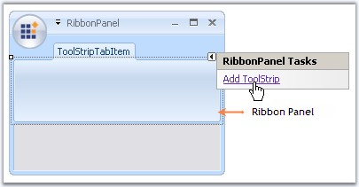

# ToolStripTabItem

RibbonControlAdv lets you to create ToolStripTabItems easily using the smart tag. It also adds a RibbonPanel to which ToolStripItems can be added.

_Figure 1184: Adding ToolStripTabItem Through Smart Tag in Designer_

A new TabItem can be added to the RibbonControlAdv programmatically using the AddMainItem method. Create a ToolStripTabItem and then add it to the RibbonControlAdv using the below method.



// Adding a new Tab Item
//Declare and initialize a ToolStripTabItem
private Syncfusion.Windows.Forms.Tools.ToolStripTabItem toolStripTabItem1;
this.toolStripTabItem1 = new Syncfusion.Windows.Forms.Tools.ToolStripTabItem();

//Add the tab item to the RibbonControlAdv
this.ribbonControlAdv1.Header.AddMainItem(this.toolStripTabItem1);





'Adding a new Tab Item
'Declare and initialize a ToolStripTabItem
Private toolStripTabItem1 As Syncfusion.Windows.Forms.Tools.ToolStripTabItem
Me.toolStripTabItem1 = New Syncfusion.Windows.Forms.Tools.ToolStripTabItem 

'Add the tab item to the RibbonControlAdv
Me.ribbonControlAdv1.Header.AddMainItem(Me.toolStripTabItem1)

The following sections discusses various appearance and behavior settings for the ToolStripTabItem. 
•	Foreground Settings
•	Image Settings
•	Ribbon Panel
•	Keyboard Shortcut
•	Appearance and Behavior Settings



## Foreground Settings 
### Text Settings
The following properties lets you to edit and control the behavior of the text in the ToolStripTabItem.

_Table 694: Property Table_
<table><tr><th>
Property</th><th>Description</th></tr>

<tr><td>Text</td>	<td>Text for the ToolStripTabItem.</td></tr>
<tr><td>TextAlign</td><td>	Alignment of the text in a ToolStripTabItem. The different content alignments are,

BottomCenter - Vertically aligned at bottom, horizontally aligned at center.
BottomLeft - Vertically aligned at bottom, horizontally aligned at left.
BottomRight - Vertically aligned at bottom, horizontally aligned at Right.
MiddleCenter - Vertically aligned at Middle, horizontally aligned at Center. (Default)
MiddleLeft - Vertically aligned at Middle, horizontally aligned at Left.
MiddleRight - Vertically aligned at Middle, horizontally aligned at Right.
TopCenter - Vertically aligned at Top, horizontally aligned at Center.
TopLeft - Vertically aligned at Top, horizontally aligned at Left.
TopRight - Vertically aligned at Top, horizontally aligned at Right.
</td>
</tr>
<tr><td>
TextDirection</td><td>	Direction of drawing the text. 

Horizontal - specifies horizontal text orientation; (Default)
Inherit - specifies that the text direction is inherited from the parent control; 
Vertical270 - specifies that the text is rotated 270 degrees; 
Vertical90 - specifies that the text is rotated 90 degrees.
</td>
<tr><td>
TextImageRelation</td><td>Relative location of the image to the text in the ToolStripTabItem. See Image Settings.

The various options available are,

Overlay, 
ImageAboveText, (Default)
TextAboveImage, 
ImageBeforeText and 
TextBeforeImage.

</td></tr>
<tr>
<td>
DisplayStyle</td>
<td>
Specifies whether image and text are rendered. The options are,

Text,
Image and 
ImageAndText.(Default)

</td></tr></table>



this.toolStripTabItem1.Text = "Features";
this.toolStripTabItem1.TextAlign = System.Drawing.ContentAlignment.MiddleLeft;
this.toolStripTabItem1.TextDirection = System.Windows.Forms.ToolStripTextDirection.Horizontal;
this.toolStripTabItem1.TextImageRelation = System.Windows.Forms.TextImageRelation.ImageBeforeText;
this.toolStripTabItem1.DisplayStyle = ToolStripItemDisplayStyle.ImageAndText;




Me.toolStripTabItem1.Text = "Features"
Me.toolStripTabItem1.TextAlign = System.Drawing.ContentAlignment.MiddleLeft
Me.toolStripTabItem1.TextDirection = System.Windows.Forms.ToolStripTextDirection.Horizontal
Me.toolStripTabItem1.TextImageRelation = System.Windows.Forms.TextImageRelation.ImageBeforeText
Me.toolStripTabItem1.DisplayStyle = ToolStripItemDisplayStyle.ImageAndText


The appearance of the text can be controlled using the below properties.
_Table 695: Property Table_
<table>
<tr><th>
Property</th><th>	Description</th></tr>
<tr><td>
Font</td><td>Set Font Style for the text.</td></tr>
<tr><td>ForeColor	</td><td>Sets fore color for the text.</td>
</tr></table>



this.toolStripTabItem1.Font = new System.Drawing.Font("Verdana", 8.25F, System.Drawing.FontStyle.Bold);
this.toolStripTabItem1.ForeColor = System.Drawing.Color.SteelBlue;





Me.toolStripTabItem1.Font = New System.Drawing.Font("Verdana", 8.25F, System.Drawing.FontStyle.Bold)
Me.toolStripTabItem1.ForeColor = System.Drawing.Color.SteelBlue



_Figure 1185: ToolStripTabItem with above Text and Foreground Settings_

### See Also
#### Image Settings
#### RibbonPanel
#### Appearance and Behavior Settings

## Image Settings 
The below properties controls the image settings for the ToolStripTabItem.

_Table 696: Property Table_

<table>
<tr>
<th>Property</th><th>	Description</th></tr>
<tr><td>Image</td>	<td>Sets the image for the Tab item.</td></tr>
<tr><td>ImageAlign</td><td>	Specifies alignment of the image.</td></tr>
<tr><td>ImageScaling</td><td>	Specifies whether the image on the item will size to fit on the Toolstrip.
</td></tr>
<tr><td>
ImageTransparentColor</td><td>	Sets the transparent color on the items image.</td></tr></table>



//Settings image properties
this.toolStripTabItem1.Image = ((System.Drawing.Image)(resources.GetObject("toolStripTabItem1.Image")));
this.toolStripTabItem1.ImageAlign = System.Drawing.ContentAlignment.MiddleRight;
this.toolStripTabItem1.ImageScaling = System.Windows.Forms.ToolStripItemImageScaling.None;
this.toolStripTabItem1.ImageTransparentColor = System.Drawing.Color.FloralWhite;





'Settings image properties
Me.toolStripTabItem1.Image = ((System.Drawing.Image)(resources.GetObject("toolStripTabItem1.Image")))
Me.toolStripTabItem1.ImageAlign = System.Drawing.ContentAlignment.MiddleRight
Me.toolStripTabItem1.ImageScaling = System.Windows.Forms.ToolStripItemImageScaling.None
Me.toolStripTabItem1.ImageTransparentColor = System.Drawing.Color.FloralWhite



_Figure 1186: ImageScaling = "None"; ImageAlign = "MiddleRight"_

_Figure 1187: ImageScaling = "SizeToFit"; ImageAlign = "MiddleRight"_

### See Also
#### Foreground Settings
#### Ribbon Panel
#### Keyboard Shortcut
#### Appearance and Behavior Settings

## Appearance and Behavior Settings 
### Appearance Settings
The Padding property specifies the internal padding within the ToolStripTabItem.



this.toolStripTabItem2.Padding = new System.Windows.Forms.Padding(4);





Me.toolStripTabItem2.Padding = New System.Windows.Forms.Padding(4)



_Figure 1188: ToolStripTabItem Padding = "4"_

### Behavior Settings

The below properties illustrates the behavior settings.

_Table 697: Property Table_

<table>
<tr><th>
Property</th><th>	Description</th></tr>
<tr><td>
Enabled	</td><td>Enables the Tab item.</td></tr>
<tr><td>
AutoSize	</td><td>If set to true, ToolStripTabItem will automatically size itself based on the image and text. Default values is true.
</td></tr>
<tr><td>DoubleClickEnabled	</td><td>Specifies whether the ToolStripTabItem can be activated by double clicking the tab item. This raises the DoubleClick event.
</td></tr>
<tr><td>
Visible</td><td>	Sets the visibility of the tab item.</td></tr>
</table>

### ToolTips

AutoToolTip and ToolTipText properties are used for this purpose.

_Table 698: Property Table_

<table><tr><th>
Property</th><th>		Description</th></tr>
<tr><td>AutoToolTip	</td><td>When set to false will display the text set in ToolTipText. When set to true will display the tab item text.
</td></tr>
<tr><td>ToolTipText</td><td>	Sets the Tooltip text.</td></tr></table>

## Ribbon Panel

A ribbon panel is automatically added when you add a ToolStripTabItem. ToolStripEx can be added to the Ribbon panel using its smart tag.

_Figure 1189: Adding ToolStripEx to the RibbonPanel_

### See Also 
#### How to prevent the RibbonPanel of the RibbonControlAdv from collapsing?

### OfficeColorScheme

The ribbon panel supports all the three office color schemes. Blue, black and silver schemes.



this.toolStripTabItem2.Panel.OfficeColorScheme = Syncfusion.Windows.Forms.Tools.ToolStripEx.ColorScheme.Blue;





Me.toolStripTabItem2.Panel.OfficeColorScheme = Syncfusion.Windows.Forms.Tools.ToolStripEx.ColorScheme.Blue



_Figure 1190: OfficeColorSchemes for RibbonPanel_
