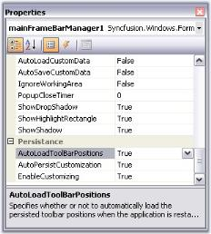
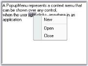

## Orientation	

#### Toolbar State Persistence

Toolbar state can be saved in two ways.

* Automatic serialization of Tool bar position.
* It can be read/written to different media such as the default Isolated Storage, XML file, XML stream, Binary file, Binary stream and the Windows Registry.

If this is a MainFrameBarManager, the toolbar's positions will be retained during run-time. If it is a ChildFrameBarManager, then the toolbar's positions will be docked to the top border of the main frame.

> 
{:.image }
 _Note: This is true, only when your application is run for the first time and subsequent invocations will use the user's latest settings, if the persisting toolbar position is turned on._

The position of the toolbar and the customization applied by the user are stored in the user system's Isolated Storage.

You can turn on/off default persistence through the BarManager's AutoLoadToolbarPositions and EnableCustomizing properties. 

{:.image }

We can customize the toolbar at run time and it can be stored by setting AutoLoadToolBarPositions property to true. The following screen shot displays the Toolbar customization at run time where BarItem "Open" is removed.

{:.image }

Close the application and again run the same application. The removed MenuBarItem "Open" is sustained. The following screen shot illustrates this.

{:.image }

##### Save / Load the Bar Information

ToolBar Persistence can be done by using the below given properties and methods.

_Table_ _510__: Property Table_

<table>
<tr>
<td>
MainFrameBarManager Property </td><td>
Description</td></tr>
<tr>
<td>
AutoLoadToolBarPositions</td><td>
Indicates whether to automatically load the persisted toolbar positions when the application is restarted.</td></tr>
<tr>
<td>
AutoPersistCustomization</td><td>
Indicates whether to persist and load user-customized info from/to isolated storage.</td></tr>
<tr>
<td>
AutoSaveCustomData</td><td>
Gets or Sets a value indicating whether to automatically save user's customization data (new Bars/BarItems added/removed at runtime), when customization target form is closed.</td></tr>
<tr>
<td>
AutoLoadCustomData</td><td>
Gets or Sets a value indicating whether to automatically load user's customization data (new Bars/BarItems added/removed at runtime), when customization target form is activating. </td></tr>
</table>
_Table_ _511__: Methods Table_

<table>
<tr>
<td>
MainFrameBarManager Methods</td><td>
Description</td></tr>
<tr>
<td>
SaveBarState</td><td>
Saves the current toolbars/menus state information to the specified persistence medium.</td></tr>
<tr>
<td>
LoadBarState</td><td>
Reads the previously serialized toolbar/menus states.</td></tr>
<tr>
<td>
SaveCustomData</td><td>
Saves the user customized information such as save/load custom baritems, which were created and added during application runtime.</td></tr>
<tr>
<td>
LoadCustomData</td><td>
Loads the user customized information that was saved previously.</td></tr>
</table>

The Bar State can be saved/loaded using AppStateSerializer class and it can be used across multiple applications.

The default serialization option is Isolated storage and the System.IO.IsolatedStorage routines normally store application specific encrypted entries under the 'C:\Documents and Settings\[USER name]\Local Settings\Application Data\IsolatedStorage\’ folder. All of the Essential Tools framework components use the 'Syncfusion.Runtime.Serialization. AppStateSerializer' class in the Shared library for Read/Write. The AppStateSerializer is fully documented and can be initialized for different persistence mediums such as XML / Binary files, XML / Binary streams, and the Win32 Registry using its API.

The Bar States can be serialized in the following formats.

* Binary Format
* MemoryStream
* XML format
* Isolated Storage and
* WindowsRegistry

Persisting Bar state in Binary Format

To serialize in Binary Format, use the following code.

[C#]

using Syncfusion.Runtime.Serialization;

//Save Bar State in Binary format

//You can also use BinaryFmtStream instead of Binaryfile

AppStateSerializer app=new AppStateSerializer (Syncfusion.Runtime.Serialization.SerializeMode.BinaryFile,"Barstate");

this.mainFrameBarManager1.SaveBarState(app);

app.PersistNow ();

//Load Bar State in Binary format

//You can also use BinaryFmtStream instead of Binaryfile

AppStateSerializer app=new AppStateSerializer (Syncfusion.Runtime.Serialization.SerializeMode.BinaryFile,"Barstate");

this.mainFrameBarManager1.LoadBarState(app);

[VB.NET]

Imports Syncfusion.Runtime.Serialization

'Save Bar State in Binary format

'You can also use BinaryFmtStream instead of Binaryfile

Private app As AppStateSerializer = New AppStateSerializer(Syncfusion.Runtime.Serialization.SerializeMode.BinaryFile, "Barstate")

Me.mainFrameBarManager1.SaveBarState(app)

app.PersistNow ()

'Load Bar State in Binary format

'You can also use BinaryFmtStream instead of Binaryfile

Private app As AppStateSerializer = New AppStateSerializer(Syncfusion.Runtime.Serialization.SerializeMode.BinaryFile, "Barstate")

Me.mainFrameBarManager1.LoadBarState(app)

Persisting Bar State in Memory Stream

To persist the information in a database, we need to serialize the state into a memory stream. After which the stream is written into the database. The field to where the bar state is saved is binary.

Storing State

[C#]

// Saving Bar state to memory stream  

MemoryStream ms = new MemoryStream();

AppStateSerializer aser = new AppStateSerializer(SerializeMode.BinaryFmtStream, ms);

this.mainFrameBarManager1.SaveBarState(aser);

aser.PersistNow();

[VB.NET]

' Saving Bar state to memory stream  

Dim ms As MemoryStream = New MemoryStream()

Dim aser As AppStateSerializer = New AppStateSerializer(SerializeMode.BinaryFmtStream, ms)

Me.mainFrameBarManager1.SaveBarState(aser) 

aser.PersistNow() 

Persisting Bar state in XML Format

By default, the bar state will be stored into the default persistence medium, 'IsolatedStorage'. To store the dock state to some other medium like XML, it could be done as follows:

[C#]

using Syncfusion.Runtime.Serialization;

//Save Bar State in XML format

//You can also use XMLFmtStream instead of XMLfile

AppStateSerializer app=new AppStateSerializer (Syncfusion.Runtime.Serialization.SerializeMode.XMLFile,"Barstate");

this.mainFrameBarManager1.SaveBarState(app);

app.PersistNow ();

//Load Bar State in XML format

//You can also use XMLFmtStream instead of XMLfile

AppStateSerializer app=new AppStateSerializer (Syncfusion.Runtime.Serialization.SerializeMode.XMLFile,"Barstate");

this.mainFrameBarManager1.LoadBarState(app);

[VB.NET]

Imports Syncfusion.Runtime.Serialization

'Save Bar State in XML format

'You can also use XMLFmtStream instead of XMLfile

Private app As AppStateSerializer = New AppStateSerializer(Syncfusion.Runtime.Serialization.SerializeMode.XMLFile, "Barstate")

Me.mainFrameBarManager1.SaveBarState(app)

app.PersistNow ()

'Load Bar State in XML format

'You can also use XMLFmtStream instead of XMLfile

Private app As AppStateSerializer = New AppStateSerializer(Syncfusion.Runtime.Serialization.SerializeMode.XMLFile, "Barstate")

Me.mainFrameBarManager1.LoadBarState(app)

Persisting Bar state in Isolated Storage

To serialize in Isolated Storage medium, use the below code.

[C#]

using Syncfusion.Runtime.Serialization;

//Save Bar State in Isolated storage

AppStateSerializer app=new AppStateSerializer (Syncfusion.Runtime.Serialization.SerializeMode.IsolatedStorage,"Barstate");

this.mainFrameBarManager1.SaveBarState(app);

app.PersistNow ();

//Load Bar State in Isolated storage

AppStateSerializer app=new AppStateSerializer (Syncfusion.Runtime.Serialization.SerializeMode.IsolatedStorage,"Barstate");

this.mainFrameBarManager1.LoadBarState(app);

[VB.NET]

Imports Syncfusion.Runtime.Serialization

'Save Bar State in Isolated storage

Private app As AppStateSerializer = New AppStateSerializer(Syncfusion.Runtime.Serialization.SerializeMode.IsolatedStorage, "Barstate")

Me.mainFrameBarManager1.SaveBarState(app)

app.PersistNow ()

'Load Bar State in Isolated storage

Private app As AppStateSerializer = New AppStateSerializer(Syncfusion.Runtime.Serialization.SerializeMode.IsolatedStorage, "Barstate")

Me.mainFrameBarManager1.LoadBarState(app)

Persisting Bar state in WindowsRegistry

To serialize in the WindowsRegistry, using the below code snippets.

[C#]

using Syncfusion.Runtime.Serialization;

//Save Bar State in Windows Registry

AppStateSerializer app=new AppStateSerializer (Syncfusion.Runtime.Serialization.SerializeMode.WindowsRegistry,"Barstate");

this.mainFrameBarManager1.SaveBarState(app);

app.PersistNow ();

//Load Bar State in Windows Registry

AppStateSerializer app=new AppStateSerializer (Syncfusion.Runtime.Serialization.SerializeMode.WindowsRegistry,"Barstate");

this.mainFrameBarManager1.LoadBarState(app);

[VB.NET]

Imports Syncfusion.Runtime.Serialization

'Save Bar State in Windows Registry

Private app As AppStateSerializer = New AppStateSerializer(Syncfusion.Runtime.Serialization.SerializeMode.WindowsRegistry, "Barstate")

Me.mainFrameBarManager1.SaveBarState(app)

app.PersistNow ()

'Load Bar State in Windows Registry

Private app As AppStateSerializer = New AppStateSerializer(Syncfusion.Runtime.Serialization.SerializeMode.WindowsRegistry, "Barstate")

Me.mainFrameBarManager1.LoadBarState(app)

#### Visual Inheritance Support

XP Menus supports Visual Inheritance during design-time, which means you can set up XP Menus in a form and also continue to set up in the form derived from it. The corresponding components like the BarManager and toolbar should however be protected or public for this to be supported. In the derived form's designer, you can add new bar items to the bar manager and then add these items to the toolbar, submenu etc.

These are things you can do in a derived form in Visual Inheritance mode.

* Add new BarItems created in the derived form to any toolbar, ParentBarItem, anywhere.
* Reposition the existing BarItems within a toolbar or ParentBarItem.
* Remove an existing group setting and add a new group setting.

These are the limitations of Visual Inheritance mode.

* Cannot add menu items created in a base form to any bars/submenus in a derived form.
* When the items in a base form's toolbar/submenu are repositioned, any previous repositioning that occurred in the derived form will be lost and the results may be unpredictable.
#### UI Command Update Patterns

The UI Command Update mechanism can be defined as the way in which, an application updates the state of the UI elements (BarItems in this case), as the state of the application changes.

Different frameworks support different ways of UI state update mechanism. Each has its own merits and demerits and each one is appropriate in some scenarios and not so in the other.

The XP Menus framework supports multiple patterns of UI Command Update mechanism, which are discussed below.

* Supply-Push Approach

In this approach, the state of the BarItem is changed as and when the corresponding application state changes. This is what the XP Menus framework expects you to do by default; it will not commence the UpdateUI event under any circumstances. 

* Demand-Pull Approach

This approach can be difficult, as it is sometimes cumbersome to keep track of state changes in the application and update the UI state appropriately. 

So, the framework provides two other alternative ways to update the BarItem states.

Fast Updates 

If updating the BarItem states is a trivial operation, use this approach, which is also how MFC does it. In this approach, the UpdateUI event will be called when the ParentBarItem hosting this BarItem is dropped-down, when the BarItem is hosted in a toolbar and when the application goes into an idle state or when a shortcut corresponding to this item is about to be processed. You can turn on this behavior throughout the menu structure by setting the BarManager.UpdateUIMFCStyle to True. For XPToolbars and ParentBarItems that are outside the scope of a BarManager, set the UpdateUIMFCStyle property in those instances explicitly. 

[C#]

this.mainFrameBarManager1.UpdateUIMFCStyle = true;

[VB.NET]

Me.mainFrameBarManager1.UpdateUIMFCStyle  = True

Slow Updates 

If updating the BarItem states is not a trivial operation, then use this approach. In this approach, turn on the UpdateUIOnAppIdle property of the BarItem whose state has changed one or more times and the framework will then initiate its UpdateUI event the next time the application goes into an idle state.

[C#]

this.barItem1.UpdateUIOnAppIdle = true;

[VB.NET]

Me.barItem1.UpdateUIOnAppIdle = True

See Also

UpdateUI Event

#### Frequently Asked Questions

This section illustrates the solutions for various task-based queries about the control.

##### Popup Menu

This section guides you with more tasks that can be performed with popup menu.

###### How to create a context menu and associate it with a control

Refer to PopUp Menu.

###### How to programmatically begin a group or remove an existing group in a popup menu

You can easily group the menu items or remove the existing group, within a ParentBarItem using the below two methods respectively.

The below code snippet draws a separator just before bar item 2.

[C#]

//Adds a separator before the specified BarItem, if any

this.popupMenu1.ParentBarItem.BeginGroupAt(this.barItem2);

[VB.NET]

'Adds a separator before the specified BarItem, if any 

Me.popupMenu1.ParentBarItem.BeginGroupAt(Me.barItem1)

{:.image }

[C#]

//Removes the separator before the specified BarItem, if any

this.popupMenu1.ParentBarItem.RemoveGroupAt(this.barItem2);

[VB.NET]

'Removes the separator before the specified BarItem, if any

Me.popupMenu1.ParentBarItem.RemoveGroupAt(Me.barItem2)

See Also

Grouping Items in a Popup Menu

###### How to programmatically show a Popup Menu

Listen to the control's MouseUp event and call the PopupMenu's Show method in the handler as follows. The popup menu will be displayed with a single click, at run time.

[C#]

// Associating a Popup Menu with a RichTextBox Control.

private void richTextBox1_MouseUp(object sender, System.Windows.Forms.MouseEventArgs e)

{

    this.popupMenu2.Show(this.richTextBox1, new Point(e.X, e.Y));

}

[VB.NET]

' Associating a Popup Menu with a RichTextBox Control.

Private Sub richTextBox1_MouseUp(ByVal sender As Object, ByVal e As System.Windows.Forms.MouseEventArgs)

    Me.popupMenu2.Show(Me.richTextBox1, New Point(e.X, e.Y))

End Sub

See Also

Popup Menu

###### How to cancel a context menu

We can cancel the context menu from being shown by handling the ParentBarItem.BeforePopup menu.

[C#]

this.parentBarItem1.BeforePopup += new CancelEventHandler(PopupMenu_BeforePopup);

private void PopupMenu_BeforePopup(object sender, CancelEventArgs arg)

{

// Check for a condition and cancel if necessary

arg.Cancel = true;

}

[VB.NET]

Private Sub PopupMenu_BeforePopup(ByVal sender As Object, ByVal arg As CancelEventArgs)

    ' Check for a condition and cancel if necessary 

    arg.Cancel = True

End Sub

See Also

Events of ParentBarItem

###### How to determine on which control a context menu was shown

We can identify the control on which the context menu was shown by using the below code.

[C#]

// The PopupMenu's SourceControl specifies its target control

Control srcControl = this.popupMenu1.SourceControl;

[VB.NET]

' The PopupMenu's SourceControl specifies its target control 

Dim srcControl As Control = Me.popupMenu1.SourceControl

##### ComboBoxBarItems

This section deals with the below topics.

###### How to handle KeyDown event in ComboBoxBarItem

This can be done as follows.

[C#]

private void comboBoxBarItem1_TextBoxBound(object sender, Syncfusion.Windows.Forms.Tools.XPMenus.TextBoxBoundEventArgs args)

{

    args.TextBox.KeyDown += new KeyEventHandler(TextBox_KeyDown);

}

private void TextBox_KeyDown(object sender, KeyEventArgs e)

{

    Console.WriteLine("KeyDown Event");

}

[VB.NET]

Private Sub comboBoxBarItem1_TextBoxBound(ByVal sender As Object, ByVal args As Syncfusion.Windows.Forms.Tools.XPMenus.TextBoxBoundEventArgs)

    AddHandler args.TextBox.KeyDown, AddressOf TextBox_KeyDown

End Sub

Private Sub TextBox_KeyDown(ByVal sender As Object, ByVal e As KeyEventArgs)

    Console.WriteLine("KeyDown Event")

End Sub

See Also

ComboBoxBarItem

###### How to prevent the ComboBoxBarItem's dropdown from being closed after clicking a ChoiseList Item

By setting the CloseOnClick property to false, we can prevent the dropdown from closing, when an item is clicked in the choice list.

[C#]

comboBoxBarItem1.CloseOnClick = false;

[VB.NET]

comboBoxBarItem1.CloseOnClick = False

###### How to prevent editing the textbox value of ComboBoxBarItem

To prevent the user from editing the textbox value of ComboBoxBarItem, set Editable property to false.

[C#]

comboBoxBarItem1.Editable = false;

[VB.NET]

comboBoxBarItem1.Editable = False

##### ControlBar

This section comprises the below topic:

###### How to dock the ControlBars to any edge of the host form

It can be done using the DockState property of the control bar. The options are Right, Left, Top and Bottom.

[C#]

// Dock to the right edge of the host form

this.controlBar1.DockState = CommandBarDockState.Right;

[VB.NET]

// Dock to the right edge of the host form

Me.controlBar1.DockState = CommandBarDockState.Right

See Also

Detached ControlBars

###### How to change the bar item text color, when mouse hovers over it

Bar item text color can be changed at run time, when the mouse hovers over it, with the help of MenuColors class.

[C#]

//Set the baItem's text Color

Syncfusion.Windows.Forms.MenuColors.SelTextColor = Color.Blue;

[VB.NET]

'Set the baItem's text Color

Syncfusion.Windows.Forms.MenuColors.SelTextColor = Color.Blue

See Also

BarItem Text

###### How to dock the bar items in a bar

We can dock the baritems in a bar using XPMenus CommandBarExt class as follows.

[C#]

CommandBarExt cbe = this.mainFrameBarManager1.GetBarControl(this.bar1) as CommandBarExt;

//Get the bar control that hold the baritems.

cbe.BarControl.Dock = System.Windows.Forms.DockStyle.Right;

[VB.NET]

Dim cbe As CommandBarExt = TryCast(Me.mainFrameBarManager1.GetBarControl(Me.bar1), CommandBarExt)

'Get the bar control that hold the baritems. 

cbe.BarControl.Dock = System.Windows.Forms.DockStyle.Right

###### How To Reset Bar Customization

This can be done by calling ResetContainer method.

[C#]

//Reset the Bar customization

this.mainFrameBarManager1.ResetContainer(this.bar1)

[VB.NET]

'Reset the Bar customization

Me.mainFrameBarManager1.ResetContainer(Me.bar1)

###### How to Reset a Bar To The Designer State

At run time, user can change the Bar settings like arranging the bar items within the bar etc., The bar can also be reset to the designer state by a simple method call.

[C#]

//LoadDesignerBarState Method Of MainFrameBarManager

mainFrameBarManager1.LoadDesignerBarState();

[VB.NET]

'LoadDesignerBarState Method Of MainFrameBarManager

mainFrameBarManager1.LoadDesignerBarState()

###### How to set a bar's visibility programmatically

A bar's visibility can be controlled using the below code.

[C#]

mainFrameBarManager1.GetBarControl(bar1).Visible = false;

[VB.NET]

mainFrameBarManager1.GetBarControl(bar1).Visible = False

###### How to set RightToLeft property for XPMenus

RightToLeft can be enabled for XPMenus using the below code.

[C#]

this.RightToLeft = RightToLeft.Yes;

[VB.NET]

Me.RightToLeft = RightToLeft.Yes

###### How to show / hide close and dropdown buttons of a floating bar in XPMenus

This can be done by using HideCloseButton and HideDropDownButton properties.

[C#]

//to hide close button

this.mainFrameBarManager1.GetBarControl(this.bar1).HideCloseButton = true;

//to hide dropdown button

this.mainFrameBarManager1.GetBarControl(this.bar1).HideDropDownButton = true;

[VB.NET]

'to hide close button

Me.mainFrameBarManager1.GetBarControl(Me.bar1).HideCloseButton = True

'to hide dropdown button

Me.mainFrameBarManager1.GetBarControl(Me.bar1).HideDropDownButton = True

See Also

Toolbar Properties

###### How to change the position of toolbars at runtime?

We can change the position of toolbars at runtime using RowIndex and RowOffset properties of MainFrameBarManager as follows. 

[C#]

this.mainFrameBarManager1.GetBarControl(this.bar1).RowIndex = 1;

this.mainFrameBarManager1.GetBarControl(this.bar2).RowIndex = 0;

this.mainFrameBarManager1.GetBarControl(bar2).RowOffset = 0;

this.mainFrameBarManager1.GetBarControl(bar1).RowOffset = 1;

this.mainFrameBarManager1.GetCommandBarManager().RecalcLayout();

[VB.NET]

Me.mainFrameBarManager1.GetBarControl(Me.bar1).RowIndex = 1

Me.mainFrameBarManager1.GetBarControl(Me.bar2).RowIndex = 0

Me.mainFrameBarManager1.GetBarControl(bar2).RowOffset = 0

Me.mainFrameBarManager1.GetBarControl(bar1).RowOffset = 0

Me.mainFrameBarManager1.GetCommandBarManager().RecalcLayout()

{:.image }

The position of toolbar1 is moved to second row as follows.

{:.image }

#### Event Handling

The following topics provide information about the events triggered in the menus package.

##### Events of BarManager

This section discusses the events of BarManager.

The event handler of the following events receives an argument of type EventArgs.

_Table_ _512__: Events Table_

<table>
<tr>
<td>
MainFrameBarManager Events</td><td>
Description</td></tr>
<tr>
<td>
CustomizationBegin</td><td>
It triggers when the customization dialog is about to be shown.</td></tr>
<tr>
<td>
CustomizationDone</td><td>
It triggers when the customization dialog has been closed.</td></tr>
</table>

[C#]

//Displays message when CustomizationBegin event occurs

private void Customization_Begin(object sender, System.EventArgs e)

{

Console.WriteLine("CustomizationBegin occurred");

}

//Displays message when CustomizationDone event occurs

private void Customization_Done(object sender, System.EventArgs e)

{

Console.WriteLine("CustomizationDone occurred");

}

[VB.NET]

'Displays message when CustomizationBegin event occurs

Private Sub Customization_Begin(ByVal sender As Object, ByVal e As System.EventArgs)

    Console.WriteLine("CustomizationBegin occured.")

End Sub

'Displays message when CustomizationDone event occurs

Private Sub Customization_Done(ByVal sender As Object, ByVal e As System.EventArgs)

    Console.WriteLine("CustomizationDone occured.")

End Sub

##### Events of BarItem

This section discusses the events of bar item. 

_Table_ _513__: Events Table_

<table>
<tr>
<td>
BarItem Events</td><td>
Description</td></tr>
<tr>
<td>
Click</td><td>
It is handled when the bar item is clicked by the user.</td></tr>
<tr>
<td>
DoubleClick</td><td>
It is handled when the bar item is double clicked by the user.</td></tr>
<tr>
<td>
Selected</td><td>
It is handled when the user selects a bar item during menu navigation using mouse or keyboard.</td></tr>
<tr>
<td>
UnSelected</td><td>
It is handled when the bar item has been unselected during menu navigation using mouse or keyboard.</td></tr>
</table>

[C#]

//Enable themes when a BarItem is clicked

private void barItem_Click(object sender, System.EventArgs e)

{

this.barManager1.ThemesEnabled = true;

}

//Disable themes when a BarItem is double clicked

private void barItem_Click(object sender, System.EventArgs e)

{

this.barManager1.ThemesEnabled = true;

}

//Displays the text of selected BarItem in the status bar

private void barItem_Selected(object sender, System.EventArgs e)

{

BarItem item = sender as BarItem;

this.staticBarItem1.Text = item.Text;

}

private void barItem1_Unselected(object sender, System.EventArgs e)

{

ParentBarItem barItem = sender as BarItem;

Console.WriteLine(barItem.Text + " Unselected.");

}

[VB.NET]

'Enable themes when a BarItem is clicked

Private Sub barItem_Click(ByVal sender As Object, ByVal e As System.EventArgs)

Me.barManager1.ThemesEnabled = true

End Sub

'Disable themes when a BarItem is double clicked

Private Sub barItem_Click(ByVal sender As Object, ByVal e As System.EventArgs)

Me.barManager1.ThemesEnabled = true

End Sub

'Displays the text of selected BarItem in the status bar

Private Sub barItem_Selected(ByVal sender As Object, ByVal e As System.EventArgs)

    Dim item As BarItem = CType(IIf(TypeOf sender Is BarItem, sender, Nothing), BarItem)

    Me.staticBarItem1.Text = item.Text

End Sub

Private Sub barItem1_Unselected(ByVal sender As Object, ByVal e As System.EventArgs)

    Dim barItem As ParentBarItem = CType(IIf(TypeOf sender Is BarItem, sender, Nothing), BarItem)

    Console.WriteLine(barItem.Text & " Unselected.")

End Sub

###### UpdateUI Event

UpdateUI event is handled when the mouse moves over the bar item or before it gets shown in a dropdown.

> 
{:.image }
 _Note: This event will be handled only when BarManager.UpdateUIMFCStyle property or BarItem.UpdateUIOnAppIdle is enabled. These properties decides whether to handle this event or not._

[C#]

//Sets the dropdown border color before it is pulled down

private void barItem1_UpdateUI(object sender, System.EventArgs e)

{

MenuColors.DropDownBorderColor = Color.Red;

}

[VB.NET]

'Sets the dropdown border color before it is pulled down

Private Sub barItem1_UpdateUI(ByVal sender As Object, ByVal e As System.EventArgs)

MenuColors.DropDownBorderColor = Color.Red

End Sub

{:.image }

See Also

UpdateUIMFCStyle and UpdateUIOnAppIdle properties in UI Command Update Patterns topic.

##### Events of ParentBarItem

ParentBarItem includes events of BarItem and also contains events discussed in this section. 

_Table_ _514__: Events Table_

<table>
<tr>
<td>
BarItem Events</td><td>
Description</td></tr>
<tr>
<td>
BeforePopup</td><td>
This event is handled before the sub menu gets shown.</td></tr>
<tr>
<td>
Popup</td><td>
It is handled before the sub menu item's list of menu items is displayed.</td></tr>
<tr>
<td>
PopupClosed</td><td>
It is handled just after the menu item has closed.</td></tr>
<tr>
<td>
PopupClosing</td><td>
It is handled just before the dropdown gets closed. The event handler receives an argument of type CancelEventArgs containing data related to this event. The event property associated with the PopupClosing Event parameter is as follows.Cancel - Gets/Sets a value indicating whether the event should be canceled.</td></tr>
<tr>
<td>
Selected</td><td>
It is handled when the user selects a BarItem during menu navigation using mouse or keyboard.</td></tr>
</table>

[C#]

//Popup event handled before the popup is displayed

private void parentBarItem1_Popup(object sender, System.EventArgs e)

{

if(sender is ParentBarItem)

{

ParentBarItem barItem = sender as ParentBarItem;

Console.WriteLine(barItem.Text + " Popup.");

}

else

Console.WriteLine("Unknown Item Popup.");

}

//Popup event handled after the popup is closed.

private void parentBarItem1_PopupClosed(object sender, System.EventArgs e)

{

if(sender is ParentBarItem)

{

ParentBarItem barItem = sender as ParentBarItem;

Console.WriteLine(barItem.Text + " PopupClosed.");

}

else

{

Console.WriteLine("Unknown Item PopupClosed.");

}

}

//Displays Message when a menu item is selected

private void parentBarItem_Selected(object sender, System.EventArgs e)

{

if(sender is ParentBarItem)

{

ParentBarItem barItem = sender as ParentBarItem;

Console.WriteLine(barItem.Text + " Selected.");

}

else

Console.WriteLine("Unknown Item Selected.");

}

[VB.NET]

'Popup - event handled before the popup is displayed

Private Sub parentBarItem1_Popup(ByVal sender As Object, ByVal e As System.EventArgs)

    If TypeOf sender Is ParentBarItem Then

        Dim barItem As ParentBarItem = CType(IIf(TypeOf sender Is ParentBarItem, sender, Nothing), ParentBarItem)

        Console.WriteLine(barItem.Text & " Popup.")

    Else

        Console.WriteLine("Unknown Item Popup.")

    End If

End Sub

'Popup event handled after the popup is closed

Private Sub parentBarItem1_PopupClosed(ByVal sender As Object, ByVal e As System.EventArgs)

    If TypeOf sender Is ParentBarItem Then

        Dim barItem As ParentBarItem = CType(IIf(TypeOf sender Is ParentBarItem, sender, Nothing), ParentBarItem)

        Console.WriteLine(barItem.Text & " PopupClosed.")

    Else

        Console.WriteLine("Unknown Item PopupClosed.")

    End If

End Sub

'Displays Message when a menu item is selected

Private Sub parentBarItem_Selected(ByVal sender As Object, ByVal e As System.EventArgs)

    If TypeOf sender Is ParentBarItem Then

        Dim barItem As ParentBarItem = CType(If(TypeOf sender Is ParentBarItem, sender, Nothing), ParentBarItem)

        Console.WriteLine(barItem.Text & " Selected.")

    Else

        Console.WriteLine("Unknown Item Selected.")

    End If

End Sub

##### ComboBoxBarItem Events

ComboBoxBarItem includes Events of BarItem and also contains events discussed in this section. 

_Table_ _515__: Events Table_

<table>
<tr>
<th>
Events</th><th>
Description</th></tr>
<tr>
<td>
DownOpened</td><td>
It is handled when the drop-down of the ComboBoxBarItem is opened.</td></tr>
<tr>
<td>
DownClosed</td><td>
It is handled when the drop-down of the ComboBoxBarItem is closed.</td></tr>
<tr>
<td>
TextBoxBound</td><td>
The event triggers at the beginning when the embedded text box is bound to the ComboBoxBarItem.</td></tr>
<tr>
<td>
TextBoxValueChange</td><td>
This event is handled when the ComboBoxBarItem's value is changed.</td></tr>
</table>

[C#]

// Triggers when embedding the internal textbox control with the ComboBoxBarItem 

TextBox txtbox;

private void comboBoxBarItem1_TextBoxBound(object sender, Syncfusion.Windows.Forms.Tools.XPMenus.TextBoxBoundEventArgs args)

{

   // Retrieving the internally embedded textBox

    txtbox = (TextBox)args.TextBox;

}

// Triggers when the drop down is closed.

private void comboBoxBarItem1_DownClosed(object sender, EventArgs e)

{

    Console.WriteLine("Dropdown closed");

}

// Triggers when the drop down is opened.

private void comboBoxBarItem1_DownOpened(object sender, EventArgs e)

{

    Console.WriteLine("Dropdown opened");

}

// Triggers when the ComboBoxBarItem's value is changed

private void comboBoxBarItem1_TextBoxValueChange(object sender, Syncfusion.Windows.Forms.Tools.XPMenus.TextBoxValueChangeEventArgs args)

{

    Console.WriteLine(this.comboBoxBarItem1.Text);

}

[VB.NET]

' Triggers when embedding the internal textbox control with the ComboBoxBarItem 

Private txtbox As TextBox

Private Sub comboBoxBarItem1_TextBoxBound(ByVal sender As Object, ByVal args As Syncfusion.Windows.Forms.Tools.XPMenus.TextBoxBoundEventArgs)

    ' Retrieving the internally embedded textBox

    txtbox = CType(args.TextBox, TextBox)

End Sub

' Triggers when the drop down is closed.

Private Sub comboBoxBarItem1_DownClosed(ByVal sender As Object, ByVal e As EventArgs)

    Console.WriteLine("Dropdown closed")

End Sub

' Triggers when the drop down is opened.

Private Sub comboBoxBarItem1_DownOpened(ByVal sender As Object, ByVal e As EventArgs)

    Console.WriteLine("Dropdown opened")

End Sub

' Triggers when the ComboBoxBarItem's value is changed

Private Sub comboBoxBarItem1_TextBoxValueChange(ByVal sender As Object, ByVal args As Syncfusion.Windows.Forms.Tools.XPMenus.TextBoxValueChangeEventArgs)

    Console.WriteLine(Me.comboBoxBarItem1.Text)

End Sub

##### MDIListBarItem Events

MDIListBarItem includes Events of BarItem and also contains events discussed in this section. 

_Table_ _516__: Events Table_

<table>
<tr>
<th>
Events</th><th>
Description</th></tr>
<tr>
<td>
BeforeExpand</td><td>
Triggers before the MdiListBarItem displays.</td></tr>
<tr>
<td>
AfterExpand</td><td>
Triggers when the MdiListBarItem is displayed.</td></tr>
</table>

[C#]

// Triggers when the MdiListBarItem is displayed

private void mdiListBarItem1_AfterExpand(object sender, EventArgs e)

{

    Console.WriteLine(mdiListBarItem1.Text);

}

// Triggers before the MdiListBarItem displays

private void mdiListBarItem1_BeforeExpand(object sender, EventArgs e)

{

    Console.WriteLine(mdiListBarItem1.Text);

}

[VB.NET]

' Triggers when the MdiListBarItem is displayed

Private Sub mdiListBarItem1_AfterExpand(ByVal sender As Object, ByVal e As EventArgs)

    Console.WriteLine(mdiListBarItem1.Text)

End Sub

' Triggers before the MdiListBarItem displays

Private Sub mdiListBarItem1_BeforeExpand(ByVal sender As Object, ByVal e As EventArgs)

    Console.WriteLine(mdiListBarItem1.Text)

End Sub

##### ToolbarListBarItem Events

ToolbarListBarItem includes Events of BarItem and also contains events discussed in this section. 

_Table_ _517__: Events Table_

<table>
<tr>
<th>
Events</th><th>
Description</th></tr>
<tr>
<td>
BeforePopup</td><td>
Triggers before the Pop-up displays</td></tr>
<tr>
<td>
Popup</td><td>
Triggers when the Pop-up is displayed</td></tr>
<tr>
<td>
PopupClosed</td><td>
Triggers when the Pop-up is closed</td></tr>
<tr>
<td>
PopupClosing</td><td>
Triggers before the Pop-up closes</td></tr>
</table>

[C#]

// Triggers before the Popup displays

private void toolbarListBarItem1_BeforePopup(object sender, CancelEventArgs e)

{

    Console.WriteLine("BeforePopup event triggered");

}

// Triggers when the Popup is displayed

private void toolbarListBarItem1_Popup(object sender, EventArgs e)

{

    Console.WriteLine("Popup event is triggered");

}

// Triggers when the Popup is closed

private void toolbarListBarItem1_PopupClosed(object sender, EventArgs e)

{

    Console.WriteLine("PopupClosed event is triggered");

}

// Triggers before the Popup closes

private void toolbarListBarItem1_PopupClosing(object sender, CancelEventArgs e)

{

    Console.WriteLine("PopupClosing event is triggered");

}

[VB.NET]

' Triggers before the Popup displays

Private Sub toolbarListBarItem1_BeforePopup(ByVal sender As Object, ByVal e As CancelEventArgs)

    Console.WriteLine("BeforePopup event triggered")

End Sub

' Triggers when the Popup is displayed

Private Sub toolbarListBarItem1_Popup(ByVal sender As Object, ByVal e As EventArgs)

    Console.WriteLine("Popup event is triggered")

End Sub

' Triggers when the Popup is closed

Private Sub toolbarListBarItem1_PopupClosed(ByVal sender As Object, ByVal e As EventArgs)

    Console.WriteLine("PopupClosed event is triggered")

End Sub

' Triggers before the Popup closes

Private Sub toolbarListBarItem1_PopupClosing(ByVal sender As Object, ByVal e As CancelEventArgs)

    Console.WriteLine("PopupClosing event is triggered")

End Sub

##### ListBarItem Events

ListBarItem includes Events of BarItem and also contains events discussed in this section. 

_Table_ _518__: Events Table_

<table>
<tr>
<th>
Events</th><th>
Description</th></tr>
<tr>
<td>
BeforeExpand</td><td>
Triggers before the ListBarItem displays.</td></tr>
<tr>
<td>
AfterExpand</td><td>
Triggers when the ListBarItem is displayed.</td></tr>
</table>

[C#]

// Triggers when the ListBarItem is displayed

private void listBarItem1_AfterExpand(object sender, EventArgs e)

{

    Console.WriteLine(listBarItem1.Text);

}

// Triggers before the ListBarItem displays

private void listBarItem1_BeforeExpand(object sender, EventArgs e)

{

    Console.WriteLine(listBarItem1.Text);

}

[VB.NET]

' Triggers when the ListBarItem is displayed

Private Sub listBarItem1_AfterExpand(ByVal sender As Object, ByVal e As EventArgs)

    Console.WriteLine(listBarItem1.Text)

End Sub

' Triggers before the ListBarItem displays

Private Sub listBarItem1_BeforeExpand(ByVal sender As Object, ByVal e As EventArgs)

    Console.WriteLine(listBarItem1.Text)

End Sub

##### TextBarItem Events

 TextBarItem includes Events of BarItem and also contains events discussed in this section. 

_Table_ _519__: Events Table_

<table>
<tr>
<th>
Events</th><th>
Description</th></tr>
<tr>
<td>
TextBoxItemBound</td><td>
Triggers when embedding the internal text box control with the BarItem</td></tr>
</table>

[C#]

// Triggers when embedding the internal textbox control with the BarItem

TextBox tbox;

private void textBoxBarItem1_TextBoxItemBound(object sender, Syncfusion.Windows.Forms.Tools.XPMenus.TextBoxItemBoundEventArgs args)

{

    // Retrieving the internally embedded textBox

    tbox = (TextBox)args.TextBox;

}

[VB.NET]

' Triggers when embedding the internal textbox control with the BarItem

Private tbox As TextBox

Private Sub textBoxBarItem1_TextBoxItemBound(ByVal sender As Object, ByVal args As Syncfusion.Windows.Forms.Tools.XPMenus.TextBoxItemBoundEventArgs)

    ' Retrieving the internally embedded textBox

    tbox = CType(args.TextBox, TextBox)

End Sub

