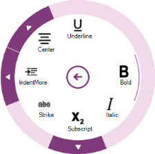
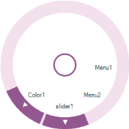

## Radial Menu

The Radial Menu comprises a hierarchical menu in a circular layout. It is used as a context menu and configured with familiar items for quick access.

{:.image }

Key Features

* Configurable Menu Items
* Radial Menu Slider
* Radial Color Palette
* Radial Font List Box
#### Getting Started

This section briefly describes how to design a Radial Menu control in a Windows Forms application.

* Adding a Radial Menu Control
* Configuring the Radial Menu Control
##### Adding a Radial Menu Control

1. Create a new Windows Forms Application Project in VS IDE through New ProjectWizard.
2. Drop a Radial Menu Control in the Form.

{:.image }

##### 1.1.2 Configuring the Radial Menu Control

The most commonly used settings of the Radial Menu Control are configured either through Designer using the Smart tag or through the Properties window or through code.

The following screenshot displays the Radial Menu Control customization through smart tag.

{:.image }

To add Radial Menu control to a Windows Forms Application through code, you can include the following Windows Forms Tools namespace:

<table>
<tr>
<td>
[C#]using Syncfusion.Windows.Forms.Tools; </td></tr>
<tr>
<td>
[VB]Imports Syncfusion.Windows.Forms.Tools</td></tr>
</table>

Create an instance of the Radial Menu control and add it to the form as given in the following code:

 [C#]

Syncfusion.Windows.Forms.Tools.RadialMenu radialMenu1;

this.radialMenu1= new Syncfusion.Windows.Forms.Tools.RadialMenu();

this.Controls.Add(radialMenu1);

[VB]

Dim radialMenu1 As Syncfusion.Windows.Forms.Tools.RadialMenu

radialMenu1 = New Syncfusion.Windows.Forms.Tools.RadialMenu()

Me.Controls.Add(radialMenu1)

#### Concepts and features

* Menu Elements
* Radial Menu Items

- Check Mode

- Grouping

* Radial Color Palette
* Radial Font List Box
* Radial Menu Slider
* Icon
* Styling and Customization
* Drill Region

- Default state

- Mouse Hover State

* Outer Rim

- Background

* Thickness
* Arc Gap
* Display Style
* Element Binding
* Menu Items

- Slice Count

- Menu View Visibility

- State Persistence

- Custom Images

- Index Based Ordering

* Populating Color Palette
* Populating Font List Box
* Populating Radial Menu Slider
##### Menu Elements 

###### Radial Menu Items

Radial Menu items are populated with the business object collection. Each menu item can be checked.

Check Mode

The CheckMode of a Radial Menu Item is defined with the following options: 

* None - When the CheckMode is set to None, item can not be checked. 
* CheckBox - When the CheckMode is set to CheckBox, you can check more than one item in the same level. 
* RadioButton - When the CheckMode is set to RadioButton, you can check only one item in the same level. 
Grouping 

Using Grouping functionality, you can group multiple items in the same level. This property is used when the CheckMode property is set to Option. 

[C#]

this.radialMenuItem1.CheckMode = CheckMode.Check;

this.radialMenuItem2.CheckMode = CheckMode.Check;

this.radialMenuItem5.GroupName = "group1";

this.radialMenuItem5.CheckMode = CheckMode.Option;

this.radialMenuItem4.GroupName = "group1";

this.radialMenuItem4.CheckMode = CheckMode.Option;

this.radialMenuItem3.GroupName = "group1";

this.radialMenuItem3.CheckMode = CheckMode.Option;

[VB]

Me.radialMenuItem1.CheckMode = CheckMode.Check
Me.radialMenuItem2.CheckMode = CheckMode.Check

Me.radialMenuItem5.GroupName = "group1"

Me.radialMenuItem5.CheckMode = CheckMode.Option
Me.radialMenuItem4.GroupName = "group1"

Me.radialMenuItem4.CheckMode = CheckMode.Option
Me.radialMenuItem3.GroupName "group1"

Me.radialMenuItem3.CheckMode = CheckMode.Option

{:.image }

###### Radial Color Palette

Radial Color Palette is formed in Radial Menu with the Radial Color Items and it is used to update the color.

{:.image }

###### Radial Font List Box

Radial Font List Box is formed in Radial Menu with installed font family and it is used to update the font style.

{:.image }

###### Radial Menu Slider

Radial Menu Slider is formed in Radial Menu with minimum and maximum value and it is used to update the size.

{:.image }

###### Icon

The Icon property of Radial Menu is used to customize the icon displayed in the center of Radial Menu circle. Icon is not displayed if it is not loaded.

{:.image }

##### Styling and Customization

###### Drill Region

{:.image }

Default State

OuterArcColor is used to fill the drilldown region in the normal state.

<table>
<tr>
<td>
[C#]// DrillDown colorthis.radialMenu1.OuterArcColor= Color.Black; </td></tr>
<tr>
<td>
[VB]' DrillDown colorMe.RadialMenu1.OuterArcColor = Color.Black</td></tr>
</table>

{:.image }

OuterArcHighLightedColor property is used to fill the drilldown region while hovering.

<table>
<tr>
<td>
[C#]// DrillDown hover colorthis.radialMenu1.OuterArcHighLightedColor = System.Drawing.Color.FromArgb(((int)(((byte)(64)))), ((int)(((byte)(64)))), ((int)(((byte)(64)))));</td></tr>
<tr>
<td>
[VB]' DrillDown hover colorMe.radialMenu1.OuterArcHighLightedColor = System.Drawing.Color.FromArgb(((int)(((byte)(64)))), ((int)(((byte)(64)))), ((int)(((byte)(64)))))</td></tr>
</table>

{:.image }

###### Outer Rim (Static Region)

Outer edge is customized by using the RimBackground and OuterRimThickness properties.

Background

Outer Edge Background is customized using the following code example.

[C#]

// OuterRim color

this.radialMenu1.RimBackground = Color.Blue;

[VB]

' OuterRim color

 Me.radialMenu1.RimBackground = Color.Blue

{:.image }

###### Thickness

The Thickness of the outer edge is set using the following code example.

[C#]

// Rim thickness

this.radialMenu1.OuterRimThickness = 20;

[VB]

' Rim thickness

Me.RadialMenu1.OuterRimThickness = 20

{:.image }

###### Arc Gap

The gap between highlighted Arc and Drilldown region is defined using the following code example.

[C#]

//Gap between OuterRim and HoverArc

this.radialMenu1.OuterArcGap = 50;

[VB]

' Gap between OuterRim and HoverArc

Me.RadialMenu1.OuterArcGap = 50

{:.image }

###### Display Style

The Display style of Radial Menu items is customized using different options. They are

* text above the image 
* text below the image
* text or image only 

[C#]

// Display style of the text and image.

  this.radialMenu1.DisplayStyle = Syncfusion.Windows.Forms.Tools.DisplayStyle.ImageAboveText;

[VB]

'Display style of the text and image.

Me.radialMenu1.DisplayStyle = Syncfusion.Windows.Forms.Tools.DisplayStyle. ImageAboveText

{:.image }

##### Element Binding

###### Menu Items

Radial Menu Items is populated with the business object collection. This section explains how to create a Radial Menu that shows the list of Application commands.

Slice Count

Slice Count functionality is used to define the maximum number of menu items (slices) that is made visible by default in the Radial Menu.

[C#]

// Allocate space for number of items

this.radialMenu1.WedgeCount = 8; 

[VB]

‘ Allocate space for number of items

Me.radialMenu1.WedgeCount = 8

{:.image }

Menu View Visibility

Menu View is enabled by default on load using the following code example. 

<table>
<tr>
<td>
[C#]// Display Menus initially.this.radialMenu1.MenuVisibility = true;</td></tr>
<tr>
<td>
[VB]‘Display Menus initially.Me.RadialMenu1.MenuVisibility = True</td></tr>
</table>

{:.image }

The current state of the menu displayed is maintained and restored back when the menu is initialized back dynamically.

Following code example illustrates the State Persistence.

[C#]

// Retain the old state of the Radial Menu while loading.

this.radialMenu1.PersistPreviousState = true;

[VB]

‘Retain the old state of the Radial Menu while loading.

Me.radialMenu1.PersistPreviousState = True

Custom Images

A custom set of images are configured to the Menu using ImageListAdv in the Radial Menu Control.

Following code example illustrates the Custom Images.

[C#]

// Custom images configured to Radial Menu.

  this.radialMenu1.ImageList = this.imageListAdv1;

[VB]

‘Custom images configured to Radial Menu.

Me.radialMenu1.ImageList = Me.imageListAdv1

Index Based Ordering

Menu items in Radial Menu are arranged based on their respective indices. You can arrange the items in index-based order or in a sequential order by enabling this functionality.

[C#]

// Menu Items will be arranged in Index based.

this.radialMenu1.UseIndexBasedOrder= true; 

[VB]

‘Menu Items will be arranged in Index based.

Me.radialMenu1.UseIndexBasedOrder= true

{:.image }

###### Populating Color Palette

Radial Color Palette is configured with the set of colors in Radial Menu using the following code example.

[C#]

//Creates RadialColorPalette

Syncfusion.Windows.Forms.Tools.RadialColorPalette radialColorPalette1;

this.radialColorPalette1 = new Syncfusion.Windows.Forms.Tools.RadialColorPalette();

//Image index

this.radialColorPalette1.ImageIndex = 0;

this.radialColorPalette1.Text = "Color";

// Image collection configured to Radial Menu.

  this.radialMenu1.ImageList = this.imageListAdv1;

[VB]

‘ Creates Radial Color Palette

Dim radialColorPalette1 As Syncfusion.Windows.Forms.Tools.RadialColorPalette

Me.radialColorPalette1 = New Syncfusion.Windows.Forms.Tools.RadialColorPalette

‘Image index

Me.radialColorPalette1.ImageIndex = 0

Me.radialColorPalette1.Text = "Color"  

‘Image collection configured to Radial Menu.

Me.radialMenu1.ImageList = Me.imageListAdv1

{:.image }

###### Populating Font List Box

Radial Font List Box is configured in Radial Menu with installed font family using the following code example.

[C#]

// Creates RadialFontListBox

Syncfusion.Windows.Forms.Tools.RadialFontListBox radialFontListBox1;

this.radialFontListBox1 = new Syncfusion.Windows.Forms.Tools.RadialFontListBox();

//Image index

this.radialFontListBox1.ImageIndex = 3;            

this.radialFontListBox1.Text = "Font";

// Image collection configured to Radial Menu.

  this.radialMenu1.ImageList = this.imageListAdv1;

[VB]

‘ Creates Radial Font List Box

Dim radialFontListBox1 As Syncfusion.Windows.Forms.Tools.RadialFontListBox

Me.radialFontListBox1 = New Syncfusion.Windows.Forms.Tools.RadialFontListBox

‘Image index

Me.radialFontListBox1.ImageIndex = 3

Me.radialFontListBox1.Text = "Font"

‘Image collection configured to Radial Menu.

Me.radialMenu1.ImageList = Me.imageListAdv1

{:.image }

###### Populating Radial Menu Slider

Radial Menu Slider is configured in Radial Menu with minimum and maximum value. The following code example illustrates the Radial Menu Slider.

[C#]

//Creates Radial Menu Slider

Syncfusion.Windows.Forms.Tools.RadialMenuSlider radialMenuSlider1;

this.radialMenuSlider1 = new Syncfusion.Windows.Forms.Tools.RadialMenuSlider();

//Image index

this.radialMenuSlider1.ImageIndex = 5;

this.radialMenuSlider1.MaximumValue = 88;

this.radialMenuSlider1.MinimumValue = 8;

this.radialMenuSlider1.Text = "Size";

// Image collection configured to Radial Menu.

  this.radialMenu1.ImageList = this.imageListAdv1;

[VB]

‘Creates Radial Menu Slider

Dim radialMenuSlider1 As Syncfusion.Windows.Forms.Tools.RadialMenuSlider

Me.radialMenuSlider1 = New Syncfusion.Windows.Forms.Tools.RadialMenuSlider

‘Image index

Me.radialMenuSlider1.ImageIndex = 5

Me.radialMenuSlider1.MaximumValue = 88

Me.radialMenuSlider1.MinimumValue = 8

Me.radialMenuSlider1.Text = "Size"

‘Image Collection configured to Radial Menu.

Me.radialMenu1.ImageList = Me.imageListAdv1

{:.image }

#### Frequently Asked Question

##### How to display the RadialMenu at defined location

The following code examples illustrate you how to display the RadialMenu at defined location.

* ShowRadialMenu(&lt;point&gt;) method displays the RadialMenu at defined location.

this.radialMenu1.ShowRadialMenu(new Point(300, 300));

* ShowRadialMenu() method displays the RadialMenu at cursor position.

this.radialMenu1.ShowRadialMenu();

##### How to change the menu order in RadialMenu

The following code example illustrates how you can change the menu order in RadialMenu.

Index property is used to set the position of the menus in RadialMenu.

[C#]

            this.radialMenu1.UseIndexBasedOrder = true;

            this.radialMenuItem1.Index = 0;

            this.radialMenuItem2.Index = 3;

            this.radialMenuItem3.Index = 5;

[VB]

                         Me.radialMenu1.UseIndexBasedOrder = true
                         Me.radialMenuItem1.Index = 0
                         Me.radialMenuItem2.Index = 3
                         Me.radialMenuItem3.Index = 5

##### How to add the menus in RadialMenu through code

The following code example illustrates you how to add the menus to RadialMenu using code.

[C#]

            this.radialMenu1.UseIndexBasedOrder = false;

            radialMenu1.Items.Clear();

            //Creating Menu Items

            RadialMenuItem menu1 = new RadialMenuItem();

            menu1.Text = "Menu1";

            RadialMenuItem menu2 = new RadialMenuItem();

            menu2.Text = "Menu2";

            //Creating Slider

            RadialMenuSlider slider1 = new RadialMenuSlider();

            slider1.Text = "slider1";

            //Creating Color Palette

            RadialColorPalette color1 = new RadialColorPalette();

            color1.Text = "Color1";

            this.radialMenu1.Items.Add(menu1);

            this.radialMenu1.Items.Add(menu2);

            this.radialMenu1.Items.Add(slider1);

            this.radialMenu1.Items.Add(color1);

            //Show RadialMenu                          

            this.radialMenu1.ShowRadialMenu(new Point(300, 300));

[VB]

                          Me.radialMenu1.UseIndexBasedOrder = false
                          radialMenu1.Items.Clear

            //Creating Menu Items
                          Dim menu1 As RadialMenuItem = New RadialMenuItem
                          menu1.Text = "Menu1"
                          Dim menu2 As RadialMenuItem = New RadialMenuItem
                          menu2.Text = "Menu2"

            //Creating Slider
                          Dim slider1 As RadialMenuSlider = New RadialMenuSlider
                          slider1.Text = "slider1"

            //Creating Color Palette
                          Dim color1 As RadialColorPalette = New RadialColorPalette
                          color1.Text = "Color1"
                          Me.radialMenu1.Items.Add(menu1)
                          Me.radialMenu1.Items.Add(menu2)
                          Me.radialMenu1.Items.Add(slider1)
                          Me.radialMenu1.Items.Add(color1)

           //Show RadialMenu                          

                         Me.radialMenu1.ShowRadialMenu(New Point(300, 300))

The following screenshot renders the output of the above the codes.

{:.image }

##### How to set the Minimum and Maximum value for RadialSlider in RadialMenu?

The following code snippet illustrates how you can set the Minimum and Maximum value for RadialSlider in RadialMenu. 

The RadialMenuSlider range depends on the minimum and maximum values of the RadialMenuSlider.

The RadialMenuSlider value is initiated from MinimumValue, and ends with MaximumValue of the RadialMenuSlider.

The MinimumValue and MaximumValue can be set by using the following code.

C#

            this.radialMenuSlider1.MinimumValue = 8;

            this.radialMenuSlider1.MaximumValue = 88;

VB

            Me.radialMenuSlider1.MinimumValue = 8
                         Me.radialMenuSlider1.MaximumValue = 88

{:.image }

##### How to get the mouse events for the menus of the RadialMenu 

The following code examples illustrate how to get the mouse events for the menus of the RadialMenu. 

Mouse Enter

 this.radialMenuItem1.MouseEnter += new EventHandler(radialMenuItem1_MouseEnter);

void radialMenuItem1_MouseEnter(object sender, EventArgs e)

        {

            Console.WriteLine("Mouse enter event has been triggered");

        }

Mouse Move

 this.radialMenuItem1.MouseMove += new MouseEventHandler(radialMenuItem1_MouseMove);

void radialMenuItem1_MouseMove(object sender, MouseEventArgs e)

        {

            Console.WriteLine("Mouse move event has been triggered");

        }

Mouse Leave

this.radialMenuItem1.MouseLeave += new EventHandler(radialMenuItem1_MouseLeave);

void radialMenuItem1_MouseLeave(object sender, EventArgs e)

        {

            Console.WriteLine("Mouse leave event has been triggered");

        }

Mouse Down

this.radialMenuItem1.MouseDown += new MouseEventHandler(radialMenuItem1_MouseDown);

void radialMenuItem1_MouseDown(object sender, MouseEventArgs e)

        {

            Console.WriteLine("Mouse down event has been triggered ");

        }

Mouse Up

this.radialMenuItem1.MouseUp += new MouseEventHandler(radialMenuItem1_MouseUp);

  void radialMenuItem1_MouseUp(object sender, MouseEventArgs e)

        {

            Console.WriteLine("Mouse up event has been triggered");

        }

