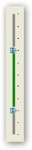
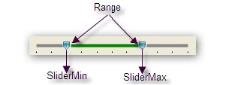

# Range Slider

RangeSlider is a dual-thumb slider control highlighting the selected range between the thumbs. It lets you input two values, typically an upper and a lower bound (for two thumbs) thus providing an enhanced feature-support to standard slider control. 

### Real World Scenarios

* RangeSlider can be used in a movie clipping to set the range. Consider the following example:
* If the duration of a movie is 60 minutes, then the Maximum property can be set to 60 and Minimum property to 1. If you need the clip from 5th min to 10th minute, the 
* SliderMin property can be set to 5 and SliderMax can be set to 10.
* It can also be used to filter the records with a price range with limited data.

### Key Features

Following are the some of the highlighting features of RangeSlider:

* It helps handle buttons support.
* Provides custom label support.
* Supports both vertical and horizontal orientation.
* Customizable thumbs and handle buttons.
* Reversed slider position support
* Support for change in color of the selected range 
* Support for  change in color of Channel and Thumb

## Getting Started

This section guides you on getting started with Range Slider. It covers information on the following topics:

### Elaborate Structure of the control 

The following image highlights the different sections of the Range Slider.

### Creating Range Slider

Range Slider can be created in two ways:

#### Through Code

The following code illustrates the creation of RangeSlider.



RangeSlider rangeSlider = new RangeSlider();

rangeSlider.Maximum = 20;

rangeSlider.Minimum = 0;

rangeSlider.SliderMax = 15;

rangeSlider.SliderMin = 5;

rangeSlider.RangeColor = Color.Brown;

rangeSlider.ChannelColor = Color.DarkGray;

rangeSlider.ChannelHeight = 5;

rangeSlider.HighlightedThumbColor = Color.DarkBlue;

rangeSlider.PushedThumbColor = Color.Crimson;

rangeSlider.ThumbColor = Color.Aqua;

rangeSlider.Location = new Point(80, 30);

this.Controls.Add(rangeSlider);



Run the code.

Output

#### Through Designer

The following steps illustrate the creation of RangeSlider.

1. Select RangeSlider from the toolbox.

   

2. Drag the RangeSlider from the toolbox to the form.

   

The RangeSlider is created.

### Interactive Features

The following are the key interactive features of the Range Slider:

* Range-Specifies the Range of the control, generally indicated by a Start and End value.
* TickFrequency-Specifies the frequency at which Ticks are to be placed.
* Minimum-Specifies the Minimum value of the Range Slider.
* Maximum-Specifies the Maximum value of the Range Slider.
* ChannelColor-Specifies the color for the channel.
* ChannelHeight-Specifies the height for the channel.
* RangeColor-Specifies the color for the range.
* RightToLeft-Allows reversal of the RangeSlider.
* SliderSize- Specifies the size of the slider.
* ThumbColor- Specifies the color of the thumb.
* ShowTicks- Specifies the visibility of the thumb.
* TickFrquency- Specifies the frequency of ticks.
* Orientation- Specifies the orientation of the RangeSlider.
* SliderMin and SliderMax- Specifies the position of right and left thumb.

## Concepts and Features

This section discusses the concepts of Range Slider in the below topics:

### Setting Channel Color

You can set the required color for the channel over which the slider moves. It contains the highlight when a range is selected. In the following example, the channel color is set to Gray.

The following code snippet illustrates the same.



rangeSlider.ChannelColor = Color.DarkGray;



Output

### Setting Channel Height

You can set the required height of the channel over which the slider moves. In the following example illustrates the change in height of the channel from 4 to 6. It is measured in pixels.

The following code snippet illustrates the same.

1. When the Channel height is set to 4 pixels.

   ~~~ cs

		rangeSlider.ChannelHeight = 4;

   ~~~
   {:.prettyprint }

   

   

2. When the Channel height is set to 6 pixels

   ~~~ cs

		rangeSlider.ChannelHeight = 6;

   ~~~
   {:.prettyprint }

### Setting Range Color

You can set the required color for a range in the slider. The selected range is highlighted with color chosen. In the following example, the range color is set to Green.

The following code snippet illustrates the same.



rangeSlider.RangeColor = Color.DarkGreen;



### Reversing RangeSlider 

The position of the thumbs on the RangeSlider can be reversed by setting the RighttoLeft property to Yes. The following example illustrates the same.

1. When the property is set to No.

   ~~~ cs

		rangeSlider.RightToLeft=RightToLeft.No;

   ~~~
   {:.prettyprint }

   

   

2. When the property is set to Yes.

   ~~~ cs

		rangeSlider.RightToLeft=RightToLeft.Yes;

   ~~~
   {:.prettyprint }

### Setting Slider Size

You can set the required size for the slider. The height and the width of the control can be set. 

The following example illustrates the same. 

1. When the slider is set to 11, 14.

   ~~~ cs

		rangeSlider.SliderSize = new Size(11,14);

   ~~~
   {:.prettyprint }

    

    

2. When the slider is set to 11,18.

   ~~~ cs

		rangeSlider.SliderSize = new Size(11,18);

   ~~~
   {:.prettyprint }

   

   

### Setting Thumb Color

You can set the required color for the both the thumbs on the Channel. 

In the following example, the thumb is set to Teal.



		rangeSlider.ThumbColor = Color.Teal;



#### Background Settings

### Displaying Ticks

Ticks are indicators placed at regular intervals on the slider for a range defined by the maximum and minimum scale. You can display ticks below the channel by setting the ShowTicks property to True. 

In the following example illustrates the same.

1. When the ShowTicks property is set to True.

   ~~~ cs

		rangeSlider.ShowTicks = True;

   ~~~
   {:.prettyprint }

   

   

2. When the ShowTicks property is set to False.

   ~~~ cs

		rangeSlider.ShowTicks = False;

   ~~~
   {:.prettyprint }

### Setting Tick Frequency

The ticks can be placed at required intervals by setting the TickFrequency property to required number. For example, if the range is set from 0-100, where minimum is set to 0 and maximum is set to 100, and the TickFrequency is set to 20, then Ticks will be placed at positions 0,20,40,..,100.

The following example illustrates the same.



rangeSlider.TickFrequency = 3;



### Setting Orientation

The layout of the range slider can be defined using the Orientation property. The orientation of the control can either be vertical or horizontal.

1. When Orientation is set to Horizontal.

   ~~~ cs

		rangeSlider.Orientation=Orientation.Horizontal;

   ~~~
   {:.prettyprint }

   

   

2. When Orientation is set to vertical.

   ~~~ cs

		rangeSlider.Orientation=Orientation.Vertical;

   ~~~
   {:.prettyprint }

### Setting SliderMin and SliderMax

This position of the right and left thumb can be set using the SliderMin and SliderMax properties.

In the following example, the position of the right and left thumbs is set to 7,2.



rangeSlider.SliderMax = 7;

rangeSlider.SliderMin = 2;



### Setting Minimum and Maximum values

These properties specify the Minimum and Maximum bounds of the RangeSlider control till which the channel extends.

In the following example the maximum bound is set to 10. 



rangeSlider.Maximum = 20;

rangeSlider.Minimum = 0;



### Events

#### Scroll

Occurs when the mouse moves any of the thumb over the channel.

EventHandler for Scroll event



rangeSlider.Scroll += new EventHandler( rangeSlider1_Scroll);

private void rangeSlider1_Scroll(object sender, EventArgs e)

{

//Code to handle the event

}

ValueChanged

Occurs when the value of SliderMin or SliderMax changes.

EventHandler for ValueChanged event





rangeSlider.ValueChanged += new EventHandler( rangeSlider1_ValueChanged);

private void rangeSlider1_ValueChanged(object sender, EventArgs e)

{

//Code to handle the event

}



## Frequently Asked Questions

### How to customize the appearance of RangeSlider?

The RangeSlider control appearance can be customized as like in Win 8 application. You can achieve this using the following code example.



   this.rangeSlider1.VisualStyle = Syncfusion.Windows.Forms.Tools.RangeSlider.RangeSliderStyle.Metro;

      this.rangeSlider1.ThumbColor = Color.Black;

      this.rangeSlider1.ChannelHeight = 10;

      this.rangeSlider1.SliderSize = new Size(12, 11);

      this.rangeSlider1.RangeColor = Color.FromArgb(16, 138, 66);

      this.rangeSlider1.ChannelColor = Color.FromArgb(206, 206, 208);



        

        Me.RangeSlider1.VisualStyle = RangeSlider.RangeSliderStyle.Metro

        Me.RangeSlider1.ThumbColor = Color.Black

        Me.RangeSlider1.ChannelHeight = 10

        Me.RangeSlider1.SliderSize = New Size(12, 11)

        Me.RangeSlider1.RangeColor = Color.FromArgb(206, 206, 208)

        Me.RangeSlider1.ChannelColor = Color.FromArgb(16, 138, 66)



_Figure_ _1372_: Customized RangeSlider

