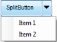

## SplitButton Control

New SplitButton control allows you to create a drop-down button-like interface that is a combination of a regular button and a drop-down list. You can use this control to create a button with options. Once the required option is selected the specified button command will be executed. 

IT Scenarios

You can use this control when you need a single control with a multiple options. For example you can use this control to create a button to set the font and list the available font family in the drop-down list. 

Feature Summary

* Button Mode – Provides Normal and Toggle mode
* Customization Support -  Customize the appearance of the SplitButton.
#### Getting Started

##### Adding SplitButton to an Application

###### Adding through Visual Studio 

The following are steps to add the SplitButton control to an Application through Visual Studio:

1. Create a new Windows Form application in Visual Studio. 
2. Drag SplitButton from the Toolbox tab to the designer.

{:.image }

3. SplitButton control is added.
4. Now customize the properties of SplitButton in the Properties Window. 
######  Through Code

Following are the steps to add the SplitButton control to an application through code:

1. Include the Tools Windows namespace as given in the following code:

[C#]

     using Syncfusion.Windows.Forms.Tools;

[VB]

    Imports Syncfusion.Windows.Forms.Tools

2. Create an instance of  SplitButton  control and add it to the form as given in the following code:

 [C#]

     Syncfusion.Windows.Forms.Tools.SplitButton splitButton;

     this.splitButton = new Syncfusion.Windows.Forms.Tools.SplitButton();

     this.Controls.Add(splitButton);

[VB]

      Dim splitButton As Syncfusion.Windows.Forms.Tools.SplitButton

      Me.splitButton = New Syncfusion.Windows.Forms.Tools.SplitButton()

Me.Controls.Add(splitButton)

##### Appearance and Structure of the Control

{:.image }

#### Properties and Events Tables for SplitButton Control

###### Properties

_Table_ _801__: Property Table_

<table>
<tr>
<td>
Property </td><td>
Description </td><td>
Type </td><td>
Data Type </td><td>
Reference links </td></tr>
<tr>
<td>
ButtonMode </td><td>
Specifies the mode of the button as normal or toggle.  </td><td>
Normal </td><td>
Enum </td><td>
Button Mode</td></tr>
<tr>
<td>
IsButtonChecked</td><td>
Specifies the state of the button. This property can be set only when the ButtonMode is set to toggle.</td><td>
Normal</td><td>
Boolean</td><td>
NA</td></tr>
<tr>
<td>
DropDownItems</td><td>
Sets the item to be added in the drop-down list.</td><td>
Normal</td><td>
ToolStripItemCollection</td><td>
Adding Items to Drop-Down</td></tr>
</table>
###### Events

_Table_ _802__: Events Table_

<table>
<tr>
<th>
Event </th><th>
Description </th><th>
Arguments </th><th>
Type </th><th>
Reference links </th></tr>
<tr>
<th>
DropDownItemChecked</th><th>
Will be triggered when drop-down litem is clicked. </th><th>
ToolStripItemClickedEventArgs</th><th>
NA </th><th>
NA </th></tr>
<tr>
<th>
Checked</th><th>
Will be triggered when the button is checked.This event can be triggered only when the button is in toggle mode. </th><th>
EventArgs</th><th>
NA </th><th>
NA </th></tr>
<tr>
<th>
UnChecked</th><th>
Will be triggered when the button is unchecked.This event can be triggered only when the button is in toggle mode. </th><th>
EventArgs</th><th>
NA </th><th>
NA </th></tr>
</table>
#### Concepts and Features

##### Button Caption

This feature enables you to name your SplitButton as needed.

Adding Caption to the SplitButton  

You can add a button caption to the SplitButton or set the selected item as the caption.  

The following code illustrates how to add a caption for the button:

[C#]

splitButton1.Text = "Click";   

[VB]

splitButton1.Text = "Click"

{:.image }

The following code illustrates how to set the selected item from the dropdown as the caption:

[C#]

 private void splitButton1_DropDowItemClicked(object sender, ToolStripItemClickedEventArgs e)

{             

             splitButton1.Text = e.ClickedItem.Text;

}

[VB]

Private Sub splitButton1_DropDowItemClicked(ByVal sender As Object, ByVal e As ToolStripItemClickedEventArgs)

splitButton1.Text = e.ClickedItem.Text

End Sub

{:.image }

##### Adding Item to Drop-down

This feature enables you to add items to the SplitButton drop-down list. 

You can add item using the _DropDownItems_ property. The following code illustrates how to add items to the drop-down list:

[C#]

            this.splitButton1.DropDownItems.Add("Item 1");

            this.splitButton1.DropDownItems.Add("Item 2");

[VB]

Me.splitButton1.DropDownItems.Add("Item 1")

Me.splitButton1.DropDownItems.Add("Item 2")

{:.image }

Removing Item from Drop-Down List

You can also remove the added items if required. The following code illustrates how to remove items form drop-down list:

[C#]

            this.splitButton1.DropDownItems.RemoveAt(1);

[VB]

Me.splitButton1.DropDownItems.RemoveAt(1);

{:.image }

##### Button Mode

This feature enables you to set the button in normal or toggle mode.

* Norma Mode -  Executenormal button command
* Toggle Mode  - Executetoggle mode click event

Setting Button Mode

You can set the button mode using the _ButtonMode_ property. 

The following code illustrates how to set the button in normal mode:

[C#]

this.splitButton1.ButtonMode = Syncfusion.Windows.Forms.Tools.ButtonMode.Normal;

[VB]

Me.splitButton1.ButtonMode = Syncfusion.Windows.Forms.Tools.ButtonMode.Normal

The following code illustrates how to set the button in toggle mode:

[C#]

this.splitButton1.ButtonMode = Syncfusion.Windows.Forms.Tools.ButtonMode.Toggle;

[VB]

Me.splitButton1.ButtonMode = Syncfusion.Windows.Forms.Tools.ButtonMode.Toggle

Setting Button State for Toggle Mode

You can set the button state using the _IsButtonChecked_ property. When this is set to true button will be in _Checked_ state. When this is set to false button will be in Unchecked state. This Property will active only When this SplitButton in Toggle Mode.

The following code illustrates how to set the button in checked state:

[C#]

                splitButton1.isButtonChecked = true;

[VB]

                splitButton1.isButtonChecked = True

The following code illustrates how to set the button in unchecked state:

 [C#]

                splitButton1.isButtonChecked = false;

[VB]

                splitButton1.isButtonChecked = False

##### Appearance Customization

* Customization of SplitButton

You can customize appearance of the SplitButton using the ISplitButtonRenderer. This interface provides few methods to controlling painting borders, arrow and so on. To customize the appearance, create new custom renderer class and implement each of the members declared in ISplitButtonRenderer. And assign instance of your custom renderer to the Renderer property of SplitButton. By default, SplitButton will be painted using its default renderer.

The following code illustrates how to implement the ISplitButtonRenderer interface:

[C#]

  public class CustomRenderer : ISplitButtonRenderer

        {

            private SplitButton splitButton;

            #region ISplitButtonRenderer Members

             public void DrawText(PaintEventArgs e, string text, Font font, Color color, int totalwidth, int totalheight, int splitwidth)

            {

                SolidBrush brush = new SolidBrush(color);

                StringFormat format = new StringFormat();

                format.Trimming = StringTrimming.EllipsisCharacter;

                format.LineAlignment = StringAlignment.Center;

                format.Alignment = StringAlignment.Center;

                Rectangle textArea = new Rectangle(7, 1, totalwidth - splitwidth, totalheight);

                e.Graphics.DrawString(text, font, brush, textArea, format);

                Rectangle imageRect = new Rectangle(4, 11, 15, totalheight - 24);

                Image img = Image.FromFile(@"../../logo_16.ico");

                e.Graphics.DrawImage(img, imageRect);

                brush.Dispose();

            }

            public void DrawBorder(PaintEventArgs e, int width, int height, int splitwidth, Color outerColor, Color innerColor, Color arrowOuter, Color arrowInner, Color buttonInner)

            {

             //  Customize the border color and BackColor of the SplitButton 

                Form1 frm = new Form1();

                Color color1 = frm.startcolor;

                Color color2 = frm.endcolor;

                Brush linearGradientBrush = new LinearGradientBrush(

                              new Rectangle(0, 0, width, height), color1, color2, 90);

                e.Graphics.FillRectangle(linearGradientBrush, new Rectangle(0, 0, width, height));

                linearGradientBrush.Dispose();

                Pen outercolor = new Pen(Color.DarkGreen );

                Pen innercolor = new Pen(Color.LightGreen );

                Pen arrowinner = new Pen(Color.LightGreen);

                Pen arrowouter = new Pen(arrowOuter);

                Pen buttoninner = new Pen(buttonInner);

                e.Graphics.DrawLine(innercolor, new Point(1, 1), new Point(width - 2, 1));

                e.Graphics.DrawLine(innercolor, new Point(width - 2, 1), new Point(width - 2, height - 2));

                e.Graphics.DrawLine(innercolor, new Point(1, height - 2), new Point(width - 2, height - 2));

                e.Graphics.DrawLine(innercolor, new Point(1, 1), new Point(1, height - 2));

                e.Graphics.DrawLine(arrowouter, new Point(width - splitwidth, 0), new Point(width - splitwidth, height - 1));

                e.Graphics.DrawLine(buttoninner, new Point(width - splitwidth - 1, 2), new Point(width - splitwidth - 1, height - 3));

                e.Graphics.DrawRectangle(arrowinner, width - splitwidth + 1, 1, splitwidth - 3, height - 3);

                e.Graphics.DrawLine(outercolor, new Point(1, 0), new Point(width - 2, 0));

                e.Graphics.DrawLine(outercolor, new Point(width - 2, 0), new Point(width - 2, 1));

                e.Graphics.DrawLine(outercolor, new Point(width - 1, 1), new Point(width - 1, height - 2));

                e.Graphics.DrawLine(outercolor, new Point(width - 2, height - 2), new Point(width - 2, height - 1));

                e.Graphics.DrawLine(outercolor, new Point(1, height - 1), new Point(width - 2, height - 1));

                e.Graphics.DrawLine(outercolor, new Point(1, height - 1), new Point(1, height - 2));

                e.Graphics.DrawLine(outercolor, new Point(0, 1), new Point(0, height - 2));

                e.Graphics.DrawLine(outercolor, new Point(1, 0), new Point(1, 1));

                buttoninner.Dispose();

                innercolor.Dispose();

                arrowinner.Dispose();

                arrowinner.Dispose();

                outercolor.Dispose();

            }

            public void DrawArrow(int left, int top, int width, int height, PaintEventArgs e, Color ArrowColor)

            {

                //Customize the arrow of the dropdown

                Image arrowImage = Image.FromFile(@"../../arrow4.png");

                Rectangle imageRect = new Rectangle(left + 4, top + 14, width - 9, height - 28);

                e.Graphics.DrawImage(arrowImage, imageRect);

            }

            #endregion

            #region ISplitButtonRenderer Members

            public SplitButton SplitButton

            {

                get

                {

                    return splitButton;

                }

                set

                {

                    splitButton = value;

                }

            }

            #endregion

        }

[VB]

  Public Class CustomRenderer

Implements ISplitButtonRenderer

Private splitButton_Renamed As SplitButton

Public Sub DrawText(ByVal e As PaintEventArgs, ByVal text As String, ByVal font As Font, ByVal color As Color, ByVal totalwidth As Integer, ByVal totalheight As Integer, ByVal splitwidth As Integer)

Dim brush As New SolidBrush(color)

Dim format As New StringFormat()

format.Trimming = StringTrimming.EllipsisCharacter

format.LineAlignment = StringAlignment.Center

format.Alignment = StringAlignment.Center

Dim textArea As New Rectangle(7, 1, totalwidth - splitwidth, totalheight)

e.Graphics.DrawString(text, font, brush, textArea, format)

Dim imageRect As New Rectangle(4, 11, 15, totalheight - 24)

Dim img As Image = Image.FromFile("../../logo_16.ico")

e.Graphics.DrawImage(img, imageRect)

brush.Dispose()

End Sub

Public Sub DrawBorder(ByVal e As PaintEventArgs, ByVal width As Integer, ByVal height As Integer, ByVal splitwidth As Integer, ByVal outerColor As Color, ByVal innerColor As Color, ByVal arrowOuter As Color, ByVal arrowInner As Color, ByVal buttonInner As Color)

				' Customize the Border Color And BackColor of the SplitButton 

Dim frm As New Form1()

Dim color1 As Color = frm.startcolor

Dim color2 As Color = frm.endcolor

Dim linearGradientBrush As Brush = New LinearGradientBrush(New Rectangle(0, 0, width, height), color1, color2, 90)

e.Graphics.FillRectangle(linearGradientBrush, New Rectangle(0, 0, width, height))

linearGradientBrush.Dispose()

Dim outercolor_Renamed As New Pen(Color.DarkGreen)

Dim innercolor_Renamed As New Pen(Color.LightGreen)

Dim arrowinner_Renamed As New Pen(Color.LightGreen)

Dim arrowouter_Renamed As New Pen(arrowOuter)

Dim buttoninner_Renamed As New Pen(buttonInner)

e.Graphics.DrawLine(innercolor_Renamed, New Point(1, 1), New Point(width - 2, 1))

e.Graphics.DrawLine(innercolor_Renamed, New Point(width - 2, 1), New Point(width - 2, height - 2))

e.Graphics.DrawLine(innercolor_Renamed, New Point(1, height - 2), New Point(width - 2, height - 2))

e.Graphics.DrawLine(innercolor_Renamed, New Point(1, 1), New Point(1, height - 2))

e.Graphics.DrawLine(arrowouter_Renamed, New Point(width - splitwidth, 0), New Point(width - splitwidth, height - 1))

e.Graphics.DrawLine(buttoninner_Renamed, New Point(width - splitwidth - 1, 2), New Point(width - splitwidth - 1, height - 3))

e.Graphics.DrawRectangle(arrowinner_Renamed, width - splitwidth + 1, 1, splitwidth - 3, height - 3)

e.Graphics.DrawLine(outercolor_Renamed, New Point(1, 0), New Point(width - 2, 0))

e.Graphics.DrawLine(outercolor_Renamed, New Point(width - 2, 0), New Point(width - 2, 1))

e.Graphics.DrawLine(outercolor_Renamed, New Point(width - 1, 1), New Point(width - 1, height - 2))

e.Graphics.DrawLine(outercolor_Renamed, New Point(width - 2, height - 2), New Point(width - 2, height - 1))

e.Graphics.DrawLine(outercolor_Renamed, New Point(1, height - 1), New Point(width - 2, height - 1))

e.Graphics.DrawLine(outercolor_Renamed, New Point(1, height - 1), New Point(1, height - 2))

e.Graphics.DrawLine(outercolor_Renamed, New Point(0, 1), New Point(0, height - 2))

e.Graphics.DrawLine(outercolor_Renamed, New Point(1, 0), New Point(1, 1))

buttoninner_Renamed.Dispose()

innercolor_Renamed.Dispose()

arrowinner_Renamed.Dispose()

arrowinner_Renamed.Dispose()

outercolor_Renamed.Dispose()

End Sub

Public Sub DrawArrow(ByVal left As Integer, ByVal top As Integer, ByVal width As Integer, ByVal height As Integer, ByVal e As PaintEventArgs, ByVal ArrowColor As Color)

‘Customize the arrow of the dropdown

Dim arrowImage As Image = Image.FromFile("../../arrow4.png")

Dim imageRect As New Rectangle(left + 4, top + 14, width - 9, height - 28)

e.Graphics.DrawImage(arrowImage, imageRect)

End Sub

#End Region

#Region "ISplitButtonRenderer Members"

Public Property SplitButton() As SplitButton

Get

Return splitButton_Renamed

End Get

Set(ByVal value As SplitButton)

splitButton_Renamed = value

End Set

End Property

#End Region

  End Class

{:.image }

* Customizing the SplitButton DropDownItems appearance

You can customize the appearance of the SplitButton DropDown Items by using the DropDownRenderer. By using this property, you can customize the appearance of the DropDownItems.

Refer the following code examples.

C#

//To assign custom renderer to DropDownRenderer of the SplitButton.

this.splitButton1.DropDownRenderer = new CustomRender();

public class CustomRender : ToolStripProfessionalRenderer

{

    Rectangle ItemBound = new Rectangle(0, 0, 1, 1);

    Rectangle selectedItemBound = new Rectangle(0, 0, 1, 1);

    //To draw the dropdown of the item

    protected override void OnRenderItemText(ToolStripItemTextRenderEventArgs e)

    {

        e.Item.ForeColor = Color.Blue;

        base.OnRenderItemText(e);

    }

    //To customize the appearance of the Image Margin for DropDown

    protected override void OnRenderImageMargin(ToolStripRenderEventArgs e)

    {

        base.OnRenderImageMargin(e);

        var LinearBrush = new LinearGradientBrush(e.AffectedBounds, Color.LightPink, Color.LightBlue, 0.0);

        e.Graphics.FillRectangle(LinearBrush, e.AffectedBounds);

    }

    //To customize the dropdown item image

    protected override void OnRenderItemImage(ToolStripItemImageRenderEventArgs e)

    {

        e.Graphics.SmoothingMode = SmoothingMode.AntiAlias;

        var LinearBrush = new LinearGradientBrush(e.ImageRectangle, Color.LightGreen, Color.Orange, 0.0);

        e.Graphics.FillEllipse(LinearBrush, e.ImageRectangle);

        e.Graphics.DrawEllipse(new Pen(Brushes.BlueViolet,2), e.ImageRectangle);

        e.Graphics.DrawImage(e.Image, 122 , e.ImageRectangle.Y,20,20);

    }

    //To customize the background of the Dropdown.

    protected override void OnRenderToolStripBackground(ToolStripRenderEventArgs e)

    {

        base.OnRenderToolStripBackground(e);

        ItemBound = e.AffectedBounds;

        LinearGradientBrush LinearBrush = new LinearGradientBrush(ItemBound, Color.LightBlue, Color.White, 0.0);

        e.Graphics.FillRectangle(LinearBrush, ItemBound);

        this.RoundedEdges = true;

    }

    //To draw the border of the DropDown

    protected override void OnRenderToolStripBorder(ToolStripRenderEventArgs e)

    {

        base.OnRenderToolStripBorder(e);

        e.Graphics.DrawRectangle(new Pen(Brushes.BlueViolet,6f),0,0,e.AffectedBounds.Width,e.AffectedBounds.Height);

    }

}

VB

'To assign custom renderer to DropDownRenderer of the SplitButton.

Me.splitButton1.DropDownRenderer = New CustomRender()

Public Class CustomRender

Inherits ToolStripProfessionalRenderer

Private ItemBound As New Rectangle(0, 0, 1, 1)

Private selectedItemBound As New Rectangle(0, 0, 1, 1)

'To draw the dropdown of the item

Protected Overrides Sub OnRenderItemText(ByVal e As ToolStripItemTextRenderEventArgs)

e.Item.ForeColor = Color.Blue

MyBase.OnRenderItemText(e)

End Sub

'To customize the appearance of the Image Margin for DropDown

Protected Overrides Sub OnRenderImageMargin(ByVal e As ToolStripRenderEventArgs)

           MyBase.OnRenderImageMargin(e)

           Dim LinearBrush As LinearGradientBrush = New LinearGradientBrush(e.AffectedBounds, Color.LightPink, Color.LightBlue, 0)

e.Graphics.FillRectangle(LinearBrush, e.AffectedBounds)

End Sub

'To customize the dropdown item image

Protected Overrides Sub OnRenderItemImage(ByVal e As ToolStripItemImageRenderEventArgs)

           e.Graphics.SmoothingMode = SmoothingMode.AntiAlias

           Dim LinearBrush As LinearGradientBrush = New LinearGradientBrush(e.ImageRectangle, Color.LightGreen, Color.Orange, 0)

e.Graphics.FillEllipse(LinearBrush, e.ImageRectangle)

e.Graphics.DrawEllipse(New Pen(Brushes.BlueViolet,2), e.ImageRectangle)

e.Graphics.DrawImage(e.Image, 122, e.ImageRectangle.Y,20,20)

End Sub

'To customize the background of the Dropdown.

Protected Overrides Sub OnRenderToolStripBackground(ByVal e As ToolStripRenderEventArgs)

MyBase.OnRenderToolStripBackground(e)

           ItemBound = e.AffectedBounds

           Dim LinearBrush As LinearGradientBrush = New LinearGradientBrush(ItemBound, Color.LightBlue, Color.White, 0)

e.Graphics.FillRectangle(LinearBrush, ItemBound)

Me.RoundedEdges = True

End Sub

'To draw the border of the DropDown

Protected Overrides Sub OnRenderToolStripBorder(ByVal e As ToolStripRenderEventArgs)

MyBase.OnRenderToolStripBorder(e)

e.Graphics.DrawRectangle(New Pen(Brushes.BlueViolet,6f),0,0,e.AffectedBounds.Width,e.AffectedBounds.Height)

End Sub

End Class

{:.image }
_Note: The CustomRenderer class can be inherited from any type of System.Windows.Forms.ToolStripRenderer class._

{:.image }

{:.image }

_Figure_ _1386__: After customizing the DropDown of the SplitButton._

