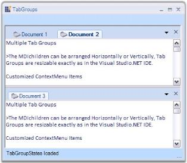

# TabbedMDI Package

The TabbedMDI package provides a new TabbedMDI layout mode (as an alternative to the default Cascade and Tiled modes), popularized by Visual Studio .NET. This framework was built with great consideration for ease of use, to avoid having to modify an existing MDI application in any way to enable the TabbedMDI mode. With a single method call, you can switch between TabbedMDI and RegularMDI layout modes. 

TabbedMDI framework will retain the MDI scheme in Tabbed mode. The Child forms will still be MDIChildren of the Parent (they will not be moved into a TabControl; this results in loss of MDI functionality like Merged Menus, switching using CTRL+TAB, etc.), thereby enhancing your application without interfering with the general MDI scheme. 

The TabbedMDI framework provides users the exact functionality and look and feel of Visual Studio .NET Tabbed Child windows.

## Features Overview

The TabbedMDI framework contains the TabbedMDIManager control with features to create rich user applications.

### Features

* Styles - TabbedMDI supports wide range of Tab Styles and Window Styles. Windows in the TabbedMDI framework can be arranged in four different styles such as horizontal, vertical, cascade and inside the client area of the parent form. It also provides advanced features to set the styles for the DropDown Menus and Context Menus. 
* Tab Alignment - Aligns the Tabs to the Top, Left, Right or Bottom using the Alignment property. To access this property, the TabControlAdded event is used.
* Tab Groups - Tab Groups are resizable exactly as in the Visual Studio .NET IDE. The number and layout of the Tab Groups can be restricted and controlled. 
* MDI List - The list of MDIChild Forms in the application can be retrieved by using a single property. Also the Menu Item or ToolStrip Menu Item to which the list should be added can be specified.

* Button Settings - Options to add DropDown and Close buttons are available. Close buttons can be displayed individually for each tab. The color of the close button can be set according to the needs of the user. It also provides options to close tabs on clicking the middle button of the mouse.
* Appearance Settings - User Controls, Images and Icons can be added to the Tabs. Options are provided to customize the tab's text and image and control the tab's image size. Themed tabs can be displayed using the ThemesEnabled property.
* Context Menu - Context Menu Items of the Tabs can be customized. Customized Bar Items can be added to the default context menu by accessing the ParentBarItem instance through the contextMenuItem.Items.Add(baritem) property.
* Automatic State Persistence - TabbedMDI provides full state persistence support. The TabbedMDIManager automatically persists Tab Groups and Tab Group Sizes for use across application invocations.
* Serialization Support - Provides serialization support to save and load the Tab States.
* Tooltip Support - Tooltips can be enabled for individual Tabs.

See Also

Concepts and Features

Creating TabbedMDIManager

## Creating TabbedMDIManager

This tutorial will show you how the TabbedMDIManager is created through designer and code which are discussed in the below topics.

### Through Designer

To create a TabbedMDIManager through designer,

1. Drag-and-drop a TabbedMDIManager Control from the ToolBox onto the Form1.
2. As soon as the control is dropped, the Form1's IsMDIContainer property will be set to True and it changes to an MDIContainer. Also, the AttachedTo property of the TabbedMDIManager will be set to Form1. Add a new Form (Form2) to your application. 
3. In the Form1_Load event, include the code snippet given below. This calls Form2 that is created and displays it in Form1.

   ~~~ cs

		private void Form1_Load(object sender, System.EventArgs e)

		{

		Form2 frm = new Form2();

		frm.MdiParent=this;

		frm.Show();

		}
		
   ~~~
   {:.prettyprint }		

   ~~~ vbnet

		Private Sub Form1_Load(ByVal sender As System.Object, ByVal e As System.EventArgs) Handles MyBase.Load

		Dim frm As Form2 = New Form2

		frm.MdiParent = Me

		frm.Show()

   ~~~
   {:.prettyprint }

4. Run the application. You will see Form2 tabbed inside Form1.

   

> Note: The DetachFromMdiContainer method is used to detach an MDIParent from the TabbedMDIManager.

### Through Code

This section will explain how to create a TabbedMDIManager programmatically. It explains how to hookup the TabbedMDIManager to the MDIParent Form. 

Here the main Form is assumed to be the MDIParent Form. Hence, any Form added to the main Form i.e. the MDIParent Form, will be treated as TabbedMDIChild Forms and will be displayed using the TabbedMDI look-and-feel, similar to Visual Studio .NET.

To create a TabbedMDIManager programmatically,

1. Create or open a Windows Forms project.
2. Add Syncfusion's Tools.Windows and Shared.Base assemblies to the application.
3. Add the Syncfusion.Windows.Forms.Tools namespace.

   ~~~ cs

		using Syncfusion.Windows.Forms.Tools;

   ~~~
   {:.prettyprint }

   ~~~ vbnet

		Imports Syncfusion.Windows.Forms.Tools 

   ~~~
   {:.prettyprint }

4. Declare the TabbedMDIManager in Form1.

   ~~~ cs

		private TabbedMDIManager tb;

   ~~~
   {:.prettyprint }

   ~~~ vbnet

		Private WithEvents tb As tabbedMDIManager

   ~~~
   {:.prettyprint }

5. Initialize the TabbedMDIManager.

   ~~~ cs

		public Form1()

		{

		InitializeComponent();

		this.tb = new TabbedMDIManager();

		}

   ~~~
   {:.prettyprint }

   ~~~ vbnet

		Public Sub New()

		tb = New TabbedMDIManager()

		End Sub
   ~~~
   {:.prettyprint }

6. Attach it to Form1 (MDIContainer). Make sure that the Form1's IsMdiContainer property is set to True. Now the TabbedMDI mode will be turned ON and any new MDIChildren created will be grouped as Tabs. 
7. Switch to the design view. Add a new Form (Form2) to your application.
8. In the Form1_Load event, include the code snippet given below. This calls Form2 that is created and displays it in Form1. 

   ~~~ cs
		private void Form1_Load(object sender, System.EventArgs e)

		{

		this.IsMdiContainer=true;

		this.tb.AttachToMdiContainer(this);

		Form2 frm = new Form2();

		frm.MdiParent=this;

		frm.Show();

		}

   ~~~
   {:.prettyprint }

   ~~~ vbnet

		Private Sub Form1_Load(ByVal sender As System.Object, ByVal e As System.EventArgs) Handles MyBase.Load

		Me.IsMdiContainer=true

		Me.tb.AttachToMdiContainer(Me)

		Dim frm As Form2 = New Form2

		frm.MdiParent = Me

		frm.Show()

   ~~~
   {:.prettyprint }

9. Run the application. You will see Form2 tabbed inside Form1.

## Concepts and Features

This section discusses the important concepts of TabbedMDI framework. It will give you a basic introduction to the concepts you need to know before getting started with the product and some tips and ideas on how to implement TabbedMDI into your projects to customize and increase efficiency. 

We will see all the features and their usage in the below topics in detail.

See Also

Creating TabbedMDI Layout Through Designer 

Creating TabbedMDI Layout Programmatically

### Styles Settings

This section discusses about the Style Settings available in TabbedMDIManager control that can be used to create applications that are attractive and appealing to the end-users.

The topics discussed in this section are given below.

#### Tab styles

TabbedMDI framework provides the ability to support a number of tab styles. The tabbedMDIManager's TabStyle property lets users specify the required style for the Tabs.

_Table_ _839_: Property Table

<table>
<tr>
<td>
TabbedMDIManager Property</td><td>
Description</td></tr>
<tr>
<td>
TabStyle</td><td>
Specifies the style for the tabs of the TabbedMDIManager Control. The options include:2D,3D,WorkbookMode,WhidbeyStyle,DockingWhidbeyStyle,DockingWhidbeyBetaStyle,Office2003Style,Office2007Style,OneNoteStyle,OneNoteStyleFlatTabsStyle andInternetExplorer7Style.</td></tr>
</table>



this.tabbedMDIManager.TabStyle = typeof(Syncfusion.Windows.Forms.Tools.TabRendererDockingWhidbeyBeta);





Me.tabbedMDIManager.TabStyle = GetType(Syncfusion.Windows.Forms.Tools.TabRendererDockingWhidbeyBeta)



The various tab styles are listed in the below image.

#### Window Styles

The windows in the TabbedMDI framework can be arranged in four different styles. To set the styles of the windows, the MDIParent form should be detached from the TabbedMDIManager.

> Note: The DetachFromMdiContainer method is used to detach an MDIParent from the TabbedMDIManager.

<table>
<tr>
<td>
TabbedMDIManager Property</td><td>
Description</td></tr>
<tr>
<td>
WindowStyle</td><td>
Specifies the style for the windows of the TabbedMDIManager Control. The options include:TileHorizontal,TileVertical,Cascade andArrangeIcons.</td></tr>
</table>



//Detach the MDIParent form from TabbedMDIManager.

this.tb.DetachFromMdiContainer(this, false);

//Arranges the multiple document interface Child forms in Horizontal style within the MDIParent form.                        

this.LayoutMdi(MdiLayout.TileHorizontal);





'Detach the MDIParent form from TabbedMDIManager.

Me.tb.DetachFromMdiContainer(Me, False)

'Arranges the multiple document interface Child forms in Horizontal style within the MDIParent form.                        

Me.LayoutMdi(MdiLayout.TileHorizontal)



### Button Settings

This section discusses about the various buttons available in TabbedMDIManager control and their customization.

The topics discussed in this section are given below.

#### DropDown Button

The MDIChild windows in a TabbedMDI window can be displayed in the form of a dropdown by enabling the DropDownButtonVisible property. 



this.tabbedMDIManager.DropDownButtonVisible = true;





Me.tabbedMDIManager.DropDownButtonVisible = True



The visual dropdown styles can be set by handling the BeforeDropDownPopup eventusing the below code snippet.



//Initializing 

this.tabbedMDIManager.BeforeDropDownPopup += new DropDownPopupEventHandler(tabbedMDIManager_BeforeDropDownPopup);

private void tabbedMDIManager_BeforeDropDownPopup(object sender, DropDownPopupEventArgs e)

{

e.ParentBarItem.Style = Syncfusion.Windows.Forms.VisualStyle.Office2003;

}





//Initializing 

AddHandler tabbedMDIManager.BeforeDropDownPopup, AddressOf tabbedMDI_BeforeDropDownPopup

Private Sub tabbedMDI_BeforeDropDownPopup(ByVal sender As Object, ByVal e As Syncfusion.Windows.Forms.Tools.DropDownPopupEventArgs) Handles TabbedMDIManager.BeforeDropDownPopup

e.ParentBarItem.Style = Syncfusion.Windows.Forms.VisualStyle.Office2003

e.Cancel = Me.checkBox5.Checked

End Sub



#### Close Button

On setting the CloseButtonVisible property, the close button will be either visible or hidden.

Enabling the ShowCloseButtonForActiveTabOnly property will display the close button for the active tab only and ShowCloseButton property will display the close button for all the tabs.

The close button for individual tabs can also be displayed by implementing the below code snippet.



//Individual Close Buttons enabled.

this.tabbedMDIManager.ShowCloseButton = true;

//Close Buttons for Active Tabs only.

this.tabbedMDIManager.ShowCloseButtonForActiveTabOnly = true;

//Close Button can be made visible.

this.tabbedMDIManager.CloseButtonVisible = true;





' Individual Close Buttons enabled.

Me.tabbedMDIManager.CloseButtonVisible = True

' Close Buttons for active Tabs only.

Me.tabbedMDIManager.ShowCloseButtonForActiveTabOnly = True

' Close Button can be made visible. 

Me.tabbedMDIManager.ShowCloseButton = True



The color of the close button at the extreme right of the MDI TabStrip can be changed using the CloseButtonColor property.



this.tabbedMDIManager.CloseButtonColor = Color.Red;





Me.tabbedMDIManager.CloseButtonColor = Color.Red



##### Middle Mouse Button

The tabs can be closed by clicking the middle mouse button on enabling the CloseOnMiddleButtonClick property. 

This functionality can also be added using the code snippet given below.



this.tabbedMDIManager.CloseOnMiddleButtonClick = true;





Me.tabbedMDIManager.CloseOnMiddleButtonClick = True



#### Support to Show or Hide Close Button for Individual Tabs

Essential Tools for Windows Forms now provides support to show or hide close button of the individual tabs in TabbedMDI Manager. 

Use Case Scenarios

Using this feature you can hide the close button for the tabs you want to restrict close and show for the rest of the tabs.

Methods

_Table_ _841_: Method Table

<table>
<tr>
<th>
Method </th><th>
Description </th><th>
Parameters </th><th>
Type </th><th>
Return Type </th><th>
Reference links </th></tr>
<tr>
<th>
ShowCloseButtonForForm()</th><th>
This method will display the close button for the specific tabs alone.</th><th>
Form,bool</th><th>
NA</th><th>
void </th><th>
NA </th></tr>
</table>
Sample Link

To view a sample: 

1. Open Syncfusion Dashboard.
2. Click Windows Forms.
3. Click Run Samples. 
4. Navigate to  Tools Sample > Tabbed MDI Package > Tabbed MDI.

Showing or Hiding the Close Button for Specific Tabs

You can show or hide close button for specific tasks using the _ShowCloseButtonForForm_() method. The following code illustrates this:



    this.tabbedMDIManager.ShowCloseButtonForForm(form,true );





Me.tabbedMDIManager.ShowCloseButtonForForm(form,True)



### Tab Alignment

The tabs in the TabbedMDI layout can be aligned to the Top, Left, Right and Bottom of the form using the Alignment property. To access the Alignment property, you should use the TabControlAdded event. This event is fired to let the user configure the tab appearance and behavior.

1. Call the TabControlAdded event in the form's constructor.

   ~~~ cs

		this.tb.TabControlAdded += new TabbedMDITabControlEventHandler(tb_TabControlAdded);

   ~~~
   {:.prettyprint }

   ~~~ vbnet

		AddHandler tb.TabControlAdded, AddressOf tb_TabControlAdded

   ~~~
   {:.prettyprint }

2. Set the Alignment property of Tab Control using the TabbedMDITabControlEventArgs.

   ~~~ cs

		private void tb_TabControlAdded(object sender, TabbedMDITabControlEventArgs args)

		{

		args.TabControl.Alignment=TabAlignment.Bottom;

		}   

   ~~~
   {:.prettyprint }

   ~~~ vbnet

		Private Sub tb_TabControlAdded(ByVal sender As Object, ByVal args As TabbedMDITabControlEventArgs)

		args.TabControl.Alignment = TabAlignment.Bottom

		End Sub

   ~~~
   {:.prettyprint }

See Also

MDI List

###  Tab Groups

TabbedMDIManager supports multiple TabGroups which can be resizable. It allows users to programmatically control and restrict the number and layout of the tab groups and also lets users to associate a form with a specific tab group. This way users can provide a custom tabbed layout for the end users of the TabbedMDI application. The MDI Children can arranged horizontally or vertically. 

The below topics will guide you on how to create tab groups and set borders for the tab groups.

#### Creating Tab Groups

The below given steps will guide you to create and control tab groups.

* To the application add Tools.Windows and Shared.Base Syncfusion assemblies.
* Add 2 more forms and rename them as TabGroup1_Form and TabGroup2_Form. (The application now contains three forms (i.e.) Form1, TabGroup1_Form and TabGroup2_Form).
* In Form1, add the namespace Syncfusion.Windows.Forms.Tools.



Using Syncfusion.Windows.Forms.Tools;





Imports Syncfusion.Windows.Forms.Tools 



* Declare the TabbedMDIManager in your form.



Private TabbedGroupedMDIManager tabbedMDIManager;





Private TabbedGroupedMDIManager As TabbedMDIManager 



* Set the form's IsMdiContainer property to True.
* Initialize the TabbedMDIManager and set the required properties.



public Form1()

{

InitializeComponent();

// Initialize a TabbedGroupedMDIManager. 

this.tabbedMDIManager = new TabbedGroupedMDIManager();

// Indicates whether the user can drag and drop tabs(child forms) from one tab group to another. 

this.tabbedMDIManager.AllowTabGroupCustomizing = false;

// Align TabGroup horizontally.

this.tabbedMDIManager.Horizontal = true;

}





Public Sub New()

InitializeComponent()

' Initialize a TabbedGroupedMDIManager. 

Me.tabbedMDIManager = New TabbedGroupedMDIManager()

' Indicates whether the user can drag and drop tabs(child forms) from one tab group to another. 

Me.tabbedMDIManager.AllowTabGroupCustomizing = False

' Align TabGroup horizontally.

Me.tabbedMDIManager.Horizontal = True

End Sub



* Attach the TabbedMDIManager to your form and specify the Tab Groups.



private void Form1_Load(object sender, System.EventArgs e)

{

this.tabbedMDIManager.AttachToMdiContainer(this);

// Specify the tab groups.

this.tabbedMDIManager.TabbedGroups.Add(new TabbedGroup("TabGroup1"));

this.tabbedMDIManager.TabbedGroups.Add(new TabbedGroup("TabGroup2"));

}





Private Sub Form1_Load(ByVal sender As Object, ByVal e As System.EventArgs) Handles MyBase.Load

Me.tabbedMDIManager.AttachToMdiContainer(Me)

' Specify the tab groups.

Me.tabbedMDIManager.TabbedGroups.Add(New TabbedGroup("TabGroup1"))

Me.tabbedMDIManager.TabbedGroups.Add(New TabbedGroup("TabGroup2"))

End Sub



* Add 2 bar items (or buttons can also be used) to add the tab groups. In the barItem_click event, add the below given code.



// Adding tab group 1 forms by clicking on a barItem.

private void barItem1_Click(object sender, System.EventArgs e)

{

TabGroup1_Form  form = new TabGroup1_Form ();

form.Text = "TabGroup1_Child1";

// Add the TabGroup1_Form to a specific group.

this.tabbedMDIManager.TabbedGroups["TabGroup1"].AddForm(form);

}

// Adding tab group 2 forms by clicking on another barItem.

private void barItem2_Click(object sender, System.EventArgs e)

{

TabGroup2_Form  form = new TabGroup2_Form ();

form.Text = "TabGroup2_Child2";

// Add the TabGroup2_Form to a specific group.

this.tabbedMDIManager.TabbedGroups["TabGroup2"].AddForm(form);                        

}





' Adding tab group 1 forms by clicking on a barItem.

Private Sub barItem1_Click(ByVal sender As Object, ByVal e As System.EventArgs) Handles barItem1.Click

Dim form As TabGroup1_Form = New TabGroup1_Form

Form.Text = "TabGroup1_Child1"

' Add the TabGroup1_Form to a specific group.

Me.tabbedMDIManager.TabbedGroups("TabGroup1").AddForm(Form)

End Sub

' Adding tab group 2 forms by clicking on another barItem.

Private Sub barItem2_Click(ByVal sender As Object, ByVal e As System.EventArgs) Handles barItem2.Click

Dim form As TabGroup2_Form = New TabGroup2_Form

Form.Text = "TabGroup2_Child2"

' Add the TabGroup2_Form to a specific group.

Me.tabbedMDIManager.TabbedGroups("TabGroup2").AddForm(Form)

End Sub



The AllowTabGroupCustomizing property indicates whether the user can drag and drop tabs (child forms) from one tab group to another.

The below methods can be used for specific functionalities in TabGroups.

_Table_ _842_: Methods Table

<table>
<tr>
<td>
Methods</td><td>
Description</td></tr>
<tr>
<td>
MakeSingleTabGroup</td><td>
Consolidates the child forms in different tab groups into a single tab group.</td></tr>
<tr>
<td>
MaximizeTabGroup</td><td>
This method is called to make the tab group host specified in the Syncfusion.Windows.Forms.Tools.TabHost occupy the maximum space.</td></tr>
<tr>
<td>
MoveActiveDocTo</td><td>
Moves the active form to the specified tab group.</td></tr>
<tr>
<td>
MoveDocTo</td><td>
Moves the child form to the specified tab group.</td></tr>
<tr>
<td>
CreateNewHorizontalGroup</td><td>
Creates a new horizontal tab group, moving the active child form to that group.</td></tr>
<tr>
<td>
CreateNewVerticalGroup</td><td>
Creates a new vertical tab group, moving the active child form to that group.</td></tr>
</table>

#### Border Settings

Border Color

To set the Border Color of the borders that appear under the MDI tabs, we can use the BottomBorderColor property of TabGroupHosts.



tabbedMDIManager.TabGroupHosts[0].BottomBorderColor=Color.Red;

tabbedMDIManager.TabGroupHosts[1].BottomBorderColor = Color.Green;





tabbedMDIManager.TabGroupHosts(0).BottomBorderColor=Color.Red

tabbedMDIManager.TabGroupHosts(1).BottomBorderColor = Color.Green



Border Height

To set the Border Height of the borders, we can use the BottomBorderHeight property of TabGroupHosts.



// To set the Border Height.   

tabbedMDIManager.TabGroupHosts[0].BottomBorderHeight = 0;

tabbedMDIManager.TabGroupHosts[1].BottomBorderHeight = 3;

// To set the Border Color.

tabbedMDIManager.TabGroupHosts[0].BottomBorderColor = Color.Black;

tabbedMDIManager.TabGroupHosts[1].BottomBorderColor = Color.Black;





'To set the Border Height.

tabbedMDIManager.TabGroupHosts(0).BottomBorderHeight = 0

tabbedMDIManager.TabGroupHosts(1).BottomBorderHeight = 3

'To set the Border Color.

tabbedMDIManager.TabGroupHosts(0).BottomBorderColor = Color.Black

tabbedMDIManager.TabGroupHosts(1).BottomBorderColor = Color.Black



A sample which illustrates this feature is available in the below sample installation location.

…\_My Documents\Syncfusion\EssentialStudio\Version Number\Windows\Tools.Windows\Samples\Advanced Editor Functions\ActionGroupingDemo_

### MDI List

By using the TabbedMDIManager framework, you can make your MDI container form's MDIChildren property obsolete. The value returned by this property will not be an accurate reflection of the MDIChildren. You should instead use the TabbedMDIManager's MDIChildren property, to get a list of the MDIChild forms.

_Table_ _843_: Property Table

<table>
<tr>
<td>
 TabbedMDIManager Property</td><td>
Description</td></tr>
<tr>
<td>
MDIChildren</td><td>
Returns the MDIChild of the associated MDIParent.</td></tr>
<tr>
<td>
MDIParent</td><td>
Returns the current MDIParent form managed.</td></tr>
</table>

You can retrieve the MDIChild forms using the below code.



private void Form1_Load(object sender, System.EventArgs e)

{                        

Form[] mdiFormsList = this.tabbedMdiManager.MdiChildren; 

for(int i=0;i<mdiFormsList.Length;i++)

{

MessageBox.Show(mdiFormsList[i].Text);

}

}





Private Sub Form1_Load(ByVal sender As Object, ByVal e As System.EventArgs) Handles MyBase.Load

Dim mdiFormsList As Form() = Me.tabbedMdiManager.MdiChildren

Dim i As Integer = 0

Do While i < mdiFormsList.Length

MessageBox.Show(mdiFormsList(i).Text)

i += 1

Loop

End Sub



MDI List in Menus

If you want an MDI List in your menus, use the TabbedMDIManager's MDIListMenuItem property. This will duplicate the exact functionality that the MDIList property of the MenuItem class provides. This menu item will then be managed by the TabbedMDIManager, even when it is not attached to your container form.

Also you can add an MDI List to your toolstrip menus, using the TabbedMDIManager's MDIListToolStripItem property. This will duplicate the exact functionality that the MDI List property of the ToolStripItem class provides.

_Table_ _844__: Property Table_

<table>
<tr>
<td>
 TabbedMDIManager Property</td><td>
Description</td></tr>
<tr>
<td>
MDIListMenuItem</td><td>
Specifies the menu item to which the MDIChildren list should be added. </td></tr>
<tr>
<td>
MDIListToolStripItem</td><td>
Specifies the toolstrip menu item to which the MDIChildren list should be added. </td></tr>
</table>



private MenuItem miWindow;

private void Form1_Load(object sender, System.EventArgs e)

{                        

// Add a menu item to the main menu.

this.miWindow = this.mainMenu1.MenuItems.Add("Window");

// Let the TabbedMDIManager insert the MDIChild windows list.

this.tb.MdiListMenuItem = miWindow;

}





Private miWindow As MenuItem

Private Sub Form1_Load(ByVal sender As Object, ByVal e As System.EventArgs) Handles MyBase.Load

' Add a menu item to the main menu.

Me.miWindow = Me.mainMenu1.MenuItems.Add("Window")

' Let the TabbedMDIManager insert the MDIChild windows list.

Me.tb.MdiListMenuItem = miWindow

End Sub



MDI List in XP Menus 

When using XP Menus in Essential Tools as the MDIContainer's Main Menu, this property need not be set. Instead use the MDIListBarItem in XP Menus to represent the MDIChild windows list. 

The XP Menus framework automatically handles the case when the MDIChild windows layout is managed by the TabbedMDIManager.

See Also

UserControls as Tabs

### UserControls as Tabs

Normally TabbedMDI is used in MDI applications where the Child forms are the children that get tabbed. But, we can also use TabbedMDI with User Controls as children that are dockable.

Add a UserControl to the form and initialize it inside the parent form. Add a DockingManager and a TabbedMDIManager Control. Dock the User Control and set it as an MDIChild using the below code snippet.



UserControl Uc = new UserControl();

Uc.Parent = this;

// Dock the user contro1 to the form. 

this.dockingManager1.DockControl(Uc, this, Syncfusion.Windows.Forms.Tools.DockingStyle.Tabbed, 200);

// Set the user controls to MDI mode. 

this.dockingManager1.SetAsMDIChild(Uc, true);





Dim Uc As New UserControl()

Uc.Parent = Me 

' Dock the user contro1 to the form. 

Me.dockingManager1.DockControl(Uc, Me, Syncfusion.Windows.Forms.Tools.DockingStyle.Tabbed, 200) 

' Set the user controls to MDI mode. 

Me.dockingManager1.SetAsMDIChild(Uc, True) 



See Also

MDI List

### Appearance Settings

The variousAppearance Settings for TabbedMDIManager are discussed in this section. 

It includes the below topics.

#### Foreground Settings

This section guides you in setting the text and icons for the tabs.

Tab Text

The text of the tabs can be set by directly setting the Text property of the form, if the tabbed window is going to be a normal form.

Icon Settings

The below properties controls the appearance and behavior of the icon settings.

_Table_ _845_: Property Table

<table>
<tr>
<td>
 TabbedMDIManager Property</td><td>
Description</td></tr>
<tr>
<td>
Icon</td><td>
Gets / sets icons for tabs. When the Icon property is clicked, the browse page will be displayed, through which the user can select the icon to be displayed.</td></tr>
<tr>
<td>
UseIconsInTabs</td><td>
Gets / sets the value which determines whether icons should be added to the MDIChild.</td></tr>
<tr>
<td>
ImageSize</td><td>
The size of the image or icon that you want to add to the tabs can be set using this property.</td></tr>
</table>



this.Text = "Tabbed MDI Demo (Syncfusion Inc.)";

this.Icon = ((System.Drawing.Icon)(resources.GetObject("$this.Icon")));

this.TabbedMDIManager.UseIconsInTabs = false;

this.tabbedMDIManager1.ImageSize = new System.Drawing.Size(16, 16);





Me.Text = "Tabbed MDI Demo (Syncfusion Inc.)" 

Me.Icon = CType((resources.GetObject("$this.Icon")), System.Drawing.Icon)

Me.TabbedMDIManager.UseIconsInTabs = False

Me.TabbedMDIManager1.ImageSize = New System.Drawing.Size(20, 20)



#### Applying Themes

The TabbedMDIManager Control can be themed by enabling the ThemesEnabled property.



this.tabbedMDIManager1.ThemesEnabled = true;





Me.tabbedMDIManager1.ThemesEnabled = True



### Interactive Features

This section discusses the Interactive Features of TabControlAdv.

It includes the below topics.

#### Tooltips

Tooltip can be enabled for child windows or tabs using the below code snippet, where doc is the new child form that is created. 

The GetTooltip method is used to set the Tooltips for the tabs.

_Table_ _846_: Methods Table

<table>
<tr>
<td>
Method</td><td>
Description</td></tr>
<tr>
<td>
GetTooltip</td><td>
Gets the tooltips for the tabs associated with a form.{{ '_mdiChild_' | markdownify }} - indicates the MDIChild form to which the tooltip should be added.{{ '_tooltip_' | markdownify }} - indicates that the tooltip to be added is of type string.</td></tr>
<tr>
<td>
SetTooltip</td><td>
Sets the tooltips for the tabs associated with a form.</td></tr>
</table>



this.TabbedMDIManager.GetTooltip(doc, "Tooltip for " + doc.Text);





Me.TabbedMDIManager.GetTooltip(doc, "Tooltip for " + doc.Text)



See Also

Context Menu

#### Context Menu

The TabbedMDI Layout mode enables the default Context Menu that pops-up whenever the user right clicks on any of the tabs. 

The ContextMenuItem property is used to select the context menu that should be used along with the default tab context menu when the user right-clicks on a tab.

Below image will reproduce the Context Menu feature available in an MDI application in TabbedMDI mode.

Customize Context Menu

On right clicking the tabs in the TabbedMDI layout, a default context menu will appear. This context menu can be customized programmatically, to add custom bar items.

* Create a TabbedMDI Layout.
* Add the below code snippets in the respective places as directed.
* The below given code will add two bar items to the default context menu. The same is shown in the image below.



//Add Namespace

using Syncfusion.Windows.Forms.Tools.XPMenus;

// Append menus to the standard MDI tab context menu.

//Adding Bar Item 1

ParentBarItem contextMenuItem = new ParentBarItem();

BarItem newDocItem = new BarItem();

newDocItem.ImageIndex = 5;

newDocItem.Text = "Custom Item: Insert New Doc";

newDocItem.MergeOrder = 30;

contextMenuItem.Items.Add(newDocItem);

//Adding Bar Item 2 

BarItem exitItem = new BarItem();

exitItem.ImageIndex = 2;

exitItem.Text = "CustomItem: Exit";

exitItem.MergeOrder = 30;

contextMenuItem.Items.Add(exitItem);

contextMenuItem.BeginGroupAt(newDocItem);

// Items in this Parent Bar Item will be merged with the standard context menu Parent Bar Item of the MDI tab.

tb.ContextMenuItem = contextMenuItem;





' Add Namespace

Imports Syncfusion.Windows.Forms.Tools.XPMenus

' Append menus to the standard MDI tab context menu.

Dim contextMenuItem As ParentBarItem

contextMenuItem = New ParentBarItem()

' Bar Item 1

Dim newDocItem As BarItem

newDocItem = New BarItem()

newDocItem.Text = "Custom Item: Insert New Doc"

newDocItem.MergeOrder = 30

contextMenuItem.Items.Add(newDocItem)

' Bar Item 2

Dim exitItem As BarItem

exitItem = New BarItem()

exitItem.Text = "CustomItem: Exit"

exitItem.MergeOrder = 30

contextMenuItem.Items.Add(exitItem)

contextMenuItem.BeginGroupAt(newDocItem)

' Items in this Parent Bar Item will be merged with the standard context menu Parent Bar Item of the MDI tab.

tabbedMDIManager.ContextMenuItem = contextMenuItem



See Also

How to remove the Context Menu for a particular tab?

### Serialization support

The AppStateSerializer class is a serialization utility that allows multiple components in an application to access a common disk I/O medium for state persistence. Using the same storage medium for persisting the state information across components, without overlying them together, helps avoid the file clutter that is bound to occur by components using distinct files.

The TabGroupStates can be serialized in,

* Binary Format
* XML Format
* Isolated Storage
* Memory Stream
* Default Storage Medium (null parameter constructor).

The TabbedMDIManager class uses the SaveTabGroupState and LoadTabGroupState methods to save and load TabGroupState respectively.

_Table_ _847_: Methods Table

<table>
<tr>
<td>
 Methods</td><td>
Description</td></tr>
<tr>
<td>
SaveTabGroupStates</td><td>
Saves the current tab group's state information to the specified persistence medium.</td></tr>
<tr>
<td>
LoadTabGroupStates</td><td>
Reads the tab group's information from the specified persistent store and applies the new state.</td></tr>
<tr>
<td>
ClearSavedTabGroupState</td><td>
Clears the state of the saved tab group.</td></tr>
</table>

Make sure to call PersistNow method when you are done with writing into the serializer.

> Note: The LoadTabGroupStates and SaveTabGroupStates methods get called automatically when you enable / disable TabbedMDI.



// To Save

AppStateSerializer serializer = new AppStateSerializer(SerializeMode.XMLFile, "myfile");

this.tabbedMdiManager.SaveTabGroupStates(serializer);

serializer.PersistNow();

// To Load

AppStateSerializer serializer = new AppStateSerializer(SerializeMode.XMLFile, "myfile");

this.tabbedMdiManager.LoadTabGroupStates(serializer);





' To Save

Dim serializer As New AppStateSerializer(SerializeMode.XMLFile, "myfile")

Me.tabbedMdiManager.SaveTabGroupStates(aser)

serializer.PersistNow()

' To Load

Dim serializer As New AppStateSerializer(SerializeMode.XMLFile, "myfile")

Me.tabbedMdiManager.LoadTabGroupStates(aser)

Singleton method

The AppStateSerializer is set to use the IsolatedStorage format by default. When the user does not need the states to store in the Isolated Storage area, it could be changed by initializing the AppStateSerializer's Singleton at the beginning of an application.





//Initializing the AppStateSerializer's Singleton at the beginning of an application.

AppStateSerializer.InitializeSingleton(SerializeMode.XMLFile, "myfile");





' Initializing the AppStateSerializer's Singleton at the beginning of an application.

AppStateSerializer.InitializeSingleton(SerializeMode.XMLFile, "myfile")

Below are the code snippets for different storage mediums. 

To serialize in Binary Format, use the below code.





// To Save

AppStateSerializer serializer = new AppStateSerializer(SerializeMode.BinaryFile, "myfile");

this.tabbedMdiManager.SaveTabGroupStates(serializer);

serializer.PersistNow();

// To Load

AppStateSerializer serializer = new AppStateSerializer(SerializeMode.BinaryFile, "myfile");

this.tabbedMdiManager.LoadTabGroupStates(serializer);





' To Save

Dim serializer As New AppStateSerializer(SerializeMode.BinaryFile, "myfile")

Me.tabbedMdiManager.SaveTabGroupStates(serializer)

serializer.PersistNow()

' To Load

Dim serializer As New AppStateSerializer(SerializeMode.BinaryFile, "myfile")

Me.tabbedMdiManager.LoadTabGroupStates(serializer)



To serialize in Isolated Storage, use the below code.



// To Save

AppStateSerializer serializer = new AppStateSerializer(SerializeMode.IsolatedStorage, "myfile");

this.tabbedMdiManager.SaveTabGroupStates(serializer);

serializer.PersistNow();

// To Load

AppStateSerializer serializer = new AppStateSerializer(SerializeMode.IsolatedStorage, "myfile");

this.tabbedMdiManager.LoadTabGroupStates(serializer);





' To Save

Dim serializer As New AppStateSerializer(SerializeMode.IsolatedStorage, "myfile")

Me.tabbedMdiManager.SaveTabGroupStates(serializer)

serializer.PersistNow()

' To Load

Dim serializer As New AppStateSerializer(SerializeMode.IsolatedStorage, "myfile")

Me.tabbedMdiManager.LoadTabGroupStates(serializer)



To serialize in Memory Stream, use the below code.



// To Save

System.IO.MemoryStream ms = new MemoryStream();

AppStateSerializer aser = new AppStateSerializer(SerializeMode.BinaryFmtStream, ms);

this.tabbedMDIManager.SaveTabGroupStates(aser);

aser.PersistNow();

// To Load

AppStateSerializer aser = new AppStateSerializer(SerializeMode.IsolatedStorage, ms);

this.tabbedMdiManager.LoadTabGroupStates(aser);





' To Save

Dim ms As MemoryStream = New MemoryStream()

Dim aser As AppStateSerializer = New AppStateSerializer(SerializeMode.BinaryFmtStream, ms)

Me.tabbedMdiManager.SaveDockState(aser)

aser.PersistNow()

' To Load

Dim aser As New AppStateSerializer(SerializeMode.BinaryFmtStream, ms)

Me.tabbedMdiManager.LoadTabGroupStates(aser)



## TabbedMDIManager Events

The list of events and a detailed explanation about each of them is given in the following sections.

_Table_ _848_: Events Table

<table>
<tr>
<td>
 TabbedMDIManager Events</td><td>
Description</td></tr>
<tr>
<td>
BeforeMDIChildAdded Event</td><td>
This event is handled before an MDI child is added to the TabbedMDIManager.</td></tr>
<tr>
<td>
BeforeDropDownPopup Event</td><td>
This event is handled to set the visual dropdown styles for the dropdown button. </td></tr>
<tr>
<td>
TabControlAdded Event</td><td>
Using this event, the fonts of active and inactive tabs can be customized.</td></tr>
<tr>
<td>
TabControlAdding Event</td><td>
This event is handled when a tab control is added.</td></tr>
<tr>
<td>
TabControlRemoved Event</td><td>
This event is handled after a tab control is removed from a tab group.</td></tr>
<tr>
<td>
UnLockingMdiClient Event</td><td>
This event is handled to notify that the locked MDI client area is being unlocked.</td></tr>
</table>

### BeforeMDIChildAdded Event

This events occurs before an MDIChild is added to the TabbedMDIManager.



private void tabbedMDIManager1_BeforeMDIChildAdded(object sender, MDIChildAddCancelEventArgs e)

{

MessageBox.Show(args.NewControl.ToString() + "is added!");

}





Private Sub tabbedMDIManager1_BeforeMDIChildAdded(ByVal sender As Object, ByVal e As MDIChildAddCancelEventArgs)

MessageBox.Show(args.NewControl.ToString() + "is added!")

End Sub



### BeforeDropDownPopup Event

This events is discussed in DropDown Button topic.

### TabControlAdded Event

This event is explained in detail in the How to customize the fonts of Active and Inactive Tabs? topic under Frequently Asked Questions. 

### TabControlAdding Event

This event is handled when a tab control is added and it provides options to customize tab controls.



private void tabbedMDIManager1_TabControlAdding(object sender, TabbedMDITabControlEventArgs e)

{

MessageBox.Show(e.TabControl.Text.ToString());

}





Private Sub tabbedMDIManager1_TabControlAdding(ByVal sender As Object, ByVal e As TabbedMDITabControlEventArgs)

MessageBox.Show(e.TabControl.Text.ToString())

End Sub



### TabControlRemoved Event

This event is handled after a tab control is removed from a tab group.



private void tabbedMDIManager1_TabControlRemoved(object sender, TabbedMDITabControlEventArgs e)

{

MessageBox.Show(e.TabControl.Text.ToString());

}







Private Sub tabbedMDIManager1_TabControlRemoved(ByVal sender As Object, ByVal e As TabbedMDITabControlEventArgs)

MessageBox.Show(e.TabControl.Text.ToString())

End Sub

### UnLockingMdiClient Event

This event is handled to notify that the locked MDI client area is being unlocked.



private void tabbedMDIManager1_UnLockingMdiClient(object sender, EventArgs e)

{

Console.Write("UnlockingMDIClient event is Raised");

}





Private Sub tabbedMDIManager1_UnLockingMdiClient(ByVal sender As Object, ByVal e As EventArgs)

Console.Write("UnlockingMDIClient event is Raised")

End Sub



## Frequently Asked Questions

This section will help you become more familiar in using the TabbedMDI Package.

### How to add a MDI Child from another MDIChild

You should set the MDIParent of the new child form as follows:

 

private void buttonAdv1_Click(object sender, System.EventArgs e) 

{ 

Form3 child1 = new Form3(); 

// Set the new form's MDIParent to the main form. 

child1.MdiParent = (Form1) this.Parent.Parent; 

child1.Text = "Document"; 

child1.Show(); 

} 





Private Sub buttonAdv1_Click(ByVal sender As Object, ByVal e As System.EventArgs) Handles buttonAdv1.Click

Dim f1 As Form3 = New Form3()

' Set the new form's MDIParent to the main form. 

f1.MdiParent = CType(Me.Parent.Parent, Form1)

f1.Text = "Document"

f1.Show()

End Sub



### How to add different Icons to MDI Tabs

This can be done programmatically using the below code snippet.



// Derive CustomTabbedMDIManager class from TabbedMDIManager

// to expose the internal TabControlAdv. 

// Override the MDITabPanel code function.

this.MdiTabPanel = tabPanel;

// Add the images to the Image List.

TabControlAdv tabcontrol = this.tabbedMdiManager.GetMdiTabPanel() as TabControlAdv;

tabcontrol.ImageList = this.imageList1;

// Assign the images to the child tabs.

foreach (TabPageAdv page in tabcontrol.TabPages)

{

page.ImageIndex = index;

index++;

}





' Derive CustomTabbedMDIManager class from TabbedMDIManager

' to expose the internal TabControlAdv. 

' Override the MDITabPanel code function.

Me.MdiTabPanel = tabPanel

' Add the images to the Image List.

Dim tabcontrol As TabControlAdv = CType(IIf(TypeOf Me.tabbedMdiManager.GetMdiTabPanel() Is TabControlAdv, 

Me.tabbedMdiManager.GetMdiTabPanel(), Nothing), TabControlAdv)

tabcontrol.ImageList = Me.imageList1

' Assign the images to the child tabs.

For Each page As TabPageAdv In tabcontrol.TabPages

page.ImageIndex = index

index += 1

Next page



### How to browse through the MDIChildren in the MDIContainer after enabling TabbedMDIManager

You should not use the MDIContainer form’s MDIChildren property to browse through the MDIChildren. This is because the TabbedMDI framework introduces some additional MDIChildren into your MDIContainer that are not part of your application logic.

You should instead use the TabbedMDIManager's MDIChildren property to get a list of the MDIChildren, as follows:



// In your MDIContainer Form.

private void ParseMDIChildren()

{

string children = String.Empty;

foreach(Form form in this.tabbedMDIManager.MdiChildren)

{

children += form.Text + "\r\n";

}

MessageBox.Show(children); 

}





' In your MDIContainer Form.

Private Sub ParseMDIChildren()

Dim children As String = String.Empty

Dim form As Form

For Each Form In Me.tabbedMDIManager.MdiChildren

children += Form.Text + "\r\n"

Next

MessageBox.Show(children)

End Sub



### How to change the MDI tab size

You should handle theTabControlAdded event handler and use ItemSize property to change the tab size.



// Handle the TabControlAdded event. 

this.tabbedMDIManager.TabControlAdded += new TabbedMDITabControlEventHandler(tabbedMDIManager_TabControlAdded); 

private void tabbedMDIManager_TabControlAdded(object sender, TabbedMDITabControlEventArgs args) 

{ 

// To change the size. 

args.TabControl.ItemSize = new Size(40, 40); 

}





' Handle the TabControlAdded event. 

AddHandler tabbedMDIManager.TabControlAdded, AddressOf tabbedMDIManager_TabControlAdded

Private Sub tabbedMDIManager_TabControlAdded(ByVal sender As Object, ByVal args As TabbedMDITabControlEventArgs)

' To change the size. 

args.TabControl.ItemSize = New Size(40, 40)

End Sub



### How to customize the fonts of Active and Inactive tabs

Using the TabControlAdded event, the fonts of active and inactive tabs can be customized.



// Handle the TabbedMDIManager's TabControlAdded event to get hold of 

// the TabControlAdv associated with it.

this.tabbedMdiManager.TabControlAdded += new TabbedMDITabControlEventHandler(TabbedMDITabControl_Added);

private void TabbedMDITabControl_Added(object sender, TabbedMDITabControlEventArgs args)

{

args.TabControl.ActiveTabFont = new Font ("Comic Sans MS", 11);

args.TabControl.Font = new Font ("Garamond", 12);

}





' Handle the TabbedMDIManager's TabControlAdded event to get hold of 

' the TabControlAdv associated with it.

Me.tabbedMdiManager.TabControlAdded += New TabbedMDITabControlEventHandler(TabbedMDITabControl_Added)

Private Sub TabbedMDITabControl_Added(ByVal sender As Object, ByVal args As TabbedMDITabControlEventArgs)

args.TabControl.ActiveTabFont = New Font("Comic Sans MS", 11)

args.TabControl.Font = New Font("Garamond", 12)

End Sub



### How to prevent reordering of Tab Pages in TabbedMDIManager Control

The reordering of tab pages can be prevented by implementing the below code snippet. For this derive a class from TabbedMDIManager and override the MDITabPanel property and set the UserMoveTabs property of MDITabPanel to True.



// Derive a class from TabbedMDIManager. 

// Override MDITabPanel property. 

// Set MDITabPanel's UserMoveTabs property to False.

tabPanel.UserMoveTabs = false;





' Derive a class from TabbedMDIManager. 

' Override MDITabPanel property. 

' Set MDITabPanel's UserMoveTabs property to False.

tabPanel.UserMoveTabs = False



### How to remove the Context Menu for a particular tab

This can be achieved by handling the BeforePopup event of TabbedMDIManager.ContextMenuItem. Before that we should know which tab is currently active. To keep track of this, SelectedIndexChanged event of MDITabPanel can be used. 

First handle the TabControlAdded event of TabbedMDIManager. Then subscribe to the args.TabControl.SelectedIndexChanged event (where args is the argument passed into this event). In the SelectedIndexChanged event handler, store the SelectedTab in a variable which is accessible by all the methods inside that class. In the BeforePopup event, check for the TabPageAdv and cancel the context menu by setting e.Cancel = true.

In this example, we are going to remove context menu for the pages which are having the text as 'New Document'. 

 

// Declare the object st to store SelectedTab with enough scope. 

TabPageAdv st =new TabPageAdv(); 

// Handles the TabControlAdded event of TabbedMDIManager. 

void tmm_TabControlAdded(object sender, TabbedMDITabControlEventArgs args) 

{ 

args.TabControl.SelectedIndexChanged += new EventHandler(TabControl_SelectedIndexChanged); 

} 

// Handler for SelectedIndexChanged. 

void TabControl_SelectedIndexChanged(object sender, EventArgs e) 

{ 

// Store in a temporary variable.  

st = (sender as MDITabPanel).SelectedTab; 

} 

// Adding handler for the Context Menu Item. 

tmm.ContextMenuItem.BeforePopup += new CancelEventHandler(ContextMenuItem_BeforePopup); 

// Handler for BeforePopup event.

void ContextMenuItem_BeforePopup(object sender, CancelEventArgs e)

// Cancelling if the Title is New Document.  

{ 

if (st.Text == "New Document") e.Cancel = true; 

} 





' Declare the object st to store SelectedTab with enough scope. 

Private st As TabPageAdv

' Handles the TabControlAdded event of TabbedMDIManager. 

Private Sub tmm_TabControlAdded(ByVal sender As Object, ByVal args As TabbedMDITabControlEventArgs) Handles tmm.TabControlAdded

' Subscribe to SelectedIndexChanged event. 

AddHandler args.TabControl.SelectedIndexChanged, AddressOf SelectedIndexChanged

End Sub

' Handler for SelectedIndexChanged. 

Private Sub SelectedIndexChanged(ByVal sender As Object, ByVal e As EventArgs)

Dim mtp As MDITabPanel = CType(sender, MDITabPanel)

' Store in a temporary variable.  

st = mtp.SelectedTab

End Sub

' Adding handler for the Context Menu Item. 

AddHandler tmm.ContextMenuItem.BeforePopup, AddressOf tmm_BeforePopup 

' Handler for BeforePopup event. 

Private Sub tmm_BeforePopup(ByVal sender As Object, ByVal e As System.ComponentModel.CancelEventArgs)

' Cancelling if the Title is New Document. 

If st.Text = "New Document" Then e.Cancel = True

End Sub



### Why doesn't the Icon representing the MDIChild in the TabbedMDIManager change when the Form.Icon property is changed?

The form does not throw an event when the Icon gets updated. So, update the Icon in the TabbedMDIManager manually after updating the Icon in the form, as follows: 



// Get the tab control corresponding to your form in the TabbedMDIManager. 

MDITabPanel mdiTabPanel = this.tabbedMDIManager.GetTabHostFromForm(mdiChildForm).MDITabPanel;

// Get the tab page showing the icon. 

TabPageExt tabPage = mdiTabPanel.GetTabPageExtFromForm(mdiChildForm);

// The new icon.

Icon ico = mdiChildForm.Icon;

// Get the image with the preferred size.

if (ico.Size != mdiTabPanel.ImageList.ImageSize)

// This will try to retrieve an image of the preferred size, if not found, it will create a zoomed version.

ico = new Icon(ico, mdiTabPanel.ImageList.ImageSize);

// Change the icon in the tab control to the new one. 

mdiTabPanel.ImageList.Images[tabPage.ImageIndex] = ico.ToBitmap();

// Update the tab control. 

mdiTabPanel.Invalidate();

mdiTabPanel.Update();





' Get the tab control corresponding to your form in the TabbedMDIManager. 

Dim mdiTabPanel As MDITabPanel = Me.tabbedMDIManager.GetTabHostFromForm(mdiChildForm).MDITabPanel

' Get the tab page showing the icon. 

Dim tabPage As TabPageExt = mdiTabPanel.GetTabPageExtFromForm(mdiChildForm)

' The new icon.

Dim ico As Icon = mdiChildForm.Icon

' Get the image with the preferred size.

If ico.Size &lt;&gt; mdiTabPanel.ImageList.ImageSize Then

' This will try to retrieve an image of the preferred size, if not found, it will create a zoomed version.

ico = New Icon(ico, mdiTabPanel.ImageList.ImageSize)

End If

' Change the icon in the tab control to the new one. 

mdiTabPanel.ImageList.Images(tabPage.ImageIndex) = ico.ToBitmap()

' Update the tab control. 

mdiTabPanel.Invalidate()

mdiTabPanel.Update()



### How to customize the close button in TabbedGroupMDIManager

This can be achieved by deriving TabbedGroupMDIManager class and overriding GetCloseButtonBounds method as follows.



public class CustomTabbedMDI : TabbedGroupedMDIManager

{

    public CustomTabbedMDI() { }

    protected override MDITabPanel CreateMDITabPanel()

    {

        return new CustomMDITabPanel(this);

    }

}

public class CustomMDITabPanel : MDITabPanel

{

    public CustomMDITabPanel(TabbedMDIManager tm)

        : base(tm)

    { }

    protected override Rectangle GetCloseButtonBounds()

    {

        Rectangle rect = base.GetCloseButtonBounds();

        rect.Width = 20; rect.Height = 20;

        return rect;

    }

}





Public Class CustomTabbedMDI : Inherits TabbedGroupedMDIManager

    Public Sub New()

    End Sub

    Protected Overrides Function CreateMDITabPanel() As MDITabPanel

        Return New CustomMDITabPanel(Me)

    End Function

End Class

Public Class CustomMDITabPanel : Inherits MDITabPanel

    Public Sub New(ByVal tm As TabbedMDIManager)

        MyBase.New(tm)

    End Sub

    Protected Overrides Function GetCloseButtonBounds() As Rectangle

        Dim rect As Rectangle = MyBase.GetCloseButtonBounds()

        rect.Width = 20

        rect.Height = 20

        Return rect

    End Function

End Class



### How to change the backcolor of Active and Inactive tabs

You can change the tab back color for active tabs and inactive tabs using ActiveTabColor and InactiveTabColor properties. The following code snippet illustrates this.



private void tabbedMDIManager_TabControlAdded(object sender, TabbedMDITabControlEventArgs args)

{

    args.TabControl.ActiveTabColor = Color.Red;

    args.TabControl.InactiveTabColor = Color.Green;

}





Private Sub tabbedMDIManager_TabControlAdded(ByVal sender As Object, ByVal args As TabbedMDITabControlEventArgs)

    args.TabControl.ActiveTabColor = Color.Red

    args.TabControl.InactiveTabColor = Color.Green

End Sub



> Note: ActiveTabColor property work only for 2D, 3D, Workbook Mode, OneNoteStyle and not for other tabStyles.

### How to apply Office2007 Silver, Blue, and Black themes to the TabbedMDIManager

You can apply Office2007ColorScheme when TabControl is added as follows.



private void tabbedMDIManager_TabControlAdded(object sender, TabbedMDITabControlEventArgs args)

{

    args.TabControl.Office2007ColorScheme = Office2007Theme.Black;

} 





Private Sub tabbedMDIManager_TabControlAdded(ByVal sender As Object, ByVal args As Syncfusion.Windows.Forms.Tools.TabbedMDITabControlEventArgs)

    tabControl = args.TabControl

    args.TabControl.Office2007ColorScheme = Office2007Theme.Black

End Sub



### How to arrange the Tab groups equally using TabbedMDIManager

TabbedMDIManager has AdjustTabGroupWeightsEqually() method to arrange the Tabgroups equally.

_Table_ _849_: Method Table

<table>
<tr>
<th>
Method</th><th>
Description</th></tr>
<tr>
<td>
AdjustTabGroupWeightsEqually</td><td>
Adjusts the TabGroups weights equally</td></tr>
</table>



private void AddGroupButton_click(object sender, EventArgs e)

{

    this.tabbedMDIManager.TabbedGroups.Add(new TabbedGroup("TabGroup2"));

    ChildForm f = new ChildForm();

    this.tabbedMDIManager.TabbedGroups["TabGroup2"].AddForm(f);

    this.tabbedMDIManager.AdjustTabGroupWeightsEqually();  

}





Private Sub AddGroupButton_click(ByVal sender As Object, ByVal e As EventArgs)

     	Me.tabbedMDIManager.TabbedGroups.Add(New TabbedGroup("TabGroup2"))

Dim f As ChildForm = New ChildForm()

Me.tabbedMDIManager.TabbedGroups("TabGroup2").AddForm(f)

Me.tabbedMDIManager.AdjustTabGroupWeightsEqually()

End Sub



### How to lock and unlock MDIClients alone using TabbedMDIManager

TabbedMDIManager has LockMDIClientUpdate() and UnLockMDIClientUpdate() methods to lock and unlock the MDIClients from updating.

_Table_ _850_: Methods Table

<table>
<tr>
<th>
Method</th><th>
Description</th></tr>
<tr>
<td>
LockMDIClientUpdate()</td><td>
Locks the MDIClients alone</td></tr>
<tr>
<td>
UnlockMDIClientUpdate()</td><td>
Unlocks the MDIClients alone</td></tr>
</table>



private void unlockToolStripMenuItem_Click(object sender, EventArgs e)

{

   this.tabbedMDIManager1.UnLockMDIClientUpdate();

}

private void lockToolStripMenuItem_Click(object sender, EventArgs e)

{

   this.tabbedMDIManager1.LockMDIClientUpdate();

}





Private Sub unlockToolStripMenuItem_Click(ByVal sender As Object, ByVal e As EventArgs)

    Me.tabbedMDIManager1.UnLockMDIClientUpdate()

End Sub

Private Sub lockToolStripMenuItem_Click(ByVal sender As Object, ByVal e As EventArgs)

    Me.tabbedMDIManager1.LockMDIClientUpdate()

End Sub



### Customize the Distance between the Tab and the Control in TabbedMDIManager

The height between the Tab and the Control can be set using the BottomBorderHeight property of the TabHost. This property can be accessed by overriding the TabbdedMDIManager as shown in the code snippet.



    public class TabbedMDIManagerExt : TabbedMDIManager

    {

        public TabbedMDIManagerExt() : base(){ }

        public TabbedMDIManagerExt(IContainer container): base(container){}

        protected override TabHost CreateTabHost()

        {

            TabHost tabHost = base.CreateTabHost();

            // Sets the Height in pixels.

            tabHost.BottomBorderHeight = 10;

            tabHost.BottomBorderColor = Color.SlateBlue;

            return tabHost;

        }

        protected override MDITabPanel CreateMDITabPanel()

        {

            MDITabPanel tabPanel = base.CreateMDITabPanel();

            tabPanel.ActiveTabColor = Color.PowderBlue;

            return tabPanel;

        }

    }





  Public Class TabbedMDIManagerExt

Inherits TabbedMDIManager

Public Sub New()

MyBase.New()

End Sub

Public Sub New(ByVal container As IContainer)

MyBase.New(container)

End Sub

Protected Overrides Function CreateTabHost() As TabHost

Dim tabHost As TabHost = MyBase.CreateTabHost()

' Sets the Height in pixels.

tabHost.BottomBorderHeight = 10

tabHost.BottomBorderColor = Color.SlateBlue

Return tabHost

End Function

Protected Overrides Function CreateMDITabPanel() As MDITabPanel

Dim tabPanel As MDITabPanel = MyBase.CreateMDITabPanel()

tabPanel.ActiveTabColor = Color.PowderBlue

Return tabPanel

End Function

End Class



