## Tools Controls

Essential Tools controls and frameworks are divided into "packages" based on their functional roles. 

The various packages included are as follows:

[BannerTextProvider Component](http://help.syncfusion.com/ug/windows%20forms/Documents/bannertextprovidercomponent.htm)

[Carousel Control](http://help.syncfusion.com/ug/windows%20forms/Documents/carouselcontrol.htm)

[CommandBars Package](http://help.syncfusion.com/ug/windows%20forms/Documents/commandbarspackage.htm)

[Docking Package](http://help.syncfusion.com/ug/windows%20forms/Documents/dockingpackage.htm)

[Editors Package](http://help.syncfusion.com/ug/windows%20forms/Documents/editorspackage.htm)

[Layout Managers Package](http://help.syncfusion.com/ug/windows%20forms/Documents/layoutmanagerspackage.htm)

[Menus Package](http://help.syncfusion.com/ug/windows%20forms/Documents/menuspackage.htm)

[Property](http://help.syncfusion.com/ug/windows%20forms/Documents/property.htm)

[Type](http://help.syncfusion.com/ug/windows%20forms/Documents/type1.htm)

[Description](http://help.syncfusion.com/ug/windows%20forms/Documents/description.htm)

[Orientation](http://help.syncfusion.com/ug/windows%20forms/Documents/orientation1.htm)

[Orientation](http://help.syncfusion.com/ug/windows%20forms/Documents/orientation2.htm)

[MultiColumnTreeView](http://help.syncfusion.com/ug/windows%20forms/Documents/multicolumntreeview.htm)

[Navigation Package](http://help.syncfusion.com/ug/windows%20forms/Documents/navigationpackage.htm)

[NavigationView](http://help.syncfusion.com/ug/windows%20forms/Documents/navigationview.htm)

[Notification Package](http://help.syncfusion.com/ug/windows%20forms/Documents/notificationpackage.htm)

[Office Controls](http://help.syncfusion.com/ug/windows%20forms/Documents/officecontrols.htm)

[Radial Slider](http://help.syncfusion.com/ug/windows%20forms/Documents/radialslider.htm)

[Range Slider](http://help.syncfusion.com/ug/windows%20forms/Documents/rangeslider.htm)

[Skin Manager](http://help.syncfusion.com/ug/windows%20forms/Documents/skinmanager.htm)

[SplitButton Control](http://help.syncfusion.com/ug/windows%20forms/Documents/splitbuttoncontrol.htm)

[Tabs Package](http://help.syncfusion.com/ug/windows%20forms/Documents/tabspackage.htm)

[TabbedMDI Package](http://help.syncfusion.com/ug/windows%20forms/Documents/tabbedmdipackage.htm)

[TabSplitterContainer](http://help.syncfusion.com/ug/windows%20forms/Documents/tabsplittercontainer.htm)

[TileLayout Control for Windows Forms](http://help.syncfusion.com/ug/windows%20forms/Documents/tilelayoutcontrolforwindowsforms.htm)

[TreeMap](http://help.syncfusion.com/ug/windows%20forms/Documents/treemap.htm)

[TreeView Package](http://help.syncfusion.com/ug/windows%20forms/Documents/treeviewpackage.htm)

[TreeNavigator](http://help.syncfusion.com/ug/windows%20forms/Documents/treenavigator.htm)

[Wizard Package](http://help.syncfusion.com/ug/windows%20forms/Documents/wizardpackage.htm)

[Localization](http://help.syncfusion.com/ug/windows%20forms/Documents/localization1.htm)

[HubTile](http://help.syncfusion.com/ug/windows%20forms/Documents/hubtile.htm)

[Radial Menu](http://help.syncfusion.com/ug/windows%20forms/Documents/radialmenu.htm)

[Rating Control](http://help.syncfusion.com/ug/windows%20forms/Documents/ratingcontrol.htm)

[Toggle Button](http://help.syncfusion.com/ug/windows%20forms/Documents/togglebutton.htm)

[SplitterControl](http://help.syncfusion.com/ug/windows%20forms/Documents/splittercontrol.htm)

### BannerTextProvider Component

Syncfusion introduces BannerTextProvider class which provides the ability to show banner text in the textbox. 

{{ '' | markdownify }}
{:.image }

* BannerTextProvider component is available in the Toolbox under Syncfusion tab. 

{{ '' | markdownify }}
{:.image }

* Drag the component onto the form. The control in the form, for ex, ComboBoxBarItem will get an extender provider property as in the image below. 

{{ '' | markdownify }}
{:.image }

Customizing the Banner Text

Extender properties which lets you customize the Banner text are as follows.

_Table_ _5_: Property Table_

<table>
<tr>
<td>
Property</td><td>
Description</td></tr>
<tr>
<td>
Visible</td><td>
Indicates whether the banner text should be visible or not.</td></tr>
<tr>
<td>
Text</td><td>
Sets the banner text.</td></tr>
<tr>
<td>
Color</td><td>
Sets the banner text color.</td></tr>
<tr>
<td>
Font</td><td>
Sets the font style for the banner text.</td></tr>
<tr>
<td>
Mode</td><td>
Specifies the rendering mode of the banner text. The modes are,* {{ '_FocusMode_' | markdownify }} - The banner text disappears when the control gets focus.* {{ '_EditMode_' | markdownify }} - The banner text will only disappears when the control is in Edit Mode or the associated textbox is not empty.</td></tr>
</table>

[C#]

this.bannerTextProvider1.SetBannerText(this.comboBoxBarItem1, new Syncfusion.Windows.Forms.BannerTextInfo("Enter Your Country", true, new System.Drawing.Font("Verdana", 8.25F, System.Drawing.FontStyle.Italic), System.Drawing.Color.RoyalBlue, Syncfusion.Windows.Forms.BannerTextMode.FocusMode));

[VB.NET]

Me.bannerTextProvider1.SetBannerText(Me.comboBoxBarItem1, New Syncfusion.Windows.Forms.BannerTextInfo("Enter Your Country", True, New System.Drawing.Font("Verdana", 8.25F, System.Drawing.FontStyle.Italic), System.Drawing.Color.RoyalBlue, Syncfusion.Windows.Forms.BannerTextMode.FocusMode)) 

{{ '' | markdownify }}
{:.image }

> {{ '' | markdownify }}
{:.image }
_Note: BannerText feature can be made available for the below controls only._

* [TextBoxBarItem](http://help.syncfusion.com/ug/windows%20forms/Documents/textboxbaritem.htm) (XPMenus)
* [ComboBoxBarItem](http://help.syncfusion.com/ug/windows%20forms/Documents/comboboxbaritem.htm) (XPMenus)
* [TextBox](http://help.syncfusion.com/ug/windows%20forms/Documents/textbox3.htm) (ToolStripEx)
* [ComboBox](http://help.syncfusion.com/ug/windows%20forms/Documents/combobox2.htm) (ToolStripEx)
* [ComboBoxEx](http://help.syncfusion.com/ug/windows%20forms/Documents/comboboxex.htm) (ToolStripEx)
* [TextBoxExt](http://help.syncfusion.com/ug/windows%20forms/Documents/textboxext.htm) (Editor Control)
* [CurrencyTextBox](http://help.syncfusion.com/ug/windows%20forms/Documents/currencytextbox.htm)(Editor Control)
* [ComboBoxAdv](http://help.syncfusion.com/ug/windows%20forms/Documents/comboboxadv.htm)(Editor Control)
* [ComboDropDown](http://help.syncfusion.com/ug/windows%20forms/Documents/combodropdown.htm) (Editor Control)
* [ComboBoxAutoComplete](http://help.syncfusion.com/ug/windows%20forms/Documents/comboboxautocomplete.htm) (Editor Control)
* [Integer TextBox](http://help.syncfusion.com/ug/windows%20forms/Documents/integertextbox1.htm)(Editor Control)
* [Double TextBox](http://help.syncfusion.com/ug/windows%20forms/Documents/doubletextbox1.htm) (Editor Control)
* [Percent TextBox](http://help.syncfusion.com/ug/windows%20forms/Documents/percenttextbox1.htm)(Editor Control)
* Other Microsoft Editor Controls

#### How to change the text for already assigned banner text of a control?

This is done using the below code. 

[C#]

BannerTextInfo info = bannerTextProvider1.GetBannerText(comboBoxAutoComplete1); // textbox is the control used for example

info.Text = "New Banner Text";

[VB.NET]

Dim info As BannerTextInfo = bannerTextProvider1.GetBannerText(comboBoxAutoComplete1) ' textbox is the control used for example

info.Text = "New Banner Text"

> {{ '' | markdownify }}
{:.image }
 _Note: Make sure you clear the default value of the Text property of the controls before setting the banner text._

### Carousel Control

The Carousel control is a circular conveyor on which objects are displayed and rotated. The Carousel control provides a 3-D interface for displaying objects with interactive navigation.

#### Feature Summary

* Path support
* Perspective
* Transition speed
* ImageSlides
#### Adding the Carousel Control to an Application

##### Adding through Designer

Follow these steps to add the Carousel control to an application through Visual Studio:

1. Create a new Windows Forms application in Visual Studio.
2. Drag the Carousel control from the Toolbox tab to the designer. The Carousel control will be added.
3. Add items to the Carousel in either the Properties window or in the Smart Tags of the Carousel control.

{{ '' | markdownify }}
{:.image }

##### Adding through Code

To add the Carousel control to an application through code, include the Windows Forms Tools namespace:

[C#]

using Syncfusion.Windows.Forms.Tools;

[VB]

Imports Syncfusion.Windows.Forms.Tools

Create an instance of the Carousel control and add it to the form as given in the following code:

 [C#]

 Syncfusion.Windows.Forms.Tools.Carousel carousel1;

 this.carousel1= new Syncfusion.Windows.Forms.Tools. Carousel();

 this.Controls.Add(carousel1);

[VB]

Dim carousel1 As Syncfusion.Windows.Forms.Tools.Carousel

Me.carousel1 = New Syncfusion.Windows.Forms.Tools. Carousel()

Me.Controls.Add(carousel1)

#### Features

This section provides details regarding the features supported by the Carousel control and the properties used to add them to an application.

##### Path Support 

The Carousel control supports arranging items in the following paths:

* Default (elliptical)
* Orbital
* Oval
* Linear
###### Default 

Items will be arranged in a normal elliptical path.

[C#]

this.carousel1.CarouselPath = CarouselPath.Default;

[VB]

Me.carousel1.CarouselPath = CarouselPath.Default

###### Orbital

Items will be arranged like an orbital curve.

[C#]

this.carousel1.CarouselPath = CarouselPath.Orbital;

[VB]

Me.carousel1.CarouselPath = CarouselPath.Orbital

###### Oval

Items will be arranged in an oval structure.

[C#]

this.carousel1.CarouselPath = CarouselPath.Oval;

[VB]

Me.carousel1.CarouselPath = CarouselPath.Oval

###### Linear

Items will be arranged in a linear structure.

[C#]

this.carousel1.CarouselPath = CarouselPath.Linear;

[VB]

Me.carousel1.CarouselPath = CarouselPath.Linear

##### Perspective 

The Perspective property is used to increase or decrease the size of the elliptical view of the control. It accepts float values, so the users can enlarge or shrink the elliptical view with respect to small values too.

[C#]

this.carousel1.Perspective = 4f;

[VB]

Me.carousel1.Perspective = 4f;

##### Transition Speed

The TransitionSpeed property enables the items in the control to be rotated at a user defined speed. 

[C#]

this.carousel1.TransitionSpeed = 2f;

[VB]

Me.carousel1.TransitionSpeed = 2f

##### Rotate Always

The RotateAlways property enables the items in the control to rotate continuously.

[C#]

this.carousel1.RotateAlways = true;

[VB]

Me.carousel1.RotateAlways = True

##### ImageSlides

ImageSlides is a dedicative property for adding and displaying images in the Carousel control, and it also provides several customization options.

[C#]

this.carousel1.ImageSlides = true;

[VB]

Me.carousel1.ImageSlides = True

###### Adding Images to the Carousel Control

You can add images to the Carousel control only when the ImageSlides property is true. You can populate images in three different ways:

* Through a collection named ImageListCollection. 
* Through image lists.
* Can directly assign an image list to the control. It will populate the control with the images stored in the image list.
* Through file path. 
* Passing the address of a folder will fetch the images from the location and will arrange them in the control.
##### Properties 

_Table_ _6_: Property Table_

<table>
<tr>
<td>
Property</td><td>
Description</td><td>
Data Type</td></tr>
<tr>
<td>
ShowImageShadow</td><td>
Enables or disables shadows for the images.</td><td>
bool</td></tr>
<tr>
<td>
ShowImagePreview</td><td>
Displays previews of the selected image at center of the control.</td><td>
bool</td></tr>
<tr>
<td>
Image Highlight Color</td><td>
Apply the desired color for highlighting the selected image.</td><td>
Color</td></tr>
<tr>
<td>
Image ShadeColor</td><td>
Applies the desired color for shading the images at the back of the control.</td><td>
Color</td></tr>
</table>
#### Touch Interactions

The Carousel control will respond to default touch interactions that substitute the standard mouse operations. Additionally, the pan, flick, pinch, and stretch operations are supported.

* Pan and flick: Initiates moving the items.
* Pinch and stretch: Will increase and decrease the perspective view of the items within the Carousel control.
### CommandBars Package

The Essential Tools CommandBar implements a framework for creating and hosting ToolBars, ReBars and StatusBars similar to those that are found in the Visual Studio .NET and Office XP user interfaces.

The three main classes of the CommandBar framework are CommandBarController, CommandBar and ControlBar.

* The CommandBarController component serves as a form scope controller for the CommandBar and ControlBar hosted on a form and provides the required design time support and API for creating and working with the CommandBars and ControlBars.
* A CommandBar, similar to the Win32 / MFC ControlBars, is purely a container control that is responsible only for it's layout state.
* A ControlBar enables application developers to add dockable / floatable controls to their form's toolbar layout. A common example of a ControlBar is the task pane window found in the Microsoft Office 2003 product suite. Refer to the 'Detached ControlBars' topic under the Menus Package which has explained the ControlBar in detail.
> 
{{ '' | markdownify }}
{:.image }
 _Note: The CommandBar framework should be used directly in an application only when there is no requirement for XP style menus and toolbars. Refer to the Essential Tools Menus Package for implementing XP style menus and toolbars._

ReBar controls act as containers for child controls. They contain one or more bands, and each band can have any combination of a gripper bar, a bitmap, a text label, and many more controls. ReBar control is also called as CoolBar. This control is not included in the .NET framework. It is available only in the VB 6.0 and MFC framework.

#### Features

This section lists the features that are available in the CommandBar control.

Features

* CommandBar States

The CommandBar can be floated by setting the DisableFloating property to 'False'.

The CommandBar can be docked to the form by setting the DisableDocking property to 'False'.

The CommandBar can be docked to the Bottom, Left, Right and Top of the form using the AllowedDockBorders property of the CommandBar. The EnableDockBorders property of the CommandBarController must be set to 'True' for the above property to take effect.

* Button Settings

The CommandBar is usually displayed with the close button and dropdown button which can be enabled or disabled according to the needs of the user.

* Interactive Features

All toolbar icons that do not fit in the space available in the toolbar are displayed by the chevron provided by the CommandBar.

* Adding Popup Menu

Popup Menus can be easily associated with the CommandBar which can be displayed on clicking the dropdown button of the CommandBar or on right clicking the CommandBar control itself.

* Adding Custom Child Controls

CommandBars allows the user to add custom controls. Single or Multiple controls can be added onto the control.

* Appearance Settings

CommandBars allows you to create a professional, rich appearance and also enables to achieve the popular look and feel.

The back color of the CommandBar and CommandBarController can be changed. The font of the text displayed, length and height of the CommandBar can also be set as per the needs of the user.

The gripper that is provided enables floating / docking the CommandBar at run time.

* Behavior Settings

The Cursor property allows to set the cursor to be displayed when the mouse is moved over the control.

The CommandBar can be hidden by setting the Visible property to 'False'. It's contents can be aligned from right to left or vice versa using the RightToLeft property of the CommandBarController.

* Themes and Visual Styles

The appearance of the CommandBar control is enhanced by applying wide range of visual styles such as Office XP, Office 2003, VS 2005 and Office 2007. It also comes with the new Office 20007 themes in the blue, silver and black colors.

* Serialization

It allows the user to save and load the state of the CommandBar objects using different storage techniques.

See Also

Concepts and Features

#### Creating CommandBar

This section will give a step by step procedure to design a CommandBar control through designer, through programmatical approach and also through the XP Menus framework.

##### Through Designer

The CommandBar framework makes it an effortless process to add, remove and design the CommandBars in an application. With the WYSIWYG designer that it provides, all that is involved in setting up the CommandBar layout is to drag and drop the various CommandBars to the target location. The layout state is then serialized by the designer along with the form's resources and is used when the form is loaded at run time.

The following steps are involved in creating and setting up a simple CommandBar layout.

* Drag the CommandBarController component from the toolbox onto the form. The CommandBarController will be created in the components area of the form.

{{ '' | markdownify }}
{:.image }

To add a CommandBar using the properties window, follow the procedure given below.

* In the properties window, select the CommandBars property. The CommandBar Collection Editor will be opened. Click Add, a CommandBar will be added to the form.

The CommandBars can also be added or removed using the Add CommandBar design time verb or smart tag that is found in the property grid.

New CommandBars will be initially docked to the top border of the form. The commandbars can then be dragged, redocked or floated to the desired location.

{{ '' | markdownify }}
{:.image }

{{ '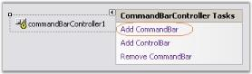' | markdownify }}
{:.image }

{{ '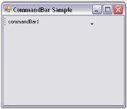' | markdownify }}
{:.image }

See Also

Through Code, Through XP Menus Framework

##### Through Code

In addition to using the designer for designing the CommandBar layout, it is also feasible to use the CommandBar's programmatic API for creating and setting up the application's CommandBars.

The following section covers the steps involved in creating, initializing and setting up CommandBars in a Windows Forms application programmatically.

1. Include the required namespace.

[C#]

using Syncfusion.Windows.Forms.Tools;

[VB.NET]

Imports Syncfusion.Windows.Forms.Tools

2. Create instances of the Essential Tools CommandBarController class and CommandBar control within the application's main form.
3. Call the CommandBarController's BeginInit method to signal the start of initialization.

[C#]

private Syncfusion.Windows.Forms.Tools.CommandBarController commandBarController1;

private Syncfusion.Windows.Forms.Tools.CommandBar commandBar1;

private System.Windows.Forms.Panel panel1;

this.commandBarController1 = new Syncfusion.Windows.Forms.Tools.CommandBarController();

((System.ComponentModel.ISupportInitialize)(this.commandBarController1)).BeginInit();

this.commandBar1 = new Syncfusion.Windows.Forms.Tools.CommandBar();

this.panel1 = new System.Windows.Forms.Panel();

[VB.NET]

Private commandBarController1 As Syncfusion.Windows.Forms.Tools.CommandBarController

Private commandBar1 As Syncfusion.Windows.Forms.Tools.CommandBar

Private panel1 As System.Windows.Forms.Panel

Me.commandBarController1 = New Syncfusion.Windows.Forms.Tools.CommandBarController()

CType(Me.commandBarController1, System.ComponentModel.ISupportInitialize).BeginInit()

Me.commandBar1 = New Syncfusion.Windows.Forms.Tools.CommandBar()

Me.panel1 = New System.Windows.Forms.Panel()

4. Set the form to be the host for all the CommandBars using the CommandBarController's HostForm property.

[C#]

// Set the CommandBarController.HostForm property.

this.commandBarController1.HostForm = this;

[VB.NET]

' Set the CommandBarController.HostForm property.

Me.commandBarController1.HostForm = Me

5. Assign a client control to the CommandBar by adding it to the CommandBar's Controls collection property.

[C#]

// Add the panel control containing the toolbar to the CommandBar.

this.commandBar1.Controls.AddRange(new System.Windows.Forms.Control[] {this.panel1});

[VB.NET]

' Add the panel control containing the toolbar to the CommandBar.

Me.commandBar1.Controls.AddRange(New System.Windows.Forms.Control() {Me.panel1})

6. Add the CommandBar to the CommandBarController through the CommandBarController's CommandBars collectionproperty.

[C#]

this.commandBarController1.CommandBars.Add(this.commandBar1);

// Set the text for the CommandBar.

this.commandBar1.Text = "commandBar1";

[VB.NET]

Me.commandBarController1.CommandBars.Add(Me.commandBar1)

' Set the text for the CommandBar.

Me.commandBar1.Text = "commandBar1"

7. Call the CommandBarController's EndInit method to signal the end of initialization.

[C#]

((System.ComponentModel.ISupportInitialize)(this.commandBarController1)).EndInit();

[VB.NET]

CType(Me.commandBarController1, System.ComponentModel.ISupportInitialize).EndInit()

8. Run the application.

{{ '' | markdownify }}
{:.image }

See Also

Through Designer, Through XP Menus Framework

##### Through XP Menus Framework

The XP Menus framework provides the flexibility to add detached toolbars that can host any .NET control. These toolbars are detached from the framework, i.e., they cannot participate in user customization. Otherwise, they are seamless in look and feel.

1. Right click on the MainFrameBarManager component and choose the Add Detached CommandBar option to add a detached toolbar.
2. Add that control by dragging and dropping to any .NET control. If you need to host multiple controls, you will need to first add a panel to the CommandBar and then add the controls to this panel.

[C#]

// Declare the controls.

private Syncfusion.Windows.Forms.Tools.XPMenus.MainFrameBarManager mainFrameBarManager2;

private Syncfusion.Windows.Forms.Tools.CommandBar commandBar2;

// Initialize the controls.

this.mainFrameBarManager2 = new Syncfusion.Windows.Forms.Tools.XPMenus.MainFrameBarManager(this);

this.commandBar2 = new Syncfusion.Windows.Forms.Tools.CommandBar();

// Set the properties.

this.mainFrameBarManager2.DetachedCommandBars.Add(this.commandBar2);

this.mainFrameBarManager2.Form = this;

this.commandBar1.Text = "commandBar1";

[VB.NET]

' Declare the controls.

Private mainFrameBarManager2 As Syncfusion.Windows.Forms.Tools.XPMenus.MainFrameBarManager

Private commandBar2 As Syncfusion.Windows.Forms.Tools.CommandBar

' Initialize the controls.

Me.mainFrameBarManager2 = New Syncfusion.Windows.Forms.Tools.XPMenus.MainFrameBarManager(Me)

Me.commandBar2 = New Syncfusion.Windows.Forms.Tools.CommandBar()

' Set the properties.

Me.mainFrameBarManager2.DetachedCommandBars.Add(Me.commandBar2)

Me.mainFrameBarManager2.Form = Me

Me.commandBar1.Text = "commandBar1"

{{ '' | markdownify }}
{:.image }

{{ '' | markdownify }}
{:.image }

See Also

Through Designer, Through Code

#### Concepts and Features

This section explains the concepts and features of the ProgressBarAdvcontrol which will help to understand the control better. 

The following are the features discussed.

##### CommandBar States

The CommandBar control of the CommandBarController can be floated or docked to the form as per the requirements of the user.

These two states of the CommandBar are explained in detail in the following topics.

See Also

Serialization

###### Floating CommandBar

By default, CommandBars can be floated on the form by dragging the gripper on the CommandBar. The properties that enable floating of CommandBars and customization of their settings are discussed below.

_Table_ _7_: CommandBar Property Table_

<table>
<tr>
<td>
CommandBar Property</td><td>
Description</td></tr>
<tr>
<td>
DisableFloating</td><td>
Indicates whether the CommandBar is allowed to float.</td></tr>
<tr>
<td>
FloatModeWrapping</td><td>
Indicates whether the CommandBar should wrap when floating.</td></tr>
<tr>
<td>
FloatBounds</td><td>
Gets / sets the bounds of a floating CommandBar.</td></tr>
<tr>
<td>
Floating</td><td>
Returns the current dock / float state of the CommandBar.</td></tr>
</table>

The float state of the CommandBar can be disabled by setting the DisableFloating property to 'True'. 

Setting FloatModeWrapping property to 'True', wraps a floating CommandBar when it is resized to less than it's maximum length. The DisableFloating property must be set to 'False' for this.

[C#]

this.commandBar1.DisableFloating = false;

this.commandBar1.FloatModeWrapping = true;

this.commandBar1.FloatBounds = new System.Drawing.Rectangle(419, 303, 183, 47);

[VB.NET]

Me.commandBar1.DisableFloating = False

Me.commandBar1.FloatModeWrapping = True

Me.commandBar1.FloatBounds = New System.Drawing.Rectangle(419, 303, 183, 47)

{{ '' | markdownify }}
{:.image }

A sample which demonstrates the Floating CommandBar is available in the below sample installation path.

…\_My Documents\Syncfusion\EssentialStudio\Version Number\Windows\Tools.Windows\Samples\Advanced Editor Functions\ActionGroupingDemo_

See Also

Docking CommandBar

###### Docking CommandBar

CommandBar can be docked to all the edges of the form such as Top, Bottom, Right and Left. Docking can be controlled by the CommandBar and CommandBarController properties.

_Table_ _8_: Docking CommandBar_

<table>
<tr>
<td>
CommandBar Property</td><td>
Description</td></tr>
<tr>
<td>
AllowedDockBorders</td><td>
Gets / sets the edges of the form along which the CommandBar may be docked. The options included are given below.Bottom,Left,Right,Top andNone.When set to 'None', the CommandBar cannot be docked to the form.</td></tr>
<tr>
<td>
AlwaysLeadingEdge</td><td>
Indicates whether the CommandBar is always docked to the leading edge.</td></tr>
<tr>
<td>
AlwaysTrailingEdge</td><td>
Indicates whether the CommandBar is always docked to the trailing edge.</td></tr>
<tr>
<td>
DisableDocking</td><td>
Indicates whether the CommandBar is allowed to dock.</td></tr>
<tr>
<td>
DockModeWrapping</td><td>
Wraps the CommandBar when the bounds are less than the maximum length. </td></tr>
<tr>
<td>
DockState</td><td>
Gets / sets the current dock or float state for the CommandBar.</td></tr>
<tr>
<td>
ShowDockModeText</td><td>
Indicates whether the text caption should be displayed on a docked CommandBar.</td></tr>
</table>
> {{ '' | markdownify }}
{:.image }
 _Note: The DisableDocking property must be set to 'False' for the above settings to take effect._

The docked state of the CommandBar can be disabled by setting the DisableDocking property to 'True'.

EnabledDockBorders

This CommandBarController property allows you to dock the CommandBar to the edges of the form. The AllowedDockBorders property doesn't take any effect when this property is set to 'None'.

_Table_ _9_: CommandBarController_ 

<table>
<tr>
<td>
CommandBarController Property</td><td>
Description</td></tr>
<tr>
<td>
EnabledDockBorders</td><td>
Gets / sets the edges of the form along which the CommandBars are allowed to dock. The options included are given below.Bottom,Left,Right,Top andNone.</td></tr>
</table>

[C#]

this.commandBar1.AllowedDockBorders = ((Syncfusion.Windows.Forms.Tools.CommandBarDockBorder)(((Syncfusion.Windows.Forms.Tools.CommandBarDockBorder.Top | Syncfusion.Windows.Forms.Tools.CommandBarDockBorder.Bottom) | Syncfusion.Windows.Forms.Tools.CommandBarDockBorder.Left)));

this.commandBar1.AlwaysLeadingEdge = true;

this.commandBar1.AlwaysTrailingEdge = true;

this.commandBar1.DisableDocking = true;

this.commandBar1.ShowDockModeText = false;

this.commandBar1.DockState = Syncfusion.Windows.Forms.Tools.CommandBarDockState.Top;

this.commandBar1.DockModeWrapping = true;

this.commandBarController1.EnabledDockBorders = ((Syncfusion.Windows.Forms.Tools.CommandBarDockBorder)(((Syncfusion.Windows.Forms.Tools.CommandBarDockBorder.Bottom | Syncfusion.Windows.Forms.Tools.CommandBarDockBorder.Left) | Syncfusion.Windows.Forms.Tools.CommandBarDockBorder.Right)));

[VB.NET]

Me.commandBar1.AllowedDockBorders = (CType(((Syncfusion.Windows.Forms.Tools.CommandBarDockBorder.Top Or Syncfusion.Windows.Forms.Tools.CommandBarDockBorder.Bottom) Or Syncfusion.Windows.Forms.Tools.CommandBarDockBorder.Left), Syncfusion.Windows.Forms.Tools.CommandBarDockBorder))

Me.commandBar1.AlwaysLeadingEdge=True

Me.commandBar1.AlwaysTrailingEdge = True

Me.commandBar1.DisableDocking=True

Me.commandBar1.ShowDockModeText = False

Me.commandBar1.DockState = Syncfusion.Windows.Forms.Tools.CommandBarDockState.Top

Me.commandBar1.DockModeWrapping = True

Me.commandBarController1.EnabledDockBorders = (CType(((Syncfusion.Windows.Forms.Tools.CommandBarDockBorder.Bottom Or Syncfusion.Windows.Forms.Tools.CommandBarDockBorder.Left) Or Syncfusion.Windows.Forms.Tools.CommandBarDockBorder.Right), Syncfusion.Windows.Forms.Tools.CommandBarDockBorder))

The following figure illustrates the above settings.

{{ '' | markdownify }}
{:.image }

Procedure

The following step by step procedure helps you to dock the CommandBar to the target location.

1. Drag the CommandBarController onto the form and add a CommandBar through the design time verb.

{{ '' | markdownify }}
{:.image }

2. Drag buttons onto the form and arrange the buttons as shown as below.

{{ '' | markdownify }}
{:.image }

3. Specify the docking state of the CommandBar in the button click event using the following code snippet.

[C#]

private void button1_Click(object sender, System.EventArgs e)

{

Button btn = sender as Button; 

// Dock to the Top

if (btn == this.top)

this.commandBar1.DockState = CommandBarDockState.Top;

// Dock to the Bottom

if (btn == this.bottom)

this.commandBar1.DockState = CommandBarDockState.Bottom;

// Dock to the Right

if (btn == this.right)

this.commandBar1.DockState = CommandBarDockState.Right;

// Dock to the Left

if (btn == this.left)

this.commandBar1.DockState = CommandBarDockState.Left;

// Dock as Floating

if (btn == this.float_btn)

this.commandBar1.DockState = CommandBarDockState.Float;

}

[VB.NET]

Private Sub button1_Click(ByVal sender As Object, ByVal e As System.EventArgs) Handles top.Click, right.Click, left.Click, bottom.Click, float_btn.Click

Dim btn As Button = sender '

' Dock to the Top

If btn Is Me.top Then

Me.commandBar1.DockState = CommandBarDockState.Top

End If

'Dock to the Bottom

If btn Is Me.bottom Then

Me.commandBar1.DockState = CommandBarDockState.Bottom

End If

'Dock to the Right

If btn Is Me.right Then

Me.commandBar1.DockState = CommandBarDockState.Right

End If

'Dock to the Left

If btn Is Me.left Then

Me.commandBar1.DockState = CommandBarDockState.Left

End If

Dock as Floating

If btn Is Me.float_btn Then

Me.commandBar1.DockState = CommandBarDockState.Float

End If

End Sub

Output

The following figure shows the CommandBar docked to the right border of the Form.

{{ '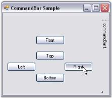' | markdownify }}
{:.image }

A sample which demonstrates the Docked CommandBar is available in the below sample installation path.

…\_My Documents\Syncfusion\EssentialStudio\Version Number\Windows\Tools.Windows\Samples\Advanced Editor Functions\ActionGroupingDemo_

See Also

Floating CommandBar

##### Button Settings

The buttons settings of the CommandBar control are given below.

Close and DropDown Button

The close button of CommandBar gets displayed when it is in the float state whereas the dropdown button gets displayed both in the dock and float state.

_Table_ _10_: Button Settings_

<table>
<tr>
<td>
CommandBar Property</td><td>
Description</td></tr>
<tr>
<td>
HideCloseButton</td><td>
Determines whether the CommandBar will have a close button when floating.</td></tr>
<tr>
<td>
HideDropDownButton</td><td>
Draws the CommandBar with / without the dropdown button.</td></tr>
</table>
> {{ '' | markdownify }}
{:.image }
_Note: Popup Menu can be displayed from the dropdown button of the CommandBar. Refer Popup Menu topic._

[C#]

this.commandBar1.HideCloseButton=true;

this.commandBar1.HideDropDownButton=true;

[VB.NET]

Me.commandBar1.HideCloseButton=True

Me.commandBar1.HideDropDownButton=True

{{ '' | markdownify }}
{:.image }

{{ '' | markdownify }}
{:.image }

The methods associated with the above properties is given below.

_Table_ _11_: Button Settings - Methods_

<table>
<tr>
<td>
Methods</td><td>
Description</td></tr>
<tr>
<td>
GetCloseButtonState</td><td>
Gets visual state for the close button of the floating CommandBar.</td></tr>
<tr>
<td>
GetDropDownState</td><td>
Gets visual state for the dropdown button of the CommandBar.</td></tr>
</table>

A sample which demonstrates the DropDown Button settings of the CommandBar control is available in the below sample installation path.

…\_My Documents\Syncfusion\EssentialStudio\Version Number\Windows\Tools.Windows\Samples\Advanced Editor Functions\ActionGroupingDemo_

##### Interactive Features

This section discusses the interactive features available in the CommandBar control.

Chevron

The term "chevron" is used for a menu that contains the toolbar icons that do not fit in the space available on the toolbar.

_Table_ _12_: Chevron_

<table>
<tr>
<td>
CommandBar Property</td><td>
Description</td></tr>
<tr>
<td>
ChevronColor</td><td>
Gets / sets the color of the chevron.</td></tr>
<tr>
<td>
HideChevron</td><td>
Indicates whether the CommandBar should be drawn without a chevron.</td></tr>
<tr>
<td>
IsChevronVisible</td><td>
Indicates whether the chevron is currently visible.</td></tr>
</table>

[C#]

this.commandBar1.ChevronColor = System.Drawing.Color.Black;

this.commandBar1.HideChevron = false;

this.CommandBar1.IsChevronVisible = true

[VB.NET]

Me.commandBar1.ChevronColor = System.Drawing.Color.Black

Me.commandBar1.HideChevron = False

Me.CommandBar1.IsChevronVisible = True

The following screen shot displays the chevron in the CommandBar.

{{ '' | markdownify }}
{:.image }

> {{ '' | markdownify }}
{:.image }
 _Note: The chevron will be visible only when the toolbar icons do not fit in the space available in the toolbar. Normally it will not be displayed._

A sample which demonstrates the Chevron settings of the CommandBar control is available in the below sample installation path.

…\_My Documents\Syncfusion\EssentialStudio\Version Number\Windows\Tools.Windows\Samples\Advanced Editor Functions\ActionGroupingDemo_

##### Popup Menu

The .NET Context Menu cannot be added to the CommandBars created by the CommandBarController. This is substituted by the Syncfusion Popup Menu in the CommandBars.

There are two ways of associating Popup Menus with the CommandBar.

They are discussed in the following topics.

###### Popup Menu on Clicking the DropDown Button

To display the popup menu on the dropdown button of the CommandBar, follow the steps given below.

1. Drag and drop the CommandBarController onto the form, then add a CommandBar to the form by right clicking on CommandBarController.
2. Add client controls to the CommandBar by just dragging and dropping the controls from the toolbox.
3. Add the Syncfusion PopupMenu control to the form.
4. Add Items to the PopupMenu control. This can be done as follows.
5. Add a ParentBarItem to the PopupMenu control through the Add Default ParentBarItem design time verb.

{{ '' | markdownify }}
{:.image }

6. In the properties window, select the Items property. The BarItem Collection Editor will be opened. Click Add, to add the required number of Items.

{{ '' | markdownify }}
{:.image }

7. Associate the PopupMenu control with the CommandBar using the PopupMenu property of the CommandBar.

This can be done through code as follows.

[C#]

private Syncfusion.Windows.Forms.Tools.CommandBarController commandBarController1;

private Syncfusion.Windows.Forms.Tools.CommandBar commandBar1;

private Syncfusion.Windows.Forms.Tools.XPMenus.PopupMenu popupMenu1;

private Syncfusion.Windows.Forms.Tools.XPMenus.ParentBarItem parentBarItem1;

private Syncfusion.Windows.Forms.Tools.XPMenus.BarItem barItem1;

private Syncfusion.Windows.Forms.Tools.XPMenus.BarItem barItem2;

private Syncfusion.Windows.Forms.Tools.XPMenus.BarItem barItem3;

this.commandBarController1 = new Syncfusion.Windows.Forms.Tools.CommandBarController(this.components);

this.commandBar1 = new Syncfusion.Windows.Forms.Tools.CommandBar();

this.popupMenu1 = new Syncfusion.Windows.Forms.Tools.XPMenus.PopupMenu(this.components);

this.parentBarItem1 = new Syncfusion.Windows.Forms.Tools.XPMenus.ParentBarItem();

this.barItem1 = new Syncfusion.Windows.Forms.Tools.XPMenus.BarItem();

this.barItem2 = new Syncfusion.Windows.Forms.Tools.XPMenus.BarItem();

this.barItem3 = new Syncfusion.Windows.Forms.Tools.XPMenus.BarItem();

// commandBarController1

this.commandBarController1.CommandBars.Add(this.commandBar1);

this.commandBarController1.HostForm = this;

 // commandBar1

this.commandBar1.Text = "commandBar1";

this.commandBar1.PopupMenu = this.popupMenu1;

// popupMenu1

this.popupMenu1.ParentBarItem = this.parentBarItem1;

// parentBarItem1

this.parentBarItem1.Items.AddRange(new Syncfusion.Windows.Forms.Tools.XPMenus.BarItem[] {

this.barItem1,

this.barItem2,

this.barItem3});

this.parentBarItem1.Style = Syncfusion.Windows.Forms.VisualStyle.OfficeXP;

// barItem1

this.barItem1.Text = "Syncfusion Home";

// barItem2

this.barItem2.Text = "Windows Forms FAQ";

// barItem3

this.barItem3.Text = "Syncfusion Sales";

[VB.NET]

Private commandBarController1 As Syncfusion.Windows.Forms.Tools.CommandBarController

Private commandBar1 As Syncfusion.Windows.Forms.Tools.CommandBar

Private popupMenu1 As Syncfusion.Windows.Forms.Tools.XPMenus.PopupMenu

Private parentBarItem1 As Syncfusion.Windows.Forms.Tools.XPMenus.ParentBarItem

Private barItem1 As Syncfusion.Windows.Forms.Tools.XPMenus.BarItem

Private barItem2 As Syncfusion.Windows.Forms.Tools.XPMenus.BarItem

Private barItem3 As Syncfusion.Windows.Forms.Tools.XPMenus.BarItem

Me.CommandBarController1 = New Syncfusion.Windows.Forms.Tools.CommandBarController(Me.components)

Me.commandBar1 = New Syncfusion.Windows.Forms.Tools.CommandBar()

Me.popupMenu1 = New Syncfusion.Windows.Forms.Tools.XPMenus.PopupMenu(Me.components)

Me.parentBarItem1 = New Syncfusion.Windows.Forms.Tools.XPMenus.ParentBarItem()

Me.barItem1 = New Syncfusion.Windows.Forms.Tools.XPMenus.BarItem()

Me.barItem2 = New Syncfusion.Windows.Forms.Tools.XPMenus.BarItem()

Me.barItem3 = New Syncfusion.Windows.Forms.Tools.XPMenus.BarItem()

' commandBarController1 

Me.CommandBarController1.CommandBars.Add(Me.commandBar1)

Me.CommandBarController1.HostForm = Me

' commandBar1 

Me.commandBar1.Text = "commandBar1"

Me.commandBar1.PopupMenu = Me.popupMenu1

' popupMenu1 

Me.popupMenu1.ParentBarItem = Me.parentBarItem1

' parentBarItem1 

Me.parentBarItem1.Items.AddRange(New Syncfusion.Windows.Forms.Tools.XPMenus.BarItem() {Me.barItem1, Me.barItem2, Me.barItem3})

Me.parentBarItem1.Style = Syncfusion.Windows.Forms.VisualStyle.OfficeXP

' barItem1 

Me.barItem1.Text = "Syncfusion Home"

' barItem2 

Me.barItem2.Text = "Windows Forms FAQ"

' barItem3 

Me.barItem3.Text = "Syncfusion Sales"

{{ '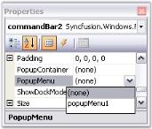' | markdownify }}
{:.image }

{{ '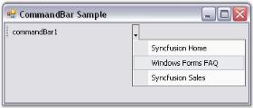' | markdownify }}
{:.image }

See Also

Popup Menu on Right Clicking the CommandBar

###### Popup Menu on Right Clicking the CommandBar

To show the Popup Menu on right-clicking on the CommandBar, follow the steps given below.

* Drag the CommandBarController onto the form, then add a CommandBar to the form by right clicking on CommandBarController.
* Add a PopupMenusManager along with the PopupMenu component. This will add an extended property on the CommandBar properties window as XPContextMenu on popupMenusManager. You can set the required Popup Menu from the dropdown list.

This can be done through code as follows.

[C#]

private Syncfusion.Windows.Forms.Tools.CommandBarController commandBarController1;

private Syncfusion.Windows.Forms.Tools.CommandBar commandBar1;

private Syncfusion.Windows.Forms.Tools.XPMenus.PopupMenu popupMenu1;

private Syncfusion.Windows.Forms.Tools.XPMenus.ParentBarItem parentBarItem1;

private Syncfusion.Windows.Forms.Tools.XPMenus.BarItem barItem1;

private Syncfusion.Windows.Forms.Tools.XPMenus.BarItem barItem2;

private Syncfusion.Windows.Forms.Tools.XPMenus.BarItem barItem3;

private Syncfusion.Windows.Forms.Tools.XPMenus.PopupMenusManager popupMenusManager1;

this.commandBarController1 = new Syncfusion.Windows.Forms.Tools.CommandBarController(this.components);

this.commandBar1 = new Syncfusion.Windows.Forms.Tools.CommandBar();

this.popupMenu1 = new Syncfusion.Windows.Forms.Tools.XPMenus.PopupMenu(this.components);

this.parentBarItem1 = new Syncfusion.Windows.Forms.Tools.XPMenus.ParentBarItem();

this.barItem1 = new Syncfusion.Windows.Forms.Tools.XPMenus.BarItem();

this.barItem2 = new Syncfusion.Windows.Forms.Tools.XPMenus.BarItem();

this.barItem3 = new Syncfusion.Windows.Forms.Tools.XPMenus.BarItem();

this.popupMenusManager1.SetXPContextMenu(this.commandBar1, this.popupMenu1);

// commandBarController1

this.commandBarController1.CommandBars.Add(this.commandBar1);

this.commandBarController1.HostForm = this;

 // commandBar1

this.commandBar1.Text = "commandBar1";

this.commandBar1.PopupMenu = this.popupMenu1;

this.popupMenusManager1 = new Syncfusion.Windows.Forms.Tools.XPMenus.PopupMenusManager(this.components);

// popupMenu1

this.popupMenu1.ParentBarItem = this.parentBarItem1;

// parentBarItem1

this.parentBarItem1.Items.AddRange(new Syncfusion.Windows.Forms.Tools.XPMenus.BarItem[] {

this.barItem1,

this.barItem2,

this.barItem3});

this.parentBarItem1.Style = Syncfusion.Windows.Forms.VisualStyle.OfficeXP;

// barItem1

this.barItem1.Text = "Syncfusion Home";

// barItem2

this.barItem2.Text = "Windows Forms FAQ";

// barItem3

this.barItem3.Text = "Syncfusion Sales";

[VB.NET]

Private commandBarController1 As Syncfusion.Windows.Forms.Tools.CommandBarController

Private commandBar1 As Syncfusion.Windows.Forms.Tools.CommandBar

Private popupMenu1 As Syncfusion.Windows.Forms.Tools.XPMenus.PopupMenu

Private parentBarItem1 As Syncfusion.Windows.Forms.Tools.XPMenus.ParentBarItem

Private barItem1 As Syncfusion.Windows.Forms.Tools.XPMenus.BarItem

Private barItem2 As Syncfusion.Windows.Forms.Tools.XPMenus.BarItem

Private barItem3 As Syncfusion.Windows.Forms.Tools.XPMenus.BarItem

Private popupMenusManager1 As Syncfusion.Windows.Forms.Tools.XPMenus.PopupMenusManager

Me.CommandBarController1 = New Syncfusion.Windows.Forms.Tools.CommandBarController(Me.components)

Me.commandBar1 = New Syncfusion.Windows.Forms.Tools.CommandBar()

Me.popupMenu1 = New Syncfusion.Windows.Forms.Tools.XPMenus.PopupMenu(Me.components)

Me.parentBarItem1 = New Syncfusion.Windows.Forms.Tools.XPMenus.ParentBarItem()

Me.barItem1 = New Syncfusion.Windows.Forms.Tools.XPMenus.BarItem()

Me.barItem2 = New Syncfusion.Windows.Forms.Tools.XPMenus.BarItem()

Me.barItem3 = New Syncfusion.Windows.Forms.Tools.XPMenus.BarItem()

Me.popupMenusManager1 = New Syncfusion.Windows.Forms.Tools.XPMenus.PopupMenusManager(Me.components)

' commandBarController1 

Me.CommandBarController1.CommandBars.Add(Me.commandBar1)

Me.CommandBarController1.HostForm = Me

' commandBar1 

Me.commandBar1.Text = "commandBar1"

Me.commandBar1.PopupMenu = Me.popupMenu1

Me.popupMenusManager1.SetXPContextMenu(Me.commandBar1, Me.popupMenu1)

' popupMenu1 

Me.popupMenu1.ParentBarItem = Me.parentBarItem1

' parentBarItem1 

Me.parentBarItem1.Items.AddRange(New Syncfusion.Windows.Forms.Tools.XPMenus.BarItem() {Me.barItem1, Me.barItem2, Me.barItem3})

Me.parentBarItem1.Style = Syncfusion.Windows.Forms.VisualStyle.OfficeXP

' barItem1 

Me.barItem1.Text = "Syncfusion Home"

' barItem2 

Me.barItem2.Text = "Windows Forms FAQ"

' barItem3 

Me.barItem3.Text = "Syncfusion Sales"

{{ '' | markdownify }}
{:.image }

{{ '' | markdownify }}
{:.image }

See Also

Popup Menu on Clicking the DropDown Button

##### Hosting Child Controls

Child controls can be easily hosted by the CommandBar through designer as well as through code. This can be done by selecting the client controls from the toolbox and dropping it onto the particular CommandBar. The control will be resized to fit the CommandBar's client bounds. 

A CommandBar can host a single control / multiple controls. This can be done as follows.

Single Control

You can drag-and-drop the single client control onto the CommandBar.

Multiple Controls

To accommodate multiple controls, place the controls within a Panel control and set it to be the CommandBar's client.

[C#]

this.commandBar1.Controls.Add(this.panel1);

[VB.NET]

Me.commandBar1.Controls.Add(Me.panel1)

{{ '' | markdownify }}
{:.image }

The method associated with the above property is given below.

_Table_ _13_: Method Table_

<table>
<tr>
<td>
Method</td><td>
Description</td></tr>
<tr>
<td>
CalcChildControlBounds</td><td>
Calculates the client control bounds for the specified CommandBar size and dock position.</td></tr>
</table>
##### Appearance Settings

The appearance settings that play a vital role in enhancing the appearance of the CommandBar control are listed below.

###### Background Settings

The background settings of the CommandBar control are discussed below.

BackColor

CommandBarController

The back color of the CommandBarController can be set using the property given below.

_Table_ _14_: CommandBarController Property Table_

<table>
<tr>
<td>
CommandBarController Property</td><td>
Description</td></tr>
<tr>
<td>
BackColor</td><td>
The background color used to draw the host form's dockable regions.</td></tr>
</table>

[C#]

this.commandBarController1.BackColor = System.Drawing.Color.RosyBrown;

[VB.NET]

Me.CommandBarController1.BackColor = System.Drawing.Color.RosyBrown

CommandBar

The back color of the CommandBar can be set using the property given below.

_Table_ _15_: CommandBar Property Table_

<table>
<tr>
<td>
CommandBar Property</td><td>
Description</td></tr>
<tr>
<td>
BackColor</td><td>
The background color used to draw the component.</td></tr>
</table>

[C#]

this.commandBar1.BackColor = System.Drawing.Color.Wheat;

[VB.NET]

Me.commandBar1.BackColor = System.Drawing.Color.Wheat

{{ '' | markdownify }}
{:.image }

> {{ '' | markdownify }}
{:.image }
 _Note: The ResetBackColor() method of the CommandBarController can be used to reset it's BackColor property to the default value. Similarly, the ResetBackColor() method of the CommandBar can be used to reset it's BackColor property to the default value._

###### Foreground Settings

The foreground settings of the CommandBar control are discussed below.

Gripper

The gripper plays a major role in the CommandBar package. It allows the user to dock / float the CommandBar at runtime.

_Table_ _16_: CommandBar Property Table_

<table>
<tr>
<td>
CommandBar Property</td><td>
Description</td></tr>
<tr>
<td>
HideGripper</td><td>
Draws the CommandBar with / without the drag gripper.</td></tr>
</table>

[C#]

this.commandBar1.HideGripper=true;

[VB.NET]

Me.commandBar1.HideGripper=True

{{ '' | markdownify }}
{:.image }

Font

The font of the text displayed in the CommandBar can be customized using the property given below.

_Table_ _17_: CommandBar Property Table_

<table>
<tr>
<td>
CommandBar Property</td><td>
Description</td></tr>
<tr>
<td>
Font</td><td>
The font used to display text in the control.</td></tr>
</table>

[C#]

this.commandBar3.Font = new System.Drawing.Font("Comic Sans MS", 8.25F, System.Drawing.FontStyle.Regular, System.Drawing.GraphicsUnit.Point, ((byte)(0)));

[VB.NET]

Me.commandBar3.Font = New System.Drawing.Font("Comic Sans MS", 8.25F, System.Drawing.FontStyle.Regular, System.Drawing.GraphicsUnit.Point, CByte((0)))

{{ '' | markdownify }}
{:.image }

> {{ '' | markdownify }}
{:.image }
 _Note: The ResetFont() method can be used to reset the Font property to it's default value._

###### Length and Height Settings

The properties that define the dimensions for the CommandBar are given below. During design time, the control's size can be changed by editing these property values.

_Table_ _18_: CommandBar Property Table_

<table>
<tr>
<td>
CommandBar Property</td><td>
Description</td></tr>
<tr>
<td>
MaxLength</td><td>
Gets / sets the maximum linear dimension of the CommandBar.</td></tr>
<tr>
<td>
MinLength</td><td>
Gets / sets the minimum linear dimension of the CommandBar.</td></tr>
<tr>
<td>
OccupyFullRow</td><td>
Indicates whether the CommandBar should occupy the entire row when docked.</td></tr>
<tr>
<td>
MinHeight</td><td>
Gets / sets the ideal lateral dimension of the CommandBar.</td></tr>
<tr>
<td>
IntegralHeight</td><td>
Gets / sets the incremental step by which the CommandBar's lateral dimension increases when wrapped.</td></tr>
</table>

[C#]

this.commandBar1.MaxLength = 201;

this.commandBar1.MinLength = 51;

this.commandBar1.OccupyFullRow = true;

this.commandBar1.MinHeight = 27;

this.commandBar1.IntegralHeight = 2;

[VB.NET]

Me.commandBar1.MaxLength = 201

Me.commandBar1.MinLength = 51

Me.commandBar1.OccupyFullRow = True

Me.commandBar1.MinHeight = 27

Me.commandBar1.IntegralHeight = 2

{{ '' | markdownify }}
{:.image }

The method associated with the above properties is given below.

_Table_ _19_: Method Table_

<table>
<tr>
<td>
Method</td><td>
Description</td></tr>
<tr>
<td>
CalcCommandBarMaxLength</td><td>
Calculates the CommandBar's maximum length for the specified client width.</td></tr>
</table>
See Also

Interactive Features, Themes And Visual Styles

##### Behavior Settings

The behavior settings of the CommandBar control are given below.

Cursor

The cursor settings of the CommandBar can be customized using the property given below.

_Table_ _20_: CommandBar Property Table_

<table>
<tr>
<td>
CommandBar Property</td><td>
Description</td></tr>
<tr>
<td>
Cursor</td><td>
The mouse cursor used for the CommandBar.</td></tr>
</table>

[C#]

this.commandBar1.Cursor = System.Windows.Forms.Cursors.Hand;

[VB.NET]

Me.commandBar1.Cursor = System.Windows.Forms.Cursors.Hand

> {{ '' | markdownify }}
{:.image }
 _Note: The ResetCursor() method can be used to reset the Cursor property to it's default value._

Row Index and Offset

The index and offset settings of rows can be customized using the properties given below.

_Table_ _21_: CommandBar Property Table_

<table>
<tr>
<td>
CommandBar Property</td><td>
Description</td></tr>
<tr>
<td>
RowIndex</td><td>
Gets / sets the index of the row or column for the CommandBar.</td></tr>
<tr>
<td>
RowOffset</td><td>
Gets / sets the linear offset of the CommandBar within a row.</td></tr>
</table>

[C#]

this.commandBar1.RowIndex = 1;

this.commandBar1.RowOffset = 1;

[VB.NET]

Me.commandBar1.RowIndex = 0

Me.commandBar1.RowOffset = 0

Visible / Hidden CommandBar

The CommandBar control can be hidden using the property given below.

_Table_ _22_: CommandBar Property Table_

<table>
<tr>
<td>
CommandBar Property</td><td>
Description</td></tr>
<tr>
<td>
Visible</td><td>
Determines whether the control is visible or hidden. The default value is set to 'True'.</td></tr>
</table>

[C#]

this.commandBar1.Visible = true;

[VB.NET]

Me.commandBar1.Visible = True

RightToLeft

The elements of the CommandBarController can be aligned from right to left and vice versa using the property given below.

_Table_ _23_: CommandBarController Property Table_

<table>
<tr>
<td>
CommandBarController Property</td><td>
Description</td></tr>
<tr>
<td>
RightToLeft</td><td>
Gets a value indicating whether the control's elements are aligned from right to left.</td></tr>
</table>

[C#]

this.commandBarController1.RightToLeft = true;

[VB.NET]

Me.commandBarController1.RightToLeft = True

##### Themes And Visual Styles

This section discusses the themes and visual styles settings of the CommandBar control.

###### Themes

Themes define the look and feel of the CommandBar control. They can be set using the property given below.

_Table_ _24_: CommandBarController Property Table_

<table>
<tr>
<td>
CommandBarController Property</td><td>
Description</td></tr>
<tr>
<td>
ThemesEnabled</td><td>
Specifies whether XP themes should be used for the CommandBars.</td></tr>
</table>

[C#]

this.commandBarController1.ThemesEnabled=true;

[VB.NET]

Me.commandBarController1.ThemesEnabled=True

{{ '' | markdownify }}
{:.image }

###### Visual Styles

Visual Styles enhance the appearance of the CommandBar control and can be set using the property given below.

_Table_ _25_: CommandBarController Property Table_

<table>
<tr>
<td>
CommandBarController Property</td><td>
Description</td></tr>
<tr>
<td>
Style</td><td>
Specifies the visual style of the CommandBar. It includes the options given below.OfficeXP,Office2003,Office2007,VS2005 andOffice2007Outlook.</td></tr>
</table>

[C#]

this.commandBarController1.ThemesEnabled = true;

this.commandBarController1.Style = Syncfusion.Windows.Forms.VisualStyle.OfficeXP;

[VB.NET]

Me.commandBarController1.ThemesEnabled=True

Me.commandBarController1.Style = Syncfusion.Windows.Forms.VisualStyle.OfficeXP

{{ '' | markdownify }}
{:.image }

> {{ '' | markdownify }}
{:.image }
 _Note : For the Office2003 and VS2005 styles to take effect, the ThemesEnabled property should be set to 'False'._

###### Office 2007 Theme

CommandBarController provides the new Microsoft Office 2007 style in different color schemes, to enhance the appearance of the CommandBar control. Office 2007 color schemes can be enabled using the Office2007Theme property.

_Table_ _26_: CommandBarController Property Table_

<table>
<tr>
<td>
CommandBarController Property</td><td>
Description</td></tr>
<tr>
<td>
Office2007Theme</td><td>
Specifies the color scheme for the Office 2007 visual style. It includes the options given below.Blue,Silver,Black andManaged.</td></tr>
</table>

[C#]

this.commandBarController1.Style = Syncfusion.Windows.Forms.VisualStyle.Office2007Outlook;

this.commandBarController1.Office2007Theme = Syncfusion.Windows.Forms.Office2007ColorScheme.Blue;

[VB.NET]

Me.commandBarController1.Style = Syncfusion.Windows.Forms.VisualStyle.Office2007Outlook

Me.commandBarController1.Office2007Theme = Syncfusion.Windows.Forms.Office2007ColorScheme.Blue

{{ '' | markdownify }}
{:.image }

> {{ '' | markdownify }}
{:.image }
_Note: The Style property must be set to 'Office2007' or 'Office2007Outlook' to get the Office 2007 theme effect._

###### Office 2010 Styles

This feature provides Office 2010-like themes for Windows Forms UI controls. These themes add the Office 2010-like look and feel to your application. This feature enables you to easily apply uniform style to all of the child controls in the application. Windows Forms UI controls support three themes found in Office 2010. They are:  

* Blue
* Black 
* Silver

There is also a user-managed theme called Managed.

Supported Controls

Controls that support Office 2007 themes will also support the Office 2010 themes. The API used to set the style will also be the same as Office 2007.

The following code samples can be used to apply Office 2010 themes to the DockingManager.

[C#]

//Set the visual style of the docked controls.

this.dockingManager.VisualStyle = Syncfusion.Windows.Forms.VisualStyle.Office2010;

this.dockingManager1.Office2010Theme = Syncfusion.Windows.Forms.Office2010Theme.Silver;

[VB]

' Set the visual style of the docked controls.

Me.dockingManager.VisualStyle = Syncfusion.Windows.Forms.VisualStyle.Office2010

Me.dockingManager1.Office2010Theme = Syncfusion.Windows.Forms.Office2010Theme.Silver

The list of controls that support Office 2010 styles is displayed in the following table:

_Table_ _27_: List of controls_

<table>
<tr>
<td>
1</td><td>
ButtonAdv</td></tr>
<tr>
<td>
2</td><td>
ButtonEdit</td></tr>
<tr>
<td>
3</td><td>
CalculatorControl</td></tr>
<tr>
<td>
4</td><td>
CheckBoxAdv</td></tr>
<tr>
<td>
5</td><td>
ColorPickerButton</td></tr>
<tr>
<td>
6</td><td>
ColorPickerUIAdv</td></tr>
<tr>
<td>
7</td><td>
ColorUIControl</td></tr>
<tr>
<td>
8</td><td>
ComboBoxAdv</td></tr>
<tr>
<td>
9</td><td>
ComboBoxBase</td></tr>
<tr>
<td>
10</td><td>
ComboDropDown</td></tr>
<tr>
<td>
11</td><td>
CurrencyEdit</td></tr>
<tr>
<td>
12</td><td>
CurrencyTextBox</td></tr>
<tr>
<td>
13</td><td>
ChildFrameBar Manager</td></tr>
<tr>
<td>
14</td><td>
DateTimePickerAdv</td></tr>
<tr>
<td>
15</td><td>
DockingManager</td></tr>
<tr>
<td>
16</td><td>
DomainUpDownExt</td></tr>
<tr>
<td>
17</td><td>
DoubleTextBox</td></tr>
<tr>
<td>
18</td><td>
GroupBar</td></tr>
<tr>
<td>
19</td><td>
IntegerTextBox</td></tr>
<tr>
<td>
20</td><td>
MainFrameBarManager</td></tr>
<tr>
<td>
21</td><td>
MaskedEditBox</td></tr>
<tr>
<td>
22</td><td>
MonthCalendarAdv</td></tr>
<tr>
<td>
23</td><td>
MultiColumnComboBox</td></tr>
<tr>
<td>
24</td><td>
NumericUpDownExt</td></tr>
<tr>
<td>
25</td><td>
PercentTextBox</td></tr>
<tr>
<td>
26</td><td>
RadioButtonAdv</td></tr>
<tr>
<td>
27</td><td>
RibbonControlAdv</td></tr>
<tr>
<td>
28</td><td>
RecordNavigationControl</td></tr>
<tr>
<td>
29</td><td>
ScrollersFrame</td></tr>
<tr>
<td>
30</td><td>
SplitterControl</td></tr>
<tr>
<td>
31</td><td>
SkinManager</td></tr>
<tr>
<td>
32</td><td>
TabbedMDIPackage</td></tr>
<tr>
<td>
33</td><td>
TabbedGroupedMDIManager</td></tr>
<tr>
<td>
34</td><td>
TabControlAdv</td></tr>
<tr>
<td>
35</td><td>
TextBoxExt</td></tr>
<tr>
<td>
36</td><td>
TreeViewAdv</td></tr>
<tr>
<td>
37</td><td>
XPTaskBar</td></tr>
<tr>
<td>
38</td><td>
XPTaskPane</td></tr>
<tr>
<td>
39</td><td>
XPToolBar</td></tr>
</table>
###### Skin Manager Compatibility

Previously, the SkinManager supported only Office 2007 themes. Now the SkinManager will support Office 2010 themes for the following color schemes:

* Office 2010 Blue
* Office 2010 Black
* Office 2010 Silver
##### Serialization

The layout state of a CommandBar object can be saved and loaded in the formats given below.

* XML
* Binary Format
* Isolated Storage
* Windows Registry

Persistence Support

The CommandBarController provides support to save the persisted state of the CommandBar.

_Table_ _28_: CommandBarController Property Table_

<table>
<tr>
<td>
CommandBarController Property</td><td>
Description</td></tr>
<tr>
<td>
PersistState</td><td>
Specifies whether the application's CommandBar state should be persisted.</td></tr>
</table>

[C#]

this.commandBarController1.PersistState = true;

[VB.NET]

Me.commandBarController1.PersistState = True

AppStateSerializer class

The AppStateSerializer class provides a mechanism for coordinating the serialization behavior of multiple components.

The following step by step procedure helps you to save and load the layout state of the CommandBar and ControlBar objects.

1. Drag and drop the CommandBarController from the toolbox onto the form, add radio buttons for layout options as in the figure given below.
2. Add CommandBars and ControlBars through the design time verbs of the CommandBarController.

{{ '' | markdownify }}
{:.image }

3. Include the required namespaces.

[C#]

using Syncfusion.Runtime.Serialization;

using System.IO;

using System.Xml;

using Microsoft.Win32;

using Syncfusion.Windows.Forms.Tools;

[VB.NET]

Imports Syncfusion.Runtime.Serialization

Imports System.IO

Imports System.Xml

Imports Microsoft.Win32

Imports Syncfusion.Windows.Forms.Tools

4. Declare instances of RegistryKey and MemoryStream classes.

[C#]

RegistryKey rootKey;

private string selRad;

private MemoryStream memstream;

[VB.NET]

Private rootKey As RegistryKey

Private selRad As String

Private memstream As MemoryStream

5. In the Form Load event, use the following code snippet.

[C#]

private void Form1_Load(object sender, System.EventArgs e)

{

// Get the path of subKey.

rootKey = Registry.CurrentUser.OpenSubKey("Config");

// Retrieve the data associated with the subKey.

selRad = (string) rootKey.GetValue("PersistType");

if(selRad ==null) selRad = "XML";

AppStateSerializer app = GetSerializer(selRad);

if(app != null)

// Retrieve the saved layout state of CommandBar objects using AppStateSerializer class.

this.commandBarController1.LoadCommandBarState(app);

}

[VB.NET]

Private Sub Form1_Load(ByVal sender As Object, ByVal e As System.EventArgs)

' Get the path of subKey.

rootKey = Registry.CurrentUser.OpenSubKey("Config")

' Retrieve the data associated with the subKey.

selRad = CStr(rootKey.GetValue("PersistType"))

If selRad Is Nothing Then

selRad = "XML"

End If

Dim app As AppStateSerializer = GetSerializer(selRad)

If Not app Is Nothing Then

' Retrieve the saved layout state of CommandBar objects using AppStateSerializer class.

Me.commandBarController1.LoadCommandBarState(app)

End If

End Sub

6. Serialization can be accomplished using the AppStateSerializer class.

[C#]

private AppStateSerializer GetSerializer(string str)

{

AppStateSerializer state;

switch (str)

{

//XML file is used to read/write the layout information

case "XML":

state = new AppStateSerializer(SerializeMode.XMLFile, @"C:\StateInfo");

break;

//Binary file is used to read/write the layout information

case "Binary Format":

state = new AppStateSerializer(SerializeMode.BinaryFile, @"C:\StateInfo");

break;

//Win32 windowsRegistry is used to read/write the layout information

case "Windows Registry":

Microsoft.Win32.RegistryKey rootKey = Microsoft.Win32.Registry.CurrentUser.CreateSubKey(@"Software\CommandBar\State");

state= new AppStateSerializer(SerializeMode.WindowsRegistry,rootKey);

break;

//Isolated storage is used to read/write the layout information

case "Isolated Storage":

state= new AppStateSerializer(SerializeMode.IsolatedStorage,"StateInfo", System.IO.IsolatedStorage.IsolatedStorageScope.User);

break;

default:

state = null;

break;

}

return (state);

}

[VB.NET]

Private Function GetSerializer(ByVal str As String) As AppStateSerializer

Dim state As AppStateSerializer

Select Case str

'XML file is used to read/write the layout information

Case "XML"

state = New AppStateSerializer(SerializeMode.XMLFile, "C:\StateInfo")

'Binary file is used to read/write the layout information

Case "Binary Format"

state = New AppStateSerializer(SerializeMode.BinaryFile, "C:\StateInfo")

'Win32 windowsRegistry is used to read/write the layout information

Case "Windows Registry"

Dim rootKey As Microsoft.Win32.RegistryKey = Microsoft.Win32.Registry.CurrentUser.CreateSubKey("Software\CommandBar\State")

state = New AppStateSerializer(SerializeMode.WindowsRegistry, rootKey)

'Isolated storage is used to read/write the layout information

Case "Isolated Storage"

state = New AppStateSerializer(SerializeMode.IsolatedStorage, "StateInfo", System.IO.IsolatedStorage.IsolatedStorageScope.User)

Case Else

state = Nothing

 End Select

 Return (state)

End Function

7. In the Form Closing event, use the following code snippet.

[C#]

private void Form1_Closing(object sender, System.ComponentModel.CancelEventArgs e)

{

selRad = this.getSelRad();

rootKey = Registry.CurrentUser.CreateSubKey("Config");

rootKey.SetValue("PersistType",selRad);

AppStateSerializer app = this.GetSerializer(selRad);

if(app != null)

{

// Store the current layout state of CommandBar objects using AppStateSerializer class.

this.commandBarController1.SaveCommandBarState(app);

app.PersistNow();

}

}

private string getSelRad()

{

RadioButton radReturn = new RadioButton();

foreach(Control ctrl in this.groupBox1.Controls)

{

RadioButton rad = ctrl as RadioButton;

if(rad.Checked) radReturn = rad;

}

return(radReturn.Text);

}

[VB.NET]

Private Sub Form1_Closing(ByVal sender As Object, ByVal e As System.ComponentModel.CancelEventArgs)

selRad = Me.getSelRad()

rootKey = Registry.CurrentUser.CreateSubKey("Config")

rootKey.SetValue("PersistType", selRad)

Dim app As AppStateSerializer = Me.GetSerializer(selRad)

If Not app Is Nothing Then

' Store the current layout state of CommandBar objects using AppStateSerializer class.

Me.commandBarController1.SaveCommandBarState(app)

app.PersistNow()

End If

End Sub

Private Function getSelRad() As String

Dim radReturn As RadioButton = New RadioButton()

For Each ctrl As Control In Me.groupBox1.Controls

Dim rad As RadioButton = CType(IIf(TypeOf ctrl Is RadioButton, ctrl, Nothing), RadioButton)

If rad.Checked Then

radReturn = rad

End If

Next ctrl

Return (radReturn.Text)

End Function

8. Add the following code for each CheckedChanged event of the Radio Button.

[C#]

private void radXML_CheckedChanged(object sender, System.EventArgs e)

{

selRad = "XML";

}

private void radBinary_CheckedChanged(object sender, System.EventArgs e)

{

selRad = "Binary Format";

}

private void radIsoS_CheckedChanged(object sender, System.EventArgs e)

{

selRad = "Isolated Storage";

}

private void radBinFmt_CheckedChanged(object sender, System.EventArgs e)

{

selRad = "Binary Fmt Format";

}

private void radReg_CheckedChanged(object sender, System.EventArgs e)

{

selRad = "Windows Registry";

}

private void radXMLFmt_CheckedChanged(object sender, System.EventArgs e)

{

selRad = "XML Fmt Format";

}

[VB.NET]

Private Sub radXML_CheckedChanged(ByVal sender As Object, ByVal e As System.EventArgs)

selRad = "XML"

End Sub

Private Sub radBinary_CheckedChanged(ByVal sender As Object, ByVal e As System.EventArgs)

selRad = "Binary Format"

End Sub

Private Sub radIsoS_CheckedChanged(ByVal sender As Object, ByVal e As System.EventArgs)

selRad = "Isolated Storage"

End Sub

Private Sub radBinFmt_CheckedChanged(ByVal sender As Object, ByVal e As System.EventArgs)

selRad = "Binary Fmt Format"

End Sub

Private Sub radReg_CheckedChanged(ByVal sender As Object, ByVal e As System.EventArgs)

selRad = "Windows Registry"

End Sub

Private Sub radXMLFmt_CheckedChanged(ByVal sender As Object, ByVal e As System.EventArgs)

selRad = "XML Fmt Format"

End Sub

Run the sample, dock the CommandBars to any target location and save it's state using any storage technique before closing the application.

The following screen shot shows the saved layout state of the CommandBar object after closing the application.

{{ '' | markdownify }}
{:.image }

##### CommandBar Events

The list of events and a detailed explanation about each of them is given in the following sections.

_Table_ _29_: CommandBar Event Table_

<table>
<tr>
<td>
CommandBar Event</td><td>
Description</td></tr>
<tr>
<td>
CommandBarDropDownClicked</td><td>
This event occurs when the dropdown button on a CommandBar is clicked.</td></tr>
<tr>
<td>
CommandBarStateChanging</td><td>
This event occurs when a CommandBar's dock / float state is about to change.</td></tr>
<tr>
<td>
CommandBarStateChanged</td><td>
This event occurs after a CommandBar's dock / float state changes.</td></tr>
<tr>
<td>
CommandBarUserClosed</td><td>
This event occurs when a floating CommandBar is hidden by the user.</td></tr>
<tr>
<td>
CommandBarWrapping</td><td>
This event occurs when the CommandBar is being wrapped.</td></tr>
</table>
###### CommandBarDropDownClicked Event

This event is raised when the dropdown button of a CommandBar is clicked.

The event handler receives an argument of type EventArgs containing data related to this event.

[C#]

// Add a PopupMenu control and assign it to the PopupMenu property of the CommandBar.

this.commandBar1.PopupMenu = this.popupMenu1;

// Add a ParentBarItem to the PopupMenu.

this.popupMenu1.ParentBarItem = this.parentBarItem1;

// Add items to the ParentBarItem.

this.parentBarItem1.Items.AddRange(new Syncfusion.Windows.Forms.Tools.XPMenus.BarItem[] {

this.barItem1,

this.barItem2,

this.barItem3});

this.barItem1.Text = "Windows Forms Samples";

this.barItem2.Text = "ASP.NET Samples";

this.barItem3.Text = "WPF Samples";

// Handle the CommandBarDropDownClicked event.

this.commandBar1.CommandBarDropDownClicked+=new  EventHandler(commandBar1_CommandBarDropDownClicked);

private void commandBar1_CommandBarDropDownClicked(object sender, EventArgs e)

{

// The below line will be displayed in the output window at runtime.

Console.WriteLine(" CommandBarDropDownClicked event is raised ");

}

[VB.NET]

' Add a PopupMenu control and assign it to the PopupMenu property of the CommandBar. 

Me.commandBar1.PopupMenu = Me.popupMenu1 

' Add a ParentBarItem to the PopupMenu. 

Me.popupMenu1.ParentBarItem = Me.parentBarItem1 

' Add items to the ParentBarItem. 

Me.parentBarItem1.Items.AddRange(New Syncfusion.Windows.Forms.Tools.XPMenus.BarItem() {Me.barItem1, Me.barItem2, Me.barItem3}) 

Me.barItem1.Text = "Windows Forms Samples" 

Me.barItem2.Text = "ASP.NET Samples" 

Me.barItem3.Text = "WPF Samples" 

' Handle the CommandBarDropDownClicked event. 

AddHandler Me.commandBar1.CommandBarDropDownClicked, AddressOf commandBar1_CommandBarDropDownClicked 

Private Sub commandBar1_CommandBarDropDownClicked(ByVal sender As Object, ByVal e As EventArgs)

    ' The below line will be displayed in the output window at runtime. 

    Console.WriteLine(" CommandBarDropDownClicked event is raised ")

End Sub

###### CommandBarStateChanging Event

This event is raised when a CommandBar's dock / float state is about to change.

The event handler receives an argument of type CommandBarStateChangingEventArgs containing data related to this event. The following CommandBarStateChangingEventArgs members provide information specific to this event.

_Table_ _30_: Members Table_

<table>
<tr>
<td>
 Members</td><td>
Description</td></tr>
<tr>
<td>
Cancel</td><td>
Gets / sets a value indicating whether the event should be canceled.</td></tr>
<tr>
<td>
NewDockState</td><td>
Gets / sets the CommandBar's new position.</td></tr>
</table>

[C#]

// Handler for the CommandBar.CommandBarStateChanging event.

private void cbFonts_CommandBarStateChanging(object obj, Syncfusion.Windows.Forms.Tools.CommandBarStateChangingEventArgs arg)

{

// If the fonts CommandBar is being docked to a vertical dock position, ie., left or right, 

// then hide the two combo boxes and set the commandbar maxlength to be equal to 

// the length of the fonts toolbar.

// NOTE - The CommandBar's dockstate will be set to CommandBarDockState.None when the CommandBar 

// is in an indeterminate state. This happens only during loading and deserialization.

Syncfusion.Windows.Forms.Tools.CommandBarDockState currentborder = this.commandBarFonts.DockState;

Syncfusion.Windows.Forms.Tools.CommandBarDockState newborder = arg.NewDockState;

if (((currentborder == Syncfusion.Windows.Forms.Tools.CommandBarDockState.Top) ||

(currentborder == Syncfusion.Windows.Forms.Tools.CommandBarDockState.Bottom) ||

(currentborder == Syncfusion.Windows.Forms.Tools.CommandBarDockState.Float) ||

(currentborder == Syncfusion.Windows.Forms.Tools.CommandBarDockState.None)) &&

((newborder == Syncfusion.Windows.Forms.Tools.CommandBarDockState.Left) ||

(newborder == Syncfusion.Windows.Forms.Tools.CommandBarDockState.Right)))

{

this.fontComboBox.Visible = false;

this.fontSizeComboBox.Visible = false;

this.commandBarFonts.MaxLength = this.commandBarFonts.CalcCommandBarMaxLength(this.szFontToolBarPanel.Width);

// Move the panel containing the fonts toolbar to the (0,0) position of the commandbar panel.

this.pnlFontsTB.Location = new Point(0, 0);

}

// If the Fonts CommandBar is being redocked / floated from the left or right borders, then 

// increase the max length and restore combo box visibility.

if (((currentborder == Syncfusion.Windows.Forms.Tools.CommandBarDockState.Left) ||

(currentborder == Syncfusion.Windows.Forms.Tools.CommandBarDockState.Right)) &&

((newborder == Syncfusion.Windows.Forms.Tools.CommandBarDockState.Top) ||

(newborder == Syncfusion.Windows.Forms.Tools.CommandBarDockState.Bottom) ||

(newborder == Syncfusion.Windows.Forms.Tools.CommandBarDockState.Float) ||

(newborder == Syncfusion.Windows.Forms.Tools.CommandBarDockState.None)))

{

this.commandBarFonts.MaxLength = this.commandBarFonts.CalcCommandBarMaxLength(this.szFontCommandBarPanelSize.Width);

// Move the fonts toolbar panel to its original position ie., after the two combo boxes.

this.pnlFontsTB.Location = new Point(this.fontSizeComboBox.Right + 6, 0);

this.fontComboBox.Visible = true;

this.fontSizeComboBox.Visible = true;

}

}

[VB.NET]

' Handler for the CommandBar.CommandBarStateChanging event. 

Private Sub cbFonts_CommandBarStateChanging(ByVal obj As Object, ByVal arg As Syncfusion.Windows.Forms.Tools.CommandBarStateChangingEventArgs)

' If the fonts CommandBar is being docked to a vertical dock position, ie., left or right, 

' then hide the two combo boxes and set the commandbar maxlength to be equal to 

' the length of the fonts toolbar. 

' NOTE - The CommandBar's dockstate will be set to CommandBarDockState.None when the CommandBar 

' is in an indeterminate state. This happens only during loading and deserialization. 

Dim currentborder As Syncfusion.Windows.Forms.Tools.CommandBarDockState = Me.commandBarFonts.DockState

Dim newborder As Syncfusion.Windows.Forms.Tools.CommandBarDockState = arg.NewDockState

If ((currentborder = Syncfusion.Windows.Forms.Tools.CommandBarDockState.Top) OrElse (currentborder = Syncfusion.Windows.Forms.Tools.CommandBarDockState.Bottom) OrElse (currentborder = Syncfusion.Windows.Forms.Tools.CommandBarDockState.Float) OrElse (currentborder = Syncfusion.Windows.Forms.Tools.CommandBarDockState.None)) AndAlso ((newborder = Syncfusion.Windows.Forms.Tools.CommandBarDockState.Left) OrElse (newborder = Syncfusion.Windows.Forms.Tools.CommandBarDockState.Right)) Then

Me.fontComboBox.Visible = False

Me.fontSizeComboBox.Visible = False

Me.commandBarFonts.MaxLength = Me.commandBarFonts.CalcCommandBarMaxLength(Me.szFontToolBarPanel.Width)

' Move the panel containing the fonts toolbar to the (0,0) position of the commandbar panel. 

Me.pnlFontsTB.Location = New Point(0, 0)

End If

' If the Fonts CommandBar is being redocked / floated from the left or right borders, then 

' increase the max length and restore combo box visibility. 

If ((currentborder = Syncfusion.Windows.Forms.Tools.CommandBarDockState.Left) OrElse (currentborder = Syncfusion.Windows.Forms.Tools.CommandBarDockState.Right)) AndAlso ((newborder = Syncfusion.Windows.Forms.Tools.CommandBarDockState.Top) OrElse (newborder = Syncfusion.Windows.Forms.Tools.CommandBarDockState.Bottom) OrElse (newborder = Syncfusion.Windows.Forms.Tools.CommandBarDockState.Float) OrElse (newborder = Syncfusion.Windows.Forms.Tools.CommandBarDockState.None)) Then

Me.commandBarFonts.MaxLength = Me.commandBarFonts.CalcCommandBarMaxLength(Me.szFontCommandBarPanelSize.Width)

' Move the fonts toolbar panel to its original position ie., after the two combo boxes. 

Me.pnlFontsTB.Location = New Point(Me.fontSizeComboBox.Right + 6, 0)

Me.fontComboBox.Visible = True

Me.fontSizeComboBox.Visible = True

End If

End Sub

###### CommandBarStateChanged Event

This event is raised after a CommandBar's dock / float state changes.

The event handler receives an argument of type EventArgs containing data related to this event.

[C#]

// Handler for the CommandBar.CommandBarStateChanged event.

private void cbFonts_CommandBarStateChanged(object sender, System.EventArgs e)

{

// The Fonts CommandBar client dimensions may have been changed by the redocking. 

// Size the panel containing the Fonts toolbar to fit the new CommandBar panel dimensions.

if (((this.commandBarFonts.DockState == Syncfusion.Windows.Forms.Tools.CommandBarDockState.Left) ||

(this.commandBarFonts.DockState == Syncfusion.Windows.Forms.Tools.CommandBarDockState.Right))

&& (this.pnlFontsTB.Width > this.commandBarFonts.Width))

{

this.pnlFontsTB.Size = this.pnlFonts.Size;

}

else

{

// The CommandBar has been moved out of a left / right dock position.

if (this.pnlFontsTB.Height > this.commandBarFonts.Height)

{

this.pnlFontsTB.Size = this.szFontToolBarPanel;

}

}

}

[VB.NET]

' Handler for the CommandBar.CommandBarStateChanged event. 

Private Sub cbFonts_CommandBarStateChanged(ByVal sender As Object, ByVal e As System.EventArgs)

' The Fonts CommandBar client dimensions may have been changed by the redocking. 

' Size the panel containing the Fonts toolbar to fit the new CommandBar panel dimensions. 

If ((Me.commandBarFonts.DockState = Syncfusion.Windows.Forms.Tools.CommandBarDockState.Left) OrElse (Me.commandBarFonts.DockState = Syncfusion.Windows.Forms.Tools.CommandBarDockState.Right)) AndAlso (Me.pnlFontsTB.Width > Me.commandBarFonts.Width) Then

Me.pnlFontsTB.Size = Me.pnlFonts.Size

Else

' The CommandBar has been moved out of a left / right dock position. 

If Me.pnlFontsTB.Height > Me.commandBarFonts.Height Then

Me.pnlFontsTB.Size = Me.szFontToolBarPanel

End If

End If

End Sub

###### CommandBarUserClosed Event

This event is raised when a floating CommandBar is hidden by the user, i.e., when the user presses the close button of the CommandBar that exists in the float state.

The event handler receives an argument of type EventArgs containing data related to this event.

[C#]

// Set the CommandBar control to its Floating state.

this.commandBar1.DisableDocking = true;

// Handle the CommandBarUserClosed event.

this.commandBar1.CommandBarUserClosed+=new EventHandler(commandBar1_CommandBarUserClosed);

private void commandBar1_CommandBarUserClosed(object sender, EventArgs e)

{   

   // This event is fired when the Floating CommandBar is closed. The below line will be displayed in the output window at runtime.

   MessageBox.Show(" CommandBarUserClosed Event is raised ");

}

[VB.NET]

' Set the CommandBar control to its Floating state. 

Me.commandBar1.DisableDocking = True 

' Handle the CommandBarUserClosed event. 

AddHandler Me.commandBar1.CommandBarUserClosed, AddressOf commandBar1_CommandBarUserClosed

Private Sub commandBar1_CommandBarUserClosed(ByVal sender As Object, ByVal e As EventArgs)

    ' This event is fired when the Floating CommandBar is closed. The below line will be displayed in the output window at runtime. 

    MessageBox.Show(" CommandBarUserClosed Event is raised ")

End Sub

###### CommandBarWrapping Event

This event is raised when the CommandBar is resized with either the DockModeWrapping or the FloatModeWrapping properties set to 'True'. This event can be handled to suggest suitable wrap size hints for the CommandBar.

The event handler receives an argument of type CommandBarWrappingEventArgs containing data related to this event. The following CommandBarWrappingEventArgs members provide information specific to this event.

_Table_ _31_: Members Table_

<table>
<tr>
<td>
 Members</td><td>
Description</td></tr>
<tr>
<td>
ClientSize</td><td>
Gets/Sets the current/proposed size of CommandBar's client control.</td></tr>
<tr>
<td>
CommandBarResizeType</td><td>
Returns the type of resizing taking place.</td></tr>
</table>

[C#]

private void commandBarAlign_CommandBarWrapping(object obj, Syncfusion.Windows.Forms.Tools.CommandBarWrappingEventArgs arg)

{

// Apply the wrapping algorithm only when the CommandBar is floating.

if (this.commandBarAlign.DockState == Syncfusion.Windows.Forms.Tools.CommandBarDockState.Float)

{

Size szmaxwrap = new Size(40, 67);

Size szminwrap = new Size(72, 23);

this.DoToolBarWrapping(this.tbAlign, szmaxwrap, szminwrap, arg);

}

else if ((this.commandBarAlign.DockState == Syncfusion.Windows.Forms.Tools.CommandBarDockState.Left) ||

(this.commandBarAlign.DockState == Syncfusion.Windows.Forms.Tools.CommandBarDockState.Right))

{

Size szmaxwrap = new Size(24, 67);

arg.ClientSize = szmaxwrap;

}

}

private void DoToolBarWrapping(ToolBar toolbar, Size szmaxwrap, Size szminwrap, Syncfusion.Windows.Forms.Tools.CommandBarWrappingEventArgs arg)

{

Size szcurrent = arg.ClientSize;

Size sztemp = toolbar.Size;

int nbtncount = toolbar.Buttons.Count;

Size szbtn = toolbar.ButtonSize;

if ((arg.CommandBarResizeType == Syncfusion.Windows.Forms.Tools.CommandBarResizeType.Right) || (arg.CommandBarResizeType == Syncfusion.Windows.Forms.Tools.CommandBarResizeType.Left))

{

int nfactor = (int)Math.Ceiling((float)szminwrap.Width / (float)szcurrent.Width);

float ffactor = (float)szminwrap.Width / (float)szcurrent.Width;

if (szcurrent.Width < szmaxwrap.Width)

{

arg.ClientSize = szmaxwrap;

}

else if ((nfactor > 1) && (nfactor == ffactor))

{

int nnewwidth = (int)Math.Ceiling((float)nbtncount / (float)nfactor) * szbtn.Width;

Size sznew = Size.Empty;

if (nnewwidth > szmaxwrap.Width)

{

// Set this width to be the toolbar's parent panel width and allow the toolbar to 

// layout itself for this width. We then get the toolbar's height and assign this as 

// the CommandBar client size.

sznew.Width = nnewwidth;

toolbar.Parent.Width = sznew.Width;

sznew.Height = toolbar.Height;

toolbar.Parent.Width = sztemp.Width;

}

else

sznew = szmaxwrap;

// Set the CommandBar's client size to be equal to this new size.

arg.ClientSize = sznew;

}

else if (ffactor <= 1)

{

// The CommandBar is extended to the maximum width.

arg.ClientSize = szminwrap;

}

else

{

arg.ClientSize = toolbar.Size;

}

}

else if ((arg.CommandBarResizeType == Syncfusion.Windows.Forms.Tools.CommandBarResizeType.Bottom) || (arg.CommandBarResizeType == Syncfusion.Windows.Forms.Tools.CommandBarResizeType.Top))

{

int nfactor = (int)Math.Floor((float)szcurrent.Height / (float)szbtn.Height);

float ffactor = (float)szcurrent.Height / (float)szbtn.Height;

if (szcurrent.Height > szmaxwrap.Height)

{

arg.ClientSize = szmaxwrap;

}

else if ((nfactor > 1) && (nfactor == ffactor))

{

// The toolbar width is estimated to be equal to the button width + the number of button columns required.

int nnewwidth = (int)Math.Ceiling((float)nbtncount / (float)nfactor) * szbtn.Width;

Size sznew = Size.Empty;

if (nnewwidth > szmaxwrap.Width)

{

// Assign the new width to the toolbar parent panel and get the corresponding 

// toolbar height.

sznew.Width = nnewwidth;

toolbar.Parent.Width = sznew.Width;

sznew.Height = toolbar.Height;

toolbar.Parent.Width = sztemp.Width;

}

else

sznew = szmaxwrap;

// Set the CommandBar's client size to be equal to this new size.

arg.ClientSize = sznew;

}

else if (ffactor <= 1)

{

arg.ClientSize = szminwrap;

}

else

{

arg.ClientSize = toolbar.Size;

}

}

}

[VB.NET]

Private Sub commandBarAlign_CommandBarWrapping(ByVal obj As Object, ByVal arg As Syncfusion.Windows.Forms.Tools.CommandBarWrappingEventArgs)

' Apply the wrapping algorithm only when the CommandBar is floating.

If Me.commandBarAlign.DockState = Syncfusion.Windows.Forms.Tools.CommandBarDockState.Float Then

Dim szmaxwrap As New Size(40, 67)

Dim szminwrap As New Size(72, 23)

Me.DoToolBarWrapping(Me.tbAlign, szmaxwrap, szminwrap, arg)

ElseIf (Me.commandBarAlign.DockState = Syncfusion.Windows.Forms.Tools.CommandBarDockState.Left) OrElse (Me.commandBarAlign.DockState = Syncfusion.Windows.Forms.Tools.CommandBarDockState.Right) Then

Dim szmaxwrap As New Size(24, 67)

arg.ClientSize = szmaxwrap

End If

End Sub

Private Sub DoToolBarWrapping(ByVal toolbar As ToolBar, ByVal szmaxwrap As Size, ByVal szminwrap As Size, ByVal arg As Syncfusion.Windows.Forms.Tools.CommandBarWrappingEventArgs)

Dim szcurrent As Size = arg.ClientSize

Dim sztemp As Size = ToolBar.Size

Dim nbtncount As Integer = ToolBar.Buttons.Count

Dim szbtn As Size = ToolBar.ButtonSize

If (arg.CommandBarResizeType = Syncfusion.Windows.Forms.Tools.CommandBarResizeType.Right) OrElse (arg.CommandBarResizeType = Syncfusion.Windows.Forms.Tools.CommandBarResizeType.Left) Then

Dim nfactor As Integer = CInt(Math.Ceiling(CSng(szminwrap.Width) / CSng(szcurrent.Width)))

Dim ffactor As Single = CSng(szminwrap.Width) / CSng(szcurrent.Width)

If szcurrent.Width < szmaxwrap.Width Then

arg.ClientSize = szmaxwrap

ElseIf (nfactor > 1) AndAlso (nfactor = ffactor) Then

Dim nnewwidth As Integer = CInt(Math.Ceiling(CSng(nbtncount) / CSng(nfactor))) * szbtn.Width

Dim sznew As Size = Size.Empty

If nnewwidth > szmaxwrap.Width Then

' Set this width to be the toolbar's parent panel width and allow the toolbar to

' layout itself for this width. We then get the toolbar's height and assign this as

' the CommandBar client size.

sznew.Width = nnewwidth

ToolBar.Parent.Width = sznew.Width

sznew.Height = ToolBar.Height

ToolBar.Parent.Width = sztemp.Width

Else

sznew = szmaxwrap

End If

' Set the CommandBar's client size to be equal to this new size.

arg.ClientSize = sznew

ElseIf ffactor <= 1 Then

' The CommandBar is extended to the maximum width.

arg.ClientSize = szminwrap

Else

arg.ClientSize = ToolBar.Size

End If

ElseIf (arg.CommandBarResizeType = Syncfusion.Windows.Forms.Tools.CommandBarResizeType.Bottom) OrElse (arg.CommandBarResizeType = Syncfusion.Windows.Forms.Tools.CommandBarResizeType.Top) Then

Dim nfactor As Integer = CInt(Math.Floor(CSng(szcurrent.Height) / CSng(szbtn.Height)))

Dim ffactor As Single = CSng(szcurrent.Height) / CSng(szbtn.Height)

If szcurrent.Height > szmaxwrap.Height Then

arg.ClientSize = szmaxwrap

ElseIf (nfactor > 1) AndAlso (nfactor = ffactor) Then

' The toolbar width is estimated to be equal to the button width + the number of button columns required. 

Dim nnewwidth As Integer = CInt(Math.Ceiling(CSng(nbtncount) / CSng(nfactor))) * szbtn.Width

Dim sznew As Size = Size.Empty

If nnewwidth > szmaxwrap.Width Then

' Assign the new width to the toolbar parent panel and get the corresponding 

' toolbar height. 

sznew.Width = nnewwidth

ToolBar.Parent.Width = sznew.Width

sznew.Height = ToolBar.Height

ToolBar.Parent.Width = sztemp.Width

Else

sznew = szmaxwrap

End If

' Set the CommandBar's client size to be equal to this new size. 

arg.ClientSize = sznew

ElseIf ffactor <= 1 Then

arg.ClientSize = szminwrap

Else

arg.ClientSize = ToolBar.Size

End If

End If

End Sub

#### Frequently Asked Questions

This section will help you become more familiar in using the CommandBar control.

##### Why is it not possible to add a CommandBarController to a form containing XP Menus and ToolBars?

The CommandBars framework should be used only with the standard .NET Menus / ToolBars and not with the Essential Tools XP Menus. This is because the XP Menus designer infrastructure will freeze the .Net environment.

But it is possible to add a CommandBar to a form containing XP Menus through code as shown in the sample screen shot.

{{ '' | markdownify }}
{:.image }

### Docking Package

The Docking Package comprises of the Essential Tools docking windows architecture that allows users to add Visual Studio .NET type dockable controls to Windows Forms applications. Any control can be set as a docking window and docking layouts can be hosted within Forms, UserControls or any derivative of the ContainerControl type. The framework supports the complete range of docking behaviors such as docking/floating, nested levels, tabbed groups, state transitions, autohide, MDIChild transitions, non-dockable/non-floatable options, a unique fill mode and full state persistence. An advanced designer allows users to harness full WYSIWYG configuration of the dock layout.

The Essential Tools docking framework implements the core docking interactions and additionally implements certain other complex features such as multiple docking levels, nested docking, tabbed docking, tear-off tabs, auto-hide mode and full state persistence.

Docking Manager is the component that supports Visual Studio .NET style docking / floating windows with full design-time support. The Office 2007 visual styles in blue, black and silver color schemes can also be applied to the docking windows.

{{ '' | markdownify }}
{:.image }

#### Features

Docking window may be defined as a control that attaches itself to a host control's border, and is capable of being dragged and docked to different edges within the control and also be dragged off the host control and floated as an individual top-level window.

Features

* Office 2007 style look and feel for MDIChild Forms.
* New VS 2008 DragProvider style for Docking manager. See Dock Arrow Settings for details.
* Visual styles

Docking manager renders various styles that adds standard look and feel to your application. The Visual Styles includes VS2005, Office 2003, Office2007, Office2007 Outlook. It supports blue, silver and black themes in Office2007 visual style.

* Dockingwindow

Docking window wraps the host control that is docked and enables the control to be dragged to the required position.

* Dock arrows 

Dock arrow guides where the control is to be docked and docks the control in the specified side.

* WYSIWYG Designer Engine

To ease the process of designing layouts, the docking windows framework provides a very powerful WYSIWYG designer that allows you to design your application's docking layout merely by dragging and re-docking or floating the controls at the desired docking state during the design process. The layout is automatically serialized by the designer and can be restored during application start up or at any other time. 

* Tabbed docking

Docking manager allows controls to be tabbed along with the docking capability.

* Auto Hide

Docking manager provides an auto hide facility to the docked control. Docked controls can be hidden and will be tabbed along the side of the container control on which it was placed. The control will restore its appearance when the tab is clicked. Click here to know more.

* Toggle docking

The docked conrol can toggle its docking capability to floating and vice versa by double clicking on the caption or the title bar of the docking window. See Floating topic.

* State Persistence

The docking manager has the ability to load and store dock state information into default storage medium, XML files and also in other storage medium such as database. See Dock State Persistence.

* Nested Docking

The docking windows framework provides a full fledged support for nested docking layouts.

* Design time drag drop and Floating

The docking manager architecture enables dragging, dropping and floating of the user controls in the design time, similar to that at run time.

* Docking - MDIChild Transitions 

The Syncfusion dockable controls can be seamlessly transformed to and from MDIChild forms using the pre-wired context menu or the programmatic API. Combining this behavior with the Essential Tools TabbedMDI framework allows docking and MDIChild window states to be switched around like in the Visual Studio .NET IDE.

* DockToFill Option

The DockToFill feature allows users to implement a very unique docking layout where a non-MDIContainer form or container control's entire client region is composed of dockable controls. The DockToFill mode capability of the docking manager creates forms comprising entirely of dockable windows.

* Caption Buttons

The docking manager allows the users to set the visibility of the close button, Maximize button, Minimize button and Menu button on the title bar of the docked control. See Caption Buttons.

* Custom Caption Button

Custom Caption Buttons is a newly added feature in Docking Manager. This allows user to customize the existing caption buttons like menu button, close button, autohide button and maximize button and also to create a new caption button and customize it.

* Container control support

The Syncfusion docking windows architecture features full support for hosting docking windows within container controls. Dockable controls hosted within child controls will automatically be bound to the visibility state of the parent control hierarchy and floating windows are shown / hidden in synchronization with the host container's visibility. 

* Extender provider architecture

The central component of the docking windows framework is the DockingManager class. The DockingManager is implemented as a .NET Extender Provider component that extends the SetEnableDocking property to any control instance on the form or ContainerControl hosting the DockingManager. This makes the addition of docking windows to applications an extremely simple one-step process of just setting the extended property on the control without need for complex initialization. 

* Context menu

The docked controls can display context menu on right clicking the caption bar. An unique context menu is available for auto hide tabs also.

* Docking Ability

Previously, the diamond docking indicators did not have the ability to hide certain docking arrows, and hence it could be docked to certain sides only and we have to handle events to achieve this.

Now, DockAbility / OuterDockAbility features allow to hide docking arrows so that we can dock a window only to certain sides of a form / usercontrol.

See Also

Getting Started, Concepts and Features

#### Getting Started

This section will provide step by step procedure to design a dockingwindow layout through designer and through programmatical approach in a .NET application. 

##### Through Designer

The docking window's WYSIWYG designer makes the implementation of a docking windows layout a highly intuitive process. Complex layouts can be designed by dragging-and-dropping the docking manager, without having to write a single line of code.

The following steps outline the sequence of steps involved in setting up a simple docking windows (listbox for ex) layout using the designer.

1. Open the host form within the windows forms designer and add the controls that should be implemented as docking windows.
2. Drag a DockingManager control from the toolbox onto the form. The docking manager is implemented as an extender provider and will add the EnableDocking on dockingManager property to all the child controls that are dropped in the form as shown in the image below.

{{ '' | markdownify }}
{:.image }

3. Turn on the EnableDocking on dockingManager property for those controls that should be hosted as docking windows. Setting this property will immediately transform the control into a docking window by creating a dockable container and adding the control to it. The control is now a full-featured docking window that is docked to the form's left border, by default as in the image displayed below.

{{ '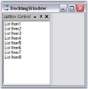' | markdownify }}
{:.image }

4. DockingManager provides docking specific properties to the docked controls, which will be listed under the Syncfusion Docking category of those controls. These properties lets you specify icons for the caption, edit the caption labels, auto hide the controls and so on.

{{ '' | markdownify }}
{:.image }

5. DockingManager comes with enormous appearance properties, whose settings will be applied to all the docked controls.

{{ '' | markdownify }}
{:.image }

6. The form's docking layout can be set up by dragging the dock-enabled controls and redocking or floating them at the desired locations by using DragProviderStyle property.

{{ '' | markdownify }}
{:.image }

7. Use the AutoHideOnLoad and HiddenOnLoad extended properties for setting the autohidden and hidden dock states for the controls.

{{ '' | markdownify }}
{:.image }

See Also

Through Code, Concepts and Features

##### Through Code

The Docking Manager's API makes it an easy task to programmatically create, initialize and set up a docking window's layout in an application. The following section guides you through the steps involved in setting up a simple docking windows layout with two Listbox controls.

1. Add the below namespace. 

[C#]

//namespaces

using Syncfusion.Windows.Forms.Tools;

using Syncfusion.Windows.Forms;

[VB.NET]

'namespaces

Imports Syncfusion.Windows.Forms

Imports Syncfusion.Windows.Forms.Tools

2. Create and initialize the Docking Manager and two listbox controls.

[C#]

// Create the DockingManager instance and add it the component list.

private Syncfusion.Windows.Forms.Tools.DockingManager dockingManager;

private System.Windows.Forms.ListBox listBox1;

private System.Windows.Forms.ListBox listBox2;

this.dockingManager = new Syncfusion.Windows.Forms.Tools.DockingManager(this.components);

this.listBox1 = new System.Windows.Forms.ListBox();

this.listBox2 = new System.Windows.Forms.CheckedListBox();

[VB.NET]

' Create the DockingManager instance and add it the component list.

Private Syncfusion.Windows.Forms.Tools.DockingManager dockingManager;

Private System.Windows.Forms.ListBox listBox1;

Private System.Windows.Forms.ListBox listBox2;

Me.dockingManager = New Syncfusion.Windows.Forms.Tools.DockingManager(Me.components)

Me.dockingManager.BeginInit()

Me.listBox1 = New System.Windows.Forms.ListBox()

Me.listBox2 = New System.Windows.Forms.ListBox()

3. Set some properties of the DockingManager. Ex VisualStyle to "Office2003".

[C#]

//Set the visual Style of the docked controls

this.dockingManager.VisualStyle = Syncfusion.Windows.Forms.VisualStyle.Office2003;

[VB.NET]

'Set the visual Style of the docked controls

Me.dockingManager.VisualStyle = Syncfusion.Windows.Forms.VisualStyle.Office2003

4. Enable the controls to be docked by calling SetEnableDocking method.

[C#]

this.dockingManager.SetEnableDocking(this.listBox1,true);

this.dockingManager.SetEnableDocking(this.listBox2,true);

[VB.NET]

Me.dockingManager.SetEnableDocking(Me.listBox1,True)

Me.dockingManager.SetEnableDocking(Me.listBox2,True)

5. Docking styles for the controls can be specified in DockControl method. Here the docking style is set to tabbed.

[C#]

// Tab the docked controls

this.dockingManager.DockControl(this.listBox1, this.listBox2,Syncfusion.Windows.Forms.Tools.DockingStyle.Tabbed,200,true);

[VB.NET]

' Tab the docked controls

Me.dockingManager.DockControl(Me.listBox1, Me.listBox2,Syncfusion.Windows.Forms.Tools.DockingStyle.Tabbed,200,True)

The resulting form will look like the below image.

{{ '' | markdownify }}
{:.image }

#### Concepts and Features

This section covers the following topics which discusses the concepts and features of docking.

##### Docking Styles

This section will discuss the below four docking styles.

* Docking - Lets you dock the control on any of the four sides of the container control.
* Tabbed Docking - Lets you tab two or more controls.
* Floating - Floats the dockable control.
* AutoHiding - Auto hides the dockable controls and displays as autohidden tabs.
###### Docking

Docked control can be docked to any of the four sides of the container control, i.e., to Left, Right, Top and Bottom. DockingManager lets you specify the type of docking and the bounds of the docked control using the DockControl method. This method also sets Tabbed style for the controls.

[C#]

// Tab the docked controls

this.dockingManager.DockControl(this.listBox1, this.listBox2,Syncfusion.Windows.Forms.Tools.DockingStyle.Left,200,true);

[VB.NET]

' Tab the docked controls

Me.dockingManager.DockControl(Me.listBox1, Me.listBox2,Syncfusion.Windows.Forms.Tools.DockingStyle.Left,200,True)

{{ '' | markdownify }}
{:.image }

At runtime, docking style can be selected easily using the context menu.

{{ '' | markdownify }}
{:.image }

> {{ '' | markdownify }}
{:.image }
 _Note: At run time, docking style can also be set with the help of_ Dock Arrows _provided by the DragProviderStyle property._

###### Tabbed Docking

This section will discuss how the docked controls inside a container can be tabbed.

At Design Time

The docked controls can be tabbed in the designer, by just dragging and dropping into one another. DockingManager helps you in doing this using different DragProviderStyle.

{{ '' | markdownify }}
{:.image }

At RunTime

DockingManager helps you in dragging and dropping the docked controls at run time, using different DragProviderStyle. This styles display prediction Bands, which lets you decide whether you can drop the control in that location.

{{ '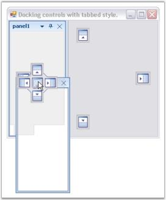' | markdownify }}
{:.image }

Runtime Example

The below code lets you tab two docked controls (Panel1 and Panel2).

[C#]

this.dockingManager.DockControl(this.Panel1, this.Panel2, Syncfusion.Windows.Forms.Tools.DockingStyle.Tabbed, 200, true);

[VB.NET]

Me.dockingManager.DockControl(Me.Panel1, Me.Panel2, Syncfusion.Windows.Forms.Tools.DockingStyle.Tabbed, 200, True)

> {{ '' | markdownify }}
{:.image }
 _Note: In the Tabbed style, the control is docked as a tabbed window along with the dock target. This style is not applicable when the dock target is the host form / user control._ 

Context Menu for Tabbed Controls

The tabbed control can display context menu when the user right clicks on the tabs. See Context Menu.

Aligning the Tabs

The alignment of the tabs can be specified using DockTabAlignment property.

_Table_ _32_: DockingManager Property Table_

<table>
<tr>
<td>
DockingManager Property</td><td>
Description</td></tr>
<tr>
<td>
DockTabAlignment</td><td>
Property which sets the value indicating the alignment of the dock tabs. The different alignment options are,Top, Bottom, Left and Right.</td></tr>
</table>
> {{ '' | markdownify }}
{:.image }
 _Note: This property can also be set easily using_ Task Window.

[C#]

this.dockingManager.DockTabAlignment = Syncfusion.Windows.Forms.Tools.DockTabAlignmentStyle.Right;

[VB.NET]

Me.dockingManager.DockTabAlignment = Syncfusion.Windows.Forms.Tools.DockTabAlignmentStyle.Right

{{ '' | markdownify }}
{:.image }

Methods related to Tabbed Docking

_Table_ _33_: DockingManager Property Table_

<table>
<tr>
<td>
DockingManager Property</td><td>
Description</td></tr>
<tr>
<td>
IsSameTabbedGroup</td><td>
Determines whether the second control is under the same group of the first control.Ctrl1 - Indicates the first control.Ctrl2 - Indicates the second control.</td></tr>
<tr>
<td>
GetTabPosition</td><td>
Returns the tab position of the specified control among a tab group. An integer value will be returned indicating the tab position. The parameter is,Ctrl - Indicates the docking window.</td></tr>
<tr>
<td>
GetTabbedSiblings</td><td>
Returns all the siblings of the specified control in a tabbed group or it returns the array of controls which are tabbed with the given control. The parameters are,Ctrl - Instance of control whose tabbed siblings are to be returned.</td></tr>
<tr>
<td>
IsTabbed</td><td>
Returns whether the specified control is tabbed or not. The parameter is,Ctrl - Indicates the docking window.</td></tr>
</table>

[C#]

this.dockingManager.IsSameTabbedGroup(this.listBox1,this.checkedListBox1);

this.dockingManager1.GetTabPosition(this.listBox1);

this.dockingManager1.GetTabbedSiblings(this.listView1);

this.dockingManager1.IsTabbed(this.listBox1);

[VB.NET]

Me.dockingManager.IsSameTabbedGroup(this.listBox1,this.checkedListBox1)

Me.dockingManager1.GetTabPosition(Me.listBox1)

Me.dockingManager1.GetTabbedSiblings(Me.listView1)

Me.dockingManager1.IsTabbed(this.listBox1)

See Also

Getting Started, DockAllow Event, Dock Arrow Settings

###### Floating

Floating a Control

The FloatControl method enables the end users to float a particular control. Using this method, we can float a single control even if it is tabbed with many controls.

[C#]

Rectangle rcfrm = this.Bounds;

this.dockingManager.FloatControl(this.listBox1, new Rectangle(rcfrm.Right+25,rcfrm.Bottom-150,175,200));

[VB.NET]

Dim rcfrm As Rectangle = Me.Bounds

Me.dockingManager.FloatControl(Me.listBox1, New Rectangle(rcfrm.Right+25,rcfrm.Bottom-150,175,200))

{{ '' | markdownify }}
{:.image }

DisallowFloating

By enabling the DisallowFloating property, a control can be dragged and redocked to the host form, but cannot be floated.

_Table_ _34_: DockingManager Property Table_

<table>
<tr>
<td>
DockingManager Property</td><td>
Description</td></tr>
<tr>
<td>
DisallowFloating</td><td>
Property which sets value indicating whether the docked controls are allowed to float or not.</td></tr>
</table>

[C#]

this.dockingManager1.DisallowFloating = true;

[VB.NET]

Me.dockingManager1.DisallowFloating = True

{{ '' | markdownify }}
{:.image }

Floating State to Docking State and Vice Versa

Setting EnableDoubleClickOnCaption property to true, lets you dock or float the control by just double clicking on the captions of the docked control. By default it is true.

See Also

Nested Docking and Floating, How to make a docked control Floating Only?,

How to float a single control even if it is tabbed to many controls?, How to find out whether a docked control is floating or not?,

How to get individual floating controls properties?

###### OnCaptionDoubleClick Event:

The OnCaptionDoubleClick event occurs when you double-click on a dockable control or a docked control caption. This event is triggered when Docking Manager EnableDoubleClickOnCaption property is set to _“false”_. It displays the control name which is currently active.

Event Data

The event handler receives an argument of type DockMouseSelectionEventHandler that contains data related to this event. The following DockMouseSelectionEventHandler properties provide information specific to this event.

_Table_ _35_: Member Table_

<table>
<tr>
<td>
Member</td><td>
Description</td></tr>
<tr>
<td>
Control</td><td>
Gets the control that is activated.</td></tr>
</table>

[C#]

private void dockingManager1_OnCaptionDoubleClick(object sender, Syncfusion.Windows.Forms.Tools.DockControlMouseSelection arg)

{

//When you  double-click on a Docked control or click on the Docked control caption,,

// OnCaptionDoubleClick event is triggered

//DockControlMouseSelection has a property called “Control” which has the details of 

// activated control.

Console.WriteLine("Dock Control Activated Event is Fired");

//Displays the name of the control that is currently active.

Console.WriteLine("Activated Control Name : "+arg.Control.Name);

}

VB.NET]

 'The DockControlActivated event occurs when a dockable control gets activated.

Private Sub dockingManager1_OnCaptionDoubleClick(ByVal sender As Object, ByVal arg AsSyncfusion.Windows.Forms.Tools.DockActivationChangedEventArgs)

‘When you  double-click on a Docked control or click on the Docked control caption,,

‘OnCaptionDoubleClick event is triggered

‘DockControlMouseSelection has a property called “Control” which has the details of 

‘activated control.

Console.WriteLine("Dock Control Activated Event is Fired");

‘Displays the name of the control that is currently active.

Console.WriteLine("Activated Control Name : "+arg.Control.Name);

End Sub

###### AutoHiding

Docking manager provides auto hide facility to the docked control. When the auto hide button (looks like a bell) is clicked, the docked controls will be hidden, and will be placed along the side of the container control on which it was placed. When mouse is moved over it, the auto hidden control will be displayed and the control will restore its appearance when the auto hidden button is clicked again.

The below image displays an autohidden docked control.

{{ '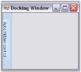' | markdownify }}
{:.image }

The below properties controls the autohiding feature of the docked controls.

_Table_ _36_: DockingManager Property Table_

<table>
<tr>
<td>
DockingManager Property</td><td>
Description</td></tr>
<tr>
<td>
AutoHideActiveControl</td><td>
Gets or sets a value indicating whether to slide back selected auto hidden control.</td></tr>
<tr>
<td>
AutoHideInterval</td><td>
Specifies the time interval for showing or hiding an autohidden control.</td></tr>
<tr>
<td>
AutoHideSelectionStyle</td><td>
Specifies the selection style for the autohidden windows. The styles are,MouseHover - Allows the user to select an autohidden tab by mouse hovering over the tab. Click - Allows the user to select the autohidden tab by clicking on the tab.</td></tr>
</table>

[C#]

this.dockingManager1.AutoHideActiveControl = true;

this.dockingManager1.AutoHideInterval = 500;

this.dockingManager1.AutoHideSelectionStyle = Syncfusion.Windows.Forms.Tools.AutoHideSelectionStyle.Click;

[VB.NET]

Me.dockingManager1.AutoHideActiveControl = True

Me.dockingManager1.AutoHideInterval = 500

Me.DockingManager1.AutoHideSelectionStyle = Syncfusion.Windows.Forms.Tools.AutoHideSelectionStyle.Click

Displaying Full Caption In AutoHide Mode

Create a docked window with two listbox. Dock the controls. Tab the controls and set the FullCaptionInAutoHideMode property. Setting this property to true, will display the full caption text in the auto hidden tabgroup's page. It displays full caption within the application if necessary with a scrollbar, so that end user can scroll and view the hidden tab's full caption.

[C#]

this.dockingManager1.FullCaptionsInAutoHideMode = true;

[VB.NET]

Me.dockingManager1.FullCaptionsInAutoHideMode = True

{{ '' | markdownify }}
{:.image }

{{ '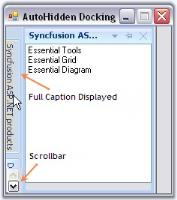' | markdownify }}
{:.image }

Animation in Auto Hiding is discussed in Auto Hide Animation Speed topic and Dragging Autohidden tabs topic discusses how to drag the autohidden tabs.

See Also

Context Menu, Animation Events, AutoHide TabContextMenu Event, How to autohide a control when an application loads

Auto Hide Animation Speed

DockingPanel allows you to change the speed at which your docking panes are displayed or auto hidden. You can easily change the delay of the auto hide windows as fast or as slow as you want, so that your window will hide / show at the perfect speed.

The speed of animation can be controlled by AnimationSpeed and AnimationStep Property. 

AnimationSpeed property of the DockingManager indicates the speed of animation during auto hide or the timer interval in milli secs. AnimationStep indicates the step value for the animation. It is common to all the docked control. AnimationStep property can be implemented using the code below.

[C#]

//arg.Bounds give the bounds of the autohidden control as a rectangle object. 

DockingManager.AnimationStep = 1000;  //(arg.Bounds.Width)

[VB.NET]

'arg.Bounds give the bounds of the autohidden control as a rectangle object. 

DockingManager.AnimationStep = 1000;  '(arg.Bounds.Width)

> {{ '' | markdownify }}
{:.image }
 _Note: For a control to show animation in autohide mode, the animation step value should be more than the width of the particular hidden control._

Context Menu for AutoHidden Tabs

This is discussed in Context Menu topic.

Dragging Autohidden tabs

The docked controls that are autohidden, can be dragged with their tabs, and can be docked or set to floating by setting EnableDragAutoHiddenTabs property to true.

[C#]

this.dockingManager1.EnableDragAutoHiddenTabs = true;

[VB.NET]

Me.dockingManager1.EnableDragAutoHiddenTabs = True

##### Caption Bar

 Caption for the docked controls can be enabled using ShowCaption property. By default this property is true. 

{{ '' | markdownify }}
{:.image }

The following topics will guide the end users on how to effectively use the caption bar settings for the docked controls.

###### Label and Image for CaptionBar

Caption Label

Docking Manager lets you set the caption label using DockLabel property of the particular control, through designer, and programmatically by using SetDockLabel method. Alignment of these labels can be specified using DockLabelAlignment property.

_Table_ _37_: DockingManager Property Table_

<table>
<tr>
<td>
DockingManager Property</td><td>
Description</td></tr>
<tr>
<td>
DockLabelAlignment</td><td>
Sets the dock label alignment. The different alignments options are, Left, Right andCenter.</td></tr>
</table>

[C#]

this.dockingManager.SetDockLabel(this.listBox1, "Syncfusion ASP.NET products");

this.dockingManager1.DockLabelAlignment = Syncfusion.Windows.Forms.Tools.DockLabelAlignmentStyle.Left;

[VB.NET]

Me.dockingManager.SetDockLabel(Me.listBox1, "Syncfusion ASP.NET products")

Me.dockingManager1.DockLabelAlignment = Syncfusion.Windows.Forms.Tools.DockLabelAlignmentStyle.Left

{{ '' | markdownify }}
{:.image }

{{ '' | markdownify }}
{:.image }

Custom CaptionLabel aligned to left

> {{ '' | markdownify }}
{:.image }
 _Note: DockLabelAlignment can also be set easily using_ Task Window.

Image for the Caption

The captions can also hold images which can be enabled using ShowCaptionImages property.

[C#]

this.dockingManager1.ShowCaptionImages = true;

[VB.NET]

Me.dockingManager1.ShowCaptionImages = True

The caption icons / the images can be set using this DockIcon property of the docked control.To achieve this through designer, follow the below steps.

* Create a docked window. 
* Add ImageList and add the images to it.
* Select the image list through the ImageList property of the docking manager. 
* Now go to the property of the docked control to which you have to set the dock icon. 
* Give the image index value to the DockIcon property.
* Run the application. 
* The corresponding control will be displayed with the icon that is set. 
* To disable displaying the icon, set the value as -1.

_Table_ _38_: DockedControl Property Table_

<table>
<tr>
<td>
DockedControl Property</td><td>
Description</td></tr>
<tr>
<td>
DockIcon</td><td>
Index of the image associated with this docking window.</td></tr>
</table>

[C#]

this.dockingManager1.SetDockIcon(this.listBox1, 2);

[VB.NET]

Me.DockingManager1.SetDockIcon(Me.ListBox1, 2)

{{ '' | markdownify }}
{:.image }

Caption Label with Dock Icon

Methods for setting Caption icons and labels are as follows.

_Table_ _39_: Methods Table_

<table>
<tr>
<td>
Methods</td><td>
Description</td></tr>
<tr>
<td>
SetDockIcon</td><td>
Sets the Icon or the image for the docking window by passing the image icon as a parameter for this method.Ctrl - Represents the dock enabled control.image - Icon representing the docking window.</td></tr>
<tr>
<td>
SetDockIcon(Overloaded)</td><td>
This overloaded method returns the index of the image associated with the docking window.Ctrl - Indicates the docking window.int - A zero-based index into the ImageList property value.</td></tr>
<tr>
<td>
SetDockLabel</td><td>
Sets the text to be displayed in the docking window caption.Ctrl - Indicates the docking window.strText - A string value representing the text caption.</td></tr>
</table>
> {{ '' | markdownify }}
{:.image }
 _Note:_ Background _and_ foreground _appearance of the captions can be customized._

See Also

Caption Buttons, Custom Caption Buttons

###### Caption Buttons

The buttons available for the docked control and the properties which controls the visibility of the button are discussed in this section.

{{ '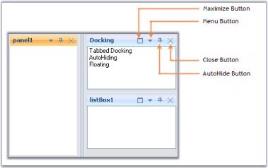' | markdownify }}
{:.image }

Menu Button

The menu button in a docked control can be made visible or hidden by setting the MenuButtonEnabled property to true. Clicking this button will display the context menu items.

Maximize Button

Maximize button can be enabled by using the MaximizeButtonEnabled property. This maximize button allows users to maximize / restore a docking window, so that a clear view of the contents can be made visible.

> {{ '' | markdownify }}
{:.image }
 _Note: The Maximize button will be visible only if any other control is docked to the bottom of the former control._

Close Button

The visibility of the Close button can be controlled using the CloseEnabled property.

AutoHide Button

Setting AutoHideEnabled property shows or hides the auto hide button in the docked control. Clicking this button will autohide the docked controls.

> {{ '' | markdownify }}
{:.image }
 _Note: Docking Manager let you customize the above default buttons and also add custom caption buttons. See_ Custom Caption Buttons _for more details._

See Also

Context Menu, AutoHiding

###### Custom Caption Buttons

Custom Caption Collection Editor which can be accessed using DockingManager.CaptionButtons property, lets you customize the default buttons and also lets you add custom caption buttons. 

{{ '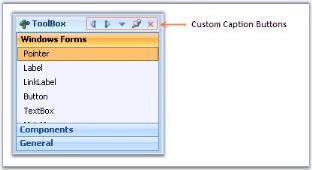' | markdownify }}
{:.image }

Adding and customizing caption Buttons

In the CaptionButton Collection Editor, click "Add" to add a new caption button. To customize the caption button, modify the properties provided to the right of the members in the editor.

{{ '' | markdownify }}
{:.image }

This can be done programmatically using the below code snippets.

[C#]

Syncfusion.Windows.Forms.Tools.CaptionButton captionButton = new Syncfusion.Windows.Forms.Tools.CaptionButton();

toolTipInfo = new Syncfusion.Windows.Forms.Tools.ToolTipInfo();

captionButton.ImageIndex = 4;

captionButton.Name = "Custom Button";

captionButton.Type = Syncfusion.Windows.Forms.Tools.CaptionButtonType.Custom;

captionButton.SuperToolTipInfo = toolTipInfo

captionButton.TransparentImageColor = System.Drawing.Color.Transparent;

this.dockingManager1.CaptionButtons.Add(captionButton);

[VB.NET]

Dim captionButton5 As Syncfusion.Windows.Forms.Tools.CaptionButton = New Syncfusion.Windows.Forms.Tools.CaptionButton()

toolTipInfo = new Syncfusion.Windows.Forms.Tools.ToolTipInfo()

captionButton.ImageIndex = 4 

captionButton.Name = "Custom Button" 

captionButton.Type = Syncfusion.Windows.Forms.Tools.CaptionButtonType.Custom;

captionButton.SuperToolTipInfo = toolTipInfo

captionButton.TransparentImageColor = System.Drawing.Color.Transparent 

Me.dockingManager1.CaptionButtons.Add(captionButton)

A sample which demonstrates the addition of Custom Caption Buttons is available in the below sample installation path.

…\_My Documents\Syncfusion\EssentialStudio\Version Number\Windows\Tools.Windows\Samples\Advanced Editor Functions\ActionGroupingDemo_

Custom Button for Caption Bar in Floating Form

This feature enables you to add custom buttons to the caption bar when an item is in a floating state.

You can now add custom buttons to the caption bar when an item is in a floating state. It is not required to dock the item to use the custom buttons. 

_Table_ _40_: Properties Table_

<table>
<tr>
<td>
Property </td><td>
Description </td><td>
Type </td><td>
Data Type </td><td>
Reference links </td></tr>
<tr>
<td>
ShowCustomButtonsInFloating</td><td>
Specifies whether caption button will be enabled while floating.  </td><td>
-</td><td>
Boolean </td><td>
NA </td></tr>
</table>
Enabling Custom Button for Caption Bar while Floating

To enable custom button for caption bar while floating, set the _ShowCustomButtonsInFloating_ property to _true_. By default this is set to _false_. 

[C#]

this.dockingManager1.ShowCustomButtonsInFloating = true;

[VB]

me.dockingManager1.ShowCustomButtonsInFloating = True

{{ '' | markdownify }}
{:.image }

> {{ '' | markdownify }}
{:.image }
_Note: This feature is not applicable for VS2005 (default) visual style._

Sample Link

A sample for this feature is available in the following location: 

_..\..\AppData\Local\Syncfusion\EssentialStudio\9.4.0.59\Windows\Tools.Windows\Samples\2.0\Docking Package\Custom Caption_

##### DesignTime Features

Dragging and Docking at DesignTime

DockingManager supports dragging and docking of the dockable controls at the design time itself. It also lets you float the controls.

{{ '' | markdownify }}
{:.image }

Property Settings using Task Window

The Task Window of the DockingManager at design time lets you apply certain Appearance and behavior settings.

{{ '' | markdownify }}
{:.image }

##### RunTime Features

The following runtime features are discussed in this section.

###### Browsing Key

DockingManager lets you specify the keyboard key combinations, to tab through the docked controls. The property BrowsingKey of the docking manager, provides modifiers like CTRL, SHIFT, ALT Keys and keys like A, B, C, 0, 1 etc., User can also provide a combination of modifiers and the keys. Example "CTRL + 0", as shown in the image below.

{{ '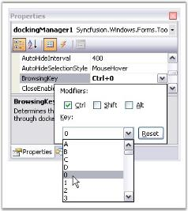' | markdownify }}
{:.image }

> {{ '' | markdownify }}
{:.image }
 _Note: Before we set this property for docking manager, we have to set TabStop property to true and TabIndex property with the appropriate value. Otherwise its BrowsingKey property will not work._

<table>
<tr>
<td>
DockingManager Property</td><td>
Description</td></tr>
<tr>
<td>
Browsing Key</td><td>
Determines the value of the key which can be used to tab through the docked controls.</td></tr>
</table>
_Table_ _42_: DockedControl Property Table_

<table>
<tr>
<td>
DockedControl Property</td><td>
Description</td></tr>
<tr>
<td>
TabStop</td><td>
Indicates whether TAB key can be used to focus the control.</td></tr>
<tr>
<td>
TabIndex</td><td>
Determines the index in the tab order that this control will occupy.</td></tr>
</table>

These properties can be set through code by using the below code.

[C#]

this.dockingManager1.BrowsingKey = ((System.Windows.Forms.Keys)((System.Windows.Forms.Keys.Control | System.Windows.Forms.Keys.D0)));

this.treeViewAdv1.TabStop = true;

this.treeViewAdv1.TabIndex = 0;

[VB.NET]

Me.DockingManager1.BrowsingKey = CType((System.Windows.Forms.Keys.Control Or System.Windows.Forms.Keys.D0), System.Windows.Forms.Keys)

Me.TreeViewAdv1.TabStop = True

Me.TreeViewAdv1.TabIndex = 0

###### ToolTip

By default, tooltips will be displayed for the caption buttons in a docked control when the mouse is moved over it.

{{ '' | markdownify }}
{:.image }

> {{ '' | markdownify }}
{:.image }
 _Note: EnableSuperTooltip property which is discussed below, should be set to false to effect the above default tooltip._

SuperTooltip Support

Docking manager can display a super tooltip by enabling the DockingManager.EnableSuperTooltip property. For this a SuperTooltip control should be dragged and dropped on to the form and it should be selected in the DockingManager.SuperTooltip property.

_Table_ _43_: DockingManager Property Table_

<table>
<tr>
<td>
DockingManager Property</td><td>
Description</td></tr>
<tr>
<td>
EnableSuperTooltip</td><td>
Gets/Sets whether to enable SuperToolTip using the dock caption buttons.</td></tr>
<tr>
<td>
SuperToolTip</td><td>
Indicates the SuperToolTip associated with the docking manager.</td></tr>
</table>

A SuperToolip can be added to the docking manager programmatically using the below code snippet.

[C#]

this.dockingManager1.EnableSuperToolTip = true;

this.dockingManager1.SuperToolTip = this.superToolTip1;

[VB.NET]

Me.dockingManager1.EnableSuperToolTip = True

Me.dockingManager1.SuperToolTip = Me.superToolTip1

{{ '' | markdownify }}
{:.image }

Text for the supertooltip and other customizing options can be specified for a particular button by using the CaptionButton Collection Editor.

{{ '' | markdownify }}
{:.image }

###### Context Menu

A context menu will be displayed whenever the user right clicks the caption bar or clicks the menu button in the caption bar. EnableContextMenu property should be true for displaying the context menu. By default it is true.

When the docked control is in autohide mode and when the auto hide tab is right-clicked, an unique context menu will be displayed, similar to Visual Studio. EnableAutoHideTabContextMenu property should be true for this. By default this value is true.

[C#]

this.dockingManager1.EnableContextMenu = true;

this.dockingManager1.EnableAutoHideTabContextMenu = true;

[VB.NET]

Me.dockingManager1.EnableContextMenu = True

Me.dockingManager1.EnableAutoHideTabContextMenu = True

The below images illustrates context menu features.

{{ '' | markdownify }}
{:.image }

> {{ '' | markdownify }}
{:.image }
 _Note: If MDIContainer property of the form is set to true, then the context menu will include MDI child option. You can observe that the MDI Child option is disabled for the above image. This is because MDIContainer property is false for this case._

{{ '' | markdownify }}
{:.image }

Context Menu for TabbedControls

Context menu for the tabbed controls is similar to the default context menu like the above image. When TabbedMDIManager component is used, context menu will include TabbedDocument instead of MDI child.

{{ '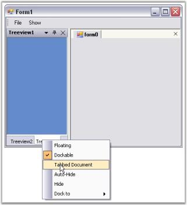' | markdownify }}
{:.image }

See Also

Dock Context Menu Event, How to display context menu of a docked control at a specified point?

##### Appearance Settings

The look and feel of the docked controls can be controlled through the appearance properties of DockingManager. Those properties are discussed in detail in the below topics.

###### Foreground Settings

This section will walk you through the foreground settings of the Dock tabs, caption area and AutoHidden tabs.

Dock Tab and Label Settings

The docking Manager provides tab and label settings for the docked windows. These settings lets you control the appearance of the dock tabs.

Foreground Settings for the Dock Tabs

The font style and the height of the tab controls in a tabbed docking group, can be controlled using the below properties respectively.

_Table_ _44_: DockingManager Property Table_

<table>
<tr>
<td>
DockingManager Property</td><td>
Description</td></tr>
<tr>
<td>
DockTabFont </td><td>
Gets or sets the font for the tab control used in tabbed docking group.</td></tr>
<tr>
<td>
DockTabHeight</td><td>
Gets or sets the height for the tab control used in tabbed docking group.</td></tr>
</table>

[C#]

this.dockingManager1.DockTabFont = new System.Drawing.Font("Arial", 9F, ((System.Drawing.FontStyle)((System.Drawing.FontStyle.Bold | System.Drawing.FontStyle.Underline))), System.Drawing.GraphicsUnit.Point, ((System.Byte)(0)));

this.dockingManager1.DockTabHeight = 30;

[VB.NET]

Me.DockingManager1.DockTabFont = New System.Drawing.Font("Arial", 9.0!, CType((System.Drawing.FontStyle.Bold Or System.Drawing.FontStyle.Underline), System.Drawing.FontStyle), System.Drawing.GraphicsUnit.Point, CType(0, Byte))

Me.DockingManager1.DockTabHeight = 30

{{ '' | markdownify }}
{:.image }

> {{ '' | markdownify }}
{:.image }
 _Note: ResetDockTabFont and ResetDockTabHeight methods lets you reset the above settings._

[C#]

//Restoring to default settings

this.dockingManager1.ResetDockTabFont();

this.dockingManager1.ResetDockTabHeight();

[VB.NET]

'Restoring to default settings

Me.dockingManager1.ResetDockTabFont()

Me.dockingManager1.ResetDockTabHeight()

See Also

Tabbing the Docked controls in Tabbed Docking

AutoHidden Tabs

The font style for the autohidden tabs can be specified in AutoHideTabFont property.

_Table_ _45_: DockingManager Property Table_

<table>
<tr>
<td>
DockingManager Property</td><td>
Description</td></tr>
<tr>
<td>
AutoHideTabFont</td><td>
Gets or sets the tab for the autohide tab control.</td></tr>
</table>
> {{ '' | markdownify }}
{:.image }
 _Note: This setting will effect only with DockingManager.VisualStyle property set as Default._

[C#]

//Setting Auto hide tab Font style

this.dockingManager1.AutoHideTabFont = new System.Drawing.Font("Arial", 9.75F, ((System.Drawing.FontStyle)(((System.Drawing.FontStyle.Bold | System.Drawing.FontStyle.Italic) 

| System.Drawing.FontStyle.Underline))), System.Drawing.GraphicsUnit.Point, ((System.Byte)(0)));

[VB.NET]

'Setting Auto hide tab Font style

Me.DockingManager1.AutoHideTabFont = New System.Drawing.Font("Arial", 9.75!, CType(((System.Drawing.FontStyle.Bold Or System.Drawing.FontStyle.Italic) _

Or System.Drawing.FontStyle.Underline), System.Drawing.FontStyle), System.Drawing.GraphicsUnit.Point, CType(0, Byte))

{{ '' | markdownify }}
{:.image }

The height for the auto hidden tabs can be specified in AutoHideTabHeight property.

_Table_ _46_: DockingManager Property Table_

<table>
<tr>
<td>
DockingManager Property</td><td>
Description</td></tr>
<tr>
<td>
AutoHideTabHeight</td><td>
Gets or sets the height of the autohide tab control.</td></tr>
</table>
> {{ '' | markdownify }}
{:.image }
 _Note: This setting will effect only with DockingManager.VisualStyle property set as Default._

[C#]

//Setting Auto hide tab height

this.dockingManager1.AutoHideTabHeight = 35;

[VB.NET]

'Setting Auto hide tab height

Me.DockingManager1.AutoHideTabHeight = 35

{{ '' | markdownify }}
{:.image }

See Also

Visual Styles

Active and Inactive caption

Active Caption Settings

Caption FontStyle and foreground settings, for an active docked control, can be controlled by ActiveCaptionFont and ActiveCaptionForeGround properties.

_Table_ _47_: DockingManager Property Table_

<table>
<tr>
<td>
DockingManager Property</td><td>
Description</td></tr>
<tr>
<td>
ActiveCaptionFont</td><td>
Gets or sets the font for the active caption.</td></tr>
<tr>
<td>
ActiveCaptionForeGround</td><td>
Indicates the color of the caption text in the active state.</td></tr>
</table>
> {{ '' | markdownify }}
{:.image }
 _Note: These settings will effect only with DockingManager.VisualStyle property set as Default._

[C#]

this.dockingManager1.ActiveCaptionFont = new System.Drawing.Font("Trebuchet MS", 9.75F, System.Drawing.FontStyle.Bold, System.Drawing.GraphicsUnit.Point, ((System.Byte)(0)));

this.dockingManager1.ActiveCaptionForeGround = System.Drawing.Color.Red;

[VB.NET]

Me.dockingManager1.ActiveCaptionFont = New System.Drawing.Font("Trebuchet MS", 9.75!, System.Drawing.FontStyle.Bold, System.Drawing.GraphicsUnit.Point, CType(0, Byte))

Me.DockingManager1.ActiveCaptionForeGround = System.Drawing.Color.Red

{{ '' | markdownify }}
{:.image }

Inactive Caption settings

By setting the InactiveCaptionFont and InactiveCaptionForeGround properties, the caption foreground appearance of the inactive controls among the docked controls can be customized.

_Table_ _48_: DockingManager Property Table_

<table>
<tr>
<td>
DockingManager Property</td><td>
Description</td></tr>
<tr>
<td>
InactiveCaptionFont</td><td>
Gets or sets the font of the inactive caption.</td></tr>
<tr>
<td>
InactiveCaptionForeGround</td><td>
Indicates the color of the caption text in inactive state.</td></tr>
</table>
> {{ '' | markdownify }}
{:.image }
 _Note: These settings will effect only with DockingManager.VisualStyle property set as Default._

[C#]

this.dockingManager1.InActiveCaptionFont = new System.Drawing.Font("Arial", 11.25F, System.Drawing.FontStyle.Bold, System.Drawing.GraphicsUnit.Point, ((System.Byte)(0)));

this.dockingManager1.InActiveCaptionForeGround = System.Drawing.Color.Blue;

[VB.NET]

Me.DockingManager1.InActiveCaptionFont = New System.Drawing.Font("Arial", 11.25!, System.Drawing.FontStyle.Bold, System.Drawing.GraphicsUnit.Point, CType(0, Byte))

Me.DockingManager1.InActiveCaptionForeGround = System.Drawing.Color.MediumSlateBlue

{{ '' | markdownify }}
{:.image }

The Docking Manager provides the ProvideGraphicsItems event that can be handled for custom rendering the docking window caption area. This event is fired whenever a docking window’s caption needs to be painted and the ProvideGraphicsItemsEventArgs provides the control being drawn and allows you to specify the new set of graphics objects to use.

DockingManager custom styling with Metro VisualStyle

In the DockingManager, the Metro visual style has a default caption color and button color. The menu color and button color can be customized by using the properties MetroCaptionColor and MetroButtonColor, which are present in the caption bar of the docking manager.

_Table_ _49_: Property Table_

<table>
<tr>
<td>
Property</td><td>
Description</td></tr>
<tr>
<td>
MetroCaptionColor</td><td>
Gets or sets the color value of a caption in metro style DockingManager.</td></tr>
<tr>
<td>
MetroButtonColor</td><td>
Gets or sets the color value of a metro button in metro style DockingManager.</td></tr>
</table>

[C#]

//Gets or sets the color value of caption in metro style DockingManager.

this.dockingMgr.MetroCaptionColor = Color.Red;

[VB.NET]

//Gets or sets the color value of caption in metro style DockingManager.

Me.dockingMgr.MetroCaptionColor = Color.Red

[C#]

//Gets or sets the color value of button in metro style DockingManager.

this.dockingMgr.MetroButtonColor = Color.Red;

[VB.NET]

//Gets or sets the color value of button in metro style DockingManager.

Me.dockingMgr.MetroButtonColor = Color.Red

See Also

Visual Styles

###### Background Settings

This section will discuss the background settings for the caption area of the docked controls.

Active and Inactive caption

Active Caption Settings

Caption background appearance for the active docked control can be controlled through ActiveCaptionBackground property.

_Table_ _50_: DockingManager Property Table_

<table>
<tr>
<td>
DockingManager Property</td><td>
Description</td></tr>
<tr>
<td>
ActiveCaptionBackground</td><td>
Sets background for the caption area using BrushInfo object.</td></tr>
</table>
> {{ '' | markdownify }}
{:.image }
 _Note: This setting will effect only with DockingManager.VisualStyle property set as Default._

[C#]

this.dockingManager1.ActiveCaptionBackground = new Syncfusion.Drawing.BrushInfo(Syncfusion.Drawing.PatternStyle.Percent20, System.Drawing.SystemColors.InactiveCaptionText, System.Drawing.Color.FromArgb(((System.Byte)(255)), ((System.Byte)(224)), ((System.Byte)(192))));

[VB.NET]

Me.DockingManager1.ActiveCaptionBackground = New Syncfusion.Drawing.BrushInfo(Syncfusion.Drawing.PatternStyle.Percent20, System.Drawing.SystemColors.InactiveCaptionText, System.Drawing.Color.FromArgb(CType(255, Byte), CType(224, Byte), CType(192, Byte)))

{{ '' | markdownify }}
{:.image }

InactiveCaption settings

By setting the InactiveCaptionBackground properties, the caption appearance of the inactive control in the docked controls can be customized.

_Table_ _51_: DockingManager Property Table_

<table>
<tr>
<td>
DockingManager Property</td><td>
Description</td></tr>
<tr>
<td>
InactiveCaptionBackground</td><td>
Sets caption background of the inactive docked control using BrushInfo object.</td></tr>
</table>
> {{ '' | markdownify }}
{:.image }
 _Note: This setting will effect only with DockingManager.VisualStyle property set as Default._ 

[C#]

this.dockingManager1.InActiveCaptionBackground = new Syncfusion.Drawing.BrushInfo(Syncfusion.Drawing.GradientStyle.Horizontal, System.Drawing.Color.Ivory, System.Drawing.SystemColors.Control);

[VB.NET]

Me.DockingManager1.InActiveCaptionBackground = New Syncfusion.Drawing.BrushInfo(Syncfusion.Drawing.GradientStyle.Horizontal, System.Drawing.Color.Ivory, System.Drawing.SystemColors.Control)

See Also

Visual Styles

Border for the Docked Control

Border color of the docked controls can be specified in the BorderColor property. 

Note that you will have to enable PaintBorders property to effect this setting.

_Table_ _52_: DockingManager Property Table_

<table>
<tr>
<td>
DockingManager Property</td><td>
Description</td></tr>
<tr>
<td>
BorderColor</td><td>
Used to set the border color for the docked control.</td></tr>
<tr>
<td>
Paint Borders</td><td>
Determines whether to paint the docked control's borders.</td></tr>
</table>

[C#]

//Setting Border color

this.dockingManager1.BorderColor = System.Drawing.Color.Blue;

this.DockingManager1.PaintBorders = true;

[VB.NET]

'Setting border color

Me.DockingManager1.BorderColor = System.Drawing.Color.Blue

Me.DockingManager1.PaintBorders = True

{{ '' | markdownify }}
{:.image }

HostFormClientBorder

_Table_ _53_: DockingManager Property Table_

<table>
<tr>
<td>
DockingManager Property</td><td>
Description</td></tr>
<tr>
<td>
HostFormClientBorder</td><td>
Gets or sets a value indicating whether a border is drawn around the host form's client rectangle.</td></tr>
</table>

[C#]

this.DockingManager1.HostFormClientBorder = false;

[VB.NET]

Me.DockingManager1.HostFormClientBorder = False

{{ '' | markdownify }}
{:.image }

Splitter Width

The width of the splitter between the docking windows can be set by using the SplitterWidth property.

_Table_ _54_: DockingManager Property Table_

<table>
<tr>
<td>
DockingManager Property</td><td>
Description</td></tr>
<tr>
<td>
SplitterWidth</td><td>
Gets or sets the value indicating the width of splitters between the docking window.</td></tr>
</table>

[C#]

this.dockingManager1.SplitterWidth = 20;

[VB.NET]

Me.dockingManager1.SplitterWidth = 20

{{ '' | markdownify }}
{:.image }

Visual Styles

Docking manager supports various styles that adds appealing visual styles to your application. Below are the visual styles implemented in docking.

* Default (VS 2003)
* OfficeXP
* Office 2003
* VS 2005
* Office 2007 (Blue, Silver, Black)
* Office 2007 outlook
* Visual Studio 2010 
* Metro Theme

Visual styles for the windows can be customized by using the below code snippet.

[C#]

//Set the visual Style of the docked controls

this.dockingManager.VisualStyle = Syncfusion.Windows.Forms.VisualStyle.Office2003;

[VB.NET]

' Set the visual Style of the docked controls

Me.dockingManager.VisualStyle = Syncfusion.Windows.Forms.VisualStyle.Office2003

{{ '' | markdownify }}
{:.image }

Office2007 Color Schemes

DockingManager supports all the three color schemes in Office2007 visual style. This can be controlled using Office2007Theme property. 

[C#]

this.dockingManager1.Office2007Theme = Syncfusion.Windows.Forms.Office2007Theme.Silver;

[VB.NET]

Me.dockingManager1.Office2007Theme = Syncfusion.Windows.Forms.Office2007Theme.Silver

{{ '' | markdownify }}
{:.image }

Custom Color Schemes

Custom colors can also be applied DockingManager for Office2007 style, using the below code snippet.

[C#]

dockingManager1.Office2007Theme = Office2007Theme.Managed;

Office2007Colors.ApplyManagedColors(this, Color.Red);

[VB.NET]

dockingManager1.Office2007Theme = Office2007Theme.Managed;

Office2007Colors.ApplyManagedColors(Me, Color.Red);

{{ '' | markdownify }}
{:.image }

Windows Color Schemes

Windows color schemes like Blue, Silver and OliveGreen can be applied to the controls when Default or Office2003 styles are selected. XP themes can be enabled for the docked controls using ThemesEnabled property.

[C#]

this.dockingManager1.ThemesEnabled = true;

[VB.NET]

Me.dockingManager1.ThemesEnabled = True

{{ '' | markdownify }}
{:.image }

* Visual Studio 2010
* Metro Theme

{{ '' | markdownify }}
{:.image }

See Also

Foreground settings for Active and Inactive caption, Background settings for Active and Inactive caption

##### Special Features

The following topics are discussed in this particular section.

###### Dock Arrow Settings

While dragging and dropping a docked control, DockingManager guides you through the process, using DragProviderStyle property.

On setting this property to VS2005 or Whidbey style, you will be able to see arrows on four sides of the form, when a control is dragged. These arrows will guide you where to dock the window. Keeping the mouse point on a particular arrow will display a shadow like appearance based on the side of docking.

There are three docking provider Styles. They are, 

* Standard (Default value - no arrows appears for this option), 
* VS2005, 
* WhidBey and
* VS2008. 

[C#]

this.dockingManager1.DragProviderStyle = Syncfusion.Windows.Forms.Tools.DragProviderStyle.VS2008;

[VB.NET]

Me.dockingManager1.DragProviderStyle = Syncfusion.Windows.Forms.Tools.DragProviderStyle.VS2008

{{ '' | markdownify }}
{:.image }

{{ '' | markdownify }}
{:.image }

{{ '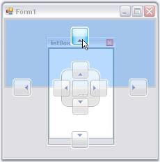' | markdownify }}
{:.image }

In the image above, a shadow for docking a panel to the top of the form is displayed. Target area is highlighted at the top, as the mouse is hovered over the top Dock arrow.

Visibility of the Arrows

The docking arrows visibility, while dropping a control inside the form or into another docked control, can be set using the below properties.

_Table_ _55_: DockedControl Property Table_

<table>
<tr>
<td>
DockedControl Property</td><td>
Description</td></tr>
<tr>
<td>
DockAbility</td><td>
Indicates where the user can dock in this control using drag providers.</td></tr>
<tr>
<td>
OuterDockAbilility</td><td>
Indicates where the user can dock the controls in a form using the drag providers.</td></tr>
</table>

{{ '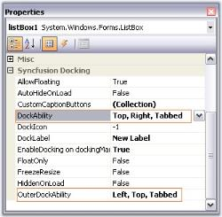' | markdownify }}
{:.image }

{{ '' | markdownify }}
{:.image }

{{ '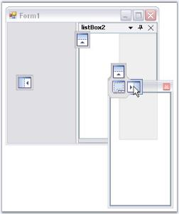' | markdownify }}
{:.image }

See Also

Docking

###### DockToFill, Freeze Resizing

The DockToFill property allows users to implement a very unique docking layout where a non-MDIContainer form or ContainerControl's entire client region is occupied by the dockable controls.

_Table_ _56_: DockingManager Property Table_

<table>
<tr>
<td>
DockingManager Property</td><td>
Description</td></tr>
<tr>
<td>
DockToFill</td><td>
Sets the boolean value indicating whether the docked control occupies the form's full client region.</td></tr>
</table>

[C#]

this.dockingManager1.DockToFill = true;

[VB.NET]

Me.dockingManager1.DockToFill = True;

{{ '' | markdownify }}
{:.image }

A sample which demonstrates DockToFill property is available in the below sample installation path.

…\_My Documents\Syncfusion\EssentialStudio\Version Number\Windows\Tools.Windows\Samples\Advanced Editor Functions\ActionGroupingDemo_

FreezeResizing

The FreezeResizing property has been implemented for each control by which, the end users can freeze any particular control. Also, the property value can be persisted. A global FreezeResizing property is also available using which all the controls can be frozen.

The controls can also be frozen by calling the SetFreezeResizing method which freezes the specified control and the user will no more be able to resize the controls.

_Table_ _57_: Parameter Table_

<table>
<tr>
<td>
Parameter</td><td>
Description</td></tr>
<tr>
<td>
SetFreezeResizing</td><td>
Freezes the specified control. The parameters are,Ctrl - The control for which docking is enabled.freeze - Represents a boolean value which decides whether to freeze the specified control.</td></tr>
</table>

[C#]

this.dockingManager1.FreezeResizing = true;

this.dockingManager1.SetFreezeResize(this.panel1, true);

[VB.NET]

Me.dockingManager1.FreezeResizing = True

Me.dockingManager1.SetFreezeResize(Me.panel1, True)

A sample which uses FreezeResizing property is available in the below sample installation path.

_..My Documents\Syncfusion\EssentialStudio\Version Number\Windows\Tools.Windows\Samples\2.0\Docking Package\SDIDemo_

See Also

Getting Started

##### Advanced Features

The following advanced features are covered in this section.

###### DockingClientPanel

A premise of any docking windows implementation is the existence of a client window the bounds of which vary at run-time as windows get docked or undocked. This paradigm is extremely well suited for MDI type forms where theMDIClient window gets resized / relocated in synchronization with changes in the docking windows layout. 

Child controls located within the MDIClient window are thus always assured of a static spatial relationship with the parent container. 

Non-MDI forms, however, do not have any such client window and all non-dockable statically positioned controls risk being clipped by windows that are docked in their proximity. 

The Essential Tools DockingClientPanel control helps overcome this limitation by providing an auto-resized client surface on which a form's non-dockable controls may be located.

{{ '' | markdownify }}
{:.image }
_Note: The DockingClientPanel control is intended only for use with forms that do not have the MDIContainer style set._ 

Using the DockingClientPanel Control

The following sequence lists the steps involved in setting up a docking layout on a non-MDIContainer form using the DockingClientPanel. The DockingClientPanel is used here because in addition to the docking windows, the host form also contains several non-dockable controls that require a container with static relative bounds for implementing positioning and layout management. 

1. Add the DockingManager to the form and apply the EnableDocking on dockingManager1 property for those controls that need to be set as docking windows.
2. Select the DockingClientPanel control from the designer tool box and drop it onto the form hosting the DockingManager. Size the control so that its bounds are sufficient to accommodate any non-dockable child controls that may already be present on the form.
3. If any non-dockable controls are present on the form, then drag-and-drop these controls onto the DockingClientPanel instance.
4. Set the DockingClientPanel.SizeToFit property to be true. Turning on the SizeToFit property will force the DockingClientPanel to start interacting with the Essential Tools docking architecture and the control will automatically be resized / repositioned to occupy the form's client bounds, left unoccupied by the docking windows. 
5. Set the BorderStyle property to get the 3D or fixed single effect to the dockingclientpanel control.
6. The DockingClientPanel will now function as a proxy for the form's client surface and all controls originally intended to be placed on the form should henceforth be located on the DockingClientPanel; any anchoring / layout features for the child controls should be set relative to the DockingClientPanel. 
7. To add controls directly to the form, the SizeToFit property can temporarily be turned off within the designer and the form resized to expose its surface. At run-time, the SizeToFit property is always enabled. 

_Table_ _58_: DockingClientPanel Property Table_

<table>
<tr>
<td>
DockingClientPanel Property</td><td>
Description</td></tr>
<tr>
<td>
SizeToFit</td><td>
Gets or sets a value indicating whether the control is sized to fill the form's area.</td></tr>
<tr>
<td>
BorderStyle</td><td>
Indicates the border Style of the Control.</td></tr>
</table>

8. DockingClientPanel control can be added to the Non-MDI forms using the below code snippet for example.

[C#]

//Declaration and initialization

private Syncfusion.Windows.Forms.Tools.DockingClientPanel dockingClientPanel1;

this.dockingClientPanel1 = new Syncfusion.Windows.Forms.Tools.DockingClientPanel();

this.dockingClientPanel1.SuspendLayout();

//Add a control to dockingclientpanel

this.dockingClientPanel1.Controls.Add(this.tabControlAdv1);

//set the properties

this.dockingClientPanel1.Location = new System.Drawing.Point(0, 133);

this.dockingClientPanel1.Name = "dockingClientPanel1";

this.dockingClientPanel1.Size = new System.Drawing.Size(600, 369);

this.dockingClientPanel1.SizeToFit = true;

this.dockingClientPanel1.TabIndex = 0;

this.dockingClientPanel1.Paint += new System.Windows.Forms.PaintEventHandler(this.dockingClientPanel1_Paint);

this.DockingClientPanel1.BorderStyle = System.Windows.Forms.BorderStyle.Fixed3D

//Add the control to the form

this.Controls.Add(this.dockingClientPanel1);

this.dockingClientPanel1.ResumeLayout(false);

[VB.NET]

' Declaration and initialization

Private dockingClientPanel1 As Syncfusion.Windows.Forms.Tools.DockingClientPanel

Me.dockingClientPanel1 = New Syncfusion.Windows.Forms.Tools.DockingClientPanel()

Me.dockingClientPanel1.SuspendLayout()

' Add a control to dockingclientpanel 

Me.dockingClientPanel1.Controls.AddRange(New System.Windows.Forms.Control() {Me.tabControlAdv1})

'set the properties

Me.dockingClientPanel1.AutoScroll = True

Me.dockingClientPanel1.Location = New System.Drawing.Point(106, 0)

Me.dockingClientPanel1.Name = "dockingClientPanel1"

Me.dockingClientPanel1.Size = New System.Drawing.Size(452, 417)

Me.dockingClientPanel1.SizeToFit = True

Me.DockingClientPanel1.BorderStyle = System.Windows.Forms.BorderStyle.Fixed3D

' Add the control to the form

Me.Controls.AddRange(New System.Windows.Forms.Control() {Me.dockingClientPanel1})

Me.dockingClientPanel1.ResumeLayout(False)

{{ '' | markdownify }}
{:.image }

A sample which discusses DockingClientPanel is available in the below sample installation path.

…\_My Documents\Syncfusion\EssentialStudio\Version Number\Windows\Tools.Windows\Samples\Advanced Editor Functions\ActionGroupingDemo_

Properties

The DockingClientPanel can be given an attractive look and feel using the appearance and size properties. These properties are discussed in detail below. This section also gives an idea about the scrolling feature available for the DockingClientPanel.

Background and Foreground Settings

The background and foreground of the DockingClientPanel control can be customized using the below properties.

Background color of the control can be set using the BackColor property. Background image for the control can be specified using BackgroundImage property and image layout is set through BackgroundImageLayout property. Below are the code snippets to set these properties programmatically.

_Table_ _59_: DockingClientPanel Property Table_

<table>
<tr>
<td>
DockingClientPanel Property</td><td>
Description</td></tr>
<tr>
<td>
BackColor</td><td>
Indicates the background color of the component.</td></tr>
<tr>
<td>
BackgroundImage</td><td>
Indicates the background image used for the control.</td></tr>
<tr>
<td>
BackgroundImageLayout</td><td>
Indicates the background image layout used for the control.</td></tr>
</table>

[C#]

this.dockingClientPanel1.BackColor = System.Drawing.Color.AliceBlue;

this.dockingClie{_

[VB.NET]

Me.dockingClientPanel1.BackColor = System.Drawing.Color.AliceBlue

Me.dockingClientPanel1.BackgroundImage = CType((Resources.GetObject("dockingClientPanel1.BackgroundImage")), System.Drawing.Image)

Me.dockingClientPanel1.BackgroundImageLayout = System.Windows.Forms.ImageLayout.Stretch

The font used to display the text in the control is set through Font property and the forecolor through ForeColor property. Below are the code snippets to set these two properties programmatically.

_Table_ _60_: DockingClientPanel Property Table_

<table>
<tr>
<td>
DockingClientPanel Property</td><td>
Description</td></tr>
<tr>
<td>
Font</td><td>
The font used to display text in the control.</td></tr>
<tr>
<td>
ForeColor</td><td>
The foreground color of this component, which is used to display the text.</td></tr>
</table>

[C#]

this.dockingClientPanel1.Font = new System.Drawing.Font("Arial", 9F, System.Drawing.FontStyle.Bold, System.Drawing.GraphicsUnit.Point, ((byte)(0)));

this.dockingClientPanel1.ForeColor = System.Drawing.Color.RoyalBlue;

[VB.NET]

Me.dockingClientPanel1.Font = New System.Drawing.Font("Arial", 9.0F, System.Drawing.FontStyle.Bold, System.Drawing.GraphicsUnit.Point, CType((0), Byte))

Me.dockingClientPanel1.ForeColor = System.Drawing.Color.RoyalBlue

Below image illustrates a DockingClientPanel with the foreground and background properties set.

{{ '' | markdownify }}
{:.image }

Scroll properties

When the control contents are larger than its visible area, the scroll bars will automatically appear, by enabling AutoScroll property. The margin for the control during autoscroll is specified using AutoScrollMargin property and the minimum size for auto scroll area can be specified using the AutoScrollMinSize property.

_Table_ _61_: DockingClientPanel Property Table_

<table>
<tr>
<td>
DockingClientPanel Property</td><td>
Description</td></tr>
<tr>
<td>
AutoScroll</td><td>
Indicates whether scroll bars automatically appear when the control contents are larger than its visible area.</td></tr>
<tr>
<td>
AutoScrollMargin</td><td>
Indicates the margin around controls during auto scroll.</td></tr>
<tr>
<td>
AutoScrollMinSize</td><td>
Indicates the minimum logical size for auto scroll region.</td></tr>
</table>

[C#]

this.dockingClientPanel1.AutoScroll = true;

this.dockingClientPanel1.AutoScrollMargin = new System.Drawing.Size(1, 1);

this.dockingClientPanel1.AutoScrollMinSize = new System.Drawing.Size(1, 1);

[VB.NET]

Me.dockingClientPanel1.AutoScroll = True

Me.dockingClientPanel1.AutoScrollMargin = New System.Drawing.Size(1, 1)

Me.dockingClientPanel1.AutoScrollMinSize = New System.Drawing.Size(1, 1)     

{{ '' | markdownify }}
{:.image }

Sizing Properties

AutoSize property when set, will allow the control to automatically size itself to fit its contents. The resize mode can be specified using AutoSizeMode property.

_Table_ _62_: DockingClientPanel Property Table_

<table>
<tr>
<td>
DockingClientPanel Property</td><td>
Description</td></tr>
<tr>
<td>
AutoSize</td><td>
Specifies whether a control will automatically size itself to fit its contents.</td></tr>
<tr>
<td>
AutoSizeMode</td><td>
Specifies the mode by which the user interface element automatically resizes itself.</td></tr>
</table>

[C#]

this.dockingClientPanel1.AutoSize = true;

this.dockingClientPanel1.AutoSizeMode = System.Windows.Forms.AutoSizeMode.GrowAndShrink;

[VB.NET]

Me.dockingClientPanel1.AutoSize = True

Me.dockingClientPanel1.AutoSizeMode = System.Windows.Forms.AutoSizeMode.GrowAndShrink

###### Dock State Persistence

The docking behavior can be saved in the following formats.

* Binary Format
* XML Format
* IsolatedStorage medium
* MemoryStream
* PersistState property

The docking windows framework has a fully built-in serialization feature that provides automatic serialization of the form's docking state. In addition to this automatic dock state persistence during application termination and start, multiple intermediate docking states can be saved or loaded anytime using the programmatic API. The serialization mechanism is implemented using the standardized Syncfusion.Windows.Forms.AppStateSerializer component that acts as a central coordinator of all the Essential Tools components and provides the option to read / write to different media such as the default Isolated Storage, XML file, XML stream, Binary file, Binary stream and the Windows Registry.

Persisting Dock State in default storage

The dock state of a control can be persisted by setting the PersistState property of Docking manager. This information is stored in the Isolated storage.

_Table_ _63_: DockingClientPanel Property Table_

<table>
<tr>
<td>
DockingClientPanel Property</td><td>
Description</td></tr>
<tr>
<td>
PersistState</td><td>
Gets or sets a value indicating whether the application's docking window state should be persisted.</td></tr>
</table>

[C#]

this.dockingManager1.PersistState = true;

[VB.NET]

Me.dockingManager1.PersistState = True

The DockingManager has built-in support for dock state serialization that can be enabled or disabled using the PersistState property. When the PersistState property is set to True, closing the form and hosting the docking windows will force the DockingManager to capture the current docking layout and serialize it using the Essential Studio AppStateSerializer serialization.

The default serialization option is Isolated storage and the System.IO.IsolatedStorage routines normally store application specific encrypted entries under the 'C:\Documents and Settings\[USER name]\Local Settings\Application Data\IsolatedStorage\' folder. All of the Essential Tools framework components use the 'Syncfusion.Runtime.Serialization.AppStateSerializer' class in the Shared library for Read/Write. The AppStateSerializer is fully documented and can be initialized for different persistence mediums such as XML / Binary files, XML / Binary streams, and the Win32 Registry using its API.

The default auto serialization implementation for the DockingManager uses a single instance of the AppStateSerializer that you can access through the AppStateSerializer.GetSingleton() method and reinitialize if necessary. But this single reinitialization should be done within the application’s Main method before the first instance gets a chance to be created. Another option would be to use a custom instance of the AppStateSerializer and pass this to application-level invocations of the DockingManager's LoadDockState / SaveDockState routines. 

LoadDockState and SaveDockState methods

LoadDockState

_Table_ _64_: Methods Table_

<table>
<tr>
<td>
Methods</td><td>
Description</td></tr>
<tr>
<td>
LoadDockState</td><td>
Reads the persisted dockstate from the Isolated Storage. </td></tr>
<tr>
<td>
LoadDockState (Overloaded)</td><td>
Reads a previously serialized dockstate using the AppStateSerializer object. Parameter is,Serializer - An instance of AppStateSerializer class.</td></tr>
<tr>
<td>
LoadDockState (Overloaded)</td><td>
Reads a previously serialized dockstate for the specified dockable control and applies the new state. The parameters are, Serializer - An instance of AppStateSerializer class.Ctrl - Indicates the docked control.</td></tr>
</table>

[C#]

this.dockingManager1.LoadDockState();

this.dockingManager1.LoadDockState(serializer);

this.dockingManager1.LoadDockState(serializer, this.listBox1);

[VB.NET]

Me.dockingManager1.LoadDockState(serializer)

Me.dockingManager1.LoadDockState();

Me.dockingManager1.LoadDockState(serializer, this.listBox1)

SaveDockState

_Table_ _65_: Methods Table_

<table>
<tr>
<td>
Methods</td><td>
Description</td></tr>
<tr>
<td>
SaveDockState</td><td>
Saves the current dockstate to Isolated Storage.</td></tr>
<tr>
<td>
SaveDockState (Overloaded)</td><td>
Saves the current dockstate information to the specified AppStateSerializer. Parameter is,Serializer - An instance of AppStateSerializer class.</td></tr>
<tr>
<td>
LoadDockState (Overloaded)</td><td>
Saves the dockstate information for the specified dockable control. The parameters are, Serializer - An instance of AppStateSerializer class.Ctrl - Indicates the docked control.</td></tr>
</table>

[C#]

this.dockingManager1.SaveDockState();

this.dockingManager1.SaveDockState(serializer);

this.dockingManager1.SaveDockState(serializer, this.listBox1);

[VB.NET]

Me.dockingManager1.SaveDockState()

Me.dockingManager1.SaveDockState(serializer)

Me.dockingManager1.SaveDockState(serializer, this.listBox1)

Persisting Dock state in XML file

When the DockingManager's PersistState property is set, it will save the dock state into default persistence medium, 'IsolatedStorage'. To store the dock state to some other medium like XML, it could be done as follows:

[C#]

using Syncfusion.Runtime.Serialization;

// Persist the dock state into XML File named Dock1.xml. Use this line in the constructor of Control which hosts the dockinglayout 

public form1()

{ 

AppStateSerializer.InitializeSingleton(SerializeMode.XMLFile,"Dock1"); 

}

[VB.NET]

Imports Syncfusion.Runtime.Serialization

' Persist the dock state into XML File named Dock1.xml.Use this line in the constructor of Control which hosts the dockinglayout 

Private Sub New()

        AppStateSerializer.InitializeSingleton(SerializeMode.XMLFile, "Dock1")

End Sub()

Persisting Dock State in Memory Stream

To persist docking information in a database, we need to serialize the state into a memory stream. After which the stream is written into the database. The field to where the dock state is saved is binary.

Storing State

[C#]

// Saving dockstate to memory stream  

MemoryStream ms = new MemoryStream();

AppStateSerializer aser = new AppStateSerializer(SerializeMode.BinaryFmtStream, ms);

this.dockingManager1.SaveDockState(aser);

aser.PersistNow();

//Code to store the memory stream into database. Depends upon the database.

[VB.NET]

' Saving dockstate to memory stream  

Dim ms As MemoryStream = New MemoryStream()

Dim aser As AppStateSerializer = New AppStateSerializer(SerializeMode.BinaryFmtStream, ms)

Me.dockingManager1.SaveDockState(aser) 

aser.PersistNow() 

'Code to store the memory stream into database. Depends upon the database.

Retrieving State

[C#]

//Code to retrieve data(stream) from database

MemoryStream ms = new MemoryStream(val);

ms.Position = 0;

AppStateSerializer aser = new AppStateSerializer(SerializeMode.BinaryFmtStream, ms);

this.dockingManager1.LoadDockState(aser);

[VB.NET]

'Code to retrieve data(stream) from database

Dim ms As MemoryStream = New MemoryStream(value)

ms.Position = 0

Dim aser As AppStateSerializer = New AppStateSerializer(SerializeMode.BinaryFmtStream, ms)

Me.dockingManager1.LoadDockState(aser)

To serialize in Binary Format, use the below code.

[C#]

// To Save

AppStateSerializer serializer = new AppStateSerializer(SerializeMode.BinaryFile, "myfile");

this.dockingManager1.SaveDockState(serializer);

serializer.PersistNow();

// To Load

AppStateSerializer serializer = new AppStateSerializer(SerializeMode.BinaryFile, "myfile");

this.dockingManager1.LoadDockState(serializer);

[VB.NET]

' To Save

Dim serializer As New AppStateSerializer(SerializeMode.BinaryFile, "myfile")

Me.dockingManager1.SaveDockState(serializer)

serializer.PersistNow()

' To Load

Dim serializer As New AppStateSerializer(SerializeMode.BinaryFile, "myfile")

Me.dockingManager1.LoadDockState(serializer)

To serialize in Isolated Storage medium, use the below code.

[C#]

// To Save

AppStateSerializer serializer = new AppStateSerializer(SerializeMode.IsolatedStorage, "myfile");

this.dockingManager1.SaveDockState(serializer);

serializer.PersistNow();

// To Load

AppStateSerializer serializer = new AppStateSerializer(SerializeMode.IsolatedStorage, "myfile");

this.dockingManager1.LoadDockState(serializer);

[VB.NET]

' To Save

Dim serializer As New AppStateSerializer(SerializeMode.IsolatedStorage, "myfile")

Me.dockingManager1.SaveDockState(serializer)

serializer.PersistNow()

' To Load

Dim serializer As New AppStateSerializer(SerializeMode.IsolatedStorage, "myfile")

Me.dockingManager1.LoadDockState(serializer)

LoadDesignerDockState() - The dock state that is set through visual designer can be restored by calling LoadDesignerDockState method.

[C#]

this.dockingManager1.LoadDesignerDockState();

[VB.NET]

Me.dockingManager1.LoadDesignerDockState()

GetSerializedControls - Calling the GetSerializedControls method will return the serialized control collection enumerator in the specified serializer. This can be done through code as follows.

_Table_ _66_: Parameter Table_

<table>
<tr>
<td>
Parameter</td><td>
Description</td></tr>
<tr>
<td>
Serializer</td><td>
An instance of AppStateSerializer class.</td></tr>
</table>

[C#]

this.dockingManager1.GetSerializedControls(serializer);

Console.Write("Serialized controls :" + this.dockingManager1.GetSerializedControls(serializer));

[VB.NET]

Me.dockingManager1.GetSerializedControls(serializer)

Console.Write("Serialized controls :" + Me.dockingManager1.GetSerializedControls(serializer))

See Also

ProvidePersistenceID Event, How to avoid flickering while loading dock state?, 

How to serialize or deserialize the docking state for a docked control on loading the application?

> {{ '' | markdownify }}
{:.image }
_Note: PersistState property mechanism assumes that the DockingManger is hosted on a form and captures the docking layout on the host form’s closing event. When DockingManager is hosted on a UserControl, LoadDockState and SaveDockState methods have to be called explicitly, on the Load and Closed events of the form that hosts the UserControl._

###### MDI Child Transition

You can convert the docked control to an MDI child form and vice versa by referring the following steps and code example.

1. Add the required Syncfusion assembly references.
2. Declare and initialize the DockingManager and other controls. 
3. Set the properties required and add the controls to the form. Set the IsMdiContainer property of the form to true.
4. Call the SetAsMDIChild method. This method sets the specified docked control as an MDI child.

_Table_ _67_: Methods Table_

<table>
<tr>
<td>
Methods</td><td>
Description</td></tr>
<tr>
<td>
SetAsMDIChild </td><td>
Sets the control specified in Ctrl parameter as MDI child when bsetMDI is set to true. The parameter are, Ctrl - Indicates the docked control.bsetMDI - Represents a Boolean value indicating true or false.</td></tr>
<tr>
<td>
SetAsMDIChild(Overloaded)</td><td>
Sets the specified docked control as MDI child with the new size provided by using the Layout parameter.Ctrl - Indicates the docked control.bsetMDI - Represents a Boolean value indicating true or false.Layout - Stores a set of four integers that represents the location and size of a rectangle.</td></tr>
</table>

[C#]

private void button1_Click(object sender, System.EventArgs e)

{

//Sets the panel1 as child form for the MDI form

this.dockingManager1.SetAsMDIChild(this.panel1,true);

}

private void button2_Click(object sender, System.EventArgs e)

{

//Sets the MDI child form to the normal Docking window.

this.dockingManager1.SetAsMDIChild(this.panel1,false);

}

//Overloaded

private void button1_Click(object sender, System.EventArgs e)

{

//Sets the panel1 as child form for the MDI form

this.dockingManager1.SetAsMDIChild(listBox1,true, new Rectangle(200,400,500,300));

}

private void button2_Click(object sender, System.EventArgs e)

{

//Sets the MDI child form to the normal Docking window.

this.dockingManager1.SetAsMDIChild(listBox1,true, new Rectangle(200,400,500,300));

}

[VB.NET]

Private Sub button1_Click(ByVal sender As Object, ByVal e As System.EventArgs) Handles button1.Click

'Sets the panel1 as child form for the MDI form

Me.dockingManager1.SetAsMDIChild(Me.panel1,True)

End Sub

Private Sub button2_Click(ByVal sender As Object, ByVal e As System.EventArgs) Handles button2.Click

'Sets the MDI child form to the normal Docking window.

Me.dockingManager1.SetAsMDIChild(Me.panel1,False)

End Sub

'Overloaded

Private Sub button1_Click(ByVal sender As Object, ByVal e As System.EventArgs) Handles button1.Click

'Sets the panel1 as child form for the MDI form

Me.dockingManager1.SetAsMDIChild(listBox1,True, New Rectangle(200,400,500,300))

End Sub

Private Sub button2_Click(ByVal sender As Object, ByVal e As System.EventArgs) Handles button2.Click

'Sets the MDI child form to the normal Docking window.

Me.dockingManager1.SetAsMDIChild(listBox1,True, New Rectangle(200,400,500,300))

End Sub

5. Run the application, click the buttons and see the respective transitions.

{{ '' | markdownify }}
{:.image }

{{ '' | markdownify }}
{:.image }

> {{ '' | markdownify }}
{:.image }
 _Note: You can set the docked control as an MDI Child in an easy method, by using the "MDI Child" option in the_ context menu.

A sample that demonstrates MDI child transition is available in the following sample installation path.

_C:\Users\<User>\AppData\Local\Syncfusion\EssentialStudio\Version Number\Windows\Tools.Windows\Samples\Docking Manager\MDI\CS_

Office 2007 Style for MDI Child Form

The MDI child forms can have Office2007 look and feel. It can be enabled through Office2007MdiChildForm property. Color schemes are also supported that can be specified by using Office2007MdiColorScheme property.

[C#]

this.dockingManager1.Office2007MdiChildForm = true;

//Sets the Blue Color scheme.

this.dockingManager1.Office2007MdiColorScheme = Office2007Theme.Blue;

[VB.NET]

Me.dockingManager1.Office2007MdiChildForm = True

'Sets the Blue Color scheme.

Me.dockingManager1.Office2007MdiColorScheme = Office2007Theme.Blue

{{ '' | markdownify }}
{:.image }

See Also

How to avoid flickering while creating MDI child form?,How to detect whether a particular control is in MDI mode or not?

###### Nested Docking and Floating

Docking windows framework provides full-fledged support for nested docking and Floating at runtime without implementing a single piece of code. 

{{ '' | markdownify }}
{:.image }

{{ '' | markdownify }}
{:.image }

You can create Nested Docking Layouts using UserControls. A sample demonstrating this is available in the below sample installation path.

…\_My Documents\Syncfusion\EssentialStudio\Version Number\Windows\Tools.Windows\Samples\Advanced Editor Functions\ActionGroupingDemo_

###### Linked Managers

Linked Manager concept allows the transfer of a docking window from one form to another form or usercontrol. It is done with a single method call. 

AddToTargetManagersList method will let you add the DockingManager to the Target DockingManagers list, and hence transfers the docking window to the selected target form. 

RemoveFromTargetManagersList method, removes the DockingManager from the TargetManagers List.

_Table_ _68_: Methods Table_

<table>
<tr>
<td>
Method</td><td>
Description</td></tr>
<tr>
<td>
AddToTargetManagersList </td><td>
Adds the DockingManager to the Target Providers List, belonging to the current manager. The parameter is,dockingmgr - docking manager to be added to the target list.</td></tr>
<tr>
<td>
RemoveFromTargetManagersList</td><td>
Removes the DockingManager from the Target Providers List, belonging to the current manager. The parameter is,dockingmgr - docking manager to be removed from the target list.</td></tr>
</table>

[C#]

//Control from form2 to be transferred to form1

//dockingManager1 an instance of Form1 and dockingManager2 an instance of Form2

this.dockingManager1.AddToTargetManagersList(dockingManager2);

[VB.NET]

'Control from form2 to be transferred to form1

'dockingManager1 an instance of Form1 and dockingManager2 an instance of Form2

Me.dockingManager1.AddToTargetManagersList(dockingManager2)

Events during the Transfer of Docking Manager

If any control comes from other docking manager, TransferredToManager event will be handled and if a control is transferred out to other docking managers, TransferredFromManager event will be handled.

##### Docking Events

The Essential Tools DockingManager provides the functionality for creating and working with enhanced docking windows that support attaching to a host form's border, dragging around and docking to different edges within the form and also be dragged off the host form and floated as an individual top-level window. 

The Essential Tools docking framework allows just about any child control on a form to be made into a fully qualified docking window. The Docking manager provides programmatic access to the interaction between these dockable windows and other complex features like multiple docking levels, nested docking, tabbed docking, tear-off tabs, autohide mode, state persistence etc., by raising several events. 

The list of events and a detailed explanation about each of them is given in the following sections.

_Table_ _69_: Docking Events Table_

<table>
<tr>
<td>
Docking Events</td><td>
Description</td></tr>
<tr>
<td>
AutoHideAnimationStart</td><td>
The AutoHideAnimationStart event occurs just before the start of an autohide animation.</td></tr>
<tr>
<td>
AutoHideAnimationStop</td><td>
The AutoHideAnimationStop event occursimmediately after the end of an autohideanimation.</td></tr>
<tr>
<td>
AutoHideTabContextMenu</td><td>
This event occurs when the right mouse button is clicked over a AutoHideTabControl. </td></tr>
<tr>
<td>
DockMenuClick</td><td>
This event occurs when the redock context menu item has been clicked.</td></tr>
<tr>
<td>
ControlMaximized</td><td>
This event occurs after the control is maximized.</td></tr>
<tr>
<td>
ControlMaximizing</td><td>
This event occurs before the control is going to maximize.</td></tr>
<tr>
<td>
ControlMinimized</td><td>
This event occurs after the control is minimized.</td></tr>
<tr>
<td>
ControlRestored</td><td>
This event occurs after the control is restored.</td></tr>
<tr>
<td>
DockAllow</td><td>
The DockAllow event occurs when a dockingwindow is dragged over a potential dock target.</td></tr>
<tr>
<td>
DockContextMenu</td><td>
The DockContextMenu event occurs when theright mouse button is clicked over a dockingwindow's caption.</td></tr>
<tr>
<td>
DockControlActivated</td><td>
The DockControlActivated event occurs when adockable control gets activated.</td></tr>
<tr>
<td>
DockControlDeactivated</td><td>
The DockControlDeactivated event occurs when adockable control gets deactivated.</td></tr>
<tr>
<td>
DockStateChanged</td><td>
The DockStateChanged event occurs immediatelyafter a dock operation.</td></tr>
<tr>
<td>
DockStateChanging</td><td>
The DockStateChanging event occurs just beforea dock operation takes place.</td></tr>
<tr>
<td>
DockStateUnavailable</td><td>
The DockStateUnavailable event occurs ifserialized information is not available for adockable control when loading a persisted dockstate.</td></tr>
<tr>
<td>
DockVisibilityChanged</td><td>
The DockVisibilityChanged event occurs after acontrol's DockVisibility state has changed.</td></tr>
<tr>
<td>
DockVisibilityChanging</td><td>
The DockVisibilityChanging event occurs duringa control's DockVisibility state is changing.</td></tr>
<tr>
<td>
DragAllow</td><td>
The DragAllow event occurs when a dockingwindow is about to be dragged.</td></tr>
<tr>
<td>
DragFeedbackStart</td><td>
The DragFeedbackStart event occurs just beforethe start of feedback of a drag operation.</td></tr>
<tr>
<td>
DragFeedbackStop</td><td>
The DragFeedbackStop event occurs immediatelyafter the end of feedback of a drag operation.</td></tr>
<tr>
<td>
ImageListChanged</td><td>
Occurs when the ImageList property changes.</td></tr>
<tr>
<td>
InitializeControlOnLoad</td><td>
The InitializeControlOnLoad event occurs whenthe DockingManager is not able to locate acontrol during a LoadDockState call.</td></tr>
<tr>
<td>
NewDockStateBeginLoad</td><td>
The NewDockStateBeginLoad event occurs justbefore a new dock state is loaded.</td></tr>
<tr>
<td>
NewDockStateEndLoad</td><td>
The NewDockStateEndLoad event occursimmediately after a new dock state has beenloaded.</td></tr>
<tr>
<td>
ProvideGraphicsItems</td><td>
The ProvideGraphicsItems event occurs whenevera dockable control's caption needs to be painted.</td></tr>
<tr>
<td>
ProvidePersistenceID</td><td>
Lets you specify a unique ID used to distinguishthe persistence information of different instancesof the Form type.</td></tr>
<tr>
<td>
TransferredToManager</td><td>
The TransferredToManager event occurs after adockable control that previously belonged to someother DockingManager has been transferred to thedocking layout hosted by this DockingManager.</td></tr>
<tr>
<td>
TransferringFromManager</td><td>
The TransferringFromManager event occurs whena dockable control hosted by thisDockingManager is about to be transferred to thedocking layout hosted by some otherDockingManager.</td></tr>
</table>
###### Docking

This section covers the following events:

DockAllow Event

This event is illustrated in How to Prevent tabbed docking.

DockControlActivated Event

The DockControlActivated event occurs when a dockable control gets activated. When the user clicks on the dockable control or the docked control, this event will be triggered. It can display the control name which has been activated currently.

Event Data

The event handler receives an argument of type DockActivationChangedEventArgs containing data related to this event. The following DockActivationChangedEventArgs properties provide information specific to this event.

_Table_ _70_: Member Table_

<table>
<tr>
<td>
Member</td><td>
Description</td></tr>
<tr>
<td>
Control</td><td>
The control which has been activated now.</td></tr>
</table>

[C#]

//The DockControlActivated event occurs when a dockable control gets activated.

private void dockingManager1_DockControlActivated(object sender, Syncfusion.Windows.Forms.Tools.DockActivationChangedEventArgs arg)

{

//If we click on the Docked control or click on the Docked control title bar,

// DockControlActivated event will be triggered

//DockActivationChangedEventArgs has the property called Control which has the details of the

// Activated control.

Console.WriteLine("Dock Control Activated Event is Fired");

//Here Display the name of the control that is being active currently.

Console.WriteLine("Activated Control Name : "+arg.Control.Name);

}

VB.NET]

'The DockControlActivated event occurs when a dockable control gets activated.

Private Sub dockingManager1_DockControlActivated(ByVal sender As Object, ByVal arg As Syncfusion.Windows.Forms.Tools.DockActivationChangedEventArgs)

'If we click on the Docked control or click on the Docked control title bar,

'DockControlActivated event will be triggered

'DockActivationChangedEventArgs has the property called Control which has the details of the

'Activated control

Console.WriteLine("Dock Control Activated Event is Fired")

'Here Display the name of the control that is being active currently.

Console.WriteLine("Activated Control Name : " + arg.Control.Name)

End Sub

DockControlDeactivated Event

Whenever a dockable control or the docked control loses focus, DockControlDeactivated event will be raised. In other words, when a dockable control gets deactivated, this event will be fired. This event can display the control name that is deactivated.

Event Data

The event handler receives an argument of type DockedActivationChangedEventArgs containing data related to this event. The following DockActivationChangedEventArgs property provide information specific to this event.

_Table_ _71_: Member Table_

<table>
<tr>
<td>
Member</td><td>
Description</td></tr>
<tr>
<td>
Control</td><td>
The control which has been activated now.</td></tr>
</table>

[C#]

//The DockControlDeactivated event occurs when a dockable control gets deactivated.

private void dockingManager1_DockControlDeactivated(object sender, Syncfusion.Windows.Forms.Tools.DockActivationChangedEventArgs arg)

{

//Deactivation Event will be triggered when the control has lost the focus.

Console.WriteLine("Dock Control Deactivated Event is Fired");

//Here Display the name of the control that is being active currently.

Console.WriteLine("Deactivated Control Name : "+arg.Control.Name);

}

[VB.NET]

'The DockControlDeactivated event occurs when a dockable control gets deactivated.

Private Sub dockingManager1_DockControlDeactivated(ByVal sender As Object, ByVal arg As Syncfusion.Windows.Forms.Tools.DockActivationChangedEventArgs)

'Deactivation Event will be triggered when the control has lost the focus.

Console.WriteLine("Dock Control Deactivated Event is Fired")

'Here Display the name of the control that is being active currently.

Console.WriteLine("Deactivated Control Name : " + arg.Control.Name)

End Sub

###### AutoHide Animation

This section discusses the below events that are raised at the start and end of autohide animation.

AutoHideAnimationStart Event

The AutoHideAnimationStart event occurs just before the start of an autohide animation. When the user tries to click the auto hide button to hide the docked control, this event will be triggered.

Event Data

The AutoHideAnimationEventHandler receives an argument of type AutoHideAnimationEventArgs containing data related to this event. The following AutoHideAnimationEventArgs properties provide information specific to this event.

_Table_ _72_: Members Table_

<table>
<tr>
<td>
Members</td><td>
Description</td></tr>
<tr>
<td>
Bounds</td><td>
The display bounds of the autohidden control.</td></tr>
<tr>
<td>
DockBorder</td><td>
The HostForm border along which the AutoHide tab is aligned.</td></tr>
</table>

[C#]

private void dockingManager1_AutoHideAnimationStart(object sender, Syncfusion.Windows.Forms.Tools.AutoHideAnimationEventArgs arg)

{

// You can see the below line in output window during runtime.

Console.WriteLine("Auto Hide Animation starting now : "+ i++);

//AutoHideAnimationEvent argument Contains the property "Control".

//It has all kind of methods, events and properties of Control Class.

Console.WriteLine("Control Name : "+arg.Control.Name);

//The display bounds of the autohidden control. It will return the object of

// Rectangle Class

Console.WriteLine("Control Bounds Value : "+arg.Bounds.ToString());

//The HostForm border along which the AutoHide tab is aligned.

Console.WriteLine("Control Dock Border Value : "+arg.DockBorder.ToString()

+ "Type of the Dock Border is : " +arg.DockBorder.GetType());

}

[VB.NET]

Private Sub dockingManager1_AutoHideAnimationStart(ByVal sender As Object, ByVal arg As Syncfusion.Windows.Forms.Tools.AutoHideAnimationEventArgs)

' You can see the below line in output window during runtime.

Console.WriteLine("Auto Hide Animation starting now : "+ i++)

'AutoHideAnimationEvent argument Contains the property "Control".

'It has all kind of methods, events and properties of Control Class.

Console.WriteLine("Control Name : "+arg.Control.Name)

'The display bounds of the autohidden control. It will return the object of

' Rectangle Class

Console.WriteLine("Control Bounds Value : "+arg.Bounds.ToString())

'The HostForm border along which the AutoHide tab is aligned.

Console.WriteLine("Control Dock Border Value : "+arg.DockBorder.ToString()

+ "Type of the Dock Border is : " +arg.DockBorder.GetType())

End Sub

AutoHideAnimationStop Event

The AutoHideAnimationStop event occurs immediately after the end of an autohide animation. When the user click the auto hide button, the docked control will be hidden, and once this happens, the AutoHideAnimationStop event will be triggered.

Event Data

The AutoHideAnimationEventHandler receives an argument of type AutoHideAnimationEventArgs containing data related to this event. The following AutoHideAnimationEventArgs properties provide information specific to this event.

_Table_ _73_: Members Table_

<table>
<tr>
<td>
Members</td><td>
Description</td></tr>
<tr>
<td>
Bounds</td><td>
The display bounds of the autohidden control.</td></tr>
<tr>
<td>
DockBorder</td><td>
The HostForm border along which the AutoHide tab is aligned.</td></tr>
</table>

[C#]

//The AutoHideAnimationStop event occurs immediately after the end of an autohide animation

private void dockingManager1_AutoHideAnimationStop(object sender, Syncfusion.Windows.Forms.Tools.AutoHideAnimationEventArgs arg)

{

Console.WriteLine("Animation has been stopped");

//AutoHideAnimationEvent argument Contains the property "Control".

//It has all kind of methods, events and properties of Control Class.

Console.WriteLine("Control Name : "+arg.Control.Name);

//The display bounds of the autohidden control. It will return the object of

// Rectangle Class

Console.WriteLine("Control Bounds Value : "+arg.Bounds.ToString());

//The HostForm border along which the AutoHide tab is aligned.

Console.WriteLine("Control Dock Border Value : "+arg.DockBorder.ToString()

+ "Type of the Dock Border is : " +arg.DockBorder.GetType());

}

[VB.NET]

'The AutoHideAnimationStop event occurs immediately after the end of an autohide animation

Private Sub dockingManager1_AutoHideAnimationStop(ByVal sender As object, ByVal arg As Syncfusion.Windows.Forms.Tools.AutoHideAnimationEventArgs )

Console.WriteLine("Animation has been stopped")

'AutoHideAnimationEvent argument Contains the property "Control".

'It has all kind of methods, events and properties of Control Class.

Console.WriteLine("Control Name : "+arg.Control.Name)

'The display bounds of the autohidden control. It will return the object of

' Rectangle Class

Console.WriteLine("Control Bounds Value : "+arg.Bounds.ToString())

'The HostForm border along which the AutoHide tab is aligned.

Console.WriteLine("Control Dock Border Value : "+arg.DockBorder.ToString()

+ "Type of the Dock Border is : " +arg.DockBorder.GetType())

End Sub

###### Context Menu

This section covers the following events:

AutoHideTabContextMenu Event

This event occurs when the right mouse button is clicked over a autohidden tab control.

Event Data

The event handler receives an argument of type AutoHideTabContextMenuEventArgs containing data related to this event. The following AutoHideTabContextMenuEventArgs properties provide information specific to this event.

_Table_ _74_: Members Table_

<table>
<tr>
<td>
Members</td><td>
Description</td></tr>
<tr>
<td>
ContextMenu</td><td>
Gets / sets the context menu to be displayed.</td></tr>
<tr>
<td>
DockBorder</td><td>
This returns the side to where the AutoHideTab is aligned.</td></tr>
</table>

[C#]

private void dockingManager1_AutoHideTabContextMenu(object sender, Syncfusion.Windows.Forms.Tools.AutoHideTabContextMenuEventArgs arg)

{

// You can see the below line in output window during runtime.

Console.WriteLine("AutoHideTabContextMenu event is raised");

}

[VB.NET]

Private Sub dockingManager1_AutoHideTabContextMenu(ByVal sender As Object, ByVal arg As Syncfusion.Windows.Forms.Tools.AutoHideTabContextMenuEventArgs)

' You can see the below line in output window during runtime.

Console.WriteLine("AutoHideTabContextMenu event is raised")

End Sub

DockContextMenu Event

The DockContextMenu event is fired when the mouse is right-clicked over a docking window's caption.

Event Data

The event handler receives an argument of type DockContextMenuEventArgs containing data related to this event. The following DockContextMenuEventArgs properties provide information specific to this event. 

_Table_ _75_: Members Table_

<table>
<tr>
<td>
Members</td><td>
Description</td></tr>
<tr>
<td>
ContextMenu</td><td>
Gets or sets the context menu to be displayed.</td></tr>
<tr>
<td>
Owner</td><td>
Gets the control that is displaying the context menu.</td></tr>
</table>
Editing the context menu of a Docked Control

The DockContextMenuEventArgs allows us to,

* Edit the context menu that appears when right clicked on the caption bar (Using DockContextMenuEventArgs.ContextMenu).
* Retrieve the control that is displaying the context menu (Using DockContextMenuEventArgs.Owner).

Create a simple docking window. Add the required name spaces. Declare and initialize the bar items to be placed in the context menu as shown in the code below.

[C#]

//Adding namespaces

using Syncfusion.Windows.Forms.Tools.XPMenus;

//Declaring the bar items

private Syncfusion.Windows.Forms.Tools.XPMenus.BarItem bar1;

private Syncfusion.Windows.Forms.Tools.XPMenus.ParentBarItem pbiFile;

//Initialize and set the properties.

this.pbiFile = new Syncfusion.Windows.Forms.Tools.XPMenus.ParentBarItem();

this.bar1 = new Syncfusion.Windows.Forms.Tools.XPMenus.BarItem();

this.pbiFile.Text = "File";

this.bar1.Text = "Exit";

this.pbiFile.Items.AddRange(new Syncfusion.Windows.Forms.Tools.XPMenus.BarItem[] {this.bar1});

//Call the event

this.dockingManager1.DockContextMenu += new Syncfusion.Windows.Forms.Tools.DockContextMenuEventHandler(this.dockingManager1_DockContextMenu);

private void dockingManager1_DockContextMenu(object sender, Syncfusion.Windows.Forms.Tools.DockContextMenuEventArgs arg)

{

    arg.ContextMenu.ParentBarItem.Items.Add(this.pbiFile);

}

[VB.NET]

' Adding Namespace

Imports Syncfusion.Windows.Forms.Tools.XPMenus

'Declaration

Private pbiFile As Syncfusion.Windows.Forms.Tools.XPMenus.ParentBarItem

Private WithEvents bar1 As Syncfusion.Windows.Forms.Tools.XPMenus.BarItem

'Initialize and set the properties

Me.pbiFile = New Syncfusion.Windows.Forms.Tools.XPMenus.ParentBarItem()

Me.bar1 = New Syncfusion.Windows.Forms.Tools.XPMenus.BarItem()

Me.pbiFile.Text = "File"

Me.bar1.Text = "Exit"

Me.pbiFile.Items.AddRange(New Syncfusion.Windows.Forms.Tools.XPMenus.BarItem() { Me.bar1})

//handling the event

Private Sub dockingManager1_DockContextMenu(ByVal sender As Object, ByVal arg As Syncfusion.Windows.Forms.Tools.DockContextMenuEventArgs)

arg.ContextMenu.ParentBarItem.Items.Add(Me.pbiFile)

End Sub

{{ '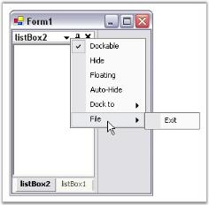' | markdownify }}
{:.image }

See Also

Context Menu

DocMenuClick Event

DockMenuClick event is fired, when the redock context menu item has been clicked. The menu button available for the docked controls, provides options for changing the docking position. Whenever the user tries to redock the control to some other position, DockMenuClick event will be triggered. The options provided are left, top, right and bottom. The redocked style can be displayed using the below code.

Event Data

The DockMenuClickEventHandler receives an argument of type DockMenuClickEventArgs containing data related to this event. The following DockMenuClickEventArgs properties provide information specific to this event.

_Table_ _76_: Members Table_

<table>
<tr>
<td>
Members</td><td>
Description</td></tr>
<tr>
<td>
DockingStyle</td><td>
Returns the docking of the window.</td></tr>
</table>

[C#]

private void dockingManager1_DocMenuClick(object sender, Syncfusion.Windows.Forms.Tools.DockMenuClickEventArgs arg)

{

// You can see the below line in output window during runtime.

Console.WriteLine("Dock Menu Click event is raised");

//Display the Docking Style

Console.WriteLine("DockingStyle : " + arg.DockingStyle.ToString());

}

[VB.NET]

Private Sub dockingManager1_DocMenuClick(ByVal sender As Object, ByVal arg As Syncfusion.Windows.Forms.Tools.DockMenuClickEventArgs)

' You can see the below line in output window during runtime.

Console.WriteLine("Dock Menu click event is raised")

'Display the Docking Style

Console.WriteLine("DockingStyle : " + arg.DockingStyle.ToString());

End Sub

###### Docked Control

This section covers the following events:

ControlMaximized Event

The docked control gets maximized, when the maximized button of the docked control is clicked. ControlMaximized event will be triggered after the control is maximized.

Event Data

The event handler receives an argument of type ControlMaximizedEventArgs containing data related to this event. The following  ControlMaximizedEventArgs properties provide information specific to this event.

_Table_ _77_: Members Table_

<table>
<tr>
<td>
Members</td><td>
Description</td></tr>
<tr>
<td>
Cancel</td><td>
Gets / sets value that indicates whether to cancel the operation or not.</td></tr>
</table>

[C#]

private void dockingManager1_ControlMaximized(object sender, Syncfusion.Windows.Forms.Tools.ControlMaximizedEventArgs arg)

{

// You can see the below line in output window during runtime.

Console.WriteLine("Control Maximized event is raised");

//Displays the docked control name

Console.WriteLine("Control Name : "+arg.Control.Name);

//Cancel is the boolean property which can prevent docking event when it is true.

arg.Cancel=true;

}

[VB.NET]

Private Sub dockingManager1_ControlMaximized(ByVal sender As Object, ByVal arg As Syncfusion.Windows.Forms.Tools.ControlMaximizedEventArgs)

' You can see the below line in output window during runtime.

Console.WriteLine("Control Maximized event is raised")

'Displays the docked control name

Console.WriteLine("Control Name : "+arg.Control.Name)

'Cancel is the boolean property which can prevent docking event when it is true.

arg.Cancel=True

End Sub

ControlMaximizing Event

When the user clicks on the maximize button, and when the control is going to be maximized, the ControlMaximizing event will be raised.

Event Data

The event handler receives an argument of type ControlMaximizeEventArgs containing data related to this event. The following ControlMaximizeEventArgs properties provide information specific to this event.

_Table_ _78_: Member Table_

<table>
<tr>
<td>
Members</td><td>
Description</td></tr>
<tr>
<td>
Cancel</td><td>
Gets / sets value that indicates whether to cancel the operation or not.</td></tr>
</table>

[C#]

private void dockingManager1_ControlMaximizing(object sender, Syncfusion.Windows.Forms.Tools.ControlMaximizeEventArgs arg)

{

// You can see the below line in output window during runtime.

Console.WriteLine("Control Maximizing event is raised");

//Displays the docked control name

Console.WriteLine("Control Name : "+arg.Control.Name);

//Cancel is the boolean property which can prevent docking event when it is true.

arg.Cancel=True

}

[VB.NET]

Private Sub dockingManager1_ControlMaximizing(ByVal sender As Object, ByVal arg As Syncfusion.Windows.Forms.Tools.ControlMaximizeEventArgs)

' You can see the below line in output window during runtime.

Console.WriteLine("Control Maximizing event is raised")

'Displays the docked control name

Console.WriteLine("Control Name : "+arg.Control.Name)

'Cancel is the boolean property which can prevent docking event when it is true.

arg.Cancel=True

End Sub

ControlMinimized Event

This event is fired after the control is minimized using the minimize option available for the docked control. This event can display the control name using the Control parameter available for the ControlMinimizedEventHandler.

_Table_ _79_: Members Table_

<table>
<tr>
<td>
Members</td><td>
Description</td></tr>
<tr>
<td>
Control</td><td>
Specifies the docked control which is minimized.</td></tr>
</table>

[C#]

private void dockingManager1_ControlMinimized(object sender, ControlMinimizedEventArgs arg)

{

// You can see the below line in output window during runtime.

Console.WriteLine("Control Minimized event is raised");

Displays the docked control name

Console.WriteLine("Control Name : "+arg.Control.Name);

}

[VB.NET]

Private Sub dockingManager1_ControlMinimized(ByVal sender As Object, ByVal arg As ControlMinimizedEventArgs)

' You can see the below line in output window during runtime.

Console.WriteLine("Control Minimized event is raised")

Displays the docked control name

Console.WriteLine("Control Name : "+arg.Control.Name);

End Sub

ControlRestored Event

This event occurs after the control is restored to its original position. This event can give the previous state of the control using the PreviousSizeState property available for the handler.

Event Data

The event handler receives an argument of type ControlRestoredEventArgs containing data related to this event. The following ControlRestoredEventArgs properties provide information specific to this event.

_Table_ _80_: Members Table_

<table>
<tr>
<td>
Member</td><td>
Description</td></tr>
<tr>
<td>
PreviousSizeState</td><td>
Returns previous size state of changing control.</td></tr>
</table>

[C#]

private void dockingManager1_ControlRestored(object sender, ControlRestoredEventArgs arg)

{

// You can see the below line in output window during runtime.

Console.WriteLine("Control Restored event is raised");

//Displays the previous state

Console.WriteLine("Control Name : "+arg.PreviousSizeState.ToString());

}

[VB.NET]

Private Sub dockingManager1_ControlRestored(ByVal sender As Object, ByVal arg As ControlRestoredEventArgs)

' You can see the below line in output window during runtime.

Console.WriteLine("Control Restored event is raised")

'Displays the previous state

Console.WriteLine("Control Name : "+arg.PreviousSizeState.ToString());

End Sub

###### Dock State

This section covers the following events:

DockStateChanged Event

When the user changes the dock state of the control, DockStateChanged event will be raised immediately after this dock state change operation.

Event Data

The event handler receives an argument of type DockStateChangeEventArgs containing data related to this event. The following DockStateChangeEventArgs property provides information specific to this event.

_Table_ _81_: Members Table_

<table>
<tr>
<td>
Member</td><td>
Description</td></tr>
<tr>
<td>
Control</td><td>
Gets the collection of controls undergoing the dock state transfer.</td></tr>
</table>

[C#]

//The DockStateChanged event occurs immediately after a dock operation.

private void dockingManager1_DockStateChanged(object sender, Syncfusion.Windows.Forms.Tools.DockStateChangeEventArgs arg)

{

Console.WriteLine("DockStateChanged Event has occurred");

Console.WriteLine("Total Number of controls in a group : " +

arg.Controls.Length.ToString());

//arg.Controls Gets the collection of controls undergoing the dockstate transfer.

Control[] ctrls = arg.Controls;

int i=1;

//Here display all the controls in arg.Controls group.

foreach(Control ctrl in ctrls)

{

Console.WriteLine("Control"+ i + " Name : " + ctrl.Name);

i++;

}

}

[VB.NET]

'The DockStateChanged event occurs immediately after a dock operation.

Private Sub dockingManager1_DockStateChanged(ByVal sender As Object, ByVal arg As Syncfusion.Windows.Forms.Tools.DockStateChangeEventArgs)

Console.WriteLine("DockStateChanged Event has occurred")

Console.WriteLine("Total Number of controls in a group : " + arg.Controls.Length.ToString)

'arg.Controls Gets the collection of controls undergoing the dockstate transfer.

Dim ctrls As Control() = arg.Controls

Dim i As Integer = 1

'Here display all the controls in arg.Controls group.

For Each ctrl As Control In ctrls

Console.WriteLine("Control" + i + " Name : " + ctrl.Name)

System.Math.Min(System.Threading.Interlocked.Increment(i), i - 1)

Next

End Sub

DockStateChanging Event

DockStateChanging event will be triggered just before a dock operation takes place.

Event Data

The event handler receives an argument of type DockStateChangeEventArgs containing data related to this event. The following DockStateChangeEventArgs property provides information specific to this event.

_Table_ _82_: Members Table_

<table>
<tr>
<td>
Member</td><td>
Description</td></tr>
<tr>
<td>
Control</td><td>
Gets the collection of controls undergoingthe dockstate transfer.</td></tr>
</table>

[C#]

//The DockStateChanging event occurs just before a dock operation takes place.

private void dockingManager1_DockStateChanging(object sender, Syncfusion.Windows.Forms.Tools.DockStateChangeEventArgs arg)

{

Console.WriteLine("DockStateChanging Event has occurred");

Console.WriteLine("Total Number of controls in a group : "+arg.Controls.Length.ToString());

//arg.Controls gives the collection of controls which are in Docked Area.

Control[] ctrls = arg.Controls;

int i=1;

//Here display all the controls in arg.Controls group.

foreach(Control ctrl in ctrls)

{

Console.WriteLine("Control"+ i + " Name : " + ctrl.Name);

i++;

}

}

[VB.NET]

'The DockStateChanging event occurs just before a dock operation takes place.

Private Sub dockingManager1_DockStateChanging(ByVal sender As Object, ByVal arg As Syncfusion.Windows.Forms.Tools.DockStateChangeEventArgs)

Console.WriteLine("DockStateChanging Event has occurred")

Console.WriteLine("Total Number of controls in a group : " + arg.Controls.Length.ToString)

'arg.Controls gives the collection of controls which are in Docked Area.

Dim ctrls As Control() = arg.Controls

Dim i As Integer = 1

'Here display all the controls in arg.Controls group.

For Each ctrl As Control In ctrls

Console.WriteLine("Control" + i + " Name : " + ctrl.Name)

System.Math.Min(System.Threading.Interlocked.Increment(i), i - 1)

Next

End Sub

DockStateUnavailable Event

The DockStateUnavailable event occurs if serialized information is not available for a dockable control when loading a persisted dock state.

Event Data

The event handler receives an argument of type DockStateUnavailableEventArgs containing data related to this event. The following DockStateUnavailableEventArgs property provides information specific to this event.

_Table_ _83_: Members Table_

<table>
<tr>
<td>
Member</td><td>
Description</td></tr>
<tr>
<td>
Control</td><td>
The name property of the control.</td></tr>
</table>

[C#]

//The DockStateUnavailable event occurs if serialized information is not available

//for a dockable control when loading a persisted dock state.

private void dockingManager1_DockStateUnavailable(object sender, Syncfusion.Windows.Forms.Tools.DockStateUnavailableEventArgs arg)

{

Console.WriteLine("DockStateUnavailable Event has been fired");

Console.WriteLine("Dock state unavailable for the Control is :

"+arg.Control.Name);

}

[VB.NET]

'The DockStateUnavailable event occurs if serialized information is not available

'for a dockable control when loading a persisted dock state.

Private Sub dockingManager1_DockStateUnavailable(ByVal sender As Object, ByVal arg As Syncfusion.Windows.Forms.Tools.DockStateUnavailableEventArgs)

Console.WriteLine("DockStateUnavailable Event has been fired")

Console.WriteLine("Dock state unavailable for the Control is : " + arg.Control.Name)

End Sub

NewDockStateBeginLoad Event

The NewDockStateBeginLoad event occurs just before a new dock state is loaded. Whenever an application with one or more docked controls is going to be loaded, this event will be triggered.

_Table_ _84_: Members Table_

<table>
<tr>
<td>
Member</td><td>
Description</td></tr>
<tr>
<td>
Control</td><td>
Gets the docked control for which a new dock state is going to be loaded.</td></tr>
</table>

[C#]

//The NewDockStateBeginLoad event occurs just before a new dock state is loaded.

private void dockingManager1_NewDockStateBeginLoad(object sender, System.EventArgs e)

{

Console.WriteLine("NewDockStateBeginLoad Event occurred");

//This will show until you click on the OK button.

//So The new state will be loaded after finishing this statement.

MessageBox.Show("This is NewDockStateBeginLoad Event Message Box");

}

[VB.NET]

Private Sub dockingManager1_NewDockStateBeginLoad(ByVal sender As Object, ByVal e As System.EventArgs)

Console.WriteLine("NewDockStateBeginLoad Event occurred")

'This will show until you click on the OK button.

'So The new state will be loaded after finishing this statement.

MessageBox.Show("This is NewDockStateBeginLoad Event Message Box")

End Sub

NewDockStateEndLoad Event

The NewDockStateEndLoad event occurs immediately after a new dock state has been loaded. Whenever an application with one or more docked controls is loaded, this event will be triggered.

_Table_ _85_: Members Table_

<table>
<tr>
<td>
Member</td><td>
Description</td></tr>
<tr>
<td>
Control</td><td>
Gets the docked control for which a new dock state has been loaded.</td></tr>
</table>

[C#]

//The NewDockStateEndLoad event occurs immediately after a new dock state has been loaded.

private void dockingManager1_NewDockStateEndLoad(object sender, System.EventArgs e)

{

Console.WriteLine("NewDockstateEndLoad Event occurred");

//This will show until you click on the OK button.

//So The new state will be loaded after finishing this statement.

MessageBox.Show("This is NewDockStateEndLoad Event Message Box");

}

[VB.NET]

'The NewDockStateEndLoad event occurs immediately after a new dock state has been loaded.

Private Sub dockingManager1_NewDockStateEndLoad(ByVal sender As Object, ByVal e As System.EventArgs)

Console.WriteLine("NewDockstateEndLoad Event occurred")

'This will show until you click on the OK button.

'So The new state will be loaded after finishing this statement.

MessageBox.Show("This is NewDockStateEndLoad Event Message Box")

End Sub

###### Dock Visibility State 

 This section covers the following events:

DockVisibilityChanged Event

This event occurs after a control's DockVisibility state has changed. When the user clicks on the close button, the control's visibility changes and at this moment DockVisibilityChanged event will be handled. We can also use dockingManager.GetDockVisibility(control) method to know the current status of the docking window. 

Event Data

The event handler receives an argument of type DockVisibilityChangedEventArgs containing data related to this event. The following DockVisibilityChangedEventArgs properties provide information specific to this event.

_Table_ _86_: Members Table_

<table>
<tr>
<td>
Member</td><td>
Description</td></tr>
<tr>
<td>
Control</td><td>
Gets the control undergoing the visibility change.</td></tr>
</table>

[C#]

//this event triggers when the control's visibility has changed. 

private void dockingManager1_DockVisibilityChanged(object sender, Syncfusion.Windows.Forms.Tools.DockVisibilityChangedEventArgs arg)

{

    //GetDockVisibility method gives the detail of the docked control visibility 

    if (this.dockingManager1.GetDockVisibility(arg.Control) == false)

    {

        //DockVisibilityChangedEventArgs instance arg holds the control being changed the visibility  

        MessageBox.Show(this.dockingManager1.GetDockLabel(arg.Control) + " " + " window is closed.");

    }

} 

[VB.NET]

'this event triggers when the control's visibility has changed. 

Private Sub dockingManager1_DockVisibilityChanged(ByVal sender As Object, ByVal arg As Syncfusion.Windows.Forms.Tools.DockVisibilityChangedEventArgs) Handles  

    dockingManager1.DockVisibilityChanged()

    'GetDockVisibility method gives the detail of the docked control visibility 

    If Me.dockingManager1.GetDockVisibility(arg.Control) = False Then

        'DockVisibilityChangedEventArgs instance arg holds the control being changed the visibility  

        MessageBox.Show(Me.dockingManager1.GetDockLabel(arg.Control) + " " + " window is closed.")

    End If

End Sub

DockVisibilityChanging Event

An use case demonstrating this event is available at How to prevent closing of docked window?.

###### Drag Events

This section covers the following events:

DragAllow Event

The DragAllow event is triggered when a docking window is about to be dragged. Whenever the user wants to dock a control, he will try to drag the control, to dock it to a particular target. This event will be raised, when this dragging process starts.

Event Data

DragAllowEventHandler receives an argument of type DragAllowEventArgs containing data related to this event. The following DragAllowEventArgs properties provides information specific to this event.

_Table_ _87_: Members Table_

<table>
<tr>
<td>
Members</td><td>
Description</td></tr>
<tr>
<td>
Cancel</td><td>
This property gets / sets the value indicating whether the event should be canceled.</td></tr>
<tr>
<td>
Control</td><td>
The control that is about to be dragged.</td></tr>
</table>

[C#]

//The DragAllow event occurs when a docking window is about to be dragged.

private void dockingManager1_DragAllow(object sender, Syncfusion.Windows.Forms.Tools.DragAllowEventArgs arg)

{

Console.WriteLine("DragAllow Event has been triggered");

//arg.Control property gives the reference to be dragged.

if(arg.Control==this.panel1)

{

//arg.Cancel is the property used to cancel the drag operation when it's in true state.

arg.Cancel=true;

}

}

[VB.NET]

'The DragAllow event occurs when a docking window is about to be dragged.

Private Sub dockingManager1_DragAllow(ByVal sender As Object, ByVal arg As Syncfusion.Windows.Forms.Tools.DragAllowEventArgs)

Console.WriteLine("DragAllow Event has been triggered")

'arg.Control property gives the reference to be dragged.

If arg.Control = Me.panel1 Then

'arg.Cancel is the property used to cancel the drag operation when it's in true state.

arg.Cancel = True

End If

End Sub

DragFeedbackStart Event

The DragFeedbackStart event is fired just before the start of the feedback of a drag operation. When the docked control is dragged from its position to locate some position, this event will be raised.

_Table_ _88_: Member Table_

<table>
<tr>
<td>
Member</td><td>
Description</td></tr>
<tr>
<td>
Control</td><td>
Gets the docked control which is about to be dragged.</td></tr>
</table>

[C#]

//The DragFeedbackStart event occurs just before the start of feedback of a drag operation.

//It occurs after the DragAllow Event.

private void dockingManager1_DragFeedbackStart(object sender, System.EventArgs e)

{

Console.WriteLine("DragFeedbackStart Event has been ");

//The following code is used to display all control names which are in the Docking Manager.

Syncfusion.Windows.Forms.Tools.DockingManager ctrl=sender as

Syncfusion.Windows.Forms.Tools.DockingManager;

IEnumerator ienum = ctrl.Controls;

ArrayList dockedctrls = new ArrayList();

while(ienum.MoveNext())

dockedctrls.Add(ienum.Current);

foreach(Control c in dockedctrls)

{

Console.WriteLine("Control Name :" + c.Name);

}

}

[VB.NET]

Private Sub dockingManager1_DragFeedbackStart(ByVal sender As Object, ByVal e As System.EventArgs)

Console.WriteLine("DragFeedbackStart Event has been ")

Dim ctrl As Syncfusion.Windows.Forms.Tools.DockingManager = CType(ConversionHelpers.AsWorkaround(sender, GetType(Syncfusion.Windows.Forms.Tools.DockingManager)), Syncfusion.Windows.Forms.Tools.DockingManager)

Dim ienum As IEnumerator = ctrl.Controls

Dim dockedctrls As ArrayList = New ArrayList

While ienum.MoveNext

dockedctrls.Add(ienum.Current)

End While

For Each c As Control In dockedctrls

Console.WriteLine("Control Name :" + c.Name)

Next

End Sub

DragFeedbackStop Event

The DragFeedbackStop event occurs immediately after the end of the feedback of a drag operation. When the docked control is dragged from its position and locates another position, this event will be raised. Whenever the mouse click is released from dragging, the drag feedback is stopped and DragFeedbackStop event will be triggered.

_Table_ _89_: Member Table_

<table>
<tr>
<td>
Member</td><td>
Description</td></tr>
<tr>
<td>
Control</td><td>
Gets the docked control which is dragged.</td></tr>
</table>

[C#]

//The DragFeedbackStop event occurs immediately after the end of feedback of a drag operation.

private void dockingManager1_DragFeedbackStop(object sender, System.EventArgs e)

{

Console.WriteLine("DragFeedbackStop Event is raised");

}

[VB.NET]

'The DragFeedbackStop event occurs immediately after the end of feedback of a drag operation.

Private Sub dockingManager1_DragFeedbackStop(ByVal sender As Object, ByVal e As System.EventArgs)

Console.WriteLine("DragFeedbackStop Event is raised")

End Sub

###### Linked Managers

This section covers the following events:

TransferredToManager Event

The TransferredToManager event occurs after a dockable control that previously belonged to some other DockingManager has been transferred to the docking layout hosted by the current DockingManager.

Event Data

The event handler receives an argument of type TransferManagerEventArgs containing data related to this event. The following TransferManagerEventArgs properties provide information specific to this event.

_Table_ _90_: Member Table_

<table>
<tr>
<td>
Member</td><td>
Description</td></tr>
<tr>
<td>
Control</td><td>
Gets the control which is undergoing the transfer.</td></tr>
</table>

[C#]

// A docking window is being transferred from one docking layout to another.

// Update the control's DockingManager reference.

protected void DockingManager_TransferredToManager(object sender, TransferManagerEventArgs args)

{

Console.WriteLine("Transferred to Manager Event has been Raised");

DockableControlBase dockablecontrol = args.Control as DockableControlBase;

dockablecontrol.CurrentDockingManager = sender as DockingManager;

Console.WriteLine("HostControl Name (Target Page Name) : "+dockablecontrol.CurrentDockingManager.HostControl.Name);

}

[VB.NET]

Protected Sub DockingManager_TransferredToManager(ByVal sender As Object, ByVal args As TransferManagerEventArgs)

Console.WriteLine("Transferred to Manager Event has been Raised")

Dim dockablecontrol As DockableControlBase = CType(ConversionHelpers.AsWorkaround(args.Control, GetType(DockableControlBase)), DockableControlBase)

dockablecontrol.CurrentDockingManager = CType(ConversionHelpers.AsWorkaround(sender, GetType(DockingManager)), DockingManager)

Console.WriteLine("HostControl Name (Target Page Name) : " + dockablecontrol.CurrentDockingManager.HostControl.Name)

End Sub

TransferringFromManager Event

The TransferringFromManager event occurs when a dockable control hosted by a DockingManager is about to be transferred to the docking layout hosted by some other DockingManager.

Event Data

The event handler receives an argument of type TransferManagerEventArgs containing data related to this event. The following TransferManagerEventArgs property provide information specific to this event.

_Table_ _91_: Member Table_

<table>
<tr>
<td>
Member</td><td>
Description</td></tr>
<tr>
<td>
Control</td><td>
Gets the control which is undergoing the transfer.</td></tr>
</table>

[C#]

//The TransferringFromManager event occurs when a dockable control hosted by this DockingManager is

//about to be transferred to the docking layout hosted by some other DockingManager.

protected void DockingManager_TransferringFromManager(object sender, TransferManagerEventArgs args)

{

Console.WriteLine("Transferring From Manager Event has been raised");

DockableControlBase dockablecontrol = args.Control as DockableControlBase;

dockablecontrol.CurrentDockingManager = sender as DockingManager; 

Console.WriteLine("HostControl name : "+dockablecontrol.CurrentDockingManager.HostControl.Name);

}

[VB.NET]

'The TransferringFromManager event occurs when a dockable control hosted by this DockingManager is

'about to be transferred to the docking layout hosted by some other DockingManager.

Protected Sub DockingManager_TransferringFromManager(ByVal sender As Object, ByVal args As TransferManagerEventArgs)

Console.WriteLine("Transferring From Manager Event has been raised")

Dim dockablecontrol As DockableControlBase = CType(ConversionHelpers.AsWorkaround(args.Control, GetType(DockableControlBase)), DockableControlBase)

dockablecontrol.CurrentDockingManager = CType(ConversionHelpers.AsWorkaround(sender, GetType(DockingManager)), DockingManager)

Console.WriteLine("HostControl name : " + dockablecontrol.CurrentDockingManager.HostControl.Name)

End Sub

Sample

A sample which demonstrates the Linked Managers concept is available in the below sample installation path.

…\_My Documents\Syncfusion\EssentialStudio\Version Number\Windows\Tools.Windows\Samples\Advanced Editor Functions\ActionGroupingDemo_

###### ImageListChanged Event

When the imagelist property is changed, ImageListChanged event will be raised. Every docked control will have SetDockIcon property to set the icons for the control. When this property is changed, the above event will be triggered.

_Table_ _92_: Member Table_

<table>
<tr>
<td>
Member</td><td>
Description</td></tr>
<tr>
<td>
Control</td><td>
Gets the docked control for which the imagelist property is changed.</td></tr>
</table>

[C#]

//Occurs when the ImageList property changes

private void dockingManager1_ImageListChanged(object sender, System.EventArgs e)

{

Console.WriteLine("ImageList Changed Event Is Triggered");

//Here the code which set the Docking Icon dynamically.

dockingManager1.SetDockIcon(this.panel1,0);

dockingManager1.SetDockIcon(this.panel2,1);

}

[VB.NET]

'Occurs when the ImageList property changes

Private Sub dockingManager1_ImageListChanged(ByVal sender As Object, ByVal e As System.EventArgs)

Console.WriteLine("ImageList Changed Event Is Triggered")

'Here the code which set the Docking Icon dynamically.

dockingManager1.SetDockIcon(Me.panel1, 0)

dockingManager1.SetDockIcon(Me.panel2, 1)

End Sub

###### InitializeControlOnLoad Event

The InitializeControlOnLoad event occurs when the DockingManager is not able to locate a control during a LoadDockState call.

Event Data

The event handler receives an argument of type InitializeControlOnLoadEventArgs containing data related to this event. The following InitializeControlOnLoadEventArgs property provides information specific to this event.

_Table_ _93_: Member Table_

<table>
<tr>
<td>
Member</td><td>
Description</td></tr>
<tr>
<td>
ControlName</td><td>
The Name property of the control.</td></tr>
</table>

[C#]

protected void DockingManager_InitializeControlOnLoad(object sender,

InitializeControlOnLoadEventArgs args)

{

Console.WriteLine("InitializeControlOnLoad Event is Raised for the Control :

" +args.ControlName);

DockingManager dockingmgr = sender as DockingManager;

switch (args.ControlName)

{

case "Suite Logo":

this.ActivateSuiteLogoControl(dockingmgr, false);

break;

case "Suite Info":

this.ActivateSuiteInfoControl(dockingmgr, false);

break;

case "Tools Info":

this.ActivateToolsInfoControl(dockingmgr, false);

break;

case "Tools Logo":

this.ActivateToolsLogoControl(dockingmgr, false);

break;

case "Grid Logo":

this.ActivateGridLogoControl(dockingmgr, false);

break;

case "Grid Info":

this.ActivateGridInfoControl(dockingmgr, false);

break;

}

}

[VB.NET]

Protected Sub DockingManager_InitializeControlOnLoad(ByVal sender As Object, ByVal args As InitializeControlOnLoadEventArgs)

Console.WriteLine("InitializeControlOnLoad Event is Raised for the Control : " + args.ControlName)

Dim dockingmgr As DockingManager = CType(ConversionHelpers.AsWorkaround(sender, GetType(DockingManager)), DockingManager)

Select Case args.ControlName

Case "Suite Logo"

Me.ActivateSuiteLogoControl(dockingmgr, False)

' break 

Case "Suite Info"

Me.ActivateSuiteInfoControl(dockingmgr, False)

' break 

Case "Tools Info"

Me.ActivateToolsInfoControl(dockingmgr, False)

' break 

Case "Tools Logo"

Me.ActivateToolsLogoControl(dockingmgr, False)

' break 

Case "Grid Logo"

Me.ActivateGridLogoControl(dockingmgr, False)

' break 

Case "Grid Info"

Me.ActivateGridInfoControl(dockingmgr, False)

' break 

End Select

End Sub

###### ProvideGraphicsItems Event

The ProvideGraphicsItems event occurs whenever a dockable control's caption needs to be painted. The background, foreground etc of the control's caption, when needs to be painted, this event will be raised. The docked control name, which is to be painted can be displayed using the control property.

Event Data

The event handler receives an argument of type ProvideGraphicsItemsEventArgs containing data related to this event. The following ProvideGraphicsItemsEventArgs properties provide information specific to this event.

_Table_ _94_: Member Table_

<table>
<tr>
<td>
 Member</td><td>
Description</td></tr>
<tr>
<td>
CaptionBackground</td><td>
Gets or sets the brush to be used for drawing the caption background.</td></tr>
<tr>
<td>
CaptionBounds</td><td>
Gets the bounds of the caption.</td></tr>
<tr>
<td>
CaptionFont</td><td>
Gets or sets the font to be used for the caption text.</td></tr>
<tr>
<td>
CaptionForeground</td><td>
Gets or sets the color to be used for drawing the caption text and buttons.</td></tr>
<tr>
<td>
Control</td><td>
Gets the dockable control for which the caption is being drawn.</td></tr>
<tr>
<td>
IsActiveCaption</td><td>
Gets the active / inactive state of the docking window.</td></tr>
</table>
> {{ '' | markdownify }}
{:.image }
 _Note: If the control is in floating state, DockingManager.ProvideGraphicsItems event will not get triggered._

[C#]

private void dockingManager1_ProvideGraphicsItems(object sender, Syncfusion.Windows.Forms.Tools.ProvideGraphicsItemsEventArgs arg)

{

Console.WriteLine("ProvideGraphicsItems Event Raised"+ i++);

// Caption Background uses the Brush for Drawing on the caption bar

arg.CaptionBackground=new LinearGradientBrush(arg.CaptionBounds,

Color.Transparent , Color.White, (float)0);

//Caption Foreground color property will be used to specify the Font color of the caption

arg.CaptionForeground=Color.Black;

//Caption Bounds property gives the values of Caption Height, width, Top ,Bottom and

// More like rectangle control.

Console.WriteLine("Caption Bounds, Height="+ arg.CaptionBounds.Height+

"Width="+arg.CaptionBounds.Width);

//IsActive Caption property gives the docked control is in Active or else. It will return

// bool value

if(arg.IsActiveCaption)

Console.WriteLine("Control Name="+ arg.Control.Name);

}

[VB.NET]

Private Sub dockingManager1_ProvideGraphicsItems(ByVal sender As Object, ByVal arg AsSyncfusion.Windows.Forms.Tools.ProvideGraphicsItemsEventArgs)

Console.WriteLine("ProvideGraphicsItems Event Raised" + System.Math.Min(System.Threading.Interlocked.Increment(i), i - 1))

'Caption Background uses the Brush for Drawing on the caption bar

arg.CaptionBackground = New LinearGradientBrush(arg.CaptionBounds, Color.Transparent, Color.White, CType(0, Single))

'Caption Fore ground color property will be used to specify the Font color of the caption

arg.CaptionForeground = Color.Black

'Caption Bounds property gives the values of Caption Height, width, Top ,Bottom and

'More like rectangle control.

Console.WriteLine("Caption Bounds, Height=" + arg.CaptionBounds.Height + "Width=" + arg.CaptionBounds.Width)

'IsActive Caption property gives the docked control is in Active or else. It will return

' bool value

If arg.IsActiveCaption Then

Console.WriteLine("Control Name=" + arg.Control.Name)

End If

End Sub

###### ProvidePersistenceID Event

This event lets you specify a unique ID to distinguish the persistence information of different instances of the Form type.

Event Data

The event handler receives an argument of type ProvidePersistenceIDEventArgs containing data related to this event. The following ProvidePersistenceIDEventArgs property provides information specific to this event.

_Table_ _95_: Member Table_

<table>
<tr>
<td>
Member</td><td>
Description</td></tr>
<tr>
<td>
PersistenceID</td><td>
Lets you specify a unique ID.</td></tr>
</table>

[C#]

//Lets you specify a unique ID used to distinguish the persistence information of different

//instances of the Form type.

protected void DockingManager_ProvidePersistenceID(object sender,Syncfusion.Windows.Forms.ProvidePersistenceIDEventArgs e)

{

Console.WriteLine("Provide Persistence ID Event has been raised");

Syncfusion.Windows.Forms.Tools.DockingManager dm = sender as DockingManager;

Console.WriteLine("Host control name = "+dm.HostControl.Name.ToString());

//The docking state stores in a place named as that Host control name.

e.PersistenceID=dm.HostControl.Name.ToString();

}

[VB.NET]

'Lets you specify a unique ID used to distinguish the persistence information of different

'instances of the Form type.

Protected Sub DockingManager_ProvidePersistenceID(ByVal sender As Object, ByVal e AsSyncfusion.Windows.Forms.ProvidePersistenceIDEventArgs)

Console.WriteLine("Provide Persistence ID Event has been raised")

Dim dm As Syncfusion.Windows.Forms.Tools.DockingManager = CType(ConversionHelpers.AsWorkaround(sender, GetType(DockingManager)), DockingManager)

Console.WriteLine("Host control name = " + dm.HostControl.Name.ToString)

'The docking state stores in a place named as that Host control name.

e.PersistenceID = dm.HostControl.Name.ToString

End Sub

###### Docking behavior in Docking Manager

The current behavior of Docking Manager is based on Visual Studio 2008. This behavior can be changed to the dock behavior of  Visual Studio 2010 by using DockBehavior property.

Caption Button Collection:

In Visual studio 2010, if you double-click on the docked window, the _caption control_ moves to _floating_ state and displays the _Caption Button_ collections as shown in the following screen shot. 

{{ '' | markdownify }}
{:.image }

Interactive features

When you double-click on Docking Manager caption bar, the control state changes to _Maximized_ state. 

Maximize and Restore Options: 

You can maximize/restore the dock panel to the earlier floating window position by double-clicking on the caption bar or on the restore button. 

The following screen shot shows how to restore a dock panel using _maximize_ and _restore_ buttons.

{{ '' | markdownify }}
{:.image }

Auto Hide:

You can auto-hide a dock panel by selecting the “Auto-Hide” menu item in the caption bar. 

The following screen shot shows how to auto-hide a dock panel.

{{ '' | markdownify }}
{:.image }

Auto Hide State:

The following screen shot shows a dock panel in auto-hide state.

{{ '' | markdownify }}
{:.image }

API Details:

_Table_ _96_: Property Table_

<table>
<tr>
<td>
Property</td><td>
Type</td><td>
Description</td></tr>
<tr>
<td>
DockBehavior</td><td>
Enum</td><td>
Specifies the docking behavior of Docking Manager.</td></tr>
</table>

The following code example illustrates how to switch DockBehavior property from VS 2008 to VS 2010 

and vice versa.

 [C#]

this.dockingManager1.DockBehavior = Syncfusion.Windows.Forms.Tools.DockBehavior.VS2010;

 [C#]

this.dockingManager1.DockBehavior = Syncfusion.Windows.Forms.Tools.DockBehavior.VS2008;

[VB.NET]

Me.dockingManager1.DockBehavior = Syncfusion.Windows.Forms.Tools.DockBehavior.VS2010

[VB.NET]

 Me.dockingManager1.DockBehavior = Syncfusion.Windows.Forms.Tools.DockBehavior.VS2008

#### Frequently Asked Questions

 This section will help you become more familiar in using the Docking Windows Package.

##### General

This section covers the following topics:

###### How to activate a particular docked control?

You can call the ActivateControl method inside NewDockStateEndLoad event to achieve this.

_Table_ _97_: Methods Table_

<table>
<tr>
<td>
Methods</td><td>
Description</td></tr>
<tr>
<td>
ActivateControl</td><td>
Activates the docked control which is passed as a parameter to this method. This method will be effective only when the control is tabbed to other control or controls. This method can be called from a handler for DockingManager.NewDockStateEndLoad Event. The parameter is,{{ '_Ctrl_' | markdownify }} - Indicates the docking window.</td></tr>
</table>

[C#]

//The NewDockStateEndLoad event occurs immediately after a new dock state has been loaded.

private void dockingManager1_NewDockStateEndLoad(object sender, System.EventArgs e)

{

this.dockingManager1.ActivateControl(this.listBox1);

Console.WriteLine("Listbox is activated");

}

[VB.NET]

'The NewDockStateEndLoad event occurs immediately after a new dock state has been loaded.

Private Sub dockingManager1_NewDockStateEndLoad(ByVal sender As Object, ByVal e As System.EventArgs)

Me.dockingManager1.ActivateControl(Me.listBox1)

Console.WriteLine("Listbox is activated")

End Sub

###### How to change the dock tab alignment?

This can be controlled by setting the DockTabAlignment property which is discussed in Tabbed Docking topic.

###### How to detect the docking style assigned to a control?

 You can detect the Docking style that is assigned to the control, at run time, using GetDockingStyle method.

_Table_ _98_: Method Table_

<table>
<tr>
<td>
Method</td><td>
Description</td></tr>
<tr>
<td>
GetDockingStyle</td><td>
Returns the current docking style of the control. The return value for this method would be docking style value, that specifies the dock type / position. The docked control for which the dock style is to be identified should be passed as a parameter to this method. The parameter is,{{ '_Ctrl_' | markdownify }} - Indicates the docked control for which the DockStyle needs to be retrieved.</td></tr>
</table>

[C#]

//Getting the docking style

private void button1_Click(object sender, EventArgs e)

{

this.dockingManager1.GetDockStyle(this.panel1);

Console.Write("Dock style :" + this.dockingManager1.GetDockStyle(this.panel1));

}

[VB.NET]

'Getting the docking style

Private Sub button1_Click(ByVal sender As Object, ByVal e As System.EventArgs)

Me.dockingManager1.GetDockStyle(this.panel1)

Console.Write("Dock style :" + this.dockingManager1.GetDockStyle(this.panel1))

End Sub

###### How to Enable the Tabbed Style Dockable Window using TabbedMDI manager?

The Tabbed MDI Package provides a new Tabbed MDI layout mode (as an alternative to the default Cascade and Tiled modes), popularized by VS .NET. 

We can enable and attach the dockable window into the Tabbed MDI manager during application startup using the following simple steps.

* Add 4 panels and the DockingManager to your application.
* Declare the TabbedMDIManager.

[C#]

private Syncfusion.Windows.Forms.Tools.TabbedMDIManager tm;

[VB.NET]

Private tm As Syncfusion.Windows.Forms.Tools.TabbedMDIManager

* Set the form's IsMDIContainer property to true. Add a form, form2 to the project.
* In the form constructor, you have to enable the dockable window into an MDIChild by calling the SetAsMDIChild method. This has to be done before calling the AttachToMdiContainer method. It will give the look and feel of the VS. NET editor with dockable tabbed window appearance.

[C#]

// Enables docking for panel.

this.dockingManager1.SetEnableDocking(this.panel1,true);

this.dockingManager1.SetEnableDocking(this.panel2,true);

this.dockingManager1.SetEnableDocking(this.panel3,true);

this.dockingManager1.SetEnableDocking(this.panel4,true);

// Sets dock label.            

this.dockingManager1.SetDockLabel(this.panel1,"Panel 1");                             

this.dockingManager1.SetDockLabel(this.panel2,"Panel 2");

this.dockingManager1.SetDockLabel(this.panel3,"Panel 3");

this.dockingManager1.SetDockLabel(this.panel4,"Panel 4");

// Changes docking window to MDI child window.

this.dockingManager1.SetAsMDIChild(this.panel1,true);

this.dockingManager1.SetAsMDIChild(this.panel2,true);

this.dockingManager1.SetAsMDIChild(this.panel3,true);

    // Attach MDI container to TabbedMDI manager.

this.tm= new TabbedMDIManager();

this.tm.TabControlAdded+= new TabbedMDITabControlEventHandler(tm_TabControlAdded);

    // Assign the MDI form into the TabbedManager MDI container.

this.tb.AttachToMdiContainer(this);

this.dockingManager1.VisualStyle = Syncfusion.Windows.Forms.VisualStyle.Office2003;

[VB.NET]

'Enables docking for panel.

Me.dockingManager1.SetEnableDocking(Me.panel1, True)

Me.dockingManager1.SetEnableDocking(Me.panel2,True)

Me.dockingManager1.SetEnableDocking(Me.panel3,True)

Me.dockingManager1.SetEnableDocking(Me.panel4, True)

'Sets dock label.            

Me.dockingManager1.SetDockLabel(Me.panel1,"Panel 1")

Me.dockingManager1.SetDockLabel(Me.panel2,"Panel 2")

Me.dockingManager1.SetDockLabel(Me.panel3,"Panel 3")

'Changes docking window to MDI child window.

Me.dockingManager1.SetAsMDIChild(Me.panel1,True)

Me.dockingManager1.SetAsMDIChild(Me.panel2,True)

Me.dockingManager1.SetAsMDIChild(Me.panel3,True)

Me.dockingManager1.SetAsMdiChild(Me.Panel4, True)

'Attach MDI container to TabbedMDI manager.

Me.tm= New TabbedMDIManager()

AddHandler tm.TabControlAdded, AddressOf tm_TabControlAdded

 ' Assign the MDI form into the TabbedManager MDI container.

Me.tb.AttachToMdiContainer(Me)

Me.dockingManager1.VisualStyle = Syncfusion.Windows.Forms.VisualStyle.Office2003

* You can also change the appearance of the tabs by applying the TabStyle in the TabControlAdded event.

[C#]

// Enable the rendering for the Tabbed MDI manager tabs.

private void tm_TabControlAdded(object sender, TabbedMDITabControlEventArgs args)

{

      args.TabControl.TabStyle = typeof(TabRendererWhidbey);

}

[VB.NET]

'Enable the rendering for the Tabbed MDI manager tabs.

Private Sub tm_TabControlAdded(ByVal sender As Object, ByVal args As TabbedMDITabControlEventArgs)

      args.TabControl.TabStyle=GetType(TabRendererWhidbey)

End Sub

{{ '' | markdownify }}
{:.image }

See Also

Tabbed Docking

###### How to get dock controls parent relationship through code?

This can be done using the below code snippet.

[C#]

private void InitializeDockControlState()

{

    this.dockingManager1.FloatControl(this.myUserControl11, new Rectangle(250, 250, 220, 260));

    this.dockingManager1.FloatControl(this.myUserControl21, new Rectangle(350, 350, 220, 260));

    this.dockingManager1.DockControl(this.myUserControl31, this, DockingStyle.Right, 200);

    this.dockingManager1.DockControl(this.myUserControl11, this.myUserControl21, DockingStyle.Bottom, 200);

}

private void GetDockingRelationship(Control dockedControl)

{

    Control targetControl;

    string statusMessage = string.Empty;

    if (dockedControl.Parent is DockHost)

    {

        DockHost dockhost = dockedControl.Parent as DockHost;

        DockHostController dhc = dockhost.InternalController as DockHostController;

        DockControllerBase baseController = dhc.DICurrent.dController;

        if (baseController != null)

        {

            if (baseController is SizingController || baseController is DockHostController)

            {

                if (count != dockedctrls.Count - 1)

                {

                    targetControl = baseController.HostControl.Controls[0];

                    statusMessage = dockedControl.Name + " is docked to " + targetControl.Name + ".";

                    statusMessage += "DockingStyle " + this.dockingManager1.GetDockStyle(dockedControl);

                }

                else if (count == dockedctrls.Count - 1)

                {

                    targetControl = baseController.HostControl;

                    statusMessage = dockedControl.Name + " is docked to " + targetControl.Name + ".";

                    statusMessage += "DockingStyle " + this.dockingManager1.GetDockStyle(dockedControl);

                }

            }

            else if (baseController is DockTabController)

            {

                if (this.dockingManager1.IsFloating(dockedControl))

                {

                    statusMessage = dockedControl.Name + " is floating and in a tab group.";

                    targetControl = baseController.HostControl.Parent.Controls[0].Controls[0];

                }

                else

                {

                    statusMessage = dockedControl.Name + " is in a tab group.";

                    targetControl = baseController.HostControl.Controls[0];

                }

                if (targetControl.Name != dockedControl.Name)

                    statusMessage += "The tab group primary control is " + targetControl.Name + ".";

                else

                    statusMessage += "This control is the primary control in the tab group.";

            }

            else if (baseController is FloatingFormController)

            {

                statusMessage = dockedControl.Name + " is floating independently.";

            }

            else

            {

                statusMessage = dockedControl.Name + " full docking state not known.";

            }

        }

        Console.WriteLine(statusMessage);

    }

}

ArrayList dockedctrls;

int count;

private void getControlsRelationToolStripMenuItem_Click(object sender, EventArgs e)

{

    count = 0;

    IEnumerator ienum = this.dockingManager1.Controls;

    dockedctrls = new ArrayList();

    while (ienum.MoveNext())

    {

        dockedctrls.Add(ienum.Current);

    }

    foreach (Control dockedControl in dockedctrls)

    {

        GetDockingRelationship(dockedControl);

        count = count + 1;

    }

}

[VB.NET]

Private Sub InitializeDockControlState()

    Me.dockingManager1.FloatControl(Me.myUserControl11, New Rectangle(250, 250, 220, 260))

    Me.dockingManager1.FloatControl(Me.myUserControl21, New Rectangle(350, 350, 220, 260))

    Me.dockingManager1.DockControl(Me.myUserControl31, Me, DockingStyle.Right, 200)

    Me.dockingManager1.DockControl(Me.myUserControl11, Me.myUserControl21, DockingStyle.Bottom, 200)

End Sub

Private Sub GetDockingRelationship(ByVal dockedControl As Control)

    Dim targetControl As Control

    Dim statusMessage As String = String.Empty

    If TypeOf dockedControl.Parent Is DockHost Then

        Dim dockhost As DockHost = TryCast(dockedControl.Parent, DockHost)

        Dim dhc As DockHostController = TryCast(dockhost.InternalController, DockHostController)

        Dim baseController As DockControllerBase = dhc.DICurrent.dController

        If baseController IsNot Nothing Then

            If TypeOf baseController Is SizingController OrElse TypeOf baseController Is DockHostController Then

                If count <> dockedctrls.Count - 1 Then

                    targetControl = baseController.HostControl.Controls(0)

                    statusMessage = dockedControl.Name + " is docked to " + targetControl.Name + "."

                    statusMessage += "DockingStyle " + Me.dockingManager1.GetDockStyle(dockedControl)

                ElseIf count = dockedctrls.Count - 1 Then

                    targetControl = baseController.HostControl

                    statusMessage = dockedControl.Name + " is docked to " + targetControl.Name + "."

                    statusMessage += "DockingStyle " + Me.dockingManager1.GetDockStyle(dockedControl)

                End If

            ElseIf TypeOf baseController Is DockTabController Then

                If Me.dockingManager1.IsFloating(dockedControl) Then

                    statusMessage = dockedControl.Name + " is floating and in a tab group."

                    targetControl = baseController.HostControl.Parent.Controls(0).Controls(0)

                Else

                    statusMessage = dockedControl.Name + " is in a tab group."

                    targetControl = baseController.HostControl.Controls(0)

                End If

                If targetControl.Name <> dockedControl.Name Then

                    statusMessage += "The tab group primary control is " + targetControl.Name + "."

                Else

                    statusMessage += "This control is the primary control in the tab group."

                End If

            ElseIf TypeOf baseController Is FloatingFormController Then

                statusMessage = dockedControl.Name + " is floating independently."

            Else

                statusMessage = dockedControl.Name + " full docking state not known."

            End If

        End If

        Console.WriteLine(statusMessage)

    End If

End Sub

Private dockedctrls As ArrayList

Private count As Integer

Private Sub getControlsRelationToolStripMenuItem_Click(ByVal sender As Object, ByVal e As EventArgs)

    count = 0

    Dim ienum As IEnumerator = Me.dockingManager1.Controls

    dockedctrls = New ArrayList()

    While ienum.MoveNext()

        dockedctrls.Add(ienum.Current)

    End While

    For Each dockedControl As Control In dockedctrls

        GetDockingRelationship(dockedControl)

        count = count + 1

    Next

End Sub

###### How to get or set the dock ability for a control?

The current dock ability for the controls can be retrieved or set using the below methods.

_Table_ _99_: Methods Table_

<table>
<tr>
<td>
Methods</td><td>
Description</td></tr>
<tr>
<td>
GetDockAbility</td><td>
Retrieves the dock ability of the control. The parameter is,{{ '_Ctrl_' | markdownify }} - Indicates the docked control for which DockAbility has to be obtained.</td></tr>
<tr>
<td>
SetDockAbility</td><td>
Sets the dock ability of the control.{{ '_Ctrl_' | markdownify }} - Indicates the docked control for which DockAbility need to be set.</td></tr>
</table>

[C#]

//Getting the Dock Ability

this.dockingManager1.GetDockAbility(this.panel2);

//Setting the Dock Ability

this.dockingManager1.SetDockAbility(this.panel2, "Bottom, Horizontal");

[VB.NET]

'Getting the Dock Ability

Me.dockingManager1.GetDockAbility(Me.panel2)

'Setting the Dock Ability

Me.dockingManager1.SetDockAbility(Me.panel2, "Bottom, Horizontal")

###### How to get or set the size of the docked control?

The below methods lets you get or set the size of the control.

_Table_ _100_: Methods Table_

<table>
<tr>
<td>
Methods</td><td>
Description</td></tr>
<tr>
<td>
GetControlSize</td><td>
Gets the size of the docked or the floating control, by passing the control as a parameter to this method. The parameters are,{{ '_Ctrl_' | markdownify }} - Indicates the docking window.</td></tr>
<tr>
<td>
SetControlSize</td><td>
Sets the new size (width, Height) for the docked or the floating control, by passing the control as a parameter to this method. The default value of size is Empty. The parameters are,{{ '_Ctrl_' ' | markdownify }}- Indicates the docking window.{{ '_Size_' | markdownify }} - Specifies the new size for the control.</td></tr>
</table>

[C#]

//Get the size of docked or Floating control using the GetControlSize method

this.dockingManager1.GetControlSize(this.panel2);

Console.Write("Size" + this.dockingManager1.GetControlSize(this.panel2));

//Set the size of docked or Floating control using the GetControlSize method

this.dockingManager1.SetControlSize(this.panel1, new Size(100, 50));

[VB.NET]

'Get the size of docked or Floating control using the GetControlSize method

Me.dockingManager1.GetControlSize(Me.panel2)

Console.Write("Size" + Me.dockingManager1.GetControlSize(Me.panel2))

'Set the size of docked or Floating control using the GetControlSize method

this.dockingManager1.SetControlSize(this.panel1, new Size(100, 50));

###### How to Get the Individual Docked control's Properties?

To check whether a control (in this case it's a listbox) is floating or docked, you could use the code snippet given below.

[C#]

this.dockingManager1.IsFloating(this.listBox1);

[VB.NET]

Me.dockingManager1.IsFloating(this.listBox1);

To get the Dock location

1. Add a listview and a docking manager in your form.
2. Enable the listview as a docked control.

[C#]

this.dockingManager1.SetEnableDocking(this.listView1,true);

[VB.NET]

Me.dockingManager1.SetEnableDocking(Me.listView1, True)

3. Now add the below given code in your form's constructor.

[C#]

//listView1 is the dockable control. We could get it's dock properties by accessing DockHost and DockHostController.

Syncfusion.Windows.Forms.Tools.DockHost dhost = this.listView1.Parent as Syncfusion.Windows.Forms.Tools.DockHost;

Syncfusion.Windows.Forms.Tools.DockHostController dhc = dhost.InternalController as

Syncfusion.Windows.Forms.Tools.DockHostController;

//The DockInfo object will give all the information about docked control.

Syncfusion.Windows.Forms.Tools.DockInfo di = dhc.GetSerCurrentDI();

MessageBox.Show(di.dStyle.ToString() + dhc.LayoutRect.ToString());

[VB.NET]

' listView1 is the dockable control. We could get it's dock properties by accessing DockHost and DockHostController.

Dim dhost As Syncfusion.Windows.Forms.Tools.DockHost = CType(IIf(TypeOfMe.listView1.Parent Is Syncfusion.Windows.Forms.Tools.DockHost, Me.listView1.Parent,Nothing), Syncfusion.Windows.Forms.Tools.DockHost)

Dim dhc As Syncfusion.Windows.Forms.Tools.DockHostController = CType(IIf(TypeOfdhost.InternalController Is Syncfusion.Windows.Forms.Tools.DockHostController, dhost.InternalController, Nothing), Syncfusion.Windows.Forms.Tools.DockHostController)

' The DockInfo object will give all the information about docked control.

Dim di As Syncfusion.Windows.Forms.Tools.DockInfo = dhc.GetSerCurrentDI()

MessageBox.Show((di.dStyle.ToString + dhc.LayoutRect.ToString))

4. Just before you close a docked / floating control, access the control’s parent and cast this to type Syncfusion.Windows.Forms.Tools.DockHost. 
5. Now access the DockHost's InternalController and get it’s current serialization info by using the GetSerCurrInfo() method. This will fetch an object of type Syncfusion.Windows.Forms.Tools.DockInfo. The DockInfo.DockingStyle member gives the dock position of the particular control with respect to the host form and the DockInfo.rcDockArea member returns the control bounds. 
6. If the control is floating, then DockingStyle will be equal to Syncfusion.Windows.Forms.Tools.DockingStyle.Fill. You can serialize this information against the control’s name and later upon loading, appropriately use either the DockingManager.DockControl() / FloatControl() method, based on the serialized DockingStyle / rcbounds values, to set the control’s dock state.
###### How to identify the docking window which is currently being closed?

This can be done through DockVisibilityChanged Event.

###### How to prevent closing of docked window?

This can be done in the DockVisibilityChanging event. When the end users tries to change the docking control visibility, this event will be handled. The members of this event is as follows.

_Table_ _101_: Members Table_

<table>
<tr>
<td>
Members</td><td>
Description</td></tr>
<tr>
<td>
Cancel</td><td>
This property gets / sets the value indicating whether the event should be canceled.</td></tr>
<tr>
<td>
Control</td><td>
Gets the control which is undergoing the transfer.</td></tr>
</table>

[C#]

private void dockingManager1_DockVisibilityChanging(object sender, Syncfusion.Windows.Forms.Tools.DockVisibilityChangingEventArgs arg)

{

    arg.Cancel = true;

}

[VB.NET]

Private Sub dockingManager1_DockVisibilityChanging(ByVal sender As Object, ByVal arg As Syncfusion.Windows.Forms.Tools.DockVisibilityChangingEventArgs) Handles dockingManager1.DockVisibilityChanging

    arg.Cancel = True

End Sub

Additionally, the dock visibility of a control can be retrieved using GetDockVisibility method by passing the control as the parameter. Also DockVisibility can be set for the controls using SetDockVisibility method.

###### How to prevent tabbed docking?

DockAllow event will be handled when a docking window is dragged over a potential dock target. In other words, whenever the user tries to dock a docked control to another docked control, this event will be raised. This lets you decide whether to allow tabbing or not. Giving arg.Cancel to true cancels the docking operation.

_Table_ _102_: Members Table_

<table>
<tr>
<td>
Members</td><td>
Description</td></tr>
<tr>
<td>
DockStyle</td><td>
Represents the docking style.</td></tr>
<tr>
<td>
DragControl</td><td>
Gets the control that is being dragged.</td></tr>
<tr>
<td>
TargetControl</td><td>
The dock target control.</td></tr>
<tr>
<td>
Cancel</td><td>
This property gets / sets the value indicating whether the event should be canceled.</td></tr>
</table>

[C#]

//The DockAllow event occurs when a docking window is dragged over a potential dock target. 

private void dockingManager1_DockAllow(object sender, Syncfusion.Windows.Forms.Tools.DockAllowEventArgs arg)

{

    //Checks if the each controls are trying to dock with each other, by DragControl and DockControl property  

    if (((arg.DragControl == this.panel1) && (arg.TargetControl == this.panel2))

    || ((arg.DragControl == this.panel2) && (arg.TargetControl == this.panel1)))

    {

        //Cancel the Docking Action. 

        arg.Cancel = true;

    }

} 

[VB.NET]

'The DockAllow event occurs when a docking window is dragged over a potential dock target. 

Private Sub dockingManager1_DockAllow(ByVal sender As Object, ByVal arg As Syncfusion.Windows.Forms.Tools.DockAllowEventArgs) Handles dockingManager1.DockAllow

    'Checks if the each controls are trying to dock with each other, by DragControl and DockControl property  

    If ((arg.DragControl Is Me.panel1) AndAlso (arg.TargetControl Is Me.panel2)) OrElse ((arg.DragControl Is Me.panel2) AndAlso (arg.TargetControl Is Me.panel1)) Then

        'Cancel the Docking Action. 

        arg.Cancel = True

    End If

End Sub

##### Dock State

This section covers the following topics:

###### How to avoid flickering while loading dock state?

Flickering can be avoided by calling the below methods.

LockDockPanelsUpdate andUnLockDockPanelsUpdate Methods - The LockDockPanelsUpdate and UnLockDockPanelsUpdate methods are used to lock and unlock the panel's repainting respectively. For example to avoid flickering while loading a dock state, these methods can be used in the following way.

[C#]

//Avoids flickering while loading dock state

this.dockingManager1.LockHostFormUpdate();

this.dockingManager1.LoadDockState();

this.dockingManager1.UnlockHostFormUpdate();

[VB.NET]

'Avoids flickering while loading dock state

Me.dockingManager1.LockHostFormUpdate()

Me.dockingManager1.LoadDockState()

Me.dockingManager1.UnlockHostFormUpdate()

See Also

Persistence

###### How to restore the original docking windows layout that was set within the Windows Forms designer?

Calling LoadDesignerDockState() method at run time, will restore the docking windows layout that was set in the Designer.

[C#]

this.dockingManager1.LoadDesignerDockState();

[VB.NET]

Me.dockingManager1.LoadDesignerDockState()

##### Docked Group

This section covers the following topics:

###### How to Access the Collection of Dock-Enabled Controls?

The DockingManager.Controls property returns an enumerator that may be used for accessing the controls that are currently associated with the DockingManager. To access and modify the DockingManager’s control, the contents of the enumerator should first be copied to a temporary collection. 

Step 1: Create the respective controls and dock the control through design by setting EnableDocking on dockingManagerproperty to true and follow the below given steps to enable, access and modify the docked controls.

{{ '' | markdownify }}
{:.image }

Step 2:Access and modify the dockable controls.

The below given code snippet accesses the docked controls, disable docking and then disposes the dockable controls.

[C#]

//Getting the Controls into an ArrayList.

IEnumerator ienum = this.dockingManager.Controls; 

ArrayList dockedctrls = new ArrayList(); 

while(ienum.MoveNext()) 

dockedctrls.Add(ienum.Current); 

// Iterating through the collection to perform the required operation.

foreach(Control ctrl in dockedctrls) 

{                         

// Disabling the docking and disposing control.

this.dockingManager.SetEnableDocking(ctrl, false); 

ctrl.Dispose(); 

}

[VB.NET]

'Getting the Controls into an ArrayList.

Dim ienum As IEnumerator = Me.dockingManager.Controls

Dim dockedctrls As ArrayList = New ArrayList()

Do While ienum.MoveNext()

   dockedctrls.Add(ienum.Current)

Loop

'Iterating through the collection to perform the required operation.

For Each ctrl As Control In dockedctrls

'Disabling the docking and disposing control.

Me.dockingManager.SetEnableDocking(ctrl, False)

ctrl.Dispose()

Next ctrl

{{ '' | markdownify }}
{:.image }

###### How to determine whether any two controls are in the same tabbed group?

This can be done by calling the IsSameTabbedGroup method.

[C#]

this.dockingManager.IsSameTabbedGroup(this.listBox1,this.listBox2);

[VB.NET]

Me.dockingManager.IsSameTabbedGroup(Me.listBox1,Me.listBox2)

###### How to get the docking group details?

To get the docking group

There is no concept of 'group' in Docking Manager and a tabbed group is just an intermediate state. However, if necessary, this can be determined by first ascertaining that the control is in a tabbed docking group, getting hold of the DockTabController, it’s DockTab and then iterating the DockTabPages. The dhcClient member of each DockTabPage will reference the DockHostController that is associated with it. Once the controller is available, you can get to the control through the DockHostController.HostControl property and use the control’s Controls[0] indexer to get the actual dockable control.

Follow the given steps to get the docking group.

1. Add three listboxes, a button and a docking manager to the form.
2. Set the EnableDocking on Docking Manager property to true.
3. Add the namespace Syncfusion.Windows.Forms.Tools in your application.

[C#]

using Syncfusion.Windows.Forms.Tools;

[VB.NET]

Imports Syncfusion.Windows.Forms.Tools

4. Tab the controls as shown below.

{{ '' | markdownify }}
{:.image }

Add the code given below in the button click event.

[C#]

Syncfusion.Windows.Forms.Tools.DockHost dhost = this.listBox1.Parent as Syncfusion.Windows.Forms.Tools.DockHost; 

Syncfusion.Windows.Forms.Tools.DockHostController dhc = dhost.InternalController as  Syncfusion.Windows.Forms.Tools.DockHostController;

// If ParentController is DockTabController the control will be in a tab.

if(dhc.ParentController is Syncfusion.Windows.Forms.Tools.DockTabController) 

{ 

       // Getting the DockTabControl from the DockTabController.

Syncfusion.Windows.Forms.Tools.DockTabControl docktab = (dhc.ParentController as  Syncfusion.Windows.Forms.Tools.DockTabController).TabControl;

       // Iterating through the tabpages to get other controls in that tab.

       foreach(DockTabPage tabpage in docktab.TabPages) 

       { 

           Control siblingcontrol = tabpage.dhcClient.HostControl.Controls[0];

           MessageBox.Show(siblingcontrol.Name);

       }

}

[VB.NET]

Dim dhost As Syncfusion.Windows.Forms.Tools.DockHost = CType(IIf(TypeOf Me.listBox1.Parent Is Syncfusion.Windows.Forms.Tools.DockHost, Me.listBox1.Parent, Nothing), Syncfusion.Windows.Forms.Tools.DockHost)

Dim dhc As Syncfusion.Windows.Forms.Tools.DockHostController = CType(IIf(TypeOf dhost.InternalController Is Syncfusion.Windows.Forms.Tools.DockHostController, dhost.InternalController, Nothing), Syncfusion.Windows.Forms.Tools.DockHostController)

    'If Parentcontroller is DockTabController the control will be in a tab.

    If TypeOf dhc.ParentController Is Syncfusion.Windows.Forms.Tools.DockTabController Then

       'Getting the DockTabControl from the DockTabController

Dim docktab As Syncfusion.Windows.Forms.Tools.DockTabControl = (CType(IIf(TypeOf dhc.ParentController Is  Syncfusion.Windows.Forms.Tools.DockTabController, dhc.ParentController, Nothing), Syncfusion.Windows.Forms.Tools.DockTabController)).TabControl

       'Iterating through the tabpages to get other controls in that tab.

        For Each tabpage As DockTabPage In docktab.TabPages

            Dim siblingcontrol As Control = tabpage.dhcClient.HostControl.Controls(0)

            MessageBox.Show(siblingcontrol.Name)

    Next tabpage

End If

##### MDIChild

This section covers the following topics:

###### How to avoid flickering while creating MDI child form?

Flickering can be avoided by calling the below methods.

LockHostFormUpdate and UnLockHostFormUpdate Methods - The LockHostFormUpdate and UnLockHostFormUpdate methods are used to lock and unlock the host form's updates respectively. These methods helps in avoiding flickering while creating an MDI child form, these methods can be used in the following way.

[C#]

//To avoid flickering

this.dockingManager1.LockHostFormUpdate();

this.dockingManager1.DockControl(form, this, Syncfusion.Windows.Forms.Tools.DockingStyle.Right, 0);

this.dockingManager1.SetAsMDIChild(form, true);

this.dockingManager1.SetControlSize(form, size);

this.dockingManager1.UnlockHostFormUpdate();

[VB.NET]

'To avoid flickering

Me.dockingManager1.LockHostFormUpdate()

Me.dockingManager1.DockControl(form, Me, Syncfusion.Windows.Forms.Tools.DockingStyle.Right, 0)

Me.dockingManager1.SetAsMDIChild(form, True)

Me.dockingManager1.SetControlSize(form, size)

Me.dockingManager1.UnlockHostFormUpdate()

###### How to detect whether a particular control is in MDI mode or not?

To know whether the control is in MDI mode or not, the below method can be called.

IsMDIMode method let you detect whether the specified control is in MDI child mode or not. The return value will be true if the control is in MDI mode, else value will be false.

[C#]

this.dockingManager1.IsMDIMode(this.listBox2);

[VB.NET]

Me.dockingManager1.IsMDIMode(Me.listBox2)

See Also

MDI Child Transition

###### How to use UserControls as TabbedMDIManager’s children?

 Normally tabbed-MDI is used in MDI applications where the child forms are the children that get tabbed. But, we could also use tabbed-MDI with UserControls as children and that are also dockable. The sample attached here shows how the UserControls can be used as tabbed-MDI children in association with the DockingManager.

> {{ '' | markdownify }}
{:.image }
 _Note: Set the IsMdiContainer property of the form to true. Otherwise this will not work._

[C#]

this.tabbedMDIManager = new TabbedMDIManager();

this.tabbedMDIManager.AttachToMdiContainer(this);

// Dock the User Controls

this.dockingManager1.SetEnableDocking(this.userControl1, true);

this.dockingManager1.SetEnableDocking(this.userControl2, true);

this.dockingManager1.SetEnableDocking(this.userControl3, true);

// Set the user controls to MDI mode

this.dockingManager1.SetAsMDIChild(this.userControl11,true);

this.dockingManager1.SetAsMDIChild(this.userControl21,true);

this.dockingManager1.SetAsMDIChild(this.userControl31,true);

[VB.NET]

Me.tabbedMDIManager = New TabbedMDIManager()

Me.tabbedMDIManager.AttachToMdiContainer(Me)

' Dock the User Controls

Me.dockingManager1.SetEnableDocking(Me.userControl1, True);

Me.dockingManager1.SetEnableDocking(Me.userControl2, True);

Me.dockingManager1.SetEnableDocking(Me.userControl3, True);

' Set the user controls to MDI mode

Me.dockingManager1.SetAsMDIChild(Me.userControl11,True)

Me.dockingManager1.SetAsMDIChild(Me.userControl21,True)

Me.dockingManager1.SetAsMDIChild(Me.userControl31,True)

{{ '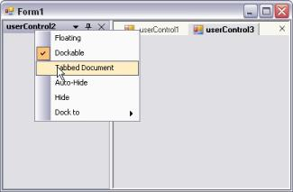' | markdownify }}
{:.image }

See Also

MDI Child Transition

##### Context Menu

This section covers the following topics:

###### How to customize the dock context menu of a docked control?

This can be done in DockContextMenu event.

###### How to display context menu of a docked control at a specified point?

This can be done using ShowMenu method.

_Table_ _103_: Methods Table_

<table>
<tr>
<td>
Method</td><td>
Description</td></tr>
<tr>
<td>
ShowMenu</td><td>
Show's the docking caption context menu at the specified point (Pt). The parameters are,{{ '_Ctrl_' | markdownify }} - Indicates the control for which dock / floating state is been queried.{{ '_Pt_' | markdownify }} - Indicates the location of the menu to be displayed.</td></tr>
</table>

[C#]

private void button1_Click(object sender, EventArgs e)

{

this.dockingManager1.ShowMenu(this.listBox1, new Point(100,100)); 

}

[VB.NET]

Private Sub button1_Click(ByVal sender As Object, ByVal e As System.EventArgs)

Me.dockingManager1.ShowMenu(Me.listBox1, New Point(100,100))

End Sub

##### Floating

 This section covers the below topics.

###### How to find out whether a docked control is floating or not?

This can be achieved by calling IsFloating method.

This method returns a value indicating whether the control is in docked or floating state. If the control is in floating state, the value returned will be true, and if it is docked, value returned will be false.

_Table_ _104_: Methods Table_

<table>
<tr>
<td>
Method</td><td>
Description</td></tr>
<tr>
<td>
IsFloating</td><td>
Gets the value indicating whether the docked control is floating or not.{{ '_Ctrl_' | markdownify }} - Indicates the control for which dock / floating state is been queried.</td></tr>
</table>

[C#]

private void button1_Click(object sender, EventArgs e)

{

this.dockingManager1.IsFloating(this.panel1);

Console.Write("Dock state : " + this.dockingManager1.IsFloating(this.panel1));

}

[VB.NET]

Private Sub dockingManager1_NewDockStateEndLoad(ByVal sender As Object, ByVal e As System.EventArgs)

Me.dockingManager1.IsFloating(Me.panel1)

Console.Write("Dock state : " + Me.dockingManager1.IsFloating(Me.panel1))

End Sub

###### How to float a single control even if it is tabbed to many controls?

This is discussed in Floating topic.

###### How to get individual floating controls properties?

To get the x,y coordinates if it is floating

1. Add a list view and a docking manager to your form.
2. Enable the listview as a dock control.

[C#]

this.dockingManager1.SetEnableDocking(this.listView1,true);

[VB.NET]

Me.dockingManager1.SetEnableDocking(Me.listView1, True)

3. Set the control as a non-dockable floating window.

[C#]

this.dockingManager1.SetFloatOnly(this.listView1,true);

[VB.NET]

Me.dockingManager1.SetFloatOnly(Me.listView1,True)

4. Determine whether the control is floating using the DockingManager.IsFloating() method. 
* If true, then the control is being hosted in a subclass of the Form type and this host form can be retrieved through the control’s TopLevelControl property. 
* Once you have the top level form, just use the Control.Location property on that form to get it’s x and y co-ordinates.

[C#]

// Get the FloatingForm object to get location of control.FloatingForm is a Form derived class.

DockHost dhost = this.listView1.Parent as Syncfusion.Windows.Forms.Tools.DockHost;

FloatingForm floatfrm = dhost.ParentForm as FloatingForm;

MessageBox.Show(floatfrm.Location.ToString());

[VB.NET]

' Get the FloatingForm object to get location of control.FloatingForm is a Form derived class.

Dim dhost As DockHost = CType(IIf(TypeOf Me.listView1.Parent Is Syncfusion.Windows.Forms.Tools.DockHost, Me.listView1.Parent, Nothing), Syncfusion.Windows.Forms.Tools.DockHost)

Dim floatfrm As FloatingForm = CType(IIf(TypeOf dhost.ParentForm Is FloatingForm, dhost.ParentForm, Nothing), FloatingForm)

MessageBox.Show(floatfrm.Location.ToString())

###### How to make a docked control Float Only?

The docked control can also be only floating and cannot be docked, by calling the SetFloatOnly method.

_Table_ _105_: Parameter Table_

<table>
<tr>
<td>
Parameter</td><td>
Description</td></tr>
<tr>
<td>
SetFloatOnly</td><td>
Make the docked control a float only control.{{ '_Ctrl_' | markdownify }} - The control for which docking is enabled.{{' _bFloating_' | markdownify }} - Represents a boolean value, TRUE, to disabled docking.</td></tr>
</table>

[C#]

this.dockingManager1.SetFloatOnly(this.listBox2, true);

[VB.NET]

Me.dockingManager1.SetFloatOnly(Me.listBox2, True);

{{ '' | markdownify }}
{:.image }

##### Hiding Controls

This section covers the following topics:

###### How to auto hide a control when an application loads

A control can be autohidden on loading, by enabling the AutoHideOnLoad property through designer or by calling SetAutoHideOnLoad method programmatically.

_Table_ _106_: Method Table_

<table>
<tr>
<td>
Method</td><td>
Description</td></tr>
<tr>
<td>
SetAutoHideOnLoad</td><td>
AutoHides the docked control when the application loads. The parameters are,{{ '_Ctrl_' | markdownify }} - Indicates the docked control.{{ '_bautohide_' | markdownify }} - Value indicating true or false.</td></tr>
</table>

[C#]

this.dockingManager1.SetAutoHideOnLoad(this.listBox1, true);

[VB.NET]

Me.DockingManager1.SetAutoHideOnLoad(Me.ListBox1, True)

###### How to find whether a particular docked control is hidden or not?

This can be achieved using the below method.

GetHiddenOnLoad - This method returns a value which indicates whether the specified control is hidden or not. The docked control should be passed as a parameter.

_Table_ _107_: Parameter Table_

<table>
<tr>
<td>
Parameter</td><td>
Description</td></tr>
<tr>
<td>
Ctrl</td><td>
Indicates the docked control.</td></tr>
</table>

[C#]

this.dockingManager1.GetHiddenOnLoad(this.listBox1);

Console.Write("Hidden on Load" + this.dockingManager1.GetHiddenOnLoad(this.listBox1));

[VB.NET]

Me.dockingManager1.GetHiddenOnLoad(Me.listBox1)

Console.Write("Hidden on load" + Me.dockingManager1.GetHiddenOnLoad(Me.listBox1))

SetHiddenOnLoad - This method when called will decide whether or not to set the docked control as hidden at runtime.

[C#]

this.dockingManager1.SetHiddenOnLoad(this.listBox1, true);

[VB.NET]

Me.dockingManager1.SetHiddenOnLoad(Me.listBox1, True)

###### How to hide a control when an application loads?

This is done programmatically, by calling SetHiddenOnLoad method or through Designer, by setting HiddenOnLoad property to true. 

_Table_ _108_: Method Table_

<table>
<tr>
<td>
Method</td><td>
Description</td></tr>
<tr>
<td>
SetHiddenOnLoad</td><td>
Hides the docked control when the application loads. The parameters are,{{ '_Ctrl_' | markdownify }} - Indicates the docked control.{{ '_bhidden_' | markdownify }} - Value indicating true or false.</td></tr>
</table>

[C#]

this.dockingManager1.SetHiddenOnLoad(this.listBox1, true);

[VB.NET]

Me.dockingManager1.SetHiddenOnLoad(Me.listBox1, True)

###### How to customize the AutoHidden Tab caption notification upon mouse hovered?

In DockingManager, by default the width of the AutoHidden Tab can be adjusted for notification purpose upon mouse hovered on it. 

This can be achieved by using the EnableAutoAdjustCaption property.

<table>
<tr>
<td>
Property</td><td>
Description</td></tr>
<tr>
<td>
EnableAutoAdjustCaption</td><td>
Gets or sets whether to Auto adjust the AutoHiddenTab width upon Mouse hover and selection.</td></tr>
</table>

[C#]

// Gets or sets whether to Auto adjust the AutoHiddenTab width upon mouse hover and selection

this.dockingManager1.EnableAutoAdjustCaption = false;

[VB.NET]

'Gets or sets whether to Auto adjust the AutoHiddenTab width upon mouse hover and selection

Me.dockingManager1.EnableAutoAdjustCaption = false

##### Serialization

This section covers the following topic:

###### How to serialize or deserialize the docking state for a docked control on loading the application?

To serialize or deserialize the docking state, follow the below steps.

Before closing the docked / floating control, access the control's parent and cast this to type Syncfusion.Windows.Forms.Tools.DockHost. 

[C#]

Syncfusion.Windows.Forms.Tools.DockHost dhost = ctrl.Parent as Syncfusion.Windows.Forms.Tools.DockHost; 

[VB.NET]

Dim dhost As Syncfusion.Windows.Forms.Tools.DockHost = Me.listView1.Parent as Syncfusion.Windows.Forms.Tools.DockHost  

* Access the DockHost's InternalController and get its current serialization information through the GetSerCurrIndo() method.

[C#]

Syncfusion.Windows.Forms.Tools.DockHostController dhc = dhost.InternalController as Syncfusion.Windows.Forms.Tools.DockHostController; 

[VB.NET]

Dim dhc As Syncfusion.Windows.Forms.Tools.DockHostController = dhost.InternalController as  Syncfusion.Windows.Forms.Tools.DockHostController

* This returns an object of type Syncfusion.Windows.Forms.Tools.DockInfo. The DockInfo.DockingStyle member gives the dock position of the control with respect to the host form and the DockInfo.rcDockArea 

[C#]

Syncfusion.Windows.Forms.Tools.DockInfo di = dhc.GetSerCurrentDI(); 

[VB.NET]

Dim di As Syncfusion.Windows.Forms.Tools.DockInfo = dhc.GetSerCurrentDI()

* You can serialize this information against the control’s name, and later upon loading, appropriately use either the DockingManager.DockControl() /  FloatControl() method based on the serialized DockingStyle/rcbounds values to set the control’s dock state. 
### Editors Package

The Editors package is a comprehensive collection of controls most commonly used in creating data entry forms. All the editor controls architectures with a view to providing simple and powerful means for capturing data input, validating the data and displaying the data with the appropriate formatting. They also offer complete support for data binding, inter nationalization and localization.

{{ '' | markdownify }}
{:.image }

The Editors Package provides several controls that can be used in displaying, collecting and validating user input. The different controls that are included in the Editors Package have been listed and discussed below:

AutoAppend

It provides auto persisting of previously entered items in a Windows Forms combo box based on a category keyword and also populates the combo box control's items collection with the persisted list.

Features 

* A simple procedure is implemented to bind a combo box to an AutoAppend control. 
* Persistence and re initialization based on a category keyword. This enables multiple combo box controls to be bound to the same AutoAppend control. 
* Makes use of the registry for storing the list.
* No need to write any additional code by the developer.
* Automatically adds new items to the list when the validated event of the control gets fired.

AutoComplete 

It expands strings that have been partially entered in an edit control, into complete strings based on a list of previously specified strings.

Features

* Provides auto completion for text box and combo box controls by setting a few properties.
* Supports AutoAppend and AutoSuggest modes of operation.
* Displays multiple columns of information with optional image column and headers in AutoSuggest mode.
* Allows data for auto completion to be managed by the AutoComplete control or by a datasource.
* Provides auto completion to multiple text box and combo box controls on the same form.
* Persists the size of the dropdown even after the application is closed. 

AutoLabel

It helps to label other controls.

Features

* We can specify where the label should appear.
* It updates the position of label according to the labeled control.

ButtonAdv

ButtonAdv is an extension to the Windows Forms Button control.

Features

* Easily change the button type to browse, calculator etc. 
* Supports PushButton behavior.
* Supports the disabling of the dotted rectangle by using the KeepFocusRectangle property when the button is in focus.
* Supports BorderStyles.
* Supports XP, Office 2003 and Office 2007 Visual Styles.

ButtonEdit

 It provides an easy way to create controls with an edit control and any number of associated buttons. 

Features

* Buttons can be added at design-time and their properties can be set through the designer.
* Buttons' widths can be custom specified.
* Buttons can be left or right-aligned with respect to the text box.
* Button events can be handled to provide desired functionality.
* Supports XP, Office 2003 and Office 2007 Visual Styles.

Calculator Control

It provides an easy way to implement a complete calculator in your application.

Features

* Implements all common arithmetic functions.
* Supports keyboard input.
* Can be displayed on a form or as a popup.
* Can be displayed in the Windows Standard or financial layout.
* Complete designer support.
* Supports the customization of the font and color of the Calculator buttons.
* Allows you to change the spacing between buttons that are arranged in rows and columns, by using the VerticalSpacing and HorizontalSpacing properties.
* Supports XP, Office 2003 and Office 2007 Visual Styles.

CheckBoxAdv

It is an advanced check box control. It is capable of displaying several backgrounds such as gradients and images. 

Features

* Support for gradient backgrounds.
* Supports different images and checked graphics.
* Can specify larger images for the ImageCheckBox.
* Complete designer support.
* Supports the CheckAlign property.
* Supports images for the items listed.

ColorPickerButton

It allows .NET developers to provide a standard user interface similar to the Visual Studio .NET color picker dropdown, for selecting colors in Windows Forms applications. The ColorPickerButton displays the ColorUIControl as a drop-down in combination with a button.

Features

* Palette, Web and System colors panels.
* Selective inclusion of panels.
* Complete designer support.

ColorUIControl

It allows .NET developers to provide a standard user-interface, similar to the Visual Studio .NET color picker drop-down, for selecting colors in their Windows Forms applications. The ColorUIControl implements a palette type visual interface comprising of the System, Standard and the Custom color groups.

Features

* Palette, Web and System colors panels.
* Selective inclusion of panels.
* Complete designer support.
* Can be attached to any other control.
* The customization of color cells in the ColorUI can be done in a new palette named UserColors where different shades of user defined Colors can be set and the Color cells can be re sized.

ColorPickerUIAdv

The Essential Tools ColorPickerUIAdv allows .NET developers to provide Microsoft Word 2007 ColorCells for selecting colors in their applications. The ColorPickerUIAdv comprises of a panel displaying colors with themes and standard colors. 

Features

* ColorPickerUIAdv can be created programmatically.
* The ColorPickerUIAdv allows us to set the ColorGroups from which the color can be selected.
* The selected color of ColorPickerUIAdv can be applied to any control or text.

ComboBoxAdv

The ComboBoxAdv pre-binds a list box in its drop-down area and includes some additional API to provide a framework combo box-like object-model and data binding support.

Features

* 3D border styles and flat styles can be applied for the control.
* Images can be included for the ComboBoxAdv Items.
* AutoComplete functionality can be integrated.
* Can be bound to any external datasource. 
* Supports XP, Office 2003 and Office 2007 Visual Styles.

ComboBoxAutoComplete

It combines a combo box control with an AutoComplete control to provide auto completion for that instance of the combo box. 

Features

* Provides easy auto completion for a combo box control.
* Supports AutoAppend and AutoSuggest modes of operation.
* Displays multiple columns of information with optional image column and headers in AutoSuggest mode.
* Allows data for auto completion to be managed by the AutoComplete control or by a datasource.

ComboBoxBase

It is an alternative to the standard combo box control. It separates the edit portion from the drop-down list portion thereby making this architecture powerful and flexible.

Features

* Ability to plug-in any ListControl Derived Class, to provide the list for the combobox base.
* Customization Support for everything in the combo box, from the text box to the drop-down window. 
* Advanced border drawing features.
* Themes support
* Extensibility
* AutoAppending

Combo Drop-Down

This flexible combo box control provides a standard combo box look-and-feel with the ability to host any control in the drop-down.

Features

*  Any control can be easily associated and displayed in the combo drop-down.
* Advanced border styles.
* Supports XP, Office 2003 and Office 2007 Visual Styles.

Currency Edit

It embeds a CurrencyTextBox control and a button that can display a PopupCalculator when clicked. 

Features

* Easily perform calculations with contents of CurrencyTextBox
* Globalization support
* Databinding support
* Full designer support

Currency Text-Box

It provides currency specific behavior in edit controls. It implements all the functionality needed for formatting currency input and validation. 

Features

* Keyboard input validation
* Globalization support
* Databinding support
* Full designer support

DateTimePickerAdv

It provides an easy way to implement a culture-based DateTimePicker in an application.

Features

* Inter nationalization.
* DatabindingSupport.
* Supports setting and displaying NULL values.
* The DateTimePickerAdv can display a custom drop-down calendar.
* The DateTimePickerAdv control supports XP Themes when applicable.
* Supports displaying the UpDown button only when the control has focus. 
* Supports XP, Office 2003 and Office 2007 Visual Styles.

DomainUpDownExt

DomainUpDownExt is an advanced version of the standard windows DomainUpDown control.

Features

* Themes support
* Flexible in providing increment and decrement values.
* DomainUpDownExt SpinOrientation - Added ability to show spin buttons using vertical (up and down buttons) or horizontal (left and right buttons) orientations with SpinOrientation property.

{{ '' | markdownify }}
{:.image }

* Office2007Style - Added ability to set all the three color schemes, Blue, Silver and Black for Office2007 style.

{{ '' | markdownify }}
{:.image }

Double TextBox

It is a text box-derived control that can display double data type values.

Features

* Supports display of double values.
* Supports values with a precision of 15 characters. The maximum and minimum values supported are by default the minimum and maximum values for the double data type.
* Supports displaying negative values in a different color and also using different negative formats.
* Handles user keyboard input and double formatting.
* Themes support.
* Uses the globalization features of the .NET platform to provide locale specific formatting.

Editable List

It provides an editable Windows Forms list box with a Windows Forms text box and button on the current row to facilitate in-place editing.

Features

* Offers in place editing.
* Supports auto completion from the list.

Folder Browser

FolderBrowser component provides a convenient and easy to use object oriented wrapper for the Win32 Shell folder browser API.

Features

* Includes textbox with Auto Completion support.
* Templates Support
* Supports the property that allows the specification of Custom Start Location.

FontListBox 

FontListBox is the list box derived controls that are automatically populated with the fonts installed in the user's system. 

Features

* Supports AutoComplete behavior.
* Offers Single - Select and Multi- Select options.

Font ComboBox

FontComboBox is the Combobox derived controls that are automatically populated with the fonts installed in the user's system. 

Features

* Supports AutoComplete behavior.

GradientLabel

It provides a way for create visually appealing labels for Windows Forms Controls. 

Features

* Customizable background.
* Support for different borders and patterns.

Integer TextBox

It is derived from a Windows Forms framework text box control and can display integer data type values. 

Features

* Displays Int64 values.
* Default minimum and maximum values correspond to the Int64 data type values.
* Displays negative values in a different color.
* Uses different negative formats.
* Handles user keyboard input and double formatting.
* Uses the globalization features of the .NET platform to provide locale-specific formatting.
* Themes Support.

Masked EditBox

It provides an easy and reliable way of collecting user input and displaying standard data in specific formats from any data source. 

Features

* Compatible with Windows Forms Textbox control.
* Supports all the commonly used Mask Symbols.
* Complete support for the common clipboard operations.

MonthCalendarAdv

It is an advanced calendar control that can display a full month of the year with the appropriate culture information for the months and days of the week. 

Features

* Supports the BorderStyles for the Calendar.
* Supports a DoubleClick event.
* Supports images for the left scroll button and the right scroll button.
* The images for the scroll buttons can be stretched or shrunk to fit the size of the scroll buttons.
* Displays the week number along the left side of the month calendar. 
* Can set the WeekFont, WeekTextColor and WeekInterior.
* Supports XP, Office 2003 and Office 2007 Visual Styles.

MultiColumnComboBox

It is an advanced combo box control that has the capability to show multiple columns in the drop-down list. 

Features

* Can be bound to very large datasources, instantaneously.
* Supports XP, Office 2003 and Office 2007 Visual Styles.

NumericUpDownExt

It enables XP Themed look-and-feel for the UpDown controls that are missing in the corresponding .NET Control. 

Features

* XP Themed look and feel.
* Support for displaying negative values in a different color.

Percent TextBox

It is a text box-derived control that can display double data type values in percentage format. 

Features

* Supports display of percent values in two modes - Percent and Double.
* In PercentMode, the values are edited as percentage values itself. 
* In DoubleMode, the values are edited as double values and then displayed using percentage formatting.
* Uses the globalization features of the .NET platform to provide locale-specific formatting. 

PopupControlContainer

It is a panel-derived control that allows users to populate it with child controls in code or during design-time.

Features

* Various User Interface child controls can be integrated in the PopupControlContainer.
* Allows the user to populate the popup with the desired parent control.

RadioButtonAdv

RadioButtonAdv functions are similar to the standard windows RadioButton, with some additional enhancements.

Features

* Supports visual themes.
* Images can be displayed as the check.

TextBoxExt

It is a text box-derived control that can display different border colors and styles.

Features

* The control provides different 2D and 3D border styles for a regular text box.
* Offers Themes support and flow indicators.
* Custom Colors can be applied for the following controls. ComboBoxAdv, ComboDropDown, ComboBoxAutoComplete and TextBoxExt. See Visual Styles topic.
#### AutoComplete Controls

AutoComplete functionality is discussed in the following controls.

##### AutoComplete

The AutoComplete control is an extender control that provides AutoCompletion services to any edit control on the same form as the AutoComplete control.

AutoCompletion can be defined as prompting the user with probable matches during data entry. This feature is similar to the AutoCompletion of the web addresses in the Internet Explorer address box.

{{ '' | markdownify }}
{:.image }

AutoCompletion is a feature enhancement for edit controls. It expands strings that have been partially entered in an edit control into complete strings based on a list of previously specified strings.

{{ '' | markdownify }}
{:.image }

For example, when a user starts to enter an URL in theAddress edit control that is embedded in the Microsoft Internet Explorer navigation toolbar, autocompletion expands the string into one or more complete URLs that are consistent with the existing partial string. A partial URL string such as "sync" might be expanded to "http://www.syncfusion.com" or "http://www.syncfusion.com/faq/winforms". This feature will be useful in windows applications that require collecting frequently repeated input from the user. 

The .NET framework does not provide any built-in support for providing autocompletion in the System.Windows.Forms.Textbox or System.Windows.Forms.Combobox classes. The Essential Tools AutoComplete class provides an easy way of adding autocompletion to edit controls in an application. Autocompletion is typically used with edit controls (text box controls) or with controls that have an embedded edit control (such as combo box controls). 

The AutoComplete class is implemented as an Extender Provider similar to the ToolTip control in the Windows Forms package. 

See Also

ComboBoxAutoComplete, Auto Append

###### Features

AutoComplete expands strings that have been partially entered in an edit control into complete strings based on a list of previously specified strings. It has following features.

* Easy to use designer support - Enables users to drag and drop an Auto Complete control to a form and set an extender property on the target control easily without a single piece of code.
* You can implement Microsoft Internet Explorer style auto completion with ease using the Auto Complete control.
* Multiple target controls can use the same Auto Complete control and data source. 
* It provides Auto Complete support to Text Box, ComboBox and user controls that embeds an edit control. 
* It can be bound to DataSource.
* AutoComplete functionality can also be provided for RichTextBox control.
* It is possible to format the text in a standard TextBox control that uses an AutoComplete component based on the data source of the AutoComplete.
* We can hide the close button, gripper and column header in the AutoComplete DropDown. SeeSee Header, Close Button and Gripper to know more.
* We can set width for AutoComplete DropDown.
* We can add multiple columns for AutoComplete DropDown.
* It supports serialization of history items to the Windows Registry, Isolated Storage or the File System.
* We can also do custom matching i.e, we can override the default matching of the current content of the target edit control.

See Also

Concepts and Features

###### Creating AutoComplete Control

This section will guide you to implement a simple AutoComplete control with a TextBox via designer and programmatically.

Through Designer

This tutorial illustrates the usage of the AutoComplete control for TextBox, without any external data source. 

1. Create a new Windows Forms application and open the main form for the application in the designer. Add the Syncfusion controls to the VS .NET toolbox, if you have not done so already. Drag-and-drop an AutoComplete control onto the form.

{{ '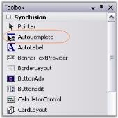' | markdownify }}
{:.image }

2. The AutoComplete control will appear as a component in the component tray of the design environment. Similarly add aText box, two labels and a button to make the form interactive. 

{{ '' | markdownify }}
{:.image }

3. When the AutoComplete control is added to the form, the AutoComplete on autocomplete property is added to the text box control properties. This property specifies the type of autocompletion to be provided by the autoComplete1 control for the comboBox1 control. The default value for AutoComplete on autoComplete1 will be set to AutoCompleteModes.Disabled. Use the drop-down box provided in the property grid to change it to the mode of autocompletion toAutoSuggest. The different modes of autocompletion are detailed in AutoComplete Modes topic. 

{{ '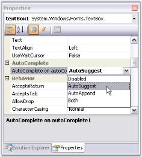' | markdownify }}
{:.image }

4. Set AutoComplete.AutoAddItem property to true. Run the application, type any text in the textbox and hit Enter to save the entry. Select the text, delete it and then retype the first letter of the text you saved. You should see autocompletion of the letter, as shown below.
> 
{{ '' | markdownify }}
{:.image }
 _Note: The text entered can be saved only when AutoAddItem property is set to True._

{{ '' | markdownify }}
{:.image }

> {{ '' | markdownify }}
{:.image }
 _Note: We can also add a list of autocomplete items through designer, which can used as a source for AutoComplete control. SeeSee_ Source for AutoComplete Control _topic for details._

See also

Concepts and Features

Through Code

 This section will guide you, to programmatically add, and associate an AutoComplete control to a textbox.

1. Include the required namespace.

[C#]

using Syncfusion.Windows.Forms.Tools;

[VB.NET]

Imports Syncfusion.Windows.Forms.Tools

2. Create an instances of AutoComplete and TextBox controls.

[C#]

private Syncfusion.Windows.Forms.Tools.AutoComplete autoComplete1;

private System.Windows.Forms.TextBox textBox1;

this.textBox1=new TextBox();

this.autoComplete1=new AutoComplete();

[VB.NET]

Private autoComplete1 As Syncfusion.Windows.Forms.Tools.AutoComplete

Private textBox1 As System.Windows.Forms.TextBox

Me.textBox1 = New TextBox()

Me.autoComplete1 = New AutoComplete()

3. Associate AutoComplete with TextBox using SetAutoComplete() method.

[C#]

this.autoComplete1.SetAutoComplete(this.textBox1,Syncfusion.Windows.Forms.Tools.AutoCompleteModes.AutoSuggest);

[VB.NET]

Me.autoComplete1.SetAutoComplete(Me.textBox1,Syncfusion.Windows.Forms.Tools.AutoCompleteModes.AutoSuggest)

4. Specify its properties.

[C#]

this.autoComplete1.AutoAddItem=true;

this.autoComplete1.AutoSerialize=true;

[VB.NET]

Me.autoComplete1.AutoAddItem=True

Me.autoComplete1.AutoSerialize=True

5. Finally add textBox to the Form.

[C#]

this.Controls.Add(this.textBox1);

[VB.NET]

Me.Controls.Add(Me.textBox1)

{{ '' | markdownify }}
{:.image }

See also

Through Designer, Concepts and Features

###### Concepts and Features

The following topics will help you become more familiar in using the AutoComplete control.

AutoComplete Popup

When a control is associated with an AutoComplete control, a popup will be displayed, based on the source. This section illustrates various components of the AutoComplete Popup with their properties which can control the appearance and behavior of the components.

{{ '' | markdownify }}
{:.image }

This section will discuss various components in the AutoComplete popup.

Header, Close Button and Gripper

Header Settings

DropDown item can have a header which is enabled using AutoComplete.ShowColumnHeader property. AutoAddItem property should be set to true.

_Table_ _109_: Property Table_

<table>
<tr>
<td>
AutoComplete Properties</td><td>
Description</td></tr>
<tr>
<td>
AutoAddItem</td><td>
Specifies whether the current item in the target control is to be automatically added during validation, when the ENTER key is pressed.</td></tr>
</table>
> {{ '' | markdownify }}
{:.image }
 _Note: The header will be shown only for the text that is saved at run time. Set AutoCompleteMode and AutoCompleteSource properties to None._

[C#]

this.autoComplete1.AutoAddItem = true;

this.autoComplete2.ShowColumnHeader = true; 

this.autoCompleteDataColumnInfo1.ColumnHeaderText = "Contents";

[VB.NET]

Me.autoComplete1.AutoAddItem = True

Me.autoComplete2.ShowColumnHeader = True

Me.autoCompleteDataColumnInfo1.ColumnHeaderText = "Contents"

{{ '' | markdownify }}
{:.image }

> {{ '' | markdownify }}
{:.image }
 _Note: You can also set multiple columns. Refer_ Multiple Columns _to know more._

Close Button and Gripper Settings

Visibility of close button and the gripper in the popup can be determined by ShowCloseButton and ShowGripper properties.

_Table_ _110_: Property Table_

<table>
<tr>
<td>
AutoComplete Properties</td><td>
Description</td></tr>
<tr>
<td>
ShowCloseButton</td><td>
Specifies whether to show the CloseButton at the bottom right of the DropDownContainer. By default it is true.</td></tr>
<tr>
<td>
ShowGripper</td><td>
Specifies whether to show gripper at the bottom right of a DropDownContainer. By default it is true.</td></tr>
</table>
> {{ '' | markdownify }}
{:.image }
 _Note: The AutoComplete dropdown can be closed by calling AutoComplete.CloseDropDown() method._

[C#]

this.autoComplete1.ShowCloseButton = true;

this.autoComplete1.ShowGripper = true;

[VB.NET]

Me.autoComplete1.ShowCloseButton = True

Me.autoComplete1.ShowGripper = True

Behavior Settings

Case Sensitivity

At run time, the string entered in a textbox, for example, can be made case sensitive using the following properties.

_Table_ _111_: Properties_

<table>
<tr>
<td>
AutoComplete Properties</td><td>
Description</td></tr>
<tr>
<td>
IgnoreCase</td><td>
Specifies whether to ignore case sensitivity for string comparison. Default value is True.</td></tr>
<tr>
<td>
CaseSensitive</td><td>
Specifies whether the replacement of the matching entry is to be case sensitive.</td></tr>
</table>

[C#]

this.autoComplete1.IgnoreCase = false;

this.autoComplete1.CaseSensitive = true;

[VB.NET]

Me.autoComplete1.IgnoreCase = False

Me.autoComplete1.CaseSensitive = True

{{ '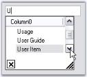' | markdownify }}
{:.image }

Overriding Combo

The Combobox drop down can be suppressed and overridden by the AutoComplete control using OverrideCombo property.

[C#]

this.autoComplete1.OverrideCombo = true;

[VB.NET]

Me.autoComplete1.OverrideCombo = True

Sorting

The items in the list can be sorted automatically by setting AutoSortList to True.

_Table_ _112_: Sorting Properties_

<table>
<tr>
<td>
AutoComplete Properties</td><td>
Description</td></tr>
<tr>
<td>
AutoSortList</td><td>
Specifies whether default sorting is to be performed.</td></tr>
</table>

[C#]

this.autoComplete1.AutoSortList = true;

[VB.NET]

Me.autoComplete1.AutoSortList = True

Duplicate values

The duplicate values can be used in AutoComplete DataSource by setting EnableDuplicateValues to True.

_Table_ _113_: Properties_

<table>
<tr>
<td>
AutoComplete Properties</td><td>
Description</td></tr>
<tr>
<td>
EnableDuplicateValues</td><td>
Gets or sets whether to allow duplicate values in AutoComplete DataSource</td></tr>
</table>

[C#]

//To use duplicate values in AutoComplete data source

this.autoComplete1.EnableDuplicateValues = true;

[VB.NET]

'To use duplicate values in AutoComplete data source

Me.autoComplete1.EnableDuplicateValues = True

See Also

[Source for AutoComplete Control](http://help.syncfusion.com/ug/windows%20forms/documents/sourceforautocomplet.htm), [External Datasource](http://help.syncfusion.com/ug/windows%20forms/documents/externaldatasource1.htm)

Size Settings

The properties which can control the height and width of the AutoCompletePopup are as follows.

_Table_ _114_: Property Table_

<table>
<tr>
<td>
AutoComplete Properties</td><td>
Description</td></tr>
<tr>
<td>
AdjustHeightToItemCount</td><td>
Specifies if the height of the drop down should be adjusted automatically, based on the number of items.</td></tr>
<tr>
<td>
AutoPersistentDropDownSize</td><td>
The Dropdown size of Autocomplete control is automatically persistent when this property is set to true.</td></tr>
<tr>
<td>
PreferredHeight</td><td>
Specifies preferred height for the drop down displayed by the AutoComplete control when AdjustHeightToItemCount property is false. Default value is 200.</td></tr>
<tr>
<td>
PreferredWidth</td><td>
Specifies preferred width for the drop down displayed by the AutoComplete control when AdjustHeightToItemCount property is false. Default value is -1.</td></tr>
</table>

[C#]

this.autoComplete1.AdjustHeightToItemCount = false;

this.autoComplete1.AutoPersistentDropDownSize = true;

this.autoComplete1.PreferredHeight = 100;

this.autoComplete1.PreferredWidth = 300;

[VB.NET]

Me.autoComplete1.AdjustHeightToItemCount = False

Me.autoComplete1.AutoPersistentDropDownSize = True

Me.autoComplete1.PreferredHeight = 100

Me.autoComplete1.PreferredWidth = 300

{{ '' | markdownify }}
{:.image }

DataSource

This section will discuss the data settings for the AutoComplete control, in the below topics.

Data Settings

The data for the autocompletion will be maintained by the AutoComplete control itself. This is referred to as a History Data List mode. The below properties deals with data settings.

_Table_ _115_: Property Table_

<table>
<tr>
<td>
AutoComplete Properties</td><td>
Description</td></tr>
<tr>
<td>
CategoryName</td><td>
Specifies a unique or shared name that can be given to an AutoComplete control so that it can persist the values under that name. For example, if the CategoryName "URL" is provided for an AutoComplete control on a particular form, all values persisted by that AutoComplete control will also be accessible to other AutoComplete controls on others forms or on the same form with the CategoryName "URL". </td></tr>
<tr>
<td>
DataSource</td><td>
Sets the Datasource to the Autocomplete control. The AutoComplete control automatically picks the "History Data List" mode or "Data source" mode based on the values set for the DataSource property. If the datasource property is set to NULL (default value is NULL), the control defaults to History Data List mode. It is to be remembered that the properties CategoryName, AutoAddItem and AutoSerialize have to be set appropriately for the History Data List mode to work properly.</td></tr>
</table>

[C#]

this.autoComplete1.CategoryName = "FTP";

this.autoComplete1.DataSource = DataTable1;

[VB.NET]

Me.autoComplete1.CategoryName = "FTP"

Me.autoComplete1.DataSource = DataTable1

> {{ '' | markdownify }}
{:.image }
 _Note: We can set External datasource for the autocompletion. See_ External DataSource _topic._

See Also

How to delete the items in the list at run time?

Source for AutoComplete Control

Dynamic Source at RunTime

Enabling the AutoComplete.AutoAddItem property will allow the end users to save their entries at run time. Pressing Enter key will save the user entry. See Through Designer topic for details.

Setting AutoCompletion Source Through Designer

The different sources available for auto completion are specified using Control.AutoCompleteSource property. When the end user enters a letter in the TextBox for example, the letter will be matched with the source available and displays the dropdown item accordingly.

_Table_ _116_: Property Table_

<table>
<tr>
<td>
Property</td><td>
Description</td></tr>
<tr>
<td>
AutoCompleteSource</td><td>
Auto completion source for the control. The different sources are,{{ '_FileSystem_' | markdownify }} - Files system as source,{{ '_HistoryList_' | markdownify }} - Includes all the URLs in the history list,{{ '_RecentlyUsedList_' | markdownify }} - Includes the list of most recently used URLs,{{ '_AllUrl_' | markdownify }} - Equivalent source of HistoryList and RecentlyUsedList as the source,{{ '_AllSystemSources_' | markdownify }} - Equivalent source of AllUrls and FileSystem as the source (Default value of AutoCompleteSource when AutoCompletMode is set to values other than default value),{{ '_ListItems_' | markdownify }} - Specifies the items in the control, {{ '_FileSystemDirectories_' | markdownify }} - Specifies directory names alone without file names,{{ '_CustomSource_' | markdownify }} - Uses the string values entered in AutoCompleteCustomSource property and{{ '_None_' | markdownify }} - There will not be any source for the auto completion.</td></tr>
</table>

[C#]

this.textBox1.AutoCompleteSource = System.Windows.Forms.AutoCompleteSource.HistoryList;

[VB.NET]

Me.textBox1.AutoCompleteSource = System.Windows.Forms.AutoCompleteSource.HistoryList

{{ '' | markdownify }}
{:.image }

Custom Source

AutoComplete control lets you to specify a set of auto completion text using String Collection Editor. This editor is invoked using Control.AutoCompleteCustomSource property. 

{{ '' | markdownify }}
{:.image }

At run time when the user types the first letter, it will automatically display the auto completion list added through this editor.

> {{ '' | markdownify }}
{:.image }
 _Note: Control.AutoCompleteSource property should be set to "CustomSource" for this setting to be effective._

[C#]

this.textBox1.AutoCompleteSource = System.Windows.Forms.AutoCompleteSource.CustomSource;

this.textBox1.AutoCompleteCustomSource.AddRange(new string[] {"Customization Settings", "Customization Properties",

"Customizing the items", "Custom Collections"});

[VB.NET]

Me.textBox1.AutoCompleteSource = System.Windows.Forms.AutoCompleteSource.CustomSource

Me.textBox1.AutoCompleteCustomSource.AddRange(New String[] {"Customization Settings", "Customization Properties",

"Customizing the items", "Custom Collections"})

{{ '' | markdownify }}
{:.image }

Mode of AutoCompletion

AutoCompletion modes can be specified using AutoCompleteMode property.

_Table_ _117_: Property Table_

<table>
<tr>
<td>
Property</td><td>
Description</td></tr>
<tr>
<td>
AutoCompleteMode</td><td>
Gets or sets an option that controls how automatic completion, works for the control. The available modes are,{{ '_None_' | markdownify }} - No autocompletion will be provided for this target edit control,{{ '_Suggest_' | markdownify }} - The autocompletion will be presented as a list of probable matches in the form of a drop-down window,{{ '_Append_' | markdownify }} - The closest match will be added to the partial string in the edit control and{{ '_SuggestAppend_' | markdownify }} - A list of probable matches will be displayed as well as the entry will be completed in the edit control with the closest match.</td></tr>
</table>

[C#]

this.textBox1.AutoCompleteMode = System.Windows.Forms.AutoCompleteMode.SuggestAppend;

[VB.NET]

Me.textBox1.AutoCompleteMode = System.Windows.Forms.AutoCompleteMode.SuggestAppend

{{ '' | markdownify }}
{:.image }

See Also

Multiple Columns, External Datasource

External Datasource

You can specify an external datasource for the AutoComplete control to use as the history list. This can be specified through the AutoComplete.DataSource property. The object specified for this property can be any object that implements IList or IListSource. 

1. Set AutoComplete mode to AutoSuggest.
2. Set the DataSource in the form's Load event as follows.

[C#]

private void Form1_Load(object sender, System.EventArgs e)

{

    // Set up the datasource on the Autocomplete control. 

this.oleDbDataAdapter1.Fill(this.dataSet11.organisation);

this.autoComplete1.DataSource = this.dataSet11.organisation;

}

[VB.NET]

Private Sub Form1_Load(ByVal sender As Object, ByVal e As System.EventArgs)

     ' Set up the datasource on the Autocomplete control  .

Me.oleDbDataAdapter1.Fill(Me.dataSet11.organisation)

Me.autoComplete1.DataSource = Me.dataSet11.organisation

End Sub

3. AutoCompleteItemSelected event is raised when a new item has been selected by the user when the AutoComplete drop down list is displayed. In this event, for the tutorial purpose, the code to display corresponding OrgID of the OrganisationName on the label is included. The below code retrieves the corresponding item from the datasource, for the selected item in the AutoComplete control.

[C#]

private void autoComplete1_AutoCompleteItemSelected(object sender,Syncfusion.Windows.Forms.Tools.AutoCompleteItemEventArgs args)

{

  // Displays corresponding OrgID of the OrganisationName on the label.

this.label1.Text = args.ItemArray[0].ToString();

}

[VB.NET]

Private Sub autoComplete1_AutoCompleteItemSelected(ByVal sender As Object, ByVal args As Syncfusion.Windows.Forms.Tools.AutoCompleteItemEventArgs)

  ' Displays corresponding OrgID of the OrganisationName on the label.

Me.label1.Text = args.ItemArray(0).ToString()

End Sub

{{ '' | markdownify }}
{:.image }

Refer to Multiple Columns section for more information on configuring data sources with multiple columns.

Multiple Columns

The AutoComplete control allows users to display multiple columns of information for each matching entry in the AutoSuggest mode of operation. Columns can be configured through AutoComplete.Columns property. 

_Table_ _118_: Property Table_

<table>
<tr>
<td>
AutoComplete Properties</td><td>
Description</td></tr>
<tr>
<td>
Columns</td><td>
Specifies the collection of columns in the auto complete dropdown, when AutoCompleteModes enumerator value is AutoSuggest. Each column is represented by an AutoCompleteDataColumnInfo object. This class includes a definition for specifying whether the column is the matching column or the image column. </td></tr>
<tr>
<td>
MatchMode</td><td>
Specifies the modes in which the AutoCompleteControl fills the history list for the current text in the current edit control.The values are, {{ '_Manual and_' ' | markdownify }}{{ '_Automatic (default)._' | markdownify }}</td></tr>
</table>

{{ '' | markdownify }}
{:.image }

_Table_ _119_: Property Table_

<table>
<tr>
<td>
AutoCompleteDataColumn Properties</td><td>
Description</td></tr>
<tr>
<td>
ColumnHeaderText</td><td>
Represents the text for the column header.</td></tr>
<tr>
<td>
MatchingColumn</td><td>
Column that will be used by the AutoComplete control to perform matching with the current content (at runtime) of the target control.</td></tr>
<tr>
<td>
ImageColumn</td><td>
Column which is filled with data that is just the index into the image list that has been assigned to the AutoComplete control. See Image Settings for Details.</td></tr>
<tr>
<td>
MinColumnWidth</td><td>
Set minimum width for the column.</td></tr>
<tr>
<td>
Visible</td><td>
Shows or hides the column at runtime.</td></tr>
</table>

[C#]

this.autoComplete2.Columns.Add(this.autoCompleteDataColumnInfo1);

this.autoComplete2.Columns.Add(this.autoCompleteDataColumnInfo2);

this.autoComplete2.ShowColumnHeader = true;

this.autoComplete2.MatchMode = AutoCompleteMatchModes.Automatic;

this.autoCompleteDataColumnInfo1.ColumnHeaderText = "Title";

this.autoCompleteDataColumnInfo1.MatchingColumn = true;

this.autoCompleteDataColumnInfo1.Visible = true;

[VB.NET]

Me.autoComplete2.Columns.Add(Me.autoCompleteDataColumnInfo1)

Me.autoComplete2.Columns.Add(Me.autoCompleteDataColumnInfo2)

Me.autoComplete2.ShowColumnHeader = True

Me.autoComplete2.MatchMode = AutoCompleteMatchModes.Automatic

Me.autoCompleteDataColumnInfo1.ColumnHeaderText = "Title"

Me.autoCompleteDataColumnInfo1.MatchingColumn = True

Me.autoCompleteDataColumnInfo1.Visible = True

{{ '' | markdownify }}
{:.image }

Column can be added matched using external sources also. A sample which demonstrates this feature is available in the below location.

…\_My Documents\Syncfusion\EssentialStudio\Version Number\Windows\Tools.Windows\Samples\Advanced Editor Functions\ActionGroupingDemo_

While using an external datasource, the Columns property can be initially refreshed by clicking on the RefreshColumns verb visible in the designer.

> {{ '' | markdownify }}
{:.image }
 _Note: We can also add images to the dropdown items using internal source and external source. See_ Image Settings _for details._

See Also

Source for AutoComplete Control, How to match items in all the columns using AutoCompleteControl?

Image Settings

We can add a dropdown item with image to the AutoComplete popup, through the AutoComplete.AddHistoryItem method. An imagelist should be associated with AutoComplete control for this purpose. Specify the item text and the image index in this method.

_Table_ _120_: Method Table_

<table>
<tr>
<td>
AutoComplete Method</td><td>
Description</td></tr>
<tr>
<td>
AddHistoryItem</td><td>
Adds item to the internal history of the AutoComplete control. The parameters are,{{ '_newItemText_' | markdownify }} - Text for the dropdown item.{{ '_ImageIndexValue_' | markdownify }} - Index of the image for the particular item.</td></tr>
</table>

[C#]

this.autoCompleteDataColumnInfo1.ColumnHeaderText = "Title";

this.autoCompleteDataColumnInfo1.ImageColumn = false;

this.autoCompleteDataColumnInfo1.MatchingColumn = true;

this.autoCompleteDataColumnInfo1.Visible = true;

this.autoCompleteDataColumnInfo2.ColumnHeaderText = "Size";

this.autoCompleteDataColumnInfo2.ImageColumn = true;

this.autoCompleteDataColumnInfo2.MatchingColumn = false;

this.autoCompleteDataColumnInfo2.Visible = true;

this.autoComplete1.AddHistoryItem("User Guide", 3);

this.autoComplete1.AddHistoryItem("User Item", 2);

[VB.NET]

Me.autoCompleteDataColumnInfo1.ColumnHeaderText = "Title"

Me.autoCompleteDataColumnInfo1.ImageColumn = False

Me.autoCompleteDataColumnInfo1.MatchingColumn = True

Me.autoCompleteDataColumnInfo1.Visible = True

Me.autoCompleteDataColumnInfo2.ColumnHeaderText = "Size"

Me.autoCompleteDataColumnInfo2.ImageColumn = True

Me.autoCompleteDataColumnInfo2.MatchingColumn = False

Me.autoCompleteDataColumnInfo2.Visible = True

Me.autoComplete1.AddHistoryItem("User Guide", 3)

Me.autoComplete1.AddHistoryItem("User Item", 2)

{{ '' | markdownify }}
{:.image }

Items with Images Through External DataSource

Items with images can be added to the AutoCompletePopup, also using external datasource like XML file. A sample which demonstrates the implementation of external datasource is available in the below location. 

…\_My Documents\Syncfusion\EssentialStudio\Version Number\Windows\Tools.Windows\Samples\Advanced Editor Functions\ActionGroupingDemo_

While using an external datasource, the Columns property can be initially refreshed by clicking the _Refresh Columns_ verb, visible in the designer.

See Also

Multiple Columns

Persistence

The history list of AutoComplete control can be saved in the following formats.

* Binary Format
* XML Format
* IsolatedStorage medium
* MemoryStream
* PersistState property

The AutoComplete control has a fully built-in serialization feature that provides automatic serialization of the AutoComplete's history list.  The serialization mechanism is implemented using the standardized Syncfusion.Windows.Forms.AppStateSerializer component that acts as a central coordinator for all the Essential Tools components and provides the option to read / write to different media such as the default Isolated Storage, XML file, XML stream, Binary file, Binary stream and the Windows Registry.

Persisting AutoComplete's data in default storage 

The data of AutoComplete's control can be persisted by setting the AutoSerialize property to true. This information is stored in the Isolated storage.

_Table_ _121_: Property Table_

<table>
<tr>
<td>
AutoComplete Property</td><td>
Description</td></tr>
<tr>
<td>
AutoSerialize</td><td>
Specifies whether AutoComplete control can persist its data.</td></tr>
</table>

[C#]

this.autoComplete1.AutoSerialize = true;

[VB.NET]

Me.autoComplete1.AutoSerialize = True

The AutoComplete control has built-in support for serialization that can be enabled or disabled using the AutoSerialize property. 

The default serialization option is Isolated storage and the System.IO.IsolatedStorage routines normally store application specific encrypted entries under the 'C:\Documents and Settings\[USER name]\Local Settings\Application Data\IsolatedStorage\’ folder. All of the Essential Tools framework components use the 'Syncfusion.Runtime.Serialization.AppStateSerializer' class in the Shared library for Read/Write. The AppStateSerializer is fully documented and can be initialized for different persistence mediums such as XML / Binary files, XML / Binary streams, and the Win32 Registry using its API.

Persisting in XML file

To save and load the AutoComplete data in a XML,

[C#]

using Syncfusion.Runtime.Serialization;

// To Save

AppStateSerializer aser = new AppStateSerializer(SerializeMode.XMLFile, @"C:\info.xml");

this.autoComplete1.SaveCurrentState(aser);

// To Load

AppStateSerializer aser = new AppStateSerializer(SerializeMode.XMLFile, @"C:\info.xml");

this.autoComplete1.LoadCurrentState(aser);

[VB.NET]

Imports Syncfusion.Runtime.Serialization

' To Save

Private aser As AppStateSerializer = New AppStateSerializer(SerializeMode.XMLFile, "C:\info.xml")

Me.autoComplete1.SaveCurrentState(aser)

' To Load

Private aser As AppStateSerializer = New AppStateSerializer(SerializeMode.XMLFile, "C:\info.xml")

Me.autoComplete1.LoadCurrentState(aser)

End Sub()

Persisting in Memory Stream

To serialize the data into a memory stream,

Storing State

[C#]

MemoryStream ms = new MemoryStream();

AppStateSerializer aser = new AppStateSerializer(SerializeMode.BinaryFmtStream, ms);

this.autoComplete1.SaveCurrentState(aser);

aser.PersistNow();

[VB.NET]

Dim ms As MemoryStream = New MemoryStream()

Private aser As AppStateSerializer = New AppStateSerializer(SerializeMode.BinaryFmtStream, ms)

Me.autoComplete1.SaveCurrentState(aser)

aser.PersistNow()

Retrieving State

[C#]

// Code to retrieve data(stream) from database

MemoryStream ms = new MemoryStream(val);

ms.Position = 0;

AppStateSerializer aser = new AppStateSerializer(SerializeMode.BinaryFmtStream, ms);

this.autoComplete1.LoadCurrentState(aser);

[VB.NET]

'Code to retrieve data(stream) from database

Dim ms As MemoryStream = New MemoryStream(value)

ms.Position = 0

Dim aser As AppStateSerializer = New AppStateSerializer(SerializeMode.BinaryFmtStream, ms)

this.autoComplete1.LoadCurrentState(aser);

To serialize in Binary Format, use the below code.

[C#]

// To Save

AppStateSerializer aser = new AppStateSerializer(SerializeMode.BinaryFile,"myfile");

this.autoComplete1.SaveCurrentState(aser);

aser.PersistNow();

// To Load

AppStateSerializer aser = new AppStateSerializer(SerializeMode.BinaryFile,"myfile");

this.autoComplete1.LoadCurrentState(aser);

[VB.NET]

' To Save

Private aser As AppStateSerializer = New AppStateSerializer(SerializeMode.BinaryFile, "myfile")

Me.autoComplete1.SaveCurrentState(aser)

aser.PersistNow()

' To Load

Private aser As AppStateSerializer = New AppStateSerializer(SerializeMode.BinaryFile, "myfile")

Me.autoComplete1.LoadCurrentState(aser)

To serialize in Isolated Storage medium, use the below code.

[C#]

// To Save

AppStateSerializer aser = new AppStateSerializer(SerializeMode.IsolatedStorage, "myfile");

this.autoComplete1.SaveCurrentState(aser);

aser.PersistNow();

// To Load

AppStateSerializer serializer = new AppStateSerializer(SerializeMode.IsolatedStorage, "myfile");

this.autoComplete1.LoadCurrentState(aser);

[VB.NET]

' To Save

Private aser As AppStateSerializer = New AppStateSerializer(SerializeMode.IsolatedStorage, "myfile")

Me.autoComplete1.SaveCurrentState(aser)

aser.PersistNow()

' To Load

Private serializer As AppStateSerializer = New AppStateSerializer(SerializeMode.IsolatedStorage, "myfile")

Me.autoComplete1.LoadCurrentState(aser)

Support to Set Maximum Limit for Suggestion List 

The AutoComplete control displays a filtered suggestion list from a mapped data source in a drop-down as the user types text into the text box. This feature provides support to set the maximum number for the filtered suggestion. 

Use Case Scenarios

When you want to narrow down the filtering and get more accurate data, you can use this feature. 

Properties

_Table_ _122_: Property Table_

<table>
<tr>
<td>
Property </td><td>
Description </td><td>
Type </td><td>
Data Type </td><td>
Reference links </td></tr>
<tr>
<td>
MaxNumberofSuggestion</td><td>
Set the maximum limit for the suggestion list. </td><td>
NA</td><td>
Integer. </td><td>
NA </td></tr>
</table>
Sample Link

To view a sample:

1. Open Syncfusion Dashboard.
2. Click Windows Forms.
3. Click Run Samples.
4. Navigate to Tools Samples > Editors Package > AutoCompleteDemo. 

Maximum Number of Suggestion 

You can set the maximum number of suggestions to be displayed in the AutoComplete using the MaxNumberofSuggestion property: The following code illustrates this: 

[C#]

this.autoComplete1.MaxNumberofSuggestion = 5; 

[VB]

Me.autoComplete1.MaxNumberofSuggestion = 5

###### AutoComplete Events

The events of the AutoComplete control are as follows.

_Table_ _123_: Events Table_

<table>
<tr>
<td>
AutoComplete Events</td><td>
Description</td></tr>
<tr>
<td>
BeforeAddItem</td><td>
Handled when a new item is about to be added.</td></tr>
<tr>
<td>
AutoCompleteCustomize</td><td>
Handled to customize the AutoCompletion.</td></tr>
<tr>
<td>
AutoCompleteItemBrowsed</td><td>
Handled when the user selects an item from the list of possible matches when the AutoComplete is set to AutoSuggest.</td></tr>
<tr>
<td>
AutoCompleteItemSelected Event</td><td>
Occurs when a new item has been selected by the user when the AutoComplete mode is set to AutoSuggest.</td></tr>
<tr>
<td>
DropDownClosed</td><td>
Occurs when the AutoComplete dropdown is closed.</td></tr>
<tr>
<td>
DropDownDisplayed</td><td>
Occurs when the AutoComplete dropdown is displayed.</td></tr>
<tr>
<td>
MatchItem</td><td>
Enables you to provide a custom matching routine for the current value in the Edit control.</td></tr>
<tr>
<td>
PreMatchItem</td><td>
Handled before the AutoComplete control performs a matching operation for the current text content of the active Edit control.</td></tr>
<tr>
<td>
TargetChanging</td><td>
Occurs when the target control of the AutoComplete control changes.</td></tr>
</table>
AutoCompleteItemSelected Event

AutoCompleteItemSelected Event is raised, when a new item has been selected by the user when the AutoComplete mode is set to AutoSuggest.

This event is discussed in External DataSource topic.

BeforeAddItem Event

This event will be raised when new item is about to be added. New items can be added by calling AutoComplete.AddHistoryItem() method. The event handler receives an argument of type AutoCompleteAddItemCancelEventArgs containing data related to this event. The following are the properties associated with AutoCompleteAddItemCancelEventArgs argument.

_Table_ _124_: Members Table_

<table>
<tr>
<td>
 Members</td><td>
Description</td></tr>
<tr>
<td>
Cancel</td><td>
Gets/Sets a value indicating whether the event should be canceled.</td></tr>
<tr>
<td>
ImageColumnIndex</td><td>
Gets/Sets the ColumnIndex into the AutoComplete.ImageList property.</td></tr>
<tr>
<td>
RowItem</td><td>
It is the System.Data.DataRow object that contains the value that is to be added to the history list.</td></tr>
</table>

[C#]

private void autoComplete1_BeforeAddItem(object sender, AutoCompleteAddItemCancelEventArgs e)

{

//Cancels the item that is going to be added.

    e.Cancel = true;

}

[VB.NET]

Private Sub autoComplete1_BeforeAddItem(ByVal sender As Object, ByVal e As AutoCompleteAddItemCancelEventArgs)

'Cancels the item that is going to be added.   

   e.Cancel = True

End Sub

AutoCompleteItemBrowsed Event

This event will be raised when the user selects an item from the list of possible matches when the AutoComplete is set to AutoSuggest. The event handler receives an argument of type AutoCompleteItemEventArgs. The event properties associated with the AutoCompleteItemEventArgs are as follows.

_Table_ _125_: Members Table_

<table>
<tr>
<td>
Members</td><td>
Description</td></tr>
<tr>
<td>
SelectedValue</td><td>
Gets/Sets the value selected.</td></tr>
<tr>
<td>
Handled</td><td>
Specifies whether SelectedValue should be applied to target control. This can be used only with AutoCompleteItemSelected.</td></tr>
<tr>
<td>
ItemArray</td><td>
Returns AutoComplete item as an object array.</td></tr>
<tr>
<td>
MatchColumnIndex</td><td>
Returns the index of the item that was used for matching.</td></tr>
</table>

When the user selects an item from the list of possible matches when the AutoComplete is set to AutoSuggest, we can display the selected URL in separate TextBox. The following code illustrate this.

[C#]

private void autoComplete1_AutoCompleteItemBrowsed(object sender, Syncfusion.Windows.Forms.Tools.AutoCompleteItemEventArgs args)

{

string itemText = args.ItemArray[0].ToString();

string eventlogmessage = String.Format("Event: {0} Item: {1}\r\n", "AutoCompleteItemSelected", itemText);

textBox1.Text = textBox1.Text + eventlogmessage;

}

[VB.NET]

Private Sub autoComplete1_AutoCompleteItemBrowsed(ByVal sender As Object, ByVal args As Syncfusion.Windows.Forms.Tools.AutoCompleteItemEventArgs)

    Dim itemText As String = args.ItemArray(0).ToString()

    Dim eventlogmessage As String = [String].Format("Event: {0} Item: {1}" & Chr(13) & "" & Chr(10) & "", "AutoCompleteItemSelected", itemText)

    textBox1.Text = textBox1.Text + eventlogmessage

End Sub

MatchItem Event

We can override the default matching of the current content of the target edit control using this event. The event handler receives an argument of type AutoCompleteMatchItemEventArgs. The following are the properties associated with AutoCompleteMatchItemEventArgs argument.

_Table_ _126_: Members Table_

<table>
<tr>
<td>
 Members</td><td>
Description</td></tr>
<tr>
<td>
Cancel</td><td>
Gets/Sets a value indicating whether the event should be canceled.</td></tr>
<tr>
<td>
CurrentText</td><td>
Returns the current text value to be matched.</td></tr>
<tr>
<td>
PossibleMatch</td><td>
Returns the possible match value that needs to be compared against AutoCompleteMatchItemEventArgs.CurrentText by the event handler.</td></tr>
</table>

[C#]

private void autoComplete1_MatchItem(object sender, AutoCompleteMatchItemEventArgs args)

{

   //Cancels the match operation

   e.Cancel = true;

}

[VB.NET]

Private Sub autoComplete1_MatchItem(ByVal sender As Object, ByVal args As AutoCompleteMatchItemEventArgs)

   //Cancels the match operation

   e.Cancel = true;

End Sub

###### Frequently Asked Questions

This section illustrates the solutions for various task-based queries about the control.

How to add a new data row to the Data table at run time?

This is achieved by calling the SetTableData() method as follows. This method sets internal table data based on AutoComplete.DataSource property.

[C#]

DataTable dt;

private void Form1_Load(object sender, System.EventArgs e)

{

    dt = new DataTable("select");

    dt.Columns.Add("Countries");

    dt.Columns.Add("states");

    dt.Rows.Add(new object[] { "NorthCarolina" });

    dt.Rows.Add(new object[] { "India " });

    dt.Rows.Add(new object[] { "New York " });

    dt.Rows.Add(new object[] { "Washington " });

    dt.Rows.Add(new object[] { "London" });

    dt.Rows.Add(new object[] { "Canada" });

    autoComplete1.DataSource = dt;

}

private void button1_Click(object sender, System.EventArgs e)

{

    dt.Rows.Add(new object[] { "new1" });

    dt.Rows.Add(new object[] { "new2" });

   //sets the internal table data based on the AutoComplete.DataSource property. 

    this.autoComplete1.SetTableData();

}

[VB.NET]

Private dt As DataTable

Private Sub Form1_Load(ByVal sender As Object, ByVal e As System.EventArgs)

    dt = New DataTable("select")

    dt.Columns.Add("Countries")

    dt.Columns.Add("states")

    dt.Rows.Add(New Object() {"NorthCarolina"})

    dt.Rows.Add(New Object() {"India "})

    dt.Rows.Add(New Object() {"New York "})

    dt.Rows.Add(New Object() {"Washington "})

    dt.Rows.Add(New Object() {"London"})

    dt.Rows.Add(New Object() {"Canada"})

    autoComplete1.DataSource = dt

End Sub

Private Sub button1_Click(ByVal sender As Object, ByVal e As System.EventArgs)

    dt.Rows.Add(New Object() {"new1"})

    dt.Rows.Add(New Object() {"new2"})

    Me.autoComplete1.SetTableData()

End Sub

How to Programmatically display the autocomplete popup when a text box is enabled with autocomplete feature?

You can show the autocomplete popup programmatically using the following code.

[C#]

this.autoComplete1.AutoCompletePopup.ParentControl = this.textBox1;

this.autoComplete1.AutoCompletePopup.ShowPopup(Point.Empty);

[VB.NET]

Me.autoComplete1.AutoCompletePopup.ParentControl = Me.textBox1

Me.autoComplete1.AutoCompletePopup.ShowPopup(Point.Empty)

How to remove default selection from autocomplete drop-down?

To remove the default selection in autocomplete drop-down, set SelectedIndex property to _-1_ inside DropdownDisplayed event of the autocomplete control as follows.

[C#]

private void autoComplete1_DropDownDisplayed(object sender, EventArgs e)

{

    this.autoComplete1.SelectedIndex = -1;

}

[VB.NET]

Private Sub autoComplete1_DropDownDisplayed(ByVal sender As Object, ByVal e As EventArgs)

    Me.autoComplete1.SelectedIndex = -1

End Sub

How to delete the items in the list at run time?

You can delete items in the list at run time by pressing the Delete Key, by enabling AllowListDelete property.

[C#]

this.autoComplete1.AllowListDelete = true;

[VB.NET]

Me.autoComplete1.AllowListDelete = True

How to delete the history items persisted by an AutoComplete control?

We can delete the history items persisted by an AutoCompleteControl by calling AutoComplete.ResetHistory() method.

[C#]

this.autoComplete1.ResetHistory();

[VB.NET]

Me.autoComplete1.ResetHistory()

How to implement an AutoComplete Control in an User Control?

AutoComplete control can be used in an UserControl by setting the parent form of the User Control to the parent form property of the AutoComplete Control. 

[C#]

private void UserControl1_Load(object sender, System.EventArgs e) 

{  

this.autoComplete1.ParentForm = this.ParentForm;  

this.autoComplete1.DataSource = this.items; 

} 

[VB.NET]

Private Sub UserControl1_Load(ByVal sender As Object, ByVal e As System.EventArgs)

    Me.autoComplete1.ParentForm = Me.ParentForm

    Me.autoComplete1.DataSource = Me.items

End Sub

How to implement AutoComplete with RichTextBox control?

Follow the below steps to implement AutoComplete feature with RichTextBox control.

1. Implement the IEditControlsEmbed interface in a RichTextBox class which, will enable the AutoComplete functionality for the RichTextBox control.

[C#]

public class MyRichTextBox : System.Windows.Forms.RichTextBox, IEditControlsEmbed

{

      // Returns the active RichTextBox control.

       public Control GetActiveEditControl(IEditControlsEmbedListener listener)

       {

                  return (Control)this;

       }

}

[VB.NET]

Public Class MyRichTextBox Inherits System.Windows.Forms.RichTextBox Implements IEditControlsEmbed

    ' Returns the active RichTextBox control.

    Public Function GetActiveEditControl(ByVal listener As IEditControlsEmbedListener) As Control

        Return CType(Me, Control)

    End Function

End Class

2. Drag and drop the RichTextBox control and the AutoComplete control to a form.

[C#]

// Initialization

Syncfusion.Windows.Forms.Tools.AutoComplete autoComplete1= new Syncfusion.Windows.Forms.Tools.AutoComplete();;

MyRichTextBox richTextBox1= new MyRichTextBox();

[VB.NET]

' Initialization

Dim autoComplete1 As Syncfusion.Windows.Forms.Tools.AutoComplete = New Syncfusion.Windows.Forms.Tools.AutoComplete 
Dim richTextBox1 As MyRichTextBox = New MyRichTextBox

3. The AutoComplete control can take an external data source (any data source that implements IList or IListSource) for its history list. Here we have set a StringCollection as the DataSource.
4. When this property is set, the AutoComplete control will initialize itself with the data source and use that as the basis for its matching routines. For example, if you have a DataSet with a list of names of the States in the US and if you specify that as the DataSource, then the AutoComplete control will display all the matches from within these names when the user types in the target edit control.

[C#]

// Sets the DataSource.

StringCollection liste = new StringCollection();

    liste.Add("New Jersey");

    liste.Add("North Carolina");

    liste.Add("North Dakota");

    liste.Add("New York");

    liste.Add("New Mexico");

    autoComplete1.DataSource = liste;

[VB.NET]

' Sets the DataSource. 

Dim liste As StringCollection = New StringCollection 
        liste.Add("New Jersey") 
        liste.Add("North Carolina") 
        liste.Add("North Dakota") 
        liste.Add("New York") 
        liste.Add("New Mexico") 
        autoComplete1.DataSource = liste

5. Set the AutoCompleteonautoComplete1 property in the properties page to either AutoSuggest, AutoAppend or Both. 
6. SetAutoComplete is the extended property for the AutoComplete property which, will be called by the framework when the AutoComplete property is set on any control. When using the AutoComplete control programmatically, you need to use this method to add and remove auto completion for the RichTextBox control.

[C#]

this.autoComplete1.SetAutoComplete(this.richTextBox1,Syncfusion.Windows.Forms.Tools.AutoCompleteModes.AutoSuggest);

[VB.NET]

Me.autoComplete1.SetAutoComplete(Me.richTextBox1,Syncfusion.Windows.Forms.Tools.AutoCompleteModes.AutoSuggest)

7. The RichTextBox will be enabled with the AutoComplete functionality.
How to match items in all the columns using AutoCompleteControl

Matching items in multiple columns is possible using the AutoComplete control. We need to set the AutoCompleteModes to MultiSuggest or MultiExtended mode for this.

MultiSuggest - Possible matches from Multiple columns for the current content of the Active edit control, will be presented in a form of a popup window with a selectable list of matches. MultiSuggest mode is an extended mode of AutoSuggest. On selecting this mode, user  will be able to get the matching items in the active edit control from all the columns. 

[C#]

this.autoComplete1.SetAutoComplete(this.textBoxExt1 , Syncfusion.Windows.Forms.Tools.AutoCompleteModes.MultiSuggest);

[VB.NET]

Me.autoComplete1.SetAutoComplete(Me.textBoxExt1 , Syncfusion.Windows.Forms.Tools.AutoCompleteModes.MultiSuggest)

{{ '' | markdownify }}
{:.image }

MultiSuggestExtended - This mode highlights all possible matches from Multiple columns, for the current content of the Active edit control, presented in the form of a popup window, with a selectable list of matches.

[C#]

this.autoComplete1.SetAutoComplete(this.textBoxExt1 , Syncfusion.Windows.Forms.Tools.AutoCompleteModes.MultiSuggestExtended);

[VB.NET]

Me.autoComplete1.SetAutoComplete(Me.textBoxExt1 , Syncfusion.Windows.Forms.Tools.AutoCompleteModes.MultiSuggestExtended)

{{ '' | markdownify }}
{:.image }

How to retrieve the corresponding matching item from a Datasource for the selected Item in the AutoComplete Control?

This can be done using AutoCompleteItemSelected Event which is discussed in External Datasource topic.

##### ComboBoxAutoComplete

The ComboBoxAutoComplete control combines a combo box control with an AutoComplete control to provide autocompletion for that instance of the combo box. 

The ComboBoxAutoComplete control can be used on a form to provide autocompletion for one or several edit controls (text box and combo box). However, when the requirement is that each combo box requires data from a different datasource, it is necessary to use one AutoComplete control for each combo box. In this case, it is more efficient for the combo box control itself to include the AutoComplete control to be used for its auto completion.

The ComboBoxAutoComplete control fulfills this need. It derives from the windows forms combo box control and holds its own AutoComplete control that provides autocompletion for the combo box. 

###### Features

ComboBoxAutoComplete combines a ComboBox control with an AutoComplete control to provide Auto completion for that instance of the ComboBox and contains following features.

* AutoComplete: ComboBoxAutoComplete control provides AutoComplete behavior.
* Columns: We can use more than one column in the ComboBoxAutoComplete control.
* Datasource: We can also specify the external datasource for ComboBoxAutoComplete control.
###### Creating ComboBoxAutoComplete

Implementing a simple ComboBoxAutoComplete can be done in the following ways.

Through Designer	

 This tutorial illustrates the usage of the ComboBoxAutoComplete control without any external datasource.

> {{ '' | markdownify }}
{:.image }
 _Note : This is applicable only for VS2005._

1. Drag-and-drop a ComboBoxAutoComplete control from the toolbox onto the form.

{{ '' | markdownify }}
{:.image }

2. Add items to ComboBoxAutoComplete using AutoCompleteCustomSource collection editor as shown below.

{{ '' | markdownify }}
{:.image }

3. Specify the text completion behavior of the control using ComboBoxAutoComplete.AutoCompleteMode. The value of AutoCompleteMode should not be none in this case. SeeSee Source for AutoComplete Control to know the different AutoCompleteModes. 
4. Set AutoCompleteSource to CustomSource as shown below. SeeSee Source for AutoComplete Control to know the different AutoComplete sources.

{{ '' | markdownify }}
{:.image }

Output

At runtime, type 'C' in the display area of ComboBoxAutoComplete, you will see the autocompletion behavior as shown below.

{{ '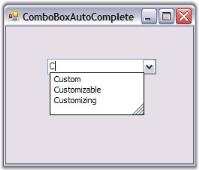' | markdownify }}
{:.image }

Through Code

The embedded AutoComplete control in a ComboBoxAutoComplete control is exposed through the AutoCompleteControl property. The Datasource property of the AutoCompleteControl specifies the data that will be used for the auto completion of the combo box. It can be created programmatically as follows.

1. Include the required namespace.

[C#]

using Syncfusion.Windows.Forms.Tools;

[VB.NET]

Imports Syncfusion.Windows.Forms.Tools

2. Create an instance of the ComboBoxAutoComplete control class.

[C#]

private Syncfusion.Windows.Forms.Tools.ComboBoxAutoComplete comboBoxAutoComplete1;

this.comboBoxAutoComplete1=new Syncfusion.Windows.Forms.Tools.ComboBoxAutoComplete();

[VB.NET]

Private comboBoxAutoComplete1 As Syncfusion.Windows.Forms.Tools.ComboBoxAutoComplete

Me.comboBoxAutoComplete1 = New Syncfusion.Windows.Forms.Tools.ComboBoxAutoComplete()

3. Set data source and add the control to the form.

[C#]

this.comboBoxAutoComplete1.AutoCompleteCustomSource.AddRange(new string[] { "Custom", "Customizing", "Customizable"});

this.comboBoxAutoComplete1.AutoCompleteMode = System.Windows.Forms.AutoCompleteMode.SuggestAppend;

this.comboBoxAutoComplete1.AutoCompleteSource = System.Windows.Forms.AutoCompleteSource.CustomSource;

this.Controls.Add(this.comboBoxAutoComplete1);

[VB.NET]

Me.comboBoxAutoComplete1.AutoCompleteCustomSource.AddRange(New String() {"Custom", "Customizing", "Customizable"}) 

Me.comboBoxAutoComplete1.AutoCompleteMode = System.Windows.Forms.AutoCompleteMode.SuggestAppend 

Me.comboBoxAutoComplete1.AutoCompleteSource = System.Windows.Forms.AutoCompleteSource.CustomSource 

Me.Controls.Add(Me.comboBoxAutoComplete1)

4. Run the application.

{{ '' | markdownify }}
{:.image }

See Also

Concepts and Features

###### Concepts and Features

This section contains information about using the ComboBoxAutoComplete control in some commonly used scenarios.

Behavior Settings

The behavior settings of a ComboBoxAutoComplete control includes the below properties.

_Table_ _127_: Property Table_

<table>
<tr>
<td>
ComboAutoComplete Properties</td><td>
Description</td></tr>
<tr>
<td>
AllowNewText</td><td>
Specifies whether the user is allowed to enter new text. User can be allowed to enter new text in the ComboAutoComplete by setting AllowNewText to true. AllowNewText is mainly used to prevent items that are not in the list while validating.</td></tr>
<tr>
<td>
ReadOnly</td><td>
Gets or Sets value indicating whether changes can be done to the combobox.</td></tr>
<tr>
<td>
UpdateComboSelectionProperties</td><td>
UpdateComboSelectionProperties set to true means the Property SelectedItem will return the AutoCompleteControl's SelectedItem. Else if it is set to false, then SelectedItem property should return the base class SelectedItem ie., the Windows ComboBox SelectedItem value.</td></tr>
</table>

[C#]

this.comboBoxAutoComplete1.AllowNewText= true;

this.comboBoxAutoComplete1.ReadOnly = true;

this.comboBoxAutoComplete1.UpdateComboSelectionProperties = false;

[VB.NET]

Me.comboBoxAutoComplete1.AllowNewText= True

Me.comboBoxAutoComplete1.ReadOnly = True

Me.comboBoxAutoComplete1.UpdateComboSelectionProperties = False

Refreshing the Columns 

When the datasource of the AutoComplete control is set to a valid datasource through the designer, the "Refresh Columns" verb can be clicked to automatically populate the Columns collection. This option is available in the context menu of the ComboBoxAutoComplete control and also as property grid command.

{{ '' | markdownify }}
{:.image }

Banner Text Support

We can set banner text for the ComboBoxAutoComplete control. Refer BannerTextProvider Component topic for more details.

{{ '' | markdownify }}
{:.image }

Multi Columns

We can use multiples columns in the ComboBoxAutoComplete control. In this case, we need to specify which column is to be used as the matching column using the ComboBoxAutoComplete.AutoCompleteControl.Columns properties. Adding multiple columns is discussed Multiple Columns topic in AutoCompleteControl UG. 

{{ '' | markdownify }}
{:.image }

See Also

DataSource

Datasource

The following steps sets a DataView as the DataSource of ComboBoxAutoComplete.

1. Drag and drop SqlDataAdapter or OleDbDataAdapter tool from the Data tab of the Toolbox onto the form. This will appear in component tray under the form. The Data Adapter Configuration Wizard will be automatically launched to assist you. 
2. SqlConnection object and associated Command objects will be created to support the Data Adapter. 
3. Select the DataAdapter you created and click the "Generate DataSet" option at the bottom of the properties window. 
4. This will enable you to create a DataSet object, which will contain the DataTable/DataView which, wraps the record set you configured in the Wizard. 
5. Create a name for your DataSet object and select the table(s) to include. 
6. Enter the following code in the Load event of your form to fill the DataSet with data from the database.

{{ '' | markdownify }}
{:.image }

[C#]

// Fills the DataSet with data from the database.

this.oleDbDataAdapter1.Fill(this.dataSet11);

[VB.NET]

' Fills the DataSet with data from the database.

Me.oleDbDataAdapter1.Fill(Me.dataSet11);

Adding Columns to the Popup and setting the matching column

Add columns through designer using ComboBoxAutoComplete.AutoCompleteControl.Columns property. Set the first column as the matching column.

{{ '' | markdownify }}
{:.image }

Using the below code, assign the dataset as the data source for the ComboBoxAutoComplete control.

[C#]

// Assign  DataSet to the AutoCompleteControl.DataSource property of the ComboBoxAutoComplete.

this.comboBoxAutoComplete1.AutoCompleteControl.DataSource = this.dataSet11.Sports;

this.comboBoxAutoComplete1.DisplayMember = "Name";

// Sets the attributes of columns in the drop down list of the AutoComplete.

this.comboBoxAutoComplete1.AutoCompleteControl.Columns.Add(this.autoCompleteDataColumnInfo1);

this.comboBoxAutoComplete1.AutoCompleteControl.Columns.Add(this.autoCompleteDataColumnInfo2);

this.autoCompleteDataColumnInfo1.ColumnHeaderText = "Name";

this.autoCompleteDataColumnInfo1.MatchingColumn = true;

this.autoCompleteDataColumnInfo2.ColumnHeaderText = "ID";

[VB.NET]

' Assign  DataSet to the AutoCompleteControl.DataSource property of the ComboBoxAutoComplete.

Me.comboBoxAutoComplete1.AutoCompleteControl.DataSource = Me.dataSet11.Sports

Me.comboBoxAutoComplete1.DisplayMember = "Name"

' Sets the attributes of columns in the drop down list of the AutoComplete.

Me.comboBoxAutoComplete1.AutoCompleteControl.Columns.Add(Me.autoCompleteDataColumnInfo1)

Me.comboBoxAutoComplete1.AutoCompleteControl.Columns.Add(Me.autoCompleteDataColumnInfo2)

Me.autoCompleteDataColumnInfo1.ColumnHeaderText = "Name"

Me.autoCompleteDataColumnInfo1.MatchingColumn = True

Me.autoCompleteDataColumnInfo2.ColumnHeaderText = "ID"

{{ '' | markdownify }}
{:.image }

Visual Styles

Visual Styles for the ComboBoxAutoComplete control can be set using VisualStyle property. The styles are,

* Default and 
* Office2007. 

[C#]

this.comboBoxAutoComplete1.VisualStyle = Syncfusion.Windows.Forms.Tools.ThemedComboBoxStyles.Office2007;

this.comboBoxAutoComplete1.Office2007ColorTheme = Syncfusion.Windows.Forms.Office2007Theme.Managed;

[VB.NET]

Me.comboBoxAutoComplete1.VisualStyle = Syncfusion.Windows.Forms.Tools.ThemedComboBoxStyles.Office2007

Me.comboBoxAutoComplete1.Office2007ColorTheme = Syncfusion.Windows.Forms.Office2007Theme.Managed

{{ '' | markdownify }}
{:.image }

> {{ '' | markdownify }}
{:.image }
 _Note: The control supports all the three office color schemes._

Custom Colors

We can also apply custom colors to the ComboBoxAutoComplete control by setting Office2007ColorTheme to "_Managed_" and specifying the custom color through the ApplyManagedColors method as follows.

[C#]

this.comboBoxAutoComplete1.Office2007ColorTheme = Syncfusion.Windows.Forms.Office2007Theme.Managed;

Office2007Colors.ApplyManagedColors(this, Color.LightGreen);

[VB.NET]

Me.comboBoxAutoComplete1.Office2007ColorTheme = Syncfusion.Windows.Forms.Office2007Theme.Managed

Office2007Colors.ApplyManagedColors(this, Color.LightGreen)

{{ '' | markdownify }}
{:.image }

###### AutoAppend

Combo box controls are commonly used to select from a particular value from a list of items. In several instances, the developer is not aware of the contents of the combo box before the application is being used. 

For instance, in an FTP client application, if the user is allowed to enter the FTP address of the servers in a combo box, it is not possible to provide a complete list of all possible FTP servers. When the user enters a FTP server into a combo box, the value is lost unless the developer writes additional code to persist the user entries in the registry or in a file. Also, at initialization, the combo box should be reinitialized with the saved items from the registry or file into which the values were saved. 

The AutoAppend class provides auto persisting of previously entered items in a Windows Forms combo box based on a category keyword and also populates the combo box control's items collection with the persisted list. 

The AutoAppend class provides this service for any combo box control without the developer having to write any code for the persisting and reading of the values. 

The following screen shot illustrates the usage of the AutoAppend class to persist items previously entered in a combo box and add them to the items collection of the combo box.

{{ '' | markdownify }}
{:.image }

Features

AutoAppend provides an auto persisting of previously entered items in a Windows Forms combo box based on a category keyword and also populates the combo box control's items collection with the persisted list. It has following features.

* New entries can be added to control's AutoAppend list programmatically.
* It can be used with AutoComplete control.
Associating AutoAppend with a control

We can associate AutoAppend class to a ComboBox control by following the below steps. 

1. Open a Visual Studio project and include the required namespace. 

[C#]

using Syncfusion.Windows.Forms.Tools;

[VB.NET]

Imports Syncfusion.Windows.Forms.Tools

2. Drag and drop a ComboBox control from the Toolbox onto the form. 
3. Create and instance of the AutoAppend class as follows.

[C#]

// Creating an instance of the AutoAppend Class.

private AutoAppend autoAppend1;

autoappend1 = new AutoAppend();

[VB.NET]

' Creating an instance of the AutoAppend Class.

Private autoAppend1 As AutoAppend

Private autoappend1 = New AutoAppend()

4. After creating the AutoAppend instance we need to associate it with an edit control. To achieve this use the AutoAppend.SetAutoAppend method. This method takes an object of AutoAppendInfo class which is used to hold the details of the data associated. 

_Table_ _128_: Methods Table_

<table>
<tr>
<td>
Method</td><td>
Description</td></tr>
<tr>
<td>
SetAutoAppend</td><td>
Sets AutoAppend behavior for the control specified. The parameters are,{{ '_control_' | markdownify }} - control to which auto append class has to be associated.{{ '_autoAppendInfo_' | markdownify }} - Initializes an AutoAppendInfo class which  has three parameters - {{ '_AutoAppend_' | markdownify }} - specifies whether autoappend is enabled or not (true or false){{ '_categoryName_' | markdownify }} - category to which contents in this control belong to.{{ '_items_' | markdownify }} - Reference to an item list.{{ '_maxItems_' | markdownify }} - specifies maximum number of items.</td></tr>
<tr>ss
<td>
GetAutoAppend</td><td>
Returns the AutoAppend info associated with the control. The parameter is control.</td></tr>
</table>

[C#]

// Calling this will enable AutoAppend behavior in the control.

autoappend1.SetAutoAppend(cmbBox,new AutoAppendInfo(true,"category name", al, 10)); //al is an IList object

[VB.NET]

' Calling this will enable AutoAppend behavior in the control.

autoappend1.SetAutoAppend(cmbBox,New AutoAppendInfo(True, "category name", al, 10)) ' al is an IList object

See Also

Adding New Entries Programmatically

Adding New Entries Programmatically

1. To add or move an item to the top of controls' AutoAppend list, call the method InsertOrMoveToTop. If the item is already present, it will be moved to the first place otherwise it will be added.
2. It takes 2 arguments. First one is the associated control and the second is the value in string.

[C#]

this.autoAppend1.InsertOrMoveToTop(this.comboBox1,"www.syncfusion.com");

[VB.NET]

Me.autoAppend1.InsertOrMoveToTop(Me.comboBox1,"www.syncfusion.com")

{{ '' | markdownify }}
{:.image }

#### Button Controls

Essential Tools Button controls are as follows. Detailed user guides are available for these control.

##### ButtonAdv

ButtonAdv is an advanced button control capable of displaying  images with different alignments and various border styles. It contains some additional feature to the standard Windows Forms Button. It can be configured into any of the predefined ButtonTypes such as Calculator, Up, Down, and so on. Also it can afford the XP or Office styles.

{{ '' | markdownify }}
{:.image }

###### Features

ButtonAdvcontrol has the following features.

* Visual Styles - A wide variety of visual styles can be applied to the ButtonAdv, including the new Microsoft Office 2007 Style, in different color schemes, to enhance the appearance of the control. 
* Border Settings - Provides various border styles.
* Button Types - We can set different button types for ButtonAdv.
* Supports toggle, dropdown mode and automatic theme detection.
* Image Settings - The Images can be easily associated and it can be aligned anywhere on the ButtonAdv.
* Easy Customization of the control through designer without a single piece of code.
* Smart Tag - Has advanced smart tag options which lets you to set the properties easily.
###### Creating  ButtonAdv

The ButtonAdv control can be made available through designer by just dragging and dropping the control from the toolbox onto the form. 

{{ '' | markdownify }}
{:.image }

It can be created programmatically by following the below steps.

1. Include the Tools Windows namespace to cs / vb file.

[C#]

using Syncfusion.Windows.Forms.Tools;

[VB.NET]

Imports Syncfusion.Windows.Forms.Tools

2. Create an instance of ButtonAdv control and add it to the form.

[C#]

private Syncfusion.Windows.Forms.ButtonAdv buttonAdv1;

this.buttonAdv1 = new Syncfusion.Windows.Forms.ButtonAdv();

this.Controls.Add(this.buttonAdv1);

[VB.NET]

Private buttonAdv1 As Syncfusion.Windows.Forms.ButtonAdv

Me.buttonAdv1 = New Syncfusion.Windows.Forms.ButtonAdv 

Me.Controls.Add(Me.buttonAdv1)

See Also

Concepts and Features

###### Concepts and Features

The following topics will help you become more familiar in using the ButtonAdv control.

ButtonAdv Appearance

This section will walk you through the below topics which discusses the properties that controls the appearance of the ButtonAdv.

Button Types

ButtonAdv control supports different button types in terms of its appearance. It is specified using the ButtonType property.

_Table_ _129_: Property Table_

<table>
<tr>
<td>
Property</td><td>
Description</td></tr>
<tr>
<td>
ButtonType</td><td>
Specifies the button type to be used in the ButtonAdv control. The options are as follows.{{ '_Normal_' | markdownify }} - Normal button. (user can specify the image with this ButtonType).{{ '_Calculator_' | markdownify }} - Calculator image is used.{{ '_Currency_' | markdownify }} - Currency image is used.{{ '_Down_' | markdownify }} - Down image is used.{{ '_ComboXPDown_' | markdownify }} - Down image like in a Windows XP combo box.{{ '_Up_' | markdownify }} - Up image is used.{{ '_Left_' | markdownify }} - Left image is used.{{ '_Right_' | markdownify }} - Right image is used.{{ '_Redo_' | markdownify }} - Redo image is used.{{ '_Undo_' | markdownify }} - Undo image is used.{{ '_Check_' | markdownify }} - Check image is used.{{ '_Browse_' | markdownify }} - Browse image is used.{{ '_LeftEnd_' | markdownify }} - Left end image is used.{{ '_RightEnd_' | markdownify }} - Right end image is used.</td></tr>
</table>
> {{ '' | markdownify }}
{:.image }
 _Note: You can also specify your own image for the ButtonAdv using Image property and this will effect only when ButtonType is set to Normal. See_ Image Settings _to know more._

[C#]

//Setting Calculator button type

this.ButtonAdvControl.ButtonType=Syncfusion.Windows.Forms.Tools.ButtonTypes.Calculator;

[VB.NET]

'Setting Calculator button type

Me.ButtonAdvControl.ButtonType = Syncfusion.Windows.Forms.Tools.ButtonTypes.Calculator

{{ '' | markdownify }}
{:.image }

> {{ '' | markdownify }}
{:.image }
 _Note: The ButtonTypes are only provided for ease of use and do not in any way change the functionality of the buttons._

Example - A sample image which uses most of the button types in a single application is as follows. User will have to add respective functionalities for each button type.

{{ '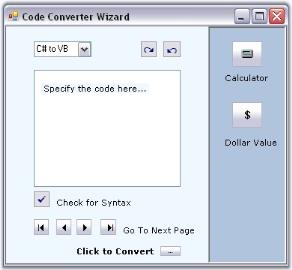' | markdownify }}
{:.image }

Border Styles

Border style for the ButtonAdv control is specified in the below property.

_Table_ _130_: Property Table_

<table>
<tr>
<td>
Property</td><td>
Description</td></tr>
<tr>
<td>
BorderStyleAdv</td><td>
Specifies the border style for ButtonAdv control. The styles are,{{ '_None,_' | markdownify }}{{ '_Default,_' | markdownify }}{{ '_Dashed,_' | markdownify }}{{ '_Dotted,_' | markdownify }}{{ '_Inset,_' | markdownify }}{{ '_Outset,_' | markdownify }}{{ '_Solid,_' | markdownify }}{{ '_Bump,_' | markdownify }}{{ '_Etched,_' | markdownify }}{{ '_Flat,_' | markdownify }}{{ '_Raised,_' | markdownify }}{{ '_RaisedInner,_' | markdownify }}{{ '_RaisedOuter,_' | markdownify }}{{ '_Sunken,_' | markdownify }}{{ '_SunkenInner and_' | markdownify }}{{ '_SunkenOuter._' | markdownify }}</td></tr>
</table>
> {{ '' | markdownify }}
{:.image }
 _Note: This setting will be effective only for Office2003, OfficeXP and WindowsXP styles set through ButtonAdv.Appearance property. See_ Visual Styles_._ 

[C#]

//Sample code for setting "SunkenOuter" Border Style using BorderStyleAdv

this.buttonAdv13.BorderStyleAdv = Syncfusion.Windows.Forms.ButtonAdvBorderStyle.SunkenOuter;

[VB.NET]

//Sample code for setting "SunkenOuter" Border Style using BorderStyleAdv

Me.buttonAdv13.BorderStyleAdv = Syncfusion.Windows.Forms.ButtonAdvBorderStyle.SunkenOuter

{{ '' | markdownify }}
{:.image }

See Also

Visual Styles, Button Types

Visual Styles

Visual Styles for the ButtonAdv control can be enabled using UseVisualStyle property. The different visual style are specified through Appearance.

_Table_ _131_: Property Table_

<table>
<tr>
<td>
Property</td><td>
Description</td></tr>
<tr>
<td>
Appearance</td><td>
Sets the visual styles for the control when UseVisualStyle property is true. The styles are,{{ '_Classic,_' | markdownify }}{{ '_Office2000,_' | markdownify }}{{ '_WindowsXP,_' | markdownify }}{{ '_OfficeXP,_' | markdownify }}{{ '_Office2003 and_' ' | markdownify }}{{ '_Office2007._' | markdownify }}</td></tr>
</table>

[C#]

this.buttonAdv1.UseVisualStyle = Syncfusion.Windows.Forms.UseStyle.True;

//Sample code for setting "OfficeXP" style for ButtonAdv

this.buttonAdv1.Appearance = Syncfusion.Windows.Forms.ButtonAppearance.OfficeXP;

[VB.NET]

Me.buttonAdv1.UseVisualStyle = Syncfusion.Windows.Forms.UseStyle.True

'Sample code for setting "OfficeXP" style for ButtonAdv

Me.buttonAdv1.Appearance = Syncfusion.Windows.Forms.ButtonAppearance.OfficeXP

{{ '' | markdownify }}
{:.image }

> {{ '' | markdownify }}
{:.image }
 _Note: While mouse hovering over the OfficeXP, Office2003 and WindowsXP at run time, the button will be painted with some standard colors. This is an inbuilt feature in the ButtonControlAdv._

Office Color Themes

ButtonControlAdv supports all the three OfficeColor Schemes when ButtonAdv.Appearance is set to Office2007. Similarly you can set Blue and Black color schemes also. Default value is Blue.

[C#]

//Sample code for setting "Silver" color scheme for ButtonAdv

this.buttonAdv1.Office2007ColorScheme = Syncfusion.Windows.Forms.Office2007Theme.Silver;

[VB.NET]

'Sample code for setting "Silver" color scheme for ButtonAdv

Me.buttonAdv1.Office2007ColorScheme = Syncfusion.Windows.Forms.Office2007Theme.Silver

{{ '' | markdownify }}
{:.image }

Custom Colors

We can also apply custom colors to the ButtonAdv control by setting Office2007ColorScheme to "_Managed"_ and specifying the custom color through the ApplyManagedColors method as follows.

[C#]

this.buttonAdv1.Office2007ColorScheme = Syncfusion.Windows.Forms.Office2007Theme.Managed;

Office2007Colors.ApplyManagedColors(this, Color.LightGreen);

[VB.NET]

Me.buttonAdv1.Office2007ColorScheme = Syncfusion.Windows.Forms.Office2007Theme.Managed

Office2007Colors.ApplyManagedColors(this, Color.LightGreen)

{{ '' | markdownify }}
{:.image }

See Also

Button Types, Image Settings

Foreground Settings

Text for the ButtonAdv can be customized using the below properties.

_Table_ _132_: Property Table_

<table>
<tr>
<td>
Properties</td><td>
Description</td></tr>
<tr>
<td>
Text</td><td>
Sets the text for the ButtonAdv control.</td></tr>
<tr>
<td>
TextAlign</td><td>
Sets the alignment of the text in the control.  The options are,{{ '_TopLeft,_' | markdownify }}{{ '_TopCenter,_' ' | markdownify }}{{ '_TopRight,_' | markdownify }}{{ '_MiddleLeft,_'  ' | markdownify }}{{ '_MiddleCenter,_' ' | markdownify }}{{ '_MiddleRight,_' ' | markdownify }}{{ '_BottomLeft,_' ' | markdownify }}{{ '_BottomCenter and_' ' | markdownify }}{{ '_BottomRight._' | markdownify }}</td></tr>
<tr>
<td>
TextImageRelation</td><td>
Sets the relative location of the image to the text. The options are,{{ '_Overlay,_' | markdownify }}{{ '_ImageBeforeText,_' | markdownify }}{{ '_TextBeforeImage,_' | markdownify }}{{ '_ImageAboveText and_' ' | markdownify }}{{ '_TextAboveImage._' | markdownify }}</td></tr>
<tr>
<td>
Font</td><td>
Sets the font style for the control's text.</td></tr>
<tr>
<td>
ForeColor</td><td>
Sets the fore color for the control's text.</td></tr>
</table>

[C#]

this.buttonAdv1.Text = "Image above Text";

this.buttonAdv4.TextAlign = System.Drawing.ContentAlignment.BottomCenter;

this.buttonAdv4.TextImageRelation = TextImageRelation.ImageAboveText;

this.buttonAdv1.Font = new System.Drawing.Font("Verdana", 8.25F, System.Drawing.FontStyle.Regular);

this.buttonAdv1.ForeColor = System.Drawing.Color.White;

[VB.NET]

Me.buttonAdv4.Text =  "Image above Text"

Me.buttonAdv4.TextAlign = System.Drawing.ContentAlignment.BottomCenter

Me.buttonAdv4.TextImageRelation = TextImageRelation.ImageAboveText

Me.buttonAdv1.Font = New System.Drawing.Font("Verdana", 8.25F, System.Drawing.FontStyle.Regular)

Me.buttonAdv1.ForeColor = System.Drawing.Color.White

{{ '' | markdownify }}
{:.image }

Design Time Features

ButtonAdv control has Smart Tag, which lets you set the properties easily.

Smart Tag Options

{{ '' | markdownify }}
{:.image }

The various settings through this window is as follows.

* Name - Lets you edit the control text.
* UseVisualStyle - Enables visual style settings.
* KeepFocusRectangle - Specifies whether to show focus rectangle or not.
* Appearance - Lets you to set the Visual style for the control.
* ButtonType - Lets you to set the button type.
* BorderStyles - Lets you to set the border styles for the control.
* Image - Lets you to set the image for the ButtonAdv control.
* ImageAlign - Sets the image alignment within the control.
* Text - Sets the text for button.
* Text Alignment - Sets the alignment of the text.
Image Settings

ButtonAdv supports two types of images. They are,

* BackgroundImage
* Image

BackgroundImage

BackgroundImage is the image used as the Background for the control, which is set using the BackgroundImage property. This BackgroundImage can be laid in various manner with the BackgroundImageLayout property.

{{ '' | markdownify }}
{:.image }

Image

Image that will be displayed on the control.

{{ '' | markdownify }}
{:.image }

The Images can be added to the ButtonAdv control in two ways. Either Image property can be used or the below properties.

_Table_ _133_: Property Table_

<table>
<tr>
<td>
Properties</td><td>
Description</td></tr>
<tr>
<td>
ImageList</td><td>
Sets the imagelist used for this control.</td></tr>
<tr>
<td>
ImageAlign</td><td>
Sets the alignment of the image inside the control. The options are,{{ '_TopLeft,_' ' | markdownify }}{{ '_TopCenter,_' ' | markdownify }}{{ '_TopRight_' | markdownify }}{{ '_MiddleLeft,_'  ' | markdownify }}{{ '_MiddleCenter,_' ' | markdownify }}{{ '_MiddleRight,_' ' | markdownify }}{{ '_BottomLeft,_' ' | markdownify }}{{ '_BottomCenter and_' ' | markdownify }}{{ '_BottomRight._' | markdownify }}</td></tr>
<tr>
<td>
ImageIndex</td><td>
Specifies the index for the image in the control.</td></tr>
<tr>
<td>
Text</td><td>
Sets the text for the ButtonAdv.</td></tr>
<tr>
<td>
TextAlign</td><td>
Sets the alignment of the text in the control.  The options are,{{ '_TopLeft,_' ' | markdownify }}{{ '_TopCenter,_' ' | markdownify }}{{ '_TopRight_' | markdownify }}{{ '_MiddleLeft,_' ' | markdownify }}{{ '_MiddleCenter,_' ' | markdownify }}{{ '_MiddleRight,_' ' | markdownify }}{{ '_BottomLeft,_' ' | markdownify }}{{ '_BottomCenter and_' ' | markdownify }}{{ '_BottomRight._' | markdownify }}</td></tr>
<tr>
<td>
TextImageRelation</td><td>
Sets the relative location of the image to the text. The options are,{{ '_Overlay,_' | markdownify }}{{ '_ImageBeforeText,_' | markdownify }}{{ '_TextBeforeImage,_' | markdownify }}{{ '_ImageAboveText and_' ' | markdownify }}{{ '_TextAboveImage._' | markdownify }}</td></tr>
</table>

{{ '' | markdownify }}
{:.image }

> {{ '' | markdownify }}
{:.image }
 _Note: The Image settings will be effective only when_ ButtonType _is set to Normal._

[C#]

this.btnAlignment.Image = ((System.Drawing.Bitmap)(resources.GetObject("btnAlignment.Image")));

this.btnAlignment.ImageAlign = System.Drawing.ContentAlignment.MiddleLeft;

this.btnAlignment.ImageIndex = 3;

this.btnAlignment.ImageList = this.imageList1;

[VB.NET]

Me.btnAlignment.Image = CType((resources.GetObject("btnAlignment.Image")), System.Drawing.Bitmap) 

Me.btnAlignment.ImageAlign = System.Drawing.ContentAlignment.MiddleLeft 

Me.btnAlignment.ImageIndex = 3 

Me.btnAlignment.ImageList = Me.imageList1

{{ '' | markdownify }}
{:.image }

###### Frequently Asked Questions

This section illustrates the solutions for various task-based queries about the control.

How to draw or hide focus rectangle for the ButtonAdv control

ButtonControl shows some special features which the user interacts with the control. Those properties are discussed in this section.

_Table_ _134_: Property Table_

<table>
<tr>
<td>
Properties</td><td>
Description</td></tr>
<tr>
<td>
KeepFocusRectangle</td><td>
Specifies whether rectangle will be drawn around the control when it is focussed at run time.</td></tr>
</table>

[C#]

this.buttonAdv1.KeepFocusRectangle = true;

[VB.NET]

Me.buttonAdv1.KeepFocusRectangle = True

{{ '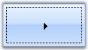' | markdownify }}
{:.image }

How to identify whether a ButtonAdv control is in pressed state or not

When ButtonAdv.PushButton property is enabled, the button will remain in its pressed state, when clicked. The state of the button will be present in the property State. So by examining the state property, we can conclude whether the button is in the Pressed state or not. Using the Office2007 visual styles will help better understanding of this feature.

_Table_ _135_: Property Table_

<table>
<tr>
<td>
Property</td><td>
Description</td></tr>
<tr>
<td>
PushButton</td><td>
Specifies the state of the control. By default it is set to false. Set this to true. Now at run time, when the user click this button, the appearance of the button will change to pushed state and will regain its original state only by clicking it again.</td></tr>
</table>

[C#]

private void buttonAdv1_Click(object sender, System.EventArgs e)

{

if(this.buttonAdv1.State==Syncfusion.Windows.Forms.ButtonAdvState.Pressed)

MessageBox.Show("Button is pushed");

else

MessageBox.Show("Button is in normal state");

}

[VB.NET]

Private Sub buttonAdv1_Click(ByVal sender As System.Object, ByVal e As System.EventArgs) Handles buttonAdv1.Click

if(Me.buttonAdv1.State==Syncfusion.Windows.Forms.ButtonAdvState.Pressed)

MessageBox.Show("Button is pushed")

else

MessageBox.Show("Button is in normal state")

End Sub

{{ '' | markdownify }}
{:.image }

##### ButtonEdit

The ButtonEdit control embeds a text box control with a collection of button controls that can be customized to create many commonly used interfaces such as a file / folder browser or a drop-down text control. We can implement a file picker and folder browser using the ButtonEdit control. Drop-down popup controls can also be shown using the ButtonEdit control and the PopupContainerControl.

The edit control with a browse button extends a regular edit control by adding a button which can display an user-defined "browse" dialog. The ButtonEdit control provides an easy way to create controls with an edit control and any number of associated buttons. 

{{ '' | markdownify }}
{:.image }

The ButtonEdit control derives from Syncfusion.Windows.Forms.ContainerControl and embeds one or more ButtonEditChildButton controls. The ButtonEditChildButton controls derive from Syncfusion.Windows.Forms.Button class and expose the functionality of buttons. 

Using an edit control alongside one or more button controls is a very common requirement in graphical user interface programming. Some of the common examples are browse edit controls and drop-down controls. 

###### Features

ButtonEdit is a composite control that combines buttons with a Text Box. The Button Edit control can be used for a variety of purposes that require a Text Box placed alongside one or more buttons. It has following features.

* It can be customized to create many commonly used interfaces such as a file / folder browser or a drop-down text control.
* Buttons can be added /removed through design verbs and also accessed through Buttons property collection editor.
* ButtonEdit Supports Themes (Blue, Oliver and Silver) and visual styles. See Style Settings.
* The ButtonEdit can be used to display the CalendarPopup. See Click Event topic.
* You can add and assign tasks to each ButtonEditChildButton of ButtonEdit.
* The internal Textbox for ButtonEdit can be modified to any custom TextBox, such as CurrencyTextBox, Integer TextBox, PercentTextBox, and so on.
* Images can be drawn over the buttons in ButtonEdit.
* Supports Databinding. See Click Event topic.

See Also

Concepts and Features

###### Creating ButtonEdit

This section will help you to get started with the ButtonEdit control. The below topics will guide you to create ButtonEdit control through designer and programmatically.

Through Designer

The ButtonEdit control can be used in situations where a set of buttons are needed alongside an edit control, such as in a browser for files dialog. This tutorial shows how to use the ButtonEdit control, set the Button properties and handle the events.

1. Create a new Windows Forms application and open the main form in the designer. Drag and drop ButtonEdit control from the toolbox to the form.  

{{ '' | markdownify }}
{:.image }

2. When the control is initially added to the form, it appears like an edit control with no buttons.

{{ '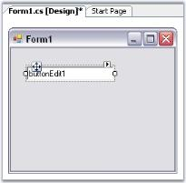' | markdownify }}
{:.image }

3. We can add buttons to the control using ButtonEditChildButton Collection Editor which is invoked by ButtonEdit.Buttons property. Editor can also be accessed using Smart Tag option.

{{ '' | markdownify }}
{:.image }

4. Set properties for buttons using the Editor. You can specify the attributes for any of the child buttons through the collection editor or by clicking any button and then selecting the properties in theproperty grid, that display the properties for the selected button.

{{ '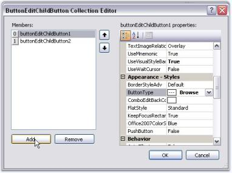' | markdownify }}
{:.image }

> {{ '' | markdownify }}
{:.image }
 _Note: You can also add or remove buttons to the ButtonEdit.Buttons collection through the Add Button and Remove Button verbs provided._

5. Run the application. You can specify handlers for these child buttons also.

{{ '' | markdownify }}
{:.image }

See Also

Concepts and Features

Through Code

To create a ButtonEdit control programmatically, follow the below steps.

1. Include the required namespace.

[C#]

using Syncfusion.Windows.Forms.Tools;

[VB.NET]

Imports Syncfusion.Windows.Forms.Tools

2. Create an instances of ButtonEdit, TextBox and three ButtonEditChildButtons.

[C#]

private Syncfusion.Windows.Forms.Tools.ButtonEdit buttonEdit1;

private System.Windows.Forms.TextBox textBox1;

private Syncfusion.Windows.Forms.Tools.ButtonEditChildButton buttonEditChildButton1;

private Syncfusion.Windows.Forms.Tools.ButtonEditChildButton buttonEditChildButton2;

private Syncfusion.Windows.Forms.Tools.ButtonEditChildButton buttonEditChildButton3;

this.buttonEdit1=new Syncfusion.Windows.Forms.Tools.ButtonEdit();

this.textBox1=new TextBox();

this.buttonEditChildButton1=new Syncfusion.Windows.Forms.Tools.ButtonEditChildButton();

this.buttonEditChildButton2=new Syncfusion.Windows.Forms.Tools.ButtonEditChildButton();

this.buttonEditChildButton3=new Syncfusion.Windows.Forms.Tools.ButtonEditChildButton();

[VB.NET]

Private buttonEdit1 As Syncfusion.Windows.Forms.Tools.ButtonEdit

Private textBox1 As System.Windows.Forms.TextBox

Private buttonEditChildButton1 As Syncfusion.Windows.Forms.Tools.ButtonEditChildButton

Private buttonEditChildButton2 As Syncfusion.Windows.Forms.Tools.ButtonEditChildButton

Private buttonEditChildButton3 As Syncfusion.Windows.Forms.Tools.ButtonEditChildButton

Me.buttonEdit1 = New Syncfusion.Windows.Forms.Tools.ButtonEdit()

Me.textBox1 = New TextBox()

Me.buttonEditChildButton1 = New Syncfusion.Windows.Forms.Tools.ButtonEditChildButton()

Me.buttonEditChildButton2 = New Syncfusion.Windows.Forms.Tools.ButtonEditChildButton()

Me.buttonEditChildButton3 = New Syncfusion.Windows.Forms.Tools.ButtonEditChildButton()

3. Embed the TextBox1 to the textBox of ButtonEdit.

[C#]

//Associating the TextBoxExt control.

this.buttonEdit1.TextBox=this.textBox1;

[VB.NET]

'Associating the TextBoxExt control.

Me.buttonEdit1.TextBox=Me.textBox1

4. Set the alignment and text for the buttons.

[C#]

//Setting Button alignment for Child Button 1

//By default the alignment for other buttons will be right

this.buttonEditChildButton1.ButtonAlign = ButtonAlignment.Left;

//Setting text for child Buttons.

this.buttonEditChildButton1.Text = "L";

this.buttonEditChildButton2.Text = "R";

this.buttonEditChildButton3.Text = "E";

[VB.NET]

'Setting Button alignment for Child Button 1. 

'By default the alignment for other buttons will be right

Me.buttonEditChildButton1.ButtonAlign = ButtonAlignment.Left

'Setting text for child Buttons

Me.buttonEditChildButton1.Text = "L"

Me.buttonEditChildButton2.Text = "R"

Me.buttonEditChildButton3.Text = "E"

5. Add ButtonEditChildButtons to the ButtonEdit which then add it to the form.

[C#]

this.buttonEdit1.Buttons.Add(this.buttonEditChildButton1);

this.buttonEdit1.Buttons.Add(this.buttonEditChildButton2);

this.buttonEdit1.Buttons.Add(this.buttonEditChildButton3);

this.Controls.Add(this.buttonEdit1);

[VB.NET]

Me.buttonEdit1.Buttons.Add(Me.buttonEditChildButton1)

Me.buttonEdit1.Buttons.Add(Me.buttonEditChildButton2)

Me.buttonEdit1.Buttons.Add(Me.buttonEditChildButton3)

Me.Controls.Add(Me.buttonEdit1)

6. Run the application. The output will be like below.

{{ '' | markdownify }}
{:.image }

See Also

Concepts and Features

###### Concepts and Features

The following topics will help you become more familiar in using the ButtonEdit control.

ButtonEdit Appearance

A ButtonEdit control is a combination of controls with textbox and buttons. The buttons are normal windows buttons which supports all their properties and events. The ButtonEdit control itself supports properties which controls the appearance and behavior of the control. This section will discuss those properties in the below topics.

See Also

TextBox Settings for ButtonEdit, Child Button Customization

Style Settings

This section discusses the different styles available for the ButtonEdit control.

Button Styles

Styles for the ButtonEdit control is specified using ButtonStyle property.

_Table_ _136_: Property Table_

<table>
<tr>
<td>
Properties</td><td>
Description</td></tr>
<tr>
<td>
ButtonStyle</td><td>
Specifies the button style for the control. The styles are,{{ '_Classic,_' | markdownify }}{{ '_Office2000,_' | markdownify }}{{ '_WindowsXP,_' | markdownify }}{{ '_OfficeXP,_' | markdownify }}{{ '_Office2003 and_' ' | markdownify }}{{ '_Office2007._' | markdownify }}</td></tr>
<tr>
<td>
UseVisualStyle</td><td>
Specifies whether the visual styles can be applied using ButtonStyle property or not. This property should be set to true to make the ButtonStyle setting effective.</td></tr>
</table>

[C#]

this.buttonEdit3.UseVisualStyle = true;

this.buttonEdit3.ButtonStyle = Syncfusion.Windows.Forms.ButtonAppearance.Classic;

[VB.NET]

Me.buttonEdit3.UseVisualStyle = True

Me.buttonEdit3.ButtonStyle = Syncfusion.Windows.Forms.ButtonAppearance.Classic

{{ '' | markdownify }}
{:.image }

> {{ '' | markdownify }}
{:.image }
 _Note: ButtonEdit control also supports all the three windows color themes, i.e., Blue, Silver and Oliver themes. We need to change the Windows theme color in desktop properties for this._

Custom Colors

We can also apply custom colors to the ButtonEditControl by setting Office2007ColorScheme of individual child buttons to "_Managed_" and specifying the custom color through the ApplyManagedColors method as follows.

[C#]

this.buttonEditChildButton1.Office2007ColorScheme = Syncfusion.Windows.Forms.Office2007Theme.Managed;

this.buttonEditChildButton2.Office2007ColorScheme = Syncfusion.Windows.Forms.Office2007Theme.Managed;

this.buttonEditChildButton3.Office2007ColorScheme = Syncfusion.Windows.Forms.Office2007Theme.Managed;

Office2007Colors.ApplyManagedColors(this, Color.LightGreen);

[VB.NET]

Me.buttonEditChildButton1.Office2007ColorScheme = Syncfusion.Windows.Forms.Office2007Theme.Managed

Me.buttonEditChildButton2.Office2007ColorScheme = Syncfusion.Windows.Forms.Office2007Theme.Managed

Me.buttonEditChildButton3.Office2007ColorScheme = Syncfusion.Windows.Forms.Office2007Theme.Managed

Office2007Colors.ApplyManagedColors(Me, Color.LightGreen)

{{ '' | markdownify }}
{:.image }

Border Styles

The border styles for the ButtonEdit can be controlled using the below properties.

_Table_ _137_: Property Table_

<table>
<tr>
<td>
Properties</td><td>
Description</td></tr>
<tr>
<td>
Border3DStyle</td><td>
Sets the 3D border style for the control. The options are,{{ '_RaisedOuter,_' | markdownify }}{{ '_RaisedInner,_' | markdownify }}{{ '_SunkenOuter,_' | markdownify }}{{ '_SunkenInner,_' | markdownify }}{{ '_Raised,_' | markdownify }}{{ '_Sunken,_' | markdownify }}{{ '_Etched,_' | markdownify }}{{ '_Flat,_' | markdownify }}{{ '_Adjust and_' ' | markdownify }}{{ '_Bump._' | markdownify }}</td></tr>
<tr>
<td>
BorderSides</td><td>
Specifies the sides of the control which should have border.</td></tr>
<tr>
<td>
FlatStyle</td><td>
Specifies the flat style to be applied to the ButtonEdit control. Set UseVisualStyle property to false to make this setting effective.</td></tr>
<tr>
<td>
FlatBorderColor</td><td>
Specifies the border color for the control, when FlatStyle is set to "Flat". This color setting can be reset by calling ButtonEdit.ResetFlatBorderColor method.</td></tr>
</table>

[C#]

this.buttonEdit3.UseVisualStyle = false;

this.buttonEdit3.FlatBorderColor = System.Drawing.Color.Red;

this.buttonEdit3.FlatStyle = System.Windows.Forms.FlatStyle.Flat;

[VB.NET]

Me.buttonEdit3.UseVisualStyle = False

this.buttonEdit3.FlatBorderColor = System.Drawing.Color.Red;

this.buttonEdit3.FlatStyle = System.Windows.Forms.FlatStyle.Flat;

{{ '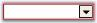' | markdownify }}
{:.image }

> {{ '' | markdownify }}
{:.image }
 _Note: The Border styles of the child buttons can be controlled using ButtonEditChildButton.BorderStyleAdv property. SeeSee_ Button Types and Border Styles _topic for details._

Size Settings

We can specify the maximum and minimum size for the ButtonEdit control using MaximumSize and MinimumSize properties.

_Table_ _138_: Property Table_

<table>
<tr>
<td>
Properties</td><td>
Description</td></tr>
<tr>
<td>
MaximumSize</td><td>
Sets the maximum size of the ButtonEdit control.</td></tr>
<tr>
<td>
MinimumSize</td><td>
Sets the minimum size of the ButtonEdit control.</td></tr>
</table>
See Also

Foreground Settings

Foreground Settings

This section discusses the foreground settings available for the ButtonEdit control.

Font and ForeColor

The font style and the forecolor for the ButtonEdit text can be set using Font and ForeColor properties. These property settings can be overridden by TextBox.Font and TextBox.ForeColor respectively.

[C#]

this.buttonEdit3.Font = new System.Drawing.Font("Verdana", 8.25F, System.Drawing.FontStyle.Regular);

this.buttonEdit3.ForeColor = Color.SteelBlue;

[VB.NET]

Me.buttonEdit3.Font = New System.Drawing.Font("Verdana", 8.25F, System.Drawing.FontStyle.Regular)

Me.buttonEdit3.ForeColor = Color.SteelBlue

> {{ '' | markdownify }}
{:.image }
 _Note: Foreground settings for the child buttons can be specified using ButtonEditChildButton.Font and ButtonEditChildButton.ForeColor properties._

{{ '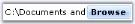' | markdownify }}
{:.image }

Case Settings

Using ButtonEdit.CharacterCasing property, we can specify whether the case of the character can be modified as they are typed. The values are Upper, Lower and Normal.

[C#]

this.buttonEdit3.Font = new System.Drawing.Font("Verdana", 8.25F, System.Drawing.FontStyle.Regular);

this.buttonEdit3.ForeColor = Color.SteelBlue;

[VB.NET]

Me.buttonEdit3.Font = New System.Drawing.Font("Verdana", 8.25F, System.Drawing.FontStyle.Regular)

Me.buttonEdit3.ForeColor = Color.SteelBlue

> {{ '' | markdownify }}
{:.image }
 _Note: This case setting can be overridden by TextBox.CharacterCasing property._

See Also

TextBox Settings for ButtonEdit

Child Button Customization

The child buttons in a ButtonEdit control are normal windows button, but supports additional features within our ButtonEdit control. Those features are discussed in the below topics.

Button Types and Border Styles

Button Types

The button types for ButtonEdit control are similar to that of ButtonAdv control. Refer Button Types topic for details.

Use ButtonEditChildButton1.ButtonType property for setting the button types of the child buttons.

Border Styles

The border styles for the child buttons can be set through BorderStyleAdv property.

_Table_ _139_: Property Table_

<table>
<tr>
<td>
Property</td><td>
Description</td></tr>
<tr>
<td>
BorderStyleAdv</td><td>
Specifies the border style for child buttons of the ButtonEdit control. The styles are,{{ '_None,_' | markdownify }}{{ '_Default,_' | markdownify }}{{ '_Dashed,_' | markdownify }}{{ '_Dotted,_' | markdownify }}{{ '_Inset,_' | markdownify }}{{ '_Outset,_' | markdownify }}{{ '_Solid,_' | markdownify }}{{ '_Bump,_' | markdownify }}{{ '_Etched,_' | markdownify }}{{ '_Flat,_' | markdownify }}{{ '_Raised,_' | markdownify }}{{ '_RaisedInner,_' | markdownify }}{{ '_RaisedOuter,_' | markdownify }}{{ '_Sunken,_' | markdownify }}{{ '_SunkenInner and_' | markdownify }}{{ '_SunkenOuter._' | markdownify }}</td></tr>
</table>
> {{ '' | markdownify }}
{:.image }
 _Note: This setting will be effective only for Office2003, OfficeXP and WindowsXP styles set through ButtonEdit.ButtonStyle property. See Style Settings. We can also set border style for ButtonEdit controls without enabling visual styles._

[C#]

//Sample code for setting "Bump" Border Style for BorderEdit Child Button

this.buttonEditChildButton4.BorderStyleAdv = Syncfusion.Windows.Forms.ButtonAdvBorderStyle.Bump;

[VB.NET]

'Sample code for setting "Bump" Border Style for BorderEdit Child Button

Me.buttonEditChildButton4.BorderStyleAdv = Syncfusion.Windows.Forms.ButtonAdvBorderStyle.Bump

{{ '' | markdownify }}
{:.image }

See Also

Style Settings, How to set tooltip for ButtonEdit Child buttons?

Properties

The properties which controls the appearance and behavior of the ButtonEdit Child Buttons are listed below with their description.

Button Alignment

Placement of the child buttons inside the ButtonEdit control is set through below property.

_Table_ _140_: Property Table_

<table>
<tr>
<td>
Property</td><td>
Description</td></tr>
<tr>
<td>
ButtonAlign</td><td>
Specifies whether the child button should be aligned to left or right of the ButtonEdit control.</td></tr>
</table>

[C#]

this.buttonEditChildButton6.ButtonAlign = Syncfusion.Windows.Forms.Tools.ButtonAlignment.Left;

[VB.NET]

Me.buttonEditChildButton6.ButtonAlign = Syncfusion.Windows.Forms.Tools.ButtonAlignment.Left

{{ '' | markdownify }}
{:.image }

> {{ '' | markdownify }}
{:.image }
 _Note: There is no support for placing more than one buttons on the same side. We need to add the buttons in the order we require._

Image Settings

The below properties can be used to set text and image for the child buttons.

_Table_ _141_: Property Table_

<table>
<tr>
<td>
Properties</td><td>
Description</td></tr>
<tr>
<td>
Image</td><td>
Sets image for the child button.</td></tr>
<tr>
<td>
ImageAlign</td><td>
Sets alignment of the image.</td></tr>
<tr>
<td>
ImageIndex</td><td>
Sets the index of the image to be set for the child button.</td></tr>
<tr>
<td>
ImageList</td><td>
Indicates the imagelist to be used for child button.</td></tr>
<tr>
<td>
PreferredWidth</td><td>
Specifies the width of the button. Default value is 18.</td></tr>
<tr>
<td>
Text</td><td>
Sets text for the button if ButtonType is set to Normal.</td></tr>
<tr>
<td>
TextAlign</td><td>
Sets the alignment of the text in the child button control.</td></tr>
<tr>
<td>
TextImageRelation</td><td>
Sets the relative location of the image to the text in the button.</td></tr>
</table>

[C#]

this.buttonEditChildButton2.Image = ((System.Drawing.Image)(resources.GetObject("buttonEditChildButton2.Image")));

this.buttonEditChildButton2.ImageAlign = System.Drawing.ContentAlignment.MiddleLeft;

this.buttonEditChildButton2.Text = "Browse";

this.buttonEditChildButton2.TextAlign = System.Drawing.ContentAlignment.MiddleLeft;

this.buttonEditChildButton2.TextImageRelation = System.Windows.Forms.TextImageRelation.ImageBeforeText;

this.buttonEditChildButton2.PreferredWidth = 64;

[VB.NET]

Me.buttonEditChildButton2.Image = DirectCast((resources.GetObject("buttonEditChildButton2.Image")), System.Drawing.Image)

Me.buttonEditChildButton2.ImageAlign = System.Drawing.ContentAlignment.MiddleLeft

Me.buttonEditChildButton2.Text = "Browse"

Me.buttonEditChildButton2.TextAlign = System.Drawing.ContentAlignment.MiddleLeft

Me.buttonEditChildButton2.TextImageRelation = System.Windows.Forms.TextImageRelation.ImageBeforeText

Me.buttonEditChildButton2.PreferredWidth = 64

{{ '' | markdownify }}
{:.image }

Flat Style for the Buttons

_Table_ _142_: Property Table_

<table>
<tr>
<td>
Properties</td><td>
Description</td></tr>
<tr>
<td>
FlatAppearance</td><td>
Represents the appearance of the border and the color for the check state and mouse over state. Set FlatStyle to Flat and UseVisualStyleBackColor should be set to false to make this setting effective.</td></tr>
<tr>
<td>
FlatStyle</td><td>
Specifies the flat style for the button. The options are Flat, Popup, Standard and System.</td></tr>
</table>

[C#]

this.buttonEditChildButton5.FlatStyle = System.Windows.Forms.FlatStyle.Flat;

this.buttonEditChildButton5.FlatAppearance.BorderColor = System.Drawing.Color.Crimson;

this.buttonEditChildButton5.FlatAppearance.MouseOverBackColor = System.Drawing.Color.Pink;

[VB.NET]

Me.buttonEditChildButton5.FlatStyle = System.Windows.Forms.FlatStyle.Flat

Me.buttonEditChildButton5.FlatAppearance.BorderColor = System.Drawing.Color.Crimson

Me.buttonEditChildButton5.FlatAppearance.MouseOverBackColor = System.Drawing.Color.Pink

{{ '' | markdownify }}
{:.image }

Style Settings

_Table_ _143_: Property Table_

<table>
<tr>
<td>
Properties</td><td>
Description</td></tr>
<tr>
<td>
UseVisualStyleBackColor</td><td>
Determines whether the background of child button is drawn using visual style if the button supports visual styles.</td></tr>
<tr>
<td>
Office2007ColorScheme</td><td>
Specifies the office color scheme.</td></tr>
</table>
> {{ '' | markdownify }}
{:.image }
 _Note: Visual style of a child buttons is inherited from the visual style of it's parent (ButtonEdit) control. See_ Style Settings _topic. You can override those settings using the above properties._

Focusing the Child Button at Runtime

The Child buttons can be focussed based on the order of the ChildButton.TabIndex set for individual buttons. ChildButton.TabStop property should be set to true to make this effective. While focusing the button, we can either display or don't display a focus rectangle, by using the  ButtonEdit.KeepFocusRectangle property. 

[C#]

this.buttonEditChildButton3.KeepFocusRectangle = true;

[VB.NET]

Me.buttonEditChildButton3.KeepFocusRectangle = True

{{ '' | markdownify }}
{:.image }

See Also

How to hide a child button of a ButtonEdit control?

TextBox Settings For ButtonEdit

The default textbox within the ButtonEdit control can be replaced with any custom textbox like PercentTextBox, IntegerTextBox, and so on. The properties of Embedded textbox of a ButtonEdit control are discussed below.

_Table_ _144_: Property Table_

<table>
<tr>
<td>
ButtonEdit Properties</td><td>
Description</td></tr>
<tr>
<td>
ShowTexBox</td><td>
Indicates whether the embedded TextBox is visible in the ButtonEdit control. This property setting can be reset to default by calling ResetShowTextBox method.</td></tr>
<tr>
<td>
SelectionLength</td><td>
Sets the selection length of the embedded TextBox. This property setting can be reset to default by calling ResetSelectionLength method.</td></tr>
<tr>
<td>
SelectionStart</td><td>
Sets the SelectionStart property of the ButtonEdit control which is same as the TextBoxBase.SelectionStart of the embedded TextBox. This property setting can be reset to default by calling ResetSelectionStart method.</td></tr>
</table>

[C#]

this.buttonEdit1.SelectionLength = 1;

this.buttonEdit1.SelectionStart = 3;

this.buttonEdit1.ShowTexBox = true;

[VB.NET]

Me.buttonEdit1.SelectionLength = 1

Me.buttonEdit1.SelectionStart = 3

Me.buttonEdit1.ShowTexBox = True

> {{ '' | markdownify }}
{:.image }
 _Note: To increase the height of the ButtonEdit control, make the text as multiline textbox._

Design Time Features

ButtonEdit control has Smart Tag, which lets you set the properties easily.

Smart Tag Options

{{ '' | markdownify }}
{:.image }

The Options are as follows.

* Show TextBox - Shows or hides embedded textbox.
* Text Alignment - Sets alignment of the text.
* Button Styles - Sets the button styles
* UseVisualStyle - Enables or disables visual style for the control.
* Character Casing - Set the case settings for the text in the textbox.
* ButtonCollection - Opens Button Collection Editor.
* Name - Sets the name of the ButtonEdit control.
###### ButtonEdit Events

 The below events are discussed in the event section.

ButtonClicked Event

This event is handled whenever a child button of a ButtonEdit control is clicked. It gives _ClickedButton_ member which lets you customize the button that is clicked. 

The below code changes the alignment of the button that is clicked at runtime.

[C#]

this.buttonEdit2.ButtonClicked +=new ButtonClickedEventHandler(buttonEdit2_ButtonClicked);

private void buttonEdit2_ButtonClicked(object sender, ButtonClickedEventArgs e)

{

    //Changing the button alignment of the clicked button

    e.ClickedButton.ButtonAlign = ButtonAlignment.Left;

}

[VB.NET]

AddHandler Me.buttonEdit2.ButtonClicked, AddressOf buttonEdit2_ButtonClicked 

Private Sub buttonEdit2_ButtonClicked(ByVal sender As Object, ByVal e As ButtonClickedEventArgs)

    'Changing the button alignment of the clicked button 

    e.ClickedButton.ButtonAlign = ButtonAlignment.Left

End Sub

Border Events

The below table list the events that are raised for border changes.

_Table_ _145_: Property Table_

<table>
<tr>
<td>
ButtonEdit Properties</td><td>
Description</td></tr>
<tr>
<td>
Border3DStyleChanged</td><td>
Raised when Border3DStyle property of ButtonEdit control is changed.</td></tr>
<tr>
<td>
BorderSidesChanged</td><td>
Raised when BorderSides property of ButtonEdit control is changed.</td></tr>
</table>

[C#]

private void buttonEdit1_Border3DStyleChanged(object sender, EventArgs e)

{

    Console.WriteLine("3D border styles is changed");            

}

private void buttonEdit1_BorderSidesChanged(object sender, EventArgs e)

{

    Console.WriteLine(" Border sides is changed");           

}

[VB.NET]

Private Sub buttonEdit1_Border3DStyleChanged(ByVal sender As Object, ByVal e As EventArgs)

    Console.WriteLine("3D border styles is changed")

End Sub

Private Sub buttonEdit1_BorderSidesChanged(ByVal sender As Object, ByVal e As EventArgs)

    Console.WriteLine(" Border sides is changed")

End Sub

ButtonEditChildButton Events

The below table list the events that are available for the ButtonEdit Child Buttons control.

_Table_ _146_: Events Table_

<table>
<tr>
<td>
ButtonEditChildButton Events</td><td>
Description</td></tr>
<tr>
<td>
Click</td><td>
Occurs when the control is clicked. This event calls the ButtonEdit.HandleChildButtonClicked method. Using this method, we can access the corresponding control and customize it.</td></tr>
<tr>
<td>
TextChanged</td><td>
Raised when Text property value is changed. This event calls HandleChildButtonTextChanged method. Using this method, we can access the corresponding control and customize it.</td></tr>
<tr>
<td>
MouseDown</td><td>
Handled when the mouse is over the control and when mouse button is pressed. This event calls HandleChildButtonMouseDown. Using this method, we can access the corresponding control and customize it.</td></tr>
<tr>
<td>
MouseUp</td><td>
Handled when the mouse is over the control and mouse button is released. This event calls HandleChildButtonMouseUp. Using this method, we can access the corresponding control and customize it.</td></tr>
<tr>
<td>
MouseEnter</td><td>
Raised when the mouse pointer enters the control. This event calls HandleChildButtonMouseEnter method. Using this method, we can access the corresponding control and customize it.</td></tr>
<tr>
<td>
MouseLeave</td><td>
Raised when the mouse pointer leaves the control. This event calls HandleChildButtonMouseLeave method. Using this method, we can access the corresponding control and customize it.</td></tr>
<tr>
<td>
MouseHover</td><td>
Raised when the mouse pointer rests the control. This event calls HandleChildButtonMouseHover method. Using this method, we can access the corresponding control and customize it.</td></tr>
<tr>
<td>
BackColorChanged</td><td>
Raised when BackColor property of the ButtonEdit control is changed. This event calls HandleChildButtonBackColorChanged method. Using this method, we can access the corresponding control and customize it.</td></tr>
</table>
Click Event

Displaying a Calendar Popup in a ButtonEdit Control

Using ButtonEdit Child button click event, we can display a CalendarPopup at a specified location. It can be done using the below steps.

Using CalendarPopup

1. Create an instance of CalendarPopup control.

[C#]

private Syncfusion.Windows.Forms.Tools.CalendarPopup calendarPop1;

calendarPop1=new Syncfusion.Windows.Forms.Tools.CalendarPopup ();

[VB.NET]

Private calendarPop1 As Syncfusion.Windows.Forms.Tools.CalendarPopup

Private calendarPop1 = New Syncfusion.Windows.Forms.Tools.CalendarPopup()

2. Declare an instance of MonthCalendarAdv control and add it to the CalendarPopup.

[C#]

private Syncfusion.Windows.Forms.Tools.MonthCalendarAdv MonthCal;

MonthCal=new Syncfusion.Windows.Forms.Tools.MonthCalendarAdv();

this.MonthCal.AutoSize = false;

calendarPop1.AutoSize = false;

calendarPop1.Size = new Size(200, 200);

this.MonthCal.Size = new Size(200, 200);

this.calendarPop1.Controls.Add(MonthCal);

[VB.NET]

Private MonthCal As Syncfusion.Windows.Forms.Tools.MonthCalendarAdv

Private MonthCal = New Syncfusion.Windows.Forms.Tools.MonthCalendarAdv()

Me.MonthCal.AutoSize = False

calendarPop1.AutoSize = False

calendarPop1.Size = New Size(200, 200)

Me.MonthCal.Size = New Size(200, 200)

Me.calendarPop1.Controls.Add(MonthCal)

3. Handle the Click event of buttonEditChildButton1 to display the Calendar as follows.

[C#]

private void buttonEditChildButton1_Click(object sender, System.EventArgs e)

{

this.calendarPop1.Visible =true;

this.calendarPop1.ShowPopup (new Point(200,200));

}

[VB.NET]

Private Sub buttonEditChildButton1_Click(ByVal sender As Object, ByVal e As System.EventArgs)

    Me.calendarPop1.Visible = True

    Me.calendarPop1.ShowPopup(New Point(200, 200))

End Sub

4. The event DateSelected can also be handled to display the selected date in the textbox of ButtonEdit control.

[C#]

this.MonthCal.DateSelected+=new EventHandler(MonthCal_DateSelected);

private void MonthCal_DateSelected(object sender,System.EventArgs e)

{

this.buttonEdit1.TextBox.Text= this.MonthCal.Value.ToString();

}

[VB.NET]

Private Me.MonthCal.DateSelected+= New EventHandler(MonthCal_DateSelected)

Private Sub MonthCal_DateSelected(ByVal sender As Object, ByVal e As System.EventArgs)

    Me.buttonEdit1.TextBox.Text = Me.MonthCal.Value.ToString()

End Sub

{{ '' | markdownify }}
{:.image }

###### Frequently Asked Questions

This section illustrates the solutions for various task-based queries about the control.

How to hide a child button of a ButtonEdit control?

By calling the ButtonEdit.HideButton method, we can hide a child button. 

_Table_ _147_: Methods Table_

<table>
<tr>
<td>
Method</td><td>
Description</td></tr>
<tr>
<td>
HideButton</td><td>
Indicates whether a child button is hidden or visible. The parameters are,{{ '_btnIndex_' | markdownify }} - Specifies the index of the button.{{ '_visible_' | markdownify }} - Specifies the visibility of the button. It can be true or false. If true, the button will be visible and if false, the button will not be visible.</td></tr>
</table>

[C#]

this.buttonEdit1.HideButton(0, false);

[VB.NET]

Me.buttonEdit1.HideButton(0, False)

How to replace the default TextBox in a ButtonEdit control?

We can replace the default TextBox of the ButtonEdit control with other TextBox by doing the following steps.

1. Drag a ButtonEdit control and a PercentTextBox control that you would like to replace with the default TextBox of the ButtonEdit control.

{{ '' | markdownify }}
{:.image }

2. From the property window of ButtonEdit, select the PercentTextBox to be the TextBox control of the ButtonEdit control as shown below. 

{{ '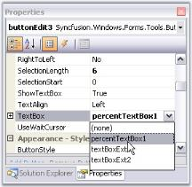' | markdownify }}
{:.image }

3. From the same properties window, you can set the percent properties for the ButtonEdit control.

{{ '' | markdownify }}
{:.image }

How to set tooltip for ButtonEdit Child buttons?

 To set tooltip for a child button in a ButtonEdit control, drag and drop a ToolTip control from the toolbox. Text for tooltip is set using the extender property of the particular child button.

{{ '' | markdownify }}
{:.image }

We can also set the Tooltip for ButtonEdit control programmatically using its SetToolTip() method.

[C#]

this.toolTip1.SetToolTip(this.buttonEdit1, "Click here to search");

[VB.NET]

Me.toolTip1.SetToolTip(Me.buttonEdit1, "Click here to search")

{{ '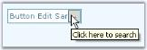' | markdownify }}
{:.image }

##### CalculatorControl

The Essential Tools CalculatorControl encapsulates the functionality of a standard calculator. It provides an easy way to implement a complete calculator in your applications. The value of the CalculatorControl in the form is maintained internally and also provides the value in the format required. The CalculatorValue class provides methods to get the value of the CalculatorControl as a String or as a Double Value. It supports Office2007 color schemes.

{{ '' | markdownify }}
{:.image }

###### Features

CalculatorControl implements common arithmetic operations and contains following features.

* It provides a complete keyboard interface for entering input.
* The color and font of the calculator buttons can be customized easily according to user needs.
* The Calculator control can also be used as a Popup Calculator Control.
* A wide variety of visual styles can be applied to the CalculatorControl, including the new Microsoft Office 2007 Style, in different color schemes, to enhance the appearance of the control. 
* The control comes with Button styles which can be The FlatStyle of the buttons can be applied.
* Different layouts can be provided for the buttons in the Calculator control.
* Provides easy mechanism toformat output and display. 

See Also

Concepts and Features

###### Creating Calculator control

The Calculator control can be available to the designer by just dragging-and-dropping the Calculator control from the toolbox onto the form. 

{{ '' | markdownify }}
{:.image }

It can be created programmatically using the below steps.

1. Include the required namespace.

[C#]

using Syncfusion.Windows.Forms.Tools;

[VB.NET]

Imports Syncfusion.Windows.Forms.Tools

2. Declare and create an instance of the Calculator control class.

[C#]

private Syncfusion.Windows.Forms.Tools.CalculatorControl calculatorControl1;

// Create an instance of the Calculator control

this.calculatorControl1 = new CalculatorControl();

[VB.NET]

Private calculatorControl1 As Syncfusion.Windows.Forms.Tools.CalculatorControl

' Create an instance of the Calculator control

Me.calculatorControl1 = New CalculatorControl()

3. As the final step, add the Calculator control to the form as follows.

[C#]

// Add the CalculatorControl control to the form.

this.Controls.Add(this.calculatorControl1);

this.calculatorControl1.Visible=true;

[VB.NET]

' Add the CalculatorControl control to the form.

Me.Controls.Add(Me.calculatorControl1)

Me.calculatorControl1.Visible=True

{{ '' | markdownify }}
{:.image }

See Also

Concepts and Features

###### Concepts and Features

The following topics will help you become more familiar in using the Calculator control. 

Display TextBox

The Calculator control has a display text area on its top corner, which displays all the digits and the calculations performed on the calculator. This display area is displayed by default. To hide this display area, set the ShowDisplayArea property to false. 

The below properties controls the behavior of the display area.

_Table_ _148_: Property Table_

<table>
<tr>
<td>
Calculatorcontrol Properties</td><td>
Description</td></tr>
<tr>
<td>
DisplayTextAlign</td><td>
Specifies the text alignment in the display text area. The values are Right, Left and Center. By default, it is set to Right.</td></tr>
<tr>
<td>
Font</td><td>
Sets font style for display text in the textbox control.</td></tr>
<tr>
<td>
DoubleValue</td><td>
Sets the value of the Calculator control as double value. The default value is zero. </td></tr>
</table>

[C#]

this.calculatorControl1.DisplayTextAlign = System.Windows.Forms.HorizontalAlignment.Left;

this.calculatorControl1.DoubleValue = 5;

this.calculatorControl1.Font = new System.Drawing.Font("Verdana", 8.25F, System.Drawing.FontStyle.Bold);

[VB.NET]

Me.calculatorControl1.DisplayTextAlign = System.Windows.Forms.HorizontalAlignment.Left

Me.calculatorControl1.DoubleValue = 5

Me.calculatorControl1.Font = New System.Drawing.Font("Verdana", 8.25F, System.Drawing.FontStyle.Bold)

{{ '' | markdownify }}
{:.image }

TextBox Value

The behavior of the TextBox value can be controlled using the below properties.

_Table_ _149_: Property Table_

<table>
<tr>
<td>
Calculatorcontrol Properties</td><td>
Description</td></tr>
<tr>
<td>
Culture</td><td>
Specifies the culture that is used for formatting the currency display.</td></tr>
<tr>
<td>
RepeatAssignAction</td><td>
Indicates whether the assignment action (=) will repeat the previous action. Whenever the user assigns an action in the calculator at run time and clicks "=" button, the result will be displayed in the textbox area. If the user clicks the "=" button again, the assigned action will be repeated, with the existing result, only when RepeatAssignAction property is set to true. By default it is true.</td></tr>
<tr>
<td>
UseUserOverride</td><td>
Indicates whether the NumberFormatInfo used for formatting will use UseUserOverride parameter for CultureInfo.</td></tr>
</table>

[C#]

this.calculatorControl1.Culture = new System.Globalization.CultureInfo("en-US");

this.calculatorControl1.RepeatAssignAction = true;

this.calculatorControl1.UseUserOverride = true;

[VB.NET]

Me.calculatorControl1.Culture = New System.Globalization.CultureInfo("en-US")

Me.calculatorControl1.RepeatAssignAction = True

Me.calculatorControl1.UseUserOverride = True

See Also

How to customize the calculator display text area to use NumberGroupSeparator?

Calculator Appearance

This section will walk you through the different appearance settings for the Calculator control.

* Layout Modes - Layout of the components in a Calculator.
* Background Settings - Background settings for the control.
* Border Styles - Border for the control.
* Button Spacing - Spacing between the Calculator buttons.
* Button Foreground - Foreground settings for the buttons.
Layout Modes

The Calculator control can be laid out in the following modes.

* _WindowsStandard_ Mode - Modeled with windows standard layout(Default) and
* _Financial Mode_ - Modeled with windows financial layout.

[C#]

this.calculatorControl1.LayoutType = Syncfusion.Windows.Forms.Tools.CalculatorLayoutTypes.Financial;

[VB.NET]

Me.calculatorControl1.LayoutType = Syncfusion.Windows.Forms.Tools.CalculatorLayoutTypes.Financial

{{ '' | markdownify }}
{:.image }

> {{ '' | markdownify }}
{:.image }
 _Note: We can set different button styles for the Calculator control, using CalculatorControl.ButtonStyle property. Refer_ Themes and Button Styles _topic to know more. ButtonStyles can be applied to both the layout modes._

Background Settings

Background settings for a Calculator control is discussed in this section.

Background Color

The background of the Calculator can be painted using the below properties.

_Table_ _150_: Property Table_

<table>
<tr>
<td>
Calculatorcontrol Properties</td><td>
Description</td></tr>
<tr>
<td>
BackColor</td><td>
Specifies BackColor of the Calculator control.</td></tr>
<tr>
<td>
BackgroundColor</td><td>
Sets the gradient background for the control. This setting overrides the BackColor property.</td></tr>
</table>

[C#]

this.calculatorControl1.BackColor = System.Drawing.Color.WhiteSmoke;

this.calculatorControl1.BackgroundColor = new Syncfusion.Drawing.BrushInfo(Syncfusion.Drawing.GradientStyle.Vertical, System.Drawing.Color.WhiteSmoke, System.Drawing.Color.SlateGray);

[VB.NET]

Me.calculatorControl1.BackColor = System.Drawing.Color.WhiteSmoke

Me.calculatorControl1.BackgroundColor = New Syncfusion.Drawing.BrushInfo(Syncfusion.Drawing.GradientStyle.Vertical, System.Drawing.Color.WhiteSmoke, System.Drawing.Color.SlateGray)

{{ '' | markdownify }}
{:.image }

Background Image

The background of the Calculator control can be filled with an image using BackgroundImage property.

[C#]

this.calculatorControl1.BackgroundImage = ((System.Drawing.Image)(resources.GetObject("calculatorControl1.BackgroundImage")));

this.calculatorControl1.BackgroundImageLayout = System.Windows.Forms.ImageLayout.Center;

[VB.NET]

Me.calculatorControl1.BackgroundImage = DirectCast((resources.GetObject("calculatorControl1.BackgroundImage")), System.Drawing.Image) 

Me.calculatorControl1.BackgroundImageLayout = System.Windows.Forms.ImageLayout.Center

{{ '' | markdownify }}
{:.image }

Border Styles

The below property will let you specify the border style for the Calculator control.

_Table_ _151_: Property Table_

<table>
<tr>
<td>
Calculatorcontrol Properties</td><td>
Description</td></tr>
<tr>
<td>
BorderStyle</td><td>
Specifies the 3D border style for the control. The options are,* {{ '_RaisedOuter_' | markdownify }}* {{ '_RaisedInner_' | markdownify }}* {{ '_SunkenOuter_' | markdownify }}* {{ '_SunkenInner_' | markdownify }}* {{ '_Raised_' | markdownify }}* {{ '_Sunken_' | markdownify }}* {{ '_Etched_' | markdownify }}* {{ '_Flat_' | markdownify }}* {{ '_Adjust_' ' | markdownify }}* {{ '_Bump_' | markdownify }}</td></tr>
</table>

[C#]

this.calculatorControl1.BorderStyle = System.Windows.Forms.Border3DStyle.Etched;

[VB.NET]

this.calculatorControl1.BorderStyle = System.Windows.Forms.Border3DStyle.Etched;

{{ '' | markdownify }}
{:.image }

Button Spacing

The default spacing between the Calculator buttons can be modified by enabling _UseVerticalAndHorizontalSpacing_ property. The below properties controls the horizontal and vertical spacing.

_Table_ _152_: Property Table_

<table>
<tr>
<td>
Calculatorcontrol Properties</td><td>
Description</td></tr>
<tr>
<td>
UseVerticalAndHorizontalSpacing</td><td>
Specifies whether horizontal and vertical spacing can be set using HorizontalSpacing and VerticalSpacing properties. By default it is false.</td></tr>
<tr>
<td>
HorizontalSpacing</td><td>
Sets horizontal spacing between buttons. The default value is 10. UseVerticalAndHorizontalSpacing must be set to true.</td></tr>
<tr>
<td>
VerticalSpacing</td><td>
Sets vertical spacing between buttons. The default value is 10. UseVerticalAndHorizontalSpacing must be set to true.</td></tr>
</table>

[C#]

this.calculatorControl1.UseVerticalAndHorizontalSpacing = true;

this.calculatorControl1.HorizontalSpacing = 5;

this.calculatorControl1.VerticalSpacing = 5;

[VB.NET]

Me.calculatorControl1.UseVerticalAndHorizontalSpacing = True

Me.calculatorControl1.HorizontalSpacing = 5

Me.calculatorControl1.VerticalSpacing = 5

{{ '' | markdownify }}
{:.image }

Button Foreground

Using SetButtonFont and SetButtonColor properties, we can set the font style and color for the button text. The button can be identified using CalcActions enumerator.

_Table_ _153_: Methods Table_

<table>
<tr>
<td>
Calculatorcontrol Methods</td><td>
Description</td></tr>
<tr>
<td>
SetButtonColor</td><td>
Sets text color for the calculator button. The parameters are,{{ '_caCalcButton_' | markdownify }} - The calculator button,{{ '_color_' | markdownify }} - The color to set for the button text.</td></tr>
<tr>
<td>
SetButtonFont</td><td>
Sets the font style for the text in the calculator button. The parameters are, {{ '_caCalcButton_' | markdownify }} - The calculator button,{{ '_font_' | markdownify }} - The font style for the button text.</td></tr>
</table>

[C#]

this.calculatorControl1.SetButtonColor(CalcActions.CalcSpecialBackspace, Color.Black);

this.calculatorControl1.SetButtonFont(CalcActions.CalcSpecialBackspace, new Font("Arial", 9, FontStyle.Bold));

[VB.NET]

Me.calculatorControl1.SetButtonColor(CalcActions.CalcSpecialBackspace, Color.Black);

Me.calculatorControl1.SetButtonFont(CalcActions.CalcSpecialBackspace, New Font("Arial", 9, FontStyle.Bold))

{{ '' | markdownify }}
{:.image }

Runtime Features

This section elaborated keyboard support for the control.

Keyboard Support

Essential Tools Calculator control does the functionality of a normal calculator, using the Mouse or Keyboard, at run time. The control provides Keyboard equivalents for the Calculator buttons. They are listed in the below table.

_Table_ _154_: Keyboard Support Table_

<table>
<tr>
<td>
Button</td><td>
Description</td><td>
Keyboard Equivalent</td></tr>
<tr>
<td>
Backspace</td><td>
Deletes the last digit of the displayed number.</td><td>
BACKSPACE</td></tr>
<tr>
<td>
CE</td><td>
Clears the displayed number.</td><td>
DELETE</td></tr>
<tr>
<td>
C</td><td>
Clears the current calculation.</td><td>
ESC</td></tr>
<tr>
<td>
MC</td><td>
Clears any number stored in memory.</td><td>
CTRL+L</td></tr>
<tr>
<td>
7</td><td>
Puts this number in the calculator display.</td><td>
7</td></tr>
<tr>
<td>
8</td><td>
Puts this number in the calculator display.</td><td>
8</td></tr>
<tr>
<td>
9</td><td>
Puts this number in the calculator display.</td><td>
9</td></tr>
<tr>
<td>
/</td><td>
Divides.</td><td>
/</td></tr>
<tr>
<td>
sqrt</td><td>
Calculates the square root of the displayed number.</td><td>
@</td></tr>
<tr>
<td>
MR</td><td>
Recalls the number stored in memory. The number remains in memory.</td><td>
CTRL+R</td></tr>
<tr>
<td>
4</td><td>
Puts this number in the calculator display.</td><td>
4</td></tr>
<tr>
<td>
5</td><td>
Puts this number in the calculator display.</td><td>
5</td></tr>
<tr>
<td>
6</td><td>
Puts this number in the calculator display.</td><td>
6</td></tr>
<tr>
<td>
*</td><td>
Multiplies.</td><td>
*</td></tr>
<tr>
<td>
%</td><td>
Displays the result of multiplication as a percentage. Enter on number, click , enter the second number, and then click %. For example, 50 * 25 % will display 12.5.You can also perform operations with percentages. Enter one number, click the operator(+, -, *, or /), enter the second number, click % and then click =.For example:  50 + 25% (of 50) = 62.5.</td><td>
%</td></tr>
<tr>
<td>
MS</td><td>
Stores the displayed number in memory.</td><td>
CTRL+M</td></tr>
<tr>
<td>
1</td><td>
Puts this number in the calculator display.</td><td>
1</td></tr>
<tr>
<td>
2</td><td>
Puts this number in the calculator display.</td><td>
2</td></tr>
<tr>
<td>
3</td><td>
Puts this number in the calculator display.</td><td>
3</td></tr>
<tr>
<td>
-</td><td>
Subtracts.</td><td>
-</td></tr>
<tr>
<td>
1/x</td><td>
Calculates the reciprocal of the displayed number.</td><td>
R</td></tr>
<tr>
<td>
M+</td><td>
Adds the displayed number to any number already in memory but does not display the sum of these numbers.</td><td>
CTRL+P</td></tr>
<tr>
<td>
+/-</td><td>
Changes the sign of the displayed number.</td><td>
F9</td></tr>
<tr>
<td>
.</td><td>
Inserts a decimal point. To use a different character for the decimal point, click start, point to settings, and then click control panel. Double click Regional Options and then click the Numbers tab.</td><td>
. or ,</td></tr>
<tr>
<td>
+</td><td>
Adds.</td><td>
+</td></tr>
<tr>
<td>
=</td><td>
Perform any operation on the previous two numbers. To repeat the last operation, click = again.</td><td>
Enter</td></tr>
</table>
Style Settings

This section discusses on the following styles:

Button Flat Styles

The flat styles for the button objects in a Calculator control is set using CalculatorControl.FlatStyle property. The styles are Flat, Popup, Standard (default) and System.

[C#]

this.calculatorControl1.FlatStyle = System.Windows.Forms.FlatStyle.Flat;

[VB.NET]

Me.calculatorControl1.FlatStyle = System.Windows.Forms.FlatStyle.Flat

{{ '' | markdownify }}
{:.image }

Themes and Button Styles

Themes for the Calculator control

Essential Tools Calculator control is themed by default. To disable, set ThemesEnabled property to false.

[C#]

this.calculatorControl1.ThemesEnabled = false;

[VB.NET]

Me.calculatorControl1.ThemesEnabled = False

{{ '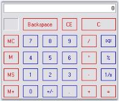' | markdownify }}
{:.image }

Button Styles

The Calculator control supports the below button styles. UseVisualStyle property should be set to true to enable button styles for the control.

* Classic (default)
* Office2000
* WindowsXP
* OfficeXP
* Office2003
* Office2007

[C#]

this.calculatorControl1.UseVisualStyle = true;

//Setting Office2007 button style for the calculator control

this.calculatorControl1.ButtonStyle = Syncfusion.Windows.Forms.ButtonAppearance.Office2007;

[VB.NET]

Me.calculatorControl1.UseVisualStyle = True

'Setting Office2007 button style for the calculator control

this.calculatorControl1.ButtonStyle = Syncfusion.Windows.Forms.ButtonAppearance.Office2007;

{{ '' | markdownify }}
{:.image }

OfficeColor Schemes

Essential Tools Calculator control supports all the three OfficeColorSchemes. When the ButtonStyle is set to Office2007 style, the color schemes will be blue by default. It can be modified using Office2007Theme property.

[C#]

this.calculatorControl1.Office2007Theme = Syncfusion.Windows.Forms.Office2007Theme.Silver;

[VB.NET]

Me.calculatorControl1.Office2007Theme = Syncfusion.Windows.Forms.Office2007Theme.Silver

{{ '' | markdownify }}
{:.image }

Custom Colors

We can also apply custom colors to the Calculator control by setting Office2007Theme to "Managed" and specifying the custom color through the ApplyManagedColors method as follows.

[C#]

this.calculatorControl1.Office2007Theme = Syncfusion.Windows.Forms.Office2007Theme.Managed;

Office2007Colors.ApplyManagedColors(this, Color.Navy);

[VB.NET]

Me.calculatorControl1.Office2007Theme = Syncfusion.Windows.Forms.Office2007Theme.Managed;

Office2007Colors.ApplyManagedColors(Me, Color.Navy)

{{ '' | markdownify }}
{:.image }

Popup CalculatorControl

The PopupCalculator class can be used to display a popup Calculator control. This class can be created programmatically. 

The PopupCalculator control lets you embed a Calculator control object to a button for example. Drop the button onto the form and add the following code snippet.

[C#]

private Syncfusion.Windows.Forms.Tools.PopupCalculator popupCalculator1;

private void buttonAdv1_Click(object sender, EventArgs e)

{

    // Create the Popup Calculator.

    popupCalculator1 = new Syncfusion.Windows.Forms.Tools.PopupCalculator();

    // The control that will act as the Popup's parent.

    this.popupCalculator1.ParentControl = this.button1;

    // Set the alignment.

    this.popupCalculator1.PopupCalculatorAlignment = Syncfusion.Windows.Forms.Tools.CalculatorPopupAlignment.Right;

    // Display the Calculator control.

    this.popupCalculator1.DisplayCalculator(Point.Empty);

    //Sets the size of the calculator

    this.popupCalculator1.Size = this.calculatorControl1.Size;

}

[VB.NET]

Private popupCalculator1 As Syncfusion.Windows.Forms.Tools.PopupCalculator

Private Sub buttonAdv1_Click(ByVal sender As Object, ByVal e As EventArgs)

    ' Create the Popup Calculator. 

    popupCalculator1 = New Syncfusion.Windows.Forms.Tools.PopupCalculator()

    ' The control that will act as the Popup's parent. 

    Me.popupCalculator1.ParentControl = Me.button1

    ' Set the alignment. 

    Me.popupCalculator1.PopupCalculatorAlignment = Syncfusion.Windows.Forms.Tools.CalculatorPopupAlignment.Right

    ' Display the Calculator control. 

    Me.popupCalculator1.DisplayCalculator(Point.Empty)

    'Sets the size of the calculator 

    Me.popupCalculator1.Size = Me.calculatorControl1.Size

End Sub

{{ '' | markdownify }}
{:.image }

###### Calculator Events

The event for Calculator control and PopupCalculator control are discussed in this section.

ValueCalculated Event

The ValueCalculated event fires each time the value of the CalculatorControl is changed. That is, even if you just press any digit, this event will be handled. 

The event  handler receives an argument of type CalculatorValueCalculatedEventArgs. To get the final result, use LastAction property of the CalculatorValueCalculatedEventArgs in the ValueCalculated event. 

_Table_ _155_: Methods Table_

<table>
<tr>
<td>
 Members</td><td>
Description</td></tr>
<tr>
<td>
ErrorCondition</td><td>
Specifies the error condition of the Calculator control if any.</td></tr>
<tr>
<td>
LastAction</td><td>
Gets/Sets the last action that was performed.</td></tr>
<tr>
<td>
MemoryValue</td><td>
Gets/Sets the MemoryValue of the Calculator control.</td></tr>
<tr>
<td>
Message</td><td>
Gets/Sets the custom error message when in error mode.</td></tr>
<tr>
<td>
Value</td><td>
Gets/Sets the CalculatorValue object that contains the value of the Calculator control.</td></tr>
</table>

We can retrieve the value of the Calculator control after '=' button is pressed using the following code snippet.

[C#]

private void calcctrl_ValueCalculated(object sender,CalculatorValueCalculatedEventArgs arg) 

{

    // Checks the final answer after '=' is pressed.

if(!arg.ErrorCondition && arg.LastAction == CalcActions.CalcOperatorEquals)  

MessageBox.Show(calcctrl.Value.ToString());

}

[VB.NET]

Private Sub calcctrl_ValueCalculated(ByVal sender As Object, ByVal arg As CalculatorValueCalculatedEventArgs) 

If Not arg.ErrorCondition AndAlso arg.LastAction = CalcActions.CalcOperatorEquals Then 

    ' Checks the final answer after '=' is pressed.

MessageBox.Show(calcctrl.Value.ToString()) 

End If 

End Sub

{{ '' | markdownify }}
{:.image }

Closing Event

Closing Event of the PopupCalculator control

This will be raised by popupCalculator when closing after "=" button was clicked. We can implement this event to display the final value of the Calculator control as follows.

[C#]

this.popupCalculator1.Closing += new PopupCalculatorClosingEventHandler(this.HandlePopupCalculatorClosingEvent);

public void HandlePopupCalculatorClosingEvent(object sender, CalculatorClosingEventArgs args)

{

//Event logging

string item = args.FinalValue.ToString();

string eventlogmessage = String.Format("Event: {0} FinalValue: {1}\r\n", "CalculatorClosing", item);

Console.WriteLine(eventlogmessage);

}

[VB.NET]

Private Me.popupCalculator1.Closing += New PopupCalculatorClosingEventHandler(Me.HandlePopupCalculatorClosingEvent)

Public Sub HandlePopupCalculatorClosingEvent(ByVal sender As Object, ByVal args As CalculatorClosingEventArgs)

    'Event logging

    Dim item As String = args.FinalValue.ToString()

    Dim eventlogmessage As String = String.Format("Event: {0} FinalValue: {1}" & Constants.vbCrLf, "CalculatorClosing", item)

    Console.WriteLine(eventlogmessage)

End Sub

{{ '' | markdownify }}
{:.image }

###### Frequently Asked Questions

This section illustrates the solutions for various task-based queries about the control.

How to customize the calculator display text area to use NumberGroupSeparator?

The calculator control by default does not allow the use of NumberGroupSeparator like in DoubleTextBox. 

{{ '' | markdownify }}
{:.image }

So to achieve this we need to derive the CalculatorControl and override the CreateCalculatorDisplayBox() method.

[C#]

private CalculatorAdv calculatorControl1;

this.calculatorControl1 = new CalculatorAdv();

public class CalculatorAdv : Syncfusion.Windows.Forms.Tools.CalculatorControl

{

    public CalculatorAdv()

    {

    }

    protected override void CreateCalculatorDisplayBox()

    {

        Syncfusion.Windows.Forms.Tools.DoubleTextBox dtb = new Syncfusion.Windows.Forms.Tools.DoubleTextBox();

        dtb.NumberGroupSeparator = ",";

        this.textCalculatorBox = dtb; //Changing the TextBox to DoubleTextBox

    }

}

[VB.NET]

Private calculatorControl1 As CalculatorAdv

Me.calculatorControl1 = New CalculatorAdv() 

Public Class CalculatorAdv

    Inherits Syncfusion.Windows.Forms.Tools.CalculatorControl

    Public Sub New()

    End Sub

    Protected Overloads Overrides Sub CreateCalculatorDisplayBox()

        Dim dtb As New Syncfusion.Windows.Forms.Tools.DoubleTextBox()

        dtb.NumberGroupSeparator = ","

        Me.textCalculatorBox = dtb

        'Changing the TextBox to DoubleTextBox 

    End Sub

End Class

{{ '' | markdownify }}
{:.image }

How to Simulate a Particular button in the Calculator?

We can use Calculator.ButtonAction() method for this. When the user clicks the button, the ButtonAction method of the Calculator control will call back the action of the particular button (in this example it is "=" button) and displays the result in the textbox area, using CalcActions Enumerator. This enumerator has all the actions that can be assigned to the calculator buttons including digits and arithmetic operators also.

[C#]

private void buttonAdv1_Click(object sender, EventArgs e)

{

    //Performing the "=" button action

    this.calculatorControl1.ButtonAction(Syncfusion.Windows.Forms.Tools.CalcActions.CalcOperatorEquals);

}

[VB.NET]

Private Sub buttonAdv1_Click(ByVal sender As Object, ByVal e As System.EventArgs) 

   'Performing the "=" button action

   Me.calculatorControl1.ButtonAction(Syncfusion.Windows.Forms.Tools.CalcActions.CalcOperatorEquals) 

End Sub

#### CalendarDateTime Controls

Syncfusion CalendarDateTime controls are discussed below.

##### MonthCalendarAdv

The Essential Tools MonthCalendarAdvcontrol is an advanced calendar control that can display all the month of the year with the appropriate culture information for the months and days of the week. A wide variety of visual styles can be applied to the MonthCalendarAdv, to enhance the appearance of the control. This also includes the new Microsoft Office 2007 Style for all the child controls of the MonthCalendarAdv, such as the UpDown Spin Button, DropDown button of DateTimePickerAdv, ScrollButton, TodayButton and None button. 

{{ '' | markdownify }}
{:.image }

###### Features

The features of MonthCalendarAdv control are as follows.

* Provides options to set appropriate culture information for the months and days of the week.
* Customizes the days of the calendar.
* Allows multiple selection.
* Allows displaying icons set for date cells.
* Supports tooltip for date cells.
* A wide variety of visual styles can be applied to the MonthCalenderAdv, to enhance the appearance of the control. This also includes the new Microsoft Office 2007 Style with all three color schemes for all the child controls of the MonthCalenderAdv, such as the UpDown Spin Button, DropDown button of DateTimePickerAdv, ScrollButton, TodayButton and None button. 
* Supports rich set of border styles.

See Also

Concepts and Features

###### MonthCalendarAdv

Sections of MonthCalendarAdv control

The following figure displays the sections of MonthCalendarAdv control.

{{ '' | markdownify }}
{:.image }

* Calendar Header - Header for the MonthCalendarAdv. See Header Settings.
* Scroll Buttons - Allows the end user to scroll through the months. See Button Settings.
* Week Number - Specifies a unique number for each week.
* Day Names - Day names of each day in a week is displayed in DayNames section. 
* Days - Days of the month.
* Highlighted Today's date - Today's date selected / highlighted at runtime.
* Grid Line - Grid Line which separates the dates.
* None Button - Lets you to withdraw focus from a day in the MonthCalendarAdv.
* Today Button - Focus will be moved to today's date.

See Also

Concepts and Features

###### Creating MonthCalendarAdv

We can just drag and drop the MonthCalendarAdv onto the form through designer and can access their properties through the property grid. 

{{ '' | markdownify }}
{:.image }

To create the control programmatically, follow the below steps.

1. Include the required namespace.

[C#]

using Syncfusion.Windows.Forms.Tools;

[VB.NET]

Imports Syncfusion.Windows.Forms.Tools

2. Create an instance of the MonthCalendarAdv control. 

[C#]

private Syncfusion.Windows.Forms.Tools.MonthCalendarAdv monthCalendarAdv1;

this.monthCalendarAdv1=new MonthCalendarAdv();

[VB.NET]

Private monthCalendarAdv1 As Syncfusion.Windows.Forms.Tools.MonthCalendarAdv

Me.monthCalendarAdv1 = New MonthCalendarAdv()

3. Set the visual style for the control. Add that instance to the Form.

[C#]

this.monthCalendarAdv1.Style = Syncfusion.Windows.Forms.VisualStyle.Office2007;

this.Controls.Add(this.monthCalendarAdv1);

[VB.NET]

Me.monthCalendarAdv1.Style = Syncfusion.Windows.Forms.VisualStyle.Office2007

Me.Controls.Add(Me.monthCalendarAdv1)

4. Run the application.

{{ '' | markdownify }}
{:.image }

See Also

Concepts and Features

###### Concepts and Features

This section discusses the concepts of MonthCalendarAdv in some commonly used scenarios.

Calendar Appearance

This section comprises the appearance settings under the following topics:

Border Styles

Border for a MonthCalendarAdv control can be in 2D or 3D modes. The below properties controls the border settings for the MonthCalendarAdv control. 

_Table_ _156_: Property Table_

<table>
<tr>
<td>
Properties</td><td>
Description</td></tr>
<tr>
<td>
BorderStyle</td><td>
Specifies whether the control should have a 2D or a 3D border. The options are,{{ '_FixedSingle,_' | markdownify }}{{ '_Fixed3D and_' | markdownify }}{{ '_None (default)._' | markdownify }}</td></tr>
<tr>
<td>
Border3DStyle</td><td>
Sets 3D border style for the MonthCalendarAdv control, when the BorderStyle=Fixed3D. The styles are,{{ '_Raised,_' ' | markdownify }}{{ '_RaisedOuter,_' ' | markdownify }}{{ '_RaisedInner,_' | markdownify }}{{ '_Sunken (default),_' ' | markdownify }}{{ '_SunkenOuter,_' ' | markdownify }}{{ '_SunkenInner,_' ' | markdownify }}{{ '_Etched,_' ' | markdownify }}{{ '_Bump,_' ' | markdownify }}{{ '_Adjust and_' | markdownify }}{{ '_Flat._' | markdownify }}</td></tr>
<tr>
<td>
BorderSides</td><td>
Specifies the sides of the control which can have a border. The sides options are,{{ '_Left,_' ' | markdownify }}{{ '_Top,_' ' | markdownify }}{{ '_Right,_' ' | markdownify }}{{ '_Bottom,_' ' | markdownify }}{{ '_Middle and_' | markdownify }}{{ '_All (default)._' | markdownify }}</td></tr>
<tr>
<td>
BorderColor</td><td>
Specifies the 2D border color when BorderStyle="FixedSingle".</td></tr>
</table>

[C#]

//Setting 3D border style 

this.monthCalendarAdv1.BorderStyle = System.Windows.Forms.BorderStyle.Fixed3D;

//Setting "SunkenInner" 3D border style

this.monthCalendarAdv1.Border3DStyle = System.Windows.Forms.Border3DStyle.SunkenInner;

[VB.NET]

'Setting 3D border style 

Me.monthCalendarAdv1.BorderStyle = System.Windows.Forms.BorderStyle.Fixed3D

'Setting "SunkenInner" 3D border style

Me.monthCalendarAdv1.Border3DStyle = System.Windows.Forms.Border3DStyle.SunkenInner

{{ '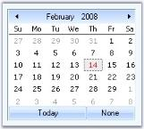' | markdownify }}
{:.image }

> {{ '' | markdownify }}
{:.image }
 _Note: MonthCalendarAdv.ThemedBorder property should be set to false to make the 3D border setting effective. Refer_ Visual Settings.

> 

[C#]

//Setting border to "All" sides

this.monthCalendarAdv1.BorderSides = System.Windows.Forms.Border3DSide.All;

//Setting color for 2D border

this.monthCalendarAdv1.BorderColor = System.Drawing.Color.DodgerBlue;

[VB.NET]

'Setting border to "All" sides

Me.monthCalendarAdv1.BorderSides = System.Windows.Forms.Border3DSide.All

'Setting color for 2D border

this.monthCalendarAdv1.BorderColor = System.Drawing.Color.DodgerBlue

{{ '' | markdownify }}
{:.image }

See Also

Background Settings, Visual Settings

Background Settings

Background image for the MonthCalendarAdv is specified in BackgroundImage property.

[C#]

this.monthCalendarAdv1.BackgroundImage = ((System.Drawing.Image)(resources.GetObject("monthCalendarAdv1.BackgroundImage")));

this.monthCalendarAdv1.BackgroundImageLayout = System.Windows.Forms.ImageLayout.Stretch;

[VB.NET]

Me.monthCalendarAdv1.BackgroundImage = DirectCast((resources.GetObject("monthCalendarAdv1.BackgroundImage")), System.Drawing.Image) 

Me.monthCalendarAdv1.BackgroundImageLayout = System.Windows.Forms.ImageLayout.Stretch 

{{ '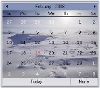' | markdownify }}
{:.image }

See Also

Border Styles, Visual Settings

Visual Settings

Themes for MonthCalendarAdv

Some sections of the MonthCalendarAdv control are themed by default. The below table list the properties which controls the themed behavior border, grid and scroll buttons.

_Table_ _157_: Property Table_

<table>
<tr>
<td>
MonthCalendarAdv Properties</td><td>
Description</td></tr>
<tr>
<td>
ThemedBorder</td><td>
Specifies whether the border of the control is themed. By default it is true.</td></tr>
<tr>
<td>
ThemedEnabledGrid</td><td>
Specifies whether the grid holding the days is themed or not. By default it is false.</td></tr>
<tr>
<td>
ThemedEnabledScrollButtons</td><td>
Specifies whether the scroll buttons are themed. It is set to true by default.</td></tr>
</table>

[C#]

this.monthCalendarAdv1.ThemedBorder = true;

this.monthCalendarAdv1.ThemedEnabledGrid = true;

this.monthCalendarAdv1.ThemedEnabledScrollButtons = true;

[VB.NET]

Me.monthCalendarAdv1.ThemedBorder = True

Me.monthCalendarAdv1.ThemedEnabledGrid = True

Me.monthCalendarAdv1.ThemedEnabledScrollButtons = True

{{ '' | markdownify }}
{:.image }

Styles 

MonthCalendarAdv supports the styles in the below table, which can be set through Style property.

_Table_ _158_: Property Table_

<table>
<tr>
<td>
MonthCalendarAdv Property</td><td>
Description</td></tr>
<tr>
<td>
Style</td><td>
Gets or Sets the visual style of the MonthCalendarAdv. The options are {{ '_Default_' | markdownify }}{{ '_OfficeXP_' | markdownify }}{{ '_Office2003_' | markdownify }}{{ '_VS2005_' | markdownify }}{{ '_Office2007_' | markdownify }}The default value is 'Default'.</td></tr>
</table>

[C#]

// Sample code for setting Office2003 style for MonthCalendarAdv

this.monthCalendarAdv1.Style = Syncfusion.Windows.Forms.VisualStyle.Office2003;

[VB.NET]

' Sample code for setting Office2003 style for MonthCalendarAdv

Me.monthCalendarAdv1.Style  = Syncfusion.Windows.Forms.VisualStyle.Office2003

{{ '' | markdownify }}
{:.image }

[C#]

//Sets the Color scheme as Silver when the style is Office2007

this.monthCalendarAdv1.Office2007Theme = Syncfusion.Windows.Forms.Office2007Theme.Silver;

[VB.NET]

'Sets the Color scheme as Silver when the style is Office2007

Me.monthCalendarAdv1.Office2007Theme = Syncfusion.Windows.Forms.Office2007Theme.Silver

{{ '' | markdownify }}
{:.image }

Custom Colors

We can also apply custom colors to the MonthCalendarAdv control by setting Office2007Theme to "Managed" and specifying the custom color through the ApplyManagedColors method as follows.

[C#]

this.monthCalendarAdv1.Office2007Theme = Syncfusion.Windows.Forms.Office2007Theme.Managed;

Office2007Colors.ApplyManagedColors(this, Color.Orange);

[VB.NET]

Me.monthCalendarAdv1.Office2007Theme = Syncfusion.Windows.Forms.Office2007Theme.Managed

Office2007Colors.ApplyManagedColors(Me, Color.Orange)

{{ '' | markdownify }}
{:.image }

> {{ '' | markdownify }}
{:.image }
 _Note: Visual styles of the Today and None button can be overridden by MonthCalendarAdv.TodayButton and MonthCalendarAdv.NoneButton respectively. See_ Scroll Buttons.

> Scroll Buttons.

See Also

Border Styles, Background Settings

Customizing sections of Calendar

This section comprises the following:

Grid Settings

In the MonthCalendarAdv control, the dates of a month is placed inside a grid and the dates are separated using grid lines.

{{ '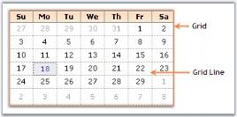' | markdownify }}
{:.image }

The below properties lets you to change the default appearance of the grid in the MonthCalendarAdv.

_Table_ _159_: Property Table_

<table>
<tr>
<td>
MonthCalendarAdv  Properties</td><td>
Description</td></tr>
<tr>
<td>
GridBackColor</td><td>
Gets or Sets the back color of the Grid.</td></tr>
<tr>
<td>
GridLines</td><td>
Gets or Sets the style of the Grid lines. The options are* {{ '_NotSet_' | markdownify }}* {{ '_None_' | markdownify }}* {{ '_Dashed_' | markdownify }}* {{ '_Dotted_' | markdownify }}* {{ '_DashDot_' | markdownify }}* {{ '_DashDotDot_' | markdownify }}* {{ '_Solid_' | markdownify }}* {{ '_Standard_' | markdownify }} The default value is 'Dotted'.</td></tr>
</table>

[C#]

this.monthCalendarAdv1.GridBackColor = System.Drawing.Color.FloralWhite;

this.monthCalendarAdv1.GridLines = Syncfusion.Windows.Forms.Grid.GridBorderStyle.Dashed;

[VB.NET]

Me.monthCalendarAdv1.GridBackColor = System.Drawing.Color.FloralWhite

Me.monthCalendarAdv1.GridLines = Syncfusion.Windows.Forms.Grid.GridBorderStyle.Dashed

{{ '' | markdownify }}
{:.image }

Header Settings

This section will walk you through the different properties used to customize the header portion of the MonthCalendarAdv control.

Gradient Background

Gradient background can be set for the header using the below properties.

_Table_ _160_: Property Table_

<table>
<tr>
<td>
MonthCalendarAdv Properties</td><td>
Description</td></tr>
<tr>
<td>
HeadGradient</td><td>
Specifies whether the header can show a gradient background. </td></tr>
<tr>
<td>
HeaderStartColor</td><td>
Sets the start color of the header gradient when HeaderGradient property is true.</td></tr>
<tr>
<td>
HeaderEndColor</td><td>
Sets the end color of the header gradient when HeaderGradient property is true.</td></tr>
<tr>
<td>
HeaderVerticalGradient</td><td>
When HeadGradient property is set to true, vertical gradient style will be applied to the header, by default. To change it to horizontal gradient style, set this property to false.</td></tr>
</table>

[C#]

this.monthCalendarAdv1.HeadGradient = true;

this.monthCalendarAdv1.HeaderVerticalGradient = true;

this.monthCalendarAdv1.HeaderEndColor = System.Drawing.Color.SteelBlue;                    

this.monthCalendarAdv1.HeaderStartColor = System.Drawing.Color.AliceBlue;

[VB.NET]

Me.monthCalendarAdv1.HeadGradient = True

Me.monthCalendarAdv1.HeaderVerticalGradient = True

Me.monthCalendarAdv1.HeaderEndColor = System.Drawing.Color.SteelBlue                   

Me.monthCalendarAdv1.HeaderStartColor = System.Drawing.Color.AliceBlue

{{ '' | markdownify }}
{:.image }

Foreground Settings

The font style and fore color of the header text can be specified through HeaderFont and HeadForeColor properties.

_Table_ _161_: Property Table_

<table>
<tr>
<td>
MonthCalendarAdv Properties</td><td>
Description</td></tr>
<tr>
<td>
HeaderFont</td><td>
Specifies the font of the header.</td></tr>
<tr>
<td>
HeaderForeColor</td><td>
Specifies the fore color of the header.</td></tr>
</table>

[C#]

this.monthCalendarAdv1.HeaderFont = new System.Drawing.Font("Arial", 9F, System.Drawing.FontStyle.Bold);

this.monthCalendarAdv1.HeadForeColor = System.Drawing.Color.Navy;

[VB.NET]

Me.monthCalendarAdv1.HeaderFont = New System.Drawing.Font("Arial", 9F, System.Drawing.FontStyle.Bold)

Me.monthCalendarAdv1.HeadForeColor = System.Drawing.Color.Navy

{{ '' | markdownify }}
{:.image }

Height and Image for Header

The height of the header can be increased or decreased using HeaderHeight property. Header can also host an image in its background using HeaderImage property.

_Table_ _162_: Property Table_

<table>
<tr>
<td>
MonthCalendarAdv Properties</td><td>
Description</td></tr>
<tr>
<td>
HeaderHeight</td><td>
Specifies the height of the header. Default value is 32 for Default Style and for other styles it is 20.</td></tr>
<tr>
<td>
HeaderImage</td><td>
Specifies the image of the header.</td></tr>
</table>

[C#]

this.monthCalendarAdv1.HeaderImage = ((System.Drawing.Image)(resources.GetObject("monthCalendarAdv1.HeaderImage")));

this.monthCalendarAdv1.HeaderHeight = 30;

[VB.NET]

Me.monthCalendarAdv1.HeaderImage = DirectCast((resources.GetObject("monthCalendarAdv1.HeaderImage")), System.Drawing.Image) 

Me.monthCalendarAdv1.HeaderHeight = 30

{{ '' | markdownify }}
{:.image }

Week Numbers

MonthCalendarAdv control can display unique week numbers for all the weeks in a year. This section discusses the properties which can customize the appearance of the week numbers.

Foreground Settings

By default, week numbers will not be shown in the calendar. ShowWeekNumbers property should be set to true to display the week numbers. The font and fore color can be set using the below properties.

_Table_ _163_: Property Table_

<table>
<tr>
<td>
MonthCalendarAdv Properties</td><td>
Description</td></tr>
<tr>
<td>
WeekFont</td><td>
Gets or sets the font of the week numbers column.</td></tr>
<tr>
<td>
WeekTextColor</td><td>
Gets or sets the text color for week numbers column.</td></tr>
</table>

[C#]

this.monthCalendarAdv1.ShowWeekNumbers = true;

this.monthCalendarAdv1.WeekFont = new System.Drawing.Font("Courier New", 9F, System.Drawing.FontStyle.Bold, System.Drawing.GraphicsUnit.Point, ((byte)(0)));

this.monthCalendarAdv1.WeekTextColor = System.Drawing.Color.Blue;

[VB.NET]

Me.monthCalendarAdv1.ShowWeekNumbers = True

Me.monthCalendarAdv1.WeekFont = New System.Drawing.Font("Courier New", 9F, System.Drawing.FontStyle.Bold, System.Drawing.GraphicsUnit.Point, CByte((0))) 

Me.monthCalendarAdv1.WeekTextColor = System.Drawing.Color.Blue 

{{ '' | markdownify }}
{:.image }

Gradient Background

By default the week numbers column has a gradient background. To customize the background manually, use WeekInterior property. 

[C#]

this.monthCalendarAdv1.WeekInterior = new Syncfusion.Drawing.BrushInfo(Syncfusion.Drawing.GradientStyle.Vertical, System.Drawing.Color.AliceBlue, System.Drawing.Color.LightSteelBlue);

[VB.NET]

Me.monthCalendarAdv1.WeekInterior = New Syncfusion.Drawing.BrushInfo(Syncfusion.Drawing.GradientStyle.Vertical, System.Drawing.Color.AliceBlue, System.Drawing.Color.LightSteelBlue) 

{{ '' | markdownify }}
{:.image }

Day Settings

MonthCalendarAdv has properties to customize the days displayed in the calendar. This section discusses those properties.

Foreground Settings

The below properties deals with the foreground appearance of the dates.

_Table_ _164_: Property Table_

<table>
<tr>
<td>
MonthCalendarAdv Properties</td><td>
Description</td></tr>
<tr>
<td>
DayNamesColor</td><td>
Specifies the fore color of the day names.</td></tr>
<tr>
<td>
DayNamesFont</td><td>
Specifies the font style of the day names.</td></tr>
<tr>
<td>
DaysFont</td><td>
Specifies the font style of the days / dates.</td></tr>
<tr>
<td>
DaysColor</td><td>
Specifies the fore color of the day names.</td></tr>
</table>

[C#]

this.monthCalendarAdv1.DayNamesFont = new System.Drawing.Font("Courier New", 9F, System.Drawing.FontStyle.Bold);

this.monthCalendarAdv1.DaysNamesColor = Color.Black;

this.monthCalendarAdv1.DaysColor = System.Drawing.SystemColors.HotTrack;

this.monthCalendarAdv1.DaysFont = new System.Drawing.Font("Courier New", 8.25F, System.Drawing.FontStyle.Regular);

[VB.NET]

Me.monthCalendarAdv1.DayNamesFont = New System.Drawing.Font("Courier New", 9F, System.Drawing.FontStyle.Bold) 

Me.monthCalendarAdv1.DaysNamesColor = Color.Black

Me.monthCalendarAdv1.DaysColor = System.Drawing.SystemColors.HotTrack 

Me.monthCalendarAdv1.DaysFont = New System.Drawing.Font("Courier New", 8.25F, System.Drawing.FontStyle.Regular) 

{{ '' | markdownify }}
{:.image }

Height and Day Names Format

The height of the day header and the day name formats are specified using below properties.

_Table_ _165_: Property Table_

<table>
<tr>
<td>
MonthCalendarAdv Properties</td><td>
Description</td></tr>
<tr>
<td>
DayNamesHeight</td><td>
Sets the height of the days header. Default value is 17.</td></tr>
<tr>
<td>
UseShortestDayNames</td><td>
Specifies whether shortest day names are used or not. by default it is true.</td></tr>
</table>

[C#]

this.monthCalendarAdv1.DayNamesHeight = 22;

this.monthCalendarAdv1.UseShortestDayNames = false;

[VB.NET]

Me.monthCalendarAdv1.DayNamesHeight = 22

Me.monthCalendarAdv1.UseShortestDayNames = False

{{ '' | markdownify }}
{:.image }

Gradient Background for Day Header

By default the day's header has a gradient background. We can change the default background style using DaysHeaderInterior property. 

[C#]

this.monthCalendarAdv1.DaysHeaderInterior = new Syncfusion.Drawing.BrushInfo(Syncfusion.Drawing.GradientStyle.Vertical, System.Drawing.Color.AntiqueWhite, System.Drawing.Color.SandyBrown);

[VB.NET]

Me.monthCalendarAdv1.DaysHeaderInterior = New Syncfusion.Drawing.BrushInfo(Syncfusion.Drawing.GradientStyle.Vertical, System.Drawing.Color.AntiqueWhite, System.Drawing.Color.SandyBrown)

{{ '' | markdownify }}
{:.image }

Today's Date 

The fore color for Today's date is set using TodayFontColor property. Using Today button at the bottom of the control, today's date can be focussed. See Buttons for details.

[C#]

this.monthCalendarAdv1.TodayFontColor = System.Drawing.Color.Crimson;

[VB.NET]

Me.monthCalendarAdv1.TodayFontColor = System.Drawing.Color.Crimson

The today's date for the below calendar image is "eighteenth".

{{ '' | markdownify }}
{:.image }

See Also 

Day Settings, Text Settings

Text Settings

This section discusses the properties which controls the appearance and behavior of the dates (contents) inside the grid cells.

Highlighting the dates

We can highlight the selected date using HighlightColor property.

[C#]

this.monthCalendarAdv1.HighlightColor = System.Drawing.Color.Blue;

[VB.NET]

Me.monthCalendarAdv1.HighlightColor = System.Drawing.Color.Blue

{{ '' | markdownify }}
{:.image }

_Figure_ _232_: HighlightColor = "Blue"_

Alignment and Wrapping of text

The alignment and text wrapping of the dates inside the grid cells is controlled using the below properties.

_Table_ _166_: Property Table_

<table>
<tr>
<td>
MonthCalendarAdv  Properties</td><td>
Description</td></tr>
<tr>
<td>
HorizontalAlignment</td><td>
Specifies the horizontal alignment of the dates inside a grid cell. The options are,{{ '_Left,_' | markdownify }}{{ '_Center and_' ' | markdownify }}{{ '_Right._' | markdownify }}</td></tr>
<tr>
<td>
VerticalAlignment</td><td>
Specifies the vertical alignment of the dates inside a grid cell. The options are,{{ '_Top,_' ' | markdownify }}{{ '_Middle and_' ' | markdownify }}{{ '_Bottom._' | markdownify }}</td></tr>
<tr>
<td>
WrapText</td><td>
Indicates whether the grid can wrap the text inside grid cells. By default, it is false.</td></tr>
</table>

[C#]

this.monthCalendarAdv1.HorizontalAlignment = Syncfusion.Windows.Forms.Grid.GridHorizontalAlignment.Right;

this.monthCalendarAdv1.VerticalAlignment = Syncfusion.Windows.Forms.Grid.GridVerticalAlignment.Top;

this.monthCalendarAdv1.WrapText = true;

[VB.NET]

Me.monthCalendarAdv1.HorizontalAlignment = Syncfusion.Windows.Forms.Grid.GridHorizontalAlignment.Right

Me.monthCalendarAdv1.VerticalAlignment = Syncfusion.Windows.Forms.Grid.GridVerticalAlignment.Top

Me.monthCalendarAdv1.WrapText = True

{{ '' | markdownify }}
{:.image }

See Also

Today's Date

Buttons

The MonthCalendarAdv control contains the below buttons. 

* LeftScrollButton, 
* RightScrollButton, 
* 'Today' button and 
* 'None' button.

To know about the placement of these buttons in the control, refer MonthCalendarAdv topic. Left and Right scroll buttons at the top of the control can have custom images. See Scroll Buttons for details.

Today and None buttons are displayed at the bottom of the calendar and they can be customized to set background image and font styles. This section will discuss the properties which controls the appearance and behavior of the MonthCalendarAdv.

_Table_ _167_: Property Table_

<table>
<tr>
<td>
MonthCalendarAdv Properties</td><td>
Description</td></tr>
<tr>
<td>
TodayButton</td><td>
Clicking this button at run time will move the focus to today's date in the calendar.</td></tr>
<tr>
<td>
NoneButton</td><td>
Clicking this button at run time, will remove the focus of the date in the calendar.</td></tr>
<tr>
<td>
BottomHeight</td><td>
The height of the bottom which contains the Today and None buttons are changed using this property. Default value is 20.</td></tr>
</table>
Customizing Today and None Buttons

The "Today" and "None" buttons are like Essential Tools ButtonAdv controls and they support all the properties of ButtonAdv control. You can access those properties using MonthCalendarAdv.NoneButton.Visible which controls the visibility (for example).

{{ '' | markdownify }}
{:.image }

[C#]

//Hides the Today and None Buttons

monthCalendarAdv1.TodayButton.Visible=false;

monthCalendarAdv1.NoneButton.Visible=false;

[VB.NET]

'Hides the Today and None Buttons

monthCalendarAdv1.TodayButton.Visible=False

monthCalendarAdv1.NoneButton.Visible=False

{{ '' | markdownify }}
{:.image }

See Also

ButtonAdv, Scroll Buttons

Scroll Buttons

Scroll Button images

The default scroll button images can be replaced with custom images using the LeftScrollButtonImage and RightScrollButtonImage properties. The properties related to scroll buttons are as follows.

_Table_ _168_: Property Table_

<table>
<tr>
<td>
MonthCalendarAdv  Properties</td><td>
Description</td></tr>
<tr>
<td>
LeftScrollButtonImage</td><td>
Specifies Image for left scroll button.</td></tr>
<tr>
<td>
RightftScrollButtonImage</td><td>
Specifies Image for right scroll button.</td></tr>
<tr>
<td>
StretchScrollImage</td><td>
Specifies whether the image for scroll buttons is stretched to fit the size of the scroll button.</td></tr>
<tr>
<td>
ScrollButtonSize</td><td>
Specifies the size of the scroll buttons.</td></tr>
</table>

[C#]

this.monthCalendarAdv1.LeftScrollButtonImage = ((System.Drawing.Image)(resources.GetObject("monthCalendarAdv1.LeftScrollButtonImage")));

this.monthCalendarAdv1.RightScrollButtonImage = ((System.Drawing.Image)(resources.GetObject("monthCalendarAdv1.RightScrollButtonImage")));

this.monthCalendarAdv1.ScrollButtonSize = new System.Drawing.Size(30, 25);

this.monthCalendarAdv1.StretchScrollImage = false;

[VB.NET]

Me.monthCalendarAdv1.LeftScrollButtonImage = DirectCast((resources.GetObject("monthCalendarAdv1.LeftScrollButtonImage")), System.Drawing.Image) 

Me.monthCalendarAdv1.RightScrollButtonImage = DirectCast((resources.GetObject("monthCalendarAdv1.RightScrollButtonImage")), System.Drawing.Image) 

Me.monthCalendarAdv1.ScrollButtonSize = New System.Drawing.Size(30, 25) 

Me.monthCalendarAdv1.StretchScrollImage = False 

{{ '' | markdownify }}
{:.image }

Runtime Features

This section covers the below topics:

Selecting a Date

Range of Selection

The minimum and maximum date selectable by the calendar can be specified using MinValue and MaxValue properties. (This is similar to MinDate and MaxDate of windows MonthCalendar control).

_Table_ _169_: Property Table_

<table>
<tr>
<td>
MonthCalendarAdv  Properties</td><td>
Description</td></tr>
<tr>
<td>
Value</td><td>
Indicates the current value of the calendar. By default this value will be the current date.</td></tr>
<tr>
<td>
MinValue</td><td>
Specifies the minimum value selectable by the calendar.</td></tr>
<tr>
<td>
MaxValue</td><td>
Specifies the maximum value selectable by the calendar.</td></tr>
</table>

[C#]

this.monthCalendarAdv1.Value = new System.DateTime(2008, 2, 19);

this.monthCalendarAdv1.MinValue = new System.DateTime(2000, 2, 21, 0, 0, 0, 0);

this.monthCalendarAdv1.MaxValue = new System.DateTime(2008, 2, 21, 0, 0, 0, 0);

[VB.NET]

Me.monthCalendarAdv1.Value = New Date(2008, 2, 19) 

Me.monthCalendarAdv1.MinValue = New System.DateTime(2000, 2, 21, 0, 0, 0, 0)

Me.monthCalendarAdv1.MaxValue = New System.DateTime(2008, 2, 21, 0, 0, 0, 0)

When we drag and drop a MonthCalendarAdv control, current system date, i.e, today's date will be selected by default. To change the selected date, DateTime Collection Editor is used, which is invoked using SelectedDates property. 

{{ '' | markdownify }}
{:.image }

> {{ '' | markdownify }}
{:.image }
 _Note: It is possible to set color for the highlighted date. See_ Text Settings _topic for details._

Multiple Selection at run time

It is possible to enable multiple selection of the dates at run time. The below properties enables multiple selection. 

_Table_ _170_: Property Table_

<table>
<tr>
<td>
MonthCalendarAdv  Properties</td><td>
Description</td></tr>
<tr>
<td>
AllowMultipleSelection</td><td>
Indicates whether multiple selection of dates is allowed. i.e, by holding the Ctrl key and selecting the dates using mouse.</td></tr>
<tr>
<td>
MouseDragMultiSelect</td><td>
Indicates whether selection of dates are allowed using mouse down and dragging at run time.</td></tr>
</table>

[C#]

this.monthCalendarAdv1.AllowMultipleSelection = true;

this.monthCalendarAdv1.MouseDragMultiselect = true;

[VB.NET]

this.monthCalendarAdv1.AllowMultipleSelection = True

Me.monthCalendarAdv1.MouseDragMultiselect = True

{{ '' | markdownify }}
{:.image }

Select Date Range Programmatically

Using the SelectedDates property, range of dates can be selected in the MonthCalendarAdv control. The dates should be given in array format using the DateTime Array list. 

[C#]

DateTime[] dateTimes = new DateTime[] { new DateTime(2010, 11, 2), new DateTime(2010, 11, 3) };

DateTime[] dateTotal = new DateTime[] { };

[VB.NET]

Dim dateTimes As DateTime() = New DateTime() {New DateTime(2010, 11, 2), New DateTime(2010, 11, 3)}

Me.monthCalendarAdv1.SelectedDates = dateTimes

Dates should be specified in the DataTime Array List. Then the DateTime Array list should be declared to the SelectedDates Property. This would select the dates that are in the DateTime Array list. 

{{ '' | markdownify }}
{:.image }

> {{ '' | markdownify }}
{:.image }
 _Note: Date range should be specified manually in the DateTime Array list._

Month Settings

Navigation at RunTime

At run time, you have options to move to the next month or previous month using the left or right scroll buttons and also using the context menu displayed, when you click on the month of the calendar. To specify images for individual months in the menu, use MonthImageList property.

{{ '' | markdownify }}
{:.image }

[C#]

this.monthCalendarAdv1.MonthImageList = this.imageList1;

[VB.NET]

Me.monthCalendarAdv1.MonthImageList = Me.imageList1

{{ '' | markdownify }}
{:.image }

Foreground Color for Inactive Months

The below property sets the color for the inactive months.

_Table_ _171_: Property Table_

<table>
<tr>
<td>
MonthCalendarAdv  Properties</td><td>
Description</td></tr>
<tr>
<td>
InactiveMonthColor</td><td>
The previous or next month dates of the current month will be inactive in the MonthCalendarAdv control. This property specifies color of those inactive month dates.</td></tr>
</table>

[C#]

this.monthCalendarAdv1.InactiveMonthColor = System.Drawing.Color.InactiveCaptionText;

[VB.NET]

Me.monthCalendarAdv1.InactiveMonthColor = System.Drawing.Color.InactiveCaptionText

{{ '' | markdownify }}
{:.image }

First Day of the Week

MonthCalendarAdv lets you specify the first day to be displayed in a week using FirstDayOfWeek property. Default will be Sunday.

[C#]

this.monthCalendarAdv1.FirstDayOfWeek = Day.Monday;

[VB.NET]

Me.monthCalendarAdv1.FirstDayOfWeek = Day.Monday

{{ '' | markdownify }}
{:.image }

Interactive Features

This section covers the below topics:

Context Menu

This section deals with replacing MonthCalendarAdv 'Go to Today' ContextMenu with a Custom Context Menu. At run-time, you can right click any calendar date and go to the today date using 'Go to Today' ContextMenu.

{{ '' | markdownify }}
{:.image }

This is the default context menu. To replace this with a custom context menu, you need to derive a Custom MonthCalendarAdv from the existing one and override the InitializeGrid so that the GetInternalGridControl method can be used to access the ContextMenu and replace it with a custom contextMenu.

It can be done programmatically using the below code snippet.

[C#]

//Declaring and Initializing the calendar, Context menu and menu item

private CustomMonthCalendarAdv monthCalendarAdv1;

private System.Windows.Forms.MenuItem menuItem1;

private System.Windows.Forms.ContextMenu contextMenuStrip1;

this.contextMenuStrip1 = new System.Windows.Forms.ContextMenu();

this.menuItem1 = new System.Windows.Forms.MenuItem();

this.monthCalendarAdv1 = new MonthCalendar.Form1.CustomMonthCalendarAdv();

this.contextMenuStrip1.MenuItems.AddRange(new System.Windows.Forms.MenuItem[] {this.menuItem1});

this.menuItem1.Text = "Go To Tomorrow";

this.menuItem1.Click += new System.EventHandler(this.menuItem1_Click);

//Override the internal grid context menu using the custom context menu

private void Form1_Load_1(object sender, EventArgs e)

{

    this.monthCalendarAdv1.GetInternalGridControl().ContextMenu = this.contextMenuStrip1;

}

//Focus moves to tomorrow's date, when menu item is clicked

private void menuItem1_Click(object sender, System.EventArgs e)

{

    this.monthCalendarAdv1.Value = DateTime.Today.AddDays(1);

}

//Defining CustomMonthCalendarAdv class

public class CustomMonthCalendarAdv : Syncfusion.Windows.Forms.Tools.MonthCalendarAdv

{

    private Syncfusion.Windows.Forms.Tools.CalendarGrid internalGrid;

    // Overrides the InitializeGrid.

    protected override void InitializeGrid(ref Syncfusion.Windows.Forms.Tools.CalendarGrid grid)

    {

        base.InitializeGrid(ref grid);

        internalGrid = grid;

    }

    // Returns the internal grid.

    public Syncfusion.Windows.Forms.Tools.CalendarGrid GetInternalGridControl()

    {

        return internalGrid;

    }

}

[VB.NET]

'Declaring and Initializing the calendar, Context menu and menu item 

Private monthCalendarAdv1 As CustomMonthCalendarAdv

Private menuItem1 As System.Windows.Forms.MenuItem

Private contextMenuStrip1 As System.Windows.Forms.ContextMenu

Me.contextMenuStrip1 = New System.Windows.Forms.ContextMenu() 

Me.menuItem1 = New System.Windows.Forms.MenuItem() 

Me.monthCalendarAdv1 = New MonthCalendar.Form1.CustomMonthCalendarAdv() 

Me.contextMenuStrip1.MenuItems.AddRange(New System.Windows.Forms.MenuItem() {Me.menuItem1}) 

Me.menuItem1.Text = "Go To Tomorrow" 

AddHandler Me.menuItem1.Click, AddressOf Me.menuItem1_Click 

'Override the internal grid context menu using the custom context menu 

Private Sub Form1_Load_1(ByVal sender As Object, ByVal e As EventArgs)

    Me.monthCalendarAdv1.GetInternalGridControl().ContextMenu = Me.contextMenuStrip1

End Sub

'Focus moves to tomorrow's date, when menu item is clicked. 

Private Sub menuItem1_Click(ByVal sender As Object, ByVal e As System.EventArgs)

    Me.monthCalendarAdv1.Value = DateTime.Today.AddDays(1)

End Sub

'Defining CustomMonthCalendarAdv class 

Public Class CustomMonthCalendarAdv

    Inherits Syncfusion.Windows.Forms.Tools.MonthCalendarAdv

    Private internalGrid As Syncfusion.Windows.Forms.Tools.CalendarGrid

    ' Overrides the InitializeGrid. 

    Protected Overloads Overrides Sub InitializeGrid(ByRef grid As Syncfusion.Windows.Forms.Tools.CalendarGrid)

        MyBase.InitializeGrid(grid)

        internalGrid = grid

    End Sub

    ' Returns the internal grid. 

    Public Function GetInternalGridControl() As Syncfusion.Windows.Forms.Tools.CalendarGrid

        Return internalGrid

    End Function

End Class

{{ '' | markdownify }}
{:.image }

ToolTips

Tooltips can be set using DateCellQueryInfo event.

Globalization

MonthCalendarAdv supports globalization through MonthCalendarAdv.Culture property.

{{ '' | markdownify }}
{:.image }

[C#]

this.monthCalendarAdv1.Culture = new System.Globalization.CultureInfo("fr-FR");

[VB.NET]

Me.monthCalendarAdv1.Culture = New System.Globalization.CultureInfo("fr-FR")

{{ '' | markdownify }}
{:.image }

###### Event Handling

MonthCalendarAdv triggers events whenever the date is selected and changed. The most widely used events are discussed as follows.

_Table_ _172_: Events Table_

<table>
<tr>
<td>
 MonthCalendarAdv Events</td><td>
Description</td></tr>
<tr>
<td>
Border3DStyleChanged</td><td>
Event is raised when Border3DStyle property is changed.</td></tr>
<tr>
<td>
BorderColorChanged</td><td>
Event is raised when BorderColor property is changed.</td></tr>
<tr>
<td>
BorderSidesChanged</td><td>
Event is raised when BorderSides property is changed.</td></tr>
<tr>
<td>
BorderStyleChanged</td><td>
Event is raised when BorderStyle property is changed.</td></tr>
<tr>
<td>
DateCellQueryInfo</td><td>
It can be handled to provide custom formatting for calendar cells. The event handler receives an argument of type DateCellQueryInfoEventArgs. The following are the event properties associated with DateCellQueryInfoEventArgs argument.</td></tr>
<tr>
<td>
DateSelected</td><td>
It occurs when a date is selected from the calendar. It can be handled to retrieve the selected date of the MonthCalendarAdv. The event handler receives an argument of type EventArgs.</td></tr>
<tr>
<td>
DateChanged</td><td>
Handled when a selected date is changed.</td></tr>
<tr>
<td>
FirstDayOfWeekChanged</td><td>
Handled when the first day of the week is changed by using FirstDayOfWeek property.</td></tr>
<tr>
<td>
NoneButtonClick </td><td>
Handled when the None button is clicked.</td></tr>
<tr>
<td>
ShowWeekNumbersChanged</td><td>
Handled when ShowWeekNumbers property is changed. You can customize the appearance of the week numbers within this handler.</td></tr>
<tr>
<td>
StretchScrollImageChanged</td><td>
Handled when StretchScrollImage property is changed.</td></tr>
<tr>
<td>
ThemedBorderChanged</td><td>
Handles when ThemedBorder property is changed.</td></tr>
<tr>
<td>
DateHover</td><td>
This event is triggered when mouse hover on the date and to assign SuperToolTip for calender cells.</td></tr>
</table>
DateCellQueryInfo Event

This event is handled to provide custom formatting for calendar cells. 

_Table_ _173_: Members Table_

<table>
<tr>
<td>
 Members</td><td>
Description</td></tr>
<tr>
<td>
ColIndex</td><td>
Specifies the column index of GridCell.</td></tr>
<tr>
<td>
DateValue</td><td>
Specifies the date value.</td></tr>
<tr>
<td>
RowIndex</td><td>
Specifies the row index of GridCell.</td></tr>
<tr>
<td>
Style</td><td>
Specifies GridStyleInfo object.</td></tr>
<tr>
<td>
Handled</td><td>
Indicates whether the event is handled. It is a bool value.</td></tr>
<tr>
<td>
IsCurrentCell</td><td>
Returns the current cell at run time.</td></tr>
<tr>
<td>
IsOutsideRange</td><td>
Specifies whether the query is outside the range of a month.</td></tr>
<tr>
<td>
EnableHighlightColor</td><td>
Gets or sets the the value to indicate the highlight color of the selected date.</td></tr>
</table>
Example

You can use this style parameter to set tooltips for MonthCalendarAdv control as follows. This example uses IsCurrentCell, IsOutsideRange, ColIndex and Handled members.

[C#]

private void monthCalendarAdv1_DateCellQueryInfo(object sender,DateCellQueryInfoEventArgs e)

{

     //To disbale the highlight color of the selected date value

     if (this.monthCalendarAdv1.Value.Date == DateTime.Today)

     { 

         e.EnableHighlightColor = false;

     }

    //Identifies current cell and sets the tooltip text for the calendar

    if (e.IsCurrentCell)

    {

        e.Style.CellTipText = "Syncfusion calendar control";

        e.Style.CellAppearance = Syncfusion.Windows.Forms.Grid.GridCellAppearance.Flat;

        e.Style.BackColor = Color.LightSteelBlue;

    }

    //Sets Tooltip text for the cells outside range

    else if (e.IsOutsideRange)

        e.Style.CellTipText = "Outside range";

    //Sets Cell Appearance to "Raised" for fourth Column

    else if (e.ColIndex == 4)

        e.Style.CellAppearance = Syncfusion.Windows.Forms.Grid.GridCellAppearance.Raised; 

    else

    //event is stopped

    e.Handled = false;

}

[VB.NET]

Private Sub monthCalendarAdv1_DateCellQueryInfo(ByVal sender As Object, ByVal e AsDateCellQueryInfoEventArgs)

    If Me.monthCalendarAdv1.Value.Date = DateTime.Today Then

        'To disbale the highlight color of the selected date value

        e.EnableHighlightColor = False

    End If

    'Identifies current cell and sets the tooltip text for the calendar

    If e.IsCurrentCell Then

        e.Style.CellTipText = "Syncfusion calendar control"

        e.Style.CellAppearance = Syncfusion.Windows.Forms.Grid.GridCellAppearance.Flat

        e.Style.BackColor = Color.LightSteelBlue

    'Sets Tooltip text for the cells outside range

    ElseIf e.IsOutsideRange Then

        e.Style.CellTipText = "Outside range"

    'Sets Cell Appearance to "Raised" for fourth Column

    ElseIf e.ColIndex = 4 Then

        e.Style.CellAppearance = Syncfusion.Windows.Forms.Grid.GridCellAppearance.Raised

    Else

        e.Handled = False

        'event is stopped

    End If

End Sub

> {{ '' | markdownify }}
{:.image }
 _Note:_ 

*  In Fig 1, 18th is identified as the current cell and the tooltip is displayed. Also the background of the current cell is painted with LightSteelBlue.
*  Edges of the 4th column cells (ColIndex=4), other than the current cell are set to "Raised" and hence shows a raised appearance.
*  In Fig 2, user tries to query the cells outside the range, i.e inactive month dates and the respective tooltip is displayed.

{{ '' | markdownify }}
{:.image }

{{ '' | markdownify }}
{:.image }

See Also

How to customize the appearance of the diagonal columns?

DateHover Event

This event is handled when mouse hover on the calendar cells and to assign SuperToolTip for calender cells.

_Table_ _174_: Members Table_

<table>
<tr>
<td>
 Members</td><td>
Description</td></tr>
<tr>
<td>
ColIndex</td><td>
Specifies the column index of GridCell.</td></tr>
<tr>
<td>
DateValue</td><td>
Specifies the date value.</td></tr>
<tr>
<td>
RowIndex</td><td>
Specifies the row index of GridCell.</td></tr>
<tr>
<td>
Cancel</td><td>
Gets or sets a value indicating whether the event should be cancelled.</td></tr>
<tr>
<td>
CellButton</td><td>
Gets the cell button that is the target of the current mouse operation or NULL when the cell itself is the target.</td></tr>
<tr>
<td>
ToolTip</td><td>
Gets or sets the TooltipInfo for the SuperToolTip.</td></tr>
<tr>
<td>
ToolTipStyle</td><td>
Gets or sets the ToolTipStyle of the SuperToolTip.</td></tr>
<tr>
<td>
Model</td><td>
Gets the Calendar model.</td></tr>
</table>

[C#]

//This event triggers once mouse hover on date

this.monthCalendarAdv1.DateHover += new Syncfusion.Windows.Forms.Tools.DateHoverEventHandler(monthCalendarAdv1_DateHover);

void monthCalendarAdv1_DateHover(object sender, Syncfusion.Windows.Forms.Tools.DateHoverEventArgs e)

{

    e.ToolTip.Body.Text = e.DateValue.ToString();

    e.ToolTipStyle = Syncfusion.Windows.Forms.Tools.ToolTipStyle.Ballon;

}

[VB.NET]

AddHandler monthCalendarAdv1.DateHover, AddressOf monthCalendarAdv1_DateHover

'This event triggers once mouse hover on date

Private Sub monthCalendarAdv1_DateHover(ByVal sender As Object, ByVal e As Syncfusion.Windows.Forms.Tools.DateHoverEventArgs)

e.ToolTip.Body.Text = e.DateValue.ToString()

e.ToolTipStyle = Syncfusion.Windows.Forms.Tools.ToolTipStyle.Ballon

End Sub

The following screenshot illustrates the SuperToolTip when mouse hover on the respective date value by using DateHover event.

{{ '' | markdownify }}
{:.image }

###### Frequently Asked Questions

This section illustrates the solutions for various task-based queries about the control.

How to clear a date selection programmatically? 

This can be done by calling ClearSelection() method.

[C#]

this.monthCalendarAdv1.ClearSelection();

[VB.NET]

Me.monthCalendarAdv1.ClearSelection()

How to customize the appearance of the diagonal columns?

The appearance of diagonal columns can be customized using the below code.

[C#]

private void monthCalendarAdv1_DateCellQueryInfo(object sender,Syncfusion.Windows.Forms.Tools.DateCellQueryInfoEventArgs e)

{

if(e.RowIndex==e.ColIndex) 

{

   // Creates an instance of GridStyleInfo. 

Syncfusion.Windows.Forms.Grid.GridStyleInfo gsi=e.Style;

// Changes backcolor.

gsi.BackColor=Color.Green;

monthCalendarAdv1.SetInfo(e.RowIndex,e.ColIndex,gsi);

}

}

[VB.NET]

Private Sub monthCalendarAdv1_DateCellQueryInfo(ByVal sender As Object, ByVal e As Syncfusion.Windows.Forms.Tools.DateCellQueryInfoEventArgs) 

   ' Creates an instance of GridStyleInfo. 

If e.RowIndex = e.ColIndex Then 

Dim gsi As Syncfusion.Windows.Forms.Grid.GridStyleInfo = e.Style 

' Changes backcolor.

gsi.BackColor = Color.Green 

monthCalendarAdv1.SetInfo(e.RowIndex, e.ColIndex, gsi) 

End If 

End Sub

{{ '' | markdownify }}
{:.image }

Setting Icons for the Data Cells

Using DateCellQueryInfo event, we can add icons to the data cells.

[C#]

private void monthCalendarAdv1_DateCellQueryInfo(object sender,Syncfusion.Windows.Forms.Tools.DateCellQueryInfoEventArgs e)

{

if(e.RowIndex==3) 

{

  e.Style.ImageList = this.imageList1;

    e.Style.ImageIndex = 1;

}

}

[VB.NET]

Private Sub monthCalendarAdv1_DateCellQueryInfo(ByVal sender As Object, ByVal e As  Syncfusion.Windows.Forms.Tools.DateCellQueryInfoEventArgs) 

 If e.RowIndex==3 Then 

e.Style.ImageList = this.imageList1;

     e.Style.ImageIndex = 1;

End If 

End Sub

{{ '' | markdownify }}
{:.image }

How to identify the current selected date at run time?

The MonthCalendarAdv gives an array of selected dates. So if u want to get only one date choose the first element from that array. Also set AllowMultipleSelection property to false. The DateSelected Event is fired after the user had completed the selection.

[C#]

private void monthCalendarAdv1_DateSelected(object sender,EventArgs e)

{

   // DateSelected event is fired and selected dates will be displayed.

  MessageBox.Show("Selected Date: " + monthCalendarAdv1.SelectedDates[0].ToString());

}

[VB.NET]

Private Sub monthCalendarAdv1_DateSelected(ByVal sender As Object, ByVal e As EventArgs)

   ' DateSelected event is fired and selected dates will be displayed.

MessageBox.Show("Selected Date: " + monthCalendarAdv1.SelectedDates[0].ToString()) 

End Sub

{{ '' | markdownify }}
{:.image }

Is it possible to restrict the dates that are selected?

Yes, we can restrict the dates that are selected. If you want to allow the user to select only Mondays on the calendar, you can set Clickable property to false for other days except Monday using DateCellQueryInfo event handler.

The following code snippet can be used for this.

[C#]

void monthCalendarAdv1_DateCellQueryInfo(object sender, DateCellQueryInfoEventArgs e)

{

    // if not Monday 

    if (e.ColIndex != 2)

    {

        e.Style.Clickable = false;

        e.Style.Enabled = false;

    }

}

[VB.NET]

Private Sub monthCalendarAdv1_DateCellQueryInfo(ByVal sender As Object, ByVal e As DateCellQueryInfoEventArgs)

    ' if not Monday 

    If e.ColIndex <> 2 Then

        e.Style.Clickable = False

        e.Style.Enabled = False

    End If

End Sub

How to change the days displayed in the calendar

To change the days displayed in the calendar, you need to handle the PrepareViewStyleInfo event of the Grid control, which is embedded in the MonthCalendarAdv control and change its cell value as follows.

[C#]

private void Form1_Load(object sender, EventArgs e)

{

    foreach (Control ctl in this.monthCalendarAdv1.Controls)

    {

        grid = ctl as GridControl;

        if (grid != null)

        {

            grid.PrepareViewStyleInfo += new GridPrepareViewStyleInfoEventHandler(grid_PrepareViewStyleInfo);

            break;

        }

    }

}

void grid_PrepareViewStyleInfo(object sender, GridPrepareViewStyleInfoEventArgs e)

{

    if (e.Style.Text == "1")

    {

        e.Style.Text = "a";

    }

}

[VB.NET]

Private Sub Form1_Load(ByVal sender As Object, ByVal e As EventArgs)

    For Each ctl As Control In Me.monthCalendarAdv1.Controls

        grid = CType(IIf(TypeOf ctl Is GridControl, ctl, Nothing), GridControl)

        If Not grid Is Nothing Then

            grid.PrepareViewStyleInfo += New GridPrepareViewStyleInfoEventHandler(grid_PrepareViewStyleInfo)

            Exit For

        End If

    Next ctl

End Sub

Private Sub grid_PrepareViewStyleInfo(ByVal sender As Object, ByVal e As GridPrepareViewStyleInfoEventArgs)

    If e.Style.Text = "1" Then

        e.Style.Text = "a"

    End If

End Sub

##### DateTimePickerAdv

DateTimePickerAdvis an advanced DateTimePicker control. It provides an easy way to implement a culture-based DateTimePicker in an application. It has support for a string to be displayed when the user doesn't want a specific date selected. It also supports dropping down a custom window and interacts with its controls if a user chooses to implement the IDateTimePickerAdvCalendar interface. The control comes variety of visual style including Office2007 styles.

{{ '' | markdownify }}
{:.image }

See Also

###### Features

The features of DateTimePickerAdv controls are listed below.

* Supports rich set of border styles.
* Customizing options for child controls.
* The DateTimePickerAdv control is fully culture aware. See Globalization.
* Supports DataBinding with a data source. Supports null value.
* The DateTimePickerAdv can display a custom DropDown calendar.
* The DateTimePickerAdv control supports XP themes when applicable. 
* A wide variety of visual styles can be applied to the DateTimePickerAdv, including the new Microsoft Office 2007 Style with all three color schemes, to enhance the appearance of the control. 
* Supports Gradient background.
* Any calendar that implements the IDateTimePickerExtCalendar interface can be dropped down as a custom calendar. 
* We can set images for the Popup menu of the PopupCalendar.
* Provides Keyboard support.

See Also

Concepts and Features

###### Creating DateTimePickerAdv

DateTimePickerAdv control provides full support for the Windows Forms designer. To use a DateTimePickerAdv control in your application, all you need to do is drag and drop a DateTimePickerAdv control from the controls toolbox onto your form. You can then set any of its properties through the property grid. 

{{ '' | markdownify }}
{:.image }

The DateTimePickerAdv can be created programmatically through code as detailed below.

1. Include the required namespace.

[C#]

using Syncfusion.Windows.Forms.Tools;

[VB.NET]

Imports Syncfusion.Windows.Forms.Tools

2. Create an instance of DateTimePickerAdv. Add that instance to the Form.

[C#]

private Syncfusion.Windows.Forms.Tools.DateTimePickerAdv dateTimePickerAdv1;

this.dateTimePickerAdv1=new Syncfusion.Windows.Forms.Tools.DateTimePickerAdv();

this.Controls.Add(this.dateTimePickerAdv1);

[VB.NET]

Private dateTimePickerAdv1 As Syncfusion.Windows.Forms.Tools.DateTimePickerAdv

Me.dateTimePickerAdv1 = New Syncfusion.Windows.Forms.Tools.DateTimePickerAdv()

Me.Controls.Add(Me.dateTimePickerAdv1)

{{ '' | markdownify }}
{:.image }

See Also

Concepts and Features

###### Concepts and Features

The following topics will help you become more familiar with using the DateTimePickerAdv control:

Child Controls

DateTimePickerAdv has child controls like DropDown, Updown arrows, checkbox. This section discusses the properties which controls the appearance and behavior of these controls.

{{ '' | markdownify }}
{:.image }

UpDown and DropDown Buttons

This section discusses the properties of DateTimePickerAdv control which customizes the UpDown and DropDown buttons.

UpDown Buttons

The below properties controls the appearance and behavior of the UpDown buttons.

_Table_ _175_: Property Table_

<table>
<tr>
<td>
DateTimePickerAdv Properties</td><td>
Description</td></tr>
<tr>
<td>
ShowUpDown</td><td>
Shows or hides the UpDown buttons.</td></tr>
<tr>
<td>
ShowUpDownOnFocus</td><td>
Shows or hides the UpDown button when focussed. By default it is set to false.</td></tr>
<tr>
<td>
VSLikeUpDown</td><td>
Specifies whether the UpDown button will have VS-like look.</td></tr>
</table>

[C#]

this.dateTimePickerAdv2.ShowUpDown = true;

this.dateTimePickerAdv2.ShowUpDownOnFocus = true;

[VB.NET]

Me.dateTimePickerAdv2.ShowUpDown = True

Me.dateTimePickerAdv2.ShowUpDownOnFocus = True

In the below image, when focus is on button control, the updown button is hidden. In the second image, DateTimePickerAdv is focussed and the UpDown button is shown.

{{ '' | markdownify }}
{:.image }

{{ '' | markdownify }}
{:.image }

{{ '' | markdownify }}
{:.image }

DropDown Button

DropDown button in the DateTimePickerAdv is visible by default. To hide the dropdown button set ShowDropDown property to false. The below are the properties available, to change the default appearance of the control.

Color Settings

At run time, drop down button can be in normal mode, pressed mode or in selected mode. Different colors can be set for different modes.

_Table_ _176_: Property Table_

<table>
<tr>
<td>
DateTimePickerAdv Properties</td><td>
Description</td></tr>
<tr>
<td>
DropDownNormalColor</td><td>
Gets or Sets the dropdown backcolor in Normal mode.</td></tr>
<tr>
<td>
DropDownPressedColor</td><td>
Gets or Sets the dropdown backcolor in Pressed mode, i.e, when the date is selected in the text field.</td></tr>
<tr>
<td>
DropDownSelectedColor</td><td>
Gets or Sets the dropdown backcolor in Selected mode, i.e, when a date is selected using the popup calendar.</td></tr>
</table>

[C#]

this.dateTimePickerAdv2.DropDownNormalColor = System.Drawing.Color.LightBlue;

this.dateTimePickerAdv2.DropDownPressedColor = System.Drawing.Color.Goldenrod;

this.dateTimePickerAdv2.DropDownSelectedColor = System.Drawing.Color.SteelBlue;

[VB.NET]

Me.dateTimePickerAdv2.DropDownNormalColor = System.Drawing.Color.LightBlue

Me.dateTimePickerAdv2.DropDownPressedColor = System.Drawing.Color.Goldenrod

Me.dateTimePickerAdv2.DropDownSelectedColor = System.Drawing.Color.SteelBlue

> {{ '' | markdownify }}
{:.image }
 _Note: These settings will be effective only when DateTimePickerAdv.Style is Office2003, OfficeXP and VS2005._

{{ '' | markdownify }}
{:.image }

Flat Appearance

Dropdown can be given flat appearance using FlatDropDown property. By default it is false.

[C#]

this.dateTimePickerAdv2.FlatDropButton = true;

[VB.NET]

this.dateTimePickerAdv2.FlatDropButton = true;

> {{ '' | markdownify }}
{:.image }
 _Note: These setting will be effective only when DateTimePickerAdv.Style is Default._

{{ '' | markdownify }}
{:.image }

Alignment of the DropDown

When the dropdown button is clicked, the calendar pops up, based on the alignment specified in DropDownAlign property. Default value is Left.

[C#]

this.dateTimePickerAdv1.DropDownAlign = System.Windows.Forms.LeftRightAlignment.Right;

[VB.NET]

Me.dateTimePickerAdv1.DropDownAlign = System.Windows.Forms.LeftRightAlignment.Right

{{ '' | markdownify }}
{:.image }

Image for DropDown

The existing dropdown icon can be replaced with a custom image using the below properties.

_Table_ _177_: Property Table_

<table>
<tr>
<td>
DateTimePickerAdv Properties</td><td>
Description</td></tr>
<tr>
<td>
DropDownImage</td><td>
Gets or Sets the Image for dropdown button. </td></tr>
<tr>
<td>
StretchDropDownImage</td><td>
Specifies whether the image of the dropdown is stretched.</td></tr>
</table>

[C#]

this.dateTimePickerAdv1.DropDownImage = ((System.Drawing.Image)(resources.GetObject("dateTimePickerAdv1.DropDownImage")));

this.dateTimePickerAdv1.StretchDropDownImage = true;

[VB.NET]

Me.dateTimePickerAdv1.DropDownImage = DirectCast((resources.GetObject("dateTimePickerAdv1.DropDownImage")), System.Drawing.Image) 

Me.dateTimePickerAdv1.StretchDropDownImage = True 

{{ '' | markdownify }}
{:.image }

{{ '' | markdownify }}
{:.image }

See Also

Checkbox, Text Field

CheckBox

By default the DateTimePicker control has a checkbox in checked state. This checkbox can be hidden using ShowCheckBox property and the state can be unchecked through designer, using Checked property.

[C#]

this.dateTimePickerAdv1.ShowCheckBox = false;

this.dateTimePickerAdv5.Checked = false;

[VB.NET]

Me.dateTimePickerAdv1.ShowCheckBox = False

Me.dateTimePickerAdv5.Checked = False

{{ '' | markdownify }}
{:.image }

See Also

Text Field, UpDown and DropDown Buttons

Text Field

This section discusses the properties related to Checkbox and text field in the DateTimePicker control.

CheckBox

By default the DateTimePicker control has a checkbox in checked state. This checkbox can be hidden using ShowCheckBox property and the state can be unchecked through designer, using Checked property.

[C#]

this.dateTimePickerAdv1.ShowCheckBox = false;

this.dateTimePickerAdv5.Checked = false;

[VB.NET]

Me.dateTimePickerAdv1.ShowCheckBox = False

Me.dateTimePickerAdv5.Checked = False

{{ '' | markdownify }}
{:.image }

Text Field Formatting

Format and CustomFormat properties are used to format the text field. Below are the details

_Table_ _178_: Property Table_

<table>
<tr>
<td>
DateTimePickerAdv Properties</td><td>
Description</td></tr>
<tr>
<td>
Format </td><td>
Gets or Sets the format of the picker. The options are,{{ '_Long(default),_' ' | markdownify }}{{ '_Short,_' ' | markdownify }}{{ '_Time and_' | markdownify }}{{ '_Custom._' | markdownify }}</td></tr>
<tr>
<td>
CustomFormat</td><td>
Specifies the custom format, when the Format is set to 'Custom'.  For example, If you want to display 'March/2007', set CustomFormat to 'MMMM/yyyy'</td></tr>
</table>

[C#]

//Sets "Long" format for the text field

this.dateTimePickerAdv5.Format = System.Windows.Forms.DateTimePickerFormat.Long;

//Sets "Short" format for the text field

this.dateTimePickerAdv5.Format = System.Windows.Forms.DateTimePickerFormat.Short;

//Sets "Time" format for the text field

this.dateTimePickerAdv5.Format = System.Windows.Forms.DateTimePickerFormat.Time;

//Sets custom format for the text field

this.dateTimePickerAdv5.Format = System.Windows.Forms.DateTimePickerFormat.Custom;

this.dateTimePickerAdv5.CustomFormat = "dd - MM - yyyy";

[VB.NET]

'Sets "Long" format for the text field

Me.dateTimePickerAdv5.Format = System.Windows.Forms.DateTimePickerFormat.Long

'Sets "Short" format for the text field

Me.dateTimePickerAdv5.Format = System.Windows.Forms.DateTimePickerFormat.Short

'Sets "Time" format for the text field

Me.dateTimePickerAdv5.Format = System.Windows.Forms.DateTimePickerFormat.Time

'Sets custom format for the text field

Me.dateTimePickerAdv5.Format = System.Windows.Forms.DateTimePickerFormat.Custom

Me.dateTimePickerAdv5.CustomFormat = "dd - MM - yyyy"

{{ '' | markdownify }}
{:.image }

Spacing in TextField

We can specify spacing for the text field in the control, (ex: between month, year and date) using Spacing property. Default value is 0.

[C#]

this.dateTimePickerAdv1.Spacing = 5;

[VB.NET]

Me.dateTimePickerAdv1.Spacing = 5

{{ '' | markdownify }}
{:.image }

> {{ '' | markdownify }}
{:.image }
 _Note: The text field can be refreshed programmatically by calling DateTimePickerAdv.RefreshFields() method._

See Also

Navigating between Fields, UpDown and DropDown Buttons

Null Value Settings

At run time, on clicking the "None" button of the popup calendar, "No date is selected" string will be displayed in the text field like the below image. 

{{ '' | markdownify }}
{:.image }

This default string can be changed using NullString property. Below table describes the properties which controls the Null value behavior.

_Table_ _179_: Property Table_

<table>
<tr>
<td>
DateTimePickerAdv Properties</td><td>
Description</td></tr>
<tr>
<td>
EnableNullDate</td><td>
Specifies whether null date support is enabled. If it is set to false, DateTimePickerAdv will always have a selected date instead of null string .i.e,  text fielddisplays the selected date even when {{ '_None_' | markdownify }} button is selected. By default it is true.</td></tr>
<tr>
<td>
EnableNullKeys</td><td>
Specifies Backspace or Delete keys makes the date null.  EnableNullDate must be set to true to make this setting effective.</td></tr>
<tr>
<td>
NullString</td><td>
Specifies the text visible when there is no date selected.  EnableNullDate must be set to true to make this setting effective.</td></tr>
<tr>
<td>
NullModeKeyReset</td><td>
Specifies what keys will toggle off null date. i.e, when null value is selected, by pressing the keys we can replace the null value with date selected. The keys are,{{ '_ArrowKeys (default),_' | markdownify }}{{ '_NumericKeys and_' ' | markdownify }}{{ '_Any._' | markdownify }}EnableNullDate must be set to true to make this setting effective.</td></tr>
<tr>
<td>
IsNullDate</td><td>
Set this to true, if you want to display null value ({{ '_String specified in NullString_' | markdownify }}) instead of current value, specified using DateTimePicker.value property. By default it is set to false.</td></tr>
</table>

[C#]

this.dateTimePickerAdv1.EnableNullDate = true;

this.dateTimePickerAdv1.EnableNullKeys = true;

this.dateTimePickerAdv1.NullString = "Null Value"

this.dateTimePickerAdv1.NullModeKeyReset = Syncfusion.Windows.Forms.Tools.NullModeKeyReset.NumericKeys;

[VB.NET]

Me.dateTimePickerAdv1.EnableNullDate = True

Me.dateTimePickerAdv1.EnableNullKeys = True

Me.dateTimePickerAdv1.NullString = "Null Value"

Me.dateTimePickerAdv1.NullModeKeyReset = Syncfusion.Windows.Forms.Tools.NullModeKeyReset.NumericKeys

{{ '' | markdownify }}
{:.image }

Calendar

DateTimePickerAdv control contains embedded calendar control which pops-up on clicking the dropdown button at the end of the control. The popup calendar is a MonthCalendarAdv control and hence supports all the properties of the MonthCalendarAdv control. These properties of the calendar can be accessed using DateTimePickerAdv.Calendar.TodayButton _(for example)_property. 

{{ '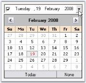' | markdownify }}
{:.image }

Additionally, the calendar popup can be customized using the DateTimePickerAdv properties. Refer Customizing the Calendar topic.

Day Names

In the calendar, we can specify whether shortest day names can be used or not using UseShortestDayNames property. By default it is true.

[C#]

this.dateTimePickerAdv1.UseShortestDayNames = false;

[VB.NET]

Me.dateTimePickerAdv1.UseShortestDayNames = False

Buttons in Calendar

We can specify the visibility of the None button using NoneButtonVisible property. Default value is true. 

[C#]

this.dateTimePickerAdv1.NoneButtonVisible = false;

[VB.NET]

Me.dateTimePickerAdv1.NoneButtonVisible = False

> {{ '' | markdownify }}
{:.image }
 _Note: None button will not be visible when EnableNullDate property is set to false. See_ Null Value Settings _to know about EnableNullDate property._

Customizing the Calendar

DateTimePickerAdv control has properties which can improve the look and feel of the popup calendar. This section discusses various appearance settings available for the calendar.

Background Settings

The background of the Calendar can be customized using below properties.

_Table_ _180_: Property Table_

<table>
<tr>
<td>
DateTimePickerAdv  Properties</td><td>
Description</td></tr>
<tr>
<td>
CalendarMonthBackground</td><td>
Sets the background color for the popup calendar.</td></tr>
<tr>
<td>
CalendarTitleBackColor</td><td>
Sets the background of the calendar header.</td></tr>
</table>

[C#]

this.dateTimePickerAdv1.CalendarMonthBackground = System.Drawing.Color.OldLace;

this.dateTimePickerAdv1.CalendarTitleBackColor = System.Drawing.Color.Wheat;

[VB.NET]

Me.dateTimePickerAdv1.CalendarMonthBackground = System.Drawing.Color.OldLace

Me.dateTimePickerAdv1.CalendarTitleBackColor = System.Drawing.Color.Wheat

{{ '' | markdownify }}
{:.image }

Foreground Settings

The foreground appearance can be customized using the below properties.

_Table_ _181_: Property Table_

<table>
<tr>
<td>
DateTimePickerAdv  Properties</td><td>
Description</td></tr>
<tr>
<td>
CalendarFont</td><td>
Sets font style for the text in the popup calendar.</td></tr>
<tr>
<td>
CalendarForeColor</td><td>
Sets the fore color of the popup calendar.</td></tr>
<tr>
<td>
CalendarTitleForeColor</td><td>
Specifies the fore color of the calendar header.</td></tr>
<tr>
<td>
CalendarTrailingForeColor</td><td>
Specifies the fore color of the inactive month date.</td></tr>
</table>

[C#]

this.dateTimePickerAdv1.CalendarFont = new System.Drawing.Font("Microsoft Sans Serif", 8.25F, System.Drawing.FontStyle.Italic);

this.dateTimePickerAdv1.CalendarForeColor = System.Drawing.Color.SaddleBrown;

this.dateTimePickerAdv1.CalendarTitleForeColor = System.Drawing.Color.SaddleBrown;

this.dateTimePickerAdv1.CalendarTrailingForeColor = System.Drawing.Color.Blue;

[VB.NET]

Me.dateTimePickerAdv1.CalendarFont = New System.Drawing.Font("Microsoft Sans Serif", 8.25F, System.Drawing.FontStyle.Italic) 

Me.dateTimePickerAdv1.CalendarForeColor = System.Drawing.Color.SaddleBrown 

Me.dateTimePickerAdv1.CalendarTitleForeColor = System.Drawing.Color.SaddleBrown 

Me.dateTimePickerAdv1.CalendarTrailingForeColor = System.Drawing.Color.Blue

{{ '' | markdownify }}
{:.image }

_CalendarFont = "Italic"; TrailingForeColor = "Blue"_

Calendar Size

The default size of the popup calendar can be changed using the below properties.

_Table_ _182_: Property Table_

<table>
<tr>
<td>
DateTimePickerAdv  Properties</td><td>
Description</td></tr>
<tr>
<td>
CalendarSize</td><td>
Indicates size of the popup calendar.</td></tr>
<tr>
<td>
CalendarSizeToFit</td><td>
Indicates whether the calendar will size to fit according to the size of the days.</td></tr>
</table>

[C#]

this.dateTimePickerAdv1.CalendarSize = new System.Drawing.Size(250, 200);

this.dateTimePickerAdv1.CalendarSizeToFit = false;

[VB.NET]

Me.dateTimePickerAdv1.CalendarSize = New System.Drawing.Size(250, 200)

Me.dateTimePickerAdv1.CalendarSizeToFit = False

{{ '' | markdownify }}
{:.image }

See Also

Calendar Value

Calendar Value

In the Popup calendar, today's date will be selected by default, at run time. This default date can be changed using Value property. You can also specify the range of values / dates that can be selected at run time. 

_Table_ _183_: Property Table_

<table>
<tr>
<td>
DateTimePickerAdv Properties</td><td>
Description</td></tr>
<tr>
<td>
MaxValue</td><td>
Specifies the maximum value that can be picked from the DateTimePickerAdv.</td></tr>
<tr>
<td>
MinValue</td><td>
Specifies the minimum value that can be picked from the DateTimePickerAdv.</td></tr>
</table>

[C#]

this.dateTimePickerAdv1.Value = new System.DateTime(2008, 2, 23, 16, 15, 46, 0);

this.dateTimePickerAdv1.MaxValue = new System.DateTime(2008, 12, 31, 23, 59, 0, 0);

this.dateTimePickerAdv1.MinValue = new System.DateTime(2007, 1, 1, 0, 0, 0, 0);

[VB.NET]

Me.dateTimePickerAdv1.Value = New System.DateTime(2008, 2, 23, 16, 15, 46, 0)

Me.dateTimePickerAdv1.MaxValue = New System.DateTime(2008, 12, 31, 23, 59, 0, 0)

Me.dateTimePickerAdv1.MinValue = New System.DateTime(2007, 1, 1, 0, 0, 0, 0)

See Also

Customizing the Calendar

DesignTime Features

In the designer, DateTimePickerAdv control has shortcut for some property settings in its Task Window. Task Window is opened through the control's smart tag option.

{{ '' | markdownify }}
{:.image }

DateTimePickerAdv Appearance

This below topics discusses the background and border settings for the DateTimePickerAdv control.

Background Settings

DateTimePickerAdv control can have custom back color and background images using the properties discussed in this section.

Background Color

The control's back color can be set using the below properties.

_Table_ _184_: Property Table_

<table>
<tr>
<td>
DateTimePickerAdv  Properties</td><td>
Description</td></tr>
<tr>
<td>
BackColor</td><td>
Sets the back color for the DateTimePickerAdv control.</td></tr>
<tr>
<td>
BackgroundColor</td><td>
Sets Solid, Gradient or Pattern style of background for the control. This property setting will override the BackColor property setting.</td></tr>
</table>

[C#]

this.dateTimePickerAdv1.BackColor = System.Drawing.Color.Cornsilk;

this.dateTimePickerAdv1.BackgroundColor = new Syncfusion.Drawing.BrushInfo(Syncfusion.Drawing.GradientStyle.Vertical, System.Drawing.Color.Linen, System.Drawing.Color.BurlyWood);

[VB.NET]

Me.dateTimePickerAdv1.BackColor = System.Drawing.Color.Cornsilk 

Me.dateTimePickerAdv1.BackgroundColor = New Syncfusion.Drawing.BrushInfo(Syncfusion.Drawing.GradientStyle.Vertical, System.Drawing.Color.Linen, System.Drawing.Color.BurlyWood) 

{{ '' | markdownify }}
{:.image }

Background Image

Background image for the DateTimePickerAdv is set using the below property.

_Table_ _185_: Property Table_

<table>
<tr>
<td>
DateTimePickerAdv  Properties</td><td>
Description</td></tr>
<tr>
<td>
BackgroundImage</td><td>
Sets the background image for the control.</td></tr>
<tr>
<td>
BackgroundImageLayout</td><td>
Sets the background image layout for the control.</td></tr>
</table>

[C#]

this.dateTimePickerAdv2.BackgroundImage = ((System.Drawing.Image)(resources.GetObject("dateTimePickerAdv2.BackgroundImage")));

[VB.NET]

Me.dateTimePickerAdv2.BackgroundImage = DirectCast((resources.GetObject("dateTimePickerAdv2.BackgroundImage")), System.Drawing.Image) 

{{ '' | markdownify }}
{:.image }

See Also

Border Styles

Border Styles

The wide variety of border options are available for DateTimePickerAdv control when they are in 2D or in 3D mode. The properties in the below table illustrates the border settings.

_Table_ _186_: Property Table_

<table>
<tr>
<td>
DateTimePickerAdv Properties</td><td>
Description</td></tr>
<tr>
<td>
BorderStyle</td><td>
Specifies whether the DateTimePickerAdv should have a border and if it is 2D or 3D border. The options are,* {{ '_None_' | markdownify }}* {{ '_FixedSingle_' ' | markdownify }}* {{ '_Fixed3D(Default)_' | markdownify }}</td></tr>
<tr>
<td>
 Border3DStyle</td><td>
Specifies the 3D border style of the DateTimePickerAdv.The options are,* {{ '_Raised_' | markdownify }}* {{ '_RaisedOuter_' ' | markdownify }}* {{ '_RaisedInner_' ' | markdownify }}* {{ '_Sunken(Default)_' | markdownify }}* {{ '_SunkenOuter_' ' | markdownify }}* {{ '_SunkenInner_' ' | markdownify }}* {{ '_Etched_' ' | markdownify }}* {{ '_Bump_' ' | markdownify }}* {{ '_Adjust_' ' | markdownify }}* {{ '_Flat_' | markdownify }}</td></tr>
<tr>
<td>
 BorderSingle</td><td>
Specifies the 2D border style of the DateTimePickerAdv. The options are,* {{ '_None_' | markdownify }}* {{ '_Dotted_' | markdownify }}* {{ '_Dashed_' | markdownify }}* {{ '_Solid (default)_' | markdownify }}* {{ '_Inset_' ' | markdownify }}* {{ '_Outset_' | markdownify }}</td></tr>
<tr>
<td>
 BorderSides</td><td>
Specifies the sides of the control which should have a border. The sides are,* {{ '_Left_' | markdownify }}* {{ '_Top_' | markdownify }}* {{ '_Right_' ' | markdownify }}* {{ '_Bottom_' | markdownify }}* {{ '_Middle_' ' | markdownify }}* {{ '_All (Default)_' | markdownify }}</td></tr>
<tr>
<td>
 BorderColor</td><td>
Specifies the color of the 2D border when BorderStyle is set FixedSingle.</td></tr>
</table>

[C#]

//Sets 2D border

this.dateTimePickerAdv1.BorderStyle = System.Windows.Forms.BorderStyle.FixedSingle;

//Sets 2D border style

this.dateTimePickerAdv1.BorderSingle = System.Windows.Forms.ButtonBorderStyle.Dashed;

//Sets border for all the side of the control

this.dateTimePickerAdv1.BorderSides = System.Windows.Forms.Border3DSide.All;

//Sets color for the 2D border

this.dateTimePickerAdv1.BorderColor = System.Drawing.Color.SteelBlue;

//Sets 3D border

this.dateTimePickerAdv1.BorderStyle = System.Windows.Forms.BorderStyle.Fixed3D;

//Sets SunkenInner 3D border style

this.dateTimePickerAdv1.Border3DStyle = System.Windows.Forms.Border3DStyle.SunkenInner;

[VB.NET]

'Sets 2D border 

Me.dateTimePickerAdv1.BorderStyle = System.Windows.Forms.BorderStyle.FixedSingle 

'Sets 2D border style 

Me.dateTimePickerAdv1.BorderSingle = System.Windows.Forms.ButtonBorderStyle.Dashed 

'Sets border for all the side of the control 

Me.dateTimePickerAdv1.BorderSides = System.Windows.Forms.Border3DSide.All 

'Sets color for the 2D border 

Me.dateTimePickerAdv1.BorderColor = System.Drawing.Color.SteelBlue 

'Sets 3D border 

Me.dateTimePickerAdv1.BorderStyle = System.Windows.Forms.BorderStyle.Fixed3D 

'Sets SunkenInner 3D border style 

Me.dateTimePickerAdv1.Border3DStyle = System.Windows.Forms.Border3DStyle.SunkenInner 

{{ '' | markdownify }}
{:.image }

See Also

Background Settings

Runtime Features

This section covers the below topics:

Month Images

We can set images for the popup menu of the Calendar using MonthImageList property of DateTimePickerAdv control.

[C#]

// imageList1

this.imageList1.ImageSize = new System.Drawing.Size(16, 16);

this.imageList1.ImageStream = ((System.Windows.Forms.ImageListStreamer)(resources.GetObject("imageList1.ImageStream")));

// ImageList of the PopupMenu of the Popup Calendar

this.dateTimePickerAdv1.MonthImageList = this.imageList1;

[VB.NET]

' imageList1

Me.imageList1.ImageSize = New System.Drawing.Size(16, 16)

Me.imageList1.ImageStream= (CType(resources.GetObject("imageList1.ImageStream"), System.Windows.Forms.ImageListStreamer))

' ImageList of the PopupMenu of the Popup Calendar

Me.dateTimePickerAdv1.MonthImageList = Me.imageList1

{{ '' | markdownify }}
{:.image }

Context Menu

When you right-click on a DateTimePickerAdv control at run time, a context menu will be displayed like the below image. 

{{ '' | markdownify }}
{:.image }

This default context menu can be replaced with Syncfusion XP Menu by setting UseEnhancedMenu property to true. By default it is set to false. 

[C#]

this.dateTimePickerAdv1.UseEnhancedMenu = true;

[VB.NET]

Me.dateTimePickerAdv1.UseEnhancedMenu = True

{{ '' | markdownify }}
{:.image }

Menu Options

The menu options are: 

* Cut - Cuts the displayed date and by default displays "No Date is selected" string.
* Copy - Copies the displayed date and stores in clipboard.
* Paste - Pastes the copied date.
* No Date/Time - Selects no date and displays "No Date is selected".

We can set the text value format that is copied to the clipboard using ClipboardFormat property.

_Table_ _187_: Property Table_

<table>
<tr>
<td>
DateTimePickerAdv Properties</td><td>
Description</td></tr>
<tr>
<td>
ClipboardFormat</td><td>
While doing copy / paste operation, we can specify the format of the value of the DateTimePickerAdv control that is copied, by using ClipBoardFormat property. The formats are, * {{ '_Long(default)_' | markdownify }}* {{ '_Short_' ' | markdownify }}* {{ '_Time_' ' | markdownify }}* {{ '_Custom_' | markdownify }}</td></tr>
<tr>
<td>
 CopyFieldsOnly</td><td>
Indicates whether only the selected field will be copied or the whole text field will be copied. </td></tr>
</table>

[C#]

this.dateTimePickerAdv1.CopyFieldsOnly = true;

this.dateTimePickerAdv1.ClipboardFormat = System.Windows.Forms.DateTimePickerFormat.Short;

[VB.NET]

Me.dateTimePickerAdv1.CopyFieldsOnly = True

Me.dateTimePickerAdv1.ClipboardFormat = System.Windows.Forms.DateTimePickerFormat.Short

See Also

Text Field, Null value Settings

Navigating between fields

At run time, user can easily navigate between values in the text field like date, month, year, time using the TAB key. The below properties settings are necessary for tabbing between the fields.

_Table_ _188_: Property Table_

<table>
<tr>
<td>
DateTimePickerAdv Properties</td><td>
Description</td></tr>
<tr>
<td>
TabStop</td><td>
Indicates whether the user can use the Tab key, to focus the DateTimePickerAdv control.</td></tr>
<tr>
<td>
TabForwarding</td><td>
Indicates if the control will moves its focus to the next field when the tab key is pressed.</td></tr>
<tr>
<td>
TabIndex</td><td>
Indicates the index in the TAB order that this control will occupy.</td></tr>
<tr>
<td>
TabLeave</td><td>
Indicates whether the focus should be moved away from the control, when there is no fields to tab through.</td></tr>
</table>

[C#]

this.dateTimePickerAdv1.TabForwarding = true;

this.dateTimePickerAdv1.TabIndex = 1;

this.dateTimePickerAdv1.TabLeave = true;

this.dateTimePickerAdv1.TabStop = true;

[VB.NET]

Me.dateTimePickerAdv1.TabForwarding = True

Me.dateTimePickerAdv1.TabIndex = 1

Me.dateTimePickerAdv1.TabLeave = True

Me.dateTimePickerAdv1.TabStop = True

Themes and Styles

Themes

We can apply themes for the DateTimePickerAdv and also the child controls using the below properties.

_Table_ _189_: Property Table_

<table>
<tr>
<td>
DateTimePickerAdv Properties</td><td>
Description</td></tr>
<tr>
<td>
ThemesEnabled</td><td>
Specifies whether to enable themes for the DateTimePickerAdv control.</td></tr>
<tr>
<td>
ThemedChildControls</td><td>
Setting ThemesEnabled to true will not enable themes for its child controls (CheckBox, DropDown , UpDown and Calendar). To enable themes for the child controls of the DateTimePicker, set ThemedChildControls to true.</td></tr>
</table>

[C#]

this.dateTimePickerAdv1.ThemesEnabled = true;

this.dateTimePickerAdv1.ThemedChildControls = true;

[VB.NET]

Me.dateTimePickerAdv1.ThemesEnabled = True

Me.dateTimePickerAdv1.ThemedChildControls = True

' Setting backcolor for the control when it is ReadOnly

Me.dateTimePickerAdv1.ReadOnly = True

Me.dateTimePickerAdv1.IgnoreThemeBackground = True

{{ '' | markdownify }}
{:.image }

{{ '' | markdownify }}
{:.image }

Styles

Visual Styles for the DateTimePickerAdv and its child controls can be applied using the Style property. 

_Table_ _190_: Property Table_

<table>
<tr>
<td>
DateTimePickerAdv Properties</td><td>
Description</td></tr>
<tr>
<td>
Style</td><td>
Specifies the Office style of the picker. The options are :* {{ '_OfficeXP_' ' | markdownify }}* {{ '_Office2003_' ' | markdownify }}* {{ '_VS2005_' | markdownify }}* {{ '_Office2007_' ' | markdownify }}* {{ '_Default (default)_' | markdownify }}</td></tr>
<tr>
<td>
 Office2007Theme</td><td>
Indicates the office color scheme used, when Style is set to Office2007.</td></tr>
</table>

[C#]

// Sample for setting Office2007 style for the control

this.dateTimePickerAdv1.Style = Syncfusion.Windows.Forms.VisualStyle.Office2007;

[VB.NET]

' Sample for setting Office2007 style for the control

Me.dateTimePickerAdv1.Style = Syncfusion.Windows.Forms.VisualStyle.Office2007

{{ '' | markdownify }}
{:.image }

[C#]

//Sets the Color scheme as Blue when the style is Office2007

this.dateTimePickerAdv1.Office2007Theme = Syncfusion.Windows.Forms.Office2007Theme.Blue;

[VB.NET]

'Sets the Color scheme as Blue when the style is Office2007

Me.dateTimePickerAdv1.Office2007Theme = Syncfusion.Windows.Forms.Office2007Theme.Blue

{{ '' | markdownify }}
{:.image }

Custom Colors

We can also apply custom colors to the DateTimePickerAdv control by setting Office2007Theme to "Managed" and specifying the custom color through the ApplyManagedColors method as follows.

[C#]

this.dateTimePickerAdv1.Office2007Theme = Syncfusion.Windows.Forms.Office2007Theme.Managed;

Office2007Colors.ApplyManagedColors(this, Color.Orange);

[VB.NET]

Me.dateTimePickerAdv1.Office2007Theme = Syncfusion.Windows.Forms.Office2007Theme.Managed;

Office2007Colors.ApplyManagedColors(Me, Color.Orange)

{{ '' | markdownify }}
{:.image }

Advanced Features

This section covers the below topics:

Data Binding

Essential Tools supports extensive DataBinding in DateTimePickerAdv using the Value and BindableValue property. The following example illustrates the DataBinding of the DataSet belonging to a DataGrid. 

> {{ '' | markdownify }}
{:.image }
_Note: Always use BindableValue property if dataset contains Null value. In cases where no Null value exists in the dataset, Value property can be used._

To bind a DateTimePickerAdv, perform the following steps.

1. Add a DateTimePickerAdv and a DataGrid controls to the form.
2. Create a daaset using the code below.

[C#]

// Creating DataSet,Table and rows.

DataSet dataSet = null;

DataTable table = null;

dataSet = new DataSet();

table = dataSet.Tables.Add("Table");

table.Columns.Add("DateTimeColumn", typeof(DateTime));

table.Columns[0].AllowDBNull = true;

table.Rows.Add(new object[]{DateTime.Now - TimeSpan.FromDays(60)});

table.Rows.Add(new object[]{DateTime.Now});

table.Rows.Add(new object[]{DBNull.Value});

[VB.NET]

' Creating DataSet,Table and rows.

Private dataSet As DataSet = Nothing

Private table As DataTable = Nothing

Private dataSet = New DataSet()

Private table = dataSet.Tables.Add("Table")

table.Columns.Add("DateTimeColumn", GetType(DateTime))

Private table.Columns(0).AllowDBNull = True

table.Rows.Add(New Object(){DateTime.Now - TimeSpan.FromDays(60)})

table.Rows.Add(New Object(){DateTime.Now})

table.Rows.Add(New Object(){DBNull.Value})              

3. Assign the dataset to the DataGrid control using its DataSource property. Set the control's DataMember property to the member that must be bound.

[C#]

dataGrid1.DataSource = dataSet;

dataGrid1.DataMember = "Table";

[VB.NET]

Private dataGrid1.DataSource = dataSet

Private dataGrid1.DataMember = "Table"

4. Bind the datasource with the DateTimePickerAdv control.

[C#]

// Setting the BindableValue property in order to Data Bind.

dateTimePickerAdv1.DataBindings.Add("BindableValue", dataSet, "Table.DateTimeColumn");

dateTimePickerAdv1.Focus();

[VB.NET]

' Setting the BindableValue property in order to Data Bind.

dateTimePickerAdv1.DataBindings.Add("BindableValue", dataSet, "Table.DateTimeColumn")

dateTimePickerAdv1.Focus()                       

5. Run the application. Select a data in the datagrid and DateTimePicker will display the corresponding date value (The DateTimePickerAdv is bound to the datasource using BindableValue property as datasource contains Null value. Selecting in the datagrid will automatically position the datasource to the related row which will update the DateTimePickerAdv with the appropriate data).

{{ '' | markdownify }}
{:.image }

A sample which demonstrates this feature is available in the below sample installation path.

…\_My Documents\Syncfusion\EssentialStudio\Version Number\Windows\Tools.Windows\Samples\Advanced Editor Functions\ActionGroupingDemo_

  Globalization

DateTimePickerAdv supports globalization through DateTimePickerAdv.Culture property.

_Table_ _191_: Property Table_

<table>
<tr>
<td>
DateTimePickerAdv Properties</td><td>
Description</td></tr>
<tr>
<td>
Culture</td><td>
Gets or sets the current culture of the DateTimePickerAdv control. UseCurrentCulture should be set to false to make this setting effective.</td></tr>
<tr>
<td>
UseCurrentCulture</td><td>
Specifies whether the current culture of the machine will be used. By default it is false.</td></tr>
</table>

[C#]

this.dateTimePickerAdv1.UseCurrentCulture = false;

this.dateTimePickerAdv1.Culture = new System.Globalization.CultureInfo("hi-IN");

[VB.NET]

Me.dateTimePickerAdv1.UseCurrentCulture = False

Me.dateTimePickerAdv1.Culture = New System.Globalization.CultureInfo("hi-IN")

{{ '' | markdownify }}
{:.image }

Custom PopupWindow

This section deals with creating a custom popup window for the DateTimePickerAdv control. We can implement IDateTimePickerAdvCalendar interface to drop down a custom window.

IDateTimePickerAdvCalendar Interface Members

_Table_ _192_: Member Table_

<table>
<tr>
<td>
IDateTimePickerAdvCalendar Member</td><td>
Description</td></tr>
<tr>
<td>
Active</td><td>
Boolean value indicating if the DateTimePickerAdv should consider the interface events fired by this control.</td></tr>
<tr>
<td>
Appearance properties (CalendarFont, CalendarForeColor, CalendarMonthBackground, TitleBackColor, TitleForeColor and TrailingForeColor)</td><td>
{{ '_CalendarFont_' | markdownify }} - Gets / sets the font used to draw the calendar that implements the interface, {{ '_CalendarForeColor_' | markdownify }} - Gets / sets the color used to draw the foreground of calendar that implements the interface, {{ '_CalendarMonthBackground_' | markdownify }} - Gets / sets the color used to draw the month background of calendar that implements the interface, {{ '_TitleBackColor_' | markdownify }} - Gets / sets the color used to draw the title background of calendar that implements the interface,{{ '_TitleForeColor_' | markdownify }} - Gets / sets the color used to draw the foreground of the title of calendar that implements the interface, {{ '_TrailingForeColor_' | markdownify }} - Gets / sets the color used to draw the trailing foreground of calendar that implements the interface.</td></tr>
<tr>
<td>
Value properties (MinDate, MaxDate, Value)</td><td>
{{ '_MinDate_' | markdownify }} - Gets / sets the minimum date of the calendar that implements the interface,{{ '_MaxDate_' | markdownify }} - Gets / sets the maximum date of the calendar that implements the interface and{{ '_Value_' | markdownify }} - Gets / sets the date of the calendar that implements the interface.</td></tr>
<tr>
<td>
Culture</td><td>
Gets or set the culture of the calendar that implements this interface.</td></tr>
</table>
_Table_ _193_: Events Table_

<table>
<tr>
<td>
IDateTimePickerAdvCalendar Events</td><td>
Description</td></tr>
<tr>
<td>
NullButtonDown</td><td>
Event is similar to the DateTimePickerAdv.NullButtonEventHandler. It is handled when the none button is clicked or when the control implementing the interface wants the DateTimePickerAdv to have the NullString displayed. </td></tr>
<tr>
<td>
SelectDate</td><td>
Event is similar to the DateTimePickerAdv.SelectDateEventHandler. It is handled when the user selects a date on the control implementing the interface or the control wants the popup to close and set the picker's date to the Value member.</td></tr>
<tr>
<td>
DateChange</td><td>
Event is similar to the DateTimePickerAdv.DateChangedEventHandler. It is handled when the user has changed the date of the control implementing the interface and doesn't want the popup to close, just update the picker's date to the Value member.</td></tr>
</table>
Creating a Custom Popup Window for DateTimePickerAdv

Follow the below steps to add a Windows MonthCalendar control as the Popup for the DateTimePickerAdv, using PopupControlContainer.

1. Drag a DateTimePickerAdv, PopupControlContainer and a button onto the form designer from the toolbox. 

{{ '' | markdownify }}
{:.image }

2. Create a control that implements the IDateTimePickerAdvCalendar interface using the below code.

[C#]

//Creating Calendar which implements the IDateTimePickerAdvCalendar

private MyCustomCalendar MonthCalendar;

//Initializing the Calendar 

this.MonthCalendar = new MyCustomCalendar();

//Defining the Calendar Class which implements IDateTimePickerAdvCalendar

public class MyCustomCalendar : MonthCalendar, IDateTimePickerAdvCalendar

{

    private bool active;

    public bool Active

    {

        get { return active; }

        set { active = value; }

    }

    public System.Drawing.Font CalendarFont

    {

        get { return Font; }

        set { Font = value; }

    }

    public Color CalendarForeColor

    {

        get { return ForeColor; }

        set { ForeColor = value; }

    }

    public Color CalendarMonthBackground

    {

        get { return BackColor; }

        set { BackColor = value; }

    }

    public DateTime Value

    {

        get { return SelectionStart; }

        set { SelectionStart = SelectionEnd = value; }

    }

    public event DateTimePickerAdv.NullButtonEventHandler NullButtonDown;

    public event DateTimePickerAdv.SelectDateEventHandler SelectDate;

    public event DateTimePickerAdv.DateChangedEventHandler DateChange;

    public MyCustomCalendar()

    {

        this.DateSelected += new System.Windows.Forms.DateRangeEventHandler(OnDateSelected);

        this.DateChanged += new System.Windows.Forms.DateRangeEventHandler(OnDateChanged);

    }

    protected void OnDateSelected(object sender, System.Windows.Forms.DateRangeEventArgs e)

    {

        if (SelectDate != null)

        {

            SelectDate(this, new EventArgs());

        }

    }

    protected void OnDateChanged(object sender, System.Windows.Forms.DateRangeEventArgs e)

    {

        if (DateChange != null)

        {

            DateChange(this, new EventArgs());

        }

    }

    public string Culture

    {

        get { return "Not Supported"; }

    }

    public void FireNullEvent()

    {

        if (NullButtonDown != null)

        {

            NullButtonDown(this, new EventArgs());

        }

    }

    CultureInfo IDateTimePickerAdvCalendar.Culture

    {

        get { throw new Exception("The method or operation is not implemented."); }

        set { throw new Exception("The method or operation is not implemented."); }

    }           

}

[VB.NET]

 'Creating Calendar which implements the IDateTimePickerAdvCalendar 

Private MonthCalendar As MyCustomCalendar

'Initializing the Calendar 

Me.MonthCalendar = New MyCustomCalendar()

'Defining the Calendar Class which implements IDateTimePickerAdvCalendar 

Public Class MyCustomCalendar

    Inherits MonthCalendar

    Implements IDateTimePickerAdvCalendar

    Private m_active As Boolean

    Public Property Active() As Boolean

        Get

            Return m_active

        End Get

        Set(ByVal value As Boolean)

            m_active = value

        End Set

    End Property

    Public Property CalendarFont() As System.Drawing.Font

        Get

            Return Font

        End Get

        Set(ByVal value As System.Drawing.Font)

            Font = value

        End Set

    End Property

    Public Property CalendarForeColor() As Color

        Get

            Return ForeColor

        End Get

        Set(ByVal value As Color)

            ForeColor = value

        End Set

    End Property

    Public Property CalendarMonthBackground() As Color

        Get

            Return BackColor

        End Get

        Set(ByVal value As Color)

            BackColor = value

        End Set

    End Property

    Public Property Value() As DateTime

        Get

            Return SelectionStart

        End Get

        Set(ByVal value As DateTime)

            SelectionStart = SelectionEnd = value

        End Set

    End Property

    Public Event NullButtonDown As DateTimePickerAdv.NullButtonEventHandler

    Public Event SelectDate As DateTimePickerAdv.SelectDateEventHandler

    Public Event DateChange As DateTimePickerAdv.DateChangedEventHandler

    Public Sub New()

        AddHandler Me.DateSelected, AddressOf OnDateSelected

        AddHandler Me.DateChanged, AddressOf OnDateChanged

    End Sub

    Protected Sub OnDateSelected(ByVal sender As Object, ByVal e As System.Windows.Forms.DateRangeEventArgs)

        RaiseEvent SelectDate(Me, New EventArgs())

    End Sub

    Protected Sub OnDateChanged(ByVal sender As Object, ByVal e As System.Windows.Forms.DateRangeEventArgs)

        RaiseEvent DateChange(Me, New EventArgs())

    End Sub

    Public ReadOnly Property Culture() As String

        Get

            Return "Not Supported"

        End Get

    End Property

    Public Sub FireNullEvent()

        RaiseEvent NullButtonDown(Me, New EventArgs())

    End Sub

    Private Property Culture() As CultureInfo Implements IDateTimePickerAdvCalendar.Culture

        Get

            Throw New Exception("The method or operation is not implemented.")

        End Get

        Set(ByVal value As CultureInfo)

            Throw New Exception("The method or operation is not implemented.")

        End Set

    End Property

End Class

3. Set theActive property of the MonthCalendar to True. Set the DateTimePickerAdv's CustomPopupWindow property to the PopupControlContainer control. Set the DateTimePickerAdv's CustomDrop property to theTrue. 

[C#]

this.dateTimePickerAdv1.CustomDrop = true;

this.dateTimePickerAdv1.CustomPopupWindow = this.popupControlContainer1;

//Setting the DateTimePickerAdv control to consider the interface events by enabling Active property

this.MonthCalendar.Active = true;

//Adding Calendar to the Popup Control Container

this.popupControlContainer1.Controls.Add(this.MonthCalendar);

[VB.NET]

Me.dateTimePickerAdv1.CustomDrop = True 

Me.dateTimePickerAdv1.CustomPopupWindow = Me.popupControlContainer1 

'Setting the DateTimePickerAdv control to consider the interface events by enabling Active property 

Me.MonthCalendar.Active = True 

'Adding Calendar to the Popup Control Container 

Me.popupControlContainer1.Controls.Add(Me.MonthCalendar)

4. In the button click event, call the MyCustomCalendar's FireNullEvent method. 

[C#]

private void buttonAdv1_Click(object sender, EventArgs e)

{

    //Calling the below method to fire the Null Event of the Calendar control created

    MonthCalendar.FireNullEvent();

}

[VB.NET]

Private Sub buttonAdv1_Click(ByVal sender As Object, ByVal e As EventArgs)

    'Calling the below method to fire the Null Event of the Calendar control created 

    MonthCalendar.FireNullEvent()

End Sub

5. Run the application and click the dropdown button of the DateTimePickerAdv control to display the custom popup. 

{{ '' | markdownify }}
{:.image }

6. When you click the button, the DateTimePickerAdv will display the NullString specified in NullString property.

{{ '' | markdownify }}
{:.image }

A sample which demonstrates adding a MonthCalendarAdv itself as a custom popup calendar to the DateTimePickerAdv control is available in the below sample installation location.

…\_My Documents\Syncfusion\EssentialStudio\Version Number\Windows\Tools.Windows\Samples\Advanced Editor Functions\ActionGroupingDemo_

###### DateTimePicker Events

Following are the events of DateTimePickerAdv control.

_Table_ _194_: Property Table_

<table>
<tr>
<td>
DateTimePickerAdv Properties</td><td>
Description</td></tr>
<tr>
<td>
BeforePopup</td><td>
Handled just before the popup is displayed.</td></tr>
<tr>
<td>
BindableValueChanged</td><td>
Handled when the BindingValue property is changed.</td></tr>
<tr>
<td>
CheckBoxCheckedChanged</td><td>
Handled when the checked state of the Checkbox changes.</td></tr>
<tr>
<td>
OnPopup</td><td>
Handled when the popup is displayed.</td></tr>
<tr>
<td>
PopupClosed</td><td>
Handled when the popup is closed. It uses PopupClosedEventHandler.</td></tr>
<tr>
<td>
StretchDropDownImageChanged</td><td>
Handled when the StretchDropDownImage property changes.</td></tr>
<tr>
<td>
ValueChanged</td><td>
Event is handled when the Value property changes.</td></tr>
</table>
PopupClosed Event

This event is handled when the popup is closed. Using the PopupCloseType member of the PopupClosedEventHandler, we can identify the type of closing.

[C#]

private void dateTimePickerAdv1_PopupClosed(object sender, PopupClosedEventArgs e)

{            

    //Canceled - User cancels the updates if any.

    //Deactivated - If the user moves the focus to some other window

    //Done - If the user wants the changes to be applied to the control

    Console.WriteLine(e.PopupCloseType.ToString());

}

[VB.NET]

Private Sub dateTimePickerAdv1_PopupClosed(ByVal sender As Object, ByVal e As PopupClosedEventArgs)

    'Canceled - User cancels the updates if any. 

    'Deactivated - If the user moves the focus to some other window 

    'Done - If the user wants the changes to be applied to the control 

    Console.WriteLine(e.PopupCloseType.ToString())

End Sub

###### Frequently Asked Questions

 This section illustrates the solutions for various task-based queries about the control.

How to change the date in a DateTimePickerAdv control, when it is ReadOnly?

We can make the control read only by setting ReadOnly property to true. DateTimePickerAdv control have an option to change the date, even in ReadOnly mode using Arrow keys. Set ReadOnlyValueChange property to true to effect this setting.

[C#]

this.dateTimePickerAdv1.ReadOnly = true;

this.dateTimePickerAdv1.ReadOnlyValueChange = true;

[VB.NET]

Me.dateTimePickerAdv1.ReadOnly = True

Me.dateTimePickerAdv1.ReadOnlyValueChange = True

{{ '' | markdownify }}
{:.image }

How to display DateTimePickerAdv control programmatically?

We can display the Calendar programmatically on a button click. The DisplayCalendar method should be called from the click event handler in order to show the control. 

[C#]

private void button1_Click(object sender, System.EventArgs e)

{

   // Shows the calendar.

this.dateTimePickerAdv1.DisplayCalendar();

}

[VB.NET]

Private Sub button1_Click(ByVal sender As Object, ByVal e As System.EventArgs)

   ' Shows the calendar.

Me.dateTimePickerAdv1.DisplayCalendar()

End Sub

Which event will raise when the date in the DateTimePickerAdv is changed?

CalendarDateChanged event is raised when a date in the DateTimePickerAdv is changed using the keys, or using the mouse.

[C#]

this.dateTimePickerAdv1.Calendar.DateChanged += new EventHandler(Calendar_DateChanged);

void Calendar_DateChanged(object sender, EventArgs e)

{

Console.WriteLine("Date Changed");

}

[VB.NET]

Me.dateTimePickerAdv1.Calendar.DateChanged += New EventHandler(Calendar_DateChanged)

Private Sub Calendar_DateChanged(ByVal sender As Object, ByVal e As EventArgs)

    Console.WriteLine("Date Changed")

End Sub

Which event will raise when the month is changed using arrow button?

 When the month in the DateTimePickerAdv is changed using Arrow button, ValueChanged event is raised.

[C#]

this.dateTimePickerAdv1.ValueChanged += new EventHandler(dateTimePickerAdv1_ValueChanged);

private void dateTimePickerAdv1_ValueChanged(object sender, EventArgs e)

{

    if (Control.MouseButtons != MouseButtons.None)

    {

        Console.WriteLine("Month Changed using ArrowButton");

    }

}

[VB.NET]

Me.dateTimePickerAdv1.ValueChanged += New EventHandler(dateTimePickerAdv1_ValueChanged)

Private Sub dateTimePickerAdv1_ValueChanged(ByVal sender As Object, ByVal e As EventArgs)

    If Control.MouseButtons <> MouseButtons.None Then

        Console.WriteLine("Month Changed using ArrowButton")

    End If

End Sub

How to close the DateTimePickerAdv's Drop-Down by hitting ENTER key or ESC key

If you want to close the DateTimePickerAdv's drop-down, when you hit the ENTER key or the ESC key, you need to set DateTimePickerAdv.WantEnterKey property to _false_.

_Table_ _195_: Property Table_

<table>
<tr>
<th>
Property</th><th>
Description</th></tr>
<tr>
<td>
WantEnterKey</td><td>
True – Drop-down is not closed when hitting the Enter key or Esc keyFalse – Drop-down will get closed when hitting the Enter key or Esc key</td></tr>
</table>

[C#]

this.dateTimePickerAdv1.Calendar.WantEnterKey = false;

[VB.NET]

Me.dateTimePickerAdv1.Calendar.WantEnterKey = False

#### ColorUI Controls

The following advanced ColorUI Controls are discussed below.

##### ColorUIControl

The Essential Tools ColorUIControl allows .NET developers to provide a standard user-interface which, is similar to the Visual Studio .NET color picker drop-down, for selecting colors in their Windows Forms applications. The ColorUIControl implements a palette type visual interface comprising of the System, Standard, Custom and UserColor color groups. The control can be used either as a regular control that is hosted within a parent container or as a drop-down. Refer ColorPickerButton to use ColorUIControl as drop down.

{{ '' | markdownify }}
{:.image }

The .NET framework provides a color dialog control which, allows applications to collect color information from users. However, the color dialog control does not provide any way to place a control within the layout of the application in order to collect color information. The Essential Tools ColorUIControl provides an easy to use color palette control that can be placed inline in applications.  

The ColorUIControl implements a palette type visual interface for selecting colors at run-time. The ColorUIControl class offers a selection of colors that are divided into four color groupings that are arranged as tabs. The four color groupings are:

* SystemColors consisting of colors defined within the SystemColors class.
* StandardColors consisting of basic colors.
* CustomColors providing a customizable color palette.
* UserColors providing different shades of user defined Colors 

See also

Creating ColorUIControl

###### Features

ColorUIControl provides a standard user interface for selecting colors and contains following features.

* User Color Groups can be created and color cells in the ColorUIControl can be customized.
* The ColorUI control can be used to display in Popup mode. 
* The ColorUI control can be used within the layout of the application in order to collect color information from the users.

See Also

Concepts and Features

###### Creating ColorUIControl

ColorUIControl can be added through designer by just dragging-and-dropping it from thetoolbox onto the Windows Form Designer. 

{{ '' | markdownify }}
{:.image }

It can also be created programmatically as discussed below.

1. Include the required namespace.

[C#]

using Syncfusion.Windows.Forms.Tools;

[VB.NET]

Imports Syncfusion.Windows.Forms.Tools

2. Create an instance of the ColorUIControl control class. Specify its size and add it to the form.

[C#]

// Declaring and Initializing the control

private Syncfusion.Windows.Forms.ColorUIControl colorUIControl1;

this.colorUIControl1=new Syncfusion.Windows.Forms.ColorUIControl();

//Specify the size for the control

this.colorUIControl1.Size = new System.Drawing.Size(200, 136);

Adding ColorUIControl to the form

this.Controls.Add(this.colorUIControl1);

[VB.NET]

' Declaring and Initializing the control

Private colorUIControl1 As Syncfusion.Windows.Forms.ColorUIControl

Me.colorUIControl1 = New Syncfusion.Windows.Forms.ColorUIControl()

'Specify the size for the control

Me.colorUIControl1.Size = New System.Drawing.Size(200, 136)

' Adding ColorUIControl to the form

Me.Controls.Add(Me.colorUIControl1)

{{ '' | markdownify }}
{:.image }

See also

Concepts and Features

###### Concepts and Features

The following topics will help you become more familiar in using the ColorUI control.

Color Groups

ColorUI control has three in-built color groups which are CustomColors, StandardColor, and SystemColors. This section gives you an idea of the color groups available.

{{ '' | markdownify }}
{:.image }

Displaying the Color Groups

We can control the display of the color groups using ColorGroups property. 

{{ '' | markdownify }}
{:.image }

[C#]

this.colorUIControl1.ColorGroups = ((Syncfusion.Windows.Forms.ColorUIGroups)((Syncfusion.Windows.Forms.ColorUIGroups.CustomColors | Syncfusion.Windows.Forms.ColorUIGroups.StandardColors)));

[VB.NET]

Me.colorUIControl1.ColorGroups = DirectCast(((Syncfusion.Windows.Forms.ColorUIGroups.CustomColors Or Syncfusion.Windows.Forms.ColorUIGroups.StandardColors)), Syncfusion.Windows.Forms.ColorUIGroups) 

{{ '' | markdownify }}
{:.image }

User Groups

ColorGroups property also let you add user groups in addition to the standard groups. The color palette for the UserGroups will be CustomColors, by default.

[C#]

this.colorUIControl1.ColorGroups = ((Syncfusion.Windows.Forms.ColorUIGroups)(((Syncfusion.Windows.Forms.ColorUIGroups.CustomColors | Syncfusion.Windows.Forms.ColorUIGroups.StandardColors)| Syncfusion.Windows.Forms.ColorUIGroups.UserColors)));

[VB.NET]

Me.colorUIControl1.ColorGroups = DirectCast((((Syncfusion.Windows.Forms.ColorUIGroups.CustomColors Or  Syncfusion.Windows.Forms.ColorUIGroups.StandardColors) Or Syncfusion.Windows.Forms.ColorUIGroups.UserColors)),  Syncfusion.Windows.Forms.ColorUIGroups) 

{{ '' | markdownify }}
{:.image }

> {{ '' | markdownify }}
{:.image }
 _Note: We can add custom text for the tabs of the Color groups. See_ Tab Text _for details._

> {{ '' | markdownify }}
{:.image }
 _Note: The Custom Color Panels and User Color Panels can be stretched according to the size of the control. Refer_ ColorUIControl Appearance _for details._

See Also

Runtime Settings

Tab Text

The default tab text of the ColorGroups can be set using the below properties.

_Table_ _196_: Property Table_

<table>
<tr>
<td>
ColorUIControl Properties</td><td>
Description</td></tr>
<tr>
<td>
CustomTabName</td><td>
Set the text displayed on the custom colors tab. The tab name can be reset using ResetCustomTabName() method.</td></tr>
<tr>
<td>
StandardTabName</td><td>
Set the text displayed on the Standard colors tab.The tab name can be reset using ResetStandardTabName() method.</td></tr>
<tr>
<td>
SystemTabName</td><td>
Set the text displayed on the System colors tab.The tab name can be reset using ResetSystemTabName() method.</td></tr>
<tr>
<td>
UserTabName</td><td>
Set the text displayed on the User colors tab.The tab name can be reset using ResetUserTabName() method.</td></tr>
</table>

[C#]

this.colorUIControl1.StandardTabName = "Web Layout";

this.colorUIControl1.SystemTabName = "System Colors";

this.colorUIControl1.UserTabName = "User Defined";

this.colorUIControl1.CustomTabName = "Palettes";

[VB.NET]

Me.colorUIControl1.StandardTabName = "Web Layout"

Me.colorUIControl1.SystemTabName = "System Colors"

Me.colorUIControl1.UserTabName = "User Defined"

Me.colorUIControl1.CustomTabName = "Palettes"

{{ '' | markdownify }}
{:.image }

> {{ '' | markdownify }}
{:.image }
 _Note: We can also change the font style of the tab text using ColorUIControl.Font property._

###### ColorUIControl Appearance

This section discusses the appearance, border styles and size settings of the ColorUIControl.

Border Styles

The border styles for the ColorUIControl can be set through BorderStyle property.

_Table_ _197_: Property Table_

<table>
<tr>
<td>
ColorUIControl Properties</td><td>
Description</td></tr>
<tr>
<td>
BorderStyle</td><td>
Sets border style for the control. The options are,{{ '_FixedSingle,_' | markdownify }}{{ '_Fixed3D (default) and_' ' | markdownify }}{{ '_None._' | markdownify }}</td></tr>
</table>

[C#]

this.colorUIControl1.BorderStyle = System.Windows.Forms.BorderStyle.FixedSingle;

[VB.NET]

Me.colorUIControl1.BorderStyle = System.Windows.Forms.BorderStyle.FixedSingle

{{ '' | markdownify }}
{:.image }

Panel Sizing

The Custom and User color panels can be stretched according to the size of the control using the below properties respectively.

_Table_ _198_: Property Table_

<table>
<tr>
<td>
ColorUIControl Properties</td><td>
Description</td></tr>
<tr>
<td>
CustomColorStretchOnResize</td><td>
Gets or Sets enable stretch Custom colors panel on resize.</td></tr>
<tr>
<td>
UserColorStretchOnResize</td><td>
Gets or Sets enable stretch User colors panel on resize.</td></tr>
</table>

[C#]

this.colorUIControl1.CustomColorsStretchOnResize = true;

this.colorUIControl1.UserColorsStretchOnResize = true;

[VB.NET]

Me.colorUIControl1.CustomColorsStretchOnResize = True

Me.colorUIControl1.UserColorsStretchOnResize = True

{{ '' | markdownify }}
{:.image }

###### Runtime Settings

At run time a particular color group tab should be focussed or selected. Use SelectedColorGroup property of the ColorUI property for this purpose.

The options are as follows. 

* CustomColors
* StandardColors
* SystemColors
* UserColors
* None (Default)

Use SelectedColor property to specify the initially selected color. 

[C#]

this.colorUIControl1.SelectedColorGroup = Syncfusion.Windows.Forms.ColorUISelectedGroup.StandardColors;

this.colorUIControl1.SelectedColor = System.Drawing.Color.OrangeRed;

[VB.NET]

Me.colorUIControl1.SelectedColorGroup = Syncfusion.Windows.Forms.ColorUISelectedGroup.StandardColors;

Me.colorUIControl1.SelectedColor = System.Drawing.Color.OrangeRed;

{{ '' | markdownify }}
{:.image }

> {{ '' | markdownify }}
{:.image }
 _Note: These property settings can be reset using ResetSelectedColorGroup() and ResetSelectedColor() methods._

See Also

Color Groups

##### Event Handling

This section covers the below event:

###### ColorSelected Event

This event is handled when a color of a Color Group is selected. The below example closes the ColorUI displayed in a Popup Menu using this event.

In the ColorSelected event, the following coding ensures that the popupControlContainer containing the ColorUI Control closes a color is selected.

[C#]

private void colorUIControl_ColorSelected(object sender, System.EventArgs e)

{

    // Ensures that the PopupControlContainer is closed after the selection of a color.

Syncfusion.Windows.Forms.ColorUIControl cuicontrol = sender as Syncfusion.Windows.Forms.ColorUIControl;

Syncfusion.Windows.Forms.PopupControlContainer pcc = cuicontrol.Parent as  Syncfusion.Windows.Forms.PopupControlContainer;

pcc.HidePopup(Syncfusion.Windows.Forms.PopupCloseType.Done);

}

[VB.NET]

Private Sub colorUIControl_ColorSelected(ByVal sender As Object, ByVal e As System.EventArgs)

   ' Ensures that the PopupControlContainer is closed after the selection of a color.

Private cuicontrol As Syncfusion.Windows.Forms.ColorUIControl = CType(IIf(TypeOf sender Is Syncfusion.Windows.Forms.ColorUIControl, sender, Nothing), Syncfusion.Windows.Forms.ColorUIControl)

Private pcc As Syncfusion.Windows.Forms.PopupControlContainer = CType(IIf(TypeOf cuicontrol.Parent Is Syncfusion.Windows.Forms.PopupControlContainer, cuicontrol.Parent, Nothing), Syncfusion.Windows.Forms.PopupControlContainer)

pcc.HidePopup(Syncfusion.Windows.Forms.PopupCloseType.Done)

End Sub

See Also

How to add a ColorUI Control to a Popup Menu?

##### Frequently Asked Questions

This section illustrates the solutions for various task-based queries about the control.

###### How to add a ColorUI Control to a Popup Menu

To add ColorUIControl to a PopupMenu, we need to use PopupMenu, PopupControlContainer. Follow the below steps to add a ColorUIControl to a popup menu.

1. Drag and drop a ColorUIControl, a PopupMenu control, a PopupControlContainer control, a label control and a Panel control onto the form. Place the ColorUIControl inside the PopupControlContainer and the label inside the panel control.
2. Right click PopupMenu and select 'Add Default ParentBarItem" from the verbs. 

{{ '' | markdownify }}
{:.image }

3. In the property grid of PopupMenu, expand ParentBarItem, then add a DropDownBarItem to the ParentBarItem using BarItem Collection Editor. Also set the PopupControlContainer as the DropDownBarItem's PopupControlContainer as shown in the image below.

{{ '' | markdownify }}
{:.image }

4. In the MouseUp event of the Panel control call the PopupMenu.Show method.

[C#]

private void panel1_MouseUp(object sender, MouseEventArgs e)

{

    this.popupMenu1.Show(this.panel1, new Point(e.X, e.Y));

}

[VB.NET]

Private Sub panel1_MouseUp(ByVal sender As Object, ByVal e As System.Windows.Forms.MouseEventArgs)

    Me.popupMenu1.Show(Me.panel1, New Point(e.X, e.Y))

End Sub

{{ '' | markdownify }}
{:.image }

> {{ '' | markdownify }}
{:.image }
 _Note: You can close the popup whenever a color is selected at run time. This is done using ColorUIControl.ColorSelected Event._ 

###### How to customize the color cells of the UserColors group

Color cells of the UserGroup panel in a ColorUIControl, can be customized using the below code. We can use UserColors and UserCustomColor for this purpose.

[C#]

// For example assume you have a ColorUIControl colorUIControl1.

for( int i = 0 ; i < this.colorUIControl1.UserColors.Count; i ++ )

{

        this.colorUIControl1.UserColors[ i ] = Color.FromArgb( 0, 0, i * 5 );

}

for( int i = 0 ; i < this.colorUIControl1.UserCustomColors.Count; i ++ )

{

        this.colorUIControl1.UserCustomColors[ i ] = Color.FromArgb( i * 15, 0, 0 );

}

this.colorUIControl1.SelectedColorGroup = Syncfusion.Windows.Forms.ColorUISelectedGroup.UserColors;

// Resize of ColorCells can be done using property UserColorsStretchOnResize.

this.colorUIControl1.UserColorsStretchOnResize = true;

[VB.NET]

Dim i As Integer

For  i = 0  To  Me.colorUIControl1.UserColors.Count- 1  Step  i  + 1

     Me.colorUIControl1.UserColors( i ) = Color.FromArgb(0, 0, i * 5)

Next

Dim i As Integer

For  i = 0  To  Me.colorUIControl1.UserCustomColors.Count- 1  Step  i  + 1

     Me.colorUIControl1.UserCustomColors( i ) = Color.FromArgb(i * 15, 0, 0)

Next

     Me.colorUIControl1.SelectedColorGroup = Syncfusion.Windows.Forms.ColorUISelectedGroup.UserColors

    ' Resize of ColorCells can be done using property UserColorsStretchOnResize.

     Me.colorUIControl1.UserColorsStretchOnResize = True

> {{ '' | markdownify }}
{:.image }
 _Note : UserGroups should be selected in ColorGroups property to effect the above settings._

{{ '' | markdownify }}
{:.image }

##### ColorPickerButton

The Essential Tools ColorPickerButton allows.NET developers to provide a standard user interface similar to the Visual Studio .NET color picker dropdown, for selecting colors in Windows Forms applications. The ColorPickerButton displays the ColorUIControl as a drop-down in combination with a button. The .NET framework provides a color dialog control to allow applications to collect color information from users. However, the color dialog control does not provide any way to place a control within the layout of the application to collect color information. The Essential Tools ColorUIControl provides an easy to use color palette control that can be placed inline in your applications. 

{{ '' | markdownify }}
{:.image }

See also

ColorUIControl

###### Features

ColorPickerButtondrops down a ColorUIControl and provides a standard user interface for selecting colors. 

* ColorPicker button can be created programmatically.
* The ColorPickerButton allows us to set the ColorGroups from which the color can be selected.
* The selected color of ColorPickerButton can be set as Button's backcolor and Button's Text value.
###### Creating ColorPickerButton

ColorPickerButton is available to the designer by just dragging-and-dropping the ColorPickerButton from the toolbox onto the form. 

{{ '' | markdownify }}
{:.image }

It can be created programmatically as discussed below. 

1. Include the required namespace.

[C#]

using Syncfusion.Windows.Forms.Tools;

[VB.NET]

Imports Syncfusion.Windows.Forms.Tools

2. Create an instance of the ColorPickerButton control class and add it to the form.

[C#]

private Syncfusion.Windows.Forms.ColorPickerButton colorPickerButton1;

this.colorPickerButton2 = new Syncfusion.Windows.Forms.ColorPickerButton();

this.colorPickerButton1.Text = "Select a Color";

this.Controls.Add(this.colorPickerButton1);

[VB.NET]

Private colorPickerButton1 As Syncfusion.Windows.Forms.ColorPickerButton

Me.colorPickerButton2 = New Syncfusion.Windows.Forms.ColorPickerButton()

Me.colorPickerButton1.Text = "Select a Color"

Me.Controls.Add(Me.colorPickerButton1)

3. Clicking this button at runtime will display the ColorUIControl.

{{ '' | markdownify }}
{:.image }

See Also

Appearance and Behavior Settings

###### Customization Settings

ColorPickerButton displays the ColorUIControl as its dropdown. ColorPickerButton has properties to customize the ColorUIControl. Refer the User Guide for ColorUIControl. The size for the dropdown, i.e, ColorUIControl can be set using ColorUISize property.

[C#]

this.colorPickerButton1.ColorUISize = new System.Drawing.Size(250, 280);

[VB.NET]

Me.colorPickerButton1.ColorUISize = New System.Drawing.Size(250, 280)

{{ '' | markdownify }}
{:.image }

ColorPicker Appearance

The appearance and behavior of the ColorPickerButton can be controlled using the below properties.

_Table_ _199_: Property Table_

<table>
<tr>
<td>
ColorPickerButton Properties</td><td>
Description</td></tr>
<tr>
<td>
SelectedAsBackColor</td><td>
Specifies whether ColorPickerButton.SelectedColor is set as the button backcolor.</td></tr>
<tr>
<td>
SelectedAsText</td><td>
Specifies whether ColorPickerButton.SelectedColor is set as the button text value.</td></tr>
</table>

[C#]

this.colorPickerButton1.SelectedAsBackcolor = true;

this.colorPickerButton1.SelectedAsText = true;

[VB.NET]

Me.colorPickerButton1.SelectedAsBackcolor = True

Me.colorPickerButton1.SelectedAsText = True

{{ '' | markdownify }}
{:.image }

See Also

Color Groups,Tab Text, ColorUIControlAppearance, Runtime Settings of ColorUIControl.

##### ColorPickerUIAdv

The Essential Tools ColorPickerUIAdv allows.NET developers to provide Microsoft Word 2007 ColorCells for selecting colors in their applications. The ColorPickerUIAdv comprises of a panel displaying themed colors and standard colors. The ColorPickerUIAdv also comes with a More Colors option, in a color dialog, displaying more sub colors for the base colors in the control. 

{{ '' | markdownify }}
{:.image }

The.NET framework provides a color dialog control to allow applications to collect color information from users. However, the color dialog control does not provide any way to place a control within the layout of the application to collect color information. The Essential Tools ColorPickerUIAdv provides an easy to use color palette control that can be placed inline in your applications. 

###### Features

ColorPickerUIAdvprovides a color palette displaying standard and themed colors, that could be applied in Office2007 applications.

* Supports Office2007 theme colors such as Blue, Black and Silver.
* The ColorPickerUIAdv allows us to set the Color Groups from which the color can be selected. Custom Color groups can be added.
* The selected color of ColorPickerUIAdv can be applied to any control or text.
* The ColorUIControl can be used within the layout of the application in order to collect color information from the users.

See Also

Concepts and Features

###### Creating ColorPickerUI Adv

This section will help you to get started with using the ColorPickerUIAdv control.

The ColorPickerUIAdv can be easily created in the designer, by dragging-and-dropping from the toolbox on to the windows application form.

{{ '' | markdownify }}
{:.image }

It can be added programmatically by performing the following steps.

1. Include the namespace for the Tools Package.

[C#]

using Syncfusion.Windows.Forms.Tools;

[VB.NET]

Imports Syncfusion.Windows.Forms.Tools

2. Create an instance of ColorPickerUIAdv and add it to the Windows Form.

[C#]

private Syncfusion.Windows.Forms.Tools.ColorPickerUIAdv colorPickerUIAdv1;

ColorPickerUIAdv cpa = new ColorPickerUIAdv();

cpa.Size = new Size(200, 180);

this.Controls.Add(cpa);

[VB.NET]

Private colorPickerUIAdv1 As Syncfusion.Windows.Forms.Tools.ColorPickerUIAdv 

Private cpa As ColorPickerUIadv = New ColorPickerUIadv()

Private cpa.Size = New Size(200, 180)

Me.Controls.Add(cpa)

{{ '' | markdownify }}
{:.image }

###### Concepts and Features

The following aspects of the ColorPickerUIAdv have been discussed in this section.

Color Groups

The default color groups available for ColorPickerUIAdv control are listed in the below table.

_Table_ _200_: List of Groups_

<table>
<tr>
<td>
ColorPickerUIAdv Color Groups</td><td>
Description</td></tr>
<tr>
<td>
RecentGroup</td><td>
Represents the group of recent colors.</td></tr>
<tr>
<td>
StandardGroup</td><td>
Represents the group of standard colors.</td></tr>
<tr>
<td>
ThemeGroup</td><td>
Represents the group of theme colors.</td></tr>
</table>
{{ '' | markdownify }}
{:.image }

> {{ '' | markdownify }}
{:.image }
 _Note: You can also add custom ColorGroups apart from the above default groups. Refer Custom ColorGroups topic to know more._

Sections of Color Groups 

The sections of a color group is illustrated in the below image.

{{ '' | markdownify }}
{:.image }

See Also

Custom Color Groups, Customizing the Color Groups

Custom Color Groups

Custom Color Groups can be added to ColorPickerUIAdv control using CustomGroups property. This property invokes ColorUIAdvGroup Collection Editor and lets you to add custom user groups.

{{ '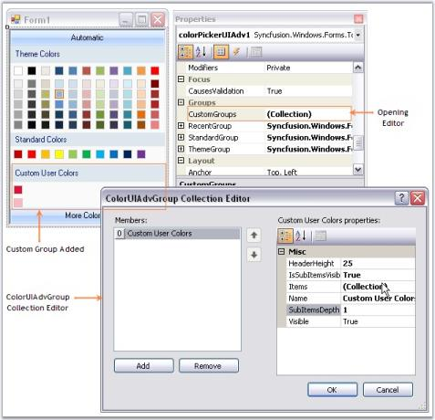' | markdownify }}
{:.image }

[C#]

Syncfusion.Windows.Forms.Tools.GroupColorItem groupColorItem1 = new Syncfusion.Windows.Forms.Tools.GroupColorItem(colorUIAdvGroup1, System.Drawing.Color.Crimson);

groupColorItem1.Color = System.Drawing.Color.Crimson;

groupColorItem1.Index = 0;

groupColorItem1.SubItems.Add(new Syncfusion.Windows.Forms.Tools.ColorItem(groupColorItem1, System.Drawing.Color.LightPink));

colorUIAdvGroup1.Items.Add(groupColorItem1);

colorUIAdvGroup1.Name = "Custom User Colors";

colorUIAdvGroup1.SubItemsDepth = 1;

this.colorPickerUIAdv1.CustomGroups.Add(colorUIAdvGroup1);

[VB.NET]

Dim groupColorItem1 As New Syncfusion.Windows.Forms.Tools.GroupColorItem(colorUIAdvGroup1, System.Drawing.Color.Crimson)

groupColorItem1.Color = System.Drawing.Color.Crimson

groupColorItem1.Index = 0

groupColorItem1.SubItems.Add(New Syncfusion.Windows.Forms.Tools.ColorItem(groupColorItem1, System.Drawing.Color.LightPink)) 

colorUIAdvGroup1.Items.Add(groupColorItem1) 

colorUIAdvGroup1.Name = "Custom User Colors" 

colorUIAdvGroup1.SubItemsDepth = 1 

Me.colorPickerUIAdv1.CustomGroups.Add(colorUIAdvGroup1) 

{{ '' | markdownify }}
{:.image }

> {{ '' | markdownify }}
{:.image }
 _Note: The properties to customize the color groups are similar to default color groups. See how to Customize the Color Groups in_ Customizing the Color Groups _topic._

Customizing the Color Groups

This section discusses the properties in the below topics, which customizes the color groups. 

Adding Color Items and sub items to Color Groups

The below properties lets you add color items and sub items.

_Table_ _201_: Property Table_

<table>
<tr>
<td>
ColorPickerUIAdv Properties</td><td>
Description</td></tr>
<tr>
<td>
Items</td><td>
This property invokes a ColorItem Collection Editor, which lets you add the colors to the group. You can also add sub items to this particular color item using another ColorItem Collection Editor which is invoked using SubItems property.</td></tr>
<tr>
<td>
IsSubItemsVisible</td><td>
Specifies if sub items should be visible.</td></tr>
<tr>
<td>
SubItemsDepth</td><td>
Specifies the depth of the sub items, i.e the number of sub items that can be added to a color item.</td></tr>
</table>

* Opening ColorItem Collection Editor using Items property.

{{ '' | markdownify }}
{:.image }

* Adding GroupColor items.

{{ '' | markdownify }}
{:.image }

* Adding color / sub items to the GroupColor items.

{{ '' | markdownify }}
{:.image }

[C#]

this.colorPickerUIAdv1.RecentGroup.Items.Add(groupColorItem0);

this.colorPickerUIAdv1.RecentGroup.IsSubItemsVisible = true;

this.colorPickerUIAdv1.RecentGroup.SubItemsDepth = 1;

[VB.NET]

Me.colorPickerUIAdv1.RecentGroup.Items.Add(groupColorItem0)

Me.colorPickerUIAdv1.RecentGroup.IsSubItemsVisible = True

Me.colorPickerUIAdv1.RecentGroup.SubItemsDepth = 1

{{ '' | markdownify }}
{:.image }

> {{ '' | markdownify }}
{:.image }
 _Note: To know how to customize a color item, refer_ Color Items _topic._

Color Items

Customizing Color Items

Size of the color items can be set through ColorItemSize property. Default width is 13 and height is 13.

> {{ '' | markdownify }}
{:.image }
 _Note: The colors within the groups are clickable at design time and you can change the color using property grid as in the below image._

{{ '' | markdownify }}
{:.image }

[C#]

this.colorPickerUIAdv1.ColorItemSize = new System.Drawing.Size(20, 20);

[VB.NET]

Me.colorPickerUIAdv1.ColorItemSize = New System.Drawing.Size(20, 20)

{{ '' | markdownify }}
{:.image }

Spacing Between Color Items

HorizontalItemsSpacing and VerticalItemsSpacing properties of ColorPickerUIAdv control can be used to set the horizontal and vertical spacing between the color items respectively. Default value of these properties are 4 and 0 respectively.

[C#]

this.colorPickerUIAdv1.HorizontalItemsSpacing = 15;

this.colorPickerUIAdv1.VerticalItemsSpacing = 15;

[VB.NET]

Me.colorPickerUIAdv1.HorizontalItemsSpacing = 15

Me.colorPickerUIAdv1.VerticalItemsSpacing = 15

{{ '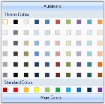' | markdownify }}
{:.image }

See Also

Header Settings

Header Settings

The below properties are used to change the default appearance of the color group headers.

_Table_ _202_: Property Table_

<table>
<tr>
<td>
Color Group Properties</td><td>
Description</td></tr>
<tr>
<td>
HeaderHeight</td><td>
Sets the height for the color group header. Default value is 20.</td></tr>
<tr>
<td>
Name</td><td>
Sets the name of the color group, i.e, the header text.</td></tr>
</table>
_Table_ _203_: Property Table_

<table>
<tr>
<td>
ColorPickerUIAdv Property</td><td>
Description</td></tr>
<tr>
<td>
TextAlignment</td><td>
Sets the header text alignment of all the color groups. By default it is set to MiddleLeft.</td></tr>
<tr>
<td>
Font</td><td>
Sets the font for the header text.</td></tr>
</table>

[C#]

//Sets header height for Theme group

this.colorPickerUIAdv1.ThemeGroup.HeaderHeight = 25;

//Sets header text for Theme group

this.colorPickerUIAdv1.ThemeGroup.Name = "Recent Colors";

//Sets text alignment of the color group headers

this.colorPickerUIAdv1.TextAlign = System.Drawing.ContentAlignment.MiddleCenter;

//Sets the font style for the header text

this.colorPickerUIAdv1.Font = new System.Drawing.Font("Microsoft Sans Serif",9F, System.Drawing.FontStyle.Bold);

[VB.NET]

'Sets header height for Theme group

Me.colorPickerUIAdv1.ThemeGroup.HeaderHeight = 25

'Sets header text for Theme group

Me.colorPickerUIAdv1.ThemeGroup.Name = "Recent Colors"

'Sets text alignment of the color group headers

Me.colorPickerUIAdv1.TextAlign = System.Drawing.ContentAlignment.MiddleCenter

'Sets the font style for the header text

Me.colorPickerUIAdv1.Font = New System.Drawing.Font("Microsoft Sans Serif",9F, System.Drawing.FontStyle.Bold)

{{ '' | markdownify }}
{:.image }

ColorPickerUIAdv Appearance

This section covers the below topics:

Border Styles

Border for ColorPickerUIAdv control can be Fixed Single, Fixed3D or None, which is set using BorderStyle property. By default the border style is None.

[C#]

this.colorPickerUIAdv1.BorderStyle = System.Windows.Forms.BorderStyle.Fixed3D;

[VB.NET]

Me.colorPickerUIAdv1.BorderStyle = System.Windows.Forms.BorderStyle.Fixed3D

{{ '' | markdownify }}
{:.image }

See Also

Style Settings

Style Settings

The appearance and behavior settings, available for the ColorPickerUIAdv are discussed in this section.

By default ColorPickerUIAdv control has Office2007 look and feel. 

_Table_ _204_: Property Table_

<table>
<tr>
<td>
ColorPickerUIAdv Properties</td><td>
Description</td></tr>
<tr>
<td>
UseOffice2007Style</td><td>
Office 2007 style can be enabled or disabled using this property. By default it is true.</td></tr>
<tr>
<td>
Office2007Theme</td><td>
Sets the color scheme for the Office2007 Style.</td></tr>
</table>

[C#]

colorPickerUIAdv1.UseOffice2007Style = true;

//Sets Office2007 Black color Theme

colorPickerUIAdv1.Office2007Theme = Syncfusion.Windows.Forms.Office2007Theme.Black;

[VB.NET]

colorPickerUIAdv1.UseOffice2007Style = True

'Sets Office2007 Black color Theme

Private colorPickerUIAdv1.Office2007Theme = Syncfusion.Windows.Forms.Office2007Theme.Black

{{ '' | markdownify }}
{:.image }

The Office2007 Visual Styles can be turned off by setting the UseOffice2007Style property to false.

{{ '' | markdownify }}
{:.image }

Custom Colors

We can also apply custom colors to the ColorPickerUIAdv control by setting Office2007Theme to "Managed" and specifying the custom color through the ApplyManagedColors method as follows.

[C#]

this.colorPickerUIAdv1.Office2007Theme = Syncfusion.Windows.Forms.Office2007Theme.Managed;

Office2007Colors.ApplyManagedColors(this, Color.Orange);

[VB.NET]

Me.colorPickerUIAdv1.Office2007Theme = Syncfusion.Windows.Forms.Office2007Theme.Managed;

Office2007Colors.ApplyManagedColors(Me, Color.Orange)

{{ '' | markdownify }}
{:.image }

Runtime Selection

The ColorPickerUIAdv control at run time provides a Color dialog, using which we can select and add colors to the color groups.

{{ '' | markdownify }}
{:.image }

Color Selection at run time

Automatic color that has to be selected, when Automatic button is clicked at run time, is set through AutomaticColor property. Default color is black.

[C#]

this.colorPickerUIAdv1.AutomaticColor = System.Drawing.Color.OrangeRed;

[VB.NET]

Me.colorPickerUIAdv1.AutomaticColor = System.Drawing.Color.OrangeRed

{{ '' | markdownify }}
{:.image }

> {{ '' | markdownify }}
{:.image }
 _Note: Height of this Automatic button can be specified in ColorPickerUIAdv.ButtonHeight property. Default value is 23._

###### Events

Picked Event

This event is raised every time a color is picked in the ColorPickerUIAdv control. The event handler receives an argument of type ColorPickedEventArgs. The event property provided by ColorPickedEventArgs argument is as follows.

_Table_ _205_: Member Table_

<table>
<tr>
<td>
 Member</td><td>
Description</td></tr>
<tr>
<td>
Color</td><td>
Specifies System.Drawing.Color structure.</td></tr>
</table>

[C#]

private void colorPickerUIAdv1_Picked(object sender, ColorPickerUIAdv.ColorPickedEventArgs args)

{

     BackColor = colorPickerUIAdv1.SelectedItem.Color;

}

[VB.NET]

Private Sub colorPickerUIAdv1_Picked(ByVal sender As Object, ByVal args As ColorPickerUIadv.ColorPickedEventArgs)

BackColor = colorPickerUIAdv1.SelectedItem.Color

 End Sub

Item Selection 

When mouse is hovered over a particular color item, ItemSelection event will be raised. The event handler receives an argument of type ColorPickedEventArgs. The event property provided by ColorPickedEventArgs argument is as follows.

_Table_ _206_: Member Table_

<table>
<tr>
<td>
Member</td><td>
Description</td></tr>
<tr>
<td>
Color</td><td>
Specifies System.Drawing.Color structure.</td></tr>
</table>

[C#]

private void colorPickerUIAdv1_ItemSelection(object sender, ColorPickerUIAdv.ColorPickedEventArgs args)

{

//Gets the name of the color item that is selected.     

Console.WriteLine("Color Name is " + e.Color.Name.ToString());  

}

[VB.NET]

Private Sub colorPickerUIAdv1_ItemSelection(ByVal sender As Object, ByVal args As ColorPickerUIadv.ColorPickedEventArgs)

  'Gets the name of the color item that is selected.  

  Console.WriteLine("Color Name is " + e.Color.Name.ToString())

End Sub

###### Frequently Asked Questions

This section illustrates the solutions for various task-based queries about the control.

How to add a ColorPickerUIAdv Control to a Popup Menu?

This is discussed in How to add a ColorUI Control to a Popup Menu? topic in ColorUIControl. Replace ColorUIControl with ColorPickerUIAdv control in that topic and you will be able to add a ColorPickerUIAdv control to a popup menu.

#### ComboBox Controls

ComboBoxControls with multiple functionalities are listed below.

##### ComboDropDown

The ComboDropDown control is a lightweight, combo box-like control that can host any control in the dropdown area. This control can be used to create a combo box that shows, for example, a TreeView or a ListView with multiple columns or any other control that helps in displaying the data appropriately. The control is used to host any control where ComboBoxBase hosts only ListBox derived controls. This flexible combo box control provides a standard combo box look-and-feel with the ability to host any control in the dropdown.

Once a control is associated with the ComboDropDown to be displayed in the drop-down area, the developer is responsible for handling the data interaction between the combo's edit portion and the control in the drop-down. For example, if the ComboDropDown is used with a TreeView control in a dropdown, the developer has to provide the code to transfer the selected item from the TreeView control to the combo box and also from the combo box to the TreeView. You should also determine when the dropdown should close. In this case, the dropdown could close when the user double-clicks on a node.

{{ '' | markdownify }}
{:.image }

###### Features

ComboDropDown control lets users easily associate any control derived class in the DropDown region and contains following features.

* Events are available to provide interaction between the control and the ComboDropDown.
* Arrow keys of ComboDropDown can also be cached.
* Themes and visual styles can be applied.

See Also 

Concepts and Features

###### Creating ComboDropDown

In this section, ComboDropDown is used to host TreeView control and this can be achieved in the following ways.

Through Designer

This section will guide you to create a ComboDropDown control through designer and associate a TreeView control as its popup.

The below steps will guide you with this.

1. Create a new Visual C# application or VB.NET application in Visual Studio .NET. 

{{ '' | markdownify }}
{:.image }

2. Drag and drop a ComboDropDown control, TreeView control from the toolbox onto the form.

{{ '' | markdownify }}
{:.image }

3. Add nodes to the TreeView control and set HideSelection property to false. The HideSelection property specifies whether the selected tree node remains highlighted even when the tree view has lost the focus.

{{ '' | markdownify }}
{:.image }

4.  Now set the ComboDropDown's PopupControl property to be the above TreeView instance. 

{{ '' | markdownify }}
{:.image }

> {{ '' | markdownify }}
{:.image }
 _Note: We can also include code to set up the interaction between the combo and the treeview control. Refer_ Setting Interaction between ComboDropDown and TreeView.

See also 

Concepts and Features

Through Code

Drag and drop the TreeView control which will be used in the drop-down portion of ComboDropDown control. 

1. Include the required namespace.

[C#]

using Syncfusion.Windows.Forms.Tools;

[VB.NET]

Imports Syncfusion.Windows.Forms.Tools

2. Create an instance of the ComboDropDown control class.

[C#]

private Syncfusion.Windows.Forms.Tools.ComboDropDown comboDropDown1;

this.comboDropDown1=new Syncfusion.Windows.Forms.Tools.ComboDropDown();

[VB.NET]

Private comboDropDown1 As Syncfusion.Windows.Forms.Tools.ComboDropDown

Me.comboDropDown1 = New Syncfusion.Windows.Forms.Tools.ComboDropDown()

3. Add TreeView in the drop-down portion of ComboDropDown. Finally add ComboDropDown to the Form.

[C#]

this.comboDropDown1.PopupControl=this.treeView1;

this.Controls.Add(this.comboDropDown1);

[VB.NET]

Me.comboDropDown1.PopupControl=Me.treeView1

Me.Controls.Add(Me.comboDropDown1)

> {{ '' | markdownify }}
{:.image }
 _Note:_ Refer Setting Interaction between ComboDropDown and TreeView _to set the interaction between the ComboDropDown and Treeview._

See also

Concepts and Features

###### Concepts and Features

The following topics will help you become more familiar in using the ComboDropDown control.

ComboDropDown Text

ComboDropDown control supports the properties which can change the appearance and behavior of the control's edit portion.

{{ '' | markdownify }}
{:.image }

_Table_ _207_: Property Table_

<table>
<tr>
<td>
ComboDropDown Properties</td><td>
Description</td></tr>
<tr>
<td>
CharacterCasing</td><td>
Specifies the ComboDropDown control modifies the case of characters when they are typed in the edit portion.</td></tr>
<tr>
<td>
NumberOnly</td><td>
Specifies whether the user should be forced to enter only numbers in the edit portion of ComboDropDown.</td></tr>
<tr>
<td>
ReadOnly</td><td>
Specifies whether the text in the edit portion of ComboDropDown should be set to read-only or can be changed. By default it will be set to false.</td></tr>
</table>

[C#]

this.comboDropDown1.CharacterCasing = System.Windows.Forms.CharacterCasing.Upper;

this.comboDropDown1.NumberOnly = true;

this.comboDropDown1.ReadOnly = true;

this.comboDropDown1.CaseSensitiveAutocomplete = false;

this.comboDropDown1.MatchFirstCharacterOnly = false;

[VB.NET]

Me.comboDropDown1.CharacterCasing = System.Windows.Forms.CharacterCasing.Upper

Me.comboDropDown1.NumberOnly = True

Me.comboDropDown1.ReadOnly = True

Me.comboDropDown1.CaseSensitiveAutocomplete = False

Me.comboDropDown1.MatchFirstCharacterOnly = False

Banner Text Support

We can set banner text for the ComboBoxDropDown control. Refer BannerTextProvider Component topic for more details.

{{ '' | markdownify }}
{:.image }

ComboDropDown Appearance

This section discusses the appearance settings for ComboDropDown control.

Border Styles

The below properties lets you set 3D border style for the control. 

_Table_ _208_: Property Table_

<table>
<tr>
<td>
Properties</td><td>
Description</td></tr>
<tr>
<td>
Border3DStyle</td><td>
Sets the 3D border style for the control. The options are,* {{ '_RaisedOuter_' | markdownify }}* {{ '_RaisedInner_' | markdownify }}* {{ '_SunkenOuter_' | markdownify }}* {{ '_SunkenInner_' | markdownify }}* {{ '_Raised_' | markdownify }}* {{ '_Sunken_' | markdownify }}* {{ '_Etched_' | markdownify }}* {{ '_Flat_' | markdownify }}* {{ '_Adjust_' ' | markdownify }}* {{ '_Bump_' | markdownify }} FlatStyle property should be set to Standard to effect this settings.</td></tr>
<tr>
<td>
BorderSides</td><td>
Specifies the sides of the control which should have border.</td></tr>
<tr>
<td>
FlatStyle</td><td>
Specifies the flat style to be applied to the ComboDropDown control. The styles are,Flat - The control and the button appear flat.System - Appearance based on the OS used andStandard - The control and button appears three-dimensional.</td></tr>
<tr>
<td>
FlatBorderColor</td><td>
Specifies the border color for the control, when FlatStyle is set to "Flat". </td></tr>
</table>

[C#]

this.comboDropDown1.Border3DStyle = System.Windows.Forms.Border3DStyle.RaisedInner;

this.comboDropDown1.BorderSides = System.Windows.Forms.Border3DSide.All;

[VB.NET]

Me.comboDropDown1.Border3DStyle = System.Windows.Forms.Border3DStyle.RaisedInner

Me.comboDropDown1.BorderSides = System.Windows.Forms.Border3DSide.All

{{ '' | markdownify }}
{:.image }

> {{ '' | markdownify }}
{:.image }
 _Note: ComboDropDown.Style property should be set to Default to effect the above settings. See_ Themes and Styles _topic._

Themes And Styles

The below given properties enhances the look and feel of the ComboDropDown.

_Table_ _209_: Property Table_

<table>
<tr>
<td>
ComboDropDown Properties</td><td>
Description</td></tr>
<tr>
<td>
IgnoreThemeBackground</td><td>
Specifies whether the control will ignore the theme's background color and draw the backcolor instead.</td></tr>
<tr>
<td>
Style</td><td>
Specifies advanced appearance and behavior of the ComboDropDown. The default value is 'Default'. The options are,{{ '_Default,_' | markdownify }}{{ '_OfficeXP,_' | markdownify }}{{ '_Office2003,_' | markdownify }}{{ '_VS2005 and_' | markdownify }}{{ '_Office2007._' | markdownify }}</td></tr>
</table>

[C#]

this.comboDropDown1.IgnoreThemeBackground = true;

//To set Default Visual Style

this.comboDropDown1.Style = Syncfusion.Windows.Forms.VisualStyle.Default;

//To set Office2003 Visual Style

this.comboDropDown1.Style = Syncfusion.Windows.Forms.VisualStyle.Office2003;

//To set OfficeXP Visual Style

this.comboDropDown1.Style = Syncfusion.Windows.Forms.VisualStyle.OfficeXP;

//To set VS2005 Visual Style

this.comboDropDown1.Style = Syncfusion.Windows.Forms.VisualStyle.VS2005;

//To set Office2007 Visual Style

this.comboDropDown1.Style = Syncfusion.Windows.Forms.VisualStyle.Office2007;          

[VB]

Me.comboDropDown1.IgnoreThemeBackground = True

'To set Default Visual Style

Me.comboDropDown1.Style = Syncfusion.Windows.Forms.VisualStyle.Default

'To set Office2003 Visual Style

Me.comboDropDown1.Style = Syncfusion.Windows.Forms.VisualStyle.Office2003

'To set OfficeXP Visual Style

Me.comboDropDown1.Style = Syncfusion.Windows.Forms.VisualStyle.OfficeXP

'To set VS2005 Visual Style

Me.comboDropDown1.Style = Syncfusion.Windows.Forms.VisualStyle.VS2005

'To set Office2007 Visual Style

Me.comboDropDown1.Style = Syncfusion.Windows.Forms.VisualStyle.Office2007

{{ '' | markdownify }}
{:.image }

Office Color Schemes

The ComboDropDown control supports blue, silver and black office colors scheme. It is set using Office2007ColorTheme property. Style property should be set to Office2007.

[C#]

//To set Blue Color scheme

this.comboDropDown1.Office2007ColorTheme = Syncfusion.Windows.Forms.Office2007Theme.Blue;

//To set Silver Color scheme

this.comboDropDown1.Office2007ColorTheme = Syncfusion.Windows.Forms.Office2007Theme.Silver;

//To set Black Color scheme

this.comboDropDown1.Office2007ColorTheme = Syncfusion.Windows.Forms.Office2007Theme.Black;                

[VB]

'To set Blue Color scheme

Me.comboDropDown1.Office2007ColorTheme = Syncfusion.Windows.Forms.Office2007Theme.Blue

'To set Silver Color scheme

Me.comboDropDown1.Office2007ColorTheme = Syncfusion.Windows.Forms.Office2007Theme.Silver

'To set Black Color scheme

Me.comboDropDown1.Office2007ColorTheme = Syncfusion.Windows.Forms.Office2007Theme.Black

{{ '' | markdownify }}
{:.image }

Custom Colors

We can also apply custom colors to the ComboDropDown control by setting Office2007ColorTheme to "Managed" and specifying the custom color through the ApplyManagedColors method as follows.

[C#]

this.comboDropDown1.Office2007ColorTheme = Syncfusion.Windows.Forms.Office2007Theme.Managed;

Office2007Colors.ApplyManagedColors(this, Color.Orchid);

[VB.NET]

Me.comboDropDown1.Office2007ColorTheme = Syncfusion.Windows.Forms.Office2007Theme.Managed;

Office2007Colors.ApplyManagedColors(Me, Color.Orchid)

{{ '' | markdownify }}
{:.image }

###### Event Handling

Events of ComboDropDown

ComboDropDown.DropDown:  It occurs before the dropdown portion is shown. This event can be handled to select the item in the control based on the text of ComboDropDown before its dropdown position is shown. The event handler receives an argument of type EventArgs.

Refer DropDown Event.

ComboDropDown.PopupContainer.Popup: It occurs after the popup has been dropped down and made visible. It can be handled to get focus on the drop down portion of ComboDropDown. The event handler receives an argument of type EventArgs. Refer Make the DropDown Respond to Mouse Move.

Events of ComboDropDown

ComboDropDown.DropDown:  It occurs before the dropdown portion is shown. This event can be handled to select the item in the control based on the text of ComboDropDown before its dropdown position is shown. The event handler receives an argument of type EventArgs.

Refer DropDown Event.

ComboDropDown.PopupContainer.Popup: It occurs after the popup has been dropped down and made visible. It can be handled to get focus on the drop down portion of ComboDropDown. The event handler receives an argument of type EventArgs. Refer Make the DropDown Respond to Mouse Move.

DropDown Event

Setting Interaction between ComboDrop-Down and TreeView

1. Create a handler for the ComboDrop-Down's Drop-Down event and the TreeView's DoubleClick event. In the DoubleClick event, set the combo's text based on the selected node as follows.

[C#]

private void treeView1_DoubleClick(object sender, System.EventArgs e)

{

if(this.treeView1.SelectedNode != null)

// Set the combodropdown's text to be the TreeNode's text.

this.comboDropDown1.Text = this.treeView1.SelectedNode.Text;

else

this.comboDropDown1.Text = String.Empty;

// Close the combodropdown.

this.comboDropDown1.PopupContainer.HidePopup(PopupCloseType.Done);

}

[VB.NET]

Private Sub treeView1_DoubleClick(sender As Object, e As System.EventArgs) Handles treeView1.DoubleClick

If Not (Me.treeView1.SelectedNode Is Nothing) Then

' Set the combodropdown's text to be the TreeNode's text.

Me.comboDropDown1.Text = Me.treeView1.SelectedNode.Text

Else

Me.comboDropDown1.Text = String.Empty

End If

' Close the combodropdown.

Me.comboDropDown1.PopupContainer.HidePopup(PopupCloseType.Done)

End Sub 

2. Simply traverses the tree structure recursively to find the matching node using the FindNode method discussed below.

[C#]

private TreeNode FindNode(TreeNodeCollection nodes, string text)

{

foreach(TreeNode child in nodes)

if(child.Text == text)

return child;

foreach(TreeNode child in nodes)

{

TreeNode matched = this.FindNode(child.Nodes, text);

if(matched != null)

return matched;

       }

return null;

}

[VB.NET]

Private Function FindNode(ByVal nodes As TreeNodeCollection, ByVal text As String) As TreeNode

    For Each child As TreeNode In nodes

        If child.Text = text Then

            Return child

        End If

    Next child

    For Each child As TreeNode In nodes

        Dim matched As TreeNode = Me.FindNode(child.Nodes, text)

        If Not matched Is Nothing Then

            Return matched

        End If

    Next child

    Return Nothing

End Function

3. In the drop-down event, find the node whose text matches the text in the combo and make that the selected node, using the following code.

[C#]

private void comboDropDown1_DropDown(object sender, System.EventArgs e)

{

// Before the drop-down is shown, select a TreeNode based on the text in the combo.

if(this.comboDropDown1.Text != String.Empty)

{

TreeNode matchedNode = this.FindNode(this.treeView1.Nodes, this.comboDropDown1.Text);

this.treeView1.SelectedNode = matchedNode;

}

}

[VB.NET]

Private Sub comboDropDown1_DropDown(ByVal sender As Object, ByVal e As System.EventArgs) Handles comboDropDown1.DropDown

' Before the drop-down is shown, select a TreeNode based on the text in the combo.

If Me.comboDropDown1.Text <> String.Empty Then

Dim matchedNode As TreeNode = Me.FindNode(Me.treeView1.Nodes, Me.comboDropDown1.Text)

Me.treeView1.SelectedNode = matchedNode

End If

End Sub 

4. At run time, when the user double on a node, the node text will appears in the ComboDropDown. 
5. Also when the user edits the text, the corresponding node will be selected in the tree in the drop down. 

{{ '' | markdownify }}
{:.image }

> {{ '' | markdownify }}
{:.image }
 _Note: We can also suppress the dropdown event from firing by setting SuppressDropDownEvent property to true._

We can also associate a GridList control with the ComboDropDown and make it interactive. A sample which demonstrates this feature is available in the below sample installation location.

…\_My Documents\Syncfusion\EssentialStudio\Version Number\Windows\Tools.Windows\Samples\Advanced Editor Functions\ActionGroupingDemo_

Popup Event

Make the Drop-Down Respond to Mouse Move

By default, the drop-down control will not have the focus on drop-down, so the control will not respond to mouse move messages, if configured to do so. To work around this, you can force the control hosted in the drop-down to take focus on drop-down.

Drag the ComboDropDown and TreeView control onto the Form. Then add TreeView with nodes to the drop-down portion of ComboDropDown.

Listen to the ComboDrop-Down's PopupContainer's Popup event. This event will be fired after the drop-down is shown. In this event, call the drop-down control's Focus method.

[C#]

this.comboDropDown1.PopupContainer.Popup += new EventHandler(this.AfterDropDownPopup);

private void AfterDropDownPopup(object sender, EventArgs e)

{

// Tree takes focus on dropdown.

this.treeView1.Focus();

}

[VB.NET]

Private Me.comboDropDown1.PopupContainer.Popup += New EventHandler(Me.AfterDropDownPopup)

Private Sub AfterDropDownPopup(ByVal sender As Object, ByVal e As EventArgs)

    ' Tree takes focus on dropdown.

    Me.treeView1.Focus()

End Sub

{{ '' | markdownify }}
{:.image }

###### Frequently Asked Questions

This section illustrates the solutions for various task-based queries about the control.

Using ComboBoxes inside ComboDropDown

This section deals on how to use two comboboxes within the dropdown area of a ComboDropDown. The panel contains two ComboBoxes and a Button. The text will change only after the Button had pressed. 

The steps are as follows.

1. Create the ComboBoxes and OK button. 
2. Populate the ComboBoxes. 
3. Add these controls to the Panel. 
4. Set the PopupControl property of the ComboDropDown to the same Panel.
5. To avoid closing the ComboDropDown after selecting the item in ComboBox, handle the SelectedIndexChanged event of both ComboBoxes and keep the DropDown showing.

[C#]

//Indicates whether the combo box is displaying its drop-down portion. 

private void comboBox1_SelectedIndexChanged(object sender,EventArgs e)

{

comboDropDown1.DroppedDown=true;

}

private void comboBox2_SelectedIndexChanged(object sender,EventArgs e)

{

comboDropDown1.DroppedDown=true;

}

[VB.NET]

'Indicates whether the combo box is displaying its drop-down portion. 

Private  Sub comboBox1_SelectedIndexChanged(ByVal sender As Object, ByVal e As EventArgs)

comboDropDown1.DroppedDown=True

End Sub

Private  Sub comboBox2_SelectedIndexChanged(ByVal sender As Object, ByVal e As EventArgs)

comboDropDown1.DroppedDown=True

End Sub

6. In the button click event of the Button inside the panel, insert these codes to close DropDown and to change text of ComboDropDown.

[C#]

// Closes the dropdown and changes the text.

private void button1_Click(object sender,EventArgs e) 

{

comboDropDown.Text=comboBox1.Text+ “ “ + comboBox2.Text;

comboDropDown1.DroppedDown=false;

} 

[VB.NET]

' Closes the dropdown and changes the text.

Private  Sub button1_Click(ByVal sender As Object, ByVal e As EventArgs)

comboDropDown.Text=comboBox1.Text+ " works in" + comboBox2.Text

comboDropDown1.DroppedDown=False

End Sub

{{ '' | markdownify }}
{:.image }

How to remove the current selection in ComboDropDown control?

We can derive custom ComboDropDown control and override DrawListModeEditPortion property to remove the selection as follows.

[C#]

public class CustomComboDropDown : ComboDropDown

{

    public CustomComboDropDown()

    {

    }

    protected override void DrawListModeEditPortion(PaintEventArgs e, Color highlightBG, Color highlightText, bool drawFocusRect)

    {

        // Set the highlightBG to Color.Transparent to draw transparent selection.

        // Set drawFocusRect to false to hide the focus rectangle.

        base.DrawListModeEditPortion(e, Color.Transparent, highlightText, false);

    }

}

[VB.NET]

Public Class CustomComboDropDown : Inherits ComboDropDown

    Public Sub New()

    End Sub

    Protected Overrides Sub DrawListModeEditPortion(ByVal e As PaintEventArgs, ByVal highlightBG As Color, ByVal highlightText As Color, ByVal drawFocusRect As Boolean)

        ' Set the highlightBG to Color.Transparent to draw transparent selection.

        ' Set drawFocusRect to false to hide the focus rectangle.

        MyBase.DrawListModeEditPortion(e, Color.Transparent, highlightText, False)

    End Sub

End Class

##### ComboBoxAdv

ComboBoxAdv is an advanced combo box control that provides a similar object model as the framework of the ComboBox control, with a lot of additional features. ComboBoxAdv is inherited from ComboBoxBaseDataBound, derived from [ComboBoxBase](http://help.syncfusion.com/ug/windows%20forms/documents/howtochangethebackco6.htm) control.

Based on the ComboBoxBase control, the ComboBoxAdv pre-binds a list box in its drop-down area and includes some additional API to provide a framework combo box-like object model and data binding support. Written from scratch, this control exposes the text box and the list box controls used internally to let you customize the different parts of the control.

{{ '' | markdownify }}
{:.image }

Key Features

ComboBoxAdv is an advanced ComboBox control that contains the following features.

* You can set 3D [border styles](http://help.syncfusion.com/ug/windows%20forms/documents/borderstyles5.htm) and flat styles for ComboBoxAdv control.
* You can set [images](http://help.syncfusion.com/ug/windows%20forms/documents/imagesettings2.htm) for ComboBoxAdv control items.
* [AutoComplete](http://help.syncfusion.com/ug/windows%20forms/documents/autocompletesupport1.htm) functionality can be provided.
* You can bind the ComboBoxAdv to any external datasource. See [DataBinding.](http://help.syncfusion.com/ug/windows%20forms/documents/databinding8.htm)
* You can set visual styles to enrich your application.
###### Getting Started

This section briefly describes how to design a ComboBoxAdv Control in a WindowsForms Application.

* Adding a ComboBoxAdv Control 
* Configuring the ComboBoxAdv Control

Adding a ComboBoxAdv control

* Create a new Windows Forms Application Project in VS IDE through New Project Wizard.
* Drag and drop the ComboBoxAdv control in the Form from Toolbox.

{{ '' | markdownify }}
{:.image }

Configuring the ComboBoxAdv control

The most commonly used settings of the TreeNavigator control can be configured either through Designer using the Smart tag or through the Properties window or through code.

{{ '' | markdownify }}
{:.image }

To add ComboBoxAdv Control to a Windows Forms Application through code behind, follow the given steps.

1. Include the namespaces “Syncfusion.Windows.Forms” and “Syncfusion.Windows.Forms.Tools”.

 [C#]

//Namespaces.

using Syncfusion.Windows.Forms.Tools;

using Syncfusion.Windows.Forms;

[VB]

‘Namespaces.

Imports Syncfusion.Windows.Forms

Imports Syncfusion.Windows.Forms.Tools

2. Create an instance of the TreeNavigator control and add it to the Form.

//Creates ComboBoxAdv instance.

private Syncfusion.Windows.Forms.Tools.ComboBoxAdv comboBoxAdv1;

this.comboBoxAdv1 = new ComboBoxAdv();

 [VB]

'Creates ComboBoxAdv instance.

 Private comboBoxAdv1 As Syncfusion.Windows.Forms.Tools.ComboBoxAdv

 Me.comboBoxAdv1 = New ComboBoxAdv()

3. Items can be added to ComboBoxAdv through String Collection Editor as it was done in Windows ComboBox control.

 //Adding items to ComboBoxAdv

 this.comboBoxAdv1.Items.Add(100);

 this.comboBoxAdv1.Items.Add(200);

 this.comboBoxAdv1.Items.Add(300);

'Adding items to ComboBoxAdv

 Me.comboBoxAdv1.Items.Add(100)

 Me.comboBoxAdv1.Items.Add(200)

 Me.comboBoxAdv1.Items.Add(300)

4.  Finally add ComboBoxAdv to the form.

//Adding ComboBoxAdv to form

this.Controls.Add(this.comboBoxAdv1);

'Adding ComboBoxAdv to form

 Me.Controls.Add(Me.comboBoxAdv1)

{{ '' | markdownify }}
{:.image }

###### Concepts and features

ComboBoxAdv

ComboBoxAdv control has a textbox, that is the edit portion of the control, and a dropdown.

TextBox

ComboBoxAdv control has properties that change the appearance and behavior of the textbox or the edit portion of the control.

Text Appearance

The following properties customize the text in the ComboBoxAdv control.

_Table_ _210_: Properties_

<table>
<tr>
<td>
ComboBoxAdv TextBox Properties</td><td>
Description</td></tr>
<tr>
<td>
Text</td><td>
Sets text for the textbox. The text can be set to null to clear the text in the textbox.</td></tr>
<tr>
<td>
TextAlign</td><td>
Sets the alignment of the text in the textbox.</td></tr>
<tr>
<td>
ForeColor</td><td>
Sets the fore color for the text entered in the edit portion of the control.</td></tr>
</table>

[C#]

  //TextBox appearance properties. 

  this.comboBoxAdv1.TextBox.Text = "Simple text in ComboBoxAdv";

  this.comboBoxAdv1.TextBox.TextAlign = HorizontalAlignment.Center;

  this.comboBoxAdv1.TextBox.ForeColor = Color.Red;

[VB.NET]

'TextBox appearance properties.   

 Me.comboBoxAdv1.TextBox.Text = "Simple text in ComboBoxAdv"

 Me.comboBoxAdv1.TextBox.TextAlign = HorizontalAlignment.Center

 Me.comboBoxAdv1.TextBox.ForeColor = Color.Red

Text selection

The selection of text during runtime can be controlled through the following properties.

_Table_ _211_: Properties_

<table>
<tr>
<td>
ComboBoxAdv TextBox Properties</td><td>
Description</td></tr>
<tr>
<td>
SelectedText</td><td>
Sets the currently selected text at runtime.</td></tr>
<tr>
<td>
SelectionLength</td><td>
Sets the number of characters selected in textbox.</td></tr>
<tr>
<td>
SelectionStart</td><td>
Sets the starting point of the text selection.</td></tr>
</table>

[C#]

 //Text selection properties

 this.comboBoxAdv1.TextBox.SelectedText = "Combo";

 this.comboBoxAdv1.TextBox.SelectionLength = 5;

 this.comboBoxAdv1.TextBox.SelectionStart = 2;

[VB.NET]

'Text selection properties

 Me.comboBoxAdv1.TextBox.SelectedText = "Combo"

 Me.comboBoxAdv1.TextBox.SelectionLength = 5

 Me.comboBoxAdv1.TextBox.SelectionStart = 2

ReadOnly Settings

The following properties deal with read-only settings for the ComboBoxAdv control. 

_Table_ _212_: Properties_

<table>
<tr>
<td>
ComboBoxAdv TextBox Properties</td><td>
Description</td></tr>
<tr>
<td>
ReadOnly</td><td>
Specifies whether the control can be made read-only. By default it is set to false.</td></tr>
<tr>
<td>
DropDownStyle</td><td>
Specifies the dropdown style of the ComboBoxAdv control. Based on its options, it specifies whether the text in the control is editable or not. The styles are,Simple - The text portion is editable. The list portion is always visible.DropDown (default style) - The text portion is editable. Clicking the arrow button displays the list portion.DropDownList - The text portion is not editable. Clicking the arrow button displays the list portion.</td></tr>
</table>

[C#]

//Read only settings

this.comboBoxAdv1.ReadOnly = true;

this.comboBoxAdv1.DropDownStyle = System.Windows.Forms.ComboBoxStyle.Simple;

[VB.NET]

'Read only settings

Me.comboBoxAdv1.ReadOnly = True

Me.comboBoxAdv1.DropDownStyle = System.Windows.Forms.ComboBoxStyle.Simple

Behavior Settings

The following properties control the behavior of the text typed in the Textbox. 

_Table_ _213_: Properties_

<table>
<tr>
<td>
ComboBoxAdv Properties</td><td>
Description</td></tr>
<tr>
<td>
NumberOnly</td><td>
Specifies whether you can enter only numbers in the edit portion of the ComboBoxAdv.</td></tr>
<tr>
<td>
CharacterCasing</td><td>
Specifies the case of the characters that are entered in the textbox. The options are, Normal - Characters are left unchanged,UpperCase - Changes the case of the characters to UPPERCASE andLowerCase  - Changes the case of the characters to LOWERCASE.</td></tr>
<tr>
<td>
TextBox.HideSelection</td><td>
When it is set to false, it highlights the selected text in the edit portion, even if the control losses focus.</td></tr>
<tr>
<td>
TextBox.WordWrap</td><td>
Indicates whether the textbox automatically wraps words to the beginning of the next line. Note that the multiline property should be set to true, to make the word wrap feature effective.</td></tr>
<tr>
<td>
AllowNewText</td><td>
Indicates whether you are allowed to enter new text at run time.</td></tr>
<tr>
<td>
MaxLength</td><td>
Specifies the maximum number of characters allowed in the edit portion of the ComboBoxAdv control. Default (32767).</td></tr>
</table>

[C#]

//TextBox behavior settings

this.comboBoxAdv1.NumberOnly = true;

this.comboBoxAdv1.CharacterCasing = CharacterCasing.Upper;

this.comboBoxAdv1.TextBox.HideSelection = false;

this.comboBoxAdv1.TextBox.WordWrap = true;

this.comboBoxAdv1.AllowNewText = true;

this.comboBoxAdv1.MaxLength = 32766;

[VB.NET]

'TextBox behavior settings

            Me.comboBoxAdv1.NumberOnly = True

Me.comboBoxAdv1.CharacterCasing = CharacterCasing.Upper

Me.comboBoxAdv1.TextBox.HideSelection = False

Me.comboBoxAdv1.TextBox.WordWrap = True

Me.comboBoxAdv1.AllowNewText = True

Me.comboBoxAdv1.MaxLength = 32766

Banner Text Support

You can set banner text for the ComboBoxAdv control. Refer to [BannerTextProvider Component](http://help.syncfusion.com/ug/windows%20forms/documents/bannertextsupport.htm) topic for more details.

{{ '' | markdownify }}
{:.image }

DropDown Settings

Dropdown for the ComboBoxAdv control can be customized using the folllowing properties.

_Table_ _214_: Properties_

<table>
<tr>
<td>
ComboBoxAdv Properties</td><td>
Description</td></tr>
<tr>
<td>
DropDownWidth</td><td>
Specifies the width of the dropdown. Default value is 100.</td></tr>
<tr>
<td>
IntegralHeight</td><td>
Indicates whether the list portion has complete items only, that is when this property is set to true, it displays only those items that are fully visible in terms of height.</td></tr>
<tr>
<td>
MaxDropDownItems</td><td>
Maximum number of entries that can be displayed in the dropdown. Set image for the dropdown items. Refer Image Settings topic.</td></tr>
<tr>
<td>
Sorted</td><td>
When set to true, it sorts the dropdown items in the alphabetical order.</td></tr>
</table>

[C#]

//DropDown settings

this.comboBoxAdv1.DropDownWidth = 200;

this.comboBoxAdv1.IntegralHeight = true;

this.comboBoxAdv1.MaxDropDownItems = 5;

this.comboBoxAdv1.Sorted = true;

[VB.NET]

'DropDown settings

 Me.comboBoxAdv1.DropDownWidth = 200

 Me.comboBoxAdv1.IntegralHeight = True

 Me.comboBoxAdv1.MaxDropDownItems = 5

 Me.comboBoxAdv1.Sorted = True

{{ '' | markdownify }}
{:.image }

> {{ '' | markdownify }}
{:.image }
 _Note: Data for the dropdown can be set using Items property. Refer_[Data Settings](http://help.syncfusion.com/ug/windows%20forms/documents/datasettings1.htm) _for details. To know about different dropdown styles available for the control, see ReadOnly Settings section in_ [TextBox](http://help.syncfusion.com/ug/windows%20forms/documents/textbox2.htm)_topic._

See Also 

[TextBox](http://help.syncfusion.com/ug/windows%20forms/documents/textbox2.htm), [Image Settings](http://help.syncfusion.com/ug/windows%20forms/documents/imagesettings2.htm)

Data Settings

Data for the ComboBoxAdv is added through String Collection Editor, invoked through the ComboBoxAdv.Items property.

{{ '' | markdownify }}
{:.image }

[C#]

//Adding data to ComboBoxAdv

 this.comboBoxAdv1.Items.AddRange(new object[] { "Currency", "DateTimePicker", "ComboBoxAdv", "AutoComplete", "ListBox", "ContextMenu", "CurrencyEdit" });

[VB.NET]

'Adding data to ComboBoxAdv

 Me.comboBoxAdv1.Items.AddRange(New Object() {"Currency", "DateTimePicker", "ComboBoxAdv", "AutoComplete", "ListBox", "ContextMenu", _

"CurrencyEdit"})

{{ '' | markdownify }}
{:.image }

> {{ '' | markdownify }}
{:.image }
 _Note: ComboBoxAdv can also be bound to an external Data source like Data Table. Refer_ [Databinding](http://help.syncfusion.com/ug/windows%20forms/documents/databinding8.htm) _topic. To set image for dropdown items refer_ [Image settings](http://help.syncfusion.com/ug/windows%20forms/documents/imagesettings2.htm)_._

Advanced Features

This section will discuss the auto complete support available for the ComboBoxAdv control and databinding using external source.

AutoComplete Support

ComboBoxAdv has in-built support of auto-completion of the text entered in the control. This feature is automatically enabled for the control. To disable, set ComboBoxAdv.AutoComplete property to false. 

_Table_ _215_: Properties_

<table>
<tr>
<td>
ComboBoxAdv Properties</td><td>
Description</td></tr>
<tr>
<td>
CaseSensitiveAutoComplete</td><td>
Specifies whether search in the AutoComplete is case sensitive.</td></tr>
<tr>
<td>
MatchFirstCharacterOnly</td><td>
It specifies the AutoComplete behavior in the dropdown mode. When set to true, it matches the first character in the drop list and returns the matching result.</td></tr>
</table>

[C#]

//ComboBoxAdv AutoComplete properties

this.comboBoxAdv1.AutoComplete = true;

this.comboBoxAdv1.CaseSensitiveAutocomplete = true;

this.comboBoxAdv1.MatchFirstCharacterOnly = true;

[VB.NET]

'ComboBoxAdv AutoComplete properties

 Me.comboBoxAdv1.AutoComplete = True

 Me.comboBoxAdv1.CaseSensitiveAutocomplete = True

 Me.comboBoxAdv1.MatchFirstCharacterOnly = True

{{ '' | markdownify }}
{:.image }

Data Binding

ComboBoxAdv control can be bound with an external data source. Objects that can act as Datasource to ComboBoxAdv are:

* ArrayList
* DataView
* DataTable

You can add objects to the ComboBoxAdv by using the Items method. You can also add objects to a ComboBoxAdv using the DataSource, DisplayMember and Valuemember properties to fill the ComboBox.

When the DataSource property is set, you cannot modify the items collection. If setting the DataSource property causes the data source to change, the Datasource event is raised. If setting this property causes the data member to change, theDisplayMember event is raised.

When you set DataSource to a null reference, DisplayMember is set to an empty string ("").

ComboBoxAdv can be bound to DataView using the following code example.

[C#]

           DataTable dt = new DataTable("Table1");

            // Adding Columns.

            dt.Columns.Add("FirstName");

            dt.Columns.Add("LastName");

            dt.Columns.Add("occupation");

            dt.Columns.Add("place");

            // Create a Data Set.

            DataSet ds = new DataSet();

            ds.Tables.Add(dt);

            dt.Rows.Add(new string[] { "John", "Tina", "Doctor", "Italy" });

            dt.Rows.Add(new string[] { "Mary", "anu", "Teacher", "America" });

            dt.Rows.Add(new string[] { "asha", "roy", "Staff", "London" });

            dt.Rows.Add(new string[] { "George", "Gaskin", "Nurse", "germany" });

            dt.Rows.Add(new string[] { "sam", "jens", "Engineer", "Russia" });

            dt.Rows.Add(new string[] { "Ben", "Geo", "Developer", "India" });

            // Create a DataView.

            DataView view = new DataView(dt);

            // Set DataSource.

            this.comboBoxAdv1.DataSource = view;

            // Set DisplayMember.

            this.comboBoxAdv1.DisplayMember = "place";

[VB.NET]

            Dim dt As DataTable = New DataTable("Table1")

            ' Adding Columns.

            dt.Columns.Add("FirstName")

            dt.Columns.Add("LastName")

            dt.Columns.Add("occupation")

            dt.Columns.Add("place")

            ' Create a Data Set.

            Dim ds As DataSet = New DataSet

            ds.Tables.Add(dt)

            dt.Rows.Add(New String() {"John", "Tina", "Doctor", "Italy"})

            dt.Rows.Add(New String() {"Mary", "anu", "Teacher", "America"})

            dt.Rows.Add(New String() {"asha", "roy", "Staff", "London"})

            dt.Rows.Add(New String() {"George", "Gaskin", "Nurse", "germany"})

            dt.Rows.Add(New String() {"sam", "jens", "Engineer", "Russia"})

            dt.Rows.Add(New String() {"Ben", "Geo", "Developer", "India"})

            ' Create a DataView.

            Dim view As DataView = New DataView(dt)

            ' Set DataSource. 

            Me.comboBoxAdv1.DataSource = view

            ' Set DisplayMember.

            Me.comboBoxAdv1.DisplayMember = "place"

{{ '' | markdownify }}
{:.image }

ComboBoxAdv appearance

This section discusses the below topics. 

Border Styles

This section discusses the border settings for the ComboBoxAdv control. 

_Table_ _216_: Properties_

<table>
<tr>
<td>
ComboBoxAdv Properties</td><td>
Description</td></tr>
<tr>
<td>
Border3DStyle</td><td>
Specifies the 3D BorderStyle for the control.The options are, * RaisedInner,* RaisedOuter,* Raised,* Sunken, (Default)* SunkenInner,* SunkenOuter,* Flat,* Bump and* Adjust.  FlatStyle should be set to "Standard" to make this property setting effective.</td></tr>
<tr>
<td>
BorderSides</td><td>
Specifies the BorderSides of the control.The options are, * Left,* Top,* Right,* Bottom,* Middle and* All. (Default)</td></tr>
<tr>
<td>
 FlatStyle</td><td>
Specifies the Flat Style. The options are* {{ '_Flat,_' | markdownify }}* {{ '_Standard (Default) and_' | markdownify }}* {{ '_System._' | markdownify }}</td></tr>
<tr>
<td>
 FlatBorderColor</td><td>
Specifies the color with which flat border should be drawn. FlatStyle must be set to 'Flat' to get the color effect.</td></tr>
</table>

[C#]

 //Border appearance ssettings

this.comboBoxAdv1.Border3DStyle = System.Windows.Forms.Border3DStyle.Flat;

this.comboBoxAdv1.BorderSides = System.Windows.Forms.Border3DSide.All;

this.comboBoxAdv1.FlatStyle = Syncfusion.Windows.Forms.Tools.ComboFlatStyle.Flat;

this.comboBoxAdv1.FlatBorderColor = System.Drawing.Color.Blue;

[VB.NET]

 'Border appearance settings

  Me.comboBoxAdv1.Border3DStyle = System.Windows.Forms.Border3DStyle.Flat

  Me.comboBoxAdv1.BorderSides = System.Windows.Forms.Border3DSide.All

  Me.comboBoxAdv1.FlatStyle = Syncfusion.Windows.Forms.Tools.ComboFlatStyle.Flat

  Me.comboBoxAdv1.FlatBorderColor = System.Drawing.Color.Blue

{{ '' | markdownify }}
{:.image }

Visual Styles

ComboBoxAdv supports visual styles such as Default, OfficeXP, Office2003, Office2007, Office2007Outlook, Office2010, VS2005 , VS2007 and Metro with all three color schemes. The style can be set using Style property.

[C#]

            //To set Default Visual Style

            this.comboBoxAdv1.Style = Syncfusion.Windows.Forms.VisualStyle.Default;

            //To set Office2003 Visual Style

            this.comboBoxAdv1.Style = Syncfusion.Windows.Forms.VisualStyle.Office2003;

            //To set OfficeXP Visual Style

            this.comboBoxAdv1.Style = Syncfusion.Windows.Forms.VisualStyle.OfficeXP;

            //To set VS2005 Visual Style

            this.comboBoxAdv1.Style = Syncfusion.Windows.Forms.VisualStyle.VS2005;

            //To set VS2010 Visual Style

            this.comboBoxAdv1.Style = Syncfusion.Windows.Forms.VisualStyle.VS2010;

            //To set Office2007 Visual Style

            this.comboBoxAdv1.Style = Syncfusion.Windows.Forms.VisualStyle.Office2007;

            //To set Office2007Outlook Visual Style

            this.comboBoxAdv1.Style = Syncfusion.Windows.Forms.VisualStyle.Office2007Outlook;

            //To set Office2010 Visual Style

            this.comboBoxAdv1.Style = Syncfusion.Windows.Forms.VisualStyle.Office2010;

            //To set Metro Visual Style

            this.comboBoxAdv1.Style = Syncfusion.Windows.Forms.VisualStyle.Metro;

[VB]

            'To set Default Visual Style

            Me.comboBoxAdv1.Style = Syncfusion.Windows.Forms.VisualStyle.[Default]

            'To set Office2003 Visual Style

            Me.comboBoxAdv1.Style = Syncfusion.Windows.Forms.VisualStyle.Office2003

            'To set OfficeXP Visual Style

            Me.comboBoxAdv1.Style = Syncfusion.Windows.Forms.VisualStyle.OfficeXP

            'To set VS2005 Visual Style

            Me.comboBoxAdv1.Style = Syncfusion.Windows.Forms.VisualStyle.VS2005

            'To set VS2010 Visual Style

            Me.comboBoxAdv1.Style = Syncfusion.Windows.Forms.VisualStyle.VS2010

            'To set Office2007 Visual Style

            Me.comboBoxAdv1.Style = Syncfusion.Windows.Forms.VisualStyle.Office2007

            'To set Office2007Outlook Visual Style

            Me.comboBoxAdv1.Style = Syncfusion.Windows.Forms.VisualStyle.Office2007Outlook

            'To set Office2010 Visual Style

            Me.comboBoxAdv1.Style = Syncfusion.Windows.Forms.VisualStyle.Office2010

            'To set Metro Visual Style

            Me.comboBoxAdv1.Style = Syncfusion.Windows.Forms.VisualStyle.Metro

{{ '' | markdownify }}
{:.image }

[C#]

//To set Blue Color scheme

this.comboBoxAdv3.Office2007ColorTheme = Syncfusion.Windows.Forms.Office2007Theme.Silver;

 //To set Silver Color scheme

 this.comboBoxAdv6.Office2007ColorTheme = Syncfusion.Windows.Forms.Office2007Theme.Silver;

 //To set Black Color scheme

  this.comboBoxAdv9.Office2007ColorTheme = Syncfusion.Windows.Forms.Office2007Theme.Black;

[VB]

'To set Blue Color scheme

Me.comboBoxAdv1.Office2007ColorTheme = Syncfusion.Windows.Forms.Office2007Theme.Blue

'To set Silver Color scheme

Me.comboBoxAdv1.Office2007ColorTheme = Syncfusion.Windows.Forms.Office2007Theme.Silver

'To set Black Color scheme

Me.comboBoxAdv1.Office2007ColorTheme = Syncfusion.Windows.Forms.Office2007Theme.Black

{{ '' | markdownify }}
{:.image }

Custom Colors

You can also apply custom colors to the ComboBoxAdv control by setting Office2007ColorTheme to "Managed" and specifying the custom color through the ApplyManagedColors method as follows.

[C#]

this.comboBoxAdv1.Office2007ColorTheme = Syncfusion.Windows.Forms.Office2007Theme.Managed;

Office2007Colors.ApplyManagedColors(this, Color.Orchid);

[VB.NET]

Me.comboBoxAdv1.Office2007ColorTheme = Syncfusion.Windows.Forms.Office2007Theme.Managed

 Office2007Colors.ApplyManagedColors(Me, Color.Orchid)

{{ '' | markdownify }}
{:.image }

Background Settings

When ComboBoxAdv control is set with some style, theme background is drawn. You can override this background with the BackColor property using the IgnoreThemeBackground property. When IgnoreThemeBackground is set to true, the control ignores the theme background and draws the backcolor as the background.

[C#]

 //Background settings

 this.comboBoxAdv1.BackColor = System.Drawing.SystemColors.Info;

 this.comboBoxAdv1.IgnoreThemeBackground = true;

[VB.NET]

 'Background settings

 Me.comboBoxAdv1.BackColor = System.Drawing.SystemColors.Info

 Me.comboBoxAdv1.IgnoreThemeBackground = True

{{ '' | markdownify }}
{:.image }

Image Settings

Images can be easily associated with the items of the ComboBoxAdv control using the following properties. 

_Table_ _217_: Properties_

<table>
<tr>
<td>
ComboBoxAdv Properties</td><td>
Description</td></tr>
<tr>
<td>
ImageList</td><td>
Specifies the imagelist that is used for the ComboBoxAdv control.</td></tr>
<tr>
<td>
ShowImageInTextBox</td><td>
It sets the selected image in the textbox of the ComboBoxAdv control.</td></tr>
<tr>
<td>
ItemsImageIndexes</td><td>
Invokes an editor and lets you to set image index for individual dropdown items.</td></tr>
</table>

[C#]

//ImageList for the ComboBoxAdv

 this.comboBoxAdv1.ImageList = this.imageList1;

 this.comboBoxAdv1.ItemsImageIndexes.Add(new Syncfusion.Windows.Forms.Tools.ComboBoxAdv.ImageIndexItem(this.comboBoxAdv1, "Pointer", 0));

[VB.NET]

'ImageList for the ComboBoxAdv

 Me.comboBoxAdv1.ImageList = Me.imageList1

  Me.comboBoxAdv1.ItemsImageIndexes.Add(New Syncfusion.Windows.Forms.Tools.ComboBoxAdv.ImageIndexItem(Me.comboBoxAdv1, "Pointer", 0))

Image in TextBox

The following code example is used to show the images together with the selected text in the TextArea of the ComboBoxAdv control.

[C#]

// Show the images in the TextArea.

 this.comboBoxAdv1.ShowImageInTextBox = true

[VB.NET]

'Show the images in the TextArea.

Me.comboBoxAdv1.ShowImageInTextBox = True

{{ '' | markdownify }}
{:.image }

Customizable ComboBoxAdv height

ComboBoxAdv allows you to customize the height of the Display area, making more space to display larger images and text items by setting the TextBoxHeight property of the ComboBox.

[C#]

// Sets the height of the ComboBox.

this.comboBoxAdv1.TextBoxHeight = 80;

[VB.NET]

'Sets the height of the ComboBox.

Me.comboBoxAdv1.TextBoxHeight = 80

######  Event handling

Selection Events

The events present in the ComboxBox can be applied for ComboxBoxAdv control. 

_Table_ _218_: Properties_

<table>
<tr>
<td>
ComboBoxAdv Events</td><td>
Description</td></tr>
<tr>
<td>
SelectedIndexChanged</td><td>
Handled when SelectedIndex property is changed.</td></tr>
<tr>
<td>
SelectedIndexChanging</td><td>
Handled when SelectedIndex property is changing.</td></tr>
<tr>
<td>
SelectedValueChanged</td><td>
Handled when SelectedValue property is changed.</td></tr>
<tr>
<td>
SelectionChangeCommitted</td><td>
Handled when the user selects a new text for the combo.</td></tr>
<tr>
<td>
DropDown Event</td><td>
Handled before the dropdown is shown.</td></tr>
</table>

The ComboBoxAdv handles different events for the different user interaction scenarios. The occurrence and order of the events are tabulated as follows. 

_Table_ _219_: Events Table_

<table>
<tr>
<td>
Scenarios</td><td>
SelectionChangedCommitted Event</td><td>
SelectedValueChanged</td><td>
SelectedIndexChanged</td><td>
Validating/Validated</td></tr>
<tr>
<td>
TextArea-Change Selection by Keys</td><td>
Yes:1</td><td>
Yes:2</td><td>
Yes:3</td><td>
No</td></tr>
<tr>
<td>
TextArea-On AutoComplete</td><td>
No</td><td>
No</td><td>
No</td><td>
No</td></tr>
<tr>
<td>
Drop-Down List-Change Selection by Keys</td><td>
No</td><td>
Yes:1</td><td>
Yes:2</td><td>
No</td></tr>
<tr>
<td>
Drop-Down List-Change Selection by Mouse Move</td><td>
No</td><td>
No</td><td>
No</td><td>
No</td></tr>
<tr>
<td>
Drop-Down Close by Enter Key</td><td>
Yes:1</td><td>
No</td><td>
No</td><td>
No</td></tr>
<tr>
<td>
Drop-Down Close by Escape Key</td><td>
No</td><td>
No</td><td>
No</td><td>
No</td></tr>
<tr>
<td>
Drop-Down Close by Click</td><td>
Yes:1</td><td>
Yes:2</td><td>
Yes:3</td><td>
No</td></tr>
<tr>
<td>
Losing Focus</td><td>
Yes:2 (in DropDownStyle.DropDown (editable) mode only)</td><td>
No</td><td>
No</td><td>
Yes:1</td></tr>
<tr>
<td>
Changing Text Property in Code</td><td>
Yes:1</td><td>
No</td><td>
No</td><td>
No</td></tr>
</table>
 Selection Events

The events present in the ComboxBox can be applied for ComboxBoxAdv control. 

_Table_ _220_: Properties_

<table>
<tr>
<td>
ComboBoxAdv Events</td><td>
Description</td></tr>
<tr>
<td>
SelectedIndexChanged</td><td>
Handled when SelectedIndex property is changed.</td></tr>
<tr>
<td>
SelectedIndexChanging</td><td>
Handled when SelectedIndex property is changing.</td></tr>
<tr>
<td>
SelectedValueChanged</td><td>
Handled when SelectedValue property is changed.</td></tr>
<tr>
<td>
SelectionChangeCommitted</td><td>
Handled when the user selects a new text for the combo.</td></tr>
<tr>
<td>
DropDown Event</td><td>
Handled before the dropdown is shown.</td></tr>
</table>

The ComboBoxAdv handles different events for the different user interaction scenarios. The occurrence and order of the events are tabulated as follows. 

_Table_ _221_: Properties_

<table>
<tr>
<td>
Scenarios</td><td>
SelectionChangedCommitted Event</td><td>
SelectedValueChanged</td><td>
SelectedIndexChanged</td><td>
Validating/Validated</td></tr>
<tr>
<td>
TextArea-Change Selection by Keys</td><td>
Yes:1</td><td>
Yes:2</td><td>
Yes:3</td><td>
No</td></tr>
<tr>
<td>
TextArea-On AutoComplete</td><td>
No</td><td>
No</td><td>
No</td><td>
No</td></tr>
<tr>
<td>
Drop-Down List-Change Selection by Keys</td><td>
No</td><td>
Yes:1</td><td>
Yes:2</td><td>
No</td></tr>
<tr>
<td>
Drop-Down List-Change Selection by Mouse Move</td><td>
No</td><td>
No</td><td>
No</td><td>
No</td></tr>
<tr>
<td>
Drop-Down Close by Enter Key</td><td>
Yes:1</td><td>
No</td><td>
No</td><td>
No</td></tr>
<tr>
<td>
Drop-Down Close by Escape Key</td><td>
No</td><td>
No</td><td>
No</td><td>
No</td></tr>
<tr>
<td>
Drop-Down Close by Click</td><td>
Yes:1</td><td>
Yes:2</td><td>
Yes:3</td><td>
No</td></tr>
<tr>
<td>
Losing Focus</td><td>
Yes:2 (in DropDownStyle.DropDown (editable) mode only)</td><td>
No</td><td>
No</td><td>
Yes:1</td></tr>
<tr>
<td>
Changing Text Property in Code</td><td>
Yes:1</td><td>
No</td><td>
No</td><td>
No</td></tr>
</table>

Populating the ComboBoxAdv

To populate the ComboBoxAdv containing the predefined percent values with other percent values and allowing the text field of the ComboBoxAdv to behave like PercentTextBox, follow thye given steps:

* Derive a new class from the existing Syncfusion ComboBoxAdv. Override as shown here and give a new definition for TextBox.

[C#]

// Derive a new class from the existing Syncfusion ComboBoxAdv.

public class PercentComboBoxAdv : Syncfusion.Windows.Forms.Tools.ComboBoxAdv

{

// Overrides the internal TextBox.

protected override TextBox CreateTextBox()

{

     Syncfusion.Windows.Forms.Tools.PercentTextBox  ptb = new Syncfusion.Windows.Forms.Tools.PercentTextBox ();

     return ptb as TextBox;

}

public new Syncfusion.Windows.Forms.Tools.PercentTextBox TextBox

{

    get

   {

      return (Syncfusion.Windows.Forms.Tools.PercentTextBox ) base.TextBox;

   }

}    

}

[VB.NET]

' Derive a new class from the existing Syncfusion ComboBoxAdv.

Public Class PercentComboBoxAdv : Inherits Syncfusion.Windows.Forms.Tools.ComboBoxAdv

' Overrides the internal TextBox.

Protected Overrides Function CreateTextBox() As TextBox

Dim ptb As Syncfusion.Windows.Forms.Tools.PercentTextBox = New Syncfusion.Windows.Forms.Tools.PercentTextBox ()

Return CType(IIf(TypeOf ptb Is TextBox, ptb, Nothing), TextBox)

End Function

Public Shadows ReadOnly Property TextBox() As Syncfusion.Windows.Forms.Tools.PercentTextBox

Get

Return CType(MyBase.TextBox, Syncfusion.Windows.Forms.Tools.PercentTextBox)

End Get

End Property

End Class

*   Create an instance for the derived class and initialize.

[C#]

// Do the initialization.

private PercentComboBoxAdv PercentComboBoxAdv1;

this.PercentComboBoxAdv1 = new PercentComboBoxAdv();

this.PercentComboBoxAdv1.Location = new System.Drawing.Point(this.Width/4, this.Height/3);

this.Controls.Add(this.PercentComboBoxAdv1);

this.PercentComboBoxAdv1 .SelectedValueChanged+= newSystem.EventHandler(this.PercentComboBoxAdv1_SelectedValueChanged);

[VB.NET]

'Do the initialization.

Private PercentComboBoxAdv1 As PercentComboBoxAdv

Me.PercentComboBoxAdv1 = New PercentComboBoxAdv()

Me.PercentComboBoxAdv1.Location = New System.Drawing.Point(Me.Width/4, Me.Height/3)

Me.Controls.Add(Me.PercentComboBoxAdv1)

Me.PercentComboBoxAdv1.SelectedValueChanged+= NewSystem.EventHandler(Me.PercentComboBoxAdv1_SelectedValueChanged)

*       You can populate the derived control with values using Items property.

[C#]

private void Form1_Load(object sender, System.EventArgs e)

{

  // Populating the control with items.

this.PercentComboBoxAdv1.Items.Add (78.9);

this.PercentComboBoxAdv1.Items.Add (67.9);

this.PercentComboBoxAdv1.Items.Add (75.9);

this.PercentComboBoxAdv1.Items.Add (23.6);

this.PercentComboBoxAdv1.Items.Add (34.7);

this.PercentComboBoxAdv1.Items.Add (56.8);

}

[VB.NET]

Private Sub Form1_Load(ByVal sender As Object, ByVal e As System.EventArgs)

 'Populating the control with items.

Me.PercentComboBoxAdv1.Items.Add (78.9)

Me.PercentComboBoxAdv1.Items.Add (67.9)

Me.PercentComboBoxAdv1.Items.Add (75.9)

Me.PercentComboBoxAdv1.Items.Add (23.6)

Me.PercentComboBoxAdv1.Items.Add (34.7)

Me.PercentComboBoxAdv1.Items.Add (56.8)

End Sub

* In the SelectedValueChanged event, you can display the corresponding selected value in Percent Format.

[C#]

private void PercentComboBoxAdv1_SelectedValueChanged(object sender, System.EventArgs e)

{ 

  // Displays the corresponding selected value.                   

this.PercentComboBoxAdv1.TextBox.PercentValue = Double.Parse (this.PercentComboBoxAdv1.SelectedItem.ToString());

}

[VB.NET]

Private Sub PercentComboBoxAdv1_SelectedValueChanged(ByVal sender As Object, ByVal e As System.EventArgs)

  ' Displays the  corresponding selected value.

Me.PercentComboBoxAdv1.TextBox.PercentValue = Double.Parse (Me.PercentComboBoxAdv1.SelectedItem.ToString())

End Sub

{{ '' | markdownify }}
{:.image }

###### Frequently Asked Questions

This section illustrates the solutions for various task-based queries about the control.

How to programmatically select the record in the dropdown that matches the text typed in ComboBoxAdv?

You can handle the DropDown event of the ComboBoxAdv control and set it as shown in the following code example.

[C#]

//ComboBoxAdv dropdown event

        private void comboBoxAdv1_DropDown(object sender, System.EventArgs e)

        {

            this.comboBoxAdv1.ListBox.SelectedItem = this.comboBoxAdv1.TextBox.Text;

        }

[VB.NET]

'ComboBoxAdv dropdown event

        Private Sub comboBoxAdv1_DropDown(ByVal sender As Object, ByVal e As System.EventArgs)

            Me.comboBoxAdv1.ListBox.SelectedItem = Me.comboBoxAdv1.TextBox.Text

        End Sub

How to select multiple items in the dropdown?

In order to perform multiple selection, you can use the ComboxAdv or MultiColumnComboBox controls, that contains a normal ListBox that allows you to select multiple items, internally.

[C#]

//To select multiple items in ComboBoxAdv

this.comboBoxAdv1.ListBox.SelectionMode = SelectionMode.MultiExtended;

this.multiColumnComboBox1.ListBox.SelectionMode = SelectionMode.MultiExtended;

[VB.NET]

'To select multiple items in ComboBoxAdv

 Me.comboBoxAdv1.ListBox.SelectionMode = SelectionMode.MultiExtended

 Me.multiColumnComboBox1.ListBox.SelectionMode = SelectionMode.MultiExtended

 How to change the BackColor for a disabled ComboBoxAdv control?

Previously, once the ComboBoxAdv control was disabled, the BackColor property of the control could not be changed. This was due to the fact that, by default, all the properties of the control were disabled once the control was disabled.

Now, you can set the BackColor for the ComboBoxAdv control even in its disabled state by using the UseBackColor property.

[C#]

//To change the backcolor of disabled ComboBoxAdv

this.comboBoxAdv1.UseBackColor = true;

this.comboBoxAdv1.BackColor = Color.Red;

[VB.NET]

'To change the backcolor of disabled comboBoxAdv

 Me.comboBoxAdv1.UseBackColor = True

 Me.comboBoxAdv1.BackColor = Color.Red

#####  ComboBoxBase

The flexible ComboBoxBase control is an alternative to the standard combo box control. It separates the edit portion from the drop-down list portion thereby making this architecture powerful and flexible. However, due to this separation, the object model of this control is different from that of the combo box. 

There is however, a ComboBoxAdv, which is based on the ComboBoxBase and provides an identical object model to that of the framework combo box. You can also get a framework combo box like look-and-feel (without a similar object model) by attaching a list box control to the ComboBoxBase.

Note that Essential Grid comes with a ListControl-derived GridListControl, which you can place in the drop-down area to get a multi-column drop-down combo.

{{ '' | markdownify }}
{:.image }

With the ComboBoxBase, you can plug in any ListControl-derived class as the list for the list portion of the combo box using the ListControl property.

This version of ComboBoxBase does not support any kind of owner drawing to customize painting. Note however that you could still use a ListControl that supports owner drawing. 

See also

ComboBoxAdv

###### Features

ComboBoxBase is an advanced ComboBox control that provides many improvements over the standard ComboBox control and contains following features.

* Any ListControl-derived controls can be displayed in the drop down portion of ComboBoxBase.
* Supports AutoComplete.
* We can specify the external datasource for ComboBoxBase control.
* It provides a FlatStyle mode that lets users draw the control flat or use XP Themes.
###### Creating ComboBoxBase

ComboBoxBase can be created easily through designer, by just dragging and dropping the ComboBoxBase control from the Toolbox.

{{ '' | markdownify }}
{:.image }

{{ '' | markdownify }}
{:.image }

To add data for the popup, add a listbox control to the form and select it in ListControl property.

{{ '' | markdownify }}
{:.image }

{{ '' | markdownify }}
{:.image }

It can be created through code by following the below steps.

1. Added Shared.Base to the reference folder through solution explorer and include the below namespace in the code.

[C#]

using Syncfusion.Windows.Forms.Tools;

[VB.NET]

Imports Syncfusion.Windows.Forms.Tools

2. Create an instance of the ComboBoxBase control and ListBox.

[C#]

private Syncfusion.Windows.Forms.Tools.ComboBoxBase comboBoxBase1;

private System.Windows.Forms.ListBox listBox1;

this.comboBoxBase1=new Syncfusion.Windows.Forms.Tools.ComboBoxBase();

this.listBox1=new ListBox();

[VB.NET]

Private comboBoxBase1 As Syncfusion.Windows.Forms.Tools.ComboBoxBase

Private listBox1 As System.Windows.Forms.ListBox

Me.comboBoxBase1 = New Syncfusion.Windows.Forms.Tools.ComboBoxBase()

Me.listBox1 = New ListBox()

3. Set the ListControl that will be used in the dropdown portion of ComboBoxBase and specify the size of ComboBoxBase. 

[C#]

this.comboBoxBase1.ListControl=this.listBox1;

this.comboBoxBase1.Size=new Size(120,20);

[VB.NET]

Me.comboBoxBase1.ListControl=Me.listBox1

Me.comboBoxBase1.Size = New Size(120,20)

4. Specify the datasource. 

[C#]

// Sets the datasource.

ArrayList USStates = new ArrayList(); 

USStates.Add(new USState("Washington", "WA")); 
USStates.Add(new USState("West Virginia", "WV")); 
USStates.Add(new USState("Wisconsin", "WI")); 
USStates.Add(new USState("Wyoming", "WY")); 

ListBox1.DataSource = USStates; 

[VB.NET]

' Sets the datasource.

Dim USStates As ArrayList = New ArrayList()

USStates.Add(New USState("Washington", "WA"))

USStates.Add(New USState("West Virginia", "WV"))

USStates.Add(New USState("Wisconsin", "WI"))

USStates.Add(New USState("Wyoming", "WY"))

ListBox1.DataSource = USStates

5. Finally add ComboBoxBase and Listbox to the Form.

[C#]

this.Controls.Add(this.listBox1);

this.Controls.Add(this.comboBoxBase1);

[VB.NET]

Me.Controls.Add(Me.listBox1)

Me.Controls.Add(Me.comboBoxBase1)

{{ '' | markdownify }}
{:.image }

Refer Creating ListControl-Derived Controls about ListControl-Derived controls in detail.

###### Concepts and Features

The following topics will help you become more familiar in using the ComboBoxBase control.

Appearance and Behavior Settings

This section includes the discussion of Appearance and Behavior Settings of ComboBoxBase.

The ComboBoxBase control provides Style, FlatStyle and other properties to enable advanced border drawing features. Written using native .NET Controls, this control lets you customize everything in the combo box from the text box to the drop-down window. Refer ComboBoxAdv user guide, which contains properties included in ComboBoxBase.

You will also notice that some of the properties you can find in the framework combo box (like IntegralHeight, ItemHeight, MaxDropDownItems, datasource and events like SelectedIndexChanged) are missing in the ComboBoxBase. These properties and events are meant to be set / handled in the plugged-in ListControl.

Creating ListControl - Derived Controls

When you create custom ListControl - derived controls for use with the ComboBoxBase class, it is essential that you provide certain properties and methods to avail all the capabilities of the ComboBoxBase class.

The ListBox control enables you to display a list of items, it can be selected by clicking. A ListBox control can provide single or multiple selections using the SelectionMode property. The ListBox also provides the MultiColumn property to enable the display of items in columns instead of a straight vertical list of items. This allows the control to display more visible items and prevents the need for the user to scroll to an item.

In addition to display and selection functionality, the ListBox also provides features that enable you to efficiently add items to the ListBox and to find text within the items of the list.

The BeginUpdate and EndUpdate methods enable you to add a large number of items to the ListBox without the control being repainted each time an item is added to the list.

The Items, SelectedItem and SelectedIndices properties provide access to the three collections that are used by the ListBox.

_Table_ _222_: Class Table_

<table>
<tr>
<td>
Collection Class</td><td>
Use Within the List Box</td></tr>
<tr>
<td>
ListBox.ObjectCollection</td><td>
Collection of all items contained in the ListBox control.</td></tr>
<tr>
<td>
ListBox.SelectedObjectCollection</td><td>
Contains a collection of the selected items which is a subset of the items contained in the ListBox control.</td></tr>
<tr>
<td>
ListBoxSelectedIndexCollection</td><td>
Contains a collection of the selected indexes, which is a subset of the indexes of the ListBox.ObjectCollection. These indexes specify items that are selected.</td></tr>
</table>

You should always implement an Items property and optionally implement an IndexFromPoint method and a TopIndex property. Implementing IndexFromPoint and TopIndex will enable QuickSelection capability for the combo box, wherein the user can click on the drop down button and start selecting items in the list, all this without releasing the mouse. You can find more information regarding these requirements in the class reference.

###### Event Handling

Selection Events

The ComboBoxBase fires different events for the different user interaction scenarios. The occurrence and order of the events are tabulated below.

_Table_ _223_: Events Table_

<table>
<tr>
<td>
Scenarios</td><td>
SelectionChangedCommitted</td><td>
SelectedValueChanged</td><td>
SelectedIndexChanged</td><td>
Validating/Validated</td></tr>
<tr>
<td>
TextArea-Change Selection by Keys</td><td>
Yes:1</td><td>
Yes:2</td><td>
Yes:3</td><td>
No</td></tr>
<tr>
<td>
TextArea-On AutoComplete</td><td>
No</td><td>
No</td><td>
No</td><td>
No</td></tr>
<tr>
<td>
Drop-Down List-Change Selection by Keys</td><td>
No</td><td>
Yes:1</td><td>
Yes:2</td><td>
No</td></tr>
<tr>
<td>
Drop-Down List-Change Selection by Mouse Move</td><td>
No</td><td>
No</td><td>
No</td><td>
No</td></tr>
<tr>
<td>
Drop-Down Close by Enter Key</td><td>
Yes:1</td><td>
No</td><td>
No</td><td>
No</td></tr>
<tr>
<td>
Drop-Down Close by Escape Key</td><td>
No</td><td>
No</td><td>
No</td><td>
No</td></tr>
<tr>
<td>
Drop-Down Close by Click</td><td>
Yes:1</td><td>
Yes:2</td><td>
Yes:3</td><td>
No</td></tr>
<tr>
<td>
Losing Focus</td><td>
Yes:2 (in DropDownStyle.DropDown (editable) mode only)</td><td>
No</td><td>
No</td><td>
Yes:1</td></tr>
<tr>
<td>
Changing Text Property in Code</td><td>
Yes:1</td><td>
No</td><td>
No</td><td>
No</td></tr>
</table>
DropDownCloseOnClick Event

This section deals with associating a CheckedListBox and handling the events. After the dropdown had closed, the checked items will be displayed on the dropdown text area. The steps are as follows.

1. Create a CheckedListBox and populate it.

{{ '' | markdownify }}
{:.image }

2. Associate it with the ComboBoxBase control.

{{ '' | markdownify }}
{:.image }

3. To avoid the closing of dropdown when we are in checking the items, handle the DropDownCloseOnClick event and set args.Cancel=true.

[C#]

// Avoids the closing of dropdown.

private void comboBoxBase1_DropDownCloseOnClick(object sender, Syncfusion.Windows.Forms.Tools.MouseClickCancelEventArgs args) 

{

args.Cancel=true;

}

[VB.NET]

' Avoids the closing of dropdown.

Private  Sub comboBoxBase1_DropDownCloseOnClick(ByVal sender As Object, ByVal args As Syncfusion.Windows.Forms.Tools.MouseClickCancelEventArgs)

args.Cancel=True

End Sub

4. Handle SelectedIndexChanged event of the CheckedListBox and add the following code.

[C#]

// Sets the corresponding selected text in the ComboBoxBase TextBox.

private void checkedListBox1_SelectedIndexChanged(object sender, System.EventArgs e) 

{

comboBoxBase1.TextBox.Text="";

foreach(object s in checkedListBox1.CheckedItems ) 

comboBoxBase1.TextBox.Text  += s.ToString();

}

[VB.NET]

' Sets the corresponding selected text in the ComboBoxBase TextBox.

Private  Sub checkedListBox1_SelectedIndexChanged(ByVal sender As Object, ByVal e As System.EventArgs)

comboBoxBase1.TextBox.Text=""

Dim s As Object

For Each s In checkedListBox1.CheckedItems

comboBoxBase1.TextBox.Text  += s.ToString()

Next

End Sub

{{ '' | markdownify }}
{:.image }

DropDown Event

In order to place ComboBoxBase within a PopupControlContainer, derive from our PopupControlContainer, override the OnPopup method and set the focus to the derived control. This ensures that the derived PopupControlContainer does not lose focus and close prematurely.

[C#]

// Derive from PopupControlContainer.

public class CustomPopupControlContainer : Syncfusion.Windows.Forms.PopupControlContainer
{

public CustomPopupControlContainer()
{
}

public CustomPopupControlContainer(IContainer container):this()
{

container.Add(this);

}

protected override void OnPopup(EventArgs args)

{

   // Sets focus to the derived control.

base.OnPopup(args);

this.Focus();

}

}

[VB.NET]

' Derive from PopupControlContainer.

Public Class CustomPopupControlContainer Inherits Syncfusion.Windows.Forms.PopupControlContainer

Public Sub New()
End Sub

Public Sub New(ByVal container As IContainer) : Me()
container.Add(Me)
End Sub

' Sets focus to the derived control.
Protected Overrides Sub OnPopup(ByVal args As EventArgs)
MyBase.OnPopup(args)
Me.Focus()
End Sub

End Class

Here the specification of the parent-child relationship between the ComboBoxBase's popup and the PopupControlContainer is explained with the help of coding.

[C#]

private void comboBoxBase1_DropDown(object sender, System.EventArgs e)
{

/* Setup the relationship between the ComboBoxBase's dropdown and it's parent PopupControlContainer, so that the popup will not close when the ComboBoxBase’s dropdown is shown */

this.comboBoxBase1.PopupContainer.PopupParent = this.popupControlContainer1;
this.popupControlContainer1.CurrentPopupChild = this.comboBoxBase1.PopupContainer;

}

[VB.NET]

Private Sub comboBoxBase1_DropDown(ByVal sender As Object, ByVal e As System.EventArgs)

 'Setup the relationship between the ComboBoxBase's dropdown and it's parent PopupControlContainer, so that the popup will not close when the ComboBoxBase’s  dropdown is shown

Me.comboBoxBase1.PopupContainer.PopupParent = Me.popupControlContainer1
Me.popupControlContainer1.CurrentPopupChild = Me.comboBoxBase1.PopupContainer

End Sub

##### MultiColumnComboBox

Based on our ComboBoxBase control, the MultiColumnComboBox is an advanced combo box control that has the capability to show multiple columns in the drop-down list. Also, since the drop-down list is bound virtually to the datasource, data binding to a very large datasource is instantaneous. 

In this version, the MultiColumnComboBox can only be populated using data binding. You cannot manually add items to the combo box. 

This combo box automatically shows all the fields in the datasource. You can data bind using the usual DataSource, DisplayMember and ValueMember properties.

{{ '' | markdownify }}
{:.image }

###### Features

MultiColumnComboBoxis an advanced combo box control that has the capability to show multiple columns in the drop-down list. It contains following features.

* The dropdown list is bound virtually to the datasource, data binding to a very large datasource is instantaneous.
* This combo box automatically shows all the fields in the datasource.
* Office2007 style with all the three color schemes. See Appearance topic.

See Also

Concepts and features

###### Creating MultiColumnComboBox

The MultiColumnComboBox control provides full support for the Windows Forms designer. To use a MultiColumnComboBox control in your application, all you need to do is drag-and-drop the MultiColumnComboBox control from the toolbox onto your form. You can then set any of its properties through the property grid. 

{{ '' | markdownify }}
{:.image }

The MultiColumnComboBox can be created programmatically through code as detailed below.

1. Include the required namespace.

[C#]

using Syncfusion.Windows.Forms.Tools;

[VB.NET]

Imports Syncfusion.Windows.Forms.Tools

2. Create an instance of MultiColumnComboBox. Add that instance to the Form.

[C#]

private Syncfusion.Windows.Forms.Tools.MultiColumnComboBox multiColumnComboBox1;

this.multiColumnComboBox1=new Syncfusion.Windows.Forms.Tools.MultiColumnComboBox();

this.Controls.Add(this.multiColumnComboBox1);

[VB.NET]

Private multiColumnComboBox1 As Syncfusion.Windows.Forms.Tools.MultiColumnComboBox

Me.multiColumnComboBox1 = New Syncfusion.Windows.Forms.Tools.MultiColumnComboBox()

Me.Controls.Add(Me.multiColumnComboBox1)

After creating MultiColumnComboBox, you can bound them using data source. Refer Databinding.

See also

Concepts and Features

###### Concepts and Features

The following topics will help you become more familiar with using the MultiColumnComboBox control.

Multiple Columns

MultiColumnComboBox control is a ComboBoxAdv control with multiple columns. Multiple columns will be enabled by default. To disable this, set MultiColumn property to false. We can display the headers for the columns using ShowColumnHeader property. 

{{ '' | markdownify }}
{:.image }

We can bind external data to the MultiColumnComboBox control. Refer DataBinding topic to know more.

Selection Color

We can specify the color for the alpha blended selections using AlphaBlendSelectionColor property.

[C#]

this.multiColumnBoundCombo.MultiColumn = true;

this.multiColumnBoundCombo.ShowColumnHeader = true;

this.multiColumnComboBox1.AlphaBlendSelectionColor = Color.LightBlue;

[VB.NET]

Me.multiColumnBoundCombo.MultiColumn = True

Me.multiColumnBoundCombo.ShowColumnHeader = True

Me.multiColumnComboBox1.AlphaBlendSelectionColor = Color.LightBlue

See Also

How to hide an unnecessary column from the multiple columns?

Data binding

Databinding concepts for the MultiColumnComboBox are discussed in the below topics.

DataView as Data Source

We can use the DataView as the data source for MultiColumnComboBox control. It can be done using the below code snippet.

[C#]

private void Form1_Load(object sender, System.EventArgs e)

{

//Create dataTable

DataTable dt = new DataTable("Table1");

dt.Columns.Add("FirstName");

dt.Columns.Add("LastName");

dt.Columns.Add("occupation");

dt.Columns.Add ("place");

// Create a Data Set

DataSet ds = new DataSet();

ds.Tables.Add(dt);

dt.Rows.Add(new string[] {"John", "Tina","Doctor","Italy"});

dt.Rows.Add(new string[] {"Mary", "anu","Teacher","America"});

dt.Rows.Add(new string[] {"asha", "roy","Staff","London"});

dt.Rows.Add(new string[] {"George", "Gaskin","Nurse","germany"});

dt.Rows.Add(new string[] {"sam", "jens","Engineer","Russia"});

dt.Rows.Add(new string[] {"Ben", "Geo","Developer","India"});

DataView view = new DataView(dt);

// DATASOURCE is DATAVIEW

this.MultiColumnComboBox1.DataSource = view;

this.MultiColumnComboBox1.DisplayMember = "FirstName";

this.MultiColumnComboBox1.ValueMember = "LastName";

}

[VB.NET]

Private Sub Form1_Load(ByVal sender As Object, ByVal e As System.EventArgs)

'Create dataTable

Dim dt As DataTable = New DataTable("Table1")

dt.Columns.Add("FirstName")

dt.Columns.Add("LastName")

dt.Columns.Add("occupation")

dt.Columns.Add ("place")

' Create a Data Set

Dim ds As DataSet = New DataSet()

ds.Tables.Add(dt)

dt.Rows.Add(New String() {"John", "Tina","Doctor","Italy"})

dt.Rows.Add(New String() {"Mary", "anu","Teacher","America"})

dt.Rows.Add(New String() {"asha", "roy","Staff","London"})

dt.Rows.Add(New String() {"George", "Gaskin","Nurse","germany"})

dt.Rows.Add(New String() {"sam", "jens","Engineer","Russia"})

dt.Rows.Add(New String() {"Ben", "Geo","Developer","India"})

Dim view As DataView = New DataView(dt)

' DATASOURCE is DATAVIEW

Me.MultiColumnComboBox1.DataSource = view

Me.MultiColumnComboBox1.DisplayMember = "FirstName"

Me.MultiColumnComboBox1.ValueMember = "LastName"

End Sub

{{ '' | markdownify }}
{:.image }

Using Data Adapter

This section deals with data binding in MultiColumnComboBox using OleDBDataAdapter. Follow the steps below. 

* Add a MultiColumnComboBox control to your form. 
* Add the appropriate DataAdapter and DataSets for your datasource. 
* Set the combobox's datasource, DisplayMember and ValueMember properties. 
* Alternatively, you can set up the databinding in code, in the form's load event handler as follows.

[C#]

private void Form_Load(object sender, System.EventArgs e)

{

// Fill the dataset.

this.oleDbDataAdapter1.Fill(this.dataSet11);

this.oleDbDataAdapter2.Fill(this.dataSet21);  

// Set the DataSource,DisplayMember,ValueMember properties.

this.multiColumnComboBox1.DataSource = this.dataSet21.Customers;

this.multiColumnComboBox1.DisplayMember = "ContactName";

this.multiColumnComboBox1.ValueMember = "CompanyName";

}

[VB.NET]

Private Sub Form_Load(ByVal sender As Object, ByVal e As System.EventArgs)

'Fill the dataset.

Me.oleDbDataAdapter1.Fill(Me.dataSet11)

Me.oleDbDataAdapter2.Fill(Me.dataSet21)

' Set the DataSource,DisplayMember,ValueMember properties.

Me.multiColumnComboBox1.DataSource = Me.dataSet21.Customers

Me.multiColumnComboBox1.DisplayMember = "ContactName"

Me.multiColumnComboBox1.ValueMember = "CompanyName"

End Sub 

A sample which demonstrates the OleDbDataAdapter databinding is available in the below sample installation location.

…\_My Documents\Syncfusion\EssentialStudio\Version Number\Windows\Tools.Windows\Samples\Advanced Editor Functions\ActionGroupingDemo_

Populating MultiColumnComboBox

This section deals with populating MultiColumnComboBox with typed Dataset as datasource. Follow the steps below :

1. Open VS .NET IDE and click File  New  Project  Windows Application. 
2. Right click the project in the Solutions Explorer and click Add  New Item and Add New Item dialog box will be displayed. 
3. Select DataSet from templates pane, give the name (Say newdataset.xsd) and click Open. This will add file by name newdataset.xsd to the solution. 
4. Add the XML Schema as shown below. 

[XML]

<xs:element name="NewDataSet" msdata:IsDataSet="true" msdata:EnforceConstraints="False">

<xs:complexType>

<xs:choice maxOccurs="unbounded">

<xs:element name="roster">

<xs:complexType>

<xs:sequence>

<xs:element name="PositionID" type="xs:string" minOccurs="0" />

<xs:element name="EmployeeID" type="xs:string" minOccurs="0" />

<xs:element name="PersonID" type="xs:string" minOccurs="0" />

<xs:element name="FirstName" type="xs:string" minOccurs="0" />

<xs:element name="LastName" type="xs:string" minOccurs="0" />

<xs:element name="BizUnitName" type="xs:string" minOccurs="0" />

<xs:element name="Title" type="xs:string" minOccurs="0" />

<xs:element name="FunctionalTitle" type="xs:string" minOccurs="0" />

<xs:element name="CorporateID" type="xs:string" minOccurs="0" />

<xs:element name="UserID" type="xs:int" minOccurs="0" />

</xs:sequence>

</xs:complexType>

</xs:element>

</xs:choice>

</xs:complexType>

</xs:element>

5. Validate the written Schema. 
6. Add an XML file (Say newdataset.xml) with the following data. 

[XML]

<?xml version="1.0" standalone="yes" ?>

<NewDataSet xmlns="http://tempuri.org/NewDataSet.xsd">

<roster>

<PositionID>12345</PositionID>

<EmployeeID>1000</EmployeeID>

<PersonID>01</PersonID>

<FirstName>Mary</FirstName>

<LastName>Elsa</LastName>

<BizUnitName>Software</BizUnitName>

<Title>Partner</Title>

<FunctionalTitle>Microsoft</FunctionalTitle>

<CorporateID>23</CorporateID>

<UserID>11</UserID>

</roster>

<roster>

<PositionID>345667</PositionID>

<EmployeeID>1001</EmployeeID>

<PersonID>02</PersonID>

<FirstName>Anu</FirstName>

<LastName>Roy</LastName>

<BizUnitName>Software1</BizUnitName>

<Title>Partner</Title>

<FunctionalTitle>xx</FunctionalTitle>

<CorporateID>56</CorporateID>

<UserID>12</UserID>

</roster>

<roster>

<PositionID>4655</PositionID>

<EmployeeID>65</EmployeeID>

<PersonID>542</PersonID>

<FirstName>Sam</FirstName>

<LastName>George</LastName>

<BizUnitName>HR</BizUnitName>

<Title>partner</Title>

<FunctionalTitle>yy</FunctionalTitle>

<CorporateID>345</CorporateID>

<UserID>55</UserID>

</roster>

</NewDataSet>

7. Write a method to load data from XML file. 

[C#]

// Loads data from XML file.

private void LoadFromFile(string fileName)

{

string remString = "\\bin\\debug";

string path = Application.StartupPath.Remove(Application.StartupPath.Length - remString.Length, remString.Length)+ "\\" + fileName;

NewDataSet newDataSet1 = new NewDataSet();

newDataSet1.ReadXml(path);

userCmbBox.DataSource =  newDataSet1.Tables [0];

serCmbBox.DisplayMember = newDataSet1.roster.LastNameColumn.ColumnName;

userCmbBox.ValueMember = newDataSet1.roster.EmployeeIDColumn.ColumnName;

this.userCmbBox.ListBox.Grid.Model.Cols.Hidden[newDataSet1.roster.PersonIDColumn.ColumnName] = true;

this.userCmbBox.ListBox.Grid.Model.Cols.Hidden[newDataSet1.roster.UserIDColumn.ColumnName] = true;

this.userCmbBox.ListBox.Grid.Model.Cols.Hidden[newDataSet1.roster.EmployeeIDColumn.ColumnName] = true;

this.userCmbBox.ListBox.Grid.Model.Cols.Hidden[newDataSet1.roster.PositionIDColumn.ColumnName] = true;

}

[VB.NET]

'Loads data from XML file.

Private Sub LoadFromFile(ByVal fileName As String)

Dim remString As String = "\bin\debug"

Dim path As String = Application.StartupPath.Remove(Application.StartupPath.Length - remString.Length, remString.Length)+ "\" & fileName

Dim newDataSet1 As NewDataSet = New NewDataSet()

newDataSet1.ReadXml(path)

userCmbBox.DataSource = newDataSet1.Tables(0)

serCmbBox.DisplayMember =newDataSet1.roster.LastNameColumn.ColumnName

userCmbBox.ValueMember =newDataSet1.roster.EmployeeIDColumn.ColumnName

Me.userCmbBox.ListBox.Grid.Model.Cols.Hidden(newDataSet1.roster.PersonIDColumn.ColumnName) = True

Me.userCmbBox.ListBox.Grid.Model.Cols.Hidden(newDataSet1.roster.UserIDColumn.ColumnName) = True

Me.userCmbBox.ListBox.Grid.Model.Cols.Hidden(newDataSet1.roster.EmployeeIDColumn.ColumnName) = True

Me.userCmbBox.ListBox.Grid.Model.Cols.Hidden(newDataSet1.roster.PositionIDColumn.ColumnName) = True

End Sub

8. Load the values in the Form's Load event.

[C#]

private void Form1_Load(object sender, System.EventArgs e)

{

LoadFromFile("newdataset.xml");

}

[VB.NET]

Private Sub Form1_Load(ByVal sender As Object, ByVal e As System.EventArgs)

LoadFromFile("newdataset.xml")

End Sub

{{ '' | markdownify }}
{:.image }

Appearance

Visual styles for the MultiColumnComboBox control can be specified using MultiColumnComboBox.Style property. The various styles are,

* Office2003
* OfficeXP
* VS2005
* Office2007 (with all the three color schemes).

[C#]

this.multiColumnComboBox1.Style = Syncfusion.Windows.Forms.VisualStyle.Office2007;

this.multiColumnComboBox1.Office2007ColorTheme = Syncfusion.Windows.Forms.Office2007Theme.Black;

[VB.NET]

Me.multiColumnComboBox1.Style = Syncfusion.Windows.Forms.VisualStyle.Office2007

Me.multiColumnComboBox1.Office2007ColorTheme = Syncfusion.Windows.Forms.Office2007Theme.Black

{{ '' | markdownify }}
{:.image }

{{ '' | markdownify }}
{:.image }

Custom Colors

We can also apply custom colors to the MultiColumnComboBox control by setting Office2007ColorTheme to "Managed" and specifying the custom color through the ApplyManagedColors method as follows.

[C#]

this.multiColumnComboBox1.Office2007ColorTheme = Syncfusion.Windows.Forms.Office2007Theme.Managed;

Office2007Colors.ApplyManagedColors(this, Color.Orchid);

[VB.NET]

Me.multiColumnComboBox1.Office2007ColorTheme = Syncfusion.Windows.Forms.Office2007Theme.Managed;

Office2007Colors.ApplyManagedColors(Me, Color.Orchid)

{{ '' | markdownify }}
{:.image }

###### Event Handling

The events of ComboBoxAdv present in the MultiColumnComboBox.

Selection Events

The MultiColumnComboBox fires different events for the different user interaction scenarios. The occurrence and order of the events are tabulated below: 

_Table_ _224_: Events Table_

<table>
<tr>
<td>
Scenarios</td><td>
Selection Changed Committed</td><td>
Selected Value Changed</td><td>
Selected Index Changed</td><td>
Validating/Validated</td></tr>
<tr>
<td>
TextArea-Change Selection by Keys</td><td>
Yes:1</td><td>
Yes:2</td><td>
Yes:3</td><td>
No</td></tr>
<tr>
<td>
TextArea-On AutoComplete</td><td>
No</td><td>
No</td><td>
No</td><td>
No</td></tr>
<tr>
<td>
Drop-Down List-Change Selection by Keys</td><td>
No</td><td>
Yes:1</td><td>
Yes:2</td><td>
No</td></tr>
<tr>
<td>
Drop-Down List-Change Selection by Mouse Move</td><td>
No</td><td>
No</td><td>
No</td><td>
No</td></tr>
<tr>
<td>
Drop-Down Close by Enter Key</td><td>
Yes:1</td><td>
No</td><td>
No</td><td>
No</td></tr>
<tr>
<td>
Drop-Down Close by Escape Key</td><td>
No</td><td>
No</td><td>
No</td><td>
No</td></tr>
<tr>
<td>
Drop-Down Close by Click</td><td>
Yes:1</td><td>
Yes:2</td><td>
Yes:3</td><td>
No</td></tr>
<tr>
<td>
Losing Focus</td><td>
Yes:2 (in DropDownStyle.DropDown (editable) mode only)</td><td>
No</td><td>
No</td><td>
Yes:1</td></tr>
<tr>
<td>
Changing Text Property in Code</td><td>
Yes:1</td><td>
No</td><td>
No</td><td>
No</td></tr>
</table>

You can refer the following topics which gives you an idea on implementing the above events.

* How to display multiple members in a MultiColumnComboBox?
* How to retrieve the columns other than Display and Value members in a MultiColumnComboBox?
SelectedValueChanged Event

This event is handled when the selected value is changed in the combobox. This section discusses a use case illustrating the event.

Setting Text According to Selection

The process of accessing the selected item is a complex one. We need to access DataRowView from the control and then to get the values. Include the below code in the SelectedValueChanged event handler to set the text of MultiColumnComboBox to the text in the first column of the selected row.

[C#]

private void multiColumnComboBox1_SelectedValueChanged(object sender, System.EventArgs e) 

{

ComboBoxBaseDataBound c=multiColumnComboBox1 as ComboBoxBaseDataBound;

if (c.SelectedIndex!=-1)        

{

       // Sets the text of MultiColumnComboBox to the text in the first column of selected row.

       DataRowView drv=c.Items[c.SelectedIndex] as DataRowView;

       c.Text=drv.Row[1].ToString();

}

}

[VB.NET]

Private Sub multiColumnComboBox1_SelectedValueChanged(ByVal sender As Object, ByVal e As System.EventArgs) 

Dim c As ComboBoxBaseDataBound = CType(multiColumnComboBox1, ComboBoxBaseDataBound) 

If Not (c.SelectedIndex = -1) Then 

       ' Sets the text of MultiColumnComboBox to the text in the first column of selected row.

       Dim drv As DataRowView = CType(c.Items(c.SelectedIndex), DataRowView) 

       c.Text = drv.Row(1).ToString 

End If 

End Sub

{{ '' | markdownify }}
{:.image }

SelectedIndexChanged Event

This event is illustrated in How to retrieve the columns other than Display and Value members in a MultiColumnComboBox? topic.

###### Frequently Asked Questions

This section illustrates the solutions for various task-based queries about the control.

How to display multiple members in a MultiColumnComboBox

This section deals with displaying multiple members in a MultiColumnComboBox. Follow the steps to achieve the same.

1. Initialization of the MultiColumnComboBox.

[C#]

private Syncfusion.Windows.Forms.Tools.MultiColumnComboBox multiColumnComboBox1;

// Set a boolean flag. 

bool afterDropDown = false;        

this.multiColumnComboBox1.SelectedValue = null;

this.multiColumnComboBox1.SelectedIndex = -1;

this.multiColumnComboBox1.Text = ""; 

[VB.NET]

Private multiColumnComboBox1 As Syncfusion.Windows.Forms.Tools.MultiColumnComboBox

' Set a boolean flag. 

Private afterDropDown As Boolean = False

Me.multiColumnComboBox1.SelectedValue = Nothing

Me.multiColumnComboBox1.SelectedIndex = -1

Me.multiColumnComboBox1.Text = ""

2. Populate the MultiColumnComboBox with data. Refer Databinding topic.

[C#]

private void multiColumnComboBox1_DropDown(object sender, System.EventArgs e)

{

// Hide a column.

this.multiColumnComboBox1.ListBox.Grid.Model.Cols.Hidden[1] = true;

this.multiColumnComboBox1.ListBox.Grid.Model.ColWidths[3] = this.multiColumnComboBox1.Bounds.Width/2;

this.multiColumnComboBox1.ListBox.Grid.Model.ColWidths[4] = this.multiColumnComboBox1.Bounds.Width/2;

this.afterDropDown = true;

}

string str = "";

[VB.NET]

Private Sub multiColumnComboBox1_DropDown(ByVal sender As Object, ByVal e As System.EventArgs)

' Hide a column.

Me.multiColumnComboBox1.ListBox.Grid.Model.Cols.Hidden(1) = True

Me.multiColumnComboBox1.ListBox.Grid.Model.ColWidths(3) = Me.multiColumnComboBox1.Bounds.Width/2

Me.multiColumnComboBox1.ListBox.Grid.Model.ColWidths(4) = Me.multiColumnComboBox1.Bounds.Width/2

Me.afterDropDown = True

End Sub

Private str As String = ""

3. In order to display the contents of the entire row in the GridListControl in the MultiColumnComboBox instead of just the DisplayMember, you can handle the MultiColumnComboBox's SelectedIndexChanged event as shown below.

[C#]

private void multiColumnComboBox1_SelectedIndexChanged(object sender, System.EventArgs e)

{

if (this.afterDropDown == true)

{

         for(int i =1; i<=this.multiColumnComboBox1.ListBox.Grid.ColCount; i++)

         {

               if(i==1)

               {

                   // do nothing for the hidden columns

               }

               else

               {

               str += this.multiColumnComboBox1.ListBox.Grid[this.multiColumnComboBox1.SelectedIndex+1, i].Text + " ";

               }

         }

         Console.WriteLine(str);

         this.multiColumnComboBox1.Text = str;

  }

  this.afterDropDown = false;

  str = "";

}

[VB.NET]

Private Sub multiColumnComboBox1_SelectedIndexChanged(ByVal sender As Object, ByVal e As System.EventArgs)

If Me.afterDropDown = True Then

       Dim i As Integer =1

       Do While i<=Me.multiColumnComboBox1.ListBox.Grid.ColCount

          If i=1 Then

                ' do nothing for the hidden columns

          Else

                 str += Me.multiColumnComboBox1.ListBox.Grid(Me.multiColumnComboBox1.SelectedIndex+1, i).Text & " "

          End If

          i += 1

       Loop

       Console.WriteLine(str)

       Me.multiColumnComboBox1.Text = str

End If

Me.afterDropDown = False

   str = ""

End Sub

{{ '' | markdownify }}
{:.image }

How to display single column in a ListBox?

To turn off showing multiple columns in a ListBox, follow the below given steps.

1. Access the GridListControl and set its MultiColumn property to False.

[C#]

// Turns off  multiple columns display.

this.multiColumnBoundCombo.ListBox.MultiColumn = false;

[VB.NET]

' Turns off  multiple columns display.

Me.multiColumnBoundCombo.ListBox.MultiColumn = False

2. The dropdown will then simply show the first column in the bound datasource (the combo's DisplayMember property will not be consulted here). Make sure that in your SQL query, the desired column to be shown in the drop-down is the first one.
###### How to hide an unnecessary column from the multiple columns

MultiColumComboBox allows us to hide unnecessary columns. If you want to hide a particular column, follow this method anywhere in code but before displaying the dropdown.

[C#]

Syncfusion.Windows.Forms.Grid.GridColHidden gch=new Syncfusion.Windows.Forms.Grid.GridColHidden(3);// Hides column number '3'

multiColumnComboBox1.ListBox.Grid.ColHiddenEntries.Add(gch);

[VB.NET]

Dim gch As Syncfusion.Windows.Forms.Grid.GridColHidden = New Syncfusion.Windows.Forms.Grid.GridColHidden(3) 'Hides column number '3'

multiColumnComboBox1.ListBox.Grid.ColHiddenEntries.Add(gch)

This will hide the 3rd column. If you want to disable more columns repeat this step by the respective column number.

How to retrieve the columns other than Display and Value members in a MultiColumnComboBox

Handle the SelectedIndexChanged Event of MultiColumnComboBox as shown below in order to retrieve respective column values.

[C#]

private void MultiColumnComboBox1_SelectedIndexChanged(object sender, System.EventArgs e)

{

for(int i=1;i<= this.MultiColumnComboBox1.ListBox.Grid.RowCount;i++)

{

for(int j=1;j<= this.MultiColumnComboBox1.ListBox.Grid.ColCount ;j++)

{

this.textBox2.Text = this.MultiColumnComboBox1 .ListBox.Grid.Model[this.MultiColumnComboBox1.SelectedIndex+1 , j].CellValue.ToString ();

textBox1.Text = this.MultiColumnComboBox1.ListBox.Grid.Model[this.MultiColumnComboBox1.SelectedIndex+1 , j-1].CellValue.ToString ();

}

}

}

[VB.NET]

Private Sub MultiColumnComboBox1_SelectedIndexChanged(ByVal sender As Object, ByVal e As System.EventArgs)

  Dim i As Integer=1

       Do While i<= Me.MultiColumnComboBox1.ListBox.Grid.RowCount

            Dim j As Integer=1

            Do While j<= Me.MultiColumnComboBox1.ListBox.Grid.ColCount

                 Me.textBox2.Text = Me.MultiColumnComboBox1.ListBox.Grid.Model(Me.MultiColumnComboBox1.SelectedIndex+1, j).CellValue.ToString ()

                 textBox1.Text = Me.MultiColumnComboBox1.ListBox.Grid.Model(Me.MultiColumnComboBox1.SelectedIndex+1, j-1).CellValue.ToString ()

                 j += 1

             Loop

             i += 1

        Loop

End Sub

{{ '' | markdownify }}
{:.image }

How to change the back color and text color of the selected item?

Using PrepareViewStyleInfo event of the Grid that is embedded in the MultiColumnComboBox, you can change the back color and text color of the selected item. This is illustrated in the following code.

[C#]

GridControl gc = this.multiColumnComboBox1.ListBox.Grid;

gc.PrepareViewStyleInfo += new GridPrepareViewStyleInfoEventHandler(gc_PrepareViewStyleInfo);

gc.AlphaBlendSelectionColor = Color.Transparent;

void gc_PrepareViewStyleInfo(object sender, GridPrepareViewStyleInfoEventArgs e)

{

    GridCurrentCell cc = this.gc.CurrentCell;

    if (e.RowIndex == cc.RowIndex)

    {

        e.Style.BackColor = SystemColors.Highlight;

        e.Style.TextColor = SystemColors.HighlightText;

    }

}

[VB.NET]

Private gc As GridControl = Me.multiColumnComboBox1.ListBox.Grid

 gc.PrepareViewStyleInfo += New GridPrepareViewStyleInfoEventHandler(gc_PrepareViewStyleInfo)

 gc.AlphaBlendSelectionColor = Color.Transparent

Private Sub gc_PrepareViewStyleInfo(ByVal sender As Object, ByVal e As GridPrepareViewStyleInfoEventArgs)

    Dim cc As GridCurrentCell = Me.gc.CurrentCell

    If e.RowIndex = cc.RowIndex Then

        e.Style.BackColor = SystemColors.Highlight

        e.Style.TextColor = SystemColors.HighlightText

    End If

End Sub

#### MultiSelectionComboBox

##### Overview

The MultiSelectionComboBox is a type of ComboBox Control with multiple item selection and auto suggestion capabilities. When you type a character into the text area, the control performs a search operation and suggest a list of possible matching results to select.

{{ '' | markdownify }}
{:.image }

_Figure_ _384_: MultiSelectionComboBox_

Key Features

* Display Modes – Three different display types are available for use.
* Visual Item: Each selected value is displayed in separate box with close button.
* Delimiter Mode: Multiple values are separated using comma.
* eenshotNormal Mode: Only one value can be selected from dropdown list and displayed. 
* Auto Suggestion: The control performs a search operation and provides a suggestion list of matched items in its dropdown window upon your input.
* Customizable Elements: Supports styling and customization of the text block and drop down boxes.
* Keyboard Navigation: Supports using the keyboard to focus on the control, navigate through the suggestion results, and select a value.
* Grouping Support: Supports to group its Drop Down items based on its initial character.
* Multi-Selection: Supports to perform multiple items selection through drop down items, each represented with a checkbox.
##### Getting Started

This section briefly describes you on how to design a MultiSelectionComboBox control in a Windows Forms Application.

* Adding a MultiSelectionComboBox Control
* Configuring the MultiSelectionComboBox Control
###### Adding a MultiSelectionComboBox Control

* Create a new Windows Forms Application Project in VS IDE through New Project Wizard.
* Drop a MultiSelectionComboBox control on the Form. The MultiSelectionComboBox is loaded in the form as illustrated in the following screenshot.

{{ '' | markdownify }}
{:.image }

_Figure_ _385_: MultiSelectionComboBox control in Toolbox_

###### Configuring the MultiSelectionComboBox Control

The commonly used settings of the MultiSelectionComboBox control can be configured either through Designer using the Smart tag or through the Properties window or through code. 

{{ '' | markdownify }}
{:.image }

_Figure_ _386_: MultiSelectionComboBox control customization through smart tag_

To add MultiSelectionComboBox control to a Windows Forms application through code behind,

* Include the namespaces “Syncfusion.Windows.Forms” and “Syncfusion.Windows.Forms.Tools”.

[C#]

//namespaces

using Syncfusion.Windows.Forms.Tools;

using Syncfusion.Windows.Forms;

[VB]

‘namespaces

Imports Syncfusion.Windows.Forms

Imports Syncfusion.Windows.Forms.Tools

* Create an instance of the MultiSelectionComboBox control and add it to the Form.

[C#]

MultiSelectionComboBox MultiSelectionComboBox1 = new MultiSelectionComboBox();

this.MultiSelectionComboBox1.ButtonStyle = ButtonAppearance.Metro;

this.MultiSelectionComboBox1.Size = new System.Drawing.Size(217, 30);

this.MultiSelectionComboBox1.UseVisualStyle = true;

this.Controls.Add(this.MultiSelectionComboBox1);

[VB]

Dim MultiSelectionComboBox1 As MultiSelectionComboBox = New MultiSelectionComboBox()

Me.MultiSelectionComboBox1.ButtonStyle = ButtonAppearance.Metro

Me.MultiSelectionComboBox1.Size = New System.Drawing.Size(217, 30)        Me.MultiSelectionComboBox1.UseVisualStyle = True

Me.Controls.Add(Me.MultiSelectionComboBox1)

##### Concepts and Features

###### Data Binding

MultiSelectionComboBox control can be bound with external data source. Objects that can acts as Datasource to MultiSelectionComboBox are

* ArrayList
* DataView
* DataTable

You can add objects to the MultiSelectionComboBox by using the Items method. You can also add objects to a MultiSelectionComboBox using the DataSource, DisplayMember and ValueMember properties to fill the ComboBox. When the DataSource property is set, you cannot modify the items collection. When the DataSource property setting causes the data source to change, the DataSourceChanged event is raised .When you set DataSource to a null, DisplayMember is set with an empty string ("").

###### Display Mode Configuration

Visual Item

Each selected item from its drop down list is displayed like a tag with remove button in text area.

{{ '' | markdownify }}
{:.image }

_Figure_ _387_: Display mode set as visual item_

The following code example illustrates you on how to set Display Mode as Visual Item.

[C#]

this.MultiSelectionComboBox1.DisplayMode = DisplayMode.VisualItem;

[VB]

Me.MultiSelectionComboBox1.DisplayMode = DisplayMode.VisualItem

Delimiter Mode

Selected items are displayed in text area each separated with delimiter character.

{{ '' | markdownify }}
{:.image }

_Figure_ _388_: Display mode set as Delimiter mode_

The following code example illustrates you on how to set Display Mode as Delimiter Mode.

[C#]

this.MultiSelectionComboBox1.DisplayMode = DisplayMode.DelimiterMode;

[VB]

Me.MultiSelectionComboBox1.DisplayMode = DisplayMode.DelimiterMode

Normal Mode

At a time, only one value can be selected from the drop down list and displayed in text area.

{{ '' | markdownify }}
{:.image }

_Figure_ _389_: Display mode set as Normal mode_

The following code sample illustrates you on how to set Display Mode as Normal Mode.

[C#]

this.MultiSelectionComboBox1.DisplayMode = DisplayMode.NormalMode;

[VB]

Me.MultiSelectionComboBox1.DisplayMode = DisplayMode.NormalMode

###### Automatic Control Sizing

Vertical

The control size is increased with respect to its height upon adding Visual Item, from its dropdown list. 

{{ '' | markdownify }}
{:.image }

_Figure_ _390_: Auto Size Mode as Vertical_

The following code sample illustrates you on how to set AutoSizeMode as Vertical.

[C#]

this.MultiSelectionComboBox1.AutoSizeMode = AutoSizeModes.Vertical;

[VB]

Me.MultiSelectionComboBox1.AutoSizeMode = AutoSizeModes.Vertical 

Horizontal

The control size is increased with respect to its width upon adding Visual Item, from its dropdown list. 

{{ '' | markdownify }}
{:.image }

_Figure_ _391_: Auto Size Mode as Horizontal_

The following code sample illustrates you on how to set AutoSizeMode as Horizontal.

[C#]

this.MultiSelectionComboBox1.AutoSizeMode = AutoSizeModes.Horizontal;

[VB]

Me.MultiSelectionComboBox1.AutoSizeMode = AutoSizeModes.Horizontal

None

The control size is only increased up to pre-defined size and once VisualItem size exceeds it, Scrollbar is displayed to navigate between its items.

{{ '' | markdownify }}
{:.image }

_Figure_ _392_: Auto Size Mode as None_

The following code sample illustrates you on how to set AutoSizeMode as None.

[C#]

this.MultiSelectionComboBox1.AutoSizeMode = AutoSizeMode.None;

[VB]

Me.MultiSelectionComboBox1.AutoSizeMode = AutoSizeMode.None

###### Advanced Features

Auto Suggestion

Begin

Enables to list out the most appropriate match for the current content of the MultiSelectionComboBox based on the initial letter.

The following code sample illustrates you on how to set AutoSuggestMode as Begin.

[C#]

this.MultiSelectionComboBox1.AutoSuggestMode = AutoSuggestMode.Begin;

 [VB]

Me.MultiSelectionComboBox1.AutoSuggestMode = AutoSuggestMode.Begin

Match

Enables to list out all the possible matches for the current content of the MultiSelectionComboBox.

The following code sample illustrates you on how to set AutoSuggestMode as Match.

[C#]

this.MultiSelectionComboBox1.AutoSuggestMode = AutoSuggestMode.Match;

[VB]

Me.MultiSelectionComboBox1.AutoSuggestMode = AutoSuggestMode.Match

Disabled

Disable the AutoComplete functionality of MultiSelectionComboBox by setting AutoSuggestMode as disabled.

The following code sample illustrates you on how to set AutoSuggestMode as Disabled.

[C#]

this.MultiSelectionComboBox1.AutoCompleteMatchMode = AutoCompleteMatchMode.Disabled;

[VB]

Me.MultiSelectionComboBox1.AutoCompleteMatchMode = AutoCompleteMatchMode.Disabled

Grouping

MultiSelectionComboBox contains support to group its drop down items based on initial character. You can enable or disable this support using its ShowGroups property.

{{ '' | markdownify }}
{:.image }

_Figure_ _393_: Grouping_

The following code sample illustrates you on how to enable Grouping in MultiSelectionComboBox Dropdown.

[C#]

this.MultiSelectionComboBox1.ShowGroups = true;

[VB]

Me.MultiSelectionComboBox1.ShowGroups = True

###### Styling and Customization

Drop Down Styling

Check Box Selection

Checkboxes in drop down list can be enabled for multiple items selection through the ShowCheckBox property. 

{{ '' | markdownify }}
{:.image }

_Figure_ _394_: Check Box Selection_

[C#]

this.MultiSelectionComboBox1.ShowCheckBox = true;

[VB]

Me.MultiSelectionComboBox1.ShowCheckBox = True

Grouping Header Background

Grouping Header background color can be customized using GroupHeaderBackColor property.

{{ '' | markdownify }}
{:.image }

_Figure_ _395_: Grouping Header background_

The following code sample illustrates you on how to customize Group Header background color.

[C#]

this.MultiSelectionComboBox1.GroupHeaderBackColor = Color.White;

[VB]

Me.MultiSelectionComboBox1.GroupHeaderBackColor = Color.White

Grouping Header ForeColor

Grouping Header text color can be customized using GroupHeaderForeColor property.

{{ '' | markdownify }}
{:.image }

_Figure_ _396_: GroupHeaderForeColor property_

The following code sample illustrates you on how to customize Group Header ForeColor.

[C#]

this.MultiSelectionComboBox1.GroupHeaderForeColor = Color.White;

[VB]

Me.MultiSelectionComboBox1.GroupHeaderForeColor = Color.White

Grouping Header Separator Color

Grouping Header Separator Color can be customized using GroupHeaderSeperatorColor property.

{{ '' | markdownify }}
{:.image }

_Figure_ _397_: GroupHeaderSeperatorColor property_

The following code sample illustrates you on how to customize Group Header Separator Color.

[C#]

this.MultiSelectionComboBox1.GroupHeaderSeperatorColor = Color.White;

[VB]

Me.MultiSelectionComboBox1.GroupHeaderSeperatorColor = Color.White

Item Height

Drop down item height can be customized by using ItemsHeight property.

The following code sample illustrates you on how to customize drop down items height.

[C#]

this.MultiSelectionComboBox1.ItemsHeight = 25;

[VB]

Me.MultiSelectionComboBox1.ItemsHeight = 25

Drop Down Height

Drop down window height can be customized by using DropDownHeight property.

The following code sample illustrates you on how to customize drop down window height.

[C#]

this.MultiSelectionComboBox1.DropDownHeight = 125;

[VB]

Me.MultiSelectionComboBox1.DropDownHeight = 125

Drop Down Width

Drop down window width can be customized by using DropDownWidth property.

The following code sample illustrates you on how to customize drop down window width.

[C#]

this.MultiSelectionComboBox1.DropDownWidth = 125;

[VB]

Me.MultiSelectionComboBox1.DropDownWidth = 125

Maximum Number of Drop Down Items

Maximum number of drop down items to display can be customized by using MaxDropDownItems property.

The following code sample illustrates you on how to customize number of drop down items.

[C#]

this.MultiSelectionComboBox1.MaxDropDownItems = 5;

[VB]

Me.MultiSelectionComboBox1.MaxDropDownItems = 5

Text Block Styling

Visual Item Back Color

Visual Item background color can be customized using VisualItemBackColor property.

{{ '' | markdownify }}
{:.image }

_Figure_ _398_: VisualItemBackColor property_

The following code sample illustrates you on how to customize Visual Item Back Color.

[C#]

this.MultiSelectionComboBox1.VisualItemBackColor = Color.White;

[VB]

Me.MultiSelectionComboBox1.VisualItemBackColor = Color.White

Visual Item Fore Color

Visual Item Fore Color can be customized using VisualItemForeColor property.

{{ '' | markdownify }}
{:.image }

_Figure_ _399_: VisualItemForeColor property_

The following code sample illustrates you on how to customize Visual Item Fore Color.

[C#]

this.MultiSelectionComboBox1.VisualItemForeColor = Color.Black;

[VB]

Me.MultiSelectionComboBox1.VisualItemForeColor = Color.Black

Visual Item Selection Color

Visual Item Back Color upon selection can be customized using VisualItemSelectionColor property.

{{ '' | markdownify }}
{:.image }

_Figure_ _400_: VisualItemSelectionColor property_

The following code sample illustrates you on how to customize Visual Item Back Color upon selection.

[C#]

this.MultiSelectionComboBox1.VisualItemForeColor = Color.Black;

[VB]

Me.MultiSelectionComboBox1.VisualItemForeColor = Color.Black

Visual Item Border Color

Visual Item Border Color can be customized using VisualItemBorderColor property.

{{ '' | markdownify }}
{:.image }

_Figure_ _401_: VisualItemBorderColor property_

The following code sample illustrates you on how to customize Visual Item Border Color.

[C#]

this.MultiSelectionComboBox1.VisualItemBorderColor = Color.Black;

[VB]

Me.MultiSelectionComboBox1.VisualItemBorderColor = Color.Black

Delimiter Character

Upon selecting multiple items from its drop down list, each selected item is separated by user defined delimiter character.

{{ '' | markdownify }}
{:.image }

_Figure_ _402_: Delimiter character_

The following code sample illustrates you on how to set delimiter character.

[C#]

this.MultiSelectionComboBox1.DelimiterChar = ",";

[VB]

Me.MultiSelectionComboBox1.DelimiterChar = ","

> {{ '' | markdownify }}
{:.image }
 _Note: Delimiter character needs to be single special characters like “,” “.”_ 

##### Frequently Asked Questions

###### What are the events implemented in MultiSelectionComboBox?

SelectedItemCollectionChanged

This event is triggered once SelectedItems collection is modified in MultiSelectionComboBox.

Event Arguments

_Table_ _225_: Members Table_

<table>
<tr>
<td>
Members</td><td>
Description</td></tr>
<tr>
<td>
SelectedItems</td><td>
Returns the SelectedItem collection in MultiSelectionComboBox.</td></tr>
<tr>
<td>
Action</td><td>
Returns the VisualItem collection modified state detail.Added, once item was added to the collection;Removed, once item was removed from the collection;</td></tr>
</table>

[C#]

private void MultiSelectionComboBox1_SelectedItemCollectionChanged(object sender, SelectedItemCollectionChangedArgs e)

        {

            // To define collection modification

            if (e.Action == Actions.Added)

            {

                string text = e.SelectedItems[0].ToString();

            }

        }

[VB]

Private Sub MultiSelectionComboBox1_SelectedItemCollectionChanged(sender As Object, e As SelectedItemCollectionChangedArgs)

            ' To define collection modification

            If e.Action = Actions.Added Then

                Dim text As String = e.SelectedItems(0).ToString()

            End If

End Sub

VisualItemCollectionChanged

This event is triggered once VisualItem collection is modified in MultiSelectionComboBox.

Event Arguments

_Table_ _226_: Members Table_

<table>
<tr>
<td>
Members</td><td>
Description</td></tr>
<tr>
<td>
VisualItems</td><td>
Returns the visual items collection in MultiSelectionComboBox.</td></tr>
<tr>
<td>
Action</td><td>
Returns the VisualItem collection modified state detail.Added, once item was added to the collection;Removed, once item was removed from the collection;</td></tr>
</table>

[C#]

private void MultiSelectionComboBox1_VisualItemsCollectionChanged(object sender, VisualItemCollectionChangedArgs e)

        {

            // To define collection modification

            if (e.Action == Actions.Added)

            {

                string text = e.VisualItems[0].ToString();

            }

        }

[VB]

Private Sub MultiSelectionComboBox1_VisualItemsCollectionChanged(sender As Object, e As VisualItemCollectionChangedArgs)

            ' To define collection modification

            If e.Action = Actions.Added Then

                Dim text As String = e.VisualItems(0).ToString()

            End If

 End Sub

AutoSizeModeChanged

This event is triggered once AutoSizeMode is modified in MultiSelectionComboBox.

Event Arguments

_Table_ _227_: Members Table_

<table>
<tr>
<td>
Members</td><td>
Description</td></tr>
<tr>
<td>
AutoSizeMode</td><td>
Returns AutoSizeMode of the MultiSelectionComboBox control.</td></tr>
</table>

[C#]

void MultiSelectionComboBox1_AutoSizeStateChanged(object sender, AutoSizeModeEventArgs e)

{

     //To Get AutoSizeMode

     AutoSizeModes mode = e.AutoSizeMode;

}

[VB]

Private Sub MultiSelectionComboBox1_AutoSizeStateChanged(sender As Object, e As AutoSizeModeEventArgs)

        'To Get AutoSizeMode

        Dim mode As AutoSizeModes = e.AutoSizeMode

End Sub

DataSourceChanged

This event is triggered once MultiSelectionComboBox datasource is changed.

[C#]

Private void MultiSelectionComboBox1_DataSourceChanged(object sender, EventArgs e)

{

}

[VB]

Private Sub MultiSelectionComboBox1_DataSourceChanged(sender As System.Object, e As System.EventArgs) Handles MultiSelectionComboBox1.DataSourceChanged

End Sub

DropDown

This event is triggered once MultiSelectionComboBox DropDown visibility is changed.

[C#]

private void MultiSelectionComboBox1_DropDown(object sender, DropDownStateEventArgs e)

        {

            // To define whether the dropdown is opened or not

            bool isDropDownOpened = e.IsDropDown;

        }

[VB]

Private Sub MultiSelectionComboBox1_DropDown(sender As Object, e As DropDownStateEventArgs)

        ' To define whether the dropdown is opened or not

        Dim isDropDownOpened As Boolean = e.IsDropDown

    End Sub

###### How to detect when VisualItemCollection is modified in MultiSelectionComboBox?

The following code explains you on how to detect the VisualItemCollection modification using VisualItemCollectionChanged event. This event is triggered once VisualItem collection is modified in MultiSelectionComboBox.

[C#]

private void MultiSelectionComboBox1_VisualItemsCollectionChanged(object sender, VisualItemCollectionChangedArgs e)

        {

            // To define collection modification

            if (e.Action == Actions.Added)

            {

                string text = e.VisualItems[0].ToString();

            }

        }

[VB]

Private Sub MultiSelectionComboBox1_VisualItemsCollectionChanged(sender As Object, e As VisualItemCollectionChangedArgs)

            ' To define collection modification

            If e.Action = Actions.Added Then

                Dim text As String = e.VisualItems(0).ToString()

            End If

 End Sub

###### How to bind a MultiSelectionComboBox with external data source?

You can achieve this by using DataSource and DisplayMember properties in MultiSelectionComboBox. 

The following code sample defines how to bind MultiSelectionComboBox with datasource.

[C#]

// Create a DataTable.             

DataTable dt = new DataTable("Table1");

// Adding Columns.

dt.Columns.Add("FirstName");

dt.Columns.Add("LastName");

dt.Columns.Add("occupation");

dt.Columns.Add("place");

// Create a Data Set.

DataSet ds = new DataSet();

ds.Tables.Add(dt);

dt.Rows.Add(new string[] { "John", "Tina", "Doctor", "Italy" });

dt.Rows.Add(new string[] { "Mary", "anu", "Teacher", "America" });

dt.Rows.Add(new string[] { "asha", "roy", "Staff", "London" });

dt.Rows.Add(new string[] { "George", "Gaskin", "Nurse", "germany" });

dt.Rows.Add(new string[] { "sam", "jens", "Engineer", "Russia" });

dt.Rows.Add(new string[] { "Ben", "Geo", "Developer", "India" });

// Create a DataView.

DataView view = new DataView(dt);

// Set DataSource.

this.comboBoxAdv1.DataSource = view;

// Set DisplayMember.

this.comboBoxAdv1.DisplayMember = "place";

[VB.NET]

' Create a DataTable.    

Dim dt As DataTable = New DataTable("Table1")

' Adding Columns.

dt.Columns.Add("FirstName") 
dt.Columns.Add("LastName") 
dt.Columns.Add("occupation") 
dt.Columns.Add("place")

' Create a Data Set.

Dim ds As DataSet = New DataSet 
ds.Tables.Add(dt) 
dt.Rows.Add(New String() {"John", "Tina", "Doctor", "Italy"}) 
dt.Rows.Add(New String() {"Mary", "anu", "Teacher", "America"}) 
dt.Rows.Add(New String() {"asha", "roy", "Staff", "London"}) 
dt.Rows.Add(New String() {"George", "Gaskin", "Nurse", "germany"}) 
dt.Rows.Add(New String() {"sam", "jens", "Engineer", "Russia"}) 
dt.Rows.Add(New String() {"Ben", "Geo", "Developer", "India"})

' Create a DataView.

Dim view As DataView = New DataView(dt)

' Set DataSource. 
Me.comboBoxAdv1.DataSource = view

' Set DisplayMember.
Me.comboBoxAdv1.DisplayMember = "place"

###### How to enable or disable Grouping in MultiSelectionComboBox at Runtime?

In MultiSelectionComboBox, grouping based on initial character can be enabled or disabled at runtime using the following code sample.

The following code sample illustrates you on how to enable Grouping in MultiSelectionComboBox Dropdown.

[C#]

this.MultiSelectionComboBox1.ShowGroups = true;

[VB]

Me.MultiSelectionComboBox1.ShowGroups = True

#### Container Control

The control used to populate with child controls is referred to as a Container control. This section discusses the following Container controls.

##### PopupControlContainer

A PopupControlContainer is a panel-derived control that allows users to populate it with child controls in code or during design-time and then insert it in code with a call to PopupControlContainer.ShowPopup. It also provides various options with respect to its border alignment with a popup-parent. 

The PopupControlContainer was implemented to support creating custom control-rich popups and show them beside a popup-parent, such as a context menu. 

{{ '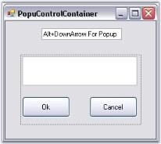' | markdownify }}
{:.image }

In code, call ShowPopup to show the popup anywhere in an application. It also allows you to align a popup beside a control (like in combo boxes) or popup at any given point (like in context menus). 

{{ '' | markdownify }}
{:.image }

The PopupControlContainer also exposes its top-level parent host (a form-derived class) that lets you configure the parent form (to make the parent's borders resizable, for example). 

The Syncfusion XP Menus framework lets users associate a PopupControlContainer with a menu item and show it from within a menu or toolbar. The Syncfusion CommandBars also let you associate a PopupControlContainer with it to be shown when the user clicks on the command bar drop-down button.

###### Features

PopupControlContaineris used to create custom control-rich popups and show them besides a popup-parent, such as a context menu. It has following features.

* This panel-derived control allows users to populate it with various user interface child controls to popup in the desired position.
* Allows the user to populate the popup with the desired parent control.
* It can be configured with ease during design time. The popup can be shown anywhere on the screen like a context menu.

See Also

Concepts and Features

###### Creating Simple Popup

This section deals with creating a simple popup with the help of PopupControlContainer control.

Creating PopupControlContainer

The PopupControlContainer control provides full support for the Windows Forms designer. To use a PopupControlContainer control in your application, all you need to do is drag and drop the PopupControlContainer control from the controls toolbox onto your form. 

{{ '' | markdownify }}
{:.image }

The PopupControlContainer can be created programmatically as follows.

1. Include the Shared.Base assembly reference to Reference folder.
2. Create an instance of PopupControlContainer and add to the Form.

[C#]

private Syncfusion.Windows.Forms.PopupControlContainer popupControlContainer1;

this.popupControlContainer1=new Syncfusion.Windows.Forms.PopupControlContainer();

this.Controls.Add(this.popupControlContainer1);

[VB.NET]

Private popupControlContainer1 As Syncfusion.Windows.Forms.PopupControlContainer

Me.popupControlContainer1 = New Syncfusion.Windows.Forms.PopupControlContainer()

Me.Controls.Add(Me.popupControlContainer1)

3. We can add child controls to the PopupControlContainer and associate it as a popup for other controls like RichTextBox. Refer How to show PopupControlContainer as the popup for a RichTextBox control? topic.

A sample which illustrates how to create a custom PopupControlContainer and assign it to a control is available in the below sample installation location.

…\_My Documents\Syncfusion\EssentialStudio\Version Number\Windows\Tools.Windows\Samples\Advanced Editor Functions\ActionGroupingDemo_

See also

Concepts and Features

###### Concepts and Features

The following topics will help you become more familiar in using the PopupControlContainer control.

Scroll Support

We can enable scrollbars automatically for the PopupContainer control, when its items are shown beyond its size by setting AutoScroll to true. When AutoScroll is enabled for the control, we can set the margin and logical size for the autoscroll region by AutoScrollMargin and AutoScrollMinSize properties.

_Table_ _228_: Property Table_

<table>
<tr>
<td>
PopupControlContainer  Properties</td><td>
Description</td></tr>
<tr>
<td>
AutoScroll</td><td>
It indicates whether Scrollbars will automatically appear if  controls are placed outside the form's client area.</td></tr>
<tr>
<td>
AutoScrollMargin</td><td>
It sets margin around the controls during AutoScroll.</td></tr>
<tr>
<td>
AutoScrollMinSize</td><td>
It sets the minimum logical size for the AutoScroll region.</td></tr>
</table>

[C#]

this.popupControlContainer1.AutoScroll = true;

this.popupControlContainer1.AutoScrollMargin = new System.Drawing.Size(2, 2);

this.popupControlContainer1.AutoScrollMinSize = new System.Drawing.Size(3, 3);

[VB.NET]

Me.popupControlContainer1.AutoScroll = True

Me.popupControlContainer1.AutoScrollMargin = New System.Drawing.Size(2, 2)

Me.popupControlContainer1.AutoScrollMinSize = New System.Drawing.Size(3, 3)

AutoClosing Behavior

When a PopupControlContainer control is associated as the popup for a control, by default, the pop-up will hide when the user clicks anywhere outside the pop up besides the control (if any) that is specified in the "ParentControl" property. To control this default behavior, i.e, to display the popup even if there is any mouse actions, set IgnoreMouseMessages property to true.

Example

The Popup of a textbox, on a button click should be closed only when the textbox is not empty. For this purpose, the popup should not be closed on any mouse action. So set IgnoreMouseMessages property to true for this property.

[C#]

this.popupControlContainer1.IgnoreMouseMessages = true;

private void button1_Click(object sender,EventArgs e)

{

  // Hides the PopupControlContainer under a button click.

if(txtbox.Text!="") 

{

   this.popupControlContainer1.HidePopup(PopupCloseType.Done);

}

}

[VB.NET]

Me.popupControlContainer1.IgnoreMouseMessages = True

Private Sub button1_Click(sender as Object,e as EventArgs)

'Hides the PopupControlContainer under a button click.

If Not txtbox.Text = "" Then

      this.popupControlContainer1.HidePopup(PopupCloseTypes.Done)

End Sub

If you want more control over this behavior, then you will have to implement the IPopupParent interface and set the PopupParent property in the PopupControlContainer.

A sample which illustrates the IPopupParent interface is available in the below sample installation location.

…\_My Documents\Syncfusion\EssentialStudio\Version Number\Windows\Tools.Windows\Samples\Advanced Editor Functions\ActionGroupingDemo_

{{ '' | markdownify }}
{:.image }

Key navigation

When the pop-up is visible, the PopupControlContainer will look for Alt, Enter, Tab, Esc, F4, and F2 keys and either cancel or close the pop-up. In order to navigate, the PopupControlContainer's IgnoreDialogKey property must be set to _true_. 

[C#]

this.popupControlContainer1.IgnoreDialogKey = true;

[VB.NET]

Me.popupControlContainer1.IgnoreDialogKey = True

Hiding popup with PopupCloseType mode

We can hide the popup using HidePopup method in PopupCloseType mode.

To hide the popup with the changes applied to the popup, PopupCloseType should be set to _Done_. To cancel the changes, PopupCloseType should be set to _Canceled_. Setting PopupCloseType to _Deactivated_ will deactivate the popup when the user clicks in different application.

Hosting ComboBoxBase Control  

We can place the ComboBoxBase control within PopupControlContainer such that the PopupControlContainer does not close when the ComboBoxBase's Popup is displayed.

You can do this by deriving from the PopupControlContainer, overriding the OnPopup method, and setting the focus to the derived control. This will ensure that the derived PopupControlContainer does not lose focus and close prematurely. The customized PopupControlContainer code should be like the code snippet shown below.

[C#]

public class CustomPopupControlContainer : Syncfusion.Windows.Forms.PopupControlContainer

{

    public CustomPopupControlContainer()

    {

    }

    public CustomPopupControlContainer(IContainer container):this()

    {

      container.Add(this);

    }

    protected override void OnPopup(EventArgs args)

    {

      base.OnPopup(args);

      this.Focus();

    } 

}

[VB.NET]

Public Class CustomPopupControlContainer

      Inherits Syncfusion.Windows.Forms.PopupControlContainer

      Public Sub New()

      End Sub

   Public  Sub New(ByVal container As IContainer) : Me()

      container.Add(Me)

   End Sub

   Protected Overrides Sub OnPopup(ByVal args As EventArgs)

      MyBase.OnPopup(args)

      Me.Focus()

   End Sub

End Class

It is also necessary to specify the parent-child relationship between the ComboBoxBase’s pop-up and the PopupControlContainer. This can be done by handling the ComboBoxBase’s drop-down event as shown in the code sample below.

[C#]

private void comboBoxBase1_DropDown(object sender, System.EventArgs e)

 {

       /* Setup the relationship between the ComboBoxBase’s dropdown and it's parent         

       PopupControlContainer, so that the pop-up will not close when the ComboBoxBase’s     

       dropdown is shown */

      this.comboBoxBase1.PopupContainer.PopupParent = this.popupControlContainer1;

     this.popupControlContainer1.CurrentPopupChild = this.comboBoxBase1.PopupContainer;

 }

[VB.NET]

Private  Sub comboBoxBase1_DropDown(ByVal sender As Object, ByVal e As System.EventArgs)

        ' Setup the relationship between the ComboBoxBase’s dropdown and it's parent         

        ' PopupControlContainer, so that the pop-up will not close when the ComboBoxBase’s     

        ' dropdown is shown 

       Me.comboBoxBase1.PopupContainer.PopupParent = Me.popupControlContainer1

      Me.popupControlContainer1.CurrentPopupChild = Me.comboBoxBase1.PopupContainer

End Sub

###### Event Handling

PopupControlContainer handles events before and after the Popup is shown. The most commonly used events are discussed below.

_Table_ _229_: Events Table_

<table>
<tr>
<td>
 Event</td><td>
Description</td></tr>
<tr>
<td>
Popup </td><td>
It occurs after the Popup has been dropped down and made visible. The event handler receives an argument of type EventArgs.This event can be handled to get focus on the PopupControlContainer.</td></tr>
<tr>
<td>
BeforePopup</td><td>
It occurs when the Popup is about to be shown. The event handler receives an argument of type CancelEventArgs. The event property associated with the CancelEventArgs is as follows.Cancel - Gets/Sets a value indicating whether the event should be canceled.This event can be handled to resize the PopupControlContainer.</td></tr>
<tr>
<td>
CloseUp</td><td>
It occurs when a Popup is closed. The event handler receives an argument of type PopupClosedEventArgs. The event property associated with the PopupClosedEventArgs is as follows.PopupCloseType - Returns the PopupCloseType value indicating the way in which the popup can be closed.This event can be handled to transfer data from the Popup to the controls on the Form. </td></tr>
</table>

Refer the following topicswhich gives you an idea on the above events.

Popup Event

This event is handled after the popup is dropped down and made visible. Below is an example which uses Popup event.

Mnemonic Support 

The controls that are placed within the PopupControlContainer do not respond to mnemonics. The reason for this behavior is that the main form gets focus immediately after the PopupControlContainer is displayed. However, the work around here would be to set the focus back to the PopupControlContainer in the PopupControlContainer's Popup event handler, so that the access keys will work fine.

[C#]

private void popupControlContainer1_Popup(object sender, System.EventArgs e) 

{ 

this.popupControlContainer1.Focus(); 

} 

[VB.NET]

Private Sub popupControlContainer1_Popup(ByVal sender As Object, ByVal e As System.EventArgs) 

   Me.popupControlContainer1.Focus()

End Sub 

BeforePopup Event

This event occurs when the popup is about to be shown.

Resizing the Popup

Drag and drop the ParentControl say RichTextBox and PopupControlContainer onto the form. In the MouseUp event of RichTextBox, show the Popup using ShowPopup() method.

To make the Popup resizable, handle BeforePopup event of PopupControlContainer and give the following code snippet.

[C#]

private void popupControlContainer1_BeforePopup(object sender, System.ComponentModel.CancelEventArgs e)

{

// Make the pop-up host's border style re-sizable. 

this.popupControlContainer1.PopupHost.FormBorderStyle = FormBorderStyle.SizableToolWindow; 

this.popupControlContainer1.PopupHost.BackColor = this.BackColor;  

// Necessary to set the host's client size every time, especially since the pop-up's Dock style is set to DockStyle.Fill.  

if(this.popupControlContainer1.PopupHost.Size.Width < 160)    

this.popupControlContainer1.PopupHost.Size =new Size(160,176); 

// So that the pop-up container will fill the entire pop-up host when resized.  

this.popupControlContainer1.Dock= System.Windows.Forms.DockStyle.Fill;

} 

[VB.NET]

Private Sub popupControlContainer1_BeforePopup(ByVal sender As Object, ByVal e As System.ComponentModel.CancelEventArgs)

    ' Make the pop-up host's border style re-sizable. 

    Me.popupControlContainer1.PopupHost.FormBorderStyle = FormBorderStyle.SizableToolWindow

    Me.popupControlContainer1.PopupHost.BackColor = Me.BackColor

    ' Necessary to set the host's client size every time, especially since the pop-up's Dock style is set to DockStyle.Fill.  

    If Me.popupControlContainer1.PopupHost.Size.Width < 160 Then

        Me.popupControlContainer1.PopupHost.Size = New Size(160, 176)

    End If

    ' So that the pop-up container will fill the entire pop-up host when resized.  

    Me.popupControlContainer1.Dock = System.Windows.Forms.DockStyle.Fill

End Sub

{{ '' | markdownify }}
{:.image }

CloseUp Event

We can assign data from the Popup to the control on the Form. This is possible by handling CloseUp and BeforePopup events. Follow the steps below to achieve the same.

1. Include the required namespace.

[C#]

using Syncfusion.Windows.Forms.Tools;

[VB.NET]

Imports Syncfusion.Windows.Forms.Tools

2. Set up a Form with TextBox1 and Button1 added to the PopupControlContainer and RichTextBox as shown in the following figure.

{{ '' | markdownify }}
{:.image }

3. Display the Popup on the RichTextBox using following code snippet.

[C#]

private void richTextBox1_MouseUp(object sender, System.Windows.Forms.MouseEventArgs e)

{

this.popupControlContainer1.ShowPopup(Point.Empty);

}

[VB.NET]

Private Sub richTextBox1_MouseUp(ByVal sender As Object, ByVal e As System.Windows.Forms.MouseEventArgs)

    Me.popupControlContainer1.ShowPopup(Point.Empty)

End Sub

4. Handle BeforePopup event.

[C#]

private void popupControlContainer1_BeforePopup(object sender, System.ComponentModel.CancelEventArgs e)

{

// Set the text of richTextBox to the textBox

this.textBox1.Text = this.richTextBox1.Text;

}

[VB.NET]

Private Sub popupControlContainer1_BeforePopup(ByVal sender As Object, ByVal e As System.ComponentModel.CancelEventArgs)

    ' Set the text of richTextBox to the textBox

    Me.textBox1.Text = Me.richTextBox1.Text

End Sub

5. Handle CloseUp event to implement the data transfer from the Popup to the control on the form.

[C#]

private void popupControlContainer1_CloseUp(object sender, Syncfusion.Windows.Forms.PopupClosedEventArgs e)

{

if(e.PopupCloseType == Syncfusion.Windows.Forms.PopupCloseType.Done)

{

this.richTextBox1.Text = this.textBox1.Text;

}

// Set focus back to textbox.

if(e.PopupCloseType == Syncfusion.Windows.Forms.PopupCloseType.Done|| e.PopupCloseType == Syncfusion.Windows.Forms.PopupCloseType.Canceled)

this.richTextBox1.Focus();

}

[VB.NET]

Private Sub popupControlContainer1_CloseUp(ByVal sender As Object, ByVal e As Syncfusion.Windows.Forms.PopupClosedEventArgs)

    If e.PopupCloseType = Syncfusion.Windows.Forms.PopupCloseType.Done Then

        Me.richTextBox1.Text = Me.textBox1.Text

    End If

    ' Set focus back to textbox.

    If e.PopupCloseType = Syncfusion.Windows.Forms.PopupCloseType.Done OrElse e.PopupCloseType = Syncfusion.Windows.Forms.PopupCloseType.Canceled Then

        Me.richTextBox1.Focus()

    End If

End Sub

6. In Button_Click, hide the Popup as shown in the following code snippet.

[C#]

this.popupControlContainer1.HidePopup(Syncfusion.Windows.Forms.PopupCloseType.Done);

[VB.NET]

Me.popupControlContainer1.HidePopup(Syncfusion.Windows.Forms.PopupCloseType.Done)

At runtime, the Popup will be shown when the user right clicks on the RichTextBox. Type any text and close the Popup by clicking 'OK' button, you would see the text being assigned to the RichTextBox.

{{ '' | markdownify }}
{:.image }

###### Frequently Asked Questions

This section discusses the following topics.

How to create a transparent popup?

This can be done using the below code snippet.

[C#]

private void popupControlContainer1_BeforePopup(object sender, System.ComponentModel.CancelEventArgs e)

{

// Get the popupHost which is used to host the popupControlContainer

// and set the opacity.

this.popupControlContainer1.PopupHost.Opacity = 0.75;

}

[VB.NET]

Private Sub popupControlContainer1_BeforePopup(ByVal sender As Object, ByVal e As System.ComponentModel.CancelEventArgs)

'Get the popupHost which is used to host the popupControlContainer

'and set the opacity.

Me.popupControlContainer1.PopupHost.Opacity = 0.75

End Sub

How to identify whether the popup is currently dropped down

PopupControlContainer.IsShowing() method returns whether the popup is currently dropped down or not.

[C#]

this.popupControlContainer1.IsShowing();

[VB.NET]

Me.popupControlContainer1.IsShowing()

How to show PopupControlContainer as the popup for a RichTextBox control

This is done by calling the ShowPopup method of PopupControlContainer control.

* Add a RichTextBox control onto the form.
* Associate it with the ParentControl property of PopupControlContainer as follows.

[C#]

this.popupControlContainer1.ParentControl = this.richTextBox1;

[VB.NET]

Me.popupControlContainer1.ParentControl = Me.richTextBox1

* To display the Popup at a desired location, handle RichTextBox.MouseUp event and call ShowPopup() method of PopupControlContainer as follows. The below code displays the popup just below the RichTextBox control, when the user clicks. 

[C#]

this.richTextBox1.MouseUp +=new MouseEventHandler(richTextBox_MouseUp);

private void richTextBox1_MouseUp(object sender, System.Windows.Forms.MouseEventArgs e)

{

this.popupControlContainer1.ShowPopup(Point.Empty);

}

[VB.NET]

Private Sub richTextBox1_MouseUp(ByVal sender As Object, ByVal e As System.Windows.Forms.MouseEventArgs)

    Me.popupControlContainer1.ShowPopup(Point.Empty)

End Sub

We can also display the popup at particular location.

[C#]

this.popupControlContainer1.ShowPopup(new Point(100, 100));

[VB.NET]

Me.popupControlContainer1.ShowPopup(new Point(100, 100))

At run time, right click on RichTextBox, the popup will be shown below the RichTextBox as in the below image.

{{ '' | markdownify }}
{:.image }

When Two PopUpControl Containers are Opened at the Same Time Controls like the ComboDropDown Close by Itself.

How to Get Around this Behavior?

In order to workaround this behavior, you can set a boolean flag and cancel the BeforeCloseUp event as shown below.

[C#]

private bool bool1;

private void PopupContainer_Popup(object sender, EventArgs e)

{

     bool1= true;

}

private void PopupContainer_BeforeCloseUp(object sender, CancelEventArgs e)

{

if(bool1)

{

e.Cancel = true;

}

}

private void comboDropDown1_LostFocus(object sender, EventArgs e)

{

bool1= false;

}

private void Form1_Click(object sender, EventArgs e)

{

bool1= false;

}

[VB.NET]

Private bool1 As Boolean 

Private Sub PopupContainer_Popup(ByVal sender As Object, ByVal e As EventArgs) 

      bool1 = True 

End Sub 

Private Sub PopupContainer_BeforeCloseUp(ByVal sender As Object, ByVal e As CancelEventArgs) 

      If bool1 Then 

          e.Cancel = True 

      End If 

End Sub 

Private Sub comboDropDown1_LostFocus(ByVal sender As Object, ByVal e As EventArgs) 

      bool1 = False 

End Sub

Private Sub Form1_Click(ByVal sender As Object, ByVal e As EventArgs) 

      bool1 = False 

End Sub 

You can set the Boolean value to be false under the Form's Click event and Control's LostFocus event so that the DropDown closes for rest of the cases.

##### GradientPanel

GradientPanel is a panel-derived control that acts as a container for other controls. It is used to group a collection of controls and it has the ability to have a custom background gradient using an array of colors. 

{{ '' | markdownify }}
{:.image }

###### Features Overview

The basic functionality of a GradientPanel is to act as a container control. Apart from this, GradientPanel has properties to enhance the look and feel of the control.

Features

* Background and Foreground - Background and foreground customization options, available for gradient panel, gives it a good appearance.
* Border Styles - Border settings can also be made using the border properties.
* Container - Gradient Panel control acts as a container control which can hold set of controls in it.

See Also

Concepts and Features

###### Creating GradientPanel

This section will guide you to create a Gradient Panel through designer and also through programmatical approach.

###### Through Designer

This section will guide you to create a GradientPanel control.

1. Create a new Visual C# application or VB.NET application in Visual Studio .NET. 
2. Drag-and-drop a GradientPanel control object from the toolbox onto the form and resize it to the desired dimensions.

{{ '' | markdownify }}
{:.image }

3. Set background color for GradientPanel through property grid.

{{ '' | markdownify }}
{:.image }

4. Build and run the application.

{{ '' | markdownify }}
{:.image }

See Also

Through Code, Concepts and Features

Through Code

The following steps will guide you to create a gradient panel programmatically.

1. Create a C# or VB.NET application through Visual studio and switch to the code view.
2. Add the Syncfusion.Shared.Base and Syncfusion.Shared.Windows assembly references.
3. Declare a gradient panel as below.

[C#]

private Syncfusion.Windows.Forms.Tools.GradientPanel gradientPanel1;

[VB.NET]

Friend WithEvents GradientPanel1 As Syncfusion.Windows.Forms.Tools.GradientPanel

4. In the Initialize function, include the below code to initialize the gradient panel.

[C#]

this.gradientPanel1 = new Syncfusion.Windows.Forms.Tools.GradientPanel();

((System.ComponentModel.ISupportInitialize)(this.gradientPanel1)).BeginInit();

[VB.NET]

Me.GradientPanel1 = New Syncfusion.Windows.Forms.Tools.GradientPanel 

CType(Me.GradientPanel1, System.ComponentModel.ISupportInitialize).BeginInit()

5. Set the properties as follows for the gradient panel and the form.

[C#]

// gradientPanel1

this.gradientPanel1.BackgroundColor = new Syncfusion.Drawing.BrushInfo(Syncfusion.Drawing.PatternStyle.DiagonalCross, System.Drawing.Color.LightBlue, System.Drawing.SystemColors.InactiveCaption);

this.gradientPanel1.BorderColor = System.Drawing.Color.White;

this.gradientPanel1.Location = new System.Drawing.Point(37, 32);

this.gradientPanel1.Name = "gradientPanel1";

this.gradientPanel1.Size = new System.Drawing.Size(350, 202);

this.gradientPanel1.TabIndex = 0;

this.Controls.Add(this.gradientPanel1);

[VB.NET]

'GradientPanel1

Me.GradientPanel1.BackgroundColor = New Syncfusion.Drawing.BrushInfo(Syncfusion.Drawing.PatternStyle.DiagonalCross, System.Drawing.Color.LightSkyBlue, System.Drawing.SystemColors.Window)

Me.GradientPanel1.BorderColor = System.Drawing.Color.Black

Me.GradientPanel1.Location = New System.Drawing.Point(64, 48)

Me.GradientPanel1.Name = "GradientPanel1"

Me.GradientPanel1.Size = New System.Drawing.Size(296, 208)

Me.GradientPanel1.TabIndex = 0

Me.Controls.Add(Me.GradientPanel1)

6. Run the application.

{{ '' | markdownify }}
{:.image }

See Also

Concepts and Features

###### Concepts and Features

This section will take you in detail about the concepts and features available for the gradient panel and guides you to customize the control using the features available.

GradientPanel Appearance

The background of the GradientPanel can be customized using the below properties.

_Table_ _230_: Property Table_

<table>
<tr>
<td>
GradientPanel Properties</td><td>
Description</td></tr>
<tr>
<td>
BackColor</td><td>
Background color used to display the text and graphics in the control.</td></tr>
<tr>
<td>
BackgroundColor</td><td>
Sets a gradient style background for the control.</td></tr>
</table>

[C#]

this.gradientPanel1.BackColor = System.Drawing.Color.LightCoral;

this.gradientPanel1.BackgroundColor = new Syncfusion.Drawing.BrushInfo(Syncfusion.Drawing.GradientStyle.PathRectangle, System.Drawing.Color.AliceBlue, System.Drawing.Color.SteelBlue);

[VB.NET]

Me.gradientPanel1.BackColor = System.Drawing.Color.LightCoral

Me.gradientPanel1.BackgroundColor = New Syncfusion.Drawing.BrushInfo(Syncfusion.Drawing.GradientStyle.PathRectangle, System.Drawing.Color.AliceBlue, System.Drawing.Color.SteelBlue) 

{{ '' | markdownify }}
{:.image }

Foreground Settings

The foreground text in the control can be customized using the below properties.

_Table_ _231_: Property Table_

<table>
<tr>
<td>
GradientPanel Properties</td><td>
Description</td></tr>
<tr>
<td>
Font</td><td>
Indicates the Font style of the text in the control.</td></tr>
<tr>
<td>
ForeColor</td><td>
Indicates the color of the text and graphics in the control.</td></tr>
</table>

[C#]

this.gradientPanel1.Font = new System.Drawing.Font("Verdana", 8.25F, System.Drawing.FontStyle.Bold);

this.gradientPanel1.ForeColor = System.Drawing.Color.Blue;

[VB.NET]

Me.GradientPanel1.Font = New System.Drawing.Font("Comic Sans MS", 9.75F, System.Drawing.FontStyle.Bold, System.Drawing.GraphicsUnit.Point, CType(0, Byte))

this.gradientPanel1.ForeColor = System.Drawing.Color.Blue;

{{ '' | markdownify }}
{:.image }

Image Settings

Background image for the GradientPanel control is set using below properties.

_Table_ _232_: Property Table_

<table>
<tr>
<td>
GradientPanel Properties</td><td>
Description</td></tr>
<tr>
<td>
BackgroundImage</td><td>
Sets the background image for the control.</td></tr>
<tr>
<td>
BackgroundImageLayout</td><td>
Specifies the layout of the image.</td></tr>
</table>

[C#]

this.gradientPanel1.BackgroundImage = ((System.Drawing.Image)(resources.GetObject("gradientPanel1.BackgroundImage")));

this.gradientPanel1.BackgroundImageLayout = System.Windows.Forms.ImageLayout.Stretch;

[VB.NET]

Me.gradientPanel1.BackgroundImage = CType((resources.GetObject("gradientPanel1.BackgroundImage")),System.Drawing.Image) 

Me.gradientPanel1.BackgroundImageLayout = System.Windows.Forms.ImageLayout.Stretch

{{ '' | markdownify }}
{:.image }

See Also

Border Settings

Border Settings

GradientPanel can have 2D and 3D borders. The properties which sets the border style are as follows.

_Table_ _233_: Property Table_

<table>
<tr>
<td>
GradientPanel Property</td><td>
Description</td></tr>
<tr>
<td>
BorderStyle</td><td>
Sets the 2D or 3D border for the GradientPanel. The options are,FixedSingle and Fixed3D.</td></tr>
<tr>
<td>
Border3DStyle</td><td>
Sets the style of the 3D border. The options are,RaisedOuter,RaisedInner,SunkenOuter,SunkenInner, Raised,Etched,Bump, Sunken, Adjust and Flat.</td></tr>
<tr>
<td>
BorderSingle</td><td>
Indicates the 2D border style. The options are,Solid, Dotted,Dashed,Inset, Outset andNone.</td></tr>
<tr>
<td>
BorderColor</td><td>
Sets the color for the 2D border. The BorderColor will be effective only when the BorderStyle property is set to FixedSingle.</td></tr>
<tr>
<td>
BorderSides</td><td>
Specifies the sides of the control which should have a border.</td></tr>
</table>

[C#]

//Sets the 3D border style 

this.gradientPanel1.BorderStyle = System.Windows.Forms.BorderStyle.FixedSingle;

this.gradientPanel1.Border3DStyle = System.Windows.Forms.Border3DStyle.Etched;

//Sets the 2D Border style

this.gradientPanel1.BorderColor = System.Drawing.Color.Blue;

this.gradientPanel1.BorderSingle = System.Windows.Forms.ButtonBorderStyle.Dashed;

this.gradientPanel1.BorderSides = System.Windows.Forms.Border3DSide.All;

[VB.NET]

'Sets the 3D border style

Me.gradientPanel1.BorderStyle = System.Windows.Forms.BorderStyle.FixedSingle

Me.gradientPanel1.Border3DStyle = System.Windows.Forms.Border3DStyle.Etched

Me.gradientPanel1.BorderColor = System.Drawing.Color.Blue

'Sets the 2D Border style

Me.gradientPanel1.BorderSingle = System.Windows.Forms.ButtonBorderStyle.Dashed

Me.gradientPanel1.BorderSides = System.Windows.Forms.Border3DSide.All

{{ '' | markdownify }}
{:.image }

{{ '' | markdownify }}
{:.image }

See Also

GradientPanel Appearance

Scroll Settings

When the contents inside the gradient panel exceeds the visible area, the scroll bars appears. AutoScroll property should be set to true for this purpose. Margin width for the control during auto scroll is set through AutoScrollMargin property. The minimum logical size for the auto scroll region is specified using the AutoScrollMinSize.

[C#]

this.gradientPanel1.AutoScroll = true;

this.gradientPanel1.AutoScrollMargin = new System.Drawing.Size(5, 5);

this.gradientPanel1.AutoScrollMinSize = new System.Drawing.Size(20, 20);

[VB.NET]

Me.gradientPanel1.AutoScroll = True

Me.gradientPanel1.AutoScrollMargin = New System.Drawing.Size(5, 5)

Me.gradientPanel1.AutoScrollMinSize = New System.Drawing.Size(20, 20)

Size properties

The GradientPanel can automatically size itself based on the contents available in the control by enabling the AutoSize property. The mode of this resizing can be specified through AutoSizeMode property. There are two options provided for the AutoSizeMode.

* GrowOnly - the control grows as much as necessary to fit its contents but doesn't shrink smaller than the value specified in Size property of the control.
* GrowAndShrink - the control grows and shrinks to fit its contents to a size may be less than that specified in Size property.

[C#]

this.gradientPanel1.AutoSize = true;

this.gradientPanel1.AutoSizeMode = System.Windows.Forms.AutoSizeMode.GrowOnly;

[VB.NET]

Me.gradientPanel1.AutoSize = True

Me.gradientPanel1.AutoSizeMode = System.Windows.Forms.AutoSizeMode.GrowOnly

##### GradientPanelExt

The GradientPanelExt is an enhanced version of the GradientPanel control. The GradientPanelExt borders can be rounded to any extent as needed. The control also supports hosting of primitives, in any of the panel borders. These primitives cover a wide range from text to any .NET control. The gradient colors applied to the GradientPanelExt apply to the primitives as well. These are no limitations on the number of these primitives.

{{ '' | markdownify }}
{:.image }

See also

###### Features Overview

The GradientPanelExt provides some unique features that makes it much more flexible than the GradientPanel Control. It offers all the features supported by the GradientPanel and additionally supports the following salient features as well:

Salient Features

* Rounded Corners - The GradientPanelExt's corners can be rounded to a considerable extent.
* Primitives - The panel borders can include the following primitives.
* Collapse Primitive - Facilitates expand and collapse option for the GradientPanelExt, with image provisions.
* Image Primitive - Images can be placed along any of the panel borders with gradient background.
* Text Primitive - Text can be included in the GradientPanelExt's borders.
* Host Primitive - Any Windows Forms or custom .NET Control can be placed along the panel borders.
* Primitive Border - The border in which the primitive should lie can be chosen from left, right, top and bottom.
* Primitive Positioning - The primitives can be positioned on any point of the panel border.
###### Creating GradientPanelExt

This section will guide you to create a GradientPanelExt through designer and also through programmatical approach.

Through Designer

The following steps are involved in creating the GradientPanelExt through the designer.

1. Create a new Windows Application.
2. Drag the GradientPanelExt from the toolbox on to the windows application form.

{{ '' | markdownify }}
{:.image }

3. Gradient colors for the panel can be set by defining the gradient styles and colors, using the Color Collection Editor.
4. Primitives can be added to GradientPanelExt 's border using the GradientPanelExt PrimitiveCollection Editor, that can be accessed using the Primitives property.

{{ '' | markdownify }}
{:.image }

5. The primitive alignment and position can be defined here.
> 
{{ '' | markdownify }}
{:.image }
 _Note: The properties for the primitives can be set individually using the property grid as well._

6. Build and run the application.

{{ '' | markdownify }}
{:.image }

Through Code

The following steps will guide you to create a GradientPanelExt through code.

1. Create a C# or VB.NET application through Visual Studio and switch to the code view.
2. Add the Syncfusion.Shared.Base, Syncfusion.Shared.Windows, Syncfusion.Tools.Base and Syncfusion.Tools.Windows assembly references.
3. Include the namespace for the Tools Package.

[C#]

using Syncfusion.Windows.Forms.Tools;

[VB.NET]

Imports Syncfusion.Windows.Forms.Tools

4. Create an instance GradientPanelExt and add it to the Windows Form, defining its various properties and primitives.

[C#]

//Adding the GradientPanelExt

GradientPanelExt gpe = new GradientPanelExt();

gpe.Dock = DockStyle.Fill;

gradientPanelExt1.CornerRadius = 10;

this.Controls.Add(gpe);

//Defining Gradient Colors

gpe.BackColor = System.Drawing.Color.Transparent;

gpe.BackgroundColor = new Syncfusion.Drawing.BrushInfo(Syncfusion.Drawing.GradientStyle.PathEllipse, new System.Drawing.Color[] {

  System.Drawing.Color.Bisque, System.Drawing.Color.LightSalmon,System.Drawing.Color.LightCoral});

//button1

Button button1 = new Button();

button1.FlatStyle = System.Windows.Forms.FlatStyle.Popup;

button1.Text = "Button";

//hostPrimitive1

HostPrimitive hostPrimitive1 = new HostPrimitive();

hostPrimitive1.HostControl = button1;

//progressBarAdv1

ProgressBarAdv progressBarAdv1= new ProgressBarAdv();

progressBarAdv1.ProgressStyle = Syncfusion.Windows.Forms.Tools.ProgressBarStyles.Tube;

//textPrimitive1

TextPrimitive textPrimitive1= new TextPrimitive();

textPrimitive1.Alignment = Syncfusion.Windows.Forms.Tools.Alignment.Bottom;

textPrimitive1.Text = "ProgressbarAdv";

//textPrimitive2

TextPrimitive textPrimitive2 = new TextPrimitive();

textPrimitive2.Text = "Windows Forms Button";

//Adding Primitives

gpe.Primitives.AddRange(new Syncfusion.Windows.Forms.Tools.Primitive[] { hostPrimitive1, textPrimitive1,  textPrimitive2});

[VB.NET]

'Adding the GradientPanelExt

Private gpe As GradientPanelExt = New GradientPanelExt()

Private gpe.Dock = DockStyle.Fill

Private gradientPanelExt1.CornerRadius = 10

Me.Controls.Add(gpe)

'Defining Gradient Colors

Private gpe.BackColor = System.Drawing.Color.Transparent

Private gpe.BackgroundColor = New Syncfusion.Drawing.BrushInfo(Syncfusion.Drawing.GradientStyle.PathEllipse, New                           System.Drawing.Color() { System.Drawing.Color.Bisque, System.Drawing.Color.LightSalmon, System.Drawing.Color.LightCoral})

'button1

Private button1 As Button = New Button()

Private button1.FlatStyle = System.Windows.Forms.FlatStyle.Popup

Private button1.Text = "Button"

'hostPrimitive1

Private hostPrimitive1 As HostPrimitive = New HostPrimitive()

Private hostPrimitive1.HostControl = button1

'progressBarAdv1

Private progressBarAdv1 As ProgressBarAdv = New ProgressBarAdv()

Private progressBarAdv1.ProgressStyle = Syncfusion.Windows.Forms.Tools.ProgressBarStyles.Tube

'textPrimitive1

Private textPrimitive1 As TextPrimitive = New TextPrimitive()

Private textPrimitive1.Alignment = Syncfusion.Windows.Forms.Tools.Alignment.Bottom

Private textPrimitive1.Text = "ProgressbarAdv"

'textPrimitive2

Private textPrimitive2 As TextPrimitive = New TextPrimitive()

Private textPrimitive2.Text = "Windows Forms Button"

'Adding Primitives

gpe.Primitives.AddRange(New Syncfusion.Windows.Forms.Tools.Primitive() {hostPrimitive1, hostPrimitive2, textPrimitive1,                      textPrimitive2})

5. Run and build the application to view the output.
###### Concepts and Features

A few important aspects of the GradientPanelExt have been discussed in this section.

Primitives

One of the most sophisticated features provided by the GradientPanelExt is its ability to include primitives in the borders. 

The primitives that can be included in the GradientPanelExt are,

* Collapse Primitive - Facilitates expand and collapse option for the GradientPanelExt, with image provisions.
* Image Primitive - Images can be placed along any of the panel borders with gradient background.
* Text Primitive - Text can be included in the GradientPanelExt's borders.
* Host Primitive - Any Windows Forms or custom .NET Control can be placed along the panel borders.

The primitives for the GradientPanelExt can be included using the GradientPanelExt PrimitiveCollection Editor, which can be opened using the primitives property.

{{ '' | markdownify }}
{:.image }

The primitive type to be included should be chosen from the Types of Primitives available in the GradientPanelExt Collection Editor, and added to the control. The properties for the primitive can be set in the property grid available at the right side.

Expand and Collapse Options

Including the Collapse primitive, provides option to expand and collapse the GradientPanelExt. Performing the following steps will add the Collapse Primitive at design time.

* Open the GradientPanelExt Collection Editor, and choose the Collapse primitive from the ComboBox available and add it. 
* Set the collapse and expand images in the CollapseImage and ExpandImage property respectively. 
* Specify the alignment and position of the primitive using its respective properties. 
* Close the GradientPanelExt Collection Editor. Build and run the application. 
* Now clicking on the Collapse primitive, collapses the control. The control collapses and expands on alternate clicks.

[C#]

Syncfusion.Windows.Forms.Tools.CollapsePrimitive collapsePrimitive1;

gradientPanelExt1.Primitives.Add(collapsePrimitive1);

collapsePrimitive1.Alignment = Syncfusion.Windows.Forms.Tools.Alignment.Bottom;

collapsePrimitive1.BackColor = System.Drawing.Color.Transparent;

collapsePrimitive1.CollapseImage = ((System.Drawing.Image)(resources.GetObject("collapsePrimitive1.CollapseImage")));

collapsePrimitive1.ExpandImage = ((System.Drawing.Image)(resources.GetObject("collapsePrimitive1.ExpandImage")));

collapsePrimitive1.Position = 130;

collapsePrimitive1.Size = new System.Drawing.Size(40, 40);

[VB.NET]

Private collapsePrimitive1 As Syncfusion.Windows.Forms.Tools.CollapsePrimitive

gradientPanelExt1.Primitives.Add(collapsePrimitive1)

Private collapsePrimitive1.Alignment = Syncfusion.Windows.Forms.Tools.Alignment.Bottom

Private collapsePrimitive1.BackColor = System.Drawing.Color.Transparent

Private collapsePrimitive1.CollapseImage = (CType(resources.GetObject("collapsePrimitive1.CollapseImage"),                 System.Drawing.Image))

Private collapsePrimitive1.ExpandImage = (CType(resources.GetObject("collapsePrimitive1.ExpandImage"),                     System.Drawing.Image))

Private collapsePrimitive1.Position = 130

Private collapsePrimitive1.Size = New System.Drawing.Size(40, 40)

{{ '' | markdownify }}
{:.image }

{{ '' | markdownify }}
{:.image }

See Also

Image and Text Primitives, Host Primitives

Image and Text Primitives

Images and text can be included as individual primitives for the GradientPanelExt. 

The image to be included, should be referenced in the Image property available for the primitive in the GradientPanelExt Collection Editor. 

The text for text primitive, can be specified using the Text property available for the primitive in the GradientPanelExt Collection Editor. The text font and color can also be defined for the text primitive, using the TextFont and TextColor properties, respectively.

[C#]

// Defining Primitives and Adding them

private Syncfusion.Windows.Forms.Tools.ImagePrimitive imagePrimitive1;

private Syncfusion.Windows.Forms.Tools.ImagePrimitive imagePrimitive2;

private Syncfusion.Windows.Forms.Tools.ImagePrimitive imagePrimitive3;

private Syncfusion.Windows.Forms.Tools.ImagePrimitive imagePrimitive4;

private Syncfusion.Windows.Forms.Tools.TextPrimitive textPrimitive1;

private Syncfusion.Windows.Forms.Tools.TextPrimitive textPrimitive2;

this.gradientPanelExt1.Primitives.AddRange(new Syncfusion.Windows.Forms.Tools.Primitive[] {

            this.imagePrimitive1,

            this.imagePrimitive2,

            this.textPrimitive1,

            this.textPrimitive2,

            this.imagePrimitive3,

            this.imagePrimitive4});

// imagePrimitive1       

this.imagePrimitive1.Image = ((System.Drawing.Image)(resources.GetObject("imagePrimitive1.Image")));

this.imagePrimitive1.PrimitiveBorderStyle = Syncfusion.Windows.Forms.Tools.PrimitiveBorderStyle.None;

this.imagePrimitive1.Size = new System.Drawing.Size(20, 20);

// imagePrimitive2

this.imagePrimitive2.Alignment = Syncfusion.Windows.Forms.Tools.Alignment.Bottom;

this.imagePrimitive2.Image = ((System.Drawing.Image)(resources.GetObject("imagePrimitive2.Image")));

this.imagePrimitive2.Position = 2;

this.imagePrimitive2.PrimitiveBorderStyle = Syncfusion.Windows.Forms.Tools.PrimitiveBorderStyle.None;

this.imagePrimitive2.Size = new System.Drawing.Size(20, 20);

// textPrimitive1   

this.textPrimitive1.Alignment = Syncfusion.Windows.Forms.Tools.Alignment.Left;

this.textPrimitive1.Position = 21;

this.textPrimitive1.Size = new System.Drawing.Size(150, 20);

this.textPrimitive1.Text = "Text in Left Border";

this.textPrimitive1.TextColor = System.Drawing.Color.DarkOliveGreen;

this.textPrimitive1.TextFont = new System.Drawing.Font("Arial", 9.75F, ((System.Drawing.FontStyle)((System.Drawing.        FontStyle.Bold | System.Drawing.FontStyle.Italic))), System.Drawing.GraphicsUnit.Point, ((byte)(0)));

// textPrimitive2

this.textPrimitive2.Alignment = Syncfusion.Windows.Forms.Tools.Alignment.Right;

this.textPrimitive2.Position = 24;

this.textPrimitive2.Size = new System.Drawing.Size(150, 20);

this.textPrimitive2.Text = "Text in Right Border";

this.textPrimitive2.TextColor = System.Drawing.Color.DarkGreen;

this.textPrimitive2.TextFont = new System.Drawing.Font("Arial", 9.75F, ((System.Drawing.FontStyle)((System.Drawing.        FontStyle.Bold | System.Drawing.FontStyle.Italic))), System.Drawing.GraphicsUnit.Point, ((byte)(0)));

// imagePrimitive3

this.imagePrimitive3.Image = ((System.Drawing.Image)(resources.GetObject("imagePrimitive3.Image")));

this.imagePrimitive3.Position = 256;

this.imagePrimitive3.PrimitiveBorderStyle = Syncfusion.Windows.Forms.Tools.PrimitiveBorderStyle.None;

this.imagePrimitive3.Size = new System.Drawing.Size(20, 20);

// imagePrimitive4

this.imagePrimitive4.Alignment = Syncfusion.Windows.Forms.Tools.Alignment.Bottom;

this.imagePrimitive4.Image = ((System.Drawing.Image)(resources.GetObject("imagePrimitive4.Image")));

this.imagePrimitive4.Position = 256;

this.imagePrimitive4.PrimitiveBorderStyle = Syncfusion.Windows.Forms.Tools.PrimitiveBorderStyle.None;

this.imagePrimitive4.Size = new System.Drawing.Size(20, 20);

[VB.NET]

' Defining Primitives and Adding them

Private imagePrimitive1 As Syncfusion.Windows.Forms.Tools.ImagePrimitive

Private imagePrimitive2 As Syncfusion.Windows.Forms.Tools.ImagePrimitive

Private imagePrimitive3 As Syncfusion.Windows.Forms.Tools.ImagePrimitive

Private imagePrimitive4 As Syncfusion.Windows.Forms.Tools.ImagePrimitive

Private textPrimitive1 As Syncfusion.Windows.Forms.Tools.TextPrimitive

Private textPrimitive2 As Syncfusion.Windows.Forms.Tools.TextPrimitive

Me.gradientPanelExt1.Primitives.AddRange(New Syncfusion.Windows.Forms.Tools.Primitive() {Me.imagePrimitive1, Me            .imagePrimitive2, Me.textPrimitive1, Me.textPrimitive2, Me.imagePrimitive3, Me.imagePrimitive4})

' imagePrimitive1       

Private Me.imagePrimitive1.Image = (CType(resources.GetObject("imagePrimitive1.Image"), System.Drawing.Image))

Private Me.imagePrimitive1.PrimitiveBorderStyle = Syncfusion.Windows.Forms.Tools.PrimitiveBorderStyle.None

Private Me.imagePrimitive1.Size = New System.Drawing.Size(20, 20)

' imagePrimitive2

Private Me.imagePrimitive2.Alignment = Syncfusion.Windows.Forms.Tools.Alignment.Bottom

Private Me.imagePrimitive2.Image = (CType(resources.GetObject("imagePrimitive2.Image"), System.Drawing.Image))

Private Me.imagePrimitive2.Position = 2

Private Me.imagePrimitive2.PrimitiveBorderStyle = Syncfusion.Windows.Forms.Tools.PrimitiveBorderStyle.None

Private Me.imagePrimitive2.Size = New System.Drawing.Size(20, 20)

' textPrimitive1   

Private Me.textPrimitive1.Alignment = Syncfusion.Windows.Forms.Tools.Alignment.Left

Private Me.textPrimitive1.Position = 21

Private Me.textPrimitive1.Size = New System.Drawing.Size(150, 20)

Private Me.textPrimitive1.Text = "Text in Left Border"

Private Me.textPrimitive1.TextColor = System.Drawing.Color.DarkOliveGreen

Private Me.textPrimitive1.TextFont = New System.Drawing.Font("Arial", 9.75F, (CType((System.Drawing. FontStyle.Bold      Or System.Drawing.FontStyle.Italic), System.Drawing.FontStyle)), System.Drawing.GraphicsUnit.Point, (CByte(0)))

' textPrimitive2

Private Me.textPrimitive2.Alignment = Syncfusion.Windows.Forms.Tools.Alignment.Right

Private Me.textPrimitive2.Position = 24

Private Me.textPrimitive2.Size = New System.Drawing.Size(150, 20)

Private Me.textPrimitive2.Text = "Text in Right Border"

Private Me.textPrimitive2.TextColor = System.Drawing.Color.DarkGreen

Private Me.textPrimitive2.TextFont = New System.Drawing.Font("Arial", 9.75F, (CType((System.Drawing. FontStyle.Bold        Or System.Drawing.FontStyle.Italic), System.Drawing.FontStyle)), System.Drawing.GraphicsUnit.Point, (CByte(0)))

' imagePrimitive3

Private Me.imagePrimitive3.Image = (CType(resources.GetObject("imagePrimitive3.Image"), System.Drawing.Image))

Private Me.imagePrimitive3.Position = 256

Private Me.imagePrimitive3.PrimitiveBorderStyle = Syncfusion.Windows.Forms.Tools.PrimitiveBorderStyle.None

Private Me.imagePrimitive3.Size = New System.Drawing.Size(20, 20)

' imagePrimitive4

Private Me.imagePrimitive4.Alignment = Syncfusion.Windows.Forms.Tools.Alignment.Bottom

Private Me.imagePrimitive4.Image = (CType(resources.GetObject("imagePrimitive4.Image"), System.Drawing.Image))

Private Me.imagePrimitive4.Position = 256

Private Me.imagePrimitive4.PrimitiveBorderStyle = Syncfusion.Windows.Forms.Tools.PrimitiveBorderStyle.None

{{ '' | markdownify }}
{:.image }

See Also

Host Primitives, Expand and Collapse Options

Host Primitives

Any .NET Windows Forms control or custom control can be included as a primitive in the GradientPanelExt. The host control should be referred in the HostControl property of the GradientPanelExt Collection Editor. 

[C#]

//button1

Button button1 = new Button();

button1.FlatStyle = System.Windows.Forms.FlatStyle.Popup;

button1.Text = "Button";

//hostPrimitive1

HostPrimitive hostPrimitive1 = new HostPrimitive();

hostPrimitive1.BackColor = System.Drawing.Color.Transparent;

hostPrimitive1.HostControl = button1;

hostPrimitive1.Size = new System.Drawing.Size(60, 20);

//progressBarAdv1

ProgressBarAdv progressBarAdv1= new ProgressBarAdv();

progressBarAdv1.BackColor = System.Drawing.Color.Transparent;

progressBarAdv1.ProgressStyle = Syncfusion.Windows.Forms.Tools.ProgressBarStyles.Tube;

progressBarAdv1.TubeStartColor = System.Drawing.Color.FromArgb(((int)(((byte)(255)))), ((int)(((byte)(192)))), ((int)   (((byte             )(192)))));

//hostPrimitive2

HostPrimitive hostPrimitive2 = new HostPrimitive();

hostPrimitive2.Alignment = Syncfusion.Windows.Forms.Tools.Alignment.Bottom;

hostPrimitive2.BackColor = System.Drawing.Color.Transparent;

hostPrimitive2.HostControl = progressBarAdv1;

hostPrimitive2.Position = 200;

hostPrimitive2.Size = new System.Drawing.Size(100, 20);

//Adding Primitives

gpe.Primitives.AddRange(new Syncfusion.Windows.Forms.Tools.Primitive[] {

  hostPrimitive1,

  hostPrimitive2});

[VB.NET]

'button1

Private button1 As Button = New Button()

Private button1.FlatStyle = System.Windows.Forms.FlatStyle.Popup

Private button1.Text = "Button"

'hostPrimitive1

Private hostPrimitive1 As HostPrimitive = New HostPrimitive()

Private hostPrimitive1.BackColor = System.Drawing.Color.Transparent

Private hostPrimitive1.HostControl = button1

Private hostPrimitive1.Size = New System.Drawing.Size(60, 20)

'progressBarAdv1

Private progressBarAdv1 As ProgressBarAdv = New ProgressBarAdv()

Private progressBarAdv1.BackColor = System.Drawing.Color.Transparent

Private progressBarAdv1.ProgressStyle = Syncfusion.Windows.Forms.Tools.ProgressBarStyles.Tube

Private progressBarAdv1.TubeStartColor = System.Drawing.Color.FromArgb((CInt((CByte(255)))), (CInt((CByte(192)))), (      CInt((CByte       (192)))))

'hostPrimitive2

Private hostPrimitive2 As HostPrimitive = New HostPrimitive()

Private hostPrimitive2.Alignment = Syncfusion.Windows.Forms.Tools.Alignment.Bottom

Private hostPrimitive2.BackColor = System.Drawing.Color.Transparent

Private hostPrimitive2.HostControl = progressBarAdv1

Private hostPrimitive2.Position = 200

Private hostPrimitive2.Size = New System.Drawing.Size(100, 20)

'Adding Primitives

gpe.Primitives.AddRange(New Syncfusion.Windows.Forms.Tools.Primitive() {hostPrimitive1, hostPrimitive2})

{{ '' | markdownify }}
{:.image }

See Also

Expand and Collapse Options, Image and Text Primitives

Collapse Expand Animation

The collapse and expand operation in a GradientPanelExt control can be animated by setting Animated property to true. Delay in animation and the speed of animation is specified in AnimationDelay and AnimationSpeed properties.

[C#]

this.gradientPanelExt1.Animated = true;

this.gradientPanelExt1.AnimationDelay = 11;

this.gradientPanelExt1.AnimationSpeed = 2;

[VB.NET]

this.gradientPanelExt1.Animated = True

this.gradientPanelExt1.AnimationDelay = 11

this.gradientPanelExt1.AnimationSpeed = 2

Background and Foreground Settings

By setting the background properties, the user can create a GradientPanelExt according to his requirements. The properties and styles for the GradientPanelExt have been listed and discussed below.

Background Properties

BackColor represents the background color used to display the text or the graphics in the control.

{{ '' | markdownify }}
{:.image }

[C#]

gradientPanelExt1.BackColor = System.Drawing.Color.Transparent;

[VB.NET]

Private gradientPanelExt1.BackColor = System.Drawing.Color.Transparent

{{ '' | markdownify }}
{:.image }

The colors and styles of the GradientPanelExt control can be set using the BackgroundColor properties, which have been explained below:

* Style - The styles available are solid, pattern and gradient.
* BackColor - User can select the required colors for the background using Backcolor property.
* ForeColor - Foreground color, for text or graphics can be set using ForeColor property.
* PatternStyle - Provides the pattern styles available for the style selected.
* GradientColors - This pops up the Color Collection Editor, which allows the user to add colors and get a combination of colors to display in the gradient panel with the specified style.

_Table_ _234_: Property Table_

<table>
<tr>
<td>
GradientPanelExt Properties</td><td>
Description</td></tr>
<tr>
<td>
Style</td><td>
Specifies the brush style (Solid, Pattern, Gradient).</td></tr>
<tr>
<td>
BackColor</td><td>
Gets or sets the back color.</td></tr>
<tr>
<td>
ForeColor</td><td>
Gets or sets the fore color.</td></tr>
<tr>
<td>
PatternStyle</td><td>
Gets or sets specifies the pattern style.</td></tr>
<tr>
<td>
GradientColor</td><td>
Specifies the gradient colors, with the first color same as BackColor and last color same as ForeColor.</td></tr>
<tr>
<td>
BackgroundImage</td><td>
Specifies the background image for the control.</td></tr>
</table>

{{ '' | markdownify }}
{:.image }

Alternatively, the BackgroundColor for the control can also be set using the following code snippet.

[C#]

gradientPanelExt1.BackgroundColor = new Syncfusion.Drawing.BrushInfo(Syncfusion.Drawing.GradientStyle.PathEllipse, new     System.Drawing.Color[] {

  System.Drawing.Color.Bisque,

  System.Drawing.Color.LightSalmon,

  System.Drawing.Color.LightCoral});

[VB.NET]

Private gradientPanelExt1.BackgroundColor = New                                                                            Syncfusion.Drawing.BrushInfo(Syncfusion.Drawing.GradientStyle.PathEllipse, New System.Drawing.Color() {                  System.Drawing.Color.Bisque, System.Drawing.Color.LightSalmon, System.Drawing.Color.LightCoral})

{{ '' | markdownify }}
{:.image }

Image Settings

A background image can be set for the gradient panel using the BackgroundImage property. User can set the layout for the background image using the BackgroundImageLayout property. These properties can be set programmatically using the below code snippets.

[C#]

gradientPanelExt1.BackgroundImage = ((System.Drawing.Image)(resources.GetObject("gradientPanelExt1.BackgroundImage")));                

gradientPanelExt1.BackgroundImageLayout = System.Windows.Forms.ImageLayout.Stretch;

[VB.NET]

Private Me.gradientPanelExt1.BackgroundImage = (CType(resources.GetObject("gradientPanelExt1.BackgroundImage"),System.Drawing.Image))   

Private Me.gradientPanelExt1.BackgroundImageLayout = System.Windows.Forms.ImageLayout.Stretch

{{ '' | markdownify }}
{:.image }

Foreground

The control's text can be customized by altering its Font properties. The ForeColor property represents the GradientPanelExt's text color. Using the following code snippet customizes the foreground of the GradientPanelExt.

[C#]

this.gradientPanelExt1.Font = new System.Drawing.Font("Comic Sans MS", 9.75F, ((System.Drawing.FontStyle)                                   (((System.Drawing.FontStyle.Bold | System.Drawing.FontStyle.Italic)

  | System.Drawing.FontStyle.Underline))), System.Drawing.GraphicsUnit.Point, ((byte)(0)));

this.gradientPanelExt1.ForeColor = System.Drawing.Color.DarkGreen;

[VB.NET]

Private Me.gradientPanelExt1.Font = New System.Drawing.Font("Comic Sans MS", 9.75F, (CType                                                  (((System.Drawing.FontStyle.Bold Or System.Drawing.FontStyle.Italic) Or System.Drawing.FontStyle.Underline),                              System.Drawing.FontStyle)), System.Drawing.GraphicsUnit.Point, (CByte(0)))

Private Me.gradientPanelExt1.ForeColor = System.Drawing.Color.DarkGreen

{{ '' | markdownify }}
{:.image }

Border Settings

Corner Radius 

The GradientPanelExt comes as a rounded rectangle by default. The rounded corners can be removed or their radius can be modified using the CornerRadius property.

_Table_ _235_: Property Table_

<table>
<tr>
<td>
GradientPanelExt Property</td><td>
Description</td></tr>
<tr>
<td>
CornerRadius</td><td>
Used to set or get the radius truncation for the control's corners.</td></tr>
</table>

[C#]

gradientPanelExt1.CornerRadius = 14;

[VB.NET]

Private gradientPanelExt1.CornerRadius = 14

{{ '' | markdownify }}
{:.image }

The CornerRadius can be turned off by giving a value of zero for it.

[C#]

gradientPanelExt1.CornerRadius = 0;

[VB.NET]

Private gradientPanelExt1.CornerRadius = 0

{{ '' | markdownify }}
{:.image }

Border Gap

The GradientPanelExt comes with a margin for all the four sides. The spacing between the margin and the control's border can be set using the BorderGap property.

_Table_ _236_: Property Table_

<table>
<tr>
<td>
GradientPanelExt Property</td><td>
Description</td></tr>
<tr>
<td>
BorderGap</td><td>
Used to get or set the gap between the border and the margins.</td></tr>
</table>

The border gap for the GradientPanelExt can be set programmatically as given below.

[C#]

gradientPanelExt1.BorderGap = 40;

[VB.NET]

Private gradientPanelExt1.BorderGap = 40

{{ '' | markdownify }}
{:.image }

Scroll Settings

The scroll settings that apply for the GradientPanel also applies for GradientPanelExt control.

See Also

Scroll Settings

###### GradientPanelExt Events

The GradientPanelExt offers the following unique events, to make it more flexible to work with.

CornerRadiusChanged Event

This event is raised every time the Corner Radius value is changed.

[C#]

private void gradientPanelExt1_CornerRadiusChanged(object sender, EventArgs e)

{

    imagePrimitive1.Position = 100;

}

[VB.NET]

Private Sub gradientPanelExt1_CornerRadiusChanged(ByVal sender As Object, ByVal e As EventArgs)

imagePrimitive1.Position = 100

End Sub

 PrimitivesChanged Event

 This event is raised when the value of the primitives property is changed.

[C#]

private void gradientPanelExt1_PrimitivesChanged(object sender, EventArgs e)

{

    MessageBox.Show("Primitive Value Changed");

}

[VB.NET]

Private Sub gradientPanelExt1_PrimitivesChanged(ByVal sender As Object, ByVal e As EventArgs)

MessageBox.Show("Primitive Value Changed")

End Sub

##### SplitContainerAdv

The SplitContainerAdv is a container that consists of two panels with a splitter between them. It allows the user to simply put other controls on these panels and drag the splitter vertically or horizontally to resize these panels. The user can add more SplitContainerAdv controls into any one of the panels in another SplitContainerAdv control and can change the orientation to have a customized look.

{{ '' | markdownify }}
{:.image }

See Also

###### Features Overview

The following are the features of SplitContainerAdv control.

* Border Style - Border Styles can be set for the split container.
* PanelFixed - One panel can be set as fixed and the other can be resized.
* Splitter properties - There are properties to customize the splitter bar. Properties like SplitterDistance, SplitterIncrement, and SplitterWidth are used to customize the splitter appearance and orientation.
* Orientation - The Splitter bar can be set as horizontal or vertical between the panels.
* Panel Properties - There are separate properties for panels also, so that they can be customized separately.
* Panel Collapsed - The control provides options for collapsing the panels by setting the properties for the panel, which needs to be collapsed.
* Styles - The SplitContainerAdv has now come up with different styles to give the control a good look and feel.
* Arrow Settings - The control provides properties to customize the thumbnail arrows' appearance.

See Also

Concepts and Features

###### Creating SplitContainerAdv

This section will give a step-by-step procedure to design a SplitContainerAdv control through designer and also through programmatical approach.

Through Designer

To create and customize the SplitContainerAdv through designer,

* Open a new Visual C# or VB.NET application in Visual studio.
* Drag-and-drop a SplitContainerAdv control object from the toolbox onto the form and resize it to the desired dimension.

{{ '' | markdownify }}
{:.image }

* Drag and drop the desired controls on to the panels.
* Run the application. 

{{ '' | markdownify }}
{:.image }

See Also

Concepts and Features

Through Code

To create a SplitContainerAdv control programmatically,

* Open a new Visual C# or VB.NET application in Visual Studio.
* Add the Syncfusion assemblies Shared.Base and Tool.Windows.
* Declare the SplitContainerAdv control.

[C#]

private Syncfusion.Windows.Forms.Tools.SplitContainerAdv splitContainerAdv1;

[VB.NET]

Private splitContainerAdv1 As Syncfusion.Windows.Forms.Tools.SplitContainerAdv

* Initialize the control and add it in your form.

[C#]

this.splitContainerAdv1 = new Syncfusion.Windows.Forms.Tools.SplitContainerAdv();

this.Controls.Add(this.splitContainerAdv1);

[VB.NET]

Me.splitContainerAdv1 = New Syncfusion.Windows.Forms.Tools.SplitContainerAdv()

Me.Controls.Add(Me.splitContainerAdv1)

* If required customize the control's look and feel.

[C#]

this.splitContainerAdv1.BackColor = System.Drawing.Color.AliceBlue;

this.splitContainerAdv1.Location = new System.Drawing.Point(64, 48);

this.splitContainerAdv1.Size = new System.Drawing.Size(224, 136);

this.splitContainerAdv1.SplitterDistance = 47;

[VB.NET]

Me.splitContainerAdv1.BackColor = System.Drawing.Color.AliceBlue

Me.splitContainerAdv1.Location = New System.Drawing.Point(64, 48)

Me.splitContainerAdv1.Size = New System.Drawing.Size(224, 136)

Me.splitContainerAdv1.SplitterDistance = 47

* Run the application. You will see the SplitContainerAdv with two panels in it as shown below.

{{ '' | markdownify }}
{:.image }

###### Concepts and Features

This section will guide you in getting started with the SplitContainerAdv control. It explains all the concepts and features of the control in detail.

SplitContainerAdv

The below image illustrates the components of a SplitContainerAdv control. It has two panels separated by a splitter, which has arrows and a grip for the splitter.

{{ '' | markdownify }}
{:.image }

A sample which demonstrates the SplitContainerAdv control is available in the below sample installation location.

..\My Documents\Syncfusion\EssentialStudio_\Version Number_\Windows\Tools.Windows\Samples\2.0\Editors Package\Container controls\SplitContainerAdv

See Also

Panel Settings

This section discusses about various properties available for the SplitContainerAdv to control the behavior of the panels. The panels has properties and events similar to Window's Panel control, to change its appearance.

Panel Orientation

The SplitContainerAdv Panels can be oriented horizontally or vertically using the Orientation property. Default value is horizontal.

[C#]

this.splitContainerAdv1.Orientation = System.Windows.Forms.Orientation.Vertical;

[VB.NET]

Me.splitContainerAdv1.Orientation = System.Windows.Forms.Orientation.Vertical

{{ '' | markdownify }}
{:.image }

Resizing the Panels

While resizing the control at design time or at run time, we can make one panel as fixed and resize the other panel alone. Select the panel which needs to be fixed, in FixedPanel property. 

[C#]

this.SplitContainerAdv1.FixedPanel = Syncfusion.Windows.Forms.Tools.Enums.FixedPanel.Panel1

[VB.NET]

Me.SplitContainerAdv1.FixedPanel = Syncfusion.Windows.Forms.Tools.Enums.FixedPanel.Panel1

Collapsing a Panel

We can make any of the panels to be collapsed at run time. The below properties helps you to do that.

_Table_ _237_: Property Table_

<table>
<tr>
<td>
SplitContainerAdv Properties</td><td>
Description</td></tr>
<tr>
<td>
Panel1</td><td>
Gives properties of the panel1 which represents the first panel to the left of the Splitter.</td></tr>
<tr>
<td>
Panel1Collapsed</td><td>
Indicates if the Panel1 is collapsed or not.</td></tr>
<tr>
<td>
Panel2</td><td>
Gives properties of the panel2 which represents the last or the second panel to the right of the Splitter.</td></tr>
<tr>
<td>
Panel2Collapsed</td><td>
Indicates if the Panel2 is collapsed or not.</td></tr>
<tr>
<td>
PanelToBeCollapsed</td><td>
Sets the panel to be collapsed when a predefined event occurs on it.</td></tr>
<tr>
<td>
TogglePanelOn</td><td>
A predefined event, which leads to collapsing of the panel specified in PanelToBeCollapsed property. Using TogglePanelOn property, we can decide whether, the panel needs to be collapsed on a single click or a double click.</td></tr>
</table>

[C#]

this.splitContainerAdv1.Panel1Collapsed = true;

this.splitContainerAdv1.Panel2Collapsed = false;

this.splitContainerAdv1.PanelToBeCollapsed = Syncfusion.Windows.Forms.Tools.CollapsedPanel.Panel1;

this.splitContainerAdv1.TogglePanelOn = Syncfusion.Windows.Forms.Tools.TogglePanelOn.DoubleClick;

[VB.NET]

Me.SplitContainerAdv1.Panel1Collapsed = True

Me.SplitContainerAdv1.Panel2Collapsed = False

Me.splitContainerAdv1.PanelToBeCollapsed = Syncfusion.Windows.Forms.Tools.CollapsedPanel.Panel1

Me.splitContainerAdv1.TogglePanelOn = Syncfusion.Windows.Forms.Tools.TogglePanelOn.DoubleClick

Panel Size 

We can specify the minimum size for the Panel1 and Panel2 in Panel1MinSize and Panel2MinSize properties. Default value for both the properties is 25.

[C#]

this.splitContainerAdv1.Panel1MinSize = 50;

this.splitContainerAdv1.Panel2MinSize = 50;

[VB.NET]

Me.splitContainerAdv1.Panel1MinSize = 50

Me.splitContainerAdv1.Panel2MinSize = 50

Splitter Settings

The properties which changes the behavior of the Splitter in a SplitContainerAdv control are discussed in this section.

Splitter Settings

The below table describes the properties to control the behavior of the splitter. 

_Table_ _238_: Property Table_

<table>
<tr>
<td>
SplitContainerAdv Properties</td><td>
Description</td></tr>
<tr>
<td>
IsSplitterFixed</td><td>
Gets / sets whether the user is allowed to move the splitter or not. Default value is false.</td></tr>
<tr>
<td>
SplitterDistance</td><td>
Indicates the distance from the left top border.</td></tr>
<tr>
<td>
SplitterIncrement</td><td>
Determines the number of pixels the splitter moves in each increment.</td></tr>
<tr>
<td>
SplitterWidth</td><td>
Indicates the width of the splitter.</td></tr>
</table>

[C#]

this.SplitContainerAdv1.IsSplitterFixed = true;

this.splitContainerAdv1.SplitterDistance = 25

this.splitContainerAdv1.SplitterIncrement = 5

this.splitContainerAdv1.SplitterWidth = 20

[VB.NET]

Me.SplitContainerAdv1.IsSplitterFixed = True

Me.splitContainerAdv1.SplitterDistance = 25

Me.splitContainerAdv1.SplitterIncrement = 5

Me.splitContainerAdv1.SplitterWidth = 20

{{ '' | markdownify }}
{:.image }

Thumbnail Arrow and Grip Settings

SplitContainerAdv control supports various appearance settings for the ThumbnailArrow in the control which are discussed in detail below. The properties which control the appearance of the splitter components are as follows.

_Table_ _239_: Property Table_

<table>
<tr>
<td>
SplitContainerAdv Properties</td><td>
Description</td></tr>
<tr>
<td>
ExpandFill</td><td>
Sets the color for the arrows.</td></tr>
<tr>
<td>
ExpandLine</td><td>
Sets the outline color for the arrows.</td></tr>
<tr>
<td>
GripDark</td><td>
Sets color for the grip.</td></tr>
<tr>
<td>
GridLight</td><td>
Sets the shadow around the grip.</td></tr>
</table>

[C#]

this.splitContainerAdv2.ExpandFill = new Syncfusion.Drawing.BrushInfo(System.Drawing.Color.AliceBlue);

this.splitContainerAdv2.ExpandLine = System.Drawing.Color.Red;

this.splitContainerAdv2.GripDark = new Syncfusion.Drawing.BrushInfo(System.Drawing.Color.Wheat);

this.splitContainerAdv2.GripLight = new Syncfusion.Drawing.BrushInfo(System.Drawing.Color.Crimson);

[VB.NET]

Me.splitContainerAdv2.ExpandFill = New Syncfusion.Drawing.BrushInfo(System.Drawing.Color.AliceBlue)

Me.splitContainerAdv2.ExpandLine = System.Drawing.Color.Red

Me.splitContainerAdv2.GripDark = New Syncfusion.Drawing.BrushInfo(System.Drawing.Color.Wheat)

Me.splitContainerAdv2.GripLight = New Syncfusion.Drawing.BrushInfo(System.Drawing.Color.Crimson)

{{ '' | markdownify }}
{:.image }

RunTime Appearance

The properties to control the appearance of the thumbnail arrows, and grip, while mouse hovering at runtime, are as follows.

_Table_ _240_: Property Table_

<table>
<tr>
<td>
SplitContainerAdv Properties</td><td>
Description</td></tr>
<tr>
<td>
HotBackgroundColor</td><td>
Sets the background color of the Thumbnail while under mouse cursor.</td></tr>
<tr>
<td>
HotExpandFill</td><td>
Sets the color for the arrows while under mouse cursor.</td></tr>
<tr>
<td>
HotExpandLine</td><td>
Sets the outline color for the arrows while under mouse cursor.</td></tr>
<tr>
<td>
HotGripDark</td><td>
Sets color for the grip while under mouse cursor.</td></tr>
<tr>
<td>
HotGridLight</td><td>
Sets the shadow around the grip while under mouse cursor.</td></tr>
</table>

[C#]

this.splitContainerAdv2.HotBackgroundColor = new Syncfusion.Drawing.BrushInfo(Syncfusion.Drawing.GradientStyle.Horizontal, System.Drawing.Color.SandyBrown, System.Drawing.Color.AntiqueWhite);

this.splitContainerAdv2.HotExpandFill = new Syncfusion.Drawing.BrushInfo(System.Drawing.Color.Red);

this.splitContainerAdv2.HotExpandLine = System.Drawing.Color.DeepPink;

this.splitContainerAdv2.HotGripDark = new Syncfusion.Drawing.BrushInfo(System.Drawing.Color.MistyRose);

this.splitContainerAdv2.HotGripLight = new Syncfusion.Drawing.BrushInfo(System.Drawing.Color.Purple);

[VB.NET]

Me.splitContainerAdv2.HotBackgroundColor = New Syncfusion.Drawing.BrushInfo(Syncfusion.Drawing.GradientStyle.Horizontal, System.Drawing.Color.SandyBrown, System.Drawing.Color.AntiqueWhite) 

Me.splitContainerAdv2.HotExpandFill = New Syncfusion.Drawing.BrushInfo(System.Drawing.Color.Red) 

Me.splitContainerAdv2.HotExpandLine = System.Drawing.Color.DeepPink 

Me.splitContainerAdv2.HotGripDark = New Syncfusion.Drawing.BrushInfo(System.Drawing.Color.MistyRose) 

Me.splitContainerAdv2.HotGripLight = New Syncfusion.Drawing.BrushInfo(System.Drawing.Color.Purple)

{{ '' | markdownify }}
{:.image }

Appearance Settings

This section discusses the properties which controls the appearance of the SplitContainerAdv control.

Background Settings

The below table describes the background settings.

_Table_ _241_: Property Table_

<table>
<tr>
<td>
SplitContainerAdv Properties</td><td>
Description</td></tr>
<tr>
<td>
BackgroundImage</td><td>
Sets the background image for the control.</td></tr>
<tr>
<td>
BackgroundImageLayout</td><td>
Specifies the background image layout.</td></tr>
<tr>
<td>
BackColor</td><td>
Sets the background color for the control.</td></tr>
<tr>
<td>
BackgroundColor</td><td>
Sets the solid, gradient or pattern style background for the control. </td></tr>
</table>
> {{ '' | markdownify }}
{:.image }
 _Note: The above properties can be overridden by SplitContainerAdv.Panel properties._ 

[C#]

this.splitContainerAdv1.BackColor = System.Drawing.Color.LightSteelBlue;

this.splitContainerAdv1.Panel1.BackgroundColor = new Syncfusion.Drawing.BrushInfo(Syncfusion.Drawing.GradientStyle.BackwardDiagonal, System.Drawing.Color.AliceBlue, System.Drawing.Color.LightSteelBlue);

this.splitContainerAdv1.Panel2.BackColor = System.Drawing.Color.AliceBlue;

[VB.NET]

Me.splitContainerAdv1.BackColor = System.Drawing.Color.LightSteelBlue 

Me.splitContainerAdv1.Panel1.BackgroundColor = New Syncfusion.Drawing.BrushInfo(Syncfusion.Drawing.GradientStyle.BackwardDiagonal, System.Drawing.Color.AliceBlue, System.Drawing.Color.LightSteelBlue) 

Me.splitContainerAdv1.Panel2.BackColor = System.Drawing.Color.AliceBlue

Foreground Settings

The below table describes the foreground settings.

_Table_ _242_: Property Table_

<table>
<tr>
<td>
SplitContainerAdv Properties</td><td>
Description</td></tr>
<tr>
<td>
Font</td><td>
Sets the font style for the display text in the control.</td></tr>
<tr>
<td>
ForeColor</td><td>
Sets the color for the display text in the control.</td></tr>
</table>

[C#]

this.splitContainerAdv1.Panel2.Font = new System.Drawing.Font("Arial", 8.25F, System.Drawing.FontStyle.Bold);

this.splitContainerAdv1.Panel1.ForeColor = System.Drawing.Color.Black;

[VB.NET]

Me.splitContainerAdv1.Panel2.Font = New System.Drawing.Font("Arial", 8.25F, System.Drawing.FontStyle.Bold) 

Me.splitContainerAdv1.Panel1.ForeColor = System.Drawing.Color.Black

{{ '' | markdownify }}
{:.image }

Border Settings

BorderStyle property sets 2D or 3D border for the SplitContainerAdv control. The options are FixedSingle or Fixed3D.

[C#]

this.splitContainerAdv1.BorderStyle = System.Windows.Forms.BorderStyle.FixedSingle;

[VB.NET]

Me.splitContainerAdv1.BorderStyle = System.Windows.Forms.BorderStyle.FixedSingle

Styles

Visual Styles for the SplitContainerAdv control is set through Style property. The available styles are, 

* Office2007Black,
* Office2007Blue, 
* Office2007Silver, 
* OfficeXP, 
* Office2003,
* VS2005, 
* Mozilla and 
* Default.
* Metro

[C#]

//Sets Office2007 Black color scheme for the control.

this.splitContainerAdv1.Style = Syncfusion.Windows.Forms.Tools.Style.Office2007Black;

[VB.NET]

'Sets Office2007 Black color scheme for the control.

Me.splitContainerAdv1.Style = Syncfusion.Windows.Forms.Tools.Style.Office2007Black

{{ '' | markdownify }}
{:.image }

See Also

Thumbnail Arrow Settings

###### Events

The events available for the SplitContainerAdv control are as follows.

* SplitterMoved Event- This event is handled when the splitter is moved to a new position.

[C#]

private void splitContainerAdv2_SplitterMoved(object sender, SplitterMoveEventArgs args)

{

    MessageBox.Show("The Splitter has moved from : " + args.OldSplitPosition.ToString() + " to " + args.NewSplitPosition.ToString());

}

[VB.NET]

Private Sub splitContainerAdv2_SplitterMoved(ByVal sender As Object, ByVal args As SplitterMoveEventArgs)

    MessageBox.Show("The Splitter has moved from : " + args.OldSplitPosition.ToString() + " to " + args.NewSplitPosition.ToString())

End Sub

{{ '' | markdownify }}
{:.image }

* SplitterMoving Event - This event is handled while the splitter is moving.

[C#]

private void splitContainerAdv2_SplitterMoving(object sender, SplitterMoveEventArgs args)

{

    MessageBox.Show("The splitter is moving to : " + args.NewSplitPosition.ToString());

}

[VB.NET]

Private Sub splitContainerAdv2_SplitterMoving(ByVal sender As Object, ByVal args As SplitterMoveEventArgs)

    MessageBox.Show("The splitter is moving to : " + args.NewSplitPosition.ToString())

End Sub

{{ '' | markdownify }}
{:.image }

#### Dialog Control

This section discusses about the following DialogControl in detail.

##### FolderBrowser

The Essential Tools FolderBrowser component provides a convenient and easy to use object oriented wrapper for the Win32 Shell Folder Browser API. This class completely abstracts the intricacies involved in using the various complex Shell API functions, structures and callback routines required for working with the Windows Folder Selection Dialog and allows Windows Forms developers to work with.NET-centric properties, events and methods.

{{ '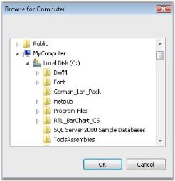' | markdownify }}
{:.image }

See Also

###### Features

FolderBrowser implements a convenient and easy to use wrapper for the Win32 Shell Folder Browser API and contains the following features.

Features

* Location Settings

The location where the FolderBrowser Dialog points to, can be set to any desired location by the user. The StartLocation property provides various options to specify the location of the root folder from which browsing is to be started.

* Style Settings

The FolderBrowser Dialog can be displayed in various styles using the Style property of the FolderBrowser. The FolderBrowser provides options to display Templates and create folders using the "Make New Folder" button.

* Text Settings

The FolderBrowser includes a TextBox control in the FolderBrowser Dialog that allows the user to type any text. The TextBox is capable of AutoCompleting the text entered.

See Also

Concepts and Features

###### Creating FolderBrowser

FolderBrowser control can be created in the following ways.

Through Designer 

The designer based approach for creating and initializing the FolderBrowser component is shown below.

1. Select the FolderBrowser control from the Visual Studio .NET toolbox window and drop it onto the design form. An instance of the FolderBrowser component will be added to the design form's component tray.

{{ '' | markdownify }}
{:.image }

2. Select a suitable value for the FolderBrowser.StartLocation property from the enumerator list provided by the property grid. This specifies the location at which browsing should be started in the folder hierarchy. This property is the functional equivalent of the Win32 PIDL's.
3. Specify an appropriate value for the FolderBrowser.Style property. The FolderBrowserStyles enumeration specifies various options for the FolderBrowser Dialog.
4. To display the FolderBrowser window, simply invoke the FolderBrowser.ShowDialog() method from within your application's code.

This method is a modal function and if the return code indicates success, the FolderBrowser.DirectoryPath property may be used to access the selected folder.

[C#]

this.folderBrowser1.ShowDialog();

[VB.NET]

Me.folderBrowser1.ShowDialog()

{{ '' | markdownify }}
{:.image }

See Also

Through Code

Through Code

The programmatic approach for using the FolderBrowser component is shown below.

1. Create an instance of the FolderBrowser component.

[C#]

// Declare the FolderBrowser component.

private Syncfusion.Windows.Forms.FolderBrowser folderBrowser1;

// Create an instance of the FolderBrowser component.

this.folderBrowser1 = new Syncfusion.Windows.Forms.FolderBrowser(this.components);

[VB.NET]

' Declare the FolderBrowser component.

Private folderBrowser1 As Syncfusion.Windows.Forms.FolderBrowser

' Create an instance of the FolderBrowser component.

Me.folderBrowser1 = New Syncfusion.Windows.Forms.FolderBrowser(Me.components)

2. Set the FolderBrowser.StartLocation and FolderBrowser.Style property values.

[C#]

// Specify the Start location.

this.folderBrowser1.StartLocation = Syncfusion.Windows.Forms.FolderBrowserFolder.MyComputer;

// Specify the styles for the FolderBrowser Dialog.

this.folderBrowser1.Style = (Syncfusion.Windows.Forms.FolderBrowserStyles.RestrictToFilesystem | Syncfusion.Windows.Forms.FolderBrowserStyles.BrowseForComputer);

[VB.NET]

' Specify the Start location.

Me.folderBrowser1.StartLocation = Syncfusion.Windows.Forms.FolderBrowserFolder.MyComputer

' Specify the styles for the FolderBrowser Dialog.

Me.folderBrowser1.Style = Syncfusion.Windows.Forms.FolderBrowserStyles.RestrictToFilesystem Or Syncfusion.Windows.Forms.FolderBrowserStyles.BrowseForComputer

3. Invoke the FolderBrowser.ShowDialog() method to display the FolderBrowser Dialog.

[C#]

this.folderBrowser1.ShowDialog();

[VB.NET]

Me.folderBrowser1.ShowDialog()

{{ '' | markdownify }}
{:.image }

See Also

Through Designer

###### Concepts and Features

The following topics will help you become more familiar in using the FolderBrowser control.

Location Settings

This section deals with the location settings of the FolderBrowser control.

The FolderBrowser allows the user to provide the location from which browsing should start. It also provides various options from which the root folder for browsing can be selected. The following properties illustrate this.

_Table_ _243_: Property Table_

<table>
<tr>
<td>
FolderBrowser Properties</td><td>
Description</td></tr>
<tr>
<td>
StartLocation</td><td>
Specifies the location of the root folder from which to start browsing. It is the functional equivalent of setting the PIDL value.{{ '_Desktop,_' | markdownify }}{{ '_Internet,_' | markdownify }}{{ '_Programs,_' | markdownify }}{{ '_Controls,_' | markdownify }}{{ '_Printers,_' | markdownify }}{{ '_Personal,_' | markdownify }}{{ '_Favorites,_' | markdownify }}{{ '_Startup,_' | markdownify }}{{ '_Recent,_' | markdownify }}{{ '_SendTo,_' | markdownify }}{{ '_BitBucket,_' | markdownify }}{{ '_StartMenu,_' | markdownify }}{{ '_MyDocuments,_' | markdownify }}{{ '_MyMusic,_' | markdownify }}{{ '_MyVideo,_' | markdownify }}{{ '_DesktopDirectory,_' | markdownify }}{{ '_MyComputer,_' | markdownify }}{{ '_NetworkNeighborhood,_' | markdownify }}{{ '_NetHood,_' | markdownify }}{{ '_Fonts,_' | markdownify }}{{ '_Templates,_' | markdownify }}{{ '_MyPictures,_' | markdownify }}{{ '_CommonDocuments,_' | markdownify }}{{ '_CommonAdminTools,_' | markdownify }}{{ '_AdminTools,_' | markdownify }}{{ '_NetAndDialUpConnections,_' | markdownify }}{{ '_CommonMusic,_' | markdownify }}{{ '_CommonPictures,_' | markdownify }}{{ '_CommonVideo,_' | markdownify }}{{ '_Resources,_' | markdownify }}{{ '_ResourcesLocalized,_' | markdownify }}{{ '_CommonOemLinks,_' | markdownify }}{{ '_CDBurnArea,_' | markdownify }}{{ '_ComputersNearMe,_' | markdownify }}{{ '_CustomStartLocation,_' | markdownify }}{{ '_FlagPerUserInit,_' | markdownify }}{{ '_FlagNoAlias,_' | markdownify }}{{ '_FlagDontVerify,_' | markdownify }}{{ '_FlagCreate and_' | markdownify }}{{ '_FlagMask._' | markdownify }}</td></tr>
<tr>
<td>
CustomStartLocation</td><td>
Gets / sets custom start location for showing the dialog.</td></tr>
<tr>
<td>
SelectLocation</td><td>
Gets / sets the selected location for showing the dialog.</td></tr>
<tr>
<td>
DirectoryPath</td><td>
Retrieves the location of the selected folder.</td></tr>
</table>
> {{ '' | markdownify }}
{:.image }
 _Note: For the SelectLocation property to take effect, the StartLocation property must be set to 'CustomStartLocation'._

[C#]

// Set the enumeration value FolderBrowserFolder.CustomStartLocation for Folder.StartLocation property.

this.folderBrowser1.StartLocation = Syncfusion.Windows.Forms.FolderBrowserFolder.CustomStartLocation;

this.folderBrowser1.CustomStartLocation = "C:";

// SelectLocation property for Automatic Scroll and Highlight of desired path.

this.folderBrowser1.SelectLocation = "C:\\Program Files\\Syncfusion\\Essential Studio";

[VB.NET]

' Set the enumeration value FolderBrowserFolder.CustomStartLocation for Folder.StartLocation property.

Me.folderBrowser1.StartLocation = Syncfusion.Windows.Forms.FolderBrowserFolder.CustomStartLocation

Me.folderBrowser1.CustomStartLocation = "C:"

' SelectLocation property for Automatic Scroll and Highlight of desired path.

Me.folderBrowser1.SelectLocation = "C:\\Program Files\\Syncfusion\\Essential Studio"

{{ '' | markdownify }}
{:.image }

A Sample which demonstrates the Location Settings of FolderBrowser is available in the below sample installation path.

..My Documents\Syncfusion\EssentialStudio\_Version Number_\Windows\Tools.Windows\Samples\2.0\Editors Package\FolderBrowserDemo

Style Settings

The style settings that are available for the FolderBrowser Dialog are given below.

_Table_ _244_: Property Table_

<table>
<tr>
<td>
FolderBrowser Property</td><td>
Description</td></tr>
<tr>
<td>
Style</td><td>
Specifies the options for the FolderBrowser Dialog.The options included are as follows.{{ '_RestrictToFilesystem,_' | markdownify }}{{ '_RestrictToSubfolders,_' | markdownify }}{{ '_RestrictToDomain,_' | markdownify }}{{ '_BrowseForComputer,_' | markdownify }}{{ '_BrowseForEverything,_' | markdownify }}{{ '_BrowseForPrinter,_' | markdownify }}{{ '_NewDialogStyle,_' | markdownify }}{{ '_AllowUrls,_' | markdownify }}{{ '_ShowAdministrativeShares,_' | markdownify }}{{ '_ShowShares,_' | markdownify }}{{ '_ShowTextBox,_' | markdownify }}{{ '_StatusText,_' | markdownify }}{{ '_UAHint and_' | markdownify }}{{ '_Validate._' | markdownify }}</td></tr>
</table>

The various options of the Style property are described below.

* RestrictToFilesystem - Restricts selection to file system directories.
* RestrictToSubfolders - Returns only file system ancestors.
* RestrictToDomain - Excludes network folders below the domain level.
* BrowseForComputer - Displays only computers.
* BrowseForEverything - Displays files as well as folders.
* BrowseForPrinter - Displays only printers.
* NewDialogStyle - Uses the new resizable folder selection dialog.
* AllowUrls - Displays URLs. 'NewDialogStyle' and 'BrowseForEverything' must be set along with this flag.
* ShowAdministrativeShares - Displays administrative shares existing on the remote system.
* ShowShares - Displays shareable resources existing on the remote system.
* ShowTextBox - Displays textbox in the FolderBrowser Dialog.
* StatusText - Includes status area in the dialog box. StatusText can be specified in the FolderBrowserCallBack event handler. This style does not apply to 'NewDialogStyle'.
* UAHint - Adds an usage hint to the folder dialog. It can be applied only with 'NewDialogStyle'.
* Validate - Typing invalid name in the textbox triggers FolderBrowserCallBack event.

[C#]

this.folderBrowser1.Style = Syncfusion.Windows.Forms.FolderBrowserStyles.ShowTextBox;

[VB.NET]

Me.folderBrowser1.Style = Syncfusion.Windows.Forms.FolderBrowserStyles.ShowTextBox

{{ '' | markdownify }}
{:.image }

A Sample which demonstrates the Style Settings of FolderBrowser is available in the below sample installation path.

…\_My Documents\Syncfusion\EssentialStudio\Version Number\Windows\Tools.Windows\Samples\Advanced Editor Functions\ActionGroupingDemo_

Text Settings

The text settings of the FolderBrowser control are described below.

The text for the FolderBrowser can be set using the below given property.

_Table_ _245_: Property Table_

<table>
<tr>
<td>
FolderBrowser Property</td><td>
Description</td></tr>
<tr>
<td>
Description</td><td>
Gets / sets the text displayed above the tree control in the FolderBrowser Dialog.</td></tr>
</table>
The Description property of the FolderBrowser supports the 'AutoComplete' feature that provides options that can be used to complete text even before it is entered.

[C#]

this.folderBrowser1.Description = "Recent Documents";

[VB.NET]

Me.folderBrowser1.Description = "Recent Documents"

{{ '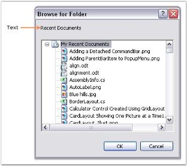' | markdownify }}
{:.image }

###### FolderBrowser Event

A detailed explanation about the FolderBrowserCallback event is given in the following section.

_Table_ _246_: Event Table_

<table>
<tr>
<td>
FolderBrowser Event</td><td>
Description</td></tr>
<tr>
<td>
FolderBrowserCallback</td><td>
The event occurs when an event within the Folder Browser Dialog triggers a call to the validation callback.</td></tr>
</table>
FolderBrowserCallback Event

The event occurs when an event within the folder browser dialog triggers a call to the validation callback. The event handler receives an argument of type FolderBrowserCallbackEventArgs.

The following FolderBrowserCallbackEventArgs members provide information specific to this event.

_Table_ _247_: Members Table_

<table>
<tr>
<td>
Members</td><td>
Description</td></tr>
<tr>
<td>
Dismiss</td><td>
Specifies whether the dialog is either dismissed or retained depending upon this value.</td></tr>
<tr>
<td>
FolderBrowserCallbackSetState</td><td>
Gets / sets the Folder Browser dialog's state.</td></tr>
<tr>
<td>
BrowseCallbackText</td><td>
Gets / sets the contextual string based upon the FolderBrowserCallbackSetState property.</td></tr>
<tr>
<td>
FolderBrowserMessage</td><td>
Returns a value indentifying the event.</td></tr>
<tr>
<td>
Path</td><td>
Returns valid or invalid folder name.</td></tr>
<tr>
<td>
Window</td><td>
Returns window handle of browser dialog box.</td></tr>
</table>

It can be handled when browser validation is required.

This handler is functionally equivalent to the Win32 BrowseCallbackProc callback function.

[C#]

private void folderBrowser1_BrowseCallback(object sender, Syncfusion.Windows.Forms.FolderBrowserCallbackEventArgs e)

{

// We can log the events and Folder Browser Message to the Label control.

this.label1.Text = String.Format("Event: {0}, Path: {1}", e.FolderBrowserMessage, e.Path);

if (e.FolderBrowserMessage == FolderBrowserMessage.ValidateFailed)

{

e.Dismiss = e.Path != "NONE";

}

}

[VB.NET]

Private Sub folderBrowser1_BrowseCallback(ByVal sender As Object, ByVal e As Syncfusion.Windows.Forms.FolderBrowserCallbackEventArgs)

' We can log the events and Folder Browser Message to the Label control.

Me.label1.Text = String.Format("Event: {0}, Path: {1}", e.FolderBrowserMessage, e.Path)

If e.FolderBrowserMessage = FolderBrowserMessage.ValidateFailed Then

e.Dismiss = e.Path <> "NONE"

End If

End Sub

###### Frequently Asked Questions

This section will help you become more familiar in using the FolderBrowser control.

What are FolderBrowser Flags?

Flags can be used to set various styles for the FolderBrowser Dialog. Each style has it's own behavior and these styles can be added or removed to get the desired style for the FolderBrowser Dialog.

Look at the below given snippet to apply "RestrictToSubfolders" style and to remove the "ShowTextBox" style for the FolderBrowser Dialog.

[C#]

this.folderBrowser1.Style &= ~FolderBrowserStyles.RestrictToSubfolders;

this.folderBrowser1.Style |= FolderBrowserStyles.ShowTextBox;

[VB.NET]

Me.folderBrowser1.Style = Me.folderBrowser1.Style And Not FolderBrowserStyles.RestrictToSubfolders

Me.folderBrowser1.Style = Me.folderBrowser1.Style Or FolderBrowserStyles.ShowTextBox

#### Editor Controls

The following are the rich edit controls supported by Syncfusion.

##### CurrencyEdit

CurrencyEdit embeds a CurrencyTextBox control and a button to provide a drop-down calculator to enable calculations with the contents of the CurrencyTextBox. The CurrencyEdit control provides an easy way to collect and display the currency data.

{{ '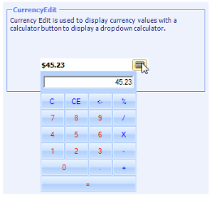' | markdownify }}
{:.image }

###### Features

The features of Currency Edit control is listed below.

* CurrentUI culture can be applied to CurrencyEdit control through properties of embedded textbox.
* You can set Button Styles for CurrencyEdit control.
* The Currency value can be moved from a PopupCalculator to a CurrencyTextbox and vice versa.
* The layout of the calculator control in the CurrencyEdit control can also be changed.
* It is used to display dropdown Financial Calculator.
###### Creating CurrencyEdit

To use a CurrencyEdit control in your application, all you need to do is drag and drop the CurrencyEdit control from the controls toolbox onto your form. You can then set any of its properties through the property grid.

{{ '' | markdownify }}
{:.image }

It can be created programmatically as follows.

1. Include the required namespace.

[C#]

using Syncfusion.Windows.Forms.Tools;

[VB.NET]

Imports Syncfusion.Windows.Forms.Tools

2. Create an instance of the CurrencyEdit. Add that instance to the Form.

[C#]

private Syncfusion.Windows.Forms.Tools.CurrencyEdit currencyEdit1;

this.currencyEdit1=new Syncfusion.Windows.Forms.Tools.CurrencyEdit();

this.Controls.Add(this.currencyEdit1);

[VB.NET]

Private currencyEdit1 As Syncfusion.Windows.Forms.Tools.CurrencyEdit

Me.currencyEdit1 = New Syncfusion.Windows.Forms.Tools.CurrencyEdit()

Me.Controls.Add(Me.currencyEdit1)

{{ '' | markdownify }}
{:.image }

###### Concepts and Features

The following topics will help you become more familiar in using the CurrencyEdit control.

Calculator Settings

A CurrencyEdit control has a text field and a Calculator button, pressing which will open a Calculator control. The below image illustrates the same.

{{ '' | markdownify }}
{:.image }

The properties which controls the behavior of the Calculator button is as follows.

_Table_ _248_: Property Table_

<table>
<tr>
<td>
CurrencyEdit Properties</td><td>
Description</td></tr>
<tr>
<td>
ShowCalculator</td><td>
Specifies whether calculator button is to be displayed. By default it is True.</td></tr>
<tr>
<td>
CalculatorButton</td><td>
Provides properties to customize the calculator button. {{ '[See ButtonEdit](http://172.168.111.149/UG_82/WindowsFormsUI_Tools/ButtonEdit.html)' | markdownify }} control user guide to know about the settings.</td></tr>
<tr>
<td>
CalculatorLayoutType</td><td>
Specifies the LayoutType for the Calculator control. The layout types are,{{ '_Financial (default) and_' | markdownify }}{{ '_WindowStandard._' | markdownify }}</td></tr>
<tr>
<td>
PopupCalculatorAlignment</td><td>
It sets the alignment of the popup calculator with respect to the ButtonEdit control. The options are,{{ '_Right(default) and_' | markdownify }}{{ '_Left._' | markdownify }}</td></tr>
<tr>
<td>
CloseAction</td><td>
Specifies the action that will close the popup calculator. After performing calculations in the popup calculator, we may press '=' to close the popup calculator. This is called closed action. We can select any operator instead of '=' to close the popup calculator. The options are,{{ '_Calcdigit0...Calcdigit9,_' | markdownify }}{{ '_CalcOperatorNone,_' | markdownify }}{{ '_CalcOperatorMultiply,_' | markdownify }}{{ '_CalcOperatorPlus,_' | markdownify }}{{ '_CalcOperatorMinus,_' | markdownify }}{{ '_CalcOperatorDivide,_' | markdownify }}{{ '_CalcOperatorPercent,_' | markdownify }}{{ '_CalcOperatorEquals (default),_' | markdownify }}{{ '_CalcOperatorSqrt,_' | markdownify }}{{ '_CalcOperatorSign,_' | markdownify }}{{ '_CalcOperatorMemoryClear,_' | markdownify }}{{ '_CalcOperatorMemoryRecall,_' | markdownify }}{{ '_CalcOperatorMemoryStore,_' | markdownify }}{{ '_CalcOperatorMemoryPlus,_' | markdownify }}{{ '_CalcSpecialClear,_' | markdownify }}{{ '_CalcSpecialClearEntry,_' | markdownify }}{{ '_CalcSpecialDecimal and_' | markdownify }}{{ '_CalcSpecialBackspace._' | markdownify }}</td></tr>
</table>

[C#]

this.currencyEdit1.CalculatorLayoutType = Syncfusion.Windows.Forms.Tools.CalculatorLayoutTypes.WindowsStandard;

this.currencyEdit1.CloseAction = Syncfusion.Windows.Forms.Tools.CalcActions.CalcOperatorEquals;

this.currencyEdit1.PopupCalculatorAlignment = Syncfusion.Windows.Forms.Tools.CalculatorPopupAlignment.Left;

this.currencyEdit1.ShowCalculator = true;

this.currencyEdit1.TransferFromCalculator = true;

this.currencyEdit1.TransferToCalculator = true;

[VB.NET]

Me.currencyEdit1.CalculatorLayoutType = Syncfusion.Windows.Forms.Tools.CalculatorLayoutTypes.WindowsStandard

Me.currencyEdit1.CloseAction = Syncfusion.Windows.Forms.Tools.CalcActions.CalcOperatorEquals

Me.currencyEdit1.PopupCalculatorAlignment = Syncfusion.Windows.Forms.Tools.CalculatorPopupAlignment.Left

Me.currencyEdit1.ShowCalculator = True

Me.currencyEdit1.TransferFromCalculator = True

Me.currencyEdit1.TransferToCalculator = True

Text Settings

The below properties will let you control the behavior of the text in the CurrencyEdit control.

_Table_ _249_: Property Table_

<table>
<tr>
<td>
CurrencyEdit Properties</td><td>
Description</td></tr>
<tr>
<td>
ShowTextBox</td><td>
Indicates whether to show the textbox or not.</td></tr>
<tr>
<td>
Text</td><td>
Specifies the text of the embedded control.</td></tr>
<tr>
<td>
TextBox</td><td>
Specifies the properties for customizing the embedded textbox.</td></tr>
<tr>
<td>
TextAlign</td><td>
Specifies the alignment of the text in the control.</td></tr>
<tr>
<td>
TransferFromCalculator</td><td>
Specifies whether to transfer the calculated value to the edit control.</td></tr>
<tr>
<td>
TransferToCalculator</td><td>
Specifies whether to transfer the calculated value from the edit control.</td></tr>
<tr>
<td>
DecimalValue</td><td>
Specifies the decimal value of the currency control.</td></tr>
</table>

[C#]

this.currencyEdit1.ShowTextBox = true;

this.currencyEdit1.Text = "$400.00";

this.currencyEdit1.TextAlign = HorizontalAlignment.Right;

this.currencyEdit1.TransferFromCalculator=true;

this.currencyEdit1.TransferToCalculator= false;

this.currencyEdit1.TextBox.DecimalValue = new decimal(new int[] {40000, 0, 0, 131072});

[VB.NET]

Me.currencyEdit1.ShowTextBox = True

Me.currencyEdit1.Text = "$400.00"

Me.currencyEdit1.TextAlign = HorizontalAlignment.Right

Me.currencyEdit1.TransferFromCalculator = True

Me.currencyEdit1.TransferToCalculator = False

Me.currencyEdit1.TextBox.DecimalValue = New Decimal(New Integer() {40000, 0, 0, 131072})

{{ '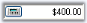' | markdownify }}
{:.image }

> {{ '' | markdownify }}
{:.image }
 _Note: Enabling ButtonEdit.UseVisualStyle property and by setting visual style for control using ButtonEdit.ButtonStyle property, we can change the appearance of the calculator button._

###### Frequently Asked Questions

How to Change the Calculator layout using CalcPopup property

Sometimes we may be in need of a calculator with Windows standard layout. By changing the CalcPopup property, we can do the same. Include this code fragment in the FormLoad event.

[C#]

// Changes the layout of the calculator.

PopupCalculator pc=new Popupcalculator();

pc.LayoutType=CalculatorLayoutTypes.WindowsStandard;

pc.ParentControl=currencyEdit1;

currencyEdit1.CalcPopup=pc;

[VB.NET]

' Changes the layout of the calculator.

Dim pc As PopupCalculator = New Popupcalculator()

pc.LayoutType=CalculatorLayoutTypes.WindowsStandard

pc.ParentControl=currencyEdit1

currencyEdit1.CalcPopup=pc

###### Events

CalculatorClosing Event

CalculatorClosing event is handled when the calculator is closing after the specified button is clicked.

[C#]

private void currencyEdit1_CalculatorClosing(object sender, CalculatorClosingEventArgs e)

{

    // This prints the final calculated value before closing.

    MessageBox.Show("The calculated Value is" + e.FinalValue.ToString());

}

[VB.NET]

Private Sub currencyEdit1_CalculatorClosing(ByVal sender As Object, ByVal e AsCalculatorClosingEventArgs)

    ' This prints the final calculated value before closing.

    MessageBox.Show("The calculated Value is" + e.FinalValue.ToString())

End Sub

CalculatorShowing Event

This event is raised before the calculator popup is displayed. The Cancel property of this CancelEventArgs lets  you to cancel the popup display as follows.

[C#]

private void currencyEdit1_CalculatorShowing(object sender, CancelEventArgs e)

{

    //Cancels the calculator popup.

    e.Cancel = true;

}

[VB.NET]

Private Sub currencyEdit1_CalculatorShowing(ByVal sender As Object, ByVal e As CancelEventArgs)

    'Cancels the calculator popup.

    e.Cancel = True

End Sub

DecimalValueChanged Event

This event is raised when DecimalValue property is changed.

[C#]

private void currencyEdit1_DecimalValueChanged(object sender, EventArgs e)

{

    MessageBox.Show("Decimal Value is Changed");

}

[VB.NET]

Private Sub currencyEdit1_DecimalValueChanged(ByVal sender As Object, ByVal e As EventArgs)

    MessageBox.Show("Decimal Value is Changed")

End Sub

##### DomainUpDownExt

DomainUpDownExt is an advanced version of the standard windows DomainUpDown control. Syncfusion DomainUpDownExt supports themes and comes with Office2007 look and feel. It also provides options to apply custom colors to the control. It enables spin button orientation and alignment.

{{ '' | markdownify }}
{:.image }

###### Features

DomainUpDownExt is an advanced version of the standard windows DomainUpDown control and contains following features.

* Extends the DomainUpDown to provide XP Look and Feel.
* Keyboard Support to increment or decrement value using Up and Down keys.
* Orientation of spin button to vertical and horizontal.
* Provides option to set different visual styles including Office2007.
* [Custom Colors](http://help.syncfusion.com/ug_82/WindowsFormsUI_Tools/VisualStyles4.html) can be applied to the control.
###### Creating DomainUpDownExt

To use a DomainUpDownExt control in your application, all you need to do is drag and drop the DomainUpDownExt control from the controls toolbox onto your form.

{{ '' | markdownify }}
{:.image }

You can add items in the String Collection Editor of DomainUpDownExt control and Click Ok.

{{ '' | markdownify }}
{:.image }

It can be created programmatically as follows.

1. Add Shared.Base, Shared.Windows, Tools.Base and Tools.Windows assembly references and include the required namespace.

[C#]

using Syncfusion.Windows.Forms.Tools;

[VB.NET]

Imports Syncfusion.Windows.Forms.Tools

2. Create an instance of the DomainUpDownExt. Add that instance to the Form.

[C#]

private Syncfusion.Windows.Forms.Tools.DomainUpDownExt domainUpDownExt1;

this.domainUpDownExt1=new Syncfusion.Windows.Forms.Tools.DomainUpDownExt();

// Add items.

this.domainUpDownExt1.Items.Add("One");

this.domainUpDownExt1.Items.Add("Two");

this.domainUpDownExt1.Items.Add("Three");

this.domainUpDownExt1.Items.Add("Four");

this.domainUpDownExt1.Items.Add("Five");

this.Controls.Add(this.domainUpDownExt1);

[VB.NET]

Private domainUpDownExt1 As Syncfusion.Windows.Forms.Tools.DomainUpDownExt

Me.domainUpDownExt1 = New Syncfusion.Windows.Forms.Tools.DomainUpDownExt()

' Add items.

Me.domainUpDownExt1.Items.Add("One")

Me.domainUpDownExt1.Items.Add("Two")

Me.domainUpDownExt1.Items.Add("Three")

Me.domainUpDownExt1.Items.Add("Four")

Me.domainUpDownExt1.Items.Add("Five")

Me.Controls.Add(Me.domainUpDownExt1)

{{ '' | markdownify }}
{:.image }

###### Concepts and Features

Text Settings

The text for the DomainUpDownExt control can be specified in String Collection Editor. This section discusses the properties which deals with this text.

_Table_ _250_: Property Table_

<table>
<tr>
<td>
DomainUpDownExt Property</td><td>
Description</td></tr>
<tr>
<td>
Items</td><td>
Invokes String Collection Editor. Text for the control can be specified in this editor.</td></tr>
<tr>
<td>
TextAlign</td><td>
Specifies the alignment of the text in the text field.</td></tr>
<tr>
<td>
MaxLength</td><td>
Indicates the maximum length of the text that can be entered into the editable portion of the control. Default value is 32767.</td></tr>
</table>

[C#]

this.domainUpDownExt2.Items.Add("Six");

this.domainUpDownExt1.TextAlign = System.Windows.Forms.HorizontalAlignment.Right;

this.domainUpDownExt2.MaxLength = 32768;

[VB.NET]

Me.domainUpDownExt2.Items.Add("Six")

Me.domainUpDownExt1.TextAlign = System.Windows.Forms.HorizontalAlignment.Right

Me.domainUpDownExt2.MaxLength = 32768

{{ '' | markdownify }}
{:.image }

SpinButton

This section will discuss the properties which controls the alignment and orientation of the spin button in a DomainUpDownExt control.

{{ '' | markdownify }}
{:.image }

Orientation

The spin button orientation can be changed to vertical or horizontal using the SpinOrientation property.

[C#]

//Spin button will be oriented horizontally.

this.domainUpDownExt1.SpinOrientation = Orientation.Horizontal;

//Spin button will be oriented vertically.

this.domainUpDownExt1.SpinOrientation = Orientation.Vertical;           

[VB]

'SpinButton will be oriented horizontally.

Me.domainUpDownExt1.SpinOrientation = Orientation.Horizontal

'SpinButton will be oriented vertically.

Me.domainUpDownExt1.SpinOrientation = Orientation.Vertical

{{ '' | markdownify }}
{:.image }

Alignment

The spin button alignment can be set through UpDownAlign property. By default it is set to right.

[C#]

this.domainUpDownExt1.UpDownAlign = LeftRightAlignment.Left;       

[VB]

Me.domainUpDownExt1.UpDownAlign = LeftRightAlignment.Left

{{ '' | markdownify }}
{:.image }

Keyboard Support

Using Up and Down arrow keys we can increment and decrement the value of DomainUpDownExt control by settingInterceptArrowKeys to true.

_Table_ _251_: Property Table_

<table>
<tr>
<td>
DomainUpDownExt Property</td><td>
Description</td></tr>
<tr>
<td>
InterceptArrowKeys</td><td>
Specifies whether the up down control will increment and decrement when Up Arrow and Down Arrow keys are pressed.</td></tr>
</table>

[C#]

this.domainUpDownExt1.InterceptArrowKeys = true;

[VB.NET]

Private Me.domainUpDownExt1.InterceptArrowKeys = True

Visual Styles

DomainUpDownExt supports Office2007 visual style with all three color schemes.

[C#]

//sets the Office2007 Visual Style.

this.domainUpDownExt1.VisualStyle = Syncfusion.Windows.Forms.VisualStyle.Office2007;

//To set Blue Color scheme.

this.domainUpDownExt1.ColorScheme = Syncfusion.Windows.Forms.Office2007Theme.Blue;

//To set Silver Color scheme.

this.domainUpDownExt1.ColorScheme = Syncfusion.Windows.Forms.Office2007Theme.Silver;

//To set Black Color scheme.

this.domainUpDownExt1.ColorScheme = Syncfusion.Windows.Forms.Office2007Theme.Black;               

[VB]

'Sets the Office2007 Visual Style.

Me.domainUpDownExt1.VisualStyle = Syncfusion.Windows.Forms.VisualStyle.Office2007

'To set Blue Color scheme.

Me.domainUpDownExt1.ColorScheme = Syncfusion.Windows.Forms.Office2007Theme.Blue

'To set Silver Color scheme.

Me.domainUpDownExt1.ColorScheme = Syncfusion.Windows.Forms.Office2007Theme.Silver

'To set Black Color scheme.

Me.domainUpDownExt1.ColorScheme = Syncfusion.Windows.Forms.Office2007Theme.Black

{{ '' | markdownify }}
{:.image }

It also provides support for XP Themes look and feel.

[C#]

//Enable Themes.

this.domainUpDownExt1.ThemesEnabled = true;                          

[VB]

'Enable Themes.

Me.domainUpDownExt1.ThemesEnabled = True

{{ '' | markdownify }}
{:.image }

{{ '' | markdownify }}
{:.image }

Custom Colors

We can also apply custom colors to the DomainUpDownExt control by setting ColorScheme to "Managed" and specifying the custom color through the ApplyManagedColors method as follows.

[C#]

this.domainUpDownExt1.ColorScheme = Syncfusion.Windows.Forms.Office2007Theme.Managed;

Office2007Colors.ApplyManagedColors(this, Color.Orange);

[VB.NET]

Me.domainUpDownExt1.ColorScheme = Syncfusion.Windows.Forms.Office2007Theme.Managed;

Office2007Colors.ApplyManagedColors(Me, Color.Orange)

{{ '' | markdownify }}
{:.image }

Appearance Settings

This section discusses the border styles and back color that can be applied for DomainUpDownExt control.

The below table lists the appearance properties of DomainUpDownExt control.

_Table_ _252_: Property Table_

<table>
<tr>
<td>
DomainUpDownExt Properties</td><td>
Description</td></tr>
<tr>
<td>
BorderStyle</td><td>
Specifies the border style for the control. The options includesFixedSingle,Fixed3D, andNone.</td></tr>
<tr>
<td>
Border3DStyle</td><td>
Specifies the 3D BorderStyle for the control when BorderStyle = Fixed3D.The options are,RaisedInner,RaisedOuter,Raised,Sunken (default),SunkenInner,SunkenOuter,Flat,Bump andAdjust.</td></tr>
<tr>
<td>
BorderSides</td><td>
Specifies the sides of the control which can have border. The options are,Left,Top,Right,Bottom,Middle andAll (default).</td></tr>
<tr>
<td>
BorderColor</td><td>
Specifies the color for 2D border. The default color is 'black'.</td></tr>
<tr>
<td>
ThemedBorder</td><td>
Specifies whether to enable themes for the border around the control. ThemesEnabled must be set to 'True'.</td></tr>
<tr>
<td>
BackColor</td><td>
Specifies the back color for the control.</td></tr>
</table>

[C#]

this.domainUpDownExt1.BorderStyle = System.Windows.Forms.BorderStyle.FixedSingle;

this.domainUpDownExt1.Border3DStyle = System.Windows.Forms.Border3DStyle.Bump;

this.domainUpDownExt1.BorderSides = System.Windows.Forms.Border3DSide.Right;

this.domainUpDownExt1.BorderColor = System.Drawing.Color.DodgerBlue;        

this.domainUpDownExt1.BackColor = System.Drawing.Color.AntiqueWhite;

[VB.NET]

Me.domainUpDownExt1.BorderStyle = System.Windows.Forms.BorderStyle.FixedSingle

Me.domainUpDownExt1.Border3DStyle = System.Windows.Forms.Border3DStyle.Bump

Me.domainUpDownExt1.BorderSides = System.Windows.Forms.Border3DSide.Right

Me.domainUpDownExt1.BorderColor = System.Drawing.Color.DodgerBlue

Me.domainUpDownExt1.BackColor = System.Drawing.Color.AntiqueWhite

{{ '' | markdownify }}
{:.image }

{{ '' | markdownify }}
{:.image }

###### DomainUpDownExt Events

This section describes the events of DomainUpDownExt control.

_Table_ _253_: Property Table_

<table>
<tr>
<td>
DomainUpDownExt Events</td><td>
Description</td></tr>
<tr>
<td>
ThemeChanged</td><td>
This event is handled when ThemesEnabled property is changed.</td></tr>
<tr>
<td>
SpinOrientationChanged</td><td>
This event is handled when orientation of spin button is changed.</td></tr>
<tr>
<td>
BorderSidesChanged</td><td>
This event is handled when BorderSides property is changed.</td></tr>
<tr>
<td>
BorderColorChanged</td><td>
This event is handled when BorderColor is changed.</td></tr>
<tr>
<td>
Border3DStyleChanged</td><td>
This event is handled when Border3DStyle is changed.</td></tr>
</table>
######  Frequently Asked Questions

How to add new items to the List when enter key is pressed

To add the new items which are entered by the user at runtime after the user had pressed the enter key, we need to catch theKeyDown event.

[C#]

private void domainUpDownExt1_KeyDown(object sender, System.Windows.Forms.KeyEventArgs e)

{

  // Add new items when user press the Enter key.

if(e.KeyCode==Keys.Enter)

if(!domainUpDownExt1.Items.Contains ( domainUpDownExt1.Text ))  domainUpDownExt1.Items.Add(domainUpDownExt1.Text);

}

[VB.NET]

Private Sub domainUpDownExt1_KeyDown(ByVal sender As Object, ByVal e AsSystem.Windows.Forms.KeyEventArgs)

   ' Add new items when user press the Enter key.

If e.KeyCode = Keys.Enter Then

If Not domainUpDownExt1.Items.Contains(domainUpDownExt1.Text) Then

domainUpDownExt1.Items.Add(domainUpDownExt1.Text)

End If

End If

End Sub

How to programmatically browse through values in a DomainUpDownExt control

We can programmatically browse through the previous and the next values, of the current value, by calling UpButton() and DownButton() methods.

[C#]

//Goes to the previous value.

this.domainUpDownExt1.UpButton();

//Goes to the Next value.

this.domainUpDownExt1.DownButton();

[VB.NET]

'Goes to the previous value.

Me.domainUpDownExt1.UpButton()

'Goes to the Next value.

Me.domainUpDownExt1.DownButton()

##### DoubleTextBox

The DoubleTextBox is a text box-derived control that can display double data type values.

The DoubleTextBox is derived from Windows Forms framework text box control. The DoubleTextBox supports display and collection of double values. It handles user keyboard input and double formatting and uses the globalization features of the .NET platform to provide locale specific formatting.

{{ '' | markdownify }}
{:.image }

###### Features

DoubleTextBoxis used to display collection of double values.

* The control handles user keyboard input and double formatting with no code required.
* It is fully compatible with the Windows Forms Text Box and uses the globalization features of the .NET platform to provide locale specific formatting.
* The control supports values with a precision of 15 characters.
* The DoubleTextBox control supports displaying negative values in a different color and also using different negative formats.
###### Creating Double TextBox

To use a DoubleTextBox control in your application, all you need to do is drag and drop the DoubleTextBox control from the controls toolbox onto your form.

{{ '' | markdownify }}
{:.image }

It can be created programmatically as follows.

1. Add Shared.Base, Shared.Windows, Tools.Base and Tools.Windows assembly references and include the required namespace.

[C#]

using Syncfusion.Windows.Forms.Tools;

[VB.NET]

Imports Syncfusion.Windows.Forms.Tools

2. Create an instance of the DoubleTextBox. Add that instance to the Form.

[C#]

this.doubleTextBox1=new Syncfusion.Windows.Forms.Tools.DoubleTextBox();

this.Controls.Add(this.doubleTextBox1);

[VB.NET]

Me.doubleTextBox1 = New Syncfusion.Windows.Forms.Tools.DoubleTextBox()

Me.Controls.Add(Me.doubleTextBox1)

{{ '' | markdownify }}
{:.image }

###### Concepts and Features

The following Editors controls (DoubleTextBox, IntegerTextBox, PercentTextBox, and CurrencyTextBox) has been revamped, click here to see the details of revamping.

Number Settings

The below table lists the properties which illustrates the number settings for the DoubleTextBox.

_Table_ _254_: Property Table_

<table>
<tr>
<td>
Double TextBox Properties</td><td>
Description</td></tr>
<tr>
<td>
DoubleValue</td><td>
Specifies the double value of the control.</td></tr>
<tr>
<td>
NumberDecimalDigits</td><td>
Gets or sets the maximum number of digits for the decimal portion of the number.</td></tr>
<tr>
<td>
NumberDecimalSeparator</td><td>
Gets or sets the decimal separator character that will be used for the display. The default decimal character '.' can be overridden by other special characters using this property.</td></tr>
<tr>
<td>
NumberGroupSeparator</td><td>
Gets or sets the separator used for grouping the digits.</td></tr>
<tr>
<td>
NumberGroupSizes</td><td>
Gets or sets the grouping of NumberDigits in the DoubleTextBox.</td></tr>
<tr>
<td>
NumberNegativePattern</td><td>
Gets or sets the pattern to use when the value is negative.</td></tr>
</table>

[C#]

this.doubleTextBox1.NumberDecimalDigits = 3;

this.doubleTextBox1.NumberDecimalSeparator = "-";

this.doubleTextBox1.NumberGroupSeparator = ";";

this.doubleTextBox1.NumberGroupSizes = new int[] {4};

this.doubleTextBox1.NumberNegativePattern = 2;

[VB.NET]

Me.doubleTextBox1.AllowNull = True

Me.doubleTextBox1.NullString = ""

Me.doubleTextBox1.Text = ""

Me.doubleTextBox1.NumberDecimalDigits = 3

Me.doubleTextBox1.NumberDecimalSeparator = "-"

Me.doubleTextBox1.NumberGroupSeparator = ";"

Me.doubleTextBox1.CurrencyGroupSizes = New Integer() {3}

Me.doubleTextBox1.NumberNegativePattern = 2

DoubleTextBox Value

The maximum and minimum value of the editable field in DoubleTextBox control can be specified using the below properties.

_Table_ _255_: Property Table_

<table>
<tr>
<td>
DoubleTextBox Properties</td><td>
Description</td></tr>
<tr>
<td>
MaxValue</td><td>
Specifies the maximum value that can be set for the DoubleTextBox.</td></tr>
<tr>
<td>
MinValue</td><td>
Specifies the minimum value that can be set for the DoubleTextBox.</td></tr>
</table>

[C#]

this.doubleTextBox1.MaxValue = 25;

this.doubleTextBox1.MinValue = 4;

[VB.NET]

Me.doubleTextBox1.MaxValue = 25

Me.doubleTextBox1.MinValue = 4

Banner Text Support

We can set banner text for the DoubleTextBox control. Refer [BannerTextProvider Component](http://help.syncfusion.com/ug_82/WindowsFormsUI_Tools/BannerText.html) topic for more details.

We need to do the below settings to make Banner text feature available for the control.

[C#]

this.doubleTextBox1.AllowNull = true;

this.doubleTextBox1.NullString = "";

this.doubleTextBox1.Text = "";

[VB.NET]

Me.doubleTextBox1.AllowNull = True

Me.doubleTextBox1.NullString = ""

Me.doubleTextBox1.Text = ""

{{ '' | markdownify }}
{:.image }

Appearance and Behavior Settings

This section discusses the complete Appearance and behavior settings of Double TextBox.

Border Style

3D border styles and colors can be applied for the border of Double TextBox. Refer [Border styles](http://help.syncfusion.com/ug/windows%20forms/tools/default.htm) of Currency textbox for details.

Color

Colors can be applied for Double textbox when its value is positive, negative or zero. Refer [Color Settings](http://help.syncfusion.com/ug/windows%20forms/tools/default.htm) of Currency textbox for details.

Keyboard Support

Double TextBox supports keyboard support. Refer [Clipboard Support](http://help.syncfusion.com/ug_82/WindowsFormsUI_Tools/ClipboardSupport.html) of Currency textbox in detail.

Overflow Indicator

Overflow indicator will be shown when the value of Double TextBox goes beyond the control's size. Refer [Overflow Indicator](http://help.syncfusion.com/ug/windows%20forms/tools/default.htm) of Currency textbox in detail.

Globalization

The Double TextBox class is globalization aware and uses System.Globalization.CultureInfo for locale-specific information. Refer[Globalization](http://help.syncfusion.com/ug/windows%20forms/tools/default.htm) of Currency textbox in detail.

Active When Disabled

We can make the control active even when it is in Disable mode. Refer [Active When Disabled](http://help.syncfusion.com/ug_82/WindowsFormsUI_Tools/ActiveWhenDisabled.html)of Currency textbox in detail.

Overriding the Behavior of certain KeyStrokes in a DoubleTextBox

This can be done by overriding the HandleSubtractKey(). Given below is the code snippet which shows an example of how to clear the text when the NegativeSign is changed.

[C#]

public class DoubleTextBoxAdv : Syncfusion.Windows.Forms.Tools.DoubleTextBox

{

    public DoubleTextBoxAdv() : base() { }

    private bool deleteonnegative = false;

    public bool DeleteOnNegative

    {

        get

        {

            return deleteonnegative;

        }

        set

        {

            deleteonnegative = value;

        }

    }

    // Overrides the behavior of SubtractKey so that the text is cleared when the NegativeSign is changed.

    protected override Syncfusion.Windows.Forms.Tools.NumberModifyState HandleSubtractKey()

    {

        if (deleteonnegative == true)

        {

            if (this.NegativeSign == "-" && this.Text.StartsWith("-"))

            {

                this.Clear();

            }

        }

        return base.HandleSubtractKey();

    }

}

[VB.NET]

Public Class DoubleTextBoxAdv

    Inherits Syncfusion.Windows.Forms.Tools.DoubleTextBox

    Public Sub New()

        MyBase.New()

    End Sub

    Private m_deleteonnegative As Boolean = False

    Public Property DeleteOnNegative() As Boolean

        Get

            Return m_deleteonnegative

        End Get

        Set(ByVal value As Boolean)

            m_deleteonnegative = value

        End Set

    End Property

    ' Overrides the behavior of Subtract Key so that the text is cleared when the NegativeSign is changed.

    Protected Overloads Overrides Function HandleSubtractKey() AsSyncfusion.Windows.Forms.Tools.NumberModifyState

        If m_deleteonnegative = True Then

            If Me.NegativeSign = "-" AndAlso Me.Text.StartsWith("-") Then

                Me.Clear()

            End If

        End If

        Return MyBase.HandleSubtractKey()

    End Function

End Class

{{ '' | markdownify }}
{:.image }

###### Event Handling

Enabling Fixed Change using Shortcut Keys

Sometimes there may occur situations for incrementing or decrementing the value in DoubleTextBox. In such situations it is better to use shortcut keys. The following implementation will give you an idea on how to achieve this. Here the Up and Down keys are used for incrementing and decrementing respectively. We cannot use '-' because it is already reserved to enter the minus sign.

[C#]

private void doubleTextBox1_KeyDown(object sender,KeyEventArgs e)

{

  decimal v=doubleTextBox1.DoubleValue;

switch(e.KeyCode)

{

  // Up and Down keys are used for incrementing and decrementing respectively.

case Keys.Up : v++;break;

case Keys.Down : v--;break;

}

doubleTextBox1.DoubleValue=v;

}

[VB.NET]

Private Sub doubleTextBox1_KeyDown(ByVal sender As Object, ByVal e As KeyEventArgs)

Dim v As Decimal = doubleTextBox1.DoubleValue

Select e.KeyCode

' Up and Down keys are used for incrementing and decrementing respectively.

Case Keys.Up

v=v+1

Case Keys.Down

v=v-1

End Select

doubleTextBox1.DoubleValue = v

End Sub

DoubleValueChanged Event

This event is handled when the double value in the text field is changed.

[C#]

private void doubleTextBox1_DoubleValueChanged(object sender, EventArgs e)

{

   MessageBox.Show("Double Value is changed");

}

[VB.NET]

Private Sub doubleTextBox1_DoubleValueChanged(ByVal sender As Object, ByVal e As EventArgs)

MessageBox.Show("Double Value is changed")

End Sub

##### IntegerTextBox

The IntegerTextBox is derived from the Windows Forms framework TextBox control and can display integer data type values. It exhibits properties similar to that of the CurrencyTextBox.

{{ '' | markdownify }}
{:.image }

###### Features

IntegerTextBox is used to display Int64 values and contains the following features.

Features

Display Settings

The [display](http://help.syncfusion.com/ug/windows%20forms/tools/default.htm) settings involve setting the separator to be used to group the numbers and the group size.

It also involves setting the pattern and symbol to be used when the number is negative.

Value Settings

The value settings provide options to set the value to be displayed by the IntegerTextBox control. It provides options to indicate the null state of the control and customize it's settings.

The maximum and minimum value of the control can also be set.

* Culture Settings

The [culture](http://help.syncfusion.com/ug/windows%20forms/tools/default.htm) to be used for formatting the numeric display can be set using the Culture property.

* Text Settings

Text can be selected, formatted, clipped and displayed from right to left using the [text settings](http://help.syncfusion.com/ug/windows%20forms/tools/default.htm) of the IntegerTextBox control.

* Appearance Settings

The background color and foreground color of the control can be set according to the needs of the user.

The foreground color can be set separately for the positive, negative and null values of the control.

* Behavior Settings

The integer value of the control can be reset or changed to a negative value by selecting it's entire contents and pressing the negative key on the keyboard.

The control also allows to insert zeros before the beginning value of the integer value using the AllowLeadingZeros property.

* Border Settings

2D and 3D border styles can be applied to the IntegerTextBox.

The color of the border can also be set for the control using the BorderColor property.

* Key Settings

Keyboard support for entering large values is provided. Incrementing and decrementing of values can be done using the up and down arrow [keys](http://help.syncfusion.com/ug/windows%20forms/tools/default.htm).

* Applying Themes

Themes appearance can be provided for the IntegerTextBox control.

Key Features

* The IntegerTextBox control handles user keyboard input and double formatting with no code required.
* It is fully compatible with the Windows Forms TextBox and uses the globalization features of the .NET platform to provide locale specific formatting.
* The IntegerTextBox control supports displaying negative values in a different color and also using different negative formats.
###### Creating IntegerTextBox

This section will give a step by step procedure to design an IntegerTextBox control through designer and also through programmatical approach.

Through Designer

1. Create or open a Windows Forms project.
2. Click on the IntegerTextBox Control in the toolbox and add it to the form by dragging and dropping it onto the form or double clicking the control.

{{ '' | markdownify }}
{:.image }

3. Run the application. The IntegerTextBox that allows you to enter only integer values, will be displayed as given below.

{{ '' | markdownify }}
{:.image }

Through Programmatical Approach

The IntegerTextBox control can be created programmatically through code as detailed below.

1. Include the required namespace.

[C#]

using Syncfusion.Windows.Forms.Tools;

[VB.NET]

Imports Syncfusion.Windows.Forms.Tools

2. Create an instance of the IntegerTextBox control.

[C#]

// Create IntegerTextBox control.

private Syncfusion.Windows.Forms.Tools.IntegerTextBox integerTextBox1;

this.integerTextBox1=new Syncfusion.Windows.Forms.Tools.IntegerTextBox();

[VB.NET]

' Create IntegerTextBox control.

Private integerTextBox1 As Syncfusion.Windows.Forms.Tools.IntegerTextBox

Me.integerTextBox1 = New Syncfusion.Windows.Forms.Tools.IntegerTextBox()

3. Specify its value and size.

[C#]

this.integerTextBox1.IntegerValue = ((long)(7));

this.integerTextBox1.Size = new System.Drawing.Size(144, 20);

[VB.NET]

Me.integerTextBox1.IntegerValue = (CLng(7))

Me.integerTextBox1.Size = New System.Drawing.Size(144, 20)

4. Add the IntegerTextBox control to the form.

[C#]

this.Controls.Add(this.integerTextBox1);

[VB.NET]

Me.Controls.Add(Me.integerTextBox1)

{{ '' | markdownify }}
{:.image }

###### Concepts and Features

The following Editors controls (DoubleTextBox, IntegerTextBox, PercentTextBox, and CurrencyTextBox) have been revamped, click here to see the details of revamping.

Display Settings

This section discusses the display settings of the IntegerTextBox control.

The IntegerTextBox provides a list of properties to set the display characteristics associated with the integer value.

_Table_ _256_: Property Table_

<table>
<tr>
<td>
IntegerTextBox Properties</td><td>
Description</td></tr>
<tr>
<td>
NumberGroupSeparator</td><td>
Gets / sets the separator to be used for grouping the digits.</td></tr>
<tr>
<td>
NumberGroupSizes</td><td>
Specifies the grouping of number digits in the IntegerTextBox.</td></tr>
<tr>
<td>
NumberNegativePattern</td><td>
Gets / sets the pattern to use when the value is negative.</td></tr>
<tr>
<td>
NegativeSign</td><td>
Gets / sets the sign that is to be used to indicate a negative value.</td></tr>
</table>

The grouping size of the number digits can be set using the Int32 Collection Editor which will be displayed on selecting theNumberGroupSizes property in the property grid.

[C#]

this.integerTextBox1.NumberGroupSeparator = "/";

this.integerTextBox1.NumberGroupSizes = new int[] { 5 };

this.integerTextBox1.NumberNegativePattern = 2;

this.integerTextBox1.NegativeSign = "-";

[VB.NET]

Me.integerTextBox1.NumberGroupSeparator = "/"

Me.integerTextBox1.NumberGroupSizes = New Integer() {5}

Me.integerTextBox1.NumberNegativePattern = 2

Me.integerTextBox1.NegativeSign = "-"

{{ '' | markdownify }}
{:.image }

A Sample which demonstrates the Display Settings of IntegerTextBox control is available in the below sample installation path.

…\_My Documents\Syncfusion\EssentialStudio\Version Number\Windows\Tools.Windows\Samples\Advanced Editor Functions\ActionGroupingDemo_

[Value Settings](http://help.syncfusion.com/ug_82/WindowsFormsUI_Tools/IntegerTextBox_ValueSettings.html)

The various values of the IntegerTextBox control and their settings are given below.

_Table_ _257_: Property Table_

<table>
<tr>
<td>
IntegerTextBox Properties</td><td>
Description</td></tr>
<tr>
<td>
IntegerValue</td><td>
Specifies the integer value of the text.</td></tr>
<tr>
<td>
DefaultValue</td><td>
Specifies the default value. The default value is set to 'Null'.</td></tr>
<tr>
<td>
BindableValue</td><td>
Wrapper property that indicates the value. This property can be used to set the value of the control to 'Null'.</td></tr>
</table>

[C#]

this.integerTextBox1.IntegerValue = ((long)(777));

this.integerTextBox1.DefaultValue = 0;

this.integerTextBox1.BindableValue = 777;

[VB.NET]

Me.integerTextBox1.IntegerValue = (CLng(777))

Me.integerTextBox1.DefaultValue = 0

Me.integerTextBox1.BindableValue = 777

{{ '' | markdownify }}
{:.image }

Null Value Settings

There are various settings that can be applied to the IntegerTextBox control when the value of the control is set to 'Null'. These settings are illustrated below.

_Table_ _258_: Property Table_

<table>
<tr>
<td>
IntegerTextBox Properties</td><td>
Description</td></tr>
<tr>
<td>
NullString</td><td>
Specifies the string to be displayed when the DecimalValue is Null.</td></tr>
<tr>
<td>
NullFormat</td><td>
Returns the NumberFormatInfo object for the null display.</td></tr>
<tr>
<td>
IsNull</td><td>
Specifies the Null State of the Control.</td></tr>
<tr>
<td>
AllowNull</td><td>
Specifes whether the control can be Nulled,Null String will be set when the control becomes null.</td></tr>
</table>

[C#]

this.integerTextBox1.NullString = "Null Value";

this.integerTextBox1. AllowNull = true;

[VB.NET]

Me.integerTextBox1.NullString = "Null Value"

Me.integerTextBox1. AllowNull = True

{{ '' | markdownify }}
{:.image }

Min and Max Value Settings

The minimum and maximum values of the IntegerTextBox can be set using the below given properties.

_Table_ _259_: Property Table_

<table>
<tr>
<td>
IntegerTextBox Properties</td><td>
Description</td></tr>
<tr>
<td>
MaxValue</td><td>
Gets / sets the maximum value that can be set through the IntegerTextBox. The default value is set to '9223372036854775807'.</td></tr>
<tr>
<td>
MinValue</td><td>
Gets / sets the minimum value that can be set through the IntegerTextBox. The default value is set to '-9223372036854775808'.</td></tr>
</table>

[C#]

this.integerTextBox1.MaxValue = 9223372036854775807;

this.integerTextBox1.MinValue = -9223372036854775808;

[VB.NET]

Me.integerTextBox1.MaxValue = 9223372036854775807

Me.integerTextBox1.MinValue = -9223372036854775808

Culture Settings

This section discusses the culture settings of the IntegerTextBox control.

_Table_ _260_: Property Table_

<table>
<tr>
<td>
IntegerTextBox Properties</td><td>
Description</td></tr>
<tr>
<td>
Culture</td><td>
Gets / sets the culture that is to be used for formatting the numeric display.</td></tr>
<tr>
<td>
CurrentCultureRefresh</td><td>
Indicates whether the Culture property is to be refreshed when the culture changes.</td></tr>
<tr>
<td>
SpecialCultureValue</td><td>
Gets / sets the mode for the cultures.It includes the below given options.{{ '_None,_' | markdownify }}{{ '_CurrentCulture,_' | markdownify }}{{ '_UICulture and_' | markdownify }}{{ '_InstalledCulture._' | markdownify }}</td></tr>
<tr>
<td>
UseUserOverride</td><td>
Specifies if the NumberFormatInfo used for formatting will use the User Overrides for the culture. The default value is set to 'True'.</td></tr>
</table>

[C#]

this.integerTextBox1.Culture = new System.Globalization.CultureInfo("ar-SA");

this.integerTextBox1.CurrentCultureRefresh = true;

this.integerTextBox1.SpecialCultureValue = Syncfusion.Windows.Forms.Tools.SpecialCultureValues.None;

this.integerTextBox1.UseUserOverride = true;

[VB.NET]

Me.integerTextBox1.Culture = New System.Globalization.CultureInfo("ar-SA")

Me.integerTextBox1.CurrentCultureRefresh = True

Me.integerTextBox1.SpecialCultureValue = Syncfusion.Windows.Forms.Tools.SpecialCultureValues.None

Me.integerTextBox1.UseUserOverride = True

{{ '' | markdownify }}
{:.image }

> {{ '' | markdownify }}
{:.image }
 _Note: The RefreshCulture() method can be used to refresh and reapply the culture specific settings._

A Sample which demonstrates the Culture Settings of the IntegerTextBox control is available in the below sample installation path.

…\_My Documents\Syncfusion\EssentialStudio\Version Number\Windows\Tools.Windows\Samples\Advanced Editor Functions\ActionGroupingDemo_

Text Settings

This section discusses the text settings of the IntegerTextBox control.

The text associated with the IntegerTextBox control can be set and customized using the below given settings.

_Table_ _261_: Property Table_

<table>
<tr>
<td>
IntegerTextBox Properties</td><td>
Description</td></tr>
<tr>
<td>
Text</td><td>
Specifies the text associated with the control.</td></tr>
<tr>
<td>
TextAlign</td><td>
Indicates how the text should be aligned for edit controls.</td></tr>
<tr>
<td>
SelectedText</td><td>
Gets / sets the selected text in the IntegerTextBox.</td></tr>
<tr>
<td>
SelectAllOnFocus</td><td>
Specifies if the text should be selected when the control gets the focus.</td></tr>
<tr>
<td>
ClipText</td><td>
Returns the clipped text without the formatting.</td></tr>
</table>

[C#]

this.integerTextBox1.TextAlign = System.Windows.Forms.HorizontalAlignment.Center;

this.integerTextBox1.SelectedText = "-12345678";

this.integerTextBox1.SelectAllOnFocus = true;

this.integerTextBox1.ClipText = "12";

[VB.NET]

Me.integerTextBox1.TextAlign = System.Windows.Forms.HorizontalAlignment.Center

Me.integerTextBox1.SelectedText = "-12345678"

Me.integerTextBox1.SelectAllOnFocus = true

Me.integerTextBox1.ClipText = "12"

{{ '' | markdownify }}
{:.image }

{{ '' | markdownify }}
{:.image }

The methods associated with the above properties are given below.

_Table_ _262_: Methods Table_

<table>
<tr>
<td>
Methods</td><td>
Description</td></tr>
<tr>
<td>
GetClipText</td><td>
Gets / sets the clipped text without the formatting.</td></tr>
<tr>
<td>
Cut</td><td>
Cuts the selected data to the clipboard.</td></tr>
<tr>
<td>
Copy</td><td>
Copies the content of the NumberTextBox to the clipboard. The ClipMode property dictates what gets copied.</td></tr>
<tr>
<td>
Delete</td><td>
Deletes the current selection of the TextBox.</td></tr>
<tr>
<td>
Paste</td><td>
Pastes the data in the clipboard into the NumberTextBox control.</td></tr>
<tr>
<td>
SelectAll</td><td>
Selects all text in the TextBox.</td></tr>
</table>
Clip Mode

The formatting for the text can be enabled or disabled by using the property given below.

_Table_ _263_: Property Table_

<table>
<tr>
<td>
IntegerTextBox Property</td><td>
Description</td></tr>
<tr>
<td>
ClipMode</td><td>
Determines whether to include or exclude the literal characters in the input mask when doing a copy command.It includes the below given options:{{ '_IncludeFormatting and_' | markdownify }}{{ '_ExcludeFormatting._' | markdownify }}</td></tr>
</table>

[C#]

this.integerTextBox1.ClipMode = Syncfusion.Windows.Forms.Tools.CurrencyClipModes.IncludeFormatting;

[VB.NET]

Me.integerTextBox1.ClipMode = Syncfusion.Windows.Forms.Tools.CurrencyClipModes.IncludeFormatting

Formatted Text

Formatted text can be displayed using the below given property.

<table>
<tr>
<td>
IntegerTextBox Property</td><td>
Description</td></tr>
<tr>
<td>
FormattedText</td><td>
Returns the formatted text with the formatting.</td></tr>
</table>

[C#]

this.integerTextBox1.FormattedText = "Hello";

[VB.NET]

Me.integerTextBox1.FormattedText = "Hello"

RightToLeft

The text can be displayed from right to left for RTL languages using this property.

_Table_ _264_: Property Table_

<table>
<tr>
<td>
IntegerTextBox Property</td><td>
Description</td></tr>
<tr>
<td>
RightToLeft</td><td>
Indicates whether the component should draw right-to-left for RTL languages. The default value is set to 'False'.</td></tr>
</table>

> {{ '' | markdownify }}
{:.image }
 _Note: The RightToLeft property will be automatically set to 'True' for RTL languages._

[C#]

this.integerTextBox1.RightToLeft = System.Windows.Forms.RightToLeft.Yes;

[VB.NET]

Me.integerTextBox1.RightToLeft = System.Windows.Forms.RightToLeft.Yes

{{ '' | markdownify }}
{:.image }

> {{ '' | markdownify }}
{:.image }
 _Note: The ResetRightToLeft() method can be used to reset the RightToLeft property to it's default value._

OverflowIndicatorToolTipText

_Table_ _265_: Property Table_

<table>
<tr>
<td>
IntegerTextBox Properties</td><td>
Description</td></tr>
<tr>
<td>
OverflowIndicatorToolTipText</td><td>
Specifies the overflow indicator tooltip text.</td></tr>
<tr>
<td>
ShowOverflowIndicator</td><td>
Gets / sets overflow indicator visibility.</td></tr>
<tr>
<td>
ShowOverflowIndicatorToolTip</td><td>
Indicates whether to show the overflow indicator tooltip.</td></tr>
</table>

[C#]

this.integerTextBox1.OverflowIndicatorToolTipText = "Overflow";

this.integerTextBox1.ShowOverflowIndicator = true;

this.integerTextBox1.ShowOverflowIndicatorToolTip = true;

[VB.NET]

Me.integerTextBox1.OverflowIndicatorToolTipText = "Overflow"

Me.integerTextBox1.ShowOverflowIndicator = True

Me.integerTextBox1.ShowOverflowIndicatorToolTip = True

{{ '' | markdownify }}
{:.image }

A Sample which demonstrates the Text, Text Align and Overflow Indicator features of the IntegerTextBox control is available in the below sample installation path.

…\_My Documents\Syncfusion\EssentialStudio\Version Number\Windows\Tools.Windows\Samples\Advanced Editor Functions\ActionGroupingDemo_

Banner Text Support

The IntegerTextBox control can display banner text in the text field, at run time. A BannerTextProvider Component should be available for this purpose. Also, we need to set AllowNull, NullString and Text properties as below, to make this feature effective.

[C#]

this.integerTextBox1.AllowNull = true;

this.integerTextBox1.NullString = "";

this.integerTextBox1.Text = "";

[VB.NET]

Me.integerTextBox1.AllowNull = True

Me.integerTextBox1.NullString = ""

Me.integerTextBox1.Text = ""

Appearance Settings

Background Settings

The background settings of the IntegerTextBox control are discussed below.

Background Color

The background color of the control can be set using the properties given below.

_Table_ _266_: Property Table_

<table>
<tr>
<td>
IntegerTextBox Properties</td><td>
Description</td></tr>
<tr>
<td>
BackColor</td><td>
Specifies the background color of the component.</td></tr>
<tr>
<td>
ReadOnlyBackColor</td><td>
Specifies the backcolor to be used when the control is in the ReadOnly mode.</td></tr>
</table>

[C#]

this.integerTextBox1.BackColor = System.Drawing.Color.PeachPuff;

this.integerTextBox1.ReadOnly = true;

this.integerTextBox1.ReadOnlyBackColor = System.Drawing.Color.LavenderBlush;

[VB.NET]

Me.integerTextBox1.BackColor = System.Drawing.Color.PeachPuff

Me.integerTextBox1.ReadOnly = True

=Me.integerTextBox1.ReadOnlyBackColor = System.Drawing.Color.LavenderBlush

{{ '' | markdownify }}
{:.image }

{{ '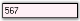' | markdownify }}
{:.image }

> {{ '' | markdownify }}
{:.image }
 _Note: The ReadOnly property must be set to 'True' for the above setting to take effect._

The methods associated with the above properties are given below.

_Table_ _267_: Methods Table_

<table>
<tr>
<td>
Methods</td><td>
Description</td></tr>
<tr>
<td>
ResetBackColor</td><td>
Resets the BackColor property to it's default value.</td></tr>
<tr>
<td>
ResetReadOnlyBackColor</td><td>
Resets the ReadOnlyBackColor property to it's default value.</td></tr>
</table>
Foreground Settings

The foreground settings of the IntegerTextBox control are discussed below.

Foreground Color

The foreground color of the control can be set using the properties given below.

_Table_ _268_: Property Table_

<table>
<tr>
<td>
IntegerTextBox Properties</td><td>
Description</td></tr>
<tr>
<td>
PositiveColor</td><td>
Gets / sets the forecolor when the current value is positive.</td></tr>
<tr>
<td>
NegativeColor</td><td>
Gets / sets the forecolor when the current value is negative. The default value is set to 'Red'.</td></tr>
<tr>
<td>
ZeroColor</td><td>
Gets / sets the forecolor, when the current value is zero.</td></tr>
</table>

[C#]

this.integerTextBox1.PositiveColor = System.Drawing.Color.DarkOrange;

this.integerTextBox1.NegativeColor = System.Drawing.Color.SteelBlue;

this.integerTextBox1.ZeroColor = System.Drawing.Color.OliveDrab;

[VB.NET]

Me.integerTextBox1.PositiveColor = System.Drawing.Color.DarkOrange

Me.integerTextBox1.NegativeColor = System.Drawing.Color.SteelBlue

Me.integerTextBox1.ZeroColor = System.Drawing.Color.OliveDrab

{{ '' | markdownify }}
{:.image }

The methods associated with the above properties are given below.

_Table_ _269_: Methods Table_

<table>
<tr>
<td>
Methods</td><td>
Description</td></tr>
<tr>
<td>
ResetForeColor</td><td>
Resets the forecolor of the control to it's default value.</td></tr>
<tr>
<td>
ResetPositiveColor</td><td>
Resets the PositiveColor property to it's default value.</td></tr>
<tr>
<td>
ResetNegativeColor</td><td>
Resets the NegativeColor property to it's default value.</td></tr>
<tr>
<td>
ResetZeroColor</td><td>
Resets the ZeroColor property to it's default value.</td></tr>
<tr>
<td>
SetControlColor</td><td>
Sets the forecolor of the control depending on whether the current value is negative.</td></tr>
<tr>
<td>
ShouldSerializePositiveColor</td><td>
Serializes the PositiveColor property.</td></tr>
<tr>
<td>
ShouldSerializeNegativeColor</td><td>
Serializes the NegativeColor property.</td></tr>
<tr>
<td>
ShouldSerializeZeroColor</td><td>
Serializes the ZeroColor property.</td></tr>
</table>

A sample which demonstrates the Foreground Settings of IntegerTextBox control is available in the below sample installation path.

…\_My Documents\Syncfusion\EssentialStudio\Version Number\Windows\Tools.Windows\Samples\Advanced Editor Functions\ActionGroupingDemo_

Behavior Settings

The behavior settings of the IntegerTextBox control are discussed below.

Negative Key Settings

The integer value of the IntegerTextBox can be reset or changed to a negative value using the properties given below.

_Table_ _270_: Property Table_

<table>
<tr>
<td>
IntegerTextBox Properties</td><td>
Description</td></tr>
<tr>
<td>
DeleteSelectionOnNegative</td><td>
This property defines the behavior when the contents of the IntegerTextBox is fully selected and the negative key is pressed by the user.When set to 'True', the current value is replaced by the default value.When set to 'False', the current value is changed to the negative value immediately.</td></tr>
<tr>
<td>
NegativeInputPendingOnSelectAll</td><td>
This property defines the behavior when the contents of the IntegerTextBox is fully selected and the negative key is pressed by the user.When set to 'True', the current value is not changed at all. The next key stroke is taken to be a new value and the entire contents of the IntegerTextBox is replaced by the negative value of the key stroke character entered.When set to 'False', the current value is changed to the negative value immediately.</td></tr>
</table>

[C#]

this.integerTextBox1.DeleteSelectionOnNegative = true;

this.integerTextBox1.NegativeInputPendingOnSelectAll = true;

[VB.NET]

Me.integerTextBox1.DeleteSelectionOnNegative = True

Me.integerTextBox1.NegativeInputPendingOnSelectAll = True

AllowLeadingZeros

This property can be used to include zeros before the beginning value of the integer value of the control.

_Table_ _271_: Property Table_

<table>
<tr>
<td>
IntegerTextBox Property</td><td>
Description</td></tr>
<tr>
<td>
AllowLeadingZeros</td><td>
Indicates whether to allow insets zero in the beginning value. The default value is set to 'False'.</td></tr>
</table>

[C#]

this.integerTextBox1.AllowLeadingZeros = true;

[VB.NET]

Me.integerTextBox1.AllowLeadingZeros = True

{{ '' | markdownify }}
{:.image }

Border Settings

Color and Styles can be applied to the border of the IntegerTextBox control as discussed below.

_Table_ _272_: Property Table_

<table>
<tr>
<td>
IntegerTextBox Properties</td><td>
Description</td></tr>
<tr>
<td>
Border3DStyle</td><td>
Indicates the style of the 3D border. The options included are as follows:{{ '_RaisedOuter,_' | markdownify }}{{ '_SunkenOuter,_' | markdownify }}{{ '_RaisedInner,_' | markdownify }}{{ '_SunkenInner,_' | markdownify }}{{ '_Raised,_' | markdownify }}{{ '_Etched,_' | markdownify }}{{ '_Bump,_' | markdownify }}{{ '_Sunken,_' | markdownify }}{{ '_Adjust and_' | markdownify }}{{ '_Flat._' | markdownify }}The default value is set to 'Sunken'.</td></tr>
<tr>
<td>
BorderColor</td><td>
Specifies the color of the 2D border.</td></tr>
<tr>
<td>
BorderSides</td><td>
Indicates the border sides of the panel. The options are as follows.{{ '_Left,_' | markdownify }}{{ '_Top,_' | markdownify }}{{ '_Right,_' | markdownify }}{{ '_Bottom,_' | markdownify }}{{ '_Middle and_' | markdownify }}{{ '_All._' | markdownify }}</td></tr>
<tr>
<td>
BorderStyle</td><td>
Indicates whether the edit control should have a border. The options included are given below:{{ '_FixedSingle,_' | markdownify }}{{ '_Fixed3D and_' | markdownify }}{{ '_None._' | markdownify }}</td></tr>
</table>

[C#]

this.integerTextBox1.Border3DStyle = System.Windows.Forms.Border3DStyle.Bump;

this.integerTextBox1.BorderColor = System.Drawing.Color.Red;

this.integerTextBox1.BorderSides = System.Windows.Forms.Border3DSide.All;

this.integerTextBox1.BorderStyle = System.Windows.Forms.BorderStyle.FixedSingle;

[VB.NET]

Me.integerTextBox1.Border3DStyle = System.Windows.Forms.Border3DStyle.Bump

Me.integerTextBox1.BorderColor = System.Drawing.Color.Red

Me.integerTextBox1.BorderSides = System.Windows.Forms.Border3DSide.All

Me.integerTextBox1.BorderStyle = System.Windows.Forms.BorderStyle.FixedSingle

{{ '' | markdownify }}
{:.image }

A sample which demonstrates the Border Settings of IntegerTextBox control is available in the below sample installation path.

…\_My Documents\Syncfusion\EssentialStudio\Version Number\Windows\Tools.Windows\Samples\Advanced Editor Functions\ActionGroupingDemo_

Key Settings

Sometimes there may be some situation for entering large values, like in Mega, Kilo etc., In such situations, if we add some sort of keyboard support, it will be very much useful for the users.

For example if the user wants to enter 32000, he just needs to enter 32 and then press the 'K'. The value will change to 32000 automatically. This is illustrated in the code snippet given below.

[C#]

private void integerTextBox1_KeyDown(object sender, KeyEventArgs e)

{

long v = integerTextBox1.IntegerValue;

switch(e.KeyCode)

{

// Enter the value as multiples of thousand.

case Keys.G : v = v * 1000000000;

break;

case Keys.M : v = v * 1000000;

break;

case Keys.K : v = v * 1000;

break;

}

integerTextBox.IntegerValue = v;

}

[VB.NET]

Private Sub integerTextBox1_KeyDown(ByVal sender As Object, ByVal e As KeyEventArgs)

Dim v As Long = integerTextBox1.IntegerValue

Select e.KeyCode

' Enter the value as multiples of thousand.

Case Keys.G

v = v * 1000000000

Case Keys.M

v = v * 1000000

Case Keys.K

v = v * 1000

End Select

integerTextBox1.IntegerValue = v

End Sub

Shortcut Keys

Sometimes there may be some situations for incrementing or decrementing the value in the IntegerTextBox. In such situations, it is better to use shortcut keys.

The following implementation will illustrate how this can be achieved. Here we are using Up and Down keys for incrementing and decrementing respectively. We cannot use the '-' key, because it is already reserved to enter the minus sign.

[C#]

private void integerTextBox1_KeyDown(object sender, KeyEventArgs e)

{

long v = integerTextBox1.IntegerValue;

switch(e.KeyCode)

{

// Increments and decrements values.

case Keys.Up : v++;

break;

case Keys.Down : v--;

break;

}

integerTextBox1.IntegerValue = v;

}

[VB.NET]

Private Sub integerTextBox1_KeyDown(ByVal sender As Object, ByVal e As KeyEventArgs)

Dim v As Long = integerTextBox1.IntegerValue

Select e.KeyCode

' Increments and decrements values.

Case Keys.Up

v = v+1

Case Keys.Down

v = v-1

End Select

integerTextBox1.IntegerValue = v

End Sub

Applying Themes

Themes can be applied to the IntegerTextBox control using the property given below.

_Table_ _273_: Property Table_

<table>
<tr>
<td>
IntegerTextBox Property</td><td>
Description</td></tr>
<tr>
<td>
ThemesEnabled</td><td>
Specifies whether or not to use XP themes, when BorderStyle property is set to 'Fixed3D'.</td></tr>
</table>
> {{ '' | markdownify }}
{:.image }
 _Note: Refer_ [Border Settings](http://help.syncfusion.com/ug_82/WindowsFormsUI_Tools/BorderSettings13.html) _topic to know about the BorderStyle property._

[C#]

this.integerTextBox1.ThemesEnabled = true;

[VB.NET]

Me.integerTextBox1.ThemesEnabled = true

{{ '' | markdownify }}
{:.image }

A sample which demonstrates the ThemesEnabled property of the IntegerTextBox control is available in the below sample installation path.

…\_My Documents\Syncfusion\EssentialStudio\Version Number\Windows\Tools.Windows\Samples\Advanced Editor Functions\ActionGroupingDemo_

###### IntegerTextBox Events

The list of events and a detailed explanation about each of them is given in the following sections.

_Table_ _274_: Events Table_

<table>
<tr>
<td>
IntegerTextBox Events</td><td>
Description</td></tr>
<tr>
<td>
BindableValueChanged</td><td>
This event occurs when the BindableValue property is changed.</td></tr>
<tr>
<td>
ClipTextChanged</td><td>
This event occurs when the ClipText property is changed.</td></tr>
<tr>
<td>
FormattedTextChanged</td><td>
This event occurs when the FormattedText property is changed.</td></tr>
<tr>
<td>
IntegerValueChanged</td><td>
This event occurs when the IntegerValue property is changed.</td></tr>
<tr>
<td>
SetNull</td><td>
This event occurs when the NULL state is to be set based on a value.</td></tr>
<tr>
<td>
ValidationError</td><td>
This event occurs when the input text is invalid for the current state of the control.</td></tr>
</table>
BindableValueChanged

This event occurs when the BindableValue property is changed. The BindableValue property is a wrapper property that indicates the value. This property can be used to set the value of the control to 'Null'.

The event handler receives an argument of type EventArgs containing data related to this event.

[C#]

private void integerTextBox1_BindableValueChanged(object sender, EventArgs e)

{

Console.WriteLine(" BindableValueChanged event is raised ");

}

[VB.NET]

Private Sub integerTextBox1_BindableValueChanged(ByVal sender As Object, ByVal e As EventArgs)

Console.WriteLine(" BindableValueChanged event is raised ")

End Sub

ClipTextChanged

This event occurs when the ClipText property is changed. The ClipText property returns the clipped text without the formatting.

The event handler receives an argument of type EventArgs containing data related to this event.

[C#]

private void integerTextBox1_ClipTextChanged(object sender, EventArgs e)

{

Console.WriteLine(" ClipTextChanged event is raised ");

}

[VB.NET]

Private Sub integerTextBox1_ClipTextChanged(ByVal sender As Object, ByVal e As EventArgs)

Console.WriteLine(" ClipTextChanged event is raised ")

End Sub

FormattedTextChanged

This event occurs when the FormattedText property is changed. The FormattedText property returns the formatted text with the formatting.

The event handler receives an argument of type EventArgs containing data related to this event.

[C#]

private void integerTextBox1_FormattedTextChanged(object sender, EventArgs e)

{

Console.WriteLine(" FormattedTextChanged event is raised ");

}

[VB.NET]

Private Sub integerTextBox1_FormattedTextChanged(ByVal sender As Object, ByVal e As EventArgs)

Console.WriteLine(" FormattedTextChanged event is raised ")

End Sub

IntegerValueChanged

This event occurs when the IntegerValue property is changed. The IntegerValue property specifies the integer value of the text.

The event handler receives an argument of type EventArgs containing data related to this event.

[C#]

private void integerTextBox1_IntegerValueChanged(object sender, EventArgs e)

{

Console.WriteLine(" IntegerValueChanged event is raised ");

}

[VB.NET]

Private Sub integerTextBox1_IntegerValueChanged(ByVal sender As Object, ByVal e As EventArgs)

Console.WriteLine(" IntegerValueChanged event is raised ")

End Sub

SetNull

This event occurs when the NULL state is to be set based on a value.

The event handler receives an argument of type SetNullEventArgs containing data related to this event. The following SetNullEventArgs members provide information specific to this event.

_Table_ _275_: Members Table_

<table>
<tr>
<td>
Members</td><td>
Description</td></tr>
<tr>
<td>
Cancel</td><td>
Gets / sets a value indicating whether the event should be canceled.</td></tr>
<tr>
<td>
NullValue</td><td>
Returns the NULL value.</td></tr>
</table>

[C#]

private void integerTextBox1_SetNull(object sender, Syncfusion.Windows.Forms.Tools.SetNullEventArgs e)

{

Console.WriteLine(" SetNull event is raised ");

}

[VB.NET]

Private Sub integerTextBox1_SetNull(ByVal sender As Object, ByVal e AsSyncfusion.Windows.Forms.Tools.SetNullEventArgs)

Console.WriteLine(" SetNull event is raised ")

End Sub

ValidationError

This event occurs when the input text is invalid for the current state of the control.

The event handler receives an argument of type ValidationErrorArgs containing data related to this event. The following ValidationErrorArgs members provide information specific to this event.

_Table_ _276_: Members Table_

<table>
<tr>
<td>
Members</td><td>
Description</td></tr>
<tr>
<td>
ErrorMessage</td><td>
Returns the error message.</td></tr>
<tr>
<td>
InvalidText</td><td>
Returns the invalid text as it would have been if the error had not intercepted it.</td></tr>
<tr>
<td>
StartPosition</td><td>
Returns the location of the invalid input in the invalid text.</td></tr>
</table>

[C#]

private void integerTextBox1_ValidationError(object sender, Syncfusion.Windows.Forms.Tools.ValidationErrorArgs e)

{

Console.WriteLine(" ValidationError event is raised ");

}

[VB.NET]

Private Sub integerTextBox1_ValidationError(ByVal sender As Object, ByVal e AsSyncfusion.Windows.Forms.Tools.ValidationErrorArgs)

Console.WriteLine(" ValidationError event is raised ")

End Sub

###### Frequently Asked Questions

How to display empty string in editor controls when databound value is null?

We can display empty string when data bound value is null. For this we need to bind the editor controls (like IntegerTextBox, DoubleTextBox, etc.,) to BindableValue property and also we need to set AllowNull to true and NullString property to empty string.

Find the code snippet below, which illustrates the same.

[C#]

this.integerTextBox1.NullString = "";

this.integerTextBox1.AllowNull = true;

this.integerTextBox1.DataBindings.Add("BindableValue", boundView, "IntegerField");

[VB.NET]

Me.integerTextBox1.NullString = ""

Me.integerTextBox1. AllowNull = True

Me.integerTextBox1.DataBindings.Add("BindableValue", boundView, "IntegerField")

##### PercentTextBox

The PercentTextBox is a textbox-derived control that can display double data type values in percentage form.

{{ '' | markdownify }}
{:.image }

The PercentTextBox is derived from Windows Forms framework textbox control. The PercentTextBox supports display and collection of percentage values. It handles user keyboard input and percent formatting and uses the globalization features of the .NET platform to provide locale-specific formatting.

###### Features

PercentTextBox control is used to display percentage values. It has the following features.

Features

* Display Settings

The [display](http://help.syncfusion.com/ug/windows%20forms/tools/default.htm) settings involve setting the separator to be used to group the numbers and the group size.

It also involves setting the pattern to be used for the positive and negative numbers and symbol to be used to indicate the percent.

* Value Settings

The [value settings](http://help.syncfusion.com/ug/windows%20forms/tools/default.htm) provide options to set the value to be displayed by the PercentTextBox control. It provides options to indicate the null state of the control and customize its settings.

The maximum and minimum value of the control can also be set.

* Culture Settings

The [culture](http://help.syncfusion.com/ug/windows%20forms/tools/default.htm) to be used for formatting the numeric display can be set using the Culture property.

* Text Settings

Text can be selected, formatted, clipped, aligned and displayed from right to left using the [text settings](http://help.syncfusion.com/ug/windows%20forms/tools/default.htm) of the PercentTextBox control.

MultiLine text can be displayed using the control.

* Appearance Settings

The background color and foreground color of the control can be set according to the needs of the user.

The foreground color can be set separately for the positive, negative and null values of the control.

* Behavior Settings

The percent value of the control can be changed to a negative value by selecting it's entire contents and pressing the negative key on the keyboard.

* Border Settings

2D and 3D [border](http://help.syncfusion.com/ug/windows%20forms/tools/default.htm) styles can be applied to the PercentTextBox.

The color of the border can also be set for the control using the BorderColor property.

* Size Settings

The maximum and minimum [size](http://help.syncfusion.com/ug/windows%20forms/tools/default.htm) of the control can be set according to the needs of the user.

* Key Settings

Keyboard support for entering large values is provided. Incrementing and decrementing of values can be done using the up and down arrow [keys](http://help.syncfusion.com/ug/windows%20forms/tools/default.htm).

* Applying Themes

Themes appearance can be provided for the PercentTextBox control.

Key Features

* The PercentTextBox control handles user keyboard input and percent formatting with no code required.
* It is fully compatible with the Windows Forms TextBox and uses the globalization features of the .NET platform to provide locale specific formatting.
* Supports different modes of editing percentage values: PercentMode and DoubleMode.
* The PercentTextBox control supports displaying negative percentage values in a different color and also using different negative formats.
###### Creating PercentTextBox

This section will give a step-by-step procedure to design a PercentTextBox control through designer and also through programmatical approach.

Through Designer

1. Create or open a Windows Forms project.
2. Click on the PercentTextBox Control in the toolbox and add it to the form by dragging-and-dropping it onto the form or double-clicking the control.

{{ '' | markdownify }}
{:.image }

3. Run the application. The PercentTextBox will allow you to enter the percent value, which will be displayed as given below.

{{ '' | markdownify }}
{:.image }

Through Programmatical Approach

1. Declare an instance of the PercentTextBox control.

[C#]

private Syncfusion.Windows.Forms.Tools.PercentTextBox percentTextBox1;

[VB.NET]

Private percentTextBox1 As Syncfusion.Windows.Forms.Tools.PercentTextBox

2. Initialize the control.

[C#]

this.percentTextBox1 = new Syncfusion.Windows.Forms.Tools.PercentTextBox();

[VB.NET]

Me.percentTextBox1 = New Syncfusion.Windows.Forms.Tools.PercentTextBox()

3. Set the properties of the PercentTextBox control.

[C#]

this.percentTextBox1.Location = new System.Drawing.Point(65, 29);

this.percentTextBox1.Name = "percentTextBox1";

this.percentTextBox1.Size = new System.Drawing.Size(84, 20);

this.percentTextBox1.PercentValue = 5;

[VB.NET]

Me.percentTextBox1.Location = New System.Drawing.Point(65, 29)

Me.percentTextBox1.Name = "numericUpDownExt1"

Me.percentTextBox1.Size = New System.Drawing.Size(84, 20)

Me.percentTextBox1.PercentValue = 5

4. Add the control to the form.

[C#]

this.Controls.Add(this.percentTextBox1);

[VB.NET]

Me.Controls.Add(Me.percentTextBox1)

5. Run the application.

{{ '' | markdownify }}
{:.image }

###### Concepts and Features

The following Editors controls (DoubleTextBox, IntegerTextBox, PercentTextBox, and CurrencyTextBox) have been revamped, click here to see the details of revamping.

Display Settings

This section discusses the display settings of the PercentTextBox control.

The PercentTextBox provides a list of properties to set the display characteristics of the percentage.

_Table_ _277_: Property Table_

<table>
<tr>
<td>
PercentTextBox Properties</td><td>
Description</td></tr>
<tr>
<td>
PercentDecimalDigits</td><td>
Gets / sets the maximum number of digits for the decimal portion of the percentage.</td></tr>
<tr>
<td>
PercentDecimalSeparator</td><td>
Gets / sets the decimal separator character that will be used for the display.</td></tr>
<tr>
<td>
PercentGroupSeparator</td><td>
Gets / sets the separator to be used for grouping digits.</td></tr>
<tr>
<td>
PercentGroupSizes</td><td>
Gets / sets the grouping of percent digits in the PercentTextBox.</td></tr>
<tr>
<td>
PercentNegativePattern</td><td>
Gets / sets the pattern to use when the value is negative.</td></tr>
<tr>
<td>
NegativeSign</td><td>
Gets / sets the sign that is to be used to indicate a negative value.</td></tr>
<tr>
<td>
PercentPositivePattern</td><td>
Gets / sets the pattern to use when the value is positive.</td></tr>
<tr>
<td>
PercentSymbol</td><td>
Gets / sets the percent symbol which represents the Percentage.</td></tr>
</table>

The grouping size of the percent digits can be set using the Int32 Collection Editor which will be displayed on selecting thePercentGroupSizes property in the property grid.

[C#]

this.percentTextBox1.PercentDecimalDigits = 3;

this.percentTextBox1.PercentDecimalSeparator = ".";

this.percentTextBox1.PercentGroupSeparator = ",";

this.percentTextBox1.PercentGroupSizes = new int[] {5};

this.percentTextBox1.PercentNegativePattern = 2;

this.percentTextBox1.NegativeSign = "-";

this.percentTextBox1.PercentPositivePattern = 2;

this.percentTextBox1.PercentSymbol = "%";

[VB.NET]

Me.percentTextBox1.PercentDecimalDigits = 3

Me.percentTextBox1.PercentDecimalSeparator = "."

Me.percentTextBox1.PercentGroupSeparator = ","

Me.percentTextBox1.PercentGroupSizes = New Integer() {5}

Me.percentTextBox1.PercentNegativePattern = 2

Me.percentTextBox1.NegativeSign = "-";

Me.percentTextBox1.PercentPositivePattern = 2

Me.percentTextBox1.PercentSymbol = "%"

The following screen shot illustrates the above settings.

{{ '' | markdownify }}
{:.image }

A sample which demonstrates the Display Settings of PercentTextBox control is available in the below sample installation path.

…\_My Documents\Syncfusion\EssentialStudio\Version Number\Windows\Tools.Windows\Samples\Advanced Editor Functions\ActionGroupingDemo_

Value Settings

The various values of the PercentTextBox control and their settings are given below.

_Table_ _278_: Property Table_

<table>
<tr>
<td>
PercentTextBox Properties</td><td>
Description</td></tr>
<tr>
<td>
PercentValue</td><td>
Specifies the double value of the PercentTextBox control.</td></tr>
<tr>
<td>
DefaultValue</td><td>
Specifies the default value. The default value is set to 'Null'.</td></tr>
<tr>
<td>
BindableValue</td><td>
Wrapper property that indicates the value. This property can be used to set the value of the control to 'Null'.</td></tr>
<tr>
<td>
BindablePercentValue</td><td>
Wrapper property that indicates the percent value. This property can be used to set the value of the control to 'Null'.</td></tr>
<tr>
<td>
DoubleValue</td><td>
Gets / sets the double value of the control. This will be formatted and displayed.</td></tr>
</table>

[C#]

this.percentTextBox1.PercentValue = 5;

this.percentTextBox1.DefaultValue = 0;

this.percentTextBox1.BindableValue = 0.05;

this.percentTextBox1.BindablePercentValue = 5;

this.percentTextBox1.DoubleValue = 0.05;

[VB.NET]

Me.percentTextBox1.PercentValue = 5

Me.percentTextBox1.DefaultValue = 0

Me.percentTextBox1.BindableValue = 0.05

Me.percentTextBox1.BindablePercentValue = 5

Me.percentTextBox1.DoubleValue = 0.05

{{ '' | markdownify }}
{:.image }

Null Value Settings

There are various settings that can be applied to the PercentTextBox control, when the value of the control is set to 'Null'. These settings are illustrated below.

_Table_ _279_: Property Table_

<table>
<tr>
<td>
PercentTextBox Properties</td><td>
Description</td></tr>
<tr>
<td>
AllowNull</td><td>
Specifies if the NullString will be used when the value is Null.</td></tr>
<tr>
<td>
NullString</td><td>
Specifies the string to be displayed when the DecimalValue is Null.</td></tr>
<tr>
<td>
NullFormat</td><td>
Returns the NumberFormatInfo object for the null display.</td></tr>
</table>

[C#]

this.percentTextBox1.NullString = "Null Value";

this.percentTextBox1.AllowNull = true;

[VB.NET]

Me.percentTextBox1.NullString = "Null Value"

Me.percentTextBox1.AllowNull = True

{{ '' | markdownify }}
{:.image }

Min and Max Value Settings

The minimum and maximum values of the IntegerTextBox can be set using the below given properties.

_Table_ _280_: Property Table_

<table>
<tr>
<td>
PercentTextBox Properties</td><td>
Description</td></tr>
<tr>
<td>
MaxValue</td><td>
Gets / sets the maximum value that can be set through the PercentTextBox. The default value is set to '1'.</td></tr>
<tr>
<td>
MinValue</td><td>
Gets / sets the minimum value that can be set through the PercentTextBox. The default value is set to '-1'.</td></tr>
<tr>
<td>
EnforceMinMaxDuringValidating</td><td>
If the min and max values are not met, the Validating event will be handled and cancelled if this property is set to 'True'.</td></tr>
</table>

[C#]

this.percentTextBox1.MaxValue = 6;

this.percentTextBox1.MinValue = -6;

this.percentTextBox1.EnforceMinMaxDuringValidating = true;

[VB.NET]

Me.percentTextBox1.MaxValue = 6

Me.percentTextBox1.MinValue = -6

Me.percentTextBox1.EnforceMinMaxDuringValidating = True

The methods associated with the above properties are given below.

_Table_ _281_: Methods Table_

<table>
<tr>
<td>
Methods</td><td>
Description</td></tr>
<tr>
<td>
ResetMaxValue</td><td>
Resets the MaxValue property to it's default value.</td></tr>
<tr>
<td>
ResetMinValue</td><td>
Resets the MinValue property to it's default value.</td></tr>
</table>
Culture Settings

This section discusses the Culture settings of the PercentTextBox control.

_Table_ _282_: Property Table_

<table>
<tr>
<td>
PercentTextBox Properties</td><td>
Description</td></tr>
<tr>
<td>
Culture</td><td>
Gets / sets the culture that is to be used for formatting the numeric display.</td></tr>
<tr>
<td>
CurrentCultureRefresh</td><td>
Indicates whether the Culture property is to be refreshed when the culture changes.</td></tr>
<tr>
<td>
SpecialCultureValue</td><td>
Gets / sets the mode for the cultures.It includes the below given options.{{ '_None,_' | markdownify }}{{ '_CurrentCulture,_' | markdownify }}{{ '_UICulture and_' | markdownify }}{{ '_InstalledCulture._' | markdownify }}</td></tr>
<tr>
<td>
UseUserOverride</td><td>
Specifies if the NumberFormatInfo used for formatting will use the User Overrides for the culture. The default value is set to 'True'.</td></tr>
</table>

[C#]

this.percentTextBox1.Culture = new System.Globalization.CultureInfo("ar-JO");

this.percentTextBox1.CurrentCultureRefresh = true;

this.percentTextBox1.SpecialCultureValue = Syncfusion.Windows.Forms.Tools.SpecialCultureValues.None;

this.percentTextBox1.UseUserOverride = true;

[VB.NET]

Me.percentTextBox1.Culture = New System.Globalization.CultureInfo("ar-JO")

Me.percentTextBox1.CurrentCultureRefresh = True

Me.percentTextBox1.SpecialCultureValue = Syncfusion.Windows.Forms.Tools.SpecialCultureValues.None

Me.percentTextBox1.UseUserOverride = True

{{ '' | markdownify }}
{:.image }

> {{ '' | markdownify }}
{:.image }
 _Note: The RefreshCulture() method can be used to refresh and reapply the culture specific settings._

A sample which demonstrates the Culture Settings of the PercentTextBox control is available in the below sample installation path.

…\_My Documents\Syncfusion\EssentialStudio\Version Number\Windows\Tools.Windows\Samples\Advanced Editor Functions\ActionGroupingDemo_

Text Settings

This section discusses the text settings of the PercentTextBox control.

The text associated with the PercentTextBox control can be set and customized using the below given settings.

_Table_ _283_: Property Table_

<table>
<tr>
<td>
PercentTextBox Properties</td><td>
Description</td></tr>
<tr>
<td>
Text</td><td>
Specifies the text associated with the control.</td></tr>
<tr>
<td>
CharacterCasing</td><td>
Gets / sets the case of character as they are typed.It includes the below given options.{{ '_Normal,_' | markdownify }}{{ '_Upper and_' | markdownify }}{{ '_Lower._' | markdownify }}</td></tr>
<tr>
<td>
TextAlign</td><td>
Indicates how the text should be aligned for edit controls.</td></tr>
<tr>
<td>
SelectedText</td><td>
Gets / sets the selected text in the PercentTextBox.</td></tr>
<tr>
<td>
SelectAllOnFocus</td><td>
Specifies if the text should be selected when the control gets the focus.</td></tr>
<tr>
<td>
SwitchModeOnFocus</td><td>
Indicates whether the PercentTextBox should allow editing in numeric mode, when it receives focus.</td></tr>
<tr>
<td>
HideSelection</td><td>
Indicates that the selection should be hidden when the edit control loses focus.</td></tr>
<tr>
<td>
ClipText</td><td>
Returns the clipped text without the formatting.</td></tr>
<tr>
<td>
DrawActiveWhenDisabled</td><td>
Specifies if the text should be drawn active, even when disabled.</td></tr>
</table>

[C#]

this.percentTextBox1.CharacterCasing = System.Windows.Forms.CharacterCasing.Upper;

this.percentTextBox1.TextAlign = System.Windows.Forms.HorizontalAlignment.Center;

this.percentTextBox1.SelectedText = "34";

this.percentTextBox1.SelectAllOnFocus = true;

this.percentTextBox1.SwitchModeOnFocus = true;

this.percentTextBox1.HideSelection = true;

this.percentTextBox1.ClipText = "34";

this.percentTextBox1.DrawActiveWhenDisabled = true;

[VB.NET]

Me.percentTextBox1.CharacterCasing = System.Windows.Forms.CharacterCasing.Upper

Me.percentTextBox1.TextAlign = System.Windows.Forms.HorizontalAlignment.Center

Me.percentTextBox1.SelectedText = "34"

Me.percentTextBox1.SelectAllOnFocus = true

Me.percentTextBox1.SwitchModeOnFocus = True

Me.percentTextBox1.HideSelection = True

Me.percentTextBox1.ClipText = "34"

Me.percentTextBox1.DrawActiveWhenDisabled = True

{{ '' | markdownify }}
{:.image }

{{ '' | markdownify }}
{:.image }

{{ '' | markdownify }}
{:.image }

The methods associated with the above properties are given below.

_Table_ _284_: Methods Table_

<table>
<tr>
<td>
Methods</td><td>
Description</td></tr>
<tr>
<td>
AppendText</td><td>
Appends text to the current text of a textbox.</td></tr>
<tr>
<td>
ResetText</td><td>
Resets the Text property to its default value.</td></tr>
<tr>
<td>
OnCharacterCasingChanged</td><td>
Raises the CharacterCasingChanged event.</td></tr>
<tr>
<td>
GetClipText</td><td>
Gets / sets the clipped text without the formatting.</td></tr>
<tr>
<td>
Cut</td><td>
Cuts the selected data to the clipboard.</td></tr>
<tr>
<td>
Copy</td><td>
Copies the content of the NumberTextBox to the clipboard. The ClipMode property dictates what gets copied.</td></tr>
<tr>
<td>
Delete</td><td>
Deletes the current selection of the TextBox.</td></tr>
<tr>
<td>
Paste</td><td>
Pastes the data in the clipboard into the NumberTextBox control.</td></tr>
<tr>
<td>
SelectAll</td><td>
Selects all text in the TextBox.</td></tr>
</table>
Multiline Text Settings

The text settings of the PercentTextBox control can be customized to display multiline text using the below given properties.

_Table_ _285_: Property Table_

<table>
<tr>
<td>
PercentTextBox Properties</td><td>
Description</td></tr>
<tr>
<td>
Multiline</td><td>
Controls whether the text of the edit control can span more than one line.</td></tr>
<tr>
<td>
Lines</td><td>
The lines of text in a multiline edit, as an array of string values.</td></tr>
<tr>
<td>
WordWrap</td><td>
Indicates if lines are automatically word-wrapped for multiline edit controls.</td></tr>
<tr>
<td>
ScrollBars</td><td>
Indicates, for multiline edit controls, which scrollbars will be shown for this control.It includes the below given options.{{ '_None,_' | markdownify }}{{ '_Horizontal,_' | markdownify }}{{ '_Vertical and_' | markdownify }}{{ '_Both._' | markdownify }}</td></tr>
</table>

[C#]

this.percentTextBox1.Multiline = true;

this.percentTextBox1.WordWrap = true;

this.percentTextBox1.ScrollBars = System.Windows.Forms.ScrollBars.Vertical;

[VB.NET]

Me.percentTextBox1.Multiline = True

Me.percentTextBox1.WordWrap = True

Me.percentTextBox1.ScrollBars = System.Windows.Forms.ScrollBars.Vertical

{{ '' | markdownify }}
{:.image }

{{ '' | markdownify }}
{:.image }

{{ '' | markdownify }}
{:.image }

Clip Mode

The formatting for the text can be enabled or disabled using the property given below.

_Table_ _286_: Property Table_

<table>
<tr>
<td>
PercentTextBox Property</td><td>
Description</td></tr>
<tr>
<td>
ClipMode</td><td>
Determines whether to include or exclude the literal characters in the input mask when doing a copy command.It includes the below given options.{{ '_IncludeFormatting and_' | markdownify }}{{ '_ExcludeFormatting._' | markdownify }}</td></tr>
</table>

[C#]

this.percentTextBox1.ClipMode = Syncfusion.Windows.Forms.Tools.CurrencyClipModes.IncludeFormatting;

[VB.NET]

Me.percentTextBox1.ClipMode = Syncfusion.Windows.Forms.Tools.CurrencyClipModes.IncludeFormatting

Formatted Text

Formatted text can be displayed using the below given property.

_Table_ _287_: Property Table_

<table>
<tr>
<td>
PercentTextBox Property</td><td>
Description</td></tr>
<tr>
<td>
FormattedText</td><td>
Returns the formatted text with the formatting.</td></tr>
</table>

[C#]

this.percentTextBox1.FormattedText = "Hello";

[VB.NET]

Me.percentTextBox1.FormattedText = "Hello"

RightToLeft

The text can be displayed from right to left for RTL languages using this property.

_Table_ _288_: Property Table_

<table>
<tr>
<td>
PercentTextBox Property</td><td>
Description</td></tr>
<tr>
<td>
RightToLeft</td><td>
Indicates whether the component should draw right-to-left for RTL languages. The default value is set to 'False'.</td></tr>
</table>
> {{ '' | markdownify }}
{:.image }
 _Note: The RightToLeft property will be automatically set to 'True' for RTL languages._

[C#]

this.percentTextBox1.RightToLeft = System.Windows.Forms.RightToLeft.Yes;

[VB.NET]

Me.percentTextBox1.RightToLeft = System.Windows.Forms.RightToLeft.Yes

{{ '' | markdownify }}
{:.image }

> {{ '' | markdownify }}
{:.image }
 _Note: The ResetRightToLeft() method can be used to reset the RightToLeft property to it's default value._

OverflowIndicatorToolTipText

The tooltip that should be displayed when an overflow of text occurs can be set using the below given properties.

_Table_ _289_: Property Table_

<table>
<tr>
<td>
PercentTextBox Properties</td><td>
Description</td></tr>
<tr>
<td>
OverflowIndicatorToolTipText</td><td>
Specifies the overflow indicator tooltip text.</td></tr>
<tr>
<td>
ShowOverflowIndicator</td><td>
Gets / sets overflow indicator visibility.</td></tr>
<tr>
<td>
ShowOverflowIndicatorToolTip</td><td>
Indicates whether to show the overflow indicator tooltip.</td></tr>
</table>

[C#]

this.percentTextBox1.OverflowIndicatorToolTipText = "Overflow";

this.percentTextBox1.ShowOverflowIndicator = true;

this.percentTextBox1.ShowOverflowIndicatorToolTip = true;

[VB.NET]

Me.percentTextBox1.OverflowIndicatorToolTipText = "Overflow"

Me.percentTextBox1.ShowOverflowIndicator = True

Me.percentTextBox1.ShowOverflowIndicatorToolTip = True

{{ '' | markdownify }}
{:.image }

Banner Text Support

The PercentTextBox control can display banner text in the text field, at run time. A BannerTextProvider Component should be available for this purpose. Also, We need to set AllowNull, NullString and Text properties as below to make this feature effective.

[C#]

this.percentTextBox1.AllowNull = true;

this.percentTextBox1.NullString = "";

this.percentTextBox1.Text = "";

[VB.NET]

Me.percentTextBox1.AllowNull = True

Me.percentTextBox1.NullString = ""

Me.percentTextBox1.Text = ""

A sample which demonstrates the Text, Text Align and Overflow Indicator features of the PercentTextBox control is available in the below sample installation path.

…\_My Documents\Syncfusion\EssentialStudio\Version Number\Windows\Tools.Windows\Samples\Advanced Editor Functions\ActionGroupingDemo_

Appearance Settings

Background Settings

The Background settings of the PercentTextBox control are discussed below.

Background Color

The background color of the control can be set using the properties given below.

_Table_ _290_: Property Table_

<table>
<tr>
<td>
PercentTextBox Properties</td><td>
Description</td></tr>
<tr>
<td>
BackColor</td><td>
Specifies the background color of the component.</td></tr>
<tr>
<td>
ReadOnlyBackColor</td><td>
Specifies the backcolor to be used when the control is in the ReadOnly mode.</td></tr>
</table>

[C#]

this.percentTextBox1.BackColor = System.Drawing.Color.LightCyan;

this.percentTextBox1.ReadOnly = true;

this.percentTextBox1.ReadOnlyBackColor = System.Drawing.Color.Pink;

[VB.NET]

Me.percentTextBox1.BackColor = System.Drawing.Color.LightCyan

Me.percentTextBox1.[ReadOnly] = True

Me.percentTextBox1.ReadOnlyBackColor = System.Drawing.Color.Pink

{{ '' | markdownify }}
{:.image }

{{ '' | markdownify }}
{:.image }

> {{ '' | markdownify }}
{:.image }
 _Note: The ReadOnly property must be set to 'True' for the above setting to take effect._

The methods associated with the above properties are given below.

_Table_ _291_: Methods Table_

<table>
<tr>
<td>
Methods</td><td>
Description</td></tr>
<tr>
<td>
ResetBackColor</td><td>
Resets the BackColor property to it's default value.</td></tr>
<tr>
<td>
ResetReadOnlyBackColor</td><td>
Resets the ReadOnlyBackColor property to it's default value.</td></tr>
</table>
Foreground Settings

The Foreground settings of the PercentTextBox control are discussed below.

Foreground Color

The foreground color of the control can be set using the properties given below.

_Table_ _292_: Property Table_

<table>
<tr>
<td>
PercentTextBox Properties</td><td>
Description</td></tr>
<tr>
<td>
PositiveColor</td><td>
Gets / sets the forecolor when the current value is positive.</td></tr>
<tr>
<td>
NegativeColor</td><td>
Gets / sets the forecolor when the current value is negative. The default value is set to 'Red'.</td></tr>
<tr>
<td>
ZeroColor</td><td>
Gets / sets the forecolor when the current value is zero.</td></tr>
</table>

[C#]

this.percentTextBox1.PositiveColor = System.Drawing.Color.ForestGreen;

this.percentTextBox1.NegativeColor = System.Drawing.Color.Orange;

this.percentTextBox1.ZeroColor = System.Drawing.Color.Orchid;

[VB.NET]

Me.percentTextBox1.PositiveColor = System.Drawing.Color.ForestGreen

Me.percentTextBox1.NegativeColor = System.Drawing.Color.Orange

Me.percentTextBox1.ZeroColor = System.Drawing.Color.Orchid

{{ '' | markdownify }}
{:.image }

The methods associated with the above properties are given below.

_Table_ _293_: Methods Table_

<table>
<tr>
<td>
Methods</td><td>
Description</td></tr>
<tr>
<td>
ResetForeColor</td><td>
Resets the forecolor of the control to it's default value.</td></tr>
<tr>
<td>
ResetPositiveColor</td><td>
Resets the PositiveColor property to it's default value.</td></tr>
<tr>
<td>
ResetNegativeColor</td><td>
Resets the NegativeColor property to it's default value.</td></tr>
<tr>
<td>
ResetZeroColor</td><td>
Resets the ZeroColor property to it's default value.</td></tr>
<tr>
<td>
SetControlColor</td><td>
Sets the forecolor of the control depending on whether the current value is negative.</td></tr>
<tr>
<td>
ShouldSerializePositiveColor</td><td>
Serializes the PositiveColor property.</td></tr>
<tr>
<td>
ShouldSerializeNegativeColor</td><td>
Serializes the NegativeColor property.</td></tr>
<tr>
<td>
ShouldSerializeZeroColor</td><td>
Serializes the ZeroColor property.</td></tr>
</table>

A sample which demonstrates the Foreground Settings of PercentTextBox control is available in the below sample installation path.

…\_My Documents\Syncfusion\EssentialStudio\Version Number\Windows\Tools.Windows\Samples\Advanced Editor Functions\ActionGroupingDemo_

Behavior Settings

The Behavior settings of the PercentTextBox control are discussed below.

NegativeInputPendingOnSelectAll

The percent value of the PercentTextBox can be changed to a negative value using the properties given below.

_Table_ _294_: Property Table_

<table>
<tr>
<td>
PercentTextBox Property</td><td>
Description</td></tr>
<tr>
<td>
NegativeInputPendingOnSelectAll</td><td>
This property defines the behavior when the contents of the IntegerTextBox is fully selected and the negative key is pressed by the user.When set to 'True', the current value is not changed at all. The next key stroke is taken to be a new value and the entire contents of the PercentTextBox is replaced by the negative value of the key stroke character entered.When set to 'False', the current value is changed to the negative value immediately.</td></tr>
</table>

[C#]

this.percentTextBox1.NegativeInputPendingOnSelectAll = true;

[VB.NET]

Me.percentTextBox1.NegativeInputPendingOnSelectAll = True

Border Settings

Color and Styles can be applied to the Border of the PercentTextBox control as discussed below.

_Table_ _295_: Property Table_

<table>
<tr>
<td>
PercentTextBox Properties</td><td>
Description</td></tr>
<tr>
<td>
Border3DStyle</td><td>
Indicates the style of the 3D border. The options included are as follows:{{ '_RaisedOuter,_' | markdownify }}{{ '_SunkenOuter,_' | markdownify }}{{ '_RaisedInner,_' | markdownify }}{{ '_SunkenInner,_' | markdownify }}{{ '_Raised,_' | markdownify }}{{ '_Etched,_' | markdownify }}{{ '_Bump,_' | markdownify }}{{ '_Sunken,_' | markdownify }}{{ '_Adjust and_' | markdownify }}{{ '_Flat._' | markdownify }}The default value is set to 'Sunken'.</td></tr>
<tr>
<td>
BorderColor</td><td>
Specifies the color of the 2D border.</td></tr>
<tr>
<td>
BorderSides</td><td>
Indicates the border sides of the panel. The options included are as follows:{{ '_Left,_' | markdownify }}{{ '_Top,_' | markdownify }}{{ '_Right,_' | markdownify }}{{ '_Bottom,'_' | markdownify }}{{ '_Middle and_' | markdownify }}{{ '_All._' | markdownify }}</td></tr>
<tr>
<td>
BorderStyle</td><td>
Indicates whether the edit control should have a border. The options included are given below.{{ '_FixedSingle,_' | markdownify }}{{ '_Fixed3D and_' | markdownify }}{{ '_None._' | markdownify }}</td></tr>
</table>

[C#]

this.percentTextBox1.Border3DStyle = System.Windows.Forms.Border3DStyle.Etched;

this.percentTextBox1.BorderColor = System.Drawing.Color.Orange;

this.percentTextBox1.BorderSides = System.Windows.Forms.Border3DSide.All;

this.percentTextBox1.BorderStyle = System.Windows.Forms.BorderStyle.FixedSingle;

[VB.NET]

Me.percentTextBox1.Border3DStyle = System.Windows.Forms.Border3DStyle.Etched

Me.percentTextBox1.BorderColor = System.Drawing.Color.Orange

Me.percentTextBox1.BorderSides = System.Windows.Forms.Border3DSide.All

Me.percentTextBox1.BorderStyle = System.Windows.Forms.BorderStyle.FixedSingle

{{ '' | markdownify }}
{:.image }

A Sample which demonstrates the Border Settings of PercentTextBox control is available in the below sample installation path.

…\_My Documents\Syncfusion\EssentialStudio\Version Number\Windows\Tools.Windows\Samples\Advanced Editor Functions\ActionGroupingDemo_

Size Settings

The size of the PercentTextBox control can be set according to the needs of the user using the properties discussed below.

_Table_ _296_: Property Table_

<table>
<tr>
<td>
PercentTextBox Properties</td><td>
Description</td></tr>
<tr>
<td>
MaximumSize</td><td>
Gets / sets the maximum size for the control.</td></tr>
<tr>
<td>
MinimumSize</td><td>
Gets / sets the minimum size for the control.</td></tr>
</table>

[C#]

this.percentTextBox1.MaximumSize = new System.Drawing.Size(100, 25);

this.percentTextBox1.MinimumSize = new System.Drawing.Size(100, 25);

[VB.NET]

Me.percentTextBox1.MaximumSize = New System.Drawing.Size(100, 25)

Me.percentTextBox1.MinimumSize = New System.Drawing.Size(100, 25)

{{ '' | markdownify }}
{:.image }

Key Settings

Sometimes there may occur some situations for entering large values, like in Mega, Kilo etc. In such situations if we add some sort of keyboard support, it will be very much useful for the users.

For example if the user wants to enter 32000, he just needs to enter 32 and then press the 'K'. The value will change to 32000 automatically. This is illustrated in the code snippet given below.

[C#]

private void percentTextBox1_KeyDown(object sender, KeyEventArgs e)

{

double v = percentTextBox1.PercentValue;

switch(e.KeyCode)

{

// Enter the value as multiples of thousand.

case Keys.G : v = v * 1000000000;

break;

case Keys.M : v = v * 1000000;

break;

case Keys.K : v = v * 1000;

break;

}

percentTextBox.PercentValue = v;

}

[VB.NET]

Private Sub percentTextBox1_KeyDown(ByVal sender As Object, ByVal e As KeyEventArgs)

Dim v As Double = percentTextBox1.PercentValue

Select e.KeyCode

' Enter the value as multiples of thousand.

Case Keys.G

v = v * 1000000000

Case Keys.M

v = v * 1000000

Case Keys.K

v = v * 1000

End Select

percentTextBox.PercentValue = v

End Sub

Shortcut Keys

Sometimes there may occur some situations for incrementing or decrementing the value in the PercentTextBox. In such situations it is better to use shortcut keys.

The following implementation will illustrate how this can be achieved. Here we are using Up and Down keys for incrementing and decrementing respectively. We cannot use the '-' key because it is already reserved to enter the minus sign.

[C#]

private void percentTextBox1_KeyDown(object sender, KeyEventArgs e)

{

// Increments the PercentTextBoxValue.

double v = percentTextBox1.PercentValue;

switch(e.KeyCode)

{

case Keys.Up : v++;

break;//you can change by a step like v+=10;

case Keys.Down : v--;

break;

}

percentTextBox1.PercentValue = v;

}

[VB.NET]

Private Sub percentTextBox1_KeyDown(ByVal sender As Object, ByVal e As KeyEventArgs)

' Increments the PercentTextBoxValue.

Dim v As Double = percentTextBox1.PercentValue

Select e.KeyCode

Case Keys.Up

v = v+1

Case Keys.Down

v = v-1

End Select

percentTextBox1.PercentValue = v

End Sub

Applying Themes

Themes can be applied to the PercentTextBox control using the property given below.

_Table_ _297_: Property Table_

<table>
<tr>
<td>
PercentTextBox Property</td><td>
Description</td></tr>
<tr>
<td>
ThemesEnabled</td><td>
Specifies whether or not to use XP themes when BorderStyle  property is set to 'Fixed3D'.</td></tr>
</table>
> {{ '' | markdownify }}
{:.image }
 _Note: Refer_ [Border Settings](http://help.syncfusion.com/ug_82/WindowsFormsUI_Tools/BorderSettings13.html) _topic to know about the BorderStyle property._

[C#]

this.percentTextBox1.ThemesEnabled = true;

[VB.NET]

Me.percentTextBox1.ThemesEnabled = true

{{ '' | markdownify }}
{:.image }

A Sample which demonstrates the ThemesEnabled property of the PercentTextBox control is available in the below sample installation path.

…\_My Documents\Syncfusion\EssentialStudio\Version Number\Windows\Tools.Windows\Samples\Advanced Editor Functions\ActionGroupingDemo_

###### PercentTextBox Events

The list of events and a detailed explanation about each of them is given in the following sections.

_Table_ _298_: Events Table_

<table>
<tr>
<td>
PercentTextBox Events</td><td>
Description</td></tr>
<tr>
<td>
BindablePercentValueChanged</td><td>
This event occurs when the BindablePercentValue property is changed.</td></tr>
<tr>
<td>
BindableValueChanged</td><td>
This event occurs when the BindableValue property is changed.</td></tr>
<tr>
<td>
Border3DStyleChanged</td><td>
This event occurs when the Border3DStyle property is changed.</td></tr>
<tr>
<td>
BorderColorChanged</td><td>
This event occurs when the BorderColor property is changed.</td></tr>
<tr>
<td>
BorderSidesChanged</td><td>
This event occurs when the BorderSides property is changed.</td></tr>
<tr>
<td>
BorderStyleChanged</td><td>
This event occurs when the ClipText property is changed.</td></tr>
<tr>
<td>
ClipTextChanged</td><td>
This event occurs when the ClipText property is changed.</td></tr>
<tr>
<td>
DoubleValueChanged</td><td>
This event occurs when the DoubleValue property is changed.</td></tr>
<tr>
<td>
FormattedTextChanged</td><td>
This event occurs when the FormattedText property is changed.</td></tr>
<tr>
<td>
HideSelectionChanged</td><td>
This event occurs when the HideSelection property is changed.</td></tr>
<tr>
<td>
MinimumSizeChanged</td><td>
This event occurs when the MinimumSize property is changed.</td></tr>
<tr>
<td>
MaximumSizeChanged</td><td>
This event occurs when the MaximumSize property is changed.</td></tr>
<tr>
<td>
MultilineChanged</td><td>
This event occurs when the Multiline property is changed.</td></tr>
<tr>
<td>
ReadOnlyChanged</td><td>
This event occurs when the ReadOnly property is changed.</td></tr>
<tr>
<td>
RightToLeftChanged</td><td>
This event occurs when the RightToLeft property is changed.</td></tr>
<tr>
<td>
SetNull</td><td>
This event occurs when the NULL state is to be set based on a value.</td></tr>
<tr>
<td>
TextAlignChanged</td><td>
This event occurs when the TextAlign property is changed.</td></tr>
<tr>
<td>
ThemesEnabledChanged</td><td>
This event occurs when the ThemesEnabled property is changed.</td></tr>
<tr>
<td>
ValidationError</td><td>
This event occurs when the input text is invalid for the current state of the control.</td></tr>
</table>
BindablePercentValueChanged

This event occurs when the BindablePercentValue property is changed. The BindablePercentValue property is a wrapper property that indicates the percent value. This property can be used to set the value of the control to 'Null'.

The event handler receives an argument of type EventArgs containing data related to this event.

[C#]

private void percentTextBox1_BindablePercentValueChanged(object sender, EventArgs e)

{

Console.WriteLine(" BindablePercentValueChanged event is raised ");

}

[VB.NET]

Private Sub percentTextBox1_BindablePercentValueChanged(ByVal sender As Object, ByVal e As EventArgs)

Console.WriteLine(" BindablePercentValueChanged event is raised ")

End Sub

 BindableValueChanged 

This event occurs when the BindableValue property is changed. The BindableValue property is a wrapper property that indicates the value. This property can be used to set the value of the control to 'Null'.

The event handler receives an argument of type EventArgs containing data related to this event.

[C#]

private void percentTextBox1_BindableValueChanged(object sender, EventArgs e)

{

Console.WriteLine(" BindableValueChanged event is raised ");

}

[VB.NET]

Private Sub percentTextBox1_BindableValueChanged(ByVal sender As Object, ByVal e As EventArgs)

Console.WriteLine(" BindableValueChanged event is raised ")

End Sub

Border3DStyleChanged

This event occurs when the Border3DStyle property is changed. The Border3DStyle property indicates the style of the 3D border.

The event handler receives an argument of type EventArgs containing data related to this event.

[C#]

private void percentTextBox1_Border3DStyleChanged(object sender, EventArgs e)

{

Console.WriteLine(" Border3DStyleChanged event is raised ");

}

[VB.NET]

Private Sub percentTextBox1_Border3DStyleChanged(ByVal sender As Object, ByVal e As EventArgs)

Console.WriteLine(" Border3DStyleChanged event is raised ")

End Sub

BorderColorChanged 

This event occurs when the BorderColor property is changed. The BorderColor property indicates the color of the 2D border.

The event handler receives an argument of type EventArgs containing data related to this event.

[C#]

private void percentTextBox1_BorderColorChanged(object sender, EventArgs e)

{

Console.WriteLine(" BorderColorChanged event is raised ");

}

[VB.NET]

Private Sub percentTextBox1_BorderColorChanged(ByVal sender As Object, ByVal e As EventArgs)

Console.WriteLine(" BorderColorChanged event is raised ")

End Sub

BorderSidesChanged 

This event occurs when the BorderSides property is changed. The BorderSides property indicates the border sides of the panel.

The event handler receives an argument of type EventArgs containing data related to this event.

[C#]

private void percentTextBox1_BorderSidesChanged(object sender, EventArgs e)

{

Console.WriteLine(" BorderSidesChanged event is raised ");

}

[VB.NET]

Private Sub percentTextBox1_BorderSidesChanged(ByVal sender As Object, ByVal e As EventArgs)

Console.WriteLine(" BorderSidesChanged event is raised ")

End Sub

BorderStyleChanged 

This event occurs when the BorderStyle property is changed. The BorderStyle property indicates whether the edit control should have a border.

The event handler receives an argument of type EventArgs containing data related to this event.

[C#]

private void percentTextBox1_BorderStyleChanged(object sender, EventArgs e)

{

Console.WriteLine(" BorderStyleChanged event is raised ");

}

[VB.NET]

Private Sub percentTextBox1_BorderStyleChanged(ByVal sender As Object, ByVal e As EventArgs)

Console.WriteLine(" BorderStyleChanged event is raised ")

End Sub

ClipTextChanged 

This event occurs when the ClipText property is changed. The ClipText property returns the clipped text without the formatting.

The event handler receives an argument of type EventArgs containing data related to this event.

[C#]

private void percentTextBox1_ClipTextChanged(object sender, EventArgs e)

{

Console.WriteLine(" ClipTextChanged event is raised ");

}

[VB.NET]

Private Sub percentTextBox1_ClipTextChanged(ByVal sender As Object, ByVal e As EventArgs)

Console.WriteLine(" ClipTextChanged event is raised ")

End Sub

DoubleValueChanged

This event occurs when the DoubleValue property is changed. The DoubleValue property specifies the double value of the PercentTextBox control.

The event handler receives an argument of type EventArgs containing data related to this event.

[C#]

private void percentTextBox1_FormattedTextChanged(object sender, EventArgs e)

{

Console.WriteLine(" DoubleValueChanged event is raised ");

}

[VB.NET]

Private Sub percentTextBox1_FormattedTextChanged(ByVal sender As Object, ByVal e As EventArgs)

Console.WriteLine(" DoubleValueChanged event is raised ")

End Sub

FormattedTextChanged

This event occurs when the FormattedText property is changed. The FormattedText property returns the formatted text with the formatting.

The event handler receives an argument of type EventArgs containing data related to this event.

[C#]

private void percentTextBox1_FormattedTextChanged(object sender, EventArgs e)

{

Console.WriteLine(" FormattedTextChanged event is raised ");

}

[VB.NET]

Private Sub percentTextBox1_FormattedTextChanged(ByVal sender As Object, ByVal e As EventArgs)

Console.WriteLine(" FormattedTextChanged event is raised ")

End Sub

HideSelectionChanged 

This event occurs when the HideSelection property is changed. The HideSelection property indicates that the selection should be hidden when the edit control loses focus.

The event handler receives an argument of type EventArgs containing data related to this event.

[C#]

private void percentTextBox1_HideSelectionChanged(object sender, EventArgs e)

{

Console.WriteLine(" HideSelectionChanged event is raised ");

}

[VB.NET]

Private Sub percentTextBox1_HideSelectionChanged(ByVal sender As Object, ByVal e As EventArgs)

Console.WriteLine(" HideSelectionChanged event is raised ")

End Sub

MinimumSizeChanged 

This event occurs when the MinimumSize property is changed. The MinimumSize property gets / sets the minimum size of the control.

The event handler receives an argument of type EventArgs containing data related to this event.

[C#]

private void percentTextBox1_MinimumSizeChanged(object sender, EventArgs e)

{

Console.WriteLine(" MinimumSizeChanged event is raised ");

}

[VB.NET]

Private Sub percentTextBox1_MinimumSizeChanged(ByVal sender As Object, ByVal e As EventArgs)

Console.WriteLine(" MinimumSizeChanged event is raised ")

End Sub

MaximumSizeChanged 

This event occurs when the MaximumSize property is changed. The MaximumSize property gets / sets the maximum size of the control.

The event handler receives an argument of type EventArgs containing data related to this event.

[C#]

private void percentTextBox1_MaximumSizeChanged(object sender, EventArgs e)

{

Console.WriteLine(" MaximumSizeChanged event is raised ");

}

[VB.NET]

Private Sub percentTextBox1_MaximumSizeChanged(ByVal sender As Object, ByVal e As EventArgs)

Console.WriteLine(" MaximumSizeChanged event is raised ")

End Sub

MultilineChanged 

This event occurs when the Multiline property is changed. The Multiline property controls whether the text of the edit control can span more than one line.

The event handler receives an argument of type EventArgs containing data related to this event.

[C#]

private void percentTextBox1_MultilineChanged(object sender, EventArgs e)

{

Console.WriteLine(" MultilineChanged event is raised ");

}

[VB.NET]

Private Sub percentTextBox1_MultilineChanged(ByVal sender As Object, ByVal e As EventArgs)

Console.WriteLine(" MultilineChanged event is raised ")

End Sub

ReadOnlyChanged 

This event occurs when the ReadOnly property is changed. The ReadOnly property controls whether the text in the edit control can be changed or not.

The event handler receives an argument of type EventArgs containing data related to this event.

[C#]

private void percentTextBox1_ReadOnlyChanged(object sender, EventArgs e)

{

Console.WriteLine(" ReadOnlyChanged event is raised ");

}

[VB.NET]

Private Sub percentTextBox1_ReadOnlyChanged(ByVal sender As Object, ByVal e As EventArgs)

Console.WriteLine(" ReadOnlyChanged event is raised ")

End Sub

RightToLeftChanged 

This event occurs when the RightToLeft property is changed. The RightToLeft property indicates whether the components should be drawn right-to-left for RTL languages.

The event handler receives an argument of type EventArgs containing data related to this event.

[C#]

private void percentTextBox1_RightToLeftChanged(object sender, EventArgs e)

{

Console.WriteLine(" RightToLeftChanged event is raised ");

}

[VB.NET]

Private Sub percentTextBox1_RightToLeftChanged(ByVal sender As Object, ByVal e As EventArgs)

Console.WriteLine(" RightToLeftChanged event is raised ")

End Sub

SetNull 

This event occurs when the NULL state is to be set based on a value.

The event handler receives an argument of type SetNullEventArgs containing data related to this event. The following SetNullEventArgs members provide information specific to this event.

_Table_ _299_: Members Table_

<table>
<tr>
<td>
Members</td><td>
Description</td></tr>
<tr>
<td>
Cancel</td><td>
Gets / sets a value indicating whether the event should be cancelled.</td></tr>
<tr>
<td>
NullValue</td><td>
Returns the NULL value.</td></tr>
</table>

[C#]

private void percentTextBox1_SetNull(object sender, Syncfusion.Windows.Forms.Tools.SetNullEventArgs e)

{

Console.WriteLine(" SetNull event is raised ");

}

[VB.NET]

Private Sub percentTextBox1_SetNull(ByVal sender As Object, ByVal e AsSyncfusion.Windows.Forms.Tools.SetNullEventArgs)

Console.WriteLine(" SetNull event is raised ")

End Sub

TextAlignChanged 

This event occurs when the TextAlign property is changed. The TextAlign property indicates how the text should be aligned for edit controls.

The event handler receives an argument of type EventArgs containing data related to this event.

[C#]

private void percentTextBox1_TextAlignChanged(object sender, EventArgs e)

{

Console.WriteLine(" TextAlignChanged event is raised ");

}

[VB.NET]

Private Sub percentTextBox1_TextAlignChanged(ByVal sender As Object, ByVal e As EventArgs)

Console.WriteLine(" TextAlignChanged event is raised ")

End Sub

ThemesEnabledChanged 

This event occurs when the ThemesEnabled property is changed. The ThemesEnabled property specifies whether or not to use XP Themes when the BorderStyle property is set to 'Fixed3D'.

The event handler receives an argument of type EventArgs containing data related to this event.

[C#]

private void percentTextBox1_ThemesEnabledChanged(object sender, EventArgs e)

{

Console.WriteLine(" ThemesEnabledChanged event is raised ");

}

[VB.NET]

Private Sub percentTextBox1_ThemesEnabledChanged(ByVal sender As Object, ByVal e As EventArgs)

Console.WriteLine(" ThemesEnabledChanged event is raised ")

End Sub

ValidationError

This event occurs when the input text is invalid for the current state of the control.

The event handler receives an argument of type ValidationErrorArgs containing data related to this event. The following ValidationErrorArgs members provide information specific to this event.

_Table_ _300_: Members Table_

<table>
<tr>
<td>
Members</td><td>
Description</td></tr>
<tr>
<td>
ErrorMessage</td><td>
Returns the error message.</td></tr>
<tr>
<td>
InvalidText</td><td>
Returns the invalid text as it would have been if the error had not intercepted it.</td></tr>
<tr>
<td>
StartPosition</td><td>
Returns the location of the invalid input in the invalid text.</td></tr>
</table>

[C#]

private void percentTextBox1_ValidationError(object sender, Syncfusion.Windows.Forms.Tools.ValidationErrorArgs e)

{

Console.WriteLine(" ValidationError event is raised ");

}

[VB.NET]

Private Sub percentTextBox1_ValidationError(ByVal sender As Object, ByVal e AsSyncfusion.Windows.Forms.Tools.ValidationErrorArgs)

Console.WriteLine(" ValidationError event is raised ")

End Sub

##### CurrencyTextBox

Essential Tools provides the CurrencyTextBox control for currency specific behavior in edit controls. CurrencyTextBox is derived from System.Windows.Forms.TextBox and implements all the functionality needed for formatting currency input and validation.

{{ '' | markdownify }}
{:.image }

The text box control provided with Windows Forms is capable of displaying and editing string values. This control is generic in nature and some custom enhancements are needed to be able to effectively collect numeric data. For example, if you are   allowed to enter only currency values, the following enhancements will have to be added to the text box control.

* Keyboard input validation - Intercept user's keyboard input and prevent entry of any keys that shouldn't be present in a currency value.
* Data type - Provide the text contained in the text box as an appropriate data type (such as decimal) that can be used by the developer.
* Culture formatting - Ensure that the formatting of the display is culture sensitive.
###### Features

Currency TextBox is used to display currency values and contains following features.

* Keyboard Shortcuts can be provided.
* Colors can be provided for positive, negative and zero currency values.
* Overflow indicator can be provided when currency value goes beyond control's size.
* Culture and culture specific values can be specified.
* Rich set of border styles can be provided.
* You can make the control active, even when it is disabled.
* The digits displayed after the decimal point can be modified and set to the user requirement.
###### Creating Currency TextBox

CurrencyTextBox provides full support for the windows forms designer. Just drag and drop CurrencyTextBox from the toolbox, onto the form.

{{ '' | markdownify }}
{:.image }

It can be created programmatically as follows.

1. Include the required namespace.

[C#]

using Syncfusion.Windows.Forms.Tools;

[VB.NET]

Imports Syncfusion.Windows.Forms.Tools

2. Create an instance of the CurrencyTextBox. Add that instance to the Form.

[C#]

private Syncfusion.Windows.Forms.Tools.CurrencyTextBox currencyTextBox1;

this.currencyTextBox2=new Syncfusion.Windows.Forms.Tools.CurrencyTextBox();

this.Controls.Add(this.currencyTextBox1);

[VB.NET]

Private currencyTextBox1 As Syncfusion.Windows.Forms.Tools.CurrencyTextBox

Me.currencyTextBox2 = New Syncfusion.Windows.Forms.Tools.CurrencyTextBox()

Me.Controls.Add(Me.currencyTextBox1)

###### Concepts and Features

The following topics will help you become more familiar in using the CurrencyTextBox control.

The following Editors controls (DoubleTextBox, IntegerTextBox, PercentTextBox, and CurrencyTextBox) have been revamped, click here to see the details of revamping.

###### Text Field

The text field of a CurrencyTextBox control can be customized using the properties available. The below image illustrates the various sections of the control.

{{ '' | markdownify }}
{:.image }

Text

The default text in the CurrencyTextBox can be edited through Text property. Default value is $2.00. The text can be aligned to Left, Right or Center using TextAlign property.

[C#]

this.currencyTextBox2.Text = "$25.00";

this.currencyTextBox1.TextAlign = System.Windows.Forms.HorizontalAlignment.Right;

[VB.NET]

Me.currencyTextBox2.Text = "$25.00"

Me.currencyTextBox1.TextAlign = System.Windows.Forms.HorizontalAlignment.Right

{{ '' | markdownify }}
{:.image }

Multiline Feature

The CurrencyTextBox control can be made multiline by setting Multiline property to true. Using the below properties we can control the behavior of control. 

_Table_ _301_: Property Table_

<table>
<tr>
<td>
CurrencyTextBox Properties</td><td>
Description</td></tr>
<tr>
<td>
Lines</td><td>
This property can hold an array of string values when multiline feature is enabled.</td></tr>
<tr>
<td>
WordWrap</td><td>
Setting this property to true, will automatically wrap the digits if the textbox is resized.</td></tr>
<tr>
<td>
ScrollBar</td><td>
We can show scrollbars for the control when multiline feature is enabled. The different options are,Horizontal - Displays horizontal scrollbar,Vertical - Displays vertical scrollbar,Both - Enables horizontal scrollbar, when WordWrap = false  and enables vertical scrollbar when WordWrap is set to true, andNone.</td></tr>
</table>

[C#]

this.currencyTextBox1.Multiline = true;

this.currencyTextBox2.Text = "$12,456,456,456,456,456,456,456.00";

this.currencyTextBox2.WordWrap = "true"

this.currencyTextBox1.ScrollBars = System.Windows.Forms.ScrollBars.Both;

[VB.NET]

Me.currencyTextBox1.Multiline = True

Me.currencyTextBox2.Text = "$12,456,456,456,456,456,456,456.00"

Me.currencyTextBox2.WordWrap = True

Me.currencyTextBox1.ScrollBars = System.Windows.Forms.ScrollBars.Both

{{ '' | markdownify }}
{:.image }

{{ '' | markdownify }}
{:.image }

{{ '' | markdownify }}
{:.image }

Password Character

We can display password characters instead of the digits in the text field using PasswordChar property. To use the system password character in the text field, set UseSystemPasswordChar property to true.

[C#]

this.currencyTextBox1.UseSystemPasswordChar = false;

this.currencyTextBox1.PasswordChar = '*';

[VB.NET]

Me.currencyTextBox1.UseSystemPasswordChar = False

Me.currencyTextBox1.PasswordChar = '*'

{{ '' | markdownify }}
{:.image }

Banner Text Support

We can set banner text for the CurrencyTextBox control. Refer BannerTextProvider Component topic for more details.

We need to do the below settings to make Banner text feature available for the control.

[C#]

this.currencyTextBox1.AllowNull = true;

this.currencyTextBox1.NullString = "";

this.currencyTextBox1.Text = "";

[VB.NET]

Me.currencyTextBox1.AllowNull = True

Me.currencyTextBox1.NullString = ""

Me.currencyTextBox1.Text = ""

{{ '' | markdownify }}
{:.image }

Number and Decimal Digits

The CurrencyTextBox text field has a number part and a decimal part. The properties which controls appearance and behavior of the text field are discussed in this section.

Number part

The below properties lets you decide the formatting of the number part of CurrencyTextBox control.

_Table_ _302_: Property Table_

<table>
<tr>
<td>
CurrencyTextBox Properties</td><td>
Description</td></tr>
<tr>
<td>
CurrencyNumberDigits</td><td>
Specifies the number of digits for the number part. This is not part of the globalization structure. The default value is 27.</td></tr>
<tr>
<td>
CurrencyPositivePattern</td><td>
This property specifies the pattern to use when the value is positive.</td></tr>
<tr>
<td>
CurrencyNegativePattern</td><td>
This property specifies the pattern to use when the value is negative. For example, set CurrencyNegativePattern to be 2 or 3 and then hit -ve symbol, you will know the change of display.</td></tr>
</table>

[C#]

this.currencyTextBox1.NumberDigits = 10;

this.currencyTextBox1.CurrencyPositivePattern = 1;

this.currencyTextBox1.CurrencyNegativePattern = 2;

[VB.NET]

Me.currencyTextBox1.NumberDigits = 10

Me.currencyTextBox1.CurrencyPositivePattern = 1

Me.currencyTextBox1.CurrencyNegativePattern = 2

Decimal Part

The below properties lets you decide the formatting of the CurrencyTextBox control's number part.

_Table_ _303_: Property Table_

<table>
<tr>
<td>
CurrencyTextBox Properties</td><td>
Description</td></tr>
<tr>
<td>
CurrencyDecimalDigits</td><td>
Gets or sets the maximum number of digits for the decimal portion of the currency. The default value is 2.</td></tr>
<tr>
<td>
CurrencyDecimalSeparator</td><td>
Gets or sets the decimal separator character that will be used for the display. The default decimal character '.' can be overridden by other special characters that can be specified by this property.</td></tr>
<tr>
<td>
CurrencyGroupSeparator</td><td>
Gets or sets the separator used for grouping the digits.</td></tr>
<tr>
<td>
CurrencyGroupSizes</td><td>
Gets or sets the grouping of CurrencyDigits in the CurrencyTextBox.</td></tr>
<tr>
<td>
DecimalValue</td><td>
Specifies the decimal value of the control. Decimal values can be entered in the CurrencyTextBox by clicking inside the decimal part of the text and then typing. Alternatively, the decimal character can be entered by clicking on the decimal character on the keyboard first and the cursor will move to the decimal part of the text. The decimal part is truncated based on the number of characters allowed.</td></tr>
<tr>
<td>
RemoveDecimalZeros</td><td>
Specifies whether to remove last decimal zeros in the currency value.</td></tr>
</table>

{{ '' | markdownify }}
{:.image }

[C#]

this.currencyTextBox1.CurrencyDecimalDigits = 3;

this.currencyTextBox1.CurrencyDecimalSeparator = ".";

this.currencyTextBox1.CurrencyGroupSeparator = ",";

this.currencyTextBox1.CurrencyGroupSizes = new int[] {3};

this.currencyTextBox1.RemoveDecimalZeros = true;

[VB.NET]

Me.currencyTextBox1.CurrencyDecimalDigits = 3

Me.currencyTextBox1.CurrencyDecimalSeparator = "."

Me.currencyTextBox1.CurrencyGroupSeparator = ","

Me.currencyTextBox1.CurrencyGroupSizes = New Integer() {3}

Me.currencyTextBox1.RemoveDecimalZeros = True

{{ '' | markdownify }}
{:.image }

{{ '' | markdownify }}
{:.image }

Negative Part

The default negative sign '-' can be changed by NegativeSign property to any other special characters. We can specify the behavior of the Currency TextBox by NegativeInputPendingOnSelectAll when its content is fully selected and negative key is pressed by the user. When NegativeInputPendingOnSelectAll set to 'True', the current value is not changed. The next key stroke is taken to a new value and the entire content of the TextBox is replaced by the negative value of the key stroke entered.

For example, if the current value of the TextBox is 1.00 with all the text being selected and when the user presses the negative key followed by key 5, the value will be  '-5'.

When it is set to false, the current value is changed to negative value immediately. For example, if the current value of the TextBox is 1.00 awith all the text being selected and when the user presses the negative key, the value is '-1'.

[C#]

this.currencyTextBox1.NegativeSign = "-";

this.currencyTextBox1.NegativeInputPendingOnSelectAll = true;

[VB.NET]

Me.currencyTextBox1.NegativeSign = "-"

Me.currencyTextBox1.NegativeInputPendingOnSelectAll = True

Values

The maximum and minimum value of the currency can be specified by MaxValue and MinValue properties.

_Table_ _304_: Property Table_

<table>
<tr>
<td>
CurrencyTextBox Properties</td><td>
Description</td></tr>
<tr>
<td>
MaxValue</td><td>
It sets the maximum value to the currency TextBox. The default value is 79228162514264337593543950335.</td></tr>
<tr>
<td>
MinValue</td><td>
It sets the minimum value to the currency TextBox. The default value is 79228162514264337593543950335.</td></tr>
<tr>
<td>
EnforceMinMaxDuringValidating</td><td>
If the minimum and maximum values are not met, the validating event will be handled and cancelled if this property is set to true.</td></tr>
</table>

[C#]

this.currencyTextBox1.MaxValue=10;

this.currencyTextBox1.MinValue=0;

this.currencyTextBox1.EnforceMinMaxDuringValidating= true;

[VB.NET]

Me.currencyTextBox1.MaxValue=10

Me.currencyTextBox1.MinValue=0

Me.currencyTextBox1.EnforceMinMaxDuringValidating = True;

Null String

If you want to display null string instead of actual [decimal](http://help.syncfusion.com/ug_82/WindowsFormsUI_Tools/DecimalSettings.html) values, you can set NullString property to any values. To display the null string set AllowNull to true.

_Table_ _305_: Property Table_

<table>
<tr>
<td>
CurrencyTextBox Properties</td><td>
Description</td></tr>
<tr>
<td>
NullString</td><td>
Sets the Null string to be displayed when the decimal value is zero.</td></tr>
<tr>
<td>
AllowNull</td><td>
Specifies if the NullString will be used when the value is Null.NullString must be set to true.</td></tr>
</table>

[C#]

this.currencyTextBox1.NullString = "NULL";

this.currencyTextBox1.AllowNull = true;

[VB.NET]

Me.currencyTextBox1.NullString = "NULL"

Me.currencyTextBox1.AllowNull = True

{{ '' | markdownify }}
{:.image }

Currency Symbol

The currency symbol that will be used for formatting the display is specified by setting CurrencySymbol to any special characters.

_Table_ _306_: Property Table_

<table>
<tr>
<td>
CurrencyTextBox Property</td><td>
Description</td></tr>
<tr>
<td>
CurrencySymbol</td><td>
This property specifies the currency symbol to be used in the CurrencyTextBox. The default value is '$'.</td></tr>
</table>

[C#]

this.currencyTextBox1.CurrencySymbol = "#";

[VB.NET]

Me.currencyTextBox1.CurrencySymbol = "#"

###### Appearance

Themes

CurrencyTextBox control can be themed by setting ThemesEnabled to true.

_Table_ _307_: Property Table_

<table>
<tr>
<td>
CurrencyTextBox Property</td><td>
Description</td></tr>
<tr>
<td>
ThemesEnabled</td><td>
Specifies whether the CurrencyTextBox control uses XP themes, when BorderStyle is set to Fixed3D.</td></tr>
</table>

[C#]

this.currencyTextBox1.ThemesEnabled = true;

[VB.NET]

Me.currencyTextBox1.ThemesEnabled = True

{{ '' | markdownify }}
{:.image }

Border Styles

The below properties describes various properties available to set border for the CurrencyTextBox control.

_Table_ _308_: Property Table_

<table>
<tr>
<td>
CurrencyTextBox Properties</td><td>
Description</td></tr>
<tr>
<td>
BorderStyle</td><td>
Sets the style of the border. The options includes:FixedSingle,Fixed3D andNone (Default).</td></tr>
<tr>
<td>
Border3DStyle</td><td>
Sets 3D border style of the CurrencyTextBox when the BorderStyle is in Fixed3D. The options includes:{{ '_Raised,_' | markdownify }}{{ '_RaisedOuter,_' | markdownify }}{{ '_RaisedInner,_' | markdownify }}{{ '_Sunken (default),_' | markdownify }}{{ '_SunkenOuter,_' | markdownify }}{{ '_SunkenInner,_' | markdownify }}{{ '_Etched,_' | markdownify }}{{ '_Bump,_' | markdownify }}{{ '_Adjust and_' | markdownify }}{{ '_Flat._' | markdownify }}</td></tr>
<tr>
<td>
BorderSides</td><td>
Specifies the border sides. The options includes{{ '_Left,_' | markdownify }}{{ '_Top,_' | markdownify }}{{ '_Right,_' | markdownify }}{{ '_Bottom,_' | markdownify }}{{ '_Middle and_' | markdownify }}{{ '_All (default)._' | markdownify }}</td></tr>
<tr>
<td>
BorderColor</td><td>
Specifies the color of the border when BorderStyle is FixedSingle.</td></tr>
</table>

[C#]

this.currencyTextBox1.BorderStyle = System.Windows.Forms.BorderStyle.FixedSingle;

this.currencyTextBox1.Border3DStyle = System.Windows.Forms.Border3DStyle.Flat;

this.currencyTextBox1.BorderColor = System.Drawing.Color.Magenta;

this.currencyTextBox1.BorderSides = System.Windows.Forms.Border3DSide.All;

[VB.NET]

Me.currencyTextBox1.BorderStyle = System.Windows.Forms.BorderStyle.FixedSingle

Me.currencyTextBox1.Border3DStyle = System.Windows.Forms.Border3DStyle.Flat

Me.currencyTextBox1.BorderColor = System.Drawing.Color.Magenta

Me.currencyTextBox1.BorderSides = System.Windows.Forms.Border3DSide.All

{{ '' | markdownify }}
{:.image }

Color Settings

We can set different colors for the different set of currency values i.e, Colors can be set for positive currency values, negative currency values and zero values by using the below properties. We can draw the background of Currency TextBox with colors when it is in read only mode by ReadOnlyBackColor.

_Table_ _309_: Property Table_

<table>
<tr>
<td>
CurrencyTextBox Properties</td><td>
Description</td></tr>
<tr>
<td>
PositiveColor</td><td>
Specifies Forecolor when the current value is positive.</td></tr>
<tr>
<td>
NegativeColor</td><td>
Specifies Forecolor when the current value is negative.</td></tr>
<tr>
<td>
ReadOnlyBackColor</td><td>
Specifies the color to be used for back color when the control is read only. Set ReadOnly to 'true'.</td></tr>
<tr>
<td>
ZeroColor</td><td>
Specifies Forecolor when the current value is Zero.</td></tr>
</table>

[C#]

this.currencyTextBox1.PositiveColor = System.Drawing.Color.Blue;

this.currencyTextBox1.NegativeColor = System.Drawing.Color.Red;

this.currencyTextBox1.ReadOnlyBackColor = System.Drawing.Color.Linen;

this.currencyTextBox1.ZeroColor = System.Drawing.Color.DarkOrange;

[VB.NET]

Me.currencyTextBox1.PositiveColor = System.Drawing.Color.Blue

Me.currencyTextBox1.NegativeColor = System.Drawing.Color.Red

Me.currencyTextBox1.ReadOnlyBackColor = System.Drawing.Color.Linen

Me.currencyTextBox1.ZeroColor = System.Drawing.Color.DarkOrange

{{ '' | markdownify }}
{:.image }

###### Advanced Features

Clipboard Support

The CurrencyTextBox control also provides support for clipboard operations that are compatible with currency data. TheClipMode property specifies if formatting characters are to be copied to the clipboard.

_Table_ _310_: Property Table_

<table>
<tr>
<td>
CurrencyTextBox Property</td><td>
Description</td></tr>
<tr>
<td>
ClipMode</td><td>
Specifies whether to include or exclude literal characters in input mask while doing copy command. The options are,{{ '_ExcludeFormatting and_' | markdownify }}{{ '_IncludeFormatting._' | markdownify }}</td></tr>
</table>

[C#]

this.currencyTextBox1.ClipMode = Syncfusion.Windows.Forms.Tools.CurrencyClipModes.ExcludeFormatting;

[VB.NET]

Me.currencyTextBox1.ClipMode = Syncfusion.Windows.Forms.Tools.CurrencyClipModes.ExcludeFormatting

{{ '' | markdownify }}
{:.image }

Overflow Indicator

You can display an indicator in the textbox, when the currency value is displayed, beyond its boundaries. We can also display tooltip for the overflow indicator. The tooltip text is specified in OverflowIndicatorToolTipText.Set ShowOverflowIndicatorproperty to true to enable this feature. Set ShowOverflowIndicatorToolTip property to true to display the tooltip text.

[C#]

this.currencyTextBox1.OverflowIndicatorToolTipText = "Overflow";

this.currencyTextBox1.ShowOverflowIndicator = true;

this.currencyTextBox1.ShowOverflowIndicatorToolTip = true;

[VB.NET]

Me.currencyTextBox1.OverflowIndicatorToolTipText = "Overflow"

Me.currencyTextBox1.ShowOverflowIndicator = True

Me.currencyTextBox1.ShowOverflowIndicatorToolTip = True

{{ '' | markdownify }}
{:.image }

Globalization

The CurrencyTextBox class is globalization aware and uses System.Globalization.CultureInfo for locale-specific information. You can set the control's culture to any installed culture through its culture property.

_Table_ _311_: Property Table_

<table>
<tr>
<td>
CurrencyTextBox Properties</td><td>
Description</td></tr>
<tr>
<td>
Culture</td><td>
It sets the culture that is used for formatting the numeric display.</td></tr>
<tr>
<td>
CurrentCultureRefresh</td><td>
Specifies whether the culture property is to be refreshed when the culture changes.</td></tr>
<tr>
<td>
SpecialCultureValue</td><td>
It sets the mode for the cultures. The options includes:{{ '_None,_' | markdownify }}{{ '_CurrentCulture (default),_' | markdownify }}{{ '_InstalledCulture,_' | markdownify }}{{ '_UICulture._' | markdownify }}</td></tr>
</table>

{{ '' | markdownify }}
{:.image }

[C#]

this.currencyTextBox1.Culture = new System.Globalization.CultureInfo("ar-SA");

this.currencyTextBox1.CurrentCultureRefresh = true;

this.currencyTextBox1.SpecialCultureValue = Syncfusion.Windows.Forms.Tools.SpecialCultureValues.None;

[VB.NET]

Me.currencyTextBox1.Culture = New System.Globalization.CultureInfo("ar-SA")

Me.currencyTextBox1.CurrentCultureRefresh = True

Me.currencyTextBox1.SpecialCultureValue = Syncfusion.Windows.Forms.Tools.SpecialCultureValues.None

User Override for Culture

_Table_ _312_: Property Table_

<table>
<tr>
<td>
CurrencyTextBox Properties</td><td>
Description</td></tr>
<tr>
<td>
UseUserOverride</td><td>
Specifies if the NumberFormatInfo used for formatting will use the User overrides for the culture.</td></tr>
</table>

[C#]

this.currencyTextBox1.UseUserOverride = false;

this.currencyTextBox1.Culture = new CultureInfo(CultureInfo.CurrentUICulture.LCID,this.currencyTextBox1.UseUserOverride);

[VB.NET]

Me.currencyTextBox1.UseUserOverride = False

Me.currencyTextBox1.Culture = New CultureInfo(CultureInfo.CurrentUICulture.LCID,Me.currencyTextBox1.UseUserOverride)

Culture name

The culture name can be displayed in the different format according to the specified culture value. Refer the following table in detail.

_Table_ _313_: Property Table_

<table>
<tr>
<td>
CurrencyTextBox.Culture Properties</td><td>
Description</td></tr>
<tr>
<td>
DisplayName</td><td>
Gets the culture name in the format "<language full>(<country/region full>)" in the language of the localized version of the .NET framework.</td></tr>
<tr>
<td>
EnglishName</td><td>
Gets the culture name in the format "<language full>(<country/region full>)" in english.</td></tr>
<tr>
<td>
NativeName</td><td>
Gets the culture name in the format "<language full>(<country/region full>)" in the language that the culture is set to display.</td></tr>
<tr>
<td>
ThreeLetterWindowsLanguageName</td><td>
Gets the three letter code for the language as specified in the windows API.</td></tr>
</table>

The following figure illustrates this when the culture is 'en-US'.

[C#]

this.label11.Text = this.currencyTextBox1.Culture.DisplayName;

this.label12.Text  = this.currencyTextBox1.Culture.EnglishName;

this.label13.Text  = this.currencyTextBox1.Culture.NativeName;

this.label14.Text  = this.currencyTextBox1.Culture.ThreeLetterWindowsLanguageName;

[VB.NET]

Me.label11.Text = Me.currencyTextBox1.Culture.DisplayName

Me.label12.Text = Me.currencyTextBox1.Culture.EnglishName

Me.label13.Text = Me.currencyTextBox1.Culture.NativeName

Me.label14.Text = Me.currencyTextBox1.Culture.ThreeLetterWindowsLanguageName

{{ '' | markdownify }}
{:.image }

###### Event Handling

CurrencyTextBox fires events when 3D border style is changed, border color is changed, border sides are changed, decimal value property is changed and when Themes enabled property is changed. Also fires event when the input text is invalid.

KeyDown:It occurs when a key is pressed while the control has a focus. The event handler receives an argument of type KeyEventArgs. We can handle this event to add keyboard support to the CurrencyTextBox. Refer [Adding the Key Support for Mega and Kilo](http://help.syncfusion.com/ug/windows%20forms/tools/default.htm)[.](http://help.syncfusion.com/ug_82/WindowsFormsUI_Tools/Behaviour.html)

ValidationError: It occurs when an inappropriate character is encountered. The event handler receives an argument of type ValidationErrorArgs.

The event properties associated with the ValidationErrorArgs are as follows.

_Table_ _314_: Members Table_

<table>
<tr>
<td>
Members</td><td>
Description</td></tr>
<tr>
<td>
ErrorMessage</td><td>
Returns the error message.</td></tr>
<tr>
<td>
InvalidText</td><td>
Returns the invalid text as it would have been if the error had not intercepted it.</td></tr>
<tr>
<td>
StartPosition</td><td>
Returns the location of the invalid input within the invalid text.</td></tr>
</table>

It can be handled to raise an alarm to user when invalid text is entered by them. Refer Error Validation[.](http://help.syncfusion.com/ug_82/WindowsFormsUI_Tools/ConceptsAndFeatures2.html)

KeyDown Event

Adding Key Support

Sometimes there may occur situations for entering large values, like in Mega, Kilo etc., In such situations if we add some sort of keyboard support, it will be very much useful for the users. For example if we want to enter the value as multiples of thousand, we can use the following method.

[C#]

private void currencyTextBox1_KeyDown(object sender,KeyEventArgs e)

{

  // Multiplies the Key value with multiples of 1000.

decimal v=currencyTextBox1.DecimalValue;

switch(e.KeyCode)

{

case Keys.G : v=v* 1000000000;break;

case Keys.M : v=v* 1000000;break;

case Keys.K : v=v* 1000;break;

}

currencyTextBox1.DecimalValue=v;

}

[VB.NET]

Private  Sub currencyTextBox1_KeyDown(ByVal sender As Object, ByVal e As KeyEventArgs)

' Multiplies the Key value with multiples of 1000.

Dim v As Decimal = currencyTextBox1.DecimalValue

Select Case e.KeyCode

Case Keys.G

v=v* 1000000000

Case Keys.M

v=v* 1000000

Case Keys.K

v=v* 1000

End Select

currencyTextBox1.DecimalValue=v

End Sub

So if the user wants to enter 32000, he just needs to enter 32 and then press  'K'. The value will change to 32000.

Error Validation

When invalid text is entered by the user, we can handle ValidationError eventto raise an alarm. Follow the steps below.

* Drag the CurrencyTextBox, ErrorProvider control and TextBox onto the form.
* Handle ValidationError event of CurrencyTextBox.

[C#]

string item = e.StartPosition.ToString();

string eventlogmessage = String.Format("Event: {0} InvalidText: {1} Position: {2}\r\n", "ValidationError", e.InvalidText, item);

textBox1.Text = textBox1.Text + eventlogmessage;

this.errorProvider1.SetError((Control) sender, eventlogmessage);

[VB.NET]

Private item As String = e.StartPosition.ToString()

Private eventlogmessage As String = String.Format("Event: {0} InvalidText: {1} Position: {2}" & Constants.vbCrLf, "ValidationError", e.InvalidText, item)

Private textBox1.Text = textBox1.Text & eventlogmessage

Me.errorProvider1.SetError(CType(sender, Control), eventlogmessage)

{{ '' | markdownify }}
{:.image }

###### Frequently Asked Questions

When the control is set to disabled, we could not make any changes in it. But we can make the text active by setting DrawActiveWhenDisabled to True.

_Table_ _315_: Property Table_

<table>
<tr>
<td>
CurrencyTextBox Property</td><td>
Description</td></tr>
<tr>
<td>
DrawActiveWhenDisabled</td><td>
Specifies whether the text should be drawn active even when the control is disabled. Enabled property must be set to False.</td></tr>
</table>

The following figure illustrates this.

{{ '' | markdownify }}
{:.image }

How to make the text active when the control is disabled

##### EditableList

The EditableList control provides an editable Windows Forms list box with a Windows Forms text box and button on the current row to facilitate in-place editing. The events present in the Textbox, Button and ListBox are applicable for EditableList control.

{{ '' | markdownify }}
{:.image }

###### Features

EditableList displays a list control that allows in place editing when the user double clicks on the list control and contains following features.

* The EditableList listbox provides various appearance and behavior properties.
* The EditableList supports AutoCompletion from the list.
###### Creating Editable List

To use an EditableList control in your application, all you need to do is drag-and-drop the EditableList control from the controls toolbox onto your form. To add items, expand ListBox node and open String Collection Editor.

{{ '' | markdownify }}
{:.image }

It can be created programmatically as follows.

1. Include the required namespace.

[C#]

using Syncfusion.Windows.Forms.Tools;

[VB.NET]

Imports Syncfusion.Windows.Forms.Tools

2. Declare and create an instance of EditableList control.

[C#]

private Syncfusion.Windows.Forms.Tools.EditableList editableList1;

this.editableList1=new Syncfusion.Windows.Forms.Tools.EditableList();

[VB.NET]

Private editableList1 As Syncfusion.Windows.Forms.Tools.EditableList

Me.editableList1 = New Syncfusion.Windows.Forms.Tools.EditableList()

3. Associate Button, TextBox and ListBox with the EditableList control.

[C#]

this.editableList1.Controls.Add(this.editableList1.Button);

this.editableList1.Controls.Add(this.editableList1.ListBox);

this.editableList1.Controls.Add(this.editableList1.TextBox);

[VB.NET]

Me.editableList1.Controls.Add(Me.editableList1.Button)

Me.editableList1.Controls.Add(Me.editableList1.ListBox)

Me.editableList1.Controls.Add(Me.editableList1.TextBox)

4. Specify the size of EditableList control and add that instance to the Form.

[C#]

this.editableList1.Size = new System.Drawing.Size(144, 40);

this.Controls.Add(this.editableList1);

[VB.NET]

Me.editableList1.Size = New System.Drawing.Size(144, 40)

Me.Controls.Add(Me.editableList1)

###### Concepts and Features 

Populating and Editing the List

Populate the list

The List can be populated in 2 ways. One is to specify the DataSource and another is to edit the list manually in the property editor.

To populate through DataSource.

[C#]

// Specifies the DataSource.

editableList1.ListBox.DataSource=<DataSource>;

[VB.NET]

' Specifies the DataSource.

editableList1.ListBox.DataSource=<DataSource>

Otherwise go to the property editor, expand the ListBox property of the EditableList and then select Items. This Items property is editable like any other Items property.

Editing the list

The List can be edited in the following way during runtime:

1. Select the Item you want to edit by clicking or by using keyboard.
2.  Click again. There appears a TextBox. Now edit the text.
3.  After editing change the focus, the list will get updated.

{{ '' | markdownify }}
{:.image }

Appearance and Behavior Settings

This section discusses the complete Appearance and behavior settings of EditableList control.

Embedded controls

EditableList control contains embedded controls such as Button, TextBox and ListBox.

_Table_ _316_: List of controls_

<table>
<tr>
<td>
EditableList  Embedded controls</td><td>
Description</td></tr>
<tr>
<td>
Button</td><td>
It includes the properties and events present in the windows Button.</td></tr>
<tr>
<td>
TextBox</td><td>
It includes the properties and events present in the windows TextBox.</td></tr>
<tr>
<td>
ListBox</td><td>
The listbox property of editable list, expands and allows the user to set various appearance and behavior properties of the EditableList.</td></tr>
</table>
Auto Scrolling

You can enable scrollbars automatically for the EditableList control when its items are shown beyond its size by setting AutoScroll to true. When AutoScroll is enabled for the control, you can set the margin and logical size for the autoscroll region by AutoScrollMargin and AutoScrollMinSize properties.

_Table_ _317_: Property Table_

<table>
<tr>
<td>
EditableList  Properties</td><td>
Description</td></tr>
<tr>
<td>
AutoScroll</td><td>
It indicates whether Scrollbars will automatically appear if controls are placed outside the form's client area.</td></tr>
<tr>
<td>
AutoScrollMargin</td><td>
It sets margin around the controls during AutoScroll.</td></tr>
<tr>
<td>
AutoScrollMinSize</td><td>
It sets the minimum logical size for the AutoScroll region.</td></tr>
</table>

[C#]

this.editableList1.AutoScroll = true;

this.editableList1.AutoScrollMargin = new System.Drawing.Size(2, 2);

this.editableList1.AutoScrollMinSize = new System.Drawing.Size(3, 3);

[VB.NET]

Me.editableList1.AutoScroll = True

Me.editableList1.AutoScrollMargin = New System.Drawing.Size(2, 2)

Me.editableList1.AutoScrollMinSize = New System.Drawing.Size(3, 3)

Dock padding

Dock padding determines the size of the border for the docked controls.

_Table_ _318_: Property Table_

<table>
<tr>
<td>
EditableList  Property</td><td>
Description</td></tr>
<tr>
<td>
DockPadding</td><td>
Gets the dock padding for all edges of the control.</td></tr>
</table>

The following image displays the EditableList control with the dock padding for all the edges set to 5.

{{ '' | markdownify }}
{:.image }

[C#]

this.editableList1.DockPadding.All = 5;

[VB.NET]

Me.editableList1.DockPadding.All = 5

Want Button

You can display the button to the right while editing the items in the EditableList control by setting WantButton to true.

_Table_ _319_: Property Table_

<table>
<tr>
<td>
EditableList  Property</td><td>
Description</td></tr>
<tr>
<td>
WantButton</td><td>
Specifies whether to show button to the right while editing.</td></tr>
</table>

{{ '' | markdownify }}
{:.image }

[C#]

this.editableList1.WantButton = true;

[VB.NET]

Me.editableList1..WantButton = True

Enabling AutoComplete in TextBoxArea

We can associate an AutoComplete with the editing TextBox of the EditableList. The following steps help to achieve this.

1. Create an instance of the AutoComplete.
2.  In the Form load event, place this code.

[C#]

private void form1_Load(object sender,EventArgs e)

{

  // Sets the AutoComplete.

autoComplete1.DataSource=editableList1.ListBox.Items;

autoComplete1.SetAutoComplete(editableList1.TextBox,AutoCompleteModes.Both);

}

[VB.NET]

Private  Sub form1_Load(ByVal sender As Object, ByVal e As EventArgs)

  ' Sets the AutoComplete.

autoComplete1.DataDource=editableList1.ListBox.Items

autoComplete1.SetAutoComplete(editableList1.TextBox,AutoCompleteModes.Both)

End Sub

The data source may vary according to your choice.

{{ '' | markdownify }}
{:.image }

Style   

EditableList supports visual styles such as Default, Metro. The style can be set using Style property. 

* Default
* Metro

The following code example allows you to set the style for the EditableList.

[C#]

this.editableList1.Style = Syncfusion.Windows.Forms.Appearance.Metro;

[VB]

Me.editableList1.Style = Syncfusion.Windows.Forms.Appearance.Metro

{{ '' | markdownify }}
{:.image }

###### Event Handling

EditableList controls contains events present in the Windows Button, TextBox and ListBox.

EditableList.ListBox.SelectedValueChanged

This event is triggered when the value of the SelectedValue property is changed on list control.

EditableList.TextBox.TextChanged

This event is triggered when the value of the Text property is changed on list control.

EditableList.DragDrop

This event is triggered when the drag-and-drop operation is completed.

EditableList.DragEnter

This event is triggered when a object is dragged into control's bounds.

Handling Drag drop events

DragDrop and DragEnter events can be handled to drag and drop the external objects into the EditableList control.

DragEnter event can be handled to drag the file into the text area of EditableList control. The following code illustrates this.

[C#]

private void editableList1_DragEnter(object sender, System.Windows.Forms.DragEventArgs e)

{

if (e.Data.GetDataPresent(DataFormats.FileDrop))

e.Effect = DragDropEffects.All;

else

e.Effect = DragDropEffects.None;

}

[VB.NET]

Private Sub editableList1_DragEnter(ByVal sender As Object, ByVal e AsSystem.Windows.Forms.DragEventArgs)

    If e.Data.GetDataPresent(DataFormats.FileDrop) Then

        e.Effect = DragDropEffects.All

    Else

        e.Effect = DragDropEffects.None

    End If

End Sub

DragDrop event can be handled to drop the files at any location into the EditableList control. The following code illustrates this.

[C#]

private void editableList1_DragDrop(object sender, System.Windows.Forms.DragEventArgs e)

{

string[] files = (string[])e.Data.GetData("FileDrop", false);

foreach (string s in files)

       {

       this.editableList1.ListBox.Items.Add(s.Substring(1 + s.LastIndexOf(@"\")));

       }

}

[VB.NET]

Private Sub editableList1_DragDrop(ByVal sender As Object, ByVal e AsSystem.Windows.Forms.DragEventArgs)

    Dim files As String() = CType(e.Data.GetData("FileDrop", False), String())

    For Each s As String In files

        Me.editableList1.ListBox.Items.Add(s.Substring(1 & s.LastIndexOf("\")))

    Next s

End Sub

##### MaskedEditBox

The MaskedEditBox control is an edit control that provides an easy and reliable way of collecting user input and displaying standard data in specific formats from any data source. Some of the common uses of the MaskedEditBox controls are IP Addressedit control, Phone Number edit control and Social Security edit control.

{{ '' | markdownify }}
{:.image }

If you define an input mask using the Mask property, each character position in the MaskedEditBox control maps to either a placeholder of a specified type or a literal character. Literal characters, or literals, can give visual cues about the type of data being used. For example, the parentheses surrounding the area code of a telephone number are literals: (919).

MaskedEditBox control exhibits the similar properties of CurrencyTextBox.

###### Features

IntegerTextBox is used to display Int64 values and contains the following features.

Features

* Display Settings

The [display](http://help.syncfusion.com/ug_82/WindowsFormsUI_Tools/_DisplaySettings.html) settings involves setting the separator to be used to group the numbers and the group size.

It also involves setting the pattern and symbol to be used when the number is negative.

* Value Settings

The value settings provide options to set the value to be displayed by the IntegerTextBox control. It provides options to indicate the null state of the control and customize its settings.

The maximum and minimum value of the control can also be set.

* Culture Settings

The [culture](http://help.syncfusion.com/ug_82/WindowsFormsUI_Tools/CultureSettings.html) to be used for formatting the numeric display can be set using the Culture property.

* Text Settings

Text can be selected, formatted, clipped and displayed from right to left using the [text settings](http://help.syncfusion.com/ug_82/WindowsFormsUI_Tools/TextSettings5.html) of the IntegerTextBox control.

* Appearance Settings

The background color and foreground color of the control can be set according to the needs of the user.

The foreground color can be set separately for the positive, negative and null values of the control.

* Behavior Settings

The integer value of the control can be reset or changed to a negative value by selecting it's entire contents and pressing the negative key on the keyboard.

The control also allows to insert zeros before the beginning value of the integer value using the AllowLeadingZeros property.

* Border Settings

2D and 3D border styles can be applied to the IntegerTextBox.

The color of the border can also be set for the control using the BorderColor property.

* Key Settings

Keyboard support for entering large values is provided. Incrementing and decrementing of values can be done using the up and down arrow [keys](http://help.syncfusion.com/ug_82/WindowsFormsUI_Tools/KeySettings.html).

* Applying Themes

Themed appearance can be provided for the IntegerTextBox control.

Key Features

* The IntegerTextBox control handles user keyboard input and double formatting with no code required.
* It is fully compatible with the Windows Forms TextBox and uses the globalization features of the .NET platform to provide locale specific formatting.
* The IntegerTextBox control supports displaying negative values in a different color and also using different negative formats.
###### Creating MaskedEditBox

Through Designer

The MaskedEditBox control provides full support for the Windows Forms designer. You can use the MaskedEditBox through the designer by following the below given steps.

1. Drag and drop the MaskedEditBox control onto your form from the controls toolbox.

{{ '' | markdownify }}
{:.image }

2. Set the MaskedEditBox.Mask property for the control. This property controls the behavior of the control at run time. If no mask is specified, the control will behave the same as a standard Windows Forms TextBox control.

{{ '' | markdownify }}
{:.image }

Examples of some common masks are,

_Table_ _320_: Masks Table_

<table>
<tr>
<td>
Mask</td><td>
Usage</td></tr>
<tr>
<td>
###-##-####</td><td>
US Social security number mask (the # symbol allows numeric entry only in that position and the - symbol is literal); Example 222-22-2222.</td></tr>
<tr>
<td>
(###) ### ####</td><td>
US Telephone number mask; Example (919) 481 1974.</td></tr>
<tr>
<td>
##/##/####</td><td>
Short date mask; Example 04/14/2005.</td></tr>
<tr>
<td>
##:##</td><td>
Short time mask; Example 12:24.</td></tr>
<tr>
<td>
>?<????????????</td><td>
First name or last name; The first letter is uppercase and the other letters are all lowercase; Example: Syncfusion.</td></tr>
</table>
Through Code

The MaskedEditBox control can be used programmatically through code as detailed below.

1. Include the required namespace.

[C#]

using Syncfusion.Windows.Forms.Tools;

[VB.NET]

Imports Syncfusion.Windows.Forms.Tools

2. Create an instance of the MaskedEditBox control.

[C#]

private Syncfusion.Windows.Forms.Tools.MaskedEditBox maskedEditBox1;

this.maskedEditBox1=new MaskedEditBox();

[VB.NET]

Private maskedEditBox1 As Syncfusion.Windows.Forms.Tools.MaskedEditBox

Me.maskedEditBox1 = New MaskedEditBox()

3. Set MaskedEditBox.Mask property.

[C#]

// The mask string.

this.maskedEditBox1.Mask = ">?<????????????";

this.maskedEditBox1.Location = new System.Drawing.Point(70, 29);

[VB.NET]

' The mask string.

Me.maskedEditBox1.Mask = ">?<????????????"

Me.maskedEditBox1.Location = New System.Drawing.Point(70, 29);

4. Add the MaskedEditBox control to the form.

[C#]

this.Controls.Add(this.maskedEditBox1);

[VB.NET]

Me.Controls.Add(Me.maskedEditBox1)

{{ '' | markdownify }}
{:.image }

###### Concepts and Features

Mask Settings

This section deals with the mask settings of MaskedEditBox control.

The format / behavior for the MaskedEditBox control is defined through the property given below.

_Table_ _321_: Property Table_

<table>
<tr>
<td>
MaskedEditBox Property</td><td>
Description</td></tr>
<tr>
<td>
Mask</td><td>
Specifies the mask string for the MaskedEditBox control.</td></tr>
</table>

The Mask is a string that is composed of literal characters and mask characters.

Literal characters give visual cues about the type of data being used. Mask characters are the placeholders for the data input. For example, a US telephone number can be represented by the following mask.

(###) - ### #### Extn ####

In the above Mask, all the non # characters are Literal characters and the #’s are Mask characters.

The MaskedEditBox control supports the following masks.

_Table_ _322_: Mask Characters Table_

<table>
<tr>
<td>
Mask Characters</td><td>
Description</td></tr>
<tr>
<td>
#</td><td>
Digit placeholder.</td></tr>
<tr>
<td>
.</td><td>
Decimal placeholder. The actual character used is the one specified as the decimal placeholder in your international settings. This character is treated as a literal for masking purposes.</td></tr>
<tr>
<td>
,</td><td>
Thousands separator. The actual character used is the one specified as the thousands separator in your international settings. This character is treated as a literal for masking purposes.</td></tr>
<tr>
<td>
:</td><td>
Time separator. The actual character used is the one specified as the time separator in your international settings. This character is treated as a literal for masking purposes.</td></tr>
<tr>
<td>
/</td><td>
Date separator. The actual character used is the one specified as the date separator in your international settings. This character is treated as a literal for masking purposes.</td></tr>
<tr>
<td>
\</td><td>
Treat the next character in the mask string as a literal. This allows you to include the "#", "&", "A", and "?" characters in the mask. This character is treated as a literal for masking purposes.</td></tr>
<tr>
<td>
;</td><td>
Character placeholder. Valid values for this placeholder are ANSI characters in the following ranges: 32-126 and 128-255.</td></tr>
<tr>
<td>
></td><td>
Convert all the characters that follow to uppercase.</td></tr>
<tr>
<td>
<</td><td>
Convert all the characters that follow to lowercase.</td></tr>
<tr>
<td>
A</td><td>
Alphanumeric character placeholder (entry required). For example: a - z, A - Z, or 0 - 9.</td></tr>
<tr>
<td>
a</td><td>
Alphanumeric character placeholder (entry optional).</td></tr>
<tr>
<td>
9</td><td>
Digit placeholder (entry optional). For example: 0 - 9.</td></tr>
<tr>
<td>
C</td><td>
Character or space placeholder (entry optional). This operates exactly like the "&" placeholder and ensures compatibility with Microsoft Access.</td></tr>
<tr>
<td>
?</td><td>
Letter placeholder. For example: a - z or A - Z.</td></tr>
<tr>
<td>
Literal</td><td>
All other symbols are displayed as literals; that is, as themselves.</td></tr>
</table>

[C#]

this.maskedEditBox1.Mask = "##-##-####";

[VB.NET]

Me.maskedEditBox1.Mask = "##-##-####"

{{ '' | markdownify }}
{:.image }

A Sample which demonstrates the Mask Settings of MaskedEditBox control is available in the below sample installation path.

…\_My Documents\Syncfusion\EssentialStudio\Version Number\Windows\Tools.Windows\Samples\Advanced Editor Functions\ActionGroupingDemo_

Mode Settings

This section discusses the mode settings of the MaskedEditBox control.

MaskedEditBox control uses the following modes.

_Table_ _323_: Property Table_

<table>
<tr>
<td>
MaskedEditBox Properties</td><td>
Description</td></tr>
<tr>
<td>
ClipMode</td><td>
Specifies the format of the text that will be returned by the MaskedEdit control. The options included are as follows.{{ '_IncludeLiterals and_' | markdownify }}{{ '_ExcludeLiterals._' | markdownify }}The default value is 'IncludeLiterals'.</td></tr>
<tr>
<td>
InputMode</td><td>
Specifies the input mode for the MaskedEditBox control. The options included are as follows.{{ '_OvertypeOnly and_' | markdownify }}{{ '_Normal._' | markdownify }}The default value is 'OvertypeOnly'.</td></tr>
<tr>
<td>
UsageMode</td><td>
Specifies if the MaskedEditBox control is to behave as a numeric control.</td></tr>
</table>
Clip mode

At runtime, we can copy / paste the entries of MaskedEditBox. The entries that are copied can be specified whether to include literals using the ClipMode property.

Setting the ClipMode property of the MaskedEditBox to 'ExcludeLiterals', will get rid of the literals from the text that is returned by the control. The default value is set to 'IncludeLiterals'.

InputMode

The different modes of the input can be determined by the InputMode property.

Setting the InputMode to 'Normal', allows the user to work in insert mode and the INSERT key is not allowed. In OvertypeOnly mode, the INSERT key will not have any effect.

UsageMode

The UsageMode property modifies the behavior of the MaskedEditBox as detailed below.

Normal mode

When the UsageMode is set to 'Normal', there is no change in the behavior. This is the default mode for a MaskedEditBox control.

Numeric Mode

When the UsageMode is set to 'Numeric', the control creates internally two data groups and one decimal separator character in the mask. These groups are created such that the first group holds the mask value before the decimal separator and the second group holds the mask value after the decimal separator. For example, let us specify the mask as follows:

###.####

The first group will contain the value for the first 3 ### characters of the mask (the number group) and the second group (the decimal group) will contain the 5 characters (.####). The default group alignment for the number group will be right and the alignment for the decimal group will be left. Refer to the information on [DataGroups](http://help.syncfusion.com/ug/windows%20forms/tools/default.htm) for more information on how this works.

The MaxValue and MinValue properties are enforced only when the UsageMode is set to 'Numeric'.

[C#]

this.maskedEditBox1.ClipMode = Syncfusion.Windows.Forms.Tools.ClipModes.ExcludeLiterals;

this.maskedEditBox1.InputMode = Syncfusion.Windows.Forms.Tools.MaskInputMode.Normal;

this.maskedEditBox1.UsageMode = Syncfusion.Windows.Forms.Tools.MaskedUsageMode.Numeric;

[VB.NET]

Me.maskedEditBox1.ClipMode = Syncfusion.Windows.Forms.Tools.ClipModes.ExcludeLiterals

Me.maskedEditBox1.InputMode = Syncfusion.Windows.Forms.Tools.MaskInputMode.Normal

Me.maskedEditBox1.UsageMode = Syncfusion.Windows.Forms.Tools.MaskedUsageMode.Numeric

Display Settings

This section discusses the display settings of the MaskedEditBox control.

Separators

The user data can be displayed along with separators at run time for specifying date, time, decimals and thousands. It is not required to type separators at run time. Separators can be specified in the mask character itself.

_Table_ _324_: Property Table_

<table>
<tr>
<td>
MaskedEditBox Properties</td><td>
Description</td></tr>
<tr>
<td>
DateSeparator</td><td>
Specifies the character to use when a date separator position is specified.The default separator is '/'.</td></tr>
<tr>
<td>
DecimalSeparator</td><td>
Specifies the character to use when a decimal separator position is specified.The default separator is '.'.</td></tr>
<tr>
<td>
ThousandSeparator</td><td>
Specifies the character to use when a thousands separator position is specified.The default separator is ','.</td></tr>
<tr>
<td>
TimeSeparator</td><td>
Specifies the character to use when a time separator position is specified.The default separator is ':'.</td></tr>
</table>

For example, if you want to display the user data in date time format say mm/dd/yy, the mask character should be '##/##/##'.

We can change the default separators used. If you want to display the date time as 'mm-dd-yy', change the DateSeparatorproperty from '/' to '-'.

Similarly other separators can be used.

[C#]

this.maskedEditBox1.DateSeparator = '-';

this.maskedEditBox1.DecimalSeparator = '.';

this.maskedEditBox1.ThousandSeparator = ',';

this.maskedEditBox1.TimeSeparator = ':';

[VB.NET]

Me.maskedEditBox1.DateSeparator = "-"C

Me.maskedEditBox1.DecimalSeparator = "."C

Me.maskedEditBox1.ThousandSeparator = ","C

Me.maskedEditBox1.TimeSeparator = ":"C

{{ '' | markdownify }}
{:.image }

{{ '' | markdownify }}
{:.image }

{{ '' | markdownify }}
{:.image }

{{ '' | markdownify }}
{:.image }

Cursor Position

The cursor position of the MaskedEditBox control can be specified using the options provided by the following properties.

_Table_ _325_: Property Table_

<table>
<tr>
<td>
MaskedEditBox Properties</td><td>
Description</td></tr>
<tr>
<td>
PositionAt</td><td>
Defines the control's cursor position behavior on getting the focus. The options included are as follows:{{ '_Decimal_' | markdownify }}{{ '_FirstPosition and_' | markdownify }}{{ '_FirstMaskPosition._' | markdownify }}The default value is 'FirstPosition'.</td></tr>
<tr>
<td>
PositionAtDecimal</td><td>
Indicates whether the cursor is to be positioned at the decimal separator (if any) when the control receives focus.</td></tr>
</table>

[C#]

this.maskedEditBox1.PositionAt = Syncfusion.Windows.Forms.Tools.SpecialCursorPosition.Decimal;

this.maskedEditBox1.PositionAtDecimal = true;

[VB.NET]

Me.maskedEditBox1.PositionAt = Syncfusion.Windows.Forms.Tools.SpecialCursorPosition.Decimal

Me.maskedEditBox1.PositionAtDecimal = true;

DataGroups

Text can be split up and aligned using the options provided by the below given property.

_Table_ _326_: Property Table_

<table>
<tr>
<td>
MaskedEditBox Property</td><td>
Description</td></tr>
<tr>
<td>
DataGroups</td><td>
Specifies the data groups that can be used for splitting up the text.</td></tr>
</table>

The DataGroups property of the MaskedEditBox defines a virtual grouping of the mask value. Each group is defined by aMaskedEditDataGroupInfo object (the DataGroups property is a collection of these objects).

A data group is defined by its GroupLength property. For example, if the mask is given as follows,

###.###.###.###

and there are 4 groups specified with group lengths of 4, 4, 4, 3 respectively, the groups will be defined as:

Group1 ###.

Group2 ###.

Group3 ###.

Group4 ###

The DataAlignment property of the MaskedEditDataGroupInfo object specifies the type of alignment to be used for the group. The data alignment behavior will be defined as given below:

* Left : All the filled-in mask fields in the group will be grouped to the left-most positions.
* Right : All the filled-in mask fields in the group will be grouped to the right-most positions.
* Center : All the filled-in mask fields in the group will be grouped to the center-most positions.

The group alignments will only be enforced after the control has lost focus.

The MaskedEditDataGroupInfo.Value property can be used to get the value of a group without any parsing. For example, if the mask is given as follows,

(###) - ### #### Extn ####

3 groups can be defined as follows:

Group1 - (###)

Group2 - ### ####

Group3 Extn - ####

The value of Group 1 will be the area code, Group 2 will be the phone number, and Group 3 will be the extension.

The following code snippet uses two groups.

[C#]

// Adding DataGroups.

this.maskedEditBox1.DataGroups.Add(this.maskedEditDataGroupInfo1);

this.maskedEditBox1.DataGroups.Add(this.maskedEditDataGroupInfo2);

// Defining maskedEditDataGroupInfo1.

this.maskedEditDataGroupInfo1.DataGroupAlignment = Syncfusion.Windows.Forms.Tools.MaskGroupAlignment.Left;

this.maskedEditDataGroupInfo1.DataGroupName = "One";

this.maskedEditDataGroupInfo1.DataGroupSize = 3;

// Defining maskedEditDataGroupInfo2.

this.maskedEditDataGroupInfo2.DataGroupAlignment = Syncfusion.Windows.Forms.Tools.MaskGroupAlignment.None;

this.maskedEditDataGroupInfo2.DataGroupName = "Two";

this.maskedEditDataGroupInfo2.DataGroupSize = 4;

[VB.NET]

' Adding DataGroups.

Me.maskedEditBox1.DataGroups.Add(Me.maskedEditDataGroupInfo1)

Me.maskedEditBox1.DataGroups.Add(Me.maskedEditDataGroupInfo2)

' Defining maskedEditDataGroupInfo1.

Me.maskedEditDataGroupInfo1.DataGroupAlignment = Syncfusion.Windows.Forms.Tools.MaskGroupAlignment.Left

Me.maskedEditDataGroupInfo1.DataGroupName = "One"

Me.maskedEditDataGroupInfo1.DataGroupSize = 3

' Defining maskedEditDataGroupInfo2.

Me.maskedEditDataGroupInfo2.DataGroupAlignment = Syncfusion.Windows.Forms.Tools.MaskGroupAlignment.None

Me.maskedEditDataGroupInfo2.DataGroupName = "Two"

Me.maskedEditDataGroupInfo2.DataGroupSize = 4

Displaying Characters as Substitutes for User Input

We can display different characters as substitutes for the user input. This can be done using the below given properties.

_Table_ _327_: Property Table_

<table>
<tr>
<td>
MaskedEditBox Properties</td><td>
Description</td></tr>
<tr>
<td>
Sequentially</td><td>
Indicates whether the control can sequentially display mask characters.</td></tr>
<tr>
<td>
PasswordChar</td><td>
Indicates the character to display for password input for single-line edit controls.</td></tr>
</table>

The MaskedEditBox.Sequentially property indicates whether the control can sequentially display mask characters. After setting the Sequentially property to 'True', you can use the PasswordChar property in order to set the character, that is to be displayed as a substitute for the user input.

[C#]

private void Form1_Load(object sender, System.EventArgs e)

{

this.maskedEditBox1.Sequentially = true;

this.maskedEditBox1.PasswordChar = '$';

}

[VB.NET]

Private Sub Form1_Load(ByVal sender As Object, ByVal e As System.EventArgs)

Me.maskedEditBox1.Sequentially = True

Me.maskedEditBox1.PasswordChar = "$"c

End Sub

{{ '' | markdownify }}
{:.image }

A Sample which demonstrates the PasswordChar property of MaskedEditBox control is available in the below sample installation path.

…\_My Documents\Syncfusion\EssentialStudio\Version Number\Windows\Tools.Windows\Samples\Advanced Editor Functions\ActionGroupingDemo_

Culture Settings

This section discusses the culture settings of the MaskedEditBox control.

_Table_ _328_: Property Table_

<table>
<tr>
<td>
MaskedEditBox Properties</td><td>
Description</td></tr>
<tr>
<td>
Culture</td><td>
Gets / sets the culture that is to be used for formatting the numeric display.</td></tr>
<tr>
<td>
SpecialCultureValue</td><td>
Gets / sets the mode for the cultures.It includes the below given options:{{ '_None,_' | markdownify }}{{ '_CurrentCulture,_' | markdownify }}{{ '_UICulture and_' | markdownify }}{{ '_InstalledCulture._' | markdownify }}</td></tr>
<tr>
<td>
UseUserOverride</td><td>
Specifies if the NumberFormatInfo used for formatting will use the User Overrides for the culture. The default value is set to 'True'.</td></tr>
</table>

[C#]

this.maskedEditBox1.Culture = new System.Globalization.CultureInfo("ar-SA");

this.maskedEditBox1.SpecialCultureValue = Syncfusion.Windows.Forms.Tools.SpecialCultureValues.None;

this.maskedEditBox1.UseUserOverride = true;

[VB.NET]

Me.maskedEditBox1.Culture = New System.Globalization.CultureInfo("ar-SA")

Me.maskedEditBox1.SpecialCultureValue = Syncfusion.Windows.Forms.Tools.SpecialCultureValues.None

Me.maskedEditBox1.UseUserOverride = True

{{ '' | markdownify }}
{:.image }

Text Settings

This section discusses the text settings of the MaskedEditBox control.

The text associated with the MaskedEditBox control can be set and customized using the below given settings.

_Table_ _329_: Property Table_

<table>
<tr>
<td>
MaskedEditBox Properties</td><td>
Description</td></tr>
<tr>
<td>
CharacterCasing</td><td>
Gets / sets the case of character as they are typed.It includes the below given options:{{ '_Normal,_' | markdownify }}{{ '_Upper and_' | markdownify }}{{ '_Lower._' | markdownify }}</td></tr>
<tr>
<td>
TextAlign</td><td>
Indicates how the text should be aligned for edit controls.</td></tr>
<tr>
<td>
SelectedText</td><td>
Gets / sets the selected text in the MaskedEditBox.</td></tr>
<tr>
<td>
HideSelection</td><td>
Indicates that the selection should be hidden when the edit control loses focus.</td></tr>
<tr>
<td>
ClipText</td><td>
Returns the clipped text without the formatting.</td></tr>
<tr>
<td>
DrawActiveWhenDisabled</td><td>
Specifies if the text should be drawn active, even when disabled.</td></tr>
</table>

[C#]

this.maskedEditBox1.CharacterCasing = System.Windows.Forms.CharacterCasing.Upper;

this.maskedEditBox1.TextAlign = System.Windows.Forms.HorizontalAlignment.Center;

this.maskedEditBox1.SelectedText = "34";

this.maskedEditBox1.HideSelection = true;

this.maskedEditBox1.ClipText = "34";

this.maskedEditBox1.DrawActiveWhenDisabled = true;

[VB.NET]

Me.maskedEditBox1.CharacterCasing = System.Windows.Forms.CharacterCasing.Upper

Me.maskedEditBox1.TextAlign = System.Windows.Forms.HorizontalAlignment.Center

Me.maskedEditBox1.SelectedText = "34"

Me.maskedEditBox1.HideSelection = True

Me.maskedEditBox1.ClipText = "34"

Me.maskedEditBox1.DrawActiveWhenDisabled = True

{{ '' | markdownify }}
{:.image }

{{ '' | markdownify }}
{:.image }

The methods associated with the above properties are given below.

_Table_ _330_: Methods Table_

<table>
<tr>
<td>
Methods</td><td>
Description</td></tr>
<tr>
<td>
AppendText</td><td>
Appends the text to the current text of a textbox.</td></tr>
<tr>
<td>
OnCharacterCasingChanged</td><td>
Raises the CharacterCasingChanged event.</td></tr>
<tr>
<td>
Cut</td><td>
Cuts the selected data to the clipboard.</td></tr>
<tr>
<td>
Copy</td><td>
Copies the content of the NumberTextBox to the clipboard. The ClipMode property dictates what gets copied.</td></tr>
<tr>
<td>
Paste</td><td>
Pastes the data in the clipboard into the NumberTextBox control.</td></tr>
<tr>
<td>
Select</td><td>
Selects a range of text in the TextBox.</td></tr>
</table>
Clip Mode

The formatting for the text can be enabled or disabled using the property given below.

_Table_ _331_: Property Table_

<table>
<tr>
<td>
MaskedEditBox Property</td><td>
Description</td></tr>
<tr>
<td>
ClipMode</td><td>
Specifies the format of the text that will be returned by the MaskedEditBox control.It includes the below given options:{{ '_IncludeLiterals and_' | markdownify }}{{ '_ExcludeLiterals._' | markdownify }}</td></tr>
</table>

[C#]

this.maskedEditBox1.ClipMode = Syncfusion.Windows.Forms.Tools.ClipModes.IncludeLiterals;

[VB.NET]

Me.maskedEditBox1.ClipMode = Syncfusion.Windows.Forms.Tools.ClipModes.IncludeLiterals

OverflowIndicatorToolTipText

The tooltip that should be displayed when an overflow of text occurs can be set using the below given properties.

_Table_ _332_: Property Table_

<table>
<tr>
<td>
MaskedEditBox Properties</td><td>
Description</td></tr>
<tr>
<td>
OverflowIndicatorToolTipText</td><td>
Specifies the overflow indicator tooltip text.</td></tr>
<tr>
<td>
ShowOverflowIndicator</td><td>
Gets / sets overflow indicator visibility.</td></tr>
<tr>
<td>
ShowOverflowIndicatorToolTip</td><td>
Gets / sets can show overflow indicator tooltip.</td></tr>
</table>

[C#]

this.maskedEditBox1.OverflowIndicatorToolTipText = "Text Overflow";

this.maskedEditBox1.ShowOverflowIndicator = true;

this.maskedEditBox1.ShowOverflowIndicatorToolTip = true;

[VB.NET]

Me.maskedEditBox1.OverflowIndicatorToolTipText = " Text Overflow"

Me.maskedEditBox1.ShowOverflowIndicator = True

Me.maskedEditBox1.ShowOverflowIndicatorToolTip = True

{{ '' | markdownify }}
{:.image }

A Sample which demonstrates the Text Align and Character Casing features of MaskedEditBox control is available in the below sample installation path.

…\_My Documents\Syncfusion\EssentialStudio\Version Number\Windows\Tools.Windows\Samples\Advanced Editor Functions\ActionGroupingDemo_

Value Settings

The value settings of the MaskedEditBox control are discussed below.

MinValue and MaxValue

The minimum and maximum values of the MaskedEditBox control can be set using the below given properties.

_Table_ _333_: Property Table_

<table>
<tr>
<td>
MaskedEditBox Properties</td><td>
Description</td></tr>
<tr>
<td>
MinValue</td><td>
Specifies the minimum value that can be set through the MaskedEditBox. The default value is set to '0'.</td></tr>
<tr>
<td>
MaxValue</td><td>
Specifies the maximum value that can be set through the MaskedEditBox.The default value is set to '79228162514264337593543950335'.</td></tr>
</table>

[C#]

this.maskedEditBox1.MinValue = new decimal(new int[] {50, 0, 0, 0});

this.maskedEditBox1.MaxValue = new decimal(new int[] {100, 0, 0, 0});

[VB.NET]

Me.maskedEditBox1.MinValue = New Decimal(New Integer() {50, 0, 0, 0})

Me.maskedEditBox1.MaxValue = New Decimal(New Integer() {100, 0, 0, 0})

Appearance Settings

Background Settings

The background settings of the MaskedEditBox control are discussed below.

Background Color

The background color of the control can be set using the properties given below.

_Table_ _334_: Property Table_

<table>
<tr>
<td>
MaskedEditBox Property</td><td>
Description</td></tr>
<tr>
<td>
BackColor</td><td>
Specifies the background color of the component.</td></tr>
</table>

[C#]

this.maskedEditBox1.BackColor = System.Drawing.Color.PaleGoldenrod;

[VB.NET]

Me.maskedEditBox1.BackColor = System.Drawing.Color.PaleGoldenrod

{{ '' | markdownify }}
{:.image }

The method associated with the above property is given below.

_Table_ _335_: Property Table_

<table>
<tr>
<td>
Method</td><td>
Description</td></tr>
<tr>
<td>
ResetBackColor</td><td>
Resets the BackColor property to its default value.</td></tr>
</table>

A sample which demonstrates the Background Settings of MaskedEditBox control is available in the below sample installation path.

…\_My Documents\Syncfusion\EssentialStudio\Version Number\Windows\Tools.Windows\Samples\Advanced Editor Functions\ActionGroupingDemo_

 Foreground Settings

The foreground settings of the MaskedEditBox control are discussed below.

Foreground Color

The foreground color of the control can be set using the properties given below.

_Table_ _336_: Property Table_

<table>
<tr>
<td>
MaskedEditBox Property</td><td>
Description</td></tr>
<tr>
<td>
ForeColor</td><td>
Specifies the foreground color of this component, which is used to display text.</td></tr>
</table>

[C#]

this.maskedEditBox1.ForeColor = System.Drawing.Color.DarkMagenta;

[VB.NET]

Me.maskedEditBox1.ForeColor = System.Drawing.Color.DarkMagenta

{{ '' | markdownify }}
{:.image }

A Sample which demonstrates the Foreground Settings of MaskedEditBox control is available in the below sample installation path.

…\_My Documents\Syncfusion\EssentialStudio\Version Number\Windows\Tools.Windows\Samples\Advanced Editor Functions\ActionGroupingDemo_

Behavior Settings

The behavior settings of the MaskedEditBox control are discussed below.

Prompt and Padding Character Settings

MaskedEditBox control allows you to add prompt characters in the input.

_Table_ _337_: Property Table_

<table>
<tr>
<td>
MaskedEditBox Properties</td><td>
Description</td></tr>
<tr>
<td>
AllowPrompt</td><td>
Specifies if the prompt character can be allowed to be entered as an input character.</td></tr>
<tr>
<td>
PaddingCharacter</td><td>
Specifies the character that will be used instead of mask characters when the mask position has not been filled when the text property is used.</td></tr>
<tr>
<td>
PaddingCharacterInt</td><td>
Gets / sets the integer version of the padding character.</td></tr>
<tr>
<td>
Prompt Character</td><td>
Gets / sets the character that will be used instead of the mask characters when the mask position has not been filled.</td></tr>
<tr>
<td>
PrompCharacterInt</td><td>
Gets / sets the integer version of the PromptCharacter.</td></tr>
<tr>
<td>
PassivePromptCharacter</td><td>
Gets / sets the character that will be used instead of the mask characters when the mask position has not been filled (when the control does not have the focus).</td></tr>
<tr>
<td>
PassivePromptCharacterInt</td><td>
Gets / sets the integer version of the PassivePromptCharacter.</td></tr>
</table>

[C#]

this.maskedEditBox1.AllowPrompt = true;

this.maskedEditBox.PaddingCharacterInt = 0;

this.maskedEditBox1.PromptCharacterInt = 37;

this.maskedEditBox1.PassivePromptCharacterInt = 47;

[VB.NET]

Me.maskedEditBox1.AllowPrompt = True

Me.maskedEditBox.PaddingCharacterInt = 0

Me.maskedEditBox1.PromptCharacterInt = 37

Me.maskedEditBox1.PassivePromptCharacterInt = 47

> {{ '' | markdownify }}
{:.image }
 _Note: We can trim the additional spaces present in the mask by setting the PaddingCharacterInt property to '0'._

MaxLength

The maximum length of the text can be set using the property given below.

_Table_ _338_: Property Table_

<table>
<tr>
<td>
MaskedEditBox Property</td><td>
Description</td></tr>
<tr>
<td>
MaxLength</td><td>
Specifies the maximum number of characters that can be entered into the edit control. The default value is set to '32767'.</td></tr>
</table>

[C#]

this.maskedEditBox1.MaxLength = 32800;               

[VB]

Me.maskedEditBox1.MaxLength = 32800

ReadOnly

The ReadOnly mode can be enabled for the MaskedEditBox control using the below given property.

_Table_ _339_: Property Table_

<table>
<tr>
<td>
MaskedEditBox Property</td><td>
Description</td></tr>
<tr>
<td>
ReadOnly</td><td>
Specifies whether the text in the edit control can be changed or not.</td></tr>
</table>

[C#]

this.maskedEditBox1.ReadOnly = true;

[VB]

Me.maskedEditBox1.ReadOnly = True

Border Settings

The border settings of the MaskedEditBox control are discussed in this section.

The wide variety of border options that are available for the MaskedEditBox control are given below.

_Table_ _340_: Property Table_

<table>
<tr>
<td>
MaskedEditBox Properties</td><td>
Description</td></tr>
<tr>
<td>
Border3DStyle</td><td>
Indicates the style of the 3D border. The options included are as follows:{{ '_RaisedOuter,_' | markdownify }}{{ '_SunkenOuter,_' | markdownify }}{{ '_RaisedInner,_' | markdownify }}{{ '_SunkenInner,_' | markdownify }}{{ '_Raised,_' | markdownify }}{{ '_Etched,_' | markdownify }}{{ '_Bump,_' | markdownify }}{{ '_Sunken,_' | markdownify }}{{ '_Adjust and_' | markdownify }}{{ '_Flat._' | markdownify }}The default value is set to 'Sunken'.</td></tr>
<tr>
<td>
BorderColor</td><td>
Specifies the color of the 2D border.</td></tr>
<tr>
<td>
BorderSides</td><td>
Indicates the border sides of the panel. The options included are as follows:{{ '_Left,_' | markdownify }}{{ '_Top,_' | markdownify }}{{ '_Right,_' | markdownify }}{{ '_Bottom,_' | markdownify }}{{ '_Middle and_' | markdownify }}{{ '_All._' | markdownify }}</td></tr>
<tr>
<td>
BorderStyle</td><td>
Indicates whether the edit control should have a border. The options included are given below:{{ '_FixedSingle,_' | markdownify }}{{ '_Fixed3D and_' | markdownify }}{{ '_None._' | markdownify }}</td></tr>
</table>

[C#]

this.maskedEditBox1.Border3DStyle = System.Windows.Forms.Border3DStyle.Bump;

this.maskedEditBox1.BorderColor = System.Drawing.Color.Lime;

this.maskedEditBox1.BorderSides = System.Windows.Forms.Border3DSide.All;

this.maskedEditBox1.BorderStyle = System.Windows.Forms.BorderStyle.FixedSingle;

[VB.NET]

Me.maskedEditBox1.Border3DStyle = System.Windows.Forms.Border3DStyle.Bump

Me.maskedEditBox1.BorderColor = System.Drawing.Color.Magenta

Me.maskedEditBox1.BorderSides = System.Windows.Forms.Border3DSide.All

Me.maskedEditBox1.BorderStyle = System.Windows.Forms.BorderStyle.FixedSingle

{{ '' | markdownify }}
{:.image }

A Sample which demonstrates the Border Settings of MaskedEditBox control is available in the below sample installation path.

…\_My Documents\Syncfusion\EssentialStudio\Version Number\Windows\Tools.Windows\Samples\Advanced Editor Functions\ActionGroupingDemo_

Layout Settings

The layout settings of the MaskedEditBox control are discussed in this section.

The size of the MaskedEditBox control can be set according to the needs of the user using the properties discussed below.

_Table_ _341_: Property Table_

<table>
<tr>
<td>
MaskedEditBox Properties</td><td>
Description</td></tr>
<tr>
<td>
MaximumSize</td><td>
Gets / sets the maximum size for the control.</td></tr>
<tr>
<td>
MinimumSize</td><td>
Gets / sets the minimum size for the control.</td></tr>
</table>

[C#]

this.maskedEditBox1.MaximumSize = new System.Drawing.Size(150, 20);

this.maskedEditBox1.MinimumSize = new System.Drawing.Size(150, 20);

[VB.NET]

Me.maskedEditBox1.MaximumSize = New System.Drawing.Size(150, 20)

Me.maskedEditBox1.MinimumSize = New System.Drawing.Size(150, 20)

{{ '' | markdownify }}
{:.image }

Applying Themes

Themes can be applied to the MaskedEditBox control using the property given below.

_Table_ _342_: Property Table_

<table>
<tr>
<td>
MaskedEditBox Property</td><td>
Description</td></tr>
<tr>
<td>
ThemesEnabled</td><td>
Specifies whether or not to use XP themes when BorderStyle property is set to 'Fixed3D'.</td></tr>
</table>
> {{ '' | markdownify }}
{:.image }
 _Note: Refer_ [Border Settings](http://help.syncfusion.com/ug_82/WindowsFormsUI_Tools/BorderStyles5.html) _topic to know about the BorderStyle property._

[C#]

this.maskedEditBox1.ThemesEnabled = true;

[VB.NET]

Me.maskedEditBox1.ThemesEnabled = true

{{ '' | markdownify }}
{:.image }

###### MaskedEditBox Events

The list of events and a detailed explanation about each of them is given in the following sections.

_Table_ _343_: Events Table_

<table>
<tr>
<td>
MaskedEditBox Events</td><td>
Description</td></tr>
<tr>
<td>
Border3DStyleChanged</td><td>
This event occurs when the Border3DStyle property is changed.</td></tr>
<tr>
<td>
BorderColorChanged</td><td>
This event occurs when the BorderColor property is changed.</td></tr>
<tr>
<td>
BorderSidesChanged</td><td>
This event occurs when the BorderSides property is changed.</td></tr>
<tr>
<td>
BorderStyleChanged</td><td>
This event occurs when the ClipText property is changed.</td></tr>
<tr>
<td>
CharacterCasingChanged</td><td>
This event occurs when the CharacterCasing property is changed.</td></tr>
<tr>
<td>
HideSelectionChanged</td><td>
This event occurs when the HideSelection property is changed.</td></tr>
<tr>
<td>
MaskCustomValidate</td><td>
This event is handled to provide custom behavior to any mask characters.</td></tr>
<tr>
<td>
MaskSatisfied</td><td>
This event is raised when the required fields in a mask have been satisfied after new text has been entered / the text changes.</td></tr>
<tr>
<td>
MaximumSizeChanged</td><td>
This event occurs when the MaximumSize property is changed.</td></tr>
<tr>
<td>
MinimumSizeChanged</td><td>
This event occurs when the MinimumSize property is changed.</td></tr>
<tr>
<td>
MultilineChanged</td><td>
This event occurs when the Multiline property is changed.</td></tr>
<tr>
<td>
ReadOnlyChanged</td><td>
This event occurs when the ReadOnly property is changed.</td></tr>
<tr>
<td>
TextAlignChanged</td><td>
This event occurs when the TextAlign property is changed.</td></tr>
<tr>
<td>
ThemesEnabledChanged</td><td>
This event occurs when the ThemesEnabled property is changed.</td></tr>
</table>
Border3DStyleChanged

This event occurs when the Border3DStyle property is changed. The Border3DStyle property indicates the style of the 3D border.

The event handler receives an argument of type EventArgs containing data related to this event. 

[C#]

private void maskedEditBox1_Border3DStyleChanged(object sender, EventArgs e)

{

Console.WriteLine(" Border3DStyleChanged event is raised ");

}

[VB.NET]

Private Sub maskedEditBox1_Border3DStyleChanged(ByVal sender As Object, ByVal e As EventArgs)

Console.WriteLine(" Border3DStyleChanged event is raised ")

End Sub

BorderColorChanged

This event occurs when the BorderColor property is changed. The BorderColor property indicates the color of the 2D border.

The event handler receives an argument of type EventArgs containing data related to this event.

[C#]

private void maskedEditBox1_BorderColorChanged(object sender, EventArgs e)

{

Console.WriteLine(" BorderColorChanged event is raised ");

}

[VB.NET]

Private Sub maskedEditBox1_BorderColorChanged(ByVal sender As Object, ByVal e As EventArgs)

Console.WriteLine(" BorderColorChanged event is raised ")

End Sub

BorderSidesChanged

This event occurs when the BorderSides property is changed. The BorderSides property indicates the border sides of the panel.

The event handler receives an argument of type EventArgs containing data related to this event.

[C#]

private void maskedEditBox1_BorderSidesChanged(object sender, EventArgs e)

{

Console.WriteLine(" BorderSidesChanged event is raised ");

}

[VB.NET]

Private Sub maskedEditBox1_BorderSidesChanged(ByVal sender As Object, ByVal e As EventArgs)

Console.WriteLine(" BorderSidesChanged event is raised ")

End Sub

BorderStyleChanged

This event occurs when the BorderStyle property is changed. The BorderStyle property indicates whether the edit control should have a border.

The event handler receives an argument of type EventArgs containing data related to this event.

[C#]

private void maskedEditBox1_BorderStyleChanged(object sender, EventArgs e)

{

Console.WriteLine(" BorderStyleChanged event is raised ");

}

[VB.NET]

Private Sub maskedEditBox1_BorderStyleChanged(ByVal sender As Object, ByVal e As EventArgs)

Console.WriteLine(" BorderStyleChanged event is raised ")

End Sub

CharacterCasingChanged

This event occurs when the CharacterCasing property is changed. The CharacterCasing property gets / sets the case of the characters as they are typed.

The event handler receives an argument of type EventArgs containing data related to this event.

[C#]

private void maskedEditBox1_CharacterCasingChanged(object sender, EventArgs e)

{

Console.WriteLine(" CharacterCasingChanged event is raised ");

}

[VB.NET]

Private Sub maskedEditBox1_CharacterCasingChanged(ByVal sender As Object, ByVal e As EventArgs)

Console.WriteLine(" CharacterCasingChanged event is raised ")

End Sub

HideSelectionChanged

This event occurs when the HideSelection property is changed. The HideSelection property indicates that the selection should be hidden when the edit control loses focus.

The event handler receives an argument of type EventArgs containing data related to this event.

[C#]

private void maskedEditBox1_HideSelectionChanged(object sender, EventArgs e)

{

Console.WriteLine(" HideSelectionChanged event is raised ");

}

[VB.NET]

Private Sub maskedEditBox1_HideSelectionChanged(ByVal sender As Object, ByVal e As EventArgs)

Console.WriteLine(" HideSelectionChanged event is raised ")

End Sub

MaskCustomValidate

This event is handled to provide custom behavior to any mask characters.

The event handler receives an argument of type MaskCustomValidateArgs containing data related to this event. The following MaskCustomValidateArgs members provide information specific to this event.

_Table_ _344_: Members Table_

<table>
<tr>
<td>
Members</td><td>
Description</td></tr>
<tr>
<td>
Accepted</td><td>
Indicates whether the event has been handled and no further processing of the event should happen.</td></tr>
<tr>
<td>
CurrentCharacter</td><td>
Returns the current character.</td></tr>
<tr>
<td>
CurrentIndex</td><td>
Returns the current position. It will be a valid mask position.</td></tr>
<tr>
<td>
CurrentMaskCharacter</td><td>
Returns the current mask character.</td></tr>
<tr>
<td>
Handled</td><td>
Indicates whether the event has been handled and no further processing of the event should happen.</td></tr>
</table>

[C#]

private void maskedEditBox1_MaskCustomValidate(object sender, Syncfusion.Windows.Forms.Tools.MaskCustomValidateArgs e)

{

Console.WriteLine(" MaskCustomValidate event is raised ");

}

[VB.NET]

Private Sub maskedEditBox1_MaskCustomValidate(ByVal sender As Object, ByVal e AsSyncfusion.Windows.Forms.Tools.MaskCustomValidateArgs)

Console.WriteLine(" MaskCustomValidate event is raised ")

End Sub

MaskSatisfied

This event is raised when the required fields in a mask have been satisfied after new text has been entered / the text changes.

The event handler receives an argument of type EventArgs containing data related to this event.

[C#]

private void maskedEditBox1_MaskSatisfied(object sender, EventArgs e)

{

Console.WriteLine(" MaskSatisfied event is raised ");

}

[VB.NET]

Private Sub maskedEditBox1_MaskSatisfied(ByVal sender As Object, ByVal e As EventArgs)

Console.WriteLine(" MaskSatisfied event is raised ")

End Sub

MaximumSizeChanged

This event occurs when the MaximumSize property is changed. The MaximumSize property gets / sets the maximum size of the control.

The event handler receives an argument of type EventArgs containing data related to this event.

[C#]

private void maskedEditBox1_MaximumSizeChanged(object sender, EventArgs e)

{

Console.WriteLine(" MaximumSizeChanged event is raised ");

}

[VB.NET]

Private Sub maskedEditBox1_MaximumSizeChanged(ByVal sender As Object, ByVal e As EventArgs)

Console.WriteLine(" MaximumSizeChanged event is raised ")

End Sub

MinimumSizeChanged

This event occurs when the MinimumSize property is changed. The MinimumSize property gets / sets the minimum size of the control.

The event handler receives an argument of type EventArgs containing data related to this event.

[C#]

private void maskedEditBox1_MinimumSizeChanged(object sender, EventArgs e)

{

Console.WriteLine(" MinimumSizeChanged event is raised ");

}

[VB.NET]

Private Sub maskedEditBox1_MinimumSizeChanged(ByVal sender As Object, ByVal e As EventArgs)

Console.WriteLine(" MinimumSizeChanged event is raised ")

End Sub

MultilineChanged

This event occurs when the Multiline property is changed. The Multiline property controls whether the text of the edit control can span more than one line or not.

The event handler receives an argument of type EventArgs containing data related to this event.

[C#]

private void maskedEditBox1_MultilineChanged(object sender, EventArgs e)

{

Console.WriteLine(" MultilineChanged event is raised ");

}

[VB.NET]

Private Sub maskedEditBox1_MultilineChanged(ByVal sender As Object, ByVal e As EventArgs)

Console.WriteLine(" MultilineChanged event is raised ")

End Sub

ReadOnlyChanged

This event occurs when the ReadOnly property is changed. The ReadOnly property controls whether the text in the edit control can be changed or not.

The event handler receives an argument of type EventArgs containing data related to this event.

[C#]

private void maskedEditBox1_ReadOnlyChanged(object sender, EventArgs e)

{

Console.WriteLine(" ReadOnlyChanged event is raised ");

}

[VB.NET]

Private Sub maskedEditBox1_ReadOnlyChanged(ByVal sender As Object, ByVal e As EventArgs)

Console.WriteLine(" ReadOnlyChanged event is raised ")

End Sub

TextAlignChanged

This event occurs when the TextAlign property is changed. The TextAlign property indicates how the text should be aligned for edit controls.

The event handler receives an argument of type EventArgs containing data related to this event.

[C#]

private void maskedEditBox1_TextAlignChanged(object sender, EventArgs e)

{

Console.WriteLine(" TextAlignChanged event is raised ");

}

[VB.NET]

Private Sub maskedEditBox1_TextAlignChanged(ByVal sender As Object, ByVal e As EventArgs)

Console.WriteLine(" TextAlignChanged event is raised ")

End Sub

ThemesEnabledChanged

This event occurs when the ThemesEnabled property is changed. The ThemesEnabled property specifies whether or not to use XP Themes when the BorderStyle property is set to 'Fixed3D'.

The event handler receives an argument of type EventArgs containing data related to this event.

[C#]

private void maskedEditBox1_ThemesEnabledChanged(object sender, EventArgs e)

{

Console.WriteLine(" ThemesEnabledChanged event is raised ");

}

[VB.NET]

Private Sub maskedEditBox1_ThemesEnabledChanged(ByVal sender As Object, ByVal e As EventArgs)

Console.WriteLine(" ThemesEnabledChanged event is raised ")

End Sub

##### NumericUpDownExt

The NumericUpDownExt control enables XP Themes look and feel for the UpDown controls that are missing in the corresponding .NET control.

{{ '' | markdownify }}
{:.image }

###### Features

NumericUpDownExt is an advanced NumericUpdown control and has the following features.

Features

* Value Settings

The value settings provide options to set the value to be displayed by the NumericUpDownExt control and increment / decrement the value.

The minimum value of the control can also be set.

* Display Settings

The number of decimal places to be displayed by the NumericUpDownExt control can be set.

* Appearance Settings

The background and foreground color of the control can be set. The foreground color can be set separately for the negative values of the control.

* Behavior Settings

The InterceptArrowKeys property allows the user to change values using the up and down arrow keys apart from the standard up and down buttons.

* Alignment Settings

The alignment settings provide options to align the text of the control to the Left, Right and Center.

The up and down buttons can also be aligned using the UpDownAlign property.

* Border Settings

2D and 3D border styles can be applied to the NumericUpDownExt. The color of the border can be set for the control using theBorderColor property.

Another unique feature is that, themed border can be provided for the control using the ThemedBorder property.

* Layout Settings

The maximum and minimum size of the control can be set.

* Key Support

Keyboard support for entering large values is provided.

* Themes and Visual Styles

Themed appearance can be provided for the NumericUpDownExt control.

The appearance of the control can be enhanced by applying the Office2007 visual style. It also comes with the new Office 20007 themes in the blue, silver and black colors.

Key Features

* Provides XP Themes look and feel.
* Provides themes border.
* Provides options to show negative values in different color.
* Provides option to set different visual styles including Office2007.
###### Creating NumericUpDownExt

This section will give a step-by-step procedure to design a NumericUpDownExt control through designer and also through programmatical approach.

Through Designer

1. Create or open a Windows Forms project.
2. Click on the NumericUpDownExt Control in the toolbox and add it to the form by dragging and dropping it onto the form or double clicking the control.

{{ '' | markdownify }}
{:.image }

3. Run the application. The NumericUpDownExt will allow you to display numeric values by clicking on the up and down buttons.

{{ '' | markdownify }}
{:.image }

Through Programmatical Approach

1. Declare an instance of the NumericUpDownExt control.

[C#]

private Syncfusion.Windows.Forms.Tools.NumericUpDownExt numericUpDownExt1;

[VB.NET]

Private numericUpDownExt1 As Syncfusion.Windows.Forms.Tools.NumericUpDownExt

2. Initialize the control.

[C#]

this.numericUpDownExt1 = new Syncfusion.Windows.Forms.Tools.NumericUpDownExt();

[VB.NET]

Me.numericUpDownExt1 = New Syncfusion.Windows.Forms.Tools.NumericUpDownExt()

3. Set the properties of the NumericUpDownExt control.

[C#]

this.numericUpDownExt1.Location = new System.Drawing.Point(70, 29);

this.numericUpDownExt1.Name = "numericUpDownExt1";

this.numericUpDownExt1.Size = new System.Drawing.Size(84, 20);

[VB.NET]

Me.numericUpDownExt1.Location = New System.Drawing.Point(70, 29)

Me.numericUpDownExt1.Name = "numericUpDownExt1"

Me.numericUpDownExt1.Size = New System.Drawing.Size(84, 20)

4. Add the control to the form.

[C#]

this.Controls.Add(this.numericUpDownExt1);

[VB.NET]

Me.Controls.Add(Me.numericUpDownExt1)

5. Run the application. You will be able to see the NumericUpDownExt control in your form.

{{ '' | markdownify }}
{:.image }

_Figure_ _574_: NumericUpDownExt created Through Code_

###### Concepts and Features

Value Settings

The various Values of the NumericUpDownExt control and their settings are given below.

_Table_ _345_: Property Table_

<table>
<tr>
<td>
NumericUpDownExt Properties</td><td>
Description</td></tr>
<tr>
<td>
Value</td><td>
Gets / sets the value assigned to the spin box (also known as an up-down control).</td></tr>
<tr>
<td>
Hexadecimal</td><td>
Gets / sets the value indicating whether the spin box (also known as an up-down control) should display the value it contains in hexadecimal format.</td></tr>
<tr>
<td>
HexValue</td><td>
Gets the value in hexadecimal numeration.</td></tr>
<tr>
<td>
Minimum</td><td>
Gets / sets the minimum allowed value for the spin box (also known as an up-down control).</td></tr>
<tr>
<td>
Increment</td><td>
Gets / sets the value to increment or decrement the spin box (also known as an up-down control) when the up or down buttons are clicked. The default value is set to '1'.</td></tr>
</table>

[C#]

this.numericUpDownExt1.Value = new decimal(new int[] {25, 0, 0, 0});

this.numericUpDownExt1.Hexadecimal = true;

this.numericUpDownExt1.Minimum = new decimal(new int[] {50, 0, 0, 0});

this.numericUpDownExt1.Increment = new decimal(new int[] {5, 0, 0, 0});

[VB.NET]

Me.numericUpDownExt1.Value = New Decimal(New Integer() {25, 0, 0, 0})

Me.numericUpDownExt1.Hexadecimal = True

Me.numericUpDownExt1.Minimum = New Decimal(New Integer() {50, 0, 0, 0})

Me.numericUpDownExt1.Increment = New Decimal(New Integer() {5, 0, 0, 0})

The methods associated with the above properties are given below.

_Table_ _346_: Methods Table_

<table>
<tr>
<td>
Methods</td><td>
Description</td></tr>
<tr>
<td>
DownButton</td><td>
Decrements the value of the spin box (also known as an up-down control).</td></tr>
<tr>
<td>
UpButton</td><td>
Increments the value of the spin box (also known as an up-down control).</td></tr>
</table>
Display Settings

This section discusses the Display settings of the NumericUpDownExt control.

The NumericUpDownExt provides the following properties to set the display characteristics associated with the integer value.

_Table_ _347_: Property Table_

<table>
<tr>
<td>
NumericUpDownExt Properties</td><td>
Description</td></tr>
<tr>
<td>
DecimalPlaces</td><td>
Gets / sets the number of decimal places to display in the spin box (also known as an up-down control).</td></tr>
<tr>
<td>
ThousandsSeparator</td><td>
Gets / sets a value indicating whether a thousand separator is displayed in the spin box (also known as an up-down control) when appropriate.</td></tr>
</table>

[C#]

this.numericUpDownExt1.DecimalPlaces = 2;

this.numericUpDownExt1.ThousandsSeparator = true;

[VB.NET]

Me.numericUpDownExt1.DecimalPlaces = 2

Me.numericUpDownExt1.ThousandsSeparator = True

{{ '' | markdownify }}
{:.image }

Appearance Settings

Background Settings

The Background settings of the NumericUpDownExt control are discussed below.

Background Color

The background color of the control can be set using the properties given below.

_Table_ _348_: Property Table_

<table>
<tr>
<td>
NumericUpDownExt Property</td><td>
Description</td></tr>
<tr>
<td>
BackColor</td><td>
Specifies the background color of the component.</td></tr>
</table>

[C#]

this.numericUpDownExt1.BackColor = System.Drawing.Color.Aquamarine;

[VB.NET]

Me.numericUpDownExt1.BackColor = System.Drawing.Color.Aquamarine

{{ '' | markdownify }}
{:.image }

Foreground Settings

The foreground settings of the NumericUpDownExt control are discussed below.

Foreground Color

The foreground color of the control can be set using the properties given below.

_Table_ _349_: Property Table_

<table>
<tr>
<td>
NumericUpDownExt Property</td><td>
Description</td></tr>
<tr>
<td>
ForeColor</td><td>
Gets / sets the foreground color of the spin box (also known as an up-down control).</td></tr>
</table>

[C#]

this.numericUpDownExt1.ForeColor = System.Drawing.Color.DodgerBlue;

[VB.NET]

Me.numericUpDownExt1.ForeColor = System.Drawing.Color.DodgerBlue

{{ '' | markdownify }}
{:.image }

Applying Foreground Color to Negative Values

It is a good behavior in a NumericUpDownExt control to indicate negative values using a separate color. The IntegerTextBox and DoubleTextBox controls also exhibit the same behavior.

{{ '' | markdownify }}
{:.image }

To add this feature to the NumericUpdown control, we need to derive the control. For this, we need to include the below given code snippet in the derived class.

[C#]

class NumericupdownextDerived : NumericUpDownExt

{

private IntegerTextBox itb = new IntegerTextBox();

public integerupdown()

{

// Constructor of the new class.

foreach(Control c in Controls)

{

if(c is TextBox )

{

itb.Location=c.Location;

itb.Size = c.Size;

itb.Dock = c.Dock;

itb.Anchor = c.Anchor;

Controls.Add(itb);

itb.BringToFront();

itb.TextChanged += new EventHandler(itb_TextChanged);

}

}

}

private void itb_TextChanged(object sender,EventArgs e)

{

// Assigns the IntegerValue.

Value = itb.IntegerValue;

}

public System.Drawing.Color NegativeColor

{

get

{

return itb.NegativeColor;

}

set

{

itb.NegativeColor = value;

}

}

protected override void OnValueChanged(EventArgs e)

{

itb.Text = Value.ToString();

}

}

[VB.NET]

Class NumericupdownextDerived Inherits NumericUpDownExt

Private itb As IntegerTextBox = New IntegerTextBox

Public Sub New()

For Each c As Control In Controls

If TypeOf c Is TextBox Then

itb.Location = c.Location

itb.Size = c.Size

itb.Dock = c.Dock

itb.Anchor = c.Anchor

Controls.Add(itb)

itb.BringToFront

AddHandler itb.TextChanged, AddressOf itb_TextChanged

End If

Next

End Sub

Private Sub itb_TextChanged(ByVal sender As Object, ByVal e As EventArgs)

' Assigns the IntegerValue.

Value = itb.IntegerValue

End Sub

Public Property NegativeColor() As System.Drawing.Color

Get

Return itb.NegativeColor

End Get

Set

itb.NegativeColor = value

End Set

End Property

Protected Overloads Overrides Sub OnValueChanged(ByVal e As EventArgs)

itb.Text = Value.ToString

End Sub

End Class

After deriving the new class, create an object for that class and set the required properties.

[C#]

NumericupdownextDerived ud = new NumericupdownextDerived();

ud.Location = new Point(200, 200);

ud.Minimum = -100;

ud.NegativeColor = Color.Red;

Controls.Add(ud);

[VB.NET]

Dim ud As NumericupdownextDerived = New NumericupdownextDerived

ud.Location = New Point(200, 200)

ud.Minimum = -100

ud.NegativeColor = Color.Red

Controls.Add(ud)

Behavior Settings

The behavior settings of the NumericUpDownExt control are discussed below.

Intercept Arrow Keys

The arrow keys can be used to select values using the below given property.

_Table_ _350_: Property Table_

<table>
<tr>
<td>
NumericUpDownExt Property</td><td>
Description</td></tr>
<tr>
<td>
InterceptArrowKeys</td><td>
Gets / sets a value indicating whether the user can use the UP and DOWN ARROW keys to select values.</td></tr>
</table>

[C#]

this.numericUpDownExt1.InterceptArrowKeys = true;                     

[VB]

Me.numericUpDownExt1.InterceptArrowKeys = True

MaxLength

The maximum length of the text can be set using the property given below.

_Table_ _351_: Property Table_

<table>
<tr>
<td>
NumericUpDownExt Property</td><td>
Description</td></tr>
<tr>
<td>
MaxLength</td><td>
Gets / sets the maximum length of the text that can be entered into the editable portion of the control. The default value is set to '32767'.</td></tr>
</table>

[C#]

this.numericUpDownExt1.MaxLength = 32800;               

[VB]

Me.numericUpDownExt1.MaxLength = 32800

ReadOnly

The ReadOnly mode can be enabled for the NumericUpDownExt control using the below given property.

_Table_ _352_: Property Table_

<table>
<tr>
<td>
NumericUpDownExt Property</td><td>
Description</td></tr>
<tr>
<td>
ReadOnly</td><td>
Gets / sets a value indicating whether the text can be changed by the use of the up or down buttons only.</td></tr>
</table>

[C#]

this.numericUpDownExt1.ReadOnly = true;

[VB]

Me.numericUpDownExt1.ReadOnly = True

Alignment Settings

This section discusses the Alignment settings of the NumericUpDownExt control.

Text Alignment

The text of the NumericUpDownExt control can be aligned using the below given property.

_Table_ _353_: Property Table_

<table>
<tr>
<td>
NumericUpDownExt Property</td><td>
Description</td></tr>
<tr>
<td>
TextAlign</td><td>
Gets / sets the alignment of the text in the spin box (also known as an up-down control).It includes the below given options:LeftRight andCenter.</td></tr>
</table>

[C#]

this.numericUpDownExt1.TextAlign = System.Windows.Forms.HorizontalAlignment.Center;

[VB]

Me.numericUpDownExt1.TextAlign = System.Windows.Forms.HorizontalAlignment.Center

{{ '' | markdownify }}
{:.image }

UpDownAlign

The alignment of the up and down buttons can be set using the property given below.

_Table_ _354_: Property Table_

<table>
<tr>
<td>
NumericUpDownExt Property</td><td>
Description</td></tr>
<tr>
<td>
UpDownAlign</td><td>
Gets / sets the alignment of the up and down buttons. The default value is set to 'Right'.It includes the below given options.{{ '_Left and_' | markdownify }}{{ '_Right._' | markdownify }}</td></tr>
</table>

[C#]

this.numericUpDownExt1.UpDownAlign = System.Windows.Forms.LeftRightAlignment.Left;

[VB]

Me.numericUpDownExt1.UpDownAlign = System.Windows.Forms.LeftRightAlignment.Left

Border Settings

This section discusses the Border Settings of the NumericUpDownExt control.

Color and Styles can be applied to the border of the NumericUpDownExt control as discussed below.

_Table_ _355_: Property Table_

<table>
<tr>
<td>
NumericUpDownExt Properties</td><td>
Description</td></tr>
<tr>
<td>
Border3DStyle</td><td>
Indicates the style of the 3D border. The options included are as follows:{{ '_RaisedOuter,_' | markdownify }}{{ '_SunkenOuter,_' | markdownify }}{{ '_RaisedInner,_' | markdownify }}{{ '_SunkenInner,_' | markdownify }}{{ '_Raised,_' | markdownify }}{{ '_Etched,_' | markdownify }}{{ '_Bump,_' | markdownify }}{{ '_Sunken,_' | markdownify }}{{ '_Adjust and_' | markdownify }}{{ '_Flat._' | markdownify }}The default value is set to 'Sunken'.</td></tr>
<tr>
<td>
BorderColor</td><td>
Specifies the color of the 2D border.</td></tr>
<tr>
<td>
BorderSides</td><td>
Indicates the border sides of the panel. The options included are as follows:{{ '_Left,_' | markdownify }}{{ '_Top,_' | markdownify }}{{ '_Right,_' | markdownify }}{{ '_Bottom,_' | markdownify }}{{ '_Middle and_' | markdownify }}{{ '_All._' | markdownify }}</td></tr>
<tr>
<td>
BorderStyle</td><td>
Indicates whether the edit control should have a border. The options included are given below:{{ '_FixedSingle,_' | markdownify }}{{ '_Fixed3D and_' | markdownify }}{{ '_None._' | markdownify }}</td></tr>
</table>

[C#]

this.numericUpDownExt1.Border3DStyle = System.Windows.Forms.Border3DStyle.Etched;

this.numericUpDownExt1.BorderColor = System.Drawing.Color.Crimson;

this.numericUpDownExt1.BorderSides = System.Windows.Forms.Border3DSide.All;

this.numericUpDownExt1.BorderStyle = System.Windows.Forms.BorderStyle.FixedSingle;

[VB.NET]

Me.numericUpDownExt1.Border3DStyle = System.Windows.Forms.Border3DStyle.Etched

Me.numericUpDownExt1.BorderColor = System.Drawing.Color.Crimson

Me.numericUpDownExt1.BorderSides = System.Windows.Forms.Border3DSide.All

Me.numericUpDownExt1.BorderStyle = System.Windows.Forms.BorderStyle.FixedSingle

{{ '' | markdownify }}
{:.image }

We can display a themed border around the NumericUpDownExt control. This can be done using the property given below.

_Table_ _356_: Property Table_

<table>
<tr>
<td>
NumericUpDownExt Property</td><td>
Description</td></tr>
<tr>
<td>
ThemedBorder</td><td>
Specifies whether or not you want themed border around the control when themes are enabled.The ThemesEnabled property must be set to 'True'.</td></tr>
</table>
> {{ '' | markdownify }}
{:.image }
 _Note: Refer_ [Themes and Visual Styles](http://help.syncfusion.com/ug_82/WindowsFormsUI_Tools/VisualStyles5.html) _topic to know about the ThemesEnabled property._

[C#]

this.numericUpDownExt1.ThemedBorder = true;

this.numericUpDownExt1.ThemesEnabled = true;

[VB.NET]

Me.numericUpDownExt1.ThemedBorder = True

Me.numericUpDownExt1.ThemesEnabled = True

{{ '' | markdownify }}
{:.image }

A sample which demonstrates the Border Settings of NumericUpDownExt control is available in the below sample installation path.

…\_My Documents\Syncfusion\EssentialStudio\Version Number\Windows\Tools.Windows\Samples\Advanced Editor Functions\ActionGroupingDemo_

Layout Settings

The layout settings of the NumericUpDownExt control are discussed in this section.

The size of the NumericUpDownExt control can be set according to the needs of the user using the properties discussed below.

_Table_ _357_: Property Table_

<table>
<tr>
<td>
NumericUpDownExt Properties</td><td>
Description</td></tr>
<tr>
<td>
MaximumSize</td><td>
Gets / sets the maximum size for the control.</td></tr>
<tr>
<td>
MinimumSize</td><td>
Gets / sets the minimum size for the control.</td></tr>
</table>

[C#]

this.numericUpDownExt1.MaximumSize = new System.Drawing.Size(60, 50);

this.numericUpDownExt1.MinimumSize = new System.Drawing.Size(60, 50);

[VB.NET]

Me.numericUpDownExt1.MaximumSize = New System.Drawing.Size(60, 50)

Me.numericUpDownExt1.MinimumSize = New System.Drawing.Size(60, 50)

{{ '' | markdownify }}
{:.image }

Key Support

Sometimes there may occur some situations for entering large values, like in Mega, Kilo etc. In such situations if you add some sort of keyboard support, it will be very much useful for the you.

For example if you want to enter 22000, you just need to enter 22 and then press 'K'. The value will change to 22000 automatically. This is illustrated in the code snippet given below.

[C#]

private void numericUpDownExt1_KeyDown(object sender, KeyEventArgs e)

{

decimal v = integerTextBox1.Value;

switch(e.KeyCode)

{

// Entering the value as multiples of thousand.

case Keys.G : v = v * 1000000000;

break;

case Keys.M : v = v * 1000000;

break;

case Keys.K : v = v * 1000;

break;

}

integerTextBox.Value = v;

}

[VB.NET]

Private Sub numericUpDownExt1_KeyDown(ByVal sender As Object, ByVal e As KeyEventArgs)

Dim v As Decimal = numericUpDownExt1.Value

Select e.KeyCode

' Entering the value as multiples of thousand.

Case Keys.G

v = v * 1000000000

Case Keys.M

v = v * 1000000

Case Keys.K

v = v * 1000

End Select

numericUpDownExt1.Value = v

End Sub

Themes and Visual Styles

This section discusses themes and visual styles settings of the NumericUpDownExt control.

Themes

Themes define the look and feel of the NumericUpDownExt control. They can be set using the property given below.

_Table_ _358_: Property Table_

<table>
<tr>
<td>
NumericUpDownExt Property</td><td>
Description</td></tr>
<tr>
<td>
ThemesEnabled</td><td>
Specifies whether XP Themes (visual styles) should be used for this control when available.</td></tr>
</table>

[C#]

this.numericUpDownExt1.ThemesEnabled = true;                          

[VB]

Me.numericUpDownExt1.ThemesEnabled = True

{{ '' | markdownify }}
{:.image }

Visual Styles

Visual Styles enhance the appearance of the NumericUpDownExt control and can be set using the property given below.

_Table_ _359_: Property Table_

<table>
<tr>
<td>
NumericUpDownExt Properties</td><td>
Description</td></tr>
<tr>
<td>
VisualStyle</td><td>
Specifies the visual style of the NumericUpDownExt control. It includes the options given below.Default andOffice2007.</td></tr>
<tr>
<td>
ColorScheme</td><td>
Gets / sets Office2007Theme for Office2007 style.</td></tr>
</table>

[C#]

this.numericUpDownExt1.VisualStyle = Syncfusion.Windows.Forms.VisualStyle.Office2007;

this.numericUpDownExt1.ColorScheme = Syncfusion.Windows.Forms.Office2007Theme.Blue;    

[VB]

Me.numericUpDownExt1.VisualStyle = Syncfusion.Windows.Forms.VisualStyle.Office2007

Me.numericUpDownExt1.ColorScheme = Syncfusion.Windows.Forms.Office2007Theme.Blue

{{ '' | markdownify }}
{:.image }

{{ '' | markdownify }}
{:.image }

When the ColorScheme property is set to 'Managed', the NumericUpDownExt control can be displayed using custom colors supported by the control.

This can be done programmatically as follows.

[C#]

this.numericUpDownExt1.VisualStyle = Syncfusion.Windows.Forms.VisualStyle.Office2007;

this.numericUpDownExt1.ColorScheme = Syncfusion.Windows.Forms.Office2007Theme.Managed;

Office2007Colors.ApplyManagedColors(this, Color.Orange);

[VB.NET]

Me.numericUpDownExt1.VisualStyle = Syncfusion.Windows.Forms.VisualStyle.Office2007

Me.numericUpDownExt1.ColorScheme = Syncfusion.Windows.Forms.Office2007Theme.Managed;

Office2007Colors.ApplyManagedColors(Me, Color.Orange)

{{ '' | markdownify }}
{:.image }

> {{ '' | markdownify }}
{:.image }
 _Note: The ThemesEnabled property should be set to 'True' for the above settings to take effect._

A sample which demonstrates the ThemesEnabled property and Office 2007 Visual Styles of TextBoxExt control is available in the below sample installation path.

…\_My Documents\Syncfusion\EssentialStudio\Version Number\Windows\Tools.Windows\Samples\Advanced Editor Functions\ActionGroupingDemo_

###### NumericUpDownExt Events

The list of events and a detailed explanation about each of them is given in the following sections.

_Table_ _360_: Events Table_

<table>
<tr>
<td>
NumericUpDownExt Events</td><td>
Description</td></tr>
<tr>
<td>
Border3DStyleChanged</td><td>
This event occurs when the Border3DStyle property is changed.</td></tr>
<tr>
<td>
BorderColorChanged</td><td>
This event occurs when the BorderColor property is changed.</td></tr>
<tr>
<td>
BorderSidesChanged</td><td>
This event occurs when the BorderSides property is changed.</td></tr>
<tr>
<td>
BorderStyleChanged</td><td>
This event occurs when the ClipText property is changed.</td></tr>
<tr>
<td>
ReadOnlyChanged</td><td>
This event occurs when the ReadOnly property is changed.</td></tr>
<tr>
<td>
ThemeChanged</td><td>
This event occurs when the ThemesEnabled property is changed.</td></tr>
<tr>
<td>
ValueChanged</td><td>
This event occurs when the Value property is changed.</td></tr>
</table>
Border3DStyleChanged

This event occurs when the Border3DStyle property is changed. The Border3DStyle property indicates the style of the 3D border.

The event handler receives an argument of type EventArgs containing data related to this event.

[C#]

private void numericUpDownExt1_Border3DStyleChanged(object sender, EventArgs e)

{

Console.WriteLine(" Border3DStyleChanged event is raised ");

}

[VB.NET]

Private Sub numericUpDownExt1_Border3DStyleChanged(ByVal sender As Object, ByVal e As EventArgs)

Console.WriteLine(" Border3DStyleChanged event is raised ")

End Sub

BorderColorChanged

This event occurs when the BorderColor property is changed. The BorderColor property indicates the color of the 2D border.

The event handler receives an argument of type EventArgs containing data related to this event.

[C#]

private void numericUpDownExt1_BorderColorChanged(object sender, EventArgs e)

{

Console.WriteLine(" BorderColorChanged event is raised ");

}

[VB.NET]

Private Sub numericUpDownExt1_BorderColorChanged(ByVal sender As Object, ByVal e As EventArgs)

Console.WriteLine(" BorderColorChanged event is raised ")

End Sub

BorderSidesChanged

This event occurs when the BorderSides property is changed. The BorderSides property indicates the border sides of the panel.

The event handler receives an argument of type EventArgs containing data related to this event.

[C#]

private void numericUpDownExt1_BorderSidesChanged(object sender, EventArgs e)

{

Console.WriteLine(" BorderSidesChanged event is raised ");

}

[VB.NET]

Private Sub numericUpDownExt1_BorderSidesChanged(ByVal sender As Object, ByVal e As EventArgs)

Console.WriteLine(" BorderSidesChanged event is raised ")

End Sub

BorderStyleChanged

This event occurs when the BorderStyle property is changed. The BorderStyle property indicates whether the edit control should have a border.

The event handler receives an argument of type EventArgs containing data related to this event.

[C#]

private void numericUpDownExt1_BorderStyleChanged(object sender, EventArgs e)

{

Console.WriteLine(" BorderStyleChanged event is raised ");

}

[VB.NET]

Private Sub numericUpDownExt1_BorderStyleChanged(ByVal sender As Object, ByVal e As EventArgs)

Console.WriteLine(" BorderStyleChanged event is raised ")

End Sub

ReadOnlyChanged

This event occurs when the ReadOnly property is changed. The ReadOnly property gets / sets a value indicating whether the text can be changed by the use of the up or down buttons only.

The event handler receives an argument of type EventArgs containing data related to this event.

[C#]

private void numericUpDownExt1_ReadOnlyChanged(object sender, EventArgs e)

{

Console.WriteLine(" ReadOnlyChanged event is raised ");

}

[VB.NET]

Private Sub numericUpDownExt1_ReadOnlyChanged(ByVal sender As Object, ByVal e As EventArgs)

Console.WriteLine(" ReadOnlyChanged event is raised ")

End Sub

ThemeChanged

This event occurs when the ThemesEnabled property is changed. The ThemesEnabled property indicates whether XP Themes (visual styles) should be used for this control when available.

The event handler receives an argument of type EventArgs containing data related to this event.

[C#]

private void numericUpDownExt1_ThemeChanged(object sender, EventArgs e)

{

Console.WriteLine(" ThemeChanged event is raised ");

}

[VB.NET]

Private Sub numericUpDownExt1_ThemeChanged(ByVal sender As Object, ByVal e As EventArgs)

Console.WriteLine(" ThemeChanged event is raised ")

End Sub

ValueChanged

This event occurs when the Value property is changed. The Value property gets / sets the value assigned to the spin box (also known as an up-down control).

The event handler receives an argument of type EventArgs containing data related to this event.

[C#]

private void numericUpDownExt1_ValueChanged(object sender, EventArgs e)

{

Console.WriteLine(" ValueChanged event is raised ");

}

[VB.NET]

Private Sub numericUpDownExt1_ValueChanged(ByVal sender As Object, ByVal e As EventArgs)

Console.WriteLine(" ValueChanged event is raised ")

End Sub

##### TextBoxExt

TextBoxExt is a textbox derived control that can display different border colors and styles.

{{ '' | markdownify }}
{:.image }

###### Features

TextBoxExt is an advanced TextBox control and has following features.

Features

* Text Settings

Text can be selected, formatted, clipped, aligned and displayed from right to left using the text settings of the TextBoxExt control.

Multiline text can be displayed using the control.

Text overflow indicator tooltips can be set using the OverflowIndicatorTooltipText property.

* Appearance Settings

The background and foreground color of the control can be set.

* Behavior Settings

The maximum length of the text can be set. Text can be displayed in the ReadOnly mode using the ReadOnly property.

* Border Settings

2D and 3D border styles can be applied to the TextBoxExt.

The color of the border can also be set for the control using the BorderColor property.

* Layout Settings

The maximum and minimum size of the control can be set.

* Applying Themes

Themed appearance can be provided for the TextBoxExt control.

Key Features

* Provides different border colors and styles.
* Provides options to show text overflow indicators and overflow indicator tooltips.
* Supports themes.
###### Creating TextBoxExt

This section will give a step-by-step procedure to design a TextBoxExt control through designer and also through programmatical approach.

Through Designer

1. Create or open a Windows Forms project.
2. Click on the TextBoxExt Control in the toolbox and add it to the form by dragging and dropping it onto the form or double clicking the control.

{{ '' | markdownify }}
{:.image }

3. Run the application. The TextBoxExt displayed will allow you to enter text.

{{ '' | markdownify }}
{:.image }

Through Programmatical Approach

1. Declare an instance of the TextBoxExt control.

[C#]

private Syncfusion.Windows.Forms.Tools.TextBoxExt textBoxExt1;

[VB.NET]

Private textBoxExt1 As Syncfusion.Windows.Forms.Tools.TextBoxExt

2. Initialize the control.

[C#]

this.textBoxExt1 = new Syncfusion.Windows.Forms.Tools.TextBoxExt();

[VB.NET]

Me.textBoxExt1 = New Syncfusion.Windows.Forms.Tools.TextBoxExt()

3. Add the control to the form.

[C#]

this.Controls.Add(this.textBoxExt1);

[VB.NET]

Me.Controls.Add(Me.textBoxExt1)

4. Run the application. You will be able to see the TextBoxExt control in your form. After creating the TextBoxExt you can use it just like using the Windows Forms' TextBox control.

{{ '' | markdownify }}
{:.image }

###### Concepts and Features

Text Settings

This section discusses the text settings of the TextBoxExt control.

The text associated with the TextBoxExt control can be set and customized using the below given settings.

_Table_ _361_: Property Table_

<table>
<tr>
<td>
TextBoxExt Properties</td><td>
Description</td></tr>
<tr>
<td>
Text</td><td>
Specifies the text associated with the control.</td></tr>
<tr>
<td>
CharacterCasing</td><td>
Gets / sets the case of character as they are typed.It includes the below given options:Normal,Upper andLower.</td></tr>
<tr>
<td>
TextAlign</td><td>
Indicates how the text should be aligned for edit controls.</td></tr>
<tr>
<td>
RightToLeft</td><td>
Indicates whether the component should draw right to left for RTL languages.</td></tr>
<tr>
<td>
SelectedText</td><td>
Gets / sets a value indicating the currently selected text in the control.</td></tr>
<tr>
<td>
HideSelection</td><td>
Indicates that the selection should be hidden, when the edit control loses focus.</td></tr>
<tr>
<td>
DrawActiveWhenDisabled</td><td>
Specifies if the text should be drawn active, even when disabled.</td></tr>
</table>

[C#]

this.textBoxExt1.CharacterCasing = System.Windows.Forms.CharacterCasing.Lower;

this.textBoxExt1.TextAlign = System.Windows.Forms.HorizontalAlignment.Center;

this.textBoxExt1.RightToLeft = System.Windows.Forms.RightToLeft.Yes;

this.textBoxExt1.SelectedText = "TextBoxExt";

this.textBoxExt1.HideSelection = true;

this.textBoxExt1.DrawActiveWhenDisabled = true;

[VB.NET]

Me.textBoxExt1.CharacterCasing = System.Windows.Forms.CharacterCasing.Lower

Me.textBoxExt1.TextAlign = System.Windows.Forms.HorizontalAlignment.Center

Me.textBoxExt1.RightToLeft = System.Windows.Forms.RightToLeft.Yes

Me.textBoxExt1.SelectedText = "TextBoxExt"

Me.textBoxExt1.HideSelection = True

Me.textBoxExt1.DrawActiveWhenDisabled = True

{{ '' | markdownify }}
{:.image }

{{ '' | markdownify }}
{:.image }

{{ '' | markdownify }}
{:.image }

{{ '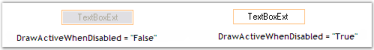' | markdownify }}
{:.image }

The methods associated with the above properties are given below.

_Table_ _362_: Methods Table_

<table>
<tr>
<td>
Methods</td><td>
Description</td></tr>
<tr>
<td>
AppendText</td><td>
Appends text to the current text of a textbox.</td></tr>
<tr>
<td>
OnCharacterCasingChanged</td><td>
Raises the CharacterCasingChanged event.</td></tr>
<tr>
<td>
GetClipText</td><td>
Gets / sets the clipped text without the formatting.</td></tr>
<tr>
<td>
Cut</td><td>
Cuts the selected data to the clipboard.</td></tr>
<tr>
<td>
Copy</td><td>
Copies the content of the NumberTextBox to the clipboard. The ClipMode property dictates what gets copied.</td></tr>
<tr>
<td>
Delete</td><td>
Deletes the current selection of the TextBox.</td></tr>
<tr>
<td>
Paste</td><td>
Pastes the data in the clipboard into the NumberTextBox control.</td></tr>
<tr>
<td>
Select</td><td>
Selects a range of text in the TextBox.</td></tr>
<tr>
<td>
SelectAll</td><td>
Selects all text in the TextBox.</td></tr>
</table>
Multiline Text Settings

The text settings of the TextBoxExt control can be customized to display multiline text using the below given properties.

_Table_ _363_: Property Table_

<table>
<tr>
<td>
TextBoxExt Properties</td><td>
Description</td></tr>
<tr>
<td>
Multiline</td><td>
Controls whether the text of the edit control can span more than one line.</td></tr>
<tr>
<td>
Lines</td><td>
The lines of text in a multiline edit, as an array of string values.</td></tr>
<tr>
<td>
WordWrap</td><td>
Indicates if lines are automatically word-wrapped for multiline edit controls.</td></tr>
<tr>
<td>
ScrollBars</td><td>
Indicates for multiline edit controls, which scrollbars will be shown for this control.It includes the below given options.{{ '_None,_' | markdownify }}{{ '_Horizontal,_' | markdownify }}{{ '_Vertical and_' | markdownify }}{{ '_Both._' | markdownify }}</td></tr>
</table>

[C#]

this.textBoxExt1.Multiline = true;

this.textBoxExt1.WordWrap = true;

this.textBoxExt1.ScrollBars = System.Windows.Forms.ScrollBars.Vertical;

[VB.NET]

Me.textBoxExt1.Multiline = True

Me.textBoxExt1.WordWrap = True

Me.textBoxExt1.ScrollBars = System.Windows.Forms.ScrollBars.Vertical

{{ '' | markdownify }}
{:.image }

{{ '' | markdownify }}
{:.image }

{{ '' | markdownify }}
{:.image }

> {{ '' | markdownify }}
{:.image }
 _Note: The ScrollToCaret() method can be used to scroll the contents of the control to the current caret position._

OverflowIndicatorToolTipText

The tooltip that should be displayed when an overflow of text occurs can be set using the below given properties.

_Table_ _364_: Property Table_

<table>
<tr>
<td>
TextBoxExt Properties</td><td>
Description</td></tr>
<tr>
<td>
OverflowIndicatorToolTipText</td><td>
Specifies the overflow indicator tooltip text.</td></tr>
<tr>
<td>
ShowOverflowIndicator</td><td>
Gets / sets overflow indicator visibility.</td></tr>
<tr>
<td>
ShowOverflowIndicatorToolTip</td><td>
Indicates whether to show the overflow indicator tooltip.</td></tr>
</table>

[C#]

this.textBoxExt1.ShowOverflowIndicator = true;

this.textBoxExt1.ShowOverflowIndicatorToolTip = true;

this.textBoxExt1.OverflowIndicatorToolTipText = "Overflow";

[VB.NET]

Me.textBoxExt1.ShowOverflowIndicator = True

Me.textBoxExt1.ShowOverflowIndicatorToolTip = True

Me.textBoxExt1.OverflowIndicatorToolTipText = "Overflow"

{{ '' | markdownify }}
{:.image }

> {{ '' | markdownify }}
{:.image }
 _Note: If there is no value set for the OverflowIndicatorToolTipText property, then the value set for the Text property of the TextBoxExt will be displayed as the tooltip._

A sample which demonstrates the Text, Text Align, Character Casing, RightToLeft, Multiline, Word Wrap, ScrollBars and Overflow Indicator ToolTip features of TextBoxExt control is available in the below sample installation path.

…\_My Documents\Syncfusion\EssentialStudio\Version Number\Windows\Tools.Windows\Samples\Advanced Editor Functions\ActionGroupingDemo_

Appearance Settings

Background Settings

The background settings of the TextBoxExt control are discussed below.

Background Color

The background color of the control can be set using the property given below.

_Table_ _365_: Property Table_

<table>
<tr>
<td>
TextBoxExt Property</td><td>
Description</td></tr>
<tr>
<td>
BackColor</td><td>
Specifies the background color of the component.</td></tr>
</table>

[C#]

this.textBoxExt1.BackColor = System.Drawing.Color.Moccasin;

[VB.NET]

Me.textBoxExt1.BackColor = System.Drawing.Color.Moccasin

{{ '' | markdownify }}
{:.image }

Foreground Settings

The foreground settings of the TextBoxExt control are discussed below.

Foreground Color

The foreground color of the control can be set using the property given below.

_Table_ _366_: Property Table_

<table>
<tr>
<td>
TextBoxExt Property</td><td>
Description</td></tr>
<tr>
<td>
ForeColor</td><td>
Gets / sets the foreground color of the spin box (also known as an up-down control).</td></tr>
</table>

[C#]

this.textBoxExt1.ForeColor = System.Drawing.Color.LightSeaGreen;

[VB.NET]

Me.textBoxExt1.ForeColor = System.Drawing.Color.LightSeaGreen

{{ '' | markdownify }}
{:.image }

Behavior Settings

The behavior settings of the TextBoxExt control are discussed below.

MaxLength

The maximum length of the text can be set using the property given below.

_Table_ _367_: Property Table_

<table>
<tr>
<td>
TextBoxExt Property</td><td>
Description</td></tr>
<tr>
<td>
MaxLength</td><td>
Specifies the maximum number of characters that can be entered into the edit control. The default value is set to '32767'.</td></tr>
</table>

[C#]

this.textBoxExt1.MaxLength = 32800;               

[VB]

Me.textBoxExt1.MaxLength = 32800

ReadOnly

The ReadOnly mode can be enabled for the TextBoxExt control using the below given property.

_Table_ _368_: Property Table_

<table>
<tr>
<td>
TextBoxExt Property</td><td>
Description</td></tr>
<tr>
<td>
ReadOnly</td><td>
Specifies whether the text in the edit control can be changed or not.</td></tr>
</table>

[C#]

this.textBoxExt1.ReadOnly = true;

[VB]

Me.textBoxExt1.ReadOnly = True

A sample which demonstrates the ReadOnly mode of TextBoxExt control is available in the below sample installation path.

…\_My Documents\Syncfusion\EssentialStudio\Version Number\Windows\Tools.Windows\Samples\Advanced Editor Functions\ActionGroupingDemo_

Border Settings

The border settings of the TextBoxExt control are discussed in this section.

Color and Styles can be applied to the border of the TextBoxExt control as discussed below.

_Table_ _369_: Property Table_

<table>
<tr>
<td>
TextBoxExt Properties</td><td>
Description</td></tr>
<tr>
<td>
Border3DStyle</td><td>
Indicates the style of the 3D border. The options included are as follows:{{ '_RaisedOuter,_' | markdownify }}{{ '_SunkenOuter,_' | markdownify }}{{ '_RaisedInner,_' | markdownify }}{{ '_SunkenInner,_' | markdownify }}{{ '_Raised,_' | markdownify }}{{ '_Etched,_' | markdownify }}{{ '_Bump,_' | markdownify }}{{ '_Sunken,_' | markdownify }}{{ '_Adjust and_' | markdownify }}{{ '_Flat._' | markdownify }}The default value is set to 'Sunken'.</td></tr>
<tr>
<td>
BorderColor</td><td>
Specifies the color of the 2D border.</td></tr>
<tr>
<td>
BorderSides</td><td>
Indicates the border sides of the panel. The options included are as follows:{{ '_Left,_' | markdownify }}{{ '_Top,_' | markdownify }}{{ '_Right,_' | markdownify }}{{ '_Bottom,_' | markdownify }}{{ '_Middle and_' | markdownify }}{{ '_All._' | markdownify }}</td></tr>
<tr>
<td>
BorderStyle</td><td>
Indicates whether the edit control should have a border. The options included are given below:{{ '_FixedSingle,_' | markdownify }}{{ '_Fixed3D and_' | markdownify }}{{ '_None._' | markdownify }}</td></tr>
</table>

[C#]

this.textBoxExt1.Border3DStyle = System.Windows.Forms.Border3DStyle.Raised;

this.textBoxExt1.BorderColor = System.Drawing.Color.Orchid

this.textBoxExt1.BorderSides = System.Windows.Forms.Border3DSide.All;

this.textBoxExt1.BorderStyle = System.Windows.Forms.BorderStyle.FixedSingle;

[VB.NET]

Me.textBoxExt1.Border3DStyle = System.Windows.Forms.Border3DStyle.Raised

Me.textBoxExt1.BorderColor = System.Drawing.Color.Orchid

Me.textBoxExt1.BorderSides = System.Windows.Forms.Border3DSide.All

Me.textBoxExt1.BorderStyle = System.Windows.Forms.BorderStyle.FixedSingle

{{ '' | markdownify }}
{:.image }

A sample which demonstrates the Border Settings of TextBoxExt control is available in the below sample installation path.

…\_My Documents\Syncfusion\EssentialStudio\Version Number\Windows\Tools.Windows\Samples\Advanced Editor Functions\ActionGroupingDemo_

Layout Settings

The layout settings of the TextBoxExt control are discussed in this section.

The size of the TextBoxExt control can be set according to the needs of the user using the properties discussed below.

_Table_ _370_: Property Table_

<table>
<tr>
<td>
TextBoxExt Properties</td><td>
Description</td></tr>
<tr>
<td>
MaximumSize</td><td>
Gets / sets the maximum size for the control.</td></tr>
<tr>
<td>
MinimumSize</td><td>
Gets / sets the minimum size for the control.</td></tr>
</table>

[C#]

this.textBoxExt1.MaximumSize = new System.Drawing.Size(150, 20);

this.textBoxExt1.MinimumSize = new System.Drawing.Size(150, 20);

[VB.NET]

Me.textBoxExt1.MaximumSize = New System.Drawing.Size(150, 20)

Me.textBoxExt1.MinimumSize = New System.Drawing.Size(150, 20)

{{ '' | markdownify }}
{:.image }

Applying Themes

Themes defines the look and feel of the control. This can be enabled using the below given property.

_Table_ _371_: Property Table_

<table>
<tr>
<td>
TextBoxExt Property</td><td>
Description</td></tr>
<tr>
<td>
ThemesEnabled</td><td>
Specifies whether or not to use XP themes, when BorderStyle is set to 'Fixed3D'.</td></tr>
</table>

[C#]

this.textBoxExt1.ThemesEnabled = true;                          

[VB]

Me.textBoxExt1.ThemesEnabled = True

{{ '' | markdownify }}
{:.image }

###### TextBoxExt Events 

The list of events and a detailed explanation about each of them is given in the following sections.

_Table_ _372_: Events Table_

<table>
<tr>
<td>
NumericUpDownExt Events</td><td>
Description</td></tr>
<tr>
<td>
Border3DStyleChanged</td><td>
This event occurs when the Border3DStyle property is changed.</td></tr>
<tr>
<td>
BorderColorChanged</td><td>
This event occurs when the BorderColor property is changed.</td></tr>
<tr>
<td>
BorderSidesChanged</td><td>
This event occurs when the BorderSides property is changed.</td></tr>
<tr>
<td>
BorderStyleChanged</td><td>
This event occurs when the ClipText property is changed.</td></tr>
<tr>
<td>
CharacterCasingChanged</td><td>
This event occurs when the CharacterCasing property is changed.</td></tr>
<tr>
<td>
HideSelectionChanged</td><td>
This event occurs when the HideSelection property is changed.</td></tr>
<tr>
<td>
MaximumSizeChanged</td><td>
This event occurs when the MaximumSize property is changed.</td></tr>
<tr>
<td>
MinimumSizeChanged</td><td>
This event occurs when the MinimumSize property is changed.</td></tr>
<tr>
<td>
MultilineChanged</td><td>
This event occurs when the Multiline property is changed.</td></tr>
<tr>
<td>
ReadOnlyChanged</td><td>
This event occurs when the ReadOnly property is changed.</td></tr>
<tr>
<td>
TextAlignChanged</td><td>
This event occurs when the TextAlign property is changed.</td></tr>
<tr>
<td>
ThemesEnabledChanged</td><td>
This event occurs when the ThemesEnabled property is changed.</td></tr>
</table>
Border3DStyleChanged

This event occurs when the Border3DStyle property is changed. The Border3DStyle property indicates the style of the 3D border.

The event handler receives an argument of type EventArgs containing data related to this event.

[C#]

private void textBoxExt1_Border3DStyleChanged(object sender, EventArgs e)

{

Console.WriteLine(" Border3DStyleChanged event is raised ");

}

[VB.NET]

Private Sub textBoxExt1_Border3DStyleChanged(ByVal sender As Object, ByVal e As EventArgs)

Console.WriteLine(" Border3DStyleChanged event is raised ")

End Sub

BorderColorChanged

This event occurs when the BorderColor property is changed. The BorderColor property indicates the color of the 2D border.

The event handler receives an argument of type EventArgs containing data related to this event.

[C#]

private void textBoxExt1_BorderColorChanged(object sender, EventArgs e)

{

Console.WriteLine(" BorderColorChanged event is raised ");

}

[VB.NET]

Private Sub textBoxExt1_BorderColorChanged(ByVal sender As Object, ByVal e As EventArgs)

Console.WriteLine(" BorderColorChanged event is raised ")

End Sub

BorderSidesChanged

This event occurs when the BorderSides property is changed. The BorderSides property indicates the border sides of the panel.

The event handler receives an argument of type EventArgs containing data related to this event.

[C#]

private void textBoxExt1_BorderSidesChanged(object sender, EventArgs e)

{

Console.WriteLine(" BorderSidesChanged event is raised ");

}

[VB.NET]

Private Sub textBoxExt1_BorderSidesChanged(ByVal sender As Object, ByVal e As EventArgs)

Console.WriteLine(" BorderSidesChanged event is raised ")

End Sub

BorderStyleChanged

This event occurs when the BorderStyle property is changed. The BorderStyle property indicates whether the edit control should have a border.

The event handler receives an argument of type EventArgs containing data related to this event.

[C#]

private void textBoxExt1_BorderStyleChanged(object sender, EventArgs e)

{

Console.WriteLine(" BorderStyleChanged event is raised ");

}

[VB.NET]

Private Sub textBoxExt1_BorderStyleChanged(ByVal sender As Object, ByVal e As EventArgs)

Console.WriteLine(" BorderStyleChanged event is raised ")

End Sub

CharacterCasingChanged

This event occurs when the CharacterCasing property is changed. The CharacterCasing property gets / sets the case of the characters as they are typed.

The event handler receives an argument of type EventArgs containing data related to this event.

[C#]

private void textBoxExt1_CharacterCasingChanged(object sender, EventArgs e)

{

Console.WriteLine(" CharacterCasingChanged event is raised ");

}

[VB.NET]

Private Sub textBoxExt1_CharacterCasingChanged(ByVal sender As Object, ByVal e As EventArgs)

Console.WriteLine(" CharacterCasingChanged event is raised ")

End Sub

HideSelectionChanged

This event occurs when the HideSelection property is changed. The HideSelection property indicates that the selection should be hidden when the edit control loses focus.

The event handler receives an argument of type EventArgs containing data related to this event.

[C#]

private void textBoxExt1_HideSelectionChanged(object sender, EventArgs e)

{

Console.WriteLine(" HideSelectionChanged event is raised ");

}

[VB.NET]

Private Sub textBoxExt1_HideSelectionChanged(ByVal sender As Object, ByVal e As EventArgs)

Console.WriteLine(" HideSelectionChanged event is raised ")

End Sub

MaximumSizeChanged 

This event occurs when the MaximumSize property is changed. The MaximumSize property gets / sets the maximum size of the control.

The event handler receives an argument of type EventArgs containing data related to this event.

[C#]

private void textBoxExt1_MaximumSizeChanged(object sender, EventArgs e)

{

Console.WriteLine(" MaximumSizeChanged event is raised ");

}

[VB.NET]

Private Sub textBoxExt1_MaximumSizeChanged(ByVal sender As Object, ByVal e As EventArgs)

Console.WriteLine(" MaximumSizeChanged event is raised ")

End Sub

MinimumSizeChanged 

This event occurs when the MinimumSize property is changed. The MinimumSize property gets / sets the minimum size of the control.

The event handler receives an argument of type EventArgs containing data related to this event.

[C#]

private void textBoxExt1_MinimumSizeChanged(object sender, EventArgs e)

{

Console.WriteLine(" MinimumSizeChanged event is raised ");

}

[VB.NET]

Private Sub textBoxExt1_MinimumSizeChanged(ByVal sender As Object, ByVal e As EventArgs)

Console.WriteLine(" MinimumSizeChanged event is raised ")

End Sub

MultilineChanged 

This event occurs when the Multiline property is changed. The Multiline property controls whether the text of the edit control can span more than one line.

The event handler receives an argument of type EventArgs containing data related to this event.

[C#]

private void textBoxExt1_MultilineChanged(object sender, EventArgs e)

{

Console.WriteLine(" MultilineChanged event is raised ");

}

[VB.NET]

Private Sub textBoxExt1_MultilineChanged(ByVal sender As Object, ByVal e As EventArgs)

Console.WriteLine(" MultilineChanged event is raised ")

End Sub

ReadOnlyChanged 

This event occurs when the ReadOnly property is changed. The ReadOnly property controls whether the text in the edit control can be changed or not.

The event handler receives an argument of type EventArgs containing data related to this event.

[C#]

private void textBoxExt1_ReadOnlyChanged(object sender, EventArgs e)

{

Console.WriteLine(" ReadOnlyChanged event is raised ");

}

[VB.NET]

Private Sub textBoxExt1_ReadOnlyChanged(ByVal sender As Object, ByVal e As EventArgs)

Console.WriteLine(" ReadOnlyChanged event is raised ")

End Sub

TextAlignChanged 

This event occurs when the TextAlign property is changed. The TextAlign property indicates how the text should be aligned for edit controls.

The event handler receives an argument of type EventArgs containing data related to this event.

[C#]

private void textBoxExt1_TextAlignChanged(object sender, EventArgs e)

{

Console.WriteLine(" TextAlignChanged event is raised ");

}

[VB.NET]

Private Sub textBoxExt1_TextAlignChanged(ByVal sender As Object, ByVal e As EventArgs)

Console.WriteLine(" TextAlignChanged event is raised ")

End Sub

ThemesEnabledChanged

This event occurs when the ThemesEnabled property is changed. The ThemesEnabled property specifies whether or not to use XP Themes when the BorderStyle property is set to 'Fixed3D'.

The event handler receives an argument of type EventArgs containing data related to this event.

[C#]

private void textBoxExt1_ThemesEnabledChanged(object sender, EventArgs e)

{

Console.WriteLine(" ThemesEnabledChanged event is raised ");

}

[VB.NET]

Private Sub textBoxExt1_ThemesEnabledChanged(ByVal sender As Object, ByVal e As EventArgs)

Console.WriteLine(" ThemesEnabledChanged event is raised ")

End Sub

##### Revamping of Editors Controls

DoubleTextBox, IntegerTextBox, PercentTextBox, and CurrencyTextBox has been revamped, details of the revamping and the Changes in the behavior and properties are described here.

###### Properties Deprecated

_Table_ _373_: Property Table_

<table>
<tr>
<td>
Property</td><td>
Alternatives</td><td>
Comments</td></tr>
<tr>
<td>
NullState</td><td>
IsNull</td><td>
Deprecated as it should have Getter alone.</td></tr>
<tr>
<td>
UseNullString</td><td>
AllowNull</td><td>
This behavior is incorporated with AllowNull; previously both AllowNull and UseNullString existed. Removed for better clarity.</td></tr>
<tr>
<td>
IsNullValue</td><td>
IsNull</td><td>
IsNullValue means the same as NullState and IsNull, and it has been deprecated for better clarity.</td></tr>
<tr>
<td>
MaxLength</td><td>
MaxValue,NumberDecimalDigits</td><td>
Max length is removed as there is a conflict. Hence use MaxValue and NumberDecimalDigits as alternatives.</td></tr>
<tr>
<td>
EnforceMinMaxDuringValidating</td><td>
OnValidationFailed.KeepFocus</td><td>
No need for a separate propertyas MinMaxValidation already existsThe same behavior can be achieved with the alternative.</td></tr>
</table>
###### Newly Added API’S

_Table_ _374_: Property Table_

<table>
<tr>
<td>
Property</td><td>
Description</td><td>
Behavior</td></tr>
<tr>
<td>
IsNull (Read Only)</td><td>
Returns a Boolean specifying the NullState of the control</td><td>
True when Control.Text equals String.Empty or NullString.</td></tr>
<tr>
<td>
AllowNull</td><td>
Specifies whether the field Can be nulled.</td><td>
Related to NullString.NullString will be set when the field is null.</td></tr>
<tr>
<td>
NullString</td><td>
Specifies the string that will be set when the field is Null.</td><td>
AllowNull must be true to set this string . If it is false, zero or MinValue,  whichever is higher of these will be set. It must be left blank if the field has to be empty</td></tr>
<tr>
<td>
*OnValidationFailed</td><td>
Specifies the action to be performed while validation fails.</td><td>
SetNullString,SeMinOrMax,KeepFocus.refer Notes column</td></tr>
</table>
###### Behavioral Changes

_Table_ _375_: Property Table_

<table>
<tr>
<td>
Property</td><td>
Description</td><td>
Behavior</td></tr>
<tr>
<td>
*MinMaxValidation.OnKeyPress</td><td>
Each and every key press is validated to make the value meet the constraints.</td><td>
This is most useful when the MinValue is less than 10.Refer Notes column</td></tr>
<tr>
<td>
*MinMaxValidation.OnLostFocus</td><td>
Validation happens only when the control loses its focus.</td><td>
This allows the user to enter any value and it is validated when the focus is lost.You can make use of OnValidationFailed property to gain control when validation fails.Refer Notes column</td></tr>
<tr>
<td>
MinValue</td><td>
Cannot be greater than MaxValue.</td><td>
Exception will be thrown.MaxValue has to be reset the accordingly.</td></tr>
<tr>
<td>
MaxValue</td><td>
Cannot be lesser than MinValue</td><td>
Exception will be thrown.MinValue  has to be reset the accordingly.</td></tr>
<tr>
<td>
NullString</td><td>
Cannot be a Numeric Value that could break the MinValue or MaxValue constraints.</td><td>
Ex: MinValue 10, MaxValue 100 and NullString as “111” will break the Min Max Values.</td></tr>
</table>
> {{ '' | markdownify }}
{:.image }
_Note:_

* With MinMaxValidation.OnKeyPress and MinValue as 10 set,
* Each and every key press will be validated to meet the constraints, so this will not allow you to enter values less than 10, even if you try to enter 11 you cannot input value as every keypress is validated. This behavior is useful when MinValue is less than 10. 
* With MinMaxValidation.OnLostFocus, user inputs will be validated only when the control loses its focus. Hence user can input any value.  OnValidationFailed will give you access to what action [SetNullString, SetMinorMax, KeepFocus] has to be done when Validation fails for the input.
* With OnValidationFailed.SetNullString set and AllowNull is False,the control will keep its focus. 
#### Font Controls

The Font controls of Essential Tools are listed below.

##### FontListBox

The FontListBox is a list box derived control that are automatically populated with the fonts installed on the user's system. It provide an easy way to fill a list box with system fonts. 

{{ '' | markdownify }}
{:.image }

See Also

###### Features

FontListBox displays and allow selection of fonts. It has following features.

* The FontListBox control automatically fills the listbox with the fonts installed in the system.
* Has options in selecting the fonts such as single-select, multi select or not selectable. See Selection Mode topic.
* Vertical and horizontal scrollbars available for the FontListBox control.

A sample which demonstrates the features of FontListBox control is available in the below sample installation location.

…\_My Documents\Syncfusion\EssentialStudio\Version Number\Windows\Tools.Windows\Samples\Advanced Editor Functions\ActionGroupingDemo_

See Also

Concepts and Features

###### Creating FontListBox

To use a FontListBox control in your application, all you need to do is drag and drop the FontListBox control from the toolbox onto your form.

{{ '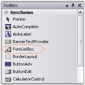' | markdownify }}
{:.image }

It can be created programmatically as follows.

1. Include the required namespace.

[C#]

using Syncfusion.Windows.Forms.Tools;

[VB.NET]

Imports Syncfusion.Windows.Forms.Tools

2. Create an instances of FontListBox control. Specify its size and finally add that instance to that Form.

[C#]

private Syncfusion.Windows.Forms.Tools.FontListBox fontListBox1;

this.fontListBox1=new Syncfusion.Windows.Forms.Tools.FontListBox();

this.fontListBox1.Size = new System.Drawing.Size(152, 94);

this.Controls.Add(this.fontListBox1);

[VB.NET]

Private fontListBox1 As Syncfusion.Windows.Forms.Tools.FontListBox

Me.fontListBox1 = New Syncfusion.Windows.Forms.Tools.FontListBox()

Me.fontListBox1.Size = New System.Drawing.Size(152, 21)

Me.Controls.Add(Me.fontListBox1)

{{ '' | markdownify }}
{:.image }

###### Concepts and Features

This section will discuss the concepts and features of the FontListBox control in the below topics.

Selection Mode

At run time, the items in the FontListBox can be selected, based on the selection mode specified in SelectionMode property. Selection can be made using mouse as well as using keyboard. 

The options are,

* one, 
* MultiSimple, and 
* MultiExtended.

[C#]

this.fontListBox1.SelectionMode = System.Windows.Forms.SelectionMode.MultiExtended;

[VB.NET]

Me.fontListBox1.SelectionMode = System.Windows.Forms.SelectionMode.MultiExtended

{{ '' | markdownify }}
{:.image }

ScrollBar Settings

FontListBox control by default has a vertical scrollbar. It can also have a horizontal scrollbar. This section will discuss the properties which sets the scrollbar for the control.

Horizontal Scrollbar

Horizontal scrollbar can be displayed if the items are beyond the right edge of the FontListBox. The below properties lets you do that.

_Table_ _376_: Property Table_

<table>
<tr>
<td>
Properties</td><td>
Description</td></tr>
<tr>
<td>
HorizontalScrollbar</td><td>
Sets the horizontal scrollbar for the control if the item exceeds beyond the right edge of the FontListBox control.</td></tr>
<tr>
<td>
HorizontalExtent</td><td>
Specifies the width of the control, when HorizontalScrollBar property is set to true.</td></tr>
</table>

[C#]

this.fontListBox1.HorizontalExtent = 150;

this.fontListBox1.HorizontalScrollbar = true;

[VB.NET]

Me.fontListBox1.HorizontalExtent = 150

Me.fontListBox1.HorizontalScrollbar = True

{{ '' | markdownify }}
{:.image }

See Also

How to display the scrollbars always, irrespective of the number of items?

FontListBox Items

Height of the FontList Items

We can set the height of the item inside the listbox through ItemHeight property. Default value is 15. 

[C#]

this.fontListBox1.ItemHeight = 20;

[VB.NET]

Me.fontListBox1.ItemHeight = 20

{{ '' | markdownify }}
{:.image }

Sorting the Items

Sorting of the items can be enabled using Sorted property. By default it is false.

[C#]

this.fontListBox1.Sorted = true;

[VB.NET]

Me.fontListBox1.Sorted = True

AutoCompleting the Items

FontListBox control has the ability to auto complete the items as we type in the listbox. This feature is enabled using UseAutoComplete property to true.

[C#]

this.fontListBox1.UseAutoComplete = true;

[VB.NET]

Me.fontListBox1.UseAutoComplete = True

###### Frequently Asked Questions

This section illustrates the solutions for various task-based queries about the control.

###### How to display the scrollbars always, irrespective of the number of items

The scrollbar can be always made visible, irrespective of the number of items, present in it, by setting ScrollAlwaysVisible property to true. 

[C#]

this.fontListBox1.ScrollAlwaysVisible = true;

[VB.NET]

Me.fontListBox1.ScrollAlwaysVisible = True

###### Events

SelectedIndexChanged event - This event is raised when the ListBox.SelectedIndex property is changed. 

The below code snippet, lets you set the selected font style, for a label, on selecting through a FontListBox, using SelectedIndexChanged event.

[C#]

private void fontListBox1_SelectedIndexChanged(object sender, EventArgs e)

{

    this.label1.Font = new Font(this.fontListBox1.SelectedItem.ToString(), 11, FontStyle.Regular);

}

[VB.NET]

Private Sub fontListBox1_SelectedIndexChanged(ByVal sender As Object, ByVal e As EventArgs)

    Me.label1.Font = New Font(Me.fontListBox1.SelectedItem.ToString(), 11, FontStyle.Regular)

End Sub

##### FontComboBox

The FontComboBox is a combo box-derived controls that are automatically populated with the fonts installed on the user's system. It provide an easy way to fill a combo box with system fonts.

{{ '' | markdownify }}
{:.image }

See Also

###### Features

FontComboBox allows selection of fonts. It has following features.

* The FontComboBox control automatically fills the listbox with the fonts installed in the system.
* The FontComboBox control provides auto completion from the list.
* Customization options available for the ComboBox DropDown.
* Office2007 look and feel for the FontComboBox control with all the three color schemes.

A sample which demonstrates the features of FontComboBox control is available in the below sample installation location.

_..\My Documents\Syncfusion\EssentialStudio\Version Number\Windows\Tools.Windows\Samples\2.0\Editors Package\FontComboBox_

See Also

Concepts and Features

###### Creating FontComboBox

To use a FontComboBox control in your application, all you need to do is drag and drop the FontComboBox control from the controls toolbox onto your form. 

{{ '' | markdownify }}
{:.image }

It can be created programmatically as follows.

1. Include the required namespace. 

[C#]

using Syncfusion.Windows.Forms.Tools;

[VB.NET]

Imports Syncfusion.Windows.Forms.Tools

2. Create an instance of FontComboBox control. Specify its size and finally add that instance to that Form.

[C#]

private Syncfusion.Windows.Forms.Tools.FontComboBox fontComboBox1;

this.fontComboBox1=new Syncfusion.Windows.Forms.Tools.FontComboBox();

this.fontComboBox1.Size = new System.Drawing.Size(152, 21);

this.Controls.Add(this.fontComboBox1);

[VB.NET]

Private fontComboBox1 As Syncfusion.Windows.Forms.Tools.FontComboBox

Me.fontComboBox1 = New Syncfusion.Windows.Forms.Tools.FontComboBox()

Me.fontComboBox1.Size = New System.Drawing.Size(152, 21)

Me.Controls.Add(Me.fontComboBox1)

{{ '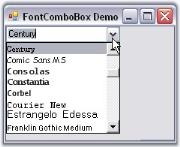' | markdownify }}
{:.image }

###### Concepts and Features

The below topics are discussed in this section.

AutoComplete

The AutoComplete feature of the FontComboBox can be turned on\off depending upon the type of behavior that is required for the FontComboBox control. The below properties enables the auto complete feature.

_Table_ _377_: Property Table_

<table>
<tr>
<td>
Properties</td><td>
Description</td></tr>
<tr>
<td>
UseAutoComplete</td><td>
Specifies whether auto complete feature is implemented in the control.</td></tr>
<tr>
<td>
AutoCompleteSource</td><td>
Specifies the source of the complete strings used for auto completion. DropDownStyle property should be set to "DropDown" to make this setting effective. </td></tr>
<tr>
<td>
AutoCompleteCustomSource</td><td>
Represents the collection of string for the custom source, when AutoCompleteSource is set to CustomSource.</td></tr>
</table>

[C#]

// Enables AutoComplete feature.

this.fontComboBox1.UseAutoComplete =true;

this.fontComboBox2.AutoCompleteCustomSource.AddRange(new string[] { "Calibria", "Cambria", "Candara"});

this.fontComboBox2.AutoCompleteMode = System.Windows.Forms.AutoCompleteMode.SuggestAppend;

this.fontComboBox2.AutoCompleteSource = System.Windows.Forms.AutoCompleteSource.CustomSource;

[VB.NET]

' Enables AutoComplete feature.

Me.fontComboBox1.UseAutoComplete = True

Me.fontComboBox2.AutoCompleteCustomSource.AddRange(New String() {"Calibria", "Cambria", "Candara"}) 

Me.fontComboBox2.AutoCompleteMode = System.Windows.Forms.AutoCompleteMode.SuggestAppend

Me.fontComboBox2.AutoCompleteSource = System.Windows.Forms.AutoCompleteSource.CustomSource

{{ '' | markdownify }}
{:.image }

See Also

DropDown Settings

DropDown Settings

FontComboBox has properties to control the appearance and behavior of the dropdown.

_Table_ _378_: Property Table_

<table>
<tr>
<td>
Properties</td><td>
Description</td></tr>
<tr>
<td>
DropDownStyle</td><td>
Specifies the style of the dropdown. The options are,{{ '_DropDownList_' | markdownify }} - The user cannot directly edit the text portion. The user must click the arrow button to display the list portion,{{ '_DropDown (default)_' | markdownify }} - The user can directly edit the text portion. The user must click the arrow button to display the list portion,{{ '_Simple_' | markdownify }} - The text portion is editable. The list portion is always visible.</td></tr>
<tr>
<td>
DropDownHeight</td><td>
Specifies the height of the dropdown combo box in pixels.</td></tr>
<tr>
<td>
DropDownWidth</td><td>
Specifies the width of the dropdown combo box in pixels.</td></tr>
<tr>
<td>
MaxDropDownItems</td><td>
Indicates the maximum number of entries to display in the drop down list.</td></tr>
</table>

[C#]

this.fontComboBox2.DropDownHeight = 107;

this.fontComboBox2.DropDownStyle = System.Windows.Forms.ComboBoxStyle.DropDownList;

this.fontComboBox2.DropDownWidth = 154;

this.fontComboBox2.MaxDropDownItems = 10;

[VB.NET]

Me.fontComboBox2.DropDownHeight = 107

Me.fontComboBox2.DropDownStyle = System.Windows.Forms.ComboBoxStyle.DropDownList

Me.fontComboBox2.DropDownWidth = 154

Me.fontComboBox2.MaxDropDownItems = 10

Customizing DropDown Items

The height of the FontComboBox items is specified in ItemHeight property and sorting of the items is enabled through Sorted property.

[C#]

this.fontComboBox2.ItemHeight = 17;

this.fontComboBox2.Sorted = true;

[VB.NET]

Me.fontComboBox2.ItemHeight = 17

Me.fontComboBox2.Sorted = True

Visual Styles

The Office2007 visual style for the FontComboBox control can be enabled through below properties.

_Table_ _379_: Property Table_

<table>
<tr>
<td>
Properties</td><td>
Description</td></tr>
<tr>
<td>
VisualStyle</td><td>
Sets the visual style for the control. The options are,Default (default value) andOffice2007.</td></tr>
<tr>
<td>
Office2007ColorScheme</td><td>
Specifies the office color schemes. The color schemes are,Blue,Silver and Black.</td></tr>
</table>

[C#]

this.fontComboBox2.VisualStyle = Syncfusion.Windows.Forms.Tools.ThemedComboBoxStyles.Office2007;

this.fontComboBox2.Office2007ColorTheme = Syncfusion.Windows.Forms.Office2007Theme.Silver;

[VB.NET]

Me.fontComboBox2.VisualStyle = Syncfusion.Windows.Forms.Tools.ThemedComboBoxStyles.Office2007

Me.fontComboBox2.Office2007ColorTheme = Syncfusion.Windows.Forms.Office2007Theme.Silver

{{ '' | markdownify }}
{:.image }

Custom Colors

We can also apply custom colors to the FontComboBox control by setting Office2007ColorTheme to "Managed" and specifying the custom color through the ApplyManagedColors method as follows.

[C#]

this.fontComboBox2.Office2007ColorTheme = Syncfusion.Windows.Forms.Office2007Theme.Managed;

Office2007Colors.ApplyManagedColors(this, Color.Orchid);

[VB.NET]

Me.fontComboBox2.Office2007ColorTheme = Syncfusion.Windows.Forms.Office2007Theme.Managed;

Office2007Colors.ApplyManagedColors(Me, Color.Orchid)

{{ '' | markdownify }}
{:.image }

###### Events

This section comprises the below events:

SelectedIndexChanged Event

SelectedIndexChanged event - This event is raised when the ComboBox.SelectedIndex property is changed. 

The below code snippet, lets you set the selected font style, for a label, on selecting through a FontComboBox, using SelectedIndexChanged event.

[C#]

private void fontComboBox2_SelectedIndexChanged(object sender, EventArgs e)

{

    this.label1.Font = new Font(this.fontComboBox2.SelectedItem.ToString(), 11, FontStyle.Regular);

}

[VB.NET]

Private Sub fontComboBox2_SelectedIndexChanged(ByVal sender As Object, ByVal e As EventArgs)

    Me.label1.Font = New Font(Me.fontComboBox2.SelectedItem.ToString(), 11, FontStyle.Regular)

End Sub

FontSelected Event

To add FontSelected event, derive the classes as shown below.

1. Add an event in the derived class.

[C#]

// Adding event.

public event System.EventHandler FontSelected;

[VB.NET]

' Adding event.

Public Event FontSelected As System.EventHandler

2. Override the OnSelectedIndexChanged method and fire the event there.

[C#]

protected override void OnSelectedIndexChanged(EventArgs e) 

{

   // FontSelected event fires here.

if(FontSelected!=null) FontSelected(this,e);

base.OnSelectedIndexChanged (e);

}

[VB.NET]

Protected Overrides Sub OnSelectedIndexChanged(ByVal e As EventArgs)

   ' FontSelected event fires here.

RaiseEvent FontSelected(Me, e)

MyBase.OnSelectedIndexChanged(e)

End Sub

#### Label Controls

The following are the advanced versions of Windows Label controls.

##### AutoLabel

The AutoLabel control is a label-derived control that lets you pair a label with any other control. Once paired, the AutoLabel will be automatically repositioned as the labeled control's position changes.

{{ '' | markdownify }}
{:.image }

The FlowLayout layout manager will always treat the AutoLabel-labeled control pair as a unit. You can use AutoLabels and FlowLayouts together to implement complex and powerful form layouts.

See Also

Labeling a Control

###### Features

AutoLabel helps to label other controls. It has the following features.

Features

* Labeling a Control

A control can be labeled using the LabeledControl property. The position of the AutoLabel gets automatically updated according  to the position of the labeled control.

* Spacing

The horizontal and vertical space between the AutoLabel and the labeled control can be set using the spacing properties of the control.

* Position

The AutoLabel can be placed at the top, bottom, left or right of the labeled control using the Position property of the control.

* Size

The AutoLabel can be resized automatically.

See Also

Concepts and Features

###### Creating AutoLabel

The AutoLabel control can be created in the following ways.

Through Designer

The following steps illustrate how to create an AutoLabel control through designer.

* Create or open a Windows Forms project.
* Add an AutoLabel Control from the toolbox onto the form by dragging and dropping it on the form or double clicking the control.

{{ '' | markdownify }}
{:.image }

* Set the desired properties for the control through theProperty grid.
* Run the application.

{{ '' | markdownify }}
{:.image }

See Also

Through Code

Through Code

The following steps illustrate how to create an AutoLabel control programmatically.

* Create a C# or VB.NET application though Visual Studio.
* Add the required assembly references.
* Include the required namespace.

[C#]

using Syncfusion.Windows.Forms.Tools;

[VB.NET]

Imports Syncfusion.Windows.Forms.Tools

* Declare the AutoLabel control.

[C#]

private Syncfusion.Windows.Forms.Tools.AutoLabel autoLabel1;

[VB.NET]

Private autoLabel1 As Syncfusion.Windows.Forms.Tools.AutoLabel

* Initialize the control.

[C#]

this.autoLabel1 = new Syncfusion.Windows.Forms.Tools.AutoLabel();

[VB.NET]

Me.autoLabel1 = New Syncfusion.Windows.Forms.Tools.AutoLabel()

* Set the properties for the AutoLabel control and add it to your form.

[C#]

this.autoLabel1.Text = "autoLabel1";

this.autoLabel1.BackColor = System.Drawing.Color.BurlyWood;

this.autoLabel1.ForeColor = System.Drawing.Color.SaddleBrown;

this.autoLabel1.Font = new System.Drawing.Font("Microsoft Sans Serif", 8.25F, System.Drawing.FontStyle.Bold, System.Drawing.GraphicsUnit.Point, ((byte)(0)));

this.autoLabel1.TextAlign = System.Drawing.ContentAlignment.MiddleCenter;

// Add the AutoLabel control to the Form.

this.Controls.Add(this.autoLabel1);

[VB.NET]

Me.autoLabel1.Text = "autoLabel1"

Me.autoLabel1.BackColor = System.Drawing.Color.BurlyWood

Me.autoLabel1.ForeColor = System.Drawing.Color.SaddleBrown

Me.autoLabel1.Font = New System.Drawing.Font("Microsoft Sans Serif", 8.25F, System.Drawing.FontStyle.Bold, System.Drawing.GraphicsUnit.Point, CByte((0)))

Me.autoLabel1.TextAlign = System.Drawing.ContentAlignment.MiddleCenter

' Add the AutoLabel control to the Form.

Me.Controls.Add(Me.autoLabel1)

* Run the application.

{{ '' | markdownify }}
{:.image }

###### Concepts and Features

This section explains the concepts and features of the AutoLabelcontrol which will help to understand the control better. The following are the features discussed.

Labeling a Control

The following steps allows you to label a control.

* Create or open a Windows forms project.
* Add an AutoLabel Control from the toolbox onto the form by dragging and dropping it on the form or double clicking the control.
* Add the control (TextBox) that has to be labeled to the form.
* Go to the Property grid and select the LabeledControl property.
* Select the control to be labeled (TextBox) from the dropdown box as shown below.

{{ '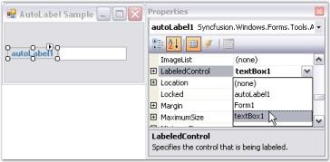' | markdownify }}
{:.image }

[C#]

private Syncfusion.Windows.Forms.Tools.AutoLabel autoLabel1;

this.autoLabel1 = new Syncfusion.Windows.Forms.Tools.AutoLabel();

this.autoLabel1.LabeledControl = this.textBox1;

this.Controls.Add(this.autoLabel1);

[VB.NET]

Private autoLabel1 As Syncfusion.Windows.Forms.Tools.AutoLabel

Me.autoLabel1 = New Syncfusion.Windows.Forms.Tools.AutoLabel()

Me.autoLabel1.LabeledControl = Me.textBox1

Me.Controls.Add(Me.autoLabel1)

* Run the application.

{{ '' | markdownify }}
{:.image }

Spacing

The space between the AutoLabel control and the labeled control can be customized using the properties given below. When using relative positioning, you can also specify the gap between the label and the control.

_Table_ _380_: Property Table_

<table>
<tr>
<td>
AutoLabel Properties</td><td>
Description</td></tr>
<tr>
<td>
DX</td><td>
The effective horizontal distance between the left of the AutoLabel and its labeled control.</td></tr>
<tr>
<td>
DY</td><td>
The effective vertical distance between the top of the AutoLabel and its labeled control.</td></tr>
<tr>
<td>
Gap</td><td>
Specifies the horizontal and vertical gap to use when computing the relative position.</td></tr>
</table>

[C#]

this.autoLabel1.DX = -80;

this.autoLabel1.DY = 3;

this.autoLabel1.Gap = 10;

[VB.NET]

Me.autoLabel1.DX = -80

Me.autoLabel1.DY = 3

Me.autoLabel1.Gap = 10

{{ '' | markdownify }}
{:.image }

Position

The AutoLabel control can be positioned relative to the top, left, bottom or right of the labeled control. You can do this using the below given property.

_Table_ _381_: Property Table_

<table>
<tr>
<td>
AutoLabel Property</td><td>
Description</td></tr>
<tr>
<td>
Position</td><td>
Specifies the relative position of the control and the AutoLabel.The options included are as follows.{{ '_Custom,_' | markdownify }}{{ '_Left,_' | markdownify }}{{ '_Left and_' | markdownify }}{{ '_Top._' | markdownify }}</td></tr>
</table>

When the Position property is set to 'Custom', you can drag the label to the required position using the mouse.

[C#]

this.autoLabel1.Position = Syncfusion.Windows.Forms.Tools.AutoLabelPosition.Top;

[VB.NET]

Me.autoLabel1.Position = Syncfusion.Windows.Forms.Tools.AutoLabelPosition.Top

{{ '' | markdownify }}
{:.image }

{{ '' | markdownify }}
{:.image }

Size

This section illustrates the size settings of the AutoLabel control.

The AutoLabel control can be resized using the below given property.

_Table_ _382_: Property Table_

<table>
<tr>
<td>
AutoLabel Property</td><td>
Description</td></tr>
<tr>
<td>
AutoSize</td><td>
Enables automatic resizing based on font size.</td></tr>
</table>
> {{ '' | markdownify }}
{:.image }
 _Note: This is valid only for label controls that do not wrap text._

[C#]

this.autoLabel1.AutoSize = true;

[VB.NET]

Me.autoLabel1.AutoSize = True

###### AutoLabel Event

A detailed explanation about the PropertyChanged event is given in the following section.

_Table_ _383_: Event Table_

<table>
<tr>
<td>
AutoLabel Event</td><td>
Description</td></tr>
<tr>
<td>
PropertyChanged</td><td>
This event is fired when the LabeledControl, Gap or Position properties change.</td></tr>
</table>
PropertyChanged Event

This event is fired when the LabeledControl, Gap or Position properties of this class change.

The event handler receives an argument of type SyncfusionPropertyChangedEventArgs containing data related to this event.

[C#]

private void autoLabel1_PropertyChanged(object sender, Syncfusion.ComponentModel.SyncfusionPropertyChangedEventArgs e)

{

Console.WriteLine(" PropertyChanged event is raised");

}

[VB.NET]

Private Sub autoLabel1_PropertyChanged(ByVal sender As Object, ByVal e As Syncfusion.ComponentModel.SyncfusionPropertyChangedEventArgs)

Console.WriteLine(" PropertyChanged event is raised")

End Sub

##### GradientLabel

The GradientLabel class provides a way to create fancy and appealing labels in your forms.

The GradientLabel class is fully compatible with the Windows Forms label that it derives from and gets most of its uniqueness from the BrushInfo class that is used for the GradientLabel.BackgroundColor property.

The GradientLabel.Border3DStyle is another property that can specify the look and feel of the GradientLabel.

{{ '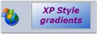' | markdownify }}
{:.image }

The .NET framework provides a label control typically used to provide descriptive text for a control. The Essential Tools' GradientLabel control provides an easy way to display labels with attractive shades and backgrounds.

> {{ '' | markdownify }}
{:.image }
 _Note: All the other functions of the GradientLabel is the same as the System.Windows.Forms.Label control in the Windows Forms library._ 

See Also

###### Features

GradientLabelis a Label control that supports extensive background customization and contains the following features.

Features

* Border Settings

The GradientLabel helps users create attractive labels in an application and supports numerous borders.

* Foreground Settings

Disabled text can be drawn active or inactive using this control.

* Background Settings

Provides enhanced look and feel with gradient backgrounds that can be set using the Background property of the GradientLabel control.

* Serialization

It provides serialization support.

See Also

Concepts and Features

###### Creating GradientLabel

The GradientLabel control can be created in the following ways.

Through Designer

To create a GradientLabel control through designer,

* Create or open a Windows Forms project.
* Add a GradientLabel Control from the toolbox onto the form by dragging and dropping it on the form or double clicking the control.

{{ '' | markdownify }}
{:.image }

* Set the desired properties for the control through theProperty grid.
* Run the application.

{{ '' | markdownify }}
{:.image }

See Also

Through Code

Through Code

GradientLabel can be created programmatically as detailed below.

* Create a C# or VB.NET application though Visual Studio.
* Add the required assembly references.
* Include the required namespace.

[C#]

using Syncfusion.Windows.Forms.Tools;

[VB.NET]

Imports Syncfusion.Windows.Forms.Tools

* Declare the GradientLabel control.

[C#]

private Syncfusion.Windows.Forms.Tools.GradientLabel gradientLabel1;

[VB.NET]

Private gradientLabel1 As Syncfusion.Windows.Forms.Tools.GradientLabel

* Initialize the control.

[C#]

this.gradientLabel1 = new Syncfusion.Windows.Forms.Tools.GradientLabel();

[VB.NET]

Me.gradientLabel1 = New Syncfusion.Windows.Forms.Tools.GradientLabel()

* Set the properties for the GradientLabel control and add it to your form.

[C#]

this.gradientLabel1.BorderStyle = System.Windows.Forms.Border3DStyle.Sunken;

this.gradientLabel1.ForeColor = System.Drawing.SystemColors.Info;

this.gradientLabel1.Text = "Syncfusion Control";

// Add the GradientLabel control to the Form.

this.Controls.Add(this.gradientLabel1);

[VB.NET]

Me.gradientLabel1.BorderStyle = System.Windows.Forms.Border3DStyle.Sunken

Me.gradientLabel1.ForeColor = System.Drawing.SystemColors.Info

Me.gradientLabel1.Text = "Syncfusion Control"

' Add the GradientLabel control to the Form.

Me.Controls.Add(Me.gradientLabel1)

* Run the application.

{{ '' | markdownify }}
{:.image }

###### Concepts and Features

The following topics will help you become more familiar in using the GradientLabel control.

Border Settings

This section discusses the border settings of the GradientLabel control.

The border style and sides of the GradientLabel can be customized using the properties given below.

_Table_ _384_: Property Table_

<table>
<tr>
<td>
GradientLabel Properties</td><td>
Description</td></tr>
<tr>
<td>
BorderSides</td><td>
Specifies the sides of the GradientLabel that will have a border.  The options included are as follows.{{ '_Left,_' | markdownify }}{{ '_Top,_' | markdownify }}{{ '_Right,_' | markdownify }}{{ '_Bottom,_' | markdownify }}{{ '_Middle and_' | markdownify }}{{ '_All._' | markdownify }}The default value is set to 'All'.</td></tr>
<tr>
<td>
BorderStyle</td><td>
Specifies the 3D border style for the GradientLabel.The options included are as follows.{{ '_Raised,_' | markdownify }}{{ '_RaisedOuter,_' | markdownify }}{{ '_RaisedInner,_' | markdownify }}{{ '_Sunken,_' | markdownify }}{{ '_SunkenOuter,_' | markdownify }}{{ '_SunkenInner,_' | markdownify }}{{ '_Etched,_' | markdownify }}{{ '_Bump,_' | markdownify }}{{ '_Adjust and_' | markdownify }}{{ '_Flat._' | markdownify }}The default value is set to 'Sunken'.</td></tr>
<tr>
<td>
BorderColor</td><td>
Sets the color for the 2D border. The BorderColor will be effective only when the BorderStyle property is set to FixedSingle.</td></tr>
</table>

We can set the border sides for the GradientLabel using the BorderSides property.If BorderSides is set to 'Left', only the left border of GradientLabel will be shown.

The GradientLabel replaces the default border style provided for Label classes with the Border3DStyle type in this property. This property uses the Border3DStyle enumeration.

In 3D mode, the border styles can be Raised, Sunken, Flat and so on. Setting the value to 'Adjust' shows no border.

[C#]

this.gradientLabel1.BorderSides = System.Windows.Forms.Border3DSide.Top;

this.gradientLabel1.BorderStyle = System.Windows.Forms.Border3DStyle.Flat;

this.gradientLabel1.BorderColor = Color.Red;

[VB.NET]

Me.gradientLabel1.BorderSides = System.Windows.Forms.Border3DSide.Top

Me.gradientLabel1.BorderStyle = System.Windows.Forms.Border3DStyle.Flat

Me.gradientLabel1.BorderColor = Color.Red

{{ '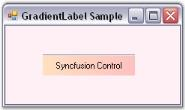' | markdownify }}
{:.image }

Foreground Settings

This section illustrates the foreground settings of the GradientLabel control.

DrawActiveWhenDisabled

Disabled text can be drawn active using the below given property.

_Table_ _385_: Property Table_

<table>
<tr>
<td>
GradientLabel Property</td><td>
Description</td></tr>
<tr>
<td>
DrawActiveWhenDisabled</td><td>
Gets / sets a value indicating whether the text should be drawn active when the control is disabled. The default value is set to 'False'.</td></tr>
</table>

[C#]

this.gradientLabel1.DrawActiveWhenDisabled = true;

[VB.NET]

Me.gradientLabel1.DrawActiveWhenDisabled = True

Background Settings

This section illustrates the background settings of the GradientLabel control.

The GradientLabel control's background can be customized using the various options provided by the BackgroundColor property given below.

_Table_ _386_: Property Table_

<table>
<tr>
<td>
GradientLabel Properties</td><td>
Description</td></tr>
<tr>
<td>
BackgroundColor</td><td>
Gets / sets the background color and other styles.</td></tr>
<tr>
<td>
Style</td><td>
Specifies the brush style.{{ '_Solid,_' | markdownify }}{{ '_Pattern and_' | markdownify }}{{ '_Gradient._' | markdownify }}The default value is set to 'Gradient'.</td></tr>
<tr>
<td>
BackColor</td><td>
Specifies the backcolor of the control.</td></tr>
<tr>
<td>
ForeColor</td><td>
Specifies the forecolor for any text or graphics in the control.</td></tr>
<tr>
<td>
PatternStyle</td><td>
Specifies the pattern style of the control.</td></tr>
<tr>
<td>
GradientStyle</td><td>
Specifies the gradient style of the background.{{ '_ForwardDiagonal,_' | markdownify }}{{ '_BackwardDiagonal,_' | markdownify }}{{ '_Horizontal,_' | markdownify }}{{ '_Vertical,_' | markdownify }}{{ '_PathRectangle and_' | markdownify }}{{ '_PathEllipse._' | markdownify }}The default value is set to 'Vertical'.</td></tr>
<tr>
<td>
GradientColors</td><td>
Specifies the gradient colors.The first entry in this list will be the same as the BackColor property, the last entry will be the same as the ForeColor property.</td></tr>
</table>

[C#]

this.gradientLabel1.BackgroundColor = new Syncfusion.Drawing.BrushInfo(Syncfusion.Drawing.GradientStyle.PathRectangle, new System.Drawing.Color[] {System.Drawing.Color.LavenderBlush, System.Drawing.Color.LemonChiffon, System.Drawing.Color.DarkKhaki, System.Drawing.Color.SandyBrown, System.Drawing.Color.LightSeaGreen});

[VB.NET]

Me.gradientLabel1.BackgroundColor = New Syncfusion.Drawing.BrushInfo(Syncfusion.Drawing.GradientStyle.PathRectangle, New System.Drawing.Color() {System.Drawing.Color.LavenderBlush, System.Drawing.Color.LemonChiffon, System.Drawing.Color.DarkKhaki, System.Drawing.Color.SandyBrown, System.Drawing.Color.LightSeaGreen})

{{ '' | markdownify }}
{:.image }

Serialization

We can save and load the background color information in an XML file to persist the color state of a GradientLabel. The XmlSerializer Class can be used for providing serialization support.

* First include the required namespaces.

[C#]

using System.Drawing;

using Syncfusion.Drawing;

using System.Xml.Serialization;

using System.IO;

[VB.NET]

Imports System.Drawing

Imports Syncfusion.Drawing

Imports System.Xml.Serialization

Imports System.IO

* The below code snippet saves the information in a file called the colorinfo.xml.

[C#]

private void button1_Click(object sender, System.EventArgs e)

{

this.gradientLabel1.BackgroundColor = new BrushInfo(GradientStyle.Gradient, Color.ForwardDiagonal , Color.Biege);

string xmlFilename = "C:\\colorinfo.xml";

XmlSerializer serializer = new XmlSerializer(typeof(Syncfusion.Drawing.BrushInfo));

FileStream fs= new FileStream(xmlFilename, FileMode.Create);

System.Xml.XmlTextWriter writer = new System.Xml.XmlTextWriter(fs, System.Text.Encoding.Default);

serializer.Serialize(fs,this.gradientLabel1.BackgroundColor);

writer.Close();

}

[VB.NET]

Private Sub button1_Click(ByVal sender As Object, ByVal e As System.EventArgs)

Me.gradientLabel1.BackgroundColor = New BrushInfo(GradientStyle.Gradient, Color.ForwardDiagonal, Color.Biege)

Private xmlFilename As String = "C:\colorinfo.xml"

Private serializer As XmlSerializer = New XmlSerializer(GetType(Syncfusion.Drawing.BrushInfo))

Private fs As FileStream = New FileStream(xmlFilename, FileMode.Create)

Private writer As System.Xml.XmlTextWriter = New System.Xml.XmlTextWriter(fs, System.Text.Encoding.Default)

serializer.Serialize(fs,Me.gradientLabel1.BackgroundColor)

writer.Close()

End Sub

{{ '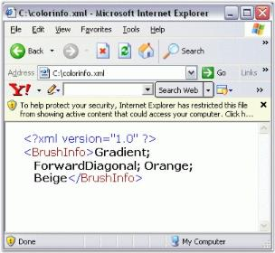' | markdownify }}
{:.image }

#### Select Option Controls

The advanced versions of Windows Forms CheckBox and Radio Button controls are discussed below.

##### CheckBoxAdv

The CheckBoxAdv is an advanced CheckBox control that supports themes, gradient colors, border settings and shadow text with various alignment options for both the text and checkbox. It provides options to display images and gradient backgrounds.

{{ '' | markdownify }}
{:.image }

CheckBoxAdv control can replace the CheckBox control provided in the Windows Forms. This type of control can be defined as consisting of a graphic and associated text that the user clicks to select or deselect an option. A check mark in the checkbox graphic indicates that the option is selected. In the CheckBoxAdv control, the graphic can be changed to an image that indicates a selected or deselected state.

See Also

###### Features	

CheckBoxAdv is an advanced CheckBox control and contains the following features.

Features

* CheckBoxAdv Settings

The CheckBoxAdv can be displayed in the Checked, Unchecked and Indeterminate states using the CheckState property.

Integer and String values can be associated with each state of the CheckBoxAdv.

* Text Settings

The text of the CheckBoxAdv control can be shadowed, and the shadow color and offset can also be specified.

The text can be wrapped by setting the WrapText property to 'True'.

* Appearance and Behavior Settings

The focus rectangle can be made visible or hidden.

The height of the CheckBoxAdv can be automatically calculated. Its mode can be set to the 'ReadOnlyMode'.

The Tristate property can be used to access the indeterminate state through a single click.

* Alignment Settings

The text and checkbox of the CheckBoxAdv control can be aligned to any desired location by the user.

* Background Settings

CheckBoxAdv can be created with custom gradient backgrounds.

* Border Settings

2D and 3D border styles can be applied to the CheckBoxAdv. The HotBorderColor property can be used to specify the color of the FixedSingle border during mouse hover.

* Image Settings

You can set the image for the CheckBoxAdv when it is Checked, Unchecked, Disabled or Indeterminate.

* Themes and Visual Styles

Themes can be enabled for the CheckBoxAdv. 

It provides the Office2007 Visual Style that comes in the blue, silver and black colors. The Office2007 style also supports custom colors that can be applied to the CheckBoxAdv control.

* Databinding

You can bind the CheckBoxAdv to a datasource such as an SQL database.

See Also

Concepts and Features

###### Creating CheckBoxAdv

The CheckBoxAdv control can be created in the following ways.

Through Designer

The following steps illustrate how to create a CheckBoxAdv control through designer.

* Create or open a Windows Forms project.
* Add a CheckBoxAdv Control from the toolbox onto the form by dragging and dropping it on the form or double clicking the control.

{{ '' | markdownify }}
{:.image }

* Set the desired properties for the control through theProperty grid.
* Run the application.

{{ '' | markdownify }}
{:.image }

See Also

Through Code

Through Code

The CheckBoxAdv control can be created programmatically as detailed below:

* Create a C# or VB.NET application though Visual Studio.
* Add the required assembly references.
* Include the required namespace.

[C#]

using Syncfusion.Windows.Forms.Tools;

[VB.NET]

Imports Syncfusion.Windows.Forms.Tools

* Create an instance of the CheckBoxAdv control class.

[C#]

private Syncfusion.Windows.Forms.Tools.CheckBoxAdv checkBoxAdv1;

this.checkBoxAdv1 = new Syncfusion.Windows.Forms.Tools.CheckBoxAdv();

[VB.NET]

Private checkBoxAdv1 As Syncfusion.Windows.Forms.Tools.CheckBoxAdv

Me.checkBoxAdv1 = New Syncfusion.Windows.Forms.Tools.CheckBoxAdv()

* Set the properties and add the CheckBoxAdv control to the form.

[C#]

this.checkBoxAdv1.Text = "checkBoxAdv1";

this.checkBoxAdv1.Font = new System.Drawing.Font("Microsoft Sans Serif", 8.25F, System.Drawing.FontStyle.Bold, System.Drawing.GraphicsUnit.Point, ((byte)(0)));

this.checkBoxAdv1.ForeColor = System.Drawing.Color.OliveDrab;

this.checkBoxAdv1.BackColor = System.Drawing.Color.Beige;

// Add the CheckBoxAdv control to the Form.

this.Controls.Add(this.radioButtonAdv1);

[VB.NET]

Me.checkBoxAdv1.Text = "checkBoxAdv1"

Me.checkBoxAdv1.Font = New System.Drawing.Font("Microsoft Sans Serif", 8.25F, System.Drawing.FontStyle.Bold, System.Drawing.GraphicsUnit.Point, CByte((0)))

Me.checkBoxAdv1.ForeColor = System.Drawing.Color.OliveDrab

Me.checkBoxAdv1.BackColor = System.Drawing.Color.Beige

// Add the CheckBoxAdv control to the Form.

Me.Controls.Add(Me.radioButtonAdv1)

{{ '' | markdownify }}
{:.image }

See Also

Through Designer

###### Concepts and Features

The following topics will help you become more familiar in using the CheckBoxAdv control.

CheckBoxAdv Settings

This section discusses the various states of the CheckBoxAdv control and the method of associating values with the states.

It includes the below given topics.

CheckBoxAdv States

The CheckBoxAdv can be displayed in three different states which have been described below.

_Table_ _387_: Property Table_

<table>
<tr>
<td>
CheckBoxAdv Property</td><td>
Description</td></tr>
<tr>
<td>
CheckState</td><td>
Gets / sets the check state of the CheckBox.It includes the below given options.{{ '_Unchecked,_' | markdownify }}{{ '_Checked and_' | markdownify }}{{ '_Indeterminate._' | markdownify }}</td></tr>
<tr>
<td>
Checked</td><td>
Gets / sets the checked state of the CheckBox.</td></tr>
</table>

[C#]

this.checkBoxAdv1.CheckState = System.Windows.Forms.CheckState.Checked;

this.checkBoxAdv1.Checked = true;

[VB.NET]

Me.checkBoxAdv1.CheckState = System.Windows.Forms.CheckState.Checked

Me.checkBoxAdv1.Checked = True

{{ '' | markdownify }}
{:.image }

{{ '' | markdownify }}
{:.image }

See Also

CheckBoxAdv Values, Image Settings

CheckBoxAdv Values

This section discusses how values can be associated with the various check states.

Both integer and string values can be associated with the check states as follows.

_Table_ _388_: Property Table_

<table>
<tr>
<td>
CheckBoxAdv Properties</td><td>
Description</td></tr>
<tr>
<td>
CheckedInt</td><td>
Specifies the integer value when checked. </td></tr>
<tr>
<td>
CheckedString</td><td>
Specifies the string value when checked.</td></tr>
<tr>
<td>
IndeterminateInt</td><td>
Specifies the integer value when indeterminate.</td></tr>
<tr>
<td>
IndeterminateString</td><td>
Specifies the string value when indeterminate.</td></tr>
<tr>
<td>
UncheckedInt</td><td>
Specifies the integer value when Unchecked.</td></tr>
<tr>
<td>
UncheckedString</td><td>
Specifies the string value when Unchecked.</td></tr>
<tr>
<td>
StringValue</td><td>
Gets or sets the string value.</td></tr>
<tr>
<td>
BoolValue</td><td>
Gets / sets a value indicating the check state. This property can be set to use bool values for databinding. Refer Frequently Asked Questions section. </td></tr>
<tr>
<td>
IntValue</td><td>
Gets / sets the int value. Refer Frequently Asked Questions section.</td></tr>
</table>

[C#]

this.checkBoxAdv1.CheckedInt = 3;

this.checkBoxAdv1.CheckedString = "CheckBoxAdv is Checked";

this.checkBoxAdv1.IndeterminateInt = 5;

this.checkBoxAdv1.IndeterminateString = "CheckBoxAdv is Indeterminate";

this.checkBoxAdv1.UncheckedInt = 3;

this.checkBoxAdv1.UncheckedString = "CheckBoxAdv is Unchecked";

this.checkBoxAdv1.StringValue = "String";

this.checkBoxAdv1.IntValue = 5;

this.checkBoxAdv1.BoolValue = true;

[VB.NET]

Me.checkBoxAdv1.CheckedInt = 3

Me.checkBoxAdv1.CheckedString = "CheckBoxAdv is Checked"

Me.checkBoxAdv1.IndeterminateInt = 5

Me.checkBoxAdv1.IndeterminateString = "CheckBoxAdv is Indeterminate"

Me.checkBoxAdv1.UncheckedInt = 3

Me.checkBoxAdv1.UncheckedString = "CheckBoxAdv is Unchecked"

Me.checkBoxAdv1.StringValue = "String"

Me.checkBoxAdv1.IntValue = 5

Me.checkBoxAdv1.BoolValue = True

See Also

CheckBoxAdv States, Image Settings

Text Settings

This section discusses the text settings of the CheckBoxAdv.

Text in the CheckBoxAdv can be shadowed and wrapped as illustrated below.

_Table_ _389_: Property Table_

<table>
<tr>
<td>
CheckBoxAdv Properties</td><td>
Description</td></tr>
<tr>
<td>
TextShadow</td><td>
Determines if the text shadow is visible.</td></tr>
<tr>
<td>
ShadowColor</td><td>
The color of the text shadow.</td></tr>
<tr>
<td>
ShadowOffset</td><td>
The offset of the text shadow.</td></tr>
<tr>
<td>
WrapText</td><td>
Determines if the text in the CheckBoxAdv is wrapped.</td></tr>
</table>

[C#]

this.checkBoxAdv1.TextShadow = true;

this.checkBoxAdv1.ShadowColor = System.Drawing.Color.BurlyWood;

this.checkBoxAdv1.ShadowOffset = new System.Drawing.Point(8, 8);

this.checkBoxAdv1.WrapText = true;

[VB.NET]

Me.checkBoxAdv1.TextShadow = True

Me.checkBoxAdv1.ShadowColor = System.Drawing.Color.BurlyWood

Me.checkBoxAdv1.ShadowOffset = New System.Drawing.Point(8, 8)

Me.checkBoxAdv1.WrapText = True

{{ '' | markdownify }}
{:.image }

{{ '' | markdownify }}
{:.image }

A sample which demonstrates the TextShadow property of CheckBoxAdv is available in the below sample installation path.

…\_My Documents\Syncfusion\EssentialStudio\Version Number\Windows\Tools.Windows\Samples\Advanced Editor Functions\ActionGroupingDemo_

See Also

Alignment Settings

Appearance and Behavior Settings

This section discusses the appearance and behavior settings of the CheckBoxAdv control.

Appearance Settings

DrawFocusRectangle

The focus rectangle can be hidden or made visible using the below given property.

_Table_ _390_: Property Table_

<table>
<tr>
<td>
CheckBoxAdv Property</td><td>
Description</td></tr>
<tr>
<td>
DrawFocusRectangle</td><td>
Determines if the focus rectangle is visible when it gets the focus. The default value is set to 'True'.</td></tr>
</table>

[C#]

this.checkBoxAdv1.DrawFocusRectangle = true;

[VB.NET]

Me.checkBoxAdv1.DrawFocusRectangle = True

Behavior Settings

The behavior settings of the CheckBoxAdv can be customized using the properties given below.

_Table_ _391_: Property Table_

<table>
<tr>
<td>
CheckBoxAdv Properties</td><td>
Description</td></tr>
<tr>
<td>
AutoHeight</td><td>
Determines if the CheckBoxAdv will automatically calculate its height.</td></tr>
<tr>
<td>
ReadOnlyMode</td><td>
Specifies the Read Only Mode of the CheckBoxAdv.</td></tr>
<tr>
<td>
Tristate</td><td>
Specifies whether the indeterminate state can be accessed through clicking.</td></tr>
</table>

[C#]

this.checkBoxAdv1.AutoHeight = true;

this.checkBoxAdv1.ReadOnlyMode = true;

this.checkBoxAdv1.Tristate= false;

[VB.NET]

Me.checkBoxAdv1.AutoHeight = True

Me.checkBoxAdv1.ReadOnlyMode = True

Me.checkBoxAdv1.Tristate= False

A sample which demonstrates the ReadOnlyMode and Tristate properties of CheckBoxAdv is available in the below sample installation path.

…\_My Documents\Syncfusion\EssentialStudio\Version Number\Windows\Tools.Windows\Samples\Advanced Editor Functions\ActionGroupingDemo_

Alignment Settings

This section discusses the alignment settings of the CheckBoxAdv.

Text Alignment

Text in the CheckBoxAdv can be aligned to the desired location as given below.

_Table_ _392_: Property Table_

<table>
<tr>
<td>
CheckBoxAdv Properties</td><td>
Description</td></tr>
<tr>
<td>
TextContentAlignment</td><td>
Indicates the alignment of the text. The default value is set to 'MiddleLeft'.The options included are as follows.{{ '_TopLeft,_' | markdownify }}{{ '_TopCenter,_' | markdownify }}{{ '_TopRight,_' | markdownify }}{{ '_MiddleLeft,_' | markdownify }}{{ '_MiddleCenter,_' | markdownify }}{{ '_MiddleRight,_' | markdownify }}{{ '_BottomLeft,_' | markdownify }}{{ '_BottomCenter and_' | markdownify }}{{ '_BottomRight._' | markdownify }}WrapText property must be set to 'False'. Refer Text Settings</td></tr>
</table>

[C#]

this.checkBoxAdv1.TextContentAlignment = System.Drawing.ContentAlignment.MiddleCenter;

[VB.NET]

Me.checkBoxAdv1.TextContentAlignment = System.Drawing.ContentAlignment.MiddleCenter

{{ '' | markdownify }}
{:.image }

CheckBox Alignment

The CheckBox itself can be aligned to any desired location that can be chosen from the options given in the following property.

_Table_ _393_: Property Table_

<table>
<tr>
<td>
CheckBoxAdv Properties</td><td>
Description</td></tr>
<tr>
<td>
CheckAlign</td><td>
Indicates the alignment of the CheckBox. The default value is set to 'MiddleLeft'.The options included are as follows.{{ '_TopLeft,_' | markdownify }}{{ '_TopCenter,_' | markdownify }}{{ '_TopRight,_' | markdownify }}{{ '_MiddleLeft,_' | markdownify }}{{ '_MiddleCenter,_' | markdownify }}{{ '_MiddleRight,_' | markdownify }}{{ '_BottomLeft,_' | markdownify }}{{ '_BottomCenter and_' | markdownify }}{{ '_BottomRight._' | markdownify }}</td></tr>
</table>

[C#]

this.checkBoxAdv1.CheckAlign = System.Drawing.ContentAlignment.MiddleRight;

[VB.NET]

Me.checkBoxAdv1.CheckAlign = System.Drawing.ContentAlignment.MiddleRight

{{ '' | markdownify }}
{:.image }

A sample which demonstrates the Text and CheckBox Alignment features of CheckBoxAdv is available in the below sample installation path.

…\_My Documents\Syncfusion\EssentialStudio\Version Number\Windows\Tools.Windows\Samples\Advanced Editor Functions\ActionGroupingDemo_

See Also

Text Settings, CheckBoxAdv Settings

Background Settings

The background settings of the CheckBoxAdv are discussed below.

The CheckBoxAdv can be provided with a gradient background using the properties given below.

_Table_ _394_: Property Table_

<table>
<tr>
<td>
CheckBoxAdv Properties</td><td>
Description</td></tr>
<tr>
<td>
BackgroundStyle</td><td>
Sets the background style of the CheckBoxAdv.The options included are as follows.{{ '_HorizontalGradient,_' | markdownify }}{{ '_VerticalGradient and_' | markdownify }}{{ '_Default._' | markdownify }}</td></tr>
<tr>
<td>
GradientStart</td><td>
Sets the start color of the gradient of the background of the CheckboxAdv.</td></tr>
<tr>
<td>
GradientEnd</td><td>
Sets the end color of the gradient of the background of the CheckboxAdv.</td></tr>
</table>

[C#]

this.checkBoxAdv1.BackgroundStyle = Syncfusion.Windows.Forms.Tools.CheckBoxAdvBackStyle.HorizontalGradient;

this.checkBoxAdv1.GradientStart = System.Drawing.Color.Aqua;

this.checkBoxAdv1.GradientEnd = System.Drawing.Color.Magenta;

[VB.NET]

Me.checkBoxAdv1.BackgroundStyle = Syncfusion.Windows.Forms.Tools.CheckBoxAdvBackStyle.HorizontalGradient

Me.checkBoxAdv1.GradientStart = System.Drawing.Color.Aqua

Me.checkBoxAdv1.GradientEnd = System.Drawing.Color.Magenta

{{ '' | markdownify }}
{:.image }

> {{ '' | markdownify }}
{:.image }
 _Note: Gradient background cannot be applied to the CheckBoxAdv when its BackgroundStyle property is set to 'Default'. Also, the background image cannot be displayed with gradient settings._

A sample which demonstrates the Background Settings of CheckBoxAdv is available in the below sample installation path.

…\_My Documents\Syncfusion\EssentialStudio\Version Number\Windows\Tools.Windows\Samples\Advanced Editor Functions\ActionGroupingDemo_

Border Settings

Color and Styles can be applied to the border of the CheckBoxAdv as discussed below.

_Table_ _395_: Property Table_

<table>
<tr>
<td>
CheckBoxAdv Properties</td><td>
Description</td></tr>
<tr>
<td>
Border3DStyle</td><td>
Indicates the style of the 3D border. The options included are as follows.{{ '_RaisedOuter,_' | markdownify }}{{ '_SunkenOuter,_' | markdownify }}{{ '_RaisedInner,_' | markdownify }}{{ '_SunkenInner,_' | markdownify }}{{ '_Raised,_' | markdownify }}{{ '_Etched,_' | markdownify }}{{ '_Bump,_' | markdownify }}{{ '_Sunken,_' | markdownify }}{{ '_Adjust and_' | markdownify }}{{ '_Flat_' | markdownify }}.The default value is set to 'Sunken'.</td></tr>
<tr>
<td>
BorderColor</td><td>
Specifies the color of the 2D border.</td></tr>
<tr>
<td>
BorderSingle</td><td>
Indicates the 2D border style. The options included are as follows.{{ '_Dotted,_' | markdownify }}{{ '_Dashed,_' | markdownify }}{{ '_Solid,_' | markdownify }}{{ '_Inset,_' | markdownify }}{{ '_Outset and_' | markdownify }}{{ '_None._' | markdownify }}The BorderStyle property should be set to 'FixedSingle'.</td></tr>
<tr>
<td>
BorderStyle</td><td>
Indicates whether the panel should have a border. The options included are given below.{{ '_FixedSingle,_' | markdownify }}{{ '_Fixed3D and_' | markdownify }}{{ '_None._' | markdownify }}</td></tr>
<tr>
<td>
HotBorderColor</td><td>
Specifies the color of the FixedSingle border when MouseOver.</td></tr>
</table>

[C#]

this.checkBoxAdv1.Border3DStyle = System.Windows.Forms.Border3DStyle.Bump;

this.checkBoxAdv1.BorderColor = System.Drawing.Color.Red;

this.checkBoxAdv1.BorderSingle = System.Windows.Forms.ButtonBorderStyle.Dotted;

this.checkBoxAdv1.BorderStyle = System.Windows.Forms.BorderStyle.FixedSingle;

// BorderStyle must be set to 'FixedSingle'.

this.checkBoxAdv1.HotBorderColor = System.Drawing.Color.Blue;

[VB.NET]

Me.checkBoxAdv1.Border3DStyle = System.Windows.Forms.Border3DStyle.Bump

Me.checkBoxAdv1.BorderColor = System.Drawing.Color.Red

Me.checkBoxAdv1.BorderSingle = System.Windows.Forms.ButtonBorderStyle.Dotted

Me.checkBoxAdv1.BorderStyle = System.Windows.Forms.BorderStyle.FixedSingle

' BorderStyle must be set to 'FixedSingle'.

Me.checkBoxAdv1.HotBorderColor = System.Drawing.Color.Blue

{{ '' | markdownify }}
{:.image }

{{ '' | markdownify }}
{:.image }

A Sample which demonstrates the Border Settings of CheckBoxAdv is available in the below sample installation path.

…\_My Documents\Syncfusion\EssentialStudio\Version Number\Windows\Tools.Windows\Samples\Advanced Editor Functions\ActionGroupingDemo_

Image Settings

The image settings of the CheckBoxAdv control has been discussed in this section.

Images can be set to the CheckBoxAdv when it is in the Checked, Unchecked or Indeterminate state. The CheckBoxAdv allows us to set the following properties in order to display images.

_Table_ _396_: Property Table_

<table>
<tr>
<td>
CheckBoxAdv Properties</td><td>
Description</td></tr>
<tr>
<td>
ImageCheckBox</td><td>
Indicates whether the CheckBox will be drawn using the images provided.</td></tr>
<tr>
<td>
ImageCheckBoxSize</td><td>
Gets / sets the size of the ImageCheckBox.ImageCheckbox property must be set to 'True'.</td></tr>
<tr>
<td>
CheckedImage</td><td>
Gets / sets the image used to draw the CheckBox when checked and mouse not over.</td></tr>
<tr>
<td>
UncheckedImage</td><td>
Gets / sets the image used to draw the CheckBox when unchecked and mouse not over.</td></tr>
<tr>
<td>
IndeterminateImage</td><td>
The image used to draw the CheckBox when indeterminate and mouse not over.</td></tr>
<tr>
<td>
DisabledImage</td><td>
Gets / sets the image used to draw the CheckBox when disabled.</td></tr>
<tr>
<td>
StretchImage</td><td>
Indicates whether the state images of the CheckBox are stretched.</td></tr>
</table>
> {{ '' | markdownify }}
{:.image }
 _Note: Before setting the images, make sure the ImageCheckBox property is set to 'True'._

[C#]

this.checkBoxAdv1.ImageCheckBox = true;

this.checkBoxAdv1.ImageCheckBoxSize = new System.Drawing.Size(15, 15);

this.checkBoxAdv1.CheckedImage = ((System.Drawing.Image)(resources.GetObject("checkBoxAdv1.CheckedImage")));

this.checkBoxAdv1.UncheckedImage = ((System.Drawing.Image)(resources.GetObject("checkBoxAdv1.UncheckedImage")));

this.checkBoxAdv1.IndeterminateImage = ((System.Drawing.Image)(resources.GetObject("checkBoxAdv1.IndeterminateImage")));

this.checkBoxAdv1.DisabledImage = ((System.Drawing.Image)(resources.GetObject("checkBoxAdv1.DisabledImage")));

this.checkBoxAdv1.StretchImage = false;

[VB.NET]

Me.checkBoxAdv1.ImageCheckBox = True

Me.checkBoxAdv1.ImageCheckBoxSize = New System.Drawing.Size(15, 15)

Me.checkBoxAdv1.CheckedImage = (CType(Resources.GetObject("checkBoxAdv1.CheckedImage"), System.Drawing.Image))

Me.checkBoxAdv1.UncheckedImage = (CType(Resources.GetObject("checkBoxAdv1.UncheckedImage"), System.Drawing.Image))

Me.checkBoxAdv1.IndeterminateImage = (CType(Resources.GetObject("checkBoxAdv1.IndeterminateImage"), System.Drawing.Image))

Me.checkBoxAdv1.DisabledImage = (CType(Resources.GetObject("checkBoxAdv1.DisabledImage"), System.Drawing.Image))

Me.checkBoxAdv1.StretchImage = False

{{ '' | markdownify }}
{:.image }

Images displayed during Mouse Hover

Images can also be set when the mouse is hovered over the CheckBoxAdv control.

_Table_ _397_: Property Table_

<table>
<tr>
<td>
CheckBoxAdv Properties</td><td>
Description</td></tr>
<tr>
<td>
MouseOverCheckedImage</td><td>
Gets / sets the image used to draw the CheckBox when checked and mouse over.</td></tr>
<tr>
<td>
MouseOverDisabledImage</td><td>
Gets / sets the image used to draw the CheckBox when indeterminate and mouse over.</td></tr>
<tr>
<td>
MouseOverUncheckedImage</td><td>
Gets / sets the image used to draw the CheckBox when unchecked and mouse over.</td></tr>
</table>

[C#]

this.checkBoxAdv1.MouseOverCheckedImage = ((System.Drawing.Image)(resources.GetObject("checkBoxAdv1.MouseOverCheckedImage")));

this.checkBoxAdv1.MouseOverIndetermImage = ((System.Drawing.Image)(resources.GetObject("checkBoxAdv1.MouseOverIndetermImage")));

this.checkBoxAdv1.MouseOverUncheckedImage = ((System.Drawing.Image)(resources.GetObject("checkBoxAdv1.MouseOverUncheckedImage")));

[VB.NET]

Me.checkBoxAdv1.MouseOverCheckedImage = (CType(Resources.GetObject("checkBoxAdv1.MouseOverCheckedImage"), System.Drawing.Image))

Me.checkBoxAdv1.MouseOverIndetermImage = (CType(Resources.GetObject("checkBoxAdv1.MouseOverIndetermImage"), System.Drawing.Image))

Me.checkBoxAdv1.MouseOverUncheckedImage = (CType(Resources.GetObject("checkBoxAdv1.MouseOverUncheckedImage"), System.Drawing.Image))

{{ '' | markdownify }}
{:.image }

A Sample which demonstrates the ImageCheckBox property of CheckBoxAdv is available in the below sample installation path.

…\_My Documents\Syncfusion\EssentialStudio\Version Number\Windows\Tools.Windows\Samples\Advanced Editor Functions\ActionGroupingDemo_

Themes and Visual Styles

This section discusses the themes and visual style settings that are supported by the CheckBoxAdv control.

Themes

The CheckBoxAdv can be provided with a themed appearance using the below given property.

_Table_ _398_: Property Table_

<table>
<tr>
<td>
CheckBoxAdv Property</td><td>
Description</td></tr>
<tr>
<td>
ThemesEnabled</td><td>
Specifies whether themes are enabled for CheckBoxAdv.</td></tr>
</table>

[C#]

this.checkBoxAdv1.ThemesEnabled = true;

[VB]

Me.checkBoxAdv1.ThemesEnabled = True

{{ '' | markdownify }}
{:.image }

Visual Styles

The appearance of the CheckBoxAdv control can be customized using the various options provided by the following properties.

_Table_ _399_: Property Table_

<table>
<tr>
<td>
CheckBoxAdv Properties</td><td>
Description</td></tr>
<tr>
<td>
Style</td><td>
Gets / sets an advanced appearance for the CheckBoxAdv.The options included are as follows.{{ '_Default and_' | markdownify }}{{ '_Office2007._' | markdownify }}</td></tr>
<tr>
<td>
Office2007ColorScheme</td><td>
Gets / sets Office 2007 color scheme.The options included are as follows.{{ '_Managed,_' | markdownify }}{{ '_Blue,_' | markdownify }}{{ '_Silver and_' | markdownify }}{{ '_Black._' | markdownify }}The Style property should be set to "Office2007".</td></tr>
</table>

[C#]

this.checkBoxAdv1.Style = Syncfusion.Windows.Forms.Tools.CheckBoxAdvStyle.Office2007;

this.checkBoxAdv1.Office2007ColorScheme = Syncfusion.Windows.Forms.Office2007Theme.Blue;

[VB]

Me.checkBoxAdv1.Style = Syncfusion.Windows.Forms.Tools.CheckBoxAdvStyle.Office2007

Me.checkBoxAdv1.Office2007ColorScheme = Syncfusion.Windows.Forms.Office2007Theme.Blue

{{ '' | markdownify }}
{:.image }

{{ '' | markdownify }}
{:.image }

When the Office2007ColorScheme property is set to 'Managed', the CheckBox in the CheckBoxAdv can be displayed using custom colors supported by the control.

This can be done programmatically as follows.

[C#]

this.checkBoxAdv1.Style = Syncfusion.Windows.Forms.Tools.CheckBoxAdvStyle.Office2007;

this.checkBoxAdv1.Office2007ColorScheme = Syncfusion.Windows.Forms.Office2007Theme.Managed;

Office2007Colors.ApplyManagedColors(this, Color.Pink);

[VB]

Me.checkBoxAdv1.Style = Syncfusion.Windows.Forms.Tools.CheckBoxAdvStyle.Office2007

Me.checkBoxAdv1.Office2007ColorScheme = Syncfusion.Windows.Forms.Office2007Theme.Managed

Office2007Colors.ApplyManagedColors(Me, Color.Pink)

{{ '' | markdownify }}
{:.image }

A sample which demonstrates the Themes and Visual Styles of CheckBoxAdv is available in the below sample installation path.

…\_My Documents\Syncfusion\EssentialStudio\Version Number\Windows\Tools.Windows\Samples\Advanced Editor Functions\ActionGroupingDemo_

###### CheckBoxAdv Events

A detailed explanation about the CheckStateChanged event is given in the following section.

_Table_ _400_: Events Table_

<table>
<tr>
<td>
CheckBoxAdv Events</td><td>
Description</td></tr>
<tr>
<td>
CheckStateChanged</td><td>
This event occurs when the CheckState property is changed.</td></tr>
<tr>
<td>
CheckedChanged</td><td>
This event is raised when the Checked property is changed.</td></tr>
</table>
CheckStateChanged Event

This event occurs when the CheckState property is changed.

The event handler receives an argument of type EventArgs containing data related to this event.

[C#]

private void checkBoxAdv1_CheckStateChanged(object sender, EventArgs e)

{

Console.WriteLine(" CheckStateChanged event is raised");

}

[VB.NET]

Private Sub checkBoxAdv1_CheckStateChanged(ByVal sender As Object, ByVal e As EventArgs)

Console.WriteLine(" CheckStateChanged event is raised")

End Sub

CheckedChanged Event

This event is raised when the Checked property is changed. Checked property changes automatically when the CheckedState property is changed. Refer to the following code.

[C#]

private void checkBoxAdv2_CheckedChanged(object sender, EventArgs e)

{

    if (!checkBoxAdv2.Checked)

        MessageBox.Show("Checkbox Unchecked");

    else

        MessageBox.Show("Checkbox checked");

}

[VB]

Private Sub checkBoxAdv2_CheckedChanged(ByVal sender As Object, ByVal e As EventArgs)
       If Not checkBoxAdv2.Checked Then
           MessageBox.Show("Checkbox checked”)
       Else
           MessageBox.Show("Checkbox checked”)
       End If
   End Sub

###### Frequently Asked Questions

This section will help you become more familiar in using the CheckBoxAdv control.

How to databind a CheckBoxAdv to an SQL database if the corresponding datatable field is a bit field

The CheckBoxAdv's IntValue property can be used to databind bit values as illustrated below.

[C#]

private void Form1_Load(object sender, System.EventArgs e)

{

// Using CheckBoxAdv's IntValue property for Databinding.

this.oleDbDataAdapter1.Fill(this.dataSet11.Table1);

}

this.checkBoxAdv1.DataBindings.Add("IntValue", this.dataSet11.Table1, "BitField");

[VB.NET]

Private Sub Form1_Load(ByVal sender As Object, ByVal e As System.EventArgs)

' Using CheckBoxAdv's IntValue property for Databinding.

Me.oleDbDataAdapter1.Fill(Me.dataSet11.Table1)

End Sub

Me.checkBoxAdv1.DataBindings.Add("IntValue", Me.dataSet11.Table1, "BitField")

A sample which demonstrates how bit values are used to set the state of the CheckBoxAdv is available in the below sample installation path.

…\_My Documents\Syncfusion\EssentialStudio\Version Number\Windows\Tools.Windows\Samples\Advanced Editor Functions\ActionGroupingDemo_

How to databind a CheckBoxAdv to an SQL database if the corresponding datatable field is boolean

The CheckBoxAdv's BoolValue property can be used to databind bool values as illustrated below.

[C#]

private void Form1_Load(object sender, System.EventArgs e)

{

this.oleDbDataAdapter1.Fill(this.dataSet11.Table1);

}

// Using CheckBoxAdv's BoolValue property for Databinding.

this.checkBoxAdv1.DataBindings.Add("BoolValue", this.dataSet11.Table1, "CheckValue");

[VB.NET]

Private Sub Form1_Load(ByVal sender As Object, ByVal e As System.EventArgs)

Me.oleDbDataAdapter1.Fill(Me.dataSet11.Table1)

End Sub

' Using CheckBoxAdv's BoolValue property for Databinding.

Me.checkBoxAdv1.DataBindings.Add("BoolValue", Me.dataSet11.Table1, "CheckValue")

{{ '' | markdownify }}
{:.image }

##### RadioButtonAdv

RadioButtonAdv functions similar to the Windows standard RadioButton but it has some additional enhancements. It helps to provide a great look and feel to the RadioButtons. It supports themes, gradient colors, images and shadow text.

{{ '' | markdownify }}
{:.image }

See Also

###### Features

RadioButtonAdv is an advanced RadioButton control and has the following features.

Features

* RadioButtonAdv Settings

The RadioButtonAdv can be displayed in the Checked and Unchecked states using the Checked property.

Integer and String values can be associated with each state of the RadioButtonAdv.

* Text Settings

The text of the RadioButtonAdv control can be shadowed, and the shadow color and offset can also be specified.

The text can be wrapped by setting the WrapText property to 'True'.

* Appearance and Behavior Settings

The focus rectangle can be made visible or hidden.

The height of the RadioButtonAdv can be automatically calculated.

* Alignment Settings

The text and radio button of the RadioButtonAdv control can be aligned to any desired location by the user.

* Background Settings

RadioButtonAdv can be created with custom gradient backgrounds.

* Border Settings

2D and 3D border styles can be applied to the RadioButtonAdv. The HotBorderColor property can be used to specify the color of the FixedSingle border during mouse hover.

* Image Settings

You can set the image for the RadioButtonAdv when it is Checked, Unchecked or Disabled.

* Themes and Visual Styles

Themes can be enabled for the RadioButtonAdv. 

It provides the Office2007 Visual Style that comes in the blue, silver and black colors. The Office2007 style also supports custom colors that can be applied to the RadioButtonAdv control.

See Also

Concepts and Features

###### Creating RadioButtonAdv

The RadioButtonAdv control can be created in the following ways.

Through Designer

The following steps illustrate how to create a RadioButtonAdv control through designer.

* Create or open a Windows Forms project.
* Add a RadioButtonAdv Control from the toolbox onto the form by dragging and dropping it on the form or double clicking the control.

{{ '' | markdownify }}
{:.image }

* Set the desired properties for the control through theProperty grid.
* Run the application.

{{ '' | markdownify }}
{:.image }

See Also

Through Code

Through Code

The RadioButtonAdv control can be created programmatically as detailed below:

* Create a C# or VB.NET application though Visual Studio.
* Add the required assembly references.
* Include the required namespace.

[C#]

using Syncfusion.Windows.Forms.Tools;

[VB.NET]

Imports Syncfusion.Windows.Forms.Tools

* Create an instance of the RadioButtonAdv control class.

[C#]

private Syncfusion.Windows.Forms.Tools.RadioButtonAdv radioButtonAdv1;

this.radioButtonAdv1 = new Syncfusion.Windows.Forms.Tools.RadioButtonAdv();

[VB.NET]

Private radioButtonAdv1 As Syncfusion.Windows.Forms.Tools.RadioButtonAdv

Me.radioButtonAdv1 = New Syncfusion.Windows.Forms.Tools.RadioButtonAdv()

* Set the properties and add the RadioButtonAdv control to the form.

[C#]

this.radioButtonAdv1.Text = "radioButtonAdv1";

this.radioButtonAdv1.Font = new System.Drawing.Font("Microsoft Sans Serif", 8.25F, System.Drawing.FontStyle.Bold, System.Drawing.GraphicsUnit.Point, ((byte)(0)));

this.radioButtonAdv1.ForeColor = System.Drawing.Color.MistyRose;

this.radioButtonAdv1.BackColor = System.Drawing.Color.RosyBrown;

// Add the RadioButtonAdv control to the Form.

this.Controls.Add(this.radioButtonAdv1);

[VB.NET]

Me.radioButtonAdv1.Text = "radioButtonAdv1"

Me.radioButtonAdv1.Font = New System.Drawing.Font("Microsoft Sans Serif", 8.25F, System.Drawing.FontStyle.Bold, System.Drawing.GraphicsUnit.Point, CByte((0)))

Me.radioButtonAdv1.ForeColor = System.Drawing.Color.MistyRose

Me.radioButtonAdv1.BackColor = System.Drawing.Color.RosyBrown

// Add the RadioButtonAdv control to the Form.

Me.Controls.Add(Me.radioButtonAdv1)

{{ '' | markdownify }}
{:.image }

See Also

Through Designer

###### Concepts and Features

The following topics will help you become more familiar in using the RadioButtonAdv control.

RadioButtonAdv Settings

This section discusses the various states of the RadioButtonAdv control and the method of associating values with the states.

It includes the below given topics.

RadioButtonAdv States

The RadioButtonAdv can be displayed in two different states which have been described below.

_Table_ _401_: Property Table_

<table>
<tr>
<td>
RadioButtonAdv Property</td><td>
Description</td></tr>
<tr>
<td>
Checked</td><td>
Gets / sets the check state of the RadioButton.</td></tr>
</table>

[C#]

this.radioButtonAdv1.Checked = true;

[VB.NET]

Me.radioButtonAdv1.Checked = True

{{ '' | markdownify }}
{:.image }

See Also

RadioButtonAdv Values, Image Settings, RadioButtonAdv Events

RadioButtonAdv Values

This section discusses how values can be associated with the various check states.

Both integer and string values can be associated with the check states as follows.

_Table_ _402_: Property Table_

<table>
<tr>
<td>
RadioButtonAdv Properties</td><td>
Description</td></tr>
<tr>
<td>
CheckedInt</td><td>
Specifies the integer value when checked. </td></tr>
<tr>
<td>
CheckedString</td><td>
Specifies the string value when checked.</td></tr>
<tr>
<td>
UncheckedInt</td><td>
Specifies the integer value when Unchecked.</td></tr>
<tr>
<td>
UncheckedString</td><td>
Specifies the string value when Unchecked.</td></tr>
<tr>
<td>
IntValue</td><td>
Gets / sets checked RadioButtonAdv in current container according to the TabIndex.</td></tr>
</table>

[C#]

this.radioButtonAdv1.CheckedInt = 3;

this.radioButtonAdv1.CheckedString = "RadioButtonAdv is Checked";

this.radioButtonAdv1.UncheckedInt = 3;

this.radioButtonAdv1.UncheckedString = "RadioButtonAdv is Unchecked";

this.radioButtonAdv1.IntValue = 5;

[VB.NET]

Me.radioButtonAdv1.CheckedInt = 3

Me.radioButtonAdv1.CheckedString = "RadioButtonAdv is Checked"

Me.radioButtonAdv1.UncheckedInt = 3

Me.radioButtonAdv1.UncheckedString = "RadioButtonAdv is Unchecked"

Me.radioButtonAdv1.IntValue = 5

See Also

RadioButtonAdv States, Image Settings

Text Settings

This section discusses the text settings of the RadioButtonAdv.

Text in the RadioButtonAdv can be shadowed and wrapped as illustrated below.

_Table_ _403_: Property Table_

<table>
<tr>
<td>
RadioButtonAdv Properties</td><td>
Description</td></tr>
<tr>
<td>
TextShadow</td><td>
Determines if the text shadow is visible.</td></tr>
<tr>
<td>
ShadowColor</td><td>
Specifies the color of the text shadow.</td></tr>
<tr>
<td>
ShadowOffset</td><td>
Specifies the offset of the text shadow.</td></tr>
<tr>
<td>
WrapText</td><td>
Determines if the text in the CheckBoxAdv is wrapped.</td></tr>
</table>

[C#]

this.radioButtonAdv1.TextShadow = true;

this.radioButtonAdv1.ShadowColor = System.Drawing.Color.Gold;

this.radioButtonAdv1.ShadowOffset = new System.Drawing.Point(8, 8);

[VB.NET]

Me.radioButtonAdv1.TextShadow = True

Me.radioButtonAdv1.ShadowColor = System.Drawing.Color.Gold

Me.radioButtonAdv1.ShadowOffset = New System.Drawing.Point(8, 8)

{{ '' | markdownify }}
{:.image }

A sample which demonstrates the TextShadow property of RadioButtonAdv is available in the below sample installation path.

…\_My Documents\Syncfusion\EssentialStudio\Version Number\Windows\Tools.Windows\Samples\Advanced Editor Functions\ActionGroupingDemo_

See Also

Alignment Settings

Appearance and Behavior Settings

This section discusses the appearance and behavior settings of the RadioButtonAdv control.

Appearance Settings

DrawFocusRectangle

The focus rectangle can be hidden or made visible using the below given property.

_Table_ _404_: Property Table_

<table>
<tr>
<td>
RadioButtonAdv Property</td><td>
Description</td></tr>
<tr>
<td>
DrawFocusRectangle</td><td>
Determines if the focus rectangle is visible when it gets the focus. The default value is set to 'True'.</td></tr>
</table>

[C#]

this.radioButtonAdv1.DrawFocusRectangle = true;

[VB.NET]

Me.radioButtonAdv1.DrawFocusRectangle = True

Behavior Settings

AutoHeight

The height of the RadioButtonAdv can be automatically set using the property given below.

_Table_ _405_: Property Table_

<table>
<tr>
<td>
RadioButtonAdv Property</td><td>
Description</td></tr>
<tr>
<td>
AutoHeight</td><td>
Determines if the RadioButton will automatically calculate its height.</td></tr>
</table>

[C#]

this.radioButtonAdv1.AutoHeight = true;

[VB.NET]

Me.radioButtonAdv1.AutoHeight = True

RaiseEventOnClick

The below given property can be used to fire the OnClick event of the RadioButtonAdv.

_Table_ _406_: Property Table_

<table>
<tr>
<td>
RadioButtonAdv Property</td><td>
Description</td></tr>
<tr>
<td>
RaiseEventOnClick</td><td>
Specifies whether the OnClick event should be fired. The default value is set to 'True'.</td></tr>
</table>

[C#]

this.radioButtonAdv1.RaiseEventOnClick = true;

[VB.NET]

Me.radioButtonAdv1.RaiseEventOnClick = True

Alignment Settings

This section discusses the alignment settings of the RadioButtonAdv.

Text Alignment

Text in the RadioButtonAdv can be aligned to the desired location as given below.

_Table_ _407_: Property Table_

<table>
<tr>
<td>
RadioButtonAdv Properties</td><td>
Description</td></tr>
<tr>
<td>
TextContentAlignment</td><td>
Indicates the alignment of the text. The default value is set to 'MiddleLeft'.The options included are as follows.{{ '_TopLeft,_' | markdownify }}{{ '_TopCenter,_' | markdownify }}{{ '_TopRight,_' | markdownify }}{{ '_MiddleLeft,_' | markdownify }}{{ '_MiddleCenter,_' | markdownify }}{{ '_MiddleRight,_' | markdownify }}{{ '_BottomLeft,_' | markdownify }}{{ '_BottomCenter and_' | markdownify }}{{ '_BottomRight._' | markdownify }}WrapText property must be set to 'False'. Refer Text Settings.</td></tr>
</table>

[C#]

this.radioButtonAdv1.TextContentAlignment = System.Drawing.ContentAlignment.MiddleCenter;

[VB.NET]

Me.radioButtonAdv1.TextContentAlignment = System.Drawing.ContentAlignment.MiddleCenter

{{ '' | markdownify }}
{:.image }

RadioButton Alignment

The RadioButton itself can be aligned to any desired location that can be chosen from the options given in the following property.

_Table_ _408_: Property Table_

<table>
<tr>
<td>
RadioButtonAdv Properties</td><td>
Description</td></tr>
<tr>
<td>
CheckAlign</td><td>
Indicates the alignment of the RadioButton. The default value is set to 'MiddleLeft'.The options included are as follows.{{ '_TopLeft,_' | markdownify }}{{ '_TopCenter,_' | markdownify }}{{ '_TopRight,_' | markdownify }}{{ '_MiddleLeft,_' | markdownify }}{{ '_MiddleCenter,_' | markdownify }}{{ '_MiddleRight,_' | markdownify }}{{ '_BottomLeft,_' | markdownify }}{{ '_BottomCenter and_' | markdownify }}{{ '_BottomRight._' | markdownify }}</td></tr>
</table>

[C#]

this.radioButtonAdv1.CheckAlign = System.Drawing.ContentAlignment.MiddleRight;

[VB.NET]

Me.radioButtonAdv1.CheckAlign = System.Drawing.ContentAlignment.MiddleRight

{{ '' | markdownify }}
{:.image }

A Sample which demonstrates the Text and RadioButton Alignment features of CheckBoxAdv is available in the below sample installation path.

…\_My Documents\Syncfusion\EssentialStudio\Version Number\Windows\Tools.Windows\Samples\Advanced Editor Functions\ActionGroupingDemo_

See Also

Text Settings, RadioButtonAdv Settings

Background Settings

The background settings of the RadioButtonAdv are discussed below.

The RadioButtonAdv can be provided with a gradient background using the properties given below.

_Table_ _409_: Property Table_

<table>
<tr>
<td>
RadioButtonAdv Properties</td><td>
Description</td></tr>
<tr>
<td>
BackgroundStyle</td><td>
Sets the background style of the RadioButtonAdv.The options included are as follows.{{ '_HorizontalGradient,_' | markdownify }}{{ '_VerticalGradient and_' | markdownify }}{{ '_Default._' | markdownify }}</td></tr>
<tr>
<td>
GradientStart</td><td>
Sets the start color of the gradient of the background of the RadioButtonAdv.</td></tr>
<tr>
<td>
GradientEnd</td><td>
Sets the end color of the gradient of the background of the RadioButtonAdv.</td></tr>
</table>

[C#]

this.radioButtonAdv1.BackgroundStyle = Syncfusion.Windows.Forms.Tools.CheckBoxAdvBackStyle.HorizontalGradient;

this.radioButtonAdv1.GradientStart = System.Drawing.Color.LightBlue;

this.radioButtonAdv1.GradientEnd = System.Drawing.Color.DarkSalmon;

[VB.NET]

Me.radioButtonAdv1.BackgroundStyle = Syncfusion.Windows.Forms.Tools.CheckBoxAdvBackStyle.HorizontalGradient

Me.radioButtonAdv1.GradientStart = System.Drawing.Color.LightBlue

Me.radioButtonAdv1.GradientEnd = System.Drawing.Color.DarkSalmon

{{ '' | markdownify }}
{:.image }

> {{ '' | markdownify }}
{:.image }
 _Note: Gradient background cannot be applied to the RadioButtonAdv when its BackgroundStyle property is set to 'Default'. Also, the background image cannot be displayed with gradient settings._

A sample which demonstrates the Background Settings of RadioButtonAdv is available in the below sample installation path.

…\_My Documents\Syncfusion\EssentialStudio\Version Number\Windows\Tools.Windows\Samples\Advanced Editor Functions\ActionGroupingDemo_

Border Settings

Color and Styles can be applied to the border of the RadioButtonAdv as discussed below.

_Table_ _410_: Property Table_

<table>
<tr>
<td>
RadioButtonAdv Properties</td><td>
Description</td></tr>
<tr>
<td>
Border3DStyle</td><td>
Indicates the style of the 3D border. The options included are as follows.{{ '_RaisedOuter,_' | markdownify }}{{ '_SunkenOuter,_' | markdownify }}{{ '_RaisedInner,_' | markdownify }}{{ '_SunkenInner,_' | markdownify }}{{ '_Raised,_' | markdownify }}{{ '_Etched,_' | markdownify }}{{ '_Bump,_' | markdownify }}{{ '_Sunken,_' | markdownify }}{{ '_Adjust and_' | markdownify }}{{ '_Flat._' | markdownify }}The default value is set to 'Sunken'.</td></tr>
<tr>
<td>
BorderColor</td><td>
Specifies the color of the 2D border.</td></tr>
<tr>
<td>
BorderSingle</td><td>
Indicates the 2D border style. The options included are as follows.{{ '_Dotted,_' | markdownify }}{{ '_Dashed,_' | markdownify }}{{ '_Solid,_' | markdownify }}{{ '_Inset,_' | markdownify }}{{ '_Outset and_' | markdownify }}{{ '_None._' | markdownify }}The BorderStyle property should be set to 'FixedSingle'.</td></tr>
<tr>
<td>
BorderStyle</td><td>
Indicates whether the panel should have a border. The options included are given below.{{ '_FixedSingle,_' | markdownify }}{{ '_Fixed3D and_' | markdownify }}{{ '_None._' | markdownify }}</td></tr>
<tr>
<td>
HotBorderColor</td><td>
Specifies the color of the FixedSingle border when MouseOver.</td></tr>
</table>

[C#]

this.radioButtonAdv1.BorderColor = System.Drawing.Color.Fuchsia;

this.radioButtonAdv1.BorderStyle = System.Windows.Forms.BorderStyle.FixedSingle;

this.radioButtonAdv1.BorderSingle = System.Windows.Forms.ButtonBorderStyle.Dotted;

this.radioButtonAdv1.Border3DStyle = System.Windows.Forms.Border3DStyle.RaisedInner;

// BorderStyle must be set to 'FixedSingle'.

this.radioButtonAdv1.HotBorderColor = System.Drawing.Color.DarkOrange; 

[VB.NET]

Me.radioButtonAdv1.BorderColor = System.Drawing.Color.Fuchsia

Me.radioButtonAdv1.BorderStyle = System.Windows.Forms.BorderStyle.FixedSingle

Me.radioButtonAdv1.BorderSingle = System.Windows.Forms.ButtonBorderStyle.Dotted

Me.radioButtonAdv1.Border3DStyle = System.Windows.Forms.Border3DStyle.RaisedInner

' BorderStyle must be set to 'FixedSingle'.

Me.radioButtonAdv1.HotBorderColor = System.Drawing.Color.DarkOrange

{{ '' | markdownify }}
{:.image }

{{ '' | markdownify }}
{:.image }

A sample which demonstrates the Border Settings of RadioButtonAdv is available in the below sample installation path.

…\_My Documents\Syncfusion\EssentialStudio\Version Number\Windows\Tools.Windows\Samples\Advanced Editor Functions\ActionGroupingDemo_

Image Settings

The image settings of the RadioButtonAdv control have been discussed in this section.

Images can be set to the RadioButtonAdv when it is in the Checked, Unchecked or Indeterminate state. The RadioButtonAdv allows us to set the following properties in order to display images.

_Table_ _411_: Property Table_

<table>
<tr>
<td>
RadioButtonAdv Properties</td><td>
Description</td></tr>
<tr>
<td>
ImageCheckBox</td><td>
Indicates whether the RadioButton will be drawn using the images provided.</td></tr>
<tr>
<td>
ImageCheckBoxSize</td><td>
Gets / sets the size of the ImageCheckBox.ImageCheckbox property must be set to 'True'.</td></tr>
<tr>
<td>
CheckedImage</td><td>
Gets / sets the image used to draw the RadioButton when checked and mouse not over.</td></tr>
<tr>
<td>
UncheckedImage</td><td>
Gets / sets the image used to draw the RadioButton when unchecked and mouse not over.</td></tr>
<tr>
<td>
DisabledImage</td><td>
Gets / sets the image used to draw the RadioButton when disabled.</td></tr>
<tr>
<td>
StretchImage</td><td>
Indicates whether the state images of the RadioButton are stretched.</td></tr>
</table>
> {{ '' | markdownify }}
{:.image }
 _Note: Before setting the images, make sure the ImageCheckBox property is set to 'True'._

[C#]

this.radioButtonAdv1.ImageCheckBox = true;

this.radioButtonAdv1.ImageCheckBoxSize = new System.Drawing.Size(15, 15);

this.radioButtonAdv1.CheckedImage = ((System.Drawing.Image)(resources.GetObject("checkBoxAdv1.CheckedImage")));

this.radioButtonAdv1.UncheckedImage = ((System.Drawing.Image)(resources.GetObject("checkBoxAdv1.UncheckedImage")));

this.radioButtonAdv1.DisabledImage = ((System.Drawing.Image)(resources.GetObject("checkBoxAdv1.DisabledImage")));

this.radioButtonAdv1.StretchImage = false;

[VB.NET]

Me.radioButtonAdv1.ImageCheckBox = True

Me.radioButtonAdv1.ImageCheckBoxSize = New System.Drawing.Size(15, 15)

Me.radioButtonAdv1.CheckedImage = (CType(Resources.GetObject("checkBoxAdv1.CheckedImage"), System.Drawing.Image))

Me.radioButtonAdv1.UncheckedImage = (CType(Resources.GetObject("checkBoxAdv1.UncheckedImage"), System.Drawing.Image))

Me.radioButtonAdv1.DisabledImage = (CType(Resources.GetObject("checkBoxAdv1.DisabledImage"), System.Drawing.Image))

Me.radioButtonAdv1.StretchImage = False

{{ '' | markdownify }}
{:.image }

Images displayed during Mouse Hover

Images can also be set when the mouse is hovered over the RadioButtonAdv control.

_Table_ _412_: Property Table_

<table>
<tr>
<td>
RadioButtonAdv Properties</td><td>
Description</td></tr>
<tr>
<td>
MouseOverCheckedImage</td><td>
Gets / sets the image used to draw the RadioButton when checked and mouse over.</td></tr>
<tr>
<td>
MouseOverUncheckedImage</td><td>
Gets / sets the image used to draw the RadioButton when unchecked and mouse over.</td></tr>
</table>

[C#]

this.radioButtonAdv1.MouseOverCheckedImage = ((System.Drawing.Image)(resources.GetObject("checkBoxAdv1.MouseOverCheckedImage")));

this.radioButtonAdv1.MouseOverUncheckedImage = ((System.Drawing.Image)(resources.GetObject("checkBoxAdv1.MouseOverUncheckedImage")));

[VB.NET]

Me.checkBoxAdv1.MouseOverCheckedImage = (CType(Resources.GetObject("checkBoxAdv1.MouseOverCheckedImage"), System.Drawing.Image))

Me.checkBoxAdv1.MouseOverUncheckedImage = (CType(Resources.GetObject("checkBoxAdv1.MouseOverUncheckedImage"), System.Drawing.Image))

{{ '' | markdownify }}
{:.image }

A Sample which demonstrates the ImageCheckBox property of RadioButtonAdv is available in the below sample installation path.

…\_My Documents\Syncfusion\EssentialStudio\Version Number\Windows\Tools.Windows\Samples\Advanced Editor Functions\ActionGroupingDemo_

Themes and Visual Styles of RadioButtonAdv

This section discusses the themes and visual style settings that are supported by the RadioButtonAdv control.

Themes

The RadioButtonAdv can be provided with a themed appearance using the below given property.

_Table_ _413_: Property Table_

<table>
<tr>
<td>
RadioButtonAdv Property</td><td>
Description</td></tr>
<tr>
<td>
ThemesEnabled</td><td>
Specifies whether themes are enabled for RadioButtonAdv.</td></tr>
</table>

[C#]

this.radioButtonAdv1.ThemesEnabled = true;

[VB]

Me.radioButtonAdv1.ThemesEnabled = True

{{ '' | markdownify }}
{:.image }

Visual Styles

The appearance of the CheckBoxAdv control can be customized using the various options provided by the following properties.

_Table_ _414_: Property Table_

<table>
<tr>
<td>
RadioButtonAdv Properties</td><td>
Description</td></tr>
<tr>
<td>
Style</td><td>
Gets / sets an advanced appearance for the RadioButtonAdv.The options included are as follows.{{ '_Default and_' | markdownify }}{{ '_Office2007._' | markdownify }}</td></tr>
<tr>
<td>
Office2007ColorScheme</td><td>
Gets / sets Office 2007 color scheme.The options included are as follows.{{ '_Managed,_' | markdownify }}{{ '_Blue,_' | markdownify }}{{ '_Silver and_' | markdownify }}{{ '_Black._' | markdownify }}The Style property should be set to "Office2007".</td></tr>
</table>

[C#]

this.radioButtonAdv1.Style = Syncfusion.Windows.Forms.Tools.RadioButtonAdvStyle.Office2007;

this.radioButtonAdv1.Office2007ColorScheme = Syncfusion.Windows.Forms.Office2007Theme.Blue;

[VB]

Me.radioButtonAdv1.Style = Syncfusion.Windows.Forms.Tools.RadioButtonAdvStyle.Office2007

Me.radioButtonAdv1.Office2007ColorScheme = Syncfusion.Windows.Forms.Office2007Theme.Blue

{{ '' | markdownify }}
{:.image }

{{ '' | markdownify }}
{:.image }

When the Office2007ColorScheme property is set to 'Managed', the RadioButton in the RadioButtonAdv can be displayed using custom colors supported by the control.

This can be done programmatically as follows.

[C#]

this.radioButtonAdv1.Style = Syncfusion.Windows.Forms.Tools.RadioButtonAdvStyle.Office2007;

this.radioButtonAdv1.Office2007ColorScheme = Syncfusion.Windows.Forms.Office2007Theme.Managed;

Office2007Colors.ApplyManagedColors(this, Color.Red);

[VB]

Me.radioButtonAdv1.Style = Syncfusion.Windows.Forms.Tools.RadioButtonAdvStyle.Office2007

Me.radioButtonAdv1.Office2007ColorScheme = Syncfusion.Windows.Forms.Office2007Theme.Managed

Office2007Colors.ApplyManagedColors(Me, Color.Red)

{{ '' | markdownify }}
{:.image }

A sample which demonstrates the Themes and Visual Styles of RadioButtonAdv is available in the below sample installation path.

…\_My Documents\Syncfusion\EssentialStudio\Version Number\Windows\Tools.Windows\Samples\Advanced Editor Functions\ActionGroupingDemo_

###### RadioButtonAdv Events	

The list of events and a detailed explanation about each of them is given in the following sections.

_Table_ _415_: Events Table_

<table>
<tr>
<td>
RadioButtonAdv Events</td><td>
Description</td></tr>
<tr>
<td>
CheckChanged</td><td>
This event is fired when the Checked property of the RadioButtonAdv changes.</td></tr>
<tr>
<td>
GroupCheckChanged</td><td>
This event is fired when the Checked property of the RadioButtonAdv in the group changes.</td></tr>
</table>
CheckChanged Event

This event is fired when the Checked property of the RadioButtonAdv changes.

The event handler receives an argument of type EventArgs containing data related to this event.

[C#]

private void radioButtonAdv1_CheckChanged(object sender, EventArgs e)

{

Console.WriteLine(" CheckChanged event is raised");

}

[VB.NET]

Private Sub radioButtonAdv1_CheckChanged(ByVal sender As Object, ByVal e As EventArgs)

Console.WriteLine(" CheckChanged event is raised")

End Sub

GroupCheckChanged Event

This event is fired when the Checked property of the RadioButtonAdv in the group changes.

The event handler receives an argument of type EventArgs containing data related to this event.

[C#]

private void radioButtonAdv1_GroupCheckChanged(object sender, EventArgs e)

{

Console.WriteLine(" GroupCheckChanged event is raised");

}

[VB.NET]

Private Sub radioButtonAdv1_GroupCheckChanged(ByVal sender As Object, ByVal e As EventArgs)

Console.WriteLine(" GroupCheckChanged event is raised")

End Sub

#### SpellChecker

Spell checking is a key feature in text processing applications; Essential Tools package includes a SpellChecker control with custom dictionary support.

SpellChecker is a component that comes with built-in support to handle the spell checking and suggestion replacements for RichTextBox and TextBox controls. SpellChecker can even be associated with non-TextBoxBase control via an interface.

IT Scenarios

SpellChecker would help in text processing application and data entry forms.

##### Samples and Location

Where to Find Samples?

Demo sample can be accessed from the Sample Browser in the Essential Studio dashboard under the following navigation path.

Essential Studio Samples >> Tools Samples >> Editors Package >> Spell Checker Demo

Sample Installation Location

A sample demonstrating the usage of SpellChecker is available under the following installation path.

…\_My Documents\Syncfusion\EssentialStudio\Version Number\Windows\Tools.Windows\Samples\Advanced Editor Functions\ActionGroupingDemo_

Viewing Samples

Click Run Sample icon in the Sample Browser, the demo sample application will be started, and click on the ‘Spell Check’ menu for the SpellChecker window to popup.

Source Code Location

{Installation Drive}: \Syncfusion\Essential Studio\{Version Number} \Base\Shared.Base\Src

##### Deployment Procedures 

Deployment Requirements

Syncfusion.Shared.Base assembly must be installed on the client machine for this control to work.

Default Deployment Pattern

Run the assembly manager in the Dash Board Chose the version and Framework of your interest and click ‘Perform Action’ to install the assemblies to GAC.

##### Getting Started

###### Feature Summary

SpellChecker comes with options to selectively ignore the following predefined patterns.

* Email Addresses
* File Names
* HTML Tags
* URLs
* Repeated words
* Special Symbols
* Words with mixed casing
* Words with Numbers and 
* Words in upper case
* Custom dictionary support along with dictionary editor

All these options are customizable at runtime as well.

###### Adding SpellChecker to an Application

Drag and drop the SpellChecker from the tool box to the form. SpellChecker will be added to the component tray of the form the control is hosted in.

{{ '' | markdownify }}
{:.image }

{{ '' | markdownify }}
{:.image }

###### Appearance and Structure of the Control

{{ '' | markdownify }}
{:.image }

{{ '' | markdownify }}
{:.image }

{{ '' | markdownify }}
{:.image }

##### Concepts and Features

###### SpellChecking Options

SpellChecker allows customizing the way the controls look for the misspelled words in the input text with the following APIs. 

[C#]

using Syncfusion.Text;

SpellChecker spellChecker = new SpellChecker();

spellChecker.ExcludeEmailAddress = true;

spellChecker.ExcludeFileNames = true;

spellChecker.ExcludeHtmlTags = true;

spellChecker.ExcludeInternetAddresses = true;

spellChecker.ExcludeRepeatedWords = true;

spellChecker.ExcludeSpecialSymbols = true;

spellChecker.ExcludeWordsInMixedCase = true;

spellChecker.ExcludeWordsInUpperCase = true;

spellChecker.ExcludeWordsWithNumbers = true;

[VB NET]

Imports Syncfusion.Text

Private spellChecker As New SpellChecker()

spellChecker.ExcludeEmailAddress = True

spellChecker.ExcludeFileNames = True

spellChecker.ExcludeHtmlTags = True

spellChecker.ExcludeInternetAddresses = True

spellChecker.ExcludeRepeatedWords = True

spellChecker.ExcludeSpecialSymbols = True

spellChecker.ExcludeWordsInMixedCase = True

spellChecker.ExcludeWordsInUpperCase = True

spellChecker.ExcludeWordsWithNumbers = True

These options are accessible at runtime through the Spell Checker Options dialog; this can be invoked by the Options button available in the SpellChecker dialog.

Custom Dictionary:

SpellChecker comes with the custom dictionary support, the spellchecking engine always look for the words in the custom dictionary list when a word does not exists in the spellcheckers dictionary.

Words can be added to the custom dictionary with the Add to dictionary button in the SpellChecker dialog. Custom Dictionary will be created when a word that does not exists in the spellchecker dictionary is about to be added, and will be placed in the common application data path for the application. 

Users can add their own custom dictionary by refereing to the dictionary file path in the Custom Dictionary Editor dialog.

Word list can be customized with the Custom Dictionary Editor dialog, and this can be invoked by the Custom Dictionary button in the SpellChecker dialog. Users can add, delete words from the dictionary.

Use Case Scenarios

SpellChecker can be used for text processing applications and data entry forms where the input data to be spell error free.

Properties, Methods, and Events Tables for SpellChecker

Properties

_Table_ _416_: Property/Properties Table_

<table>
<tr>
<td>
Property </td><td>
Description </td><td>
Type </td><td>
Data Type </td><td>
Reference links </td></tr>
<tr>
<td>
ExcludeRepeatedWords</td><td>
Gets or sets a value specifying whether to ignore repeated words during spell check.</td><td>
</td><td>
Boolean (true / false)</td><td>
NA</td></tr>
<tr>
<td>
ExcludeWordsInMixedCase</td><td>
Gets or sets a value specifying whether to ignore words in mixed case during spell check.</td><td>
</td><td>
Boolean (true / false)</td><td>
NA</td></tr>
<tr>
<td>
ExcludeWordsInUpperCase</td><td>
Gets or sets a value specifying whether to ignore words in upper case during spell check.</td><td>
</td><td>
Boolean (true / false)</td><td>
NA</td></tr>
<tr>
<td>
ExcludeWordsWithNumbers</td><td>
Gets or sets a value specifying whether to ignore words with number during spell check.</td><td>
</td><td>
Boolean (true / false)</td><td>
NA</td></tr>
<tr>
<td>
MaxSuggestions</td><td>
Gets or sets a value specifying the number of suggestions to be displayed in the suggestion list.</td><td>
</td><td>
Integer</td><td>
NA</td></tr>
<tr>
<td>
ExcludeSpecialSymbols</td><td>
Gets or sets a value specifying whether to ignore special symbols during spell check.</td><td>
</td><td>
Boolean (true / false)</td><td>
NA</td></tr>
<tr>
<td>
ExcludeFileNames</td><td>
Gets or sets a value specifying whether to ignore file names during spell check.</td><td>
</td><td>
Boolean (true / false)</td><td>
NA</td></tr>
<tr>
<td>
ExcludeInternetAddresses</td><td>
Gets or sets a value specifying whether to ignore internet address during spell check.</td><td>
</td><td>
Boolean (true / false)</td><td>
NA</td></tr>
<tr>
<td>
DictionaryPath</td><td>
Gets or sets a value specifying the path of the dictionary.</td><td>
</td><td>
String</td><td>
NA</td></tr>
<tr>
<td>
CustomDictionaryPath</td><td>
Gets or sets a value specifying the path of the custom dictionary.</td><td>
</td><td>
String</td><td>
NA</td></tr>
<tr>
<td>
ExcludeEmailAddress</td><td>
Gets or sets a value specifying whether to ignore email address during spell check.</td><td>
</td><td>
Boolean (true / false)</td><td>
NA</td></tr>
<tr>
<td>
ExcludeHtmlTags</td><td>
Gets or sets a value specifying whether to ignore html tags during spell check.</td><td>
</td><td>
Boolean (true / false)</td><td>
NA</td></tr>
<tr>
<td>
MisspelledWords</td><td>
Holds the list of misspelled words.</td><td>
</td><td>
ArrayList</td><td>
NA</td></tr>
<tr>
<td>
DictionaryStream</td><td>
Gets or sets the stream that contains the dictionary.</td><td>
</td><td>
Stream</td><td>
NA</td></tr>
</table>
Methods 

_Table_ _417_: Method/s Table_

<table>
<tr>
<th>
Method </th><th>
Description </th><th>
Parameters </th><th>
Type </th><th>
Return Type </th><th>
Reference links </th></tr>
<tr>
<th>
SpellCheck</th><th>
Checks the text of the IEditor instance for misspelled words with SpellCheckerDialog</th><th>
IEditor – Instance of an IEditor whose text is to be checked for misspelled words.</th><th>
</th><th>
void</th><th>
</th></tr>
<tr>
<th>
Suggest</th><th>
Generates the word list by deleting a single alphabet and interchanging the adjacent alphabets every time</th><th>
Source – The misspelled word to which it suggests the right words.</th><th>
</th><th>
ArrayList</th><th>
</th></tr>
<tr>
<th>
WriteToDictionary</th><th>
Writes the specified word to the dictionary.</th><th>
custDictPath -Specifies the path of the dictionary file.Word - Specifies the word to be added to the dictionary.</th><th>
</th><th>
void</th><th>
</th></tr>
</table>
Events

_Table_ _418_: Event/sTable_

<table>
<tr>
<th>
Event </th><th>
Description </th><th>
Arguments </th><th>
Type </th><th>
Reference links </th></tr>
<tr>
<th>
Error</th><th>
Raised whenever exceptions occur while handling the dictionary files or streams. </th><th>
Sender – sender of the exceptionsex – the details of the exception occurred.</th><th>
NA</th><th>
</th></tr>
</table>
Adding SpellChecker to a RichTextbox

Spellchecker can easily be associated with the controls of type TextBoxBase via the SpellEditorWrapper class. The following code snippet exhibits how spellchecker can be associated with RichTextBox.

[C#]

using Syncfusion.Text;

SpellChecker spellChecker = new SpellChecker();

spellChecker.SpellCheck(new SpellEditorWrapper(this.richTextBox1));

[VB NET]

Imports Syncfusion.Text

Private spellChecker As New SpellChecker()

spellChecker.SpellCheck(New SpellEditorWrapper(Me.richTextBox1))

Samples Link

A sample demonstrating the use of SpellChecker is available in the sample browser shipped with the Essential Studio under Tools Samples. Navigate to the following path to access the sample.

Essential Studio Samples > Tools Samples > Editors Package > Spell Checker Demo

### Layout Managers Package

A Layout Manager is a component that manages the position of the Child controls in a Parent Container control. Container control is a control on which Child controls are dropped or for which the layout is designed. The Layout Manager sets the location and size of all the components based on a predefined set of constraints.

Layout Manager package provides users a comprehensive set of Layout Managers that help to manage advanced layouts on a form and the components will provide all the common layout capabilities for your Containers. The various Layout Managers included are as follows:

BorderLayout

BorderLayout is a Layout Manager which allows arranging and layout the Child controls along the borders and at the center, just like .NET framework's built-in docking support.

CardLayout

A CardLayout is a Layout Manager that is applied to a Container, and components are added to the layout in a particular form and not between different forms.

FlowLayout

FlowLayout is a Layout Manager which allows arranging the Child components horizontally or vertically in a specific order, based on the settings.

GridLayout

GridLayout is a Layout Manager that arranges the Child controls in a grid like fashion, containing rows and columns.

GridBagLayout

GridBagLayout is a Layout Manager that arranges the Child controls in a virtual grid of rows and columns. But, unlike the GridLayout, the size of the columns and rows can vary and the Child controls may span more than one cell.

Why Layout Manager?

When you develop a simple application, you can arrange the controls within a Container control without any helper control, just by arranging them in a particular order. But it will be difficult when you layout a large number of controls in the application. The problem will arise when new controls are added or existing controls are removed, reordered or appearance settings are changed, or any control or form is resized. It will be a real pain to maintain such a layout. In addition, this approach does not provide built-in support for multiple layouts.

See Also

#### Features

This section lists the features that are provided by the Layout Managers of the Layout Manager Package.

Features

* BorderLayout

Child controls can be positioned along the borders and at the center using this Layout Manager.

* CardLayout

In the CardLayout Manager, Child controls are treated as cards inside the Container control. These cards can be viewed only one at a time.

The CardLayout Manager allows displaying images as cards and it provides options for the user to browse through the images.

* FlowLayout

In this Layout Manager, the Child controls are added either vertically or horizontally depending on the mode specified by theLayoutMode property. The direction of display can be reversed to suit the needs of the user.

The Alignment of the Child controls can be set to Near, Far, Center and ChildConstraints. When the Alignment property is set to 'ChildConstraints', the alignment of each individual Child control can be changed using the options provided by the extended Constraints on flowLayout property found in the properties grid of the Child controls.

The Child controls can also be rearranged at design time and run time.

* GridLayout

This Layout Manager allows arranging the Child controls as in a grid containing rows and columns. The number of rows and columns can be specified by the user.

Child controls can also be prevented from participating in the layout generated by the GridLayout using the ParticipateInLayout property.

The Child controls can be rearranged only at design time, unlike the FlowLayout which allows rearranging of Child controls at run time also.

* GridBagLayout

This functions similar to the GridLayout, but unlike the GridLayout, this Layout Manager allows specifying the size of the rows or columns in the grid and the Child controls are allowed to span more than one cell.

The appearance, alignment, position and space settings of the Child controls can be changed using the extended Constraints on gridBagLayout property of the Child controls.

The Child controls can be rearranged by this Layout Manager also, but it can be done only at design time as in the GridLayout Manager.

General Features

* Ability to create elegant user interfaces as quickly as possible.
* Reduces the time spent on creating, customizing and supporting the layout of applications that contain a lot of controls.
* Maintains an effective and consistent layout.
* Provides an automatic control alignment feature which ensures that controls don't overlap one another even when the font settings are changed or the form is resized.
* Provides advanced capabilities for creating, customizing and supporting the layout of controls within the Container control.

Key Features

* Consistent Layout Management

Layout Manager automatically maintains a consistent layout of controls within a form. On resizing the form or changing the font settings of the controls, the layout will never break and the controls will never overlap.

* On-the-Fly Layout Customization

Layout managers create attractive layouts within a few seconds. Controls can be added to the layout in a really intuitive manner by dragging and dropping them onto the layout.

* Automatic Alignment

Layout Managers automatically align the controls horizontally / vertically, next to each other, with multiple controls within a single row, and multiple controls along the edge of another control.

* Size Constraints

It allows you to specify a control's width / height that can be varied only within a particular range, allow free sizing for the control vertically and / or horizontally or lock it to the current size. By default, specific size constraints are applied to all the Child controls within the Parent control.

* Customizing a Layout in Code

Layout Managers allow the user to customize the layout of the controls using code snippets.

* Design Time Arrangement using Verbs

We can arrange the layout of Child controls using the Bring to front and Send to back design time verbs.

* Focus Management

An end-user can move the focus between the Child controls using the TAB key. This feature is enabled by default.

* AutoLabel

Is a label-derived control that lets you pair a label with any other control. Once paired, the AutoLabel will be automatically repositioned as the labeled control's position changes.

* Layout Support for Third Party Controls

Layout Managers allow the user to layout the third party controls over the Parent controls without registering the respective controls.

* Spacing and Margins

The Layout Managers provide horizontal and vertical spacing between the layout border and components and also provide the right margin and left margin between the Client rectangle and layout rectangle.

* Layout support for Non-Control Based Components

Layout Managers allow the user to layout the non-control based components when they implement a simple interface.

* Event Handling

 Layout Managers support event handling.

Controls laid out by Flow layout, Grid Layout can now be rearranged simply by dragging the controls in the designer. 

See Also

Concepts and Features

#### Overview of Layout Manager

Layout Manager

The Layout Manager is the base type of all components, providing a basic layout management framework over which the individual managers build on. It provides fundamental information on the five layout managers included in this package which are listed below.

BorderLayout

This Layout Manager will layout the Child controls along the borders and at the center, just like the .NET framework's built-in docking support.

CardLayout

This Layout Manager shows one Child control at a time in a Container.

FlowLayout

This Layout Manager will layout the Child components horizontally or vertically in a specific order, based on constraints. FlowLayout is one of the most commonly used Layout Managers.

GridLayout

This Layout Manager will layout Child controls in the form of a grid containing rows and columns. 

GridBagLayout

This Layout Manager will layout the Child controls in a virtual grid of rows and columns. But, unlike the GridLayout, the size of the columns / rows can be varied and the children may span more than one cell.

{{ '' | markdownify }}
{:.image }

Container Control

Container control is a control on which the Layout Manager is dropped or for which the layout is designed. All controls that inherit the System.Windows.Forms.ContainerControl can act as a Container control.

Windows Form and Panel controls are the most widely used Container controls.

Child Control

Child controls can be added to the Container control by just dragging and dropping the controls from the toolbox.

The Layout Managers can be associated with any Container control property. The Layout Managers will then automatically layout their Child controls based on specific constraints. They can also be used to layout the non-control-based components that are derived from a specific interface (LayoutItemBase) drawn within the Container.

> {{ '' | markdownify }}
{:.image }
 _Note: The Container control will be referred by its property name as ContainerControl and it's children referred to as Child components (emphasizing the fact that the children need not be a control-derived class) in this document._

See Also

BorderLayout, CardLayout, FlowLayout, GridLayout, GridBagLayout

#### Creating a Simple Layout

 This section discusses how a simple layout can be created using Layout Managers, which are discussed in the following topics.

See Also

Overview of Layout Manager

##### Through Designer

This topic discusses how to create a simple layout for aligning Child controls through designer.

Adding Child Controls

* Populate the form with the necessary Child controls (here, we are using Buttons), by dragging and dropping them from the toolbox.

{{ '' | markdownify }}
{:.image }

Adding Layout Managers

The Layout Manager can be added before or after adding the Child controls to the Container control.

* The Layout Manager can be added to the form by just dragging and dropping the appropriate Layout Manager (for ex: BorderLayout) from the toolbox onto your form, which will be then be automatically added to the component tray.

{{ '' | markdownify }}
{:.image }

Setting Container Control

* You can optionally drop the Child controls onto the Container control that you want to layout and the design time will automatically set the ContainerControl property in the Layout Manager.
* Form, Panel or any control that inherits the Container control can be set as a Container control for the Child controls that are added (here, form is set as the Container control).
> 
{{ '' | markdownify }}
{:.image }
 _Note: The FlowLayout, CardLayout and GridLayout controls automatically arrange the Child controls of the Container control in a specific manner. When new controls are added, the Layout Manager will ensure that the old layout is not broken and that the existing controls are not messed up._

Configuring Child Controls

For BorderLayout and GridBagLayout, it is necessary to configure the Child controls by changing their extended properties via the property grid in the designer so that the Child controls can be aligned properly.

{{ '' | markdownify }}
{:.image }

Configuring Layout Manager

You can then configure the Layout Manager by changing its properties via the property grid in the designer.

See Also

Through Code, Concepts and Features

##### Through Code

The following steps will help you to create a simple layout for button controls, via code. Here the programmatic creation of the BorderLayout is discussed. Similarly other layouts can also be created.

* Create a new Visual C# or VB.NET application in Visual Studio .NET.
* Add the Syncfusion.Shared.Base and Syncfusion.Tools.Windows assemblies to your application.
* Include the required namespace.

[C#]

using Syncfusion.Windows.Forms.Tools;

[VB.NET]

Imports Syncfusion.Windows.Forms.Tools

* Create variables for the Child controls (Buttons) and Layout Manager (Border Layout).

[C#]

private System.Windows.Forms.Button btn1;

private System.Windows.Forms.Button btn2;

private System.Windows.Forms.Button btn3;

private System.Windows.Forms.Button btn4;

private System.Windows.Forms.Button btn5;

private Syncfusion.Windows.Forms.Tools.BorderLayout brd;

[VB.NET]

Private btn1 As System.Windows.Forms.Button

Private btn2 As System.Windows.Forms.Button

Private btn3 As System.Windows.Forms.Button

Private btn4 As System.Windows.Forms.Button

Private btn5 As System.Windows.Forms.Button

Private brd As Syncfusion.Windows.Forms.Tools.BorderLayout

* Declare instances for the Child controls (Buttons).

[C#]

btn1 = new Button();

btn2 = new Button();

btn3 = new Button();

btn4 = new Button();

btn5 = new Button();

[VB.NET]

btn1 = New Button()

btn2 = New Button()

btn3 = New Button()

btn4 = New Button()

btn5 = New Button()

* Add the Child controls (Buttons) to the form.

[C#]

this.Controls.AddRange(new Button[] {btn1,btn2,btn3,btn4,btn5});

[VB.NET]

Me.Controls.AddRange(New Button() {btn1,btn2,btn3,btn4,btn5})

* Declare an instance for the Layout Manager (Border Layout).

[C#]

brd = new Syncfusion.Windows.Forms.Tools.BorderLayout();

[VB.NET]

brd = New Syncfusion.Windows.Forms.Tools.BorderLayout()

* Set the Container control for the Layout Manager (Border Layout).

[C#]

this.brd.ContainerControl = this;

// To set the container control for a panel.

// this.brd.ContainerControl = this.panel1;

[VB.NET]

Me.brd.ContainerControl = Me

// To set the container control for a panel.

// Me.brd.ContainerControl = Me.panel1;

* Set the margin between the client rectangle and the layout rectangle.

[C#]

this.brd.BottomMargin = 20;

this.brd.HorzFarMargin = 20;

this.brd.HorzNearMargin = 20;

this.brd.TopMargin = 20;

[VB.NET]

Me.brd.BottomMargin = 20

Me.brd.HorzFarMargin = 20

Me.brd.HorzNearMargin = 20

Me.brd.TopMargin = 20

* Set the spacing between the layout border and the components.

[C#]

this.brd.HGap = 20;

this.brd.VGap = 20;

[VB.NET]

Me.brd.HGap = 20

Me.brd.VGap = 20

* Set the text and border position for the Child controls (Buttons).

[C#]

this.btn1.Text = "One";

this.btn2.Text = "Two";

this.btn3.Text = "Three";

this.btn4.Text = "Four";

this.btn5.Text = "Five";

this.brd.SetPosition(this.btn1,Syncfusion.Windows.Forms.Tools.BorderPosition.North);

this.brd.SetPosition(this.btn2,Syncfusion.Windows.Forms.Tools.BorderPosition.South);

this.brd.SetPosition(this.btn3,Syncfusion.Windows.Forms.Tools.BorderPosition.East);

this.brd.SetPosition(this.btn4,Syncfusion.Windows.Forms.Tools.BorderPosition.West);

this.brd.SetPosition(this.btn5,Syncfusion.Windows.Forms.Tools.BorderPosition.Center);

[VB.NET]

Me.btn1.Text = "One"

Me.btn2.Text = "Two"

Me.btn3.Text = "Three"

Me.btn4.Text = "Four"

Me.btn5.Text = "Five"

Me.brd.SetPosition(Me.btn1,Syncfusion.Windows.Forms.Tools.BorderPosition.North)

Me.brd.SetPosition(Me.btn2,Syncfusion.Windows.Forms.Tools.BorderPosition.South)

Me.brd.SetPosition(Me.btn3,Syncfusion.Windows.Forms.Tools.BorderPosition.East)

Me.brd.SetPosition(Me.btn4,Syncfusion.Windows.Forms.Tools.BorderPosition.West)

Me.brd.SetPosition(Me.btn5,Syncfusion.Windows.Forms.Tools.BorderPosition.Center)

{{ '' | markdownify }}
{:.image }

See Also

Through Designer, Concepts and Features

#### Concepts and Features

The Layout Managers come with full design time support. They can be associated with any control using simple drag and drop techniques. Child component-specific constraints varying based on the Layout Manager type are also plugged seamlessly into the design time as the corresponding Child control's extended property.

This section discusses the concepts and features of the various Layout Managers in the following topics.

Common property settings of all the Layout Managers and extended properties of the Child controls

Property settings specific to all the Layout Managers and extended properties of the Child controls

See Also

Creating a Simple Layout

##### Layout Manager Settings

The settings that are common to all the Layout Manager's have been discussed in this section.

It includes the below given topics.

###### Behavior Settings

The behavior settings that are common to all the Layout Managers are discussed below.

AutoLayout

The Layout Manager, by default, listens to the Container'sLayout events and performs the layout automatically.

_Table_ _419_: Property Table_

<table>
<tr>
<td>
LayoutManager Property</td><td>
Description</td></tr>
<tr>
<td>
AutoLayout</td><td>
Indicates whether the Layout Manager should layout automatically on Layout event.</td></tr>
</table>

[C#]

this.borderLayout1.AutoLayout = true;

[VB.NET]

Me.borderLayout1.AutoLayout = True

> {{ '' | markdownify }}
{:.image }
 _Note: The above process can be prevented by setting the AutoLayout property to 'False' and invoking the layout explicitly through a call to the LayoutContainer() method._

ContainerControl

The Container control to be laid out by the Layout Manager can be specified using the below given property.

_Table_ _420_: Property Table_

<table>
<tr>
<td>
LayoutManager Property</td><td>
Description</td></tr>
<tr>
<td>
ContainerControl</td><td>
Specifies the Container control that the Layout Manager will layout.</td></tr>
</table>

[C#]

this.borderLayout1.ContainerControl = this;

[VB.NET]

Me.borderLayout1.ContainerControl = Me

Custom Layout Bounds

The Layout Manager will, by default, layout the Child components within the Container control's client rectangle. However, you can specify any custom layout bounds using the property given below.

_Table_ _421_: Property Table_

<table>
<tr>
<td>
LayoutManager Property</td><td>
Description</td></tr>
<tr>
<td>
CustomLayoutBounds</td><td>
Specifies the custom layout bounds, if any, to be used for layout calculation instead of the Container control's client rectangle.</td></tr>
</table>

[C#]

this.borderLayout1.CustomLayoutBounds = new System.Drawing.Rectangle(0, 0, 0, 0);

[VB.NET]

Me.borderLayout1.CustomLayoutBounds = New System.Drawing.Rectangle(0, 0, 0, 0)

> {{ '' | markdownify }}
{:.image }
 _Note: When you specify the custom layout bounds and the Container is resizable, you should also set the AutoLayout property to 'False' and set a new custom layout bounds when the Container resizes._

> {{ '' | markdownify }}
{:.image }
 _Note: The layout is done within the Container's client rectangle, even if the Container has a scrollable display rectangle._

###### Margin Settings

The margin settings that are common to all the Layout Managers are discussed below.

The layout bounds will also be adjusted to include some margin space along the borders according to the values specified in the properties given below. The default values of these properties are set to 'Zero'.

_Table_ _422_: Property Table_

<table>
<tr>
<td>
LayoutManager Properties</td><td>
Description</td></tr>
<tr>
<td>
TopMargin</td><td>
Gets / sets the top margin between the client rectangle and the layout rectangle.</td></tr>
<tr>
<td>
HorzNearMargin</td><td>
Gets / sets the left margin between the client rectangle and the layout rectangle.</td></tr>
<tr>
<td>
HorzFarMargin</td><td>
Gets / sets the right margin between the client rectangle and the layout rectangle.</td></tr>
<tr>
<td>
BottonMargin</td><td>
Gets / sets the bottom margin between the client rectangle and the layout rectangle.</td></tr>
</table>

[C#]

this.borderLayout1.TopMargin = 20;

this.borderLayout1.HorzFarMargin = 20;

this.borderLayout1.HorzNearMargin = 20;

this.borderLayout1.BottomMargin = 20;

[VB.NET]

Me.borderLayout1.TopMargin = 20

Me.borderLayout1.HorzFarMargin = 20

Me.borderLayout1.HorzNearMargin = 20

Me.borderLayout1.BottomMargin = 20

{{ '' | markdownify }}
{:.image }

See Also

Configuring BorderLayout, Configuring FlowLayout, Configuring GridLayout

###### Child Control Settings

The Child control settings for the Layout Managers are given below.

Size

Preferred Size

The Layout Managers usually layout the components based on their preferred sizes. But a .NETcontrol does not provide information regarding it's preferred size. To overcome this, a PreferredSize extended property is provided for each Child control at design time.

In code, you can perform the same using the methods given below.

_Table_ _423_: Methods Table_

<table>
<tr>
<td>
Methods</td><td>
Description</td></tr>
<tr>
<td>
SetPreferredSize</td><td>
Associates a preferred size with the specified control.</td></tr>
<tr>
<td>
GetPreferredSize</td><td>
Retrieves the preferred size associated with the specified control.</td></tr>
</table>

[C#]

this.cardLayout1.SetPreferredSize(this.button1, new System.Drawing.Size(75, 92));

[VB.NET]

Me.cardLayout1.SetPreferredSize(Me.button1, New System.Drawing.Size(75, 92))

Minimum Size

You can similarly associate a minimum size for a Child component through the MinimumSize extended property. However, some Layout Managers ignore this setting. Refer to the individual Layout Managers for more information on how the size plays an important part in the layout logic.

In code, you can perform the same using the methods given below.

_Table_ _424_: Methods Table_

<table>
<tr>
<td>
Methods</td><td>
Description</td></tr>
<tr>
<td>
SetMinimumSize</td><td>
Associates a minimum size with the specified control.</td></tr>
<tr>
<td>
GetMinimumSize</td><td>
Retrieves the minimum size associated with the specified control.</td></tr>
</table>

[C#]

this.cardLayout1.SetMinimumSize(this.button1, new System.Drawing.Size(75, 92));

[VB.NET]

Me.cardLayout1.SetMinimumSize(Me.button1, New System.Drawing.Size(75, 92))

You can also dynamically provide preferred and minimum size information for a Child component at run time. The manner in which a Layout Manager determines the preferred size for a Child control is illustrated below.

* The layout manager checks if the Child control / component implements the IProvideLayoutInformation interface. If so, it calls into that interface to retrieve the preferred size.
* If the above step fails, the Layout Manager fires the ProvideLayoutInformation event, requesting the size information required. If the event is handled and the information provided, that size will be used.
* If the above step fails, the Layout Manager checks if a preferred size was provided statically during design time using the extended PreferredSize property or in code using the SetPreferredSize() method. If so, that size is used. If not, the current size of the Child control is made the preferred size and that size will be used.

{{ '' | markdownify }}
{:.image }

> {{ '' | markdownify }}
{:.image }
 _Note: The same steps are used to determine the minimum size, if required, for a Child control._

> {{ '' | markdownify }}
{:.image }
 _Note: The above properties are available as the extended properties for the Child controls of CardLayout, FlowLayout and GridBagLayout only._

See Also

BorderLayout – Configuring Child Control, CardLayout - Configuring Child Controls, FlowLayout - Configuring Child Controls, GridLayout - Configuring Child Controls, GridBagLayout - Configuring Child Controls

##### BorderLayout

BorderLayout is a Layout Manager which allows the user to arrange and layout the Child controls along the borders and at the center, just like the .NET framework's built-in docking support.

{{ '' | markdownify }}
{:.image }

> {{ '' | markdownify }}
{:.image }
 _Note: BorderLayout does not arrange the Child components automatically like the other Layout Managers._

A sample which demonstrates the BorderLayout is available in the below sample installation path.

…\_My Documents\Syncfusion\EssentialStudio\Version Number\Windows\Tools.Windows\Samples\Advanced Editor Functions\ActionGroupingDemo_

See Also

Creating a Simple Layout, 

###### Configuring BorderLayout

The configuration settings for the BorderLayout have been discussed in this topic.

Spacing

The horizontal and the vertical gap between the Child controls can be set using the properties given below.

_Table_ _425_: Property Table_

<table>
<tr>
<td>
BorderLayout Properties</td><td>
Description</td></tr>
<tr>
<td>
HGap</td><td>
Gets / sets the horizontal spacing between the components.</td></tr>
<tr>
<td>
VGap</td><td>
Gets / sets the vertical spacing between the components.</td></tr>
</table>

[C#]

this.borderLayout1.HGap = 10;

this.borderLayout1.VGap = 10;

[VB.NET]

Me.borderLayout1.HGap = 10

Me.borderLayout1.VGap = 10

{{ '' | markdownify }}
{:.image }

See Also

Margin Settings, Border Layout - Configuring Child Controls

###### Configuring Child Controls

The Child controls can be aligned to various positions (North, South, East, West and Center) using the property given below.

_Table_ _426_: Property Table_

<table>
<tr>
<td>
Child Control Property</td><td>
Description</td></tr>
<tr>
<td>
Position on borderLayout</td><td>
Gets / sets the border position for a Child component.</td></tr>
</table>
> {{ '' | markdownify }}
{:.image }
 _Note: This property is added as an extended property in the properties window of the Child control added to the BorderLayout._

[C#]

this.borderLayout1.SetPosition(this.btnNorth, Syncfusion.Windows.Forms.Tools.BorderPosition.North);

[VB.NET]

Me.borderLayout1.SetPosition(Me.btnNorth, Syncfusion.Windows.Forms.Tools.BorderPosition.North)

{{ '' | markdownify }}
{:.image }

{{ '' | markdownify }}
{:.image }

> {{ '' | markdownify }}
{:.image }
 _Note: BorderLayout allows only one control to be aligned along a particular layout position, unlike the .NET framework support._

See Also

Configuring BorderLayout

##### CardLayout

A CardLayout is a Layout Manager that is applied to a Container, and components are added to the layout in a particular form and not between different forms. It treats each component in the Container as a card. Only one card is visible at a time, and the Container acts as a stack of cards. The first component added to a CardLayout object is the visible component when the Container is first displayed.

The Child component / card can either be made to fill or simply centered within the Container. Some common uses of a CardLayout are to create WizardControls and property pages.

> {{ '' | markdownify }}
{:.image }
 _Note: The WizardControl uses the CardLayout component internally in it's implementation._

In it's simplest form, this Layout Manager can be used to automatically arrange the Child components in one or more rows, as given below.

{{ '' | markdownify }}
{:.image }

A Sample which demonstrates the CardLayout is available in the below sample installation path.

…\_My Documents\Syncfusion\EssentialStudio\Version Number\Windows\Tools.Windows\Samples\Advanced Editor Functions\ActionGroupingDemo_

See Also

Creating a Simple Layout, 

###### Configuring CardLayout	

The configuration settings for the CardLayout have been discussed in this topic.

Card Names

By default, when a new Child control is added, the CardLayout will render a unique card name for it. This name can be modified by using the property given below.

_Table_ _427_: Property Table_

<table>
<tr>
<td>
CardLayout Property</td><td>
Description</td></tr>
<tr>
<td>
CardName</td><td>
Specifies the name of the card.</td></tr>
</table>

[C#]

this.cardLayout1.SetCardName(this.label1, "Card1");

[VB.NET]

Me.cardLayout1.SetCardName(Me.label1, "Card1")

{{ '' | markdownify }}
{:.image }

The methods associated with the above property are given below.

_Table_ _428_: Methods Table_

<table>
<tr>
<td>
Method</td><td>
Description</td></tr>
<tr>
<td>
GetCardName</td><td>
Returns the card name of a Child component.</td></tr>
<tr>
<td>
GetCardNames</td><td>
Returns an array containing the card names as strings.</td></tr>
<tr>
<td>
GetComponentFromName</td><td>
Returns an associated control given a card name. </td></tr>
<tr>
<td>
GetNewCardName</td><td>
Generates a new unique name for the card that could be added to this CardLayout. </td></tr>
<tr>
<td>
SetCardName</td><td>
Sets the card name for a Child component.</td></tr>
</table>
> {{ '' | markdownify }}
{:.image }
 _Note: This property is added as an extended property in the properties window of the Child control added to the CardLayout._

Card Index

The index of the previous and next cards can be determined using the below given properties.

_Table_ _429_: Property Table_

<table>
<tr>
<td>
CardLayout Properties</td><td>
Description</td></tr>
<tr>
<td>
NextCardIndex</td><td>
Returns the index of the next card that will be shown when the Next() method gets called.</td></tr>
<tr>
<td>
PreviousCardIndex</td><td>
Returns the index of the previous card that will be shown when the Previous() method gets called.</td></tr>
</table>
Aspect Ratio

The aspect ratio can be set using the property given below.

_Table_ _430_: Property Table_

<table>
<tr>
<td>
CardLayout Property</td><td>
Description</td></tr>
<tr>
<td>
MaintainAspectRatio</td><td>
Indicates if the aspect ratio is to be maintained. The default value is set to 'False'.</td></tr>
</table>

[C#]

this.cardLayout1.SetMaintainAspectRatio(this.label1, true);

[VB.NET]

Me.cardLayout1.SetMaintainAspectRatio(Me.label1, True)

The methods associated with the above property are given below.

_Table_ _431_: Methods Table_

<table>
<tr>
<td>
Method</td><td>
Description</td></tr>
<tr>
<td>
GetMaintainAspectRatio</td><td>
Returns the value for maintaining aspect ratio based on the control's preferred size.</td></tr>
<tr>
<td>
SetMaintainAspectRatio</td><td>
Sets the value for maintaining aspect ratio based on the control's preferred size.</td></tr>
</table>
See Also

Card Layout - Configuring Child Controls

###### Configuring Child Controls

Deriving from the Layout Manager base, the CardLayout inherits all the functionality that the Layout Manager type exposes.

For example, when the CardLayout is added to a form, and a Panel control is added to it, then this Panel control acts as Card1, where the user can add the needed controls. Then another Panel control can be added which will act as Card2 and so on. During runtime, only one Card will be visible at a time. You can traverse through these cards by adding buttons and setting the appropriate code.

In the following screen shot, Panel control acts as the Container control and Label control acts as a card.

{{ '' | markdownify }}
{:.image }

Image Settings

In the selected card, you can insert an image using the Child (Label) controlproperty as shown below.

_Table_ _432_: Property Table_

<table>
<tr>
<td>
Child Control Property</td><td>
Description</td></tr>
<tr>
<td>
Image</td><td>
Gets / sets the image that will be displayed on the control.</td></tr>
</table>

[C#]

this.label1.Image = ((System.Drawing.Bitmap)(resources.GetObject("label1.Image")));

[VB.NET]

Me.label1.Image = DirectCast((resources.GetObject("label1.Image")), System.Drawing.Bitmap)

{{ '' | markdownify }}
{:.image }

Size

The preferred size and minimum size of the Child controls can be set using the PreferredSize and MinimumSize extended properties of the Child controls that are added to the CardLayout. Refer Child Control Settings to know about this topic.

Layout Mode

The CardLayout provides two modes to layout the Child controls. The mode can be set using the property given below.

_Table_ _433_: Property Table_

<table>
<tr>
<td>
CardLayout Property</td><td>
Description</td></tr>
<tr>
<td>
LayoutMode</td><td>
Specifies the layout mode for the Child controls. The default value is set to 'Default'.The options included are as follows.Default andFill.</td></tr>
</table>

When the layout mode of CardLayout is set to 'Default', the Child control is simply centered within the Container when the Container's size is bigger than the Child control's preferred size. However, if the Container's size is smaller than the Child controls's preferred size, the Child control's size will shrink down to its minimum size. When shrunk, you have an option to specify whether the preferred width / height aspect ratio should be maintained for that Child control, which is specified using the extended MaintainAspectRatio property of each Child.

When the layout mode is set to 'Fill', it simply resizes the Child control to fill the entire Container client area.

[C#]

this.cardLayout1.LayoutMode = Syncfusion.Windows.Forms.Tools.CardLayoutMode.Fill;

[VB.NET]

Me.cardLayout1.LayoutMode = Syncfusion.Windows.Forms.Tools.CardLayoutMode.Fill

{{ '' | markdownify }}
{:.image }

See Also

Configuring CardLayout, Child Control Settings, 

Browsing Through Cards

This section discusses illustrates how to browse through the Cards (Child controls) that have been added to the CardLayout Manager.

Through Designer

The selected card can be displayed using the property given below, which simply takes the card name as input.

_Table_ _434_: Property Table_

<table>
<tr>
<td>
CardLayout Property</td><td>
Description</td></tr>
<tr>
<td>
SelectedCard</td><td>
Gets / sets the current card's name.</td></tr>
</table>

[C#]

this.cardLayout1.SelectedCard = "Card1";

[VB.NET]

Me.cardLayout1.SelectedCard = "Card1"

{{ '' | markdownify }}
{:.image }

You can also browse through the different cards using the methods given below.

_Table_ _435_: Methods Table_

<table>
<tr>
<td>
Methods</td><td>
Description</td></tr>
<tr>
<td>
First</td><td>
Shows the first card.</td></tr>
<tr>
<td>
Next</td><td>
Show the next card in the list.</td></tr>
<tr>
<td>
Previous</td><td>
Show the previous card in the list.</td></tr>
<tr>
<td>
Last</td><td>
Show the last card in the list.</td></tr>
</table>
> {{ '' | markdownify }}
{:.image }
 _Note: The SmartTag feature (available only in Visual Studio 2005) can also be used to browse through the cards of the CardLayout._

Through Code

Drag and drop the ComboBox and the Previous and Next Buttons for viewing the selected card. Use the Previous() and Next() methods of the CardLayout to see the CardLayout in action inside the Previous and Next Button Clicks.

[C#]

private void Previous_Click(object sender, System.EventArgs e)

{

this.cardLayout1.Previous();

}

private void Next_Click(object sender, System.EventArgs e)

{

this.cardLayout1.Next();

}

[VB.NET]

Private Sub Previous_Click(ByVal sender As Object, ByVal e As System.EventArgs)

Me.cardLayout1.Previous()

End Sub

Private Sub Next_Click(ByVal sender As Object, ByVal e As System.EventArgs)

Me.cardLayout1.Next()

End Sub

{{ '' | markdownify }}
{:.image }

At run time, cards can be selected using the items in the ComboBox or by Button clicks.

{{ '' | markdownify }}
{:.image }

See Also

Configuring CardLayout, Configuring Child Controls, Child Control Settings

##### FlowLayout

FlowLayout is a Layout Manager which allows us to arrange the Child components horizontally or vertically in a specific order, based on the settings. FlowLayout is one of the most commonly used Layout Managers. Deriving from the LayoutManager class, the FlowLayout component was created to support simple horizontal and vertical flow and complex constraint-based FlowLayouts.

In its simplest form, this Layout Manager can be used to automatically arrange the Child components in one or more rows, as shown below.

{{ '' | markdownify }}
{:.image }

In it's most flexible and powerful mode, a FlowLayout automatically realigns the controls by adjusting their sizes and location based on the current font size, form size and localization settings, helping you to create efficient form layouts.

FlowLayout uses the preferred size of a Child component in it's layout logic. The minimum size is ignored for the most part, except in the constraint-based scenario discussed below.

The FlowLayout features can be split based on simple and constraint-based scenarios.

In a simple scenario, the Layout Manager does not expect any constraints to be associated with the Child components. In a constraint-basedscenario, you specify constraints for each Child component over the layout logic.

The various features are discussed in the topics given below.

A Sample which demonstrates the FlowLayout is available in the below sample installation path.

…\_My Documents\Syncfusion\EssentialStudio\Version Number\Windows\Tools.Windows\Samples\Advanced Editor Functions\ActionGroupingDemo_

See Also

Creating a Simple Layout

###### Configuring FlowLayout

Layout Mode

The layout mode dictates the core function of a FlowLayout, whether to layout the Child controls horizontally or vertically. This property will be in effect for both the scenarios.

_Table_ _436_: Property Table_

<table>
<tr>
<td>
FlowLayout Property</td><td>
Description</td></tr>
<tr>
<td>
LayoutMode</td><td>
Specifies the layout mode of the Child controls. The default value is set to 'Horizontal'.The options included are as follows.{{ '_Horizontal and_' | markdownify }}{{ '_Vertical._' | markdownify }}</td></tr>
</table>

[C#]

this.flowLayout1.LayoutMode = Syncfusion.Windows.Forms.Tools.FlowLayoutMode.Vertical;

[VB.NET]

Me.flowLayout1.LayoutMode = Syncfusion.Windows.Forms.Tools.FlowLayoutMode.Vertical

{{ '' | markdownify }}
{:.image }

ParticipateInLayout

Child controls can be prevented from being laid out using the FlowLayout Manager. This can be done using the methods given below.

_Table_ _437_: Methods Table_

<table>
<tr>
<td>
Method</td><td>
Description</td></tr>
<tr>
<td>
GetParticipateInLayout</td><td>
Indicates whether the component is in the layout list.</td></tr>
<tr>
<td>
SetParticipateInLayout</td><td>
Adds or removes the specified control from the layout list.</td></tr>
</table>

The following code can be used to add or remove the Child control from the FlowLayout list programmatically.

[C#]

this.flowLayout1.SetParticipateInLayout(this.button1,false);

[VB.NET]

Me.flowLayout1.SetParticipateInLayout(Me.button1,False)

HGap and VGap

The horizontal and the vertical gap between the Child controls can be set using the properties given below.

_Table_ _438_: Property Table_

<table>
<tr>
<td>
FlowLayout Property</td><td>
Description</td></tr>
<tr>
<td>
HGap</td><td>
Gets / sets the horizontal spacing between the components.</td></tr>
<tr>
<td>
VGap</td><td>
Gets / sets the vertical spacing between the components.</td></tr>
</table>

[C#]

this.flowLayout1.HGap = 20;

this.flowLayout1.VGap = 20;

[VB.NET]

Me.flowLayout1.HGap = 20

Me.flowLayout1.VGap = 20

{{ '' | markdownify }}
{:.image }

AutoHeight

The height of the Container control can be automatically increased when there is a lack of sufficient space to show the Child components in the horizontal alignment mode. This is useful to enforce minimum heights on Container controls and forms.

_Table_ _439_: Property Table_

<table>
<tr>
<td>
FlowLayout Property</td><td>
Description</td></tr>
<tr>
<td>
AutoHeight</td><td>
Specifies if the Container's height should be enforced to the minimum when in horizontal alignment mode.</td></tr>
</table>

[C#]

this.flowLayout1.AutoHeight = true;

[VB.NET]

Me.flowLayout1.AutoHeight = True

Layout Direction

FlowLayout allows you to layout the Child controls in the opposite direction (right to left or bottom to top).

_Table_ _440_: Property Table_

<table>
<tr>
<td>
FlowLayout Property</td><td>
Description</td></tr>
<tr>
<td>
ReverseRows</td><td>
Specifies to layout the Child controls in the reverse direction.</td></tr>
</table>

[C#]

this.flowLayout1.ReverseRows = true;

[VB.NET]

Me.flowLayout1.ReverseRows = True

{{ '' | markdownify }}
{:.image }

Alignment

The Alignment property is where you specify whether the current layout logic should be simple or constraint-based. 

> {{ '' | markdownify }}
{:.image }
 _Note: Alignment is applied only along the direction of flow. For example, if the LayoutMode property is set to 'Horizontal' and the Alignment property is set to 'Center', then the rows will be centered horizontally._

<table>
<tr>
<td>
FlowLayout Property</td><td>
Description</td></tr>
<tr>
<td>
Alignment</td><td>
Specifies the alignment of layout components in the direction of flow. The options included are as follows.Center,Near,Far andChildConstraints.</td></tr>
</table>

[C#]

this.flowLayout1.Alignment = Syncfusion.Windows.Forms.Tools.FlowAlignment.Near;

[VB.NET]

Me.flowLayout1.Alignment = Syncfusion.Windows.Forms.Tools.FlowAlignment.Near

{{ '' | markdownify }}
{:.image }

Once you specify the alignment of a FlowLayout as 'ChildConstraints', the Layout Manager will use a constraint-based layout logic based on the constraints specified on each Child component. During design time, the constraints can be specified for each Child control through the following extended property.

_Table_ _442_: Property Table_

<table>
<tr>
<td>
FlowLayout Property</td><td>
Description</td></tr>
<tr>
<td>
Constraints on flowLayout</td><td>
Specifies the alignment of layout components in the direction of flow when the Alignment property is set to 'ChildConstraints'.</td></tr>
</table>

[C#]

this.flowLayout1.Alignment = Syncfusion.Windows.Forms.Tools.FlowAlignment.ChildConstraints;

[VB.NET]

Me.flowLayout1.Alignment = Syncfusion.Windows.Forms.Tools.FlowAlignment.ChildConstraints

{{ '' | markdownify }}
{:.image }

> {{ '' | markdownify }}
{:.image }
 _Note: Refer_ FlowLayout - Configuring Child Controls _topic to know about HAlign, VAlign and other options provided by the Constraints on flowLayout property._

See Also

FlowLayout - Configuring Child Controls, Centering the Child Controls Horizontally and Vertically, Enabling Constrained FlowLayout on a Container, Rearranging the Controls laid out by FlowLayout

###### Configuring Child Controls

Constraints on FlowLayout

Constrained FlowLayout is typically useful when creating resizable data entry forms filled with textboxes, checkboxes, and so on. During design time, the constraints can be specified for each Child control through its extended Constraints on flowLayout property. The constraints in the FlowLayout are described below in detail.

Setting the Constraints Through Designer

HAlign and VAlign

The alignment of the Child controls that have been placed within a row can be set using the properties given below. The alignment is done based upon the layout modes of the Child controls.

_Table_ _443_: Constraints Table_

<table>
<tr>
<td>
Child Control Constraints</td><td>
Description</td></tr>
<tr>
<td>
HAlign</td><td>
Specifies the mode in which the Child control should be laid out within a row. The options includes are as follows.{{ '_Left,_' | markdownify }}{{ '_Right,_' | markdownify }}{{ '_Center and_' | markdownify }}{{ '_Justify._' | markdownify }}</td></tr>
<tr>
<td>
VAlign</td><td>
Specifies the mode in which the Child control should be laid out within a column. The options includes are as follows.{{ '_Top,_' | markdownify }}{{ '_Bottom,_' | markdownify }}{{ '_Center and_' | markdownify }}{{ '_Justify._' | markdownify }}</td></tr>
</table>

When the alignment is set to 'Justify', any extra space will be equally distributed across the other Child controls that have been justified differently within that same row. However, when there is a lack of sufficient space, the justified Child controls are shrunk proportionally based on their minimum size and preferred size settings (specifically, the difference between the two sizes).

> {{ '' | markdownify }}
{:.image }
 _Note: The Alignment property should be set to 'True' for the above properties to take effect._

{{ '' | markdownify }}
{:.image }

> {{ '' | markdownify }}
{:.image }
 _Note: In the figure above, the textboxes have autolabels associated with them._

Layout Participation

You can prevent a Child control from participating in the layout using the below given property.

_Table_ _444_: Constraint Table_

<table>
<tr>
<td>
Child Control Constraint</td><td>
Description</td></tr>
<tr>
<td>
Active</td><td>
Specifies whether the Child control should participate in the layout. The default value is set to 'True'.</td></tr>
</table>
Line Beginner

You can force a Child control to always start at a new row by setting the below given property.

_Table_ _445_: Constraint Table_

<table>
<tr>
<td>
Child Control Constraint</td><td>
Description</td></tr>
<tr>
<td>
NewLine</td><td>
Specifies whether the Child control should always be moved to the beginning of a new line. The default value is set to 'False'.</td></tr>
</table>
Row Height and Column Width

By default, rows are not adjusted to take into account the remaining vertical space in the horizontal layout mode or horizontal space in the vertical layout mode. This can be done using the properties given below.

_Table_ _446_: Constraints Table_

<table>
<tr>
<td>
Child Control Constraint</td><td>
Description</td></tr>
<tr>
<td>
ProportionalColWidth</td><td>
Specifies if proportional column widths should be used in the vertical layout. The default value is set to 'False'.</td></tr>
<tr>
<td>
ProportionalRowHeight</td><td>
Specifies if proportional row heights should be used in the horizontal layout. The default value is set to 'False'.</td></tr>
</table>

{{ '' | markdownify }}
{:.image }

The methods associated with the above properties are given below.

_Table_ _447_: Methods Table_

<table>
<tr>
<td>
Methods</td><td>
Description</td></tr>
<tr>
<td>
GetConstraints</td><td>
Returns the constraints associated with the specified control.</td></tr>
<tr>
<td>
GetConstraintsRef</td><td>
Returns a reference to the constraints associated with the specified control.</td></tr>
<tr>
<td>
SetConstraints</td><td>
Specifies the constraints associated with the specified control.</td></tr>
</table>

In code, you can specify constraints through the SetConstraints() method. The FlowLayoutConstraints type defines the constraint that can be specified on a Child component.

Setting the Constraints Programmatically

In the coding given below, the constraints are set to the particular control along with the constraint values like Active, HAlign, VAlign, NewLine, ProportionalColWidth and ProportionalRowHeight.

[C#]

this.flowLayout1.SetConstraints(this.textBox1, new Syncfusion.Windows.Forms.Tools.FlowLayoutConstraints(true, Syncfusion.Windows.Forms.Tools.HorzFlowAlign.Justify, Syncfusion.Windows.Forms.Tools.VertFlowAlign.Center, false, false, false));

[VB.NET]

Me.flowLayout1.SetConstraints(Me.textBox1, New Syncfusion.Windows.Forms.Tools.FlowLayoutConstraints(True, Syncfusion.Windows.Forms.Tools.HorzFlowAlign.Justify, Syncfusion.Windows.Forms.Tools.VertFlowAlign.Center, False, False, False))

See Also

Configuring FlowLayout, Centering the Child Controls Horizontally and Vertically, Enabling Constrained FlowLayout on a Container, Rearranging the Controls laid out by FlowLayout, Child Control Settings

###### Centering the Child Controls Horizontally and Vertically

This topic illustrates how to center the Child controls both vertically and horizontally using the Child constraints. 

> {{ '' | markdownify }}
{:.image }
 _Note: Constraints need to be used because the Child controls will otherwise be centered either vertically or horizontally based on whether the layout mode is 'Vertical' or 'Horizontal'._

When the layout mode is 'Horizontal', set the HAlign property to 'Center' and ProportionalRowHeight property to 'True' in theconstraints for all the Child controls. This will center the Child controls vertically and horizontally as shown.

[C#]

this.flowLayout1.SetConstraints(this.textBox1, new Syncfusion.Windows.Forms.Tools.FlowLayoutConstraints(true, Syncfusion.Windows.Forms.Tools.HorzFlowAlign.Center, Syncfusion.Windows.Forms.Tools.VertFlowAlign.Center, false, false, true));

[VB.NET]

Me.flowLayout1.SetConstraints(Me.textBox1, New Syncfusion.Windows.Forms.Tools.FlowLayoutConstraints(True, Syncfusion.Windows.Forms.Tools.HorzFlowAlign.Center, Syncfusion.Windows.Forms.Tools.VertFlowAlign.Center, False, False, True))

{{ '' | markdownify }}
{:.image }

When the ProportionalRowHeight propertyis set to 'True', any extra space at the bottom will be equally distributed among all the available rows, thereby increasing the logical height of the rows. The Child controls within these rows will then vertically align to the center of the row (since VAlign property is set to'Center', by default), thereby resulting in the layout seen above. 

When resized to a smaller width, two rows are created resulting in the layout shown below.

{{ '' | markdownify }}
{:.image }

See Also

Configuring FlowLayout, FlowLayout - Configuring Child Controls, Enabling Constrained FlowLayout on a Container

###### Enabling Constrained FlowLayout on a Container

This section will illustrate how Constrained FlowLayout can be used to implement complex form layout logic.

For example, create a 'User Info entry' panel with autolabels, textboxes and comboboxes to allow the user to enter personal information. This Container panel should also be capable of handling different widths by repositioning and resizing the Child controls appropriately.

Steps to achieve the above layout and behavior are described below.

1. Place five textboxes and one combobox to represent the different data input controls in the panel. 

[C#]

// Declare the textboxes, combobox and panel controls.

private System.Windows.Forms.TextBox textBox5;

private System.Windows.Forms.TextBox textBox4;

private System.Windows.Forms.TextBox textBox3;

private System.Windows.Forms.TextBox textBox2;

private System.Windows.Forms.TextBox textBox1;

private System.Windows.Forms.ComboBox comboBox1;

private System.Windows.Forms.Panel panel1;

// Initialize the controls.

this.textBox1 = new System.Windows.Forms.TextBox();

this.textBox2 = new System.Windows.Forms.TextBox();

this.textBox3 = new System.Windows.Forms.TextBox();

this.textBox4 = new System.Windows.Forms.TextBox();

this.textBox5 = new System.Windows.Forms.TextBox();

this.comboBox1 = new System.Windows.Forms.ComboBox();

this.panel1 = new System.Windows.Forms.Panel();

// Add the controls to the panel control.

this.panel1.Controls.Add(this.textBox1);

this.panel1.Controls.Add(this.textBox2);

this.panel1.Controls.Add(this.textBox3);

this.panel1.Controls.Add(this.textBox4);

this.panel1.Controls.Add(this.textBox5);

this.panel1.Controls.Add(this.comboBox1);

[VB.NET]

' Declare the textboxes, combobox and panel controls.

Private textBox5 As System.Windows.Forms.TextBox

Private textBox4 As System.Windows.Forms.TextBox

Private textBox3 As System.Windows.Forms.TextBox

Private textBox2 As System.Windows.Forms.TextBox

Private textBox1 As System.Windows.Forms.TextBox

Private comboBox1 As System.Windows.Forms.ComboBox

Private panel1 As System.Windows.Forms.Panel

' Initialize the controls.

Me.textBox1 = New System.Windows.Forms.TextBox()

Me.textBox2 = New System.Windows.Forms.TextBox()

Me.textBox3 = New System.Windows.Forms.TextBox()

Me.textBox4 = New System.Windows.Forms.TextBox()

Me.textBox5 = New System.Windows.Forms.TextBox()

Me.comboBox1 = New System.Windows.Forms.ComboBox()

Me.panel1 = New System.Windows.Forms.Panel()

' Add the controls to the panel control.

Me.panel1.Controls.Add(Me.textBox1)

Me.panel1.Controls.Add(Me.textBox2)

Me.panel1.Controls.Add(Me.textBox3)

Me.panel1.Controls.Add(Me.textBox4)

Me.panel1.Controls.Add(Me.textBox5)

Me.panel1.Controls.Add(Me.comboBox1)

2. Add one autolabel for each control and set the autolabel's LabeledControl property to the corresponding control. Also, change the Text property of the autolabel control appropriately and set the AutoSize property to 'True'. 

[C#]

// Declare the autolabel controls.

private Syncfusion.Windows.Forms.Tools.AutoLabel autoLabel1;

private Syncfusion.Windows.Forms.Tools.AutoLabel autoLabel2;

private Syncfusion.Windows.Forms.Tools.AutoLabel autoLabel3;

private Syncfusion.Windows.Forms.Tools.AutoLabel autoLabel4;

private Syncfusion.Windows.Forms.Tools.AutoLabel autoLabel5;

private Syncfusion.Windows.Forms.Tools.AutoLabel autoLabel6;

// Initialize the controls.

this.autoLabel1 = new Syncfusion.Windows.Forms.Tools.AutoLabel();

this.autoLabel2 = new Syncfusion.Windows.Forms.Tools.AutoLabel();

this.autoLabel3 = new Syncfusion.Windows.Forms.Tools.AutoLabel();

this.autoLabel4 = new Syncfusion.Windows.Forms.Tools.AutoLabel();

this.autoLabel5 = new Syncfusion.Windows.Forms.Tools.AutoLabel();

this.autoLabel6 = new Syncfusion.Windows.Forms.Tools.AutoLabel();

// Set their properties.

this.autoLabel1.AutoSize = true;

this.autoLabel1.LabeledControl = this.textBox1;

this.autoLabel1.Text = "First Name:";

this.autoLabel2.AutoSize = true;

this.autoLabel2.LabeledControl = this.textBox2;

this.autoLabel2.Text = "MI:";

this.autoLabel3.AutoSize = true;

this.autoLabel3.LabeledControl = this.textBox3;

this.autoLabel3.Text = "Last Name:";

this.autoLabel4.AutoSize = true;

this.autoLabel4.LabeledControl = this.textBox4;

this.autoLabel4.Text = "Address:";

this.autoLabel5.AutoSize = true;

this.autoLabel5.LabeledControl = this.textBox5;

this.autoLabel5.Text = "State";

this.autoLabel6.AutoSize = true;

this.autoLabel6.LabeledControl = this.comboBox1;

this.autoLabel6.Text = "Zip";

[VB.NET]

' Declare the autolabel controls.

Private autoLabel1 As Syncfusion.Windows.Forms.Tools.AutoLabel

Private autoLabel2 As Syncfusion.Windows.Forms.Tools.AutoLabel

Private autoLabel3 As Syncfusion.Windows.Forms.Tools.AutoLabel

Private autoLabel4 As Syncfusion.Windows.Forms.Tools.AutoLabel

Private autoLabel5 As Syncfusion.Windows.Forms.Tools.AutoLabel

Private autoLabel6 As Syncfusion.Windows.Forms.Tools.AutoLabel

' Initialize the controls.

Me.autoLabel1 = New Syncfusion.Windows.Forms.Tools.AutoLabel()

Me.autoLabel2 = New Syncfusion.Windows.Forms.Tools.AutoLabel()

Me.autoLabel3 = New Syncfusion.Windows.Forms.Tools.AutoLabel()

Me.autoLabel4 = New Syncfusion.Windows.Forms.Tools.AutoLabel()

Me.autoLabel5 = New Syncfusion.Windows.Forms.Tools.AutoLabel()

Me.autoLabel6 = New Syncfusion.Windows.Forms.Tools.AutoLabel()

' Set their properties.

Me.autoLabel1.LabeledControl = Me.textBox1

Me.autoLabel1.Text = "First Name:"

Me.autoLabel2.LabeledControl = Me.textBox2

Me.autoLabel2.Text = "MI:"

Me.autoLabel3.LabeledControl = Me.textBox3

Me.autoLabel3.Text = "Last Name:"

Me.autoLabel4.LabeledControl = Me.textBox4

Me.autoLabel4.Text = "Address:"

Me.autoLabel5.LabeledControl = Me.textBox5

Me.autoLabel5.Text = "State"

Me.autoLabel6.LabeledControl = Me.comboBox1

Me.autoLabel6.Text = "Zip"

3. Now add theFlowLayout component and set the panel to be its Container control. The FlowLayout will layout the controls in the order in which they were added to the panel. Use the Bring To Front and Send To Back design time verbs to move the controls to the front or back of the layout order. 
> 
{{ '' | markdownify }}
{:.image }
 _Note: The FlowLayout will treat each control and it's autolabel pair as a single unit during layout._

[C#]

// Declare the FlowLayout.

private Syncfusion.Windows.Forms.Tools.FlowLayout flowLayout1;

// Initialize the Flowlayout and set the panel control as it's Container control.

this.flowLayout1 = new Syncfusion.Windows.Forms.Tools.FlowLayout(this.components);

this.flowLayout1.ContainerControl = this.panel1;

[VB.NET]

' Declare the FlowLayout.

Private flowLayout1 As Syncfusion.Windows.Forms.Tools.FlowLayout

' Initialize the Flowlayout and set the panel control as it's Container control.

Me.flowLayout1 = New Syncfusion.Windows.Forms.Tools.FlowLayout(Me.components)

Me.flowLayout1.ContainerControl = Me.panel1

4. Now set some appropriate constraints on the input controls as follows.
* Select the First Name textbox and browse to the extended Constraints on flowLayout property. Set the HAlign property to 'Justify', so that this control's width will be resized to fit any available empty horizontal space in the row. This also requires that you specify an appropriate preferred size for the control, such as (100, 20).
* The Middle Initial textbox needs to be left aligned and not justified. This is the default constraint setting, so we don't need to make any changes to it's constraints.
* Select the Last Name textbox and specify the same constraints as the 'First Name'textbox.
* The Address textbox should always begin in a new row, so set the NewLine property to 'True' in it's constraints. Also, set the HAlign property to 'Justify' and also provide a preferred size.
* The State combobox and Zip textboxcontrols can also be left with the default constraints.

[C#]

// Set the constraints for the textboxes.

this.flowLayout1.SetConstraints(this.textBox1, new Syncfusion.Windows.Forms.Tools.FlowLayoutConstraints(true, Syncfusion.Windows.Forms.Tools.HorzFlowAlign.Justify, Syncfusion.Windows.Forms.Tools.VertFlowAlign.Center, false, false, false));

this.flowLayout1.SetPreferredSize(this.textBox1, new System.Drawing.Size(100, 20));

this.flowLayout1.SetConstraints(this.textBox3, new Syncfusion.Windows.Forms.Tools.FlowLayoutConstraints(true, Syncfusion.Windows.Forms.Tools.HorzFlowAlign.Justify, Syncfusion.Windows.Forms.Tools.VertFlowAlign.Center, false, false, false));

this.flowLayout1.SetPreferredSize(this.textBox3, new System.Drawing.Size(100, 20));

this.flowLayout1.SetConstraints(this.textBox4, new Syncfusion.Windows.Forms.Tools.FlowLayoutConstraints(true, Syncfusion.Windows.Forms.Tools.HorzFlowAlign.Justify, Syncfusion.Windows.Forms.Tools.VertFlowAlign.Center, true, false, false));

this.flowLayout1.SetPreferredSize(this.textBox4, new System.Drawing.Size(100, 20));.Center, false, false, true));

[VB.NET]

' Set the constraints for the textboxes.

Me.flowLayout1.SetConstraints(Me.textBox1, New Syncfusion.Windows.Forms.Tools.FlowLayoutConstraints(True, Syncfusion.Windows.Forms.Tools.HorzFlowAlign.Justify, Syncfusion.Windows.Forms.Tools.VertFlowAlign.Center, False, False, False))

Me.flowLayout1.SetPreferredSize(Me.textBox1, New System.Drawing.Size(100, 20))

Me.flowLayout1.SetConstraints(Me.textBox3, New Syncfusion.Windows.Forms.Tools.FlowLayoutConstraints(True, Syncfusion.Windows.Forms.Tools.HorzFlowAlign.Justify, Syncfusion.Windows.Forms.Tools.VertFlowAlign.Center, False, False, False))

Me.flowLayout1.SetPreferredSize(Me.textBox3, New System.Drawing.Size(100, 20))

Me.flowLayout1.SetConstraints(Me.textBox4, New Syncfusion.Windows.Forms.Tools.FlowLayoutConstraints(True, Syncfusion.Windows.Forms.Tools.HorzFlowAlign.Justify, Syncfusion.Windows.Forms.Tools.VertFlowAlign.Center, True, False, False))

Me.flowLayout1.SetPreferredSize(Me.textBox4, New System.Drawing.Size(100, 20))

5. The panel itself should increase or decrease in width when the number of rows in the layout increases or decreases. To get this behavior, set the FlowLayout's AutoHeight property to 'True'.

[C#]

// Set the AutoHeight property of FlowLayout.

this.flowLayout1.AutoHeight = true;

[VB.NET]

' Set the AutoHeight property of FlowLayout.

Me.flowLayout1.AutoHeight = True

> {{ '' | markdownify }}
{:.image }
 _Note: During run time, the input controls get resized and repositioned appropriately based on the constraints provided._

{{ '' | markdownify }}
{:.image }

{{ '' | markdownify }}
{:.image }

AutoLabel Control

The AutoLabel control is a label-derived control that lets you pair a label with any other control. Once paired, the AutoLabel will be automatically repositioned as the labeled control's position changes.

{{ '' | markdownify }}
{:.image }

The AutoLabel control can be positioned relative to the top, left, bottom or right of the labeled control. It can also be positioned at a custom distance from the labeled control specified via its DX and DY properties. When using relative positioning, you can also specify the gap between the label and the control.

The FlowLayout will always treat the 'AutoLabel-LabeledControl' pair as a unit. You can use AutoLabels and FlowLayout together to implement complex and powerful form layouts.

> {{ '' | markdownify }}
{:.image }
 _Note: Refer to AutoLabel under Editors Package for more details._

See Also

Configuring FlowLayout, FlowLayout - Configuring Child Controls, Centering the Child Controls Horizontally and Vertically

###### Rearranging the Controls laid out by FlowLayout

The FlowLayout manager arranges the controls in the way it gets added into the Container collection.

Through Designer

* You can rearrange the controls laid out by FlowLayout by right clicking the control and selecting the Bring To Front or Send To Back verbs in the designer.

{{ '' | markdownify }}
{:.image }

* Rearranging of Child controls of the FlowLayout can also be done by dragging and dropping them at design time.

{{ '' | markdownify }}
{:.image }

Through Code

We can also programmatically change the order of the controls laid out by the Flowlayout. This can be done using the method given below.

* Set up a form with Panel1 and drag the Flowlayout onto the Panel1 which would act as the Container control.

{{ '' | markdownify }}
{:.image }

* Drag another three Panels onto the Panel1. The FlowLayout automatically arranges the Child controls as given below.

{{ '' | markdownify }}
{:.image }

* Add a Button control for reordering the Child controls of Panel1 and in the Button_Click event give the following code snippet.

[C#]

private void button1_Click(object sender, System.EventArgs e)

{

// Create a temporary collection of Panel's controls.

ArrayList panelarr = new ArrayList();

foreach (Control ctrl in this.panel1.Controls)

{

panelarr.Add(ctrl);

}

this.panel1.Controls.Clear();

// Reorder the panels.

for (int i=panelarr.Count-1; i>=0; i--)

{

Panel pan = panelarr[i] as Panel;

this.panel1.Controls.Add(pan);

}

// Apply layout logic to all it's Child controls.

this.panel1.PerformLayout();

}

[VB.NET]

Private Sub button1_Click(ByVal sender As Object, ByVal e As System.EventArgs)

' Create a temporary collection of Panel's controls.

Dim panelarr As ArrayList = New ArrayList()

For Each ctrl As Control In Me.panel1.Controls

panelarr.Add(ctrl)

Next ctrl

Me.panel1.Controls.Clear()

'Reorder the panels.

For i As Integer = panelarr.Count - 1 To 0 Step -1 

Dim pan As Panel = CType(IIf(TypeOf panelarr(i) Is Panel, panelarr(i), Nothing), Panel)

Me.panel1.Controls.Add(pan)

Next i

'Apply layout logic to all it's Child controls.

Me.panel1.PerformLayout()

End Sub

{{ '' | markdownify }}
{:.image }

* At run time when you click the Reorder button, the Panels 2, 3 and 4 will be rearranged in a different order.

{{ '' | markdownify }}
{:.image }

See Also

Rearranging the Controls laid out by GridLayout, Rearranging the Controls laid out by GridBagLayout

##### GridLayout

GridLayout is a Layout Manager that allows us to arrange the Child controls as in a grid containing rows and columns. Deriving from the Layout Manager base, the GridLayout inherits all the functionality that the Layout Manager type exposes. In its simplest form, this Layout Manager can be used to automatically arrange the Child components in one or more rows, as illustrated below.

{{ '' | markdownify }}
{:.image }

A Sample which demonstrates the GridLayout is available in the below sample installation path.

…\_My Documents\Syncfusion\EssentialStudio\Version Number\Windows\Tools.Windows\Samples\Advanced Editor Functions\ActionGroupingDemo_

See Also

Creating a Simple Layout, 

###### Configuring GridLayout

Rows and Columns

The GridLayout simply divides the available space into a number of rows and columns based on the number of Child controls. The number of rows and columns can be specified using the properties given below.

_Table_ _448_: Property Table_

<table>
<tr>
<td>
GridLayout Property</td><td>
Description</td></tr>
<tr>
<td>
Rows</td><td>
Specifies the number of rows in the grid.</td></tr>
<tr>
<td>
Columns</td><td>
Specifies the number of columns in the grid.</td></tr>
</table>

The Rows property usually dictates the number of columns (overriding the Columns property setting) based on the number of Child controls, unless the Rows property is set to 'Null' or less, in which case the Columns property will dictate the number of rows.

The following code snippet arranges the Child controls in one column and two rows.

[C#]

this.gridLayout1.Rows = 2;

this.gridLayout1.Columns = 1;

[VB.NET]

Me.gridLayout1.Rows = 2

Me.gridLayout1.Columns = 1

HGap and VGap

The horizontal and the vertical gap between the Child controls can be set using the properties given below.

_Table_ _449_: Property Table_

<table>
<tr>
<td>
GridLayout Property</td><td>
Description</td></tr>
<tr>
<td>
HGap</td><td>
Gets / sets the horizontal spacing between the components.</td></tr>
<tr>
<td>
VGap</td><td>
Gets / sets the vertical spacing between the components.</td></tr>
</table>

[C#]

this.gridLayout1.HGap=10;

this.gridLayout1.VGap=10;

[VB.NET]

Me.gridLayout1.HGap=10

Me.gridLayout1.VGap=10

{{ '' | markdownify }}
{:.image }

> {{ '' | markdownify }}
{:.image }
 _Note: To include some margin space along the borders, refer_ Margin Settings_._

See Also

GridLayout - Configuring Child Controls, Rearranging the Controls laid out by GridLayout

###### Configuring Child Controls

The following settings can be used to configure the Child controls of the GridLayout Manager.

ParticipateInLayout

To prevent a Child control from being laid out using the GridLayout Manager, the below given property can be used.

_Table_ _450_: Property Table_

<table>
<tr>
<td>
Child Control Property</td><td>
Description</td></tr>
<tr>
<td>
ParticipateInLayout</td><td>
Specifies whether the Child control should participate in the GridLayout. The default value is set to 'True'.</td></tr>
</table>

The methods associated with the above property are given below.

_Table_ _451_: Methods Table_

<table>
<tr>
<td>
Methods</td><td>
Description</td></tr>
<tr>
<td>
GetParticipateInLayout</td><td>
Indicates whether the component is in the layout list.</td></tr>
<tr>
<td>
SetParticipateInLayout</td><td>
Adds or removes the specified control from the layout list.</td></tr>
</table>

The following code can be used to add or remove the control from the GridLayout list programmatically.

[C#]

this.gridLayout1.SetParticipateInLayout(this.button1,false);

[VB.NET]

Me.gridLayout1.SetParticipateInLayout(Me.button1,False)

See Also

Configuring GridLayout, Rearranging the Controls laid out by GridLayout, GridLayout - Configuring Child Controls

###### Rearranging the Controls laid out by GridLayout

The Child controls of the GridLayout can be rearranged by dragging-and-dropping them at design time.

{{ '' | markdownify }}
{:.image }

See Also

Rearranging the Controls laid out by FlowLayout, Rearranging the Controls laid out by GridBagLayout

##### GridBagLayout

GridBagLayout is a Layout Manager which allows us to arrange the Child controls in a virtual grid of rows and columns. But, unlike the GridLayout, the size of the columns / rows can vary and the Child controls may span more than one cell.

{{ '' | markdownify }}
{:.image }

The GridBagLayout is the most configurable of all the Layout Managers, providing users various options to layout Child controls within the notion of a virtual grid of rows and columns. Deriving from the Layout Manager base, the GridBagLayout inherits all the functionality that the Layout Manager type exposes.

GridBagLayout is also used to layout the following controls:

* Navigation Buttons of the Wizard control.
* Buttons of the Calculator control.

A Sample which demonstrates the GridBagLayout is available in the below sample installation path.

…\_My Documents\Syncfusion\EssentialStudio\Version Number\Windows\Tools.Windows\Samples\Advanced Editor Functions\ActionGroupingDemo_

See Also

Creating a Simple Layout, 

###### Configuring Child Controls

The GridBagLayout is completely configured through the GridBag Constraints set for each Child component. The number of rows and columns in the virtual grid is also derived from the specified constraints. The constraint for each Child component on the GridBagLayout can be specified through designer and programmatically.

Setting the Constraints Through Designer

GridPosX and GridPosY

The primary objective in setting the constraint for a Child control is usually to determine in which cell it should be laid out. 

> {{ '' | markdownify }}
{:.image }
 _Note: Multiple Child controls can occupy the same cell potentially overlapping each other._

<table>
<tr>
<td>
Child Control Constraints </td><td>
Description</td></tr>
<tr>
<td>
GridPosX</td><td>
Specifies the column in the virtual grid, where the component's layout bounds begin. The default value is set to -1.</td></tr>
<tr>
<td>
GridPosY</td><td>
Specifies the row in the virtual grid, where the component's layout bounds begin. The default value is set to -1.</td></tr>
</table>

The following screen shot shows four buttons with non-zero weights with the GridPosX and GridPosY setting as follows: (0, 0), (0, 1), (1 ,0), (1, 1), resulting in a 2 x 2 virtual grid.

{{ '' | markdownify }}
{:.image }

WeightX and WeightY

The next setting determines the weights for each row and column. The GridBagLayout determines the width and height of the rows based on the preferredsize setting of the Child components. Then it allocates the extra horizontal and vertical space available between these columns and rows based on their weights. The weight of a row or column is basically the largest weight of all the Child components in that row or column.

_Table_ _453_: Constraints Table_

<table>
<tr>
<td>
Child Control Constraints </td><td>
Description</td></tr>
<tr>
<td>
WeightX</td><td>
Specifies the weight of this component in containing the extra horizontal space. The default value is set to 'Null'.</td></tr>
<tr>
<td>
WeightY</td><td>
Specifies the weight of this component in containing the extra vertical space. The default value is set to 'Null'.</td></tr>
</table>

By default, the weights are set to 'Null', in which case, the available space is not distributed to the rows and columns at all. The virtual grid will simply be centered to the Container's client area, as shown below.

{{ '' | markdownify }}
{:.image }

Following is another setting when the weights are different (the Child controls are set to Fill.Both). 

In this screen shot, the WeightX and WeightY of button1 is (2, 1), button2 is (1, 2), button3 is (1, 1) and button4 is (1, 1). Based on these settings, the horizontal space is distributed between the 1st and 2nd column in the ratio 2:1 and the vertical space is distributed between the 2 rows in the ratio 2:1.

{{ '' | markdownify }}
{:.image }

> {{ '' | markdownify }}
{:.image }
 _Note: The GetLayoutWeights() method returns the row and column weights of the current layout._

CellSpanX and CellSpanY

The Child controls by default span a single cell with these properties set to (1, 1). However, it can be made to span multiple rows and / or columns by changing these properties.

_Table_ _454_: Constraints Table_

<table>
<tr>
<td>
Child Control Constraints </td><td>
Description</td></tr>
<tr>
<td>
CellSpanX</td><td>
Specifies the number of columns this component should span in the virtual grid. The default value is set to 'Null'.</td></tr>
<tr>
<td>
CellSpanY</td><td>
Specifies the number of rows this component should span in the virtual grid. The default value is set to 'Null'.</td></tr>
</table>

The below screen shot shows button1 spanning 2 columns (CellSpanX = 2 and Fill = Horizontal). This also results in button1 overlapping button3, which also occupies the (1, 0) cell.

{{ '' | markdownify }}
{:.image }

Anchor

Once a Child control has been allocated the layout area (usually one or more cells) in the virtual grid, it may be anchored at the sides or the corners of that layout area. This can be done using the property given below.

_Table_ _455_: Constraints Table_

<table>
<tr>
<td>
Child Control Constraint</td><td>
Description</td></tr>
<tr>
<td>
Anchor</td><td>
Specifies the justification of a component within it's available layout bounds (a cell in the virtual grid). The default value is set to 'Center'. The options includes are as follows.{{ '_Center,_' | markdownify }}{{ '_North,_' | markdownify }}{{ '_NorthEast,_' | markdownify }}{{ '_East,_' | markdownify }}{{ '_SouthEast,_' | markdownify }}{{ '_South,_' | markdownify }}{{ '_SouthWest,_' | markdownify }}{{ '_West and_' | markdownify }}{{ '_NorthWest._' | markdownify }}</td></tr>
</table>

The following screen shot shows the same four buttons with different anchor settings. Button1 is set to 'NorthEast', button2 is set to 'South', button3 is set to 'East', and button4 is set to 'NorthWest'.

{{ '' | markdownify }}
{:.image }

> {{ '' | markdownify }}
{:.image }
 _Note: Anchoring is done within the Child control's layout area._

Fill

You can also make the cell fill its layout area using the below given property.

_Table_ _456_: Constraints Table_

<table>
<tr>
<td>
Child Control Constraint</td><td>
Description</td></tr>
<tr>
<td>
Fill</td><td>
Specifies whether to resize a component when the component's layout bounds are larger than it's preferred size. The options included are as follows.{{ '_None,_' | markdownify }}{{ '_Both,_' | markdownify }}{{ '_Horizontal and_' | markdownify }}{{ '_Vertical._' | markdownify }}</td></tr>
</table>

The following screen shot shows the four buttons with different fill settings. In the following screen shot, button1 is set to 'Horizontal', button2 is set to 'Vertical' (with the Anchor property set to East), button3 is set to 'Both', and button4 is set to 'None'.

{{ '' | markdownify }}
{:.image }

IPadX and IPadY

The amount that should be added to the component's declared preferred size, when determining the preferred size for that component during layout can be specified using the properties given below.

_Table_ _457_: Constraints Table_

<table>
<tr>
<td>
Child Control Constraints</td><td>
Description</td></tr>
<tr>
<td>
IpadX</td><td>
Specifies the pixels to be added to the size of the component when determining its overall width. The default value is set to 'Null'.</td></tr>
<tr>
<td>
IpadY</td><td>
Specifies the pixels to be added to the size of the component when determining its overall height. The default value is set to 'Null'.</td></tr>
</table>

For example, if IPadX property is set to '10', then the preferred width of the Child control will be increased by 10 from that of the declared preferred size.

Insets Rectangle

The padding that is to be added around the Child component can be specified using the property given below. Similar to the IPad settings above, this space will be added to the Child control's preferred size when calculating the layout. However, unlike the IPad settings, this will not increase the size of the Child control, but indicates the minimum padding to be applied around the Child control.

_Table_ _458_: Constraints Table_

<table>
<tr>
<td>
Child Control Constraint</td><td>
Description</td></tr>
<tr>
<td>
Insets</td><td>
Specifies the extra space that the manager adds around a component's preferred bounds before layouting the component. The default value is set to 'Null'.</td></tr>
</table>

The buttons below are all of equal non-zero weights and set to Fill.Both. However, they have an Insets property of (5,5,5,5), giving it a padding of 5 pixels on all sides.

{{ '' | markdownify }}
{:.image }

The methods associated with the above properties are given below.

_Table_ _459_: Methods Table_

<table>
<tr>
<td>
Methods</td><td>
Description</td></tr>
<tr>
<td>
GetConstraints</td><td>
Returns the constraints associated with the specified control.</td></tr>
<tr>
<td>
GetConstraintsRef</td><td>
Returns a reference to the constraints associated with the specified control.</td></tr>
<tr>
<td>
SetConstraints</td><td>
Specifies the constraints associated with the specified control.</td></tr>
</table>

In code, you can specify constraints through the SetConstraints() method. The GridBagConstraints type defines the constraint that can be specified on a Child component.

Setting the Constraints Programmatically

In the code given below, the GridBagLayout constraints can be set for the controls along with the constraint values for Insets, WeightX, WeightY, Anchor, Fill, GridPosX, GridPosY, IPadX and IPadY.

[C#]

this.gridBayLayout.SetConstraints(this.button1, new Syncfusion.Windows.Forms.Tools.GridBagConstraints(0, 0, 3, 1, 1, 1, Syncfusion.Windows.Forms.Tools.AnchorTypes.Center, Syncfusion.Windows.Forms.Tools.FillType.Both, new Syncfusion.Windows.Forms.Tools.Insets(0, 0, 0, 0), 0, 0, false));

[VB.NET]

Me.gridBayLayout.SetConstraints(Me.button1, New Syncfusion.Windows.Forms.Tools.GridBagConstraints(0, 0, 3, 1, 1, 1, Syncfusion.Windows.Forms.Tools.AnchorTypes.Center, Syncfusion.Windows.Forms.Tools.FillType.Both, New Syncfusion.Windows.Forms.Tools.Insets(0, 0, 0, 0), 0, 0, False))

See Also

Rearranging the Controls laid out by GridBagLayout, Child Control Settings

###### Rearranging the Controls laid out by GridBagLayout

Similar to the FlowLayout and GridLayout Managers, the Child controls of the GridBagLayout can also be rearranged by dragging and dropping them at design time.

{{ '' | markdownify }}
{:.image }

See Also

Rearranging the Controls laid out by FlowLayout, Rearranging the Controls laid out by GridLayout

#### Layout Events

The list of events and a detailed explanation about each of them is given in the following sections.

_Table_ _460_: Events Table_

<table>
<tr>
<td>
Layout Events</td><td>
Description</td></tr>
<tr>
<td>
ContainerControlChanged</td><td>
This event is triggered when the ContainerControl property is changed.</td></tr>
<tr>
<td>
ProvideLayoutInformation</td><td>
This event is triggered to obtain the preferred size information for a Child control during layout.</td></tr>
</table>
##### ContainerControlChanged Event

This event is handled, when the ContainerControl property is changed.

The event handler receives an argument of type EventArgs containing data related to this event.

[C#]

// Initialize the new ContainerControl.

this.borderLayout1.ContainerControl = this.panel1;

// Handle the ContainerControlChanged event.

this.borderLayout1.ContainerControlChanged+=new EventHandler(borderLayout1_ContainerControlChanged);

private void borderLayout1_ContainerControlChanged(object sender, EventArgs e)

{

// ContainerControlChanged event is raised when the ContainerControl for the Layout Manager is changed. The below statement can be seen in the output window at runtime.

Console.Write("Container Control is changed to Panel" );

}

[VB.NET]

' Initialize the new ContainerControl. 

Me.borderLayout1.ContainerControl = Me.panel1 

' Handle the ContainerControlChanged event. 

AddHandler Me.borderLayout1.ContainerControlChanged, AddressOf borderLayout1_ContainerControlChanged 

Private Sub borderLayout1_ContainerControlChanged(ByVal sender As Object, ByVal e As EventArgs)

    ' ContainerControlChanged event is raised when the ContainerControl for the Layout Manager is changed. The below statement can be seen in the output window at runtime. 

    Console.Write("Container Control is changed to Panel")

End Sub

##### ProvideLayoutInformation Event

This event is triggered to obtain the preferred size information for a Child control during layout.

The event handler receives an argument of type ProvideLayoutInformationEventArgs containing data related to this event. The ProvideLayoutInformationEventArgs members provide information specific to this event.

_Table_ _461_: Members Table_

<table>
<tr>
<td>
Members</td><td>
Description</td></tr>
<tr>
<td>
Control</td><td>
Specifies whether the child controls should be automatically aligned.</td></tr>
<tr>
<td>
Handle</td><td>
Specifies whether this event was handled and a value provided.</td></tr>
<tr>
<td>
Requested</td><td>
Returns the type of information requested.</td></tr>
<tr>
<td>
Size</td><td>
Gets / sets the size to be returned.</td></tr>
</table>

You can handle this event to autosize the Label control when you increase / decrease the form width.

[C#]

private void flowLayout1_ProvideLayoutInformation(object sender, Syncfusion.Windows.Forms.Tools.ProvideLayoutInformationEventArgs e)

{

if (e.Control == this.label1 && e.Requested == LayoutInformationType.PreferredSize)

{

Graphics g = this.CreateGraphics();

SizeF szPref = g.MeasureString(this.label1.Text, this.label1.Font, this.ClientRectangle.Width);

e.Size = new Size(this.ClientRectangle.Width-20, (int)szPref.Height + 5);

e.Handled = true;

g.Dispose();

}

}

[VB.NET]

Private Sub flowLayout1_ProvideLayoutInformation(ByVal sender As Object, ByVal e As Syncfusion.Windows.Forms.Tools.ProvideLayoutInformationEventArgs)

If e.Control = Me.label1 AndAlso e.Requested = LayoutInformationType.PreferredSize Then

Dim g As Graphics = Me.CreateGraphics()

Dim szPref As SizeF = g.MeasureString(Me.label1.Text, Me.label1.Font, Me.ClientRectangle.Width)

e.Size = New Size(Me.ClientRectangle.Width - 20, CInt(szPref.Height) + 5)

e.Handled = True

g.Dispose()

End If

End Sub

#### Frequently Asked Questions

This section will help you become more familiar in using the Layout Managers.

##### How to layout non-control based Child components

The Layout Manager architecture seamlessly lets you use non-control derived Child-instances as the layout's Child controls. You can easily accomplish this by deriving your Child-types from the LayoutItemBase type and implementing methods. These instances can be used in any of the Layout Manager methods in the place of a Child control (for ex: SetConstraints, SetPreferredSize). This is feasible because the LayoutItemBase class has an implicit type-conversion operator that can convert itself to a control (use LayoutItemBase.ToControl method in VB.NET). 

The following step by step procedure helps you to layout non-control based Child components.

Drag and drop the Panel (Container control) and GridBagLayout control to the form.

Use Step 1 to Step 5 in Form_Load event,

1. Declare variables representing the Child control (non-control based components).

[C#]

private MyRectangle myRect1;

private MyRectangle myRect2;

private MyRectangle myRect3;

private Syncfusion.Windows.Forms.Tools.GridBagLayout gridBagLayout1;

private MyPanel panel1;

[VB.NET]

Private WithEvents myRect1 As MyRectangle

Private WithEvents myRect2 As MyRectangle

Private WithEvents myRect3 As MyRectangle

Private gridBagLayout1 As Syncfusion.Windows.Forms.Tools.GridBagLayout ;

Private panel1 As MyPanel ;

2. Set the Container control, color and text for the above variables (non-control based components).

[C#]

// Layout Component 1

this.myRect1 = new MyRectangle(this.gridBagLayout1.ContainerControl, Color.FromArgb(133, 191, 117), "Paint Area 1");

this.myRect1.Bounds = new Rectangle(10, 10, 80, 20);

this.myRect1.Visible = true;

// Layout Component 2

this.myRect2 = new MyRectangle(this.gridBagLayout1.ContainerControl, Color.FromArgb(222, 100, 19), "Paint Area 2");

this.myRect2.Bounds = new Rectangle(10, 40, 80, 20);

this.myRect2.Visible = true;

// Layout Component 3

this.myRect3 = new MyRectangle(this.gridBagLayout1.ContainerControl, Color.FromArgb(196, 214, 233), "Paint Area 3");

this.myRect3.Bounds = new Rectangle(10, 70, 80, 20);

this.myRect3.Visible = true;

[VB.NET]

' Layout Component 1

Me.myRect1 = New MyRectangle(Me.gridBagLayout1.ContainerControl,Color.FromArgb(133, 191, 117), "Paint Area 1")

Me.myRect1.Bounds = New Rectangle(10, 10, 80, 20)

Me.myRect1.Visible = True

' Layout Component 2

Me.myRect2 = New MyRectangle(Me.gridBagLayout1.ContainerControl,Color.FromArgb(222, 100, 19), "Paint Area 2")

Me.myRect2.Bounds = New Rectangle(10, 40, 80, 20)

Me.myRect2.Visible = True

' Layout Component 3

Me.myRect3 = New MyRectangle(Me.gridBagLayout1.ContainerControl,Color.FromArgb(196, 214, 233), "Paint Area 3")

Me.myRect3.Bounds = New Rectangle(10, 70, 80, 20)

Me.myRect3.Visible = True

3. Declare instances for the GridBagConstraints which specifies how the components will be positioned inside a Container managed by the GridBagLayout control.

[C#]

GridBagConstraints gbc1 = new GridBagConstraints();

GridBagConstraints gbc2 = new GridBagConstraints();

GridBagConstraints gbc3 = new GridBagConstraints();

[VB.NET]

Dim gbc1 As GridBagConstraints

gbc1 = New GridBagConstraints()

Dim gbc2 As GridBagConstraints

gbc2 = New GridBagConstraints()

Dim gbc3 As GridBagConstraints

gbc3 = New GridBagConstraints()

4. Set the FillType, WeightX, WeightY, GridPosX and GridPosY properties for the components.

[C#]

gbc1.Fill = FillType.Both;

gbc1.WeightX = 0.2;

gbc1.WeightY = 0.5;

gbc1.GridPosX = 0;

gbc1.GridPosY = 0;

gbc2.Fill = FillType.Both;

gbc2.WeightX = 0.2;

gbc2.WeightY = 0.5;

gbc2.GridPosX = 1;

gbc2.GridPosY = 0;

gbc3.Fill = FillType.Both;

gbc3.WeightX = 0.4;

gbc3.WeightY = 0.5;

gbc3.GridPosX = 0;

gbc3.GridPosY = 1;

gbc3.CellSpanX = 2;

[VB.NET]

gbc1.Fill = FillType.Both

gbc1.WeightX = 0.2

gbc1.WeightY = 0.5

gbc1.GridPosX = 0

gbc1.GridPosY = 0

gbc2.Fill = FillType.Both

gbc2.WeightX = 0.2

gbc2.WeightY = 0.5

gbc2.GridPosX = 1

gbc2.GridPosY = 0

gbc3.Fill = FillType.Both

gbc3.WeightX = 0.4

gbc3.WeightY = 0.5

gbc3.GridPosX = 0

gbc3.GridPosY = 1

gbc3.CellSpanX = 2

5. Associate non-control based components with the constraints.

[C#]

this.gridBagLayout1.SetConstraints(this.myRect1.ToControl(), gbc1);

this.gridBagLayout1.SetConstraints(this.myRect2.ToControl(), gbc2);

this.gridBagLayout1.SetConstraints(this.myRect3.ToControl(), gbc3);

[VB.NET]

Me.gridBagLayout1.SetConstraints(Me.myRect1.ToControl, gbc1)

Me.gridBagLayout1.SetConstraints(Me.myRect2.ToControl, gbc2)

Me.gridBagLayout1.SetConstraints(Me.myRect3.ToControl, gbc3)

6. Define the class for 'MyRectangle' that implements the LayoutItemBase.
7. Use Step 6 to Step 9 inside the MyRectangle class that implements the LayoutItemBase.
8. Declare variables for the size, color and base class of the control.

[C#]

public class MyRectangle : LayoutItemBase

{

public static Size PrefSize = new Size(0, 0);

protected Control parent;

protected Color color;

protected string text;

}

[VB.NET]

Public Class MyRectangle Inherits LayoutItemBase

Protected WithEvents parent As Control

Protected color As color

Protected [text] As String

Public Shared PrefSize As System.Drawing.Size

9. Set the variables declared in step 6 in the constructor.

[C#]

public MyRectangle(Control parent, Color color, string text)

{

this.parent = parent;

this.color = color;

this.text = text;

}

[VB.NET]

Public Sub New(ByVal parent As Control, ByVal color As color, ByVal [text] As String)

MyBase.New()

Me.parent = parent

Me.color = color

Me.text = [text]

End Sub

10. Fill the interior of the rectangle specified by a pair of coordinates, width and a height using OnPaint event of LayoutItemBase.

[C#]

e.Graphics.FillRectangle(new SolidBrush(color), this.Bounds);

[VB.NET]

e.Graphics.FillRectangle(new SolidBrush(color), this.Bounds)

11. Invalidate the Child controls assigned to the control in the OnBoundsChanged event of the LayoutItemBase.

[C#]

protected override void OnBoundsChanged()

{

parent.Invalidate(new Rectangle(0, 0, this.parent.Width, this.parent.Height));

}

[VB.NET]

Protected Overloads Overrides Sub OnBoundsChanged()

parent.Invalidate(New Rectangle(0, 0, Me.parent.Width, Me.parent.Height))

End Sub

{{ '' | markdownify }}
{:.image }

##### How to programmatically nest various layouts

It is possible to layout the Child controls programmatically using Multiple Layout Managers. The following step by step procedure illustrates this.

* Set up a form with Buttons and Panels as shown in the below screen shot.

{{ '' | markdownify }}
{:.image }

* Include the required namespace.

[C#]

using Syncfusion.Windows.Forms.Tools;

[VB.NET]

Imports Syncfusion.Windows.Forms.Tools

* Declare instances for FlowLayout and GridBagLayout Managers. FlowLayout is used for aligning the Child components of Panel2 (which contains button4 to button8) and GridBagLayout for aligning the Child components of Panel1 (which contains button1, button2, button3 and Panel2).

[C#]

private Syncfusion.Windows.Forms.Tools.GridBagLayout gridBagLayout1;

private Syncfusion.Windows.Forms.Tools.FlowLayout flowLayout1;

this.flowLayout1 = new Syncfusion.Windows.Forms.Tools.FlowLayout(this.components);

this.gridBagLayout1 = new Syncfusion.Windows.Forms.Tools.GridBagLayout(this.components);

[VB.NET]

Private gridBagLayout1 As Syncfusion.Windows.Forms.Tools.GridBagLayout 

Private flowLayout1 As Syncfusion.Windows.Forms.Tools.FlowLayout 

Me.flowLayout1 = New Syncfusion.Windows.Forms.Tools.FlowLayout(Me.components) 

Me.gridBagLayout1 = New Syncfusion.Windows.Forms.Tools.GridBagLayout(Me.components) 

* Set the Container control and constraints for the GridBagLayout. All the Child controls of this Container control are automatically registered as children with the GridBagLayout Manager.

[C#]

this.gridBagLayout1.ContainerControl = this.panel1;

this.gridBagLayout1.SetConstraints(this.button1, new Syncfusion.Windows.Forms.Tools.GridBagConstraints(-1, -1, 1, 1, 0, 0, Syncfusion.Windows.Forms.Tools.AnchorTypes.Center, Syncfusion.Windows.Forms.Tools.FillType.None, new Syncfusion.Windows.Forms.Tools.Insets(0, 0, 0, 0), 0, 0, false));

this.gridBagLayout1.SetConstraints(this.button2, new Syncfusion.Windows.Forms.Tools.GridBagConstraints(-1, -1, 1, 1, 0, 0, Syncfusion.Windows.Forms.Tools.AnchorTypes.Center, Syncfusion.Windows.Forms.Tools.FillType.None, new Syncfusion.Windows.Forms.Tools.Insets(0, 0, 0, 0), 0, 0, false));

this.gridBagLayout1.SetConstraints(this.button3, new Syncfusion.Windows.Forms.Tools.GridBagConstraints(-1, -1, 1, 1, 0, 0, Syncfusion.Windows.Forms.Tools.AnchorTypes.Center, Syncfusion.Windows.Forms.Tools.FillType.None, new Syncfusion.Windows.Forms.Tools.Insets(0, 0, 0, 0), 0, 0, false));

this.gridBagLayout1.SetConstraints(this.panel2, new Syncfusion.Windows.Forms.Tools.GridBagConstraints(-1, -1, 1, 1, 0, 0, Syncfusion.Windows.Forms.Tools.AnchorTypes.Center, Syncfusion.Windows.Forms.Tools.FillType.None, new Syncfusion.Windows.Forms.Tools.Insets(0, 0, 0, 0), 0, 0, false));

[VB.NET]

Me.gridBagLayout1.ContainerControl = Me.panel1

Me.gridBagLayout1.SetConstraints(Me.button1, New GridBagConstraints(-1, -1, 1, 1, 0, 0, AnchorTypes.Center, FillType.None, New Insets(0, 0, 0, 0), 0, 0, False))

Me.gridBagLayout1.SetConstraints(Me.button2, New GridBagConstraints(-1, -1, 1, 1, 0, 0, AnchorTypes.Center, FillType.None, New Insets(0, 0, 0, 0), 0, 0, False))

Me.gridBagLayout1.SetConstraints(Me.panel2, New GridBagConstraints(-1, -1, 1, 1, 0, 0, AnchorTypes.Center, FillType.None, New Insets(0, 0, 0, 0), 0, 0, False))

Me.gridBagLayout1.SetConstraints(Me.button3, New GridBagConstraints(-1, -1, 1, 1, 0, 0, AnchorTypes.Center, FillType.None, New Insets(0, 0, 0, 0), 0, 0, False))

* Set the Container control, horizontal spacing between the components and alignment for the FlowLayout Manager.

[C#]

this.flowLayout1.ContainerControl = this.panel2;

this.flowLayout1.HGap = 5;

this.flowLayout1.Alignment = FlowAlignment.Near;

[VB.NET]

Me.flowLayout1.ContainerControl = Me.panel2

Me.flowLayout1.HGap = 5

Me.flowLayout1.Alignment = FlowAlignment.Near

* Handle the Layout event of the form to reposition it's Child controls (Panels).

[C#]

private void Form1_Layout(object sender, System.Windows.Forms.LayoutEventArgs e)

{

this.gridBagLayout1.LayoutContainer();

this.flowLayout1.LayoutContainer();

}

[VB.NET]

Private Sub Form1_Layout(ByVal sender As Object, ByVal e As System.Windows.Forms.LayoutEventArgs)

Me.gridBagLayout1.LayoutContainer()

Me.flowLayout1.LayoutContainer()

End Sub

{{ '' | markdownify }}
{:.image }

See Also

Creating a Simple Layout, How to use multiple Layout Managers in a single form?

##### How to use multiple Layout Managers in a single form

It is very simple to use more than one Layout Manager in a single form.

* Drag-and-drop the FlowLayout Manager from the toolbox onto the form setting it as the Container control.

{{ '' | markdownify }}
{:.image }

* Add Panels as Child controls onto the form. The FlowLayout Manager will automatically layout the Child components as shown below.

{{ '' | markdownify }}
{:.image }

* Drag and drop the GridLayout Manager onto the Panel1 and add Button controls as Child controls. This will be arranged as follows.

{{ '' | markdownify }}
{:.image }

* We can also make Panel2 as the Container control for GridBagLayout Manager. This will arrange it's Child controls (Buttons) in a single row as shown below.

{{ '' | markdownify }}
{:.image }

* Finally make Panel3 as the Container control for the BorderLayout Manager which will arrange the Child controls (Buttons) as follows.

{{ '' | markdownify }}
{:.image }

* The final output of the application with all the Layout Managers arranged in the above said fashion is shown below.

{{ '' | markdownify }}
{:.image }

See Also

Creating a Simple Layout, How to programmatically nest various layouts?

### Menus Package

The Menus Framework allows you to create Menus and toolbars using an easy-to-use MainFrameBarManager and ChildFrameBarManager components. The BarItems required on the menus and toolbars can be dragged-and-dropped at any appropriate position in the menus and toolbars. 

XPToolbars used to provide a toolbar look and feel that can be dragged-and-dropped on the form. XPToolbars can also be docked or floated as required. CommandBars can be dragged-and-dropped on to the form to implement the framework support that is required for Visual Studio .NET type dockable / floatable menus and toolbars.

The Essential Tools Menus package comes with the XP Menus framework which provides users the latest Office XP and Office 2007 look and feel and functionality for menus, toolbars and context menus.

Users may create full-fledged VS .NET and Office-like applications using the menus, docking and tabbed MDI packages as demonstrated in the sample located under the 

…\_My Documents\Syncfusion\EssentialStudio\Version Number\Windows\Tools.Windows\Samples\Advanced Editor Functions\ActionGroupingDemo_

{{ '' | markdownify }}
{:.image }

#### Features

This section provides the key features available for Menus package and advantages of using it.

Key Features

* Custom Colors can be applied for Menus. See Visual Styles topic.

{{ '' | markdownify }}
{:.image }

* Added Save - Load BarItem Customization feature that allows users to save / load custom baritems, which were created and added during application runtime. 
* Added AutoSaveCustomData and AutoLoadCustomData properties. Added SaveCustomData and LoadCustomData methods.

Toolbar

* It allows the user to add toolbars, bar items onto the form without adding a single line of code.
* Provides ability to customize the toolbars and menus at run time easily as shown below.

{{ '' | markdownify }}
{:.image }

* Custom colors can be applied to the Toolbars.
* BarManager lets the end users to display large or small icons in the toolbars.
* XP toolbars can be dragged and dropped at any appropriate position inside the form.
* CommandBars and ControlBars (TaskPane Toolbars as in Microsoft Office) are used to generate dockable and floatable toolbars as in Microsoft Office on the form.

Menus

XP Menus framework allows you to create elegant menus and menu items on the toolbar and provides the following features.

* Supports multi-level cascading menus as in Microsoft Office.
* Can create multiple menus on a single form.
* Advanced features like adding separators in-between the bar items, Grouping the items etc., are supported.
* Rich set of menu items supported in XP menus framework.
* ParentBarItem
* ComboBoxBarItem
* DropDownBarItem
* ListBarItem
* StaticBarItem
* ToolBarListBarItem
* MDIListBarItem - used on a PopupMenu to display a list of the currently available MDI child windows along with the standard MDI window commands such as Cascade, Tile, and so on
* TextBoxBarItem
* Supports following Menu Styles.
* Menus with check mark.
* Menus with Image support.
* Menus with different back color, fore color and font styles.
* Menus with docking/floating and tabbed style.
* Menus with mnemonics.
* Menus with MRU list.
* Menus with FontList, ColorPalette.
* Partial menus.

Popup Menu

A Popup menu represents a context menu which will be displayed when the user right clicks on any item.

* Popup menu can be shown over any control, anywhere in an application.
* Provides ability to group the menu items in the Popup menu.

MDI support

* The XP Menus framework goes to a great extent to support associating menus and toolbars for MDIChild forms.
* Provides complete support for automaticMDI menu merging.

Look and Feel

* Supports Office 2007 color themes (blue, silver and black).
* Supports latest GUI style.
* Supports Office 2007 look and feel.
* Custom Colors can be applied to the menus using the MenuColors, Office2003Colors and Office2007Colors classes.

Persisting Bar state

The bar state can be persisted across multiple applications in the following formats.

* Binary file
* XML file
* Isolated storage medium
* Windows Registry

SuperToolTip support

The BarItems in XPMenus provides SuperToolTip support. Other than the usual tooltip XPMenus now allows users to associate a SuperToolTip to the BarItems.

Miscellaneous Features

* Extensive keyboard support.
* Visual Inheritance Support
* Localization support.
* Provides full range of events that signal your application when any toolbar or menu activity occurs. 
> 
{{ '' | markdownify }}
{:.image }
 _Note: SDI (Single Document Interface) is a Windows function that allows an application to display only one document at a time. SDI requires the user to load another instance of the application to work with two or more documents._ 

MDI (Multiple Document Interface) is a Microsoft Windows programming interface for creating an application that enables users to work with multiple documents at the same time. Each document is in a separate space with its own controls for scrolling.

Advantages

* Offers an incredible amount of flexibility over the look and feel of its controls.
* Entire product is written in 100% native C# code which fully takes the advantage of what the .NET framework has to offer.
* Easy to use.
* Applicable for both Single Document Interface (SDI) and Multiple Document Interface (MDI). 
* Avoids complex coding.

See Also

Concepts and Features

#### Overview

The section gives you an overview of the XPMenus Framework.

The following screen shot displays the menus controls in toolbox.

{{ '' | markdownify }}
{:.image }

{{ '' | markdownify }}
{:.image }

BarManager

The XP Menus framework is controlled by the BarManagers. The BarManagers takes care of displaying the menus and toolbars and controls their visibility.

Bar

A Bar is a data structure that represents a toolbar in the XP Menus framework. A BarManager lets users to add or remove bars to their forms during design-time. These bars get logically contained within the BarManager. See Bar Types topic to know about the types of toolbars available.

BarItem

A BarItem is a data structure that represents a clickable item that can be used in toolbars, drop-down menus and context menus. This is analogous to a MenuItem in the .NET framework. To learn more about BarItems, click here.

{{ '' | markdownify }}
{:.image }

CommandBar

CommandBar represents a detached toolbar which can host any .NET controls.

ControlBar

A ControlBar is a full-featured docking container that can host any control and be docked along the border of the host form or floated as a top-level window.

XPToolbar

An XP Toolbar is a toolbar-like control with look-and-feel of the XP Menus toolbar. This toolbar can be dropped inside a commandbar. To know how to use XPToolbar in Menus, see XPToolbar topic.

See Also

Concepts and Features

#### Creating Menus 

This section will provide a step by step procedure to create a toolbar with menu items added by using the designer and by using programmatical approach in .NET application. 

##### Through Designer

This section deals with creating bar items and adding them to the toolbar which are demonstrated in the following topics.

###### Adding Bar Items to a BarManager

To add BarItems (menu items) to the menu Bar (note that this step will NOT automatically populate menus and toolbars) during design-time:

* Drag-and-drop one of the BarManagers, MainFrameBarManager (if this is the top-level form) or a ChildFrameBarManager if this is an MDIChild form, onto the form, which will be added to the component tray.
* To invoke the Customize dialog, right click the component and select the Customize... option, or choose the 'Customize...' option from the smart tag.

{{ '' | markdownify }}
{:.image }

{{ '' | markdownify }}
{:.image }

* In the customization dialog, go to the Commands tab.
* To add new categories, right click on the Categories' area and select Add.

{{ '' | markdownify }}
{:.image }

* This will open up a dialog where you can enter the name of a new category. The category name should be unique within this BarManager. 
> 
{{ '' | markdownify }}
{:.image }
 _Note: The categories do not correspond to any menu entries in the main menu or toolbars, they just provide you a logical grouping of different BarItems._

{{ '' | markdownify }}
{:.image }

* Now to add bar items into this category, select the category and click the Modify... button (top right corner of the Commands tab) select Add to invoke the Add New BarItem dialog.
* Select the type of BarItem you would like to add, from the list and name it (the BarItem's text property). Take a look at the topic Bar Items for more information on the different types of BarItems.

{{ '' | markdownify }}
{:.image }

* Once you insert the BarItems, you can select them in the Commands list and modify their properties in the VS .NET design-time property grid.

{{ '' | markdownify }}
{:.image }

> {{ '' | markdownify }}
{:.image }
 _Note: Remember that you haven't filled your menus and toolbars yet. To display the items refer to_ Adding Toolbars_._

###### Adding Toolbars and Populating the Bar Items

To add a toolbar and populate it with the bar items follow the below steps.

* To create a new toolbar, go to the Toolbars tab in the Customize dialog, select New and specify a name (Ex: MainMenu) for the toolbar.

{{ '' | markdownify }}
{:.image }

* This will create a new bar component in the designer as shown in the image below. Name this component as 'MainMenu'. This will also make a corresponding entry in the Toolbars list.

{{ '' | markdownify }}
{:.image }

* Set the toolbar as a main menu, by selecting the IsMainMenu option in the BarStyle property of the mainMenuBar component.

{{ '' | markdownify }}
{:.image }

* Fill your toolbars with items by simply dragging-and-dropping the items from the Command tab into the toolbars and submenus. To fill the sub menu of the parent bar items, again drag the required bar items inside it.

{{ '' | markdownify }}
{:.image }

* You can drag and dock the toolbars on all four sides of the designer by dragging through the gripper on the left of the toolbar and moving them to any desired position. The toolbars can also be floated. See Toolbar Properties for more details.
> 
{{ '' | markdownify }}
{:.image }
 _Note: If a toolbar from the mainFrameBarManager and one (or more) from the child forms gets merged (the rules for merging are discussed in the_ MDI Merging _topic), the BarItems in the toolbar will be ordered based on their MergeOrder property._

If this is a ChildFrameBarManager, all the toolbars (including the main menu) will be floating at design-time. This is because the child toolbars will be docked to the main form rather than to your child form during run-time, and hence, floating avoids polluting your child forms during design-time.

{{ '' | markdownify }}
{:.image }

See Also

Concepts and Features

##### Through Code

This section deals with the programmatic approach of creating and populating the toolbar with menus.

###### Adding Bar Items to a BarManager

To programmatically add bar items to a BarManager, perform the below steps.

1. Include the required namespaces.

[C#]

using Syncfusion.Windows.Forms.Tools;

using Syncfusion.Windows.Forms.Tools.XPMenus;

[VB.NET]

Imports Syncfusion.Windows.Forms.Tools

Imports Syncfusion.Windows.Forms.Tools.XPMenus

2. Create an instance of MainFrameBarManager.

[C#]

private Syncfusion.Windows.Forms.Tools.XPMenus.MainFrameBarManager mainFrameBarManager1;

this.mainFrameBarManager1 = new Syncfusion.Windows.Forms.Tools.XPMenus.MainFrameBarManager(this.components, this);

[VB.NET]

Private mainFrameBarManager1 As Syncfusion.Windows.Forms.Tools.XPMenus.MainFrameBarManager

Private Me.mainFrameBarManager1 = New Syncfusion.Windows.Forms.Tools.XPMenus.MainFrameBarManager(Me.components, Me)

3.  Add category to the MainFrameBarManager.

[C#]

this.mainFrameBarManager1.Categories.Add("MainMenu");

[VB.NET]

Me.mainFrameBarManager1.Categories.Add("MainMenu")

4.  Create an instances for ParentBarItem(File) and BarItems(New,Open and Close).

[C#]

private Syncfusion.Windows.Forms.Tools.XPMenus.ParentBarItem parentBarItem1;

private Syncfusion.Windows.Forms.Tools.XPMenus.BarItem barItem1;

private Syncfusion.Windows.Forms.Tools.XPMenus.BarItem barItem2;

private Syncfusion.Windows.Forms.Tools.XPMenus.BarItem barItem3;

this.parentBarItem1 = new Syncfusion.Windows.Forms.Tools.XPMenus.ParentBarItem();

this.barItem1 = new Syncfusion.Windows.Forms.Tools.XPMenus.BarItem();

this.barItem2 = new Syncfusion.Windows.Forms.Tools.XPMenus.BarItem();

this.barItem3 = new Syncfusion.Windows.Forms.Tools.XPMenus.BarItem();

[VB.NET]

Private parentBarItem1 As Syncfusion.Windows.Forms.Tools.XPMenus.ParentBarItem

Private barItem1 As Syncfusion.Windows.Forms.Tools.XPMenus.BarItem

Private barItem2 As Syncfusion.Windows.Forms.Tools.XPMenus.BarItem

Private barItem3 As Syncfusion.Windows.Forms.Tools.XPMenus.BarItem

Me.parentBarItem1 = New Syncfusion.Windows.Forms.Tools.XPMenus.ParentBarItem()

Me.barItem1 = New Syncfusion.Windows.Forms.Tools.XPMenus.BarItem()

Me.barItem2 = New Syncfusion.Windows.Forms.Tools.XPMenus.BarItem()

Me.barItem3 = New Syncfusion.Windows.Forms.Tools.XPMenus.BarItem()

5.  Add BarItems to the MainFrameBarManager.

[C#]

this.mainFrameBarManager1.Items.AddRange(new Syncfusion.Windows.Forms.Tools.XPMenus.BarItem[] {

this.parentBarItem1,this.barItem1,this.barItem2,this.barItem3});

[VB.NET]

Me.mainFrameBarManager1.Items.AddRange(New Syncfusion.Windows.Forms.Tools.XPMenus.BarItem() { Me.parentBarItem1,Me.barItem1,Me.barItem2,Me.barItem3})

 Refer Adding Toolbars and Populating the Bar Items to add toolbar and populate menus.

###### Adding Toolbars and Populating the Bar Items

Follow the steps below to create and populate the toolbar with menus.

1. Create an instance of Toolbar and associate it with MainFrameBarManager.

[C#]

private Syncfusion.Windows.Forms.Tools.XPMenus.Bar bar1;

this.bar1 = new Syncfusion.Windows.Forms.Tools.XPMenus.Bar(this.mainFrameBarManager1, "MyMenu");

this.mainFrameBarManager1.Bars.Add(this.bar1);

this.bar1.Manager = this.mainFrameBarManager1;

[VB.NET]

Private bar1 As Syncfusion.Windows.Forms.Tools.XPMenus.Bar

Private Me.bar1 = New Syncfusion.Windows.Forms.Tools.XPMenus.Bar(Me.mainFrameBarManager1, "MyMenu")

Me.mainFrameBarManager1.Bars.Add(Me.bar1)

Private Me.bar1.Manager = Me.mainFrameBarManager1

2. Add bar items to the ParentBarItem.

[C#]

this.parentBarItem1.Items.AddRange(new Syncfusion.Windows.Forms.Tools.XPMenus.BarItem[] {this.barItem1,this.barItem2,

this.barItem3});

[VB.NET]

Me.parentBarItem1.Items.AddRange(New Syncfusion.Windows.Forms.Tools.XPMenus.BarItem() {Me.barItem1,Me.barItem2, Me.barItem3})

3. Finally add ParentBarItem to the toolbar.

[C#]

this.bar1.Items.AddRange(new Syncfusion.Windows.Forms.Tools.XPMenus.BarItem[] {this.parentBarItem1});

[VB.NET]

Me.bar1.Items.AddRange(New Syncfusion.Windows.Forms.Tools.XPMenus.BarItem() {Me.parentBarItem1})

4. You can make the toolbar to occupy the entire row in the form by setting BarStyle property to following values.

[C#]

this.bar1.BarStyle = ((Syncfusion.Windows.Forms.Tools.XPMenus.BarStyle) ((((Syncfusion.Windows.Forms.Tools.XPMenus.BarStyle.AllowQuickCustomizing | Syncfusion.Windows.Forms.Tools.XPMenus.BarStyle.IsMainMenu)| Syncfusion.Windows.Forms.Tools.XPMenus.BarStyle.Visible) 

| Syncfusion.Windows.Forms.Tools.XPMenus.BarStyle.DrawDragBorder)));

[VB.NET]

Me.bar1.BarStyle = (CType((((Syncfusion.Windows.Forms.Tools.XPMenus.BarStyle.AllowQuickCustomizing Or Syncfusion.Windows.Forms.Tools.XPMenus.BarStyle.IsMainMenu) Or Syncfusion.Windows.Forms.Tools.XPMenus.BarStyle.Visible) Or Syncfusion.Windows.Forms.Tools.XPMenus.BarStyle.DrawDragBorder), Syncfusion.Windows.Forms.Tools.XPMenus.BarStyle))

The resulting form will look like the below image.

{{ '' | markdownify }}
{:.image }

See Also

Concepts and Features

#### Concepts and Features

This section discusses all the concepts and features of the XPMenus Framework and other supported controls. Following are the topics covered.

##### Popup MenuContext MenuXPMenu Bars

This section discusses about the types of menu Bars, the types of bar items that can be added to the Menus and also the BarManagers involved.

###### Bar Types

XPMenus Framework defines the below three types of bars based on the BarStyle property.

MainMenuBar

This is a horizontal menu that appears on top of a window. By default, each option in a menu bar is associated with a pull-down menu. 

For MainMenuBars, BarStyles IsMainMenuBar option will have to be checked. There can be only one menu bar at the top of the screen. The MainMenuBar is always visible and it fills the entire dock area row on which it appears.

{{ '' | markdownify }}
{:.image }

Standard Bar

This is a horizontal menu that appears on top of a window with BarStyle 'IsMainMenu' option Unchecked. It does not fill the entire dock area row on which it appears. Other toolbars can also be docked on the same row. It gives 'Customize toolbar' options.

{{ '' | markdownify }}
{:.image }

Status Bar

This is a horizontal menu that appears on the bottom of a window and has the BarStyle 'IsStatusBar' checked. Any number of static bar items can be added to it.

{{ '' | markdownify }}
{:.image }

See Also

Bar Items, BarManagers, Bar Styles

Toolbar Properties

The properties of a toolbar are as follows.

_Table_ _462_: Property Table_

<table>
<tr>
<td>
Bar Property</td><td>
Description</td></tr>
<tr>
<td>
Items</td><td>
Collection of bar items representing the menu items in the toolbar. This invokes the customize dialog at design time.</td></tr>
<tr>
<td>
AllowCustomizing</td><td>
Indicates whether dragging and dropping of bar items into the bar is allowed or not, at run time.</td></tr>
<tr>
<td>
AllowItemsReorderOnShrunk</td><td>
When the toolbar shrunk to show more bar items, the bar items will be automatically reordered, when AllowItemsReorderOnShrunk property is set to true. The default value is true.</td></tr>
<tr>
<td>
Bar Styles</td><td>
Specifies the BarStyle.</td></tr>
<tr>
<td>
AllowHiding </td><td>
Specifies if the toolbar can be hidden by the user at run time. By default this property is true. When this is set to false, user will not be able to hide the toolbar at run time, as the checkbox will be disabled at run time.</td></tr>
</table>

{{ '' | markdownify }}
{:.image }

Default Docking

The XPMenus bar can be docked on any of the four sides of the host form, both at design time and run time, without a single property setting. This is an in-built feature in the XPMenus. 

Floating Bar Properties

_Table_ _463_: Property Table_

<table>
<tr>
<td>
Bar Property</td><td>
Description</td></tr>
<tr>
<td>
AllowResizing</td><td>
Specifies whether to allow resizing of the toolbar when the toolbar is floating.</td></tr>
</table>

{{ '' | markdownify }}
{:.image }

_Table_ _464_: Property Table_

<table>
<tr>
<td>
Bar Property</td><td>
Description</td></tr>
<tr>
<td>
BarName</td><td>
Name of the toolbar.</td></tr>
<tr>
<td>
Caption</td><td>
Caption for the toolbar which is displayed in floating mode.</td></tr>
</table>

{{ '' | markdownify }}
{:.image }

See Also

How To Reset Bar To The Designer State?

How to show or hide close and dropdown buttons of a floating bar in XPMenus?

###### Bar Items	

This section will discuss various types of bar items, their properties and customization using the properties. 

Customize Dialog

Bar items can be added to a BarManager using Customize dialog through Designer. See Adding Bar Items to a BarManager to know how to add bar items.

Customize Dialog

The Customize Dialog can be accessed at design time and also at runtime. It lets the end users to add and customize menus, toolbars and layout items during design time. This can be invoked at design time, by right-clicking the mainFrameBarManager and selecting the Customize option in the designer.

{{ '' | markdownify }}
{:.image }

At run time, Customize dialog can be accessed by right-clicking on the Bar and clicking the Customize option. This dialog lets you control the layout of items in a toolbar.

{{ '' | markdownify }}
{:.image }

{{ '' | markdownify }}
{:.image }

(BarStyle=IsMainMenu Unchecked)

> {{ '' | markdownify }}
{:.image }
 _Note: To avoid displaying the bar items in Customize dialog at run time, set BarManager.ShowItemsInCustomizationDialog property to false._

{{ '' | markdownify }}
{:.image }

> {{ '' | markdownify }}
{:.image }
 _Note: If you want to disable Customizing option for the users at run time, set BarManager.EnableCustomizing property to false. This will not provide option to open the Customize dialog at run time._

See Also

Bar Styles

Customize Dialog Appearance

Types of Bar Items

The following Bar items are discussed in this section.

BarItem

A BarItem is a simple child bar item which can be dragged and dropped to a ParentBarItem. By selecting the Type as BarItem and giving the name, in the Add New BarItem dialog, we can create a new BarItem. 

{{ '' | markdownify }}
{:.image }

Behavior Properties

Some properties are as follows.

_Table_ _465_: Property Table_

<table>
<tr>
<td>
ParentBarItem Property</td><td>
Description</td></tr>
<tr>
<td>
Checked</td><td>
Draws the bar item with a checked appearance.</td></tr>
<tr>
<td>
Enabled</td><td>
Enables or disables the bar item. Default value is true.</td></tr>
<tr>
<td>
IsRecentlyUsedItem</td><td>
Indicates whether this item will appear in its parent's partial menus list. Partial Menus is discussed in ParentBarItem topic.</td></tr>
<tr>
<td>
Visible</td><td>
Sets the visibility of the bar item.</td></tr>
<tr>
<td>
MergeOrder</td><td>
Relative Position of the bar item when it is merged with another.</td></tr>
<tr>
<td>
MergeType</td><td>
Sets behavior of the bar item when its bar is merged with another. The options are,Add - Adds to the existing menu items. (Default)Replace - Replaces an existing menu items at the same position in a merged menu.MergeItems - Merged with an existing menu items at the same position in a merged menu.Remove - Menu item will not be included in the merged menu. See ParentBarItem for merging the bar items.</td></tr>
<tr>
<td>
Customizable</td><td>
Specifies whether the bar item is involved in the customization.</td></tr>
<tr>
<td>
Padding</td><td>
Gets or sets padding for items.</td></tr>
<tr>
<td>
PaddingForThemesX</td><td>
Specifies padding for theme control X.</td></tr>
<tr>
<td>
PaddingForThemesY</td><td>
Specifies padding for theme control Y.</td></tr>
<tr>
<td>
ShowMnemonicUnderlinesAlways</td><td>
It indicates whether to show underlines with mnemonic always.</td></tr>
</table>
Other Common properties

For setting images see Image Settings; 

For Editing the text and setting text alignments, See BarItem Text; 

For setting shortcuts for the bar items, see Keyboard shortcuts and 

For changing the Paint Style, see PaintStyle topic. 

Appearance of the Text can be customized. See Foreground Settings for details.

{{ '' | markdownify }}
{:.image }

See Also

Customization Options, UpdateUIOnAppIdle property in UI Command Update Patterns topic

ParentBarItem

A ParentBarItem represents a submenu (drop-down menu) which can display one or more child BarItems on drop-down. A ParentBarItem can be placed inside a toolbar and it can contain another ParentBarItem as its child bar item. ParentBarItem comes with properties to control its appearance and behavior.

{{ '' | markdownify }}
{:.image }

Behavior Settings

The following propertieslet you control the behavior of the ParentBarItem.

_Table_ _466_: Property Table_

<table>
<tr>
<td>
ParentBarItem Property</td><td>
Description</td></tr>
<tr>
<td>
Checked</td><td>
Draws the bar item with a checked appearance.</td></tr>
<tr>
<td>
Enabled</td><td>
Enables or disables the bar item. Default value is true.</td></tr>
<tr>
<td>
IsRecentlyUsedItem</td><td>
Indicates whether this item will appear in its parent's partial menus list.</td></tr>
<tr>
<td>
Visible</td><td>
Sets the visibility of the bar item.</td></tr>
<tr>
<td>
MergeOrder</td><td>
Relative Position of the bar item when it is merged with another.</td></tr>
<tr>
<td>
MergeType</td><td>
Sets behavior of the bar item when its bar is merged with another. The options are,Add - Adds to the existing menu items. (Default)Replace - Replaces an existing menu items at the same position in a merged menu.MergeItems - Merged with an existing menu items at the same position in a merged menu.Remove - Menu item will not be included in the merged menu.</td></tr>
<tr>
<td>
Customizable</td><td>
Specifies whether the bar item is involved in the customization.</td></tr>
<tr>
<td>
ParentStyle</td><td>
Specifies the ParentStyle on which the menu will be drawn. The options are,Default (Default),DropDown.</td></tr>
<tr>
<td>
Padding</td><td>
Gets or sets padding for items.</td></tr>
<tr>
<td>
ScrollingSpeed</td><td>
Specifies the scrollingspeed for the displayed child menu items.</td></tr>
<tr>
<td>
ScrollOnMouseMove</td><td>
Specifies scroll items in menu when mouse moves over scroll buttons.</td></tr>
<tr>
<td>
UsePartialMenus</td><td>
Specifies whether ParentBarItem will first show a list of  recently used items and an Expand button when dropped down.</td></tr>
<tr>
<td>
ShowMnemonicUnderlinesAlways</td><td>
It indicates whether to show underlines with mnemonic always.</td></tr>
</table>
Merging

XPMenus FrameWork lets you merge menu items of different ParentBarItems using MergeItems method.

_Table_ _467_: Property Table_

<table>
<tr>
<td>
ParentBarItem Method</td><td>
Description</td></tr>
<tr>
<td>
MergeItems</td><td>
Merges BarItems of one ParentBarItem with another ParentBarItem. Two ParentBarItems can be merged into one, based on the MergeOrder and MergeType properties of its children (/ menu item). Parameter is,parentItemSrc - The ParentBarItem which is merged with this ParentBarItem.</td></tr>
</table>

{{ '' | markdownify }}
{:.image }

[C#]

//Setting merge order and merge type of bar item5 (List) of ParentBarItem2

this.barItem5.MergeOrder = 0;

this.barItem5.MergeType = MenuMerge.MergeItems;

//Merging parentbaritem2 menu items to parentbaritem1

this.parentBarItem1.MergeItems(parentBarItem3);

[VB.NET]

'Setting merge order and merge type of bar item5 (List) of ParentBarItem2

Me.barItem5.MergeOrder = 0

Me.barItem5.MergeType = MenuMerge.MergeItems

'Merging parentbaritem2 menu items to parentbaritem1

Me.parentBarItem1.MergeItems(parentBarItem3)

{{ '' | markdownify }}
{:.image }

Parent Style

The following figures display the parent styles.

{{ '' | markdownify }}
{:.image }

Partial Menus

The ParentBarItem can hide some of its menu items and display them on clicking an expand button at the bottom of the menu list, by using the UsePartialMenus and IsRecentlyUsedItem properties. With this feature we can display only the recently used items and can hide the rest. We can do this in ParentBarItem.BeforePopup event.

_Table_ _468_: Property Table_

<table>
<tr>
<td>
BarManager Property</td><td>
Description</td></tr>
<tr>
<td>
ExpandPartialMenusAfterDelay</td><td>
Enables automatic expansion of the partial menus into full menus after a delay.</td></tr>
<tr>
<td>
UsePartialMenus</td><td>
Enables or disables partial menus mode in submenus.</td></tr>
<tr>
<td>
PartialMenusResetDelay</td><td>
Specifies the delay in days after an item's recently used setting will be replaced.</td></tr>
</table>
> {{ '' | markdownify }}
{:.image }
 _Note: To know all the properties of BarManager, click here._

{{ '' | markdownify }}
{:.image }

Applying Partial Menus

_Table_ _469_: Event Table_

<table>
<tr>
<td>
ParentBarItem Event</td><td>
Description</td></tr>
<tr>
<td>
BeforePopUp</td><td>
Handled before the popup menu is shown. Parameter is,cancel - lets you cancel the menu display.</td></tr>
</table>

[C#]

this.parentBarItem1.UsePartialMenus = true;

private void parentBarItem1_BeforePopup(object sender, System.ComponentModel.CancelEventArgs e)

{

    // Hide New and Close BarItems in the partial menu

    this.barItem1.IsRecentlyUsedItem = false;

    this.barItem3.IsRecentlyUsedItem = false;

}

[VB.NET]

Me.parentBarItem1.UsePartialMenus = True

Private Sub parentBarItem1_BeforePopup(ByVal sender As Object, ByVal e As System.ComponentModel.CancelEventArgs)

    ' Hide Open and Close BarItems in the partial menu 

    Me.barItem1.IsRecentlyUsedItem = False

    Me.barItem3.IsRecentlyUsedItem = False

End Sub

{{ '' | markdownify }}
{:.image }

Other Common properties

For setting images see Image Settings

For Editing the text and setting text alignments, see BarItem Text

For setting shortcuts for the bar items, see Keyboard shortcuts and 

For changing the Paint Style, see PaintStyle topic. 

Appearance of the Text can be customized. See Foreground Settings for details.

See Also

UI Command Update Patterns,

MainFrameBarManager Properties,

Customize Dialog

DropDownBarItem

A DropDownBarItem is a BarItem that gets drawn with an arrow button to its right, which when clicked, will pop-up a window (note: not a menu) represented by a PopupControlContainer. This is identical to the Undo menu item in VS .NET code editor.

{{ '' | markdownify }}
{:.image }

The type should be selected as DropDownBarItem in the Add New BarItem dialog.

{{ '' | markdownify }}
{:.image }

Displaying the Popup Menu

We need to associate a PopupControlContainer for showing the popup. Drag-and-drop a PopupControlContainer component and associate it with the DropDownBarItem using PopupControlContainer property of DropDownBarItem.

{{ '' | markdownify }}
{:.image }

[C#]

this.dropDownBarItem1.PopupControlContainer = this.popupControlContainer1;

[VB.NET]

Me.dropDownBarItem1.PopupControlContainer = Me.popupControlContainer1

We can add controls like ColorPickerUI control to this container and customize the popup for the DropDownBarItem.

{{ '' | markdownify }}
{:.image }

Behavior Settings

DropDownBarItem supports all the behavior properties of the BarItem.

Other Common properties

For setting images see Image Settings; 

For Editing the text and setting text alignments, See BarItem Text; 

For setting shortcuts for the bar items, see Keyboard shortcuts and 

For changing the Paint Style, see PaintStyle topic. 

Appearance of the Text can be customized. See Foreground Settings for details.

See Also

UpdateUIOnAppIdle property in UI Command Update Patterns topic,

Customize Dialog

ComboBoxBarItem

A ComboBoxBarItem is a BarItem that provides combobox-like behavior with an optional editable mode. This is identical to the VS.NET Find combo box in the code editor. 

{{ '' | markdownify }}
{:.image }

Adding Items for ComboBoxBarItem dropdown

A list of items can be specified in ComboBoxBarItem.ChoiceList property. ComboBoxBarItem can also be associated with another control like FontListControl using the ListBox property. You can also specify the width for this BarItem.

The following properties deal with settings contents for the ComboBoxBarItem.

_Table_ _470_: Property Table_

<table>
<tr>
<td>
ComboBoxBarItem Property</td><td>
Description</td></tr>
<tr>
<td>
AutoAppend</td><td>
Specifies whether to automatically append the items entered by the user in the TextBox into the dropdown list.</td></tr>
<tr>
<td>
MaxDropDownItems</td><td>
Specifies the maximum number of items to be shown in the drop down portion of ComboBoxBarItem.</td></tr>
<tr>
<td>
MinDropDownWidth</td><td>
Sets the width of the drop down.</td></tr>
<tr>
<td>
MinWidth</td><td>
Sets the minimum width when this ComboBoxBarItem is placed in a menu or toolbar.</td></tr>
<tr>
<td>
TextBoxValue</td><td>
Sets the value in the TextBox.</td></tr>
<tr>
<td>
PersistTextBoxValue</td><td>
Specifies whether the TextBox value should be persisted after the application is shutdown.</td></tr>
<tr>
<td>
Listbox</td><td>
Specifies custom listbox in the dropdown. You can drag and drop a FontListControl for ex, and associate it to the ComboBoxBarItem using this property.</td></tr>
<tr>
<td>
ChoiceList</td><td>
Specifies the list for the bar item.</td></tr>
</table>
_Table_ _471_: Method Table_

<table>
<tr>
<td>
Methods</td><td>
Description</td></tr>
<tr>
<td>
Focus</td><td>
To Set focus to ComboBarItem</td></tr>
</table>

[C#]

this.comboBoxBarItem1.AutoAppend=true;

this.comboBoxBarItem1.MaxDropDownItems=3;

this.comboBoxBarItem1.MinDropDownWidth=1;

this.comboBoxBarItem1.MinWidth=100;

this.comboBoxBarItem1.TextBoxValue="Debug";

this.comboBoxBarItem1.PersistTextBoxValue=true;

this.comboBoxBarItem1.ListBox = this.fontListBox1;

this.comboBoxBarItem1.Focus();

[VB.NET]

Me.comboBoxBarItem1.AutoAppend=True

Me.comboBoxBarItem1.MaxDropDownItems=3

Me.comboBoxBarItem1.MinDropDownWidth=1

Me.comboBoxBarItem1.MinWidth=100

Me.comboBoxBarItem1.TextBoxValue="Debug"

Me.comboBoxBarItem1.PersistTextBoxValue=True

Me.comboBoxBarItem1.ListBox = Me.fontListBox1

Me.comboBoxBarItem1.Focus

{{ '' | markdownify }}
{:.image }

{{ '' | markdownify }}
{:.image }

> {{ '' | markdownify }}
{:.image }
 _Note: Editable property should be set to true for displaying the FontListControl in this case and_ PaintStyle _should be ImageAndText for displaying the ComboBoxBarItem text._

Behavior Settings

ComboBoxBarItem supports all the behavior properties of BarItem.

Other Common properties

For setting images see Image Settings; 

For Editing the text and setting text alignments, See BarItem Text; 

For setting shortcuts for the bar items, see Keyboard shortcuts and 

Appearance of the Text can be customized. See Foreground Settings for details.

We can set banner text for the ComboBoxBarItem. Refer BannerTextProvider Component topic for more details.

{{ '' | markdownify }}
{:.image }

PersistAutoAppendList inclusion.

PersistAutoAppendList property is added to ComboBoxBarItem.  

When this property is set to false and AutoAppend is set to true, the item added to the ComboBoxBarItem will be added to the dropdown but it will not be saved.

{{ '' | markdownify }}
{:.image }

The following code illustrates how to include PersistAutoAppendList.

> {{ '' | markdownify }}
{:.image }
_Note: This can be used when the AutoAppend is set to true._

[C# .Net]

API:  this.comboBoxBarItem1.PersistAutoAppendList =false;

[VB .Net]

 Me.comboBoxBarItem1.PersistAutoAppendList = false

See Also

UpdateUIOnAppIdle property in UI Command Update Patterns topic 

How to handle KeyDown event in ComboBoxBarItem?

How to prevent the ComboBoxBarItem's dropdown from being closed after clicking a ChoiceList Item?

Customize Dialog

ListBarItem

A ListBarItem is a BarItem which, when added to a ParentBarItem will expand itself into an ordered list of BarItems represented by the string list in its ChildCaptions property. 

{{ '' | markdownify }}
{:.image }

Adding Items for the ListBarItems

A list of items can be specified in ListBarItem.ChildCaptions property and this ListBarItem should be added to a ParentBarItem. The list can be numbered by enabling UseNumberedList property.

_Table_ _472_: Property Table_

<table>
<tr>
<td>
ListBarItem Property</td><td>
Description</td></tr>
<tr>
<td>
ChildCaptions</td><td>
Specifies the list of items to be displayed in the ListBarItem.</td></tr>
<tr>
<td>
UseNumberedList</td><td>
It specifies whether or not to use numbers in the expanded list.</td></tr>
<tr>
<td>
Customizable</td><td>
Specifies whether the bar item is involved in the customization.</td></tr>
</table>
> {{ '' | markdownify }}
{:.image }
 _Note: The BarItem should not be in User Customization mode / Customizable property should be set to false, to effect these settings._

[C#]

this.listBarItem1.Customizable = false;

this.listBarItem1.ChildCaptions.AddRange(new string[] {"Document1", "Document2", "Document3"});

this.listBarItem1.UseNumberedList = true;

[VB.NET]

Me.listBarItem1.Customizable = False 

Me.listBarItem1.ChildCaptions.AddRange(New String() {"Document1", "Document2", "Document3"}) 

Me.listBarItem1.UseNumberedList = True 

{{ '' | markdownify }}
{:.image }

Behavior Settings

ListBarItem supports all the behavior properties of BarItem.

Other Common properties

For setting images see Image Settings; 

For Editing the text and setting text alignments, see BarItem Text; 

For setting shortcuts for the bar items, see Keyboard shortcuts and 

For changing the Paint Style, see PaintStyle topic. 

Appearance of the Text can be customized. See Foreground Settings for details.

See Also

UpdateUIOnAppIdle property in UI Command Update Patterns topic,

Customize Dialog

MDIListBarItem

An MDIListBarItem is a ListBarItem that will expand itself to show a list of MDIChild windows in the form, when placed in a ParentBarItem. 

{{ '' | markdownify }}
{:.image }

Specify the MDI List Size in MDIListSize property.

_Table_ _473_: Property Table_

<table>
<tr>
<td>
ListBarItem Property</td><td>
Description</td></tr>
<tr>
<td>
MDIListSize</td><td>
Specifies number of child links to be specified.</td></tr>
<tr>
<td>
UseNumberedList</td><td>
It specifies whether or not to use numbers in the expanded list.</td></tr>
</table>

{{ '' | markdownify }}
{:.image }

A sample demonstrating this feature is available in the below sample installation location.

…\_My Documents\Syncfusion\EssentialStudio\Version Number\Windows\Tools.Windows\Samples\Advanced Editor Functions\ActionGroupingDemo_

Behavior Settings

DropDownBarItem supports all the behavior properties of BarItem.

Other Common properties

For setting images see Image Settings; 

For Editing the text and setting text alignments, See BarItem Text; 

For setting shortcuts for the bar items, see Keyboard shortcuts and 

For changing the Paint Style, see PaintStyle topic. 

Appearance of the Text can be customized. See Foreground Settings for details.

See Also

UpdateUIOnAppIdle property in UI Command Update Patterns topic,

Customize Dialog

StaticBarItem

A StaticBarItem is a BarItem that provides users a label-like behavior to show plain text in the toolbars and menus. 

The user cannot click or interact with this type of BarItem. It is typically used in the status bar-type toolbar. 

{{ '' | markdownify }}
{:.image }

The text displayed in the status bar can be changed based on the bar items selected. Insert the following code snippet in the 'Selected' event handler of any bar items whose status is to be known. 

[C#]

private void Item_Selected(object sender, System.EventArgs e)

{

BarItem item = sender as BarItem;

this.staticBarItem1.Text = item.Text;

}

[VB.NET]

Private Sub Item_Selected(ByVal sender As Object, ByVal e As System.EventArgs)

    Dim item As BarItem = CType(IIf(TypeOf sender Is BarItem, sender, Nothing), BarItem)

    Me.staticBarItem1.Text = item.Text

End Sub

{{ '' | markdownify }}
{:.image }

Behavior Settings

_Table_ _474_: Property Table_

<table>
<tr>
<td>
ParentBarItem Property</td><td>
Description</td></tr>
<tr>
<td>
FlatBorderColor</td><td>
Sets border color for the StaticBarItem.</td></tr>
<tr>
<td>
IsRecentlyUsedItem</td><td>
Indicates whether this item will appear in its parent's partial menus list. Partial Menus is discussed in ParentBarItem topic.</td></tr>
<tr>
<td>
Visible</td><td>
Sets the visibility of the bar item.</td></tr>
<tr>
<td>
MergeOrder</td><td>
Relative Position of the bar item when it is merged with another.</td></tr>
<tr>
<td>
MergeType</td><td>
Sets behavior of the bar item when its bar is merged with another. The options are,{{ '_Add_' | markdownify }} - Adds to the existing menu items. (Default){{ '_Replace_' | markdownify }} - Replaces an existing menu items at the same position in a merged menu.{{ '_MergeItems_' | markdownify }} - Merged with an existing menu items at the same position in a merged menu.{{ '_Remove_' | markdownify }} - Menu item will not be included in the merged menu.</td></tr>
<tr>
<td>
Customizable</td><td>
Specifies whether the bar item is involved in the customization.</td></tr>
<tr>
<td>
Padding</td><td>
Gets or sets padding for items.</td></tr>
<tr>
<td>
ShowMnemonicUnderlinesAlways</td><td>
It indicates whether to show underlines with mnemonic always.</td></tr>
</table>
Other Common properties

For setting images see Image Settings; 

For Editing the text and setting text alignments, See BarItem Text; 

For changing the Paint Style, see PaintStyle topic. 

Appearance of the Text can be customized. See Foreground Settings for details.

See Also

UpdateUIOnAppIdle property in UI Command Update Patterns topic,

Customize Dialog

ToolBarListBarItem

A ToolbarListBarItem is a ListBarItem that expands during runtime to automatically show the list of toolbars currently used in the application. The user can click on this list to show / hide the toolbars. A ToolBarListBarItem can be added to a ParentBarItem by a simple drag-and-drop similar to other bar items.

{{ '' | markdownify }}
{:.image }

{{ '' | markdownify }}
{:.image }

Behavior Settings

DropDownBarItem supports all the behavior properties of BarItem.

Other Common properties

For setting images see Image Settings; 

For Editing the text and setting text alignments, see BarItem Text; 

For setting shortcuts for the bar items, see Keyboard shortcuts and 

For changing the Paint Style, see PaintStyle topic. 

Appearance of the Text can be customized. See Foreground Settings for details.

See Also

UI Command Update Patterns,

Customize Dialog

TextBoxBarItem

A TextBoxBarItem behaves like a normal windows textbox. It lets the end users to enter text in the text area at run time. You can also specify the text in TextBoxValue property. A TextBoxBarItem can be added to a ParentBarItem by a simple drag and drop similar to other bar items. Width of the TextBoxBarItem can be controlled using MinWidth property. 

> {{ '' | markdownify }}
{:.image }
 _Note:_ Paint Style _should be "ImageAndText" for the TextBoxBarItem to display TextBoxBarItem.Text._

{{ '' | markdownify }}
{:.image }

[C#]

this.textBoxBarItem1.MinWidth = 100;

this.textBoxBarItem1.PaintStyle = Syncfusion.Windows.Forms.Tools.XPMenus.PaintStyle.ImageAndText;

this.textBoxBarItem1.Text = "Product Name";

this.textBoxBarItem1.TextBoxValue = "Essential Chart";

[VB.NET]

Me.textBoxBarItem1.MinWidth = 100;

Me.textBoxBarItem1.PaintStyle = Syncfusion.Windows.Forms.Tools.XPMenus.PaintStyle.ImageAndText;

Me.textBoxBarItem1.Text = "Product Name";

Me.textBoxBarItem1.TextBoxValue = "Essential Chart";

{{ '' | markdownify }}
{:.image }

Behavior Settings

DropDownBarItem supports all the behavior properties of BarItem.

Other Common properties

For setting images see Image Settings; 

For Editing the text and setting text alignments, See BarItem Text; 

For setting shortcuts for the bar items, see Keyboard shortcuts and 

For changing the Paint Style, see PaintStyle topic. 

Appearance of the Text can be customized. See Foreground Settings for details.

We can set banner text for the TextBoxBarItem. Refer BannerTextProvider Component topic for more details.

See Also

UpdateUIOnAppIdle property in UI Command Update Patterns topic,

Customize Dialog

Customization Options

This section discusses the behavior settings common to all types of BarItem.

See Also

Types of Bar Items

Paint Style

The MenuItem can be displayed as a TextOnly, ImageOnly or Image and Text using PaintStyle property.

{{ '' | markdownify }}
{:.image }

_Table_ _475_: Property Table_

<table>
<tr>
<td>
BarItem Property</td><td>
Description</td></tr>
<tr>
<td>
PaintStyle</td><td>
Indicates the painting style of the bar item.{{ '_Default_' | markdownify }} - Displays the style of it parents. In case of MainMenu, only text will be drawn, in other toolbars only image and in Dropdown menu, image and text will be drawn.{{ '_TextOnly_' | markdownify }} - Displays only Text.{{ '_TextOnlyInMenus_' | markdownify }} - Image will be ignored when the BarItem is in a drop down menu.{{ '_ImageAndText_' | markdownify }} - Both Image and Text will be drawn.</td></tr>
</table>

[C#]

this.barItem4.PaintStyle = PaintStyle.ImageAndText;

[VB.NET]

Me.barItem4.PaintStyle = PaintStyle.ImageAndText

{{ '' | markdownify }}
{:.image }

{{ '' | markdownify }}
{:.image }

See Also

Types of Bar Items

Keyboard Shortcut

Keyboard support can be assigned for each BarItem using BarItem.Shortcut property of the particular bar item. A customized text can be specified in the place of shortcut key using ShortcutText property.

{{ '' | markdownify }}
{:.image }

[C#]

this.barItem4.Shortcut=System.Windows.Forms.Shortcut.CtrlX;

this.dropDownBarItem2.ShortcutText = "Cut";

[VB.NET]

Me.barItem4.Shortcut=System.Windows.Forms.Shortcut.CtrlX

this.dropDownBarItem2.ShortcutText = "Cut";

{{ '' | markdownify }}
{:.image }

See Also

Types of Bar Items

Image Settings

The properties which let you set images for the menu items are as follows.

_Table_ _476_: Property Table_

<table>
<tr>
<td>
BarItem Property</td><td>
Description</td></tr>
<tr>
<td>
Image</td><td>
Default image displayed in the bar item.</td></tr>
<tr>
<td>
ImageIndex</td><td>
Image index of the image.</td></tr>
<tr>
<td>
ImageList</td><td>
Indicates the ImageList.</td></tr>
</table>

By selecting the imagelist using Imagelist property and choosing the index of the image through ImageIndex property, we can display images. The images can also be directly set by using the Image property.

[C#]

this.barItem2.Image = ((Syncfusion.Windows.Forms.Tools.XPMenus.ImageExt)(resources.GetObject("barItem2.Image")));

this.barItem2.ImageList = this.imageList1;

this.barItem2.ImageIndex = 2;

[VB.NET]

Me.barItem2.Image = DirectCast((resources.GetObject("barItem2.Image")), Syncfusion.Windows.Forms.Tools.XPMenus.ImageExt)

this.barItem2.ImageList = this.imageList1;

this.barItem2.ImageIndex = 2;

Images for Highlighted and Disabled Menu Items

A BarItem can be enabled or disabled Enabled property. Images for disabled (Enabled - False) or enabled (Enabled - True) bar items can be specified in DisabledImage or HighlightedImage properties. 

DisabledImageList, DisabledImageIndex or HighlightedImageList, HighlightedImageIndex properties can also be used instead.

_Table_ _477_: Property Table_

<table>
<tr>
<td>
BarItem Property</td><td>
Description</td></tr>
<tr>
<td>
DisabledImage</td><td>
Sets image for disabled bar item, when Enabled = false.</td></tr>
<tr>
<td>
DisabledImageList</td><td>
ImageList for the disabled bar items.</td></tr>
<tr>
<td>
DisabledImageIndex</td><td>
ImageIndex for the disabled bar item.</td></tr>
<tr>
<td>
DisabledLargeImageList</td><td>
ImageList for the disabled bar item when BarManager is in LargeIcons mode.</td></tr>
<tr>
<td>
HighlightedImage</td><td>
Sets image for highlighted bar item, the bar item is enabled.</td></tr>
<tr>
<td>
HighlightedImageList</td><td>
ImageList for the highlighted bar item.</td></tr>
<tr>
<td>
HighlightedImageIndex</td><td>
ImageIndex for the highlighted bar item.</td></tr>
<tr>
<td>
HighlightedLargeImageList</td><td>
ImageList for the highlighted bar item when BarManager is in LargeIcons mode.</td></tr>
</table>

{{ '' | markdownify }}
{:.image }

{{ '' | markdownify }}
{:.image }

Setting images for bar items when it is pressed

You can set the image for the bar item when it is pressed. You need to associate the corresponding ImageList to the PressedImageList property of bar item and you can set the image index using PressedImageIndex property. Similarly you can associate ImageListAdv with PressedImageListAdv property.

> {{ '' | markdownify }}
{:.image }
 _Note: It is required to set image to Baritem before it is pressed._

[C#]

this.barItem1.Image = image;

this.barItem1.PressedImageIndex = 0;

this.barItem1.PressedImageListAdv = this.imageListAdv1;

[VB.NET]

Me.barItem1.Image = image

Me.barItem1.PressedImageIndex = 0

Me.barItem1.PressedImageListAdv = Me.imageListAdv1

See Also

Types of Bar Items

BarItem Text

Text for a bar item can be edited through Text property. Alignment of text can be specified in TextAlignment property.

_Table_ _478_: Property Table_

<table>
<tr>
<td>
ParentBarItem Property</td><td>
Description</td></tr>
<tr>
<td>
Text</td><td>
Sets text for the Bar item.</td></tr>
<tr>
<td>
TextAlignment</td><td>
Sets the text alignment. Options are,{{ '_Near, (Default)_' | markdownify }}{{ '_Far,_' | markdownify }}{{ '_Center_' | markdownify }}</td></tr>
</table>

[C#]

this.barItem2.Text = "Center";

this.barItem2.TextAlignment = Syncfusion.Windows.Forms.Tools.XPMenus.TextAlignment.Center;

[VB.NET]

Me.barItem2.Text = "Center"

Me.barItem2.TextAlignment = Syncfusion.Windows.Forms.Tools.XPMenus.TextAlignment.Center

{{ '' | markdownify }}
{:.image }

> {{ '' | markdownify }}
{:.image }
 _Note: We can also change the text color for the Baritems using_ MenuColors.SelTextColor _property._

See Also

Types of Bar Items

Foreground Settings

Foreground of the bar item text can be controlled using the below properties.

_Table_ _479_: Property Table_

<table>
<tr>
<td>
BarItem Property</td><td>
Description</td></tr>
<tr>
<td>
CustomActiveTextColor</td><td>
Sets the text color in active mode.</td></tr>
<tr>
<td>
CustomDisabledTextColor</td><td>
Sets the text color in disabled mode.</td></tr>
<tr>
<td>
CustomNormalTextColor</td><td>
Sets the text color in normal mode.</td></tr>
<tr>
<td>
CustomTextFont</td><td>
Sets the text font.</td></tr>
</table>

[C#]

this.barItem4.CustomActiveTextColor = System.Drawing.Color.OrangeRed;

this.barItem5.CustomDisabledTextColor = System.Drawing.Color.DeepSkyBlue;

this.barItem6.CustomNormalTextColor = System.Drawing.Color.Magenta;

this.barItem4.CustomTextFont = new System.Drawing.Font("Verdana", 8.25F, System.Drawing.FontStyle.Bold);

this.barItem5.CustomTextFont = new System.Drawing.Font("Verdana", 8.25F, System.Drawing.FontStyle.Italic);

[VB.NET]

Me.barItem4.CustomActiveTextColor = System.Drawing.Color.OrangeRed

Me.barItem5.CustomDisabledTextColor = System.Drawing.Color.DeepSkyBlue

Me.barItem6.CustomNormalTextColor = System.Drawing.Color.Magenta

Me.barItem4.CustomTextFont = New System.Drawing.Font("Verdana", 8.25F, System.Drawing.FontStyle.Bold)

Me.barItem5.CustomTextFont = New System.Drawing.Font("Verdana", 8.25F, System.Drawing.FontStyle.Italic)

{{ '' | markdownify }}
{:.image }

See Also

Types of Bar Items

ToolTip

ToolTip for the BarItems can be enabled using BarItem.ShowTooltips property, which can be edited using BarItem.Tooltip property.

[C#]

this.dropDownBarItem2.ShowTooltip = true;

this.dropDownBarItem2.Tooltip = "Pick a color";

[VB.NET]

Me.dropDownBarItem2.ShowTooltip = True

Me.dropDownBarItem2.Tooltip = "Pick a color"

{{ '' | markdownify }}
{:.image }

> {{ '' | markdownify }}
{:.image }
 _Note: We can control the display of tooltips for the bar items, only when the form is active, using the below BarManager property._

<table>
<tr>
<td>
BarManager Property</td><td>
Description</td></tr>
<tr>
<td>
BarItemActiveFormCheckOverride</td><td>
Specifies whether bar items should check for active form before displaying the tooltips.</td></tr>
</table>

[C#]

this.mainFrameBarManager1.BarItemActiveFormCheckOverride = true;

[VB.NET]

Me.mainFrameBarManager1.BarItemActiveFormCheckOverride = True

###### BarManagers

There are two kinds of BarManagers.

* MainFrameBarManager 
* ChildFrameBarManager

The MainFrameBarManager is associated with a MDI container form in the MDI scenario or with the top-level form in a single document scenario. 

The ChildFrameBarManager should be associated with a MDIChild in the MDI scenario.

These two classes are derived from the BarManager and hence will be referred as such when discussing features common to both these classes. 

> {{ '' | markdownify }}
{:.image }
 _Note: At run-time, a ChildFrameBarManager does not show the menus and toolbars inside a child form. It is merely a place holder for the menus and toolbars during design-time, which will be merged into the main form's menus during run-time._

BarManagers come with full design-time support and lets users add menus and toolbars and fill them with items, all without writing a single line of code. The Customize dialog facilitates customization of the menus. It is available to the developer during design-time and to the end user during runtime. 

{{ '' | markdownify }}
{:.image }

{{ '' | markdownify }}
{:.image }

See Also

MainFrameBarManager Properties,

ChildFrameBarManager Properties, MDI Child Forms

Detached CommandBar, Detached ControlBars

MainFrameBarManager Property

Image Settings

_Table_ _481_: Property Table_

<table>
<tr>
<td>
BarManager Property</td><td>
Description</td></tr>
<tr>
<td>
DisabledImageList</td><td>
The ImageList to which the BarItems refer to, when disabled.</td></tr>
<tr>
<td>
DisabledLargeImageList</td><td>
The ImageList to which the BarItems refer to, when disabled and uses LargeIcons mode.</td></tr>
<tr>
<td>
HighlightImageList</td><td>
The ImageList to which the BarItems refer to, when highlighted.</td></tr>
<tr>
<td>
HighlightLargeImageList</td><td>
The ImageList to which the BarItems refer to, when highlighted and uses LargeIcons mode.</td></tr>
<tr>
<td>
ImageList</td><td>
ImageList that bar items refer to when in small icons mode.</td></tr>
<tr>
<td>
LargeIcons</td><td>
Enables or disables LargeIcons mode for items in the toolbar.</td></tr>
<tr>
<td>
LargeImageList</td><td>
The ImageList to which the BarItems refer to, when in LargeIcons mode.</td></tr>
</table>
Foreground and Style Settings

_Table_ _482_: Property Table_

<table>
<tr>
<td>
BarManager Property</td><td>
Description</td></tr>
<tr>
<td>
Font</td><td>
Sets font style for the bar items.</td></tr>
<tr>
<td>
Style</td><td>
Sets the common visual style for the toolbars and main menus.</td></tr>
<tr>
<td>
Themes Enabled</td><td>
Specify whether to apply themes.</td></tr>
</table>
Data Settings

_Table_ _483_: Property Table_

<table>
<tr>
<td>
BarManager Property</td><td>
Description</td></tr>
<tr>
<td>
Bars</td><td>
Invokes the Customize dialog - Toolbar tab indicating the collection of Bars.</td></tr>
<tr>
<td>
Categories</td><td>
Lists the categories defined in this bar manager.</td></tr>
</table>
Misc Properties

_Table_ _484_: Property Table_

<table>
<tr>
<td>
BarManager Property</td><td>
Description</td></tr>
<tr>
<td>
ActivateFormFromBar</td><td>
Indicates if activating menu should activate parent form also.</td></tr>
<tr>
<td>
PopupCloseTimer</td><td>
Indicates the delay in milliseconds before the displayed dropdown on toolbar, gets closed.</td></tr>
<tr>
<td>
ShowHighlightRectangle</td><td>
Indicates whether to highlight bar items when moving mouse over it.</td></tr>
</table>
Shadow Settings

_Table_ _485_: Property Table_

<table>
<tr>
<td>
BarManager Property</td><td>
Description</td></tr>
<tr>
<td>
ShowDropShadow</td><td>
Indicates whether to show shadow for BarItem's images.</td></tr>
<tr>
<td>
ShowShadow</td><td>
Indicates whether to show shadows for popups.</td></tr>
</table>
> {{ '' | markdownify }}
{:.image }
 _Note: The properties related to the partial menus concept is discussed in_ ParentBarItem_._

Tooltip Settings

> {{ '' | markdownify }}
{:.image }
 _Note: We can control the display of tooltips for the bar items, only when the form is active, using the below_ BarManager.BarItemActiveFormCheckOverride _property._

See Also

Toolbar State Persistence,

ParentBarItem,

Tooltip

ChildFrameBarManager Properties

Image Settings

_Table_ _486_: Property Table_

<table>
<tr>
<td>
BarManager Property</td><td>
Description</td></tr>
<tr>
<td>
DisabledImageList</td><td>
The ImageList to which the BarItems refer to, when disabled.</td></tr>
<tr>
<td>
DisabledLargeImageList</td><td>
The ImageList to which the BarItems refer to, when disabled and uses LargeIcons mode.</td></tr>
<tr>
<td>
HighlightImageList</td><td>
The ImageList to which the BarItems refer to, when highlighted.</td></tr>
<tr>
<td>
HighlightLargeImageList</td><td>
The ImageList to which the BarItems refer to, when highlighted and uses LargeIcons mode.</td></tr>
<tr>
<td>
ImageList</td><td>
ImageList that bar items refer to when in small icons mode.</td></tr>
<tr>
<td>
LargeImageList</td><td>
The ImageList to which the BarItems refer to, when in LargeIcons mode.</td></tr>
</table>
Style Settings

_Table_ _487_: Property Table_

<table>
<tr>
<td>
BarManager Property</td><td>
Description</td></tr>
<tr>
<td>
Style</td><td>
Sets the common visual style for the toolbars and main menus.</td></tr>
</table>
Data Settings

_Table_ _488_: Property Table_

<table>
<tr>
<td>
BarManager Property</td><td>
Description</td></tr>
<tr>
<td>
Bars</td><td>
Invokes the Customize dialog - Toolbar tab indicating the collection of Bars.</td></tr>
<tr>
<td>
Categories</td><td>
Lists the categories defined in this bar manager.</td></tr>
</table>
Shadow and Highlight Rectangle Settings

_Table_ _489_: Property Table_

<table>
<tr>
<td>
BarManager Property</td><td>
Description</td></tr>
<tr>
<td>
ShowDropShadow</td><td>
Indicates whether to show shadow for BarItem's images.</td></tr>
<tr>
<td>
ShowHighlightRectangle</td><td>
Indicates whether to highlight bar items when moving mouse over it.</td></tr>
<tr>
<td>
ShowShadow</td><td>
Indicates whether to show shadows for popups.</td></tr>
</table>
###### Advanced Options

This section covers some advanced options available for the Bar items.

BarItem Context Menu

On right clicking any of the bar items at design time or at run time, displays a context menu. The below image illustrates the various options in the context menu.

> {{ '' | markdownify }}
{:.image }
 _Note: At runtime, the context menu will be invoked, only with the customize dialog open._

{{ '' | markdownify }}
{:.image }

* Deleting a Bar item.
* It lets you edit the text of a bar item using the text area against Name option. 
* Select Paint Styles.
* Begin a Group.
> 
{{ '' | markdownify }}
{:.image }
 _Note: The editing option for the bar item text at run time can be disabled by setting BarManager.AllowUserRenaming property to false._

{{ '' | markdownify }}
{:.image }

 Image Icon Option of a Baritem for CustomizingPopupMenu

ChangeImage option is added in CustomizingPopupMenu. Baritem’s image can be changed using ChangeImage option.

1.  Right click at the baritem during runtime customization.
> 
{{ '' | markdownify }}
{:.image }
_Note:  CustomizingPopupMenu appears._

{{ '' | markdownify }}
{:.image }

2. Click ChangeImage 
> 
{{ '' | markdownify }}
{:.image }
_Note: File Dialog Opens._

3. You can select any image for the baritem using this dialog.
Deleting a Bar Item

Design Time

In the designer, right click on the bar item which you want to delete and select "Delete" option from the Context Menu.

{{ '' | markdownify }}
{:.image }

You can remove the BarItem from a submenu using any of the below two methods also.

_Table_ _490_: Methods Table_

<table>
<tr>
<td>
BarItem Methods</td><td>
Description</td></tr>
<tr>
<td>
Remove</td><td>
Removes the first occurrence of the specific object.{{ '_obj_' ' | markdownify }}- System.object to remove from System.Collections.Arraylist.</td></tr>
<tr>
<td>
RemoveAt</td><td>
Removes the bar item from the ParentBarItems Collection based on the Bar item index(index). The parameter is,{{ '_index_' | markdownify }} - Index of the bar item.</td></tr>
</table>

[C#]

this.parentBarItem1.Items.Remove(this.barItem1);  

or

this.parentBarItem1.Items.RemoveAt(1);   

//where '1' refers to the index of the BarItem in its parentBarItems collection.                  

[VB.NET]

Me.parentBarItem1.Items.Remove(Me.barItem1)

or

Me.parentBarItem1.Items.RemoveAt(1)

'where '1' refers to the index of the BarItem in its parentBarItems collection.

{{ '' | markdownify }}
{:.image }

RunTime

This option is available for the end users at run time also. Right-clicking on a bar item at run time invokes the context menu similar to that in the Designer.

{{ '' | markdownify }}
{:.image }

Grouping Bar Items

Design Time

XPMenus lets you group certain bar items using Begin a Group option in the designer, code and programmatically also. 

{{ '' | markdownify }}
{:.image }

Select a bar item in the dropdown from which you want to start a group, right click on it and select "Begin A Group" option from the Context Menu. This inserts a separator from the bar item selected and starts a group.

{{ '' | markdownify }}
{:.image }

{{ '' | markdownify }}
{:.image }

Programmatically

If you want to draw a separator between the BarItems in a bar, you have to use BeginGroupAt (BarItem) as shown below:

[C#]

//This will draw a separator before barItem1

this.bar1.BeginGroupAt(this.BarItem1);    

//to draw a separator between BarItems in a submenu, use the following code 

//This will draw a separator above barItem3  

this.parentBarItem1.BeginGroupAt(this.BarItem3);            

[VB.NET]

'This will draw a separator before barItem1

Me.bar1.BeginGroupAt(Me.BarItem1)

'to draw a separator between barItems in a submenu, use the following code 

'This will draw a separator above barItem3

Me.parentBarItem1.BeginGroupAt(Me.BarItem3)

RunTime

This option is available for the end users at run time also. Right clicking on a bar item at run time, invokes the context menu similar to that in the designer. 

> {{ '' | markdownify }}
{:.image }
 _Note: Context menu will be invoked at run time, only with the customize dialog open._

{{ '' | markdownify }}
{:.image }

Adding Separators

XPMenus lets you add separators in between the bar items in a Toolbar, and also in between menu items under a ParentBarItem.

Separators for menu items in ParentBarItem Through Designer

To add separators between the menu items under a ParentBarItem, invoke Int32 Collection Editor using ParentBarItem.SeparatorIndices property.

{{ '' | markdownify }}
{:.image }

[C#]

//Add Separators between bar items in a toolbar

this.bar1.SeparatorIndices.AddRange(new int[] { 1, 2 });

//Add Separators between menu items of a ParentBarItem

this.parentBarItem1.SeparatorIndices.AddRange(new int[] { 1, 2, 3 });

//Clear Separators

bar1.SeparatorIndices.Clear();

parentBarItem1.SeparatorIndices.Clear();

[VB.NET]

'Add Separators between bar items in a toolbar

Me.bar1.SeparatorIndices.AddRange(New Integer() {1, 2}) 

'Add Separators between menu items of a ParentBarItem

Me.parentBarItem1.SeparatorIndices.AddRange(New Integer() {1, 2, 3}) 

'Clear Separators

bar1.SeparatorIndices.Clear()

parentBarItem1.SeparatorIndices.Clear()

{{ '' | markdownify }}
{:.image }

##### Menus Framework

This section will demonstrate the addition and customization of detached CommandBars and ControlBars.

###### Detached CommandBar

The XP Menus framework provides the flexibility to add detached toolbars through CommandBar that can host any .NET control. These toolbars are detached from the framework in the sense that they cannot participate in user customization. Otherwise, they are seamless in look-and-feel. 

Through Designer

Right click on the MainFrameBarManager in the designer and choose the "Add Detached CommandBar" option, to add a detached commandbar. 

{{ '' | markdownify }}
{:.image }

> {{ '' | markdownify }}
{:.image }
 _Note: Command Bar can also be added by clicking the command in the properties window._

{{ '' | markdownify }}
{:.image }

The following screen shot shows the CommandBar in the designer.

{{ '' | markdownify }}
{:.image }

* Drag and drop XPToolBar control on to the CommandBar and add bar items to the XPToolBar through BarItem Collection Editor. 
* The following screen shot shows the XPToolBar with bar items hosted on CommandBar. This command Bar can be hosted to any target within the form by just dragging and dropping.

{{ '' | markdownify }}
{:.image }

To associate a bar with the Command Bar use the below code snippet.

[C#]

//Associate the created Bar with CommandBar.

CommandBar cmd = this.mainFrameBarManager1.GetBarControl(this.bar1);

[VB.NET]

'Associate the created Bar with CommandBar.

Private cmd As CommandBar = Me.mainFrameBarManager1.GetBarControl(Me.bar1)

XPMenus lets you add custom controls to the CommandBar for example TrackBarEx by simple drag and drop.

[C#]

//Adding the control to CommandBar

this.commandBar2.Controls.Add(this.trackBarEx1);

[VB.NET]

'Adding the control to CommandBar

Me.commandBar2.Controls.Add(Me.trackBarEx1)

{{ '' | markdownify }}
{:.image }

See Also

CommandBar Properties

CommandBar Properties

Appearance Properties

_Table_ _491_: Property Table_

<table>
<tr>
<td>
CommandBar Property</td><td>
Description</td></tr>
<tr>
<td>
BackColor</td><td>
Sets the back color for the control.</td></tr>
<tr>
<td>
BackgroundImage</td><td>
Sets the background image for the control.</td></tr>
<tr>
<td>
BackgroundImagelayout</td><td>
Specifies the layout of the image. Title, Center, Stretch, Zoom are the options. Default value is Tile.</td></tr>
<tr>
<td>
ChevronColor</td><td>
Sets color of the chevron.</td></tr>
<tr>
<td>
Font</td><td>
Sets the font style for the text.</td></tr>
<tr>
<td>
ForeColor</td><td>
Sets the foreground color of the text.</td></tr>
<tr>
<td>
Text</td><td>
Sets the control's text.</td></tr>
</table>

{{ '' | markdownify }}
{:.image }

Behavior Properties

_Table_ _492_: Property Table_

<table>
<tr>
<td>
CommandBar Property</td><td>
Description</td></tr>
<tr>
<td>
AllowedDockBorders</td><td>
Specifies dock border sides in which command bar can be docked from floating.</td></tr>
<tr>
<td>
AlwaysLeadingEdge</td><td>
Docks the CommandBar permanently to the leading edge of the dock border.</td></tr>
<tr>
<td>
AlwaysTrailingEdge</td><td>
Docks the CommandBar permanently to the trailing edge of the dock border.</td></tr>
<tr>
<td>
DisableDocking</td><td>
Disables docking ability of the CommandBar.</td></tr>
<tr>
<td>
DisableFloating</td><td>
Disables floating ability of the CommandBar.</td></tr>
<tr>
<td>
DockModeWrapping</td><td>
Wraps the docked CommandBar when bounds are less than maximum length.</td></tr>
<tr>
<td>
FloatModeWrapping</td><td>
Wraps the floating CommandBar when it is resized to less than its maximum length.</td></tr>
<tr>
<td>
OccupyFullRow</td><td>
Lets CommandBar occupy the full row in a form.</td></tr>
<tr>
<td>
ShowDockModeText</td><td>
Specifies whether the command bar should display the text that is set through CommandBar.Text property when the command bar is in docked position.</td></tr>
</table>
Hide / Show

_Table_ _493_: Property Table_

<table>
<tr>
<td>
CommandBar Property</td><td>
Description</td></tr>
<tr>
<td>
HideChevron</td><td>
When set to true hides the chevron for the CommandBar.</td></tr>
<tr>
<td>
HideCloseButton</td><td>
Hides Close button for the floating CommandBar, when set to true.</td></tr>
<tr>
<td>
HideDropDownButton</td><td>
Shows / Hides the dropdown button.</td></tr>
<tr>
<td>
HideGripper</td><td>
Shows / Hides the drag gripper.</td></tr>
</table>

{{ '' | markdownify }}
{:.image }

Popup for the DropDown

_Table_ _494_: Property Table_

<table>
<tr>
<td>
CommandBar Property</td><td>
Description</td></tr>
<tr>
<td>
PopupContainer</td><td>
Indicates the PopupContainer control that is displayed when the dropdown button is clicked.</td></tr>
<tr>
<td>
PopupMenu</td><td>
Indicates the Popup menu on clicking the dropdown button.</td></tr>
</table>
###### Detached ControlBars

ControlBars inEssential Tools XP Menus framework enables application developers to add dockable / floatable controls to their form's toolbar layout. A common example of a ControlBar is the task pane window found in the Microsoft Office 2003 product suite. 

A ControlBar is a full-featured docking container that can host any control and be docked along the border of the host form or floated as a top-level window. ControlBars, however, differ from traditional docking windows by adopting the characteristic layout behavior of a toolbar rather than that of a classic dockable control.

{{ '' | markdownify }}
{:.image }

See also

How to dock the ControlBars to any edge of the host form?

ControlBar Client Controls

A ControlBar is capable of hosting two controls.

* A main control that occupies the ControlBar's client region.
* A CaptionControl that is displayed within the ControlBar's caption region. 

While just about any System.Windows.Forms.Control instance can be used as the ControlBar's main client, the caption control position is normally occupied by single line controls such as a toolbar, text box or combo box. 

{{ '' | markdownify }}
{:.image }

{{ '' | markdownify }}
{:.image }

Dropping a control onto the ControlBar automatically sets it as the ControlBar's main client. To assign the caption control, drop the control onto the ControlBar and using the Properties window, set the bar's CaptionControl property to refer that control. Doing so will reposition and resize the control to occupy the bar's caption region. Height of the ControlBar caption bar can be specified in ControlBarCaptionHeight property. Default height is 25.

[C#]

this.controlBar1.CaptionControl = this.xpToolBar1;

this.controlBar1.ControlBarCaptionHeight = 30;

[VB.NET]

Me.controlBar1.CaptionControl = Me.xpToolBar1

Me.controlBar1.ControlBarCaptionHeight = 30

See Also

ControlBar Properties

Adding Different Pages To Control Bar

How to dock the ControlBars to any edge of the host form?

ControlBar Properties

Appearance Properties

_Table_ _495_: Property Table_

<table>
<tr>
<td>
ControlBar Property</td><td>
Description</td></tr>
<tr>
<td>
BackColor</td><td>
Sets the back color for the XPToolbar.</td></tr>
<tr>
<td>
BackgroundImage</td><td>
Sets the background image for the XPToolbar.</td></tr>
<tr>
<td>
BackgroundImagelayout</td><td>
Specifies the layout of the image.Title, Center, Stretch, Zoom are the option. Default value is Tile.</td></tr>
<tr>
<td>
ChevronColor</td><td>
Sets color of the chevron.</td></tr>
<tr>
<td>
Font</td><td>
Sets the font style for the text.</td></tr>
<tr>
<td>
ForeColor</td><td>
Sets the foreground color of the text.</td></tr>
<tr>
<td>
Text</td><td>
Sets the control's text.</td></tr>
</table>
Behavior Properties

_Table_ _496_: Property Table_

<table>
<tr>
<td>
ControlBar Property</td><td>
Description</td></tr>
<tr>
<td>
AllowedDockBorders</td><td>
Specifies dock border sides in which command bar can be docked from floating.</td></tr>
<tr>
<td>
AlwaysLeadingEdge</td><td>
Docks the CommandBar permanently to the leading edge of the dock border.</td></tr>
<tr>
<td>
AlwaysTrailingEdge</td><td>
Docks the CommandBar permanently to the trailing edge of the dock border.</td></tr>
<tr>
<td>
CaptionControl</td><td>
Specifies the control that represents the caption of the control bar.</td></tr>
<tr>
<td>
DisableDocking</td><td>
Disables docking ability of the CommandBar.</td></tr>
<tr>
<td>
DisableFloating</td><td>
Disables floating ability of the CommandBar.</td></tr>
</table>
Hide / Show

_Table_ _497_: Property Table_

<table>
<tr>
<td>
ControlBar Property</td><td>
Description</td></tr>
<tr>
<td>
HideCloseButton</td><td>
Hides Close button for the floating CommandBar, when set to true.</td></tr>
<tr>
<td>
HideDropDownButton</td><td>
Shows / Hides the dropdown button.</td></tr>
<tr>
<td>
HideGripper</td><td>
Shows / Hides the drag gripper.</td></tr>
</table>
Popup for the DropDown

_Table_ _498_: Property Table_

<table>
<tr>
<td>
ControlBar Property</td><td>
Description</td></tr>
<tr>
<td>
PopupContainer</td><td>
Indicates the PopupContainer control that is displayed when the dropdown button is clicked.</td></tr>
<tr>
<td>
PopupMenu</td><td>
Indicates the Popup menu on clicking the dropdown button.</td></tr>
</table>
See Also

ControlBar Client Controls, 

Adding Different Pages To Control Bar

How to dock the ControlBars to any edge of the host form?

Adding Different Pages To Control Bar

Adding and Removing ControlBars 

The MainFrameBarManager's Add Detached ControlBar design-time verb, available through the Properties window, facilitates the addition of ControlBars to the design form. The XP Menus design-time is fully WYSIWYG and the bar layout can be designed by simply dragging and docking or floating each ControlBar at the desired location. Upon saving the design form, the ControlBar state information is serialized by the BarManager as a part of the form's resource file along with the rest of the menu/toolbar layout.

Follow the steps below to add different pages to the control bar.

{{ '' | markdownify }}
{:.image }

> {{ '' | markdownify }}
{:.image }
 _Note: Control Bar can also be added by clicking the verb in the properties window._

{{ '' | markdownify }}
{:.image }

 The resulted screen shot displays controlbar in the designer.

{{ '' | markdownify }}
{:.image }

* Now add XPToolbar to the control bar.
* Add panel to the control bar.
* Add CardLayout over the panel to add different pages.

While dropping out CardLayout onto the panel, the layout designer window will open, asking whether to make panel1 as container control. Click 'Yes' and continue.

{{ '' | markdownify }}
{:.image }

* You can add multiple panels to the control bar.
* Select the card using the SelectedCard property in the CardLayout Property window.

{{ '' | markdownify }}
{:.image }

* In the selected card, add XPTaskBar to the control bar and right-click it to add XPTaskBarBox to add Items.

{{ '' | markdownify }}
{:.image }

The resultant form is as follows.

{{ '' | markdownify }}
{:.image }

* Inside XPTaskbarBox, you can insert link labels, ComboBoxAdv controls like in the following screen shot.

{{ '' | markdownify }}
{:.image }

At Run Time

Include the following code snippet in the Click event of a BarItem to view the next page of a card.

[C#]

this.cardlayoutmanager1.next();

[VB.NET]

Me.cardlayoutmanager1.next()

A sample which demonstrates adding control bar is available in the below sample installation location.

…\_My Documents\Syncfusion\EssentialStudio\Version Number\Windows\Tools.Windows\Samples\Advanced Editor Functions\ActionGroupingDemo_

See Also

ControlBar Client Controls, 

Adding Different Pages To Control Bar

How to dock the ControlBars to any edge of the host form

##### XPToolbar

An XP Toolbar is a toolbar-like control with look-and-feel of the XP Menus toolbar. It supports a list of BarItems which can be added to it. It is a stand-alone control that can also be used in the absence of a BarManager also. 

{{ '' | markdownify }}
{:.image }

See Also

###### Adding and Filling the XPToolbar

Adding XPToolBar to XPMenus

Drag and drop an XPToolbar control onto the form. 

Supported BarItem types

The various types of BarItems supported by XPToolBar are:

* BarItem
* ParentBarItem
* DropDownBarItem
* ComboBoxBarItem
* StaticBarItem 
* TextBoxBarItem
* ListBarItem
* MDIListBarItem
* ToolbarListBarItem

Filling the XP Toolbar with Items from the BarManager

You can drag-and-drop items from the Customize dialog of the BarManager into the XP Toolbar, in the same way you filled the menus and toolbars.

{{ '' | markdownify }}
{:.image }

In the presence of a BarManager, you can also add separators to the items by right-clicking on the items and selecting the Begin A Group option similar to Menus. See Grouping Bar Items.

Filling the XP ToolBar through the BarItems Collection Editor

During design-time, in the absence of BarManager, the XP Toolbar can be filled through the BarItems collection editor, which is invoked using Items property. In the collection editor, you can add any of the available BarItem types to the XP Toolbar's list. A customized text can be provided for the BarItems using Text property.

_Table_ _499_: Property Table_

<table>
<tr>
<td>
XPToolBar Property</td><td>
Description</td></tr>
<tr>
<td>
Items</td><td>
Indicates bar items collections.</td></tr>
</table>

{{ '' | markdownify }}
{:.image }

{{ '' | markdownify }}
{:.image }

> {{ '' | markdownify }}
{:.image }
 _Note: This control is not normally used to create toolbars in the XP Menus. This is meant to be used within the form as a stand-alone control._

[C#]

this.barItem10.Text = "XPMenus";

this.parentBarItem2.Text = "ParentBarItem";                  

[VB.NET]

Me.barItem10.Text = "XPMenus"

Me.parentBarItem2.Text = "ParentBarItem"

Adding Separators

In the absence of a BarManager, you can add separators to the items by editing the XPToolBar.SeparatorIndices property list.

_Table_ _500_: Property Table_

<table>
<tr>
<td>
XPToolBar Property</td><td>
Description</td></tr>
<tr>
<td>
SeparatorIndices</td><td>
Specifies the Indices values after which the separator have to be placed in an XPToolbar.</td></tr>
</table>

[C#]

this.xpToolBar1.SeparatorIndices.AddRange(new int[] {1, 2});       

[VB.NET]

Me.xpToolBar1.SeparatorIndices.AddRange(New Integer() {1, 2}) 

{{ '' | markdownify }}
{:.image }

The XPToolbars sample in the following installation path, shows how an XP toolbar can be used in an application.

…\_My Documents\Syncfusion\EssentialStudio\Version Number\Windows\Tools.Windows\Samples\Advanced Editor Functions\ActionGroupingDemo_

See Also

XPToolbar Properties

###### XPToolbar Properties

Appearance Properties

_Table_ _501_: Property Table_

<table>
<tr>
<td>
XPToolbar Property</td><td>
Description</td></tr>
<tr>
<td>
BackColor</td><td>
Sets the back color for the XPToolbar.</td></tr>
<tr>
<td>
BackgroundImage</td><td>
Sets the background image for the XPToolbar.</td></tr>
<tr>
<td>
BackgroundImagelayout</td><td>
Specifies the layout of the image. Title, Center, Stretch, Zoom are the option. Default value is Tile.</td></tr>
<tr>
<td>
Font</td><td>
Sets the font style for the text.</td></tr>
<tr>
<td>
ForeColor</td><td>
Sets the foreground color of the text.</td></tr>
<tr>
<td>
LargeIcons</td><td>
Indicates whether images are used from the LargeImageList.</td></tr>
<tr>
<td>
Office2007Theme</td><td>
Specifies the color scheme for Office2007Theme.</td></tr>
<tr>
<td>
RightToLeft</td><td>
Indicates whether control is rendered in RTL mode.</td></tr>
<tr>
<td>
Style</td><td>
Indicates the visual style for the control.</td></tr>
<tr>
<td>
Text</td><td>
Sets the control's text.</td></tr>
<tr>
<td>
ThemesEnabled</td><td>
Specifies whether XP theme is enabled or not.</td></tr>
</table>
Behavior Properties

_Table_ _502_: Property Table_

<table>
<tr>
<td>
XPToolbar Property</td><td>
Description</td></tr>
<tr>
<td>
Enabled</td><td>
Indicates if the control is enabled or not.</td></tr>
<tr>
<td>
RotateWhenVertical</td><td>
Indicates whether the items will be drawn vertical when the XPToolbar is docked vertically. Default value is vertical.</td></tr>
<tr>
<td>
UpdateUIMFCStyle</td><td>
Indicates whether UpdateUI event should be fired.</td></tr>
<tr>
<td>
Visible</td><td>
Indicates whether the control is visible or not.</td></tr>
<tr>
<td>
ShowHighlightRectangle</td><td>
Highlights the bar items on mouse hovering. By default it is set to true.</td></tr>
<tr>
<td>
ShowChevron</td><td>
Indicates whether to show chevron. (Default - true)</td></tr>
</table>
See Also

* XPToolbar Control
* Adding and Filling the XPToolbar
* UI Command Update Patterns
##### Popup Menu

A PopupMenu represents a context menu for XPMenus, that can be shown over any control, when the user right clicks, anywhere in an application. It must be associated with a ParentBarItem whose contents will be displayed in the popup menu. Similar to the .NET Context menus, a popup menu can be displayed. PopupMenusManager class should be added to the designer to display the PopUp menu.

{{ '' | markdownify }}
{:.image }

See Also

###### Adding and Filling a PopupMenu

Adding a PopupMenu

Drag and drop a PopupMenu from the toolbox onto the designer form. 

{{ '' | markdownify }}
{:.image }

Filling the Popup Menu

In the Absence of a BarManager

A PopupMenu needs to be associated with a ParentBarItem in order to fill it with menu items. Right click the PopupMenu and select "Add Default ParentBarItem" if there is no ParentBarItem added for the Menus before.

{{ '' | markdownify }}
{:.image }

In the absence of a BarManager, use the PopupMenu.ParentBarItem.Items property's collection editor to add items to the popup menu. 

{{ '' | markdownify }}
{:.image }

> {{ '' | markdownify }}
{:.image }
 _Note: With such a custom ParentBarItem associated with the popup menu, you cannot add items using drag-and-drop from the BarManager._

In the Presence of the BarManager

You can also reuse the ParentBarItem that you have already created for your menu structure using BarManager to fill the Popup menu. To do so, set the ParentBarItem property of the Popup menu to one of the available ParentBarItems. 

{{ '' | markdownify }}
{:.image }

In the presence of a BarManager, the user can just drag BarItems into the popup menu. Right-click on the popupMenu1 and select Customize to invoke this dialog and drag the required menu items.

{{ '' | markdownify }}
{:.image }

> {{ '' | markdownify }}
{:.image }
 _Note: You can also display the popup menu programmatically by calling PopupMenu.Show method. See_ How to programmatically show a Popup Menu

See also

* Associating Popup Menu To a Control,
* Grouping Items in a Popup Menu,
* How to programmatically show a Popup Menu

###### Associating Popup Menu to a Control

In the previous topic, we saw how to add and fill a popup menu with menu items. This section will guide you on how to associate a popup menu to a control like RichTextBox (in this example), through designer without a single piece of code. 

Drag and Drop a PopupMenusManager control onto the form. Also add a RichTextBox control. When PopupMenusManager class is dragged onto the design surface, it will provide an extended property, XPContextMenu on popupMenusManager1 for all the controls in the form, letting the users to easily associate a popup menu with a control. 

{{ '' | markdownify }}
{:.image }

> {{ '' | markdownify }}
{:.image }
 _Note: A single PopupMenu can be associated with multiple controls._

[C#]

// Create and initialize a ParentBarItem.

this.editBarItem = new Syncfusion.Windows.Forms.Tools.ParentBarItem();

this.editBarItem.Text = "&Edit";

this.editBarItem.Items.AddRange(new BarItem[] { this.cutItem, this.copyItem});

// Associate the ParentBarItem with the PopupMenu.

this.popupMenu1 = new Syncfusion.Windows.Forms.Tools.PopupMenu();

this.popupMenu1.ParentBarItem = this.editBarItem;

// Then associate it with a RichTextBox.

this.popupMenusManager = new PopupMenusManager();

this.popupMenusManager.SetXPContextMenu(this.richTextBox1, this.popupMenu1);

[VB.NET]

' Create and initialize a ParentBarItem.

Me.editBarItem = New Syncfusion.Windows.Forms.Tools.ParentBarItem()

Me.editMenu.Text = "&Edit"

Me.editMenu.Items.AddRange(New BarItem() {Me.cutItem, Me.copyItem})

' Associate the ParentBarItem with the PopupMenu.

Me.popupMenu1 = New Syncfusion.Windows.Forms.Tools.PopupMenu()

Me.popupMenu1.ParentBarItem = Me.editBarItem

' Then associate it with a RichTextBox.

Me.popupMenusManager = New PopupMenusManager()

Me.popupMenusManager.SetXPContextMenu(Me.richTextBox1, Me.popupMenu1)

{{ '' | markdownify }}
{:.image }

> {{ '' | markdownify }}
{:.image }
 _Note: We can even show the popup menu without implementing the PopupMenusManager class by calling PopupMenu.Show method. Click here for more details._

See Also

* Adding and filling a popup menu
* Grouping Items in a Popup Menu
* How to programmatically show a Popup Menu
###### Grouping Items in a Popup Menu

This topic will guide on how to group the menu items by inserting separator(s), in a popup menu with and without BarManager.

If the ParentBarItem associated with the popup menu is contained within a BarManager, drop-down the popup menu from the Popup Form, right click on an item and select Begin A Group from the context menu.

{{ '' | markdownify }}
{:.image }

If the ParentBarItem is not contained within a BarManager, edit the SeparatorIndices property of the ParentBarItem indicating the item indices in the items list where you want the separators to be introduced. 

{{ '' | markdownify }}
{:.image }

{{ '' | markdownify }}
{:.image }

We can also group the items using BeginGroupAt and RemoveGroupAt methods. Click here to know more.

See Also

* Associating Popup Menu To a Control
* Adding and filling a popup menu
* How to programmatically begin a group or remove an existing group in a popup menu
* How to programmatically show a Popup Menu
###### Visual Styles for the Popup Menu

Visual Style for a popupmenu can be controlled by using PopupMenu.ParentBarItem.Style property.

[C#]

this.popupMenu1.ParentBarItem.Style = Syncfusion.Windows.Forms.VisualStyle.Office2007Outlook;

[VB.NET]

Me.popupMenu1.ParentBarItem.Style = Syncfusion.Windows.Forms.VisualStyle.Office2007Outlook

{{ '' | markdownify }}
{:.image }

See Also

Visual Styles

##### MDI Child Forms

This section illustrates how to create MDI Child forms using the ChildFrameBarManager.

Follow the steps below to create MDI parent form and MDI child form.

Creating MDI ParentForm

1. Set up an MDIParent form by setting Form.IsMdiContainer property to true.
2. Add bar items, 'Open' and 'Exit', under File menu bar using MainFrameBarManager. Refer to Creating Menus.

{{ '' | markdownify }}
{:.image }

3. Create a new form named TextEditor, with the controls FontListBox and ColorUIControl. We will consider this form as the MDIChildForm.

{{ '' | markdownify }}
{:.image }

4. Drag-and-Drop ChildFrameBarManager to the child form and add necessary Bar items. Adding bar items using ChildFrameBarManager is similar to MainFrameBarManager.

{{ '' | markdownify }}
{:.image }

5. Now merge the toolbars and menus of the child form with the Main form using RegisterMDIChildType function as follows.

[C#]

this.MainFrameBarManager1.RegisterMdiChildTypes(new Type[]{typeof(TextEditorForm)});

[VB.NET]

Me.MainFrameBarManager1.RegisterMdiChildTypes(New Type(){GetType(TextEditorForm)})

A sample demonstrating the MDI feature is available in the below sample installation location.

…\_My Documents\Syncfusion\EssentialStudio\Version Number\Windows\Tools.Windows\Samples\Advanced Editor Functions\ActionGroupingDemo_

###### MDI Merging

The XP Menus framework goes to a great extent to support associating menus and toolbars for MDIChild forms. It helps users to create custom menu items and toolbars for child forms and handle menu events right within the child form. Without this support, users would have to handle menu click events in their main form and delegate it to the appropriate child forms with drawn-out casting and run-time checks and would also have to manually control menu and toolbar visibility based on the active MDIChild forms. 

Once an MDIChild form is associated with a ChildFrameBarManager, the XP Menus framework merges the menus and toolbars of the child form with that of the main form. There are two ways in which MDI merging can happen.

* Auto Merging - The framework will automatically merge the menus of the child forms with that of the main form when a new instance of the child type is parented by the MDIParent. This merging will be undone when all instances of that child type are closed. This is the default behavior. 
* Explicit Merging - Explicitly merging the child types when the application loads will provide a completely merged menu/toolbar structure to the end users, all the time. This merged state will stay unaffected through out the lifetime of the application (whether or not there are instances of the child types currently loaded). Note that the merged BarItems of the MDI child forms would be displayed in the runtime customization dialog only, and will not be visible in the parent form's menus or toolbars until an actual instance of the child form is loaded. This is the behavior exhibited in VS .NET. You can explicitly merge child types by registering the child form types with the MainFrameBarManager, as follows.

[C#]

// TextEditorForm and ImageEditorForm are form-derived classes that are MDIChildren.

this.mainFrameBarManager1.RegisterMdiChildTypes(new Type[]{typeof(TextEditorForm), typeof(ImageEditorForm)});

[VB.NET]

' TextEditorForm and ImageEditorForm are form-derived classes that are MDIChildren.

Me.mainFrameBarManager1.RegisterMdiChildTypes(New Type() {GetType(TextEditorForm), GetType(ImageEditorForm)})

The MainFrameBarManager will then create an instance of these form types and obtain the main menu and toolbars, associated with these child form types. 

The following applies to the explicit merging scenario only:

_Warning_ Explicit merging imposes the requirement that the child form types should have a public default constructor (constructor with no arguments). 

> {{ '' | markdownify }}
{:.image }
 _Note: During explicit merging, a new 'dummy' instance of the child forms (one for each type) will be created by the framework in the background. However, these child forms will never be made visible._

Types of Merging

 There are three types of MDI merging supported.

* Main menu Merging: MainMenus (bars with the MainMenu BarStyle) in the main form and the child forms will automatically be merged into one, irrespective of their BarName. 
* Toolbars Merging: Toolbars with the same BarName (in different forms) will be merged into one. 
* BarItems Merging: A BarItem in a child form can merge with a BarItem in the parent form, if it satisfies the following criteria.
* If it is parented by a Bar or ParentBarItem which in turn is being merged into one. 
* If it has the same text and MergeOrder value. 

The merge behavior is also controlled by the MergeType property, as follows.

_Table_ _503_: Property Table_

<table>
<tr>
<td>
MDI Container Item's MergeType</td><td>
MDI Child Item's MergeType</td><td>
Merge Behavior</td></tr>
<tr>
<td>
Add</td><td>
Add / MergeItems / Replace</td><td>
No merging.</td></tr>
<tr>
<td>
Add</td><td>
Remove</td><td>
Parent item stays visible; child item hidden</td></tr>
<tr>
<td>
MergeItems</td><td>
MergeItems</td><td>
If both are sub-menus (ParentBarItems), their children will be merged together; otherwise the child item will replace the parent item.</td></tr>
<tr>
<td>
MergeItems</td><td>
Replace</td><td>
Child item will replace parent item.</td></tr>
<tr>
<td>
MergeItems</td><td>
Add</td><td>
No merging.</td></tr>
<tr>
<td>
MergeItems</td><td>
Remove</td><td>
Both items will be hidden.</td></tr>
<tr>
<td>
Remove</td><td>
Remove</td><td>
Both items will be hidden.</td></tr>
<tr>
<td>
Remove</td><td>
Add / MergeItems / Replace</td><td>
Child item will replace parent item.</td></tr>
<tr>
<td>
Replace</td><td>
Add</td><td>
No merging.</td></tr>
<tr>
<td>
Replace</td><td>
MergeItems</td><td>
Parent item, if any, will replace the child item.</td></tr>
<tr>
<td>
Replace</td><td>
Replace</td><td>
Child item will replace the parent item.</td></tr>
<tr>
<td>
Replace</td><td>
Remove</td><td>
Parent item stays visible; child item will be hidden.</td></tr>
</table>

You can choose anyone of the following for MDI merging.

* To let the framework automatically merge as new instances of the child types that are created.
* Explicitly merge child types as soon as the application is started.
* Explicit merging is recommended for better performance, usability and for VS.NET like behavior.
* Explicit merging is performed by calling the RegisterMDIChildTypes method with appropriate parameters (see the above section reference for example). 
> 
{{ '' | markdownify }}
{:.image }
 _Note: This step is relevant only if your form is an MDI container. [IsMDIContainer = True]_

##### Design-Time Features

This section discusses the options available for the developers at Design Time.

###### Tasks Window

MainFrameBarManager

The tasks window lets you open Customize dialog using Customize... option. To add CommandBar and ControlBar, use Add Detached CommandBar and Add Detached ControlBar options.

In the Appearance section, you can select the required Visual Styles, imageList and LargeImageList. Themes for the Menus can be enabled by selecting the ThemesEnabled option and LargeIcons mode can be activated using LargeIcons option.

Toolbar Persistence can be enabled using AutoLoadToolBarPositions and AutoPersistCustomization options.

{{ '' | markdownify }}
{:.image }

ChildFrameBarManager

The ChildFrameBarManager's Tasks Window gives the below Misc and Appearance options.

{{ '' | markdownify }}
{:.image }

See Also

Context Menu

##### Run Time Interactive Features

This section discusses the following interactive features at run time.

###### SuperToolTip support

The BarItems in XPMenus provides SuperToolTip support. Other than the usual tooltip, XPMenus now allows users to associate a SuperToolTip to the BarItems.

To associate a SuperTooltip to the BarItem (Menu Items), Drag and drop a SuperToolTip control on to the form in which the Menus are placed. Select the BarItem to which the SuperTooltip is to be added. 

In the properties window, of the BarItem, we can see an extender property ToolTip on superToolTip. Click this to open the Tooltip Editor.

{{ '' | markdownify }}
{:.image }

Customize the Tooltip using the Tooltip Editor.

{{ '' | markdownify }}
{:.image }

[C#]

toolTipInfo1.Body.Text = "Save";

this.superToolTip1.SetToolTip(this.barItem2, toolTipInfo1);

[VB.NET]

toolTipInfo1.Body.Text = "Save"

Me.superToolTip1.SetToolTip(Me.barItem2, toolTipInfo1)

{{ '' | markdownify }}
{:.image }

A sample illustrating the supertooltip feature is available in the below sample installation location.

…\_My Documents\Syncfusion\EssentialStudio\Version Number\Windows\Tools.Windows\Samples\Advanced Editor Functions\ActionGroupingDemo_

###### Context Menu for XPMenus

See 

PopUp Menu

##### Appearance Settings

This section discusses the below appearance related topics.

###### Bar Styles

The BarStyle property of the bar object lets users customize certain behavior and look-and-feel of the toolbar, such as visibility, whether it should be drawn in multi-line mode or whether the toolbar should be treated like a status bar that always gets shown at the bottom of the form.

_Table_ _504_: Property Table_

<table>
<tr>
<td>
Bar.BarStyle Property</td><td>
Description</td></tr>
<tr>
<td>
AllowQuickCustomizing</td><td>
This will draw an arrow button to the right side of the toolbar that will allow the user to drop down a menu from which they can select hidden items, add or remove buttons and invoke Customize dialog. {{ '_Note:_' | markdownify }} This is effective only with IsMainMenu unchecked.</td></tr>
<tr>
<td>
DrawDragBorder</td><td>
Allows the user to drag the bar around, to move it within dock border, dock to different border or float. To move the bar within the form set DrawDragBorder to true. If this is not set, user cannot to move the bar.</td></tr>
<tr>
<td>
Multiline</td><td>
Wraps the bar into multiple rows when there is not enough space in a row while docked or the user resizes the floating bars.</td></tr>
<tr>
<td>
IsMainMenu</td><td>
When this option is checked, it treats the bar as the main menu and forces the bar to occupy the whole row irrespective of multiline settings. > {{ '_Note: If this option is selected for more one bar, the first setting will be effective and the rest will be ignored._' | markdownify }}</td></tr>
<tr>
<td>
RotateWhenVertical</td><td>
The text in the bars will always be drawn as horizontal irrespective of docked position of a bar. To change this behavior RotateWhenVertical should be set to true.</td></tr>
<tr>
<td>
TextBelowImage</td><td>
Specifies whether the text in the bar should be drawn below the images in the toolbar.</td></tr>
<tr>
<td>
UseWholeRow</td><td>
Forces the bar to occupy the full row when docked to Form's border.</td></tr>
<tr>
<td>
Visible</td><td>
Hides / shows a bar.</td></tr>
</table>

{{ '' | markdownify }}
{:.image }

[C#]

this.bar1.BarStyle = ((Syncfusion.Windows.Forms.Tools.XPMenus.BarStyle)((((((((Syncfusion.Windows.Forms.Tools.XPMenus.BarStyle.AllowQuickCustomizing | Syncfusion.Windows.Forms.Tools.XPMenus.BarStyle.IsMainMenu)| Syncfusion.Windows.Forms.Tools.XPMenus.BarStyle.MultiLine) 

| Syncfusion.Windows.Forms.Tools.XPMenus.BarStyle.RotateWhenVertical)| Syncfusion.Windows.Forms.Tools.XPMenus.BarStyle.Visible) 

| Syncfusion.Windows.Forms.Tools.XPMenus.BarStyle.UseWholeRow)| Syncfusion.Windows.Forms.Tools.XPMenus.BarStyle.DrawDragBorder) 

| Syncfusion.Windows.Forms.Tools.XPMenus.BarStyle.TextBelowImage)));

[VB.NET]

Me.bar1.BarStyle = (CType((((((((Syncfusion.Windows.Forms.Tools.XPMenus.BarStyle.AllowQuickCustomizing Or Syncfusion.Windows.Forms.Tools.XPMenus.BarStyle.IsMainMenu) Or Syncfusion.Windows.Forms.Tools.XPMenus.BarStyle.MultiLine) Or Syncfusion.Windows.Forms.Tools.XPMenus.BarStyle.RotateWhenVertical) Or Syncfusion.Windows.Forms.Tools.XPMenus.BarStyle.Visible) Or Syncfusion.Windows.Forms.Tools.XPMenus.BarStyle.UseWholeRow) Or Syncfusion.Windows.Forms.Tools.XPMenus.BarStyle.DrawDragBorder) Or Syncfusion.Windows.Forms.Tools.XPMenus.BarStyle.TextBelowImage), Syncfusion.Windows.Forms.Tools.XPMenus.BarStyle))

###### Colors for Menus and Toolbars

Essential studio comes with three classes to provide custom colors for the Menus. 

* MenuColors - The Syncfusion.Windows.Forms.Tools.XPMenus.MenuColors class is used when the Visual Styles is Default. 
* Office2003Colors - The Syncfusion.Windows.Forms.Office2003Colors class is used when the Visual Styles is set as Office2003.
* Office2007Colors - The Syncfusion.Windows.Forms.Office2007Colors class is used when the Visual Styles is set as Office2007.
MenuColors

The Syncfusion.Windows.Forms.Tools.XPMenus.MenuColors class includes static properties that allow you to change them to get custom background colors for the different portions of the menus and toolbars. Some of the properties include MainMenuBackColor, CommandBarBackColor and StatusBarBackColor.

The following methods of MenuColors class can be invoked to set the custom color.

_Table_ _505_: Methods Table_

<table>
<tr>
<th>
MenuColors</th><th>
Description</th></tr>
<tr>
<td>
CommandBarBackColor</td><td>
Gets / sets the background color for a toolbar / commandbar.</td></tr>
<tr>
<td>
CheckedSelColor</td><td>
Sets the selected color for a checked menu item.</td></tr>
<tr>
<td>
DisabledMenuTextColorBase</td><td>
Gets / sets the text color base for the text in the disabled menu items.</td></tr>
<tr>
<td>
DisabledToolbarItemTextColorBase</td><td>
Gets / sets the text color base for the text in the disabled toolbar items.</td></tr>
<tr>
<td>
DropDownBorderColor</td><td>
Gets / sets the border color for a drop-down menu.</td></tr>
<tr>
<td>
ExpandedMenuStripBackColor</td><td>
Gets / sets the Backcolor for the expanded, left-aligned menu strip region. This is the region you see when a partial menu gets expanded to show all the menu items.</td></tr>
<tr>
<td>
FloatingCommandBarCaptionColor</td><td>
Gets / sets the Caption background color for a floating toolbar / commandbar.</td></tr>
<tr>
<td>
InactiveItemAlphaBlendFactor</td><td>
Gets / sets the alpha-blend factor to use to shade the inactive menu item's icons. (255 for no alpha-blending; 0 will completely hide the item).</td></tr>
<tr>
<td>
MainMenuBackColor</td><td>
Gets / sets the background color for the main-menu bar.</td></tr>
<tr>
<td>
MenuActiveTextColor</td><td>
Gets / sets the active text color of the menu and toolbar items.</td></tr>
<tr>
<td>
MenuBGColor</td><td>
Sets the background color for a drop down menu.</td></tr>
<tr>
<td>
MenuLeftStripColor</td><td>
Gets / sets the color for the left aligned strip in a drop-down menu where images and check boxes are shown.</td></tr>
<tr>
<td>
MenuTextColor</td><td>
Gets / sets the text color of the menu and toolbar items.</td></tr>
<tr>
<td>
PressedSelColor</td><td>
Gets / sets the selected-pressed color for a menu item in a toolbar.</td></tr>
<tr>
<td>
SelBorderColor</td><td>
Gets / sets the border color for a selected menu item in a toolbar.</td></tr>
<tr>
<td>
SelColor</td><td>
Gets / sets the selected color for a menu item in a toolbar.</td></tr>
<tr>
<td>
SelTextColor</td><td>
Gets / sets the selected text color for an item in a toolbar.</td></tr>
<tr>
<td>
StatusBarBackColor</td><td>
Gets / sets the background color for the Status Bar.</td></tr>
</table>

Add the following code snippet to get Custom colors for the menu bar items.

[C#]

//Set the background color for a drop down menu

MenuColors.MenuBGColor = Color.Pink;

//Set border color for a drop down menu

MenuColors.DropDownBorderColor = Color.Aqua;

[VB.NET]

'Set the background color for a drop down menu

Private MenuColors.MenuBGColor = Color.Pink

'Set border color for a drop down menu

Private MenuColors.DropDownBorderColor = Color.Aqua

{{ '' | markdownify }}
{:.image }

A sample which demonstrates setting colors for Menus using MenuColors class is available in the below sample installation path.

…\_My Documents\Syncfusion\EssentialStudio\Version Number\Windows\Tools.Windows\Samples\Advanced Editor Functions\ActionGroupingDemo_

Office2003Colors

The following table lists the members exposed by Office2003Colors class.

_Table_ _506_: Members Table_

<table>
<tr>
<td>
Colors</td><td>
Description</td></tr>
<tr>
<td>
CheckedColor</td><td>
Gets / sets the background color of a check box in the drop-down menu margin or a checked item in the toolbar.</td></tr>
<tr>
<td>
CheckedSelColor</td><td>
Gets / sets the background color of a selected check box in the drop-down menu margin or a checked item in the toolbar.</td></tr>
<tr>
<td>
CommandBarDropDownColorDark</td><td>
Gets or sets the dark-gradient color of quick customize dropdown button.</td></tr>
<tr>
<td>
CommandBarDropDownColorLight</td><td>
Gets or sets the light-gradient color of quick customize dropdown button.</td></tr>
<tr>
<td>
ControlBorderColorDark</td><td>
Gets or sets the dark-gradient border color of bars.</td></tr>
<tr>
<td>
ControlBorderColorLight</td><td>
Gets or sets the light-gradient border color of bars.</td></tr>
<tr>
<td>
ControlGripperColor</td><td>
Gets or sets the color of the gripper.</td></tr>
<tr>
<td>
DockBarColorDark</td><td>
Gets or sets the left-gradient color of docked bars.</td></tr>
<tr>
<td>
DockBarColorLight</td><td>
Gets or sets the right-gradient color of docked bars.</td></tr>
<tr>
<td>
DropDownBorderColor</td><td>
Gets / sets the border color of a drop-down menu.</td></tr>
<tr>
<td>
FloatingCommandBarCaptionColor</td><td>
Gets or sets the caption background color of floating bars.</td></tr>
<tr>
<td>
FloatingCommandBarItemPressedColor</td><td>
Gets or sets the color for the floating command bar item which is pressed.</td></tr>
<tr>
<td>
GroupBarHeaderColorDark</td><td>
Gets or sets the dark-gradient color of groupBar header.</td></tr>
<tr>
<td>
GroupBarHeaderColorLight</td><td>
Gets or sets the light-gradient color of groupBar header.</td></tr>
<tr>
<td>
GroupBarHighlightColorDark</td><td>
Gets or sets the dark-gradient highlight color of groupBarItem.</td></tr>
<tr>
<td>
GroupBarHighlightColorLight</td><td>
Gets or sets the light-gradient highlight color of groupBarItem.</td></tr>
<tr>
<td>
GroupBarItemTextColor</td><td>
Gets / sets the color of the text in a GroupBar item.</td></tr>
<tr>
<td>
GroupBarItemTextSelectedHighlightColor</td><td>
Gets / sets the highlight color to be used for the selected text of the GroupBar item.</td></tr>
<tr>
<td>
GroupBarSelectedColorDark</td><td>
Gets or sets the dark-gradient color of selected groupBarItem.</td></tr>
<tr>
<td>
GroupBarSelectedColorLight</td><td>
Gets or sets the light-gradient color of selected groupBarItem.</td></tr>
<tr>
<td>
GroupBarSelectedHighlightColorDark</td><td>
Gets or sets the dark-gradient highlight color of selected groupBarItem.</td></tr>
<tr>
<td>
GroupBarSelectedHighlightColorLight</td><td>
Gets or sets the light-gradient highlight color of selected groupBarItem.</td></tr>
<tr>
<td>
MenuExpandedItemsMarginColorLeft</td><td>
Gets / sets the left-gradient color of the drop-down menu margin of the expanded menu items.</td></tr>
<tr>
<td>
MenuExpandedItemsMarginColorRight</td><td>
Gets / sets the right-gradient color of the drop-down menu margin of the expanded menu items.</td></tr>
<tr>
<td>
MenuItemHotColorDark</td><td>
Gets or sets the dark-gradient color of menu item for hot-tracking.</td></tr>
<tr>
<td>
MenuItemHotColorLight</td><td>
Gets or sets the light-gradient color of menu item for hot-tracking.</td></tr>
<tr>
<td>
MenuItemPressedColorDark</td><td>
Gets or sets the dark-gradient color of quick customize button when it is pressed.</td></tr>
<tr>
<td>
MenuItemPressedColorLight</td><td>
Gets or sets the light-gradient color of quick customize button when it is pressed.</td></tr>
<tr>
<td>
MenuMarginColorDark</td><td>
Gets / sets the right-gradient color of the drop-down menu margin.</td></tr>
<tr>
<td>
MenuMarginColorLight</td><td>
Gets / sets the left-gradient color of the drop-down menu margin.</td></tr>
<tr>
<td>
PressedSelColor</td><td>
Gets / sets the pressed-selected color for a menu item in a toolbar.</td></tr>
<tr>
<td>
SelBorderColor</td><td>
Gets / sets the border color of a menu item selection in the drop-down menus and toolbars.</td></tr>
<tr>
<td>
SelColor</td><td>
Gets / sets the selected color for a menu item in a drop-down menu.</td></tr>
<tr>
<td>
SeparatorColor</td><td>
Gets / sets the color of the separator line between the bar items.</td></tr>
</table>
Office2007 Colors

The following table lists the members exposed by Office2007Colors class.

_Table_ _507_: Members Table_

<table>
<tr>
<td>
Color</td><td>
Description</td></tr>
<tr>
<td>
BarItemCheckBorderColor</td><td>
Gets / sets color for the checked bar item.</td></tr>
<tr>
<td>
BarItemCheckDarkColor </td><td>
Gets / sets dark color for background of the checked bar item.</td></tr>
<tr>
<td>
BarItemCheckFlashColor </td><td>
Gets / sets color for flash of the checked bar item.</td></tr>
<tr>
<td>
BarItemCheckLightColor </td><td>
Gets / sets light color for background of the checked bar item.</td></tr>
<tr>
<td>
BaritemHighlightBorderColor </td><td>
Gets / sets color for highlighted border of the BarItem.</td></tr>
<tr>
<td>
BarItemPressBorderColor </td><td>
Gets / sets color for pressed border of the BarItem.</td></tr>
<tr>
<td>
BarItemPressFlashColor</td><td>
Gets or sets color for flash of the pressed BarItem.</td></tr>
<tr>
<td>
BarItemPressDarkColor </td><td>
Gets or sets dark color for background of the pressed BarItem.</td></tr>
<tr>
<td>
BarItemPressLightColor </td><td>
Gets or sets light color for background of the pressed BarItem.</td></tr>
<tr>
<td>
BarItemSelectFlashColor</td><td>
Gets or sets color for flash of the selected BarItem.</td></tr>
<tr>
<td>
BarItemSeparatorColor</td><td>
Gets or sets color for separator line of the CommandBar.</td></tr>
<tr>
<td>
ComboButtonBorder </td><td>
Gets or sets border color for ComboButton of the ComboBoxBarItem.</td></tr>
<tr>
<td>
ComboButtonDarkColor</td><td>
Gets or sets dark color for ComboButton of the ComboBoxBarItem.</td></tr>
<tr>
<td>
ComboButtonLightColor </td><td>
Gets or sets light color for ComboButton of the ComboBoxBarItem.</td></tr>
<tr>
<td>
ComboButtonHighlightBorder  </td><td>
Gets or sets border color for ComboButton of the highlighted ComboBoxBarItem.</td></tr>
<tr>
<td>
ComboButtonHighlightDarkColor  </td><td>
Gets or sets dark color for ComboButton of the highlighted ComboBoxBarItem.</td></tr>
<tr>
<td>
ComboButtonHighlightLightColor  </td><td>
Gets or sets light color for ComboButton of the highlighted ComboBoxBarItem.</td></tr>
<tr>
<td>
ComboButtonPressBorder  </td><td>
Gets or sets border color for ComboButton of the pressed ComboBoxBarItem.</td></tr>
<tr>
<td>
ComboButtonPressDarkColor </td><td>
Gets or sets dark color for ComboButton of the pressed ComboBoxBarItem.</td></tr>
<tr>
<td>
ComboButtonPressLightColor </td><td>
Gets or sets light color for ComboButton of the pressed ComboBoxBarItem.</td></tr>
<tr>
<td>
CommandBarBorderColor</td><td>
Gets or sets color for border of the CommandBar.</td></tr>
<tr>
<td>
CommandBarDarkColor </td><td>
Gets or sets dark color of the CommandBar.</td></tr>
<tr>
<td>
CommandBarLightColor </td><td>
Gets or sets light color of the CommandBar.</td></tr>
<tr>
<td>
DockBarBackColor </td><td>
Gets or sets background color of the DockBar or the main menu.</td></tr>
<tr>
<td>
DropDownBarItemBorderColor</td><td>
Gets or sets color for border of the DropDownBarItem.</td></tr>
<tr>
<td>
DropDownBarItemDarkColor</td><td>
Gets or sets dark color for background of the DropDownBarItem.</td></tr>
<tr>
<td>
DropDownBarItemLightColor</td><td>
Gets or sets light color for background of the DropDownBarItem.</td></tr>
<tr>
<td>
DropDownDarkColor</td><td>
Gets or sets dark color for dropdown button of the CommandBar.</td></tr>
<tr>
<td>
DropDownHighlightDarkColor</td><td>
Gets or sets dark color for highlight dropdown button of the CommandBar.</td></tr>
<tr>
<td>
DropDownHighlightLightColor</td><td>
Gets or sets light color for highlight dropdown button of the CommandBar.</td></tr>
<tr>
<td>
DropDownLightColor</td><td>
Gets or sets light color for dropdown button of the CommandBar.</td></tr>
<tr>
<td>
DropDownPressedDarkColor</td><td>
Gets or sets dark color for pressed dropdown button of the CommandBar.  </td></tr>
<tr>
<td>
DropDownPressedLightColor</td><td>
Gets or sets light color for pressed dropdown button of the CommandBar. </td></tr>
<tr>
<td>
FloatBackgroundColor</td><td>
Gets or sets background color of the floating CommandBar.</td></tr>
<tr>
<td>
FloatBorderColor</td><td>
Gets or sets color for border of the floating CommandBar.</td></tr>
<tr>
<td>
FloatCaptionColor</td><td>
Gets or sets color for caption text of the floating CommandBar.</td></tr>
<tr>
<td>
FloatCommandBarDarkColor</td><td>
Gets or sets dark color of the floating CommandBar.</td></tr>
<tr>
<td>
FloatCommandBarLightColor</td><td>
Gets or sets light color of the floating CommandBar.</td></tr>
<tr>
<td>
FloatHighlightButtonBorderColor</td><td>
Gets or sets border color for highlighted dropdown button of the floating CommandBar.</td></tr>
<tr>
<td>
FloatHighlightButtonColor</td><td>
Gets or sets color for highlighted dropdown button of the floating CommandBar.</td></tr>
<tr>
<td>
FloatLightBorderColor</td><td>
Gets or sets color for light border of the floating CommandBar.</td></tr>
<tr>
<td>
FloatPressButtonBorderColor</td><td>
Gets or sets border color for pressed dropdown button of the floating CommandBar.</td></tr>
<tr>
<td>
FloatPressButtonColor</td><td>
Gets or sets color for pressed dropdown button of the floating CommandBar.</td></tr>
<tr>
<td>
FloatPressCloseButtonButtonColor </td><td>
Gets or sets border color for pressed close button of the floating CommandBar.</td></tr>
<tr>
<td>
FloatPressCloseButtonColor </td><td>
Gets or sets color for pressed close button of the floating CommandBar. </td></tr>
<tr>
<td>
GroupBarBorderColor </td><td>
BorderColor of the GroupBar.</td></tr>
<tr>
<td>
GroupBarHeaderColorDark </td><td>
Dark color of the GroupBarHeader.</td></tr>
<tr>
<td>
GroupBarHeaderColorLight </td><td>
Light color of the GroupBarHeader.</td></tr>
<tr>
<td>
GroupBarHeaderTextColor </td><td>
Text color of the GroupBar header text.</td></tr>
<tr>
<td>
GroupBarHighlightColorDark </td><td>
Gets or Sets dark color for groupbar item when it is highlighted.</td></tr>
<tr>
<td>
GroupBarHighlightColorLight  </td><td>
Gets or Sets light color of groupbar item when it is highlighted.</td></tr>
<tr>
<td>
GroupBarItemColorDark </td><td>
Color of groupBaritem.</td></tr>
<tr>
<td>
GroupBarItemColorLight  </td><td>
Color of groupBaritem (Top half).</td></tr>
<tr>
<td>
GroupBarItemTextColor</td><td>
Text color of the groupbaritem.</td></tr>
<tr>
<td>
GroupBarItemSelectedColorDark</td><td>
Selected Itemcolor (Top gradient).</td></tr>
<tr>
<td>
GroupBarItemSelectedColorLight </td><td>
Selected Itemcolor (Bottom gradient).</td></tr>
<tr>
<td>
GroupBarItemSelectedHighlightColorDark  </td><td>
Selected ItemColor (Top gradient).</td></tr>
<tr>
<td>
GroupBarItemSelectedHighlightColorLight </td><td>
Selected ItemColor (Bottom gradient).</td></tr>
<tr>
<td>
GroupBarSplitterColorDark </td><td>
Color of groupBar splitter.</td></tr>
<tr>
<td>
GroupBarSplitterColorLight </td><td>
Color of groupBar splitter.</td></tr>
<tr>
<td>
MenuBackground</td><td>
Gets or sets the background color of the menu.</td></tr>
<tr>
<td>
MenuDropDownBorderColor </td><td>
Gets or sets the color for border of the menu.</td></tr>
<tr>
<td>
MenuCheckedBorderColor </td><td>
Gets or sets the color for border check mark of the menu.</td></tr>
<tr>
<td>
MenuCheckedColor  </td><td>
Gets or sets the color for check mark of the menu.</td></tr>
<tr>
<td>
MenuCheckedFillColor </td><td>
Gets or sets the background color for check mark of the menu.</td></tr>
<tr>
<td>
MenuColumnColor </td><td>
Gets or sets the dark color for column of the menu.</td></tr>
<tr>
<td>
MenuColumnSeparatorColor  </td><td>
Gets or sets the separator color for column of the menu.</td></tr>
<tr>
<td>
MenuComboButtonArrowColor </td><td>
Gets or sets the color for arrow ComboButton of the menu.</td></tr>
<tr>
<td>
MenuComboButtonHighlightDarkColor </td><td>
Gets or sets the dark color for highlighted ComboButton of the menu.</td></tr>
<tr>
<td>
MenuComboButtonHighlightDarkColor  </td><td>
Gets or sets the light color for highlighted ComboButton of the menu.</td></tr>
<tr>
<td>
MenuComboButtonPushed1Color </td><td>
Pressed color of combo button in menu dropdown.</td></tr>
<tr>
<td>
MenuComboButtonPushed2Color </td><td>
Color of combo button in menu dropdown (Top half).</td></tr>
<tr>
<td>
MenuComboButtonPushed3Color </td><td>
Color of combo button in menu dropdown (Middle).</td></tr>
<tr>
<td>
MenuComboButtonPushed4Color </td><td>
Color of combo button in menu dropdown (Bottom half).</td></tr>
<tr>
<td>
MenuItemArrowDarkColor </td><td>
Arrow button dark color of submenu parent / dropdownbarItem.</td></tr>
<tr>
<td>
MenuItemArrowLightColor </td><td>
Arrow button light color of submenu parent / dropdownbarItem.</td></tr>
<tr>
<td>
MenuItemBorderColor </td><td>
Gets or sets the border color for highlighted item of the menu.</td></tr>
<tr>
<td>
MenuItemDarkColor</td><td>
Gets or sets the dark color for highlighted item of the menu.</td></tr>
<tr>
<td>
MenuItemLightColor </td><td>
Gets or sets the light color for highlighted item of the menu.</td></tr>
<tr>
<td>
MenuSeparatorColor </td><td>
Gets or sets the color for separator of the menu.</td></tr>
<tr>
<td>
MenuTextBoxBackColor </td><td>
Gets or sets the background color for TextBox item of the menu.</td></tr>
<tr>
<td>
MenuTextBoxBorderColor </td><td>
Gets or sets the border color for TextBox item of the menu.</td></tr>
<tr>
<td>
TextBarItemBackColor </td><td>
Gets or sets back color for the TextBoxBarItem.</td></tr>
<tr>
<td>
TextBarItemBorderColor</td><td>
Gets or sets color for border of the TextBoxBarItem.</td></tr>
<tr>
<td>
TextBarItemBorderHighlightColor </td><td>
Gets or sets color for border of the highlight TextBoxBarItem.</td></tr>
</table>

A sample which demonstrates setting colors for Menus using Office2007Colors class is available in the below sample installation path.

…\_My Documents\Syncfusion\EssentialStudio\Version Number\Windows\Tools.Windows\Samples\Advanced Editor Functions\ActionGroupingDemo_

###### Visual Styles

The Visual appearance of the menus can be defined by using various Visual Styles and Themes.

Themes define the look and feel of the whole menu and it also changes the behavior of the menu. Themes can be enabled by setting ThemesEnabled property of mainFrameBarManager to true.

{{ '' | markdownify }}
{:.image }

{{ '' | markdownify }}
{:.image }

Supported GUI styles

The supported Visual styles are:

* Office 2003 look: This can enabled by setting Style to Office2003.

{{ '' | markdownify }}
{:.image }

* OfficeXP look: This can enabled by setting Style to OfficeXP.

{{ '' | markdownify }}
{:.image }

* VS2005 look: This can enabled by setting Style to VS2005.

{{ '' | markdownify }}
{:.image }

* Office 2007 look:This can enabled by setting Style to Office2007.

{{ '' | markdownify }}
{:.image }

* Office 2007 Outlook:This can enabled by setting Style to Office2007Outlook.

{{ '' | markdownify }}
{:.image }

[C#]

this.mainFrameBarManager1.Style = VisualStyle.Office2003;  

[VB.NET]

Me.mainFrameBarManager1.Style = VisualStyle.Office2003

Office 2007 Themes

You can also specify the color schemes for Office 2007 visual styles. They can be blue, silver and black.

> {{ '' | markdownify }}
{:.image }
_Note: The property ThemesEnabled must be set to true and the property Style must be set to either Office2007 or Office2007Outlook._

[C#]

this.mainFrameBarManager1.Style = VisualStyle.Office2007;     

this.mainFrameBarManager1.Office2007Theme = Office2007ColorScheme.Blue;

[VB.NET]

Me.mainFrameBarManager1.Style = VisualStyle.Office2007

Me.mainFrameBarManager1.Office2007Theme = Office2007ColorScheme.Blue

{{ '' | markdownify }}
{:.image }

{{ '' | markdownify }}
{:.image }

{{ '' | markdownify }}
{:.image }

Custom Colors

We can also apply custom colors to the MainFrameBarManager by setting Office2007Theme to "Managed" and specifying the custom color through the ApplyManagedColors method as follows.

[C#]

this.mainFrameBarManager1.Office2007Theme = Syncfusion.Windows.Forms.Office2007Theme.Managed;

Office2007Colors.ApplyManagedColors(this, Color.Crimson);

[VB.NET]

Me.mainFrameBarManager1.Office2007Theme = Syncfusion.Windows.Forms.Office2007Theme.Managed;

Office2007Colors.ApplyManagedColors(Me, Color.Crimson)

{{ '' | markdownify }}
{:.image }

###### Customize Dialog Appearance

Foreground and Background Settings

Fore color, back color and the Font style can be set for the Customize Dialog using ForeColor, BackColor and Font properties respectively.

[C#]

//to change ForeColor

this.mainFrameBarManager1.CustomizationDialog.ForeColor = Color.OrangeRed;

//to change BackColor

this.mainFrameBarManager1.CustomizationDialog.BackColor = Color.PowderBlue;

//Change the font,font style and size

mainFrameBarManager1.CustomizationDialog.Font = new Font("Arial", 8, System.Drawing.FontStyle.Bold);

[VB.NET]

'to change ForeColor

Me.mainFrameBarManager1.CustomizationDialog.ForeColor = Color.OrangeRed

'to change BackColor

Me.mainFrameBarManager1.CustomizationDialog.BackColor = Color.PowderBlue

'Change the font,font style and size 

mainFrameBarManager1.CustomizationDialog.Font = New Font("Arial", 8, System.Drawing.FontStyle.Bold) 

{{ '' | markdownify }}
{:.image }

Size Settings

Size and the client size of the Customize Dialog can be controlled using the Size property as follows.

[C#]

//to change the size of entire dialog

this.mainFrameBarManager1.CustomizationDialog.Size = new Size(700, 800);

//to change the client area

this.mainFrameBarManager1.CustomizationDialog.ClientSize = new Size(600, 700);

[VB.NET]

'to change the size of entire dialog 

Me.mainFrameBarManager1.CustomizationDialog.Size = New Size(700, 800)

'to change the client area 

Me.mainFrameBarManager1.CustomizationDialog.ClientSize = New Size(600, 700)

###### Multiline Support for ParentBarItem in MainFrameBarManager

You can customize and display the ParentBarItem text in Multiline format by using “MultiLine” property. 

API Details:

_Table_ _508_: Property Table_

<table>
<tr>
<td>
Property</td><td>
Type</td><td>
Description</td></tr>
<tr>
<td>
MultiLine</td><td>
Boolean</td><td>
Enables MultiLine in MainFrameBarManager</td></tr>
</table>

The following code example illustrates how to set MultiLine property in C# and VB language.

[C#]

  this.parentBarItem1.MultiLine = true;

[VB]

    Me.parentBarItem1.MultiLine = true

The following screenshot shows how the ParentBarItem is displayed in Multiline.

{{ '' | markdownify }}
{:.image }

###### Text Orientation in ParentBarItem of MainFrameBarManager

You can align the ParentBarItem text in vertical or horizontal manner by using “Orientation” property.

Horizontal Alignment:

The following image illustrates how the parent bar items are displayed in horizontal alignment.

{{ '' | markdownify }}
{:.image }

{{ '' | markdownify }}
{:.image }

Vertical Alignment:

The following image illustrates how the parent bar items are displayed in vertical alignment.

{{ '' | markdownify }}
{:.image }

API Details:

_Table_ _509_: Property Table_

<table>
<tr>
<td>
### Property  </td><td>
### Type  </td><td>
### Description  </td></tr>
<tr>
<td>
### Orientation  </td><td>
enum</td><td>
Gets or sets the text alignment of ParentBarItem in MainframeBarManager.</td></tr>
</table>

The following code example shows how to set the vertical and horizontal text alignment.

[C#]

// To set Vertical text alignment.

this.parentBarItem1.Orientation= Syncfusion.Windows.Forms.Tools.XPMenus.Orientation.Vertical;

// To set Horizontal text alignment.

this.parentBarItem1. Orientation=Syncfusion.Windows.Forms.Tools.XPMenus.Orientation.Vertical;

[VB.NET]

// To set Vertical text alignment.

Me.parentBarItem1. Orientation= Syncfusion.Windows.Forms.Tools.XPMenus. Orientation.Vertical

// To set Horizontal text alignment.

Me.parentBarItem1. Orientation= Syncfusion.Windows.Forms.Tools.XPMenus. Orientation.Vertical

### Orientation	

#### Toolbar State Persistence

Toolbar state can be saved in two ways.

* Automatic serialization of Tool bar position.
* It can be read/written to different media such as the default Isolated Storage, XML file, XML stream, Binary file, Binary stream and the Windows Registry.

If this is a MainFrameBarManager, the toolbar's positions will be retained during run-time. If it is a ChildFrameBarManager, then the toolbar's positions will be docked to the top border of the main frame.

> {{ '' | markdownify }}
{:.image }
 _Note: This is true, only when your application is run for the first time and subsequent invocations will use the user's latest settings, if the persisting toolbar position is turned on._

The position of the toolbar and the customization applied by the user are stored in the user system's Isolated Storage.

You can turn on/off default persistence through the BarManager's AutoLoadToolbarPositions and EnableCustomizing properties. 

{{ '' | markdownify }}
{:.image }

We can customize the toolbar at run time and it can be stored by setting AutoLoadToolBarPositions property to true. The following screen shot displays the Toolbar customization at run time where BarItem "Open" is removed.

{{ '' | markdownify }}
{:.image }

Close the application and again run the same application. The removed MenuBarItem "Open" is sustained. The following screen shot illustrates this.

{{ '' | markdownify }}
{:.image }

##### Save / Load the Bar Information

ToolBar Persistence can be done by using the below given properties and methods.

_Table_ _510_: Property Table_

<table>
<tr>
<td>
MainFrameBarManager Property </td><td>
Description</td></tr>
<tr>
<td>
AutoLoadToolBarPositions</td><td>
Indicates whether to automatically load the persisted toolbar positions when the application is restarted.</td></tr>
<tr>
<td>
AutoPersistCustomization</td><td>
Indicates whether to persist and load user-customized info from/to isolated storage.</td></tr>
<tr>
<td>
AutoSaveCustomData</td><td>
Gets or Sets a value indicating whether to automatically save user's customization data (new Bars/BarItems added/removed at runtime), when customization target form is closed.</td></tr>
<tr>
<td>
AutoLoadCustomData</td><td>
Gets or Sets a value indicating whether to automatically load user's customization data (new Bars/BarItems added/removed at runtime), when customization target form is activating. </td></tr>
</table>
_Table_ _511_: Methods Table_

<table>
<tr>
<td>
MainFrameBarManager Methods</td><td>
Description</td></tr>
<tr>
<td>
SaveBarState</td><td>
Saves the current toolbars/menus state information to the specified persistence medium.</td></tr>
<tr>
<td>
LoadBarState</td><td>
Reads the previously serialized toolbar/menus states.</td></tr>
<tr>
<td>
SaveCustomData</td><td>
Saves the user customized information such as save/load custom baritems, which were created and added during application runtime.</td></tr>
<tr>
<td>
LoadCustomData</td><td>
Loads the user customized information that was saved previously.</td></tr>
</table>

The Bar State can be saved/loaded using AppStateSerializer class and it can be used across multiple applications.

The default serialization option is Isolated storage and the System.IO.IsolatedStorage routines normally store application specific encrypted entries under the 'C:\Documents and Settings\[USER name]\Local Settings\Application Data\IsolatedStorage\’ folder. All of the Essential Tools framework components use the 'Syncfusion.Runtime.Serialization. AppStateSerializer' class in the Shared library for Read/Write. The AppStateSerializer is fully documented and can be initialized for different persistence mediums such as XML / Binary files, XML / Binary streams, and the Win32 Registry using its API.

The Bar States can be serialized in the following formats.

* Binary Format
* MemoryStream
* XML format
* Isolated Storage and
* WindowsRegistry

Persisting Bar state in Binary Format

To serialize in Binary Format, use the following code.

[C#]

using Syncfusion.Runtime.Serialization;

//Save Bar State in Binary format

//You can also use BinaryFmtStream instead of Binaryfile

AppStateSerializer app=new AppStateSerializer (Syncfusion.Runtime.Serialization.SerializeMode.BinaryFile,"Barstate");

this.mainFrameBarManager1.SaveBarState(app);

app.PersistNow ();

//Load Bar State in Binary format

//You can also use BinaryFmtStream instead of Binaryfile

AppStateSerializer app=new AppStateSerializer (Syncfusion.Runtime.Serialization.SerializeMode.BinaryFile,"Barstate");

this.mainFrameBarManager1.LoadBarState(app);

[VB.NET]

Imports Syncfusion.Runtime.Serialization

'Save Bar State in Binary format

'You can also use BinaryFmtStream instead of Binaryfile

Private app As AppStateSerializer = New AppStateSerializer(Syncfusion.Runtime.Serialization.SerializeMode.BinaryFile, "Barstate")

Me.mainFrameBarManager1.SaveBarState(app)

app.PersistNow ()

'Load Bar State in Binary format

'You can also use BinaryFmtStream instead of Binaryfile

Private app As AppStateSerializer = New AppStateSerializer(Syncfusion.Runtime.Serialization.SerializeMode.BinaryFile, "Barstate")

Me.mainFrameBarManager1.LoadBarState(app)

Persisting Bar State in Memory Stream

To persist the information in a database, we need to serialize the state into a memory stream. After which the stream is written into the database. The field to where the bar state is saved is binary.

Storing State

[C#]

// Saving Bar state to memory stream  

MemoryStream ms = new MemoryStream();

AppStateSerializer aser = new AppStateSerializer(SerializeMode.BinaryFmtStream, ms);

this.mainFrameBarManager1.SaveBarState(aser);

aser.PersistNow();

[VB.NET]

' Saving Bar state to memory stream  

Dim ms As MemoryStream = New MemoryStream()

Dim aser As AppStateSerializer = New AppStateSerializer(SerializeMode.BinaryFmtStream, ms)

Me.mainFrameBarManager1.SaveBarState(aser) 

aser.PersistNow() 

Persisting Bar state in XML Format

By default, the bar state will be stored into the default persistence medium, 'IsolatedStorage'. To store the dock state to some other medium like XML, it could be done as follows:

[C#]

using Syncfusion.Runtime.Serialization;

//Save Bar State in XML format

//You can also use XMLFmtStream instead of XMLfile

AppStateSerializer app=new AppStateSerializer (Syncfusion.Runtime.Serialization.SerializeMode.XMLFile,"Barstate");

this.mainFrameBarManager1.SaveBarState(app);

app.PersistNow ();

//Load Bar State in XML format

//You can also use XMLFmtStream instead of XMLfile

AppStateSerializer app=new AppStateSerializer (Syncfusion.Runtime.Serialization.SerializeMode.XMLFile,"Barstate");

this.mainFrameBarManager1.LoadBarState(app);

[VB.NET]

Imports Syncfusion.Runtime.Serialization

'Save Bar State in XML format

'You can also use XMLFmtStream instead of XMLfile

Private app As AppStateSerializer = New AppStateSerializer(Syncfusion.Runtime.Serialization.SerializeMode.XMLFile, "Barstate")

Me.mainFrameBarManager1.SaveBarState(app)

app.PersistNow ()

'Load Bar State in XML format

'You can also use XMLFmtStream instead of XMLfile

Private app As AppStateSerializer = New AppStateSerializer(Syncfusion.Runtime.Serialization.SerializeMode.XMLFile, "Barstate")

Me.mainFrameBarManager1.LoadBarState(app)

Persisting Bar state in Isolated Storage

To serialize in Isolated Storage medium, use the below code.

[C#]

using Syncfusion.Runtime.Serialization;

//Save Bar State in Isolated storage

AppStateSerializer app=new AppStateSerializer (Syncfusion.Runtime.Serialization.SerializeMode.IsolatedStorage,"Barstate");

this.mainFrameBarManager1.SaveBarState(app);

app.PersistNow ();

//Load Bar State in Isolated storage

AppStateSerializer app=new AppStateSerializer (Syncfusion.Runtime.Serialization.SerializeMode.IsolatedStorage,"Barstate");

this.mainFrameBarManager1.LoadBarState(app);

[VB.NET]

Imports Syncfusion.Runtime.Serialization

'Save Bar State in Isolated storage

Private app As AppStateSerializer = New AppStateSerializer(Syncfusion.Runtime.Serialization.SerializeMode.IsolatedStorage, "Barstate")

Me.mainFrameBarManager1.SaveBarState(app)

app.PersistNow ()

'Load Bar State in Isolated storage

Private app As AppStateSerializer = New AppStateSerializer(Syncfusion.Runtime.Serialization.SerializeMode.IsolatedStorage, "Barstate")

Me.mainFrameBarManager1.LoadBarState(app)

Persisting Bar state in WindowsRegistry

To serialize in the WindowsRegistry, using the below code snippets.

[C#]

using Syncfusion.Runtime.Serialization;

//Save Bar State in Windows Registry

AppStateSerializer app=new AppStateSerializer (Syncfusion.Runtime.Serialization.SerializeMode.WindowsRegistry,"Barstate");

this.mainFrameBarManager1.SaveBarState(app);

app.PersistNow ();

//Load Bar State in Windows Registry

AppStateSerializer app=new AppStateSerializer (Syncfusion.Runtime.Serialization.SerializeMode.WindowsRegistry,"Barstate");

this.mainFrameBarManager1.LoadBarState(app);

[VB.NET]

Imports Syncfusion.Runtime.Serialization

'Save Bar State in Windows Registry

Private app As AppStateSerializer = New AppStateSerializer(Syncfusion.Runtime.Serialization.SerializeMode.WindowsRegistry, "Barstate")

Me.mainFrameBarManager1.SaveBarState(app)

app.PersistNow ()

'Load Bar State in Windows Registry

Private app As AppStateSerializer = New AppStateSerializer(Syncfusion.Runtime.Serialization.SerializeMode.WindowsRegistry, "Barstate")

Me.mainFrameBarManager1.LoadBarState(app)

#### Visual Inheritance Support

XP Menus supports Visual Inheritance during design-time, which means you can set up XP Menus in a form and also continue to set up in the form derived from it. The corresponding components like the BarManager and toolbar should however be protected or public for this to be supported. In the derived form's designer, you can add new bar items to the bar manager and then add these items to the toolbar, submenu etc.

These are things you can do in a derived form in Visual Inheritance mode.

* Add new BarItems created in the derived form to any toolbar, ParentBarItem, anywhere.
* Reposition the existing BarItems within a toolbar or ParentBarItem.
* Remove an existing group setting and add a new group setting.

These are the limitations of Visual Inheritance mode.

* Cannot add menu items created in a base form to any bars/submenus in a derived form.
* When the items in a base form's toolbar/submenu are repositioned, any previous repositioning that occurred in the derived form will be lost and the results may be unpredictable.
#### UI Command Update Patterns

The UI Command Update mechanism can be defined as the way in which, an application updates the state of the UI elements (BarItems in this case), as the state of the application changes.

Different frameworks support different ways of UI state update mechanism. Each has its own merits and demerits and each one is appropriate in some scenarios and not so in the other.

The XP Menus framework supports multiple patterns of UI Command Update mechanism, which are discussed below.

* Supply-Push Approach

In this approach, the state of the BarItem is changed as and when the corresponding application state changes. This is what the XP Menus framework expects you to do by default; it will not commence the UpdateUI event under any circumstances. 

* Demand-Pull Approach

This approach can be difficult, as it is sometimes cumbersome to keep track of state changes in the application and update the UI state appropriately. 

So, the framework provides two other alternative ways to update the BarItem states.

Fast Updates 

If updating the BarItem states is a trivial operation, use this approach, which is also how MFC does it. In this approach, the UpdateUI event will be called when the ParentBarItem hosting this BarItem is dropped-down, when the BarItem is hosted in a toolbar and when the application goes into an idle state or when a shortcut corresponding to this item is about to be processed. You can turn on this behavior throughout the menu structure by setting the BarManager.UpdateUIMFCStyle to True. For XPToolbars and ParentBarItems that are outside the scope of a BarManager, set the UpdateUIMFCStyle property in those instances explicitly. 

[C#]

this.mainFrameBarManager1.UpdateUIMFCStyle = true;

[VB.NET]

Me.mainFrameBarManager1.UpdateUIMFCStyle  = True

Slow Updates 

If updating the BarItem states is not a trivial operation, then use this approach. In this approach, turn on the UpdateUIOnAppIdle property of the BarItem whose state has changed one or more times and the framework will then initiate its UpdateUI event the next time the application goes into an idle state.

[C#]

this.barItem1.UpdateUIOnAppIdle = true;

[VB.NET]

Me.barItem1.UpdateUIOnAppIdle = True

See Also

UpdateUI Event

#### Frequently Asked Questions

This section illustrates the solutions for various task-based queries about the control.

##### Popup Menu

This section guides you with more tasks that can be performed with popup menu.

###### How to create a context menu and associate it with a control

Refer to PopUp Menu.

###### How to programmatically begin a group or remove an existing group in a popup menu

You can easily group the menu items or remove the existing group, within a ParentBarItem using the below two methods respectively.

The below code snippet draws a separator just before bar item 2.

[C#]

//Adds a separator before the specified BarItem, if any

this.popupMenu1.ParentBarItem.BeginGroupAt(this.barItem2);

[VB.NET]

'Adds a separator before the specified BarItem, if any 

Me.popupMenu1.ParentBarItem.BeginGroupAt(Me.barItem1)

{{ '' | markdownify }}
{:.image }

[C#]

//Removes the separator before the specified BarItem, if any

this.popupMenu1.ParentBarItem.RemoveGroupAt(this.barItem2);

[VB.NET]

'Removes the separator before the specified BarItem, if any

Me.popupMenu1.ParentBarItem.RemoveGroupAt(Me.barItem2)

See Also

Grouping Items in a Popup Menu

###### How to programmatically show a Popup Menu

Listen to the control's MouseUp event and call the PopupMenu's Show method in the handler as follows. The popup menu will be displayed with a single click, at run time.

[C#]

// Associating a Popup Menu with a RichTextBox Control.

private void richTextBox1_MouseUp(object sender, System.Windows.Forms.MouseEventArgs e)

{

    this.popupMenu2.Show(this.richTextBox1, new Point(e.X, e.Y));

}

[VB.NET]

' Associating a Popup Menu with a RichTextBox Control.

Private Sub richTextBox1_MouseUp(ByVal sender As Object, ByVal e As System.Windows.Forms.MouseEventArgs)

    Me.popupMenu2.Show(Me.richTextBox1, New Point(e.X, e.Y))

End Sub

See Also

Popup Menu

###### How to cancel a context menu

We can cancel the context menu from being shown by handling the ParentBarItem.BeforePopup menu.

[C#]

this.parentBarItem1.BeforePopup += new CancelEventHandler(PopupMenu_BeforePopup);

private void PopupMenu_BeforePopup(object sender, CancelEventArgs arg)

{

// Check for a condition and cancel if necessary

arg.Cancel = true;

}

[VB.NET]

Private Sub PopupMenu_BeforePopup(ByVal sender As Object, ByVal arg As CancelEventArgs)

    ' Check for a condition and cancel if necessary 

    arg.Cancel = True

End Sub

See Also

Events of ParentBarItem

###### How to determine on which control a context menu was shown

We can identify the control on which the context menu was shown by using the below code.

[C#]

// The PopupMenu's SourceControl specifies its target control

Control srcControl = this.popupMenu1.SourceControl;

[VB.NET]

' The PopupMenu's SourceControl specifies its target control 

Dim srcControl As Control = Me.popupMenu1.SourceControl

##### ComboBoxBarItems

This section deals with the below topics.

###### How to handle KeyDown event in ComboBoxBarItem

This can be done as follows.

[C#]

private void comboBoxBarItem1_TextBoxBound(object sender, Syncfusion.Windows.Forms.Tools.XPMenus.TextBoxBoundEventArgs args)

{

    args.TextBox.KeyDown += new KeyEventHandler(TextBox_KeyDown);

}

private void TextBox_KeyDown(object sender, KeyEventArgs e)

{

    Console.WriteLine("KeyDown Event");

}

[VB.NET]

Private Sub comboBoxBarItem1_TextBoxBound(ByVal sender As Object, ByVal args As Syncfusion.Windows.Forms.Tools.XPMenus.TextBoxBoundEventArgs)

    AddHandler args.TextBox.KeyDown, AddressOf TextBox_KeyDown

End Sub

Private Sub TextBox_KeyDown(ByVal sender As Object, ByVal e As KeyEventArgs)

    Console.WriteLine("KeyDown Event")

End Sub

See Also

ComboBoxBarItem

###### How to prevent the ComboBoxBarItem's dropdown from being closed after clicking a ChoiseList Item

By setting the CloseOnClick property to false, we can prevent the dropdown from closing, when an item is clicked in the choice list.

[C#]

comboBoxBarItem1.CloseOnClick = false;

[VB.NET]

comboBoxBarItem1.CloseOnClick = False

###### How to prevent editing the textbox value of ComboBoxBarItem

To prevent the user from editing the textbox value of ComboBoxBarItem, set Editable property to false.

[C#]

comboBoxBarItem1.Editable = false;

[VB.NET]

comboBoxBarItem1.Editable = False

##### ControlBar

This section comprises the below topic:

###### How to dock the ControlBars to any edge of the host form

It can be done using the DockState property of the control bar. The options are Right, Left, Top and Bottom.

[C#]

// Dock to the right edge of the host form

this.controlBar1.DockState = CommandBarDockState.Right;

[VB.NET]

// Dock to the right edge of the host form

Me.controlBar1.DockState = CommandBarDockState.Right

See Also

Detached ControlBars

###### How to change the bar item text color, when mouse hovers over it

Bar item text color can be changed at run time, when the mouse hovers over it, with the help of MenuColors class.

[C#]

//Set the baItem's text Color

Syncfusion.Windows.Forms.MenuColors.SelTextColor = Color.Blue;

[VB.NET]

'Set the baItem's text Color

Syncfusion.Windows.Forms.MenuColors.SelTextColor = Color.Blue

See Also

BarItem Text

###### How to dock the bar items in a bar

We can dock the baritems in a bar using XPMenus CommandBarExt class as follows.

[C#]

CommandBarExt cbe = this.mainFrameBarManager1.GetBarControl(this.bar1) as CommandBarExt;

//Get the bar control that hold the baritems.

cbe.BarControl.Dock = System.Windows.Forms.DockStyle.Right;

[VB.NET]

Dim cbe As CommandBarExt = TryCast(Me.mainFrameBarManager1.GetBarControl(Me.bar1), CommandBarExt)

'Get the bar control that hold the baritems. 

cbe.BarControl.Dock = System.Windows.Forms.DockStyle.Right

###### How To Reset Bar Customization

This can be done by calling ResetContainer method.

[C#]

//Reset the Bar customization

this.mainFrameBarManager1.ResetContainer(this.bar1)

[VB.NET]

'Reset the Bar customization

Me.mainFrameBarManager1.ResetContainer(Me.bar1)

###### How to Reset a Bar To The Designer State

At run time, user can change the Bar settings like arranging the bar items within the bar etc., The bar can also be reset to the designer state by a simple method call.

[C#]

//LoadDesignerBarState Method Of MainFrameBarManager

mainFrameBarManager1.LoadDesignerBarState();

[VB.NET]

'LoadDesignerBarState Method Of MainFrameBarManager

mainFrameBarManager1.LoadDesignerBarState()

###### How to set a bar's visibility programmatically

A bar's visibility can be controlled using the below code.

[C#]

mainFrameBarManager1.GetBarControl(bar1).Visible = false;

[VB.NET]

mainFrameBarManager1.GetBarControl(bar1).Visible = False

###### How to set RightToLeft property for XPMenus

RightToLeft can be enabled for XPMenus using the below code.

[C#]

this.RightToLeft = RightToLeft.Yes;

[VB.NET]

Me.RightToLeft = RightToLeft.Yes

###### How to show / hide close and dropdown buttons of a floating bar in XPMenus

This can be done by using HideCloseButton and HideDropDownButton properties.

[C#]

//to hide close button

this.mainFrameBarManager1.GetBarControl(this.bar1).HideCloseButton = true;

//to hide dropdown button

this.mainFrameBarManager1.GetBarControl(this.bar1).HideDropDownButton = true;

[VB.NET]

'to hide close button

Me.mainFrameBarManager1.GetBarControl(Me.bar1).HideCloseButton = True

'to hide dropdown button

Me.mainFrameBarManager1.GetBarControl(Me.bar1).HideDropDownButton = True

See Also

Toolbar Properties

###### How to change the position of toolbars at runtime?

We can change the position of toolbars at runtime using RowIndex and RowOffset properties of MainFrameBarManager as follows. 

[C#]

this.mainFrameBarManager1.GetBarControl(this.bar1).RowIndex = 1;

this.mainFrameBarManager1.GetBarControl(this.bar2).RowIndex = 0;

this.mainFrameBarManager1.GetBarControl(bar2).RowOffset = 0;

this.mainFrameBarManager1.GetBarControl(bar1).RowOffset = 1;

this.mainFrameBarManager1.GetCommandBarManager().RecalcLayout();

[VB.NET]

Me.mainFrameBarManager1.GetBarControl(Me.bar1).RowIndex = 1

Me.mainFrameBarManager1.GetBarControl(Me.bar2).RowIndex = 0

Me.mainFrameBarManager1.GetBarControl(bar2).RowOffset = 0

Me.mainFrameBarManager1.GetBarControl(bar1).RowOffset = 0

Me.mainFrameBarManager1.GetCommandBarManager().RecalcLayout()

{{ '' | markdownify }}
{:.image }

The position of toolbar1 is moved to second row as follows.

{{ '' | markdownify }}
{:.image }

#### Event Handling

The following topics provide information about the events triggered in the menus package.

##### Events of BarManager

This section discusses the events of BarManager.

The event handler of the following events receives an argument of type EventArgs.

_Table_ _512_: Events Table_

<table>
<tr>
<td>
MainFrameBarManager Events</td><td>
Description</td></tr>
<tr>
<td>
CustomizationBegin</td><td>
It triggers when the customization dialog is about to be shown.</td></tr>
<tr>
<td>
CustomizationDone</td><td>
It triggers when the customization dialog has been closed.</td></tr>
</table>

[C#]

//Displays message when CustomizationBegin event occurs

private void Customization_Begin(object sender, System.EventArgs e)

{

Console.WriteLine("CustomizationBegin occurred");

}

//Displays message when CustomizationDone event occurs

private void Customization_Done(object sender, System.EventArgs e)

{

Console.WriteLine("CustomizationDone occurred");

}

[VB.NET]

'Displays message when CustomizationBegin event occurs

Private Sub Customization_Begin(ByVal sender As Object, ByVal e As System.EventArgs)

    Console.WriteLine("CustomizationBegin occured.")

End Sub

'Displays message when CustomizationDone event occurs

Private Sub Customization_Done(ByVal sender As Object, ByVal e As System.EventArgs)

    Console.WriteLine("CustomizationDone occured.")

End Sub

##### Events of BarItem

This section discusses the events of bar item. 

_Table_ _513_: Events Table_

<table>
<tr>
<td>
BarItem Events</td><td>
Description</td></tr>
<tr>
<td>
Click</td><td>
It is handled when the bar item is clicked by the user.</td></tr>
<tr>
<td>
DoubleClick</td><td>
It is handled when the bar item is double clicked by the user.</td></tr>
<tr>
<td>
Selected</td><td>
It is handled when the user selects a bar item during menu navigation using mouse or keyboard.</td></tr>
<tr>
<td>
UnSelected</td><td>
It is handled when the bar item has been unselected during menu navigation using mouse or keyboard.</td></tr>
</table>

[C#]

//Enable themes when a BarItem is clicked

private void barItem_Click(object sender, System.EventArgs e)

{

this.barManager1.ThemesEnabled = true;

}

//Disable themes when a BarItem is double clicked

private void barItem_Click(object sender, System.EventArgs e)

{

this.barManager1.ThemesEnabled = true;

}

//Displays the text of selected BarItem in the status bar

private void barItem_Selected(object sender, System.EventArgs e)

{

BarItem item = sender as BarItem;

this.staticBarItem1.Text = item.Text;

}

private void barItem1_Unselected(object sender, System.EventArgs e)

{

ParentBarItem barItem = sender as BarItem;

Console.WriteLine(barItem.Text + " Unselected.");

}

[VB.NET]

'Enable themes when a BarItem is clicked

Private Sub barItem_Click(ByVal sender As Object, ByVal e As System.EventArgs)

Me.barManager1.ThemesEnabled = true

End Sub

'Disable themes when a BarItem is double clicked

Private Sub barItem_Click(ByVal sender As Object, ByVal e As System.EventArgs)

Me.barManager1.ThemesEnabled = true

End Sub

'Displays the text of selected BarItem in the status bar

Private Sub barItem_Selected(ByVal sender As Object, ByVal e As System.EventArgs)

    Dim item As BarItem = CType(IIf(TypeOf sender Is BarItem, sender, Nothing), BarItem)

    Me.staticBarItem1.Text = item.Text

End Sub

Private Sub barItem1_Unselected(ByVal sender As Object, ByVal e As System.EventArgs)

    Dim barItem As ParentBarItem = CType(IIf(TypeOf sender Is BarItem, sender, Nothing), BarItem)

    Console.WriteLine(barItem.Text & " Unselected.")

End Sub

###### UpdateUI Event

UpdateUI event is handled when the mouse moves over the bar item or before it gets shown in a dropdown.

> {{ '' | markdownify }}
{:.image }
 _Note: This event will be handled only when BarManager.UpdateUIMFCStyle property or BarItem.UpdateUIOnAppIdle is enabled. These properties decides whether to handle this event or not._

[C#]

//Sets the dropdown border color before it is pulled down

private void barItem1_UpdateUI(object sender, System.EventArgs e)

{

MenuColors.DropDownBorderColor = Color.Red;

}

[VB.NET]

'Sets the dropdown border color before it is pulled down

Private Sub barItem1_UpdateUI(ByVal sender As Object, ByVal e As System.EventArgs)

MenuColors.DropDownBorderColor = Color.Red

End Sub

{{ '' | markdownify }}
{:.image }

See Also

UpdateUIMFCStyle and UpdateUIOnAppIdle properties in UI Command Update Patterns topic.

##### Events of ParentBarItem

ParentBarItem includes events of BarItem and also contains events discussed in this section. 

_Table_ _514_: Events Table_

<table>
<tr>
<td>
BarItem Events</td><td>
Description</td></tr>
<tr>
<td>
BeforePopup</td><td>
This event is handled before the sub menu gets shown.</td></tr>
<tr>
<td>
Popup</td><td>
It is handled before the sub menu item's list of menu items is displayed.</td></tr>
<tr>
<td>
PopupClosed</td><td>
It is handled just after the menu item has closed.</td></tr>
<tr>
<td>
PopupClosing</td><td>
It is handled just before the dropdown gets closed. The event handler receives an argument of type CancelEventArgs containing data related to this event. The event property associated with the PopupClosing Event parameter is as follows.Cancel - Gets/Sets a value indicating whether the event should be canceled.</td></tr>
<tr>
<td>
Selected</td><td>
It is handled when the user selects a BarItem during menu navigation using mouse or keyboard.</td></tr>
</table>

[C#]

//Popup event handled before the popup is displayed

private void parentBarItem1_Popup(object sender, System.EventArgs e)

{

if(sender is ParentBarItem)

{

ParentBarItem barItem = sender as ParentBarItem;

Console.WriteLine(barItem.Text + " Popup.");

}

else

Console.WriteLine("Unknown Item Popup.");

}

//Popup event handled after the popup is closed.

private void parentBarItem1_PopupClosed(object sender, System.EventArgs e)

{

if(sender is ParentBarItem)

{

ParentBarItem barItem = sender as ParentBarItem;

Console.WriteLine(barItem.Text + " PopupClosed.");

}

else

{

Console.WriteLine("Unknown Item PopupClosed.");

}

}

//Displays Message when a menu item is selected

private void parentBarItem_Selected(object sender, System.EventArgs e)

{

if(sender is ParentBarItem)

{

ParentBarItem barItem = sender as ParentBarItem;

Console.WriteLine(barItem.Text + " Selected.");

}

else

Console.WriteLine("Unknown Item Selected.");

}

[VB.NET]

'Popup - event handled before the popup is displayed

Private Sub parentBarItem1_Popup(ByVal sender As Object, ByVal e As System.EventArgs)

    If TypeOf sender Is ParentBarItem Then

        Dim barItem As ParentBarItem = CType(IIf(TypeOf sender Is ParentBarItem, sender, Nothing), ParentBarItem)

        Console.WriteLine(barItem.Text & " Popup.")

    Else

        Console.WriteLine("Unknown Item Popup.")

    End If

End Sub

'Popup event handled after the popup is closed

Private Sub parentBarItem1_PopupClosed(ByVal sender As Object, ByVal e As System.EventArgs)

    If TypeOf sender Is ParentBarItem Then

        Dim barItem As ParentBarItem = CType(IIf(TypeOf sender Is ParentBarItem, sender, Nothing), ParentBarItem)

        Console.WriteLine(barItem.Text & " PopupClosed.")

    Else

        Console.WriteLine("Unknown Item PopupClosed.")

    End If

End Sub

'Displays Message when a menu item is selected

Private Sub parentBarItem_Selected(ByVal sender As Object, ByVal e As System.EventArgs)

    If TypeOf sender Is ParentBarItem Then

        Dim barItem As ParentBarItem = CType(If(TypeOf sender Is ParentBarItem, sender, Nothing), ParentBarItem)

        Console.WriteLine(barItem.Text & " Selected.")

    Else

        Console.WriteLine("Unknown Item Selected.")

    End If

End Sub

##### ComboBoxBarItem Events

ComboBoxBarItem includes Events of BarItem and also contains events discussed in this section. 

_Table_ _515_: Events Table_

<table>
<tr>
<th>
Events</th><th>
Description</th></tr>
<tr>
<td>
DownOpened</td><td>
It is handled when the drop-down of the ComboBoxBarItem is opened.</td></tr>
<tr>
<td>
DownClosed</td><td>
It is handled when the drop-down of the ComboBoxBarItem is closed.</td></tr>
<tr>
<td>
TextBoxBound</td><td>
The event triggers at the beginning when the embedded text box is bound to the ComboBoxBarItem.</td></tr>
<tr>
<td>
TextBoxValueChange</td><td>
This event is handled when the ComboBoxBarItem's value is changed.</td></tr>
</table>

[C#]

// Triggers when embedding the internal textbox control with the ComboBoxBarItem 

TextBox txtbox;

private void comboBoxBarItem1_TextBoxBound(object sender, Syncfusion.Windows.Forms.Tools.XPMenus.TextBoxBoundEventArgs args)

{

   // Retrieving the internally embedded textBox

    txtbox = (TextBox)args.TextBox;

}

// Triggers when the drop down is closed.

private void comboBoxBarItem1_DownClosed(object sender, EventArgs e)

{

    Console.WriteLine("Dropdown closed");

}

// Triggers when the drop down is opened.

private void comboBoxBarItem1_DownOpened(object sender, EventArgs e)

{

    Console.WriteLine("Dropdown opened");

}

// Triggers when the ComboBoxBarItem's value is changed

private void comboBoxBarItem1_TextBoxValueChange(object sender, Syncfusion.Windows.Forms.Tools.XPMenus.TextBoxValueChangeEventArgs args)

{

    Console.WriteLine(this.comboBoxBarItem1.Text);

}

[VB.NET]

' Triggers when embedding the internal textbox control with the ComboBoxBarItem 

Private txtbox As TextBox

Private Sub comboBoxBarItem1_TextBoxBound(ByVal sender As Object, ByVal args As Syncfusion.Windows.Forms.Tools.XPMenus.TextBoxBoundEventArgs)

    ' Retrieving the internally embedded textBox

    txtbox = CType(args.TextBox, TextBox)

End Sub

' Triggers when the drop down is closed.

Private Sub comboBoxBarItem1_DownClosed(ByVal sender As Object, ByVal e As EventArgs)

    Console.WriteLine("Dropdown closed")

End Sub

' Triggers when the drop down is opened.

Private Sub comboBoxBarItem1_DownOpened(ByVal sender As Object, ByVal e As EventArgs)

    Console.WriteLine("Dropdown opened")

End Sub

' Triggers when the ComboBoxBarItem's value is changed

Private Sub comboBoxBarItem1_TextBoxValueChange(ByVal sender As Object, ByVal args As Syncfusion.Windows.Forms.Tools.XPMenus.TextBoxValueChangeEventArgs)

    Console.WriteLine(Me.comboBoxBarItem1.Text)

End Sub

##### MDIListBarItem Events

MDIListBarItem includes Events of BarItem and also contains events discussed in this section. 

_Table_ _516_: Events Table_

<table>
<tr>
<th>
Events</th><th>
Description</th></tr>
<tr>
<td>
BeforeExpand</td><td>
Triggers before the MdiListBarItem displays.</td></tr>
<tr>
<td>
AfterExpand</td><td>
Triggers when the MdiListBarItem is displayed.</td></tr>
</table>

[C#]

// Triggers when the MdiListBarItem is displayed

private void mdiListBarItem1_AfterExpand(object sender, EventArgs e)

{

    Console.WriteLine(mdiListBarItem1.Text);

}

// Triggers before the MdiListBarItem displays

private void mdiListBarItem1_BeforeExpand(object sender, EventArgs e)

{

    Console.WriteLine(mdiListBarItem1.Text);

}

[VB.NET]

' Triggers when the MdiListBarItem is displayed

Private Sub mdiListBarItem1_AfterExpand(ByVal sender As Object, ByVal e As EventArgs)

    Console.WriteLine(mdiListBarItem1.Text)

End Sub

' Triggers before the MdiListBarItem displays

Private Sub mdiListBarItem1_BeforeExpand(ByVal sender As Object, ByVal e As EventArgs)

    Console.WriteLine(mdiListBarItem1.Text)

End Sub

##### ToolbarListBarItem Events

ToolbarListBarItem includes Events of BarItem and also contains events discussed in this section. 

_Table_ _517_: Events Table_

<table>
<tr>
<th>
Events</th><th>
Description</th></tr>
<tr>
<td>
BeforePopup</td><td>
Triggers before the Pop-up displays</td></tr>
<tr>
<td>
Popup</td><td>
Triggers when the Pop-up is displayed</td></tr>
<tr>
<td>
PopupClosed</td><td>
Triggers when the Pop-up is closed</td></tr>
<tr>
<td>
PopupClosing</td><td>
Triggers before the Pop-up closes</td></tr>
</table>

[C#]

// Triggers before the Popup displays

private void toolbarListBarItem1_BeforePopup(object sender, CancelEventArgs e)

{

    Console.WriteLine("BeforePopup event triggered");

}

// Triggers when the Popup is displayed

private void toolbarListBarItem1_Popup(object sender, EventArgs e)

{

    Console.WriteLine("Popup event is triggered");

}

// Triggers when the Popup is closed

private void toolbarListBarItem1_PopupClosed(object sender, EventArgs e)

{

    Console.WriteLine("PopupClosed event is triggered");

}

// Triggers before the Popup closes

private void toolbarListBarItem1_PopupClosing(object sender, CancelEventArgs e)

{

    Console.WriteLine("PopupClosing event is triggered");

}

[VB.NET]

' Triggers before the Popup displays

Private Sub toolbarListBarItem1_BeforePopup(ByVal sender As Object, ByVal e As CancelEventArgs)

    Console.WriteLine("BeforePopup event triggered")

End Sub

' Triggers when the Popup is displayed

Private Sub toolbarListBarItem1_Popup(ByVal sender As Object, ByVal e As EventArgs)

    Console.WriteLine("Popup event is triggered")

End Sub

' Triggers when the Popup is closed

Private Sub toolbarListBarItem1_PopupClosed(ByVal sender As Object, ByVal e As EventArgs)

    Console.WriteLine("PopupClosed event is triggered")

End Sub

' Triggers before the Popup closes

Private Sub toolbarListBarItem1_PopupClosing(ByVal sender As Object, ByVal e As CancelEventArgs)

    Console.WriteLine("PopupClosing event is triggered")

End Sub

##### ListBarItem Events

ListBarItem includes Events of BarItem and also contains events discussed in this section. 

_Table_ _518_: Events Table_

<table>
<tr>
<th>
Events</th><th>
Description</th></tr>
<tr>
<td>
BeforeExpand</td><td>
Triggers before the ListBarItem displays.</td></tr>
<tr>
<td>
AfterExpand</td><td>
Triggers when the ListBarItem is displayed.</td></tr>
</table>

[C#]

// Triggers when the ListBarItem is displayed

private void listBarItem1_AfterExpand(object sender, EventArgs e)

{

    Console.WriteLine(listBarItem1.Text);

}

// Triggers before the ListBarItem displays

private void listBarItem1_BeforeExpand(object sender, EventArgs e)

{

    Console.WriteLine(listBarItem1.Text);

}

[VB.NET]

' Triggers when the ListBarItem is displayed

Private Sub listBarItem1_AfterExpand(ByVal sender As Object, ByVal e As EventArgs)

    Console.WriteLine(listBarItem1.Text)

End Sub

' Triggers before the ListBarItem displays

Private Sub listBarItem1_BeforeExpand(ByVal sender As Object, ByVal e As EventArgs)

    Console.WriteLine(listBarItem1.Text)

End Sub

##### TextBarItem Events

 TextBarItem includes Events of BarItem and also contains events discussed in this section. 

_Table_ _519_: Events Table_

<table>
<tr>
<th>
Events</th><th>
Description</th></tr>
<tr>
<td>
TextBoxItemBound</td><td>
Triggers when embedding the internal text box control with the BarItem</td></tr>
</table>

[C#]

// Triggers when embedding the internal textbox control with the BarItem

TextBox tbox;

private void textBoxBarItem1_TextBoxItemBound(object sender, Syncfusion.Windows.Forms.Tools.XPMenus.TextBoxItemBoundEventArgs args)

{

    // Retrieving the internally embedded textBox

    tbox = (TextBox)args.TextBox;

}

[VB.NET]

' Triggers when embedding the internal textbox control with the BarItem

Private tbox As TextBox

Private Sub textBoxBarItem1_TextBoxItemBound(ByVal sender As Object, ByVal args As Syncfusion.Windows.Forms.Tools.XPMenus.TextBoxItemBoundEventArgs)

    ' Retrieving the internally embedded textBox

    tbox = CType(args.TextBox, TextBox)

End Sub

### MultiColumnTreeView

MultiColumnTreeView is an advanced treeview control with multiple columns. This control displays the contents in the form of tree with additional columns displaying related data for the tree nodes. With its robust features, it gives a visually appealing tree structure. It supports almost all the features of the treeview control like settings images, check box and option buttons, help text capabilities, Gutter space, Indent Space, advanced drag-and-drop UI support, context-menu association, gradient backgrounds and multiple border styles, etc., 

MultiColumnTreeView comes with complete design-time support. The Styles Architecture for the control lets the users to define styles for nodes at different levels of the tree and columns style for individual columns.

{{ '' | markdownify }}
{:.image }

#### Features Overview

MultiColumnTreeView control has the below features.

Features

* Styles Architecture - Supports a flexible style architecture to let users define the styles for nodes at different levels of the Tree. It helps the users to specify the styles for a specific node or for a class of nodes.
* Columns - Lets you add multiple columns and subitems.
* Checkbox and Option Buttons support - Interactive check boxes that could be checked or unchecked, which will indicate the check state of the child node's check boxes. Node can also hold option buttons.
* Node Images - Tree nodes can hold left images, right images and images for different state of the nodes like expand and collapse.
* Load on demand - Enhances the performance by reducing the loading time of the nodes by displaying the nodes only on demand by the user. This provides the user to delay the loading of nodes in Trees, until the user initiates the nodes to expand.
* Customizing nodes - Allows you to edit and customize the nodes at all levels.
* LabelEdit _-_ property that helps users to easily edit the node text at run time.
* Nodes selection - allows to select a single node or select all the nodes or only the specified nodes.
* OwnerDrawNodes - property that allows user to paint the background of the node. 
* Text Color - option to customize node text color.
* Font - option to change the node's font.
* Helptext - can be enabled for each and every nodes in the first column. Each nodes can display its own information.
* Scroll support - Provides automatic scrolling support for the treeview controls as well as hidden nodes when the mouse is near the borders. 
* Sorting - Different types of sorting can be performed for the tree nodes like ascending, descending.
* Office2007ScrollBars - TreeViewAdv provides support for Office2007Scrollbars with all the three color schemes.
* ToolTip - Allows us to show and hide tooltips for the nodes in the first column wherever necessary.
* Drag and Drop - Provides support for advanced drag and drop of the nodes.
* Context Menus - TreeViewAdv has the ability to associate context menus with the option to show and hide wherever necessary. This pops up when right mouse button is clicked on a tree node.
* Custom Control - Support for custom control feature allows to add custom controls to the tree node of the first column alone.
* Multiline Support for Nodes - TreeNodeAdv has now provided option to enable multiline text for each node by using the Multiline property which is available for individual nodes. This can be set through NodeCollection Editor and it has to be set for individual nodes.
* Appearance - The control provides the background and foreground properties for customizing the appearance of the control.
* Enhanced performance - TreeViewAdv control can be populated with large number of nodes on node expand / collapse. The performance while populating the TreeViewAdv with large number of nodes can be improved by the SuspendExpandRecalculate property.

See Also

Concepts and Features

#### Creating a MultiColumnTreeView

To create a MultiColumnTreeView control, follow the steps that are given below.

1. Open your form in the designer. Add the Syncfusion controls to your VS .NET toolbox if you haven't done so already (the install would have automatically done this unless you selected not to complete toolbox integration during installation).

{{ '' | markdownify }}
{:.image }

2. Drag and drop the MultiColumnTreeView control on to the form.
3. Open the Nodes Collection Editor, add required nodes using Add nodes and Add Child buttons. 
4. You can add columns using Columns Editor by clicking add columns button. 
5. The Subitems can be added through SubItems Collection Editor available in the Nodes Collection Editor. You can add any number of columns using this collection. Refer Adding Multiple Columns and SubItems.
6. Appearance and behavior related aspects can be controlled by setting the appropriate properties through the property grid of the MultiColumnTreeView control. 
7. A simple MultiColumnTreeView with three columns is displayed below.

{{ '' | markdownify }}
{:.image }

8. Namespace to be added while creating programmatically.

[C#]

using Syncfusion.Windows.Forms.Tools.MultiColumnTreeView;

[VB.NET]

Imports Syncfusion.Windows.Forms.Tools.MultiColumnTreeView

See Also

Adding Multiple Columns and SubItems

Concepts and Features

#### Concepts and Features

This section discusses the features of the MultiColumnTreeView Control. Following are the topics covered.

* TreeNode Features - Discusses the tree node specific features.
* Drag and Drop - Discusses drag and drop feature of the nodes and related concepts.
* RunTime Features - Discusses the features at run time like context menu, tooltip, and so on.
* MultiColumnTreeView Appearance - Discusses all the properties for customizing the treeview appearance.
* Styles Architecture - Elaborates the styles architecture for the tree view.
* LoadOnDemand - Describes the load on demand concepts.
* Sorting - Guides you to sort unlimited number of columns in a MultiColumnTreeView.
* Performance - Gives the properties and methods which can improve the performance of the control.
##### Adding Multiple Columns and SubItems

This section will guide you in adding multiple columns and sub items in a MultiColumnTreeView control.

###### Multiple Columns

Adding Multiple Columns

MultiColumnTreeView control lets you add multiple columns easily using Columns Editor. The SubItems can be added using the SubItems Collection Editor. There are also properties to modify the appearance of the columns.

{{ '' | markdownify }}
{:.image }

This dialog can be accessed using the context menu of the control or the command available at the bottom of the property grid. The context menu also lets you add columns directly using "Add Column".

Customizing the columns using Columns Editor

The below properties can be used to customize the columns.

_Table_ _520_: Property Table_

<table>
<tr>
<td>
TreeColumnAdv Properties</td><td>
Description</td></tr>
<tr>
<td>
AllowTextOverlap</td><td>
Indicates whether the text can overlap or not. By default it false.</td></tr>
<tr>
<td>
Background</td><td>
Sets the background for the column (column header).</td></tr>
<tr>
<td>
Font</td><td>
Sets the foreground style for the columns.</td></tr>
<tr>
<td>
HelpText</td><td>
Sets the help text for the columns.</td></tr>
<tr>
<td>
HorizontalAlignment</td><td>
Sets the horizontal alignment of the text in the columns.</td></tr>
<tr>
<td>
Text</td><td>
Sets text for the columns.</td></tr>
<tr>
<td>
TextColor</td><td>
Sets the text color for the columns.</td></tr>
<tr>
<td>
Vertical Alignment</td><td>
Sets the vertical alignment of the text in the columns.</td></tr>
<tr>
<td>
BaseStyle</td><td>
Sets the base style to be applied to the column.</td></tr>
<tr>
<td>
Visible</td><td>
Sets the visibility of the particular column.</td></tr>
<tr>
<td>
Width</td><td>
Specifies Column width.</td></tr>
<tr>
<td>
Border3DStyle</td><td>
Sets the 3D border style for the column.</td></tr>
<tr>
<td>
BorderColor</td><td>
Border color for the column.</td></tr>
<tr>
<td>
BorderSides</td><td>
Specifies the sides of the column which should have border.</td></tr>
<tr>
<td>
BorderStyle</td><td>
Sets 2D or 3D border. The options are,FixedSingle andFixed3D.</td></tr>
<tr>
<td>
BorderSingle</td><td>
Specifies the 2D border style for the columns, when BorderStyle is set to Fixed Single. The options are, Dotted,Dashed, Solid,Inset andOutset.</td></tr>
<tr>
<td>
Comparer</td><td>
Comparative value for sorting.</td></tr>
<tr>
<td>
SortOrder</td><td>
Specifies the sort order for the column.</td></tr>
<tr>
<td>
LeftImage</td><td>
Sets the left image for the column.</td></tr>
<tr>
<td>
LeftImageIndices</td><td>
Specifies the left image index.</td></tr>
<tr>
<td>
RightImageIndices</td><td>
Specifies the right image index.</td></tr>
<tr>
<td>
LeftImagePadding</td><td>
Sets the padding of the left image.</td></tr>
<tr>
<td>
RightImagPadding</td><td>
Sets the padding of the right image.</td></tr>
<tr>
<td>
RightImage</td><td>
Sets the right image for the column.</td></tr>
</table>
> {{ '' | markdownify }}
{:.image }
 _Note: The TreeColumnAdv1.Background settings overrides the MultiColumnTreeView.ColumnsHeaderBackground property settings for individual column headers._

Painting the Column Area

_Table_ _521_: Property Table_

<table>
<tr>
<td>
TreeColumnAdv Property</td><td>
Description</td></tr>
<tr>
<td>
AreaBackground</td><td>
Gets / sets the background for the column area.</td></tr>
</table>

[C#]

treeColumnAdv1.AreaBackground = new Syncfusion.Drawing.BrushInfo(Syncfusion.Drawing.GradientStyle.BackwardDiagonal, System.Drawing.Color.CadetBlue, System.Drawing.Color.PowderBlue);

treeColumnAdv1.Background = new Syncfusion.Drawing.BrushInfo(Syncfusion.Drawing.GradientStyle.Vertical, System.Drawing.Color.CadetBlue, System.Drawing.Color.Azure);

treeColumnAdv2.AreaBackground = new Syncfusion.Drawing.BrushInfo(System.Drawing.Color.PowderBlue);

treeColumnAdv2.Background = new Syncfusion.Drawing.BrushInfo(Syncfusion.Drawing.GradientStyle.Vertical, System.Drawing.Color.CadetBlue, System.Drawing.Color.Azure);

treeColumnAdv3.AreaBackground = new Syncfusion.Drawing.BrushInfo(System.Drawing.Color.LightBlue);

treeColumnAdv3.Background = new Syncfusion.Drawing.BrushInfo(Syncfusion.Drawing.GradientStyle.Vertical, System.Drawing.Color.CadetBlue, System.Drawing.Color.Azure);

[VB.NET]

treeColumnAdv1.AreaBackground = New Syncfusion.Drawing.BrushInfo(Syncfusion.Drawing.GradientStyle.BackwardDiagonal, System.Drawing.Color.CadetBlue, System.Drawing.Color.PowderBlue) 

treeColumnAdv1.Background = New Syncfusion.Drawing.BrushInfo(Syncfusion.Drawing.GradientStyle.Vertical, System.Drawing.Color.CadetBlue, System.Drawing.Color.Azure) 

treeColumnAdv2.AreaBackground = New Syncfusion.Drawing.BrushInfo(System.Drawing.Color.PowderBlue) 

treeColumnAdv2.Background = New Syncfusion.Drawing.BrushInfo(Syncfusion.Drawing.GradientStyle.Vertical, System.Drawing.Color.CadetBlue, System.Drawing.Color.Azure) 

treeColumnAdv3.AreaBackground = New Syncfusion.Drawing.BrushInfo(System.Drawing.Color.LightBlue) 

treeColumnAdv3.Background = New Syncfusion.Drawing.BrushInfo(Syncfusion.Drawing.GradientStyle.Vertical, System.Drawing.Color.CadetBlue, System.Drawing.Color.Azure) 

{{ '' | markdownify }}
{:.image }

> {{ '' | markdownify }}
{:.image }
 _Note: The appearance of the columns can also be controlled using the standard column styles settings._ _This overrides the above settings._

###### SubItems

Adding SubItems

You can add SubItems for the nodes using the SubItems Collection available in Nodes Collection Editor. 

{{ '' | markdownify }}
{:.image }

{{ '' | markdownify }}
{:.image }

Properties for Customizing the SubItems

The below properties lets you customize the subitems using the SubItems Collection dialog.

_Table_ _522_: Property Table_

<table>
<tr>
<td>
TreeNodeAdvSubItem Property</td><td>
Description</td></tr>
<tr>
<td>
Alignment</td><td>
Sets the alignment of the SubItem text.</td></tr>
<tr>
<td>
Background</td><td>
Sets the background for the subitem.</td></tr>
<tr>
<td>
LineAlignment</td><td>
Sets the vertical alignment of the subitem text.</td></tr>
<tr>
<td>
Text</td><td>
Sets the text for the SubItem.</td></tr>
<tr>
<td>
TextColor</td><td>
Sets the color for the SubItem text.</td></tr>
<tr>
<td>
Visible</td><td>
Sets the visibility of the subitem.</td></tr>
<tr>
<td>
BaseStyle</td><td>
Specifies the BaseStyle that it should inherit from.</td></tr>
<tr>
<td>
Border3DStyle</td><td>
Specifies the 3D style for the border.</td></tr>
<tr>
<td>
BorderColor</td><td>
Sets the border color.</td></tr>
<tr>
<td>
BorderSides</td><td>
Specifies the sides which should have borders.</td></tr>
<tr>
<td>
BorderSingle</td><td>
Specifies the 2D style for the border when BorderStyle is set to FixedSingle. Options are,Dotted,Dashed,Solid,Inset and Outset.</td></tr>
<tr>
<td>
BorderStyle</td><td>
Sets the border style, either FixedSingle or Fixed 3D</td></tr>
</table>

The below image displays subitems with similar settings in the property grid above.

{{ '' | markdownify }}
{:.image }

StyleSettings for all the sub Items can be specified using TreeNodeAdvSubItemStyleInfo class. It is a default base style which can be accessed in the BaseStyles Collection Editor. See SubItem Styles.

See Also

Column Styles

MultiColumnTreeView Appearance

##### TreeNode Features

This section discusses the following topics.

* Primitives- Discusses various primitives available for the tree nodes. 
* Node Images - Discusses how to set the left, right and state images and also concepts like overlaying the images on the existing images. 
* Left, Right and State Images
* Expand and Collapse Image
* Line Images
* Image Overlaying - This feature can be only applicable for the first column or the tree structure. 
* Plus Sign On ExpandMode
> 
{{ '' | markdownify }}
{:.image }
 _Note: The below properties can be applied only to the first column among the multiple columns._ 

* Checkbox and Option buttons - This section illustrates how to set the checkbox and option buttons for the tree nodes. 
* Multiline Support - This section discusses about the multiline support to the nodes. 
* Custom Controls - Illustrates the addition of CustomControls to the nodes in the control. 
###### MultiLine Support

TreeNodeAdv has multiline text option for each node by using the Multiline property. This can be set through NodeCollection Editor. We need to adjust the default Node height value to make it effective.

_Table_ _523_: Property Table_

<table>
<tr>
<td>
TreeNodeAdv Property</td><td>
Description</td></tr>
<tr>
<td>
Multiline</td><td>
Specifies if the node text is drawn as multiple text or single line.</td></tr>
</table>

The node text should be provided through code as shown in the code snippet below.

[C#]

treeNodeAdv1.Multiline = true;

treeNodeAdv1.Height = 100;

treeNodeAdv1.Text = "ICC \n World \n Cup \n 2007";

[VB.NET]

treeNodeAdv1.Multiline = True

treeNodeAdv1.Height = 100

treeNodeAdv1.Text = "ICC \n World \n Cup \n 2007"

The below image displays a node with multiline property set.

{{ '' | markdownify }}
{:.image }

##### Drag and Drop

MultiColumnTreeView control also supports drag drop operation which lets you drag a complete row with multiple columns to the desired position.

{{ '' | markdownify }}
{:.image }

This can be done similar to that of the treeview control. The only difference is that, in MultiColumnTreeView, we need to use the MultiColumnTreeView class instead of the TreeView class.

There are different selection modes for the nodes during drag drop. They are discussed in Node Selection topic.

See Also

Selection Settings While Drag Drop

Mouse and Keyboard Based Selection

Drag and Drop Events

##### RunTime Features

This section will walk you through the following runtime features of MultiColumnTreeViewAdv Control.

Refer TreeView Package > RunTime Features

> {{ '' | markdownify }}
{:.image }
 _Note: Context Menu, Hot Tracking and Tooltip features can be applied only to the nodes in the first column._

##### DesignTime Features

MultiColumnTreeView provides the shortcuts to access various properties.

TaskWindow can be accessed using smart tag as follows.

{{ '' | markdownify }}
{:.image }

The above window lets you open the NodeCollection Editor, modify the appearance settings, assign imagelists, enable options like editing the node text, load on demand, owner draw nodes and HotTracking properties. It also lets you set the layout settings for the control.

###### Context Menu at DesignTime

You can access the below options using this context menu at the design time.

* Nodes Editor, opens the NodeCollection Editor
* Columns Editor, opens the Columns Editor which lets you add columns.
* Add Columns, lets you directly add new columns.
* Styles Editor, opens the BaseStyles Collection Editor.
* Add Node, lets you add new nodes.

{{ '' | markdownify }}
{:.image }

###### Editors for the MultiColumnTreeView

The following Editors are available for changing the appearance and behavior of the MultiColumnTreeView control.

TreeViewAdv NodeCollection Editor

This editor lets you add nodes, SubItems for the nodes and customize them using various property settings.

{{ '' | markdownify }}
{:.image }

This editor can be accessed using the below options.

* Through the Context Menu of the control during designtime.
* Tasks Windows.
* Using MultiColumnTreeView.Nodes property in the property Grid.
* Command at the bottom of the property grid.

{{ '' | markdownify }}
{:.image }

Columns Editor

This lets you add columns and customize those columns appearance with style settings.

{{ '' | markdownify }}
{:.image }

This editor can be accessed using the following options.

* Through the Context Menu of the control during designtime.
* Using MultiColumnTreeView.Columns property in the property Grid.
* Command at the bottom of the property grid.

TreeNodeAdvSubItems Collection Editor

This editor lets you add subitems to the nodes and customize the subitems using the property settings. It can be accessed through Node Collection Editor and selecting the SubItems Collection property.

{{ '' | markdownify }}
{:.image }

Styles Editor

This editor comes with default styles and also lets you add new style and apply to the nodes, subitems, and so on. The property settings are discussed in Styles Architecture.

{{ '' | markdownify }}
{:.image }

This editor can be accessed using the below options.

* Through the Context Menu of the control during designtime.
* Using MultiColumnTreeView.BaseStyles property in the property Grid.
* Command at the bottom of the property grid.
##### MultiColumnTreeView Appearance

The appearance of the MultiColumnTreeView can be customized using background, foreground, border and spacing properties similar to TreeView control. The below topics are covered in this section.

SubItem Appearance

The background, foreground and border settings of a subitem can be specified using SubItem Style Editor. Refer to SubItem Styles for all the style settings.

[C#]

treeNodeAdvSubItem1.Background = new Syncfusion.Drawing.BrushInfo(System.Drawing.Color.SandyBrown);

treeNodeAdvSubItem1.Border3DStyle = System.Windows.Forms.Border3DStyle.SunkenInner;

treeNodeAdvSubItem1.BorderColor = System.Drawing.Color.SteelBlue;

treeNodeAdvSubItem1.BorderSingle = System.Windows.Forms.ButtonBorderStyle.Dotted;

treeNodeAdvSubItem1.BorderStyle = System.Windows.Forms.BorderStyle.FixedSingle;

treeNodeAdvSubItem1.TextColor = System.Drawing.Color.Navy;

treeNodeAdvSubItem2.Background = new Syncfusion.Drawing.BrushInfo(System.Drawing.Color.SandyBrown);

treeNodeAdvSubItem2.Border3DStyle = System.Windows.Forms.Border3DStyle.SunkenOuter;

treeNodeAdvSubItem2.BorderColor = System.Drawing.Color.SteelBlue;

treeNodeAdvSubItem2.BorderSingle = System.Windows.Forms.ButtonBorderStyle.Dotted;

treeNodeAdvSubItem2.BorderStyle = System.Windows.Forms.BorderStyle.FixedSingle;

treeNodeAdvSubItem2.TextColor = System.Drawing.Color.Navy;

[VB.NET]

treeNodeAdvSubItem1.Background = New Syncfusion.Drawing.BrushInfo(System.Drawing.Color.SandyBrown) 

treeNodeAdvSubItem1.Border3DStyle = System.Windows.Forms.Border3DStyle.SunkenInner 

treeNodeAdvSubItem1.BorderColor = System.Drawing.Color.SteelBlue 

treeNodeAdvSubItem1.BorderSingle = System.Windows.Forms.ButtonBorderStyle.Dotted 

treeNodeAdvSubItem1.BorderStyle = System.Windows.Forms.BorderStyle.FixedSingle 

treeNodeAdvSubItem1.TextColor = System.Drawing.Color.Navy 

treeNodeAdvSubItem2.Background = New Syncfusion.Drawing.BrushInfo(System.Drawing.Color.SandyBrown) 

treeNodeAdvSubItem2.Border3DStyle = System.Windows.Forms.Border3DStyle.SunkenOuter 

treeNodeAdvSubItem2.BorderColor = System.Drawing.Color.SteelBlue 

treeNodeAdvSubItem2.BorderSingle = System.Windows.Forms.ButtonBorderStyle.Dotted 

treeNodeAdvSubItem2.BorderStyle = System.Windows.Forms.BorderStyle.FixedSingle 

treeNodeAdvSubItem2.TextColor = System.Drawing.Color.Navy 

A MultiColumnTreeView with above settings is displayed below.

{{ '' | markdownify }}
{:.image }

###### Column Appearance

The appearance of different columns can be customized through Column Styles settings. 

MultiColumnTreeView.ColumnHeaderBackground property sets the background column headers for the control. These settings are overridden by above ColumnStyles settings.

{{ '' | markdownify }}
{:.image }

{{ '' | markdownify }}
{:.image }

Adding HighlightBorderColor property

Essential tool is now enhanced with HighlightBorderColor property to set the highlight color of the column header in MultiColumnTreeView.

The following code illustrates how to set HighlightBorderColor property.

[C#]

this.treeColumnAdv1.HighlightBorderColor = Color.Brown;

[VB]

Me.treeColumnAdv1.HighlightBorderColor = Color.Brown;

{{ '' | markdownify }}
{:.image }

##### Styles Architecture

The tree control employs an extensive Styles Architecture, that let users specify node styles globally, specifically for a class of nodes. This is possible by using a style information instance for each class of nodes, represented by a MultiColumnTreeView.TreeNodeAdvStyleInfo. Users will notice that for some of these classes of nodes, the style needs to be declared with a name at the tree level and stored in the tree's BaseStyles hatch table.

As illustrated below, implicit style inheritance is enforced by the framework while explicit style inheritance can be setup by the programmer. For all styles, explicit inheritance precedes implicit inheritance.

Implicit Style Inheritance

When a style is not set in a style info object, it inherits the style from the previous level and so on until it reaches the default global style on top of the hierarchy. This is called implicit style inheritance and is illustrated below.

* Node Specific Style: At the bottom of the hierarchy is the node specific style which lets users specify a style directly on a TreeNodeAdv. Refer Node specific Style.
* Node's Child Style: Each node also exposes a ChildStyle property where you can specify the style for the immediate children of that node. Refer Child Style for setting style of children nodes.
* Node Level Styles: The framework also lets you specify a style for all nodes at a particular level in the tree hierarchy, the top-most level being 1. Refer Node Level Style for setting node level style settings.
* Standard Style or Global Style: A standard, global style is exposed by the MultiColumnTreeViewAdv control to be applied on all the nodes in the tree. Refer Standard Style for setting style in a Tree level.
* Column Style : This lets you specify the styles for the columns.
* SubItem Style : This lets you specify the styles for the Sub Items of the nodes.

Explicit Style Inheritance

Any StyleInfo instance can also inherit explicitly from a specific named StyleInfo object. This can be done using the BaseStyle property of the TreeNodeAdvStyleInfo type. As noted previously, such named styles should be available in the tree control's BaseStyles Collection Editor. You can also add custom styles using this editor.

_Table_ _524_: Property Table_

<table>
<tr>
<td>
MultiColumnTreeView Property</td><td>
Description</td></tr>
<tr>
<td>
BaseStyle</td><td>
Indicates the base style of the nodes.</td></tr>
</table>

StandardStyle is the default style for the nodes. It can be edited using MultiColumnTreeView.StandardStyle property. It can also be edited through BaseStyles Collection Editor dialog.

The TreeViewAdv control provides the below default styles which can be edited through BaseStyles Collection Editor also. In BaseStyle Collection Editor, StandardColumnStyle represents Standard - Column, StandardStyle represents Standard Styles and StandardSubItemStyle represents Standard - SubItem. User can customize these styles and apply to specific nodes through Nodes Collection Editor.

_Table_ _525_: Property Table_

<table>
<tr>
<td>
MultiColumnTreeView Property</td><td>
Description</td></tr>
<tr>
<td>
StandardColumnStyle</td><td>
Indicates the default styles that all the columns will inherit.</td></tr>
<tr>
<td>
StandardStyle</td><td>
Indicates the styles that all the nodes inherit from.</td></tr>
<tr>
<td>
StandardSubItemStyle</td><td>
Indicates the style that all the subitems will inherit from.</td></tr>
</table>

{{ '' | markdownify }}
{:.image }

User can also add their own styles using this BaseStyles Collection Editor. The styles which can be added by the users are as follows.

_Table_ _526_: Styles Table_

<table>
<tr>
<td>
BaseStyles</td><td>
Description</td></tr>
<tr>
<td>
BaseStyle</td><td>
Indicates the base style of the nodes.</td></tr>
<tr>
<td>
NodeLevelStyle</td><td>
Indicates the style specific to a node.</td></tr>
<tr>
<td>
ColumnStyle</td><td>
Indicates the default styles that all the columns will inherit.</td></tr>
<tr>
<td>
NodeSubItemStyle</td><td>
Indicates the style that all the subitems will inherit from.</td></tr>
</table>
###### Standard Style

Setting a Common Style for all the Nodes in the TreeViewAdv

We can modify the background for all the children of a parent node by editing the StandardStyle property. 

{{ '' | markdownify }}
{:.image }

The below image displays a gradient style for all the columns of the MultiColumnTreeView control.

{{ '' | markdownify }}
{:.image }

StandardStyle Settings

The below properties lets you customize the standard style settings.

_Table_ _527_: Styles Table_

<table>
<tr>
<td>
TreeNodeAdvSubItemStyleInfo Property</td><td>
Description</td></tr>
<tr>
<td>
Background</td><td>
Sets the background for the node.</td></tr>
<tr>
<td>
CheckColor</td><td>
Indicates the check color.</td></tr>
<tr>
<td>
CheckState</td><td>
Indicates the Check state of the node.</td></tr>
<tr>
<td>
Enabled</td><td>
Specifies if the node is enabled.</td></tr>
<tr>
<td>
EnabledButtons</td><td>
Specifies if the buttons are enabled for the node.</td></tr>
<tr>
<td>
Font</td><td>
Sets the font for the node text.</td></tr>
<tr>
<td>
Height</td><td>
Sets the height for the node.</td></tr>
<tr>
<td>
HelpText</td><td>
Sets the tooltip for the node.</td></tr>
<tr>
<td>
IntermediateCheckColor</td><td>
Specifies the color of intermediate check symbol.</td></tr>
<tr>
<td>
Multiline</td><td>
Indicate whether multiline is enabled for the node.</td></tr>
<tr>
<td>
OptionButtonColor</td><td>
Sets the color of the option button.</td></tr>
<tr>
<td>
SelectedOptionButtonColor</td><td>
Sets the color of the selected option button.</td></tr>
<tr>
<td>
ShowCheckBox</td><td>
Sets the visibility of the Checkbox.</td></tr>
<tr>
<td>
ShowOptionButton</td><td>
Sets the visibility of the option button.</td></tr>
<tr>
<td>
ShowPlusMinus</td><td>
Sets the visibility of the plus / minus control.</td></tr>
<tr>
<td>
TextColor</td><td>
Sets the text color.</td></tr>
<tr>
<td>
ThemesEnabled</td><td>
Indicated if the node's controls will be themed.</td></tr>
<tr>
<td>
BaseStyle</td><td>
Specifies the base style of the node.</td></tr>
<tr>
<td>
EnsureDefaultOptionedChild</td><td>
Specifies if atleast one child of the parent node should be optioned at all times.</td></tr>
<tr>
<td>
InteractiveCheckbox</td><td>
Sets the visibility of the InteractiveCheckbox for the node.</td></tr>
<tr>
<td>
ClosedImageIndex</td><td>
Indicates the imageindex for closed node.</td></tr>
<tr>
<td>
CollapseImageIndex</td><td>
Indicates the imageindex in the NodeStateImageList, when the node is collapsed.</td></tr>
<tr>
<td>
ExpandImageIndex</td><td>
Indicates the imageindex in the NodeStateImageList, when the node is Expanded.</td></tr>
<tr>
<td>
LeftImageIndices</td><td>
Specifies the ImageIndex for the left image.</td></tr>
<tr>
<td>
LeftImagePadding</td><td>
Padding for the left image.</td></tr>
<tr>
<td>
LeftStateImagePadding</td><td>
Padding for the left state image.</td></tr>
<tr>
<td>
NoChildrenImageIndex</td><td>
Indicates the imageindex in the StateImageList where node has no children.</td></tr>
<tr>
<td>
OpenImageIndex</td><td>
Indicates the imageindex for the open node.</td></tr>
<tr>
<td>
RightImageIndices</td><td>
Specifies the imageindex for the right image.</td></tr>
<tr>
<td>
RightImagePadding</td><td>
Padding for the right image.</td></tr>
<tr>
<td>
RightStateImagePadding</td><td>
Padding for the right state image.</td></tr>
<tr>
<td>
ComparerOptions</td><td>
Comparer options during sorting.</td></tr>
<tr>
<td>
Comparer</td><td>
IComparer object that compares two nodes.</td></tr>
<tr>
<td>
Culture</td><td>
Indicates the culture of the nodes during sorting.</td></tr>
<tr>
<td>
SortOrder</td><td>
Specifies the sort order of the node.</td></tr>
<tr>
<td>
SortType</td><td>
Specifies the sort type of the node.</td></tr>
</table>
###### Node Specific Style

Make a Node's Style Inherit from Another Base Style

Apart from the default style (Standard Style), we can also create custom Base styles using the BaseStyles Collection Editor. Select the Base Style option, then click Add Style.

{{ '' | markdownify }}
{:.image }

This new base style can be applied to any of the nodes, using TreeNodeAdv.BaseStyle property of the respective nodes.

{{ '' | markdownify }}
{:.image }

This overrides the Standard Style settings for the specified nodes and displays the image as follows.

{{ '' | markdownify }}
{:.image }

Style Settings

The below properties lets you customize the Base style settings.

_Table_ _528_: Property Table_

<table>
<tr>
<td>
TreeNodeAdvSubItemStyleInfo Property</td><td>
Description</td></tr>
<tr>
<td>
Background</td><td>
Sets the background for the node.</td></tr>
<tr>
<td>
CheckColor</td><td>
Indicates the check color.</td></tr>
<tr>
<td>
CheckState</td><td>
Indicates the Check state of the node.</td></tr>
<tr>
<td>
Enabled</td><td>
Specifies if the node is enabled.</td></tr>
<tr>
<td>
EnabledButtons</td><td>
Specifies if the buttons are enabled for the node.</td></tr>
<tr>
<td>
Font</td><td>
Sets the font for the node text.</td></tr>
<tr>
<td>
Height</td><td>
Sets the height for the node.</td></tr>
<tr>
<td>
HelpText</td><td>
Sets the tooltip for the node.</td></tr>
<tr>
<td>
IntermediateCheckColor</td><td>
Specifies the color of intermediate check symbol.</td></tr>
<tr>
<td>
Multiline</td><td>
Indicate whether multiline is enabled for the node.</td></tr>
<tr>
<td>
OptionButtonColor</td><td>
Sets the color of the option button.</td></tr>
<tr>
<td>
SelectedOptionButtonColor</td><td>
Sets the color of the selected option button.</td></tr>
<tr>
<td>
ShowCheckBox</td><td>
Sets the visibility of the Checkbox.</td></tr>
<tr>
<td>
ShowOptionButton</td><td>
Sets the visibility of the option button.</td></tr>
<tr>
<td>
ShowPlusMinus</td><td>
Sets the visibility of the plus / minus control.</td></tr>
<tr>
<td>
TextColor</td><td>
Sets the text color.</td></tr>
<tr>
<td>
ThemesEnabled</td><td>
Indicated if the node's controls will be themed.</td></tr>
<tr>
<td>
BaseStyle</td><td>
Specifies the base style of the node.</td></tr>
<tr>
<td>
EnsureDefaultOptionedChild</td><td>
Specifies if at least one child of the parent node should be optioned at all times.</td></tr>
<tr>
<td>
InteractiveCheckbox</td><td>
Sets the visibility of the InteractiveCheckbox for the node.</td></tr>
<tr>
<td>
ClosedImageIndex</td><td>
Indicates the imageindex for closed node.</td></tr>
<tr>
<td>
CollapseImageIndex</td><td>
Indicates the imageindex in the NodeStateImageList, when the node is collapsed.</td></tr>
<tr>
<td>
ExpandImageIndex</td><td>
Indicates the imageindex in the NodeStateImageList, when the node is Expanded.</td></tr>
<tr>
<td>
LeftImageIndices</td><td>
Specifies the ImageIndex for the left image.</td></tr>
<tr>
<td>
LeftImagePadding</td><td>
Padding for the left image.</td></tr>
<tr>
<td>
LeftStateImagePadding</td><td>
Padding for the left state image.</td></tr>
<tr>
<td>
NoChildrenImageIndex</td><td>
Indicates the imageindex in the StateImageList where node has no children.</td></tr>
<tr>
<td>
OpenImageIndex</td><td>
Indicates the imageindex for the open node.</td></tr>
<tr>
<td>
RightImageIndices</td><td>
Specifies the imageindex for the right image.</td></tr>
<tr>
<td>
RightImagePadding</td><td>
Padding for the right image.</td></tr>
<tr>
<td>
RightStateImagePadding</td><td>
Padding for the right state image.</td></tr>
<tr>
<td>
ComparerOptions</td><td>
Comparer options during sorting.</td></tr>
<tr>
<td>
Comparer</td><td>
IComparer object that compares two nodes.</td></tr>
<tr>
<td>
Culture</td><td>
Indicates the culture of the nodes during sorting.</td></tr>
<tr>
<td>
SortOrder</td><td>
Specifies the sort order of the node.</td></tr>
<tr>
<td>
SortType</td><td>
Specifies the sort type of the node.</td></tr>
</table>
###### Node Level Style

Setting a Common Style for all the Nodes in a Level

TreeView lets you add node level styles using the BaseStyles Collection Editor. By default this style will be applied to all the nodes in the Level1 for NodeLevel1 style, Level2 for NodeLevel2 style and so on.

{{ '' | markdownify }}
{:.image }

You can apply this style to any of the node by using TreeNodeAdv.BaseStyle property for a particular node. Refer to Style Settings table in Node Specific Style.

###### Column Styles

Standard - Column style is default style that will applied for all the columns of the MultiColumnTreeView control. The style settings can be edited by the user.

Column Style Properties

The below properties controls the appearance of the columns.

_Table_ _529_: Property Table_

<table>
<tr>
<td>
TreeColumnAdv Property</td><td>
Description</td></tr>
<tr>
<td>
AllowTextOverlap</td><td>
Indicates whether the text can overlap or not. By default it false.</td></tr>
<tr>
<td>
AreaBackground</td><td>
Gets / sets the background for the column area.</td></tr>
<tr>
<td>
Background</td><td>
Sets the background for the column (column header).</td></tr>
<tr>
<td>
Font</td><td>
Sets the foreground style for the columns.</td></tr>
<tr>
<td>
HorizontalAlignment</td><td>
Sets the horizontal alignment of the text in the columns.</td></tr>
<tr>
<td>
TextColor</td><td>
Sets the text color for the columns.</td></tr>
<tr>
<td>
Vertical Alignment</td><td>
Sets the vertical alignment of the text in the columns.</td></tr>
<tr>
<td>
BaseStyle</td><td>
Sets the base style to be applied to the column.</td></tr>
<tr>
<td>
Width</td><td>
Specifies Column width.</td></tr>
<tr>
<td>
Border3DStyle</td><td>
Sets the 3D border style for the column.</td></tr>
<tr>
<td>
BorderColor</td><td>
Border color for the column.</td></tr>
<tr>
<td>
BorderSides</td><td>
Specifies the sides of the column which should have border.</td></tr>
<tr>
<td>
BorderStyle</td><td>
Sets 2D or 3D border. The options are,FixedSingle andFixed3D.</td></tr>
<tr>
<td>
BorderSingle</td><td>
Specifies the 2D border style for the columns, when BorderStyle is set to Fixed Single. The options are, Dotted,Dashed, Solid,Inset andOutset.</td></tr>
</table>
Adding ColumnStyle

The editor also lets you add user defined column styles like other styles as follows.

{{ '' | markdownify }}
{:.image }

The user-defined column style can be applied to any of the columns, using Columns Editor. This setting overrides the default settings.

{{ '' | markdownify }}
{:.image }

###### SubItem Styles

Standard - SubItem style in the BaseStyles Collection Editor will be applied by default to all the subitems that are added to the tree nodes. User can also edit the default style settings.

Properties

The below properties lets you customize the subitems using the Styles editor.

_Table_ _530_: Property Table_

<table>
<tr>
<td>
TreeNodeAdvSubItemStyleInfo Property</td><td>
Description</td></tr>
<tr>
<td>
Alignment</td><td>
Sets the alignment of the SubItem text.</td></tr>
<tr>
<td>
Background</td><td>
Sets the background for the subitem.</td></tr>
<tr>
<td>
LineAlignment</td><td>
Sets the vertical alignment of the subitem text.</td></tr>
<tr>
<td>
TextColor</td><td>
Sets the color for the SubItem text.</td></tr>
<tr>
<td>
BaseStyle</td><td>
Specifies the BaseStyle that it should inherit from.</td></tr>
<tr>
<td>
Border3DStyle</td><td>
Specifies the 3D style for the border.</td></tr>
<tr>
<td>
BorderColor</td><td>
Sets the border color.</td></tr>
<tr>
<td>
BorderSides</td><td>
Specifies the sides which should have borders.</td></tr>
<tr>
<td>
BorderSingle</td><td>
Specifies the 2D style for the border when BorderStyle is set to FixedSingle. Options are,Dotted,Dashed,Solid,Inset and Outset.</td></tr>
<tr>
<td>
BorderStyle</td><td>
Sets the border style, either FixedSingle or Fixed 3D</td></tr>
</table>

User can add and define a SubItem style using the BaseStyles Collection Editor as follows.

{{ '' | markdownify }}
{:.image }

See Also

Adding Multiple Columns and SubItems

### Navigation Package

Navigation package is a combination of controls designed to help navigation through various types of UI tasks, tools and more. The controls can be combined together to mimic popular user interface trends. Using Navigation package you can create toolboxes, categorized lists and view switchers.

{{ '' | markdownify }}
{:.image }

The following are the navigation controls that are primarily used for implementing command lists, where each command is represented by an image and / or text. 

Popular examples of command lists are the Microsoft OutlookBar, VS.NET Toolbox, Windows 2000 / XP Folder Selectors and the Windows XPTaskBar. A great design time experience ensures the toolkit to be easily integrated into your application.

General features of Navigation Package

* 100% managed code.
* Easy to design.
* Languages supported : C# and .NET.
* Environment supported : VS2003 and VS2005.
* Used in any Operating system.
* Provides look and feel.
* Simplifies navigation options.
#### GroupBar

The GroupBar and GroupView controls abide by the container-client model and are designed to work in perfect synchronization with each other.

The GroupBar class implements a tab-type container control similar to the Windows Forms TabControl that can serve as a host for other Windows Forms controls. Each control in the GroupBar is represented by a GroupBar Item and navigation between the different controls is accomplished by selecting the corresponding GroupBar Item. Only the selected control is displayed at any particular time.

The GroupBar may be used in combination with the GroupView control to implement clones of some of the popular UI components such as the Microsoft OutlookBar and the Visual Studio .NET toolbox window.

{{ '' | markdownify }}
{:.image }

The Essential ToolsGroupBar control displays multiple groups or tabs, each of which represents a client control that is hosted within the GroupBar. 

The primary function of the GroupBar is to serve as a container for a group of functionally related controls while allowing only one selected control to be visible at any given time. Groups are implemented as instances of the GroupBarItem class and the collection can be accessed through the GroupBar.GroupBarItems property. 

##### Features Overview

This section discusses the features of the GroupBar control of the Navigation Package.

Features

* Custom Colors can be applied for GroupBar control. See Visual Styles topic.

{{ '' | markdownify }}
{:.image }

* Appearance and Behavior Settings
* Settings can be applied to change the look and feel of the GroupBar control and Items.
* Full Appearance support including Alpha-Blending, Gradient Rendering, etc., is provided. 
* Various options are provided for customizing the border of the GroupBar and GroupBar Items, scrolling through the GroupBar client controls, highlighting GroupBar Items, etc.
* Provides Flat look and feel of the GroupBar. 
* Provides Localization support. 
* Link Selection Support 

You can either have a single selected link or several selected links in each individual GroupBar Item.

* Text Settings

Provides options to align the text of the GroupBar Items to the Left , Right or Center. 

GroupBar control provides options for renaming the GroupBar Items at run-time. This is described as the Inplace Renaming feature of the GroupBar control.

* Image Settings

Large images can be displayed on the header of the GroupBar. Images can also be displayed on the header of the Stacked GroupBar.

* Header Customization

Different colors can be applied to the header and header text of the GroupBar Items. The font and height of the header of the GroupBar control can also be customized.

* Stacked GroupBar

The GroupBar Items can be displayed in a Stack like fashion. Stacked GroupBar provides a Navigation Pane that can be viewed at the bottom of the Groupbar, which helps one to navigate to different sections of the GroupBar.

Ability to display the selected GroupBar Item's image on the header of the Stacked GroupBar.

* Nested GroupBar

          A GroupBar Control can be added as a Child control to another GroupBar Control.

In fact any .NET control can be hosted in a GroupBar for maximum flexibility. Thus the GroupBar control can be deployed as a Generic Control Container. 

* Visual Styles

Visual Styles like the Office XP Style, Office 2003 Style and Office 2007 Style are provided. The new Office2007Theme property provides the Office 2007 Visual Style with the color themes Blue, Black and Silver.

* Themes Support

Using the ThemesEnabled property, themed appearance can be provided for the GroupBar control. 

* Serialization Support

Serialization allows the user to save and restore the State information of the GroupBar Items when a GroupBar is in the Stacked Mode. 

##### Control Overview

The various sections of GroupBar and their description are given below.

{{ '' | markdownify }}
{:.image }

GroupBar Items

GroupBar Items can be used to display text, images and child controls like TreeView, GroupView, etc. The GroupBar itself can be added as a child control to a GroupBar Item. 

The Appearance of the GroupBar Items can be customized using the various properties provided in the GroupBarItem Collection Editor. 

GroupBar Item Client Area

This is the area in which all the contents of the GroupBar Items are displayed. Borders can be set for the client area and the color of the borders can also be set.

##### Creating GroupBar

This tutorial will show you how a GroupBar is created through the following ways.

###### Through Designer

The GroupBar's designer allows you to add new groups using it's design-time verbs or the property browser, while adding a Child control to a group involves merely activating the particular group and dropping the control onto the GroupBar. 

To create a GroupBar through designer,

* Drag-and-drop a GroupBar object from the controls toolbox onto your form.

{{ '' | markdownify }}
{:.image }

* To add a GroupBar Item using design-time verbs, follow the procedure given below.
* To add a GroupBar Item using the design-time verbs, right-click on the GroupBar and select the Add Group option. This adds a GroupBar Item to the GroupBar control.

{{ '' | markdownify }}
{:.image }

* To add a GroupBar Item using the property browser, follow the procedure given below.
* In the Properties window, select the GroupBarItems property. The GroupBarItem Collection Editor will be opened. Click Add, a GroupBar Item will be added to the GroupBar control.

{{ '' | markdownify }}
{:.image }

{{ '' | markdownify }}
{:.image }

{{ '' | markdownify }}
{:.image }

You can also add child controls to the GroupBar. Refer Integrating Child Controls to the GroupBarItem topic, for information on this topic.

See also

Concepts and Features

###### Through Code

The following code shows how to create a GroupBar control and add GroupBar Items to the control.

1. Include the required namespace.

[C#]

using Syncfusion.Windows.Forms.Tools;

[VB.NET]

Imports Syncfusion.Windows.Forms.Tools

2. Create instances of GroupBar and GroupBar Items.

[C#]

private Syncfusion.Windows.Forms.Tools.GroupBar groupBar1;

private Syncfusion.Windows.Forms.Tools.GroupBarItem groupBarItem1;

private Syncfusion.Windows.Forms.Tools.GroupBarItem groupBarItem2;

private Syncfusion.Windows.Forms.Tools.GroupBarItem groupBarItem3;

this.groupBar1 = new GroupBar();

this.groupBarItem1 = new GroupBarItem();

this.groupBarItem2 = new GroupBarItem();

this.groupBarItem3 = new GroupBarItem();

[VB.NET]

Private groupBar1 As Syncfusion.Windows.Forms.Tools.GroupBar

Private groupBarItem1 As Syncfusion.Windows.Forms.Tools.GroupBarItem

Private groupBarItem2 As Syncfusion.Windows.Forms.Tools.GroupBarItem

Private groupBarItem3 As Syncfusion.Windows.Forms.Tools.GroupBarItem

Me.groupBar1 = New GroupBar()

Me.groupBarItem1 = New GroupBarItem()

Me.groupBarItem2 = New GroupBarItem()

Me.groupBarItem3 = New GroupBarItem()

3. Add GroupBar Items to the GroupBar and specify the size of the GroupBar. Finally add a GroupBar control to the Form.

[C#]

this.groupBar1.GroupBarItems.AddRange(new Syncfusion.Windows.Forms.Tools.GroupBarItem[]{this.groupBarItem1, this.groupBarItem2, this.groupBarItem3});

this.groupBar1.Size = new System.Drawing.Size(192, 120);

this.Controls.Add(this.groupBar1);

this.groupBarItem1.Text = "GroupBarItem0";

this.groupBarItem2.Text = "GroupBarItem1";

this.groupBarItem3.Text = "GroupBarItem2";

[VB.NET]

Me.groupBar1.GroupBarItems.AddRange(New Syncfusion.Windows.Forms.Tools.GroupBarItem(){Me.groupBarItem1, Me.groupBarItem2, Me.groupBarItem3})

Me.groupBar1.Size = New System.Drawing.Size(192, 120)

Me.Controls.Add(Me.groupBar1)

Me.groupBarItem1.Text = "GroupBarItem0"

Me.groupBarItem2.Text = "GroupBarItem1"

Me.groupBarItem3.Text = "GroupBarItem2"

{{ '' | markdownify }}
{:.image }

See also

Concepts and Features

##### Concepts and Features

The following topics will help you become more familiar in using the GroupBar control.

###### GroupBar Settings

The look and feel of the GroupBar can be controlled through the appearance properties of the control. These properties are discussed in detail in the below topics.

Integrated Scrolling

Scroll buttons can be included for the client controls in the GroupBar by setting the IntegratedScrolling propertyto 'True'.

_Table_ _531_: Property Table_

<table>
<tr>
<td>
GroupBar Property</td><td>
Description</td></tr>
<tr>
<td>
IntegratedScrolling</td><td>
Draws a set of scroll thumbs on the GroupBar. This mode is used for creating a VS.NET toolbox type interface where the GroupBar provides the scrolling support for the GroupView client controls.</td></tr>
</table>

[C#]

this.groupBar1.IntegratedScrolling = true;

[VB.NET]

Me.groupBar1.IntegratedScrolling = True 

{{ '' | markdownify }}
{:.image }

StackedGroupBar 

The following are the properties available for GroupBar Items when the GroupBar is in the Stacked Mode. The Stacked Mode can be enabled by setting the StackedMode property to 'True'.

_Table_ _532_: Property Table_

<table>
<tr>
<td>
GroupBarItem Property</td><td>
Description</td></tr>
<tr>
<td>
InNavigationPane</td><td>
Specifies the value which determines whether the GroupBar Item should be added to the GroupBar's navigation pane or not.</td></tr>
<tr>
<td>
NavigationPaneIcon</td><td>
The icon representing the GroupBar's item in the navigation pane.</td></tr>
<tr>
<td>
NavigationPaneImage</td><td>
Gets / sets the image representing the GroupBar's item in the navigation pane.</td></tr>
<tr>
<td>
ShowChevron</td><td>
Gets / sets the value indicating whether the chevron button on the navigation panel is shown or not.</td></tr>
</table>

[C#]

// StackeMode set to true.

this.groupBarItem1.InNavigationPane = true;

this.groupBarItem1.NavigationPaneIcon = ((System.Drawing.Icon)(resources.GetObject("groupBarItem1.NavigationPaneIcon")));

this.groupBarItem1.NavigationPaneImage = ((System.Drawing.Image)(resources.GetObject("groupBarItem1.NavigationPaneImage")));

[VB.NET]

' StackeMode set to true.

Me.groupBarItem1.InNavigationPane = True

Me.groupBarItem1.NavigationPaneIcon = DirectCast((Resources.GetObject("groupBarItem1.NavigationPaneIcon")), System.Drawing.Icon)

Me.groupBarItem1.NavigationPaneImage = DirectCast((Resources.GetObject("groupBarItem1.NavigationPaneImage")), System.Drawing.Image)

If you want to display an icon or image for the GroupBar Item displayed in the GroupBar's navigation pane, set theInNavigationPane property to 'True' and associate icons or images with the NavigationPaneIcon and NavigationPaneImage properties respectively.

{{ '' | markdownify }}
{:.image }

Stacked GroupBar Item automatically shows the Chevron, which can be made invisible by setting the ShowChevron property to 'False'.

{{ '' | markdownify }}
{:.image }

> {{ '' | markdownify }}
{:.image }
 _Note : You should set LargeImageMode of GroupBarItem to 'True' to display the item images in the GroupBar's navigation pane._

Navigation Pane

The following table lists the properties related to the Navigation Pane.

_Table_ _533_: Property Table_

<table>
<tr>
<td>
GroupBar Property</td><td>
Description</td></tr>
<tr>
<td>
NavigationPaneButtonWidth</td><td>
Specifies the width of the GroupBar Items displayed in the navigation pane. This property will be available only when StackedMode property is set to 'True'.</td></tr>
<tr>
<td>
NavigationPaneHeight</td><td>
Specifies the height of the GroupBar Navigation pane. This property will be available only when StackedMode property is set to 'True'.</td></tr>
</table>

[C#]

// StackeMode set to true.

this.groupBar1.NavigationPaneButtonWidth = 25;

this.groupBar1.NavigationPaneHeight = 35;

[VB.NET]

' StackeMode set to true.

Me.groupBar1.NavigationPaneButtonWidth = 25

Me.groupBar1.NavigationPaneHeight = 35

The Navigation Pane is displayed when the GroupBar is in the Stacked Mode. It's height and width can be adjusted by setting the NavigationPaneButtonWidth and NavigationPaneHeight properties to integer values.

{{ '' | markdownify }}
{:.image }

Collapse / Expand Settings

This section discusses settings of a groupbar in its collapsed state. 

> {{ '' | markdownify }}
{:.image }
 _Note: AllowCollapse property should be set to true to effect the below settings._

<table>
<tr>
<td>
GroupBarItem Property</td><td>
Description</td></tr>
<tr>
<td>
Collapsed</td><td>
Indicates whether this groupbar is collapsed.</td></tr>
<tr>
<td>
CollapsedText</td><td>
Gets or sets the text in collapsed client area of the groupbar.</td></tr>
<tr>
<td>
CollapsedWidth</td><td>
Indicates the width of the collapsed GroupBar.</td></tr>
</table>

[C#]

this.groupBar1.AllowCollapse = true;

this.groupBar1.Collapsed = true;

this.groupBar1.CollapsedText = "Navigation Pane";

this.groupBar1.CollapsedWidth = 45;

[VB.NET]

Me.groupBar1.AllowCollapse = True

Me.groupBar1.Collapsed = True

Me.groupBar1.CollapsedText = "Navigation Pane"

this.groupBar1.CollapsedWidth = 45;

Image for collapse / Expand States

The below properties set images for the collapse button based on the button states.

_Table_ _535_: Property Table_

<table>
<tr>
<td>
GroupBarItem Property</td><td>
Description</td></tr>
<tr>
<td>
CollapseImage</td><td>
Gets or sets the image of the collapse button in expanded state.</td></tr>
<tr>
<td>
ExpandImage</td><td>
Gets or sets the image of the collapse button.</td></tr>
</table>

[C#]

this.groupBar1.CollapseImage = ((System.Drawing.Image)(resources.GetObject("groupBar1.CollapseImage")));

this.groupBar1.ExpandImage = ((System.Drawing.Image)(resources.GetObject("groupBar1.ExpandImage")));

[VB.NET]

Me.groupBar1.CollapseImage = DirectCast((resources.GetObject("groupBar1.CollapseImage")), System.Drawing.Image) 

Me.groupBar1.ExpandImage = DirectCast((resources.GetObject("groupBar1.ExpandImage")), System.Drawing.Image) 

###### GroupBar Items Settings

This section discusses the various settings that can be applied to the GroupBar Items of the GroupBar control. 

It includes the below given topics.

Text Settings 

This section describes how text alignment can be done for the GroupBar Items.

Through Designer 

The TextAlign property specifies the horizontal alignment of the GroupBar Item text. The text can be aligned to the Center, Left and Right. The default alignment is set to Center.

{{ '' | markdownify }}
{:.image }

Through Code

[C#]

this.groupBar1.TextAlign = Syncfusion.Windows.Forms.Tools.TextAlignment.Left;

[VB.NET]

Me.groupBar1.TextAlign = Syncfusion.Windows.Forms.Tools.TextAlignment.Left

In-Place Renaming

Users are allowed to rename GroupBar Items at run-time using the code snippet given below.

[C#]

// index: index of the GroupBar Item to be renamed.

this.groupBar1.InplaceRenameItem(index);

[VB.NET]

' index: index of the GroupBar Item to be renamed.

Me.groupBar1.InplaceRenameItem(index)

The method associated with this property is given below.

_Table_ _536_: Method Table_

<table>
<tr>
<td>
Method</td><td>
Description</td></tr>
<tr>
<td>
CancelInplaceRenameItem</td><td>
Cancels an in-place edit that is in progress.</td></tr>
</table>
Image Settings

This section describes the image settings available for GroupBar Items.

Large images can be set for GroupBar Items using the following properties.

_Table_ _537_: Property Table_

<table>
<tr>
<td>
GroupBarItem Property</td><td>
Description</td></tr>
<tr>
<td>
LargeImageMode</td><td>
Specifies whether large images can be set for the GroupBar Item's client control.</td></tr>
<tr>
<td>
Image</td><td>
Specifies the image for the GroupBar Item's client control. </td></tr>
</table>

[C#]

this.groupBarItem1.LargeImageMode = true;

this.groupBarItem1.Image = ((System.Drawing.Image)(resources.GetObject("groupBarItem1.Image")));

[VB.NET]

Me.groupBarItem1.LargeImageMode = True

Me.groupBarItem1.Image = (CType(resources.GetObject("groupBarItem1.Image"), System.Drawing.Image))

{{ '' | markdownify }}
{:.image }

Users can also display the selected GroupBar Item's image on the header of the Stacked GroupBar. This can be achieved by setting the ShowItemImageInHeader propertyto 'True'. 

[C#]

this.groupBar1.ShowItemImageInHeader = true;

[VB.NET]

Me.groupBar1.ShowItemImageInHeader = True

{{ '' | markdownify }}
{:.image }

GroupBar Items Customization

The following table lists the properties related to the GroupBar Items.

_Table_ _538_: Property Table_

<table>
<tr>
<td>
GroupBar Property</td><td>
Description</td></tr>
<tr>
<td>
BarHighlight</td><td>
Specifies the value which indicates whether to highlight the GroupBar Item when the mouse cursor hovers over it.</td></tr>
<tr>
<td>
FlatLook</td><td>
Specifies whether to draw GroupBar Items with the control's borders without a 3-dimensional edge.</td></tr>
</table>

[C#]

this.groupBar1.BarHighlight = true;

this.groupBar1.FlatLook = true;

[VB.NET]

Me.groupBar1.BarHighlight = True

Me.groupBar1.FlatLook = True

The control provides highlighting effect for the GroupBar Item when the mouse is hovered over it by setting the BarHighlight propertyto 'True'.

{{ '' | markdownify }}
{:.image }

The border of the GroupBar Items can be changed by drawing the border without 3-dimensional edge which can be attained by setting the FlatLook propertyto 'True'. 

{{ '' | markdownify }}
{:.image }

Integrating Child Controls to the GroupBar Items 

GroupBar Item can host any control in it's client area. To host more than one control, place the controls in the panel and then drop the panel inside the GroupBar Item container.

In this section, the following controls are added as Child controls to the GroupBar Items.

TreeView as Child Control 

You can add a TreeView control to the GroupBar by clicking on a particular group say GroupBarItem1 by activating it and then dragging-and-dropping the TreeView control onto the GroupBar's client region. You can repeat this process for all groups in the control. 

Individual GroupBar Item properties such as Text, Image and ForeColor can be set using the GroupBar Item Collection Editor. To do this, first select the GroupBar.GroupBarItems to bring up the collection editor and select each item to assign the property values. 

The default GroupBar properties will display the control in the regular mode using the standard visual style. You can now use the property browser to set the appropriate Appearance and Behavior settings to tailor the GroupBar's interface to suit the application's requirement. 

[C#]

this.groupBar1 = new Syncfusion.Windows.Forms.Tools.GroupBar();

this.groupBarItem1 = new Syncfusion.Windows.Forms.Tools.GroupBarItem();

this.groupBarItem2 = new Syncfusion.Windows.Forms.Tools.GroupBarItem();

this.treeView1 = new System.Windows.Forms.TreeView();

// groupBarItem1 has no client control.

this.groupBarItem1.Client = null;

// TreeView control attached as a client control to groupBarItem2.

this.groupBarItem2.Client = this.treeView1;

// Nodes are added to the TreeView Control.

this.treeView1.Nodes.AddRange(new System.Windows.Forms.TreeNode[]{treeNode2});

[VB.NET]

Me.groupBar1 = New Syncfusion.Windows.Forms.Tools.GroupBar()

Me.groupBarItem1 = New Syncfusion.Windows.Forms.Tools.GroupBarItem()

Me.groupBarItem2 = New Syncfusion.Windows.Forms.Tools.GroupBarItem()

Me.treeView1 = New System.Windows.Forms.TreeView()

' groupBarItem1 has no client control.

Me.groupBarItem1.Client = Nothing

' TreeView control attached as a client control to groupBarItem2.

Me.groupBarItem2.Client = Me.treeView1

' Nodes are added to the TreeView Control.

Me.treeView1.Nodes.AddRange(New System.Windows.Forms.TreeNode() {treeNode2})

{{ '' | markdownify }}
{:.image }

{{ '' | markdownify }}
{:.image }

GroupView as Child Control 

GroupView control can be added as a Child control to the GroupBar Item by dragging-and-dropping the control onto the GroupBar's client region and adding GroupView Items using the GroupView Item Collection Editor. 

[C#]

this.groupBar1 = new Syncfusion.Windows.Forms.Tools.GroupBar();

this.groupBarItem1 = new Syncfusion.Windows.Forms.Tools.GroupBarItem();

this.groupBarItem2 = new Syncfusion.Windows.Forms.Tools.GroupBarItem();

this.groupView1 = new Syncfusion.Windows.Forms.Tools.GroupView();

// groupBarItem1 has no client control.

this.groupBarItem1.Client = null;

// GroupView control attached as a client control to groupBarItem2.

this.groupBarItem2.Client = this.groupView1;

// Items are added to the GroupView Control and their text is edited.

this.groupView1.GroupViewItems.AddRange(new Syncfusion.Windows.Forms.Tools.GroupViewItem[] {

new Syncfusion.Windows.Forms.Tools.GroupViewItem("GroupViewItem0", -1, true, null, "GroupViewItem0"),

new Syncfusion.Windows.Forms.Tools.GroupViewItem("GroupViewItem1", -1, true, null, "GroupViewItem1")});

[VB.NET]

Me.groupBar1 = New Syncfusion.Windows.Forms.Tools.GroupBar()

Me.groupBarItem1 = New Syncfusion.Windows.Forms.Tools.GroupBarItem()

Me.groupBarItem2 = New Syncfusion.Windows.Forms.Tools.GroupBarItem()

Me.groupView1 = New Syncfusion.Windows.Forms.Tools.GroupView()

' groupBarItem1 has no client control. 

Me.groupBarItem1.Client = Nothing

' GroupView control attached as a client control to groupBarItem2.

Me.groupBarItem2.Client = Me.groupView1

' Items are added to the GroupView Control and their text is edited.

Me.groupView1.GroupViewItems.AddRange(New Syncfusion.Windows.Forms.Tools.GroupViewItem() {New Syncfusion.Windows.Forms.Tools.GroupViewItem("GroupViewItem0", -1, True, Nothing, "GroupViewItem0"), New Syncfusion.Windows.Forms.Tools.GroupViewItem("GroupViewItem1", -1, True, Nothing, "GroupViewItem1")})

{{ '' | markdownify }}
{:.image }

GroupBar as Child Control

GroupBar control itself can be placed in the client region of the GroupBar Item. This is called Nested GroupBar.

The following step-by-step procedure helps you to create Nested GroupBars.

1. Drag and drop the GroupBar1 control from the toolbox onto the form, add GroupBar Items using the GroupBar Item Collection Editor, drag and drop the GroupView control and add GroupView Items using the GroupView Item Collection Editor. Associate the GroupView control inside the client area of the GroupBar Item.
2. The below screen shot shows the GroupBar with four GroupBar Items named as Windows Forms, Components, General and Nested GroupBar.

{{ '' | markdownify }}
{:.image }

3. Drag and drop another GroupBar2 control from the toolbox and add the GroupBar Items (Personal, Work and Contacts) using the GroupBar Item Collection Editor and add the GroupView control with GroupView Items (Vendors, Metrics, Trend, Sales and Sales 2 for the GroupBar Item Work) to each GroupBar Item using the GroupView Item Collection Editor.

{{ '' | markdownify }}
{:.image }

4. Add GroupBar2 as child control to the GroupBar1 by doing a drag and drop operation.

{{ '' | markdownify }}
{:.image }

The following screen shot shows the Nested GroupBars.

{{ '' | markdownify }}
{:.image }

[C#]

this.groupBar1 = new Syncfusion.Windows.Forms.Tools.GroupBar();

this.groupBarItem1 = new Syncfusion.Windows.Forms.Tools.GroupBarItem();

this.groupBarItem2 = new Syncfusion.Windows.Forms.Tools.GroupBarItem();

this.groupBar2 = new Syncfusion.Windows.Forms.Tools.GroupBar();

this.groupBarItem3 = new Syncfusion.Windows.Forms.Tools.GroupBarItem();

this.groupBarItem4 = new Syncfusion.Windows.Forms.Tools.GroupBarItem();

// groupBarItem1 has no client control.

this.groupBarItem1.Client = null;

// GroupBar control attached as a client control to groupBarItem2.

this.groupBarItem2.Client = this.groupBar2;

// Items are added to the GroupBar Control.

this.groupBar2.GroupBarItems.AddRange(new Syncfusion.Windows.Forms.Tools.GroupBarItem[] {

this.groupBarItem3,

this.groupBarItem4});

[VB.NET]

Me.groupBar1 = New Syncfusion.Windows.Forms.Tools.GroupBar()

Me.groupBarItem1 = New Syncfusion.Windows.Forms.Tools.GroupBarItem()

Me.groupBarItem2 = New Syncfusion.Windows.Forms.Tools.GroupBarItem()

Me.groupBar2 = New Syncfusion.Windows.Forms.Tools.GroupBar()

Me.groupBarItem3 = New Syncfusion.Windows.Forms.Tools.GroupBarItem()

Me.groupBarItem4 = New Syncfusion.Windows.Forms.Tools.GroupBarItem()

' groupBarItem1 has no client control.

Me.groupBarItem1.Client = Nothing

' GroupBar control attached as a client control to groupBarItem2.

Me.groupBarItem2.Client = Me.groupBar2

' Items are added to the GroupBar Control.

Me.groupBar2.GroupBarItems.AddRange(New Syncfusion.Windows.Forms.Tools.GroupBarItem() {Me.groupBarItem3, Me.groupBarItem4})

GroupBarItem Popup

The below properties controls the appearance and behavior of the GroupBarItem popup.

_Table_ _539_: Property Table_

<table>
<tr>
<td>
GroupBar Property</td><td>
Description</td></tr>
<tr>
<td>
PopupAutoClose</td><td>
Indicates whether popup is closed after clicking an item.</td></tr>
<tr>
<td>
PopupClientSize</td><td>
Indicates the initial size of the popup for the GroupBarItem client.</td></tr>
<tr>
<td>
PopupResizeMode</td><td>
Gets or sets the popup's resize mode. It can be horizontal, vertical, Both or None.</td></tr>
<tr>
<td>
ShowPopupGripper</td><td>
Specifies whether to show or hide the popup gripper.</td></tr>
</table>
_Table_ _540_: Property Table_

<table>
<tr>
<td>
GroupBar Property</td><td>
Description</td></tr>
<tr>
<td>
HidePopup</td><td>
Calling this method will hide the popup.</td></tr>
</table>

[C#]

this.groupBar1.PopupClientSize = new System.Drawing.Size(5, 6);

this.groupBar1.PopupResizeMode = Syncfusion.Windows.Forms.Tools.PopupResizeMode.Vertical;

this.groupBar1.PopupAutoClose = true;

this.groupBar1.ShowPopupGripper = true;

this.groupBar1.HidePopup();

[VB.NET]

Me.groupBar1.PopupClientSize = New System.Drawing.Size(5, 6) 

Me.groupBar1.PopupResizeMode = Syncfusion.Windows.Forms.Tools.PopupResizeMode.Vertical 

Me.groupBar1.PopupAutoClose = True 

Me.groupBar1.ShowPopupGripper = True 

Me.groupBar1.HidePopup()

###### Header Customization Settings

Header Height and Font Settings

The following properties can be used to change the height and font of the header of the GroupBar Items.

_Table_ _541_: Property Table_

<table>
<tr>
<td>
GroupBar Property</td><td>
Description</td></tr>
<tr>
<td>
GroupBarItemHeight</td><td>
Specifies the height of the GroupBarItem.</td></tr>
<tr>
<td>
Font</td><td>
Specifies the font of the text displayed in the GroupBar header.</td></tr>
</table>

[C#]

this.groupBar1.GroupBarItemHeight = 30;

this.groupBar1.Font = new System.Drawing.Font("Verdana", 9F, System.Drawing.FontStyle.Regular, System.Drawing.GraphicsUnit.Point, ((byte)(0)));

[VB.NET]

Me.groupBar1.GroupBarItemHeight = 30 

Me.groupBar1.Font = New System.Drawing.Font("Verdana", 9F, System.Drawing.FontStyle.Regular, System.Drawing.GraphicsUnit.Point, CByte((0))) 

{{ '' | markdownify }}
{:.image }

{{ '' | markdownify }}
{:.image }

Header BackColor and ForeColor Settings

Different colors can be applied to the header and header text of the GroupBar Items. This can be done using the below given properties.

_Table_ _542_: Property Table_

<table>
<tr>
<td>
GroupBar Property</td><td>
Description</td></tr>
<tr>
<td>
HeaderBackColor</td><td>
Specifies the Background color for the GroupBar Item.</td></tr>
<tr>
<td>
HeaderForeColor</td><td>
Specifies the Foreground color for the GroupBar Item.</td></tr>
</table>

[C#]

this.groupBar1.HeaderBackColor = System.Drawing.Color.LavendarBlush;

this.groupBar1.HeaderForeColor = System.Drawing.Color.Silver;

[VB.NET]

Me.groupBar1.HeaderBackColor = System.Drawing.Color.Red

Me.groupBar1.HeaderForeColor = System.Drawing.Color.Maroon

{{ '' | markdownify }}
{:.image }

The methods given below are used to reset the above properties.

_Table_ _543_: Property Table_

<table>
<tr>
<td>
Methods</td><td>
Description</td></tr>
<tr>
<td>
ResetHeaderFont</td><td>
Resets the HeaderFont property to it's default value.</td></tr>
<tr>
<td>
ResetHeaderBackcolor</td><td>
Resets the HeaderBackColor property to it's default value.</td></tr>
<tr>
<td>
ResetHeaderForeColor</td><td>
Resets the HeaderForeColor property to it's default value.</td></tr>
</table>
###### StackedGroupBar

When the GroupBar is in StackedMode, its header height can be controlled by HeaderHeight property.

_Table_ _544_: Property Table_

<table>
<tr>
<td>
GroupBar Property</td><td>
Description</td></tr>
<tr>
<td>
HeaderHeight</td><td>
Specifies the height of the GroupBar Header.</td></tr>
</table>

[C#]

// Setting HeaderHeight to zero hides the groupbar header

this.groupBar1.StackedMode = true;

this.groupBar1.HeaderHeight = 0;

[VB.NET]

'Setting HeaderHeight to zero hides the groupbar header

Me.groupBar1.StackedMode = True

Me.groupBar1.HeaderHeight = 0

###### Tooltip Settings 

The tooltips for the buttons and the navigation pane are set through the below properties.

_Table_ _545_: Property Table_

<table>
<tr>
<td>
GroupBar Property</td><td>
Description</td></tr>
<tr>
<td>
ExpandButtonTooltip</td><td>
Gets or sets the tooltip text for the collapse button when the control is collapsed.</td></tr>
<tr>
<td>
MinimizeButtonTooltip</td><td>
Gets or sets the tooltip text for the collapse button when the control is expanded.</td></tr>
<tr>
<td>
NavigationPaneTooltip</td><td>
Gets or sets the navigation pane tooltip.</td></tr>
</table>

[C#]

this.groupBar1.ExpandButtonToolTip = "Expand Navigation Pane";

this.groupBar1.NavigationPaneTooltip = "Expand Navigation Pane";

this.groupBar1.MinimizeButtonToolTip = "Minimize Navigation Pane";

[VB.NET]

Me.groupBar1.ExpandButtonToolTip = "Expand Navigation Pane"

Me.groupBar1.NavigationPaneTooltip = "Expand Navigation Pane"

Me.groupBar1.MinimizeButtonToolTip = "Minimize Navigation Pane"

###### Border Settings 

GroupBar Settings

The border style of the GroupBar can be set using the below given property.

_Table_ _546_: Property Table_

<table>
<tr>
<td>
GroupBar Property</td><td>
Description</td></tr>
<tr>
<td>
BorderStyle</td><td>
Gets / sets the border style of the GroupBar control.</td></tr>
</table>

[C#]

this.groupBar1.BorderStyle = System.Windows.Forms.BorderStyle.Fixed3D;

[VB.NET]

Me.groupBar1.BorderStyle = System.Windows.Forms.BorderStyle.Fixed3D 

{{ '' | markdownify }}
{:.image }

GroupBar Item Client Area Border Settings

The border of the GroupBar Item client area can be set and customized using the following properties.

_Table_ _547_: Property Table_

<table>
<tr>
<td>
GroupBar Property</td><td>
Description</td></tr>
<tr>
<td>
DrawClientBorder</td><td>
Specifies whether a border is drawn around the GroupBar's client window.</td></tr>
<tr>
<td>
ClientBorderColors</td><td>
Specifies the value which determines whether the border for the client area of the GroupBar control should be drawn or not.</td></tr>
</table>

[C#]

this.groupBar1.DrawClientBorder = true;

this.groupBarItem2.ClientBorderColors = new Syncfusion.Windows.Forms.Tools.BorderColors(System.Drawing.Color.Red, System.Drawing.Color.Aqua, System.Drawing.Color.Lime, System.Drawing.Color.Magenta);

[VB.NET]

Me.groupBar1.DrawClientBorder = True

Me.groupBarItem2.ClientBorderColors = New Syncfusion.Windows.Forms.Tools.BorderColors(System.Drawing.Color.Red, System.Drawing.Color.Aqua, System.Drawing.Color.Lime, System.Drawing.Color.Magenta)

{{ '' | markdownify }}
{:.image }

###### Cursor Settings 

Cursor Settings for GroupBar

The cursor settings of the GroupBar control can be changed using the below given properties.

_Table_ _548_: Property Table_

<table>
<tr>
<td>
GroupBar Property</td><td>
Description</td></tr>
<tr>
<td>
Cursor</td><td>
Gets / sets the cursor that is displayed when the mouse pointer is over the control.</td></tr>
</table>

[C#]

this.groupBar1.Cursor = System.Windows.Forms.Cursors.Cross;

[VB.NET]

Me.groupBar1.Cursor = System.Windows.Forms.Cursors.Cross

{{ '' | markdownify }}
{:.image }

Cursor Settings for GroupBar Items

Different types of cursors can be set when the mouse pointer is over the GroupBar Items. The cursors available are Mouse, Cross, Help, Hand and so on. The default cursor is 'Arrow'.

_Table_ _549_: Property Table_

<table>
<tr>
<td>
GroupBar Property</td><td>
Description</td></tr>
<tr>
<td>
GroupBarItemCursor</td><td>
Specifies the type of cursor that is displayed when the mouse pointer is over the GroupBar Items. The rest of the control will display the standard control cursor.</td></tr>
</table>

[C#]

this.groupBar1.GroupBarItemCursor = System.Windows.Forms.Cursors.Hand;

[VB.NET]

Me.groupBar1.GroupBarItemCursor = System.Windows.Forms.Cursors.Hand

{{ '' | markdownify }}
{:.image }

> {{ '' | markdownify }}
{:.image }
 _Note : The ResetGroupBarItemCursor() method can be used to reset the cursor when it is displayed over a GroupBar Item._ 

###### Themes and Animation Settings

Themes define the look and feel of the whole GroupBar. It also changes the behavior of the GroupBar completely. Themes can be enabled by setting the ThemesEnabled property of GroupBar to True.

[C#]

this.groupBar1.ThemesEnabled = true;

[VB.NET]

Me.groupBar1.ThemesEnabled = True

{{ '' | markdownify }}
{:.image }

Animation Settings

Switching between the different GroupBar Items can be animated by setting the AnimatedSelection property to True.

[C#]

this.groupBar1.AnimatedSelection = true;

[VB.NET]

Me.groupBar1.AnimatedSelection = true

{{ '' | markdownify }}
{:.image }

###### Visual Styles

Visual Styles

It determines the painting scheme to be used for drawing the control. 

The Visual Styles supported are given below.

* Office XP Style - It specifies the standard colors and it can enabled by setting the Visual Style to OfficeXP and ThemesEnabled property to 'True'.
* Office 2003 Style - It specifies the Office 2003 look and it can enabled by setting the Visual Style to Office2003 and ThemesEnabled property to 'False'.
* Office 2007 Style - It specifies the new Office 2007 look and it can enabled by setting the Visual Style to Office2007 and ThemesEnabled property to 'False'.

[C#]

this.groupBar1.ThemesEnabled = true;

this.groupBar1.VisualStyle = Syncfusion.Windows.Forms.VisualStyle.OfficeXP;

this.groupBar1.ThemesEnabled = false;

this.groupBar1.VisualStyle = Syncfusion.Windows.Forms.VisualStyle.Office2003;

this.groupBar1.ThemesEnabled = false;

this.groupBar1.VisualStyle = Syncfusion.Windows.Forms.VisualStyle.Office2007;

[VB.NET]

Me.groupBar1.ThemesEnabled = True

Me.groupBar1.VisualStyle = Syncfusion.Windows.Forms.VisualStyle.OfficeXP

Me.groupBar1.ThemesEnabled = False

Me.groupBar1.VisualStyle = Syncfusion.Windows.Forms.VisualStyle.Office2003;

Me.groupBar1.ThemesEnabled = False

Me.groupBar1.VisualStyle = Syncfusion.Windows.Forms.VisualStyle.Office2007

{{ '' | markdownify }}
{:.image }

GroupBar control supports Office 2007 Style with the color themes Blue, Black and Silver which gives the application a perfect look and feel. This can be set using the Office2007Theme property.

[C#]

this.groupBar1.Office2007Theme = Office2007Theme.Black;

[VB.NET]

Me.groupBar1.Office2007Theme = Office2007Theme.Black

{{ '' | markdownify }}
{:.image }

> {{ '' | markdownify }}
{:.image }
 _Note : The Visual Style property must be set to Office2007 to enable the color themes._

Custom Colors

We can also apply custom colors to the GroupBar control by setting Office2007Theme to "Managed" and specifying the custom color through the ApplyManagedColors method as follows.

[C#]

this.groupBar1.Office2007Theme = Syncfusion.Windows.Forms.Office2007Theme.Managed;

Office2007Colors.ApplyManagedColors(this, Color.CadetBlue);

[VB.NET]

Me.groupBar1.Office2007Theme = Syncfusion.Windows.Forms.Office2007Theme.Managed;

Office2007Colors.ApplyManagedColors(Me, Color.CadetBlue)

{{ '' | markdownify }}
{:.image }

###### Serialization of Layout State 

The Layout state of GroupBar can be saved and loaded using the AppStateSerializer class.

The following step-by-step procedure helps you to achieve the same.

1. Include the required namespaces.

[C#]

using Syncfusion.Windows.Forms;

using Syncfusion.Windows.Forms.Tools;

using Syncfusion.Runtime.Serialization;

[VB.NET]

Imports Syncfusion.Windows.Forms

Imports Syncfusion.Windows.Forms.Tools

Imports Syncfusion.Runtime.Serialization

2. Drag and drop a GroupBar control from the toolbox onto the form, add GroupBar Items using the GroupBar Item CollectionEditor and add two buttons to the form for 'Load' and 'Save' as shown below.

{{ '' | markdownify }}
{:.image }

3. Store the layout information of the selected GroupBar Item in an XML file using the AppStateSerializer class. In the Form_Closing and Save_Button click, call the following method,

[C#]

private void SaveState ()

{

// Create a temporary storage.

ArrayList temp = new ArrayList();

foreach (GroupBarItem gbi in this.groupBar1.GroupBarItems)

{

// Store the index of each GroupBar Item in the Navigation Pane.

if (gbi.InNavigationPane == true)

temp.Add(this.groupBar1.GroupBarItems.IndexOf(gbi));

}

// Store the index of the selected GroupBar Item.

temp.Add(this.groupBar1.SelectedItem);

// Persist this information to an XML file using the AppStateSerializer class.

AppStateSerializer aser = new AppStateSerializer(SerializeMode.XMLFile, "..\\..\\StateInfo");

aser.SerializeObject("StackedModeState", temp);

aser.PersistNow();

}

[VB.NET]

Private Sub SaveState()

' Create a temporary storage.

Dim temp As ArrayList = New ArrayList()

For Each gbi As GroupBarItem In Me.groupBar1.GroupBarItems

' Store the index of each GroupBar Item in the Navigation Pane.

If gbi.InNavigationPane = True Then

temp.Add(Me.groupBar1.GroupBarItems.IndexOf(gbi))

End If

Next gbi

' Store the index of the selected GroupBar Item.

temp.Add(Me.groupBar1.SelectedItem)

' Persist this information to an XML file using the AppStateSerializer class.

Dim aser As AppStateSerializer = New AppStateSerializer(SerializeMode.XMLFile, "..\..\StateInfo")

aser.SerializeObject("StackedModeState", temp)

aser.PersistNow()

End Sub

4. Retrieve the persisted layout information from the XML file using the AppStateSerializer class. In the Form_Load event and Load_Button click, call the following method,

[C#]

private void LoadState ()

{

// De-Persist this information from the XML file using the AppStateSerializer class.

AppStateSerializer aser = new AppStateSerializer(SerializeMode.XMLFile, "..\\..\\StateInfo");

ArrayList temp = aser.DeserializeObject("StackedModeState") as ArrayList;

// Reset the InNavigationPane for all GroupBar Items.

foreach (GroupBarItem gbi in this.groupBar1.GroupBarItems)

{

gbi.InNavigationPane = false;

}

// Restore the saved state by setting the appropriate InNavigationPane entries.

int index;

for(int i=0; i<temp.Count-1; i++)

{

index = (int)temp[i];

this.groupBar1.GroupBarItems[index].InNavigationPane = true;

}

// Restore the selected GroupBar Item.

this.groupBar1.SelectedItem = (int)temp[temp.Count-1];

}

[VB.NET]

Private Sub LoadState()

' De-Persist this information from the XML file using the AppStateSerializer class.

Dim aser As AppStateSerializer = New AppStateSerializer(SerializeMode.XMLFile, "..\..\StateInfo")

Dim temp As ArrayList = CType(IIf(TypeOf aser.DeserializeObject("StackedModeState") Is ArrayList,                        aser.DeserializeObject("StackedModeState"), Nothing), ArrayList)

' Reset the InNavigationPane for all GroupBar Items.

For Each gbi As GroupBarItem In Me.groupBar1.GroupBarItems

gbi.InNavigationPane = False

Next gbi

' Restore the saved state by setting the appropriate InNavigationPane entries.

Dim index As Integer

Dim i As Integer = 0

Do While i < temp.Count - 1

index = CInt(temp(i))

Me.groupBar1.GroupBarItems(index).InNavigationPane = True

i += 1

Loop

' Restore the selected GroupBar Item.

Me.groupBar1.SelectedItem = CInt(temp(temp.Count - 1))

End Sub

Output

At run-time, select any GroupBar Item and save it's state using the Save_Button click and close the form. 

Select GroupBarItem3 and close the form.

Again open the same application. You can see the persisted layout state of GroupBarItem3 as shown in the following figure.

{{ '' | markdownify }}
{:.image }

###### Style 

GroupView supports visual styles such as Default, Metro. The style can be set using Style property. 

* Default
* Metro

The following code example allows you to set the style for the GroupView.

[C#]

this.groupView1.Style = Syncfusion.Windows.Forms.Appearance.Metro;

[VB]

Me.groupView1.Style = Syncfusion.Windows.Forms.Appearance.Metro

{{ '' | markdownify }}
{:.image }

##### GroupBar Events

The list of events and a detailed explanation about each of them is given in the following sections.

_Table_ _550_: Events Table_

<table>
<tr>
<td>
GroupBar Events</td><td>
Description</td></tr>
<tr>
<td>
GroupBarItemAdded</td><td>
This event is handled after a GroupBar Item is added to the GroupBar Items Collection.</td></tr>
<tr>
<td>
GroupBarItemRemoved</td><td>
This event is handled after a GroupBar Item is removed from the GroupBar Items Collection.</td></tr>
<tr>
<td>
GroupBarItemRenamed</td><td>
This event is handled after a GroupBar Item is renamed by an in-place edit operation.</td></tr>
<tr>
<td>
GroupBarItemSelectionChanging</td><td>
This event occurs when a GroupBar Item is being selected in the GroupBar control.</td></tr>
<tr>
<td>
GroupBarItemSelected </td><td>
This event occurs when a GroupBar Item of the GroupBar control is selected.</td></tr>
<tr>
<td>
ShowContextMenu</td><td>
This event occurs when the right mouse button is clicked over the GroupBar control.</td></tr>
<tr>
<td>
NavigationPaneDropDownClick</td><td>
This event occurs when the user clicks on the GroupBar control's Navigation Pane DropDown button.</td></tr>
<tr>
<td>
ProvideGroupBarItemBrush</td><td>
This event occurs when a GroupBar Item is about to be drawn.</td></tr>
</table>
###### GroupBarItemAdded Event

This event is handled after a GroupBar Item is added to the GroupBar Items Collection. It is handled to create client controls when new GroupBar Items are added at runtime.

The event handler of this event receives an argument of type GroupBarItemEventArgs.

[C#]

// The GroupBarItemAdded event occurs when a GroupBar Item is added to the GroupBar Items Collection.

private void grpbr_GroupBarItemAdded(object sender, GroupBarItemEventArgs args)

{

listViewItem1 = new System.Windows.Forms.ListViewItem(new string[] {"GroupBarItemAdded", "Item Added: " +args.Item.Text});

this.listView1.Items.Add(listViewItem1);

}

[VB.NET]

// The GroupBarItemAdded event occurs when a GroupBar Item is added to the GroupBar Items Collection.

Private Sub grpbr_GroupBarItemAdded(ByVal sender As Object, ByVal args As GroupBarItemEventArgs)

listViewItem1 = New System.Windows.Forms.ListViewItem(New String() {"GroupBarItemAdded", "Item Added: " + args.Item.Text})

Me.listView1.Items.Add(listViewItem1)

End Sub

###### GroupBarItemRemoved Event

This event is handled after a GroupBar Item is removed from the GroupBar Items Collection. It is handled to dispose client controls when GroupBar Items are removed at runtime.

The event handler of this event receives an argument of type GroupBarItemEventArgs.

[C#]

// The GroupBarItemRemoved event occurs when a GroupBar Item is removed from the GroupBar Items Collection.

private void grpbr_GroupBarItemRemoved(object sender, GroupBarItemEventArgs args)

{

listViewItem1 = new System.Windows.Forms.ListViewItem(new string[] {"GroupBarItemRemoved", "Item Removed: " +args.Item.Text});

this.listView1.Items.Add(listViewItem1);

}

[VB.NET]

// The GroupBarItemRemoved event occurs when a GroupBar Item is removed from the GroupBar Items Collection.

Private Sub grpbr_GroupBarItemRemoved(ByVal sender As Object, ByVal args As GroupBarItemEventArgs)

listViewItem1 = New System.Windows.Forms.ListViewItem(New String() {"GroupBarItemRemoved", "Item Removed: " + args.Item.Text})

Me.listView1.Items.Add(listViewItem1)

End Sub

###### GroupBarItemRenamed Event

This event is handled after a GroupBar Item is renamed by an inplace edit operation. It is handled when a GroupBar Item is renamed at runtime.

The event handler of this event receives an argument of type GroupItemRenamedEventArgs.

[C#]

// The GroupBarItemRenamed event occurs when a GroupBar Item is renamed by an inplace edit operation.

private void grpbr_GroupBarItemRenamed(object obj, GroupItemRenamedEventArgs arg)

{

listViewItem1 = new System.Windows.Forms.ListViewItem(new string[] {"GroupBarItemRenamed", "Item Renamed: " +arg.Index + " NewLabel: " + arg.NewLabel + " OldLabel: " + arg.OldLabel});

this.listView1.Items.Add(listViewItem1);

}

[VB.NET]

// The GroupBarItemRenamed event occurs when a GroupBar Item is renamed by an inplace edit operation.

Private Sub grpbr_GroupBarItemRenamed(ByVal obj As Object, ByVal arg As GroupItemRenamedEventArgs)

listViewItem1 = New System.Windows.Forms.ListViewItem(New String() {"GroupBarItemRenamed", "Item Renamed: " + arg.Index + " NewLabel: " + arg.NewLabel + " OldLabel: " + arg.OldLabel})

Me.listView1.Items.Add(listViewItem1)

End Sub

###### GroupBarItemSelectionChanging Event

This event occurs when a GroupBar Item is selected in the GroupBar control. It is handled when a GroupBar Item is selected at runtime.

The event handler of this event receives an argument of type GroupItemSelectionChangingEventArgs.

[C#]

// The GroupBarItemSelected event occurs when a GroupBar Item is selected in the GroupBar control. 

private void grpbr_GroupBarItemSelectionChanging(object sender, GroupBarItemSelectionChangingEventArgs args)

{

listViewItem1 = new System.Windows.Forms.ListViewItem(new string[] {"GroupBarItemSelectionChanging ", "Old Selected: " +args.OldSelected.ToString() +" New Selected: " + args.NewSelected.ToString()});

this.listView1.Items.Add(listViewItem1);

}

[VB.NET]

// The GroupBarItemSelected event occurs when a GroupBar Item is selected in the GroupBar control. 

Private Sub grpbr_GroupBarItemSelectionChanging(ByVal sender As Object, ByVal args As GroupBarItemSelectionChangingEventArgs)

listViewItem1 = New System.Windows.Forms.ListViewItem(New String() {"GroupBarItemSelectionChanging ", "Old Selected: " + args.OldSelected.ToString() + " New Selected: " + args.NewSelected.ToString()})

Me.listView1.Items.Add(listViewItem1)

End Sub

###### GroupBarItemSelected Event

It occurs when a GroupBar Item of the GroupBar control is selected. Accessing the GroupBar.SelectedItem property from within the GroupBarItemSelected event handler will allow you to determine the item that was clicked. Based on this appropriate command, handling routines can be invoked. 

The event handler of this event receives an argument of type EventArgs.

[C#]

// Provide a handler for the GroupBar.GroupBarItemSelected event.

this.groupBar1.GroupBarItemSelected += new System.EventHandler(this.groupBar1_GroupBarItemSelected); 

// GroupBar.GroupBarItemSelected event handler.

// The GroupBar.SelectedItem property fetches the index of the selected item, while the item is obtained by referencing the selected index within the GroupBar.GroupBarItems collection.

private void groupBar1_GroupBarItemSelected(object sender, System.EventArgs e)

{

Trace.WriteLine(String.Concat("Selected Item = ", this.groupBar1.GroupBarItems[this.groupBar1.SelectedItem].Text)); 

}

[VB.NET]

' Provide a handler for the GroupBar.GroupBarItemSelected event.

Private Me.groupBar1.GroupBarItemSelected += New System.EventHandler(Me.groupBar1_GroupBarItemSelected)

' GroupBar.GroupBarItemSelected event handler.

' The GroupBar.SelectedItem property fetches the index of the selected item, while the item is obtained by referencing the selected index within the GroupBar.GroupBarItems collection.

Private Sub groupBar1_GroupBarItemSelected(ByVal sender As Object, ByVal e As System.EventArgs)

Trace.WriteLine(String.Concat("Selected Item = ", Me.groupBar1.GroupBarItems(Me.groupBar1.SelectedItem).Text))

End Sub

###### ShowContextMenu Event

It occurs on right-clicking the mouse button over the GroupBar control. It is handled when the mouse is right-clicked over the GroupBar control at runtime.

The event handler receives an argument of type EventArgs.

[C#]

private void groupBar1_ShowContextMenu(object sender, EventArgs e)

{

  // You can see the below line in the output window during run-time.

Console.Write(" ShowContextMenu Event is raised ");

}

[VB.NET]

Private Sub groupBar1_ShowContextMenu(ByVal sender As Object, ByVal e As EventArgs)

  // You can see the below line in the output window during run-time.

Console.Write(" ShowContextMenu Event is raised ")

End Sub

###### NavigationPaneDropDownClick Event

It occurs when the user clicks on the GroupBar control's Navigation Pane DropDown button. This event is applicable for the Stacked GroupBar i.e. the StackedMode property of the GroupBar should be set to True. The event handler receives an argument of type NavigationPaneDropDownClickEventArgs containing data related to this event.

The following event property is associated with the NavigationPaneDropDownClickEventArgs.

_Table_ _551_: Member Table_

<table>
<tr>
<td>
Member</td><td>
Description</td></tr>
<tr>
<td>
ContextMenuProvider</td><td>
Returns the menu provider object used by the GroupBar for creating it's context menu.</td></tr>
</table>

[C#]

private void groupBar1_NavigationPaneDropDownClick(object sender, NavigationPaneDropDownClickEventArgs e)

{

  // NavigationPaneDropDownClick Event has a property called ContextMenuProvider which returns the object   

// used for creating the context menu.

Console.Write(" NavigationPaneDropDownClick Event is raised ");

Console.Write("ContextMenuProvider :" + e.ContextMenuProvider.ToString());

}

[VB.NET]

Private Sub groupBar1_NavigationPaneDropDownClick(ByVal sender As Object, ByVal e As NavigationPaneDropDownClickEventArgs)

// NavigationPaneDropDownClick Event has a property called ContextMenuProvider which returns the object   

// used for creating the context menu.

Console.Write(" NavigationPaneDropDownClick Event is raised ")

Console.Write("ContextMenuProvider :" + e.ContextMenuProvider.ToString())

End Sub

###### ProvideGroupBarItemBrush Event

It occurs when a GroupBar Item is about to be drawn. The event handler receives an argument of type ProvideGroupBarItemBrushEventArgs. 

The event properties associated with the ProvideGroupBarItemBrushEventArgs are given below.

_Table_ _552_: Members Table_

<table>
<tr>
<td>
Members</td><td>
Description</td></tr>
<tr>
<td>
BackgroundBrush</td><td>
Gets / sets the brush that will be used to draw the specified bounds.</td></tr>
<tr>
<td>
Bounds</td><td>
Returns the bounds for which a brush is requested.</td></tr>
<tr>
<td>
Item</td><td>
Returns the index of the GroupBar Item being drawn.</td></tr>
</table>

[C#]

private void gbOutlook_ProvideGroupBarItemBrush(object sender, Syncfusion.Windows.Forms.Tools.ProvideGroupBarItemBrushEventArgs args)

{

System.Drawing.Drawing2D.Blend blend = new System.Drawing.Drawing2D.Blend();

blend.Factors = new float[] { 0.0f, 0.0f, 1.0f };

blend.Positions = new float[] { 0.0F, 0.5f, 1.0F };

// Estimate the GroupBar Item bounds.

Rectangle rcgroupbaritem = args.Bounds;

// Create and initialize the LinearGradientBrush.

System.Drawing.Drawing2D.LinearGradientBrush lgbrush = new System.Drawing.Drawing2D.LinearGradientBrush(rcgroupbaritem, gbOutlook.GroupBarItems[0].BackColor, SystemColors.ScrollBar, 90, true);

lgbrush.Blend = blend;

args.BackgroundBrush = lgbrush;

}

[VB.NET]

Private Sub gbOutlook_ProvideGroupBarItemBrush(ByVal sender As Object, ByVal args As Syncfusion.Windows.Forms.Tools.ProvideGroupBarItemBrushEventArgs)

Dim blend As New System.Drawing.Drawing2D.Blend()

blend.Factors = New Single() {0.0F, 0.0F, 1.0F}

blend.Positions = New Single() {0.0F, 0.5F, 1.0F}

' Estimate the GroupBar Item bounds. 

Dim rcgroupbaritem As Rectangle = args.Bounds

' Create and initialize the LinearGradientBrush. 

Dim lgbrush As New System.Drawing.Drawing2D.LinearGradientBrush(rcgroupbaritem, gbOutlook.GroupBarItems(0).BackColor, SystemColors.ScrollBar, 90, True)

lgbrush.Blend = blend

args.BackgroundBrush = lgbrush

End Sub

Refer How to apply Gradient Rendering for the GroupBar? for further information on this event.

##### Frequently Asked Questions

This section will help you become more familiar in using the GroupBar control.

###### How to apply Gradient Rendering for the GroupBar

The correct way to apply gradient rendering for the GroupBar is to handle the ProvideGroupBarItemBrush Event of GroupBar.

The following code snippet illustrate this.

[C#]

private void groupBar1_ProvideGroupBarItemBrush(object sender, ProvideGroupBarItemBrushEventArgs args)

{

// Define bend pattern for LinearGradientBrush object.

System.Drawing.Drawing2D.Blend blend = new System.Drawing.Drawing2D.Blend();

// Set blend factor for the gradient.

blend.Factors = new float[] { 0.0f, 0.0f, 1.0f };

// Set blend position for the gradient.

blend.Positions = new float[] { 0.0F, 0.5f, 1.0F };

// Estimate the GroupBar Item bounds.

Rectangle rcgroupbaritem = args.Bounds;

// Create and initialize the LinearGradientBrush.

System.Drawing.Drawing2D.LinearGradientBrush lgbrush = new System.Drawing.Drawing2D.LinearGradientBrush(rcgroupbaritem, Color.White, SystemColors.ButtonShadow, 90, true);

lgbrush.Blend = blend;

// Set the brush that will be used to draw the specified bounds.

args.BackgroundBrush = lgbrush;

}

[VB.NET]

Private Sub groupBar1_ProvideGroupBarItemBrush(ByVal sender As Object, ByVal args As ProvideGroupBarItemBrushEventArgs)

' Define bend pattern for LinearGradientBrush object.

Dim blend As System.Drawing.Drawing2D.Blend = New System.Drawing.Drawing2D.Blend()

' Set blend factor for the gradient.

blend.Factors = New Single() {0.0F, 0.0F, 1.0F}

' Set blend position for the gradient.

blend.Positions = New Single() {0.0F, 0.5F, 1.0F}

' Estimate the GroupBar Item bounds.

Dim rcgroupbaritem As Rectangle = args.Bounds

' Create and initialize the LinearGradientBrush.

Dim lgbrush As System.Drawing.Drawing2D.LinearGradientBrush = New System.Drawing.Drawing2D.LinearGradientBrush(rcgroupbaritem, Color.White, SystemColors.ButtonShadow, 90, True)

lgbrush.Blend = blend

' Set brush that will be used to draw the specified bounds.

args.BackgroundBrush = lgbrush

End Sub

###### How to assign the currently selected GroupBar Item to the GroupBar's Tag property

You could do so by handling the GroupBar’s GroupBarItemSelected event. Within this event handler, index into the GroupBar Items Collection using the GroupBar's SelectedItem property value, to get the currently selected GroupBar Item, and then assign it to the GroupBar’s Tag property. 

The following code sample shows how this can be done.

[C#]

private void groupBar1_GroupBarItemSelected(object sender, System.EventArgs e) 

{ 

// Index into the GroupBar Items Collection using GroupBar.SelectedItem   

// as the index value, and assign it to GroupBar’s Tag property. 

this.groupBar1.Tag = this.groupBar1.GroupBarItems[this.groupBar1.SelectedItem]; 

} 

[VB.NET]

Private Sub groupBar1_GroupBarItemSelected(ByVal sender As Object, ByVal e As System.EventArgs)

' Index into the GroupBarItems Collection using GroupBar.SelectedItem  

' as the index value, and assign it to GroupBar’s Tag property. 

Me.groupBar1.Tag = Me.groupBar1.GroupBarItems(Me.groupBar1.SelectedItem)

End Sub

###### How to change the Header BackColor of a Stacked GroupBar when it is in Office 2003 Visual Style

The following code examples are used to change the GroupBar Item's Header BackColor.

[C#]

//To set the Office2003 visual style

this.groupBar1.VisualStyle = Syncfusion.Windows.Forms.VisualStyle.Office2003;

//To enable stacked mode

groupBar1.StackedMode = true;

//To customize the GroupBarItem's Header BackColor

Syncfusion.Windows.Forms.Office2003Colors.GroupBarHeaderColorDark = Color.Red;

Syncfusion.Windows.Forms.Office2003Colors.GroupBarHeaderColorLight = Color.White;

[VB.NET]

'To set the Office2003 visual style

Me.groupBar1.VisualStyle = Syncfusion.Windows.Forms.VisualStyle.Office2003

'To enable stacked mode

groupBar1.StackedMode = True

'To customize the GroupBarItem's Header BackColor

Syncfusion.Windows.Forms.Office2003Colors.GroupBarHeaderColorDark = Color.Red

Syncfusion.Windows.Forms.Office2003Colors.GroupBarHeaderColorLight = Color.White

> {{ '' | markdownify }}
{:.image }
_Note : In GroupBar, StackedMode property should be enabled to customize the appearace of the GroupBar header._

{{ '' | markdownify }}
{:.image }

###### How to dynamically embed any control via Templates inside the GroupBar

The following code snippet shows how to dynamically add a Label control to the Groupbar Item using Templates.

[C#]

// Create a label or any control that you want to add as a template. 

Label label1 = new Label(); 

label1.Text = "Child 1"; 

// Create an instance for the groupbar template. 

GroupBarTemplateControl template = new GroupBarTemplateControl(); 

template.ID = "templateId"; 

template.Controls.Add(label1); 

Groupbar1.Templates.Add(template); 

// Find the groupbar item to which you want to add the template and assign it to the TemplateID property. 

GroupBarItem item = (GroupBarItem)Groupbar1.FindGroupItemByID("child1"); 

item.TemplateID="templateId"; 

[VB.NET]

' Create a label or any control that you want to add as a template. 

Private label1 As Label = New Label()

Private label1.Text = "Child 1" 

' Create an instance for the groupbar template. 

Private template As GroupBarTemplateControl = New GroupBarTemplateControl()

Private template.ID = "templateId" 

template.Controls.Add(label1) 

Groupbar1.Templates.Add(template) 

' Find the groupbar item to which you want to add the template and assign it to the TemplateID property. 

Private item As GroupBarItem = CType(Groupbar1.FindGroupItemByID("child1"), GroupBarItem)

Private item.TemplateID="templateId" 

###### How to save and restore the State information of a Stacked Mode GroupBar

You could save and restore the State information of the GroupBar Items in a Stacked Mode GroupBar by using the AppStateSerializer's SerializeObject and DeserializeObject methods.

###### How to give the space between text and Icon in the GroupBarItem

The Padding property of GroupBarItem provides spacing between Icons and text in the GroupBarItems.

[C#]

this.groupBarItem1.Padding = 10; 

[VB.NET]

Me.groupBarItem1.Padding = 10 

###### How do I paint the GroupBarItem image without scaling the image?

You can draw the image of GroupBarItem (without scaling it), by overriding the DrawGroupBarImage method of the GroupBar. 

[C#]

// For this callback to occur LargeImageMode must be set to true.
 this.groupBarItem1.LargeImageMode = true;

protected override void DrawGroupBarImage(Graphics gph, int nindex, Rectangle rcbar)
{
Point location = new Point(rcbar.X + 20, rcbar.Y);
gph.DrawImage(this.VisibleGroupBarItems[nindex].Image, new Rectangle(location, new Size(20, 20)));
}

[VB]

' For this callback to occur LargeImageMode must be set to true.

Me.groupBarItem1.LargeImageMode = True

Overrides Sub DrawGroupBarImage(Graphics gph, Integer nindex, Rectangle rcbar)

Dim location As New Point(rcbar.X + 20, rcbar.Y)

gph.DrawImage(Me.VisibleGroupBarItems(nindex).Image, New Rectangle(location, New Size(20, 20)))

End Sub

###### How to customize the Splitter color in the GroupBar

Appearance Settings

The following properties help customize the splitter color in the GroupBar.

<table>
<tr>
<td>
Property</td><td>
Description</td></tr>
<tr>
<td>
StackedMode</td><td>
Gets / sets a value indicating whether GroupBarItems are stacked</td></tr>
<tr>
<td>
Splittercolor</td><td>
Gets / sets the color of the splitter in GroupBar, if it is in stacked mode</td></tr>
<tr>
<td>
EnableSplittercolorCustomization</td><td>
Enable to change the color of the splitter in stacked mode</td></tr>
</table>

[C#]

 this.groupBar1.StackedMode = true;

// To customize the splitter color

this.groupBar1.Splittercolor = Color.Red;

// To define whether to use default splitter color or customized color

this.groupBar1.EnableSplittercolorCustomization = true;

[VB.NET]

 Me.groupBar1.StackedMode = True

' To customize the splitter color

Me.groupBar1.Splittercolor = Color.Red

' To define whether to use default splitter color or customized color

Me.groupBar1.EnableSplittercolorCustomization = True

The following image shows the customized splitter.

{{ '' | markdownify }}
{:.image }

#### GroupView

The GroupView control implements a selectable list that can display a collection of items, where each item is represented by an image and a descriptor.

The GroupView control's appearance and behavior attributes are extensively customizable, making it possible to create a wide range of interfaces such as lists with large / small images, regular / flow view, button type selection, flat look and selective item highlighting / underlining.

{{ '' | markdownify }}
{:.image }

##### Features Overview

This section discusses the feature list of GroupView.

Features

* Appearance and Behavior Settings

Flat look can be enabled for the control. The border style of the control can be customized.

Drag-and-drop settings provides options to drag-and-drop GroupView Items. Spacing can be provided between the Items, and the GroupView control and Items. 

Integrated Scrolling is supported.

Allows the user to clone Microsoft OutlookBar and Microsoft VS.NET toolbox window. 

* Text Settings

The text of the GroupView Items can be highlighted and formatted. The text offset can also be set.

Options for renaming the GroupView Items at run-time, described as Inplace Renaming is supported by the GroupView control.

* Color Settings

Colors can be applied to highlight the GroupView Items and text. 

* Image Settings

Small and large images can be displayed in the GroupView Items. Spacing can be provided between the images.

Highlighting of images is supported.

* Orientation Settings

Supports both Horizontal and Vertical orientation of GroupView Items.

* ToolTip Support

ToolTips can be enabled for individual GroupView Items.                                         

* Built-in Context Menu

The context menu can be easily associated with GroupView controls.

* Themes Support

Using the ThemesEnabled property, themed appearance can be provided for the GroupView control. 

##### Control Overview

The various sections of GroupView and their description are given below.

{{ '' | markdownify }}
{:.image }

GroupView Control

The GroupView control is a List-type control that can display a list of items.

GroupView Items

GroupView Items can be used to display text and images.

The Appearance of the GroupView Items can be customized using the various properties provided in the GroupViewItem Collection Editor.

See Also

Concepts and Features

##### Creating GroupView

This section provides a step-by-step procedure to create a GroupView control through designer and through programmatical approach in a .NET application. 

###### Through Designer

To create a GroupView control and add GroupView Items to it,

1. Drag-and-drop a GroupView control from the VS.NET toolbox onto the form. This will create an instance of the GroupView control on the form.

{{ '' | markdownify }}
{:.image }

2. In the Properties window, select the GroupViewItems property. The GroupViewItemCollectionEditor will be opened. Click Add, a GroupView Item will be added to the GroupView control.

The text of the GroupView Items is also set using the Collection Editor.

{{ '' | markdownify }}
{:.image }

{{ '' | markdownify }}
{:.image }

{{ '' | markdownify }}
{:.image }

###### Through Code

GroupView control can be created using the GroupView class. GroupView Items can be added to the GroupView control using the GroupView.GroupViewItems collection property. 

1. Include the required namespace.

[C#]

using Syncfusion.Windows.Forms.Tools;

[VB.NET]

Imports Syncfusion.Windows.Forms.Tools

2. Create instances of the GroupView control and GroupView Items.

[C#]

private Syncfusion.Windows.Forms.Tools.GroupView groupView1;

private Syncfusion.Windows.Forms.Tools.GroupViewItem groupViewItem1;

private Syncfusion.Windows.Forms.Tools.GroupViewItem groupViewItem2;

private Syncfusion.Windows.Forms.Tools.GroupViewItem groupViewItem3;

this.groupView1=new GroupView();

this.groupViewItem1=new GroupViewItem();

this.groupViewItem2=new GroupViewItem();

this.groupViewItem3=new GroupViewItem();

[VB.NET]

Private groupView1 As Syncfusion.Windows.Forms.Tools.GroupView

Private groupViewItem1 As Syncfusion.Windows.Forms.Tools.GroupViewItem

Private groupViewItem2 As Syncfusion.Windows.Forms.Tools.GroupViewItem

Private groupViewItem3 As Syncfusion.Windows.Forms.Tools.GroupViewItem

Me.groupView1 = New GroupView()

Me.groupViewItem1 = New GroupViewItem()

Me.groupViewItem2 = New GroupViewItem()

Me.groupViewItem3 = New GroupViewItem()

3. Add GroupView Items to the GroupView control and specify the size of the GroupView control. Finally add a GroupView control to the Form.

[C#]

this.groupView2.GroupViewItems.AddRange(new Syncfusion.Windows.Forms.Tools.GroupViewItem[] {

new Syncfusion.Windows.Forms.Tools.GroupViewItem("Windows Forms", 0, true, null, "GroupViewItem0"),

new Syncfusion.Windows.Forms.Tools.GroupViewItem("Components", 1, true, null, "GroupViewItem1"),

new Syncfusion.Windows.Forms.Tools.GroupViewItem("General", 2, true, null, "GroupViewItem2")});

this.groupView1.Size=new Size(192,120);

this.Controls.Add(this.groupView1);

[VB.NET]

Me.groupView2.GroupViewItems.AddRange(New Syncfusion.Windows.Forms.Tools.GroupViewItem() {New Syncfusion.Windows.Forms.Tools.GroupViewItem("Windows Forms", 0, True, Nothing, "GroupViewItem0"), New Syncfusion.Windows.Forms.Tools.GroupViewItem("Components", 1, True, Nothing, "GroupViewItem1"), New Syncfusion.Windows.Forms.Tools.GroupViewItem("General", 2, True, Nothing, "GroupViewItem2")})

Me.groupView1.Size = New Size(192,120)

Me.Controls.Add(Me.groupView1)

{{ '' | markdownify }}
{:.image }

##### Concepts and Features

The following topics will help you become more familiar in using the GroupView control.

###### GroupView Settings

This section discusses the various settings that can be applied to define the look and behavior of the GroupView control.

It includes the below given topics.

Appearance Settings

The following table describes the properties that enhance the appearance of the GroupView control.

_Table_ _553_: Property Table_

<table>
<tr>
<td>
GroupView Property</td><td>
Description</td></tr>
<tr>
<td>
FlatLook</td><td>
Specifies whether the control is displayed with a flat look.</td></tr>
<tr>
<td>
BorderStyle</td><td>
Gets / sets the border style for the GroupView control. It includes the following options:* None,* FixedSingle and* Fixed3D.</td></tr>
</table>

[C#]

this.groupView1.FlatLook = true;

this.groupView1.BorderStyle = System.Windows.Forms.BorderStyle.FixedSingle;

[VB.NET]

Me.groupView1.FlatLook = True

Me.groupView1.BorderStyle = System.Windows.Forms.BorderStyle.FixedSingle 

The border of the GroupView Items can be changed by drawing the border without the 3-dimensional edge which can be attained by setting the FlatLook propertyto 'True'. 

{{ '' | markdownify }}
{:.image }

We can specify the border style for the GroupView control using the BorderStyle property.

{{ '' | markdownify }}
{:.image }

Behavior Settings 

This section discusses the properties that determine the behavior of the GroupView control.

Drag-and-Drop Effect

This explains the drag-and-drop settings supported by the GroupView control.

_Table_ _554_: Property Table_

<table>
<tr>
<td>
GroupView Property</td><td>
Description</td></tr>
<tr>
<td>
AllowDragDrop</td><td>
The property determines whether the control will permit user-interactive drag-and-drop of GroupView Items.</td></tr>
<tr>
<td>
AllowDragAnyObject</td><td>
Setting this property permits the user to drag any object inside the GroupView control, provided AllowDragDrop property is set to 'True'.</td></tr>
</table>

[C#]

this.groupView1.AllowDragDrop = true;

this.groupView1.AllowDragAnyObject = true;

[VB.NET]

Me.groupView1.AllowDragDrop = True

Me.groupView1.AllowDragAnyObject = True

Spacing

Spacing can be provided between the GroupView Items, and between the GroupView control's left border and the GroupView Items using the properties given below.

_Table_ _555_: Property Table_

<table>
<tr>
<td>
GroupView Property</td><td>
Description</td></tr>
<tr>
<td>
ItemXSpacing</td><td>
It sets the horizontal distance between a GroupView Item and the GroupView control's left border.</td></tr>
<tr>
<td>
ItemYSpacing</td><td>
It sets the height between adjacent GroupView Items.</td></tr>
</table>

[C#]

this.groupView1.ItemXSpacing = 5;

this.groupView1.ItemYSpacing = 10;

[VB.NET]

Me.groupView1.ItemXSpacing = 5

Me.groupView1.ItemYSpacing = 10

{{ '' | markdownify }}
{:.image }

Scroll Settings

We can specify scrolling for the GroupBar control to view the set of GroupView Items back and forth. This can be achieved by setting the IntegratedScrolling propertyto 'True'.

_Table_ _556_: Property Table_

<table>
<tr>
<td>
GroupView Property</td><td>
Description</td></tr>
<tr>
<td>
Integrated Scrolling</td><td>
Setting this property will delegate the GroupView's scrolling to the Parent GroupBar control. This mode is exclusive to the VS .NET toolbox type interface where the GroupBar provides the scrolling support for it's GroupView Child controls.On disabling this property, scrollbars are set inside the GroupView control to scroll through the GroupView Items.</td></tr>
</table>

[C#]

this.groupView2.IntegratedScrolling = False;

[VB.NET]

Me.groupView1.IntegratedScrolling = False

{{ '' | markdownify }}
{:.image }

###### GroupView Items Settings

This section discusses the various settings that can be applied to the GroupView Items of the GroupView control. 

It includes the below given topics.

Text Settings

This section describes the text alignment options available for GroupView.

Text Highlighting

The GroupView control provides highlighting of text when the mouse is over the GroupView Item. This can be activated by setting the HighlightText property to 'True'.

[C#]

this.groupView1.HighlightText = true;

[VB.NET]

Me.groupView1.HighlightText = True

{{ '' | markdownify }}
{:.image }

Text Offset

The following properties are used to set the text offset for the GroupView Items.

_Table_ _557_: Property Table_

<table>
<tr>
<td>
GroupView Property</td><td>
Description</td></tr>
<tr>
<td>
HighlightTextOffset</td><td>
Sets the text offset for the highlighted GroupView Item.</td></tr>
<tr>
<td>
SelectedHighlightTextOffset</td><td>
Specifies the offset for the text of the selected GroupView Item when the mouse is moved over it.</td></tr>
<tr>
<td>
SelectingTextOffset</td><td>
Sets the text offset for the GroupView Item being selected.</td></tr>
<tr>
<td>
SelectedTextOffset</td><td>
Sets the text offset for the selected GroupView Item.</td></tr>
</table>
> {{ '' | markdownify }}
{:.image }
 _Note: HighlightText property must be set to 'True' in all the cases._

[C#]

this.groupView1.HighlightTextOffset = new System.Drawing.Point(10, 5);

this.groupView1.SelectedHighlightTextOffset = new System.Drawing.Point(20, 6);

this.groupView1.SelectedTextOffset = new System.Drawing.Point(30, 7);

this.groupView1.SelectingTextOffset = new System.Drawing.Point(40, 8);

[VB.NET]

Me.groupView1.HighlightTextOffset = New System.Drawing.Point(10, 5)

Me.groupView1.SelectedHighlightTextOffset = New System.Drawing.Point(20, 6)

Me.groupView1.SelectedTextOffset = New System.Drawing.Point(30, 7)

Me.groupView1.SelectingTextOffset = New System.Drawing.Point(40, 8)

{{ '' | markdownify }}
{:.image }

{{ '' | markdownify }}
{:.image }

{{ '' | markdownify }}
{:.image }

{{ '' | markdownify }}
{:.image }

The methods associated with these properties are given below.

_Table_ _558_: Methods Table_

<table>
<tr>
<td>
Methods</td><td>
Description</td></tr>
<tr>
<td>
ResetHighlightTextOffset</td><td>
Resets the HighlightTextOffset property to it's default value.</td></tr>
<tr>
<td>
ResetSelectedHighlightTextOffset</td><td>
Resets the SelectedHighlightTextOffset property to it's default value.</td></tr>
<tr>
<td>
ResetSelectingTextOffset</td><td>
Resets the SelectingTextOffset property to it's default value.</td></tr>
<tr>
<td>
ResetSelectedTextOffset</td><td>
Resets the SelectedTextOffset property to it's default value.</td></tr>
</table>
Text Formatting

The following table lists the text formatting properties of GroupView Control.

_Table_ _559_: Property Table_

<table>
<tr>
<td>
GroupView Property</td><td>
Description</td></tr>
<tr>
<td>
TextSpacing</td><td>
Specifies the distance between the GroupView Item's image and text. The default value is 8.</td></tr>
<tr>
<td>
TextUnderline</td><td>
Specifies whether the control should underline the text when the mouse is moved over the GroupView Item.</td></tr>
<tr>
<td>
TextWrap</td><td>
Specifies whether the GroupView Item's text should be wrapped when the control width is insufficient to accommodate the entire text.</td></tr>
</table>

{{ '' | markdownify }}
{:.image }

{{ '' | markdownify }}
{:.image }

[C#]

this.groupView1.TextSpacing = 15;

this.groupView1.TextUnderline = true;

this.groupView1.TextWrap = true;

[VB.NET]

Me.groupView1.TextSpacing = 15

Me.groupView1.TextUnderline = True

Me.groupView1.TextWrap = True

In-Place Renaming

It is possible to rename the specified GroupView Item at run-time using the InplaceRenameItem() method.

[C#]

// index: index of the GroupView Item to be renamed.

this.groupView1.InplaceRenameItem(index);

[VB.NET]

' index: index of the GroupView Item to be renamed.

Me.groupView1.InplaceRenameItem(index)

_Table_ _560_: Method Table_

<table>
<tr>
<td>
Method</td><td>
Description</td></tr>
<tr>
<td>
CancelInplaceRenameItemAt</td><td>
Cancels an in-place edit that is in progress.</td></tr>
</table>
Color Settings

This section describes the color settings available for GroupView.

Highlighting Items and Text

The color for highlighting Items and text during mouse hover can be specified using the properties given below.

_Table_ _561_: Property Table_

<table>
<tr>
<td>
GroupView Property</td><td>
Description</td></tr>
<tr>
<td>
HighlightItemColor</td><td>
Specifies the color for highlighting the GroupView Items when the mouse is moved over it.</td></tr>
<tr>
<td>
HighlightTextColor</td><td>
Specifies the color for highlighting the text of the GroupView Items when the mouse is moved over it.</td></tr>
</table>
> {{ '' | markdownify }}
{:.image }
_Note: HighlightText property must be set to 'True' in both the cases._

[C#]

this.groupView1.HighlightItemColor = System.Drawing.Color.LavendarBlush;

this.groupView1.HighlightTextColor = System.Drawing.Color.Purple;

[VB.NET]

Me.groupView1.HighlightItemColor = System.Drawing.Color.LavendarBlush

Me.groupView1.HighlightTextColor = System.Drawing.Color.Purple

{{ '' | markdownify }}
{:.image }

The following table lists the methods related to the above properties.

_Table_ _562_: Methods Table_

<table>
<tr>
<td>
Methods</td><td>
Description</td></tr>
<tr>
<td>
ResetHighlightItemColor</td><td>
Resets the HighlightItemColor property to it's default value.</td></tr>
<tr>
<td>
ResetHighlightTextColor</td><td>
Resets the HighlightTextColor property to it's default value.</td></tr>
</table>
Highlighting Selected Items and Text

The color for highlighting selected Items and text can be specified using the properties given below.

_Table_ _563_: Property Table_

<table>
<tr>
<td>
GroupView Property</td><td>
Description</td></tr>
<tr>
<td>
SelectedHighlightItemColor</td><td>
Sets the color used to draw the background of the selected GroupView Item when the mouse cursor is moved over it.</td></tr>
<tr>
<td>
SelectedHighlightTextColor</td><td>
Sets the color used to draw the text of the selected GroupView Item when the mouse cursor is moved over it.</td></tr>
<tr>
<td>
SelectedItemColor</td><td>
Sets the color used to draw the background of the selected GroupView Item.</td></tr>
<tr>
<td>
SelectedTextColor </td><td>
Sets the color used to draw the text of the selected GroupView Item</td></tr>
<tr>
<td>
SelectingItemColor</td><td>
Specifies the color used to draw the background of the GroupView Item being selected.</td></tr>
<tr>
<td>
SelectingTextColor</td><td>
Specifies the color used to draw the text of the GroupView Item being selected.</td></tr>
</table>
> {{ '' | markdownify }}
{:.image }
 _Note: HighlightText property must be set to 'True' in all the cases._

[C#]

this.groupView1.SelectedHighlightItemColor = System.Drawing.Color.LightBlue;

this.groupView1.SelectedHighlightTextColor = System.Drawing.Color.Crimson;

this.groupView1.SelectedItemColor = System.Drawing.Color.LightGreen;

this.groupView1.SelectedTextColor = System.Drawing.Color.Blue;

this.groupView1.SelectingItemColor = System.Drawing.Color.PeachPuff;

this.groupView1.SelectingTextColor = System.Drawing.Color.Red;

[VB.NET]

Me.groupView1.SelectedHighlightItemColor = System.Drawing.Color.LightBlue

Me.groupView1.SelectedHighlightTextColor = System.Drawing.Color.Crimson

Me.groupView1.SelectedItemColor = System.Drawing.Color.LightGreen

Me.groupView1.SelectedTextColor = System.Drawing.Color.Blue

Me.groupView1.SelectingItemColor = System.Drawing.Color.PeachPuff

Me.groupView1.SelectingTextColor = System.Drawing.Color.Red

{{ '' | markdownify }}
{:.image }

{{ '' | markdownify }}
{:.image }

{{ '' | markdownify }}
{:.image }

The following table lists the methods related to the above properties.

_Table_ _564_: Property Table_

<table>
<tr>
<td>
Methods</td><td>
Description</td></tr>
<tr>
<td>
ResetSelectedHighlightItemColor</td><td>
Resets the SelectedHighlightItemColor property value to the default value.</td></tr>
<tr>
<td>
ResetSelectedHighlightTextColor</td><td>
Resets the SelectedHighlightTextColor property to the default value.</td></tr>
<tr>
<td>
ResetSelectedItemColor</td><td>
Resets the SelectedItemColor property to the default value.</td></tr>
<tr>
<td>
ResetSelectedTextColor </td><td>
Resets the SelectedTextColor property to the default value.</td></tr>
<tr>
<td>
ResetSelectingItemColor</td><td>
Resets the SelectingItemColor property to the default value.</td></tr>
<tr>
<td>
ResetSelectingTextColor</td><td>
Resets the SelectingTextColor property to the default value.</td></tr>
</table>

Orientation Settings for GroupView Item

The following table lists the properties related to the orientation of GroupView Items.

_Table_ _565_: Property Table_

<table>
<tr>
<td>
GroupView Property</td><td>
Description</td></tr>
<tr>
<td>
FlowView</td><td>
This is a non-text, image-only display mode where items are arranged in a horizontal layout that increases or decreases with changes in the control width.</td></tr>
<tr>
<td>
FlowViewItemTextLength</td><td>
Gets / sets the GroupView Item's text length in FlowView mode.</td></tr>
<tr>
<td>
ShowFlowViewItemText</td><td>
Specifies whether the control should show GroupView Item's text in the FlowView mode.</td></tr>
<tr>
<td>
Orientation</td><td>
Specifies the orientation for the GroupView Items. The options included are as follows.* Horizontal and* Vertical. The default value is 'Vertical'.</td></tr>
</table>

[C#]

this.groupView1.FlowView = true;

this.groupView1.FlowViewItemTextLength = 45;

this.groupView1.ShowFlowViewItemText = true;

this.groupView1.Orientation = Syncfusion.Windows.Forms.Tools.GroupViewOrientation.Horizontal;

[VB.NET]

Me.groupView1.FlowView = True

Me.groupView1.FlowViewItemTextLength = 45

Me.groupView1.ShowFlowViewItemText = True

Me.groupView1.Orientation = Syncfusion.Windows.Forms.Tools.GroupViewOrientation.Horizontal

The GroupView Items in the GroupView control can be arranged in the horizontal and vertical direction, with or without displaying text. FlowView property displays the GroupView Items with images and without text. 

If you want to show the GroupView Item's text in the FlowView mode then set the ShowFlowViewItemText property to 'True'. You can also control the length of the GroupView Item's text in the FlowView mode using the FlowViewItemTextLength property.

{{ '' | markdownify }}
{:.image }

{{ '' | markdownify }}
{:.image }

The Orientation property determines the direction of display for the GroupView Items. 

{{ '' | markdownify }}
{:.image }

###### Image Settings of GroupView 

This section describes the image options available for GroupView.

To add images to the GroupView, ImageListcontrol must be added to the form with images. ImageList control containing large or small images can be set using the properties given below.

> {{ '' | markdownify }}
{:.image }
 _Note: If the application requirements deem that the GroupView will always display the same-sized image, then it is sufficient to assign just one ImageList. For the VS.NET toolbox interface, the GroupView will use only a single 16*16-sized small image list._

<table>
<tr>
<td>
GroupView Properties</td><td>
Description</td></tr>
<tr>
<td>
LargeImageList</td><td>
It contains large images (32*32) to associate with the control.</td></tr>
<tr>
<td>
SmallImageView</td><td>
In SmallImageView mode, the GroupView items are displayed using the small 16x16 images and are right-aligned with the text drawn alongside the image. When the SmallImageView property is set to 'False', items are displayed using the larger 32x32 images and will be center-aligned with the text drawn below the image. </td></tr>
<tr>
<td>
SmallImageList</td><td>
It contains small images (16*16) to associate with the control. SmallImageView must be set to 'True' to associate small images with the control.</td></tr>
</table>

[C#]

this.groupView1.LargeImageList = this.imageList2;

this.groupView1.SmallImageView = true;

this.groupView1.SmallImageList = this.imageList1;

[VB.NET]

Me.groupView1.LargeImageList = Me.imageList2

Me.groupView1.SmallImageView = True

Me.groupView1.SmallImageList = Me.imageList1

> {{ '' | markdownify }}
{:.image }
 _Note : Setting Imagelist component to the above properties will not actually associate the images with the GroupView Item. We need to set the ImageIndex of the images to the GroupView Item through the GroupViewItems Collection editor._ 

{{ '' | markdownify }}
{:.image }

{{ '' | markdownify }}
{:.image }

Highlighting Images 

We can highlight the image of the GroupView Item when the mouse is moved over it by setting the HighlightImage property to 'True'.

[C#]

this.groupView1.HighLightImage = true;

[VB.NET]

Me.groupView1.HighLightImage = True

{{ '' | markdownify }}
{:.image }

Image Offset Settings

The following properties are used to set the image offset for the GroupView Items.

_Table_ _567_: Property Table_

<table>
<tr>
<td>
GroupView Property</td><td>
Description</td></tr>
<tr>
<td>
SelectedImageOffset</td><td>
Gets / sets the image offset for the selected GroupView Item. </td></tr>
<tr>
<td>
SelectingImageOffset</td><td>
Gets / sets the image offset for the GroupView Item being selected. </td></tr>
<tr>
<td>
SelectedHighlightImageOffset</td><td>
Gets / sets the image offset when the mouse is moved over the selected GroupView Item. </td></tr>
<tr>
<td>
HighlightImageOffset</td><td>
Gets / sets the image offset for the highlighted GroupView Item. </td></tr>
</table>
> {{ '' | markdownify }}
{:.image }
 _Note: HighlightImage property must be set to 'True' in all the cases._

[C#]

this.groupView1.SelectedImageOffset = new System.Drawing.Point(8, 8);

this.groupView1.SelectingImageOffset = new System.Drawing.Point(6, 6);

this.groupView1.HighlightImageOffset = new System.Drawing.Point(5, 5);

this.groupView1.SelectedHighlightImageOffset = new System.Drawing.Point(5, 5);

[VB.NET]

Me.groupView1.SelectedImageOffset = New System.Drawing.Point(8, 8)

Me.groupView1.SelectingImageOffset = New System.Drawing.Point(6, 6)

Me.groupView1.HighlightImageOffset = New System.Drawing.Point(5, 5)

Me.groupView1.SelectedHighlightImageOffset = New System.Drawing.Point(5, 5)

The following table lists the methods related to the above properties.

_Table_ _568_: Property Table_

<table>
<tr>
<td>
Methods</td><td>
Description</td></tr>
<tr>
<td>
ResetSelectedImageOffset</td><td>
Resets the SelectedImageOffset property to it's default value.</td></tr>
<tr>
<td>
ResetSelectingImageOffset</td><td>
Resets the SelectingImageOffset property to it's default value.</td></tr>
<tr>
<td>
ResetSelectedHighlightImageOffset</td><td>
Resets the SelectedHighlightImageOffset property to it's default value.</td></tr>
<tr>
<td>
ResetHighlightImageOffset</td><td>
Resets the HighlightImageOffset property to it's default value.</td></tr>
</table>
Image Spacing

We can provide spacing between the highlighted edge of a GroupView Item and the image by setting the ImageSpacing property to integer values. 

HighlightImage propertymust be set to 'True'.

[C#]

this.groupView1.ImageSpacing = 7;

[VB.NET]

Me.groupView1.ImageSpacing = 7

{{ '' | markdownify }}
{:.image }

###### Applying Themes

The Themes Enabled property specifies whether XP Themes should be used for drawing the control. Themes can be enabled by setting the ThemesEnabled property of GroupView to 'True'. 

[C#]

this.groupView1.ThemesEnabled = true;

[VB.NET]

Me.groupView1.ThemesEnabled = True

{{ '' | markdownify }}
{:.image }

Refer to Interactive Features topic for information on Button View.

###### Interactive Features

User can determine whether the particular GroupView Item is selected or not using the ButtonView and ClipSelectionBounds properties. ButtonView displays the selected GroupView Item in the pressed state.

ButtonView can be enabled in the GroupView control at design-time by setting the SelectedItem property to integer values which in turn represents the GroupView Item. ClipSelectionBounds displays a white border around the selected GroupView Item.

_Table_ _569_: Property Table_

<table>
<tr>
<td>
GroupView Property</td><td>
Description</td></tr>
<tr>
<td>
ButtonView</td><td>
Setting this property to 'True' will make the GroupView Items behave like button objects with a distinct selection state that is retained between item clicks.</td></tr>
<tr>
<td>
ClipSelectionBounds</td><td>
Specifies whether the selection bounds of the GroupView Item are clipped around it's image and text.</td></tr>
</table>

[C#]

this.groupView1.ButtonView = true;

this.groupView1.ClipSelectionBounds = true;

[VB.NET]

Me.groupView1.ButtonView = True

Me.groupView1.ClipSelectionBounds = True

{{ '' | markdownify }}
{:.image }

ToolTips

The ToolTipText property of the GroupView control can be used to set the text of the tooltip. The ShowToolTips property must be set to 'True' in order to make the tooltip visible.

_Table_ _570_: Property Table_

<table>
<tr>
<td>
GroupView Property</td><td>
Description</td></tr>
<tr>
<td>
ToolTipText</td><td>
Gets / sets the text of the tooltip.</td></tr>
<tr>
<td>
ShowToolTips</td><td>
Sets the visibility of the tooltip. The default value is set to 'False'.</td></tr>
</table>

[C#]

// Set the tooltip text for the GroupView Item. 

this.groupView1.GroupViewItems[0].ToolTipText = "GroupViewItem1";

this.groupView1.ShowToolTips = true;

[VB.NET]

' Set the tooltip text for the GroupView Item. 

Me.groupView1.GroupViewItems(0).ToolTipText = "GroupViewItem1"

Me.groupView1.ShowToolTips = True

{{ '' | markdownify }}
{:.image }

###### Adding GroupView to GroupBar

GroupView controls can be created for each of the groups in the GroupBar and initialized with the appropriate set of property values that endow the control with the VS.NET toolbox list type of interface. The GroupView control can be added to the GroupBar by activating each GroupBar Item in turn and dropping the GroupView onto the GroupBar Item's client surface. This will add the GroupView control to the GroupBar Parent and associate it with the particular GroupBar Item. 

[C#]

this.groupBar1 = new Syncfusion.Windows.Forms.Tools.GroupBar();

this.groupBarItem1 = new Syncfusion.Windows.Forms.Tools.GroupBarItem();

this.groupBarItem2 = new Syncfusion.Windows.Forms.Tools.GroupBarItem();

this.groupView1 = new Syncfusion.Windows.Forms.Tools.GroupView();

// GroupView control attached as a client control to groupBarItem1.

this.groupBarItem1.Client = this.groupView1;

// Items are added to the GroupView Control and their text is edited.

this.groupView1.GroupViewItems.AddRange(new Syncfusion.Windows.Forms.Tools.GroupViewItem[] {

new Syncfusion.Windows.Forms.Tools.GroupViewItem("GroupViewItem0", -1, true, null, "GroupViewItem0"),

new Syncfusion.Windows.Forms.Tools.GroupViewItem("GroupViewItem1", -1, true, null, "GroupViewItem1"), new Syncfusion.Windows.Forms.Tools.GroupViewItem("GroupViewItem2", -1, true, null, "GroupViewItem2"), new Syncfusion.Windows.Forms.Tools.GroupViewItem("GroupViewItem3", -1, true, null, "GroupViewItem3")});

this.groupViewItem1.Text = "My Computer";

this.groupViewItem2.Text = "Floppy Drive";

this.groupViewItem3.Text = "CD Drive";

this.groupViewItem3.Text = "Desktop";

[VB.NET]

Me.groupBar1 = New Syncfusion.Windows.Forms.Tools.GroupBar()

Me.groupBarItem1 = New Syncfusion.Windows.Forms.Tools.GroupBarItem()

Me.groupBarItem2 = New Syncfusion.Windows.Forms.Tools.GroupBarItem()

Me.groupView1 = New Syncfusion.Windows.Forms.Tools.GroupView()

' GroupView control attached as a client control to groupBarItem1. 

Me.groupBarItem1.Client = Me.groupView1

' Items are added to the GroupView Control.

Me.groupView1.GroupViewItems.AddRange(New Syncfusion.Windows.Forms.Tools.GroupViewItem() {New Syncfusion.Windows.Forms.Tools.GroupViewItem("GroupViewItem0", -1, True, Nothing, "GroupViewItem0"), New Syncfusion.Windows.Forms.Tools.GroupViewItem("GroupViewItem1", -1, True, Nothing, "GroupViewItem1"), New Syncfusion.Windows.Forms.Tools.GroupViewItem("GroupViewItem2", -1, True, Nothing, "GroupViewItem2"), New Syncfusion.Windows.Forms.Tools.GroupViewItem("GroupViewItem3", -1, True, Nothing, "GroupViewItem3")})

Me.groupViewItem1.Text = "My Computer"

Me.groupViewItem2.Text = "Floppy Drive"

Me.groupViewItem3.Text = "CD Drive"

Me.groupViewItem3.Text = "Desktop"

{{ '' | markdownify }}
{:.image }

###### GroupView Events

The list of events and a detailed explanation about each of them is given in the following sections.

_Table_ _571_: Events Table_

<table>
<tr>
<td>
GroupView Events</td><td>
Description</td></tr>
<tr>
<td>
GroupViewItemHighlighted</td><td>
This event occurs when a GroupView Item in the GroupView control is highlighted.</td></tr>
<tr>
<td>
GroupViewItemRenamed</td><td>
This event occurs when a GroupView Item has been renamed by an in-place edit operation.</td></tr>
<tr>
<td>
GroupViewItemSelected</td><td>
This event occurs when a GroupView Item in the GroupView control is selected.</td></tr>
<tr>
<td>
GroupViewItemsReordered</td><td>
This event occurs when a GroupView Item in the GroupView control is reordered.</td></tr>
<tr>
<td>
ShowContextMenu</td><td>
This event occurs when the right mouse button is clicked over the GroupView control.</td></tr>
</table>
GroupViewItemHighlighted Event

It occurs when a GroupView Item in the GroupView control is highlighted.

The event handler receives an argument of type EventArgs.

[C#]

//Handle the GroupViewItemHighlighted event.

this.groupView1.GroupViewItemHighlighted+=new EventHandler(groupView1_GroupViewItemHighlighted);

private void groupView1_GroupViewItemHighlighted(object sender, EventArgs e)

{

this.groupView1.HighlightText = true;

this.groupView1.HighlightItemColor = System.Drawing.Color.AliceBlue;

}

[VB.NET]

'Handle the GroupViewItemHighlighted event. 

AddHandler Me.groupView1.GroupViewItemHighlighted, AddressOf groupView1_GroupViewItemHighlighted 

Private Sub groupView1_GroupViewItemHighlighted(ByVal sender As Object, ByVal e As EventArgs)

    Me.groupView1.HighlightText = True

    Me.groupView1.HighlightItemColor = System.Drawing.Color.AliceBlue

End Sub

{{ '' | markdownify }}
{:.image }

GroupViewItemRenamed Event

It occurs when a GroupView Item has been renamed by an inplace edit operation. 

The event handler receives an argument of type GroupItemRenamedEventArgs. The event properties associated with the GroupItemRenamedEventArgs are as follows.

_Table_ _572_: Members Table_

<table>
<tr>
<td>
Members</td><td>
Description</td></tr>
<tr>
<td>
BackgroundBrush</td><td>
Gets / sets the brush that will be used to draw the specified bounds.</td></tr>
<tr>
<td>
Bounds</td><td>
Returns the bounds for which a brush is requested.</td></tr>
<tr>
<td>
Item</td><td>
Returns the index of the GroupBar Item being drawn.</td></tr>
</table>

[C#]

// This event occurs when a GroupView Item in the GroupView is renamed.

private void gvcWinForms_GroupViewItemRenamed(object obj, Syncfusion.Windows.Forms.Tools.GroupItemRenamedEventArgs arg)

{

ListViewItem listViewItem1 = new System.Windows.Forms.ListViewItem(new string[] {"GroupViewItemRenamed", "Old Label: " +arg.OldLabel + " New Label: " +arg.NewLabel});

this.listView1.Items.Add(listViewItem1);

}

[VB.NET]

// This event occurs when a GroupView Item in the GroupView is renamed.

Private Sub gvcWinForms_GroupViewItemRenamed(ByVal obj As Object, ByVal arg As Syncfusion.Windows.Forms.Tools.GroupItemRenamedEventArgs) Handles gvcWinForms.GroupViewItemRenamed

Dim listViewItem1 As ListViewItem = New System.Windows.Forms.ListViewItem(New String() {"GroupViewItemRenamed", "Old Label: " + arg.OldLabel & " New Label: " + arg.NewLabel})

Me.ListView1.Items.Add(listViewItem1)

End Sub

GroupViewItemSelected Event

It occurs when a GroupView Item in the GroupView control is selected.

Accessing the GroupView.SelectedItem property from within the GroupViewItemSelected event handler will allow you to determine the item that was clicked. Based on this appropriate command, handling routines can be invoked. 

The GroupView.SelectedItem property is accessed from within the handler to determine the selected item. 

[C#]

// Provide a handler for the GroupView.GroupViewItemSelected event.

this.groupView1.GroupViewItemSelected += new System.EventHandler(this.groupView1_GroupViewItemSelected); 

// GroupView.GroupViewItemSelected event handler.

// The GroupView.SelectedItem property fetches the index of the selected item, while the item is obtained by referencing the selected index within the GroupView.GroupViewItems collection.

private void groupView1_GroupViewItemSelected(object sender, System.EventArgs e)

{

Trace.WriteLine(String.Concat("Selected Item = ", this.gvcWinForms.GroupViewItems[this.gvcWinForms.SelectedItem].Text)); 

}

[VB.NET]

' Provide a handler for the GroupView.GroupViewItemSelected event.

AddHandler Me.groupView1.GroupViewItemSelected, New System.EventHandler(AddressOf groupView1_GroupViewItemSelected)

' GroupView.GroupViewItemSelected event handler.

' The GroupView.SelectedItem property fetches the index of the selected item, while the item is obtained by referencing the selected index within the GroupView.GroupViewItems collection.

Private Sub groupView1_GroupViewItemSelected(ByVal sender As Object, ByVal e As System.EventArgs)

MessageBox.Show([String].Concat("Selected Item Index = ", Me.groupView1.SelectedItem.ToString()))

End Sub 

GroupViewItemReordered Event

It occurs when a GroupView Item in the GroupView control is reordered.

The event handler receives an argument of type GroupItemRenamedEventArgs. 

[C#]

// This event occurs when a GroupView Item in the GroupView is reordered.

private void gvcWinForms_GroupViewItemsReordered(object sender, System.EventArgs e)

{

ListViewItem listViewItem1 = new System.Windows.Forms.ListViewItem(new string[] {"GroupViewItemsReordered"});

this.listView1.Items.Add(listViewItem1);

}

[VB.NET]

// This event occurs when a GroupView Item in the GroupView is reordered.

Private Sub gvcWinForms_GroupViewItemsReordered(ByVal sender As Object, ByVal e As System.EventArgs) Handles gvcWinForms.GroupViewItemsReordered

Dim listViewItem1 As ListViewItem = New System.Windows.Forms.ListViewItem(New String() {"GroupViewItemsReordered"})

Me.ListView1.Items.Add(listViewItem1)

End Sub

ShowContextMenu Event

The GroupBar and the GroupView control implement a ShowContextMenu event that is generated when the user right-clicks on the control. Applications can handle this event to create and display a Context Menu for the control. Both controls provide a ContextMenuItem property that returns the index of the GroupBar Item or the GroupView Item over which the mouse click occurred and this can be used to populate the menu with accurate item-specific contextual information. 

The following code from the GroupBar Demo shows a sample handler for the GroupBar.ShowContextMenu event that uses the EssentialToolsXPMenus.PopupMenu class for the context menu. The handler accesses the control's GroupBar.ContextMenuItem property to ascertain whether the mouse click occurred over a GroupBar Item, and if so, to determine the identity of the particular item.

[C#]

// Handler for the GroupBar.ShowContextMenu event.

private void gbVS_ShowContextMenu(object sender, System.EventArgs e)

{

// Create the XPMenus.PopupMenu instance and populate it with the menu items.

Syncfusion.Windows.Forms.Tools.XPMenus.PopupMenu menu = new Syncfusion.Windows.Forms.Tools.XPMenus.PopupMenu();

menu.ParentBarItem = new Syncfusion.Windows.Forms.Tools.XPMenus.ParentBarItem();

Syncfusion.Windows.Forms.Tools.GroupBar grpbar = sender as GroupBar;              

BarItem addtab = new BarItem("Add New Tab", new EventHandler(this.OngbVSMenuAddNewTab));

addtab.Tag = this.grpBar;

menu.ParentBarItem.Items.Add(addtab);        

BarItem deletetab = new BarItem("Delete Tab", new EventHandler(this.OngbMenuRemoveGroup));

deletetab.Tag = this.grpBar;

menu.ParentBarItem.Items.Add(deletetab);

        ...

// If the mouse click occurred over a GroupBarItem then get that item's client control and update the menu with client specific menu items.

if(this.grpBar.ContextMenuItem != -1)

{

GroupView grpvwctrl = this.grpBar.GroupBarItems[this.grpBar.ContextMenuItem].Client as GroupView;

BarItem moveupitem = new BarItem("Move &Up", new EventHandler(this.OngbVSMenuMoveUpDown));

moveupitem.Tag = grpvwctrl;

menu.ParentBarItem.Items.Add(moveupitem);

moveupitem.Enabled = false;

}

// Finally invoke the XPMenus.PopupMenu.Show() method to display the context menu.

menu.Show(this.grpBar, this.grpBar.PointToClient(Cursor.Position));             

}

[VB.NET]

// Handler for the GroupBar.ShowContextMenu event.

Private Sub gbVS_ShowContextMenu(ByVal sender As System.Object, ByVal e As System.EventArgs) Handles gbVStudio.ShowContextMenu

' Create the XPMenus.PopupMenu instance and populate it with the menu items.

Dim menu As Syncfusion.Windows.Forms.Tools.XPMenus.PopupMenu = New Syncfusion.Windows.Forms.Tools.XPMenus.PopupMenu()

menu.ParentBarItem = New Syncfusion.Windows.Forms.Tools.XPMenus.ParentBarItem()

Private grpbar As Syncfusion.Windows.Forms.Tools.GroupBar = CType(IIf(TypeOf sender Is GroupBar, sender, Nothing), GroupBar)

Dim addtab As BarItem = New BarItem("Add New Tab", New EventHandler(Me.OngbVSMenuAddNewTab))

addtab.Tag = Me.grpBar

menu.ParentBarItem.Items.Add(addtab)

Dim deletetab As BarItem = New BarItem("Delete Tab", New EventHandler(Me.OngbMenuRemoveGroup))

deletetab.Tag = Me.grpBar

menu.ParentBarItem.Items.Add(deletetab)

' If the mouse click occurred over a GroupBarItem then get that item's client control and update the menu with client specific menu items.

If Me.grpBar.ContextMenuItem <> -1 Then

Dim grpvwctrl As GroupView =  Me.grpBar.GroupBarItems(Me.grpBar.ContextMenuItem).Client as GroupView 

Dim moveupitem As BarItem = New BarItem("Move &Up", New EventHandler(Me.OngbVSMenuMoveUpDown))

moveupitem.Tag = grpvwctrl

menu.ParentBarItem.Items.Add(moveupitem)

moveupitem.Enabled = False

End If

' Finally invoke the XPMenus.PopupMenu.Show() method to display the context menu.

menu.Show(Me.grpBar, Me.grpBar.PointToClient(Cursor.Position))

End Sub

The following code from the GroupView Demo shows a sample handler for the GroupView.ShowContextMenu event. The handler accesses the GroupView.HighlightedItem property to ascertain whether the mouse click occurred over a GroupView Item and populates the menu accordingly.

[C#]

// Handler for the GroupView.ShowContextMenu event.

private void gvc_ShowContextMenu(object sender, System.EventArgs e)

{

Syncfusion.Windows.Forms.Tools.XPMenus.PopupMenu menu = new Syncfusion.Windows.Forms.Tools.XPMenus.PopupMenu();

menu.ParentBarItem = new Syncfusion.Windows.Forms.Tools.XPMenus.ParentBarItem();

BarItem additem = new BarItem("Add New Item", new EventHandler(this.gvc_MenuAddNewItem));

menu.ParentBarItem.Items.Add(additem);

BarItem removeitem = new BarItem("Remove Item", new EventHandler(this.gvc_MenuRemoveItem));

menu.ParentBarItem.Items.Add(removeitem);

// Enable the RemoveItem menu item only if the mouse click occurred over a GroupView Item.

if(this.gvcWinForms.HighlightedItem == -1)

removeitem.Enabled = false;

// Show the context menu using the Cursor.Position value for the location.

menu.Show(this.gvcWinForms, this.gvcWinForms.PointToClient(Cursor.Position));

}   

[VB.NET]

' Handler for the GroupView.ShowContextMenu event.

Private Sub gvc_ShowContextMenu(ByVal sender As System.Object, ByVal e As System.EventArgs) Handles gvcWinForms.ShowContextMenu

Dim menu As Syncfusion.Windows.Forms.Tools.XPMenus.PopupMenu = New Syncfusion.Windows.Forms.Tools.XPMenus.PopupMenu()

menu.ParentBarItem = New Syncfusion.Windows.Forms.Tools.XPMenus.ParentBarItem()

Dim additem As BarItem = New BarItem("Add New Item", New EventHandler(Me.gvc_MenuAddNewItem))

 menu.ParentBarItem.Items.Add(additem)

Dim removeitem As BarItem = New BarItem("Remove Item", New EventHandler(Me.gvc_MenuRemoveItem))

menu.ParentBarItem.Items.Add(removeitem)

' Enable the RemoveItem menu item only if the mouse click occurred over a GroupView Item.

If Me.gvcWinForms.HighlightedItem = -1 Then

removeitem.Enabled = False

End If

' Show the context menu using the Cursor.Position value for the location.

menu.Show(Me.gvcWinForms, Me.gvcWinForms.PointToClient(Cursor.Position))

End Sub

{{ '' | markdownify }}
{:.image }

##### Frequently Asked Questions

This section will help you become more familiar in using the GroupView control.

###### How to drag-and-drop a GroupView Item into any other control (ListView control)

You can handle the GroupView's DragOver Event to get the selected GroupView Item and then handle the ListView control's DragEnter and DragDrop events to drop the selected GroupView Item as a ListView item in the ListView control.

The following code sample shows how this can be done.

[C#]

private String str = String.Empty; 

private int imageIndex = -1; 

// Get the selected GroupView Item.

private void groupView1_DragOver(object sender, System.Windows.Forms.DragEventArgs e) 

{ 

if(e.Data.GetDataPresent(Syncfusion.Windows.Forms.Tools.GroupView.GroupViewFormatName)) 

{ 

if(this.radioButton1.Checked) 

e.Effect = DragDropEffects.Move; 

else 

e.Effect = DragDropEffects.Copy; 

GroupViewItem gbItem = e.Data.GetData(Syncfusion.Windows.Forms.Tools.GroupView.GroupViewFormatName) as GroupViewItem; str = gbItem.Text; imageIndex = gbItem.ImageIndex; 

}  

else  

e.Effect = DragDropEffects.None; 

} 

// Move or Copy the selected GroupView Item.

private void listView1_DragEnter(object sender, System.Windows.Forms.DragEventArgs e) 

{ 

if(e.Data.GetDataPresent(Syncfusion.Windows.Forms.Tools.GroupView.GroupViewFormatName)) 

{ 

if(this.radioButton1.Checked) 

e.Effect = DragDropEffects.Move; 

else 

e.Effect = DragDropEffects.Copy; 

} 

else 

e.Effect = DragDropEffects.None; 

} 

// Drop the selected GroupView Item.

private void listView1_DragDrop(object sender, System.Windows.Forms.DragEventArgs e) 

{ 

ListViewItem item = new ListViewItem(str);  

item.ImageIndex = imageIndex; 

this.listView1.Items.Add(item); 

} 

[VB.NET]

Private str As String = [String].Empty

Private imageIndex As Integer = -1

' Get the selected GroupView Item.

Private Sub groupView1_DragOver(ByVal sender As Object, ByVal e As System.Windows.Forms.DragEventArgs)

If e.Data.GetDataPresent(Syncfusion.Windows.Forms.Tools.GroupView.GroupViewFormatName) Then

If Me.radioButton1.Checked Then

e.Effect = DragDropEffects.Move

Else

e.Effect = DragDropEffects.Copy

End If

Dim gbItem As GroupViewItem = TryCast(e.Data.GetData(Syncfusion.Windows.Forms.Tools.GroupView.GroupViewFormatName), GroupViewItem)

str = gbItem.Text

imageIndex = gbItem.ImageIndex

Else

e.Effect = DragDropEffects.None

End If

End Sub

' Move or Copy the selected GroupView Item.

Private Sub listView1_DragEnter(ByVal sender As Object, ByVal e As System.Windows.Forms.DragEventArgs)

If e.Data.GetDataPresent(Syncfusion.Windows.Forms.Tools.GroupView.GroupViewFormatName) Then

If Me.radioButton1.Checked Then

e.Effect = DragDropEffects.Move

Else

e.Effect = DragDropEffects.Copy

End If

Else

e.Effect = DragDropEffects.None

End If

End Sub

' Drop the selected GroupView Item.

Private Sub listView1_DragDrop(ByVal sender As Object, ByVal e As System.Windows.Forms.DragEventArgs)

Dim item As New ListViewItem(str)

item.ImageIndex = imageIndex

Me.listView1.Items.Add(item)

End Sub

###### How to perform text drag-and-drop operation between a GroupView and a TextEditor control

You could perform text drag-and-drop operation between a TextEditor control like RichTextBox and GroupView by handling the GroupView's DragEnter and DragLeave events as shown below.

[C#]

string draggedtext = "";

// Get the text to be dragged. 

private void groupView1_DragEnter(object sender, System.Windows.Forms.DragEventArgs e) 

{  

this.draggedtext = e.Data.GetData(typeof(string)) as string; 

} 

// Drop the selected text in the GroupView Item.

private void groupView1_DragLeave(object sender, System.EventArgs e) 

{  

Point pt = this.groupView1.PointToClient(Control.MousePosition); 

if (this.groupView1.ClientRectangle.Contains(pt)) 

{ 

if (this.draggedtext != "") 

{ 

GroupViewItem gvi = new GroupViewItem(); 

gvi.Text = this.draggedtext; 

this.groupView1.GroupViewItems.Add(gvi); 

} 

} 

this.draggedtext = ""; 

} 

[VB.NET]

Dim draggedtext As String = ""

' Get the text to be dragged.

Private Sub groupView1_DragEnter(ByVal sender As Object, ByVal e As System.Windows.Forms.DragEventArgs)

Me.draggedtext = e.Data.GetData(Type.GetType(String)) as String 

End Sub

' Drop the selected text in the GroupView Item.

Private Sub groupView1_DragLeave(ByVal sender As Object, ByVal e As System.EventArgs)

Dim pt As Point = Me.groupView1.PointToClient(Control.MousePosition)

If Me.groupView1.ClientRectangle.Contains(pt) Then

If Me.draggedtext.Equals("") Then

Else

Dim gvi As New GroupViewItem()

gvi.Text = Me.draggedtext

Me.groupView1.GroupViewItems.Add(gvi)

End If

Me.draggedtext = ""

End Sub

###### How to set the GroupView control with no Items selected when the Button View is set to True

When ButtonView is set to 'True', the user cannot set the selected index to -1 to make it as not selected. As an alternative, set the Button View to 'False' as a default and in the GroupView's MouseDown event or GroupViewItemSelected event, set the Button View to 'True'.

The following code snippet illustrates this.

[C#]

// Set Button View in the MouseDown event.

private void groupView1_MouseDown(object sender, System.Windows.Forms.MouseEventArgs e) 

{ 

this.groupView1.ButtonView = true; 

} 

[VB.NET]

' Set Button View in the MouseDown event. 

Private Sub groupView1_MouseDown(ByVal sender As Object, ByVal e As System.Windows.Forms.MouseEventArgs)

Me.groupView1.ButtonView = True

End Sub

###### How to view the hidden Items in a GroupView programmatically

GroupView's BringItemIntoView method can be used to scroll down to a hidden item and bring that item into view.

The following code snippet illustrates this.

[C#]

this.groupView1.SelectedItem = 20; 

// This will scroll to Item 20. 

this.groupView1.BringItemIntoView(20);

[VB.NET]

Me.groupView1.SelectedItem = 20

' This will scroll to Item 20. 

Me.groupView1.BringItemIntoView(20)

#### XPTaskBar

The XPTaskBar control simulates the new TaskBar feature popularized in Windows XP. The XPTaskBar is the encompassing control that can show one or more XPTaskBar Boxes. Each Box can in turn show user clickable command items represented by the XPTaskBar Item type. The box can also take a single child panel inside which you can drop any custom control. It also provides keyboard navigational support.

Popularized in XP, this look-and-feel can be the exact theme look when this control is ThemesEnabled. This control, however, can be used in any Operating System where it falls back to some specified color settings. The boxes are also collapsible, just like in XP. 

You can then add one or more XPTaskBar Items to the boxes using their Items property. 

The following screen shot illustrates the XPTaskBar and it's elements.

{{ '' | markdownify }}
{:.image }

See Also

##### Features Overview

This section lists the features of XPTaskBar.

Features

* Office2007 style for XPTaskBarBox in the XPTaskBar control.
* Custom Colors can be applied for XPTaskBar control. See Visual Style topic.

{{ '' | markdownify }}
{:.image }

* Behavior Settings

XPTaskBar has a drag-drop functionality, which helps in dragging XPTaskBar Items within a XPTaskBar Box or between different XPTaskBar Boxes. 

Vertical spacing between the XP Task bar boxes can be set.

XPTaskBar provides Gradient look and feel.

Scrolling is supported.

* Text Settings

The header text of the XPTaskBar Box can be changed. The text of the TaskBar Items can be formatted by applying various settings like Text Underline, StrikeOut and Italic.

* Color Settings

The color of the TaskBar header can be changed. The Background and Foreground color of the TaskBar Items can also be changed.

* Image Settings

 Large icons such as 16x16 icons, 32x32 icons etc. can be used in the XPTaskBar header as well as XPTaskBar Items.

* Animation Support 

Animation Settings can be applied to TaskBar Boxes and TaskBar Items.

* Layout Settings

XPTaskBar Boxes can be aligned both vertically and horizontally. In the horizontal mode, the column width can be changed according to the needs of the user.

Order of the XPTaskBar Box controls can be changed using the verbs "Bring To Front" or "Send To Back".                              

* Button Settings

Collapse buttons of XPTaskBar Box can be hidden by setting the ShowCollapseButton property of XPTaskBar Box to 'False'.

* Header Settings

Header Text can be aligned to Near, Middle or Far. Header Direction can be changed to RightToLeft or LeftToRight.

* Visibility Settings

TaskBar Items can be hidden by setting the Visible property to 'False'.

They can also be disabled by setting the Enabled property to 'False'.

* ToolTip Support

ToolTips can be provided for XPTaskBar Items.

##### Control Overview

The various sections of XPTaskBar and their descriptions are given below.

{{ '' | markdownify }}
{:.image }

XPTaskBar

It represents a Windows XP like task menu panel.

XPTaskBar Box

This is the area in which the XPTaskBar Items are displayed.

XPTaskBar Items

XPTaskBar Items can be used to display text and images.

The appearance of the XPTaskBar Items can be customized using the various properties provided in the XPTaskBarItem Collection Editor.

See Also

Concepts and Features

##### Creating an XPTaskBar

This tutorial will show you how a XPTaskBar is created through the following ways.

###### Through Designer

In this tutorial, we will create a simple XPTaskBar.

1. Add an XPTaskBar control from the toolbox onto your form and a new instance will be placed on your form. Dock the control to the left of the form. Set the DockPadding.All property to '5' on the XPTaskBar so that there will be some space between the XPTaskBar Box children and the XPTaskBar. 

{{ '' | markdownify }}
{:.image }

{{ '' | markdownify }}
{:.image }

2. To add an XPTaskBar Box, right click on the XPTaskBar control and select the Add Task Box verb. This will add an empty XPTaskBar Box instance. You can change it's Header Text property to change the text of the header.
3. You can also add an XPTaskBar Box using the Add Task Box command in the Property Grid. 

{{ '' | markdownify }}
{:.image }

{{ '' | markdownify }}
{:.image }

4. Select the newly added XPTaskBar Box and open it's XPTaskBarItem Collection Editor. There you can add one or more XPTaskBar Items specifying the text, image (using the ImageIndex property), etc. for each item. To distinguish one item from the other, you can specify a unique Tag property for each item.

{{ '' | markdownify }}
{:.image }

{{ '' | markdownify }}
{:.image }

{{ '' | markdownify }}
{:.image }

{{ '' | markdownify }}
{:.image }

> {{ '' | markdownify }}
{:.image }
 _Note: The XPTaskBar Boxes can also host a Panel control within it. During design time, users can simply drag and drop the panel on the box. In code, users can do this  by adding the panel to the Controls collection of XPTaskBarBox. The panel's width will be resized to fit, whereas it's height will be based on the PreferredChildPanelHeight property setting._ 

###### Through Code

The following step by step procedure helps you to create XPTaskBar programmatically.

1. Add the namespace Syncfusion.Windows.Forms.Tools.

[C#]

using Syncfusion.Windows.Forms.Tools;

[VB.NET]

Imports Syncfusion.Windows.Forms.Tools

2. Drag and drop an ImageList control onto the form and add images into it through the Images Collection Editor.
3. Create instances for XPTaskBar control, XPTaskBar Box1, XPTaskBar Box2 and ImageList control.

[C#]

private Syncfusion.Windows.Forms.Tools.XPTaskBar xpTaskBar1;

private System.Windows.Forms.ImageList imageList1;

private Syncfusion.Windows.Forms.Tools.XPTaskBarBox xpTaskBarBox1;

private Syncfusion.Windows.Forms.Tools.XPTaskBarBox xpTaskBarBox2;

this.xpTaskBar1 = new Syncfusion.Windows.Forms.Tools.XPTaskBar();

this.imageList1 = new System.Windows.Forms.ImageList(this.components);

this.xpTaskBarBox1 = new Syncfusion.Windows.Forms.Tools.XPTaskBarBox();

this.xpTaskBarBox2 = new Syncfusion.Windows.Forms.Tools.XPTaskBarBox();

[VB.NET]

Private xpTaskBar1 As Syncfusion.Windows.Forms.Tools.XPTaskBar = New XPTaskBar()

Private imageList1 As System.Windows.Forms.ImageList 

Private xpTaskBarBox1 As Syncfusion.Windows.Forms.Tools.XPTaskBarBox

Private xpTaskBarBox2 As Syncfusion.Windows.Forms.Tools.XPTaskBarBox

Me.xpTaskBar1 = New Syncfusion.Windows.Forms.Tools.XPTaskBar() 

Me.imageList1 = New System.Windows.Forms.ImageList(Me.components) 

Me.xpTaskBarBox1 = New Syncfusion.Windows.Forms.Tools.XPTaskBarBox() 

Me.xpTaskBarBox2 = New Syncfusion.Windows.Forms.Tools.XPTaskBarBox()

4. Add XPTaskBar to the control collection.

[C#]

this.Controls.Add(this.xpTaskBar1);

[VB.NET]

Me.Controls.Add(Me.xpTaskBar1)

5. Set the ImageList to XPTaskBar Box1 and XPTaskBar Box2.

[C#]

this.xpTaskBarBox1.ImageList = this.imageList1;

this.xpTaskBarBox2.ImageList = this.imageList1;

[VB.NET]

Me.xpTaskBarBox1.ImageList = Me.imageList1 

Me.xpTaskBarBox2.ImageList = Me.imageList1

6. Set Header BackColor, Text and Item BackColor for XPTaskBar Box1 and XPTaskBar Box2.

[C#]

this.xpTaskBarBox1.HeaderBackColor = Color.Yellow;

this.xpTaskBarBox1.Text = "Header Text";

this.xpTaskBarBox1.ItemBackColor = Color.WhiteSmoke;

this.xpTaskBarBox2.HeaderBackColor = Color.Pink;

this.xpTaskBarBox2.Text = "Another Header Text";

this.xpTaskBarBox2.ItemBackColor = Color.WhiteSmoke;

[VB.NET]

Me.xpTaskBarBox1.HeaderBackColor = Color.Yellow 

Me.xpTaskBarBox1.Text = "Header Text" 

Me.xpTaskBarBox1.ItemBackColor = Color.WhiteSmoke 

Me.xpTaskBarBox2.HeaderBackColor = Color.Pink 

Me.xpTaskBarBox2.Text = "Another Header Text" 

Me.xpTaskBarBox2.ItemBackColor = Color.WhiteSmoke

7. Add XPTaskBar Items to the XPTaskBar Box1 and XPTaskBar Box2.

[C#]

this.xpTaskBarBox1.Items.AddRange(new Syncfusion.Windows.Forms.Tools.XPTaskBarItem[] {

            new Syncfusion.Windows.Forms.Tools.XPTaskBarItem("Item1", System.Drawing.Color.Empty, 0, null, "", true, true, "XPTaskBarItem0", new System.Drawing.Font("Microsoft Sans Serif", 8.25F), 0),

            new Syncfusion.Windows.Forms.Tools.XPTaskBarItem("Item2", System.Drawing.Color.Empty, 1, null, "", true, true, "XPTaskBarItem1", new System.Drawing.Font("Microsoft Sans Serif", 8.25F), 0),

            new Syncfusion.Windows.Forms.Tools.XPTaskBarItem("Item3", System.Drawing.Color.Empty, 2, null, "", true, true, "XPTaskBarItem2", new System.Drawing.Font("Microsoft Sans Serif", 8.25F), 0),

            new Syncfusion.Windows.Forms.Tools.XPTaskBarItem("Item4", System.Drawing.Color.Empty, 3, null, "", true, true, "XPTaskBarItem3", new System.Drawing.Font("Microsoft Sans Serif", 8.25F), 0)});

this.xpTaskBarBox2.Items.AddRange(new Syncfusion.Windows.Forms.Tools.XPTaskBarItem[] {

            new Syncfusion.Windows.Forms.Tools.XPTaskBarItem("Item1", System.Drawing.Color.Empty, 0, null, "", true, true, "XPTaskBarItem4", new System.Drawing.Font("Microsoft Sans Serif", 8.25F), 0),

            new Syncfusion.Windows.Forms.Tools.XPTaskBarItem("Item2", System.Drawing.Color.Empty, 1, null, "", true, true, "XPTaskBarItem5", new System.Drawing.Font("Microsoft Sans Serif", 8.25F), 0),

            new Syncfusion.Windows.Forms.Tools.XPTaskBarItem("Item3", System.Drawing.Color.Empty, 2, null, "", true, true, "XPTaskBarItem6", new System.Drawing.Font("Microsoft Sans Serif", 8.25F), 0),

            new Syncfusion.Windows.Forms.Tools.XPTaskBarItem("Item4", System.Drawing.Color.Empty, 3, null, "", true, true, "XPTaskBarItem7", new System.Drawing.Font("Microsoft Sans Serif", 8.25F), 0)});

[VB.NET]

Me.xpTaskBarBox1.Items.AddRange(New Syncfusion.Windows.Forms.Tools.XPTaskBarItem() {New Syncfusion.Windows.Forms.Tools.XPTaskBarItem("Item1", System.Drawing.Color.Empty, 0, Nothing, "", True, _ 

True, "XPTaskBarItem0", New System.Drawing.Font("Microsoft Sans Serif", 8.25F), 0), New Syncfusion.Windows.Forms.Tools.XPTaskBarItem("Item2", System.Drawing.Color.Empty, 1, Nothing, "", True, _ 

True, "XPTaskBarItem1", New System.Drawing.Font("Microsoft Sans Serif", 8.25F), 0), New Syncfusion.Windows.Forms.Tools.XPTaskBarItem("Item3", System.Drawing.Color.Empty, 2, Nothing, "", True, _ 

True, "XPTaskBarItem2", New System.Drawing.Font("Microsoft Sans Serif", 8.25F), 0), New Syncfusion.Windows.Forms.Tools.XPTaskBarItem("Item4", System.Drawing.Color.Empty, 3, Nothing, "", True, _ 

True, "XPTaskBarItem3", New System.Drawing.Font("Microsoft Sans Serif", 8.25F), 0)}) 

Me.xpTaskBarBox2.Items.AddRange(New Syncfusion.Windows.Forms.Tools.XPTaskBarItem() {New Syncfusion.Windows.Forms.Tools.XPTaskBarItem("Item1", System.Drawing.Color.Empty, 0, Nothing, "", True, _ 

True, "XPTaskBarItem4", New System.Drawing.Font("Microsoft Sans Serif", 8.25F), 0), New Syncfusion.Windows.Forms.Tools.XPTaskBarItem("Item2", System.Drawing.Color.Empty, 1, Nothing, "", True, _ 

True, "XPTaskBarItem5", New System.Drawing.Font("Microsoft Sans Serif", 8.25F), 0), New Syncfusion.Windows.Forms.Tools.XPTaskBarItem("Item3", System.Drawing.Color.Empty, 2, Nothing, "", True, _ 

True, "XPTaskBarItem6", New System.Drawing.Font("Microsoft Sans Serif", 8.25F), 0), New Syncfusion.Windows.Forms.Tools.XPTaskBarItem("Item4", System.Drawing.Color.Empty, 3, Nothing, "", True, _ 

True, "XPTaskBarItem7", New System.Drawing.Font("Microsoft Sans Serif", 8.25F), 0)}) 

8. Finally add the created XPTaskBar Boxes to the XPTaskBar control.

[C#]

this.xpTaskBar1.Controls.Add(this.xpTaskBarBox1);

this.xpTaskBar1.Controls.Add(this.xpTaskBarBox2);

[VB.NET]

Me.xpTaskBar1.Controls.Add(Me.xpTaskBarBox1)

Me.xpTaskBar1.Controls.Add(Me.xpTaskBarBox2)

{{ '' | markdownify }}
{:.image }

##### Concepts and Features

This section describes the fundamentals and core concepts of XPTaskBar control.

It includes the below given topics.

###### XPTaskBar Settings 

The behavior of the XPTaskBar can be controlled using the properties given below.

Behavior Settings 

This section discusses the behavior settings of the XPTaskBar.

_Table_ _573_: Property Table_

<table>
<tr>
<td>
XPTaskBar Property</td><td>
Description</td><td>
Type of Property</td><td>
Value It Accepts</td><td>
Property Syntax</td><td>
Sub Properties</td><td>
More Information</td></tr>
<tr>
<td>
AllowDrop</td><td>
Gets / sets a value indicating whether the control can accept data that the user drags on it.</td><td>
Normal</td><td>
Boolean[true/false]</td><td>
Public Property AllowDrop As Booleanthis.xpTaskBar1.AllowDrop = true;</td><td>
-</td><td>
-</td></tr>
<tr>
<td>
AutoPersistStates</td><td>
Specifies whether to automatically persist the collapsed state of the child boxes.</td><td>
Normal</td><td>
Boolean[true/false]</td><td>
Public Property AutoPersistStates As Booleanthis.xpTaskBar1.AutoPersistStates = true;</td><td>
No</td><td>
The expanded states of the child task bar boxes are cached as the users expands/collapses them, when this property is true. The cached state is persisted in the Isolated Storage, when this control is disposed.If the child task bar boxes are added to this control, the saved state is reapplied on the task bar boxes, when the application loads again.State is saved in the Isolated Storage of the system, scoped by the current user identity.You can control the persistent store and/or the time of persistence using LoadBoxExpandedStates() and SaveBoxExpandedStates() methods.</td></tr>
<tr>
<td>
VerticalLayout</td><td>
Gets / sets the value which determines whether the TaskBar Boxes should be aligned vertically or horizontally in the XPTaskBar control. The default layout is Vertical.</td><td>
Normal</td><td>
Boolean[true/false]</td><td>
Public Property VerticalLayout As Booleanthis.xpTaskBar1.VerticalLayout = true;</td><td>
</td><td>
</td></tr>
<tr>
<td>
ColWidthOnHorizontalAlignment</td><td>
Specifies the width for each column in the Horizontal Layout mode. The  default value is 100. VerticalLayout property must be set to 'False'.</td><td>
Normal</td><td>
Integer value</td><td>
public int ColWidthOnHorizontalAlignment { get; set; }this.xpTaskBar1.ColWidthOnHorizontalAlignment = 100;</td><td>
Yes. Set this property as false to make changes on Horizontal alignment. this.xpTaskBar1.VerticalLayout = false;</td><td>
</td></tr>
</table>

[C#]

this.xpTaskBar1.AllowDrop = true;

this.xpTaskBar1.AutoPersistStates = true;

this.xpTaskBar1.ColWidthOnHorizontalAlignment = 100;

this.xpTaskBar1.VerticalLayout = true;

[VB.NET]

Me.xpTaskBar1.AllowDrop = True

Me.xpTaskBar1.AutoPersistStates = True

Me.xpTaskBar1.ColWidthOnHorizontalAlignment = 100

Me.xpTaskBar1.VerticalLayout = True

{{ '' | markdownify }}
{:.image }

{{ '' | markdownify }}
{:.image }

Scroll Settings 

Vertical scrollbar will be automatically added to the XPTaskBar when the TaskBarBoxes are placed outside the TaskBar's client area, provided the XPTaskBar is in the Vertical Layout mode. 

In the Horizontal Layout mode, the horizontal scrollbar appears on setting the ColWidthOnHorizontalLayout property to large values.

_Table_ _574_: Property Table_

<table>
<tr>
<td>
XPTaskBar Property</td><td>
Description</td></tr>
<tr>
<td>
AutoScroll</td><td>
Specifies the value indicating whether a container allows the user to scroll any control placed outside of it's visible boundaries.</td></tr>
<tr>
<td>
AutoScrollMargin</td><td>
Gets / sets the size of the AutoScroll margin.</td></tr>
<tr>
<td>
AutoScrollMinSize</td><td>
Gets /sets the minimum size of the AutoScroll.</td></tr>
</table>

[C#]

this.xpTaskBar1.AutoScroll = true;

this.xpTaskBar1.AutoScrollMargin = new System.Drawing.Size(5, 5);

this.xpTaskBar1.AutoScrollMinSize = new System.Drawing.Size(3, 3);

[VB.NET]

Me.xpTaskBar1.AutoScroll = True

Me.xpTaskBar1.AutoScrollMargin = New System.Drawing.Size(5, 5)

Me.xpTaskBar1.AutoScrollMinSize = New System.Drawing.Size(3, 3)

The following screen shot illustrates the above settings.

{{ '' | markdownify }}
{:.image }

###### XPTaskBar Box Settings 

This section discusses the appearance and behavior settings of the XPTaskBar Box.

It includes the below given topics.

Header Settings 

This section lists the properties used for customizing the header of the XPTaskBar Box.

The Header of the XPTaskBar Box contains the Collapse button and text. The header text can be changed using the Text property of the XPTaskBar Box. The other properties are discussed below.

_Table_ _575_: Property Table_

<table>
<tr>
<td>
XPTaskBar Box Property</td><td>
Description</td></tr>
<tr>
<td>
HeaderBackColor</td><td>
Gets / sets the background color with which the header will be drawn.</td></tr>
<tr>
<td>
HeaderForeColor</td><td>
Gets / sets the foreground color with which the header will be drawn.</td></tr>
<tr>
<td>
HeaderDirection</td><td>
Gets / sets the header direction. The options are as follows.RightToLeft LeftToRightThe default value is 'LeftToRight'.</td></tr>
<tr>
<td>
HeaderFont</td><td>
Gets / sets the text font with which the header will be drawn.</td></tr>
<tr>
<td>
HeaderTextAlign</td><td>
Gets / sets the header text alignment. The options are,NearCenter FarThe default value is 'Near'.The Header text must not be set to Null characters.</td></tr>
<tr>
<td>
ClipHeaderText</td><td>
Gets / sets a value indicating whether the header text should be clipped.</td></tr>
</table>

The following screen shot illustrates the above settings.

{{ '' | markdownify }}
{:.image }

[C#]

this.xpTaskBarBox1.HeaderBackColor = System.Drawing.Color.Bisque

this.xpTaskBarBox1.HeaderForeColor = System.Drawing.Color.Red;

this.xpTaskBarBox1.HeaderDirection = Syncfusion.Windows.Forms.Tools.XPTaskBarBox.HeaderDirectionFormat.RightToLeft;

this.xpTaskBarBox1.HeaderFont = new System.Drawing.Font("Arial", 9F, System.Drawing.FontStyle.Regular, System.Drawing.GraphicsUnit.Point, ((System.Byte)(0)));

this.xpTaskBarBox1.HeaderTextAlign = System.Drawing.StringAlignment.Center;

this.xpTaskBarBox1.ClipHeaderText = true;

[VB.NET]

Me.xpTaskBarBox1.HeaderBackColor = System.Drawing.Color.Bisque

Me.xpTaskBarBox1.HeaderForeColor = System.Drawing.Color.Red

Me.xpTaskBarBox1.HeaderDirection = Syncfusion.Windows.Forms.Tools.XPTaskBarBox.HeaderDirectionFormat.RightToLeft

Me.xpTaskBarBox1.HeaderFont = New System.Drawing.Font("Arial", 9F, System.Drawing.FontStyle.Regular, System.Drawing.GraphicsUnit.Point, (CByte(0)))

Me.xpTaskBarBox1.HeaderTextAlign = System.Drawing.StringAlignment.Center

Me.xpTaskBarBox1.ClipHeaderText = True

See Also

Image Settings

Button Settings 

This section discusses the button settings of the XPTaskBar Box.

The collapsed button is used to expand or collapse the XPTaskBar Items. The following table lists the properties associated with collapsing or expanding the XPTaskBar Box.

_Table_ _576_: Property Table_

<table>
<tr>
<td>
XPTaskBar Box Property</td><td>
Description</td></tr>
<tr>
<td>
Collapsed</td><td>
Specifies the collapsed state of the TaskBar Box. The default value is set to 'False'.</td></tr>
<tr>
<td>
ShowCollapseButton</td><td>
Specifies whether to show or hide the collapse button. The default value is set to 'True'.</td></tr>
<tr>
<td>
ToggleByButton</td><td>
Specifies whether the XPTaskBar Box should expand or collapse only when the collapse button is clicked, or always when the header is clicked. The default value is set to 'False'.</td></tr>
</table>

[C#]

this.xpTaskBarBox1.Collapsed = true;

this.xpTaskBarBox1.ShowCollapseButton = true;

this.xpTaskBarBox1.ToggleByButton = true;

[VB.NET]

Me.xpTaskBarBox1.Collapsed = True

Me.xpTaskBarBox1.ShowCollapseButton = True

Me.xpTaskBarBox1.ToggleByButton = True

{{ '' | markdownify }}
{:.image }

The methods associated with the above properties are given below.

_Table_ _577_: Methods Table_

<table>
<tr>
<td>
Methods</td><td>
Description</td></tr>
<tr>
<td>
LoadBoxExpandedStates</td><td>
Loads the expanded child taskbar boxes from the AppStateSerializer</td></tr>
<tr>
<td>
SaveBoxExpandedStates</td><td>
Saves the expanded child taskbar boxes to the AppStateSerializer.</td></tr>
</table>
Animation Settings 

Animation during expanding / collapsing of the Taskbar items in an XPTaskBar can be controlled using the following properties. Animation can also be enabled while adding or removing any TaskBar items.

_Table_ _578_: Property Table_

<table>
<tr>
<td>
XPTaskBar Box Property</td><td>
Description</td></tr>
<tr>
<td>
AnimationDelay</td><td>
Specifies the animation delay during expand / collapse of the  XPTaskBarBox.</td></tr>
<tr>
<td>
AnimationPositionsCount</td><td>
Specifies the number of animation positions during expand / collapse.</td></tr>
<tr>
<td>
UseAdditionalAnimation</td><td>
It indicates whether animation is enabled when items are added / removed.</td></tr>
</table>

[C#]

this.xpTaskBarBox1.AnimationDelay = 100;

this.xpTaskBarBox1.AnimationPositionsCount = 20;

this.xpTaskBarBox1.UseAdditionalAnimation = true;

[VB.NET]

Me.xpTaskBarBox1.AnimationDelay = 100

Me.xpTaskBarBox1.AnimationPositionsCount = 20

Me.xpTaskBarBox1.UseAdditionalAnimation = True

{{ '' | markdownify }}
{:.image }

Mouse Hover Settings 

This section discusses the mouse hover settings of the XPTaskBar control.

The position of the mouse with respect to the control can be known using the properties given below.

_Table_ _579_: Property Table_

<table>
<tr>
<td>
XPTaskBar Box Property</td><td>
Description</td></tr>
<tr>
<td>
HitTaskBoxArea</td><td>
Specifies whether the mouse is moved over the TaskBox area.</td></tr>
<tr>
<td>
HeaderHit</td><td>
Indicates whether the mouse is currently over the header portion.</td></tr>
</table>

[C#]

this.xpTaskBarBox1.HitTaskBoxArea= true;

this.xpTaskBarBox1.HeaderHit= true;

[VB.NET]

Me.xpTaskBarBox1.HitTaskBoxArea = True

Me.xpTaskBarBox1.HeaderHit = True

Integrating Child Controls to the XPTaskBar Box 

To host multiple controls inside the XPTaskBar Boxes, we prefer the Panel control. We can set the panel's height using the PreferredChildPanelHeight property.

_Table_ _580_: Property Table_

<table>
<tr>
<td>
XPTaskBar Box Property</td><td>
Description</td></tr>
<tr>
<td>
PreferredChildPanelHeight</td><td>
It sets the height of the panel hosted inside the XPTaskBar Boxes.  </td></tr>
</table>

[C#]

this.xpTaskBarBox1.PreferredChildPanelHeight = 35;

[VB.NET]

Me.xpTaskBarBox1.PreferredChildPanelHeight = 35

{{ '' | markdownify }}
{:.image }

XPTaskBar- ToolTips

ToolTips can be provided for the TaskBar Items of the XPTaskBar Box. The interesting part is that tooltips can also be assigned for the disabled TaskBar Items. 

The ToolTipText property of the XPTaskBar control can be used to set the text of the tooltip, while the tooltip can be displayed using the ShowToolTip property.

_Table_ _581_: Property Table_

<table>
<tr>
<td>
XPTaskBar Box Property</td><td>
Description</td></tr>
<tr>
<td>
ToolTipText</td><td>
Gets / sets the text of the tooltip.</td></tr>
<tr>
<td>
ShowToolTip</td><td>
Sets the visibility of the tooltip. The default value is set to 'False'.</td></tr>
</table>

[C#]

// Set the tooltip text for the XPTaskBar Item.

this.xpTaskBarBox1.Items[1].ToolTipText = "Header Image, Gradient Header Brush";

this.xpTaskBarBox1.ShowToolTip = true;

[VB.NET]

' Set the tooltip text for the XPTaskBar Item.

Me.xpTaskBarBox1.Items(1).ToolTipText = "Header Image, Gradient Header Brush"

Me.xpTaskBarBox1.ShowToolTip = True

{{ '' | markdownify }}
{:.image }

###### Visual Style

We can give Office2007 look and feel for the XPTaskBarBox control using Style property. It supports all the three Office2007 Color Schemes. Specify the color schemes in Office2007ColorScheme property.

[C#]

this.xpTaskBar1.Style = Syncfusion.Windows.Forms.Tools.XPTaskBarStyle.Office2007;

//Sets the Blue Color Scheme

this.xpTaskBar1.Office2007ColorScheme = Syncfusion.Windows.Forms.Office2007Theme.Blue;

//Sets the Silver Color Scheme

this.xpTaskBar1.Office2007ColorScheme = Syncfusion.Windows.Forms.Office2007Theme.Silver;

//Sets the Black Color Scheme

this.xpTaskBar1.Office2007ColorScheme = Syncfusion.Windows.Forms.Office2007Theme.Black;

[VB.NET]

Me.xpTaskBar1.Style = Syncfusion.Windows.Forms.Tools.XPTaskBarStyle.Office2007

'Sets the Blue Color Scheme

Me.xpTaskBar1.Office2007ColorScheme = Syncfusion.Windows.Forms.Office2007Theme.Blue

'Sets the Silver Color Scheme

Me.xpTaskBar1.Office2007ColorScheme = Syncfusion.Windows.Forms.Office2007Theme.Silver;

'Sets the Black Color Scheme

Me.xpTaskBar1.Office2007ColorScheme = Syncfusion.Windows.Forms.Office2007Theme.Black;

{{ '' | markdownify }}
{:.image }

Custom Colors

We can also apply custom colors to the XPTaskBar control by setting Office2007ColorScheme to "_Managed_", and specifying the custom color through the ApplyManagedColors method as follows.

[C#]

this.xpTaskBar1.Office2007ColorScheme = Syncfusion.Windows.Forms.Office2007Theme.Managed;

Office2007Colors.ApplyManagedColors(this, Color.DarkGreen);

[VB.NET]

Me.xpTaskBar1.Office2007ColorScheme = Syncfusion.Windows.Forms.Office2007Theme.Managed;

Office2007Colors.ApplyManagedColors(Me, Color.DarkGreen)

{{ '' | markdownify }}
{:.image }

###### XPTaskBar Events

The list of events and a detailed explanation about each of them is given in the following sections.

_Table_ _582_: Events Table_

<table>
<tr>
<td>
XPTaskBar Events</td><td>
Description</td></tr>
<tr>
<td>
AfterAnimation</td><td>
This event gets called after the XPTaskBar Box box expands or collapses.</td></tr>
<tr>
<td>
BeforeAnimation</td><td>
This event gets called before the XPTaskBar Box expands or collapses.</td></tr>
<tr>
<td>
CollapsedStateChanged</td><td>
This event occurs after the XPTaskBar Box has been collapsed or expanded.</td></tr>
<tr>
<td>
ItemClick</td><td>
This event occurs when a user clicks on an Item.</td></tr>
<tr>
<td>
MinimumSizeChanged</td><td>
This event occurs when the MinimumSize property is changed.</td></tr>
<tr>
<td>
ProvideHeaderBackgroundBrush</td><td>
This event occurs when the header portion of the XPTaskBar Box gets drawn.</td></tr>
<tr>
<td>
ProvideItemsBackgroundBrush</td><td>
This event occurs when the Items portion of the XPTaskBar Box gets drawn.</td></tr>
</table>
###### Padding

Padding Settings for XPTaskBar

The interior spacing of the XPTaskBar control can be specified by setting the DockPadding propertyto integer values.

The horizontal and vertical padding can be specified using the HorizontalPadding and VerticalPadding properties. The default value of the both is 'Zero'.

_Table_ _583_: Property Table_

<table>
<tr>
<td>
XPTaskBar Property</td><td>
Description</td></tr>
<tr>
<td>
DockPadding</td><td>
Specifies dock padding settings for all edges of the control.</td></tr>
<tr>
<td>
HorizontalPadding</td><td>
Specifies horizontal spacing between the layout taskbar.</td></tr>
<tr>
<td>
VerticalPadding</td><td>
Specifies vertical spacing between the layout taskbar.</td></tr>
</table>

[C#]

this.xpTaskBar1.DockPadding.All = 10;

this.xpTaskBar1.HorizontalPadding = 3;

this.xpTaskBar1.VerticalPadding = 3;

[VB.NET]

Me.xpTaskBar1.DockPadding.All = 10

Me.xpTaskBar1.HorizontalPadding = 3

Me.xpTaskBar1.VerticalPadding = 3

{{ '' | markdownify }}
{:.image }

Padding Settings for XPTaskBar Box Header

Padding provides spacing between the text of the header and it's borders. Horizontal and vertical padding can be set using the PADX and PADY properties.

_Table_ _584_: Property Table_

<table>
<tr>
<td>
XPTaskBar Box Property</td><td>
Description</td></tr>
<tr>
<td>
PADX</td><td>
It sets horizontal padding provided in pixels between the text of the header and header's left and right borders. The default value is '5'.</td></tr>
<tr>
<td>
PADY</td><td>
It sets vertical padding provided in pixels between the text of the header and header's top and bottom borders. The default value is '5'.</td></tr>
</table>

[C#]

this.xpTaskBarBox1.PADX = 7;

this.xpTaskBarBox1.PADY = 7;

[VB.NET]

Me.xpTaskBarBox1.PADX = 7

Me.xpTaskBarBox1.PADY = 7

The following figure displays the XPTaskBar Box with padding settings.

{{ '' | markdownify }}
{:.image }

###### XPTaskBar- Image Settings 

This section discusses the image settings available in XPTaskBar. 

Adding Images to the XPTaskBar Box Header

We can add images to the header of the XPTaskBar Box using the ImageList control and some properties that are discussed below.

_Table_ _585_: Property Table_

<table>
<tr>
<td>
XPTaskBar Box Property</td><td>
Description</td></tr>
<tr>
<td>
HeaderImageList</td><td>
Gets / sets the ImageList that will be used to draw the header image.</td></tr>
<tr>
<td>
HeaderImageIndex</td><td>
Gets / sets the index into the HeaderImageList.</td></tr>
</table>

Drag and drop the ImageList control onto the form and add images to it using the Image Collection Editor. To include an image in the header, set the HeaderImageList property to an ImageList containing the image and also set the HeaderImageIndex property to refer to a specific image within the above list.

[C#]

this.xpTaskBarBox1.ImageList = this.imageList1;

this.xpTaskBarBox1.HeaderImageList = this.imageList2;

this.xpTaskBarBox1.HeaderImageIndex = 0;

[VB.NET]

Me.xpTaskBarBox1.ImageList = Me.imageList1

Me.xpTaskBarBox1.HeaderImageList = Me.imageList2

Me.xpTaskBarBox1.HeaderImageIndex = 0

{{ '' | markdownify }}
{:.image }

Adding Images to XPTaskBar Items

Images can be easily associated with the ImageIndex property of the XPTaskBar Items.

_Table_ _586_: Property Table_

<table>
<tr>
<td>
XPTaskBar Item Property</td><td>
Description</td></tr>
<tr>
<td>
ImageList</td><td>
Sets the ImageList that contains the images with which images of XPTaskBar Items will be drawn.</td></tr>
<tr>
<td>
ImageIndex</td><td>
It sets the image index into the ImageList that contains images for the TaskBar Items.</td></tr>
</table>

The ImageIndex of the XPTaskBar Items can be specified in the XPTaskBarItem Collection Editor.

[C#]

this.xpTaskBarBox1.ImageList = this.imageList1;

this.xpTaskBarBox1.Items[0].ImageIndex = 0;

this.xpTaskBarBox1.Items[1].ImageIndex = 1;

this.xpTaskBarBox1.Items[2].ImageIndex = 2;

[VB.NET]

Me.xpTaskBarBox1.ImageList = Me.imageList1

Me.xpTaskBarBox1.Items(0)ImageIndex = 0

Me.xpTaskBarBox1.Items(1)ImageIndex = 1

Me.xpTaskBarBox1.Items(2)ImageIndex = 2

{{ '' | markdownify }}
{:.image }

##### XPTaskBar Events

The list of events and a detailed explanation about each of them is given in the following sections.

_Table_ _587_: Property Table_

<table>
<tr>
<td>
XPTaskBar Events</td><td>
Description</td></tr>
<tr>
<td>
AfterAnimation</td><td>
This event gets called after the XPTaskBar Box box expands or collapses.</td></tr>
<tr>
<td>
BeforeAnimation</td><td>
This event gets called before the XPTaskBar Box expands or collapses.</td></tr>
<tr>
<td>
CollapsedStateChanged</td><td>
This event occurs after the XPTaskBar Box has been collapsed or expanded.</td></tr>
<tr>
<td>
ItemClick</td><td>
This event occurs when a user clicks on an Item.</td></tr>
<tr>
<td>
MinimumSizeChanged</td><td>
This event occurs when the MinimumSize property is changed.</td></tr>
<tr>
<td>
ProvideHeaderBackgroundBrush</td><td>
This event occurs when the header portion of the XPTaskBar Box gets drawn.</td></tr>
<tr>
<td>
ProvideItemsBackgroundBrush</td><td>
This event occurs when the Items portion of the XPTaskBar Box gets drawn.</td></tr>
</table>
###### AfterAnimation Event

This event gets called after the XPTaskBar Box box expands or collapses.

The event handler receives an argument of the type EventArgs.

[C#]

private void taskMenuBox1_AfterAnimation(object sender, System.EventArgs e)

{

XPTaskBarBox box = sender as XPTaskBarBox;

ListViewItem listViewItem = new ListViewItem(new String[]{"After Animation", "XPTaskBarBox: " + box.Text});

this.listView1.Items.Add(listViewItem);

}

[VB.NET]

Private Sub taskMenuBox1_AfterAnimation(ByVal sender As Object, ByVal e As System.EventArgs)

Dim box As XPTaskBarBox = TryCast(sender, XPTaskBarBox)

Dim listViewItem As New ListViewItem(New String() {"After Animation", "XPTaskBarBox: " + box.Text})

Me.listView1.Items.Add(listViewItem)

End Sub

###### BeforeAnimation Event

This event gets called before the XPTaskBar Box expands or collapses.

The event handler receives an argument of the type EventArgs.

[C#]

private void taskMenuBox1_BeforeAnimation(object sender, System.EventArgs e)

{

XPTaskBarBox box = sender as XPTaskBarBox;

ListViewItem listViewItem = new ListViewItem(new String[]{"Before Animation", "XPTaskBarBox: " + box.Text});

this.listView1.Items.Add(listViewItem);

}

[VB.NET]

Private Sub taskMenuBox1_BeforeAnimation(ByVal sender As Object, ByVal e As System.EventArgs)

Dim box As XPTaskBarBox = TryCast(sender, XPTaskBarBox)

Dim listViewItem As New ListViewItem(New String() {"Before Animation", "XPTaskBarBox: " + box.Text})

Me.listView1.Items.Add(listViewItem)

End Sub

###### CollapsedStateChanged Event

This event occurs after the XPTaskBar Box has been collapsed or expanded.

The event handler receives an argument of the type EventArgs.

[C#]

private void taskMenuBox1_CollapsedStateChanged(object sender, System.EventArgs e)

{

XPTaskBarBox box = sender as XPTaskBarBox;

ListViewItem listViewItem = new ListViewItem(new String[]{"CollapsedStateChanged", "XPTaskBarBox: " + box.Text});

this.listView1.Items.Add(listViewItem);

}

[VB.NET]

Private Sub taskMenuBox1_CollapsedStateChanged(ByVal sender As Object, ByVal e As System.EventArgs)

Dim box As XPTaskBarBox = TryCast(sender, XPTaskBarBox)

Dim listViewItem As New ListViewItem(New String() {"CollapsedStateChanged", "XPTaskBarBox: " + box.Text})

Me.listView1.Items.Add(listViewItem)

End Sub

###### ItemClick Event

The XPTaskBar Box uses this event to make an XPTaskBar Item do some task when the user clicks on it. For this event, the user should set unique names for the XPTaskBar Items through the Tag property in the Items Collection Editor.

The event handler receives an argument of the type XPTaskBarItemClickArgs. The event property associated with the XPTaskBarItemClickArgs is as follows.

_Table_ _588_: Member Table_

<table>
<tr>
<td>
Member</td><td>
Description</td></tr>
<tr>
<td>
XPTaskBarItem</td><td>
Returns the item that was clicked.</td></tr>
</table>

[C#]

private void xpTaskBarBox_ItemClick(object sender, Syncfusion.Windows.Forms.Tools.XPTaskBarItemClickArgs e)

{

switch (e.XPTaskBarItem.Tag as string)

{

case "Desk_top":

// Add code to Do something.

break;

case "Computer":

// Add code to Do something.

break;

}

}

[VB.NET]

Private Sub xpTaskBarBox_ItemClick(ByVal sender As Object, ByVal e As Syncfusion.Windows.Forms.Tools.XPTaskBarItemClickArgs)

Select Case CType IIf(TypeOf e.XPTaskBarItem.Tag Is String, e.XPTaskBarItem.Tag, Nothing), String

Case "Desk_top"

' Add code to Do something.

Case "Computer"

' Add code to Do something.

End Select

End Sub

###### MinimumSizeChanged Event

This event occurs when the MinimumSize property is changed. The MinimumSize property specifies the minimum size with which  the XPTaskBar is to be created.

The event handler receives an argument of type EventArgs. The event properties associated with the EventArgs are as follows.

[C#]

// Specify the minimum size with which the XPTaskBar control is to be created.

this.xpTaskBar1.MinimumSize = new System.Drawing.Size(5, 5);

// Handle the MinimumSizeChanged event.

this.xpTaskBar1.MinimumSizeChanged+=new EventHandler(xpTaskBar1_MinimumSizeChanged);

private void xpTaskBar1_MinimumSizeChanged(object sender, EventArgs e)

{

// The below line will be displayed in the output window at runtime.

Console.WriteLine(" MinimumSizeChanged Event is raised ");

}

[VB.NET]

' Specify the minimum size with which the XPTaskBar control is to be created. 

Me.xpTaskBar1.MinimumSize = New System.Drawing.Size(5, 5) 

' Handle the MinimumSizeChanged event. 

AddHandler Me.xpTaskBar1.MinimumSizeChanged, AddressOf xpTaskBar1_MinimumSizeChanged 

Private Sub xpTaskBar1_MinimumSizeChanged(ByVal sender As Object, ByVal e As EventArgs)

    ' The below line will be displayed in the output window at runtime. 

    Console.WriteLine(" MinimumSizeChanged Event is raised ")

End Sub

###### ProvideHeaderBackgroundBrush Event

This event occurs when the header portion of the XPTaskBar Box gets drawn. Users may custom draw the header portion of the XPTaskBar Box with different colors.

The event handler receives an argument of type ProvideBrushEventArgs. The event properties associated with the ProvideBrushEventArgs are as follows.

_Table_ _589_: Members Table_

<table>
<tr>
<td>
Members</td><td>
Description</td></tr>
<tr>
<td>
Bounds</td><td>
Returns the bounds for which a brush is requested.</td></tr>
<tr>
<td>
Brush</td><td>
Gets / sets the brush that will be used to draw the specified bounds or path.</td></tr>
<tr>
<td>
Path</td><td>
Returns the Graphics Path for which a brush is requested.</td></tr>
</table>

The following example handles the ProvideBrushEventHandler event of a XPTaskBar Box and performs custom background drawing.

[C#]

private void taskBarBox_ProvideHeaderBackgroundBrush(object sender, Syncfusion.Windows.Forms.Tools.ProvideBrushEventArgs args)

{

// Custom draw the background only when XP Themes is not available.

// Using Syncfusion.Windows.Forms namespace.

if(!XPThemes.IsThemedOS && !XPThemes.IsThemeActive && !this.xpTaskBar1.ThemesEnabled)

{

if(args.Bounds.Width != 0 && args.Bounds.Height != 0)

{

// Blend settings

float[] relativeIntensities = {0.0f, 0.0f, 1.0f};

float[] relativePositions   = {0.0F, 0.5f, 1.0F};

Blend blend = new Blend();

blend.Factors = relativeIntensities;

blend.Positions = relativePositions;

XPTaskBarItem box = sender as XPTaskBarItem;

// Header back brush.

LinearGradientBrush lgBrush = new LinearGradientBrush(args.Bounds, Color.White, box.HeaderBackColor, 0, true);

lgBrush.Blend = blend;

args.Brush = lgBrush;

}

}

}

[VB.NET]

Private Sub taskMenuBox_ProvideHeaderBackgroundBrush(sender As Object, args As Syncfusion.Windows.Forms.Tools.ProvideBrushEventArgs)

' Custom draw the background only when XP Themes is not available.

// Using Syncfusion.Windows.Forms namespace.

If Not XPThemes.IsThemedOS And Not XPThemes.IsThemeActive And Not Me.xpTaskBar1.ThemesEnabled Then

If args.Bounds.Width <> 0 And args.Bounds.Height <> 0 Then

' Blend settings.

Dim relativeIntensities As Single() = {0.0F, 0.0F, 1.0F}

Dim relativePositions As Single() = {0.0F, 0.5F, 1.0F}

Dim blend As New Blend()

blend.Factors = relativeIntensities

blend.Positions = relativePositions

Dim box As  = CType(sender, XPTaskBarItem)

' Header back brush.

Dim lgBrush As New LinearGradientBrush(args.Bounds, Color.White, box.HeaderBackColor, 0, True)

lgBrush.Blend = blend

args.Brush = lgBrush

End If

End If

End Sub 

###### ProvideItemsBackgroundBrush Event

This event occurs when the Items portion of the XPTaskBar Box gets drawn. Users may custom draw the Items portion of the XPTaskBar Box with different colors.

The event handler receives an argument of type ProvideBrushEventArgs. 

The following example handles the ProvideBrushEventHandler event of a XPTaskBar Box and performs custom background drawing.

[C#]

private void OnTaskMenuProvideItemsBackgroundBrush(object sender, Syncfusion.Windows.Forms.Tools.ProvideBrushEventArgs args)

{

System.Drawing.Drawing2D.Blend blend = new System.Drawing.Drawing2D.Blend();

blend.Factors = new float[] { 0.0f, 0.25F, 0.5f, 1.0F };

blend.Positions = new float[] { 0.0F, 0.25F, 0.5F, 1.0F, 1.5F };

// Estimate the GroupBarItem bounds

Rectangle rcgroupbaritem = args.Bounds;

// Create and initialize the LinearGradientBrush

System.Drawing.Drawing2D.LinearGradientBrush lgbrush = new System.Drawing.Drawing2D.LinearGradientBrush(rcgroupbaritem, Color.FromArgb(227, 238, 255), Color.FromArgb(227, 238, 255), 75, true);

lgbrush.Blend = blend;

args.Brush = lgbrush;

}

[VB.NET]

Private Sub OnTaskMenuProvideItemsBackgroundBrush(ByVal sender As Object, ByVal args As Syncfusion.Windows.Forms.Tools.ProvideBrushEventArgs)

Dim blend As New System.Drawing.Drawing2D.Blend()

blend.Factors = New Single() {0.0F, 0.25F, 0.5F, 1.0F}

blend.Positions = New Single() {0.0F, 0.25F, 0.5F, 1.0F, 1.5F}

' Estimate the GroupBarItem bounds 

Dim rcgroupbaritem As Rectangle = args.Bounds

' Create and initialize the LinearGradientBrush 

Dim lgbrush As New System.Drawing.Drawing2D.LinearGradientBrush(rcgroupbaritem, Color.FromArgb(227, 238, 255), Color.FromArgb(227, 238, 255), 75, True)

lgbrush.Blend = blend

args.Brush = lgbrush

End Sub

##### Frequently Asked Questions

This section will help you become more familiar in using the XPTaskBar control.

###### Is it possible to sort the XPTaskBarItems of an XPTaskBarBox?

Yes. It is possible to sort the XPTaskBarItems of an XPTaskBarBox control, by calling the Sort() method as follows. 

[C#]

this.xpTaskBarBox1.Items.Sort();

[VB.NET]

Me.xpTaskBarBox1.Items.Sort()

###### How to change the order of the XPTaskBar Boxes in the designer after creating them

You can right-click on the XPTaskBar Box in the designer and select the "Bring To Front" or "Send To Back" verbs to reorder them. In code this will just change the order in which the XPTaskBar Boxes are added to the parent XPTaskBar, which in turn will affect the order in which they are shown.

You can also drag one box over the other to change the order during designtime. 

{{ '' | markdownify }}
{:.image }

###### How to custom paint the XPTaskBar background to have a gradient look and feel

The XPTaskBar's Paint event can be handled to custom draw the background using the LinearGradientBrush as given below.

[C#]

private void xpTaskBar1_Paint(object sender, System.Windows.Forms.PaintEventArgs e)

{

Rectangle rc = this.ClientRectangle;

int gradientWidth = rc.Width;

LinearGradientBrush lgb = new System.Drawing.Drawing2D.LinearGradientBrush( new Point(0, 0), new Point(0, gradientWidth), Color.SandyBrown, Color.White);

// LinearGradientBrush lgb = new System.Drawing.Drawing2D.LinearGradientBrush(rc, Color.SandyBrown, Color, LinearGradientMode.ForwardDiagonal);

float[] positions = {0.0f, 0.005f, 0.95f, 1.0f};

float[] factors = {0.4f, 1.0f, 0.05f, 0.4f};

// Blend Settings 

Blend blend = new Blend();

blend.Factors = factors;

blend.Positions = positions;

lgb.Blend = blend;

e.Graphics.FillRectangle(lgb, 0, 0, gradientWidth, rc.Height);

lgb.Dispose(); 

}

[VB.NET]

Private Sub xpTaskBar1_Paint(ByVal sender As Object, ByVal e As System.Windows.Forms.PaintEventArgs) Handles xpTaskBar1.Paint

Dim rc As Rectangle = Me.ClientRectangle

Dim gradientWidth As Integer = rc.Width

Dim lgb As LinearGradientBrush = New System.Drawing.Drawing2D.LinearGradientBrush(New Point(0, 0), New Point(0, gradientWidth), Color.SandyBrown, Color.White)

' LinearGradientBrush lgb = new System.Drawing.Drawing2D.LinearGradientBrush(rc, Color.SandyBrown, Color, LinearGradientMode.ForwardDiagonal);

Dim positions As Single() = {0.0F, 0.005F, 0.95F, 1.0F}

Dim factors As Single() = {0.4F, 1.0F, 0.05F, 0.4F}

' Blend Settings 

Dim blend As Blend = New Blend()

blend.Factors = factors

blend.Positions = positions

lgb.Blend = blend

e.Graphics.FillRectangle(lgb, 0, 0, gradientWidth, rc.Height)

lgb.Dispose()

End Sub

###### How to set the focus rectangle for XPTaskBarItem after selection

This can be achieved by setting DrawFocusRect property to _true_. The following code snippet illustrates this.

[C#]

this.xpTaskBarBox1.DrawFocusRect = true;

[VB.NET]

Me.xpTaskBarBox1.DrawFocusRect = True

###### How to remove the header of XPTaskBarBox in an XPTaskBar

For this, you need to derive XPTaskBarBox class, and override DetermineHeaderHeight method as follows.

[C#]

public class CustomTaskBarbox : XPTaskBarBox

{

    public CustomTaskBarbox()

        : base()

    {

    }

    protected override int DetermineHeaderHeight(Graphics g)

    {

        return 0; // set the height as 0 here

    }

}

[VB.NET]

Public Class CustomTaskBarbox : Inherits XPTaskBarBox

    Public Sub New()

        MyBase.New()

    End Sub

    Protected Overrides Function DetermineHeaderHeight(ByVal g As Graphics) As Integer

        Return 0 ' set the height as 0 here

    End Function

End Class

###### How to align the XPTaskBarItems in XPTaskBar

We can arrange the XPTaskBarItems horizontally or vertically using BoxItemsAlignment property. The following code snippet can be used.

[C#]

this.xpTaskBar1.BoxItemsAlignment = Syncfusion.Windows.Forms.Tools.XPTaskBar.ItemsAlignment.Horizontal;

[VB.NET]

Me.xpTaskBar1.BoxItemsAlignment = Syncfusion.Windows.Forms.Tools.XPTaskBar.ItemsAlignment.Horizontal

###### How to drag and drop a node from TreeViewAdv to XPTaskBar?

This can be achieved by handling the ItemDrag event of TreeViewAdv and DragDrop event of the XPTaskBar.

The following code snippet illustrates this.

[C#]

private void treeViewAdv1_ItemDrag(object sender, System.Windows.Forms.ItemDragEventArgs e)

{

    TreeViewAdv treeViewAdv = (TreeViewAdv)sender;

    TreeNodeAdv[] nodes = (TreeNodeAdv[])e.Item;

    TreeNodeAdv node = nodes[0];

    this.treeViewAdv1.DoDragDrop(node.Text, DragDropEffects.All);

}

private void xPTaskBar1_DragOver(object sender, System.Windows.Forms.DragEventArgs e)

{

    e.Effect = DragDropEffects.All;

}

private void xPTaskBar1_DragDrop(object sender, System.Windows.Forms.DragEventArgs e)

{

    if (e.Data.GetDataPresent(DataFormats.StringFormat))

    {

        string str = System.Convert.ToString(e.Data.GetData(DataFormats.StringFormat));

        Point pt = xpTaskBarBox3.PointToClient(new Point(e.X, e.Y));

        Syncfusion.Windows.Forms.Tools.XPTaskBarItem taskItem = xpTaskBarBox3.HitTest(pt);

        taskItem.Text = str;

    }

} 

### NavigationView

Breadcrumbs or breadcrumb trails is a navigation technique used in user interfaces. Its enables users to keep track of their location within programs or documents. Breadcrumbs provides a trail for the user to get back to the starting / entry point of a folder. Essential Tools provides the NavigationView control that uses the Breadcrumbs technique to keep track of locations and folders.

Features

The following are the features supported by the NavigationView control.

* It supports DropDown Selection.
* It supports images for each Parent Bar and Child Bar.
* Provides options to drop-down the History of the previously visited locations.
* Provides options to show / hide the History Button.
* Supports Office 2007 and Vista Visual Styles.
* Supports Right-To-Left alignment.
* Supports Custom Button control.
* Supports Edit Mode for quick navigation.
#### Creating NavigationView

Navigation View can be created in the following ways:

##### Through Designer

To create a NavigationView control, follow the steps given below.

1. Drag the NavigationView control from the controls toolbox onto your form.

{{ '' | markdownify }}
{:.image }

2. Add Parent Bars and Child Bars to the NavigationView control using the BarCollection Editor.

{{ '' | markdownify }}
{:.image }

##### Through Code

To create a NavigationView control programmatically, follow the below given steps.

3. Include the Tools Windows namespace to the .cs / .vb file.

[C#]

using Syncfusion.Windows.Forms.Tools;

[VB.NET]

Imports Syncfusion.Windows.Forms.Tools

4. Create an instance of the NavigationView control and add Parent Bars and Child Bars to it.

[C#]

//Creating instance of NavigationView

NavigationView navigationView4 = new NavigationView();

// Creating instance of Bars 

Syncfusion.Windows.Forms.Tools.Navigation.Bar Rootbar = new Syncfusion.Windows.Forms.Tools.Navigation.Bar();

Syncfusion.Windows.Forms.Tools.Navigation.Bar ChildBar1 = new Syncfusion.Windows.Forms.Tools.Navigation.Bar();

Syncfusion.Windows.Forms.Tools.Navigation.Bar ChildBar2 = new Syncfusion.Windows.Forms.Tools.Navigation.Bar();

Rootbar.ImageIndex = 0;

Rootbar.Text = "MyComputer";

ChildBar1.ImageIndex = 1;

ChildBar1.Text = "LocalDisk : C";

ChildBar2.ImageIndex = 1;

ChildBar2.Text = "Program Files";

// Adding child bars into Rootbar

ChildBar1.Bars.AddRange(new Syncfusion.Windows.Forms.Tools.Navigation.Bar[] {

ChildBar2});

Rootbar.Bars.AddRange(new Syncfusion.Windows.Forms.Tools.Navigation.Bar[] {

ChildBar1});

// Adding the rootbar into NavigationView

navigationView4.Bars.AddRange(new Syncfusion.Windows.Forms.Tools.Navigation.Bar[] {

Rootbar});

navigationView4.ImageList = this.imageList1;

navigationView4.Location = new System.Drawing.Point(250, 300);

navigationView4.Name = "navigationView";

navigationView4.Size = new System.Drawing.Size(343, 21);

navigationView4.TabIndex = 0;

navigationView4.Text = "navigationView";

// Setting the Visual Style into Vista

navigationView4.VisualStyle = Syncfusion.Windows.Forms.Tools.Navigation.VisualStyles.Vista;

this.Controls.Add(navigationView4);

[VB.NET]

'Creating instance of NavigationView

Dim navigationView4 As NavigationView = New NavigationView()

' Creating instance of Bars 

Dim Rootbar As Syncfusion.Windows.Forms.Tools.Navigation.Bar = New Syncfusion.Windows.Forms.Tools.Navigation.Bar()

Dim ChildBar1 As Syncfusion.Windows.Forms.Tools.Navigation.Bar = New Syncfusion.Windows.Forms.Tools.Navigation.Bar()

Dim ChildBar2 As Syncfusion.Windows.Forms.Tools.Navigation.Bar = New Syncfusion.Windows.Forms.Tools.Navigation.Bar()

Rootbar.ImageIndex = 0

Rootbar.Text = "MyComputer"

ChildBar1.ImageIndex = 1

ChildBar1.Text = "LocalDisk : C"

ChildBar2.ImageIndex = 1

ChildBar2.Text = "Program Files"

' Adding child bars into Rootbar

ChildBar1.Bars.AddRange(New Syncfusion.Windows.Forms.Tools.Navigation.Bar() { ChildBar2})

Rootbar.Bars.AddRange(New Syncfusion.Windows.Forms.Tools.Navigation.Bar() { ChildBar1})

' Adding the rootbar into NavigationView

navigationView4.Bars.AddRange(New Syncfusion.Windows.Forms.Tools.Navigation.Bar() { Rootbar})

navigationView4.ImageList = Me.imageList1

navigationView4.Location = New System.Drawing.Point(250, 300)

navigationView4.Name = "navigationView"

navigationView4.Size = New System.Drawing.Size(343, 21)

navigationView4.TabIndex = 0

navigationView4.Text = "navigationView"

' Setting the Visual Style into Vista

navigationView4.VisualStyle = Syncfusion.Windows.Forms.Tools.Navigation.VisualStyles.Vista

Me.Controls.Add(navigationView4)

{{ '' | markdownify }}
{:.image }

#### Concepts and Features

This section discusses the concepts and features of the control under the following topics:

##### Drop-Down Selection

NavigationView control provides drop-down selection support.

Each folder that is navigated through, is shown in the Address Bar, separated by a Forward Arrow. Clicking on this arrow, will show a drop-down list, displaying all the folders directly below the one you have opened.

{{ '' | markdownify }}
{:.image }

Images Support

NavigationView control provides support for adding images to both Parent Bars and Child Bars. It displays the image of the Selected Bar to the left of the control.

[C#]

navigationView4.ImageList = this.imageList1;

Rootbar.ImageIndex = 0;

ChildBar1.ImageIndex = 1;

ChildBar2.ImageIndex = 1;

[VB.NET]

navigationView4.ImageList = Me.imageList1

Rootbar.ImageIndex = 0

ChildBar1.ImageIndex = 1

ChildBar2.ImageIndex = 1

The following illustration shows the NavigationView with Bar Images.

{{ '' | markdownify }}
{:.image }

Tracking the Previously Selected Items using DropDown Button

You can trace the previously selected locations by clicking on the Drop-Down button of the NavigationView.

The following illustration shows the NavigationView displaying Previously Selected Items.

{{ '' | markdownify }}
{:.image }

Custom Button Collection

You can add one or more custom buttons to the NavigationView through designer and code. This is illustrated below.

* Adding Custom Button Through Designer

You can add custom buttons to the NavigationView using the CustomButton Collection Editor.

The following illustration shows the CustomButton Collection Editor.

{{ '' | markdownify }}
{:.image }

* Adding Custom Button Through Code

[C#]

Syncfusion.Windows.Forms.Tools.Navigation.CustomButton customButton = new Syncfusion.Windows.Forms.Tools.Navigation.CustomButton();

customButton.Appearance = Syncfusion.Windows.Forms.ButtonAppearance.Office2007;

customButton.Name = "customButton";

Bitmap img = new Bitmap("..//..//Search.gif");

customButton.Image = img;

navigationView4.Controls.Add(customButton);

[VB.NET]

Dim customButton As Syncfusion.Windows.Forms.Tools.Navigation.CustomButton = New Syncfusion.Windows.Forms.Tools.Navigation.CustomButton()

customButton.Appearance = Syncfusion.Windows.Forms.ButtonAppearance.Office2007

customButton.Name = "customButton"

Dim img As Bitmap = New Bitmap("..//..//Search.gif")

customButton.Image = img

navigationView4.Controls.Add(customButton)

The following illustration shows the NavigationView with Custom Button.

{{ '' | markdownify }}
{:.image }

##### Right-To-Left Support

NavigationView aligns the embedded child controls and images from right to left on setting the RightToLeft property to True.

{{ '' | markdownify }}
{:.image }

##### Visual Styles

Visual Styles enhance the appearance of the NavigationView control. NavigationView supports the following visual styles: Office 2007 and Vista.

{{ '' | markdownify }}
{:.image }

{{ '' | markdownify }}
{:.image }

Edit Mode Support

You can switch to an editable NavigationView path, allowing the user to quickly reach a location, by clicking on the text area of the NavigationView and typing the path.

{{ '' | markdownify }}
{:.image }

##### Customizable number of items on Popup

Navigation View now allows setting the maximum number of items to be displayed on its popup and has an option to cancel the popup. BarPopUp event can be used to achieve this.

[C#]

// Sets the maximum items to be displayed.

Private this.navigationView1.BarPopup += new EventHandler<Syncfusion.Windows.Forms.Tools.BarPopupEventArgs>(navigationView1_BarPopup)

private void navigationView1_BarPopup(object sender, Syncfusion.Windows.Forms.Tools.BarPopupEventArgs e)

{

if (e.CurrentBar.Text.Equals("TestSample"))

{

e.Cancel = true;

}

if (e.CurrentBar.Text.Equals("Program Files"))

{

e.MaximumItemsToDisplay = 13;

}

else

{

e.MaximumItemsToDisplay = 5;

}

}

[VB.NET]

‘Sets the maximum Items to be displayed.

Private Me.navigationView1.BarPopup += New EventHandler(Of Syncfusion.Windows.Forms.Tools.BarPopupEventArgs)(AddressOf navigationView1_BarPopup)

Private Sub navigationView1_BarPopup(ByVal sender As Object, ByVal e As Syncfusion.Windows.Forms.Tools.BarPopupEventArgs)

If e.CurrentBar.Text.Equals("TestSample") Then

e.Cancel = True

End If

If e.CurrentBar.Text.Equals("Program Files") Then

e.MaximumItemsToDisplay = 13

Else

e.MaximumItemsToDisplay = 5

End If

End Sub

### Notification Package

The Notification package consists of controls commonly used to notify the user, the occurrence of an event in an application. Common applications of the notification package are enhanced progress bars, splash screens and customized message boxes with animation.

The Notification Package provides users with several useful controls which are listed below.

#### ProgressBarAdv

ProgressBars are used in applications to provide a visual cue during lengthy operations such as installation, copying, and printing. It also lets users know the time remaining to complete a lengthy operation. When an application is performing a lengthy task in the background, users may not be sure if the application is still working. A ProgressBar can be used to provide a visual cue that the application is indeed working and the task is being completed. 

{{ '' | markdownify }}
{:.image }

The ProgressBarAdv is an advanced progressbar with a wide array of properties that can be set using the properties window. It comes with many styles which can be set through the BackgroundStyle and ProgressStyle properties. The orientation of a ProgressBarAdv can be set to vertical or horizontal using the ProgressOrientation property.

##### Features

The following are the features that are available for this control.

Features

* Background Settings

The background style of the control can be customized using a BackgroundStyle property.

Colors can be applied to change the appearance of the background gradient and tube.

* Foreground Settings

The ProgressBarAdv foreground can be designed using the foreground gradient properties. Setting these properties will give the control a rich look and feel.

The color and style of the foreground can be set.

Images can be displayed in the foreground of the ProgressBarAdv control.

* Orientation Settings

The control allows the user to set the orientation of the progress bar to either horizontal or vertical.

* Boundary Value Settings

The boundary value of the ProgressBarAdv can be incremented or decremented using the boundary value settings.

* Border Settings

The border style can be provided with a 3D look. The color of the border can also be changed.

* Text Settings

Various options are provided for aligning the text, disabling / enabling text, changing the direction of display of text, providing shadow for the text and changing the style of the text.

* Applying Themes

Themes can be applied for the ProgressBarAdv control by setting the ThemesEnabled property to 'True'.

See Also

Concepts and Features

##### Creating ProgressBarAdv

This section will give a step-by-step procedure to design a ProgressBarAdv control through designer and also through programmatical approach.

###### Through Designer

We can create a ProgressBarAdv through designer using the steps given below.

* The ProgressBarAdv control provides full support for the Windows Forms designer. Drag and drop the ProgressBarAdv control from the toolbox onto your form.

{{ '' | markdownify }}
{:.image }

* Set the desired properties for the control through the Property grid. 

{{ '' | markdownify }}
{:.image }

* Activate the ProgressBarAdv in the desired place.

See Also

Frequently Asked Questions

###### Through Code

This step-by-step procedure explains how to create the ProgressBarAdv control programmatically.

* Create a C# or VB.NET application in Visual Studio. Switch to the code view.
* Declare and initialize a ProgressBarAdv as below.

[C#]

private Syncfusion.Windows.Forms.Tools.ProgressBarAdv progressBarAdv1;

this.progressBarAdv1 = new Syncfusion.Windows.Forms.Tools.ProgressBarAdv();

((System.ComponentModel.ISupportInitialize)(this.progressBarAdv1)).BeginInit();

this.SuspendLayout();

[VB.NET]

Friend WithEvents ProgressBarAdv1 As Syncfusion.Windows.Forms.Tools.ProgressBarAdv

Me.ProgressBarAdv1 = New Syncfusion.Windows.Forms.Tools.ProgressBarAdv

CType(Me.ProgressBarAdv1, System.ComponentModel.ISupportInitialize).BeginInit()

Me.SuspendLayout()

* Set the Location property of the control.

[C#]

this.progressBarAdv1.Location = new System.Drawing.Point(40, 48);

[VB.NET]

Me.ProgressBarAdv1.Location = New System.Drawing.Point(40, 48)

* Add the control to the form.

[C#]

this.Controls.Add(this.progressBarAdv1);

this.Text = "ProgressBarAdv";

((System.ComponentModel.ISupportInitialize)(this.progressBarAdv1)).EndInit();

this.ResumeLayout(false);

[VB.NET]

Me.Controls.Add(Me.ProgressBarAdv1)

Me.Text = "ProgressBarAdv"

CType(Me.ProgressBarAdv1, System.ComponentModel.ISupportInitialize).EndInit()

Me.ResumeLayout(False)

* Run the application.

{{ '' | markdownify }}
{:.image }

See Also

Frequently Asked Questions

##### Concepts and Features

This section explains the concepts and features of the ProgressBarAdvcontrol which will help to understand the control better. The following are the features discussed.

###### ProgressBarAdv Overview

The various sections of ProgressBarAdv and their descriptions are given below.

{{ '' | markdownify }}
{:.image }

ProgressBarAdv

The ProgressBarAdv is an extension to the standard progressbar which will help you to display task completion status with lots of background, border and foreground styles.

Foreground of ProgressBarAdv

This is the area which indicates task completion in the ProgressBarAdv control.

Background of ProgressBarAdv

This is the area over which the foreground is displayed.

See Also

Background Settings

Foreground Settings

###### Background Settings

The ProgressBarAdv control consists of various properties to customize the background. These properties and their description are given below.

Background Style

The style of the background can be set using the properties given below.

_Table_ _590_: Property Table_

<table>
<tr>
<td>
ProgressBarAdv Property</td><td>
Description</td></tr>
<tr>
<td>
BackgroundStyle</td><td>
Determines the style of the background. It includes the options given below.Image,Gradient,VerticalGradient,Tube,MultipleGradient,System andNone.</td></tr>
<tr>
<td>
BackgroundFallbackStyle</td><td>
Determines the style of the background when BackgroundStyle is set to 'System', provided the system does not support themes.</td></tr>
</table>

[C#]

this.progressBarAdv1.BackgroundStyle = Syncfusion.Windows.Forms.Tools.ProgressBarBackgroundStyles.Gradient;

this.progressBarAdv1.BackgroundFallbackStyle = Syncfusion.Windows.Forms.Tools.ProgressBarBackgroundStyles.MultipleGradient;

[VB.NET]

Me.progressBarAdv1.BackgroundStyle = Syncfusion.Windows.Forms.Tools.ProgressBarBackgroundStyles.Gradient

Me.progressBarAdv1.BackgroundFallbackStyle = Syncfusion.Windows.Forms.Tools.ProgressBarBackgroundStyles.MultipleGradient

{{ '' | markdownify }}
{:.image }

> {{ '' | markdownify }}
{:.image }
 _Note: To display the above styles in different colors the BackGradientStartColor and BackGradientEndColor properties can be used._

Background Segments

The background of the ProgressBarAdv can be displayed with a segmented appearance using the property given below.

_Table_ _591_: Property Table_

<table>
<tr>
<td>
ProgressBarAdv Property</td><td>
Description</td></tr>
<tr>
<td>
BackSegments</td><td>
Determines if the background is segmented.The BackgroundStyle property must be set to 'Tube'.</td></tr>
</table>

[C#]

this.progressBarAdv1.BackSegments = true;

[VB.NET]

Me.progressBarAdv1.BackSegments = True

{{ '' | markdownify }}
{:.image }

Background Color Settings

This section illustrates the color settings that can be applied to the background of the ProgressBarAdv.

Gradient Color

The color of the background gradient can be changed using the properties given below.

_Table_ _592_: Property Table_

<table>
<tr>
<td>
ProgressBarAdv Property</td><td>
Description</td></tr>
<tr>
<td>
BackGradientStartColor</td><td>
Specifies the start color of the background gradient.The BackgroundStyle property should be set to 'Gradient' or 'VerticalGradient'.</td></tr>
<tr>
<td>
BackGradientEndColor</td><td>
Specifies the end color of the background gradient.The BackgroundStyle property should be set to 'Gradient' or 'VerticalGradient'.</td></tr>
</table>

[C#]

this.progressBarAdv1.BackGradientEndColor = System.Drawing.Color.Aquamarine;

this.progressBarAdv1.BackGradientStartColor = System.Drawing.Color.IndianRed;

[VB.NET]

Me.progressBarAdv1.BackGradientEndColor = System.Drawing.Color.Aquamarine

Me.progressBarAdv1.BackGradientStartColor = System.Drawing.Color.IndianRed

{{ '' | markdownify }}
{:.image }

The background gradient can be displayed with multiple colors using the property given below.

_Table_ _593_: Property Table_

<table>
<tr>
<td>
ProgressBarAdv Property</td><td>
Description</td></tr>
<tr>
<td>
BackMultipleColors</td><td>
Specifies the array of colors used to draw the multiple gradient of the background.The BackgroundStyle property should be set to 'MultipleGradient'.</td></tr>
</table>

[C#]

this.progressBarAdv1.BackMultipleColors = new System.Drawing.Color[] {System.Drawing.Color.Blue, System.Drawing.Color.Red, System.Drawing.Color.Green, System.Drawing.Color.Pink, System.Drawing.Color.Yellow};

[VB.NET]

Me.progressBarAdv1.BackMultipleColors = New System.Drawing.Color[] {System.Drawing.Color.Blue, System.Drawing.Color.Red, System.Drawing.Color.Green, System.Drawing.Color.Pink, System.Drawing.Color.Yellow}

{{ '' | markdownify }}
{:.image }

Tube Color

Colors can be set for the background tube of the ProgressBarAdv.

_Table_ _594_: Property Table_

<table>
<tr>
<td>
ProgressBarAdv Property</td><td>
Description</td></tr>
<tr>
<td>
BackTubeStartColor</td><td>
Specifies the start color of the background tube.The BackgroundStyle property should be set to 'Tube'.</td></tr>
<tr>
<td>
BackTubeEndColor</td><td>
Specifies the end color of the background tube.The BackgroundStyle property should be set to 'Tube'.</td></tr>
</table>

[C#]

this.progressBarAdv1.BackTubeEndColor = System.Drawing.Color.RosyBrown;

this.progressBarAdv1.BackTubeStartColor = System.Drawing.Color.Yellow;

[VB.NET]

Me.progressBarAdv1.BackTubeEndColor = System.Drawing.Color.RosyBrown

Me.progressBarAdv1.BackTubeStartColor = System.Drawing.Color.Yellow

{{ '' | markdownify }}
{:.image }

###### Foreground Settings

This section discusses the foreground settings of the ProgressBarAdv control.

The topics included are given below.

Foreground Segment Settings

The foreground segment settings available in the ProgressBarAdv control are explained below.

The foreground of the ProgressBarAdv can be displayed with a segmented appearance using the property given below.

_Table_ _595_: Property Table_

<table>
<tr>
<td>
ProgressBarAdv Property</td><td>
Description</td></tr>
<tr>
<td>
ForeSegments</td><td>
Determines if the foreground is segmented.</td></tr>
</table>

By default this property will be set to 'True'. To set it to 'False', use the code snippet given below.

[C#]

this.progressBarAdv1.ForeSegments = false;

[VB.NET]

Me.progressBarAdv1.ForeSegments = False

{{ '' | markdownify }}
{:.image }

Segment Width

The foreground segments can be customized using the property given below.

_Table_ _596_: Property Table_

<table>
<tr>
<td>
ProgressBarAdv Property</td><td>
Description</td></tr>
<tr>
<td>
SegmentWidth</td><td>
Specifies the width of the segments.</td></tr>
</table>

[C#]

this.progressBarAdv1.SegmentWidth = 20;

[VB.NET]

Me.progressBarAdv1.SegmentWidth = 20

{{ '' | markdownify }}
{:.image }

See Also

Background Settings

 Foreground Color Settings

This section illustrates the color settings that can be applied to the foreground of the ProgressBarAdv.

Font and Fore Color Settings

The font color and the fore color can be set using the properties given below.

_Table_ _597_: Property Table_

<table>
<tr>
<td>
ProgressBarAdv Property</td><td>
Description</td></tr>
<tr>
<td>
ForeColor</td><td>
Specifies the color used to draw the foreground in segment mode and constant mode.</td></tr>
<tr>
<td>
FontColor</td><td>
Specifies the color of the font used to draw the text of the ProgressBarAdv.</td></tr>
</table>

[C#]

this.progressBarAdv1.FontColor = System.Drawing.Color.SteelBlue;

this.progressBarAdv1.ForeColor = System.Drawing.Color.Turquoise;

[VB.NET]

Me.progressBarAdv1.FontColor = System.Drawing.Color.SteelBlue

Me.progressBarAdv1.ForeColor = System.Drawing.Color.Turquoise

{{ '' | markdownify }}
{:.image }

Gradient Color Settings

The color of the foreground gradient can be changed using the properties given below.

_Table_ _598_: Property Table_

<table>
<tr>
<td>
ProgressBarAdv Property</td><td>
Description</td></tr>
<tr>
<td>
GradientStartColor</td><td>
Specifies the start color of the foreground gradient.The ProgressStyle property should be set to 'Gradient'.</td></tr>
<tr>
<td>
GradientEndColor</td><td>
Specifies the start color of the foreground gradient.The ProgressStyle property should be set to 'Gradient'.</td></tr>
</table>

[C#]

this.progressBarAdv1.GradientEndColor = System.Drawing.Color.Yellow;

this.progressBarAdv1.GradientStartColor = System.Drawing.Color.OrangeRed;

[VB.NET]

Me.progressBarAdv1.GradientEndColor = System.Drawing.Color.Yellow

Me.progressBarAdv1.GradientStartColor = System.Drawing.Color.OrangeRed

{{ '' | markdownify }}
{:.image }

The foreground can be displayed with multiple colors using the property given below.

_Table_ _599_: Property Table_

<table>
<tr>
<td>
ProgressBarAdv Property</td><td>
Description</td></tr>
<tr>
<td>
MultipleColors</td><td>
Specifies the array of colors used to draw the multiple gradient of the foreground.The ProgressStyle property should be set to 'MultipleGradient'.</td></tr>
<tr>
<td>
StretchMultGrad</td><td>
Determines if the multiple gradient will be stretched.</td></tr>
</table>

[C#]

this.progressBarAdv1.ProgressStyle = Syncfusion.Windows.Forms.Tools.ProgressBarStyles.MultipleGradient;

this.progressBarAdv1.MultipleColors = new System.Drawing.Color[] {System.Drawing.Color.Orange, System.Drawing.Color.Yellow, System.Drawing.Color.Blue, System.Drawing.Color.Pink, System.Drawing.Color.Green};

this.progressBarAdv1.StretchMultGrad = false;

[VB.NET]

Me.progressBarAdv1.ProgressStyle = Syncfusion.Windows.Forms.Tools.ProgressBarStyles.MultipleGradient

Me.progressBarAdv1.MultipleColors = New System.Drawing.Color[] {System.Drawing.Color.Orange, System.Drawing.Color.Yellow, System.Drawing.Color.Blue, System.Drawing.Color.Pink, System.Drawing.Color.Green};

Me.progressBarAdv1.StretchMultGrad = False

{{ '' | markdownify }}
{:.image }

Tube Color Settings

Colors can be set for the foreground tube of the ProgressBarAdv.

_Table_ _600_: Property Table_

<table>
<tr>
<td>
ProgressBarAdv Property</td><td>
Description</td></tr>
<tr>
<td>
TubeStartColor</td><td>
Specifies the start color of the foreground tube.The ProgressStyle property should be set to 'Tube'.</td></tr>
<tr>
<td>
TubeEndColor</td><td>
Specifies the start color of the foreground tube.The ProgressStyle property should be set to 'Tube'.</td></tr>
</table>

[C#]

this.progressBarAdv1.TubeEndColor = System.Drawing.Color.Black;

this.progressBarAdv1.TubeStartColor = System.Drawing.Color.Red;

[VB.NET]

Me.progressBarAdv1.TubeEndColor = System.Drawing.Color.Black

Me.progressBarAdv1.TubeStartColor = System.Drawing.Color.Red

{{ '' | markdownify }}
{:.image }

See Also

Background Color Settings

Foreground Image Settings

This section discusses the foreground image settings of ProgressBarAdv.

When the BackgroundStyle and ProgressStyle are set to the 'Image' style, then the foreground image can be specified using the below given property.

_Table_ _601_: Property Table_

<table>
<tr>
<td>
ProgressBarAdv Property</td><td>
Description</td></tr>
<tr>
<td>
ForegroundImage</td><td>
Determines if the foreground is segmented.</td></tr>
<tr>
<td>
StretchImage</td><td>
Indicates whether the foreground image will be stretched.</td></tr>
</table>

[C#]

this.progressBarAdv1.ForegroundImage = ((System.Drawing.Image)(resources.GetObject("clouds")));

this.progressBarAdv1.StretchImage = true;

[VB.NET]

Me.progressBarAdv1.ForegroundImage = CType((resources.GetObject("clouds")), System.Drawing.Image)

Me.progressBarAdv1.StretchImage = True

{{ '' | markdownify }}
{:.image }

Foreground Style Settings

The progress style of the ProgressBarAdv control can be set using the properties given below.

_Table_ _602_: Property Table_

<table>
<tr>
<td>
ProgressBarAdv Property</td><td>
Description</td></tr>
<tr>
<td>
ProgressStyle</td><td>
Determines the foreground drawing style. It includes the options given below.Constant, Gradient, MultipleGradient, Tube, Image and System.</td></tr>
<tr>
<td>
ProgressFallbackStyle</td><td>
Determines the foreground drawing style when the ProgressStyle is set to 'System', provided the system doesn't support themes.</td></tr>
</table>

[C#]

this.progressBarAdv1.ProgressStyle = Syncfusion.Windows.Forms.Tools.ProgressBarStyles.WaitingGradient;

this.progressBarAdv1.ProgressFallbackStyle = Syncfusion.Windows.Forms.Tools.ProgressBarStyles.MultipleGradient;

[VB.NET]

Me.progressBarAdv1.ProgressStyle = Syncfusion.Windows.Forms.Tools.ProgressBarStyles.WaitingGradient

Me.progressBarAdv1.ProgressFallbackStyle = Syncfusion.Windows.Forms.Tools.ProgressBarStyles.MultipleGradient;

{{ '' | markdownify }}
{:.image }

The Waiting Gradient Style of the ProgressBarAdv consists of the following properties that can be used to change the appearance and behavior of the style.

_Table_ _603_: Property Table_

<table>
<tr>
<td>
ProgressBarAdv Property</td><td>
Description</td></tr>
<tr>
<td>
WaitingGradientEnabled</td><td>
Determines if the waiting gradient is enabled.The ProgressStyle property should be set to 'WaitingGradient'.</td></tr>
<tr>
<td>
WaitingGradientInterval</td><td>
Determines the interval of the waiting gradient.</td></tr>
<tr>
<td>
WaitingGradientWidth</td><td>
Determines the width of the waiting gradient.</td></tr>
<tr>
<td>
CustomWaitingRender</td><td>
Indicates whether the waiting gradient will be replaced by another custom waiting render which is defaulted to segments.This property when set to 'True' will display the foreground with segments in the color that has been set for the ForeColor property.This property when set to 'False' will display the foreground in the default waiting gradient style.</td></tr>
</table>

[C#]

this.progressBarAdv1.WaitingGradientEnabled = true;

this.progressBarAdv1.WaitingGradientInterval = 20;

this.progressBarAdv1.WaitingGradientWidth = 500;

this.progressBarAdv1.CustomWaitingRender = true;

this.progressBarAdv1.ForeColor = System.Drawing.Color.Crimson;

[VB.NET]

Me.progressBarAdv1.WaitingGradientEnabled = True

Me.progressBarAdv1.WaitingGradientInterval = 20

Me.progressBarAdv1.WaitingGradientWidth = 500

Me.progressBarAdv1.CustomWaitingRender = True

Me.progressBarAdv1.ForeColor = System.Drawing.Color.Crimson

{{ '' | markdownify }}
{:.image }

See Also

Background Settings

###### Orientation Settings

The direction of display of the ProgressBarAdv control can be changed using the property given below.

_Table_ _604_: Property Table_

<table>
<tr>
<td>
ProgressBarAdv Property</td><td>
Description</td></tr>
<tr>
<td>
ProgressOrientation</td><td>
Determines the horizontal or vertical style of the progress bar.</td></tr>
</table>

[C#]

this.progressBarAdv1.ProgressOrientation = System.Windows.Forms.Orientation.Horizontal;

this.progressBarAdv1.ProgressOrientation = System.Windows.Forms.Orientation.Vertical;

[VB.NET]

Me.progressBarAdv1.ProgressOrientation = System.Windows.Forms.Orientation.Horizontal

Me.progressBarAdv1.ProgressOrientation = System.Windows.Forms.Orientation.Vertical

{{ '' | markdownify }}
{:.image }

###### Boundary Value Settings

The ProgressBarAdv during it's progressive operation indicates a minimum value and a maximum value for the process.

It provides the below properties to set the boundary values for the control and also the interval for the progression.

_Table_ _605_: Property Table_

<table>
<tr>
<td>
ProgressBarAdv Property</td><td>
Description</td></tr>
<tr>
<td>
Minimum</td><td>
Determines the lower bound of the range of the ProgressBarAdv.</td></tr>
<tr>
<td>
Maximum</td><td>
Determines the higher bound of the range of the ProgressBarAdv.</td></tr>
<tr>
<td>
Value</td><td>
The current value between the minimum and maximum values.</td></tr>
<tr>
<td>
Step</td><td>
Determines the amount to increment or decrement the value of the ProgressBarAdv when the Increment() or Decrement() method is called.</td></tr>
</table>

Create a ProgressBarAdv and set the below properties to see the changes.

[C#]

this.progressBarAdv1.Maximum = 200;

this.progressBarAdv1.Minimum = 25;

this.progressBarAdv1.Step = 50;

this.progressBarAdv1.Value = 100;

[VB.NET]

Me.progressBarAdv1.Maximum = 200

Me.progressBarAdv1.Minimum = 25

Me.progressBarAdv1.Step = 50

Me.progressBarAdv1.Value = 100

{{ '' | markdownify }}
{:.image }

The methods associated with the above properties are given below.

_Table_ _606_: Methods Table_

<table>
<tr>
<td>
Methods</td><td>
Description</td></tr>
<tr>
<td>
Increment</td><td>
Increments the Value property associated with the Step value.</td></tr>
<tr>
<td>
Decrement</td><td>
Decrements the Value property associated with the Step value.</td></tr>
</table>
###### Border Settings

This section discusses the border settings of the ProgressBarAdv control.

_Table_ _607_: Property Table_

<table>
<tr>
<td>
ProgressBarAdv Property</td><td>
Description</td></tr>
<tr>
<td>
Border3DStyle</td><td>
Determines the style of the 3D border. It includes the following options.{{ '_RaisedOuter,_' | markdownify }}{{ '_SunkenOuter,_' | markdownify }}{{ '_RaisedInner,_' | markdownify }}{{ '_Raised,_' | markdownify }}{{ '_Etched,_' | markdownify }}{{ '_SunkenInner,_' | markdownify }}{{ '_Bump,_' | markdownify }}{{ '_Sunken,_' | markdownify }}{{ '_Adjust and_' ' | markdownify }}{{ '_Flat._' | markdownify }}</td></tr>
<tr>
<td>
BorderColor</td><td>
Indicates the color of the border.This will be applied to the control only when the BorderStyle property is set to 'FixedSingle'.</td></tr>
<tr>
<td>
BorderSingle</td><td>
Determines the style of the 2D border. The options included are as follows.Dashed, Dotted, Solid, Inset,Outset andNone.</td></tr>
<tr>
<td>
BorderStyle</td><td>
Determines the style of the border. It includes the following options.FixedSingle,Fixed3D andNone.</td></tr>
</table>

[C#]

this.progressBarAdv1.Border3DStyle = System.Windows.Forms.Border3DStyle.RaisedOuter;

this.progressBarAdv1.BorderColor = System.Drawing.Color.Black;

this.progressBarAdv1.BorderSingle = System.Windows.Forms.ButtonBorderStyle.Dashed;

this.progressBarAdv1.BorderStyle = System.Windows.Forms.BorderStyle.FixedSingle;

[VB.NET]

Me.progressBarAdv1.Border3DStyle = System.Windows.Forms.Border3DStyle.RaisedOuter 

Me.progressBarAdv1.BorderColor = System.Drawing.Color.Black 

Me.progressBarAdv1.BorderSingle = System.Windows.Forms.ButtonBorderStyle.Dashed 

Me.progressBarAdv1.BorderStyle = System.Windows.Forms.BorderStyle.FixedSingle 

{{ '' | markdownify }}
{:.image }

###### Text Settings

The below are ProgressBarAdv properties to customize the text and its alignment.

_Table_ _608_: Property Table_

<table>
<tr>
<td>
ProgressBarAdv Property</td><td>
Description</td></tr>
<tr>
<td>
TextAlignment</td><td>
The text on the progress bar can be set to left, center and right.</td></tr>
<tr>
<td>
TextOrientation</td><td>
Indicates the property which decides the orientation of the text.</td></tr>
<tr>
<td>
TextShadow</td><td>
Indicates the visibility of the text shadow.</td></tr>
<tr>
<td>
TextStyle</td><td>
Indicates the style of the text.</td></tr>
<tr>
<td>
TextVisible</td><td>
Determines if the text of the ProgressBarAdv is visible.</td></tr>
</table>

[C#]

this.progressBarAdv1.TextOrientation = System.Windows.Forms.Orientation.Horizontal;

this.progressBarAdv1.TextAlignment = Syncfusion.Windows.Forms.Tools.TextAlignment.Center;

this.progressBarAdv1.TextStyle = Syncfusion.Windows.Forms.Tools.ProgressBarTextStyles.Value;

this.progressBarAdv1.TextShadow = false;

this.progressBarAdv1.TextVisible = true;

[VB.NET]

Me.progressBarAdv1.TextOrientation = System.Windows.Forms.Orientation.Horizontal

Me.progressBarAdv1.TextAlignment = Syncfusion.Windows.Forms.Tools.TextAlignment.Center

Me.progressBarAdv1.TextStyle = Syncfusion.Windows.Forms.Tools.ProgressBarTextStyles.Value

Me.progressBarAdv1.TextShadow = False

Me.progressBarAdv1.TextVisible = True

{{ '' | markdownify }}
{:.image }

###### Applying Themes

The ProgressBarAdv control can now be themed by enabling the ThemesEnabled property.

[C#]

this.progressBarAdv1.ThemesEnabled = true;

[VB.NET]

Me.progressBarAdv1.ThemesEnabled = True

{{ '' | markdownify }}
{:.image }

> {{ '' | markdownify }}
{:.image }
 _Note: Refer to the_ Foreground Style Settings _topic for more information on ProgressStyle property._

##### ProgressBarAdv Events

The list of events and a detailed explanation about each of them is given in the following sections.

_Table_ _609_: Events Table_

<table>
<tr>
<td>
ProgressBarAdv Events</td><td>
Description</td></tr>
<tr>
<td>
DrawWaitingCustomRender</td><td>
This event can be handled to draw a custom waiting render. WaitingCustomRender must be set to 'True'.</td></tr>
<tr>
<td>
ValueChanged</td><td>
This event is handled to set the text of the ProgressBarAdv when the value changes.The TextStyle property should be set to 'Custom'.</td></tr>
</table>
###### DrawWaitingCustomRender Event

The CustomWaitingRender property indicates whether the waiting gradient will be replaced by another custom waiting render which is defaulted to segments. When this property is set to 'True', it enables the custom waiting render behavior which will fire this DrawWaitingCustomRender event.

This event lets you do the desired drawing. If you perform custom drawing, you should specify that to the ProgressBarAdv (so that it does not perform it's default painting), by setting e.Handled = true. If no custom painting is done, then you do not have to set e.Handled value, and the ProgressBarAdv draws it's default segmented waiting gradient. The type of segments are specified through the ProgressFallbackStyle with the options Continuous, Tube, Gradient and System.

Event Data

The event handler receives an argument of the type ProgressBarAdvDrawEventArgs containing data related to this event. The following ProgressBarAdvDrawEventArgs members provide information specific to this event.

_Table_ _610_: Memb Table_

<table>
<tr>
<td>
Members</td><td>
Description</td></tr>
<tr>
<td>
Graphics</td><td>
Gets the graphic used to paint.</td></tr>
<tr>
<td>
Handled</td><td>
Gets / sets a value indicating whether the DrawWaitingCustomRender event was handled.</td></tr>
<tr>
<td>
Rectangle</td><td>
Gets the bounding rectangle.</td></tr>
</table>

[C#]

private void progressBarAdv1_DrawWaitingCustomRender(object sender, Syncfusion.Windows.Forms.Tools.ProgressBarAdvDrawEventArgs e)

{

//Gets the graphics used to paint using the Graphics property

e.Graphics.PixelOffsetMode.ToString();

//If you perform custom drawing, you should specify that to the ProgressBarAdv 

//(so that it does not perform its default painting), by setting the below code.

e.Handled = true;

//To get the bounding rectangle use the below code

e.Rectangle.ToString();

}

[VB.NET]

Private Sub progressBarAdv1_DrawWaitingCustomRender(ByVal sender As Object, ByVal e As Syncfusion.Windows.Forms.Tools.ProgressBarAdvDrawEventArgs)

'Gets the graphics used to paint using the Graphics property

e.Graphics.PixelOffsetMode.ToString();

'If you perform custom drawing, you should specify that to the ProgressBarAdv 

'(so that it does not perform its default painting), by setting the below code.

e.Handled = true;

'To get the bounding rectangle use the below code

e.Rectangle.ToString();

End Sub

###### ValueChanged Event

For information about this event, refer to the How to display custom text on the ProgressBarAdv to indicate the status of the task instead of the percentage completed? topic under the Frequently Asked Questions section.

##### Frequently Asked Questions

This section will help you become more familiar in using the ProgressBarAdv control.

###### How to activate a ProgressBarAdv

This section will give you a brief description on how to use the ProgressBarAdv control.

1. Drag and drop a ProgressBarAdv onto your form.
2. Add a Timer and a Button to the form. By default, the Timer will be disabled.

{{ '' | markdownify }}
{:.image }

3. Double-click the timer and add the below given code in the timer_Tick event.

[C#]

private void timer1_Tick(object sender, EventArgs e)

{

if (this.progressBarAdv1.Value < 100)

this.progressBarAdv1.Value++;

else

this.progressBarAdv1.Value = 0;

}

[VB.NET]

Private Sub timer1_Tick(ByVal sender As Object, ByVal e As EventArgs)

If Me.progressBarAdv1.Value < 100 Then

Me.progressBarAdv1.Value += 1

Else

Me.progressBarAdv1.Value = 0

End If

End Sub

4. Enable the timer in the button_Click event.

[C#]

private void button1_Click(object sender, EventArgs e)

{

this.timer1.Enabled = true;

}

[VB.NET]

Private Sub button1_Click(ByVal sender As Object, ByVal e As EventArgs)

Me.timer1.Enabled = True

End Sub

5. Run the application.

{{ '' | markdownify }}
{:.image }

###### How to display custom text on the ProgressBarAdv to indicate the status of the task instead of the percentage completed

This can be done using the steps given below.

1. Set the ProgressBarAdv's TextStyle property to 'Custom'.
2. Handle the ProgressBarAdv's ValueChanged event and set e.Text = "your desired text" and e.Handled = True.

The following code demonstrates the above steps.

[C#]

// Declare and initialize count.

int count = 0;

// Set the code for the timer_Tick event.

private void timer1_Tick(object sender, System.EventArgs e)

{

if (this.progressBarAdv1.Value < 100)

this.progressBarAdv1.Value += 10;

else

this.progressBarAdv1.Value = 0;

}

// Set the code for the button_Click event.

private void button1_Click(object sender, System.EventArgs e)

{

count++;

if (count%2 == 1)

this.timer1.Start();

else if (count%2 == 0)

this.timer1.Stop();

}

// Handle the ValueChanged event.

this.progressBarAdv1.ValueChanged +=new ProgressBarValueChangedEventHandler(progressBarAdv1_ValueChanged);

// Define the ValueChanged event.

private void progressBarAdv1_ValueChanged(object sender, Syncfusion.Windows.Forms.Tools.ProgressBarValueChangedEventArgs e)

{

e.Text = "Value Changing...." + this.progressBarAdv1.Value.ToString();

e.Handled = true;

}

[VB.NET]

' Declare and initialize count.

Dim count As Integer = 0 

' Set the code for the timer_Tick event.

Private Sub timer1_Tick(ByVal sender As Object, ByVal e As System.EventArgs)

If Me.progressBarAdv1.Value < 100 Then

Me.progressBarAdv1.Value += 10

Else

Me.progressBarAdv1.Value = 0

End If

End Sub

' Set the code for the button_Click event.

Private Sub button1_Click(ByVal sender As Object, ByVal e As System.EventArgs)

count += 1

If count Mod 2 = 1 Then

Me.timer1.Start()

ElseIf count Mod 2 = 0 Then

Me.timer1.[Stop]()

End If

End Sub

' Handle the ValueChanged event.

AddHandler Me.progressBarAdv1.ValueChanged, AddressOf progressBarAdv1_ValueChanged 

' Define the ValueChanged event.

Private Sub progressBarAdv1_ValueChanged(ByVal sender As Object, ByVal e As Syncfusion.Windows.Forms.Tools.ProgressBarValueChangedEventArgs)

e.Text = "Value Changing...." + Me.progressBarAdv1.Value.ToString()

e.Handled = True

End Sub

###### How to customize the appearance of ProgressBarAdv?

The ProgressBarAdv control appearance can be customized as like in Win 8 application. You can achieve this using the following code example.

[C#]

            this.progressBarAdv1.ProgressStyle = Syncfusion.Windows.Forms.Tools.ProgressBarStyles.Metro;

            this.progressBarAdv1.GradientStartColor = Color.FromArgb(16, 138, 66);

            this.progressBarAdv1.GradientEndColor = Color.FromArgb(16, 138, 66);

            this.progressBarAdv1.BackGradientStartColor = Color.FromArgb(206, 206, 208);

            this.progressBarAdv1.BackGradientEndColor = Color.FromArgb(206, 206, 208);

            this.progressBarAdv1.BorderColor = Color.FromArgb(206, 206, 208);

 [VB]   

             Me.ProgressBarAdv1.ProgressStyle = ProgressBarStyles.Metro

             Me.ProgressBarAdv1.GradientStartColor = Color.FromArgb(16, 138, 66)

             Me.ProgressBarAdv1.GradientEndColor = Color.FromArgb(16, 138, 66)

             Me.ProgressBarAdv1.BackGradientStartColor = Color.FromArgb(206, 206, 208)

             Me.ProgressBarAdv1.BackGradientEndColor = Color.FromArgb(206, 206, 208)

             Me.ProgressBarAdv1.Size = New Size(400, 10)

{{ '' | markdownify }}
{:.image }

#### SplashControl

The SplashControl provides an easy way to use classes that can be used to display splash screens. The SplashControl can be dragged and dropped onto your form from the controls toolbox. The SplashControl is implemented as a component that is not visible at run time. It is visible in the component area of your form where you can select it and set it's properties.

{{ '' | markdownify }}
{:.image }

##### Features

The features of the SplashControl are given below.

Features

* Splash Settings

Automatic launching of the splash screen can be enabled.

The text can be set for the SplashControl.

The time interval for which the splash screen is to be displayed can be set according to the needs of the user.

* SplashPanel Settings

The SplashPanel control can be added to the SplashControl and images can be displayed using the SplashPanel which acts as the splash screen.

The SplashPanel can also be displayed in the taskbar and an icon can be set for it using the SplashPanel settings.

* Alignment Settings

It has the ability to make the splash screen appear as a part of the screen in the desired position. DesktopAlignment property gives options to set the alignment of the splash image in the desktop.

* Image and Animation Settings

The SplashImage property needs to be set to the image to be displayed in the splash screen. The SplashControl can only display an image as the splash screen. Refer to the SplashPanel class if you want more flexibility in building a splash screen (or splash message box) that provides more control in terms of displaying information and collecting responses.

SplashScreen can be animated by enabling the ShowAnimation property.

* Host Form Settings

There are options to hide, minimize and maximize the host form when the splash image is displayed.

See Also

Concepts and Features

##### Creating SplashControl

This section will give a step by step procedure to design a SplashControl through designer and also through programmatical approach.

###### Through Designer

The SplashControl provides full support for the Windows Forms designer.

1. Drag and drop the SplashControl from the toolbox onto the form. The SplashControl will be created in the components area of the form.

{{ '' | markdownify }}
{:.image }

2. Set the SplashImage and the TimerInterval properties through the property grid.
3. Set the AutoMode property. This property controls how the SplashControl will be invoked. If the AutoMode property is set to 'True', the SplashControl will automatically launch itself during the parent form's load event.
4. The SplashPanel can also be viewed at design time using the Preview Splash option by clicking the smart tag as shown below.

{{ '' | markdownify }}
{:.image }

5. Now run the application.
6. If the AutoMode property is set to 'False', the splash screen will have to be invoked explicitly by calling the ShowSplash() method.
7. Handle the SplashClosed event to do your processing after the splash screen is closed.

{{ '' | markdownify }}
{:.image }

8. You can cancel the SplashControl while it is displaying the splash screen by calling the HideSplash() method.

See Also

SplashScreen Settings 

###### Through Code

A SplashControl can be created through code by following the below steps.

1. Create a C# or VB.NET application though Visual Studio.
2. Add the required assembly references.
3. Declare and initialize a SplashControl using the below code.

[C#]

private Syncfusion.Windows.Forms.Tools.SplashControl splashControl1;

this.splashControl1 = new Syncfusion.Windows.Forms.Tools.SplashControl();

this.SuspendLayout();

[VB.NET]

Friend WithEvents SplashControl1 As Syncfusion.Windows.Forms.Tools.SplashControl

Me.splashControl1 = New Syncfusion.Windows.Forms.Tools.SplashControl() 

Me.SuspendLayout()

4. Set the following properties.

[C#]

this.splashControl1.CustomSplashPanel = null;

this.splashControl1.HostForm = this;

this.splashControl1.HostFormWindowState = System.Windows.Forms.FormWindowState.Normal;

this.splashControl1.TimerInterval = 3000;

[VB.NET]

Me.SplashControl1.CustomSplashPanel = Nothing

Me.SplashControl1.HostForm = Me

Me.SplashControl1.HostFormWindowState = System.Windows.Forms.FormWindowState.Normal

Me.SplashControl1.TimerInterval = 3000

5. Run the application.

{{ '' | markdownify }}
{:.image }

See Also

Through Designer 

SplashScreen Settings 

#####  Concepts and Features

This section contains information on getting started with SplashControl and discusses all the concepts and features of the control. 

The following topics are discussed in detail.

###### SplashControl Overview

The various sections of SplashControl and their descriptions are given below.

{{ '' | markdownify }}
{:.image }

SplashControl

The SplashControl is a control that makes creating a splash screen easy. You just drag and drop a SplashControl onto your main form and set the image for the splash screen and the splash screen will be automatically displayed at run time. The timing, and look and feel of the SplashControl can be modified through the designer itself.

Splash Screen

This is the area over which the splash image is displayed.

See Also

SplashScreen Settings 

Image and Animation Settings

###### SplashScreen Settings

The following are the splash settings available for the SplashControl.

Automatic Launching

The properties given below describe the AutoMode features of the SplashControl.

_Table_ _611_: Property Table_

<table>
<tr>
<td>
SplashControl Property</td><td>
Description</td></tr>
<tr>
<td>
AutoMode</td><td>
Specifies if the SplashControl should automatically launch the splash screen.</td></tr>
<tr>
<td>
AutoModeDisableOwner</td><td>
Specifies if the SplashControl displays modally when in AutoMode.</td></tr>
<tr>
<td>
IsShowing</td><td>
Indicates if the splash screen is currently being displayed.</td></tr>
</table>

A splash image is displayed when an application is run, and only when AutoMode property is set to 'True'. By default this value will be set to 'True'. When the AutoMode is set to 'False', the splash image will not be displayed when the application starts.

If the AutoModeDisableOwner property is set to 'True', the splash screen displays modally. The splash screen stops the user from interacting with the rest of the application until it gets hidden. Once the splash screen disappears, the user will be able to interact with the form.

[C#]

this.SplashControl1.AutoMode = true;

this.splashControl1.AutoModeDisableOwner = true;

[VB.NET]

Me.SplashControl1.AutoMode = True

Me.splashControl1.AutoModeDisableOwner = True

The methods given below can also be used to show / hide the splash screen at run time. 

_Table_ _612_: Methods Table_

<table>
<tr>
<td>
Methods</td><td>
Description</td></tr>
<tr>
<td>
ShowSplash</td><td>
The splash screen can also be displayed, at run time, when this method is called. It includes the following parameter.DisableOwner - Indicates whether the owner form, i.e., the Windows form is enabled or disabled when the splash screen is displaying.</td></tr>
<tr>
<td>
HideSplash</td><td>
This method will decide whether to show or hide the splash screen that has been displayed using the above method.</td></tr>
<tr>
<td>
ShowDialogSplash</td><td>
This method will display the splash screen as a modal dialog.It includes the following parameters.OwnerForm - Represents the owner form.Location - Specifies the location at which the splash screen will be displayed.</td></tr>
</table>

[C#]

// Displays the splash screen.

this.splashControl1.ShowSplash(true);

// Hides the splash screen.

this.splashControl1.HideSplash();

// Displays the splash screen as a modal dialog.

private void button1_Click(object sender, EventArgs e)

{

this.splashControl1.ShowDialogSplash(new Point(700,700),new Form1());

}

[VB.NET]

' Displays the splash screen.

Me.splashControl1.ShowSplash(True);

' Hides the splash screen.

Me.splashControl1.HideSplash();

' Displays the splash screen as a modal dialog.

Private Sub button1_Click(ByVal sender As Object, ByVal e As EventArgs)

Me.splashControl1.ShowDialogSplash(New Point(700, 700), New Form1())

End Sub

The below example uses a button click event to call this method. This method is overloaded. The overloaded method passes the owner form as a parameter to this method.

[C#]

private void button1_Click(object sender, EventArgs e)

{

this.splashControl1.ShowDialogSplash(new Form1());

}

[VB.NET]

Private Sub button1_Click(ByVal sender As Object, ByVal e As EventArgs)

Me.splashControl1.ShowDialogSplash(New Form1())

End Sub

Time Interval Settings

The SplashControl is, by default, a timed display splash screen. The splash screen will be displayed for a specific time period and will then be closed. By default, the value will be set as 5000. User can change this value, run the application and see the difference.

_Table_ _613_: Property Table_

<table>
<tr>
<td>
SplashControl Property</td><td>
Description</td></tr>
<tr>
<td>
TimerInterval</td><td>
The time interval for which the splash screen is to be displayed (in milliseconds).</td></tr>
</table>

[C#]

this.splashControl1.TimerInterval = 3000;

[VB.NET]

Me.splashControl1.TimerInterval = 3000

See Also

SplashControl Events

###### SplashPanel Settings

This section discusses how a SplashPanel control can be displayed as a SplashScreen for the SplashControl.

The SplashControl allows the user to display a SplashPanel control as the splash screen. The following settings can be changed to customize the SplashPanel in the SplashControl.

_Table_ _614_: Property Table_

<table>
<tr>
<td>
SplashControl Property</td><td>
Description</td></tr>
<tr>
<td>
SplashControlPanel</td><td>
Gets / sets the internal SplashPanel that is displayed as the splash screen.</td></tr>
<tr>
<td>
ShowInTaskBar</td><td>
Indicates if the SplashPanel is to be shown in the taskbar.</td></tr>
<tr>
<td>
FormIcon</td><td>
Gets / sets the icon for the SplashPanel. </td></tr>
</table>

[C#]

this.splashControl1.ShowInTaskbar = true;

this.splashControl1.FormIcon = ((System.Drawing.Icon)(resources.GetObject("splashControl1.FormIcon")));

[VB.NET]

Me.splashControl1.ShowInTaskbar = True

Me.splashControl1.FormIcon = DirectCast((resources.GetObject("splashControl1.FormIcon")), System.Drawing.Icon)

{{ '' | markdownify }}
{:.image }

See Also

How can I access the default panel of a SplashControl?

Integrating SplashPanel to SplashControl

A SplashControl allows the user to add an image that is to be displayed in the splash screen. However, the SplashControl also allows the user to add a SplashPanel control which can be customized by the user.

1. Add the required Syncfusion.Windows.Forms.Tools and Syncfusion.Shared.Base assemblies.
2. Drag and drop a SplashControl form the toolbox onto the form. The SplashControl will be created in the components area of the form.
3. Drag and drop a SplashPanel control from the toolbox.
4. Design the SplashPanel with the required controls (You can add any user interface control to the SplashPanel).
5. Populate the SplashPanel with the SplashControl using the CustomSplashPanel property.
6. The SplashControl uses the SplashPanel only if the UseCustomSplashPanel property is set to 'True'.
7. Create a SplashControl and add the below code to the form to customize the SplashPanel and display the SplashPanel as the splash image.

[C#]

// Add the required namespace.

using Syncfusion.Windows.Forms.Tools;

// Declaration of controls.

private Syncfusion.Windows.Forms.Tools.SplashControl splashControl1;

private Syncfusion.Windows.Forms.Tools.SplashPanel splashPanel1;

private System.Windows.Forms.Label label1;

// Initialization of controls.

this.splashControl1 = new Syncfusion.Windows.Forms.Tools.SplashControl();

this.splashPanel1 = new Syncfusion.Windows.Forms.Tools.SplashPanel();

this.label1 = new System.Windows.Forms.Label();

this.splashPanel1.SuspendLayout();

// Setting the properties for the SplashControl.

this.splashControl1.CustomSplashPanel = this.splashPanel1;

this.splashControl1.UseCustomSplashPanel = true;

// Setting the properties for the SplashPanel.

this.splashPanel1.AnimationSpeed = 10;

this.splashPanel1.BackgroundColor = new Syncfusion.Drawing.BrushInfo(Syncfusion.Drawing.GradientStyle.Vertical, new System.Drawing.Color[] {System.Drawing.SystemColors.HighlightText,System.Drawing.SystemColors.Highlight, System.Drawing.Color.PeachPuff, System.Drawing.Color.LightSeaGreen, System.Drawing.Color.Firebrick});

// Add label

this.splashPanel1.Controls.Add(this.label1);

this.splashPanel1.DesktopAlignment = Syncfusion.Windows.Forms.Tools.SplashAlignment.Center;

this.splashPanel1.DiscreetLocation = new System.Drawing.Point(0, 0);

this.splashPanel1.Font = new System.Drawing.Font("Comic Sans MS", 12F, System.Drawing.FontStyle.Bold, System.Drawing.GraphicsUnit.Point, ((System.Byte)(0)));

this.splashPanel1.ForeColor = System.Drawing.SystemColors.Info;

this.splashPanel1.Location = new System.Drawing.Point(32, 48);

this.splashPanel1.Name = "splashPanel1";

this.splashPanel1.ShowAnimation = true;

this.splashPanel1.Size = new System.Drawing.Size(200, 112);

this.splashPanel1.SuspendAutoCloseWhenMouseOver = false;

this.splashPanel1.TabIndex = 0;

this.splashPanel1.Text = "splashPanel1";

this.splashPanel1.TimerInterval = 5000;

// Setting the properties for the label.

this.label1.BackColor = System.Drawing.Color.Transparent;

this.label1.Location = new System.Drawing.Point(40, 40);

this.label1.Name = "label1";

this.label1.Size = new System.Drawing.Size(136, 23);

this.label1.TabIndex = 0;

this.label1.Text = "Splash Panel";

// Add the SplashPanel to the SplashControl.

this.Controls.Add(this.splashPanel1);

[VB.NET]

' Add the required namespace.

Imports Syncfusion.Windows.Forms.Tools

' Declaration of controls.

Private splashControl1 As Syncfusion.Windows.Forms.Tools.SplashControl

Private splashPanel1 As Syncfusion.Windows.Forms.Tools.SplashPanel

Private label1 As System.Windows.Forms.Label

' Initialization of controls.

Me.splashControl1 = New Syncfusion.Windows.Forms.Tools.SplashControl()

Me.SplashPanel1 = New Syncfusion.Windows.Forms.Tools.SplashPanel

Me.label1 = New System.Windows.Forms.Label

Me.SplashPanel1.SuspendLayout()

' Setting the properties for the SplashControl.

Me.SplashControl1.CustomSplashPanel = Me.SplashPanel1

Me.SplashControl1.UseCustomSplashPanel = True

' Setting the properties for the SplashPanel.

Me.SplashPanel1.AnimationSpeed = 10

Me.splashPanel1.BackgroundColor = New Syncfusion.Drawing.BrushInfo(Syncfusion.Drawing.GradientStyle.Vertical, New System.Drawing.Color() {System.Drawing.SystemColors.HighlightText, System.Drawing.SystemColors.Highlight, System.Drawing.Color.PeachPuff, System.Drawing.Color.LightSeaGreen, System.Drawing.Color.Firebrick})

' Add label

Me.SplashPanel1.Controls.Add(Me.SplashPanel2)

Me.SplashPanel1.DesktopAlignment = Syncfusion.Windows.Forms.Tools.SplashAlignment.Center

Me.SplashPanel1.DiscreetLocation = New System.Drawing.Point(0, 0)

Me.splashPanel1.Font = New System.Drawing.Font("Comic Sans MS", 12F, System.Drawing.FontStyle.Bold, System.Drawing.GraphicsUnit.Point, CByte((0)))

Me.SplashPanel1.ForeColor = System.Drawing.SystemColors.Info

Me.SplashPanel1.Location = New System.Drawing.Point(72, 64)

Me.SplashPanel1.Name = "SplashPanel1"

Me.SplashPanel1.ShowAnimation = True

Me.SplashPanel1.SuspendAutoCloseWhenMouseOver = False

Me.SplashPanel1.TabIndex = 0

Me.SplashPanel1.Text = "SplashPanel1"

Me.SplashPanel1.TimerInterval = 5000

' Setting the properties for the label.

Me.label1.BackColor = System.Drawing.Color.Transparent

Me.label1.Location = New System.Drawing.Point(40, 40)

Me.label1.Name = "label1"

Me.label1.Size = New System.Drawing.Size(136, 23)

Me.label1.TabIndex = 0

Me.label1.Text = "Splash Panel"

' Add the SplashPanel to the SplashControl.

Me.Controls.Add(Me.SplashPanel1)

{{ '' | markdownify }}
{:.image }

###### Alignment Settings

This section discusses the alignment settings available in SplashControl.

SplashControl provides options to customize the alignment of the splash image in the desktop. The property that is related to this feature is given below.

_Table_ _615_: Property Table_

<table>
<tr>
<td>
SplashControl Property</td><td>
Description</td></tr>
<tr>
<td>
DesktopAlignment</td><td>
Specifies the desktop alignment of the splash image. It includes the following options.SystemTray,Center,LeftTop,LeftBottom,RightTop,RightBottom andCustom.</td></tr>
</table>

This can be done through code using the code snippet below.

[C#]

this.splashControl1.DesktopAlignment = Syncfusion.Windows.Forms.Tools.SplashAlignment.SystemTray;

[VB.NET]

Me.SplashControl1.DesktopAlignment = Syncfusion.Windows.Forms.Tools.SplashAlignment.SystemTray

{{ '' | markdownify }}
{:.image }

###### Image and Animation Settings

This section demonstrates how to set a splash image and how to display it with animation.

Splash Image

The splash image can be displayed by setting the property given below.

_Table_ _616_: Property Table_

<table>
<tr>
<td>
SplashControl Property</td><td>
Description</td></tr>
<tr>
<td>
SplashImage</td><td>
The image for displaying as the background of the default splash screen.</td></tr>
</table>

[C#]

this.splashControl1.SplashImage = ((System.Drawing.Image)(resources.GetObject("splashControl1.SplashImage")));

[VB.NET]

Me.splashControl1.SplashImage = CType((resources.GetObject("splashControl1.SplashImage")), System.Drawing.Image)

{{ '' | markdownify }}
{:.image }

Animation

When animation is set for the splash image, by default, the splash image will be drawn from left to right.

_Table_ _617_: Property Table_

<table>
<tr>
<td>
SplashControl Property</td><td>
Description</td></tr>
<tr>
<td>
ShowAnimation</td><td>
Indicates whether the splash image should occur on the screen in an animated manner.</td></tr>
<tr>
<td>
ShowAsTopMost</td><td>
Specifies if the splash screen is to be displayed as the topmost window.</td></tr>
<tr>
<td>
SplashImage</td><td>
The image for displaying as the background of the default splash screen.</td></tr>
<tr>
<td>
TransparentColor</td><td>
Gets / sets the color to be used to make the splash image transparent.</td></tr>
</table>

[C#]

this.splashControl1.ShowAnimation = true;

this.splashControl1.ShowAsTopMost = false;

this.splashControl1.SplashImage = ((System.Drawing.Image)(resources.GetObject("splashControl1.SplashImage")));

this.splashControl1.TransparentColor = System.Drawing.Color.White;

[VB.NET]

Me.splashControl1.ShowAnimation = True

Me.splashControl1.ShowAsTopMost = False

Me.splashControl1.SplashImage = CType((resources.GetObject("splashControl1.SplashImage")), System.Drawing.Image)

Me.splashControl1.TransparentColor = System.Drawing.Color.White

###### Host Form Settings

The host form of a SplashControl application can be hidden or shown, when the splash image is displayed. The properties given below illustrate this.

_Table_ _618_: Property Table_

<table>
<tr>
<td>
SplashControl Property</td><td>
Description</td></tr>
<tr>
<td>
HostForm</td><td>
Gets / sets the host form of the SplashControl.</td></tr>
<tr>
<td>
HideHostForm</td><td>
Specifies if the host form should be hidden when the splash screen is displayed.</td></tr>
<tr>
<td>
HostFormWindowState</td><td>
Specifies whether the host form should be displayed as normal or minimized or maximized, when the splash screen is displayed.The HideHostForm property should be set to 'True'.</td></tr>
</table>

[C#]

this.splashControl2.HostForm = this;

this.splashControl1.HideHostForm = true;

this.splashControl1.HostFormWindowState = System.Windows.Forms.FormWindowState.Normal;

[VB.NET]

Me.splashControl2.HostForm = Me

Me.SplashControl1.HideHostForm = True

Me.SplashControl1.HostFormWindowState = System.Windows.Forms.FormWindowState.Normal

##### SplashControl Events

The list of events and a detailed explanation about each of them is given in the following sections.

_Table_ _619_: Events Table_

<table>
<tr>
<td>
SplashControl Events</td><td>
Description</td></tr>
<tr>
<td>
BeforeSplash</td><td>
This event is raised before the splash screen is displayed.</td></tr>
<tr>
<td>
SplashDisplayed</td><td>
This event is raised after the splash screen is displayed.</td></tr>
<tr>
<td>
SplashClosing</td><td>
This event is raised before the SplashControl is closed.</td></tr>
<tr>
<td>
SplashClosed</td><td>
This event is raised when the splash window is closed.</td></tr>
</table>

Follow the below steps and use the corresponding events to get the results.

1. Create a SplashControl and a TextBox in a form.
2. Set the textbox properties and add the textbox to the form as given below.

[C#]

// Declare the controls.

private Syncfusion.Windows.Forms.Tools.SplashControl splashControl1;

private System.Windows.Forms.TextBox textBox1;

// Initialize the controls.

this.splashControl1 = new Syncfusion.Windows.Forms.Tools.SplashControl();

this.textBox1 = new System.Windows.Forms.TextBox();

// Set the properties for the textbox.

this.textBox1.Dock = System.Windows.Forms.DockStyle.Fill;

this.textBox1.ForeColor = System.Drawing.Color.FromArgb(((System.Byte)(103)), ((System.Byte)(110)), ((System.Byte)(154)));

this.textBox1.Location = new System.Drawing.Point(0, 0);

this.textBox1.Multiline = true;

this.textBox1.Name = "textBox1";

this.textBox1.ScrollBars = System.Windows.Forms.ScrollBars.Vertical;

this.textBox1.Size = new System.Drawing.Size(248, 206);

this.textBox1.TabIndex = 4;

this.textBox1.Text = "";

// Add the textbox to the form.

this.Controls.Add(Me.textBox1)

[VB.NET]

' Declare the textbox.

Friend WithEvents textBox1 As System.Windows.Forms.TextBox

' Initialize the textbox.

Me.textBox1 = New System.Windows.Forms.TextBox

' Set the properties for the textbox.

Me.textBox1.Dock = System.Windows.Forms.DockStyle.Fill

Me.textBox1.ForeColor = System.Drawing.Color.FromArgb(CType(103, Byte), CType(110, Byte), CType(154, Byte))

Me.textBox1.Location = New System.Drawing.Point(0, 0)

Me.textBox1.Multiline = True

Me.textBox1.Name = "textBox1"

Me.textBox1.ScrollBars = System.Windows.Forms.ScrollBars.Vertical

Me.textBox1.Size = New System.Drawing.Size(292, 266)

Me.textBox1.TabIndex = 5

Me.textBox1.Text = ""

' Add the textbox to the form.

Me.Controls.Add(this.textBox1);

###### BeforeSplash Event

You can handle the BeforeSplash event to process any code just before the splash screen is displayed. For example in the below code, the event logs are recorded and displayed in the textbox.

Event Data

The event handler receives an argument of type CancelEventArgs containing data related to this event. The following CancelEventArgs member provides information specific to this event.

_Table_ _620_: Member Table_

<table>
<tr>
<td>
Member</td><td>
Description</td></tr>
<tr>
<td>
Cancel</td><td>
Indicates whether the event should be canceled.</td></tr>
</table>

[C#]

// Handle the BeforeSplash event.

this.splashControl1.BeforeSplash += new System.ComponentModel.CancelEventHandler(this.splashControl1_BeforeSplash);

private void splashControl1_BeforeSplash(object sender, System.ComponentModel.CancelEventArgs e)

{

string eventlogmessage = String.Format("Event: {0} Object: {1}\r\n", "BeforeSplash", sender.ToString());

textBox1.Text = textBox1.Text + eventlogmessage;

// To cancel this event, give the below code.

e.Cancel = true;

}

[VB.NET]

' Handle the BeforeSplash event.

AddHandler Me.splashControl1.BeforeSplash, AddressOf Me.splashControl1_BeforeSplash

Private Sub splashControl1_BeforeSplash(ByVal sender As Object, ByVal e As System.ComponentModel.CancelEventArgs) Handles splashControl1.BeforeSplash

Dim eventlogmessage As String = String.Format("Event: {0} Object: {1}" & Constants.vbCrLf, "BeforeSplash", sender.ToString())

textBox1.Text = textBox1.Text & eventlogmessage

' To cancel this event, give the below code.

e.Cancel = True

End Sub

{{ '' | markdownify }}
{:.image }

BeforeSplashevent is raised when the BeforeSplashNotify() method is called. This method is an implementation of the ISplashWrapperFormListener for receiving notification from the SplashWrapperForm before the splash window is displayed.

[C#]

this.splashPanel1.BeforeSplashNotify();

[VB.NET]

Me.splashPanel1.BeforeSplashNotify()

###### SplashDisplayed Event

The SplashDisplayed event is raised after the splash screen is displayed on the screen. For example in the below code, the event logs are recorded and displayed in a textbox.

[C#]

// Handle the SplashDisplayed event.

this.splashControl1.SplashDisplayed += new System.EventHandler(this.splashControl1_SplashDisplayed);

private void splashControl1_SplashDisplayed(object sender, System.EventArgs e)

{

string eventlogmessage = String.Format("Event: {0} Object: {1}\r\n", "SplashDisplayed", sender.ToString());

textBox1.Text = textBox1.Text + eventlogmessage;

}

[VB.NET]

' Handle the SplashDisplayed event.

AddHandler Me.splashControl1.SplashDisplayed, AddressOf Me.splashControl1_SplashDisplayed

Private Sub splashControl1_SplashDisplayed(ByVal sender As Object, ByVal e As System.EventArgs) Handles splashControl1.SplashDisplayed

Dim eventlogmessage As String = String.Format("Event: {0} Object: {1}" & Constants.vbCrLf, "SplashDisplayed", sender.ToString())

textBox1.Text = textBox1.Text & eventlogmessage

End Sub

{{ '' | markdownify }}
{:.image }

SplashDisplayedevent will be triggered when the SplashDisplayedNotify() method is called. This method is an implementation of the ISplashWrapperFormListener for receiving notification from the SplashWrapperForm when the splash window is displayed.

[C#]

this.splashPanel1.SplashDisplayedNotify();

[VB.NET]

Me.splashPanel1.SplashDisplayedNotify()

###### SplashClosing Event

The SplashClosing event is raised when the splash screen is closing. For example in the below code, the event logs are recorded and displayed in a textbox.

[C#]

// Handle the SplashClosing event.

this.splashControl1.SplashClosing +=new CancelEventHandler(splashControl1_SplashClosing);

private void splashControl1_SplashClosing(object sender, System.ComponentModel.CancelEventArgs e)

{

string eventlogmessage = String.Format("Event: {0} Object: {1}\r\n", "SplashClosing", sender.ToString());

textBox1.Text = textBox1.Text + eventlogmessage;

}

[VB.NET]

' Handle the SplashClosing event.

AddHandler Me.splashControl1.SplashClosing, AddressOf splashControl1_SplashClosing

Private Sub splashControl1_SplashClosing(ByVal sender As Object, ByVal e As System.ComponentModel.CancelEventArgs) Handles splashControl1.SplashClosing

Dim eventlogmessage As String = String.Format("Event: {0} Object: {1}" & Constants.vbCrLf, "SplashClosing", sender.ToString())

textBox1.Text = textBox1.Text & eventlogmessage

End Sub

{{ '' | markdownify }}
{:.image }

SplashClosingevent is raised when the SplashClosingNotify() method is called. This method is an implementation of the ISplashWrapperFormListener for receiving notification from the SplashWrapperForm when the splash window is closing.

[C#]

this.splashControl1.SplashClosingNotify();

[VB.NET]

Me.splashControl1.SplashClosingNotify()

###### SplashClosed Event

The SplashClosed event is raised after the splash screen is closed. For example in the below code, the event logs are recorded and displayed in a textbox.

[C#]

// Handle the SplashClosed event.

this.splashControl1.SplashClosed += new System.EventHandler(this.splashControl1_SplashClosed);

private void splashControl1_SplashClosed(object sender, System.EventArgs e)

{

string eventlogmessage = String.Format("Event: {0} Object: {1}\r\n", "SplashClosed", sender.ToString());

textBox1.Text = textBox1.Text + eventlogmessage;

}

[VB.NET]

' Handle the SplashClosed event.

AddHandler Me.splashControl1.SplashClosed, AddressOf Me.splashControl1_SplashClosed

Private Sub splashControl1_SplashClosed(ByVal sender As Object, ByVal e As System.EventArgs) Handles splashControl1.SplashClosed

Dim eventlogmessage As String = String.Format("Event: {0} Object: {1}" & Constants.vbCrLf, "SplashClosed", sender.ToString())

textBox1.Text = textBox1.Text & eventlogmessage

End Sub

{{ '' | markdownify }}
{:.image }

SplashClosedevent is raised when the SplashClosedNotify() method is called. This method is an implementation of the ISplashWrapperFormListener for receiving notification from the SplashWrapperForm when the splash window is closed.

[C#]

this.splashPanel1.SplashClosedNotify();

[VB.NET]

Me.splashPanel1.SplashClosedNotify()

##### Frequently Asked Questions

This section will help you become more familiar in using the SplashControl.

###### How to access the default panel of a SplashControl

The default panel of a SplashControl can be accessed through the SplashControlPanel property.

The example given below illustrates how the background color of a SplashControl's internal panel can be changed.

[C#]

this.splashControl1.SplashControlPanel.BackgroundColor = new Syncfusion.Drawing.BrushInfo(Syncfusion.Drawing.GradientStyle.Vertical, System.Drawing.Color.RosyBrown, System.Drawing.SystemColors.ControlLight);

[VB.NET]

Me.splashControl1.SplashControlPanel.BackgroundColor = New Syncfusion.Drawing.BrushInfo(Syncfusion.Drawing.GradientStyle.Vertical, System.Drawing.Color.RosyBrown, System.Drawing.SystemColors.ControlLight)

#### SplashPanel

The SplashPanel is a System.Windows.Forms panel-derived class that allows users to design custom splash screens within the form's designer. The SplashPanel can take multiple child controls that can be used to display information or collect information from the user.

{{ '' | markdownify }}
{:.image }

The SplashPanel class is a panel class that can be used beyond the typical splash screen. It can be used to create non-obtrusive message boxes such as in the Microsoft MSN messenger (as of MSN Messenger version 3.0), a message window that informs a user that a new mail message has arrived. These kinds of message boxes are very easy to create and use with the SplashPanel class. 

{{ '' | markdownify }}
{:.image }

##### Features

The features of the SplashPanel control are given below.

Features

* Display Settings

The SplashPanel can be displayed or hidden using the ShowSplash() and HideSplash() methods. It can also be displayed modally by calling the ShowSplashDialog() method.

The SplashPanel can be displayed at any location according to the needs of the user. It can also be displayed in the taskbar using the ShowInTaskBar property.

The time interval for displaying the SplashPanel can also be set.

* Animation Settings

The SplashPanel can be displayed with animation. This animation can be displayed in different styles using the SlideStyle property.

The SuspendAutoCloseWhenMouseOver property can be used to close the SplashPanel during run time, even before the specified time interval ends.

* Appearance Settings

The SplashPanel can have an appealing gradient and pattern background using the BackgroundColor property.

* Border Settings

The border of the SplashPanel can be provided with a 3D look. The style of the 3D border can also be changed using the BorderStyle property.

* Behavior Settings

User is allowed to close, move and resize the SplashPanel at run time using the CloseOnClick, AllowMove and AllowResize properties.

* Alignment Settings

The startup position of the SplashPanel can be specified through the DesktopAlignment property. Using this property, the SplashPanel can be displayed at any desired position by the user.

* ToolTip

ToolTip can be displayed for the SplashPanel when the mouse is moved over the control using the ToolTip on toolTip1 property.

See Also

Concepts and Features

##### Creating SplashPanel

This section will give a step by step procedure to design a SplashPanel through designer and also through programmatical approach.

###### Through Designer

The SplashPanel control provides full support for the Windows Forms designer.

1. Drag-and-drop the SplashPanel control from the toolbox onto the form.

{{ '' | markdownify }}
{:.image }

2. Set the properties for the SplashPanel control and also drag and drop any child controls you want to add to the panel. Set the TimerInterval property to specify the period of time, the SplashPanel needs to be visible.
3. Specify the startup location of the SplashPanel using the DesktopAlignment property.
4. Launch the SplashPanel control by calling the ShowSplash() method.
5. You can cancel the SplashPanel by calling the HideSplash() method.

{{ '' | markdownify }}
{:.image }

###### Through Code

To create a SplashPanel programmatically, with a user control in it, follow the below steps.

1. Create a new Visual C# or VB.NET application in Visual Studio .NET.
2. Add the Syncfusion.Shared.Base and Syncfusion.Tools.Windows assemblies to your application.
3. Add the namespaces given below to your form.

[C#]

using Syncfusion.Windows.Forms.Tools;

using Syncfusion.Drawing;

using Syncfusion.Windows.Forms.Tools;

using Syncfusion.Drawing;

using System.Reflection;

[VB.NET]

Imports Syncfusion.Windows.Forms.Tools

Imports Syncfusion.Drawing

Imports Syncfusion.Windows.Forms.Tools

Imports Syncfusion.Drawing

Imports System.Reflection

4. Declare the SplashPanel and Button control.

[C#]

private Syncfusion.Windows.Forms.Tools.SplashPanel splashPanel1;

private System.Windows.Forms.Button button1;

[VB.NET]

Friend WithEvents splashPanel1 As Syncfusion.Windows.Forms.Tools.SplashPanel

Friend WithEvents button1 As System.Windows.Forms.Button

5. Initialize the controls and make it visible.

[C#]

this.splashPanel1 = new Syncfusion.Windows.Forms.Tools.SplashPanel();

this.button1 = new System.Windows.Forms.Button();

this.splashPanel1.SuspendLayout();

[VB.NET]

Me.splashPanel1 = New Syncfusion.Windows.Forms.Tools.SplashPanel

Me.button1 = New System.Windows.Forms.Button

Me.splashPanel1.SuspendLayout()

6. Set the properties for the SplashPanel and Button control.

[C#]

// Set the properties for SplashPanel.

this.splashPanel1.AnimationSpeed = 10;

this.splashPanel1.BackgroundColor = new Syncfusion.Drawing.BrushInfo(Syncfusion.Drawing.GradientStyle.Vertical, System.Drawing.SystemColors.Highlight, System.Drawing.SystemColors.HighlightText);

this.splashPanel1.Controls.Add(this.button1);

this.splashPanel1.DesktopAlignment = Syncfusion.Windows.Forms.Tools.SplashAlignment.Center;

this.splashPanel1.DiscreetLocation = new System.Drawing.Point(0, 0);

this.splashPanel1.Font = new System.Drawing.Font("Comic Sans MS", 9.75F, System.Drawing.FontStyle.Bold, System.Drawing.GraphicsUnit.Point, ((System.Byte)(0)));

this.splashPanel1.ForeColor = System.Drawing.Color.Pink;

this.splashPanel1.Location = new System.Drawing.Point(16, 16);

this.splashPanel1.Name = "splashPanel1";

this.splashPanel1.ShowAnimation = true;

this.splashPanel1.SuspendAutoCloseWhenMouseOver = false;

this.splashPanel1.TabIndex = 0;

this.splashPanel1.TimerInterval = 5000;

// Set the properties for Button control.

this.button1.BackColor = System.Drawing.Color.DimGray;

this.button1.Location = new System.Drawing.Point(56, 40);

this.button1.Name = "button1";

this.button1.Size = new System.Drawing.Size(96, 23);

this.button1.TabIndex = 0;

this.button1.Text = "SplashPanel";

// Add the SplashPanel to the Form.

this.Controls.Add(this.splashPanel1);

[VB.NET]

// Set the properties for SplashPanel.

this.splashPanel1.AnimationSpeed = 10;

this.splashPanel1.BackgroundColor = new Syncfusion.Drawing.BrushInfo(Syncfusion.Drawing.GradientStyle.Vertical, System.Drawing.SystemColors.Highlight, System.Drawing.SystemColors.HighlightText);

this.splashPanel1.Controls.Add(this.button1);

this.splashPanel1.DesktopAlignment = Syncfusion.Windows.Forms.Tools.SplashAlignment.Center;

this.splashPanel1.DiscreetLocation = new System.Drawing.Point(0, 0);

this.splashPanel1.Font = new System.Drawing.Font("Comic Sans MS", 9.75F, System.Drawing.FontStyle.Bold, System.Drawing.GraphicsUnit.Point, ((System.Byte)(0)));

this.splashPanel1.ForeColor = System.Drawing.Color.Pink;

this.splashPanel1.Location = new System.Drawing.Point(16, 16);

this.splashPanel1.Name = "splashPanel1";

this.splashPanel1.ShowAnimation = true;

this.splashPanel1.SuspendAutoCloseWhenMouseOver = false;

this.splashPanel1.TabIndex = 0;

this.splashPanel1.TimerInterval = 5000;

// Set the properties for Button control.

this.button1.BackColor = System.Drawing.Color.DimGray;

this.button1.Location = new System.Drawing.Point(56, 40);

this.button1.Name = "button1";

this.button1.Size = new System.Drawing.Size(96, 23);

this.button1.TabIndex = 0;

this.button1.Text = "SplashPanel";

// Add the SplashPanel to the Form.

this.Controls.Add(this.splashPanel1);

7. Call and define the ShowSplash() method as follows.

[C#]

// In the Form properties, add the below code before resuming the layout.

this.ShowSplash(false);

// Define the ShowSplash() method.

private void ShowSplash(bool isModal)

{

Point pt = Point.Empty;

SplashPanel currentPanel = this.splashPanel1;

int interval = 5000;

currentPanel = this.splashPanel1;

if(currentPanel.DesktopAlignment == SplashAlignment.Custom)

pt = Control.MousePosition;

currentPanel.ShowSplash(pt, this, isModal);

}

[VB.NET]

' In the Form properties, add the below code before resuming the layout.

Me.ShowSplash(False)

' Define the ShowSplash() method.

Private Sub ShowSplash(ByVal isModal As Boolean)

Dim pt As Point = Point.Empty

Dim currentPanel As SplashPanel = Me.SplashPanel1

Dim interval As Integer = 5000

currentPanel = Me.SplashPanel1

currentPanel.TimerInterval = interval

If currentPanel.DesktopAlignment = SplashAlignment.Custom Then

pt = Control.MousePosition

End If

currentPanel.ShowSplash(pt, Me, isModal)

End Sub

8. Run the application.

{{ '' | markdownify }}
{:.image }

##### Concepts and Features

This section provides information on getting started with SplashPanel control, which discusses all the concepts and features of the control. The following concepts are discussed in detail.

###### Display Settings

The section illustrates the display settings available for the SplashPanel control.

The SplashPanel can be displayed or hidden according to the needs of the user. It can be displayed at any specified location. The display settings of the SplashPanel control are illustrated through the following methods.

_Table_ _621_: Methods Table_

<table>
<tr>
<td>
Methods</td><td>
Description</td></tr>
<tr>
<td>
ShowSplash</td><td>
Displays the SplashPanel.</td></tr>
<tr>
<td>
HideSplash</td><td>
Hides the SplashPanel.</td></tr>
<tr>
<td>
ShowDialogSplash</td><td>
Displays the SplashPanel as a modal dialog.</td></tr>
<tr>
<td>
IsShowing</td><td>
Indicates whether the splash is currently displayed.</td></tr>
</table>
> {{ '' | markdownify }}
{:.image }
 _Note: The time interval for which the SplashPanel is displayed can be customized using the Time Interval settings provided in the SplashPanel control._

The above methods are explained below in detail.

ShowSplash() - This method is used to display the SplashPanel at run time.

The parameters discussed for the ShowSplash() method are as follows.

_Table_ _622_: Parameters Table_

<table>
<tr>
<td>
Parameters</td><td>
Description</td></tr>
<tr>
<td>
Location</td><td>
Indicates the point in screen coordinates. The value can be 'Point.Empty'.</td></tr>
<tr>
<td>
OwnerForm</td><td>
Indicates the form that will embed the splash form.</td></tr>
<tr>
<td>
DisableOwner</td><td>
Indicates whether the owner form is to be disabled.</td></tr>
</table>

When the SplashPanel is getting displayed, the owner form will be disabled when the DisableOwner parameter is passed as 'True'. You can assign any form as the owner form.

The below code snippet will display the SplashPanel at the specified location with the owner form being disabled. The location will be effective only when the DesktopAlignment property is set as 'Custom'.

[C#]

Form2 f2 = new Form2();

// To display the SplashPanel call the ShowSplash() method.

this.splashPanel1.ShowSplash(new Point(100, 100), f2, true);

[VB.NET]

Private f2 As Form2 = New Form2

' To display the SplashPanel call the ShowSplash() method.

Me.splashPanel1.ShowSplash(New Point(100,100), f2, True)

* HideSplash() - The SplashPanel can be hidden by calling this method at run time.

[C#]

// To hide the SplashPanel call the HideSplash() method.

this.splashPanel1.HideSplash();

[VB.NET]

' To hide the SplashPanel call the HideSplash() method.

Me.splashPanel1.HideSplash()

* ShowSplashDialog() -The method is used to display the SplashPanel as a modal dialog during run time. 

When this method is called, the user will not be able to interact with the application until the SplashPanel is closed. This is the only difference between the ShowSplash() method and this method.

The parameters discussed for the method are as follows.

_Table_ _623_: Parameters Table_

<table>
<tr>
<td>
Parameters</td><td>
Description</td></tr>
<tr>
<td>
OwnerForm</td><td>
Represents the owner form.</td></tr>
<tr>
<td>
Location </td><td>
Specifies the location at which the SplashPanel will be displayed.</td></tr>
</table>

The SplashPanel will be displayed at the position / location specified in this method. By passing a new instance of the owner form to this method, we can display the SplashPanel as a modal dialog.

The below example uses a button click event to call this method. This method is overloaded.

[C#]

private void button1_Click(object sender, EventArgs e)

{

this.splashPanel1.ShowDialogSplash(new Point(700, 700), new Form1());

}

[VB.NET]

Private Sub button1_Click(ByVal sender As Object, ByVal e As EventArgs)

Me.splashPanel1.ShowDialogSplash(New Point(700, 700), New Form1())

End Sub

This overloaded method passes the owner form as a parameter to this method.

[C#]

private void button1_Click(object sender, EventArgs e)

{

this.splashPanel1.ShowDialogSplash(new Form1());

}

[VB.NET]

Private Sub button1_Click(ByVal sender As Object, ByVal e As EventArgs)

Me.splashPanel1.ShowDialogSplash(New Form1())

End Sub

* IsShowing() - This method will tell you whether the SplashPanel is currently displayed or not. This method returns 'True' if the SplashPanel is displayed and 'False' if it is not displayed.

You can call this method in a button click event and view the result in the output window as given below.

[C#]

// To know whether splash screen is showing

private void button1_Click_1(object sender, EventArgs e)

{

this.splashPanel1.IsShowing();

Console.Write(this.splashPanel1.IsShowing());

}

[VB.NET]

' To know whether splash screen is showing

Private Sub button1_Click(ByVal sender As Object, ByVal e As EventArgs)

Me.splashPanel1.IsShowing()

Console.Write(Me.splashPanel1.IsShowing())

End Sub

Location

The location for displaying the splash window is specified using the property given below.

_Table_ _624_: Property Table_

<table>
<tr>
<td>
SplashPanel Property</td><td>
Description</td></tr>
<tr>
<td>
DiscreetLocation</td><td>
Gets / sets the location to display the splash window. </td></tr>
</table>

A Sample which demonstrates the ShowSplash() and ShowSplashDialog() methods is available in the below sample installation path.

…\_My Documents\Syncfusion\EssentialStudio\Version Number\Windows\Tools.Windows\Samples\Advanced Editor Functions\ActionGroupingDemo_

SplashPanel in TaskBar

The SplashPanel can be displayed in the taskbar and it's appearance can be customized using the properties given below.

_Table_ _625_: Property Table_

<table>
<tr>
<td>
SplashPanel Property</td><td>
Description</td></tr>
<tr>
<td>
ShowInTaskBar</td><td>
Specifies if the SplashPanel is to be shown in the taskbar.</td></tr>
<tr>
<td>
FormIcon</td><td>
Gets / sets the icon for the SplashPanel.</td></tr>
<tr>
<td>
Text</td><td>
Specifies the text when displayed in the taskbar.</td></tr>
</table>

[C#]

this.splashPanel1.ShowInTaskbar = true;

this.splashControl1.FormIcon = ((System.Drawing.Icon)(resources.GetObject("splashControl1.FormIcon")));

this.splashPanel1.Text = "Splash Panel";

[VB.NET]

Me.splashPanel1.ShowInTaskbar = true

Me.splashControl1.FormIcon = DirectCast((resources.GetObject("splashControl1.FormIcon")), System.Drawing.Icon)

Me.splashPanel1.Text = "Splash Panel"

{{ '' | markdownify }}
{:.image }

Time Interval

The SplashPanel is, by default, a timed display splash screen. The SplashPanel uses internally, a System.Windows.Forms.Timer, to automatically close the splash screen after the set interval is elapsed. This behavior can be changed by setting the TimerInterval property to -1. 

_Table_ _626_: Property Table_

<table>
<tr>
<td>
SplashPanel Property</td><td>
Description</td></tr>
<tr>
<td>
TimerInterval</td><td>
The time interval for which the splash screen should be displayed (in milliseconds).</td></tr>
</table>

The splash screen will be displayed for a specific time period and will then be closed.

[C#]

this.splashPanel1.TimerInterval = 7000;

[VB.NET]

Me.splashPanel1.TimerInterval = 7000

###### Animation Settings

This section demonstrates how to display a splash image with animation.

When animation is set for the splash image, by default, the splash image will be drawn from left to right. 

_Table_ _627_: Property Table_

<table>
<tr>
<td>
SplashPanel Property</td><td>
Description</td></tr>
<tr>
<td>
AnimationSpeed</td><td>
Indicates the speed at which the animation unfolds on the screen and the SplashPanel becomes visible.</td></tr>
<tr>
<td>
ShowAnimation</td><td>
Specifies if the window display should be animated.</td></tr>
<tr>
<td>
ShowAsTopMost</td><td>
Specifies if the SplashPanel is to be displayed as a topmost window.</td></tr>
</table>

This can be achieved through code also. Create a SplashPanel and set the below properties.

[C#]

this.splashPanel1.AnimationSpeed = 30;

this.splashPanel1.ShowAnimation = true;

this.splashPanel1.ShowAsTopMost = true;

[VB.NET]

Me.splashPanel1.AnimationSpeed = 30

Me.splashPanel1.ShowAnimation = True

Me.splashPanel1.ShowAsTopMost = True

Sliding Style

The splash image, can not only be displayed from left to right, but can be displayed in different styles using the property given below.

_Table_ _628_: Property Table_

<table>
<tr>
<td>
SplashPanel Property</td><td>
Description</td></tr>
<tr>
<td>
SlideStyle</td><td>
Gets / sets the slide style for the SplashPanel. The options included are as follows.Horizontal,Vertical,LeftToRight,RightToLeft,TopToBottom,BottomToTop andFadeIn.The ShowAnimation property must be set to 'True'.</td></tr>
</table>

[C#]

this.splashPanel1.SlideStyle = Syncfusion.Windows.Forms.Tools.SlideStyle.FadeIn;

[VB.NET]

Me.splashPanel1.SlideStyle = Syncfusion.Windows.Forms.Tools.SlideStyle.FadeIn

AutoClose

This section discusses the properties that can be set for the animation of SplashPanel.

AutoClose

Auto closing of the SplashPanel can be accomplished using the property given below.

_Table_ _629_: Property Table_

<table>
<tr>
<td>
SplashPanel Property</td><td>
Description</td></tr>
<tr>
<td>
SuspendAutoCloseWhenMouseOver</td><td>
Indicates whether the SplashPanel should not be closed when the mouse is over it.</td></tr>
</table>

Thisproperty which is available in SplashPanel, when enabled, will close the SplashPanel at run time before the specified time interval ends, when the mouse is moved over it. By default this will be set to 'False'.

> {{ '' | markdownify }}
{:.image }
 _Note: The CloseOnClick property can also be used to close the SplashPanel by a single mouse click._

[C#]

this.splashPanel1.SuspendAutoCloseWhenMouseOver = true;

[VB.NET]

Me.splashPanel1.SuspendAutoCloseWhenMouseOver = True

AutoClose mode of the splash screen can be suspended or restored using the below methods.

_Table_ _630_: Methods Table_

<table>
<tr>
<td>
Methods</td><td>
Description</td></tr>
<tr>
<td>
SuspendAutoCloseMode</td><td>
Suspends the auto closing of the SplashPanel after the TimerInterval.</td></tr>
<tr>
<td>
RestoreAutoCloseMode</td><td>
Restores the auto closing of the SplashPanel.</td></tr>
</table>

* SuspendAutoCloseMode() - The splash screen will be displayed at run time for a specific time interval and it closes automatically by default. This auto closing of the splash screen can be suspended by calling this method. 

On calling this method, the splash screen will be displayed till the application is closed or the RestoreAutoCloseMode() method is called. You can use the below code snippet to call this method.

[C#]

private void button1_Click(object sender, EventArgs e)

{

this.splashPanel1.SuspendAutoCloseMode();

}

[VB.NET]

Private Sub button1_Click(ByVal sender As Object, ByVal e As EventArgs)

Me.splashPanel1.SuspendAutoCloseMode()

End Sub

* RestoreAutoCloseMode() - This method will restore the auto closing of the splash screen which was suspended by calling the SuspendAutoCloseMode() method.

[C#]

private void button1_Click(object sender, EventArgs e)

{

this.splashPanel1.RestoreAutoCloseMode();

}

[VB.NET]

Private Sub button1_Click(ByVal sender As Object, ByVal e As EventArgs)

Me.splashPanel1.RestoreAutoCloseMode()

End Sub

Appearance Settings

The SplashPanel allows the user to customize the appearance of the panel using the below given properties.

Background Settings

The background of the SplashPanel can be customized using the properties given below.

_Table_ _631_: Property Table_

<table>
<tr>
<td>
SplashPanel Property</td><td>
Description</td></tr>
<tr>
<td>
BackgroundColor</td><td>
Gets / sets the background gradient and other styles.</td></tr>
<tr>
<td>
Style</td><td>
Specifies the brush style.Solid,Pattern andGradient.</td></tr>
<tr>
<td>
BackColor</td><td>
Specifies the backcolor of the control.</td></tr>
<tr>
<td>
ForeColor</td><td>
Specifies the forecolor for any text or graphics in the control.</td></tr>
<tr>
<td>
GradientStyle</td><td>
Specifies the gradient style of the background.ForwardDiagonal,BackwardDiagonal,Horizontal,Vertical,PathRectangle andPathEllipse.</td></tr>
<tr>
<td>
GradientColors</td><td>
Specifies the gradient colors.The first entry in this list will be the same as the BackColor property, the last entry will be the same as the ForeColor property.</td></tr>
<tr>
<td>
BackgroundImage</td><td>
Specifies the background image used for the control.</td></tr>
<tr>
<td>
TransparentColor</td><td>
Specifies the transparent color for the background.</td></tr>
</table>

[C#]

this.splashPanel1.BackgroundColor = new Syncfusion.Drawing.BrushInfo(Syncfusion.Drawing.GradientStyle.PathRectangle, System.Drawing.Color.AliceBlue, System.Drawing.Color.SteelBlue);

this.splashPanel1.BackgroundImage = ((System.Drawing.Image)(resources.GetObject("blue hills")));

this.splashPanel1.TransparentColor = System.Drawing.Color.White;

[VB.NET]

Me.splashPanel1.BackgroundColor = New Syncfusion.Drawing.BrushInfo(Syncfusion.Drawing.GradientStyle.PathRectangle, System.Drawing.Color.AliceBlue, System.Drawing.Color.SteelBlue)

Me.splashPanel1.BackgroundImage = CType((resources.GetObject("blue hills")), System.Drawing.Image)

Me.splashPanel1.TransparentColor = System.Drawing.Color.White

{{ '' | markdownify }}
{:.image }

{{ '' | markdownify }}
{:.image }

> {{ '' | markdownify }}
{:.image }
 _Note: The RefreshRegionFromImage() method can be used to refresh the region from the background image._

Behavior Settings

The user will not be able to close or resize the splash image, which is displayed during run time, normally. But by setting certain properties of the SplashPanel, the user can alter the SplashPanel. These properties are explained below in detail.

_Table_ _632_: Property Table_

<table>
<tr>
<td>
SplashPanel Property</td><td>
Description</td></tr>
<tr>
<td>
AllowMove</td><td>
Indicates whether the SplashPanel can be moved by the user at run time.</td></tr>
<tr>
<td>
AllowResize</td><td>
Indicates whether the SplashPanel can be resized by the user at run time.</td></tr>
<tr>
<td>
CloseOnClick</td><td>
Indicates whether the SplashPanel gets closed when the user clicks on it.</td></tr>
</table>

When the AllowMove property is setto 'True', the user will be allowed to click within the SplashPanel and move the SplashPanel on the screen.

When the AllowResize property is set to 'True', resize handles will be displayed when the user moves the mouse near the border of the SplashPanel.

> {{ '' | markdownify }}
{:.image }
 _Note: In the above cases, the splash panel will not be closed, until the host form is closed._

The user can also close the SplashPanel by a single mouse click. This feature can be enabled by setting the CloseOnClick property to 'True'.

[C#]

this.splashPanel1.AllowMove = true;

this.splashPanel1.AllowResize = true;

this.splashPanel1.CloseOnClick = true;

[VB.NET]

Me.splashPanel1.AllowMove = True

Me.splashPanel1.AllowResize = True

Me.splashPanel1.CloseOnClick = True

Border Settings

 The border settings of the SplashPanel control can be customized to provide a 3D look for the border.

_Table_ _633_: Property Table_

<table>
<tr>
<td>
SplashPanel Property</td><td>
Description</td></tr>
<tr>
<td>
BorderStyle</td><td>
Specifies the 3D border for the SplashPanel. The options included are as follows.RaisedOuter,SunkenOuter,RaisedInner,SunkenInner,Raised,Etched,Bump,Sunken,Adjust andFlat.</td></tr>
<tr>
<td>
BorderType</td><td>
Specifies the type of border. The options included are as follows.Border3D andNone.</td></tr>
</table>

[C#]

this.splashPanel1.BorderStyle = System.Windows.Forms.Border3DStyle.Flat;

this.splashPanel1.BorderType = Syncfusion.Windows.Forms.Tools.SplashBorderType.Border3D;

[VB.NET]

Me.splashPanel1.BorderStyle = System.Windows.Forms.Border3DStyle.Flat

Me.splashPanel1.BorderType = Syncfusion.Windows.Forms.Tools.SplashBorderType.Border3D;

{{ '' | markdownify }}
{:.image }

Alignment Settings

The position of the SplashPanel in the desktop can be changed according to the needs of the user using the property given below.

_Table_ _634_: Property Table_

<table>
<tr>
<td>
SplashPanel Property</td><td>
Description</td></tr>
<tr>
<td>
DesktopAlignment</td><td>
Specifies the desktop alignment of the splash image. It includes the following options.SystemTray,Center,LeftTop,LeftBottom,RightTop,RightBottom andCustom.</td></tr>
</table>

[C#]

this.splashPanel1.DesktopAlignment = Syncfusion.Windows.Forms.Tools.SplashAlignment.SystemTray;

[VB.NET]

Me.splashPanel1.DesktopAlignment = Syncfusion.Windows.Forms.Tools.SplashAlignment.SystemTray

{{ '' | markdownify }}
{:.image }

A Sample which demonstrates theDesktop Alignment options is available in the below sample installation path.

…\_My Documents\Syncfusion\EssentialStudio\Version Number\Windows\Tools.Windows\Samples\Advanced Editor Functions\ActionGroupingDemo_

ToolTip

ToolTip can be displayed for the SplashPanel when the mouse is moved over the control. This can be done using the following property.

_Table_ _635_: Property Table_

<table>
<tr>
<td>
SplashPanel Property</td><td>
Description</td></tr>
<tr>
<td>
ToolTip on toolTip1</td><td>
Determines the ToolTip shown when the mouse hovers over the control.The ToolTip on toolTip1 property is an extender property, i.e., it will appear in the Property grid only when you add a tooltip control onto the form.</td></tr>
</table>

ToolTip can also be set through the code given below.

[C#]

this.toolTip1.SetToolTip(this.splashPanel1, "Splash Panel Tooltip");

[VB.NET]

Me.toolTip1.SetToolTip(this.splashPanel1, "Splash Panel Tooltip")

{{ '' | markdownify }}
{:.image }

###### Slide Direction

Transition Settings

The splash panel supports the following transitions over the screen: 

* Slide transition
* Marquee transition
Slide Transitions

The splash panel supports the following slide transitions:

* Default 
* Right to left
* Left to right
Default

If the animation direction is set as Default, the transition of the panel occurs from the bottom to the top for the LeftBottom or RightBottom DesktopAlignment.

_Table_ _636_: Property Table_

<table>
<tr>
<td>
Property</td><td>
Description</td></tr>
<tr>
<td>
AnimationDirection</td><td>
Gets or sets the slide animation direction.</td></tr>
</table>

[C#]

//Set panel slide style.

this.splashPanel1.SlideStyle == SlideStyle.Slide;

//Set panel location. 

this.splashPanel1.DesktopAlignment = SplashAlignment.LeftBottom;

//Set animation direction.

this.splashPanel1.AnimationDirection = AnimationDirection.Default;

//Show panel.

this.splashPanel1.ShowSplash();

[VB.NET]

'Set panel slide style.
Me.splashPanel1.SlideStyle = SlideStyle.Slide

'Set panel location. 
Me.splashPanel1.DesktopAlignment = SplashAlignment.LeftBottom

'Set animation direction.
Me.splashPanel1.AnimationDirection = AnimationDirection.Default

'Show panel.
Me.splashPanel1.ShowSplash()

Left to Right

If the splash panel DesktopAlignment is set to BottomLeft or TopLeft, support can also be enabled for a left-to-right slide transition using the sample code that follows.

_Table_ _637_: Property Table_

<table>
<tr>
<td>
Property</td><td>
Description</td></tr>
<tr>
<td>
AnimationDirection</td><td>
Gets or sets the slide animation direction.</td></tr>
</table>

[C#]

//Set panel slide style.

this.splashPanel1.SlideStyle == SlideStyle.Slide;

//Set panel location. 

this.splashPanel1.DesktopAlignment = SplashAlignment.LeftBottom;

//Set animation direction.

this.splashPanel1.AnimationDirection = AnimationDirection.LeftToRight;

//Show panel.

this.splashPanel1.ShowSplash();

[VB.NET]

'Set panel slide style.
Me.splashPanel1.SlideStyle = SlideStyle.Slide

'Set panel location. 
Me.splashPanel1.DesktopAlignment = SplashAlignment.LeftBottom

'Set animation direction.
Me.splashPanel1.AnimationDirection = AnimationDirection.LeftToRight

'Show panel.
Me.splashPanel1.ShowSplash()

Right to Left

If the splash panel DesktopAlignment is set to BottomRight or TopRight, support can also be enabled for a right-to-left slide transition using the sample code that follows.

_Table_ _638_: Property Table_

<table>
<tr>
<td>
Property</td><td>
Description</td></tr>
<tr>
<td>
AnimationDirection</td><td>
Gets or sets the slide animation direction.</td></tr>
</table>

[C#]

//Set panel slide style.

this.splashPanel1.SlideStyle == SlideStyle.Slide;

//Set panel location. 

  this.splashPanel1.DesktopAlignment = SplashAlignment.RightBottom;

//Set animation direction.

this.splashPanel1.AnimationDirection = AnimationDirection.RightToLeft;

//Show panel.

this.splashPanel1.ShowSplash();

[VB.NET]

'Set panel slide style.
Me.splashPanel1.SlideStyle = SlideStyle.Slide

'Set panel location. 
Me.splashPanel1.DesktopAlignment = SplashAlignment.RightBottom

'Set animation direction.
Me.splashPanel1.AnimationDirection = AnimationDirection.RightToLeft

'Show panel.
Me.splashPanel1.ShowSplash()

Marquee Transition

The splash panel supports the following marquee transitions:

* Left to right
* Right to left
* Top to bottom
* Bottom to top
Left to Right

If the splash panel SlideStyle is set as marquee and the MarqueeDirection is set as LeftToRight, the marquee will traverse the screen from left to right.

_Table_ _639_: Property Table_

<table>
<tr>
<td>
Property</td><td>
Description</td></tr>
<tr>
<td>
MarqueeDirection</td><td>
Gets or sets the marquee direction.</td></tr>
</table>

[C#]

//Set panel slide style.

this.splashPanel1.SlideStyle == SlideStyle.marquee;

//Set panel location. 

  this.splashPanel1.DesktopAlignment = SplashAlignment.LeftBottom;

//Set animation direction.

  this.splashPanel1.MarqueeDirection = MarqueeDirection.LeftToRight;

//Show panel.

this.splashPanel1.ShowSplash();

[VB.NET]

'Set panel slide style.
Me.splashPanel1.SlideStyle = SlideStyle.marquee

'Set panel location. 
Me.splashPanel1.DesktopAlignment = SplashAlignment.LeftBottom

'Set animation direction.
Me.splashPanel1.MarqueeDirection = MarqueeDirection.LeftToRight

'Show panel.
Me.splashPanel1.ShowSplash()

Right to Left

If the splash panel SlideStyle is set as marquee and the MarqueeDirection is set as RightToLeft, the marquee will traverse the screen from right to left.

_Table_ _640_: Property Table_

<table>
<tr>
<td>
Property</td><td>
Description</td></tr>
<tr>
<td>
MarqueeDirection</td><td>
Gets or sets the marquee direction.</td></tr>
</table>

[C#]

//Set panel slide style.

this.splashPanel1.SlideStyle == SlideStyle.marquee;

//Set panel location. 

  this.splashPanel1.DesktopAlignment = SplashAlignment.RightBottom;

//Set animation direction.

  this.splashPanel1.MarqueeDirection = MarqueeDirection.RightToLeft;

//Show panel.

this.splashPanel1.ShowSplash();

[VB.NET]

'Set panel slide style.
Me.splashPanel1.SlideStyle = SlideStyle.marquee

'Set panel location. 
Me.splashPanel1.DesktopAlignment = SplashAlignment.RightBottom

'Set animation direction.
Me.splashPanel1.MarqueeDirection = MarqueeDirection.RightToLeft

'Show panel.
Me.splashPanel1.ShowSplash()

Bottom to Top

If the splash panel SlideStyle is set as marquee and the MarqueeDirection is set as BottomToTop, the marquee will traverse the screen from the bottom to the top.

[C#]

//Set panel slide style.

this.splashPanel1.SlideStyle == SlideStyle.marquee;

//Set panel location. 

  this.splashPanel1.DesktopAlignment = SplashAlignment.RightBottom;

//Set animation direction.

  this.splashPanel1.MarqueeDirection = MarqueDirection.BottomToTop;

//Show panel.

this.splashPanel1.ShowSplash();

[VB.NET]

'Set panel slide style.
Me.splashPanel1.SlideStyle = SlideStyle.marquee

'Set panel location. 
Me.splashPanel1.DesktopAlignment = SplashAlignment.RightBottom

'Set animation direction.
Me.splashPanel1.MarqueeDirection = MarqueeDirection.BottomToTop

'Show panel.
Me.splashPanel1.ShowSplash()

Top to Bottom

If the splash panel SlideStyle is set as marquee and the MarqueeDirection is set as TopToBottom, the marquee will traverse the screen from the top to the bottom.

[C#]

//Set panel slide style.

this.splashPanel1.SlideStyle == SlideStyle.marquee;

//Set panel location. 

  this.splashPanel1.DesktopAlignment = SplashAlignment.RightBottom;

//Set animation direction.

  this.splashPanel1.MarqueeDirection = MarqueeDirection.TopToBottom;

//Show panel.

this.splashPanel1.ShowSplash();

[VB.NET]

'Set panel slide style.
Me.splashPanel1.SlideStyle = SlideStyle.marquee

'Set panel location. 
Me.splashPanel1.DesktopAlignment = SplashAlignment.RightBottom

'Set animation direction.
Me.splashPanel1.MarqueeDirection = MarqueeDirection.TopToBottom

'Show panel.
Me.splashPanel1.ShowSplash()

##### SplashPanel Events

The list of events and a detailed explanation about each of them is given in the following sections.

_Table_ _641_: Events Table_

<table>
<tr>
<td>
SplashPanel Events</td><td>
Description</td></tr>
<tr>
<td>
BeforeSplash</td><td>
Specifies the function which will be triggered before the splash image is displayed.</td></tr>
<tr>
<td>
SplashDisplayed</td><td>
Specifies the function which will be triggered when splash image is displayed.</td></tr>
<tr>
<td>
SplashClosing</td><td>
Specifies the function which will be triggered when the splash image is closing.</td></tr>
<tr>
<td>
SplashClosed</td><td>
Specifies the function which will be triggered when the splash image is closed.</td></tr>
<tr>
<td>
SplashMouseEnter</td><td>
Specifies the function which will be triggered when mouse enters the splash image.</td></tr>
<tr>
<td>
SplashMouseLeave</td><td>
Specifies the function which will be triggered when the mouse leaves the splash image.</td></tr>
</table>

Follow the below steps and use the corresponding events to get the results.

1. Create a SplashPanel and a TextBox in a form.
2. Set the textbox properties and add the textbox to the form as given below.

[C#]

// Declare the controls.

private Syncfusion.Windows.Forms.Tools.SplashPanel splashPanel1;

private System.Windows.Forms.TextBox textBox1;

private delegate void SetStringDelegate(string val);

private Point currentPt1;

// Initialize the controls.

this.splashPanel1 = new Syncfusion.Windows.Forms.Tools.SplashPanel();

this.textBox1 = new System.Windows.Forms.TextBox();

// Set the properties for the textbox.

this.textBox1.Dock = System.Windows.Forms.DockStyle.Fill;

this.textBox1.ForeColor = System.Drawing.Color.Black;

this.textBox1.Location = new System.Drawing.Point(0, 0);

this.textBox1.Multiline = true;

this.textBox1.Name = "textBox1";

this.textBox1.ScrollBars = System.Windows.Forms.ScrollBars.Vertical;

this.textBox1.Size = new System.Drawing.Size(248, 142);

this.textBox1.TabIndex = 4;

this.textBox1.Text = "";

// Add the textbox to the form.

this.Controls.Add(this.textBox1);

private void OutputText(string text)

{

textBox1.Text = textBox1.Text + text;

}

[VB.NET]

' Declare the controls.

Friend WithEvents splashPanel1 As Syncfusion.Windows.Forms.Tools.SplashPanel

Friend WithEvents textBox1 As System.Windows.Forms.TextBox

Private Delegate Sub SetStringDelegate(ByVal val As String) 'Any string value

Private currentPt1 As Point

' Initialize the controls.

Me.splashPanel1 = New Syncfusion.Windows.Forms.Tools.SplashPanel

Me.textBox1 = New System.Windows.Forms.TextBox

' Set the properties for the textbox.

Me.textBox1.Dock = System.Windows.Forms.DockStyle.Fill

Me.textBox1.ForeColor = System.Drawing.Color.Black

Me.textBox1.Location = New System.Drawing.Point(0, 0)

Me.textBox1.Multiline = True

Me.textBox1.Name = "textBox1"

Me.textBox1.ScrollBars = System.Windows.Forms.ScrollBars.Vertical

Me.textBox1.Size = New System.Drawing.Size(272, 190)

Me.textBox1.TabIndex = 5

Me.textBox1.Text = ""

' Add the textbox to the form.

Me.Controls.Add(Me.textBox1)

Private Sub OutputText(ByVal text As String)

textBox1.Text = textBox1.Text & text

End Sub

###### BeforeSplash Event

When the application is loaded and before the splash screen is displayed, the BeforeSplash event will be triggered.

Event Data

The event handler receives an argument of type CancelEventArgs containing data related to this event. The following CancelEventArgs member provides information specific to this event.

_Table_ _642_: Member Table_

<table>
<tr>
<td>
Member</td><td>
Description</td></tr>
<tr>
<td>
Cancel</td><td>
Indicates whether the event should be canceled.</td></tr>
</table>

You can handle this event by including the below code.

[C#]

// Handle the BeforeSplash event.

this.splashPanel1.BeforeSplash +=new CancelEventHandler(splashPanel1_BeforeSplash);

private void splashPanel1_BeforeSplash(object sender, System.ComponentModel.CancelEventArgs e)

{

string eventlogmessage = String.Format("Event: {0} Object: {1}\r\n", "BeforeSplash", ((Control)sender).Name);

textBox1.Text = textBox1.Text + eventlogmessage;

// To cancel this event, give the below code.

args.Cancel = true;

}

[VB.NET]

' Handle the BeforeSplash event.

AddHandler Me.splashPanel1.BeforeSplash, AddressOf splashPanel1_BeforeSplash

Private Sub splashPanel1_BeforeSplash(ByVal sender As Object, ByVal e As System.ComponentModel.CancelEventArgs) Handles splashPanel1.BeforeSplash

Dim eventlogmessage As String = String.Format("Event: {0} Object: {1}" & Constants.vbCrLf, "BeforeSplash", (CType(sender, Control)).Name)

If Me.InvokeRequired Then

Me.Invoke(New SetStringDelegate(AddressOf OutputText), New Object() { eventlogmessage })

Else

OutputText(eventlogmessage)

End If

' To cancel this event, give the below code.

args.Cancel = True

End Sub

###### SplashDisplayed Event

When the application is loaded and when the SplashPanel is displayed, the SplashDisplayed event will be raised. The event handler receives an argument of type EventArgs containing data related to this event.

You can handle this event by including the below code.

[C#]

// Handle the SplashDisplayed event.

this.splashPanel1.SplashDisplayed +=new EventHandler(splashPanel1_SplashDisplayed);

private void splashPanel1_SplashDisplayed(object sender, System.EventArgs e)

{

string eventlogmessage = String.Format("Event: {0} Object: {1}\r\n", "SplashDisplayed", ((Control)sender).Name);

if (this.InvokeRequired)

{

this.Invoke(new SetStringDelegate(OutputText), new object[] { eventlogmessage });

}

else

{

textBox1.Text = textBox1.Text + eventlogmessage;

}

}

[VB.NET]

' Handle the SplashDisplayed event.

AddHandler Me.splashPanel1.SplashDisplayed, AddressOf splashPanel1_SplashDisplayed

Private Sub splashPanel1_SplashDisplayed(ByVal sender As Object, ByVal e As System.EventArgs) Handles splashPanel1.SplashDisplayed

Dim eventlogmessage As String = String.Format("Event: {0} Object: {1}" & Constants.vbCrLf, "SplashDisplayed", (CType(sender, Control)).Name)

If Me.InvokeRequired Then

Me.Invoke(New SetStringDelegate(AddressOf OutputText), New Object() { eventlogmessage })

Else

OutputText(eventlogmessage)

End If

End Sub

SplashClosedevent is raised when the SplashFormDisplayedNotify() method is called. This method is an implementation of the ISplashWrapperFormListener for receiving notification from the SplashWrapperForm when the splash window is displayed.

[C#]

this.splashPanel1.SplashFormDisplayedNotify();

[VB.NET]

Me.splashPanel1.SplashFormDisplayedNotify()

###### SplashClosing Event

At run time, after the splash screen is displayed for a specified time and when it is closing, the SplashClosing event will be triggered.

Event Data

The event handler receives an argument of type CancelEventArgs containing data related to this event. The following CancelEventArgs member provides information specific to this event.

_Table_ _643_: Member Table_

<table>
<tr>
<td>
Member</td><td>
Description</td></tr>
<tr>
<td>
Cancel</td><td>
Indicates whether the event should be canceled.</td></tr>
</table>

You can handle this event by including the below code.

[C#]

// Handle the SplashClosing event.

this.splashPanel1.SplashClosing +=new CancelEventHandler(splashPanel1_SplashClosing);

private void splashPanel1_SplashClosing(object sender, Syncfusion.Windows.Forms.Tools.SplashClosedEventArgs args)

{

string eventlogmessage = String.Format("Event: {0} Object: {1}\r\n", "SplashClosing", ((Control)sender).Name);

if (this.InvokeRequired)

{

this.Invoke(new SetStringDelegate(OutputText), new object[] { eventlogmessage });

}

else

{

OutputText(eventlogmessage);

}

if(this.Controls.Contains(this.splashPanel1) == false)

this.Controls.Add(this.splashPanel1);

this.splashPanel1.Location = this.currentPt1;

this.splashPanel1.Visible = true;

}

[VB.NET]

' Handle the SplashClosing event.

AddHandler Me.splashPanel1.SplashClosing, AddressOf splashPanel1_SplashClosing

Private Sub splashPanel1_SplashClosing(ByVal sender As Object, ByVal args As Syncfusion.Windows.Forms.Tools.SplashClosedEventArgs)

Dim eventlogmessage As String = [String].Format("Event: {0} Object: {1}" & Chr(13) & "" & Chr(10) & "", "SplashClosing", DirectCast(sender, Control).Name)

If Me.InvokeRequired Then

Me.Invoke(New SetStringDelegate(OutputText), New Object() {eventlogmessage})

Else

OutputText(eventlogmessage)

End If

If Me.Controls.Contains(Me.splashPanel1) = False Then

Me.Controls.Add(Me.splashPanel1)

End If

Me.splashPanel1.Location = Me.currentPt1

Me.splashPanel1.Visible = True

End Sub

###### SplashClosed Event

At run time, after the splash screen is displayed for a specified time and when it is closed, the SplashClosed event will be triggered.

Event Data

The event handler receives an argument of type SplashClosedEventArgs containing data related to this event. The following SplashClosedEventArgs member provides information specific to this event.

_Table_ _644_: Member Table_

<table>
<tr>
<td>
Member</td><td>
Description</td></tr>
<tr>
<td>
SplashCloseType</td><td>
Returns the value which indicates the way in which the splash was closed.</td></tr>
</table>

You can handle this event by including the below code.

[C#]

// Handle the SplashClosed event.

this.splashPanel1.SplashClosed +=new SplashClosedEventHandler(splashPanel1_SplashClosed);

private void splashPanel1_SplashClosed(object sender, Syncfusion.Windows.Forms.Tools.SplashClosedEventArgs args)

{

string eventlogmessage = String.Format("Event: {0} Object: {1}\r\n", "SplashClosing", ((Control)sender).Name);

if (this.InvokeRequired)

{

this.Invoke(new SetStringDelegate(OutputText), new object[] { eventlogmessage });

}

else

{

OutputText(eventlogmessage);

}

if(this.Controls.Contains(this.splashPanel1) == false)

this.Controls.Add(this.splashPanel1);

this.splashPanel1.Location = this.currentPt1;

this.splashPanel1.Visible = true;

// Returns the SplashCloseType value indicating the way in which the splash was closed.

args.SplashCloseType.ToString();

}

[VB.NET]

' Handle the SplashClosed event.

AddHandler Me.splashPanel1.SplashClosed, AddressOf splashPanel1_SplashClosed

Private Sub splashPanel1_SplashClosed(ByVal sender As Object, ByVal args As Syncfusion.Windows.Forms.Tools.SplashClosedEventArgs) Handles splashPanel1.SplashClosed

Dim eventlogmessage As String = String.Format("Event: {0} Object: {1}" & Constants.vbCrLf, "SplashClosing", (CType(sender, Control)).Name)

If Me.InvokeRequired Then

Me.Invoke(New SetStringDelegate(AddressOf OutputText), New Object() { eventlogmessage })

Else

OutputText(eventlogmessage)

End If

If Me.Controls.Contains(Me.splashPanel1) = False Then

Me.Controls.Add(Me.splashPanel1)

End If

Me.splashPanel1.Location = Me.currentPt1

Me.splashPanel1.Visible = True

' Returns the SplashCloseType value indicating the way in which the splash was closed.

args.SplashCloseType.ToString()

End Sub

SplashClosedevent is raised when the SplashFormClosedNotify() method is called. This method is an implementation of the ISplashWrapperFormListener for receiving notification from the SplashWrapperForm when the splash window is closed.

[C#]

this.splashPanel1.SplashFormClosedNotify();

[VB.NET]

Me.splashPanel1.SplashFormClosedNotify()

###### SplashMouseEnter Event

When an application with SplashPanel is loaded, the splash screen will be displayed based on the alignment that is set. At this time, when the mouse is moved over the SplashPanel that is visible in the application, the SplashMouseEnter event will be raised. This event will not be triggered after the splash screen is closed.

The event handler receives an argument of type EventArgs containing data related to this event.

You can handle this event by including the below code.

[C#]

// Handle the SplashMouseEnter event.

this.splashPanel1.SplashMouseEnter +=new EventHandler(splashPanel1_SplashMouseEnter);

private void splashPanel1_SplashMouseEnter(object sender, System.EventArgs e)

{

string eventlogmessage = String.Format("Event: {0} Object: {1}\r\n", "SplashMouseEnter", ((Control)sender).Name);

if (this.InvokeRequired)

{

this.Invoke(new SetStringDelegate(OutputText), new object[] { eventlogmessage });

}

else

{

OutputText(eventlogmessage);

}

}

[VB.NET]

' Handle the SplashMouseEnter event.

AddHandler Me.splashPanel1.SplashMouseEnter, AddressOf splashPanel1_SplashMouseEnter

Private Sub splashPanel1_SplashMouseEnter(ByVal sender As Object, ByVal e As System.EventArgs) Handles splashPanel1.SplashMouseEnter

Dim eventlogmessage As String = String.Format("Event: {0} Object: {1}" & Constants.vbCrLf, "SplashMouseEnter", (CType(sender, Control)).Name)

If Me.InvokeRequired Then

Me.Invoke(New SetStringDelegate(AddressOf OutputText), New Object() { eventlogmessage })

Else

OutputText(eventlogmessage)

End If

End Sub

###### SplashMouseLeave Event

When an application with SplashPanel is loaded, the splash screen will be displayed based on the alignment that is set. At this time, when the mouse moves over the SplashPanel and then leaves the SplashPanel, the SplashMouseLeave event will be raised. This event will not be triggered after the splash screen is closed.

The event handler receives an argument of type EventArgs containing data related to this event.

You can handle this event by including the below code.

[C#]

// Handle the SplashMouseLeave event.

this.splashPanel1.SplashMouseLeave +=new EventHandler(splashPanel1_SplashMouseLeave);

private void splashPanel1_SplashMouseLeave(object sender, System.EventArgs e)

{

string eventlogmessage = String.Format("Event: {0} Object: {1}\r\n", "SplashMouseLeave", ((Control)sender).Name);

if (this.InvokeRequired)

{

this.Invoke(new SetStringDelegate(OutputText), new object[] { eventlogmessage });

}

else

{

string text = eventlogmessage;

textBox1.Text = textBox1.Text + text;

}

}

[VB.NET]

' Handle the SplashMouseLeave event.

AddHandler Me.splashPanel1.SplashMouseLeave, AddressOf splashPanel1_SplashMouseLeave

Private Sub splashPanel1_SplashMouseLeave(ByVal sender As Object, ByVal e As System.EventArgs) Handles splashPanel1.SplashMouseLeave

Dim eventlogmessage As String = String.Format("Event: {0} Object: {1}" & Constants.vbCrLf, "SplashMouseLeave", (CType(sender, Control)).Name)

If Me.InvokeRequired Then

Me.Invoke(New SetStringDelegate(AddressOf OutputText), New Object() { eventlogmessage })

Else

OutputText(eventlogmessage)

End If

End Sub

##### Frequently Asked Questions

This section illustrates the solutions for various task-based queries about the control.

###### The property CloseOnClick is used but SplashPanel is not closing when clicking on child control. How to close the splash panel

When CloseOnClick property is set to _true_, the Splash Panel closes when clicked. But this is not applicable for the child controls inside the Splash Panel. To enable this feature, you need to call the HideSplash method inside the click event of the particular control.

For example, if you want to close SplashPanel when clicking its child control say, Label1, handle its click event as follows.

[C#]

private void label1_Click(object sender, EventArgs e)

{

    this.splashPanel1.HideSplash();

}

[VB.NET]

Private Sub label1_Click(ByVal sender As Object, ByVal e As EventArgs)

    Me.splashPanel1.HideSplash()

End Sub

###### How to display the SplashPanel along with the mouse pointer

Set the DesktopAlignment property of the SplashPanel to _Custom_, and call the ShowSplash method, by passing the pointer position as the parameter as follows. 

[C#]

Point pt = Point.Empty;

if( SplashPanel1.DesktopAlignment == SplashAlignment.Custom)

pt = Control.MousePosition;

SplashPanel1 .ShowSplash(pt, this, true);

[VB.NET]

Private pt As Point = Point.Empty

If SplashPanel1.DesktopAlignment = SplashAlignment.Custom Then

pt = Control.MousePosition

SplashPanel1.ShowSplash(pt, Me, True)

End If

#### StatusBarAdv

The StatusBarAdv is an advanced StatusBar control that can display StatusBarPanels with enhanced backgrounds and appearances. The StatusBarAdv control can be dragged and dropped from the toolbox onto a form during design time. Users can then drag and drop controls onto the StatusBarAdv control.

Below image shows a StatusBarAdv with controls added to it.

{{ '' | markdownify }}
{:.image }

##### Features

The features of the StatusBarAdv control which enhance the look and feel of the control have been listed below.

Features

* Appearance Settings

The background of the StatusBarAdv control can be displayed with an appealing gradient or pattern style provided by the various options in the BackgroundColor property.

The backcolor and forecolor can be set for the background.

In addition to the above settings, a sizing grip can also be displayed for the control.

* Behavior Settings

The StatusBarAdv automatically resizes to fit it's contents.

Also, the child controls or panels that are added to the StatusBarAdv control, will be automatically resized according to the height of the StatusBarAdv.

* Container Control

The StatusBarAdv control acts as a panel to various user interface controls.

* StatusBarAdvPanel

The StatusBarAdvPanel can be dragged and dropped from the toolbox onto the StatusBarAdv control or it can be added using thePanels property available in the control.

The panel size can be changed as per the needs of the user and the spacing between the panels can be set accordingly.

* Alignment Settings

The panels or child controls added to the StatusBarAdv can be aligned to Center, Near, Far and ChildConstraints using the Alignment property.

When the alignment is set to 'ChildConstraints', the alignment of the panels or child controls is enabled by calling the SetHAlign() method of StatusBarAdv control.

* Border Settings

The StatusBarAdv control can be displayed with a 2D or 3D border. Their styles are defined using the BorderSingle and Border3DStyle properties. 

The color of the 2D border can be customized.

* Themes

Themes can be enabled for the StatusBarAdv control. This automatically resets the BorderStyle property to 'None'.

The IgnoreThemeBackground property when set to 'True', ignores the theme's background color and draws the StatusBarAdv with the backcolor instead.

A Sample which demonstrates the StatusBarAdv is available in the below sample installation path.

…\_My Documents\Syncfusion\EssentialStudio\Version Number\Windows\Tools.Windows\Samples\Advanced Editor Functions\ActionGroupingDemo_

See Also

Concepts and Features

##### Creating StatusBarAdv

This section will give a step-by-step procedure to design a StatusBarAdv control through designer and also through programmatical approach.

###### Through Designer

To create a StatusBarAdv control through designer,

1.  Drag and drop a StatusBarAdv control from the toolbox onto the form.

{{ '' | markdownify }}
{:.image }

2. Set the desired background for the StatusBarAdv control by setting the desired values for properties that control the background in the properties window.
3. Drag and drop controls onto the StatusBarAdv control. Add the StatusBarAdvPanel control to it. Set the PanelType property to the desired value, for all the StatusBarAdvPanel controls.
4. Build and run the application.

{{ '' | markdownify }}
{:.image }

###### Through Code

To create a StatusBarAdv control programmatically,

1. Open a new Visual C# or VB.NET application in Visual Studio .NET.
2. Add the Syncfusion.Shared.Base and Syncfusion.Tools.Windows assemblies to your application.
3. Declare the StatusBarAdv and StatusBarAdvPanel controls.

[C#]

private Syncfusion.Windows.Forms.Tools.StatusBarAdv statusBarAdv1;

private Syncfusion.Windows.Forms.Tools.StatusBarAdvPanel statusBarAdvPanel1;

private Syncfusion.Windows.Forms.Tools.StatusBarAdvPanel statusBarAdvPanel2;

private Syncfusion.Windows.Forms.Tools.StatusBarAdvPanel statusBarAdvPanel3;

[VB.NET]

Private statusBarAdv1 As Syncfusion.Windows.Forms.Tools.StatusBarAdv

Private statusBarAdvPanel1 As Syncfusion.Windows.Forms.Tools.StatusBarAdvPanel

Private statusBarAdvPanel2 As Syncfusion.Windows.Forms.Tools.StatusBarAdvPanel

Private statusBarAdvPanel3 As Syncfusion.Windows.Forms.Tools.StatusBarAdvPanel

4. Initialize the controls.

[C#]

this.statusBarAdv1 = new Syncfusion.Windows.Forms.Tools.StatusBarAdv();

this.statusBarAdvPanel1 = new Syncfusion.Windows.Forms.Tools.StatusBarAdvPanel();

this.statusBarAdvPanel2 = new Syncfusion.Windows.Forms.Tools.StatusBarAdvPanel();

this.statusBarAdvPanel3 = new Syncfusion.Windows.Forms.Tools.StatusBarAdvPanel();

[VB.NET]

Me.statusBarAdv1 = New Syncfusion.Windows.Forms.Tools.StatusBarAdv() 

Me.statusBarAdvPanel1 = New Syncfusion.Windows.Forms.Tools.StatusBarAdvPanel() 

Me.statusBarAdvPanel2 = New Syncfusion.Windows.Forms.Tools.StatusBarAdvPanel() 

Me.statusBarAdvPanel3 = New Syncfusion.Windows.Forms.Tools.StatusBarAdvPanel() 

5. Set the properties to customize the control's appearance, and add the control to the form.

[C#]

this.statusBarAdv1.BackColor = System.Drawing.Color.LightSteelBlue;

this.statusBarAdv1.BorderColor = System.Drawing.Color.Black;

this.statusBarAdv1.Dock = System.Windows.Forms.DockStyle.Bottom;

this.statusBarAdv1.Name = "statusBarAdv1";

this.statusBarAdv1.Controls.Add(this.statusBarAdvPanel1);

this.statusBarAdv1.Controls.Add(this.statusBarAdvPanel2);

this.statusBarAdv1.Controls.Add(this.statusBarAdvPanel3);

this.statusBarAdvPanel1.PanelType = Syncfusion.Windows.Forms.Tools.StatusBarAdvPanelType.CurrentCulture;

this.statusBarAdvPanel2.PanelType = Syncfusion.Windows.Forms.Tools.StatusBarAdvPanelType.ShortDate;

this.statusBarAdvPanel3.PanelType = Syncfusion.Windows.Forms.Tools.StatusBarAdvPanelType.ShortTime;

this.statusBarAdvPanel1.Size = new System.Drawing.Size(100, 27);

this.statusBarAdvPanel2.Size = new System.Drawing.Size(100, 27);

this.statusBarAdvPanel3.Size = new System.Drawing.Size(100, 27);

this.Controls.Add(this.statusBarAdv1);

[VB.NET]

Me.statusBarAdv1.BackColor = System.Drawing.Color.LightSteelBlue

Me.statusBarAdv1.BorderColor = System.Drawing.Color.Black

Me.statusBarAdv1.Dock = System.Windows.Forms.DockStyle.Bottom

Me.statusBarAdv1.Name = "statusBarAdv1"

Me.statusBarAdv1.Controls.Add(Me.statusBarAdvPanel1)

Me.statusBarAdv1.Controls.Add(Me.statusBarAdvPanel2)

Me.statusBarAdv1.Controls.Add(Me.statusBarAdvPanel3)

Me.statusBarAdvPanel1.PanelType = Syncfusion.Windows.Forms.Tools.StatusBarAdvPanelType.CurrentCulture

Me.statusBarAdvPanel2.PanelType = Syncfusion.Windows.Forms.Tools.StatusBarAdvPanelType.ShortDate

Me.statusBarAdvPanel3.PanelType = Syncfusion.Windows.Forms.Tools.StatusBarAdvPanelType.ShortTime

Me.statusBarAdvPanel1.Size = New System.Drawing.Size(100, 27)

Me.statusBarAdvPanel2.Size = New System.Drawing.Size(100, 27)

Me.statusBarAdvPanel3.Size = New System.Drawing.Size(100, 27)

Me.Controls.Add(Me.statusBarAdv1)

6. Run the application. You will see the StatusBarAdv control docked to the bottom of the form. By default it will be docked to 'Bottom'.

{{ '' | markdownify }}
{:.image }

##### Concepts and Features

This section helps to get started with the StatusBarAdv control. It explains all the concepts and features of the control in detail.

The following are the topics discussed.

###### StatusBarAdv Overview

The various sections of StatusBarAdv and their descriptions are given below.

{{ '' | markdownify }}
{:.image }

StatusBarAdv Control

This represents the advanced StatusBar with different border and background styles.

StatusBarAdvPanels

This includes the StatusBarAdvPanel controls that are added onto the StatusBarAdv Control.

The StatusBarAdvPanel is a panel derived class that can display status bar information such as the time or key state with several appearance enhancements. It can be displayed either within a StatusBarAdv control or on a form.

Child Controls

This includes other user interface controls that are added onto the StatusBarAdv Control.

See Also

Appearance Settings

Border Settings

StatusBarAdvPanel

###### Appearance Settings

You can enhance the appearance of the StatusBarAdv control by using the following properties.

Background Settings

You can customize the StatusBarAdv control's background by using the various options provided in the BackgroundColor property as follows.

_Table_ _645_: Property Table_

<table>
<tr>
<td>
StatusBarAdv Property</td><td>
Description</td></tr>
<tr>
<td>
BackgroundColor</td><td>
Gets or sets the background gradient and other styles.</td></tr>
<tr>
<td>
Style</td><td>
Specifies the brush style.Solid,Pattern andGradient.</td></tr>
<tr>
<td>
BackColor</td><td>
Specifies the backcolor of the control.</td></tr>
<tr>
<td>
ForeColor</td><td>
Specifies the forecolor for any text or graphics in the control.</td></tr>
<tr>
<td>
PatternStyle</td><td>
Specifies the pattern style of the control.</td></tr>
<tr>
<td>
GradientBackground</td><td>
Indicates whether the background will be drawn with the gradient.</td></tr>
<tr>
<td>
GradientStyle</td><td>
Specifies the gradient style of the background.ForwardDiagonal,BackwardDiagonal,Horizontal,Vertical,PathRectangle andPathEllipse.</td></tr>
<tr>
<td>
VerticalGradient</td><td>
Indicates whether the gradient is vertical.</td></tr>
<tr>
<td>
GradientColors</td><td>
Specifies the gradient colors.The first entry in this list is same as the BackColor property, the last entry is same as the ForeColor property.</td></tr>
<tr>
<td>
MetroColor</td><td>
Gets or sets the Metro color of the StatusBarAdv</td></tr>
<tr>
<td>
UseMetroColorAsBorder</td><td>
Gets or sets whether to set MetroColor as its Border color.</td></tr>
</table>

[C#]

   //To set the Background color of the StatusBarAdv

   this.statusBarAdv1.BackgroundColor = new Syncfusion.Drawing.BrushInfo(Syncfusion.Drawing.GradientStyle.PathRectangle, Color.NavajoWhite, Color.IndianRed);

   //To set the MetroColor in StatusBarAdv

   this.statusBarAdv1.MetroColor = ColorTranslator.FromHtml("#16a5dc");

   //To set the MetroColor as Border of the StatusBarAdv

   this.statusBarAdv1.UseMetroColorAsBorder = true;

[VB.NET]

   'To set the Background color of the StatusBarAdv

   Me.statusBarAdv1.BackgroundColor = New Syncfusion.Drawing.BrushInfo(Syncfusion.Drawing.GradientStyle.PathRectangle, Color.NavajoWhite, Color.IndianRed)

   'To set the MetroColor in StatusBarAdv

   Me.statusBarAdv1.MetroColor = ColorTranslator.FromHtml("#16a5dc")

   'To set the MetroColor as Border of the StatusBarAdv

   Me.statusBarAdv1.UseMetroColorAsBorder = True

{{ '' | markdownify }}
{:.image }

{{ '' | markdownify }}
{:.image }

Sizing Grip

A sizing grip can be displayed for the StatusBarAdv control using the property given below.

_Table_ _646_: Property Table_

<table>
<tr>
<td>
StatusBarAdv Property</td><td>
Description</td></tr>
<tr>
<td>
SizingGrip</td><td>
Indicates if the sizing grip is visible.</td></tr>
</table>

[C#]

this.statusBarAdv1.SizingGrip = true;

[VB.NET]

Me.statusBarAdv1.SizingGrip = True

SizingGrip property when set will display a grip at the bottom right of the control as displayed in the below image.

{{ '' | markdownify }}
{:.image }

###### StatusBarAdv - Behavior Settings

This section discusses the properties that determine the behavior of the StatusBarAdv control.

AutoSize Settings

This includes the properties that enable auto sizing of the StatusBarAdv control.

_Table_ _647_: Property Table_

<table>
<tr>
<td>
StatusBarAdv Property</td><td>
Description</td></tr>
<tr>
<td>
AutoSize</td><td>
Specifies whether a control will automatically resize itself to fit it's contents.</td></tr>
<tr>
<td>
AutoSizeMode</td><td>
Specifies the mode by which the control automatically resizes itself. The options included are given below.GrowAndShrink andGrowOnly.</td></tr>
</table>

If the 'GrowAndShrink' option is selected, then the control grows and shrinks to fit it's contents to a size that may be a little more or less than the value specified in the Size property of the control.

If the 'GrowOnly' option is selected, the control grows as much as necessary to fit it's contents, but doesn't shrink smaller than the value specified in the Size property of the control.

[C#]

this.statusBarAdv1.AutoSize = true;

this.statusBarAdv1.AutoSizeMode = System.Windows.Forms.AutoSizeMode.GrowOnly;

this.statusBarAdv1.AutoHeightControls = true;

[VB.NET]

Me.statusBarAdv1.AutoSize = True

Me.statusBarAdv1.AutoSizeMode = System.Windows.Forms.AutoSizeMode.GrowOnly

Me.statusBarAdv1.AutoHeightControls = True

AutoHeight Settings

The height of the panels can be made to change automatically when the height of the StatusBarAdv control changes. This can be accomplished using the property given below.

_Table_ _648_: Property Table_

<table>
<tr>
<td>
StatusBarAdv Property</td><td>
Description</td></tr>
<tr>
<td>
AutoHeightControls</td><td>
Determines if the StatusBarAdv will resize the height of the panels according to it's height.The default value will be set to 'True'.</td></tr>
</table>

[C#]

this.statusBarAdv1.AutoHeightControls = true;

[VB.NET]

Me.statusBarAdv1.AutoHeightControls = True

The methods associated with the above properties are given below.

_Table_ _649_: Methods Table_

<table>
<tr>
<td>
Methods</td><td>
Description</td></tr>
<tr>
<td>
GetPreferredSize</td><td>
Returns the preferred size of the specified control.</td></tr>
<tr>
<td>
SetPreferredSize</td><td>
Sets the preferred size in the layout of the specified control.</td></tr>
</table>
###### Border Settings

This section illustrates the border settings available for the StatusBarAdv control.

The border settings for the StatusBarAdv control can be set through the properties listed below.

_Table_ _650_: Property Table_

<table>
<tr>
<td>
StatusBarAdv Property</td><td>
Description</td></tr>
<tr>
<td>
Border3DStyle</td><td>
Indicates the style of the 3D border. The options included are as follows.RaisedOuter,SunkenOuter,RaisedInner,SunkenInner,Raised,Etched,Bump,Sunken,Adjust andFlat.</td></tr>
<tr>
<td>
BorderColor</td><td>
Indicates the color of the 2D border.</td></tr>
<tr>
<td>
BorderSingle</td><td>
Indicates the 2D border style. The options included are as follows.Dotted,Dashed,Solid,Inset,Outset andNone.The BorderStyle property should be set to 'FixedSingle'.</td></tr>
<tr>
<td>
BorderSides</td><td>
Indicates the border sides of the control. The options included are given below.Left,Top,Right,Bottom,Middle andAll.</td></tr>
<tr>
<td>
BorderStyle</td><td>
Indicates whether the panel should have a border. The options included are given below.FixedSingle,Fixed3D andNone.</td></tr>
</table>
> {{ '' | markdownify }}
{:.image }
 _Note: The BorderColor and BorderSingle properties will have effect only when the BorderStyle property is set to 'FixedSingle'._

[C#]

this.statusBarAdv1.Border3DStyle = System.Windows.Forms.Border3DStyle.RaisedInner;

this.statusBarAdv1.BorderColor = System.Drawing.Color.DarkRed;

this.statusBarAdv1.BorderSingle = System.Windows.Forms.ButtonBorderStyle.Dashed;

this.statusBarAdv1.BorderStyle = System.Windows.Forms.BorderStyle.FixedSingle;

this.statusBarAdv1.BorderSides = System.Windows.Forms.Border3DSide.All;

[VB.NET]

Me.statusBarAdv1.Border3DStyle = System.Windows.Forms.Border3DStyle.RaisedInner

Me.statusBarAdv1.BorderColor = System.Drawing.Color.DarkRed

Me.statusBarAdv1.BorderSingle = System.Windows.Forms.ButtonBorderStyle.Dashed

Me.statusBarAdv1.BorderStyle = System.Windows.Forms.BorderStyle.FixedSingle

Me.statusBarAdv1.BorderSides = System.Windows.Forms.Border3DSide.All

{{ '' | markdownify }}
{:.image }

> {{ '' | markdownify }}
{:.image }
 _Note: The border of the StatusBarAdvPanels can also be set to enhance the look and feel of the panels. See Border Settings topic under StatusBarAdvPanel._

###### StatusBarAdvPanel

StatusBarAdvPanels can also be added to the StatusBarAdv control using the Panels property. On clicking the Panels property, the StatusBarAdvPanel Collection Editor pops up. Using this window, the user can add any number of panels to the control and customize them according to their requirements.

_Table_ _651_: Property Table_

<table>
<tr>
<td>
StatusBarAdv Property</td><td>
Description</td></tr>
<tr>
<td>
Panels</td><td>
Indicates the StatusBarAdvPanel controls contained in the StatusBarAdv.</td></tr>
</table>

{{ '' | markdownify }}
{:.image }

Spacing

The space between the panels can be set using the property given below.

_Table_ _652_: Property Table_

<table>
<tr>
<td>
StatusBarAdv Property</td><td>
Description</td></tr>
<tr>
<td>
Spacing</td><td>
Gets / sets the spacing between the panels.</td></tr>
</table>

[C#]

this.statusBarAdv1.Spacing = new System.Drawing.Size(5, 5);

[VB.NET]

Me.statusBarAdv1.Spacing = New System.Drawing.Size(5, 5)

{{ '' | markdownify }}
{:.image }

Panel Size

The rectangle that is used to display the panels can be customized using the property given below.

_Table_ _653_: Property Table_

<table>
<tr>
<td>
StatusBarAdv Property</td><td>
Description</td></tr>
<tr>
<td>
CustomLayoutBounds</td><td>
Indicates a custom rectangle that the layout will use to display the panels.</td></tr>
</table>

It can be set programmatically through the below code snippet.

[C#]

this.statusBarAdv1.CustomLayoutBounds = new System.Drawing.Rectangle(5, 2, 100, 20);

[VB.NET]

Me.statusBarAdv1.CustomLayoutBounds = New System.Drawing.Rectangle(5, 2, 100, 20)

{{ '' | markdownify }}
{:.image }

###### Alignment Settings

The panels and child controls that are added to the StatusBarAdv control can be aligned according to the needs of the user using the property given below.

_Table_ _654_: Property Table_

<table>
<tr>
<td>
StatusBarAdv Property</td><td>
Description</td></tr>
<tr>
<td>
Alignment</td><td>
Determines the alignment of the panels. The options included are given below.Center,Near,Far andChildConstraints.</td></tr>
</table>

[C#]

this.statusBarAdv1.Alignment = Syncfusion.Windows.Forms.Tools.FlowAlignment.Center;

[VB.NET]

Me.statusBarAdv1.Alignment = Syncfusion.Windows.Forms.Tools.FlowAlignment.Center

{{ '' | markdownify }}
{:.image }

If the Alignment property is set to 'ChildConstraints', the positioning and resizing of the panels and child controls can be set by calling the SetHAlign() method.

_Table_ _655_: Method Table_

<table>
<tr>
<td>
Method</td><td>
Description</td></tr>
<tr>
<td>
SetHAlign</td><td>
Sets the horizontal alignment options for the control.</td></tr>
</table>

The parameters discussed for the SetHAlign() method are as follows.

_Table_ _656_: Parameter Table_

<table>
<tr>
<td>
Parameters</td><td>
Description</td></tr>
<tr>
<td>
control</td><td>
The control whose HAlign has to be set.</td></tr>
<tr>
<td>
align</td><td>
Represents the alignment option to be set for the specified control. It includes the options given below.Center,Left,Right andJustify.The 'Justify' option will expand the panel to occupy any extra spaces in the control.</td></tr>
</table>

[C#]

this.statusBarAdv1.Alignment = Syncfusion.Windows.Forms.Tools.FlowAlignment.ChildConstraints;

// Sets the horizontal alignment using the SetHAlign() method.

this.statusBarAdv1.SetHAlign(this.statusBarAdvPanel1, Syncfusion.Windows.Forms.Tools.HorzFlowAlign.Justify);

[VB.NET]

Me.statusBarAdv1.Alignment = Syncfusion.Windows.Forms.Tools.FlowAlignment.ChildConstraints

' Sets the horizontal alignment using the SetHAlign() method.

Me.statusBarAdv1.SetHAlign(Me.statusBarAdvPanel1, Syncfusion.Windows.Forms.Tools.HorzFlowAlign.Justify)

{{ '' | markdownify }}
{:.image }

> {{ '' | markdownify }}
{:.image }
 _Note: The panels can be aligned using the HAlign property of the StatusBarAdvPanel control. See Alignment Settings topic under StatusBarAdvPanel._

###### Applying Themes

The StatusBarAdv control can be provided with a themed look and feel using the properties given below.

_Table_ _657_: Property Table_

<table>
<tr>
<td>
StatusBarAdv Property</td><td>
Description</td></tr>
<tr>
<td>
ThemesEnabled</td><td>
Indicates if the StatusBar will draw a themed background. Indicated Settings: BorderStyle = None.</td></tr>
<tr>
<td>
IgnoreThemeBackground</td><td>
Indicates whether the control will ignore the theme's background color and draw the backcolor instead.</td></tr>
</table>

[C#]

this.statusBarAdv1.IgnoreThemeBackground = true;

this.statusBarAdv1.ThemesEnabled = true;

[VB.NET]

Me.statusBarAdv1.IgnoreThemeBackground = True

Me.statusBarAdv1.ThemesEnabled = True

{{ '' | markdownify }}
{:.image }

###### Style

StatusBarAdv supports visual styles such as Default, Metro. The style can be set using Style property. 

* Default
* Metro

The following code example allows you to set the style for the StatusBarAdv.

[C#]

this.statusBarAdv1.Style = Syncfusion.Windows.Forms.Tools.StatusbarStyle.Metro;

[VB]

Me.statusBarAdv1.Style = Syncfusion.Windows.Forms.Tools.StatusbarStyle.Metro

{{ '' | markdownify }}
{:.image }

##### FAQ

###### How to customize the appearance of StatusBarAdv in MetroTheme?

In MetroStyle, the back color and border color of StatusBarAdv can be changed by using its properties named “MetroColor” and “UseMetroColorAsBorder”.The following code example is to demonstrate the same.

[C#]

//To set the MetroColor in StatusBarAdv

this.statusBarAdv1.MetroColor = ColorTranslator.FromHtml("#16a5dc");

//To set the MetroColor as Border of the StatusBarAdv

this.statusBarAdv1.UseMetroColorAsBorder = true;

//To set the StatusbarStyle as Metro

this.statusBarAdv1.Style = Syncfusion.Windows.Forms.Tools.StatusbarStyle.Metro;

[VB.NET]

'To set the MetroColor in StatusBarAdv

Me.statusBarAdv1.MetroColor = ColorTranslator.FromHtml("#16a5dc")

'To set the MetroColor as Border of the StatusBarAdv

Me.statusBarAdv1.UseMetroColorAsBorder = True

'To set the StatusbarStyle as Metro

Me.statusBarAdv1.Style = Syncfusion.Windows.Forms.Tools.StatusbarStyle.Metro

{{ '' | markdownify }}
{:.image }

##### StatusBarAdv Events

The list of events and a detailed explanation about each of them is given in the following sections.

_Table_ _658_: Events Table_

<table>
<tr>
<td>
StatusBarAdv Events</td><td>
Description</td></tr>
<tr>
<td>
BorderSidesChanged</td><td>
This event occurs when the value of the BorderSides property is changed.</td></tr>
<tr>
<td>
BorderColorChanged</td><td>
This event occurs when the BorderColor property is changed.</td></tr>
<tr>
<td>
BorderSingleChanged</td><td>
This event occurs when the value of the BorderSingle property is changed.</td></tr>
<tr>
<td>
BorderStyleChanged</td><td>
This event occurs when the value of the BorderStyle property is changed.</td></tr>
<tr>
<td>
Border3DStyleChanged</td><td>
This event occurs when the value of the Border3DStyle property is changed.</td></tr>
<tr>
<td>
GradientBackgroundChanged</td><td>
This event occurs when the value of the GradientBackground property is changed.</td></tr>
<tr>
<td>
GradientColorsChanged</td><td>
This event occurs when the value of the GradientColors property is changed.</td></tr>
<tr>
<td>
ThemeChanged</td><td>
This event occurs when the value of the ThemesEnabled property is changed.</td></tr>
<tr>
<td>
VerticalGradientChanged</td><td>
This event occurs when the value of the VerticalGradient property is changed.</td></tr>
</table>
###### BorderSidesChanged Event

This event is fired when the value of the BorderSides property is changed. The BorderSides property indicates the border sides of the panel.

The event handler receives an argument of type EventArgs.

[C#]

// Draw border sides for the StatusBarAdv control using the BorderSides property.

this.statusBarAdv1.BorderSides = System.Windows.Forms.Border3DSide.Top;

// Handle the BorderSidesChanged event.

this.statusBarAdv1.BorderSidesChanged+=new EventHandler(statusBarAdv1_BorderSidesChanged);

private void statusBarAdv1_BorderSidesChanged(object sender, EventArgs e)

{

// The below line will be displayed in the output window at runtime.

Console.WriteLine(" BorderSidesChanged event is raised ");

}

[VB.NET]

' Draw border sides for the StatusBarAdv control using the BorderSides property. 

Me.statusBarAdv1.BorderSides = System.Windows.Forms.Border3DSide.Top 

' Handle the BorderSidesChanged event. 

AddHandler Me.statusBarAdv1.BorderSidesChanged, AddressOf statusBarAdv1_BorderSidesChanged 

Private Sub statusBarAdv1_BorderSidesChanged(ByVal sender As Object, ByVal e As EventArgs)

    ' The below line will be displayed in the output window at runtime. 

    Console.WriteLine(" BorderSidesChanged event is raised ")

End Sub

###### BorderColorChanged Event

This event is fired when the value of the BorderColor property is changed. The BorderColor property indicates the color of the 2D border.

The event handler receives an argument of type EventArgs.

[C#]

// Set the BorderStyle property to 'FixedSingle' to view the 2D border color. 

this.statusBarAdv1.BorderStyle = System.Windows.Forms.BorderStyle.FixedSingle;

// Set the border color for the StatusBarAdv control using the BorderColor property.

this.statusBarAdv1.BorderColor = System.Drawing.Color.DeepPink;

// Handle the BorderColorChanged event.

this.statusBarAdv1.BorderColorChanged+=new EventHandler(statusBarAdv1_BorderColorChanged);

private void statusBarAdv1_BorderColorChanged(object sender, EventArgs e)

{

// Below line will be displayed in the output window at run-time, when this event is fired.

Console.WriteLine(" BorderColorChanged event is raised ");

}

[VB.NET]

' Set the BorderStyle property to 'FixedSingle' to view the 2D border color. 

Me.statusBarAdv1.BorderStyle = System.Windows.Forms.BorderStyle.FixedSingle 

' Set the border color for the StatusBarAdv control using the BorderColor property. 

Me.statusBarAdv1.BorderColor = System.Drawing.Color.DeepPink 

' Handle the BorderColorChanged event. 

AddHandler Me.statusBarAdv1.BorderColorChanged, AddressOf statusBarAdv1_BorderColorChanged 

Private Sub statusBarAdv1_BorderColorChanged(ByVal sender As Object, ByVal e As EventArgs)

    ' Below line will be displayed in the output window at run-time, when this event is fired. 

    Console.WriteLine(" BorderColorChanged event is raised ")

End Sub

###### BorderSingleChanged Event

This event is handled, when the value of the BorderSingle property is changed. The BorderSingle property indicates the 2D border style.

The event handler receives an argument of type EventArgs.

[C#]

// Set the BorderStyle property to 'FixedSingle' to view the 2D border style. 

this.statusBarAdv1.BorderStyle = System.Windows.Forms.BorderStyle.FixedSingle;

// Set the new 2D border style for the StatusBarAdv control using the BorderStyle property.

this.statusBarAdv1.BorderSingle = System.Windows.Forms.ButtonBorderStyle.Dotted;

// Handle the BorderSingleChanged event.

this.statusBarAdv1.BorderSingleChanged+=new EventHandler(statusBarAdv1_BorderSingleChanged);

private void statusBarAdv1_BorderSingleChanged(object sender, EventArgs e)

{

// The below line will be displayed in the output window at runtime.

Console.WriteLine(" BorderSingleChanged event is raised ");

}

[VB.NET]

' Set the BorderStyle property to 'FixedSingle' to view the 2D border style. 

Me.statusBarAdv1.BorderStyle = System.Windows.Forms.BorderStyle.FixedSingle 

' Set the new 2D border style for the StatusBarAdv control using the BorderStyle property. 

Me.statusBarAdv1.BorderSingle = System.Windows.Forms.ButtonBorderStyle.Dotted 

' Handle the BorderSingleChanged event. 

AddHandler Me.statusBarAdv1.BorderSingleChanged, AddressOf statusBarAdv1_BorderSingleChanged 

Private Sub statusBarAdv1_BorderSingleChanged(ByVal sender As Object, ByVal e As EventArgs)

    ' The below line will be displayed in the output window at runtime. 

    Console.WriteLine(" BorderSingleChanged event is raised ")

End Sub

###### BorderStyleChanged Event

This event is fired when the value of the BorderStyle property is changed. The BorderStyle property indicates whether the panel should have a border.

The event handler receives an argument of type EventArgs.

[C#]

// 2D or 3D border can be set for the StatusBarAdv control using the BorderStyle property. The StatusBarAdv control can also be displayed borderless using this property.

this.statusBarAdv1.BorderStyle = System.Windows.Forms.BorderStyle.FixedSingle;

// Handle the BorderStyleChanged event.

this.statusBarAdv1.BorderStyleChanged+=new EventHandler(statusBarAdv1_BorderStyleChanged);

private void statusBarAdv1_BorderStyleChanged(object sender, EventArgs e)

{

// Below line will be displayed in the output window at runtime, when this event is fired.

Console.WriteLine(" BorderStyleChanged event is raised ");

}

[VB.NET]

' 2D or 3D border can be set for the StatusBarAdv control using the BorderStyle property. The StatusBarAdv control can also be displayed borderless using this property. 

Me.statusBarAdv1.BorderStyle = System.Windows.Forms.BorderStyle.FixedSingle 

' Handle the BorderStyleChanged event. 

AddHandler Me.statusBarAdv1.BorderStyleChanged, AddressOf statusBarAdv1_BorderStyleChanged 

Private Sub statusBarAdv1_BorderStyleChanged(ByVal sender As Object, ByVal e As EventArgs)

    ' Below line will be displayed in the output window at runtime, when this event is fired. 

    Console.WriteLine(" BorderStyleChanged event is raised ")

End Sub

###### Border3DStyleChanged Event

This event is handled when the value of the Border3DStyle property is changed. The Border3DStyle property indicates the style of the 3D border.

The event handler receives an argument of type EventArgs.

[C#]

// Set the 3D border style for the StatusBarAdv control using the Border3DStyle property.

this.statusBarAdv1.Border3DStyle = System.Windows.Forms.Border3DStyle.Bump;

// Set the BorderStyle property to 'Fixed3D' to view the 3D border style.

this.statusBarAdv1.BorderStyle = System.Windows.Forms.BorderStyle.Fixed3D;

// Handle the Border3DStyleChanged event.

this.statusBarAdv1.Border3DStyleChanged+=new EventHandler(statusBarAdv1_Border3DStyleChanged);

private void statusBarAdv1_Border3DStyleChanged(object sender, EventArgs e)

{

// Below line will be displayed in the output window at runtime, when this event is fired.

Console.WriteLine(" Border3DStyleChanged event is raised ");

}

[VB.NET]

' Set the 3D border style for the StatusBarAdv control using the Border3DStyle property. 

Me.statusBarAdv1.Border3DStyle = System.Windows.Forms.Border3DStyle.Bump 

' Set the BorderStyle property to 'Fixed3D' to view the 3D border style. 

Me.statusBarAdv1.BorderStyle = System.Windows.Forms.BorderStyle.Fixed3D 

' Handle the Border3DStyleChanged event. 

AddHandler Me.statusBarAdv1.Border3DStyleChanged, AddressOf statusBarAdv1_Border3DStyleChanged 

Private Sub statusBarAdv1_Border3DStyleChanged(ByVal sender As Object, ByVal e As EventArgs)

    ' Below line will be displayed in the output window at runtime, when this event is fired. 

    Console.WriteLine(" Border3DStyleChanged event is raised ")

End Sub

###### GradientBackgroundChanged Event

This event is fired when the value of the GradientBackground property is changed. The GradientBackground property indicates whether the background will be drawn with the gradient.

The event handler receives an argument of type EventArgs.

[C#]

private void statusBarAdv1_GradientBackgroundChanged(object sender, EventArgs e)

{

// Below line will be displayed in the output window at run-time, when this event is fired.

Console.WriteLine(" GradientBackgroundChanged event is raised ");

}

[VB.NET]

Private Sub statusBarAdv1_GradientBackgroundChanged(ByVal sender As Object, ByVal e As EventArgs)

' Below line will be displayed in the output window at run-time, when this event is fired.

Console.WriteLine(" GradientBackgroundChanged event is raised ")

End Sub

###### GradientColorsChanged Event

This event is fired when the value of the GradientColors property is changed. The GradientColors property specifies the color array that defines the gradient.

The event handler receives an argument of type EventArgs.

[C#]

private void statusBarAdv1_GradientColorsChanged(object sender, EventArgs e)

{

// Below line will be displayed in the output window at run-time, when this event is fired.

Console.WriteLine(" GradientColorsChanged event is raised ");

}

[VB.NET]

Private Sub statusBarAdv1_GradientColorsChanged(ByVal sender As Object, ByVal e As EventArgs)

' Below line will be displayed in the output window at run-time, when this event is fired.

Console.WriteLine(" GradientColorsChanged event is raised ")

End Sub

###### ThemeChanged Event

This event is fired when the value of the ThemesEnabled property is changed. The ThemesEnabled property indicates if the StatusBar will draw a themed background ( Indicated Settings: BorderStyle = None ).

The event handler receives an argument of type EventArgs.

[C#]

private void statusBarAdv1_ThemeChanged(object sender, EventArgs e)

{

// Below line will be displayed in the output window at run-time, when this event is fired.

Console.WriteLine(" ThemeChanged event is raised ");

}

[VB.NET]

Private Sub statusBarAdv1_ThemeChanged(ByVal sender As Object, ByVal e As EventArgs)

' Below line will be displayed in the output window at run-time, when this event is fired.

Console.WriteLine(" ThemeChanged event is raised ")

End Sub

###### VerticalGradientChanged Event

This event is fired when the value of the VerticalGradient property is changed. The VerticalGradient property indicates whether the gradient is vertical.

The event handler receives an argument of type EventArgs.

[C#]

private void statusBarAdv1_VerticalGradientChanged(object sender, EventArgs e)

{

// Below line will be displayed in the output window at run-time, when this event is fired.

Console.WriteLine(" VerticalGradientChanged event is raised ");

}

[VB.NET]

Private Sub statusBarAdv1_VerticalGradientChanged(ByVal sender As Object, ByVal e As EventArgs)

' Below line will be displayed in the output window at run-time, when this event is fired.

Console.WriteLine(" VerticalGradientChanged event is raised ")

End Sub

#### StatusBarAdvPanel

The StatusBarAdvPanel is a panel-derived class that can display StatusBar information such as the time and key state with several appearance enhancements, both within a StatusBarAdv control and also on a form. Customizing the look and feel can be done by setting the desired properties through the property window and usually there is no need to write any code.

{{ '' | markdownify }}
{:.image }

See Also

##### Features

The features of the StatusBarAdv control which enhance the look and feel of the control have been listed below.

Features

* Appearance Settings

The background of the StatusBarAdvPanel control can be displayed with an appealing gradient or pattern style provided by the various options in the BackgroundColor property.

The backcolor and forecolor can be set for the background.

Icons can be added to the StatusBarAdvPanels using the Icon property.

* Behavior Settings

The PanelType property of the StatusBarAdvPanel can be used to display predefined text representing key states, date / time or culture information.

The StatusBarAdvPanel automatically resizes to fit it's contents.

The preferred size of the panel can also be specified according to the needs of the user.

* Text Settings

Users can enter any information by setting the PanelType property to 'Custom' and entering text in the Text property in the properties window.

Text can be animated and displayed in the marquee style using the IsMarquee property.

* Alignment Settings

The text of the StatusBarAdvPanel can be aligned to Left, Right and Center using the Alignment property.

The alignment of the StatusBarAdvPanels in the StatusBarAdv control can also be set using the HAlign property.

* Border Settings

The StatusBarAdv control can be displayed with a 2D or 3D border. Their styles are defined using the BorderSingle and Border3DStyle properties. 

The color of the 2D border can be customized.

* ToolTip

ToolTip can be displayed for the StatusBarAdvPanel when the mouse is moved over the control using the ToolTip property.

* Themes

Themes can be enabled for the StatusBarAdvPanel control.

The IgnoreThemeBackground property when set to 'True', ignores the theme's background color and draws the StatusBarAdvPanel with the backcolor instead.

See Also

Concepts and Features

##### Creating StatusBarAdvPanel

This section will give a step by step procedure to design a StatusBarAdvPanel control through designer and also through programmatical approach.

###### Through Designer

To create a StatusBarAdvPanel control through designer,

* Drag-and-drop a StatusBarAdvPanel control from the toolbox onto the form.

{{ '' | markdownify }}
{:.image }

* Set the desired background in the properties window.
* Set the PanelType property for the control.
* You can set the StatusBarAdvPanel to have a custom border color by setting the value of the BorderColor property.
* Build and run the application.

{{ '' | markdownify }}
{:.image }

###### Through Code

To create a StatusBarAdvPanel programmatically,

* Open a new Visual C# or VB.NET application in Visual Studio .NET.
* Add the Syncfusion assemblies Shared.Base and Tool.Windows to your application.
* Declare the StatusBarAdvPanel control.

[C#]

private Syncfusion.Windows.Forms.Tools.StatusBarAdvPanel statusBarAdvPanel1;

[VB.NET]

Private statusBarAdvPanel1 As Syncfusion.Windows.Forms.Tools.StatusBarAdvPanel

* Initialize the control and add it to your form.

[C#]

this.statusBarAdvPanel1 = new Syncfusion.Windows.Forms.Tools.StatusBarAdvPanel();

this.statusBarAdvPanel1.Location = new System.Drawing.Point(48, 128);

this.Controls.Add(this.statusBarAdvPanel1);

[VB.NET]

Me.statusBarAdvPanel1 = New Syncfusion.Windows.Forms.Tools.StatusBarAdvPanel()

Me.statusBarAdvPanel1.Location = New System.Drawing.Point(48, 128)

Me.Controls.Add(Me.statusBarAdvPanel1)

* Customize the control's look and feel using the properties given below.

[C#]

this.statusBarAdvPanel1.BackgroundColor = new Syncfusion.Drawing.BrushInfo(Syncfusion.Drawing.GradientStyle.BackwardDiagonal, System.Drawing.Color.PaleVioletRed, System.Drawing.Color.PeachPuff);

this.statusBarAdvPanel1.BorderColor = System.Drawing.Color.Black;

this.statusBarAdvPanel1.HAlign = Syncfusion.Windows.Forms.Tools.HorzFlowAlign.Left;

this.statusBarAdvPanel1.Location = new System.Drawing.Point(160, 184);

this.statusBarAdvPanel1.PanelType = Syncfusion.Windows.Forms.Tools.StatusBarAdvPanelType.LongDate;

this.statusBarAdvPanel1.Size = new System.Drawing.Size(216, 48);

[VB.NET]

Me.statusBarAdvPanel1.BackgroundColor = New Syncfusion.Drawing.BrushInfo(Syncfusion.Drawing.GradientStyle.BackwardDiagonal, System.Drawing.Color.PaleVioletRed, System.Drawing.Color.PeachPuff)

Me.statusBarAdvPanel1.BorderColor = System.Drawing.Color.Black

Me.statusBarAdvPanel1.HAlign = Syncfusion.Windows.Forms.Tools.HorzFlowAlign.Left

Me.statusBarAdvPanel1.Location = New System.Drawing.Point(160, 184)

Me.statusBarAdvPanel1.PanelType = Syncfusion.Windows.Forms.Tools.StatusBarAdvPanelType.LongDate

Me.statusBarAdvPanel1.Size = New System.Drawing.Size(216, 48)

* Run the application. You will see the StatusBarAdvPanel with the date text displayed at the bottom right of the application.

{{ '' | markdownify }}
{:.image }

##### Concepts and Features

This section discusses about the concepts and features of the StatusBarAdvPanel control. The below topics will guide you to get started with the control.

###### Appearance Settings

The appearance of the StatusBarAdvPanel control can be enhanced using the properties given below.

Background Settings

The StatusBarAdvPanel control's background can be customized using the various options provided in the BackgroundColor property given below.

_Table_ _659_: Property Table_

<table>
<tr>
<td>
StatusBarAdvPanel Property</td><td>
Description</td></tr>
<tr>
<td>
BackgroundColor</td><td>
Gets / sets the background gradient and other styles.</td></tr>
<tr>
<td>
Style</td><td>
Specifies the brush style.{{ '_Solid,_' | markdownify }}{{ '_Pattern and_' | markdownify }}{{ '_Gradient._' | markdownify }}</td></tr>
<tr>
<td>
BackColor</td><td>
Specifies the backcolor of the control.</td></tr>
<tr>
<td>
ForeColor</td><td>
Specifies the forecolor for any text or graphics in the control.</td></tr>
<tr>
<td>
PatternStyle</td><td>
Specifies the pattern style of the control.</td></tr>
<tr>
<td>
GradientBackground</td><td>
Indicates whether the background will be drawn with the gradient.</td></tr>
<tr>
<td>
GradientStyle</td><td>
Specifies the gradient style of the background.ForwardDiagonal,BackwardDiagonal,Horizontal,Vertical,PathRectangle andPathEllipse.</td></tr>
<tr>
<td>
GradientColors</td><td>
Specifies the gradient colors.The first entry in this list will be the same as the BackColor property, the last entry will be the same as the ForeColor property.</td></tr>
</table>

[C#]

this.statusBarAdvPanel1.BackgroundColor = new Syncfusion.Drawing.BrushInfo(Syncfusion.Drawing.GradientStyle.PathRectangle, System.Drawing.Color.LavenderBlush, System.Drawing.Color.RosyBrown);

[VB.NET]

Me.statusBarAdvPanel1.BackgroundColor = New Syncfusion.Drawing.BrushInfo(Syncfusion.Drawing.GradientStyle.PathRectangle, System.Drawing.Color.LavenderBlush, System.Drawing.Color.RosyBrown)

{{ '' | markdownify }}
{:.image }

Icon Settings

Icons can be added to the StatusBarAdvPanels using the property given below.

_Table_ _660_: Property Table_

<table>
<tr>
<td>
StatusBarAdvPanel Property</td><td>
Description</td></tr>
<tr>
<td>
Icon</td><td>
Indicates the icon of the panel.</td></tr>
</table>

[C#]

this.Icon = ((System.Drawing.Icon)(resources.GetObject("$this.Icon")));

[VB.NET]

Me.Icon = DirectCast((resources.GetObject("$this.Icon")), System.Drawing.Icon)

{{ '' | markdownify }}
{:.image }

###### Behavior Settings

Panel Types

The format of the data in the panel can be set using the property given below.

_Table_ _661_: Property Table_

<table>
<tr>
<td>
StatusBarAdvPanel Property</td><td>
Description</td></tr>
<tr>
<td>
PanelType</td><td>
Indicates the type of the panel.</td></tr>
</table>

The PanelType property can be used to display predefined text representing key states, date / time or culture information.

> {{ '' | markdownify }}
{:.image }
 _Note: Users can also specify their own text to be displayed in the control by setting the PanelType property to 'Custom'. The text to be displayed is set using the Text property of the StatusBarAdvPanel._

[C#]

this.statusBarAdvPanel1.PanelType = Syncfusion.Windows.Forms.Tools.StatusBarAdvPanelType.NumLockState;

[VB.NET]

Me.statusBarAdvPanel1.PanelType = Syncfusion.Windows.Forms.Tools.StatusBarAdvPanelType.NumLockState

{{ '' | markdownify }}
{:.image }

Panel Size

The StatusBarAdvPanel can be automatically resized using the property given below.

_Table_ _662_: Property Table_

<table>
<tr>
<td>
StatusBarAdvPanel Property</td><td>
Description</td></tr>
<tr>
<td>
SizeToContent</td><td>
Indicates if the size of the panel will be automatically calculated by the size of it's contents.</td></tr>
<tr>
<td>
PreferredSize</td><td>
Gets / sets the preferred size of the panel in the FlowLayout.</td></tr>
</table>

[C#]

this.statusBarAdvPanel1.SizeToContent = true;

this.statusBarAdvPanel1.PreferredSize = new System.Drawing.Size(99, 21);

[VB.NET]

Me.statusBarAdvPanel1.SizeToContent = True

Me.statusBarAdvPanel1.PreferredSize = New System.Drawing.Size(99, 21)

A Sample which demonstrates the Panel Types of the StatusBarAdvPanel is available in the below sample installation path.

…\_My Documents\Syncfusion\EssentialStudio\Version Number\Windows\Tools.Windows\Samples\Advanced Editor Functions\ActionGroupingDemo_

###### Border Settings

This section illustrates the border settings available for the StatusBarAdvPanel control.

The border settings for the StatusBarAdvPanel control can be set through the properties listed below.

_Table_ _663_: Property Table_

<table>
<tr>
<td>
StatusBarAdvPanel Property</td><td>
Description</td></tr>
<tr>
<td>
Border3DStyle</td><td>
Indicates the style of the 3D border. The options included are as follows.RaisedOuter,SunkenOuter,RaisedInner,SunkenInner,Raised,Etched,Bump,Sunken,Adjust andFlat.</td></tr>
<tr>
<td>
BorderColor</td><td>
Indicates the color of the 2D border.</td></tr>
<tr>
<td>
BorderSingle</td><td>
Indicates the 2D border style. The options included are as follows.Dotted,Dashed,Solid,Inset,Outset andNone.</td></tr>
<tr>
<td>
BorderSides</td><td>
Indicates the border sides of the control. The options included are given below.Left,Top,Right,Bottom,Middle andAll.</td></tr>
<tr>
<td>
BorderStyle</td><td>
Indicates whether the panel should have a border. The options included are given below.FixedSingle,Fixed3D andNone.</td></tr>
</table>
> {{ '' | markdownify }}
{:.image }
 _Note: The BorderColor and BorderSingle properties will have effect only when the BorderStyle property is set to 'FixedSingle'._

[C#]

this.statusBarAdv1.Border3DStyle = System.Windows.Forms.Border3DStyle.RaisedInner;

this.statusBarAdv1.BorderColor = System.Drawing.Color.DarkRed;

this.statusBarAdv1.BorderSingle = System.Windows.Forms.ButtonBorderStyle.Dashed;

this.statusBarAdv1.BorderStyle = System.Windows.Forms.BorderStyle.FixedSingle;

this.statusBarAdv1.BorderSides = System.Windows.Forms.Border3DSide.All;

[VB.NET]

Me.statusBarAdv1.Border3DStyle = System.Windows.Forms.Border3DStyle.RaisedInner

Me.statusBarAdv1.BorderColor = System.Drawing.Color.DarkRed

Me.statusBarAdv1.BorderSingle = System.Windows.Forms.ButtonBorderStyle.Dashed

Me.statusBarAdv1.BorderStyle = System.Windows.Forms.BorderStyle.FixedSingle

Me.statusBarAdv1.BorderSides = System.Windows.Forms.Border3DSide.All

User can also set the other options available to the properties and monitor the difference in appearance.

{{ '' | markdownify }}
{:.image }

###### Text Settings

StatusBarAdvPanel has several text settings which will be discussed in this section.

The text for the StatusBarAdvPanel can be set through the following property.

_Table_ _664_: Property Table_

<table>
<tr>
<td>
StatusBarAdvPanel Property</td><td>
Description</td></tr>
<tr>
<td>
Text</td><td>
Gets / sets the text of the panel.</td></tr>
</table>

[C#]

this.statusBarAdvPanel1.Text = "StatusBarAdvPanel";

[VB.NET]

Me.statusBarAdvPanel1.Text = "StatusBarAdvPanel"

The method associated with the above property is given below.

> {{ '' | markdownify }}
{:.image }
 _Note: The GetText() method returns text according to the key state._

Marquee Settings

The text inside the control can be made to float in the marquee style by enabling the property given below.

_Table_ _665_: Property Table_

<table>
<tr>
<td>
StatusBarAdvPanel Property</td><td>
Description</td></tr>
<tr>
<td>
IsMarquee</td><td>
Indicates whether the control uses the marquee style for the displayed text.</td></tr>
</table>

[C#]

this.statusBarAdvPanel1.IsMarquee = true;

[VB.NET]

Me.statusBarAdvPanel1.IsMarquee = True

Animation Settings

The animation that has been applied to the text of the StatusBarAdvPanel control can be customized using the properties given below.

_Table_ _666_: Property Table_

<table>
<tr>
<td>
StatusBarAdvPanel Property</td><td>
Description</td></tr>
<tr>
<td>
AnimationDelay</td><td>
Indicates the delay for the animation of marquee style.</td></tr>
<tr>
<td>
AnimationDirection</td><td>
Specifies the direction of animation for the marquee style. The options included are as follows.Left andRight.</td></tr>
<tr>
<td>
AnimationSpeed</td><td>
Indicates the animation speed of the marquee style.</td></tr>
<tr>
<td>
AnimationStyle</td><td>
Specifies the style of animation for the marquee style. The options included are as follows.Scroll,Slide andAlternate.</td></tr>
</table>
> {{ '' | markdownify }}
{:.image }
 _Note: The IsMarquee property must be set to 'True' for the animation settings to be visible._

[C#]

this.statusBarAdvPanel1.AnimationDelay = 2;

this.statusBarAdvPanel1.AnimationDirection = Syncfusion.Windows.Forms.Tools.MarqueeDirection.Right;

this.statusBarAdvPanel1.AnimationSpeed = 6;

this.statusBarAdvPanel1.AnimationStyle = Syncfusion.Windows.Forms.Tools.MarqueeStyle.Alternate;

[VB.NET]

Me.statusBarAdvPanel1.AnimationDelay = 2

Me.statusBarAdvPanel1.AnimationDirection = Syncfusion.Windows.Forms.Tools.MarqueeDirection.Right

Me.statusBarAdvPanel1.AnimationSpeed = 6

Me.statusBarAdvPanel1.AnimationStyle = Syncfusion.Windows.Forms.Tools.MarqueeStyle.Alternate

The animation for the text can be enabled and disabled using the methods associated with the above properties. These methods are given below.

_Table_ _667_: Methods Table_

<table>
<tr>
<td>
Methods</td><td>
Description</td></tr>
<tr>
<td>
StartAnimation</td><td>
Starts the animation for the marquee style.</td></tr>
<tr>
<td>
StopAnimation</td><td>
Stops the animation for the marquee style. This will restore the text to it's original position.</td></tr>
</table>

These methods can be called within the below events as follows.

[C#]

// Starts the animation.

private void Form1_Load(object sender, EventArgs e)

{

this.statusBarAdvPanel1.StartAnimation();

}

// Stops the animation.

private void button1_Click(object sender, EventArgs e)

{

this.statusBarAdvPanel1.StopAnimation();

}

[VB.NET]

' Starts the animation.

Private Sub Form1_Load(ByVal sender As Object, ByVal e As EventArgs)

Me.statusBarAdvPanel1.StartAnimation()

End Sub

' Stops the animation.

Private Sub button1_Click(ByVal sender As Object, ByVal e As EventArgs)

Me.statusBarAdvPanel1.StopAnimation()

End Sub

###### Alignment Settings

This section discusses the alignment settings of the StatusBarAdvPanel control.

The contents of the StatusBarAdvPanel can be aligned using the property given below.

_Table_ _668_: Property Table_

<table>
<tr>
<td>
StatusBarAdvPanel Property</td><td>
Description</td></tr>
<tr>
<td>
Alignment</td><td>
Indicates the alignment type of the text and icon of the panel. The options included are as follows.Left,Right andCenter.</td></tr>
</table>

[C#]

this.statusBarAdvPanel1.Alignment = System.Windows.Forms.HorizontalAlignment.Left;

[VB.NET]

Me.statusBarAdvPanel1.Alignment = System.Windows.Forms.HorizontalAlignment.Left

{{ '' | markdownify }}
{:.image }

HAlign

The horizontal alignment of the StatusBarAdvPanels in the StatusBarAdv control can be customized using the property given below.

_Table_ _669_: Property Table_

<table>
<tr>
<td>
StatusBarAdvPanel Property</td><td>
Description</td></tr>
<tr>
<td>
HAlign</td><td>
Indicates the horizontal alignment in the FlowLayout. It includes the options given below.Left,Right,Center andJustify.The 'Justify' option will expand the panel to occupy any extra spaces in the control.</td></tr>
</table>

[C#]

this.statusBarAdvPanel1.HAlign = Syncfusion.Windows.Forms.Tools.HorzFlowAlign.Left;

[VB.NET]

Me.statusBarAdvPanel1.HAlign = Syncfusion.Windows.Forms.Tools.HorzFlowAlign.Left;

{{ '' | markdownify }}
{:.image }

###### ToolTip

ToolTip can be set for the StatusBarAdvPanel using the property given below.

_Table_ _670_: Property Table_

<table>
<tr>
<td>
StatusBarAdvPanel Property</td><td>
Description</td></tr>
<tr>
<td>
ToolTip</td><td>
Indicates the tooltip of the panel.The text to be displayed in the tooltip can be directly given in the property window.</td></tr>
</table>

This can be done through code as follows.

[C#]

this.statusBarAdvPanel1.ToolTip = "Tooltip for StatusBarAdvPanel";

[VB.NET]

Me.statusBarAdvPanel1.ToolTip = "Tooltip for StatusBarAdvPanel"

{{ '' | markdownify }}
{:.image }

###### Themes

The StatusBarAdvPanel control can be provided with a themed look and feel using the properties given below.

_Table_ _671_: Property Table_

<table>
<tr>
<td>
StatusBarAdvPanel Property</td><td>
Description</td></tr>
<tr>
<td>
ThemesEnabled</td><td>
Indicates if the background color will be set to 'Transparent'. Indicated Settings: BorderSides = Right, BorderStyle = Fixed3D, Border3DStyle = Etched.</td></tr>
<tr>
<td>
IgnoreThemeBackground</td><td>
Indicates whether the control will ignore the theme's background color and draw the backcolor instead.</td></tr>
</table>

[C#]

this.statusBarAdvPanel1.IgnoreThemeBackground = true;

this.statusBarAdvPanel1.ThemesEnabled = true;

[VB.NET]

Me.statusBarAdvPanel1.IgnoreThemeBackground = True

Me.statusBarAdvPanel1.ThemesEnabled = True

##### StatusBarAdvPanel Events

The list of events and a detailed explanation about each of them is given in the following sections.

_Table_ _672_: Events Table_

<table>
<tr>
<td>
StatusBarAdvPanel Events</td><td>
Description</td></tr>
<tr>
<td>
AlignChanged</td><td>
This event is fired when the value of the Alignment property is changed.</td></tr>
<tr>
<td>
AnimationDelayChanged</td><td>
This event is fired when the value of the AnimationDelay property is changed. </td></tr>
<tr>
<td>
AnimationDirectionChanged</td><td>
This event is fired when the value of the AnimationDirection property is changed.</td></tr>
<tr>
<td>
AnimationSpeedChanged</td><td>
This event is fired when the value of the AnimationStyle property is changed.</td></tr>
<tr>
<td>
AnimationStyleChanged</td><td>
This event is fired when the value of the AnimationStyle property is changed.</td></tr>
<tr>
<td>
BorderSidesChanged</td><td>
This event occurs when the value of the BorderSides property is changed.</td></tr>
<tr>
<td>
BorderColorChanged</td><td>
This event occurs when the BorderColor property is changed.</td></tr>
<tr>
<td>
BorderSingleChanged</td><td>
This event occurs when the value of the BorderSingle property is changed.</td></tr>
<tr>
<td>
BorderStyleChanged</td><td>
This event occurs when the value of the BorderStyle property is changed.</td></tr>
<tr>
<td>
Border3DStyleChanged</td><td>
This event occurs when the value of the Border3DStyle property is changed.</td></tr>
<tr>
<td>
ConstraintsChanged</td><td>
This event is fired when changes are made in the list of constraints.</td></tr>
<tr>
<td>
GradientBackgroundChanged</td><td>
This event occurs when the value of the GradientBackground property is changed.</td></tr>
<tr>
<td>
GradientColorsChanged</td><td>
This event occurs when the value of the GradientColors property is changed.</td></tr>
<tr>
<td>
IconChanged</td><td>
This event is fired when the value of the Icon property is changed.</td></tr>
<tr>
<td>
IsMarqueeChanged</td><td>
This event is fired when the value of the IsMarquee property is changed.</td></tr>
<tr>
<td>
PreferredSizeChanged</td><td>
This event is fired when the value of the PreferredSize property is changed.</td></tr>
<tr>
<td>
ThemeChanged</td><td>
This event occurs when the value of the ThemesEnabled property is changed.</td></tr>
<tr>
<td>
TypeChanged</td><td>
This event is fired when the value of the PanelType property is changed.</td></tr>
</table>
###### AlignChanged Event

This event is fired when the value of the Alignment property is changed. The Alignment property indicates the alignment type of the text and icon of the panel.

The event handler receives an argument of type EventArgs.

[C#]

// Set the alignment type for the text and icon of the StatusBarAdvPanel.

this.statusBarAdvPanel1.Alignment = System.Windows.Forms.HorizontalAlignment.Right;

// Handle the AlignChanged event.

this.statusBarAdvPanel1.AlignChanged+=new EventHandler(statusBarAdvPanel1_AlignChanged);

private void statusBarAdvPanel1_AlignChanged(object sender, EventArgs e)

{

// Below line will be displayed in the output window at runtime, when this event is fired.

Console.WriteLine(" AlignChanged event is raised ");

}

[VB.NET]

' Set the alignment type for the text and icon of the StatusBarAdvPanel. 

Me.statusBarAdvPanel1.Alignment = System.Windows.Forms.HorizontalAlignment.Right 

' Handle the AlignChanged event. 

AddHandler Me.statusBarAdvPanel1.AlignChanged, AddressOf statusBarAdvPanel1_AlignChanged 

Private Sub statusBarAdvPanel1_AlignChanged(ByVal sender As Object, ByVal e As EventArgs)

    ' Below line will be displayed in the output window at runtime, when this event is fired. 

    Console.WriteLine(" AlignChanged event is raised ")

End Sub

###### AnimationDelayChanged Event

This event is fired when the value of the AnimationDelay property is changed. The AnimationDelay property indicates the delay for the animation of marquee style.

The event handler receives an argument of type EventArgs.

[C#]

// Specify the delay of animation for the marquee style.

this.statusBarAdvPanel1.AnimationDelay = 50;

// Set the IsMarquee property to 'True' to activate the animation.

this.statusBarAdvPanel1.IsMarquee = true;

// Handle the  AnimationDelayChanged event.

this.statusBarAdvPanel1.AnimationDelayChanged+=new EventHandler(statusBarAdvPanel1_AnimationDelayChanged);

}

// Start the animation.

private void Form1_Load_1(object sender, EventArgs e)

{

this.statusBarAdvPanel1.StartAnimation();

}

// Stop the animation.

private void button1_Click_1(object sender, EventArgs e)

{

this.statusBarAdvPanel1.StopAnimation();

}

private void statusBarAdvPanel1_AnimationDelayChanged(object sender, EventArgs e)

{

// Below line will be displayed in the output window at run-time, when this event is fired.

Console.WriteLine(" AnimationDelayChanged event is raised ");

}

[VB.NET]

' Specify the delay of animation for the marquee style. 

Me.statusBarAdvPanel1.AnimationDelay = 50 

' Set the IsMarquee property to 'True' to activate the animation. 

Me.statusBarAdvPanel1.IsMarquee = True 

' Handle the AnimationDelayChanged event. 

AddHandler Me.statusBarAdvPanel1.AnimationDelayChanged, AddressOf statusBarAdvPanel1_AnimationDelayChanged 

' Start the animation. 

Private Sub Form1_Load_1(ByVal sender As Object, ByVal e As EventArgs)

    Me.statusBarAdvPanel1.StartAnimation()

End Sub

' Stop the animation. 

Private Sub button1_Click_1(ByVal sender As Object, ByVal e As EventArgs)

    Me.statusBarAdvPanel1.StopAnimation()

End Sub

Private Sub statusBarAdvPanel1_AnimationDelayChanged(ByVal sender As Object, ByVal e As EventArgs)

    ' Below line will be displayed in the output window at run-time, when this event is fired. 

    Console.WriteLine(" AnimationDelayChanged event is raised ")

End Sub

###### AnimationDirectionChanged Event

This event is fired when the value of the AnimationDirection property is changed. The AnimationDirection property specifies the direction of animation for the marquee style.

The event handler receives an argument of type EventArgs.

[C#]

// Specify the direction of animation for the marquee style.

this.statusBarAdvPanel1.AnimationDirection = Syncfusion.Windows.Forms.Tools.MarqueeDirection.Right;

// Set the IsMarquee property to 'True' to activate the animation.

this.statusBarAdvPanel1.IsMarquee = true;

// Handle the AnimationDirectionChanged event.   

this.statusBarAdvPanel1.AnimationDirectionChanged+=new EventHandler(statusBarAdvPanel1_AnimationDirectionChanged);

// Start the animation.

private void Form1_Load_1(object sender, EventArgs e)

{

this.statusBarAdvPanel1.StartAnimation();

}

// Stop the animation.

private void button1_Click_1(object sender, EventArgs e)

{

this.statusBarAdvPanel1.StopAnimation();

}

private void statusBarAdvPanel1_AnimationDirectionChanged(object sender, EventArgs e)

{

// Below line will be displayed in the output window at run-time, when this event is fired.

Console.WriteLine(" AnimationDirectionChanged event is raised ");

}

[VB.NET]

' Specify the direction of animation for the marquee style. 

Me.statusBarAdvPanel1.AnimationDirection = Syncfusion.Windows.Forms.Tools.MarqueeDirection.Right 

' Set the IsMarquee property to 'True' to activate the animation. 

Me.statusBarAdvPanel1.IsMarquee = True 

' Handle the AnimationDirectionChanged event. 

AddHandler Me.statusBarAdvPanel1.AnimationDirectionChanged, AddressOf statusBarAdvPanel1_AnimationDirectionChanged 

' Start the animation. 

Private Sub Form1_Load_1(ByVal sender As Object, ByVal e As EventArgs)

    Me.statusBarAdvPanel1.StartAnimation()

End Sub

' Stop the animation. 

Private Sub button1_Click_1(ByVal sender As Object, ByVal e As EventArgs)

    Me.statusBarAdvPanel1.StopAnimation()

End Sub

Private Sub statusBarAdvPanel1_AnimationDirectionChanged(ByVal sender As Object, ByVal e As EventArgs)

    ' Below line will be displayed in the output window at run-time, when this event is fired. 

    Console.WriteLine(" AnimationDirectionChanged event is raised ")

End Sub

###### AnimationSpeedChanged Event

This event is fired when the value of the AnimationSpeed property is changed. The AnimationSpeed property indicates the animation speed of the marquee style.

The event handler receives an argument of type EventArgs.

[C#]

// Specify the speed of animation for the marquee style.

this.statusBarAdvPanel1.AnimationSpeed = 7;

// Set the IsMarquee property to 'True' to activate the animation.

this.statusBarAdvPanel1.IsMarquee = true;

// Handle the AnimationSpeedChanged event.

this.statusBarAdvPanel1.AnimationSpeedChanged+=new EventHandler(statusBarAdvPanel1_AnimationSpeedChanged);

// Start the animation.

private void Form1_Load_1(object sender, EventArgs e)

{

this.statusBarAdvPanel1.StartAnimation();

}

// Stop the animation.

private void button1_Click_1(object sender, EventArgs e)

{

this.statusBarAdvPanel1.StopAnimation();

}

private void statusBarAdvPanel1_AnimationSpeedChanged(object sender, EventArgs e)

{

// Below line will be displayed in the output window at runtime, when this event is fired.

Console.WriteLine(" AnimationSpeedChanged event is raised ");

}

[VB.NET]

' Specify the speed of animation for the marquee style. 

Me.statusBarAdvPanel1.AnimationSpeed = 7 

' Set the IsMarquee property to 'True' to activate the animation. 

Me.statusBarAdvPanel1.IsMarquee = True 

' Handle the AnimationSpeedChanged event. 

AddHandler Me.statusBarAdvPanel1.AnimationSpeedChanged, AddressOf statusBarAdvPanel1_AnimationSpeedChanged 

' Start the animation. 

Private Sub Form1_Load_1(ByVal sender As Object, ByVal e As EventArgs)

    Me.statusBarAdvPanel1.StartAnimation()

End Sub

' Stop the animation. 

Private Sub button1_Click_1(ByVal sender As Object, ByVal e As EventArgs)

    Me.statusBarAdvPanel1.StopAnimation()

End Sub 

Private Sub statusBarAdvPanel1_AnimationSpeedChanged(ByVal sender As Object, ByVal e As EventArgs)

    ' Below line will be displayed in the output window at runtime, when this event is fired. 

    Console.WriteLine(" AnimationSpeedChanged event is raised ")

End Sub

###### AnimationStyleChanged Event

This event is fired when the value of the AnimationStyle property is changed. The AnimationStyle property specifies the style of animation for the marquee style.

The event handler receives an argument of type EventArgs.

[C#]

// Specify the style of animation for the marquee style.

this.statusBarAdvPanel1.AnimationStyle = Syncfusion.Windows.Forms.Tools.MarqueeStyle.Slide;

// Set the IsMarquee property to 'True' to activate the animation.

this.statusBarAdvPanel1.IsMarquee = true;

// Handle the AnimationSpeedChanged event.

this.statusBarAdvPanel1.AnimationStyleChanged+=new EventHandler(statusBarAdvPanel1_AnimationStyleChanged);

// Start the animation.

private void Form1_Load_1(object sender, EventArgs e)

{

this.statusBarAdvPanel1.StartAnimation();

}

// Stop the animation.

private void button1_Click_1(object sender, EventArgs e)

{

this.statusBarAdvPanel1.StopAnimation();

}

private void statusBarAdvPanel1_AnimationStyleChanged(object sender, EventArgs e)

{

// Below line will be displayed in the output window at runtime, when this event is fired.

Console.WriteLine(" AnimationStyleChanged event is raised ");

}

[VB.NET]

' Specify the style of animation for the marquee style. 

Me.statusBarAdvPanel1.AnimationStyle = Syncfusion.Windows.Forms.Tools.MarqueeStyle.Slide 

' Set the IsMarquee property to 'True' to activate the animation. 

Me.statusBarAdvPanel1.IsMarquee = True 

' Handle the AnimationSpeedChanged event. 

AddHandler Me.statusBarAdvPanel1.AnimationStyleChanged, AddressOf statusBarAdvPanel1_AnimationStyleChanged 

' Start the animation. 

Private Sub Form1_Load(ByVal sender As Object, ByVal e As EventArgs)

    Me.statusBarAdvPanel1.StartAnimation()

End Sub

' Stop the animation. 

Private Sub button1_Click_1(ByVal sender As Object, ByVal e As EventArgs)

    Me.statusBarAdvPanel1.StopAnimation()

End Sub

Private Sub statusBarAdvPanel1_AnimationStyleChanged(ByVal sender As Object, ByVal e As EventArgs)

    ' Below line will be displayed in the output window at runtime, when this event is fired. 

    Console.WriteLine(" AnimationStyleChanged event is raised ")

End Sub

###### BorderSidesChanged Event

This event is fired, when the value of the BorderSides property is changed. The BorderSides property indicates the border sides of the panel.

The event handler receives an argument of type EventArgs.

[C#]

// Draw border sides for the StatusBarAdvPanel control using the BorderSides property.

this.statusBarAdv1Panel.BorderSides = System.Windows.Forms.Border3DSide.Top;

// Handle the BorderSidesChanged event.

this.statusBarAdvPanel1.BorderSidesChanged+=new EventHandler(statusBarAdvPanel1_BorderSidesChanged);

private void statusBarAdvPanel1_BorderSidesChanged(object sender, EventArgs e)

{

// The below line will be displayed in the output window at runtime.

Console.WriteLine(" BorderSidesChanged event is raised ");

}

[VB.NET]

'Draw border sides for the StatusBarAdvPanel control using the BorderSides property. 

Me.statusBarAdv1Panel.BorderSides = System.Windows.Forms.Border3DSide.Top 

'Handle the BorderSidesChanged event. 

AddHandler Me.statusBarAdvPanel1.BorderSidesChanged, AddressOf statusBarAdvPanel1_BorderSidesChanged 

Private Sub statusBarAdvPanel1_BorderSidesChanged(ByVal sender As Object, ByVal e As EventArgs)

' The below line will be displayed in the output window at runtime. 

    Console.WriteLine(" BorderSidesChanged event is raised ")

End Sub

###### BorderColorChanged Event

This event is fired when the value of the BorderColor property is changed. The BorderColor property indicates the color of the 2D border.

The event handler receives an argument of type EventArgs.

[C#]

// Set the border color for the StatusBarAdvPanel control using the BorderColor property.

this.statusBarAdvPanel1.BorderColor = System.Drawing.Color.DeepPink;

// Set the BorderStyle property to 'FixedSingle' to view the 2D border color. 

this.statusBarAdvPanel1.BorderStyle = System.Windows.Forms.BorderStyle.FixedSingle;

// Handle the BorderColorChanged event.

this.statusBarAdvPanel1.BorderColorChanged+=new EventHandler(statusBarAdvPanel1_BorderColorChanged);

private void statusBarAdvPanel1_BorderColorChanged(object sender, EventArgs e)

{

// Below line will be displayed in the output window at runtime, when this event is fired.

Console.WriteLine(" BorderColorChanged event is raised ");

}

[VB.NET]

' Set the border color for the StatusBarAdvPanel control using the BorderColor property. 

Me.statusBarAdvPanel1.BorderColor = System.Drawing.Color.DeepPink 

' Set the BorderStyle property to 'FixedSingle' to view the 2D border color. 

Me.statusBarAdvPanel1.BorderStyle = System.Windows.Forms.BorderStyle.FixedSingle 

' Handle the BorderColorChanged event. 

AddHandler Me.statusBarAdvPanel1.BorderColorChanged, AddressOf statusBarAdvPanel1_BorderColorChanged 

Private Sub statusBarAdvPanel1_BorderColorChanged(ByVal sender As Object, ByVal e As EventArgs)

' Below line will be displayed in the output window at runtime, when this event is fired. 

Console.WriteLine(" BorderColorChanged event is raised ")

End Sub

###### BorderSingleChanged Event

This event is fired when the value of the BorderSingle property is changed. The BorderSingle property indicates the 2D border style.

The event handler receives an argument of type EventArgs.

[C#]

// Set the new 2D border style for the StatusBarAdvPanel control using the BorderStyle property.

this.statusBarAdvPanel1.BorderSingle = System.Windows.Forms.ButtonBorderStyle.Dotted;

// Set the BorderStyle property to 'FixedSingle' to view the 2D border style. 

this.statusBarAdvPanel1.BorderStyle = System.Windows.Forms.BorderStyle.FixedSingle;

// Handle the BorderSingleChanged event.

this.statusBarAdvPanel1.BorderSingleChanged+=new EventHandler(statusBarAdvPanel1_BorderSingleChanged);

private void statusBarAdvPanel1_BorderSingleChanged(object sender, EventArgs e)

{

// The below line will be displayed in the output window at runtime.

Console.WriteLine(" BorderSingleChanged event is raised ");

}

[VB.NET]

' Set the new 2D border style for the StatusBarAdvPanel control using the BorderStyle property. 

Me.statusBarAdvPanel1.BorderSingle = System.Windows.Forms.ButtonBorderStyle.Dotted 

' Set the BorderStyle property to 'FixedSingle' to view the 2D border style. 

Me.statusBarAdvPanel1.BorderStyle = System.Windows.Forms.BorderStyle.FixedSingle 

' Handle the BorderSingleChanged event. 

AddHandler Me.statusBarAdvPanel1.BorderSingleChanged, AddressOf statusBarAdvPanel1_BorderSingleChanged 

Private Sub statusBarAdvPanel1_BorderSingleChanged(ByVal sender As Object, ByVal e As EventArgs)

    ' The below line will be displayed in the output window at runtime. 

    Console.WriteLine(" BorderSingleChanged event is raised ")

End Sub

###### BorderStyleChanged Event

This event is fired when the value of the BorderStyle property is changed. The BorderStyle property indicates whether the panel should have a border.

The event handler receives an argument of type EventArgs.

[C#]

// 2D or 3D border can be set for the StatusBarAdvPanel control using the BorderStyle property. The StatusBarAdvPanel control can also be displayed borderless using this property.

this.statusBarAdvPanel1.BorderStyle = System.Windows.Forms.BorderStyle.FixedSingle;

// Handle the BorderStyleChanged event.

this.statusBarAdvPanel1.BorderStyleChanged+=new EventHandler(statusBarAdvPanel1_BorderStyleChanged);

private void statusBarAdvPanel1_BorderStyleChanged(object sender, EventArgs e)

{

// Below line will be displayed in the output window at runtime, when this event is fired.

Console.WriteLine(" BorderStyleChanged event is raised ");

}

[VB.NET]

' 2D or 3D border can be set for the StatusBarAdvPanel control using the BorderStyle property. The StatusBarAdvPanel control can also be displayed borderless using this property. 

Me.statusBarAdvPanel1.BorderStyle = System.Windows.Forms.BorderStyle.FixedSingle 

' Handle the BorderStyleChanged event. 

AddHandler Me.statusBarAdvPanel1.BorderStyleChanged, AddressOf statusBarAdvPanel1_BorderStyleChanged 

Private Sub statusBarAdvPanel1_BorderStyleChanged(ByVal sender As Object, ByVal e As EventArgs)

    ' Below line will be displayed in the output window at runtime, when this event is fired. 

    Console.WriteLine(" BorderStyleChanged event is raised ")

End Sub

###### Border3DStyleChanged Event

This event is fired when the value of the Border3DStyle property is changed. The Border3DStyle property indicates the style of the 3D border.

The event handler receives an argument of type EventArgs.

[C#]

// Set the BorderStyle property to 'Fixed3D' to view the 3D border style.

this.statusBarAdvPanel1.BorderStyle = System.Windows.Forms.BorderStyle.Fixed3D;

// Set the 3D border style for the StatusBarAdvPanel control using the Border3DStyle property.

this.statusBarAdvPanel1.Border3DStyle = System.Windows.Forms.Border3DStyle.Bump;

// Handle the Border3DStyleChanged event.

this.statusBarAdvPanel1.Border3DStyleChanged+=new EventHandler(statusBarAdvPanel1_Border3DStyleChanged);

private void statusBarAdvPanel1_Border3DStyleChanged(object sender, EventArgs e)

{

// Below line will be displayed in the output window at runtime, when this event is fired.

Console.WriteLine(" Border3DStyleChanged event is raised ");

}

[VB.NET]

' Set the BorderStyle property to 'Fixed3D' to view the 3D border style. 

Me.statusBarAdvPanel1.BorderStyle = System.Windows.Forms.BorderStyle.Fixed3D 

' Set the 3D border style for the StatusBarAdvPanel control using the Border3DStyle property. 

Me.statusBarAdvPanel1.Border3DStyle = System.Windows.Forms.Border3DStyle.Bump 

' Handle the Border3DStyleChanged event. 

AddHandler Me.statusBarAdvPanel1.Border3DStyleChanged, AddressOf statusBarAdvPanel1_Border3DStyleChanged 

Private Sub statusBarAdvPanel1_Border3DStyleChanged(ByVal sender As Object, ByVal e As EventArgs)

    ' Below line will be displayed in the output window at runtime, when this event is fired. 

    Console.WriteLine(" Border3DStyleChanged event is raised ")

End Sub

###### ConstraintsChanged Event

This event is fired when changes are made in the list of constraints.

The event handler receives an argument of type EventArgs.

[C#]

private void statusBarAdvPanel1_ConstraintsChanged(object sender, EventArgs e)

{

// Below line will be displayed in the output window at run-time, when this event is fired.

Console.WriteLine(" ConstraintsChanged event is raised ");

}

[VB.NET]

Private Sub statusBarAdvPanel1_ConstraintsChanged(ByVal sender As Object, ByVal e As EventArgs)

' Below line will be displayed in the output window at run-time, when this event is fired. 

Console.WriteLine(" ConstraintsChanged event is raised ")

End Sub

###### GradientBackgroundChanged Event

This event is fired when the value of the GradientBackground property is changed. The GradientBackground property indicates whether the background will be drawn with the gradient.

The event handler receives an argument of type EventArgs.

[C#]

private void statusBarAdvPanel1_GradientBackgroundChanged(object sender, EventArgs e)

{

// Below line will be displayed in the output window at run-time, when this event is fired.

Console.WriteLine(" GradientBackgroundChanged event is raised ");

}

[VB.NET]

Private Sub statusBarAdvPanel1_GradientBackgroundChanged(ByVal sender As Object, ByVal e As EventArgs)

' Below line will be displayed in the output window at run-time, when this event is fired.

Console.WriteLine(" GradientBackgroundChanged event is raised ")

End Sub

###### GradientColorsChanged Event

This event is fired when the value of the GradientColors property is changed. The GradientColors property specifies the color array that defines the gradient.

The event handler receives an argument of type EventArgs.

[C#]

private void statusBarAdvPanel1_GradientColorsChanged(object sender, EventArgs e)

{

// Below line will be displayed in the output window at run-time, when this event is fired.

Console.WriteLine(" GradientColorsChanged event is raised ");

}

[VB.NET]

Private Sub statusBarAdvPanel1_GradientColorsChanged(ByVal sender As Object, ByVal e As EventArgs)

' Below line will be displayed in the output window at run-time, when this event is fired.

Console.WriteLine(" GradientColorsChanged event is raised ")

End Sub

###### IconChanged Event

This event is fired when the value of the Icon property is changed. The Icon property indicates the icon of the panel.

The event handler receives an argument of type EventArgs.

[C#]

private void statusBarAdvPanel1_IconChanged(object sender, EventArgs e)

{

// Below line will be displayed in the output window at run-time, when this event is fired.

Console.WriteLine(" IconChanged event is raised ");

}

[VB.NET]

Private Sub statusBarAdvPanel1_IconChanged(ByVal sender As Object, ByVal e As EventArgs)

' Below line will be displayed in the output window at run-time, when this event is fired. 

Console.WriteLine(" IconChanged event is raised ")

End Sub

###### IsMarqueeChanged Event

This event is fired when the value of the IsMarquee property is changed. The IsMarquee property indicates whether the control uses the marquee style for the displayed text.

The event handler receives an argument of type EventArgs.

[C#]

// Set the IsMarquee property to 'True' to activate the animation.

this.statusBarAdvPanel1.IsMarquee = true;

// Handle the IsMarqueeChanged event.

this.statusBarAdvPanel1.IsMarqueeChanged+=new EventHandler(statusBarAdvPanel1_IsMarqueeChanged);

// Start the animation.

private void Form1_Load(object sender, EventArgs e)

{

this.statusBarAdvPanel1.StartAnimation();

}

// Stop the animation.

private void button1_Click_1(object sender, EventArgs e)

{

this.statusBarAdvPanel1.StopAnimation();

}

private void statusBarAdvPanel1_IsMarqueeChanged(object sender, EventArgs e)

{

// Below line will be displayed in the output window at runtime, when this event is fired.

Console.WriteLine(" IsMarqueeChanged event is raised ");

}

[VB.NET]

' Set the IsMarquee property to 'True' to activate the animation. 

Me.statusBarAdvPanel1.IsMarquee = True 

' Handle the IsMarqueeChanged event. 

AddHandler Me.statusBarAdvPanel1.IsMarqueeChanged, AddressOf statusBarAdvPanel1_IsMarqueeChanged 

' Start the animation. 

Private Sub Form1_Load(ByVal sender As Object, ByVal e As EventArgs)

    Me.statusBarAdvPanel1.StartAnimation()

End Sub

' Stop the animation. 

Private Sub button1_Click_1(ByVal sender As Object, ByVal e As EventArgs)

    Me.statusBarAdvPanel1.StopAnimation()

End Sub

Private Sub statusBarAdvPanel1_IsMarqueeChanged(ByVal sender As Object, ByVal e As EventArgs)

    ' Below line will be displayed in the output window at runtime, when this event is fired. 

    Console.WriteLine(" IsMarqueeChanged event is raised ")

End Sub

###### PreferredSizeChanged Event

This event is fired when the value of the PreferredSize property is changed. The PreferredSize property specifies the preferred size of the panel in the FlowLayout.

The event handler receives an argument of type EventArgs.

[C#]

// Set the preferred size for the StatusBarAdvPanel control.

this.statusBarAdvPanel1.PreferredSize = new System.Drawing.Size(200, 100);

// Set the AutoScrollMinSize property to provide scrollbars for the StatusBarAdvPanel control.

this.statusBarAdvPanel1.AutoScrollMinSize = new System.Drawing.Size(50, 100);

// Set the AutoScroll property to 'True' to activate the scrollbars.

this.statusBarAdvPanel1.AutoScroll = true;

// Handle the PreferredSizeChanged event.

this.statusBarAdvPanel1.PreferredSizeChanged += new EventHandler(statusBarAdvPanel1_PreferredSizeChanged);

private void statusBarAdvPanel1_PreferredSizeChanged(object sender, EventArgs e)

{

// Below line will be displayed in the output window at runtime, when this event is fired.

Console.WriteLine(" PreferredSizeChanged event is raised ");

}

[VB.NET]

' Set the preferred size for the StatusBarAdvPanel control. 

Me.statusBarAdvPanel1.PreferredSize = New System.Drawing.Size(200, 100) 

' Set the AutoScrollMinSize property to provide scrollbars for the StatusBarAdvPanel control. 

Me.statusBarAdvPanel1.AutoScrollMinSize = New System.Drawing.Size(50, 100) 

' Set the AutoScroll property to 'True' to activate the scrollbars. 

Me.statusBarAdvPanel1.AutoScroll = True 

' Handle the PreferredSizeChanged event. 

AddHandler Me.statusBarAdvPanel1.PreferredSizeChanged, AddressOf statusBarAdvPanel1_PreferredSizeChanged 

Private Sub statusBarAdvPanel1_PreferredSizeChanged(ByVal sender As Object, ByVal e As EventArgs)

    ' Below line will be displayed in the output window at runtime, when this event is fired. 

    Console.WriteLine(" PreferredSizeChanged event is raised ")

End Sub

###### ThemeChanged Event

This event is fired when the value of the ThemesEnabled property is changed. The ThemesEnabled property indicates if the background color will be set to 'Transparent' ( Indicated Settings: BorderSides = Right, BorderStyle = Fixed3D, Border3DStyle = Etched).

The event handler receives an argument of type EventArgs.

[C#]

private void statusBarAdvPanel1_ThemeChanged(object sender, EventArgs e)

{

// Below line will be displayed in the output window at run-time, when this event is fired.

Console.WriteLine(" ThemeChanged event is raised ");

}

[VB.NET]

Private Sub statusBarAdvPanel1_ThemeChanged(ByVal sender As Object, ByVal e As EventArgs)

' Below line will be displayed in the output window at run-time, when this event is fired.

Console.WriteLine(" ThemeChanged event is raised ")

End Sub

###### TypeChanged Event

This event is fired when the value of the PanelType property is changed. The PanelType property indicates the type of the panel.

The event handler receives an argument of type EventArgs.

[C#]

// Set the type of the panel using the PanelType property of the control.

this.statusBarAdvPanel1.PanelType = Syncfusion.Windows.Forms.Tools.StatusBarAdvPanelType.ScrollLockState;

// Handle the TypeChanged event.

this.statusBarAdvPanel1.TypeChanged+=new EventHandler(statusBarAdvPanel1_TypeChanged);

private void statusBarAdvPanel1_TypeChanged(object sender, EventArgs e)

{

// Below line will be displayed in the output window at runtime, when this event is fired.

Console.WriteLine(" TypeChanged event is raised ");

}

[VB.NET]

' Set the type of the panel using the PanelType property of the control. 

Me.statusBarAdvPanel1.PanelType = Syncfusion.Windows.Forms.Tools.StatusBarAdvPanelType.ScrollLockState 

' Handle the TypeChanged event. 

AddHandler Me.statusBarAdvPanel1.TypeChanged, AddressOf statusBarAdvPanel1_TypeChanged 

Private Sub statusBarAdvPanel1_TypeChanged(ByVal sender As Object, ByVal e As EventArgs)

    ' Below line will be displayed in the output window at runtime, when this event is fired. 

    Console.WriteLine(" TypeChanged event is raised ")

End Sub

#### Clock Control for Windows Forms

Essential Tools for Windows Forms supports Clock control in an application. This feature enables you to add customizable analog clocks in the application.  

Use Case Scenarios

You can create an application with a control that indicates time, using this feature. 

Tables for Properties, Methods, and Events

Properties

_Table_ _673_: Property Table_

<table>
<tr>
<td>
Property</td><td>
Description</td><td>
Data Type</td></tr>
<tr>
<td>
AlignAMorPM</td><td>
Specifies the alignment of AM/PM.</td><td>
enum</td></tr>
<tr>
<td>
BorderColor</td><td>
Specifies the color of the border.</td><td>
Color</td></tr>
<tr>
<td>
StartGradientBackColor</td><td>
Specifies the start color of the gradient background.</td><td>
Color</td></tr>
<tr>
<td>
EndGradientBackColor</td><td>
Specifies the end color of the gradient background.</td><td>
Color</td></tr>
<tr>
<td>
HourHandColor</td><td>
Specifies the color of the hour hand.</td><td>
Color</td></tr>
<tr>
<td>
MinuteHandColor</td><td>
Specifies the color of the minute hand.</td><td>
Color</td></tr>
<tr>
<td>
SecondHandColor</td><td>
Specifies the color of the second hand.</td><td>
Color</td></tr>
<tr>
<td>
MinuteColor</td><td>
Specifies the color of the minute lines.</td><td>
Color</td></tr>
<tr>
<td>
HourHandThickness</td><td>
Specifies the thickness of the hour hand.</td><td>
float</td></tr>
<tr>
<td>
MinuteHandThickness</td><td>
Specifies the thickness of the minute hand.</td><td>
float</td></tr>
<tr>
<td>
SecondHandThickness</td><td>
Specifies the thickness of the second hand.</td><td>
float</td></tr>
<tr>
<td>
MinuteThickness</td><td>
Specifies the thickness of the minute line.</td><td>
float</td></tr>
<tr>
<td>
Renderer</td><td>
Specifies the renderer.</td><td>
--</td></tr>
<tr>
<td>
ShowAMorPM</td><td>
Specifies to show AM or PM.</td><td>
bool</td></tr>
<tr>
<td>
ShowSecondHand</td><td>
Specifies to show second hand.</td><td>
bool</td></tr>
<tr>
<td>
ShowMinuteLine</td><td>
Specifies to show minute line.</td><td>
bool</td></tr>
<tr>
<td>
ShowBorder</td><td>
Specifies to show AM or PM.</td><td>
bool</td></tr>
<tr>
<td>
Images</td><td>
Specifies the back ground image.</td><td>
Image</td></tr>
<tr>
<td>
VisualStyle</td><td>
Specifies office visual style.</td><td>
enum</td></tr>
</table>
Events

_Table_ _674_: Events Table_

<table>
<tr>
<th>
Event</th><th>
Description</th><th>
Arguments</th></tr>
<tr>
<th>
RemainderTime</th><th>
Triggers when the system time is equal to the remainder time.</th><th>
Event handler </th></tr>
<tr>
<th>
Ticks </th><th>
Triggers at every tick. </th><th>
Event handler </th></tr>
</table>
##### Adding Clock to an Application

Adding Through visual studio

Follow the steps given below to add the Clock control to an application through Visual Studio:

1. Create a new Windows Form application in Visual Studio. 
2. Drag Clock from the Toolbox tab to the designer.

{{ '' | markdownify }}
{:.image }

3. Clock control is added.
4. Customize the properties of Clock in the Properties Window. 

Adding through Code

Follow the steps given below to add the Clock control to an application through code:

1. Include the Tools Windows namespace as given in the following code:

[C#]

using Syncfusion.Windows.Forms.Tools;

[VB]

Imports Syncfusion.Windows.Forms.Tools

2. Create an instance of Clock control and add it to the form as given in the following code:

[C#]

 Syncfusion.Windows.Forms.Tools.Clock clock1;

 this.clock1 = new Syncfusion.Windows.Forms.Tools.Clock();

 this.Controls.Add(clock1);

[VB]

Dim clock1 As Syncfusion.Windows.Forms.Tools.clock

Me.clock1 = New Syncfusion.Windows.Forms.Tools.clock()

Me.Controls.Add(clock1)

#####  Appearance and Structure of the Clock Control

Color setting

Clock control allows you to customize its gradient back color, hands color, minute line color and border color.

Customizing color to the clock:

Clock control has individual property to set color for gradient back color, hands color, minutes color and border color.

The following code illustrates how to apply color to Clock control:

[C#]

this.clock1.BorderColor = Color.Violet;

this.clock1.EndGradientBackColor = Color.RoyalBlue;

this.clock1.HourHandColor = Color.SkyBlue;

this.clock1.MinuteColor = Color.LightPink;

this.clock1.MinuteHandColor = Color.LightSeaGreen;

this.clock1.SecondHandColor = Color.LightSteelBlue;

this.clock1.StartGradientBackColor = Color.Black;

[VB]

Me.clock1.BorderColor = Color.Violet

Me.clock1.EndGradientBackColor = Color.RoyalBlue

Me.clock1.HourHandColor = Color.SkyBlue

Me.clock1.MinuteColor = Color.LightPink

Me.clock1.MinuteHandColor = Color.LightSeaGreen

Me.clock1.SecondHandColor = Color.LightSteelBlue

Me.clock1.StartGradientBackColor

{{ '' | markdownify }}
{:.image }

Appearance setting

Clock control allows you to customize the thickness of the hands and minute line. It also allows you to enable or disable the AM/PM, borders, minute and second hand. The Clock control gives a transparent appearance.

Customization of hands thickness

Clock control allows you to adjust the thickness of hands and minute line.

The following code illustrates how to adjust the thickness of the hands and minute line:

[C#]

this.clock1.HourHandThickness = 7;

this.clock1.MinuteHandThickness = 5;

this.clock1.SecondHandThickness = 2;

this.clock1.MinuteThickness = 4;

[VB]

Me.clock1.HourHandThickness = 7

Me.clock1.MinuteHandThickness = 5

Me.clock1.SecondHandThickness = 2

Me.clock1.MinuteThickness = 4

{{ '' | markdownify }}
{:.image }

Enable and Disable properties

Clock control allows you to enable or disable AM/PM, second hand, minute line and border.

The following code illustrates how to enable AM/PM and or disable second hand, minute line and border:

[C#]

this.clock1.ShowAMorPM = true;

this.clock1.ShowBorder = false;

this.clock1.ShowMinute = false;

this.clock1.ShowSecondHand = false;

[VB]

Me.clock1.ShowAMorPM = True

Me.clock1.ShowBorder = False

Me.clock1.ShowMinute = False

Me.clock1.ShowSecondHand = False

{{ '' | markdownify }}
{:.image }

Transparent support

Clock control supports transparent back ground.

The following code illustrates how to apply transparent back ground:

[C#]

this.clock1.IsTransparent = true;

[VB]

Me.clock1.IsTransparent = True

{{ '' | markdownify }}
{:.image }

How to show a fixed time in the Clock control

The Clock control usually displays the current time on the machine where it is hosted. To freeze the clock to display a fixed time, the Boolean property StopTimer can be used. Then, using the Clock control’s Now property, the desired time can be displayed or the default time will be displayed.

_Table_ _675_: Property Table_

<table>
<tr>
<td>
Property</td><td>
Description</td></tr>
<tr>
<td>
StopTimer</td><td>
Gets or sets the value to freeze or unfreeze time in the clock.</td></tr>
</table>

[C#]

//Gets or sets the value to freeze or unfreeze time in the clock.

this.clock1.StopTimer = true;

[VB.NET]

//Gets or sets the value to freeze or unfreeze time in the clock.

Me.clock1.StopTimer = True

##### Applying Custom Renderer to the Clock Control

Customization of rendering by overriding the method

Clock control enables you to customize the Clock control by applying the custom renderer.

The following code illustrates how to customize the clock:

 [C#]

                CustomRenderer renderer = new CustomRenderer();

                this.clock1.Renderer = renderer;

public class CustomRenderer : ClockRenderer

    {

        public override void DrawInterior(Graphics g, float thickness, PointF startPoint, PointF endPoint, Color color, string sender)

        {

            if (sender == "SecondsHand")

            {

                g.SmoothingMode = SmoothingMode.AntiAlias;

                Pen p = new Pen(color, thickness + thickness);

                p.StartCap = LineCap.SquareAnchor;

                p.EndCap = LineCap.ArrowAnchor;

                g.DrawLine(p, startPoint, endPoint);

                p.Dispose();

            }

            else if (sender == "MinutesHand")

            {

                g.SmoothingMode = SmoothingMode.AntiAlias;

                Pen p = new Pen(color, thickness + thickness);

                p.StartCap = LineCap.SquareAnchor;

                p.EndCap = LineCap.ArrowAnchor;

                g.DrawLine(p, startPoint, endPoint);

                p.Dispose();

            }

            else if (sender == "HoursHand")

            {

                g.SmoothingMode = SmoothingMode.AntiAlias;

                Pen p = new Pen(color, thickness + thickness);

                p.StartCap = LineCap.SquareAnchor;

                p.EndCap = LineCap.ArrowAnchor;

                g.DrawLine(p, startPoint, endPoint);

                p.Dispose();

            }

            else

            {

                g.SmoothingMode = SmoothingMode.AntiAlias;

                Pen p = new Pen(color, 5 );

                p.DashStyle = DashStyle.Dot;

                g.DrawLine(p, startPoint, endPoint);

                p.Dispose();

            }

        }

    }

[VB]

Private renderer As New CustomRenderer()

Me.clock1.Renderer = renderer

public class CustomRenderer : ClockRenderer

public override void DrawInterior(Graphics g, Single thickness, PointF startPoint, PointF endPoint, Color color, String sender)

If sender = "SecondsHand" Then

g.SmoothingMode = SmoothingMode.AntiAlias

Dim p As New Pen(color, thickness + thickness)

p.StartCap = LineCap.SquareAnchor

p.EndCap = LineCap.ArrowAnchor

g.DrawLine(p, startPoint, endPoint)

p.Dispose()

ElseIf sender = "MinutesHand" Then

g.SmoothingMode = SmoothingMode.AntiAlias

Dim p As New Pen(color, thickness + thickness)

p.StartCap = LineCap.SquareAnchor

p.EndCap = LineCap.ArrowAnchor

g.DrawLine(p, startPoint, endPoint)

p.Dispose()

ElseIf sender = "HoursHand" Then

g.SmoothingMode = SmoothingMode.AntiAlias

Dim p As New Pen(color, thickness + thickness)

p.StartCap = LineCap.SquareAnchor

p.EndCap = LineCap.ArrowAnchor

g.DrawLine(p, startPoint, endPoint)

p.Dispose()

Else

g.SmoothingMode = SmoothingMode.AntiAlias

Dim p As New Pen(color, 5)

p.DashStyle = DashStyle.Dot

g.DrawLine(p, startPoint, endPoint)

p.Dispose()

End If

{{ '' | markdownify }}
{:.image }

##### Digital Clock

The DigitalClock is implemented as an extension to the existing Clock control in the UI controls, but offers a richer UI experience than the existing clock and is capable of displaying the time as digital text.

You can use the DigitalClock in your application by simply switching the ClockType of the existing ClockControl as described in the following sample code:

[C#]

this.clock1.ClockType = Syncfusion.Windows.Forms.Tools.ClockTypes.Digital;

[VB]

Me.clock1.ClockType = Syncfusion.Windows.Forms.Tools.ClockTypes.Digital

###### Appearance

The DigitalClock offers a wide range of options to customize its appearance. It provides three built-in frames and five background shapes. Users can also use their own frames for the DigitalClock through the renderer.

Frames and Shapes

Frames

To enable the background frames, the DigitalClock should be enabled with the property ShowClockFrame set to true. 

Rectangular frame

[C#]

    this.clock1.ShowClockFrame = true;

    this.clock1.ClockFrame = Syncfusion.Windows.Forms.Tools.ClockFrames.RectangularFrame;

[VB]

    Me.clock1.ShowClockFrame = true
    Me.clock1.ClockFrame = Syncfusion.Windows.Forms.Tools.ClockFrames.RectangularFrame

{{ '' | markdownify }}
{:.image }

Circular frame

[C#]

    this.clock1.ShowClockFrame = true;

    this.clock1.ClockFrame = Syncfusion.Windows.Forms.Tools.ClockFrames.CircularFrame;

[VB]

Me.clock1.ShowClockFrame = true
Me.clock1.ClockFrame = Syncfusion.Windows.Forms.Tools.ClockFrames.CircularFrame

{{ '' | markdownify }}
{:.image }

Square frame

[C#]

    this.clock1.ShowClockFrame = true;

    this.clock1.ClockFrame = Syncfusion.Windows.Forms.Tools.ClockFrames.SquareFrame;

[VB]

Me.clock1.ShowClockFrame = true
Me.clock1.ClockFrame = Syncfusion.Windows.Forms.Tools.ClockFrames.SquareFrame

{{ '' | markdownify }}
{:.image }

Shapes

To enable background shapes in the Clock control, the “ShowClockFrame” property should be disabled so that the control can support rendering the background shapes. 

Rectangular shape

[C#]

    this.clock1.ShowClockFrame = false;

    this.clock1.ClockShape = Syncfusion.Windows.Forms.Tools.ClockShapes.Rectangle;

[VB]

Me.clock1.ShowClockFrame = False
Me.clock1.ClockFrame = Syncfusion.Windows.Forms.Tools.ClockFrames.CircularFrame

{{ '' | markdownify }}
{:.image }

RoundedRectangular shape

[C#]

    this.clock1.ShowClockFrame = false;

    this.clock2.ClockShape = Syncfusion.Windows.Forms.Tools.ClockShapes.RoundedRectangle;

[VB]

Me.clock1.ShowClockFrame = False
Me.clock1.ClockFrame = Syncfusion.Windows.Forms.Tools.ClockShapes.CircularFrame

{{ '' | markdownify }}
{:.image }

Circular shape

[C#]

  this.clock1.ShowClockFrame = false;

  this.clock2.ClockShape = Syncfusion.Windows.Forms.Tools.ClockShapes.Circle;

[VB]

Me.clock1.ShowClockFrame = false
Me.clock1.ClockShape = Syncfusion.Windows.Forms.Tools.ClockShapes.Circle

{{ '' | markdownify }}
{:.image }

Square shape

[C#]

  this.clock1.ShowClockFrame = false;

  this.clock1.ClockShape = Syncfusion.Windows.Forms.Tools.ClockShapes.Square;

[VB]

Me.clock1.ShowClockFrame = false
Me.clock1.ClockShape = Syncfusion.Windows.Forms.Tools.ClockShapes.Square

{{ '' | markdownify }}
{:.image }

RoundedSquare shape

[C#]

  this.clock1.ShowClockFrame = false;

  this.clock1.ClockShape = Syncfusion.Windows.Forms.Tools.ClockShapes.RoundedSquare;

[VB]

Me.clock1.ShowClockFrame = false
Me.clock1.ClockShape = Syncfusion.Windows.Forms.Tools.ClockShapes.RoundedSquare

{{ '' | markdownify }}
{:.image }

Color customizations

Foreground color

The foreground color for the DigitalClock can be changed using the ForeColor property. This color will be reflected in the text of the control.

[C#]              

    this.clock1.ForeColor = System.Drawing.Color.Yellow;

[VB]

   Me.clock1.ForeColor = System.Drawing.Color.Yellow

{{ '' | markdownify }}
{:.image }

Background color

The background color for the DigitalClock can be changed using the BackgroundColor property. This color will be reflected in the background of the control.

[C#]         

    this.clock1.BackgroundColor = System.Drawing.SystemColors.ActiveCaption;

    this.clock1.ForeColor = System.Drawing.Color.Yellow;

[VB]

   Me.clock1.BackgroundColor = System.Drawing.SystemColors.ActiveCaption

   Me.clock1.ForeColor = System.Drawing.Color.Yellow

{{ '' | markdownify }}
{:.image }

Border color

The border color for the control will be reflected only when the control is assigned with the background shapes as follows:

[C#]      

    this.clock1.BorderColor = System.Drawing.Color.Yellow;    

    this.clock1.BackgroundColor = System.Drawing.SystemColors.ActiveCaption;

    this.clock1.ForeColor = System.Drawing.Color.Yellow;

[VB]

   Me.clock1.BorderColor = System.Drawing.Color.Yellow

   Me.clock1.BackgroundColor = System.Drawing.SystemColors.ActiveCaption

   Me.clock1.ForeColor = System.Drawing.Color.Yellow

{{ '' | markdownify }}
{:.image }

###### Behavior

Show or hide days of the week

To display or hide the week days and current date in the DigitalClock, the DisplayDates property can be used.

 [C#]          

          this.clock1.DisplayDates = true;

 [VB]            

        Me.clock1.DisplayDates = True

The following images illustrate the DigitalClock with and without the week days and dates:

{{ '' | markdownify }}
{:.image }

{{ '' | markdownify }}
{:.image }

Show or hide the hour designator

To display or hide the hour designator (AM and PM) in the DigitalClock, the ShowHourDesignator property can be used.

[C#]         

          this.clock1.ShowHourDesignator = false;

[VB]

          Me.clock1.ShowHourDesignator = false

The following images illustrate the DigitalClock with and without the hour designator:

{{ '' | markdownify }}
{:.image }

{{ '' | markdownify }}
{:.image }

Custom Time Clock

To enable the custom time, the DigitalClock should be enabled with the property ShowCustomTimeClock set as true. 

Input Formats

To enable the custom time, the clock control should be enabled with the ShowCustomTimeClock property set as true, and the custom time should be in DateTime format.

[C#]            

          this.clock1.ShowCustomTimeClock = true;

          this.clock1.CustomTime = new System.DateTime(2013, 9, 14, 10, 10, 15, 0);

[VB]

          Me.clock1.ShowCustomTimeClock = true

                   Me.clock1.CustomTime = New Date(2013, 9, 14, 10, 10, 15, 0)

The following image illustrates the DigitalClock with a custom date and time.

{{ '' | markdownify }}
{:.image }

###### Applying Custom Renderer to the DigitalClock Control

The following code sample can be utilized for applying a custom renderer to the DigitalClock.

[C#]  

  DigitalRenderer render = new DigitalRenderer();

  this.clock1.DigitalRenderer = render;

   public class DigitalRenderer : DigitalClockRenderer

    {

        public override void DrawDigitalClockFrame(Graphics g, Image newImage, Clock clock)

        {

            Image newbitmap =Image.FromFile(@"D:\CustomClock.PNG");

            base.DrawDigitalClockFrame(g, newbitmap, clock);

        }

    }

[VB]

Dim render As DigitalRenderer = New DigitalRenderer
Me.clock1.DigitalRenderer = render
Public Class DigitalRenderer
    Inherits DigitalClockRenderer

    Public Overrides Sub DrawDigitalClockFrame(ByVal g As Graphics, ByVal newImage As Image, ByVal clock As Clock)
        Dim newbitmap As Image = Image.FromFile("G:\CustomClock.PNG")
        MyBase.DrawDigitalClockFrame(g, newbitmap, clock)
    End Sub
End Class

{{ '' | markdownify }}
{:.image }

### Office Controls

Microsoft has introduced a new control called Ribbon Control with its beta release of the Office 2007. Essential Tools has come up with the RibbonControlAdv, which exhibits the same functionalities of the Ribbon Control and a set of controls to design the applications with the same look and feel as the Office2007 UI.

Office2007 Controls are as follows.

#### Features

Office2007 Controls Features

RibbonControlAdv

* OfficeMenuButton - The RibbonControlAdv comes with the Office MenuButton with desired image. The visibility of this OfficeMenuButton can also be toggled during runtime. This OfficeMenuButton can have SuperToolTips associated with it. See ToolTips.
* OfficeMenuDropDown - Similar to the Office2007 UI, the RibbonControlAdv can have OfficeMenuDropDown with both the Main and Auxiliary panels. 
* Quick Access ToolBar - Quick Access ToolBar can host items in it to make a more easy and efficient access to the items. The RibbonControlAdv supports full customization of Quick Access ToolBar at runtime. 
* Ribbon Panel  - The RibbonPanel can have various tabitems with the ability to scroll the tabs. The RibbonPanel can have three different states such as Expanded, Collapsed and floating state while expanded. 

The TabItems in the RibbonPanel can auto align the controls when width of the RibbonControl is reduced.

{{ '' | markdownify }}
{:.image }

* RibbonForm - The RibbonForm is exclusively designed to be used as a Form that hosts RibbonControlAdv. This supports all three color schemes.
* ToolStripTabItems - The TabItems can have a number of ToolStripEx which in turn can host various items in it. ToolStripTabItems can also host custom controls such as Grid, Treeview through ToolStrip.
* Tab Group - The RibbonControlAdv allows TabItems to be grouped together. The TabGroups can have colors set and this color will also be applied for the corresponding TabPanel.

{{ '' | markdownify }}
{:.image }

* GalleryItem - Essential Tools RibbonControlAdv provides options to add a collection of items and store them into a gallery. The GalleryItem comes with a standard and a Compact scrollbars type. It supports all the three color schemes (Blue, Silver and Black).
* Option to merge RibbonPanel of child form with the RibbonPanel in parent form RibbonControlAdv. See Ribbon Merging.

{{ '' | markdownify }}
{:.image }

* Super accelerator support for Office Menu button. This is discussed in Customization topic.

{{ '' | markdownify }}
{:.image }

* Multiline text support for all Text and ToolTip properties.
* Support to display the gallery items one row at a time when it was invoked by the collapsed ToolStripEx.

{{ '' | markdownify }}
{:.image }

* Collection related properties MainItems and QuickItems to the RibbonControlAdv Header to access items collection.
* AllowCollapse property to restrict the Ribbon Panel from collapsing.
* Events RibbonControlAdv.BeforeCustomizeDropDownPopup and RibbonControlAdv.AfterCustomizeDropDownPopup that occurs before/after DropDown of QuickItemsDropDownButton is shown.
* Events like RibbonControlAdv.Header.QuickItems.BeforeAddItem and RibbonControlAdv.Header.QuickItems.BeforeRemoveItem that occurs before ToolStripItem is added/removed from the QuickAccessPanel collection.
* RibbonControlAdv.SelectedTabItemChanged that occurs when selected ToolStripTabItem has changed.
* Method RibbonControlAdv.ShowCustomizeDialog that shows QuickItems customizing dialog.
* Checkbox item option with Tristate behavior in the ToolStripEx items collection.
* RadioButton item option in the ToolStripEx items collection.
* Ability to define the color scheme for the RibbonControlAdv, RibbonForm, StatusStripEx and Office2007Form.
* Tooltip features included for ToolStripEx in this new version. 
* New ToolStrip item, ComboBoxEx is added, which has Office 2007 look and feel and resizable dropdown height feature at run time.

Office2007 Form

Office2007 Form which does not have any dependency in RibbonControlAdv is now available in Essential suite. It supports all three color schemes, help button, Right To left feature everything similar to the normal form with the Office2007 look and feel.

New property UseOffice2007SchemeBackColor is added, which lets you use the Office2007 scheme color, as the back color for the Office2007 Form.

MiniToolBar

MiniToolBar control which is available in the Essential Tools will appear when the user selects a text. It gives options to customize the selected text. 

Added ability to associate MiniToolBar to any control with a AssociatedControl property.

StatusStripEx

It can be docked to the bottom of the Form. It can hold controls like TrackBarEx, ProgressBar, StatusStripButton. See StatusStripEx.

Custom colors can be applied to StatusStripEx. 

{{ '' | markdownify }}
{:.image }

ScrollersFrame

ScrollersFrame is a new control that attaches scrollbars to any control, that is added to the form. This supports all three color schemes.

Custom colors can be applied to ScrollerFrame. 

{{ '' | markdownify }}
{:.image }

ContextMenuStripEx 

ContextMenuStripEx control that appears on right clicking during runtime, has numerous advanced features.

* RightToLeft support for the items in the ContextMenuStripEx.
* The shadow of the ContextMenuStripEx can be made visible or hidden.
* It supports Office2007 color schemes.
* It can have a header associated with it.

TrackBarEx

* This control allows the user to slide between minimum value and maximum value specified through a pointer. See TrackBarEx. 
* Orientation property for the TrackBarEx with options vertical and horizontal.
* Scroll Event is added to the TrackBarEx control.

SuperToolTip

Essential Tools has come up with a new control known as the Super ToolTip which, enables the user to give tooltip information using this control with an  appealing look and feel.

The SuperToolTip can have three segments, Header, body and Footer to display the content. The superToolTip control supports high level customization of the SuperTooltip Look and Feel through properties for colors, Images and Text.

SuperAccelerator

With this component users can accelerate the click event of items by using a Single key stroke without mouse hover on it. This control have options to customize the look and feel of the Key tips. See Super Accelerator.

Quick Access Toolbar

Office2007 form look and feel for QAT dialog.

{{ '' | markdownify }}
{:.image }

##### Office2007 Form

Office2007 Form which does not have any dependency in RibbonControlAdv is now available in Essential suite. It supports all three color schemes, help button, Right To left feature everything similar to the normal form with the Office2007 look and feel.

{{ '' | markdownify }}
{:.image }

###### Creating Office2007Form

The default forms can be changed into the Office2007 Form by following the below given steps.

1. Open a Visual Studio project. 
2. Add the assembly Syncfusion.Shared.Base in the reference. (Right click the References in the Solution explorer and click Add Reference to add the assembly. 
3. In the form's code Editor, add the namespace.

[C#]

using Syncfusion.Windows.Forms;

[VB.NET]

Imports Syncfusion.Windows.Forms

4. Now change your class to inherit the Office2007Form instead of the default Form as follows.

[C#]

public partial class Form1 : Office2007Form 

[VB.NET]

Partial Public Class Form1 Inherits Office2007Form

{{ '' | markdownify }}
{:.image }

###### Color Schemes

Office2007 Form supports all the three office color schemes which can be edited through ColorSchemes property.

{{ '' | markdownify }}
{:.image }

[C#]

//To set Blue color scheme

this.ColorScheme = Office2007Theme.Blue;

[VB.NET]

'To set Blue color scheme

Me.ColorScheme = Office2007Theme.Blue

{{ '' | markdownify }}
{:.image }

Background Color for Office2007 Form

The background of the Office2007 form can be same, as the color scheme applied to the form. Set UseOffice2007SchemeBackColor property to true to make this effective.

[C#]

this.UseOffice2007SchemeBackColor = true;

[VB.NET]

Me.UseOffice2007SchemeBackColor = True

{{ '' | markdownify }}
{:.image }

Vista Aero Theme

Vista Aero theme support is available for Office Form when used in Vista machine.

{{ '' | markdownify }}
{:.image }

Office2007Form Color Scheme Settings

Office2007Forms now have the ability to apply or not to apply AeroTheme on forms with a glassy effect. This can be done by ApplyAeroTheme property, setting its value either to True or False.

AeroTheme support is available for Office2007Form when used in Vista machine. Earlier ColorSchemes cannot be applied to Office2007Form when AeroTheme was enabled. Now ColorSchemes can be applied by disabling AeroTheme on Office2007Form. 

The following code illustrates how ColorSchemes can be applied by disabling AeroTheme on Office2007Form.

[C#]

// Disables Aero Theme on Office2007Form.

this. ApplyAeroTheme = false;

[VB.NET]

‘Disables Aero Theme on Office2007Form.

Me. ApplyAeroTheme = false;

###### Caption Settings

The Office2007Form's caption can be aligned to left, right or center using CaptionAlign property. It font style can be specified in CaptionFont property.

[C#]

this.CaptionAlign = System.Windows.Forms.HorizontalAlignment.Center;

this.CaptionFont = new System.Drawing.Font("Arial", 12.25F, System.Drawing.FontStyle.Bold, System.Drawing.GraphicsUnit.Point, ((byte)(0)));

[VB.NET]

Me.CaptionAlign = System.Windows.Forms.HorizontalAlignment.Center 

Me.CaptionFont = New System.Drawing.Font("Arial", 12.25F, System.Drawing.FontStyle.Bold, System.Drawing.GraphicsUnit.Point, CByte((0))) 

{{ '' | markdownify }}
{:.image }

###### Caption Fore Color Settings 

Office2007Form now allows changing its color of the text on the caption. This can be achieved by setting the CaptionForeColor property. The following code illustrates this:

[C#]

// Applies to the Color of Caption Text.

this.CaptionForeColor = Color.Green;

[VB.NET]

‘Applies to the Color of Caption Text.

Me.CaptionForeColor = Color.Green

##### Office2010 Form

###### Creating Office2010 Form

The default forms can be changed to an Office 2010 form by following these steps:

1. Open a Visual Studio project. 
2. Add the assembly Syncfusion.Shared.Base in the reference. (Right-click the References in the Solution Explorer and click Add Reference to add the assembly. 
3. In the form's code editor, add the namespace.

[C#]

using Syncfusion.Windows.Forms;

[VB.NET]

Imports Syncfusion.Windows.Forms

4. Now change your class to inherit the Office2010 Form instead of the default form as follows:

[C#]

public partial class Form1 : Office2010Form 

[VB.NET]

Partial Public Class Form1 Inherits Office2010Form

{{ '' | markdownify }}
{:.image }

###### Color Schemes

The Office2010 Form supports three color schemes that can be edited through the ColorSchemes property. 

[C#]

//To set Blue color scheme.

this.ColorScheme = Office2010Theme.Blue;

[VB.NET]

'To set Blue color scheme.

Me.ColorScheme = Office2010Theme.Blue

_Figure_ _1142_: Office2010 Form with Blue Theme_

_Figure_ _1143_: Office2010 Form with Black Theme_

_Figure_ _1144_: Office2010 Form with Silver Theme_

###### Background Color for Office2010 Form

The background of the Office2010 form can be same as the color scheme applied to the form by setting the UseOffice2010SchemeBackColor property to true to make this effective.

[C#]

this.UseOffice2010SchemeBackColor = true;

[VB.NET]

Me.UseOffice2010SchemeBackColor = True

###### Office2010 Form Color Scheme Settings

Office2010 Forms now have the option to apply the Aero theme on forms, which provides a glassy effect. This can be done through the ApplyAeroTheme property, and setting its value either to True or False.

Aero theme support is available for Office2010 Forms when used on Windows Vista machines. Previously, ColorSchemes could not be applied to the Office2010 Form when the Aero theme was enabled. Now, ColorSchemes can be applied by disabling the Aero theme on Office2010 Forms. 

The following code illustrates how ColorSchemes can be applied by disabling AeroTheme on an Office2010 Form.

[C#]

// Disables Aero Theme on Office2010 Form.

this. ApplyAeroTheme = false;

[VB.NET]

‘Disables Aero Theme on Office2010 Form.

Me. ApplyAeroTheme = false;

###### Offcie2010 Form Caption Align

The Office2010 Form's caption can be aligned to the left, right, or center by using the CaptionAlign property. Its font style can be specified in the CaptionFont property.

[C#]

this.CaptionAlign = System.Windows.Forms.HorizontalAlignment.Center;

this.CaptionFont = new System.Drawing.Font("Arial", 12.25F, System.Drawing.FontStyle.Bold, System.Drawing.GraphicsUnit.Point, ((byte)(0)));

[VB.NET]

Me.CaptionAlign = System.Windows.Forms.HorizontalAlignment.Center 

Me.CaptionFont = New System.Drawing.Font("Arial", 12.25F, System.Drawing.FontStyle.Bold, System.Drawing.GraphicsUnit.Point, CByte((0))) 

###### Caption Fore Color Settings

The Office2010 Form the color of the text in its caption to be changed. This can be achieved by setting the CaptionForeColor property. The following code illustrates this:

[C#]

// Applies the color to caption text.

this.CaptionForeColor = Color.Green;

[VB.NET]

‘Applies the color to caption text.

Me.CaptionForeColor = Color.Green

##### Metro Form

###### Place an Image in the Caption Bar

The following code sample shows how to add an image to the caption bar of the Metro form.

[C#]

Syncfusion.Windows.Forms.CaptionImage captionImage1 = new Syncfusion.Windows.Forms.CaptionImage();

captionImage1.BackColor = System.Drawing.Color.Transparent;

captionImage1.Image = global::MetroStyleControls_2008.Properties.Resources.RBNormal;

captionImage1.Location = new System.Drawing.Point(30, 5);

captionImage1.Name = "CaptionImage1";

captionImage1.Size = new System.Drawing.Size(50, 50);

this.CaptionImages.Add(captionImage1);

[VB]

Dim captionImage1 As Syncfusion.Windows.Forms.CaptionImage = New Syncfusion.Windows.Forms.CaptionImage
captionImage1.BackColor = System.Drawing.Color.Transparent
captionImage1.Image = MetroStyleControls_2008.Properties.Resources.RBNormal
captionImage1.Location = New System.Drawing.Point(30, 5)
captionImage1.Name = "CaptionImage1"
captionImage1.Size = New System.Drawing.Size(50, 50)
Me.CaptionImages.Add(captionImage1)

{{ '' | markdownify }}
{:.image }

In order to change the position of the image, users should handle the image location property and change the position programmatically.

Mouse Events for Caption Image

MouseDown and MouseUp Event

The MouseDown event is raised when the mouse pointer is over the caption image and a mouse button is pressed. The MouseUp event is raised when the mouse pointer is over the caption image and a mouse button is released. An example that uses the MouseDown and MouseUp events can be found later in this section.

MouseEnter, MouseLeave, and MouseMove Event

The MouseEnter event is raised when the mouse pointer enters the caption image. The MouseLeave event is raised when the mouse pointer leaves the caption image. The MouseMove event is raised when the mouse pointer moves within the caption image. An example that uses the MouseEnter, MouseLeave, and MouseMove events can be found later in this section.

Event Data

The MouseEventHandler receives an argument of type MouseEventArgs that contains data related to this event. The following MouseEventArgs members provide information specific to this event.

_Table_ _676_: Members Table_

<table>
<tr>
<td>
Members</td><td>
Description</td></tr>
<tr>
<td>
Button</td><td>
Gets which mouse button was pressed.</td></tr>
<tr>
<td>
Clicks</td><td>
Gets the number of times the mouse button was pressed and released.</td></tr>
<tr>
<td>
Delta</td><td>
Gets a signed count of the number of detents the mouse wheel has rotated. A detent is one notch of the mouse wheel.</td></tr>
<tr>
<td>
Location</td><td>
Gets the location of the mouse when generating mouse events.</td></tr>
<tr>
<td>
X</td><td>
Gets the x-coordinate of the mouse when generating mouse events.</td></tr>
<tr>
<td>
Y</td><td>
Gets the y-coordinate of the mouse when generating mouse events.</td></tr>
<tr>
<td>
Size</td><td>
Gets or sets the size for caption image.</td></tr>
<tr>
<td>
Back Color</td><td>
Gets or sets the background color for the caption image.</td></tr>
<tr>
<td>
Image</td><td>
Getsor sets the image for the caption image.</td></tr>
</table>

foreach (CaptionImage image in this.CaptionImages)

            {

                image.ImageMouseUp += new CaptionImage.MouseUp(image_ImageMouseUp);

                image.ImageMouseDown += new CaptionImage.MouseDown(image_ImageMouseDown);

                image.ImageMouseMove+= new CaptionImage.MouseMove(image_ImageMouseMove);

                image.ImageMouseEnter += new CaptionImage.MouseEnter(image_ImageMouseEnter);

                image.ImageMouseLeave += new CaptionImage.MouseLeave(image_ImageMouseLeave);

            }

   void image_ImageMouseUp(object sender, ImageMouseUpEventArgs e)

   {

      Console.WriteLine(“Mouse up event has been raised”);

   }

   void image_ImageMouseDown(object sender, ImageMouseDownEventArgs e)

   {

      Console.WriteLine(“Mouse down event has been raised”);

   }

  void image_ImageMouseMove(object sender, ImageMouseMoveEventArgs e)

   {

      Console.WriteLine(“Mouse move event has been raised”);

   }

  void image_ImageMouseEnter(object sender, ImageMouseEnterEventArgs e)

   {

      Console.WriteLine(“Mouse enter event has been raised”);

   }

  void image_ImageMouseLeave(object sender, ImageMouseLeaveEventArgs e)

   {

      Console.WriteLine(“Mouse leave event has been raised”);

   }

For Each image As CaptionImage In Me.CaptionImages
    image.ImageMouseUp = (image.ImageMouseUp + New CaptionImage.MouseUp(image_ImageMouseUp))
    image.ImageMouseDown = (image.ImageMouseDown + New CaptionImage.MouseDown(image_ImageMouseDown))
    image.ImageMouseMove = (image.ImageMouseMove + New CaptionImage.MouseMove(image_ImageMouseMove))
    image.ImageMouseEnter = (image.ImageMouseEnter + New CaptionImage.MouseEnter(image_ImageMouseEnter))
    image.ImageMouseLeave = (image.ImageMouseLeave + New CaptionImage.MouseLeave(image_ImageMouseLeave))
Next

    Private Sub image_ImageMouseUp(ByVal sender As Object, ByVal e As ImageMouseUpEventArgs)
        Console.WriteLine(Mouse, up, event, has, been, raised)
    End Sub

    Private Sub image_ImageMouseDown(ByVal sender As Object, ByVal e As ImageMouseDownEventArgs)
        Console.WriteLine(Mouse, down, event, has, been, raised)
    End Sub

    Private Sub image_ImageMouseMove(ByVal sender As Object, ByVal e As ImageMouseMoveEventArgs)
        Console.WriteLine(Mouse, move, event, has, been, raised)
    End Sub

    Private Sub image_ImageMouseEnter(ByVal sender As Object, ByVal e As ImageMouseEnterEventArgs)
        Console.WriteLine(Mouse, enter, event, has, been, raised)
    End Sub

    Private Sub image_ImageMouseLeave(ByVal sender As Object, ByVal e As ImageMouseLeaveEventArgs)
        Console.WriteLine(Mouse, leave, event, has, been, raised)
    End Sub

##### RibbonControlAdv 

RibbonControlAdv added to the Office2007 now comes with a couple of features and customization properties which presents the control with a great look and feel like MS Office 2007. This user guide explains all the controls that can be added to the RibbonControlAdv in detail.

{{ '' | markdownify }}
{:.image }

###### Overview

This section gives you an overview of the components of a RibbonControlAdv.

{{ '' | markdownify }}
{:.image }

Components

* Ribbon Form
* Office Menu Button
* Quick Panel
* RibbonPanel
* ToolStripTabItem
* ToolStripItems
* ToolStripEx

See Also

Ribbon Control Items

###### Ribbon Form

EssentialStudio now gives a similar look and feel of MS Office 2007, to its Office 2007 controls, using RibbonControlAdv which comes with rounded corners. This section will guide you in creating a Ribbon form using RibbonControlAdv. 

Creating Ribbon Form

1. Drag and drop the RibbonControlAdv on to the form.

{{ '' | markdownify }}
{:.image }

2. To convert an ordinary form to Ribbon form, do the following.

The forms in the application by default will extend to the Form class. Add the respective namespace and programmatically change it as RibbonForm class.

[C#]

using Syncfusion.Windows.Forms.Tools;

public partial class Form1 : RibbonForm 

[VB.NET]

Imports Syncfusion.Windows.Forms.Tools

Partial Public Class Form1

Inherits RibbonForm

{{ '' | markdownify }}
{:.image }

Appearance Settings

This section discusses various appearance and behavior settings of the Ribbon form.

Appearance Settings

The appearance of the ribbon form can be controlled using the below properties.

_Table_ _677_: Property Table_

<table>
<tr>
<td>
Property</td><td>
Description</td></tr>
<tr>
<td>
Appearance</td><td>
Sets the appearance of the form. The values are,Normal andOffice2007 (Default)Office 2010</td></tr>
<tr>
<td>
ColorScheme</td><td>
Specifies the office color scheme of the Ribbon form. The color schemes are, Blue, Black, Silver and Managed (Default).</td></tr>
<tr>
<td>
EnableAeroTheme</td><td>
Specifies the Aero theme of the Ribbon form. </td></tr>
<tr>
<td>
EnableHighContrastTheme</td><td>
Specifies whether to use default High Contrast theme color</td></tr>
</table>

[C#]

//Specifies the appearance of the form.

this.Appearance = AppearanceType.Office2007;

//Specifies the office color scheme of the Ribbon Form.

this.ColorScheme = ColorSchemeType.Blue;

//To disable the Aerotheme

this.EnableAeroTheme = false;

//To enable the default High Contrast theme color

this.ribbonControlAdv1.EnableHighContrastTheme = true;

[VB.NET]

'Specifies the appearance of the form.
Me.Appearance = AppearanceType.Office2007

'Specifies the office color scheme of the Ribbon Form.
Me.ColorScheme = ColorSchemeType.Blue

'To disable the Aerotheme
Me.EnableAeroTheme = false

'To enable the default High Contrast theme color

Me.ribbonControlAdv1.EnableHighContrastTheme = true

{{ '' | markdownify }}
{:.image }

{{ '' | markdownify }}
{:.image }

Vista Aero Theme

Vista Aero theme support is available for Ribbon Form when used in Vista machine.

{{ '' | markdownify }}
{:.image }

Customization

The property which lets you set borders for the Office2007Style form is as follows.

_Table_ _678_: Property Table_

<table>
<tr>
<td>
Property</td><td>
Description</td></tr>
<tr>
<td>
Borders</td><td>
Gets/sets the border values of an Office 2007 style form. Sets borders for Left, Top, Right and Bottom sides of the form.</td></tr>
</table>

[C#]

this.Borders = new System.Windows.Forms.Padding(10);

[VB.NET]

Me.Borders = New System.Windows.Forms.Padding(10)

{{ '' | markdownify }}
{:.image }

Customizing the Top Left Edge

This TopLeftRadius property gets/sets the curved radius of the top left edge of the form. Default is 8.

[C#]

this.TopLeftRadius = 20;

[VB.NET]

Me.TopLeftRadius = 20

{{ '' | markdownify }}
{:.image }

###### Ribbon Control Items

This section discusses the following Ribbon Control Items.

Office Menu Button

The RibbonControlAdv has the office menu button at the top left corner of the form. Controls can be added to the panels of the office menu button dropdown through designer without a single piece of code.

{{ '' | markdownify }}
{:.image }

MenuButton Drop Down

When the OfficeMenuButton is clicked, ToolStripDropDown is displayed. This dropdown can be customized through designer as well as through code. 

Through Designer Using Menu Panels

RibbonControlAdv lets you add customized ToolStrip items in the OfficeMenu button dropdown with the help of the menu panels. 

The panels are:

* Aux Panel
* Main Panel
* System Panel

{{ '' | markdownify }}
{:.image }

Adding ToolStrip Items to the Panels

Each Panel has Items property which invokes the Items Collection Editor. Using this editor you can add the toolstrip items easily.

_Table_ _679_: Property Table_

<table>
<tr>
<td>
Property</td><td>
Description</td></tr>
<tr>
<td>
Items</td><td>
Lets you open Items Collection Editor using which you can add items to the panel.</td></tr>
</table>

{{ '' | markdownify }}
{:.image }

Programmatically Adding a ToolStripDropDown

ToolStripDropDown can be added programmatically using ToolStripDropDown class and then assigning it to the RibbonControlAdv.MenuDropDownButton property as follows.

_Table_ _680_: Property Table_

<table>
<tr>
<td>
Property</td><td>
Description</td></tr>
<tr>
<td>
MenuButtonDropDown</td><td>
Gets / Sets ToolStripDropDown to be displayed, when the OfficeMenuButton is clicked.</td></tr>
</table>

[C#]

// Initialize a ToolStripDropDown button.

ToolStripDropDown dropDown = new ToolStripDropDown();

//Initialize the controls that are to be added in the panel.

ToolStripButton newBtn = new ToolStripButton("&New");

ToolStripButton openBtn = new ToolStripButton("&Open");

ToolStripButton saveBtn = new ToolStripButton("&Save");

ToolStripButton closeBtn = new ToolStripButton("&Close");

// Initialize a new panel (Panel 1)

ToolStripPanelItem panel1 = new ToolStripPanelItem();

panel1.Items.Add(newBtn);

panel1.Items.Add(openBtn);

panel1.Items.Add(saveBtn);

panel1.Items.Add(closeBtn);

// Set the row count.

panel1.RowCount = 9;

//Settings for the buttons

foreach (ToolStripButton btn in panel1.Items)

{

    btn.AutoSize = false;

    btn.Size = new Size(170, 35);

    btn.ImageAlign = ContentAlignment.MiddleLeft;

    btn.TextAlign = ContentAlignment.MiddleLeft;

    btn.ImageScaling = ToolStripItemImageScaling.None;

}

// Add the panel into the items of the ToolStripDropDown.

dropDown.Items.Add(panel1);

// Set the MenuButtonDropDown property of the RibbonControlAdv.

this.ribbonControlAdv1.MenuButtonDropDown = dropDown;

[VB.NET]

' Initialize a ToolStripDropDown button. 

Dim dropDown As New ToolStripDropDown()

'Initialize the controls that are to be added in the panel. 

Dim newBtn As New ToolStripButton("&New")

Dim openBtn As New ToolStripButton("&Open")

Dim saveBtn As New ToolStripButton("&Save")

Dim closeBtn As New ToolStripButton("&Close")

' Initialize a new panel (Panel 1) 

Dim panel1 As New ToolStripPanelItem()

panel1.Items.Add(newBtn) 

panel1.Items.Add(openBtn) 

panel1.Items.Add(saveBtn) 

panel1.Items.Add(closeBtn) 

' Set the row count. 

panel1.RowCount = 9 

'Settings for the buttons 

For Each btn As ToolStripButton In panel1.Items 

    btn.AutoSize = False 

    btn.Size = New Size(170, 35) 

    btn.ImageAlign = ContentAlignment.MiddleLeft 

    btn.TextAlign = ContentAlignment.MiddleLeft 

    btn.ImageScaling = ToolStripItemImageScaling.None 

Next 

' Add the panel into the items of the ToolStripDropDown. 

dropDown.Items.Add(panel1) 

' Set the MenuButtonDropDown property of the RibbonControlAdv. 

Me.ribbonControlAdv1.MenuButtonDropDown = dropDown

{{ '' | markdownify }}
{:.image }

Adding ContextMenuStripEx as OfficeMenuDropDown

You can also display a ContextMenuStrip in the OfficeMenu button dropdown. This can be done by assigning a custom ContextMenuStrip to the RibbonControlAdv.MenuButtonDropDown property.

[C#]

this.ribbonControlAdv1.MenuButtonDropDown = this.contextMenuStripEx1;

[VB.NET]

Me.ribbonControlAdv1.MenuButtonDropDown = Me.contextMenuStripEx1

{{ '' | markdownify }}
{:.image }

Properties

Panel Text

Text for the MenuButtonDropDown panels and its font style can be specified using the below properties.

_Table_ _681_: Property Table_

<table>
<tr>
<td>
Property</td><td>
Description</td></tr>
<tr>
<td>
Text</td><td>
Sets text for the panel.</td></tr>
<tr>
<td>
Font</td><td>
Sets the Font style for the text.</td></tr>
</table>

[C#]

this.ribbonControlAdv1.OfficeMenu.AuxPanel.Text = "Recent Documents";

this.ribbonControlAdv1.OfficeMenu.AuxPanel.Font = new System.Drawing.Font("Verdana", 8.25F);

[VB.NET]

Me.ribbonControlAdv1.OfficeMenu.AuxPanel.Text = "Recent Documents" 

Me.ribbonControlAdv1.OfficeMenu.AuxPanel.Font = New System.Drawing.Font("Verdana", 8.25F) 

Adding Separator and Minimum Size Settings

The property which adds a line separator between the toolstrip items and the property which sets the minimum size for the panels is as follows.

_Table_ _682_: Property Table_

<table>
<tr>
<td>
Property</td><td>
Description</td></tr>
<tr>
<td>
SeparatorIndent</td><td>
Inserts a line separator between the menu items.</td></tr>
<tr>
<td>
MinimumSize</td><td>
Specifies minimum size for the panels.</td></tr>
</table>

[C#]

this.ribbonControlAdv1.OfficeMenu.MainPanel.SeparatorIndent = 15;

this.ribbonControlAdv1.OfficeMenu.AuxPanel.MinimumSize = new System.Drawing.Size(30, 30);

[VB.NET]

Me.ribbonControlAdv1.OfficeMenu.MainPanel.SeparatorIndent = 15

Me.ribbonControlAdv1.OfficeMenu.AuxPanel.MinimumSize = New System.Drawing.Size(30, 30)

Adding Items to the Dropdown

The ToolStrip Items which can be added to the Menu Panels, using the Panel's Items Collection Editor dialog are as follows.

* Button – Adds button to the panel.
* Label – Adds label to the panel.
* SplitButton – Adds a button with a split appearance.
* DropDownButton – Adds drop down button.
* Separator – Adds a line separator in the panel.
* ComboBox – Adds a combo box.
* Textbox – Adds a textbox.
* ProgressBar – Adds a progress bar to the panel.
* CheckBox – Added a checkbox.
* RadioButton – Adds a radio button.
* OfficeButton – Adds an office button.
* OfficeDropDownButton – Adds a office dropdown button.
* OfficeSplitButton – Adds a Office split button.
* SplitButtonEx – Adds SplitButtonEx control item.
* PanelItem - Adds panel items.
* Gallery – Add Gallery item.

{{ '' | markdownify }}
{:.image }

The properties of ToolStripItems are available in Items Collection Editor which lets you customize the appearance of the items.

OfficeButton Properties

This section discusses the properties of Office button toolstrip items.

{{ '' | markdownify }}
{:.image }

Common Properties for the Office buttons

_Table_ _683_: Property Table_

<table>
<tr>
<td>
Property</td><td>
Description</td></tr>
<tr>
<td>
Text</td><td>
Sets the text for the item.</td></tr>
<tr>
<td>
TextAlign</td><td>
Specifies the alignment of the text in the item.</td></tr>
<tr>
<td>
TextDirection</td><td>
Sets the direction of the text in the item. The options are,Horizontal,Vertical90 andVertical270.</td></tr>
<tr>
<td>
TextImageRelation</td><td>
Represents image and text relation.</td></tr>
<tr>
<td>
DisplayStyle</td><td>
Sets the display style of the item. The options are,{{ '_Text_' | markdownify }} - Displays only text,{{ '_Image_' | markdownify }} - Displays only image,{{ '_ImageAndText_' | markdownify }} - Displays image and the text in the office button.</td></tr>
<tr>
<td>
Font</td><td>
Sets the font style for the text in the item.</td></tr>
<tr>
<td>
ForeColor</td><td>
Sets the forecolor for the display text.</td></tr>
<tr>
<td>
Image</td><td>
Sets the image for the item.</td></tr>
<tr>
<td>
ImageAlign</td><td>
Sets the alignment of the image.</td></tr>
<tr>
<td>
ImageScaling</td><td>
Specifies the scaling of the image whether SizeToFit or None.</td></tr>
<tr>
<td>
ImageTransparentColor</td><td>
Represents the transparent color for the image.</td></tr>
<tr>
<td>
Visible</td><td>
Sets the visibility of the toolstrip item.</td></tr>
<tr>
<td>
AutoTooltip</td><td>
Lets you to specify whether the tooltip text is taken from the Text property or the ToolTipText property. {{ '_True_' | markdownify }} - Tooltip text is taken from the Text property,{{ '_False_' ' | markdownify }}- Tooltip text is taken from the ToolTipText property.OfficeMenu.ShowItemToolTips should be true for this setting to be effective.</td></tr>
<tr>
<td>
ToolTipText</td><td>
Sets the tooltip text when AutoTooltip is false and ShowItemToolTips is true.</td></tr>
<tr>
<td>
Enabled</td><td>
Enables / Disables the item.</td></tr>
<tr>
<td>
Alignment</td><td>
Sets the alignment for the ToolStrip item.</td></tr>
</table>
Office Button

_Table_ _684_: Property Table_

<table>
<tr>
<td>
Property</td><td>
Description</td></tr>
<tr>
<td>
Checked</td><td>
Specifies whether the Office button should be checked, when the application loads.</td></tr>
<tr>
<td>
CheckState</td><td>
Specifies the check state, whether checked, unchecked or indeterminate.</td></tr>
<tr>
<td>
CheckOnClick</td><td>
Indicates whether the button should be checked on a mouse click.</td></tr>
</table>
OfficeSplitButton

The following properties are specific to OfficeSplitButton.

_Table_ _685_: Property Table_

<table>
<tr>
<td>
Property</td><td>
Description</td></tr>
<tr>
<td>
DropDownFont</td><td>
Sets the font for the dropdown.</td></tr>
<tr>
<td>
DropDownText</td><td>
Sets the dropdown text.</td></tr>
<tr>
<td>
DropDownItems</td><td>
Specifies the drop down items.</td></tr>
<tr>
<td>
DropDownWidth</td><td>
Shows / hides the dropdown arrow.</td></tr>
</table>

In OfficeSplitButton, the image and the text together will look split from the arrow as shown in the image below.

{{ '' | markdownify }}
{:.image }

OfficeDropDownButton

The following properties are specific to OfficeDropDownButton.

_Table_ _686_: Property Table_

<table>
<tr>
<td>
Property</td><td>
Description</td></tr>
<tr>
<td>
DropDownFont</td><td>
Sets the font for the dropdown.</td></tr>
<tr>
<td>
DropDownText</td><td>
Sets the dropdown text.</td></tr>
<tr>
<td>
DropDownItems</td><td>
Specifies the drop down items.</td></tr>
<tr>
<td>
ShowDropDownArrow</td><td>
Shows / hides the dropdown arrow.</td></tr>
</table>

{{ '' | markdownify }}
{:.image }

Tooltips

OfficeMenuButton can show a SuperToolTip at run time. It can be added using RibbonControlAdv.MenuButtonToolTip on SuperToolTip1 property through Designer or by calling the SetMenuButtonToolTip method of the SuperToolTip control.

{{ '' | markdownify }}
{:.image }

> {{ '' | markdownify }}
{:.image }
 _Note: The above extended property will be available only when your application has a SuperToolTip control._

[C#]

this.superToolTip1.SetMenuButtonToolTip(this.ribbonControlAdv1, toolTipInfo1);

[VB.NET]

Me.superToolTip1.SetMenuButtonToolTip(Me.ribbonControlAdv1, toolTipInfo1)

{{ '' | markdownify }}
{:.image }

ToolTips for ToolStrip Items in DropDown

Tooltips for the items can be enabled using ShowItemToolTips property. 

Text for the tooltips can be specified in ToolTipText property of the respective ToolStrip items.

[C#]

//Enabling Tooltips for the menu items

this.ribbonControlAdv1.OfficeMenu.ShowItemToolTips = true;

//Setting ToolTip text for ToolStripButton1

this.toolStripButton1.ToolTipText = "Open";

[VB.NET]

'Enabling Tooltips for the menu items

Me.ribbonControlAdv1.OfficeMenu.ShowItemToolTips = True

'Setting ToolTip text for ToolStripButton1

Me.toolStripButton1.ToolTipText = "Open"

{{ '' | markdownify }}
{:.image }

See Also

ToolStripItems

MenuButton Settings 

The following properties controls the appearance of the Menu button.

_Table_ _687_: Property Table_

<table>
<tr>
<td>
Property</td><td>
Description</td></tr>
<tr>
<td>
MenuButtonVisible</td><td>
Sets the visibility of the OfficeMenuButton.</td></tr>
<tr>
<td>
MenuButtonImage</td><td>
Gets or sets the image for the OfficeMenuButton.</td></tr>
<tr>
<td>
MenuButtonWidth</td><td>
Specifies the width of the menu button.</td></tr>
</table>

[C#]

//Sets the visibility of the Menu Button

this.ribbonControlAdv1.MenuButtonVisible = true;

//Sets image for the Menu Button

Image img = Image.FromFile(Application.StartupPath + @"\image.png");

this.ribbonControlAdv1.MenuButtonImage = img;

//Sets width of the Menu Button

this.ribbonControlAdv1.MenuButtonWidth = 50;

[VB.NET]

'Sets the visibility of the Menu Button

Me.ribbonControlAdv1.MenuButtonVisible = True

'Sets image for the Menu Button

Dim img As Image =  Image.FromFile(Application.StartupPath + "\image.png") 

Me.ribbonControlAdv1.MenuButtonImage = img

'Sets width of the Menu Button

Me.ribbonControlAdv1.MenuButtonWidth = 50

{{ '' | markdownify }}
{:.image }

MenuButtonAccelerator

When the SuperAccelerator component is added to the form, an extender property MenuButtonAccelerator on superAccelerator will be added to the RibbonControlAdv properties, where the user can add the key for MenuButton. 

[C#]

this.superAccelerator1.SetMenuButtonAccelerator(this.ribbonControlAdv1, "F"); 

[VB.NET]

Me.superAccelerator1.SetMenuButtonAccelerator(Me.ribbonControlAdv1, "F")

At run time when you press Alt key, the menu button will display "F" key as shown in the image.

{{ '' | markdownify }}
{:.image }

Office-Like Super Accelerator Support

Description

The RibbonControlAdv now supports the SuperAccelerator functionality. This allows the user to access the RibbonControlAdv and its components through the keyboard shortcuts as in MS Office.

The SuperAccelerator can be wired to the RibbonControlAdv through the designer and through code.

Through Designer

To add the SuperAccelerator key to the RibbonControlAdv, the control must be wired with a SuperAccelerator component as shown in the following image:

{{ '' | markdownify }}
{:.image }

The SuperAccelerator key value for a RibbonControlAdv child element can be assigned from the form designer as shown in the following image:

{{ '' | markdownify }}
{:.image }

Through Code

Using the following code, the SuperAccelerator can be assigned to the RibbonControlAdv. Once SuperAccelerator is assigned, its child items can be assigned with SuperAccelerator key values.

Code Sample

[C#]

SuperAccelerator superAccelerator1 = new SuperAccelerator();

this.ribbonControlAdv1.SuperAccelerator = this.superAccelerator1;

With the following code sample, the SuperAccelerator key value can be assigned to a ToolStripTabItem (named Home in the sample). By specifying controls and accelerator keys in arguments, the SuperAccelerator key will be assigned to the appropriate controls and enable users to select particular controls by pressing the assigned SuperAccelerator keys values on the keyboard.

Code Sample

[C#]

this.superAccelerator1.SetAccelerator(this.Home, "A");

The following image shows SuperAccelerator key visibility in the RibbonControlAdv:

{{ '' | markdownify }}
{:.image }

BackStageView

Like in RibbonControlAdv, SuperAccelerators has been implemented in BackStageView. Accelerators can be assigned to BackStageView as shown in following images:

Through Designer

{{ '' | markdownify }}
{:.image }

The following image demonstrates how SuperAccelerator key values can be assigned to BackStage child elements:

{{ '' | markdownify }}
{:.image }

Through Code 

Using the following code sample, the SuperAccelerator can be assigned to BackStageView. Once SuperAccelerator is assigned to BackStageView, accelerator keys can be specified for its child elements

Code Sample

[C#]

this.backStage1.SuperAccelerator = this.superAccelerator1;

Using the following code sample, SuperAccelerator can be assigned to BackStage child elements through code.

Code Sample

[C#]

this.saveButton.Accelerator = "S";

SuperAccelerator in BackStageView

The following image visualizes the SuperAccelerarator in BackStage:

{{ '' | markdownify }}
{:.image }

The following image visualizes the SuperAccelerator in BackStageTab child elements:

{{ '' | markdownify }}
{:.image }

Backstage Splitter for RibbonControlAdv 2013

Adding Separators

The Backstage view lets users add separators between the backstage tabs or buttons.

Separators for Backstage view Through Code

Adding Separator Indices for BackStageView

[C#]

private Syncfusion.Windows.Forms.BackStageSeparator backStageSeparator1;            

this.backStageSeparator1 = new Syncfusion.Windows.Forms.BackStageSeparator();

this.backStage1.Controls.Add(this.backStageSeparator1);

   // 

   // backStageSeparator1

   // 

this.backStageSeparator1.BackColor = System.Drawing.Color.FromArgb(((int)(((byte)(100)))), ((int)(((byte)(189)))), ((int)(((byte)(255)))));

this.backStageSeparator1.Location = new System.Drawing.Point(19, 60);

this.backStageSeparator1.Name = "backStageSeparator1";

this.backStageSeparator1.Size = new System.Drawing.Size(100, 1);

this.backStageSeparator1.TabIndex = 4;

this.backStageSeparator1.Text = "backStageSeparator1";

[VB.NET]

Dim backStageSeparator1 As Syncfusion.Windows.Forms.BackStageSeparator
Me.backStageSeparator1 = New Syncfusion.Windows.Forms.BackStageSeparator
Me.backStage1.Controls.Add(Me.backStageSeparator1)
' 
' backStageSeparator1
' 
Me.backStageSeparator1.BackColor = System.Drawing.Color.FromArgb(CType(CType(100,Byte),Integer), CType(CType(189,Byte),Integer), CType(CType(255,Byte),Integer))
Me.backStageSeparator1.Location = New System.Drawing.Point(19, 60)
Me.backStageSeparator1.Name = "backStageSeparator1"
Me.backStageSeparator1.Size = New System.Drawing.Size(100, 1)
Me.backStageSeparator1.TabIndex = 4
Me.backStageSeparator1.Text = "backStageSeparator1"

{{ '' | markdownify }}
{:.image }

ToolStripTabItem

RibbonControlAdv lets you to create ToolStripTabItems easily using the smart tag. It also adds a RibbonPanel to which ToolStripItems can be added.

{{ '' | markdownify }}
{:.image }

A new TabItem can be added to the RibbonControlAdv programmatically using the AddMainItem method. Create a ToolStripTabItem and then add it to the RibbonControlAdv using the below method.

[C#]

// Adding a new Tab Item

//Declare and initialize a ToolStripTabItem

private Syncfusion.Windows.Forms.Tools.ToolStripTabItem toolStripTabItem1;

this.toolStripTabItem1 = new Syncfusion.Windows.Forms.Tools.ToolStripTabItem();

//Add the tab item to the RibbonControlAdv

this.ribbonControlAdv1.Header.AddMainItem(this.toolStripTabItem1);

[VB.NET]

'Adding a new Tab Item

'Declare and initialize a ToolStripTabItem

Private toolStripTabItem1 As Syncfusion.Windows.Forms.Tools.ToolStripTabItem

Me.toolStripTabItem1 = New Syncfusion.Windows.Forms.Tools.ToolStripTabItem 

'Add the tab item to the RibbonControlAdv

Me.ribbonControlAdv1.Header.AddMainItem(Me.toolStripTabItem1)

The following sections discusses various appearance and behavior settings for the ToolStripTabItem. 

* Foreground Settings
* Image Settings
* Ribbon Panel
* Keyboard Shortcut
* Appearance and Behavior Settings
Foreground Settings 

Text Settings

The following properties lets you to edit and control the behavior of the text in the ToolStripTabItem.

_Table_ _688_: Property Table_

<table>
<tr>
<td>
Property</td><td>
Description</td></tr>
<tr>
<td>
Text</td><td>
Text for the ToolStripTabItem.</td></tr>
<tr>
<td>
TextAlign</td><td>
Alignment of the text in a ToolStripTabItem. The different content alignments are,{{ '_BottomCenter_' | markdownify }} - Vertically aligned at bottom, horizontally aligned at center.{{ '_BottomLeft_' | markdownify }} - Vertically aligned at bottom, horizontally aligned at left.{{ '_BottomRight_' | markdownify }} - Vertically aligned at bottom, horizontally aligned at Right.{{ '_MiddleCenter_' | markdownify }} - Vertically aligned at Middle, horizontally aligned at Center. (Default){{ '_MiddleLeft_' | markdownify }} - Vertically aligned at Middle, horizontally aligned at Left.{{ '_MiddleRight_' | markdownify }} - Vertically aligned at Middle, horizontally aligned at Right.{{ '_TopCenter_' | markdownify }} - Vertically aligned at Top, horizontally aligned at Center.{{ '_TopLeft_' | markdownify }} - Vertically aligned at Top, horizontally aligned at Left.{{ '_TopRight_' | markdownify }} - Vertically aligned at Top, horizontally aligned at Right.</td></tr>
<tr>
<td>
TextDirection</td><td>
Direction of drawing the text. {{ '_Horizontal_' | markdownify }} - specifies horizontal text orientation; (Default){{ '_Inherit_' | markdownify }} - specifies that the text direction is inherited from the parent control; {{ '_Vertical270_' | markdownify }} - specifies that the text is rotated 270 degrees; {{ '_Vertical90_' | markdownify }} - specifies that the text is rotated 90 degrees.</td></tr>
<tr>
<td>
TextImageRelation</td><td>
Relative location of the image to the text in the ToolStripTabItem. See Image Settings.The various options available are,{{ '_Overlay,_' ' | markdownify }}{{ '_ImageAboveText, (Default)_' | markdownify }}{{ '_TextAboveImage,_' ' | markdownify }}{{ '_ImageBeforeText and_' ' | markdownify }}{{ '_TextBeforeImage._' | markdownify }}</td></tr>
<tr>
<td>
DisplayStyle</td><td>
Specifies whether image and text are rendered. The options are,Text,Image and ImageAndText.(Default)</td></tr>
</table>

[C#]

this.toolStripTabItem1.Text = "Features";

this.toolStripTabItem1.TextAlign = System.Drawing.ContentAlignment.MiddleLeft;

this.toolStripTabItem1.TextDirection = System.Windows.Forms.ToolStripTextDirection.Horizontal;

this.toolStripTabItem1.TextImageRelation = System.Windows.Forms.TextImageRelation.ImageBeforeText;

this.toolStripTabItem1.DisplayStyle = ToolStripItemDisplayStyle.ImageAndText;

[VB.NET]

Me.toolStripTabItem1.Text = "Features"

Me.toolStripTabItem1.TextAlign = System.Drawing.ContentAlignment.MiddleLeft

Me.toolStripTabItem1.TextDirection = System.Windows.Forms.ToolStripTextDirection.Horizontal

Me.toolStripTabItem1.TextImageRelation = System.Windows.Forms.TextImageRelation.ImageBeforeText

Me.toolStripTabItem1.DisplayStyle = ToolStripItemDisplayStyle.ImageAndText

The appearance of the text can be controlled using the below properties.

_Table_ _689_: Property Table_

<table>
<tr>
<td>
Property</td><td>
Description</td></tr>
<tr>
<td>
Font</td><td>
Set Font Style for the text.</td></tr>
<tr>
<td>
ForeColor</td><td>
Sets fore color for the text.</td></tr>
</table>

[C#]

this.toolStripTabItem1.Font = new System.Drawing.Font("Verdana", 8.25F, System.Drawing.FontStyle.Bold);

this.toolStripTabItem1.ForeColor = System.Drawing.Color.SteelBlue;

[VB.NET]

Me.toolStripTabItem1.Font = New System.Drawing.Font("Verdana", 8.25F, System.Drawing.FontStyle.Bold)

Me.toolStripTabItem1.ForeColor = System.Drawing.Color.SteelBlue

{{ '' | markdownify }}
{:.image }

See Also

Image Settings

RibbonPanel

Appearance and Behavior Settings

Image Settings 

The below properties controls the image settings for the ToolStripTabItem.

_Table_ _690_: Property Table_

<table>
<tr>
<td>
Property</td><td>
Description</td></tr>
<tr>
<td>
Image</td><td>
Sets the image for the Tab item.</td></tr>
<tr>
<td>
ImageAlign</td><td>
Specifies alignment of the image.</td></tr>
<tr>
<td>
ImageScaling</td><td>
Specifies whether the image on the item will size to fit on the Toolstrip.</td></tr>
<tr>
<td>
ImageTransparentColor</td><td>
Sets the transparent color on the items image.</td></tr>
</table>

[C#]

//Settings image properties

this.toolStripTabItem1.Image = ((System.Drawing.Image)(resources.GetObject("toolStripTabItem1.Image")));

this.toolStripTabItem1.ImageAlign = System.Drawing.ContentAlignment.MiddleRight;

this.toolStripTabItem1.ImageScaling = System.Windows.Forms.ToolStripItemImageScaling.None;

this.toolStripTabItem1.ImageTransparentColor = System.Drawing.Color.FloralWhite;

[VB.NET]

'Settings image properties

Me.toolStripTabItem1.Image = ((System.Drawing.Image)(resources.GetObject("toolStripTabItem1.Image")))

Me.toolStripTabItem1.ImageAlign = System.Drawing.ContentAlignment.MiddleRight

Me.toolStripTabItem1.ImageScaling = System.Windows.Forms.ToolStripItemImageScaling.None

Me.toolStripTabItem1.ImageTransparentColor = System.Drawing.Color.FloralWhite

{{ '' | markdownify }}
{:.image }

{{ '' | markdownify }}
{:.image }

See Also

Foreground Settings

Ribbon Panel

Keyboard Shortcut

Appearance and Behavior Settings

Appearance and Behavior Settings 

Appearance Settings

The Padding property specifies the internal padding within the ToolStripTabItem.

[C#]

this.toolStripTabItem2.Padding = new System.Windows.Forms.Padding(4);

[VB.NET]

Me.toolStripTabItem2.Padding = New System.Windows.Forms.Padding(4)

{{ '' | markdownify }}
{:.image }

Behavior Settings

The below properties illustrates the behavior settings.

_Table_ _691_: Property Table_

<table>
<tr>
<td>
Property</td><td>
Description</td></tr>
<tr>
<td>
Enabled</td><td>
Enables the Tab item.</td></tr>
<tr>
<td>
AutoSize</td><td>
If set to true, ToolStripTabItem will automatically size itself based on the image and text. Default values is true.</td></tr>
<tr>
<td>
DoubleClickEnabled</td><td>
Specifies whether the ToolStripTabItem can be activated by double clicking the tab item. This raises the DoubleClick event.</td></tr>
<tr>
<td>
Visible</td><td>
Sets the visibility of the tab item.</td></tr>
</table>
ToolTips

AutoToolTip and ToolTipText properties are used for this purpose.

_Table_ _692_: Property Table_

<table>
<tr>
<td>
Property</td><td>
Description</td></tr>
<tr>
<td>
AutoToolTip</td><td>
When set to false will display the text set in ToolTipText. When set to true will display the tab item text.</td></tr>
<tr>
<td>
ToolTipText</td><td>
Sets the Tooltip text.</td></tr>
</table>
Ribbon Panel

A ribbon panel is automatically added when you add a ToolStripTabItem. ToolStripEx can be added to the Ribbon panel using its smart tag.

{{ '' | markdownify }}
{:.image }

See Also 

How to prevent the RibbonPanel of the RibbonControlAdv from collapsing?

OfficeColorScheme

The ribbon panel supports all the three office color schemes. Blue, black and silver schemes.

[C#]

this.toolStripTabItem2.Panel.OfficeColorScheme = Syncfusion.Windows.Forms.Tools.ToolStripEx.ColorScheme.Blue;

[VB.NET]

Me.toolStripTabItem2.Panel.OfficeColorScheme = Syncfusion.Windows.Forms.Tools.ToolStripEx.ColorScheme.Blue

{{ '' | markdownify }}
{:.image }

Office 2013 Color Schemes

The RibbonControlAdv includes new color schemes as available in the Office 2013 suite to provide a more personalized experience with the RibbonControlAdv.

RibbonControlAdv now supports three themes: White, LightGray, and DarkGray. These themes can be set through the Office2013ColorScheme property to tone down the bright white background of the ribbon. 

The following code sample illustrates how to set the DarkGray theme for the Office 2013 style RibbonControl.

[C#]

  this.ribbonControlAdv1.Office2013ColorScheme = Office2013ColorScheme.DarkGray;

[VB.NET]

  Me.ribbonControlAdv1.Office2013ColorScheme = Office2013ColorScheme.DarkGray

{{ '' | markdownify }}
{:.image }

{{ '' | markdownify }}
{:.image }

{{ '' | markdownify }}
{:.image }

Touch Mode behavior for RibbonControlAdv

Enabling Touch Mode 

 You can control touch mode settings of RibbonControlAdv control using the following property.

_Table_ _693_: Property Table_

<table>
<tr>
<td>
Property</td><td>
Type</td><td>
Description</td></tr>
<tr>
<td>
RibbonTouchModeEnabled</td><td>
Boolean</td><td>
Enabling the RibbonTouchModeEnabled property in RibbonContolAdv, increases the size according to Microsoft touch mode size. Disabling the property retains its original size.</td></tr>
</table>

[C#]

 //Enables touch mode for the RibbonControlAdv control

this.ribbonControlAdv1. RibbonTouchModeEnabled = true;

[VB.NET]

 'Enables touch mode for the RibbonControlAdv control

Me.ribbonControlAdv1. RibbonTouchModeEnabled = True

{{ '' | markdownify }}
{:.image }

_Figure_ _1187_: RibbonControlAdv Style Demo_

#### Designer Support

Designer property

The Office2013ColorScheme Designer property enables the user to set the color schemes for the Ribbon2013 Style in the design view.

_Table_ _694_: Property Table_

<table>
<tr>
<td>
Property</td><td>
Description</td></tr>
<tr>
<td>
Office2013ColorScheme</td><td>
Gets or sets the value for the following color schemes:WhiteDark GrayLight Gray</td></tr>
</table>
Customizing ToolStripEx

RibbonControl has the following properties which customizes the ToolStripEx added to the Ribbon Panel.

Caption Settings

_Table_ _695_: Property Table_

<table>
<tr>
<td>
Property</td><td>
Description</td></tr>
<tr>
<td>
ShowCaption</td><td>
Sets the visibility of the caption.</td></tr>
<tr>
<td>
CaptionAlignment</td><td>
Sets the alignment of the caption in the control.</td></tr>
<tr>
<td>
CaptionFont</td><td>
Sets the font style for the caption.</td></tr>
<tr>
<td>
CaptionMinHeight</td><td>
Sets the minimum height of the caption.</td></tr>
<tr>
<td>
CaptionStyle</td><td>
The caption can be placed at the top or bottom of the ToolStripEx using this property. The values are:TopBottom</td></tr>
<tr>
<td>
CaptionTextStyle</td><td>
Sets the text style for caption. The options are:Plain ShadowEtched</td></tr>
</table>
Style Settings

_Table_ _696_: Property Table_

<table>
<tr>
<td>
Property</td><td>
Description</td></tr>
<tr>
<td>
ShowLauncher</td><td>
Sets the visibility of the launcher.</td></tr>
<tr>
<td>
BorderStyle</td><td>
Sets the border style for the ToolStripEx. The options are,None,StaticEdge andEtched (Default).</td></tr>
<tr>
<td>
LauncherStyle</td><td>
Sets the style of the Launcher button. The options are,Office2007 andOffice12.</td></tr>
</table>
> {{ '' | markdownify }}
{:.image }
 _Note: These caption and style settings can be overridden by the individual ToolStripEx's_ caption _and_ style settings.

See Also

ToolStripEx

KeyBoard Shortcut 

We can also set keyboard shortcut keys for RibbonControl components using SetShortcut method. To get the keyboard shortcut for a particular component, use GetShortcut method.

_Table_ _697_: Property Table_

<table>
<tr>
<td>
Property</td><td>
Description</td></tr>
<tr>
<td>
SetShortcut</td><td>
Sets shortcut key. The parameters are,{{ '_Component_' | markdownify }} - Component of the RibbonForm.{{ '_Value_' | markdownify }} - Represents the shortcut key for the component specified.</td></tr>
<tr>
<td>
GetShortcut</td><td>
Gets shortcut key. The parameter is,{{ '_Component_' | markdownify }} - Component of the RibbonForm.</td></tr>
</table>

[C#]

//Sets shortcut for toolstriptabitem1

this.SetShortcut(this.toolStripTabItem1, Keys.T);

//Gets shortcut for toolstriptabitem1

this.GetShortcut(this.toolStripTabItem1);

[VB.NET]

'Sets shortcut for toolstriptabitem1

Me.SetShortcut(Me.toolStripTabItem1, Keys.T)

'Gets shortcut for toolstriptabitem1

Me.GetShortcut(Me.toolStripTabItem1)

ToolStripEx

The ToolStrip family of controls provides common interfaces for producing user interface elements for Windows Forms. Essential Tools has come up with ToolStripEx which, exhibits advanced features.

Using the smart tag of the Ribbon panel or using "Add ToolStrip" verb in the property grid, we can add ToolStripEx controls. ToolStrip items can be added to this ToolStripEx easily.

> {{ '' | markdownify }}
{:.image }
 _Note: It is also possible to add ToolStripEx directly from the toolbox as it is also an individual control._

{{ '' | markdownify }}
{:.image }

{{ '' | markdownify }}
{:.image }

Adding Controls to ToolStripEx

To add controls to the ToolStripEx, click the icon in it, as in the image below.

{{ '' | markdownify }}
{:.image }

You can also add the items through Items Collection Editor using the Edit Items verb in the properties grid or in the context menu of the control at design time or using Items Property.

{{ '' | markdownify }}
{:.image }

{{ '' | markdownify }}
{:.image }

Adding Standard Items

ToolStripEx comes with standard toolstrip items that can be added to the control through "Insert Standard Items" option in the smart tag. You can even add the items through context menu at design time.

{{ '' | markdownify }}
{:.image }

{{ '' | markdownify }}
{:.image }

{{ '' | markdownify }}
{:.image }

Adding ToolStrip Items Programmatically

The ToolStripEx allows you to add standard ToolStripItems and other user interface elements such as labels, splitbutton, dropdownbutton, separator, combobox, textbox, progressbar and PanelItem.

[C#]

// Declare and initialize a ToolStripEx.

ToolStripEx paraToolStrip = new ToolStripEx();

// Set the size.

paraToolStrip.AutoSize = false;

paraToolStrip.Size = new Size(100, 25);

// Set the layout style.

paraToolStrip.LayoutStyle = ToolStripLayoutStyle.HorizontalStackWithOverflow;

// Add the items to the ToolStripEx.

paraToolStrip.Items.Add(new ToolStripButton());

paraToolStrip.Items.Add(new ToolStripDropDownButton());

paraToolStrip.Items.Add(new ToolStripSplitButton());

paraToolStrip.GroupedButtons = true;

// Set the text of the ToolStripEx.

paraToolStrip.Text = "Paragraph";

// Add the ToolStripEx to the ToolStripTabItem.

this.toolStripTabItem1.Panel.Controls.Add(paraToolStrip);

[VB.NET]

' Declare and initialize a ToolStripEx.

Dim paraToolStrip As ToolStripEx =  New ToolStripEx() 

' Set the size.

paraToolStrip.AutoSize = False

paraToolStrip.Size = New Size(100, 25)

' Set the layout style.

paraToolStrip.LayoutStyle = ToolStripLayoutStyle.HorizontalStackWithOverflow

' Add the items to the ToolStripEx.

paraToolStrip.Items.Add(New ToolStripButton())

paraToolStrip.Items.Add(New ToolStripDropDownButton())

paraToolStrip.Items.Add(New ToolStripSplitButton())

paraToolStrip.GroupedButtons = True

' Set the text of the ToolStripEx.

paraToolStrip.Text = "Paragraph"

' Add the ToolStripEx to the ToolStripTabItem.

Me.toolStripTabItem1.Panel.Controls.Add(paraToolStrip)

{{ '' | markdownify }}
{:.image }

ToolStripItems

The following ToolStripItems can be added to a ToolStripEx through Designer, using Items Collection Editor.

PanelItem

ToolStripPanelItem provides support for aligning the controls in multiple lines. It supports nesting of panels without any limitation on the level of nesting. Not only controls but, any number of panels can be added to a panel.

Using the RowCount property of ToolStripPanelItem, controls can be arranged in any number of rows inside a ToolStripPanelItem.

{{ '' | markdownify }}
{:.image }

Adding Controls to Panel Item

Accessing ToolStripPanelItem.Items property, Items Collection Editor dialog pops-up. The item can be added and customized using this dialog.

{{ '' | markdownify }}
{:.image }

A simple code snippet which adds ToolStripItems in three rows.

[C#]

this.toolStripPanelItem1.Items.AddRange(new System.Windows.Forms.ToolStripItem[] {

this.toolStripLabel1,

this.toolStripLabel2,

this.toolStripButton2});

this.toolStripPanelItem1.RowCount = 3;

[VB.NET]

Dim System.Windows.Forms.ToolStripItem() As Me.toolStripPanelItem1.Items.AddRange(New{

Me.toolStripLabel1,

Me.toolStripLabel2,

Me.toolStripButton2})

Me.toolStripPanelItem1.RowCount = 3

A complex arrangement of controls like in the below image, can be achieved using the ToolStripPanelItem.

{{ '' | markdownify }}
{:.image }

See Also

Customizing Panel Item

Foreground Settings

_Table_ _698_: Property Table_

<table>
<tr>
<td>
Property</td><td>
Description</td></tr>
<tr>
<td>
Font</td><td>
Set Font Style for the display text in the control.</td></tr>
<tr>
<td>
ForeColor</td><td>
Sets fore color for the display text in the panel.</td></tr>
<tr>
<td>
Text</td><td>
Sets the text for the ToolStripPanelItem.</td></tr>
</table>

[C#]

this.toolStripPanelItem12.Font = new System.Drawing.Font("Verdana", 8.25F, System.Drawing.FontStyle.Bold);

this.toolStripPanelItem12.ForeColor = System.Drawing.Color.Crimson;

[VB.NET]

Me.toolStripPanelItem12.Font = New System.Drawing.Font("Verdana", 8.25F, System.Drawing.FontStyle.Bold)

Me.toolStripPanelItem12.ForeColor = System.Drawing.Color.Crimson

{{ '' | markdownify }}
{:.image }

Tooltip Settings

_Table_ _699_: Property Table_

<table>
<tr>
<td>
Property</td><td>
Description</td></tr>
<tr>
<td>
ShowItemToolTips</td><td>
Specifies whether to set tooltips or not.</td></tr>
<tr>
<td>
AutoToolTip</td><td>
When set to true, will display the text set in the Text property as the item's tooltip.When set to false, will display the text set in the ToolTipText property.</td></tr>
<tr>
<td>
ToolTipText</td><td>
Sets the text for the tooltip when AutoToolTip is set to false.</td></tr>
</table>

[C#]

this.toolStripPanelItem1.ShowItemToolTips = true;

this.toolStripPanelItem1.AutoToolTip = true;

this.toolStripPanelItem1.ToolTipText = "New tooltip";

[VB.NET]

Me.toolStripPanelItem1.ShowItemToolTips = True

Me.toolStripPanelItem1.AutoToolTip = True

Me.toolStripPanelItem1.ToolTipText = "New tooltip"

{{ '' | markdownify }}
{:.image }

Layout of the Panel items

_Table_ _700_: Property Table_

<table>
<tr>
<td>
Property</td><td>
Description</td></tr>
<tr>
<td>
Alignment</td><td>
Sets the alignment of the Panel item. The options are,Left andRight.</td></tr>
<tr>
<td>
LayoutStyle</td><td>
Sets the layout style for the items. The options are,{{ '_Flow_' | markdownify }} - Items flow horizontally or vertically as necessary.{{ '_HorizontalStackWithOverflow_' | markdownify }} - Items are laid out horizontally and overflow as necessary.{{ '_StackWithOverFlow_' | markdownify }} - Items are laid out automatically.{{ '_Table_' | markdownify }} - Items are laid out flush left.{{ '_VerticalStackWithOverflow_' | markdownify }} - Items are laid out vertically and overflow as necessary.</td></tr>
</table>
Border Settings

_Table_ _701_: Property Table_

<table>
<tr>
<td>
Property</td><td>
Description</td></tr>
<tr>
<td>
BorderStyle</td><td>
Sets the border style for the panel items.Etched andStaticEdge.</td></tr>
</table>
RTL Support

_Table_ _702_: Property Table_

<table>
<tr>
<td>
Property</td><td>
Description</td></tr>
<tr>
<td>
RightToLeft</td><td>
Indicates whether the item should right to left for RTL languages.</td></tr>
<tr>
<td>
RightToLeftAutoMirrorImage</td><td>
Specifies whether image should mirror when RightToLeft is enabled for the item.</td></tr>
</table>
Gallery

Essential Tools RibbonControlAdv provides options to add a collection of items and store them into a gallery. A gallery can be added to a ToolStripTabItem using Items Collection Editor. Select the Gallery item in the dropdown and add it to the control.

{{ '' | markdownify }}
{:.image }

Adding Controls to the Gallery

Using the Gallery.Item property, Items Collection Editor opens, which lets you add items to the gallery.

[C#]

this.toolStripGallery1.Items.Add(toolStripGalleryItem1);

this.toolStripGallery1.Items.Add(toolStripGalleryItem2);

this.toolStripGallery1.Items.Add(toolStripGalleryItem3);

[VB.NET]

Me.toolStripGallery1.Items.Add(toolStripGalleryItem1)

Me.toolStripGallery1.Items.Add(toolStripGalleryItem2)

Me.toolStripGallery1.Items.Add(toolStripGalleryItem3)

Appearance Settings

The ToolStripItems can be aligned to right or left using Alignment property.

[C#]

this.toolStripGallery1.Alignment = System.Windows.Forms.ToolStripItemAlignment.Right;

[VB.NET]

Me.toolStripGallery1.Alignment = System.Windows.Forms.ToolStripItemAlignment.Right

Border Settings

_Table_ _703_: Property Table_

<table>
<tr>
<td>
Property</td><td>
Description</td></tr>
<tr>
<td>
BorderStyle</td><td>
Sets the border style for the ToolStripGallery. The options are,None (default) andSingle.</td></tr>
</table>

[C#]

this.toolStripGallery1.BorderStyle = Syncfusion.Windows.Forms.Tools.ToolstripGalleryBorderStyle.Single;

[VB.NET]

this.toolStripGallery1.BorderStyle = Syncfusion.Windows.Forms.Tools.ToolstripGalleryBorderStyle.Single;

Foreground Settings

_Table_ _704_: Property Table_

<table>
<tr>
<td>
Property</td><td>
Description</td></tr>
<tr>
<td>
Font</td><td>
Sets the font style for the display text.</td></tr>
<tr>
<td>
ForeColor</td><td>
Sets the fore color for the display text.</td></tr>
</table>
Scroller Settings

_Table_ _705_: Property Table_

<table>
<tr>
<td>
Property</td><td>
Description</td></tr>
<tr>
<td>
ScrollerType</td><td>
Sets the scroller type for the Gallery. The types available are,StandardType andCompactType.</td></tr>
</table>

The below image displays a gallery item display with both types of ScrollerType and with Caption text, BackColor, ItemDisplayStyle properties set.

{{ '' | markdownify }}
{:.image }

{{ '' | markdownify }}
{:.image }

RTL Support

_Table_ _706_: Property Table_

<table>
<tr>
<td>
Property</td><td>
Description</td></tr>
<tr>
<td>
RightToLeft</td><td>
Indicates whether the item should right to left for RTL languages.</td></tr>
<tr>
<td>
RightToLeftAutoMirrorImage</td><td>
Specifies whether image should mirror when RightToLeft is enabled for the item.</td></tr>
</table>
See Also

Caption Settings

Item Customization

ToolTips

GalleryItemClick Event

Caption Settings

Caption for a ToolStripGallery can be visible by settings the ShowCaption property to true.

_Table_ _707_: Property Table_

<table>
<tr>
<td>
Property</td><td>
Description</td></tr>
<tr>
<td>
ShowCaption</td><td>
Sets the visibility of the caption.</td></tr>
<tr>
<td>
CaptionText</td><td>
Sets the caption text.</td></tr>
</table>

[C#]

this.toolStripGallery1.CaptionText = "Buttons Gallery";

this.toolStripGallery1.ShowCaption = true;

[VB.NET]

Me.toolStripGallery1.CaptionText = "Buttons Gallery" 

Me.toolStripGallery1.ShowCaption = True

See Also

Appearance Settings

Item Customization

ToolTips

GalleryItemClick Event

Item Customization

ToolStripGallery lets you customize the ToolStrip items added to the Gallery using the below properties. 

Appearance Settings

_Table_ _708_: Property Table_

<table>
<tr>
<td>
Property</td><td>
Description</td></tr>
<tr>
<td>
ItemBackColor</td><td>
Sets the back color for the items.</td></tr>
</table>
Style Settings

_Table_ _709_: Property Table_

<table>
<tr>
<td>
Property</td><td>
Description</td></tr>
<tr>
<td>
ItemDisplayStyle</td><td>
Sets the display style of the items. The options are,Text, Image and ImageAndText.</td></tr>
<tr>
<td>
ItemTextImageRelation</td><td>
Sets the text image relation of the items. The options are,Overlay, ImageAboveText, TextAboveImage, ImageBeforeText andTextBeforeImage.</td></tr>
<tr>
<td>
ItemImageSize</td><td>
Sets the image size for the items.</td></tr>
<tr>
<td>
ItemMargin</td><td>
Sets margin for the items.</td></tr>
<tr>
<td>
ItemPadding</td><td>
Sets padding between the items.</td></tr>
<tr>
<td>
ItemSize</td><td>
Sets the Item size.</td></tr>
</table>

[C#]

this.toolStripGallery1.ItemBackColor = System.Drawing.Color.SteelBlue;

this.toolStripGallery1.ItemDisplayStyle = System.Windows.Forms.ToolStripItemDisplayStyle.Image;

this.toolStripGallery1.ItemImageSize = new System.Drawing.Size(25, 25);

this.toolStripGallery1.ItemMargin = new System.Windows.Forms.Padding(2);

this.toolStripGallery1.ItemPadding = new System.Windows.Forms.Padding(5);

this.toolStripGallery1.ItemSize = new System.Drawing.Size(80, 46);

[VB.NET]

Me.toolStripGallery1.ItemBackColor = System.Drawing.Color.SteelBlue

Me.toolStripGallery1.ItemDisplayStyle = System.Windows.Forms.ToolStripItemDisplayStyle.Image 

Me.toolStripGallery1.ItemImageSize = New System.Drawing.Size(25, 25) 

Me.toolStripGallery1.ItemMargin = New System.Windows.Forms.Padding(2) 

Me.toolStripGallery1.ItemPadding = New System.Windows.Forms.Padding(5) 

Me.toolStripGallery1.ItemSize = New System.Drawing.Size(80, 46)

See Also

Appearance Settings

Caption Settings

ToolTips

GalleryItemClick Event

ToolTips 

The Gallery can display a tooltip when the mouse is moved over the Gallery at runtime. This is enabled through AutoToolTip property. A default text will be displayed, which can be modified by providing the text in ToolTipText property. 

[C#]

//Enabling and setting the tooltip

this.toolStripGallery1.AutoToolTip = true;

this.toolStripGallery1.ToolTipText = "New ToolStrip text";

[VB.NET]

'Enabling and setting the tooltip

Me.toolStripGallery1.AutoToolTip = True

Me.toolStripGallery1.ToolTipText = "New ToolStrip text"

{{ '' | markdownify }}
{:.image }

See Also

Appearance Settings

Caption Settings

Item Customization

GalleryItemClick Event

GalleryItemClicked Event

GalleryItemClicked event will be triggered when a gallery item is clicked.

Event Data

The ToolStripGalleryItemEventHandler receives an argument of type ToolStripGalleryItemEventArgs containing data related to this event. The following ToolStripGalleryItemEventArgs member provide information specific to this event.

_Table_ _710_: Member Table_

<table>
<tr>
<td>
Member</td><td>
Description</td></tr>
<tr>
<td>
GalleryItem</td><td>
Indicates the gallery item.</td></tr>
</table>

[C#]

this.toolStripGallery2.GalleryItemClicked += new Syncfusion.Windows.Forms.Tools.ToolStripGalleryItemEventHandler(toolStripGallery2_GalleryItemClicked);

private void toolStripGallery2_GalleryItemClicked(object sender, Syncfusion.Windows.Forms.Tools.ToolStripGalleryItemEventArgs arg)

{

// You can see the below line in output window during runtime.

Console.WriteLine("GalleryItemClicked event is raised");

//Display the GalleryItem

Console.WriteLine("GalleryItem : " + arg.GalleryItem.ToString());

}

[VB.NET]

Private Sub toolStripGallery2_GalleryItemClicked(ByVal sender As Object, ByVal arg As Syncfusion.Windows.Forms.Tools.ToolStripGalleryItemEventHandler)

'You can see the below line in output window during runtime.

Console.WriteLine("GalleryItemClicked event is raised")

'Display the GalleryItem

Console.WriteLine("GalleryItem : " + arg.GalleryItem.ToString)

End Sub

See Also

Appearance Settings

Item Customization 

ToolTips

Caption Settings

Show ToolTips for individual Gallery Items 

RibbonControlAdv now supports showing ToolTips for individual Gallery Item when moving the mouse over them. Earlier ToolTips were not supported for individual gallery items. Now you can specify the ToolTipText for individual Gallery Items on the ToolTipText property of the respective toolStripGallery Item.

[C#]

//Add tooltip.

this.toolStripGallery1.Items[0].ToolTipText = "No spacing";

this.toolStripGallery1.Items[1].ToolTipText = "Heading 1";

[VB.NET]

'Add tooltip.

Me.toolStripGallery1.Items(0).ToolTipText = "No spacing"

Me.toolStripGallery1.Items(1).ToolTipText = "Heading 1"

SplitButtonEx

ToolStripSplitButtonEx can be added to a ToolStripEx directly or through a panel. 

{{ '' | markdownify }}
{:.image }

Programmatically, ToolStripSplitButtonEx can be added as follows.

[C#]

private ToolStripSplitButtonEx toolStripSplitButtonEx1;

this.toolStripSplitButtonEx1 = new Syncfusion.Windows.Forms.Tools.ToolStripSplitButtonEx();

this.toolStripEx1.Items.AddRange(new System.Windows.Forms.ToolStripItem[] {

this.toolStripSplitButtonEx1});

[VB.NET]

Private toolStripSplitButtonEx1 As ToolStripSplitButtonEx

Me.toolStripSplitButtonEx1 = New Syncfusion.Windows.Forms.Tools.ToolStripSplitButtonEx() 

Me.toolStripEx1.Items.AddRange(New System.Windows.Forms.ToolStripItem() {Me.toolStripSplitButtonEx1}) 

The properties of SplitButtonEx is similar to Split Button except DropDownButtonWidth property which is not available for SplitButtonEx control.

ComboBoxEx

ToolStripComboBoxEx can be added to a ToolStripEx directly or through a panel. 

{{ '' | markdownify }}
{:.image }

Programmatically adding ToolStripComboBoxEx,

[C#]

private ToolStripComboBoxEx toolStripComboBoxEx1;

this.toolStripComboBoxEx1 = new Syncfusion.Windows.Forms.Tools.ToolStripComboBoxEx();

this.toolStripComboBoxEx2.Items.AddRange(new object[] {"ComboBoxEx", "PanelItem", "SplitButton", "Gallery", 

            "Label"});

this.toolStripEx2.Items.AddRange(new System.Windows.Forms.ToolStripItem[] {

this.toolStripComboBoxEx2});

[VB.NET]

Private toolStripComboBoxEx1 As ToolStripComboBoxEx 

Me.toolStripComboBoxEx1 = New Syncfusion.Windows.Forms.Tools.ToolStripComboBoxEx() 

Me.toolStripComboBoxEx2.Items.AddRange(New Object() {"ComboBoxEx", "PanelItem", "SplitButton", "Gallery", "Label"}) 

Me.toolStripEx2.Items.AddRange(New System.Windows.Forms.ToolStripItem() {Me.toolStripComboBoxEx2}) 

DropDown Features at run time

The ComboBoxEx item by default comes with Office2007 look and feel. The items can be added to the dropdown popup using Items property similar to Windows ComboBox control. We can adjust the height of the dropdown at run time, by just moving the adjustable bar at the bottom of the popup. Automatic scrollbars will appear if all the dropdown items are not visible.

> {{ '' | markdownify }}
{:.image }
 _Note: We can set banner text for the ComboBoxEx control. Refer_ BannerTextProvider Component _topic for more details._

Button

ToolStripButton can be added to a ToolStripEx directly or through a panel. 

{{ '' | markdownify }}
{:.image }

The below properties controls the appearance and behavior of the ToolStripButton.

Foreground Settings

_Table_ _711_: Property Table_

<table>
<tr>
<td>
Property</td><td>
Description</td></tr>
<tr>
<td>
Text</td><td>
Sets the Text for the ToolStripButton. This text will be displayed, only if the DisplayStyle is Text or ImageAndText.</td></tr>
<tr>
<td>
Font</td><td>
Sets the font style for the display text.</td></tr>
<tr>
<td>
ForeColor</td><td>
Sets the fore color for the display text.</td></tr>
<tr>
<td>
TextAlign</td><td>
Specifies the alignment of the text in the item. The options are,TopLeft,TopCenter, TopRight,MiddleLeft,MiddleCenter, MiddleRight,BottomLeft, BottomCenter and BottomRight.</td></tr>
<tr>
<td>
TextDirection</td><td>
Specifies the direction of drawing the text. The direction are,{{ '_Horizontal_' | markdownify }} - Text is placed horizontally,{{ '_Vertical90_' | markdownify }} - Text is placed vertically and {{ '_Vertical270_' | markdownify }} - Text is placed vertically at 270 degrees.</td></tr>
<tr>
<td>
TextImageRelation</td><td>
Specifies the relative location of the image to the text on the item. The options are,{{ '_Overlay_' | markdownify }} - Image and text shares the same space in the control,{{ '_ImageAboveText_' | markdownify }} - Image will be placed above the text,{{ '_TextAboveImage_' | markdownify }} - Text will be placed above the image,{{ '_ImageBeforeText_' | markdownify }} - Image will be placed before the text and {{ '_TextBeforeImage_' | markdownify }} - Text will be placed before the image.</td></tr>
</table>
Image Settings

_Table_ _712_: Property Table_

<table>
<tr>
<td>
Property</td><td>
Description</td></tr>
<tr>
<td>
Image</td><td>
Sets the image for the item.</td></tr>
<tr>
<td>
ImageAlign</td><td>
Specifies the alignment of the image. The options are,TopLeft, TopCenter, TopRight,MiddleLeft,MiddleCenter, MiddleRight,BottomLeft, BottomCenter andBottomRight.</td></tr>
<tr>
<td>
ImageScaling</td><td>
Specifies whether the image on the item will size to fit on the ToolStrip.</td></tr>
<tr>
<td>
ImageTransparentColor</td><td>
Sets the transparent color on the image, that supports transparency.</td></tr>
</table>
Style Settings

_Table_ _713_: Property Table_

<table>
<tr>
<td>
Property</td><td>
Description</td></tr>
<tr>
<td>
DisplayStyle</td><td>
Specifies how the image and text are rendered. The styles are,{{ '_Text_' | markdownify }} - Displays only text,{{ '_Image_' | markdownify }} - Displays only image,{{ '_ImageAndText_' | markdownify }} - Displays image and text.</td></tr>
<tr>
<td>
Checked</td><td>
Indicates whether button is checked when the application loads.</td></tr>
<tr>
<td>
CheckState</td><td>
Specifies the check state. The different check states are,Checked,Unchecked and Indeterminate.</td></tr>
<tr>
<td>
CheckOnClick</td><td>
Indicates whether the item should change its selected state when clicked.</td></tr>
<tr>
<td>
Enabled</td><td>
Specifies whether the item is enabled.</td></tr>
<tr>
<td>
Visible</td><td>
Specifies whether the item is visible.</td></tr>
<tr>
<td>
Alignment</td><td>
Sets the alignment of the item within the ToolStripEx. They can be set to beginning (Left) or end (Right) of the ToolStripEx control.</td></tr>
<tr>
<td>
AutoSize</td><td>
Specifies whether the item should size itself based on its image and text.</td></tr>
</table>
ToolTip Settings

_Table_ _714_: Property Table_

<table>
<tr>
<td>
Property</td><td>
Description</td></tr>
<tr>
<td>
AutoToolTip</td><td>
When set to true, will display the text set in the Text property as the item's tooltip.When set to false, will display the text set in the ToolTipText property.</td></tr>
<tr>
<td>
ToolTipText</td><td>
Sets the text for the tooltip when AutoToolTip is set to false.</td></tr>
</table>
RTL Support

_Table_ _715_: Property Table_

<table>
<tr>
<td>
Property</td><td>
Description</td></tr>
<tr>
<td>
RightToLeft</td><td>
Indicates whether the item should draw right to left for RTL languages.</td></tr>
<tr>
<td>
RightToLeftAutoMirrorImage</td><td>
Specifies whether image should mirror when RightToLeft is enabled for the item.</td></tr>
</table>
Label

ToolStripLabel can be added to a ToolStripEx directly or through a panel. 

{{ '' | markdownify }}
{:.image }

The below properties controls the appearance and behavior of the ToolStripLabel.

Foreground Settings

_Table_ _716_: Property Table_

<table>
<tr>
<td>
Property</td><td>
Description</td></tr>
<tr>
<td>
Text</td><td>
Sets the Text for the ToolStripLabel. This text will be displayed, only if the DisplayStyle is Text or ImageAndText.</td></tr>
<tr>
<td>
Font</td><td>
Sets the font style for the display text.</td></tr>
<tr>
<td>
ForeColor</td><td>
Sets the fore color for the display text.</td></tr>
<tr>
<td>
TextAlign</td><td>
Specifies the alignment of the text in the item. The options are,TopLeft, TopCenter, TopRight,MiddleLeft, MiddleCenter, MiddleRight,BottomLeft, BottomCenter andBottomRight.</td></tr>
<tr>
<td>
TextDirection</td><td>
Specifies the direction of drawing the text. The direction are,{{ '_Horizontal_' | markdownify }} - Text is placed horizontally,{{ '_Vertical90_' | markdownify }} - Text is placed vertically and {{ '_Vertical270_' | markdownify }} - Text is placed vertically at 270 degrees.</td></tr>
<tr>
<td>
TextImageRelation</td><td>
Specifies the relative location of the image to the text on the item. The options are,{{ '_Overlay_' | markdownify }} - Image and text shares the same space in the control,{{ '_ImageAboveText_' | markdownify }} - Image will be placed above the text,{{ '_TextAboveImage_' | markdownify }} - Text will be placed above the image,{{ '_ImageBeforeText_' | markdownify }} - Image will be placed before the text and {{ '_TextBeforeImage_' | markdownify }} - Text will be placed before the image.</td></tr>
</table>
Image Settings

_Table_ _717_: Property Table_

<table>
<tr>
<td>
Property</td><td>
Description</td></tr>
<tr>
<td>
Image</td><td>
Sets the image for the item.</td></tr>
<tr>
<td>
ImageAlign</td><td>
Specifies the alignment of the image. The options are,TopLeft, TopCenter, TopRight,MiddleLeft, MiddleCenter, MiddleRight,BottomLeft, BottomCenter andBottomRight.</td></tr>
<tr>
<td>
ImageScaling</td><td>
Specifies whether the image on the item will size to fit on the ToolStrip.</td></tr>
<tr>
<td>
ImageTransparentColor</td><td>
Sets the transparent color on the image, that supports transparency.</td></tr>
</table>
Link Settings

A ToolStripLabel can behave as a link at run time. The below properties controls the appearance and behavior of the links.

_Table_ _718_: Property Table_

<table>
<tr>
<td>
Property</td><td>
Description</td></tr>
<tr>
<td>
IsLink</td><td>
Sets whether the label should behave like a link.</td></tr>
<tr>
<td>
LinkColor</td><td>
Sets the color of the link.</td></tr>
<tr>
<td>
ActiveLinkColor</td><td>
Sets the color of the active link.</td></tr>
<tr>
<td>
LinkVisited</td><td>
Specifies whether the hyperlink should be rendered as visited when the application loads.</td></tr>
<tr>
<td>
VisitedLinkColor</td><td>
Sets the color of the link that is visited.</td></tr>
<tr>
<td>
LinkBehavior</td><td>
Specifies the underlining behavior of the link. The options are,{{ '_SystemDefault_' | markdownify }} - Based on the system settings for the links,{{ '_AlwaysUnderline_' | markdownify }} - Underlines the link always,{{ '_HoverUnderline_' | markdownify }} - Underlines the link when hovering over it and{{ '_NeverUnderline_' | markdownify }} - Never underlines the links.</td></tr>
</table>

[C#]

this.toolStripLabel26.IsLink = true;

this.toolStripLabel26.LinkBehavior = System.Windows.Forms.LinkBehavior.HoverUnderline;

this.toolStripLabel26.LinkColor = Color.Blue;

[VB.NET]

Me.toolStripLabel26.IsLink = True

Me.toolStripLabel26.LinkBehavior = System.Windows.Forms.LinkBehavior.HoverUnderline

Me.toolStripLabel26.LinkColor = Color.Blue

{{ '' | markdownify }}
{:.image }

Style Settings

_Table_ _719_: Property Table_

<table>
<tr>
<td>
Property</td><td>
Description</td></tr>
<tr>
<td>
DisplayStyle</td><td>
Specifies how the image and text are rendered. The styles are,{{ '_Text_' | markdownify }} - Displays only text,{{ '_Image_' | markdownify }} - Displays only image,{{ '_ImageAndText_' | markdownify }} - Displays image and text.</td></tr>
<tr>
<td>
Enabled</td><td>
Specifies whether the item is enabled.</td></tr>
<tr>
<td>
Visible</td><td>
Specifies whether the item is visible.</td></tr>
<tr>
<td>
Alignment</td><td>
Sets the alignment of the item within the ToolStripEx. They can be set to beginning (Left) or end (Right) of the ToolStripEx control.</td></tr>
<tr>
<td>
AutoSize</td><td>
Specifies whether the item should size itself based on its image and text.</td></tr>
</table>
ToolTip Settings

The TooStripLabel can show tooltips during runtime, using the below properties.

_Table_ _720_: Property Table_

<table>
<tr>
<td>
Property</td><td>
Description</td></tr>
<tr>
<td>
AutoToolTip</td><td>
When set to true, will display the text set in the Text property as the item's tooltip.When set to false, will display the text set in the ToolTipText property.</td></tr>
<tr>
<td>
ToolTipText</td><td>
Sets the text for the tooltip when AutoToolTip is set to false.</td></tr>
</table>
RTL Support

_Table_ _721_: Property Table_

<table>
<tr>
<td>
Property</td><td>
Description</td></tr>
<tr>
<td>
RightToLeft</td><td>
Indicates whether the item should draw right to left for RTL languages.</td></tr>
<tr>
<td>
RightToLeftAutoMirrorImage</td><td>
Specifies whether image should mirror when RightToLeft is enabled for the item.</td></tr>
</table>
Split Button

ToolStripSplitButton can be added to a ToolStripEx directly or through a panel. 

{{ '' | markdownify }}
{:.image }

Programmatically adding ToolStripSplitButton to ToolStripEx control,

[C#]

private ToolStripLabel toolStripLabel1;

this.toolStripLabel1 = new System.Windows.Forms.ToolStripLabel();

this.toolStripEx1.Items.AddRange(new System.Windows.Forms.ToolStripItem[] {

this.toolStripLabel1});

[VB.NET]

Private toolStripLabel1 As ToolStripLabel

Me.toolStripLabel1 = New System.Windows.Forms.ToolStripLabel() 

Me.toolStripEx1.Items.AddRange(New System.Windows.Forms.ToolStripItem() {Me.toolStripLabel1}) 

The below properties controls the appearance and behavior of the ToolStripSplitButton.

Foreground Settings

_Table_ _722_: Property Table_

<table>
<tr>
<td>
Property</td><td>
Description</td></tr>
<tr>
<td>
Text</td><td>
Sets the Text for the ToolStripSplitButton. This text will be displayed, only if the DisplayStyle is Text or ImageAndText.</td></tr>
<tr>
<td>
Font</td><td>
Sets the font style for the display text.</td></tr>
<tr>
<td>
ForeColor</td><td>
Sets the fore color for the display text.</td></tr>
<tr>
<td>
TextAlign</td><td>
Specifies the alignment of the text in the item. The options are,TopLeft, TopCenter, TopRight,MiddleLeft, MiddleCenter, MiddleRight,BottomLeft, BottomCenter andBottomRight.</td></tr>
<tr>
<td>
TextDirection</td><td>
Specifies the direction of drawing the text. The direction are,{{ '_Horizontal_' | markdownify }} - Text is placed horizontally,{{ '_Vertical90_' | markdownify }} - Text is placed vertically and {{ '_Vertical270_' | markdownify }} - Text is placed vertically at 270 degrees.</td></tr>
<tr>
<td>
TextImageRelation</td><td>
Specifies the relative location of the image to the text on the item. The options are,{{ '_Overlay_' | markdownify }} - Image and text shares the same space in the control,{{ '_ImageAboveText_' | markdownify }} - Image will be placed above the text,{{ '_TextAboveImage_' | markdownify }} - Text will be placed above the image,{{ '_ImageBeforeText_' | markdownify }} - Image will be placed before the text and {{ '_TextBeforeImage_' | markdownify }} - Text will be placed before the image.</td></tr>
</table>
Image Settings

_Table_ _723_: Property Table_

<table>
<tr>
<td>
Property</td><td>
Description</td></tr>
<tr>
<td>
Image</td><td>
Sets the image for the item.</td></tr>
<tr>
<td>
ImageAlign</td><td>
Specifies the alignment of the image. The options are,TopLeft,TopCenter,TopRight,MiddleLeft, MiddleCenter, MiddleRight,BottomLeft, BottomCenter andBottomRight.</td></tr>
<tr>
<td>
ImageScaling</td><td>
Specifies whether the image on the item will size to fit on the ToolStrip.</td></tr>
<tr>
<td>
ImageTransparentColor</td><td>
Sets the transparent color on the image, that supports transparency.</td></tr>
</table>
Style Settings

_Table_ _724_: Property Table_

<table>
<tr>
<td>
Property</td><td>
Description</td></tr>
<tr>
<td>
DisplayStyle</td><td>
Specifies how the image and text are rendered. The styles are,{{ '_Text_' | markdownify }} - Displays only text,{{ '_Image_' | markdownify }} - Displays only image,{{ '_ImageAndText_' | markdownify }} - Displays image and text.</td></tr>
<tr>
<td>
Enabled</td><td>
Specifies whether the item is enabled.</td></tr>
<tr>
<td>
Visible</td><td>
Specifies whether the item is visible.</td></tr>
<tr>
<td>
Alignment</td><td>
Sets the alignment of the item within the ToolStripEx. They can be set to beginning (Left) or end (Right) of the ToolStripEx control.</td></tr>
<tr>
<td>
AutoSize</td><td>
Specifies whether the item should size itself based on its image and text.</td></tr>
</table>
ToolTip Settings

_Table_ _725_: Property Table_

<table>
<tr>
<td>
Property</td><td>
Description</td></tr>
<tr>
<td>
AutoToolTip</td><td>
When set to true, will display the text set in the Text property as the item's tooltip.When set to false, will display the text set in the ToolTipText property.</td></tr>
<tr>
<td>
ToolTipText</td><td>
Sets the text for the tooltip when AutoToolTip is set to false.</td></tr>
</table>
RTL Support

_Table_ _726_: Property Table_

<table>
<tr>
<td>
Property</td><td>
Description</td></tr>
<tr>
<td>
RightToLeft</td><td>
Indicates whether the item should draw right to left for RTL languages.</td></tr>
<tr>
<td>
RightToLeftAutoMirrorImage</td><td>
Specifies whether image should mirror when RightToLeft is enabled for the item.</td></tr>
</table>
DropDown settings

_Table_ _727_: Property Table_

<table>
<tr>
<td>
Property</td><td>
Description</td></tr>
<tr>
<td>
DropDown</td><td>
Specifies the ToolStripDropDown to be shown when the item is clicked.</td></tr>
<tr>
<td>
DropDownItems</td><td>
Invokes the Items Collection Editor and lets you add ToolStripItems to be displayed when the item is clicked.</td></tr>
<tr>
<td>
DropDownButtonWidth</td><td>
Specifies the width for the drop down.</td></tr>
</table>
DropDownButton

ToolStripDropDownButton can be added to a ToolStripEx directly or through a panel. 

{{ '' | markdownify }}
{:.image }

The below properties controls the appearance and behavior of the ToolStripDropDownButton.

Foreground Settings

_Table_ _728_: Property Table_

<table>
<tr>
<td>
Property</td><td colspan = "2">
Description</td></tr>
<tr>
<td>
Text</td><td colspan = "2">
Sets the Text for the ToolStripDropDownButton. This text will be displayed, only if the DisplayStyle is Text or ImageAndText.</td></tr>
<tr>
<td>
Font</td><td colspan = "2">
Sets the font style for the display text.</td></tr>
<tr>
<td>
ForeColor</td><td colspan = "2">
Sets the fore color for the display text.</td></tr>
<tr>
<td>
TextAlign</td><td colspan = "2">
Specifies the alignment of the text in the item. The options are,TopLeft, TopCenter, TopRight,MiddleLeft, MiddleCenter, MiddleRight,BottomLeft, BottomCenter andBottomRight.</td></tr>
<tr>
<td>
TextDirection</td><td colspan = "2">
Specifies the direction of drawing the text. The direction are,{{ '_Horizontal_' | markdownify }} - Text is placed horizontally,{{ '_Vertical90_' | markdownify }} - Text is placed vertically and {{ '_Vertical270_' | markdownify }} - Text is placed vertically at 270 degrees.</td></tr>
<tr>
<td colspan = "2">
TextImageRelation</td><td colspan = "2">
Specifies the relative location of the image to the text on the item. The options are,{{ '_Overlay_' | markdownify }} - Image and text shares the same space in the control,{{ '_ImageAboveText_' | markdownify }} - Image will be placed above the text,{{ '_TextAboveImage_' | markdownify }} - Text will be placed above the image,{{ '_ImageBeforeText_' | markdownify }} - Image will be placed before the text and {{ '_TextBeforeImage_' | markdownify }} - Text will be placed before the image.</td></tr>
</table>
Image Settings

_Table_ _729_: Property Table_

<table>
<tr>
<td>
Property</td><td>
Description</td></tr>
<tr>
<td>
Image</td><td>
Sets the image for the item.</td></tr>
<tr>
<td>
ImageAlign</td><td>
Specifies the alignment of the image. The options are,TopLeft, TopCenter, TopRight,MiddleLeft, MiddleCenter, MiddleRight,BottomLeft, BottomCenter andBottomRight.</td></tr>
<tr>
<td>
ImageScaling</td><td>
Specifies whether the image on the item will size to fit on the ToolStrip.</td></tr>
<tr>
<td>
ImageTransparentColor</td><td>
Sets the transparent color on the image, that supports transparency.</td></tr>
</table>
Style Settings

_Table_ _730_: Property Table_

<table>
<tr>
<td>
Property</td><td>
Description</td></tr>
<tr>
<td>
DisplayStyle</td><td>
Specifies how the image and text are rendered. The styles are,{{ '_Text_' | markdownify }} - Displays only text,{{ '_Image_' | markdownify }} - Displays only image,{{ '_ImageAndText_' | markdownify }} - Displays image and text.</td></tr>
<tr>
<td>
Enabled</td><td>
Specifies whether the item is enabled.</td></tr>
<tr>
<td>
Visible</td><td>
Specifies whether the item is visible.</td></tr>
<tr>
<td>
Alignment</td><td>
Sets the alignment of the item within the ToolStrip. They can be set to beginning (Left) or end (Right) of the ToolStripEx control.</td></tr>
<tr>
<td>
AutoSize</td><td>
Specifies whether the item should size itself based on its image and text.</td></tr>
</table>
ToolTip Settings

_Table_ _731_: Property Table_

<table>
<tr>
<td>
Property</td><td>
Description</td></tr>
<tr>
<td>
AutoToolTip</td><td>
When set to true, will display the text set in the Text property as the item's tooltip.When set to false, will display the text set in the ToolTipText property.</td></tr>
<tr>
<td>
ToolTipText</td><td>
Sets the text for the tooltip when AutoToolTip is set to false.</td></tr>
</table>
RTL Support

_Table_ _732_: Property Table_

<table>
<tr>
<td>
Property</td><td>
Description</td></tr>
<tr>
<td>
RightToLeft</td><td>
Indicates whether the item should draw right to left for RTL languages.</td></tr>
<tr>
<td>
RightToLeftAutoMirrorImage</td><td>
Specifies whether image should mirror when RightToLeft is enabled for the item.</td></tr>
</table>
DropDown settings

_Table_ _733_: Property Table_

<table>
<tr>
<td>
Property</td><td>
Description</td></tr>
<tr>
<td>
DropDown</td><td>
Specifies the ToolStripDropDown to be shown when the item is clicked.</td></tr>
<tr>
<td>
DropDownItems</td><td>
Invokes the Items Collection Editor and lets you add ToolStripItems to be displayed when the item is clicked.</td></tr>
<tr>
<td>
ShowDropDownArrow</td><td>
Specifies whether or not to show the drop down arrow on the ToolStripDropDown button.</td></tr>
</table>
ComboBox

ToolStripComboBox can be added to a ToolStripEx directly or through a panel. 

{{ '' | markdownify }}
{:.image }

The below properties controls the appearance and behavior of the ToolStripComboBox.

Foreground Settings

_Table_ _734_: Property Table_

<table>
<tr>
<td>
Property</td><td>
Description</td></tr>
<tr>
<td>
BackColor</td><td>
Sets the back color for the combo box item.</td></tr>
<tr>
<td>
Font</td><td>
Sets the font style for the display text.</td></tr>
<tr>
<td>
ForeColor</td><td>
Sets the fore color for the display text.</td></tr>
<tr>
<td>
Text</td><td>
Sets the text for the ComboBox item.</td></tr>
</table>
Style Settings

_Table_ _735_: Property Table_

<table>
<tr>
<td>
Property</td><td>
Description</td></tr>
<tr>
<td>
Enabled</td><td>
Specifies whether the item is enabled.</td></tr>
<tr>
<td>
Visible</td><td>
Specifies whether the item is visible.</td></tr>
<tr>
<td>
Alignment</td><td>
Sets the alignment of the item within the ToolStrip. They can be set to beginning (Left) or end (Right) of the ToolStripEx control.</td></tr>
<tr>
<td>
AutoSize</td><td>
Specifies whether the item should size itself based on its image and text.</td></tr>
<tr>
<td>
DropDownStyle</td><td>
Specifies the dropdown style. The styles are,Simple,DropDown and DropDownList.</td></tr>
<tr>
<td>
FlatStyle</td><td>
Sets the display style of the combobox. The styles are,Flat,Popup,Standard and System.</td></tr>
</table>
ToolTip Settings

_Table_ _736_: Property Table_

<table>
<tr>
<td>
Property</td><td>
Description</td></tr>
<tr>
<td>
AutoToolTip</td><td>
When set to true, will display the text set in the Text property as the item's tooltip.When set to false, will display the text set in the ToolTipText property.</td></tr>
<tr>
<td>
ToolTipText</td><td>
Sets the text for the tooltip when AutoToolTip is set to false.</td></tr>
</table>
RTL Support

_Table_ _737_: Property Table_

<table>
<tr>
<td>
Property</td><td>
Description</td></tr>
<tr>
<td>
RightToLeft</td><td>
Indicates whether the item should draw right to left for RTL languages.</td></tr>
</table>
DropDown settings

_Table_ _738_: Property Table_

<table>
<tr>
<td>
Property</td><td>
Description</td></tr>
<tr>
<td>
Items</td><td>
Invokes String Collection Editor which lets you add strings list to be displayed in the combobox.</td></tr>
<tr>
<td>
MaxDropDownItems</td><td>
Sets the maximum number of strings that should be displayed in the dropdown.</td></tr>
<tr>
<td>
MaxLength</td><td>
Specifies the maximum characters that can be entered into the combobox.</td></tr>
<tr>
<td>
DropDownHeight</td><td>
Sets the height for the DropDown.</td></tr>
<tr>
<td>
DropDownWidth</td><td>
Sets the width for the DropDown.</td></tr>
<tr>
<td>
IntegralHeight</td><td>
Indicate whether the combobox should resize to avoid showing partial items.</td></tr>
<tr>
<td>
Sorted</td><td>
Specifies whether the dropdown list should be sorted.</td></tr>
<tr>
<td>
AutoCompleteCustomSource</td><td>
Represents the custom source of string collection for the autocomplete feature, when AutoCompleteSource property is set to CustomSource.</td></tr>
<tr>
<td>
AutoCompleteSource</td><td>
Represents the source of strings used for autocompletion. The sources can be,FileSystem,AllSystemSources, (Default)AllUrl,CustomSource,FileSystemDirectories,HistoryList,ListItems,RecentlyUsedList and None.</td></tr>
<tr>
<td>
AutoCompleteMode</td><td>
Indicates text completion behavior of the combo box. The modes are,{{ '_Suggest_' | markdownify }} - Displays the drop down list associated with the EditControl. This dropdown list is populated with one or more suggested completion strings,{{ '_Append_' | markdownify }} - Appends the reminder of the most likely candidate string to the existing character, highlighting the appended character, and {{ '_SuggestAppend_' | markdownify }} - Displays the drop down, also appends the highlighted string.</td></tr>
<tr>
<td>
ShortCut on Form1</td><td>
Specifies the Keyboard shortcut to be used at run time to access this combobox.</td></tr>
</table>
> {{ '' | markdownify }}
{:.image }
 _Note: We can set banner text for the ComboBox control. Refer_ BannerTextProvider Component _topic for more details._

TextBox

ToolStripTextBox item can be added to a ToolStripEx directly or through a panel. 

{{ '' | markdownify }}
{:.image }

The below properties controls the appearance and behavior of the ToolStripTextBox Item.

Foreground Settings

_Table_ _739_: Property Table_

<table>
<tr>
<td>
Property</td><td>
Description</td></tr>
<tr>
<td>
BackColor</td><td>
Sets the back color for the textbox.</td></tr>
<tr>
<td>
BorderStyle</td><td>
Specifies the border style for the textbox. The options are as follows,FixedSingle,Fixed3D andNone.</td></tr>
<tr>
<td>
Text</td><td>
Sets the Text for the ToolStripTextBox. </td></tr>
<tr>
<td>
Lines</td><td>
Lets you open a String Collection Editor, using which multiline text can be entered.</td></tr>
<tr>
<td>
Font</td><td>
Sets the font style for the display text.</td></tr>
<tr>
<td>
ForeColor</td><td>
Sets the fore color for the display text.</td></tr>
<tr>
<td>
TextBoxTextAlign</td><td>
Specifies the alignment of the text in the item. The options are,Left,Right and Center.</td></tr>
</table>
Style Settings

_Table_ _740_: Property Table_

<table>
<tr>
<td>
Property</td><td>
Description</td></tr>
<tr>
<td>
Enabled</td><td>
Specifies whether the item is enabled.</td></tr>
<tr>
<td>
Visible</td><td>
Specifies whether the item is visible.</td></tr>
<tr>
<td>
Alignment</td><td>
Sets the alignment of the item within the ToolStrip. They can be set to beginning (Left) or end (Right) of the ToolStripEx control.</td></tr>
<tr>
<td>
AutoSize</td><td>
Specifies whether the item should size itself based on its image and text.</td></tr>
</table>
ToolTip Settings

_Table_ _741_: Property Table_

<table>
<tr>
<td>
Property</td><td>
Description</td></tr>
<tr>
<td>
AutoToolTip</td><td>
When set to true, will display the text set in the Text property as the item's tooltip.When set to false, will display the text set in the ToolTipText property.</td></tr>
<tr>
<td>
ToolTipText</td><td>
Sets the text for the tooltip when AutoToolTip is set to false.</td></tr>
</table>
RTL Support

_Table_ _742_: Property Table_

<table>
<tr>
<td>
Property</td><td>
Description</td></tr>
<tr>
<td>
RightToLeft</td><td>
Indicates whether the item should right to left for RTL languages.</td></tr>
</table>
Behavior Settings

_Table_ _743_: Property Table_

<table>
<tr>
<td>
Property</td><td>
Description</td></tr>
<tr>
<td>
AcceptsReturn</td><td>
Indicates if return characters are accepted as input.</td></tr>
<tr>
<td>
AcceptsTab</td><td>
Indicates if tab characters are accepted as input.</td></tr>
<tr>
<td>
CharacterCasing</td><td>
Indicates if the characters should be Normal or in Upper Case or in Lower Case.</td></tr>
<tr>
<td>
HideSelection</td><td>
Indicates whether the selection should be hidden when the control loses focus.</td></tr>
<tr>
<td>
MaxLength</td><td>
Maximum number of characters that can be entered into the control. </td></tr>
<tr>
<td>
ReadOnly</td><td>
Indicates whether the text in the textbox is read-only.</td></tr>
<tr>
<td>
ShortCutsEnabled</td><td>
Specifies whether the keyboard shortcut can be specified for this textbox item.</td></tr>
<tr>
<td>
ShortCut on Form1</td><td>
Specifies the Keyboard shortcut to be used at run time to access this combobox.</td></tr>
</table>
AutoComplete Settings

_Table_ _744_: Property Table_

<table>
<tr>
<td colspan = "2">
Property</td><td colspan = "2">
Description</td></tr>
<tr>
<td colspan = "2">
AutoCompleteCustomSource</td><td colspan = "2">
Represents the custom source of string collection for the autocomplete feature, when AutoCompleteSource property is set to CustomSource.</td></tr>
<tr>
<td colspan = "2">
AutoCompleteSource</td><td colspan = "2">
Represents the source of strings used for autocompletion. The sources can be,FileSystem,AllSystemSources, (Default)AllUrl,CustomSource,FileSystemDirectories,HistoryList,ListItems,RecentlyUsedList,None.</td></tr>
<tr>
<td>
AutoCompleteMode</td><td colspan = "2">
Indicates text completion behavior of the combo box. The modes are,{{ '_Suggest_' | markdownify }} - Displays the drop down list associated with the EditControl. This dropdown list is populated with one or more suggested completion strings,{{ '_Append_' | markdownify }} - Appends the reminder of the most likely candidate string to the existing character, highlighting the appended character, and {{ '_SuggestAppend_' | markdownify }} - Displays the drop down, also appends the highlighted string.</td></tr>
</table>
> {{ '' | markdownify }}
{:.image }
 _Note: We can set banner text for the TextBox control. Refer_ BannerTextProvider Component _topic for more details._

ProgressBar

ToolStripProgressBar item can be added to a ToolStripEx directly or through a panel. 

{{ '' | markdownify }}
{:.image }

The below properties controls the appearance and behavior of the ToolStripProgressBar Item.

Foreground Settings

_Table_ _745_: Property Table_

<table>
<tr>
<td>
Property</td><td>
Description</td></tr>
<tr>
<td>
Font</td><td>
Sets the font style for the display text.</td></tr>
<tr>
<td>
ForeColor</td><td>
Sets the fore color for the display text.</td></tr>
</table>
Style Settings

_Table_ _746_: Property Table_

<table>
<tr>
<td>
Property</td><td>
Description</td></tr>
<tr>
<td>
Style</td><td>
Specifies the style for ProgressBar. The style are,Blocks - Indicates the progress, by increasing the number of segmented blocks in a ProgressBar,Continuous - Indicates the progress, by increasing the size of a smooth continuous bar,Marquee - Indicates the progress, by continuously scrolling a block across the ProgressBar in a Marque fashion.</td></tr>
<tr>
<td>
Enabled</td><td>
Specifies whether the item is enabled.</td></tr>
<tr>
<td>
Visible</td><td>
Specifies whether the item is visible.</td></tr>
<tr>
<td>
Alignment</td><td>
Sets the alignment of the item within the ToolStripEx. They can be set to beginning (Left) or end (Right) of the ToolStripEx control.</td></tr>
<tr>
<td>
AutoSize</td><td>
Specifies whether the item should size itself based on its image and text.</td></tr>
<tr>
<td>
MarqueeAnimationSpeed</td><td>
Specifies the speed of the marquee animation in milliseconds. The default value is 100 Milliseconds.</td></tr>
<tr>
<td>
Maximum</td><td>
UpperBound Range of the ProgressBar. Default value is 100.</td></tr>
<tr>
<td>
Minimum</td><td>
LowerBound Range of the ProgressBar. Default value is 0.</td></tr>
<tr>
<td>
Step</td><td>
The amount to increment the current value of the control when PerformStep() method is called. Default value is 10.</td></tr>
<tr>
<td>
Value</td><td>
The current value for the ProgressBar, in the range specified by the minimum and maximum properties. Default value is 0.</td></tr>
</table>
_Table_ _747_: Method Table_

<table>
<tr>
<td>
Method</td><td>
Description</td></tr>
<tr>
<td>
PerformStep()</td><td>
Advances the current position of the progressbar by the value specified in ToolStripProgressBar.Step property.</td></tr>
</table>
ToolTip Settings

_Table_ _748_: Property Table_

<table>
<tr>
<td>
Property</td><td>
Description</td></tr>
<tr>
<td>
AutoToolTip</td><td>
When set to true, will display the text set in the Text property as the item's tooltip.When set to false, will display the text set in the ToolTipText property.</td></tr>
<tr>
<td>
ToolTipText</td><td>
Sets the text for the tooltip when AutoToolTip is set to false.</td></tr>
</table>
RTL Support

_Table_ _749_: Property Table_

<table>
<tr>
<td>
Property</td><td>
Description</td></tr>
<tr>
<td>
RightToLeft</td><td>
Indicates whether the item should draw right to left for RTL languages.</td></tr>
<tr>
<td>
RightToLeftLayout</td><td>
Indicates whether the control layout is right to left.</td></tr>
</table>
CheckBox

ToolStripCheckBox can be added to a ToolStripEx directly or through a panel. 

{{ '' | markdownify }}
{:.image }

The below properties controls the appearance and behavior of the ToolStripCheckBox item.

Foreground Settings

_Table_ _750_: Property Table_

<table>
<tr>
<td>
Property</td><td>
Description</td></tr>
<tr>
<td>
Font</td><td>
Sets the font style for the display text.</td></tr>
<tr>
<td>
Text</td><td>
Sets the Text for the ToolStrip item.</td></tr>
<tr>
<td>
TextAlign</td><td>
Specifies the alignment of the text in the item. The options are,TopLeft, TopCenter, TopRight,MiddleLeft, MiddleCenter, MiddleRight,BottomLeft, BottomCenter andBottomRight.</td></tr>
</table>
Style Settings

_Table_ _751_: Property Table_

<table>
<tr>
<td>
Property</td><td>
Description</td></tr>
<tr>
<td>
Checked</td><td>
Indicates whether button is checked when the application loads.</td></tr>
<tr>
<td>
CheckAlign</td><td>
Gets or sets the horizontal and vertical alignment of the check mark on a ToolStripCheckBox item. The options are,TopLeft, TopCenter, TopRight,MiddleLeft, MiddleCenter, MiddleRight,BottomLeft, BottomCenter andBottomRight.</td></tr>
<tr>
<td>
CheckState</td><td>
Specifies the check state. The different check states are,Checked,Unchecked and Indeterminate.</td></tr>
<tr>
<td>
ThreeState</td><td>
Indicates whether the check box can display all the three check states. i.e, Checked, Unchecked and Indeterminate.</td></tr>
<tr>
<td>
Enabled</td><td>
Specifies whether the item is enabled.</td></tr>
<tr>
<td>
Visible</td><td>
Specifies whether the item is visible.</td></tr>
<tr>
<td>
Alignment</td><td>
Sets the alignment of the item within the ToolStripEx. They can be set to beginning (Left) or end (Right) of the ToolStripEx control.</td></tr>
<tr>
<td>
AutoSize</td><td>
Specifies whether the item should size itself based on its image and text.</td></tr>
</table>
ToolTip Settings

_Table_ _752_: Property Table_

<table>
<tr>
<td>
Property</td><td>
Description</td></tr>
<tr>
<td>
AutoToolTip</td><td>
When set to true, will display the text set in the Text property as the item's tooltip.When set to false, will display the text set in the ToolTipText property.</td></tr>
<tr>
<td>
ToolTipText</td><td>
Sets the text for the tooltip when AutoToolTip is set to false.</td></tr>
</table>
RTL Support

_Table_ _753_: Property Table_

<table>
<tr>
<td>
Property</td><td>
Description</td></tr>
<tr>
<td>
RightToLeft</td><td>
Indicates whether the item should draw right to left for RTL languages.</td></tr>
</table>
Radio Button

ToolStripRadioButton can be added to a ToolStripEx directly or through a panel. 

{{ '' | markdownify }}
{:.image }

The below properties controls the appearance and behavior of the ToolStripRadioButton item.

Foreground Settings

_Table_ _754_: Property Table_

<table>
<tr>
<td>
Property</td><td>
Description</td></tr>
<tr>
<td>
Font</td><td>
Sets the font style for the display text.</td></tr>
<tr>
<td>
Text</td><td>
Sets the Text for the ToolStripRadioButton item.</td></tr>
<tr>
<td>
TextAlign</td><td>
Specifies the alignment of the text in the item. The options are,TopLeft, TopCenter, TopRight,MiddleLeft, MiddleCenter, MiddleRight,BottomLeft, BottomCenter andBottomRight.</td></tr>
</table>
Style Settings

_Table_ _755_: Property Table_

<table>
<tr>
<td>
Property</td><td>
Description</td></tr>
<tr>
<td>
Checked</td><td>
Indicates whether button is checked when the application loads.</td></tr>
<tr>
<td>
CheckAlign</td><td>
Gets or sets the horizontal and vertical alignment of the check mark on a ToolStripRadioButton item. The options are,TopLeft, TopCenter, TopRight,MiddleLeft, MiddleCenter, MiddleRight,BottomLeft, BottomCenter andBottomRight.</td></tr>
<tr>
<td>
Enabled</td><td>
Specifies whether the item is enabled.</td></tr>
<tr>
<td>
Visible</td><td>
Specifies whether the item is visible.</td></tr>
<tr>
<td>
Alignment</td><td>
Sets the alignment of the item within the ToolStrip. They can be set to beginning (Left) or end (Right) of the ToolStripEx control.</td></tr>
<tr>
<td>
AutoSize</td><td>
Specifies whether the item should size itself based on its image and text.</td></tr>
<tr>
<td>
GroupID</td><td>
Gets or Sets Group indicator which is used to create groups of ToolStripRadioButton controls on the same parent.</td></tr>
</table>
ToolTip Settings

_Table_ _756_: Property Table_

<table>
<tr>
<td>
Property</td><td>
Description</td></tr>
<tr>
<td>
AutoToolTip</td><td>
When set to true, will display the text set in the Text property as the item's tooltip.When set to false, will display the text set in the ToolTipText property.</td></tr>
<tr>
<td>
ToolTipText</td><td>
Sets the text for the tooltip when AutoToolTip is set to false.</td></tr>
</table>
RTL Support

_Table_ _757_: Property Table_

<table>
<tr>
<td>
Property</td><td>
Description</td></tr>
<tr>
<td>
RightToLeft</td><td>
Indicates whether the item should draw right to left for RTL languages.</td></tr>
</table>
Style Settings

This section will discuss the style settings available for the ToolStripEx.

Border Settings

_Table_ _758_: Property Table_

<table>
<tr>
<td>
Property</td><td>
Description</td></tr>
<tr>
<td>
BorderStyle</td><td>
Sets the border style for the control. The options are,None,Etched and StaticEdge.</td></tr>
</table>

[C#]

this.toolStripEx1.BorderStyle = ToolStripBorderStyle.Etched;

[VB.NET]

Me.toolStripEx1.BorderStyle = ToolStripBorderStyle.Etched

{{ '' | markdownify }}
{:.image }

LauncherStyle

The below properties deals with the launcher settings.

_Table_ _759_: Property Table_

<table>
<tr>
<td>
Property</td><td>
Description</td></tr>
<tr>
<td>
ShowLauncher</td><td>
Specifies the visibility of the Launcher in the control.</td></tr>
<tr>
<td>
LauncherStyle</td><td>
Sets the Style for the launcher. The styles are,Office12,Office2007</td></tr>
</table>

[C#]

this.toolStripEx1.ShowLauncher = true;

this.toolStripEx1.LauncherStyle = LauncherStyle.Office2007;

[VB.NET]

Me.toolStripEx1.ShowLauncher = True

Me.toolStripEx1.LauncherStyle = LauncherStyle.Office2007

{{ '' | markdownify }}
{:.image }

Grip Style

The toolstrip can hold a grip, which can be visible by setting the GripStyle property. We can enable GripStyle easily, using the smart tag of the ToolStripEx control.

_Table_ _760_: Property Table_

<table>
<tr>
<td>
Property</td><td>
Description</td></tr>
<tr>
<td>
GripStyle</td><td>
Specifies whether or not to show the Gripper for the control. It can be hidden (default) or visible.</td></tr>
<tr>
<td>
GripMargin</td><td>
Specifies the margin for the Gripper. Default is 2.</td></tr>
</table>

[C#]

this.toolStripEx1.GripStyle = System.Windows.Forms.ToolStripGripStyle.Visible;

this.toolStripEx1.GripMargin = new System.Windows.Forms.Padding(5);

[VB.NET]

Me.toolStripEx1.GripStyle = System.Windows.Forms.ToolStripGripStyle.Visible

Me.toolStripEx1.GripMargin = new System.Windows.Forms.Padding(5)

{{ '' | markdownify }}
{:.image }

See Also

Appearance Settings

DesignTime Features

Caption Settings

Grouping Items

Collapsed State Settings

Appearance Settings 

Office12Mode

ToolStripEx now supports Office12 modes in Ribbon. The properties which applies this mode are as follows.

_Table_ _761_: Property Table_

<table>
<tr>
<td>
Property</td><td>
Description</td></tr>
<tr>
<td>
Office12Mode</td><td>
When set to true, Office12Mode will be applied to the control.When set to false, Office2007 mode will be applied to the control. (Default)</td></tr>
<tr>
<td>
RenderMode</td><td>
Specifies the painting style of the ToolStripEx. Options are,System,Professional andManagerRenderMode.(Default)</td></tr>
</table>
> {{ '' | markdownify }}
{:.image }
 _Note: These properties can be easily set through Smart tag of the ToolStripEx. See SmartTag Options in DesignTime Features._

[C#]

this.toolStripEx1.Office12Mode = true;

this.toolStripEx1.RenderMode = System.Windows.Forms.ToolStripRenderMode.ManagerRenderMode;

[VB.NET]

Me.toolStripEx1.Office12Mode = True

Me.toolStripEx1.RenderMode = System.Windows.Forms.ToolStripRenderMode.ManagerRenderMode

{{ '' | markdownify }}
{:.image }

Office2007 Mode

Disabling the Office12Mode property will automatically give the Ribbon control, Office2007 look and feel.

_Table_ _762_: Property Table_

<table>
<tr>
<td>
Property</td><td>
Description</td></tr>
<tr>
<td>
OfficeColorScheme</td><td>
Sets the office color schemes for the control. Blue, Black and Silver schemes can be applied. </td></tr>
</table>
> {{ '' | markdownify }}
{:.image }
 _Note: This settings will overwrite the Panel.OfficeColorScheme property._

[C#]

this.toolStripEx1.OfficeColorScheme = Syncfusion.Windows.Forms.Tools.ToolStripEx.ColorScheme.Silver;

Interactive Features[VB.NET]

Me.toolStripEx1.OfficeColorScheme = Syncfusion.Windows.Forms.Tools.ToolStripEx.ColorScheme.Silver

{{ '' | markdownify }}
{:.image }

AutoSizing of ToolStripEx

By enabling the AutoSize property of ToolStripEx, the toolstrip width will be resized automatically while adding controls to the toolstrip in the designer.

_Table_ _763_: Property Table_

<table>
<tr>
<td>
Property</td><td>
Description</td></tr>
<tr>
<td>
AutoSize</td><td>
Setting this to true, will automatically resize the toolstrip as the controls gets added.</td></tr>
</table>

[C#]

this.toolStripEx1.AutoSize = true;

[VB.NET]

Me.toolStripEx1.AutoSize = True

See Also

Style Settings 

Caption Settings 

Collapsed State Settings

ToolStripEx Alignment

The ToolStripLayoutStyle property is used to specify the alignment for the ToolStripEx items. The following table lists the possible alignments.

_Table_ _764_: Constraints Table_

<table>
<tr>
<td>
Constraint</td><td>
Description</td></tr>
<tr>
<td>
Flow</td><td>
Specifies that items flow horizontally or vertically as necessary.Note: The Alignment property is ignored under this Layout Style.</td></tr>
<tr>
<td>
HorizontalStackWithOverflow</td><td>
Specifies that items are laid out horizontally and overflow as necessary.</td></tr>
<tr>
<td>
StackOverflow</td><td>
Specifies that items are laid out automatically.</td></tr>
<tr>
<td>
Table</td><td>
Specifies that items are laid out flush left.Note: The Alignment property is ignored under this Layout Style.</td></tr>
<tr>
<td>
VerticalStackWithOverflow</td><td>
Specifies that items are laid out vertically, are centered within the control, and overflow as necessary.</td></tr>
</table>

The default value for ToolStripLayoutStyle property is _HorizontalStackWithOverflow_.

The following code sample illustrates how to use the ToolStripLayoutStyle property.

[C#]

this.toolStripEx1.LayoutStyle = System.Windows.Forms.ToolStripLayoutStyle.HorizontalStackWithOverflow;

ToolTips 

We can show tooltips over the ToolStrip items, by enabling the ToolStripEx.ShowItemToolTips property.

[C#]

this.toolStripEx2.ShowItemToolTips = true;

[VB.NET]

Me.toolStripEx2.ShowItemToolTips = True

> {{ '' | markdownify }}
{:.image }
 _Note: ToolTip text for the ToolStrip items can be specified using the respective <Control>.TooltipText properties. Ex, toolStripGallery1.ToolTipText property sets the tooltip for gallery item._ 

See Also

ToolStripItems

DesignTime Features 

Smart Tag

Smart Tag of the ToolStripEx opens the Task Windows which lets you to set some important properties easily.

{{ '' | markdownify }}
{:.image }

* Embed in ToolStripContainer - Lets you embed the ToolStrip in the ToolStripContainer.
* Insert Standard Items - Inserts standard items into the control.
* RenderMode - Lets you set the rendering mode. 
* Dock - Docks the control.
* GripStyle - Sets the grip style for the control.
* EditItems - Opens the Items Collection Editor.
* Office12Mode - Enables or Disables the Office12Mode.

Context Menu

The context menu on a toolstrip item provides advanced options which minimizes your time in customizing the ToolStrip container.

{{ '' | markdownify }}
{:.image }

* Set Image - This options lets you to modify the image for the particular toolstrip item.
* Enabled - Specifies whether the item is enabled or not.
* Alignment - Aligns the item to Left or Right.
* DisplayStyle - Specifies the display style, whether None, Image, Text or ImageAndText.
* ConvertTo - Provides options to convert the select item to another item.

{{ '' | markdownify }}
{:.image }

* Insert - Lets you to insert ToolStripItems.
* Select - Facilitates you to select a particular control.

{{ '' | markdownify }}
{:.image }

Caption Settings 

Caption for a ToolStripEx can be enabled using ShowCaption property. Text for the Caption is set using Text property.

[C#]

this.toolStripEx1.ShowCaption = true;

this.toolStripEx1.Text = "Standard Items";

[VB.NET]

Me.toolStripEx1.ShowCaption = True

Me.toolStripEx1.Text = "Standard Items"

{{ '' | markdownify }}
{:.image }

Customizing the Caption

The below properties lets you customize caption for the control.

_Table_ _765_: Property Table_

<table>
<tr>
<td>
Property</td><td>
Description</td></tr>
<tr>
<td>
CaptionFont</td><td>
Sets the FontStyle for the caption.</td></tr>
<tr>
<td>
CaptionTextStyle</td><td>
Sets the text style for the caption. The options are, Plain, Etched and Shadow.</td></tr>
<tr>
<td>
CaptionAlignment</td><td>
Sets the alignment of the caption. The Alignment can be,Near, Center and Far.</td></tr>
<tr>
<td>
CaptionStyle</td><td>
Specifies whether to align the caption text to the top or bottom of the ToolStripEx.Default alignment is Top.</td></tr>
<tr>
<td>
CaptionMinHeight</td><td>
Sets the minimum height for the caption.</td></tr>
</table>

[C#]

this.toolStripEx1.CaptionFont = new Font("Verdana", 8);

this.toolStripEx1.CaptionTextStyle = CaptionTextStyle.Shadow;

this.toolStripEx1.CaptionAlignment = CaptionAlignment.Center;

this.toolStripEx1.CaptionStyle = CaptionStyle.Bottom;

this.ribbonControlAdv1.CaptionMinHeight = 20;

[VB.NET]

Me.toolStripEx1.CaptionFont = New Font("Verdana", 8)

Me.toolStripEx1.CaptionTextStyle = CaptionTextStyle.Shadow

Me.toolStripEx1.CaptionAlignment = CaptionAlignment.Center

Me.toolStripEx1.CaptionStyle = CaptionStyle.Bottom

Me.ribbonControlAdv1.CaptionMinHeight = 20

{{ '' | markdownify }}
{:.image }

See Also

Style Settings

Appearance Settings

Grouping Items

ToolStripItems can be grouped inside a ToolStripEx using the GroupedButtons property.

[C#]

this.toolStripEx1.GroupedButtons = true;

[VB.NET]

Me.toolStripEx1.GroupedButtons = True

{{ '' | markdownify }}
{:.image }

Collapsed State Settings 

When the ToolStripEx is collapsed at run time, it will collapse all the items and display a dropdown button like the image given below.

{{ '' | markdownify }}
{:.image }

Instead of showing a blank ToolStripEx when collapsed, we can display a text and an image using the below properties.

_Table_ _766_: Property Table_

<table>
<tr>
<td>
Property</td><td>
Description</td></tr>
<tr>
<td>
CollapsedDropDownButtonImage</td><td>
Gets/sets the image of the collapsed state drop down button.</td></tr>
<tr>
<td>
CollapsedDropDownButtonText</td><td>
Gets/sets the text of the collapsed state drop down button.</td></tr>
</table>

[C#]

Image img = Image.FromFile(Application.StartupPath +@"\image.png");

this.toolStripEx1.CollapsedDropDownButtonImage = img;

this.toolStripEx1.CollapsedDropDownButtonText = "Clipboard Items";

[VB.NET]

Dim img As Image =  Image.FromFile(Application.StartupPath +"\image.png") 

Me.toolStripEx1.CollapsedDropDownButtonImage = img

Me.toolStripEx1.CollapsedDropDownButtonText = "Clipboard Items"

{{ '' | markdownify }}
{:.image }

Events

LauncherClick

This event is raised when the launcher button is clicked.

[C#]

private void toolStripEx1_LauncherClick(object sender, EventArgs e)

{

     Form fontDialog = new Form2();

     fontDialog.ShowDialog();

}

[VB.NET]

Private  Sub toolStripEx1_LauncherClick(ByVal sender As Object, ByVal e As EventArgs)

     Dim fontDialog As Form =  New Form2() 

     fontDialog.ShowDialog()

End Sub

{{ '' | markdownify }}
{:.image }

See Also

ItemClicked Event

Quick Access Toolbar

The quick access toolbar provides easy access to the controls that are used in the Office 2007 controls. The visibility of this toolbar can be controlled using RibbonControlAdv.QuickPanelVisible property. 

[C#]

this.ribbonControlAdv1.QuickPanelVisible = true;

[VB.NET]

Me.ribbonControlAdv1.QuickPanelVisible = True

Adding Controls to QuickAccessToolbar

Items / controls can be added to the QuickAccessToolbar by clicking on the Edit quick items Button link in the smart tag of the RibbonControlAdv control. This opens Customize Quick Access Toolbar Dialog which displays the existing toolstrip items. You can add the required items to the Quick Access Toolbar. 

The dialog comes with Office2007 look and feel.

{{ '' | markdownify }}
{:.image }

{{ '' | markdownify }}
{:.image }

> {{ '' | markdownify }}
{:.image }
 _Note: You can also add items to the Quick Access Toolbar by enabling the UseInQuickAccessMenu On RibbonControl1 extended property for any control in the designer._

> {{ '' | markdownify }}
{:.image }
 _Note: Ribbon provides option to edit the items at run time also. See_ RunTime Customization _for more details._

A sample code snippet which adds a ToolStripButton named "File" to the QuickAccessToolbar through code. To know about other controls, refer ToolStripItems topic.

[C#]

// Declare and initialize the toolstripbutton.

private System.Windows.Forms.ToolStripButton toolStripButton1;

this.toolStripButton1 = new System.Windows.Forms.ToolStripButton();

// Set the text and DisplayStyle property.

this.toolStripButton1.Text = "File";

this.toolStripButton1.DisplayStyle = System.Windows.Forms.ToolStripItemDisplayStyle.Text;

// Add the toolstripbutton in the header of the RibbonControlAdv.

this.ribbonControlAdv1.Header.AddQuickItem(this.toolStripButton1);

[VB.NET]

' Declare and initialize the toolstripbutton.

Private toolStripButton1 As System.Windows.Forms.ToolStripButton

Me.toolStripButton1 = New System.Windows.Forms.ToolStripButton()

' Set the text and DisplayStyle property.

Me.toolStripButton1.Text = "File"

Me.toolStripButton1.DisplayStyle = System.Windows.Forms.ToolStripItemDisplayStyle.Text

' Add the toolstripbutton in the header of the RibbonControlAdv.

Me.ribbonControlAdv1.Header.AddQuickItem (Me.toolStripButton1)

See Also

How to add a component in the QuickAccessMenu programmatically?

How to show a Customize Quick Access Toolbar programmatically at run time?

How to set the description on RibbonControlAdv?

RunTime Customization

At run time, when you click the drop-down button of the Quick Access Toolbar, "Customize Quick Access Toolbar" option will be displayed. 

Clicking the option will open the Customize Quick Access Toolbar Editor dialog which lets you do the following.

* Add new items, 
* Remove the existing items or 
* Change the order of the items.

Show/Hide ToolStrip Items from Custom Quick Access Toolbar Dialog

The user can now show/hide ToolStrip Items on Quick Access Toolbar dialog. This can be achieved by setting RibbonControlAdv.SetUseInCustomQuickAccessDialog which allows user to show or hide the ToolStrip Item. It also allows show/hide Ribbon component from the Quick Access Toolbar dialog. By default, all the item values are set to true and will be displayed in the dialog.

[C#]

RibbonControlAdv.SetUseInCustomQuickAccessDialog(Component, bool show);

The following code snippet illustrates the same.

[C#]

this.ribbonControlAdv1.SetUseInCustomQuickAccessDialog(this.toolStripTabItem1, false);

{{ '' | markdownify }}
{:.image }

{{ '' | markdownify }}
{:.image }

Localization support for labels in the QuickAccess Toolbar

In the Quick Access Toolbar, the labels present in a customized Quick Access Toolbar dialog box can be localized to a user-defined language. These labels can be localized by using the appropriate localizer keywords. In the below code snippets the return value of the switch case is the localized text for the labels.

> {{ '' | markdownify }}
{:.image }
_Note: The following changes must be done within a localizer class used for the application which is inherited from the IlocalizationProvider._

[C#]

case ToolsResourceIdentifiers.CustomizeQuickAccessLabel:

     return "Customize QuickAccess Label text";

case ToolsResourceIdentifiers.QuickAccessToolBarLabel:

     return "QuickAccess ToolBar Label text";

case ToolsResourceIdentifiers.CustomizationLabel:

     return "Customization Label text";

[VB.NET]

case ToolsResourceIdentifiers.CustomizeQuickAccessLabel:

     return "Customize QuickAccess Label text"

case ToolsResourceIdentifiers.QuickAccessToolBarLabel:

     return "QuickAccess ToolBar Label text"

case ToolsResourceIdentifiers.CustomizationLabel:

     return "Customization Label text"

See Also

Placing QAT

How to add a component in the QuickAccessMenu programmatically

How to show a Customize Quick Access Toolbar programmatically at run time

How to set the description on RibbonControlAdv

Placing QAT

DesignTime

By default Quick panel is placed at the top of the control. It can also be placed below the ribbon by enabling the ShowQuickPanelBelowRibbon property. This property can also be enabled by using the smart tag of Ribbon.

{{ '' | markdownify }}
{:.image }

[C#]

this.ribbonControlAdv1.QuickPanelVisible = true;

this.ribbonControlAdv1.ShowQuickPanelBelowRibbon = true;

[VB.NET]

Me.ribbonControlAdv1.QuickPanelVisible = True

Me.ribbonControlAdv1.ShowQuickPanelBelowRibbon = True

RunTime

You can also align the QAT, above or below the ribbon using the options provided at run time.

{{ '' | markdownify }}
{:.image }

QuickAccessToolBar Events

This section comprises the below events:

BeforeAddItem and BeforeRemoveItem Events

BeforeAddItem event is handled, just before the item gets added to the Quick Access Toolbar. BeforeRemoveItem event is handled, just before an item is removed from the Quick Access Toolbar.

[C#]

private void QuickItems_BeforeAddItem(object sender, RibbonItemEventArgs e)

{

//Gets the item that is going to be added

    MessageBox.Show(e.Item.Text.ToString() + " Item is Added");

}

private void QuickItems_BeforeRemoveItem(object sender, RibbonItemEventArgs e)

{

//Gets the item that is going to be Removed

MessageBox.Show(e.Item.Text.ToString() + " Item is Removed");

}

[VB.NET]

Private Sub QuickItems_BeforeAddItem(ByVal sender As Object, ByVal e As RibbonItemEventArgs)

    'Gets the item that is going to be added 

    MessageBox.Show(e.Item.Text.ToString() + " Item is Added")

End Sub

Private Sub QuickItems_BeforeRemoveItem(ByVal sender As Object, ByVal e As RibbonItemEventArgs)

    'Gets the item that is going to be Removed 

    MessageBox.Show(e.Item.Text.ToString() + " Item is Removed")

End Sub

{{ '' | markdownify }}
{:.image }

QuickItemAdded and QuickItemRemoved Events

When the QuickAccessToolBar items are added, RibbonControlAdv.Header.QuickItemAdded event will be handled. Similarly when the QuickAccessToolBar items are removed, RibbonControlAdv.Header.QuickItemRemoved event will be handled. 

[C#]

this.ribbonControlAdv1.Header.QuickItemAdded += new ToolStripItemEventHandler(Header_QuickItemAdded);

this.ribbonControlAdv1.Header.QuickItemRemoved += new ToolStripItemEventHandler(Header_QuickItemRemoved); 

private void Header_QuickItemAdded(object sender, ToolStripItemEventArgs e)

{

    MessageBox.Show(e.Item.Text);

}

private void Header_QuickItemRemoved(object sender, ToolStripItemEventArgs e)

{

    MessageBox.Show(e.Item.Text);

} 

[VB.NET]

AddHandler ribbonControlAdv1.Header.QuickItemAdded, AddressOf Header_QuickItemAdded 

AddHandler ribbonControlAdv1.Header.QuickItemRemoved, AddressOf Header_QuickItemRemoved 

Private Sub Header_QuickItemAdded(ByVal sender As Object, ByVal e As ToolStripItemEventArgs)

    MessageBox.Show(e.Item.Text)

End Sub

Private Sub Header_QuickItemRemoved(ByVal sender As Object, ByVal e As ToolStripItemEventArgs)

    MessageBox.Show(e.Item.Text)

End Sub

Enable/Disable Gallery Item

This feature disables/ enables particular gallery item in the gallery. 

Users cannot select the gallery item when it is disabled.

Enable/Disable Gallery Item

Enable/disable gallery item, by using the following code.

> {{ '' | markdownify }}
{:.image }
_Note: Third item in the gallery is disabled in this example._ 

[C#]

toolStripGalleryItem3.Enabled = false;

[VB]

toolStripGalleryItem3.Enabled = False

{{ '' | markdownify }}
{:.image }

Property Details

The following table contains the property details.

_Table_ _767_: Property Table_

<table>
<tr>
<td>
Name of the Property</td><td>
Description </td><td>
Type of the Property </td><td>
Value It Accepts</td><td colspan = "2">
Property Syntax</td></tr>
<tr>
<td>
Enabled</td><td>
Gets/sets gallery item enabled/disabled.</td><td>
Normal</td><td>
Boolean</td><td>
public bool Enabled</td></tr>
</table>
###### Concepts and Features

This section comprises the below topics:

Appearance Settings

The appearance settings of the RibbonControlAdv are discussed under the below sections:

OfficeColorSchemes

The Ribbon Control Adv has come up with the same visual style of Office 2007. The users can choose between three colors Blue, Silver and Black which, can be set through the OfficeColorScheme property of the RibbonControlAdv class.

[C#]

this.ribbonControlAdv1.OfficeColorScheme = Syncfusion.Windows.Forms.Tools.ToolStripEx.ColorScheme.Blue;

[VB.NET]

Me.ribbonControlAdv1.OfficeColorScheme = Syncfusion.Windows.Forms.Tools.ToolStripEx.ColorScheme.Blue

{{ '' | markdownify }}
{:.image }

{{ '' | markdownify }}
{:.image }

{{ '' | markdownify }}
{:.image }

Custom Color Scheme 

To set custom colors, set the ColorScheme as Managed. Then set the desired color using the  Syncfusion.Windows.Forms.Tools.Office12ColorTable.ApplyManagedColors method. 

[C#]

//set the custom color to the form and RibbonControlAdv 

this.ColorScheme = ColorSchemeType.Managed;

this.ribbonControlAdv1.OfficeColorScheme = ToolStripEx.ColorScheme.Managed;

Office12ColorTable.ApplyManagedColors(this, Color.Red);           

[VB]

'set the custom color to the form and RibbonControlAdv 

Me.ColorScheme = ColorSchemeType.Managed

Me.ribbonControlAdv1.OfficeColorScheme = ToolStripEx.ColorScheme.Managed

Office12ColorTable.ApplyManagedColors(Me, Color.Red)

{{ '' | markdownify }}
{:.image }

Caption ForeColor

Title color of the RibbonControlAdv can be set with the TitleColor property.

{{ '' | markdownify }}
{:.image }

[C#]

this.ribbonControlAdv1.TitleColor = Color.Green;

[VB]

  Me.ribbonControlAdv1.TitleColor = Color.Green;

Ribbon Merging

RibbonControlAdv allows merging the RibbonPanel in a child form to the RibbonPanel in the parent form without a single line of code.

To merge the RibbonPanel in the ChildForm with the RibbonPanel in the parent form, follow the below given steps.

Through Designer

In a Ribbonform, add a RibbonControlAdv control and the required ToolStripTabItems and the ToolStripEx items.

From the ToolBox, add a RibbonPanelMergeContainer to the ChildForm. ToolStripEx can be added into this by right Clicking on it. 

{{ '' | markdownify }}
{:.image }

Now add this ChildForm to the RibbonForm that is the MDIParent of the ChildForm in the default manner.

[C#]

ChildForm frm = new ChildForm(); 

frm.MdiParent = this; 

frm.Show();            

[VB]

Dim frm As ChildForm = New ChildForm()

frm.MdiParent = Me

frm.Show()

> {{ '' | markdownify }}
{:.image }
 _Note: The form's IsMDIContainer property must be set as true. Also the MDIParent Ribbonform should host a RibbonControlAdv to get the ChildForm's panels to be merged._

{{ '' | markdownify }}
{:.image }

Run the sample to view the ChildForm and the RibbonPanel merged with the RibbonControlAdv in the ParentForm.

{{ '' | markdownify }}
{:.image }

Tab Groups

RibbonControlAdv allows to create TabGroups using the TabGroups property available for the RibbonControlAdv.

Creating TabGroup

Through Designer

1. Clicking the TabGroup property will pop up a window like the one below and using this, number of groups can be added and customized using the Color, Name and Visible properties provided to the right of the window.

{{ '' | markdownify }}
{:.image }

2. Now create a ToolStripTabItem using the smart tag of the Ribbon.
3. Switch to the properties grid of the ToolStripTabItem, and select the tabgroup you have added through TabGroup property.

{{ '' | markdownify }}
{:.image }

4. This will display the tab items in the RibbonControlAdv as shown in the image below.

{{ '' | markdownify }}
{:.image }

Through Code

[C#]

this.ribbonControlAdv1.TabGroups.Add(toolStripTabGroup3);

Syncfusion.Windows.Forms.Tools.ToolStripTabGroup toolStripTabGroup3 = new Syncfusion.Windows.Forms.Tools.ToolStripTabGroup();

this.ribbonControlAdv1.TabGroups.Add(toolStripTabGroup3);

this.ribbonControlAdv1.TabGroups.SetTabGroup(pageLayoutTabItem, toolStripTabGroup1);

[VB.NET]

Me.ribbonControlAdv1.TabGroups.Add(toolStripTabGroup3)

Dim toolStripTabGroup3 As Syncfusion.Windows.Forms.Tools.ToolStripTabGroup = New Syncfusion.Windows.Forms.Tools.ToolStripTabGroup

Me.ribbonControlAdv1.TabGroups.Add(toolStripTabGroup3)

Me.ribbonControlAdv1.TabGroups.SetTabGroup(pageLayoutTabItem, toolStripTabGroup1)

Customization

Using the Color property, the color for the tabs can be set. Text for the tabs can be specified through Name property and the tabs can be shown or hidden using Visible property.

Programmatically these properties can be set using the below code snippets.

[C#]

toolStripTabGroup3.Color = System.Drawing.Color.DarkBlue;

toolStripTabGroup3.Name = "New Group";

toolStripTabGroup3.Visible = true;

[VB.NET]

toolStripTabGroup3.Color = System.Drawing.Color.DarkBlue

toolStripTabGroup3.Name = "New Group"

toolStripTabGroup3.Visible = True

Title Settings 

This section describes how to customize a normal windows form's title bar appearance using the RibbonControlAdv.

Form Title Bar Settings

When an application is created, it is usually displayed with the form title bar. The RibbonControlAdv provides option to replace this title bar with the built-in RibbonControlAdv system buttons and this can be enabled by setting the IsFormManager property to true. 

[C#]

this.ribbonControlAdv1.IsFormManager = true;

[VB.NET]

Me.ribbonControlAdv1.IsFormManager = True

{{ '' | markdownify }}
{:.image }

Title Settings

The below properties deals with Ribbon title settings.

_Table_ _768_: Property Table_

<table>
<tr>
<td>
 Property</td><td>
Description</td></tr>
<tr>
<td>
TitleAlignment</td><td>
Sets the alignment of the Title.</td></tr>
<tr>
<td>
TitleFont</td><td>
Sets the font style of the title.</td></tr>
<tr>
<td>
TitleColor</td><td>
Sets the font color of the title.</td></tr>
</table>

[C#]

this.ribbonControlAdv1.TitleAlignment = Syncfusion.Windows.Forms.Tools.TextAlignment.Center;

this.ribbonControlAdv1.TitleFont = new System.Drawing.Font("Arial", 9.75F);

this.ribbonControlAdv1.TitleColor = Color.GreenYellow;

[VB.NET]

Me.ribbonControlAdv1.TitleAlignment = Syncfusion.Windows.Forms.Tools.TextAlignment.Center

Me.ribbonControlAdv1.TitleFont = New System.Drawing.Font("Arial", 9.75F)

Me.ribbonControlAdv1.TitleColor = Color.GreenYellow

 Persistence Support

RibbonControlAdv comes with persistence support. Using this we can restore the saved state of the ribbon control.

Persistence works for the following.

* The items in the QuickAccessToolBar that are added through the "Customize Quick Access ToolBar" can be persisted.
* Items added through the context menu that appears while clicking the dropdown arrow to the right of the QuickAccessToolBar can be persisted.
* The collapsed / expanded / floating state of the RibbonPanel can be persisted.
* The position of the QuickAccessToolBar, either below or above the ribbon panel can be persisted.
###### Events And Methods

RibbonControlAdv comes with various events and methods to make easy customization.

Events

_Table_ _769_: Events Table_

<table>
<tr>
<td>
Events</td><td>
Description</td><td>
EventArgs</td></tr>
<tr>
<td colspan = "4">
QuickAccessToolbar Events</td></tr>
<tr>
<td>
RibbonControlAdv1.BeforeCustomizeDropDownPopup</td><td>
Occurs before the DropDown of QuickItemsDropDownButton is shown.</td><td>
DropDownEventArgs</td></tr>
<tr>
<td>
RibbonControlAdv1.AfterCustomizeDropDownPopup</td><td>
Occurs after the DropDown of QuickItemsDropDownButton is shown.</td><td>
EventArgs</td></tr>
<tr>
<td>
RibbonControlAdv1.Header.QuickItems.BeforeAddItem</td><td>
Occurs before ToolStripItem added to the QuickAccessPanel collection.</td><td>
RibbonItemsEventArgs</td></tr>
<tr>
<td>
RibbonControlAdv1.Header.QuickItems.BeforeRemoveItem</td><td>
Occurs before ToolStripItem is removed from the QuickAccessPanel collection.</td><td>
RibbonItemsEventArgs</td></tr>
<tr>
<td>
RibbonControlAdv.Header.QuickItemAdded</td><td>
Occurs when an item is added to the Quick Menu.</td><td>
ToolStripItemEventArgs</td></tr>
<tr>
<td>
RibbonControlAdv.Header.QuickItemRemoved</td><td>
Occurs when an item is removed from the Quick Menu.</td><td>
ToolStripItemEventArgs</td></tr>
<tr>
<td colspan = "4">
ToolStripTabItem Events</td></tr>
<tr>
<td>
RibbonControlAdv1.SelectedTabItemChanged</td><td>
Occurs when selected ToolStripTabItem has changed.</td><td>
SelectedTabChangedEventArgs</td></tr>
<tr>
<td>
RibbonControlAdv1.Header.MainItems.BeforeAddItem</td><td>
Occurs before a ToolStripItem is added to the collection.</td><td>
RibbonItemEventArgs</td></tr>
<tr>
<td>
RibbonControlAdv1.Header.MainItems.BeforeRemoveItem</td><td>
Occurs before a ToolStripItem is removed from the collection.</td><td>
RibbonItemEventArgs</td></tr>
<tr>
<td colspan = "4">
OfficeMenuButton Event</td></tr>
<tr>
<td>
RibbonControlAdv.MenuButtonDoubleClick</td><td>
Occurs when the OfficeMenuButton is double clicked.</td><td>
EventArgs</td></tr>
</table>
Methods

_Table_ _770_: Methods Table_

<table>
<tr>
<td>
Methods</td><td>
Description</td></tr>
<tr>
<td colspan = "2">
QuickAccessToolbar Methods</td></tr>
<tr>
<td>
RibbonControlAdv1.ShowCustomizeDialog</td><td>
Shows QuickItems customizing dialog.</td></tr>
<tr>
<td>
RibbonControlAdv1.Header.AddQuickItem</td><td>
Adds ToolStripItems to the QuickAccessPanel.</td></tr>
<tr>
<td>
RibbonControlAdv1.Header.QuickItems.RemoveAt</td><td>
Removes the specified ToolStripItems from the QuickAccessPanel.</td></tr>
<tr>
<td colspan = "2">
ToolStripTabItem Method</td></tr>
<tr>
<td>
RibbonControlAdv1.Header.AddMainItem</td><td>
Adds ToolStripTabItems to the RibbonPanel.</td></tr>
<tr>
<td>
RibbonControlAdv1.Header.MainItems.RemoveAt</td><td>
Removes the specified ToolStripTabItems from the QuickAccessPanel.</td></tr>
</table>
SelectedTabItemChanged Event

This event is handled when selected tab of the RibbonControlAdv is changed. With the SelectedTabChangedEventArgs of this event, we can retrieve the NewSelectedTab and PrevSelectedTab.

[C#]

private void ribbonControlAdv1_SelectedTabItemChanged(object sender, SelectedTabChangedEventArgs e)

{

    MessageBox.Show(e.NewSelectedTab.Text);

} 

[VB.NET]

Private Sub ribbonControlAdv1_SelectedTabItemChanged(ByVal sender As Object, ByVal e As SelectedTabChangedEventArgs)

    MessageBox.Show(e.NewSelectedTab.Text)

End Sub

BeforeCustomizeDropDownPopup Event

RibbonControlAdv has two events BeforeCustomizeDropDownPopup and AfterCustomizeDropDownPopup events that are handled before and after the CustomizeDropDownPopup is activated.

Example

The QAT context menu items can be accessed through the DropDownEventArgs of the BeforeCustomizeDropDownPopup event and the QAT context menu can be customized such as adding new items, accessing existing items and so on.

[C#]

ToolStripButton newItem = new ToolStripButton();

private void ribbonControlAdv1_BeforeCustomizeDropDownPopup(object sender, DropDownEventArgs e)

{

    newItem.Text = "New Item";

    e.DropDown.Items.Add(newItem);

    foreach (ToolStripItem ts in e.DropDown.Items)

    {

        this.listBox1.Items.Add(ts.Text);

    }

} 

[VB.NET]

Private newItem As ToolStripButton = New ToolStripButton()

Private Sub ribbonControlAdv1_BeforeCustomizeDropDownPopup(ByVal sender As Object, ByVal e As DropDownEventArgs)

    newItem.Text = "New Item"

    e.DropDown.Items.Add(newItem)

    For Each ts As ToolStripItem In e.DropDown.Items

        Me.listBox1.Items.Add(ts.Text)

    Next ts

End Sub

##### MiniToolBar

Essential Tools comes with MiniToolBar control with similar look and feel of MS Office 2007. It appears when the user selects and right clicks on the text. It gives options to customize the selected text. It will look blurred in the beginning, but once the mouse is focussed on it, it will be prominent to the users. 

> {{ '' | markdownify }}
{:.image }
 _Note: MiniToolBar control uses a ToolStripPanelItem to hold its options._

{{ '' | markdownify }}
{:.image }

See Also

###### Color Schemes in MiniToolBar

MiniToolbar supports all the three ColorSchemes of Office2007, which can be set using the ColorScheme property.

[C#]

this.MiniToolBar.ColorScheme = Syncfusion.Windows.Forms.Tools.ToolStripEx.ColorScheme.Silver;

[VB.NET]

Me.MiniToolBar.ColorScheme = Syncfusion.Windows.Forms.Tools.ToolStripEx.ColorScheme.Silver

{{ '' | markdownify }}
{:.image }

{{ '' | markdownify }}
{:.image }

{{ '' | markdownify }}
{:.image }

###### Creating MiniToolBar

The sub topics under this section will guide you to create a MiniToolBar control, add controls to it and then associate it with a control. The topics are as follows.

Through Designer

To add a MiniToolBar to the form, follow the below given steps.

* Drag and drop a MiniToolBar from the toolbox. 

{{ '' | markdownify }}
{:.image }

* Open the Items Collection Editor of the MiniToolBar.

{{ '' | markdownify }}
{:.image }

* Add the required items into the MiniToolBar from the Items collection Editor and click Ok. 

{{ '' | markdownify }}
{:.image }

* Now, drag and drop the control with which the MiniToolBar is to be associated, for eg. a RichTextBox.
* Set the MiniToolBar's AssociatedControl property to the control to which this is to be associated.

{{ '' | markdownify }}
{:.image }

* Run the sample and right-click on the RichTextBox to view the MiniToolBar. 

{{ '' | markdownify }}
{:.image }

> {{ '' | markdownify }}
{:.image }
 _Note: You can also show a MiniToolBar by just selecting the text, as in MSOffice2007, using MouseUp event of the particular control._

A sample which demonstrates this features is available in the below sample installation location.

…\_My Documents\Syncfusion\EssentialStudio\Version Number\Windows\Tools.Windows\Samples\Advanced Editor Functions\ActionGroupingDemo_

See Also

Creating MiniToolBar Through Code

Through Code

This section guides you with the steps to add a MiniToolbar and associating with a RichTextBox control programmatically.

*  Add the given namespaces.

[C#]

using Syncfusion.Windows.Forms;  

using Syncfusion.Windows.Forms.Tools;   

[VB]

Imports Syncfusion.Windows.Forms

Imports Syncfusion.Windows.Forms.Tools

* Declare and initialize the MiniToolBar control. Also declare the controls to be added to the MiniToolBar, and also the control, in this case RichTextBow, to which MiniToolBar is to be associated.

[C#]

private Syncfusion.Windows.Forms.Tools.MiniToolBar MiniToolBar;

private System.Windows.Forms.RichTextBox richTextBox1;

//Control to be added to the MiniToolBar

private Syncfusion.Windows.Forms.Tools.ToolStripPanelItem MiniToolBarPanelItem;

private Syncfusion.Windows.Forms.Tools.ToolStripPanelItem PanelItem1;

private System.Windows.Forms.ToolStripComboBox FontFaceCombo;

//initializing

this.MiniToolBar = new Syncfusion.Windows.Forms.Tools.MiniToolBar();

this.richTextBox1 = new System.Windows.Forms.RichTextBox();

this.MiniToolBarPanelItem = new Syncfusion.Windows.Forms.Tools.ToolStripPanelItem();

this.PanelItem1 = new Syncfusion.Windows.Forms.Tools.ToolStripPanelItem();

this.FontFaceCombo = new System.Windows.Forms.ToolStripComboBox();

[VB]

Private MiniToolBar As Syncfusion.Windows.Forms.Tools.MiniToolBar

Private richTextBox1 As System.Windows.Forms.RichTextBox

'Control to be added to the MiniToolBar

Private MiniToolBarPanelItem As Syncfusion.Windows.Forms.Tools.ToolStripPanelItem

Private PanelItem1 As Syncfusion.Windows.Forms.Tools.ToolStripPanelItem

Private FontFaceCombo As System.Windows.Forms.ToolStripComboBox

'Initializing

Me.MiniToolBar = New Syncfusion.Windows.Forms.Tools.MiniToolBar()

Me.richTextBox1 = New System.Windows.Forms.RichTextBox()

Me.MiniToolBarPanelItem = New Syncfusion.Windows.Forms.Tools.ToolStripPanelItem()

Me.PanelItem1 = New Syncfusion.Windows.Forms.Tools.ToolStripPanelItem()

Me.FontFaceCombo = New System.Windows.Forms.ToolStripComboBox()

* Add the required items into the MiniToolBar.

[C#]

//Adding Panel

this.MiniToolBar.Items.AddRange(new System.Windows.Forms.ToolStripItem[] {this.MiniToolBarPanelItem});

//Customizing MiniToolBarPanelItem

this.MiniToolBarPanelItem.ForeColor = System.Drawing.Color.MidnightBlue;

this.MiniToolBarPanelItem.Items.AddRange(new System.Windows.Forms.ToolStripItem[] {this.PanelItem1});

//Customizing the Panel

this.PanelItem1.Items.AddRange(new System.Windows.Forms.ToolStripItem[] {this.FontFaceCombo});

//Customizing the FontFaceCombo

this.FontFaceCombo.DropDownStyle = System.Windows.Forms.ComboBoxStyle.DropDownList;     

[VB]

'Adding Panel

Me.MiniToolBar.Items.AddRange(New System.Windows.Forms.ToolStripItem() {Me.MiniToolBarPanelItem})

'Customizing MiniToolBarPanelItem

Me.MiniToolBarPanelItem.ForeColor = System.Drawing.Color.MidnightBlue

Me.MiniToolBarPanelItem.Items.AddRange(New System.Windows.Forms.ToolStripItem() {Me.PanelItem1})

'Customizing the Panel

Me.PanelItem1.Items.AddRange(New System.Windows.Forms.ToolStripItem() {Me.FontFaceCombo})

'Customizing the FontFaceCombo

Me.FontFaceCombo.DropDownStyle = System.Windows.Forms.ComboBoxStyle.DropDownList

* Set the MiniToolBar's AssociatedControl property to the RichTextBox to which this is to be associated.

[C#]

//Associates the MiniToolBar with the RichTextBox

this.MiniToolBar.AssociatedControl = this.richTextBox1;         

[VB]

'Associates the MiniToolBar with the RichTextBox

Me.MiniToolBar.AssociatedControl = Me.richTextBox1

* Right-click on the RichTextBox to view the MiniToolBar.

{{ '' | markdownify }}
{:.image }

A sample which demonstrates how to create and add controls to the MiniToolBar is available in the below sample installation location.

…\_My Documents\Syncfusion\EssentialStudio\Version Number\Windows\Tools.Windows\Samples\Advanced Editor Functions\ActionGroupingDemo_

###### MiniToolBar Events

This section discusses about various events that can be handled for the MiniToolBar control. Following are the events covered.

ItemAdded Event

This event is handled when a ToolStripItem has been added to the ToolStrip's Item collection.

Event Data

The ToolStripItemEventHandler receives an argument of type ToolStripItemEventArgs containing data related to this event. The following type ToolStripItemEventArgs member provide information specific to this event.

_Table_ _771_: Member Table_

<table>
<tr>
<td>
Member</td><td>
Description</td></tr>
<tr>
<td>
Item</td><td>
Gets a System.Windows.Forms.ToolStripItem for which to handle events.</td></tr>
</table>

[C#]

private void miniToolBar1_ItemAdded(object sender, ToolStripItemEventArgs arg)

{

// You can see the below line in output window during runtime.

Console.WriteLine("ItemAdded event is raised");

e.Item = true;

//Display the ToolStripItem

Console.WriteLine("ToolStrip Item Name : " + arg.Item.ToString());

}

[VB.NET]

Private Sub miniToolBar1_ItemAdded(ByVal sender As Object, ByVal e As ToolStripItemEventArgs)

You can see the below line in output window during runtime.

Console.Write("ItemAdded event is raised")

e.Item = True

'Display the ToolStripItem

Console.Write("ToolStrip Item Name : " + arg.Item.ToString)

End Sub

ItemClicked Event

This event is handled when a ToolStripItem has been added to the ToolStrip's Item collection.

Event Data

The ToolStripItemClickedEventHandler receives an argument of type ToolStripItemEventArgs containing data related to this event. The following type ToolStripItemEventArgs member provide information specific to this event.

_Table_ _772_: Member Table_

<table>
<tr>
<td>
Member</td><td>
Description</td></tr>
<tr>
<td>
ClickedItem</td><td>
Gets the item that is clicked on System.Windows.Forms.Toolstrip.</td></tr>
</table>

[C#]

private void miniToolBar1_ItemClicked(object sender, ToolStripItemClickedEventArgs e)

{

// You can see the below line in output window during runtime.

Console.WriteLine("ItemClicked event is raised");

//Display the ToolStripItem that is clicked

Console.WriteLine("ToolStrip Item Name : " + arg.ClickedItem.ToString());

}

[VB.NET]

Private Sub miniToolBar1_ItemClicked(ByVal sender As Object, ByVal e As ToolStripItemClickedEventArgs)

'You can see the below line in output window during runtime.

Console.Write("ItemClicked event is raised")

'Display the ToolStripItem that is clicked

Console.Write("ToolStrip Item Name : " + arg.ClickedItem.ToString)

End Sub

ItemRemoved Event

This event is handled when a ToolStripItem has been removed from the ToolStrip's Item collection.

Event Data

The ToolStripItemEventHandler receives an argument of type ToolStripItemEventArgs containing data related to this event. The following ToolStripItemEventArgs member provide information specific to this event.

_Table_ _773_: Member Table_

<table>
<tr>
<td>
Member</td><td>
Description</td></tr>
<tr>
<td>
Item</td><td>
Gets a System.Windows.Forms.ToolStripItem for which to handle events.</td></tr>
</table>

[C#]

private void miniToolBar1_ItemClicked(object sender, ToolStripItemEventArgs e)

{

e.Item = true;

}

[VB.NET]

Private Sub miniToolBar1_ItemClicked(ByVal sender As Object, ByVal e As ToolStripItemEventArgs)

e.Item = True

End Sub

BeginDrag Event

This event is handled when the toolstrip has started to move with a ToolStripPanel.

[C#]

private void miniToolBar1_BeginDrag(object sender, System.EventArgs e)

{

//You can see the below line in output window during runtime.

Console.Write("BeginDrag Event is raised");

}

[VB.NET]

Private Sub miniToolBar1_BeginDrag(ByVal sender As Object, ByVal e As System.EventArgs)

/You can see the below line in output window during runtime.

Console.Write("BeginDrag Event is raised");

End Sub

Opening Event

This event occurs when the drop down is opening.

Event Data

The CancelEventHandler receives an argument of type CancelEventArgs containing data related to this event. The following CancelEventArgs members provide information specific to this event.

_Table_ _774_: Member Table_

<table>
<tr>
<td>
Member</td><td>
Description</td></tr>
<tr>
<td>
Cancel</td><td>
Gets or Sets a value indicating whether the event should be canceled.</td></tr>
</table>

[C#]

private void miniToolBar1_Opening(object sender, System.ComponentModel.CancelEventArgs e)

{

//EventArgs can give the options to Allow or Cancel the event by this method.

//Cancel is the boolean property which can prevent docking event when it is true.

e.Cancel=true;

}

[VB.NET]

Private Sub miniToolBar1_Opening(ByVal sender As Object, ByVal e As System.ComponentModel.CancelEventArgs)

//EventArgs can give the options to Allow or Cancel the event by this method.

//Cancel is the boolean property which can prevent docking event when it is true.

e.Cancel=true;

End Sub

Opened Event

This event occurs when the drop down has opened.

[C#]

private void miniToolBar1_Opened(object sender, System.EventArgs e)

{

// You can see the below line in output window during runtime.

Console.Write(" Opened Event is raised");

}

[VB.NET]

Private Sub miniToolBar1_Opened(ByVal sender As Object, ByVal e As System.EventArgs)

'You can see the below line in output window during runtime.

Console.Write(" Opened Event is raised");

End Sub

##### StatusStripEx

Essential Tools has come up with StatusStripEx control which can be added to the bottom of the Ribbon. It can hold controls like TrackBarEx, ProgressBar, StatusStripButtons, and so on.

{{ '' | markdownify }}
{:.image }

###### Creating a StatusStripEx

Through Designer

The StatusStripEx can be added to the form by dragging a StatusStripEx control from the Toolbox. It can be docked to the bottom of the RibbonControlAdv. 

{{ '' | markdownify }}
{:.image }

Dock the StatusStripEx control to the bottom using Dock property.

{{ '' | markdownify }}
{:.image }

Adding Items to the StatusStripEx

Access the Items property of the control, to open the Items Collection Editor. Use this editor to add customized StatusControl items. The Editor will let you modify the look and feel of the items using the properties provided on it right side.

{{ '' | markdownify }}
{:.image }

> {{ '' | markdownify }}
{:.image }
 _Note: A shortcut to add the ToolStripStatus Items is through Tasks Window. See Smart Tag options to know more._

Through Code

StatusStripEx can be created programmatically using the code below. This code snippet adds a ToolStripStatus Label to the StatusStripEx control.

[C#]

using Syncfusion.Windows.Forms.Tools;

//Declaring the StatusStripEx and ToolStripStatusLabel

private Syncfusion.Windows.Forms.Tools.StatusStripEx statusStripEx1;

private System.Windows.Forms.ToolStripStatusLabel toolStripStatusLabel1;

//Initializing the StatusStripEx and ToolStripStatusLabel

this.statusStripEx1 = new Syncfusion.Windows.Forms.Tools.StatusStripEx();

this.toolStripStatusLabel1 = new System.Windows.Forms.ToolStripStatusLabel();

//Adding ToolStripStatusLabel to StatusStripEx

this.statusStripEx1.Items.AddRange(new System.Windows.Forms.ToolStripItem[] {

this.toolStripStatusLabel1});

this.Controls.Add(this.statusStripEx1);

//Docking the StatusStripEx to Bottom

this.statusStripEx1.Dock = Syncfusion.Windows.Forms.Tools.DockStyleEx.Bottom;

[VB.NET]

Imports Syncfusion.Windows.Forms.Tools

'Declaring the StatusStripEx and ToolStripStatusLabel 

Private statusStripEx1 As Syncfusion.Windows.Forms.Tools.StatusStripEx

Private toolStripStatusLabel1 As System.Windows.Forms.ToolStripStatusLabel

'Initializing the StatusStripEx and ToolStripStatusLabel 

Me.statusStripEx1 = New Syncfusion.Windows.Forms.Tools.StatusStripEx() 

Me.toolStripStatusLabel1 = New System.Windows.Forms.ToolStripStatusLabel() 

'Adding ToolStripStatusLabel to StatusStripEx 

Me.statusStripEx1.Items.AddRange(New System.Windows.Forms.ToolStripItem() {Me.toolStripStatusLabel1}) 

Me.Controls.Add(Me.statusStripEx1)

Docking the StatusStripEx to Bottom'

Me.statusStripEx1.Dock = Syncfusion.Windows.Forms.Tools.DockStyleEx.Bottom

A sample which demonstrates the creation of StatusStripEx control and adding ToolStripStatus Items are available in the below sample installation location.

…\_My Documents\Syncfusion\EssentialStudio\Version Number\Windows\Tools.Windows\Samples\Advanced Editor Functions\ActionGroupingDemo_

###### Smart Tag Options

Clicking the Smart Tag of the StatusStripEx, displays the below Tasks window. This window lets you add ToolStripStatus Items.

{{ '' | markdownify }}
{:.image }

The options are,

* Dock - Provides docking options for StatusStripEx control.

StatusControl Items

* Add StatusLabel - Adds a status label item.
* Add ProgressBar - Adds a ProgressBar item.
* Add DropDownButton - Adds a dropdownbutton item.
* Add SplitButton - Adds a split button item.
* Add PanelItem - Adds a Panel item.
* Add TrackBar Item - Adds a TrackBar item.

Notifications Items

* Add StatusStripButton - Adds a Button item.

See Also

Creating a StatusStripEx

ColorSchemes for StatusStripEx

###### SizingGrip Settings

The StatusStripEx control has a sizing grip at its bottom right corner. This sizing grip can be shown or hidden using SizingGrip property. The below properties controls the appearance of the sizing grip.

_Table_ _775_: Property Table_

<table>
<tr>
<td>
Property</td><td>
Description</td></tr>
<tr>
<td>
GripStyle</td><td>
Specifies the style of the sizing grip.</td></tr>
<tr>
<td>
GripMargin</td><td>
Gets or sets the margin for the sizing grip.</td></tr>
</table>

[C#]

this.statusStripEx1.SizingGrip = true;

this.statusStripEx1.GripStyle = ToolStripGripStyle.Visible;

this.statusStripEx1.GripMargin = new Padding(5);

[VB.NET]

Me.statusStripEx1.SizingGrip = True

Me.statusStripEx1.GripStyle = ToolStripGripStyle.Visible

Me.statusStripEx1.GripMargin = New Padding(5)

###### ColorSchemes for StatusStripEx

StatusStripEx supports all the three color schemes, i.e., Silver, Blue and Black schemes of Office2007. It can be changed using OfficeColorScheme property.

Tooltips[C#]

this.statusStripEx1.OfficeColorScheme = Syncfusion.Windows.Forms.Tools.ToolStripEx.ColorScheme.Silver;

[VB.NET]

Me.statusStripEx1.OfficeColorScheme = Syncfusion.Windows.Forms.Tools.ToolStripEx.ColorScheme.Silver

{{ '' | markdownify }}
{:.image }

{{ '' | markdownify }}
{:.image }

{{ '' | markdownify }}
{:.image }

Custom Colors

We can also apply custom colors to the StatusStripEx by setting OfficeColorScheme to "Managed" and specifying the custom color through the ApplyManagedColors method as follows.

[C#]

this.statusStripEx1.OfficeColorScheme = Syncfusion.Windows.Forms.Tools.ToolStripEx.ColorScheme.Managed;

Office2007Colors.ApplyManagedColors(this, Color.DarkGreen);

[VB.NET]

Me.statusStripEx1.OfficeColorScheme = Syncfusion.Windows.Forms.Tools.ToolStripEx.ColorScheme.Managed

Office2007Colors.ApplyManagedColors(Me, Color.DarkGreen)

{{ '' | markdownify }}
{:.image }

See Also

Creating a StatusStripEx

Smart Tag Options

SizingGrip Settings

###### Custom Context Menu

It is possible to customize the statusbar context menu that displays in StatusStripEx, to look like Word2007. This can be done by setting StatusString property of NotificationItems like StatusStripButton, StatusStripLabel, so on.

[C#]

this.statusStripLabel1.Text = "Pages";

this.statusStripLabel1.StatusString = "1/1";

[VB.NET]

Me.statusStripLabel1.Text = "Pages"

Me.statusStripLabel1.StatusString = "1/1"

##### ScrollersFrame

The ScrollersFrame control attaches Office2007 Style scrollbars to any scrollable control or container. 

{{ '' | markdownify }}
{:.image }

Attaching Scrollbar to a Control

To the Windows form, add a control, which should be attached with the Office2007Style scrollbars. Select the control in the ScrollersFrame.AttachedTo property.

{{ '' | markdownify }}
{:.image }

[C#]

//Attaching Scrolls using AttachedTo property

this.scrollersFrame1.AttachedTo = this.treeViewAdv1;

[VB.NET]

'Attaching Scrolls using AttachedTo property

Me.scrollersFrame1.AttachedTo = Me.treeViewAdv1

> {{ '' | markdownify }}
{:.image }
 _Note: This property lists all the controls that are added to the form. User can the select any one control, for which scrolls needs to be attached._ 

###### Adding Controls to the ScrollBar

There are two collection properties available for the ScrollersFrame which lets you add controls before or after the scrollbars. They are ControlsAfter and ControlsBefore properties.

[C#]

//Adding controls to the scrolls through ControlsAfter or ControlsBefore

this.scrollersFrame2.HorizontalScroller.ControlsBefore.Add(buttonAdv3);

this.scrollersFrame2.VerticalScroller.ControlsAfter.Add(buttonAdv1);

this.scrollersFrame2.VerticalScroller.ControlsAfter.Add(buttonAdv2);

[VB.NET]

'Adding controls to the scrolls through ControlsAfter or ControlsBefore 

Me.scrollersFrame2.HorizontalScroller.ControlsBefore.Add(buttonAdv3)

Me.scrollersFrame2.VerticalScroller.ControlsAfter.Add(buttonAdv1)

Me.scrollersFrame2.VerticalScroller.ControlsAfter.Add(buttonAdv2)

The below images illustrates the controls that are added, before and after the scrolls.

{{ '' | markdownify }}
{:.image }

See Also

Visual Styles

###### Scroll Settings in ScrollersFrame

The horizontal and vertical scrollers has Value property, which represents the current position of the scrollbox on the scroll bar control at runtime. This value can be changed using the HorizontalSmallChange and VerticalSmallChange properties.

_Table_ _776_: Property Table_

<table>
<tr>
<td>
Property</td><td>
Description</td></tr>
<tr>
<td>
HorizontalSmallChange</td><td>
Gets / sets a value to be added or subtracted from the Value Property, when horizontal scroll box is moved a small distance. Default value is 1.</td></tr>
<tr>
<td>
VerticallSmallChange</td><td>
Gets / sets a value to be added or subtracted from the Value Property, when vertical scroll box is moved a small distance. Default value is 1.</td></tr>
</table>

[C#]

this.scrollersFrame2.VerticallSmallChange = 25;

this.scrollersFrame2.HorizontalSmallChange = 25;

[VB.NET]

Me.scrollersFrame2.VerticallSmallChange = 25

Me.scrollersFrame2.HorizontalSmallChange  = 25

###### Visual Styles 

Visual Styles for the ScrollersFrame Control can be edited through VisualStyle property.	

_Table_ _777_: Property Table_

<table>
<tr>
<td>
Property</td><td>
Description</td></tr>
<tr>
<td>
VisualStyle</td><td>
Sets the visual style for the scrollbars. The visual styles supported are,Classic,WindowsXP,Office2007 andOffice2007Generic.</td></tr>
<tr>
<td>
OfficeColorSchemes</td><td>
Sets the office color schemes for the scrollbars when VisualStyle is set to Office2007 or Office2007Generic style. The color schemes are,Blue,Silver and Black.</td></tr>
</table>

[C#]

this.scrollersFrame1.VisualStyle = Syncfusion.Windows.Forms.ScrollBarCustomDrawStyles.Office2007;

[VB.NET]

Me.scrollersFrame1.VisualStyle = Syncfusion.Windows.Forms.ScrollBarCustomDrawStyles.Office2007

{{ '' | markdownify }}
{:.image }

[C#]

this.scrollersFrame1.OfficeColorScheme = Syncfusion.Windows.Forms.Office2007ColorScheme.Silver;

[VB.NET]

Me.scrollersFrame1.OfficeColorScheme = Syncfusion.Windows.Forms.Office2007ColorScheme.Silver

{{ '' | markdownify }}
{:.image }

{{ '' | markdownify }}
{:.image }

Custom Colors

We can also apply custom colors to the ScrollersFrame by setting OfficeColorScheme to "Managed" and specifying the custom color through the ApplyManagedColors method as follows.

[C#]

this.scrollersFrame1.OfficeColorScheme = Syncfusion.Windows.Forms.Office2007ColorScheme.Managed;

Office2007Colors.ApplyManagedColors(this, Color.LightSkyBlue);

[VB.NET]

Me.scrollersFrame1.OfficeColorScheme = Syncfusion.Windows.Forms.Office2007ColorScheme.Managed

Office2007Colors.ApplyManagedColors(Me, Color.LightSkyBlue)

{{ '' | markdownify }}
{:.image }

See Also

Adding Controls to the ScrollBar

##### ContextMenuStripEx

ContextMenuStripEx is a separate control in Essential Tools with advanced features embedded in it. It can be dragged and dropped from the toolbox.

{{ '' | markdownify }}
{:.image }

Creating ContextMenuStripEx

Through Designer

Drag and drop a ContextMenuStripEx to the form. Click "Type Here" to add the items. This displays a collection of menu items, using which user can add the menu items. 

{{ '' | markdownify }}
{:.image }

Items can also be added using ContextMenuStripEx.Items property or Edit Items... command in the property grid.

{{ '' | markdownify }}
{:.image }

{{ '' | markdownify }}
{:.image }

Through Code

The below code snippets adds a ToolStripItem (Cut) to the menu list.

[C#]

//Declaration

private Syncfusion.Windows.Forms.Tools.ContextMenuStripEx EditorContextMenuStripEx;

private System.Windows.Forms.ToolStripMenuItem toolStripMenuItem1;

//Initializing

this.EditorContextMenuStripEx = new Syncfusion.Windows.Forms.Tools.ContextMenuStripEx();

//Assigning the ContextMenuStrip created

this.richTextBox1.ContextMenuStrip = this.EditorContextMenuStripEx;

//Adding a menu item

this.EditorContextMenuStripEx.Items.AddRange(new System.Windows.Forms.ToolStripItem[] {this.toolStripMenuItem1});

this.toolStripMenuItem1.Image = ((System.Drawing.Image)(resources.GetObject("toolStripMenuItem1.Image")));

this.toolStripMenuItem1.Text = "Cu&t";

this.EditorContextMenuStripEx.ResumeLayout(false);

[VB.NET]

'Declaration

Private EditorContextMenuStripEx As Syncfusion.Windows.Forms.Tools.ContextMenuStripEx

Private toolStripMenuItem1 As System.Windows.Forms.ToolStripMenuItem

'Initializing

Me.EditorContextMenuStripEx = New Syncfusion.Windows.Forms.Tools.ContextMenuStripEx

'Assigning the contextmenustrip created

Me.richTextBox1.ContextMenuStrip = Me.EditorContextMenuStripEx

'Adding a menu item

Me.EditorContextMenuStripEx.Items.AddRange(New System.Windows.Forms.ToolStripItem() {Me.toolStripMenuItem1})

Me.toolStripMenuItem1.Image = CType((Resources.GetObject("toolStripMenuItem1.Image")), System.Drawing.Image)

Me.toolStripMenuItem1.Text = "Cu&t"

Me.EditorContextMenuStripEx.ResumeLayout(False)

Associating the ContextMenuStrip to a control

This can be easily done by assigning the ContextMenuStripEx to the Control.ContextMenuStrip property.

{{ '' | markdownify }}
{:.image }

[C#]

this.richTextBox1.ContextMenuStrip = this.contextMenuStripEx1;

[VB.NET]

Me.richTextBox1.ContextMenuStrip = Me.contextMenuStripEx1

At Run time, when the user right clicks the control, menu items will be displayed like the below image.

{{ '' | markdownify }}
{:.image }

Various Features and Customization options are discussed in the following topics.

* Style Settings
* Foreground Settings
* Margin and Shadow Settings
* RunTime Features
* RTL Support
* ToolStripItems
###### Style Settings

Office12ToolStripRenderer Class

Using the Office12ToolStripRenderer Class, the appearance of the ContextMenuStripEx can be changed. 

Use the below code snippet for implementing this feature.

[C#]

private Syncfusion.Windows.Forms.Tools.Office12ColorTable ct;

private Syncfusion.Windows.Forms.Tools.Office12ToolStripRenderer m_Office12Renderer;

ct =new Syncfusion.Windows.Forms.Tools.Office12ColorTable();

ct.UseSystemColors = false;

m_Office12Renderer = new Syncfusion.Windows.Forms.Tools.Office12ToolStripRenderer(ct);

[VB.NET]

Private ct As Syncfusion.Windows.Forms.Tools.Office12ColorTable

Private m_Office12Renderer As Syncfusion.Windows.Forms.Tools.Office12ToolStripRenderer

ct = New Syncfusion.Windows.Forms.Tools.Office12ColorTable 

ct.UseSystemColors = False 

m_Office12Renderer = New Syncfusion.Windows.Forms.Tools.Office12ToolStripRenderer(ct)

In the form load event, add one of the below code to change the appearance.

[C#]

//Sets Office Black Color

this.contextMenuStripEx1.Renderer = new Office12ToolStripRenderer(new OfficeBlack ());

//Sets Office Blue Color

this.contextMenuStripEx1.Renderer = new Office12ToolStripRenderer(new OfficeBlue ());

//Sets Office Silver Color

this.contextMenuStripEx1.Renderer = new Office12ToolStripRenderer(new Office12ColorTable());

[VB.NET]

'Sets Office Black Color

Me.contextMenuStripEx1.Renderer = New Office12ToolStripRenderer(New OfficeBlack) 

'Sets Office Blue Color

Me.contextMenuStripEx1.Renderer = New Office12ToolStripRenderer(New OfficeBlue)

'Sets Office Silver Color

Me.contextMenuStripEx1.Renderer = New Office12ToolStripRenderer(New Office12ColorTable())

{{ '' | markdownify }}
{:.image }

Rendering Mode

Rendering mode of the ContextMenuStripEx can be controlled using the below property.

_Table_ _778_: Property Table_

<table>
<tr>
<td>
Property</td><td>
Description</td></tr>
<tr>
<td>
RenderMode</td><td>
Represents the painting style applied to the control. The different styles supported are,Professional,System and ManagerRenderMode.</td></tr>
</table>

[C#]

this.contextMenuStripEx1.RenderMode = System.Windows.Forms.ToolStripRenderMode.Professional;

[VB.NET]

Me.contextMenuStripEx1.RenderMode = System.Windows.Forms.ToolStripRenderMode.Professional

{{ '' | markdownify }}
{:.image }

###### Foreground Settings of ContextMenuStripEx

Caption

Caption for the context menu can be specified in Text property. 

[C#]

this.ContextMenuStripEx.Text = "Context Menu Items";

[VB.NET]

Me.ContextMenuStripEx.Text = "Context Menu Items"

{{ '' | markdownify }}
{:.image }

Menu Items

The font style for the menu items can be controlled using Font property. 

[C#]

this.contextMenuStripEx2.Font = new System.Drawing.Font("Courier New", 9F, System.Drawing.FontStyle.Regular);

[VB.NET]

Me.contextMenuStripEx1.Font = New System.Drawing.Font("Courier New", 9F, System.Drawing.FontStyle.Regular)

{{ '' | markdownify }}
{:.image }

> {{ '' | markdownify }}
{:.image }
 _Note: The font face of the Caption alone changes based on this Font property._

###### Margin and Shadow Settings 

Shadow Settings

Shadow for the context menu drop down is controlled using the below property.

_Table_ _779_: Property Table_

<table>
<tr>
<td>
Property</td><td>
Description</td></tr>
<tr>
<td>
DropShadowEnabled</td><td>
Shows or hides three dimensional shadow for the context menu.</td></tr>
</table>

[C#]

this.contextMenuStripEx1.DropShadowEnabled = true;

[VB.NET]

Me.contextMenuStripEx1.DropShadowEnabled = True

The below image displays a shadow for the context menu strip.

{{ '' | markdownify }}
{:.image }

Margin Settings

We can set margins for the context menu using the below properties.

_Table_ _780_: Property Table_

<table>
<tr>
<td>
Property</td><td>
Description</td></tr>
<tr>
<td>
ShowCheckMargin</td><td>
Shows or hides check margin on the left side of the context menu.</td></tr>
<tr>
<td>
ShowImageMargin</td><td>
Shows or hides the image margin on the left side of the context menu.</td></tr>
<tr>
<td>
ImageScaling</td><td>
Sets the size of images on items.</td></tr>
</table>

[C#]

this.contextMenuStripEx1.ShowCheckMargin = true;

this.contextMenuStripEx1.ShowImageMargin = true;

[VB.NET]

Me.contextMenuStripEx1.ShowCheckMargin = True

Me.contextMenuStripEx1.ShowImageMargin = True

{{ '' | markdownify }}
{:.image }

{{ '' | markdownify }}
{:.image }

> {{ '' | markdownify }}
{:.image }
 _Note: The check functionality can be enabled using the Checked property and check state can be provided using CheckedState property available for individual menu item, through Items Collection Editor._

###### RunTime Features 

Menu Item Tooltips

The menu items can display tooltips while mouse hovering, by enabling ShowItemToolTips property.

[C#]

this.contextMenuStripEx1.ShowItemToolTips = true;

[VB.NET]

Me.contextMenuStripEx1.ShowItemToolTips = True

{{ '' | markdownify }}
{:.image }

Auto Closing At Runtime

AutoClose property of the ContextMenuStrip control, when set to true, will close the context menu dropdown when the user clicks any item. If this is not enabled, the menu items will not be closed even after user actions.

_Table_ _781_: Property Table_

<table>
<tr>
<td>
Property</td><td>
Description</td></tr>
<tr>
<td>
AutoClose</td><td>
Specifies whether the context menu closes for any user actions at runtime.{{ '_True_' | markdownify }} - Closes the context menu dropdown, when the user selects or clicks any item.{{ '_False_' | markdownify }} - The context menu drop down will not be closed for any user actions.</td></tr>
</table>

[C#]

this.contextMenuStripEx1.AutoClose = true;

[VB.NET]

Me.contextMenuStripEx1.AutoClose = True

###### RTL Support

ContextMenuStripEx has RTL support which can be enabled using RightToLeft property.

[C#]

this.contextMenuStripEx1.RightToLeft = Yes;

[VB.NET]

Me.contextMenuStripEx1.RightToLeft = Yes

{{ '' | markdownify }}
{:.image }

###### ToolStripItems

The following are the ToolStripItems which can be added as menu items to the ContextMenuStripEx control.

ToolStripItem - MenuItem

The ToolStripMenuItem supports all the general properties of a ToolStripItems. This section will walk you through the unique properties with their description for the ToolStripMenuItem.

_Table_ _782_: Property Table_

<table>
<tr>
<td>
Property</td><td>
Description</td></tr>
<tr>
<td>
Checked</td><td>
Indicates whether the item is in the checked state. Note: This will be displayed only if ContextMenuStripEx.ShowCheckMargin property is set to true.</td></tr>
<tr>
<td>
Image</td><td>
Sets the image for the menu item. This image will be displayed only when the ContextMenuStripEx.ShowImageMargin is true and DisplayStyle is Image or ImageAndText.</td></tr>
<tr>
<td>
CheckedState</td><td>
Specifies the check state of the item. They can be Checked, Unchecked or Indeterminate.</td></tr>
<tr>
<td>
ShowShortcutkeys</td><td>
Indicates whether a shortcut key should be displayed in the menu item. User can access the particular menu item using this shortcut key specified in ShortcutKeys property.</td></tr>
<tr>
<td>
ShortcutKeys</td><td>
The shortcut key to be displayed for a menu item.</td></tr>
<tr>
<td>
ShortcutKeyDisplayString</td><td>
You can modify the ShortcutKey string, that is set, using the ShortcutKeyDisplayString property.</td></tr>
<tr>
<td>
AutoToolTip</td><td>
When set to true, will display the text set in the Text property as the item's tooltip.When set to false, will display the text set in the ToolTipText property.</td></tr>
<tr>
<td>
ToolTipText</td><td>
Sets the text for the tooltip when AutoToolTip is set to false.</td></tr>
<tr>
<td>
DropDown</td><td>
Specifies the ToolStripDropDown to be shown when the item is clicked.</td></tr>
<tr>
<td>
DropDownItems</td><td>
Invokes the Items Collection Editor and lets you add ToolStripItems to be displayed when the item is clicked.</td></tr>
</table>

[C#]

this.pasteToolStripMenuItem.ShortcutKeys = ((System.Windows.Forms.Keys)((System.Windows.Forms.Keys.Control | System.Windows.Forms.Keys.B)));

this.fontToolStripMenuItem.DropDownItems.AddRange(new System.Windows.Forms.ToolStripItem[] {

this.toolStripMenuItem1,

this.toolStripMenuItem2});

this.hyperlinkToolStripMenuItem.ShortcutKeys = ((System.Windows.Forms.Keys)((System.Windows.Forms.Keys.Control | System.Windows.Forms.Keys.C)));

[VB.NET]

Me.pasteToolStripMenuItem.ShortcutKeys = DirectCast(((System.Windows.Forms.Keys.Control Or System.Windows.Forms.Keys.B)), System.Windows.Forms.Keys) 

Me.fontToolStripMenuItem.DropDownItems.AddRange(New System.Windows.Forms.ToolStripItem() {Me.toolStripMenuItem1, Me.toolStripMenuItem2}) 

Me.hyperlinkToolStripMenuItem.ShortcutKeys = DirectCast(((System.Windows.Forms.Keys.Control Or System.Windows.Forms.Keys.C)), System.Windows.Forms.Keys) 

{{ '' | markdownify }}
{:.image }

ToolStripItem - ComboBox

This section lists the unique properties of a ToolStripComboBox item and their description.

_Table_ _783_: Property Table_

<table>
<tr>
<td>
Property</td><td>
Description</td></tr>
<tr>
<td>
FlatStyle</td><td>
Specifies the style of display of the control. The options are,Flat,Popup,Standard andSystem.</td></tr>
<tr>
<td>
Items</td><td>
Invokes String Collection Editor which lets you add strings list to be displayed in the combobox.</td></tr>
<tr>
<td>
MaxDropDownItems</td><td>
Sets the maximum number of strings that should be displayed in the dropdown.</td></tr>
<tr>
<td>
MaxLength</td><td>
Specifies the maximum characters that can be entered into the combobox.</td></tr>
<tr>
<td>
DropDownHeight</td><td>
Sets the height for the DropDown.</td></tr>
<tr>
<td>
DropDownWidth</td><td>
Sets the width for the DropDown.</td></tr>
<tr>
<td>
IntegralHeight</td><td>
Indicates whether the combobox should resize to avoid showing partial items.</td></tr>
<tr>
<td>
Sorted</td><td>
Specifies whether the dropdown list should be sorted.</td></tr>
<tr>
<td>
AutoCompleteCustomSource</td><td>
Represents the custom source of string collection for the autocomplete feature, when AutoCompleteSource property is set to CustomSource.</td></tr>
<tr>
<td>
AutoCompleteSource</td><td>
Represents the source of strings used for autocompletion. The sources can be,FileSystem,AllSystemSources (Default),AllUrl,CustomSource,FileSystemDirectories,HistoryList,ListItems,RecentlyUsedList andNone.</td></tr>
<tr>
<td>
AutoCompleteMode</td><td>
Indicates text completion behavior of the combo box. The modes are,{{ '_Suggest_' | markdownify }} - Displays the drop down list associated with the EditControl. This dropdown list is populated with one or more suggested completion strings,{{ '_Append_' | markdownify }} - Appends the reminder of the most likely candidate string to the existing character, highlighting the appended character, and {{ '_SuggestAppend_' | markdownify }} - Displays the drop down, also appends the highlighted string.</td></tr>
</table>
AutoComplete Feature

[C#]

this.toolStripComboBox1.AutoCompleteCustomSource.AddRange(new string[] {"Customization", "Custom Properties", "Custom Source", "Custom Items", "Properties", "IssuesList"});

this.toolStripComboBox1.AutoCompleteMode = System.Windows.Forms.AutoCompleteMode.Suggest;

this.toolStripComboBox1.AutoCompleteSource = System.Windows.Forms.AutoCompleteSource.CustomSource;

[VB.NET]

Me.toolStripComboBox1.AutoCompleteCustomSource.AddRange(New String() {"Customization", "Custom Properties", "Custom Source", "Custom Items", "Properties", "IssuesList"}) 

Me.toolStripComboBox1.AutoCompleteMode = System.Windows.Forms.AutoCompleteMode.Suggest 

Me.toolStripComboBox1.AutoCompleteSource = System.Windows.Forms.AutoCompleteSource.CustomSource 

{{ '' | markdownify }}
{:.image }

Separator

This section lists the unique properties of a ToolStripSeparator and their description.

_Table_ _784_: Property Table_

<table>
<tr>
<td>
Property</td><td>
Description</td></tr>
<tr>
<td>
BackColor</td><td>
Sets the back color for the separator.</td></tr>
<tr>
<td>
ForeColor</td><td>
Sets the fore color for the separator.</td></tr>
<tr>
<td>
AutoSize</td><td>
Determines whether the item should automatically size based on its image and text.</td></tr>
<tr>
<td>
Visible</td><td>
Sets the visibility of the separator.</td></tr>
</table>
TextBox

This section lists the unique properties of a ToolStripTextBox item and their description.

_Table_ _785_: Property Table_

<table>
<tr>
<td>
Property</td><td>
Description</td></tr>
<tr>
<td>
BorderStyle</td><td>
Sets the border style for the textbox. The styles available are,FixedSingle andFixed3D (Default).</td></tr>
<tr>
<td>
Lines</td><td>
Lets you open a String Collection Editor, using which multiline text can be entered.</td></tr>
<tr>
<td>
Text</td><td>
Specifies the text to be displayed on the item.</td></tr>
<tr>
<td>
TextBoxTextAlign</td><td>
Specifies the alignment of the text inside the textbox.</td></tr>
<tr>
<td>
AcceptsReturn</td><td>
Indicates if return characters are accepted as input.</td></tr>
<tr>
<td>
AcceptsTab</td><td>
Indicates if tab characters are accepted as input.</td></tr>
<tr>
<td>
CharacterCasing</td><td>
Indicates if the characters should be Normal or in Upper Case or in Lower Case.</td></tr>
<tr>
<td>
HideSelection</td><td>
Indicates whether the selection should be hidden when the control loses focus.</td></tr>
<tr>
<td>
MaxLength</td><td>
Maximum number of characters that can be entered into the control.</td></tr>
<tr>
<td>
ReadOnly</td><td>
Indicates whether the text in the textbox is read-only.</td></tr>
</table>
##### TrackBarEx

The TrackBarEx is a new Office2007 control, which has a track bar or a pointer which slides between the minimum value and maximum value specified. The user can drag the track bar along the line and also, the pointer can be placed at a particular point by clicking a position inside this TrackBar. 

A TrackBarEx can be added to your form by simply dragging-and-dropping the control from the toolbox.

{{ '' | markdownify }}
{:.image }

{{ '' | markdownify }}
{:.image }

It can be created programmatically using the below code snippets.

[C#]

private Syncfusion.Windows.Forms.Tools.TrackBarEx trackBarEx1;

this.trackBarEx1 = new Syncfusion.Windows.Forms.Tools.TrackBarEx();

this.Controls.Add(this.trackBarEx1);

[VB.NET]

Private trackBarEx1 As Syncfusion.Windows.Forms.Tools.TrackBarEx

Me.trackBarEx1 = New Syncfusion.Windows.Forms.Tools.TrackBarEx 

Me.Controls.Add(Me.trackBarEx1)

Various Features and Customization options are discussed in the following topics.

###### Button, Slider and Channel Settings 

The properties which controls the size of various components of the TrackBarEx are as follows.

_Table_ _786_: Property Table_

<table>
<tr>
<td>
Property</td><td>
Description</td></tr>
<tr>
<td>
IncreaseButtonSize</td><td>
Specifies the size of Increase button. Default value is (18, 18)</td></tr>
<tr>
<td>
DecreaseButtonSize</td><td>
Specifies the size of Decrease button. Default value is (18, 18)</td></tr>
<tr>
<td>
SliderSize</td><td>
Specifies the size of the slider. Default value is (11, 14).</td></tr>
<tr>
<td>
ChannelHeight</td><td>
Specifies the height of the channel. Default value is 4.</td></tr>
</table>
Button Appearance

The below properties will let you control the appearance of the Increase, Decrease and slider buttons.

_Table_ _787_: Property Table_

<table>
<tr>
<td>
Property</td><td>
Description</td></tr>
<tr>
<td>
ShowButton</td><td>
Specifies whether to show the Increase and Decrease buttons.</td></tr>
<tr>
<td>
ButtonColor</td><td>
Sets the color for the buttons and the slider.</td></tr>
<tr>
<td>
HighlightedButtonColor</td><td>
Sets the color for the buttons and the slider, when they are highlighted.</td></tr>
<tr>
<td>
PushedButtonEndColor</td><td>
Sets the color of the buttons and the slider, when they are pushed.</td></tr>
</table>

[C#]

this.trackBarEx1.ShowButtons = true;

this.trackBarEx1.ButtonColor = System.Drawing.Color.DodgerBlue;

this.trackBarEx1.HighlightedButtonColor = System.Drawing.Color.AliceBlue;

this.trackBarEx1.PushedButtonEndColor = System.Drawing.Color.OrangeRed;

[VB.NET]

Me.trackBarEx1.ShowButtons = True 

Me.trackBarEx1.ButtonColor = System.Drawing.Color.DodgerBlue 

Me.trackBarEx1.HighlightedButtonColor = System.Drawing.Color.AliceBlue

Me.trackBarEx1.PushedButtonEndColor = System.Drawing.Color.OrangeRed

{{ '' | markdownify }}
{:.image }

{{ '' | markdownify }}
{:.image }

###### TrackBar Appearance

FocusRectangle

A focus rectangle for the TrackBarEx control can be shown or hidden using ShowFocusRect property.

{{ '' | markdownify }}
{:.image }

Gradient Start and End Color

By default, the TrackBarEx control has a gradient appearance. The start color and end color for this gradient appearance can be specified using TrackBarGradientStart and TrackBarGradientEnd properties.

[C#]

this.trackBarEx1.TrackBarGradientEnd = System.Drawing.Color.CadetBlue;

this.trackBarEx1.TrackBarGradientStart = System.Drawing.Color.MintCream;

[VB.NET]

Me.trackBarEx1.TrackBarGradientEnd = System.Drawing.Color.CadetBlue

Me.trackBarEx1.TrackBarGradientStart = System.Drawing.Color.MintCream

{{ '' | markdownify }}
{:.image }

The control can be given a transparent background by enabling the Transparent property.

[C#]

this.trackBarEx1.Transparent = true;

[VB.NET]

Me.trackBarEx1.Transparent = True

{{ '' | markdownify }}
{:.image }

TrackBarEx Orientation

This control has options for vertical and horizontal orientation.

[C#]

//To set the control to be vertically oriented

this.trackBarEx1.Orientation = Orientation.Vertical;

//To set the control to be horizontally oriented

this.trackBarEx1.Orientation = Orientation.Horizontal;  

[VB.NET]

'To set the control to be vertically oriented

Me.trackBarEx1.Orientation = Orientation.Vertical

'To set the control to be horizontally oriented

Me.trackBarEx1.Orientation = Orientation.Horizontal

{{ '' | markdownify }}
{:.image }

###### TrackBar Value

The TrackBarEx control slides between the minimum and maximum values, which are specified in Minimum and Maximum properties. The properties with description are listed in the below table.

_Table_ _788_: Property Table_

<table>
<tr>
<td>
Property</td><td>
Description</td></tr>
<tr>
<td>
Minimum</td><td>
Specifies the minimum value of the trackbar. Default is 10.</td></tr>
<tr>
<td>
Maximum</td><td>
Specifies the maximum value of the trackbar. Default is 20.</td></tr>
<tr>
<td>
Value</td><td>
Specifies the value of the trackbar position. i.e, slider position. Default is 5.</td></tr>
<tr>
<td>
SmallChange</td><td>
Specifies the small change of Trackbar value. Default is 1. </td></tr>
<tr>
<td>
LargeChange</td><td>
Specifies the large change of Trackbar value. Default is 5.</td></tr>
<tr>
<td>
TimeInterval</td><td>
Specifies the interval for the timer. Default is 100.</td></tr>
</table>

[C#]

this.trackBarEx1.Minimum = 10;

this.trackBarEx1.Maximum = 25;

this.trackBarEx1.Value = 5;

this.trackBarEx1.SmallChange = 5;

this.trackBarEx1.LargeChange = 15;

this.trackBarEx1.TimerInterval = 50;

[VB.NET]

Me.trackBarEx1.Minimum = 10

Me.trackBarEx1.Maximum = 30

Me.trackBarEx1.Value = 5

Me.trackBarEx1.SmallChange = 5

Me.trackBarEx1.LargeChange = 15

Me.trackBarEx1.TimerInterval = 50

Following are the methods for the TrackBarEx control which gives the respective results based on SmallChange and LargeChange properties.

_Table_ _789_: Property Table_

<table>
<tr>
<td>
Methods</td><td>
Description</td></tr>
<tr>
<td>
LargeIncrease</td><td>
Increases the value by large change specified in LargeChange property.</td></tr>
<tr>
<td>
LargeDecrease</td><td>
Decreases the value by large change specified in LargeChange property.</td></tr>
<tr>
<td>
SmallDecrease</td><td>
Decreases the value by small change specified in SmallChange property.</td></tr>
<tr>
<td>
SmallIncrease</td><td>
Increases the value by small change specified in SmallChange property.</td></tr>
</table>
###### TrackBarEx Event

Scroll event of the TrackBarEx will be handled whenever the user moves the slider.

[C#]

private void trackBarEx1_Scroll(object sender, EventArgs e)

{

    this.trackBarEx1.ButtonColor = System.Drawing.Color.OrangeRed;

}

[VB.NET]

Private Sub trackBarEx1_Scroll(ByVal sender As Object, ByVal e As EventArgs)

    Me.trackBarEx1.ButtonColor = System.Drawing.Color.OrangeRed

End Sub

{{ '' | markdownify }}
{:.image }

###### Frequently Asked Questions

How to customize the appearance of TrackBarEx?

The TrackBarEx control appearance can be customized as like in Win 8 application. You can achieve this using the following code example.

[C#]

            this.trackBarEx1.Style = Syncfusion.Windows.Forms.Tools.TrackBarEx.Theme.Metro;            

            this. trackBarEx1.ChannelHeight = 8;

            this. trackBarEx1.SliderSize = new Size(12, 12);    

[VB]

            Me.TrackBarEx1.Style = TrackBarEx.Theme.Metro           

            Me.TrackBarEx1.ChannelHeight = 8

            Me.TrackBarEx1.SliderSize = New Size(12, 12)    

{{ '' | markdownify }}
{:.image }

##### SuperToolTip

In Office 2007, Microsoft has introduced a SuperToolTip control to display the tooltip. Essential Tools has also come up with a new control known as the SuperToolTip which, enables the user to give tooltip information.

{{ '' | markdownify }}
{:.image }

* Header - The Header is used to display text which is used as a header for the tooltip.
* Body - This is the description part. 
* Footer - If additional information is needed, it can be entered in the footer part.

Creating SuperToolTip Through Designer

1. Drag and drop the SuperToolTip on your form.
2. When the SuperToolTip component is added to a form, an extended property will be added to the properties of every item in the toolstrip or tabitem in the RibbonControlAdv.

{{ '' | markdownify }}
{:.image }

> {{ '' | markdownify }}
{:.image }
 _Note: You can also get or set a tooltip programmatically. It is discussed here._

3. Clicking the … ellipse button will show the ToolTip Editor Dialog Box. This editor lets you customize the ToolTip items.

{{ '' | markdownify }}
{:.image }

Through Code

[C#]

using Syncfusion.Windows.Forms.Tools;

private SuperToolTip superToolTip1;

this.superToolTip1 = new Syncfusion.Windows.Forms.Tools.SuperToolTip(this);

//Adding ToolTip Header Item

Syncfusion.Windows.Forms.Tools.ToolTipInfo toolTipInfo1 = new Syncfusion.Windows.Forms.Tools.ToolTipInfo();

toolTipInfo1.Header.Text = "Cut";

toolTipInfo1.Header.TextAlign = System.Drawing.ContentAlignment.TopCenter;

//Associating SuperToolTip for ToolStripTabItem

this.superToolTip1.SetToolTip(this.toolStripTabItem1, toolTipInfo1);

[VB.NET]

Imports Syncfusion.Windows.Forms.Tools

Private superToolTip1 As SuperToolTip

Me.superToolTip1 = New Syncfusion.Windows.Forms.Tools.SuperToolTip(Me) 

'Adding ToolTip Header Item

Dim toolTipInfo1 As New Syncfusion.Windows.Forms.Tools.ToolTipInfo()

toolTipInfo1.Header.Text = "Cut" 

toolTipInfo1.Header.TextAlign = System.Drawing.ContentAlignment.TopCenter

//Associating SuperToolTip for ToolStripTabItem

Me.superToolTip1.SetToolTip(this.toolStripTabItem1, toolTipInfo1)

###### Appearance Settings 

The appearance of the Super ToolTip can be customized using the below properties. This properties can be edited during design time using ToolTip Editor.

_Table_ _790_: Property Table_

<table>
<tr>
<td>
Property</td><td>
Description</td></tr>
<tr>
<td>
BackColor</td><td>
Sets the background gradient color.</td></tr>
<tr>
<td>
BorderColor</td><td>
Sets the border color for the control.</td></tr>
<tr>
<td>
ForeColor</td><td>
Sets the fore color for the control.</td></tr>
<tr>
<td>
Separator</td><td>
Shows or hides a separator between the Body and the Footer tooltip items.</td></tr>
</table>

{{ '' | markdownify }}
{:.image }

[C#]

toolTipInfo2.BackColor = System.Drawing.SystemColors.LightBlue;

toolTipInfo1.BorderColor = System.Drawing.Color.CadetBlue;

toolTipInfo1.ForeColor = System.Drawing.SystemColors.ControlText;

toolTipInfo2.Separator = true;

[VB.NET]

toolTipInfo2.BackColor = System.Drawing.SystemColors.LightBlue

toolTipInfo1.BorderColor = System.Drawing.Color.CadetBlue

toolTipInfo1.ForeColor = System.Drawing.SystemColors.ControlText

toolTipInfo2.Separator = True

{{ '' | markdownify }}
{:.image }

Behavior Settings

The following properties control the behavior of the SuperToolTip control.

_Table_ _791_: Property Table_

<table>
<tr>
<td>
Property</td><td>
Description</td></tr>
<tr>
<td>
InitialDelay</td><td>
Indicates the time (ms) before the tooltip is displayed.</td></tr>
<tr>
<td>
MaxWidth</td><td>
Sets the maximum width for the tooltip to be displayed. When the text of the tooltip exceeds the maxwidth, the text wraps to the next line.</td></tr>
<tr>
<td>
ToolTipDuration</td><td>
Indicates the duration of the ToolTip (in sec) when the mouse hovers over a control.</td></tr>
<tr>
<td>
UseFading</td><td>
Specifies the fading effect for the SuperToolTip. The options are System and Blend.</td></tr>
<tr>
<td>
RightToLeft</td><td>
When set to true, displays the tooltip in RightToLeft fashion. Default value is false.</td></tr>
<tr>
<td>
ShowToolTip</td><td>
Gets/Sets whether the ToolTip should be visible or not. Default value is true.DelayToolTip property should be disabled before disabling the ShowToolTip property</td></tr>
</table>

[C#]

this.superToolTip1.InitialDelay = 750;

this.superToolTip1.MaxWidth = 500;

this.superToolTip1.ToolTipDuration = 3;

this.superToolTip1.UseFading = Syncfusion.Windows.Forms.Tools.SuperToolTip.FadingType.System;

this.superToolTip1.RightToLeft = RightToLeft.Yes;

this.treeViewAdv1.ShowToolTip = true;

[VB.NET]

Me.superToolTip1.InitialDelay = 750

Me.superToolTip1.MaxWidth = 500

Me.superToolTip1.ToolTipDuration = 3

Me.superToolTip1.UseFading = Syncfusion.Windows.Forms.Tools.SuperToolTip.FadingType.System

this.superToolTip1.RightToLeft = RightToLeft.Yes

Me.treeViewAdv1.ShowToolTip = True

Balloon Style Appearance in SuperToolTip

Style property is added to set Balloon style for SuperTooltip.  SuperToolTipStyle enumeration contains Balloon and Normal value. 

Set Style property to Balloon to change the SuperToolTip appearance as balloon.

{{ '' | markdownify }}
{:.image }

The following code illustrates how to set SuperToolTipStyle.

[C# .Net]

this.superToolTip1.Style = Syncfusion.Windows.Forms.Tools.SuperToolTip.SuperToolTipStyle.Balloon;

[VB .Net]

Me.superToolTip1.Style = Syncfusion.Windows.Forms.Tools.SuperToolTip.SuperToolTipStyle.Balloon

###### ToolTip Items Customization

This section discusses the customization properties for the ToolTipItems.

> {{ '' | markdownify }}
{:.image }
 _Note: All these properties are applicable to all the three ToolTipItems._

Image Settings

_Table_ _792_: Property Table_

<table>
<tr>
<td>
Property</td><td>
Description</td></tr>
<tr>
<td>
Image</td><td>
Sets the image to be shown on the Tooltip.</td></tr>
<tr>
<td>
ImageAlign</td><td>
Indicates the alignment of the image.</td></tr>
<tr>
<td>
ImageScalingSize</td><td>
Sets the size of the image.</td></tr>
<tr>
<td>
ImageTransparentColor</td><td>
Sets the transparent color for the image.</td></tr>
</table>

Images can be associated with the header, body and footer of the super tooltip using this property.

[C#]

toolTipInfo1.Footer.Image = ((System.Drawing.Image)(resources.GetObject("resource.Image")));

toolTipInfo1.Footer.ImageAlign = System.Drawing.ContentAlignment.MiddleCenter;

toolTipInfo1.Footer.ImageScalingSize = new System.Drawing.Size(16, 16);

[VB.NET]

toolTipInfo1.Footer.Image = DirectCast((resources.GetObject("resource.Image")), System.Drawing.Image) 

toolTipInfo1.Footer.ImageAlign = System.Drawing.ContentAlignment.MiddleCenter 

toolTipInfo1.Footer.ImageScalingSize = New System.Drawing.Size(16, 16)

{{ '' | markdownify }}
{:.image }

Foreground Settings

_Table_ _793_: Property Table_

<table>
<tr>
<td>
Property</td><td>
Description</td></tr>
<tr>
<td>
Font</td><td>
Sets the FontStyle for the item's text.</td></tr>
<tr>
<td>
ForeColor</td><td>
Sets the ForeColor for the item's text.</td></tr>
</table>

[C#]

toolTipInfo1.Header.Font = new System.Drawing.Font("Microsoft Sans Serif", 8.25F, System.Drawing.FontStyle.Bold);

toolTipInfo1.Header.ForeColor = System.Drawing.Color.Black;

[VB.NET]

toolTipInfo1.Header.Font = New System.Drawing.Font("Microsoft Sans Serif", 8.25F, System.Drawing.FontStyle.Bold) 

toolTipInfo1.Header.ForeColor = System.Drawing.Color.Black 

Appearance and Text Settings

_Table_ _794_: Property Table_

<table>
<tr>
<td>
Property</td><td>
Description</td></tr>
<tr>
<td>
Hidden</td><td>
Shows or hides a tooltip item. Default is false.</td></tr>
<tr>
<td>
Text</td><td>
Sets the text to be displayed in the ToolTip Item. Its supports multiline text also.</td></tr>
<tr>
<td>
TextAlign</td><td>
Indicates the alignment of the tooltip text.</td></tr>
<tr>
<td>
TextImageRelation</td><td>
Sets the location of the text in relation to the image. The options are,ImageBeforeText and TextBeforeImage.</td></tr>
<tr>
<td>
TextMargin</td><td>
Sets the text margin for the Tooltip item.</td></tr>
</table>

[C#]

toolTipInfo1.Header.Hidden = true;

toolTipInfo1.Header.Text = "Cut";

toolTipInfo1.Header.TextAlign = System.Drawing.ContentAlignment.MiddleLeft;

toolTipInfo1.Header.TextImageRelation = Syncfusion.Windows.Forms.Tools.ToolTipTextImageRelation.ImageBeforeText;

toolTipInfo1.Header.TextMargin = new System.Windows.Forms.Padding(1, 1, 1, 1);

[VB.NET]

toolTipInfo1.Header.Hidden = True

toolTipInfo1.Header.Text = "Cut" 

toolTipInfo1.Header.TextAlign = System.Drawing.ContentAlignment.MiddleLeft 

toolTipInfo1.Header.TextImageRelation = Syncfusion.Windows.Forms.Tools.ToolTipTextImageRelation.ImageBeforeText 

toolTipInfo1.Header.TextMargin = New System.Windows.Forms.Padding(1, 1, 1, 1)

{{ '' | markdownify }}
{:.image }

> {{ '' | markdownify }}
{:.image }
 _Note: A SuperToolTip (Body, Header and Footer) can be hidden by calling the SuperToolTip.Hide() method._

Adding  RenderHtml and Size Property to the SuperToolTip.

Text given in the Text property will be considered as HTML strings and displayed as HTML, when the RenderHtml property is set to true.

Size property sets the size of header, body and footer Item. Size property will be enabled when the RenderHtml is set to true.

CSS properties and all the text formatting HTML tags are supported.

{{ '' | markdownify }}
{:.image }

The following code illustrates setting RenderHtml, Text, Size properties.

[C# .Net]

toolTipInfo2.Footer.Size = new System.Drawing.Size(200, 50);

 toolTipInfo2.Footer.RenderHtml = true;

 toolTipInfo2.Footer.Text = "<ul><li>List Item</li></ul>";

[VB .Net]

Me. toolTipInfo2.Footer.Size= New System.Drawing.Size(200,50)

Me.toolTipInfo2.Footer.RenderHtml = true

Me.toolTipInfo2.Footer.Text = "<ul><li>List Item</li></ul>"

###### SuperToolTip Events

Below are the events for the SuperToolTip control.

Popup ToolTip

PopupToolTip event of the SuperToolTip control can be handled to set the tooltip at any desired position.

Here, the parameter "rc" will pass the (x, y) coordinates for each single object that has been specified through the parameter "component".

_Table_ _795_: Property Table_

<table>
<tr>
<td>
Member</td><td>
Description</td></tr>
<tr>
<td>
Rectangle</td><td>
Stores a set of four integers that represents the location and size of a rectangle.</td></tr>
</table>

[C#]

private void superToolTip1_PopupToolTip(Component component, ref Rectangle rc) 

{ 

   if (component == this.buttonAdv1 ) 

   { 

       rc.X = 10; 

       rc.Y = 20; 

   } 

   if (component == this.gradientLabel1) 

   { 

       rc.X = 100; 

       rc.Y = 200; 

   } 

} 

[VB.NET]

Private Sub superToolTip1_PopupToolTip(ByVal component As Component, ByRef rc As Rectangle)  

    If component = Me.buttonAdv1 Then  

       rc.X = 10  

       rc.Y = 20  

    End If  

    If component = Me.gradientLabel1 Then  

       rc.X = 100  

       rc.Y = 200  

    End If  

End Sub 

> {{ '' | markdownify }}
{:.image }
 _Note: You can also use show method to display a SuperToolTip at a specified location._

UpdateToolTip

UpdateToolTip event of the SuperToolTip control can be handled, to update the tooltip text.

[C#]

private void superToolTip1_UpdateToolTip(Component component, ref ToolTipInfo info)

{

    if (component == this.boldToolStripBtn)

        info.Body.Text = "This is a updated Super ToolTip";

}

[VB.NET]

Private Sub superToolTip1_UpdateToolTip(ByVal component As Component, ByRef info As ToolTipInfo)

    If component = Me.boldToolStripBtn Then

        info.Body.Text = "This is a updated Super ToolTip"

    End If

End Sub

> {{ '' | markdownify }}
{:.image }
 _Note: You also set tooltip using SetToolTip Method._

###### Supporting SuperTooltip for .NET Controls Embedded in MFC Containers

SupperTooltip can be displayed in the User Control embedded in the MFC Dialog.

> {{ '' | markdownify }}
{:.image }
_Note: Support has been given in source level._

{{ '' | markdownify }}
{:.image }

##### Super Accelerator

SuperAccelerator is a component that is used to accelerate the click event of items by using a Single key stroke without mouse hovering on it.

1.   Drag-and-drop the SuperAccelerator on your form.

{{ '' | markdownify }}
{:.image }

2. When the SuperAccelerator component is added to a form, an extended property will be added to the properties of every item in the toolstrip or tabitem in the RibbonControlAdv.

{{ '' | markdownify }}
{:.image }

3. In the appropriate item, use the Accelerator on SuperAccelerator property to set the string value.

{{ '' | markdownify }}
{:.image }

4. To accelerate the item's click event at run time, Press the ALT key. All the specified accelerator strings will be displayed below the items. 
5. Press the string in the keyboard and the corresponding item's click event will be triggered. (Eg. If the accelerator string of Cut is X key, Press ALT key. Once all the accelerator strings are displayed, press X key the Cut item event will be triggered.)
> 
{{ '' | markdownify }}
{:.image }
 _Note: We can make the Accelerator feature to be active or inactive using SuperAccelerator.Active property._

See Also

How to get or set an accelerator key programmatically?

###### Super Accelerator Appearance

This section discusses the appearance settings of a Super Accelerator.

_Table_ _796_: Property Table_

<table>
<tr>
<td>
Property</td><td>
Description</td></tr>
<tr>
<td>
BackColor</td><td>
Gets / sets the backcolor for the accelerator key.</td></tr>
<tr>
<td>
Font</td><td>
Sets the Font Style for the accelerator key.</td></tr>
<tr>
<td>
ForeColor</td><td>
Sets the ForeColor for the accelerator key.</td></tr>
</table>

[C#]

this.superAccelerator.BackColor = System.Drawing.SystemColors.AliceBlue;

this.superAccelerator.Font = new System.Drawing.Font("Arial", 8F, System.Drawing.FontStyle.Regular)

this.superAccelerator.ForeColor = System.Drawing.Color.Maroon;

[VB.NET]

Me.superAccelerator.BackColor = System.Drawing.SystemColors.AliceBlue

Me.superAccelerator.Font = New System.Drawing.Font("Arial", 8F, System.Drawing.FontStyle.Bold)

Me.superAccelerator.ForeColor = System.Drawing.Color.Maroon

{{ '' | markdownify }}
{:.image }

###### Style

MiniToolBar supports visual styles such as Default, Metro. The style can be set using Style property. 

* Default
* Metro

The following code example allows you to set the style for the MiniToolBar.

[C#]

this.miniToolBar1.Style = Syncfusion.Windows.Forms.Tools.ToolStripExStyle.Metro;

[VB]

Me.miniToolBar1.Style = Syncfusion.Windows.Forms.Tools.ToolStripExStyle.Metro

{{ '' | markdownify }}
{:.image }

##### MessageBoxAdv

###### Overview

Syncfusion MessageBoxAdv supports an application-defined message and title, plus any combination of predefined icons and buttons.

###### Style

MessageBoxAdv supports styles such as Default and Metro.

Default

Office2007 Style Message Box is available in Tools Windows. You can replace the .NET MessageBox with new MessageBoxAdv that supports standard color schemes and custom color schemes in Office 2007 style, for consistent look and feel. Custom Icons support is also included in MessageBoxAdv. To display the Message Box, call MessageBoxAdv.Show method.

[C#]

MessageBoxAdv.Office2007Theme = Office2007Theme.Managed;

Office2007Colors.ApplyManagedColors(this, Color.Red);

MessageBoxAdv.Show(" Office 2007 Style with Black Color Scheme  ", "MessageBox Adv", MessageBoxButtons.OK);

[VB.NET]

MessageBoxAdv.Office2007Theme = Office2007Theme.Managed

Office2007Colors.ApplyManagedColors(Me, Color.Red)

MessageBoxAdv.Show(" Office 2007 Style with Black Color Scheme  ", "MessageBox Adv", MessageBoxButtons.OK)

{{ '' | markdownify }}
{:.image }

Metro

In MessageBoxAdv, MetroColorTable is implemented for color customization of buttons and caption of metro form. You can achieve this by using the following code example.

[C#]

                MessageBoxAdv.MessageBoxStyle = MessageBoxAdv.Style.Metro;

                MessageBoxAdv.MetroColorTable.NoButtonBackColor = Color.FromArgb(22, 165, 220);

                MessageBoxAdv.MetroColorTable.YesButtonBackColor = Color.FromArgb(22, 165, 220);

                MessageBoxAdv.MetroColorTable.CancelButtonBackColor = Color.FromArgb(22, 165, 220);

                MessageBoxAdv.MetroColorTable.BackColor = Color.White;

                MessageBoxAdv.MetroColorTable.BorderColor = Color.FromArgb(22, 165, 220);

                MessageBoxAdv.MetroColorTable.CaptionBarColor = Color.FromArgb(22, 165, 220);

                MessageBoxAdv.MetroColorTable.CaptionForeColor = Color.Black;

                MessageBoxAdv.MetroColorTable.ForeColor = Color.Black;

[VB]

                MessageBoxAdv.MessageBoxStyle = MessageBoxAdv.Style.Metro

                MessageBoxAdv.MetroColorTable.NoButtonBackColor = Color.FromArgb(22, 165, 220)

                MessageBoxAdv.MetroColorTable.YesButtonBackColor = Color.FromArgb(22, 165, 220

                MessageBoxAdv.MetroColorTable.CancelButtonBackColor = Color.FromArgb(22, 165, 220)

                MessageBoxAdv.MetroColorTable.BackColor = Color.White

                MessageBoxAdv.MetroColorTable.BorderColor = Color.FromArgb(22, 165, 220)

                MessageBoxAdv.MetroColorTable.CaptionBarColor = Color.FromArgb(22, 165, 220)

                MessageBoxAdv.MetroColorTable.CaptionForeColor = Color.Black

                MessageBoxAdv.MetroColorTable.ForeColor = Color.Black 

                MessageBoxAdv.MetroColorTable.OKButtonBackColor = Color.Red

{{ '' | markdownify }}
{:.image }

_Figure_ _1322_: MessageBoxAdv with Metro style_

##### Office 2010 Style Ribbon

This feature provides Office 2010 like theme for your ribbon. You can give Office 2010 like look and feel for your application. Essential Tools supports the three themes found in Office 2010. They are: 

* Blue
* Black 
* Silver

Essential Tools also enables you to create a BackStageView. You can open the BackStageView by clicking the File tab. This enables you to use the features that fall outside the Ribbon. Ribbon enables you to work in the document and Backstage enables you to work with the document. Using this you can alter contents and provide end-user options that are related to specific solution requirements.

> {{ '' | markdownify }}
{:.image }
_Note: Backstageview can be accessed only when Ribbon style is set to Office 2010._

You can apply Office 2010 Style Ribbon and create BackStageView in two methods. They are:

* Through Designer
* Programmatically
###### Through Designer

Apply Theme for Ribbon

The following are steps to apply Office 2010 style for the Ribbon:

1. Create a Windows Form application in Visual Studio. 
2. Drag and drop the RibbonControlAdv from the Toolbox.

{{ '' | markdownify }}
{:.image }

3. In the Property grid, set RibbonStyle to Office2010.

{{ '' | markdownify }}
{:.image }

4. Office 2010 Ribbon will be applied for Ribbon.

{{ '' | markdownify }}
{:.image }

Creating BackStageView

The following are steps to create a BackStageView:

1. Drag and drop the BackStageView from the Toolbox.

{{ '' | markdownify }}
{:.image }

2. In the Property grid, click the ShowBackstage.

{{ '' | markdownify }}
{:.image }

3. Empty BackStage will be displayed.

{{ '' | markdownify }}
{:.image }

4. To add a BackStageButton, click the Add BackStage Button.

{{ '' | markdownify }}
{:.image }

5. To add BackStageTab, click the Add BackStage Tab.

{{ '' | markdownify }}
{:.image }

6. Set BackStageView to RibbonControlAdv.

{{ '' | markdownify }}
{:.image }

7. Back Stage will be created with a BackStage Button and a BackStage Tab

{{ '' | markdownify }}
{:.image }

###### Programmatically 

Apply Theme for Ribbon

The following code illustrates how to apply the Office2010 theme to the ribbon:

[C#]

            this.ribbonControlAdv1.RibbonStyle = Syncfusion.Windows.Forms.Tools.RibbonStyle.Office2010;

[VB]

Me.ribbonControlAdv1.RibbonStyle = Syncfusion.Windows.Forms.Tools.RibbonStyle.Office2010

Creating BackStageView

The following code illustrates how to create a backstage with a BackStageButtom and a BackStageTab:

[C#]

                using Syncfusion.Windows.Forms;

                BackStageView backStageView1 = new BackStageView(this.components);

                BackStage backStage1 = new BackStage();

                BackStageTab backStageTab1 = new BackStageTab();

                BackStageButton backStageButton1 = new BackStageButton();

// backStageView1

                backStageView1.BackStage = backStage1;

                backStageView1.HostControl = null;

                backStageView1.HostForm = this;

// backStage1

                backStage1.Controls.Add(backStageTab1);

                backStage1.Controls.Add(backStageButton1);

                backStage1.Dock = System.Windows.Forms.DockStyle.Fill;

// backStageTab1

                backStageTab1.Text = "backStageTab1";

// backStageButton1

                backStageButton1.Text = "backStageButton1";

                // ribbonControlAdv1

ribbonControlAdv1.BackStageView = backStageView1;

	            //Add BackStage to RibbonControlAdv 

ribbonControlAdv1.BackStageView =backStageView1;

//Add BackStage and RibbonControlAdv to form

this.Controls.Add(backStage1);

	            this.Controls.Add(this.ribbonControlAdv1);        

[VB]

                    Imports Syncfusion.Windows.Forms

Dim backStageView1 As New BackStageView(Me.components)

Dim backStage1 As New BackStage()

Dim backStageTab1 As New BackStageTab()

Dim backStageButton1 As New BackStageButton()

' backStageView1

backStageView1.BackStage = backStage1

backStageView1.HostControl = Nothing

backStageView1.HostForm = Me

' backStage1

backStage1.Controls.Add(backStageTab1)

backStage1.Controls.Add(backStageButton1)

backStage1.Dock = System.Windows.Forms.DockStyle.Fill

' backStageTab1

backStageTab1.Text = "backStageTab1"

' backStageButton1

backStageButton1.Text = "backStageButton1"

' ribbonControlAdv1

ribbonControlAdv1.BackStageView = backStageView1

				'Add BackStage to RibbonControlAdv 

ribbonControlAdv1.BackStageView =backStageView1

'Add BackStage and RibbonControlAdv to form

Me.Controls.Add(backStage1)

Me.Controls.Add(Me.ribbonControlAdv1)

Refer to:

Appearance Setting

#### Frequently Asked Questions

This section illustrates the solutions for various task-based queries about the control.

##### Quick Access Toolbar

The following topics are discussed in this section:

###### How to add a component in the QuickAccessMenu programmatically?

By calling the SetUseInQuickAccessMenu method, with the component passed as a parameter, we can include a component in the QuickAccessToolbar.

[C#]

this.ribbonControlAdv1.SetUseInQuickAccessMenu(this.toolStripDropDownButton1, true);

[VB.NET]

Me.ribbonControlAdv1.SetUseInQuickAccessMenu(Me.toolStripDropDownButton1, True)

> {{ '' | markdownify }}
{:.image }
 _Note: You can also identify whether a particular item is added to the Quick Access Toolbar or not, using the GetUseInQuickAccessMenu method, by passing the item as the parameter._

###### How to remove items from the Quick Access Toolbar programmatically?

Call RibbonControlAdv.Header.QuickItem.RemoveAt method for this purpose. The parameter idx is a zero based index of the item, to remove.

[C#]

this.ribbonControlAdv1.Header.QuickItems.RemoveAt(1);

[VB.NET]

Me.ribbonControlAdv1.Header.QuickItems.RemoveAt(1)

###### How to get or set the description on RibbonControlAdv?

The GetDescription or SetDescription methods of the RibbonControlAdv can be used to gets / sets the text that is displayed with the component in the quick panel customizing dialog. 

[C#]

//Gets the description

this.ribbonControlAdv1.GetDescription(this.toolStripTabItem1);

//Sets the description

this.ribbonControlAdv1.SetDescription(this.toolStripTabItem1, "This is a drop down button");

[VB.NET]

'Gets the description

this.ribbonControlAdv1.GetDescription(this.toolStripTabItem1);

'Sets the description

Me.ribbonControlAdv1.SetDescription(Me.toolStripTabItem1, "This is a drop down button")

{{ '' | markdownify }}
{:.image }

###### How to show a Customize Quick Access Toolbar Dialog programmatically at run time?

The dialog can be shown programmatically by calling ShowCustomizeDialog() method.

[C#]

this.ribbonControlAdv1.ShowCustomizeDialog();

[VB.NET]

Me.ribbonControlAdv1.ShowCustomizeDialog()

##### SuperToolTip

The following topics are discussed in this section:

###### How to display a SuperToolTip at a specified location?

The Show method can be used if the ToolTip is to be displayed at a specified location and for a particular time.

[C#]

Syncfusion.Windows.Forms.Tools.SuperToolTip s1;

Syncfusion.Windows.Forms.Tools.ToolTipInfo t1;

s1 = new Syncfusion.Windows.Forms.Tools.SuperToolTip();

t1 = new Syncfusion.Windows.Forms.Tools.ToolTipInfo();

t1.BackColor = System.Drawing.Color.Cyan;

t1.ForeColor = System.Drawing.Color.Chocolate;

t1.Body.Text = "Sample text for the SuperToolTip Body.";

System.Drawing.Point pt1 = new System.Drawing.Point(this.button1.Location.X + 20, this.button1.Location.Y + 30);

this.s1.Show(t1, this.PointToScreen(pt1), 500);

[VB.NET]

Dim s1 As Syncfusion.Windows.Forms.Tools.SuperToolTip

Dim t1 As Syncfusion.Windows.Forms.Tools.ToolTipInfo

s1 = New Syncfusion.Windows.Forms.Tools.SuperToolTip 

t1 = New Syncfusion.Windows.Forms.Tools.ToolTipInfo 

t1.BackColor = System.Drawing.Color.Cyan 

t1.ForeColor = System.Drawing.Color.Chocolate 

t1.Body.Text = "Sample text for the SuperToolTip Body." 

Dim pt1 As System.Drawing.Point = New System.Drawing.Point(Me.button1.Location.X + 20, Me.button1.Location.Y + 30)

Me.s1.Show(t1, Me.PointToScreen(pt1), 500)

> {{ '' | markdownify }}
{:.image }
 _Note: A SuperToolTip can be hidden by calling the SuperToolTip.Hide() method._

See Also

PopupToolTip Event

###### How to get or set a SuperToolTip programmatically?

We can get or set the SuperToolTip programmatically using the below two methods.

_Table_ _797_: Method Table_

<table>
<tr>
<td>
SuperToolTip Method</td><td>
Description</td></tr>
<tr>
<td>
GetToolTip</td><td>
Gets the ToolTipInfo for any control. If the ToolTip properties change dynamically in an application, you can use this method to find out what information is exhibited at any point, depending upon the state of the application. </td></tr>
<tr>
<td>
SetToolTip</td><td>
Sets the ToolTipInfo for any control.</td></tr>
</table>

[C#]

private void buttonAdv1_Click(object sender, EventArgs e) 

{ 

    // Gets the text set for the Body of TextBox tooltip. 

    MessageBox.Show (this.superToolTip1.GetToolTip(this.textBox1).Body.Text.ToString ()); 

}  

// To add a ToolTip through code. 

this.superToolTip1.SetToolTip(this.textBox1, "ToolTipText"); 

[VB.NET]

Private Sub buttonAdv1_Click(ByVal sender As Object, ByVal e As EventArgs) 

  ' Gets the text set for the Body of TextBox tooltip. 

MessageBox.Show(Me.superToolTip1.GetToolTip(Me.textBox1).Body.Text.ToString) 

End Sub  

' To add a ToolTip through code. 

Me.superToolTip1.SetToolTip(Me.textBox1, "ToolTipText")

{{ '' | markdownify }}
{:.image }

{{ '' | markdownify }}
{:.image }

> {{ '' | markdownify }}
{:.image }
 _Note: You can also set tooltip using_ UpdateToolTip Event_._

###### How to set SuperToolTip for MenuStrip, ToolStrip or ToolStripEx and RibbonTabControl?

Few Controls like MenuStrip, ToolStrip or ToolStripEx and RibbonTabControl already have the feature of showing Tooltip. 

To set the SuperToolTip for such controls, set their ShowItemToolTips property to false and then configure the SuperToolTip for those controls.

##### Super Accelerator

The following topic is discussed in this section:

###### How to get or set an accelerator key programmatically?

To get or set the accelerator key, call GetAccelerator and SetAccelerator methods respectively. 

[C#]

this.superAccelerator1.GetAccelerator(this.toolStripTabItem1);

this.superAccelerator1.SetAccelerator(this.toolStripTabItem1, "C");

[VB.NET]

Me.superAccelerator1.GetAccelerator(Me.toolStripTabItem1) 

Me.superAccelerator1.SetAccelerator(Me.toolStripTabItem1, "C") 

> {{ '' | markdownify }}
{:.image }
 _Note: GetMenuButtonAccelerator and SetMenuButtonAccelerator methods gets or sets the OfficeMenuButton accelerator key. See Menu_Button Settings _for details._

###### How to customize the look of SuperAccelerator as like in MS Office2013?

SuperAccelerator can now be customized as like in Office 2013. Appearance property in SuperAccelerator can be used to get the customized look. 

The appearance types of SuperAccelerator are as follows.

* Default
* Advanced

The following code example allows you to customize the SuperAccelerator.

[C#]

this.superAccelerator1.Appearance = Syncfusion.Windows.Forms.Tools.Appearance.Advanced;

[VB]

Me.superAccelerator1.Appearance = Syncfusion.Windows.Forms.Tools.Appearance.Advanced

{{ '' | markdownify }}
{:.image }

###### How to set the SuperAccelerator Alignment?

You can set the accelerator position of the SuperAccelerator by using its Alignment property.

{{ '' | markdownify }}
{:.image }

Alignment settings

You can align the position of SuperAccelerator according to your requirement by using its following properties.

<table>
<tr>
<td>
SuperAccelerator Property</td><td>
Description</td></tr>
<tr>
<td>
Alignment</td><td>
Determines the alignment of the SuperAccelerator. The options include are given below* Default* TopCenter* TopLeft* TopRight* MiddleLeft* MiddleCenter* MiddleRight* BottomLeft* BottomCenter* BottomRight</td></tr>
</table>

This support enables SuperAccelerator to be displayed based on your requirement.

Default

It allows to set the SuperAccelerator alignment on default position of the control.

{{ '' | markdownify }}
{:.image }

Top Left

To display SuperAccelerator at the TopLeft position of Ribbon items.

{{ '' | markdownify }}
{:.image }

Top Center

It enables to set the SuperAccelerator alignment on TopCenter of the control.

{{ '' | markdownify }}
{:.image }

Top Right

It enables to set the SuperAccelerator alignment on TopRight of the control.

{{ '' | markdownify }}
{:.image }

Middle Left

It enables to set the SuperAccelerator alignment on MiddleLeft of the control.

{{ '' | markdownify }}
{:.image }

Middle Center

It enables to set the SuperAccelerator alignment on MiddleCenter of the control

{{ '' | markdownify }}
{:.image }

Middle Right

It enables to set the SuperAccelerator alignment on MiddleRight of the control

{{ '' | markdownify }}
{:.image }

Bottom Left

It enables to set the SuperAccelerator alignment on BottomLeft of the control

{{ '' | markdownify }}
{:.image }

Bottom Center

It enables to set the SuperAccelerator alignment on BottomCenter of the control

{{ '' | markdownify }}
{:.image }

Bottom Right 

It enables to set the SuperAccelerator alignment on BottomRight of the control

{{ '' | markdownify }}
{:.image }

The following code example illustrates how to set the alignment property for SuperAccelerator.

[C#]

//Set the default SuperAccelerator alignment

this.superAccelerator1.Alignment = Syncfusion.Windows.Forms.Tools.AcceleratorAlignment.Default;

//Set the SuperAccelerator alignment on Topleft of the control

this.superAccelerator1.Alignment = Syncfusion.Windows.Forms.Tools.AcceleratorAlignment.TopLeft;

//Set the SuperAccelerator alignment on TopCenter of the control

this.superAccelerator1.Alignment = Syncfusion.Windows.Forms.Tools.AcceleratorAlignment.TopCenter;

//Set the SuperAccelerator alignment on TopRight of the control

this.superAccelerator1.Alignment = Syncfusion.Windows.Forms.Tools.AcceleratorAlignment.TopRight;

//Set the SuperAccelerator alignment on MiddleLeft of the control

this.superAccelerator1.Alignment = Syncfusion.Windows.Forms.Tools.AcceleratorAlignment.MiddleLeft;

//Set the SuperAccelerator alignment on MiddleCenter of the control

this.superAccelerator1.Alignment = Syncfusion.Windows.Forms.Tools.AcceleratorAlignment.MiddleCenter;

//Set the SuperAccelerator alignment on MiddleRight of the control

this.superAccelerator1.Alignment = Syncfusion.Windows.Forms.Tools.AcceleratorAlignment.MiddleRight;

//Set the SuperAccelerator alignment on BottomLeft of the control

this.superAccelerator1.Alignment = Syncfusion.Windows.Forms.Tools.AcceleratorAlignment.BottomLeft;

//Set the SuperAccelerator alignment on BottomCenter of the control

this.superAccelerator1.Alignment = Syncfusion.Windows.Forms.Tools.AcceleratorAlignment.BottomCenter;

//Set the SuperAccelerator alignment on BottomRight of the control

this.superAccelerator1.Alignment = Syncfusion.Windows.Forms.Tools.AcceleratorAlignment.BottomRight;

[VB.NET]

'Set the default SuperAccelerator alignment

Me.superAccelerator1.Alignment = Syncfusion.Windows.Forms.Tools.AcceleratorAlignment.Default
'Set the SuperAccelerator alignment on Topleft of the control

Me.superAccelerator1.Alignment = Syncfusion.Windows.Forms.Tools.AcceleratorAlignment.TopLeft

'Set the SuperAccelerator alignment on TopCenter of the control
Me.superAccelerator1.Alignment = Syncfusion.Windows.Forms.Tools.AcceleratorAlignment.TopCenter

'Set the SuperAccelerator alignment on TopRight of the control
Me.superAccelerator1.Alignment = Syncfusion.Windows.Forms.Tools.AcceleratorAlignment.TopRight

'Set the SuperAccelerator alignment on MiddleLeft of the control

Me.superAccelerator1.Alignment = Syncfusion.Windows.Forms.Tools.AcceleratorAlignment.MiddleLeft

'Set the SuperAccelerator alignment on MiddleCenter of the control

Me.superAccelerator1.Alignment = Syncfusion.Windows.Forms.Tools.AcceleratorAlignment.MiddleCenter

'Set the SuperAccelerator alignment on MiddleRight of the control
Me.superAccelerator1.Alignment = Syncfusion.Windows.Forms.Tools.AcceleratorAlignment.MiddleRight

'Set the SuperAccelerator alignment on BottomLeft of the control
Me.superAccelerator1.Alignment = Syncfusion.Windows.Forms.Tools.AcceleratorAlignment.BottomLeft

'Set the SuperAccelerator alignment on BottomCenter of the control
Me.superAccelerator1.Alignment = Syncfusion.Windows.Forms.Tools.AcceleratorAlignment.BottomCenter

'Set the SuperAccelerator alignment on BottomRight of the control
Me.superAccelerator1.Alignment = Syncfusion.Windows.Forms.Tools.AcceleratorAlignment.BottomRight

##### ToolStripEx

The following topic is discussed in this section:

###### How to assign task for ToolStrip item when it is clicked?

This can be done by handling the ItemClicked event and assigning value for ClickedItem property.

[C#]

private void toolStripEx1_ItemClicked(object sender, ToolStripItemClickedEventArgs e)

{

    switch (e.ClickedItem.Text as string)

    {

        case "toolStripLabel1":

            e.ClickedItem.ForeColor = Color.Red;

            break;

        case "toolStripSplitButton1":

            e.ClickedItem.DisplayStyle = ToolStripItemDisplayStyle.ImageAndText;

            break;

    }

} 

[VB.NET]

Private Sub toolStripEx1_ItemClicked(ByVal sender As Object, ByVal e As ToolStripItemClickedEventArgs)

    Select Case CType(ConversionHelpers.AsWorkaround(e.ClickedItem.Text, GetType(String)), String)

        Case "toolStripLabel1"

            e.ClickedItem.ForeColor = Color.Red

            ' break 

        Case "toolStripSplitButton1"

            e.ClickedItem.DisplayStyle = ToolStripItemDisplayStyle.ImageAndText

            ' break 

    End Select

End Sub

##### ToolStripTabItem

###### How to remove ToolStripTabItems from the RibbonControlAdv Programmatically?

Call RibbonControlAdv.Header.MainItem.RemoveAt method for this purpose. The parameter idx is a zero based index of the item to remove.

[C#]

this.ribbonControlAdv1.Header.MainItems.RemoveAt(1);

[VB.NET]

Me.ribbonControlAdv1.Header.MainItems.RemoveAt(1)

##### Ribbon Panel

###### How to prevent the RibbonPanel of the RibbonControlAdv from collapsing?

To prevent the RibbonPanels from collapsing, set the AllowCollapse property to false.

[C#]

this.ribbonControlAdv1.AllowCollapse = false;

[VB.NET]

Me.ribbonControlAdv1.AllowCollapse = False

###### Is the RibbonControlAdv DPI aware?

Yes, the RibbonControlAdv is DPI-aware. The controls within the RibbonControlAdv will be scaled based on the selected DPI resolution by default.

The following images illustrate the scaling in RibbonControlAdv for 100 and 150 DPI.

{{ '' | markdownify }}
{:.image }

{{ '' | markdownify }}
{:.image }

##### BackStage View

###### How to set Menu button image in BackStageView?

You can change the BackStage menu button by using the BackStageViewNavigationButtonImage property in BackStageView.

_Table_ _798_: Property Table_

<table>
<tr>
<td>
 Property</td><td>
Description</td></tr>
<tr>
<td>
BackStageViewNavigationButtonImage</td><td>
Gets or sets the Menu button image for BackStageView.</td></tr>
</table>

[C#]

//Gets or sets the Menu button image for BackStageView.

this.backStageView1.BackStageViewNavigationButtonImage = global::BackStageCustomization.Properties.Resources.images;

[VB.NET]

'Gets or sets the Menu button image for BackStageView.

Me.backStageView1.BackStageViewNavigationButtonImage = BackStageCustomization.Properties.Resources.images

The following screenshot displays the customized menu button in BackStageView.

{{ '' | markdownify }}
{:.image }

> {{ '' | markdownify }}
{:.image }
_Note : BackStageViewNavigationButtonImage property is only applicable when Ribbon Style is set as Office2013 and TouchStyle._

##### MessageBoxAdv

###### How to apply the shadow effects for MessageBoxAdv?

In MessageBoxAdv, you can enable/disable the shadow effect by using the DropShadow property. Refer to the following code examples.

[C#]

     //To set the shadow effect of the MessageBoxAdv

     MessageBoxAdv.DropShadow = true;

[VB.NET]

     'To set the shadow effect of the MessageBoxAdv

     MessageBoxAdv.DropShadow = True

{{ '' | markdownify }}
{:.image }
 _Note: The default value of the DropShadow property is false. So, it is needed to enable the property to achieve the shadow effect._

{{ '' | markdownify }}
{:.image }

{{ '' | markdownify }}
{:.image }

### Radial Slider

The Radial Slider is an advanced control that is capable of calculating the sequence value with the sequence circle sector. It contains additional features like different visual styles, and support to modify minimum and maximum values.

#### Structure of the Control

The following image highlights the different sections of the Range Slider:

{{ '' | markdownify }}
{:.image }

#### Creating Radial Slider

##### Through Code

RadialSlider radialSlider = new RadialSlider();

radialSlider.Size = new Size(300, 300);

radialSlider.Location = new Point(50, 50);

radialSlider.MinimumValue = 0;

radialSlider.MaximumValue = 10;

radialSlider.SliderDivision = 10;

this.Controls.Add(radialSlider);

##### Through Designer

The following steps illustrate the creation of Radial Slider.

1. Select RadialSlider from the toolbox.
2. Drag the RadialSlider from the toolbox to the form.
3. The RadialSlider will be created in the form as shown in the following image

{{ '' | markdownify }}
{:.image }

#### Interactive Features

The RadialSlidercontrol lets the users to customize it through the following options:

* Slider Style–Supports two different slider styles.
* Minimum Value–Initial value for the radial slider.
* Maximum Value–End value for the radial slider.
* Slider Divisions–Dividend value used to split the slider from minimum to maximum value.
##### Slider style

Radial Slider supports two different visual styles for its appearance through the enumeration SliderStyle: 

* Default
* Frame

Default Slider Style

Default slider style will render the slider control with two hollow circles and a small circle as center, with its dividend ticks available as shown in the following image:

{{ '' | markdownify }}
{:.image }

{{ '' | markdownify }}
{:.image }

Code sample:

[C#]

this.radialSlider1.SliderStyle = Syncfusion.Windows.Forms.Tools.SliderStyles.Default;

[VB]

Me.radialSlider1.SliderStyle = Syncfusion.Windows.Forms.Tools.SliderStyles.Default

Frame style

This style will paint the background of the slider control with an HQ frame as shown in the following image:

{{ '' | markdownify }}
{:.image }

[C#]

   this.radialSlider1.SliderStyle = Syncfusion.Windows.Forms.Tools.SliderStyles.Frame;

[VB]

 Me.radialSlider1.SliderStyle = Syncfusion.Windows.Forms.Tools.SliderStyles.Frame

##### Slider value

###### Minimum Value

The slider initial value depends on its minimum value, and the default minimum value is ‘0’. The minimum value can be changed by using the MinimumValue API in the control.

[C#]

        this.radialSlider1.MinimumValue = 100;

[VB]

         Me.radialSlider1.MinimumValue = 100

> {{ '' | markdownify }}
{:.image }
_Note: The Slider’s maximum value should be greater than its minimum value._

###### Slider divisions

Slider divisions for the radial slider can be customized using the properties shown in the following code samples. The default slider division is 10.

[C#]

            this.radialSlider1.SliderDivision = 20;

[VB]

             Me.radialSlider1.SliderDivision = 20

> {{ '' | markdownify }}
{:.image }
_Note: This property will applicable only for default slider._

##### Slider customization

###### Slider background color

The background color for the radial slider can be customized using the BackgroundColor.

[C#]

  this.radialSlider1.BackgroundColor = System.Drawing.SystemColors.Control;

[VB]

 Me.radialSlider1.BackgroundColor = System.Drawing.SystemColors.Control

{{ '' | markdownify }}
{:.image }

###### Circle Color

Circle colors of the radial slider can be customized using the properties InnerCircleColor and OuterCircleColor.

[C#]

    this.radialSlider1.InnerCircleColor = System.Drawing.Color.Pink;

    this.radialSlider1.OuterCircleColor = System.Drawing.Color.Pink;

[VB]

   Me.radialSlider1.InnerCircleColor = System.Drawing.Color.Pink
   Me.radialSlider1.OuterCircleColor = System.Drawing.Color.Pink

{{ '' | markdownify }}
{:.image }

###### Needle color

The needle color for the Radial slider can be customized using SliderNeedleColor.

[C#]

         this.radialSlider1.SliderNeedleColor = System.Drawing.Color.Pink;

> 

[VB]

         Me.radialSlider1.SliderNeedleColor = System.Drawing.Color.Pink

{{ '' | markdownify }}
{:.image }

###### Fore color

The foreground color for the Radial slider can be customized using ForeColor.

[C#]

this.radialSlider1.ForeColor = System.Drawing.Color.BlueViolet;

> 

[VB]

Me.radialSlider1.ForeColor = System.Drawing.Color.BlueViolet

{{ '' | markdownify }}
{:.image }

###### Needle type

The needle type for the radial slider can be customized using the NeedleType enumeration. Available needle types in the RadialSlider are:

* Straight Line (Default)
* Dotted Line

[C#]

   this.radialSlider1.NeedleType = Syncfusion.Windows.Forms.Tools.SliderNeedleType.DottedLine;

> 

[VB]

   Me.radialSlider1.NeedleType = Syncfusion.Windows.Forms.Tools.SliderNeedleType.DottedLine

{{ '' | markdownify }}
{:.image }

##### Slider Value changed event

###### Slider current value

We can get the current slider value by using the value changed event.

[C#]

    this.radialSlider1.ValueChanged += new Syncfusion.Windows.Forms.Tools.RadialSlider.ValueChangedEventHandler(radialSlider1_ValueChanged);

     private void radialSlider1_ValueChanged(object sender, Syncfusion.Windows.Forms.Tools.RadialSlider.ValueChangedEventArgs args)

        {

      this.richTextBox1.SelectionFont = new System.Drawing.Font(Font.Name, (float)this.radialSlider1.Value);

                this.Refresh();

               }

[VB]

AddHandler Me.radialSlider1.ValueChanged, AddressOf Me.radialSlider1_ValueChanged

    Private Sub radialSlider1_ValueChanged(ByVal sender As Object, ByVal args As Syncfusion.Windows.Forms.Tools.RadialSlider.ValueChangedEventArgs)
        Me.richTextBox1.SelectionFont = New System.Drawing.Font(Font.Name, CType(Me.radialSlider1.Value,Single))
        Me.Refresh
    End Sub

### Range Slider

RangeSlider is a dual-thumb slider control highlighting the selected range between the thumbs. It lets you input two values, typically an upper and a lower bound (for two thumbs) thus providing an enhanced feature-support to standard slider control. 

Real World Scenarios

* RangeSlider can be used in a movie clipping to set the range. Consider the following example:
* If the duration of a movie is 60 minutes, then the Maximum property can be set to 60 and Minimum property to 1. If you need the clip from 5th min to 10th minute, the 
* SliderMin property can be set to 5 and SliderMax can be set to 10.
* It can also be used to filter the records with a price range with limited data.

Key Features

Following are the some of the highlighting features of RangeSlider:

* It helps handle buttons support.
* Provides custom label support.
* Supports both vertical and horizontal orientation.
* Customizable thumbs and handle buttons.
* Reversed slider position support
* Support for change in color of the selected range 
* Support for  change in color of Channel and Thumb
#### Getting Started

This section guides you on getting started with Range Slider. It covers information on the following topics:

##### Elaborate Structure of the control 

The following image highlights the different sections of the Range Slider.

{{ '' | markdownify }}
{:.image }

##### Creating Range Slider

Range Slider can be created in two ways:

###### Through Code

The following code illustrates the creation of RangeSlider.

[C#]

RangeSlider rangeSlider = new RangeSlider();

rangeSlider.Maximum = 20;

rangeSlider.Minimum = 0;

rangeSlider.SliderMax = 15;

rangeSlider.SliderMin = 5;

rangeSlider.RangeColor = Color.Brown;

rangeSlider.ChannelColor = Color.DarkGray;

rangeSlider.ChannelHeight = 5;

rangeSlider.HighlightedThumbColor = Color.DarkBlue;

rangeSlider.PushedThumbColor = Color.Crimson;

rangeSlider.ThumbColor = Color.Aqua;

rangeSlider.Location = new Point(80, 30);

this.Controls.Add(rangeSlider);

Run the code.

Output

{{ '' | markdownify }}
{:.image }

###### Through Designer

The following steps illustrate the creation of RangeSlider.

1. Select RangeSlider from the toolbox.

{{ '' | markdownify }}
{:.image }

2. Drag the RangeSlider from the toolbox to the form.

{{ '' | markdownify }}
{:.image }

The RangeSlider is created.

##### Interactive Features

The following are the key interactive features of the Range Slider:

* Range-Specifies the Range of the control, generally indicated by a Start and End value.
* TickFrequency-Specifies the frequency at which Ticks are to be placed.
* Minimum-Specifies the Minimum value of the Range Slider.
* Maximum-Specifies the Maximum value of the Range Slider.
* ChannelColor-Specifies the color for the channel.
* ChannelHeight-Specifies the height for the channel.
* RangeColor-Specifies the color for the range.
* RightToLeft-Allows reversal of the RangeSlider.
* SliderSize- Specifies the size of the slider.
* ThumbColor- Specifies the color of the thumb.
* ShowTicks- Specifies the visibility of the thumb.
* TickFrquency- Specifies the frequency of ticks.
* Orientation- Specifies the orientation of the RangeSlider.
* SliderMin and SliderMax- Specifies the position of right and left thumb.
#### Concepts and Features

This section discusses the concepts of Range Slider in the below topics:

##### Setting Channel Color

You can set the required color for the channel over which the slider moves. It contains the highlight when a range is selected. In the following example, the channel color is set to Gray.

The following code snippet illustrates the same.

[C#]

rangeSlider.ChannelColor = Color.DarkGray;

Output

{{ '' | markdownify }}
{:.image }

{{ '' | markdownify }}
{:.image }

##### Setting Channel Height

You can set the required height of the channel over which the slider moves. In the following example illustrates the change in height of the channel from 4 to 6. It is measured in pixels.

The following code snippet illustrates the same.

1. When the Channel height is set to 4 pixels.

[C#]

rangeSlider.ChannelHeight = 4;

{{ '' | markdownify }}
{:.image }

{{ '' | markdownify }}
{:.image }

2. When the Channel height is set to 6 pixels

[C#]

rangeSlider.ChannelHeight = 6;

{{ '' | markdownify }}
{:.image }

{{ '' | markdownify }}
{:.image }

##### Setting Range Color

You can set the required color for a range in the slider. The selected range is highlighted with color chosen. In the following example, the range color is set to Green.

The following code snippet illustrates the same.

[C#]

rangeSlider.RangeColor = Color.DarkGreen;

{{ '' | markdownify }}
{:.image }

{{ '' | markdownify }}
{:.image }

##### Reversing RangeSlider 

The position of the thumbs on the RangeSlider can be reversed by setting the RighttoLeft property to Yes. The following example illustrates the same.

1. When the property is set to No.

[C#]

rangeSlider.RightToLeft=RightToLeft.No;

{{ '' | markdownify }}
{:.image }

{{ '' | markdownify }}
{:.image }

2. When the property is set to Yes.

[C#]

rangeSlider.RightToLeft=RightToLeft.Yes;

{{ '' | markdownify }}
{:.image }

{{ '' | markdownify }}
{:.image }

##### Setting Slider Size

You can set the required size for the slider. The height and the width of the control can be set. 

The following example illustrates the same. 

1. When the slider is set to 11, 14.

[C#]

rangeSlider.SliderSize = new Size(11,14);

{{ '' | markdownify }}
{:.image }

{{ '' | markdownify }}
{:.image }

2. When the slider is set to 11,18.

[C#]

rangeSlider.SliderSize = new Size(11,18);

{{ '' | markdownify }}
{:.image }

{{ '' | markdownify }}
{:.image }

##### Setting Thumb Color

You can set the required color for the both the thumbs on the Channel. 

In the following example, the thumb is set to Teal.

[C#]

rangeSlider.ThumbColor = Color.Teal;

Background Settings

{{ '' | markdownify }}
{:.image }

{{ '' | markdownify }}
{:.image }

##### Displaying Ticks

Ticks are indicators placed at regular intervals on the slider for a range defined by the maximum and minimum scale. You can display ticks below the channel by setting the ShowTicks property to True. 

In the following example illustrates the same.

1. When the ShowTicks property is set to True.

[C#]

rangeSlider.ShowTicks = True;

{{ '' | markdownify }}
{:.image }

{{ '' | markdownify }}
{:.image }

2. When the ShowTicks property is set to False.

[C#]

rangeSlider.ShowTicks = False;

{{ '' | markdownify }}
{:.image }

{{ '' | markdownify }}
{:.image }

##### Setting Tick Frequency

The ticks can be placed at required intervals by setting the TickFrequency property to required number. For example, if the range is set from 0-100, where minimum is set to 0 and maximum is set to 100, and the TickFrequency is set to 20, then Ticks will be placed at positions 0,20,40,..,100.

The following example illustrates the same.

[C#]

rangeSlider.TickFrequency = 3;

{{ '' | markdownify }}
{:.image }

{{ '' | markdownify }}
{:.image }

##### Setting Orientation

The layout of the range slider can be defined using the Orientation property. The orientation of the control can either be vertical or horizontal.

1. When Orientation is set to Horizontal.

[C#]

rangeSlider.Orientation=Orientation.Horizontal;

{{ '' | markdownify }}
{:.image }

{{ '' | markdownify }}
{:.image }

2. When Orientation is set to vertical.

[C#]

rangeSlider.Orientation=Orientation.Vertical;

{{ '' | markdownify }}
{:.image }

{{ '' | markdownify }}
{:.image }

##### Setting SliderMin and SliderMax

This position of the right and left thumb can be set using the SliderMin and SliderMax properties.

In the following example, the position of the right and left thumbs is set to 7,2.

[C#]

rangeSlider.SliderMax = 7;

rangeSlider.SliderMin = 2;

{{ '' | markdownify }}
{:.image }

{{ '' | markdownify }}
{:.image }

##### Setting Minimum and Maximum values

These properties specify the Minimum and Maximum bounds of the RangeSlider control till which the channel extends.

In the following example the maximum bound is set to 10. 

[C#]

rangeSlider.Maximum = 20;

rangeSlider.Minimum = 0;

{{ '' | markdownify }}
{:.image }

{{ '' | markdownify }}
{:.image }

##### Events

Scroll

Occurs when the mouse moves any of the thumb over the channel.

EventHandler for Scroll event

[C#]

rangeSlider.Scroll += new EventHandler( rangeSlider1_Scroll);

private void rangeSlider1_Scroll(object sender, EventArgs e)

{

//Code to handle the event

}

ValueChanged

Occurs when the value of SliderMin or SliderMax changes.

EventHandler for ValueChanged event

[C#]

rangeSlider.ValueChanged += new EventHandler( rangeSlider1_ValueChanged);

private void rangeSlider1_ValueChanged(object sender, EventArgs e)

{

//Code to handle the event

}

#### Frequently Asked Questions

##### How to customize the appearance of RangeSlider?

The RangeSlider control appearance can be customized as like in Win 8 application. You can achieve this using the following code example.

[C#]

   this.rangeSlider1.VisualStyle = Syncfusion.Windows.Forms.Tools.RangeSlider.RangeSliderStyle.Metro;

      this.rangeSlider1.ThumbColor = Color.Black;

      this.rangeSlider1.ChannelHeight = 10;

      this.rangeSlider1.SliderSize = new Size(12, 11);

      this.rangeSlider1.RangeColor = Color.FromArgb(16, 138, 66);

      this.rangeSlider1.ChannelColor = Color.FromArgb(206, 206, 208);

[VB]        

        Me.RangeSlider1.VisualStyle = RangeSlider.RangeSliderStyle.Metro

        Me.RangeSlider1.ThumbColor = Color.Black

        Me.RangeSlider1.ChannelHeight = 10

        Me.RangeSlider1.SliderSize = New Size(12, 11)

        Me.RangeSlider1.RangeColor = Color.FromArgb(206, 206, 208)

        Me.RangeSlider1.ChannelColor = Color.FromArgb(16, 138, 66)

{{ '' | markdownify }}
{:.image }

_Figure_ _1372_: Customized RangeSlider_

### Skin Manager 

Essential Tools for Windows Forms provides support to apply Office2007 Style for an application with its child controls. This feature enables you to easily apply uniform style for all the child controls in the application.

The Skin Manager provides support for the following themes:

* Office 2007 Blue
* Office 2007 Black
* Office 2007 Silver
* Managed

IT Scenarios

When you create an application with multiple controls, you can apply uniform color for the entire form using this feature. 

Properties and Methods Tables for Skin Manager 

Properties

_Table_ _799_: Property Table_

<table>
<tr>
<td>
Property </td><td>
Description </td><td>
Type </td><td>
Data Type </td><td>
Reference links </td></tr>
<tr>
<td>
Control </td><td>
Specifies the parent control for which theme has to be applied </td><td>
NA </td><td>
Control  </td><td>
NA </td></tr>
<tr>
<td>
VisualTheme</td><td>
Specifies the style </td><td>
NA</td><td>
Enum  </td><td>
NA</td></tr>
</table>
Methods

_Table_ _800_: Methods Table_

<table>
<tr>
<th>
Method </th><th>
Description </th><th>
Parameters </th><th>
Type </th><th>
Return Type </th><th>
Reference links </th></tr>
<tr>
<th>
SetVisualTheme(Control,VisualTheme)</th><th>
Specifies the parent control and theme has to be applied </th><th>
Overloads: 1) (Control, String) 2) (Control,VisualTheme) </th><th>
NA </th><th>
Void </th><th>
NA </th></tr>
</table>
#### Adding Skin Manager Component to a Windows Forms Application

##### Through Visual Studio

The following are steps to add the Skin Manager control to an application through Visual Studio:

 Create a new Windows Form application in Visual Studio. 

1. Drag the Skin Manager from the Toolbox tab to the designer.

{{ '' | markdownify }}
{:.image }

2. _Skin Manager is added.  
3. Open the Properties Window to assign parent control and apply skin. 
##### Through Code

You can add Skin Manager to one of the controls in your form or to the entire control as needed by specifying the root control. You can specify the root control using the _Control_ property.

To add Skin Manager to one of the controls, specify the control as root control. The following code illustrates this: 

[C#]

SkinManager.SetVisualStyle(this.buttonAdv1

, VisualTheme.Office2007Blue );

[VB]

SkinManager.SetVisualStyle(Me.buttonAdv1, VisualTheme.Office2007Blue)

{{ '' | markdownify }}
{:.image }

To add Skin Manager to the entire form, specify the form as root control. The following code illustrates this: 

[C#]

            SkinManager.SetVisualStyle(this, VisualTheme.Office2007Blue );

[VB]

SkinManager.SetVisualStyle(Me, VisualTheme.Office2007Blue)

{{ '' | markdownify }}
{:.image }

#### Applying Theme 

##### Through Designer

The following are the steps to apply the required skin to the form through designer: 

1. Open the Properties Window.
2. In the Controls field assign the root control for which you want to apply the theme. 

{{ '' | markdownify }}
{:.image }

{{ '' | markdownify }}
{:.image }

###### Adding themes to Controls with Skin Manager at Designer Time

Once the SkinManager is applied to a parent form or container, the new controls being added to it will also be updated with the theme applied in the SkinManager.

The following images describe the same in applying the Office2007Black theme to the newly added control [ButtonAdv] after the theme is applied to the form through the SkinManager.

{{ '' | markdownify }}
{:.image }

{{ '' | markdownify }}
{:.image }

##### Through Code

You can apply the required skin to the form using the _VisualTheme_ property. 

The following code illustrates how to apply Office 2007 theme:

[C#]

            SkinManager.SetVisualStyle(this, VisualTheme.Office2007Blue );

[VB]

SkinManager.SetVisualStyle(Me, VisualTheme.Office2007Blue)

{{ '' | markdownify }}
{:.image }

The following code illustrates how to apply Managed themes:

[C#]

Office12ColorTable.ApplyManagedColors(this.buttonAdv1

,Color. Orange);

[VB]

Office12ColorTable.ApplyManagedColors(Me.buttonAdv1,Color.Orange )

{{ '' | markdownify }}
{:.image }

### SplitButton Control

New SplitButton control allows you to create a drop-down button-like interface that is a combination of a regular button and a drop-down list. You can use this control to create a button with options. Once the required option is selected the specified button command will be executed. 

IT Scenarios

You can use this control when you need a single control with a multiple options. For example you can use this control to create a button to set the font and list the available font family in the drop-down list. 

Feature Summary

* Button Mode – Provides Normal and Toggle mode
* Customization Support -  Customize the appearance of the SplitButton.
#### Getting Started

##### Adding SplitButton to an Application

###### Adding through Visual Studio 

The following are steps to add the SplitButton control to an Application through Visual Studio:

1. Create a new Windows Form application in Visual Studio. 
2. Drag SplitButton from the Toolbox tab to the designer.

{{ '' | markdownify }}
{:.image }

3. SplitButton control is added.
4. Now customize the properties of SplitButton in the Properties Window. 
######  Through Code

Following are the steps to add the SplitButton control to an application through code:

1. Include the Tools Windows namespace as given in the following code:

[C#]

     using Syncfusion.Windows.Forms.Tools;

[VB]

    Imports Syncfusion.Windows.Forms.Tools

2. Create an instance of  SplitButton  control and add it to the form as given in the following code:

 [C#]

     Syncfusion.Windows.Forms.Tools.SplitButton splitButton;

     this.splitButton = new Syncfusion.Windows.Forms.Tools.SplitButton();

     this.Controls.Add(splitButton);

[VB]

      Dim splitButton As Syncfusion.Windows.Forms.Tools.SplitButton

      Me.splitButton = New Syncfusion.Windows.Forms.Tools.SplitButton()

Me.Controls.Add(splitButton)

##### Appearance and Structure of the Control

{{ '' | markdownify }}
{:.image }

#### Properties and Events Tables for SplitButton Control

###### Properties

_Table_ _801_: Property Table_

<table>
<tr>
<td>
Property </td><td>
Description </td><td>
Type </td><td>
Data Type </td><td>
Reference links </td></tr>
<tr>
<td>
ButtonMode </td><td>
Specifies the mode of the button as normal or toggle.  </td><td>
Normal </td><td>
Enum </td><td>
Button Mode</td></tr>
<tr>
<td>
IsButtonChecked</td><td>
Specifies the state of the button. This property can be set only when the ButtonMode is set to toggle.</td><td>
Normal</td><td>
Boolean</td><td>
NA</td></tr>
<tr>
<td>
DropDownItems</td><td>
Sets the item to be added in the drop-down list.</td><td>
Normal</td><td>
ToolStripItemCollection</td><td>
Adding Items to Drop-Down</td></tr>
</table>
###### Events

_Table_ _802_: Events Table_

<table>
<tr>
<th>
Event </th><th>
Description </th><th>
Arguments </th><th>
Type </th><th>
Reference links </th></tr>
<tr>
<th>
DropDownItemChecked</th><th>
Will be triggered when drop-down litem is clicked. </th><th>
ToolStripItemClickedEventArgs</th><th>
NA </th><th>
NA </th></tr>
<tr>
<th>
Checked</th><th>
Will be triggered when the button is checked.This event can be triggered only when the button is in toggle mode. </th><th>
EventArgs</th><th>
NA </th><th>
NA </th></tr>
<tr>
<th>
UnChecked</th><th>
Will be triggered when the button is unchecked.This event can be triggered only when the button is in toggle mode. </th><th>
EventArgs</th><th>
NA </th><th>
NA </th></tr>
</table>
#### Concepts and Features

##### Button Caption

This feature enables you to name your SplitButton as needed.

Adding Caption to the SplitButton  

You can add a button caption to the SplitButton or set the selected item as the caption.  

The following code illustrates how to add a caption for the button:

[C#]

splitButton1.Text = "Click";   

[VB]

splitButton1.Text = "Click"

{{ '' | markdownify }}
{:.image }

The following code illustrates how to set the selected item from the dropdown as the caption:

[C#]

 private void splitButton1_DropDowItemClicked(object sender, ToolStripItemClickedEventArgs e)

{             

             splitButton1.Text = e.ClickedItem.Text;

}

[VB]

Private Sub splitButton1_DropDowItemClicked(ByVal sender As Object, ByVal e As ToolStripItemClickedEventArgs)

splitButton1.Text = e.ClickedItem.Text

End Sub

{{ '' | markdownify }}
{:.image }

##### Adding Item to Drop-down

This feature enables you to add items to the SplitButton drop-down list. 

You can add item using the _DropDownItems_ property. The following code illustrates how to add items to the drop-down list:

[C#]

            this.splitButton1.DropDownItems.Add("Item 1");

            this.splitButton1.DropDownItems.Add("Item 2");

[VB]

Me.splitButton1.DropDownItems.Add("Item 1")

Me.splitButton1.DropDownItems.Add("Item 2")

{{ '' | markdownify }}
{:.image }

Removing Item from Drop-Down List

You can also remove the added items if required. The following code illustrates how to remove items form drop-down list:

[C#]

            this.splitButton1.DropDownItems.RemoveAt(1);

[VB]

Me.splitButton1.DropDownItems.RemoveAt(1);

{{ '' | markdownify }}
{:.image }

##### Button Mode

This feature enables you to set the button in normal or toggle mode.

* Norma Mode -  Executenormal button command
* Toggle Mode  - Executetoggle mode click event

Setting Button Mode

You can set the button mode using the _ButtonMode_ property. 

The following code illustrates how to set the button in normal mode:

[C#]

this.splitButton1.ButtonMode = Syncfusion.Windows.Forms.Tools.ButtonMode.Normal;

[VB]

Me.splitButton1.ButtonMode = Syncfusion.Windows.Forms.Tools.ButtonMode.Normal

The following code illustrates how to set the button in toggle mode:

[C#]

this.splitButton1.ButtonMode = Syncfusion.Windows.Forms.Tools.ButtonMode.Toggle;

[VB]

Me.splitButton1.ButtonMode = Syncfusion.Windows.Forms.Tools.ButtonMode.Toggle

Setting Button State for Toggle Mode

You can set the button state using the _IsButtonChecked_ property. When this is set to true button will be in _Checked_ state. When this is set to false button will be in Unchecked state. This Property will active only When this SplitButton in Toggle Mode.

The following code illustrates how to set the button in checked state:

[C#]

                splitButton1.isButtonChecked = true;

[VB]

                splitButton1.isButtonChecked = True

The following code illustrates how to set the button in unchecked state:

 [C#]

                splitButton1.isButtonChecked = false;

[VB]

                splitButton1.isButtonChecked = False

##### Appearance Customization

* Customization of SplitButton

You can customize appearance of the SplitButton using the ISplitButtonRenderer. This interface provides few methods to controlling painting borders, arrow and so on. To customize the appearance, create new custom renderer class and implement each of the members declared in ISplitButtonRenderer. And assign instance of your custom renderer to the Renderer property of SplitButton. By default, SplitButton will be painted using its default renderer.

The following code illustrates how to implement the ISplitButtonRenderer interface:

[C#]

  public class CustomRenderer : ISplitButtonRenderer

        {

            private SplitButton splitButton;

            #region ISplitButtonRenderer Members

             public void DrawText(PaintEventArgs e, string text, Font font, Color color, int totalwidth, int totalheight, int splitwidth)

            {

                SolidBrush brush = new SolidBrush(color);

                StringFormat format = new StringFormat();

                format.Trimming = StringTrimming.EllipsisCharacter;

                format.LineAlignment = StringAlignment.Center;

                format.Alignment = StringAlignment.Center;

                Rectangle textArea = new Rectangle(7, 1, totalwidth - splitwidth, totalheight);

                e.Graphics.DrawString(text, font, brush, textArea, format);

                Rectangle imageRect = new Rectangle(4, 11, 15, totalheight - 24);

                Image img = Image.FromFile(@"../../logo_16.ico");

                e.Graphics.DrawImage(img, imageRect);

                brush.Dispose();

            }

            public void DrawBorder(PaintEventArgs e, int width, int height, int splitwidth, Color outerColor, Color innerColor, Color arrowOuter, Color arrowInner, Color buttonInner)

            {

             //  Customize the border color and BackColor of the SplitButton 

                Form1 frm = new Form1();

                Color color1 = frm.startcolor;

                Color color2 = frm.endcolor;

                Brush linearGradientBrush = new LinearGradientBrush(

                              new Rectangle(0, 0, width, height), color1, color2, 90);

                e.Graphics.FillRectangle(linearGradientBrush, new Rectangle(0, 0, width, height));

                linearGradientBrush.Dispose();

                Pen outercolor = new Pen(Color.DarkGreen );

                Pen innercolor = new Pen(Color.LightGreen );

                Pen arrowinner = new Pen(Color.LightGreen);

                Pen arrowouter = new Pen(arrowOuter);

                Pen buttoninner = new Pen(buttonInner);

                e.Graphics.DrawLine(innercolor, new Point(1, 1), new Point(width - 2, 1));

                e.Graphics.DrawLine(innercolor, new Point(width - 2, 1), new Point(width - 2, height - 2));

                e.Graphics.DrawLine(innercolor, new Point(1, height - 2), new Point(width - 2, height - 2));

                e.Graphics.DrawLine(innercolor, new Point(1, 1), new Point(1, height - 2));

                e.Graphics.DrawLine(arrowouter, new Point(width - splitwidth, 0), new Point(width - splitwidth, height - 1));

                e.Graphics.DrawLine(buttoninner, new Point(width - splitwidth - 1, 2), new Point(width - splitwidth - 1, height - 3));

                e.Graphics.DrawRectangle(arrowinner, width - splitwidth + 1, 1, splitwidth - 3, height - 3);

                e.Graphics.DrawLine(outercolor, new Point(1, 0), new Point(width - 2, 0));

                e.Graphics.DrawLine(outercolor, new Point(width - 2, 0), new Point(width - 2, 1));

                e.Graphics.DrawLine(outercolor, new Point(width - 1, 1), new Point(width - 1, height - 2));

                e.Graphics.DrawLine(outercolor, new Point(width - 2, height - 2), new Point(width - 2, height - 1));

                e.Graphics.DrawLine(outercolor, new Point(1, height - 1), new Point(width - 2, height - 1));

                e.Graphics.DrawLine(outercolor, new Point(1, height - 1), new Point(1, height - 2));

                e.Graphics.DrawLine(outercolor, new Point(0, 1), new Point(0, height - 2));

                e.Graphics.DrawLine(outercolor, new Point(1, 0), new Point(1, 1));

                buttoninner.Dispose();

                innercolor.Dispose();

                arrowinner.Dispose();

                arrowinner.Dispose();

                outercolor.Dispose();

            }

            public void DrawArrow(int left, int top, int width, int height, PaintEventArgs e, Color ArrowColor)

            {

                //Customize the arrow of the dropdown

                Image arrowImage = Image.FromFile(@"../../arrow4.png");

                Rectangle imageRect = new Rectangle(left + 4, top + 14, width - 9, height - 28);

                e.Graphics.DrawImage(arrowImage, imageRect);

            }

            #endregion

            #region ISplitButtonRenderer Members

            public SplitButton SplitButton

            {

                get

                {

                    return splitButton;

                }

                set

                {

                    splitButton = value;

                }

            }

            #endregion

        }

[VB]

  Public Class CustomRenderer

Implements ISplitButtonRenderer

Private splitButton_Renamed As SplitButton

Public Sub DrawText(ByVal e As PaintEventArgs, ByVal text As String, ByVal font As Font, ByVal color As Color, ByVal totalwidth As Integer, ByVal totalheight As Integer, ByVal splitwidth As Integer)

Dim brush As New SolidBrush(color)

Dim format As New StringFormat()

format.Trimming = StringTrimming.EllipsisCharacter

format.LineAlignment = StringAlignment.Center

format.Alignment = StringAlignment.Center

Dim textArea As New Rectangle(7, 1, totalwidth - splitwidth, totalheight)

e.Graphics.DrawString(text, font, brush, textArea, format)

Dim imageRect As New Rectangle(4, 11, 15, totalheight - 24)

Dim img As Image = Image.FromFile("../../logo_16.ico")

e.Graphics.DrawImage(img, imageRect)

brush.Dispose()

End Sub

Public Sub DrawBorder(ByVal e As PaintEventArgs, ByVal width As Integer, ByVal height As Integer, ByVal splitwidth As Integer, ByVal outerColor As Color, ByVal innerColor As Color, ByVal arrowOuter As Color, ByVal arrowInner As Color, ByVal buttonInner As Color)

				' Customize the Border Color And BackColor of the SplitButton 

Dim frm As New Form1()

Dim color1 As Color = frm.startcolor

Dim color2 As Color = frm.endcolor

Dim linearGradientBrush As Brush = New LinearGradientBrush(New Rectangle(0, 0, width, height), color1, color2, 90)

e.Graphics.FillRectangle(linearGradientBrush, New Rectangle(0, 0, width, height))

linearGradientBrush.Dispose()

Dim outercolor_Renamed As New Pen(Color.DarkGreen)

Dim innercolor_Renamed As New Pen(Color.LightGreen)

Dim arrowinner_Renamed As New Pen(Color.LightGreen)

Dim arrowouter_Renamed As New Pen(arrowOuter)

Dim buttoninner_Renamed As New Pen(buttonInner)

e.Graphics.DrawLine(innercolor_Renamed, New Point(1, 1), New Point(width - 2, 1))

e.Graphics.DrawLine(innercolor_Renamed, New Point(width - 2, 1), New Point(width - 2, height - 2))

e.Graphics.DrawLine(innercolor_Renamed, New Point(1, height - 2), New Point(width - 2, height - 2))

e.Graphics.DrawLine(innercolor_Renamed, New Point(1, 1), New Point(1, height - 2))

e.Graphics.DrawLine(arrowouter_Renamed, New Point(width - splitwidth, 0), New Point(width - splitwidth, height - 1))

e.Graphics.DrawLine(buttoninner_Renamed, New Point(width - splitwidth - 1, 2), New Point(width - splitwidth - 1, height - 3))

e.Graphics.DrawRectangle(arrowinner_Renamed, width - splitwidth + 1, 1, splitwidth - 3, height - 3)

e.Graphics.DrawLine(outercolor_Renamed, New Point(1, 0), New Point(width - 2, 0))

e.Graphics.DrawLine(outercolor_Renamed, New Point(width - 2, 0), New Point(width - 2, 1))

e.Graphics.DrawLine(outercolor_Renamed, New Point(width - 1, 1), New Point(width - 1, height - 2))

e.Graphics.DrawLine(outercolor_Renamed, New Point(width - 2, height - 2), New Point(width - 2, height - 1))

e.Graphics.DrawLine(outercolor_Renamed, New Point(1, height - 1), New Point(width - 2, height - 1))

e.Graphics.DrawLine(outercolor_Renamed, New Point(1, height - 1), New Point(1, height - 2))

e.Graphics.DrawLine(outercolor_Renamed, New Point(0, 1), New Point(0, height - 2))

e.Graphics.DrawLine(outercolor_Renamed, New Point(1, 0), New Point(1, 1))

buttoninner_Renamed.Dispose()

innercolor_Renamed.Dispose()

arrowinner_Renamed.Dispose()

arrowinner_Renamed.Dispose()

outercolor_Renamed.Dispose()

End Sub

Public Sub DrawArrow(ByVal left As Integer, ByVal top As Integer, ByVal width As Integer, ByVal height As Integer, ByVal e As PaintEventArgs, ByVal ArrowColor As Color)

‘Customize the arrow of the dropdown

Dim arrowImage As Image = Image.FromFile("../../arrow4.png")

Dim imageRect As New Rectangle(left + 4, top + 14, width - 9, height - 28)

e.Graphics.DrawImage(arrowImage, imageRect)

End Sub

#End Region

#Region "ISplitButtonRenderer Members"

Public Property SplitButton() As SplitButton

Get

Return splitButton_Renamed

End Get

Set(ByVal value As SplitButton)

splitButton_Renamed = value

End Set

End Property

#End Region

  End Class

{{ '' | markdownify }}
{:.image }

* Customizing the SplitButton DropDownItems appearance

You can customize the appearance of the SplitButton DropDown Items by using the DropDownRenderer. By using this property, you can customize the appearance of the DropDownItems.

Refer the following code examples.

C#

//To assign custom renderer to DropDownRenderer of the SplitButton.

this.splitButton1.DropDownRenderer = new CustomRender();

public class CustomRender : ToolStripProfessionalRenderer

{

    Rectangle ItemBound = new Rectangle(0, 0, 1, 1);

    Rectangle selectedItemBound = new Rectangle(0, 0, 1, 1);

    //To draw the dropdown of the item

    protected override void OnRenderItemText(ToolStripItemTextRenderEventArgs e)

    {

        e.Item.ForeColor = Color.Blue;

        base.OnRenderItemText(e);

    }

    //To customize the appearance of the Image Margin for DropDown

    protected override void OnRenderImageMargin(ToolStripRenderEventArgs e)

    {

        base.OnRenderImageMargin(e);

        var LinearBrush = new LinearGradientBrush(e.AffectedBounds, Color.LightPink, Color.LightBlue, 0.0);

        e.Graphics.FillRectangle(LinearBrush, e.AffectedBounds);

    }

    //To customize the dropdown item image

    protected override void OnRenderItemImage(ToolStripItemImageRenderEventArgs e)

    {

        e.Graphics.SmoothingMode = SmoothingMode.AntiAlias;

        var LinearBrush = new LinearGradientBrush(e.ImageRectangle, Color.LightGreen, Color.Orange, 0.0);

        e.Graphics.FillEllipse(LinearBrush, e.ImageRectangle);

        e.Graphics.DrawEllipse(new Pen(Brushes.BlueViolet,2), e.ImageRectangle);

        e.Graphics.DrawImage(e.Image, 122 , e.ImageRectangle.Y,20,20);

    }

    //To customize the background of the Dropdown.

    protected override void OnRenderToolStripBackground(ToolStripRenderEventArgs e)

    {

        base.OnRenderToolStripBackground(e);

        ItemBound = e.AffectedBounds;

        LinearGradientBrush LinearBrush = new LinearGradientBrush(ItemBound, Color.LightBlue, Color.White, 0.0);

        e.Graphics.FillRectangle(LinearBrush, ItemBound);

        this.RoundedEdges = true;

    }

    //To draw the border of the DropDown

    protected override void OnRenderToolStripBorder(ToolStripRenderEventArgs e)

    {

        base.OnRenderToolStripBorder(e);

        e.Graphics.DrawRectangle(new Pen(Brushes.BlueViolet,6f),0,0,e.AffectedBounds.Width,e.AffectedBounds.Height);

    }

}

VB

'To assign custom renderer to DropDownRenderer of the SplitButton.

Me.splitButton1.DropDownRenderer = New CustomRender()

Public Class CustomRender

Inherits ToolStripProfessionalRenderer

Private ItemBound As New Rectangle(0, 0, 1, 1)

Private selectedItemBound As New Rectangle(0, 0, 1, 1)

'To draw the dropdown of the item

Protected Overrides Sub OnRenderItemText(ByVal e As ToolStripItemTextRenderEventArgs)

e.Item.ForeColor = Color.Blue

MyBase.OnRenderItemText(e)

End Sub

'To customize the appearance of the Image Margin for DropDown

Protected Overrides Sub OnRenderImageMargin(ByVal e As ToolStripRenderEventArgs)

           MyBase.OnRenderImageMargin(e)

           Dim LinearBrush As LinearGradientBrush = New LinearGradientBrush(e.AffectedBounds, Color.LightPink, Color.LightBlue, 0)

e.Graphics.FillRectangle(LinearBrush, e.AffectedBounds)

End Sub

'To customize the dropdown item image

Protected Overrides Sub OnRenderItemImage(ByVal e As ToolStripItemImageRenderEventArgs)

           e.Graphics.SmoothingMode = SmoothingMode.AntiAlias

           Dim LinearBrush As LinearGradientBrush = New LinearGradientBrush(e.ImageRectangle, Color.LightGreen, Color.Orange, 0)

e.Graphics.FillEllipse(LinearBrush, e.ImageRectangle)

e.Graphics.DrawEllipse(New Pen(Brushes.BlueViolet,2), e.ImageRectangle)

e.Graphics.DrawImage(e.Image, 122, e.ImageRectangle.Y,20,20)

End Sub

'To customize the background of the Dropdown.

Protected Overrides Sub OnRenderToolStripBackground(ByVal e As ToolStripRenderEventArgs)

MyBase.OnRenderToolStripBackground(e)

           ItemBound = e.AffectedBounds

           Dim LinearBrush As LinearGradientBrush = New LinearGradientBrush(ItemBound, Color.LightBlue, Color.White, 0)

e.Graphics.FillRectangle(LinearBrush, ItemBound)

Me.RoundedEdges = True

End Sub

'To draw the border of the DropDown

Protected Overrides Sub OnRenderToolStripBorder(ByVal e As ToolStripRenderEventArgs)

MyBase.OnRenderToolStripBorder(e)

e.Graphics.DrawRectangle(New Pen(Brushes.BlueViolet,6f),0,0,e.AffectedBounds.Width,e.AffectedBounds.Height)

End Sub

End Class

{{ '' | markdownify }}
{:.image }
_Note: The CustomRenderer class can be inherited from any type of System.Windows.Forms.ToolStripRenderer class._

{{ '' | markdownify }}
{:.image }

{{ '' | markdownify }}
{:.image }

_Figure_ _1386_: After customizing the DropDown of the SplitButton._

### Tabs Package

XP Tabs is a 100% native .NET TabControl implementation that comes with a lot more configuration and customization capabilities than the Legacy Wrapper that the .NET framework comes with. It provides all the basic functionalities of a standard TabControl and much more. 

{{ '' | markdownify }}
{:.image }

The XP Tabs (TabControlAdv) feature provided as part of this package is an advanced TabControl with plenty of appearance styles and configuration capabilities. It makes the creation of custom tabs with custom shapes and styles a snap.

Resembling the class names in the framework, the TabControlAdv and TabPageAdv classes represent the TabControl and the TabPages of the XP Tabs Package. Users can parent one or more tabpages to a tabcontrol which lets them switch between these tabpages via a TabStrip (which is also referred as a TabPanel). The TabPages in turn are panel-derived classes that let users host ChildControls within them. 

The TabControlAdv and the TabPageAdv controls come with full design-time support.

#### Features Overview

The Tabs framework contains the TabControlAdv with a full set of features to support efficient tab usage to create rich user applications.

{{ '' | markdownify }}
{:.image }

Features

* TabStyles - Tabs framework provides a number of pre-defined TabStyles and also allows to apply custom - style settings to the control.
* Appearance settings - The Tab appearance can be easily customized by stating the style definitions for the TabItems, TabPages and TabPanels individually.
* TabPrimitives - TabControlAdv provides an easy way to navigate through tabs. By setting TabPrimitives (previously, TabControlAdv's  NavigationControl property), users can traverse between tabs and pages easily which enables to go to the next or previous tab / page and first / last tab, close buttons can be added which closes the active tabpage when clicked and the dropdown with all the tabpages listed can be accessed by the user to select the tabpage to be traversed. NavigationControl offers more flexibility that allows you to change the button's image, show / hide certain buttons and also cancel the navigation and use it as an Add or Remove TabPages through code.
* Alignment and Sizing - The TabStrip can be aligned to the Top, Left, Right or Bottom of the control. Text alignment can be changed using the RotateTextWhenVertical property which will rotate the text and draw it horizontally when the alignment is set to Left. The Tabs can also be set to be displayed in Multiple lines using the Multiline property. The TabItems can be aligned from Left to Right and vice versa using the RightToLeft property. When the RightToLeft mode is activated and RotateTabsWhenRTL property is enabled, tab rotation is allowed. The SizeMode can be set to either Normal, Fixed, ShrinkToFit or FillToRight.
* LabelEdit - TabPage's text can be edited during run-time using LabelEdit property. LabelEdit feature has the following events associated with it.
* BeforeEdit - Occurs when the text enters into the edit mode.
* AfterEdit - Occurs after the new text is entered.
* LabelEditTextChanged - Occurs when the text of the tab is changed.
* LabelEditChanged -_Occurs when the LabelEdit property is toggled.
* Image Support - TabPage's text can be associated with images. Images can be aligned according to the alignment of the tabs.
* Color Properties - TabControlAdv allows the user to set different colors for active and inactive tabs using ActiveTabColor, InactiveTabcolor, TabBackColor, TabForeColor and TabPanelBackColor properties.
* Themes Support - TabControlAdv provides complete theme support. Using the ThemesEnabled property, XP themes can be enabled for this control.
* TabPersistence - Complete persistence support is now available for TabControlAdv using the PersistTabState property.
> 
{{ '' | markdownify }}
{:.image }
 _Note: TabState has been saved at the following location: C:\Documents and Settings\Username*\Local Settings\Application Data\IsolatedStorage._

* Close button can be added for each TabPage like IE7 to close the tabpage.

{{ '' | markdownify }}
{:.image }

* Lets you set tooltips for every TabPrimitives.
* Added VS2008 TabStyle for TabControlAdv.
* Added Border settings for the control which is implemented especially for VS2008 TabStyle.
* TabPage Closed and Closing events are added.

A sample which illustrates the features of TabControlAdv is available in the following sample installation location.

…\_My Documents\Syncfusion\EssentialStudio\Version Number\Windows\Tools.Windows\Samples\Advanced Editor Functions\ActionGroupingDemo_

#### TabControlAdv

TabControlAdv in Toolbox

TabControlAdv is a control in the Tabs Package that manages a set of TabPages and provides options to customize the TabPages according to the needs of the user. 

{{ '' | markdownify }}
{:.image }

The TabControlAdv automatically adds pages to every tabitem being added to the application with uniform dimensions for all the pages. 

{{ '' | markdownify }}
{:.image }

TabPanels

TabPanels are used to switch between the various tab pages / tab items in the TabControlAdv.

TabItems

TabItems are items added to the TabControlAdv by default when a tabpage is added. Unlike the usual items, the tabitems when clicked, provide access to the respective tabpages and does not contain any event to hold the user written code.

TabPages

TabPages are the pages included in the TabControl. The TabPages are laid one above the other and only a single tabpage can be viewed at a time. Each page acts as a ContainerControl and can host ChildControls within it using the TabPageAdv panel-derived class.

 The TabPageAdv can be added to the TabControlAdv through designer as well as through code.

Creating a TabControlAdv Through Designer

Creating a TabControlAdv Programmatically

#### Creating TabControlAdv

This tutorial will show you how the TabControlAdv is created through designer and code which are discussed in the below topics.

##### Through Designer

To create a TabControlAdv through designer,

1. Drag and drop a TabControlAdv object from the controls toolbox onto your form.
2. Add TabPages to the control in the designer in the following ways.
3. Right click on the TabControlAdv and select the Add Tab option. This adds a tabpage to the TabControlAdv.

{{ '' | markdownify }}
{:.image }

4. In the Properties window, select the TabPages property. The TabPageAdv Collection Editor will be opened. Click Add, a tabpage will be added to the TabControlAdv.

{{ '' | markdownify }}
{:.image }

{{ '' | markdownify }}
{:.image }

{{ '' | markdownify }}
{:.image }

##### Through Code

To create a TabControlAdv programmatically,

1. Add the Syncfusion assembly Tools.Windows to your application.
2. Add the namespace Syncfusion.Windows.Forms.Tools.

[C#]

using Syncfusion.Windows.Forms.Tools;

[VB.NET]

Imports Syncfusion.Windows.Forms.Tools

3. Declare the TabControlAdv and TabPageAdv.

[C#]

private Syncfusion.Windows.Forms.Tools.TabControlAdv tabControlAdv1;

private Syncfusion.Windows.Forms.Tools.TabPageAdv tabPageAdv1;

private Syncfusion.Windows.Forms.Tools.TabPageAdv tabPageAdv2;

private Syncfusion.Windows.Forms.Tools.TabPageAdv tabPageAdv3;

[VB.NET]

Private tabControlAdv1 As Syncfusion.Windows.Forms.Tools.TabControlAdv

Private tabPageAdv1 As Syncfusion.Windows.Forms.Tools.TabPageAdv

Private tabPageAdv2 As Syncfusion.Windows.Forms.Tools.TabPageAdv

Private tabPageAdv3 As Syncfusion.Windows.Forms.Tools.TabPageAdv

4. The following code creates a TabControlAdv with three tabpages.

[C#]

private void Form1_Load(object sender, System.EventArgs e)

{

    //Initialize the tabControlAdv and tabPageAdv

    this.tabControlAdv1 = new TabControlAdv();

    this.tabPageAdv1 = new TabPageAdv();

    this.tabPageAdv2 = new TabPageAdv();

    this.tabPageAdv3 = new TabPageAdv();

    //Add the TabPageAdv to the TabControlAdv.

    this.tabControlAdv1.Controls.AddRange(new Control[]{this.tabPageAdv1, this.tabPageAdv2, this.tabPageAdv3});

    //Set the location of the TabContolAdv

    this.tabControlAdv1.Location = new Point(16, 24);

    //Set the text of the TabPageAdv

    this.tabPageAdv1.Text = "Tab1";

    this.tabPageAdv2.Text = "Tab2";

    this.tabPageAdv3.Text = "Tab3";

    //Add the TabControlAdv to your form                

    this.Controls.AddRange(new Control[] { this.tabControlAdv1});

}

[VB.NET]

Private Sub Form1_Load(ByVal sender As Object, ByVal e As System.EventArgs) Handles MyBase.Load

    'Initialize the tabControlAdv and tabPageAdv

    Me.tabControlAdv1 = New TabControlAdv()

    Me.tabPageAdv1 = New TabPageAdv()

    Me.tabPageAdv2 = New TabPageAdv()

    Me.tabPageAdv3 = New TabPageAdv()

    'Add the TabPageAdv to the TabControlAdv.

    Me.tabControlAdv1.Controls.AddRange(New Control() {Me.tabPageAdv1, Me.tabPageAdv2, Me.tabPageAdv3})

    'Set the location of the TabContolAdv

    Me.tabControlAdv1.Location = New Point(16, 24)

    'Set the text of the TabPageAdv

    Me.tabPageAdv1.Text = "Tab1"

    Me.tabPageAdv2.Text = "Tab2"

    Me.tabPageAdv3.Text = "Tab3"

    'Add the TabControlAdv to your form                

    Me.Controls.AddRange(New Control() {Me.tabControlAdv1})

End Sub

#### Concepts and Features

This section discusses the following topics which describe the concepts and features of TabControlAdv.

##### TabControlAdv

The look and feel of the TabControlAdv can be controlled through the appearance properties of the control. These properties are discussed in detail in the below topics.

###### TabItems Customization

TabItems can be customized using the properties given below.

Renaming TabItems

TabControlAdv comes with the renaming functionality similar to MS Excel. Users can edit TabControlAdv's text at run-time using the LabelEdit property which has to be set to True. 

_Table_ _803_: Property Table_

<table>
<tr>
<td>
TabControlAdv Property</td><td>
Description</td></tr>
<tr>
<td>
LabelEdit</td><td>
Specifies whether the text of the tabitem is editable. Default value is False.</td></tr>
</table>

To bring the text of the tabitem to the edit mode, the following can be done.

1. Select the text of the tabitem to be edited and right-click on the tab to bring the text to edit mode. The text can now be edited and it  can be saved by pressing the Return key.
2. Also, double-clicking on a tab makes the text change to edit mode.

{{ '' | markdownify }}
{:.image }

After editing the text, to come out of the edit mode, press the Enter key or click the Left Mouse button.

3. Programmatically the LabelEdit property can be set as follows.

[C#]

// Renaming TabControlAdv’s Text.

this.tabControlAdv.LabelEdit = true;

[VB.NET]

' Renaming TabControlAdv’s Text.

Me.tabControlAdv.LabelEdit = True

> {{ '' | markdownify }}
{:.image }
 _Note: The visibility of the tab items can be set through TabVisible property. It can be enabled / disabled using TabEnabled property._

Moving TabItems

The order of the tabs within the TabControlAdv can be changed at design-time and also at run-time by simply dragging-and-dropping the tabs in the required places. This can be enabled using the UserMoveTabs property.

[C#]

this.tabControlAdv1.UserMoveTabs = true;

[VB.NET]

Me.tabControlAdv1.UserMoveTabs = True

Padding

Using the Padding property, the space around the text / image of the tabitems can be changed by settings the X-axis and Y-axis values.

Code snippets to set the Padding

[C#]

// Setting the Padding for TabControlAdv through Coding. 

this.tabControlAdv1.Padding = new Point(12, 12); 

[VB.NET]

'Setting the Padding for TabControlAdv through Coding. 

Me.tabControlAdv1.Padding = New Point(12, 12)

{{ '' | markdownify }}
{:.image }

> {{ '' | markdownify }}
{:.image }
 _Note: The TabControlAdv.OnTabPanelBoundsAffected() method forces the TabControlAdv to re-layout it's elements._

###### Multiline Support

Multiple level of tabs can be created by setting the Multiline property of the TabControl to true, which places the tabs in more than one line. This allows the tabs to be arranged in multiple lines when the tabs exceed the width of the control, with all the tabitems in view.

The tabitem's text can be placed in more than one line by setting the MultilineText property.

_Table_ _804_: Property Table_

<table>
<tr>
<td>
TabControlAdv Property</td><td>
Description</td></tr>
<tr>
<td>
Multiline</td><td>
Allows the tabs to be arranged in multiple lines when the tabs exceed the width of the control, with all the tabitems in view.</td></tr>
<tr>
<td>
MultilineText</td><td>
Allows the tabitem's text to be placed in more than one line.</td></tr>
</table>

[C#]

this.tabControlAdv1.Multiline = true;

this.tabControlAdv1.MultilineText = true;

this.tabControlAdv1.KeepSelectedTabInFrontRow = true;

[VB.NET]

Me.tabControlAdv1.Multiline = True

Me.tabControlAdv1.MultilineText = True

Me.tabControlAdv1.KeepSelectedTabInFrontRow = True

{{ '' | markdownify }}
{:.image }

The KeepSelectedTabInFrontRow property will bring the selected tab to the front row (applicable only in the case of Multiline Tabs).

UseMnemonic

This property specifies whether the TabControlAdv interprets the Ampersand character (&) to be an Access key prefix character or not. The default value is set to False.

_Table_ _805_: Property Table_

<table>
<tr>
<td>
TabControlAdv Property</td><td>
Description</td></tr>
<tr>
<td>
UseMnemonic</td><td>
Gets / sets the value which determines whether the TabControlAdv should interpret the Ampersand character (&) to be an Access key prefix character or not.</td></tr>
</table>
###### TabPages

TabPages

On Clicking the TabPages property in the Properties grid, the TabPageAdv Collection Editor will be opened. 

{{ '' | markdownify }}
{:.image }

The TabPageAdv Collection Editor can be used to add TabPages to the TabControlAdv and customize the TabPages according to needs of the user. 

{{ '' | markdownify }}
{:.image }

Border Settings

The BorderStyle property of TabControlAdv can be used to set the border styles for the TabPages.

The three types of border styles are given below.

* FixedSingle
* Fixed 3D
* None

_Table_ _806_: Property Table_

<table>
<tr>
<td>
TabControlAdv Property</td><td>
Description</td></tr>
<tr>
<td>
BorderStyle</td><td>
Gets / sets the border styles for the tabpages. It includes the following styles:FixedSingleFixed3DNone</td></tr>
</table>

{{ '' | markdownify }}
{:.image }

FixedSingleBorderColor

The FixedSingleBorderColor property is used to set a color for the border of the TabPage in the TabControlAdv when the BorderStyle is set to FixedSingle.

_Table_ _807_: Property Table_

<table>
<tr>
<td>
TabControlAdv Property</td><td>
Description</td></tr>
<tr>
<td>
FixedSingleBorderColor</td><td>
Gets / sets a color for the border of the TabPage in the TabControlAdv when the BorderStyle is set to FixedSingle.</td></tr>
</table>

{{ '' | markdownify }}
{:.image }

> {{ '' | markdownify }}
{:.image }
 _Note: The TabControlAdv.ResetFixedSingleBorderColor() method resets the border color of the TabPage to the default value._

###### Other Settings

TabControlAdv now supports animation on tab pages. Animated image in GIF can be inserted in a tab page. The format supports up to 8 bits per pixel with a palette of up to 256 distinct colors chosen from the 24-bit RGB color space. Both 3D and 2D formats are supported.

Users can insert graphics or logos with solid areas of color, small animations, low-resolution film clips etc. to make the tab page more interactive and lively. The size of the image can also be adjusted. 

There are two major properties which come into picture:

* Image
* Image size

{{ '' | markdownify }}
{:.image }

The following table lists the properties of the GIF image:

_Table_ _808_: Property Table_

<table>
<tr>
<td>
 Property</td><td>
Description</td><td>
Type of Property</td></tr>
<tr>
<td>
Image</td><td>
Allows the user to insert the required image using the location where the image is saved.</td><td>
Image</td></tr>
<tr>
<td>
ImageSize</td><td>
Allows the users to modify the size of the image.</td><td>
Size</td></tr>
</table>
Inserting GIF Image

The code should be in the following format:

[C#]

this.tabPageAdv.Image = Image.FromFile(imagepath);

this.tabPageAdv.ImageSize = new System.Drawing.Size(height,width);

The following code illustrates insertion of the required GIF image.

[C#]

this.tabPageAdv.Image = Image.FromFile(“sample.gif”);

this.tabPageAdv.ImageSize = new System.Drawing.Size(16,16);

> {{ '' | markdownify }}
{:.image }
_Note: Only when the ImageIndex property is -1, Image from the Image property will be displayed or else Image from ImageList will be displayed._

Run the code. The required image is displayed.

###### Prevent moving a specific Tab in TabControlAdv 

TabControlAdv now allows to prevent a specific tab control from being moved on a TabControlAdv. This is achieved with the newly added API TabMoving.

[C#]

// Prevents moving the tab.

this this.tabControlAdv1.TabMoving += new Syncfusion.Windows.Forms.Tools.TabMovingEventHandler(tabControlAdv1_TabMoving);

void tabControlAdv1_TabMoving(object sender, Syncfusion.Windows.Forms.Tools.TabMovingEventArgs e)

        {

            if(e.From == 1 || e.Target == 1)

            {

                e.Cancel = true;

            }

        }     

[VB.NET]

‘Prevents moving the tab.

Private Me.tabControlAdv1.TabMoving += New Syncfusion.Windows.Forms.Tools.TabMovingEventHandler(AddressOf tabControlAdv1_TabMoving)

Private Sub tabControlAdv1_TabMoving(ByVal sender As Object, ByVal e As Syncfusion.Windows.Forms.Tools.TabMovingEventArgs)

If e.From = 1 OrElse e.Target = 1 Then

e.Cancel = True

End If

End Sub

#### TabPrimitives

TabPrimitives is a collection of NavigationControls used to navigate through the TabPages of the TabControlAdv. 

The various TabPrimitives are,

* FirstTab - Goes to the first tab among the pages.
* LastTab - Goes to the last tab among the pages.
* PreviousTab - Goes to the previous tab of the active tab.
* NextTab - Goes to the next tab of the active tab.
* PreviousPage - Goes to the previous page of the active page.
* NextPage - Goes to the next page of the active page.
* DropDown - This pops-up a list of the available tabpages in the control from which the user can select the page to be traversed.
* Close - This button is used to close the TabControlAdv. It can be set to appear for the whole control or individual tabpages. 
* Custom - User can add more buttons through Custom TabPrimitive. This helps the user to create / add more buttons and handle their own click events.

{{ '' | markdownify }}
{:.image }

> {{ '' | markdownify }}
{:.image }
 _Note: The TabControlAdv.HitTestTabs() method can be used to return the tab at the specified location._ 

TabPrimitives Features

Apart from doing the defined task of Navigation, TabPrimitivesHost comes with options for adding Images, ToolTips and enabling the Visible property for each TabPrimitive.

{{ '' | markdownify }}
{:.image }

> {{ '' | markdownify }}
{:.image }
 _Note: You can set the other properties for adding Images and ToolTips for the TabPrimitives using the TabPrimitives Collection Editor._ 

ToolTips feature is available for TabPrimitives.

##### Creating TabPrimitives

Creating TabPrimitives Through Designer

To create Tab Primitives through designer, follow the steps given below.

1. After adding a TabControlAdv with a set of TabPages in it, select the TabPrimitivesHost.TabPrimitives property in the Properties window.

{{ '' | markdownify }}
{:.image }

2. ATabPrimitives Collection Editor will be opened. Click the Add option in the Editor to add a TabPrimitive.

{{ '' | markdownify }}
{:.image }

3. Set the TabPrimitiveType as required and click Ok.

{{ '' | markdownify }}
{:.image }

Code snippets to add TabPrimitives programmatically

[C#]

//Adds a TabPrimitive of type DropDown.

this.tabControlAdv4.TabPrimitivesHost.TabPrimitives.Add(new Syncfusion.Windows.Forms.Tools.TabPrimitive(Syncfusion.Windows.Forms.Tools.TabPrimitiveType.DropDown, null, System.Drawing.Color.Empty, true, 1, "TabPrimitive0"));

//Adds a TabPrimitive of type Close.

this.tabControlAdv1.TabPrimitivesHost.TabPrimitives.Add(new Syncfusion.Windows.Forms.Tools.TabPrimitive(Syncfusion.Windows.Forms.Tools.TabPrimitiveType.Close, null, System.Drawing.Color.Empty, true, 1, "TabPrimitive1"));

//Similarly other TabPrimitive types are added.

//Makes the TabPrimitive visible in the control.

this.tabControlAdv1.TabPrimitivesHost.Visible = true;

[VB.NET]

'Adds a TabPrimitive of type DropDown.

Me.tabControlAdv4.TabPrimitivesHost.TabPrimitives.Add(New Syncfusion.Windows.Forms.Tools.TabPrimitive(Syncfusion.Windows.Forms.Tools.TabPrimitiveType.DropDown, Nothing, System.Drawing.Color.Empty, True, 1, "TabPrimitive0"))

'Adds a TabPrimitive of type Close.

Me.tabControlAdv1.TabPrimitivesHost.TabPrimitives.Add(New Syncfusion.Windows.Forms.Tools.TabPrimitive(Syncfusion.Windows.Forms.Tools.TabPrimitiveType.Close, Nothing, System.Drawing.Color.Empty, True, 1, "TabPrimitive1"))

'Similarly other TabPrimitive types are added.

'Makes the TabPrimitive visible in the control.

Private Me.tabControlAdv1.TabPrimitivesHost.Visible = True

> {{ '' | markdownify }}
{:.image }
 _Note: After adding TabPrimitives, set the TabPrimitiveHost.Visible property to True. Now the TabPrimitives added will be visible in the TabControlAdv._

#### TabNavigation

TabControlAdv provides an easy way to navigate through tabs. Setting TabPrimitives (previously, NavigationControl) allows the users to move to the next or previous tab / page and easily traverse to the first / last tab.

TabPrimitives are more flexible, which provides aCloseButton to close tabs and a DropDown that pops-up with a list of all the available TabPages from which the user can choose from.

The Visible property must be set to True to display the tabprimitives added to the control.

SwitchPagesForDialogKeys property available for the TabControlAdv specifies if the control should switch tabpages on pressing Ctrl+Tab or Ctrl+Shift+Tab.

The TabPrimitiveHost property allows to customize the navigation and close buttons by defining it through the TabPrimitives Property Collection. The tabprimitives can be added and each primitive can be assigned with the type to be used, which includes primitives to traverse to the First / Previous / Next / LastTab, Next / PreviousPage and Close / DropDown options.

{{ '' | markdownify }}
{:.image }

#### Styles Settings

This section discusses the various Style Settings available in TabControlAdv.

The topics discussed are given below.

##### ITabRenderer

ITabRenderer interface (or derive from TabRendererBase, a base implementation of ITabRenderer), could be implemented to gain more control over the display of tabs. 

The Renderer property returns the current Syncfusion.Windows.Forms.Tools.ITabRenderer used by the TabControl to render the TabPanel.

{{ '' | markdownify }}
{:.image }

> {{ '' | markdownify }}
{:.image }
 _Note: Refer to CustomTabControl sample which demonstrates this feature._ 

Once you have a Custom ITabRenderer implementation, you can, if necessary, make it available to the TabControlAdv at design-time. To do so, 

1. First select the Add Custom Tabs entry in the drop-down list that pops-up from the TabStyle property editor. This will insert a new DesignTimeTabTypeLoader component into your forms designer. 

{{ '' | markdownify }}
{:.image }

2. Insert the fully qualified type name of your Custom TabRenderer class (for example: Syncfusion.Samples.Tools.TabRendererNotched) to the DesignTimeTabTypeLoader's TypesToLoadList. This will try to load your class into the DesignTimeTabTypeLoader's TypesToLoadList, assuming the type is in the same project as the designer or the assembly in which this type resides is referenced. You will now find an entry in the TabControlAdv.TabStyle editor list corresponding to your Custom TabRenderer. 

{{ '' | markdownify }}
{:.image }

See Also

TabStyles

###### TabAlignment

Alignment of the Tabs can be set through the below properties.

_Table_ _809_: Property Table_

<table>
<tr>
<td>
TabControlAdv Property</td><td>
Description</td></tr>
<tr>
<td>
Alignment</td><td>
Specifies the alignment of tabitems with respect to the tab pages. The options include:TopBottomLeftRight</td></tr>
<tr>
<td>
VerticalAlignment</td><td>
Specifies whether the tabs are aligned to the Top, Bottom or based on the RightToLeft property when aligned vertically.</td></tr>
<tr>
<td>
TabGap</td><td>
Specifies the space between the tabitems.</td></tr>
<tr>
<td>
Top</td><td>
Gets / sets the distance, in pixels, between the top edge of the control and the top edge of the container's client area.</td></tr>
<tr>
<td>
Right</td><td>
Gets / sets the distance, in pixels, between the right edge of the control and the left edge of the container's client area.</td></tr>
</table>

{{ '' | markdownify }}
{:.image }

[C#]

this.tabControlAdv1.Alignment = System.Windows.Forms.TabAlignment.Left;

this.tabControlAdv1.TabGap = 2;

[VB.NET]

Me.tabControlAdv1.Alignment = System.Windows.Forms.TabAlignment.Left

Me.tabControlAdv1.TabGap = 2

See Also

TabStyles

##### Text Alignment

The below properties deals with alignment of the text in the TabControlAdv.

_Table_ _810_: Property Table_

<table>
<tr>
<td>
TabPageAdv Property</td><td>
Description</td></tr>
<tr>
<td>
TextAlignment</td><td>
Specifies horizontal alignment for the text of the tabitem.</td></tr>
<tr>
<td>
TextLineAlignment</td><td>
Specifies vertical alignment for the text of the tabitem.</td></tr>
</table>

[C#]

this.tabControlAdv1.TextAlignment = System.Drawing.StringAlignment.Far;

this.tabControlAdv1.TextLineAlignment = System.Drawing.StringAlignment.Near;

[VB.NET]

Me.tabControlAdv1.TextAlignment = System.Drawing.StringAlignment.Far

Me.tabControlAdv1.TextLineAlignment = System.Drawing.StringAlignment.Near

##### TabSize Settings

SizeMode

The SizeMode of the tabstrip allows to position the tabitems according to the selected options.

_Table_ _811_: Property Table_

<table>
<tr>
<td>
TabControlAdv property</td><td>
Description</td></tr>
<tr>
<td>
SizeMode</td><td>
Specifies how the tabs should be sized and aligned. The options include:Normal,Fixed,FillToRight,ShrinkToFit.</td></tr>
</table>

* In Normal mode, the size of each tab depends on the text and image settings of the tab.
* In Fixed mode, the size of each tab is the same and is the value specified in the ItemSize property.
* In ShrinkToFit mode, the width of each tab is shrunk so that all the tabs are visible (this is only applicable to the tabcontrols in the single-line mode). 
* In FillToRight mode, the width of each tab is sized so that each row of tabs occupies the entire width of the ContainerControl (this is only applicable to tabcontrols with more than one row).

[C#]

this.tabControlAdv1.SizeMode = Syncfusion.Windows.Forms.Tools.TabSizeMode.Normal;

this.tabControlAdv1.SizeMode = Syncfusion.Windows.Forms.Tools.TabSizeMode.Fixed;

this.tabControlAdv1.SizeMode = Syncfusion.Windows.Forms.Tools.TabSizeMode.ShrinkToFit;

this.tabControlAdv1.SizeMode = Syncfusion.Windows.Forms.Tools.TabSizeMode.FillToRight;

[VB.NET]

Me.tabControlAdv1.SizeMode = Syncfusion.Windows.Forms.Tools.TabSizeMode.Normal

Me.tabControlAdv1.SizeMode = Syncfusion.Windows.Forms.Tools.TabSizeMode.Fixed

Me.tabControlAdv1.SizeMode = Syncfusion.Windows.Forms.Tools.TabSizeMode.ShrinkToFit

Me.tabControlAdv1.SizeMode = Syncfusion.Windows.Forms.Tools.TabSizeMode.FillToRight

{{ '' | markdownify }}
{:.image }

 The below methods are raised when the tabcontroladv is resized.

_Table_ _812_: Methods Table_

<table>
<tr>
<td>
Methods</td><td>
Description</td></tr>
<tr>
<td>
AutoSize</td><td>
Specifies whether a control should automatically resize itself to fit it's contents. The default value is set to False.</td></tr>
<tr>
<td>
AutoSizeMode</td><td>
Specifies the mode by which the user interface element automatically resizes itself. The options include:GrowOnly - This is used only when the controls have to be expanded.GrowAndShrink - This is used when the controls have to be expanded and shrunk. </td></tr>
</table>
##### TabStyles

TabControl provides options to customize the TabStyle settings. Styles can be set through TabStyle property.

_Table_ _813_: Property Table_

<table>
<tr>
<td>
TabControlAdv Property</td><td>
Description</td></tr>
<tr>
<td>
TabStyle</td><td>
Specifies the look and feel of the Tabcontrol. The options include,2D,3D,Workbook,InternetExplorer7Style,OneNoteStyle,VS2005DockingStyle,Office2007Style,VS2005Style,VS2005DockingStyleBeta,Office2003Style and VS2008Style.</td></tr>
</table>

[C#]

this.tabControlAdv1.TabStyle = typeof(Syncfusion.Windows.Forms.Tools.TabRendererWorkbookMode);

[VB.NET]

Me.tabControlAdv1.TabStyle = GetType(Syncfusion.Windows.Forms.Tools.TabRendererWorkbookMode)

Given below are the various TabStyles along with the Office 2007 Style supporting all the three color schemes (Blue, Silver and Black).

{{ '' | markdownify }}
{:.image }

> {{ '' | markdownify }}
{:.image }
 _Note: We can apply border styles when TabStyle is set to VS2008Style. Refer_ Border for TabControlAdv _topic to know more._

Custom Color Schemes

Custom colors can also be applied to the TabControlAdv. Use the below code snippet.

[C#]

//Set the below code for applying the managed color scheme.

this.FormTabControl.TabStyle = typeof(TabRendererOffice2007);

this.FormTabControl.Office2007ColorScheme = Office2007Theme.Managed;

Office2007Colors.ApplyManagedColors(this, Color.Green);

[VB.NET]

'Set the below code for applying the managed color scheme.

Me.FormTabControl.TabStyle = GetType(TabRendererOffice2007)

Me.FormTabControl.Office2007ColorScheme = Office2007Theme.Managed

Office2007Colors.ApplyManagedColors(Me, Color.Green)

{{ '' | markdownify }}
{:.image }

A sample which illustrates CustomTab control and Flat Tabs is available in the below sample location.

…\_My Documents\Syncfusion\EssentialStudio\Version Number\Windows\Tools.Windows\Samples\Advanced Editor Functions\ActionGroupingDemo_

*  VS 2010 Style for TabControlAdv 
* TabControlAdv’s TabStyle can be changed to VS2010 style. 
* VS2010Style is added to the TabStyle’s collection.  

{{ '' | markdownify }}
{:.image }

Add VS 2010 Style for TabControlAdv, by using the following code. 

[C# .Net]

  this.tabControlAdv1.TabStyle = typeof(Syncfusion.Windows.Forms.Tools.TabRendererVS2010)

[VB .Net]

Me. tabControlAdv1.TabStyle= GetType(Syncfusion.Windows.Forms.Tools.TabRendererVS2010)

#### Appearance Settings

The various appearance settings for TabControlAdv are discussed in this section. 

It includes the below topics.

##### Background Settings

This section discusses the various Background Settings available in TabControlAdv.

It includes the below topics.

###### BackgroundImage Settings

Essential Tabs provide a set of options to customize the TabControlAdv with images. 

The TabControlAdv can have,

* Images inside the TabItems.
* Images outside the TabBounds.
* Image as Background for the TabPage.

Images in TabItems

To set images to the TabItems, add an ImageListControl and populate it with the required images. Then set the ImageIndex property of the TabPage to one of the indices, to display the corresponding image to the left of the text by default.

{{ '' | markdownify }}
{:.image }

ImageAlignmentR of the TabControlAdv allows you to set the tab's text and image. By default the image appears to the left and the text appears to the right. This setting can be changed using one of the below given options.

_Table_ _814_: Property Table_

<table>
<tr>
<td>
TabControlAdv Property</td><td>
Description</td></tr>
<tr>
<td>
ImageAlignmentR</td><td>
Specifies the alignment of the image relative to the text. The options include,LeftOfText,RightOfText,AboveText,BelowText andOverlap.</td></tr>
<tr>
<td>
ImageIndex</td><td>
Gets / sets the image for the tabitem.</td></tr>
</table>
Code snippets showing the Image Settings

[C#]

this.tabControlAdv1.ImageAlignmentR = Syncfusion.Windows.Forms.Tools.RelativeImageAlignment.RightOfText;

this.tabPageAdv1.ImageIndex = 0;

[VB]

Me.tabControlAdv1.ImageAlignmentR = Syncfusion.Windows.Forms.Tools.RelativeImageAlignment.RightOfText

Me.tabPageAdv1.ImageIndex = 0

Images outside the TabBounds

TabControlAdv can have images set outside the TabBounds.

{{ '' | markdownify }}
{:.image }

To move the image outside the TabBounds, set the below given properties.

_Table_ _815_: Property Table_

<table>
<tr>
<td>
TabControlAdv Property</td><td>
Description</td></tr>
<tr>
<td>
ImageOffset</td><td>
Adjusts Y-axis position of the image.</td></tr>
<tr>
<td>
AdjustTopGap</td><td>
Adjusts the gap between the tabcontroladv's top and tabs.</td></tr>
<tr>
<td>
LevelTextAndImage</td><td>
Indicates whether the text and image should be in the same level.</td></tr>
<tr>
<td>
ItemSize</td><td>
Sets the size of the tabs.</td></tr>
</table>
Background Image for TabPages

The below properties sets the background image for the pages.

_Table_ _816_: Property Table_

<table>
<tr>
<td>
TabPageAdv Property</td><td>
Description</td></tr>
<tr>
<td>
BackgroundImage</td><td>
Specifies the background image for the tabpage.</td></tr>
<tr>
<td>
BackgroundImageLayout</td><td>
Specifies the layout for the background image when set. The options include:None,Tile,Center,Stretch andZoom.</td></tr>
</table>

[C#]

this.tabPageAdv1.BackgroundImage = imageList1.Images[0];

this.tabPageAdv1.BackgroundImageLayout = System.Windows.Forms.ImageLayout.Right;

[VB]

Private Me.tabPageAdv1.BackgroundImage = imageList1.Images(0)

Private Me.tabPageAdv1.BackgroundImageLayout = System.Windows.Forms.ImageLayout.Right

DisableInactivePageImage

The DisableInactivePageImage property specifies the value which determines whether the image should be disabled when the TabPage is not selected. The default value is set to True.

_Table_ _817_: Property Table_

<table>
<tr>
<td>
TabControlAdv Property</td><td>
Description</td></tr>
<tr>
<td>
DisableInactivePageImage</td><td>
Gets / sets the value which determines whether the image should be disabled when the TabPage is not selected.</td></tr>
</table>

[C#]

this.tabPageAdv1.DisableInactivePageImage = imageList1.Images[0];

[VB]

Private Me.tabPageAdv1.DisableInactivePageImage = imageList1.Images(0)

###### BackColor Settings

BackColor Settings for the TabControl

The look and feel of the tabcontrols can be customized using the below Tab and Panel properties. 

_Table_ _818_: Property Table_

<table>
<tr>
<td>
TabControlAdv Property</td><td>
Description</td></tr>
<tr>
<td>
ActiveTabColor</td><td>
Specifies the backcolor for the selected tab.</td></tr>
<tr>
<td>
BackColor</td><td>
Specifies the backcolor for all the tabpages.</td></tr>
<tr>
<td>
InactiveTabColor</td><td>
Specifies the backcolor to be used for the inactive tabs.</td></tr>
<tr>
<td>
TabPanelBackColor</td><td>
Specifies the color for the tabpanel over which the tabitems are laid.</td></tr>
</table>
BackColor Settings for the TabItems

The backcolor of the individual tabitems can be customized by setting the TabBackColor property of the corresponding tabpages.

_Table_ _819_: Property Table_

<table>
<tr>
<td>
TabControlAdv Property</td><td>
Description</td></tr>
<tr>
<td>
TabBackColor</td><td>
Specifies the backcolor for the tabitem.</td></tr>
</table>

[C#]

this.tabControlAdv1.ActiveTabColor = System.Drawing.Color.Ivory;

this.tabControlAdv1.InactiveTabColor = System.Drawing.Color.Silver;

this.tabControlAdv1.TabPanelBackColor = System.Drawing.Color.White;

this.tabControlAdv1.BackColor = System.Drawing.Color.Yellow;

this.tabPageAdv1.TabBackColor = System.Drawing.Color.Pink;

[VB.NET]

Private Me.tabControlAdv1.ActiveTabColor = System.Drawing.Color.Ivory

Private Me.tabControlAdv1.InactiveTabColor = System.Drawing.Color.Silver

Private Me.tabControlAdv1.TabPanelBackColor = System.Drawing.Color.White

Private Me.tabControlAdv1.BackColor = System.Drawing.Color.Yellow

Private Me.tabPageAdv1.TabBackColor = System.Drawing.Color.Pink

{{ '' | markdownify }}
{:.image }

{{ '' | markdownify }}
{:.image }

##### Foreground Settings

This section discusses the various Foreground Settings available in TabControlAdv.

It includes the below topics.

###### Font Settings

Font Settings for the TabControl

The font settings for the TabControlAdv can be controlled through Font and ActiveTabFont properties.

_Table_ _820_: Property Table_

<table>
<tr>
<td>
TabControlAdv Property</td><td>
Description</td></tr>
<tr>
<td>
ActiveTabFont</td><td>
Specifies the font of the selected tabitem text.</td></tr>
<tr>
<td>
Font</td><td>
Specifies the font for all the tabitems' text.</td></tr>
</table>

[C#]

this.tabControlAdv1.ActiveTabFont = new System.Drawing.Font("Verdana", 8.25F, System.Drawing.FontStyle.Bold, System.Drawing.GraphicsUnit.Point, ((byte)(0)));

this.tabControlAdv1.Font = new System.Drawing.Font("Verdana", 8.25F, System.Drawing.FontStyle.Regular, System.Drawing.GraphicsUnit.Point, ((byte)(0)));

[VB.NET]

Private Me.tabControlAdv1.ActiveTabFont = New System.Drawing.Font("Verdana", 8.25F, System.Drawing.FontStyle.Bold, System.Drawing.GraphicsUnit.Point, (CByte(0)))

Private Me.tabControlAdv1.Font = New System.Drawing.Font("Verdana", 8.25F, System.Drawing.FontStyle.Regular, System.Drawing.GraphicsUnit.Point, (CByte(0)))

Font Settings for the TabItems

_Table_ _821_: Property Table_

<table>
<tr>
<td>
TabPageAdv Property</td><td>
Description</td></tr>
<tr>
<td>
TabFont</td><td>
Specifies the font for the tabitem.</td></tr>
</table>

[C#]

this.tabPageAdv1.TabFont = new System.Drawing.Font("Trebuchet MS", 8.25F, System.Drawing.FontStyle.Regular, System.Drawing.GraphicsUnit.Point, ((byte)(0)));

[VB.NET]

Me.tabPageAdv1.TabFont = New System.Drawing.Font("Trebuchet MS", 8.25F, System.Drawing.FontStyle.Regular, System.Drawing.GraphicsUnit.Point, CType((0), Byte))

{{ '' | markdownify }}
{:.image }

To set image for tab items, see BackgroundImage Settings.

###### ForeColor Settings

ForeColor Settings for the TabItems

The text color of the tabitems can be customized by setting the TabForeColor property of the corresponding tabpages.

_Table_ _822_: Property Table_

<table>
<tr>
<td>
TabPageAdv Property</td><td>
Description</td></tr>
<tr>
<td>
TabForeColor</td><td>
Specifies the color for the text of the tabitem.</td></tr>
</table>

[C#]

this.tabPageAdv1.TabForeColor = System.Drawing.Color.Sienna;

[VB.NET]

Private Me.tabPageAdv1.TabForeColor = System.Drawing.Color.Sienna

{{ '' | markdownify }}
{:.image }

##### Border for TabControlAdv

This section discusses the border settings available for the TabControlAdv when TabStyles is set to VS2008Style. Set TabControlAdv.BorderVisible property to true to display the control border. By default it is false.

[C#]

this.tabControlAdv1.BorderVisible = true;

[VB.NET]

Me.tabControlAdv1.BorderVisible = True

{{ '' | markdownify }}
{:.image }

We can set width for the border using BorderWidth property. Default value is 5.

[C#]

this.tabControlAdv1.BorderWidth = 10;

[VB.NET]

Me.tabControlAdv1.BorderWidth = 10

{{ '' | markdownify }}
{:.image }

> {{ '' | markdownify }}
{:.image }
 _Note: These border properties are especially implemented for "VS2008Style"_ TabStyles.

#### Applying Themes

The TabControlAdv can be themed by enabling the ThemesEnabled property.

> {{ '' | markdownify }}
{:.image }
 _Note: On setting this property, all the tabpages will be themed. This can be disabled or enabled for individual pages using the TabPageAdv.ThemesEnabled property._

[C#]

this.tabControlAdv1.ThemesEnabled = true;

[VB.NET]

Me.tabControlAdv1.ThemesEnabled = True

{{ '' | markdownify }}
{:.image }

##### Interactive Features

This section discusses the CloseButton features of TabControlAdv.

It includes the below topics

###### CloseButton Settings

TabControl can have CloseButtons for all the TabPages as in Internet Explorer 7 to close the corresponding TabPages irrespective of the Style set.

{{ '' | markdownify }}
{:.image }

Close Button on all the TabItems can be made visible by setting the ShowTabCloseButton property to True.

[C#]

this.tabControlAdv1.ShowTabCloseButton = true;

[VB]

Me.tabControlAdv1.ShowTabCloseButton = True

Also the Tab Close Button can be restricted to be shown only for Active TabPages. This can be done by setting the ShowCloseButtonForActiveTabOnly property to True.

[C#]

this.tabControlAdv1.ShowCloseButtonForActiveTabOnly = true;

[VB]

Me.tabControlAdv1.ShowCloseButtonForActiveTabOnly = True

{{ '' | markdownify }}
{:.image }

> {{ '' | markdownify }}
{:.image }
 _Note: Close Button can be set for the whole TabControlAdv by using_ TabPrimitives_._

###### ToolTip Support

ToolTips for the TabControlAdv can be enabled using the ShowToolTip property and the tooltip text for the tabpages can be specified using the ToolTipText property of individual pages which allows to provide a unique tip for each page.

[C#]

this.tabControlAdv1.ShowToolTips = true;

this.tabPageAdv1.ToolTipText = "Tooltips for tab page 1";

[VB.NET]

Me.tabControlAdv1.ShowToolTips = True

Me.tabPageAdv1.ToolTipText = "Tooltips for tab page 1"

{{ '' | markdownify }}
{:.image }

SuperTooltip Support

TabControlAdv can now display supertooltip on the tabs when mouse hovered on the tabs.

[C#]

this.tabControlAdv1.ShowSuperToolTips  = true;

this.tabPageAdv1.SuperToolTips  = true;

[VB.NET]

Me.tabControlAdv1.ShowSuperToolTips  = True

Me.tabPageAdv1.SuperToolTips  = True

##### Advanced Settings

This section discusses the Advanced Settings of TabControlAdv that enhances the appearance and usage of the control.

It includes the below topics.

###### Persistence Support

The PersistTabState property specifies the value which determines whether the TabState (ActivePage, TabOrder and Text) should be automatically persisted or not. The default value is set to False.

_Table_ _823_: Property Table_

<table>
<tr>
<td>
TabControlAdv Property</td><td>
Description</td></tr>
<tr>
<td>
PersistTabState</td><td>
Gets / sets the value which determines whether the TabState should be automatically persisted or not.</td></tr>
</table>
_Table_ _824_:Methods Table_

<table>
<tr>
<td>
Methods</td><td>
Description</td></tr>
<tr>
<td>
TabControlAdv.SaveState()</td><td>
Persists the TabState (ActivePage, TabOrder and Text).</td></tr>
<tr>
<td>
TabControlAdv.LoadState()</td><td>
Gets / sets the previously serialized TabState using the AppStateSerializer object. </td></tr>
</table>
###### RTL Support

RightToLeft

Tabs framework allows the tabitems in the TabControlAdv to be drawn from right to left. This can be done by setting the RightToLeft property to Yes.

This property aligns the tabs and the text from right to left which proves to be helpful for the Right-To-Left languages.

_Table_ _825_: Property Table_

<table>
<tr>
<td>
TabControlAdv Property</td><td>
Description</td></tr>
<tr>
<td>
RightToLeft</td><td>
Specifies to draw the tabs and the text from right to left. The default value is No.</td></tr>
</table>
{{ '' | markdownify }}
{:.image }

Rotating Tabs

RotateTabsWhenRTL property can be used to rotate the tabs of the tabcontroladv that are aligned to the left and right of the tabpages. This specifies whether a tab should be drawn from left to right or from right to left. The default value is False.

When the RightToLeft mode is activated and RotateTabsWhenRTLproperty is enabled, tab rotation is allowed.

_Table_ _826_: Property Table_

<table>
<tr>
<td>
TabControlAdv Property</td><td>
Description</td></tr>
<tr>
<td>
RotateTabsWhenRTL</td><td>
Gets / sets the value that decides whether the tabs can be rotated, when the RightToLeft mode is activated.</td></tr>
</table>

{{ '' | markdownify }}
{:.image }

[C#]

this.tabControlAdv1.RightToLeft = System.Windows.Forms.RightToLeft.Yes;

this.tabControlAdv1.RotateTabsWhenRTL = true;

[VB.NET]

Me.tabControlAdv1.RightToLeft = System.Windows.Forms.RightToLeft.Yes

Me.tabControlAdv1.RotateTabsWhenRTL = True

> {{ '' | markdownify }}
{:.image }
 _Note: Only VS2005Style, OneNoteStyle and DockingWhidbeyStyle support RotateTabsWhenRTL property._

###### Rotating Text

RotateTextWhenVertical property can be used to rotate the text of the tabitems that are aligned to the left and right of the pages. This displays the tabs horizontally and provides better user readability by displaying the tabitems' text in a horizontal fashion.

_Table_ _827_: Property Table_

<table>
<tr>
<td>
TabControlAdv Property</td><td>
Description</td></tr>
<tr>
<td>
RotateTextWhenVertical</td><td>
Specifies to rotate the text along with the tab to draw the text horizontally.</td></tr>
</table>

{{ '' | markdownify }}
{:.image }

[C#]

this.tabControlAdv1.RotateTextWhenVertical = true;

[VB.NET]

Me.tabControlAdv1.RotateTextWhenVertical = True

###### Scroll Settings

This section discusses about the Scrolling Properties available for the TabControlAdv.

ScrollButton

TabControlAdv has the ability to add scrollbuttons on the TabPanel when the number of Tab items increase. These scrollbuttons allow the user to navigate through the tabpages in the front and back. For this, the ShowScroll property of the TabControl must be set.

_Table_ _828_: Property Table_

<table>
<tr>
<td>
TabControlAdv Property</td><td>
Description</td></tr>
<tr>
<td>
ShowScroll</td><td>
Specifies whether to show the scrollbutton.</td></tr>
</table>

By default, scrollbuttons are set to 2D, 3D and Workbook tabstyles.

{{ '' | markdownify }}
{:.image }

For all other styles, scrollbuttons are set to normal button-look.

{{ '' | markdownify }}
{:.image }

ScrollButtons can have a VS .NET - TabbedMDI scrollbutton-look, when the VSLikeScrollButton property is set to true.

[C#]

this.tabControlAdv1.ShowScroll = true;

this.tabControlAdv1.VSLikeScrollButton = true;

[VB.NET]

Me.tabControlAdv1.ShowScroll = True

Me.tabControlAdv1.VSLikeScrollButton = True

ScrollBars

ScrollBars can be set for the tabpages for which the AutoScroll property has to be set to true. The AutoScrollMinSize is set to a value, which if exceeded, enables the tabcontroladv to automatically add a scrollbar to the tabpage. Setting AutoScrollMargin, allows to maintain a minimum distance between the end margin of any control that is placed and the margin of the tabpage.

ScrollIncrement property is used to specify whether to scroll through tabs or pages.

_Table_ _829_: Property Table_

<table>
<tr>
<td>
TabPageAdv Property</td><td>
Description</td></tr>
<tr>
<td>
AutoScroll</td><td>
Specifies to add a scrollbar to the tabpage. Default value is False.</td></tr>
<tr>
<td>
AutoScrollMargin</td><td>
Specifies the distance to be maintained between any control that is placed inside the page and the tabmargin.</td></tr>
<tr>
<td>
AutoScrollMinSize</td><td>
Specifies the size of the tabpage, which if exceeded, would  enable scrollbars to be added.</td></tr>
</table>

{{ '' | markdownify }}
{:.image }

> {{ '' | markdownify }}
{:.image }
_Note: The TabControlAdv.BringSelectedTabToView() method is used to bring the selected tab to view, if scrolled out of view._

[C#]

this.tabPageAdv1.AutoScroll = true;

this.tabPageAdv1.AutoScrollMargin = new System.Drawing.Size(20, 20);

this.tabPageAdv1.AutoScrollMinSize = new System.Drawing.Size(50, 50);

this.tabControlAdv1.ScrollIncrement = Syncfusion.Windows.Forms.Tools.ScrollIncrement.Page;

[VB.NET]

Private Me.tabPageAdv1.AutoScroll = True

Private Me.tabPageAdv1.AutoScrollMargin = New System.Drawing.Size(20, 20)

Private Me.tabPageAdv1.AutoScrollMinSize = New System.Drawing.Size(50, 50)

Private Me.tabControlAdv1.ScrollIncrement = Syncfusion.Windows.Forms.Tools.ScrollIncrement.Page

#### TabControlAdv Events

The list of events and a detailed explanation about each of them is given in the following sections.

_Table_ _830_: Events Table_

<table>
<tr>
<td>
TabControlAdv Events</td><td>
Description</td></tr>
<tr>
<td>
AfterEdit Event</td><td>
This event occurs after text editing is complete. It is fired even if no changes are made.</td></tr>
<tr>
<td>
BeforeEdit Event</td><td>
This event occurs when the text enters into Edit mode.</td></tr>
<tr>
<td>
BackgroundImageChanged Event</td><td>
This event is fired when the value of the BackgroundImage property is changed in the TabControlAdv.</td></tr>
<tr>
<td>
BackgroundImageLayoutChanged Event</td><td>
This event is fired when the value of the BackgroundImageLayout property is changed in the TabControlAdv.</td></tr>
<tr>
<td>
BackColorChanged Event</td><td>
This event is fired when the value of the BackColor property is changed in the TabControlAdv.</td></tr>
<tr>
<td>
ControlAdded Event</td><td>
This event occurs when a new control is added to the TabControlAdv.</td></tr>
<tr>
<td>
ControlRemoved Event</td><td>
This event occurs when a new control is removed from this TabControlAdv.</td></tr>
<tr>
<td>
DrawItem Event</td><td>
This event is triggered whenever a particular item or area needs to be painted. Below is an example which draws the background and the interior by handling this event.</td></tr>
<tr>
<td>
ForeColorChanged Event</td><td>
This event is raised when the value of the ForeColor property is changed on the TabControlAdv.</td></tr>
<tr>
<td>
LabelEditChanged Event</td><td>
This event is triggered when the LabelEdit property is changed in the TabControlAdv.</td></tr>
<tr>
<td>
LabelEditTextChanged Event</td><td>
This event is triggered when the original text of the tab is changed.</td></tr>
<tr>
<td>
PaddingChanged Event</td><td>
This event occurs when the Padding property is changed in the TabControlAdv.</td></tr>
<tr>
<td>
Paint Event</td><td>
This event occurs when a TabControlAdv needs re-painting.</td></tr>
<tr>
<td>
PreviewKeyDown Event</td><td>
This event occurs before the KeyDown event when a key is pressed, while focus is on the TabControlAdv.</td></tr>
<tr>
<td>
RegionChanged Event</td><td>
This event is raised when the value of the Region property is changed in the TabControlAdv.</td></tr>
<tr>
<td>
TabPrimitiveClick Event</td><td>
This event occurs before the NavigationButton click.</td></tr>
<tr>
<td>
TabsOrderChanged Event</td><td>
This event occurs when the order of the tabs is changed in the TabControlAdv.</td></tr>
<tr>
<td>
TextChanged Event</td><td>
This event occurs when value of the Text property is changed in the TabControlAdv.</td></tr>
<tr>
<td>
TabPageAdv.Closed</td><td>
Handled when the tabpage is closed.</td></tr>
<tr>
<td>
TabPageAdv.Closing</td><td>
Handled when the tabpage is closing.</td></tr>
</table>
##### AfterEdit Event

This event occurs after text editing is complete. It is fired even if no changes are made.

Event Data

The Edit Event Handler receives an argument of type EditEventArgs containing data related to this event. The following EditEventArgs property provides information specific to this event.

_Table_ _831_: Member Table_

<table>
<tr>
<td>
Member</td><td>
Description</td></tr>
<tr>
<td>
EditText</td><td>
Gets the edited text.</td></tr>
</table>

[C#]

private void tabControlAdv1_AfterEdit(object sender, Syncfusion.Windows.Forms.Tools.EditEventArgs e)

{

//Below line will be displayed in the output window at run-time, when this event is fired.

Console.Write(" AfterEdit event is triggered");

//Gets the edited text in the output window.

Console.Write("Edit text :" + e.EditText.ToString());

}

[VB.NET]

Private Sub tabControlAdv1_AfterEditEvent(ByVal sender As Object, ByVal e As Syncfusion.Windows.Forms.Tools.EditEventArgs)

'Below line will be displayed in the output window at run-time, when this event is fired.

Console.Write(" AfterEdit event is triggered")

'Gets the edited text in the output window.

Console.Write("Edit text :" + e.EditText.ToString())

End Sub

##### BeforeEdit Event

This event occurs when the text enters into Edit mode.

Event Data

This Event Handler receives an argument of type EditEventArgs containing data related to this event. The following EditEventArgs property provides information specific to this event.

_Table_ _832_: Member Table_

<table>
<tr>
<td>
Member</td><td>
Description</td></tr>
<tr>
<td>
EditText</td><td>
Gets the edited text.</td></tr>
</table>

[C#]

private void tabControlAdv1_BeforeEditEvent(object sender, Syncfusion.Windows.Forms.Tools.EditEventArgs e)

{

//Below line will be displayed in the output window, when this event is fired.

Console.Write("BeforeEdit event is triggered");

//Gets the edited text in the output window.

Console.Write("Edit text :" + e.EditText.ToString());

}

[VB.NET]

Private Sub tabControlAdv1_BeforeEditEvent(ByVal sender As Object, ByVal e As Syncfusion.Windows.Forms.Tools.EditEventArgs)

'Below line will be displayed in the output window, when this event is fired.

Console.Write("BeforeEdit event is triggered")

'Gets the edited text in the output window.

Console.Write("Edit text :" + e.EditText.ToString())

End Sub

##### BackgroundImageChanged Event

This event is fired when the value of the BackgroundImage property is changed in the TabControlAdv.

[C#]

private void tabControlAdv1_BackgroundImageChanged(object sender, System.Windows.Forms.EventArgs e)

{

//Below line will be displayed in the output window at run-time, when this event is fired.

Console.Write("Background Image event is raised");

}

[VB.NET]

Private Sub tabControlAdv1_BackgroundImageChanged(ByVal sender As Object, ByVal e As System.Windows.Forms.EventArgs)

'Below line will be displayed in the output window at run-time, when this event is fired.

Console.Write("Background Image event is raised")

End Sub

##### BackgroundImageLayoutChanged Event

This event is fired when the value of the BackgroundImageLayout property is changed in the TabControlAdv.

[C#]

private void tabControlAdv1_BackgroundImageLayoutChanged(object sender, System.Windows.Forms.EventArgs e)

{

//Below line will be displayed in the output window at run-time, when this event is fired.

Console.Write("BackgroundImageLayoutChanged event is raised");

}

[VB.NET]

Private Sub tabControlAdv1_BackgroundImageLayout(ByVal sender As Object, ByVal e As System.Windows.Forms.EventArgs)

'Below line will be displayed in the output window at run-time, when this event is fired.

Console.Write("BackgroundImageLayoutChanged event is raised")

End Sub

##### BackColorChanged Event

This event is fired when the value of the BackColor property is changed in the TabControlAdv.

[C#]

// Set the new back color.

this.tabControlAdv1.BackColor = System.Drawing.Color.Aqua;

// Set the active tab color for the TabControlAdv to highlight the activated tab in the control.

this.tabControlAdv1.ActiveTabColor = System.Drawing.Color.Bisque;

// Handle the BackColorChanged event.

this.tabControlAdv1.BackColorChanged+=new EventHandler(tabControlAdv1_BackColorChanged);

private void tabControlAdv1_BackColorChanged(object sender, EventArgs e)

{

Console.Write("BackColorChanged event is raised");

}

[VB.NET]

' Set the new back color. 

Me.tabControlAdv1.BackColor = System.Drawing.Color.Aqua 

' Set the active tab color for the TabControlAdv to highlight the activated tab in the control. 

Me.tabControlAdv1.ActiveTabColor = System.Drawing.Color.Bisque 

' Handle the BackColorChanged event. 

AddHandler Me.tabControlAdv1.BackColorChanged, AddressOf tabControlAdv1_BackColorChanged 

Private Sub tabControlAdv1_BackColorChanged(ByVal sender As Object, ByVal e As EventArgs)

    Console.Write("BackColorChanged event is raised")

End Sub

##### ControlAdded Event

This event occurs when a new control is added to the TabControlAdv.

Event Data

This Event Handler receives an argument of type ControlEventArgs containing data related to this event. The following ControlEventArgs property provides information specific to this event.

_Table_ _833_: Member Table_

<table>
<tr>
<td>
Member</td><td>
Description</td></tr>
<tr>
<td>
Control</td><td>
Gets the control object used by this event.</td></tr>
</table>

[C#]

private void tabControlAdv1_ControlAdded(object sender, System.Windows.Forms.ControlEventArgs e)

{

//Below line will be displayed in the output window at run-time, when this event is fired.

Console.Write("Control Added event is raised");

//Gets the control object used by this event.

Console.Write("Control Name :" + e.Control.ToString());

}

[VB.NET]

Private Sub tabControlAdv1_ControlAdded(ByVal sender As Object, ByVal e As System.Windows.Forms.ControlEventArgs)

'Below line will be displayed in the output window at run-time, when this event is fired.

Console.Write("Control Added event is raised")

'Gets the control object used by this event.

Console.Write("Control Name :" + e.Control.ToString())

End Sub

##### ControlRemoved Event

This event occurs when a new control is removed from this TabControlAdv.

Event Data

This Event Handler receives an argument of type ControlEventArgs containing data related to this event. The following ControlEventArgs property provides information specific to this event.

_Table_ _834_: Member Table_

<table>
<tr>
<td>
Member</td><td>
Description</td></tr>
<tr>
<td>
Control</td><td>
Gets the control object used by this event.</td></tr>
</table>
> {{ '' | markdownify }}
{:.image }
 _Note: The TabControlAdv.RemoveAll() method removes all the TabPages and additional controls from the TabControlAdv._

[C#]

private void tabControlAdv1_ControlRemoved(object sender, System.Windows.Forms.ControlEventArgs e)

{

//Below line will be displayed in the output window at run-time, when this event is fired.

Console.Write("Control Removed event is raised");

//Gets the control object used by this event.

Console.Write("Control Name :" + e.Control.ToString());

}

[VB.NET]

Private Sub tabControlAdv1_ControlRemoved(ByVal sender As Object, ByVal e As System.Windows.Forms.ControlEventArgs)

'Below line will be displayed in the output window at run-time, when this event is fired.

Console.Write("Control Removed event is raised")

'Gets the control object used by this event.

Console.Write("Control Name :" + e.Control.ToString())

End Sub

##### DrawItem Event

This event is triggered whenever a particular item or area needs to be painted. Below is an example which draws the background and the interior by handling this event.

Event Data

This Event Handler receives an argument of type DrawTabEventArgs containing data related to this event. The following DrawTabEventArgs properties provide information specific to this event.

_Table_ _835_: Members Table_

<table>
<tr>
<td>
Members</td><td>
Description</td></tr>
<tr>
<td>
BackColor</td><td>
Gets or sets the background color.</td></tr>
<tr>
<td>
Bounds</td><td>
Returns the rectangle that represents the bounds of the item that is being drawn.</td></tr>
<tr>
<td>
BoundsInterior</td><td>
Represents the interior of the tab minus the borders.</td></tr>
<tr>
<td>
Font</td><td>
Gets / sets the font assigned to the tab that is being drawn.</td></tr>
<tr>
<td>
ForeColor</td><td>
Gets / Sets the color of the text.</td></tr>
<tr>
<td>
Graphics</td><td>
Returns the graphics surface on which the item has to be drawn.</td></tr>
<tr>
<td>
Index</td><td>
Returns the index value of the item that is being drawn.</td></tr>
<tr>
<td>
State</td><td>
Gets / sets the state of the item that is being drawn.</td></tr>
<tr>
<td>
TextBrush</td><td>
Gets / sets the text brush to draw text in the tabs.</td></tr>
</table>
> {{ '' | markdownify }}
{:.image }
 _Note: The TabControlAdv.OnDrawItem() method raises the DrawItem event._  

[C#]

private void tabControlAdv1_DrawItem(object sender, Syncfusion.Windows.Forms.Tools.DrawTabEventArgs drawItemInfo)

{

drawItemInfo.DrawBackground();

drawItemInfo.DrawInterior();

switch(this.comboBox1.SelectedIndex)

{

case 0:this.Tab_DrawItemYahooMessengerLike(sender, drawItemInfo);

break;

case 1: this.Tab_DrawItemMSNMessengerLike(sender, drawItemInfo);

break;

}

}

[VB.NET]

Private Sub tabControlExt1_DrawItem(ByVal sender As System.Object, ByVal drawItemInfo As Syncfusion.Windows.Forms.Tools.DrawTabEventArgs) Handles tabControlExt1.DrawItem

drawItemInfo.DrawBackground()

drawItemInfo.DrawInterior()

Select Case Me.comboBox1.SelectedIndex

Case 0

Me.Tab_DrawItemYahooMessengerLike(sender, drawItemInfo)

'End Section

Case 1

Me.Tab_DrawItemMSNMessengerLike(sender, drawItemInfo)

'End Section

End Select

End Sub

##### ForeColorChanged Event

This event is raised when the value of the ForeColor property is changed on the TabControlAdv.

[C#]

private void tabControlAdv1_ForeColorChanged(object sender, System.Windows.Forms.EventArgs e)

{

//Below line will be displayed in the output window at run-time, when this event is fired.

Console.Write("ForeColor Changed event is raised");

}

[VB.NET]

Private Sub tabControlAdv1_ForeColorChanged(ByVal sender As Object, ByVal e As System.Windows.Forms.EventArgs)

'Below line will be displayed in the output window at run-time, when this event is fired.

Console.Write("ForeColor Changed event is raised")

End Sub

##### LabelEditChanged Event

This event is triggered when the LabelEdit property is changed in the TabControlAdv.

[C#]

// Set the LabelEdit property.

this.tabControlAdv1.LabelEdit = true;

// Handle the LabelEditChanged event.

this.tabControlAdv1.LabelEditChanged+=new EventHandler(tabControlAdv1_LabelEditChanged);

private void tabControlAdv1_LabelEditChanged(object sender, EventArgs e)

{

// Below line will be displayed in the output window at runtime, when this event is fired.

Console.Write("LabelEditChanged event is raised");

}

[VB.NET]

' Set the LabelEdit property. 

Me.tabControlAdv1.LabelEdit = True 

' Handle the LabelEditChanged event. 

AddHandler Me.tabControlAdv1.LabelEditChanged, AddressOf tabControlAdv1_LabelEditChanged 

Private Sub tabControlAdv1_LabelEditChanged(ByVal sender As Object, ByVal e As EventArgs)

    ' Below line will be displayed in the output window at runtime, when this event is fired. 

    Console.Write("LabelEditChanged event is raised")

End Sub

##### LabelEditTextChanged Event

This event is triggered when the original text of the tab is changed.

[C#]

// Set the LabelEdit property to True, to enable editing of the TabPages' captions.

this.tabControlAdv1.LabelEdit = true;

// Set the text for the TabPage.

this.tabPageAdv1.Text = "Tab1";

// Set the font of the text for the TabPage.

this.tabControlAdv1.Font = new System.Drawing.Font("Comic Sans MS", 8.25F, System.Drawing.FontStyle.Bold, System.Drawing.GraphicsUnit.Point, ((byte)(0)));

// Handle the LabelEditTextChanged event.

this.tabControlAdv1.LabelEditTextChanged+=new EventHandler(tabControlAdv1_LabelEditTextChanged);

private void tabControlAdv1_LabelEditTextChanged(object sender, EventArgs e)

{

// Below line will be displayed in the output window at runtime, when text is edited.

Console.Write("LabelEditTextChanged event is raised");

}

[VB.NET]

' Set the LabelEdit property to True, to enable editing of the TabPages' captions. 

Me.tabControlAdv1.LabelEdit = True 

' Set the text for the TabPage. 

Me.tabPageAdv1.Text = "Tab1" 

' Set the font of the text for the TabPage. 

Me.tabControlAdv1.Font = New System.Drawing.Font("Comic Sans MS", 8.25F, System.Drawing.FontStyle.Bold, System.Drawing.GraphicsUnit.Point, CByte((0))) 

' Handle the LabelEditTextChanged event. 

AddHandler Me.tabControlAdv1.LabelEditTextChanged, AddressOf tabControlAdv1_LabelEditTextChanged 

Private Sub tabControlAdv1_LabelEditTextChanged(ByVal sender As Object, ByVal e As EventArgs)

    ' Below line will be displayed in the output window at runtime, when text is edited. 

    Console.Write("LabelEditTextChanged event is raised")

End Sub

##### PaddingChanged Event

This event occurs when the Padding property is changed in the TabControlAdv.

[C#]

private void tabControlAdv1_PaddingChanged(object sender, System.Windows.Forms.EventArgs e)

{

//Below line will be displayed in the output window at run-time, when this event is fired.

Console.Write("Padding Changed event is raised");

}

[VB.NET]

Private Sub tabControlAdv1_PaddingChanged(ByVal sender As Object, ByVal e As System.Windows.Forms.EventArgs)

'Below line will be displayed in the output window at run-time, when this event is fired.

Console.Write("Padding Changed event is raised")

End Sub

##### Paint Event

This event occurs when a TabControlAdv needs re-painting.

Event Data

This Event Handler receives an argument of type EditEventArgs containing data related to this event. The following EditEventArgs property provides information specific to this event.

_Table_ _836_: Members Table_

<table>
<tr>
<td>
Members</td><td>
Description</td></tr>
<tr>
<td>
ClipRectangle</td><td>
Gets the rectangle in which to paint.</td></tr>
<tr>
<td>
Graphics</td><td>
Gets the graphics used to paint.</td></tr>
</table>

[C#]

private void tabControlAdv1_Paint(object sender, System.Windows.Forms.PaintEventArgs e)

{

if(this.ClientRectangle.Width > 0 && this.ClientRectangle.Height > 0)

{

LinearGradientBrush lgb = new LinearGradientBrush(this.ClientRectangle, SystemColors.Control, SystemColors.ControlDark, LinearGradientMode.Horizontal);

e.Graphics.FillRectangle(lgb, this.ClientRectangle);

}

}

[VB.NET]

Private Sub tabControlAdv1_Paint(ByVal sender As Object, ByVal e As System.Windows.Forms.PaintEventArgs)

If Me.ClientRectangle.Width > 0 AndAlso Me.ClientRectangle.Height > 0 Then

Dim lgb As LinearGradientBrush = New LinearGradientBrush(Me.ClientRectangle, SystemColors.Control, SystemColors.ControlDark, LinearGradientMode.Horizontal)

e.Graphics.FillRectangle(lgb, Me.ClientRectangle)

End If

End Sub

##### PreviewKeyDown Event

This event occurs before the KeyDown event when a key is pressed, while focus is on the TabControlAdv.

Event Data

This Event Handler receives an argument of type EditEventArgs containing data related to this event. The following EditEventArgs properties provide information specific to this event.

_Table_ _837_: Members Table_

<table>
<tr>
<td>
Members</td><td>
Description</td></tr>
<tr>
<td>
Alt</td><td>
Gets a value indicating whether ALT key was pressed.</td></tr>
<tr>
<td>
Control</td><td>
Gets a value indicating whether CTRL key was pressed.</td></tr>
<tr>
<td>
IsInputKey</td><td>
Gets / sets a value indicating whether a key is a regular input key.</td></tr>
<tr>
<td>
KeyCode</td><td>
Gets the keyboard code for a System.Windows.Forms.Controls.KeyUp / System.Windows.Forms.Controls.KeyDown event.</td></tr>
<tr>
<td>
KeyData</td><td>
Gets the key data code for a System.Windows.Forms.Controls.KeyUp / System.Windows.Forms.Controls.KeyDown event.</td></tr>
<tr>
<td>
KeyValue</td><td>
Gets the keyboard value for a System.Windows.Forms.Controls.KeyUp / System.Windows.Forms.Controls.KeyDown event.</td></tr>
<tr>
<td>
Modifiers</td><td>
Gets the modifiers flag for a System.Windows.Forms.Controls.KeyUp / System.Windows.Forms.Controls.KeyDown event.</td></tr>
<tr>
<td>
Shift</td><td>
Gets a value indicating whether SHIFT key was pressed.</td></tr>
</table>

[C#]

private void tabControlAdv1_PreviewKeyDown(object sender, System.Windows.Forms.PreviewKeyDownEventArgs e)

{

//Below line will be displayed in the output window at run-time, when this event is fired.

Console.Write("PreviewKeyDown event is raised");

//The below code prints the KeyCode, KeyValue, KeyData and Modifiers in the output window at run-time.

Console.Write("Key code :" + e.KeyCode.ToString() + "\n" + "Key Value :" + e.KeyValue.ToString() + "\n" + "Key Data:" + e.KeyData.ToString() + "\n" + "Modifiers:" + e.Modifiers.ToString());

}

[VB.NET]

Private Sub tabControlAdv1_PreviewKeyDown(ByVal sender As Object, ByVal e As System.Windows.Forms.PreviewKeyDownEventArgs)

//Below line will be displayed in the output window at run-time, when this event is fired.

Console.Write("PreviewKeyDown event is raised")

'The below code prints the Keycode, KeyValue, KeyData and Modifiers in the output window at run-time.

Console.Write("Key code :" + e.KeyCode.ToString() + "\n" + "Key Value :" + e.KeyValue.ToString() + "\n" + "Key Data:" + e.KeyData.ToString() + "\n" + "Modifiers:" + e.Modifiers.ToString())

End Sub

##### RegionChanged Event

This event is raised when the value of the Region property is changed in the TabControlAdv.

[C#]

private void tabControlAdv1_RegionChanged(object sender, System.Windows.Forms.EventArgs e)

{

//Below line will be displayed in the output window at run-time, when this event is fired.

Console.Write("Region Changed event is raised");

}

[VB.NET]

Private Sub tabControlAdv1_RegionChanged(ByVal sender As Object, ByVal e As System.Windows.Forms.EventArgs)

'Below line will be displayed in the output window at run-time, when this event is fired.

Console.Write("Region Changed event is raised")

End Sub

##### TabPrimitiveClick Event

This event occurs before the NavigationButton click.

Event Data

This Event Handler receives an argument of type TabPrimitiveClickEventArgs containing data related to this event. The following TabPrimitiveClickEventArgs properties provide information specific to this event.

_Table_ _838_: Members Table_

<table>
<tr>
<td>
Members</td><td>
Description</td></tr>
<tr>
<td>
Cancel</td><td>
Gets / sets a value indicating whether the event should be canceled.</td></tr>
<tr>
<td>
TabPrimitive</td><td>
Gets the primitive that gets clicked.</td></tr>
</table>

[C#]

private void tabControlAdv4_TabPrimitiveClick(object sender, Syncfusion.Windows.Forms.Tools.TabPrimitiveClickEventArgs e)

{

if(e.TabPrimitive.Name == "CustomAbout")

{

DemoCommon.AboutForm ab=new DemoCommon.AboutForm( AppDomain.CurrentDomain.GetAssemblies());

ab.ShowDialog();

}

//This event can be canceled using the code given below.

e.Cancel = true;

//This code displays the primitive that gets clicked during this event.

Console.Write("TabPrimitiveClick:" + e.TabPrimitive.ToString());

}

[VB.NET]

Private Sub tabControlAdv4_TabPrimitiveClick(ByVal sender As Object, ByVal e As Syncfusion.Windows.Forms.Tools.TabPrimitiveClickEventArgs)

If e.TabPrimitive.Name = "CustomAbout" Then

Dim ab As DemoCommon.AboutForm = New DemoCommon.AboutForm(AppDomain.CurrentDomain.GetAssemblies)

ab.ShowDialog()

End If

'this event can be canceled using the code given below.

e.Cancel = True

'This code displays the primitive that gets clicked during this event.

Console.Write("TabPrimitiveClick:" + e.TabPrimitive.ToString())

End Sub

##### TabsOrderChanged Event

This event occurs when the order of the tabs is changed in the TabControlAdv.

[C#]

// Set the UserMoveTabs property to True, to drag and drop tabs during runtime.

this.tabControlAdv1.UserMoveTabs = true;

// Handle the TabsOrderChanged event.

this.tabControlAdv1.TabsOrderChanged+=new EventHandler(tabControlAdv1_TabsOrderChanged);

}

private void tabControlAdv1_TabsOrderChanged(object sender, EventArgs e)

{

// Below line will be displayed in the output window at run-time, when a tab is dragged and dropped at another location.

Console.Write("TabsOrderChanged event is raised");

}

[VB.NET]

' Set the UserMoveTabs property to True, to drag and drop tabs during runtime. 

Me.tabControlAdv1.UserMoveTabs = True 

' Handle the TabsOrderChanged event. 

AddHandler Me.tabControlAdv1.TabsOrderChanged, AddressOf tabControlAdv1_TabsOrderChanged 

Private Sub tabControlAdv1_TabsOrderChanged(ByVal sender As Object, ByVal e As EventArgs)

    ' Below line will be displayed in the output window at run-time, when a tab is dragged and dropped at another location. 

    Console.Write("TabsOrderChanged event is raised")

End Sub

> {{ '' | markdownify }}
{:.image }
 _Note: The TabControlAdv.OnTabsOrderChanged() method raises the OnTabsOrderChanged event._

##### TextChanged Event

This event occurs when value of the Text property is changed in the TabControlAdv.

[C#]

private void tabControlAdv1_TextChanged(object sender, System.Windows.Forms.EventArgs e)

{

//Below line will be displayed in the output window at run-time, when this event is fired.

Console.Write("TextChanged event is raised");

}

[VB.NET]

Private Sub tabControlAdv1_TextChanged(ByVal sender As Object, ByVal e As System.Windows.Forms.EventArgs)

'Below line will be displayed in the output window at run-time, when this event is fired.

Console.Write("TextChanged event is raised")

End Sub

##### Closed Event

The TabPageAdv.Closed event is raised when a TapPage is closed using close button.

[C#]

private void tabPageAdv1_Closed(object sender, EventArgs e)

{

    this.tabPageAdv5 = new Syncfusion.Windows.Forms.Tools.TabPageAdv();

    this.tabPageAdv5.Text = "New Tab";

    this.tabControlAdv1.TabPages.Add(this.tabPageAdv5);

}

[VB.NET]

Private Sub tabPageAdv1_Closed(ByVal sender As Object, ByVal e As EventArgs)

Me.tabPageAdv5 = New Syncfusion.Windows.Forms.Tools.TabPageAdv() 

Me.tabPageAdv5.Text = "New Tab" 

Me.tabControlAdv1.TabPages.Add(Me.tabPageAdv5)

End Sub

{{ '' | markdownify }}
{:.image }

##### Closing Event

The TabPageAdv.Closing event is raised when a Tabpage is closing.

[C#]

private void tabPageAdv1_Closing(object sender, TabPageAdvClosingEventArgs args)

{

    tabControlAdv1.BorderStyle = BorderStyle.FixedSingle;

    tabControlAdv1.BorderColor = Color.Red;

    //Cancels the tab page closing

   args.Cancel = true;

}

[VB.NET]

Private Sub tabPageAdv1_Closing(ByVal sender As Object, ByVal args As TabPageAdvClosingEventArgs)

    tabControlAdv1.BorderStyle = BorderStyle.FixedSingle

    tabControlAdv1.BorderColor = Color.Red

    'Cancels the tab page closing 

    args.Cancel = True

End Sub

{{ '' | markdownify }}
{:.image }

#### Frequently Asked Questions

This section will help you become more familiar in using the Tabs Package.

##### How to create MultilineText in TabPages' ToolTipText

Setting the ShowToolTipText property of TabControlAdv to 'True' will wrap the text when using the new line character (\n) in the ToolTipText property of TabPageAdv. The new line character (\n) is not supported at design-time.

[C#]

//Setting the ShowToolTipText property in TabControlAdv.

this.tabControlAdv1.ShowToolTips=true;

//Setting the text into the ToolTipText property of TabPageAdv.

this.tabPageAdv1.ToolTipText="Tab\nPageAdv1";

this.tabPageAdv1.ToolTipText="Tab\nPage\nAdv2";

[VB]

'Setting the ShowToolTipText property in TabControlAdv.

Me.tabControlAdv1.ShowToolTips=True

'Setting the text into the ToolTipText property of TabPageAdv.

Me.tabPageAdv1.ToolTipText="Tab" & Constants.vbLf & "PagAdv1"

Me.tabPageAdv2.ToolTipText="Tab" & Constants.vbLf & "Page" & Constants.vbLf & "Adv2"

##### How to Customize TabRendering

The simplest way to customize TabDrawing is to handle the DrawItem event. A departure from the normal is the TabControlAdv's ability to let you selectively draw portions of the tab. For this purpose, TabDrawing is classified into three portions:Background,Border and Interior (text and image). The event args lets you delegate drawing of one or more portions of the tab to the default drawing code while custom drawing the other portions of the tab. 

> {{ '' | markdownify }}
{:.image }
 _Note: The following code provides a sample discussion of the Custom TabControls._ 

* The following code sample demonstrates how to create Yahoo Messenger-like tabs.

[C#]

private void Tab_DrawItemYahooMessengerLike(object sender, DrawTabEventArgs drawItemInfo)

{

// This will work only when the TabStyle is set to 3D (typeof(TabRenderer3D)).

// Draw the default background and interior in all cases by delegating the drawing to the default drawing code.

drawItemInfo.DrawBackground();

drawItemInfo.DrawInterior();

// The border should be drawn only when the item is selected or highlighted.

if(((int)drawItemInfo.State & ((int)DrawItemState.Selected | (int)DrawItemState.HotLight)) > 0)

{

// Draw the borders.

drawItemInfo.DrawBorders();

}

}

[VB.NET]

Private Sub Tab_DrawItemYahooMessengerLike(ByVal sender As Object, ByVal drawItemInfo As DrawTabEventArgs)

' This will work only when the TabStyle is set to 3D (typeof(TabRenderer3D)).

' Draw the default background and interior in all cases by delegating the drawing to the default drawing code.

drawItemInfo.DrawBackground()

drawItemInfo.DrawInterior()

' The border should be drawn only when the item is selected or highlighted.

If (CInt(drawItemInfo.State) And (CInt(DrawItemState.Selected) Or CInt(DrawItemState.HotLight))) > 0 Then

' Draw the borders.

drawItemInfo.DrawBorders()

End If

End Sub

* The following code sample demonstrates how to create MSN Messenger-like tabs.

[C#]

private void Tab_DrawItemMSNMessengerLike(object sender, DrawTabEventArgs drawItemInfo)

{

Rectangle rectTab = drawItemInfo.Bounds;

Graphics g = drawItemInfo.Graphics;

g.SmoothingMode = SmoothingMode.AntiAlias;

// Create a path for the border.

GraphicsPath gp = new GraphicsPath();

gp.AddBezier(rectTab.Right - 1, rectTab.Bottom + 6, rectTab.Right-1, rectTab.Bottom + 2,rectTab.Left, rectTab.Bottom-3,rectTab.Left, rectTab.Bottom-7);

gp.AddLine(rectTab.Left, rectTab.Bottom-4, rectTab.Left, rectTab.Top + 5);

Point[] curvePoints1 = {new Point(rectTab.Left, rectTab.Top + 5), new Point(rectTab.Left+2, rectTab.Top+2),

new Point(rectTab.Left+3, rectTab.Top+1), new Point(rectTab.Left+5, rectTab.Top)};

gp.AddCurve(curvePoints1);

gp.AddBezier(curvePoints1[0], curvePoints1[1], curvePoints1[2], curvePoints1[3]);

gp.AddLine(curvePoints1[3], new Point(rectTab.Right-6, rectTab.Top));

Point[] curvePoints2 = {new Point(rectTab.Right-6, rectTab.Top), new Point(rectTab.Right-2, rectTab.Top-1),

new Point(rectTab.Right-2, rectTab.Top-3), new Point(rectTab.Right-1, rectTab.Top - 5)};

gp.AddCurve(curvePoints2); 

if(((int)drawItemInfo.State & (int)DrawItemState.Selected) > 0)

{

g.FillPath(new SolidBrush(drawItemInfo.BackColor), gp);

drawItemInfo.DrawInterior();

}

else

{

// Draw the text and image first.

drawItemInfo.DrawInterior();

// Then alpha-blend active tab color over it.

g.FillPath(new SolidBrush(Color.FromArgb(128, this.tabControlExt1.ActiveTabColor)),gp);

}

}

[VB.NET]

Private Sub Tab_DrawItemMSNMessengerLike(ByVal sender As Object, ByVal drawItemInfo As DrawTabEventArgs)

Dim rectTab As Rectangle = drawItemInfo.Bounds

Dim g As Graphics = drawItemInfo.Graphics

g.SmoothingMode = SmoothingMode.AntiAlias

' Create a path for the border.

Dim gp As New GraphicsPath()

gp.AddBezier(rectTab.Right - 1, rectTab.Bottom + 6, rectTab.Right - 1, rectTab.Bottom + 2, rectTab.Left, rectTab.Bottom - 3,               rectTab.Left, rectTab.Bottom - 7)

gp.AddLine(rectTab.Left, rectTab.Bottom - 4, rectTab.Left, rectTab.Top + 5)

Dim curvePoints1 As Point() = {New Point(rectTab.Left, rectTab.Top + 5), New Point(rectTab.Left + 2, rectTab.Top + 2), New                Point(rectTab.Left + 3, rectTab.Top + 1), New Point(rectTab.Left + 5, rectTab.Top)}

gp.AddCurve(curvePoints1)

gp.AddBezier(curvePoints1(0), curvePoints1(1), curvePoints1(2), curvePoints1(3))

gp.AddLine(curvePoints1(3), New Point(rectTab.Right - 6, rectTab.Top))

Dim curvePoints2 As Point() = {New Point(rectTab.Right - 6, rectTab.Top), New Point(rectTab.Right - 2, rectTab.Top - 1), New              Point(rectTab.Right - 2, rectTab.Top - 3), New Point(rectTab.Right - 1, rectTab.Top - 5)}

gp.AddCurve(curvePoints2)

If (CInt(drawItemInfo.State) And CInt(DrawItemState.Selected)) > 0 Then

g.FillPath(New SolidBrush(drawItemInfo.BackColor), gp)

drawItemInfo.DrawInterior()

Else

' Draw the text and image first.

drawItemInfo.DrawInterior()

' Then alpha-blend active tab color over it.

g.FillPath(New SolidBrush(Color.FromArgb(128, Me.tabControlExt1.ActiveTabColor)), gp)

End If

End Sub

{{ '' | markdownify }}
{:.image }

##### How to Display TabStrip when there are no TabPages

The TabStrip can be made visible even if there are no TabPages added. The TabControlAdv has a ReserveTabSpace property which makes the tabstrip visible when set to True and ReservedSpace property that is used to specify the height of the tabstrip when the above bool property is enabled.

[C#]

//Setting the visibility of tabstrip.

this.tabControlAdv1.ReserveTabSpace = true;

//Specifying the height of the tabstrip.

this.tabControlAdv1.ReservedSpace = 25;

[VB.NET]

'Setting the visibility of tabstrip.

Me.tabControlAdv1.ReserveTabSpace =  True

'Specifying the height of the tabstrip.

Me.tabControlAdv1.ReservedSpace = 25

{{ '' | markdownify }}
{:.image }

##### How to draw Gradient Tabs

You can handle the DrawItem Event of TabControlAdv and then set the gradient by using the LinearGradientBrush.

This can be done programmatically using the code snippet given below.

[C#]

private void tabControlAdv1_DrawItem(object sender, Syncfusion.Windows.Forms.Tools.DrawTabEventArgs drawItemInfo)

{

    // Use LinearGradientBrush to set gradient. 

    // Use GetTabRect to get the rectangle of the tabs. 

    if (drawItemInfo.Index != this.tabControlAdv1.SelectedIndex)

    {

        // For the non-selected tabs. 

        lgb = new System.Drawing.Drawing2D.LinearGradientBrush(

        this.tabControlAdv1.GetTabRect(drawItemInfo.Index), Color.FromArgb(197, 197, 173), Color.FromArgb(228, 228, 212), LinearGradientMode.Horizontal);

    }

    else

    {

        // For the selected tab. 

        lgb = new System.Drawing.Drawing2D.LinearGradientBrush(

        this.tabControlAdv1.GetTabRect(drawItemInfo.Index), Color.White, Color.WhiteSmoke, LinearGradientMode.Horizontal);

    }

    float[] positions = { 0.0f, 0.05f, 0.95f, 1.0f };

    float[] factors = { 0.4f, 1.0f, 0.05f, 0.04f };

    // Blend Settings

    Blend blend = new Blend();

    blend.Factors = factors;

    blend.Positions = positions;

    lgb.Blend = blend;

    drawItemInfo.Graphics.FillRectangle(lgb, this.tabControlAdv1.GetTabRect(drawItemInfo.Index));

    lgb.Dispose();

    // Draw the default borders and interior (text and image). 

    drawItemInfo.DrawBorders();

    drawItemInfo.DrawInterior();

} 

        private void Form1_Load(object sender, EventArgs e)

        {

            this.tabControlAdv1.Padding = new Point(12, 12); 

        }

        private void tabPageAdv1_Click(object sender, EventArgs e)

        {

        }

        private void tabControlAdv1_SelectedIndexChanged(object sender, EventArgs e)

        {

        }

        private void tabPageAdv1_Click_1(object sender, EventArgs e)

        {

        }

        private void autoLabel1_Click(object sender, EventArgs e)

        {

        }

    }

}

##### How to dynamically create a Form and add it to a Tab

Here is a code sample which demonstrates how you could dynamically create a Form and add that form to a new Tab.

[C#]

//Form2 is the dynamically created form in your project that needs to be added to a Tab.

//Create the form and set it’s TopLevel property to false to enable setting it’s parent.

Form2 frm2 = new Form2();

frm2.TopLevel = false;

//Create the new tab which will display Form2TabPageAdv newtab = new TabPageExt("FORM_2");

this.tabControlAdv1.Controls.Add(newtab);

//Set the parent of Form2 to be the new tab and display the form in the newly created tab.

frm2.Parent = newtab;

frm2.Visible = true;

frm2.Dock = DockStyle.Fill;

[VB.NET]

'Form2 is the dynamically created form in your project that needs to be added to a Tab.

'Create the form and set it’s TopLevel property to false to enable setting it’s parent.

Dim frm2 As Form2 = New Form2()

frm2.TopLevel = False 

'Create the new tab which will display Form2.

Dim Newtab As TabPageAdv = New TabPageExt("FORM_2")

Me.tabControlAdv1.Controls.Add(Newtab) 

'Set the parent of Form2 parent to be the new tab and display the form in the newly created tab.

frm2.Parent = Newtab

frm2.Visible = True

frm2.Dock = DockStyle.Fill

##### How to hide the Focus Rectangle which gets displayed on the selected Tab

The focus rectangle can be hidden by setting the FocusOnTabClick property to False. This can be done programmatically using the code snippet given below.

[C#]

this.tabControlAdv1.FocusOnTabClick = false;

[VB]

Me.tabControlAdv1.FocusOnTabClick = False

> {{ '' | markdownify }}
{:.image }
 _Note: The TabControlAdv.GetTabRect() method is used to get the Rectangle region of a Tab in client co-ordinates, given it's TabIndex._

##### How to highlight the TabPage text using HotTrack property

The TabPage text can be highlighted using the HotTrack property of the TabControlAdv when the mouse hovers over it. This can be enabled programmatically using the code snippet given below.

[C#]

this.tabControlAdv1.HotTrack = true;

[VB.NET]

Me.tabControlAdv1.HotTrack = True

##### How to prevent Tabs from getting realigned when in Multiline mode

We will be making this a property based feature in a future version. For now, derive from our base TabControlExt class and do the following. 

This code will not move the selected Tab to the front row when in Multiline mode.

[C#]

// Custom tabcontrol will prevent tab realignment in Multiline mode.

public class MyTabControlExt : TabControlExt

{

// Plug-in the custom MyMultilineTabPanelRenderer class.

protected override void RendererChanged(TabPanelRenderer rendererNew)

{

if(rendererNew == null

&& this.Multiline)

{

rendererNew = new MyMultilineTabPanelRenderer(this);

}

base.RendererChanged(rendererNew);

}

}

// Custom MyMultilineTabPanelRenderer to prevent tab realignment.

public class MyMultilineTabPanelRenderer : MultilineTabPanelRenderer

{

public MyMultilineTabPanelRenderer(ITabControl parent)

: base(parent)

{

}

protected override void ValidateSelectedTabsPosition()

{

// Don’t call the base class method which will try to move the selected tab

// to the front row.

}

}

[VB.NET]

'Custom tabcontrol will prevent tab realignment in Multiline mode.

Public Class MyTabControlExt

Inherits TabControlExt

'Plug-in the custom MyMultilineTabPanelRenderer class.

Protected Overrides Sub RendererChanged(ByVal rendererNew As TabPanelRenderer)

If rendererNew Is Nothing AndAlso Me.Multiline Then

rendererNew = New MyMultilineTabPanelRenderer(Me)

End If

MyBase.RendererChanged(rendererNew)

End Sub 'RendererChanged

End Class 'MyTabControlExt

'Custom MyMultilineTabPanelRenderer to prevent tab realignment.

Public Class MyMultilineTabPanelRenderer

Inherits MultilineTabPanelRenderer

Public Sub New(ByVal parent As ITabControl)

MyBase.New(parent)

End Sub 'New

Protected Overrides Sub ValidateSelectedTabsPosition()

End Sub 'ValidateSelectedTabsPosition

End Class 'MyMultilineTabPanelRenderer ’ Don’t call the base class method which will try to move the selected tab.

##### How to prevent the Focus Rectangle from being drawn in the Tabs

You can easily do this by handling the DrawItem event, adjusting the DrawTabEventArgs and delegating drawing to the default drawing logic.

[C#]

private void TabControlExt_DrawItem(object sender, Syncfusion.Windows.Forms.Tools.DrawTabEventArgs drawItemInfo)

{

// To indicate that the tab gets drawn as if it’s not focused (without the focus rect).

drawItemInfo.State &= ~DrawItemState.Focus;

// Then forward drawing to default drawing logic.

drawItemInfo.DrawBackground();

drawItemInfo.DrawInterior();

drawItemInfo.DrawBorders();

}

[VB]

'To indicate that the tab gets drawn as if it’s not focused (without the focus rect).

Dim & As drawItemInfo.State = ~DrawItemState.Focus

'Then forward drawing to default drawing logic.

drawItemInfo.DrawBackground()

drawItemInfo.DrawInterior()

drawItemInfo.DrawBorders()

End Sub

##### How to programmatically select a Tab

The following code snippet illustrates the ways to select a Tab programmatically.

[C#]

//Select Second Tab.

this.tabControlAdv1.SelectedTab = this.tabPageAdv2;

or

//Select Second Tab.

this.tabControlAdv1.SelectedIndex= 1;

[VB.NET]

Private Sub TabControlAdv1_SelectedIndexChanged(ByVal sender As System.Object, ByVal e As System.EventArgs) Handles TabControlAdv1.SelectedIndexChanged

'Select Second Tab.

Me.tabControlAdv1.SelectedTab = Me.tabPageAdv2

or

'Select Second Tab.

Me.tabControlAdv1.SelectedIndex = 1

End Sub

### TabbedMDI Package

The TabbedMDI package provides a new TabbedMDI layout mode (as an alternative to the default Cascade and Tiled modes), popularized by Visual Studio .NET. This framework was built with great consideration for ease of use, to avoid having to modify an existing MDI application in any way to enable the TabbedMDI mode. With a single method call, you can switch between TabbedMDI and RegularMDI layout modes. 

{{ '' | markdownify }}
{:.image }

TabbedMDI framework will retain the MDI scheme in Tabbed mode. The Child forms will still be MDIChildren of the Parent (they will not be moved into a TabControl; this results in loss of MDI functionality like Merged Menus, switching using CTRL+TAB, etc.), thereby enhancing your application without interfering with the general MDI scheme. 

The TabbedMDI framework provides users the exact functionality and look and feel of Visual Studio .NET Tabbed Child windows.

#### Features Overview

The TabbedMDI framework contains the TabbedMDIManager control with features to create rich user applications.

Features

* Styles - TabbedMDI supports wide range of Tab Styles and Window Styles. Windows in the TabbedMDI framework can be arranged in four different styles such as horizontal, vertical, cascade and inside the client area of the parent form. It also provides advanced features to set the styles for the DropDown Menus and Context Menus. 
* Tab Alignment - Aligns the Tabs to the Top, Left, Right or Bottom using the Alignment property. To access this property, the TabControlAdded event is used.
* Tab Groups - Tab Groups are resizable exactly as in the Visual Studio .NET IDE. The number and layout of the Tab Groups can be restricted and controlled. 
* MDI List - The list of MDIChild Forms in the application can be retrieved by using a single property. Also the Menu Item or ToolStrip Menu Item to which the list should be added can be specified.

* Button Settings - Options to add DropDown and Close buttons are available. Close buttons can be displayed individually for each tab. The color of the close button can be set according to the needs of the user. It also provides options to close tabs on clicking the middle button of the mouse.
* Appearance Settings - User Controls, Images and Icons can be added to the Tabs. Options are provided to customize the tab's text and image and control the tab's image size. Themed tabs can be displayed using the ThemesEnabled property.
* Context Menu - Context Menu Items of the Tabs can be customized. Customized Bar Items can be added to the default context menu by accessing the ParentBarItem instance through the contextMenuItem.Items.Add(baritem) property.
* Automatic State Persistence - TabbedMDI provides full state persistence support. The TabbedMDIManager automatically persists Tab Groups and Tab Group Sizes for use across application invocations.
* Serialization Support - Provides serialization support to save and load the Tab States.
* Tooltip Support - Tooltips can be enabled for individual Tabs.

See Also

Concepts and Features

Creating TabbedMDIManager

#### Creating TabbedMDIManager

This tutorial will show you how the TabbedMDIManager is created through designer and code which are discussed in the below topics.

##### Through Designer

To create a TabbedMDIManager through designer,

1. Drag-and-drop a TabbedMDIManager Control from the ToolBox onto the Form1.
2. As soon as the control is dropped, the Form1's IsMDIContainer property will be set to True and it changes to an MDIContainer. Also, the AttachedTo property of the TabbedMDIManager will be set to Form1. Add a new Form (Form2) to your application. 
3. In the Form1_Load event, include the code snippet given below. This calls Form2 that is created and displays it in Form1.

[C#]

private void Form1_Load(object sender, System.EventArgs e)

{

Form2 frm = new Form2();

frm.MdiParent=this;

frm.Show();

}

[VB.NET]

Private Sub Form1_Load(ByVal sender As System.Object, ByVal e As System.EventArgs) Handles MyBase.Load

Dim frm As Form2 = New Form2

frm.MdiParent = Me

frm.Show()

4. Run the application. You will see Form2 tabbed inside Form1.

{{ '' | markdownify }}
{:.image }

> {{ '' | markdownify }}
{:.image }
 _Note: The DetachFromMdiContainer method is used to detach an MDIParent from the TabbedMDIManager._

##### Through Code

This section will explain how to create a TabbedMDIManager programmatically. It explains how to hookup the TabbedMDIManager to the MDIParent Form. 

Here the main Form is assumed to be the MDIParent Form. Hence, any Form added to the main Form i.e. the MDIParent Form, will be treated as TabbedMDIChild Forms and will be displayed using the TabbedMDI look-and-feel, similar to Visual Studio .NET.

To create a TabbedMDIManager programmatically,

1. Create or open a Windows Forms project.
2. Add Syncfusion's Tools.Windows and Shared.Base assemblies to the application.
3. Add the Syncfusion.Windows.Forms.Tools namespace.

[C#]

using Syncfusion.Windows.Forms.Tools;

[VB.NET]

Imports Syncfusion.Windows.Forms.Tools 

4. Declare the TabbedMDIManager in Form1.

[C#]

private TabbedMDIManager tb;

[VB.NET]

Private WithEvents tb As tabbedMDIManager

5. Initialize the TabbedMDIManager.

[C#]

public Form1()

{

InitializeComponent();

this.tb = new TabbedMDIManager();

}

[VB.NET]

Public Sub New()

tb = New TabbedMDIManager()

End Sub

6. Attach it to Form1 (MDIContainer). Make sure that the Form1's IsMdiContainer property is set to True. Now the TabbedMDI mode will be turned ON and any new MDIChildren created will be grouped as Tabs. 
7. Switch to the design view. Add a new Form (Form2) to your application.
8. In the Form1_Load event, include the code snippet given below. This calls Form2 that is created and displays it in Form1. 

[C#]

private void Form1_Load(object sender, System.EventArgs e)

{

this.IsMdiContainer=true;

this.tb.AttachToMdiContainer(this);

Form2 frm = new Form2();

frm.MdiParent=this;

frm.Show();

}

[VB.NET]

Private Sub Form1_Load(ByVal sender As System.Object, ByVal e As System.EventArgs) Handles MyBase.Load

Me.IsMdiContainer=true

Me.tb.AttachToMdiContainer(Me)

Dim frm As Form2 = New Form2

frm.MdiParent = Me

frm.Show()

9. Run the application. You will see Form2 tabbed inside Form1.

{{ '' | markdownify }}
{:.image }

##### Concepts and Features

This section discusses the important concepts of TabbedMDI framework. It will give you a basic introduction to the concepts you need to know before getting started with the product and some tips and ideas on how to implement TabbedMDI into your projects to customize and increase efficiency. 

We will see all the features and their usage in the below topics in detail.

See Also

Creating TabbedMDI Layout Through Designer 

Creating TabbedMDI Layout Programmatically

##### Styles Settings

This section discusses about the Style Settings available in TabbedMDIManager control that can be used to create applications that are attractive and appealing to the end-users.

The topics discussed in this section are given below.

###### Tab styles

TabbedMDI framework provides the ability to support a number of tab styles. The tabbedMDIManager's TabStyle property lets users specify the required style for the Tabs.

_Table_ _839_: Property Table_

<table>
<tr>
<td>
TabbedMDIManager Property</td><td>
Description</td></tr>
<tr>
<td>
TabStyle</td><td>
Specifies the style for the tabs of the TabbedMDIManager Control. The options include:2D,3D,WorkbookMode,WhidbeyStyle,DockingWhidbeyStyle,DockingWhidbeyBetaStyle,Office2003Style,Office2007Style,OneNoteStyle,OneNoteStyleFlatTabsStyle andInternetExplorer7Style.</td></tr>
</table>

[C#]

this.tabbedMDIManager.TabStyle = typeof(Syncfusion.Windows.Forms.Tools.TabRendererDockingWhidbeyBeta);

[VB.NET]

Me.tabbedMDIManager.TabStyle = GetType(Syncfusion.Windows.Forms.Tools.TabRendererDockingWhidbeyBeta)

The various tab styles are listed in the below image.

{{ '' | markdownify }}
{:.image }

###### Window Styles

The windows in the TabbedMDI framework can be arranged in four different styles. To set the styles of the windows, the MDIParent form should be detached from the TabbedMDIManager.

> {{ '' | markdownify }}
{:.image }
 _Note: The DetachFromMdiContainer method is used to detach an MDIParent from the TabbedMDIManager._ 

<table>
<tr>
<td>
TabbedMDIManager Property</td><td>
Description</td></tr>
<tr>
<td>
WindowStyle</td><td>
Specifies the style for the windows of the TabbedMDIManager Control. The options include:TileHorizontal,TileVertical,Cascade andArrangeIcons.</td></tr>
</table>

[C#]

//Detach the MDIParent form from TabbedMDIManager.

this.tb.DetachFromMdiContainer(this, false);

//Arranges the multiple document interface Child forms in Horizontal style within the MDIParent form.                        

this.LayoutMdi(MdiLayout.TileHorizontal);

[VB.NET]

'Detach the MDIParent form from TabbedMDIManager.

Me.tb.DetachFromMdiContainer(Me, False)

'Arranges the multiple document interface Child forms in Horizontal style within the MDIParent form.                        

Me.LayoutMdi(MdiLayout.TileHorizontal)

{{ '' | markdownify }}
{:.image }

##### Button Settings

This section discusses about the various buttons available in TabbedMDIManager control and their customization.

The topics discussed in this section are given below.

###### DropDown Button

The MDIChild windows in a TabbedMDI window can be displayed in the form of a dropdown by enabling the DropDownButtonVisible property. 

[C#]

this.tabbedMDIManager.DropDownButtonVisible = true;

[VB.NET]

Me.tabbedMDIManager.DropDownButtonVisible = True

The visual dropdown styles can be set by handling the BeforeDropDownPopup eventusing the below code snippet.

[C#]

//Initializing 

this.tabbedMDIManager.BeforeDropDownPopup += new DropDownPopupEventHandler(tabbedMDIManager_BeforeDropDownPopup);

private void tabbedMDIManager_BeforeDropDownPopup(object sender, DropDownPopupEventArgs e)

{

e.ParentBarItem.Style = Syncfusion.Windows.Forms.VisualStyle.Office2003;

}

[VB.NET]

//Initializing 

AddHandler tabbedMDIManager.BeforeDropDownPopup, AddressOf tabbedMDI_BeforeDropDownPopup

Private Sub tabbedMDI_BeforeDropDownPopup(ByVal sender As Object, ByVal e As Syncfusion.Windows.Forms.Tools.DropDownPopupEventArgs) Handles TabbedMDIManager.BeforeDropDownPopup

e.ParentBarItem.Style = Syncfusion.Windows.Forms.VisualStyle.Office2003

e.Cancel = Me.checkBox5.Checked

End Sub

{{ '' | markdownify }}
{:.image }

###### Close Button

On setting the CloseButtonVisible property, the close button will be either visible or hidden.

Enabling the ShowCloseButtonForActiveTabOnly property will display the close button for the active tab only and ShowCloseButton property will display the close button for all the tabs.

The close button for individual tabs can also be displayed by implementing the below code snippet.

[C#]

//Individual Close Buttons enabled.

this.tabbedMDIManager.ShowCloseButton = true;

//Close Buttons for Active Tabs only.

this.tabbedMDIManager.ShowCloseButtonForActiveTabOnly = true;

//Close Button can be made visible.

this.tabbedMDIManager.CloseButtonVisible = true;

[VB.NET]

' Individual Close Buttons enabled.

Me.tabbedMDIManager.CloseButtonVisible = True

' Close Buttons for active Tabs only.

Me.tabbedMDIManager.ShowCloseButtonForActiveTabOnly = True

' Close Button can be made visible. 

Me.tabbedMDIManager.ShowCloseButton = True

{{ '' | markdownify }}
{:.image }

The color of the close button at the extreme right of the MDI TabStrip can be changed using the CloseButtonColor property.

[C#]

this.tabbedMDIManager.CloseButtonColor = Color.Red;

[VB.NET]

Me.tabbedMDIManager.CloseButtonColor = Color.Red

{{ '' | markdownify }}
{:.image }

Middle Mouse Button

The tabs can be closed by clicking the middle mouse button on enabling the CloseOnMiddleButtonClick property. 

This functionality can also be added using the code snippet given below.

[C#]

this.tabbedMDIManager.CloseOnMiddleButtonClick = true;

[VB.NET]

Me.tabbedMDIManager.CloseOnMiddleButtonClick = True

###### Support to Show or Hide Close Button for Individual Tabs

Essential Tools for Windows Forms now provides support to show or hide close button of the individual tabs in TabbedMDI Manager. 

Use Case Scenarios

Using this feature you can hide the close button for the tabs you want to restrict close and show for the rest of the tabs.

Methods

_Table_ _841_: Method Table_

<table>
<tr>
<th>
Method </th><th>
Description </th><th>
Parameters </th><th>
Type </th><th>
Return Type </th><th>
Reference links </th></tr>
<tr>
<th>
ShowCloseButtonForForm()</th><th>
This method will display the close button for the specific tabs alone.</th><th>
Form,bool</th><th>
NA</th><th>
void </th><th>
NA </th></tr>
</table>
Sample Link

To view a sample: 

1. Open Syncfusion Dashboard.
2. Click Windows Forms.
3. Click Run Samples. 
4. Navigate to  Tools Sample > Tabbed MDI Package > Tabbed MDI.

Showing or Hiding the Close Button for Specific Tabs

You can show or hide close button for specific tasks using the _ShowCloseButtonForForm_() method. The following code illustrates this:

[C#]

    this.tabbedMDIManager.ShowCloseButtonForForm(form,true );

[VB]

Me.tabbedMDIManager.ShowCloseButtonForForm(form,True)

##### Tab Alignment

The tabs in the TabbedMDI layout can be aligned to the Top, Left, Right and Bottom of the form using the Alignment property. To access the Alignment property, you should use the TabControlAdded event. This event is fired to let the user configure the tab appearance and behavior.

1. Call the TabControlAdded event in the form's constructor.

[C#]

this.tb.TabControlAdded += new TabbedMDITabControlEventHandler(tb_TabControlAdded);

[VB.NET]

AddHandler tb.TabControlAdded, AddressOf tb_TabControlAdded

2. Set the Alignment property of Tab Control using the TabbedMDITabControlEventArgs.

[C#]

private void tb_TabControlAdded(object sender, TabbedMDITabControlEventArgs args)

{

args.TabControl.Alignment=TabAlignment.Bottom;

}   

[VB.NET]

Private Sub tb_TabControlAdded(ByVal sender As Object, ByVal args As TabbedMDITabControlEventArgs)

args.TabControl.Alignment = TabAlignment.Bottom

End Sub

{{ '' | markdownify }}
{:.image }

See Also

MDI List

#####  Tab Groups

TabbedMDIManager supports multiple TabGroups which can be resizable. It allows users to programmatically control and restrict the number and layout of the tab groups and also lets users to associate a form with a specific tab group. This way users can provide a custom tabbed layout for the end users of the TabbedMDI application. The MDI Children can arranged horizontally or vertically. 

{{ '' | markdownify }}
{:.image }

The below topics will guide you on how to create tab groups and set borders for the tab groups.

###### Creating Tab Groups

The below given steps will guide you to create and control tab groups.

* To the application add Tools.Windows and Shared.Base Syncfusion assemblies.
* Add 2 more forms and rename them as TabGroup1_Form and TabGroup2_Form. (The application now contains three forms (i.e.) Form1, TabGroup1_Form and TabGroup2_Form).
* In Form1, add the namespace Syncfusion.Windows.Forms.Tools.

[C#]

Using Syncfusion.Windows.Forms.Tools;

[VB.NET]

Imports Syncfusion.Windows.Forms.Tools 

* Declare the TabbedMDIManager in your form.

[C#]

Private TabbedGroupedMDIManager tabbedMDIManager;

[VB.NET]

Private TabbedGroupedMDIManager As TabbedMDIManager 

* Set the form's IsMdiContainer property to True.
* Initialize the TabbedMDIManager and set the required properties.

[C#]

public Form1()

{

InitializeComponent();

// Initialize a TabbedGroupedMDIManager. 

this.tabbedMDIManager = new TabbedGroupedMDIManager();

// Indicates whether the user can drag and drop tabs(child forms) from one tab group to another. 

this.tabbedMDIManager.AllowTabGroupCustomizing = false;

// Align TabGroup horizontally.

this.tabbedMDIManager.Horizontal = true;

}

[VB.NET]

Public Sub New()

InitializeComponent()

' Initialize a TabbedGroupedMDIManager. 

Me.tabbedMDIManager = New TabbedGroupedMDIManager()

' Indicates whether the user can drag and drop tabs(child forms) from one tab group to another. 

Me.tabbedMDIManager.AllowTabGroupCustomizing = False

' Align TabGroup horizontally.

Me.tabbedMDIManager.Horizontal = True

End Sub

* Attach the TabbedMDIManager to your form and specify the Tab Groups.

[C#]

private void Form1_Load(object sender, System.EventArgs e)

{

this.tabbedMDIManager.AttachToMdiContainer(this);

// Specify the tab groups.

this.tabbedMDIManager.TabbedGroups.Add(new TabbedGroup("TabGroup1"));

this.tabbedMDIManager.TabbedGroups.Add(new TabbedGroup("TabGroup2"));

}

[VB.NET]

Private Sub Form1_Load(ByVal sender As Object, ByVal e As System.EventArgs) Handles MyBase.Load

Me.tabbedMDIManager.AttachToMdiContainer(Me)

' Specify the tab groups.

Me.tabbedMDIManager.TabbedGroups.Add(New TabbedGroup("TabGroup1"))

Me.tabbedMDIManager.TabbedGroups.Add(New TabbedGroup("TabGroup2"))

End Sub

* Add 2 bar items (or buttons can also be used) to add the tab groups. In the barItem_click event, add the below given code.

[C#]

// Adding tab group 1 forms by clicking on a barItem.

private void barItem1_Click(object sender, System.EventArgs e)

{

TabGroup1_Form  form = new TabGroup1_Form ();

form.Text = "TabGroup1_Child1";

// Add the TabGroup1_Form to a specific group.

this.tabbedMDIManager.TabbedGroups["TabGroup1"].AddForm(form);

}

// Adding tab group 2 forms by clicking on another barItem.

private void barItem2_Click(object sender, System.EventArgs e)

{

TabGroup2_Form  form = new TabGroup2_Form ();

form.Text = "TabGroup2_Child2";

// Add the TabGroup2_Form to a specific group.

this.tabbedMDIManager.TabbedGroups["TabGroup2"].AddForm(form);                        

}

[VB.NET]

' Adding tab group 1 forms by clicking on a barItem.

Private Sub barItem1_Click(ByVal sender As Object, ByVal e As System.EventArgs) Handles barItem1.Click

Dim form As TabGroup1_Form = New TabGroup1_Form

Form.Text = "TabGroup1_Child1"

' Add the TabGroup1_Form to a specific group.

Me.tabbedMDIManager.TabbedGroups("TabGroup1").AddForm(Form)

End Sub

' Adding tab group 2 forms by clicking on another barItem.

Private Sub barItem2_Click(ByVal sender As Object, ByVal e As System.EventArgs) Handles barItem2.Click

Dim form As TabGroup2_Form = New TabGroup2_Form

Form.Text = "TabGroup2_Child2"

' Add the TabGroup2_Form to a specific group.

Me.tabbedMDIManager.TabbedGroups("TabGroup2").AddForm(Form)

End Sub

{{ '' | markdownify }}
{:.image }

The AllowTabGroupCustomizing property indicates whether the user can drag and drop tabs (child forms) from one tab group to another.

The below methods can be used for specific functionalities in TabGroups.

_Table_ _842_: Methods Table_

<table>
<tr>
<td>
Methods</td><td>
Description</td></tr>
<tr>
<td>
MakeSingleTabGroup</td><td>
Consolidates the child forms in different tab groups into a single tab group.</td></tr>
<tr>
<td>
MaximizeTabGroup</td><td>
This method is called to make the tab group host specified in the Syncfusion.Windows.Forms.Tools.TabHost occupy the maximum space.</td></tr>
<tr>
<td>
MoveActiveDocTo</td><td>
Moves the active form to the specified tab group.</td></tr>
<tr>
<td>
MoveDocTo</td><td>
Moves the child form to the specified tab group.</td></tr>
<tr>
<td>
CreateNewHorizontalGroup</td><td>
Creates a new horizontal tab group, moving the active child form to that group.</td></tr>
<tr>
<td>
CreateNewVerticalGroup</td><td>
Creates a new vertical tab group, moving the active child form to that group.</td></tr>
</table>
###### Border Settings

Border Color

To set the Border Color of the borders that appear under the MDI tabs, we can use the BottomBorderColor property of TabGroupHosts.

[C#]

tabbedMDIManager.TabGroupHosts[0].BottomBorderColor=Color.Red;

tabbedMDIManager.TabGroupHosts[1].BottomBorderColor = Color.Green;

[VB]

tabbedMDIManager.TabGroupHosts(0).BottomBorderColor=Color.Red

tabbedMDIManager.TabGroupHosts(1).BottomBorderColor = Color.Green

{{ '' | markdownify }}
{:.image }

Border Height

To set the Border Height of the borders, we can use the BottomBorderHeight property of TabGroupHosts.

[C#]

// To set the Border Height.   

tabbedMDIManager.TabGroupHosts[0].BottomBorderHeight = 0;

tabbedMDIManager.TabGroupHosts[1].BottomBorderHeight = 3;

// To set the Border Color.

tabbedMDIManager.TabGroupHosts[0].BottomBorderColor = Color.Black;

tabbedMDIManager.TabGroupHosts[1].BottomBorderColor = Color.Black;

[VB]

'To set the Border Height.

tabbedMDIManager.TabGroupHosts(0).BottomBorderHeight = 0

tabbedMDIManager.TabGroupHosts(1).BottomBorderHeight = 3

'To set the Border Color.

tabbedMDIManager.TabGroupHosts(0).BottomBorderColor = Color.Black

tabbedMDIManager.TabGroupHosts(1).BottomBorderColor = Color.Black

{{ '' | markdownify }}
{:.image }

A sample which illustrates this feature is available in the below sample installation location.

…\_My Documents\Syncfusion\EssentialStudio\Version Number\Windows\Tools.Windows\Samples\Advanced Editor Functions\ActionGroupingDemo_

##### MDI List

By using the TabbedMDIManager framework, you can make your MDI container form's MDIChildren property obsolete. The value returned by this property will not be an accurate reflection of the MDIChildren. You should instead use the TabbedMDIManager's MDIChildren property, to get a list of the MDIChild forms.

_Table_ _843_: Property Table_

<table>
<tr>
<td>
 TabbedMDIManager Property</td><td>
Description</td></tr>
<tr>
<td>
MDIChildren</td><td>
Returns the MDIChild of the associated MDIParent.</td></tr>
<tr>
<td>
MDIParent</td><td>
Returns the current MDIParent form managed.</td></tr>
</table>

You can retrieve the MDIChild forms using the below code.

[C#]

private void Form1_Load(object sender, System.EventArgs e)

{                        

Form[] mdiFormsList = this.tabbedMdiManager.MdiChildren; 

for(int i=0;i<mdiFormsList.Length;i++)

{

MessageBox.Show(mdiFormsList[i].Text);

}

}

[VB.NET]

Private Sub Form1_Load(ByVal sender As Object, ByVal e As System.EventArgs) Handles MyBase.Load

Dim mdiFormsList As Form() = Me.tabbedMdiManager.MdiChildren

Dim i As Integer = 0

Do While i < mdiFormsList.Length

MessageBox.Show(mdiFormsList(i).Text)

i += 1

Loop

End Sub

{{ '' | markdownify }}
{:.image }

MDI List in Menus

If you want an MDI List in your menus, use the TabbedMDIManager's MDIListMenuItem property. This will duplicate the exact functionality that the MDIList property of the MenuItem class provides. This menu item will then be managed by the TabbedMDIManager, even when it is not attached to your container form.

Also you can add an MDI List to your toolstrip menus, using the TabbedMDIManager's MDIListToolStripItem property. This will duplicate the exact functionality that the MDI List property of the ToolStripItem class provides.

_Table_ _844_: Property Table_

<table>
<tr>
<td>
 TabbedMDIManager Property</td><td>
Description</td></tr>
<tr>
<td>
MDIListMenuItem</td><td>
Specifies the menu item to which the MDIChildren list should be added. </td></tr>
<tr>
<td>
MDIListToolStripItem</td><td>
Specifies the toolstrip menu item to which the MDIChildren list should be added. </td></tr>
</table>

[C#]

private MenuItem miWindow;

private void Form1_Load(object sender, System.EventArgs e)

{                        

// Add a menu item to the main menu.

this.miWindow = this.mainMenu1.MenuItems.Add("Window");

// Let the TabbedMDIManager insert the MDIChild windows list.

this.tb.MdiListMenuItem = miWindow;

}

[VB.NET]

Private miWindow As MenuItem

Private Sub Form1_Load(ByVal sender As Object, ByVal e As System.EventArgs) Handles MyBase.Load

' Add a menu item to the main menu.

Me.miWindow = Me.mainMenu1.MenuItems.Add("Window")

' Let the TabbedMDIManager insert the MDIChild windows list.

Me.tb.MdiListMenuItem = miWindow

End Sub

{{ '' | markdownify }}
{:.image }

MDI List in XP Menus 

When using XP Menus in Essential Tools as the MDIContainer's Main Menu, this property need not be set. Instead use the MDIListBarItem in XP Menus to represent the MDIChild windows list. 

The XP Menus framework automatically handles the case when the MDIChild windows layout is managed by the TabbedMDIManager.

{{ '' | markdownify }}
{:.image }

See Also

UserControls as Tabs

##### UserControls as Tabs

Normally TabbedMDI is used in MDI applications where the Child forms are the children that get tabbed. But, we can also use TabbedMDI with User Controls as children that are dockable.

Add a UserControl to the form and initialize it inside the parent form. Add a DockingManager and a TabbedMDIManager Control. Dock the User Control and set it as an MDIChild using the below code snippet.

[C#]

UserControl Uc = new UserControl();

Uc.Parent = this;

// Dock the user contro1 to the form. 

this.dockingManager1.DockControl(Uc, this, Syncfusion.Windows.Forms.Tools.DockingStyle.Tabbed, 200);

// Set the user controls to MDI mode. 

this.dockingManager1.SetAsMDIChild(Uc, true);

[VB.NET]

Dim Uc As New UserControl()

Uc.Parent = Me 

' Dock the user contro1 to the form. 

Me.dockingManager1.DockControl(Uc, Me, Syncfusion.Windows.Forms.Tools.DockingStyle.Tabbed, 200) 

' Set the user controls to MDI mode. 

Me.dockingManager1.SetAsMDIChild(Uc, True) 

{{ '' | markdownify }}
{:.image }

See Also

MDI List

##### Appearance Settings

The variousAppearance Settings for TabbedMDIManager are discussed in this section. 

It includes the below topics.

###### Foreground Settings

This section guides you in setting the text and icons for the tabs.

Tab Text

The text of the tabs can be set by directly setting the Text property of the form, if the tabbed window is going to be a normal form.

Icon Settings

The below properties controls the appearance and behavior of the icon settings.

_Table_ _845_: Property Table_

<table>
<tr>
<td>
 TabbedMDIManager Property</td><td>
Description</td></tr>
<tr>
<td>
Icon</td><td>
Gets / sets icons for tabs. When the Icon property is clicked, the browse page will be displayed, through which the user can select the icon to be displayed.</td></tr>
<tr>
<td>
UseIconsInTabs</td><td>
Gets / sets the value which determines whether icons should be added to the MDIChild.</td></tr>
<tr>
<td>
ImageSize</td><td>
The size of the image or icon that you want to add to the tabs can be set using this property.</td></tr>
</table>

[C#]

this.Text = "Tabbed MDI Demo (Syncfusion Inc.)";

this.Icon = ((System.Drawing.Icon)(resources.GetObject("$this.Icon")));

this.TabbedMDIManager.UseIconsInTabs = false;

this.tabbedMDIManager1.ImageSize = new System.Drawing.Size(16, 16);

[VB.NET]

Me.Text = "Tabbed MDI Demo (Syncfusion Inc.)" 

Me.Icon = CType((resources.GetObject("$this.Icon")), System.Drawing.Icon)

Me.TabbedMDIManager.UseIconsInTabs = False

Me.TabbedMDIManager1.ImageSize = New System.Drawing.Size(20, 20)

{{ '' | markdownify }}
{:.image }

###### Applying Themes

The TabbedMDIManager Control can be themed by enabling the ThemesEnabled property.

[C#]

this.tabbedMDIManager1.ThemesEnabled = true;

[VB.NET]

Me.tabbedMDIManager1.ThemesEnabled = True

{{ '' | markdownify }}
{:.image }

##### Interactive Features

This section discusses the Interactive Features of TabControlAdv.

It includes the below topics.

###### Tooltips

Tooltip can be enabled for child windows or tabs using the below code snippet, where doc is the new child form that is created. 

The GetTooltip method is used to set the Tooltips for the tabs.

_Table_ _846_: Methods Table_

<table>
<tr>
<td>
Method</td><td>
Description</td></tr>
<tr>
<td>
GetTooltip</td><td>
Gets the tooltips for the tabs associated with a form.{{ '_mdiChild_' | markdownify }} - indicates the MDIChild form to which the tooltip should be added.{{ '_tooltip_' | markdownify }} - indicates that the tooltip to be added is of type string.</td></tr>
<tr>
<td>
SetTooltip</td><td>
Sets the tooltips for the tabs associated with a form.</td></tr>
</table>

[C#]

this.TabbedMDIManager.GetTooltip(doc, "Tooltip for " + doc.Text);

[VB.NET]

Me.TabbedMDIManager.GetTooltip(doc, "Tooltip for " + doc.Text)

{{ '' | markdownify }}
{:.image }

See Also

Context Menu

###### Context Menu

The TabbedMDI Layout mode enables the default Context Menu that pops-up whenever the user right clicks on any of the tabs. 

The ContextMenuItem property is used to select the context menu that should be used along with the default tab context menu when the user right-clicks on a tab.

Below image will reproduce the Context Menu feature available in an MDI application in TabbedMDI mode.

{{ '' | markdownify }}
{:.image }

Customize Context Menu

On right clicking the tabs in the TabbedMDI layout, a default context menu will appear. This context menu can be customized programmatically, to add custom bar items.

* Create a TabbedMDI Layout.
* Add the below code snippets in the respective places as directed.
* The below given code will add two bar items to the default context menu. The same is shown in the image below.

[C#]

//Add Namespace

using Syncfusion.Windows.Forms.Tools.XPMenus;

// Append menus to the standard MDI tab context menu.

//Adding Bar Item 1

ParentBarItem contextMenuItem = new ParentBarItem();

BarItem newDocItem = new BarItem();

newDocItem.ImageIndex = 5;

newDocItem.Text = "Custom Item: Insert New Doc";

newDocItem.MergeOrder = 30;

contextMenuItem.Items.Add(newDocItem);

//Adding Bar Item 2 

BarItem exitItem = new BarItem();

exitItem.ImageIndex = 2;

exitItem.Text = "CustomItem: Exit";

exitItem.MergeOrder = 30;

contextMenuItem.Items.Add(exitItem);

contextMenuItem.BeginGroupAt(newDocItem);

// Items in this Parent Bar Item will be merged with the standard context menu Parent Bar Item of the MDI tab.

tb.ContextMenuItem = contextMenuItem;

[VB.NET]

' Add Namespace

Imports Syncfusion.Windows.Forms.Tools.XPMenus

' Append menus to the standard MDI tab context menu.

Dim contextMenuItem As ParentBarItem

contextMenuItem = New ParentBarItem()

' Bar Item 1

Dim newDocItem As BarItem

newDocItem = New BarItem()

newDocItem.Text = "Custom Item: Insert New Doc"

newDocItem.MergeOrder = 30

contextMenuItem.Items.Add(newDocItem)

' Bar Item 2

Dim exitItem As BarItem

exitItem = New BarItem()

exitItem.Text = "CustomItem: Exit"

exitItem.MergeOrder = 30

contextMenuItem.Items.Add(exitItem)

contextMenuItem.BeginGroupAt(newDocItem)

' Items in this Parent Bar Item will be merged with the standard context menu Parent Bar Item of the MDI tab.

tabbedMDIManager.ContextMenuItem = contextMenuItem

{{ '' | markdownify }}
{:.image }

{{ '' | markdownify }}
{:.image }

See Also

How to remove the Context Menu for a particular tab?

##### Serialization support

The AppStateSerializer class is a serialization utility that allows multiple components in an application to access a common disk I/O medium for state persistence. Using the same storage medium for persisting the state information across components, without overlying them together, helps avoid the file clutter that is bound to occur by components using distinct files.

The TabGroupStates can be serialized in,

* Binary Format
* XML Format
* Isolated Storage
* Memory Stream
* Default Storage Medium (null parameter constructor).

The TabbedMDIManager class uses the SaveTabGroupState and LoadTabGroupState methods to save and load TabGroupState respectively.

_Table_ _847_: Methods Table_

<table>
<tr>
<td>
 Methods</td><td>
Description</td></tr>
<tr>
<td>
SaveTabGroupStates</td><td>
Saves the current tab group's state information to the specified persistence medium.</td></tr>
<tr>
<td>
LoadTabGroupStates</td><td>
Reads the tab group's information from the specified persistent store and applies the new state.</td></tr>
<tr>
<td>
ClearSavedTabGroupState</td><td>
Clears the state of the saved tab group.</td></tr>
</table>

Make sure to call PersistNow method when you are done with writing into the serializer.

> {{ '' | markdownify }}
{:.image }
 _Note: The LoadTabGroupStates and SaveTabGroupStates methods get called automatically when you enable / disable TabbedMDI._

[C#]

// To Save

AppStateSerializer serializer = new AppStateSerializer(SerializeMode.XMLFile, "myfile");

this.tabbedMdiManager.SaveTabGroupStates(serializer);

serializer.PersistNow();

// To Load

AppStateSerializer serializer = new AppStateSerializer(SerializeMode.XMLFile, "myfile");

this.tabbedMdiManager.LoadTabGroupStates(serializer);

[VB.NET]

' To Save

Dim serializer As New AppStateSerializer(SerializeMode.XMLFile, "myfile")

Me.tabbedMdiManager.SaveTabGroupStates(aser)

serializer.PersistNow()

' To Load

Dim serializer As New AppStateSerializer(SerializeMode.XMLFile, "myfile")

Me.tabbedMdiManager.LoadTabGroupStates(aser)

Singleton method

The AppStateSerializer is set to use the IsolatedStorage format by default. When the user does not need the states to store in the Isolated Storage area, it could be changed by initializing the AppStateSerializer's Singleton at the beginning of an application.

[C#]

//Initializing the AppStateSerializer's Singleton at the beginning of an application.

AppStateSerializer.InitializeSingleton(SerializeMode.XMLFile, "myfile");

[VB.NET]

' Initializing the AppStateSerializer's Singleton at the beginning of an application.

AppStateSerializer.InitializeSingleton(SerializeMode.XMLFile, "myfile")

Below are the code snippets for different storage mediums. 

To serialize in Binary Format, use the below code.

[C#]

// To Save

AppStateSerializer serializer = new AppStateSerializer(SerializeMode.BinaryFile, "myfile");

this.tabbedMdiManager.SaveTabGroupStates(serializer);

serializer.PersistNow();

// To Load

AppStateSerializer serializer = new AppStateSerializer(SerializeMode.BinaryFile, "myfile");

this.tabbedMdiManager.LoadTabGroupStates(serializer);

[VB.NET]

' To Save

Dim serializer As New AppStateSerializer(SerializeMode.BinaryFile, "myfile")

Me.tabbedMdiManager.SaveTabGroupStates(serializer)

serializer.PersistNow()

' To Load

Dim serializer As New AppStateSerializer(SerializeMode.BinaryFile, "myfile")

Me.tabbedMdiManager.LoadTabGroupStates(serializer)

To serialize in Isolated Storage, use the below code.

[C#]

// To Save

AppStateSerializer serializer = new AppStateSerializer(SerializeMode.IsolatedStorage, "myfile");

this.tabbedMdiManager.SaveTabGroupStates(serializer);

serializer.PersistNow();

// To Load

AppStateSerializer serializer = new AppStateSerializer(SerializeMode.IsolatedStorage, "myfile");

this.tabbedMdiManager.LoadTabGroupStates(serializer);

[VB.NET]

' To Save

Dim serializer As New AppStateSerializer(SerializeMode.IsolatedStorage, "myfile")

Me.tabbedMdiManager.SaveTabGroupStates(serializer)

serializer.PersistNow()

' To Load

Dim serializer As New AppStateSerializer(SerializeMode.IsolatedStorage, "myfile")

Me.tabbedMdiManager.LoadTabGroupStates(serializer)

To serialize in Memory Stream, use the below code.

[C#]

// To Save

System.IO.MemoryStream ms = new MemoryStream();

AppStateSerializer aser = new AppStateSerializer(SerializeMode.BinaryFmtStream, ms);

this.tabbedMDIManager.SaveTabGroupStates(aser);

aser.PersistNow();

// To Load

AppStateSerializer aser = new AppStateSerializer(SerializeMode.IsolatedStorage, ms);

this.tabbedMdiManager.LoadTabGroupStates(aser);

[VB.NET]

' To Save

Dim ms As MemoryStream = New MemoryStream()

Dim aser As AppStateSerializer = New AppStateSerializer(SerializeMode.BinaryFmtStream, ms)

Me.tabbedMdiManager.SaveDockState(aser)

aser.PersistNow()

' To Load

Dim aser As New AppStateSerializer(SerializeMode.BinaryFmtStream, ms)

Me.tabbedMdiManager.LoadTabGroupStates(aser)

#### TabbedMDIManager Events

The list of events and a detailed explanation about each of them is given in the following sections.

_Table_ _848_: Events Table_

<table>
<tr>
<td>
 TabbedMDIManager Events</td><td>
Description</td></tr>
<tr>
<td>
BeforeMDIChildAdded Event</td><td>
This event is handled before an MDI child is added to the TabbedMDIManager.</td></tr>
<tr>
<td>
BeforeDropDownPopup Event</td><td>
This event is handled to set the visual dropdown styles for the dropdown button. </td></tr>
<tr>
<td>
TabControlAdded Event</td><td>
Using this event, the fonts of active and inactive tabs can be customized.</td></tr>
<tr>
<td>
TabControlAdding Event</td><td>
This event is handled when a tab control is added.</td></tr>
<tr>
<td>
TabControlRemoved Event</td><td>
This event is handled after a tab control is removed from a tab group.</td></tr>
<tr>
<td>
UnLockingMdiClient Event</td><td>
This event is handled to notify that the locked MDI client area is being unlocked.</td></tr>
</table>
##### BeforeMDIChildAdded Event

This events occurs before an MDIChild is added to the TabbedMDIManager.

[C#]

private void tabbedMDIManager1_BeforeMDIChildAdded(object sender, MDIChildAddCancelEventArgs e)

{

MessageBox.Show(args.NewControl.ToString() + "is added!");

}

[VB.NET]

Private Sub tabbedMDIManager1_BeforeMDIChildAdded(ByVal sender As Object, ByVal e As MDIChildAddCancelEventArgs)

MessageBox.Show(args.NewControl.ToString() + "is added!")

End Sub

##### BeforeDropDownPopup Event

This events is discussed in DropDown Button topic.

##### TabControlAdded Event

This event is explained in detail in the How to customize the fonts of Active and Inactive Tabs? topic under Frequently Asked Questions. 

##### TabControlAdding Event

This event is handled when a tab control is added and it provides options to customize tab controls.

[C#]

private void tabbedMDIManager1_TabControlAdding(object sender, TabbedMDITabControlEventArgs e)

{

MessageBox.Show(e.TabControl.Text.ToString());

}

[VB.NET]

Private Sub tabbedMDIManager1_TabControlAdding(ByVal sender As Object, ByVal e As TabbedMDITabControlEventArgs)

MessageBox.Show(e.TabControl.Text.ToString())

End Sub

##### TabControlRemoved Event

This event is handled after a tab control is removed from a tab group.

[C#]

private void tabbedMDIManager1_TabControlRemoved(object sender, TabbedMDITabControlEventArgs e)

{

MessageBox.Show(e.TabControl.Text.ToString());

}

[VB.NET]

Private Sub tabbedMDIManager1_TabControlRemoved(ByVal sender As Object, ByVal e As TabbedMDITabControlEventArgs)

MessageBox.Show(e.TabControl.Text.ToString())

End Sub

##### UnLockingMdiClient Event

This event is handled to notify that the locked MDI client area is being unlocked.

[C#]

private void tabbedMDIManager1_UnLockingMdiClient(object sender, EventArgs e)

{

Console.Write("UnlockingMDIClient event is Raised");

}

[VB.NET]

Private Sub tabbedMDIManager1_UnLockingMdiClient(ByVal sender As Object, ByVal e As EventArgs)

Console.Write("UnlockingMDIClient event is Raised")

End Sub

#### Frequently Asked Questions

This section will help you become more familiar in using the TabbedMDI Package.

##### How to add a MDI Child from another MDIChild

You should set the MDIParent of the new child form as follows:

[C#] 

private void buttonAdv1_Click(object sender, System.EventArgs e) 

{ 

Form3 child1 = new Form3(); 

// Set the new form's MDIParent to the main form. 

child1.MdiParent = (Form1) this.Parent.Parent; 

child1.Text = "Document"; 

child1.Show(); 

} 

[VB]

Private Sub buttonAdv1_Click(ByVal sender As Object, ByVal e As System.EventArgs) Handles buttonAdv1.Click

Dim f1 As Form3 = New Form3()

' Set the new form's MDIParent to the main form. 

f1.MdiParent = CType(Me.Parent.Parent, Form1)

f1.Text = "Document"

f1.Show()

End Sub

##### How to add different Icons to MDI Tabs

This can be done programmatically using the below code snippet.

[C#]

// Derive CustomTabbedMDIManager class from TabbedMDIManager

// to expose the internal TabControlAdv. 

// Override the MDITabPanel code function.

this.MdiTabPanel = tabPanel;

// Add the images to the Image List.

TabControlAdv tabcontrol = this.tabbedMdiManager.GetMdiTabPanel() as TabControlAdv;

tabcontrol.ImageList = this.imageList1;

// Assign the images to the child tabs.

foreach (TabPageAdv page in tabcontrol.TabPages)

{

page.ImageIndex = index;

index++;

}

[VB.NET]

' Derive CustomTabbedMDIManager class from TabbedMDIManager

' to expose the internal TabControlAdv. 

' Override the MDITabPanel code function.

Me.MdiTabPanel = tabPanel

' Add the images to the Image List.

Dim tabcontrol As TabControlAdv = CType(IIf(TypeOf Me.tabbedMdiManager.GetMdiTabPanel() Is TabControlAdv, 

Me.tabbedMdiManager.GetMdiTabPanel(), Nothing), TabControlAdv)

tabcontrol.ImageList = Me.imageList1

' Assign the images to the child tabs.

For Each page As TabPageAdv In tabcontrol.TabPages

page.ImageIndex = index

index += 1

Next page

##### How to browse through the MDIChildren in the MDIContainer after enabling TabbedMDIManager

You should not use the MDIContainer form’s MDIChildren property to browse through the MDIChildren. This is because the TabbedMDI framework introduces some additional MDIChildren into your MDIContainer that are not part of your application logic.

You should instead use the TabbedMDIManager's MDIChildren property to get a list of the MDIChildren, as follows:

[C#]

// In your MDIContainer Form.

private void ParseMDIChildren()

{

string children = String.Empty;

foreach(Form form in this.tabbedMDIManager.MdiChildren)

{

children += form.Text + "\r\n";

}

MessageBox.Show(children); 

}

[VB.NET]

' In your MDIContainer Form.

Private Sub ParseMDIChildren()

Dim children As String = String.Empty

Dim form As Form

For Each Form In Me.tabbedMDIManager.MdiChildren

children += Form.Text + "\r\n"

Next

MessageBox.Show(children)

End Sub

##### How to change the MDI tab size

You should handle theTabControlAdded event handler and use ItemSize property to change the tab size.

[C#]

// Handle the TabControlAdded event. 

this.tabbedMDIManager.TabControlAdded += new TabbedMDITabControlEventHandler(tabbedMDIManager_TabControlAdded); 

private void tabbedMDIManager_TabControlAdded(object sender, TabbedMDITabControlEventArgs args) 

{ 

// To change the size. 

args.TabControl.ItemSize = new Size(40, 40); 

}

[VB.NET]

' Handle the TabControlAdded event. 

AddHandler tabbedMDIManager.TabControlAdded, AddressOf tabbedMDIManager_TabControlAdded

Private Sub tabbedMDIManager_TabControlAdded(ByVal sender As Object, ByVal args As TabbedMDITabControlEventArgs)

' To change the size. 

args.TabControl.ItemSize = New Size(40, 40)

End Sub

##### How to customize the fonts of Active and Inactive tabs

Using the TabControlAdded event, the fonts of active and inactive tabs can be customized.

[C#]

// Handle the TabbedMDIManager's TabControlAdded event to get hold of 

// the TabControlAdv associated with it.

this.tabbedMdiManager.TabControlAdded += new TabbedMDITabControlEventHandler(TabbedMDITabControl_Added);

private void TabbedMDITabControl_Added(object sender, TabbedMDITabControlEventArgs args)

{

args.TabControl.ActiveTabFont = new Font ("Comic Sans MS", 11);

args.TabControl.Font = new Font ("Garamond", 12);

}

[VB.NET]

' Handle the TabbedMDIManager's TabControlAdded event to get hold of 

' the TabControlAdv associated with it.

Me.tabbedMdiManager.TabControlAdded += New TabbedMDITabControlEventHandler(TabbedMDITabControl_Added)

Private Sub TabbedMDITabControl_Added(ByVal sender As Object, ByVal args As TabbedMDITabControlEventArgs)

args.TabControl.ActiveTabFont = New Font("Comic Sans MS", 11)

args.TabControl.Font = New Font("Garamond", 12)

End Sub

##### How to prevent reordering of Tab Pages in TabbedMDIManager Control

The reordering of tab pages can be prevented by implementing the below code snippet. For this derive a class from TabbedMDIManager and override the MDITabPanel property and set the UserMoveTabs property of MDITabPanel to True.

[C#]

// Derive a class from TabbedMDIManager. 

// Override MDITabPanel property. 

// Set MDITabPanel's UserMoveTabs property to False.

tabPanel.UserMoveTabs = false;

[VB.NET]

' Derive a class from TabbedMDIManager. 

' Override MDITabPanel property. 

' Set MDITabPanel's UserMoveTabs property to False.

tabPanel.UserMoveTabs = False

##### How to remove the Context Menu for a particular tab

This can be achieved by handling the BeforePopup event of TabbedMDIManager.ContextMenuItem. Before that we should know which tab is currently active. To keep track of this, SelectedIndexChanged event of MDITabPanel can be used. 

First handle the TabControlAdded event of TabbedMDIManager. Then subscribe to the args.TabControl.SelectedIndexChanged event (where args is the argument passed into this event). In the SelectedIndexChanged event handler, store the SelectedTab in a variable which is accessible by all the methods inside that class. In the BeforePopup event, check for the TabPageAdv and cancel the context menu by setting e.Cancel = true.

In this example, we are going to remove context menu for the pages which are having the text as 'New Document'. 

[C#] 

// Declare the object st to store SelectedTab with enough scope. 

TabPageAdv st =new TabPageAdv(); 

// Handles the TabControlAdded event of TabbedMDIManager. 

void tmm_TabControlAdded(object sender, TabbedMDITabControlEventArgs args) 

{ 

args.TabControl.SelectedIndexChanged += new EventHandler(TabControl_SelectedIndexChanged); 

} 

// Handler for SelectedIndexChanged. 

void TabControl_SelectedIndexChanged(object sender, EventArgs e) 

{ 

// Store in a temporary variable.  

st = (sender as MDITabPanel).SelectedTab; 

} 

// Adding handler for the Context Menu Item. 

tmm.ContextMenuItem.BeforePopup += new CancelEventHandler(ContextMenuItem_BeforePopup); 

// Handler for BeforePopup event.

void ContextMenuItem_BeforePopup(object sender, CancelEventArgs e)

// Cancelling if the Title is New Document.  

{ 

if (st.Text == "New Document") e.Cancel = true; 

} 

[VB]

' Declare the object st to store SelectedTab with enough scope. 

Private st As TabPageAdv

' Handles the TabControlAdded event of TabbedMDIManager. 

Private Sub tmm_TabControlAdded(ByVal sender As Object, ByVal args As TabbedMDITabControlEventArgs) Handles tmm.TabControlAdded

' Subscribe to SelectedIndexChanged event. 

AddHandler args.TabControl.SelectedIndexChanged, AddressOf SelectedIndexChanged

End Sub

' Handler for SelectedIndexChanged. 

Private Sub SelectedIndexChanged(ByVal sender As Object, ByVal e As EventArgs)

Dim mtp As MDITabPanel = CType(sender, MDITabPanel)

' Store in a temporary variable.  

st = mtp.SelectedTab

End Sub

' Adding handler for the Context Menu Item. 

AddHandler tmm.ContextMenuItem.BeforePopup, AddressOf tmm_BeforePopup 

' Handler for BeforePopup event. 

Private Sub tmm_BeforePopup(ByVal sender As Object, ByVal e As System.ComponentModel.CancelEventArgs)

' Cancelling if the Title is New Document. 

If st.Text = "New Document" Then e.Cancel = True

End Sub

##### Why doesn't the Icon representing the MDIChild in the TabbedMDIManager change when the Form.Icon property is changed?

The form does not throw an event when the Icon gets updated. So, update the Icon in the TabbedMDIManager manually after updating the Icon in the form, as follows: 

[C#]

// Get the tab control corresponding to your form in the TabbedMDIManager. 

MDITabPanel mdiTabPanel = this.tabbedMDIManager.GetTabHostFromForm(mdiChildForm).MDITabPanel;

// Get the tab page showing the icon. 

TabPageExt tabPage = mdiTabPanel.GetTabPageExtFromForm(mdiChildForm);

// The new icon.

Icon ico = mdiChildForm.Icon;

// Get the image with the preferred size.

if (ico.Size != mdiTabPanel.ImageList.ImageSize)

// This will try to retrieve an image of the preferred size, if not found, it will create a zoomed version.

ico = new Icon(ico, mdiTabPanel.ImageList.ImageSize);

// Change the icon in the tab control to the new one. 

mdiTabPanel.ImageList.Images[tabPage.ImageIndex] = ico.ToBitmap();

// Update the tab control. 

mdiTabPanel.Invalidate();

mdiTabPanel.Update();

[VB.NET]

' Get the tab control corresponding to your form in the TabbedMDIManager. 

Dim mdiTabPanel As MDITabPanel = Me.tabbedMDIManager.GetTabHostFromForm(mdiChildForm).MDITabPanel

' Get the tab page showing the icon. 

Dim tabPage As TabPageExt = mdiTabPanel.GetTabPageExtFromForm(mdiChildForm)

' The new icon.

Dim ico As Icon = mdiChildForm.Icon

' Get the image with the preferred size.

If ico.Size <> mdiTabPanel.ImageList.ImageSize Then

' This will try to retrieve an image of the preferred size, if not found, it will create a zoomed version.

ico = New Icon(ico, mdiTabPanel.ImageList.ImageSize)

End If

' Change the icon in the tab control to the new one. 

mdiTabPanel.ImageList.Images(tabPage.ImageIndex) = ico.ToBitmap()

' Update the tab control. 

mdiTabPanel.Invalidate()

mdiTabPanel.Update()

##### How to customize the close button in TabbedGroupMDIManager

This can be achieved by deriving TabbedGroupMDIManager class and overriding GetCloseButtonBounds method as follows.

[C#]

public class CustomTabbedMDI : TabbedGroupedMDIManager

{

    public CustomTabbedMDI() { }

    protected override MDITabPanel CreateMDITabPanel()

    {

        return new CustomMDITabPanel(this);

    }

}

public class CustomMDITabPanel : MDITabPanel

{

    public CustomMDITabPanel(TabbedMDIManager tm)

        : base(tm)

    { }

    protected override Rectangle GetCloseButtonBounds()

    {

        Rectangle rect = base.GetCloseButtonBounds();

        rect.Width = 20; rect.Height = 20;

        return rect;

    }

}

[VB.NET]

Public Class CustomTabbedMDI : Inherits TabbedGroupedMDIManager

    Public Sub New()

    End Sub

    Protected Overrides Function CreateMDITabPanel() As MDITabPanel

        Return New CustomMDITabPanel(Me)

    End Function

End Class

Public Class CustomMDITabPanel : Inherits MDITabPanel

    Public Sub New(ByVal tm As TabbedMDIManager)

        MyBase.New(tm)

    End Sub

    Protected Overrides Function GetCloseButtonBounds() As Rectangle

        Dim rect As Rectangle = MyBase.GetCloseButtonBounds()

        rect.Width = 20

        rect.Height = 20

        Return rect

    End Function

End Class

##### How to change the backcolor of Active and Inactive tabs

You can change the tab back color for active tabs and inactive tabs using ActiveTabColor and InactiveTabColor properties. The following code snippet illustrates this.

[C#]

private void tabbedMDIManager_TabControlAdded(object sender, TabbedMDITabControlEventArgs args)

{

    args.TabControl.ActiveTabColor = Color.Red;

    args.TabControl.InactiveTabColor = Color.Green;

}

[VB.NET]

Private Sub tabbedMDIManager_TabControlAdded(ByVal sender As Object, ByVal args As TabbedMDITabControlEventArgs)

    args.TabControl.ActiveTabColor = Color.Red

    args.TabControl.InactiveTabColor = Color.Green

End Sub

> {{ '' | markdownify }}
{:.image }
_Note: ActiveTabColor property work only for 2D, 3D, Workbook Mode, OneNoteStyle and not for other tabStyles._

##### How to apply Office2007 Silver, Blue, and Black themes to the TabbedMDIManager

You can apply Office2007ColorScheme when TabControl is added as follows.

[C#]

private void tabbedMDIManager_TabControlAdded(object sender, TabbedMDITabControlEventArgs args)

{

    args.TabControl.Office2007ColorScheme = Office2007Theme.Black;

} 

[VB.NET]

Private Sub tabbedMDIManager_TabControlAdded(ByVal sender As Object, ByVal args As Syncfusion.Windows.Forms.Tools.TabbedMDITabControlEventArgs)

    tabControl = args.TabControl

    args.TabControl.Office2007ColorScheme = Office2007Theme.Black

End Sub

##### How to arrange the Tab groups equally using TabbedMDIManager

TabbedMDIManager has AdjustTabGroupWeightsEqually() method to arrange the Tabgroups equally.

_Table_ _849_: Method Table_

<table>
<tr>
<th>
Method</th><th>
Description</th></tr>
<tr>
<td>
AdjustTabGroupWeightsEqually</td><td>
Adjusts the TabGroups weights equally</td></tr>
</table>

[C#]

private void AddGroupButton_click(object sender, EventArgs e)

{

    this.tabbedMDIManager.TabbedGroups.Add(new TabbedGroup("TabGroup2"));

    ChildForm f = new ChildForm();

    this.tabbedMDIManager.TabbedGroups["TabGroup2"].AddForm(f);

    this.tabbedMDIManager.AdjustTabGroupWeightsEqually();  

}

[VB.NET]

Private Sub AddGroupButton_click(ByVal sender As Object, ByVal e As EventArgs)

     	Me.tabbedMDIManager.TabbedGroups.Add(New TabbedGroup("TabGroup2"))

Dim f As ChildForm = New ChildForm()

Me.tabbedMDIManager.TabbedGroups("TabGroup2").AddForm(f)

Me.tabbedMDIManager.AdjustTabGroupWeightsEqually()

End Sub

##### How to lock and unlock MDIClients alone using TabbedMDIManager

TabbedMDIManager has LockMDIClientUpdate() and UnLockMDIClientUpdate() methods to lock and unlock the MDIClients from updating.

_Table_ _850_: Methods Table_

<table>
<tr>
<th>
Method</th><th>
Description</th></tr>
<tr>
<td>
LockMDIClientUpdate()</td><td>
Locks the MDIClients alone</td></tr>
<tr>
<td>
UnlockMDIClientUpdate()</td><td>
Unlocks the MDIClients alone</td></tr>
</table>

[C#]

private void unlockToolStripMenuItem_Click(object sender, EventArgs e)

{

   this.tabbedMDIManager1.UnLockMDIClientUpdate();

}

private void lockToolStripMenuItem_Click(object sender, EventArgs e)

{

   this.tabbedMDIManager1.LockMDIClientUpdate();

}

[VB.NET]

Private Sub unlockToolStripMenuItem_Click(ByVal sender As Object, ByVal e As EventArgs)

    Me.tabbedMDIManager1.UnLockMDIClientUpdate()

End Sub

Private Sub lockToolStripMenuItem_Click(ByVal sender As Object, ByVal e As EventArgs)

    Me.tabbedMDIManager1.LockMDIClientUpdate()

End Sub

##### Customize the Distance between the Tab and the Control in TabbedMDIManager

The height between the Tab and the Control can be set using the BottomBorderHeight property of the TabHost. This property can be accessed by overriding the TabbdedMDIManager as shown in the code snippet.

{{ '' | markdownify }}
{:.image }

[C#]

    public class TabbedMDIManagerExt : TabbedMDIManager

    {

        public TabbedMDIManagerExt() : base(){ }

        public TabbedMDIManagerExt(IContainer container): base(container){}

        protected override TabHost CreateTabHost()

        {

            TabHost tabHost = base.CreateTabHost();

            // Sets the Height in pixels.

            tabHost.BottomBorderHeight = 10;

            tabHost.BottomBorderColor = Color.SlateBlue;

            return tabHost;

        }

        protected override MDITabPanel CreateMDITabPanel()

        {

            MDITabPanel tabPanel = base.CreateMDITabPanel();

            tabPanel.ActiveTabColor = Color.PowderBlue;

            return tabPanel;

        }

    }

[VB]

  Public Class TabbedMDIManagerExt

Inherits TabbedMDIManager

Public Sub New()

MyBase.New()

End Sub

Public Sub New(ByVal container As IContainer)

MyBase.New(container)

End Sub

Protected Overrides Function CreateTabHost() As TabHost

Dim tabHost As TabHost = MyBase.CreateTabHost()

' Sets the Height in pixels.

tabHost.BottomBorderHeight = 10

tabHost.BottomBorderColor = Color.SlateBlue

Return tabHost

End Function

Protected Overrides Function CreateMDITabPanel() As MDITabPanel

Dim tabPanel As MDITabPanel = MyBase.CreateMDITabPanel()

tabPanel.ActiveTabColor = Color.PowderBlue

Return tabPanel

End Function

End Class

### TabSplitterContainer

Essential Tools TabSplitterContainer control is a VS 2008 control which can have multiple tab pages grouped under primary or secondary pages, in a container, separated by a splitter. The splitter comes with advanced options like swapping of splitter pages, adjustable splitter position, both at design time and run time, collapsing of the splitter panes and supports horizontal and vertical orientation of the splitter. This user guide will easily guide you with the features of TabSplitterContainer control.

{{ '' | markdownify }}
{:.image }

#### Features Overview

The features of the TabSplitterContainer control are listed below.

* Lets you add primary and secondary pages. See Splitter Components topic.
* We can swap the tab pages easily by clicking a button. 
* The splitter orientation can be horizontal and vertical. 
* Splitter panes can be expanded or collapsed.
* Splitter pages has properties which can give great look and feel.

See Also

Concepts and Features

#### Creating TabSplitterContainer Control

TabSplitterContainer control can be easily created through designer by just dragging and dropping onto the form. 

{{ '' | markdownify }}
{:.image }

We can add primary or secondary pages using the below properties.

{{ '' | markdownify }}
{:.image }

It can be created programmatically using the below steps.

1. Create or open a Windows Forms project.
2. Add Syncfusion's Tools.Windows and Shared.Base assemblies to the application.
3. Add the Syncfusion.Windows.Forms.Tools namespace.

[C#]

using Syncfusion.Windows.Forms.Tools;

[VB.NET]

Imports Syncfusion.Windows.Forms.Tools 

4. Create and initialize the TabSplitterContainer control and TabSplitterPages.

[C#]

private Syncfusion.Windows.Forms.Tools.TabSplitterPage tabSplitterPage1;

private Syncfusion.Windows.Forms.Tools.TabSplitterPage tabSplitterPage2;

private Syncfusion.Windows.Forms.Tools.TabSplitterContainer tabSplitterContainer1;

this.tabSplitterPage1 = new Syncfusion.Windows.Forms.Tools.TabSplitterPage();

this.tabSplitterPage2 = new Syncfusion.Windows.Forms.Tools.TabSplitterPage();

this.tabSplitterContainer1 = new Syncfusion.Windows.Forms.Tools.TabSplitterContainer();

[VB.NET]

Private tabSplitterPage1 As Syncfusion.Windows.Forms.Tools.TabSplitterPage

Private tabSplitterPage2 As Syncfusion.Windows.Forms.Tools.TabSplitterPage

Private tabSplitterContainer1 As Syncfusion.Windows.Forms.Tools.TabSplitterContainer

Me.tabSplitterPage1 = New Syncfusion.Windows.Forms.Tools.TabSplitterPage() 

Me.tabSplitterPage2 = New Syncfusion.Windows.Forms.Tools.TabSplitterPage() 

Me.tabSplitterContainer1 = New Syncfusion.Windows.Forms.Tools.TabSplitterContainer()

5. Add Splitter pages to the TabSplitterContainer.

[C#]

this.tabSplitterContainer1.PrimaryPages.AddRange(new Syncfusion.Windows.Forms.Tools.TabSplitterPage[] {this.tabSplitterPage1});

this.tabSplitterContainer1.SecondaryPages.AddRange(new Syncfusion.Windows.Forms.Tools.TabSplitterPage[] {this.tabSplitterPage2});

[VB.NET]

Me.tabSplitterContainer1.PrimaryPages.AddRange(New Syncfusion.Windows.Forms.Tools.TabSplitterPage() {Me.tabSplitterPage1}) 

Me.tabSplitterContainer1.SecondaryPages.AddRange(New Syncfusion.Windows.Forms.Tools.TabSplitterPage() {Me.tabSplitterPage2}) 

6. Set the size and location of the control.

[C#]

this.tabSplitterContainer2.Location = new System.Drawing.Point(195, 29);

this.tabSplitterContainer2.Name = "tabSplitterContainer1";

this.tabSplitterContainer2.Size = new System.Drawing.Size(300, 250);

this.tabSplitterContainer2.SplitterPosition = 50;

this.tabSplitterPage3.Text = "Code";

this.tabSplitterPage4.Text = "Design";

[VB.NET]

Me.tabSplitterContainer2.Location = New System.Drawing.Point(195, 29) 

Me.tabSplitterContainer2.Name = "tabSplitterContainer1" 

Me.tabSplitterContainer2.Size = New System.Drawing.Size(300, 250) 

Me.tabSplitterContainer2.SplitterPosition = 50 

Me.tabSplitterPage3.Text = "Code" 

Me.tabSplitterPage4.Text = "Design"

7. Add the control to the form.

[C#]

this.Controls.Add(this.tabSplitterContainer2);

[VB.NET]

Me.Controls.Add(Me.tabSplitterContainer2)

{{ '' | markdownify }}
{:.image }

See Also

Concepts and Features

#### Concepts and Features

This section will walk you through the core concepts of the TabSplitterContainer control. It includes the below topics.

##### Splitter Components

The splitter in the TabSplitterContainer control has in-built options for changing the orientation of the splitter and also to collapse or expand the splitter panes. Those options are illustrated below.

{{ '' | markdownify }}
{:.image }

* Primary Page - We can add primary pages using PrimaryPages property. It invokes TabSplitterPage Collection Editor and lets you add primary pages.
* Secondary Page - We can add secondary pages using SecondaryPages property. It invokes TabSplitterPage Collection Editor and lets you add secondary pages.
* Swap Button - This button lets you to swap between the primary and secondary pages.
* Vertical Orientation - Sets the orientation of the splitter to be vertical.
* Horizontal Orientation - Sets the orientation of the splitter to be horizontal.
* Expand / Collapse Button - Clicking this button can collapse the secondary pane and place at the bottom of the control. Clicking this button again will expand the pane and place in its original position. 
###### SplitterPage

The properties which customizes the Splitter page are as follows.

_Table_ _851_: Property Table_

<table>
<tr>
<td>
TabSplitterContainer Property</td><td>
Description</td></tr>
<tr>
<td>
BorderStyle</td><td>
Sets border for the splitter page.</td></tr>
<tr>
<td>
BackgroundImage</td><td>
Sets the background image for the control.</td></tr>
<tr>
<td>
BackgroundImageLayout</td><td>
Sets the background image layout for the control.</td></tr>
<tr>
<td>
Image</td><td>
Lets you set image icons for the tabs.</td></tr>
<tr>
<td>
ImageTransparencyColor</td><td>
Indicates the transparent color for the tab image.</td></tr>
<tr>
<td>
Text</td><td>
Sets text for the tab.</td></tr>
<tr>
<td>
Tooltip</td><td>
Sets tooltip text for the tab.</td></tr>
<tr>
<td>
Visible</td><td>
Sets the visibility of the tab.</td></tr>
</table>

[C#]

this.tabSplitterPage1.BorderStyle = System.Windows.Forms.BorderStyle.FixedSingle;

this.tabSplitterPage1.BackgroundImage = ((System.Drawing.Image)(resources.GetObject("tabSplitterPage1.BackgroundImage")));

this.tabSplitterPage1.BackgroundImageLayout = System.Windows.Forms.ImageLayout.Center;

this.tabSplitterPage1.Image = ((System.Drawing.Image)(resources.GetObject("tabSplitterPage1.Image")));

this.tabSplitterPage1.Text = "Designer";

this.tabSplitterPage1.Tooltip = "Designer";

this.tabSplitterPage1.Visible = true;

[VB.NET]

Me.tabSplitterPage1.BorderStyle = System.Windows.Forms.BorderStyle.FixedSingle 

Me.tabSplitterPage1.BackgroundImage = DirectCast((resources.GetObject("tabSplitterPage1.BackgroundImage")), System.Drawing.Image) 

Me.tabSplitterPage1.BackgroundImageLayout = System.Windows.Forms.ImageLayout.Center 

Me.tabSplitterPage1.Image = DirectCast((resources.GetObject("tabSplitterPage1.Image")), System.Drawing.Image) 

Me.tabSplitterPage1.Text = "Designer" 

Me.tabSplitterPage1.Tooltip = "Designer" 

Me.tabSplitterPage1.Visible = True 

{{ '' | markdownify }}
{:.image }

##### Splitter Position

The splitter position can be adjusted manually within the TabSplitterContainer control at design time and also at run time. To specify the position programmatically, use the SplitterPosition property.

[C#]

this.tabSplitterContainer1.SplitterPosition = 95;

[VB.NET]

Me.tabSplitterContainer1.SplitterPosition = 95

{{ '' | markdownify }}
{:.image }

##### Orientation

Orientation of the splitter in the TabSplitterContainer control is set using Orientation property. Default value is horizontal.

[C#]

this.tabSplitterContainer1.Orientation = System.Windows.Forms.Orientation.Vertical;

[VB.NET]

Me.tabSplitterContainer1.Orientation = System.Windows.Forms.Orientation.Vertical

{{ '' | markdownify }}
{:.image }

##### Customizable Splitter Back Color 

TabSplitterContainer now supports customizing the back color of the Splitter to match the theme of the application using the newly added property SplitterBackColor. Earlier this was not made possible.

[C#]

// Set Custom Color to The TabSplitterContainer.

this.tabSplitterContainer1.SplitterBackColor = Color.Blue;

[VB.NET]

‘Set Custom Color to The TabSplitterContainer.

Me.tabSplitterContainer1.SplitterBackColor = Color.Blue

#### Events

This section comprises the below events:

##### PrimaryPages.SelectedIndexChanged Event

This event is handled whenever primary page selection is changed.

[C#]

this.tabSplitterContainer1.PrimaryPages.SelectedIndex = 1;

private void PrimaryPages_SelectedIndexChanged(object sender, EventArgs e)

{

    MessageBox.Show(" Primary page is changed");

}

[VB.NET]

Me.tabSplitterContainer1.PrimaryPages.SelectedIndex = 1

Private Sub PrimaryPages_SelectedIndexChanged(ByVal sender As Object, ByVal e As EventArgs)

    MessageBox.Show(" Primary page is changed")

End Sub

##### SecondaryPages.SelectedIndexChanged Event

This event is handled whenever secondary page selection is changed.

[C#]

this.tabSplitterContainer1.SecondaryPages.SelectedIndex = 3;

private void SecondaryPages_SelectedIndexChanged(object sender, EventArgs e)

{

    MessageBox.Show("Secondary Page is Changed");

}

[VB.NET]

Me.tabSplitterContainer1.SecondaryPages.SelectedIndex = 3

Private Sub SecondaryPages_SelectedIndexChanged(ByVal sender As Object, ByVal e As EventArgs)

    MessageBox.Show("Secondary Page is Changed")

End Sub

#### Frequently Asked Questions

This section illustrates the solutions for various task-based queries about the control.

##### How to collapse the splitter pane programmatically

This can be done programmatically using Collapsed property.

[C#]

this.tabSplitterContainer1.Collapsed = true;

[VB.NET]

Me.tabSplitterContainer1.Collapsed = True

{{ '' | markdownify }}
{:.image }

### TileLayout Control for Windows Forms

Essential Tools for Windows Forms enables you to use the TileLayout control in an application. This feature has similar look as that of the Windows 8 Tiles.  

Use Case Scenarios

This feature can be used in any kind of application that is used to showcase items.

Properties

_Table_ _852_: Property Table_

<table>
<tr>
<td>
Property</td><td>
Description</td><td>
Data Type</td></tr>
<tr>
<td>
SetParentFormFlat</td><td>
Sets parents form as flat.</td><td>
Bool</td></tr>
<tr>
<td>
ShowGroupTitle</td><td>
Specifies the group title show.</td><td>
Bool</td></tr>
<tr>
<td>
ShowItemPreview</td><td>
Shows item preview.</td><td>
Bool</td></tr>
</table>
#### Adding TileLayout to an Application

Through Designer 

To create TileLayout through designer:

1. Drag and drop a TileLayout object from the controls toolbox into your form.

{{ '' | markdownify }}
{:.image }

2. Add LayoutGroup to the control in the designer as shown below.

{{ '' | markdownify }}
{:.image }

{{ '' | markdownify }}
{:.image }

3. Add ImageStreamer to the control in the designer as shown below.

{{ '' | markdownify }}
{:.image }

4. Change ImageStreamer’s back color.

{{ '' | markdownify }}
{:.image }

{{ '' | markdownify }}
{:.image }

Through Code

 To create TileLayout programmatically: 

1. Add the Syncfusion assembly Tools.Windows to your application. 
2. Add the namespace Syncfusion.Windows.Forms.Tools.

[C#] 

using Syncfusion.Windows.Forms.Tools;

[VB.NET] 

Imports Syncfusion.Windows.Forms.Tools

3.  Declare the TileLayout,LayoutGroup and ImageStreamer.

[C#]

private Syncfusion.Windows.Forms.Tools.TileLayout tileLayout1;

private Syncfusion.Windows.Forms.Tools.LayoutGroup layoutGroup1;

private Syncfusion.Windows.Forms.Tools.ImageStreamer imageStreamer1;

[VB.NET]

private tileLayout1 As Syncfusion.Windows.Forms.Tools.TileLayout

private layoutGroup1 As Syncfusion.Windows.Forms.Tools.LayoutGroup

private imageStreamer1 As Syncfusion.Windows.Forms.Tools.ImageStreamer

The following code creates a TileLayout and LayoutGroup.

[C#]

 private void Form1_Load(object sender, System.EventArgs e)

{

    //Initialize the TileLayout and LayoutGroup. 

          this.tileLayout1 = new Syncfusion.Windows.Forms.Tools.TileLayout();

            this.layoutGroup1 = new Syncfusion.Windows.Forms.Tools.LayoutGroup();

            this.imageStreamer1 = new Syncfusion.Windows.Forms.Tools.ImageStreamer();

            // 

            // TileLayout1

            // 

            this.tileLayout1.Controls.Add(this.layoutGroup1);

            this.tileLayout1.Location = new System.Drawing.Point(0, 0);

            this.tileLayout1.Name = "tileLayout1";

            this.tileLayout1.SetParentFormFlat = false;

            this.tileLayout1.ShowGroupTitle = false;

            this.tileLayout1.ShowItemPreview = false;

            this.tileLayout1.Size = new System.Drawing.Size(545, 394);

            // 

            // LayoutGroup1

            // 

            this.layoutGroup1.BackColor = System.Drawing.Color.Black;

            this.layoutGroup1.Controls.Add(this.imageStreamer1);

            new Syncfusion.Windows.Forms.Tools.ImageStremerCollection().AddRange(new Syncfusion.Windows.Forms.Tools.ImageStreamer[] {

            this.imageStreamer1});

            this.layoutGroup1.Location = new System.Drawing.Point(100, 125);

            this.layoutGroup1.Name = "layoutGroup1";

            this.layoutGroup1.SetItem = true;

            // 

            // ImageStreamer1

            // 

            this.imageStreamer1.Images = ((System.Collections.Generic.List<System.Drawing.Image>)(resources.GetObject("imageStreamer1.Images")));

            this.imageStreamer1.InternalBackColor = System.Drawing.Color.Green;

            this.imageStreamer1.Location = new System.Drawing.Point(5, 0);

            this.imageStreamer1.Name = "imageStreamer1";

            this.imageStreamer1.Size = new System.Drawing.Size(120, 120);

            this.imageStreamer1.TabIndex = 0;

            this.imageStreamer1.Text = "imageStreamer1";

}

[VB.NET]

Private Sub Form1_Load(ByVal sender As Object, ByVal e As System.EventArgs) Handles MyBase.Load

'Initialize the tabControlAdv and tabPageAdv.

Me.tileLayout1 = New Syncfusion.Windows.Forms.Tools.TileLayout()

Me.layoutGroup1 = New Syncfusion.Windows.Forms.Tools.LayoutGroup()

Me.imageStreamer1 = New Syncfusion.Windows.Forms.Tools.ImageStreamer()

' 

' TileLayout1

' 

Me.tileLayout1.Controls.Add(Me.layoutGroup1)

Me.tileLayout1.Dock = System.Windows.Forms.DockStyle.Fill

Me.tileLayout1.Location = New System.Drawing.Point(0, 0)

Me.tileLayout1.Name = "tileLayout1"

Me.tileLayout1.SetParentFormFlat = False

Me.tileLayout1.ShowGroupTitle = False

Me.tileLayout1.ShowItemPreview = False

' 

' LayoutGroup1

' 

Me.layoutGroup1.Controls.Add(Me.imageStreamer1)

Me.layoutGroup1.Location = New System.Drawing.Point(100, 125)

Me.layoutGroup1.Name = "layoutGroup1"

Me.layoutGroup1.SetItem = True

Me.layoutGroup1.Size = New System.Drawing.Size(140, 244)

Me.layoutGroup1.TabIndex = 0

' 

' ImageStreamer1

' 

Me.imageStreamer1.Location = New System.Drawing.Point(5, 0)

Me.imageStreamer1.Name = "imageStreamer1"

Me.imageStreamer1.Size = New System.Drawing.Size(120, 120)

Me.imageStreamer1.TabIndex = 0

Me.imageStreamer1.Text = "imageStreamer1"

End Sub

 Properties

_Table_ _853_: Property Table_

<table>
<tr>
<td>
Property</td><td>
Description</td><td>
Data Type</td></tr>
<tr>
<td>
SliderSpeed</td><td>
Specifies the speed of ImageStreamer slider.</td><td>
int</td></tr>
<tr>
<td>
SlideShow</td><td>
Shows the slide.</td><td>
Bool</td></tr>
<tr>
<td>
ShowNavigator</td><td>
Shows the navigator in the slides.</td><td>
Bool</td></tr>
</table>
### TreeMap

Tree maps are ideal for visualizing large amounts of data. The space in the visualization is split up into rectangles that are sized and colored based on the quantitative variables. The levels in the hierarchy of the tree map are visualized as rectangles containing other rectangles.

Use Cases

Tree maps are used to represent large or complex data sets in various applications, such as:

1. Stock market analysis in which the weight of each stock in the index is represented by the size of the rectangle and its range of loss or gain is represented by the color of the rectangle.
2. Visualizing internet usage in certain categories, such as retail, social networks, and search.
3. Categorizing the news aggregated by Google News in which the colors represent different sections, such as business or politics, and the size of the boxes represent how many similar stories also appear in Google News.
4. Indicating weather report analysis around the world. The opacity of each rectangle can differ based on its humidity.
#### Getting Started

Tree mapsare a growing trend in data visualization. They display hierarchical information in a series of clustered rectangles, which together represent a whole. The size of each box represents a quantity. Tree mapscan also use color to represent any number of values, but colors are often used to categorize the various boxes within the tree map.

Creating Tree Map for Windows Form Applications

The TreeMap control is available in the following assembly and namespace:

Assembly: Syncfusion.TreeMap.Windows

Namespace: Syncfusion.Windows.Forms.TreeMap

Refer to the following code to add a TreeMap control to an application:

Code Sample

[C#]

          TreeMap TreeMap1 = new TreeMap();

#### Features

##### WeightValuePath

The WeightValuePath ofthe TreeMap control is a path to a field on the source object that serves as the "weight" of the object. 

Code Sample

[C#]

            TreeMap TreeMap1 = new TreeMap();

            TreeMap1.ItemsSource = data.PopulationDetails;

            TreeMap1.WeightValuePath = "Population";

> {{ '' | markdownify }}
{:.image }
_Note: The specified field must be available in every subclass (object) defined in the hierarchical (nested) data collection._

##### ColorValuePath

The ColorValuePath of the TreeMap control is a path to a field on the source object that serves as the "color" of the object. 

Code Sample

[C#]

              TreeMap TreeMap1 = new TreeMap();

            TreeMap1.ItemsSource = data.PopulationDetails;

            TreeMap1.ColorValuePath = "Growth";

> {{ '' | markdownify }}
{:.image }
_Note: The specified field must be available in every subclass (object) defined in the hierarchical (nested) data collection._

##### Tree Map Levels

The levels of the TreeMap control can be categorized as two types, such as flat and hierarchical, which are used to define levels of a data collection. 

ItemsSource

The ItemsSource set for TreeMap control must be a flat collection of data. The following code sample shows how to set a data collection as ItemsSource for the TreeMap control.

Code Sample

[C#]

            TreeMap TreeMap1 = new TreeMap();

            PopulationViewModel data = new PopulationViewModel();                     

            TreeMap1.ItemsSource = data.PopulationDetails;

            TreeMap1.WeightValuePath = "Population";

            TreeMap1.ColorValuePath = "Growth";

    public class PopulationViewModel

    {

        public PopulationViewModel()

        {

            this.PopulationDetails = new ObservableCollection<PopulationDetail>();

            PopulationDetails.Add(new PopulationDetail() { Continent = "Asia", Country = "Indonesia", Growth = 3, Population = 237641326, StrPopulation = "237.6 M" });

            PopulationDetails.Add(new PopulationDetail() { Continent = "Asia", Country = "Russia", Growth = 2, Population = 152518015, StrPopulation = "152.5 M" });

            PopulationDetails.Add(new PopulationDetail() { Continent = "Asia", Country = "Malaysia", Growth = 1, Population = 29672000, StrPopulation  = "29.7 M"});

            PopulationDetails.Add(new PopulationDetail() { Continent = "North America", Country = "United States", Growth = 4, Population = 315645000, StrPopulation = "315.6 M" });

            PopulationDetails.Add(new PopulationDetail() { Continent = "North America", Country = "Mexico", Growth = 2, Population = 112336538, StrPopulation = "112.3 M"});

            PopulationDetails.Add(new PopulationDetail() { Continent = "North America", Country = "Canada", Growth = 1, Population = 35056064, StrPopulation = "35.1 M"});

            PopulationDetails.Add(new PopulationDetail() { Continent = "South America", Country = "Colombia", Growth = 1, Population = 47000000, StrPopulation = "47 M" });

            PopulationDetails.Add(new PopulationDetail() { Continent = "South America", Country = "Brazil", Growth = 3, Population = 193946886, StrPopulation = "193.9 M" });

            PopulationDetails.Add(new PopulationDetail() { Continent = "Africa", Country = "Nigeria", Growth = 2, Population = 170901000, StrPopulation = "170.9 M"});

            PopulationDetails.Add(new PopulationDetail() { Continent = "Africa", Country = "Egypt", Growth = 1, Population = 83661000, StrPopulation = "83 M"});

            PopulationDetails.Add(new PopulationDetail() { Continent = "Europe", Country = "Germany", Growth = 1, Population = 81993000, StrPopulation ="82 M"});

            PopulationDetails.Add(new PopulationDetail() { Continent = "Europe", Country = "France", Growth = 1, Population = 65605000, StrPopulation  = "65.6 M"});

            PopulationDetails.Add(new PopulationDetail() { Continent = "Europe", Country = "UK", Growth = 1, Population = 63181775, StrPopulation = "63.2 M"});

        }

        public ObservableCollection<PopulationDetail> PopulationDetails

        {

            get;

            set;

        }

        public class PopulationDetail

        {

            public string Continent { get; set; }

            public string Country { get; set; }

            public double Growth { get; set; }

            public double Population { get; set; }

            public string StrPopulation { get; set; }

        }

    }  

GroupPath

The GroupPath must bespecified for every level of the TreeMap control. It is a path to a field on the source object that serves as the “Group” for the level specified. The data is grouped in the TreeMap control based on the GroupPath. If it is not specified, then the items are not grouped and the data is shown in the order as it is specified in the ItemsSource.

Code Sample

[C#]

            TreeMap TreeMap1 = new TreeMap();

            PopulationViewModel data = new PopulationViewModel();

            TreeMap1.ItemsSource = data.PopulationDetails;

            TreeMap1.WeightValuePath = "Population";

            TreeMap1.ColorValuePath = "Growth";

            TreeMapFlatLevel treeMapFlatLevel1 = new TreeMapFlatLevel();

            treeMapFlatLevel1.GroupPath = "Continent";

            treeMapFlatLevel1.ShowLabels = true;

            TreeMap1.Levels.Add(treeMapFlatLevel1);

            TreeMapFlatLevel treeMapFlatLevel2 = new TreeMapFlatLevel();

            treeMapFlatLevel2.GroupPath = "Country";

            treeMapFlatLevel2.ShowLabels = true;

            treeMapFlatLevel2.HeaderHeight = 25;

            TreeMap1.Levels.Add(treeMapFlatLevel2);

GroupGap

The GroupGap can be specified for separating the items of every level. It is used to differentiate the levels in the TreeMap control.

Code Sample

[C#]

            TreeMap TreeMap1 = new TreeMap();

            PopulationViewModel data = new PopulationViewModel();

            TreeMap1.ItemsSource = data.PopulationDetails;

            TreeMap1.WeightValuePath = "Population";

            TreeMap1.ColorValuePath = "Growth";

            TreeMapFlatLevel treeMapFlatLevel1 = new TreeMapFlatLevel();

            treeMapFlatLevel1.GroupPath = "Continent";

            treeMapFlatLevel1.ShowLabels = true;

            TreeMap1.Levels.Add(treeMapFlatLevel1);

            TreeMapFlatLevel treeMapFlatLevel2 = new TreeMapFlatLevel();

            treeMapFlatLevel2.GroupPath = "Country";

            treeMapFlatLevel2.ShowLabels = true;

            treeMapFlatLevel2.HeaderHeight = 25;

            TreeMap1.Levels.Add(treeMapFlatLevel2);

##### TreeMap Layout

The ItemsLayoutMode for the TreeMap control specifies the mode in which the items should be laid out. This layout will be applied for all the tree map levels. It includes four different types.

###### Squarified Layout

Code Sample

[C#]

            TreeMap TreeMap1 = new TreeMap();

            PopulationViewModel data = new PopulationViewModel();

            TreeMap1.ItemsSource = data.PopulationDetails;

            TreeMap1.WeightValuePath = "Population";

            TreeMap1.ColorValuePath = "Growth";

            TreeMap1.ItemsLayoutMode =      Syncfusion.Windows.Forms.TreeMap.ItemsLayoutModes.Squarified;

            TreeMapFlatLevel treeMapFlatLevel1 = new TreeMapFlatLevel();

            treeMapFlatLevel1.GroupPath = "Continent";

            treeMapFlatLevel1.ShowLabels = true;

            TreeMap1.Levels.Add(treeMapFlatLevel1);

            TreeMapFlatLevel treeMapFlatLevel2 = new TreeMapFlatLevel();

            treeMapFlatLevel2.GroupPath = "Country";

            treeMapFlatLevel2.ShowLabels = true;

            treeMapFlatLevel2.HeaderHeight = 25;

            TreeMap1.Levels.Add(treeMapFlatLevel2);

{{ '' | markdownify }}
{:.image }

###### SliceAndDiceAuto Layout

Code Sample

[C#]

            TreeMap TreeMap1 = new TreeMap();

            PopulationViewModel data = new PopulationViewModel();

            TreeMap1.ItemsSource = data.PopulationDetails;

            TreeMap1.WeightValuePath = "Population";

            TreeMap1.ColorValuePath = "Growth";

            TreeMap1.ItemsLayoutMode = Syncfusion.Windows.Forms.TreeMap.ItemsLayoutModes.SliceAndDiceAuto;

            TreeMapFlatLevel treeMapFlatLevel1 = new TreeMapFlatLevel();

            treeMapFlatLevel1.GroupPath = "Continent";

            treeMapFlatLevel1.ShowLabels = true;

            TreeMap1.Levels.Add(treeMapFlatLevel1);

            TreeMapFlatLevel treeMapFlatLevel2 = new TreeMapFlatLevel();

            treeMapFlatLevel2.GroupPath = "Country";

            treeMapFlatLevel2.ShowLabels = true;

            treeMapFlatLevel2.HeaderHeight = 25;

            TreeMap1.Levels.Add(treeMapFlatLevel2);

{{ '' | markdownify }}
{:.image }

###### SliceAndDiceHorizontal Layout

Code Sample

[C#]

            TreeMap TreeMap1 = new TreeMap();

            PopulationViewModel data = new PopulationViewModel();

            TreeMap1.ItemsSource = data.PopulationDetails;

            TreeMap1.WeightValuePath = "Population";

            TreeMap1.ColorValuePath = "Growth";

            TreeMap1.ItemsLayoutMode = Syncfusion.Windows.Forms.TreeMap.ItemsLayoutModes.SliceAndDiceHorizontal;            TreeMapFlatLevel treeMapFlatLevel1 = new TreeMapFlatLevel();

            treeMapFlatLevel1.GroupPath = "Continent";

            treeMapFlatLevel1.ShowLabels = true;

            TreeMap1.Levels.Add(treeMapFlatLevel1);

            TreeMapFlatLevel treeMapFlatLevel2 = new TreeMapFlatLevel();

            treeMapFlatLevel2.GroupPath = "Country";

            treeMapFlatLevel2.ShowLabels = true;

            treeMapFlatLevel2.HeaderHeight = 25;

            TreeMap1.Levels.Add(treeMapFlatLevel2);

{{ '' | markdownify }}
{:.image }

###### SliceAndDiceVertical Layout

Code Sample

[C#]

            TreeMap TreeMap1 = new TreeMap();

            PopulationViewModel data = new PopulationViewModel();

            TreeMap1.ItemsSource = data.PopulationDetails;

            TreeMap1.WeightValuePath = "Population";

            TreeMap1.ColorValuePath = "Growth";

            TreeMap1.ItemsLayoutMode = Syncfusion.Windows.Forms.TreeMap.ItemsLayoutModes.SliceAndDiceVertical;

            TreeMapFlatLevel treeMapFlatLevel1 = new TreeMapFlatLevel();

            treeMapFlatLevel1.GroupPath = "Continent";

            treeMapFlatLevel1.ShowLabels = true;

            TreeMap1.Levels.Add(treeMapFlatLevel1);

            TreeMapFlatLevel treeMapFlatLevel2 = new TreeMapFlatLevel();

            treeMapFlatLevel2.GroupPath = "Country";

            treeMapFlatLevel2.ShowLabels = true;

            treeMapFlatLevel2.HeaderHeight = 25;

            TreeMap1.Levels.Add(treeMapFlatLevel2);

{{ '' | markdownify }}
{:.image }

##### Color Mapping

Color mapping is categorized into four different types:

* UniColorMapping
* RangeBrushColorMapping
* DesaturationColorMapping
* PaletteColorMapping
###### UniColorMapping

Tree map leaf nodes can be colored with the help of the Color property specified using UniColorMapping.

Code Sample

<table>
<tr>
<td>
[C#]            TreeMap TreeMap1 = new TreeMap();            PopulationViewModel data = new PopulationViewModel();            TreeMap1.ItemsSource = data.PopulationDetails;            TreeMap1.WeightValuePath = "Population";            TreeMap1.ColorValuePath = "Growth";            TreeMap1.ItemsLayoutMode = Syncfusion.Windows.Forms.TreeMap.ItemsLayoutModes.SliceAndDiceAuto;            TreeMapFlatLevel treeMapFlatLevel1 = new TreeMapFlatLevel();            treeMapFlatLevel1.GroupPath = "Continent";            treeMapFlatLevel1.ShowLabels = true;            TreeMap1.Levels.Add(treeMapFlatLevel1);            TreeMapFlatLevel treeMapFlatLevel2 = new TreeMapFlatLevel();            treeMapFlatLevel2.GroupPath = "Country";            treeMapFlatLevel2.ShowLabels = true;            treeMapFlatLevel2.HeaderHeight = 25;            TreeMap1.Levels.Add(treeMapFlatLevel2);            UniColorMapping uniColorMapping = new UniColorMapping();            uniColorMapping.Color = Color.MediumSlateBlue;            this.TreeMap1.LeafColorMapping = uniColorMapping;</td></tr>
<tr>
<td colspan = "2">

{:.image }
</td></tr>
</table>
###### RangeBrushColorMapping

The leaf nodes of the TreeMap control can be colored based upon the range (i.e. From and To) and Brush specified using the RangeBrush collection of RangeBrushColorMapping.

Code Sample

[C#]

            TreeMap TreeMap1 = new TreeMap();

            PopulationViewModel data = new PopulationViewModel();

            TreeMap1.ItemsSource = data.PopulationDetails;

            TreeMap1.WeightValuePath = "Population";

            TreeMap1.ColorValuePath = "Growth";

            TreeMap1.ItemsLayoutMode = Syncfusion.Windows.Forms.TreeMap.ItemsLayoutModes.SliceAndDiceAuto;

            TreeMapFlatLevel treeMapFlatLevel1 = new TreeMapFlatLevel();

            treeMapFlatLevel1.GroupPath = "Continent";

            treeMapFlatLevel1.ShowLabels = true;

            TreeMap1.Levels.Add(treeMapFlatLevel1);

            TreeMapFlatLevel treeMapFlatLevel2 = new TreeMapFlatLevel();

            treeMapFlatLevel2.GroupPath = "Country";

            treeMapFlatLevel2.ShowLabels = true;

            treeMapFlatLevel2.HeaderHeight = 25;

            TreeMap1.Levels.Add(treeMapFlatLevel2);

           RangeBrushColorMapping rangeBrushColorMapping = new RangeBrushColorMapping();              

rangeBrushColorMapping.Brushes.Add(new RangeBrush() { Color = System.Drawing.ColorTranslator.FromHtml("#77D8D8"), From = 0, To = 1, LegendLabel = "1% Growth" });

            rangeBrushColorMapping.Brushes.Add(new RangeBrush() { Color = System.Drawing.ColorTranslator.FromHtml("#AED960"), From = 0, To = 2, LegendLabel = "2% Growth" });

            rangeBrushColorMapping.Brushes.Add(new RangeBrush() { Color = System.Drawing.ColorTranslator.FromHtml("#FFAF51"), From = 0, To = 3, LegendLabel = "3% Growth" });

            rangeBrushColorMapping.Brushes.Add(new RangeBrush() { Color = System.Drawing.ColorTranslator.FromHtml("#F3D240"), From = 0, To = 20, LegendLabel = "20% Growth" });

            this.TreeMap1.LeafColorMapping = rangeBrushColorMapping;

{{ '' | markdownify }}
{:.image }

###### DesaturationColorMapping

The leaf nodes of the TreeMap control can be colored based on the Color specified by using DesaturationColorMapping. The RangeMinimum and RangeMaximum must be specified to determine the opacity for every leaf node. The opacity of leaf nodes is in the range between From and To in DesaturationColorMapping.

Code Sample

<table>
<tr>
<td>
[C#]            TreeMap TreeMap1 = new TreeMap();            PopulationViewModel data = new PopulationViewModel();            TreeMap1.ItemsSource = data.PopulationDetails;            TreeMap1.WeightValuePath = "Population";            TreeMap1.ColorValuePath = "Growth";            TreeMap1.ItemsLayoutMode = Syncfusion.Windows.Forms.TreeMap.ItemsLayoutModes.SliceAndDiceAuto;            TreeMapFlatLevel treeMapFlatLevel1 = new TreeMapFlatLevel();            treeMapFlatLevel1.GroupPath = "Continent";            treeMapFlatLevel1.ShowLabels = true;            TreeMap1.Levels.Add(treeMapFlatLevel1);            TreeMapFlatLevel treeMapFlatLevel2 = new TreeMapFlatLevel();            treeMapFlatLevel2.GroupPath = "Country";            treeMapFlatLevel2.ShowLabels = true;            treeMapFlatLevel2.HeaderHeight = 25;            TreeMap1.Levels.Add(treeMapFlatLevel2);            DesaturationColorMapping desaturationColorMapping = new DesaturationColorMapping();            desaturationColorMapping.Color = Color.OrangeRed;            desaturationColorMapping.From = 220;            desaturationColorMapping.To = 0;            desaturationColorMapping.RangeMinimum = 0;            desaturationColorMapping.RangeMaximum = 80000;                        this.TreeMap1.LeafColorMapping = desaturationColorMapping;</td></tr>
<tr>
<td colspan = "2">

{:.image }
</td></tr>
</table>
###### PaletteColorMapping

The leaf nodes can be colored by using the brushes listed in the Colors collection of PaletteColorMapping.

Code Sample

<table>
<tr>
<td>
[C#]            TreeMap TreeMap1 = new TreeMap();            PopulationViewModel data = new PopulationViewModel();            TreeMap1.ItemsSource = data.PopulationDetails;            TreeMap1.WeightValuePath = "Population";            TreeMap1.ColorValuePath = "Growth";            TreeMap1.ItemsLayoutMode = Syncfusion.Windows.Forms.TreeMap.ItemsLayoutModes.SliceAndDiceAuto;            TreeMapFlatLevel treeMapFlatLevel1 = new TreeMapFlatLevel();            treeMapFlatLevel1.GroupPath = "Continent";            treeMapFlatLevel1.ShowLabels = true;            TreeMap1.Levels.Add(treeMapFlatLevel1);            TreeMapFlatLevel treeMapFlatLevel2 = new TreeMapFlatLevel();            treeMapFlatLevel2.GroupPath = "Country";            treeMapFlatLevel2.ShowLabels = true;            treeMapFlatLevel2.HeaderHeight = 25;            TreeMap1.Levels.Add(treeMapFlatLevel2);            PaletteColorMapping paletteColorMapping = new PaletteColorMapping();          paletteColorMapping.Colors = new List<Brush>()             {                new SolidBrush(Color.MediumSeaGreen),                new SolidBrush(Color.PaleVioletRed),                new SolidBrush(Color.MediumSlateBlue),            };           this.TreeMap1.LeafColorMapping = paletteColorMapping;  </td></tr>
<tr>
<td colspan = "2">

{:.image }
</td></tr>
</table>
##### Tree Map Legend

The tree map legend is used to demonstrate the color value of leaf nodes. This legend may be appropriate only for tree maps whose leaf nodes are colored by using RangeBrushColorMapping. 

The icon shapes of the legend items can be set by the LegendType property of the TreeMap control. The gap between each legend icon can be specified by the LegendGap property.

The legend can be positioned in left, right, top, or bottom of the TreeMap control with the help of the LegendPosition property.

Code Sample

<table>
<tr>
<td>
[C#]            TreeMap TreeMap1 = new TreeMap();            PopulationViewModel data = new PopulationViewModel();            TreeMap1.ItemsSource = data.PopulationDetails;            TreeMap1.WeightValuePath = "Population";            TreeMap1.ColorValuePath = "Growth";            TreeMap1.ItemsLayoutMode = Syncfusion.Windows.Forms.TreeMap.ItemsLayoutModes.SliceAndDiceAuto;            TreeMap1.LegendPosition = LegendPositions.Top;            TreeMap1.LegendType = LegendTypes.Ellipse;            TreeMap1.LegendGap = 100;            TreeMapFlatLevel treeMapFlatLevel1 = new TreeMapFlatLevel();            treeMapFlatLevel1.GroupPath = "Continent";            treeMapFlatLevel1.ShowLabels = true;            TreeMap1.Levels.Add(treeMapFlatLevel1);            TreeMapFlatLevel treeMapFlatLevel2 = new TreeMapFlatLevel();            treeMapFlatLevel2.GroupPath = "Country";            treeMapFlatLevel2.ShowLabels = true;            treeMapFlatLevel2.HeaderHeight = 25;            TreeMap1.Levels.Add(treeMapFlatLevel2);           RangeBrushColorMapping rangeBrushColorMapping = new RangeBrushColorMapping();              rangeBrushColorMapping.Brushes.Add(new RangeBrush() { Color = System.Drawing.ColorTranslator.FromHtml("#77D8D8"), From = 0, To = 1, LegendLabel = "1% Growth" });            rangeBrushColorMapping.Brushes.Add(new RangeBrush() { Color = System.Drawing.ColorTranslator.FromHtml("#AED960"), From = 0, To = 2, LegendLabel = "2% Growth" });            rangeBrushColorMapping.Brushes.Add(new RangeBrush() { Color = System.Drawing.ColorTranslator.FromHtml("#FFAF51"), From = 0, To = 3, LegendLabel = "3% Growth" });            rangeBrushColorMapping.Brushes.Add(new RangeBrush() { Color = System.Drawing.ColorTranslator.FromHtml("#F3D240"), From = 0, To = 20, LegendLabel = "20% Growth" });            this.TreeMap1.LeafColorMapping = rangeBrushColorMapping;</td></tr>
<tr>
<td colspan = "2">

{:.image }
</td></tr>
</table>
##### Headers and Labels

Labels and headers in a tree map can be customized by the various properties available in the TreeMap control, such as LabelFont, LabelBrush, LabelBackgroundBrush, LabelBorderBrush, LabelBorderThickness, and HeaderBrush.

Code Sample

[C#]

           TreeMap TreeMap1 = new TreeMap();

            PopulationViewModel data = new PopulationViewModel();

            TreeMap1.ItemsSource = data.PopulationDetails;

            TreeMap1.WeightValuePath = "Population";

            TreeMap1.ColorValuePath = "Growth";

            TreeMap1.ItemsLayoutMode = Syncfusion.Windows.Forms.TreeMap.ItemsLayoutModes.SliceAndDiceAuto;

            TreeMapFlatLevel treeMapFlatLevel1 = new TreeMapFlatLevel();

            treeMapFlatLevel1.GroupPath = "Continent";

            treeMapFlatLevel1.ShowLabels = true;

            TreeMap1.Levels.Add(treeMapFlatLevel1);

            TreeMapFlatLevel treeMapFlatLevel2 = new TreeMapFlatLevel();

            treeMapFlatLevel2.GroupPath = "Country";

            treeMapFlatLevel2.ShowLabels = true;

            treeMapFlatLevel2.HeaderHeight = 25;

            TreeMap1.Levels.Add(treeMapFlatLevel2);

            TreeMap1.HeaderBrush = new SolidBrush(Color.Blue);

            TreeMap1.LabelBorderBrush = new SolidBrush(Color.White);

            TreeMap1.LabelBorderThickness = 5;

            TreeMap1.LabelBackgroundBrush = new SolidBrush(Color.LightSkyBlue);

            TreeMap1.LabelBrush = new SolidBrush(Color.White);

            TreeMap1.LabelFont = new System.Drawing.Font("Segoe UI Semibold", 13F, System.Drawing.FontStyle.Bold, System.Drawing.GraphicsUnit.Point, ((byte)(0)));

 DesaturationColorMapping desaturationColorMapping = new DesaturationColorMapping();

            desaturationColorMapping.Color = Color.OrangeRed;

            desaturationColorMapping.From = 220;

            desaturationColorMapping.To = 0;

            desaturationColorMapping.RangeMinimum = 0;

            desaturationColorMapping.RangeMaximum = 80000;            

            this.TreeMap1.LeafColorMapping = desaturationColorMapping;

{{ '' | markdownify }}
{:.image }

##### Tooltip Support

Visibility of tooltips can be specified by the IsToolTipVisible property of the TreeMap control. The format of the tooltip header and item can be customized through the HeaderToolTipInfo and ItemToolTipInfo properties.

Code Sample

[C#]

  ToolTipInfo itemInfoHead = new ToolTipInfo();

            itemInfoHead.ToolTipHeaderPattern = "<b>{Label}</b>";

            itemInfoHead.ToolTipContentPattern = "Growth \t  :  {Growth} % ";

            TreeMap1.HeaderToolTipInfo = itemInfoHead;

            ToolTipInfo itemInfo = new ToolTipInfo();

            itemInfo.ToolTipHeaderPattern = "<b>{Country}</b>";

            itemInfo.ToolTipContentPattern = "Growth \t      :  {Growth} %  \nPopulation   :  {StrPopulation}  ";

            TreeMap1.ItemToolTipInfo = itemInfo; 

{{ '' | markdownify }}
{:.image }

##### Customizing Leaf Nodes

Leaf nodes can be customized by raising the LeafItemDrawing event of the TreeMap control. 

Code Sample

[C#]

             TreeMap TreeMap1 = new TreeMap();

            PopulationViewModel data = new PopulationViewModel();

            TreeMap1.ItemsSource = data.PopulationDetails;

            TreeMap1.WeightValuePath = "Population";

            TreeMap1.ColorValuePath = "Growth";

            TreeMap1.ItemsLayoutMode = Syncfusion.Windows.Forms.TreeMap.ItemsLayoutModes.SliceAndDiceAuto;

            TreeMapFlatLevel treeMapFlatLevel1 = new TreeMapFlatLevel();

            treeMapFlatLevel1.GroupPath = "Continent";

            treeMapFlatLevel1.ShowLabels = true;

            TreeMap1.Levels.Add(treeMapFlatLevel1);

            TreeMapFlatLevel treeMapFlatLevel2 = new TreeMapFlatLevel();

            treeMapFlatLevel2.GroupPath = "Country";

            treeMapFlatLevel2.ShowLabels = true;

            treeMapFlatLevel2.HeaderHeight = 25;

            TreeMap1.Levels.Add(treeMapFlatLevel2);

           RangeBrushColorMapping rangeBrushColorMapping = new RangeBrushColorMapping();              

rangeBrushColorMapping.Brushes.Add(new RangeBrush() { Color = System.Drawing.ColorTranslator.FromHtml("#77D8D8"), From = 0, To = 1, LegendLabel = "1% Growth" });

            rangeBrushColorMapping.Brushes.Add(new RangeBrush() { Color = System.Drawing.ColorTranslator.FromHtml("#AED960"), From = 0, To = 2, LegendLabel = "2% Growth" });

            rangeBrushColorMapping.Brushes.Add(new RangeBrush() { Color = System.Drawing.ColorTranslator.FromHtml("#FFAF51"), From = 0, To = 3, LegendLabel = "3% Growth" });

            rangeBrushColorMapping.Brushes.Add(new RangeBrush() { Color = System.Drawing.ColorTranslator.FromHtml("#F3D240"), From = 0, To = 20, LegendLabel = "20% Growth" });

            this.TreeMap1.LeafColorMapping = rangeBrushColorMapping;

void treeMap_LeafItemDrawing(object sender, LeafItemDrawingEventArgs e)

        {

            e.Cancel = true;

            if (e.Graphics != null && e.Cancel)

            {

                e.Graphics.FillRectangle((e.Color), e.RectSize);

                e.Graphics.DrawRectangle(new Pen(new SolidBrush(Color.White), 5), e.RectSize);

                e.Graphics.DrawString(e.Label, new Font("Segoe UI", (float)12), new SolidBrush(Color.White), e.RectSize.X, e.RectSize.Y);

                Image image = (e.Data as OlympicMedals).GameImage;

                if (image != null)

                {

                    e.Graphics.DrawImage(image, new Point(e.RectSize.X + (e.RectSize.Width / 2) - image.Width / 2, e.RectSize.Y + (e.RectSize.Height / 2) - image.Height / 2));

                }

            }

        }

#region View Model

    public class OlymicMedalsViewModel

    {

        public ObservableCollection<OlympicMedals> OlympicMedalsDetails { get; set; }

        public OlymicMedalsViewModel()

        {

            var directoryPath = Application.StartupPath.Replace("bin\\Debug", "Images"); ;

            this.OlympicMedalsDetails = new ObservableCollection<OlympicMedals>();

            this.OlympicMedalsDetails.Add(new OlympicMedals { Country = "US", GameName = "Swimming", GoldMedals = 16, SilverMedals = 9, BronzeMedals = 6, TotalMedals = 31, GameImage = this.GetImage("Swimming") });

            this.OlympicMedalsDetails.Add(new OlympicMedals { Country = "US", GameName = "Track and Field", GoldMedals = 9, SilverMedals = 13, BronzeMedals = 7, TotalMedals = 29, GameImage = this.GetImage("TrackAndField") });

            this.OlympicMedalsDetails.Add(new OlympicMedals { Country = "US", GameName = "Gymnastics", GoldMedals = 3, SilverMedals = 1, BronzeMedals = 2, TotalMedals = 6, GameImage = this.GetImage("Gymnastics") });

            this.OlympicMedalsDetails.Add(new OlympicMedals { Country = "US", GameName = "Boxing", GoldMedals = 1, SilverMedals = 0, BronzeMedals = 1, TotalMedals = 2, GameImage = this.GetImage("Boxing") });

            this.OlympicMedalsDetails.Add(new OlympicMedals { Country = "US", GameName = "Cycling", GoldMedals = 1, SilverMedals = 2, BronzeMedals = 1, TotalMedals = 4, GameImage = this.GetImage("Cycling") });

            this.OlympicMedalsDetails.Add(new OlympicMedals { Country = "US", GameName = "Shooting", GoldMedals = 3, SilverMedals = 0, BronzeMedals = 1, TotalMedals = 4, GameImage = this.GetImage("Shooting") });

            this.OlympicMedalsDetails.Add(new OlympicMedals { Country = "US", GameName = "Wrestling", GoldMedals = 2, SilverMedals = 0, BronzeMedals = 2, TotalMedals = 4, GameImage = this.GetImage("Wrestling") });

            this.OlympicMedalsDetails.Add(new OlympicMedals { Country = "US", GameName = "Archery", GoldMedals = 0, SilverMedals = 1, BronzeMedals = 0, TotalMedals = 1, GameImage = this.GetImage("Archery") });

            this.OlympicMedalsDetails.Add(new OlympicMedals { Country = "US", GameName = "Soccer", GoldMedals = 1, SilverMedals = 0, BronzeMedals = 0, TotalMedals = 1, GameImage = this.GetImage("Soccer") });

            this.OlympicMedalsDetails.Add(new OlympicMedals { Country = "US", GameName = "Diving", GoldMedals = 1, SilverMedals = 1, BronzeMedals = 2, TotalMedals = 4, GameImage = this.GetImage("Diving") });

        }

        public Image GetImage(string image)

        {

            Image img = null;

               try{

                   img = Image.FromFile(@"..\..\..\..\..\images\" + image + ".png");

               }

            catch{}

               return img;

        }

    }

    public class OlympicMedals

    {

        public string Country { get; set; }

        public string GameName { get; set; }

        public double GoldMedals { get; set; }

        public double SilverMedals { get; set; }

        public double BronzeMedals { get; set; }

        public double TotalMedals { get; set; }

        public Image GameImage { get; set; }

    }

    #endregion

{{ '' | markdownify }}
{:.image }

### TreeView Package

The Essential Tools' TreeViewAdv control implements a classical tree structure with support for left, right and state images, check box and option buttons, tooltips and help text capabilities. It has special features to give the TreeViewAdv control a neat look, like Gutter space, Indent Space, changing color of the lines connecting the nodes, color options for the check boxes. It provides advanced drag-and-drop UI support, context-menu association, gradient backgrounds and multiple border styles, unlimited number of controls for each nodes. The control comes with complete design-time support.

* The TreeViewAdv control contains a hierarchical collection of TreeNodeAdv objects which gets rendered in a classical tree structure.
* The top level nodes and the children nodes of the TreeNodeAdv can be accessed through the node's properties.
* While the TreeViewAdv exposes some global styles that are to be applied for all the nodes, the TreeNodeAdv lets the users to specify styles for a specific node. The Styles Architecture which will be discussed later in this section, lets the users to define styles for nodes at different levels of the tree. This allows the users to specify styles for a class of nodes.

{{ '' | markdownify }}
{:.image }

#### Features Overview

The TreeView package provides an advanced TreeViewAdv control with numerous styles and extensive customization capabilities. The features of the control are  listed below.

Features

Look and Feel - The control can be applied with impressive look and feel by providing different options for the users to customize the appearance of the control. 

Enhanced performance 

TreeViewAdv control can be populated with large number of nodes on node expand / collapse. The performance while populating the TreeViewAdv with large number of nodes can be improved by the SuspendExpandRecalculate property.

CheckBox support 

Interactive check boxes that could be checked or unchecked, which will indicate the check state of the child node's check boxes. 

Node Images

Tree nodes can hold left images, right images and images for different state of the nodes like expand and collapse.

Load on demand 

Enhances the performance by reducing the loading time of the nodes by displaying the nodes only on demand by the user. This provides the user to delay the loading of nodes in Trees, until the user initiates the nodes to expand.

Customizing nodes

Allows you to edit and customize the nodes at all levels.

* LabelEdit - property that helps users to easily edit the node text at run time.
* Nodes selection - allows to select a single node or select all the nodes or only the specified nodes.
* OwnerDrawNodes - property that allows user to paint the background of the node. 
* Text Color - option to customize node text color.
* Font - option to change the node's font.
* HelpText - can be enabled for each and every nodes. Each nodes can display its own information.

Scroll support 

Provides automatic scrolling support for the treeview controls as well as hidden nodes when the mouse is near the borders. 

Sorting

Different types of sorting can be performed for the tree nodes like ascending, descending.

Office2007ScrollBars

TreeViewAdv provides support for Office2007Scrollbars with all the three color schemes.

{{ '' | markdownify }}
{:.image }

ToolTip 

Allows us to show and hide tooltips for the nodes wherever necessary.

Drag and Drop 

Provides support for advanced drag and drop of the nodes.

Context Menus

TreeViewAdv has the ability to associate context menus with the option to show and hide wherever necessary. This pops up when right mouse button is clicked on a tree node.

Styles Architecture 

Supports a flexible style architecture to let users define the styles for nodes at different levels of the Tree. It helps the users to specify the styles for a specific node or for a class of nodes.

Custom Control

Support for custom control feature allows to add custom controls to the tree structure that can be embedded to the required tree node. See custom control for details.

See Also

Concepts and Features

#### Creating TreeViewAdv

This section will provide a step-by-step procedure to design a TreeViewAdv control by using designer and through programmatical approach in .NET application.

##### Through Designer

Tree nodes can be added to the control at design time as follows.

1. Create an application in Visual Studio .NET.
2. In the designer, drag and drop a TreeViewAdvcontrol to your form, from the toolbox.
3. Select the TreeViewAdv control in the form. In theproperties, click the ellipsis button of the Nodes property to open the NodeCollection Editor. You can also open this editor using task window or by right clicking the control and selecting Node Editor.
4. This TreeViewAdv NodeCollection Editor can also be invoked by clicking the Node Editor option, which appears when the TreeViewAdv control is right clicked at the design time. User can also add top level nodes by clicking the Add Node option. The below image illustrates the same. The nodes added can be customized using the NodeCollection Editor.

{{ '' | markdownify }}
{:.image }

5. Click "Add Node". This will add a new top-level node.
6. The node's properties will be displayed in the property grid to the right. Specify a custom label for the node by changing its text property as shown in the below image.

{{ '' | markdownify }}
{:.image }

7. Click "Add Node" to add another sibling to the selected node.
8. Click "Add Child" to add a child node to the selected node.
9. Repeat steps 5 and 6 as required in the application.
10. Click "Remove" to delete a selected node.
11. To move a node to a different parent, just drag-and-drop that node over the parent or besides the desired sibling.
12. Click "OK" to save changes.
##### Through Code

Tree nodes can be added to the control programmatically as follows.

1. Add the namespace Syncfusion.Windows.Forms.Tools in your project.

[C#]

using Syncfusion.Windows.Forms.Tools;

[VB.NET]

Imports Syncfusion.Windows.Forms.Tools

2. Add theTreeViewAdvcontrol to your form in the designer.
3. A TreeViewAdv control can be created programmatically using the below code snippet.

[C#]

private Syncfusion.Windows.Forms.Tools.TreeViewAdv treeViewAdv1;

treeViewAdv1 = new Syncfusion.Windows.Forms.Tools.TreeViewAdv();

treeViewAdv1.Name = "NewTreeViewAdv";

this.Controls.Add(this.treeViewAdv1);

[VB.NET]

Private treeViewAdv1 As Syncfusion.Windows.Forms.Tools.TreeViewAdv

treeViewAdv1 = New Syncfusion.Windows.Forms.Tools.TreeViewAdv 

treeViewAdv1.Name = "NewTreeViewAdv" 

Me.Controls.Add(Me.treeViewAdv1)

4. Create a new instance of a node.

[C#]

//Creating new instance of node.

TreeNodeAdv node = new TreeNodeAdv("Top1");

[VB.NET]

'Creating new instance of node.

Dim node As New TreeNodeAdv("Top1")

5. Add the created node to the tree control. This will add as a top-level node.

[C#]

//Add the created nodes to the TreeViewAdv.

this.treeViewAdv1.Nodes.Add(node);

[VB.NET]

'Add the created nodes to the TreeViewAdv.

Me.TreeViewAdv1.Nodes.Add(node)

6. If you want to add a node to an existing node, use the code snippet shown below.

[C#]

//Add nodes to the existing nodes.

node.Nodes.Add(new TreeNodeAdv("Child 1"));

[VB.NET]

'Add nodes to the existing nodes.

node.Nodes.Add(New TreeNodeAdv("Child 1"))

7. Repeat steps 3 to 5 to continue adding more top-level nodes and child nodes.
8. Run the application.
9. The resulting form is shown in the below image.

{{ '' | markdownify }}
{:.image }

#### Concepts and  Features

This section provides some tips and ideas on how to implement TreeView technology into your projects, to improve customization and increase efficiency. The important concepts to be dealt with, in this package are listed below.

* TreeNode Features - Discusses the tree node specific features.
* Drag and Drop - Discusses drag and drop feature of the nodes and related concepts.
* RunTime Features - Discusses the features at run time like context menu, tooltip etc.,
* TreeView Appearance - Discusses all the properties for customizing the treeview appearance.
* Styles Architecture - Elaborates the styles architecture for the tree view.
* LoadOnDemand - Describes the load on demand concepts.
* DataBinding - Illustrates databinding concepts.
* Sorting - Guides you to sort the nodes.
* Performance - Gives the properties and methods which can improve the performance of the control.
##### TreeNode Features

This section discusses the following topics.

###### Primitives

The TreeViewAdv control supports a set of primitive collections, that can be set through the Primitives Collection Editor available with each node in the TreeViewAdv controls. 

{{ '' | markdownify }}
{:.image }

The types of primitives available are LabelPrimitive, LeftImagePrimitive, RightImagePrimitive, CheckBoxPrimitive, OptionButtonPrimitive and CustomControlPrimitive.

The Primitive Collection Editor available for each node provides index property. Using this index set, for each primitive, the position for each of these node contents can be set.

* LabelPrimitive - LabelPrimitive is used to display the text of the label.
* LeftImagePrimitive - LeftImagePrimitive is used to display the image to the left of the nodes. 
* RightImagePrimitive - RightImagePrimitive is used to display the image that is added to the right of the nodes.
* StateImagePrimitive - StateImagePrimitive is used to display the state image of the node depending on its state, whether expanded or collapsed.
* CheckBoxPrimitive - CheckBoxPrimitive is used to display the checkbox for the nodes. When user clicks on this, the node will be checked.
* OptionButtonPrimitive - OptionButtonPrimitive is used to display the Option button available for the nodes. When the user clicks this primitive, the corresponding node will be selected.
* CustomControlPrimitives - CustomControlPrimitive displays the custom control for the nodes. User can use the functionality of the custom control primitive which is added to the nodes.	

See also

Node Images

Checkbox and Option Buttons

CustomControls

###### Node Images

TreeViewAdv control can be customized with images for each of its actions for example collapse / expand state, plus / minus of the tree etc., This section discusses about the below topics.

* Left, Right and State Images
* Expand and Collapse Image
* Line Images
* Image Overlaying
* Plus Sign On ExpandMode

See Also

Node Images Events

Left, Right and State Images

This section discusses about adding Left, Right and State images to the nodes and various image settings for the TreeViewAdv control.

Left/Right Images

The tree nodes can be set with left / right images using LeftImageList and RightImageList properties in the property window. Left / Right images for the individual nodes can be specified in LeftImageIndices and RightImageIndices properties of individual nodes, using the TreeViewAdv Nodes Collection Editor. 

The nodes with the images can be given an enhanced appearance using LeftImagePadding and RightImagePadding.

_Table_ _854_: Property Table_

<table>
<tr>
<td>
TreeViewAdv Property</td><td>
Description</td></tr>
<tr>
<td>
LeftImageList</td><td>
Indicates the imagelist that holds the images to be drawn on the left of the Node. </td></tr>
<tr>
<td>
RightImageList</td><td>
This indicates the imagelist that holds the images to be drawn on the right of the Node.</td></tr>
</table>
_Table_ _855_: Property Table_

<table>
<tr>
<td>
TreeNodeAdv Property</td><td>
Description</td></tr>
<tr>
<td>
LeftImageIndices</td><td>
It is the image index to be drawn on the left of the node's text.</td></tr>
<tr>
<td>
RightImageIndices</td><td>
It is the image index to be drawn on the right of the node's text.</td></tr>
<tr>
<td>
LeftImagePadding</td><td>
It is the space provided between the LeftImage of the node and node.</td></tr>
<tr>
<td>
RightImagePadding</td><td>
It is the space provided between the RightImage of the node and node.</td></tr>
</table>

{{ '' | markdownify }}
{:.image }

Setting State Images

Different images can be set for expand / collapse states of the node, using StateImageList property. To apply the left open and close images, set the ClosedImgIndex and the OpenImgIndex to the indices that points to the images in the StateImageList respectively. Nodes without child can be set with a separate image using NoChildrenImageIndex.

_Table_ _856_: Property Table_

<table>
<tr>
<td>
TreeViewAdv Property</td><td>
Description</td></tr>
<tr>
<td>
ClosedImgIndex</td><td>
It is the StateImageList index value of the image that is displayed, when a tree node is collapsed.</td></tr>
<tr>
<td>
NoChildrenImgIndex</td><td>
It is the StateImageList index value of the image that is displayed, when a tree node has no children.</td></tr>
<tr>
<td>
NodeStateImageList</td><td>
Indicates the imagelist with images that are displayed instead of expand / collapse button.</td></tr>
<tr>
<td>
OpenImgIndex</td><td>
It is the StateImageList index value of the image that is displayed, when a tree node is expanded.</td></tr>
<tr>
<td>
StateImageList</td><td>
This indicates the imagelist that holds the images to be drawn based on the state of the Node.</td></tr>
</table>
> {{ '' | markdownify }}
{:.image }
 _Note: The above properties can also be set for individual nodes._

<table>
<tr>
<td>
TreeNodeAdv Property</td><td>
Description</td></tr>
<tr>
<td>
ClosedImageIndex</td><td>
It is the imageindex in StateImageList where the node is collapsed.</td></tr>
<tr>
<td>
NoChildrenImgIndex</td><td>
It is the imageindex indicating the image in the StateImageList where the node has no children.</td></tr>
<tr>
<td>
OpenImgIndex</td><td>
It is the imageindex in StateImageList where the node is expanded.</td></tr>
<tr>
<td>
LeftStateImagePadding</td><td>
It is the space provided between, the LeftStateImage of the node and node.</td></tr>
<tr>
<td>
RightStateImagePadding</td><td>
It is the space provided between, the RightStateImage of the node and node.</td></tr>
</table>
Customizing the Image Size

The ImageSize property let you enhance the image size for a TreeNodeAdv. By default, the TreeViewAdv control displays the image size depending on the size of the image that is set in the image list.

[C#]

this.leftImageList.ImageSize = new System.Drawing.Size(16, 16);

this.rightImageList.ImageSize = new System.Drawing.Size(16, 16);

this.stateImageList.ImageSize = new System.Drawing.Size(16, 16);

[VB.NET]

Me.leftImageList.ImageSize = New System.Drawing.Size(16, 16)

Me.rightImageList.ImageSize = New System.Drawing.Size(16, 16)

Me.stateImageList.ImageSize = New System.Drawing.Size(15, 15)

{{ '' | markdownify }}
{:.image }

See Also

Line images

Expand and Collapse Image

Styles Architecture

Expand and Collapse Image

When child nodes are added to a node, automatically the expand / collapse (+/-) images are set by default, to the parent node, which indicates whether the nodes are opened or closed. These default images can be replaced with custom images using NodeStateImageList property.

* Images to be displayed for the expanded and collapsed nodes can be specified in the DefaultExandImageIndex and DefaultCollapseImageIndex properties respectively.
* Images for individual nodes can be specified in treeNodeAdv.ExpandImageIndex / treeNodeAdv.CollapseImageIndex properties. Setting these properties will override the expand / collapse image settings that is applied for the control.

_Table_ _858_: Property Table_

<table>
<tr>
<td>
TreeViewAdv Property</td><td>
Description</td></tr>
<tr>
<td>
Expanded</td><td>
Indicates if the node is expanded.</td></tr>
<tr>
<td>
DefaultCollapseImageIndex</td><td>
It is the default imageindex when a tree node is collapsed.</td></tr>
<tr>
<td>
DefaultExpandImageIndex</td><td>
It is the default imageindex when a tree node is expanded.</td></tr>
<tr>
<td>
NodeStateImageList</td><td>
Indicates the imagelist with images that are displayed instead of expand / collapse button.</td></tr>
</table>

These properties can be set at the node level using the below properties.

_Table_ _859_: Property Table_

<table>
<tr>
<td>
TreeNodeAdv Property</td><td>
Description</td></tr>
<tr>
<td>
CollapseImageIndex</td><td>
It is the imageindex for collapse button.</td></tr>
<tr>
<td>
ExpandImageIndex</td><td>
It is the imageindex for expand button.</td></tr>
</table>

{{ '' | markdownify }}
{:.image }

{{ '' | markdownify }}
{:.image }

> {{ '' | markdownify }}
{:.image }
 _Note: You can customize the background of the plusminus control. Click here to know more about this._

See Also

Line Images

Line Images

TreeViewAdv control provides options to customize the lines which connects the nodes and also can hold custom images for expand / collapse operations. These properties are discussed in this section.

Line and Plus/Minus images

ShowRootLines when disabled, does not display the connecting lines for root items alone. That is, show lines will be displayed for rest of the items except for the level-1 items which will not be connected to one another with show lines.

ShowLines when disabled, does not display the connecting lines for the entire tree control. The hierarchical lines can be customized by setting the type of lines to be used and the color using the LineStyle and LineColor properties.

The standard +/- signs for the expand/collapse buttons in the TreeViewAdv can be replaced with custom images by setting the ImageList to the NodeStateImageList property of the TreeViewAdv. This is discussed here.

ShowPlusMinus when disabled, does not display the plus / minus images for the parent nodes, i.e., the expand/collapse images will not be displayed.

_Table_ _860_: Property Table_

<table>
<tr>
<td>
TreeViewAdv Property</td><td>
Description</td></tr>
<tr>
<td>
LineColor</td><td>
Indicates the color of the tree lines.</td></tr>
<tr>
<td>
LineStyle</td><td>
Indicates the line styles of the tree lines.</td></tr>
<tr>
<td>
ShowLines</td><td>
Indicates if the tree lines are visible.</td></tr>
<tr>
<td>
ShowPlusMinus</td><td>
Indicates if the plus or minus controls are visible for the tree.</td></tr>
<tr>
<td>
ShowRootLines</td><td>
Indicates whether lines are displayed between root nodes.</td></tr>
</table>

[C#]

this.treeViewAdv1.LineColor = System.Drawing.Color.Black;

this.treeViewAdv1.LineStyle = System.Drawing.Drawing2D.DashStyle.Dash;

this.treeViewAdv1.ShowLines = true;

this.treeViewAdv1.ShowPlusMinus = true;

this.treeViewAdv1.ShowRootLines = true;

[VB.NET]

Me.treeViewAdv1.LineColor = System.Drawing.Color.Black

Me.treeViewAdv1.LineStyle = System.Drawing.Drawing2D.DashStyle.Dash

Me.treeViewAdv1.ShowLines = True

Me.treeViewAdv1.ShowPlusMinus = True

Me.treeViewAdv1.ShowRootLines = True

> {{ '' | markdownify }}
{:.image }
 _Note: ShowPlusMinus properties can also be set for individual nodes._

<table>
<tr>
<td>
TreeNodeAdv Property</td><td>
Description</td></tr>
<tr>
<td>
ShowPlusMinus</td><td>
Indicates if the plus or minus of the node is visible.</td></tr>
</table>
Image Overlaying

The steps below will show how you could draw overlay images on the images associated with the tree nodes.

* Set the TreeViewAdv's OwnerDrawNodes property to true.
* Handle the TreeViewAdv's AfterNodePaint event as shown in code below to perform overlaying of images. The below code snippet shows overlaying LeftImages. The same code snippet can be used for overlaying RightImages and StateImages also by replacing LeftImagesX with RightImagesX and StateImagesX respectively.

[C#]

private void treeViewAdv1_AfterNodePaint(object sender, Syncfusion.Windows.Forms.Tools.TreeNodeAdvPaintEventArgs e)

{

// Suppose you wish to draw an overlay image on the image associated with the selected node.

TreeNodeAdv node = this.treeViewAdv1.SelectedNode;

// Get the position of the node's image.

Point point = new Point(node.LeftImagesX, node.TextAndImageBounds.Y);

// Perform image drawing.

e.Graphics.DrawImage(overlayImage, point);

}

[VB.NET]

Private Sub treeViewAdv1_AfterNodePaint(sender As Object, e As Syncfusion.Windows.Forms.Tools.TreeNodeAdvPaintEventArgs) Handles treeViewAdv1.AfterNodePaint

' Suppose you wish to draw an overlay image on the image associated with the selected node.

Dim node As TreeNodeAdv = Me.treeViewAdv1.SelectedNode

' Get the position of the node's image.

Dim point As New Point(node.LeftImagesX, node.TextAndImageBounds.Y)

' Perform image drawing.

e.Graphics.DrawImage(overlayImage, point)

End Sub 

{{ '' | markdownify }}
{:.image }

A sample demonstrating this feature is available in the below sample installation location.

…\_My Documents\Syncfusion\EssentialStudio\Version Number\Windows\Tools.Windows\Samples\Advanced Editor Functions\ActionGroupingDemo_

Plus Sign On ExpandMode

The nodes in the tree view, even when it is in the expanded state, can still display the PLUS (+) sign using the ShowPlusOnExpand property.

LoadOnDemand property should be set to true for this feature to be effected.

The BeforeExpand event will be raised when the plus is clicked again and when in expanded mode so that you can check the datasource for changes. 

_Table_ _862_: Property Table_

<table>
<tr>
<td>
TreeNodeAdv Property</td><td>
Description</td></tr>
<tr>
<td>
ShowPlusOnExpand</td><td>
Indicates if the plus minus of the node is visible.</td></tr>
</table>

This will effect only if the LoadOnDemand property is set to true.

[C#]

this.treeViewAdv1.LoadOnDemand = true;

private void button1_Click(object sender, System.EventArgs e)

{

     TreeNodeAdv node=this.treeViewAdv1.Nodes[2];

     // Setting ShowPlusOnExpand to true for the selected node.

     node.ShowPlusOnExpand=true;

     this.treeViewAdv1.SelectedNode=this.treeViewAdv1.Nodes[2];

}

[VB.NET]

Me.treeViewAdv1.LoadOnDemand = True

Private Sub button1_Click(ByVal sender As Object, ByVal e As System.EventArgs)

    Dim node As TreeNodeAdv=Me.treeViewAdv1.Nodes(2)

   ' Setting ShowPlusOnExpand to true for the selected node.

    node.ShowPlusOnExpand=True

    Me.treeViewAdv1.SelectedNode=Me.treeViewAdv1.Nodes(2)

End Sub

Given below is a screen shot of this.

{{ '' | markdownify }}
{:.image }

###### Checkbox and Option buttons

Adding Checkbox to the Nodes

The ShowCheckBoxes property when set will display check box for all the nodes. To apply checkbox to individual nodes, set the TreeNodeAdv.ShowCheckBox property, only for the required nodes in the NodeCollection Editor.

The InteractiveCheckBoxes indicates whether the state of the parent node's checkbox is based on the checkstate of it's child nodes checkboxes. To set this for individual nodes set the InteractiveCheckBox property of the TreeNodeAdv.

_Table_ _863_: Property Table_

<table>
<tr>
<td>
TreeViewAdv Property</td><td>
Description</td></tr>
<tr>
<td>
ShowCheckBoxes</td><td>
Indicates if the checkbox will be shown for the nodes.</td></tr>
<tr>
<td>
InteractiveCheckBoxes</td><td>
Indicates if the state of the node's checkbox indicates the checkstate of the child node's checkboxes.</td></tr>
</table>
_Table_ _864_: Property Table_

<table>
<tr>
<td>
TreeNodeAdv Property</td><td>
Description</td></tr>
<tr>
<td>
ShowCheckBox</td><td>
Indicates if the checkbox of the node is visible.</td></tr>
<tr>
<td>
InteractiveCheckBox</td><td>
Indicates if the node will have an interactive checkbox.</td></tr>
</table>
> {{ '' | markdownify }}
{:.image }
 _Note: On Changing the checkstate of the checkbox, AfterInteractiveChecks event will be triggered._

Tristate CheckBox Settings

In the TreeViewAdv, the partial checking of the child nodes are supported. They are Checked State, Unchecked State and Intermediate State.

The CheckColor and CheckState property is used to set the color and the state of the check mark of the particular selected node. The options for the CheckState property are Checked, Unchecked and Indeterminate.

_Table_ _865_: Property Table_

<table>
<tr>
<td>
TreeNodeAdv Property</td><td>
Description</td></tr>
<tr>
<td>
CheckColor</td><td>
Indicates the color of the check mark.</td></tr>
<tr>
<td>
CheckState</td><td>
Indicates the check state of the node.</td></tr>
<tr>
<td>
IntermediateCheckColor</td><td>
Indicates the color of the check mark when it is in intermediate state or when its CheckState property is set to indeterminate.</td></tr>
<tr>
<td>
Checked</td><td>
This indicates if the node's checkbox is checked.</td></tr>
<tr>
<td>
EnsureDefaultOptionedChild</td><td>
This specifies if at least one child of the parent node should be selected at all times.</td></tr>
</table>

[C#]

treeNodeAdv8.CheckColor = System.Drawing.SystemColors.ControlDarkDark;

treeNodeAdv7.CheckState = System.Windows.Forms.CheckState.Indeterminate;

treeNodeAdv8.EnsureDefaultOptionedChild =  true;

treeNodeAdv8.Checked = true;

[VB.NET]

TreeNodeAdv8.CheckColor = System.Drawing.SystemColors.ControlDarkDark

TreeNodeAdv7.CheckState = System.Windows.Forms.CheckState.Indeterminate

TreeNodeAdv8.EnsureDefaultOptionedChild = True

TreeNodeAdv8.Checked = True

{{ '' | markdownify }}
{:.image }

Adding Option Buttons

ShowOptionButtons property, when set, will add option buttons to all the nodes which can be applied for the required nodes alone, by setting the property for the respective nodes in the NodeCollection Editor.

_Table_ _866_: Property Table_

<table>
<tr>
<td>
TreeNodeAdv Property</td><td>
Description</td></tr>
<tr>
<td>
SelectedOptionButtonColor</td><td>
Indicates the color of the option button in the selected state.</td></tr>
<tr>
<td>
ShowOptionButton</td><td>
Indicates if the optionbutton of the node is visible.</td></tr>
<tr>
<td>
OptionButtonColor</td><td>
This indicates the color of the option button.</td></tr>
<tr>
<td>
Optioned</td><td>
This indicates if the node's option button is checked.</td></tr>
</table>

[C#]

treeNodeAdv9.SelectedOptionButtonColor = System.Drawing.Color.Red;

treeNodeAdv3.OptionButtonColor = System.Drawing.Color.AliceBlue;

treeNodeAdv6.OptionButtonColor = System.Drawing.Color.PowderBlue;

treeNodeAdv8.OptionButtonColor = System.Drawing.Color.MediumAquamarine;

[VB.NET]

TreeNodeAdv9.SelectedOptionButtonColor = System.Drawing.Color.Red

treeNodeAdv3.OptionButtonColor = System.Drawing.Color.AliceBlue

treeNodeAdv6.OptionButtonColor = System.Drawing.Color.PowderBlue

treeNodeAdv8.OptionButtonColor = System.Drawing.Color.MediumAquamarine

{{ '' | markdownify }}
{:.image }

Disabling a node's Checkbox or Option button

The user can disable the checkbox or the option button of a node and can still select and deselect the node by setting the EnabledButtons property to false of the respective TreeNodeAdv.

_Table_ _867_: Property Table_

<table>
<tr>
<td>
TreeNodeAdv Property</td><td>
Description</td></tr>
<tr>
<td>
EnabledButtons</td><td>
Indicates if the buttons that are displayed, are enabled for the particular node.</td></tr>
</table>

{{ '' | markdownify }}
{:.image }

###### Custom Controls

Tree Nodes can hold controls using this Custom Controls feature. This widens the functionality and view of the Tree nodes. With this feature, the nodes can hold controls like combo box, Calendar, Chart etc.,

Any custom control can be dragged and dropped to the form and selected using TreeNodeAdv.CustomControls property

{{ '' | markdownify }}
{:.image }

We can also add functionality based on the changes made to the CustomControls.

{{ '' | markdownify }}
{:.image }

A sample which demonstrates Custom Controls feature is available in the below sample installation location. This sample illustrates adding functionality based on the changes to the custom controls.

…\_My Documents\Syncfusion\EssentialStudio\Version Number\Windows\Tools.Windows\Samples\Advanced Editor Functions\ActionGroupingDemo_

###### Enabling the control

The TreeView control can be enabled using the below properties.

_Table_ _868_: Property Table_

<table>
<tr>
<td>
TreeViewAdv Property</td><td>
Description</td></tr>
<tr>
<td>
Enabled</td><td>
Indicates whether the control is enabled and can respond to user interactions.</td></tr>
</table>
_Table_ _869_: Property Table_

<table>
<tr>
<td>
TreeNodeAdv Property</td><td>
Description</td></tr>
<tr>
<td>
Enabled</td><td>
Indicates whether a particular node is enabled.</td></tr>
</table>
##### Drag And Drop

The drag and drop functionality is fully supported through the various drag drop events.

_Table_ _870_: Events Table_

<table>
<tr>
<td>
TreeNodeAdv Events</td><td>
Description</td></tr>
<tr>
<td>
DragDrop</td><td>
Specifies the function to be triggered after an item is dropped.</td></tr>
<tr>
<td>
DragEnter</td><td>
Specifies the function to be triggered when an item is dragged inside the control bounds.</td></tr>
<tr>
<td>
DragLeave</td><td>
Specifies the function to be triggered when an item is dragged outside the control bounds.</td></tr>
<tr>
<td>
DragOver</td><td>
Specifies the function to be triggered when an item is dragged over the control bounds.</td></tr>
<tr>
<td>
GiveFeedback</td><td>
Specifies the function to trigger when the mouse drags an item. The system request the control to provide feedback to that effect.</td></tr>
<tr>
<td>
ItemDrag</td><td>
Specifies the function to be triggered when an item is dragged.</td></tr>
<tr>
<td>
QueryContinueDrag</td><td>
Specifies the function to be triggered when an item is being dragged.</td></tr>
</table>

The drag and drop functionality can be implemented by using the below code snippets.

[C#]

private void treeViewAdv_ItemDrag(object sender, System.Windows.Forms.ItemDragEventArgs e)

{

TreeViewAdv treeViewAdv = sender as TreeViewAdv;

// The TreeViewAdv always provides an array of selected nodes.

TreeNodeAdv[] nodes = e.Item as TreeNodeAdv[];

// Let us get only the first selected node.

TreeNodeAdv node = nodes[0];

DragDropEffects result = treeViewAdv.DoDragDrop(node, DragDropEffects.Move);

}

// Helps keep track of the node that is being dragged.

private TreeNodeAdv currentSourceNode;

private void treeViewAdv_DragOver(object sender, System.Windows.Forms.DragEventArgs e)

{

// Determine drag effects

bool droppable = true;

TreeNodeAdv destinationNode = null;

TreeViewAdv treeView = sender as TreeViewAdv;

Point ptInTree = treeView.PointToClient(new Point(e.X, e.Y));

this.currentSourceNode = null;

// Looking for a single tree node.

if( e.Data.GetDataPresent(typeof(TreeNodeAdv)))

{

// Get the destination and source node.

destinationNode = treeView.GetNodeAtPoint(ptInTree);

TreeNodeAdv sourceNode = (TreeNodeAdv) e.Data.GetData(typeof(TreeNodeAdv));

this.currentSourceNode = sourceNode;

droppable = true;

}

else

droppable = false;

if(droppable)

// If Moving is allowed:

e.Effect = DragDropEffects.Move;

else

e.Effect = DragDropEffects.None;

Point pt = this.treeViewAdv1.PointToClient(new Point(e.X, e.Y));

this.treeViewAdv1.SelectedNode = this.treeViewAdv1.GetNodeAtPoint(pt);

Console.WriteLine(this.treeViewAdv1.SelectedNode.Text);

}

private void treeViewAdv_DragDrop(object sender, System.Windows.Forms.DragEventArgs e)

{

TreeViewAdv treeView = sender as TreeViewAdv;

// Get the destination and source node.

TreeNodeAdv sourceNode = (TreeNodeAdv) e.Data.GetData(typeof(TreeNodeAdv));

Point pt = this.treeViewAdv1.PointToClient(new Point(e.X, e.Y));

TreeNodeAdv destinationNode = this.treeViewAdv1.GetNodeAtPoint(pt);

sourceNode.Move(destinationNode, NodePositions.Next);

this.currentSourceNode = null;

treeView.SelectedNode = sourceNode;

}

private void treeViewAdv_DragLeave(object sender, System.EventArgs e)

{

// Let the highlight tracker keep track of the current highlight node.

this.treeViewDragHighlightTracker.ClearHighlightNode();

}

private void treeViewAdv_QueryContinueDrag(object sender, System.Windows.Forms.QueryContinueDragEventArgs e)

{

// Cancel dragging when Escape was pressed.

if(e.EscapePressed)

{

e.Action = DragAction.Cancel;

}

}

private void treeViewAdv_DragEnter(object sender, System.Windows.Forms.DragEventArgs e) 

{

    // Reset the label text.

    DropLocationLabel.Text = "None";

}

public event GiveFeedbackEventHandler GiveFeedback;

private System.Windows.Forms.CheckBox UseCustomCursorsCheck;

private Cursor MyNoDropCursor;

private Cursor MyNormalCursor;

private void treeViewAdv_GiveFeedback(object sender, System.Windows.Forms.GiveFeedbackEventArgs e) 

{

    // Use custom cursors if the check box is checked.

    if (UseCustomCursorsCheck.Checked) 

{

MyNormalCursor = new Cursor("3dwarro.cur");

MyNoDropCursor = new Cursor("3dwno.cur");

if (MyNormalCursor != null)

MyNormalCursor.Dispose();

if (MyNoDropCursor != null)

MyNoDropCursor.Dispose();

       // Sets the custom cursor based upon the effect.

       e.UseDefaultCursors = false;

       if ((e.Effect & DragDropEffects.Move) == DragDropEffects.Move)

           Cursor.Current = MyNormalCursor;

       else 

           Cursor.Current = MyNoDropCursor;

    }

}

[VB.NET]

Private Sub treeViewAdv_ItemDrag(ByVal sender As Object, ByVal e As System.Windows.Forms.ItemDragEventArgs)

Dim treeViewAdv As TreeViewAdv = CType(IIf(TypeOf sender Is TreeViewAdv, sender, Nothing), TreeViewAdv)

' The TreeViewAdv always provides an array of selected nodes.

Dim nodes As TreeNodeAdv() = CType(IIf(TypeOf e.Item Is TreeNodeAdv, e.Item, Nothing), TreeNodeAdv)()

' Let us get only the first selected node.

Dim node As TreeNodeAdv = nodes(0)

Dim result As DragDropEffects = treeViewAdv.DoDragDrop(node, DragDropEffects.Move)

End Sub

' Helps keep track of the node that is being dragged.

Private currentSourceNode As TreeNodeAdv

Private Sub treeViewAdv_DragOver(ByVal sender As Object, ByVal e As System.Windows.Forms.DragEventArgs)

' Determine drag effects

Dim droppable As Boolean = True

Dim destinationNode As TreeNodeAdv = Nothing

Dim treeView As TreeViewAdv = CType(IIf(TypeOf sender Is TreeViewAdv, sender, Nothing), TreeViewAdv)

Dim ptInTree As Point = treeView.PointToClient(New Point(e.X, e.Y))

Me.currentSourceNode = Nothing

' Looking for a single tree node.

If e.Data.GetDataPresent(GetType(TreeNodeAdv)) Then

' Get the destination and source node.

destinationNode = treeView.GetNodeAtPoint(ptInTree)

Dim sourceNode As TreeNodeAdv = CType(e.Data.GetData(GetType(TreeNodeAdv)), TreeNodeAdv)

Me.currentSourceNode = sourceNode

droppable = True

Else

droppable = False

End If

If droppable Then

' If Moving is allowed:

e.Effect = DragDropEffects.Move

Else

e.Effect = DragDropEffects.None

End If

Dim pt As Point = Me.treeViewAdv1.PointToClient(New Point(e.X, e.Y))

Me.treeViewAdv1.SelectedNode = Me.treeViewAdv1.GetNodeAtPoint(pt)

Console.WriteLine(Me.treeViewAdv1.SelectedNode.Text)

End Sub

Private Sub treeViewAdv_DragDrop(ByVal sender As Object, ByVal e As System.Windows.Forms.DragEventArgs)

Dim treeView As TreeViewAdv = CType(IIf(TypeOf sender Is TreeViewAdv, sender, Nothing), TreeViewAdv)

' Get the destination and source node.

Dim sourceNode As TreeNodeAdv = CType(e.Data.GetData(GetType(TreeNodeAdv)), TreeNodeAdv)

Dim pt As Point = Me.treeViewAdv1.PointToClient(New Point(e.X, e.Y))

Dim destinationNode As TreeNodeAdv = Me.treeViewAdv1.GetNodeAtPoint(pt)

sourceNode.Move(destinationNode, NodePositions.Next)

Me.currentSourceNode = Nothing

treeView.SelectedNode = sourceNode

End Sub

Private Sub treeViewAdv_DragEnter(ByVal sender As Object, ByVal e As DragEventArgs) Handles ListDragTarget.DragEnter

    ' Reset the label text.

    DropLocationLabel.Text = "None"

End Sub

Private Sub treeViewAdv_DragLeave(ByVal sender As Object, ByVal e As System.EventArgs) Handles treeViewAdv1.DragLeave

' Let the highlight tracker keep track of the current highlight node.

Me.treeViewDragHighlightTracker.ClearHighlightNode()

End Sub

Private Sub treeViewAdv_QueryContinueDrag(ByVal sender As Object, ByVal e As System.Windows.Forms.QueryContinueDragEventArgs) Handles treeViewAdv1.QueryContinueDrag

' Cancel dragging when Escape was pressed.

If e.EscapePressed Then

e.Action = DragAction.Cancel

End If

End Sub

Public Event GiveFeedback As GiveFeedbackEventHandler

Friend WithEvents UseCustomCursorsCheck As System.Windows.Forms.CheckBox 

Private MyNoDropCursor As Cursor 

Private MyNormalCursor As Cursor 

Private Sub treeViewAdv_GiveFeedback(ByVal sender As Object, ByVal e As GiveFeedbackEventArgs) Handles ListDragSource.GiveFeedback

' Use custom cursors if the check box is checked.

    If (UseCustomCursorsCheck.Checked) Then

MyNormalCursor = New Cursor("3dwarro.cur") 

MyNoDropCursor = New Cursor("3dwno.cur") 

        ' Set the custom cursor based upon the effect.

        e.UseDefaultCursors = False

        If ((e.Effect And DragDropEffects.Move) = DragDropEffects.Move) Then

            Cursor.Current = MyNormalCursor

        Else

            Cursor.Current = MyNoDropCursor

        End If

    End If

End Sub

The below image indicates dragging of "Brazil" node.

{{ '' | markdownify }}
{:.image }

> {{ '' | markdownify }}
{:.image }
 _Note: You can also display a highlighted line while dragging which has unique functionalities like keeping track of the drag drop operation. Click here to know more about this feature._

See Also

How to return the node at a specified location?

Drag and Drop Events

###### Selection Settings While Drag Drop

While performing a drag and drop operation, when a node is selected and dragged, the node will be drawn with a dotted rectangle, when it loses focus. This feature is enabled by setting the KeepDottedSelection property of the TreeViewAdv to true.

The semi-transparent image which is drawn besides the cursor, during the drag and drop operation, can be displayed at a distance from the mouse cursor, by enabling the KeepDragCapturePoint property.

The semi-transparent image that is drawn, can be hidden or shown using the ShowDragNodeCue property. 

_Table_ _871_: Property Table_

<table>
<tr>
<td>
treeViewAdv Property</td><td>
Description</td></tr>
<tr>
<td>
KeepDottedSelection</td><td>
Value which indicates if the selected node must draw a dotted rectangle when it loses focus.</td></tr>
<tr>
<td>
KeepDragCapturePoint</td><td>
Gets or sets a value which indicates whether cue image should be drawn at a distance below the cursor during the drag drop operation. Default value is false.</td></tr>
<tr>
<td>
ShowDragNodeCue</td><td>
Specifies whether a semitransparent image of the selected node is drawn besides the cursor during the drag and drop operation.</td></tr>
</table>

{{ '' | markdownify }}
{:.image }

To cancel the selection or editing, use CancelMode and CancelEditMode methods.

_Table_ _872_: Methods Table_

<table>
<tr>
<td>
treeViewAdv methods</td><td>
Description</td></tr>
<tr>
<td>
CancelMode</td><td>
Cancels the selection or editing of a node.</td></tr>
<tr>
<td>
CancelEditMode</td><td>
Cancels the edit mode of a particular node.</td></tr>
<tr>
<td>
LastMousePositionToClient</td><td>
Gets the last mouse position to the client or returns the last point at which the mouse is clicked.</td></tr>
</table>
Row Selection

The FullRowSelect property allows you to specify if the entire row of the selected item is highlighted and clicking anywhere on an item's row causes it to be selected.

_Table_ _873_: Property Table_

<table>
<tr>
<td>
treeViewAdv Property</td><td>
Description</td></tr>
<tr>
<td>
FullRowSelect</td><td>
Specifies whether the whole row of a treeview needs to be selected on selecting a node of that row.</td></tr>
</table>
_Table_ _874_: Method Table_

<table>
<tr>
<td>
treeViewAdv Method</td><td>
Description</td></tr>
<tr>
<td>
GetHeightOfRows</td><td>
To get the height of the rows of a tree from the start point to the end point. The parameters are,(i)start - Represents the start point. (ii)end - Represents the end point.</td></tr>
</table>

[C#]

this.treeViewAdv1.GetHeightOfRows(1, 2);

[VB.NET]

Me.treeViewAdv1.GetHeightOfRows(1, 2)

{{ '' | markdownify }}
{:.image }

###### Highlighting Drag and Drop

Drag drop operation in the TreeView can display a highlighted line during dragging. TreeView uses a helper class, i.e., TreeViewAdvDragHighlightTracker for this purpose. This keeps track of the highlighted node and also provides the destination where the user had decided to drop. It also allows validation whether to drag / drop a node to another node or not. We need to use the tracker class for this purpose.

[C#]

//In the Drag Over event

// Let the highlight tracker keep track of the current highlight node.

this.treeViewDragHighlightTracker.SetHighlightNode(destinationNode, ptInTree);

//In the Drag Leave event

this.treeViewDragHighlightTracker.ClearHighlightNode();

//In the Drag Drop event

private void treeViewAdv_DragDrop(object sender, System.Windows.Forms.DragEventArgs e)

{

TreeViewAdv treeView = sender as TreeViewAdv;

// Get the destination and source node.

TreeNodeAdv sourceNode = (TreeNodeAdv) e.Data.GetData(typeof(TreeNodeAdv));

TreeNodeAdv destinationNode = this.treeViewDragHighlightTracker.HighlightNode;

TreeViewDropPositions dropPosition = this.treeViewDragHighlightTracker.DropPosition;

// Clear the highlight info in the tracker.

this.treeViewDragHighlightTracker.ClearHighlightNode();

if(destinationNode != null)

{

switch (dropPosition)

{

case TreeViewDropPositions.AboveNode:

sourceNode.Move(destinationNode, NodePositions.Previous);

break;

case TreeViewDropPositions.BelowNode:

sourceNode.Move(destinationNode, NodePositions.Next);

break;

case TreeViewDropPositions.OnNode:

sourceNode.Move(destinationNode.Nodes);

destinationNode.Expand();

break;

}

}

this.currentSourceNode = null;

// Move the source node based on the tracked info.

treeView.SelectedNode = sourceNode;

}

[VB.NET]

'In the Drag Over event

' Let the highlight tracker keep track of the current highlight node.

Me.treeViewDragHighlightTracker.SetHighlightNode(destinationNode, ptInTree)

'In the Drag Leave event

Me.treeViewDragHighlightTracker.ClearHighlightNode()

'In the Drag Drop event

Private Sub treeViewAdv_DragDrop(ByVal sender As Object, ByVal e As System.Windows.Forms.DragEventArgs) Handles treeViewAdv1.DragDrop

Dim treeView As TreeViewAdv = CType(IIf(TypeOf sender Is TreeViewAdv, sender, Nothing), TreeViewAdv)

' Get the destination and source node.

Dim sourceNode As TreeNodeAdv = CType(e.Data.GetData(GetType(TreeNodeAdv)), TreeNodeAdv)

Dim destinationNode As TreeNodeAdv = Me.treeViewDragHighlightTracker.HighlightNode

Dim dropPosition As TreeViewDropPositions = Me.treeViewDragHighlightTracker.DropPosition

' Clear the highlight info in the tracker.

Me.treeViewDragHighlightTracker.ClearHighlightNode()

Me.currentSourceNode = Nothing

' Move the source node based on the tracked info.

If Not destinationNode Is Nothing Then

Select Case dropPosition

Case TreeViewDropPositions.AboveNode

sourceNode.Move(destinationNode, NodePositions.Previous)

Case TreeViewDropPositions.BelowNode

sourceNode.Move(destinationNode, NodePositions.Next)

Case TreeViewDropPositions.OnNode

sourceNode.Move(destinationNode.Nodes)

destinationNode.Expand()

End Select

End If

treeView.SelectedNode = sourceNode

End Sub

{{ '' | markdownify }}
{:.image }

> {{ '' | markdownify }}
{:.image }
 _Note: We can also prevent drawing highlight for some nodes using QueryAllowedPositionForNode event._

Painting the HighlightTracker Pen

This can be done using TreeViewAdvDragHighlightTracker.QueryDragInsertInfo event.

_Table_ _875_: Property Table_

<table>
<tr>
<td>
treeViewAdv Property</td><td>
Description</td></tr>
<tr>
<td>
QueryDragInsertInfo</td><td>
Occurs before drawing a drag insert position.</td></tr>
</table>

[C#]

//QueryDragInsertInfo

this.treeViewDragHighlightTracker.QueryDragInsertInfo+=

new QueryDragInsertInfoEventHandler(treeViewDragHighlightTracker_QueryDragInsertInfo);

// Changing the color of the highlight tracker Pen

private void treeViewDragHighlightTracker_QueryDragInsertInfo(object sender, QueryDragInsertInfoEventArgs args)

{

args.DragInsertColor=Color.Orange;

} 

[VB.NET]

' QueryDragInsertInfo

AddHandler treeViewDragHighlightTracker.QueryDragInsertInfo, AddressOf treeViewDragHighlightTracker_QueryDragInsertInfo

' Changing the color of the highlight tracker Pen.

Private Sub treeViewDragHighlightTracker_QueryDragInsertInfo(ByVal sender As Object, ByVal args As QueryDragInsertInfoEventArgs)

args.DragInsertColor = Color.Orange

End Sub  

{{ '' | markdownify }}
{:.image }

A sample which demonstrates the highlight tracker feature is available in the follow path.

…\_My Documents\Syncfusion\EssentialStudio\Version Number\Windows\Tools.Windows\Samples\Advanced Editor Functions\ActionGroupingDemo_

See Also 

How to prevent drawing highlight for some nodes?

Drag Drop Events

###### Node Selection

During drag and drop operation of the tree nodes, a single node or same level nodes or multi level nodes can be selected and dragged based on the selection mode set for the treeview control. SelectionMode property is used for this purpose.

_Table_ _876_: Property Table_

<table>
<tr>
<td>
TreeViewAdv Properties</td><td>
Description</td></tr>
<tr>
<td>
SelectionMode</td><td>
Specifies the selection mode of the treeview. Options are,Single - The user can only select one node at a time and implement the drag-drop operation in the TreeViewAdv (Default).MultiSelectSameLevel - The user can only select nodes of the same level, i.e. only child nodes or only parent nodes.MultiSelectAll - The user can select multiple nodes for implementing the DragDrop operation in the TreeViewAdv.</td></tr>
</table>

[C#]

this.treeViewAdv1.SelectionMode = TreeSelectionMode.MultiSelectSameLevel;

[VB.NET]

Me.treeViewAdv1.SelectionMode = TreeSelectionMode.MultiSelectSameLevel

{{ '' | markdownify }}
{:.image }

Extending the Selection

We can extend the selection of the nodes using ExtendSelectionTo method. 

_Table_ _877_: Methods Table_

<table>
<tr>
<td>
Methods</td><td>
Parameter</td></tr>
<tr>
<td>
ExtendSelectionTo</td><td>
Extends the selection of the node to a specified node.SelNode - Represents a treeNodeAdv.</td></tr>
<tr>
<td>
ExtendSelectionTo (Overloaded)</td><td>
SelNode - Represents a treeNodeAdv.removeCurrentMultipleSelection - Indicates whether or not any current selection should be removed.</td></tr>
</table>
> {{ '' | markdownify }}
{:.image }
 _Note : This method will be effective only when the SelectionMode is MultiSelectSameLevel or MultiSelectAll._

[C#]

//Extend Selection using below method

this.treeViewAdv1.ExtendSelectionTo(this.treenode1);

//Overloaded Method

this.treeViewAdv1.ExtendSelectionTo(this.treenode1, false);

[VB.NET]

'Extend Selection using below method

Me.treeViewAdv1.ExtendSelectionTo(Me.treenode1)

'Overloaded Method

Me.treeViewAdv1.ExtendSelectionTo(Me.treenode1, False)

On Focus / Off Focus

_Table_ _878_: Property Table_

<table>
<tr>
<td>
TreeViewAdv Properties</td><td>
Description</td></tr>
<tr>
<td>
ShouldSelectNodeOnEnter</td><td>
Indicates whether a default node should be selected when the treeviewadv control gains focus. By default this property is true.</td></tr>
<tr>
<td>
HideSelection</td><td>
Indicates if the treeviewadv hides its selected nodes when not focussed. This should be set to false to highlight the select the nodes.</td></tr>
</table>
See Also

How to select a particular node as a first visible node?

Mouse and Keyboard Based Selection

Setting AllowKeyboardSearch property of the treeview to true, will allow the user to search for a node by typing the name of the node using the keyboard. User have to ensure that the TreeViewAdv control is focussed while searching.

By setting the AllowMouseBasedSelection property to true, multiple nodes can be selected with mouse down and these selected nodes can be dragged.

_Table_ _879_: Property Table_

<table>
<tr>
<td>
TreeViewAdv Properties</td><td>
Description</td></tr>
<tr>
<td>
AllowKeyboardSearch</td><td>
Gets or sets a value indicating if keyboard based searching should be allowed.</td></tr>
<tr>
<td>
AllowMouseBasedSelection</td><td>
Indicates if multiple nodes can be selected with mouse down and drag.</td></tr>
</table>

[C#]

this.treeViewAdv1.AllowKeyboardSearch = false;

this.treeViewAdv1.AllowMouseBasedSelection = true; 

[VB.NET]

Me.treeViewAdv1.AllowKeyboardSearch = False

Me.treeViewAdv1.AllowMouseBasedSelection = True

##### RunTime Features

This section will walk you through the following runtime features of TreeViewAdv Control.

###### Context Menu

TreeViewAdv control provides option for displaying context menu on right clicking on any node in the TreeViewAdv control. It also let users add custom menu items.

Adding Custom Menu Items

1.   Declare and initialize a context menu.

[C#]

// Create and initialize a context Menu required

private System.Windows.Forms.ContextMenu contextMenu1;

this.contextMenu1 = new System.Windows.Forms.ContextMenu();

//Associate the context menu with the TreeView control

this.treeViewAdv1.ContextMenu = this.contextMenu1;

[VB.NET]

' Create and initialize a context Menu required

Private WithEvents contextMenu1 As System.Windows.Forms.ContextMenu

Me.contextMenu1 = New System.Windows.Forms.ContextMenu()

'Associate the context menu with the TreeView control

Me.treeViewAdv1.ContextMenu = Me.contextMenu1

2. Add the context menu items.

[C#]

private System.Windows.Forms.MenuItem editItem;

this.editItem = new System.Windows.Forms.MenuItem();

//Add context Menu items

this.contextMenu1.MenuItems.AddRange(new System.Windows.Forms.MenuItem[] {this.editItem});

//Pop the context Menu

this.contextMenu1.Popup += new System.EventHandler(this.contextMenu1_Popup);

//Set the context menu items

this.editItem.Index = 0;

this.editItem.Text = "&Edit";

this.editItem.Click += new System.EventHandler(this.editItem_Click);

[VB.NET]

Private WithEvents editItem As System.Windows.Forms.MenuItem

Me.editItem = New System.Windows.Forms.MenuItem()

'Add context Menu items

Me.contextMenu1.MenuItems.AddRange(New System.Windows.Forms.MenuItem() {Me.editItem})

'Set the context Menu items

Me.editItem.Index = 0

Me.editItem.Text = "&Edit"

3. Defining context menu pop-up.

[C#]

// Declared to NULL if the right click is outside the node area .

private TreeNodeAdv rightMouseDownNodeCached = null;

// Context menu pop up

private void contextMenu1_Popup(object sender, System.EventArgs e)

{

this.rightMouseDownNodeCached = this.treeViewAdv1.RMouseDownNode;

// This will be null if the user clicked in the empty portion of the tree.

if(this.treeViewAdv1.RMouseDownNode == null)

{

this.copyItem.Visible = false;

this.cutItem.Visible = false;

this.editItem.Visible = false;

}

else

{

this.copyItem.Visible = true;

this.cutItem.Visible = true;

this.editItem.Visible = true;

}

}

[VB.NET]

' Declared to NULL if the right click is outside the node area .

Private rightMouseDownNodeCached As TreeNodeAdv =  Nothing

' Context menu Popup

Private Sub contextMenu1_Popup(ByVal sender As Object, ByVal e As System.EventArgs) Handles contextMenu1.Popup

Me.rightMouseDownNodeCached = Me.treeViewAdv1.RMouseDownNode

' This will be null if the user clicked in the empty portion of the tree.

If Me.treeViewAdv1.RMouseDownNode Is Nothing Then

Me.copyItem.Visible = False

Me.cutItem.Visible = False

Me.editItem.Visible = False

Else

Me.copyItem.Visible = True

Me.cutItem.Visible = True

Me.editItem.Visible = True

End If

End Sub

{{ '' | markdownify }}
{:.image }

Editing the nodes using "Edit" Menu Item

We can include editing functionality when you click the Edit menu item using the EditItem_Click event. In the below example, it calls the BeginEdit method and begins editing the node that is selected.

_Table_ _880_: Methods Table_

<table>
<tr>
<td>
treeViewAdv Methods</td><td>
Description</td></tr>
<tr>
<td>
BeginEdit</td><td>
Edits the selected node.</td></tr>
<tr>
<td>
BeginEdit(Overloaded)</td><td>
Edits the specified node that is passed as the parameter. The parameter is,node - Indicates the particular node to edit.</td></tr>
<tr>
<td>
EndEdit</td><td>
Forces to end the editing of the selected node. It saves or cancels the editing of the selected node based on the bool value passed as parameter.true - Cancels the editing without saving.false - Saves the changes.</td></tr>
</table>

[C#]

//Edits the Selected node

this.treeViewAdv1.BeginEdit();

//Edits the Specified node

//Context menu item's click events

private void editItem_Click(object sender, System.EventArgs e)

{

if(this.rightMouseDownNodeCached != null)

// You can also alternatively turn on F2 label editing for all nodes using the LabelEdit property of the tree.

this.treeViewAdv1.BeginEdit(this.rightMouseDownNodeCached);

}

this.treeViewAdv1.EndEdit(false);

[VB.NET]

'Edits the Selected node

Me.treeViewAdv1.BeginEdit()

'Edits the Specified node

'Context menu item's click events

Private  Sub editItem_Click(ByVal sender As Object, ByVal e As System.EventArgs)

If Not Me.rightMouseDownNodeCached Is Nothing Then

'You can also alternatively turn on F2 label editing for all nodes using the LabelEdit property of the tree.

Me.treeViewAdv1.BeginEdit(Me.rightMouseDownNodeCached)

End If

End Sub

Me.treeViewAdv1.EndEdit(False)

A sample which includes the Context Menu feature is available in the below installation path.

…\_My Documents\Syncfusion\EssentialStudio\Version Number\Windows\Tools.Windows\Samples\Advanced Editor Functions\ActionGroupingDemo_

See Also

Node Editing Events

###### Scrolling

TreeViewAdv control provides scrollbar support to show additional content that is available but not visible by default. The following properties are supported by treeview scrolling.

Displaying ScrollTips

The text of the ScrollTip can be set through ScrollTipFormat property. It lets you identify the scroll position.

_Table_ _881_: Property Table_

<table>
<tr>
<td>
TreeViewAdv Properties</td><td>
Description</td></tr>
<tr>
<td>
HorizontalScrollTips</td><td>
Specifies if the control should display scrolltip when the user is dragging a horizontal scrollbar thumb.</td></tr>
<tr>
<td>
VerticalScrollTips</td><td>
Specifies if the control should display scrolltip when the user is dragging a vertical scrollbar thumb.</td></tr>
<tr>
<td>
HorizontalThumbTrack</td><td>
Specifies if the control should scroll together with scrollbar, when the user is dragging a horizontal scrollbar thumb.</td></tr>
<tr>
<td>
VerticalThumbTrack</td><td>
Specifies if the control should scroll together with the scrollbar, when the user is dragging a vertical scrollbar thumb.</td></tr>
</table>

[C#]

this.treeViewAdv1.ScrollTipFormat = "Position {0}";

[VB.NET]

Me.treeViewAdv1.ScrollTipFormat = "Position {0}"

{{ '' | markdownify }}
{:.image }

Scrolling using Mouse

The following properties support scrolling using mouse wheel.

_Table_ _882_: Property Table_

<table>
<tr>
<td>
TreeViewAdv Properties</td><td>
Description</td></tr>
<tr>
<td>
SmoothMouseWheelScrolling</td><td>
Lets you control the scrolling behavior when the user rolls the mouse wheel.</td></tr>
<tr>
<td>
MouseWheelScrollLine</td><td>
Specifies the value which controls the scrolling behavior, when the user rolls the mouse wheel. Default value is 3.</td></tr>
<tr>
<td>
EnableIntelliMouse</td><td>
Specifies whether scrolling is allowed using middle mouse button.</td></tr>
<tr>
<td>
AccelerateScrolling</td><td>
Specifies the acceleration behavior for scrollbars.FastImmediateNoneDefault</td></tr>
<tr>
<td>
AllowIncreaseSmallChange</td><td>
When set to true, the scroll control can increase the scrollbar.smallchange property when doing accelerated scrolling.</td></tr>
</table>
Sizing Grip for the Scrollbars

Setting the value for the SizeGripStyle property, will display a sizing grip at the bottom right corner of the control when both the scrollbars are visible. The options available are Show, which will show the sizing grip; Auto, which will automatically show the sizing grip whenever needed; Hide, which will hide the sizing grip.

_Table_ _883_: Property Table_

<table>
<tr>
<td>
TreeViewAdv Properties</td><td>
Description</td></tr>
<tr>
<td>
SizeGripStyle</td><td>
Specifies if the sizing grip should be drawn at the bottom right corner when both scrollbars are visible. The options are,{{ '_Show_' | markdownify }} - shows the sizing grip.{{ '_Auto_' | markdownify }} - shows the sizing grip whenever needed.{{ '_Hide_' | markdownify }} - Hides the sizing grip.</td></tr>
</table>

{{ '' | markdownify }}
{:.image }

Office2007 Look and Feel for ScrollBars

TreeViewAdv provides support for Office2007Scrollbars with all three color schemes.

{{ '' | markdownify }}
{:.image }

Color schemes can be selected using Office2007ScrollBarsColorScheme property.

When the control is been used under a splitter window and if it is sharing the scrollbars with the parent control or the parent window, then setting FillSplitterPane property to true, will toggle support for doing that.

_Table_ _884_: Property Table_

<table>
<tr>
<td>
TreeViewAdv Properties</td><td>
Description</td></tr>
<tr>
<td>
FillSplitterPane</td><td>
Provides support for using the control inside dynamic splitter window and sharing the scrollbars with the parent window.</td></tr>
</table>

[C#]

this.treeViewAdv1.AllowIncreaseSmallChange = true;

this.treeViewAdv1.FillSplitterPane = true;

[VB.NET]

Me.treeViewAdv1.AllowIncreaseSmallChange = True

Me.treeViewAdv1.FillSplitterPane = True

See Also

Scrolling Events

###### Hot Tracking

Hot Tracking is a feature available for nodes of the TreeViewAdv control. This gives a hot tracked appearance to the nodes when the mouse cursor is hovering over a corresponding node.

Enabling the HotTracking property to true and when the mouse hovers over any node, 

* The forecolor will change to blue and the text will be underlined with blue color, giving the node label a hyperlink appearance.
* In the below image the node "France" is given a link approach by setting the HotTracking property to true and by moving the mouse over the node.

{{ '' | markdownify }}
{:.image }

###### Tooltip

The TreeView control can display help text for individual nodes, when the mouse is moved over a node, by setting the HelpText property of the nodes. 

_Table_ _885_: Property Table_

<table>
<tr>
<td>
treeNodeAdv Properties</td><td>
Description</td></tr>
<tr>
<td>
HelpText</td><td>
Indicates the help text of the node.</td></tr>
</table>

[C#]

treeNodeAdv9.HelpText = "ToolTip for TreeView";

[VB.NET]

TreeNodeAdv9.HelpText = "ToolTip for TreeView"

We can display scroll tips for the scrollbars.

##### DesignTime Features

TreeView provides the shortcuts to access various properties of the control.

TaskWindow can be accessed using smart tag.

{{ '' | markdownify }}
{:.image }

The above window lets you open the NodeCollection Editor, modify the appearance settings, assign imagelists, enable options like editing the node text, load on demand, owner draw nodes and HotTracking properties. It also lets you set the layout settings for the control.

Context Menu at Design time

It provides shortcuts to access the NodeCollection Editor using the context menu at design time.

You can also add nodes using the "Add Node" option in the context menu.

{{ '' | markdownify }}
{:.image }

##### TreeView Appearance

This section provides options to the customize the tree structure and the nodes.

###### Background Settings

TreeView control lets you customize its background with colors and image.

Background Colors

The below properties sets the background color for the treeview and also the node text.

_Table_ _886_: Property Table_

<table>
<tr>
<td>
TreeViewAdv Properties</td><td>
Description</td></tr>
<tr>
<td>
BackgroundColor</td><td>
Indicates the background color of the control. It provides options to set style, backcolor, forecolor, gradientcolor and gradient styles.</td></tr>
<tr>
<td>
BackColor</td><td>
Indicates the background color of the text and the graphics of the control.</td></tr>
</table>
> {{ '' | markdownify }}
{:.image }
 _Note: The Background property is available for individual nodes also._

Background Image

Use the BackgroundImage property to specify a custom image as the background of the chart. The image layout can also be specified using the properties below.

_Table_ _887_: Property Table_

<table>
<tr>
<td>
TreeViewAdv Properties</td><td>
Description</td></tr>
<tr>
<td>
BackgroundImage</td><td>
Indicates the background image that can be used for the control.</td></tr>
<tr>
<td>
BackgroundImageLayout</td><td>
Indicates the layout for the background image in the control.</td></tr>
</table>
More Customization for PlusMinus Controls

The controls in the TreeViewAdv like PlusMinus control will have a transparent background, if the TransparentControls property is set to true.

_Table_ _888_: Property Table_

<table>
<tr>
<td>
TreeViewAdv Properties</td><td>
Description</td></tr>
<tr>
<td>
TransparentControls</td><td>
Indicates if the control will have a transparent background.</td></tr>
</table>

 [C#]

this.treeViewAdv1.TransparentControls = true;

[VB.NET]

Me.treeViewAdv1.TransparentControls = True

{{ '' | markdownify }}
{:.image }

Themed TreeView Control

Themes can be enabled for the control by enabling ThemesEnabled property. This can also be enabled for individual nodes also by using the TreeNodeAdv.ThemesEnabled property.

_Table_ _889_: Property Table_

<table>
<tr>
<td>
TreeViewAdv Properties</td><td>
Description</td></tr>
<tr>
<td>
ThemesEnabled</td><td>
Indicates if the control is drawn themed.</td></tr>
</table>
_Table_ _890_: Property Table_

<table>
<tr>
<td>
TreeNodeAdv Properties</td><td>
Description</td></tr>
<tr>
<td>
ThemesEnabled</td><td>
Indicates if the node control will be themed.</td></tr>
</table>
Drawing Node Background

To draw the node's background, users need to turn on OwnerDrawnNodesBackground property, in theTreeViewAdv and then listen to the tree's NodeBackgroundPaint event which will be called for each node. This can be implemented by using the following code snippet.

_Table_ _891_: Property Table_

<table>
<tr>
<td>
TreeViewAdv Properties</td><td>
Description</td></tr>
<tr>
<td>
OwnerDrawnNodesBackground</td><td>
Indicates if the NodeBackgroundPaint event will be fired before drawing a node's background.</td></tr>
</table>
_Table_ _892_: Event Table_

<table>
<tr>
<td>
TreeViewAdv event</td><td>
Description</td></tr>
<tr>
<td>
NodeBackgroundPaint</td><td>
This event when fired, paints the background of the node, when OwnerDrawNodes property is set to true.</td></tr>
</table>

[C#]

this.treeViewAdv1.OwnerDrawNodesBackground = true;

// Background Paint Event

private void treeViewAdv1_NodeBackgroundPaint(object sender, TreeNodeAdvPaintBackgroundEventArgs e)

{

    if (e.Node.Index == 2 | e.Node.Index == 4)

    {

        Syncfusion.Drawing.BrushInfo br = new Syncfusion.Drawing.BrushInfo(Color.Orange);

        e.BrushInfo = br;

    }

}

[VB.NET]

Me.treeViewAdv1.OwnerDrawNodesBackground = True

' Background Pain Event

Private Sub treeViewAdv1_NodeBackgroundPaint(ByVal sender As Object, ByVal e As TreeNodeAdvPaintBackgroundEventArgs)

    If e.Node.Index = 2 Or e.Node.Index = 4 Then

Dim br As Syncfusion.Drawing.BrushInfo = New Syncfusion.Drawing.BrushInfo(Color.Orange)

e.BrushInfo = br

    End If

End Sub

{{ '' | markdownify }}
{:.image }

Painting the active and inactive nodes

Background for the selected node can be set using SelectedNodeBackground property. The selection rectangle gets grayed out when the TreeViewAdv loses focus. If the user still wishes to maintain the node's active colors, then the InactiveSelectedNodeBackground and InactiveSelectedNodeForeColor properties can be set. 

> {{ '' | markdownify }}
{:.image }
 _Note: HideSelection property should be set to false to effect this setting._

<table>
<tr>
<td>
TreeViewAdv Properties</td><td>
Description</td></tr>
<tr>
<td>
SelectedNodeBackground</td><td>
Paints the background of the selected node.</td></tr>
<tr>
<td>
InactiveSelectedNodeBackground</td><td>
Indicates the background of the selected node when the control is not focussed.</td></tr>
<tr>
<td>
InactiveSelectedNodeForeColor</td><td>
Indicates the text color of the selected node when not focussed.</td></tr>
</table>

[C#]

this.treeViewAdv1.InactiveSelectedNodeBackground = new Syncfusion.Drawing.BrushInfo(Syncfusion.Drawing.GradientStyle.ForwardDiagonal, System.Drawing.Color.Ivory, System.Drawing.Color.DarkOrange);

this.treeViewAdv1.InactiveSelectedNodeForeColor = System.Drawing.Color.SteelBlue;

[VB.NET]

Me.treeViewAdv1.InactiveSelectedNodeBackground = New Syncfusion.Drawing.BrushInfo(Syncfusion.Drawing.GradientStyle.ForwardDiagonal, System.Drawing.Color.Ivory, System.Drawing.Color.DarkOrange)

Me.treeViewAdv1.InactiveSelectedNodeForeColor = System.Drawing.Color.SteelBlue

{{ '' | markdownify }}
{:.image }

###### Foreground Settings

Foreground Settings for the tree node text

Using the Text and TextColor property, individual node's text can be edited and colored respectively.

Using the Font and the ForeColor properties of the control, the text and text color of the nodes can be set for all the nodes in the TreeView control.

> {{ '' | markdownify }}
{:.image }
 _Note: The font style for individual nodes, can be set using the Font property available for individual nodes using NodeCollection Editor._

<table>
<tr>
<td>
TreeViewAdv Properties</td><td>
Description</td></tr>
<tr>
<td>
Font</td><td>
Specifies the Font style of the node text.</td></tr>
<tr>
<td>
ForeColor</td><td>
Specifies the text color of the nodes.</td></tr>
</table>

_Table_ _895_: Property Table_

<table>
<tr>
<td>
TreeViewAdv Properties</td><td>
Description</td></tr>
<tr>
<td>
Text</td><td>
Sets text for the node.</td></tr>
<tr>
<td>
TextColor</td><td>
Sets the color for the specific node text.</td></tr>
</table>
> {{ '' | markdownify }}
{:.image }
 _Note: When you set the ForeColor property for TreeViewAdv control, it will get reflected in the Node's TextColor property. User can change the color for specific nodes using TreeNodeAdv.TextColor property._

{{ '' | markdownify }}
{:.image }

Drawing Selected Node Foreground

Painting the foreground of the Specified Nodes

User can paint specific nodes using the BeforeNodePaint event.

_Table_ _896_: Event Table_

<table>
<tr>
<td>
TreeNodeAdv event</td><td>
Description</td></tr>
<tr>
<td>
BeforeNodePaint</td><td>
Handled before a node is being painted.</td></tr>
</table>
> {{ '' | markdownify }}
{:.image }
 _Note: OwnerDrawNodes property should be set to true while handling this event._

<table>
<tr>
<td>
treeViewAdv Properties</td><td>
Description</td></tr>
<tr>
<td>
OwnerDrawNodes</td><td>
Indicates if the BeforeNodePaint event will be fired before drawing a node.</td></tr>
</table>

[C#]

this.treeViewAdv1.OwnerDrawNodes = true;

// Enabling Node's Foreground

private void treeViewAdv1_BeforeNodePaint(object sender, TreeNodeAdvPaintEventArgs e)

{

 if (e.Node.Index == 2 | e.Node.Index == 4)

 {

     e.ForeColor=Color.Red;

 }

}

[VB.NET]

Me.treeViewAdv1.OwnerDrawNodes = True

' Enabling Node's Foreground

Private Sub treeViewAdv1_BeforeNodePaint(ByVal sender As Object, ByVal e As TreeNodeAdvPaintEventArgs)

   If e.Node.Index = 2 Or e.Node.Index = 4 Then

             e.ForeColor = Color.Red

   End If

End Sub

{{ '' | markdownify }}
{:.image }

Active Node Foreground Settings

SelectedNodeForeColor property lets you paint the selected node.

_Table_ _898_: Property Table_

<table>
<tr>
<td>
treeViewAdv Properties</td><td>
Description</td></tr>
<tr>
<td>
SelectedNodeForeColor</td><td>
Indicates the forecolor of the node that is selected.</td></tr>
</table>

[C#]

this.treeViewAdv1.SelectedNodeForeColor = System.Drawing.Color.Gray;

[VB.NET]

Me.treeViewAdv1.SelectedNodeForeColor = System.Drawing.Color.Gray

Post Default Drawing

Users can also draw on the node, after the default drawing routines have rendered the node appropriately. Users can do so by first turning on OwnerDrawnNodes in the tree and listening to the AfterNodePaint event.

_Table_ _899_: Event Table_

<table>
<tr>
<td>
TooltipTreeNodeAdv event</td><td>
Description</td></tr>
<tr>
<td>
AfterNodePaint</td><td>
Handled after a node is painted.</td></tr>
</table>
See Also

Image Overlaying

###### Border Settings

3D Border for TreeView 

The following properties sets 3D border for the treeview.

_Table_ _900_: Property Table_

<table>
<tr>
<td>
TreeViewAdv Property</td><td>
Description</td></tr>
<tr>
<td>
BorderStyle</td><td>
Sets the border style for the Treeview control.{{ '_FixedSingle_' | markdownify }} - a normal border,{{ '_Fixed3D_' | markdownify }} - 3D appearance.</td></tr>
<tr>
<td>
Border3DStyle</td><td>
Indicates the style of the 3D border when BorderStyle is set to Fixed3D.RaisedOuter SunkenOuterRaisedInnerSunkenInnerRaisedEtchedBumpSunken (Default)Adjust Flat</td></tr>
</table>

{{ '' | markdownify }}
{:.image }

2D Border for TreeView

The following properties let you set customized 2D border.

> {{ '' | markdownify }}
{:.image }
 _Note: The settings will effect only when TreeViewAdv.BorderStyle property is set to FixedSingle._

<table>
<tr>
<td>
TreeViewAdv Property</td><td>
Description</td></tr>
<tr>
<td>
BorderColor</td><td>
Indicates the color of the 2D border.</td></tr>
<tr>
<td>
BorderSides</td><td>
Specifies the sides of the control to which border should be set.</td></tr>
<tr>
<td>
BorderSingle</td><td>
Indicates the 2D border style. The options are,Solid (Default),Dotted,Dashed,Inset,Outset,None.</td></tr>
</table>

[C#]

this.treeViewAdv1.BorderColor = System.Drawing.Color.SteelBlue;

this.treeViewAdv1.BorderSingle = System.Windows.Forms.ButtonBorderStyle.Dashed;

this.treeViewAdv1.BorderStyle = System.Windows.Forms.BorderStyle.FixedSingle;

[VB.NET]

Me.treeViewAdv1.BorderColor = System.Drawing.Color.SteelBlue

Me.treeViewAdv1.BorderSingle = System.Windows.Forms.ButtonBorderStyle.Dashed

Me.treeViewAdv1.BorderStyle = System.Windows.Forms.BorderStyle.FixedSingle

{{ '' | markdownify }}
{:.image }

###### Spacing

TreeViewAdv architecture gives a neat look by using the gutter space and indentation features.

GutterSpace

The space on the left side of a TreeViewAdv control is the gutter space which acts as a left margin to the control. It can be modified using GutterSpace property. By default it is 3.

[C#]

this.treeViewAdv1.GutterSpace = 7;

 [VB.NET]

Me.treeViewAdv1.GutterSpace = 5

Indentation

The space between the parent node and the child node is the Indentation. It indicates the indent of the child nodes from the parent node. By providing value to the Indent property of the TreeViewAdv control, Indentation can be altered. Default value is 19.

[C#]

this.treeViewAdv1.Indent = 21

[VB.NET]

Me.treeViewAdv1.Indent = 21

{{ '' | markdownify }}
{:.image }

##### Styles Architecture

The tree control employs an extensive Styles Architecture, that let users specify node styles globally, specifically for a class of nodes. This is possible by using a style information instance for each class of nodes, represented by a TreeNodeAdvStyleInfo. Users will notice that for some of these classes of nodes, the style needs to be declared with a name at the tree level and stored in the tree's BaseStyles hatch table. 

As illustrated below, implicit style inheritance is enforced by the framework while explicit style inheritance can be setup by the programmer. For all styles, explicit inheritance precedes implicit inheritance.

{{ '' | markdownify }}
{:.image }

Implicit Style Inheritance

When a style is not set in a style info object, it inherits the style from the previous level and so on until it reaches the default global style on top of the hierarchy. This is called implicit style inheritance and is illustrated below.

The different levels in the above hierarchy are,

* Node Specific Style: At the bottom of the hierarchy is the node specific style which lets users specify a style directly on a TreeNodeAdv. Refer Node specific Style.
* Node's Child Style: Each node also exposes a ChildStyle property where you can specify the style for the immediate children of that node. Refer Child Style for setting style of children nodes.
* Node Level Styles: The framework also lets you specify a style for all nodes at a particular level in the tree hierarchy, the top-most level being 1. Refer Node Level Style for setting node level style settings.
* Standard Style or Global Style: A standard, global style is exposed by the TreeViewAdv control to be applied on all the nodes in the tree. Refer Standard Style for setting style in a Tree level.

Explicit Style Inheritance

Any StyleInfo instance can also inherit explicitly from a specific named StyleInfo object. This can be done using the BaseStyle property of the TreeNodeAdvStyleInfo type. As noted previously, such named styles should be available in the tree control's BaseStyles Collection Editor. You can also add custom styles using this editor.

_Table_ _902_: Property Table_

<table>
<tr>
<td>
TreeViewAdv Properties</td><td>
Description</td></tr>
<tr>
<td>
BaseStyle</td><td>
Indicates the base style of the nodes.</td></tr>
</table>

StandardStyle is the default style for the nodes. It can be edited using StandardStyle property. It can also be edited through BaseStyles Collection Editor dialog.

{{ '' | markdownify }}
{:.image }

###### Standard Style

Setting a Common Style for All the Nodes in the TreeViewAdv

We can modify the background for all the children of a parent node by editing the StandardStyle property. 

{{ '' | markdownify }}
{:.image }

The below image displays a gradient style for all the nodes of the TreeView control.

{{ '' | markdownify }}
{:.image }

###### Node Specific Style

Make a Node's Style Inherit from Another Base Style

 Apart from the default style (Standard Style),we can also create custom Base styles using the Base Styles Collection Editor. Clicking the Add Base Style button, will add a new BaseStyle whose properties can be edited.

{{ '' | markdownify }}
{:.image }

This new base style can be applied to any of the nodes, using TreeNodeAdv.BaseStyle property of the respective nodes.

{{ '' | markdownify }}
{:.image }

This overrides the Standard Style settings for the specified nodes and displays the image as follows.

{{ '' | markdownify }}
{:.image }

###### Child Style

Setting a Common Style for All the Children of a Parent Node

This topic illustrates how the appearance of all the children of a particular node can be affected by modifying the ChildStyle property of that TreeNodeAdv. In this example, we will modify the font for all the children of a parent node.

In the Node Collection Editor, modify the settings in the TreeNodeAdv.ChildStyle property. These changes will be reflected in the child node of this node.

{{ '' | markdownify }}
{:.image }

{{ '' | markdownify }}
{:.image }

###### Node Level Style

Setting a Common Style for all the Nodes in a Level

TreeView lets you add node level styles using the BaseStyles Collection Editor.

{{ '' | markdownify }}
{:.image }

By default this style will be applied to the first level nodes as shown in the image below.

{{ '' | markdownify }}
{:.image }

You can also apply this style to any of the node by using TreeNodeAdv.BaseStyle property for a particular node.

{{ '' | markdownify }}
{:.image }

##### LoadOnDemand

LoadOnDemand feature is to give a delay in loading a node in a Tree, before the user initiates a node to expand.

By setting LoadOnDemand property to true, the plus(+) and minus(-) of all the nodes will be visible in the beginning. By handling the BeforeExpand event of the nodes, subnodes can be added to the respective nodes. Now the tree will display or hide the plus or minus based on whether or not the children are added.

_Table_ _903_: Property Table_

<table>
<tr>
<td>
TreeViewAdv Properties</td><td>
Description</td></tr>
<tr>
<td>
LoadOnDemand</td><td>
Specifies if the tree should follow the LoadOnDemand paradigm.</td></tr>
<tr>
<td>
AddSeparatorAtEnd</td><td>
Indicates if the TreeNodeAdv.GetPath method adds a separator at the end of the path string returned.</td></tr>
</table>
_Table_ _904_: Methods Table_

<table>
<tr>
<td>
TreeNodeAdv Methods</td><td>
Description</td></tr>
<tr>
<td>
GetPath</td><td>
Method which is used to derive the path string for a specific node.</td></tr>
</table>
Retrieving Node Path

In the BeforeExpand event the user can retrieve the path string for a specific node using the TreeNodeAdv.GetPath method where the user can also specify the separator.

The vital thing in this sample is that the TreeViewAdv.AddSeparatorAtEnd property must be set to True to add a "\\" character at the end of the path of the node, when calling the Node.GetPath method.

[C#]

this.treeViewAdv1.LoadOnDemand = true;

this.treeViewAdv1.AddSeparatorAtEnd = true;

private void treeViewAdv1_BeforeExpand(object sender, Syncfusion.Windows.Forms.Tools.TreeViewAdvCancelableNodeEventArgs e)

{

    if(e.Node.ExpandedOnce) return;

      // Retrieves the path for the specific node.

    //Get the Path of the node and AddSeparatorAtEnd Property set to true

    string path = e.Node.GetPath("\\");

//Get an Array of Directories from the current directory path

    ArrayList dirs = new  ArrayList(Directory.GetDirectories(path));

    //Add the Directories as a node in TreeViewAdv

    for(int i=0;i<dirs.Count;i++)

    {

        string dir = (string)dirs[i];

        int lastIndex = dir.LastIndexOf("\\")+1;

        TreeNodeAdv node = new TreeNodeAdv(dir.Substring(lastIndex));

        e.Node.Nodes.Add(node);

    }

}

private void treeViewAdv2_AfterSelect(object sender, EventArgs e)

{

if(this.treeViewAdv2.SelectedNode!=null)

{

Rectangle bounds = this.treeViewAdv2.SelectedNode.Bounds;

this.listBox1.Items.Clear();

try

{

this.listBox1.Items.AddRange(Directory.GetFiles(this.treeViewAdv2.SelectedNode.GetPath("\\")));

}

catch{}	// Exception will be thrown in the user renamed the dirs and then selects them. Lose the exception.

}

}

[VB.NET]

Me.treeViewAdv1.LoadOnDemand = True

Me.treeViewAdv1.AddSeparatorAtEnd = True

Private Sub treeViewAdv2_BeforeExpand(ByVal sender As Object, ByVal e As Syncfusion.Windows.Forms.Tools.TreeViewAdvCancelableNodeEventArgs) Handles treeViewAdv2.BeforeExpand

'Checking Whether the Node has been expanded atleast once

If e.Node.ExpandedOnce Then

Return

End If

'Retrieves the path for the specific node.

'Get the Path of the node and AddSeparatorAtEnd Property set to true

Dim path As String = e.Node.GetPath("\")

'Get an Array of Directories from the current directory path

Dim dirs As ArrayList = New ArrayList(Directory.GetDirectories(path))

'Add the Directories as a node in TreeViewAdv

Dim i As Integer = 0

Do While i < dirs.Count

Dim dir As String = CStr(dirs(i))

Dim lastIndex As Integer = dir.LastIndexOf("\") + 1

Dim node As TreeNodeAdv = New TreeNodeAdv(dir.Substring(lastIndex))

e.Node.Nodes.Add(node)

i += 1

Loop

End Sub

Private Sub treeViewAdv2_AfterSelect(ByVal sender As Object, ByVal e As EventArgs) Handles treeViewAdv2.AfterSelect

If Not Me.treeViewAdv2.SelectedNode Is Nothing Then

Dim bounds As Rectangle = Me.treeViewAdv2.SelectedNode.Bounds

Me.listBox1.Items.Clear()

Try

Me.listBox1.Items.AddRange(Directory.GetFiles(Me.treeViewAdv2.SelectedNode.GetPath("\")))

Catch ' Exception will be thrown in the user renamed the dirs and then selects them. Lose the exception.

End Try

End If

End Sub

{{ '' | markdownify }}
{:.image }

A sample demonstrating the LoadOnDemand feature in available in the below sample installation path.

…\_My Documents\Syncfusion\EssentialStudio\Version Number\Windows\Tools.Windows\Samples\Advanced Editor Functions\ActionGroupingDemo_

See Also

Plus Sign On ExpandMode

##### Data Binding

TreeViewAdv control supports databindingwith hierarchical data source like xml and displays the information.

The TreeViewAdv architecture provides a way to consume information from an external XML file, DataSet objects etc and allows the user to convert the Tree to XML structure and vice versa. To implement this databinding concept in TreeViewAdv, the user should drag and drop a TreeViewAdv control, RichTextBox control and MainFrameBarManager to the form. Create bar items and handle the below click events accordingly.

[C#]

//Adding namespaces

using System.Data;

using System.Xml;

using Syncfusion.Windows.Forms.Tools;

//handling the click event which Converts Tree to Xml

private void Tree2XMLButton_Click(object sender, System.EventArgs e)

{

if ( this.tvaTreeContent.Nodes.Count > 0 )

{

try

{

//Provides the stream to write the Xml data

XmlTextWriter myXMLFileWriter = new XmlTextWriter("C:\temp.xml", null);

myXMLFileWriter.WriteStartDocument();

//Helper Method

AddNodes ( myXMLFileWriter , this.tvaTreeContent.Nodes );

myXMLFileWriter.Close();

//Loading the XML Data From file

XmlDocument dom = new XmlDocument();

dom.Load( "C:\temp.xml" ); //creating local path

//Copy the Loaded XML data to RichTextBox Control

this.rtbXmlContent.Clear();

this.rtbXmlContent.Text = dom.OuterXml;

}

catch ( Exception Exp )

{

MessageBox.Show( Exp.Message );

}

}

else

{

MessageBox.Show( "No node is available to convert as XML" );

}

}

//The click event which Converts Xml to Tree

private void XML2TreeButton_Click(object sender, System.EventArgs e)

{

this.tvaTreeContent.Nodes.Clear();

try 

{

XmlDocument dom = new XmlDocument();

dom.InnerXml = this.rtbXmlContent.Text;

// Initialize the TreeViewAdv

this.tvaTreeContent.Nodes.Clear();

this.tvaTreeContent.Nodes.Add(new TreeNodeAdv(dom.DocumentElement.Name));

TreeNodeAdv tNodeAdv = new TreeNodeAdv();

tNodeAdv = this.tvaTreeContent.Nodes[0];

//Populate the TreeView with the DOM nodes.

AddNode(dom.DocumentElement, tNodeAdv);

//Show Expanded Tree

this.tvaTreeContent.ExpandAll();

}

catch(XmlException xmlEx)

{

MessageBox.Show(xmlEx.Message);

}

catch(Exception ex)

{

MessageBox.Show(ex.Message);

}

}

//Event which loads Xml

private void btnLoadfrmXML_Click(object sender, System.EventArgs e)

{

this.ofdOpenXmlFile.ShowDialog();

}

//Event which Opens Xml

private void biOpenxml_Click(object sender, System.EventArgs e)

{

btnLoadfrmXML_Click(sender, System.EventArgs.Empty );

}

//Accept the open Xml file

private void OpenXmlFile_FileOK(object sender, System.ComponentModel.CancelEventArgs e)

{

	try 

{

XmlDocument dom = new XmlDocument();

dom.Load( this.ofdOpenXmlFile.FileName );

this.rtbXmlContent.Text = dom.OuterXml;

}

catch(XmlException xmlEx)

{

MessageBox.Show(xmlEx.Message);

}

catch(Exception ex)

{

MessageBox.Show(ex.Message);

}

}

//Accept the save xml file

private void SaveXmlFile_FileOK(object sender, System.ComponentModel.CancelEventArgs e)

{

XmlDocument dom = new XmlDocument();

dom.InnerXml = this.rtbXmlContent.Text;

dom.Save( this.sfdSaveXmlFile.FileName);

}

//Event which Saves Xml

private void btnSavasXML_Click(object sender, System.EventArgs e)

{

this.sfdSaveXmlFile.ShowDialog();

}

//Event which Close Xml

private void biClose_Click(object sender, System.EventArgs e)

{

this.Close();

}

[VB.NET]

' Adding name spaces

Imports System.Xml

Imports Syncfusion.Windows.Forms.Tools

' The click event which Converts Tree to Xml

Private Sub Tree2XMLButton_Click(ByVal sender As Object, ByVal e As System.EventArgs) Handles biTree2Xml.Click

If Me.tvaTreeContent.Nodes.Count > 0 Then

Try

'Provides the stream to write the Xml data

Dim myXMLFileWriter As XmlTextWriter = New XmlTextWriter("C:\temp.xml", Nothing)

myXMLFileWriter.WriteStartDocument()

'Helper Method

AddNodes(myXMLFileWriter, Me.tvaTreeContent.Nodes)

myXMLFileWriter.Close()

'Loading the XML Data From file

Dim dom As XmlDocument = New XmlDocument()

dom.Load("C:\temp.xml")

'dom.

'Copy the Loaded XML data to RichTextBox Control

Me.rtbXmlContent.Clear()

Me.rtbXmlContent.Text = dom.OuterXml

Catch Exp As Exception

MessageBox.Show(Exp.Message)

End Try

Else

MessageBox.Show("No node is available to convert as XML")

End If

End Sub

' The click event which Converts Xml to Tree

Private Sub XML2TreeButton_Click(ByVal sender As Object, ByVal e As System.EventArgs) Handles biXml2Tree.Click

Me.tvaTreeContent.Nodes.Clear()

Try

Dim dom As XmlDocument = New XmlDocument()

dom.InnerXml = Me.rtbXmlContent.Text

' Initialize the TreeViewAdv

Me.tvaTreeContent.Nodes.Clear()

Me.tvaTreeContent.Nodes.Add(New TreeNodeAdv(dom.DocumentElement.Name))

Dim tNodeAdv As TreeNodeAdv = New TreeNodeAdv()

tNodeAdv = Me.tvaTreeContent.Nodes(0)

'Populate the TreeView with the DOM nodes.

AddNode(dom.DocumentElement, tNodeAdv)

'Show Expanded Tree

Me.tvaTreeContent.ExpandAll()

Catch xmlEx As XmlException

MessageBox.Show(xmlEx.Message)

Catch ex As Exception

MessageBox.Show(ex.Message)

End Try

End Sub

' Event which Load Xml

Private Sub btnLoadfrmXML_Click(ByVal sender As Object, ByVal e As System.EventArgs) Handles biLoadXml.Click

Me.ofdOpenXmlFile.ShowDialog()

End Sub

' Event which Opens Xml

Private Sub biOpenxml_Click(ByVal sender As Object, ByVal e As System.EventArgs)

btnLoadfrmXML_Click(sender, System.EventArgs.Empty)

End Sub

' Accept the Xml by handling this event

Private Sub OpenXmlFile_FileOK(ByVal sender As Object, ByVal e As System.ComponentModel.CancelEventArgs) Handles ofdOpenXmlFile.FileOk

Try

Dim dom As XmlDocument = New XmlDocument()

dom.Load(Me.ofdOpenXmlFile.FileName)

Me.rtbXmlContent.Text = dom.OuterXml

Catch xmlEx As XmlException

MessageBox.Show(xmlEx.Message)

Catch ex As Exception

MessageBox.Show(ex.Message)

End Try

End Sub

' Accept to save the file

Private Sub SaveXmlFile_FileOK(ByVal sender As Object, ByVal e As System.ComponentModel.CancelEventArgs) Handles sfdSaveXmlFile.FileOk

Dim dom As XmlDocument = New XmlDocument()

dom.InnerXml = Me.rtbXmlContent.Text

dom.Save(Me.sfdSaveXmlFile.FileName)

End Sub

' Event which Saves Xml

Private Sub btnSavasXML_Click(ByVal sender As Object, ByVal e As System.EventArgs) Handles biSaveXml.Click

Me.sfdSaveXmlFile.ShowDialog()

End Sub

' Event which Close Xml

Private Sub biClose_Click(ByVal sender As Object, ByVal e As System.EventArgs) Handles biClose.Click

Me.Close()

End Sub

{{ '' | markdownify }}
{:.image }

##### Sorting

Sorting can be performed on the tree nodes using the Sort function and specifying the function to be performed on either the checkbox or tag or text values in ascending or descending order.

The Sort operation sorts only the level 1 nodes. To perform the function on the other levels of nodes, the SortWithChildNode property should be set to true. The sort function can be done based on the value type which can be specified using SortType to either the option of Checkbox or Tag or Text. The order in which the sort function has to be performed can be specified using the SortOrder that holds the values of Ascending or Descending.

_Table_ _905_: Property Table_

<table>
<tr>
<td>
TreeNodeAdv Properties</td><td>
Description</td></tr>
<tr>
<td>
SortOrder</td><td>
The TSortOrder property indicates the order of the sorting: Ascending,Descending, None.</td></tr>
<tr>
<td>
SortType</td><td>
The SortType property indicates the field. Nodes will be sorted based on the type of sorting.</td></tr>
</table>

[C#]

treeNodeAdv9.SortOrder = System.Windows.Forms.SortOrder.Ascending;

treeNodeAdv9.SortType = Syncfusion.Windows.Forms.Tools.TreeNodeAdvSortType.CheckBox;

[VB.NET]

TreeNodeAdv9.SortOrder = System.Windows.Forms.SortOrder.Ascending

TreeNodeAdv9.SortType = Syncfusion.Windows.Forms.Tools.TreeNodeAdvSortType.CheckBox

Comparing Options for Sorting

* The CompareOptions property gives additional options of comparing the texts of the nodes.
* The Comparer property is an object that implements the IComparer interface. If you need to compare the nodes by some other field, create an object of this type, set it to the node and that node will use the object in comparing the subnodes. 

_Table_ _906_: Property Table_

<table>
<tr>
<td>
TreeNodeAdv Properties</td><td>
Description</td></tr>
<tr>
<td>
CompareOptions</td><td>
Indicates the compare options used in the sorting of the nodes. The below are the options.IgnoreCase,IgnoreNonSpace,IgnoreSymbols,IgnoreKanaType,IgnoreWidth,OrdinalIgnoreCase,StringSort andOrdinal.</td></tr>
<tr>
<td>
Comparer</td><td>
Indicates the  object which compares two nodes.</td></tr>
</table>

[C#]

treeNodeAdv9.CompareOptions = System.Globalization.CompareOptions.IgnoreCase;

treeNodeAdv9.Comparer = null;

[VB.NET]

TreeNodeAdv9.CompareOptions = System.Globalization.CompareOptions.IgnoreCase;

TreeNodeAdv9.Comparer = Null

{{ '' | markdownify }}
{:.image }

See Also

How to Sort all the nodes in the TreeViewAdv control?

##### Performance

The TreeViewAdv performance can be improved by the following properties and methods.

_Table_ _907_: Property Table_

<table>
<tr>
<td>
Foreground SettingsTreeViewAdv Properties</td><td>
Description</td></tr>
<tr>
<td>
SuspendExpandRecalculate</td><td>
Improves performance of the TreeViewAdv with large number of nodes. Generally the time taken to populate 5000 child nodes to a root node takes 10 ms. But after setting the SuspendExpandRecalculate property to true, the time taken for populating is decreased to half of its original time i.e, 5 ms. The unnecessary calling of Recalculate dimensions for the child nodes when the Root nodes are collapsed is also reduced.</td></tr>
<tr>
<td>
RecalculateExpansion</td><td>
Indicates if node dimension calculation should be done on load. By default it is true. This property when set to false, greatly improves the performance of the tree nodes on load.</td></tr>
</table>
_Table_ _908_: Methods Table_

<table>
<tr>
<td>
TreeViewAdv Methods</td><td>
Description</td></tr>
<tr>
<td>
BeginUpdate</td><td>
Calling this method will stop the redraws of the control and makes the node addition more faster than normal.</td></tr>
<tr>
<td>
EndUpdate</td><td>
Resumes the painting of the control suspended by BeginUpdate method.</td></tr>
</table>
> {{ '' | markdownify }}
{:.image }
 _Note: While adding more than one node to the treeViewAdv control, calling the BeginUpdate and EndUpdate method will improve performance of the control._

[C#]

this.treeViewAdv1.SuspendExpandRecalculate=true; 

this.treeViewAdv1.BeginUpdate();

//add more number of nodes

'...

this.treeViewAdv1.EndUpdate();

[VB.NET]

Me.treeViewAdv1.SuspendExpandRecalculate=True

Me.treeViewAdv1.BeginUpdate()

'add more number of nodes

'...

Me.treeViewAdv1.EndUpdate()

##### Search Functionality

Description

The find and replace feature enables users to search and replace a specific tree node present in the TreeViewAdv control. You can implement the fastest Find and Replace functionality in the TreeViewAdv control by using the TreeViewAdvFindReplaceDialog class. This class provides the methods that are necessary to perform a find and replace operation. 

The value entered in the Search Text field is highlighted in the TreeViewAdv control after the search action is performed. You can switch to each highlighted tree node by clicking the Find Next button. This functionality is available only when there is more than one search result.

Search and Replace Functionalities

Search and replace functionalities can be performed for the entire TreeViewAdv control or specific levels of tree nodes.

Search and replace functionalities can be performed for individual tree nodes by using the Find Next and Replace buttons.

Search and replace functionalities can be performed for all the search results by using the Find All and Replace All buttons.

TreeView Search Options

The available search options are as follows:

Match Case: Matches letter casing while performing a search.

Match Whole Node: Matches the search text with the entire text in a tree node.

TreeViewAdv Search Navigation

Search Up:Specifies whether the search can be performed from the bottom of the control up.

Search Down: Specifies whether the search can be performed from the top down.

Search All: Specifies whether the search can be performed from the bottom up, and then back to the bottom.

TreeViewAdv Search Range

TreeView: Specifies whether the search can be performed in entire TreeViewAdv control.

Root Node: Specifies whether the search can be performed only on the parent node level.

Child Node: Specifies whether the search can be performed only on the child node level.

The find and replace feature can be enabled for the TreeViewAdv control by using the following code:

[C#]

 TreeViewAdvFindReplaceDialog dialog = new TreeViewAdvFindReplaceDialog(this.TreeView);

 dialog.Find("india", TreeViewSearchOption.MatchWholeText, TreeViewSearchRange.TreeView);

 dialog.FindAll("india", TreeViewSearchOption.MatchWholeText, TreeViewSearchRange.TreeView);

 dialog.Replace("India", TreeViewSearchOption.MatchWholeText, TreeViewSearchRange.TreeView);

 dialog.ReplaceAll ("India", TreeViewSearchOption.MatchWholeText, TreeViewSearchRange.TreeView);

[VB.NET]

Dim dialog As New TreeViewAdvFindReplaceDialog(Me.TreeView)

dialog.Find("india", TreeViewSearchOption.MatchWholeText, TreeViewSearchRange.TreeView)

dialog.FindAll("india", TreeViewSearchOption.MatchWholeText, TreeViewSearchRange.TreeView)

dialog.Replace ("India", TreeViewSearchOption.MatchWholeText, TreeViewSearchRange.TreeView)

dialog.ReplaceAll ("India", TreeViewSearchOption.MatchWholeText, TreeViewSearchRange.TreeView)

###### Events

OnNodeBeforeFind Event

This event will be triggered before the matching tree nodes are highlighted in the TreeViewAdv control. 

Event Data

TreeNodeAdvBeforeFindArgs contains the following members that provide information specific to this event:

_Table_ _909_: Members Table_

<table>
<tr>
<td>
Members</td><td>
Description</td></tr>
<tr>
<td>
Node</td><td>
This will return the matched TreeNodeAdv based on user input.</td></tr>
<tr>
<td>
SearchText</td><td>
This will return the search string to highlight in the        TreeNodeAdv.</td></tr>
<tr>
<td>
Cancel</td><td>
This enables users to disable highlighting matched TreeNodeAdv.</td></tr>
</table>

[C#]

      Void treeViewAdv1_OnNodeBeforeFind(object sender, Syncfusion.Windows.Forms.Tools.TreeNodeAdvBeforeFindArgs e)

        {

            // This will return the matched TreeNodeAdv.

            TreeNodeAdv matchedNode = e.Node;

            // This will return the searched string.

            string matchedString = e.SearchText;

            // Cancel arguments.

            bool cancelFind = e.Cancel;

        }

[VB.NET]

Private Sub treeViewAdv1_OnNodeBeforeFind(sender As Object, e As Syncfusion.Windows.Forms.Tools. TreeNodeAdvBeforeFindArgs)

' This will return the matched TreeNodeAdv.

Dim matchedNode As TreeNodeAdv = e.Node

' This will return the searched string.

Dim matchedString As string = e.SearchText

' Cancel arguments.

Dim cancelFind As Boolean = e.Cancel

End Sub

OnNodeAfterFound Event

This event will be triggered after the matching TreeNodeAdv is highlighted in the TreeViewAdv control. 

Event Data

TreeNodeAdvAfterFindArgs contains the following members that provide information specific to this event:

_Table_ _910_: Members Table_

<table>
<tr>
<td>
Members</td><td>
Description</td></tr>
<tr>
<td>
Node</td><td>
This will return matched TreeNodeAdv based on user input.</td></tr>
<tr>
<td>
SearchText</td><td>
This will return the search string to be highlighted in TreeNodeAdv.</td></tr>
</table>

[C#]

 void treeViewAdv1_OnNodeAfterFound(object sender, Syncfusion.Windows.Forms.Tools.TreeNodeAdvAfterFindArgs e)

        {

            // This will return matched TreeNodeAdv.

            TreeNodeAdv matchedNode = e.Node;

            // This will return the searched string.

            string searchedString = e.SearchText;

        }

[VB.NET]

Private Sub treeViewAdv1_OnNodeAfterFound(sender As Object, e As Syncfusion.Windows.Forms.Tools. TreeNodeAdvAfterFindArgs)

‘ This will return the matched TreeNodeAdv.

Dim matchedNode As TreeNodeAdv = e.Node

‘ This will return the searched string.

Dim searchedString As string = e.SearchText

End Sub

OnNodeReplacing Event

This event will be triggered before replacing the matched tree node text in the TreeViewAdv control. 

Event Data

TreeNodeAdvOnReplacingArgs contains the following members that provide information specific to this event:

_Table_ _911_: Members Table_

<table>
<tr>
<td>
Members</td><td>
Description</td></tr>
<tr>
<td>
Node</td><td>
This will return the matched TreeNodeAdv based on user input.</td></tr>
<tr>
<td>
SearchText</td><td>
This will return the searched string to be highlighted in TreeNodeAdv.</td></tr>
<tr>
<td>
ReplaceText</td><td>
This will return the TreeNodeAdv text that is to be replaced.</td></tr>
<tr>
<td>
TreeViewSearchOption</td><td>
This will return TreeViewSearchOption to find or replace TreeNodeAdv.</td></tr>
<tr>
<td>
TreeViewSearchRange</td><td>
This will return TreeViewSearchRange level to find or replace TreeNodeAdv.</td></tr>
<tr>
<td>
Cancel</td><td>
This will enable users to disable replacing matched TreeNodeAdv text.</td></tr>
</table>

[C#]

void treeViewAdv1_OnNodeReplacing(object sender, Syncfusion.Windows.Forms.Tools.TreeNodeAdvOnReplacingArgs e)

        {

            // This will return the replaced TreeNodeAdv.

            TreeNodeAdv replaceNode = e.Node;

            // This will return the searched string.

            string matchedString = e.SearchText;

            // This will return the replaced string.

            string ReplacedString = e.ReplaceText;

            // TreeViewAdv search options.

            TreeViewSearchOption searchOption = e.TreeViewSearchOption;

            // This will return the TreeViewAdv search range.

            TreeViewSearchRange searchRange = e.TreeViewSearchRange;

            // Cancel arguments.

            bool cancelReplace = e.Cancel;

        }

[VB.NET]

Private Sub treeViewAdv1_OnNodeReplacing(sender As Object, e As Syncfusion.Windows.Forms.Tools. TreeNodeAdvOnReplacingArgs)

' This will return the replaced TreeNodeAdv.

Dim replaceNode As TreeNodeAdv = e.Node

' This will return the searched string.

Dim matchedString As string = e.SearchText

' This will return the replaced string.

Dim ReplacedString As string = e.ReplaceText

' TreeViewAdv search options.

Dim searchOption As TreeViewSearchOption = e.TreeViewSearchOption

' This will return the TreeViewAdv search range.

Dim searchRange As TreeViewSearchRange = e.TreeViewSearchRange

' Cancel arguments.

Dim cancelReplace As Boolean = e.Cancel

End Sub

OnNodeReplaced Event

This event will be triggered after the matched TreeNodeAdv text is replaced in the TreeViewAdv control. 

Event Data

The TreeViewOnReplacedArgs contains the following members that provide information specific to this event:

_Table_ _912_: Members Table_

<table>
<tr>
<td>
Members</td><td>
Description</td></tr>
<tr>
<td>
Node</td><td>
This will return the TreeNodeAdv whose text will be replaced.</td></tr>
<tr>
<td>
SearchText</td><td>
This will return the search string to highlight in TreeNodeAdv.</td></tr>
<tr>
<td>
ReplaceText</td><td>
This will return TreeNodeAdv text that has been replaced.</td></tr>
</table>

[C#]

        void treeViewAdv1_OnNodeReplaced(object sender, Syncfusion.Windows.Forms.Tools.TreeNodeAdvOnReplacedArgs e)

        {

            // This will return the replaced TreeNodeAdv.

            TreeNodeAdv replacedNode = e.Node;

            // This will return the searched string.

            string matchedString = e.SearchText;

            // This will return the replaced string.

            string ReplacedString = e.ReplaceText;

        }

[VB.NET]

 Private Sub treeViewAdv1_OnNodeReplaced(sender As Object, e As Syncfusion.Windows.Forms.Tools. TreeNodeAdvOnReplacedArgs)

' This will return Replaced TreeNodeAdv

Dim replacedNode As TreeNodeAdv = e.Node

' This will return Searched String

Dim matchedString As String = e.SearchText

' This will return Replaced String

Dim ReplacedString As String = e.ReplaceText

End Sub

{{ '' | markdownify }}
{:.image }

#### TreeViewAdv Events

This section covers the events related to the below concepts.

##### Node Painting Events

This section discusses the below node painting events.

###### AfterNodePaint Event

This event is discussed here.

###### BeforeNodePaint

This event is discussed in Drawing Selected Node Foreground.

##### CheckBox Event

This section discusses AfterInteractiveChecks Event.

###### AfterInteractiveChecks Event

InteractiveCheckBox settings available for the treeNodeAdv indicates whether the node will have an interactive checkbox. This AfterInteractiveChecks event will be triggered when the checked state of one or more nodes of a TreeViewAdv has changed due to this InteractiveCheckbox setting.

Event Data

The TreeNodeAdvEventHandler receives an argument of type TreeNodeAdvEventArgs containing data related to this event. The following TreeNodeAdvEventArgs members provide information specific to this event.

_Table_ _913_: Members Table_

<table>
<tr>
<td>
Members</td><td>
Description</td></tr>
<tr>
<td>
Action</td><td>
Gets or sets the Syncfusion.Windows.Forms.Tools.TreeViewAdvAction associated with the event.</td></tr>
<tr>
<td>
Node</td><td>
Gets or sets the Syncfusion.Windows.Forms.Tools.TreeNodeAdv associated with the event.</td></tr>
</table>

[C#]

private void treeViewAdv1_AfterInteractiveChecks(object sender, Syncfusion.Windows.Forms.Tools.TreeNodeAdvEventArgs e)

{

//This prints the treenodeadv action associated with the event in the output window at run time.

Console.Write("Action :" + e.Action.ToString());

//This prints the treenodeadv associated with the event in the output window at run time.

Console.Write("TreeNodeAdv :" + e.Node.ToString());

}

[VB.NET]

Private Sub treeViewAdv1_AfterInteractiveChecks(ByVal sender As Object, ByVal e As Syncfusion.Windows.Forms.Tools.TreeNodeAdvEventArgs)

  'This prints the treenodeadv action associated with the event in the output window at run time.

Console.Write("Action :" + e.Action.ToString())

'This prints the treenodeadv associated with the event in the output window at run time.

Console.Write("TreeNodeAdv :" + e.Node.ToString())

End Sub

See Also

Checkbox and Option buttons

##### General Events

This section discusses the following general events.

###### BeforeExpand Event

BeforeExpand event occurs before a node is expanded. It is illustrated in the LoadOnDemand topic.

###### Deactivated Event

The Deactivated event is triggered when the TreeViewAdv control is deactivated or lost focus.

[C#]

private void treeViewAdv1_Deactivated(object sender, EventArgs e)

{

//The below line will be printed in the output window at run time.

Console.Write("Deactivated Event is raised ");

}

[VB.NET]

Private Sub treeViewAdv1_Deactivated(ByVal sender As Object, ByVal e As EventArgs)

'The below line will be printed in the output window at run time.

Console.Write("Deactivated Event is raised ")

End Sub

###### FillSplitterPaneChanged Event

The FillSplitterPane property of a TreeViewAdv control is the one that toggles support for using the control inside a dynamic splitter window and sharing scrollbars with the parent window. The FillSplitterPaneChanged event will be raised when this property is changed.

[C#]

private void treeViewAdv1_FillSplitterPaneChanged(object sender, EventArgs e)

{

//The below line will be printed in the output window at run time.

Console.Write("FillSplitterPaneChanged Event is raised ");

}

[VB.NET]

Private Sub treeViewAdv1_FillSplitterPaneChanged(ByVal sender As Object, ByVal e As EventArgs)

'The below line will be printed in the output window at run time.

Console.Write("FillSplitterPaneChanged Event is raised ")

End Sub

###### KeyDown Event

This event is triggered when the key is first pressed. An example which uses the KeyDown event is as follows.

Event Data

The KeyEventHandler receives an argument of type KeyEventArgs containing data related to this event. The following KeyEventArgs members provide information specific to this event.

_Table_ _914_: Members Table_

<table>
<tr>
<td>
Members</td><td>
Description</td></tr>
<tr>
<td>
Alt</td><td>
Gets a value indicating whether the ALT key was pressed.</td></tr>
<tr>
<td>
Control</td><td>
Gets a value indicating whether the CTRL key was pressed.</td></tr>
<tr>
<td>
Handled</td><td>
Gets or sets a value indicating whether the event was handled.</td></tr>
<tr>
<td>
KeyCode</td><td>
Gets the keyboard code for a KeyDown or KeyUp event.</td></tr>
<tr>
<td>
KeyData</td><td>
Gets the key data for a KeyDown or KeyUp event.</td></tr>
<tr>
<td>
KeyValue</td><td>
Gets the keyboard value for a KeyDown or KeyUp event.</td></tr>
<tr>
<td>
Modifiers</td><td>
Gets the modifier flags for a KeyDown or KeyUp event. The flags indicate which combination of CTRL, SHIFT, and ALT keys was pressed.</td></tr>
<tr>
<td>
Shift</td><td>
Gets a value indicating whether the SHIFT key was pressed.</td></tr>
<tr>
<td>
SuppressKeyPress</td><td>
Gets or sets a value indicating whether the key event should be passed on to the underlying control.</td></tr>
</table>
Adding nodes into the TreeViewAdv using KeyBoard

The nodes can be added to the TreeViewAdv when any key is pressed, whereby the text of the node reflects the key that has been used for adding the node, by using the following code in the TreeViewAdv KeyDown event handler.

Border Settings[C#]

// Setting the keydata to the newly added node.

// Add the nodes to the selected node.

private void treeViewAdv1_KeyDown(object sender, System.Windows.Forms.KeyEventArgs e) 
{ 

     // Setting the keydata to the newly added node.
     TreeNodeAdv node=new TreeNodeAdv("Node"+" "+e.KeyData.ToString()); 

     // Add the nodes to the selected node.
     this.treeViewAdv1.SelectedNode.Nodes.Add(node); 
     Console.WriteLine("The "+node.Text+" "+"is added"); 
} 

[VB.NET]

Private Sub treeViewAdv1_KeyDown(ByVal sender As Object, ByVal e As System.Windows.Forms.KeyEventArgs)

     ' Setting the keydata to the newly added node.

     Dim node As TreeNodeAdv = New TreeNodeAdv("Node" & " " & e.KeyData.ToString())

     ' Add the nodes to the selected node.

     Me.treeViewAdv1.SelectedNode.Nodes.Add(node)

     Console.WriteLine("The " & node.Text & " " & "is added")

End Sub

{{ '' | markdownify }}
{:.image }

###### BeforeCheck Event

This event is triggered when the checkbox is checked in the control. Below is an example which handles this event.

Event Data

The TreeNodeAdvBeforeCheckEventHandler receives an argument of type TreeNodeAdvBeforeCheckEventArgs containing data related to this event. The following  TreeNodeAdvBeforeCheckEventArgs' members provide information specific to this event.

_Table_ _915_: Members Table_

<table>
<tr>
<td>
Members</td><td>
Description</td></tr>
<tr>
<td>
NewCheckState</td><td>
Gets the checkstate of the node.</td></tr>
<tr>
<td>
Cancel</td><td>
A boolean property which indicates whether the event is to be canceled.</td></tr>
<tr>
<td>
Node</td><td>
Gets the TreeNodeAdv which is associated with this action.</td></tr>
</table>
Check or uncheck TreeNodeAdvs using the Mouse

This can be done by handling the TreeViewAdv's BeforeCheck event as shown below.

[C#]

private void treeViewAdv1_BeforeCheck(object sender, Syncfusion.Windows.Forms.Tools.TreeNodeAdvBeforeCheckEventArgs e)

{

   if (Control.MouseButtons == MouseButtons.Left)

   {

      // Allow check or uncheck.

   }

   else

     // Ignore all other ways to check/uncheck the node.

   e.Cancel = true;

}

[VB.NET]

Private Sub treeViewAdv1_BeforeCheck(ByVal sender As Object, ByVal e As Syncfusion.Windows.Forms.Tools.TreeNodeAdvBeforeCheckEventArgs)

   If Control.MouseButtons = MouseButtons.Left Then

   ' Allow check or uncheck.

   Else

   ' Ignore all other ways to check/uncheck the node.

   e.Cancel = True

   End If

End Sub

###### Leave Event

This event is triggered when the control is no longer the active control of the form. An example which uses the Leaveevent is as follows.

How to Use Delete Key for Deleting and as a Shortcut to BarItems / MenuItems of TreeViewAdv

The form contains a treeViewAdv with nodes with LabelEdit property set to true as well as BarItems or MenuItems with Delete key as their shortcut. 

After editing the node by pressing F2, if the Delete key is pressed, to avoid the menu shortcut from getting triggered and trigger the deletion of text in the editor, follow the procedure below.

Disable the menu shortcut as soon as the editor gets focus and enable the shortcut as soon as the editor loses focus. It can be done by handling the TreeViewAdv's BeforeEdit event, setting the baritem's shortcut to None and listening to the node's edit textbox's Leave event. Within this Leave event handler, set the bar item's shortcut back to Del.

[C#]

TextBox editbox;

private void treeViewAdv1_BeforeEdit(object sender, Syncfusion.Windows.Forms.Tools.TreeNodeAdvBeforeEditEventArgs e)

{

this.editbox = e.TextBox;

this.editbox.Leave += new EventHandler(editbox_Leave);

// Disabling  the menu shortcut as soon as the editor gets focused.

this.barItem1.Shortcut = Shortcut.None;

}

  // Enabling the shortcut as soon as the editor loses focus.

private void editbox_Leave(object sender, EventArgs args)

{

this.barItem1.Shortcut = Shortcut.Del;

}

[VB.NET]

Private editbox As TextBox

Private Sub treeViewAdv1_BeforeEdit(ByVal sender As Object, ByVal e As Syncfusion.Windows.Forms.Tools.TreeNodeAdvBeforeEditEventArgs)

Me.editbox = e.TextBox

AddHandler editbox.Leave, AddressOf editbox_Leave

 Disabling the menu shortcut as soon as the editor gets focused.

Me.barItem1.Shortcut = Shortcut.None

End Sub

Private Sub editbox_Leave(ByVal sender As Object, ByVal args As EventArgs)

     ' Enabling the shortcut as soon as the editor loses focus.

Me.barItem1.Shortcut = Shortcut.Del

End Sub

##### Node Images Events

This section illustrates the events related to the node images.

###### DefaultCollapseImageIndexChanged Event

DefaultCollapseImageIndex property of the TreeViewAdv sets the index of the default image for collapse button. This event is triggered when this property is changed.

[C#]

private void treeViewAdv1_DefaultCollapseImageIndexChanged(object sender, EventArgs e)

{

//The below line will be printed in the output window at run time.

Console.Write("DefaultCollapseImageIndexChanged Event is raised ");

}

[VB.NET]

Private Sub treeViewAdv1_DefaultCollapseImageIndexChanged(ByVal sender As Object, ByVal e As EventArgs)

'The below line will be printed in the output window at run time.

Console.Write("DefaultCollapseImageIndexChanged Event is raised ")

End Sub

###### DefaultExpandImageIndexChanged Event

DefaultExpandImageIndex property of the TreeViewAdv sets the index of the default image for Expand button. The DefaultExpandImageIndexChanged event is triggered when this property is changed.

[C#]

private void treeViewAdv1_DefaultExpandImageIndexChanged(object sender, EventArgs e)

{

//The below line will be printed in the output window at run time.

Console.Write("DefaultExpandImageIndexChanged Event is raised ");

}

[VB.NET]

Private Sub treeViewAdv1_DefaultExpandImageIndexChanged(ByVal sender As Object, ByVal e As EventArgs)

'The below line will be printed in the output window at run time.

Console.Write("DefaultExpandImageIndexChanged Event is raised ")

End Sub

###### NodeStateImageListChanged Event

NodeStateImageList holds the state images for the nodes. When this image list is changed then, the NodeStateImageListChanged event will be triggered.

[C#]

private void treeViewAdv1_NodeStateImageListChanged(object sender, EventArgs e)

{

//The below line will be printed in the output window at run time.

Console.Write("NodeStateImageListChanged Event is raised ");

}

[VB.NET]

Private Sub treeViewAdv1_NodeStateImageListChanged(ByVal sender As Object, ByVal e As EventArgs)

'The below line will be printed in the output window at run time.

Console.Write("NodeStateImageListChanged Event is raised ")

End Sub

##### Node Collections

TreeViewAdv has properties that specifies the collection of expanded nodes, collapsed nodes, checked nodes and selected nodes.

_Table_ _916_: Property Table_

<table>
<tr>
<td>
TreeViewAdv Property</td><td>
Description</td></tr>
<tr>
<td>
ExpandedNodes</td><td colspan = "2">
Specifies the collection of nodes that are in expanded state.</td></tr>
<tr>
<td>
CollapsedNodes</td><td colspan = "2">
Specifies the collection of nodes that are in collapsed state.</td></tr>
<tr>
<td>
CheckedNodes</td><td colspan = "2">
Specifies the collection of checked nodes.</td></tr>
<tr>
<td>
SelectedNodes</td><td colspan = "2">
Specifies the collection of selected nodes.</td></tr>
</table>
##### Appearance Events

This section discusses those events that are handled on changing some appearance related properties. They are as follows.

###### GradientBackgroundChanged Event

This event occurs when the GradientBackground of the tree changes.

[C#]

private void treeViewAdv1_GradientBackgroundChanged(object sender, EventArgs e)

{

//The below line will be printed in the output window at run time.

Console.Write("Gradient Background Changed Event is raised ");

}

[VB.NET]

Private Sub treeViewAdv1_GradientBackgroundChanged(ByVal sender As Object, ByVal e As EventArgs)

'The below line will be printed in the output window at run time.

Console.Write("Gradient Background Changed Event is raised ")

End Sub

See Also

Background Settings

###### GradientColorsChanged Event

This event occurs when the GradientColors of the tree changes.

[C#]

private void treeViewAdv1_GradientColorsChanged(object sender, EventArgs e)

{

//The below line will be printed in the output window at run time.

Console.Write("Gradient Colors Changed Event is raised ");

}

[VB.NET]

Private Sub treeViewAdv1_GradientColorsChanged(ByVal sender As Object, ByVal e As EventArgs)

'The below line will be printed in the output window at run time.

Console.Write("Gradient Colors Changed Event is raised ")

End Sub

See Also

Background Settings

###### VerticalGradientChanged Event

This event occurs when the tree's VerticalGradient is changed.

[C#]

private void treeViewAdv1_VerticalGradientChanged(object sender, EventArgs e)

{

//The below line will be printed in the output window at run time.

Console.Write("Vertical GradientChanged Event is raised ");

}

[VB.NET]

Private Sub treeViewAdv1_VerticalGradientChanged(ByVal sender As Object, ByVal e As EventArgs)

'The below line will be printed in the output window at run time.

Console.Write("Vertical GradientChanged Event is raised ")

End Sub

See Also

Background Settings

##### Node Editing Events

This section will walk through the following node editing events.

See Also

Context Menu

###### NodeEditorValidating Event

This event is used to validate a new node label entered by the user.

Event Data

The TreeNodeAdvCancelableEditEventHandler receives an argument of type TreeNodeAdvCancelableEditEventArgs containing data related to this event. The following TreeNodeAdvCancelableEditEventArgs members provide information specific to this event.

_Table_ _917_: Members Table_

<table>
<tr>
<td>
Members</td><td>
Description</td></tr>
<tr>
<td>
Node</td><td>
Indicates a TreeNodeAdv which is currently edited.</td></tr>
<tr>
<td>
Label</td><td>
A new text for the node.</td></tr>
<tr>
<td>
Cancel</td><td>
Indicates whether the event should be canceled.</td></tr>
<tr>
<td>
ContinueEditing</td><td>
Indicates whether editing should end now.</td></tr>
</table>
How To Validate Node Label Text

This topic shows how you can validate the text of the label of a node in the TreeViewAdv control. You need to listen to the NodeEditorValidating event of the TreeViewAdv control to validate the node's label text entered by the user. The code sample below demonstrates how you can prevent blank labels in a node. 

[C#]

private void treeViewAdv1_NodeEditorValidating(object sender, Syncfusion.Windows.Forms.Tools.TreeNodeAdvCancelableEditEventArgs e)

{

    if(e.Label.Length == 0)

     {

          // Cancel the label edit action, inform the user, and place the node in edit mode again. 

          e.Cancel = true;

          MessageBox.Show("The label cannot be blank", "Node Label Edit");

          // To end editing mode,call: e.ContinueEditing = False;

     }

} 

[VB.NET]

Private  Sub treeViewAdv1_NodeEditorValidating(ByVal sender As Object, ByVal e As Syncfusion.Windows.Forms.Tools.TreeNodeAdvCancelableEditEventArgs)

If e.Label.Length = 0 Then

' Cancel the label edit action, inform the user, and place the node in edit mode again. 

e.Cancel = True

MessageBox.Show("The label cannot be blank", "Node Label Edit")

' To end editing mode,call: e.ContinueEditing = False;

End If

End Sub

###### NodeEditorValidated Event

This event is raised after the newly entered text in the Node editor gets stored.

Event Data

The event handler receives an argument of type TreeNodeAdvEditEventArgs containing data related to this event. The following TreeNodeAdvEditEventArgs properties provide information specific to this event.

_Table_ _918_: Members Table_

<table>
<tr>
<td>
Members</td><td>
Description</td></tr>
<tr>
<td>
Label</td><td>
Returns the label for the node.</td></tr>
<tr>
<td>
Node</td><td>
Returns the TreeNodeAdv that is currently being edited.</td></tr>
</table>

[C#]

private void treeViewAdv1_NodeEditorValidated(object sender, Syncfusion.Windows.Forms.Tools.TreeNodeAdvEditEventArgs e)

{

//This prints the label for the node in the output window at run time.

Console.Write("Label :" + e.Label.ToString());

//This prints the treenodeadv associated with the event in the output window at run time.

Console.Write("TreeNodeAdv :" + e.Node.ToString());

}

[VB.NET]

Private Sub treeViewAdv1_NodeEditorValidated(ByVal sender As Object, ByVal e As Syncfusion.Windows.Forms.Tools.TreeNodeAdvEditEventArgs)

  'This prints the treenodeadv action associated with the event in the output window at run time.

Console.Write("Label :" + e.Action.ToString())

'This prints the treenodeadv associated with the event in the output window at run time.

Console.Write("TreeNodeAdv :" + e.Node.ToString())

End Sub

###### NodeEditorValidateString Event

This event is triggered when the text entered by the user changes in the Node editor control. 

Event Data

The event handler receives an argument of type TreeNodeAdvEditEventArgs containing data related to this event. The following TreeNodeAdvEditEventArgs properties provide information specific to this event.

_Table_ _919_: Members Table_

<table>
<tr>
<td>
Members</td><td>
Description</td></tr>
<tr>
<td>
Cancel</td><td>
Indicates whether the event should be canceled.</td></tr>
<tr>
<td>
ContinueEditing</td><td>
Indicates whether editing should end now.</td></tr>
<tr>
<td>
Label</td><td>
Returns the label for the node.</td></tr>
<tr>
<td>
Node</td><td>
Returns the TreeNodeAdv that is currently being edited.</td></tr>
</table>

[C#]

private void treeViewAdv1_NodeEditorValidateString(object sender, Syncfusion.Windows.Forms.Tools.TreeNodeAdvCancelableEditEventArgs e)

{

//The below code cancels the event

e.Cancel = true;

//This property is consulted only when Cancel is set to true. 

//If you Cancel the operation and if this property is set to false,editing mode will end; 

//otherwise editing mode will be preserved. Default is true.

e.ContinueEditing = false;

//This prints the label for the node in the output window at run time.

Console.Write("Label :" + e.Label.ToString());

//This prints the treenodeadv associated with the event in the output window at run time.

Console.Write("TreeNodeAdv :" + e.Node.ToString());

}

[VB.NET]

Private Sub treeViewAdv1_NodeEditorValidateString(ByVal sender As Object, ByVal e As Syncfusion.Windows.Forms.Tools.TreeNodeAdvCancelableEditEventArgs)

'The below code cancels the event

e.Cancel = true

'This property is consulted only when Cancel is set to true. 

'If you Cancel the operation and if this property is set to false,editing mode will end; 

'otherwise editing mode will be preserved. Default is true.

e.ContinueEditing = False

'This prints the treenodeadv action associated with the event in the output window at run time.

Console.Write("Label :" + e.Action.ToString())

'This prints the treenodeadv associated with the event in the output window at run time.

Console.Write("TreeNodeAdv :" + e.Node.ToString())

End Sub

> {{ '' | markdownify }}
{:.image }
 _Note: Another use case illustrating this event -_ How to limit the characters, that the user type for editing the treeNodeAdv using LabelEdit? 

###### BeforeEdit Event

This event is raised before the node goes into edit mode. Below are examples which handles the BeforeEdit event.

Event Data

The TreeNodeAdvBeforeEditEventHandler receives an argument of type TreeNodeAdvBeforeEditEventArgs containing data related to this event. The following  TreeNodeAdvBeforeEditEventArgs' members provide information specific to this event.

_Table_ _920_: Members Table_

<table>
<tr>
<td>
Members</td><td>
Description</td></tr>
<tr>
<td>
Node</td><td>
This returns a TreeNodeAdv.</td></tr>
<tr>
<td>
TextBox</td><td>
Returns the textbox that is used to edit the node.</td></tr>
<tr>
<td>
Cancel</td><td>
Gets or Sets a value indicating whether the event should be canceled.</td></tr>
</table>
Method to set UnEditable Nodes

Methods to make a node completely uneditable even when the,

1.  Node is visible.
2. Node is clickable.

BeforeEdit event can be used for this purpose. In this example, the Parent Nodes are made uneditable.TreeNodeAdvBeforeEditEventArgs.Node indicates the target node for editing.

The desired condition is checked on that node and based on the result, the TreeNodeAdvBeforeEditEventArgs.Cancel property is set appropriately.

[C#]

private void treeViewAdv1_BeforeEdit(object sender, Syncfusion.Windows.Forms.Tools.TreeNodeAdvBeforeEditEventArgs e)

{

// Check if they are parent nodes.

if ((e.Node.Text == "Node0") || (e.Node.Text == "Node5")) 

{

e.Cancel = true;

}

}

[VB.NET]

Private Sub treeViewAdv1_BeforeEdit(ByVal sender As Object, ByVal e As Syncfusion.Windows.Forms.Tools.TreeNodeAdvBeforeEditEventArgs)

' Check if they are parent nodes.

If (e.Node.Text = "Node0") OrElse (e.Node.Text = "Node5") Then

e.Cancel = True

End If

End Sub

Cancel Read / Write property for particular user nodes

By cancelling the BeforeEdit event for particular nodes of particular users, the Read/Write property can be canceled. 

[C#]

private void treeViewAdv1_BeforeEdit(object sender, Syncfusion.Windows.Forms.Tools.TreeNodeAdvBeforeEditEventArgs e)

{

// By cancelling the BeforeEdit event for particular nodes helps to cancel the Read/Write property of that nodes. 

if(username=="user1")

{

if ((e.Node.Text == "Node0") || (e.Node.Text == "Node5")||(e.Node.Text == "Node3")||(e.Node.Text == "Node8")) 

{

      e.Cancel = true;

  }

  }

else if(username=="user2")

if ((e.Node.Text == "Node2") || (e.Node.Text == "Node4")||(e.Node.Text == "Node6")||(e.Node.Text == "Node10")) 

{

e.Cancel = true;

}

}

[VB.NET]

Private Sub treeViewAdv1_BeforeEdit(ByVal sender As Object, ByVal e As Syncfusion.Windows.Forms.Tools.TreeNodeAdvBeforeEditEventArgs)

     ' By cancelling the BeforeEdit event for particular nodes helps to cancel the Read/Write property of that nodes. 

If username="user1" Then

If (e.Node.Text = "Node0") OrElse (e.Node.Text = "Node5") OrElse (e.Node.Text = "Node3") OrElse (e.Node.Text = "Node8") Then

e.Cancel = True

End If

Else If username="user2" Then

If (e.Node.Text = "Node2") OrElse (e.Node.Text = "Node4") OrElse (e.Node.Text = "Node6") OrElse (e.Node.Text = "Node10") Then

e.Cancel = True

End If

End If

End Sub

The following figure shows the color change for some of the nodes of the user that indicates the canceled Read/Write property for that node.

{{ '' | markdownify }}
{:.image }

{{ '' | markdownify }}
{:.image }

##### Node Selection

###### BeforeSelect Event

This event occurs before a node is selected. This event is illustrated in “How to prevent a node from being selected?” topic.

###### HotTracking Events in TreeViewAdv

Description

In TreeViewAdv, a NodeHotTrackChanged event enables users to retrieve the TreeViewAdv node which is currently being hot tracked by the mouse. This event will be triggered when the mouse moves over the nodes in a tree view, and the node that is currently selected by the mouse pointer is the hot tracked node.

Use Cases

If a user needs to get a particular node’s details as it is being tracked by the mouse pointer, this event will provide this information through its event arguments.

Event Table

_Table_ _921_: Events Table_

<table>
<tr>
<td>
Event</td><td>
Parameters</td><td>
Description</td></tr>
<tr>
<td>
NodeHotTrackChanged</td><td>
TreeViewAdvNodeEventArgs </td><td>
This event will be triggered when mouse hover occurs in TreeViewAdv nodes it will return the particular node currently being tracked by mouse pointer from its argument.When TreeView HotTracking is set as False, this event will not return details for the particular node being HotTracked.This event can return entire details of a node as it is tracked by the mouse.</td></tr>
</table>

[C#]

// Enable hot tracking.
this.treeViewAdv1.HotTracking = true;

// Hooking a hot tracking event.
this.treeViewAdv1.NodeHotTrackChanged += new System.EventHandler(this.treeViewAdv1_NodeHotTrackChanged);

    // A NodeHotTrackChanged event.
    private void treeViewAdv1_NodeHotTrackChanged(object sender, Syncfusion.Windows.Forms.Tools.TreeViewAdvNodeEventArgs e) {
        this.textBox1.Text = e.Node.Text;
    }

[VB]

' Enable hot tracking.
Me.treeViewAdv1.HotTracking = true
' Hooking a NodeHotTrackChanged event.
AddHandler Me.treeViewAdv1.NodeHotTrackChanged, AddressOf Me.treeViewAdv1_NodeHotTrackChanged

    ' A NodeHotTrackChanged event.
    Private Sub treeViewAdv1_NodeHotTrackChanged(ByVal sender As Object, ByVal e As Syncfusion.Windows.Forms.Tools.TreeViewAdvNodeEventArgs)
        Me.textBox1.Text = e.Node.Text
    End Sub

##### Mouse Events

The following mouse events and Mouse related events are discussed in this section.

###### Mouse Events

MouseDown and MouseUp Event

The event, MouseDown is raised when the mouse pointer is over the control and a mouse button is pressed. The event, MouseUp is raised when the mouse pointer is over the control and a mouse button is released. An example which uses the MouseDown and MouseUp events are as follows.

Event Data

The MouseEventHandler receives an argument of type MouseEventArgs containing data related to this event. The following MouseEventArgs members provide information specific to this event.

_Table_ _922_: Members Table_

<table>
<tr>
<td>
Members</td><td>
Description</td></tr>
<tr>
<td>
Button</td><td>
Gets which mouse button was pressed.</td></tr>
<tr>
<td>
Clicks</td><td>
Gets the number of times the mouse button was pressed and released.</td></tr>
<tr>
<td>
Delta</td><td>
Gets a signed count of number of detents the mouse wheel has rotated. A detent is one notch of the mouse wheel.</td></tr>
<tr>
<td>
Location</td><td>
Gets the location of mouse when during generating mouse events.</td></tr>
<tr>
<td>
X</td><td>
Gets the X - coordinate of the mouse when during generating mouse events.</td></tr>
<tr>
<td>
Y</td><td>
Gets the Y - coordinate of the mouse during generating mouse events.</td></tr>
</table>
Hide Context Menu When user clicks on an Empty Space on the TreeViewAdv

If the user clicks on an empty space on the TreeViewAdv, the appearance of the context menu can be avoided by handling MouseDown and MouseUp event handlers. With the help of this, the user will be able to know which node is being edited currently. Here the Selected node is set to RMouseDownNode. The RMouseDownNode gets / sets the node on which, the user had done a Right-MouseDown.

[C#]

private void treeViewAdv1_MouseDown(object sender, MouseEventArgs e) 

{ 

// Suspends the painting of the control.

if(e.Button == MouseButtons.Right)

{

this.treeViewAdv1.BeginUpdate();

if(this.treeViewAdv1.RMouseDownNode!=null) 

if (this.treeViewAdv1.RMouseDownNode.TextBounds.Contains(this .treeViewAdv1.LastMousePositionToClient())) 

{ 

// Selected Node is set to RMouseDownNode.

this.treeViewAdv1.SelectedNode = this.treeViewAdv1.RMouseDownNode; 

}

} 

} 

private void treeViewAdv1_MouseUp(object sender, MouseEventArgs e) 

{ 

     // Resumes the painting of the control.

     this.treeViewAdv1.EndUpdate(true); 

} 

[VB.NET]

Private Sub treeViewAdv1_MouseDown(ByVal sender As Object, ByVal e As MouseEventArgs)

' Suspends the painting of the control.

If e.Button = MouseButtons.Right Then

Me.treeViewAdv1.BeginUpdate(True)

If Not Me.treeViewAdv1.RMouseDownNode Is Nothing Then

If Me.treeViewAdv1.RMouseDownNode.TextBounds.Contains(Me.treeViewAdv1.LastMousePositionToClient()) Then

' SelectedNode is set to RMouseDownNode.

Me.treeViewAdv1.SelectedNode = Me.treeViewAdv1.RMouseDownNode

End If

End If

End If

End Sub

Private Sub treeViewAdv1_MouseUp(ByVal sender As Object, ByVal e As MouseEventArgs)

' Resumes the painting of the control.

Me.treeViewAdv1.EndUpdate(True)

End Sub

###### MouseWheelZoom Event

MouseWheelZoom event occurs when the user holds the Control Key and rolls the mouse wheel.

Event Data

The event handler receives an argument of type MouseWheelZoomEventArgs containing data related to this event. The following MouseWheelZoomEventArgs member provide information specific to this event.

_Table_ _923_: Members Table_

<table>
<tr>
<td>
Member</td><td>
Description</td></tr>
<tr>
<td>
Delta</td><td>
Returns the number of rows or columns to scroll.</td></tr>
</table>

[C#]

private void treeViewAdv1_MouseWheelZoom(object sender, Syncfusion.Windows.Forms.Tools.MouseWheelZoomEventArgs e)

{

//This code prints the no of rows or columns to scroll

//This will be displayed in the output window at run time.

Console.Write("Delta Value :" + e.Delta.ToString());

}

[VB.NET]

Private Sub treeViewAdv1_MouseWheelZoom(ByVal sender As Object, ByVal e As Syncfusion.Windows.Forms.Tools.MouseWheelZoomEventArgs)

'This code prints the no of rows or columns to scroll

'This will be displayed in the output window at run time.

Console.Write("Delta Value :" + e.Delta.ToString())

End Sub

###### IntelliMouseDragScrolling Event

This event is triggered when the user presses the mouse wheel and drags the mouse. 

Event Data

The event handler receives an argument of type IntelliMouseDragScrollEventArgs containing data related to this event. The following IntelliMouseDragScrollEventArgs members provide information specific to this event.

_Table_ _924_: Members Table_

<table>
<tr>
<td>
Members</td><td>
Description</td></tr>
<tr>
<td>
Cancel</td><td>
Indicates whether the event should be canceled.</td></tr>
<tr>
<td>
DX</td><td>
Gets or sets the distance in pixels, the mouse pointer has been moved horizontally.</td></tr>
<tr>
<td>
DY</td><td>
Gets or sets the distance in pixels, the mouse pointer has been moved vertically.</td></tr>
<tr>
<td>
Scrolled</td><td>
When set to true, indicates you have scrolled and do not want the default scrolling behavior.</td></tr>
</table>

[C#]

private void treeViewAdv1_IntelliMouseDragScrolling(object sender, Syncfusion.Windows.Forms.Tools.IntelliMouseDragScrollEventArgs e)

{

//This prints the distance in pixels, the mouse pointer has been moved 

//horizontally in the output window at run time.

Console.Write("Distance Horizontally :" + e.DX.ToString());

//This prints the distance in pixels, the mouse pointer has been moved 

//vertically in the output window at run time.

Console.Write("distance Vertically :" + e.DY.ToString());

//This when set to true indicates that you have scrolled and do not want the default scrolling behavior

e.Scrolled = true;

//The below code cancels the event

e.Cancel = true;

}

[VB.NET]

Private Sub treeViewAdv1_IntelliMouseDragScrolling(ByVal sender As Object, ByVal e As Syncfusion.Windows.Forms.Tools.IntelliMouseDragScrollEventArgs)

'This prints the distance in pixels, the mouse pointer has been moved 

'horizontally in the output window at run time.

Console.Write("distance Horizontally :" + e.DY.ToString())

'This prints the distance in pixels, the mouse pointer has been moved 

'vertically in the output window at run time.

Console.Write("distance Vertically :" + e.DY.ToString())

'This when set to true indicates that you have scrolled and do not want the default scrolling behavior

e.Scrolled = True

'The below code cancels the event

e.Cancel = True

End Sub

###### Mouse Selection Events in TreeViewAdv and MultiColumnTreeView

Description

The event NodeMouseClick is raised when the mouse pointer is over the TreeNodeAdv control and the left mouse button is single clicked. The event NodeMouseDoubleClick is raised when the mouse pointer is over the TreeNodeAdv control and a left mouse button is double-clicked. An example that uses the NodeMouseClick and NodeMouseDoubleClick events follows.

Event Data

The TreeViewAdvMouseClickEventArgs contain the following members to provide information specific to this event.

_Table_ _925_: Members Table_

<table>
<tr>
<td>
Members</td><td>
Description</td></tr>
<tr>
<td>
Button</td><td>
Gets which mouse button was pressed.</td></tr>
<tr>
<td>
Clicks</td><td>
Gets the number of times the mouse button was pressed and released.</td></tr>
<tr>
<td>
Delta</td><td>
Gets a signed count of the number of detents the mouse wheel has rotated, multiplied by the WHEEL_DELTA constant. A detent is one notch of the mouse wheel.</td></tr>
<tr>
<td>
Location</td><td>
Gets the location of the mouse during the generating mouse event.</td></tr>
<tr>
<td>
Node</td><td>
Gets the node that was clicked.</td></tr>
<tr>
<td>
X</td><td>
Gets the x-coordinate of the mouse during the generating mouse event.</td></tr>
<tr>
<td>
Y</td><td>
Gets the y-coordinate of the mouse during the generating mouse event.</td></tr>
</table>

[C#]

void treeViewAdv1_NodeMouseClick(object sender, TreeViewAdvMouseClickEventArgs e)

{

    //Gets the number of times the mouse button was pressed and released.

    int clickCount = e.Clicks;

    //Gets which mouse button was pressed.

    MouseButtons clickedButtons = e.Mousebutton;

    //Gets the x-coordinate of the mouse during the generating mouse event.

    int xPosition = e.X;

    //Gets the y-coordinate of the mouse during the generating mouse event

    int yPosition = e.Y;

    //Gets a signed count of the number of detents the mouse wheel has rotated, multiplied by the WHEEL_DELTA constant. A detent is one notch of the mouse wheel.

   int delta = e.Delta;

   //Gets the node that was clicked.

   TreeNodeAdv clickedNode = e.Node;

}

void treeViewAdv1_NodeMouseDoubleClick(object sender, TreeViewAdvMouseClickEventArgs e)

{

    //Gets the number of times the mouse button was pressed and released.

    int clickCount = e.Clicks;

    //Gets which mouse button was pressed.

    MouseButtons clickedButtons = e.Mousebutton;

    //Gets the x-coordinate of the mouse during the generating mouse event.

    int xPosition = e.X;

    //Gets the y-coordinate of the mouse during the generating mouse event.

    int yPosition = e.Y;

    //Gets a signed count of the number of detents the mouse wheel has rotated, multiplied by the WHEEL_DELTA constant. A detent is one notch of the mouse wheel.

   int delta = e.Delta;

   //Gets the node that was clicked.

   TreeNodeAdv clickedNode = e.Node;

}

[VB.NET]

Private Sub treeViewAdv1_NodeMouseClick(sender As Object, e As TreeViewAdvMouseClickEventArgs)

'Gets the number of times the mouse button was pressed and released.

Dim clickCount As Integer = e.Clicks

'Gets which mouse button was pressed.

Dim clickedButtons As MouseButtons = e.Mousebutton

'Gets the x-coordinate of the mouse during the generating mouse event.

Dim xPosition As Integer = e.X

'Gets the y-coordinate of the mouse during the generating mouse event.

Dim yPosition As Integer = e.Y

‘Gets a signed count of the number of detents the mouse wheel has rotated, multiplied by the WHEEL_DELTA constant. A detent is one notch of the mouse wheel.

Dim delta As Integer = e.Delta

'Gets the node that was clicked.

Dim clickedNode As TreeNodeAdv = e.Node

End Sub

Private Sub treeViewAdv1_NodeMouseDoubleClick(sender As Object, e As TreeViewAdvMouseClickEventArgs)

'Gets the number of times the mouse button was pressed and released.

Dim clickCount As Integer = e.Clicks

'Gets which mouse button was pressed.

Dim clickedButtons As MouseButtons = e.Mousebutton

'Gets the x-coordinate of the mouse during the generating mouse event.

Dim xPosition As Integer = e.X

'Gets the y-coordinate of the mouse during the generating mouse event.

Dim yPosition As Integer = e.Y

‘Gets a signed count of the number of detents the mouse wheel has rotated, multiplied by the WHEEL_DELTA constant. A detent is one notch of the mouse wheel.

Dim delta As Integer = e.Delta

'Gets the node that was clicked.

Dim clickedNode As TreeNodeAdv = e.Node

End Sub

##### Drag and Drop Events

Events that are handled during drag and drop operation, using highlight tracker functionality are as follows.

See Also

Drag and Drop

###### QueryDragInsertInfo

This event is discussed in Highlighting Drag and Drop topic.

###### Drag and Drop Events

The drag drop events given below are discussed here.

* DragOver
* DragLeave
* DragEnter
* ItemDrag
* DragDrop
* GiveFeedback
* QueryContinueDrag
###### QueryAllowedPositionForNode

This event is discussed here.

##### Scrolling Events

This section discusses about the events during scrolling operation.

###### ScrollbarsVisibleChanged Event

This event is triggered when the scrollbars are hidden or shown.

[C#]

private void treeViewAdv1_ScrollbarsVisibleChanged(object sender, EventArgs e)

{

//The below line will be printed in the output window at run time.

Console.Write("ScrollbarsVisibleChanged Event is raised ");

}

[VB.NET]

Private Sub treeViewAdv1_ScrollbarsVisibleChanged(ByVal sender As Object, ByVal e As EventArgs)

'The below line will be printed in the output window at run time.

Console.Write("ScrollbarsVisibleChanged Event is raised ")

End Sub

###### ScrollControlHandledMouseDown Event

The event, MouseDown is raised when the mouse pointer is over the control and a mouse button is pressed. Once this event is raised, ScrollControlHandledMouseDown event will also be raised.

Event Data

The event handler receives an argument of type MouseEventArgs containing data related to this event. The following MouseEventArgs members provide information specific to this event.

_Table_ _926_: Members Table_

<table>
<tr>
<td>
Members</td><td>
Description</td></tr>
<tr>
<td>
Button</td><td>
Gets which mouse button was pressed.</td></tr>
<tr>
<td>
Clicks</td><td>
Gets the number of times the mouse button was pressed and released.</td></tr>
<tr>
<td>
Delta</td><td>
Gets a signed count of the detents the mouse had rotated, whereas a detent is one notch of the mouse wheel.</td></tr>
<tr>
<td>
Location</td><td>
Gets the location of the mouse during generating mouse events.</td></tr>
<tr>
<td>
X</td><td>
Gets the X-coordinates of the mouse during generating mouse events.</td></tr>
<tr>
<td>
Y</td><td>
Gets the Y-coordinates of the mouse during generating mouse events.</td></tr>
</table>

[C#]

private void treeViewAdv1_ScrollControlHandledMouseDown(object sender, MouseEventArgs e)

{

//This code prints mouse button that is pressed.

Console.Write("Button :" + e.Button.ToString());

//This returns the no of times the mouse button was pressed.

Console.Write("Clicks :" + e.Clicks.ToString());

//This print the Delta value.

Console.Write("Delta value :" + e.Delta.ToString());

//This returns the location of the mouse while generating mouse events.

Console.Write("Location :" + e.Location.ToString());

//This returns the X coordinates of the mouse while generating mouse events.

Console.Write("X coordinate :" + e.X.ToString());

//This returns the Y coordinates of the mouse while generating mouse events.

Console.Write("Y coordinate :" + e.Y.ToString());

}

[VB.NET]

Private Sub treeViewAdv1_ScrollControlHandledMouseDown(ByVal sender As Object, ByVal e As MouseEventArgs)

'This code prints mouse button that is pressed.

Console.Write("Button :" + e.Button.ToString())

'This returns the no of times the mouse button was pressed.

Console.Write("Clicks  :" + e.Clicks.ToString())

'This print the Delta value.

Console.Write("delta Value :" + e.Delta.ToString())

'This returns the location of the mouse while generating mouse events.

Console.Write("Location :" + e.Location.ToString())

'This returns the X coordinates of the mouse while generating mouse events.

Console.Write("X coordinate :" + e.X.ToString())

'This returns the Y coordinates of the mouse while generating mouse events.

Console.Write("Y coordinate :" + e.Y.ToString())

End Sub

###### ScrollControlHandledMouseMove Event

The event, MouseMove is raised when the mouse pointer is moved over the control. After AutoScrolling and once this event is raised, ScrollControlHandledMouseMove event will also be triggered.

Event Data

The event handler receives an argument of type MouseEventArgs containing data related to this event. The following MouseEventArgs members provide information specific to this event.

_Table_ _927_: Members Table_

<table>
<tr>
<td>
Members</td><td>
Description</td></tr>
<tr>
<td>
Button</td><td>
Gets which mouse button was pressed.</td></tr>
<tr>
<td>
Clicks</td><td>
Gets the number of times the mouse button was pressed and released.</td></tr>
<tr>
<td>
Delta</td><td>
Gets a signed count of the detents the mouse had rotated, whereas a detent is one notch of the mouse wheel.</td></tr>
<tr>
<td>
Location</td><td>
Gets the location of the mouse during generating mouse events.</td></tr>
<tr>
<td>
X</td><td>
Gets the X-coordinates of the mouse during generating mouse events.</td></tr>
<tr>
<td>
Y</td><td>
Gets the Y-coordinates of the mouse during generating mouse events.</td></tr>
</table>

[C#]

private void treeViewAdv1_ScrollControlHandledMouseMove(object sender, MouseEventArgs e)

{

//This code prints mouse button that is pressed.

Console.Write("Button :" + e.Button.ToString());

//This returns the no of times the mouse button was pressed.

Console.Write("Clicks :" + e.Clicks.ToString());

//This print the Delta value.

Console.Write("Delta value :" + e.Delta.ToString());

//This returns the location of the mouse while generating mouse events.

Console.Write("Location :" + e.Location.ToString());

//This returns the X coordinates of the mouse while generating mouse events.

Console.Write("X coordinate :" + e.X.ToString());

//This returns the Y coordinates of the mouse while generating mouse events.

Console.Write("Y coordinate :" + e.Y.ToString());

}

[VB.NET]

Private Sub treeViewAdv1_ScrollControlHandledMouseMove(ByVal sender As Object, ByVal e As MouseEventArgs)

'This code prints mouse button that is pressed.

Console.Write("Button :" + e.Button.ToString())

'This returns the no of times the mouse button was pressed.

Console.Write("Clicks  :" + e.Clicks.ToString())

'This print the Delta value.

Console.Write("delta Value :" + e.Delta.ToString())

'This returns the location of the mouse while generating mouse events.

Console.Write("Location :" + e.Location.ToString())

'This returns the X coordinates of the mouse while generating mouse events.

Console.Write("X coordinate :" + e.X.ToString())

'This returns the Y coordinates of the mouse while generating mouse events.

Console.Write("Y coordinate :" + e.Y.ToString())

End Sub

###### ScrollControlHandledMouseUp Event

The event, MouseUp is raised when the mouse pointer is over the control and a mouse button is released. Once this event is raised, ScrollControlHandledMouseUp event will also be triggered.

Event Data

The event handler receives an argument of type MouseEventArgs containing data related to this event. The following MouseEventArgs members provide information specific to this event.

_Table_ _928_: Members Table_

<table>
<tr>
<td>
Members</td><td>
Description</td></tr>
<tr>
<td>
Button</td><td>
Gets which mouse button was pressed.</td></tr>
<tr>
<td>
Clicks</td><td>
Gets the number of times the mouse button was pressed and released.</td></tr>
<tr>
<td>
Delta</td><td>
Gets a signed count of the detents the mouse had rotated, whereas a detent is one notch of the mouse wheel.</td></tr>
<tr>
<td>
Location</td><td>
Gets the location of the mouse during generating mouse events.</td></tr>
<tr>
<td>
X</td><td>
Gets the X-coordinates of the mouse during generating mouse events.</td></tr>
<tr>
<td>
Y</td><td>
Gets the Y-coordinates of the mouse during generating mouse events.</td></tr>
</table>

[C#]

private void treeViewAdv1_ScrollControlHandledMouseUp(object sender, MouseEventArgs e)

{

//This code prints mouse button that is pressed.

Console.Write("Button :" + e.Button.ToString());

//This returns the no of times the mouse button was pressed.

Console.Write("Clicks :" + e.Clicks.ToString());

//This print the Delta value.

Console.Write("Delta value :" + e.Delta.ToString());

//This returns the location of the mouse while generating mouse events.

Console.Write("Location :" + e.Location.ToString());

//This returns the X coordinates of the mouse while generating mouse events.

Console.Write("X coordinate :" + e.X.ToString());

//This returns the Y coordinates of the mouse while generating mouse events.

Console.Write("Y coordinate :" + e.Y.ToString());

}

[VB.NET]

Private Sub treeViewAdv1_ScrollControlHandledMouseUp(ByVal sender As Object, ByVal e As MouseEventArgs)

'This code prints mouse button that is pressed.

Console.Write("Button :" + e.Button.ToString())

'This returns the no of times the mouse button was pressed.

Console.Write("Clicks  :" + e.Clicks.ToString())

'This print the Delta value.

Console.Write("delta Value :" + e.Delta.ToString())

'This returns the location of the mouse while generating mouse events.

Console.Write("Location :" + e.Location.ToString())

'This returns the X coordinates of the mouse while generating mouse events.

Console.Write("X coordinate :" + e.X.ToString())

'This returns the Y coordinates of the mouse while generating mouse events.

Console.Write("Y coordinate :" + e.Y.ToString())

End Sub

###### ScrollControlMouseDown Event

The event, MouseDown is raised when the mouse pointer is over the control and a mouse button is pressed. The ScrollControlMouseDown event will be raised before a MouseDown is raised and allows you to cancel the mouse event.

Event Data

The event handler receives an argument of type CancelMouseEventArgs containing data related to this event. The following CancelMouseEventArgs members provide information specific to this event.

_Table_ _929_: Members Table_

<table>
<tr>
<td>
Members</td><td>
Description</td></tr>
<tr>
<td>
Cancel</td><td>
Gets or sets a value indicating whether event should be canceled.</td></tr>
<tr>
<td>
MouseEventArgs</td><td>
Indicates the MouseEventArgs data for this event.</td></tr>
</table>

[C#]

private void treeViewAdv1_ScrollControlHandledMouseDown(object sender, Syncfusion.Windows.Forms.CancelMouseEventArgs e)

{

//Returns the MouseEventArgs data for this event

Console.Write("Mouse Button :" + e.MouseEventArgs.Button.ToString() + "No of clicks" + e.MouseEventArgs.Clicks.ToString() + "Delta value" + e.MouseEventArgs.Delta.ToString() + "Location of the mouse" + e.MouseEventArgs.Location.ToString() + "X cor" + e.MouseEventArgs.X.ToString() + " Y cord:" + e.MouseEventArgs.Y.ToString()");

//Cancel the event using the below code.

e.Cancel = true;

}

[VB.NET]

Private Sub treeViewAdv1_ScrollControlHandledMouseDown(ByVal sender As Object, ByVal e As Syncfusion.Windows.Forms.CancelMouseEventArgs)

//Returns the MouseEventArgs data for this event

Console.Write("Mouse Button :" + e.MouseEventArgs.Button.ToString() + "No of clicks" + e.MouseEventArgs.Clicks.ToString() + "Delta value" + e.MouseEventArgs.Delta.ToString() + "Location of the mouse" + e.MouseEventArgs.Location.ToString() + "X cor" + e.MouseEventArgs.X.ToString() + " Y cord:" + e.MouseEventArgs.Y.ToString()")

//Cancel the event using the below code.

e.Cancel = True

End Sub

###### ScrollControlMouseMove Event

The event, MouseMove is raised when the mouse pointer is moved over the control. ScrollControlMouseMove event occurs before a MouseMove event is raised and allows you to cancel the mouse event.

Event Data

The event handler receives an argument of type CancelMouseEventArgs containing data related to this event. The following CancelMouseEventArgs members provide information specific to this event.

_Table_ _930_: Members Table_

<table>
<tr>
<td>
Members</td><td>
Description</td></tr>
<tr>
<td>
Cancel</td><td>
Gets or sets a value indicating whether event should be canceled.</td></tr>
<tr>
<td>
MouseEventArgs</td><td>
Indicates the MouseEventArgs data for this event.</td></tr>
</table>

[C#]

private void treeViewAdv1_ScrollControlHandledMouseMove(object sender, Syncfusion.Windows.Forms.CancelMouseEventArgs e)

{

//Returns the MouseEventArgs data for this event

Console.Write("Mouse Button :" + e.MouseEventArgs.Button.ToString() + "No of clicks" + e.MouseEventArgs.Clicks.ToString() + "Delta value" + e.MouseEventArgs.Delta.ToString() + "Location of the mouse" + e.MouseEventArgs.Location.ToString() + "X cor" + e.MouseEventArgs.X.ToString() + " Y cord:" + e.MouseEventArgs.Y.ToString()");

//Cancel the event using the below code.

e.Cancel = true;

}

[VB.NET]

Private Sub treeViewAdv1_ScrollControlHandledMouseMove(ByVal sender As Object, ByVal e As Syncfusion.Windows.Forms.CancelMouseEventArgs)

//Returns the MouseEventArgs data for this event

Console.Write("Mouse Button :" + e.MouseEventArgs.Button.ToString() + "No of clicks" + e.MouseEventArgs.Clicks.ToString() + "Delta value" + e.MouseEventArgs.Delta.ToString() + "Location of the mouse" + e.MouseEventArgs.Location.ToString() + "X cor" + e.MouseEventArgs.X.ToString() + " Y cord:" + e.MouseEventArgs.Y.ToString()")

//Cancel the event using the below code.

e.Cancel = True

End Sub

###### ScrollControlMouseUp Event

The event, MouseUp is raised when the mouse pointer is over the control and a mouse button is released. ScrollControlMouseUp event occurs before a MouseUp event is raised and allows you to cancel the mouse event.

Event Data

The event handler receives an argument of type CancelMouseEventArgs containing data related to this event. The following CancelMouseEventArgs members provide information specific to this event.

_Table_ _931_: Members Table_

<table>
<tr>
<td>
Members</td><td>
Description</td></tr>
<tr>
<td>
Cancel</td><td>
Gets or sets a value indicating whether event should be canceled.</td></tr>
<tr>
<td>
MouseEventArgs</td><td>
Indicates the MouseEventArgs data for this event.</td></tr>
</table>

[C#]

private void treeViewAdv1_ScrollControlHandledMouseUp(object sender, Syncfusion.Windows.Forms.CancelMouseEventArgs e)

{

//Returns the MouseEventArgs data for this event

Console.Write("Mouse Button :" + e.MouseEventArgs.Button.ToString() + "No of clicks :" + e.MouseEventArgs.Clicks.ToString() + "Delta value :" + e.MouseEventArgs.Delta.ToString() + "Location of the mouse :" + e.MouseEventArgs.Location.ToString() + "X coordinate :" + e.MouseEventArgs.X.ToString() + " Y coordinate :" + e.MouseEventArgs.Y.ToString()");

//Cancel the event using the below code.

e.Cancel = true;

}

[VB.NET]

Private Sub treeViewAdv1_ScrollControlHandledMouseUp(ByVal sender As Object, ByVal e As Syncfusion.Windows.Forms.CancelMouseEventArgs)

//Returns the MouseEventArgs data for this event

Console.Write("Mouse Button :" + e.MouseEventArgs.Button.ToString() + "No of clicks :" + e.MouseEventArgs.Clicks.ToString() + "Delta value :" + e.MouseEventArgs.Delta.ToString() + "Location of the mouse:" + e.MouseEventArgs.Location.ToString() + "X coordinate :" + e.MouseEventArgs.X.ToString() + " Y coordinate :" + e.MouseEventArgs.Y.ToString()")

//Cancel the event using the below code.

e.Cancel = True

End Sub

###### ScrollTipFeedback Event

This event is triggered when the user is dragging the scrollbar thumb.

Event Data

The event handler receives an argument of type ScrollTipFeedbackEventArgs containing data related to this event. The following ScrollTipFeedbackEventArgs members provide information specific to this event.

_Table_ _932_: Members Table_

<table>
<tr>
<td>
Members</td><td>
Description</td></tr>
<tr>
<td>
Action</td><td>
Returns a ScrollTipAction value that specifies the user action that led to this event.</td></tr>
<tr>
<td>
BackColor</td><td>
Gets or sets the back color to be used for the scrolltip text.</td></tr>
<tr>
<td>
BorderStyle</td><td>
Gets or sets the border style to be used for the scrolltip text.</td></tr>
<tr>
<td>
Font</td><td>
Gets or sets the Font to be used for the scrolltip text.</td></tr>
<tr>
<td>
ForeColor</td><td>
Gets or sets the text color to be used for the scrolltip text.</td></tr>
<tr>
<td>
Format</td><td>
Gets or sets the text layout information for the text in the Scrolltip.</td></tr>
<tr>
<td>
Location</td><td>
Gets or sets the location of the scrolltip window.</td></tr>
<tr>
<td>
ScrollBar</td><td>
Returns the scrollbar that is the source of this event.</td></tr>
<tr>
<td>
Size</td><td>
Gets or sets the size of the scrolltip window.</td></tr>
<tr>
<td>
Text</td><td>
Get or sets the text to display in scrolltip.</td></tr>
<tr>
<td>
Value</td><td>
Returns the new scroll position.</td></tr>
</table>

[C#]

private void treeViewAdv1_ScrollTipFeedback(object sender, Syncfusion.Windows.Forms.ScrollTipFeedbackEventArgs e)

{

//Returns the ScrollTipActions value

Console.Write("Action :" + e.Action.ToString());

//This prints the Back Color to be used for the ScrollTipText

Console.Write("BackColor:" + e.BackColor.ToString());

//This prints the Border style to be used for the ScrollTipText

Console.Write("Border Style:" + e.BorderStyle.ToString());

//This prints the Font to be used for the ScrollTiptext

Console.Write("Font:" + e.Font.ToString());

//This prints the text color to be used for the ScrollTiptext

Console.Write("Fore Color:" + e.ForeColor.ToString());

//This prints the layout out info to be used for the ScrollTiptext

Console.Write("Format:" + e.Format.ToString());

//This prints the Location of the ScrollTipWindow

Console.Write("Location:" + e.Location.ToString());

//This prints the scrollbar which is the source of this event.

Console.Write("Scrollbar:" + e.ScrollBar.ToString());

//This prints the size of the ScrollTipWindow

Console.Write("Size :" + e.Size.ToString());

//This prints the text for the ScrollTip

Console.Write("Scrolltip Text:" + e.Text.ToString());

//This returns the new scroll position

Console.Write("Scroll position:" + e.Value.ToString());

}

[VB.NET]

Private Sub treeViewAdv1_ScrollTipFeedback(ByVal sender As Object, ByVal e As Syncfusion.Windows.Forms.ScrollTipFeedbackEventArgs)

'Returns the ScrollTipActions value

Console.Write("Action :" + e.Action.ToString())

'This prints the Back Color to be used for the ScrollTipText

Console.Write("BackColor:" + e.BackColor.ToString())

'This prints the Border style to be used for the ScrollTipText

Console.Write("Border Style:" + e.BorderStyle.ToString())

'This prints the Font to be used for the ScrollTiptext

Console.Write("Font:" + e.Font.ToString())

'This prints the text color to be used for the ScrollTiptext

Console.Write("Fore Color:" + e.ForeColor.ToString())

'This prints the layout out info to be used for the ScrollTiptext

Console.Write("Format:" + e.Format.ToString())

'This prints the Location of the ScrollTipWindow

Console.Write("Location:" + e.Location.ToString())

'This prints the scrollbar which is the source of this event.

Console.Write("Scrollbar:" + e.ScrollBar.ToString())

'This prints the size of the ScrollTipWindow

Console.Write("Size :" + e.Size.ToString())

'This prints the text for the ScrollTip

Console.Write("Scrolltip Text:" + e.Text.ToString())

'This returns the new scroll position

Console.Write("Scroll position:" + e.Value.ToString())

End Sub

#### Frequenty Asked Questions

The items in this section will help you become more familiar in using the TreeView Package.

##### How to Add / Remove a Node to the TreeViewAdv

Nodes in the TreeViewAdv can be added by specifying the index and also they can be added using the Keyboard. The following section briefs both the scenario.

Adding nodes into the TreeViewAdv at a specific index

By declaring the new node object outside the control and by using the Insert method, a node can be added to the TreeViewAdv at the specific index.

[C#]

// Declare the new node object. 

Syncfusion.Windows.Forms.Tools.TreeNodeAdv NewNode=new Syncfusion.Windows.Forms.Tools.TreeNodeAdv("Inserted Node"); 

private void button1_Click(object sender, System.EventArgs e) 

{ 

    TreeNodeAdv NewNode=new TreeNodeAdv(); 

    // Use Insert method to add nodes at particular index.

    this.treeViewAdv1.Nodes.Insert(2, NewNode); 

}

[VB.NET]

'Declare the new node object. 

Private NewNode As Syncfusion.Windows.Forms.Tools.TreeNodeAdv = New Syncfusion.Windows.Forms.Tools.TreeNodeAdv("Inserted Node") 

Private Sub button1_Click(ByVal sender As Object, ByVal e As System.EventArgs) 

    Dim NewNode As TreeNodeAdv = New TreeNodeAdv() 

    ' Use Insert method to add nodes at particular index.

    Me.treeViewAdv1.Nodes.Insert(2, NewNode) 

End Sub 

> {{ '' | markdownify }}
{:.image }
 _Note: Nodes can also be added using Nodes.Add method._

Removing a node from the TreeView

Specific nodes can be removed using Nodes.Remove method as follows.

[C#]

//Remove the selected node

private void button3_Click(object sender, System.EventArgs e)

{

    this.treeViewAdv1.SelectedNode.Parent.Nodes.Remove(this.treeViewAdv1.SelectedNode);

}

[VB.NET]

'Remove the selected node

Private Sub button3_Click(ByVal sender As Object, ByVal e As System.EventArgs)

    Me.treeViewAdv1.SelectedNode.Parent.Nodes.Remove(Me.treeViewAdv1.SelectedNode)

End Sub

See Also

KeyDownEvent

##### How to use .NET tooltip control to show tooltip text for nodes in TreeViewAdv

This can be achieved by using SetToolTip method in MouseHover event of the TreeViewAdv. 

Here is the code snippet that illustrates this.

[C#]

private void treeViewAdv1_MouseHover(object sender, EventArgs e)

{

    Point ptInTree = this.treeViewAdv1.PointToClient(new Point(MousePosition.X, MousePosition.Y));

    // Get the node at the point where mouse pointer is located

    TreeNodeAdv node = this.treeViewAdv1.GetNodeAtPoint(ptInTree);

    if (node.TextBounds.Contains(treeViewAdv1.PointToClient(Control.MousePosition)))

    {

        this.toolTip1.SetToolTip(this.treeViewAdv1, node.Text);

    }

    else

    {

        this.toolTip1.SetToolTip(this.treeViewAdv1, "");

    }

}

[VB.NET]

Private Sub treeViewAdv1_MouseHover(ByVal sender As Object, ByVal e As EventArgs)

    Dim ptInTree As Point = Me.treeViewAdv1.PointToClient(New Point(MousePosition.X, MousePosition.Y))

    ' Get the node at the point where mouse pointer is located

    Dim node As TreeNodeAdv = Me.treeViewAdv1.GetNodeAtPoint(ptInTree)

    If node.TextBounds.Contains(treeViewAdv1.PointToClient(Control.MousePosition)) Then

        Me.toolTip1.SetToolTip(Me.treeViewAdv1, node.Text)

    Else

        Me.toolTip1.SetToolTip(Me.treeViewAdv1, "")

    End If

End Sub

##### How to fire click event, when a child node is selected

Whenever a TreeViewAdv is selected, AfterSelect event will be raised. You can raise a Click event when a child node is selected, inside this handler using the following code snippet. 

[C#]

private void treeViewAdv1_AfterSelect(object sender, EventArgs e)

{

    // iterate through parent nodes in the collection 

    foreach (TreeNodeAdv node in this.treeViewAdv1.Nodes)

    {

        if (node.IsSelected)

        {

            Console.WriteLine(node.Text + "is selected");

        }

        CheckForChildern(node);

    }

}

private void CheckForChildern(TreeNodeAdv node)

{

    // check whether each parent node has child nodes 

    if (node.HasChildren && node.Nodes.Count > 0)

    {

        // iterate through child nodes in the collection

        foreach (TreeNodeAdv childnode in node.Nodes)

        {

            if (childnode.IsSelected)

            {

                Console.WriteLine(childnode.Text + "is selected");

            }

            // Do recursive call

            CheckForChildern(childnode);

        }

    }

}

[VB.NET]

Private Sub treeViewAdv1_AfterSelect(ByVal sender As Object, ByVal e As EventArgs)

    ' iterate through parent nodes in the collection 

    For Each node As TreeNodeAdv In Me.treeViewAdv1.Nodes

        If node.IsSelected Then

            Console.WriteLine(node.Text & "is selected")

        End If

        CheckForChildern(node)

    Next node

End Sub

Private Sub CheckForChildern(ByVal node As TreeNodeAdv)

    ' check whether each parent node has child nodes 

    If node.HasChildren AndAlso node.Nodes.Count > 0 Then

        ' iterate through child nodes in the collection

        For Each childnode As TreeNodeAdv In node.Nodes

            If childnode.IsSelected Then

                Console.WriteLine(childnode.Text & "is selected")

            End If

            ' Do recursive call

            CheckForChildern(childnode)

        Next childnode

    End If

End Sub

##### How to keep highlighting the selected node when TreeViewAdv loses focus

We can set HideSelection property to _false_, to ensure that the node remains selected even when the TreeViewAdv control does not have focus. 

[C#]

this.treeViewAdv1.HideSelection = false;

[VB.NET]

Me.treeViewAdv1.HideSelection = False

##### How to Count all the Nodes of the TreeViewAdv

The user can get the total number of nodes by calling the GetNodeCount method with the bool argument, which indicates whether the count includes the sub trees or not. If the value passed is true, then it will count the nodes with the sub trees also.

[C#]

private void button1_Click(object sender, System.EventArgs e) 

{ 

   // Call the tree controls "GetNodeCount" method with true to 

   // get the total number of nodes in the tree. 

   int TotalNodesInTree = this.treeViewAdv1.GetNodeCount( true ); 

   MessageBox.Show( "Total nodes in tree = " + TotalNodesInTree.ToString()); 

} 

[VB.NET]

Private Sub button1_Click(ByVal sender As Object, ByVal e As System.EventArgs) 

     ' Call the tree controls "GetNodeCount" method with true to 

     ' get the total number of nodes in the tree. 

     Dim TotalNodesInTree As Integer = Me.treeViewAdv1.GetNodeCount(True) 

     MessageBox.Show("Total nodes in tree = " & TotalNodesInTree.ToString()) 

End Sub 

##### How to customize the Context Menu to display the name of the selected node when right clicked on it

The user could customize the context menu to display the name of the selected node when right-clicked on the SelectedNode by handling the MouseDown Event handler in the following way. The user have to get the right click point of the SelectedNode. Then if the SelectedNode is not equal to null, then a new menu item is created and added, such that the item displays the SelectedNode's text name. For displaying only the SelectedNode text at a time when right clicked, the menu items must be cleared.

[C#]

private void treeViewAdv1_MouseDown(object sender, System.Windows.Forms.MouseEventArgs e)

{

    if (e.Button == MouseButtons.Right)

    {

        //Clear the ContextMenu MenuItems

        this.contextMenu1.MenuItems.Clear();

        this.treeViewAdv1.SelectedNode = this.treeViewAdv1.GetNodeAtPoint(new Point(e.X, e.Y));

        //If the selected node is not equal to null, check for the condition

        if (this.treeViewAdv1.SelectedNode != null)

        {

            //Create MenuItem for the SelectedNode

            MenuItem menuitem = new MenuItem(this.treeViewAdv1.SelectedNode.Text);

            this.contextMenu1.MenuItems.Add(menuitem);

        }

    }

}

[VB.NET]

Private Sub treeViewAdv1_MouseDown(ByVal sender As Object, ByVal e As System.Windows.Forms.MouseEventArgs)

    If e.Button = MouseButtons.Right Then

        'Clear the ContextMenu MenuItems

        Me.contextMenu1.MenuItems.Clear()

        Me.treeViewAdv1.SelectedNode = Me.treeViewAdv1.GetNodeAtPoint(New Point(e.X, e.Y))

        'If the selected node is not equal to null, check for the condition

        If Not Me.treeViewAdv1.SelectedNode Is Nothing Then

            'Create MenuItem for the SelectedNode

            Dim menuitem As MenuItem = New MenuItem(Me.treeViewAdv1.SelectedNode.Text)

            Me.contextMenu1.MenuItems.Add(menuitem)

        End If

    End If

End Sub

##### How to disable Tooltip for particular nodes of the TreeNodeAdv

The TreeViewAdv control provides an option to disable tooltips for particular nodes. 

Disable ToolTips for particular nodes

Thetooltip for some of the nodes, which have a HelpText can be disabled by handling the ToolTipControl_BeforePopup event.

Here in the TreeViewAdv, for some of the nodes, the e.Cancel property is set to true by getting the node's position in the ToolTipControl's BeforePopup event handler where the tooltips for the respective nodes are disabled. The tooltips for the same nodes can be enabled by setting the e.Cancel = false in the tooltip control's BeforePopup Event.

[C#]

private void ToolTipControl_BeforePopup(object sender, CancelEventArgs e) 

{ 

     Point pt=this.treeViewAdv1.PointToClient(new Point(MousePosition.X,MousePosition.Y)); 

     TreeNodeAdv node=this.treeViewAdv1.GetNodeAtPoint(pt); 

     if(node!=null) 

     { 

         if(node.Text=="Node1" || node.Text=="Node3"||node.Text=="Node5"||node.Text=="Node7") 

         { 

               // Set e.Cancel property to true after getting the node's position. 

               e.Cancel=true; 

         } 

     } 

}

[VB.NET]

Private Sub ToolTipControl_BeforePopup(ByVal sender As Object, ByVal e As CancelEventArgs) 

     Dim pt As Point=Me.treeViewAdv1.PointToClient(New Point(MousePosition.X,MousePosition.Y)) 

     Dim node As TreeNodeAdv=Me.treeViewAdv1.GetNodeAtPoint(pt) 

     If Not node Is Nothing Then 

            If node.Text="Node1" OrElse node.Text="Node3" OrElse node.Text="Node5" OrElse node.Text="Node7" Then 

                ' Set e.Cancel property to true after getting the node's position. 

                 e.Cancel=True 

            End If 

     End If 

End Sub

##### How to expand or collapse all the child nodes of a particular node

All the treeview nodes can be collapsed by calling the TreeViewAdv.CollapseAll method. For individual nodes, call Node.Collapse method.

[C#]

//Collapse all nodes in the TreeViewAdv

private void button1_Click(object sender, System.EventArgs e)

{

    this.treeViewAdv1.CollapseAll();

}

// Expand all nodes in the TreeViewAdv

private void button2_Click(object sender, System.EventArgs e)

{

    this.treeViewAdv1.ExpandAll();

}

// Collapse all child nodes under a Node0

private void button3_Click(object sender, System.EventArgs e)

{

    TreeNodeAdv node = this.treeViewAdv1.Nodes[0];

    node.CollapseAll();

}

// Expand all child nodes under a Node0

private void button4_Click(object sender, System.EventArgs e)

{

    TreeNodeAdv node = this.treeViewAdv1.Nodes[0];

    node.ExpandAll();

}

[VB.NET]

'Collapse all nodes in the TreeViewAdv

Private Sub button1_Click(ByVal sender As Object, ByVal e As System.EventArgs)

    Me.treeViewAdv1.CollapseAll()

End Sub

' Expand all nodes in the TreeViewAdv

Private Sub button2_Click(ByVal sender As Object, ByVal e As System.EventArgs)

    Me.treeViewAdv1.ExpandAll()

End Sub

' Collapse all child nodes under a Node0

Private Sub button3_Click(ByVal sender As Object, ByVal e As System.EventArgs)

    Dim node As TreeNodeAdv = Me.treeViewAdv1.Nodes(0)

    node.CollapseAll()

End Sub

' Expand all child nodes under a Node0

Private Sub button4_Click(ByVal sender As Object, ByVal e As System.EventArgs)

    Dim node As TreeNodeAdv = Me.treeViewAdv1.Nodes(0)

    node.ExpandAll()

End Sub

##### How to find the way for the disappearance of the focus rectangle if the focus is lost in the treeViewAdv

This can be done by setting e.Active to false in BeforeNodePaint Event Handler.

[C#]

// Set the TreeViewAdv's OwnerDrawNodes property to true.

this.treeViewAdv1.OwnerDrawNodes = true;

//Handle the TreeViewAdv's BeforeNodePaint event as shown below :

private void treeViewAdv1_BeforeNodePaint(object sender, Syncfusion.Windows.Forms.Tools.TreeNodeAdvPaintEventArgs e)

{

e.Active = false;

}

[VB.NET]

'Declare the new node object. 

Private NewNode As Syncfusion.Windows.Forms.Tools.TreeNodeAdv = New Syncfusion.Windows.Forms.Tools.TreeNodeAdv("Inserted Node") 

Private Sub button1_Click(ByVal sender As Object, ByVal e As System.EventArgs) 

    Dim NewNode As TreeNodeAdv = New TreeNodeAdv() 

    ' Use Insert method to add nodes at particular index.

    Me.treeViewAdv1.Nodes.Insert(2, NewNode) 

End Sub 

##### How to force a treeNodeAdv to stay in edit mode until user enters an unique name

This can be done using the below code snippet.

[C#]

//It can be done by handling the TreeViewAdv's NodeEditorValidating Event.

//If the user enters the unique name the edit mode will get canceled or else the node will stay in the edit mode .

private void treeViewAdv1_NodeEditorValidating_1(object sender, Syncfusion.Windows.Forms.Tools.TreeNodeAdvCancelableEditEventArgs e)

{

    if (e.Label == "Syncfusion")

    {

        e.Cancel = false;

        MessageBox.Show("Unique");

        e.ContinueEditing = false;

    }

    else

    {

        // Cancel the label edit action, inform the user, and place the node in edit mode again. //

        e.Cancel = true;

        MessageBox.Show("Name is not unique");

        // To end editing mode, do this:

        e.ContinueEditing = true;

    }

}

[VB.NET]

'It can be done by handling the TreeViewAdv's NodeEditorValidating Event.

'If the user enters the unique name the edit mode will get canceled or else the node will stay in the edit mode .

Private Sub treeViewAdv1_NodeEditorValidating_1(ByVal sender As Object, ByVal e As Syncfusion.Windows.Forms.Tools.TreeNodeAdvCancelableEditEventArgs)

    If e.Label = "Syncfusion" Then

        e.Cancel = False

        MessageBox.Show("Unique")

        e.ContinueEditing = False

    Else

        ' Cancel the label edit action, inform the user, and place the node in edit mode again. 

        e.Cancel = True

        MessageBox.Show("Name is not unique")

        ' To end editing mode, do this:

        e.ContinueEditing = True

    End If

End Sub

##### How to know whether the image on the left side / Right side of the node's text was clicked

This can be done using the below code snippet.

[C#]

//The user could use the Left Image of a node as a clickable area to use

// it as a button associated with that particular tree node

private void treeViewAdv1_MouseUp(object sender, System.Windows.Forms.MouseEventArgs e)

{

    TreeNodeAdv node = this.treeViewAdv1.SelectedNode;

    Point imgpt = new Point(node.TextAndImageBounds.X, node.TextAndImageBounds.Y);

    Size imgSize = new Size(this.imageList1.ImageSize.Width, this.imageList1.ImageSize.Height);

    Rectangle imgrec = new Rectangle(imgpt, imgSize);

    Point clickpt = new Point(e.X, e.Y);

    if (imgrec.Contains(clickpt) == true)

    {

        Console.WriteLine("Clicked on " + node.Text + "'s left image");

    }

}

//The user could use the Right Image of a node as a clickable area to use

// it as a button associated with that particular tree node

private void treeViewAdv1_MouseUp(object sender, System.Windows.Forms.MouseEventArgs e)

{

    TreeNodeAdv node = this.treeViewAdv1.SelectedNode;

    Point imgpt = new Point(node.RightImagesX, node.TextBounds.Y);

    Size imgSize = new Size(this.imageList1.ImageSize.Width, this.imageList1.ImageSize.Height);

    Rectangle imgrec = new Rectangle(imgpt, imgSize);

    Point clickpt = new Point(e.X, e.Y);

    if (imgrec.Contains(clickpt) == true)

    {

        MessageBox.Show("Clicked on " + node.Text + "'s right image");

        Console.WriteLine("Clicked on " + node.Text + "'s right image");

    }

}

[VB.NET]

'The user could use the Left Image of a node as a clickable area to use

' it as a button associated with that particular tree node

Private Sub treeViewAdv1_MouseUp(ByVal sender As Object, ByVal e As System.Windows.Forms.MouseEventArgs) Handles treeViewAdv1.MouseUp

    Dim node As TreeNodeAdv = Me.treeViewAdv1.SelectedNode

    Dim imgpt As Point = New Point(node.TextAndImageBounds.X, node.TextAndImageBounds.Y)

    Dim imgSize As Size = New Size(Me.imageList1.ImageSize.Width, Me.imageList1.ImageSize.Height)

    Dim imgrec As Rectangle = New Rectangle(imgpt, imgSize)

    Dim clickpt As Point = New Point(e.X, e.Y)

    If imgrec.Contains(clickpt) = True Then

        Console.WriteLine("Clicked on " & node.Text & "'s left image")

    End If

End Sub

'The user could use the Right Image of a node as a clickable area to use

' it as a button associated with that particular tree node

Private Sub treeViewAdv1_MouseUp(ByVal sender As Object, ByVal e As System.Windows.Forms.MouseEventArgs) Handles treeViewAdv1.MouseUp

    Dim node As TreeNodeAdv = Me.treeViewAdv1.SelectedNode

    Dim imgpt As Point = New Point(node.RightImagesX, node.TextBounds.Y)

    Dim imgSize As Size = New Size(Me.imageList1.ImageSize.Width, Me.imageList1.ImageSize.Height)

    Dim imgrec As Rectangle = New Rectangle(imgpt, imgSize)

    Dim clickpt As Point = New Point(e.X, e.Y)

    If imgrec.Contains(clickpt) = True Then

        MessageBox.Show("Clicked on " & node.Text & "'s right image")

        Console.WriteLine("Clicked on " & node.Text & "'s right image")

    End If

End Sub

##### How to limit the characters, that the user type for editing the treeNodeAdv using LabelEdit

This can be done using the below code snippet.

[C#]

//It can be done using the following code snippet in the NodeEditorValidateString event to restrict a user from

//entering characters beyond a limit in a Label Editing.

//If the length of the node label is less than or equal 5,the editing continues or else it is canceled.

private void treeViewAdv1_NodeEditorValidateString(object sender, Syncfusion.Windows.Forms.Tools.TreeNodeAdvCancelableEditEventArgs e)

{

    if (e.Label.Length <= 5)

        e.ContinueEditing = true;

    else

        e.Cancel = true;

}

[VB.NET]

'It can be done using the following code snippet in the NodeEditorValidateString event to restrict a user from

'entering characters beyond a limit in a Label Editing.

'If the length of the node label is less than or equal 5,the editing continues or else it is canceled.

Private Sub treeViewAdv1_NodeEditorValidateString(ByVal sender As Object, ByVal e As Syncfusion.Windows.Forms.Tools.TreeNodeAdvCancelableEditEventArgs)

    If e.Label.Length <= 5 Then

        e.ContinueEditing = True

    Else

        e.Cancel = True

    End If

End Sub

##### How to Populate the ParentNode and ChildNode for the Selected Node Programmatically

This can be done through code as shown below, by setting the selected node to be the present node and then if the present node is equal to null, the new ChildNode is created and added.

[C#]

private void button1_Click(object sender, System.EventArgs e) 

{ 

    TreeNodeAdv presentNode = this.treeViewAdv1.SelectedNode; 

    if(presentNode == null) 

         return; 

    // Adding new child nodes.

    TreeNodeAdv newNode = new TreeNodeAdv("NewChild"); 

    presentNode.Nodes.Add(newNode); 

} 

private void button2_Click(object sender, System.EventArgs e) 

{ 

     // Adding new parent nodes.

     TreeNodeAdv newnode = new TreeNodeAdv("Parentnode"); 

     this.treeViewAdv1.Nodes.Add(newnode); 

}

[VB.NET]

Private Sub button1_Click(ByVal sender As Object, ByVal e As System.EventArgs) 

     Dim presentNode As TreeNodeAdv = Me.treeViewAdv1.SelectedNode 

     If presentNode Is Nothing Then 

         Return 

     End If 

     ' Adding new child nodes.

     Dim newNode As TreeNodeAdv = New TreeNodeAdv("NewChild")presentNode.Nodes.Add(newNode) 

End Sub 

Private Sub button2_Click(ByVal sender As Object, ByVal e As System.EventArgs) 

     ' Adding new parent nodes.

     Dim newnode As TreeNodeAdv = New TreeNodeAdv("Parentnode") 

     Me.treeViewAdv1.Nodes.Add(newnode) 

End Sub 

##### How to prevent a node from being selected

This can be done using BeforeSelect event.

[C#]

// Handle the TreeViewAdv's BeforeSelect event

// and cancel selection if condition is not met

this.treeViewAdv1.BeforeSelect += new Syncfusion.Windows.Forms.Tools.TreeNodeAdvBeforeSelectEventHandler(this.treeViewAdv1_BeforeSelect);

private void treeViewAdv1_BeforeSelect(object sender, Syncfusion.Windows.Forms.Tools.TreeViewAdvCancelableSelectionEventArgs args)

{

 if (args.SelectedNodes[0].Text == "Node0"||args.SelectedNodes[0].Text=="Node4"

||args.SelectedNodes[0].Text=="Node7"||args.SelectedNodes[0].Text=="Node10")

 args.Cancel = true;

}

[VB.NET]

' Handle the TreeViewAdv's BeforeSelect event

' and cancel selection if condition is not met

Me.treeViewAdv1.BeforeSelect += New Syncfusion.Windows.Forms.Tools.TreeNodeAdvBeforeSelectEventHandler(Me.treeViewAdv1_BeforeSelect)

Private Sub treeViewAdv1_BeforeSelect(ByVal sender As Object, ByVal args As Syncfusion.Windows.Forms.Tools.TreeViewAdvCancelableSelectionEventArgs)

    If args.SelectedNodes(0).Text = "Node0" OrElse args.SelectedNodes(0).Text = "Node4" Then

OrElse args.SelectedNodes(0).Text="Node7" OrElse args.SelectedNodes(0).Text="Node10" Then

        args.Cancel = True

    End If

End Sub

##### How to prevent drawing highlight for some nodes

QueryAllowedPositionForNode - An event which will be executed to prevent drawing highlight for some nodes.

[C#]

//Declaration 

private TreeViewAdvDragHighlightTracker treeViewDragHighlightTracker = null;

//Initialization

this.treeViewDragHighlightTracker = new TreeViewAdvDragHighlightTracker(this.treeViewAdv1);

// This event will let you disable certain drop-positions for certain nodes while dragging.

// Specify the allowed drop positions for the specified highlight node.

private void TreeDragDrop_QueryAllowedPositionsForNode(object sender, QueryAllowedPositionsEventArgs e)

{

if(!this.IsContinentNode(e.HighlightNode))

{

// If this a country node, only allow drop above or below it.

if(e.HighlightNode != this.currentSourceNode)

e.AllowedPositions = TreeViewDropPositions.AboveNode | TreeViewDropPositions.BelowNode;

else

// Cannot drop beside itself

e.AllowedPositions = TreeViewDropPositions.None;

this.treeViewDragHighlightTracker.EdgeSensitivity = e.HighlightNode.Bounds.Height / 2;

e.ShowSelectionHighlight = false;

}

else

{

// If this is a continent node allow all drop positions (default behavior).

this.treeViewDragHighlightTracker.EdgeSensitivity = e.HighlightNode.Bounds.Height / 4;

e.ShowSelectionHighlight = 

// Only if the source node is droppable

this.CanDrop(this.currentSourceNode, e.HighlightNode)

// and droppable ON the node (not beside it)

&& e.NewDropPosition == TreeViewDropPositions.OnNode;

}

}

[VB.NET]

'Declaration

Private treeViewDragHighlightTracker As TreeViewAdvDragHighlightTracker = Nothing

' Initialization

Me.treeViewDragHighlightTracker = New TreeViewAdvDragHighlightTracker(Me.treeViewAdv1)

'QueryAllowedPositionsForNode

AddHandler treeViewDragHighlightTracker.QueryAllowedPositionsForNode, AddressOf TreeDragDrop_QueryAllowedPositionsForNode

' Specify the allowed drop positions for the specified highlight node.

Private Sub TreeDragDrop_QueryAllowedPositionsForNode(ByVal sender As Object, ByVal e As QueryAllowedPositionsEventArgs)

If (Not Me.IsContinentNode(e.HighlightNode)) Then

' If this a country node, only allow drop above or below it.

If Not e.HighlightNode Is Me.currentSourceNode Then

e.AllowedPositions = TreeViewDropPositions.AboveNode Or TreeViewDropPositions.BelowNode

Else

' Cannot drop beside itself

e.AllowedPositions = TreeViewDropPositions.None

End If

Me.treeViewDragHighlightTracker.EdgeSensitivity = e.HighlightNode.Bounds.Height / 2

e.ShowSelectionHighlight = False

Else

' If this is a continent node allow all drop positions (default behavior).

Me.treeViewDragHighlightTracker.EdgeSensitivity = e.HighlightNode.Bounds.Height / 4

' Only if the source node is droppable

' and droppable ON the node (not beside it)

e.ShowSelectionHighlight = Me.CanDrop(Me.currentSourceNode, e.HighlightNode) AndAlso e.NewDropPosition = TreeViewDropPositions.OnNode

End If

End Sub

##### How to prevent the expansion of the collapsed nodes when it is been double clicked

BeforeExpand event should be handled to prevent the expansion of the collapsed nodes when it is double-clicked.

[C#]

//The following code will ensure that the node will expand only when clicked on the Node's Expandable 

//button ( that is, the "+" box on the left of the node) and not when clicked on the TreeNodeAdv's text.

private void treeViewAdv1_BeforeExpand(object sender, Syncfusion.Windows.Forms.Tools.TreeViewAdvCancelableNodeEventArgs e)

{

    Point p = this.treeViewAdv1.PointToClient(Control.MousePosition);

    TreeNodeAdv node = this.treeViewAdv1.GetNodeAtPoint(p, true);

    if (node != null)

    {

        if (node.TextBounds.Contains(p))

        {

            e.Cancel = true;

        }

    }

}

[VB.NET]

'The following code will ensure that the node will expand only when clicked on the Node's Expandable 

'button ( that is, the "+" box on the left of the node) and not when clicked on the TreeNodeAdv's text.

Private Sub treeViewAdv1_BeforeExpand(ByVal sender As Object, ByVal e As Syncfusion.Windows.Forms.Tools.TreeViewAdvCancelableNodeEventArgs)

    Dim p As Point = Me.treeViewAdv1.PointToClient(Control.MousePosition)

    Dim node As TreeNodeAdv = Me.treeViewAdv1.GetNodeAtPoint(p, True)

    If Not node Is Nothing Then

        If node.TextBounds.Contains(p) Then

            e.Cancel = True

        End If

End If

##### How to programmatically select a node in a TreeViewAdv control

Set the HideSelectionproperty of the TreeViewAdv control to false and use the code snippet shown below.

[C#]

//Select the first node under node 1.

this.treeViewAdv1.SelectedNode = this.treeViewAdv1.Nodes[1];

[VB.NET]

'Select the first node under node 1.

Me.treeViewAdv1.SelectedNode = Me.treeViewAdv1.Nodes(1)

Setting the HideSelection property to false, ensures that the node remains selected, even when the TreeViewAdv control loses focus or does not have focus. 

##### How to return the node at a specified location

GetNodeAtPoint method will get or returns the node at the specified location. There are three overloads for this method. This method can be called inside DragOver event. The parameters are as follows. To return the node at the specified point, GetNodeAtPointEx method can be called.

_Table_ _933_: Parameter Table_

<table>
<tr>
<td>
Parameter</td><td>
Description</td></tr>
<tr>
<td>
pt</td><td>
Indicates the location.</td></tr>
<tr>
<td>
textbounds</td><td>
Indicates whether testing will be done using the bounds of text and not the whole bounds of the node.</td></tr>
<tr>
<td>
textOrImageBounds</td><td>
Indicates whether testing will be done using the bounds of image and text and not the whole bounds of the node.</td></tr>
</table>

[C#]

Point ptInTree = treeView.PointToClient(new Point(e.X, e.Y));

//Gets the node point at the specified location

this.treeViewAdv1.GetNodeAtPoint(ptInTree);

//Gets the node point at the specified location, uses the bounds of text

this.treeViewAdv1.GetNodeAtPoint(ptInTree, true);

//Gets the node point at the specified location, uses the bounds of text and bounds of image and text

this.treeViewAdv1.GetNodeAtPoint(ptInTree, true, true);

//Gets the node point at the specified Point

this.treeViewAdv1.GetNodeAtPointEx(ptInTree);

[VB.NET]

Point ptInTree = treeView.PointToClient(new Point(e.X, e.Y))

'Gets the node point at the specified location

Me.treeViewAdv1.GetNodeAtPoint(ptInTree)

'Gets the node point at the specified location, uses the bounds of text

Me.treeViewAdv1.GetNodeAtPoint(ptInTree, True)

'Gets the node point at the specified location, uses the bounds of text and bounds of image and text

Me.treeViewAdv1.GetNodeAtPoint(ptInTree, True, True)

Gets the node point at the specified Point

Me.treeViewAdv1.GetNodeAtPointEx(ptInTree)

See Also

Drag and Drop

##### How to Scroll A Node Into View

This section illustrates how a particular node can be scrolled into view if it is hidden because its parent is hidden or because the scrollbar has scrolled it out of view.

_Table_ _934_: Methods Table_

<table>
<tr>
<td>
TreeViewAdv Methods</td><td>
Description</td></tr>
<tr>
<td>
BringIntoView</td><td>
To bring a node into view by expanding its parents and also bringing it into the viewable area if scrolled, use the TreeNodeAdv.BringIntoView method. </td></tr>
<tr>
<td>
EnsureVisible</td><td>
To bring an already visible node into the viewable area when scrolled, use the TreeViewAdv.EnsureVisible method. </td></tr>
<tr>
<td>
EnsureVisible</td><td>
To bring an already visible node into viewable area when scrolled, and also make it the top-most visible node, use this overload of the TreeViewAdv.EnsureVisible method. </td></tr>
</table>

[C#]

treeNodeAdv.BringIntoView();

this.treeViewAdv1.EnsureVisible(treeNodeAdv);

this.treeViewAdv1.EnsureVisible(treeNodeAdv, true);

[VB.NET]

treeNodeAdv.BringIntoView()

Me.TreeViewAdv1.EnsureVisible(treeNodeAdv)

Me.TreeViewAdv1.EnsureVisible(treeNodeAdv, True)

##### How to scroll through the TreeViewAdv control using up / down arrow keys while in edit mode

The user could navigate through the nodes in the TreeViewAdv control using the keyboard while in editing mode, by using the following code snippet.

[C#]

private void treeViewAdv1_BeforeEdit(object sender, Syncfusion.Windows.Forms.Tools.TreeNodeAdvBeforeEditEventArgs e)

{

    TempNode = e.Node;

    TextBox t = e.TextBox;

    //To handle the Keys while editing the node 

    t.KeyDown += new KeyEventHandler(t_KeyDown);

}

private void t_KeyDown(object sender, KeyEventArgs e)

{

    TextBox t = sender as TextBox;

    if (e.KeyData == Keys.Down || e.KeyData == Keys.Up)

    {

        //To Stop the editing 

        this.treeViewAdv1.EndEdit(true);

        //To replace the edited contents into the selected node. 

        TempNode.Text = t.Text;

        //End the event 

        e.Handled = true;

    }

} 

[VB.NET]

Private Sub treeViewAdv1_BeforeEdit(ByVal sender As Object, ByVal e As Syncfusion.Windows.Forms.Tools.TreeNodeAdvBeforeEditEventArgs)

    TempNode = e.Node

    Dim t As TextBox = e.TextBox

    'To handle the Keys while editing the node 

    AddHandler t.KeyDown, AddressOf t_KeyDown

End Sub

Private Sub t_KeyDown(ByVal sender As Object, ByVal e As KeyEventArgs)

    Dim t As TextBox = CType(IIf(TypeOf sender Is TextBox, sender, Nothing), TextBox)

    If e.KeyData = Keys.Down OrElse e.KeyData = Keys.Up Then

        'To Stop the editing 

        Me.treeViewAdv1.EndEdit(True)

        'To replace the edited contents into the selected node. 

        TempNode.Text = t.Text

        'End the event 

        e.Handled = True

    End If

End Sub

##### How to select all the nodes in a TreeViewAdv Control

You could select all the nodes in the TreeViewAdv control by recursively traversing through all the child nodes under each of the parent nodes at the top level as shown in the code below.

[C#]

// Checking for all the root nodes in the tree.

foreach (TreeNodeAdv node in this.treeViewAdv1.Root.Nodes)

{

this.treeViewAdv1.SelectedNodes.Add(node);

TreeNodeAdv lastNode = node.LastNode;

while (lastNode != null)

{

  // The selection is extended to the last node of the tree.

this.treeViewAdv1.ExtendSelectionTo(lastNode);

lastNode = lastNode.LastNode;

}                        

}

[VB.NET]

Dim node As TreeNodeAdv

' Checking for all the root nodes in the tree.

For Each node In  Me.treeViewAdv1.Root.Nodes

    Me.treeViewAdv1.SelectedNodes.Add(node)

    Dim lastNode As TreeNodeAdv = node.LastNode

    While Not (lastNode Is Nothing)

        ' The selection is extended to the last node of the tree.

        Me.treeViewAdv1.ExtendSelectionTo(lastNode)

        lastNode = lastNode.LastNode

    End While

Next node

{{ '' | markdownify }}
{:.image }

##### How to select a particular node as a first visible node

This can be done by using the code snippet given below. This will allow the user to make a particular node as the first visible node. The EnsureVisibleSelectedNode property will help the user to bring the invisible node into a visible state by scrolling the ScrollBar to the SelectedNode, if necessary.

_Table_ _935_: Property Table_

<table>
<tr>
<td>
TreeViewAdv Properties</td><td>
Description</td></tr>
<tr>
<td>
EnsureVisibleSelectedNode</td><td>
Indicates if the selected node will be brought to view by scrolling if necessary.</td></tr>
</table>

[C#]

private void Form1_Load(object sender, System.EventArgs e) 

{ 

this.treeViewAdv1.SelectedNode=this.treeViewAdv1.LastVisibleNode; 

this.treeViewAdv1.SelectedNode=this.treeViewAdv1.Nodes[3]; 

// Setting EnsureVisibleSelectedNode property to true, makes a particular selected node as the first visible node. 

this.treeViewAdv1.EnsureVisibleSelectedNode=true; 

} 

[VB.NET]

Private Sub Form1_Load(ByVal sender As Object, ByVal e As System.EventArgs) 

Me.treeViewAdv1.SelectedNode=Me.treeViewAdv1.LastVisibleNode 

Me.treeViewAdv1.SelectedNode=Me.treeViewAdv1.Nodes(3) 

' Setting EnsureVisibleSelectedNode property to true, makes a particular selected node as the first visible node. 

Me.treeViewAdv1.EnsureVisibleSelectedNode=True 

End Sub 

##### How to Set AutoScrolling In TreeViewAdv During DragDrop

The user can make the TreeViewAdv scroll, when an item is dragged from out of the current view, to the top. AutoScroll property when set, allows scrolling in TreeView, even when the item is dragged to the top of the control.

[C#]

// Setting AutoScrolling property to Both helps in scrolling.

this.treeViewAdv1.AutoScrolling=ScrollBars.Both; 

[VB.NET]

' Setting AutoScrolling property to Both helps in scrolling.

Me.treeViewAdv1.AutoScrolling=ScrollBars.Both 

See Also

Drag and Drop

Scrolling

##### How to show custom help text for each TreeViewAdv node

Custom help text can be shown using TreeNodeAdv.HelpText property.

##### How to Sort all the nodes in the TreeViewAdv control

This can be done by setting the SortWithChildNodes property to true.

_Table_ _936_: Property Table_

<table>
<tr>
<td>
TreeViewAdv Properties</td><td>
Description</td></tr>
<tr>
<td>
SortWithChildNodes</td><td>
This indicates the sorting of all nodes including child nodes.</td></tr>
</table>

If the SortWithChildNodes property is set to true, the user can sort all the nodes including the child nodes in the TreeViewAdv. The SortOrder should be specified for the sorting of all the nodes.

[C#]

private void button1_Click(object sender, System.EventArgs e)

{

   // Sorts only the root nodes.

   this.treeViewAdv1.Nodes.Sort();

}

private void button2_Click_1(object sender, System.EventArgs e)

{

   // Sorts all the nodes in the tree.

   this.treeViewAdv1.Root.SortOrder=SortOrder.Ascending;

   this.treeViewAdv1.SortWithChildNodes=true;

   this.treeViewAdv1.Root.Sort();

}

[VB.NET]

Private Sub button1_Click(ByVal sender As Object, ByVal e As System.EventArgs)

   ' Sorts only the root nodes.

   Me.treeViewAdv1.Nodes.Sort()

End Sub

Private Sub button2_Click_1(ByVal sender As Object, ByVal e As System.EventArgs)

  ' Sorts all the nodes in the tree.

  Me.treeViewAdv1.Root.SortOrder=SortOrder.Ascending

  Me.treeViewAdv1.SortWithChildNodes=True

  Me.treeViewAdv1.Root.Sort()

End Sub

Given below is a screen shot of sorting the nodes in ascending order.

{{ '' | markdownify }}
{:.image }

See Also

Sorting

##### How to Swap Nodes from one ParentNode to another ParentNode

This can be done by using the following code.

[C#]

private void button1_Click(object sender, System.EventArgs e)

{

      // Set the destination parent node.

      TreeNodeAdv Pnode = this.treeViewAdv1.Nodes[0];

      TreeNodeAdv[] nodes =new TreeNodeAdv[this.treeViewAdv1.SelectedNodes.Count];

      this.treeViewAdv1.SelectedNodes.CopyTo(nodes);

      // Remove the selected nodes from their earlier parent nodes collection.

      foreach (TreeNodeAdv node in nodes)

      {

          node.Remove();

      }

      // Add the selected nodes to the destination parent nodes collection.                        

      foreach (TreeNodeAdv node in nodes)

      {

          Pnode.Nodes.Add(node);

      }

}

[VB.NET]

Private Sub button1_Click(ByVal sender As Object, ByVal e As System.EventArgs)

    ' Set the destination parent node.

    Dim Pnode As TreeNodeAdv = Me.treeViewAdv1.Nodes(0)

    Dim nodes As TreeNodeAdv() = New TreeNodeAdv(Me.treeViewAdv1.SelectedNodes.Count - 1) {}

    Me.treeViewAdv1.SelectedNodes.CopyTo(nodes)

    ' Remove the selected nodes from their earlier parent nodes collection.

    For Each node As TreeNodeAdv In nodes

           node.Remove()

    Next node

    ' Add the selected nodes to the destination parent nodes collection.                        

    For Each node As TreeNodeAdv In nodes

         Pnode.Nodes.Add(node)

    Next node

End Sub  

Given below are screen shots depicting this process.

{{ '' | markdownify }}
{:.image }

##### How to Synchronize a Button Click event and Cursor Position on a Node in TreeViewAdv

When the button is clicked, the mouse cursor can be positioned appropriately on the respective node by getting the coordinates of the TreeNodeAdv and using the PointToScreen method of TreeViewAdv.

[C#]

private Point MousePointer(TreeNodeAdv node)

{

    // Provides the coordinates of the top-left corner of a TreeNodeAdv in terms of screen coordinates.

    Point point = this.treeViewAdv1.PointToScreen(this.treeViewAdv1.NodeToPoint(node));

    point = new Point (point.X+node.NodeX, point.Y);

    return point;

}

private void button1_Click(object sender, System.EventArgs e)

{  

    // Coding for the cursor position when a button is clicked.

    Cursor.Position = this.MousePointer (this.treeViewAdv1.Nodes[0]);

}

[VB.NET]

Private Function MousePointer(ByVal node As TreeNodeAdv) As Point

     ' Provides the coordinates of the top-left corner of a TreeNodeAdv in terms of screen coordinates.

     Dim point As Point = Me.treeViewAdv1.PointToScreen(Me.treeViewAdv1.NodeToPoint(node))

     point = New Point (point.X+node.NodeX, point.Y)

     Return point

     End Function

Private Sub button1_Click(ByVal sender As Object, ByVal e As System.EventArgs) Handles button1.Click

    ' Coding for the cursor position when a button is clicked.

    Cursor.Position = Me.MousePointer (Me.treeViewAdv1.Nodes(0))

End Sub

##### What is the use of Undo/ Redo functionality in TreeViewAdv using HistoryManager property?

The undo / redo functionality of a tree node lets you delete a node, add a node, edit a node's text and drag / drop a node using the HistoryManager.

[C#]

/*The user should get the HistoryManager to use and then the HistoryEnabled property 

should be set to true. The HistoryManager plays the role in the Undo/Redo actions.*/

1. Deleting a node

2. Adding a node

3. Editing node's Text

4. Drag/drop of a node*/

private void barItem1_Click(object sender, System.EventArgs e)

{

    if (this.treeViewAdv1.HistoryManager.CanUndo == true)

    {

        this.treeViewAdv1.HistoryManager.Undo();

    }

}

private void barItem2_Click(object sender, System.EventArgs e)

{

    if (this.treeViewAdv1.HistoryManager.CanRedo == true)

    {

        this.treeViewAdv1.HistoryManager.Redo();

    }

} 

[VB.NET]

'The user should get the HistoryManager to use and then the HistoryEnabled property 

'should be set to true. The HistoryManager plays the role in the Undo/Redo actions .

'1. Deleting a node

'2. Adding a node

'3. Editing node's Text

'4. Drag/drop of a node

Private Sub barItem1_Click(ByVal sender As Object, ByVal e As System.EventArgs)

    If Me.treeViewAdv1.HistoryManager.CanUndo = True Then

        Me.treeViewAdv1.HistoryManager.Undo()

    End If

End Sub

Private Sub barItem2_Click(ByVal sender As Object, ByVal e As System.EventArgs)

    If Me.treeViewAdv1.HistoryManager.CanRedo = True Then

        Me.treeViewAdv1.HistoryManager.Redo()

    End If

End Sub

##### How to customize the location of Custom controls added in the TreeNodeAdv?

TreeNodesAdv hold controls like combo box, Calendar, Chart etc.,by using its Custom Controls feature. In the TreeNodeAdv, this custom control location can be customized by using its CustomControlLocation property. Refer to the following code examples.

[C#]

//To Set Location of the CustomControl in TreeViewAdv

this.treeViewAdv1.Nodes[1].CustomControlLocation = new Point(60, 15);

[VB.NET]

'To Set Location of the CustomControl in TreeViewAdv

Me.treeViewAdv1.Nodes(1).CustomControlLocation = New Point(60, 15)

### TreeNavigator

The TreeNavigator control provides an interface that allows you to navigate through hierarchical information without using excessive screen space. Items in the control are expanded or collapsed, and you can drill down to sub-items by simply clicking on items in the TreeNavigator. 

{{ '' | markdownify }}
{:.image }

Key Features

    Navigation Modes - There are two modes of Navigation

* Default
* Extended
#### Getting Started

This section briefly describes how to design a TreeNavigator Control in a WindowsForms Application.

* Adding a TreeNavigator Control 
* Configuring the TreeNavigator Control
##### Add a TreeNavigator Control

* Create a new Windows Forms Application Project in VS IDE through New Project Wizard.
* Drag and Drop TreeNavigator control in the Form from Toolbox.

{{ '' | markdownify }}
{:.image }

##### Configure the TreeNavigator Control

The most commonly used settings of the TreeNavigator control are configured either through Designer using the Smart tag or through the Properties window or through code.

{{ '' | markdownify }}
{:.image }

To add TreeNavigator Control to a Windows Forms Application through code behind.

1. Include the namespaces Syncfusion.Windows.Forms and Syncfusion.Windows.Forms.Tools.

[C#]

//Namespaces.

using Syncfusion.Windows.Forms.Tools;

using Syncfusion.Windows.Forms;

[VB]

‘Namespaces.

Imports Syncfusion.Windows.Forms

Imports Syncfusion.Windows.Forms.Tools

2. Create an instance of the TreeNavigator control and add it to the Form.

[C#]

//Creates the Treenavigator instance.

TreeNavigator treeNavigator = new TreeNavigator();

this.Controls.Add(treeNavigator);

 [VB]

‘Creates the TreeNavigator instance.

Dim treeNavigator As New TreeNavigator()

Me.Controls.Add(treeNavigator)

#### Concept and Features

##### Populating Items

The TreeNavigator is populated with the collection of TreeMenuItem using the Items property.

The following code example allows you to add TreeMenuItem to the TreeNavigator.

[C#]

//Adds items to the TreeNavigator.

 TreeMenuItem treeMenuItem1 = new TreeMenuItem();

 this.treeNavigator.Items.Add(this.treeMenuItem1);

[VB]

‘Adds items to the TreeNavigator.

Dim treeMenuItem1 As New TreeMenuItem()

Me.treeNavigator.Items.Add(Me.treeMenuItem1)

{{ '' | markdownify }}
{:.image }

##### Navigation Mode

 There are two modes of Navigation in this control.

* Default Mode
* Extended Mode
###### Default Mode

In this Default mode, the header of current hierarchy level item is displayed at the top of the TreeNavigator with the back button. This back button is used to navigate towards the root from the current level. 

{{ '' | markdownify }}
{:.image }

The following code examples allow you to choose the navigation mode.

[C#]

this.treeNavigator.NavigationMode = NavigationMode.Default;

[VB]

Me.treeNavigator1.NavigationMode = NavigationMode.Default

###### Extended Mode

In the Extended mode, header of each level from the root to current level stacked one by one at the top of the TreeNavigator.  When you click on any of that header it take you to the corresponding level. 

{{ '' | markdownify }}
{:.image }

The following code examples allow you to choose the Navigation mode.

[C#]

this.treeNavigator.NavigationMode = NavigationMode.Extended;

[VB]

Me.TreeNavigator1.NavigationMode = NavigationMode.Extended

##### Header Customization

The height, Text, Back color, and Text color of the header are customized by using the Header property.

The following code example allows you to customize the header.

[C#]

//Customizes the Header area

this.treeNavigator1.Header.Height = 200;

this.treenavigator1.Header.HeaderText = "Enterprise ToolKit";

this.treeNavigator1.Header.HeaderBackColor = Color.White;

this.treeNavigator1.Header.HeaderForeColor = Color.Black;

//Show/hide the Header area

this.treeNavigator1.ShowHeader = false;

[VB]

'Customizes the Header area

Me.TreeNavigator1.Header.Height = 200

Me.TreeNavigator1.Header.HeaderText = "Enterprise ToolKit"

Me.TreeNavigator1.Header.HeaderBackColor = Color.White

Me.TreeNavigator1.Header.HeaderForeColor = Color.Black

'Show/hide the Header area

Me.TreeNavigator1.ShowHeader = False

##### Item Selection

The selected item of the current hierarchy level is get/set through SelectedItem property.

The following code examples allow you to set the SelectedItem.

[C#]

 this.treeNavigator1.SelectedItem = treeMenuItem1;

 [VB]

Me.treeNavigator1.SelectedItem = treeMenuItem1

##### Text Alignment

This property is used to set the Text Alignment for the TreeMenuItem. There are three alignments, Left, Right, and Center.

The following code examples allow you to set the alignment for the text in the TreeMenuItem.

[C#]

this.treeNavigator.TextAlign = TextAlignment.Left;

this.treeNavigator.TextAlign = TextAlignment.Right;

this.treeNavigator.TextAlign = TextAlignment.Center;

[VB]

Me.TreeNavigator1.TextAlign = TextAlignment.Center

Me.TreeNavigator1.TextAlign = TextAlignment.Left

Me.TreeNavigator1.TextAlign = TextAlignment.Right

#### Frequently Asked Questions

##### What are the events implemented in the TreeNavigator?

Following listed events are available in TreeNavigator for use.

* SelectionChanging
* SelectionChanged

SelectionChanging Event

This event is triggered before the TreeMenuItem selection.

Event Data

SelectionStateChangingEventArgs contains the following members that provide information specific to this event.

 _Table_ _937_: Selection Changing Event_

<table>
<tr>
<td>
Members</td><td>
Description</td></tr>
<tr>
<td>
NewValue</td><td>
This property returns the newly selected item.</td></tr>
<tr>
<td>
OldValue</td><td>
This property returns the previously selected item.</td></tr>
<tr>
<td>
Expanded</td><td>
This property returns true when the selected item is expanded.</td></tr>
<tr>
<td>
Cancel</td><td>
This property enables you to avoid particular item from Selection.</td></tr>
</table>

[C#]

void treeNavigator1_SelectionChanging(TreeNavigator sender, SelectionStateChangingEventArgs args)

   {

       args.Cancel = true;

       TreeMenuItem Newitem = args.NewValue;

        TreeMenuItem OldItem = args.OldValue;

       bool temp = args.Expanded;

   }

[VB]

Private Sub treeNavigator1_SelectionChanging(sender As TreeNavigator, args As SelectionStateChangingEventArgs)

        args.Cancel = True

        Dim Newitem As TreeMenuItem = args.NewValue

        Dim OldItem As TreeMenuItem = args.OldValue

        Dim temp As Boolean = args.Expanded

End Sub

SelectionChanged Event

This event triggers after the selection of the TreeMenuItem.

Event Data

SelectionStateChangedEventArgs contains the following members that provide information specific to this event.

_Table_ _938_: Selection Changed Event_

<table>
<tr>
<td>
Members</td><td>
Description</td></tr>
<tr>
<td>
SelectedItem</td><td>
This property returns the currently selected item.</td></tr>
<tr>
<td>
Expanded</td><td>
This property returns true when the selected item is expanded.</td></tr>
</table>

[C#]

void treeNavigator1_SelectionChanged(TreeNavigator sender, SelectionStateChangedEventArgs e)

    {

        TreeMenuItem tm = e.SelectedItem;

        bool temp = e.Expanded;

    }

[VB]

Private Sub treeNavigator1_SelectionChanged(sender As TreeNavigator, e As SelectionStateChangedEventArgs)

   Dim tm As TreeMenuItem = e.SelectedItem

   Dim temp As Boolean = e.Expanded

End Sub

##### How to prevent a TreeMenuItem from being selected?

You can use the following code examples to prevent an item from selecting a TreeMenuItem.

[C#]

void treeNavigator1_SelectionChanging(TreeNavigator sender, SelectionStateChangingEventArgs args)

{

     if (args.NewValue.Text == "Windows Forms")

         args.Cancel = true;

}

[VB]

Private Sub treeNavigator1_SelectionChanging(sender As TreeNavigator, args As SelectionStateChangingEventArgs)

     If (args.NewValue.Text =="Windows Forms")

         args.Cancel = True

     End If

End Sub

##### How to set ItemBackColor for individual TreeMenuItem?

The TreeMenuItem back color is customized individually by using ItemBackColor property. 

The following code examples allow you to set back color for the individual TreeMenuItem. 

[C#]

this.treeMenuItem1.ItemBackColor = Color.FromArgb(243,241,243);

[VB]

Me.TreeMenuItem1.ItemBackColor = Color.FromArgb(243, 241, 243)

{{ '' | markdownify }}
{:.image }

##### How to set Border color and Border thickness for the TreeNavigator control?

The border thickness and border color of the TreeNavigator are changed by using the BorderColor and BorderThickness properties.

The following code examples allow you to change the BorderColor and BorderThickness.

[C#]

this.treeNavigator1.BorderColor = System.Drawing.Color.Blue;

this.treeNavigator1.BorderThickness = 5;

[VB]

Me.TreeNavigator1.BorderColor = Color.Blue

Me.TreeNavigator1.BorderThickness = 5

{{ '' | markdownify }}
{:.image }

### Wizard Package

Wizard Package enables to build a rich interactive and customizable interface that holds many pages together that helps to break up a complex task and guides the end user through a set of simple procedures to perform or to obtain data that are categorically divided in every page.

The Wizard Package is a collection of controls implementing the Wizard interface (with a layout of navigation buttons) to perform a variety of tasks.

It consists of two controls.

* Wizard Control - It provides a quick and easy way to create such applications.
* XPTaskPane - It provides a different view to wizards as seen in the Task Pane feature in Office XP.
#### WizardControl

The WizardControl can display a set of wizard pages in the given order. It also provides the user, the ability to browse between these pages using the 'browsing' buttons. The WizardControl implements the classic Wizard interface used in many windows applications. It also contains inbuilt child controls like labels, picturebox and gradient panel to let the user customize it effectively.

{{ '' | markdownify }}
{:.image }

##### Features

This section discusses the Features of Wizard control.

* User friendly design environment - The Wizard control allows the user to add/remove the pages at design-time very easily by using verbs or by WizardControl Page Collection editor. You can also easily add images, title and description for the wizard control. 
* Navigation - The Wizard control allows the user to navigate through different pages at design time by using verbs or by clicking on the Next and Back buttons.
* Customizable user interface properties - The Wizard control creates child controls representing the different portions of the wizard and also exposes them in the designer to let users customize it.
*  Automatic and programmatic page sequencing - The Wizard control allows the user to reorder the wizard pages or to reorder the buttons of the wizard control at design time or through code.
* Show / Hide Button state - The Wizard control allows the user to show / hide / enable / disable the different buttons when a wizard page is activated.
* Event handling - We can handle events at the general Wizard level or at the Wizard Page-specific level. Global renderer child controls that appears on all the different pages of the Wizard control.
* Page validation - WizardControl Pages can be validated when the browsing button is clicked or when the page is selected.
##### Overview

Components of a Wizard Control

{{ '' | markdownify }}
{:.image }

* The Banner Panel is a GradientPanel control that is docked on top of the WizardControl and hosts the title, description and banner picture box. This control is selectable during design-time, where you can change its properties. This control will be hidden when a wizard control page's FullPage property is set to True. 
* The Page Title is a label control that displays the title of the current wizard page. This control is selectable in the designer. In code, you can access the label control directly or through the WizardControl.Title property. 
* The Description label, another child of the Banner Panel, is a label control that shows the title of the current wizard page. This control is selectable in the designer. In code, you can access the label control directly or through the WizardControl.Description property.
* The Banner control, a child of the Banner Panel, is a picture box control that lets you show a picture on the top-right corner. This picture remains the same on all the different pages of the Wizard control. This control is selectable in the designer. In code, you can access it directly or through the WizardControl.Banner property. 
* The WizardContainer is the control within which the selected WizardControl Page will be shown. This control is selectable in the designer. In code, you can access it directly or through the WizardControl.WizardPages property. 
* The Browsing Buttons lets you browse through the different wizard pages. 

See Also

Creating a Basic Wizard

Concepts and Features

##### Creating a Basic Wizard

This section will guide you to create a basic wizard using the Wizard control.

To create a basic wizard, follow the below steps.

* Add the WizardControl from the Toolbox to the form, in the designer.

{{ '' | markdownify }}
{:.image }

* Set the WizardControl.Dock property to Fill.

{{ '' | markdownify }}
{:.image }

* Wizard Control lets you add multiple pages in a single wizard. You can add pages to the wizard container by four different ways. They are, 
* "Add Page" option in the smart tag. 
* Accessing Add Page command in properties grid. 
* Context menu of the Wizard control. 

See Options to Add Page, Remove Page, Previous page and Next Page topic for more details.

* Accessing WizardControl.WizardPages property will invoke WizardControlPage Collection Editor which also lets you add or remove pages.

{{ '' | markdownify }}
{:.image }

Programmatically, the pages can be added to the wizard container as follows.

[C#]

this.wizardControl1.WizardPages = new Syncfusion.Windows.Forms.Tools.WizardControlPage[] {this.wizardControlPage1,

this.wizardControlPage2,this.wizardControlPage3};

this.wizardControl1.SelectedWizardPage = this.wizardControlPage2;

[VB.NET]

Me.wizardControl1.WizardPages = New Syncfusion.Windows.Forms.Tools.WizardControlPage() {Me.wizardControlPage1, Me.wizardControlPage2,Me.wizardControlPage3}

Me.wizardControl1.SelectedWizardPage = Me.wizardControlPage2

* Wizard Control comes with properties which controls its appearance and behavior. Set FullPage property of WizardControlPage1 to True if you wish to hide the header portion in the first page. Put a label control on this wizard page with introductory text. Also set BackVisible property of wizard page to False to hide the back button since this is the first page. 

{{ '' | markdownify }}
{:.image }

* The output will be as follows.

{{ '' | markdownify }}
{:.image }

##### Concepts and Features

This section discusses the concepts of Wizard Package in detail, in the following topics.

###### Banner Settings

The controls inside the Banner Control include Banner Panel, Title, description and a picture box. The section will walk you through the properties which customizes these controls.

Banner Panel

A Banner Panel is a simple gradient panel which holds a Title label, a Description label and a Picture box controls. 

_Table_ _939_: Property Table_

<table>
<tr>
<td>
Property</td><td>
Description</td></tr>
<tr>
<td>
Banner</td><td>
Gets or sets the picture box for the wizard using the Image property.</td></tr>
<tr>
<td>
Description</td><td>
Sets the label that can describe the current page.</td></tr>
<tr>
<td>
Title</td><td>
Sets the title of the current page.</td></tr>
</table>
> {{ '' | markdownify }}
{:.image }
 _Note: The Title and Description settings can be set for individual Wizard Pages using WizardPage.Title and WizardPage.Description properties respectively. See_ Wizard Page Settings_._

[C#]

this.wizardControl1.Banner = this.pictureBox2;

this.pictureBox2.Image = ((System.Drawing.Image)(resources.GetObject("pictureBox2.Image")));

this.label1.Text = "Page Title";

this.label2.Text = "This is the description of the Wizard Page";

this.gradientPanel1.Controls.Add(this.label1);

this.gradientPanel1.Controls.Add(this.label2);

[VB.NET]

Me.wizardControl1.Banner = Me.pictureBox2 

Me.pictureBox2.Image = DirectCast((resources.GetObject("pictureBox2.Image")), System.Drawing.Image) 

Me.label1.Text = "Page Title" 

Me.label2.Text = "This is the description of the Wizard Page" 

Me.gradientPanel1.Controls.Add(Me.label1) 

Me.gradientPanel1.Controls.Add(Me.label2)

{{ '' | markdownify }}
{:.image }

> {{ '' | markdownify }}
{:.image }
 _Note: The appearance of a Banner panel can be customized using the properties of the gradient panel. See_ Border styles _for border settings of a Banner Panel._

Layout of the Banner Controls

The below properties controls the layout of the respective banner controls.

_Table_ _940_: Property Table_

<table>
<tr>
<td>
Property</td><td>
Description</td></tr>
<tr>
<td>
AutoLayoutBanner</td><td>
When set to true, the picture box will be automatically laid out at a specific position, in the banner control. Setting false will not layout the picture box automatically.</td></tr>
<tr>
<td>
AutoLayoutDescription</td><td>
When set to true, the description text will be automatically laid out at a specific position, in the Description control. Setting false will not layout the text automatically.</td></tr>
<tr>
<td>
AutoLayoutTitle</td><td>
When set to true, the title will be automatically laid out at a specific position, in the banner control. Setting false will not layout the title automatically.</td></tr>
</table>

[C#]

this.wizardControl1.AutoLayoutBanner = true;

this.wizardControl1.AutoLayoutDescription = true;

this.wizardControl1.AutoLayoutTitle = true;

[VB.NET]

Me.wizardControl1.AutoLayoutBanner = True

Me.wizardControl1.AutoLayoutDescription = True

Me.wizardControl1.AutoLayoutTitle = True

See Also

Border styles

Background Settings

Title and Description Settings 

Title Text

The font style and the fore color for the Title text can be edited through Label.Font and Label.Font property.

_Table_ _941_: Property Table_

<table>
<tr>
<td>
Property</td><td>
Description</td></tr>
<tr>
<td>
Font</td><td>
Sets the font style for the Page Title in the Wizard Control.</td></tr>
<tr>
<td>
ForeColor</td><td>
Sets the forecolor for the Page Title in the Wizard Control.</td></tr>
</table>

{{ '' | markdownify }}
{:.image }

[C#]

//Setting Font Style for the Label

this.label1.Font = new System.Drawing.Font("Verdana", 9F, System.Drawing.FontStyle.Bold);

this.label1.ForeColor = System.Drawing.Color.DarkBlue;

[VB.NET]

'Setting Font Style for the Label

Me.label1.Font = New System.Drawing.Font("Verdana", 9F, System.Drawing.FontStyle.Bold)

this.label1.ForeColor = System.Drawing.Color.DarkBlue;

{{ '' | markdownify }}
{:.image }

Description Text

The appearance of the description text for a wizard control can be edited using the description label properties.

_Table_ _942_: Property Table_

<table>
<tr>
<td>
Property</td><td>
Description</td></tr>
<tr>
<td>
Font</td><td>
Sets the font style for the Page description in the Wizard Control.</td></tr>
<tr>
<td>
ForeColor</td><td>
Sets the forecolor for the Page description in the Wizard Control.</td></tr>
</table>

{{ '' | markdownify }}
{:.image }

[C#]

//Setting Font Style for the Label

this.label1.Font = new System.Drawing.Font("Verdana", 8F);

this.label1.ForeColor = System.Drawing.Color.DarkBlue;

[VB.NET]

'Setting Font Style for the Label

Me.label1.Font = New System.Drawing.Font("Verdana", 8F)

this.label1.ForeColor = System.Drawing.Color.DarkBlue

{{ '' | markdownify }}
{:.image }

> {{ '' | markdownify }}
{:.image }
 _Note: A WizardControl can have only one page title label and one page description label. We can change only the text of these two labels for individual pages using WizardPage.Title and WizardPage.Description properties and not their appearance. Hence Font and ForeColor settings will be similar in all the page._

###### Wizard Page Settings 

A Wizard Page can include a collection of controls implementing an interactive Wizard interface. The Wizard pages are added to the Wizard Container. You can drag and drop any control into a wizard page. Wizard Control lets you to customize the individual Wizard pages to give a unique functionality for each page. 

Creating a Basic Wizard topic discussed how to add Wizard Pages. Let us see how to customize the Wizard pages. 

Setting Title and Description

You can specify the title and description in the Banner Panel, for a particular Wizard Page using the WizardPage.Title and WizardPage.Description properties. The appearance of the title and description can be controlled through Label properties. See Title and Description Settings for details.

_Table_ _943_: Property Table_

<table>
<tr>
<td>
Property</td><td>
Description</td></tr>
<tr>
<td>
Title</td><td>
Specifies the title of the page.</td></tr>
<tr>
<td>
Description</td><td>
Specifies the description for the page.</td></tr>
</table>

[C#]

this.wizardControlPage1.Title = "Registration Details";

this.wizardControlPage1.Description = "Please enter your Details:";

[VB.NET]

Me.wizardControlPage1.Title = "Registration Details"

Me.wizardControlPage1.Description = "Please enter your Details:"

{{ '' | markdownify }}
{:.image }

Accessing Wizard Pages

We can also access the properties of a Wizard Page using SelectedWizardPage property of the WizardControl in the Designer.

_Table_ _944_: Property Table_

<table>
<tr>
<td>
Property</td><td>
Description</td></tr>
<tr>
<td>
SelectedWizardPage</td><td>
Specifies the selected wizard page.</td></tr>
<tr>
<td>
WizardPage.LayoutName</td><td>
The individual Wizard page is identified using its LayoutName in the SelectedWizardPage property. By default the LayoutName is set as Card1 for the first page added, Card2 for the next page and so on. </td></tr>
</table>

{{ '' | markdownify }}
{:.image }

The header section (GradientPanel and its child controls) can be hidden by setting FullPage property to true. This makes the page occupy the entire space without the header.

_Table_ _945_: Property Table_

<table>
<tr>
<td>
Property</td><td>
Description</td></tr>
<tr>
<td>
FullPage</td><td>
Gets/sets the boolean value whether the Banner Panel should  be shown for that page. Default value is false.</td></tr>
</table>

[C#]

this.wizardControlPage1.FullPage = true;

[VB.NET]

Me.wizardControlPage1.FullPage = True

{{ '' | markdownify }}
{:.image }

A sample which demonstrates a Wizard Control with interactive Wizard pages is available in the below location.

…\_My Documents\Syncfusion\EssentialStudio\Version Number\Windows\Tools.Windows\Samples\Advanced Editor Functions\ActionGroupingDemo_

See also

Foreground Settings

Background Settings

ValidatePage Event

How to Programmatically control the Page Sequence?

Reordering Wizard Pages

By default, the WizardControl will use the order in which the pages are added to determine the next/previous pages. To reorder the pages, use any one of the following methods. 

* Select the WizardControl and choose WizardPages property in the Property Editor. This will bring out the collection editor, where you can reorder the pages using Up and Down arrow keys. 

{{ '' | markdownify }}
{:.image }

* In the designer, right click on a page and choose 'Bring To Front' or 'Send To Back' options which will move the page to the beginning or to the end of the collection, respectively.

{{ '' | markdownify }}
{:.image }

* The WizardControlPage has the NextPage and PreviousPage properties with which you can specify the order of page selection. Users may set these properties in the designer for all the pages. If set, the WizardControl will use that as a cue to determine the new page to be selected at run time.

_Table_ _946_: Property Table_

<table>
<tr>
<td>
WizardControlPage Property</td><td>
Description</td></tr>
<tr>
<td>
NextPage</td><td>
It sets the next page of the wizard.</td></tr>
<tr>
<td>
PreviousPage</td><td>
It sets the previous page of the wizard.</td></tr>
</table>

[C#]

this.wizardControlPage2.NextPage = this.wizardControlPage3;

this.wizardControlPage2.PreviousPage = this.wizardControlPage1;

[VB.NET]

Me.wizardControlPage2.NextPage = Me.wizardControlPage3

Me.wizardControlPage2.PreviousPage = Me.wizardControlPage1

See Also

Page Selection at Design time

ValidatePage Event

How to Programmatically control the Page Sequence?

###### Browse Buttons

The default buttons which are available for the Wizard control are Back, Next, Cancel and Help. The Next and the Back buttons facilitates users to navigate between wizard pages. 

> {{ '' | markdownify }}
{:.image }
 _Note: You can navigate between the pages at Design Time also. See Page Navigation at Design time topic for more details._

Button Visibility

By default, all the buttons are visible for all the Wizard pages. To change their visibility, use the below properties in individual pages.

_Table_ _947_: Property Table_

<table>
<tr>
<td>
Wizard Page Property</td><td>
Description</td></tr>
<tr>
<td>
BackVisible</td><td>
Specifies whether to display the 'Back' button.</td></tr>
<tr>
<td>
CancelVisible</td><td>
Specifies whether to display 'Cancel' the button.</td></tr>
<tr>
<td>
FinishVisible</td><td>
Specifies whether to display the 'Finish' button.</td></tr>
<tr>
<td>
HelpVisible</td><td>
Specifies whether to display the 'Help' button.</td></tr>
<tr>
<td>
NextVisible</td><td>
Specifies whether to display the 'Next' button.</td></tr>
</table>
> {{ '' | markdownify }}
{:.image }
 _Note: When you use more than one wizard page, you may set the BackVisible property of the first page to true to hide the back button._

[C#]

this.wizardControlPage1.BackVisible = true;

this.wizardControlPage1.NextVisible = true;

this.wizardControlPage1.CancelVisible = true;

this.wizardControlPage1.HelpVisible = true;

this.wizardControlPage1.FinishVisible = true;

[VB.NET]

Me.wizardControlPage1.BackVisible = True

Me.wizardControlPage1.NextVisible = true

Me.wizardControlPage1.CancelVisible = True

Me.wizardControlPage1.HelpVisible = true

Me.wizardControlPage1.FinishVisible = True

You can enable or disable the buttons using the respective button enabled properties.

_Table_ _948_: Property Table_

<table>
<tr>
<td>
WizardControlPage Property</td><td>
Description</td></tr>
<tr>
<td>
BackEnabled</td><td>
Specifies whether the state of 'Back' button should be enabled or disabled.</td></tr>
<tr>
<td>
CancelEnabled</td><td>
Specifies whether the state of 'Cancel' button should be enabled or disabled.</td></tr>
<tr>
<td>
FinishEnabled</td><td>
Specifies whether the state of 'Finish' button should be enabled or disabled.</td></tr>
<tr>
<td>
HelpEnabled</td><td>
Specifies whether the state of 'Help' button should be enabled or disabled.</td></tr>
<tr>
<td>
NextEnabled</td><td>
Specifies whether the state of 'Next' button should be enabled or disabled.</td></tr>
</table>
Adding Finish Button

In order to display the 'Finish' button in the last wizard page, user should set CancelOverFinish property in the WizardControlPage Collection Editor to false. This property determines if the Cancel button is positioned over the Finish button. If this property is set to true, it will override the FinishVisible property. 

[C#]

this.finishPage.CancelOverFinish = false;

[VB.NET]

Me.finishPage.CancelOverFinish = False

A sample which includes button settings is available in the below sample installation location.

…\_My Documents\Syncfusion\EssentialStudio\Version Number\Windows\Tools.Windows\Samples\Advanced Editor Functions\ActionGroupingDemo_

See Also

How to set spacing between the browsing buttons?

Adding and Reordering Buttons

Adding new Button to a Page

The following code snippet shows how to add a button to the wizard control browse buttons.

[C#]

// To add a new button 

Button btn = new Button(); 

btn.Text = "New Button"; 

// Add button to the WizardControl

this.wizardControl1.Controls.Add(btn); 

// Set the constraints for the newly created Button 

this.wizardControl1.GridBagLayout.GetConstraintsRef(btn).GridPosX = 6; 

this.wizardControl1.GridBagLayout.GetConstraintsRef(btn).GridPosY = 5; 

[VB.NET]

' To add a new button 

Private btn As Button = New Button()

Private btn.Text = "New Button"

'Add button to the WizardControl

Me.wizardControl1.Controls.Add(btn)

' Set the constraints for the newly created Button 

Me.wizardControl1.GridBagLayout.GetConstraintsRef(btn).GridPosX = 6

Me.wizardControl1.GridBagLayout.GetConstraintsRef(btn).GridPosY = 5

{{ '' | markdownify }}
{:.image }

Reordering the Button Sequence

In order to change the position of the buttons, user should handle the GridPosX property and change the position programmatically.

> {{ '' | markdownify }}
{:.image }
 _Note: Wizard control automatically sets position for some buttons after page change. Setting the position for controls manually, is not supported in those cases._

[C#]

//Setting the GridPosX property for changing the position of buttons

this.wizardControl1.GridBagLayout.GetConstraintsRef(this.wizardControl1.BackButton).GridPosX = 5;

this.wizardControl1.GridBagLayout.GetConstraintsRef(this.wizardControl1.NextButton).GridPosX = 6;

this.wizardControl1.GridBagLayout.GetConstraintsRef(this.wizardControl1.CancelButton).GridPosX = 4;

this.wizardControl1.GridBagLayout.GetConstraintsRef(this.wizardControl1.FinishButton).GridPosX = 3;

this.wizardControl1.GridBagLayout.GetConstraintsRef(this.wizardControl1.HelpButton).GridPosX = 2; 

[VB.NET]

'Setting the GridPosX property for changing the position of buttons

Me.wizardControl1.GridBagLayout.GetConstraintsRef(Me.wizardControl1.BackButton).GridPosX = 5

Me.wizardControl1.GridBagLayout.GetConstraintsRef(Me.wizardControl1.NextButton).GridPosX = 6

Me.wizardControl1.GridBagLayout.GetConstraintsRef(Me.wizardControl1.CancelButton).GridPosX = 4

Me.wizardControl1.GridBagLayout.GetConstraintsRef(Me.wizardControl1.FinishButton).GridPosX= 3

Me.wizardControl1.GridBagLayout.GetConstraintsRef(Me.wizardControl1.HelpButton).GridPosX = 2

{{ '' | markdownify }}
{:.image }

Button Appearance

The default browse buttons are the normal windows button controls. Appearance of the buttons can be controlled using the properties available. Some appearance properties are listed below.

_Table_ _949_: Property Table_

<table>
<tr>
<td>
Button Property</td><td>
Description</td></tr>
<tr>
<td>
FlatStyle</td><td>
Sets the appearance of the button control. The flat style are, Flat,Popup, Standard and System.</td></tr>
<tr>
<td>
FlatAppearance</td><td>
Sets the appearance of the border, color for mouse state and check state. This setting will be effective only when FlatStyle is set to Flat.</td></tr>
<tr>
<td>
Font</td><td>
Sets the Font Style for the button text.</td></tr>
<tr>
<td>
ForeColor</td><td>
Sets the fore color for the button text.</td></tr>
<tr>
<td>
Image</td><td>
Sets an image icon for the button.</td></tr>
<tr>
<td>
ImageAlign</td><td>
Specifies the image alignment in the control.</td></tr>
<tr>
<td>
ImageIndex</td><td>
Specifies the image index for the button, when ImageList property is used.</td></tr>
<tr>
<td>
ImageList</td><td>
Specifies the image list.</td></tr>
<tr>
<td>
Text</td><td>
Specifies the button text.</td></tr>
<tr>
<td>
TextAlign</td><td>
Specifies the alignment of the text.</td></tr>
<tr>
<td>
TextImageRelation</td><td>
Specifies the relative location of the image to the text on the button.</td></tr>
</table>

[C#]

//Sets the flat style settings for the Cancel button

this.wizardControl1.CancelButton.FlatStyle = System.Windows.Forms.FlatStyle.Flat;

this.wizardControl1.CancelButton.ForeColor = System.Drawing.Color.SteelBlue;

this.wizardControl1.CancelButton.FlatAppearance.BorderSize = 1;

this.wizardControl1.CancelButton.FlatAppearance.BorderColor = System.Drawing.Color.DarkBlue;

this.wizardControl1.CancelButton.FlatAppearance.MouseOverBackColor = System.Drawing.Color.PowderBlue;

[VB.NET]

'Sets the flat style settings for the Cancel button

Me.wizardControl1.CancelButton.FlatStyle = System.Windows.Forms.FlatStyle.Flat 

Me.wizardControl1.CancelButton.ForeColor = System.Drawing.Color.SteelBlue

this.wizardControl1.CancelButton.FlatAppearance.BorderSize = 1;

this.wizardControl1.CancelButton.FlatAppearance.BorderColor = System.Drawing.Color.DarkBlue;

this.wizardControl1.CancelButton.FlatAppearance.MouseOverBackColor = System.Drawing.Color.PowderBlue;

{{ '' | markdownify }}
{:.image }

> {{ '' | markdownify }}
{:.image }
 _Note: You can access the properties of CancelButton, FinishButton, HelpButton and NextButton using WizardControl.CancelButton, WizardControl.FinishButton, WizardControl.HelpButton and WizardControl.NextButton properties respectively._

{{ '' | markdownify }}
{:.image }

###### DesignTime Features

The below topics are discussed in this particular section.

Options to Add Page, Remove Page, Previous page and Next Page

This section will guide you with various options available in the designer to add page, remove page, go to previous page and next page.

Using Property Grid

{{ '' | markdownify }}
{:.image }

Using Smart Tag

{{ '' | markdownify }}
{:.image }

Using Context menu

{{ '' | markdownify }}
{:.image }

Property Grid Commands

{{ '' | markdownify }}
{:.image }

Page Selection at Design time

This section will guide you with page selection options at design time.

* We can easily navigate between the Wizard pages using the Next and Back buttons in the designer. These buttons are selectable at design time. 

{{ '' | markdownify }}
{:.image }

* Another way to navigate is to access the Next Page or Previous Page option in the context menu or Smart Tag of the Wizard control.
* See Options to Add Page, Remove Page, Previous page and Next Page topic, to see the Next page and Previous page options in smart tag and context menu.
* You can also do the page selection using SelectedWizardPage or CardLayout property.

{{ '' | markdownify }}
{:.image }

See Also

Wizard Page Settings

###### Wizard Control Appearance

This section discusses the various appearance settings of the Wizard controls.

Foreground Settings

Wizard Control Foreground

The appearance of the text in the Wizard control can be controlled using the Font and ForeColor properties. 

_Table_ _950_: Property Table_

<table>
<tr>
<td>
Property</td><td>
Description</td></tr>
<tr>
<td>
Font</td><td>
Sets the font style for the display text in the wizard control.</td></tr>
<tr>
<td>
ForeColor</td><td>
Sets the fore color for the display text in the control.</td></tr>
</table>
> {{ '' | markdownify }}
{:.image }
 _Note: These WizardControl.Font property will be applied only to the Description text and the Button texts of the Wizard Page. WizardControl.ForeColor property will be applied to the Page Title and description text alone. To set Font style for Title and description, see Title and Description Settings topic._

[C#]

//Foreground Settings for the display text 

this.wizardControl1.Font = new System.Drawing.Font("Verdana", 8.25F, System.Drawing.FontStyle.Regular);

this.wizardControl1.ForeColor = System.Drawing.Color.DarkBlue;

[VB.NET]

'Foreground Settings for the display text 

Me.wizardControl1.Font = New System.Drawing.Font("Verdana", 8.25F, System.Drawing.FontStyle.Regular) 

Me.wizardControl1.ForeColor = System.Drawing.Color.DarkBlue

{{ '' | markdownify }}
{:.image }

> {{ '' | markdownify }}
{:.image }
 _Note: These settings can be overridden by the individual WizardPage.Font and WizardPage.ForeColor settings._ 

The foreground settings for the Button text can be overridden by the WizardPage.Button.Font and WizardPage.Button.ForeColor settings also. See Button Appearance topic.

Wizard Page Foreground

The font and fore color for the display text in a Wizard page can be controlled through below properties.

_Table_ _951_: Property Table_

<table>
<tr>
<td>
Property</td><td>
Description</td></tr>
<tr>
<td>
Font</td><td>
Sets the font style for the display text in the wizard page.</td></tr>
<tr>
<td>
ForeColor</td><td>
Sets the fore color for the display text in the wizard page.</td></tr>
</table>

[C#]

this.wizardControl1.Font = new System.Drawing.Font("Verdana", 8.25F, System.Drawing.FontStyle.Regular);

this.wizardControl1.ForeColor = System.Drawing.Color.Black;

[VB.NET]

Me.wizardControl1.Font = New System.Drawing.Font("Verdana", 8.25F, System.Drawing.FontStyle.Regular) 

Me.wizardControl1.ForeColor = System.Drawing.Color.Black

{{ '' | markdownify }}
{:.image }

Background Settings

Wizard Control Background

The background of the Wizard control can be customized through the below properties.

_Table_ _952_: Property Table_

<table>
<tr>
<td>
Property</td><td>
Description</td></tr>
<tr>
<td>
BackColor</td><td>
Sets the back color for the Wizard control.</td></tr>
<tr>
<td>
BackgroundImage</td><td>
Sets the background image for the Wizard control.</td></tr>
<tr>
<td>
BackgroundImageLayout</td><td>
Sets the layout for the background image in the Wizard Control.</td></tr>
</table>

[C#]

this.wizardControl1.BackColor = System.Drawing.Color.LightSteelBlue;

[VB.NET]

Me.wizardControl1.BackColor = System.Drawing.Color.LightSteelBlue

{{ '' | markdownify }}
{:.image }

> {{ '' | markdownify }}
{:.image }
 _Note: By default the background settings of the Wizard control will be overridden by the Wizard Container background settings._

Banner Panel Background

The below properties lets you customize the banner panel in a Wizard Control.

_Table_ _953_: Property Table_

<table>
<tr>
<td>
Property</td><td>
Description</td></tr>
<tr>
<td>
BackColor</td><td>
Sets the back color for the banner panel.</td></tr>
<tr>
<td>
BackgroundColor</td><td>
Sets a gradient background for the banner panel in the Wizard control. This overrides the BackColor property of the Banner panel.</td></tr>
<tr>
<td>
BackgroundImage</td><td>
Sets the background image for the banner panel.</td></tr>
<tr>
<td>
BackgroundImageLayout</td><td>
Sets the layout for the background image in the banner panel.</td></tr>
</table>

[C#]

this.gradientPanel1.BackgroundColor = new Syncfusion.Drawing.BrushInfo(Syncfusion.Drawing.GradientStyle.Vertical, System.Drawing.Color.AliceBlue, System.Drawing.Color.LightSteelBlue);

[VB.NET]

Me.gradientPanel1.BackgroundColor = New Syncfusion.Drawing.BrushInfo(Syncfusion.Drawing.GradientStyle.Vertical, System.Drawing.Color.AliceBlue, System.Drawing.Color.LightSteelBlue) 

{{ '' | markdownify }}
{:.image }

Wizard Page Background

The below properties lets you customize the Wizard page in a Wizard Control.

_Table_ _954_: Property Table_

<table>
<tr>
<td>
Property</td><td>
Description</td></tr>
<tr>
<td>
BackColor</td><td>
Sets the back color for the banner panel.</td></tr>
<tr>
<td>
BackgroundColor</td><td>
Sets a gradient background for the banner panel in the Wizard control. This overrides the BackColor property of the Banner panel.</td></tr>
<tr>
<td>
BackgroundImage</td><td>
Sets the background image for the banner panel.</td></tr>
<tr>
<td>
BackgroundImageLayout</td><td>
Sets the layout for the background image in the banner panel.</td></tr>
</table>

[C#]

this.wizardControlPage2.BackgroundColor = new Syncfusion.Drawing.BrushInfo(Syncfusion.Drawing.GradientStyle.PathRectangle, System.Drawing.Color.AliceBlue, System.Drawing.Color.LightSteelBlue);

[VB.NET]

Me.wizardControlPage2.BackgroundColor = New Syncfusion.Drawing.BrushInfo(Syncfusion.Drawing.GradientStyle.PathRectangle, System.Drawing.Color.AliceBlue, System.Drawing.Color.LightSteelBlue) 

{{ '' | markdownify }}
{:.image }

Border Styles 

Wizard Control

The various border styles for a Wizard control are as follows.

* None
* FixedSingle and 
* Fixed3D

[C#]

this.wizardControl1.BorderStyle = System.Windows.Forms.BorderStyle.FixedSingle;

[VB.NET]

Me.wizardControl1.BorderStyle = System.Windows.Forms.BorderStyle.FixedSingle

{{ '' | markdownify }}
{:.image }

Banner Panel

Banner Panel is a simple gradient panel whose 3D border styles are as follows. 

* RaisedOuter
* SunkenOuter
* RaisedInner
* Raised
* Etched
* SunkenInner
* Bump
* Sunken
* Adjust
* Flat
> 
{{ '' | markdownify }}
{:.image }
 _Note: The GradientPanel.BorderStyle property should be set to "Fixed3D" to make this setting effective._

[C#]

this.gradientPanel1.Border3DStyle = System.Windows.Forms.Border3DStyle.Sunken;

this.gradientPanel1.BorderStyle = System.Windows.Forms.BorderStyle.Fixed3D;

[VB.NET]

Me.gradientPanel1.Border3DStyle = System.Windows.Forms.Border3DStyle.Sunken

Me.gradientPanel1.BorderStyle = System.Windows.Forms.BorderStyle.Fixed3D

{{ '' | markdownify }}
{:.image }

You can use the below properties to set 2D border style for the Banner Control when GradientPanel.BorderStyle property is set to "FixedSingle".

_Table_ _955_: Property Table_

<table>
<tr>
<td>
Banner Panel Property</td><td>
Description</td></tr>
<tr>
<td>
BorderColor</td><td>
Sets the border color for the Banner panel.</td></tr>
<tr>
<td>
BorderSides</td><td>
Specifies the sides of the control which should have border.</td></tr>
<tr>
<td>
BorderSingle</td><td>
Specifies the 2D Border style for the panel when BorderStyle property is set to FixedSingle.</td></tr>
</table>
Wizard Page Border

The below properties controls the border settings for a Wizard control page.

_Table_ _956_: Property Table_

<table>
<tr>
<td>
Wizard Page Property</td><td>
Description</td></tr>
<tr>
<td>
BorderStyle</td><td>
Specifies the border style for Wizard page. The available styles are Fixed3D and FixedSingle.</td></tr>
<tr>
<td>
Border3DStyle</td><td>
Specifies the 3D border style for Wizard page. The available styles are,RaisedOuter,SunkenOuter,RaisedInner,Raised,Etched,SunkenInner,Bump,Sunken,Adjust andFlat.</td></tr>
<tr>
<td>
BorderColor</td><td>
Sets the border color for the Wizard page.</td></tr>
<tr>
<td>
BorderSides</td><td>
Specifies the sides of the control which should have border.</td></tr>
<tr>
<td>
BorderSingle</td><td>
Specifies the 2D Border style for the Wizard page when BorderStyle property is set to FixedSingle. The available styles are,Dotted,Dashed,Solid,Inset and Outset.</td></tr>
</table>
##### Event Handling 

This section comprises the below events:

###### Wizard Control Events

The events available for Wizard control and the methods which raises these events are listed in the below tables.

_Table_ _957_: Events Table_

<table>
<tr>
<td>
Wizard Control Events</td><td>
Description</td></tr>
<tr>
<td>
Back</td><td>
This event is handled when the Back button is clicked or when PreviousPage method is called.</td></tr>
<tr>
<td>
Next</td><td>
This event is handled when the Next button is clicked or when NextPage method is called.</td></tr>
<tr>
<td>
Cancel</td><td>
This event is handled before the Cancel button is clicked.</td></tr>
<tr>
<td>
Finish</td><td>
This event is handled before the Finish button is clicked.</td></tr>
<tr>
<td>
Help</td><td>
This event is handled before the Help button is clicked.</td></tr>
<tr>
<td>
BannerControlLocationChanging</td><td>
Handled when banner panel controls are laid out.</td></tr>
<tr>
<td>
BeforePageSelect</td><td>
Handled when the selected page is about to change.</td></tr>
<tr>
<td>
BeforeBack</td><td>
Handled before the back button is clicked.</td></tr>
<tr>
<td>
BeforeFinish</td><td>
Handled before the finish button is clicked.</td></tr>
<tr>
<td>
BeforeNext</td><td>
Handled before the Next button is clicked.</td></tr>
</table>
_Table_ _958_: Methods Table_

<table>
<tr>
<td>
Wizard Control Methods</td><td>
Description</td></tr>
<tr>
<td>
PreviousPage</td><td>
Selects the previous page.</td></tr>
<tr>
<td>
NextPage</td><td>
Selects the next page.</td></tr>
</table>
BannerControlLocationChanging Event

This event is discussed in How to Cancel the AutoLayout of the Banner panel controls.

###### Wizard Page Events

The events available for the Wizard Page and the methods which raises these events are listed in the below tables.

_Table_ _959_: Events Table_

<table>
<tr>
<td>
Wizard Page Events</td><td>
Description</td></tr>
<tr>
<td>
BackClick</td><td>
This event is handled to notify that Back button was clicked. It can be raised by calling RaiseBackClick method.</td></tr>
<tr>
<td>
NextClick</td><td>
This event is handled to notify that Next button was clicked. It can be raised by calling RaiseNextClick method.</td></tr>
<tr>
<td>
CancelClick</td><td>
This event is handled to notify that Cancel button was clicked. It can be raised by calling RaiseCancelClick method.</td></tr>
<tr>
<td>
FinishClick</td><td>
This event is handled to notify that Finish button was clicked. It can be raised by calling RaiseFinishClick method.</td></tr>
<tr>
<td>
HelpClick</td><td>
This event is handled to notify that Help button was clicked. It can be raised by calling RaiseHelpClick method.</td></tr>
<tr>
<td>
PageLoad</td><td>
This event is handled when the page is selected. It can be raised by calling RaisePageLoad method.</td></tr>
<tr>
<td>
ValidatePage</td><td>
Handled to validate a page before a new page is selected. It can be raised by calling RaiseValidatePage method.</td></tr>
<tr>
<td>
SettingChanged</td><td>
Handled when the title and description of a page is changed.</td></tr>
</table>
_Table_ _960_: Methods Table_

<table>
<tr>
<td>
Wizard Page Methods</td><td>
Description</td></tr>
<tr>
<td>
RaiseBackClick</td><td>
Raises the WizardPage.BackClick event.</td></tr>
<tr>
<td>
RaiseNextClick</td><td>
Raises the WizardPage.NextClick event.</td></tr>
<tr>
<td>
RaiseCancelClick</td><td>
Raises the WizardPage.CancelClick event.</td></tr>
<tr>
<td>
RaiseFinishClick</td><td>
Raises the WizardPage.FinishClick event.</td></tr>
<tr>
<td>
RaiseHelpClick</td><td>
Raises the WizardPage.HelpClick event.</td></tr>
<tr>
<td>
RaisePageLoad</td><td>
Raises the WizardPage.PageLoad event.</td></tr>
<tr>
<td>
RaiseValidatePage</td><td>
Raises the WizardPage.ValidatePage event.</td></tr>
</table>
ValidatePage Event

WizardControl Pages can be validated using ValidatePage event. In this event, data validation can be performed and traversing to the next page can be canceled, if the validation fails. 

If the user does not want to validate a page while moving back (pressing BackButton), then it can be done by setting BackButtonCausesValidation property to false.

[C#]

// Handling ValidatePage Event

private void wizardControlPage2_ValidatePage(object sender, System.ComponentModel.CancelEventArgs e)

{

if(this.textBox1.Text == String.Empty)

{

MessageBox.Show("Text cannot be empty.","Datas Needed",MessageBoxButtons.OK,MessageBoxIcon.Warning);

e.Cancel = true;

this.textBox1.Focus();

}

else if(this.textBox1.Text != "Next")

{

MessageBox.Show("Correct Value needed.","Incorrect value",MessageBoxButtons.OK,MessageBoxIcon.Warning);

e.Cancel = true;

this.textBox1.Text = "";

this.textBox1.Focus();

}

}

[VB.NET]

' Handling ValidatePage Event

Private Sub wizardControlPage2_ValidatePage(ByVal sender As Object, ByVal e As System.ComponentModel.CancelEventArgs) Handles wizardControlPage2.ValidatePage

If Me.textBox1.Text = String.Empty Then

MessageBox.Show("Text cannot be empty.","Datas Needed",MessageBoxButtons.OK,MessageBoxIcon.Warning)

e.Cancel = True

Me.textBox1.Focus()

Else If Me.textBox1.Text <> "Next" Then

MessageBox.Show("Correct Value needed.","Incorrect value",MessageBoxButtons.OK,MessageBoxIcon.Warning)

e.Cancel = True

Me.textBox1.Text = ""

Me.textBox1.Focus()

End If

End Sub

##### Frequently Asked Questions

This section illustrates the solutions for various task-based queries about the control.

###### How to add a wizard page to the Wizard Control programmatically?

You can add a Wizard page to the Wizard Control using AddPage Method.

[C#]

private Syncfusion.Windows.Forms.Tools.WizardControlPage NewPage;

this.NewPage = new Syncfusion.Windows.Forms.Tools.WizardControlPage(this.components);

this.wizardControl1.AddPage(NewPage);

NewPage.Title = "Finishing Page";

NewPage.Description = "Give a Finish Text";

[VB.NET]

Private NewPage As Syncfusion.Windows.Forms.Tools.WizardControlPage

Me.NewPage = New Syncfusion.Windows.Forms.Tools.WizardControlPage(Me.components) 

Me.wizardControl1.AddPage(NewPage) 

NewPage.Title = "Finishing Page" 

NewPage.Description = "Give a Finish Text" 

{{ '' | markdownify }}
{:.image }

###### How to Cancel the AutoLayout of the Banner panel controls

Wizard Control automatically repositions child controls parts by itself. The AutoLayout of controls in the banner (gradient panel) can be canceled using BannerControlLocationChanging event. You could change the title and description label control to a desired location and handle this event to cancel the auto layout of those controls as follows.

[C#]

//Handling BannerControlLocationChanging Event

this.wizardControl1.BannerControlLocationChanging += new CancelEventHandler(wizardControl1_BannerControlLocationChanging);

private void wizardControl1_BannerControlLocationChanging(object sender, System.ComponentModel.CancelEventArgs e)

{

e.Cancel = true;

}

[VB.NET]

'Handling BannerControlLocationChanging Event

Private Me.wizardControl1.BannerControlLocationChanging += New CancelEventHandler(wizardControl1_BannerControlLocationChanging)

Private Sub wizardControl1_BannerControlLocationChanging(ByVal sender As Object, ByVal e As System.ComponentModel.CancelEventArgs)

    e.Cancel = True

End Sub

###### How to Programmatically control the Page Sequence?

In many cases, the user will need to customize the order in which pages display. The Wizard control provides events for doing this.

There are two ways to programmatically control the page sequence.

Example Scenario

Say you have a three page wizard and there is a checkbox on the first page. If the checkbox is checked, you are on the first page, and you press the Next button, you require the wizard to skip the middle page and go directly to the last page. Likewise, if the checkbox is checked, you are on the last page, and you press the Back button, you need to skip the middle page and go back to the first page. If the checkbox is left unchecked, navigation using the buttons will move through all three pages.

Controlling Page Sequence with the Wizard Control

* In the BeforeNext event handler, implement the below code, which will control the page sequence with the wizard control.

[C#]

private void wizardControl1_BeforeNext(object sender, CancelEventArgs e)

{

    if (this.wizardControl1.SelectedPage == this.wizardControlPage1 && this.checkBox.Checked)

    {

        this.wizardControl1.SelectedPage.NextPage = this.wizardControlPage3;

    }

    else if (this.wizardControl1.SelectedPage == this.wizardControlPage1 && !this.checkBox.Checked)

    {

        this.wizardControl1.SelectedPage.NextPage = this.wizardControlPage2;

    }

}

[VB.NET]

Private Sub wizardControl1_BeforeNext(ByVal sender As Object, ByVal e As CancelEventArgs)

    If Me.wizardControl1.SelectedPage = Me.wizardControlPage1 AndAlso Me.checkBox.Checked Then

        Me.wizardControl1.SelectedPage.NextPage = Me.wizardControlPage3

    ElseIf Me.wizardControl1.SelectedPage = Me.wizardControlPage1 AndAlso Not Me.checkBox.Checked Then

        Me.wizardControl1.SelectedPage.NextPage = Me.wizardControlPage2

    End If

End Sub

* In the Back button click event handler, implement this code. 

[C#]

private void wizardControl1_Back_Click(object sender, System.EventArgs e)

{

if(this.wizardControl1.SelectedPage == this.wizardControlPage3 && checkBox.Checked)

this.wizardControl1.SelectedPage.NextPage=this.wizardControlPage1;

}

[VB.NET]

Private Sub wizardControl1_Back_Click(ByVal sender As Object, ByVal e As System.EventArgs)

If Me.wizardControl1.SelectedPage = Me.wizardControlPage3 AndAlso checkBox.Checked Then

Me.wizardControl1.SelectedPage.NextPage = Me.wizardControlPage1

End If

End Sub

With those two events in place on the wizard, the wizard can now skip the middle page based on whether the checkbox is checked. 

Controlling Page Sequence with a Wizard Page 

Page sequencing may also be controlled in the NextClick and BackClick events of Wizard Control Page. 

* When one of the above events is implemented for a Wizard Control Page, the associated event in the Wizard control will not fire if the WizardPage is currently selected. 
* In the NextClick event handler, you implement this code:

[C#]

private void wizardControlPage1_NextClick(object sender, System.EventArgs e)

{

if (checkBox.Checked)

{

this.wizardControlPage1.NextPage=this.wizardControlPage3;

}

}

[VB.NET]

Private Sub wizardControlPage1_NextClick(ByVal sender As Object, ByVal e As System.EventArgs)

If checkBox.Checked Then

Me.wizardControlPage1.NextPage = Me.wizardControlPage3

End If

End Sub

* In the BackClick event handler, implement this code.

[C#]

private void wizardControlPage3_BackClick(object sender, System.EventArgs e)

{

    if (checkBox.Checked)

    {

        this.wizardControlPage3.NextPage=this.wizardControlPage1;

    }

} 

[VB.NET]

Private Sub wizardControlPage3_BackClick(ByVal sender As Object, ByVal e As System.EventArgs)

    If checkBox.Checked Then

        Me.wizardControlPage3.NextPage = Me.wizardControlPage1

    End If

End Sub

With those two events in place on the wizard page, the wizard can now skip the middle page based on whether the checkbox is checked.

###### How to set spacing between the browsing buttons?

The WizardControl internally uses the GridBagLayout to arrange the navigation buttons.

You could insert spaces around the buttons using the Insets property. The GridBagLayout.GetConstraintsRef returns the object containing the constraints for that particular control. Specifying an Insets value as shown below to this, would create padding around this control.

[C#]

this.wizardControl1.GridBagLayout.GetConstraintsRef(this.wizardControl1.NextButton).Insets = new Insets(5, 5, 5, 5);

this.wizardControl1.GridBagLayout.GetConstraintsRef(this.wizardControl1.BackButton).Insets = new Insets(5, 5, 0, 5);

this.wizardControl1.GridBagLayout.GetConstraintsRef(this.wizardControl1.CancelButton).Insets = new Insets(0, 5, 5, 5);  

[VB.NET]

Me.wizardControl1.GridBagLayout.GetConstraintsRef(Me.wizardControl1.NextButton).Insets= New Insets(5, 5, 5, 5)

Me.wizardControl1.GridBagLayout.GetConstraintsRef(Me.wizardControl1.BackButton).Insets= New Insets(5, 5, 0, 5)

Me.wizardControl1.GridBagLayout.GetConstraintsRef(Me.wizardControl1.CancelButton).Insets = New Insets(0, 5, 5, 5)

#### XPTaskPane

The XPTaskPane is a container control that can host a number of XP TaskPage, which the user can browse using a dropdown menu and the arrow buttons in taskpane's header portion. This resembles the taskpane in Office XP 2002. 

The XPTaskPane control was inspired by the Office XP taskpane feature. The control internally uses a CardLayout to show one page at a time. The header panel allows the user to select one page at a time. The control comes with complete design-time support.

{{ '' | markdownify }}
{:.image }

##### Features

This section covers the features of XPTaskPane control.

* Complete design time support - XPTaskPane allows the user to easily design the XPTaskPages and browse using a drop-down menu and the arrow button in task pane's header portion.
* Customizable user interface properties - XPTaskPane creates child controls representing the different segments of the XPTaskPane and also exposes them in the designer to let users customize it.
* Add / Remove pages - XPTaskPages can be added or removed either through verbs or through TaskPages property settings.
* Navigation - XPTaskPane allows the user to navigate through pages at design-time by selecting Previous page and Next page verbs or using arrow keys in the XP TaskPage Collection Editor.
* Page Sequencing - XPTaskPane allows the user to reorder the pages through 'Bring to front' and 'Send to back' verbs or by using XP TaskPage Collection Editor.
* Visual styles - XPTaskPane supports visual styles Office XP and Office 2007 with all three color schemes that defines the look and feel of the application.
* Custom Colors can be applied for XPTaskPane control. See Visual Styles topic.

{{ '' | markdownify }}
{:.image }

##### XPTaskPane

Segments of an XPTaskPane Control

* The Header of the XPTaskPane contains the Header Label representing the title of each page.
* The HeaderLeftToolbar represents the toolbar items placed on top left corner of the task pane header. It has Left and Right navigating button items which can be accessed using HeaderLeftToolbar.Items[0] and HeaderLeftToolbar.Items[1] respectively.
* The HeaderRightToolbar represents the toolbar items placed on top right corner of the task pane header. It has DropDownMenu and Close button items which can be accessed using HeaderRightToolbar.Items[0] and HeaderRightToolbar.Items[1] respectively.
* The PageContainer of the XPTaskPane hosts the XPTaskPages.

{{ '' | markdownify }}
{:.image }

##### Creating a Simple XPTaskPane

This section demonstrates how to create a simple XPTaskPane.

{{ '' | markdownify }}
{:.image }

* Add the XPTaskPane control to your empty form in the designer and set its Dock property to right. 

{{ '' | markdownify }}
{:.image }

* Add pages to the TaskPane using: "Add Page" option in the smart tag.

{{ '' | markdownify }}
{:.image }

* Add Page option in context menu of the Header.

{{ '' | markdownify }}
{:.image }

* "Add Page" command in Property grid.
* XPTaskPage Collection Editor which can be opened by accessing TaskPages property of the control. You can use Remove page option to remove a page.

{{ '' | markdownify }}
{:.image }

{{ '' | markdownify }}
{:.image }

* The pages can be added programmatically as follows.

[C#]

this.xpTaskPane1.TaskPages = new Syncfusion.Windows.Forms.Tools.XPTaskPage[] {this.xpTaskPage1,this.xpTaskPage2, this.xpTaskPage3};

[VB.NET]

Me.xpTaskPane1.TaskPages = New Syncfusion.Windows.Forms.Tools.XPTaskPage() {Me.xpTaskPage1,Me.xpTaskPage2, Me.xpTaskPage3}

* XPTaskPane control has properties which controls the appearance and behavior of the Task pane sections. You can set Header text for individual pages using XPTaskPage1.Title property of the task page.

[C#]

this.xpTaskPage1.Title = "Document";

[VB.NET]

Me.xpTaskPage1.Title = "Document"

* Change the LayoutName property of a task page to a custom name. This name can be used in the SelectedPage property of the task pane to refer to a particular page. See XPTaskPage topic.
* Add one or more controls to the task page. 

{{ '' | markdownify }}
{:.image }

* Invoke the Add Page verb again in the task pane to add more pages. Repeat the steps above to customize the newly added tab page.

See Also

Concepts and Features

##### Concepts and Features

This section discusses the concepts of XP TaskPane Control in the below topics.

###### XPTaskPane

XPTaskPane has a TaskPanePageContainer which hosts the Task pages. Any number of controls can added to the Task pages and can be customized. Properties which controls the appearance of the Task pages are discussed in this section.

Page Title and Layout Name

The title text for an XPTaskPage can be edited using XPTaskPage.Title property.

_Table_ _961_: Property Table_

<table>
<tr>
<td>
Property</td><td>
Description</td></tr>
<tr>
<td>
Title</td><td>
Sets the title text for Task page.</td></tr>
<tr>
<td>
SelectedPage</td><td>
Specifies the selected Task page.</td></tr>
<tr>
<td>
LayoutName</td><td>
The individual Task page is identified using its LayoutName in the SelectedPage property. By default the LayoutName is set as Card1, for the first page added, Card2 for the next page and so on. </td></tr>
</table>

[C#]

this.xpTaskPage1.Title = "XPTaskPane Header";

this.xpTaskPage1.LayoutName = "Card1";

[VB.NET]

Me.xpTaskPage1.Title = "XPTaskPane Header"

Me.xpTaskPage1.LayoutName = "Card1"

{{ '' | markdownify }}
{:.image }

TaskPage Border

The below properties controls the border settings for a Task page.

_Table_ _962_: Property Table_

<table>
<tr>
<td>
XPTaskPage Property</td><td>
Description</td></tr>
<tr>
<td>
BorderStyle</td><td>
Specifies the border style for Task page. The available styles are Fixed3D and FixedSingle.</td></tr>
<tr>
<td>
Border3DStyle</td><td>
Specifies the 3D border style for Task page. The available styles are,RaisedOuter,SunkenOuter,RaisedInner,Raised,Etched,SunkenInner,Bump,Sunken,Adjust andFlat.</td></tr>
<tr>
<td>
BorderColor</td><td>
Sets the border color for the Task page.</td></tr>
<tr>
<td>
BorderSides</td><td>
Specifies the sides of the control which should have border.</td></tr>
<tr>
<td>
BorderSingle</td><td>
Specifies the 2D Border style for the Task page when BorderStyle property is set to FixedSingle. The available styles are,Dotted,Dashed,Solid,Inset and Outset.</td></tr>
</table>

[C#]

this.xpTaskPage1.BorderColor = System.Drawing.Color.SteelBlue

this.xpTaskPage1.BorderStyle = System.Windows.Forms.BorderStyle.FixedSingle

[VB.NET]

Me.xpTaskPage1.BorderColor = System.Drawing.Color.SteelBlue

Me.xpTaskPage1.BorderStyle = System.Windows.Forms.BorderStyle.FixedSingle

{{ '' | markdownify }}
{:.image }

XPTaskPage Foreground

Font style and fore color of the Task pages can be set using XPTaskPage.Font and XPTaskPage.ForeColor properties. 

[C#]

this.xpTaskPage1.Font = new System.Drawing.Font("Arial", 8.25F);

this.xpTaskPage1.ForeColor = System.Drawing.Color.SteelBlue;

[VB.NET]

Me.xpTaskPage1.Font = New System.Drawing.Font("Arial", 8.25F)

Me.xpTaskPage1.ForeColor = System.Drawing.Color.SteelBlue

{{ '' | markdownify }}
{:.image }

Reordering XPTaskPage

When the end user adds a page to the XPTaskPane control, the order of the page is decided, as the page is added. They can be reordered using any one of the below methods in the designer.

* Through XPTaskPage Collection Editor.

{{ '' | markdownify }}
{:.image }

* Select a page in the designer and choose the 'Bring To Front' or 'Send To Back' verb which will move the page to the beginning of the collection or to the end of the collection, respectively.

{{ '' | markdownify }}
{:.image }

Going to Next Page or Previous Page

* Right Click a page in the designer and choose the 'Previous Page' or 'Next Page' verb which will show you the page, which is before the current page or the page which is after the current page. These options can also be accessed through smart tag and property grid commands.

{{ '' | markdownify }}
{:.image }

Page Order at RunTime

XPTaskPage allows you to set the next or the previous page to the currently selected page through the NextPage and PreviousPage properties.

_Table_ _963_: Property Table_

<table>
<tr>
<td>
XPTaskPage Property</td><td>
Description</td></tr>
<tr>
<td>
NextPage</td><td>
It sets the next page for XP TaskPane.</td></tr>
<tr>
<td>
PreviousPage</td><td>
It sets the previous page for XP TaskPane.</td></tr>
</table>
> {{ '' | markdownify }}
{:.image }
 _Note: The TaskPane follows this order at run time._

[C#]

this.xpTaskPage2.NextPage = this.xpTaskPage3;

this.xpTaskPage2.PreviousPage = this.xpTaskPage1;

[VB.NET]

Me.xpTaskPage2.NextPage = Me.xpTaskPage3

Me.xpTaskPage2.PreviousPage = Me.xpTaskPage1

###### XPTaskPane Appearance

This section comprises the below topics:

Foreground Settings

XPTaskPane Foreground

Font style and fore color of the Task pages can be set using XPTaskPane.Font and XPTaskPane.ForeColor properties. 

> {{ '' | markdownify }}
{:.image }
 _Note: These settings can be overridden by individual XPTaskPage.Font and XPTaskPage.ForeColor properties._

[C#]

this.xpTaskPane1.Font = new System.Drawing.Font("Verdana", 8.25F);

this.xpTaskPane1.ForeColor = System.Drawing.Color.SteelBlue;

[VB.NET]

Me.xpTaskPane1.Font = New System.Drawing.Font("Verdana", 8.25F)

Me.xpTaskPane1.ForeColor = System.Drawing.Color.SteelBlue

Header Foreground

The font style and forecolor for the Header text is controlled through HeaderLabel.Font and HeaderLabel.ForeColor properties.

[C#]

this.xpTaskPane1.HeaderLabel.Font = new System.Drawing.Font("Verdana", 9.75F, System.Drawing.FontStyle.Bold);

this.xpTaskPane1.HeaderLabel.ForeColor = System.Drawing.Color.Navy;

[VB.NET]

Me.xpTaskPane1.HeaderLabel.Font = New System.Drawing.Font("Verdana", 9.75F, System.Drawing.FontStyle.Bold)

Me.xpTaskPane1.HeaderLabel.ForeColor = System.Drawing.Color.Navy

{{ '' | markdownify }}
{:.image }

Visual Styles

The Visual appearance of XP Task Pane can be defined by the XPTaskPane.VisualStyle property. It supports _OfficeXP_ and new _Office2007_ styles which provides you a more polished user interface. 

[C#]

this.xpTaskPane1.VisualStyle = VisualStyle.Office2007;

this.xpTaskPane1.VisualStyle = VisualStyle.OfficeXP;

[VB.NET]

Me.xpTaskPane1.VisualStyle = VisualStyle.Office2007

Me.xpTaskPane1.VisualStyle = VisualStyle.OfficeXP

{{ '' | markdownify }}
{:.image }

Office Color Schemes

XPTaskPane supports all the three office color schemes.

[C#]

//Setting Blue color scheme

this.xpTaskPane1.Office2007ColorScheme = Syncfusion.Windows.Forms.Office2007Theme.Blue;

//Setting Silver color scheme

this.xpTaskPane1.Office2007ColorScheme = Syncfusion.Windows.Forms.Office2007Theme.Silver;

//Setting Black color scheme

this.xpTaskPane1.Office2007ColorScheme = Syncfusion.Windows.Forms.Office2007Theme.Black;

[VB.NET]

'Setting Blue color schemes

Me.xpTaskPane1.Office2007ColorScheme = Syncfusion.Windows.Forms.Office2007Theme.Blue

'Setting Silver color schemes

Me.xpTaskPane1.Office2007ColorScheme = Syncfusion.Windows.Forms.Office2007Theme.Silver

'Setting Black color schemes

Me.xpTaskPane1.Office2007ColorScheme = Syncfusion.Windows.Forms.Office2007Theme.Black

{{ '' | markdownify }}
{:.image }

Custom Colors

We can also apply custom colors to the XPTaskPane by setting Office2007ColorScheme to "Managed" and specifying the custom color through the ApplyManagedColors method as follows.

[C#]

this.xpTaskPane1.Office2007ColorScheme = Syncfusion.Windows.Forms.Office2007Theme.Managed;

Office2007Colors.ApplyManagedColors(this, Color.Lime);

[VB.NET]

Me.xpTaskPane1.Office2007ColorScheme = Syncfusion.Windows.Forms.Office2007Theme.Managed;

Office2007Colors.ApplyManagedColors(Me, Color.Lime)

{{ '' | markdownify }}
{:.image }

###### Header Settings

Setting Visibility of the ToolBar Items

The header section by default has four toolbar items. Left and right navigating buttons at the top left corner of the TaskPane Header and DropDownMenu and Close Button at the top right corner of the TaskPane Header. 

{{ '' | markdownify }}
{:.image }

* HeaderLeftToolbar.Items[0] - Indicates Left navigating button, lets you navigate to the previous page.
* HeaderLeftToolbar.Items[1] - Indicates Right navigating button, lets you navigate to the next page.
* HeaderRightToolbar.Items[0] - Indicates Header Menu Item which lists all the Task pages when clicked at run time.

{{ '' | markdownify }}
{:.image }

* HeaderRightToolbar.Items[1] - Indicates Close button, using which we can close the Task Pane.

The visibility of these items can be controlled using the below code snippets.

[C#]

//Setting the visibility of the left navigating button at the top left corner

this.xpTaskPane1.HeaderLeftToolbar.Items[0].Visible = true;

//Setting the visibility of the Right navigating button at the top left corner

this.xpTaskPane1.HeaderLeftToolbar.Items[1].Visible = true;

//Setting the visibility of the header menu item at the top right corner

this.xpTaskPane1.HeaderRightToolbar.Items[0].Visible = true;

//Setting the visibility of the close button item at the top right corner

this.xpTaskPane1.HeaderRightToolbar.Items[1].Visible = true;

[VB.NET]

'Setting the visibility of the left navigating button at the top left corner

Me.xpTaskPane1.HeaderLeftToolbar.Items[0].Visible = True

'Setting the visibility of the Right navigating button at the top left corner

Me.xpTaskPane1.HeaderLeftToolbar.Items[1].Visible = True

'Setting the visibility of the header menu item at the top right corner

Me.xpTaskPane1.HeaderRightToolbar.Items[0].Visible = True

'Setting the visibility of the close button item at the top right corner

Me.xpTaskPane1.HeaderRightToolbar.Items[1].Visible = True

Images for Toolbar items

We can change the existing image for the toolbar items using the below code snippets.

[C#]

//Setting Image for the right navigating button

this.xpTaskPane1.HeaderLeftToolbar.Items[1].ImageList = this.imageList1;

this.xpTaskPane1.HeaderLeftToolbar.Items[1].ImageIndex = 0;

//Setting Image for the left navigating button

this.xpTaskPane1.HeaderLeftToolbar.Items[0].ImageList = this.imageList1;

this.xpTaskPane1.HeaderLeftToolbar.Items[0].ImageIndex = 1;

[VB.NET]

'Setting Image for the right navigating button

Me.xpTaskPane1.HeaderLeftToolbar.Items[1].ImageList = Me.imageList1

Me.xpTaskPane1.HeaderLeftToolbar.Items[1].ImageIndex = 0

'Setting Image for the left navigating button

Me.xpTaskPane1.HeaderLeftToolbar.Items[0].ImageList = Me.imageList1

Me.xpTaskPane1.HeaderLeftToolbar.Items[0].ImageIndex = 1

{{ '' | markdownify }}
{:.image }

Customizing Header Menu Item Image

The Header Menu Item image can be changed through ImageIndex property which lists a set of pre-defined images, else set the Image property to the custom image you want to set for the dropdown image.

_Table_ _964_: Property Table_

<table>
<tr>
<td>
Property</td><td>
Description</td></tr>
<tr>
<td>
HeaderMenuItem.ImageIndex</td><td>
Specifies index of the image to be displayed in the DropDownMenu item.</td></tr>
<tr>
<td>
HeaderMenuItem.Image</td><td>
Sets the image to be displayed in DropDownMenu item.</td></tr>
</table>

[C#]

//Setting Image for the DropDownMenu item

this.xpTaskPane1.HeaderMenuItem.ImageIndex = 1;

[VB.NET]

'Setting Image for the DropDownMenu item

Me.xpTaskPane1.HeaderMenuItem.ImageIndex = 1

{{ '' | markdownify }}
{:.image }

###### Scroll Settings

XPTaskPane Enables vertical scrolling for the pages using VerticalScroll property. On mouse hovering over the scroll bar, the taskpage automatically moves and show the hidden contents. Scrolling speed can be fixed using ScrollSpeed property.

_Table_ _965_: Property Table_

<table>
<tr>
<td>
XPTaskPane Property</td><td>
Description</td></tr>
<tr>
<td>
ScrollSpeed</td><td>
Specifies the scrolling speed. Default value is 10.</td></tr>
<tr>
<td>
VerticalScroll</td><td>
Enables scroll buttons that occupy vertical space instead of default horizontal space.</td></tr>
</table>

[C#]

this.xpTaskPane1.ScrollSpeed= 20;

this.xpTaskPane1.VerticalScroll = true;

[VB.NET]

Me.xpTaskPane1.ScrollSpeed = 20

Me.xpTaskPane1.VerticalScroll = True

{{ '' | markdownify }}
{:.image }

### Localization

Localization is the process of customizing the application to culture-specific resources such as language translation and information formatting for date, time and currency.

Syncfusion components support localizing and have their own neutral resources. These resources can be localized as per the customer requirement.

Localization is made easy with the latest version of Essential Studio (Volume - 2 2011). Earlier versions of the products have a different localization procedure (for the documentation refer [v8.4.0.10](http://help.syncfusion.com/ug_84/User%20Interface/Windows%20Forms/Tools/default.htm?turl=Documents/localizationoftools.htm)). Syncfusion components will continue to support both the procedures.

Use Case Scenarios

Localization helps in transforming the application to be culture-specific. This enables you to customize the application according to the requirements of global customers.

Adding Localization to an Application 

Follow the below procedure to localize Quick Access ToolBar Customization dialog of RibbonControlAdv:

1. Include the required namespaces at the beginning of the source file.

[C#]

using Syncfusion.Windows.Forms;

using Syncfusion.Windows.Forms.Tools;

[VB]

Imports Syncfusion.Windows.Forms

Imports Syncfusion.Windows.Forms.Tools

2. Create a class that implements ILocalizationProvider interface defined in the Syncfusion.Windows.Forms namespace in the Syncfusion.Shared.Base.dll.

[C#]

    class Localizer : ILocalizationProvider

    {

        #region ILocalizationProvider Members

        public string GetLocalizedString(CultureInfo culture, string name)

        {

            return string.Empty;

        }

        #endregion

    }

[VB]

Friend Class Localizer

Implements ILocalizationProvider

#Region "ILocalizationProvider Members"

Public Function GetLocalizedString(ByVal culture As CultureInfo, ByVal name As String) As String

Return String.Empty

End Function

#End Region

End Class

3. Return the localized versions of the strings corresponding to  the string identifiers.

[C#]

      switch (name)

      {

           case ToolsResourceIdentifiers.QuickAccessCustomizeCaption:

                return "Personnaliser Quick Access ToolBar";

           default:

                return string.Empty;

      }

[VB]

Select Case name

Case ToolsResourceIdentifiers.QuickAccessCustomizeCaption

Return "Personnaliser Quick Access ToolBar"

Case Else

Return String.Empty

End Select

4. String identfiers are defined in the ResourceIdentifiers and the ToolsResourceIdentifiers classes in Syncfusion.Shared.Base and Syncfusion.Tools.Windows assemblies respectively.

[C#/VB]

Syncfusion.Windows.Forms.Tools.ToolsResourceIdentifiers

Syncfusion.Windows.Forms.ResourceIdentifiers

5. Leave empty string for the rest of the identifiers that arenot involed in the localization. These identifiers will be loaded with default value.
6. Assign this instance to the Provider property of the LocalizationProvider class, before the InitializeComponent call in the constructor of the Application.

[C#]

LocalizationProvider.Provider = new Localizer();

[VB]

LocalizationProvider.Provider = New Localizer()

7. You will get the following code snippet as the result.

[C#]

  class Localizer : ILocalizationProvider

    {

        #region ILocalizationProvider Members

        public string GetLocalizedString(CultureInfo culture, string name)

        {

            switch (name)

            {

                case ToolsResourceIdentifiers.QuickAccessCustomizeCaption:

                    return "Personnaliser Quick Access ToolBar";

                case ToolsResourceIdentifiers.QuickAccessDialogCommands:

                    return "Choisir les commandes:";

                case ToolsResourceIdentifiers.QuickAccessDialogButtonAdd:

                    return "Ajouter>>";

                case ToolsResourceIdentifiers.QuickAccessDialogButtonRemove:

                    return "<<Supprimer";

                case ToolsResourceIdentifiers.QuickAccessDialogButtonReset:

                    return "Reset";

                case ToolsResourceIdentifiers.QuickAccessDialogButtonOk:

                    return "OK";

                case ToolsResourceIdentifiers.QuickAccessDialogButtonCancel:

                    return "Annuler";

                default:

                    return string.Empty;

            }

        }

        #endregion

    }

// Place this line before the InitalizeComponent call in constructor.

LocalizationProvider.Provider = new Localizer();

[VB]

Friend Class Localizer

Implements ILocalizationProvider

#Region "ILocalizationProvider Members"

Public Function GetLocalizedString(ByVal culture As CultureInfo, ByVal name As String) As String

Select Case name

Case ToolsResourceIdentifiers.QuickAccessCustomizeCaption

Return "Personnaliser Quick Access ToolBar"

Case ToolsResourceIdentifiers.QuickAccessDialogCommands

Return "Choisir les commandes:"

Case ToolsResourceIdentifiers.QuickAccessDialogButtonAdd

Return "Ajouter>>"

Case ToolsResourceIdentifiers.QuickAccessDialogButtonRemove

Return "<<Supprimer"

Case ToolsResourceIdentifiers.QuickAccessDialogButtonReset

Return "Reset"

Case ToolsResourceIdentifiers.QuickAccessDialogButtonOk

Return "OK"

Case ToolsResourceIdentifiers.QuickAccessDialogButtonCancel

Return "Annuler"

Case Else

Return String.Empty

End Select

End Function

#End Region

End Class

' Place this line before the InitalizeComponent call in constructor.

LocalizationProvider.Provider = New Localizer()

{{ '' | markdownify }}
{:.image }

> {{ '' | markdownify }}
{:.image }
 _Note: This localization procedure is applicable only for the UI’s specific to the Syncfusion.Tools.Windows and Syncfusion.Shared.Base assemblies._ 

> _*The German translation in the illustration was done with the help of Google translate._

Sample Link

To view samples:

1. Open the Windows Sample Browser
2. Navigate to Tools Samples > Localization Samples > New Localization Procedure
#### Using ILocalization Provider

##### Use Case Scenarios

Localization helps in transforming the application to be culture-specific. This enables you to customize the application according to the requirements of global customers. 

##### Adding Localization to an Application

Use the following procedure to localize the FindDialogBox in the Edit control:

1. Include the required namespaces at the beginning of the source file.

[C#]

using Syncfusion.Windows.Forms;

using Syncfusion.Windows.Forms.Edit; 

[VB]

Imports Syncfusion.Windows.Forms

Imports Syncfusion.Windows.Forms.Edit

2. Create a class that implements the ILocalizationProvider interface defined in the Syncfusion.Windows.Forms namespace in the Syncfusion.Shared.Base.dll.
3. Return the localized versions of the strings corresponding to the string identifiers.
4. String identifiers are defined in the ResourceIdentifiers and the EditResourceIdentifiers classes in Syncfusion.Shared.Base and Syncfusion.Edit.Windows assemblies respectively.

[C#/VB]

Syncfusion.Windows.Forms.Localization.Localizer.EditResourceIdentifiers Syncfusion.Windows.Forms.ResourceIdentifiers

5. Leave an empty string for the rest of the identifiers that are not involved in the localization. These identifiers will be loaded with a default value.
6. Assign this instance to the Provider property of the LocalizationProvider class, before the InitializeComponent call in the constructor of the application.

[C#]

LocalizationProvider.Provider = new Localizer();

[VB]

LocalizationProvider.Provider = New Localizer()

7. The following code sample is the result:

[C#]

public string GetLocalizedString(System.Globalization.CultureInfo culture, string name,object obj)

        {

            switch (name)

            {

                #region Find Dialog

                case Localizer.EditResourceIdentifiers.FDbtnClose:

                    return "schließen";

                case Localizer.EditResourceIdentifiers.FDbtnFind:

                    return "finden";

                case Localizer.EditResourceIdentifiers.FDbtnMarkAll:

                    return "markieren Sie alle";               

                case Localizer.EditResourceIdentifiers.FDchkCase:

                    return "übereinstimmen Fall";                

                case Localizer.EditResourceIdentifiers.FDchkHidden:

                    return "Suche hidden";

                case Localizer.EditResourceIdentifiers.FDchkRegular:

                    return "Suche regelmäßige";

                case Localizer.EditResourceIdentifiers.FDchkUp:

                    return "Suche Up";

                case Localizer.EditResourceIdentifiers.FDchkWholeWord:

                    return "Ganzes Wort";

                case Localizer.EditResourceIdentifiers.FDchkWrap:

                    return "Zeilenumbruch";

                case Localizer.EditResourceIdentifiers.FDGroupTitle:

                    return "Suchen";

                case Localizer.EditResourceIdentifiers.FDMain:

                    return "Startseite";

                case Localizer.EditResourceIdentifiers.FDrdbDocument:

                    return "Document";

                case Localizer.EditResourceIdentifiers.FDrdbSelection:

                    return "Auswahl";

                case Localizer.EditResourceIdentifiers.FDTitle:

                    return "Kommentar";

                #endregion              

                default:

                    return string.Empty;

            }

        }

[VB]

Public Function GetLocalizedString(ByVal culture As System.Globalization.CultureInfo, ByVal name As String, ByVal obj As Object) As String

        Select Case name

            '#Region "Find Dialog"

            Case Localizer.EditResourceIdentifiers.FDbtnClose

                Return "schließen"

            Case Localizer.EditResourceIdentifiers.FDbtnFind

                Return "finden"

            Case Localizer.EditResourceIdentifiers.FDbtnMarkAll

                Return "markieren Sie alle"

            Case Localizer.EditResourceIdentifiers.FDchkCase

                Return "übereinstimmen Fall"

            Case Localizer.EditResourceIdentifiers.FDchkHidden

                Return "Suche hidden"

            Case Localizer.EditResourceIdentifiers.FDchkRegular

                Return "Suche regelmäßige"

            Case Localizer.EditResourceIdentifiers.FDchkUp

                Return "Suche Up"

            Case Localizer.EditResourceIdentifiers.FDchkWholeWord

                Return "Ganzes Wort"

            Case Localizer.EditResourceIdentifiers.FDchkWrap

                Return "Zeilenumbruch"

            Case Localizer.EditResourceIdentifiers.FDGroupTitle

                Return "Suchen"

            Case Localizer.EditResourceIdentifiers.FDMain

                Return "Startseite"

            Case Localizer.EditResourceIdentifiers.FDrdbDocument

                Return "Document"

            Case Localizer.EditResourceIdentifiers.FDrdbSelection

                Return "Auswahl"

            Case Localizer.EditResourceIdentifiers.FDTitle

                Return "Kommentar"

            Case Else

                '#End Region

                Return String.Empty

        End Select

    End Function

{{ '' | markdownify }}
{:.image }

#### Using Satellite Assemblies

Localization is a key feature for providing solutions to global customers. This is true for a desktop applications as well as Syncfusion components. Resources are important for localizing an application; they contain the necessary settings for different languages and cultures. 

Internationalization and localization are different, but related, concepts:

* Internationalization: Ensuring an application can handle resources (e.g., strings) in a language-specific fashion. Internationalization is also known as i18n.
* Localization: Also known as l10n, localization is the process of customizing an application for specific cultures or regions. It is the adaptation of language, content, and design to reflect local cultural sensitivities.

There are three types of cultures:

* Invariant: An invariant culture is always culture-insensitive, primarily used as a “default” culture. You can specify the invariant culture by name using an empty string (""). It is associated with the English language but not with any particular country or region.
* Neutral: A neutral culture is a culture that is associated with a language but not with a country or region. 
* Specific: A specific culture is a culture that is associated with a language and a country or region (e.g., “fr-CA” and “fr-FR”). For example, "fr" is a neutral culture and "fr-FR" is a specific culture. Note that "zh-CHS" (simplified Chinese) and "zh-CHT" (traditional Chinese) are neutral cultures.
##### Steps to Localize Syncfusion Components

Syncfusion components have their own neutral resources, and these resources can be localized as per the needs of the customer. Now, we will examine the steps for localizing the Syncfusion Menu Package.

1. The neutral resources of every Syncfusion component are present in the Localization folder of each component’s source code. For the Tools package, the resources are present in the following path, assuming that “C:\Program Files\” is the installation path for the Syncfusion components:

Tools.Windows:

C:\Program Files\Syncfusion\Essential Studio\<version>\Windows\Tools.Windows\Localization\

Shared.Base:

C:\Program Files\Syncfusion\Essential Studio\<version>\Base\Shared.Base\Localization

1. Inside the NeutralResources folder, there are four resource files corresponding to the Tools package. These resources contain the string representations for the English (default and neutral) culture.
2. Microsoft Visual Studio.NET ships with a tool called Resource Editor (ResEditor) that can be used to localize the string resources. It provides a graphical interface that allows you to construct resource files containing bitmaps, icons, and strings.
3. Compile the source code using the build.bat command in the Microsoft Visual Studio 2008 Command prompt. The following figure shows how the Resource Editor looks when it first opens.

{{ '' | markdownify }}
{:.image }

{{ '' | markdownify }}
{:.image }

4. Using the Resource Editor, open the resource file named Syncfusion.Windows.Forms.Tools.SR.resources present in the NeutralResources folder. The previous figure shows all string resources displayed in the tool.
5. Now the actual process for localization begins. After opening the resource file in the Resource Editor, start entering the equivalent strings for the required culture. In this example, the German language will be used. In the following figure, all the English strings are replaced by their German equivalent. For instance, the German equivalent of Close is “Ende”.

{{ '' | markdownify }}
{:.image }

6. Open the Visual Studio.NET command prompt and enter WinRes to open the Windows Resource Localization Editor. WinRes is used to work with Windows Forms resources. The Resource Editor tool can’t be used to edit Windows Forms resources. It can only be used to work with images and string-based resources.
7. Open the other resources using the WinRes utility and replace the English strings with the German equivalent. The following figure shows the file Syncfusion.Windows.Forms.Tools.XPMenus.CustomizationPanel.resources open in the WinRes tool and with German text. The German text has been added to the form using the Properties window.

{{ '' | markdownify }}
{:.image }

8. Click File > Save As and select the culture to be localized (in this case, German-Germany). Now a new resource file with the name Syncfusion.Windows.Forms.Tools.XPMenus.CustomizationPanel.de-DE.resources will be added to the source path.
9. Repeat the process for other resources and save it. Now in the Visual Studio.NET Command Prompt, enter the following command and press Enter. Make sure that you have the sf.publicsnk file from the Localization folder.

Tools.Windows

al /t:lib /culture:de-DE /out:Syncfusion.Tools.Windows.resources.dll /v:2.0.0.0 /delay+ /keyf:sf.publicsnk /embed:Syncfusion.Windows.Forms.Tools.XPMenus.CustomizationPanel.de-DE.resources /embed:Syncfusion.Windows.Forms.MdiWindowDialog.de-DE.resources /embed:Syncfusion.Windows.Forms.Tools.SR.de-DE.resources /embed:Syncfusion.Windows.Forms.Tools.XPMenus.BarCustomizationDialog.de-DE.resources

Shared.Base

al /t:lib /culture:de-DE /out:Syncfusion.Shared.Base.resources.dll /v:1.1.0.0 /delay+ /keyf:sf.publicsnk /embed: Syncfusion.Windows.Forms.Localization.SR.de-DE

10. The version you specify for these DLLs in the _al_ command should be based on the SatelliteContractVersionAttribute setting in the product AssemblyInfo. This also means that when a new version of the product is released (with a newer assembly version), you will have to recreate (adding new resources, if any and if necessary) and recompile your resource DLLs with a new version (if the SatelliteContractVersionAttribute has changed). 
11. On successful execution, an assembly file named Syncfusion.Tools.Windows.resources.dll will be created.
12. Finally, mark this satellite DLL for verification skipping (since it’s not signed with the same strong-name as the product assembly), as follows:

sn –Vr Syncfusion.Tools.Windows.resources.dll

13. Drop this DLL into an appropriate sub-directory under your .EXE’s directory (bin\Debug\), based on the naming conventions enforced in .NET. You should put it in the de-DE sub-directory if this DLL contains resources from the German (Germany) culture.
14. Finally, you should make your application fetch the German resources during run time. The following sample code does that. To change the UI culture of the current thread, add this code in the Forms constructor before the InitializeComponent().

  Thread.CurrentThread.CurrentUICulture = new System.Globalization.CultureInfo("de-DE");

15. Now run your application containing the Syncfusion Toolbar and Menu controls and open the Customization dialog. The dialog will appear in German, as shown in the following figure:

{{ '' | markdownify }}
{:.image }

### HubTile

#### Overview

HubTile is a content control that functions as live tiles in an application for user interface. Its content updates are shown by a variety of animations, similar to the live tile updates of Windows 8 and Windows Phone. The control provides notifications by various transition effects. A HubTile can have an image, title, body and footer for updation in the tile.

{{ '' | markdownify }}
{:.image }

Key Features

* Hub Tile – The control provides notifications through various transition effects. 
* Rotate Tile – The control rotates itself in transition and direction.
* Pulsing Tile – The control zooms in and out and translates its image.
* Freezing – HubTile notification functionality can be frozen. 
#### Getting Started

This section briefly describes how to design a HubTile control in a Windows Forms Application.

* Adding a HubTile Control
* Configuring the HubTile Control
##### Adding HubTile Control

* Create a new Windows Forms Application Project in VS IDE through New Project Wizard.
* Drop a HubTile control on the Form.

{{ '' | markdownify }}
{:.image }

##### Configuring HubTile Control 

The most commonly used settings of the HubTile control can be configured either by Designer, using the Smart tag or by the Properties window or by code. 

{{ '' | markdownify }}
{:.image }

{{ '' | markdownify }}
{:.image }

#### Concept and Features

##### Tile Types

###### DefaultTile

This type provides notification through various transition effects.

Key Properties

* Title - The title can be displayed at the top of the hub tile.
* Footer - The footer can be displayed at the bottom of the hub tile.
* ImageSource - An image can be displayed in the background of the hub tile.

The following code example shows the usage of the Title, Footer and ImageSource properties.

[C#]

this.HubTile1.Title.Text  = "This is the title area. Display your image here”;

this.HubTile1.Title.TextColor  = Color.White;

this.HubTile1.Footer.Text = "HubTile";

this.HubTile1.Footer.TextColor  = Color.White;

this.HubTile1.ImageSource  = this.ImageListAdv1.Images[0];

[VB]

Me.HubTile1.Title.Text = "This is the title area. Display your image here”

Me.HubTile1.Title.TextColor  = Color.White

Me.HubTile1.Footer.Text = "HubTile"

Me.HubTile1.Footer.TextColor  = Color.White

Me.HubTile1.ImageSource  = Me.ImageListAdv1.Images(0)

{{ '' | markdownify }}
{:.image }

Transition Effects

In HubTile, image transition can be performed at specified intervals and in different directions just like the Windows 8 live tiles. They include the following transition effects.

* Bottom-to-Top
* Top-to-Bottom
* Left-to-Right
* Right-to-Left

HubTile image transition direction can be modified using the following code example.

[C#]

this.HubTile1.TileType = HubTileType.DefaultTile;

this.HubTile1.TurnLiveTileOn = true;

this.HubTile1.SlideTransition = TransitionDirection.BottomToTop;

[VB]

Me.HubTile1.TileType = HubTileType.DefaultTile

Me.HubTile1.TurnLiveTileOn = True

Me.HubTile1.SlideTransition = TransitionDirection.LeftToRight

{{ '' | markdownify }}
{:.image }

Transition Speed

In HubTile, image transition speed can be increased or decreased by using ImageTransitionSpeed property.

[C#]

this.HubTile1.ImageTransitionSpeed = 3;

[VB]

Me.HubTile1.ImageTransitionSpeed = 3

###### PulsingTile

This Tile type resembles the Music and Video HubTile in Windows Phone. The image content of HubTile can be zoomed in and out randomly. 

{{ '' | markdownify }}
{:.image }

The following code example shows how to enable pulsing tile using code behind.

[C#]

this.HubTile1.TileType = HubTileType.PulsingTile;

[VB]

Me.HubTile1.TileType = HubTileType.PulsingTile

Pulse Duration

In PulsingTile, the time interval between Zoom In and Zoom Out operations can be modified using PulseDuration property. It decreases on increasing the value to this property and vice-versa.

The following code example shows how to set the Pulse duration.

[C#]

this.HubTile1.PulseDuration = 2;

[VB]

Me.HubTile1.PulseDuration = 2

Pulse Scale

In PulsingTile, the zoom level can be set using PulseScale property.

The following code example shows how to set the PulseScale depth.

[C#]

this.HubTile1.PulseScale= 2;

[VB]

Me.HubTile1.PulseScale = 2

###### RotateTile

The Tile will animate by rotating itself in different orientation.

The following code example shows how to enable rotate transition using code behind.

[C#]

this.HubTile1.TileType = HubTileType.RotateTile

[VB]

Me.HubTile1.TileType = HubTileType.RotateTile

Transition Effects

Horizontal Transition

Tile is rotated horizontally. The following image illustrates Horizontal rotation.

{{ '' | markdownify }}
{:.image }

The following code sets Rotate Transition horizontally. 

[C#]

this.HubTile1.RotationTransition=  TileFlipDirection.Horizontal;

[VB]

Me.HubTile1.RotationTransition = TileFlipDirection.Horizontal

Vertical Transition

Tile gets rotated vertically. The following image illustrates the Verticalrotation.

{{ '' | markdownify }}
{:.image }

The following code sets Rotate Transition vertically._

[C#]

this.HubTile1.RotationTransition = TileFlipDirection.Vertical;

[VB]

Me.HubTile1.RotationTransition = TileFlipDirection.Vertical

Transition Speed

In HubTile, Rotation speed can be increased or decreased by the RotationTransitionSpeed property.

[C#]

this.HubTile1.RotationTransitionSpeed = 3;

[VB]

Me.HubTile1.RotationTransitionSpeed = 3

###### Freezing

The Notification and Animation of a HubTile can be frozen.

The following code example shows how to freeze the HubTile.

[C#]

this.HubTile1.IsFrozen = true;

[VB]

Me.HubTile1.IsFrozen = True

###### Appearance and Styling

Banner Visibility

HubTile provides support to render Banner similar to Windows 8 live tiles. 

{{ '' | markdownify }}
{:.image }

Banner can be added using the following code example.

[C#]

this.HubTile1.ShowBanner = true;

[VB]

Me.HubTile1.ShowBanner = True

> {{ '' | markdownify }}
{:.image }
_Note: Banner visibility customization is applicable only for DefaultTile type._

Banner Text Customization

In HubTile, information in the form of text can be displayed in Banner.

The following code example is used to customize Banner text.

[C#]

this.HubTile1.Banner.Text  = "Child Play is on the way”;

this.HubTile1.Banner.TextColor  = Color.White;

[VB]

Me.HubTile1.Banner.Text  = "Child Play is on the way”

Me.HubTile1.Banner.TextColor  = Color.White

> {{ '' | markdownify }}
{:.image }
_Note: Banner Text properties are applicable only for DefaultTile and RotateTile types._

Banner Icon

In Banner, icons can be added, like the following image. Use the following code example to create a Banner icon.

{{ '' | markdownify }}
{:.image }

[C#]

this.HubTile1.ShowBannerIcon = true;

this.HubTile1.BannerIcon = this.ImageListAdv1.Images[0];

[VB]

Me.HubTile1.ShowBannerIcon = True

Me.HubTile1.BannerIcon = Me.ImageListAdv1.Images[0]

> {{ '' | markdownify }}
{:.image }
_Note: Banner Icon customization is applicable only for DefaultTile type._

Banner Color

HubTileBanner color can be changed using the BannerColor property. 

{{ '' | markdownify }}
{:.image }

The following code illustrates how to change the Banner color.

[C#]

this.HubTile1.BannerColor= Color.Green;

[VB]

Me.HubTile1.BannerColor= Color.Green

> {{ '' | markdownify }}
{:.image }
_Note: BannerColor is applicable only for DefaultTile and RotateTile types._

Selection Marker

HubTile provides selection marker support similar to Windows 8 Start screen tile. 

{{ '' | markdownify }}
{:.image }

The following code example demonstrates how to keep a tile selection marked.

[C#]

this.HubTile1.IsSelectionMarked = true;

[VB]

Me.HubTile1.IsSelectionMarked = True

> {{ '' | markdownify }}
{:.image }
_Note: Selection Marker is applicable only for DefaultTile type._

Selection Marker Arrow Color

In HubTile, the color of the Selection Marker Arrow can be customized using SelectionArrowColor.

The following code example illustrates how to set the Selection Marker Arrow Color.

[C#]

this.HubTile1.SelectionArrowColor = Color.White;

[VB]

Me.HubTile1.SelectionArrowColor = Color.White

> {{ '' | markdownify }}
{:.image }
_Note: SelectionArrowColor is applicable only for DefaultTile type._

Selection Marker Border Color

In HubTile, Selection Marker Border color can be customized using SelectionMarkerColor.

[C#]

this.HubTile1.SelectionMarkerColor = Color.Blue;

[VB]

Me.HubTile1.SelectionMarkerColor = Color.Blue

> {{ '' | markdownify }}
{:.image }
_Note: SelectionMarkerColor is applicable only for DefaultTile type._

Hovered Border Color

In HubTile, border highlight is rendered once it is focused. Its appearance can be customized using the HoveredBorderColor property.

The following code example demonstrates how you can customize the border color of HubTile on mouse hovering.

[C#]

this.HubTile1.HoveredBorderColor= Color.Green;

[VB]

Me.HubTile1.HoveredBorderColor= Color.Green

The following code example illustrates how to enable the hover border color.

[C#]

this.HubTile1.EnableHoverColor= true;

[VB]

Me.HubTile1.EnableHoverColor= True

Expand On Hover

HubTile can be expanded once it is focused. It can be enabled by using the ExpandOnHover property.

The following code illustrates how to enable the HubTileExpand behavior while mouse hovering.

[C#]

this.HubTile1.ExpandOnHover= true;

[VB]

Me.HubTile1.ExpandOnHover= True

> {{ '' | markdownify }}
{:.image }
_Note: ExpandOnHover is applicable only for DefaultTile type._

Tile Press Behavior

Tile sliding effect occurs on mouse click and based on the position of the mouse pointer. This property allows you to enable or disable the sliding effect in HubTile.

The following code example shows how to enable the Sliding Effect in the HubTile.

[C#]

this.HubTile1.EnableTileSlideEffect = true;

[VB]

Me.HubTile1.EnableTileSlideEffect = True

> {{ '' | markdownify }}
{:.image }
_Note: EnableTileSlideEffect is applicable only for DefaultTile and PulsingTile types._

{{ '' | markdownify }}
{:.image }

#### Frequently Asked Questions

##### General

###### What are the Events available in HubTile and purpose of the Events?

The Events available in HubTile are as follows,

* BeforeTransition Event
* TransitionCompleted Event
* SelectionMarked Event
* ZoomCompleted Event
* TextChanged Event

BeforeTransition Event

This Event is triggered before the Image and Rotation Transition occur in HubTile.

Event Data

BeforeTransitionEventArgs contain the following members that provide information specific to this Event.

_Table_ _966_: Members Table_

<table>
<tr>
<td>
Members</td><td>
Description</td></tr>
<tr>
<td>
ImageIndex</td><td>
This property returns the HubTile image index that is Slided.</td></tr>
<tr>
<td>
TileType</td><td>
This property returns the HubTile Tile type.</td></tr>
<tr>
<td>
Cancel</td><td>
This property enables you to avoid particular image Slide Transition.</td></tr>
<tr>
<td>
RotateTransition</td><td>
This property returns the Rotate transition direction of the HubTile.</td></tr>
<tr>
<td>
SlideTransition</td><td>
This property returns the image transition direction of HubTile.</td></tr>
</table>

[C#]

    private void HubTile1_BeforeTransition(object sender, BeforeTransitionEventArgs e)

        {

            e.ImageIndex = 1;

            e.SlideTransition = TransitionDirection.ToptoBottom;

            e.TileType = HubTileType.DefaultTile;

            e.RotateTransition = TileFlipDirection.Horizontal;

        }

[VB]

Private Sub HubTile1_BeforeTransition(sender As System.Object, e As BeforeTransitionEventArgs) Handles HubTile1.BeforeTransition

        e.ImageIndex = 1

        e.RotateTransition = TileFlipDirection.Horizontal

        e.SlideTransition = TransitionDirection.BottomToTop

        e.TileType = HubTileType.PulsingTile

End Sub 

TransitionCompleted Event

This Event is triggered after the image Transition and Rotation Transition are completed in HubTile.

Event Data

TransitionCompletedEventArgs contain the following members that provide information specific to this Event.

_Table_ _967_: Members Table_

<table>
<tr>
<td>
Members</td><td>
Description</td></tr>
<tr>
<td>
ImageIndex</td><td>
This property returns the HubTile image index that is Slided.</td></tr>
<tr>
<td>
TileType</td><td>
This property returns the HubTile Tile type.</td></tr>
<tr>
<td>
</td><td>
</td></tr>
<tr>
<td>
RotateTransition</td><td>
This property returns the Rotate transition Orientation of the HubTile.</td></tr>
<tr>
<td>
SlideTransition</td><td>
This property returns the image transition direction of HubTile.</td></tr>
</table>

[C#]

   private void HubTile1_TransitionCompleted (object sender, TransitionCompletedEventArgs e)

   {

       e.ImageIndex = 1;

e.SlideTransition = TransitionDirection.ToptoBottom;

e.TileType = HubTileType.DefaultTile;

e.RotateTransition = TileFlipDirection.Horizontal;

   }

[VB.NET]

Private Sub HubTile1_TransitionCompleted(sender As System.Object, e As TransitionCompletedEventArgs) Handles HubTile1.TransitionCompleted

            e.ImageIndex = 1

            e.SlideTransition = TransitionDirection.ToptoBottom

            e.TileType = HubTileType.DefaultTile

            e.RotateTransition = TileFlipDirection.Horizontal

    End Sub 

SelectionMarked Event

This Event is triggered once the HubTile is Selection marked.

Event Data

SelectionMarker contains the following members that provide information specific to this Event.

_Table_ _968_: Members Table_

<table>
<tr>
<td>
Members</td><td>
Description</td></tr>
<tr>
<td>
IsSelected</td><td>
This returns whether HubTile is selection marked or not.</td></tr>
</table>

[C#]

private void HubTile1_HubTileSelectionMarked(object sender, SelectionMarkedEventArgs e)

{

    bool isSelectionMarked = e.IsSelected;

}

[VB]

Private Sub HubTile1_SelectionMarked(sender As System.Object, e As SelectionMarkedEventArgs) Handles HubTile1.SelectionMarked

  Dim isSelectionMarked As Boolean = e.IsSelected

End Sub

ZoomCompleted Event

This Event is triggered after the HubTile image content is Zoomed In and Out.

Event Data

ZoomCompletedcontains the following members that provide information specific to this Event:

_Table_ _969_: Members Table_

<table>
<tr>
<td>
 Members</td><td>
Description</td></tr>
<tr>
<td>
PulseScale</td><td>
This returns the HubTile Pulse scale.</td></tr>
<tr>
<td>
PulseDuration</td><td>
This returns the HubTile  PulseDuration.</td></tr>
</table>

[C#]

     private void HubTile1_ZoomCompleted(object sender, ZoomCompletedEventArgs e)

        {

            e.PulseDuration = 1;

            e.PulseScale = 3;

        }

[VB.NET]

Private Sub HubTile1_ZoomCompleted(sender As System.Object, e As ZoomCompletedEventArgs) Handles HubTile1.ZoomCompleted

            e.PulseDuration = 1

            e.PulseScale = 3

End Sub 

TextChanged Event

This Event raises when HubTile Title, Body, Footer, Banner Text are changed.

[C#]

private void  HubTile1_TextChanged(object sender, EventArgs e)

{

      string TitleText = this.HubTile.Title.Text;

}

[VB]

Private Sub HubTile1_TextChanged(sender As System.Object, e As System.EventArgs) Handles HubTile1.TextChanged

     Dim TitleText As String = Me.HubTile1.Title.Text

 End Sub 

###### How to add ImageCollection to HubTile for Transition Effects?

You can achieve this requirement using HubTileImageList and ImageListAdv properties.

_Table_ _970_: Property Table_

<table>
<tr>
<td>
Property</td><td>
Description</td></tr>
<tr>
<td>
ImageListAdv</td><td>
This property holds to ImageListAdv instance that holds image collection for HubTile transition effects.</td></tr>
<tr>
<td>
ImageList</td><td>
This property holds to ImageList instance that holds image collection for HubTile transition effects.</td></tr>
</table>
This is configured either through code or form designer. 

Through Code

[C#]

this.HubTile1.ImageListAdv = this.ImageListAdv;

this.HubTile1.ImageList = this.ImageList;

[VB]

Me.HubTile1.ImageListAdv = Me.ImageListAdv

Me.HubTile1.ImageList = Me.ImageList

Through Designer

The following screenshot displays the ImageListAdv property.

{{ '' | markdownify }}
{:.image }

The following screenshot displays the ImageList property.

{{ '' | markdownify }}
{:.image }

###### How to add HubTile using code example?

The following section guides you through the steps involved in setting up a simple HubTile layout design through code.

Add the following namespace.

[C#]

//namespaces

using Syncfusion.Windows.Forms.Tools;

using Syncfusion.Windows.Forms;

[VB]

‘namespaces

Imports Syncfusion.Windows.Forms

Imports Syncfusion.Windows.Forms.Tools

The following code example shows how to create the HubTile via code.

[C#]

// Create the HubTile instance

HubTile HubTile1 = new HubTile();

this.Controls.Add(this.HubTile1);

[VB]

‘Create the HubTile instance

Dim HubTile1 As HubTile =  New HubTile()

Me.Controls.Add(Me.HubTile1)

###### How to display BannerIcon in Banner of HubTile?

You can achieve this by using HubTileShowBannerTileIcon and BannerIcon property.

_Table_ _971_: Property Table_

<table>
<tr>
<td>
Property</td><td>
Description</td></tr>
<tr>
<td>
ShowBannerIcon</td><td>
This property decides whether BannerIcon is displayed in DefaultTile type of HubTile or not.</td></tr>
<tr>
<td>
BannerIcon</td><td>
This property sets BannerIcon in DefaultTile Banner of HubTile.</td></tr>
</table>

[C#]

/// Sets whether BannerIcon needs to be displayed in BannerTile 

this.HubTile1.ShowBannerIcon = true;

/// Sets BannerIcon in BannerTile type of Hubtile.

this.HubTile1.BannerIcon = this.ImageListAdv.Images[0];

[VB]

‘Sets whether BannerIcon needs to be displayed in BannerTile 

Me.HubTile1.ShowBannerIcon = True

‘Sets BannerIcon in BannerTile type of Hubtile.

Me.HubTile1.BannerIcon = Me.ImageListAdv.Images[0]

######  How to Freeze HubTile functionality in runtime?

You can achieve it by setting HubTileFreezeproperty to ‘true’.

_Table_ _972_: Property Table_

<table>
<tr>
<td>
Property</td><td>
Description</td></tr>
<tr>
<td>
IsFrozen</td><td>
This property disables HubTile notification functionality.</td></tr>
</table>

[C#]

this.HubTile1.IsFrozen = true;

[VB]

Me.HubTile1.IsFrozen = True

######  How to modify HubTile Image Transition direction in runtime?

You can set HubTileSlideTransition property to achieve this.

_Table_ _973_: Property Table_

<table>
<tr>
<td>
Property</td><td>
Description</td></tr>
<tr>
<td>
SlideTransition </td><td>
This property sets HubTile image transition direction.</td></tr>
</table>

[C#]

/// Sets Image transition direction as RightToLeft

this.HubTile1.SlideTransition = TransitionDirection.RightToLeft;

/// Sets Image transition direction as LeftToRight

this.HubTile1.SlideTransition = TransitionDirection.LeftToRight;

/// Sets Image transition direction as TopToBottom

this.HubTile1.SlideTransition = TransitionDirection.ToptoBottom;

/// Sets Image transition direction as BottomToTop

this.HubTile1.SlideTransition= TransitionDirection.BottomToTop;

[VB]

‘Sets Image transition direction as RightToLeft

Me.HubTile1.SlideTransition = TransitionDirection.RightToLeft

‘Sets Image transition direction as LeftToRight

Me.HubTile1.SlideTransition = TransitionDirection.LeftToRight

‘Sets Image transition direction as TopToBottom

Me.HubTile1.SlideTransition = TransitionDirection.ToptoBottom

‘Sets Image transition direction as BottomToTop

Me.HubTile1.SlideTransition= TransitionDirection.BottomToTop

######  How to detect whether the HubTile is selection marked or not?

You can achieve it by using HubTileIsSelectionMarked property.

_Table_ _974_: Property Table_

<table>
<tr>
<td>
Property</td><td>
Description</td></tr>
<tr>
<td>
IsSelectionMarked</td><td>
This property decides whether selection marked over HubTile or not.</td></tr>
</table>

[C#]

/// Sets whether selection is marked over HubTile 

this.HubTile1.IsSelectionMarked = true;

[VB]

‘Sets whether selection is marked over HubTile 

Me.HubTile1.IsSelectionMarked = true

######  How to enable / disable HubTile rotation transition in runtime?

You can achieve it by setting HubTileTileType property as DefaultType, so that rotation transition will be disabled.

_Table_ _975_: Property Table_

<table>
<tr>
<td>
Property</td><td>
Description</td></tr>
<tr>
<td>
TileType</td><td>
This property decides TileType of HubTile</td></tr>
</table>

[C#]

/// Sets HubTile as Default Tile and Rotation will be disabled

this.RotateTile.TileType = HubTileType.DefaultTile;

[VB]

'Sets HubTile as Default Tile and Rotation will be disabled

Me.RotateTile.TileType = HubTileType.DefaultTile

### Radial Menu

The Radial Menu comprises a hierarchical menu in a circular layout. It is used as a context menu and configured with familiar items for quick access.

{{ '' | markdownify }}
{:.image }

Key Features

* Configurable Menu Items
* Radial Menu Slider
* Radial Color Palette
* Radial Font List Box
#### Getting Started

This section briefly describes how to design a Radial Menu control in a Windows Forms application.

* Adding a Radial Menu Control
* Configuring the Radial Menu Control
##### Adding a Radial Menu Control

1. Create a new Windows Forms Application Project in VS IDE through New ProjectWizard.
2. Drop a Radial Menu Control in the Form.

{{ '' | markdownify }}
{:.image }

##### 1.1.2 Configuring the Radial Menu Control

The most commonly used settings of the Radial Menu Control are configured either through Designer using the Smart tag or through the Properties window or through code.

The following screenshot displays the Radial Menu Control customization through smart tag.

{{ '' | markdownify }}
{:.image }

To add Radial Menu control to a Windows Forms Application through code, you can include the following Windows Forms Tools namespace:

<table>
<tr>
<td>
[C#]using Syncfusion.Windows.Forms.Tools; </td></tr>
<tr>
<td>
[VB]Imports Syncfusion.Windows.Forms.Tools</td></tr>
</table>

Create an instance of the Radial Menu control and add it to the form as given in the following code:

 [C#]

Syncfusion.Windows.Forms.Tools.RadialMenu radialMenu1;

this.radialMenu1= new Syncfusion.Windows.Forms.Tools.RadialMenu();

this.Controls.Add(radialMenu1);

[VB]

Dim radialMenu1 As Syncfusion.Windows.Forms.Tools.RadialMenu

radialMenu1 = New Syncfusion.Windows.Forms.Tools.RadialMenu()

Me.Controls.Add(radialMenu1)

#### Concepts and features

* Menu Elements
* Radial Menu Items

- Check Mode

- Grouping

* Radial Color Palette
* Radial Font List Box
* Radial Menu Slider
* Icon
* Styling and Customization
* Drill Region

- Default state

- Mouse Hover State

* Outer Rim

- Background

* Thickness
* Arc Gap
* Display Style
* Element Binding
* Menu Items

- Slice Count

- Menu View Visibility

- State Persistence

- Custom Images

- Index Based Ordering

* Populating Color Palette
* Populating Font List Box
* Populating Radial Menu Slider
##### Menu Elements 

###### Radial Menu Items

Radial Menu items are populated with the business object collection. Each menu item can be checked.

Check Mode

The CheckMode of a Radial Menu Item is defined with the following options: 

* None - When the CheckMode is set to None, item can not be checked. 
* CheckBox - When the CheckMode is set to CheckBox, you can check more than one item in the same level. 
* RadioButton - When the CheckMode is set to RadioButton, you can check only one item in the same level. 
Grouping 

Using Grouping functionality, you can group multiple items in the same level. This property is used when the CheckMode property is set to Option. 

[C#]

this.radialMenuItem1.CheckMode = CheckMode.Check;

this.radialMenuItem2.CheckMode = CheckMode.Check;

this.radialMenuItem5.GroupName = "group1";

this.radialMenuItem5.CheckMode = CheckMode.Option;

this.radialMenuItem4.GroupName = "group1";

this.radialMenuItem4.CheckMode = CheckMode.Option;

this.radialMenuItem3.GroupName = "group1";

this.radialMenuItem3.CheckMode = CheckMode.Option;

[VB]

Me.radialMenuItem1.CheckMode = CheckMode.Check
Me.radialMenuItem2.CheckMode = CheckMode.Check

Me.radialMenuItem5.GroupName = "group1"

Me.radialMenuItem5.CheckMode = CheckMode.Option
Me.radialMenuItem4.GroupName = "group1"

Me.radialMenuItem4.CheckMode = CheckMode.Option
Me.radialMenuItem3.GroupName "group1"

Me.radialMenuItem3.CheckMode = CheckMode.Option

{{ '' | markdownify }}
{:.image }

###### Radial Color Palette

Radial Color Palette is formed in Radial Menu with the Radial Color Items and it is used to update the color.

{{ '' | markdownify }}
{:.image }

###### Radial Font List Box

Radial Font List Box is formed in Radial Menu with installed font family and it is used to update the font style.

{{ '' | markdownify }}
{:.image }

###### Radial Menu Slider

Radial Menu Slider is formed in Radial Menu with minimum and maximum value and it is used to update the size.

{{ '' | markdownify }}
{:.image }

###### Icon

The Icon property of Radial Menu is used to customize the icon displayed in the center of Radial Menu circle. Icon is not displayed if it is not loaded.

{{ '' | markdownify }}
{:.image }

##### Styling and Customization

###### Drill Region

{{ '' | markdownify }}
{:.image }

Default State

OuterArcColor is used to fill the drilldown region in the normal state.

<table>
<tr>
<td>
[C#]// DrillDown colorthis.radialMenu1.OuterArcColor= Color.Black; </td></tr>
<tr>
<td>
[VB]' DrillDown colorMe.RadialMenu1.OuterArcColor = Color.Black</td></tr>
</table>

{{ '' | markdownify }}
{:.image }

OuterArcHighLightedColor property is used to fill the drilldown region while hovering.

<table>
<tr>
<td>
[C#]// DrillDown hover colorthis.radialMenu1.OuterArcHighLightedColor = System.Drawing.Color.FromArgb(((int)(((byte)(64)))), ((int)(((byte)(64)))), ((int)(((byte)(64)))));</td></tr>
<tr>
<td>
[VB]' DrillDown hover colorMe.radialMenu1.OuterArcHighLightedColor = System.Drawing.Color.FromArgb(((int)(((byte)(64)))), ((int)(((byte)(64)))), ((int)(((byte)(64)))))</td></tr>
</table>

{{ '' | markdownify }}
{:.image }

###### Outer Rim (Static Region)

Outer edge is customized by using the RimBackground and OuterRimThickness properties.

Background

Outer Edge Background is customized using the following code example.

[C#]

// OuterRim color

this.radialMenu1.RimBackground = Color.Blue;

[VB]

' OuterRim color

 Me.radialMenu1.RimBackground = Color.Blue

{{ '' | markdownify }}
{:.image }

###### Thickness

The Thickness of the outer edge is set using the following code example.

[C#]

// Rim thickness

this.radialMenu1.OuterRimThickness = 20;

[VB]

' Rim thickness

Me.RadialMenu1.OuterRimThickness = 20

{{ '' | markdownify }}
{:.image }

###### Arc Gap

The gap between highlighted Arc and Drilldown region is defined using the following code example.

[C#]

//Gap between OuterRim and HoverArc

this.radialMenu1.OuterArcGap = 50;

[VB]

' Gap between OuterRim and HoverArc

Me.RadialMenu1.OuterArcGap = 50

{{ '' | markdownify }}
{:.image }

###### Display Style

The Display style of Radial Menu items is customized using different options. They are

* text above the image 
* text below the image
* text or image only 

[C#]

// Display style of the text and image.

  this.radialMenu1.DisplayStyle = Syncfusion.Windows.Forms.Tools.DisplayStyle.ImageAboveText;

[VB]

'Display style of the text and image.

Me.radialMenu1.DisplayStyle = Syncfusion.Windows.Forms.Tools.DisplayStyle. ImageAboveText

{{ '' | markdownify }}
{:.image }

##### Element Binding

###### Menu Items

Radial Menu Items is populated with the business object collection. This section explains how to create a Radial Menu that shows the list of Application commands.

Slice Count

Slice Count functionality is used to define the maximum number of menu items (slices) that is made visible by default in the Radial Menu.

[C#]

// Allocate space for number of items

this.radialMenu1.WedgeCount = 8; 

[VB]

‘ Allocate space for number of items

Me.radialMenu1.WedgeCount = 8

{{ '' | markdownify }}
{:.image }

Menu View Visibility

Menu View is enabled by default on load using the following code example. 

<table>
<tr>
<td>
[C#]// Display Menus initially.this.radialMenu1.MenuVisibility = true;</td></tr>
<tr>
<td>
[VB]‘Display Menus initially.Me.RadialMenu1.MenuVisibility = True</td></tr>
</table>

{{ '' | markdownify }}
{:.image }

The current state of the menu displayed is maintained and restored back when the menu is initialized back dynamically.

Following code example illustrates the State Persistence.

[C#]

// Retain the old state of the Radial Menu while loading.

this.radialMenu1.PersistPreviousState = true;

[VB]

‘Retain the old state of the Radial Menu while loading.

Me.radialMenu1.PersistPreviousState = True

Custom Images

A custom set of images are configured to the Menu using ImageListAdv in the Radial Menu Control.

Following code example illustrates the Custom Images.

[C#]

// Custom images configured to Radial Menu.

  this.radialMenu1.ImageList = this.imageListAdv1;

[VB]

‘Custom images configured to Radial Menu.

Me.radialMenu1.ImageList = Me.imageListAdv1

Index Based Ordering

Menu items in Radial Menu are arranged based on their respective indices. You can arrange the items in index-based order or in a sequential order by enabling this functionality.

[C#]

// Menu Items will be arranged in Index based.

this.radialMenu1.UseIndexBasedOrder= true; 

[VB]

‘Menu Items will be arranged in Index based.

Me.radialMenu1.UseIndexBasedOrder= true

{{ '' | markdownify }}
{:.image }

###### Populating Color Palette

Radial Color Palette is configured with the set of colors in Radial Menu using the following code example.

[C#]

//Creates RadialColorPalette

Syncfusion.Windows.Forms.Tools.RadialColorPalette radialColorPalette1;

this.radialColorPalette1 = new Syncfusion.Windows.Forms.Tools.RadialColorPalette();

//Image index

this.radialColorPalette1.ImageIndex = 0;

this.radialColorPalette1.Text = "Color";

// Image collection configured to Radial Menu.

  this.radialMenu1.ImageList = this.imageListAdv1;

[VB]

‘ Creates Radial Color Palette

Dim radialColorPalette1 As Syncfusion.Windows.Forms.Tools.RadialColorPalette

Me.radialColorPalette1 = New Syncfusion.Windows.Forms.Tools.RadialColorPalette

‘Image index

Me.radialColorPalette1.ImageIndex = 0

Me.radialColorPalette1.Text = "Color"  

‘Image collection configured to Radial Menu.

Me.radialMenu1.ImageList = Me.imageListAdv1

{{ '' | markdownify }}
{:.image }

###### Populating Font List Box

Radial Font List Box is configured in Radial Menu with installed font family using the following code example.

[C#]

// Creates RadialFontListBox

Syncfusion.Windows.Forms.Tools.RadialFontListBox radialFontListBox1;

this.radialFontListBox1 = new Syncfusion.Windows.Forms.Tools.RadialFontListBox();

//Image index

this.radialFontListBox1.ImageIndex = 3;            

this.radialFontListBox1.Text = "Font";

// Image collection configured to Radial Menu.

  this.radialMenu1.ImageList = this.imageListAdv1;

[VB]

‘ Creates Radial Font List Box

Dim radialFontListBox1 As Syncfusion.Windows.Forms.Tools.RadialFontListBox

Me.radialFontListBox1 = New Syncfusion.Windows.Forms.Tools.RadialFontListBox

‘Image index

Me.radialFontListBox1.ImageIndex = 3

Me.radialFontListBox1.Text = "Font"

‘Image collection configured to Radial Menu.

Me.radialMenu1.ImageList = Me.imageListAdv1

{{ '' | markdownify }}
{:.image }

###### Populating Radial Menu Slider

Radial Menu Slider is configured in Radial Menu with minimum and maximum value. The following code example illustrates the Radial Menu Slider.

[C#]

//Creates Radial Menu Slider

Syncfusion.Windows.Forms.Tools.RadialMenuSlider radialMenuSlider1;

this.radialMenuSlider1 = new Syncfusion.Windows.Forms.Tools.RadialMenuSlider();

//Image index

this.radialMenuSlider1.ImageIndex = 5;

this.radialMenuSlider1.MaximumValue = 88;

this.radialMenuSlider1.MinimumValue = 8;

this.radialMenuSlider1.Text = "Size";

// Image collection configured to Radial Menu.

  this.radialMenu1.ImageList = this.imageListAdv1;

[VB]

‘Creates Radial Menu Slider

Dim radialMenuSlider1 As Syncfusion.Windows.Forms.Tools.RadialMenuSlider

Me.radialMenuSlider1 = New Syncfusion.Windows.Forms.Tools.RadialMenuSlider

‘Image index

Me.radialMenuSlider1.ImageIndex = 5

Me.radialMenuSlider1.MaximumValue = 88

Me.radialMenuSlider1.MinimumValue = 8

Me.radialMenuSlider1.Text = "Size"

‘Image Collection configured to Radial Menu.

Me.radialMenu1.ImageList = Me.imageListAdv1

{{ '' | markdownify }}
{:.image }

#### Frequently Asked Question

##### How to display the RadialMenu at defined location

The following code examples illustrate you how to display the RadialMenu at defined location.

* ShowRadialMenu(<point>) method displays the RadialMenu at defined location.

this.radialMenu1.ShowRadialMenu(new Point(300, 300));

* ShowRadialMenu() method displays the RadialMenu at cursor position.

this.radialMenu1.ShowRadialMenu();

##### How to change the menu order in RadialMenu

The following code example illustrates how you can change the menu order in RadialMenu.

Index property is used to set the position of the menus in RadialMenu.

[C#]

            this.radialMenu1.UseIndexBasedOrder = true;

            this.radialMenuItem1.Index = 0;

            this.radialMenuItem2.Index = 3;

            this.radialMenuItem3.Index = 5;

[VB]

                         Me.radialMenu1.UseIndexBasedOrder = true
                         Me.radialMenuItem1.Index = 0
                         Me.radialMenuItem2.Index = 3
                         Me.radialMenuItem3.Index = 5

##### How to add the menus in RadialMenu through code

The following code example illustrates you how to add the menus to RadialMenu using code.

[C#]

            this.radialMenu1.UseIndexBasedOrder = false;

            radialMenu1.Items.Clear();

            //Creating Menu Items

            RadialMenuItem menu1 = new RadialMenuItem();

            menu1.Text = "Menu1";

            RadialMenuItem menu2 = new RadialMenuItem();

            menu2.Text = "Menu2";

            //Creating Slider

            RadialMenuSlider slider1 = new RadialMenuSlider();

            slider1.Text = "slider1";

            //Creating Color Palette

            RadialColorPalette color1 = new RadialColorPalette();

            color1.Text = "Color1";

            this.radialMenu1.Items.Add(menu1);

            this.radialMenu1.Items.Add(menu2);

            this.radialMenu1.Items.Add(slider1);

            this.radialMenu1.Items.Add(color1);

            //Show RadialMenu                          

            this.radialMenu1.ShowRadialMenu(new Point(300, 300));

[VB]

                          Me.radialMenu1.UseIndexBasedOrder = false
                          radialMenu1.Items.Clear

            //Creating Menu Items
                          Dim menu1 As RadialMenuItem = New RadialMenuItem
                          menu1.Text = "Menu1"
                          Dim menu2 As RadialMenuItem = New RadialMenuItem
                          menu2.Text = "Menu2"

            //Creating Slider
                          Dim slider1 As RadialMenuSlider = New RadialMenuSlider
                          slider1.Text = "slider1"

            //Creating Color Palette
                          Dim color1 As RadialColorPalette = New RadialColorPalette
                          color1.Text = "Color1"
                          Me.radialMenu1.Items.Add(menu1)
                          Me.radialMenu1.Items.Add(menu2)
                          Me.radialMenu1.Items.Add(slider1)
                          Me.radialMenu1.Items.Add(color1)

           //Show RadialMenu                          

                         Me.radialMenu1.ShowRadialMenu(New Point(300, 300))

The following screenshot renders the output of the above the codes.

{{ '' | markdownify }}
{:.image }

##### How to set the Minimum and Maximum value for RadialSlider in RadialMenu?

The following code snippet illustrates how you can set the Minimum and Maximum value for RadialSlider in RadialMenu. 

The RadialMenuSlider range depends on the minimum and maximum values of the RadialMenuSlider.

The RadialMenuSlider value is initiated from MinimumValue, and ends with MaximumValue of the RadialMenuSlider.

The MinimumValue and MaximumValue can be set by using the following code.

C#

            this.radialMenuSlider1.MinimumValue = 8;

            this.radialMenuSlider1.MaximumValue = 88;

VB

            Me.radialMenuSlider1.MinimumValue = 8
                         Me.radialMenuSlider1.MaximumValue = 88

{{ '' | markdownify }}
{:.image }

##### How to get the mouse events for the menus of the RadialMenu 

The following code examples illustrate how to get the mouse events for the menus of the RadialMenu. 

Mouse Enter

 this.radialMenuItem1.MouseEnter += new EventHandler(radialMenuItem1_MouseEnter);

void radialMenuItem1_MouseEnter(object sender, EventArgs e)

        {

            Console.WriteLine("Mouse enter event has been triggered");

        }

Mouse Move

 this.radialMenuItem1.MouseMove += new MouseEventHandler(radialMenuItem1_MouseMove);

void radialMenuItem1_MouseMove(object sender, MouseEventArgs e)

        {

            Console.WriteLine("Mouse move event has been triggered");

        }

Mouse Leave

this.radialMenuItem1.MouseLeave += new EventHandler(radialMenuItem1_MouseLeave);

void radialMenuItem1_MouseLeave(object sender, EventArgs e)

        {

            Console.WriteLine("Mouse leave event has been triggered");

        }

Mouse Down

this.radialMenuItem1.MouseDown += new MouseEventHandler(radialMenuItem1_MouseDown);

void radialMenuItem1_MouseDown(object sender, MouseEventArgs e)

        {

            Console.WriteLine("Mouse down event has been triggered ");

        }

Mouse Up

this.radialMenuItem1.MouseUp += new MouseEventHandler(radialMenuItem1_MouseUp);

  void radialMenuItem1_MouseUp(object sender, MouseEventArgs e)

        {

            Console.WriteLine("Mouse up event has been triggered");

        }

### Rating Control

#### Overview

Essential Tools Rating control for Windows Forms provides an intuitive rating experience that allows the end-user to select a number of stars that represent a rating. Rating control allows users to rate items based on a specified list of options.

{{ '' | markdownify }}
{:.image }

Key Features

* Shape – Allows the end-user to rate items from a predefined list of shapes.
* Precision – Rating precision can be customized.
* Tooltip – The control shows Tooltip when the mouse hovers over the Rating item.
* Horizontal and Vertical orientation support.
* Read-only mode support.
* Reset button support.
* Customizable rating.
#### Getting Started 

This section briefly describes how to design a Rating control in a Windows Forms Application.

#### Add Rating Control

1. Create a new Windows Forms Application Project in VS IDE through New Project Wizard.
2. Drop a RatingControl on the Form.

{{ '' | markdownify }}
{:.image }

{{ '' | markdownify }}
{:.image }

#### Configure Rating Control

The most commonly used settings of Rating Control can be configured either by a Designer using the Smart tag or by the Properties window or by code.

{{ '' | markdownify }}
{:.image }

{{ '' | markdownify }}
{:.image }

#### Concepts and Features

* Shape
* Properties in Rating control 
* Shape Customizations
* VisualStyles
* Events
#### Shape Element

It acts like a core element in RatingControl, to illustrate rating values through visual representation.

##### Built-in

There are six predefined shapes available for customization. All these shapes support the VisualStyles, Orientation and other customized settings.

* Star
* Circle
* Triangle
* Heart
* Diamond
* Kite

[C#]

this.ratingControl4.Shape = Syncfusion.Windows.Forms.Tools.Shapes.Heart;

[VB]

Me.ratingControl4.Shape = Syncfusion.Windows.Forms.Tools.Shapes.Heart

{{ '' | markdownify }}
{:.image }

##### Custom

User-defined shapes can be used in the form of images.

[C#]

this.ratingControl4.Shape = Syncfusion.Windows.Forms.Tools.Shapes.CustomImages;

customImageCollection1.NormalImage = global::WindowsFormsApplication20.Properties.Resources.xmen;

            this.ratingControl1.Images = customImageCollection1;

[VB]

Me.ratingControl4.Shape = Syncfusion.Windows.Forms.Tools.Shapes.CustomImages

customImageCollection1.NormalImage = Global.WindowsFormsApplication20.Properties.Resources.xmen

Me.ratingControl1.Images = customImageCollection1

In Rating control, the working is based on the following criteria for CustomImages.

* If the Shape property is set to CustomImages and the images are null, then Rating control resets the shape as Star.
* If the HoverImage and SelectedImage are null, Rating control makes use of the ItemHighlightColor and ItemSelectedColor for Hover and Selected state.
* If the HoverHalfImage and SelectedHalfImage are null, Rating control Precision is set to Standard.
#### Orientation

Control rendering can be done either in a vertical or in a horizontal position. 

[C#]

this.ratingControl1.Orientation = Syncfusion.Windows.Forms.Tools.Orientationmode.Vertical;

[VB]

Me.ratingControl1.Orientation = Syncfusion.Windows.Forms.Tools.Orientationmode.Vertical

{{ '' | markdownify }}
{:.image }

#### Precision

In Rating, Precision can be set either as Standard or as Half, based on user requirement.

[C#]

this.ratingControl1.Precision = Syncfusion.Windows.Forms.Tools.PrecisionMode.Half;

[VB]

Me.ratingControl1.Precision = Syncfusion.Windows.Forms.Tools.PrecisionMode.Half

{{ '' | markdownify }}
{:.image }

#### ToolTip

By enabling this property, Tooltip is set to Rating control. The Tooltip appearance can be customized at the end-user level.

{{ '' | markdownify }}
{:.image }

[C#]

this.ratingControl1.ShowTooltip = true;

[VB]

Me.ratingControl1.ShowTooltip = True

#### Styling

Styling of shapes can be done either by using predefined visual styles or by BackColor, BorderColor, HighlightColor, SelectionColor and GradientColor settings.

##### Built-in

Rating control supports predefined visual styles such as Default, Office2007, Office2010 and Metro with all three color schemes for Office Styles. The style can be set by the VisualStyle property.

[C#]

this.ratingControl1.VisualStyle = Syncfusion.Windows.Forms.Tools.RatingControl.Style.Metro;

this.ratingControl1.OfficeColorScheme = Syncfusion.Windows.Forms.Tools.OfficeColorSchemes.Black;

[VB]

Me.ratingControl1.VisualStyle = Syncfusion.Windows.Forms.Tools.RatingControl.Style.Metro

Me.ratingControl1.OfficeColorScheme = Syncfusion.Windows.Forms.Tools.OfficeColorSchemes.Black

{{ '' | markdownify }}
{:.image }

##### Custom

The properties ItemHighlightStartColor, ItemHighlightEndColor, ItemSelectionStartColor, ItemSelectionEndColor are applied only if the ApplyGradientColors property is enabled.

[C#]

this.ratingControl3.ItemHighlightEndColor = Color.Red;

this.ratingControl3.ItemHighlightStartColor = Color.Green;

this.ratingControl3.ItemSelectionEndColor = Color.Yellow;

this.ratingControl3.ItemSelectionStartColor = Color.LightYellow;

[VB]

Me.ratingControl3.ItemHighlightEndColor = Color.Red

Me.ratingControl3.ItemHighlightStartColor = Color.Green

Me.ratingControl3.ItemSelectionEndColor = Color.Yellow

Me.ratingControl3.ItemSelectionStartColor = Color.LightYellow

[C#]

this.ratingControl1.ApplyGradientColors = true;

[VB]

Me.ratingControl1.ApplyGradientColors = True

{{ '' | markdownify }}
{:.image }

#### Frequently Asked Questions

##### How to add Rating Control through Code

To add Rating control to a Windows Forms Application through code, include the WindowsFormsTools namespace.

[C#]

using Syncfusion.Windows.Forms.Tools;

[VB]

Imports Syncfusion.Windows.Forms.Tools

Create an instance of Rating control and add it to the form as given in the following code example. 

 [C#]

 Syncfusion.Windows.Forms.Tools.RatingControl ratingcontrol1;

 this.ratingcontrol1 = new Syncfusion.Windows.Forms.Tools.RatingControl();

 this.Controls.Add(ratingcontrol1);

[VB]

Dim ratingcontrol1 As Syncfusion.Windows.Forms.Tools.RatingControl

Me.ratingcontrol1 = New Syncfusion.Windows.Forms.Tools.RatingControl()

Me.Controls.Add(ratingcontrol1)

##### How to get Shape Customization at runtime

QueryShapeInfor event is always triggered in Rating control.This event contains index, HighlightColor, SelectionColor and ToolTip members that provide information.

[C#]

    void ratingControl1_QueryShapeInfo(object sender, Syncfusion.Windows.Forms.Tools.QueryShapeInformation e)

        {

            int i = e.Index;

        }

[VB.NET]

 Private Sub ratingControl1_QueryShapeInfo(ByVal sender As Object, ByVal e As Syncfusion.Windows.Forms.Tools.QueryShapeInformation)

            Dim i As Integer = e.Index

        End Sub

End Sub

##### How to get Rating value at runtime

ValueChanging event is triggered when Shape is clicked in Rating control. This event contains Value and Cancel members, that provide information with respect to the control.

[C#]

      void ratingControl1_ValueChanging(object sender, Syncfusion.Windows.Forms.Tools.ValueChangingEventArgs args)

        {

            float value = args.Value;

            args.Cancel = false;

        }

[VB.NET]

Private Sub ratingControl1_ValueChanging(ByVal sender As Object, ByVal args As Syncfusion.Windows.Forms.Tools.ValueChangingEventArgs)

    Dim value As Single = args.Value

    args.Cancel = False

End Sub

### Toggle Button

#### Overview

Toggle Button control for Windows Forms allows you to toggle between two states (Active and Inactive) that are opposite to each other in terms of behavior.

{{ '' | markdownify }}
{:.image }

Key Features

* Configurable Toggle States – Two states with contrasting behavior are configured as required like IN/OUT, ON/OFF, etc. 
* Display Mode – Supported to display either text or image over buttons to represent the states.
* Custom Renderer - Allows the end-user to apply custom styles at application level.
#### Getting Started 

This section briefly describes how to design a Toggle Button in a .NET application.

* Adding a Toggle Button control.
* Configuring the Toggle Button control.
##### Add a ToggleButton Control

1. Create a new Windows Forms Application Project in VS IDE through New Project Wizard.
2. Drag & Drop a Toggle Button Control in the Form from Toolbox.

{{ '' | markdownify }}
{:.image }

##### Configuring the ToggleButton

The most commonly used settings of the Toggle Button Control is configured either through Designer using the Smart tag or through the Properties window or through code behind.

The following screenshot illustrates the Toggle Button Control customization through smart tag.

{{ '' | markdownify }}
{:.image }

To add Toggle Button control to a Windows Forms Application through code behind,

1. Include Syncfusion.Windows.Forms.Tools namespace.

[C#]

using Syncfusion.Windows.Forms;

[VB]

Imports Syncfusion.Windows.Forms.Tools

2. Create an instance of the Toggle Button control and add it to the Form.

[C#]

ToggleButton togglebutton1;

this.togglebutton1 = new Syncfusion.Windows.Forms.Tools.ToggleButton();

this.Controls.Add(togglebutton1);

[VB]

Dim togglebutton1 As Syncfusion.Windows.Forms.Tools.ToggleButton

Me.ToggleButton1 = New Syncfusion.Windows.Forms.Tools.ToggleButton()

Me.Controls.Add(togglebutton1)

#### Concepts and Features

* Toggle State Configuration.
* Display Mode Configuaration.
* Slider Customization.
* Custom Styling.
##### Toggle State Configuration

Toggle Button is configured with two states (Active and Inactive) contrasting each other. Toggling can be handled at runtime either through mouse click or through space key.

{{ '' | markdownify }}
{:.image }

[C#]

this.toggleButton1.ToggleState = 

ToggleButtonState.Active; 

//ToggleButtonState.Inactive, for inactive state          

[VB]

Me.ToggleButton1.ToggleState = 

ToggleButtonState.Active

'ToggleButtonState.Inactive , for inactive state

Active State

In the Toggle Button, active state is represented uniquely through its styling properties: BackColor, BorderColor, ForeColor, and HoverColor.

[C#]

this.toggleButton1.ActiveState.Text = "ON";

this.toggleButton1.ActiveState.BackColor = Color.Gray;

this.toggleButton1.ActiveState.BorderColor = Color.Black; 

this.toggleButton1.ActiveState.ForeColor = Color.Black; 

this.toggleButton1.ActiveState.HoverColor = Color.Blue;   

[VB]

Me.ToggleButton1.ActiveState.Text = "ON"

Me.ToggleButton1.ActiveState.BackColor = Color.Gray

Me.ToggleButton1.ActiveState.BorderColor = Color.Black

Me.ToggleButton1.ActiveState.ForeColor = Color.Black

Me.ToggleButton1.ActiveState.HoverColor = Color.Blue

{{ '' | markdownify }}
{:.image }

Inactive State

Similar to the active state, inactive state is represented uniquely through its styling properties: BackColor, BorderColor, ForeColor, and HoverColor.

[C#]

this.toggleButton1.InactiveState.Text = "OFF";

this.toggleButton1.InactiveState.BackColor = Color.Gray;

this.toggleButton1.InactiveState.BorderColor = Color.Black;

this.toggleButton1.InactiveState.ForeColor = Color.Blue;

this.toggleButton1.InactiveState.HoverColor = Color.Blue;                 

[VB]

Me.ToggleButton1.InactiveState.Text = "OFF"

Me.ToggleButton1.InactiveState.BackColor = Color.Gray

Me.ToggleButton1.InactiveState.BorderColor = Color.Black

Me.ToggleButton1.InactiveState.ForeColor = Color.Blue

Me.ToggleButton1.InactiveState.HoverColor = Color.Blue

{{ '' | markdownify }}
{:.image }

##### Display Mode Configuration

Toggle Button is set to display either text or image through its DisplayMode property.

[C#]

this.toggleButton1.DisplayMode = 

DisplayType.Text;

// DisplayType.Image ,for displaying image

[VB]

Me.ToggleButton1.DisplayMode = 

DisplayType.Text

'DisplayType.Image for displaying image

{{ '' | markdownify }}
{:.image }

##### Slider Customization

In the Toggle Button, the Slider is used to switch between two different states. It can be customized with different colors by using the Color property. The height of the Slider is calculated based on the Control’s Height. The Slider Width is customized by using the Slider.Width property that should not exceed the control’s width.

[C#] 

this.toggleButton1.Slider.BorderColor = Color.Black;

this.toggleButton1.Slider.ForeColor = Color.Blue;

this.toggleButton1.Slider.HoverColor = Color.Blue;    

this.toggleButton1.Slider.BackColor = Color.Gray;            

this.toggleButton1.Slider.Width = 30;

[VB]

Me.ToggleButton1.Slider.BorderColor = Color.Black

Me.ToggleButton1.Slider.ForeColor = Color.Blue

Me.ToggleButton1.Slider.HoverColor = Color.Blue

Me.ToggleButton1.Slider.BackColor = Color.Gray

Me.ToggleButton1.Slider.Width = 30        

{{ '' | markdownify }}
{:.image }

##### Custom Styling

The appearance of the Toggle Button is customized by using the IToggleButtonRenderer. This interface provides few methods to control painting borders, arrow, and so on. 

To customize the appearance, 

1. Create a new custom renderer class and implement each of the members defined in IToggleButtonRenderer. 
2. Assign instance of your custom renderer to the Renderer property of ToggleButton. By default, ToggleButton is painted by using its default renderer.

[C#]

CustomRenderer renderer = new CustomRenderer();

toggleButton1.Renderer = renderer;

[VB]

Dim renderer As New CustomRenderer()

toggleButton1.Renderer = renderer

{{ '' | markdownify }}
{:.image }

#### Frequently Asked Questions

##### How to customize Toggle Button styling?

You can customize the appearance of the Toggle Button by using the IToggleButtonRenderer. The following code example illustrates how to achieve iOS platform look-alike Toggle Button.

[C#]

    StyledRenderer styleRenderer1 = new StyledRenderer();

    toggleButton1.Renderer = styleRenderer1;

    public class StyledRenderer : IToggleButtonRenderer

    {

            private ToggleButton toggleButton;

            public void DrawButton(PaintEventArgs e, ToggleButtonState toggleState, DisplayType displayMode, Font font, ActiveStateCollection activeState, InactiveStateCollection inactiveState, RightToLeft righttoLeft, bool isMouseHover, ToggleButton toggleButton)

        {

            string displaytext = toggleState == ToggleButtonState.Active ? activeState.Text : inactiveState.Text;

            SizeF textsize = e.Graphics.MeasureString(displaytext, font);

            Rectangle controlrect = new Rectangle(e.ClipRectangle.X+1, e.ClipRectangle.Y+1, e.ClipRectangle.Width - 4, e.ClipRectangle.Height - 4);

            e.Graphics.SmoothingMode = SmoothingMode.AntiAlias;

            GraphicsPath gp = new GraphicsPath();

            using (LinearGradientBrush br = new LinearGradientBrush(e.ClipRectangle, ColorTranslator.FromHtml("#007feb"), ColorTranslator.FromHtml("#51a7f2"), LinearGradientMode.Vertical))

            {

                if (controlrect.Height > 1)

                {

                    gp.AddArc(controlrect.X, controlrect.Y, controlrect.Height, controlrect.Height, 180, 90);

                    gp.AddArc(controlrect.X + controlrect.Width - controlrect.Height, controlrect.Y, controlrect.Height, controlrect.Height, 270, 90);

                    gp.AddArc(controlrect.X + controlrect.Width - controlrect.Height, controlrect.Y + controlrect.Height - controlrect.Height, controlrect.Height, controlrect.Height, 0, 90);

                    gp.AddArc(controlrect.X, controlrect.Y + controlrect.Height - controlrect.Height, controlrect.Height, controlrect.Height, 90, 90);

                    gp.CloseFigure();

                    e.Graphics.DrawPath(new Pen(ColorTranslator.FromHtml("#002f69"), 2), gp);

                }

            }

            GraphicsPath gp1 = new GraphicsPath();

            using (LinearGradientBrush br = new LinearGradientBrush(e.ClipRectangle, ColorTranslator.FromHtml("#007feb"), ColorTranslator.FromHtml("#51a7f2"), LinearGradientMode.Vertical))

            {

                if (controlrect.Height > 1)

                {

                    gp1.AddArc(controlrect.X, controlrect.Y + 1, controlrect.Height + 2, controlrect.Height, 180, 90);

                    gp1.AddArc(controlrect.X + controlrect.Width - controlrect.Height, controlrect.Y, controlrect.Height, controlrect.Height, 270, 90);

                    gp1.AddArc(controlrect.X + 1 + controlrect.Width - controlrect.Height, controlrect.Y + controlrect.Height - controlrect.Height, controlrect.Height, controlrect.Height, 0, 90);

                    gp1.AddArc(controlrect.X, controlrect.Y + controlrect.Height - controlrect.Height, controlrect.Height, controlrect.Height, 90, 90);

                    gp1.CloseFigure();

                    e.Graphics.FillPath(br, gp1);

                    gp1.Dispose();

                }

            }

            GraphicsPath gp2 = new GraphicsPath();

            using (LinearGradientBrush br = new LinearGradientBrush(e.ClipRectangle, ColorTranslator.FromHtml("#51a7f2"), ColorTranslator.FromHtml("#51a7f2"), LinearGradientMode.Vertical))

            {

                if (controlrect.Height > 1)

                {

                    gp2.AddArc(controlrect.X + 5, controlrect.Y + controlrect.Height / 2, controlrect.Height - controlrect.Height / 2, controlrect.Height / 2, 180, 90);

                    gp2.AddArc(controlrect.X + 5 + controlrect.Width - controlrect.Height, controlrect.Y + controlrect.Height / 2, controlrect.Height - controlrect.Height / 2, controlrect.Height / 2, 270, 90);

                    gp2.AddArc(controlrect.X + 5 + controlrect.Width - controlrect.Height, controlrect.Y + controlrect.Height - controlrect.Height + controlrect.Height / 2, controlrect.Height - controlrect.Height / 2, controlrect.Height / 2, 0, 90);

                    gp2.AddArc(controlrect.X + 5, controlrect.Y + controlrect.Height - controlrect.Height + controlrect.Height / 2, controlrect.Height - controlrect.Height / 2, controlrect.Height / 2, 90, 90);

                    gp2.CloseFigure();

                    e.Graphics.FillPath(br, gp2);

                    gp2.Dispose();

                }

            }

            if(isMouseHover)

                using (SolidBrush br = new SolidBrush(ColorTranslator.FromHtml("#51a7f2")))

                {

                    e.Graphics.FillPath(br, gp);

                }

            PointF pt1 = new PointF(e.ClipRectangle.X + e.ClipRectangle.Width / 2 - textsize.Width / 2, e.ClipRectangle.Y + e.ClipRectangle.Height / 2 - textsize.Height / 2);

            using (SolidBrush br = new SolidBrush(activeState.ForeColor))

            {

                if (displayMode == DisplayType.Text)

                    e.Graphics.DrawString(displaytext, font, br, pt1);

            }

            gp.Dispose();

        }

        public void DrawSlider(PaintEventArgs e, Point p, ToggleButtonState toggleState, SliderCollection slider, Font font, RightToLeft righttoLeft, bool isMouseMove, bool isMouseHover)

        {

            e.Graphics.SmoothingMode = SmoothingMode.AntiAlias;

            Rectangle controlrect = new Rectangle(e.ClipRectangle.X, e.ClipRectangle.Y, slider.Width, slider.Width-1);

            Rectangle t_sliderRectangle;

            if (!isMouseMove)

            {

                if (toggleState == ToggleButtonState.Inactive)

                    t_sliderRectangle = new Rectangle(e.ClipRectangle.X, e.ClipRectangle.Y, e.ClipRectangle.Height-1, e.ClipRectangle.Height-1);

                else

                    t_sliderRectangle = new Rectangle(e.ClipRectangle.X + e.ClipRectangle.Width- e.ClipRectangle.Height, e.ClipRectangle.Y, e.ClipRectangle.Height-1, e.ClipRectangle.Height-1);

            }

            else

                t_sliderRectangle = new Rectangle(p.X, e.ClipRectangle.Y, e.ClipRectangle.Height-1, e.ClipRectangle.Height-1);

            if (isMouseHover)

            {

                using (SolidBrush br = new SolidBrush(slider.BackColor))

                {

                    e.Graphics.FillEllipse(br, t_sliderRectangle);

                    using(Pen pn =new Pen(Color.Gray,2))

                        e.Graphics.DrawEllipse(pn, t_sliderRectangle);

                }

            }

            else

            {

                using (SolidBrush br = new SolidBrush(slider.BackColor))

                {

                    e.Graphics.FillEllipse(br, t_sliderRectangle);

                    e.Graphics.DrawEllipse(Pens.Gray, t_sliderRectangle);

                }

            }

        }

}

[VB]

Dim styleRenderer1 As New StyledRenderer()

styleRenderer1.ToggleButton = Me.ToggleButton1

ToggleButton1.Renderer = styleRenderer1

Public Class StyledRenderer

        Implements IToggleButtonRenderer

        Private m_toggleButton As ToggleButton

       Public Sub DrawButton1(ByVal e As System.Windows.Forms.PaintEventArgs, ByVal toggleState As Syncfusion.Windows.Forms.Tools.ToggleButtonState, ByVal displayMode As Syncfusion.Windows.Forms.Tools.DisplayType, ByVal font As System.Drawing.Font, ByVal activeState As Syncfusion.Windows.Forms.Tools.ActiveStateCollection, ByVal inactiveState As Syncfusion.Windows.Forms.Tools.InactiveStateCollection, ByVal righttoLeft As System.Windows.Forms.RightToLeft, ByVal isMouseHover As Boolean, ByVal toggleButton As ToggleButton)

 Implements Syncfusion.Windows.Forms.Tools.IToggleButtonRenderer.DrawButton

            Dim displaytext As String = If(toggleState = ToggleButtonState.Active, activeState.Text, inactiveState.Text)

            Dim textsize As SizeF = e.Graphics.MeasureString(displaytext, font)

            Dim controlrect As New Rectangle(e.ClipRectangle.X + 1, e.ClipRectangle.Y + 1, e.ClipRectangle.Width - 4, e.ClipRectangle.Height - 4)

            e.Graphics.SmoothingMode = SmoothingMode.AntiAlias

            Dim gp As New GraphicsPath()

            Using br As New LinearGradientBrush(e.ClipRectangle, ColorTranslator.FromHtml("#007feb"), ColorTranslator.FromHtml("#51a7f2"), LinearGradientMode.Vertical)

                If controlrect.Height > 1 Then

                    gp.AddArc(controlrect.X, controlrect.Y, controlrect.Height, controlrect.Height, 180, 90)

                    gp.AddArc(controlrect.X + controlrect.Width - controlrect.Height, controlrect.Y, controlrect.Height, controlrect.Height, 270, 90)

                    gp.AddArc(controlrect.X + controlrect.Width - controlrect.Height, controlrect.Y + controlrect.Height - controlrect.Height, controlrect.Height, controlrect.Height, 0, 90)

                    gp.AddArc(controlrect.X, controlrect.Y + controlrect.Height - controlrect.Height, controlrect.Height, controlrect.Height, 90, 90)

                    gp.CloseFigure()

                    e.Graphics.DrawPath(New Pen(ColorTranslator.FromHtml("#002f69"), 2), gp)

                End If

            End Using

            Dim gp1 As New GraphicsPath()

            Using br As New LinearGradientBrush(e.ClipRectangle, ColorTranslator.FromHtml("#007feb"), ColorTranslator.FromHtml("#51a7f2"), LinearGradientMode.Vertical)

                If controlrect.Height > 1 Then

                    gp1.AddArc(controlrect.X, controlrect.Y + 1, controlrect.Height + 2, controlrect.Height, 180, 90)

                    gp1.AddArc(controlrect.X + controlrect.Width - controlrect.Height, controlrect.Y, controlrect.Height, controlrect.Height, 270, 90)

                    gp1.AddArc(controlrect.X + 1 + controlrect.Width - controlrect.Height, controlrect.Y + controlrect.Height - controlrect.Height, controlrect.Height, controlrect.Height, 0, 90)

                    gp1.AddArc(controlrect.X, controlrect.Y + controlrect.Height - controlrect.Height, controlrect.Height, controlrect.Height, 90, 90)

                    gp1.CloseFigure()

                    e.Graphics.FillPath(br, gp1)

                    gp1.Dispose()

                End If

            End Using

            Dim gp2 As New GraphicsPath()

            Using br As New LinearGradientBrush(e.ClipRectangle, ColorTranslator.FromHtml("#51a7f2"), ColorTranslator.FromHtml("#51a7f2"), LinearGradientMode.Vertical)

                If controlrect.Height > 1 Then

                    gp2.AddArc(controlrect.X + 5, controlrect.Y + controlrect.Height \ 2, controlrect.Height - controlrect.Height \ 2, controlrect.Height \ 2, 180, 90)

                    gp2.AddArc(controlrect.X + 5 + controlrect.Width - controlrect.Height, controlrect.Y + controlrect.Height \ 2, controlrect.Height - controlrect.Height \ 2, controlrect.Height \ 2, 270, 90)

                    gp2.AddArc(controlrect.X + 5 + controlrect.Width - controlrect.Height, controlrect.Y + controlrect.Height - controlrect.Height + controlrect.Height \ 2, controlrect.Height - controlrect.Height \ 2, controlrect.Height \ 2, 0, 90)

                    gp2.AddArc(controlrect.X + 5, controlrect.Y + controlrect.Height - controlrect.Height + controlrect.Height \ 2, controlrect.Height - controlrect.Height \ 2, controlrect.Height \ 2, 90, 90)

                    gp2.CloseFigure()

                    e.Graphics.FillPath(br, gp2)

                    gp2.Dispose()

                End If

            End Using

            If isMouseHover Then

                Using br As New SolidBrush(ColorTranslator.FromHtml("#51a7f2"))

                    e.Graphics.FillPath(br, gp)

                End Using

            End If

            Dim pt1 As New PointF(e.ClipRectangle.X + e.ClipRectangle.Width \ 2 - textsize.Width / 2, e.ClipRectangle.Y + e.ClipRectangle.Height \ 2 - textsize.Height / 2)

            Using br As New SolidBrush(activeState.ForeColor)

                If displayMode = DisplayType.Text Then

                    e.Graphics.DrawString(displaytext, font, br, pt1)

                End If

            End Using

            gp.Dispose()

        End Sub

        Public Sub DrawSlider1(ByVal e As System.Windows.Forms.PaintEventArgs, ByVal p As System.Drawing.Point, ByVal toggleState As Syncfusion.Windows.Forms.Tools.ToggleButtonState, ByVal slider As Syncfusion.Windows.Forms.Tools.SliderCollection, ByVal font As System.Drawing.Font, ByVal righttoLeft As System.Windows.Forms.RightToLeft, ByVal isMouseMove As Boolean, ByVal isMouseHover As Boolean) Implements Syncfusion.Windows.Forms.Tools.IToggleButtonRenderer.DrawSlider

            e.Graphics.SmoothingMode = SmoothingMode.AntiAlias

            Dim controlrect As New Rectangle(e.ClipRectangle.X, e.ClipRectangle.Y, slider.Width, slider.Width - 1)

            Dim t_sliderRectangle As Rectangle

            If Not isMouseMove Then

                If toggleState = ToggleButtonState.Inactive Then

                    t_sliderRectangle = New Rectangle(e.ClipRectangle.X, e.ClipRectangle.Y, e.ClipRectangle.Height - 1, e.ClipRectangle.Height - 1)

                Else

                    t_sliderRectangle = New Rectangle(e.ClipRectangle.X + e.ClipRectangle.Width - e.ClipRectangle.Height, e.ClipRectangle.Y, e.ClipRectangle.Height - 1, e.ClipRectangle.Height - 1)

                End If

            Else

                t_sliderRectangle = New Rectangle(p.X, e.ClipRectangle.Y, e.ClipRectangle.Height - 1, e.ClipRectangle.Height - 1)

            End If

            If isMouseHover Then

                Using br As New SolidBrush(slider.BackColor)

                    e.Graphics.FillEllipse(br, t_sliderRectangle)

                    Using pn As New Pen(Color.Gray, 2)

                        e.Graphics.DrawEllipse(pn, t_sliderRectangle)

                    End Using

                End Using

            Else

                Using br As New SolidBrush(slider.BackColor)

                    e.Graphics.FillEllipse(br, t_sliderRectangle)

                    e.Graphics.DrawEllipse(Pens.Gray, t_sliderRectangle)

                End Using

            End If

        End Sub

{{ '' | markdownify }}
{:.image }

##### What are the events available in ToggleButton

The following listed events are available in Toggle Button.

* ToggleStateChanging
* ToggleStateChanged
###### ToggleStateChanging 

This event is triggered in Toggle Button when its state is changing.

Event Data

_Table_ _976_: Member Table_

<table>
<tr>
<td>
Member</td><td>
Description</td></tr>
<tr>
<td>
Cancel</td><td>
Gets or sets the value indicating whether the state change should be cancelled or not.</td></tr>
</table>

[C#]

void toggleButton1_ToggleStateChanging(object sender, CancelEventArgs e)

{

     Console.WriteLine("ToggleStateChanging event raised!");

}

[VB]

Private Sub toggleButton1_ToggleStateChanging(ByVal sender As Object, ByVal e As CancelEventArgs)

    Console.WriteLine("ToggleStateChanging event raised!")

End Sub

###### ToggleStateChanged 

This event is triggered in Toggle Button after its value is changed. 

Event Data

_Table_ _977_: Member Table_

<table>
<tr>
<td>
Member</td><td>
Description</td></tr>
<tr>
<td>
ToggleState</td><td>
Returns the current state of the ToggleButton.</td></tr>
</table>

[C#]

void toggleButton1_ToggleStateChanged(object sender, Syncfusion.Windows.Forms.Tools.ToggleStateChangedEventArgs e)

{

     ToggleButtonState state = e.ToggleState;

     Console.WriteLine("ToggleStateChanged event is raised");

}

[VB.NET]

Private Sub toggleButton1_ToggleStateChanged(ByVal sender As Object, ByVal e As Syncfusion.Windows.Forms.Tools.ToggleStateChangedEventArgs)

        Dim state As ToggleButtonState = e.ToggleState

        Console.WriteLine("ToggleStateChanged event is raised")

End Sub

##### How to set image for Slider in Toggle Button

You can set the image through the Image property. Following code example illustrates the same.

[C#]

this.toggleButton1.Slider.Image = global::ToggleButtonDemo2010.Properties.Resources.big_tick;

[VB.NET]

Me.toggleButton1.Slider.Image = Global.ToggleButtonDemo2010.Properties.Resources.big_tick

{{ '' | markdownify }}
{:.image }

##### How to prevent the Toggle Button from changing between active and inactive states?

You have to subscribe to the ToggleStateChanging event and cancel the change. The following code example explains the same.

[C#]

private void toggleButton1_ToggleStateChanging(object sender, CancelEventArgs e)

{

   e.Cancel = true;

}

[VB.NET]

Private Sub ToggleButton1_ToggleStateChanging(sender As System.Object, e As System.ComponentModel.CancelEventArgs) Handles ToggleButton1.ToggleStateChanging

            e.Cancel = True

End Sub

### SplitterControl

SplitterControl is a container control that enables end user to embed Grid and show multiple views of the same grid by using its Splitter. This enables viewing more than one copy of a worksheet and scrolling through each pane of the worksheet independently. The Splitter can be scrolled by placing the mouse pointer over it, holding down the left mouse button, and dragging it to the required position. It can be split horizontally and vertically.

{{ '' | markdownify }}
{:.image }

Key Features

* Allows multiple views of the same grid.
* The control also comes with predefined Default and Metro styles. 
#### Getting Started

This section briefly describes how to design the SplitterControl in the WindowsForms application.

* Add the SplitterControl control. 
* Configure the SplitterControl control.
##### Add the SplitterControl

1. Create a new Windows Forms Application Project in VS IDE through the New Project Wizard.
2. Drag and drop the SplitterControl in the Form from the Toolbox.

{{ '' | markdownify }}
{:.image }

##### Configure the SplitterControl

To add SplitterControl to the Windows Forms Application through the following code example:

1. Include the namespaces Syncfusion.Windows.Forms and Syncfusion.Windows.Forms.Tools.

[C#]

//Namespaces.

using Syncfusion.Windows.Forms.Tools;

using Syncfusion.Windows.Forms;

[VB]

‘Namespaces.

Imports Syncfusion.Windows.Forms

Imports Syncfusion.Windows.Forms.Tools

2. Create an instance of the SplitterControl and add it to the Form.

[C#]

//Creates the SplitterControl instance.

SplitterControl splitterControl1=new Syncfusion.Windows.Forms.SplitterControl();

this.Controls.Add(splitterControl1);

 [VB]

‘Creates the SplitterControl instance.

Dim splitterControl1 As New Syncfusion.Windows.Forms.SplitterControl()

Me.Controls.Add(splitterControl1)

#### Concept and Features

##### Scrollbar customization

The appearance of the SplitterControl scrollbar can be customized by using the GridOfficeScrollBars property. The scrollbar can be customized to get the following style look and feel.

* Office2007
* Office2010
* Metro
* None

The following code example illustrates this.

[C#]

//Customizes the Scrollbar.

this.splitterControl1.GridOfficeScrollBars= OfficeScrollBars.Office2007;

[VB]

'Customizes the Scrollbar

Me.splitterControl1.GridOfficeScrollBars= OfficeScrollBars.Office2007

##### Hiding the Scrollbars

The Horizontal and Vertical scrollbars in SplitterControl can be hidden by using the ShowHorizontalScrollBar and ShowVerticalScrollBar properties.

The following code example illustrates this.

[C#]

this.splitterControl1.ShowHorizontalScrollBar = false;

this.splitterControl1.ShowVerticalScrollBar = false;

 [VB]

Me.splitterControl1.ShowHorizontalScrollBar = False

Me.splitterControl1.ShowVerticalScrollBar = False

##### Sizing Grip

The Sizing Grip appearance is customized by using ShowSizeGrip property in SplitterControl. The following code example illustrates this.

[C#]

this.splitterControl1.ShowSizeGrip = true;

[VB]

Me.splitterControl1.ShowSizeGrip = False

##### Splitter Behavior

The splitter in the SplitterControl can be supported with Row splitter and Column splitter or both.

* None
* SplitColumns
* SplitRows
* Both

The following code example illustrates this.

[C#]

this.splitterControl1.SplitBars = DynamicSplitBars.SplitColumns;

[VB]

Me.splitterControl1.SplitBars = DynamicSplitBars.SplitColumns

##### Style

SplitterControl supports visual styles such as Default and Metro. The styles can be set by using Style property. 

* Default
* Metro

The following code example allows you to set the style for the SplitterControl.

[C#]

this.splitterControl1.Style = Syncfusion.Windows.Forms.Appearance.Metro;

[VB]

Me.splitterControl1.Style = Syncfusion.Windows.Forms.Appearance.Metro

{{ '' | markdownify }}
{:.image }

#### Frequently Asked Questions

##### What are the events implemented in the SplitterControl

The following listed events are implemented in the SplitterControl.

_Table_ _978_: Events Table_

<table>
<tr>
<td>
Events</td><td>
Description</td></tr>
<tr>
<td>
CancelMode</td><td>
Triggers when the Window receives a WM_CANCELMODE message.</td></tr>
<tr>
<td>
SplitBarsChanged</td><td>
Triggers when the SplitBars property has changed.</td></tr>
<tr>
<td>
VSplitPosChanged</td><td>
Triggers when the vertical splitter position has changed.</td></tr>
<tr>
<td>
HSplitPosChanged</td><td>
Triggers when the horizontal splitter position has changed.</td></tr>
<tr>
<td>
SplitterLayoutChanged</td><td>
Triggers when the splitter layout has changed.</td></tr>
<tr>
<td>
ButtonLookChanged</td><td>
Triggers when the ButtonLook property has changed.</td></tr>
<tr>
<td>
Office2007ScrollBarsColorSchemeChanged</td><td>
Triggers when the Office2007ColorScheme property has changed.</td></tr>
<tr>
<td>
ShowToolTipsChanged</td><td>
Triggers when the ShowToolTips property has changed.</td></tr>
<tr>
<td>
ThemeChanged</td><td>
Triggers when the ThemesEnabled property has changed.</td></tr>
</table>
##### How to add Grid Control inside the SplitterControl

The SplitterControl can be embedded with Grid control and the following code example allows addition of a Grid inside the SplitterControl.

[C#]

private Syncfusion.Windows.Forms.Grid.GridControl gridControl1;

this.gridControl1 = new Syncfusion.Windows.Forms.Grid.GridControl();

this.gridControl1.ColCount = 10;

this.gridControl1.RowCount = 100;

this.splitterControl1.Controls.Add(this.gridControl1);

[VB]

Private WithEvents gridControl1 As GridControl

Me.gridControl1 = New Syncfusion.Windows.Forms.Grid.GridControl()

Me.gridControl1.ColCount = 10

Me.gridControl1.RowCount = 100

Me.splitterControl1.Controls.Add(Me.gridControl1)

