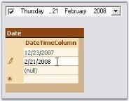

# Data Binding

Essential Tools supports extensive DataBinding in DateTimePickerAdv using the Value and BindableValue property. The following example illustrates the DataBinding of the DataSet belonging to a DataGrid. 

> Note: Always use BindableValue property if dataset contains Null value. In cases where no Null value exists in the dataset, Value property can be used.

To bind a DateTimePickerAdv, perform the following steps.

1. Add a DateTimePickerAdv and a DataGrid controls to the form.
2. Create a daaset using the code below.

					// Creating DataSet,Table and rows.

					DataSet dataSet = null;

					DataTable table = null;

					dataSet = new DataSet();

					table = dataSet.Tables.Add("Table");

					table.Columns.Add("DateTimeColumn", typeof(DateTime));

					table.Columns[0].AllowDBNull = true;

					table.Rows.Add(new object[]{DateTime.Now - TimeSpan.FromDays(60)});

					table.Rows.Add(new object[]{DateTime.Now});

					table.Rows.Add(new object[]{DBNull.Value});

					' Creating DataSet,Table and rows.

					Private dataSet As DataSet = Nothing

					Private table As DataTable = Nothing

					Private dataSet = New DataSet()

					Private table = dataSet.Tables.Add("Table")

					table.Columns.Add("DateTimeColumn", GetType(DateTime))

					Private table.Columns(0).AllowDBNull = True

					table.Rows.Add(New Object(){DateTime.Now - TimeSpan.FromDays(60)})

					table.Rows.Add(New Object(){DateTime.Now})

					table.Rows.Add(New Object(){DBNull.Value})              

3. Assign the dataset to the DataGrid control using its DataSource property. Set the control's DataMember property to the member that must be bound.

					dataGrid1.DataSource = dataSet;

					dataGrid1.DataMember = "Table";

					Private dataGrid1.DataSource = dataSet

					Private dataGrid1.DataMember = "Table"

4. Bind the datasource with the DateTimePickerAdv control.

					// Setting the BindableValue property in order to Data Bind.

					dateTimePickerAdv1.DataBindings.Add("BindableValue", dataSet, "Table.DateTimeColumn");

					dateTimePickerAdv1.Focus();

					' Setting the BindableValue property in order to Data Bind.

					dateTimePickerAdv1.DataBindings.Add("BindableValue", dataSet, "Table.DateTimeColumn")

					dateTimePickerAdv1.Focus()                       

5. Run the application. Select a data in the datagrid and DateTimePicker will display the corresponding date value (The DateTimePickerAdv is bound to the datasource using BindableValue property as datasource contains Null value. Selecting in the datagrid will automatically position the datasource to the related row which will update the DateTimePickerAdv with the appropriate data).

    

   {:.prettyprint}

A sample which demonstrates this feature is available in the below sample installation path.

…\_My Documents\Syncfusion\EssentialStudio\Version Number\Windows\Tools.Windows\Samples\Advanced Editor Functions\ActionGroupingDemo_

