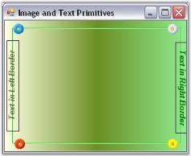

# Image and Text Primitives

Images and text can be included as individual primitives for the GradientPanelExt. 

The image to be included, should be referenced in the Image property available for the primitive in the GradientPanelExt Collection Editor. 

The text for text primitive, can be specified using the Text property available for the primitive in the GradientPanelExt Collection Editor. The text font and color can also be defined for the text primitive, using the TextFont and TextColor properties, respectively.



// Defining Primitives and Adding them

private Syncfusion.Windows.Forms.Tools.ImagePrimitive imagePrimitive1;

private Syncfusion.Windows.Forms.Tools.ImagePrimitive imagePrimitive2;

private Syncfusion.Windows.Forms.Tools.ImagePrimitive imagePrimitive3;

private Syncfusion.Windows.Forms.Tools.ImagePrimitive imagePrimitive4;

private Syncfusion.Windows.Forms.Tools.TextPrimitive textPrimitive1;

private Syncfusion.Windows.Forms.Tools.TextPrimitive textPrimitive2;

this.gradientPanelExt1.Primitives.AddRange(new Syncfusion.Windows.Forms.Tools.Primitive[] {

            this.imagePrimitive1,

            this.imagePrimitive2,

            this.textPrimitive1,

            this.textPrimitive2,

            this.imagePrimitive3,

            this.imagePrimitive4});

// imagePrimitive1       

this.imagePrimitive1.Image = ((System.Drawing.Image)(resources.GetObject("imagePrimitive1.Image")));

this.imagePrimitive1.PrimitiveBorderStyle = Syncfusion.Windows.Forms.Tools.PrimitiveBorderStyle.None;

this.imagePrimitive1.Size = new System.Drawing.Size(20, 20);

// imagePrimitive2

this.imagePrimitive2.Alignment = Syncfusion.Windows.Forms.Tools.Alignment.Bottom;

this.imagePrimitive2.Image = ((System.Drawing.Image)(resources.GetObject("imagePrimitive2.Image")));

this.imagePrimitive2.Position = 2;

this.imagePrimitive2.PrimitiveBorderStyle = Syncfusion.Windows.Forms.Tools.PrimitiveBorderStyle.None;

this.imagePrimitive2.Size = new System.Drawing.Size(20, 20);

// textPrimitive1   

this.textPrimitive1.Alignment = Syncfusion.Windows.Forms.Tools.Alignment.Left;

this.textPrimitive1.Position = 21;

this.textPrimitive1.Size = new System.Drawing.Size(150, 20);

this.textPrimitive1.Text = "Text in Left Border";

this.textPrimitive1.TextColor = System.Drawing.Color.DarkOliveGreen;

this.textPrimitive1.TextFont = new System.Drawing.Font("Arial", 9.75F, ((System.Drawing.FontStyle)((System.Drawing.        FontStyle.Bold | System.Drawing.FontStyle.Italic))), System.Drawing.GraphicsUnit.Point, ((byte)(0)));

// textPrimitive2

this.textPrimitive2.Alignment = Syncfusion.Windows.Forms.Tools.Alignment.Right;

this.textPrimitive2.Position = 24;

this.textPrimitive2.Size = new System.Drawing.Size(150, 20);

this.textPrimitive2.Text = "Text in Right Border";

this.textPrimitive2.TextColor = System.Drawing.Color.DarkGreen;

this.textPrimitive2.TextFont = new System.Drawing.Font("Arial", 9.75F, ((System.Drawing.FontStyle)((System.Drawing.        FontStyle.Bold | System.Drawing.FontStyle.Italic))), System.Drawing.GraphicsUnit.Point, ((byte)(0)));

// imagePrimitive3

this.imagePrimitive3.Image = ((System.Drawing.Image)(resources.GetObject("imagePrimitive3.Image")));

this.imagePrimitive3.Position = 256;

this.imagePrimitive3.PrimitiveBorderStyle = Syncfusion.Windows.Forms.Tools.PrimitiveBorderStyle.None;

this.imagePrimitive3.Size = new System.Drawing.Size(20, 20);

// imagePrimitive4

this.imagePrimitive4.Alignment = Syncfusion.Windows.Forms.Tools.Alignment.Bottom;

this.imagePrimitive4.Image = ((System.Drawing.Image)(resources.GetObject("imagePrimitive4.Image")));

this.imagePrimitive4.Position = 256;

this.imagePrimitive4.PrimitiveBorderStyle = Syncfusion.Windows.Forms.Tools.PrimitiveBorderStyle.None;

this.imagePrimitive4.Size = new System.Drawing.Size(20, 20);




' Defining Primitives and Adding them

Private imagePrimitive1 As Syncfusion.Windows.Forms.Tools.ImagePrimitive

Private imagePrimitive2 As Syncfusion.Windows.Forms.Tools.ImagePrimitive

Private imagePrimitive3 As Syncfusion.Windows.Forms.Tools.ImagePrimitive

Private imagePrimitive4 As Syncfusion.Windows.Forms.Tools.ImagePrimitive

Private textPrimitive1 As Syncfusion.Windows.Forms.Tools.TextPrimitive

Private textPrimitive2 As Syncfusion.Windows.Forms.Tools.TextPrimitive

Me.gradientPanelExt1.Primitives.AddRange(New Syncfusion.Windows.Forms.Tools.Primitive() {Me.imagePrimitive1, Me            .imagePrimitive2, Me.textPrimitive1, Me.textPrimitive2, Me.imagePrimitive3, Me.imagePrimitive4})

' imagePrimitive1       

Private Me.imagePrimitive1.Image = (CType(resources.GetObject("imagePrimitive1.Image"), System.Drawing.Image))

Private Me.imagePrimitive1.PrimitiveBorderStyle = Syncfusion.Windows.Forms.Tools.PrimitiveBorderStyle.None

Private Me.imagePrimitive1.Size = New System.Drawing.Size(20, 20)

' imagePrimitive2

Private Me.imagePrimitive2.Alignment = Syncfusion.Windows.Forms.Tools.Alignment.Bottom

Private Me.imagePrimitive2.Image = (CType(resources.GetObject("imagePrimitive2.Image"), System.Drawing.Image))

Private Me.imagePrimitive2.Position = 2

Private Me.imagePrimitive2.PrimitiveBorderStyle = Syncfusion.Windows.Forms.Tools.PrimitiveBorderStyle.None

Private Me.imagePrimitive2.Size = New System.Drawing.Size(20, 20)

' textPrimitive1   

Private Me.textPrimitive1.Alignment = Syncfusion.Windows.Forms.Tools.Alignment.Left

Private Me.textPrimitive1.Position = 21

Private Me.textPrimitive1.Size = New System.Drawing.Size(150, 20)

Private Me.textPrimitive1.Text = "Text in Left Border"

Private Me.textPrimitive1.TextColor = System.Drawing.Color.DarkOliveGreen

Private Me.textPrimitive1.TextFont = New System.Drawing.Font("Arial", 9.75F, (CType((System.Drawing. FontStyle.Bold      Or System.Drawing.FontStyle.Italic), System.Drawing.FontStyle)), System.Drawing.GraphicsUnit.Point, (CByte(0)))

' textPrimitive2

Private Me.textPrimitive2.Alignment = Syncfusion.Windows.Forms.Tools.Alignment.Right

Private Me.textPrimitive2.Position = 24

Private Me.textPrimitive2.Size = New System.Drawing.Size(150, 20)

Private Me.textPrimitive2.Text = "Text in Right Border"

Private Me.textPrimitive2.TextColor = System.Drawing.Color.DarkGreen

Private Me.textPrimitive2.TextFont = New System.Drawing.Font("Arial", 9.75F, (CType((System.Drawing. FontStyle.Bold        Or System.Drawing.FontStyle.Italic), System.Drawing.FontStyle)), System.Drawing.GraphicsUnit.Point, (CByte(0)))

' imagePrimitive3

Private Me.imagePrimitive3.Image = (CType(resources.GetObject("imagePrimitive3.Image"), System.Drawing.Image))

Private Me.imagePrimitive3.Position = 256

Private Me.imagePrimitive3.PrimitiveBorderStyle = Syncfusion.Windows.Forms.Tools.PrimitiveBorderStyle.None

Private Me.imagePrimitive3.Size = New System.Drawing.Size(20, 20)

' imagePrimitive4

Private Me.imagePrimitive4.Alignment = Syncfusion.Windows.Forms.Tools.Alignment.Bottom

Private Me.imagePrimitive4.Image = (CType(resources.GetObject("imagePrimitive4.Image"), System.Drawing.Image))

Private Me.imagePrimitive4.Position = 256

Private Me.imagePrimitive4.PrimitiveBorderStyle = Syncfusion.Windows.Forms.Tools.PrimitiveBorderStyle.None



See Also

Host Primitives, Expand and Collapse Options