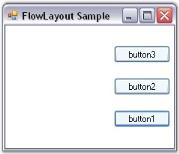

# Configuring FlowLayout

Layout Mode

The layout mode dictates the core function of a FlowLayout, whether to layout the Child controls horizontally or vertically. This property will be in effect for both the scenarios.

_Table442: Property Table_

<table>
<tr>
<th>
FlowLayout Property</th><th>
Description</th></tr>
<tr>
<td>
LayoutMode</td><td>
Specifies the layout mode of the Child controls. The default value is set to 'Horizontal'.The options included are as follows.{{ '_Horizontal and_' | markdownify }}{{ '_Vertical_' | markdownify }}</td></tr>
</table>



this.flowLayout1.LayoutMode = Syncfusion.Windows.Forms.Tools.FlowLayoutMode.Vertical;

Me.flowLayout1.LayoutMode = Syncfusion.Windows.Forms.Tools.FlowLayoutMode.Vertical



 

## ParticipateInLayout

Child controls can be prevented from being laid out using the FlowLayout Manager. This can be done using the methods given below.

_Table443: Methods Table_

<table>
<tr>
<th>
Method</th><th>
Description</th></tr>
<tr>
<td>
GetParticipateInLayout</td><td>
Indicates whether the component is in the layout list.</td></tr>
<tr>
<td>
SetParticipateInLayout</td><td>
Adds or removes the specified control from the layout list.</td></tr>
</table>

The following code can be used to add or remove the Child control from the FlowLayout list programmatically.


this.flowLayout1.SetParticipateInLayout(this.button1,false);

Me.flowLayout1.SetParticipateInLayout(Me.button1,False)


## HGap and VGap

The horizontal and the vertical gap between the Child controls can be set using the properties given below.

_Table444: Property Table_

<table>
<tr>
<th>
FlowLayout Property</th><th>
Description</th></tr>
<tr>
<td>
HGap</td><td>
Gets / sets the horizontal spacing between the components.</td></tr>
<tr>
<td>
VGap</td><td>
Gets / sets the vertical spacing between the components.</td></tr>
</table>



this.flowLayout1.HGap = 20;

this.flowLayout1.VGap = 20;

Me.flowLayout1.HGap = 20

Me.flowLayout1.VGap = 20


 

## AutoHeight

The height of the Container control can be automatically increased when there is a lack of sufficient space to show the Child components in the horizontal alignment mode. This is useful to enforce minimum heights on Container controls and forms.

_Table445: Property Table_

<table>
<tr>
<th>
FlowLayout Property</th><th>
Description</th></tr>
<tr>
<td>
AutoHeight</td><td>
Specifies if the Container's height should be enforced to the minimum when in horizontal alignment mode.</td></tr>
</table>



this.flowLayout1.AutoHeight = true;

Me.flowLayout1.AutoHeight = True


## Layout Direction

FlowLayout allows you to layout the Child controls in the opposite direction (right to left or bottom to top).

_Table446: Property Table_

<table>
<tr>
<th>
FlowLayout Property</th><th>
Description</th></tr>
<tr>
<td>
ReverseRows</td><td>
Specifies to layout the Child controls in the reverse direction.</td></tr>
</table>


this.flowLayout1.ReverseRows = true;

Me.flowLayout1.ReverseRows = True



 

## Alignment

The Alignment property is where you specify whether the current layout logic should be simple or constraint-based. 

> Note: Alignment is applied only along the direction of flow. For example, if the LayoutMode property is set to 'Horizontal' and the Alignment property is set to 'Center', then the rows will be centered horizontally.

<table>
<tr>
<th>
FlowLayout Property</th><th>
Description</th></tr>
<tr>
<td>
Alignment</td><td>
Specifies the alignment of layout components in the direction of flow. The options included are as follows.Center,Near,Far andChildConstraints.</td></tr>
</table>



this.flowLayout1.Alignment = Syncfusion.Windows.Forms.Tools.FlowAlignment.Near;

Me.flowLayout1.Alignment = Syncfusion.Windows.Forms.Tools.FlowAlignment.Near



 

Once you specify the alignment of a FlowLayout as 'ChildConstraints', the Layout Manager will use a constraint-based layout logic based on the constraints specified on each Child component. During design time, the constraints can be specified for each Child control through the following extended property.

_Table448: Property Table_

<table>
<tr>
<th>
FlowLayout Property</th><th>
Description</th></tr>
<tr>
<td>
Constraints on flowLayout</td><td>
Specifies the alignment of layout components in the direction of flow when the Alignment property is set to 'ChildConstraints'.</td></tr>
</table>



this.flowLayout1.Alignment = Syncfusion.Windows.Forms.Tools.FlowAlignment.ChildConstraints;

Me.flowLayout1.Alignment = Syncfusion.Windows.Forms.Tools.FlowAlignment.ChildConstraints


 

> Note: Refer_ FlowLayout - Configuring Child Controls _topic to know about HAlign, VAlign and other options provided by the Constraints on flowLayout property.

See Also

FlowLayout - Configuring Child Controls, Centering the Child Controls Horizontally and Vertically, Enabling Constrained FlowLayout on a Container, Rearranging the Controls laid out by FlowLayout
