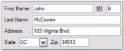

# Enabling Constrained FlowLayout on a Container

This section will illustrate how Constrained FlowLayout can be used to implement complex form layout logic.

For example, create a 'User Info entry' panel with autolabels, textboxes and comboboxes to allow the user to enter personal information. This Container panel should also be capable of handling different widths by repositioning and resizing the Child controls appropriately.

Steps to achieve the above layout and behavior are described below.

1. Place five textboxes and one combobox to represent the different data input controls in the panel. 

					// Declare the textboxes, combobox and panel controls.

					private System.Windows.Forms.TextBox textBox5;

					private System.Windows.Forms.TextBox textBox4;

					private System.Windows.Forms.TextBox textBox3;

					private System.Windows.Forms.TextBox textBox2;

					private System.Windows.Forms.TextBox textBox1;

					private System.Windows.Forms.ComboBox comboBox1;

					private System.Windows.Forms.Panel panel1;

					// Initialize the controls.

					this.textBox1 = new System.Windows.Forms.TextBox();

					this.textBox2 = new System.Windows.Forms.TextBox();

					this.textBox3 = new System.Windows.Forms.TextBox();

					this.textBox4 = new System.Windows.Forms.TextBox();

					this.textBox5 = new System.Windows.Forms.TextBox();

					this.comboBox1 = new System.Windows.Forms.ComboBox();

					this.panel1 = new System.Windows.Forms.Panel();

					// Add the controls to the panel control.

					this.panel1.Controls.Add(this.textBox1);

					this.panel1.Controls.Add(this.textBox2);

					this.panel1.Controls.Add(this.textBox3);

					this.panel1.Controls.Add(this.textBox4);

					this.panel1.Controls.Add(this.textBox5);

					this.panel1.Controls.Add(this.comboBox1);

					' Declare the textboxes, combobox and panel controls.

					Private textBox5 As System.Windows.Forms.TextBox

					Private textBox4 As System.Windows.Forms.TextBox

					Private textBox3 As System.Windows.Forms.TextBox

					Private textBox2 As System.Windows.Forms.TextBox

					Private textBox1 As System.Windows.Forms.TextBox

					Private comboBox1 As System.Windows.Forms.ComboBox

					Private panel1 As System.Windows.Forms.Panel

					' Initialize the controls.

					Me.textBox1 = New System.Windows.Forms.TextBox()

					Me.textBox2 = New System.Windows.Forms.TextBox()

					Me.textBox3 = New System.Windows.Forms.TextBox()

					Me.textBox4 = New System.Windows.Forms.TextBox()

					Me.textBox5 = New System.Windows.Forms.TextBox()

					Me.comboBox1 = New System.Windows.Forms.ComboBox()

					Me.panel1 = New System.Windows.Forms.Panel()

					' Add the controls to the panel control.

					Me.panel1.Controls.Add(Me.textBox1)

					Me.panel1.Controls.Add(Me.textBox2)

					Me.panel1.Controls.Add(Me.textBox3)

					Me.panel1.Controls.Add(Me.textBox4)

					Me.panel1.Controls.Add(Me.textBox5)

					Me.panel1.Controls.Add(Me.comboBox1)

2. Add one autolabel for each control and set the autolabel's LabeledControl property to the corresponding control. Also, change the Text property of the autolabel control appropriately and set the AutoSize property to 'True'. 

					// Declare the autolabel controls.

					private Syncfusion.Windows.Forms.Tools.AutoLabel autoLabel1;

					private Syncfusion.Windows.Forms.Tools.AutoLabel autoLabel2;

					private Syncfusion.Windows.Forms.Tools.AutoLabel autoLabel3;

					private Syncfusion.Windows.Forms.Tools.AutoLabel autoLabel4;

					private Syncfusion.Windows.Forms.Tools.AutoLabel autoLabel5;

					private Syncfusion.Windows.Forms.Tools.AutoLabel autoLabel6;

					// Initialize the controls.

					this.autoLabel1 = new Syncfusion.Windows.Forms.Tools.AutoLabel();

					this.autoLabel2 = new Syncfusion.Windows.Forms.Tools.AutoLabel();

					this.autoLabel3 = new Syncfusion.Windows.Forms.Tools.AutoLabel();

					this.autoLabel4 = new Syncfusion.Windows.Forms.Tools.AutoLabel();

					this.autoLabel5 = new Syncfusion.Windows.Forms.Tools.AutoLabel();

					this.autoLabel6 = new Syncfusion.Windows.Forms.Tools.AutoLabel();

					// Set their properties.

					this.autoLabel1.AutoSize = true;

					this.autoLabel1.LabeledControl = this.textBox1;

					this.autoLabel1.Text = "First Name:";

					this.autoLabel2.AutoSize = true;

					this.autoLabel2.LabeledControl = this.textBox2;

					this.autoLabel2.Text = "MI:";

					this.autoLabel3.AutoSize = true;

					this.autoLabel3.LabeledControl = this.textBox3;

					this.autoLabel3.Text = "Last Name:";

					this.autoLabel4.AutoSize = true;

					this.autoLabel4.LabeledControl = this.textBox4;

					this.autoLabel4.Text = "Address:";

					this.autoLabel5.AutoSize = true;

					this.autoLabel5.LabeledControl = this.textBox5;

					this.autoLabel5.Text = "State";

					this.autoLabel6.AutoSize = true;

					this.autoLabel6.LabeledControl = this.comboBox1;

					this.autoLabel6.Text = "Zip";

					' Declare the autolabel controls.

					Private autoLabel1 As Syncfusion.Windows.Forms.Tools.AutoLabel

					Private autoLabel2 As Syncfusion.Windows.Forms.Tools.AutoLabel

					Private autoLabel3 As Syncfusion.Windows.Forms.Tools.AutoLabel

					Private autoLabel4 As Syncfusion.Windows.Forms.Tools.AutoLabel

					Private autoLabel5 As Syncfusion.Windows.Forms.Tools.AutoLabel

					Private autoLabel6 As Syncfusion.Windows.Forms.Tools.AutoLabel

					' Initialize the controls.

					Me.autoLabel1 = New Syncfusion.Windows.Forms.Tools.AutoLabel()

					Me.autoLabel2 = New Syncfusion.Windows.Forms.Tools.AutoLabel()

					Me.autoLabel3 = New Syncfusion.Windows.Forms.Tools.AutoLabel()

					Me.autoLabel4 = New Syncfusion.Windows.Forms.Tools.AutoLabel()

					Me.autoLabel5 = New Syncfusion.Windows.Forms.Tools.AutoLabel()

					Me.autoLabel6 = New Syncfusion.Windows.Forms.Tools.AutoLabel()

					' Set their properties.

					Me.autoLabel1.LabeledControl = Me.textBox1

					Me.autoLabel1.Text = "First Name:"

					Me.autoLabel2.LabeledControl = Me.textBox2

					Me.autoLabel2.Text = "MI:"

					Me.autoLabel3.LabeledControl = Me.textBox3

					Me.autoLabel3.Text = "Last Name:"

					Me.autoLabel4.LabeledControl = Me.textBox4

					Me.autoLabel4.Text = "Address:"

					Me.autoLabel5.LabeledControl = Me.textBox5

					Me.autoLabel5.Text = "State"

					Me.autoLabel6.LabeledControl = Me.comboBox1

					Me.autoLabel6.Text = "Zip"

3. Now add theFlowLayout component and set the panel to be its Container control. The FlowLayout will layout the controls in the order in which they were added to the panel. Use the Bring To Front and Send To Back design time verbs to move the controls to the front or back of the layout order. 
   > Note: The FlowLayout will treat each control and it's autolabel pair as a single unit during layout.

				// Declare the FlowLayout.

				private Syncfusion.Windows.Forms.Tools.FlowLayout flowLayout1;

				// Initialize the Flowlayout and set the panel control as it's Container control.

				this.flowLayout1 = new Syncfusion.Windows.Forms.Tools.FlowLayout(this.components);

				this.flowLayout1.ContainerControl = this.panel1;

				' Declare the FlowLayout.

				Private flowLayout1 As Syncfusion.Windows.Forms.Tools.FlowLayout

				' Initialize the Flowlayout and set the panel control as it's Container control.

				Me.flowLayout1 = New Syncfusion.Windows.Forms.Tools.FlowLayout(Me.components)

				Me.flowLayout1.ContainerControl = Me.panel1

4. Now set some appropriate constraints on the input controls as follows.
   * Select the First Name textbox and browse to the extended Constraints on flowLayout property. Set the HAlign property to 'Justify', so that this control's width will be resized to fit any available empty horizontal space in the row. This also requires that you specify an appropriate preferred size for the control, such as (100, 20).
   * The Middle Initial textbox needs to be left aligned and not justified. This is the default constraint setting, so we don't need to make any changes to it's constraints.
   * Select the Last Name textbox and specify the same constraints as the 'First Name'textbox.
   * The Address textbox should always begin in a new row, so set the NewLine property to 'True' in it's constraints. Also, set the HAlign property to 'Justify' and also provide a preferred size.
   * The State combobox and Zip textboxcontrols can also be left with the default constraints.

				// Set the constraints for the textboxes.

				this.flowLayout1.SetConstraints(this.textBox1, new Syncfusion.Windows.Forms.Tools.FlowLayoutConstraints(true, Syncfusion.Windows.Forms.Tools.HorzFlowAlign.Justify, Syncfusion.Windows.Forms.Tools.VertFlowAlign.Center, false, false, false));

				this.flowLayout1.SetPreferredSize(this.textBox1, new System.Drawing.Size(100, 20));

				this.flowLayout1.SetConstraints(this.textBox3, new Syncfusion.Windows.Forms.Tools.FlowLayoutConstraints(true, Syncfusion.Windows.Forms.Tools.HorzFlowAlign.Justify, Syncfusion.Windows.Forms.Tools.VertFlowAlign.Center, false, false, false));

				this.flowLayout1.SetPreferredSize(this.textBox3, new System.Drawing.Size(100, 20));

				this.flowLayout1.SetConstraints(this.textBox4, new Syncfusion.Windows.Forms.Tools.FlowLayoutConstraints(true, Syncfusion.Windows.Forms.Tools.HorzFlowAlign.Justify, Syncfusion.Windows.Forms.Tools.VertFlowAlign.Center, true, false, false));

				this.flowLayout1.SetPreferredSize(this.textBox4, new System.Drawing.Size(100, 20));.Center, false, false, true));

				' Set the constraints for the textboxes.

				Me.flowLayout1.SetConstraints(Me.textBox1, New Syncfusion.Windows.Forms.Tools.FlowLayoutConstraints(True, Syncfusion.Windows.Forms.Tools.HorzFlowAlign.Justify, Syncfusion.Windows.Forms.Tools.VertFlowAlign.Center, False, False, False))

				Me.flowLayout1.SetPreferredSize(Me.textBox1, New System.Drawing.Size(100, 20))

				Me.flowLayout1.SetConstraints(Me.textBox3, New Syncfusion.Windows.Forms.Tools.FlowLayoutConstraints(True, Syncfusion.Windows.Forms.Tools.HorzFlowAlign.Justify, Syncfusion.Windows.Forms.Tools.VertFlowAlign.Center, False, False, False))

				Me.flowLayout1.SetPreferredSize(Me.textBox3, New System.Drawing.Size(100, 20))

				Me.flowLayout1.SetConstraints(Me.textBox4, New Syncfusion.Windows.Forms.Tools.FlowLayoutConstraints(True, Syncfusion.Windows.Forms.Tools.HorzFlowAlign.Justify, Syncfusion.Windows.Forms.Tools.VertFlowAlign.Center, True, False, False))

				Me.flowLayout1.SetPreferredSize(Me.textBox4, New System.Drawing.Size(100, 20))

5. The panel itself should increase or decrease in width when the number of rows in the layout increases or decreases. To get this behavior, set the FlowLayout's AutoHeight property to 'True'.

				// Set the AutoHeight property of FlowLayout.

				this.flowLayout1.AutoHeight = true;

				' Set the AutoHeight property of FlowLayout.

				Me.flowLayout1.AutoHeight = True

   > Note: During run time, the input controls get resized and repositioned appropriately based on the constraints provided._

    

   

   {:.ptettyprint}

## AutoLabel Control

The AutoLabel control is a label-derived control that lets you pair a label with any other control. Once paired, the AutoLabel will be automatically repositioned as the labeled control's position changes.

 

The AutoLabel control can be positioned relative to the top, left, bottom or right of the labeled control. It can also be positioned at a custom distance from the labeled control specified via its DX and DY properties. When using relative positioning, you can also specify the gap between the label and the control.

The FlowLayout will always treat the 'AutoLabel-LabeledControl' pair as a unit. You can use AutoLabels and FlowLayout together to implement complex and powerful form layouts.

> Note: Refer to AutoLabel under Editors Package for more details.

See Also

Configuring FlowLayout, FlowLayout - Configuring Child Controls, Centering the Child Controls Horizontally and Vertically

