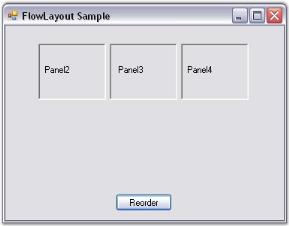

# Rearranging the Controls laid out by FlowLayout

The FlowLayout manager arranges the controls in the way it gets added into the Container collection.

## Through Designer

* You can rearrange the controls laid out by FlowLayout by right clicking the control and selecting the Bring To Front or Send To Back verbs in the designer.

 

* Rearranging of Child controls of the FlowLayout can also be done by dragging and dropping them at design time.

 

## Through Code

We can also programmatically change the order of the controls laid out by the Flowlayout. This can be done using the method given below.

* Set up a form with Panel1 and drag the Flowlayout onto the Panel1 which would act as the Container control.

 

* Drag another three Panels onto the Panel1. The FlowLayout automatically arranges the Child controls as given below.

  

* Add a Button control for reordering the Child controls of Panel1 and in the Button_Click event give the following code snippet.



private void button1_Click(object sender, System.EventArgs e)

{

// Create a temporary collection of Panel's controls.

ArrayList panelarr = new ArrayList();

foreach (Control ctrl in this.panel1.Controls)

{

panelarr.Add(ctrl);

}

this.panel1.Controls.Clear();

// Reorder the panels.

for (int i=panelarr.Count-1; i>=0; i--)

{

Panel pan = panelarr[i] as Panel;

this.panel1.Controls.Add(pan);

}

// Apply layout logic to all it's Child controls.

this.panel1.PerformLayout();

}




Private Sub button1_Click(ByVal sender As Object, ByVal e As System.EventArgs)

' Create a temporary collection of Panel's controls.

Dim panelarr As ArrayList = New ArrayList()

For Each ctrl As Control In Me.panel1.Controls

panelarr.Add(ctrl)

Next ctrl

Me.panel1.Controls.Clear()

'Reorder the panels.

For i As Integer = panelarr.Count - 1 To 0 Step -1 

Dim pan As Panel = CType(IIf(TypeOf panelarr(i) Is Panel, panelarr(i), Nothing), Panel)

Me.panel1.Controls.Add(pan)

Next i

'Apply layout logic to all it's Child controls.

Me.panel1.PerformLayout()

End Sub



{  | markdownify }

* At run time when you click the Reorder button, the Panels 2, 3 and 4 will be rearranged in a different order.

{  | markdownify }

See Also

Rearranging the Controls laid out by GridLayout, Rearranging the Controls laid out by GridBagLayout

