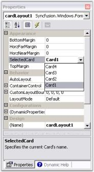

# Adding Different Pages To Control Bar

## Adding and Removing ControlBars 

The MainFrameBarManager's Add Detached ControlBar design-time verb, available through the Properties window, facilitates the addition of ControlBars to the design form. The XP Menus design-time is fully WYSIWYG and the bar layout can be designed by simply dragging and docking or floating each ControlBar at the desired location. Upon saving the design form, the ControlBar state information is serialized by the BarManager as a part of the form's resource file along with the rest of the menu/toolbar layout.

Follow the steps below to add different pages to the control bar.

 

> Note: Control Bar can also be added by clicking the verb in the properties window.

 

 The resulted screen shot displays controlbar in the designer.

* Now add XPToolbar to the control bar.
* Add panel to the control bar.
* Add CardLayout over the panel to add different pages.

While dropping out CardLayout onto the panel, the layout designer window will open, asking whether to make panel1 as container control. Click 'Yes' and continue.

 

* You can add multiple panels to the control bar.
* Select the card using the SelectedCard property in the CardLayout Property window.

 

* In the selected card, add XPTaskBar to the control bar and right-click it to add XPTaskBarBox to add Items.

 

The resultant form is as follows.

 

* Inside XPTaskbarBox, you can insert link labels, ComboBoxAdv controls like in the following screen shot.

 

At Run Time

Include the following code snippet in the Click event of a BarItem to view the next page of a card.



this.cardlayoutmanager1.next();




Me.cardlayoutmanager1.next()



A sample which demonstrates adding control bar is available in the below sample installation location.

…\_My Documents\Syncfusion\EssentialStudio\Version Number\Windows\Tools.Windows\Samples\Advanced Editor Functions\ActionGroupingDemo_

See Also

ControlBar Client Controls, 

Adding Different Pages To Control Bar

How to dock the ControlBars to any edge of the host form