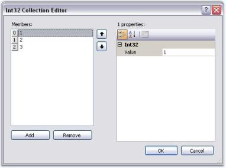

# Adding Separators

XPMenus lets you add separators in between the bar items in a Toolbar, and also in between menu items under a ParentBarItem.

## Separators for menu items in ParentBarItem Through Designer

To add separators between the menu items under a ParentBarItem, invoke Int32 Collection Editor using ParentBarItem.SeparatorIndices property.

 



//Add Separators between bar items in a toolbar

this.bar1.SeparatorIndices.AddRange(new int[] { 1, 2 });

//Add Separators between menu items of a ParentBarItem

this.parentBarItem1.SeparatorIndices.AddRange(new int[] { 1, 2, 3 });

//Clear Separators

bar1.SeparatorIndices.Clear();

parentBarItem1.SeparatorIndices.Clear();




'Add Separators between bar items in a toolbar

Me.bar1.SeparatorIndices.AddRange(New Integer() {1, 2}) 

'Add Separators between menu items of a ParentBarItem

Me.parentBarItem1.SeparatorIndices.AddRange(New Integer() {1, 2, 3}) 

'Clear Separators

bar1.SeparatorIndices.Clear()

parentBarItem1.SeparatorIndices.Clear()



 