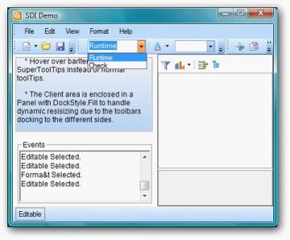

# ComboBoxBarItem

A ComboBoxBarItem is a BarItem that provides combobox-like behavior with an optional editable mode. This is identical to the VS.NET Find combo box in the code editor. 

 

## Adding Items for ComboBoxBarItem dropdown

A list of items can be specified in ComboBoxBarItem.ChoiceList property. ComboBoxBarItem can also be associated with another control like FontListControl using the ListBox property. You can also specify the width for this BarItem.

The following properties deal with settings contents for the ComboBoxBarItem.

_Table476: Property Table_

<table>
<tr>
<th>
ComboBoxBarItem Property</th><th>
Description</th></tr>
<tr>
<td>
AutoAppend</td><td>
Specifies whether to automatically append the items entered by the user in the TextBox into the dropdown list.</td></tr>
<tr>
<td>
MaxDropDownItems</td><td>
Specifies the maximum number of items to be shown in the drop down portion of ComboBoxBarItem.</td></tr>
<tr>
<td>
MinDropDownWidth</td><td>
Sets the width of the drop down.</td></tr>
<tr>
<td>
MinWidth</td><td>
Sets the minimum width when this ComboBoxBarItem is placed in a menu or toolbar.</td></tr>
<tr>
<td>
TextBoxValue</td><td>
Sets the value in the TextBox.</td></tr>
<tr>
<td>
PersistTextBoxValue</td><td>
Specifies whether the TextBox value should be persisted after the application is shutdown.</td></tr>
<tr>
<td>
Listbox</td><td>
Specifies custom listbox in the dropdown. You can drag and drop a FontListControl for ex, and associate it to the ComboBoxBarItem using this property.</td></tr>
<tr>
<td>
ChoiceList</td><td>
Specifies the list for the bar item.</td></tr>
</table>
_Table477: Method Table_

<table>
<tr>
<th>
Methods</th><th>
Description</th></tr>
<tr>
<td>
Focus</td><td>
To Set focus to ComboBarItem</td></tr>
</table>



this.comboBoxBarItem1.AutoAppend=true;

this.comboBoxBarItem1.MaxDropDownItems=3;

this.comboBoxBarItem1.MinDropDownWidth=1;

this.comboBoxBarItem1.MinWidth=100;

this.comboBoxBarItem1.TextBoxValue="Debug";

this.comboBoxBarItem1.PersistTextBoxValue=true;

this.comboBoxBarItem1.ListBox = this.fontListBox1;

this.comboBoxBarItem1.Focus();

Me.comboBoxBarItem1.AutoAppend=True

Me.comboBoxBarItem1.MaxDropDownItems=3

Me.comboBoxBarItem1.MinDropDownWidth=1

Me.comboBoxBarItem1.MinWidth=100

Me.comboBoxBarItem1.TextBoxValue="Debug"

Me.comboBoxBarItem1.PersistTextBoxValue=True

Me.comboBoxBarItem1.ListBox = Me.fontListBox1

Me.comboBoxBarItem1.Focus



 

> Note: Editable property should be set to true for displaying the FontListControl in this case and_ PaintStyle _should be ImageAndText for displaying the ComboBoxBarItem text.

## Behavior Settings

ComboBoxBarItem supports all the behavior properties of BarItem.

## Other Common properties

For setting images see Image Settings; 

For Editing the text and setting text alignments, See BarItem Text; 

For setting shortcuts for the bar items, see Keyboard shortcuts and 

Appearance of the Text can be customized. See Foreground Settings for details.

We can set banner text for the ComboBoxBarItem. Refer BannerTextProvider Component topic for more details.

## PersistAutoAppendList inclusion.

PersistAutoAppendList property is added to ComboBoxBarItem.  

When this property is set to false and AutoAppend is set to true, the item added to the ComboBoxBarItem will be added to the dropdown but it will not be saved.

 

The following code illustrates how to include PersistAutoAppendList.

> Note: This can be used when the AutoAppend is set to true.



API:  this.comboBoxBarItem1.PersistAutoAppendList =false;

 Me.comboBoxBarItem1.PersistAutoAppendList = false

See Also

UpdateUIOnAppIdle property in UI Command Update Patterns topic 

How to handle KeyDown event in ComboBoxBarItem?

How to prevent the ComboBoxBarItem's dropdown from being closed after clicking a ChoiceList Item?

Customize Dialog