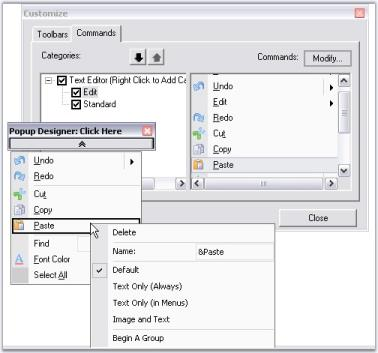

# Grouping Items in a Popup Menu

This topic will guide on how to group the menu items by inserting separator(s), in a popup menu with and without BarManager.

If the ParentBarItem associated with the popup menu is contained within a BarManager, drop-down the popup menu from the Popup Form, right click on an item and select Begin A Group from the context menu.

If the ParentBarItem is not contained within a BarManager, edit the SeparatorIndices property of the ParentBarItem indicating the item indices in the items list where you want the separators to be introduced. 

 

We can also group the items using BeginGroupAt and RemoveGroupAt methods. Click here to know more.

See Also

* Associating Popup Menu To a Control
* Adding and filling a popup menu
* How to programmatically begin a group or remove an existing group in a popup menu
* How to programmatically show a Popup Menu