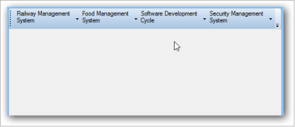

# Multiline Support for ParentBarItem in MainFrameBarManager

You can customize and display the ParentBarItem text in Multiline format by using “MultiLine” property. 

API Details:

_Table514: Property Table_

<table>
<tr>
<th>
Property</th><th>
Type</th><th>
Description</th></tr>
<tr>
<td>
MultiLine</td><td>
Boolean</td><td>
Enables MultiLine in MainFrameBarManager</td></tr>
</table>

The following code example illustrates how to set MultiLine property in C# and VB language.



  this.parentBarItem1.MultiLine = true;




    Me.parentBarItem1.MultiLine = true



The following screenshot shows how the ParentBarItem is displayed in Multiline.

 

