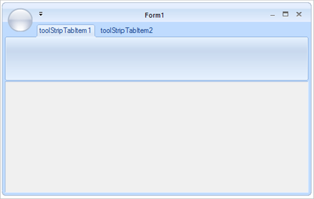
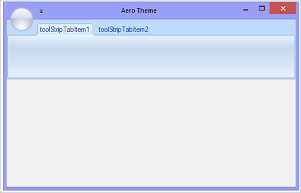
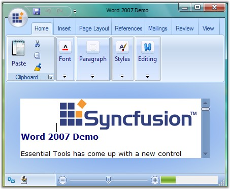

# Appearance-Settings

This section discusses various appearance and behavior settings of the Ribbon form.

## Appearance Settings

The appearance of the ribbon form can be controlled using the below properties.

_Table 683: Property Table_

<table>
<tr>
<th>
Property</th>
<th>
Description</th>
</tr>
<tr>
<td>
Appearance<td>
<td>
Sets the appearance of the form. The values are,
 
Normal and
Office2007 (Default)
Office 2010

</td>
</tr>
<tr>
<td>
ColorScheme</td>
<td>
Specifies the office color scheme of the Ribbon form. The color schemes are,
 
Blue,
Black,
Silver and
Managed (Default).
</td>
</tr>
<tr>
<td>
EnableAeroTheme</td>
<td>
Specifies the Aero theme of the Ribbon form.</td>
</tr>
<tr>
<td>
EnableHighContrastTheme</td>
<td>Specifies whether to use default High Contrast theme color</td>
</tr>
<tr>
<td>
Font</td>
<td>
Gets or sets the RibbonControlAdv Font.</td>
</tr>
</table>



[C#]

 

//Specifies the appearance of the form.

this.Appearance = AppearanceType.Office2007;

 

//Specifies the office color scheme of the Ribbon Form.

this.ColorScheme = ColorSchemeType.Blue;

 

//To disable the Aerotheme

this.EnableAeroTheme = false;

 

//To enable the default High Contrast theme color

this.ribbonControlAdv1.EnableHighContrastTheme = true;




 

'Specifies the appearance of the form.
Me.Appearance = AppearanceType.Office2007

'Specifies the office color scheme of the Ribbon Form.
Me.ColorScheme = ColorSchemeType.Blue

'To disable the Aerotheme
Me.EnableAeroTheme = false

'To enable the default High Contrast theme color

Me.ribbonControlAdv1.EnableHighContrastTheme = true



_Figure 1157: Default Ribbon Form Theme_

_Figure 1158: Ribbon Aero Theme_

## Vista Aero Theme

Vista Aero theme support is available for Ribbon Form when used in Vista machine.

_Figure 1159: Vista Aero Theme for Ribbon Form_
