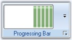

# Keyboard Shortcut

We can also set keyboard shortcut keys for RibbonControl components using SetShortcut method. To get the keyboard shortcut for a particular component, use GetShortcut method.

_Table 703: Property Table_

<table>
<tr><th>
Property</th><th>	Description</th></tr>
<tr><td>
SetShortcut	</td><td>Sets shortcut key. The parameters are,

Component - Component of the RibbonForm.
Value - Represents the shortcut key for the component specified.</td></tr>
<tr><td>
GetShortcut</td><td>	Gets shortcut key. The parameter is,
Component - Component of the RibbonForm.</td></tr></table>



//Sets shortcut for toolstriptabitem1
this.SetShortcut(this.toolStripTabItem1, Keys.T);

//Gets shortcut for toolstriptabitem1
this.GetShortcut(this.toolStripTabItem1);





'Sets shortcut for toolstriptabitem1
Me.SetShortcut(Me.toolStripTabItem1, Keys.T)

'Gets shortcut for toolstriptabitem1
Me.GetShortcut(Me.toolStripTabItem1)



## ToolStripEx

The ToolStrip family of controls provides common interfaces for producing user interface elements for Windows Forms. Essential Tools has come up with ToolStripEx which, exhibits advanced features.
Using the smart tag of the Ribbon panel or using "Add ToolStrip" verb in the property grid, we can add ToolStripEx controls. ToolStrip items can be added to this ToolStripEx easily.

> Note: It is also possible to add ToolStripEx directly from the toolbox as it is also an individual control.

_Figure 1195: Adding ToolStripEx Through RibbonPanel Smart Tag_

_Figure 1196: Adding ToolStrip Through Properties Grid Verb_

### Adding Controls to ToolStripEx

To add controls to the ToolStripEx, click the icon in it, as in the image below.

_Figure 1197: ToolStrip items In Designer_

You can also add the items through Items Collection Editor using the Edit Items verb in the properties grid or in the context menu of the control at design time or using Items Property.

_Figure 1198: Image Highlighting the options in the Designer to invoke the Items Collection Editor_

_Figure 1199: Items Collection Editor_

##### Adding Standard Items

ToolStripEx comes with standard toolstrip items that can be added to the control through "Insert Standard Items" option in the smart tag. You can even add the items through context menu at design time.

_Figure 1200: Inserting Standard Items Through Context Menu_

_Figure 1201: Inserting Standard Items through Smart Tag_

_Figure 1202: ToolStripEx with Standard Items_

##### Adding ToolStrip Items Programmatically
The ToolStripEx allows you to add standard ToolStripItems and other user interface elements such as labels, splitbutton, dropdownbutton, separator, combobox, textbox, progressbar and PanelItem.



// Declare and initialize a ToolStripEx.
ToolStripEx paraToolStrip = new ToolStripEx();

// Set the size.
paraToolStrip.AutoSize = false;
paraToolStrip.Size = new Size(100, 25);

// Set the layout style.
paraToolStrip.LayoutStyle = ToolStripLayoutStyle.HorizontalStackWithOverflow;

// Add the items to the ToolStripEx.
paraToolStrip.Items.Add(new ToolStripButton());
paraToolStrip.Items.Add(new ToolStripDropDownButton());
paraToolStrip.Items.Add(new ToolStripSplitButton());

paraToolStrip.GroupedButtons = true;

// Set the text of the ToolStripEx.
paraToolStrip.Text = "Paragraph";

// Add the ToolStripEx to the ToolStripTabItem.
this.toolStripTabItem1.Panel.Controls.Add(paraToolStrip);





' Declare and initialize a ToolStripEx.
Dim paraToolStrip As ToolStripEx =  New ToolStripEx() 
 
' Set the size.
paraToolStrip.AutoSize = False
paraToolStrip.Size = New Size(100, 25)
 
' Set the layout style.
paraToolStrip.LayoutStyle = ToolStripLayoutStyle.HorizontalStackWithOverflow
 
' Add the items to the ToolStripEx.
paraToolStrip.Items.Add(New ToolStripButton())
paraToolStrip.Items.Add(New ToolStripDropDownButton())
paraToolStrip.Items.Add(New ToolStripSplitButton())
 
paraToolStrip.GroupedButtons = True
 
' Set the text of the ToolStripEx.
paraToolStrip.Text = "Paragraph"
    
' Add the ToolStripEx to the ToolStripTabItem.
Me.toolStripTabItem1.Panel.Controls.Add(paraToolStrip)



_Figure 1203: ToolStripEx with Items Added Programmatically_

#### ToolStripItems
The following ToolStripItems can be added to a ToolStripEx through Designer, using Items Collection Editor.

#### PanelItem
ToolStripPanelItem provides support for aligning the controls in multiple lines. It supports nesting of panels without any limitation on the level of nesting. Not only controls but, any number of panels can be added to a panel.
Using the RowCount property of ToolStripPanelItem, controls can be arranged in any number of rows inside a ToolStripPanelItem.

_Figure 1204: ToolStripPanelItem_

##### Adding Controls to Panel Item
Accessing ToolStripPanelItem.Items property, Items Collection Editor dialog pops-up. The item can be added and customized using this dialog.

_Figure 1205: Accessing Items property to invoke Items Collection Editor_

A simple code snippet which adds ToolStripItems in three rows.



this.toolStripPanelItem1.Items.AddRange(new System.Windows.Forms.ToolStripItem[] {
this.toolStripLabel1,
this.toolStripLabel2,
this.toolStripButton2});
this.toolStripPanelItem1.RowCount = 3;





Dim System.Windows.Forms.ToolStripItem() As Me.toolStripPanelItem1.Items.AddRange(New{
Me.toolStripLabel1,
Me.toolStripLabel2,
Me.toolStripButton2})
Me.toolStripPanelItem1.RowCount = 3



A complex arrangement of controls like in the below image, can be achieved using the ToolStripPanelItem.

_Figure 1206: Controls added to ToolStripPanelItem_

#### Customizing Panel Item

##### Foreground Settings

_Table 704: Property Table_

<table>
<tr>
<th>
Property</th><th>	Description</th></tr>
<tr><td>
Font	</td><td>Set Font Style for the display text in the control.</td></tr>
<tr><td>ForeColor</td><td>	Sets fore color for the display text in the panel.</td></tr>
<tr><td>Text</td><td>Sets the text for the ToolStripPanelItem.</td></tr></table>



this.toolStripPanelItem12.Font = new System.Drawing.Font("Verdana", 8.25F, System.Drawing.FontStyle.Bold);
this.toolStripPanelItem12.ForeColor = System.Drawing.Color.Crimson;





Me.toolStripPanelItem12.Font = New System.Drawing.Font("Verdana", 8.25F, System.Drawing.FontStyle.Bold)
Me.toolStripPanelItem12.ForeColor = System.Drawing.Color.Crimson



_Figure 1207: Font = "Verdana, 8, Bold"; ForeColor = "Crimson"_

##### Tooltip Settings

_Table 705: Property Table_

<table>
<tr><th>
Property</th><th>Description</th></tr>
<tr><td>
ShowItemToolTips</td><td>	Specifies whether to set tooltips or not.</td></tr>
<tr><td>
AutoToolTip</td><td>	When set to true, will display the text set in the Text property as the item's tooltip.
When set to false, will display the text set in the ToolTipText property.</td></tr>
<tr><td>
ToolTipText</td><td>	Sets the text for the tooltip when AutoToolTip is set to false.</td>
</tr>
</table>


this.toolStripPanelItem1.ShowItemToolTips = true;
this.toolStripPanelItem1.AutoToolTip = true;
this.toolStripPanelItem1.ToolTipText = "New tooltip";





Me.toolStripPanelItem1.ShowItemToolTips = True
Me.toolStripPanelItem1.AutoToolTip = True
Me.toolStripPanelItem1.ToolTipText = "New tooltip"



_Figure 1208: ToolTipText for PanelItem_

##### Layout of the Panel items

_Table 706: Property Table_

<table>
<tr><th>
Property</th><th>	Description</th></tr>
<tr><td>
Alignment</td><td>	Sets the alignment of the Panel item. The options are,

Left and
Right.
</td></tr>
<tr>
<td>
LayoutStyle</td><td>	Sets the layout style for the items. The options are,

Flow - Items flow horizontally or vertically as necessary.
HorizontalStackWithOverflow - Items are laid out horizontally and overflow as necessary.
StackWithOverFlow - Items are laid out automatically.
Table - Items are laid out flush left.
VerticalStackWithOverflow - Items are laid out vertically and overflow as necessary.</td></tr></table>

##### Border Settings

_Table 707: Property Table_

<table>
<tr><th>
Property</th><th>	Description</th></tr>
<tr>
<td>
BorderStyle</td><td>	Sets the border style for the panel items.

Etched and
StaticEdge.</td></tr></table>

##### RTL Support

_Table 708: Property Table_

<table>
<tr>
<th>
Property</th><th>	Description</th></tr>
<tr><td>
RightToLeft</td><td>	Indicates whether the item should right to left for RTL languages.</td></tr>
<tr><td>RightToLeftAutoMirrorImage	</td><td>Specifies whether image should mirror when RightToLeft is enabled for the item.
</td></tr></table>

#### Gallery

Essential Tools RibbonControlAdv provides options to add a collection of items and store them into a gallery. A gallery can be added to a ToolStripTabItem using Items Collection Editor. Select the Gallery item in the dropdown and add it to the control.

_Figure 1209: ToolStripGallery with items added to the ToolStripEx_

##### Adding Controls to the Gallery
Using the Gallery.Item property, Items Collection Editor opens, which lets you add items to the gallery.



this.toolStripGallery1.Items.Add(toolStripGalleryItem1);
this.toolStripGallery1.Items.Add(toolStripGalleryItem2);
this.toolStripGallery1.Items.Add(toolStripGalleryItem3);





Me.toolStripGallery1.Items.Add(toolStripGalleryItem1)
Me.toolStripGallery1.Items.Add(toolStripGalleryItem2)
Me.toolStripGallery1.Items.Add(toolStripGalleryItem3)



#### Appearance Settings
The ToolStripItems can be aligned to right or left using Alignment property.


this.toolStripGallery1.Alignment = System.Windows.Forms.ToolStripItemAlignment.Right;





Me.toolStripGallery1.Alignment = System.Windows.Forms.ToolStripItemAlignment.Right



##### Border Settings

_Table 709: Property Table_

<table>
<tr><th>
Property</th><th>	Description</th></tr>
<tr><td>BorderStyle</td><td>	Sets the border style for the ToolStripGallery. The options are,

None (default) and
Single.
</td></tr></table>



this.toolStripGallery1.BorderStyle = Syncfusion.Windows.Forms.Tools.ToolstripGalleryBorderStyle.Single;





this.toolStripGallery1.BorderStyle = Syncfusion.Windows.Forms.Tools.ToolstripGalleryBorderStyle.Single;


##### Foreground Settings

_Table 710: Property Table_

<table><tr>
<th>
Property</th><th>	Description</th></tr>
<tr><td>Font</td><td>Sets the font style for the display text.</td></tr>
<tr><td>ForeColor</td><td>	Sets the fore color for the display text.</td></tr></table>

##### Scroller Settings

_Table 711: Property Table_

<table>
<tr><th>
Property</th><th>Description</th></tr>
<tr><td>ScrollerType</td><td>Sets the scroller type for the Gallery. The types available are,

StandardType and
CompactType.
</td></tr></table>

The below image displays a gallery item display with both types of ScrollerType and with Caption text, BackColor, ItemDisplayStyle properties set.

_Figure 1210: Standard ScrollerType_

_Figure 1211: Compact ScrollerType_

##### RTL Support

_Table 712: Property Table_

<table><tr><th>
Property</th><th>	Description</th></tr>
<tr><td>RightToLeft</td><td>	Indicates whether the item should right to left for RTL languages.
</td></tr><tr><td>RightToLeftAutoMirrorImage</td><td>	Specifies whether image should mirror when RightToLeft is enabled for the item.
</td></tr></table>

##### See Also

[Caption Settings](/windowsforms/tools/officecontrols/designer_support/scrollersframe#captionsettings)
[Item Customization](/windowsforms/tools/officecontrols/designer_support/keyboard-shortcut#itemcustomization)
[ToolTips](/windowsforms/tools/officecontrols/designer_support/keyboard-shortcut#tooltips)
[GalleryItemClick Event](/windowsforms/tools/officecontrols/designer_support/keyboard-shortcut#galleryitemclickedevent)

## Caption Settings
Caption for a ToolStripGallery can be visible by settings the ShowCaption property to true.

_Table 713: Property Table_

<table>
<tr><th>
Property</th><th>	Description</th></tr>
<tr><td>ShowCaption</td><td>	Sets the visibility of the caption.</td></tr>
<tr><td>CaptionText</td><td>	Sets the caption text.</td></tr></table>



this.toolStripGallery1.CaptionText = "Buttons Gallery";
this.toolStripGallery1.ShowCaption = true;





Me.toolStripGallery1.CaptionText = "Buttons Gallery" 
Me.toolStripGallery1.ShowCaption = True



##### See Also
[Appearance Settings](/windowsforms/tools/officecontrols/designer_support/keyboard-shortcut#appearancesettings)
[Item Customization](/windowsforms/tools/officecontrols/designer_support/keyboard-shortcut#itemcustomization)
[ToolTips](/windowsforms/tools/officecontrols/designer_support/keyboard-shortcut#tooltips)
[GalleryItemClick Event](/windowsforms/tools/officecontrols/designer_support/keyboard-shortcut#galleryitemclickedevent)

#### Item Customization

ToolStripGallery lets you customize the ToolStrip items added to the Gallery using the below properties. 

##### Appearance Settings

_Table 714: Property Table_

<table><tr><th>
Property</th><th>Description</th></tr>
<tr><td>ItemBackColor</td><td>	Sets the back color for the items.</td></tr></table>

##### Style Settings

_Table 715: Property Table_

<table><tr><th>
Property</th><th>	Description</th></tr>
<tr><td>ItemDisplayStyle</td><td>Sets the display style of the items. The options are,

Text, 
Image and 
ImageAndText.</td></tr>
<tr><td>ItemTextImageRelation</td><td>	Sets the text image relation of the items. The options are,

Overlay, 
ImageAboveText, 
TextAboveImage, 
ImageBeforeText and
TextBeforeImage.</td></tr>
<tr><td>
ItemImageSize	</td><td>Sets the image size for the items.</td></tr>
<tr><td>ItemMargin	</td><td>Sets margin for the items.</td></tr>
<tr><td>ItemPadding</td><td>	Sets padding between the items.</td></tr>
<tr><td>ItemSize</td><td>	Sets the Item size.</td></tr></table>



this.toolStripGallery1.ItemBackColor = System.Drawing.Color.SteelBlue;
this.toolStripGallery1.ItemDisplayStyle = System.Windows.Forms.ToolStripItemDisplayStyle.Image;
this.toolStripGallery1.ItemImageSize = new System.Drawing.Size(25, 25);
this.toolStripGallery1.ItemMargin = new System.Windows.Forms.Padding(2);
this.toolStripGallery1.ItemPadding = new System.Windows.Forms.Padding(5);
this.toolStripGallery1.ItemSize = new System.Drawing.Size(80, 46);





Me.toolStripGallery1.ItemBackColor = System.Drawing.Color.SteelBlue
Me.toolStripGallery1.ItemDisplayStyle = System.Windows.Forms.ToolStripItemDisplayStyle.Image 
Me.toolStripGallery1.ItemImageSize = New System.Drawing.Size(25, 25) 
Me.toolStripGallery1.ItemMargin = New System.Windows.Forms.Padding(2) 
Me.toolStripGallery1.ItemPadding = New System.Windows.Forms.Padding(5) 
Me.toolStripGallery1.ItemSize = New System.Drawing.Size(80, 46)



##### See Also

[Appearance Settings](/windowsforms/tools/officecontrols/designer_support/keyboard-shortcut#appearancesettings)
[Caption Settings](/windowsforms/tools/officecontrols/designer_support/scrollersframe#captionsettings)
[ToolTips](/windowsforms/tools/officecontrols/designer_support/keyboard-shortcut#tooltips)
[GalleryItemClick Event](/windowsforms/tools/officecontrols/designer_support/keyboard-shortcut#galleryitemclickedevent)

#### ToolTips 

The Gallery can display a tooltip when the mouse is moved over the Gallery at runtime. This is enabled through AutoToolTip property. A default text will be displayed, which can be modified by providing the text in ToolTipText property. 



//Enabling and setting the tooltip
this.toolStripGallery1.AutoToolTip = true;
this.toolStripGallery1.ToolTipText = "New ToolStrip text";





'Enabling and setting the tooltip
Me.toolStripGallery1.AutoToolTip = True
Me.toolStripGallery1.ToolTipText = "New ToolStrip text"



_Figure 1212: Gallery Showing the ToolTip_

##### See Also
[Appearance Settings](/windowsforms/tools/officecontrols/designer_support/keyboard-shortcut#appearancesettings)
[Item Customization](/windowsforms/tools/officecontrols/designer_support/keyboard-shortcut#itemcustomization)
[ToolTips](/windowsforms/tools/officecontrols/designer_support/keyboard-shortcut#tooltips)
[GalleryItemClick Event](/windowsforms/tools/officecontrols/designer_support/keyboard-shortcut#galleryitemclickedevent)

#### GalleryItemClicked Event

GalleryItemClicked event will be triggered when a gallery item is clicked.
#####Event Data
The ToolStripGalleryItemEventHandler receives an argument of type ToolStripGalleryItemEventArgs containing data related to this event. The following ToolStripGalleryItemEventArgs member provide information specific to this event.

_Table 716: Member Table_

<table><tr><th>
Member</th><th>	Description</th></tr>
<tr><td>GalleryItem</td><td>Indicates the gallery item.</td></tr></table>



this.toolStripGallery2.GalleryItemClicked += new Syncfusion.Windows.Forms.Tools.ToolStripGalleryItemEventHandler(toolStripGallery2_GalleryItemClicked);

private void toolStripGallery2_GalleryItemClicked(object sender, Syncfusion.Windows.Forms.Tools.ToolStripGalleryItemEventArgs arg)
{
// You can see the below line in output window during runtime.
Console.WriteLine("GalleryItemClicked event is raised");
//Display the GalleryItem
Console.WriteLine("GalleryItem : " + arg.GalleryItem.ToString());
}





Private Sub toolStripGallery2_GalleryItemClicked(ByVal sender As Object, ByVal arg As Syncfusion.Windows.Forms.Tools.ToolStripGalleryItemEventHandler)
'You can see the below line in output window during runtime.
Console.WriteLine("GalleryItemClicked event is raised")
'Display the GalleryItem
Console.WriteLine("GalleryItem : " + arg.GalleryItem.ToString)
End Sub



##### See Also

[Appearance Settings](/windowsforms/tools/officecontrols/designer_support/keyboard-shortcut#appearancesettings)
[Item Customization](/windowsforms/tools/officecontrols/designer_support/keyboard-shortcut#itemcustomization)
[ToolTips](/windowsforms/tools/officecontrols/designer_support/keyboard-shortcut#tooltips)
[Caption Settings](/windowsforms/tools/officecontrols/designer_support/scrollersframe#captionsettings)

##### Show ToolTips for individual Gallery Items 
RibbonControlAdv now supports showing ToolTips for individual Gallery Item when moving the mouse over them. Earlier ToolTips were not supported for individual gallery items. Now you can specify the ToolTipText for individual Gallery Items on the ToolTipText property of the respective toolStripGallery Item.


//Add tooltip.
this.toolStripGallery1.Items[0].ToolTipText = "No spacing";
this.toolStripGallery1.Items[1].ToolTipText = "Heading 1";




'Add tooltip.
Me.toolStripGallery1.Items(0).ToolTipText = "No spacing"
Me.toolStripGallery1.Items(1).ToolTipText = "Heading 1"


#### SplitButtonEx
ToolStripSplitButtonEx can be added to a ToolStripEx directly or through a panel. 

_Figure 1213: ToolStripSplitButtonEx with DropDownMenu Items_

Programmatically, ToolStripSplitButtonEx can be added as follows.



private ToolStripSplitButtonEx toolStripSplitButtonEx1;
this.toolStripSplitButtonEx1 = new Syncfusion.Windows.Forms.Tools.ToolStripSplitButtonEx();
this.toolStripEx1.Items.AddRange(new System.Windows.Forms.ToolStripItem[] {
this.toolStripSplitButtonEx1});





Private toolStripSplitButtonEx1 As ToolStripSplitButtonEx

Me.toolStripSplitButtonEx1 = New Syncfusion.Windows.Forms.Tools.ToolStripSplitButtonEx() 
Me.toolStripEx1.Items.AddRange(New System.Windows.Forms.ToolStripItem() {Me.toolStripSplitButtonEx1}) 


The properties of SplitButtonEx is similar to Split Button except DropDownButtonWidth property which is not available for SplitButtonEx control.

##### ComboBoxEx
ToolStripComboBoxEx can be added to a ToolStripEx directly or through a panel. 

_Figure 1214: ToolStripComboBoxEx_

Programmatically adding ToolStripComboBoxEx,



private ToolStripComboBoxEx toolStripComboBoxEx1;
this.toolStripComboBoxEx1 = new Syncfusion.Windows.Forms.Tools.ToolStripComboBoxEx();
this.toolStripComboBoxEx2.Items.AddRange(new object[] {"ComboBoxEx", "PanelItem", "SplitButton", "Gallery", 
            "Label"});
this.toolStripEx2.Items.AddRange(new System.Windows.Forms.ToolStripItem[] {
this.toolStripComboBoxEx2});





Private toolStripComboBoxEx1 As ToolStripComboBoxEx 
Me.toolStripComboBoxEx1 = New Syncfusion.Windows.Forms.Tools.ToolStripComboBoxEx() 
Me.toolStripComboBoxEx2.Items.AddRange(New Object() {"ComboBoxEx", "PanelItem", "SplitButton", "Gallery", "Label"}) 
Me.toolStripEx2.Items.AddRange(New System.Windows.Forms.ToolStripItem() {Me.toolStripComboBoxEx2}) 


##### DropDown Features at run time
The ComboBoxEx item by default comes with Office2007 look and feel. The items can be added to the dropdown popup using Items property similar to Windows ComboBox control. We can adjust the height of the dropdown at run time, by just moving the adjustable bar at the bottom of the popup. Automatic scrollbars will appear if all the dropdown items are not visible.
>Note: We can set banner text for the ComboBoxEx control. Refer BannerTextProvider Component topic for more details.

#### Button
ToolStripButton can be added to a ToolStripEx directly or through a panel. 

_Figure 1215: ToolStripButtons Added to the ToolStripEx_

The below properties controls the appearance and behavior of the ToolStripButton.

##### Foreground Settings

_Table 717: Property Table_
<table><tr><th>
Property</th><th>	Description</th></tr>
<tr><td>Text</td><td>	Sets the Text for the ToolStripButton. This text will be displayed, only if the DisplayStyle is Text or ImageAndText.
</td></tr>
<tr><td>Font</td><td>	Sets the font style for the display text.</td></tr>
<tr><td>ForeColor</td><td>	Sets the fore color for the display text.</td></tr>
<tr><td>TextAlign</td><td>		Specifies the alignment of the text in the item. The options are,

TopLeft,
TopCenter, 
TopRight,
MiddleLeft,
MiddleCenter, 
MiddleRight,
BottomLeft, 
BottomCenter and 
BottomRight.</td></tr>
<tr><td>TextDirection</td><td>		Specifies the direction of drawing the text. The direction are,

Horizontal - Text is placed horizontally,
Vertical90 - Text is placed vertically and 
Vertical270 - Text is placed vertically at 270 degrees.</td></tr>
<tr><td>TextImageRelation</td><td>		Specifies the relative location of the image to the text on the item. The options are,

Overlay - Image and text shares the same space in the control,
ImageAboveText - Image will be placed above the text,
TextAboveImage - Text will be placed above the image,
ImageBeforeText - Image will be placed before the text and 
TextBeforeImage - Text will be placed before the image.</td></tr></table>

##### Image Settings

_Table 718: Property Table_
<table><tr><th>
Property</th><th>	Description</th></tr>
<tr><td>Image</td><td>	Sets the image for the item.</td></tr>
<tr><td>ImageAlign</td><td>	Specifies the alignment of the image. The options are,

TopLeft, 
TopCenter, 
TopRight,
MiddleLeft,
MiddleCenter, 
MiddleRight,
BottomLeft, 
BottomCenter and
BottomRight.</td></tr>
<tr><td>ImageScaling</td><td>	Specifies whether the image on the item will size to fit on the ToolStrip.</td></tr>
<tr><td>ImageTransparentColor</td><td>	Sets the transparent color on the image, that supports transparency.
</td></tr></table>

##### Style Settings

_Table 719: Property Table_

<table><tr><th>
Property</th><th>	Description</th></tr>
<tr><td>DisplayStyle</td><td>	Specifies how the image and text are rendered. The styles are,

Text - Displays only text,
Image - Displays only image,
ImageAndText - Displays image and text.</td></tr>
<tr><td>Checked	</td><td>Indicates whether button is checked when the application loads.</td></tr>
<tr><td>CheckState</td><td>	Specifies the check state. The different check states are,

Checked,
Unchecked and 
Indeterminate.</td></tr>
<tr><td>
CheckOnClick</td><td>	Indicates whether the item should change its selected state when clicked.
</td></tr>
<tr><td>
Enabled</td><td>		Specifies whether the item is enabled.</td></tr>
<tr><td>Visible</td><td>	Specifies whether the item is visible.</td></tr>
<tr><td>Alignment</td><td>	Sets the alignment of the item within the ToolStripEx. They can be set to beginning (Left) or end (Right) of the ToolStripEx control.</td></tr>
<tr><td>AutoSize</td><td>	Specifies whether the item should size itself based on its image and text.</td></tr></table>

##### ToolTip Settings

_Table 720: Property Table_

<table>
<tr>
<th>
Property</th><th>	Description</th></tr>
<tr><td>AutoToolTip</td><td>	When set to true, will display the text set in the Text property as the item's tooltip.

When set to false, will display the text set in the ToolTipText property.</td></tr>
<tr><td>ToolTipText	</td><td>Sets the text for the tooltip when AutoToolTip is set to false.</td></tr>
</table>

##### RTL Support

_Table 721: Property Table_

<table>
<tr><th>
Property</th><th>Description</th></tr>
<tr><td>RightToLeft</td><td>	Indicates whether the item should draw right to left for RTL languages.
</td></tr>
<tr><td>RightToLeftAutoMirrorImage</td><td>	Specifies whether image should mirror when RightToLeft is enabled for the item.
</td></tr></table>

#### Label
ToolStripLabel can be added to a ToolStripEx directly or through a panel. 

_Figure 1216: ToolStripLabel.Text = "MenuButton" in a Panel_

The below properties controls the appearance and behavior of the ToolStripLabel.

##### Foreground Settings

_Table 722: Property Table_
<table>
<tr>
<th>Property</th><th>	Description</th></tr>
<tr><td>Text</td><td>	Sets the Text for the ToolStripLabel. This text will be displayed, only if the DisplayStyle is Text or ImageAndText.
</td></tr>
<tr><td>Font</td><td>	Sets the font style for the display text.</td></tr>
<tr><td>ForeColor</td><td>	Sets the fore color for the display text.</td></tr>
<tr><td>TextAlign</td><td>	Specifies the alignment of the text in the item. The options are,

TopLeft, 
TopCenter, 
TopRight,
MiddleLeft, 
MiddleCenter, 
MiddleRight,
BottomLeft, 
BottomCenter and
BottomRight.</td></tr><tr><td>
TextDirection</td><td>	Specifies the direction of drawing the text. The direction are,

Horizontal - Text is placed horizontally,
Vertical90 - Text is placed vertically and 
Vertical270 - Text is placed vertically at 270 degrees.</td></tr>
<tr><td>TextImageRelation</td><td>	Specifies the relative location of the image to the text on the item. The options are,

Overlay - Image and text shares the same space in the control,
ImageAboveText - Image will be placed above the text,
TextAboveImage - Text will be placed above the image,
ImageBeforeText - Image will be placed before the text and 
TextBeforeImage - Text will be placed before the image.</td></tr></table>

##### Image Settings

_Table 723: Property Table_

<table><tr>
<th>Property</th><th>	Description</th></tr>
<tr><td>Image</td><td>	Sets the image for the item.</td></tr>
<tr><td>ImageAlign</td><td>	Specifies the alignment of the image. The options are,

TopLeft, 
TopCenter, 
TopRight,
MiddleLeft, 
MiddleCenter, 
MiddleRight,
BottomLeft, 
BottomCenter and
BottomRight.</td></tr>
<tr><td>ImageScaling</td><td>	Specifies whether the image on the item will size to fit on the ToolStrip.
</td></tr>
<tr><td>ImageTransparentColor</td><td>	Sets the transparent color on the image, that supports transparency.
</td></tr>
</table>

##### Link Settings
A ToolStripLabel can behave as a link at run time. The below properties controls the appearance and behavior of the links.

_Table 724: Property Table_

<table>
<tr><th>
Property</th><th>	Description</th></tr>
<tr><td>IsLink</td><td>	Sets whether the label should behave like a link.</td></tr>
<tr><td>LinkColor	</td><td>Sets the color of the link.</td></tr>
<tr><td>ActiveLinkColor</td><td>	Sets the color of the active link.</td></tr>
<tr><td>LinkVisited</td><td>	Specifies whether the hyperlink should be rendered as visited when the application loads.</td></tr>
<tr><td>VisitedLinkColor</td><td>	Sets the color of the link that is visited.</td></tr>
<tr><td>LinkBehavior</td><td>	Specifies the underlining behavior of the link. The options are,

SystemDefault - Based on the system settings for the links,
AlwaysUnderline - Underlines the link always,
HoverUnderline - Underlines the link when hovering over it and
NeverUnderline - Never underlines the links.</td></tr></table>



this.toolStripLabel26.IsLink = true;
this.toolStripLabel26.LinkBehavior = System.Windows.Forms.LinkBehavior.HoverUnderline;
this.toolStripLabel26.LinkColor = Color.Blue;





Me.toolStripLabel26.IsLink = True
Me.toolStripLabel26.LinkBehavior = System.Windows.Forms.LinkBehavior.HoverUnderline
Me.toolStripLabel26.LinkColor = Color.Blue



_Figure 1217: ToolStripLabel as a Link at Run Time_

##### Style Settings
_Table 725: Property Table_
<table><tr>
<th>Property	</th><th>Description</th></tr>
<tr><td>DisplayStyle</td><td>	Specifies how the image and text are rendered. The styles are,

Text - Displays only text,
Image - Displays only image,
ImageAndText - Displays image and text.</td></tr>
<tr><td>Enabled</td><td>	Specifies whether the item is enabled.</td></tr>
<tr><td>Visible</td><td>	Specifies whether the item is visible.</td></tr>
<tr><td>Alignment	</td><td>Sets the alignment of the item within the ToolStripEx. They can be set to beginning (Left) or end (Right) of the ToolStripEx control.</td></tr>
<tr><td>AutoSize	</td><td>Specifies whether the item should size itself based on its image and text.</td></tr></table>

##### ToolTip Settings

The TooStripLabel can show tooltips during runtime, using the below properties.

_Table 726: Property Table_
<table>
<tr><th>
Property	</th><th>Description</th></tr>
<tr><td>AutoToolTip</td><td>	When set to true, will display the text set in the Text property as the item's tooltip.

When set to false, will display the text set in the ToolTipText property.</td></tr>
<tr><td>ToolTipText</td><td>	Sets the text for the tooltip when AutoToolTip is set to false.</td></tr></table>

##### RTL Support
_Table 727: Property Table_

<table>
<tr>
<th>Property	</th><th>Description</th></tr>
<tr><td>RightToLeft</td><td>	Indicates whether the item should draw right to left for RTL languages.</td></tr>
<tr><td>RightToLeftAutoMirrorImage</td><td>		Specifies whether image should mirror when RightToLeft is enabled for the item.</td></tr></table>

#### Split Button
ToolStripSplitButton can be added to a ToolStripEx directly or through a panel. 

_Figure 1218: ToolStripButtonsText = "FontStyle" with Drop-Down Items_

Programmatically adding ToolStripSplitButton to ToolStripEx control,



private ToolStripLabel toolStripLabel1;
this.toolStripLabel1 = new System.Windows.Forms.ToolStripLabel();
this.toolStripEx1.Items.AddRange(new System.Windows.Forms.ToolStripItem[] {
this.toolStripLabel1});





Private toolStripLabel1 As ToolStripLabel
Me.toolStripLabel1 = New System.Windows.Forms.ToolStripLabel() 
Me.toolStripEx1.Items.AddRange(New System.Windows.Forms.ToolStripItem() {Me.toolStripLabel1}) 



The below properties controls the appearance and behavior of the ToolStripSplitButton.

##### Foreground Settings
_Table 728: Property Table_

<table>
<tr><th>
Property</th><th>	Description</th></tr>
<tr><td>Text</td><td>	Sets the Text for the ToolStripSplitButton. This text will be displayed, only if the DisplayStyle is Text or ImageAndText.</td></tr>
<tr><td>Font</td><td>	Sets the font style for the display text.</td></tr>
<tr><td>ForeColor	</td><td>Sets the fore color for the display text.</td></tr>
<tr><td>TextAlign</td><td>	Specifies the alignment of the text in the item. The options are,

TopLeft, 
TopCenter, 
TopRight,
MiddleLeft, 
MiddleCenter, 
MiddleRight,
BottomLeft, 
BottomCenter and
BottomRight.</td></tr>
<tr><td>TextDirection</td><td>	Specifies the direction of drawing the text. The direction are,

Horizontal - Text is placed horizontally,
Vertical90 - Text is placed vertically and 
Vertical270 - Text is placed vertically at 270 degrees.</td></tr>
<tr><td>TextImageRelation</td><td>	Specifies the relative location of the image to the text on the item. The options are,

Overlay - Image and text shares the same space in the control,
ImageAboveText - Image will be placed above the text,
TextAboveImage - Text will be placed above the image,
ImageBeforeText - Image will be placed before the text and 
TextBeforeImage - Text will be placed before the image.</td></tr></table>

##### Image Settings
_Table 729: Property Table_

<table>
<tr><th>Property</th><th>	Description</th></tr>
<tr><td>Image</td><td>	Sets the image for the item.</td></tr>
<tr><td>ImageAlign</td><td>	Specifies the alignment of the image. The options are,

TopLeft,
TopCenter,
TopRight,
MiddleLeft, 
MiddleCenter, 
MiddleRight,
BottomLeft, 
BottomCenter and
BottomRight.</td></tr>
<tr><td>ImageScaling</td><td>	Specifies whether the image on the item will size to fit on the ToolStrip.
</td></tr><tr><td>
ImageTransparentColor</td><td>Sets the transparent color on the image, that supports transparency.
</td></tr></table>

##### Style Settings
_Table 730: Property Table_

<table><tr><th>
Property</th><th>	Description</th></tr>
<tr><td>DisplayStyle</td><td>	Specifies how the image and text are rendered. The styles are,

Text - Displays only text,
Image - Displays only image,
ImageAndText - Displays image and text.</td></tr>
<tr><td>Enabled</td><td>	Specifies whether the item is enabled.</td></tr>
<tr><td>Visible	</td><td>Specifies whether the item is visible.</td></tr>
<tr><td>Alignment</td><td>	Sets the alignment of the item within the ToolStripEx. They can be set to beginning (Left) or end (Right) of the ToolStripEx control.
</td></tr>
<tr><td>AutoSize</td><td>		Specifies whether the item should size itself based on its image and text.</td></tr></table>

##### ToolTip Settings
_Table 731: Property Table_
<table>
<tr><th>
Property</th><th>	Description</th></tr>
<tr><td>
AutoToolTip</td><td>	When set to true, will display the text set in the Text property as the item's tooltip.

When set to false, will display the text set in the ToolTipText property.</td></tr>
<tr><td>ToolTipText</td><td>	Sets the text for the tooltip when AutoToolTip is set to false.</td></tr></table>

##### RTL Support

_Table 732: Property Table_

<table>
<tr>
<th>
Property</th><th>	Description</th></tr>
<tr><td>RightToLeft</td><td>	Indicates whether the item should draw right to left for RTL languages.</td></tr>
<tr><td>RightToLeftAutoMirrorImage	</td><td>Specifies whether image should mirror when RightToLeft is enabled for the item.</td></tr>
</table>

##### DropDown settings

_Table 733: Property Table_

<table>
<tr><th>
Property</th><th>	Description</th></tr>
<tr><td>DropDown</td>	<td>Specifies the ToolStripDropDown to be shown when the item is clicked.</td></tr>
<tr><td>DropDownItems</td><td>	Invokes the Items Collection Editor and lets you add ToolStripItems to be displayed when the item is clicked.</td></tr>
<tr><td>DropDownButtonWidth</td><td>	Specifies the width for the drop down.</td></tr></table>

#### DropDownButton
ToolStripDropDownButton can be added to a ToolStripEx directly or through a panel. 

_Figure 1219: ToolStripDropDownButton Text = "New" with Drop-Down Items_

The below properties controls the appearance and behavior of the ToolStripDropDownButton.
##### Foreground Settings

_Table 734: Property Table_

<table><tr><th>
Property</th><th>	Description</th></tr>
<tr><td>Text</td><td>	Sets the Text for the ToolStripDropDownButton. This text will be displayed, only if the DisplayStyle is Text or ImageAndText.</td></tr>
<tr><td>Font</td><td>	Sets the font style for the display text.</td></tr>
<tr><td>ForeColor</td><td>	Sets the fore color for the display text.</td></tr>
<tr><td>TextAlign</td><td>	Specifies the alignment of the text in the item. The options are,

TopLeft, 
TopCenter, 
TopRight,
MiddleLeft, 
MiddleCenter, 
MiddleRight,
BottomLeft, 
BottomCenter and
BottomRight.</td></tr><tr><td>
TextDirection</td><td>	Specifies the direction of drawing the text. The direction are,

Horizontal - Text is placed horizontally,
Vertical90 - Text is placed vertically and 
Vertical270 - Text is placed vertically at 270 degrees.</td></tr>
<tr><td>TextImageRelation</td><td>	Specifies the relative location of the image to the text on the item. The options are,

Overlay - Image and text shares the same space in the control,
ImageAboveText - Image will be placed above the text,
TextAboveImage - Text will be placed above the image,
ImageBeforeText - Image will be placed before the text and 
TextBeforeImage - Text will be placed before the image.</td></tr></table>

##### Image Settings
_Table 735: Property Table_
<table>
<tr><th>
Property</th><th>	Description</th></tr>
<tr><td>Image</td><td>	Sets the image for the item.</td></tr>
<tr><td>ImageAlign</td><td>	Specifies the alignment of the image. The options are,

TopLeft, 
TopCenter, 
TopRight,
MiddleLeft, 
MiddleCenter, 
MiddleRight,
BottomLeft, 
BottomCenter and
BottomRight.</td></tr>
<tr><td>ImageScaling</td><td>	Specifies whether the image on the item will size to fit on the ToolStrip.
</td></tr>
<tr><td>ImageTransparentColor</td><td>	Sets the transparent color on the image, that supports transparency.
</td></tr></table>

#####Style Settings
_Table 736: Property Table_
<table>
<tr><th>
Property</th><th>	Description</th></tr>
<tr><td>DisplayStyle</td><td>	Specifies how the image and text are rendered. The styles are,

Text - Displays only text,
Image - Displays only image,
ImageAndText - Displays image and text.</td></tr>
<tr><td>Enabled	</td><td>Specifies whether the item is enabled.</td></tr>
<tr><td>Visible	</td><td>Specifies whether the item is visible.</td></tr>
<tr><td>Alignment</td><td>	Sets the alignment of the item within the ToolStrip. They can be set to beginning (Left) or end (Right) of the ToolStripEx control.</td></tr>
<tr><td>AutoSize</td><td>		Specifies whether the item should size itself based on its image and text.</td></tr></table>

##### ToolTip Settings
_Table 737: Property Table_
<table>
<tr><th>
Property</th><th>	Description</th></tr>
<tr><td>AutoToolTip</td><td>	When set to true, will display the text set in the Text property as the item's tooltip.

When set to false, will display the text set in the ToolTipText property.</td></tr>
<tr><td>ToolTipText</td><td>	Sets the text for the tooltip when AutoToolTip is set to false.</td></tr></table>

##### RTL Support
_Table 738: Property Table_
<table>
<tr><th>
Property</th><th>	Description</th></tr>
<tr><td>RightToLeft</td><td>	Indicates whether the item should draw right to left for RTL languages.</td></tr>
<tr><td>RightToLeftAutoMirrorImage</td><td>	Specifies whether image should mirror when RightToLeft is enabled for the item.</td></tr></table>

##### DropDown settings
_Table 739: Property Table_
<table>
<tr><th>
Property</th><th>	Description</th>
</tr><tr><td>DropDown</td><td>	Specifies the ToolStripDropDown to be shown when the item is clicked.</td></tr>
<tr><td>DropDownItems</td><td>	Invokes the Items Collection Editor and lets you add ToolStripItems to be displayed when the item is clicked.</td></tr>
<tr><td>ShowDropDownArrow</td><td>	Specifies whether or not to show the drop down arrow on the ToolStripDropDown button.</td></tr></table>

#### ComboBox
ToolStripComboBox can be added to a ToolStripEx directly or through a panel. 

_Figure 1220: ComboBox with Drop-Down Items_

The below properties controls the appearance and behavior of the ToolStripComboBox.
##### Foreground Settings
_Table 740: Property Table_
<table><tr>
<th>Property</th><th>	Description</th></tr>
<tr><td>BackColor</td><td>	Sets the back color for the combo box item.</td></tr>
<tr><td>Font	</td><td>	Sets the font style for the display text.</td></tr>
<tr><td>ForeColor</td><td>		Sets the fore color for the display text.</td></tr>
<tr><td>Text</td><td>	Sets the text for the ComboBox item.</td></tr></table>

#####Style Settings
_Table 741: Property Table_
<table><tr><th>
Property</th><th>	Description</th></tr>
<tr><td>Enabled	</td><td>Specifies whether the item is enabled.</td></tr>
<tr><td>Visible	</td><td>Specifies whether the item is visible.</td></tr>
<tr><td>Alignment	</td><td>Sets the alignment of the item within the ToolStrip. They can be set to beginning (Left) or end (Right) of the ToolStripEx control.</td></tr>
<tr><td>AutoSize	</td><td>Specifies whether the item should size itself based on its image and text.</td></tr>
<tr><td>DropDownStyle</td><td>	Specifies the dropdown style. The styles are,

Simple,
DropDown and 
DropDownList.</td></tr>
<tr><td>FlatStyle</td><td>		Sets the display style of the combobox. The styles are,

Flat,
Popup,
Standard and 
System.</td></tr></table>

##### ToolTip Settings
_Table 742: Property Table_
<table><tr><th>
Property</th><th>	Description</th></tr>
<tr><td>AutoToolTip	</td><td>When set to true, will display the text set in the Text property as the item's tooltip.

When set to false, will display the text set in the ToolTipText property.</td></tr>
<tr><td>ToolTipText</td><td>	Sets the text for the tooltip when AutoToolTip is set to false.</td></tr></table>

##### RTL Support
_Table 743: Property Table_
<table><tr><th>
Property</th><th>	Description</th></tr>
<tr><td>RightToLeft</td><td>	Indicates whether the item should draw right to left for RTL languages.</td></tr></table>

##### DropDown settings
_Table 744: Property Table_
<table><tr><th>
Property</th><th>	Description</th></tr>
<tr><td>Items</td><td>	Invokes String Collection Editor which lets you add strings list to be displayed in the combobox.</td></tr>
<tr><td>MaxDropDownItems	</td><td>Sets the maximum number of strings that should be displayed in the dropdown.</td></tr>
<tr><td>MaxLength	</td><td>Specifies the maximum characters that can be entered into the combobox.</td></tr>
<tr><td>DropDownHeight	</td><td>Sets the height for the DropDown.</td></tr>
<tr><td>DropDownWidth	</td><td>Sets the width for the DropDown.</td></tr>
<tr><td>IntegralHeight</td><td>	Indicate whether the combobox should resize to avoid showing partial items.</td></tr>
<tr><td>Sorted	</td><td>Specifies whether the dropdown list should be sorted.</td></tr>
<tr><td>AutoCompleteCustomSource</td><td>	Represents the custom source of string collection for the autocomplete feature, when AutoCompleteSource property is set to CustomSource.</td></tr>
<tr><td>AutoCompleteSource	</td><td>Represents the source of strings used for autocompletion. The sources can be,

FileSystem,
AllSystemSources, (Default)
AllUrl,
CustomSource,
FileSystemDirectories,
HistoryList,
ListItems,
RecentlyUsedList and 
None.</td></tr>
<tr><td>AutoCompleteMode</td><td>	Indicates text completion behavior of the combo box. The modes are,

Suggest - Displays the drop down list associated with the EditControl. This dropdown list is populated with one or more suggested completion strings,
Append - Appends the reminder of the most likely candidate string to the existing character, highlighting the appended character, and 
SuggestAppend - Displays the drop down, also appends the highlighted string.
</td></tr><tr><td>
ShortCut on Form1</td><td>	Specifies the Keyboard shortcut to be used at run time to access this combobox.
</td></tr></table> 
 
 >Note: We can set banner text for the ComboBox control. Refer BannerTextProvider Component topic for more details.

#### TextBox
ToolStripTextBox item can be added to a ToolStripEx directly or through a panel. 

_Figure 1221: ToolStripTextBox with AutoComplete Enabled_
The below properties controls the appearance and behavior of the ToolStripTextBox Item.

##### Foreground Settings
_Table 745: Property Table_

<table>
<tr><th>
Property</th><th>	Description</th></tr>
<tr><td>BackColor</td><td>	Sets the back color for the textbox.</td></tr>
<tr><td>BorderStyle</td><td>	Specifies the border style for the textbox. The options are as follows,

FixedSingle,
Fixed3D and
None.</td></tr>
<tr><td>Text</td><td>	Sets the Text for the ToolStripTextBox. </td></tr>
<tr><td>Lines</td><td>	Lets you open a String Collection Editor, using which multiline text can be entered.</td></tr>
<tr><td>Font</td><td>	Sets the font style for the display text.</td></tr>
<tr><td>ForeColor</td><td>	Sets the fore color for the display text.</td></tr>
<tr><td>TextBoxTextAlign</td><td>	Specifies the alignment of the text in the item. The options are,

Left,
Right and 
Center.</td></tr></table>

##### Style Settings

_Table 746: Property Table_

<table><tr><th>
Property</th><th>	Description</th></tr>
<tr><td>Enabled	</td><td>Specifies whether the item is enabled.</td></tr>
<tr><td>Visible</td><td>	Specifies whether the item is visible.</td></tr>
<tr><td>Alignment	</td><td>Sets the alignment of the item within the ToolStrip. They can be set to beginning (Left) or end (Right) of the ToolStripEx control.</td></tr>
<tr><td>AutoSize	</td><td>Specifies whether the item should size itself based on its image and text.</td></tr></table>

##### ToolTip Settings
_Table 747: Property Table_
<table>
<tr><th>
Property</th><th>	Description</th></tr>
<tr><td>AutoToolTip</td><td>	When set to true, will display the text set in the Text property as the item's tooltip.

When set to false, will display the text set in the ToolTipText property.</td></tr>
<tr><td>ToolTipText</td>	<td>Sets the text for the tooltip when AutoToolTip is set to false.</td></tr></table>

##### RTL Support
_Table 748: Property Table_
<table><tr><th>
Property	</th><th>	Description</th></tr>
<tr><td>
RightToLeft</td><td>	Indicates whether the item should right to left for RTL languages.</td></tr></table>

##### Behavior Settings
_Table 749: Property Table_
<table>
<tr><th>
Property</th><th>	Description</th></tr>
<tr><td>
AcceptsReturn</td><td>	Indicates if return characters are accepted as input.</td></tr>
<tr><td>
AcceptsTab</td><td>Indicates if tab characters are accepted as input.</td></tr>
<tr><td>
CharacterCasing	</td><td>Indicates if the characters should be Normal or in Upper Case or in Lower Case.</td></tr>
<tr><td>HideSelection</td><td>	Indicates whether the selection should be hidden when the control loses focus.</td></tr>
<tr><td>MaxLength</td><td>	Maximum number of characters that can be entered into the control. </td></tr>
<tr><td>ReadOnly</td><td>	Indicates whether the text in the textbox is read-only.</td></tr>
<tr><td>ShortCutsEnabled</td><td>	Specifies whether the keyboard shortcut can be specified for this textbox item.</td></tr>
<tr><td>ShortCut on Form1</td><td>	Specifies the Keyboard shortcut to be used at run time to access this combobox.
</td></tr></table>

##### AutoComplete Settings
_Table 750: Property Table_
<table><tr><th>
Property</th><th>	Description</th></tr>
<tr><td>
AutoCompleteCustomSource</td><td>	Represents the custom source of string collection for the autocomplete feature, when AutoCompleteSource property is set to CustomSource.</td></tr>
<tr><td>AutoCompleteSource	</td><td>Represents the source of strings used for autocompletion. The sources can be,

FileSystem,
AllSystemSources, (Default)
AllUrl,
CustomSource,
FileSystemDirectories,
HistoryList,
ListItems,
RecentlyUsedList,
None.</td></tr>
<tr><td>
AutoCompleteMode</td><td>	Indicates text completion behavior of the combo box. The modes are,

Suggest - Displays the drop down list associated with the EditControl. This dropdown list is populated with one or more suggested completion strings,
Append - Appends the reminder of the most likely candidate string to the existing character, highlighting the appended character, and 
SuggestAppend - Displays the drop down, also appends the highlighted string.</td></tr></table>
  
> Note: We can set banner text for the TextBox control. Refer BannerTextProvider Component topic for more details.

#### ProgressBar
ToolStripProgressBar item can be added to a ToolStripEx directly or through a panel. 
 
 
_Figure 1222: ProgressBar added to ToolStripEx_
The below properties controls the appearance and behavior of the ToolStripProgressBar Item.

##### Foreground Settings
_Table 751: Property Table_
<table><tr><th>
Property	</th><th>Description</th></tr>
<tr><td>Font	<td></td>Sets the font style for the display text.</td></tr>
<tr><td>ForeColor<td></td>	Sets the fore color for the display text.</td></tr></table>

##### Style Settings
_Table 752: Property Table_

<table>
<tr><th>
Property	</th><thDescription</th>
</tr><tr><td>
Style	</td><td>Specifies the style for ProgressBar. The style are,

Blocks - Indicates the progress, by increasing the number of segmented blocks in a ProgressBar,
Continuous - Indicates the progress, by increasing the size of a smooth continuous bar,
Marquee - Indicates the progress, by continuously scrolling a block across the ProgressBar in a Marque fashion.
</td></tr><tr><td>
Enabled</td><td>	Specifies whether the item is enabled.</td></tr>
<tr><td>Visible	</td><td>Specifies whether the item is visible.</td></tr>
<tr><td>Alignment</td><td>	Sets the alignment of the item within the ToolStripEx. They can be set to beginning (Left) or end (Right) of the ToolStripEx control.</td></tr>
<tr><td>AutoSize	</td><td>Specifies whether the item should size itself based on its image and text.</td></tr>
<tr><td>MarqueeAnimationSpeed	</td><td>Specifies the speed of the marquee animation in milliseconds. The default value is 100 Milliseconds.</td></tr>
<tr><td>Maximum</td><td>	UpperBound Range of the ProgressBar. Default value is 100.</td></tr>
<tr><td>Minimum</td><td>	LowerBound Range of the ProgressBar. Default value is 0.</td></tr>
<tr><td>Step	</td><td>The amount to increment the current value of the control when PerformStep() method is called. Default value is 10.</td></tr>
<tr><td>Value	</td><td>The current value for the ProgressBar, in the range specified by the minimum and maximum properties. Default value is 0.</td></tr></table>

_Table 753: Method Table_
<table><tr><th>
Method</th><th>	Description</th>
</tr><tr><td>PerformStep()</td>	<td>Advances the current position of the progressbar by the value specified in ToolStripProgressBar.Step property.</td></tr></table>

##### ToolTip Settings
_Table 754: Property Table_
<table><tr><th>
Property</th><th>Description</th></tr>
<tr><td>AutoToolTip</td>	<td>When set to true, will display the text set in the Text property as the item's tooltip.

When set to false, will display the text set in the ToolTipText property.</td></tr><tr><td>ToolTipText</td>	<td>	Sets the text for the tooltip when AutoToolTip is set to false.</td></tr></table>

##### RTL Support
_Table 755: Property Table_
<table><tr><th>
Property</th><th>	Description</th></tr>
<tr><td>
RightToLeft</td><td>	Indicates whether the item should draw right to left for RTL languages.</td></tr>
<tr><td>RightToLeftLayout	</td><td>Indicates whether the control layout is right to left.</td></tr></table>

#### CheckBox
ToolStripCheckBox can be added to a ToolStripEx directly or through a panel. 

 
 
_Figure 1223: ToolStripCheckBox illustrating the CheckStates_

The below properties controls the appearance and behavior of the ToolStripCheckBox item.

##### Foreground Settings

_Table 756: Property Table_

<table>
<tr><th>
Property</th><th>	Description</th></tr>
<tr><td>
Font</td><td>	Sets the font style for the display text.</td></tr>
<tr><td>
Text	</td><td>Sets the Text for the ToolStrip item.</td></tr>
<tr><td>
TextAlign	</td><td>Specifies the alignment of the text in the item. The options are,

TopLeft, 
TopCenter, 
TopRight,
MiddleLeft, 
MiddleCenter, 
MiddleRight,
BottomLeft, 
BottomCenter and
BottomRight.</td></tr></table>

##### Style Settings

_Table 757: Property Table_

<table><th>
Property</th><th>	Description</th></tr>
<tr><td>
Checked	</td><td>Indicates whether button is checked when the application loads.</td></tr>
<tr><td>
CheckAlign	</td><td>Gets or sets the horizontal and vertical alignment of the check mark on a ToolStripCheckBox item. The options are,

TopLeft, 
TopCenter, 
TopRight,
MiddleLeft, 
MiddleCenter, 
MiddleRight,
BottomLeft, 
BottomCenter and
BottomRight.</td></tr>
<tr><td>
CheckState	</td><td>Specifies the check state. The different check states are,

Checked,
Unchecked and 
Indeterminate.</td></tr>
<tr><td>
ThreeState</td><td>	Indicates whether the check box can display all the three check states. i.e, Checked, Unchecked and Indeterminate.</td></tr>
<tr><td>Enabled</td><td>	Specifies whether the item is enabled.</td></tr>
<tr><td>Visible</td><td>Specifies whether the item is visible.</td></tr>
<tr><td>Alignment</td><td>	Sets the alignment of the item within the ToolStripEx. They can be set to beginning (Left) or end (Right) of the ToolStripEx control.
AutoSize	Specifies whether the item should size itself based on its image and text.</td></tr></table>

##### ToolTip Settings
_Table 758: Property Table_
<table><tr><th>
Property</th><th>	Description</th></tr>
<tr><td>
AutoToolTip	</td><td>When set to true, will display the text set in the Text property as the item's tooltip.

When set to false, will display the text set in the ToolTipText property.</td></tr>
<tr><td>
ToolTipText	</td>Sets the text for the tooltip when AutoToolTip is set to false.</td></tr>
</table>

##### RTL Support
_Table 759: Property Table_

<table><tr><th>
Property	</th><th>Description</th></tr>
<tr><td>
RightToLeft</td><td>	Indicates whether the item should draw right to left for RTL languages.</td></tr></table>

#### Radio Button
ToolStripRadioButton can be added to a ToolStripEx directly or through a panel. 

 
 _Figure 1224: ToolStripRadioButton_
 
 The below properties controls the appearance and behavior of the ToolStripRadioButton item.

##### Foreground Settings
_Table 760: Property Table_
<table><tr><th>
Property	</th><th>Description</th></tr>
<tr><td>
Font</td><td>	Sets the font style for the display text.</td></tr><tr><td>
Text</td><td>	Sets the Text for the ToolStripRadioButton item.</td></tr>
<tr><td>
TextAlign</td><td>	Specifies the alignment of the text in the item. The options are,

TopLeft, 
TopCenter, 
TopRight,
MiddleLeft, 
MiddleCenter, 
MiddleRight,
BottomLeft, 
BottomCenter and
BottomRight.</td></tr></table>

##### Style Settings
_Table 761: Property Table_

<table><tr><th>
Property</th><th>	Description</th></tr>
<tr><td>
Checked	</td><td>Indicates whether button is checked when the application loads.</td></tr>
<tr><td>CheckAlign	</td><td>Gets or sets the horizontal and vertical alignment of the check mark on a ToolStripRadioButton item. The options are,

TopLeft, 
TopCenter, 
TopRight,
MiddleLeft, 
MiddleCenter, 
MiddleRight,
BottomLeft, 
BottomCenter and
BottomRight.</td></tr>
<tr><td>
Enabled</td><td>	Specifies whether the item is enabled.</td></tr>
<tr><td>Visible</td><td>	Specifies whether the item is visible.</td></tr>
<tr><td>Alignment</td><td>	Sets the alignment of the item within the ToolStrip. They can be set to beginning (Left) or end (Right) of the ToolStripEx control.</td></tr>
<tr><td>AutoSize</td><td>	Specifies whether the item should size itself based on its image and text.</td></tr>
<tr><td>GroupID</td><td>Gets or Sets Group indicator which is used to create groups of ToolStripRadioButton controls on the same parent.</td></tr>
</table>

##### ToolTip Settings
_Table 762: Property Table_
<table><tr><th>
Property	</th><th>Description</th></tr>
<tr><td>AutoToolTip	</td><td>When set to true, will display the text set in the Text property as the item's tooltip.

When set to false, will display the text set in the ToolTipText property.</td></tr>
<tr><td>ToolTipText</td><td>	Sets the text for the tooltip when AutoToolTip is set to false.</td></tr>
</table>

##### RTL Support
_Table 763: Property Table_
<table><tr><th>
Property</th><th>	Description</th></tr>
<tr><td>RightToLeft</td><td>	Indicates whether the item should draw right to left for RTL languages.</td></tr>
</table>

### Style Settings

This section will discuss the style settings available for the ToolStripEx.

#### Border Settings
_Table 764: Property Table_

<table><tr><th>
Property	</th><th>Description</th></tr>
<tr><td>BorderStyle</td><td>	Sets the border style for the control. The options are,
None,
Etched and 
StaticEdge.</td></tr></table>



this.toolStripEx1.BorderStyle = ToolStripBorderStyle.Etched;





Me.toolStripEx1.BorderStyle = ToolStripBorderStyle.Etched



_Figure 1225: MenuToolStripEx with BorderStyle Set_

#### LauncherStyle
The below properties deals with the launcher settings.
_Table 765: Property 

<table><tr><th>
Property</th><th>	Description</th></tr>
<tr><td>
ShowLauncher	</td><td>Specifies the visibility of the Launcher in the control.</td></tr>
<tr><td>
LauncherStyle</td><td>	Sets the Style for the launcher. The styles are,

Office12,
Office2007</td></tr></table>



this.toolStripEx1.ShowLauncher = true;
this.toolStripEx1.LauncherStyle = LauncherStyle.Office2007;





Me.toolStripEx1.ShowLauncher = True
Me.toolStripEx1.LauncherStyle = LauncherStyle.Office2007



_Figure 1226: ToolStripEx controls illustrating LauncherStyles_

#### Grip Style
The toolstrip can hold a grip, which can be visible by setting the GripStyle property. We can enable GripStyle easily, using the smart tag of the ToolStripEx control.

_Table 766: Property Table_

<table><tr><th>
Property</th><th>	Description</th></tr>
<tr><td>GripStyle	</td><td>Specifies whether or not to show the Gripper for the control. It can be hidden (default) or visible.</td></tr>
<tr><td>GripMargin</td><td>	Specifies the margin for the Gripper. Default is 2.</td></tr></table>



this.toolStripEx1.GripStyle = System.Windows.Forms.ToolStripGripStyle.Visible;
this.toolStripEx1.GripMargin = new System.Windows.Forms.Padding(5);





Me.toolStripEx1.GripStyle = System.Windows.Forms.ToolStripGripStyle.Visible
Me.toolStripEx1.GripMargin = new System.Windows.Forms.Padding(5)



_Figure 1227: ToolStripEx with GripStyle Enabled_

#### See Also
[Appearance Settings](/windowsforms/tools/officecontrols/designer_support/keyboard-shortcut#appearancesettings)
[DesignTime Features](/windowsforms/tools/officecontrols/designer_support/keyboard-shortcut#designtimefeatures)
[Caption Settings](/windowsforms/tools/officecontrols/designer_support/scrollersframe#captionsettings)
[Grouping Items](/windowsforms/tools/officecontrols/designer_support/keyboard-shortcut#groupingitems)
[Collapsed State Settings](/windowsforms/tools/officecontrols/designer_support/keyboard-shortcut#collapsedstatesettings)

#### Appearance Settings 
Office12Mode
ToolStripEx now supports Office12 modes in Ribbon. The properties which applies this mode are as follows.
_Table 767: Property Table_
<table><tr><th>
Property	</th><th>Description</th></tr>
<tr><td>
Office12Mode	</td><td>When set to true, Office12Mode will be applied to the control.

When set to false, Office2007 mode will be applied to the control. (Default)</td></tr>
<tr><td>
RenderMode</td><td>	Specifies the painting style of the ToolStripEx. Options are,

System,
Professional and
ManagerRenderMode.(Default)</td></tr>
</table>

> Note: These properties can be easily set through Smart tag of the ToolStripEx. See SmartTag Options in DesignTime Features.



this.toolStripEx1.Office12Mode = true;
this.toolStripEx1.RenderMode = System.Windows.Forms.ToolStripRenderMode.ManagerRenderMode;




Me.toolStripEx1.Office12Mode = True
Me.toolStripEx1.RenderMode = System.Windows.Forms.ToolStripRenderMode.ManagerRenderMode



_Figure 1228: ToolStripEx in Office12Mode and ManagerRenderMode_

#### Office2007 Mode
Disabling the Office12Mode property will automatically give the Ribbon control, Office2007 look and feel.
_Table 768: Property Table_

<table><tr><th>
Property</th><th>	Description</th></tr>
<tr><td>OfficeColorScheme</td><td>	Sets the office color schemes for the control. Blue, Black and Silver schemes can be applied. </td></tr>
</table>

> Note: This settings will overwrite the Panel.OfficeColorScheme property.



this.toolStripEx1.OfficeColorScheme = Syncfusion.Windows.Forms.Tools.ToolStripEx.ColorScheme.Silver;





Interactive Features

Me.toolStripEx1.OfficeColorScheme = Syncfusion.Windows.Forms.Tools.ToolStripEx.ColorScheme.Silver

 
 
_Figure 1229: ToolStripEx with ColorSchemes_

#### AutoSizing of ToolStripEx
By enabling the AutoSize property of ToolStripEx, the toolstrip width will be resized automatically while adding controls to the toolstrip in the designer.
_Table 769: Property Table_

<table><tr><th>
Property</th><th>	Description</th></tr>
<tr><td>AutoSize</td><td>	Setting this to true, will automatically resize the toolstrip as the controls gets added.
</td></tr></table>


this.toolStripEx1.AutoSize = true;





Me.toolStripEx1.AutoSize = True



#### See Also
[Style Settings] (/windowsforms/tools/officecontrols/designer_support/keyboard-shortcut#stylesettings)
[Caption Settings](/windowsforms/tools/officecontrols/designer_support/scrollersframe#captionsettings)
[Collapsed State Settings](/windowsforms/tools/officecontrols/designer_support/keyboard-shortcut#collapsedstatesettings)

#### ToolStripEx Alignment
The ToolStripLayoutStyle property is used to specify the alignment for the ToolStripEx items. The following table lists the possible alignments.

_Table 770: Constraints Table_
<table><tr><th>
Constraint</th><th>	Description</th></tr>
<tr><td>Flow</td><td>	Specifies that items flow horizontally or vertically as necessary.
Note: The Alignment property is ignored under this Layout Style.</td></tr>
<tr><td>HorizontalStackWithOverflow	</td><td>Specifies that items are laid out horizontally and overflow as necessary.
</td></tr><tr><td>StackOverflow	</td><td>Specifies that items are laid out automatically.</td></tr>
<tr><td>
Table	</td><td>Specifies that items are laid out flush left.
Note: The Alignment property is ignored under this Layout Style.</td></tr>
<tr><td>VerticalStackWithOverflow</td><td>	Specifies that items are laid out vertically, are centered within the control, and overflow as necessary.</td></tr>
</table>

The default value for ToolStripLayoutStyle property is HorizontalStackWithOverflow.
The following code sample illustrates how to use the ToolStripLayoutStyle property.



this.toolStripEx1.LayoutStyle = System.Windows.Forms.ToolStripLayoutStyle.HorizontalStackWithOverflow;


### ToolTips 
We can show tooltips over the ToolStrip items, by enabling the ToolStripEx.ShowItemToolTips property.



this.toolStripEx2.ShowItemToolTips = true;





Me.toolStripEx2.ShowItemToolTips = True



>  Note: ToolTip text for the ToolStrip items can be specified using the respective <Control>.TooltipText properties. Ex, toolStripGallery1.ToolTipText property sets the tooltip for gallery item. 

#### See Also
[ToolStripItems](/windowsforms/tools/officecontrols/designer_support/keyboard-shortcut#toolstripitems)

### DesignTime Features 

#### Smart Tag
Smart Tag of the ToolStripEx opens the Task Windows which lets you to set some important properties easily.

_Figure 1230: ToolStripEx Tasks Window_

*	Embed in ToolStripContainer - Lets you embed the ToolStrip in the ToolStripContainer.
*	Insert Standard Items - Inserts standard items into the control.
*	RenderMode - Lets you set the rendering mode. 
*	Dock - Docks the control.
*	GripStyle - Sets the grip style for the control.
*	EditItems - Opens the Items Collection Editor.
*	Office12Mode - Enables or Disables the Office12Mode.

#### Context Menu
The context menu on a toolstrip item provides advanced options which minimizes your time in customizing the ToolStrip container.

_Figure 1231: ContextMenu of a ToolStripItem_

*   Set Image - This options lets you to modify the image for the particular toolstrip item.
*	Enabled - Specifies whether the item is enabled or not.
*	Alignment - Aligns the item to Left or Right.
*	DisplayStyle - Specifies the display style, whether None, Image, Text or ImageAndText.
*	ConvertTo - Provides options to convert the select item to another item.

_Figure 1232: Displays the ToolStripItem for ConvertTo Option_

*  Insert - Lets you to insert ToolStripItems.
*  Select - Facilitates you to select a particular control.

_Figure 1233: Selecting ToolStripEx control using Select Option_

### Caption Settings 
Caption for a ToolStripEx can be enabled using ShowCaption property. Text for the Caption is set using Text property.



this.toolStripEx1.ShowCaption = true;
this.toolStripEx1.Text = "Standard Items";





Me.toolStripEx1.ShowCaption = True
Me.toolStripEx1.Text = "Standard Items"



_ 1234: ClipboardToolStripEx with Caption Turned Off_

#### Customizing the Caption
The below properties lets you customize caption for the control.
_Table 771: Property Table_

<table><tr><th>
Property</th><th>	Description</th></tr>
<tr><td>CaptionFont</td><td>	Sets the FontStyle for the caption.</td></tr>
<tr><td>CaptionTextStyle	</td><td>Sets the text style for the caption. The options are, 

Plain, 
Etched and 
Shadow.</td></tr>
<tr><td>
CaptionAlignment</td><td>	Sets the alignment of the caption. The Alignment can be,

Near, 
Center and 
Far.</td></tr>
<tr><td>
CaptionStyle</td><td>	Specifies whether to align the caption text to the top or bottom of the ToolStripEx.

Default alignment is Top.</td></tr>
<tr><td>
CaptionMinHeight	</td><td>Sets the minimum height for the caption.</td></tr></table>



this.toolStripEx1.CaptionFont = new Font("Verdana", 8);
this.toolStripEx1.CaptionTextStyle = CaptionTextStyle.Shadow;
this.toolStripEx1.CaptionAlignment = CaptionAlignment.Center;
this.toolStripEx1.CaptionStyle = CaptionStyle.Bottom;
this.ribbonControlAdv1.CaptionMinHeight = 20;





Me.toolStripEx1.CaptionFont = New Font("Verdana", 8)
Me.toolStripEx1.CaptionTextStyle = CaptionTextStyle.Shadow
Me.toolStripEx1.CaptionAlignment = CaptionAlignment.Center
Me.toolStripEx1.CaptionStyle = CaptionStyle.Bottom
Me.ribbonControlAdv1.CaptionMinHeight = 20


_Figure 1235: CaptionFont = "Verdana 8"; TextStyle = "Shadow"; Alignment = "Center"; Style = "Bottom"; MinHeight = "20"_

#### See Also
[Style Settings] (/windowsforms/tools/officecontrols/designer_support/keyboard-shortcut#stylesettings)
[Appearance Settings](/windowsforms/tools/officecontrols/designer_support/keyboard-shortcut#appearancesettings)

### Grouping Items
ToolStripItems can be grouped inside a ToolStripEx using the GroupedButtons property.



this.toolStripEx1.GroupedButtons = true;





Me.toolStripEx1.GroupedButtons = True



_Figure 1236: ToolStripEx with GroupedButtons_

### Collapsed State Settings 
When the ToolStripEx is collapsed at run time, it will collapse all the items and display a dropdown button like the image given below.
 

_Figure 1237: Collapsed ToolStripEx with items in DropDown_

Instead of showing a blank ToolStripEx when collapsed, we can display a text and an image using the below properties.

_Table 772: Property Table_

<table><tr><th>
Property</th><th>	Description</th></tr>
<tr><td>CollapsedDropDownButtonImage</td><td>	Gets/sets the image of the collapsed state drop down button.</td></tr>
<tr><td>CollapsedDropDownButtonText</td><td>	Gets/sets the text of the collapsed state drop down button.</td></tr>
</table>



Image img = Image.FromFile(Application.StartupPath +@"\image.png");
this.toolStripEx1.CollapsedDropDownButtonImage = img;
this.toolStripEx1.CollapsedDropDownButtonText = "Clipboard Items";





Dim img As Image =  Image.FromFile(Application.StartupPath +"\image.png") 
Me.toolStripEx1.CollapsedDropDownButtonImage = img
Me.toolStripEx1.CollapsedDropDownButtonText = "Clipboard Items"

 

_Figure 1238: ToolStripEx with Collapsed image and text at Run Time_

###	Events

#### LauncherClick
This event is raised when the launcher button is clicked.



private void toolStripEx1_LauncherClick(object sender, EventArgs e)
{
     Form fontDialog = new Form2();
     fontDialog.ShowDialog();
}





Private  Sub toolStripEx1_LauncherClick(ByVal sender As Object, ByVal e As EventArgs)
     Dim fontDialog As Form =  New Form2() 
     fontDialog.ShowDialog()
End Sub

 

_Figure 1239: Font Dialog box is displayed when the Launcher of FontToolStripEx is Clicked_

#### See Also
[ItemClicked Event](/windowsforms/tools/officecontrols/designer_support/keyboard-shortcut#itemclickedevent)