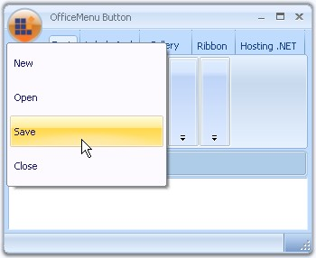

# MenuButton Drop Down

When the OfficeMenuButton is clicked, ToolStripDropDown is displayed. This dropdown can be customized through designer as well as through code. 
## Through Designer Using Menu Panels
RibbonControlAdv lets you add customized ToolStrip items in the OfficeMenu button dropdown with the help of the menu panels. 
The panels are:
* Aux Panel
* Main Panel
* System Panel

_Figure 1163: OfficeMenu Button DropDown displaying Menu Panels_

## Adding ToolStrip Items to the Panels
Each Panel has Items property which invokes the Items Collection Editor. Using this editor you can add the toolstrip items easily.

_Table 685: Property Table_

<table>
<tr>
<th>
Property</th>
<th>Description</th>
</tr>
<tr>
<td>
Items</td>
<td>Lets you open Items Collection Editor using which you can add items to the panel.
</td>
</tr>
</table>

_Figure 1164: Items Collection Editor_

## Programmatically Adding a ToolStripDropDown
ToolStripDropDown can be added programmatically using ToolStripDropDown class and then assigning it to the RibbonControlAdv.MenuDropDownButton property as follows.
_Table 686: Property Table_

<table>
<tr>
<th>
Property</th><th>Description</th>
</td>
</tr>
<tr>
<td>
MenuButtonDropDown</td>
<td>	Gets / Sets ToolStripDropDown to be displayed, when the OfficeMenuButton is clicked.
</td>
</tr>
</table>



// Initialize a ToolStripDropDown button.
ToolStripDropDown dropDown = new ToolStripDropDown();

//Initialize the controls that are to be added in the panel.
ToolStripButton newBtn = new ToolStripButton("&New");
ToolStripButton openBtn = new ToolStripButton("&Open");
ToolStripButton saveBtn = new ToolStripButton("&Save");
ToolStripButton closeBtn = new ToolStripButton("&Close");

// Initialize a new panel (Panel 1)
ToolStripPanelItem panel1 = new ToolStripPanelItem();
panel1.Items.Add(newBtn);
panel1.Items.Add(openBtn);
panel1.Items.Add(saveBtn);
panel1.Items.Add(closeBtn);

// Set the row count.
panel1.RowCount = 9;

//Settings for the buttons
foreach (ToolStripButton btn in panel1.Items)
{
    btn.AutoSize = false;
    btn.Size = new Size(170, 35);
    btn.ImageAlign = ContentAlignment.MiddleLeft;
    btn.TextAlign = ContentAlignment.MiddleLeft;
    btn.ImageScaling = ToolStripItemImageScaling.None;
}

// Add the panel into the items of the ToolStripDropDown.
dropDown.Items.Add(panel1);

// Set the MenuButtonDropDown property of the RibbonControlAdv.
this.ribbonControlAdv1.MenuButtonDropDown = dropDown;





' Initialize a ToolStripDropDown button. 
Dim dropDown As New ToolStripDropDown()

'Initialize the controls that are to be added in the panel. 
Dim newBtn As New ToolStripButton("&New")
Dim openBtn As New ToolStripButton("&Open")
Dim saveBtn As New ToolStripButton("&Save")
Dim closeBtn As New ToolStripButton("&Close")

' Initialize a new panel (Panel 1) 
Dim panel1 As New ToolStripPanelItem()
panel1.Items.Add(newBtn) 
panel1.Items.Add(openBtn) 
panel1.Items.Add(saveBtn) 
panel1.Items.Add(closeBtn) 

' Set the row count. 
panel1.RowCount = 9 

'Settings for the buttons 
For Each btn As ToolStripButton In panel1.Items 
    btn.AutoSize = False 
    btn.Size = New Size(170, 35) 
    btn.ImageAlign = ContentAlignment.MiddleLeft 
    btn.TextAlign = ContentAlignment.MiddleLeft 
    btn.ImageScaling = ToolStripItemImageScaling.None 
Next 

' Add the panel into the items of the ToolStripDropDown. 
dropDown.Items.Add(panel1) 

' Set the MenuButtonDropDown property of the RibbonControlAdv. 
Me.ribbonControlAdv1.MenuButtonDropDown = dropDown



_Figure 1165: ToolStripButtons Added Programmatically_

## Adding ContextMenuStripEx as OfficeMenuDropDown
You can also display a ContextMenuStrip in the OfficeMenu button dropdown. This can be done by assigning a custom ContextMenuStrip to the RibbonControlAdv.MenuButtonDropDown property.



this.ribbonControlAdv1.MenuButtonDropDown = this.contextMenuStripEx1;





Me.ribbonControlAdv1.MenuButtonDropDown = Me.contextMenuStripEx1



_Figure 1166: OfficeMenuButton displaying ContextMenuStripEx as the DropDown_

## Properties

### Panel Text
Text for the MenuButtonDropDown panels and its font style can be specified using the below properties.
_Table 687: Property Table_

<table>
<tr><th>
Property</th><th>Description</th></tr>
<tr><td>
Text</td><td>Sets text for the panel.</td></tr>
<tr><td>Font</td><td>Sets the Font style for the text.</td></tr>
</table>



this.ribbonControlAdv1.OfficeMenu.AuxPanel.Text = "Recent Documents";
this.ribbonControlAdv1.OfficeMenu.AuxPanel.Font = new System.Drawing.Font("Verdana", 8.25F);




Me.ribbonControlAdv1.OfficeMenu.AuxPanel.Text = "Recent Documents" 
Me.ribbonControlAdv1.OfficeMenu.AuxPanel.Font = New System.Drawing.Font("Verdana", 8.25F) 
Adding Separator and Minimum Size Settings
The property which adds a line separator between the toolstrip items and the property which sets the minimum size for the panels is as follows.
Table 688: Property Table
Property	Description
SeparatorIndent	Inserts a line separator between the menu items.
MinimumSize	Specifies minimum size for the panels.





this.ribbonControlAdv1.OfficeMenu.MainPanel.SeparatorIndent = 15;
this.ribbonControlAdv1.OfficeMenu.AuxPanel.MinimumSize = new System.Drawing.Size(30, 30);





Me.ribbonControlAdv1.OfficeMenu.MainPanel.SeparatorIndent = 15
Me.ribbonControlAdv1.OfficeMenu.AuxPanel.MinimumSize = New System.Drawing.Size(30, 30)



### Adding Items to the Dropdown
The ToolStrip Items which can be added to the Menu Panels, using the Panel's Items Collection Editor dialog are as follows.
*	Button – Adds button to the panel.
*	Label – Adds label to the panel.
*	SplitButton – Adds a button with a split appearance.
*	DropDownButton – Adds drop down button.
*	Separator – Adds a line separator in the panel.
*	ComboBox – Adds a combo box.
*	Textbox – Adds a textbox.
*	ProgressBar – Adds a progress bar to the panel.
*	CheckBox – Added a checkbox.
*   RadioButton – Adds a radio button.
*	OfficeButton – Adds an office button.
*	OfficeDropDownButton – Adds a office dropdown button.
*	OfficeSplitButton – Adds a Office split button.
*	SplitButtonEx – Adds SplitButtonEx control item.
*	PanelItem - Adds panel items.
*	Gallery – Add Gallery item.

_Figure 1167: ToolStrip Items_

The properties of ToolStripItems are available in Items Collection Editor which lets you customize the appearance of the items.

## OfficeButton Properties

This section discusses the properties of Office button toolstrip items.

_Figure 1168: OfficeButton ToolStripItems in the Items Collection Editor_

### Common Properties for the Office buttons

_Table 689: Property Table_

<table>
<tr>
<th>
Property</th><th>Description</th></tr>
<tr>
<td>
Text</td><td>	Sets the text for the item.</td></tr>
<tr><td>
TextAlign</td><td>Specifies the alignment of the text in the item.</td></tr>
<tr><td>TextDirection</td><td>Sets the direction of the text in the item. The options are,

Horizontal,
Vertical90 and
Vertical270.</td></tr>
<tr><td>
TextImageRelation</td><td>	Represents image and text relation.</td></tr>
<tr><td>
DisplayStyle</td><td>	Sets the display style of the item. The options are,

Text - Displays only text,
Image - Displays only image,
ImageAndText - Displays image and the text in the office button.</td></tr>
<tr><td>
Font</td><td>Sets the font style for the text in the item.</td></tr>
<tr><td>
ForeColor</td><td>	Sets the forecolor for the display text.</td>
</tr>
<tr>
<td>Image</td><td>Sets the image for the item.</td></tr>
<tr><td>
ImageAlign</td><td>Sets the alignment of the image.</td></tr>
<tr><td>
ImageScaling</td><td>Specifies the scaling of the image whether SizeToFit or None.</td></tr>
<tr><td>
ImageTransparentColor</td><td>	Represents the transparent color for the image.</td>
</tr><tr><td>
Visible</td><td>Sets the visibility of the toolstrip item.</td></tr>
<tr><td>
AutoTooltip</td><td>Lets you to specify whether the tooltip text is taken from the Text property or the ToolTipText property. 

True - Tooltip text is taken from the Text property,
False - Tooltip text is taken from the ToolTipText property.

OfficeMenu.ShowItemToolTips should be true for this setting to be effective.
</td></tr><tr>
<td>
ToolTipText</td><td>Sets the tooltip text when AutoTooltip is false and ShowItemToolTips is true.</td></tr>
<tr><td>
Enabled</td><td>Enables / Disables the item.</td>
</tr>
<tr><td>
Alignment</td><td>Sets the alignment for the ToolStrip item.</td></tr></table>

### Office Button

_Table 690: Property Table_

<table>
<tr><th>
Property</th>	<th>Description</th></tr>
<tr><td>
Checked</td><td>	Specifies whether the Office button should be checked, when the application loads.
</td></tr>
<tr><td>CheckState</td><td>	Specifies the check state, whether checked, unchecked or indeterminate.
</td></tr>
<tr><td>CheckOnClick</td><td>	Indicates whether the button should be checked on a mouse click.
</td></tr></table>

### OfficeSplitButton
The following properties are specific to OfficeSplitButton.
_Table 691: Property Table_
<table>
<tr>
<th>
Property</th><th>	Description</th></tr>
<tr><td>
DropDownFont</td>	<td>Sets the font for the dropdown.</td></tr>
<tr><td>DropDownText</td>	<td>Sets the dropdown text.</td></tr>
<tr><td>DropDownItems	</td><td>Specifies the drop down items.</td></tr>
<tr><td>DropDownWidth</td>  <td>	Shows / hides the dropdown arrow.</td></tr></table>

In OfficeSplitButton, the image and the text together will look split from the arrow as shown in the image below.

_Figure 1169: Office SplitButton_

### OfficeDropDownButton
The following properties are specific to OfficeDropDownButton.
_Table 692: Property Table_
<table><tr><th>
Property</th><th>	Description</th></tr>
<tr><td>DropDownFont</td><td>	Sets the font for the dropdown.</td></tr>
<tr><td>DropDownText</td><td>	Sets the dropdown text.</td></tr>
<tr><td>DropDownItems</td><td>	Specifies the drop down items.</td></tr>
<tr><td>ShowDropDownArrow</td><td>	Shows / hides the dropdown arrow.</td></tr>
</table>

_Figure 1170: Office DropDown Button_

## Tooltips
OfficeMenuButton can show a SuperToolTip at run time. It can be added using RibbonControlAdv.MenuButtonToolTip on SuperToolTip1 property through Designer or by calling the SetMenuButtonToolTip method of the SuperToolTip control.

_Figure 1171: SuperToolTip Extended property for OfficeMenuButton_

> Note: The above extended property will be available only when your application has a SuperToolTip control.



this.superToolTip1.SetMenuButtonToolTip(this.ribbonControlAdv1, toolTipInfo1);




Me.superToolTip1.SetMenuButtonToolTip(Me.ribbonControlAdv1, toolTipInfo1)



_Figure 1172: SuperToolTip Displayed for OfficeMenuButton_

### ToolTips for ToolStrip Items in DropDown
Tooltips for the items can be enabled using ShowItemToolTips property. 
Text for the tooltips can be specified in ToolTipText property of the respective ToolStrip items.



//Enabling Tooltips for the menu items
this.ribbonControlAdv1.OfficeMenu.ShowItemToolTips = true;

//Setting ToolTip text for ToolStripButton1
this.toolStripButton1.ToolTipText = "Open";




'Enabling Tooltips for the menu items
Me.ribbonControlAdv1.OfficeMenu.ShowItemToolTips = True

'Setting ToolTip text for ToolStripButton1
Me.toolStripButton1.ToolTipText = "Open"



_Figure 1173: Tooltip set for "Open" ToolStripButton Item_

### See Also
### ToolStripItems
