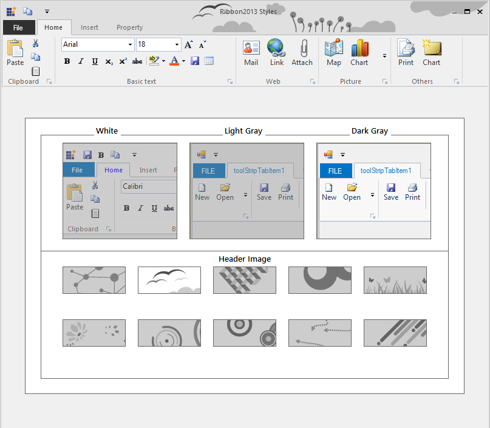
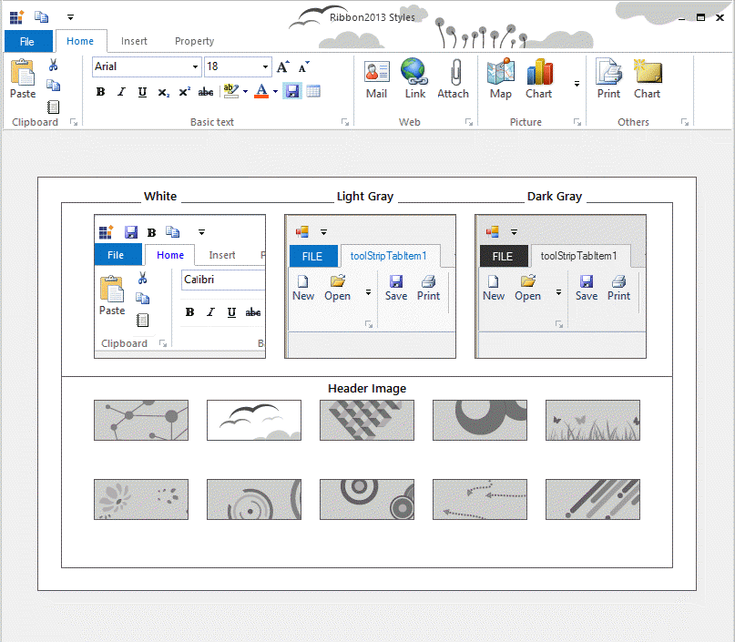

# Office 2013 Color Schemes

The RibbonControlAdv includes new color schemes as available in the Office 2013 suite to provide a more personalized experience with the RibbonControlAdv.
RibbonControlAdv now supports three themes: White, LightGray, and DarkGray. These themes can be set through the Office2013ColorScheme property to tone down the bright white background of the ribbon. 
The following code sample illustrates how to set the DarkGray theme for the Office 2013 style RibbonControl.



  this.ribbonControlAdv1.Office2013ColorScheme = Office2013ColorScheme.DarkGray;





  Me.ribbonControlAdv1.Office2013ColorScheme = Office2013ColorScheme.DarkGray



_Figure 1191: Ribbon2013 with DarkGray ColorScheme_

_Figure 1192: Ribbon2013 with LightGray ColorScheme_

_Figure 1193: Ribbon2013 with Default [White] ColorScheme_

