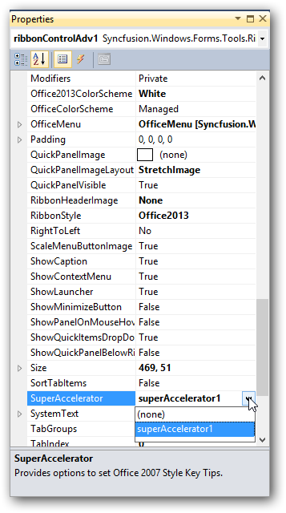
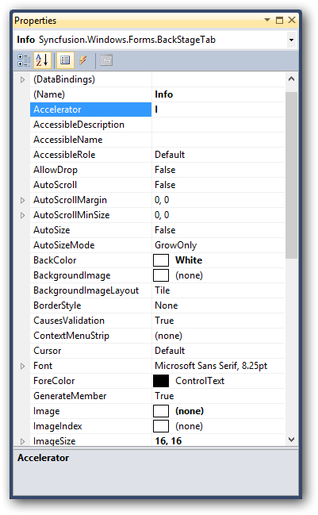

# Office-Like Super Accelerator Support

## Description

The RibbonControlAdv now supports the SuperAccelerator functionality. This allows the user to access the RibbonControlAdv and its components through the keyboard shortcuts as in MS Office.
The SuperAccelerator can be wired to the RibbonControlAdv through the designer and through code.

## Through Designer

To add the SuperAccelerator key to the RibbonControlAdv, the control must be wired with a SuperAccelerator component as shown in the following image:

 
 
_Figure 1176: Adding SuperAccelerator to the RibbonControlAdv_

The SuperAccelerator key value for a RibbonControlAdv child element can be assigned from the form designer as shown in the following image:
 
  
  
  _Figure 1177: Assigning SuperAccelerator in the form designer_
 
 
## Through Code

Using the following code, the SuperAccelerator can be assigned to the RibbonControlAdv. Once SuperAccelerator is assigned, its child items can be assigned with SuperAccelerator key values.

### Code Sample



SuperAccelerator superAccelerator1 = new SuperAccelerator();
this.ribbonControlAdv1.SuperAccelerator = this.superAccelerator1;



With the following code sample, the SuperAccelerator key value can be assigned to a ToolStripTabItem (named Home in the sample). By specifying controls and accelerator keys in arguments, the SuperAccelerator key will be assigned to the appropriate controls and enable users to select particular controls by pressing the assigned SuperAccelerator keys values on the keyboard.

### Code Sample



this.superAccelerator1.SetAccelerator(this.Home, "A");



The following image shows SuperAccelerator key visibility in the RibbonControlAdv:

_Figure 1178: SuperAccelerator Keys_

## BackStageView

Like in RibbonControlAdv, SuperAccelerators has been implemented in BackStageView. Accelerators can be assigned to BackStageView as shown in following images:

## Through Designer

_Figure 1179: Adding SuperAccelerator through Designer_

The following image demonstrates how SuperAccelerator key values can be assigned to BackStage child elements:

_Figure 1180: Assigning SuperAccelerator to BackStage child elements_

## Through Code

Using the following code sample, the SuperAccelerator can be assigned to BackStageView. Once SuperAccelerator is assigned to BackStageView, accelerator keys can be specified for its child elements
### Code Sample


this.backStage1.SuperAccelerator = this.superAccelerator1;


Using the following code sample, SuperAccelerator can be assigned to BackStage child elements through code.
### Code Sample



this.saveButton.Accelerator = "S";



### SuperAccelerator in BackStageView

The following image visualizes the SuperAccelerarator in BackStage:

_Figure 1181: SuperAccelerator in BackStage View_

The following image visualizes the SuperAccelerator in BackStageTab child elements:

_Figure 1182: SuperAccelerator in BackStage tab view_

## Backstage Splitter for RibbonControlAdv 2013

## Adding Seperators

The Backstage view lets users add separators between the backstage tabs or buttons.
Separators for Backstage view Through Code
Adding Separator Indices for BackStageView



private Syncfusion.Windows.Forms.BackStageSeparator backStageSeparator1;            
this.backStageSeparator1 = new Syncfusion.Windows.Forms.BackStageSeparator();
this.backStage1.Controls.Add(this.backStageSeparator1);
   // 
   // backStageSeparator1
   // 
this.backStageSeparator1.BackColor = System.Drawing.Color.FromArgb(((int)(((byte)(100)))), ((int)(((byte)(189)))), ((int)(((byte)(255)))));
this.backStageSeparator1.Location = new System.Drawing.Point(19, 60);
this.backStageSeparator1.Name = "backStageSeparator1";
this.backStageSeparator1.Size = new System.Drawing.Size(100, 1);
this.backStageSeparator1.TabIndex = 4;
this.backStageSeparator1.Text = "backStageSeparator1";
 
 
 

Dim backStageSeparator1 As Syncfusion.Windows.Forms.BackStageSeparator
Me.backStageSeparator1 = New Syncfusion.Windows.Forms.BackStageSeparator
Me.backStage1.Controls.Add(Me.backStageSeparator1)
' 
' backStageSeparator1
' 
Me.backStageSeparator1.BackColor = System.Drawing.Color.FromArgb(CType(CType(100,Byte),Integer), CType(CType(189,Byte),Integer), CType(CType(255,Byte),Integer))
Me.backStageSeparator1.Location = New System.Drawing.Point(19, 60)
Me.backStageSeparator1.Name = "backStageSeparator1"
Me.backStageSeparator1.Size = New System.Drawing.Size(100, 1)
Me.backStageSeparator1.TabIndex = 4
Me.backStageSeparator1.Text = "backStageSeparator1"



_Figure 1183: Backstage Splitter in Ribbon_