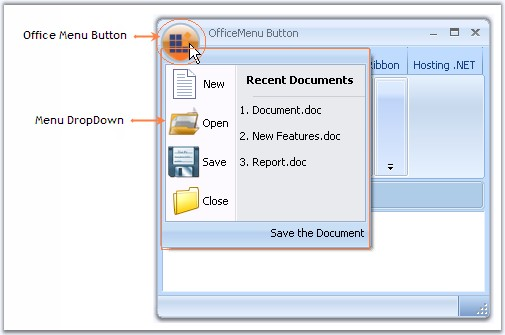

# Office Menu Button

The RibbonControlAdv has the office menu button at the top left corner of the form. Controls can be added to the panels of the office menu button dropdown through designer without a single piece of code.

_Figure 1162: Office Menu button with DropDown_