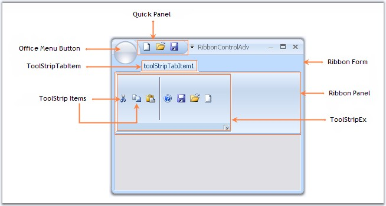

# Overview

This section gives you an overview of the components of a RibbonControlAdv.

_Figure 1154: RibbonControlAdv Components_

## Components

<ul type="circle"><li>Ribbon Form</li></ul>
<ul type="circle"><li>Office Menu Button</li></ul>
<ul type="circle"><li>Quick Panel</li></ul>
<ul type="circle"><li>RibbonPanel</li></ul>
<ul type="circle"><li>ToolStripTabItem</li></ul>
<ul type="circle"><li>ToolStripItems</li></ul>
<ul type="circle"><li>ToolStripEx</li></ul>

## See Also

## Ribbon Control Items