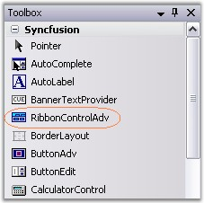
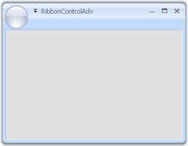

# Ribbon Form

EssentialStudio now gives a similar look and feel of MS Office 2007, to its Office 2007 controls, using RibbonControlAdv which comes with rounded corners. This section will guide you in creating a Ribbon form using RibbonControlAdv.

## Creating Ribbon Form

1. Drag and drop the RibbonControlAdv on to the form.

   
   
   _Figure 1155: RibbonControlAdv in the Toolbox_
   
2. To convert an ordinary form to Ribbon form, do the following.

   The forms in the application by default will extend to the Form class. Add the respective namespace and programmatically change it as RibbonForm class.

   ~~~ C#

		using Syncfusion.Windows.Forms.Tools;
		public partial class Form1 : RibbonForm
 
   ~~~
   {:.prettyprint}

   ~~~ vbnet
 
		Imports Syncfusion.Windows.Forms.Tools
		Partial Public Class Form1
		Inherits RibbonForm

   ~~~
   {:.prettyprint}
   
   
   
   _Figure 1156: Windows Form Converted to Ribbon Form_