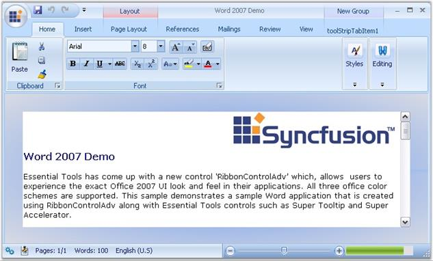

# RibbonControlAdv

RibbonControlAdv added to the Office2007 now comes with a couple of features and customization properties which presents the control with a great look and feel like MS Office 2007. This user guide explains all the controls that can be added to the RibbonControlAdv in detail.

_Figure 1153: RibbonControlAdv in Office2007 - Illustrated_