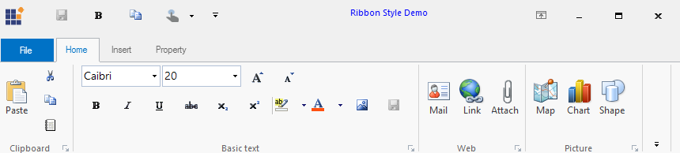

# Touch Mod behavior for RibbonControlAdv

## Enabling Touch Mode 
 You can control touch mode settings of RibbonControlAdv control using the following property.
 
_Table 699: Property Table_

<table>
<tr><th>
Property</th><th>	Type</th><th>	Description</th></tr>
<tr><td>
RibbonTouchModeEnabled</td><td>	Boolean	Enabling the RibbonTouchModeEnabled property in RibbonContolAdv, increases the size according to Microsoft touch mode size. Disabling the property retains its original size.
</td></tr>
</table>



 //Enables touch mode for the RibbonControlAdv control
this.ribbonControlAdv1. RibbonTouchModeEnabled = true;
 
 

 'Enables touch mode for the RibbonControlAdv control
Me.ribbonControlAdv1. RibbonTouchModeEnabled = True


_Figure 1194: RibbonControlAdv Style Demo_
