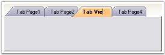
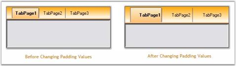
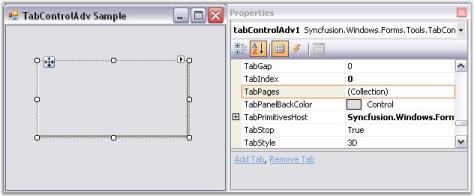

# TabControlAdv

The look and feel of the TabControlAdv can be controlled through the appearance properties of the control. These properties are discussed in detail in the below topics.

## TabItems Customization

TabItems can be customized using the properties given below.

Renaming TabItems

TabControlAdv comes with the renaming functionality similar to MS Excel. Users can edit TabControlAdv's text at run-time using the LabelEdit property which has to be set to True. 

_Table_ _814_: Property Table

<table>
<tr>
<th>
TabControlAdv Property</th><th>
Description</th></tr>
<tr>
<td>
LabelEdit</td><td>
Specifies whether the text of the tabitem is editable. Default value is False.</td></tr>
</table>

To bring the text of the tabitem to the edit mode, the following can be done.

1. Select the text of the tabitem to be edited and right-click on the tab to bring the text to edit mode. The text can now be edited and it  can be saved by pressing the Return key.
2. Also, double-clicking on a tab makes the text change to edit mode.

   

   After editing the text, to come out of the edit mode, press the Enter key or click the Left Mouse button.

3. Programmatically the LabelEdit property can be set as follows.



// Renaming TabControlAdv’s Text.

this.tabControlAdv.LabelEdit = true;





' Renaming TabControlAdv’s Text.

Me.tabControlAdv.LabelEdit = True



> Note: The visibility of the tab items can be set through TabVisible property. It can be enabled / disabled using TabEnabled property.

### Moving TabItems

The order of the tabs within the TabControlAdv can be changed at design-time and also at run-time by simply dragging-and-dropping the tabs in the required places. This can be enabled using the UserMoveTabs property.



this.tabControlAdv1.UserMoveTabs = true;





Me.tabControlAdv1.UserMoveTabs = True



### Padding

Using the Padding property, the space around the text / image of the tabitems can be changed by settings the X-axis and Y-axis values.

Code snippets to set the Padding



// Setting the Padding for TabControlAdv through Coding. 

this.tabControlAdv1.Padding = new Point(12, 12); 





'Setting the Padding for TabControlAdv through Coding. 

Me.tabControlAdv1.Padding = New Point(12, 12)



> Note: The TabControlAdv.OnTabPanelBoundsAffected() method forces the TabControlAdv to re-layout it's elements.

#### Multiline Support

Multiple level of tabs can be created by setting the Multiline property of the TabControl to true, which places the tabs in more than one line. This allows the tabs to be arranged in multiple lines when the tabs exceed the width of the control, with all the tabitems in view.

The tabitem's text can be placed in more than one line by setting the MultilineText property.

_Table_ _815_: Property Table

<table>
<tr>
<th>
TabControlAdv Property</th><th>
Description</th></tr>
<tr>
<td>
Multiline</td><td>
Allows the tabs to be arranged in multiple lines when the tabs exceed the width of the control, with all the tabitems in view.</td></tr>
<tr>
<td>
MultilineText</td><td>
Allows the tabitem's text to be placed in more than one line.</td></tr>
</table>



this.tabControlAdv1.Multiline = true;

this.tabControlAdv1.MultilineText = true;

this.tabControlAdv1.KeepSelectedTabInFrontRow = true;





Me.tabControlAdv1.Multiline = True

Me.tabControlAdv1.MultilineText = True

Me.tabControlAdv1.KeepSelectedTabInFrontRow = True



The KeepSelectedTabInFrontRow property will bring the selected tab to the front row (applicable only in the case of Multiline Tabs).

#### UseMnemonic

This property specifies whether the TabControlAdv interprets the Ampersand character (&) to be an Access key prefix character or not. The default value is set to False.

_Table_ _816_: Property Table

<table>
<tr>
<th>
TabControlAdv Property</th><th>
Description</th></tr>
<tr>
<td>
UseMnemonic</td><td>
Gets / sets the value which determines whether the TabControlAdv should interpret the Ampersand character (&) to be an Access key prefix character or not.</td></tr>
</table>

## TabPages

TabPages

On Clicking the TabPages property in the Properties grid, the TabPageAdv Collection Editor will be opened. 

The TabPageAdv Collection Editor can be used to add TabPages to the TabControlAdv and customize the TabPages according to needs of the user. 

### Border Settings

The BorderStyle property of TabControlAdv can be used to set the border styles for the TabPages.

The three types of border styles are given below.

* FixedSingle
* Fixed 3D
* None

_Table_ _817_: Property Table

<table>
<tr>
<th>
TabControlAdv Property</th><th>
Description</th></tr>
<tr>
<td>
BorderStyle</td><td>
Gets / sets the border styles for the tabpages. It includes the following styles:FixedSingleFixed3DNone</td></tr>
</table>

### FixedSingleBorderColor

The FixedSingleBorderColor property is used to set a color for the border of the TabPage in the TabControlAdv when the BorderStyle is set to FixedSingle.

_Table_ _818_: Property Table

<table>
<tr>
<th>
TabControlAdv Property</th><th>
Description</th></tr>
<tr>
<td>
FixedSingleBorderColor</td><td>
Gets / sets a color for the border of the TabPage in the TabControlAdv when the BorderStyle is set to FixedSingle.</td></tr>
</table>

> Note: The TabControlAdv.ResetFixedSingleBorderColor() method resets the border color of the TabPage to the default value.

 
## Other Settings

TabControlAdv now supports animation on tab pages. Animated image in GIF can be inserted in a tab page. The format supports up to 8 bits per pixel with a palette of up to 256 distinct colors chosen from the 24-bit RGB color space. Both 3D and 2D formats are supported.

Users can insert graphics or logos with solid areas of color, small animations, low-resolution film clips etc. to make the tab page more interactive and lively. The size of the image can also be adjusted. 

There are two major properties which come into picture:

* Image
* Image size

The following table lists the properties of the GIF image:

_Table_ _819_: Property Table

<table>
<tr>
<td>
 Property</td><td>
Description</td><td>
Type of Property</td></tr>
<tr>
<td>
Image</td><td>
Allows the user to insert the required image using the location where the image is saved.</td><td>
Image</td></tr>
<tr>
<td>
ImageSize</td><td>
Allows the users to modify the size of the image.</td><td>
Size</td></tr>
</table>

#### Inserting GIF Image

The code should be in the following format:



this.tabPageAdv.Image = Image.FromFile(imagepath);

this.tabPageAdv.ImageSize = new System.Drawing.Size(height,width);



The following code illustrates insertion of the required GIF image.



this.tabPageAdv.Image = Image.FromFile(“sample.gif”);

this.tabPageAdv.ImageSize = new System.Drawing.Size(16,16);



> Note: Only when the ImageIndex property is -1, Image from the Image property will be displayed or else Image from ImageList will be displayed.

Run the code. The required image is displayed.

## Prevent moving a specific Tab in TabControlAdv 

TabControlAdv now allows to prevent a specific tab control from being moved on a TabControlAdv. This is achieved with the newly added API TabMoving.



// Prevents moving the tab.

this this.tabControlAdv1.TabMoving += new Syncfusion.Windows.Forms.Tools.TabMovingEventHandler(tabControlAdv1_TabMoving);

void tabControlAdv1_TabMoving(object sender, Syncfusion.Windows.Forms.Tools.TabMovingEventArgs e)

        {

            if(e.From == 1 || e.Target == 1)

            {

                e.Cancel = true;

            }

        }     





‘Prevents moving the tab.

Private Me.tabControlAdv1.TabMoving += New Syncfusion.Windows.Forms.Tools.TabMovingEventHandler(AddressOf tabControlAdv1_TabMoving)

Private Sub tabControlAdv1_TabMoving(ByVal sender As Object, ByVal e As Syncfusion.Windows.Forms.Tools.TabMovingEventArgs)

If e.From = 1 OrElse e.Target = 1 Then

e.Cancel = True

End If

End Sub



