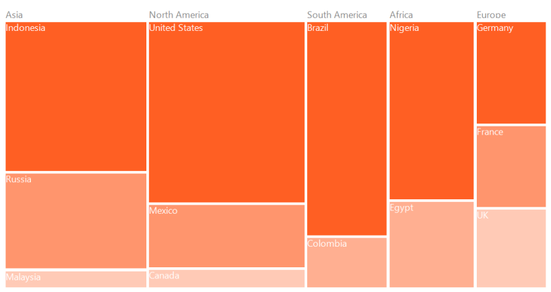

## Features

### WeightValuePath

The WeightValuePath ofthe TreeMap control is a path to a field on the source object that serves as the "weight" of the object. 

Code Sample



TreeMap TreeMap1 = new TreeMap();

TreeMap1.ItemsSource = data.PopulationDetails;

TreeMap1.WeightValuePath = "Population";



> Note: The specified field must be available in every subclass (object) defined in the hierarchical (nested) data collection.

### ColorValuePath

The ColorValuePath of the TreeMap control is a path to a field on the source object that serves as the "color" of the object. 

Code Sample



TreeMap TreeMap1 = new TreeMap();

TreeMap1.ItemsSource = data.PopulationDetails;

TreeMap1.ColorValuePath = "Growth";



> Note: The specified field must be available in every subclass (object) defined in the hierarchical (nested) data collection.

### Tree Map Levels

The levels of the TreeMap control can be categorized as two types, such as flat and hierarchical, which are used to define levels of a data collection. 

#### ItemsSource

The ItemsSource set for TreeMap control must be a flat collection of data. The following code sample shows how to set a data collection as ItemsSource for the TreeMap control.

Code Sample



TreeMap TreeMap1 = new TreeMap();

PopulationViewModel data = new PopulationViewModel();                     

TreeMap1.ItemsSource = data.PopulationDetails;

TreeMap1.WeightValuePath = "Population";

TreeMap1.ColorValuePath = "Growth";

public class PopulationViewModel

{

public PopulationViewModel()

{

this.PopulationDetails = new ObservableCollection<PopulationDetail>();

PopulationDetails.Add(new PopulationDetail() { Continent = "Asia", Country = "Indonesia", Growth = 3, Population = 237641326, StrPopulation = "237.6 M" });

PopulationDetails.Add(new PopulationDetail() { Continent = "Asia", Country = "Russia", Growth = 2, Population = 152518015, StrPopulation = "152.5 M" });

PopulationDetails.Add(new PopulationDetail() { Continent = "Asia", Country = "Malaysia", Growth = 1, Population = 29672000, StrPopulation  = "29.7 M"});

PopulationDetails.Add(new PopulationDetail() { Continent = "North America", Country = "United States", Growth = 4, Population = 315645000, StrPopulation = "315.6 M" });

PopulationDetails.Add(new PopulationDetail() { Continent = "North America", Country = "Mexico", Growth = 2, Population = 112336538, StrPopulation = "112.3 M"});

PopulationDetails.Add(new PopulationDetail() { Continent = "North America", Country = "Canada", Growth = 1, Population = 35056064, StrPopulation = "35.1 M"});

PopulationDetails.Add(new PopulationDetail() { Continent = "South America", Country = "Colombia", Growth = 1, Population = 47000000, StrPopulation = "47 M" });

PopulationDetails.Add(new PopulationDetail() { Continent = "South America", Country = "Brazil", Growth = 3, Population = 193946886, StrPopulation = "193.9 M" });

PopulationDetails.Add(new PopulationDetail() { Continent = "Africa", Country = "Nigeria", Growth = 2, Population = 170901000, StrPopulation = "170.9 M"});

PopulationDetails.Add(new PopulationDetail() { Continent = "Africa", Country = "Egypt", Growth = 1, Population = 83661000, StrPopulation = "83 M"});

PopulationDetails.Add(new PopulationDetail() { Continent = "Europe", Country = "Germany", Growth = 1, Population = 81993000, StrPopulation ="82 M"});

PopulationDetails.Add(new PopulationDetail() { Continent = "Europe", Country = "France", Growth = 1, Population = 65605000, StrPopulation  = "65.6 M"});

PopulationDetails.Add(new PopulationDetail() { Continent = "Europe", Country = "UK", Growth = 1, Population = 63181775, StrPopulation = "63.2 M"});

}

public ObservableCollection<PopulationDetail> PopulationDetails

{

get;

set;

}

public class PopulationDetail

{

public string Continent { get; set; }

public string Country { get; set; }

public double Growth { get; set; }

public double Population { get; set; }

public string StrPopulation { get; set; }

}

}  



#### GroupPath

The GroupPath must bespecified for every level of the TreeMap control. It is a path to a field on the source object that serves as the “Group” for the level specified. The data is grouped in the TreeMap control based on the GroupPath. If it is not specified, then the items are not grouped and the data is shown in the order as it is specified in the ItemsSource.

Code Sample



TreeMap TreeMap1 = new TreeMap();

PopulationViewModel data = new PopulationViewModel();

TreeMap1.ItemsSource = data.PopulationDetails;

TreeMap1.WeightValuePath = "Population";

TreeMap1.ColorValuePath = "Growth";

TreeMapFlatLevel treeMapFlatLevel1 = new TreeMapFlatLevel();

treeMapFlatLevel1.GroupPath = "Continent";

treeMapFlatLevel1.ShowLabels = true;

TreeMap1.Levels.Add(treeMapFlatLevel1);

TreeMapFlatLevel treeMapFlatLevel2 = new TreeMapFlatLevel();

treeMapFlatLevel2.GroupPath = "Country";

treeMapFlatLevel2.ShowLabels = true;

treeMapFlatLevel2.HeaderHeight = 25;

TreeMap1.Levels.Add(treeMapFlatLevel2);



#### GroupGap

The GroupGap can be specified for separating the items of every level. It is used to differentiate the levels in the TreeMap control.

Code Sample



TreeMap TreeMap1 = new TreeMap();

PopulationViewModel data = new PopulationViewModel();

TreeMap1.ItemsSource = data.PopulationDetails;

TreeMap1.WeightValuePath = "Population";

TreeMap1.ColorValuePath = "Growth";

TreeMapFlatLevel treeMapFlatLevel1 = new TreeMapFlatLevel();

treeMapFlatLevel1.GroupPath = "Continent";

treeMapFlatLevel1.ShowLabels = true;

TreeMap1.Levels.Add(treeMapFlatLevel1);

TreeMapFlatLevel treeMapFlatLevel2 = new TreeMapFlatLevel();

treeMapFlatLevel2.GroupPath = "Country";

treeMapFlatLevel2.ShowLabels = true;

treeMapFlatLevel2.HeaderHeight = 25;

TreeMap1.Levels.Add(treeMapFlatLevel2);



### TreeMap Layout

The ItemsLayoutMode for the TreeMap control specifies the mode in which the items should be laid out. This layout will be applied for all the tree map levels. It includes four different types.

#### Squarified Layout

Code Sample



TreeMap TreeMap1 = new TreeMap();

PopulationViewModel data = new PopulationViewModel();

TreeMap1.ItemsSource = data.PopulationDetails;

TreeMap1.WeightValuePath = "Population";

TreeMap1.ColorValuePath = "Growth";

TreeMap1.ItemsLayoutMode =      Syncfusion.Windows.Forms.TreeMap.ItemsLayoutModes.Squarified;

TreeMapFlatLevel treeMapFlatLevel1 = new TreeMapFlatLevel();

treeMapFlatLevel1.GroupPath = "Continent";

treeMapFlatLevel1.ShowLabels = true;

TreeMap1.Levels.Add(treeMapFlatLevel1);

TreeMapFlatLevel treeMapFlatLevel2 = new TreeMapFlatLevel();

treeMapFlatLevel2.GroupPath = "Country";

treeMapFlatLevel2.ShowLabels = true;

treeMapFlatLevel2.HeaderHeight = 25;

TreeMap1.Levels.Add(treeMapFlatLevel2);



 

#### SliceAndDiceAuto Layout

Code Sample



TreeMap TreeMap1 = new TreeMap();

PopulationViewModel data = new PopulationViewModel();

TreeMap1.ItemsSource = data.PopulationDetails;

TreeMap1.WeightValuePath = "Population";

TreeMap1.ColorValuePath = "Growth";

TreeMap1.ItemsLayoutMode = Syncfusion.Windows.Forms.TreeMap.ItemsLayoutModes.SliceAndDiceAuto;

TreeMapFlatLevel treeMapFlatLevel1 = new TreeMapFlatLevel();

treeMapFlatLevel1.GroupPath = "Continent";

treeMapFlatLevel1.ShowLabels = true;

TreeMap1.Levels.Add(treeMapFlatLevel1);

TreeMapFlatLevel treeMapFlatLevel2 = new TreeMapFlatLevel();

treeMapFlatLevel2.GroupPath = "Country";

treeMapFlatLevel2.ShowLabels = true;

treeMapFlatLevel2.HeaderHeight = 25;

TreeMap1.Levels.Add(treeMapFlatLevel2);



#### SliceAndDiceHorizontal Layout

Code Sample



TreeMap TreeMap1 = new TreeMap();

PopulationViewModel data = new PopulationViewModel();

TreeMap1.ItemsSource = data.PopulationDetails;

TreeMap1.WeightValuePath = "Population";

TreeMap1.ColorValuePath = "Growth";

TreeMap1.ItemsLayoutMode = Syncfusion.Windows.Forms.TreeMap.ItemsLayoutModes.SliceAndDiceHorizontal;            TreeMapFlatLevel treeMapFlatLevel1 = new TreeMapFlatLevel();

treeMapFlatLevel1.GroupPath = "Continent";

treeMapFlatLevel1.ShowLabels = true;

TreeMap1.Levels.Add(treeMapFlatLevel1);

TreeMapFlatLevel treeMapFlatLevel2 = new TreeMapFlatLevel();

treeMapFlatLevel2.GroupPath = "Country";

treeMapFlatLevel2.ShowLabels = true;

treeMapFlatLevel2.HeaderHeight = 25;

TreeMap1.Levels.Add(treeMapFlatLevel2);



#### SliceAndDiceVertical Layout

Code Sample



TreeMap TreeMap1 = new TreeMap();

PopulationViewModel data = new PopulationViewModel();

TreeMap1.ItemsSource = data.PopulationDetails;

TreeMap1.WeightValuePath = "Population";

TreeMap1.ColorValuePath = "Growth";

TreeMap1.ItemsLayoutMode = Syncfusion.Windows.Forms.TreeMap.ItemsLayoutModes.SliceAndDiceVertical;

TreeMapFlatLevel treeMapFlatLevel1 = new TreeMapFlatLevel();

treeMapFlatLevel1.GroupPath = "Continent";

treeMapFlatLevel1.ShowLabels = true;

TreeMap1.Levels.Add(treeMapFlatLevel1);

TreeMapFlatLevel treeMapFlatLevel2 = new TreeMapFlatLevel();

treeMapFlatLevel2.GroupPath = "Country";

treeMapFlatLevel2.ShowLabels = true;

treeMapFlatLevel2.HeaderHeight = 25;

TreeMap1.Levels.Add(treeMapFlatLevel2);



### Color Mapping

Color mapping is categorized into four different types:

* UniColorMapping
* RangeBrushColorMapping
* DesaturationColorMapping
* PaletteColorMapping

#### UniColorMapping

Tree map leaf nodes can be colored with the help of the Color property specified using UniColorMapping.

Code Sample


TreeMap TreeMap1 = new TreeMap();
PopulationViewModel data = new PopulationViewModel(); 
TreeMap1.ItemsSource = data.PopulationDetails;
TreeMap1.WeightValuePath = "Population";  
TreeMap1.ColorValuePath = "Growth";
TreeMap1.ItemsLayoutMode = Syncfusion.Windows.Forms.TreeMap.ItemsLayoutModes.SliceAndDiceAuto;
TreeMapFlatLevel treeMapFlatLevel1 = new TreeMapFlatLevel(); 
treeMapFlatLevel1.GroupPath = "Continent";   
treeMapFlatLevel1.ShowLabels = true;    
TreeMap1.Levels.Add(treeMapFlatLevel1);
TreeMapFlatLevel treeMapFlatLevel2 = new TreeMapFlatLevel(); 
treeMapFlatLevel2.GroupPath = "Country";  
treeMapFlatLevel2.ShowLabels = true; 
treeMapFlatLevel2.HeaderHeight = 25;
TreeMap1.Levels.Add(treeMapFlatLevel2);
UniColorMapping uniColorMapping = new UniColorMapping(); 
uniColorMapping.Color = Color.MediumSlateBlue; 
this.TreeMap1.LeafColorMapping = uniColorMapping;
			

			

#### RangeBrushColorMapping

The leaf nodes of the TreeMap control can be colored based upon the range (i.e. From and To) and Brush specified using the RangeBrush collection of RangeBrushColorMapping.

Code Sample



TreeMap TreeMap1 = new TreeMap();

PopulationViewModel data = new PopulationViewModel();

TreeMap1.ItemsSource = data.PopulationDetails;

TreeMap1.WeightValuePath = "Population";

TreeMap1.ColorValuePath = "Growth";

TreeMap1.ItemsLayoutMode = Syncfusion.Windows.Forms.TreeMap.ItemsLayoutModes.SliceAndDiceAuto;

TreeMapFlatLevel treeMapFlatLevel1 = new TreeMapFlatLevel();

treeMapFlatLevel1.GroupPath = "Continent";

treeMapFlatLevel1.ShowLabels = true;

TreeMap1.Levels.Add(treeMapFlatLevel1);

TreeMapFlatLevel treeMapFlatLevel2 = new TreeMapFlatLevel();

treeMapFlatLevel2.GroupPath = "Country";

treeMapFlatLevel2.ShowLabels = true;

treeMapFlatLevel2.HeaderHeight = 25;

TreeMap1.Levels.Add(treeMapFlatLevel2);

RangeBrushColorMapping rangeBrushColorMapping = new RangeBrushColorMapping();              

rangeBrushColorMapping.Brushes.Add(new RangeBrush() { Color = System.Drawing.ColorTranslator.FromHtml("#77D8D8"), From = 0, To = 1, LegendLabel = "1% Growth" });

rangeBrushColorMapping.Brushes.Add(new RangeBrush() { Color = System.Drawing.ColorTranslator.FromHtml("#AED960"), From = 0, To = 2, LegendLabel = "2% Growth" });

rangeBrushColorMapping.Brushes.Add(new RangeBrush() { Color = System.Drawing.ColorTranslator.FromHtml("#FFAF51"), From = 0, To = 3, LegendLabel = "3% Growth" });

rangeBrushColorMapping.Brushes.Add(new RangeBrush() { Color = System.Drawing.ColorTranslator.FromHtml("#F3D240"), From = 0, To = 20, LegendLabel = "20% Growth" });

this.TreeMap1.LeafColorMapping = rangeBrushColorMapping;



#### DesaturationColorMapping

The leaf nodes of the TreeMap control can be colored based on the Color specified by using DesaturationColorMapping. The RangeMinimum and RangeMaximum must be specified to determine the opacity for every leaf node. The opacity of leaf nodes is in the range between From and To in DesaturationColorMapping.

Code Sample

 
TreeMap TreeMap1 = new TreeMap(); 
PopulationViewModel data = new PopulationViewModel();   
TreeMap1.ItemsSource = data.PopulationDetails; 
TreeMap1.WeightValuePath = "Population"; 
TreeMap1.ColorValuePath = "Growth"; 
TreeMap1.ItemsLayoutMode = Syncfusion.Windows.Forms.TreeMap.ItemsLayoutModes.SliceAndDiceAuto;  
TreeMapFlatLevel treeMapFlatLevel1 = new TreeMapFlatLevel();    
treeMapFlatLevel1.GroupPath = "Continent";    
treeMapFlatLevel1.ShowLabels = true;    
TreeMap1.Levels.Add(treeMapFlatLevel1); 
TreeMapFlatLevel treeMapFlatLevel2 = new TreeMapFlatLevel();
treeMapFlatLevel2.GroupPath = "Country";      
treeMapFlatLevel2.ShowLabels = true;   
treeMapFlatLevel2.HeaderHeight = 25; 
TreeMap1.Levels.Add(treeMapFlatLevel2); 
DesaturationColorMapping desaturationColorMapping = new DesaturationColorMapping(); 
desaturationColorMapping.Color = Color.OrangeRed;  
desaturationColorMapping.From = 220;   
desaturationColorMapping.To = 0;   
desaturationColorMapping.RangeMinimum = 0;
desaturationColorMapping.RangeMaximum = 80000; 
this.TreeMap1.LeafColorMapping = desaturationColorMapping;
		   


#### PaletteColorMapping

The leaf nodes can be colored by using the brushes listed in the Colors collection of PaletteColorMapping.

Code Sample

   
   
TreeMap TreeMap1 = new TreeMap();
PopulationViewModel data = new PopulationViewModel();  
TreeMap1.ItemsSource = data.PopulationDetails;    
TreeMap1.WeightValuePath = "Population";     
TreeMap1.ColorValuePath = "Growth";       
TreeMap1.ItemsLayoutMode = Syncfusion.Windows.Forms.TreeMap.ItemsLayoutModes.SliceAndDiceAuto; 
TreeMapFlatLevel treeMapFlatLevel1 = new TreeMapFlatLevel();        
treeMapFlatLevel1.GroupPath = "Continent";       
treeMapFlatLevel1.ShowLabels = true;       
TreeMap1.Levels.Add(treeMapFlatLevel1);  
TreeMapFlatLevel treeMapFlatLevel2 = new TreeMapFlatLevel();   
treeMapFlatLevel2.GroupPath = "Country";        
treeMapFlatLevel2.ShowLabels = true;    
treeMapFlatLevel2.HeaderHeight = 25;  
TreeMap1.Levels.Add(treeMapFlatLevel2); 
PaletteColorMapping paletteColorMapping = new PaletteColorMapping();   
paletteColorMapping.Colors = new List<Brush>() {  new SolidBrush(Color.MediumSeaGreen), new SolidBrush(Color.PaleVioletRed), new SolidBrush(Color.MediumSlateBlue), };
this.TreeMap1.LeafColorMapping = paletteColorMapping;  
	  

	  

### Tree Map Legend

The tree map legend is used to demonstrate the color value of leaf nodes. This legend may be appropriate only for tree maps whose leaf nodes are colored by using RangeBrushColorMapping. 

The icon shapes of the legend items can be set by the LegendType property of the TreeMap control. The gap between each legend icon can be specified by the LegendGap property.

The legend can be positioned in left, right, top, or bottom of the TreeMap control with the help of the LegendPosition property.

Code Sample

 

TreeMap TreeMap1 = new TreeMap();
PopulationViewModel data = new PopulationViewModel(); 
TreeMap1.ItemsSource = data.PopulationDetails;   
TreeMap1.WeightValuePath = "Population";     
TreeMap1.ColorValuePath = "Growth";      
TreeMap1.ItemsLayoutMode = Syncfusion.Windows.Forms.TreeMap.ItemsLayoutModes.SliceAndDiceAuto; 
TreeMap1.LegendPosition = LegendPositions.Top; 
TreeMap1.LegendType = LegendTypes.Ellipse;   
TreeMap1.LegendGap = 100;    
TreeMapFlatLevel treeMapFlatLevel1 = new TreeMapFlatLevel(); 
treeMapFlatLevel1.GroupPath = "Continent";      
treeMapFlatLevel1.ShowLabels = true;         
TreeMap1.Levels.Add(treeMapFlatLevel1);  
TreeMapFlatLevel treeMapFlatLevel2 = new TreeMapFlatLevel(); 
treeMapFlatLevel2.GroupPath = "Country";      
treeMapFlatLevel2.ShowLabels = true;       
treeMapFlatLevel2.HeaderHeight = 25;      
TreeMap1.Levels.Add(treeMapFlatLevel2);  
RangeBrushColorMapping rangeBrushColorMapping = new RangeBrushColorMapping();  
rangeBrushColorMapping.Brushes.Add(new RangeBrush() { Color = System.Drawing.ColorTranslator.FromHtml("#77D8D8"), From = 0, To = 1, LegendLabel = "1% Growth" });            rangeBrushColorMapping.Brushes.Add(new RangeBrush() { Color = System.Drawing.ColorTranslator.FromHtml("#AED960"), From = 0, To = 2, LegendLabel = "2% Growth" });  
rangeBrushColorMapping.Brushes.Add(new RangeBrush() { Color = System.Drawing.ColorTranslator.FromHtml("#FFAF51"), From = 0, To = 3, LegendLabel = "3% Growth" });            rangeBrushColorMapping.Brushes.Add(new RangeBrush() { Color = System.Drawing.ColorTranslator.FromHtml("#F3D240"), From = 0, To = 20, LegendLabel = "20% Growth" });    
this.TreeMap1.LeafColorMapping = rangeBrushColorMapping;



### Headers and Labels

Labels and headers in a tree map can be customized by the various properties available in the TreeMap control, such as LabelFont, LabelBrush, LabelBackgroundBrush, LabelBorderBrush, LabelBorderThickness, and HeaderBrush.

Code Sample



TreeMap TreeMap1 = new TreeMap();

PopulationViewModel data = new PopulationViewModel();

TreeMap1.ItemsSource = data.PopulationDetails;

TreeMap1.WeightValuePath = "Population";

TreeMap1.ColorValuePath = "Growth";

TreeMap1.ItemsLayoutMode = Syncfusion.Windows.Forms.TreeMap.ItemsLayoutModes.SliceAndDiceAuto;

TreeMapFlatLevel treeMapFlatLevel1 = new TreeMapFlatLevel();

treeMapFlatLevel1.GroupPath = "Continent";

treeMapFlatLevel1.ShowLabels = true;

TreeMap1.Levels.Add(treeMapFlatLevel1);

TreeMapFlatLevel treeMapFlatLevel2 = new TreeMapFlatLevel();

treeMapFlatLevel2.GroupPath = "Country";

treeMapFlatLevel2.ShowLabels = true;

treeMapFlatLevel2.HeaderHeight = 25;

TreeMap1.Levels.Add(treeMapFlatLevel2);

TreeMap1.HeaderBrush = new SolidBrush(Color.Blue);

TreeMap1.LabelBorderBrush = new SolidBrush(Color.White);

TreeMap1.LabelBorderThickness = 5;

TreeMap1.LabelBackgroundBrush = new SolidBrush(Color.LightSkyBlue);

TreeMap1.LabelBrush = new SolidBrush(Color.White);

TreeMap1.LabelFont = new System.Drawing.Font("Segoe UI Semibold", 13F, System.Drawing.FontStyle.Bold, System.Drawing.GraphicsUnit.Point, ((byte)(0)));

DesaturationColorMapping desaturationColorMapping = new DesaturationColorMapping();

desaturationColorMapping.Color = Color.OrangeRed;

desaturationColorMapping.From = 220;

desaturationColorMapping.To = 0;

desaturationColorMapping.RangeMinimum = 0;

desaturationColorMapping.RangeMaximum = 80000;            

this.TreeMap1.LeafColorMapping = desaturationColorMapping;



### Tooltip Support

Visibility of tooltips can be specified by the IsToolTipVisible property of the TreeMap control. The format of the tooltip header and item can be customized through the HeaderToolTipInfo and ItemToolTipInfo properties.

Code Sample



ToolTipInfo itemInfoHead = new ToolTipInfo();

itemInfoHead.ToolTipHeaderPattern = "&lt;b&gt;{Label}&lt;/b&gt;";

itemInfoHead.ToolTipContentPattern = "Growth \t  :  {Growth} % ";

TreeMap1.HeaderToolTipInfo = itemInfoHead;

ToolTipInfo itemInfo = new ToolTipInfo();

itemInfo.ToolTipHeaderPattern = "&lt;b&gt;{Country}&lt;/b&gt;";

itemInfo.ToolTipContentPattern = "Growth \t      :  {Growth} %  \nPopulation   :  {StrPopulation}  ";

TreeMap1.ItemToolTipInfo = itemInfo; 



### Customizing Leaf Nodes

Leaf nodes can be customized by raising the LeafItemDrawing event of the TreeMap control. 

Code Sample



 TreeMap TreeMap1 = new TreeMap();

PopulationViewModel data = new PopulationViewModel();

TreeMap1.ItemsSource = data.PopulationDetails;

TreeMap1.WeightValuePath = "Population";

TreeMap1.ColorValuePath = "Growth";

TreeMap1.ItemsLayoutMode = Syncfusion.Windows.Forms.TreeMap.ItemsLayoutModes.SliceAndDiceAuto;

TreeMapFlatLevel treeMapFlatLevel1 = new TreeMapFlatLevel();

treeMapFlatLevel1.GroupPath = "Continent";

treeMapFlatLevel1.ShowLabels = true;

TreeMap1.Levels.Add(treeMapFlatLevel1);

TreeMapFlatLevel treeMapFlatLevel2 = new TreeMapFlatLevel();

treeMapFlatLevel2.GroupPath = "Country";

treeMapFlatLevel2.ShowLabels = true;

treeMapFlatLevel2.HeaderHeight = 25;

TreeMap1.Levels.Add(treeMapFlatLevel2);

RangeBrushColorMapping rangeBrushColorMapping = new RangeBrushColorMapping();              

rangeBrushColorMapping.Brushes.Add(new RangeBrush() { Color = System.Drawing.ColorTranslator.FromHtml("#77D8D8"), From = 0, To = 1, LegendLabel = "1% Growth" });

rangeBrushColorMapping.Brushes.Add(new RangeBrush() { Color = System.Drawing.ColorTranslator.FromHtml("#AED960"), From = 0, To = 2, LegendLabel = "2% Growth" });

rangeBrushColorMapping.Brushes.Add(new RangeBrush() { Color = System.Drawing.ColorTranslator.FromHtml("#FFAF51"), From = 0, To = 3, LegendLabel = "3% Growth" });

rangeBrushColorMapping.Brushes.Add(new RangeBrush() { Color = System.Drawing.ColorTranslator.FromHtml("#F3D240"), From = 0, To = 20, LegendLabel = "20% Growth" });

this.TreeMap1.LeafColorMapping = rangeBrushColorMapping;

void treeMap_LeafItemDrawing(object sender, LeafItemDrawingEventArgs e)

{

	e.Cancel = true;

	if (e.Graphics != null && e.Cancel)

	{

		e.Graphics.FillRectangle((e.Color), e.RectSize);

		e.Graphics.DrawRectangle(new Pen(new SolidBrush(Color.White), 5), e.RectSize);

		e.Graphics.DrawString(e.Label, new Font("Segoe UI", (float)12), new SolidBrush(Color.White), e.RectSize.X, e.RectSize.Y);

		Image image = (e.Data as OlympicMedals).GameImage;

		if (image != null)

		{

			e.Graphics.DrawImage(image, new Point(e.RectSize.X + (e.RectSize.Width / 2) - image.Width / 2, e.RectSize.Y + (e.RectSize.Height / 2) - image.Height / 2));

		}

	}

}

#region View Model

public class OlymicMedalsViewModel

{

	public ObservableCollection<OlympicMedals> OlympicMedalsDetails { get; set; }

	public OlymicMedalsViewModel()

	{

		var directoryPath = Application.StartupPath.Replace("bin\\Debug", "Images"); ;

		this.OlympicMedalsDetails = new ObservableCollection<OlympicMedals>();

		this.OlympicMedalsDetails.Add(new OlympicMedals { Country = "US", GameName = "Swimming", GoldMedals = 16, SilverMedals = 9, BronzeMedals = 6, TotalMedals = 31, GameImage = this.GetImage("Swimming") });

		this.OlympicMedalsDetails.Add(new OlympicMedals { Country = "US", GameName = "Track and Field", GoldMedals = 9, SilverMedals = 13, BronzeMedals = 7, TotalMedals = 29, GameImage = this.GetImage("TrackAndField") });

		this.OlympicMedalsDetails.Add(new OlympicMedals { Country = "US", GameName = "Gymnastics", GoldMedals = 3, SilverMedals = 1, BronzeMedals = 2, TotalMedals = 6, GameImage = this.GetImage("Gymnastics") });

		this.OlympicMedalsDetails.Add(new OlympicMedals { Country = "US", GameName = "Boxing", GoldMedals = 1, SilverMedals = 0, BronzeMedals = 1, TotalMedals = 2, GameImage = this.GetImage("Boxing") });

		this.OlympicMedalsDetails.Add(new OlympicMedals { Country = "US", GameName = "Cycling", GoldMedals = 1, SilverMedals = 2, BronzeMedals = 1, TotalMedals = 4, GameImage = this.GetImage("Cycling") });

		this.OlympicMedalsDetails.Add(new OlympicMedals { Country = "US", GameName = "Shooting", GoldMedals = 3, SilverMedals = 0, BronzeMedals = 1, TotalMedals = 4, GameImage = this.GetImage("Shooting") });

		this.OlympicMedalsDetails.Add(new OlympicMedals { Country = "US", GameName = "Wrestling", GoldMedals = 2, SilverMedals = 0, BronzeMedals = 2, TotalMedals = 4, GameImage = this.GetImage("Wrestling") });

		this.OlympicMedalsDetails.Add(new OlympicMedals { Country = "US", GameName = "Archery", GoldMedals = 0, SilverMedals = 1, BronzeMedals = 0, TotalMedals = 1, GameImage = this.GetImage("Archery") });

		this.OlympicMedalsDetails.Add(new OlympicMedals { Country = "US", GameName = "Soccer", GoldMedals = 1, SilverMedals = 0, BronzeMedals = 0, TotalMedals = 1, GameImage = this.GetImage("Soccer") });

		this.OlympicMedalsDetails.Add(new OlympicMedals { Country = "US", GameName = "Diving", GoldMedals = 1, SilverMedals = 1, BronzeMedals = 2, TotalMedals = 4, GameImage = this.GetImage("Diving") });

	}

	public Image GetImage(string image)

	{

		Image img = null;

		   try{

			   img = Image.FromFile(@"..\..\..\..\..\images\" + image + ".png");

		   }

		catch{}

		   return img;

	}

}

public class OlympicMedals

{

	public string Country { get; set; }

	public string GameName { get; set; }

	public double GoldMedals { get; set; }

	public double SilverMedals { get; set; }

	public double BronzeMedals { get; set; }

	public double TotalMedals { get; set; }

	public Image GameImage { get; set; }

}

#endregion



