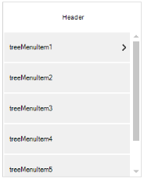

# Concept and Features

## Populating Items

The TreeNavigator is populated with the collection of TreeMenuItem using the Items property.

The following code example allows you to add TreeMenuItem to the TreeNavigator.



//Adds items to the TreeNavigator.

 TreeMenuItem treeMenuItem1 = new TreeMenuItem();

 this.treeNavigator.Items.Add(this.treeMenuItem1);




‘Adds items to the TreeNavigator.

Dim treeMenuItem1 As New TreeMenuItem()

Me.treeNavigator.Items.Add(Me.treeMenuItem1)



## Navigation Mode

 There are two modes of Navigation in this control.

* Default Mode
* Extended Mode

### Default Mode

In this Default mode, the header of current hierarchy level item is displayed at the top of the TreeNavigator with the back button. This back button is used to navigate towards the root from the current level. 

The following code examples allow you to choose the navigation mode.



this.treeNavigator.NavigationMode = NavigationMode.Default;




Me.treeNavigator1.NavigationMode = NavigationMode.Default



### Extended Mode

In the Extended mode, header of each level from the root to current level stacked one by one at the top of the TreeNavigator.  When you click on any of that header it take you to the corresponding level. 

The following code examples allow you to choose the Navigation mode.



this.treeNavigator.NavigationMode = NavigationMode.Extended;





Me.TreeNavigator1.NavigationMode = NavigationMode.Extended



## Header Customization

The height, Text, Back color, and Text color of the header are customized by using the Header property.

The following code example allows you to customize the header.



//Customizes the Header area

this.treeNavigator1.Header.Height = 200;

this.treenavigator1.Header.HeaderText = "Enterprise ToolKit";

this.treeNavigator1.Header.HeaderBackColor = Color.White;

this.treeNavigator1.Header.HeaderForeColor = Color.Black;

//Show/hide the Header area

this.treeNavigator1.ShowHeader = false;





'Customizes the Header area

Me.TreeNavigator1.Header.Height = 200

Me.TreeNavigator1.Header.HeaderText = "Enterprise ToolKit"

Me.TreeNavigator1.Header.HeaderBackColor = Color.White

Me.TreeNavigator1.Header.HeaderForeColor = Color.Black

'Show/hide the Header area

Me.TreeNavigator1.ShowHeader = False



## Item Selection

The selected item of the current hierarchy level is get/set through SelectedItem property.

The following code examples allow you to set the SelectedItem.



 this.treeNavigator1.SelectedItem = treeMenuItem1;





Me.treeNavigator1.SelectedItem = treeMenuItem1



### Text Alignment

This property is used to set the Text Alignment for the TreeMenuItem. There are three alignments, Left, Right, and Center.

The following code examples allow you to set the alignment for the text in the TreeMenuItem.



this.treeNavigator.TextAlign = TextAlignment.Left;

this.treeNavigator.TextAlign = TextAlignment.Right;

this.treeNavigator.TextAlign = TextAlignment.Center;





Me.TreeNavigator1.TextAlign = TextAlignment.Center

Me.TreeNavigator1.TextAlign = TextAlignment.Left

Me.TreeNavigator1.TextAlign = TextAlignment.Right



