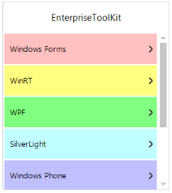

## TreeNavigator

The TreeNavigator control provides an interface that allows you to navigate through hierarchical information without using excessive screen space. Items in the control are expanded or collapsed, and you can drill down to sub-items by simply clicking on items in the TreeNavigator. 

{:.image }

Key Features

    Navigation Modes - There are two modes of Navigation

* Default
* Extended
#### Getting Started

This section briefly describes how to design a TreeNavigator Control in a WindowsForms Application.

* Adding a TreeNavigator Control 
* Configuring the TreeNavigator Control
##### Add a TreeNavigator Control

* Create a new Windows Forms Application Project in VS IDE through New Project Wizard.
* Drag and Drop TreeNavigator control in the Form from Toolbox.

{:.image }

##### Configure the TreeNavigator Control

The most commonly used settings of the TreeNavigator control are configured either through Designer using the Smart tag or through the Properties window or through code.

{:.image }

To add TreeNavigator Control to a Windows Forms Application through code behind.

1. Include the namespaces Syncfusion.Windows.Forms and Syncfusion.Windows.Forms.Tools.

[C#]

//Namespaces.

using Syncfusion.Windows.Forms.Tools;

using Syncfusion.Windows.Forms;

[VB]

‘Namespaces.

Imports Syncfusion.Windows.Forms

Imports Syncfusion.Windows.Forms.Tools

2. Create an instance of the TreeNavigator control and add it to the Form.

[C#]

//Creates the Treenavigator instance.

TreeNavigator treeNavigator = new TreeNavigator();

this.Controls.Add(treeNavigator);

 [VB]

‘Creates the TreeNavigator instance.

Dim treeNavigator As New TreeNavigator()

Me.Controls.Add(treeNavigator)

#### Concept and Features

##### Populating Items

The TreeNavigator is populated with the collection of TreeMenuItem using the Items property.

The following code example allows you to add TreeMenuItem to the TreeNavigator.

[C#]

//Adds items to the TreeNavigator.

 TreeMenuItem treeMenuItem1 = new TreeMenuItem();

 this.treeNavigator.Items.Add(this.treeMenuItem1);

[VB]

‘Adds items to the TreeNavigator.

Dim treeMenuItem1 As New TreeMenuItem()

Me.treeNavigator.Items.Add(Me.treeMenuItem1)

{:.image }

##### Navigation Mode

 There are two modes of Navigation in this control.

* Default Mode
* Extended Mode
###### Default Mode

In this Default mode, the header of current hierarchy level item is displayed at the top of the TreeNavigator with the back button. This back button is used to navigate towards the root from the current level. 

{:.image }

The following code examples allow you to choose the navigation mode.

[C#]

this.treeNavigator.NavigationMode = NavigationMode.Default;

[VB]

Me.treeNavigator1.NavigationMode = NavigationMode.Default

###### Extended Mode

In the Extended mode, header of each level from the root to current level stacked one by one at the top of the TreeNavigator.  When you click on any of that header it take you to the corresponding level. 

{:.image }

The following code examples allow you to choose the Navigation mode.

[C#]

this.treeNavigator.NavigationMode = NavigationMode.Extended;

[VB]

Me.TreeNavigator1.NavigationMode = NavigationMode.Extended

##### Header Customization

The height, Text, Back color, and Text color of the header are customized by using the Header property.

The following code example allows you to customize the header.

[C#]

//Customizes the Header area

this.treeNavigator1.Header.Height = 200;

this.treenavigator1.Header.HeaderText = "Enterprise ToolKit";

this.treeNavigator1.Header.HeaderBackColor = Color.White;

this.treeNavigator1.Header.HeaderForeColor = Color.Black;

//Show/hide the Header area

this.treeNavigator1.ShowHeader = false;

[VB]

'Customizes the Header area

Me.TreeNavigator1.Header.Height = 200

Me.TreeNavigator1.Header.HeaderText = "Enterprise ToolKit"

Me.TreeNavigator1.Header.HeaderBackColor = Color.White

Me.TreeNavigator1.Header.HeaderForeColor = Color.Black

'Show/hide the Header area

Me.TreeNavigator1.ShowHeader = False

##### Item Selection

The selected item of the current hierarchy level is get/set through SelectedItem property.

The following code examples allow you to set the SelectedItem.

[C#]

 this.treeNavigator1.SelectedItem = treeMenuItem1;

 [VB]

Me.treeNavigator1.SelectedItem = treeMenuItem1

##### Text Alignment

This property is used to set the Text Alignment for the TreeMenuItem. There are three alignments, Left, Right, and Center.

The following code examples allow you to set the alignment for the text in the TreeMenuItem.

[C#]

this.treeNavigator.TextAlign = TextAlignment.Left;

this.treeNavigator.TextAlign = TextAlignment.Right;

this.treeNavigator.TextAlign = TextAlignment.Center;

[VB]

Me.TreeNavigator1.TextAlign = TextAlignment.Center

Me.TreeNavigator1.TextAlign = TextAlignment.Left

Me.TreeNavigator1.TextAlign = TextAlignment.Right

#### Frequently Asked Questions

##### What are the events implemented in the TreeNavigator?

Following listed events are available in TreeNavigator for use.

* SelectionChanging
* SelectionChanged

SelectionChanging Event

This event is triggered before the TreeMenuItem selection.

Event Data

SelectionStateChangingEventArgs contains the following members that provide information specific to this event.

 _Table_ _937__: Selection Changing Event_

<table>
<tr>
<td>
Members</td><td>
Description</td></tr>
<tr>
<td>
NewValue</td><td>
This property returns the newly selected item.</td></tr>
<tr>
<td>
OldValue</td><td>
This property returns the previously selected item.</td></tr>
<tr>
<td>
Expanded</td><td>
This property returns true when the selected item is expanded.</td></tr>
<tr>
<td>
Cancel</td><td>
This property enables you to avoid particular item from Selection.</td></tr>
</table>

[C#]

void treeNavigator1_SelectionChanging(TreeNavigator sender, SelectionStateChangingEventArgs args)

   {

       args.Cancel = true;

       TreeMenuItem Newitem = args.NewValue;

        TreeMenuItem OldItem = args.OldValue;

       bool temp = args.Expanded;

   }

[VB]

Private Sub treeNavigator1_SelectionChanging(sender As TreeNavigator, args As SelectionStateChangingEventArgs)

        args.Cancel = True

        Dim Newitem As TreeMenuItem = args.NewValue

        Dim OldItem As TreeMenuItem = args.OldValue

        Dim temp As Boolean = args.Expanded

End Sub

SelectionChanged Event

This event triggers after the selection of the TreeMenuItem.

Event Data

SelectionStateChangedEventArgs contains the following members that provide information specific to this event.

_Table_ _938__: Selection Changed Event_

<table>
<tr>
<td>
Members</td><td>
Description</td></tr>
<tr>
<td>
SelectedItem</td><td>
This property returns the currently selected item.</td></tr>
<tr>
<td>
Expanded</td><td>
This property returns true when the selected item is expanded.</td></tr>
</table>

[C#]

void treeNavigator1_SelectionChanged(TreeNavigator sender, SelectionStateChangedEventArgs e)

    {

        TreeMenuItem tm = e.SelectedItem;

        bool temp = e.Expanded;

    }

[VB]

Private Sub treeNavigator1_SelectionChanged(sender As TreeNavigator, e As SelectionStateChangedEventArgs)

   Dim tm As TreeMenuItem = e.SelectedItem

   Dim temp As Boolean = e.Expanded

End Sub

##### How to prevent a TreeMenuItem from being selected?

You can use the following code examples to prevent an item from selecting a TreeMenuItem.

[C#]

void treeNavigator1_SelectionChanging(TreeNavigator sender, SelectionStateChangingEventArgs args)

{

     if (args.NewValue.Text == "Windows Forms")

         args.Cancel = true;

}

[VB]

Private Sub treeNavigator1_SelectionChanging(sender As TreeNavigator, args As SelectionStateChangingEventArgs)

     If (args.NewValue.Text =="Windows Forms")

         args.Cancel = True

     End If

End Sub

##### How to set ItemBackColor for individual TreeMenuItem?

The TreeMenuItem back color is customized individually by using ItemBackColor property. 

The following code examples allow you to set back color for the individual TreeMenuItem. 

[C#]

this.treeMenuItem1.ItemBackColor = Color.FromArgb(243,241,243);

[VB]

Me.TreeMenuItem1.ItemBackColor = Color.FromArgb(243, 241, 243)

{:.image }

##### How to set Border color and Border thickness for the TreeNavigator control?

The border thickness and border color of the TreeNavigator are changed by using the BorderColor and BorderThickness properties.

The following code examples allow you to change the BorderColor and BorderThickness.

[C#]

this.treeNavigator1.BorderColor = System.Drawing.Color.Blue;

this.treeNavigator1.BorderThickness = 5;

[VB]

Me.TreeNavigator1.BorderColor = Color.Blue

Me.TreeNavigator1.BorderThickness = 5

{:.image }

