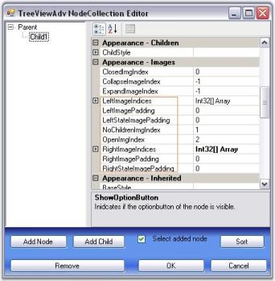
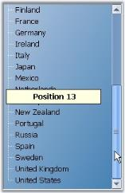
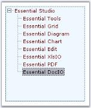
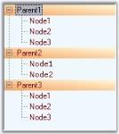

# TreeView Package

The Essential Tools' TreeViewAdv control implements a classical tree structure with support for left, right and state images, check box and option buttons, tooltips and help text capabilities. It has special features to give the TreeViewAdv control a neat look, like Gutter space, Indent Space, changing color of the lines connecting the nodes, color options for the check boxes. It provides advanced drag-and-drop UI support, context-menu association, gradient backgrounds and multiple border styles, unlimited number of controls for each nodes. The control comes with complete design-time support.

* The TreeViewAdv control contains a hierarchical collection of TreeNodeAdv objects which gets rendered in a classical tree structure.
* The top level nodes and the children nodes of the TreeNodeAdv can be accessed through the node's properties.
* While the TreeViewAdv exposes some global styles that are to be applied for all the nodes, the TreeNodeAdv lets the users to specify styles for a specific node. The Styles Architecture which will be discussed later in this section, lets the users to define styles for nodes at different levels of the tree. This allows the users to specify styles for a class of nodes.

## Features Overview

The TreeView package provides an advanced TreeViewAdv control with numerous styles and extensive customization capabilities. The features of the control are  listed below.

Features

Look and Feel - The control can be applied with impressive look and feel by providing different options for the users to customize the appearance of the control. 

Enhanced performance 

TreeViewAdv control can be populated with large number of nodes on node expand / collapse. The performance while populating the TreeViewAdv with large number of nodes can be improved by the SuspendExpandRecalculate property.

CheckBox support 

Interactive check boxes that could be checked or unchecked, which will indicate the check state of the child node's check boxes. 

Node Images

Tree nodes can hold left images, right images and images for different state of the nodes like expand and collapse.

Load on demand 

Enhances the performance by reducing the loading time of the nodes by displaying the nodes only on demand by the user. This provides the user to delay the loading of nodes in Trees, until the user initiates the nodes to expand.

Customizing nodes

Allows you to edit and customize the nodes at all levels.

* LabelEdit - property that helps users to easily edit the node text at run time.
* Nodes selection - allows to select a single node or select all the nodes or only the specified nodes.
* OwnerDrawNodes - property that allows user to paint the background of the node. 
* Text Color - option to customize node text color.
* Font - option to change the node's font.
* HelpText - can be enabled for each and every nodes. Each nodes can display its own information.

Scroll support 

Provides automatic scrolling support for the treeview controls as well as hidden nodes when the mouse is near the borders. 

Sorting

Different types of sorting can be performed for the tree nodes like ascending, descending.

Office2007ScrollBars

TreeViewAdv provides support for Office2007Scrollbars with all the three color schemes.

ToolTip 

Allows us to show and hide tooltips for the nodes wherever necessary.

Drag and Drop 

Provides support for advanced drag and drop of the nodes.

Context Menus

TreeViewAdv has the ability to associate context menus with the option to show and hide wherever necessary. This pops up when right mouse button is clicked on a tree node.

Styles Architecture 

Supports a flexible style architecture to let users define the styles for nodes at different levels of the Tree. It helps the users to specify the styles for a specific node or for a class of nodes.

Custom Control

Support for custom control feature allows to add custom controls to the tree structure that can be embedded to the required tree node. See custom control for details.

See Also

Concepts and Features

## Creating TreeViewAdv

This section will provide a step-by-step procedure to design a TreeViewAdv control by using designer and through programmatical approach in .NET application.

### Through Designer

Tree nodes can be added to the control at design time as follows.

1. Create an application in Visual Studio .NET.
2. In the designer, drag and drop a TreeViewAdvcontrol to your form, from the toolbox.
3. Select the TreeViewAdv control in the form. In theproperties, click the ellipsis button of the Nodes property to open the NodeCollection Editor. You can also open this editor using task window or by right clicking the control and selecting Node Editor.
4. This TreeViewAdv NodeCollection Editor can also be invoked by clicking the Node Editor option, which appears when the TreeViewAdv control is right clicked at the design time. User can also add top level nodes by clicking the Add Node option. The below image illustrates the same. The nodes added can be customized using the NodeCollection Editor.

   

5. Click "Add Node". This will add a new top-level node.
6. The node's properties will be displayed in the property grid to the right. Specify a custom label for the node by changing its text property as shown in the below image.

   

7. Click "Add Node" to add another sibling to the selected node.
8. Click "Add Child" to add a child node to the selected node.
9. Repeat steps 5 and 6 as required in the application.
10. Click "Remove" to delete a selected node.
11. To move a node to a different parent, just drag-and-drop that node over the parent or besides the desired sibling.
12. Click "OK" to save changes.

### Through Code

Tree nodes can be added to the control programmatically as follows.

1. Add the namespace Syncfusion.Windows.Forms.Tools in your project.

   ~~~ cs

		using Syncfusion.Windows.Forms.Tools;

   ~~~
   {:.prettyprint }   

   ~~~ vbnet
   
		Imports Syncfusion.Windows.Forms.Tools

   ~~~
   {:.prettyprint }

2. Add theTreeViewAdvcontrol to your form in the designer.
3. A TreeViewAdv control can be created programmatically using the below code snippet.

   ~~~ cs

		private Syncfusion.Windows.Forms.Tools.TreeViewAdv treeViewAdv1;

		treeViewAdv1 = new Syncfusion.Windows.Forms.Tools.TreeViewAdv();

		treeViewAdv1.Name = "NewTreeViewAdv";

		this.Controls.Add(this.treeViewAdv1);

   ~~~
   {:.prettyprint }

   ~~~ vbnet

		Private treeViewAdv1 As Syncfusion.Windows.Forms.Tools.TreeViewAdv

		treeViewAdv1 = New Syncfusion.Windows.Forms.Tools.TreeViewAdv 

		treeViewAdv1.Name = "NewTreeViewAdv" 

		Me.Controls.Add(Me.treeViewAdv1)

   ~~~
   {:.prettyprint }

4. Create a new instance of a node.

   ~~~ cs

		//Creating new instance of node.

		TreeNodeAdv node = new TreeNodeAdv("Top1");

   ~~~
   {:.prettyprint }

   ~~~ vbnet

		'Creating new instance of node.

		Dim node As New TreeNodeAdv("Top1")

   ~~~
   {:.prettyprint }

5. Add the created node to the tree control. This will add as a top-level node.

   ~~~ cs

		//Add the created nodes to the TreeViewAdv.

		this.treeViewAdv1.Nodes.Add(node);

   ~~~
   {:.prettyprint }

   ~~~ vbnet

		'Add the created nodes to the TreeViewAdv.

		Me.TreeViewAdv1.Nodes.Add(node)

   ~~~
   {:.prettyprint }

6. If you want to add a node to an existing node, use the code snippet shown below.

   ~~~ cs

		//Add nodes to the existing nodes.

		node.Nodes.Add(new TreeNodeAdv("Child 1"));

   ~~~
   {:.prettyprint }

   ~~~ vbnet

		'Add nodes to the existing nodes.

		node.Nodes.Add(New TreeNodeAdv("Child 1"))

   ~~~
   {:.prettyprint }

7. Repeat steps 3 to 5 to continue adding more top-level nodes and child nodes.
8. Run the application.
9. The resulting form is shown in the below image.

### Concepts and  Features

This section provides some tips and ideas on how to implement TreeView technology into your projects, to improve customization and increase efficiency. The important concepts to be dealt with, in this package are listed below.

* TreeNode Features - Discusses the tree node specific features.
* Drag and Drop - Discusses drag and drop feature of the nodes and related concepts.
* RunTime Features - Discusses the features at run time like context menu, tooltip etc.,
* TreeView Appearance - Discusses all the properties for customizing the treeview appearance.
* Styles Architecture - Elaborates the styles architecture for the tree view.
* LoadOnDemand - Describes the load on demand concepts.
* DataBinding - Illustrates databinding concepts.
* Sorting - Guides you to sort the nodes.
* Performance - Gives the properties and methods which can improve the performance of the control.

#### TreeNode Features

This section discusses the following topics.

##### Primitives

The TreeViewAdv control supports a set of primitive collections, that can be set through the Primitives Collection Editor available with each node in the TreeViewAdv controls. 

The types of primitives available are LabelPrimitive, LeftImagePrimitive, RightImagePrimitive, CheckBoxPrimitive, OptionButtonPrimitive and CustomControlPrimitive.

The Primitive Collection Editor available for each node provides index property. Using this index set, for each primitive, the position for each of these node contents can be set.

* LabelPrimitive - LabelPrimitive is used to display the text of the label.
* LeftImagePrimitive - LeftImagePrimitive is used to display the image to the left of the nodes. 
* RightImagePrimitive - RightImagePrimitive is used to display the image that is added to the right of the nodes.
* StateImagePrimitive - StateImagePrimitive is used to display the state image of the node depending on its state, whether expanded or collapsed.
* CheckBoxPrimitive - CheckBoxPrimitive is used to display the checkbox for the nodes. When user clicks on this, the node will be checked.
* OptionButtonPrimitive - OptionButtonPrimitive is used to display the Option button available for the nodes. When the user clicks this primitive, the corresponding node will be selected.
* CustomControlPrimitives - CustomControlPrimitive displays the custom control for the nodes. User can use the functionality of the custom control primitive which is added to the nodes.	

See also

Node Images

Checkbox and Option Buttons

CustomControls

#### Node Images

TreeViewAdv control can be customized with images for each of its actions for example collapse / expand state, plus / minus of the tree etc., This section discusses about the below topics.

* Left, Right and State Images
* Expand and Collapse Image
* Line Images
* Image Overlaying
* Plus Sign On ExpandMode

See Also

Node Images Events

Left, Right and State Images

This section discusses about adding Left, Right and State images to the nodes and various image settings for the TreeViewAdv control.

Left/Right Images

The tree nodes can be set with left / right images using LeftImageList and RightImageList properties in the property window. Left / Right images for the individual nodes can be specified in LeftImageIndices and RightImageIndices properties of individual nodes, using the TreeViewAdv Nodes Collection Editor. 

The nodes with the images can be given an enhanced appearance using LeftImagePadding and RightImagePadding.

_Table_ _854_:Property Table

<table>
<tr>
<td>
TreeViewAdv Property</td><td>
Description</td></tr>
<tr>
<td>
LeftImageList</td><td>
Indicates the imagelist that holds the images to be drawn on the left of the Node. </td></tr>
<tr>
<td>
RightImageList</td><td>
This indicates the imagelist that holds the images to be drawn on the right of the Node.</td></tr>
</table>

_Table_ _855_:Property Table

<table>
<tr>
<td>
TreeNodeAdv Property</td><td>
Description</td></tr>
<tr>
<td>
LeftImageIndices</td><td>
It is the image index to be drawn on the left of the node's text.</td></tr>
<tr>
<td>
RightImageIndices</td><td>
It is the image index to be drawn on the right of the node's text.</td></tr>
<tr>
<td>
LeftImagePadding</td><td>
It is the space provided between the LeftImage of the node and node.</td></tr>
<tr>
<td>
RightImagePadding</td><td>
It is the space provided between the RightImage of the node and node.</td></tr>
</table>

Setting State Images

Different images can be set for expand / collapse states of the node, using StateImageList property. To apply the left open and close images, set the ClosedImgIndex and the OpenImgIndex to the indices that points to the images in the StateImageList respectively. Nodes without child can be set with a separate image using NoChildrenImageIndex.

_Table_ _856_:Property Table

<table>
<tr>
<td>
TreeViewAdv Property</td><td>
Description</td></tr>
<tr>
<td>
ClosedImgIndex</td><td>
It is the StateImageList index value of the image that is displayed, when a tree node is collapsed.</td></tr>
<tr>
<td>
NoChildrenImgIndex</td><td>
It is the StateImageList index value of the image that is displayed, when a tree node has no children.</td></tr>
<tr>
<td>
NodeStateImageList</td><td>
Indicates the imagelist with images that are displayed instead of expand / collapse button.</td></tr>
<tr>
<td>
OpenImgIndex</td><td>
It is the StateImageList index value of the image that is displayed, when a tree node is expanded.</td></tr>
<tr>
<td>
StateImageList</td><td>
This indicates the imagelist that holds the images to be drawn based on the state of the Node.</td></tr>
</table>

> Note: The above properties can also be set for individual nodes.

<table>
<tr>
<td>
TreeNodeAdv Property</td><td>
Description</td></tr>
<tr>
<td>
ClosedImageIndex</td><td>
It is the imageindex in StateImageList where the node is collapsed.</td></tr>
<tr>
<td>
NoChildrenImgIndex</td><td>
It is the imageindex indicating the image in the StateImageList where the node has no children.</td></tr>
<tr>
<td>
OpenImgIndex</td><td>
It is the imageindex in StateImageList where the node is expanded.</td></tr>
<tr>
<td>
LeftStateImagePadding</td><td>
It is the space provided between, the LeftStateImage of the node and node.</td></tr>
<tr>
<td>
RightStateImagePadding</td><td>
It is the space provided between, the RightStateImage of the node and node.</td></tr>
</table>
Customizing the Image Size

The ImageSize property let you enhance the image size for a TreeNodeAdv. By default, the TreeViewAdv control displays the image size depending on the size of the image that is set in the image list.



this.leftImageList.ImageSize = new System.Drawing.Size(16, 16);

this.rightImageList.ImageSize = new System.Drawing.Size(16, 16);

this.stateImageList.ImageSize = new System.Drawing.Size(16, 16);





Me.leftImageList.ImageSize = New System.Drawing.Size(16, 16)

Me.rightImageList.ImageSize = New System.Drawing.Size(16, 16)

Me.stateImageList.ImageSize = New System.Drawing.Size(15, 15)



See Also

Line images

Expand and Collapse Image

Styles Architecture

Expand and Collapse Image

When child nodes are added to a node, automatically the expand / collapse (+/-) images are set by default, to the parent node, which indicates whether the nodes are opened or closed. These default images can be replaced with custom images using NodeStateImageList property.

* Images to be displayed for the expanded and collapsed nodes can be specified in the DefaultExandImageIndex and DefaultCollapseImageIndex properties respectively.
* Images for individual nodes can be specified in treeNodeAdv.ExpandImageIndex / treeNodeAdv.CollapseImageIndex properties. Setting these properties will override the expand / collapse image settings that is applied for the control.

_Table_ _858_:Property Table

<table>
<tr>
<td>
TreeViewAdv Property</td><td>
Description</td></tr>
<tr>
<td>
Expanded</td><td>
Indicates if the node is expanded.</td></tr>
<tr>
<td>
DefaultCollapseImageIndex</td><td>
It is the default imageindex when a tree node is collapsed.</td></tr>
<tr>
<td>
DefaultExpandImageIndex</td><td>
It is the default imageindex when a tree node is expanded.</td></tr>
<tr>
<td>
NodeStateImageList</td><td>
Indicates the imagelist with images that are displayed instead of expand / collapse button.</td></tr>
</table>

These properties can be set at the node level using the below properties.

_Table_ _859_:Property Table

<table>
<tr>
<td>
TreeNodeAdv Property</td><td>
Description</td></tr>
<tr>
<td>
CollapseImageIndex</td><td>
It is the imageindex for collapse button.</td></tr>
<tr>
<td>
ExpandImageIndex</td><td>
It is the imageindex for expand button.</td></tr>
</table>

> Note: You can customize the background of the plusminus control. Click here to know more about this.

See Also

Line Images

Line Images

TreeViewAdv control provides options to customize the lines which connects the nodes and also can hold custom images for expand / collapse operations. These properties are discussed in this section.

Line and Plus/Minus images

ShowRootLines when disabled, does not display the connecting lines for root items alone. That is, show lines will be displayed for rest of the items except for the level-1 items which will not be connected to one another with show lines.

ShowLines when disabled, does not display the connecting lines for the entire tree control. The hierarchical lines can be customized by setting the type of lines to be used and the color using the LineStyle and LineColor properties.

The standard +/- signs for the expand/collapse buttons in the TreeViewAdv can be replaced with custom images by setting the ImageList to the NodeStateImageList property of the TreeViewAdv. This is discussed here.

ShowPlusMinus when disabled, does not display the plus / minus images for the parent nodes, i.e., the expand/collapse images will not be displayed.

_Table_ _860_:Property Table

<table>
<tr>
<td>
TreeViewAdv Property</td><td>
Description</td></tr>
<tr>
<td>
LineColor</td><td>
Indicates the color of the tree lines.</td></tr>
<tr>
<td>
LineStyle</td><td>
Indicates the line styles of the tree lines.</td></tr>
<tr>
<td>
ShowLines</td><td>
Indicates if the tree lines are visible.</td></tr>
<tr>
<td>
ShowPlusMinus</td><td>
Indicates if the plus or minus controls are visible for the tree.</td></tr>
<tr>
<td>
ShowRootLines</td><td>
Indicates whether lines are displayed between root nodes.</td></tr>
</table>



this.treeViewAdv1.LineColor = System.Drawing.Color.Black;

this.treeViewAdv1.LineStyle = System.Drawing.Drawing2D.DashStyle.Dash;

this.treeViewAdv1.ShowLines = true;

this.treeViewAdv1.ShowPlusMinus = true;

this.treeViewAdv1.ShowRootLines = true;





Me.treeViewAdv1.LineColor = System.Drawing.Color.Black

Me.treeViewAdv1.LineStyle = System.Drawing.Drawing2D.DashStyle.Dash

Me.treeViewAdv1.ShowLines = True

Me.treeViewAdv1.ShowPlusMinus = True

Me.treeViewAdv1.ShowRootLines = True



> Note: ShowPlusMinus properties can also be set for individual nodes.

<table>
<tr>
<td>
TreeNodeAdv Property</td><td>
Description</td></tr>
<tr>
<td>
ShowPlusMinus</td><td>
Indicates if the plus or minus of the node is visible.</td></tr>
</table>
Image Overlaying

The steps below will show how you could draw overlay images on the images associated with the tree nodes.

* Set the TreeViewAdv's OwnerDrawNodes property to true.
* Handle the TreeViewAdv's AfterNodePaint event as shown in code below to perform overlaying of images. The below code snippet shows overlaying LeftImages. The same code snippet can be used for overlaying RightImages and StateImages also by replacing LeftImagesX with RightImagesX and StateImagesX respectively.



private void treeViewAdv1_AfterNodePaint(object sender, Syncfusion.Windows.Forms.Tools.TreeNodeAdvPaintEventArgs e)

{

// Suppose you wish to draw an overlay image on the image associated with the selected node.

TreeNodeAdv node = this.treeViewAdv1.SelectedNode;

// Get the position of the node's image.

Point point = new Point(node.LeftImagesX, node.TextAndImageBounds.Y);

// Perform image drawing.

e.Graphics.DrawImage(overlayImage, point);

}





Private Sub treeViewAdv1_AfterNodePaint(sender As Object, e As Syncfusion.Windows.Forms.Tools.TreeNodeAdvPaintEventArgs) Handles treeViewAdv1.AfterNodePaint

' Suppose you wish to draw an overlay image on the image associated with the selected node.

Dim node As TreeNodeAdv = Me.treeViewAdv1.SelectedNode

' Get the position of the node's image.

Dim point As New Point(node.LeftImagesX, node.TextAndImageBounds.Y)

' Perform image drawing.

e.Graphics.DrawImage(overlayImage, point)

End Sub 



A sample demonstrating this feature is available in the below sample installation location.

…\_My Documents\Syncfusion\EssentialStudio\Version Number\Windows\Tools.Windows\Samples\Advanced Editor Functions\ActionGroupingDemo_

Plus Sign On ExpandMode

The nodes in the tree view, even when it is in the expanded state, can still display the PLUS (+) sign using the ShowPlusOnExpand property.

LoadOnDemand property should be set to true for this feature to be effected.

The BeforeExpand event will be raised when the plus is clicked again and when in expanded mode so that you can check the datasource for changes. 

_Table_ _862_:Property Table

<table>
<tr>
<td>
TreeNodeAdv Property</td><td>
Description</td></tr>
<tr>
<td>
ShowPlusOnExpand</td><td>
Indicates if the plus minus of the node is visible.</td></tr>
</table>

This will effect only if the LoadOnDemand property is set to true.



this.treeViewAdv1.LoadOnDemand = true;

private void button1_Click(object sender, System.EventArgs e)

{

     TreeNodeAdv node=this.treeViewAdv1.Nodes[2];

     // Setting ShowPlusOnExpand to true for the selected node.

     node.ShowPlusOnExpand=true;

     this.treeViewAdv1.SelectedNode=this.treeViewAdv1.Nodes[2];

}





Me.treeViewAdv1.LoadOnDemand = True

Private Sub button1_Click(ByVal sender As Object, ByVal e As System.EventArgs)

    Dim node As TreeNodeAdv=Me.treeViewAdv1.Nodes(2)

   ' Setting ShowPlusOnExpand to true for the selected node.

    node.ShowPlusOnExpand=True

    Me.treeViewAdv1.SelectedNode=Me.treeViewAdv1.Nodes(2)

End Sub



Given below is a screen shot of this.

##### Checkbox and Option buttons

Adding Checkbox to the Nodes

The ShowCheckBoxes property when set will display check box for all the nodes. To apply checkbox to individual nodes, set the TreeNodeAdv.ShowCheckBox property, only for the required nodes in the NodeCollection Editor.

The InteractiveCheckBoxes indicates whether the state of the parent node's checkbox is based on the checkstate of it's child nodes checkboxes. To set this for individual nodes set the InteractiveCheckBox property of the TreeNodeAdv.

_Table_ _863_:Property Table

<table>
<tr>
<td>
TreeViewAdv Property</td><td>
Description</td></tr>
<tr>
<td>
ShowCheckBoxes</td><td>
Indicates if the checkbox will be shown for the nodes.</td></tr>
<tr>
<td>
InteractiveCheckBoxes</td><td>
Indicates if the state of the node's checkbox indicates the checkstate of the child node's checkboxes.</td></tr>
</table>

_Table_ _864_:Property Table

<table>
<tr>
<td>
TreeNodeAdv Property</td><td>
Description</td></tr>
<tr>
<td>
ShowCheckBox</td><td>
Indicates if the checkbox of the node is visible.</td></tr>
<tr>
<td>
InteractiveCheckBox</td><td>
Indicates if the node will have an interactive checkbox.</td></tr>
</table>

> Note: On Changing the checkstate of the checkbox, AfterInteractiveChecks event will be triggered.

Tristate CheckBox Settings

In the TreeViewAdv, the partial checking of the child nodes are supported. They are Checked State, Unchecked State and Intermediate State.

The CheckColor and CheckState property is used to set the color and the state of the check mark of the particular selected node. The options for the CheckState property are Checked, Unchecked and Indeterminate.

_Table_ _865_:Property Table

<table>
<tr>
<td>
TreeNodeAdv Property</td><td>
Description</td></tr>
<tr>
<td>
CheckColor</td><td>
Indicates the color of the check mark.</td></tr>
<tr>
<td>
CheckState</td><td>
Indicates the check state of the node.</td></tr>
<tr>
<td>
IntermediateCheckColor</td><td>
Indicates the color of the check mark when it is in intermediate state or when its CheckState property is set to indeterminate.</td></tr>
<tr>
<td>
Checked</td><td>
This indicates if the node's checkbox is checked.</td></tr>
<tr>
<td>
EnsureDefaultOptionedChild</td><td>
This specifies if at least one child of the parent node should be selected at all times.</td></tr>
</table>



treeNodeAdv8.CheckColor = System.Drawing.SystemColors.ControlDarkDark;

treeNodeAdv7.CheckState = System.Windows.Forms.CheckState.Indeterminate;

treeNodeAdv8.EnsureDefaultOptionedChild =  true;

treeNodeAdv8.Checked = true;





TreeNodeAdv8.CheckColor = System.Drawing.SystemColors.ControlDarkDark

TreeNodeAdv7.CheckState = System.Windows.Forms.CheckState.Indeterminate

TreeNodeAdv8.EnsureDefaultOptionedChild = True

TreeNodeAdv8.Checked = True



Adding Option Buttons

ShowOptionButtons property, when set, will add option buttons to all the nodes which can be applied for the required nodes alone, by setting the property for the respective nodes in the NodeCollection Editor.

_Table_ _866_:Property Table

<table>
<tr>
<td>
TreeNodeAdv Property</td><td>
Description</td></tr>
<tr>
<td>
SelectedOptionButtonColor</td><td>
Indicates the color of the option button in the selected state.</td></tr>
<tr>
<td>
ShowOptionButton</td><td>
Indicates if the optionbutton of the node is visible.</td></tr>
<tr>
<td>
OptionButtonColor</td><td>
This indicates the color of the option button.</td></tr>
<tr>
<td>
Optioned</td><td>
This indicates if the node's option button is checked.</td></tr>
</table>



treeNodeAdv9.SelectedOptionButtonColor = System.Drawing.Color.Red;

treeNodeAdv3.OptionButtonColor = System.Drawing.Color.AliceBlue;

treeNodeAdv6.OptionButtonColor = System.Drawing.Color.PowderBlue;

treeNodeAdv8.OptionButtonColor = System.Drawing.Color.MediumAquamarine;





TreeNodeAdv9.SelectedOptionButtonColor = System.Drawing.Color.Red

treeNodeAdv3.OptionButtonColor = System.Drawing.Color.AliceBlue

treeNodeAdv6.OptionButtonColor = System.Drawing.Color.PowderBlue

treeNodeAdv8.OptionButtonColor = System.Drawing.Color.MediumAquamarine



Disabling a node's Checkbox or Option button

The user can disable the checkbox or the option button of a node and can still select and deselect the node by setting the EnabledButtons property to false of the respective TreeNodeAdv.

_Table_ _867_:Property Table

<table>
<tr>
<td>
TreeNodeAdv Property</td><td>
Description</td></tr>
<tr>
<td>
EnabledButtons</td><td>
Indicates if the buttons that are displayed, are enabled for the particular node.</td></tr>
</table>

##### Custom Controls

Tree Nodes can hold controls using this Custom Controls feature. This widens the functionality and view of the Tree nodes. With this feature, the nodes can hold controls like combo box, Calendar, Chart etc.,

Any custom control can be dragged and dropped to the form and selected using TreeNodeAdv.CustomControls property

We can also add functionality based on the changes made to the CustomControls.

A sample which demonstrates Custom Controls feature is available in the below sample installation location. This sample illustrates adding functionality based on the changes to the custom controls.

…\_My Documents\Syncfusion\EssentialStudio\Version Number\Windows\Tools.Windows\Samples\Advanced Editor Functions\ActionGroupingDemo_

##### Enabling the control

The TreeView control can be enabled using the below properties.

_Table_ _868_:Property Table

<table>
<tr>
<td>
TreeViewAdv Property</td><td>
Description</td></tr>
<tr>
<td>
Enabled</td><td>
Indicates whether the control is enabled and can respond to user interactions.</td></tr>
</table>
_Table_ _869_:Property Table

<table>
<tr>
<td>
TreeNodeAdv Property</td><td>
Description</td></tr>
<tr>
<td>
Enabled</td><td>
Indicates whether a particular node is enabled.</td></tr>
</table>

#### Drag And Drop

The drag and drop functionality is fully supported through the various drag drop events.

_Table_ _870_:Events Table

<table>
<tr>
<td>
TreeNodeAdv Events</td><td>
Description</td></tr>
<tr>
<td>
DragDrop</td><td>
Specifies the function to be triggered after an item is dropped.</td></tr>
<tr>
<td>
DragEnter</td><td>
Specifies the function to be triggered when an item is dragged inside the control bounds.</td></tr>
<tr>
<td>
DragLeave</td><td>
Specifies the function to be triggered when an item is dragged outside the control bounds.</td></tr>
<tr>
<td>
DragOver</td><td>
Specifies the function to be triggered when an item is dragged over the control bounds.</td></tr>
<tr>
<td>
GiveFeedback</td><td>
Specifies the function to trigger when the mouse drags an item. The system request the control to provide feedback to that effect.</td></tr>
<tr>
<td>
ItemDrag</td><td>
Specifies the function to be triggered when an item is dragged.</td></tr>
<tr>
<td>
QueryContinueDrag</td><td>
Specifies the function to be triggered when an item is being dragged.</td></tr>
</table>

The drag and drop functionality can be implemented by using the below code snippets.



private void treeViewAdv_ItemDrag(object sender, System.Windows.Forms.ItemDragEventArgs e)

{

TreeViewAdv treeViewAdv = sender as TreeViewAdv;

// The TreeViewAdv always provides an array of selected nodes.

TreeNodeAdv[] nodes = e.Item as TreeNodeAdv[];

// Let us get only the first selected node.

TreeNodeAdv node = nodes[0];

DragDropEffects result = treeViewAdv.DoDragDrop(node, DragDropEffects.Move);

}

// Helps keep track of the node that is being dragged.

private TreeNodeAdv currentSourceNode;

private void treeViewAdv_DragOver(object sender, System.Windows.Forms.DragEventArgs e)

{

// Determine drag effects

bool droppable = true;

TreeNodeAdv destinationNode = null;

TreeViewAdv treeView = sender as TreeViewAdv;

Point ptInTree = treeView.PointToClient(new Point(e.X, e.Y));

this.currentSourceNode = null;

// Looking for a single tree node.

if( e.Data.GetDataPresent(typeof(TreeNodeAdv)))

{

// Get the destination and source node.

destinationNode = treeView.GetNodeAtPoint(ptInTree);

TreeNodeAdv sourceNode = (TreeNodeAdv) e.Data.GetData(typeof(TreeNodeAdv));

this.currentSourceNode = sourceNode;

droppable = true;

}

else

droppable = false;

if(droppable)

// If Moving is allowed:

e.Effect = DragDropEffects.Move;

else

e.Effect = DragDropEffects.None;

Point pt = this.treeViewAdv1.PointToClient(new Point(e.X, e.Y));

this.treeViewAdv1.SelectedNode = this.treeViewAdv1.GetNodeAtPoint(pt);

Console.WriteLine(this.treeViewAdv1.SelectedNode.Text);

}

private void treeViewAdv_DragDrop(object sender, System.Windows.Forms.DragEventArgs e)

{

TreeViewAdv treeView = sender as TreeViewAdv;

// Get the destination and source node.

TreeNodeAdv sourceNode = (TreeNodeAdv) e.Data.GetData(typeof(TreeNodeAdv));

Point pt = this.treeViewAdv1.PointToClient(new Point(e.X, e.Y));

TreeNodeAdv destinationNode = this.treeViewAdv1.GetNodeAtPoint(pt);

sourceNode.Move(destinationNode, NodePositions.Next);

this.currentSourceNode = null;

treeView.SelectedNode = sourceNode;

}

private void treeViewAdv_DragLeave(object sender, System.EventArgs e)

{

// Let the highlight tracker keep track of the current highlight node.

this.treeViewDragHighlightTracker.ClearHighlightNode();

}

private void treeViewAdv_QueryContinueDrag(object sender, System.Windows.Forms.QueryContinueDragEventArgs e)

{

// Cancel dragging when Escape was pressed.

if(e.EscapePressed)

{

e.Action = DragAction.Cancel;

}

}

private void treeViewAdv_DragEnter(object sender, System.Windows.Forms.DragEventArgs e) 

{

    // Reset the label text.

    DropLocationLabel.Text = "None";

}

public event GiveFeedbackEventHandler GiveFeedback;

private System.Windows.Forms.CheckBox UseCustomCursorsCheck;

private Cursor MyNoDropCursor;

private Cursor MyNormalCursor;

private void treeViewAdv_GiveFeedback(object sender, System.Windows.Forms.GiveFeedbackEventArgs e) 

{

    // Use custom cursors if the check box is checked.

    if (UseCustomCursorsCheck.Checked) 

{

MyNormalCursor = new Cursor("3dwarro.cur");

MyNoDropCursor = new Cursor("3dwno.cur");

if (MyNormalCursor != null)

MyNormalCursor.Dispose();

if (MyNoDropCursor != null)

MyNoDropCursor.Dispose();

       // Sets the custom cursor based upon the effect.

       e.UseDefaultCursors = false;

       if ((e.Effect & DragDropEffects.Move) == DragDropEffects.Move)

           Cursor.Current = MyNormalCursor;

       else 

           Cursor.Current = MyNoDropCursor;

    }

}





Private Sub treeViewAdv_ItemDrag(ByVal sender As Object, ByVal e As System.Windows.Forms.ItemDragEventArgs)

Dim treeViewAdv As TreeViewAdv = CType(IIf(TypeOf sender Is TreeViewAdv, sender, Nothing), TreeViewAdv)

' The TreeViewAdv always provides an array of selected nodes.

Dim nodes As TreeNodeAdv() = CType(IIf(TypeOf e.Item Is TreeNodeAdv, e.Item, Nothing), TreeNodeAdv)()

' Let us get only the first selected node.

Dim node As TreeNodeAdv = nodes(0)

Dim result As DragDropEffects = treeViewAdv.DoDragDrop(node, DragDropEffects.Move)

End Sub

' Helps keep track of the node that is being dragged.

Private currentSourceNode As TreeNodeAdv

Private Sub treeViewAdv_DragOver(ByVal sender As Object, ByVal e As System.Windows.Forms.DragEventArgs)

' Determine drag effects

Dim droppable As Boolean = True

Dim destinationNode As TreeNodeAdv = Nothing

Dim treeView As TreeViewAdv = CType(IIf(TypeOf sender Is TreeViewAdv, sender, Nothing), TreeViewAdv)

Dim ptInTree As Point = treeView.PointToClient(New Point(e.X, e.Y))

Me.currentSourceNode = Nothing

' Looking for a single tree node.

If e.Data.GetDataPresent(GetType(TreeNodeAdv)) Then

' Get the destination and source node.

destinationNode = treeView.GetNodeAtPoint(ptInTree)

Dim sourceNode As TreeNodeAdv = CType(e.Data.GetData(GetType(TreeNodeAdv)), TreeNodeAdv)

Me.currentSourceNode = sourceNode

droppable = True

Else

droppable = False

End If

If droppable Then

' If Moving is allowed:

e.Effect = DragDropEffects.Move

Else

e.Effect = DragDropEffects.None

End If

Dim pt As Point = Me.treeViewAdv1.PointToClient(New Point(e.X, e.Y))

Me.treeViewAdv1.SelectedNode = Me.treeViewAdv1.GetNodeAtPoint(pt)

Console.WriteLine(Me.treeViewAdv1.SelectedNode.Text)

End Sub

Private Sub treeViewAdv_DragDrop(ByVal sender As Object, ByVal e As System.Windows.Forms.DragEventArgs)

Dim treeView As TreeViewAdv = CType(IIf(TypeOf sender Is TreeViewAdv, sender, Nothing), TreeViewAdv)

' Get the destination and source node.

Dim sourceNode As TreeNodeAdv = CType(e.Data.GetData(GetType(TreeNodeAdv)), TreeNodeAdv)

Dim pt As Point = Me.treeViewAdv1.PointToClient(New Point(e.X, e.Y))

Dim destinationNode As TreeNodeAdv = Me.treeViewAdv1.GetNodeAtPoint(pt)

sourceNode.Move(destinationNode, NodePositions.Next)

Me.currentSourceNode = Nothing

treeView.SelectedNode = sourceNode

End Sub

Private Sub treeViewAdv_DragEnter(ByVal sender As Object, ByVal e As DragEventArgs) Handles ListDragTarget.DragEnter

    ' Reset the label text.

    DropLocationLabel.Text = "None"

End Sub

Private Sub treeViewAdv_DragLeave(ByVal sender As Object, ByVal e As System.EventArgs) Handles treeViewAdv1.DragLeave

' Let the highlight tracker keep track of the current highlight node.

Me.treeViewDragHighlightTracker.ClearHighlightNode()

End Sub

Private Sub treeViewAdv_QueryContinueDrag(ByVal sender As Object, ByVal e As System.Windows.Forms.QueryContinueDragEventArgs) Handles treeViewAdv1.QueryContinueDrag

' Cancel dragging when Escape was pressed.

If e.EscapePressed Then

e.Action = DragAction.Cancel

End If

End Sub

Public Event GiveFeedback As GiveFeedbackEventHandler

Friend WithEvents UseCustomCursorsCheck As System.Windows.Forms.CheckBox 

Private MyNoDropCursor As Cursor 

Private MyNormalCursor As Cursor 

Private Sub treeViewAdv_GiveFeedback(ByVal sender As Object, ByVal e As GiveFeedbackEventArgs) Handles ListDragSource.GiveFeedback

' Use custom cursors if the check box is checked.

    If (UseCustomCursorsCheck.Checked) Then

MyNormalCursor = New Cursor("3dwarro.cur") 

MyNoDropCursor = New Cursor("3dwno.cur") 

        ' Set the custom cursor based upon the effect.

        e.UseDefaultCursors = False

        If ((e.Effect And DragDropEffects.Move) = DragDropEffects.Move) Then

            Cursor.Current = MyNormalCursor

        Else

            Cursor.Current = MyNoDropCursor

        End If

    End If

End Sub


The below image indicates dragging of "Brazil" node.

> Note: You can also display a highlighted line while dragging which has unique functionalities like keeping track of the drag drop operation. Click here to know more about this feature.

See Also

How to return the node at a specified location?

Drag and Drop Events

##### Selection Settings While Drag Drop

While performing a drag and drop operation, when a node is selected and dragged, the node will be drawn with a dotted rectangle, when it loses focus. This feature is enabled by setting the KeepDottedSelection property of the TreeViewAdv to true.

The semi-transparent image which is drawn besides the cursor, during the drag and drop operation, can be displayed at a distance from the mouse cursor, by enabling the KeepDragCapturePoint property.

The semi-transparent image that is drawn, can be hidden or shown using the ShowDragNodeCue property. 

_Table_ _871_:Property Table

<table>
<tr>
<td>
treeViewAdv Property</td><td>
Description</td></tr>
<tr>
<td>
KeepDottedSelection</td><td>
Value which indicates if the selected node must draw a dotted rectangle when it loses focus.</td></tr>
<tr>
<td>
KeepDragCapturePoint</td><td>
Gets or sets a value which indicates whether cue image should be drawn at a distance below the cursor during the drag drop operation. Default value is false.</td></tr>
<tr>
<td>
ShowDragNodeCue</td><td>
Specifies whether a semitransparent image of the selected node is drawn besides the cursor during the drag and drop operation.</td></tr>
</table>

To cancel the selection or editing, use CancelMode and CancelEditMode methods.

_Table_ _872_:Methods Table

<table>
<tr>
<td>
treeViewAdv methods</td><td>
Description</td></tr>
<tr>
<td>
CancelMode</td><td>
Cancels the selection or editing of a node.</td></tr>
<tr>
<td>
CancelEditMode</td><td>
Cancels the edit mode of a particular node.</td></tr>
<tr>
<td>
LastMousePositionToClient</td><td>
Gets the last mouse position to the client or returns the last point at which the mouse is clicked.</td></tr>
</table>
Row Selection

The FullRowSelect property allows you to specify if the entire row of the selected item is highlighted and clicking anywhere on an item's row causes it to be selected.

_Table_ _873_:Property Table

<table>
<tr>
<td>
treeViewAdv Property</td><td>
Description</td></tr>
<tr>
<td>
FullRowSelect</td><td>
Specifies whether the whole row of a treeview needs to be selected on selecting a node of that row.</td></tr>
</table>
_Table_ _874_:Method Table

<table>
<tr>
<td>
treeViewAdv Method</td><td>
Description</td></tr>
<tr>
<td>
GetHeightOfRows</td><td>
To get the height of the rows of a tree from the start point to the end point. The parameters are,(i)start - Represents the start point. (ii)end - Represents the end point.</td></tr>
</table>




this.treeViewAdv1.GetHeightOfRows(1, 2);



Me.treeViewAdv1.GetHeightOfRows(1, 2)



##### Highlighting Drag and Drop

Drag drop operation in the TreeView can display a highlighted line during dragging. TreeView uses a helper class, i.e., TreeViewAdvDragHighlightTracker for this purpose. This keeps track of the highlighted node and also provides the destination where the user had decided to drop. It also allows validation whether to drag / drop a node to another node or not. We need to use the tracker class for this purpose.



//In the Drag Over event

// Let the highlight tracker keep track of the current highlight node.

this.treeViewDragHighlightTracker.SetHighlightNode(destinationNode, ptInTree);

//In the Drag Leave event

this.treeViewDragHighlightTracker.ClearHighlightNode();

//In the Drag Drop event

private void treeViewAdv_DragDrop(object sender, System.Windows.Forms.DragEventArgs e)

{

TreeViewAdv treeView = sender as TreeViewAdv;

// Get the destination and source node.

TreeNodeAdv sourceNode = (TreeNodeAdv) e.Data.GetData(typeof(TreeNodeAdv));

TreeNodeAdv destinationNode = this.treeViewDragHighlightTracker.HighlightNode;

TreeViewDropPositions dropPosition = this.treeViewDragHighlightTracker.DropPosition;

// Clear the highlight info in the tracker.

this.treeViewDragHighlightTracker.ClearHighlightNode();

if(destinationNode != null)

{

switch (dropPosition)

{

case TreeViewDropPositions.AboveNode:

sourceNode.Move(destinationNode, NodePositions.Previous);

break;

case TreeViewDropPositions.BelowNode:

sourceNode.Move(destinationNode, NodePositions.Next);

break;

case TreeViewDropPositions.OnNode:

sourceNode.Move(destinationNode.Nodes);

destinationNode.Expand();

break;

}

}

this.currentSourceNode = null;

// Move the source node based on the tracked info.

treeView.SelectedNode = sourceNode;

}





'In the Drag Over event

' Let the highlight tracker keep track of the current highlight node.

Me.treeViewDragHighlightTracker.SetHighlightNode(destinationNode, ptInTree)

'In the Drag Leave event

Me.treeViewDragHighlightTracker.ClearHighlightNode()

'In the Drag Drop event

Private Sub treeViewAdv_DragDrop(ByVal sender As Object, ByVal e As System.Windows.Forms.DragEventArgs) Handles treeViewAdv1.DragDrop

Dim treeView As TreeViewAdv = CType(IIf(TypeOf sender Is TreeViewAdv, sender, Nothing), TreeViewAdv)

' Get the destination and source node.

Dim sourceNode As TreeNodeAdv = CType(e.Data.GetData(GetType(TreeNodeAdv)), TreeNodeAdv)

Dim destinationNode As TreeNodeAdv = Me.treeViewDragHighlightTracker.HighlightNode

Dim dropPosition As TreeViewDropPositions = Me.treeViewDragHighlightTracker.DropPosition

' Clear the highlight info in the tracker.

Me.treeViewDragHighlightTracker.ClearHighlightNode()

Me.currentSourceNode = Nothing

' Move the source node based on the tracked info.

If Not destinationNode Is Nothing Then

Select Case dropPosition

Case TreeViewDropPositions.AboveNode

sourceNode.Move(destinationNode, NodePositions.Previous)

Case TreeViewDropPositions.BelowNode

sourceNode.Move(destinationNode, NodePositions.Next)

Case TreeViewDropPositions.OnNode

sourceNode.Move(destinationNode.Nodes)

destinationNode.Expand()

End Select

End If

treeView.SelectedNode = sourceNode

End Sub



> Note: We can also prevent drawing highlight for some nodes using QueryAllowedPositionForNode event.

Painting the HighlightTracker Pen

This can be done using TreeViewAdvDragHighlightTracker.QueryDragInsertInfo event.

_Table_ _875_:Property Table

<table>
<tr>
<td>
treeViewAdv Property</td><td>
Description</td></tr>
<tr>
<td>
QueryDragInsertInfo</td><td>
Occurs before drawing a drag insert position.</td></tr>
</table>



//QueryDragInsertInfo

this.treeViewDragHighlightTracker.QueryDragInsertInfo+=

new QueryDragInsertInfoEventHandler(treeViewDragHighlightTracker_QueryDragInsertInfo);

// Changing the color of the highlight tracker Pen

private void treeViewDragHighlightTracker_QueryDragInsertInfo(object sender, QueryDragInsertInfoEventArgs args)

{

args.DragInsertColor=Color.Orange;

} 





' QueryDragInsertInfo

AddHandler treeViewDragHighlightTracker.QueryDragInsertInfo, AddressOf treeViewDragHighlightTracker_QueryDragInsertInfo

' Changing the color of the highlight tracker Pen.

Private Sub treeViewDragHighlightTracker_QueryDragInsertInfo(ByVal sender As Object, ByVal args As QueryDragInsertInfoEventArgs)

args.DragInsertColor = Color.Orange

End Sub  



A sample which demonstrates the highlight tracker feature is available in the follow path.

…\_My Documents\Syncfusion\EssentialStudio\Version Number\Windows\Tools.Windows\Samples\Advanced Editor Functions\ActionGroupingDemo_

See Also 

How to prevent drawing highlight for some nodes?

Drag Drop Events

##### Node Selection

During drag and drop operation of the tree nodes, a single node or same level nodes or multi level nodes can be selected and dragged based on the selection mode set for the treeview control. SelectionMode property is used for this purpose.

_Table_ _876_:Property Table

<table>
<tr>
<td>
TreeViewAdv Properties</td><td>
Description</td></tr>
<tr>
<td>
SelectionMode</td><td>
Specifies the selection mode of the treeview. Options are,Single - The user can only select one node at a time and implement the drag-drop operation in the TreeViewAdv (Default).MultiSelectSameLevel - The user can only select nodes of the same level, i.e. only child nodes or only parent nodes.MultiSelectAll - The user can select multiple nodes for implementing the DragDrop operation in the TreeViewAdv.</td></tr>
</table>



this.treeViewAdv1.SelectionMode = TreeSelectionMode.MultiSelectSameLevel;





Me.treeViewAdv1.SelectionMode = TreeSelectionMode.MultiSelectSameLevel



Extending the Selection

We can extend the selection of the nodes using ExtendSelectionTo method. 

_Table_ _877_:Methods Table

<table>
<tr>
<td>
Methods</td><td>
Parameter</td></tr>
<tr>
<td>
ExtendSelectionTo</td><td>
Extends the selection of the node to a specified node.SelNode - Represents a treeNodeAdv.</td></tr>
<tr>
<td>
ExtendSelectionTo (Overloaded)</td><td>
SelNode - Represents a treeNodeAdv.removeCurrentMultipleSelection - Indicates whether or not any current selection should be removed.</td></tr>
</table>

> Note : This method will be effective only when the SelectionMode is MultiSelectSameLevel or MultiSelectAll.



//Extend Selection using below method

this.treeViewAdv1.ExtendSelectionTo(this.treenode1);

//Overloaded Method

this.treeViewAdv1.ExtendSelectionTo(this.treenode1, false);





'Extend Selection using below method

Me.treeViewAdv1.ExtendSelectionTo(Me.treenode1)

'Overloaded Method

Me.treeViewAdv1.ExtendSelectionTo(Me.treenode1, False)



On Focus / Off Focus

_Table_ _878_:Property Table

<table>
<tr>
<td>
TreeViewAdv Properties</td><td>
Description</td></tr>
<tr>
<td>
ShouldSelectNodeOnEnter</td><td>
Indicates whether a default node should be selected when the treeviewadv control gains focus. By default this property is true.</td></tr>
<tr>
<td>
HideSelection</td><td>
Indicates if the treeviewadv hides its selected nodes when not focussed. This should be set to false to highlight the select the nodes.</td></tr>
</table>
See Also

How to select a particular node as a first visible node?

Mouse and Keyboard Based Selection

Setting AllowKeyboardSearch property of the treeview to true, will allow the user to search for a node by typing the name of the node using the keyboard. User have to ensure that the TreeViewAdv control is focussed while searching.

By setting the AllowMouseBasedSelection property to true, multiple nodes can be selected with mouse down and these selected nodes can be dragged.

_Table_ _879_:Property Table

<table>
<tr>
<td>
TreeViewAdv Properties</td><td>
Description</td></tr>
<tr>
<td>
AllowKeyboardSearch</td><td>
Gets or sets a value indicating if keyboard based searching should be allowed.</td></tr>
<tr>
<td>
AllowMouseBasedSelection</td><td>
Indicates if multiple nodes can be selected with mouse down and drag.</td></tr>
</table>



this.treeViewAdv1.AllowKeyboardSearch = false;

this.treeViewAdv1.AllowMouseBasedSelection = true; 





Me.treeViewAdv1.AllowKeyboardSearch = False

Me.treeViewAdv1.AllowMouseBasedSelection = True



#### RunTime Features

This section will walk you through the following runtime features of TreeViewAdv Control.

##### Context Menu

TreeViewAdv control provides option for displaying context menu on right clicking on any node in the TreeViewAdv control. It also let users add custom menu items.

Adding Custom Menu Items

1.  Declare and initialize a context menu.

    ~~~ cs

		// Create and initialize a context Menu required

		private System.Windows.Forms.ContextMenu contextMenu1;

		this.contextMenu1 = new System.Windows.Forms.ContextMenu();

		//Associate the context menu with the TreeView control

		this.treeViewAdv1.ContextMenu = this.contextMenu1;

    ~~~
    {:.prettyprint }

    ~~~ vbnet

		' Create and initialize a context Menu required

		Private WithEvents contextMenu1 As System.Windows.Forms.ContextMenu

		Me.contextMenu1 = New System.Windows.Forms.ContextMenu()

		'Associate the context menu with the TreeView control

		Me.treeViewAdv1.ContextMenu = Me.contextMenu1

    ~~~
    {:.prettyprint }

2. Add the context menu items.

   ~~~ cs

		private System.Windows.Forms.MenuItem editItem;

		this.editItem = new System.Windows.Forms.MenuItem();

		//Add context Menu items

		this.contextMenu1.MenuItems.AddRange(new System.Windows.Forms.MenuItem[] {this.editItem});

		//Pop the context Menu

		this.contextMenu1.Popup += new System.EventHandler(this.contextMenu1_Popup);

		//Set the context menu items

		this.editItem.Index = 0;

		this.editItem.Text = "&Edit";

		this.editItem.Click += new System.EventHandler(this.editItem_Click);

   ~~~
   {:.prettyprint }
 
   ~~~ vbnet

		Private WithEvents editItem As System.Windows.Forms.MenuItem

		Me.editItem = New System.Windows.Forms.MenuItem()

		'Add context Menu items

		Me.contextMenu1.MenuItems.AddRange(New System.Windows.Forms.MenuItem() {Me.editItem})

		'Set the context Menu items

		Me.editItem.Index = 0

		Me.editItem.Text = "&Edit"

   ~~~
   {:.prettyprint }

3. Defining context menu pop-up.

   ~~~ cs

		// Declared to NULL if the right click is outside the node area .

		private TreeNodeAdv rightMouseDownNodeCached = null;

		// Context menu pop up

		private void contextMenu1_Popup(object sender, System.EventArgs e)

		{

		this.rightMouseDownNodeCached = this.treeViewAdv1.RMouseDownNode;

		// This will be null if the user clicked in the empty portion of the tree.

		if(this.treeViewAdv1.RMouseDownNode == null)

		{

		this.copyItem.Visible = false;

		this.cutItem.Visible = false;

		this.editItem.Visible = false;

		}

		else

		{

		this.copyItem.Visible = true;

		this.cutItem.Visible = true;

		this.editItem.Visible = true;

		}

		}

   ~~~
   {:.prettyprint }

   ~~~ vbnet

		' Declared to NULL if the right click is outside the node area .

		Private rightMouseDownNodeCached As TreeNodeAdv =  Nothing

		' Context menu Popup

		Private Sub contextMenu1_Popup(ByVal sender As Object, ByVal e As System.EventArgs) Handles contextMenu1.Popup

		Me.rightMouseDownNodeCached = Me.treeViewAdv1.RMouseDownNode

		' This will be null if the user clicked in the empty portion of the tree.

		If Me.treeViewAdv1.RMouseDownNode Is Nothing Then

		Me.copyItem.Visible = False

		Me.cutItem.Visible = False

		Me.editItem.Visible = False

		Else

		Me.copyItem.Visible = True

		Me.cutItem.Visible = True

		Me.editItem.Visible = True

		End If

		End Sub

   ~~~
   {:.prettyprint }

Editing the nodes using "Edit" Menu Item

We can include editing functionality when you click the Edit menu item using the EditItem_Click event. In the below example, it calls the BeginEdit method and begins editing the node that is selected.

_Table_ _880_:Methods Table

<table>
<tr>
<td>
treeViewAdv Methods</td><td>
Description</td></tr>
<tr>
<td>
BeginEdit</td><td>
Edits the selected node.</td></tr>
<tr>
<td>
BeginEdit(Overloaded)</td><td>
Edits the specified node that is passed as the parameter. The parameter is,node - Indicates the particular node to edit.</td></tr>
<tr>
<td>
EndEdit</td><td>
Forces to end the editing of the selected node. It saves or cancels the editing of the selected node based on the bool value passed as parameter.true - Cancels the editing without saving.false - Saves the changes.</td></tr>
</table>



//Edits the Selected node

this.treeViewAdv1.BeginEdit();

//Edits the Specified node

//Context menu item's click events

private void editItem_Click(object sender, System.EventArgs e)

{

if(this.rightMouseDownNodeCached != null)

// You can also alternatively turn on F2 label editing for all nodes using the LabelEdit property of the tree.

this.treeViewAdv1.BeginEdit(this.rightMouseDownNodeCached);

}

this.treeViewAdv1.EndEdit(false);





'Edits the Selected node

Me.treeViewAdv1.BeginEdit()

'Edits the Specified node

'Context menu item's click events

Private  Sub editItem_Click(ByVal sender As Object, ByVal e As System.EventArgs)

If Not Me.rightMouseDownNodeCached Is Nothing Then

'You can also alternatively turn on F2 label editing for all nodes using the LabelEdit property of the tree.

Me.treeViewAdv1.BeginEdit(Me.rightMouseDownNodeCached)

End If

End Sub

Me.treeViewAdv1.EndEdit(False)


A sample which includes the Context Menu feature is available in the below installation path.

…\_My Documents\Syncfusion\EssentialStudio\Version Number\Windows\Tools.Windows\Samples\Advanced Editor Functions\ActionGroupingDemo_

See Also

Node Editing Events

##### Scrolling

TreeViewAdv control provides scrollbar support to show additional content that is available but not visible by default. The following properties are supported by treeview scrolling.

Displaying ScrollTips

The text of the ScrollTip can be set through ScrollTipFormat property. It lets you identify the scroll position.

_Table_ _881_:Property Table

<table>
<tr>
<td>
TreeViewAdv Properties</td><td>
Description</td></tr>
<tr>
<td>
HorizontalScrollTips</td><td>
Specifies if the control should display scrolltip when the user is dragging a horizontal scrollbar thumb.</td></tr>
<tr>
<td>
VerticalScrollTips</td><td>
Specifies if the control should display scrolltip when the user is dragging a vertical scrollbar thumb.</td></tr>
<tr>
<td>
HorizontalThumbTrack</td><td>
Specifies if the control should scroll together with scrollbar, when the user is dragging a horizontal scrollbar thumb.</td></tr>
<tr>
<td>
VerticalThumbTrack</td><td>
Specifies if the control should scroll together with the scrollbar, when the user is dragging a vertical scrollbar thumb.</td></tr>
</table>



this.treeViewAdv1.ScrollTipFormat = "Position {0}";





Me.treeViewAdv1.ScrollTipFormat = "Position {0}"



Scrolling using Mouse

The following properties support scrolling using mouse wheel.

_Table_ _882_:Property Table

<table>
<tr>
<td>
TreeViewAdv Properties</td><td>
Description</td></tr>
<tr>
<td>
SmoothMouseWheelScrolling</td><td>
Lets you control the scrolling behavior when the user rolls the mouse wheel.</td></tr>
<tr>
<td>
MouseWheelScrollLine</td><td>
Specifies the value which controls the scrolling behavior, when the user rolls the mouse wheel. Default value is 3.</td></tr>
<tr>
<td>
EnableIntelliMouse</td><td>
Specifies whether scrolling is allowed using middle mouse button.</td></tr>
<tr>
<td>
AccelerateScrolling</td><td>
Specifies the acceleration behavior for scrollbars.FastImmediateNoneDefault</td></tr>
<tr>
<td>
AllowIncreaseSmallChange</td><td>
When set to true, the scroll control can increase the scrollbar.smallchange property when doing accelerated scrolling.</td></tr>
</table>
Sizing Grip for the Scrollbars

Setting the value for the SizeGripStyle property, will display a sizing grip at the bottom right corner of the control when both the scrollbars are visible. The options available are Show, which will show the sizing grip; Auto, which will automatically show the sizing grip whenever needed; Hide, which will hide the sizing grip.

_Table_ _883_:Property Table

<table>
<tr>
<td>
TreeViewAdv Properties</td><td>
Description</td></tr>
<tr>
<td>
SizeGripStyle</td><td>
Specifies if the sizing grip should be drawn at the bottom right corner when both scrollbars are visible. The options are,{{ '_Show_' | markdownify }} - shows the sizing grip.{{ '_Auto_' | markdownify }} - shows the sizing grip whenever needed.{{ '_Hide_' | markdownify }} - Hides the sizing grip.</td></tr>
</table>

Office2007 Look and Feel for ScrollBars

TreeViewAdv provides support for Office2007Scrollbars with all three color schemes.

Color schemes can be selected using Office2007ScrollBarsColorScheme property.

When the control is been used under a splitter window and if it is sharing the scrollbars with the parent control or the parent window, then setting FillSplitterPane property to true, will toggle support for doing that.

_Table_ _884_:Property Table

<table>
<tr>
<td>
TreeViewAdv Properties</td><td>
Description</td></tr>
<tr>
<td>
FillSplitterPane</td><td>
Provides support for using the control inside dynamic splitter window and sharing the scrollbars with the parent window.</td></tr>
</table>



this.treeViewAdv1.AllowIncreaseSmallChange = true;

this.treeViewAdv1.FillSplitterPane = true;





Me.treeViewAdv1.AllowIncreaseSmallChange = True

Me.treeViewAdv1.FillSplitterPane = True



See Also

Scrolling Events

##### Hot Tracking

Hot Tracking is a feature available for nodes of the TreeViewAdv control. This gives a hot tracked appearance to the nodes when the mouse cursor is hovering over a corresponding node.

Enabling the HotTracking property to true and when the mouse hovers over any node, 

* The forecolor will change to blue and the text will be underlined with blue color, giving the node label a hyperlink appearance.
* In the below image the node "France" is given a link approach by setting the HotTracking property to true and by moving the mouse over the node.

##### Tooltip

The TreeView control can display help text for individual nodes, when the mouse is moved over a node, by setting the HelpText property of the nodes. 

_Table_ _885_:Property Table

<table>
<tr>
<td>
treeNodeAdv Properties</td><td>
Description</td></tr>
<tr>
<td>
HelpText</td><td>
Indicates the help text of the node.</td></tr>
</table>



treeNodeAdv9.HelpText = "ToolTip for TreeView";





TreeNodeAdv9.HelpText = "ToolTip for TreeView"



We can display scroll tips for the scrollbars.

#### DesignTime Features

TreeView provides the shortcuts to access various properties of the control.

TaskWindow can be accessed using smart tag.

The above window lets you open the NodeCollection Editor, modify the appearance settings, assign imagelists, enable options like editing the node text, load on demand, owner draw nodes and HotTracking properties. It also lets you set the layout settings for the control.

Context Menu at Design time

It provides shortcuts to access the NodeCollection Editor using the context menu at design time.

You can also add nodes using the "Add Node" option in the context menu.

#### TreeView Appearance

This section provides options to the customize the tree structure and the nodes.

##### Background Settings

TreeView control lets you customize its background with colors and image.

Background Colors

The below properties sets the background color for the treeview and also the node text.

_Table_ _886_:Property Table

<table>
<tr>
<td>
TreeViewAdv Properties</td><td>
Description</td></tr>
<tr>
<td>
BackgroundColor</td><td>
Indicates the background color of the control. It provides options to set style, backcolor, forecolor, gradientcolor and gradient styles.</td></tr>
<tr>
<td>
BackColor</td><td>
Indicates the background color of the text and the graphics of the control.</td></tr>
</table>

> Note: The Background property is available for individual nodes also.

Background Image

Use the BackgroundImage property to specify a custom image as the background of the chart. The image layout can also be specified using the properties below.

_Table_ _887_:Property Table

<table>
<tr>
<td>
TreeViewAdv Properties</td><td>
Description</td></tr>
<tr>
<td>
BackgroundImage</td><td>
Indicates the background image that can be used for the control.</td></tr>
<tr>
<td>
BackgroundImageLayout</td><td>
Indicates the layout for the background image in the control.</td></tr>
</table>
More Customization for PlusMinus Controls

The controls in the TreeViewAdv like PlusMinus control will have a transparent background, if the TransparentControls property is set to true.

_Table_ _888_:Property Table

<table>
<tr>
<td>
TreeViewAdv Properties</td><td>
Description</td></tr>
<tr>
<td>
TransparentControls</td><td>
Indicates if the control will have a transparent background.</td></tr>
</table>



this.treeViewAdv1.TransparentControls = true;





Me.treeViewAdv1.TransparentControls = True



Themed TreeView Control

Themes can be enabled for the control by enabling ThemesEnabled property. This can also be enabled for individual nodes also by using the TreeNodeAdv.ThemesEnabled property.

_Table_ _889_:Property Table

<table>
<tr>
<td>
TreeViewAdv Properties</td><td>
Description</td></tr>
<tr>
<td>
ThemesEnabled</td><td>
Indicates if the control is drawn themed.</td></tr>
</table>

_Table_ _890_:Property Table

<table>
<tr>
<td>
TreeNodeAdv Properties</td><td>
Description</td></tr>
<tr>
<td>
ThemesEnabled</td><td>
Indicates if the node control will be themed.</td></tr>
</table>
Drawing Node Background

To draw the node's background, users need to turn on OwnerDrawnNodesBackground property, in theTreeViewAdv and then listen to the tree's NodeBackgroundPaint event which will be called for each node. This can be implemented by using the following code snippet.

_Table_ _891_:Property Table

<table>
<tr>
<td>
TreeViewAdv Properties</td><td>
Description</td></tr>
<tr>
<td>
OwnerDrawnNodesBackground</td><td>
Indicates if the NodeBackgroundPaint event will be fired before drawing a node's background.</td></tr>
</table>

_Table_ _892_:Event Table

<table>
<tr>
<td>
TreeViewAdv event</td><td>
Description</td></tr>
<tr>
<td>
NodeBackgroundPaint</td><td>
This event when fired, paints the background of the node, when OwnerDrawNodes property is set to true.</td></tr>
</table>



this.treeViewAdv1.OwnerDrawNodesBackground = true;

// Background Paint Event

private void treeViewAdv1_NodeBackgroundPaint(object sender, TreeNodeAdvPaintBackgroundEventArgs e)

{

    if (e.Node.Index == 2 | e.Node.Index == 4)

    {

        Syncfusion.Drawing.BrushInfo br = new Syncfusion.Drawing.BrushInfo(Color.Orange);

        e.BrushInfo = br;

    }

}





Me.treeViewAdv1.OwnerDrawNodesBackground = True

' Background Pain Event

Private Sub treeViewAdv1_NodeBackgroundPaint(ByVal sender As Object, ByVal e As TreeNodeAdvPaintBackgroundEventArgs)

    If e.Node.Index = 2 Or e.Node.Index = 4 Then

Dim br As Syncfusion.Drawing.BrushInfo = New Syncfusion.Drawing.BrushInfo(Color.Orange)

e.BrushInfo = br

    End If

End Sub



Painting the active and inactive nodes

Background for the selected node can be set using SelectedNodeBackground property. The selection rectangle gets grayed out when the TreeViewAdv loses focus. If the user still wishes to maintain the node's active colors, then the InactiveSelectedNodeBackground and InactiveSelectedNodeForeColor properties can be set. 

> Note: HideSelection property should be set to false to effect this setting.

<table>
<tr>
<td>
TreeViewAdv Properties</td><td>
Description</td></tr>
<tr>
<td>
SelectedNodeBackground</td><td>
Paints the background of the selected node.</td></tr>
<tr>
<td>
InactiveSelectedNodeBackground</td><td>
Indicates the background of the selected node when the control is not focussed.</td></tr>
<tr>
<td>
InactiveSelectedNodeForeColor</td><td>
Indicates the text color of the selected node when not focussed.</td></tr>
</table>



this.treeViewAdv1.InactiveSelectedNodeBackground = new Syncfusion.Drawing.BrushInfo(Syncfusion.Drawing.GradientStyle.ForwardDiagonal, System.Drawing.Color.Ivory, System.Drawing.Color.DarkOrange);

this.treeViewAdv1.InactiveSelectedNodeForeColor = System.Drawing.Color.SteelBlue;





Me.treeViewAdv1.InactiveSelectedNodeBackground = New Syncfusion.Drawing.BrushInfo(Syncfusion.Drawing.GradientStyle.ForwardDiagonal, System.Drawing.Color.Ivory, System.Drawing.Color.DarkOrange)

Me.treeViewAdv1.InactiveSelectedNodeForeColor = System.Drawing.Color.SteelBlue



##### Foreground Settings

Foreground Settings for the tree node text

Using the Text and TextColor property, individual node's text can be edited and colored respectively.

Using the Font and the ForeColor properties of the control, the text and text color of the nodes can be set for all the nodes in the TreeView control.

> Note: The font style for individual nodes, can be set using the Font property available for individual nodes using NodeCollection Editor.

<table>
<tr>
<td>
TreeViewAdv Properties</td><td>
Description</td></tr>
<tr>
<td>
Font</td><td>
Specifies the Font style of the node text.</td></tr>
<tr>
<td>
ForeColor</td><td>
Specifies the text color of the nodes.</td></tr>
</table>

_Table_ _895_:Property Table

<table>
<tr>
<td>
TreeViewAdv Properties</td><td>
Description</td></tr>
<tr>
<td>
Text</td><td>
Sets text for the node.</td></tr>
<tr>
<td>
TextColor</td><td>
Sets the color for the specific node text.</td></tr>
</table>

> Note: When you set the ForeColor property for TreeViewAdv control, it will get reflected in the Node's TextColor property. User can change the color for specific nodes using TreeNodeAdv.TextColor property.

Drawing Selected Node Foreground

Painting the foreground of the Specified Nodes

User can paint specific nodes using the BeforeNodePaint event.

_Table_ _896_:Event Table

<table>
<tr>
<td>
TreeNodeAdv event</td><td>
Description</td></tr>
<tr>
<td>
BeforeNodePaint</td><td>
Handled before a node is being painted.</td></tr>
</table>

> Note: OwnerDrawNodes property should be set to true while handling this event.

<table>
<tr>
<td>
treeViewAdv Properties</td><td>
Description</td></tr>
<tr>
<td>
OwnerDrawNodes</td><td>
Indicates if the BeforeNodePaint event will be fired before drawing a node.</td></tr>
</table>



this.treeViewAdv1.OwnerDrawNodes = true;

// Enabling Node's Foreground

private void treeViewAdv1_BeforeNodePaint(object sender, TreeNodeAdvPaintEventArgs e)

{

 if (e.Node.Index == 2 | e.Node.Index == 4)

 {

     e.ForeColor=Color.Red;

 }

}





Me.treeViewAdv1.OwnerDrawNodes = True

' Enabling Node's Foreground

Private Sub treeViewAdv1_BeforeNodePaint(ByVal sender As Object, ByVal e As TreeNodeAdvPaintEventArgs)

   If e.Node.Index = 2 Or e.Node.Index = 4 Then

             e.ForeColor = Color.Red

   End If

End Sub



Active Node Foreground Settings

SelectedNodeForeColor property lets you paint the selected node.

_Table_ _898_:Property Table

<table>
<tr>
<td>
treeViewAdv Properties</td><td>
Description</td></tr>
<tr>
<td>
SelectedNodeForeColor</td><td>
Indicates the forecolor of the node that is selected.</td></tr>
</table>



this.treeViewAdv1.SelectedNodeForeColor = System.Drawing.Color.Gray;





Me.treeViewAdv1.SelectedNodeForeColor = System.Drawing.Color.Gray



Post Default Drawing

Users can also draw on the node, after the default drawing routines have rendered the node appropriately. Users can do so by first turning on OwnerDrawnNodes in the tree and listening to the AfterNodePaint event.

_Table_ _899_:Event Table

<table>
<tr>
<td>
TooltipTreeNodeAdv event</td><td>
Description</td></tr>
<tr>
<td>
AfterNodePaint</td><td>
Handled after a node is painted.</td></tr>
</table>
See Also

Image Overlaying

##### Border Settings

3D Border for TreeView 

The following properties sets 3D border for the treeview.

_Table_ _900_:Property Table

<table>
<tr>
<td>
TreeViewAdv Property</td><td>
Description</td></tr>
<tr>
<td>
BorderStyle</td><td>
Sets the border style for the Treeview control.{{ '_FixedSingle_' | markdownify }} - a normal border,{{ '_Fixed3D_' | markdownify }} - 3D appearance.</td></tr>
<tr>
<td>
Border3DStyle</td><td>
Indicates the style of the 3D border when BorderStyle is set to Fixed3D.RaisedOuter SunkenOuterRaisedInnerSunkenInnerRaisedEtchedBumpSunken (Default)Adjust Flat</td></tr>
</table>

2D Border for TreeView

The following properties let you set customized 2D border.

> Note: The settings will effect only when TreeViewAdv.BorderStyle property is set to FixedSingle.

<table>
<tr>
<td>
TreeViewAdv Property</td><td>
Description</td></tr>
<tr>
<td>
BorderColor</td><td>
Indicates the color of the 2D border.</td></tr>
<tr>
<td>
BorderSides</td><td>
Specifies the sides of the control to which border should be set.</td></tr>
<tr>
<td>
BorderSingle</td><td>
Indicates the 2D border style. The options are,Solid (Default),Dotted,Dashed,Inset,Outset,None.</td></tr>
</table>



this.treeViewAdv1.BorderColor = System.Drawing.Color.SteelBlue;

this.treeViewAdv1.BorderSingle = System.Windows.Forms.ButtonBorderStyle.Dashed;

this.treeViewAdv1.BorderStyle = System.Windows.Forms.BorderStyle.FixedSingle;





Me.treeViewAdv1.BorderColor = System.Drawing.Color.SteelBlue

Me.treeViewAdv1.BorderSingle = System.Windows.Forms.ButtonBorderStyle.Dashed

Me.treeViewAdv1.BorderStyle = System.Windows.Forms.BorderStyle.FixedSingle



##### Spacing

TreeViewAdv architecture gives a neat look by using the gutter space and indentation features.

GutterSpace

The space on the left side of a TreeViewAdv control is the gutter space which acts as a left margin to the control. It can be modified using GutterSpace property. By default it is 3.



this.treeViewAdv1.GutterSpace = 7;



 

Me.treeViewAdv1.GutterSpace = 5



Indentation

The space between the parent node and the child node is the Indentation. It indicates the indent of the child nodes from the parent node. By providing value to the Indent property of the TreeViewAdv control, Indentation can be altered. Default value is 19.



this.treeViewAdv1.Indent = 21





Me.treeViewAdv1.Indent = 21



#### Styles Architecture

The tree control employs an extensive Styles Architecture, that let users specify node styles globally, specifically for a class of nodes. This is possible by using a style information instance for each class of nodes, represented by a TreeNodeAdvStyleInfo. Users will notice that for some of these classes of nodes, the style needs to be declared with a name at the tree level and stored in the tree's BaseStyles hatch table. 

As illustrated below, implicit style inheritance is enforced by the framework while explicit style inheritance can be setup by the programmer. For all styles, explicit inheritance precedes implicit inheritance.

Implicit Style Inheritance

When a style is not set in a style info object, it inherits the style from the previous level and so on until it reaches the default global style on top of the hierarchy. This is called implicit style inheritance and is illustrated below.

The different levels in the above hierarchy are,

* Node Specific Style: At the bottom of the hierarchy is the node specific style which lets users specify a style directly on a TreeNodeAdv. Refer Node specific Style.
* Node's Child Style: Each node also exposes a ChildStyle property where you can specify the style for the immediate children of that node. Refer Child Style for setting style of children nodes.
* Node Level Styles: The framework also lets you specify a style for all nodes at a particular level in the tree hierarchy, the top-most level being 1. Refer Node Level Style for setting node level style settings.
* Standard Style or Global Style: A standard, global style is exposed by the TreeViewAdv control to be applied on all the nodes in the tree. Refer Standard Style for setting style in a Tree level.

Explicit Style Inheritance

Any StyleInfo instance can also inherit explicitly from a specific named StyleInfo object. This can be done using the BaseStyle property of the TreeNodeAdvStyleInfo type. As noted previously, such named styles should be available in the tree control's BaseStyles Collection Editor. You can also add custom styles using this editor.

_Table_ _902_:Property Table

<table>
<tr>
<td>
TreeViewAdv Properties</td><td>
Description</td></tr>
<tr>
<td>
BaseStyle</td><td>
Indicates the base style of the nodes.</td></tr>
</table>

StandardStyle is the default style for the nodes. It can be edited using StandardStyle property. It can also be edited through BaseStyles Collection Editor dialog.

##### Standard Style

Setting a Common Style for All the Nodes in the TreeViewAdv

We can modify the background for all the children of a parent node by editing the StandardStyle property. 

The below image displays a gradient style for all the nodes of the TreeView control.

##### Node Specific Style

Make a Node's Style Inherit from Another Base Style

 Apart from the default style (Standard Style),we can also create custom Base styles using the Base Styles Collection Editor. Clicking the Add Base Style button, will add a new BaseStyle whose properties can be edited.

This new base style can be applied to any of the nodes, using TreeNodeAdv.BaseStyle property of the respective nodes.

This overrides the Standard Style settings for the specified nodes and displays the image as follows.

##### Child Style

Setting a Common Style for All the Children of a Parent Node

This topic illustrates how the appearance of all the children of a particular node can be affected by modifying the ChildStyle property of that TreeNodeAdv. In this example, we will modify the font for all the children of a parent node.

In the Node Collection Editor, modify the settings in the TreeNodeAdv.ChildStyle property. These changes will be reflected in the child node of this node.

##### Node Level Style

Setting a Common Style for all the Nodes in a Level

TreeView lets you add node level styles using the BaseStyles Collection Editor.

By default this style will be applied to the first level nodes as shown in the image below.

You can also apply this style to any of the node by using TreeNodeAdv.BaseStyle property for a particular node.

#### LoadOnDemand

LoadOnDemand feature is to give a delay in loading a node in a Tree, before the user initiates a node to expand.

By setting LoadOnDemand property to true, the plus(+) and minus(-) of all the nodes will be visible in the beginning. By handling the BeforeExpand event of the nodes, subnodes can be added to the respective nodes. Now the tree will display or hide the plus or minus based on whether or not the children are added.

_Table_ _903_:Property Table

<table>
<tr>
<td>
TreeViewAdv Properties</td><td>
Description</td></tr>
<tr>
<td>
LoadOnDemand</td><td>
Specifies if the tree should follow the LoadOnDemand paradigm.</td></tr>
<tr>
<td>
AddSeparatorAtEnd</td><td>
Indicates if the TreeNodeAdv.GetPath method adds a separator at the end of the path string returned.</td></tr>
</table>
_Table_ _904_:Methods Table

<table>
<tr>
<td>
TreeNodeAdv Methods</td><td>
Description</td></tr>
<tr>
<td>
GetPath</td><td>
Method which is used to derive the path string for a specific node.</td></tr>
</table>
Retrieving Node Path

In the BeforeExpand event the user can retrieve the path string for a specific node using the TreeNodeAdv.GetPath method where the user can also specify the separator.

The vital thing in this sample is that the TreeViewAdv.AddSeparatorAtEnd property must be set to True to add a "\\" character at the end of the path of the node, when calling the Node.GetPath method.



this.treeViewAdv1.LoadOnDemand = true;

this.treeViewAdv1.AddSeparatorAtEnd = true;

private void treeViewAdv1_BeforeExpand(object sender, Syncfusion.Windows.Forms.Tools.TreeViewAdvCancelableNodeEventArgs e)

{

    if(e.Node.ExpandedOnce) return;

      // Retrieves the path for the specific node.

    //Get the Path of the node and AddSeparatorAtEnd Property set to true

    string path = e.Node.GetPath("\\");

//Get an Array of Directories from the current directory path

    ArrayList dirs = new  ArrayList(Directory.GetDirectories(path));

    //Add the Directories as a node in TreeViewAdv

    for(int i=0;i<dirs.Count;i++)

    {

        string dir = (string)dirs[i];

        int lastIndex = dir.LastIndexOf("\\")+1;

        TreeNodeAdv node = new TreeNodeAdv(dir.Substring(lastIndex));

        e.Node.Nodes.Add(node);

    }

}

private void treeViewAdv2_AfterSelect(object sender, EventArgs e)

{

if(this.treeViewAdv2.SelectedNode!=null)

{

Rectangle bounds = this.treeViewAdv2.SelectedNode.Bounds;

this.listBox1.Items.Clear();

try

{

this.listBox1.Items.AddRange(Directory.GetFiles(this.treeViewAdv2.SelectedNode.GetPath("\\")));

}

catch{}	// Exception will be thrown in the user renamed the dirs and then selects them. Lose the exception.

}

}





Me.treeViewAdv1.LoadOnDemand = True

Me.treeViewAdv1.AddSeparatorAtEnd = True

Private Sub treeViewAdv2_BeforeExpand(ByVal sender As Object, ByVal e As Syncfusion.Windows.Forms.Tools.TreeViewAdvCancelableNodeEventArgs) Handles treeViewAdv2.BeforeExpand

'Checking Whether the Node has been expanded atleast once

If e.Node.ExpandedOnce Then

Return

End If

'Retrieves the path for the specific node.

'Get the Path of the node and AddSeparatorAtEnd Property set to true

Dim path As String = e.Node.GetPath("\")

'Get an Array of Directories from the current directory path

Dim dirs As ArrayList = New ArrayList(Directory.GetDirectories(path))

'Add the Directories as a node in TreeViewAdv

Dim i As Integer = 0

Do While i < dirs.Count

Dim dir As String = CStr(dirs(i))

Dim lastIndex As Integer = dir.LastIndexOf("\") + 1

Dim node As TreeNodeAdv = New TreeNodeAdv(dir.Substring(lastIndex))

e.Node.Nodes.Add(node)

i += 1

Loop

End Sub

Private Sub treeViewAdv2_AfterSelect(ByVal sender As Object, ByVal e As EventArgs) Handles treeViewAdv2.AfterSelect

If Not Me.treeViewAdv2.SelectedNode Is Nothing Then

Dim bounds As Rectangle = Me.treeViewAdv2.SelectedNode.Bounds

Me.listBox1.Items.Clear()

Try

Me.listBox1.Items.AddRange(Directory.GetFiles(Me.treeViewAdv2.SelectedNode.GetPath("\")))

Catch ' Exception will be thrown in the user renamed the dirs and then selects them. Lose the exception.

End Try

End If

End Sub



A sample demonstrating the LoadOnDemand feature in available in the below sample installation path.

…\_My Documents\Syncfusion\EssentialStudio\Version Number\Windows\Tools.Windows\Samples\Advanced Editor Functions\ActionGroupingDemo_

See Also

Plus Sign On ExpandMode

#### Data Binding

TreeViewAdv control supports databindingwith hierarchical data source like xml and displays the information.

The TreeViewAdv architecture provides a way to consume information from an external XML file, DataSet objects etc and allows the user to convert the Tree to XML structure and vice versa. To implement this databinding concept in TreeViewAdv, the user should drag and drop a TreeViewAdv control, RichTextBox control and MainFrameBarManager to the form. Create bar items and handle the below click events accordingly.



//Adding namespaces

using System.Data;

using System.Xml;

using Syncfusion.Windows.Forms.Tools;

//handling the click event which Converts Tree to Xml

private void Tree2XMLButton_Click(object sender, System.EventArgs e)

{

if ( this.tvaTreeContent.Nodes.Count > 0 )

{

try

{

//Provides the stream to write the Xml data

XmlTextWriter myXMLFileWriter = new XmlTextWriter("C:\temp.xml", null);

myXMLFileWriter.WriteStartDocument();

//Helper Method

AddNodes ( myXMLFileWriter , this.tvaTreeContent.Nodes );

myXMLFileWriter.Close();

//Loading the XML Data From file

XmlDocument dom = new XmlDocument();

dom.Load( "C:\temp.xml" ); //creating local path

//Copy the Loaded XML data to RichTextBox Control

this.rtbXmlContent.Clear();

this.rtbXmlContent.Text = dom.OuterXml;

}

catch ( Exception Exp )

{

MessageBox.Show( Exp.Message );

}

}

else

{

MessageBox.Show( "No node is available to convert as XML" );

}

}

//The click event which Converts Xml to Tree

private void XML2TreeButton_Click(object sender, System.EventArgs e)

{

this.tvaTreeContent.Nodes.Clear();

try 

{

XmlDocument dom = new XmlDocument();

dom.InnerXml = this.rtbXmlContent.Text;

// Initialize the TreeViewAdv

this.tvaTreeContent.Nodes.Clear();

this.tvaTreeContent.Nodes.Add(new TreeNodeAdv(dom.DocumentElement.Name));

TreeNodeAdv tNodeAdv = new TreeNodeAdv();

tNodeAdv = this.tvaTreeContent.Nodes[0];

//Populate the TreeView with the DOM nodes.

AddNode(dom.DocumentElement, tNodeAdv);

//Show Expanded Tree

this.tvaTreeContent.ExpandAll();

}

catch(XmlException xmlEx)

{

MessageBox.Show(xmlEx.Message);

}

catch(Exception ex)

{

MessageBox.Show(ex.Message);

}

}

//Event which loads Xml

private void btnLoadfrmXML_Click(object sender, System.EventArgs e)

{

this.ofdOpenXmlFile.ShowDialog();

}

//Event which Opens Xml

private void biOpenxml_Click(object sender, System.EventArgs e)

{

btnLoadfrmXML_Click(sender, System.EventArgs.Empty );

}

//Accept the open Xml file

private void OpenXmlFile_FileOK(object sender, System.ComponentModel.CancelEventArgs e)

{

	try 

{

XmlDocument dom = new XmlDocument();

dom.Load( this.ofdOpenXmlFile.FileName );

this.rtbXmlContent.Text = dom.OuterXml;

}

catch(XmlException xmlEx)

{

MessageBox.Show(xmlEx.Message);

}

catch(Exception ex)

{

MessageBox.Show(ex.Message);

}

}

//Accept the save xml file

private void SaveXmlFile_FileOK(object sender, System.ComponentModel.CancelEventArgs e)

{

XmlDocument dom = new XmlDocument();

dom.InnerXml = this.rtbXmlContent.Text;

dom.Save( this.sfdSaveXmlFile.FileName);

}

//Event which Saves Xml

private void btnSavasXML_Click(object sender, System.EventArgs e)

{

this.sfdSaveXmlFile.ShowDialog();

}

//Event which Close Xml

private void biClose_Click(object sender, System.EventArgs e)

{

this.Close();

}





' Adding name spaces

Imports System.Xml

Imports Syncfusion.Windows.Forms.Tools

' The click event which Converts Tree to Xml

Private Sub Tree2XMLButton_Click(ByVal sender As Object, ByVal e As System.EventArgs) Handles biTree2Xml.Click

If Me.tvaTreeContent.Nodes.Count > 0 Then

Try

'Provides the stream to write the Xml data

Dim myXMLFileWriter As XmlTextWriter = New XmlTextWriter("C:\temp.xml", Nothing)

myXMLFileWriter.WriteStartDocument()

'Helper Method

AddNodes(myXMLFileWriter, Me.tvaTreeContent.Nodes)

myXMLFileWriter.Close()

'Loading the XML Data From file

Dim dom As XmlDocument = New XmlDocument()

dom.Load("C:\temp.xml")

'dom.

'Copy the Loaded XML data to RichTextBox Control

Me.rtbXmlContent.Clear()

Me.rtbXmlContent.Text = dom.OuterXml

Catch Exp As Exception

MessageBox.Show(Exp.Message)

End Try

Else

MessageBox.Show("No node is available to convert as XML")

End If

End Sub

' The click event which Converts Xml to Tree

Private Sub XML2TreeButton_Click(ByVal sender As Object, ByVal e As System.EventArgs) Handles biXml2Tree.Click

Me.tvaTreeContent.Nodes.Clear()

Try

Dim dom As XmlDocument = New XmlDocument()

dom.InnerXml = Me.rtbXmlContent.Text

' Initialize the TreeViewAdv

Me.tvaTreeContent.Nodes.Clear()

Me.tvaTreeContent.Nodes.Add(New TreeNodeAdv(dom.DocumentElement.Name))

Dim tNodeAdv As TreeNodeAdv = New TreeNodeAdv()

tNodeAdv = Me.tvaTreeContent.Nodes(0)

'Populate the TreeView with the DOM nodes.

AddNode(dom.DocumentElement, tNodeAdv)

'Show Expanded Tree

Me.tvaTreeContent.ExpandAll()

Catch xmlEx As XmlException

MessageBox.Show(xmlEx.Message)

Catch ex As Exception

MessageBox.Show(ex.Message)

End Try

End Sub

' Event which Load Xml

Private Sub btnLoadfrmXML_Click(ByVal sender As Object, ByVal e As System.EventArgs) Handles biLoadXml.Click

Me.ofdOpenXmlFile.ShowDialog()

End Sub

' Event which Opens Xml

Private Sub biOpenxml_Click(ByVal sender As Object, ByVal e As System.EventArgs)

btnLoadfrmXML_Click(sender, System.EventArgs.Empty)

End Sub

' Accept the Xml by handling this event

Private Sub OpenXmlFile_FileOK(ByVal sender As Object, ByVal e As System.ComponentModel.CancelEventArgs) Handles ofdOpenXmlFile.FileOk

Try

Dim dom As XmlDocument = New XmlDocument()

dom.Load(Me.ofdOpenXmlFile.FileName)

Me.rtbXmlContent.Text = dom.OuterXml

Catch xmlEx As XmlException

MessageBox.Show(xmlEx.Message)

Catch ex As Exception

MessageBox.Show(ex.Message)

End Try

End Sub

' Accept to save the file

Private Sub SaveXmlFile_FileOK(ByVal sender As Object, ByVal e As System.ComponentModel.CancelEventArgs) Handles sfdSaveXmlFile.FileOk

Dim dom As XmlDocument = New XmlDocument()

dom.InnerXml = Me.rtbXmlContent.Text

dom.Save(Me.sfdSaveXmlFile.FileName)

End Sub

' Event which Saves Xml

Private Sub btnSavasXML_Click(ByVal sender As Object, ByVal e As System.EventArgs) Handles biSaveXml.Click

Me.sfdSaveXmlFile.ShowDialog()

End Sub

' Event which Close Xml

Private Sub biClose_Click(ByVal sender As Object, ByVal e As System.EventArgs) Handles biClose.Click

Me.Close()

End Sub



#### Sorting

Sorting can be performed on the tree nodes using the Sort function and specifying the function to be performed on either the checkbox or tag or text values in ascending or descending order.

The Sort operation sorts only the level 1 nodes. To perform the function on the other levels of nodes, the SortWithChildNode property should be set to true. The sort function can be done based on the value type which can be specified using SortType to either the option of Checkbox or Tag or Text. The order in which the sort function has to be performed can be specified using the SortOrder that holds the values of Ascending or Descending.

_Table_ _905_:Property Table

<table>
<tr>
<td>
TreeNodeAdv Properties</td><td>
Description</td></tr>
<tr>
<td>
SortOrder</td><td>
The TSortOrder property indicates the order of the sorting: Ascending,Descending, None.</td></tr>
<tr>
<td>
SortType</td><td>
The SortType property indicates the field. Nodes will be sorted based on the type of sorting.</td></tr>
</table>



treeNodeAdv9.SortOrder = System.Windows.Forms.SortOrder.Ascending;

treeNodeAdv9.SortType = Syncfusion.Windows.Forms.Tools.TreeNodeAdvSortType.CheckBox;





TreeNodeAdv9.SortOrder = System.Windows.Forms.SortOrder.Ascending

TreeNodeAdv9.SortType = Syncfusion.Windows.Forms.Tools.TreeNodeAdvSortType.CheckBox



Comparing Options for Sorting

* The CompareOptions property gives additional options of comparing the texts of the nodes.
* The Comparer property is an object that implements the IComparer interface. If you need to compare the nodes by some other field, create an object of this type, set it to the node and that node will use the object in comparing the subnodes. 

_Table_ _906_:Property Table

<table>
<tr>
<td>
TreeNodeAdv Properties</td><td>
Description</td></tr>
<tr>
<td>
CompareOptions</td><td>
Indicates the compare options used in the sorting of the nodes. The below are the options.IgnoreCase,IgnoreNonSpace,IgnoreSymbols,IgnoreKanaType,IgnoreWidth,OrdinalIgnoreCase,StringSort andOrdinal.</td></tr>
<tr>
<td>
Comparer</td><td>
Indicates the  object which compares two nodes.</td></tr>
</table>



treeNodeAdv9.CompareOptions = System.Globalization.CompareOptions.IgnoreCase;

treeNodeAdv9.Comparer = null;





TreeNodeAdv9.CompareOptions = System.Globalization.CompareOptions.IgnoreCase;

TreeNodeAdv9.Comparer = Null



See Also

How to Sort all the nodes in the TreeViewAdv control?

#### Performance

The TreeViewAdv performance can be improved by the following properties and methods.

_Table_ _907_:Property Table

<table>
<tr>
<td>
Foreground SettingsTreeViewAdv Properties</td><td>
Description</td></tr>
<tr>
<td>
SuspendExpandRecalculate</td><td>
Improves performance of the TreeViewAdv with large number of nodes. Generally the time taken to populate 5000 child nodes to a root node takes 10 ms. But after setting the SuspendExpandRecalculate property to true, the time taken for populating is decreased to half of its original time i.e, 5 ms. The unnecessary calling of Recalculate dimensions for the child nodes when the Root nodes are collapsed is also reduced.</td></tr>
<tr>
<td>
RecalculateExpansion</td><td>
Indicates if node dimension calculation should be done on load. By default it is true. This property when set to false, greatly improves the performance of the tree nodes on load.</td></tr>
</table>
_Table_ _908_:Methods Table

<table>
<tr>
<td>
TreeViewAdv Methods</td><td>
Description</td></tr>
<tr>
<td>
BeginUpdate</td><td>
Calling this method will stop the redraws of the control and makes the node addition more faster than normal.</td></tr>
<tr>
<td>
EndUpdate</td><td>
Resumes the painting of the control suspended by BeginUpdate method.</td></tr>
</table>

> Note: While adding more than one node to the treeViewAdv control, calling the BeginUpdate and EndUpdate method will improve performance of the control.



this.treeViewAdv1.SuspendExpandRecalculate=true; 

this.treeViewAdv1.BeginUpdate();

//add more number of nodes

'...

this.treeViewAdv1.EndUpdate();





Me.treeViewAdv1.SuspendExpandRecalculate=True

Me.treeViewAdv1.BeginUpdate()

'add more number of nodes

'...

Me.treeViewAdv1.EndUpdate()



#### Search Functionality

Description

The find and replace feature enables users to search and replace a specific tree node present in the TreeViewAdv control. You can implement the fastest Find and Replace functionality in the TreeViewAdv control by using the TreeViewAdvFindReplaceDialog class. This class provides the methods that are necessary to perform a find and replace operation. 

The value entered in the Search Text field is highlighted in the TreeViewAdv control after the search action is performed. You can switch to each highlighted tree node by clicking the Find Next button. This functionality is available only when there is more than one search result.

Search and Replace Functionalities

Search and replace functionalities can be performed for the entire TreeViewAdv control or specific levels of tree nodes.

Search and replace functionalities can be performed for individual tree nodes by using the Find Next and Replace buttons.

Search and replace functionalities can be performed for all the search results by using the Find All and Replace All buttons.

TreeView Search Options

The available search options are as follows:

Match Case: Matches letter casing while performing a search.

Match Whole Node: Matches the search text with the entire text in a tree node.

TreeViewAdv Search Navigation

Search Up:Specifies whether the search can be performed from the bottom of the control up.

Search Down: Specifies whether the search can be performed from the top down.

Search All: Specifies whether the search can be performed from the bottom up, and then back to the bottom.

TreeViewAdv Search Range

TreeView: Specifies whether the search can be performed in entire TreeViewAdv control.

Root Node: Specifies whether the search can be performed only on the parent node level.

Child Node: Specifies whether the search can be performed only on the child node level.

The find and replace feature can be enabled for the TreeViewAdv control by using the following code:



 TreeViewAdvFindReplaceDialog dialog = new TreeViewAdvFindReplaceDialog(this.TreeView);

 dialog.Find("india", TreeViewSearchOption.MatchWholeText, TreeViewSearchRange.TreeView);

 dialog.FindAll("india", TreeViewSearchOption.MatchWholeText, TreeViewSearchRange.TreeView);

 dialog.Replace("India", TreeViewSearchOption.MatchWholeText, TreeViewSearchRange.TreeView);

 dialog.ReplaceAll ("India", TreeViewSearchOption.MatchWholeText, TreeViewSearchRange.TreeView);





Dim dialog As New TreeViewAdvFindReplaceDialog(Me.TreeView)

dialog.Find("india", TreeViewSearchOption.MatchWholeText, TreeViewSearchRange.TreeView)

dialog.FindAll("india", TreeViewSearchOption.MatchWholeText, TreeViewSearchRange.TreeView)

dialog.Replace ("India", TreeViewSearchOption.MatchWholeText, TreeViewSearchRange.TreeView)

dialog.ReplaceAll ("India", TreeViewSearchOption.MatchWholeText, TreeViewSearchRange.TreeView)



##### Events

OnNodeBeforeFind Event

This event will be triggered before the matching tree nodes are highlighted in the TreeViewAdv control. 

Event Data

TreeNodeAdvBeforeFindArgs contains the following members that provide information specific to this event:

_Table_ _909_:Members Table

<table>
<tr>
<td>
Members</td><td>
Description</td></tr>
<tr>
<td>
Node</td><td>
This will return the matched TreeNodeAdv based on user input.</td></tr>
<tr>
<td>
SearchText</td><td>
This will return the search string to highlight in the        TreeNodeAdv.</td></tr>
<tr>
<td>
Cancel</td><td>
This enables users to disable highlighting matched TreeNodeAdv.</td></tr>
</table>



      Void treeViewAdv1_OnNodeBeforeFind(object sender, Syncfusion.Windows.Forms.Tools.TreeNodeAdvBeforeFindArgs e)

        {

            // This will return the matched TreeNodeAdv.

            TreeNodeAdv matchedNode = e.Node;

            // This will return the searched string.

            string matchedString = e.SearchText;

            // Cancel arguments.

            bool cancelFind = e.Cancel;

        }





Private Sub treeViewAdv1_OnNodeBeforeFind(sender As Object, e As Syncfusion.Windows.Forms.Tools. TreeNodeAdvBeforeFindArgs)

' This will return the matched TreeNodeAdv.

Dim matchedNode As TreeNodeAdv = e.Node

' This will return the searched string.

Dim matchedString As string = e.SearchText

' Cancel arguments.

Dim cancelFind As Boolean = e.Cancel

End Sub



OnNodeAfterFound Event

This event will be triggered after the matching TreeNodeAdv is highlighted in the TreeViewAdv control. 

Event Data

TreeNodeAdvAfterFindArgs contains the following members that provide information specific to this event:

_Table_ _910_:Members Table

<table>
<tr>
<td>
Members</td><td>
Description</td></tr>
<tr>
<td>
Node</td><td>
This will return matched TreeNodeAdv based on user input.</td></tr>
<tr>
<td>
SearchText</td><td>
This will return the search string to be highlighted in TreeNodeAdv.</td></tr>
</table>



 void treeViewAdv1_OnNodeAfterFound(object sender, Syncfusion.Windows.Forms.Tools.TreeNodeAdvAfterFindArgs e)

        {

            // This will return matched TreeNodeAdv.

            TreeNodeAdv matchedNode = e.Node;

            // This will return the searched string.

            string searchedString = e.SearchText;

        }





Private Sub treeViewAdv1_OnNodeAfterFound(sender As Object, e As Syncfusion.Windows.Forms.Tools. TreeNodeAdvAfterFindArgs)

‘ This will return the matched TreeNodeAdv.

Dim matchedNode As TreeNodeAdv = e.Node

‘ This will return the searched string.

Dim searchedString As string = e.SearchText

End Sub



OnNodeReplacing Event

This event will be triggered before replacing the matched tree node text in the TreeViewAdv control. 

Event Data

TreeNodeAdvOnReplacingArgs contains the following members that provide information specific to this event:

_Table_ _911_:Members Table

<table>
<tr>
<td>
Members</td><td>
Description</td></tr>
<tr>
<td>
Node</td><td>
This will return the matched TreeNodeAdv based on user input.</td></tr>
<tr>
<td>
SearchText</td><td>
This will return the searched string to be highlighted in TreeNodeAdv.</td></tr>
<tr>
<td>
ReplaceText</td><td>
This will return the TreeNodeAdv text that is to be replaced.</td></tr>
<tr>
<td>
TreeViewSearchOption</td><td>
This will return TreeViewSearchOption to find or replace TreeNodeAdv.</td></tr>
<tr>
<td>
TreeViewSearchRange</td><td>
This will return TreeViewSearchRange level to find or replace TreeNodeAdv.</td></tr>
<tr>
<td>
Cancel</td><td>
This will enable users to disable replacing matched TreeNodeAdv text.</td></tr>
</table>



void treeViewAdv1_OnNodeReplacing(object sender, Syncfusion.Windows.Forms.Tools.TreeNodeAdvOnReplacingArgs e)

        {

            // This will return the replaced TreeNodeAdv.

            TreeNodeAdv replaceNode = e.Node;

            // This will return the searched string.

            string matchedString = e.SearchText;

            // This will return the replaced string.

            string ReplacedString = e.ReplaceText;

            // TreeViewAdv search options.

            TreeViewSearchOption searchOption = e.TreeViewSearchOption;

            // This will return the TreeViewAdv search range.

            TreeViewSearchRange searchRange = e.TreeViewSearchRange;

            // Cancel arguments.

            bool cancelReplace = e.Cancel;

        }





Private Sub treeViewAdv1_OnNodeReplacing(sender As Object, e As Syncfusion.Windows.Forms.Tools. TreeNodeAdvOnReplacingArgs)

' This will return the replaced TreeNodeAdv.

Dim replaceNode As TreeNodeAdv = e.Node

' This will return the searched string.

Dim matchedString As string = e.SearchText

' This will return the replaced string.

Dim ReplacedString As string = e.ReplaceText

' TreeViewAdv search options.

Dim searchOption As TreeViewSearchOption = e.TreeViewSearchOption

' This will return the TreeViewAdv search range.

Dim searchRange As TreeViewSearchRange = e.TreeViewSearchRange

' Cancel arguments.

Dim cancelReplace As Boolean = e.Cancel

End Sub



OnNodeReplaced Event

This event will be triggered after the matched TreeNodeAdv text is replaced in the TreeViewAdv control. 

Event Data

The TreeViewOnReplacedArgs contains the following members that provide information specific to this event:

_Table_ _912_:Members Table

<table>
<tr>
<td>
Members</td><td>
Description</td></tr>
<tr>
<td>
Node</td><td>
This will return the TreeNodeAdv whose text will be replaced.</td></tr>
<tr>
<td>
SearchText</td><td>
This will return the search string to highlight in TreeNodeAdv.</td></tr>
<tr>
<td>
ReplaceText</td><td>
This will return TreeNodeAdv text that has been replaced.</td></tr>
</table>



        void treeViewAdv1_OnNodeReplaced(object sender, Syncfusion.Windows.Forms.Tools.TreeNodeAdvOnReplacedArgs e)

        {

            // This will return the replaced TreeNodeAdv.

            TreeNodeAdv replacedNode = e.Node;

            // This will return the searched string.

            string matchedString = e.SearchText;

            // This will return the replaced string.

            string ReplacedString = e.ReplaceText;

        }





 Private Sub treeViewAdv1_OnNodeReplaced(sender As Object, e As Syncfusion.Windows.Forms.Tools. TreeNodeAdvOnReplacedArgs)

' This will return Replaced TreeNodeAdv

Dim replacedNode As TreeNodeAdv = e.Node

' This will return Searched String

Dim matchedString As String = e.SearchText

' This will return Replaced String

Dim ReplacedString As String = e.ReplaceText

End Sub



### TreeViewAdv Events

This section covers the events related to the below concepts.

#### Node Painting Events

This section discusses the below node painting events.

##### AfterNodePaint Event

This event is discussed here.

##### BeforeNodePaint

This event is discussed in Drawing Selected Node Foreground.

##### CheckBox Event

This section discusses AfterInteractiveChecks Event.

##### AfterInteractiveChecks Event

InteractiveCheckBox settings available for the treeNodeAdv indicates whether the node will have an interactive checkbox. This AfterInteractiveChecks event will be triggered when the checked state of one or more nodes of a TreeViewAdv has changed due to this InteractiveCheckbox setting.

Event Data

The TreeNodeAdvEventHandler receives an argument of type TreeNodeAdvEventArgs containing data related to this event. The following TreeNodeAdvEventArgs members provide information specific to this event.

_Table_ _913_:Members Table

<table>
<tr>
<td>
Members</td><td>
Description</td></tr>
<tr>
<td>
Action</td><td>
Gets or sets the Syncfusion.Windows.Forms.Tools.TreeViewAdvAction associated with the event.</td></tr>
<tr>
<td>
Node</td><td>
Gets or sets the Syncfusion.Windows.Forms.Tools.TreeNodeAdv associated with the event.</td></tr>
</table>



private void treeViewAdv1_AfterInteractiveChecks(object sender, Syncfusion.Windows.Forms.Tools.TreeNodeAdvEventArgs e)

{

//This prints the treenodeadv action associated with the event in the output window at run time.

Console.Write("Action :" + e.Action.ToString());

//This prints the treenodeadv associated with the event in the output window at run time.

Console.Write("TreeNodeAdv :" + e.Node.ToString());

}





Private Sub treeViewAdv1_AfterInteractiveChecks(ByVal sender As Object, ByVal e As Syncfusion.Windows.Forms.Tools.TreeNodeAdvEventArgs)

  'This prints the treenodeadv action associated with the event in the output window at run time.

Console.Write("Action :" + e.Action.ToString())

'This prints the treenodeadv associated with the event in the output window at run time.

Console.Write("TreeNodeAdv :" + e.Node.ToString())

End Sub



See Also

Checkbox and Option buttons

#### General Events

This section discusses the following general events.

##### BeforeExpand Event

BeforeExpand event occurs before a node is expanded. It is illustrated in the LoadOnDemand topic.

##### Deactivated Event

The Deactivated event is triggered when the TreeViewAdv control is deactivated or lost focus.



private void treeViewAdv1_Deactivated(object sender, EventArgs e)

{

//The below line will be printed in the output window at run time.

Console.Write("Deactivated Event is raised ");

}





Private Sub treeViewAdv1_Deactivated(ByVal sender As Object, ByVal e As EventArgs)

'The below line will be printed in the output window at run time.

Console.Write("Deactivated Event is raised ")

End Sub



##### FillSplitterPaneChanged Event

The FillSplitterPane property of a TreeViewAdv control is the one that toggles support for using the control inside a dynamic splitter window and sharing scrollbars with the parent window. The FillSplitterPaneChanged event will be raised when this property is changed.



private void treeViewAdv1_FillSplitterPaneChanged(object sender, EventArgs e)

{

//The below line will be printed in the output window at run time.

Console.Write("FillSplitterPaneChanged Event is raised ");

}





Private Sub treeViewAdv1_FillSplitterPaneChanged(ByVal sender As Object, ByVal e As EventArgs)

'The below line will be printed in the output window at run time.

Console.Write("FillSplitterPaneChanged Event is raised ")

End Sub



#### KeyDown Event

This event is triggered when the key is first pressed. An example which uses the KeyDown event is as follows.

Event Data

The KeyEventHandler receives an argument of type KeyEventArgs containing data related to this event. The following KeyEventArgs members provide information specific to this event.

_Table_ _914_:Members Table

<table>
<tr>
<td>
Members</td><td>
Description</td></tr>
<tr>
<td>
Alt</td><td>
Gets a value indicating whether the ALT key was pressed.</td></tr>
<tr>
<td>
Control</td><td>
Gets a value indicating whether the CTRL key was pressed.</td></tr>
<tr>
<td>
Handled</td><td>
Gets or sets a value indicating whether the event was handled.</td></tr>
<tr>
<td>
KeyCode</td><td>
Gets the keyboard code for a KeyDown or KeyUp event.</td></tr>
<tr>
<td>
KeyData</td><td>
Gets the key data for a KeyDown or KeyUp event.</td></tr>
<tr>
<td>
KeyValue</td><td>
Gets the keyboard value for a KeyDown or KeyUp event.</td></tr>
<tr>
<td>
Modifiers</td><td>
Gets the modifier flags for a KeyDown or KeyUp event. The flags indicate which combination of CTRL, SHIFT, and ALT keys was pressed.</td></tr>
<tr>
<td>
Shift</td><td>
Gets a value indicating whether the SHIFT key was pressed.</td></tr>
<tr>
<td>
SuppressKeyPress</td><td>
Gets or sets a value indicating whether the key event should be passed on to the underlying control.</td></tr>
</table>
Adding nodes into the TreeViewAdv using KeyBoard

The nodes can be added to the TreeViewAdv when any key is pressed, whereby the text of the node reflects the key that has been used for adding the node, by using the following code in the TreeViewAdv KeyDown event handler.

Border Settings

// Setting the keydata to the newly added node.

// Add the nodes to the selected node.

private void treeViewAdv1_KeyDown(object sender, System.Windows.Forms.KeyEventArgs e) 
{ 

     // Setting the keydata to the newly added node.
     TreeNodeAdv node=new TreeNodeAdv("Node"+" "+e.KeyData.ToString()); 

     // Add the nodes to the selected node.
     this.treeViewAdv1.SelectedNode.Nodes.Add(node); 
     Console.WriteLine("The "+node.Text+" "+"is added"); 
} 





Private Sub treeViewAdv1_KeyDown(ByVal sender As Object, ByVal e As System.Windows.Forms.KeyEventArgs)

     ' Setting the keydata to the newly added node.

     Dim node As TreeNodeAdv = New TreeNodeAdv("Node" & " " & e.KeyData.ToString())

     ' Add the nodes to the selected node.

     Me.treeViewAdv1.SelectedNode.Nodes.Add(node)

     Console.WriteLine("The " & node.Text & " " & "is added")

End Sub



#### BeforeCheck Event

This event is triggered when the checkbox is checked in the control. Below is an example which handles this event.

Event Data

The TreeNodeAdvBeforeCheckEventHandler receives an argument of type TreeNodeAdvBeforeCheckEventArgs containing data related to this event. The following  TreeNodeAdvBeforeCheckEventArgs' members provide information specific to this event.

_Table_ _915_:Members Table

<table>
<tr>
<td>
Members</td><td>
Description</td></tr>
<tr>
<td>
NewCheckState</td><td>
Gets the checkstate of the node.</td></tr>
<tr>
<td>
Cancel</td><td>
A boolean property which indicates whether the event is to be canceled.</td></tr>
<tr>
<td>
Node</td><td>
Gets the TreeNodeAdv which is associated with this action.</td></tr>
</table>
Check or uncheck TreeNodeAdvs using the Mouse

This can be done by handling the TreeViewAdv's BeforeCheck event as shown below.



private void treeViewAdv1_BeforeCheck(object sender, Syncfusion.Windows.Forms.Tools.TreeNodeAdvBeforeCheckEventArgs e)

{

   if (Control.MouseButtons == MouseButtons.Left)

   {

      // Allow check or uncheck.

   }

   else

     // Ignore all other ways to check/uncheck the node.

   e.Cancel = true;

}





Private Sub treeViewAdv1_BeforeCheck(ByVal sender As Object, ByVal e As Syncfusion.Windows.Forms.Tools.TreeNodeAdvBeforeCheckEventArgs)

   If Control.MouseButtons = MouseButtons.Left Then

   ' Allow check or uncheck.

   Else

   ' Ignore all other ways to check/uncheck the node.

   e.Cancel = True

   End If

End Sub



##### Leave Event

This event is triggered when the control is no longer the active control of the form. An example which uses the Leaveevent is as follows.

How to Use Delete Key for Deleting and as a Shortcut to BarItems / MenuItems of TreeViewAdv

The form contains a treeViewAdv with nodes with LabelEdit property set to true as well as BarItems or MenuItems with Delete key as their shortcut. 

After editing the node by pressing F2, if the Delete key is pressed, to avoid the menu shortcut from getting triggered and trigger the deletion of text in the editor, follow the procedure below.

Disable the menu shortcut as soon as the editor gets focus and enable the shortcut as soon as the editor loses focus. It can be done by handling the TreeViewAdv's BeforeEdit event, setting the baritem's shortcut to None and listening to the node's edit textbox's Leave event. Within this Leave event handler, set the bar item's shortcut back to Del.



TextBox editbox;

private void treeViewAdv1_BeforeEdit(object sender, Syncfusion.Windows.Forms.Tools.TreeNodeAdvBeforeEditEventArgs e)

{

this.editbox = e.TextBox;

this.editbox.Leave += new EventHandler(editbox_Leave);

// Disabling  the menu shortcut as soon as the editor gets focused.

this.barItem1.Shortcut = Shortcut.None;

}

  // Enabling the shortcut as soon as the editor loses focus.

private void editbox_Leave(object sender, EventArgs args)

{

this.barItem1.Shortcut = Shortcut.Del;

}





Private editbox As TextBox

Private Sub treeViewAdv1_BeforeEdit(ByVal sender As Object, ByVal e As Syncfusion.Windows.Forms.Tools.TreeNodeAdvBeforeEditEventArgs)

Me.editbox = e.TextBox

AddHandler editbox.Leave, AddressOf editbox_Leave

 Disabling the menu shortcut as soon as the editor gets focused.

Me.barItem1.Shortcut = Shortcut.None

End Sub

Private Sub editbox_Leave(ByVal sender As Object, ByVal args As EventArgs)

     ' Enabling the shortcut as soon as the editor loses focus.

Me.barItem1.Shortcut = Shortcut.Del

End Sub



#### Node Images Events

This section illustrates the events related to the node images.

##### DefaultCollapseImageIndexChanged Event

DefaultCollapseImageIndex property of the TreeViewAdv sets the index of the default image for collapse button. This event is triggered when this property is changed.



private void treeViewAdv1_DefaultCollapseImageIndexChanged(object sender, EventArgs e)

{

//The below line will be printed in the output window at run time.

Console.Write("DefaultCollapseImageIndexChanged Event is raised ");

}





Private Sub treeViewAdv1_DefaultCollapseImageIndexChanged(ByVal sender As Object, ByVal e As EventArgs)

'The below line will be printed in the output window at run time.

Console.Write("DefaultCollapseImageIndexChanged Event is raised ")

End Sub



##### DefaultExpandImageIndexChanged Event

DefaultExpandImageIndex property of the TreeViewAdv sets the index of the default image for Expand button. The DefaultExpandImageIndexChanged event is triggered when this property is changed.



private void treeViewAdv1_DefaultExpandImageIndexChanged(object sender, EventArgs e)

{

//The below line will be printed in the output window at run time.

Console.Write("DefaultExpandImageIndexChanged Event is raised ");

}





Private Sub treeViewAdv1_DefaultExpandImageIndexChanged(ByVal sender As Object, ByVal e As EventArgs)

'The below line will be printed in the output window at run time.

Console.Write("DefaultExpandImageIndexChanged Event is raised ")

End Sub



##### NodeStateImageListChanged Event

NodeStateImageList holds the state images for the nodes. When this image list is changed then, the NodeStateImageListChanged event will be triggered.



private void treeViewAdv1_NodeStateImageListChanged(object sender, EventArgs e)

{

//The below line will be printed in the output window at run time.

Console.Write("NodeStateImageListChanged Event is raised ");

}





Private Sub treeViewAdv1_NodeStateImageListChanged(ByVal sender As Object, ByVal e As EventArgs)

'The below line will be printed in the output window at run time.

Console.Write("NodeStateImageListChanged Event is raised ")

End Sub



#### Node Collections

TreeViewAdv has properties that specifies the collection of expanded nodes, collapsed nodes, checked nodes and selected nodes.

_Table_ _916_:Property Table

<table>
<tr>
<td>
TreeViewAdv Property</td><td>
Description</td></tr>
<tr>
<td>
ExpandedNodes</td><td colspan = "2">
Specifies the collection of nodes that are in expanded state.</td></tr>
<tr>
<td>
CollapsedNodes</td><td colspan = "2">
Specifies the collection of nodes that are in collapsed state.</td></tr>
<tr>
<td>
CheckedNodes</td><td colspan = "2">
Specifies the collection of checked nodes.</td></tr>
<tr>
<td>
SelectedNodes</td><td colspan = "2">
Specifies the collection of selected nodes.</td></tr>
</table>

#### Appearance Events

This section discusses those events that are handled on changing some appearance related properties. They are as follows.

##### GradientBackgroundChanged Event

This event occurs when the GradientBackground of the tree changes.



private void treeViewAdv1_GradientBackgroundChanged(object sender, EventArgs e)

{

//The below line will be printed in the output window at run time.

Console.Write("Gradient Background Changed Event is raised ");

}





Private Sub treeViewAdv1_GradientBackgroundChanged(ByVal sender As Object, ByVal e As EventArgs)

'The below line will be printed in the output window at run time.

Console.Write("Gradient Background Changed Event is raised ")

End Sub



See Also

Background Settings

##### GradientColorsChanged Event

This event occurs when the GradientColors of the tree changes.



private void treeViewAdv1_GradientColorsChanged(object sender, EventArgs e)

{

//The below line will be printed in the output window at run time.

Console.Write("Gradient Colors Changed Event is raised ");

}





Private Sub treeViewAdv1_GradientColorsChanged(ByVal sender As Object, ByVal e As EventArgs)

'The below line will be printed in the output window at run time.

Console.Write("Gradient Colors Changed Event is raised ")

End Sub



See Also

Background Settings

##### VerticalGradientChanged Event

This event occurs when the tree's VerticalGradient is changed.



private void treeViewAdv1_VerticalGradientChanged(object sender, EventArgs e)

{

//The below line will be printed in the output window at run time.

Console.Write("Vertical GradientChanged Event is raised ");

}





Private Sub treeViewAdv1_VerticalGradientChanged(ByVal sender As Object, ByVal e As EventArgs)

'The below line will be printed in the output window at run time.

Console.Write("Vertical GradientChanged Event is raised ")

End Sub



See Also

Background Settings

#### Node Editing Events

This section will walk through the following node editing events.

See Also

Context Menu

##### NodeEditorValidating Event

This event is used to validate a new node label entered by the user.

Event Data

The TreeNodeAdvCancelableEditEventHandler receives an argument of type TreeNodeAdvCancelableEditEventArgs containing data related to this event. The following TreeNodeAdvCancelableEditEventArgs members provide information specific to this event.

_Table_ _917_:Members Table

<table>
<tr>
<td>
Members</td><td>
Description</td></tr>
<tr>
<td>
Node</td><td>
Indicates a TreeNodeAdv which is currently edited.</td></tr>
<tr>
<td>
Label</td><td>
A new text for the node.</td></tr>
<tr>
<td>
Cancel</td><td>
Indicates whether the event should be canceled.</td></tr>
<tr>
<td>
ContinueEditing</td><td>
Indicates whether editing should end now.</td></tr>
</table>
How To Validate Node Label Text

This topic shows how you can validate the text of the label of a node in the TreeViewAdv control. You need to listen to the NodeEditorValidating event of the TreeViewAdv control to validate the node's label text entered by the user. The code sample below demonstrates how you can prevent blank labels in a node. 



private void treeViewAdv1_NodeEditorValidating(object sender, Syncfusion.Windows.Forms.Tools.TreeNodeAdvCancelableEditEventArgs e)

{

    if(e.Label.Length == 0)

     {

          // Cancel the label edit action, inform the user, and place the node in edit mode again. 

          e.Cancel = true;

          MessageBox.Show("The label cannot be blank", "Node Label Edit");

          // To end editing mode,call: e.ContinueEditing = False;

     }

} 





Private  Sub treeViewAdv1_NodeEditorValidating(ByVal sender As Object, ByVal e As Syncfusion.Windows.Forms.Tools.TreeNodeAdvCancelableEditEventArgs)

If e.Label.Length = 0 Then

' Cancel the label edit action, inform the user, and place the node in edit mode again. 

e.Cancel = True

MessageBox.Show("The label cannot be blank", "Node Label Edit")

' To end editing mode,call: e.ContinueEditing = False;

End If

End Sub



##### NodeEditorValidated Event

This event is raised after the newly entered text in the Node editor gets stored.

Event Data

The event handler receives an argument of type TreeNodeAdvEditEventArgs containing data related to this event. The following TreeNodeAdvEditEventArgs properties provide information specific to this event.

_Table_ _918_:Members Table

<table>
<tr>
<td>
Members</td><td>
Description</td></tr>
<tr>
<td>
Label</td><td>
Returns the label for the node.</td></tr>
<tr>
<td>
Node</td><td>
Returns the TreeNodeAdv that is currently being edited.</td></tr>
</table>



private void treeViewAdv1_NodeEditorValidated(object sender, Syncfusion.Windows.Forms.Tools.TreeNodeAdvEditEventArgs e)

{

//This prints the label for the node in the output window at run time.

Console.Write("Label :" + e.Label.ToString());

//This prints the treenodeadv associated with the event in the output window at run time.

Console.Write("TreeNodeAdv :" + e.Node.ToString());

}





Private Sub treeViewAdv1_NodeEditorValidated(ByVal sender As Object, ByVal e As Syncfusion.Windows.Forms.Tools.TreeNodeAdvEditEventArgs)

  'This prints the treenodeadv action associated with the event in the output window at run time.

Console.Write("Label :" + e.Action.ToString())

'This prints the treenodeadv associated with the event in the output window at run time.

Console.Write("TreeNodeAdv :" + e.Node.ToString())

End Sub



##### NodeEditorValidateString Event

This event is triggered when the text entered by the user changes in the Node editor control. 

Event Data

The event handler receives an argument of type TreeNodeAdvEditEventArgs containing data related to this event. The following TreeNodeAdvEditEventArgs properties provide information specific to this event.

_Table_ _919_:Members Table

<table>
<tr>
<td>
Members</td><td>
Description</td></tr>
<tr>
<td>
Cancel</td><td>
Indicates whether the event should be canceled.</td></tr>
<tr>
<td>
ContinueEditing</td><td>
Indicates whether editing should end now.</td></tr>
<tr>
<td>
Label</td><td>
Returns the label for the node.</td></tr>
<tr>
<td>
Node</td><td>
Returns the TreeNodeAdv that is currently being edited.</td></tr>
</table>



private void treeViewAdv1_NodeEditorValidateString(object sender, Syncfusion.Windows.Forms.Tools.TreeNodeAdvCancelableEditEventArgs e)

{

//The below code cancels the event

e.Cancel = true;

//This property is consulted only when Cancel is set to true. 

//If you Cancel the operation and if this property is set to false,editing mode will end; 

//otherwise editing mode will be preserved. Default is true.

e.ContinueEditing = false;

//This prints the label for the node in the output window at run time.

Console.Write("Label :" + e.Label.ToString());

//This prints the treenodeadv associated with the event in the output window at run time.

Console.Write("TreeNodeAdv :" + e.Node.ToString());

}





Private Sub treeViewAdv1_NodeEditorValidateString(ByVal sender As Object, ByVal e As Syncfusion.Windows.Forms.Tools.TreeNodeAdvCancelableEditEventArgs)

'The below code cancels the event

e.Cancel = true

'This property is consulted only when Cancel is set to true. 

'If you Cancel the operation and if this property is set to false,editing mode will end; 

'otherwise editing mode will be preserved. Default is true.

e.ContinueEditing = False

'This prints the treenodeadv action associated with the event in the output window at run time.

Console.Write("Label :" + e.Action.ToString())

'This prints the treenodeadv associated with the event in the output window at run time.

Console.Write("TreeNodeAdv :" + e.Node.ToString())

End Sub



> Note: Another use case illustrating this event - How to limit the characters, that the user type for editing the treeNodeAdv using LabelEdit?

##### BeforeEdit Event

This event is raised before the node goes into edit mode. Below are examples which handles the BeforeEdit event.

Event Data

The TreeNodeAdvBeforeEditEventHandler receives an argument of type TreeNodeAdvBeforeEditEventArgs containing data related to this event. The following  TreeNodeAdvBeforeEditEventArgs' members provide information specific to this event.

_Table_ _920_:Members Table

<table>
<tr>
<td>
Members</td><td>
Description</td></tr>
<tr>
<td>
Node</td><td>
This returns a TreeNodeAdv.</td></tr>
<tr>
<td>
TextBox</td><td>
Returns the textbox that is used to edit the node.</td></tr>
<tr>
<td>
Cancel</td><td>
Gets or Sets a value indicating whether the event should be canceled.</td></tr>
</table>
Method to set UnEditable Nodes

Methods to make a node completely uneditable even when the,

1.  Node is visible.
2. Node is clickable.

BeforeEdit event can be used for this purpose. In this example, the Parent Nodes are made uneditable.TreeNodeAdvBeforeEditEventArgs.Node indicates the target node for editing.

The desired condition is checked on that node and based on the result, the TreeNodeAdvBeforeEditEventArgs.Cancel property is set appropriately.



private void treeViewAdv1_BeforeEdit(object sender, Syncfusion.Windows.Forms.Tools.TreeNodeAdvBeforeEditEventArgs e)

{

// Check if they are parent nodes.

if ((e.Node.Text == "Node0") || (e.Node.Text == "Node5")) 

{

e.Cancel = true;

}

}





Private Sub treeViewAdv1_BeforeEdit(ByVal sender As Object, ByVal e As Syncfusion.Windows.Forms.Tools.TreeNodeAdvBeforeEditEventArgs)

' Check if they are parent nodes.

If (e.Node.Text = "Node0") OrElse (e.Node.Text = "Node5") Then

e.Cancel = True

End If

End Sub



Cancel Read / Write property for particular user nodes

By cancelling the BeforeEdit event for particular nodes of particular users, the Read/Write property can be canceled. 



private void treeViewAdv1_BeforeEdit(object sender, Syncfusion.Windows.Forms.Tools.TreeNodeAdvBeforeEditEventArgs e)

{

// By cancelling the BeforeEdit event for particular nodes helps to cancel the Read/Write property of that nodes. 

if(username=="user1")

{

if ((e.Node.Text == "Node0") || (e.Node.Text == "Node5")||(e.Node.Text == "Node3")||(e.Node.Text == "Node8")) 

{

      e.Cancel = true;

  }

  }

else if(username=="user2")

if ((e.Node.Text == "Node2") || (e.Node.Text == "Node4")||(e.Node.Text == "Node6")||(e.Node.Text == "Node10")) 

{

e.Cancel = true;

}

}





Private Sub treeViewAdv1_BeforeEdit(ByVal sender As Object, ByVal e As Syncfusion.Windows.Forms.Tools.TreeNodeAdvBeforeEditEventArgs)

     ' By cancelling the BeforeEdit event for particular nodes helps to cancel the Read/Write property of that nodes. 

If username="user1" Then

If (e.Node.Text = "Node0") OrElse (e.Node.Text = "Node5") OrElse (e.Node.Text = "Node3") OrElse (e.Node.Text = "Node8") Then

e.Cancel = True

End If

Else If username="user2" Then

If (e.Node.Text = "Node2") OrElse (e.Node.Text = "Node4") OrElse (e.Node.Text = "Node6") OrElse (e.Node.Text = "Node10") Then

e.Cancel = True

End If

End If

End Sub



The following figure shows the color change for some of the nodes of the user that indicates the canceled Read/Write property for that node.

#### Node Selection

##### BeforeSelect Event

This event occurs before a node is selected. This event is illustrated in “How to prevent a node from being selected?” topic.

##### HotTracking Events in TreeViewAdv

Description

In TreeViewAdv, a NodeHotTrackChanged event enables users to retrieve the TreeViewAdv node which is currently being hot tracked by the mouse. This event will be triggered when the mouse moves over the nodes in a tree view, and the node that is currently selected by the mouse pointer is the hot tracked node.

Use Cases

If a user needs to get a particular node’s details as it is being tracked by the mouse pointer, this event will provide this information through its event arguments.

Event Table

_Table_ _921_:Events Table

<table>
<tr>
<td>
Event</td><td>
Parameters</td><td>
Description</td></tr>
<tr>
<td>
NodeHotTrackChanged</td><td>
TreeViewAdvNodeEventArgs </td><td>
This event will be triggered when mouse hover occurs in TreeViewAdv nodes it will return the particular node currently being tracked by mouse pointer from its argument.When TreeView HotTracking is set as False, this event will not return details for the particular node being HotTracked.This event can return entire details of a node as it is tracked by the mouse.</td></tr>
</table>



// Enable hot tracking.
this.treeViewAdv1.HotTracking = true;

// Hooking a hot tracking event.
this.treeViewAdv1.NodeHotTrackChanged += new System.EventHandler(this.treeViewAdv1_NodeHotTrackChanged);

    // A NodeHotTrackChanged event.
    private void treeViewAdv1_NodeHotTrackChanged(object sender, Syncfusion.Windows.Forms.Tools.TreeViewAdvNodeEventArgs e) {
        this.textBox1.Text = e.Node.Text;
    }





' Enable hot tracking.
Me.treeViewAdv1.HotTracking = true
' Hooking a NodeHotTrackChanged event.
AddHandler Me.treeViewAdv1.NodeHotTrackChanged, AddressOf Me.treeViewAdv1_NodeHotTrackChanged

    ' A NodeHotTrackChanged event.
    Private Sub treeViewAdv1_NodeHotTrackChanged(ByVal sender As Object, ByVal e As Syncfusion.Windows.Forms.Tools.TreeViewAdvNodeEventArgs)
        Me.textBox1.Text = e.Node.Text
    End Sub



#### Mouse Events

The following mouse events and Mouse related events are discussed in this section.

##### Mouse Events

MouseDown and MouseUp Event

The event, MouseDown is raised when the mouse pointer is over the control and a mouse button is pressed. The event, MouseUp is raised when the mouse pointer is over the control and a mouse button is released. An example which uses the MouseDown and MouseUp events are as follows.

Event Data

The MouseEventHandler receives an argument of type MouseEventArgs containing data related to this event. The following MouseEventArgs members provide information specific to this event.

_Table_ _922_:Members Table

<table>
<tr>
<td>
Members</td><td>
Description</td></tr>
<tr>
<td>
Button</td><td>
Gets which mouse button was pressed.</td></tr>
<tr>
<td>
Clicks</td><td>
Gets the number of times the mouse button was pressed and released.</td></tr>
<tr>
<td>
Delta</td><td>
Gets a signed count of number of detents the mouse wheel has rotated. A detent is one notch of the mouse wheel.</td></tr>
<tr>
<td>
Location</td><td>
Gets the location of mouse when during generating mouse events.</td></tr>
<tr>
<td>
X</td><td>
Gets the X - coordinate of the mouse when during generating mouse events.</td></tr>
<tr>
<td>
Y</td><td>
Gets the Y - coordinate of the mouse during generating mouse events.</td></tr>
</table>
Hide Context Menu When user clicks on an Empty Space on the TreeViewAdv

If the user clicks on an empty space on the TreeViewAdv, the appearance of the context menu can be avoided by handling MouseDown and MouseUp event handlers. With the help of this, the user will be able to know which node is being edited currently. Here the Selected node is set to RMouseDownNode. The RMouseDownNode gets / sets the node on which, the user had done a Right-MouseDown.



private void treeViewAdv1_MouseDown(object sender, MouseEventArgs e) 

{ 

// Suspends the painting of the control.

if(e.Button == MouseButtons.Right)

{

this.treeViewAdv1.BeginUpdate();

if(this.treeViewAdv1.RMouseDownNode!=null) 

if (this.treeViewAdv1.RMouseDownNode.TextBounds.Contains(this .treeViewAdv1.LastMousePositionToClient())) 

{ 

// Selected Node is set to RMouseDownNode.

this.treeViewAdv1.SelectedNode = this.treeViewAdv1.RMouseDownNode; 

}

} 

} 

private void treeViewAdv1_MouseUp(object sender, MouseEventArgs e) 

{ 

     // Resumes the painting of the control.

     this.treeViewAdv1.EndUpdate(true); 

} 





Private Sub treeViewAdv1_MouseDown(ByVal sender As Object, ByVal e As MouseEventArgs)

' Suspends the painting of the control.

If e.Button = MouseButtons.Right Then

Me.treeViewAdv1.BeginUpdate(True)

If Not Me.treeViewAdv1.RMouseDownNode Is Nothing Then

If Me.treeViewAdv1.RMouseDownNode.TextBounds.Contains(Me.treeViewAdv1.LastMousePositionToClient()) Then

' SelectedNode is set to RMouseDownNode.

Me.treeViewAdv1.SelectedNode = Me.treeViewAdv1.RMouseDownNode

End If

End If

End If

End Sub

Private Sub treeViewAdv1_MouseUp(ByVal sender As Object, ByVal e As MouseEventArgs)

' Resumes the painting of the control.

Me.treeViewAdv1.EndUpdate(True)

End Sub



##### MouseWheelZoom Event

MouseWheelZoom event occurs when the user holds the Control Key and rolls the mouse wheel.

Event Data

The event handler receives an argument of type MouseWheelZoomEventArgs containing data related to this event. The following MouseWheelZoomEventArgs member provide information specific to this event.

_Table_ _923_:Members Table

<table>
<tr>
<td>
Member</td><td>
Description</td></tr>
<tr>
<td>
Delta</td><td>
Returns the number of rows or columns to scroll.</td></tr>
</table>



private void treeViewAdv1_MouseWheelZoom(object sender, Syncfusion.Windows.Forms.Tools.MouseWheelZoomEventArgs e)

{

//This code prints the no of rows or columns to scroll

//This will be displayed in the output window at run time.

Console.Write("Delta Value :" + e.Delta.ToString());

}





Private Sub treeViewAdv1_MouseWheelZoom(ByVal sender As Object, ByVal e As Syncfusion.Windows.Forms.Tools.MouseWheelZoomEventArgs)

'This code prints the no of rows or columns to scroll

'This will be displayed in the output window at run time.

Console.Write("Delta Value :" + e.Delta.ToString())

End Sub



##### IntelliMouseDragScrolling Event

This event is triggered when the user presses the mouse wheel and drags the mouse. 

Event Data

The event handler receives an argument of type IntelliMouseDragScrollEventArgs containing data related to this event. The following IntelliMouseDragScrollEventArgs members provide information specific to this event.

_Table_ _924_:Members Table

<table>
<tr>
<td>
Members</td><td>
Description</td></tr>
<tr>
<td>
Cancel</td><td>
Indicates whether the event should be canceled.</td></tr>
<tr>
<td>
DX</td><td>
Gets or sets the distance in pixels, the mouse pointer has been moved horizontally.</td></tr>
<tr>
<td>
DY</td><td>
Gets or sets the distance in pixels, the mouse pointer has been moved vertically.</td></tr>
<tr>
<td>
Scrolled</td><td>
When set to true, indicates you have scrolled and do not want the default scrolling behavior.</td></tr>
</table>



private void treeViewAdv1_IntelliMouseDragScrolling(object sender, Syncfusion.Windows.Forms.Tools.IntelliMouseDragScrollEventArgs e)

{

//This prints the distance in pixels, the mouse pointer has been moved 

//horizontally in the output window at run time.

Console.Write("Distance Horizontally :" + e.DX.ToString());

//This prints the distance in pixels, the mouse pointer has been moved 

//vertically in the output window at run time.

Console.Write("distance Vertically :" + e.DY.ToString());

//This when set to true indicates that you have scrolled and do not want the default scrolling behavior

e.Scrolled = true;

//The below code cancels the event

e.Cancel = true;

}





Private Sub treeViewAdv1_IntelliMouseDragScrolling(ByVal sender As Object, ByVal e As Syncfusion.Windows.Forms.Tools.IntelliMouseDragScrollEventArgs)

'This prints the distance in pixels, the mouse pointer has been moved 

'horizontally in the output window at run time.

Console.Write("distance Horizontally :" + e.DY.ToString())

'This prints the distance in pixels, the mouse pointer has been moved 

'vertically in the output window at run time.

Console.Write("distance Vertically :" + e.DY.ToString())

'This when set to true indicates that you have scrolled and do not want the default scrolling behavior

e.Scrolled = True

'The below code cancels the event

e.Cancel = True

End Sub



##### Mouse Selection Events in TreeViewAdv and MultiColumnTreeView

Description

The event NodeMouseClick is raised when the mouse pointer is over the TreeNodeAdv control and the left mouse button is single clicked. The event NodeMouseDoubleClick is raised when the mouse pointer is over the TreeNodeAdv control and a left mouse button is double-clicked. An example that uses the NodeMouseClick and NodeMouseDoubleClick events follows.

Event Data

The TreeViewAdvMouseClickEventArgs contain the following members to provide information specific to this event.

_Table_ _925_:Members Table

<table>
<tr>
<td>
Members</td><td>
Description</td></tr>
<tr>
<td>
Button</td><td>
Gets which mouse button was pressed.</td></tr>
<tr>
<td>
Clicks</td><td>
Gets the number of times the mouse button was pressed and released.</td></tr>
<tr>
<td>
Delta</td><td>
Gets a signed count of the number of detents the mouse wheel has rotated, multiplied by the WHEEL_DELTA constant. A detent is one notch of the mouse wheel.</td></tr>
<tr>
<td>
Location</td><td>
Gets the location of the mouse during the generating mouse event.</td></tr>
<tr>
<td>
Node</td><td>
Gets the node that was clicked.</td></tr>
<tr>
<td>
X</td><td>
Gets the x-coordinate of the mouse during the generating mouse event.</td></tr>
<tr>
<td>
Y</td><td>
Gets the y-coordinate of the mouse during the generating mouse event.</td></tr>
</table>



void treeViewAdv1_NodeMouseClick(object sender, TreeViewAdvMouseClickEventArgs e)

{

    //Gets the number of times the mouse button was pressed and released.

    int clickCount = e.Clicks;

    //Gets which mouse button was pressed.

    MouseButtons clickedButtons = e.Mousebutton;

    //Gets the x-coordinate of the mouse during the generating mouse event.

    int xPosition = e.X;

    //Gets the y-coordinate of the mouse during the generating mouse event

    int yPosition = e.Y;

    //Gets a signed count of the number of detents the mouse wheel has rotated, multiplied by the WHEEL_DELTA constant. A detent is one notch of the mouse wheel.

   int delta = e.Delta;

   //Gets the node that was clicked.

   TreeNodeAdv clickedNode = e.Node;

}

void treeViewAdv1_NodeMouseDoubleClick(object sender, TreeViewAdvMouseClickEventArgs e)

{

    //Gets the number of times the mouse button was pressed and released.

    int clickCount = e.Clicks;

    //Gets which mouse button was pressed.

    MouseButtons clickedButtons = e.Mousebutton;

    //Gets the x-coordinate of the mouse during the generating mouse event.

    int xPosition = e.X;

    //Gets the y-coordinate of the mouse during the generating mouse event.

    int yPosition = e.Y;

    //Gets a signed count of the number of detents the mouse wheel has rotated, multiplied by the WHEEL_DELTA constant. A detent is one notch of the mouse wheel.

   int delta = e.Delta;

   //Gets the node that was clicked.

   TreeNodeAdv clickedNode = e.Node;

}





Private Sub treeViewAdv1_NodeMouseClick(sender As Object, e As TreeViewAdvMouseClickEventArgs)

'Gets the number of times the mouse button was pressed and released.

Dim clickCount As Integer = e.Clicks

'Gets which mouse button was pressed.

Dim clickedButtons As MouseButtons = e.Mousebutton

'Gets the x-coordinate of the mouse during the generating mouse event.

Dim xPosition As Integer = e.X

'Gets the y-coordinate of the mouse during the generating mouse event.

Dim yPosition As Integer = e.Y

‘Gets a signed count of the number of detents the mouse wheel has rotated, multiplied by the WHEEL_DELTA constant. A detent is one notch of the mouse wheel.

Dim delta As Integer = e.Delta

'Gets the node that was clicked.

Dim clickedNode As TreeNodeAdv = e.Node

End Sub

Private Sub treeViewAdv1_NodeMouseDoubleClick(sender As Object, e As TreeViewAdvMouseClickEventArgs)

'Gets the number of times the mouse button was pressed and released.

Dim clickCount As Integer = e.Clicks

'Gets which mouse button was pressed.

Dim clickedButtons As MouseButtons = e.Mousebutton

'Gets the x-coordinate of the mouse during the generating mouse event.

Dim xPosition As Integer = e.X

'Gets the y-coordinate of the mouse during the generating mouse event.

Dim yPosition As Integer = e.Y

‘Gets a signed count of the number of detents the mouse wheel has rotated, multiplied by the WHEEL_DELTA constant. A detent is one notch of the mouse wheel.

Dim delta As Integer = e.Delta

'Gets the node that was clicked.

Dim clickedNode As TreeNodeAdv = e.Node

End Sub



#### Drag and Drop Events

Events that are handled during drag and drop operation, using highlight tracker functionality are as follows.

See Also

Drag and Drop

##### QueryDragInsertInfo

This event is discussed in Highlighting Drag and Drop topic.

###### Drag and Drop Events

The drag drop events given below are discussed here.

* DragOver
* DragLeave
* DragEnter
* ItemDrag
* DragDrop
* GiveFeedback
* QueryContinueDrag

##### QueryAllowedPositionForNode

This event is discussed here.

#### Scrolling Events

This section discusses about the events during scrolling operation.

##### ScrollbarsVisibleChanged Event

This event is triggered when the scrollbars are hidden or shown.



private void treeViewAdv1_ScrollbarsVisibleChanged(object sender, EventArgs e)

{

//The below line will be printed in the output window at run time.

Console.Write("ScrollbarsVisibleChanged Event is raised ");

}





Private Sub treeViewAdv1_ScrollbarsVisibleChanged(ByVal sender As Object, ByVal e As EventArgs)

'The below line will be printed in the output window at run time.

Console.Write("ScrollbarsVisibleChanged Event is raised ")

End Sub



##### ScrollControlHandledMouseDown Event

The event, MouseDown is raised when the mouse pointer is over the control and a mouse button is pressed. Once this event is raised, ScrollControlHandledMouseDown event will also be raised.

Event Data

The event handler receives an argument of type MouseEventArgs containing data related to this event. The following MouseEventArgs members provide information specific to this event.

_Table_ _926_:Members Table

<table>
<tr>
<td>
Members</td><td>
Description</td></tr>
<tr>
<td>
Button</td><td>
Gets which mouse button was pressed.</td></tr>
<tr>
<td>
Clicks</td><td>
Gets the number of times the mouse button was pressed and released.</td></tr>
<tr>
<td>
Delta</td><td>
Gets a signed count of the detents the mouse had rotated, whereas a detent is one notch of the mouse wheel.</td></tr>
<tr>
<td>
Location</td><td>
Gets the location of the mouse during generating mouse events.</td></tr>
<tr>
<td>
X</td><td>
Gets the X-coordinates of the mouse during generating mouse events.</td></tr>
<tr>
<td>
Y</td><td>
Gets the Y-coordinates of the mouse during generating mouse events.</td></tr>
</table>



private void treeViewAdv1_ScrollControlHandledMouseDown(object sender, MouseEventArgs e)

{

//This code prints mouse button that is pressed.

Console.Write("Button :" + e.Button.ToString());

//This returns the no of times the mouse button was pressed.

Console.Write("Clicks :" + e.Clicks.ToString());

//This print the Delta value.

Console.Write("Delta value :" + e.Delta.ToString());

//This returns the location of the mouse while generating mouse events.

Console.Write("Location :" + e.Location.ToString());

//This returns the X coordinates of the mouse while generating mouse events.

Console.Write("X coordinate :" + e.X.ToString());

//This returns the Y coordinates of the mouse while generating mouse events.

Console.Write("Y coordinate :" + e.Y.ToString());

}





Private Sub treeViewAdv1_ScrollControlHandledMouseDown(ByVal sender As Object, ByVal e As MouseEventArgs)

'This code prints mouse button that is pressed.

Console.Write("Button :" + e.Button.ToString())

'This returns the no of times the mouse button was pressed.

Console.Write("Clicks  :" + e.Clicks.ToString())

'This print the Delta value.

Console.Write("delta Value :" + e.Delta.ToString())

'This returns the location of the mouse while generating mouse events.

Console.Write("Location :" + e.Location.ToString())

'This returns the X coordinates of the mouse while generating mouse events.

Console.Write("X coordinate :" + e.X.ToString())

'This returns the Y coordinates of the mouse while generating mouse events.

Console.Write("Y coordinate :" + e.Y.ToString())

End Sub



##### ScrollControlHandledMouseMove Event

The event, MouseMove is raised when the mouse pointer is moved over the control. After AutoScrolling and once this event is raised, ScrollControlHandledMouseMove event will also be triggered.

Event Data

The event handler receives an argument of type MouseEventArgs containing data related to this event. The following MouseEventArgs members provide information specific to this event.

_Table_ _927_:Members Table

<table>
<tr>
<td>
Members</td><td>
Description</td></tr>
<tr>
<td>
Button</td><td>
Gets which mouse button was pressed.</td></tr>
<tr>
<td>
Clicks</td><td>
Gets the number of times the mouse button was pressed and released.</td></tr>
<tr>
<td>
Delta</td><td>
Gets a signed count of the detents the mouse had rotated, whereas a detent is one notch of the mouse wheel.</td></tr>
<tr>
<td>
Location</td><td>
Gets the location of the mouse during generating mouse events.</td></tr>
<tr>
<td>
X</td><td>
Gets the X-coordinates of the mouse during generating mouse events.</td></tr>
<tr>
<td>
Y</td><td>
Gets the Y-coordinates of the mouse during generating mouse events.</td></tr>
</table>



private void treeViewAdv1_ScrollControlHandledMouseMove(object sender, MouseEventArgs e)

{

//This code prints mouse button that is pressed.

Console.Write("Button :" + e.Button.ToString());

//This returns the no of times the mouse button was pressed.

Console.Write("Clicks :" + e.Clicks.ToString());

//This print the Delta value.

Console.Write("Delta value :" + e.Delta.ToString());

//This returns the location of the mouse while generating mouse events.

Console.Write("Location :" + e.Location.ToString());

//This returns the X coordinates of the mouse while generating mouse events.

Console.Write("X coordinate :" + e.X.ToString());

//This returns the Y coordinates of the mouse while generating mouse events.

Console.Write("Y coordinate :" + e.Y.ToString());

}





Private Sub treeViewAdv1_ScrollControlHandledMouseMove(ByVal sender As Object, ByVal e As MouseEventArgs)

'This code prints mouse button that is pressed.

Console.Write("Button :" + e.Button.ToString())

'This returns the no of times the mouse button was pressed.

Console.Write("Clicks  :" + e.Clicks.ToString())

'This print the Delta value.

Console.Write("delta Value :" + e.Delta.ToString())

'This returns the location of the mouse while generating mouse events.

Console.Write("Location :" + e.Location.ToString())

'This returns the X coordinates of the mouse while generating mouse events.

Console.Write("X coordinate :" + e.X.ToString())

'This returns the Y coordinates of the mouse while generating mouse events.

Console.Write("Y coordinate :" + e.Y.ToString())

End Sub



##### ScrollControlHandledMouseUp Event

The event, MouseUp is raised when the mouse pointer is over the control and a mouse button is released. Once this event is raised, ScrollControlHandledMouseUp event will also be triggered.

Event Data

The event handler receives an argument of type MouseEventArgs containing data related to this event. The following MouseEventArgs members provide information specific to this event.

_Table_ _928_:Members Table

<table>
<tr>
<td>
Members</td><td>
Description</td></tr>
<tr>
<td>
Button</td><td>
Gets which mouse button was pressed.</td></tr>
<tr>
<td>
Clicks</td><td>
Gets the number of times the mouse button was pressed and released.</td></tr>
<tr>
<td>
Delta</td><td>
Gets a signed count of the detents the mouse had rotated, whereas a detent is one notch of the mouse wheel.</td></tr>
<tr>
<td>
Location</td><td>
Gets the location of the mouse during generating mouse events.</td></tr>
<tr>
<td>
X</td><td>
Gets the X-coordinates of the mouse during generating mouse events.</td></tr>
<tr>
<td>
Y</td><td>
Gets the Y-coordinates of the mouse during generating mouse events.</td></tr>
</table>



private void treeViewAdv1_ScrollControlHandledMouseUp(object sender, MouseEventArgs e)

{

//This code prints mouse button that is pressed.

Console.Write("Button :" + e.Button.ToString());

//This returns the no of times the mouse button was pressed.

Console.Write("Clicks :" + e.Clicks.ToString());

//This print the Delta value.

Console.Write("Delta value :" + e.Delta.ToString());

//This returns the location of the mouse while generating mouse events.

Console.Write("Location :" + e.Location.ToString());

//This returns the X coordinates of the mouse while generating mouse events.

Console.Write("X coordinate :" + e.X.ToString());

//This returns the Y coordinates of the mouse while generating mouse events.

Console.Write("Y coordinate :" + e.Y.ToString());

}





Private Sub treeViewAdv1_ScrollControlHandledMouseUp(ByVal sender As Object, ByVal e As MouseEventArgs)

'This code prints mouse button that is pressed.

Console.Write("Button :" + e.Button.ToString())

'This returns the no of times the mouse button was pressed.

Console.Write("Clicks  :" + e.Clicks.ToString())

'This print the Delta value.

Console.Write("delta Value :" + e.Delta.ToString())

'This returns the location of the mouse while generating mouse events.

Console.Write("Location :" + e.Location.ToString())

'This returns the X coordinates of the mouse while generating mouse events.

Console.Write("X coordinate :" + e.X.ToString())

'This returns the Y coordinates of the mouse while generating mouse events.

Console.Write("Y coordinate :" + e.Y.ToString())

End Sub



##### ScrollControlMouseDown Event

The event, MouseDown is raised when the mouse pointer is over the control and a mouse button is pressed. The ScrollControlMouseDown event will be raised before a MouseDown is raised and allows you to cancel the mouse event.

Event Data

The event handler receives an argument of type CancelMouseEventArgs containing data related to this event. The following CancelMouseEventArgs members provide information specific to this event.

_Table_ _929_:Members Table

<table>
<tr>
<td>
Members</td><td>
Description</td></tr>
<tr>
<td>
Cancel</td><td>
Gets or sets a value indicating whether event should be canceled.</td></tr>
<tr>
<td>
MouseEventArgs</td><td>
Indicates the MouseEventArgs data for this event.</td></tr>
</table>



private void treeViewAdv1_ScrollControlHandledMouseDown(object sender, Syncfusion.Windows.Forms.CancelMouseEventArgs e)

{

//Returns the MouseEventArgs data for this event

Console.Write("Mouse Button :" + e.MouseEventArgs.Button.ToString() + "No of clicks" + e.MouseEventArgs.Clicks.ToString() + "Delta value" + e.MouseEventArgs.Delta.ToString() + "Location of the mouse" + e.MouseEventArgs.Location.ToString() + "X cor" + e.MouseEventArgs.X.ToString() + " Y cord:" + e.MouseEventArgs.Y.ToString()");

//Cancel the event using the below code.

e.Cancel = true;

}





Private Sub treeViewAdv1_ScrollControlHandledMouseDown(ByVal sender As Object, ByVal e As Syncfusion.Windows.Forms.CancelMouseEventArgs)

//Returns the MouseEventArgs data for this event

Console.Write("Mouse Button :" + e.MouseEventArgs.Button.ToString() + "No of clicks" + e.MouseEventArgs.Clicks.ToString() + "Delta value" + e.MouseEventArgs.Delta.ToString() + "Location of the mouse" + e.MouseEventArgs.Location.ToString() + "X cor" + e.MouseEventArgs.X.ToString() + " Y cord:" + e.MouseEventArgs.Y.ToString()")

//Cancel the event using the below code.

e.Cancel = True

End Sub



##### ScrollControlMouseMove Event

The event, MouseMove is raised when the mouse pointer is moved over the control. ScrollControlMouseMove event occurs before a MouseMove event is raised and allows you to cancel the mouse event.

Event Data

The event handler receives an argument of type CancelMouseEventArgs containing data related to this event. The following CancelMouseEventArgs members provide information specific to this event.

_Table_ _930_:Members Table

<table>
<tr>
<td>
Members</td><td>
Description</td></tr>
<tr>
<td>
Cancel</td><td>
Gets or sets a value indicating whether event should be canceled.</td></tr>
<tr>
<td>
MouseEventArgs</td><td>
Indicates the MouseEventArgs data for this event.</td></tr>
</table>



private void treeViewAdv1_ScrollControlHandledMouseMove(object sender, Syncfusion.Windows.Forms.CancelMouseEventArgs e)

{

//Returns the MouseEventArgs data for this event

Console.Write("Mouse Button :" + e.MouseEventArgs.Button.ToString() + "No of clicks" + e.MouseEventArgs.Clicks.ToString() + "Delta value" + e.MouseEventArgs.Delta.ToString() + "Location of the mouse" + e.MouseEventArgs.Location.ToString() + "X cor" + e.MouseEventArgs.X.ToString() + " Y cord:" + e.MouseEventArgs.Y.ToString()");

//Cancel the event using the below code.

e.Cancel = true;

}





Private Sub treeViewAdv1_ScrollControlHandledMouseMove(ByVal sender As Object, ByVal e As Syncfusion.Windows.Forms.CancelMouseEventArgs)

//Returns the MouseEventArgs data for this event

Console.Write("Mouse Button :" + e.MouseEventArgs.Button.ToString() + "No of clicks" + e.MouseEventArgs.Clicks.ToString() + "Delta value" + e.MouseEventArgs.Delta.ToString() + "Location of the mouse" + e.MouseEventArgs.Location.ToString() + "X cor" + e.MouseEventArgs.X.ToString() + " Y cord:" + e.MouseEventArgs.Y.ToString()")

//Cancel the event using the below code.

e.Cancel = True

End Sub



##### ScrollControlMouseUp Event

The event, MouseUp is raised when the mouse pointer is over the control and a mouse button is released. ScrollControlMouseUp event occurs before a MouseUp event is raised and allows you to cancel the mouse event.

Event Data

The event handler receives an argument of type CancelMouseEventArgs containing data related to this event. The following CancelMouseEventArgs members provide information specific to this event.

_Table_ _931_:Members Table

<table>
<tr>
<td>
Members</td><td>
Description</td></tr>
<tr>
<td>
Cancel</td><td>
Gets or sets a value indicating whether event should be canceled.</td></tr>
<tr>
<td>
MouseEventArgs</td><td>
Indicates the MouseEventArgs data for this event.</td></tr>
</table>



private void treeViewAdv1_ScrollControlHandledMouseUp(object sender, Syncfusion.Windows.Forms.CancelMouseEventArgs e)

{

//Returns the MouseEventArgs data for this event

Console.Write("Mouse Button :" + e.MouseEventArgs.Button.ToString() + "No of clicks :" + e.MouseEventArgs.Clicks.ToString() + "Delta value :" + e.MouseEventArgs.Delta.ToString() + "Location of the mouse :" + e.MouseEventArgs.Location.ToString() + "X coordinate :" + e.MouseEventArgs.X.ToString() + " Y coordinate :" + e.MouseEventArgs.Y.ToString()");

//Cancel the event using the below code.

e.Cancel = true;

}





Private Sub treeViewAdv1_ScrollControlHandledMouseUp(ByVal sender As Object, ByVal e As Syncfusion.Windows.Forms.CancelMouseEventArgs)

//Returns the MouseEventArgs data for this event

Console.Write("Mouse Button :" + e.MouseEventArgs.Button.ToString() + "No of clicks :" + e.MouseEventArgs.Clicks.ToString() + "Delta value :" + e.MouseEventArgs.Delta.ToString() + "Location of the mouse:" + e.MouseEventArgs.Location.ToString() + "X coordinate :" + e.MouseEventArgs.X.ToString() + " Y coordinate :" + e.MouseEventArgs.Y.ToString()")

//Cancel the event using the below code.

e.Cancel = True

End Sub



##### ScrollTipFeedback Event

This event is triggered when the user is dragging the scrollbar thumb.

Event Data

The event handler receives an argument of type ScrollTipFeedbackEventArgs containing data related to this event. The following ScrollTipFeedbackEventArgs members provide information specific to this event.

_Table_ _932_:Members Table

<table>
<tr>
<td>
Members</td><td>
Description</td></tr>
<tr>
<td>
Action</td><td>
Returns a ScrollTipAction value that specifies the user action that led to this event.</td></tr>
<tr>
<td>
BackColor</td><td>
Gets or sets the back color to be used for the scrolltip text.</td></tr>
<tr>
<td>
BorderStyle</td><td>
Gets or sets the border style to be used for the scrolltip text.</td></tr>
<tr>
<td>
Font</td><td>
Gets or sets the Font to be used for the scrolltip text.</td></tr>
<tr>
<td>
ForeColor</td><td>
Gets or sets the text color to be used for the scrolltip text.</td></tr>
<tr>
<td>
Format</td><td>
Gets or sets the text layout information for the text in the Scrolltip.</td></tr>
<tr>
<td>
Location</td><td>
Gets or sets the location of the scrolltip window.</td></tr>
<tr>
<td>
ScrollBar</td><td>
Returns the scrollbar that is the source of this event.</td></tr>
<tr>
<td>
Size</td><td>
Gets or sets the size of the scrolltip window.</td></tr>
<tr>
<td>
Text</td><td>
Get or sets the text to display in scrolltip.</td></tr>
<tr>
<td>
Value</td><td>
Returns the new scroll position.</td></tr>
</table>



private void treeViewAdv1_ScrollTipFeedback(object sender, Syncfusion.Windows.Forms.ScrollTipFeedbackEventArgs e)

{

//Returns the ScrollTipActions value

Console.Write("Action :" + e.Action.ToString());

//This prints the Back Color to be used for the ScrollTipText

Console.Write("BackColor:" + e.BackColor.ToString());

//This prints the Border style to be used for the ScrollTipText

Console.Write("Border Style:" + e.BorderStyle.ToString());

//This prints the Font to be used for the ScrollTiptext

Console.Write("Font:" + e.Font.ToString());

//This prints the text color to be used for the ScrollTiptext

Console.Write("Fore Color:" + e.ForeColor.ToString());

//This prints the layout out info to be used for the ScrollTiptext

Console.Write("Format:" + e.Format.ToString());

//This prints the Location of the ScrollTipWindow

Console.Write("Location:" + e.Location.ToString());

//This prints the scrollbar which is the source of this event.

Console.Write("Scrollbar:" + e.ScrollBar.ToString());

//This prints the size of the ScrollTipWindow

Console.Write("Size :" + e.Size.ToString());

//This prints the text for the ScrollTip

Console.Write("Scrolltip Text:" + e.Text.ToString());

//This returns the new scroll position

Console.Write("Scroll position:" + e.Value.ToString());

}





Private Sub treeViewAdv1_ScrollTipFeedback(ByVal sender As Object, ByVal e As Syncfusion.Windows.Forms.ScrollTipFeedbackEventArgs)

'Returns the ScrollTipActions value

Console.Write("Action :" + e.Action.ToString())

'This prints the Back Color to be used for the ScrollTipText

Console.Write("BackColor:" + e.BackColor.ToString())

'This prints the Border style to be used for the ScrollTipText

Console.Write("Border Style:" + e.BorderStyle.ToString())

'This prints the Font to be used for the ScrollTiptext

Console.Write("Font:" + e.Font.ToString())

'This prints the text color to be used for the ScrollTiptext

Console.Write("Fore Color:" + e.ForeColor.ToString())

'This prints the layout out info to be used for the ScrollTiptext

Console.Write("Format:" + e.Format.ToString())

'This prints the Location of the ScrollTipWindow

Console.Write("Location:" + e.Location.ToString())

'This prints the scrollbar which is the source of this event.

Console.Write("Scrollbar:" + e.ScrollBar.ToString())

'This prints the size of the ScrollTipWindow

Console.Write("Size :" + e.Size.ToString())

'This prints the text for the ScrollTip

Console.Write("Scrolltip Text:" + e.Text.ToString())

'This returns the new scroll position

Console.Write("Scroll position:" + e.Value.ToString())

End Sub



### Frequenty Asked Questions

The items in this section will help you become more familiar in using the TreeView Package.

#### How to Add / Remove a Node to the TreeViewAdv

Nodes in the TreeViewAdv can be added by specifying the index and also they can be added using the Keyboard. The following section briefs both the scenario.

Adding nodes into the TreeViewAdv at a specific index

By declaring the new node object outside the control and by using the Insert method, a node can be added to the TreeViewAdv at the specific index.



// Declare the new node object. 

Syncfusion.Windows.Forms.Tools.TreeNodeAdv NewNode=new Syncfusion.Windows.Forms.Tools.TreeNodeAdv("Inserted Node"); 

private void button1_Click(object sender, System.EventArgs e) 

{ 

    TreeNodeAdv NewNode=new TreeNodeAdv(); 

    // Use Insert method to add nodes at particular index.

    this.treeViewAdv1.Nodes.Insert(2, NewNode); 

}





'Declare the new node object. 

Private NewNode As Syncfusion.Windows.Forms.Tools.TreeNodeAdv = New Syncfusion.Windows.Forms.Tools.TreeNodeAdv("Inserted Node") 

Private Sub button1_Click(ByVal sender As Object, ByVal e As System.EventArgs) 

    Dim NewNode As TreeNodeAdv = New TreeNodeAdv() 

    ' Use Insert method to add nodes at particular index.

    Me.treeViewAdv1.Nodes.Insert(2, NewNode) 

End Sub 



> Note: Nodes can also be added using Nodes.Add method.

Removing a node from the TreeView

Specific nodes can be removed using Nodes.Remove method as follows.



//Remove the selected node

private void button3_Click(object sender, System.EventArgs e)

{

    this.treeViewAdv1.SelectedNode.Parent.Nodes.Remove(this.treeViewAdv1.SelectedNode);

}





'Remove the selected node

Private Sub button3_Click(ByVal sender As Object, ByVal e As System.EventArgs)

    Me.treeViewAdv1.SelectedNode.Parent.Nodes.Remove(Me.treeViewAdv1.SelectedNode)

End Sub



See Also

KeyDownEvent

#### How to use .NET tooltip control to show tooltip text for nodes in TreeViewAdv

This can be achieved by using SetToolTip method in MouseHover event of the TreeViewAdv. 

Here is the code snippet that illustrates this.



private void treeViewAdv1_MouseHover(object sender, EventArgs e)

{

    Point ptInTree = this.treeViewAdv1.PointToClient(new Point(MousePosition.X, MousePosition.Y));

    // Get the node at the point where mouse pointer is located

    TreeNodeAdv node = this.treeViewAdv1.GetNodeAtPoint(ptInTree);

    if (node.TextBounds.Contains(treeViewAdv1.PointToClient(Control.MousePosition)))

    {

        this.toolTip1.SetToolTip(this.treeViewAdv1, node.Text);

    }

    else

    {

        this.toolTip1.SetToolTip(this.treeViewAdv1, "");

    }

}





Private Sub treeViewAdv1_MouseHover(ByVal sender As Object, ByVal e As EventArgs)

    Dim ptInTree As Point = Me.treeViewAdv1.PointToClient(New Point(MousePosition.X, MousePosition.Y))

    ' Get the node at the point where mouse pointer is located

    Dim node As TreeNodeAdv = Me.treeViewAdv1.GetNodeAtPoint(ptInTree)

    If node.TextBounds.Contains(treeViewAdv1.PointToClient(Control.MousePosition)) Then

        Me.toolTip1.SetToolTip(Me.treeViewAdv1, node.Text)

    Else

        Me.toolTip1.SetToolTip(Me.treeViewAdv1, "")

    End If

End Sub



#### How to fire click event, when a child node is selected

Whenever a TreeViewAdv is selected, AfterSelect event will be raised. You can raise a Click event when a child node is selected, inside this handler using the following code snippet. 



private void treeViewAdv1_AfterSelect(object sender, EventArgs e)

{

    // iterate through parent nodes in the collection 

    foreach (TreeNodeAdv node in this.treeViewAdv1.Nodes)

    {

        if (node.IsSelected)

        {

            Console.WriteLine(node.Text + "is selected");

        }

        CheckForChildern(node);

    }

}

private void CheckForChildern(TreeNodeAdv node)

{

    // check whether each parent node has child nodes 

    if (node.HasChildren && node.Nodes.Count > 0)

    {

        // iterate through child nodes in the collection

        foreach (TreeNodeAdv childnode in node.Nodes)

        {

            if (childnode.IsSelected)

            {

                Console.WriteLine(childnode.Text + "is selected");

            }

            // Do recursive call

            CheckForChildern(childnode);

        }

    }

}





Private Sub treeViewAdv1_AfterSelect(ByVal sender As Object, ByVal e As EventArgs)

    ' iterate through parent nodes in the collection 

    For Each node As TreeNodeAdv In Me.treeViewAdv1.Nodes

        If node.IsSelected Then

            Console.WriteLine(node.Text & "is selected")

        End If

        CheckForChildern(node)

    Next node

End Sub

Private Sub CheckForChildern(ByVal node As TreeNodeAdv)

    ' check whether each parent node has child nodes 

    If node.HasChildren AndAlso node.Nodes.Count > 0 Then

        ' iterate through child nodes in the collection

        For Each childnode As TreeNodeAdv In node.Nodes

            If childnode.IsSelected Then

                Console.WriteLine(childnode.Text & "is selected")

            End If

            ' Do recursive call

            CheckForChildern(childnode)

        Next childnode

    End If

End Sub



#### How to keep highlighting the selected node when TreeViewAdv loses focus

We can set HideSelection property to _false_, to ensure that the node remains selected even when the TreeViewAdv control does not have focus. 



this.treeViewAdv1.HideSelection = false;





Me.treeViewAdv1.HideSelection = False



#### How to Count all the Nodes of the TreeViewAdv

The user can get the total number of nodes by calling the GetNodeCount method with the bool argument, which indicates whether the count includes the sub trees or not. If the value passed is true, then it will count the nodes with the sub trees also.



private void button1_Click(object sender, System.EventArgs e) 

{ 

   // Call the tree controls "GetNodeCount" method with true to 

   // get the total number of nodes in the tree. 

   int TotalNodesInTree = this.treeViewAdv1.GetNodeCount( true ); 

   MessageBox.Show( "Total nodes in tree = " + TotalNodesInTree.ToString()); 

} 





Private Sub button1_Click(ByVal sender As Object, ByVal e As System.EventArgs) 

     ' Call the tree controls "GetNodeCount" method with true to 

     ' get the total number of nodes in the tree. 

     Dim TotalNodesInTree As Integer = Me.treeViewAdv1.GetNodeCount(True) 

     MessageBox.Show("Total nodes in tree = " & TotalNodesInTree.ToString()) 

End Sub



#### How to customize the Context Menu to display the name of the selected node when right clicked on it

The user could customize the context menu to display the name of the selected node when right-clicked on the SelectedNode by handling the MouseDown Event handler in the following way. The user have to get the right click point of the SelectedNode. Then if the SelectedNode is not equal to null, then a new menu item is created and added, such that the item displays the SelectedNode's text name. For displaying only the SelectedNode text at a time when right clicked, the menu items must be cleared.



private void treeViewAdv1_MouseDown(object sender, System.Windows.Forms.MouseEventArgs e)

{

    if (e.Button == MouseButtons.Right)

    {

        //Clear the ContextMenu MenuItems

        this.contextMenu1.MenuItems.Clear();

        this.treeViewAdv1.SelectedNode = this.treeViewAdv1.GetNodeAtPoint(new Point(e.X, e.Y));

        //If the selected node is not equal to null, check for the condition

        if (this.treeViewAdv1.SelectedNode != null)

        {

            //Create MenuItem for the SelectedNode

            MenuItem menuitem = new MenuItem(this.treeViewAdv1.SelectedNode.Text);

            this.contextMenu1.MenuItems.Add(menuitem);

        }

    }

}





Private Sub treeViewAdv1_MouseDown(ByVal sender As Object, ByVal e As System.Windows.Forms.MouseEventArgs)

    If e.Button = MouseButtons.Right Then

        'Clear the ContextMenu MenuItems

        Me.contextMenu1.MenuItems.Clear()

        Me.treeViewAdv1.SelectedNode = Me.treeViewAdv1.GetNodeAtPoint(New Point(e.X, e.Y))

        'If the selected node is not equal to null, check for the condition

        If Not Me.treeViewAdv1.SelectedNode Is Nothing Then

            'Create MenuItem for the SelectedNode

            Dim menuitem As MenuItem = New MenuItem(Me.treeViewAdv1.SelectedNode.Text)

            Me.contextMenu1.MenuItems.Add(menuitem)

        End If

    End If

End Sub



#### How to disable Tooltip for particular nodes of the TreeNodeAdv

The TreeViewAdv control provides an option to disable tooltips for particular nodes. 

Disable ToolTips for particular nodes

Thetooltip for some of the nodes, which have a HelpText can be disabled by handling the ToolTipControl_BeforePopup event.

Here in the TreeViewAdv, for some of the nodes, the e.Cancel property is set to true by getting the node's position in the ToolTipControl's BeforePopup event handler where the tooltips for the respective nodes are disabled. The tooltips for the same nodes can be enabled by setting the e.Cancel = false in the tooltip control's BeforePopup Event.



private void ToolTipControl_BeforePopup(object sender, CancelEventArgs e) 

{ 

     Point pt=this.treeViewAdv1.PointToClient(new Point(MousePosition.X,MousePosition.Y)); 

     TreeNodeAdv node=this.treeViewAdv1.GetNodeAtPoint(pt); 

     if(node!=null) 

     { 

         if(node.Text=="Node1" || node.Text=="Node3"||node.Text=="Node5"||node.Text=="Node7") 

         { 

               // Set e.Cancel property to true after getting the node's position. 

               e.Cancel=true; 

         } 

     } 

}





Private Sub ToolTipControl_BeforePopup(ByVal sender As Object, ByVal e As CancelEventArgs) 

     Dim pt As Point=Me.treeViewAdv1.PointToClient(New Point(MousePosition.X,MousePosition.Y)) 

     Dim node As TreeNodeAdv=Me.treeViewAdv1.GetNodeAtPoint(pt) 

     If Not node Is Nothing Then 

            If node.Text="Node1" OrElse node.Text="Node3" OrElse node.Text="Node5" OrElse node.Text="Node7" Then 

                ' Set e.Cancel property to true after getting the node's position. 

                 e.Cancel=True 

            End If 

     End If 

End Sub



#### How to expand or collapse all the child nodes of a particular node

All the treeview nodes can be collapsed by calling the TreeViewAdv.CollapseAll method. For individual nodes, call Node.Collapse method.



//Collapse all nodes in the TreeViewAdv

private void button1_Click(object sender, System.EventArgs e)

{

    this.treeViewAdv1.CollapseAll();

}

// Expand all nodes in the TreeViewAdv

private void button2_Click(object sender, System.EventArgs e)

{

    this.treeViewAdv1.ExpandAll();

}

// Collapse all child nodes under a Node0

private void button3_Click(object sender, System.EventArgs e)

{

    TreeNodeAdv node = this.treeViewAdv1.Nodes[0];

    node.CollapseAll();

}

// Expand all child nodes under a Node0

private void button4_Click(object sender, System.EventArgs e)

{

    TreeNodeAdv node = this.treeViewAdv1.Nodes[0];

    node.ExpandAll();

}





'Collapse all nodes in the TreeViewAdv

Private Sub button1_Click(ByVal sender As Object, ByVal e As System.EventArgs)

    Me.treeViewAdv1.CollapseAll()

End Sub

' Expand all nodes in the TreeViewAdv

Private Sub button2_Click(ByVal sender As Object, ByVal e As System.EventArgs)

    Me.treeViewAdv1.ExpandAll()

End Sub

' Collapse all child nodes under a Node0

Private Sub button3_Click(ByVal sender As Object, ByVal e As System.EventArgs)

    Dim node As TreeNodeAdv = Me.treeViewAdv1.Nodes(0)

    node.CollapseAll()

End Sub

' Expand all child nodes under a Node0

Private Sub button4_Click(ByVal sender As Object, ByVal e As System.EventArgs)

    Dim node As TreeNodeAdv = Me.treeViewAdv1.Nodes(0)

    node.ExpandAll()

End Sub



#### How to find the way for the disappearance of the focus rectangle if the focus is lost in the treeViewAdv

This can be done by setting e.Active to false in BeforeNodePaint Event Handler.



// Set the TreeViewAdv's OwnerDrawNodes property to true.

this.treeViewAdv1.OwnerDrawNodes = true;

//Handle the TreeViewAdv's BeforeNodePaint event as shown below :

private void treeViewAdv1_BeforeNodePaint(object sender, Syncfusion.Windows.Forms.Tools.TreeNodeAdvPaintEventArgs e)

{

e.Active = false;

}





'Declare the new node object. 

Private NewNode As Syncfusion.Windows.Forms.Tools.TreeNodeAdv = New Syncfusion.Windows.Forms.Tools.TreeNodeAdv("Inserted Node") 

Private Sub button1_Click(ByVal sender As Object, ByVal e As System.EventArgs) 

    Dim NewNode As TreeNodeAdv = New TreeNodeAdv() 

    ' Use Insert method to add nodes at particular index.

    Me.treeViewAdv1.Nodes.Insert(2, NewNode) 

End Sub 



#### How to force a treeNodeAdv to stay in edit mode until user enters an unique name

This can be done using the below code snippet.



//It can be done by handling the TreeViewAdv's NodeEditorValidating Event.

//If the user enters the unique name the edit mode will get canceled or else the node will stay in the edit mode .

private void treeViewAdv1_NodeEditorValidating_1(object sender, Syncfusion.Windows.Forms.Tools.TreeNodeAdvCancelableEditEventArgs e)

{

    if (e.Label == "Syncfusion")

    {

        e.Cancel = false;

        MessageBox.Show("Unique");

        e.ContinueEditing = false;

    }

    else

    {

        // Cancel the label edit action, inform the user, and place the node in edit mode again. //

        e.Cancel = true;

        MessageBox.Show("Name is not unique");

        // To end editing mode, do this:

        e.ContinueEditing = true;

    }

}





'It can be done by handling the TreeViewAdv's NodeEditorValidating Event.

'If the user enters the unique name the edit mode will get canceled or else the node will stay in the edit mode .

Private Sub treeViewAdv1_NodeEditorValidating_1(ByVal sender As Object, ByVal e As Syncfusion.Windows.Forms.Tools.TreeNodeAdvCancelableEditEventArgs)

    If e.Label = "Syncfusion" Then

        e.Cancel = False

        MessageBox.Show("Unique")

        e.ContinueEditing = False

    Else

        ' Cancel the label edit action, inform the user, and place the node in edit mode again. 

        e.Cancel = True

        MessageBox.Show("Name is not unique")

        ' To end editing mode, do this:

        e.ContinueEditing = True

    End If

End Sub



#### How to know whether the image on the left side / Right side of the node's text was clicked

This can be done using the below code snippet.



//The user could use the Left Image of a node as a clickable area to use

// it as a button associated with that particular tree node

private void treeViewAdv1_MouseUp(object sender, System.Windows.Forms.MouseEventArgs e)

{

    TreeNodeAdv node = this.treeViewAdv1.SelectedNode;

    Point imgpt = new Point(node.TextAndImageBounds.X, node.TextAndImageBounds.Y);

    Size imgSize = new Size(this.imageList1.ImageSize.Width, this.imageList1.ImageSize.Height);

    Rectangle imgrec = new Rectangle(imgpt, imgSize);

    Point clickpt = new Point(e.X, e.Y);

    if (imgrec.Contains(clickpt) == true)

    {

        Console.WriteLine("Clicked on " + node.Text + "'s left image");

    }

}

//The user could use the Right Image of a node as a clickable area to use

// it as a button associated with that particular tree node

private void treeViewAdv1_MouseUp(object sender, System.Windows.Forms.MouseEventArgs e)

{

    TreeNodeAdv node = this.treeViewAdv1.SelectedNode;

    Point imgpt = new Point(node.RightImagesX, node.TextBounds.Y);

    Size imgSize = new Size(this.imageList1.ImageSize.Width, this.imageList1.ImageSize.Height);

    Rectangle imgrec = new Rectangle(imgpt, imgSize);

    Point clickpt = new Point(e.X, e.Y);

    if (imgrec.Contains(clickpt) == true)

    {

        MessageBox.Show("Clicked on " + node.Text + "'s right image");

        Console.WriteLine("Clicked on " + node.Text + "'s right image");

    }

}





'The user could use the Left Image of a node as a clickable area to use

' it as a button associated with that particular tree node

Private Sub treeViewAdv1_MouseUp(ByVal sender As Object, ByVal e As System.Windows.Forms.MouseEventArgs) Handles treeViewAdv1.MouseUp

    Dim node As TreeNodeAdv = Me.treeViewAdv1.SelectedNode

    Dim imgpt As Point = New Point(node.TextAndImageBounds.X, node.TextAndImageBounds.Y)

    Dim imgSize As Size = New Size(Me.imageList1.ImageSize.Width, Me.imageList1.ImageSize.Height)

    Dim imgrec As Rectangle = New Rectangle(imgpt, imgSize)

    Dim clickpt As Point = New Point(e.X, e.Y)

    If imgrec.Contains(clickpt) = True Then

        Console.WriteLine("Clicked on " & node.Text & "'s left image")

    End If

End Sub

'The user could use the Right Image of a node as a clickable area to use

' it as a button associated with that particular tree node

Private Sub treeViewAdv1_MouseUp(ByVal sender As Object, ByVal e As System.Windows.Forms.MouseEventArgs) Handles treeViewAdv1.MouseUp

    Dim node As TreeNodeAdv = Me.treeViewAdv1.SelectedNode

    Dim imgpt As Point = New Point(node.RightImagesX, node.TextBounds.Y)

    Dim imgSize As Size = New Size(Me.imageList1.ImageSize.Width, Me.imageList1.ImageSize.Height)

    Dim imgrec As Rectangle = New Rectangle(imgpt, imgSize)

    Dim clickpt As Point = New Point(e.X, e.Y)

    If imgrec.Contains(clickpt) = True Then

        MessageBox.Show("Clicked on " & node.Text & "'s right image")

        Console.WriteLine("Clicked on " & node.Text & "'s right image")

    End If

End Sub



#### How to limit the characters, that the user type for editing the treeNodeAdv using LabelEdit

This can be done using the below code snippet.



//It can be done using the following code snippet in the NodeEditorValidateString event to restrict a user from

//entering characters beyond a limit in a Label Editing.

//If the length of the node label is less than or equal 5,the editing continues or else it is canceled.

private void treeViewAdv1_NodeEditorValidateString(object sender, Syncfusion.Windows.Forms.Tools.TreeNodeAdvCancelableEditEventArgs e)

{

    if (e.Label.Length <= 5)

        e.ContinueEditing = true;

    else

        e.Cancel = true;

}





'It can be done using the following code snippet in the NodeEditorValidateString event to restrict a user from

'entering characters beyond a limit in a Label Editing.

'If the length of the node label is less than or equal 5,the editing continues or else it is canceled.

Private Sub treeViewAdv1_NodeEditorValidateString(ByVal sender As Object, ByVal e As Syncfusion.Windows.Forms.Tools.TreeNodeAdvCancelableEditEventArgs)

    If e.Label.Length <= 5 Then

        e.ContinueEditing = True

    Else

        e.Cancel = True

    End If

End Sub



#### How to Populate the ParentNode and ChildNode for the Selected Node Programmatically

This can be done through code as shown below, by setting the selected node to be the present node and then if the present node is equal to null, the new ChildNode is created and added.



private void button1_Click(object sender, System.EventArgs e) 

{ 

    TreeNodeAdv presentNode = this.treeViewAdv1.SelectedNode; 

    if(presentNode == null) 

         return; 

    // Adding new child nodes.

    TreeNodeAdv newNode = new TreeNodeAdv("NewChild"); 

    presentNode.Nodes.Add(newNode); 

} 

private void button2_Click(object sender, System.EventArgs e) 

{ 

     // Adding new parent nodes.

     TreeNodeAdv newnode = new TreeNodeAdv("Parentnode"); 

     this.treeViewAdv1.Nodes.Add(newnode); 

}





Private Sub button1_Click(ByVal sender As Object, ByVal e As System.EventArgs) 

     Dim presentNode As TreeNodeAdv = Me.treeViewAdv1.SelectedNode 

     If presentNode Is Nothing Then 

         Return 

     End If 

     ' Adding new child nodes.

     Dim newNode As TreeNodeAdv = New TreeNodeAdv("NewChild")presentNode.Nodes.Add(newNode) 

End Sub 

Private Sub button2_Click(ByVal sender As Object, ByVal e As System.EventArgs) 

     ' Adding new parent nodes.

     Dim newnode As TreeNodeAdv = New TreeNodeAdv("Parentnode") 

     Me.treeViewAdv1.Nodes.Add(newnode) 

End Sub 



#### How to prevent a node from being selected

This can be done using BeforeSelect event.



// Handle the TreeViewAdv's BeforeSelect event

// and cancel selection if condition is not met

this.treeViewAdv1.BeforeSelect += new Syncfusion.Windows.Forms.Tools.TreeNodeAdvBeforeSelectEventHandler(this.treeViewAdv1_BeforeSelect);

private void treeViewAdv1_BeforeSelect(object sender, Syncfusion.Windows.Forms.Tools.TreeViewAdvCancelableSelectionEventArgs args)

{

 if (args.SelectedNodes[0].Text == "Node0"||args.SelectedNodes[0].Text=="Node4"

||args.SelectedNodes[0].Text=="Node7"||args.SelectedNodes[0].Text=="Node10")

 args.Cancel = true;

}





' Handle the TreeViewAdv's BeforeSelect event

' and cancel selection if condition is not met

Me.treeViewAdv1.BeforeSelect += New Syncfusion.Windows.Forms.Tools.TreeNodeAdvBeforeSelectEventHandler(Me.treeViewAdv1_BeforeSelect)

Private Sub treeViewAdv1_BeforeSelect(ByVal sender As Object, ByVal args As Syncfusion.Windows.Forms.Tools.TreeViewAdvCancelableSelectionEventArgs)

    If args.SelectedNodes(0).Text = "Node0" OrElse args.SelectedNodes(0).Text = "Node4" Then

OrElse args.SelectedNodes(0).Text="Node7" OrElse args.SelectedNodes(0).Text="Node10" Then

        args.Cancel = True

    End If

End Sub



#### How to prevent drawing highlight for some nodes

QueryAllowedPositionForNode - An event which will be executed to prevent drawing highlight for some nodes.



//Declaration 

private TreeViewAdvDragHighlightTracker treeViewDragHighlightTracker = null;

//Initialization

this.treeViewDragHighlightTracker = new TreeViewAdvDragHighlightTracker(this.treeViewAdv1);

// This event will let you disable certain drop-positions for certain nodes while dragging.

// Specify the allowed drop positions for the specified highlight node.

private void TreeDragDrop_QueryAllowedPositionsForNode(object sender, QueryAllowedPositionsEventArgs e)

{

if(!this.IsContinentNode(e.HighlightNode))

{

// If this a country node, only allow drop above or below it.

if(e.HighlightNode != this.currentSourceNode)

e.AllowedPositions = TreeViewDropPositions.AboveNode | TreeViewDropPositions.BelowNode;

else

// Cannot drop beside itself

e.AllowedPositions = TreeViewDropPositions.None;

this.treeViewDragHighlightTracker.EdgeSensitivity = e.HighlightNode.Bounds.Height / 2;

e.ShowSelectionHighlight = false;

}

else

{

// If this is a continent node allow all drop positions (default behavior).

this.treeViewDragHighlightTracker.EdgeSensitivity = e.HighlightNode.Bounds.Height / 4;

e.ShowSelectionHighlight = 

// Only if the source node is droppable

this.CanDrop(this.currentSourceNode, e.HighlightNode)

// and droppable ON the node (not beside it)

&& e.NewDropPosition == TreeViewDropPositions.OnNode;

}

}





'Declaration

Private treeViewDragHighlightTracker As TreeViewAdvDragHighlightTracker = Nothing

' Initialization

Me.treeViewDragHighlightTracker = New TreeViewAdvDragHighlightTracker(Me.treeViewAdv1)

'QueryAllowedPositionsForNode

AddHandler treeViewDragHighlightTracker.QueryAllowedPositionsForNode, AddressOf TreeDragDrop_QueryAllowedPositionsForNode

' Specify the allowed drop positions for the specified highlight node.

Private Sub TreeDragDrop_QueryAllowedPositionsForNode(ByVal sender As Object, ByVal e As QueryAllowedPositionsEventArgs)

If (Not Me.IsContinentNode(e.HighlightNode)) Then

' If this a country node, only allow drop above or below it.

If Not e.HighlightNode Is Me.currentSourceNode Then

e.AllowedPositions = TreeViewDropPositions.AboveNode Or TreeViewDropPositions.BelowNode

Else

' Cannot drop beside itself

e.AllowedPositions = TreeViewDropPositions.None

End If

Me.treeViewDragHighlightTracker.EdgeSensitivity = e.HighlightNode.Bounds.Height / 2

e.ShowSelectionHighlight = False

Else

' If this is a continent node allow all drop positions (default behavior).

Me.treeViewDragHighlightTracker.EdgeSensitivity = e.HighlightNode.Bounds.Height / 4

' Only if the source node is droppable

' and droppable ON the node (not beside it)

e.ShowSelectionHighlight = Me.CanDrop(Me.currentSourceNode, e.HighlightNode) AndAlso e.NewDropPosition = TreeViewDropPositions.OnNode

End If

End Sub



#### How to prevent the expansion of the collapsed nodes when it is been double clicked

BeforeExpand event should be handled to prevent the expansion of the collapsed nodes when it is double-clicked.



//The following code will ensure that the node will expand only when clicked on the Node's Expandable 

//button ( that is, the "+" box on the left of the node) and not when clicked on the TreeNodeAdv's text.

private void treeViewAdv1_BeforeExpand(object sender, Syncfusion.Windows.Forms.Tools.TreeViewAdvCancelableNodeEventArgs e)

{

    Point p = this.treeViewAdv1.PointToClient(Control.MousePosition);

    TreeNodeAdv node = this.treeViewAdv1.GetNodeAtPoint(p, true);

    if (node != null)

    {

        if (node.TextBounds.Contains(p))

        {

            e.Cancel = true;

        }

    }

}





'The following code will ensure that the node will expand only when clicked on the Node's Expandable 

'button ( that is, the "+" box on the left of the node) and not when clicked on the TreeNodeAdv's text.

Private Sub treeViewAdv1_BeforeExpand(ByVal sender As Object, ByVal e As Syncfusion.Windows.Forms.Tools.TreeViewAdvCancelableNodeEventArgs)

    Dim p As Point = Me.treeViewAdv1.PointToClient(Control.MousePosition)

    Dim node As TreeNodeAdv = Me.treeViewAdv1.GetNodeAtPoint(p, True)

    If Not node Is Nothing Then

        If node.TextBounds.Contains(p) Then

            e.Cancel = True

        End If

End If



#### How to programmatically select a node in a TreeViewAdv control

Set the HideSelectionproperty of the TreeViewAdv control to false and use the code snippet shown below.



//Select the first node under node 1.

this.treeViewAdv1.SelectedNode = this.treeViewAdv1.Nodes[1];





'Select the first node under node 1.

Me.treeViewAdv1.SelectedNode = Me.treeViewAdv1.Nodes(1)



Setting the HideSelection property to false, ensures that the node remains selected, even when the TreeViewAdv control loses focus or does not have focus. 

#### How to return the node at a specified location

GetNodeAtPoint method will get or returns the node at the specified location. There are three overloads for this method. This method can be called inside DragOver event. The parameters are as follows. To return the node at the specified point, GetNodeAtPointEx method can be called.

_Table_ _933_:Parameter Table

<table>
<tr>
<td>
Parameter</td><td>
Description</td></tr>
<tr>
<td>
pt</td><td>
Indicates the location.</td></tr>
<tr>
<td>
textbounds</td><td>
Indicates whether testing will be done using the bounds of text and not the whole bounds of the node.</td></tr>
<tr>
<td>
textOrImageBounds</td><td>
Indicates whether testing will be done using the bounds of image and text and not the whole bounds of the node.</td></tr>
</table>



Point ptInTree = treeView.PointToClient(new Point(e.X, e.Y));

//Gets the node point at the specified location

this.treeViewAdv1.GetNodeAtPoint(ptInTree);

//Gets the node point at the specified location, uses the bounds of text

this.treeViewAdv1.GetNodeAtPoint(ptInTree, true);

//Gets the node point at the specified location, uses the bounds of text and bounds of image and text

this.treeViewAdv1.GetNodeAtPoint(ptInTree, true, true);

//Gets the node point at the specified Point

this.treeViewAdv1.GetNodeAtPointEx(ptInTree);





Point ptInTree = treeView.PointToClient(new Point(e.X, e.Y))

'Gets the node point at the specified location

Me.treeViewAdv1.GetNodeAtPoint(ptInTree)

'Gets the node point at the specified location, uses the bounds of text

Me.treeViewAdv1.GetNodeAtPoint(ptInTree, True)

'Gets the node point at the specified location, uses the bounds of text and bounds of image and text

Me.treeViewAdv1.GetNodeAtPoint(ptInTree, True, True)

Gets the node point at the specified Point

Me.treeViewAdv1.GetNodeAtPointEx(ptInTree)



See Also

Drag and Drop

#### How to Scroll A Node Into View

This section illustrates how a particular node can be scrolled into view if it is hidden because its parent is hidden or because the scrollbar has scrolled it out of view.

_Table_ _934_:Methods Table

<table>
<tr>
<td>
TreeViewAdv Methods</td><td>
Description</td></tr>
<tr>
<td>
BringIntoView</td><td>
To bring a node into view by expanding its parents and also bringing it into the viewable area if scrolled, use the TreeNodeAdv.BringIntoView method. </td></tr>
<tr>
<td>
EnsureVisible</td><td>
To bring an already visible node into the viewable area when scrolled, use the TreeViewAdv.EnsureVisible method. </td></tr>
<tr>
<td>
EnsureVisible</td><td>
To bring an already visible node into viewable area when scrolled, and also make it the top-most visible node, use this overload of the TreeViewAdv.EnsureVisible method. </td></tr>
</table>



treeNodeAdv.BringIntoView();

this.treeViewAdv1.EnsureVisible(treeNodeAdv);

this.treeViewAdv1.EnsureVisible(treeNodeAdv, true);





treeNodeAdv.BringIntoView()

Me.TreeViewAdv1.EnsureVisible(treeNodeAdv)

Me.TreeViewAdv1.EnsureVisible(treeNodeAdv, True)



#### How to scroll through the TreeViewAdv control using up / down arrow keys while in edit mode

The user could navigate through the nodes in the TreeViewAdv control using the keyboard while in editing mode, by using the following code snippet.



private void treeViewAdv1_BeforeEdit(object sender, Syncfusion.Windows.Forms.Tools.TreeNodeAdvBeforeEditEventArgs e)

{

    TempNode = e.Node;

    TextBox t = e.TextBox;

    //To handle the Keys while editing the node 

    t.KeyDown += new KeyEventHandler(t_KeyDown);

}

private void t_KeyDown(object sender, KeyEventArgs e)

{

    TextBox t = sender as TextBox;

    if (e.KeyData == Keys.Down || e.KeyData == Keys.Up)

    {

        //To Stop the editing 

        this.treeViewAdv1.EndEdit(true);

        //To replace the edited contents into the selected node. 

        TempNode.Text = t.Text;

        //End the event 

        e.Handled = true;

    }

} 





Private Sub treeViewAdv1_BeforeEdit(ByVal sender As Object, ByVal e As Syncfusion.Windows.Forms.Tools.TreeNodeAdvBeforeEditEventArgs)

    TempNode = e.Node

    Dim t As TextBox = e.TextBox

    'To handle the Keys while editing the node 

    AddHandler t.KeyDown, AddressOf t_KeyDown

End Sub

Private Sub t_KeyDown(ByVal sender As Object, ByVal e As KeyEventArgs)

    Dim t As TextBox = CType(IIf(TypeOf sender Is TextBox, sender, Nothing), TextBox)

    If e.KeyData = Keys.Down OrElse e.KeyData = Keys.Up Then

        'To Stop the editing 

        Me.treeViewAdv1.EndEdit(True)

        'To replace the edited contents into the selected node. 

        TempNode.Text = t.Text

        'End the event 

        e.Handled = True

    End If

End Sub



#### How to select all the nodes in a TreeViewAdv Control

You could select all the nodes in the TreeViewAdv control by recursively traversing through all the child nodes under each of the parent nodes at the top level as shown in the code below.



// Checking for all the root nodes in the tree.

foreach (TreeNodeAdv node in this.treeViewAdv1.Root.Nodes)

{

this.treeViewAdv1.SelectedNodes.Add(node);

TreeNodeAdv lastNode = node.LastNode;

while (lastNode != null)

{

  // The selection is extended to the last node of the tree.

this.treeViewAdv1.ExtendSelectionTo(lastNode);

lastNode = lastNode.LastNode;

}                        

}





Dim node As TreeNodeAdv

' Checking for all the root nodes in the tree.

For Each node In  Me.treeViewAdv1.Root.Nodes

    Me.treeViewAdv1.SelectedNodes.Add(node)

    Dim lastNode As TreeNodeAdv = node.LastNode

    While Not (lastNode Is Nothing)

        ' The selection is extended to the last node of the tree.

        Me.treeViewAdv1.ExtendSelectionTo(lastNode)

        lastNode = lastNode.LastNode

    End While

Next node



#### How to select a particular node as a first visible node

This can be done by using the code snippet given below. This will allow the user to make a particular node as the first visible node. The EnsureVisibleSelectedNode property will help the user to bring the invisible node into a visible state by scrolling the ScrollBar to the SelectedNode, if necessary.

_Table_ _935_:Property Table

<table>
<tr>
<td>
TreeViewAdv Properties</td><td>
Description</td></tr>
<tr>
<td>
EnsureVisibleSelectedNode</td><td>
Indicates if the selected node will be brought to view by scrolling if necessary.</td></tr>
</table>



private void Form1_Load(object sender, System.EventArgs e) 

{ 

this.treeViewAdv1.SelectedNode=this.treeViewAdv1.LastVisibleNode; 

this.treeViewAdv1.SelectedNode=this.treeViewAdv1.Nodes[3]; 

// Setting EnsureVisibleSelectedNode property to true, makes a particular selected node as the first visible node. 

this.treeViewAdv1.EnsureVisibleSelectedNode=true; 

} 





Private Sub Form1_Load(ByVal sender As Object, ByVal e As System.EventArgs) 

Me.treeViewAdv1.SelectedNode=Me.treeViewAdv1.LastVisibleNode 

Me.treeViewAdv1.SelectedNode=Me.treeViewAdv1.Nodes(3) 

' Setting EnsureVisibleSelectedNode property to true, makes a particular selected node as the first visible node. 

Me.treeViewAdv1.EnsureVisibleSelectedNode=True 

End Sub 



#### How to Set AutoScrolling In TreeViewAdv During DragDrop

The user can make the TreeViewAdv scroll, when an item is dragged from out of the current view, to the top. AutoScroll property when set, allows scrolling in TreeView, even when the item is dragged to the top of the control.



// Setting AutoScrolling property to Both helps in scrolling.

this.treeViewAdv1.AutoScrolling=ScrollBars.Both; 





' Setting AutoScrolling property to Both helps in scrolling.

Me.treeViewAdv1.AutoScrolling=ScrollBars.Both 



See Also

Drag and Drop

Scrolling

#### How to show custom help text for each TreeViewAdv node

Custom help text can be shown using TreeNodeAdv.HelpText property.

#### How to Sort all the nodes in the TreeViewAdv control

This can be done by setting the SortWithChildNodes property to true.

_Table_ _936_:Property Table

<table>
<tr>
<td>
TreeViewAdv Properties</td><td>
Description</td></tr>
<tr>
<td>
SortWithChildNodes</td><td>
This indicates the sorting of all nodes including child nodes.</td></tr>
</table>

If the SortWithChildNodes property is set to true, the user can sort all the nodes including the child nodes in the TreeViewAdv. The SortOrder should be specified for the sorting of all the nodes.



private void button1_Click(object sender, System.EventArgs e)

{

   // Sorts only the root nodes.

   this.treeViewAdv1.Nodes.Sort();

}

private void button2_Click_1(object sender, System.EventArgs e)

{

   // Sorts all the nodes in the tree.

   this.treeViewAdv1.Root.SortOrder=SortOrder.Ascending;

   this.treeViewAdv1.SortWithChildNodes=true;

   this.treeViewAdv1.Root.Sort();

}





Private Sub button1_Click(ByVal sender As Object, ByVal e As System.EventArgs)

   ' Sorts only the root nodes.

   Me.treeViewAdv1.Nodes.Sort()

End Sub

Private Sub button2_Click_1(ByVal sender As Object, ByVal e As System.EventArgs)

  ' Sorts all the nodes in the tree.

  Me.treeViewAdv1.Root.SortOrder=SortOrder.Ascending

  Me.treeViewAdv1.SortWithChildNodes=True

  Me.treeViewAdv1.Root.Sort()

End Sub



Given below is a screen shot of sorting the nodes in ascending order.

See Also

Sorting

#### How to Swap Nodes from one ParentNode to another ParentNode

This can be done by using the following code.



private void button1_Click(object sender, System.EventArgs e)

{

      // Set the destination parent node.

      TreeNodeAdv Pnode = this.treeViewAdv1.Nodes[0];

      TreeNodeAdv[] nodes =new TreeNodeAdv[this.treeViewAdv1.SelectedNodes.Count];

      this.treeViewAdv1.SelectedNodes.CopyTo(nodes);

      // Remove the selected nodes from their earlier parent nodes collection.

      foreach (TreeNodeAdv node in nodes)

      {

          node.Remove();

      }

      // Add the selected nodes to the destination parent nodes collection.                        

      foreach (TreeNodeAdv node in nodes)

      {

          Pnode.Nodes.Add(node);

      }

}





Private Sub button1_Click(ByVal sender As Object, ByVal e As System.EventArgs)

    ' Set the destination parent node.

    Dim Pnode As TreeNodeAdv = Me.treeViewAdv1.Nodes(0)

    Dim nodes As TreeNodeAdv() = New TreeNodeAdv(Me.treeViewAdv1.SelectedNodes.Count - 1) {}

    Me.treeViewAdv1.SelectedNodes.CopyTo(nodes)

    ' Remove the selected nodes from their earlier parent nodes collection.

    For Each node As TreeNodeAdv In nodes

           node.Remove()

    Next node

    ' Add the selected nodes to the destination parent nodes collection.                        

    For Each node As TreeNodeAdv In nodes

         Pnode.Nodes.Add(node)

    Next node

End Sub  



Given below are screen shots depicting this process.

#### How to Synchronize a Button Click event and Cursor Position on a Node in TreeViewAdv

When the button is clicked, the mouse cursor can be positioned appropriately on the respective node by getting the coordinates of the TreeNodeAdv and using the PointToScreen method of TreeViewAdv.



private Point MousePointer(TreeNodeAdv node)

{

    // Provides the coordinates of the top-left corner of a TreeNodeAdv in terms of screen coordinates.

    Point point = this.treeViewAdv1.PointToScreen(this.treeViewAdv1.NodeToPoint(node));

    point = new Point (point.X+node.NodeX, point.Y);

    return point;

}

private void button1_Click(object sender, System.EventArgs e)

{  

    // Coding for the cursor position when a button is clicked.

    Cursor.Position = this.MousePointer (this.treeViewAdv1.Nodes[0]);

}





Private Function MousePointer(ByVal node As TreeNodeAdv) As Point

     ' Provides the coordinates of the top-left corner of a TreeNodeAdv in terms of screen coordinates.

     Dim point As Point = Me.treeViewAdv1.PointToScreen(Me.treeViewAdv1.NodeToPoint(node))

     point = New Point (point.X+node.NodeX, point.Y)

     Return point

     End Function

Private Sub button1_Click(ByVal sender As Object, ByVal e As System.EventArgs) Handles button1.Click

    ' Coding for the cursor position when a button is clicked.

    Cursor.Position = Me.MousePointer (Me.treeViewAdv1.Nodes(0))

End Sub



#### What is the use of Undo/ Redo functionality in TreeViewAdv using HistoryManager property?

The undo / redo functionality of a tree node lets you delete a node, add a node, edit a node's text and drag / drop a node using the HistoryManager.



/*The user should get the HistoryManager to use and then the HistoryEnabled property 

should be set to true. The HistoryManager plays the role in the Undo/Redo actions.*/

1. Deleting a node

2. Adding a node

3. Editing node's Text

4. Drag/drop of a node*/

private void barItem1_Click(object sender, System.EventArgs e)

{

    if (this.treeViewAdv1.HistoryManager.CanUndo == true)

    {

        this.treeViewAdv1.HistoryManager.Undo();

    }

}

private void barItem2_Click(object sender, System.EventArgs e)

{

    if (this.treeViewAdv1.HistoryManager.CanRedo == true)

    {

        this.treeViewAdv1.HistoryManager.Redo();

    }

} 





'The user should get the HistoryManager to use and then the HistoryEnabled property 

'should be set to true. The HistoryManager plays the role in the Undo/Redo actions .

'1. Deleting a node

'2. Adding a node

'3. Editing node's Text

'4. Drag/drop of a node

Private Sub barItem1_Click(ByVal sender As Object, ByVal e As System.EventArgs)

    If Me.treeViewAdv1.HistoryManager.CanUndo = True Then

        Me.treeViewAdv1.HistoryManager.Undo()

    End If

End Sub

Private Sub barItem2_Click(ByVal sender As Object, ByVal e As System.EventArgs)

    If Me.treeViewAdv1.HistoryManager.CanRedo = True Then

        Me.treeViewAdv1.HistoryManager.Redo()

    End If

End Sub



#### How to customize the location of Custom controls added in the TreeNodeAdv?

TreeNodesAdv hold controls like combo box, Calendar, Chart etc.,by using its Custom Controls feature. In the TreeNodeAdv, this custom control location can be customized by using its CustomControlLocation property. Refer to the following code examples.



//To Set Location of the CustomControl in TreeViewAdv

this.treeViewAdv1.Nodes[1].CustomControlLocation = new Point(60, 15);





'To Set Location of the CustomControl in TreeViewAdv

Me.treeViewAdv1.Nodes(1).CustomControlLocation = New Point(60, 15)



