---
layout: post
title: Appearance in Windows Forms Tooltip | Syncfusion®
description: Appearance customization supports borders, gradients, separators, themes, shadows, RTL layouts, and tooltip styling.
platform: windowsforms
control: SfToolTip
documentation: ug

---
# Appearance in Windows Forms Tooltip (SfToolTip)

## ToolTip Control

The border color and thickness of a tooltip can be customized on the `ToolTipInfo` (and therefore on every `SfToolTip` item that uses that `ToolTipInfo`) using the [BorderColor](https://help.syncfusion.com/cr/windowsforms/Syncfusion.WinForms.Controls.ToolTipInfo.html#Syncfusion_WinForms_Controls_ToolTipInfo_BorderColor) and [BorderThickness](https://help.syncfusion.com/cr/windowsforms/Syncfusion.WinForms.Controls.ToolTipInfo.html#Syncfusion_WinForms_Controls_ToolTipInfo_BorderThickness) properties. `BorderThickness` is an integer value in pixels and defaults to 1.



ToolTipInfo toolTipInfo1 = new ToolTipInfo();
toolTipInfo1.BorderColor = Color.Gray;
toolTipInfo1.BorderThickness = 5;
ToolTipItem toolTipItem1 = new ToolTipItem();
toolTipItem1.Text = "The ToolTip information of the Button control.";
toolTipInfo1.Items.AddRange(new ToolTipItem[] { toolTipItem1 });
sfToolTip1.SetToolTipInfo(this.button1, toolTipInfo1);




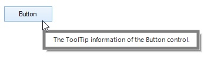

## ToolTip Item

The appearance of `ToolTipItem` can be customized by setting the `ToolTipStyleInfo` property. The `ToolTipStyleInfo` property contains all the settings for the [ToolTipItem](https://help.syncfusion.com/cr/windowsforms/Syncfusion.WinForms.Controls.ToolTipItem.html) appearance customization.



ToolTipInfo toolTipInfo1 = new ToolTipInfo();
ToolTipItem toolTipItem1 = new ToolTipItem();
toolTipItem1.Text = "The ToolTip information of the Button control.";
toolTipItem1.Style.BackColor = Color.LightSkyBlue;
toolTipItem1.Style.ForeColor = Color.Black;
toolTipItem1.Style.TextAlignment = ContentAlignment.MiddleCenter;
toolTipItem1.Style.Font = new Font("Arial", 10.5f, FontStyle.Bold);
toolTipInfo1.Items.AddRange(new ToolTipItem[] { toolTipItem1 });
sfToolTip1.SetToolTipInfo(this.button1, toolTipInfo1);




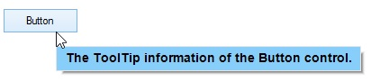

### Gradient Color

Gradient background drawing for the [ToolTipItem](https://help.syncfusion.com/cr/windowsforms/Syncfusion.WinForms.Controls.ToolTipItem.html) can be done by enabling the [EnableGradientBackground](https://help.syncfusion.com/cr/windowsforms/Syncfusion.WinForms.Controls.ToolTipItem.html#Syncfusion_WinForms_Controls_ToolTipItem_EnableGradientBackground) property and initializing a [GradientBrush](https://help.syncfusion.com/cr/windowsforms/Syncfusion.WinForms.Controls.Styles.ToolTipVisualStyle.html#Syncfusion_WinForms_Controls_Styles_ToolTipVisualStyle_GradientBrush) property for the `ToolTipItem`. 



ToolTipItem toolTipItem1 = new ToolTipItem();
toolTipItem1.Text = "The ToolTip information of the Button control.";
toolTipItem1.EnableGradientBackground = true;
toolTipItem1.Style.GradientBrush = new BrushInfo(GradientStyle.ForwardDiagonal, new Color[] { Color.LightSkyBlue, Color.LightGreen, Color.Orange });
toolTipInfo1.Items.AddRange(new ToolTipItem[] { toolTipItem1 });
sfToolTip1.SetToolTipInfo(this.button2, toolTipInfo1);




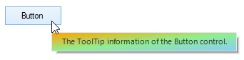

N> The [GradientBrush](https://help.syncfusion.com/cr/windowsforms/Syncfusion.WinForms.Controls.Styles.ToolTipVisualStyle.html#Syncfusion_WinForms_Controls_Styles_ToolTipVisualStyle_GradientBrush) property will be considered only when the [EnableGradientBackground](https://help.syncfusion.com/cr/windowsforms/Syncfusion.WinForms.Controls.ToolTipItem.html#Syncfusion_WinForms_Controls_ToolTipItem_EnableGradientBackground) property is set to true.

### Customizing the ToolTipItem Separator

The separator of the [ToolTipItem](https://help.syncfusion.com/cr/windowsforms/Syncfusion.WinForms.Controls.ToolTipItem.html) can be customized using the [SeparatorColor](https://help.syncfusion.com/cr/windowsforms/Syncfusion.WinForms.Controls.Styles.ToolTipVisualStyle.html#Syncfusion_WinForms_Controls_Styles_ToolTipVisualStyle_SeparatorColor) and [SeparatorStyle](https://help.syncfusion.com/cr/windowsforms/Syncfusion.WinForms.Controls.Styles.ToolTipVisualStyle.html#Syncfusion_WinForms_Controls_Styles_ToolTipVisualStyle_SeparatorStyle) properties on the `Style` sub-property.



ToolTipItem toolTipItem1 = new ToolTipItem();
toolTipItem1.Text = "ToolTipItem1 Text";
toolTipItem1.EnableSeparator = true;
toolTipItem1.Style.SeparatorColor = Color.Gray;
toolTipItem1.Style.SeparatorStyle = DashStyle.DashDot;
ToolTipItem toolTipItem2 = new ToolTipItem();
toolTipItem2.Text = "ToolTipItem2 Text";
toolTipInfo1.Items.AddRange(new ToolTipItem[] { toolTipItem1, toolTipItem2 });
sfToolTip1.SetToolTipInfo(this.button2, toolTipInfo1);




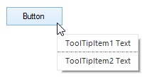

## Customizing Appearance based on Control

The appearance of the `ToolTipItem` can be customized before showing the tooltip based on the control in which it is configured using the [ToolTipShowing](https://help.syncfusion.com/cr/windowsforms/Syncfusion.Windows.Forms.SfToolTip.html#Syncfusion_Windows_Forms_SfToolTip_ToolTipShowing) event.



// Assumes an SfToolTip named sfToolTip1 already exists on the form.
this.sfToolTip1.ToolTipShowing += SfToolTip1_ToolTipShowing;
private void SfToolTip1_ToolTipShowing(object sender, ToolTipShowingEventArgs e)
{
    if (e.Control is Button)
    {
        e.ToolTipInfo.Items[0].Style.BackColor = Color.LightSkyBlue;
        e.ToolTipInfo.Items[0].Style.ForeColor = Color.Black;
    }
}




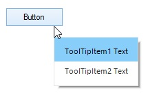

## Enabling the Shadow

The shadow of the tooltip can be enabled by setting the [ShadowVisible](https://help.syncfusion.com/cr/windowsforms/Syncfusion.Windows.Forms.SfToolTip.html#Syncfusion_Windows_Forms_SfToolTip_ShadowVisible) property to `true`.



SfToolTip sfToolTip1 = new SfToolTip();
sfToolTip1.ShadowVisible = true;




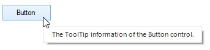

## Enabling the ToolTipItem Separator

The separator of the `ToolTipItem` can be enabled by setting the [EnableSeparator](https://help.syncfusion.com/cr/windowsforms/Syncfusion.WinForms.Controls.ToolTipItem.html#Syncfusion_WinForms_Controls_ToolTipItem_EnableSeparator) property to `true`.



ToolTipItem toolTipItem1 = new ToolTipItem();
toolTipItem1.Text = "ToolTipItem1 Text";
toolTipItem1.EnableSeparator = true;
ToolTipItem toolTipItem2 = new ToolTipItem();
toolTipItem2.Text = "ToolTipItem2 Text";
toolTipInfo1.Items.AddRange(new ToolTipItem[] { toolTipItem1, toolTipItem2 });
sfToolTip1.SetToolTipInfo(this.button2, toolTipInfo1);




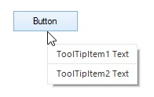

N> The separator line cannot be drawn for the last `ToolTipItem` in the collection, even the separator is enabled.

## Right-to-Left Support

The elements of the tooltip can be aligned from right to left and vice versa using the [RightToLeft](https://help.syncfusion.com/cr/windowsforms/Syncfusion.WinForms.Controls.ToolTipInfo.html#Syncfusion_WinForms_Controls_ToolTipInfo_RightToLeft) property.



ToolTipInfo toolTipInfo1 = new ToolTipInfo();
toolTipInfo1.RightToLeft = RightToLeft.Yes;
ToolTipItem toolTipItem1 = new ToolTipItem();
toolTipItem1.Text = "David Carter\r\nPhone : +1 919.494.1974\r\nEmail : david@syncfusion.com";
toolTipItem1.Style.TextAlignment = ContentAlignment.MiddleLeft;
toolTipItem1.Image = global::GettingStarted.Properties.Resources.MORGK;
toolTipItem1.Style.ImageSize = new Size(100, 100);
toolTipInfo1.Items.AddRange(new ToolTipItem[] { toolTipItem1 });
sfToolTip1.SetToolTipInfo(this.button2, toolTipInfo1);




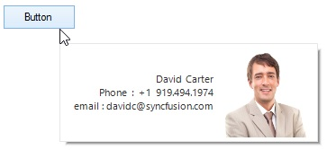

## Themes

The SfToolTip offers four built-in themes for professional representation as follows:

* Office2016Colorful
* Office2016White
* Office2016DarkGray
* Office2016Black

Themes can be applied to the SfToolTip by using the following steps:

1. [Load theme assembly](#load-theme-assembly)
2. [Apply theme](#apply-theme)

### Load theme assembly

The `Syncfusion.Office2016Theme.WinForms` assembly (or the `Syncfusion.Office2016Theme.WinForms` NuGet package) should be added as a reference to set a theme for the SfToolTip in any application.

Before applying the theme to the SfToolTip, the required theme assembly should be loaded.





using Syncfusion.WinForms.Controls;

         static class Program
    {
        /// 

        /// The main entry point for the application.
        /// 

        
        static void Main()
        {
            SfSkinManager.LoadAssembly(typeof(Office2016Theme).Assembly);
            Application.EnableVisualStyles();
            Application.SetCompatibleTextRenderingDefault(false);
            Application.Run(new Form1());
        }
    }





Imports Syncfusion.WinForms.Controls

Friend Module Program
    ''' 

    ''' The main entry point for the application.
    ''' 

    Sub Main()
        SfSkinManager.LoadAssembly(GetType(Office2016Theme).Assembly)
        Application.EnableVisualStyles()
        Application.SetCompatibleTextRenderingDefault(False)
        Application.Run(New Form1())
    End Sub
End Module





### Apply theme

The appearance of the SfToolTip can be changed by setting the `ThemeName` property. The following Office 2016 themes are available.

#### Office2016Colorful

The Office2016Colorful theme uses vibrant blue accents and is the default Office look.





// Office2016Colorful theme.
this.sfToolTip1.ThemeName = "Office2016Colorful";





' Office2016Colorful theme.
Me.sfToolTip1.ThemeName = "Office2016Colorful"





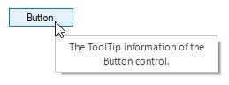

#### Office2016White

The Office2016White theme uses a clean white background and is suited for light UIs.





// Office2016White theme.
this.sfToolTip1.ThemeName = "Office2016White";





' Office2016White theme.
Me.sfToolTip1.ThemeName = "Office2016White"





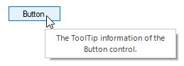

#### Office2016DarkGray

The Office2016DarkGray theme uses a dark gray background and is suited for dark UIs.





// Office2016DarkGray theme.
this.sfToolTip1.ThemeName = "Office2016DarkGray";





' Office2016DarkGray theme.
Me.sfToolTip1.ThemeName = "Office2016DarkGray"





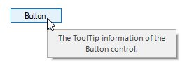

#### Office2016Black

The Office2016Black theme uses a near-black background for high-contrast applications.





// Office2016Black theme.
this.sfToolTip1.ThemeName = "Office2016Black";





' Office2016Black theme.
Me.sfToolTip1.ThemeName = "Office2016Black"





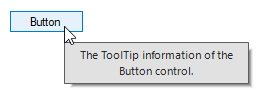

