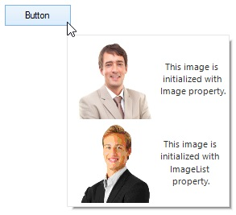

# ToolTip Content in Windows Forms Tooltip (SfToolTip)

## Setting ToolTipItem

The `ToolTipItem` can be set to the SfToolTip by adding the `ToolTipItem` to the `Items` collection through [Add](https://help.syncfusion.com/cr/windowsforms/Syncfusion.WinForms.Controls.ToolTipItemCollection.html#Syncfusion_WinForms_Controls_ToolTipItemCollection_Add_Syncfusion_WinForms_Controls_ToolTipItem_) method.




ToolTipItem toolTipItem1 = new ToolTipItem();
toolTipItem1.Text = "The ToolTip information of the Button control.";
toolTipInfo1.Items.Add(toolTipItem1 );
sfToolTip1.SetToolTipInfo(this.button2, toolTipInfo1);




## Adding Multiple Items into a ToolTip

Multiple `ToolTipItem` can also be added to the `SfToolTip` by adding the multiple items to the items collection using either [Add](https://help.syncfusion.com/cr/windowsforms/Syncfusion.WinForms.Controls.ToolTipItemCollection.html#Syncfusion_WinForms_Controls_ToolTipItemCollection_Add_Syncfusion_WinForms_Controls_ToolTipItem_) or [AddRange](https://help.syncfusion.com/cr/windowsforms/Syncfusion.WinForms.Controls.ToolTipItemCollection.html#Syncfusion_WinForms_Controls_ToolTipItemCollection_AddRange_Syncfusion_WinForms_Controls_ToolTipItem___) method.




ToolTipItem toolTipItem1 = new ToolTipItem();
toolTipItem1.Text = "The ToolTip information of the Button control.";
ToolTipItem toolTipItem2 = new ToolTipItem();
toolTipItem2.Text = "The ToolTip information of the Button control.";
toolTipInfo1.Items.AddRange(new ToolTipItem[] { toolTipItem1, toolTipItem2 } );
sfToolTip1.SetToolTipInfo(this.button2, toolTipInfo1);




### Spacing between Items

The spacing or padding between the `ToolTipItems` can be changed by using the [Padding](https://help.syncfusion.com/cr/windowsforms/Syncfusion.WinForms.Controls.ToolTipItem.html#Syncfusion_WinForms_Controls_ToolTipItem_Padding) property of the ToolTip item.




ToolTipItem toolTipItem1 = new ToolTipItem();
toolTipItem1.Text = "ToolTipItem1 Text";
toolTipItem1.Padding = new Padding(12);
ToolTipItem toolTipItem2 = new ToolTipItem();
toolTipItem2.Text = "ToolTipItem2 Text";
toolTipItem2.Padding = new Padding(12);
toolTipInfo1.Items.AddRange(new ToolTipItem[] { toolTipItem1, toolTipItem2 });
sfToolTip1.SetToolTipInfo(this.button2, toolTipInfo1);




## Adding Image into a ToolTip

The tooltip image of the `ToolTipItem` can be initialized using the [Image](https://help.syncfusion.com/cr/windowsforms/Syncfusion.WinForms.Controls.ToolTipItem.html#Syncfusion_WinForms_Controls_ToolTipItem_Image) or [ImageList](https://help.syncfusion.com/cr/windowsforms/Syncfusion.WinForms.Controls.ToolTipItem.html#Syncfusion_WinForms_Controls_ToolTipItem_ImageList) property.




ToolTipItem toolTipItem1 = new ToolTipItem();
toolTipItem1.Text = "This image is initialized with Image property.";
toolTipItem1.Image = global::GettingStarted.Properties.Resources.Image1;
toolTipItem1.Style.ImageSize = new Size(100, 100);

ImageList imageList = new ImageList();
imageList.Images.Add(global::GettingStarted.Properties.Resources.Image1);
imageList.Images.Add(global::GettingStarted.Properties.Resources.image2);

ToolTipItem toolTipItem2 = new ToolTipItem();
toolTipItem2.Text = "This image is initialized with ImageList property.";
toolTipItem2.ImageList = imageList;
toolTipItem2.ImageIndex = 1;
toolTipItem2.ImageList.ImageSize = new Size(100, 100);
toolTipInfo1.Items.AddRange(new ToolTipItem[] { toolTipItem1, toolTipItem2 });
sfToolTip1.SetToolTipInfo(this.button1, toolTipInfo1);




N> The [Image](https://help.syncfusion.com/cr/windowsforms/Syncfusion.WinForms.Controls.ToolTipItem.html#Syncfusion_WinForms_Controls_ToolTipItem_Image) property is considered as high priority, when both `Image` and `ImageList` are initialized. 

### Changing Image Alignment of the ToolTipItem

The image alignment of the `ToolTipItem` can be changed by using the [ImageAlignment](https://help.syncfusion.com/cr/windowsforms/Syncfusion.WinForms.Controls.Styles.ToolTipVisualStyle.html#Syncfusion_WinForms_Controls_Styles_ToolTipVisualStyle_ImageAlignment) property. 




ToolTipItem toolTipItem1 = new ToolTipItem();
toolTipItem1.Text = "David Carter\r\nPhone : +1 919.494.1974\r\nEmail : [david@syncfusion.com](mailto:david@syncfusion.com# "")";
toolTipItem1.Image= global::GettingStarted.Properties.Resources.Image1;
toolTipItem1.Style.ImageAlignment = ToolTipImageAlignment.Left;




### Setting Image Size of the ToolTipItem

The image size of the `ToolTipItem` can be changed by using the [ImageSize](https://help.syncfusion.com/cr/windowsforms/Syncfusion.WinForms.Controls.Styles.ToolTipVisualStyle.html#Syncfusion_WinForms_Controls_Styles_ToolTipVisualStyle_ImageSize) property.




ToolTipItem toolTipItem1 = new ToolTipItem();
toolTipItem1.Text = "David Carter\r\nPhone : +1 919.494.1974\r\nEmail : [david@syncfusion.com](mailto:david@syncfusion.com# "")";
toolTipItem1.Image= global::GettingStarted.Properties.Resources.Image1;
toolTipItem1.Style.ImageSize = new Size(100, 100);




N> If the [ImageSize](https://help.syncfusion.com/cr/windowsforms/Syncfusion.WinForms.Controls.Styles.ToolTipVisualStyle.html#Syncfusion_WinForms_Controls_Styles_ToolTipVisualStyle_ImageSize) property is initialized, default size value (32, 32) will be taken as the image size, and would not consider the `Image.Size` and `ImageList.Size` for image size.

### Setting Spacing between Image and Text

The distance between the `text` and `image` of the `ToolTipItem` can be changed by using the [ImageToTextOffset](https://help.syncfusion.com/cr/windowsforms/Syncfusion.WinForms.Controls.Styles.ToolTipVisualStyle.html#Syncfusion_WinForms_Controls_Styles_ToolTipVisualStyle_ImageToTextOffset).




ToolTipItem toolTipItem1 = new ToolTipItem();
toolTipItem1.Text = "David Carter\r\nPhone : +1 919.494.1974\r\nEmail : david@syncfusion.com";
toolTipItem1.Style.TextAlignment = ContentAlignment.MiddleLeft;
toolTipItem1.Image = global::GettingStarted.Properties.Resources.MORGK;
toolTipItem1.Style.ImageSize = new Size(100, 100);
toolTipItem1.Style.ImageToTextOffset = 20;
toolTipInfo1.Items.AddRange(new ToolTipItem[] { toolTipItem1 });
sfToolTip1.SetToolTipInfo(this.button2, toolTipInfo1);




## Adding Custom User Control into a ToolTip

Controls can be added to the `ToolTipItem` using the [Control](https://help.syncfusion.com/cr/windowsforms/Syncfusion.WinForms.Controls.ToolTipItem.html#Syncfusion_WinForms_Controls_ToolTipItem_Control) property.




PictureBox pictureBox1 = new PictureBox();
pictureBox1.Image = Image.FromFile(@"../../Resources/cube.gif");
pictureBox1.SizeMode = PictureBoxSizeMode.CenterImage;
pictureBox1.Size = new Size(200, 100);
pictureBox1.BorderStyle = BorderStyle.FixedSingle;
ToolTipItem toolTipItem1 = new ToolTipItem();
toolTipItem1.Control = pictureBox1;
toolTipInfo1.Items.AddRange(new ToolTipItem[] { toolTipItem1 });
sfToolTip1.SetToolTipInfo(this.button1, toolTipInfo1);




