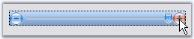
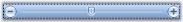
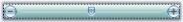

# Features in Windows Forms TrackBar (TrackBarEx)

The TrackBarEx is a new Office2007 control, which has a track bar or a pointer which slides between the minimum value and maximum value specified. The user can drag the track bar along the line and also, the pointer can be placed at a particular point by clicking a position inside this TrackBar. 

Various Features and Customization options are discussed in the following topics.

## Button, Slider and Channel Settings 

The properties which controls the size of various components of the TrackBarEx are as follows.

<table>
<tr>
<th>
Property</th><th>
Description</th></tr>
<tr>
<td>
IncreaseButtonSize</td><td>
Gets or sets the size of Increase button. Default value is (18, 18)</td></tr>
<tr>
<td>
DecreaseButtonSize</td><td>
Gets or sets the size of Decrease button. Default value is (18, 18)</td></tr>
<tr>
<td>
SliderSize</td><td>
Gets or sets the size of the slider. Default value is (11, 14).</td></tr>
<tr>
<td>
ChannelHeight</td><td>
Gets or sets height of the channel. Default value is 4.</td></tr>
</table>

## Button Appearance

The below properties will let you control the appearance of the Increase, Decrease and slider buttons.

<table>
<tr>
<th>
Property</th><th>
Description</th></tr>
<tr>
<td>
ShowButton</td><td>
Gets or sets a value indicating whether to show the Increase and Decrease buttons.</td></tr>
<tr>
<td>
ButtonColor</td><td>
Gets or sets the color for the Increase and Decrease buttons.</td></tr>
<tr>
<td>
HighlightedButtonColor</td><td>
Gets or sets the color for the buttons, when they are highlighted.</td></tr>
<tr>
<td>
PushedButtonEndColor</td><td>
Gets or sets the color of the buttons, when they are pushed.</td></tr>
</table>



this.trackBarEx1.ShowButtons = true;

this.trackBarEx1.ButtonColor = System.Drawing.Color.DodgerBlue;

this.trackBarEx1.HighlightedButtonColor = System.Drawing.Color.AliceBlue;

this.trackBarEx1.PushedButtonEndColor = System.Drawing.Color.OrangeRed;





Me.trackBarEx1.ShowButtons = True 

Me.trackBarEx1.ButtonColor = System.Drawing.Color.DodgerBlue 

Me.trackBarEx1.HighlightedButtonColor = System.Drawing.Color.AliceBlue

Me.trackBarEx1.PushedButtonEndColor = System.Drawing.Color.OrangeRed



## TrackBar Appearance

### FocusRectangle

A focus rectangle for the TrackBarEx control can be shown or hidden using ShowFocusRect property.

### Gradient Start and End Color

By default, the TrackBarEx control has a gradient appearance. The start color and end color for this gradient appearance can be specified using TrackBarGradientStart and TrackBarGradientEnd properties.



this.trackBarEx1.TrackBarGradientEnd = System.Drawing.Color.CadetBlue;

this.trackBarEx1.TrackBarGradientStart = System.Drawing.Color.MintCream;





Me.trackBarEx1.TrackBarGradientEnd = System.Drawing.Color.CadetBlue

Me.trackBarEx1.TrackBarGradientStart = System.Drawing.Color.MintCream



The control can be given a transparent background by enabling the Transparent property.



this.trackBarEx1.Transparent = true;





Me.trackBarEx1.Transparent = True



### TrackBarEx Orientation

This control has options for vertical and horizontal orientation.



//To set the control to be vertically oriented

this.trackBarEx1.Orientation = Orientation.Vertical;

//To set the control to be horizontally oriented

this.trackBarEx1.Orientation = Orientation.Horizontal;





'To set the control to be vertically oriented

Me.trackBarEx1.Orientation = Orientation.Vertical

'To set the control to be horizontally oriented

Me.trackBarEx1.Orientation = Orientation.Horizontal



## TrackBar Value

The TrackBarEx control slides between the minimum and maximum values, which are specified in Minimum and Maximum properties. The properties with description are listed in the below table.

<table>
<tr>
<th>
Property</th><th>
Description</th></tr>
<tr>
<td>
Minimum</td><td>
Gets or sets minimum value of TrackBarEx. Default is 10. </td></tr>
<tr>
<td>
Maximum</td><td>
Gets or sets the maximum value of TrackBarEx. Default is 20. </td></tr>
<tr>
<td>
Value</td><td>
Gets or sets value of TrackBarEx position i.e. slider position. Default is 5. </td></tr>
<tr>
<td>
SmallChange</td><td>
Gets or sets small change of TrackBarEx value while changing. Default is 1. </td></tr>
<tr>
<td>
LargeChange</td><td>
Gets or sets large change of TrackBarEx value while changing. Default is 5. </td></tr>
<tr>
<td>
TimerInterval</td><td>
Gets or sets interval for timer while increasing/decreasing the value using Increase/Decrease button. Default is 100. </td></tr>
</table>



this.trackBarEx1.Minimum = 10;

this.trackBarEx1.Maximum = 25;

this.trackBarEx1.Value = 5;

this.trackBarEx1.SmallChange = 5;

this.trackBarEx1.LargeChange = 15;

this.trackBarEx1.TimerInterval = 50;





Me.trackBarEx1.Minimum = 10

Me.trackBarEx1.Maximum = 30

Me.trackBarEx1.Value = 5

Me.trackBarEx1.SmallChange = 5

Me.trackBarEx1.LargeChange = 15

Me.trackBarEx1.TimerInterval = 50



Following are the methods for the TrackBarEx control which gives the respective results based on SmallChange and LargeChange properties.

<table>
<tr>
<th>
Methods</th><th>
Description</th></tr>
<tr>
<td>
LargeIncrease</td><td>
Increases the value by large change specified in LargeChange property. </td></tr>
<tr>
<td>
LargeDecrease</td><td>
Decreases the value by large change specified in LargeChange property. </td></tr>
<tr>
<td>
SmallDecrease</td><td>
Decreases the value by small change specified in SmallChange property. </td></tr>
<tr>
<td>
SmallIncrease</td><td>
Increases the value by small change specified in SmallChange property. </td></tr>
</table>

## TrackBarEx Event

Scroll event of the TrackBarEx will be handled whenever the user moves the slider.



private void trackBarEx1_Scroll(object sender, EventArgs e)

{

    this.trackBarEx1.ButtonColor = System.Drawing.Color.OrangeRed;

}





Private Sub trackBarEx1_Scroll(ByVal sender As Object, ByVal e As EventArgs)

    Me.trackBarEx1.ButtonColor = System.Drawing.Color.OrangeRed

End Sub



