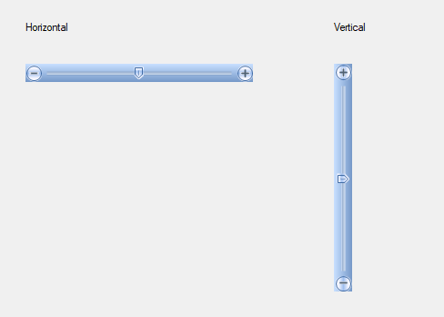

# Getting Started with Windows Forms TrackBar

This section describes how to add [Windows Forms TrackBar](https://www.syncfusion.com/winforms-ui-controls/trackbar) control in a Windows Forms application and overview of its basic functionalities.

## Assembly deployment

Refer to the [control dependencies](https://help.syncfusion.com/windowsforms/control-dependencies#trackbarex) section to get the list of assemblies or details of NuGet package that needs to be added as a reference to use the control in any application.

Click [NuGet Packages](https://help.syncfusion.com/windowsforms/installation/install-nuget-packages) to learn how to install nuget packages in Windows Forms application.

## Adding TrackBarEx control via designer

1. Create a new Windows Forms project in Visual Studio.

2. The [TrackBarEx](https://help.syncfusion.com/cr/windowsforms/Syncfusion.Windows.Forms.Tools.TrackBarEx.html) control can be added to an application by dragging it from the toolbox to a design view. The following dependent assemblies will be added automatically:

    * Syncfusion.Grid.Base
    * Syncfusion.Grid.Windows
    * Syncfusion.Shared.Base
    * Syncfusion.Shared.Windows
    * Syncfusion.Tools.Base
    * Syncfusion.Tools.Windows

## Add control manually in code

To add the control manually in C#, follow the given steps:

1. Create C# or VB application via Visual Studio.

2. Add the following assembly references to the project: 

    * Syncfusion.Grid.Base
    * Syncfusion.Grid.Windows
    * Syncfusion.Shared.Base
    * Syncfusion.Shared.Windows 
    * Syncfusion.Tools.Base
    * Syncfusion.Tools.Windows

3. Include the required namespace.

​



using Syncfusion.Windows.Forms.Tools;




Imports Syncfusion.Windows.Forms.Tools


 

{{ codesnippet1 | OrderList_Indent_Level_1 }}

4. Create an instance of [TrackBarEx](https://help.syncfusion.com/cr/windowsforms/Syncfusion.Windows.Forms.Tools.TrackBarEx.html) control, and add it to the window.

​



//Instance of TrackBarEx
TrackBarEx trackBarEx1 = new TrackBarEx();
trackBarEx1.Value = 5;
this.Controls.Add(trackBarEx1);




'Instance of TrackBarEx
Dim trackBarEx1 As TrackBarEx = New TrackBarEx
trackBarEx1.Value = 5
Me.Controls.Add(tabSplitterContainer1)




{{ codesnippet2 | OrderList_Indent_Level_1 }}

## Change value

You can define the minimum and maximum values by setting the [Minimum](https://help.syncfusion.com/cr/windowsforms/Syncfusion.Windows.Forms.Tools.TrackBarEx.html#Syncfusion_Windows_Forms_Tools_TrackBarEx_Minimum) and [Maximum](https://help.syncfusion.com/cr/windowsforms/Syncfusion.Windows.Forms.Tools.TrackBarEx.html#Syncfusion_Windows_Forms_Tools_TrackBarEx_Maximum) properties of [TrackBarEx](https://help.syncfusion.com/cr/windowsforms/Syncfusion.Windows.Forms.Tools.TrackBarEx.html).




this.trackBarEx1.Minimum = 10;
this.trackBarEx1.Maximum = 30;




Me.trackBarEx1.Minimum = 10
Me.trackBarEx1.Maximum = 30




## Horizontal or vertical track bar

The [TrackBarEx](https://help.syncfusion.com/cr/windowsforms/Syncfusion.Windows.Forms.Tools.TrackBarEx.html) control can be oriented horizontally or vertically using the [Orientation](https://help.syncfusion.com/cr/windowsforms/Syncfusion.Windows.Forms.Tools.TrackBarEx.html#Syncfusion_Windows_Forms_Tools_TrackBarEx_Orientation) property.




// To set the control to be vertically oriented.
this.trackBarEx1.Orientation = Orientation.Vertical;

// To set the control to be horizontally oriented.
this.trackBarEx1.Orientation = Orientation.Horizontal;




'To set the control to be vertically oriented.
Me.trackBarEx1.Orientation = Orientation.Vertical

'To set the control to be horizontally oriented.
Me.trackBarEx1.Orientation = Orientation.Horizontal




