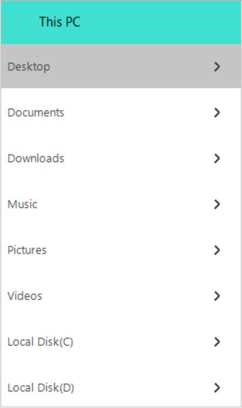
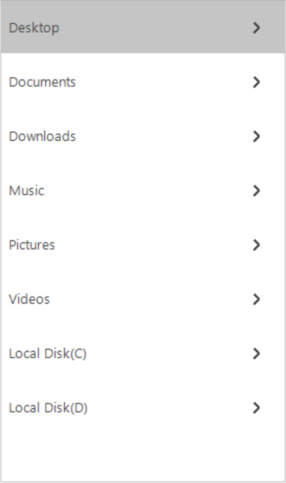
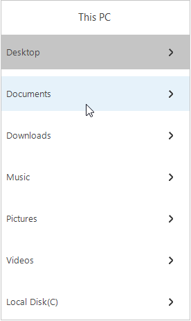
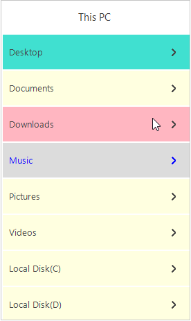

# Appearance in Windows Forms Tree Navigator

## Style

	VisualStyles provides rich and professional look and feel UI for the Tree Navigator. Some of the available VisualStyles are as follows:

*	Default
*	Office2016Colorful
*	Office2016White
*	Office2016Black
*	Office2016DarkGray

The visual style can be applied for the TreeNavigator using Style property.





//Set the visual style of the TreeNavigator control.
this.treeNavigator1. Style = Syncfusion.Windows.Forms.Tools.TreeNavigatorStyle.Office2016Colorful; 





'Set the visual style of the TreeNavigator control.
Me.treeNavigator1.Style = Syncfusion.Windows.Forms.Tools.TreeNavigatorStyle.Office2016Colorful





## Header Customization
In Tree Navigator, you can customize height of the header, header back color, header fore color, header text, header text bounds, visibility of the header by Using following properties

*	HeaderBackColor – This property is used to set the back color of the header .
*	HeaderForeColor – This property is used to set the fore color of the header.
*	HeaderText – This property is used to set the text for the header.
*	TextBounds – This property is used to set the bounds for the header text.
*	ShowHeader – This property is used to Set the visibility of the header.

The following code examples allow you to Customize the Header.





//To set the height for the header
this.treeNavigator1.Header.Height = 50;

//To set the text for the header 
this.treeNavigator1.Header.HeaderText = "This PC";

//To set the back color for the header
this.treeNavigator1.Header.HeaderBackColor = Color.Turquoise;

//To set the fore color for the header text
this.treeNavigator1.Header.HeaderForeColor = Color.Black; 

//To set the header text bounds
this.treeNavigator1.Header.TextBounds = new Rectangle(40, 0, 30, 20);





'To set the height for the header
Me.treeNavigator1.Header.Height = 50

'To set the text for the header 
Me.treeNavigator1.Header.HeaderText = "This PC"

'To set the back color for the header
Me.treeNavigator1.Header.HeaderBackColor = Color.Turquoise

'To set the fore color for the header text
Me.treeNavigator1.Header.HeaderForeColor = Color.Black

'To set the header text bounds
Me.treeNavigator1.Header.TextBounds = new Rectangle(40, 0, 30, 20)    





The Visibility of the tree navigator header can be hidden by setting ShowHeader property to false.





// To hide the header area
this.treeNavigator1.ShowHeader = false;





 ‘ To hide the header area
 Me.treeNavigator1.ShowHeader = False





## Appearance in Windows Forms Tree Navigator

Border color and Thickness of the TreeNavigator can be customized using properties BorderColor and BorderThickness.

The following code example allows you to customize the border color and border thickness.





//To set the border  color for the control.
this.treeNavigator1.BorderColor = Color.Black;

// To set the border thickness for the control.
this.treeNavigator1.BorderThickness = 5;





‘To set the border color for the control.
Me.treeNavigator1.BorderColor = Color.Black

 ‘To set the border thickness for the control.
 Me.treeNavigator1.BorderThickness = 5





## Margin between TreeMenuItems
In Tree Navigator you can set the gap between items with the help of PadY property. This property can be set using following code





this.treeNavigator1.PadY = 10;





ME.treeNavigator1.PadY = 10





## Appearance in Windows Forms Tree Navigator
In Tree Navigator you can customize the tree menu items with the help of properties such as ItemBackColor, ItemHoverColor, SelectedColor, SelectedItemForeColor.

*	ItemBackColor – This property is used to set the back color for the tree menu item when it is in normal state. 

Note: This property also available in treenavigator in which it is used to set the backcolor for all the tree menu items present in the treenavigator. However, First priority is given to the TreeMenuItem ItemBackColor. For example: If the TreeMenuItem is set to some backcolor then that color is set to that item irrespective of TreeNavigator ItemBackColor.

*	ItemHoverColor – This property is used to set the hover color for the tree menu item when it is in hover state.
*	SelectedColor - This property is used to set the back color for the selected tree menu item.
*	SelectedItemForeColor - This property is used to set the fore color for the selected tree menu item.

The following code example allows you to customize the TreeMenuItem





//To customize backcolor for all the tree menu items in the treenavigator
this.treeNavigator1.ItemBackColor = Color.LightYellow;

//To customize the tree menu item backcolor
this.treeMenuItem1.ItemBackColor = Color.Turquoise;

//To customize the tree menu item backcolor
this.treeMenuItem3.ItemHoverColor = Color.LightPink;

//To customize the selected item color
this.treeMenuItem4.SelectedColor = Color.Gainsboro;

//To customize the selected item fore color
this.treeMenuItem4.SelectedItemForeColor = Color.Blue;





‘To customize backcolor for all the tree menu items in the treenavigator
Me.treeNavigator1.ItemBackColor = Color.LightYellow

‘To customize the tree menu item backcolor
Me.treeMenuItem1.ItemBackColor = Color.Turquoise

‘To customize the tree menu item backcolor
Me.treeMenuItem3.ItemHoverColor = Color.LightPink

‘To customize the selected item color
Me.treeMenuItem4.SelectedColor = Color.Gainsboro

‘To customize the selected item fore color
Me.treeMenuItem4.SelectedItemForeColor = Color.Blue





## Appearance in Windows Forms Tree Navigator
In Tree Navigator, TextAlign property is used to set the the Text alignment of the TreeMenuItem

*	Center – This mode is used to align the text in the center of the tree menu item.	
*	Left – This mode is used to align the text in the left side of the tree menu item.
*	Right – This mode is used to align the text in the right side of the tree menu item.

The following code example allows you to set the alignment of the Text.





treeNavigator1.TextAlign = TextAlignment.Center;





treeNavigator1.TextAlign = TextAlignment.Center





