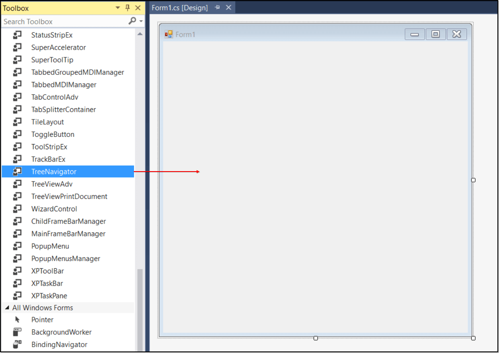
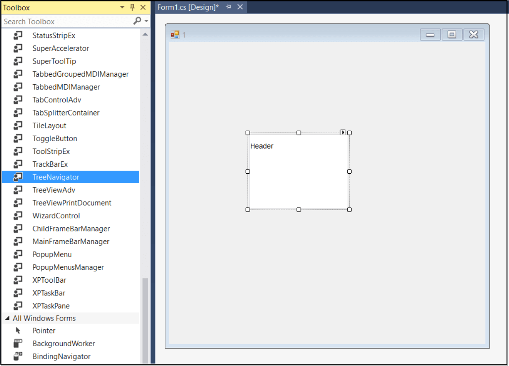
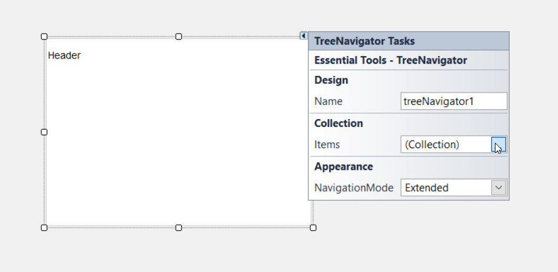
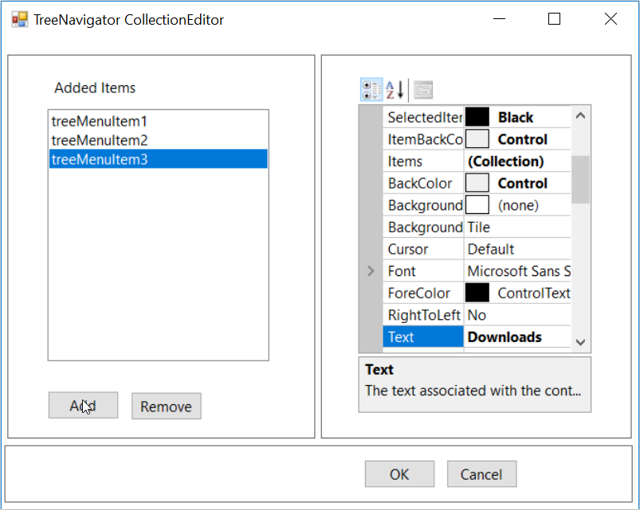

# Getting Started with Windows Forms Tree Navigator

This section briefly describes how to design a TreeNavigator Control in a Windows Forms Application.

## Assembly Deployment
The following list of assemblies needs to be added as reference to use TreeNavigator in any application,

NameSpace: Syncfusion.Windows.Forms.Tools

Assembly: Syncfusion.Tools.Windows

Dependent Assembly : Syncfusion.Shared.Base

<table>
<tr>
<th>
Required assemblies  </th><th>
Description  </th></tr>
<tr>
<td>
Syncfusion.Tools.Windows  </td><td>
Syncfusion.Tools.Windows assembly contains classes that handles all UI operations, fundamentals and base classes of TreeNavigator Control.  </td></tr>
<tr>
<td>
Syncfusion.Shared.Base  </td><td>
Syncfusion.Shared.Base contains style related properties and various other controls which are used in TreeNavigator Control.  </td></tr>
</table>

We can Implement Tree navigator in Two ways they are,
*	Adding Control Via Designer
*	Adding Control Manually in C#

## Adding Control Via Designer

1.	Create a new Windows Forms Application Project in VS IDE through New Project Wizard.
2.	Then Drag and Drop the TreeNavigator control from the toolbox into the designer page.

3.	Once you drag drop the TreeNavigator into the designer page, the TreeNavigator will be added successfully into the application with the required libraries.

## Adding control manually in C#
TreeNavigator can be added through code-behind by following the below steps.

1.	Include the namespaces Syncfusion.Windows.Forms and Syncfusion.Windows.Forms.Tools which are needed for the Control.




		//Namespaces.

		using Syncfusion.Windows.Forms.Tools;

		using Syncfusion.Windows.Forms;





		‘Namespaces.

		Imports Syncfusion.Windows.Forms

		Imports Syncfusion.Windows.Forms.Tools




2.	To add TreeNavigator Control to a Windows Forms Application through code, Create an instance of the TreeNavigator control and add it to the Form.




		//Creates the TreeNavigator instance.

		TreeNavigator treeNavigator = new TreeNavigator();

		this.Controls.Add(treeNavigator);





		‘Creates the TreeNavigator instance.

		Dim treeNavigator As TreeNavigator = New TreeNavigator()

		Me.Controls.Add(treeNavigator)




## Adding TreeMenuItem to the control
     The TreeNavigator is populated with the collection of TreeMenuItem using the items property. we can add TreeMenuItem in two Ways,
     
     * Adding items manually in C#
	 * Adding items through Designer 

The following code example allows you to add TreeMenuItem to the TreeNavigator.




//Adds items to the TreeNavigator.
this.treeNavigator.Header.HeaderText = "This PC";
TreeMenuItem treemenuitem1 = new TreeMenuItem();
this.treeNavigator.Items.Add(treemenuitem1);
treemenuitem1.Text = "Desktop";
TreeMenuItem treemenuitem2 = new TreeMenuItem();
this.treeNavigator.Items.Add(treemenuitem2);
treemenuitem2.Text = "Document";
TreeMenuItem treemenuitem3 = new TreeMenuItem();
this.treeNavigator.Items.Add(treemenuitem3);
treemenuitem3.Text = "Downloads";





'Adds items to the TreeNavigator.
Me.treeNavigator1.Header.HeaderText = "This PC"
Dim treemenuitem1 As TreeMenuItem = New TreeMenuItem()
Me.treeNavigator1.Items.Add(treemenuitem1)
treemenuitem1.Text = "Desktop"
Dim treemenuitem2 As TreeMenuItem = New TreeMenuItem()
Me.treeNavigator1.Items.Add(treemenuitem2)
treemenuitem2.Text = "Document"
Dim treemenuitem3 As TreeMenuItem = New TreeMenuItem()
Me.treeNavigator1.Items.Add(treemenuitem3)
treemenuitem3.Text = "Downloads"




The following steps allows you to add TreeMenuItem to the TreeNavigator through Designer,
1.	Once you drag drop the TreeNavigator into the designer page, the TreeNavigator will be added successfully into the application, you can see the Smart Tag on the top right corner.

2.	Click the Smart Tag button and select the items property from the listed properties.

3.	Then add  items as shown below.
   

