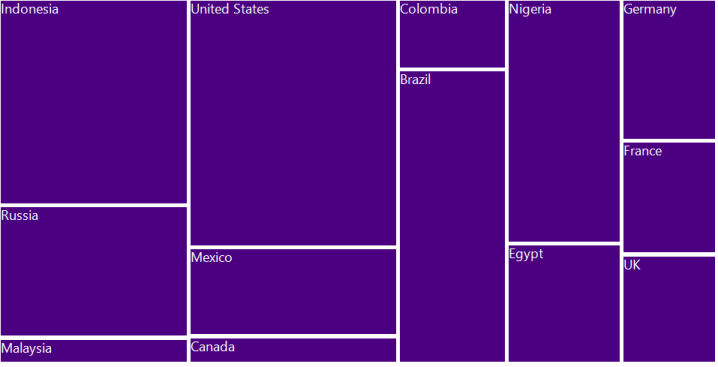

# Customizing Leaf Nodes in Windows Forms TreeMap

Leaf nodes can be customized by raising the [`LeafItemDrawing`](https://help.syncfusion.com/cr/windowsforms/Syncfusion.Windows.Forms.TreeMap.TreeMap.html#Syncfusion_Windows_Forms_TreeMap_TreeMap_LeafItemDrawing) event of the tree map control. 

#### Code sample





TreeMap TreeMap1 = new TreeMap();

PopulationViewModel data = new PopulationViewModel();

TreeMap1.ItemsSource = data.PopulationDetails;

TreeMap1.WeightValuePath = "Population";

TreeMap1.ColorValuePath = "Growth";

TreeMap1.ItemsLayoutMode = Syncfusion.Windows.Forms.TreeMap.ItemsLayoutModes.SliceAndDiceAuto;

TreeMapFlatLevel treeMapFlatLevel1 = new TreeMapFlatLevel();

treeMapFlatLevel1.GroupPath = "Continent";

treeMapFlatLevel1.ShowLabels = true;

TreeMap1.Levels.Add(treeMapFlatLevel1);

TreeMapFlatLevel treeMapFlatLevel2 = new TreeMapFlatLevel();

treeMapFlatLevel2.GroupPath = "Country";

treeMapFlatLevel2.ShowLabels = true;

treeMapFlatLevel2.HeaderHeight = 25;

TreeMap1.Levels.Add(treeMapFlatLevel2);

RangeBrushColorMapping rangeBrushColorMapping = new RangeBrushColorMapping();   

rangeBrushColorMapping.Brushes.Add(new RangeBrush() { Color = System.Drawing.ColorTranslator.FromHtml("#77D8D8"), From = 0, To = 1, LegendLabel = "1% Growth" });

rangeBrushColorMapping.Brushes.Add(new RangeBrush() { Color = System.Drawing.ColorTranslator.FromHtml("#AED960"), From = 0, To = 2, LegendLabel = "2% Growth" });

rangeBrushColorMapping.Brushes.Add(new RangeBrush() { Color = System.Drawing.ColorTranslator.FromHtml("#FFAF51"), From = 0, To = 3, LegendLabel = "3% Growth" });

rangeBrushColorMapping.Brushes.Add(new RangeBrush() { Color = System.Drawing.ColorTranslator.FromHtml("#F3D240"), From = 0, To = 20, LegendLabel = "20% Growth" });

this.TreeMap1.LeafColorMapping = rangeBrushColorMapping;

void treeMap_LeafItemDrawing(object sender, LeafItemDrawingEventArgs e)
{

	e.Cancel = true;

	if (e.Graphics != null && e.Cancel)
	{

		e.Graphics.FillRectangle((e.Color), e.RectSize);

		e.Graphics.DrawRectangle(new Pen(new SolidBrush(Color.White), 5), e.RectSize);

		e.Graphics.DrawString(e.Label, new Font("Segoe UI", (float)12), new SolidBrush(Color.White), e.RectSize.X, e.RectSize.Y);

		Image image = (e.Data as OlympicMedals).GameImage;

		if (image != null)
		{
			e.Graphics.DrawImage(image, new Point(e.RectSize.X + (e.RectSize.Width / 2) - image.Width / 2, e.RectSize.Y + (e.RectSize.Height / 2) - image.Height / 2));
		}

	}

}

#region View Model

public class OlympicMedalsViewModel
{

	public ObservableCollection<OlympicMedals> OlympicMedalsDetails { get; set; }

	public OlympicMedalsViewModel()
	{

		var directoryPath = Application.StartupPath.Replace("bin\\Debug", "Images"); ;

		this.OlympicMedalsDetails = new ObservableCollection<OlympicMedals>();

		this.OlympicMedalsDetails.Add(new OlympicMedals { Country = "US", GameName = "Swimming", GoldMedals = 16, SilverMedals = 9, BronzeMedals = 6, TotalMedals = 31, GameImage = this.GetImage("Swimming") });

		this.OlympicMedalsDetails.Add(new OlympicMedals { Country = "US", GameName = "Track and Field", GoldMedals = 9, SilverMedals = 13, BronzeMedals = 7, TotalMedals = 29, GameImage = this.GetImage("TrackAndField") });

		this.OlympicMedalsDetails.Add(new OlympicMedals { Country = "US", GameName = "Gymnastics", GoldMedals = 3, SilverMedals = 1, BronzeMedals = 2, TotalMedals = 6, GameImage = this.GetImage("Gymnastics") });

		this.OlympicMedalsDetails.Add(new OlympicMedals { Country = "US", GameName = "Boxing", GoldMedals = 1, SilverMedals = 0, BronzeMedals = 1, TotalMedals = 2, GameImage = this.GetImage("Boxing") });

		this.OlympicMedalsDetails.Add(new OlympicMedals { Country = "US", GameName = "Cycling", GoldMedals = 1, SilverMedals = 2, BronzeMedals = 1, TotalMedals = 4, GameImage = this.GetImage("Cycling") });

		this.OlympicMedalsDetails.Add(new OlympicMedals { Country = "US", GameName = "Shooting", GoldMedals = 3, SilverMedals = 0, BronzeMedals = 1, TotalMedals = 4, GameImage = this.GetImage("Shooting") });

		this.OlympicMedalsDetails.Add(new OlympicMedals { Country = "US", GameName = "Wrestling", GoldMedals = 2, SilverMedals = 0, BronzeMedals = 2, TotalMedals = 4, GameImage = this.GetImage("Wrestling") });

		this.OlympicMedalsDetails.Add(new OlympicMedals { Country = "US", GameName = "Archery", GoldMedals = 0, SilverMedals = 1, BronzeMedals = 0, TotalMedals = 1, GameImage = this.GetImage("Archery") });

		this.OlympicMedalsDetails.Add(new OlympicMedals { Country = "US", GameName = "Soccer", GoldMedals = 1, SilverMedals = 0, BronzeMedals = 0, TotalMedals = 1, GameImage = this.GetImage("Soccer") });

		this.OlympicMedalsDetails.Add(new OlympicMedals { Country = "US", GameName = "Diving", GoldMedals = 1, SilverMedals = 1, BronzeMedals = 2, TotalMedals = 4, GameImage = this.GetImage("Diving") });

	}

	public Image GetImage(string image)
	{

		Image _image = null;

		   try
		   {
			   _image = Image.FromFile(@"..\..\..\..\..\images\" + image + ".png");
		   }

		catch{}

		   return _image;

	}

}

public class OlympicMedals
{

	public string Country { get; set; }

	public string GameName { get; set; }

	public double GoldMedals { get; set; }

	public double SilverMedals { get; set; }

	public double BronzeMedals { get; set; }

	public double TotalMedals { get; set; }

	public Image GameImage { get; set; }

}

#endregion





