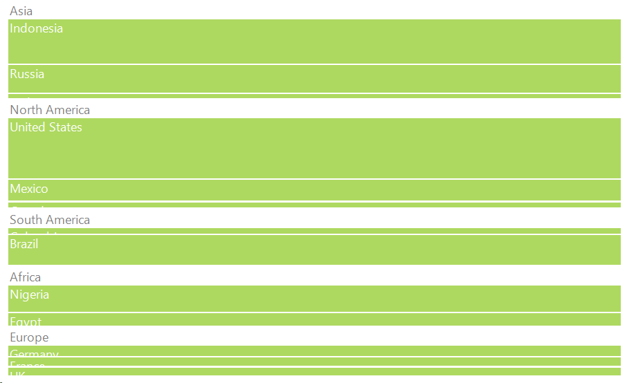
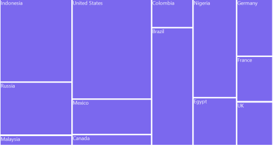
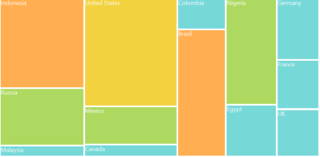
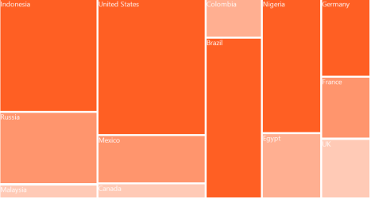
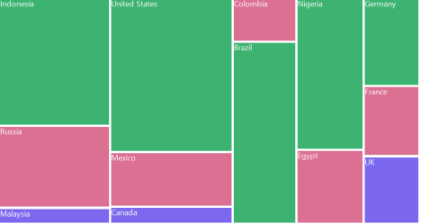
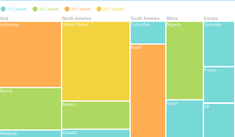
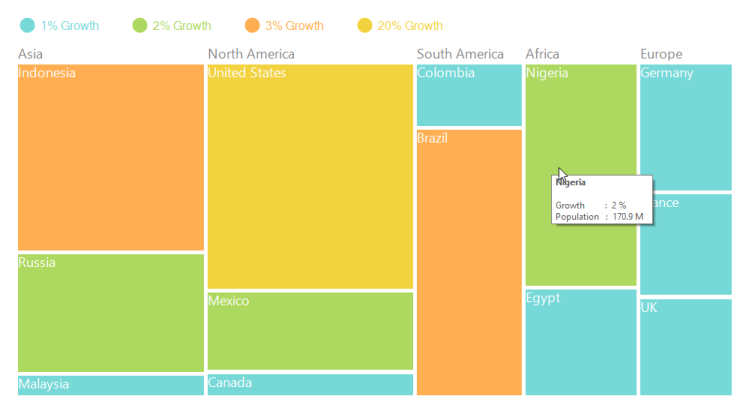
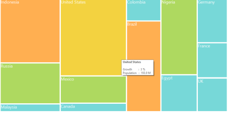

# Features

## WeightValuePath

The WeightValuePath ofTreeMap is a path to a field on the source object, which serves as the "weight" of the object. 

> Note: The specified field must be available in each and every sub class (object) defined in hierarchical (nested) data collection.

## ColorValuePath

The ColorValuePath ofTreeMap is a path to a field on the source object, which serves as the "color" of the object. 

## DataBinding

TreeMap control supports Data Binding and it can be achieved using ItemsSource property.

The ItemsSource property accepts the collection values as input. For example, you can provide the list of objects as input. The following code illustrates you on how to bind a flat collection as items source for TreeMap.



public partial class Form1 : Form

    {

	TreeMap TreeMap1 = new TreeMap();

	public Form1()

        {

            InitializeComponent();

            PopulationViewModel data = new PopulationViewModel();

            TreeMap1.ItemsSource = data.PopulationDetails;

            TreeMap1.ColorValuePath = "Growth";

            This.Controls.Add(TreeMap1);

       }

   }



> Note: The specified field must be available in each and every sub class (object) defined in hierarchical (nested) data collection.

## TreeMap Levels

The levels of TreeMap can be categorized into two types such as,

* TreeMapFlatLevel
* TreeMapHierarchicalLevel

### TreeMapFlatLevel

The TreeMapFlatLevel is used to define levels for flat data collection. 

#### ItemsSource:

The ItemsSource set for TreeMap must be a flat collection of data. The following code shows how to bind a flat collection as ItemsSource to a TreeMap.

#### Code Sample:



public partial class Form1 : Form

    {

      TreeMap TreeMap1 = new TreeMap();

     public Form1()

        {

            InitializeComponent();

            PopulationViewModel data = new PopulationViewModel();

            TreeMap1.ItemsSource = data.PopulationDetails;

            TreeMap1.WeightValuePath = "Population";

            TreeMap1.ColorValuePath = "Growth";

            this.Controls.Add(TreeMap1);

       }

   }

    public class PopulationViewModel

    {

        public PopulationViewModel()

        {

            this.PopulationDetails = new

                                    ObservableCollection<PopulationDetail>();

PopulationDetails.Add(new PopulationDetail() { Continent = "Asia", Country = "Indonesia", Growth = 3, Population = 237641326 });

PopulationDetails.Add(new PopulationDetail() { Continent = "Asia", Country = "Russia", Growth = 2, Population = 152518015 });

PopulationDetails.Add(new PopulationDetail() { Continent = "North America", Country = "United States", Growth = 4, Population = 315645000 });

PopulationDetails.Add(new PopulationDetail() { Continent = "North America", Country = "Mexico", Growth = 2, Population = 112336538 });

      PopulationDetails.Add(new PopulationDetail() { Continent = "Africa", Country = "Nigeria", Growth = 2, Population = 170901000 });            

      PopulationDetails.Add(new PopulationDetail() { Continent = "Africa", Country = "Egypt", Growth = 1, Population = 83661000 });

      PopulationDetails.Add(new PopulationDetail() { Continent = "Europe", Country = "Germany", Growth = 1, Population = 81993000 });

      PopulationDetails.Add(new PopulationDetail() { Continent = "Europe", Country = "France", Growth = 1, Population = 65605000 });

        PopulationDetails.Add(new PopulationDetail() { Continent = "Europe", Country = "UK", Growth = 1, Population = 63181775 });

        }

        public ObservableCollection<PopulationDetail> PopulationDetails

        {

            get;

            set;

        }

        public class PopulationDetail

        {

            public string Continent { get; set; }

            public string Country { get; set; }

            public double Growth { get; set; }

            public double Population { get; set; }

        }        

    }



### GroupPath:

You must specify the GroupPath for each and every flat level of TreeMap. It is a path to a field on the source object, which serves as the “Group” for the levels specified. Based upon the GroupPath, the data is grouped in the TreeMap. If GroupPath is not specified, then the items are not grouped, and it is shown in the order, in which they are specified in the ItemsSource.

### Code Sample:



public partial class Form1 : Form

    {

      TreeMap TreeMap1 = new TreeMap();

     public Form1()

        {

            InitializeComponent();

            PopulationViewModel data = new PopulationViewModel();

            TreeMap1.ItemsSource = data.PopulationDetails;

            TreeMap1.WeightValuePath = "Population";

            TreeMap1.ColorValuePath = "Growth";

            TreeMapFlatLevel treeMapFlatLevel1 = new TreeMapFlatLevel();

            treeMapFlatLevel1.GroupPath = "Continent";

            TreeMapFlatLevel treeMapFlatLevel2 = new TreeMapFlatLevel();

            treeMapFlatLevel2.GroupPath = "Country";

            this.Controls.Add(TreeMap1);

       } 

    }      



### GroupGap:

You can specify GroupGap for separating the items of every flat level and it is used to differentiate the levels mentioned for TreeMap.

### Code Sample:



public partial class Form1 : Form

    {

        TreeMap TreeMap1 = new TreeMap();

     public Form1()

        {

            InitializeComponent();

            PopulationViewModel data = new PopulationViewModel();

            TreeMap1.ItemsSource = data.PopulationDetails;

            TreeMap1.WeightValuePath = "Population";

            TreeMap1.ColorValuePath = "Growth";

            TreeMapFlatLevel treeMapFlatLevel1 = new TreeMapFlatLevel();

            treeMapFlatLevel1.GroupPath = "Continent";

            treeMapFlatLevel1.GroupGap = 10;

            TreeMap1.Levels.Add(treeMapFlatLevel1);

            this.Controls.Add(TreeMap1);

        }

    }   
	


### TreeMapHierarchicalLevel:

TreeMapHierarchicalLevel is used to define levels for hierarchical data collection which contains tree-structured data. 

#### ChildPath:

You must specify ChildPath for each and every hierarchical level of TreeMap. It is a path to a field on the source object, which serves as the “Child” for the level specified. Based upon the ChildPath, the treemap contains child items.

#### ChildGap:

You can specify ChildGap for separating the child items of every level and it is used to differentiate the levels mentioned for TreeMap.

#### Code Sample:



public partial class Form1 : Form

    {

        TreeMap TreeMap1 = new TreeMap();

     public Form1()

        {

            InitializeComponent();

            CountrySalesCollection data = new CountrySalesCollection ();

            TreeMap1.ItemsSource = data;

            TreeMap1.WeightValuePath = "Sales";

            TreeMap1.ColorValuePath = "Expense";

            TreeMapHierarchicalLevel hierarchicalLevel1 = new TreeMapHierarchicalLevel ();

            hierarchicalLevel1.ChildPath = " RegionalSales ";

            hierarchicalLevel1v.ChildGap = 10;

            TreeMap1.Levels.Add(hierarchicalLevel1);

            TreeMapHierarchicalLevel hierarchicalLevel2 = new TreeMapHierarchicalLevel ();

            hierarchicalLevel2.ChildPath = "Name";

            hierarchicalLevel2.ChildGap = 5;

            TreeMap1.Levels.Add(hierarchicalLevel2);

            this.Controls.Add(TreeMap1);

        }

    }   





    public class CountrySalesCollection : ObservableCollection<CountrySale>

    {

        public CountrySalesCollection()

        {

            this.Add(new CountrySale() { Name = "United States", Sales = 98456, Expense = 87000 });

            this.Add(new CountrySale() { Name = "Canada", Sales = 43523, Expense = 40000 });

            this.Add(new CountrySale() { Name = "Mexico", Sales = 45634, Expense = 46000 });

            this[0].RegionalSalesCollection.Add(new RegionSale() { Country = "United States", Name = "New York", Sales = 2353, Expense = 2000 });

            this[0].RegionalSalesCollection.Add(new RegionSale() { Country = "United States", Name = "Los Angeles", Sales = 3453, Expense = 3000 });

            this[0].RegionalSalesCollection.Add(new RegionSale() { Country = "United States", Name = "San Francisco", Sales = 8456, Expense = 8000 });

            this[0].RegionalSalesCollection.Add(new RegionSale() { Country = "United States", Name = "Chicago", Sales = 6785, Expense = 7000 });

            this[0].RegionalSalesCollection.Add(new RegionSale() { Country = "United States", Name = "Miami", Sales = 7045, Expense = 6000 });            

            this[1].RegionalSalesCollection.Add(new RegionSale() { Country = "Canada", Name = "Toronto", Sales = 7045, Expense = 7000 });

            this[1].RegionalSalesCollection.Add(new RegionSale() { Country = "Canada", Name = "Vancouver", Sales = 4352, Expense = 4000 });

            this[1].RegionalSalesCollection.Add(new RegionSale() { Country = "Canada", Name = "Winnipeg", Sales = 7843, Expense = 7500 });

            this[2].RegionalSalesCollection.Add(new RegionSale() { Country = "Mexico", Name = "Mexico City", Sales = 7843, Expense = 6500 });

            this[2].RegionalSalesCollection.Add(new RegionSale() { Country = "Mexico", Name = "Cancun", Sales = 6683, Expense = 6000 });        }

    }

    public class CountrySale : INotifyPropertyChanged

    {

        public string Name { get; set; }

        private double _sales = 0;

        public double Sales

        {

            get { return _sales; }

            set

            {

                if (_sales != value)

                {

                    _sales = value;

                    this.OnPropertyChanged(new  

                         PropertyChangedEventArgs("Sales"));

                }

            }

        }

        private double _expense = 0;

        public double Expense

        {

            get { return _expense; }

            set

            {

                if (_expense != value)

                {

                    _expense = value;

                    this.OnPropertyChanged(new  

                         PropertyChangedEventArgs("Expense"));

                }

            }

        }

        public ObservableCollection<RegionSale> RegionalSalesCollection 

        { get; set; }

        public CountrySale()

        {

            this.RegionalSalesCollection = new ObservableCollection<RegionSale>();

        }

        #region INotifyPropertyChanged Members

        public event PropertyChangedEventHandler PropertyChanged;

        protected void OnPropertyChanged(PropertyChangedEventArgs e)

        {

            if (this.PropertyChanged != null)

                this.PropertyChanged.Invoke(this, e);

        }

        #endregion

    }

    public class RegionSale : INotifyPropertyChanged

    {

        public string Name { get; set; }

        public string Country { get; set; }

        private double _sales = 0;

        public double Sales

        {

            get { return _sales; }

            set

            {

                if (_sales != value)

                {

                    _sales = value;

                    this.OnPropertyChanged(new  

                         PropertyChangedEventArgs("Sales"));

                }

            }

        }

        private double _expense = 0;

        public double Expense

        {

            get { return _expense; }

            set

            {

                if (_expense != value)

                {

                    _expense = value;

                    this.OnPropertyChanged(new  

                         PropertyChangedEventArgs("Expense"));

                }

            }

        }

        #region INotifyPropertyChanged Members

        public event PropertyChangedEventHandler PropertyChanged;

        protected void OnPropertyChanged(PropertyChangedEventArgs e)

        {

            if (this.PropertyChanged != null)

                this.PropertyChanged.Invoke(this, e);

        }

        #endregion

    }



> Note: The specified field must be a collection of sub class (object) specified in the nested data collection.

## TreeMap Layout

The ItemsLayoutMode for TreeMap specifies the layout mode of the tree map items. This layout is applied for all the tree map levels. There are four different TreeMap layouts such as,

### Squarified Layout

In this layout the data is visualized in the form of square-like rectangles with best aspect ratio.

The following code illustrates how to set a squarified layout in Treemap.

#### Code Sample:



public partial class Form1 : Form

    {

        TreeMap TreeMap1 = new TreeMap();

     public Form1()

        {

            InitializeComponent();

            PopulationViewModel data = new PopulationViewModel();

            TreeMap1.ItemsSource = data.PopulationDetails;

            TreeMap1.WeightValuePath = "Population";

            TreeMap1.ColorValuePath = "Growth";

            TreeMap1.ItemsLayoutMode = Syncfusion.Windows.Forms.TreeMap.ItemsLayoutModes. Squarified;

            TreeMapFlatLevel treeMapFlatLevel1 = new TreeMapFlatLevel();

            treeMapFlatLevel1.GroupPath = "Continent";

            TreeMap1.Levels.Add(treeMapFlatLevel1);

            TreeMap1.LeafItemSettings.LabelPath ="Country";

            this.Controls.Add(TreeMap1);

         }

     }   



The following screen shot illustrates a squarified layout.

_Figure_ _1_: _Squarified layout_

### SliceAndDiceAuto Layout:

In this layout the data is visualized in the form of long-thin rectangles with high aspect ratio, which can be displayed either vertically or horizontally.

The following code illustrates how to set a slice and dice layout in Treemap.

### Code Sample:



public partial class Form1 : Form

    {

        TreeMap TreeMap1 = new TreeMap();

     public Form1()

        {

            InitializeComponent();

            // ...         

            TreeMap1.ItemsLayoutMode = Syncfusion.Windows.Forms.TreeMap.ItemsLayoutModes. SliceAndDiceAuto;

          // ...         

         } 

    }      



The following screen shot illustrates a slice-and-dice layout.

_Figure_ _2_: _Slice-and-dice layout_

### SliceAndDiceHorizontal Layout:

The following code illustrates how to set a slice and dice layout horizontally in Treemap.

#### Code Sample:



public partial class Form1 : Form

    {

        TreeMap TreeMap1 = new TreeMap();

     public Form1()

        {

            InitializeComponent();

            // ...         

            TreeMap1.ItemsLayoutMode = Syncfusion.Windows.Forms.TreeMap.ItemsLayoutModes. SliceAndDiceHorizontal;

            // ...         

       }

    }



The following screen shot shows a Slice-and-dice treemap in horizontal layout.

<table>
<tr>
<td>
{{ ' ' | markdownify }}

{{ '_Figure_' | markdownify }}{{ '_3_' | markdownify }}{{ '_: Slice-and-dice treemap in horizontal layout_' | markdownify }}</td></tr>
<tr>
<td>
</td></tr>
</table>

### SliceAndDiceVertical Layout:

The following code illustrates how to set a slice and dice layout vertically in Treemap.

#### Code Sample:



public partial class Form1 : Form

    {

        TreeMap TreeMap1 = new TreeMap();

     public Form1()

        {

            InitializeComponent();

            // ...         

            TreeMap1.ItemsLayoutMode = Syncfusion.Windows.Forms.TreeMap.ItemsLayoutModes. SliceAndDiceVertical;

            // ...         

} 

     }  



The following screen shot shows a Slice-and-dice treemap in vertical layout.

_Figure_ _4_: _Slice-and-dice treemap in vertical layout_

## ColorMapping

The ColorMapping is categorized into four different types such as,

* UniColorMapping
* RangeBrushColorMapping
* DesaturationColorMapping
* PaletteColorMapping

The various colorMappings can be set in LeafColorMapping property of TreeMap. 

#### UniColorMapping

TreeMap leaf nodes can be provided with unique colors with the help of the Color property specified using UniColorMapping.

#### Code Sample:



public partial class Form1 :Form

    {

        TreeMap TreeMap1 = new TreeMap();

        UniColorMapping uniColorMapping = new UniColorMapping();

     public Form1()

        {

            InitializeComponent();

            this.BackColor = Color.White;

            PopulationViewModel data = new PopulationViewModel();

            TreeMap1.ItemsSource = data.PopulationDetails;

            TreeMap1.WeightValuePath = "Population";

            TreeMap1.ColorValuePath = "Growth";

            TreeMapFlatLevel treeMapFlatLevel1 = new TreeMapFlatLevel();

            treeMapFlatLevel1.GroupPath = "Continent";

            TreeMap1.Levels.Add(treeMapFlatLevel1);

            TreeMap1.LeafItemSettings.LabelPath ="Country";

            this.Controls.Add(TreeMap1);

uniColorMapping.Color = Color.MediumSlateBlue;

             TreeMap1.LeafColorMapping = uniColorMapping;

       } 

     } 



_Figure_ _5_: _Leaf Nodes colored by using UniColorMapping_

#### RangeBrushColorMapping

The leaf nodes of TreeMap can be colored based upon the range (i.e., From and To) and Brush specified using RangeBrush collection of RangeBrushColorMapping.

#### Code Sample:



public partial class Form1 : Form

    {

        TreeMap TreeMap1 = new TreeMap();

RangeBrushColorMapping rangeBrushColorMapping = new RangeBrushColorMapping();

     public Form1()

        {

            InitializeComponent();

            this.BackColor = Color.White;

            PopulationViewModel data = new PopulationViewModel();

            TreeMap1.ItemsSource = data.PopulationDetails;

            TreeMap1.WeightValuePath = "Population";

            TreeMap1.ColorValuePath = "Growth";

            TreeMapFlatLevel treeMapFlatLevel1 = new TreeMapFlatLevel();

            treeMapFlatLevel1.GroupPath = "Continent";

            TreeMap1.Levels.Add(treeMapFlatLevel1);

            TreeMap1.LeafItemSettings.LabelPath ="Country";

            this.Controls.Add(TreeMap1);

rangeBrushColorMapping.Brushes.Add(new RangeBrush() { Color = System.Drawing.ColorTranslator.FromHtml("#77D8D8"), From = 0, To = 1, LegendLabel = "1% Growth" });

            rangeBrushColorMapping.Brushes.Add(new RangeBrush() { Color = System.Drawing.ColorTranslator.FromHtml("#AED960"), From = 0, To = 2, LegendLabel = "2% Growth" });

            rangeBrushColorMapping.Brushes.Add(new RangeBrush() { Color = System.Drawing.ColorTranslator.FromHtml("#FFAF51"), From = 0, To = 3, LegendLabel = "3% Growth" });

            rangeBrushColorMapping.Brushes.Add(new RangeBrush() { Color = System.Drawing.ColorTranslator.FromHtml("#F3D240"), From = 0, To = 20, LegendLabel = "20% Growth" });

           TreeMap1.LeafColorMapping = rangeBrushColorMapping;

       } 

     } 



_Figure_ _6_: _Leaf nodes colored by using RangeBrushColorMapping_

### DesaturationColorMapping

The leaf nodes of TreeMap can be colored based upon the Color specified using DesaturationColorMapping. The RangeMinimum and RangeMaximum must be specified to determine the opacity for each leaf node. The opacity of leaf nodes are in the range of From and To mentioned in DesaturationColorMapping.

#### Code Sample:



public partial class Form1 : Form

    {

        TreeMap TreeMap1 = new TreeMap();

        DesaturationColorMapping desaturationColorMapping = new   DesaturationColorMapping();     

       public Form1()

        {

            InitializeComponent();

            PopulationViewModel data = new PopulationViewModel();

            TreeMap1.ItemsSource = data.PopulationDetails;

            TreeMap1.WeightValuePath = "Population";

            TreeMap1.ColorValuePath = "Growth";

            TreeMapFlatLevel treeMapFlatLevel1 = new TreeMapFlatLevel();

            treeMapFlatLevel1.GroupPath = "Continent";

            TreeMap1.Levels.Add(treeMapFlatLevel1);

            TreeMap1.LeafItemSettings.LabelPath ="Country";

            this.Controls.Add(TreeMap1);

            desaturationColorMapping.Color = Color.OrangeRed;

            desaturationColorMapping.From = 220;

            desaturationColorMapping.To = 0;

            desaturationColorMapping.RangeMinimum = 0;

            desaturationColorMapping.RangeMaximum = 80000;

            this.TreeMap1.LeafColorMapping = desaturationColorMapping;

       } 

     }



_Figure_ _7_:  _Leaf nodes colored by using DesaturationColorMapping_

### PaletteColorMapping

The leaf nodes are colored by using the brushes mentioned in Colors collection of PaletteColorMapping.

#### Code Sample:



public partial class Form1 : Form

    {

        TreeMap TreeMap1 = new TreeMap();

        PaletteColorMapping paletteColorMapping = new PaletteColorMapping();

       public Form1()

        {

            InitializeComponent();

            PopulationViewModel data = new PopulationViewModel();

            TreeMap1.ItemsSource = data.PopulationDetails;

            TreeMap1.WeightValuePath = "Population";

            TreeMap1.ColorValuePath = "Growth";

            TreeMapFlatLevel treeMapFlatLevel1 = new TreeMapFlatLevel();

            treeMapFlatLevel1.GroupPath = "Continent";

            TreeMap1.Levels.Add(treeMapFlatLevel1);

            TreeMap1.LeafItemSettings.LabelPath ="Country";

            this.Controls.Add(TreeMap1);

            paletteColorMapping.Colors = new List<Brush>() 

            {

                new SolidBrush(Color.MediumSeaGreen),

                new SolidBrush(Color.PaleVioletRed),

                new SolidBrush(Color.MediumSlateBlue),

            };

            TreeMap1.LeafColorMapping = paletteColorMapping;

     }

}



_Figure_ _8_:  _Leaf nodes colored by using PaletteColorMapping_

## TreeMap Legend

TreeMap legend is used to easily demonstrate about the color value of leaf nodes. But this legend could be appropriate only for the treemap having leaf nodes colored by using RangeBrushColorMapping. The labels of the legend item can be customized by specifying LegendLabel of RangeBrush mentioned in the Brushes of RangeBrushColorMapping.

The icon of legend item can be set by LegendIconStyle of TreeMapLegend. Custom legend icon can be set by assigning DataTemplate to LegendIconTemplate with LegendIconStyle as “Custom”. The width and height of the legend icon can be modified by setting LegendIconWidth and LegendIconHeight of TreeMapLegend.

The legend can be positioned to Left, Right, Top or Bottom of TreeMap with the help of LegendPosition property.

#### Code Sample:



public partial class Form1 : Form

    {

        TreeMap TreeMap1 = new TreeMap();

       public Form1()

        {

            InitializeComponent();

            PopulationViewModel data = new PopulationViewModel();

            TreeMap1.ItemsSource = data.PopulationDetails;

            TreeMap1.WeightValuePath = "Population";

            TreeMap1.ColorValuePath = "Growth";

            TreeMap1.LegendType = LegendTypes.Ellipse;

            TreeMap1.LegendGap = 150;

            TreeMap1.LegendPosition = LegendPositions.Top;

            TreeMap1.Dock = DockStyle.Fill;

            TreeMapFlatLevel treeMapFlatLevel1 = new TreeMapFlatLevel();

            treeMapFlatLevel1.GroupPath = "Continent";

            TreeMap1.Levels.Add(treeMapFlatLevel1);

            TreeMap1.LeafItemSettings.LabelPath ="Country";

RangeBrushColorMapping rangeBrushColorMapping = new RangeBrushColorMapping();

            rangeBrushColorMapping.Brushes.Add(new RangeBrush() { Color = System.Drawing.ColorTranslator.FromHtml("#77D8D8"), From = 0, To = 1, LegendLabel = "1% Growth" });

            rangeBrushColorMapping.Brushes.Add(new RangeBrush() { Color = System.Drawing.ColorTranslator.FromHtml("#AED960"), From = 0, To = 2, LegendLabel = "2% Growth" });

            rangeBrushColorMapping.Brushes.Add(new RangeBrush() { Color = System.Drawing.ColorTranslator.FromHtml("#FFAF51"), From = 0, To = 3, LegendLabel = "3% Growth" });

            rangeBrushColorMapping.Brushes.Add(new RangeBrush() { Color = System.Drawing.ColorTranslator.FromHtml("#F3D240"), From = 0, To = 20, LegendLabel = "20% Growth" });

            TreeMap1.LeafColorMapping = rangeBrushColorMapping;

            this.Controls.Add(TreeMap1);

       }

}



_Figure_ _9_: _TreeMap with Legend_

## Headers and Labels

### Headers

To show headers in TreeMap, you can set the HeaderHeight property of TreeMapLevel. 

#### Code Sample:



public partial class Form1 : Form

    {

        TreeMap TreeMap1 = new TreeMap();

        public Form1()

        {

            InitializeComponent();

            PopulationViewModel data = new PopulationViewModel();

            TreeMap1.ItemsSource = data.PopulationDetails;

            TreeMap1.WeightValuePath = "Population";

            TreeMap1.ColorValuePath = "Growth";

            TreeMap1.HeaderBrush = new SolidBrush(Color.Red);

            TreeMap1.HeaderBorderThickness = 5;

            TreeMapFlatLevel treeMapFlatLevel1 = new TreeMapFlatLevel();

            treeMapFlatLevel1.GroupPath = "Continent";

            TreeMap1.Levels.Add(treeMapFlatLevel1);

            TreeMap1.LeafItemSettings.LabelPath ="Country";

            this.Controls.Add(TreeMap1);

        } 

}



_Figure_ _10_: _TreeMap with Headers_

### Labels

To show labels in TreeMap, ShowLabels of TreeMapLevel should be enabled to True. 

#### Code Sample:



public partial class Form1 : Form

    {

        TreeMap TreeMap1 = new TreeMap();

        public Form1()

        {

            InitializeComponent();            

            PopulationViewModel data = new PopulationViewModel();

            TreeMap1.ItemsSource = data.PopulationDetails;

            TreeMap1.WeightValuePath = "Population";

            TreeMap1.ColorValuePath = "Growth";

            TreeMapFlatLevel treeMapFlatLevel1 = new TreeMapFlatLevel();

            treeMapFlatLevel1.GroupPath = "Continent";

            treeMapFlatLevel1.ShowLabels = true;

            TreeMap1.Levels.Add(treeMapFlatLevel1);

            TreeMap1.LeafItemSettings.LabelPath ="Country";

            this.Controls.Add(TreeMap1);

        } 

}



_Figure_ _11_: _TreeMap with Labels_

## Leaf Item Setting 

You can customize the Leaf level TreeMap items using LeafItemSettings. Label values take the property of bound object that is referred in the labelPath when defined.

## ToolTip Support

You can enable ToolTip for TreeMap by setting ShowToolTip to “True”. 

#### Code Sample:



public partial class Form1 : Form

    {

       TreeMap TreeMap1 = new TreeMap();

        public Form1()

        {

            InitializeComponent();

            PopulationViewModel data = new PopulationViewModel();

            TreeMap1.ItemsSource = data.PopulationDetails;

            TreeMap1.WeightValuePath = "Population";

            TreeMap1.ColorValuePath = "Growth";

            ToolTipInfo itemInfoHead = new ToolTipInfo();

            itemInfoHead.ToolTipHeaderPattern = "<b>{Label}</b>";

            itemInfoHead.ToolTipContentPattern = "Growth \t  :  {Growth} % ";

            TreeMap1.HeaderToolTipInfo = itemInfoHead;    

            ToolTipInfo itemInfo = new ToolTipInfo();

            itemInfo.ToolTipHeaderPattern = "<b>{Country}</b>";

            itemInfo.ToolTipContentPattern = "Growth \t      :  {Growth} %  \nPopulation   :  {StrPopulation}  ";

            TreeMap1.ItemToolTipInfo = itemInfo;    

             RangeBrushColorMapping rangeBrushColorMapping = new RangeBrushColorMapping();

            rangeBrushColorMapping.Brushes.Add(new RangeBrush() { Color = System.Drawing.ColorTranslator.FromHtml("#77D8D8"), From = 0, To = 1, LegendLabel = "1% Growth" });

            rangeBrushColorMapping.Brushes.Add(new RangeBrush() { Color = System.Drawing.ColorTranslator.FromHtml("#AED960"), From = 0, To = 2, LegendLabel = "2% Growth" });

            rangeBrushColorMapping.Brushes.Add(new RangeBrush() { Color = System.Drawing.ColorTranslator.FromHtml("#FFAF51"), From = 0, To = 3, LegendLabel = "3% Growth" });

            rangeBrushColorMapping.Brushes.Add(new RangeBrush() { Color = System.Drawing.ColorTranslator.FromHtml("#F3D240"), From = 0, To = 20, LegendLabel = "20% Growth" });

            TreeMap1.LeafColorMapping = rangeBrushColorMapping;

            TreeMapFlatLevel treeMapFlatLevel1 = new TreeMapFlatLevel();

            treeMapFlatLevel1.GroupPath = "Continent";

            TreeMap1.Levels.Add(treeMapFlatLevel1);

            TreeMap1.LeafItemSettings.LabelPath ="Country";

            this.Controls.Add(TreeMap1);

        }

  }



The following screen shot shows a tree map with a tool tip.

_Figure_ _12_: _ToolTip on TreeMap_