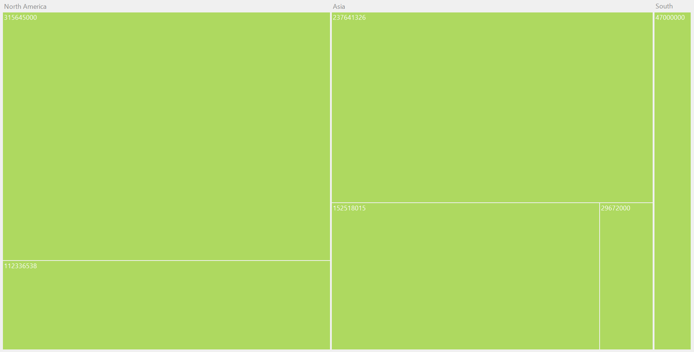

# Getting Started with Windows Forms TreeMap

TreeMaps are a growing trend in data visualization. They display hierarchical information in a series of clustered rectangles, which together represent a whole. Each box's size represents a quantity. TreeMaps can also use color to represent values, and colors are often used to categorize the boxes within the TreeMap.

## Assembly deployment

To use the TreeMap control, add the **Syncfusion.TreeMap.Windows** assembly as a reference to your application. Refer to the [control dependencies](https://help.syncfusion.com/windowsforms/control-dependencies#treemap) section to get the list of assemblies or NuGet packages that need to be referenced.

For more information on installing NuGet packages in a Windows Forms application, see the following link:

[How to install NuGet packages](https://help.syncfusion.com/windowsforms/installation/install-nuget-packages)

## Creating tree map for Windows Forms applications

The tree map control is available in the following assembly and namespace:

* **Assembly:** `Syncfusion.TreeMap.Windows`
* **Namespace:** `Syncfusion.Windows.Forms.TreeMap`

### Step 1: Create a Windows Forms application

Create a new Windows Forms Application project in Visual Studio and add the **Syncfusion.TreeMap.Windows** assembly or NuGet package as a reference. Refer to the [control dependencies](https://help.syncfusion.com/windowsforms/control-dependencies#treemap) section for the list of required assemblies and NuGet packages.

### Step 2: Define a Data Model

Define a simple data model that represents a data point.





public class PopulationDetail
{
    public string Continent { get; set; } = string.Empty;
    public string Country { get; set; } = string.Empty;
    public double Growth { get; set; }
    public double Population { get; set; }
}





Public Class PopulationDetail
    Public Property Continent As String = String.Empty
    Public Property Country As String = String.Empty
    Public Property Growth As Double
    Public Property Population As Double
End Class





### Step 3: Create Data Source

Create a view model class with an `ObservableCollection` and populate it with sample data.





public class PopulationViewModel
{
    public PopulationViewModel()
    {
        this.PopulationDetails = new ObservableCollection<PopulationDetail>();
        PopulationDetails.Add(new PopulationDetail() { Continent = "Asia", Country = "Indonesia", Growth = 3, Population = 237641326 });
        PopulationDetails.Add(new PopulationDetail() { Continent = "Asia", Country = "Russia", Growth = 2, Population = 152518015 });
        PopulationDetails.Add(new PopulationDetail() { Continent = "Asia", Country = "Malaysia", Growth = 1, Population = 29672000 });
        PopulationDetails.Add(new PopulationDetail() { Continent = "North America", Country = "United States", Growth = 4, Population = 315645000 });
        PopulationDetails.Add(new PopulationDetail() { Continent = "North America", Country = "Mexico", Growth = 2, Population = 112336538 });
        PopulationDetails.Add(new PopulationDetail() { Continent = "South America", Country = "Colombia", Growth = 1, Population = 47000000 });
    }

    public ObservableCollection<PopulationDetail> PopulationDetails { get; set; }
}





Public Class PopulationViewModel
    Public Sub New()
        Me.PopulationDetails = New ObservableCollection(Of PopulationDetail)()
        PopulationDetails.Add(New PopulationDetail() With { .Continent = "Asia", .Country = "Indonesia", .Growth = 3, .Population = 237641326 })
        PopulationDetails.Add(New PopulationDetail() With { .Continent = "Asia", .Country = "Russia", .Growth = 2, .Population = 152518015 })
        PopulationDetails.Add(New PopulationDetail() With { .Continent = "Asia", .Country = "Malaysia", .Growth = 1, .Population = 29672000 })
        PopulationDetails.Add(New PopulationDetail() With { .Continent = "North America", .Country = "United States", .Growth = 4, .Population = 315645000 })
        PopulationDetails.Add(New PopulationDetail() With { .Continent = "North America", .Country = "Mexico", .Growth = 2, .Population = 112336538 })
        PopulationDetails.Add(New PopulationDetail() With { .Continent = "South America", .Country = "Colombia", .Growth = 1, .Population = 47000000 })
    End Sub

    Public Property PopulationDetails As ObservableCollection(Of PopulationDetail)
End Class





### Step 4: Import the TreeMap namespace

Add the following namespace in your C# code file.





using Syncfusion.Windows.Forms.TreeMap;





Imports Syncfusion.Windows.Forms.TreeMap





### Step 5: Configure TreeMap Properties

Configure the TreeMap control by setting the data source and key properties such as `WeightValuePath` and `ColorValuePath`. The levels of the TreeMap control can be categorized into two types: flat and hierarchical, which are used to define the levels of the data collection.





PopulationViewModel data = new PopulationViewModel();

TreeMap treeMap = new TreeMap();
treeMap.ItemsSource = data.PopulationDetails;
treeMap.WeightValuePath = "Population";
treeMap.ColorValuePath = "Growth";
treeMap.Dock = DockStyle.Fill;

TreeMapFlatLevel treeMapFlatLevel1 = new TreeMapFlatLevel();
treeMapFlatLevel1.GroupPath = "Continent";

treeMap.Levels.Add(treeMapFlatLevel1);
this.Controls.Add(treeMap);





Dim data As New PopulationViewModel()

Dim treeMap As New TreeMap()
treeMap.ItemsSource = data.PopulationDetails
treeMap.WeightValuePath = "Population"
treeMap.ColorValuePath = "Growth"
treeMap.Dock = DockStyle.Fill

Dim treeMapFlatLevel1 As New TreeMapFlatLevel()
treeMapFlatLevel1.GroupPath = "Continent"

treeMap.Levels.Add(treeMapFlatLevel1)
Me.Controls.Add(treeMap)





## See also

[`How to populate the WinForms TreeMap data values by using the DataTable?`](https://support.syncfusion.com/kb/article/4052/how-to-populate-the-winforms-treemap-data-values-by-using-the-datatable)