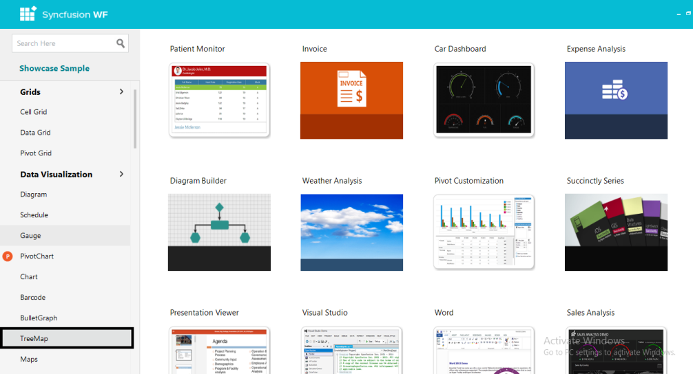
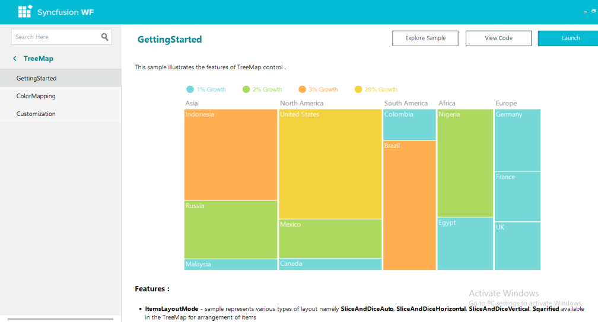

# Installation and Deployment

This section covers information on the install location, samples, licensing, patches update and updation of the recent version of Essential Studio. It comprises the following sub-sections:

## Installation

For step-by-step installation procedure for the installation of Essential Studio, refer to the Installation topic under Installation and Deployment in the Common UG.

See Also

For licensing, patches and information on adding or removing selective components refer the following topics in Common UG under Installation and Deployment.

* Licensing
* Patches
* Add / Remove Components

## Sample and Location

Use the following steps to view the samples:

1. Click Start > All Programs > Syncfusion > Essential Studio <version number> >Dashboard

   The Essential Studio Enterprise Edition window will be displayed.

   

   Syncfusion Essential Studio Dashboard
   {:.caption}

2. In the Dashboard window, click Run Samples for Windows Forms under UI Edition. The UI Windows Forms Sample Browser window will be displayed.

   > Note: You can view the samples in any of the following three ways:
   > * Run Samples - Click to view the locally installed samples.
   > * Online Samples - Click to view online samples.
   > * Explore Samples - Explore the UI for Windows Forms on disk._

   The User Interface Edition panel is displayed by default.

   

   UI Windows Forms Sample Browser
   {:.caption}

3. Click the TreeMap under Data Visualization. The TreeMap samples will be displayed.

   

   Essential TreeMap WF Samples
   {:.caption}

4. Select any sample and browse through the features. 

## Deployment Requirements

### Toolbox Entries

* TreeMap

#### Assembly List

While deploying an application that references SyncfusionEssentialTreeMap assembly, the following dependencies must be included in the distribution.

* Syncfusion.TreeMap.Windows
* Syncfusion.Shared.Base
* Syncfusion.Core