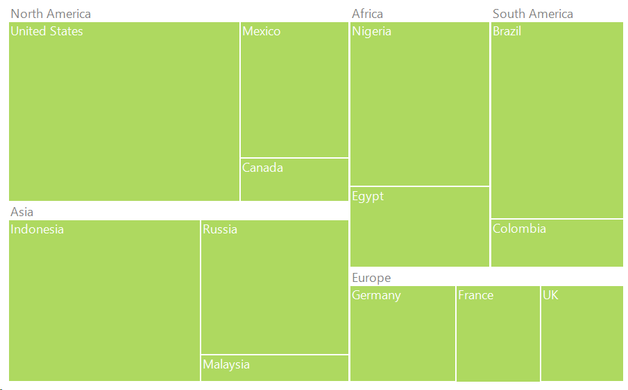
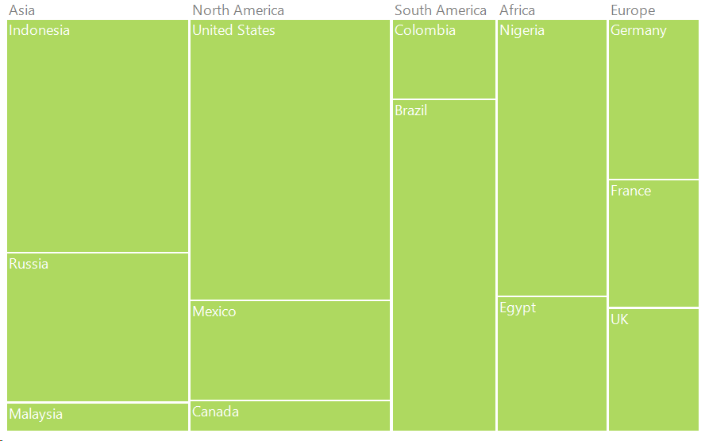
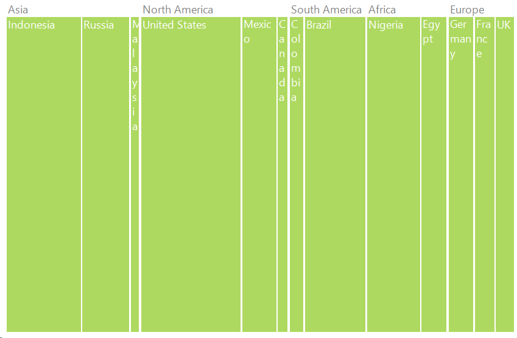

# TreeMap Layout in Windows Forms TreeMap

The [`ItemsLayoutMode`](https://help.syncfusion.com/cr/windowsforms/Syncfusion.Windows.Forms.TreeMap.TreeMap.html#Syncfusion_Windows_Forms_TreeMap_TreeMap_ItemsLayoutMode) of the tree map control specifies the mode in which the items should be laid out. This layout will be applied for all the tree map levels. It includes four different types of layout.

## Squarified layout

#### Code sample





TreeMap TreeMap1 = new TreeMap();

PopulationViewModel data = new PopulationViewModel();

TreeMap1.ItemsSource = data.PopulationDetails;

TreeMap1.WeightValuePath = "Population";

TreeMap1.ColorValuePath = "Growth";

TreeMap1.ItemsLayoutMode =  Syncfusion.Windows.Forms.TreeMap.ItemsLayoutModes.Squarified;

TreeMapFlatLevel treeMapFlatLevel1 = new TreeMapFlatLevel();

treeMapFlatLevel1.GroupPath = "Continent";

treeMapFlatLevel1.ShowLabels = true;

TreeMap1.Levels.Add(treeMapFlatLevel1);

TreeMapFlatLevel treeMapFlatLevel2 = new TreeMapFlatLevel();

treeMapFlatLevel2.GroupPath = "Country";

treeMapFlatLevel2.ShowLabels = true;

treeMapFlatLevel2.HeaderHeight = 25;

TreeMap1.Levels.Add(treeMapFlatLevel2);





## SliceAndDiceAuto layout

#### Code sample





TreeMap TreeMap1 = new TreeMap();

PopulationViewModel data = new PopulationViewModel();

TreeMap1.ItemsSource = data.PopulationDetails;

TreeMap1.WeightValuePath = "Population";

TreeMap1.ColorValuePath = "Growth";

TreeMap1.ItemsLayoutMode = Syncfusion.Windows.Forms.TreeMap.ItemsLayoutModes.SliceAndDiceAuto;

TreeMapFlatLevel treeMapFlatLevel1 = new TreeMapFlatLevel();

treeMapFlatLevel1.GroupPath = "Continent";

treeMapFlatLevel1.ShowLabels = true;

TreeMap1.Levels.Add(treeMapFlatLevel1);

TreeMapFlatLevel treeMapFlatLevel2 = new TreeMapFlatLevel();

treeMapFlatLevel2.GroupPath = "Country";

treeMapFlatLevel2.ShowLabels = true;

treeMapFlatLevel2.HeaderHeight = 25;

TreeMap1.Levels.Add(treeMapFlatLevel2);





## SliceAndDiceHorizontal layout

#### Code sample





TreeMap TreeMap1 = new TreeMap();

PopulationViewModel data = new PopulationViewModel();

TreeMap1.ItemsSource = data.PopulationDetails;

TreeMap1.WeightValuePath = "Population";

TreeMap1.ColorValuePath = "Growth";

TreeMap1.ItemsLayoutMode = Syncfusion.Windows.Forms.TreeMap.ItemsLayoutModes.SliceAndDiceHorizontal;            TreeMapFlatLevel treeMapFlatLevel1 = new TreeMapFlatLevel();

treeMapFlatLevel1.GroupPath = "Continent";

treeMapFlatLevel1.ShowLabels = true;

TreeMap1.Levels.Add(treeMapFlatLevel1);

TreeMapFlatLevel treeMapFlatLevel2 = new TreeMapFlatLevel();

treeMapFlatLevel2.GroupPath = "Country";

treeMapFlatLevel2.ShowLabels = true;

treeMapFlatLevel2.HeaderHeight = 25;

TreeMap1.Levels.Add(treeMapFlatLevel2);





## SliceAndDiceVertical layout

#### Code sample





TreeMap TreeMap1 = new TreeMap();

PopulationViewModel data = new PopulationViewModel();

TreeMap1.ItemsSource = data.PopulationDetails;

TreeMap1.WeightValuePath = "Population";

TreeMap1.ColorValuePath = "Growth";

TreeMap1.ItemsLayoutMode = Syncfusion.Windows.Forms.TreeMap.ItemsLayoutModes.SliceAndDiceVertical;

TreeMapFlatLevel treeMapFlatLevel1 = new TreeMapFlatLevel();

treeMapFlatLevel1.GroupPath = "Continent";

treeMapFlatLevel1.ShowLabels = true;

TreeMap1.Levels.Add(treeMapFlatLevel1);

TreeMapFlatLevel treeMapFlatLevel2 = new TreeMapFlatLevel();

treeMapFlatLevel2.GroupPath = "Country";

treeMapFlatLevel2.ShowLabels = true;

treeMapFlatLevel2.HeaderHeight = 25;

TreeMap1.Levels.Add(treeMapFlatLevel2);





