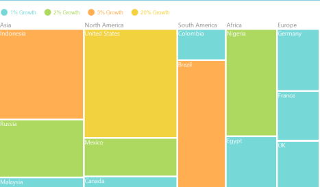

# TreeMap Legend in Windows Forms TreeMap control

TreeMap legend is used to easily demonstrate about the color value of leaf nodes. But this legend could be appropriate only for the treemap having leaf nodes colored by using RangeBrushColorMapping. The labels of the legend item can be customized by specifying LegendLabel of RangeBrush mentioned in the Brushes of RangeBrushColorMapping.

The icon of legend item can be set by LegendIconStyle of TreeMapLegend. Custom legend icon can be set by assigning DataTemplate to LegendIconTemplate with LegendIconStyle as “Custom”. The width and height of the legend icon can be modified by setting LegendIconWidth and LegendIconHeight of TreeMapLegend.

The legend can be positioned to Left, Right, Top or Bottom of TreeMap with the help of LegendPosition property.

#### Code Sample:





public partial class Form1 : Form
{
    TreeMap TreeMap1 = new TreeMap();

    public Form1()
    {
        InitializeComponent();

        PopulationViewModel data = new PopulationViewModel();
        TreeMap1.ItemsSource = data.PopulationDetails;
        TreeMap1.WeightValuePath = "Population";
        TreeMap1.ColorValuePath = "Growth";
        TreeMap1.LegendType = LegendTypes.Ellipse;
        TreeMap1.LegendGap = 150;
        TreeMap1.LegendPosition = LegendPositions.Top;
        TreeMap1.Dock = DockStyle.Fill;

        TreeMapFlatLevel treeMapFlatLevel1 = new TreeMapFlatLevel();
        treeMapFlatLevel1.GroupPath = "Continent";
        TreeMap1.Levels.Add(treeMapFlatLevel1);
        TreeMap1.LeafItemSettings.LabelPath = "Country";

        RangeBrushColorMapping rangeBrushColorMapping = new RangeBrushColorMapping();
        rangeBrushColorMapping.Brushes.Add(new RangeBrush() { Color = System.Drawing.ColorTranslator.FromHtml("#77D8D8"), From = 0, To = 1, LegendLabel = "1% Growth" });
        rangeBrushColorMapping.Brushes.Add(new RangeBrush() { Color = System.Drawing.ColorTranslator.FromHtml("#AED960"), From = 0, To = 2, LegendLabel = "2% Growth" });
        rangeBrushColorMapping.Brushes.Add(new RangeBrush() { Color = System.Drawing.ColorTranslator.FromHtml("#FFAF51"), From = 0, To = 3, LegendLabel = "3% Growth" });
        rangeBrushColorMapping.Brushes.Add(new RangeBrush() { Color = System.Drawing.ColorTranslator.FromHtml("#F3D240"), From = 0, To = 20, LegendLabel = "20% Growth" });
        TreeMap1.LeafColorMapping = rangeBrushColorMapping;
        this.Controls.Add(TreeMap1);
    }
}





Public Partial Class Form1
    Inherits Form

    Private TreeMap1 As New TreeMap()

    Public Sub New()
        InitializeComponent()

        Dim data As New PopulationViewModel()
        TreeMap1.ItemsSource = data.PopulationDetails
        TreeMap1.WeightValuePath = "Population"
        TreeMap1.ColorValuePath = "Growth"
        TreeMap1.LegendType = LegendTypes.Ellipse
        TreeMap1.LegendGap = 150
        TreeMap1.LegendPosition = LegendPositions.Top
        TreeMap1.Dock = DockStyle.Fill

        Dim treeMapFlatLevel1 As New TreeMapFlatLevel()
        treeMapFlatLevel1.GroupPath = "Continent"
        TreeMap1.Levels.Add(treeMapFlatLevel1)
        TreeMap1.LeafItemSettings.LabelPath = "Country"

        Dim rangeBrushColorMapping As New RangeBrushColorMapping()
        rangeBrushColorMapping.Brushes.Add(New RangeBrush() With { .Color = System.Drawing.ColorTranslator.FromHtml("#77D8D8"), .From = 0, .To = 1, .LegendLabel = "1% Growth" })
        rangeBrushColorMapping.Brushes.Add(New RangeBrush() With { .Color = System.Drawing.ColorTranslator.FromHtml("#AED960"), .From = 0, .To = 2, .LegendLabel = "2% Growth" })
        rangeBrushColorMapping.Brushes.Add(New RangeBrush() With { .Color = System.Drawing.ColorTranslator.FromHtml("#FFAF51"), .From = 0, .To = 3, .LegendLabel = "3% Growth" })
        rangeBrushColorMapping.Brushes.Add(New RangeBrush() With { .Color = System.Drawing.ColorTranslator.FromHtml("#F3D240"), .From = 0, .To = 20, .LegendLabel = "20% Growth" })
        TreeMap1.LeafColorMapping = rangeBrushColorMapping
        Me.Controls.Add(TreeMap1)
    End Sub

End Class





TreeMap with Legend
{:.caption}
