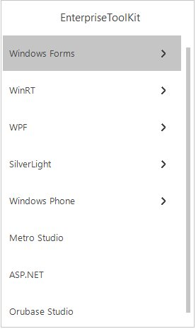

# Style

VisualStyles provides rich and professional look and feel UI for the TreeNavigator. Some of the available VisualStyles are as follows:

* Default
* Office2016Colorful
* Office2016White
* Office2016Black
* Office2016DarkGray

The visual style can be applied for the TreeNavigator using `Style` property.




//Set the visual Style of the TreeNavigator control.
this.treeNavigator1.Style = Syncfusion.Windows.Forms.Tools.TreeNavigatorStyle.Office2016Colorful;





'Set the visual Style of the TreeNavigator control.
Me.treeNavigator1.Style = Syncfusion.Windows.Forms.Tools.TreeNavigatorStyle.Office2016Colorful
 



 