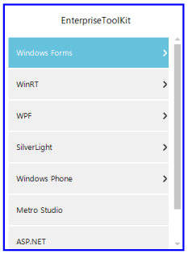

# How to Set Border Color and Border Thickness for the TreeNavigator Control

The border thickness and border color of the TreeNavigator are changed by using the BorderColor and BorderThickness properties.

The following code examples allow you to change the BorderColor and BorderThickness.




this.treeNavigator1.BorderColor = System.Drawing.Color.Blue;
this.treeNavigator1.BorderThickness = 5;





Me.TreeNavigator1.BorderColor = Color.Blue
Me.TreeNavigator1.BorderThickness = 5




