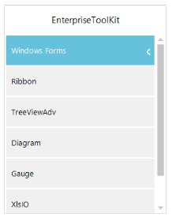

# Navigation Mode

 There are two modes of Navigation in this control.

* Default Mode
* Extended Mode

## Default mode

In this Default mode, the header of current hierarchy level item is displayed at the top of the TreeNavigator with the back button. This back button is used to navigate towards the root from the current level. 

The following code examples allow you to choose the navigation mode.




this.treeNavigator.NavigationMode = NavigationMode.Default;





Me.treeNavigator1.NavigationMode = NavigationMode.Default




## Extended mode

In the Extended mode, header of each level from the root to current level stacked one by one at the top of the TreeNavigator.  When you click on any of that header it take you to the corresponding level. 

The following code examples allow you to choose the Navigation mode.




this.treeNavigator.NavigationMode = NavigationMode.Extended;





Me.TreeNavigator1.NavigationMode = NavigationMode.Extended



