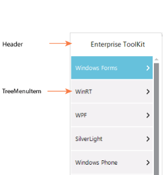

# Overview

The TreeNavigator control provides an interface that allows you to navigate through hierarchical information without using excessive screen space. Items in the control are expanded or collapsed, and you can drill down to sub-items by simply clicking on items in the TreeNavigator. 

## Key Features

Navigation Modes - There are two modes of Navigation

* Default
* Extended
