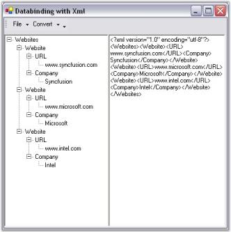

# Data Binding

TreeViewAdv control supports data binding with hierarchical data source like XML and displays the information.

The TreeViewAdv architecture provides a way to consume information from an external XML file, DataSet objects etc and allows the user to convert the Tree to XML structure and vice versa. To implement this data binding concept in TreeViewAdv, the user should drag and drop a TreeViewAdv control, RichTextBox control and MainFrameBarManager to the form. Create bar items and handle the below click events accordingly.



//Adding namespaces

using System.Data;

using System.Xml;

using Syncfusion.Windows.Forms.Tools;

//handling the click event which Converts Tree to Xml

private void Tree2XMLButton_Click(object sender, System.EventArgs e)

{

if ( this.tvTreeContent.Nodes.Count > 0 )

{

try

{

//Provides the stream to write the Xml data

XmlTextWriter myXMLFileWriter = new XmlTextWriter("C:\temp.xml", null);

myXMLFileWriter.WriteStartDocument();

//Helper Method

AddNodes ( myXMLFileWriter , this.tvTreeContent.Nodes );

myXMLFileWriter.Close();

//Loading the XML Data From file

XmlDocument doc = new XmlDocument();

doc.Load( "C:\temp.xml" ); //creating local path

//Copy the Loaded XML data to RichTextBox Control

this.rtXmlContent.Clear();

this.rtXmlContent.Text = doc.OuterXml;

}

catch ( Exception Exp )

{

MessageBox.Show( Exp.Message );

}

}

else

{

MessageBox.Show( "No node is available to convert as XML" );

}

}

//The click event which Converts Xml to Tree

private void XML2TreeButton_Click(object sender, System.EventArgs e)

{

this.tvTreeContent.Nodes.Clear();

try 

{

XmlDocument doc = new XmlDocument();

doc.InnerXml = this.rtXmlContent.Text;

// Initialize the TreeViewAdv

this.tvTreeContent.Nodes.Clear();

this.tvTreeContent.Nodes.Add(new TreeNodeAdv(doc.DocumentElement.Name));

TreeNodeAdv tNodeAdv = new TreeNodeAdv();

tNodeAdv = this.tvTreeContent.Nodes[0];

//Populate the TreeView with the doc nodes.

AddNode(doc.DocumentElement, tNodeAdv);

//Show Expanded Tree

this.tvTreeContent.ExpandAll();

}

catch(XmlException xmlEx)

{

MessageBox.Show(xmlEx.Message);

}

catch(Exception ex)

{

MessageBox.Show(ex.Message);

}

}

//Event which loads Xml

private void buttonLoaderXML_Click(object sender, System.EventArgs e)

{

this.ofxmlFile.ShowDialog();

}

//Event which Opens Xml

private void bixml_Click(object sender, System.EventArgs e)

{

buttonLoaderXML_Click(sender, System.EventArgs.Empty );

}

//Accept the open Xml file

private void xmlFile_FileOK(object sender, System.ComponentModel.CancelEventArgs e)

{

	try 

{

XmlDocument doc = new XmlDocument();

doc.Load( this.ofxmlFile.FileName );

this.rtXmlContent.Text = doc.OuterXml;

}

catch(XmlException xmlEx)

{

MessageBox.Show(xmlEx.Message);

}

catch(Exception ex)

{

MessageBox.Show(ex.Message);

}

}

//Accept the save xml file

private void SaveXmlFile_FileOK(object sender, System.ComponentModel.CancelEventArgs e)

{

XmlDocument doc = new XmlDocument();

doc.InnerXml = this.rtXmlContent.Text;

doc.Save( this.sfSaveXmlFile.FileName);

}

//Event which Saves Xml

private void buttonSavesXML_Click(object sender, System.EventArgs e)

{

this.sfSaveXmlFile.ShowDialog();

}

//Event which Close Xml

private void biClose_Click(object sender, System.EventArgs e)

{

this.Close();

}





' Adding name spaces

Imports System.Xml

Imports Syncfusion.Windows.Forms.Tools

' The click event which Converts Tree to Xml

Private Sub Tree2XMLButton_Click(ByVal sender As Object, ByVal e As System.EventArgs) Handles biTree2Xml.Click

If Me.tvTreeContent.Nodes.Count > 0 Then

Try

'Provides the stream to write the Xml data

Dim myXMLFileWriter As XmlTextWriter = New XmlTextWriter("C:\temp.xml", Nothing)

myXMLFileWriter.WriteStartDocument()

'Helper Method

AddNodes(myXMLFileWriter, Me.tvTreeContent.Nodes)

myXMLFileWriter.Close()

'Loading the XML Data From file

Dim doc As XmlDocument = New XmlDocument()

doc.Load("C:\temp.xml")

'doc.

'Copy the Loaded XML data to RichTextBox Control

Me.rtXmlContent.Clear()

Me.rtXmlContent.Text = doc.OuterXml

Catch Exp As Exception

MessageBox.Show(Exp.Message)

End Try

Else

MessageBox.Show("No node is available to convert as XML")

End If

End Sub

' The click event which Converts Xml to Tree

Private Sub XML2TreeButton_Click(ByVal sender As Object, ByVal e As System.EventArgs) Handles biXml2Tree.Click

Me.tvTreeContent.Nodes.Clear()

Try

Dim doc As XmlDocument = New XmlDocument()

doc.InnerXml = Me.rtXmlContent.Text

' Initialize the TreeViewAdv

Me.tvTreeContent.Nodes.Clear()

Me.tvTreeContent.Nodes.Add(New TreeNodeAdv(doc.DocumentElement.Name))

Dim tNodeAdv As TreeNodeAdv = New TreeNodeAdv()

tNodeAdv = Me.tvTreeContent.Nodes(0)

'Populate the TreeView with the DOC nodes.

AddNode(doc.DocumentElement, tNodeAdv)

'Show Expanded Tree

Me.tvTreeContent.ExpandAll()

Catch xmlEx As XmlException

MessageBox.Show(xmlEx.Message)

Catch ex As Exception

MessageBox.Show(ex.Message)

End Try

End Sub

' Event which Load Xml

Private Sub buttonLoaderXML_Click(ByVal sender As Object, ByVal e As System.EventArgs) Handles biLoadXml.Click

Me.ofxmlFile.ShowDialog()

End Sub

' Event which Opens Xml

Private Sub bixml_Click(ByVal sender As Object, ByVal e As System.EventArgs)

buttonLoaderXML_Click(sender, System.EventArgs.Empty)

End Sub

' Accept the Xml by handling this event

Private Sub xmlFile_FileOK(ByVal sender As Object, ByVal e As System.ComponentModel.CancelEventArgs) Handles ofpenXmlFile.FileOk

Try

Dim doc As XmlDocument = New XmlDocument()

doc.Load(Me.ofxmlFile.FileName)

Me.rtXmlContent.Text = doc.OuterXml

Catch xmlEx As XmlException

MessageBox.Show(xmlEx.Message)

Catch ex As Exception

MessageBox.Show(ex.Message)

End Try

End Sub

' Accept to save the file

Private Sub SaveXmlFile_FileOK(ByVal sender As Object, ByVal e As System.ComponentModel.CancelEventArgs) Handles sfSaveXmlFile.FileOk

Dim doc As XmlDocument = New XmlDocument()

doc.InnerXml = Me.rtXmlContent.Text

doc.Save(Me.sfSaveXmlFile.FileName)

End Sub

' Event which Saves Xml

Private Sub buttonSavesXML_Click(ByVal sender As Object, ByVal e As System.EventArgs) Handles biSaveXml.Click

Me.sfSaveXmlFile.ShowDialog()

End Sub

' Event which Close Xml

Private Sub biClose_Click(ByVal sender As Object, ByVal e As System.EventArgs) Handles biClose.Click

Me.Close()

End Sub



