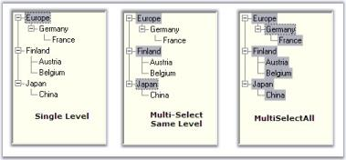

# Drag And Drop

The drag and drop functionality is fully supported through the various drag drop events.

_Table_ _870_:Events Table

<table>
<tr>
<th>
TreeNodeAdv Events</th><th>
Description</th></tr>
<tr>
<td>
DragDrop</td><td>
Specifies the function to be triggered after an item is dropped.</td></tr>
<tr>
<td>
DragEnter</td><td>
Specifies the function to be triggered when an item is dragged inside the control bounds.</td></tr>
<tr>
<td>
DragLeave</td><td>
Specifies the function to be triggered when an item is dragged outside the control bounds.</td></tr>
<tr>
<td>
DragOver</td><td>
Specifies the function to be triggered when an item is dragged over the control bounds.</td></tr>
<tr>
<td>
GiveFeedback</td><td>
Specifies the function to trigger when the mouse drags an item. The system request the control to provide feedback to that effect.</td></tr>
<tr>
<td>
ItemDrag</td><td>
Specifies the function to be triggered when an item is dragged.</td></tr>
<tr>
<td>
QueryContinueDrag</td><td>
Specifies the function to be triggered when an item is being dragged.</td></tr>
</table>

The drag and drop functionality can be implemented by using the below code snippets.



private void treeViewAdv_ItemDrag(object sender, System.Windows.Forms.ItemDragEventArgs e)

{

TreeViewAdv treeViewAdv = sender as TreeViewAdv;

// The TreeViewAdv always provides an array of selected nodes.

TreeNodeAdv[] nodes = e.Item as TreeNodeAdv[];

// Let us get only the first selected node.

TreeNodeAdv node = nodes[0];

DragDropEffects result = treeViewAdv.DoDragDrop(node, DragDropEffects.Move);

}

// Helps keep track of the node that is being dragged.

private TreeNodeAdv currentSourceNode;

private void treeViewAdv_DragOver(object sender, System.Windows.Forms.DragEventArgs e)

{

// Determine drag effects

bool droppable = true;

TreeNodeAdv destinationNode = null;

TreeViewAdv treeView = sender as TreeViewAdv;

Point ptInTree = treeView.PointToClient(new Point(e.X, e.Y));

this.currentSourceNode = null;

// Looking for a single tree node.

if( e.Data.GetDataPresent(typeof(TreeNodeAdv)))

{

// Get the destination and source node.

destinationNode = treeView.GetNodeAtPoint(ptInTree);

TreeNodeAdv sourceNode = (TreeNodeAdv) e.Data.GetData(typeof(TreeNodeAdv));

this.currentSourceNode = sourceNode;

droppable = true;

}

else

droppable = false;

if(droppable)

// If Moving is allowed:

e.Effect = DragDropEffects.Move;

else

e.Effect = DragDropEffects.None;

Point pt = this.treeViewAdv1.PointToClient(new Point(e.X, e.Y));

this.treeViewAdv1.SelectedNode = this.treeViewAdv1.GetNodeAtPoint(pt);

Console.WriteLine(this.treeViewAdv1.SelectedNode.Text);

}

private void treeViewAdv_DragDrop(object sender, System.Windows.Forms.DragEventArgs e)

{

TreeViewAdv treeView = sender as TreeViewAdv;

// Get the destination and source node.

TreeNodeAdv sourceNode = (TreeNodeAdv) e.Data.GetData(typeof(TreeNodeAdv));

Point pt = this.treeViewAdv1.PointToClient(new Point(e.X, e.Y));

TreeNodeAdv destinationNode = this.treeViewAdv1.GetNodeAtPoint(pt);

sourceNode.Move(destinationNode, NodePositions.Next);

this.currentSourceNode = null;

treeView.SelectedNode = sourceNode;

}

private void treeViewAdv_DragLeave(object sender, System.EventArgs e)

{

// Let the highlight tracker keep track of the current highlight node.

this.treeViewDragHighlightTracker.ClearHighlightNode();

}

private void treeViewAdv_QueryContinueDrag(object sender, System.Windows.Forms.QueryContinueDragEventArgs e)

{

// Cancel dragging when Escape was pressed.

if(e.EscapePressed)

{

e.Action = DragAction.Cancel;

}

}

private void treeViewAdv_DragEnter(object sender, System.Windows.Forms.DragEventArgs e) 

{

    // Reset the label text.

    DropLocationLabel.Text = "None";

}

public event GiveFeedbackEventHandler GiveFeedback;

private System.Windows.Forms.CheckBox UseCustomCursorsCheck;

private Cursor MyNoDropCursor;

private Cursor MyNormalCursor;

private void treeViewAdv_GiveFeedback(object sender, System.Windows.Forms.GiveFeedbackEventArgs e) 

{

    // Use custom cursors if the check box is checked.

    if (UseCustomCursorsCheck.Checked) 

{

MyNormalCursor = new Cursor("3dwarro.cur");

MyNoDropCursor = new Cursor("3dwno.cur");

if (MyNormalCursor != null)

MyNormalCursor.Dispose();

if (MyNoDropCursor != null)

MyNoDropCursor.Dispose();

       // Sets the custom cursor based upon the effect.

       e.UseDefaultCursors = false;

       if ((e.Effect & DragDropEffects.Move) == DragDropEffects.Move)

           Cursor.Current = MyNormalCursor;

       else 

           Cursor.Current = MyNoDropCursor;

    }

}





Private Sub treeViewAdv_ItemDrag(ByVal sender As Object, ByVal e As System.Windows.Forms.ItemDragEventArgs)

Dim treeViewAdv As TreeViewAdv = CType(IIf(TypeOf sender Is TreeViewAdv, sender, Nothing), TreeViewAdv)

' The TreeViewAdv always provides an array of selected nodes.

Dim nodes As TreeNodeAdv() = CType(IIf(TypeOf e.Item Is TreeNodeAdv, e.Item, Nothing), TreeNodeAdv)()

' Let us get only the first selected node.

Dim node As TreeNodeAdv = nodes(0)

Dim result As DragDropEffects = treeViewAdv.DoDragDrop(node, DragDropEffects.Move)

End Sub

' Helps keep track of the node that is being dragged.

Private currentSourceNode As TreeNodeAdv

Private Sub treeViewAdv_DragOver(ByVal sender As Object, ByVal e As System.Windows.Forms.DragEventArgs)

' Determine drag effects

Dim droppable As Boolean = True

Dim destinationNode As TreeNodeAdv = Nothing

Dim treeView As TreeViewAdv = CType(IIf(TypeOf sender Is TreeViewAdv, sender, Nothing), TreeViewAdv)

Dim ptInTree As Point = treeView.PointToClient(New Point(e.X, e.Y))

Me.currentSourceNode = Nothing

' Looking for a single tree node.

If e.Data.GetDataPresent(GetType(TreeNodeAdv)) Then

' Get the destination and source node.

destinationNode = treeView.GetNodeAtPoint(ptInTree)

Dim sourceNode As TreeNodeAdv = CType(e.Data.GetData(GetType(TreeNodeAdv)), TreeNodeAdv)

Me.currentSourceNode = sourceNode

droppable = True

Else

droppable = False

End If

If droppable Then

' If Moving is allowed:

e.Effect = DragDropEffects.Move

Else

e.Effect = DragDropEffects.None

End If

Dim pt As Point = Me.treeViewAdv1.PointToClient(New Point(e.X, e.Y))

Me.treeViewAdv1.SelectedNode = Me.treeViewAdv1.GetNodeAtPoint(pt)

Console.WriteLine(Me.treeViewAdv1.SelectedNode.Text)

End Sub

Private Sub treeViewAdv_DragDrop(ByVal sender As Object, ByVal e As System.Windows.Forms.DragEventArgs)

Dim treeView As TreeViewAdv = CType(IIf(TypeOf sender Is TreeViewAdv, sender, Nothing), TreeViewAdv)

' Get the destination and source node.

Dim sourceNode As TreeNodeAdv = CType(e.Data.GetData(GetType(TreeNodeAdv)), TreeNodeAdv)

Dim pt As Point = Me.treeViewAdv1.PointToClient(New Point(e.X, e.Y))

Dim destinationNode As TreeNodeAdv = Me.treeViewAdv1.GetNodeAtPoint(pt)

sourceNode.Move(destinationNode, NodePositions.Next)

Me.currentSourceNode = Nothing

treeView.SelectedNode = sourceNode

End Sub

Private Sub treeViewAdv_DragEnter(ByVal sender As Object, ByVal e As DragEventArgs) Handles ListDragTarget.DragEnter

    ' Reset the label text.

    DropLocationLabel.Text = "None"

End Sub

Private Sub treeViewAdv_DragLeave(ByVal sender As Object, ByVal e As System.EventArgs) Handles treeViewAdv1.DragLeave

' Let the highlight tracker keep track of the current highlight node.

Me.treeViewDragHighlightTracker.ClearHighlightNode()

End Sub

Private Sub treeViewAdv_QueryContinueDrag(ByVal sender As Object, ByVal e As System.Windows.Forms.QueryContinueDragEventArgs) Handles treeViewAdv1.QueryContinueDrag

' Cancel dragging when Escape was pressed.

If e.EscapePressed Then

e.Action = DragAction.Cancel

End If

End Sub

Public Event GiveFeedback As GiveFeedbackEventHandler

Friend WithEvents UseCustomCursorsCheck As System.Windows.Forms.CheckBox 

Private MyNoDropCursor As Cursor 

Private MyNormalCursor As Cursor 

Private Sub treeViewAdv_GiveFeedback(ByVal sender As Object, ByVal e As GiveFeedbackEventArgs) Handles ListDragSource.GiveFeedback

' Use custom cursors if the check box is checked.

    If (UseCustomCursorsCheck.Checked) Then

MyNormalCursor = New Cursor("3dwarro.cur") 

MyNoDropCursor = New Cursor("3dwno.cur") 

        ' Set the custom cursor based upon the effect.

        e.UseDefaultCursors = False

        If ((e.Effect And DragDropEffects.Move) = DragDropEffects.Move) Then

            Cursor.Current = MyNormalCursor

        Else

            Cursor.Current = MyNoDropCursor

        End If

    End If

End Sub


The below image indicates dragging of "Brazil" node.

N> You can also display a highlighted line while dragging which has unique functionalities like keeping track of the drag drop operation. Click here to know more about this feature.


How to return the node at a specified location?

Drag and Drop Events


## Selection Settings While Drag Drop

While performing a drag and drop operation, when a node is selected and dragged, the node will be drawn with a dotted rectangle, when it loses focus. This feature is enabled by setting the KeepDottedSelection property of the TreeViewAdv to true.

The semi-transparent image which is drawn besides the cursor, during the drag and drop operation, can be displayed at a distance from the mouse cursor, by enabling the KeepDragCapturePoint property.

The semi-transparent image that is drawn, can be hidden or shown using the ShowDragNodeCue property. 

_Table_ _882_: Property Table

<table>
<tr>
<th>
treeViewAdv Property</th><th>
Description</th></tr>
<tr>
<td>
KeepDottedSelection</td><td>
Value which indicates if the selected node must draw a dotted rectangle when it loses focus.</td></tr>
<tr>
<td>
KeepDragCapturePoint</td><td>
Gets or sets a value which indicates whether cue image should be drawn at a distance below the cursor during the drag drop operation. Default value is false.</td></tr>
<tr>
<td>
ShowDragNodeCue</td><td>
Specifies whether a semitransparent image of the selected node is drawn besides the cursor during the drag and drop operation.</td></tr>
</table>

To cancel the selection or editing, use CancelMode and CancelEditMode methods.

_Table_ _883_: Methods Table

<table>
<tr>
<th>
treeViewAdv methods</th><th>
Description</th></tr>
<tr>
<td>
CancelMode</td><td>
Cancels the selection or editing of a node.</td></tr>
<tr>
<td>
CancelEditMode</td><td>
Cancels the edit mode of a particular node.</td></tr>
<tr>
<td>
LastMousePositionToClient</td><td>
Gets the last mouse position to the client or returns the last point at which the mouse is clicked.</td></tr>
</table>

### Row Selection

The FullRowSelect property allows you to specify if the entire row of the selected item is highlighted and clicking anywhere on an item's row causes it to be selected.

_Table_ _884_: Property Table

<table>
<tr>
<th>
treeViewAdv Property</th><th>
Description</th></tr>
<tr>
<td>
FullRowSelect</td><td>
Specifies whether the whole row of a treeview needs to be selected on selecting a node of that row.</td></tr>
</table>

_Table_ _885_: Method Table

<table>
<tr>
<th>
treeViewAdv Method</th><th>
Description</th></tr>
<tr>
<td>
GetHeightOfRows</td><td>
To get the height of the rows of a tree from the start point to the end point. The parameters are,(i)start - Represents the start point. (ii)end - Represents the end point.</td></tr>
</table>



this.treeViewAdv1.GetHeightOfRows(1, 2);





Me.treeViewAdv1.GetHeightOfRows(1, 2)



## Highlighting Drag and Drop

Drag drop operation in the TreeView can display a highlighted line during dragging. TreeView uses a helper class, i.e., TreeViewAdvDragHighlightTracker for this purpose. This keeps track of the highlighted node and also provides the destination where the user had decided to drop. It also allows validation whether to drag / drop a node to another node or not. We need to use the tracker class for this purpose.



//In the Drag Over event

// Let the highlight tracker keep track of the current highlight node.

this.treeViewDragHighlightTracker.SetHighlightNode(destinationNode, ptInTree);

//In the Drag Leave event

this.treeViewDragHighlightTracker.ClearHighlightNode();

//In the Drag Drop event

private void treeViewAdv_DragDrop(object sender, System.Windows.Forms.DragEventArgs e)

{

TreeViewAdv treeView = sender as TreeViewAdv;

// Get the destination and source node.

TreeNodeAdv sourceNode = (TreeNodeAdv) e.Data.GetData(typeof(TreeNodeAdv));

TreeNodeAdv destinationNode = this.treeViewDragHighlightTracker.HighlightNode;

TreeViewDropPositions dropPosition = this.treeViewDragHighlightTracker.DropPosition;

// Clear the highlight info in the tracker.

this.treeViewDragHighlightTracker.ClearHighlightNode();

if(destinationNode != null)

{

switch (dropPosition)

{

case TreeViewDropPositions.AboveNode:

sourceNode.Move(destinationNode, NodePositions.Previous);

break;

case TreeViewDropPositions.BelowNode:

sourceNode.Move(destinationNode, NodePositions.Next);

break;

case TreeViewDropPositions.OnNode:

sourceNode.Move(destinationNode.Nodes);

destinationNode.Expand();

break;

}

}

this.currentSourceNode = null;

// Move the source node based on the tracked info.

treeView.SelectedNode = sourceNode;

}





'In the Drag Over event

' Let the highlight tracker keep track of the current highlight node.

Me.treeViewDragHighlightTracker.SetHighlightNode(destinationNode, ptInTree)

'In the Drag Leave event

Me.treeViewDragHighlightTracker.ClearHighlightNode()

'In the Drag Drop event

Private Sub treeViewAdv_DragDrop(ByVal sender As Object, ByVal e As System.Windows.Forms.DragEventArgs) Handles treeViewAdv1.DragDrop

Dim treeView As TreeViewAdv = CType(IIf(TypeOf sender Is TreeViewAdv, sender, Nothing), TreeViewAdv)

' Get the destination and source node.

Dim sourceNode As TreeNodeAdv = CType(e.Data.GetData(GetType(TreeNodeAdv)), TreeNodeAdv)

Dim destinationNode As TreeNodeAdv = Me.treeViewDragHighlightTracker.HighlightNode

Dim dropPosition As TreeViewDropPositions = Me.treeViewDragHighlightTracker.DropPosition

' Clear the highlight info in the tracker.

Me.treeViewDragHighlightTracker.ClearHighlightNode()

Me.currentSourceNode = Nothing

' Move the source node based on the tracked info.

If Not destinationNode Is Nothing Then

Select Case dropPosition

Case TreeViewDropPositions.AboveNode

sourceNode.Move(destinationNode, NodePositions.Previous)

Case TreeViewDropPositions.BelowNode

sourceNode.Move(destinationNode, NodePositions.Next)

Case TreeViewDropPositions.OnNode

sourceNode.Move(destinationNode.Nodes)

destinationNode.Expand()

End Select

End If

treeView.SelectedNode = sourceNode

End Sub



N> We can also prevent drawing highlight for some nodes using QueryAllowedPositionForNode event.

Painting the HighlightTracker Pen

This can be done using TreeViewAdvDragHighlightTracker.QueryDragInsertInfo event.

_Table_ _886_: Property Table

<table>
<tr>
<th>
treeViewAdv Property</th><th>
Description</th></tr>
<tr>
<td>
QueryDragInsertInfo</td><td>
Occurs before drawing a drag insert position.</td></tr>
</table>



//QueryDragInsertInfo

this.treeViewDragHighlightTracker.QueryDragInsertInfo+=

new QueryDragInsertInfoEventHandler(treeViewDragHighlightTracker_QueryDragInsertInfo);

// Changing the color of the highlight tracker Pen

private void treeViewDragHighlightTracker_QueryDragInsertInfo(object sender, QueryDragInsertInfoEventArgs args)

{

args.DragInsertColor=Color.Orange;

} 





' QueryDragInsertInfo

AddHandler treeViewDragHighlightTracker.QueryDragInsertInfo, AddressOf treeViewDragHighlightTracker_QueryDragInsertInfo

' Changing the color of the highlight tracker Pen.

Private Sub treeViewDragHighlightTracker_QueryDragInsertInfo(ByVal sender As Object, ByVal args As QueryDragInsertInfoEventArgs)

args.DragInsertColor = Color.Orange

End Sub  



A sample which demonstrates the highlight tracker feature is available in the follow path.

…\_My Documents\Syncfusion\EssentialStudio\Version Number\Windows\Tools.Windows\Samples\Advanced Editor Functions\ActionGroupingDemo_


How to prevent drawing highlight for some nodes?

Drag Drop Events
 

## Node Selection

During drag and drop operation of the tree nodes, a single node or same level nodes or multi level nodes can be selected and dragged based on the selection mode set for the treeview control. SelectionMode property is used for this purpose.

_Table_ _887_: Property Table_

<table>
<tr>
<th>
TreeViewAdv Properties</th><th>
Description</th></tr>
<tr>
<td>
SelectionMode</td><td>
Specifies the selection mode of the treeview. Options are,Single - The user can only select one node at a time and implement the drag-drop operation in the TreeViewAdv (Default).MultiSelectSameLevel - The user can only select nodes of the same level, i.e. only child nodes or only parent nodes.MultiSelectAll - The user can select multiple nodes for implementing the DragDrop operation in the TreeViewAdv.</td></tr>
</table>



this.treeViewAdv1.SelectionMode = TreeSelectionMode.MultiSelectSameLevel;





Me.treeViewAdv1.SelectionMode = TreeSelectionMode.MultiSelectSameLevel



Extending the Selection

We can extend the selection of the nodes using ExtendSelectionTo method. 

_Table_ _888_: Methods Table_

<table>
<tr>
<th>
Methods</th><th>
Parameter</th></tr>
<tr>
<td>
ExtendSelectionTo</td><td>
Extends the selection of the node to a specified node.SelNode - Represents a treeNodeAdv.</td></tr>
<tr>
<td>
ExtendSelectionTo (Overloaded)</td><td>
SelNode - Represents a treeNodeAdv.removeCurrentMultipleSelection - Indicates whether or not any current selection should be removed.</td></tr>
</table>

> Note : This method will be effective only when the SelectionMode is MultiSelectSameLevel or MultiSelectAll.



//Extend Selection using below method

this.treeViewAdv1.ExtendSelectionTo(this.treenode1);

//Overloaded Method

this.treeViewAdv1.ExtendSelectionTo(this.treenode1, false);





'Extend Selection using below method

Me.treeViewAdv1.ExtendSelectionTo(Me.treenode1)

'Overloaded Method

Me.treeViewAdv1.ExtendSelectionTo(Me.treenode1, False)



On Focus / Off Focus

_Table_ _889_: Property Table

<table>
<tr>
<th>
TreeViewAdv Properties</th><th>
Description</th></tr>
<tr>
<td>
ShouldSelectNodeOnEnter</td><td>
Indicates whether a default node should be selected when the treeviewadv control gains focus. By default this property is true.</td></tr>
<tr>
<td>
HideSelection</td><td>
Indicates if the treeviewadv hides its selected nodes when not focussed. This should be set to false to highlight the select the nodes.</td></tr>
</table>


How to select a particular node as a first visible node?


## Mouse and Keyboard Based Selection

Setting AllowKeyboardSearch property of the treeview to true, will allow the user to search for a node by typing the name of the node using the keyboard. User have to ensure that the TreeViewAdv control is focussed while searching.

By setting the AllowMouseBasedSelection property to true, multiple nodes can be selected with mouse down and these selected nodes can be dragged.

_Table_ _890_: Property Table

<table>
<tr>
<th>
TreeViewAdv Properties</th><th>
Description</th></tr>
<tr>
<td>
AllowKeyboardSearch</td><td>
Gets or sets a value indicating if keyboard based searching should be allowed.</td></tr>
<tr>
<td>
AllowMouseBasedSelection</td><td>
Indicates if multiple nodes can be selected with mouse down and drag.</td></tr>
</table>



this.treeViewAdv1.AllowKeyboardSearch = false;

this.treeViewAdv1.AllowMouseBasedSelection = true; 





Me.treeViewAdv1.AllowKeyboardSearch = False

Me.treeViewAdv1.AllowMouseBasedSelection = True

